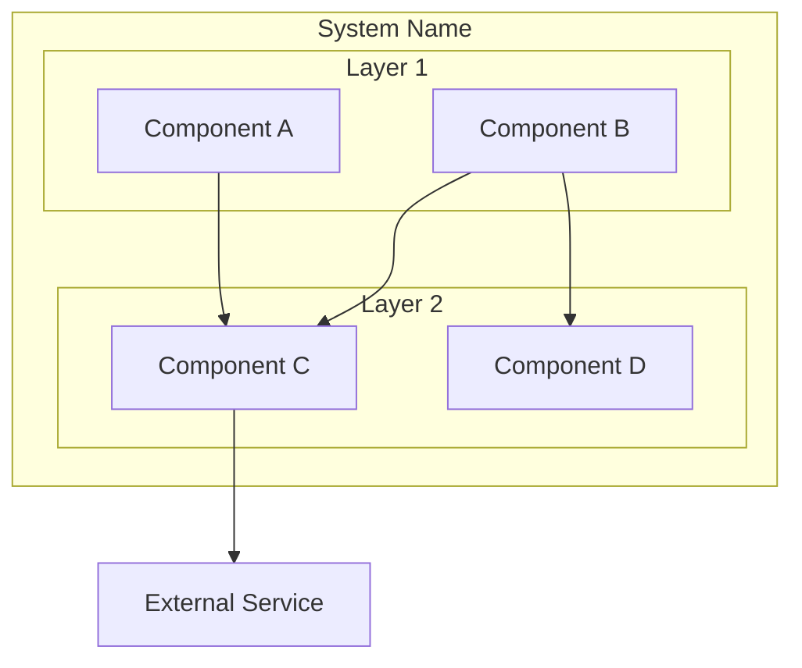
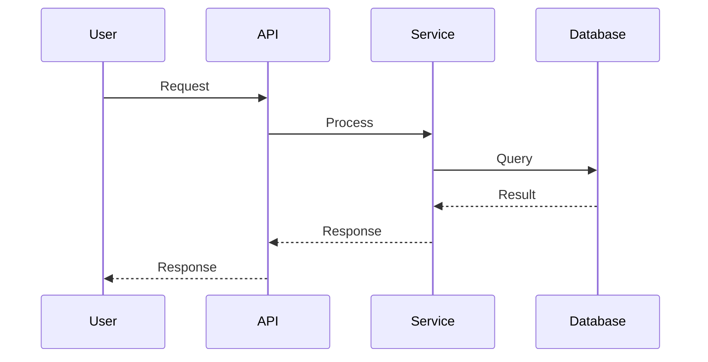
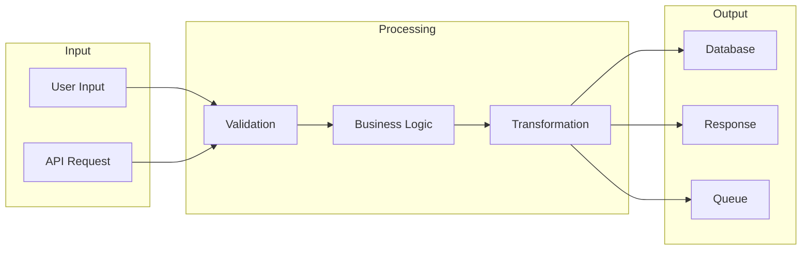
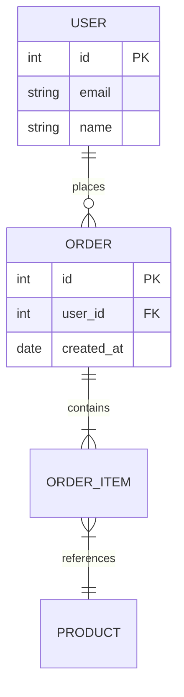
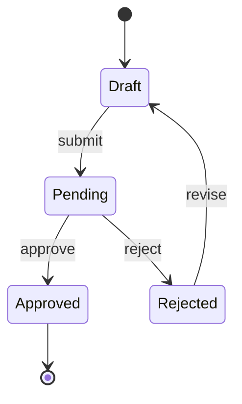
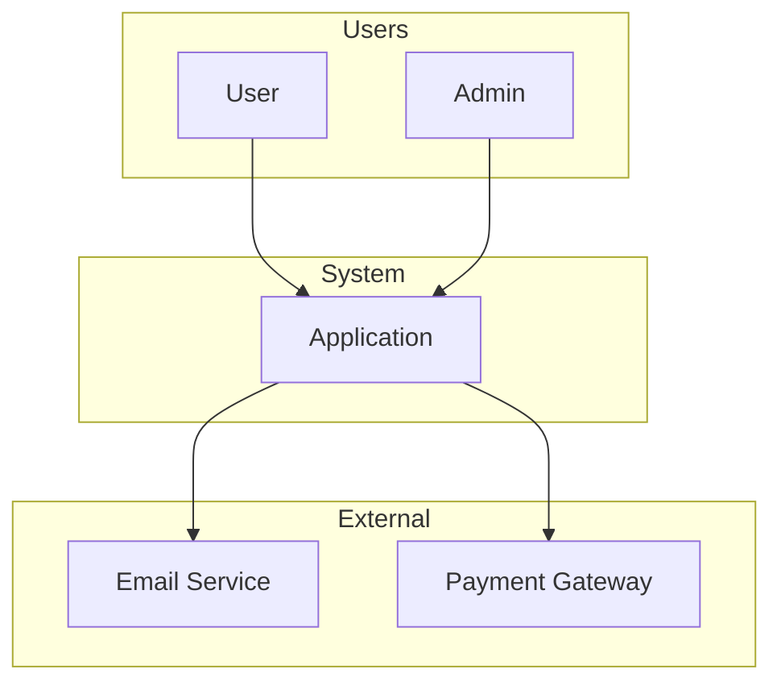
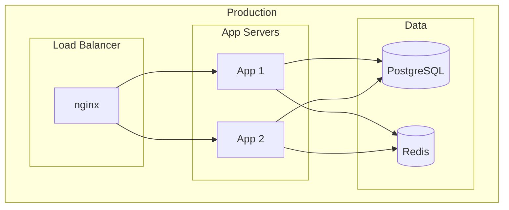

# Diagram Templates

## Component Diagram

```mermaid
graph TB
    subgraph "System Name"
        subgraph "Layer 1"
            A[Component A]
            B[Component B]
        end
        
        subgraph "Layer 2"
            C[Component C]
            D[Component D]
        end
    end
    
    External[External Service]
    
    A --> C
    B --> C
    B --> D
    C --> External
```

## Sequence Diagram

```mermaid
sequenceDiagram
    participant U as User
    participant A as API
    participant S as Service
    participant D as Database
    
    U->>A: Request
    A->>S: Process
    S->>D: Query
    D-->>S: Result
    S-->>A: Response
    A-->>U: Response
```

## Data Flow Diagram

```mermaid
flowchart LR
    subgraph Input
        I1[User Input]
        I2[API Request]
    end
    
    subgraph Processing
        P1[Validation]
        P2[Business Logic]
        P3[Transformation]
    end
    
    subgraph Output
        O1[Database]
        O2[Response]
        O3[Queue]
    end
    
    I1 --> P1
    I2 --> P1
    P1 --> P2
    P2 --> P3
    P3 --> O1
    P3 --> O2
    P3 --> O3
```

## Entity Relationship (Simple)

```mermaid
erDiagram
    USER ||--o{ ORDER : places
    ORDER ||--|{ ORDER_ITEM : contains
    ORDER_ITEM }|--|| PRODUCT : references
    
    USER {
        int id PK
        string email
        string name
    }
    
    ORDER {
        int id PK
        int user_id FK
        date created_at
    }
```

## State Diagram

```mermaid
stateDiagram-v2
    [*] --> Draft
    Draft --> Pending: submit
    Pending --> Approved: approve
    Pending --> Rejected: reject
    Approved --> [*]
    Rejected --> Draft: revise
```

## C4 Context (Simplified)

```mermaid
graph TB
    subgraph "Users"
        User[User]
        Admin[Admin]
    end
    
    subgraph "System"
        App[Application]
    end
    
    subgraph "External"
        Email[Email Service]
        Payment[Payment Gateway]
    end
    
    User --> App
    Admin --> App
    App --> Email
    App --> Payment
```

## Deployment Diagram

```mermaid
graph TB
    subgraph "Production"
        subgraph "Load Balancer"
            LB[nginx]
        end
        
        subgraph "App Servers"
            A1[App 1]
            A2[App 2]
        end
        
        subgraph "Data"
            DB[(PostgreSQL)]
            Cache[(Redis)]
        end
    end
    
    LB --> A1
    LB --> A2
    A1 --> DB
    A2 --> DB
    A1 --> Cache
    A2 --> Cache
```
