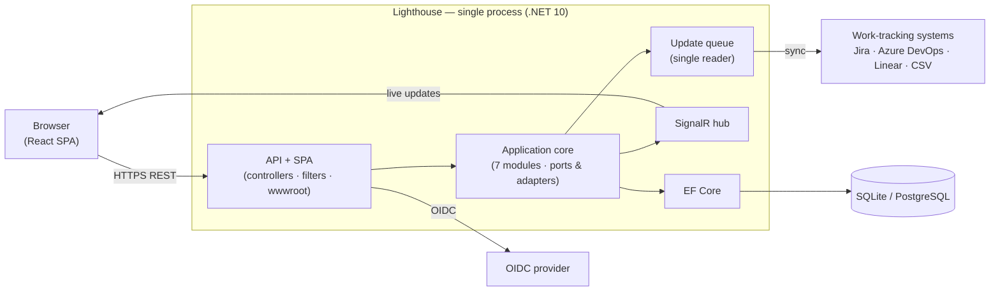
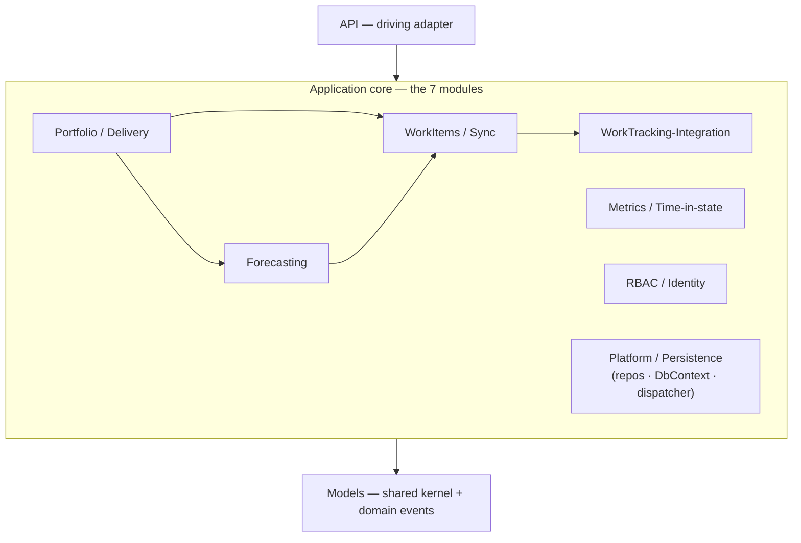
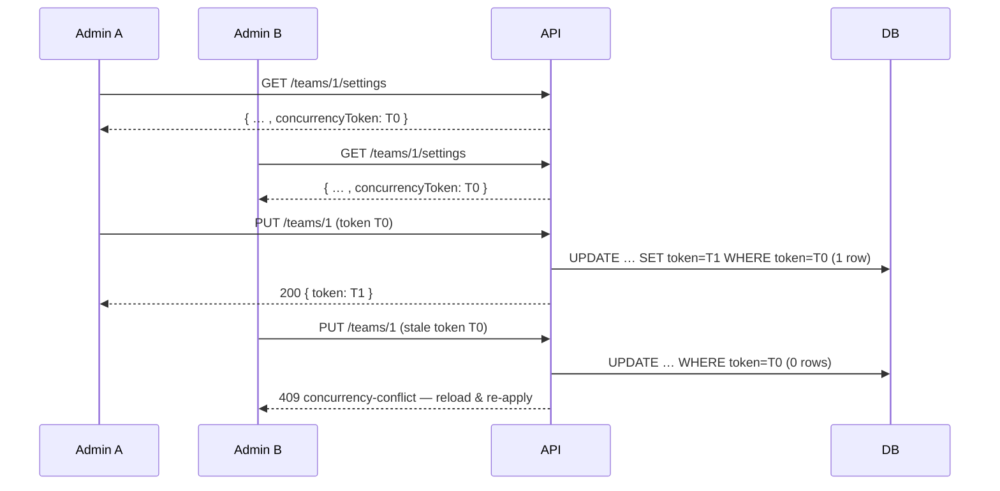

# Lighthouse — Architecture Overview

> **What this is.** A single, readable description of Lighthouse's **target architecture** and how the app is built — the shape you should have in your head before reading any feature delta or ADR. It is an *explanation* document: it links out to the detailed sources rather than restating them.
>
> **Where the detail lives** (all under [`docs/product/architecture/`](docs/product/architecture/)):
> - [ADR-027](docs/product/architecture/adr-027-target-architecture-modular-monolith-domain-events-cqrs-lite.md) — the accepted target-architecture decision this overview realises (D1–D8 + concurrency).
> - [`brief.md`](docs/product/architecture/brief.md) — the per-feature DESIGN deltas (component decompositions, driving/driven ports per feature). Accreted over time; consult per feature.
> - [`c4-diagrams.md`](docs/product/architecture/c4-diagrams.md) — C4 Context / Container / Component diagrams.
> - `adr-001 … adr-030` — point decisions (in that folder). The index at the end maps the load-bearing ones.
>
> **Status.** The dispatcher seam, the seven enforced module boundaries, and optimistic-concurrency tokens described below are **implemented**, not aspirational (ADO epic #5121). Where something is deliberately *not* built, it says so.
>
> **Maintenance.** Keep this overview current with the **general concepts** — not feature-level detail. When an architectural concept changes (a module, a seam, a cross-cutting mechanism, a topology, a load-bearing constraint), update the affected section here in the same change. Per-feature specifics stay in `brief.md` / the ADRs, never here.

---

## 1. In one paragraph

Lighthouse is a software-delivery **forecasting** tool: it pulls work items from a work-tracking system (Jira, Azure DevOps, Linear, or CSV), keeps a local projection, and runs Monte-Carlo forecasts plus flow metrics over them. It is a **single-instance, single-writer modular monolith** built ports-and-adapters (hexagonal): an ASP.NET Core backend (OOP, C#) serving a React SPA from `wwwroot`, persisting through EF Core to a provider-switched store (SQLite by default, PostgreSQL for server deployments). Heavy work runs on an in-process background queue; clients get live updates over SignalR. The realistic load is **~20–150 users, rarely concurrent** — so the architecture optimises for correctness, simplicity, and a zero-dependency standalone binary over horizontal scale.



---

## 2. Architectural style & the load-bearing constraints

- **Modular monolith, ports-and-adapters (hexagonal).** Application/business logic depends only on *ports* (interfaces); concrete adapters (EF Core, HTTP controllers, connectors, SignalR) sit at the edges and depend inward. One deployable, one process.
- **Single-instance / single-writer is load-bearing.** Three in-process singletons assume one process owns the data: the **update queue** (`UpdateQueueService`, a single-reader `Channel<Func<Task>>`), the **maintenance gate** (`DatabaseMaintenanceGate`), and the **SignalR hub**. Anything that breaks this (horizontal scale-out, an out-of-process broker) trades proven correctness for throughput the load profile does not need — and is explicitly rejected (ADR-027 D4).
- **Paradigm.** Backend is OOP C# (.NET 10). Frontend is React 18 + TypeScript, functional-leaning (hooks, pure components) but part of an overall OOP project.
- **One architecture serves every topology** (standalone single binary, docker + Postgres, k8s `replicas: 1`, possible future SaaS) **without forking** — via the provider-switched EF boundary, not per-topology builds.

---

## 3. Runtime shape (how a request and a refresh flow)

**Synchronous read/command (UI → API).** Browser → `https://…/api/{v1|latest}/…` → an MVC **controller** (driving adapter) → an application **service** (port) → a **repository** (driven adapter) → EF Core → DB. The controller maps the result to a DTO and returns it. Read endpoints (metrics, forecasts) are served from cached DTOs where hot.

**Background refresh (the write/sync path).** A scheduled `*Updater` (e.g. `PortfolioUpdater`, `TeamUpdater`) runs on the **single-reader update queue**: pull work items from the connector, reconcile the local projection, recompute deliveries/forecasts, write back. Because one reader drains the channel, operations on the same entity are serialised — this is the canonical "exclusive operation on entity X" primitive (use `IUpdateQueueService.EnqueueUpdate` / `EnqueueAndAwaitAsync`, never a parallel semaphore).

**Live updates (API → UI).** Completed background work raises a SignalR `GlobalUpdateNotification`; the SPA refreshes the affected view. No polling.

**Reactions (publish/subscribe, in-process).** After a refresh, an updater **publishes a domain event** (§5) instead of hand-wiring reactions; subscribers (cache invalidation, cross-aggregate forecast triggers, future notifications) run as handlers. Transport only — see §5.

---

## 4. The seven modules

The codebase is one assembly organised into **seven logical modules** (namespace folders), with boundaries **enforced at test time** by `TngTech.ArchUnitNET` (ADO #5101). No physical assembly split — that would complicate the single-binary publish for enforcement the test rules already give (ADR-027 D5).

| # | Module | Responsibility | Anchor namespaces |
|---|---|---|---|
| 1 | **WorkTracking-Integration** | Connectors (Jira / ADO / Linear / CSV), auth & OAuth strategies, issue hydration | `Services.*.WorkTrackingConnectors`, `Factories` |
| 2 | **WorkItems / Sync** | `WorkItemService`, sync delta, state-transition capture, team-data service | `Services.*.WorkItems`, `.TeamData`, `.WorkItemRules` |
| 3 | **Forecasting** | Monte-Carlo simulation, forecast services, forecast-filter rule engine | `Services.*.Forecast` |
| 4 | **Portfolio / Delivery** | The `*Updater` pipelines, the update queue, delivery rules, write-back | `Services.Implementation.BackgroundServices`, `Services.Interfaces.Update` |
| 5 | **Metrics / Time-in-state** | Throughput, cycle-time, percentiles, cumulative-state-time, blackout, RAG (flat in `Services.Implementation`) | (type-set, e.g. `*MetricsService`, `Percentile/XmR/Baseline*`) |
| 6 | **RBAC / Identity** | Authorization, RBAC administration, licensing/premium gate | `Services.*.Auth`, `.Authorization`, `.Licensing` |
| 7 | **Platform / Persistence** | `LighthouseAppContext`, repositories, DB management, **domain-event dispatcher**, seeding, OAuth token store | `Data`, `Services.*.Repositories`, `.DatabaseManagement`, `.DomainEvents`, `.Seeding`, `.OAuth` |

Plus two non-module bands:
- **`Models` — the shared kernel** at the bottom. Entities, value objects, **and the DTOs that services return** (relocated out of `API.DTO` so the core never depends on the API layer — ADO #5101). Everything may depend downward on `Models`.
- **`API` — the driving adapter** at the top (controllers, filters, request/response DTOs that are *only* consumed by controllers). Depends down on the modules; nothing depends up on it.



> Dependencies point **downward** (API → core → Models); the sideways arrows are the legal cross-module edges. The enforced hexagonal seam is that **no core module points back up to `API`**.

### Enforced dependency rules (ArchUnitNET, run in `dotnet test`)

- **`Services` (the whole application core) ↛ `API`** — the hexagonal seam. DTOs the core returns live in `Models.*`, never `API.DTO`. *(Green; the metrics/forecast/blackout/oauth-health DTOs were relocated to `Models.*` to make this hold.)*
- **`Models` (kernel) ↛ `API`** — the kernel never depends upward on the driving adapter. *(`Models ↛ Services` is a known, documented gap: `IEntity` and the `WorkTrackingSystems` enum still live under `Services.*`; relocating them is a separate follow-up.)*
- **WorkTracking-Integration is a leaf input adapter** — it must not depend on Forecasting, Portfolio/Delivery, or WorkItems/Sync.
- **The domain-event dispatcher and its handlers must not call `IServiceProvider.GetRequiredService`** — the seam must not re-introduce the service-locator it removes (§5).
- A handful of feature-specific seam rules (e.g. metrics read transitions only via repository ports; `WorkItemService` is the sole writer of transitions) live alongside.

> **Mechanism note.** Architecture tests use `TngTech.ArchUnitNET` (adopted in #5101). Two checks that ArchUnitNET cannot express — exact public-signature pinning (`DeliveryRuleServiceApiPreservationTest`) and the `RuleEvaluator` parameterless-ctor purity pin — remain hand-rolled reflection tests by design.

---

## 5. The in-process domain-event dispatcher (transport, **not** event sourcing)

A lightweight in-house seam (ADO #5098/#5099, ADR-027 D1–D3) that decouples "a thing happened" from "the reactions to it":

- **`IDomainEventDispatcher.PublishAsync<TEvent>(evt, ct)`** — a thin router. It resolves handlers via the **typed `IEnumerable<IDomainEventHandler<TEvent>>`** from a fresh DI scope (`GetServices`, **never** `GetRequiredService`), and invokes each. Event records are POCO `record`s under `Models/Events/` (kernel — below both API and Services).
- **After-commit by default.** Heavy work routes onto the existing update queue; the dispatcher does not open transactions.
- **Per-handler isolation.** Each handler runs in its own try/catch (log-and-continue). A throwing handler neither aborts its siblings nor loses the already-committed fact; **recovery is the next scheduled re-sync — there is no outbox** (an accepted trade, valid because facts are DB-derivable).
- **It is a transport, not a store, and not Event Sourcing (ADR-027 D7).** Persisting an event is a *separate, opt-in subscriber/sink* (#5017-class) with its own retention/PII rules — never an automatic write by the dispatcher. The `WorkItemStateTransition` history is a projection of the external changelog, not a system of record.

```mermaid
sequenceDiagram
  participant U as PortfolioUpdater
  participant D as IDomainEventDispatcher
  participant H as Handlers (typed IEnumerable)
  participant Q as Update queue
  U->>U: refresh + commit
  U->>D: PublishAsync(PortfolioFeaturesRefreshed) — after-commit
  D->>D: CreateScope() + GetServices&lt;handler&gt;()
  loop each handler (isolated try/catch)
    D->>H: HandleAsync(event)
    H->>Q: EnqueueUpdate(heavy work)
  end
  Note over D,H: a throwing handler is logged & skipped;<br/>the committed fact survives and recovers on the next re-sync (no outbox)
```

**Event families** (where the seam pays off): A — refresh-completed pipelines (`PortfolioFeaturesRefreshed`, `TeamDataRefreshed`); B — lifecycle (`*Created`/`*Deleted`); C — cross-aggregate triggers (e.g. team-refresh → forecast trigger, now a `TeamDataRefreshed` handler instead of a cross-module call); D — work-item state transitions (`WorkItemTransitioned`/`BecameStale`/`Blocked` — enables proactive push); E — connection/credential health.

> **Deliberately kept imperative.** `PortfolioUpdater.Update` is a strictly-ordered, single-scope pipeline (each step reads prior steps' results on the same tracked entity). Only genuinely *independent* reactions (e.g. metric-cache invalidation, the fire-and-forget forecast trigger) are peeled into handlers; the ordered core stays imperative because after-commit handlers run in fresh scopes (ADR-027 D2 reserves an in-transaction tier for true invariants only).

---

## 6. CQRS-lite (same store, separated paths)

Not full CQRS — **command/query separation on one store** (ADR-027 D6):

- **Write path** — `*Updater` services + repositories mutate aggregates.
- **Read path** — metrics services (`BaseMetricsService` and subclasses) compute and serve **cached DTOs**; cache invalidation is a *subscriber* to the relevant refresh event (structurally fixing the historical "scattered remembered invalidation" bug class), not a remembered imperative call.

A separate read store was rejected: there is no read-throughput bottleneck at this scale, and a second store would fight the no-fork / standalone goals.

---

## 7. Concurrency & consistency

- **The update queue** (§3) serialises sync-path writes per entity — the primary concurrency-correctness mechanism for the high-churn path.
- **Optimistic-concurrency tokens** (ADO #5100, ADR-027 concurrency section) close the one genuine human-vs-human gap: two admins editing the same **config aggregate** would otherwise silently last-writer-wins. The seven human-edited config roots — **Team, Portfolio, WorkTrackingSystemConnection, Delivery, and the RBAC trio (UserProfile, RbacGroupMapping, ApiKey)** — implement `IConcurrencyTokenEntity` (a provider-agnostic `Guid ConcurrencyToken`, `.IsConcurrencyToken()` on both providers — no `xmin`/rowversion fork).
  - The token is read on the config GET, echoed on save, and a stale save returns **HTTP 409** (`ConcurrencyConflictExceptionFilter` → ProblemDetails `code: "concurrency-conflict"`), distinct from the 403 authorization path so clients can offer "reload & re-apply".
  - **The token advances only on the human-edit path** (the controller/RBAC edit sets a fresh token + the client token as the EF `OriginalValue`), **not on every save** — because Team/Portfolio rows are also written by system/background/cascade operations, and advancing on those would churn the token and spuriously 409 a concurrent user edit. The FE chains the refreshed token across consecutive auto-saves and serialises in-flight saves.
  - The blanket `LighthouseAppContext.SaveWithRetry` reload-and-retry (last-writer-wins) is scoped to **bypass tokened-aggregate conflicts** so it can't silently swallow the 409; high-churn sync entities (`WorkItem`/`Feature`/`FeatureWork`/`WorkItemStateTransition`) are deliberately **never tokened** (a guard test pins this).


- **Consistency contract.** *Read-your-writes* for a user's own config edits; *eventual / "as-of last sync"* for sync-derived metrics and forecasts, labelled honestly in the UI.

---

## 8. Persistence

- **EF Core**, provider-switched in `DatabaseConfigurator`: `UseSqlite` (default; WAL mode) or `UseNpgsql` (server), chosen from the `Database:Provider` config string.
- **Two migration assemblies** — `Lighthouse.Migrations.Sqlite` and `Lighthouse.Migrations.Postgres`. Generate migrations only via the **`Create-Migration.ps1`** script (spins up an ephemeral Docker Postgres for the Postgres half) — never `dotnet ef migrations add` directly.
- `LighthouseAppContext` overrides `SaveChangesAsync` to `PreprocessDataBeforeSave` (encrypt secrets, stamp initial concurrency tokens on `Added`) then `SaveWithRetry` (§7).

---

## 9. Cross-cutting concerns

- **Authorization (RBAC).** All RBAC business logic flows through the single inbound port **`IRbacAdministrationService`**; controllers call only the interface. On the frontend, **all UI gating derives from the `useRbac()` hook** — no component fetches `/authorization/my-summary` directly. A permissive fallback (`isRbacEnabled:false, isSystemAdmin:true` on a failed summary call) guarantees an RBAC-infrastructure failure never locks users out. (ADR-001.)
- **Authentication.** OIDC via ASP.NET Core middleware; group claims resolved to roles at read time. OAuth credentials for connectors are stored separately with single-flight refresh (ADR-007/008/010).
- **Licensing / premium.** A license gate (`canUsePremiumFeatures`) flows through `IForecastFilterRuleService.GetEffectiveRuleSet`, not via a direct `ILicenseService` dependency on metrics services (enforced).
- **CORS fail-closed, rate limiting, security headers** at the API edge (ADR-005).

---

## 10. Frontend architecture

- React 18 + TypeScript (strict), MUI, React Router, Vite. Built into the backend's `wwwroot` and served by the same process (SPA fallback).
- **Schema-first at trust boundaries** (Zod) for API responses/forms; plain `type` for internal data.
- Reusable hooks own cross-cutting client state: **`useRbac`** (authorization gating), **`useModifySettings`** (the config auto-save state machine — debounced save, `idle/saving/saved/error/conflict` states, optimistic-concurrency-token chaining, in-flight serialisation; ADR-029/030).
- One **API service adapter per resource** (`TeamService`, `MetricsService`, …) over a `BaseApiService`; `ApiError` carries the HTTP status so callers can branch (e.g. 409 → reload-and-reapply).

---

## 11. Scale & deployment topologies

Single-instance, vertically scaled (sizing ≈ 30 QPS peak, 30–100× headroom over the real load). One provider-switched binary serves all topologies:

| Topology | Shape |
|---|---|
| **Standalone** | Single self-contained binary + SQLite file. Zero external dependencies (the standalone story forbids a mandatory broker). |
| **Docker + PostgreSQL** | Container image; Postgres connection string via env. |
| **Kubernetes** | The same image, **`replicas: 1`** + readiness/liveness probes + Secret-sourced credentials. k8s is *packaging*, not an architecture split (ADR-027 D4). |
| **SaaS** | Kept *open* via the clean EF boundary; **not built**. |

Rejected for this scale: horizontal scale-out, out-of-process message broker, microservices, full CQRS / separate read store, Event Sourcing, MediatR (commercial-licence + ROI). See ADR-027 "Alternatives Considered".

---

## 12. Quality attributes & enforcement

- **Correctness** — single-writer queue + single RBAC port + permissive RBAC fallback + optimistic tokens on config edits.
- **Maintainability** — adding a reaction is "add a handler", not "edit a controller"; adding a guarded UI control touches only the component + `useRbac`.
- **Testability** — ports enable mock isolation; integration tests run on real SQLite (`TestWebApplicationFactory`); the InMemory provider is used only where token/relational enforcement isn't under test.
- **Enforcement is executable**: TngTech.ArchUnitNET module/seam rules (§4), the dispatcher gold test (publish → all handlers fire; a throwing handler doesn't lose the committed fact), the two-stale-writes 409 integration tests, and the SonarCloud `new_violations = 0` gate. CI parity gates (FE `pnpm test`/`pnpm build`/Biome; BE `dotnet build` zero-warning/`dotnet test`) are the local definition of done. Durable CI/Sonar lessons live in `docs/ci-learnings.md`.

---

## 13. How the app is built & run

**Build / run locally**
- Backend: `dotnet build` (zero warnings — `TreatWarningsAsErrors`), `dotnet test`.
- Frontend: `pnpm test`, `pnpm build` (`tsc -b` + Vite → `Lighthouse.Backend/Lighthouse.Backend/wwwroot`; Biome runs as the `prebuild` hook).
- Run the full app from source: `pnpm build` (FE → wwwroot) → `dotnet run` (serves API + SPA, SQLite by default). E2E: Playwright (Page Object Model) against the running app.
- EF migrations: `Create-Migration.ps1` (both providers).

**Test stack** — Backend: NUnit + Moq + `Microsoft.EntityFrameworkCore.InMemory` + `WebApplicationFactory`; net10.0. Frontend: Vitest + React Testing Library. E2E: Playwright. Architecture: TngTech.ArchUnitNET (+ a few reflection contract-pins).

**CI** — `Build And Deploy Lighthouse` on `main`: build, Verify Backend, Verify Frontend, build-from-source E2E (`verifysqlite`/`verifypostgres`/`verifyauth`), Docker image, and the SonarCloud quality gate. Trunk-based: changes push directly to `main`.

---

## 14. ADR index (load-bearing)

| ADR | Topic |
|---|---|
| **027** | **Target architecture: modular monolith + in-process domain-event dispatcher + CQRS-lite + concurrency (the basis for this overview)** |
| 001 | RBAC UI-gating strategy (`useRbac`, permissive fallback) |
| 005 | Rate-limiting middleware |
| 007 / 008 / 010 / 011 | OAuth provider registry, credential separation, single-flight refresh, popup flow |
| 012 / 013 | Rule-engine generalisation & match semantics (forecast filter) |
| 015 / 016 / 017 | Work-item state-transition placement, derivation, capture/dispatch |
| 026 | Cross-surface staleness derivation & blocked precedence |
| 029 / 030 | Auto-save-on-valid mechanism + dependent-data reload split |

The full set (001–030), the per-feature DESIGN deltas ([`brief.md`](docs/product/architecture/brief.md)), and the diagrams ([`c4-diagrams.md`](docs/product/architecture/c4-diagrams.md)) all live under [`docs/product/architecture/`](docs/product/architecture/).
