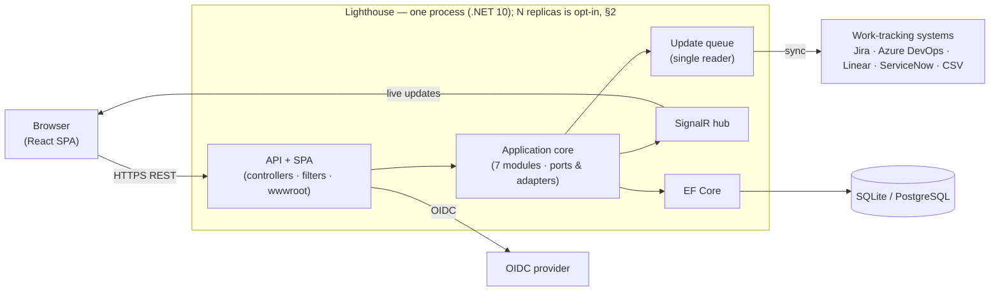
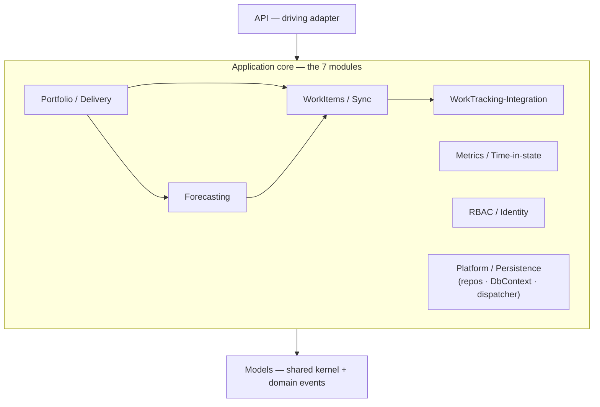
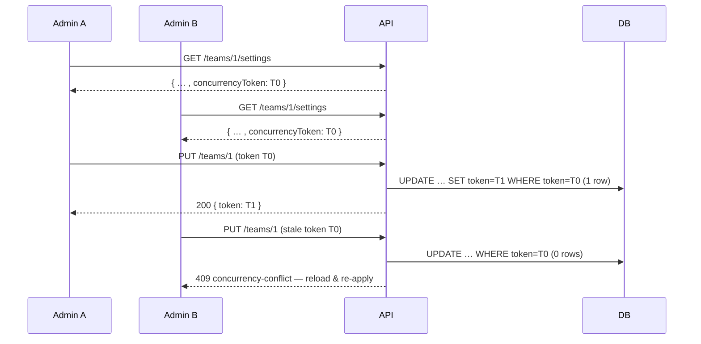

# Lighthouse — Architecture Overview

> **What this is.** A single, readable description of Lighthouse's **target architecture** and how the app is built — the shape you should have in your head before reading any feature delta or ADR. It is an *explanation* document: it links out to the detailed sources rather than restating them.
>
> **Where the detail lives** (all under [`docs/product/architecture/`](docs/product/architecture/)):
> - [ADR-027](docs/product/architecture/adr-027-target-architecture-modular-monolith-domain-events-cqrs-lite.md) — the accepted target-architecture decision this overview realises (D1–D8 + concurrency).
> - [`brief.md`](docs/product/architecture/brief.md) — the per-feature DESIGN deltas (component decompositions, driving/driven ports per feature). Accreted over time; consult per feature.
> - [`c4-diagrams.md`](docs/product/architecture/c4-diagrams.md) — C4 Context / Container / Component diagrams.
> - `adr-001 … adr-186` — point decisions (in that folder). The index at the end maps the load-bearing ones.
>
> **Status.** The dispatcher seam, the seven enforced module boundaries, optimistic-concurrency tokens, the config-gated cluster substrate (§2), the secret-encryption envelope and key custody (§9), and the embed surface (§11) described below are all **implemented**, not aspirational. Where something is deliberately *not* built, it says so.
>
> **Maintenance.** Keep this overview current with the **general concepts** — not feature-level detail. When an architectural concept changes (a module, a seam, a cross-cutting mechanism, a topology, a load-bearing constraint), update the affected section here in the same change. Per-feature specifics stay in `brief.md` / the ADRs, never here.

---

## 1. In one paragraph

Lighthouse is a software-delivery **forecasting** tool: it pulls work items from a work-tracking system (Jira, Azure DevOps, Linear, ServiceNow, or CSV), keeps a local projection, and runs Monte-Carlo forecasts plus flow metrics over them. It is a **single-writer modular monolith** — single-instance by default, optionally multi-replica behind a config-gated cluster substrate (§2) — built ports-and-adapters (hexagonal): an ASP.NET Core backend (OOP, C#) serving a React SPA from `wwwroot`, persisting through EF Core to a provider-switched store (SQLite by default, PostgreSQL for server deployments). Heavy work runs on an in-process background queue; clients get live updates over SignalR. The realistic load is **~20–150 users, rarely concurrent** — so the architecture optimises for correctness, simplicity, and a zero-dependency standalone binary over horizontal scale.

```mermaid
graph LR
  Browser["Browser<br/>(React SPA)"]
  WTS["Work-tracking systems<br/>Jira · Azure DevOps · Linear · ServiceNow · CSV"]
  IdP["OIDC provider"]
  DB[("SQLite / PostgreSQL")]
  subgraph Proc["Lighthouse — one process (.NET 10); N replicas is opt-in, §2"]
    API["API + SPA<br/>(controllers · filters · wwwroot)"]
    Core["Application core<br/>(7 modules · ports & adapters)"]
    Queue["Update queue<br/>(single reader)"]
    Hub["SignalR hub"]
    EF["EF Core"]
    API --> Core
    Core --> Queue
    Core --> Hub
    Core --> EF
  end
  Browser -->|HTTPS REST| API
  Hub -->|live updates| Browser
  API -->|OIDC| IdP
  Queue -->|sync| WTS
  EF --> DB
```

---

## 2. Architectural style & the load-bearing constraints

- **Modular monolith, ports-and-adapters (hexagonal).** Application/business logic depends only on *ports* (interfaces); concrete adapters (EF Core, HTTP controllers, connectors, SignalR) sit at the edges and depend inward. One deployable, one process.
- **Single-writer per entity is load-bearing; single-*instance* is the default, not the only shape.** Three seams assume one owner of the data: the **update queue** (`UpdateQueueService`, a single-reader `Channel<Func<Task>>`), the **maintenance gate** (`DatabaseMaintenanceGate`), and the **SignalR hub**. By default all three are in-process, and a standalone instance must keep working with **zero external dependencies** (ADR-027 D1).
- **The cluster branch is config-gated behind the same ports** (epic #5305, ADRs 075–078, which *amend* ADR-027 rather than replace it). When `ConnectionStrings:Redis` is present, SignalR gains a Redis backplane, the queue swaps `IUpdateStatusStore` / `IUpdateExecutionLock` / `IUpdateCompletionNotifier` from their in-process adapters to a Redis status store + a Postgres advisory lock + Redis pub/sub, the data-protection key ring moves to Redis, and boot-time `Database.Migrate()` runs under a Postgres advisory lock so one replica migrates while the rest wait. **Absent that connection string the code path is the single-instance one, unchanged** — a guard test pins this. What stays rejected is *unconditional* distribution: an always-on broker, microservices, a second store (ADR-027 D4).
- **Paradigm.** Backend is OOP C# (.NET 10). Frontend is React 19 + TypeScript, functional-leaning (hooks, pure components) but part of an overall OOP project.
- **One architecture serves every topology** (standalone single binary, docker + Postgres, k8s at one or many replicas, namespace-per-tenant hosting) **without forking** — via the provider-switched EF boundary and the substrate adapters above, not per-topology builds. §13 lists them.

---

## 3. Runtime shape (how a request and a refresh flow)

**Synchronous read/command (UI → API).** Browser → `https://…/api/{v1|latest}/…` → an MVC **controller** (driving adapter) → an application **service** (port) → a **repository** (driven adapter) → EF Core → DB. The controller maps the result to a DTO and returns it. Read endpoints (metrics, forecasts) are served from cached DTOs where hot.

**Background refresh (the write/sync path).** A scheduled `*Updater` (e.g. `PortfolioUpdater`, `TeamUpdater`) runs on the **single-reader update queue**: pull work items from the connector, reconcile the local projection, recompute deliveries/forecasts, write back. Because one reader drains the channel, operations on the same entity are serialised — this is the canonical "exclusive operation on entity X" primitive (use `IUpdateQueueService.EnqueueUpdate` / `EnqueueAndAwaitAsync`, never a parallel semaphore). Admission goes through `IUpdateStatusStore.TryAdmit` and execution through `IUpdateExecutionLock`, so in a multi-replica deployment "at most one active lifecycle per `UpdateKey`" is a *fleet-wide* invariant held by a Postgres advisory lock rather than a process-local one (ADR-076). A rejected admission parks a single coalesced follow-up and `Requeue`s the key, so the key never reads as idle during the handover. The sync reports its own scope back to the updater as a `SyncOutcome` (mode, records scanned, records fetched), sourced where the fetch happens rather than counted afterwards; the updater persists it on the `RefreshLog` row and emits one Information-level summary line per completed update. Everything the update *iterated over* is Debug (Epic #5687). How much a refresh downloads is decided per cycle by the pure `SyncModeResolver` (ADR-138): with the `DeltaSync` optional feature on and a connector that answers `SupportsIncrementalSync(connection)` (ADR-139 — per connection, because Jira Cloud and Data Center are one class deciding deployment at runtime), the fetch runs in two phases — sweep the whole query for `(referenceId, changedAt)`, then download payloads only for the records whose stamp moved. Removal stays a set difference against the **swept** set, never against what was downloaded, so nothing about deletion changes with the mode. Anything ambiguous — nobody opted in, connector cannot sweep, sweep failed, a stored record without a stamp — resolves to a full download; there is no partial mode. Time-driven derivations (staleness, rollup, extrapolation, forecasts) run over the *stored* set every cycle regardless of mode (ADR-141), because the record that stops being fetched is exactly the record that goes stale.

**Live updates (API → UI).** Completed background work raises a SignalR `GlobalUpdateNotification`; the SPA refreshes the affected view. No polling.

**Forecasting (inside the refresh, and on demand).** A Monte-Carlo run is one set of trials over the whole forecastable set, not one run per Team combined afterwards. Every Team advances on a **single shared clock within a trial** (ADR-155), which is what lets a Feature delivered by one Team sit behind a Feature another Team has not finished; each Feature draws from its own addressable stream so a trial stays reproducible and a Feature's draws do not shift when the set around it changes (ADR-154). Within a trial a Feature is not eligible to be worked until everything it waits on has completed *in that trial* — and which recorded dependency counts is decided by one pure honour policy, the same function the on-screen warnings render from, so the column and the date can never disagree (ADR-158). A blocker that cannot be forecast at all is dropped from the wait rather than silently treated as absent, and the resulting date is reported as a floor (ADR-159). Joint likelihood over a set of Features still combines per-Feature distributions as ADR-110 describes — replacing that with a per-trial max was proposed and deferred (ADR-156). A licence gate sits at the honour policy, not inside the simulation, so an unlicensed instance runs the same engine over an empty dependency set.

**Reactions (publish/subscribe, in-process).** After a refresh, an updater **publishes a domain event** (§5) instead of hand-wiring reactions; subscribers (cache invalidation, cross-aggregate forecast triggers, future notifications) run as handlers. Transport only — see §5.

---

## 4. The seven modules

The codebase is one assembly organised into **seven logical modules** (namespace folders), with boundaries **enforced at test time** by `TngTech.ArchUnitNET` (ADO #5101). No physical assembly split — that would complicate the single-binary publish for enforcement the test rules already give (ADR-027 D5).

| # | Module | Responsibility | Anchor namespaces |
|---|---|---|---|
| 1 | **WorkTracking-Integration** | Connectors (Jira / ADO / Linear / CSV / ServiceNow), auth & OAuth strategies, issue hydration. Every connector dates started/finished work through the one shared `WorkItemCategoryCrossing` rule — an arrival counts only when it enters a state category from *outside* it, latest crossing wins — so `Resolved → Closed` re-dates nothing while `Done → Doing → Done` does (Bug #5621) | `Services.*.WorkTrackingConnectors`, `Factories` |
| 2 | **WorkItems / Sync** | `WorkItemService`, sync delta, state-transition capture, team-data service | `Services.*.WorkItems`, `.TeamData`, `.WorkItemRules` |
| 3 | **Forecasting** | Monte-Carlo simulation, forecast services, forecast-filter rule engine | `Services.*.Forecast` |
| 4 | **Portfolio / Delivery** | The `*Updater` pipelines, the update queue, delivery rules, write-back | `Services.Implementation.BackgroundServices`, `Services.Interfaces.Update` |
| 5 | **Metrics / Time-in-state** | Throughput, cycle-time, percentiles, cumulative-state-time, blackout, RAG (flat in `Services.Implementation`) | (type-set, e.g. `*MetricsService`, `Percentile/XmR/Baseline*`) |
| 6 | **RBAC / Identity** | Authorization, RBAC administration, licensing/premium gate | `Services.*.Auth`, `.Authorization`, `.Licensing` |
| 7 | **Platform / Persistence** | `LighthouseAppContext`, repositories, DB management, **domain-event dispatcher**, seeding, OAuth token store | `Data`, `Services.*.Repositories`, `.DatabaseManagement`, `.DomainEvents`, `.Seeding`, `.OAuth` |

Plus three non-module bands:
- **`Models` — the shared kernel** at the bottom. Entities, value objects, **and the DTOs that services return** (relocated out of `API.DTO` so the core never depends on the API layer — ADO #5101). Everything may depend downward on `Models`.
- **`API` — the driving adapter** at the top (controllers, filters, request/response DTOs that are *only* consumed by controllers). Depends down on the modules; nothing depends up on it.
- **The composition root & host band** — `Program.cs`, `Startup/`, `Configuration/`, `Health/`, `Standalone/`. Not a module and not under the boundary rules: it wires adapters to ports (including the in-process-vs-cluster adapter choice of §2) and owns the `/health/live`, `/health/ready` (drain-aware) and `/health/startup` endpoints plus graceful shutdown.

```mermaid
graph TD
  API["API — driving adapter"]
  subgraph CORE["Application core — the 7 modules"]
    WT["WorkTracking-Integration"]
    SYNC["WorkItems / Sync"]
    FC["Forecasting"]
    PD["Portfolio / Delivery"]
    MET["Metrics / Time-in-state"]
    RBAC["RBAC / Identity"]
    PLAT["Platform / Persistence<br/>(repos · DbContext · dispatcher)"]
  end
  KERNEL["Models — shared kernel + domain events"]
  API --> CORE
  CORE --> KERNEL
  SYNC --> WT
  PD --> SYNC
  PD --> FC
  FC --> SYNC
```

> Dependencies point **downward** (API → core → Models); the sideways arrows are the legal cross-module edges. The enforced hexagonal seam is that **no core module points back up to `API`**.

### Enforced dependency rules (ArchUnitNET, run in `dotnet test`)

- **`Services` (the whole application core) ↛ `API`** — the hexagonal seam. DTOs the core returns live in `Models.*`, never `API.DTO`. *(Green; the metrics/forecast/blackout/oauth-health DTOs were relocated to `Models.*` to make this hold.)*
- **`Models` (kernel) ↛ `API`** — the kernel never depends upward on the driving adapter. *(`Models ↛ Services` is a known, documented gap: `IEntity` and the `WorkTrackingSystems` enum still live under `Services.*`; relocating them is a separate follow-up.)*
- **WorkTracking-Integration is a leaf input adapter** — it must not depend on Forecasting, Portfolio/Delivery, or WorkItems/Sync.
- **The domain-event dispatcher and its handlers must not call `IServiceProvider.GetRequiredService`** — the seam must not re-introduce the service-locator it removes (§5).
- A handful of feature-specific seam rules (e.g. metrics read transitions only via repository ports; `WorkItemService` is the sole writer of transitions; every caller that orders Features goes through the one `FeatureOrdering` comparer rather than sorting for itself — ADR-132/134, with the policy itself stored as an `AppSetting`) live alongside.

> **Mechanism note.** Architecture tests use `TngTech.ArchUnitNET` (adopted in #5101). Two checks that ArchUnitNET cannot express — exact public-signature pinning (`DeliveryRuleServiceApiPreservationTest`) and the `RuleEvaluator` parameterless-ctor purity pin — remain hand-rolled reflection tests by design.

---

## 5. The in-process domain-event dispatcher (transport, **not** event sourcing)

A lightweight in-house seam (ADO #5098/#5099, ADR-027 D1–D3) that decouples "a thing happened" from "the reactions to it":

- **`IDomainEventDispatcher.PublishAsync<TEvent>(evt, ct)`** — a thin router. It resolves handlers via the **typed `IEnumerable<IDomainEventHandler<TEvent>>`** from a fresh DI scope (`GetServices`, **never** `GetRequiredService`), and invokes each. Event records are POCO `record`s under `Models/Events/` (kernel — below both API and Services).
- **After-commit by default.** Heavy work routes onto the existing update queue; the dispatcher does not open transactions.
- **Per-handler isolation.** Each handler runs in its own try/catch (log-and-continue). A throwing handler neither aborts its siblings nor loses the already-committed fact; **recovery is the next scheduled re-sync — there is no outbox** (an accepted trade, valid because facts are DB-derivable).
- **It is a transport, not a store, and not Event Sourcing (ADR-027 D7).** Persisting an event is a *separate, opt-in subscriber/sink* (#5017-class) with its own retention/PII rules — never an automatic write by the dispatcher. The `WorkItemStateTransition` history is a projection of the external changelog, not a system of record.

```mermaid
sequenceDiagram
  participant U as PortfolioUpdater
  participant D as IDomainEventDispatcher
  participant H as Handlers (typed IEnumerable)
  participant Q as Update queue
  U->>U: refresh + commit
  U->>D: PublishAsync(PortfolioFeaturesRefreshed) — after-commit
  D->>D: CreateScope() + GetServices&lt;handler&gt;()
  loop each handler (isolated try/catch)
    D->>H: HandleAsync(event)
    H->>Q: EnqueueUpdate(heavy work)
  end
  Note over D,H: a throwing handler is logged & skipped;<br/>the committed fact survives and recovers on the next re-sync (no outbox)
```

**Event families** (where the seam pays off): A — refresh-completed pipelines (`PortfolioFeaturesRefreshed`, `TeamDataRefreshed`); B — lifecycle (`*Created`/`*Deleted`); C — cross-aggregate triggers (e.g. team-refresh → forecast trigger, now a `TeamDataRefreshed` handler instead of a cross-module call; likewise `FeatureRankChanged` / `FeatureOrderingPolicyChanged` → a coalesced forecast recompute, ADR-133); D — work-item and feature state transitions (`WorkItemTransitioned`/`BecameStale`/`Blocked`/`Unblocked`, `FeatureBlocked`/`FeatureUnblocked` — the capture seam for blocked spells, ADR-068/104); E — connection/credential health; F — **history recorders**: handlers on the refresh events append the day's row to the forward-only snapshot tables (§6).

> **Deliberately kept imperative.** `PortfolioUpdater.Update` is a strictly-ordered, single-scope pipeline (each step reads prior steps' results on the same tracked entity). Only genuinely *independent* reactions (e.g. metric-cache invalidation, the fire-and-forget forecast trigger) are peeled into handlers; the ordered core stays imperative because after-commit handlers run in fresh scopes (ADR-027 D2 reserves an in-transaction tier for true invariants only).

---

## 6. CQRS-lite (same store, separated paths)

Not full CQRS — **command/query separation on one store** (ADR-027 D6):

- **Write path** — `*Updater` services + repositories mutate aggregates.
- **Read path** — metrics services (`BaseMetricsService` and subclasses) compute and serve **cached DTOs**; cache invalidation is a *subscriber* to the relevant refresh event (structurally fixing the historical "scattered remembered invalidation" bug class), not a remembered imperative call.

A separate read store was rejected: there is no read-throughput bottleneck at this scale, and a second store would fight the no-fork / standalone goals.

### Over-time history is a forward-only projection, not a query over the past

Most "how did this metric look last month?" questions cannot be answered by re-deriving from the work-item projection — the connector only ever gives us *now*, and a re-derivation would silently rewrite history whenever a rule, a mapping or a state definition changed. So each such metric gets its own **day-keyed snapshot table**, appended by a recording handler on the refresh event that produced it (§5 family F):

| Table | Records | ADRs |
|---|---|---|
| `DeliveryMetricSnapshot` | per-delivery progress, scope, epic count & size | 048 / 049 / 050 / 121 |
| `PercentilesOverTimeSnapshot` | cycle-time / age percentiles per owner per day | 106 / 107 / 108 |
| `BlockedCountSnapshot` | how many items were blocked that day | 069 / 099 |
| `ProcessBehaviorSnapshot` | XmR baselines & limits | 052 |

The rules that keep this honest: **write is idempotent on the day key** (a re-run overwrites the same row, never appends a second one), **the past is never backfilled** — the only backfill handlers that exist serve demo data — and the read path serves the series straight from the table, so a stored series stays exactly what the instance actually observed at the time.

### A closure pin is a record, not a series

Archiving a Delivery writes a different shape: **one row per Delivery** holding what it was showing at the moment it closed — the likelihood, the forecast dates and the Features that were in it (ADR-160). It is not day-keyed and it is never re-derived, because its whole point is to survive the live Features moving on underneath it. The archived read path is therefore **structurally unable to reach live Features** (ADR-161) rather than merely choosing not to, the aggregate refuses writes to an archived Delivery (ADR-164), and the active list excludes archived Deliveries through a narrowed port instead of a filter every caller has to remember (ADR-163).

---

## 7. Concurrency & consistency

- **The update queue** (§3) serialises sync-path writes per entity — the primary concurrency-correctness mechanism for the high-churn path.
- **Optimistic-concurrency tokens** (ADO #5100, ADR-027 concurrency section) close the one genuine human-vs-human gap: two admins editing the same **config aggregate** would otherwise silently last-writer-wins. The seven human-edited config roots — **Team, Portfolio, WorkTrackingSystemConnection, Delivery, and the RBAC trio (UserProfile, RbacGroupMapping, ApiKey)** — implement `IConcurrencyTokenEntity` (a provider-agnostic `Guid ConcurrencyToken`, `.IsConcurrencyToken()` on both providers — no `xmin`/rowversion fork).
  - The token is read on the config GET, echoed on save, and a stale save returns **HTTP 409** (`ConcurrencyConflictExceptionFilter` → ProblemDetails `code: "concurrency-conflict"`), distinct from the 403 authorization path so clients can offer "reload & re-apply".
  - **The token advances only on the human-edit path** (the controller/RBAC edit sets a fresh token + the client token as the EF `OriginalValue`), **not on every save** — because Team/Portfolio rows are also written by system/background/cascade operations, and advancing on those would churn the token and spuriously 409 a concurrent user edit. The FE chains the refreshed token across consecutive auto-saves and serialises in-flight saves.
  - The blanket `LighthouseAppContext.SaveWithRetry` reload-and-retry (last-writer-wins) is scoped to **bypass tokened-aggregate conflicts** so it can't silently swallow the 409; high-churn sync entities (`WorkItem`/`Feature`/`FeatureWork`/`WorkItemStateTransition`) are deliberately **never tokened** (a guard test pins this).

```mermaid
sequenceDiagram
  participant A as Admin A
  participant B as Admin B
  participant API
  participant DB
  A->>API: GET /teams/1/settings
  API-->>A: { … , concurrencyToken: T0 }
  B->>API: GET /teams/1/settings
  API-->>B: { … , concurrencyToken: T0 }
  A->>API: PUT /teams/1 (token T0)
  API->>DB: UPDATE … SET token=T1 WHERE token=T0  (1 row)
  API-->>A: 200 { token: T1 }
  B->>API: PUT /teams/1 (stale token T0)
  API->>DB: UPDATE … WHERE token=T0  (0 rows)
  API-->>B: 409 concurrency-conflict — reload & re-apply
```

- **Consistency contract.** *Read-your-writes* for a user's own config edits; *eventual / "as-of last sync"* for sync-derived metrics and forecasts, labelled honestly in the UI.

---

## 8. Persistence

- **EF Core**, provider-switched in `DatabaseConfigurator`: `UseSqlite` (default; WAL mode) or `UseNpgsql` (server), chosen from the `Database:Provider` config string.
- **Two migration assemblies** — `Lighthouse.Migrations.Sqlite` and `Lighthouse.Migrations.Postgres`. Generate migrations only via the **`Create-Migration.ps1`** script (spins up an ephemeral Docker Postgres for the Postgres half) — never `dotnet ef migrations add` directly.
- `LighthouseAppContext` overrides `SaveChangesAsync` to `PreprocessDataBeforeSave` (encrypt secrets, stamp initial concurrency tokens on `Added`) then `SaveWithRetry` (§7). Which values are encrypted, under which key, and who owns that key is §9.

---

## 9. Secret encryption & key custody

Credentials for the work tracking systems are the only data Lighthouse holds that is worth more to an attacker than the instance itself, so custody of the key that protects them is a load-bearing concern rather than a detail of persistence.

- **What is encrypted is a closed set**: the connection options a connector declares as secret, plus OAuth access and refresh tokens. Everything else — teams, portfolios, work-item history, forecasts — is stored as it is, because none of it is a secret. API keys and embed session secrets are *hashed* instead (PBKDF2-SHA256 per-key salted, SHA-256 respectively): nothing needs to read them back, so nothing can.
- **Stored secrets are envelopes**, not ciphertext blobs: version token, key id, nonce and ciphertext, with the version and key id bound as associated data. A value relabelled with another key's name fails its authentication tag rather than being read under it. `SecretStateClassifier` tells the four states apart — envelope, legacy CBC, never-encrypted plaintext, and unreadable — by inspecting the stored value, so what is left to do is written on the data itself.
- **A key ring, not a key.** Position is state: the first entry is what new secrets are written under, later entries only ever read older ones. The ring grows rather than shrinks during a rotation, which is what makes an interrupted pass survivable.
- **Custody is one ordered decision**, made once in `EncryptionKeyRingBootstrapper.Resolve`: a key in configuration, then a mounted keys file, then a key store beside the database, then one the instance mints for itself. That order holds at startup *and* after it — the mounted-file reload is registered only where the file is the source that answered.
- **Resolution happens at builder time into a singleton holder**, never through `IConfiguration`. Nothing that renders configuration can print key material, which is a flaw a neighbouring startup concern still has (`GetDebugView()`).
- **Three custody modes, and each can be asked for different things.** *Generated for this instance* — Lighthouse minted the key and keeps it in a store beside the database; it may mint again, so it may rotate. *Supplied by configuration* and *supplied by an external secret file* — the key is the operator's; Lighthouse reads it, never writes it, and may move secrets onto whatever is in force but may never mint. An instance with nowhere durable to keep a key of its own is the fourth state rather than a mode: the published key stays in force and the surface offers no action, because there is nothing to move to.
- **The key store sits beside the database, not beside the binary.** A key in a container's writable layer while the database is on a mounted volume is the failure this placement exists to prevent: the data survives a recreated container and the key does not, which is worse than losing both.
- **Two things walk every stored secret**: a read-only check that classifies each one and names the connection and field holding anything unreadable, and the re-encryption pass that moves what it can read onto the key in force. Neither ever overwrites a value it could not read — something nobody can decrypt is something nobody can re-encrypt, and writing over it would destroy the only copy.
- **Who owns the key decides what is offered.** Only an instance that minted its own key may rotate; an instance given a key can move secrets onto it but never make one, because a minted key would lose the argument on the next start and take every secret written under it with it.
- **A re-encryption pass is consistent about the keys it works against.** It takes the ring once — for the candidate filter, every write and the report label — and compares at the end. If the keys were replaced from outside while it ran, it walks once more against what is held now and reports that it must be run again, rather than claiming a rotation nobody finished.

**A key store belongs to one instance**, unless the key was supplied from outside it. Minting is the reason: an instance with no key of its own makes one and writes it to the store, and two instances sharing a store can both find no ring, both mint, and both write — the last `Move` wins and the loser holds a key the file no longer names, encrypting under it until it restarts. The read-back-and-compare in `GeneratedKeyRingStore.Write` narrows the window but does not close it; it is a race, not a guarantee. There is no lock file and deliberately so: the one supported multi-replica topology is the chart, which refuses to install without an operator-supplied key, so the minter is a refusal object there. Reaching the collision requires a shape the product does not claim to support — two containers on one bind mount or NFS share, or a Compose file scaled past one. Supply the key to every instance and nothing mints, so nothing collides.

---

## 10. Cross-cutting concerns

- **Authorization (RBAC).** All RBAC business logic flows through the single inbound port **`IRbacAdministrationService`**; controllers call only the interface. On the frontend, **all UI gating derives from the `useRbac()` hook** — no component fetches `/authorization/my-summary` directly. A permissive fallback (`isRbacEnabled:false, isSystemAdmin:true` on a failed summary call) guarantees an RBAC-infrastructure failure never locks users out. (ADR-001.)
- **Authentication — four schemes, one selector.** `SmartAuthSchemeSelector` forwards each request to the scheme its credential implies: the interactive **OIDC cookie** (browser); **`LighthouseApiKey`** (`X-Api-Key`, owner-resolved and per-key-scoped — CLI and stdio MCP); **`LighthouseJwtBearer`**, an IdP-issued JWT validated against the *same* OIDC authority, off unless an authority is configured — this is what lets the hosted MCP server pass the caller's own credential through instead of a shared baked key (ADR-079); and **`LighthouseEmbedCookie`** (§11). Group claims resolve to roles at read time. When no authority is configured the instance runs unauthenticated and the schemes are not registered at all, so the standalone build is unaffected. OAuth credentials for *connectors* are an unrelated concern with their own store and single-flight refresh (ADR-007/008/010).
- **Licensing / premium.** A license gate (`canUsePremiumFeatures`) flows through `IForecastFilterRuleService.GetEffectiveRuleSet`, not via a direct `ILicenseService` dependency on metrics services (enforced).
- **CORS fail-closed, rate limiting, security headers** at the API edge (ADR-005).

---

## 11. Embed sessions — Lighthouse inside someone else's page

The Jira Forge app (epic #5146) frames Lighthouse in a Jira issue panel. Framing an *authenticated* app is not a cookie tweak: every identity provider refuses to be framed, and the interactive session cookie is `SameSite=Lax`, so the login can never happen inside the frame. The shipped answer is **three hops and a second cookie scheme** (ADR-137, superseding ADR-129; ADR-130 and ADR-131 stand):

| Hop | Endpoint | Where it runs | Who is authenticated |
|---|---|---|---|
| 1 | `GET /embed/start?nonce=N` | Top-level tab, opened by the Forge app | Nobody yet — challenges OIDC unless the caller already holds the **interactive** cookie |
| 2 | `GET /api/v1/embed/handshake/{nonce}` | The Forge resolver, server-side | Nobody, by construction |
| 3 | `GET /embed/enter?token=…` | The nested frame | The viewer, under `LighthouseEmbedCookie` |

Hop 1 is the whole point: it happens at top level, against **whatever provider that Lighthouse instance is already configured with** — no per-customer manifest entry, no second OAuth client, nothing for a customer to move.

- **The session carries the viewer's identity, not the instance's.** The handshake outcome carries the same stable subject (`sub`, falling back to `oid`) that `UserProfile` stores — deliberately *not* a foreign key, because profiles are created lazily by two different writers. The cookie validator re-resolves subject → profile on every request (and never creates one), which is what makes deleting a profile end live frames. There is no API-key-minted embed session: only a principal on the interactive cookie scheme may start a handshake, so an embed cookie cannot mint its own successor and renew itself forever.
- **A refusal travels the same channel as a grant.** A viewer who signs in but resolves to no readable scope gets an explicit `refusalCode` — the decision is made in Lighthouse, where the permissions live, and merely rendered by the Forge app. Unknown, pending, expired and already-consumed are one indistinguishable response, structurally: no handshake row exists until an outcome does.
- **Single use is enforced by the database.** Both secrets — the handshake nonce and the session token — are consumed by a conditional `UPDATE` that must affect exactly one row (ADR-131). A read-then-write would pass every test and lose the race in production, and this is a surface that must survive two replicas (§2).
- **A second cookie scheme, not a relaxed global one** (ADR-130). The embed cookie is `SameSite=None; Secure` and scoped to the embed paths; the ordinary session cookie keeps its `Lax` posture, pinned by a test.
- **Off unless the instance opts in** (`Embed:Enabled`). An instance that frames nothing does not carry the three hops at all.

---

## 12. Frontend architecture

- React 19 + TypeScript (strict), MUI, React Router, Vite. Built into the backend's `wwwroot` and served by the same process (SPA fallback).
- **Schema-first at trust boundaries** (Zod) for API responses/forms; plain `type` for internal data.
- Reusable hooks own cross-cutting client state: **`useRbac`** (authorization gating), **`useModifySettings`** (the config auto-save state machine — debounced save, `idle/saving/saved/error/conflict` states, optimistic-concurrency-token chaining, in-flight serialisation; ADR-029/030).
- One **API service adapter per resource** (`TeamService`, `MetricsService`, …) over a `BaseApiService`; `ApiError` carries the HTTP status so callers can branch (e.g. 409 → reload-and-reapply).

---

## 13. Scale & deployment topologies

Vertically scaled first (sizing ≈ 30 QPS peak, 30–100× headroom over the real load). One provider-switched binary serves all topologies:

| Topology | Shape |
|---|---|
| **Standalone** | Single self-contained binary + SQLite file. Zero external dependencies (the standalone story forbids a mandatory broker). |
| **Docker + PostgreSQL** | Container image; Postgres connection string via env. |
| **Kubernetes, one replica** | The same image; the in-repo Helm `chart/` renders it. Startup/readiness/liveness probes hit `/health/startup`, `/health/ready` (drain-aware) and `/health/live`; credentials come from Secrets. No Redis needed. |
| **Kubernetes, N replicas** | Adds the cluster substrate of §2: Postgres (advisory locks for the update queue and for boot migration) + Redis (SignalR backplane, update status store, data-protection key ring). Same image, same code path selection made from configuration. ADR-075/076/077. |
| **Hosted / multi-tenant** | Namespace-per-tenant over the chart above, driven by GitOps with externally-managed secrets (ADR-086/087/092), per-tenant CNPG backups (ADR-091) and an automated upgrade flow (ADR-093/094). The cluster manifests live in a separate private platform repo; the chart itself is public. |
| **MCP server** | Optional, orthogonal workload (`mcp.enabled`, ADR-085) running the lighthouse-clients `mcp-http` image against the in-cluster API. It is *not* backend code — Lighthouse only supplies the inbound-auth surface (§10). |

Rejected regardless of scale: microservices, full CQRS / a separate read store, Event Sourcing, MediatR (commercial licence + ROI). Horizontal scale-out is no longer rejected outright — it is **opt-in and must never become something the standalone build depends on** (ADR-027 D1/D4 as amended by ADR-075/076/077). See ADR-027 "Alternatives Considered".

---

## 14. Quality attributes & enforcement

- **Correctness** — single-writer queue + single RBAC port + permissive RBAC fallback + optimistic tokens on config edits.
- **Maintainability** — adding a reaction is "add a handler", not "edit a controller"; adding a guarded UI control touches only the component + `useRbac`.
- **Testability** — ports enable mock isolation; integration tests run on real SQLite (`TestWebApplicationFactory`); the InMemory provider is used only where token/relational enforcement isn't under test.
- **Enforcement is executable**: TngTech.ArchUnitNET module/seam rules (§4), the dispatcher gold test (publish → all handlers fire; a throwing handler doesn't lose the committed fact), the two-stale-writes 409 integration tests, the Testcontainers substrate suite (advisory-lock mutual exclusion and reclaim-on-death, cross-pod SignalR fan-out, and the guard that no-Redis takes the in-process path), the expand-only migration guard, and the SonarCloud `new_violations = 0` gate. CI parity gates (FE `pnpm test`/`pnpm build`/Biome; BE `dotnet build` zero-warning/`dotnet test`) are the local definition of done. Durable CI/Sonar lessons live in `docs/ci-learnings.md`.

---

## 15. How the app is built & run

**Build / run locally**
- Backend: `dotnet build` (zero warnings — `TreatWarningsAsErrors`), `dotnet test`.
- Frontend: `pnpm test`, `pnpm build` (`tsc -b` + Vite → `Lighthouse.Backend/Lighthouse.Backend/wwwroot`; Biome runs as the `prebuild` hook).
- Run the full app from source: `pnpm build` (FE → wwwroot) → `Lighthouse.Backend/Start-DevServer.ps1` (serves API + SPA on :5169, SQLite by default). It keeps the dev key ring outside the repo, where a `git clean` or a fresh worktree cannot destroy it — losing a ring is what leaves stored credentials unreadable. E2E: Playwright (Page Object Model) against the running app.
- EF migrations: `Create-Migration.ps1` (both providers).

**Test stack** — Backend: NUnit + Moq + `Microsoft.EntityFrameworkCore.InMemory` + `WebApplicationFactory`; net10.0. Frontend: Vitest + React Testing Library. E2E: Playwright. Architecture: TngTech.ArchUnitNET (+ a few reflection contract-pins).

**CI** — `Build And Deploy Lighthouse` (`ci.yml`) on `main` orchestrates a fan of reusable workflows: `ci_backend`, `ci_frontend`, build-from-source E2E (`ci_verifysqlite` / `ci_verifypostgres` / `ci_verifyauth` / `ci_verifywindows` / `ci_verifymacos`), `ci_chart` (Helm lint/test + publish), `ci_docker`, `ci_sonar_gates`, the signed standalone packaging jobs, and `ci_sbom`. Trunk-based: changes push directly to `main`.

---

## 16. ADR index (load-bearing)

| ADR | Topic |
|---|---|
| **027** | **Target architecture: modular monolith + in-process domain-event dispatcher + CQRS-lite + concurrency (the basis for this overview)** |
| 001 | RBAC UI-gating strategy (`useRbac`, permissive fallback) |
| 005 | Rate-limiting middleware |
| 007 / 008 / 010 / 011 | OAuth provider registry, credential separation, single-flight refresh, popup flow |
| 012 / 013 | Rule-engine generalisation & match semantics (forecast filter) |
| 015 / 016 / 017 | Work-item state-transition placement, derivation, capture/dispatch |
| 026 / 070 | Cross-surface staleness derivation & blocked precedence (070 amends 026) |
| 029 / 030 | Auto-save-on-valid mechanism + dependent-data reload split |
| 048 / 049 / 050 | Forward-only metric snapshots: store, recorder hook point, history endpoint (§6) |
| 067 / 068 / 102 – 104 | Rule-based blocked definition, transition capture, feature-level blocked spells |
| **075 / 076 / 077 / 078** | **The cluster substrate — SignalR Redis backplane, cluster-aware update queue, migration coordination, observability hooks. All *amend* ADR-027 (§2)** |
| 079 / 085 | IdP JWT bearer for non-browser callers (MCP OAuth pass-through) + the optional MCP workload |
| 080 – 084 / 086 – 098 | Helm chart, GitOps layout, secrets, substrate boundary, tenant lifecycle (hosted topology) |
| 106 / 107 / 108 | Percentiles-over-time snapshots + the series contract |
| 110 / 113 | Multi-team and delivery-grain joint completion probability (156 proposed replacing this with a per-trial max and was **deferred**; 110 stands unchanged) |
| 114 – 128 | ServiceNow connector: validation verdict ladder, record classes as work-item types, board picker |
| **130 / 131 / 137** | **Embed sessions: the embed-only cookie scheme, database-enforced single use, viewer identity (§11; 137 supersedes 129)** |
| 132 – 136 | Feature ordering: a derived total order (no ordering aggregate), rank-change domain event, ordering-policy setting |
| **138 – 141** | **Two-phase incremental sync: sweep-then-download, the per-connection capability probe, the fetch fingerprint, time-driven derivations over the stored set (§ background refresh)** |
| 142 – 145 | Write-back: optimistic notification suppression with a 403 retry, per-item batching with an unbatched retry, the collection seam (145 superseded, never built) |
| **146 – 153** | **Secret encryption and key custody: the envelope wire format, stored-secret states classified by inspection, the key ring and its retired default, the key store beside the database, builder-time resolution, per-row compare-and-swap re-encryption, the custody-mode admin surface, operator-supplied custody on Kubernetes (§9)** |
| **154 – 159** | **Feature dependencies, read and forecast: the references a Feature waits on stored on the Feature with the graph derived on read, one pure honour policy shared by the warnings and the simulation, addressable draw streams, the joint trial clock that replaces per-team simulation, and the un-forecastable blocker that drops out with the date reading as a floor (§3). 156 is deferred — see the 110 row** |
| **160 – 165** | **Deliveries as durable records: the closure pin as one row per Delivery, an archived read path that cannot see live Features, write refusal in the aggregate, the narrowed port that excludes archived Deliveries from the active list, the export header block as a generic toolbar input, note authorship without a profile (§6)** |
| 166 – 172 / 178 – 180 | Deliveries bound to a tracker: the source-handler registry (not a connector port), the binding as nullable columns behind a paired mutator, inbound resync at the portfolio-updater seam, remote-owned fields refusing hand mutation, a broken source as a recorded verdict, Release membership by JQL reference ids; and outbound, version publishing as a connector capability, the emoji-delimited block that appends when its markers are gone, and the publish refusal recorded on the Delivery that was refused (amending 180) |

The full set (001–186 — 173–177 and 181–186 are *Proposed*, designed but not built), the per-feature DESIGN deltas ([`brief.md`](docs/product/architecture/brief.md)), and the diagrams ([`c4-diagrams.md`](docs/product/architecture/c4-diagrams.md)) all live under [`docs/product/architecture/`](docs/product/architecture/).
