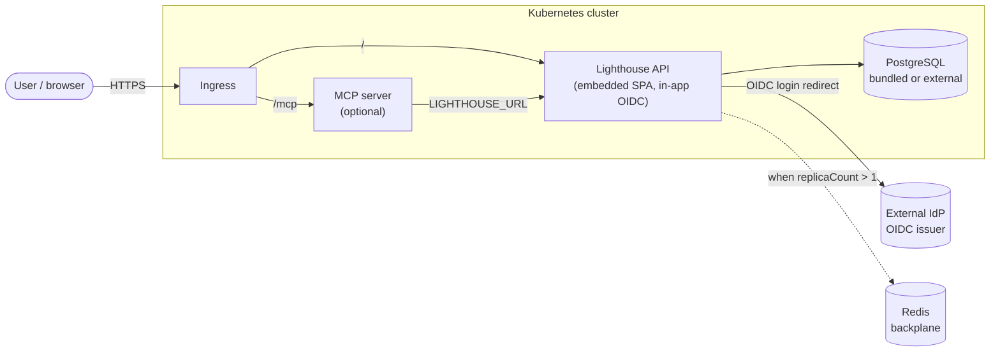

# Run Lighthouse on Kubernetes with Helm

Lighthouse ships an official Helm chart so you can run the **Server** edition on any Kubernetes
cluster — bundled or external PostgreSQL, optional OIDC login, an optional MCP server, and horizontal
scaling — from a public chart repository, with no source checkout and no sales call.

{: .note}
The chart is **PostgreSQL-only** — SQLite is a desktop/standalone concern. By default the chart brings
up a bundled PostgreSQL so a single `helm install` gives you a working instance; for production you
point it at your own managed database.

The chart is published at **`https://docs.lighthouse.letpeople.work/charts`**. The full, always-current
**configuration reference** (every value, type, default and description) lives in the chart's generated
[`README.md`](https://github.com/LetPeopleWork/Lighthouse/blob/main/chart/README.md#values) — that table
is generated from the chart's `values.yaml` and verified against it by CI, so it never drifts from the
real keys.

## Architecture

A production deployment looks like this. The chart deploys everything except the Ingress controller,
the external identity provider, and (when you scale) Redis — those are cluster/operator concerns you
bring.



- **Ingress → API.** The API serves the React SPA in-process (`frontend.mode=embedded`, the
  standalone-parity shape). Authentication is **in-app OIDC** (`oidc.*` → `Authentication:*`); there is
  no separate auth proxy — the API validates the IdP itself. Forwarded-headers (`app.proxy.*`) make the
  redirect URIs and secure cookies correct behind the Ingress. OIDC login is a **Premium** feature and
  needs a valid licence — see [Login (OIDC)](#login-oidc).
- **Ingress → MCP** (optional, `mcp.enabled`). The MCP HTTP server is an independent workload on the
  `/mcp` path; inbound auth is pass-through (`mcp.auth.mode` = `apikey` or `oauth`).
- **API → PostgreSQL.** Bundled (`postgresql.enabled=true`, a StatefulSet) or external
  (`externalDatabase.*`, e.g. a managed/CNPG/RDS/Azure instance).
- **API ⇢ Redis.** Only when you scale past one replica: Redis is the SignalR backplane and the
  single-instance background-work lock, so the fleet syncs once. The chart bundles no Redis — you
  provide a connection string.

## Prerequisites

- A Kubernetes cluster (v1.27+) and `kubectl` pointed at it.
- [Helm](https://helm.sh/docs/intro/install/) v3.12+.
- An Ingress controller (e.g. ingress-nginx or Traefik) **for production**. The quick-start below skips
  the Ingress and uses `kubectl port-forward` so you can try the chart on any cluster.
- For production: a hostname + TLS secret, and — if you enable login — an OIDC identity provider.

## Quick-start

This gets you a responding Lighthouse instance on any cluster (including a local
[kind](https://kind.sigs.k8s.io/) or minikube), bundled PostgreSQL, no Ingress:

```sh
helm repo add letpeoplework https://docs.lighthouse.letpeople.work/charts
helm repo update
helm search repo lighthouse          # CHART 0.1.1 / APP 26.6.21.1

helm install l8e letpeoplework/lighthouse \
  --set postgresql.auth.password='change-me' \
  --set ingress.enabled=false \
  --wait --timeout 5m
```

When the install returns, reach the app:

```sh
kubectl rollout status deploy -l app.kubernetes.io/instance=l8e
kubectl port-forward svc/l8e-lighthouse-api 8080:80
# open http://localhost:8080 — you should see the Lighthouse landing page
```

**Observable output:** the API and PostgreSQL pods report `Running` / `1/1`, `GET /health/ready`
returns `200`, and `GET /` returns the SPA (`<title>Lighthouse</title>`).

{: .important}
`postgresql.auth.password` has no default — the chart fails fast without it (ADR-082). Use a real
secret in production, not `--set` on the command line.

## Production install

Copy the chart's [`values-enterprise.yaml`](https://github.com/LetPeopleWork/Lighthouse/blob/main/chart/values-enterprise.yaml)
production-reference values, fill the REQUIRED fields (host, TLS secret, database, and — if you want
login — OIDC), and install with `-f`:

```sh
helm install l8e letpeoplework/lighthouse --version 0.1.1 -f values-enterprise.yaml
```

See the [configuration reference](https://github.com/LetPeopleWork/Lighthouse/blob/main/chart/README.md#values)
for every option. The common production knobs:

| Concern | Values |
|---|---|
| **Public URL + TLS** | `ingress.host`, `ingress.tls=true`, `ingress.tlsSecretName` |
| **External database** | `postgresql.enabled=false`, `externalDatabase.{host,port,database,user,password}` |
| **Login (OIDC)** | `oidc.enabled=true`, `oidc.issuer`, `oidc.clientId`, `oidc.clientSecret`, plus `app.proxy.trustedProxies`/`trustedNetworks`. See [Login (OIDC)](#login-oidc) — **Premium**. |
| **MCP server** | `mcp.enabled=true`, `mcp.image`, `mcp.auth.mode` |
| **Horizontal scaling** | `replicaCount: N` **and** `redis.connectionString` (required together) |

### Login (OIDC)

OIDC login is a **Premium feature**. With `oidc.enabled=true` the chart wires the IdP correctly, but
until the instance has a **valid Premium licence** it stays in *blocked* mode (`/api/latest/auth/mode`
returns `Blocked`) and no one can sign in.

{: .important}
**Import your licence _before_ you enable OIDC.** The licence-import API requires an authenticated
system admin, but with OIDC on and no valid Premium licence yet there is no way to authenticate —
a chicken-and-egg. So: install with auth off → open the app → import the licence (Settings → Licence)
→ *then* `helm upgrade --set oidc.enabled=true`.

Key OIDC values:

| Value | Default | Notes |
|---|---|---|
| `oidc.issuer` / `oidc.clientId` / `oidc.clientSecret` | — | Your IdP. Register the redirect URI `https://<ingress.host>/api/auth/callback` (most IdPs require HTTPS for non-`localhost` hosts). |
| `oidc.audience` | _(empty)_ | The API's resource/audience identifier in your IdP. When set, the API validates the JWT `aud` on bearer tokens; the MCP server advertises it as the RFC 9728 protected resource. **Required when `mcp.auth.mode=oauth`** — the MCP server needs both issuer and resource. Configure it once; it feeds both the API and the MCP server. |
| `oidc.requireHttpsMetadata` | `true` | Keep `true` for production HTTPS issuers (Entra, Keycloak-behind-TLS). Set `false` **only** for a plain-HTTP issuer in a dev cluster, or the API refuses to load the OIDC metadata. |
| `oidc.allowedOrigins` | _(auto)_ | Browser-facing origins permitted under auth. Defaults to your ingress origin (`scheme://ingress.host`) automatically — override only to allow additional origins. The API fails closed if this ends up empty. |
| `app.proxy.trustedProxies` / `trustedNetworks` | `[]` | Needed behind the Ingress so redirect URIs and secure cookies use the right scheme/host. |

The same `oidc.*` block drives any OIDC provider — Keycloak, Microsoft Entra, Auth0, Okta — and is
reused by the MCP server (`mcp.auth.mode=oauth`); you configure the issuer once.

## Demo walkthrough

A reproducible end-to-end tour against the real published image. Run the stages in order; each prints
its documented observable output.

### 1. Install

```sh
helm install l8e letpeoplework/lighthouse \
  --set postgresql.auth.password='change-me' --set ingress.enabled=false --wait --timeout 5m
kubectl get pods -l app.kubernetes.io/instance=l8e
```

**Observable:** `l8e-lighthouse-api-*` and `l8e-lighthouse-postgres-0` both `Running` (`1/1`).

### 2. Auth (OIDC)

OIDC login is **Premium** — import your licence first (Settings → Licence) while auth is still off, then
point the instance at your identity provider and upgrade (see [Login (OIDC)](#login-oidc) for the why):

```sh
helm upgrade l8e letpeoplework/lighthouse --reuse-values \
  --set oidc.enabled=true \
  --set oidc.issuer='https://your-idp.example/realms/lighthouse' \
  --set oidc.clientId='lighthouse' \
  --set oidc.clientSecret='<client-secret>' \
  --set ingress.enabled=true --set ingress.host='lighthouse.example.com'
  # add --set oidc.requireHttpsMetadata=false ONLY for a plain-HTTP dev issuer
```

**Observable:** `/api/latest/auth/mode` returns `Enabled`; an unauthenticated request to the app
redirects to the IdP's login page; after sign-in the IdP returns to `oidc.callbackPath`
(`/api/auth/callback`) and you land in Lighthouse.

### 3. MCP

Enable the MCP HTTP server so AI clients can query your flow data. With `mcp.auth.mode=oauth` the MCP
server reuses the same `oidc.issuer` + `oidc.audience` you configured in step 2 — callers present their
own IdP Bearer token, which the MCP server forwards to the API:

```sh
helm upgrade l8e letpeoplework/lighthouse --reuse-values \
  --set mcp.enabled=true --set mcp.auth.mode=oauth
  # requires oidc.audience (set in step 2); the MCP server needs both issuer and resource
kubectl rollout status deploy/l8e-lighthouse-mcp
kubectl port-forward svc/l8e-lighthouse-mcp 3000:80
# initialize handshake responds (text/event-stream)
curl -s -X POST http://127.0.0.1:3000/mcp \
  -H 'Content-Type: application/json' -H 'Accept: application/json, text/event-stream' \
  -d '{"jsonrpc":"2.0","id":1,"method":"initialize","params":{"protocolVersion":"2024-11-05","capabilities":{},"clientInfo":{"name":"c","version":"1"}}}'
```

**Observable:** the `l8e-lighthouse-mcp` Deployment becomes available and answers on the `/mcp` Ingress
path. Tool calls that reach the API without a valid Bearer token are rejected (`unauthorized`) — auth is
enforced end to end.

### 4. Scaling

Scale the API horizontally — this **requires** Redis as the backplane:

```sh
helm upgrade l8e letpeoplework/lighthouse --reuse-values \
  --set replicaCount=2 \
  --set redis.connectionString='redis-master.redis.svc.cluster.local:6379'
kubectl rollout status deploy -l app.kubernetes.io/instance=l8e
kubectl get pods -l app.kubernetes.io/instance=l8e
```

**Observable:** two API pods run side by side, the rolling update completes with zero downtime, and
background sync still runs once across the fleet (the Redis single-instance lock).

{: .note}
Setting `replicaCount > 1` without `redis.connectionString` is rejected at install time (fail-fast) —
the chart will not bring up a split-brain fleet.

## Uninstall

```sh
helm uninstall l8e
kubectl delete pvc -l app.kubernetes.io/instance=l8e   # bundled-Postgres data volume, if you want it gone
```
