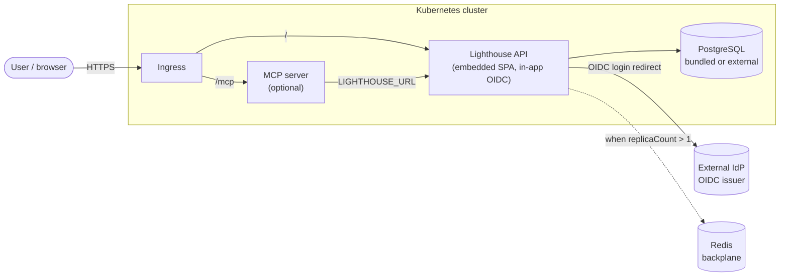

# Run Lighthouse on Kubernetes with Helm

Lighthouse ships an official Helm chart so you can run the **Server** edition on any Kubernetes
cluster — bundled or external PostgreSQL, optional OIDC login, an optional MCP server, and horizontal
scaling — from a public chart repository, with no source checkout and no sales call.

{: .note}
The chart is **PostgreSQL-only** — SQLite is a desktop/standalone concern. By default the chart brings
up a bundled PostgreSQL so a single `helm install` gives you a working instance; for production you
point it at your own managed database.

The chart is published at **`https://docs.lighthouse.letpeople.work/charts`**. The full, always-current
**configuration reference** (every value, type, default and description) lives in the chart's generated
[`README.md`](https://github.com/LetPeopleWork/Lighthouse/blob/main/chart/README.md#values) — that table
is generated from the chart's `values.yaml` and verified against it by CI, so it never drifts from the
real keys.

## Architecture

A production deployment looks like this. The chart deploys everything except the Ingress controller,
the external identity provider, and (when you scale) Redis — those are cluster/operator concerns you
bring.


```mermaid
flowchart LR
    user(["User / browser"])
    idp[("External IdP<br/>OIDC issuer")]
    redis[("Redis<br/>backplane")]

    subgraph cluster[Kubernetes cluster]
        ingress[Ingress]
        api["Lighthouse API<br/>(embedded SPA, in-app OIDC)"]
        mcp["MCP server<br/>(optional)"]
        pg[("PostgreSQL<br/>bundled or external")]
    end

    user -->|HTTPS| ingress
    ingress -->|/| api
    ingress -->|/mcp| mcp
    api -->|OIDC login redirect| idp
    api --> pg
    mcp -->|LIGHTHOUSE_URL| api
    api -.->|when replicaCount > 1| redis
```

- **Ingress → API.** The API serves the React SPA in-process (`frontend.mode=embedded`, the
  standalone-parity shape). Authentication is **in-app OIDC** (`oidc.*` → `Authentication:*`); there is
  no separate auth proxy — the API validates the IdP itself. Forwarded-headers (`app.proxy.*`) make the
  redirect URIs and secure cookies correct behind the Ingress. OIDC login is a **Premium** feature and
  needs a valid licence — see [Login (OIDC)](#login-oidc).
- **Ingress → MCP** (optional, `mcp.enabled`). The MCP HTTP server is an independent workload on the
  `/mcp` path; inbound auth is pass-through (`mcp.auth.mode` = `apikey` or `oauth`).
- **API → PostgreSQL.** Bundled (`postgresql.enabled=true`, a StatefulSet) or external
  (`externalDatabase.*`, e.g. a managed/CNPG/RDS/Azure instance).
- **API ⇢ Redis.** Only when you scale past one replica: Redis is the SignalR backplane and the
  single-instance background-work lock, so the fleet syncs once. The chart bundles no Redis — you
  provide a connection string.

## Prerequisites

- A Kubernetes cluster (v1.27+) and `kubectl` pointed at it.
- [Helm](https://helm.sh/docs/intro/install/) v3.12+.
- An Ingress controller (e.g. ingress-nginx or Traefik) **for production**. The quick-start below skips
  the Ingress and uses `kubectl port-forward` so you can try the chart on any cluster.
- For production: a hostname + TLS secret, and — if you enable login — an OIDC identity provider.

## Quick-start

This gets you a responding Lighthouse instance on any cluster (including a local
[kind](https://kind.sigs.k8s.io/) or minikube), bundled PostgreSQL, no Ingress:

```sh
helm repo add letpeoplework https://docs.lighthouse.letpeople.work/charts
helm repo update
helm search repo lighthouse          # CHART 0.1.17 / APP 26.9.24.6

helm install l8e letpeoplework/lighthouse \
  --set postgresql.auth.password='change-me' \
  --set encryption.key=$(openssl rand -base64 32) \
  --set ingress.enabled=false \
  --wait --timeout 5m
```

{: .important}
`encryption.key` is the key your stored credentials are encrypted with, and from chart 0.1.13 onward an
install that names neither it nor `encryption.existingSecret` is **refused at render**. Keep the value
you generate here: it is the only thing that can read those credentials back. See
[the encryption key the cluster owns](#the-encryption-key-the-cluster-owns).

When the install returns, reach the app:

```sh
kubectl rollout status deploy -l app.kubernetes.io/instance=l8e
kubectl port-forward svc/l8e-lighthouse-api 8080:80
# open http://localhost:8080 — you should see the Lighthouse landing page
```

**Observable output:** the API and PostgreSQL pods report `Running` / `1/1`, `GET /health/ready`
returns `200`, and `GET /` returns the SPA (`<title>Lighthouse</title>`).

{: .important}
`postgresql.auth.password` has no default — the chart fails fast without it (ADR-082). Use a real
secret in production, not `--set` on the command line.

## Production install

Copy the chart's [`values-enterprise.yaml`](https://github.com/LetPeopleWork/Lighthouse/blob/main/chart/values-enterprise.yaml)
production-reference values, fill the REQUIRED fields (host, TLS secret, database, and — if you want
login — OIDC), and install with `-f`:

```sh
helm install l8e letpeoplework/lighthouse --version 0.1.17 -f values-enterprise.yaml
```

See the [configuration reference](https://github.com/LetPeopleWork/Lighthouse/blob/main/chart/README.md#values)
for every option. The common production knobs:

| Concern | Values |
|---|---|
| **Public URL + TLS** | `ingress.host`, `ingress.tls=true`, `ingress.tlsSecretName` |
| **External database** | `postgresql.enabled=false`, `externalDatabase.{host,port,database,user,password}` |
| **Login (OIDC)** | `oidc.enabled=true`, `oidc.issuer`, `oidc.clientId`, `oidc.clientSecret`, plus `app.proxy.trustedProxies`/`trustedNetworks`. See [Login (OIDC)](#login-oidc) — **Premium**. |
| **MCP server** | `mcp.enabled=true`, `mcp.image`, `mcp.auth.mode` |
| **Horizontal scaling** | `replicaCount: N` **and** `redis.connectionString` (required together) |
| **Encryption key** | `encryption.key` **or** `encryption.existingSecret` — one of the two is required, see below |

### The encryption key the cluster owns

The chart **refuses to render** without `encryption.key` or `encryption.existingSecret`. That is not a
missing default: in the cluster the application cannot own its key. It has no durable place to keep one
that survives a rescheduled pod, and every replica would make a different one. So the key is yours, and
Lighthouse only ever reads it.

| How you own it | What you set |
|---|---|
| The chart makes the Secret from a value you supply | `encryption.key` |
| You (or an external secrets operator, or a secret store) already keep the Secret | `encryption.existingSecret` |

Either way the key reaches the container as a read-only mounted file, and **Lighthouse never writes to
the Secret**. Nothing in the release grants it permission to, deliberately: an application that can
rewrite its own key can also lock itself out of every credential it holds, and an external secrets
operator would overwrite the change on its next sync anyway.

That is also why rotating is a sequence rather than a button. You add the new key to the Secret **ahead
of** the old one, wait for the running pods to re-read the file — no restart is needed — then press
**Move stored secrets** in Settings → Encryption, and only then remove the old key from the Secret.

The wait is made of two parts, and only the second is Lighthouse's. Kubernetes projects a changed Secret
into a running pod on its own schedule, which on a default cluster can take up to a minute; Lighthouse
then re-reads the mounted file about every thirty seconds, tunable with `encryption.keysReloadSeconds`.
Measured end to end on a default cluster it took **around seventy seconds** from writing the Secret to
the new key being the one in force. Watch **Settings → Encryption** and move the secrets when the new key
id appears there, rather than counting seconds. Nothing is re-entered and no
connection breaks. The four steps in full, with the values and the `kubectl` commands, are in the
[chart README](https://github.com/LetPeopleWork/Lighthouse/blob/main/chart/README.md#the-encryption-key),
and what the screen reports while you do it is in [Secret Encryption Key](../settings/encryption.html).

{: .important}
On a scaled-out release (`replicaCount: N`) every replica reads the same Secret, so the key is the one
thing that already behaves correctly across replicas. Do not try to give them a shared key *store*
instead — [Configuration](./configuration.html#when-lighthouse-has-nowhere-to-keep-a-key) explains why a
key store belongs to a single instance.

### Login (OIDC)

OIDC login is a **Premium feature**. With `oidc.enabled=true` the chart wires the IdP correctly, but
until the instance has a **valid Premium licence** it stays in *blocked* mode (`/api/latest/auth/mode`
returns `Blocked`) and no one can sign in.

{: .important}
**Import your licence _before_ you enable OIDC.** The licence-import API requires an authenticated
system admin, but with OIDC on and no valid Premium licence yet there is no way to authenticate —
a chicken-and-egg. So: install with auth off → open the app → import the licence (Settings → Licence)
→ *then* `helm upgrade --set oidc.enabled=true`.

Key OIDC values:

| Value | Default | Notes |
|---|---|---|
| `oidc.issuer` / `oidc.clientId` / `oidc.clientSecret` | — | Your IdP. Register the redirect URI `https://<ingress.host>/api/auth/callback` (most IdPs require HTTPS for non-`localhost` hosts). |
| `oidc.audience` | _(empty)_ | The API's resource/audience identifier in your IdP. When set, the API validates the JWT `aud` on bearer tokens; the MCP server advertises it as the RFC 9728 protected resource. **Required when `mcp.auth.mode=oauth`** — the MCP server needs both issuer and resource. Configure it once; it feeds both the API and the MCP server. |
| `oidc.requireHttpsMetadata` | `true` | Keep `true` for production HTTPS issuers (Entra, Keycloak-behind-TLS). Set `false` **only** for a plain-HTTP issuer in a dev cluster, or the API refuses to load the OIDC metadata. |
| `oidc.allowedOrigins` | _(auto)_ | Browser-facing origins permitted under auth. Defaults to your ingress origin (`scheme://ingress.host`) automatically — override only to allow additional origins. The API fails closed if this ends up empty. |
| `app.proxy.trustedProxies` / `trustedNetworks` | `[]` | Needed behind the Ingress so redirect URIs and secure cookies use the right scheme/host. |

The same `oidc.*` block drives any OIDC provider — Keycloak, Microsoft Entra, Auth0, Okta — and is
reused by the MCP server (`mcp.auth.mode=oauth`); you configure the issuer once.

{: .important}
**Behind ingress-nginx, raise the proxy buffer for OIDC.** The OIDC callback returns a large
`Set-Cookie` (the session holds the IdP tokens), which overflows ingress-nginx's default 4&nbsp;KB
response-header buffer — the login round-trip then fails with **502 Bad Gateway** on
`/api/auth/callback`. Set it via `ingress.annotations`:

```yaml
ingress:
  className: nginx
  annotations:
    nginx.ingress.kubernetes.io/proxy-buffer-size: "16k"
```

Other controllers (Traefik, etc.) have their own equivalent; `ingress.annotations` passes any through.

## How-to: the four scenarios

A progressive walkthrough that builds a full deployment one capability at a time. Each scenario is a
`helm upgrade --reuse-values` on top of the previous one, so you can stop at the shape you need:

1. **[Simple](#scenario-1--simple-no-auth)** — bundled Postgres + the backend, no auth.
2. **[Login](#scenario-2--add-login-oidc)** — add OIDC sign-in (Keycloak, Entra, Auth0, …).
3. **[Scale out](#scenario-3--scale-out)** — multiple replicas behind a Redis backplane.
4. **[MCP server](#scenario-4--mcp-server-oidc-oauth)** — expose the MCP HTTP server with OAuth.

### Scenario 1 — simple, no auth

The smallest working instance: one API workload (it serves the SPA in-process) and a bundled Postgres.
No Ingress, no identity provider — reach it with a port-forward.

```sh
helm install l8e letpeoplework/lighthouse \
  --set postgresql.auth.password='change-me' \
  --set ingress.enabled=false --wait --timeout 5m

kubectl port-forward svc/l8e-lighthouse-api 8080:80
# open http://localhost:8080
```

**You should see:** `l8e-lighthouse-api-*` and `l8e-lighthouse-postgres-0` both `Running` (`1/1`), and
the Lighthouse landing page with **no login prompt**. (An init container waits for Postgres first, so
the API does not crash-loop on a cold database.)

### Scenario 2 — add login (OIDC)

Turn on sign-in against your identity provider. This is a **Premium** feature, and the order matters —
read [Login (OIDC)](#login-oidc) for the full why. In short:

**Step 1 — import your licence while auth is still off** (Settings → Licence in the app from Scenario 1).
Without a valid Premium licence the instance stays in *blocked* mode and nobody can sign in; and once
OIDC is on you can no longer reach the licence import unauthenticated. So licence first, OIDC second.

**Step 2 — enable OIDC + the Ingress** (and TLS for any real IdP — Entra and most providers reject
non-HTTPS redirect URIs):

```sh
helm upgrade l8e letpeoplework/lighthouse --reuse-values \
  --set oidc.enabled=true \
  --set oidc.issuer='https://your-idp.example/realms/lighthouse' \
  --set oidc.clientId='lighthouse' \
  --set oidc.clientSecret='<client-secret>' \
  --set ingress.enabled=true --set ingress.className=nginx \
  --set ingress.host='lighthouse.example.com' \
  --set ingress.tls=true --set ingress.tlsSecretName='lighthouse-tls' \
  --set 'app.proxy.trustedNetworks[0]=10.0.0.0/8' \
  --set 'ingress.annotations.nginx\.ingress\.kubernetes\.io/proxy-buffer-size=16k'
  # plain-HTTP dev issuer only: add --set oidc.requireHttpsMetadata=false
```

Register the redirect URI **`https://<ingress.host>/api/auth/callback`** in your IdP.

{: .important }
The `proxy-buffer-size` annotation is **required behind ingress-nginx** — the OIDC callback's large
`Set-Cookie` overflows the default 4 KB buffer and login fails with **502**. See
[Login (OIDC)](#login-oidc).

**You should see:** `/api/latest/auth/mode` returns `Enabled`; opening `https://<ingress.host>` redirects
you to the IdP, and after sign-in you land back in Lighthouse authenticated. The **same `oidc.*` block**
works for any provider — only the values change.

### Scenario 3 — scale out

Run more than one API replica behind a Redis backplane. Redis is the SignalR backplane, the
single-instance background-work lock (so the fleet syncs once), **and** the shared Data Protection key
store — that last part is what lets a login cookie issued by one pod be read by another, so OIDC keeps
working across replicas. The chart wires all three automatically once `redis.connectionString` is set.

```sh
helm upgrade l8e letpeoplework/lighthouse --reuse-values \
  --set replicaCount=2 \
  --set redis.connectionString='redis-master.redis.svc.cluster.local:6379'
kubectl rollout status deploy -l app.kubernetes.io/instance=l8e
```

**You should see:** two API pods running side by side, a zero-downtime rolling update, and — still able
to sign in (the login round-trip survives requests landing on either pod). Background sync runs once
across the fleet.

{: .note}
`replicaCount > 1` **requires** `redis.connectionString` — the chart rejects the install otherwise, so it
never brings up a split-brain fleet.

### Scenario 4 — MCP server (OIDC oauth)

Expose the optional MCP HTTP server so AI clients can query your flow data. With `mcp.auth.mode=oauth`
the MCP server reuses the **same** `oidc.issuer` + `oidc.audience` from Scenario 2 — you configure the
identity once. Callers present their own IdP Bearer token, which the MCP server forwards to the API; the
API validates it. No-auth and shared-API-key modes are not used here.

```sh
helm upgrade l8e letpeoplework/lighthouse --reuse-values \
  --set mcp.enabled=true --set mcp.auth.mode=oauth \
  --set mcp.image='ghcr.io/letpeoplework/lighthouse-clients/mcp-http:1.3.2'
  # mcp.auth.mode=oauth requires oidc.audience (set in Scenario 2) — the server needs issuer AND resource
kubectl rollout status deploy/l8e-lighthouse-mcp
```

**You should see:** the `l8e-lighthouse-mcp` Deployment available on the `/mcp` Ingress path; the MCP
server advertises RFC 9728 protected-resource metadata at `/.well-known/oauth-protected-resource/mcp`
(the chart routes that root well-known path to the MCP server; it names your IdP as the authorization
server and `oidc.audience` as the resource); and a tool call without a valid Bearer is rejected with
`401` + a `WWW-Authenticate` challenge whose `resource_metadata` points at that `https://` URL — so an
external MCP client can auto-discover the IdP and run the browser OAuth flow. Auth is enforced end to end.

> **Note (IdP support).** Auto-discovery follows RFC 9728/8414: the client reads the authorization server
> from the protected-resource metadata, then fetches that server's metadata and (if needed) registers a
> client. IdPs that serve their metadata at the issuer's well-known and support dynamic client
> registration (e.g. Keycloak) work out of the box; Microsoft Entra needs a pre-registered public client
> (no DCR) and serves its metadata under the tenant path, so configure the client app explicitly there.

## Upgrading the bundled PostgreSQL

The chart's default `postgresql.image` moves to a new PostgreSQL major from time to time (it is
`postgres:18-trixie` today). A PostgreSQL major cannot open the data files of the previous one, so the
chart carries the data across by itself: before the database starts on the new major, a step in the
database pod upgrades a copy of the data and keeps the original beside it. This does not apply to an
external database (`postgresql.enabled=false`); you upgrade that one the way your provider documents.

The step runs on every start of the database, even when there is nothing to upgrade, so every start pulls
`postgresql.upgrade.image` (the previous major, `postgres:17-trixie` today) as well as `postgresql.image`.
If your cluster pulls through a mirror, mirror both. Both must be official `postgres` images from Docker
Hub, or copies of them: the step starts as root and drops to the `postgres` user the way those images do,
so a runtime that forbids running as root, such as OpenShift's `restricted` security context constraint,
cannot run the bundled database. Use an external database there.

### What happens on `helm upgrade`

A plain `helm upgrade`, or one with `--reset-then-reuse-values`, moves the image and carries data from the
previous major across. There is nothing to do before or after it:

```sh
helm upgrade l8e letpeoplework/lighthouse --reset-then-reuse-values --wait --timeout 15m
```

The copy is made while the database pod starts, so that start takes longer than usual. Above a few GB of
data, give `--wait` the `--timeout 15m` shown here rather than Helm's default of five minutes. Read what
the upgrade did with `kubectl logs l8e-lighthouse-postgres-0 -c pg-upgrade`:

```text
lighthouse-postgres: upgrading the Postgres 17 data in pgdata to Postgres 18 in pgdata-18; pgdata is kept as it is
lighthouse-postgres: upgrade finished: Postgres 18 starts on pgdata-18, and the Postgres 17 data stays in pgdata
```

**`--reuse-values` keeps the old image.** Helm then carries over the previous chart's `postgresql.image`
as well, so the database stays on its current major and nothing is upgraded. The install notes say so:

```text
NOTE: The bundled Postgres (postgres:17) is behind this chart's default major (18); run helm upgrade --reset-then-reuse-values, or a plain helm upgrade, to move it - the data is carried across.
```

Settings made inside the database with `ALTER SYSTEM` are not carried across. Apply them again on the
new major.

### Where the old copy is and what it costs

Both copies sit on the same data volume (`data-l8e-lighthouse-postgres-0`):

- `pgdata/` holds the previous major's data exactly as it was before the upgrade. It is kept so that a
  rollback still finds it.
- `pgdata-18/` holds the upgraded database, the one Lighthouse uses from now on.

The `PGDATA` a `kubectl exec` shell sees is the image's default, not the folder the database was started
on. Ask the database itself instead:

```sh
kubectl exec l8e-lighthouse-postgres-0 -c postgres -- psql -U lighthouse -d lighthouse -Atc 'SHOW data_directory'
```

The old copy takes about as much room again as the database itself, so the volume holds roughly twice
the data until you remove it. The upgrade checks for that room before it writes anything (see
[When an upgrade is refused](#when-an-upgrade-is-refused)).

### Rolling back

`helm rollback` to the revision of the previous chart (chart 0.1.17 or earlier; `helm history l8e` lists
the revisions) starts the old major on `pgdata/`, the database as it was before the upgrade.
**Everything written since the upgrade is discarded**: it lives only in `pgdata-18/`, which the old major
cannot open. Upgrading again afterwards redoes the copy from `pgdata/`, so what was written between the
rollback and the new upgrade comes across, and what was written before the rollback still does not. The
out-of-date `pgdata-18/` is only removed once the new copy is in place, so this needs room for one more
copy while it runs. The upgrade log says:

```text
lighthouse-postgres: pgdata-18 is out of date: Postgres 17 has run on pgdata since that copy was made, so it is discarded and the upgrade redone from pgdata
```

A rollback between two revisions of the new chart changes nothing about the database.

Pinning the image back on the new chart, for example with
`--reset-then-reuse-values --set postgresql.image=postgres:17-trixie`, does the same as a rollback: the
database starts on `pgdata/` without what was written on 18, and removing the pin redoes the upgrade from
it. The database pod logs one warning about it:

```text
lighthouse-postgres: warning: starting Postgres 17 on pgdata, but a newer Postgres 18 copy of this database exists in pgdata-18; what was written on that copy is not in this database, and removing the pin on postgresql.image redoes the upgrade from this copy, so those writes do not come back
```

A rollback to chart 0.1.17 itself cannot print that warning: that chart has no upgrade step and does not
know the newer copy exists.

### Removing the old copy

Once you are sure you will not roll back, free the room the old copy takes. Run this while the database
pod is running on 18:

```sh
kubectl exec l8e-lighthouse-postgres-0 -c postgres -- bash /lighthouse-postgres/remove-old-copies.sh
```

It empties `pgdata/` and leaves a single file in it, `UPGRADED-TO-18-see-kubernetes-docs`; it does not
touch `pgdata-18/`. It does nothing, and exits with code 1, when there is no upgraded copy in `pgdata-18/`
or when a database is running on `pgdata/` (after a rollback or a pin). The placeholder file keeps a later
rollback to chart 0.1.17 from creating a new, empty database in the emptied folder: that rollback stops
with an error instead. The database keeps starting on `pgdata-18/` after a restart, and a plain
`helm upgrade` to this chart starts it there again. After such a failed rollback, the `helm upgrade` alone
is not enough: delete the stuck pod as well, with `kubectl delete pod l8e-lighthouse-postgres-0` (see
[When an upgrade is refused](#when-an-upgrade-is-refused) for why).

**After this command a rollback to the previous chart is no longer possible.** The previous major's data
is gone, and only `pgdata-18/` remains.

### When removing the old copy was cut off

If the command is cut off part-way, for instance because the connection drops, run it again: it picks up
where it stopped. If the database pod restarts before you do, its start may be refused with a line saying
that `pgdata` holds no database, or that it has no readable `pgdata/global/pg_control`:

```text
lighthouse-postgres: refusing to start Postgres 18: pgdata holds Postgres 17 data without a readable pgdata/global/pg_control, which is what a removal of the old copy cut off part-way leaves, so whether pgdata-18 is still current cannot be told; finish removing the old copy as https://docs.lighthouse.letpeople.work/Installation/kubernetes.html#when-removing-the-old-copy-was-cut-off describes. Nothing was changed
```

`pgdata-18/` is untouched. The database container does not run while its start is refused, so finish the
removal from a pod of its own that mounts the volume, with the same command, then start the database
again:

```sh
kubectl scale statefulset l8e-lighthouse-postgres --replicas=0
kubectl run pgdata-cleanup --image=postgres:18-trixie --restart=Never --overrides='{"spec":{"containers":[{"name":"pgdata-cleanup","image":"postgres:18-trixie","command":["sleep","infinity"],"volumeMounts":[{"name":"data","mountPath":"/var/lib/postgresql/data"},{"name":"scripts","mountPath":"/lighthouse-postgres"}]}],"volumes":[{"name":"data","persistentVolumeClaim":{"claimName":"data-l8e-lighthouse-postgres-0"}},{"name":"scripts","configMap":{"name":"l8e-lighthouse-postgres-upgrade"}}]}}'
kubectl wait --for=condition=Ready pod/pgdata-cleanup --timeout=5m
kubectl exec pgdata-cleanup -- bash /lighthouse-postgres/remove-old-copies.sh
kubectl delete pod pgdata-cleanup
kubectl scale statefulset l8e-lighthouse-postgres --replicas=1
```

### When an upgrade is refused

When the upgrade cannot be done safely, it writes nothing to the volume. The database pod does not
become Ready and keeps retrying by itself. Both `kubectl logs l8e-lighthouse-postgres-0 --all-containers`
and `kubectl describe pod l8e-lighthouse-postgres-0` (as the message of the `pg-upgrade` container's last
state) show one line starting with `lighthouse-postgres:` that says why.

How the next retry picks up the fix depends on what the fix is:

- **A fix outside the chart's values**, such as growing the volume, needs no other step: the next retry
  goes ahead by itself.
- **A fix through the chart's values**, such as pinning `postgresql.image`, needs the database pod deleted
  after the `helm upgrade`. Kubernetes does not replace a database pod that is stuck on a refused start,
  so without the delete it keeps retrying with the old values:

  ```sh
  kubectl delete pod l8e-lighthouse-postgres-0
  ```

  Every refusal line that suggests a values change ends with this command, with the pod's real name and
  namespace filled in.

Too little room for the second copy:

```text
lighthouse-postgres: refusing upgrade 17→18: need 2310 MiB, 1024 MiB free; grow the volume claim itself with kubectl patch pvc -n default data-l8e-lighthouse-postgres-0 (https://docs.lighthouse.letpeople.work/Installation/kubernetes.html#when-an-upgrade-is-refused shows how) or pin postgresql.image to postgres:17-trixie and then run kubectl delete pod -n default l8e-lighthouse-postgres-0 so it starts again with the new values. Nothing was changed
```

There are two ways out:

- **Grow the volume.** This needs a StorageClass that allows volume expansion
  (`allowVolumeExpansion: true`). Kubernetes does not let a StatefulSet change the size of a claim it has
  already made, so grow the claim itself:

  ```sh
  kubectl patch pvc data-l8e-lighthouse-postgres-0 -p '{"spec":{"resources":{"requests":{"storage":"16Gi"}}}}'
  ```

  Some storage drivers only finish growing a volume when the pod using it restarts. If
  `kubectl get pvc data-l8e-lighthouse-postgres-0` already shows the new size and the upgrade is still
  refused for room, delete the database pod once so it starts on the grown volume.

- **Stay on the current major** by pinning the image the line names, then delete the stuck pod:

  ```sh
  helm upgrade l8e letpeoplework/lighthouse --reset-then-reuse-values --set postgresql.image=postgres:17-trixie
  kubectl delete pod l8e-lighthouse-postgres-0
  ```

Data two or more majors behind the image is refused with a line that names both majors and links the
manual path below:

```text
lighthouse-postgres: refusing to start Postgres 18: the data in pgdata is Postgres 16, and this chart only upgrades data from Postgres 17; pin postgresql.image to postgres:16 to start it again as it was, then run kubectl delete pod -n default l8e-lighthouse-postgres-0 so it starts again with the new values, and move it by hand: https://docs.lighthouse.letpeople.work/Installation/kubernetes.html#moving-data-two-or-more-majors-behind-by-hand. Nothing was changed
```

Pin `postgresql.image` to the data's major (here `postgres:16`) and delete the stuck pod to start the
database again as it was, then move it with the manual path below.

The chart only ever upgrades the data in `pgdata/`, the folder the volume was first set up with. A volume
that has already been upgraded once runs on `pgdata-18/`, so a later chart that moves on to the next major
cannot carry it across by itself. It refuses instead, naming `pgdata-18/` as where the database runs and
the image to set back to; never pin the image to the older data in `pgdata/`, which would start the
database without anything written since the upgrade.

Data newer than the image, with no copy of the image's major left to start on, is refused the same way.
That happens when the image is pinned back after the old copy was removed:

```text
lighthouse-postgres: refusing to start Postgres 17: the data is Postgres 18, in pgdata-18, which is newer than this image, and no Postgres 17 copy of it is left to start on; set postgresql.image back to Postgres 18 or remove the pin on it, then run kubectl delete pod -n default l8e-lighthouse-postgres-0 so it starts again with the new values. Nothing was changed
```

When `postgresql.upgrade.image` does not provide the previous major's programs, or provides programs built
for another operating system than `postgresql.image`, the line says which image to set it to:

```text
lighthouse-postgres: refusing to upgrade Postgres 17 to 18: the upgrade-source image did not provide the Postgres 17 programs; set postgresql.upgrade.image to a Postgres 17 image, then run kubectl delete pod -n default l8e-lighthouse-postgres-0 so it starts again with the new values. Nothing was changed
lighthouse-postgres: refusing to upgrade Postgres 17 to 18: the Postgres 17 programs in postgresql.upgrade.image are built for alpine 3.24.2 and cannot run beside the Postgres 18 image, built for debian 13; set postgresql.upgrade.image to postgres:17-trixie, then run kubectl delete pod -n default l8e-lighthouse-postgres-0 so it starts again with the new values. Nothing was changed
```

### Moving data two or more majors behind by hand

The chart only carries data from the previous major. For older data, take a dump, start an empty database
on the new major, and restore into it. The database must be running for the dump, so pin
`postgresql.image` to the data's major first if an upgrade was refused, and delete the stuck pod. The names below assume the
release is called `l8e` and the default database and user `lighthouse`:

```sh
# 1. Stop Lighthouse and dump the database.
kubectl scale deployment l8e-lighthouse-api --replicas=0
kubectl exec l8e-lighthouse-postgres-0 -c postgres -- pg_dump -U lighthouse -d lighthouse -Fc > lighthouse.dump

# 2. Remove the old data volume, then upgrade without a postgresql.image pin, so the chart's default
#    applies. values.yaml is the file you install with. The database comes up empty on the new major.
kubectl scale statefulset l8e-lighthouse-postgres --replicas=0
kubectl delete pvc data-l8e-lighthouse-postgres-0
helm upgrade l8e letpeoplework/lighthouse --reset-values -f values.yaml
kubectl scale deployment l8e-lighthouse-api --replicas=0
kubectl rollout status statefulset l8e-lighthouse-postgres

# 3. Restore, then start Lighthouse again.
kubectl exec -i l8e-lighthouse-postgres-0 -c postgres -- pg_restore -U lighthouse -d lighthouse --clean --if-exists --no-owner < lighthouse.dump
kubectl scale deployment l8e-lighthouse-api --replicas=1
```

Keep `lighthouse.dump` until you have checked that your teams, portfolios and forecasts are back. If you
run more than one replica, scale the API back to that number instead of `1`.

## Uninstall

```sh
helm uninstall l8e
kubectl delete pvc -l app.kubernetes.io/instance=l8e   # bundled-Postgres data volume, if you want it gone
```
