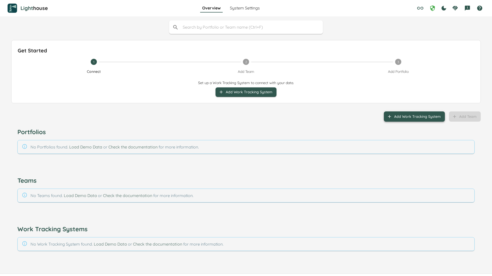

The Server edition runs as a web server accessible from any browser. It supports multiple simultaneous users, PostgreSQL, Docker, and advanced configuration options.

{: .note}
The Server edition is available for **Windows** and **Linux** only. macOS users should use Docker or the [Standalone edition](./standalone.html) instead.

The recommended way to run Lighthouse is via [Docker](#docker). If you prefer, you can also run the binary directly on Windows or Linux.

## Supported Platforms

| | Windows | Linux | Docker |
|---|---|---|---|
| **Binary** | ✅ | ✅ | — |
| **Docker** | ✅ | ✅ | ✅ |

---

## Binary Installation

All packages include everything — no prerequisites required. Download the latest version through [our Website](https://letpeople.work).

### Windows

1. Download the latest `Lighthouse.exe` from [our Website](https://letpeople.work).
2. The Windows binary is code signed. Simply double-click the executable to start Lighthouse.
3. The app will open a terminal window showing log messages.
4. By default, Lighthouse runs on:
	- HTTP:  http://localhost:5000

You should see the (empty) landing page:


### Linux

1. Download the latest Lighthouse release for Linux from [our Website](https://letpeople.work).
2. Extract the archive to your desired location.
3. If the `Lighthouse` file is not executable, make it so:
	```bash
	sudo chmod +x Lighthouse
	```
4. Open a terminal, navigate to the Lighthouse directory, and run:
	```bash
	./Lighthouse
	```
5. By default, Lighthouse runs on:
	- HTTP:  http://localhost:5000

You should see the (empty) landing page:


---

## Docker

The easiest way to run Lighthouse is via Docker. Lighthouse is available as a container hosted in the [GitHub Container Registry](https://github.com/LetPeopleWork/Lighthouse/pkgs/container/lighthouse):

```bash
docker pull ghcr.io/letpeoplework/lighthouse:latest
```

### Available Tags
- `latest`: Latest released version (if you want to keep using the "latest and greatest")
- `dev-latest`: Newest features currently in development (potentially less stable)
- Specific version tags (e.g., `25.1.10.1012`): Pin to a specific version (recommended for production)
- Check [packages](https://github.com/LetPeopleWork/Lighthouse/pkgs/container/lighthouse) for all available versions

### Prerequisites

If you don't have Docker installed, you can find installation instructions in the [Docker docs](https://docs.docker.com/get-started/get-docker/).

### Running Lighthouse

```bash
docker run -d -p 8081:443 -p 8080:80 -v ".:/app/Data" -v "./logs:/app/logs" -e "Database__ConnectionString=Data Source=/app/Data/LighthouseAppContext.db" ghcr.io/letpeoplework/lighthouse:latest
```

This will:
- Map host port 8081 to container port 443 (HTTPS)
- Map host port 8080 to container port 80 (HTTP)
- Use the directory you run the command from as storage for your database and logs

You can find more information on the configuration options under [Configuration](./configuration.html).

---

## Updating Lighthouse

If a new version is released, you will see an indicator in the lower right corner of the footer. Clicking it opens a dialog with release notes for all newer versions.

{: .note }
Published packages do not include the database — your data is preserved across updates. Lighthouse always supports migrations to newer versions.

{: .recommendation}
We recommend staying on the latest version. We continuously update Lighthouse with new features and bug fixes, and only offer support on the latest version.

### Binary: Automatic Update

On Windows and Linux, Lighthouse supports automatic updates directly from within the app.

### Binary: Replace Files

You can replace the files in the directory manually. Download and extract the latest version, then copy/paste into your Lighthouse folder, overriding all existing files.

{: .note }
Stop Lighthouse before replacing files to avoid conflicts.

### Docker

Pull the latest container image:

```bash
docker pull ghcr.io/letpeoplework/lighthouse:latest
```

{: .note}
Automatic in-app updates are not supported on Docker. Use `docker pull` to update.

---

## Troubleshoot Startup Issues

If Lighthouse is not available on the expected port after following the instructions, inspect the logs in the terminal and look for an `Error`.

{: .note}
You can share logs via our [Slack Channel](https://join.slack.com/t/let-people-work/shared_invite/zt-38df4z4sy-iqJEo6S8kmIgIfsgsV0J1A) for support.

#### Address already in use
```bash
10:26:11 - ERROR - Host: Hosting failed to start
System.IO.IOException: Failed to bind to address http://[::]:5000: address already in use
```
Another application is using the port. This may be another Lighthouse instance. If the port is blocked and you can't change the other application, you can adjust the port Lighthouse uses — see [Configuration Options](configuration.html#http--https-url).

---