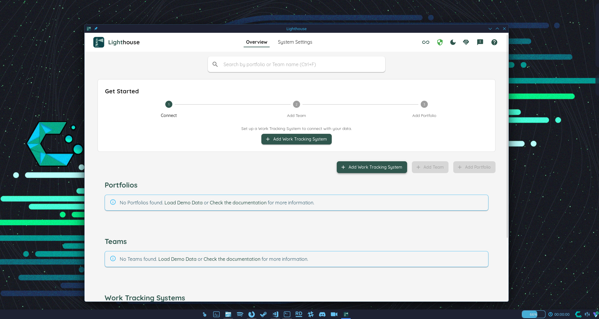
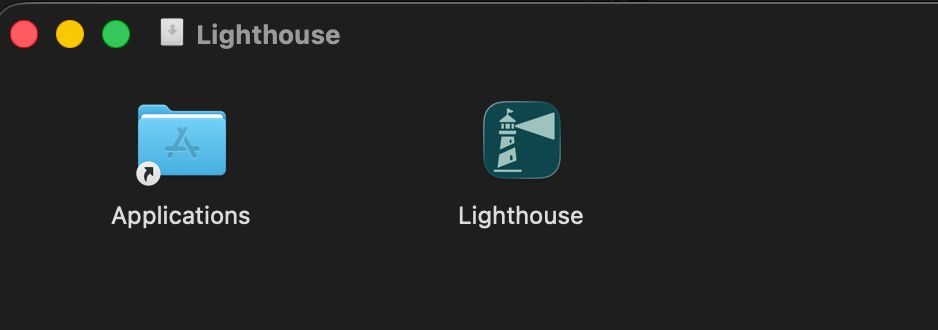

The Standalone edition is a native desktop application. Download and install it like any other app on your system — no server setup or terminal required.



## Supported Platforms

| Platform | Package | Notes |
|---|---|---|
| **Windows** | NSIS Installer (`.exe`) | Recommended. Installs to Program Files with Start Menu shortcut, uninstaller, and automatic updates. Code signed. |
| **Windows** | MSI Installer (`.msi`) | Alternative installer format, suitable for deployment via Group Policy or software management tools. Code signed. |
| **macOS** | App Bundle (`.dmg`) | Install by dragging to your Applications folder. Signed and notarized. |
| **macOS** | App Bundle (`.zip`) | Unzip and move the app as desired. Signed and notarized. |
| **Linux** | AppImage (`.AppImage`) | Single-file, runs on most distributions without installation. Supports automatic updates. |

Download the latest version from the [Releases](https://github.com/LetPeopleWork/Lighthouse/releases/latest) page.

{: .note}
**macOS only:** Lighthouse for macOS is exclusively available as the Standalone edition. A Server edition for macOS is not provided.

---

## Windows

1. Download either the NSIS Installer (`.exe`) or MSI Installer (`.msi`) from the [Releases](https://github.com/LetPeopleWork/Lighthouse/releases/latest).
2. Both packages are code signed. Run the installer and follow the on-screen steps.
3. Lighthouse will be installed to Program Files and added to your Start Menu.
4. Launch Lighthouse from the Start Menu. It will open a window and start the backend automatically.

### Updating

The app checks for updates on startup and prompts you to install them automatically.

---

## macOS

1. Download either the `.dmg` or `.zip` from the [Releases](https://github.com/LetPeopleWork/Lighthouse/releases/latest).
2. The app is signed and notarized — no Gatekeeper warnings will appear.
3. Open the `.dmg` and drag Lighthouse to your Applications folder, or unzip and move the app as desired.



4. Double-click the Lighthouse app to launch it. You will be asked whether you are ok to launch an application downloaded from the internet: confirm to proceed.

### Updating

The app checks for updates on startup and prompts you to install them automatically.

---

## Linux

1. Download the `.AppImage` from the [Releases](https://github.com/LetPeopleWork/Lighthouse/releases/latest).
2. Make it executable:
   ```bash
   chmod +x Lighthouse*.AppImage
   ```
3. Run it:
   ```bash
   ./Lighthouse*.AppImage
   ```

### Updating

The app checks for updates on startup and prompts you to install them automatically.

---

## Constraints

{: .note}
**Single database per system:** The Standalone edition stores data in a local SQLite database on your machine. Only one Lighthouse database can exist per system — running multiple instances concurrently is not supported.

{: .note}
**Single-user only:** The Standalone edition is designed for individual use on one machine. It is not accessible from other machines or by other users on your network.
