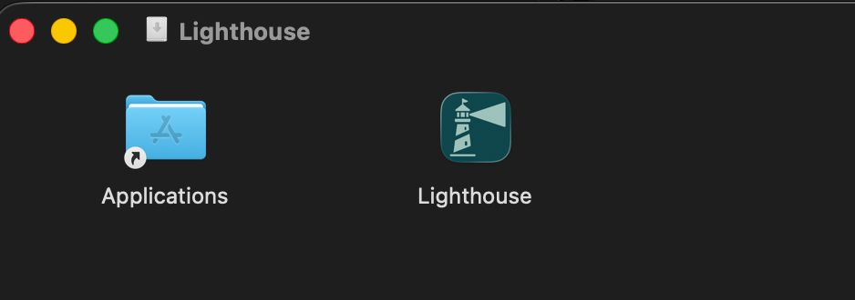

If you can't or don't want to use [Docker](./docker.html), you can also run Lighthouse directly on your system. The packages provided by Lighthouse have everything included, so there are no prerequisites.

Lighthouse runs on Windows, macOS, and Linux based systems.

## Quick OS Guide

| Operating System | How to Install & Run Lighthouse |
|------------------|---------------------------------|
| **Windows**      | Download and run the signed `Lighthouse.exe` |
| **macOS**        | Download the signed & notarized app bundle (`.zip` or `.dmg`), install, and launch |
| **Linux**        | Download, set executable permission, and run from terminal |

Download the latest version for your operating system from the [Releases](https://github.com/LetPeopleWork/Lighthouse/releases/latest).

---

## Windows

1. Download the latest `Lighthouse.exe` from the [Releases](https://github.com/LetPeopleWork/Lighthouse/releases/latest).
2. The Windows app is signed. Simply double-click the executable to start Lighthouse.
3. The app will open a terminal window showing log messages.
4. By default, Lighthouse runs on:
	- HTTPS: https://localhost:5001
	- HTTP:  http://localhost:5000

You should see the (empty) landing page:


---

## macOS

1. Download the latest Lighthouse app for macOS as either a `.zip` or `.dmg` from the [Releases](https://github.com/LetPeopleWork/Lighthouse/releases/latest).
2. The macOS app is distributed as a signed and notarized app bundle. No Gatekeeper warnings should appear.
3. Open the `.dmg` and drag Lighthouse to your Applications folder, or unzip and move the app as desired.



4. Double-click the Lighthouse app to launch it. You will be asked whether you’re ok to launch an applications downloaded from the internet: Confirm to run Lighthouse. A terminal will be launched
5. By default, Lighthouse runs on:
	- HTTPS: https://localhost:5001
	- HTTP:  http://localhost:5002 (port 5002 avoids conflicts with AirPlay Receiver)


You should see the (empty) landing page:


---

## Linux

1. Download the latest Lighthouse release for Linux from the [Releases](https://github.com/LetPeopleWork/Lighthouse/releases/latest).
2. Extract the archive to your desired location.
3. If the `Lighthouse` file is not executable, make it so:
	```bash
	sudo chmod +x Lighthouse
	```
4. Open a terminal, navigate to the Lighthouse directory, and run:
	```bash
	./Lighthouse
	```
5. By default, Lighthouse runs on:
	- HTTPS: https://localhost:5001
	- HTTP:  http://localhost:5000

You should see the (empty) landing page:


## Updating Lighthouse

If a new version is released, you will see an indication on the lower right edge in the footer. If you click on it, a dialog will pop up and you see the release notes of all newer versions of yours.

{: .note }
As the published packages do not include the database, you will keep your data. Lighthouse will in normal circumstances always support migrations to newer versions, so you will not lose any data.

{: .recommendation}
We recommend that you stay on the latest versions. We continuously update Lighthouse with new features and bug fixes, and we only offer support if you're on the latest version.

If you want to update Lighthouse, you have the following options:


### Automatic Update
On Windows and Linux, Lighthouse supports auto-update directly from within the app. On macOS, auto-update is currently not available due to platform restrictions; you will be notified of new releases and can update manually. We are working on bringing seamless updates to macOS in the future.

{: .note}
Automatic update is not supported on Docker. For Docker, please use the latest container.

### Replace Files
You can simply replace the files in the directory. Download and extract the latest version, and copy/paste them into your Lighthouse folder. Override all existing files.

{: .note }
You must make sure to stop Lighthouse from running before updating.

## Troubleshoot Startup Issues

If you follow the instructions, but Lighthouse is not available on the above port, something didn't go as expected.

In such a case, please inspect the logs in the terminal and try to spot an `Error`. They often tell already what the issue may be.

{: .note}
If you can provide us those logs (for example through our [Slack Channel](https://join.slack.com/t/let-people-work/shared_invite/zt-38df4z4sy-iqJEo6S8kmIgIfsgsV0J1A)), the chances are we can support you quite well and try to resolve the issue.

Following is a list of observed problems together with some potential solutions.

#### Address already in use
```bash
10:26:11 - ERROR - Host: Hosting failed to start
System.IO.IOException: Failed to bind to address http://[::]:5000: address already in use
```
This means that the specified port is already used by another application. This may be another instance of Lighthouse (did you stop all other instances?), or by chance another tool is using the same port. On macOS, port 5000 is commonly used by the *AirPlay Receiver* service, which is why Lighthouse defaults to port 5002 on macOS. If the port is still blocked and you can't change/stop the other application that is using it, you can adjust the port that Lighthouse is using. Check the [Configuration Options](configuration.html#http--https-url) for more details.

## Register Lighthouse as a Service
Using this approach, you'll have to restart Lighthouse after every restart. What you can do instead is to register it as a service, that way it will run automatically in the background.

See [Run as Service](./service.html) for more details.