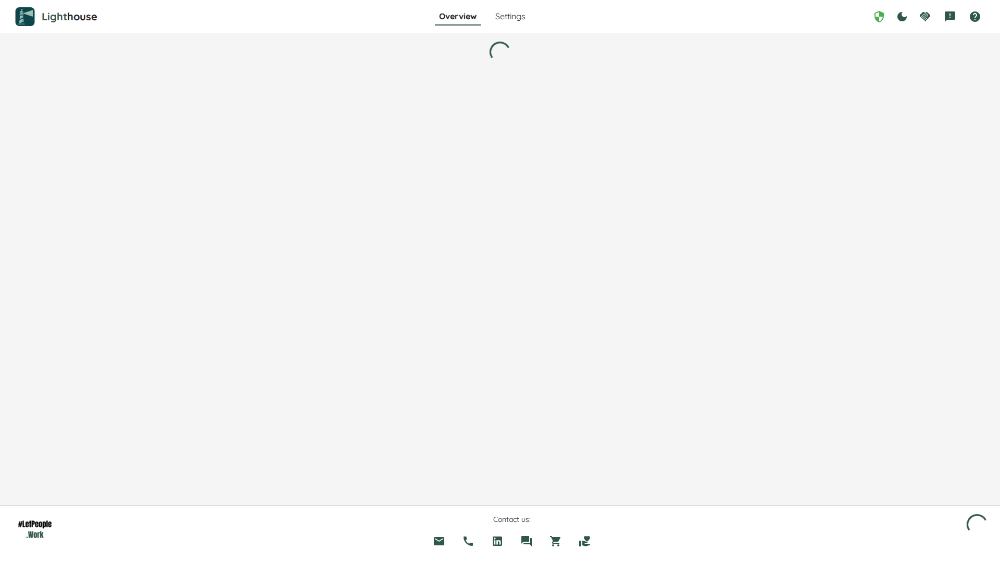

If you can't or don't want to use [Docker](./docker.html), you can also run Lighthouse on your system directly.

- TOC
{:toc}

## Prerequisites
The packages provided by Lighthouse have everything included you need to run it, so there are no prerequisites.

Lighthouse runs on Windows, MacOs, and Linux based systems.

## Download Lighthouse
Download the latest version of Lighthouse for your operating system from the [Releases](https://github.com/LetPeopleWork/Lighthouse/releases/latest).
Download the zip file, and extract it to the location you want to run the application from.

## Updating Lighthouse
If you want to update Lighthouse, you can simply replace the files in the directory.

{: .note }
As the published packages do not include the database, you will keep your data. Lighthouse will in normal circumstances always support migrations to newer versions, so you will not lose any data.

{: .note }
You must make sure to stop Lighthouse from running before updating.

## Installation and Update Scripts
If you don't want to manually download it, you can also use the following scripts, which will look for the latest released version and will download and extract it from the directory you run the script from.

The scripts are part of the packages, so you can execute them from the installation directory.

### Windows
You can run the Powershell script [update_windows.ps1](https://github.com/LetPeopleWork/Lighthouse/blob/main/Scripts/update_windows.ps1). In order to do so, you need to have PowerShell 5.1 or later which is normally installed at your system.

You can also directly download the latest version into your current directory by executing the following command in your terminal:

```powershell
iwr 'https://raw.githubusercontent.com/LetPeopleWork/Lighthouse/main/Scripts/update_windows.ps1' | iex
```
  
### Linux
For Linux, there is a bash script called [update_linux.sh](https://github.com/LetPeopleWork/Lighthouse/blob/main/Scripts/update_linux.sh). It requires unzip to be installed, which you can do by running the following command:

`sudo apt-get install unzip`

You can also directly download the latest version into your current directory by executing the following command in your terminal:

```bash
curl -sSL https://raw.githubusercontent.com/LetPeopleWork/Lighthouse/main/Scripts/update_linux.sh | bash
```

### MacOS
For MacOS, there is a bash script called [update_mac.sh](https://github.com/LetPeopleWork/Lighthouse/blob/main/Scripts/update_mac.sh). It requires unzip to be installed, which is usually pre-installed on MacOS.

You can also directly download the latest version into your current directory by executing the following command in your terminal:

```bash
curl -sSL https://raw.githubusercontent.com/LetPeopleWork/Lighthouse/main/Scripts/update_mac.sh | bash
```

## Run Lighthouse
Once downloaded, you can run the the `Lighthouse` application:
- `Lighthouse.exe` on Windows
- `Lighthouse` on MacOS and Linux

A terminal will open and you should see a window similar to this:


By default, Lighthouse will start running on the system on port 5001. If everything worked as expected, you can open the app now in your browser via [https://localhost:5001](https://localhost:5001).

You should see the (empty) landing page:


Using this approach, you'll have to restart Lighthouse after every restart. What you can do instead is to register it as a service, that way it will run automatically in the background.

See [Run as Service](./service.html) for more details.