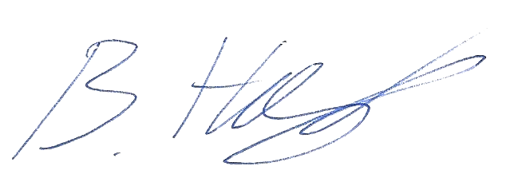

# EU Declaration of Conformity

## EU DECLARATION OF CONFORMITY

**Regulation (EU) 2024/2847 — Cyber Resilience Act**

---

### 1. Product Identification

| Field | Value |
|-------|-------|
| **Product Name** | Lighthouse |
| **Product Description** | Flow metrics, predictability, and Monte Carlo forecasting tool for software delivery |
| **Product Type** | Software application (standard product with digital elements) |
| **Applicable Versions** | v26.xx and higher (all releases from 2026 onwards) |
| **Unique Identification** | GitHub Release tags (format: vYY.MM.DD.build) |

---

### 2. Manufacturer Information

| Field | Value |
|-------|-------|
| **Name** | LetPeopleWork GmbH |
| **Address** | Mühlackerstrasse 108, 8046 Zürich, Switzerland |
| **Contact** | lighthouse@letpeople.work |
| **Security Contact** | security@letpeople.work |
| **Website** | https://letpeople.work |

---

### 3. Declaration

We, the undersigned, being the manufacturer of the product identified above, hereby declare under our sole responsibility that:

1. **The product conforms to the essential cybersecurity requirements** set out in Annex I of Regulation (EU) 2024/2847 (Cyber Resilience Act).

2. **The product has been designed, developed, and produced** in accordance with the essential requirements, taking into account the state of the art and the nature of the risks.

3. **A vulnerability handling process has been established** in accordance with Article 13 of the Regulation, including:
   - A documented vulnerability handling policy
   - A publicly accessible contact point for vulnerability reports
   - Procedures for coordinated disclosure

4. **A Software Bill of Materials (SBOM)** is maintained and made available in accordance with Annex I, Part II.

5. **The technical documentation** required under Article 31 and Annex VII is available and will be kept for at least 10 years after the product is placed on the market.

6. **This declaration is issued under our sole responsibility** as the manufacturer.

---

### 4. Standards and Specifications Applied

The following standards and specifications have been applied (where applicable):

| Standard | Title | Notes |
|----------|-------|-------|
| ISO/IEC 27001 | Information security management | Principles applied (not certified) |
| ISO/IEC 29147 | Vulnerability disclosure | Coordinated disclosure process |
| SPDX | Software Package Data Exchange | SBOM format |
| OWASP | Secure coding practices | Applied in development |

---

### 5. Conformity Assessment Procedure

The conformity assessment was performed using:

- **Module A: Internal production control** (self-assessment)

As permitted for standard products with digital elements under the Cyber Resilience Act.

---

### 6. Technical Documentation

The technical documentation is maintained at:

- **Location**: https://github.com/LetPeopleWork/Lighthouse (public repository)
- **Compliance Documentation**: https://docs.lighthouse.letpeople.work/compliance/

The documentation includes:
- Product description and intended use
- Architecture and data flow documentation
- Risk assessment
- Security controls
- SBOM
- Vulnerability handling policy
- Testing and verification records

---

### 7. CE Marking

Upon signing of this declaration, the CE marking has been applied to:

- [x] Product user interface (About dialog)
- [x] Product documentation
- [ ] Product website download page

In accordance with Article 30 of Regulation (EU) 2024/2847.

---

### 8. Signature
---

**Signed for and on behalf of LetPeopleWork GmbH:**

| Field | Value |
|-------|-------|
| **Name** | Benjamin Huser-Berta |
| **Position** | Authorized Representative |
| **Date** | 30 December 2025 |
| **Place** | Zürich, Switzerland |
| **Signature** |  |

---

## Document Control

| Version | Date | Author | Changes |
|---------|------|--------|---------|
| 1.0 | 2025-12-30 | Benjamin Huser-Berta | Finalized and signed declaration |

**Retention**: This document is retained in perpetuity through version control (Git) and stored on GitHub, exceeding the 10-year requirement of Article 31.

**Next Review**: Annual review or upon significant product changes

---

*This declaration is made in accordance with Regulation (EU) 2024/2847 of the European Parliament and of the Council on horizontal cybersecurity requirements for products with digital elements (Cyber Resilience Act).*
