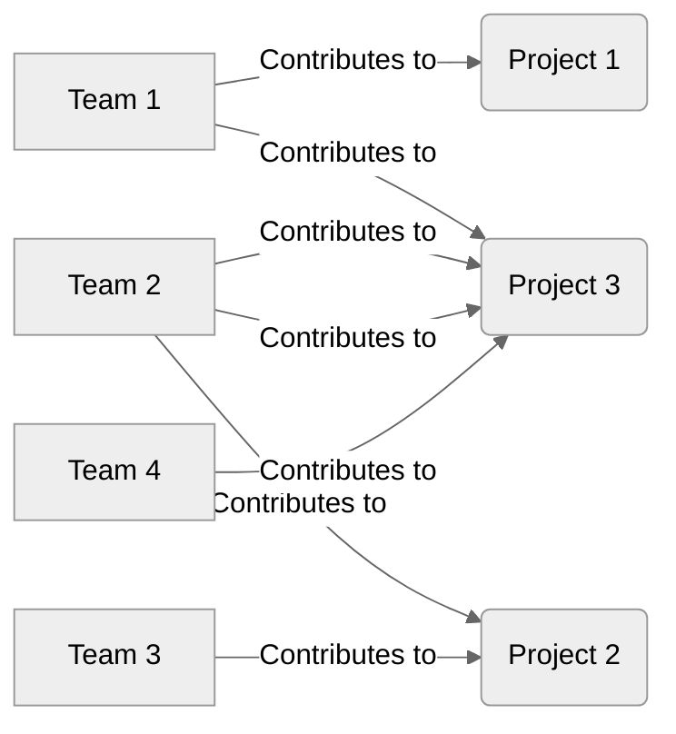
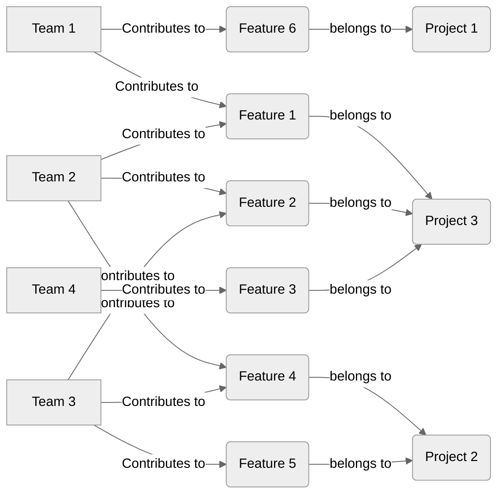

This page will give you an overview of Monte Carlo Simulations (MCS) and how they are applied in Lighthouse.

{: .recommendation}
While you don't have to understand the details of what's going on to use Lighthouse, we recommend to eventually go through it. There are things that help predictability in general that become more clear when you understand how MCS works, while Lighthouse is based on certain assumptions itself that will impact the results.

- TOC
{:toc}

# Monte Carlo Simulations Explained
A forecast using Monte Carlo Simulation will simulate a period using a historical Throughput. You can use it to forecast how many items you can manage to close in a specific amount of time, or how long it will take to get x items done.  

{: .definition}
Monte Carlo Simulations assume that your future will look like your past. This is great because in your past you most likely had sick-days, holidays, people leaving the team, people joining the team, etc., so you don't need to do special 'Capacity Planning' or anything of those sorts.  
Note that this also means that if your future will not be very similar to your past, MCS is maybe not the right approach (but after a couple of weeks you will have the new data to get started with).

Be aware that this is not magic, and you assume that "your future looks like your past". Meaning that it highly depends on the input in the form of Throughput we feed it with.

{: .recommendation}
We recommend that you dive deeper into MCS by reading our blog post [An Introduction and Step-by-Step Guide to Monte Carlo Simulations](https://blog.letpeople.work/p/an-introduction-and-step-by-step-guide-to-monte-carlo-simulations) and follow along the exercise in a spreadsheet.

# About Predictability
Now that you know [How MCS Works](#monte-carlo-simulations-explained), and before we dive into the details of [Lighthouse](#how-lighthouse-forecasts), let's briefly explore *Predictability* in the context of MCS.

{: .definition}
You are more predictable the *closer* your forecasts are *together*. Meaning if there is only a small gap between your percentiles (for example 50/70/85/95%), you would be more predictable.

Let's look at an example with two teams for this and forecast how many items we can get done in the next 14 days.

```bash
==== Forecast Team A ====
*How many Items can be done in 14 days?*
95% Chance: 3 items or more
85% Chance: 5 items or more
70% Chance: 12 items or more
50% Chance: 27 items or more
```

```bash
==== Forecast Team B ====
*How many Items can be done in 14 days?*
95% Chance: 9 items or more
85% Chance: 12 items or more
70% Chance: 14 items or more
50% Chance: 19 items or more
```

According to our definition, *Team B* is more predictable. *Team A* might have a higher *upside*, but the chance of that happening not that high. The 70% chance is very similar for both teams, but if you want a higher probability, it drops very low with *Team A*. If you need to get 9 items done in 14 days, you would trust *Team B* more to get the job done as they are more predictable.

{: .note}
Predictability does not equal *speed*. If you get one item done consistently every week, you are very predictable. You might also be slow, but those are two different things. We recommend first focusing on predictability, and once you are happy with it, focus on what you can do improve speed.

## Improving Predictability
If you want to improve predictability, you should focus on *Flow*. Flow Metrics are a great indicator and starting point to do so. Keep your *Work Item Age* low, act on things that start to get older, and the rest will fall in place.

{: .recommendation}
We recommend reading our blog post [Using Flow Metrics](https://blog.letpeople.work/p/using-flow-metrics-from-feelings-to-facts) to get an introduction into Flow Metrics.

# How Lighthouse Forecasts
Now that we've covered the basics, let's look at how Lighthouse is forecasting. We'll use an example to explain the interesting parts.

## Example Setup
### Teams and Projects
Our example will have four different teams and three projects. *Team 1* is contributing to *Project 1* and *Project 3*. *Team 2* and *Team 3* contribute both to *Project 2* and *Project 3*. And *Team 4* is contributing to *Project 3*:



### Features
We'll have a list of Features, for simplicity we name them *Feature 1*, *Feature 2* etc., where the number is implying the order. So *Feature 1* has the highest order and *Feature 5* the lowest.

The features belong to the following Projects:  

| Project | Features |
|---------|----------|
| Project 1 | Feature 6 |
| Project 2 | Feature 4 - Feature 5 |
| Project 3 | Feature 1 - Feature 3 |

The Features are worked on sometimes by a single team, in other cases by multiple teams:  

| Feature | Teams |
|---------|---------|
| Feature 1 | Team 1, Team 2 |
| Feature 2 | Team 2, Team 3 |
| Feature 3 | Team 4 |
| Feature 4 | Team 2, Team 3 |
| Feature 5 | Team 3 |
| Feature 6 | Team 1 |

Which would lead us to this overview:



{: .note}
In theory one feature could belong to multiple projects, but we leave that for now as this would make it even more complicated. By the way, thanks for reading thus far, great job!

## Forecasting
Under the covers, Lighthouse is not forecasting any project, but is running forecasts for each team. This makes sense, given that *Teams* have *Throughput*. What is happening is that for each team, the backlog of work is being built up, based on the order of the Features. For each team then *When* forecasts are run to see when each team will complete their individual part of a *Feature*.

Let's look at this in detail based on our example.

{: .note}
For simplicity, we just assume each Feature contains 4 child items. If two teams contribute, each gets 2 child items. Reality of course is more messy, but you would get how it works anyway.

### Team 1
*Team 1* contributes to *Feature 6* and *Feature 1* (together with *Team 2*). That means the work to be done is:
- Featu

### Team 2

### Team 3

### Team 4

## The Impact of Feature WIP

# Conclusion

{: .note}
You may wonder why this is so complicated. It would be a lot easier if there were no dependencies between teams, teams would only focus on one feature at a time, and could deliver projects without other teams. We just try to help you cope with reality...don't hate the player, hate the game. Or better yet, change how your organization plays the game.

# Further Resources
See [Resources](../resources/resources.html) for an extensive list of resources around this topic.