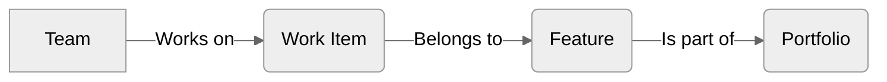
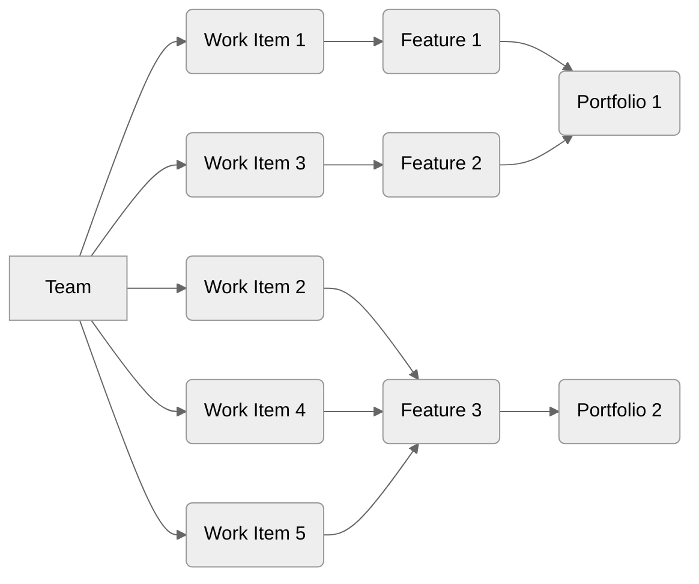
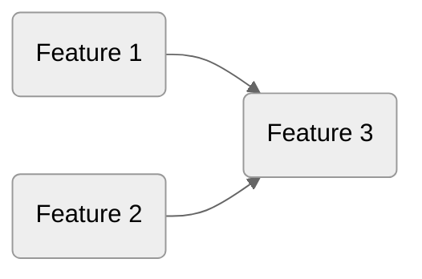
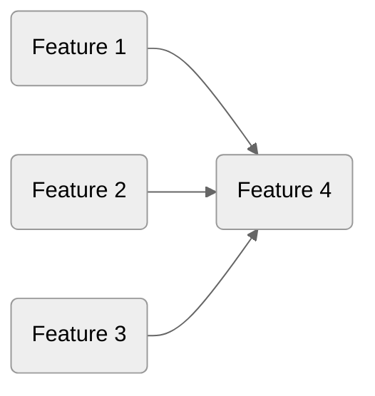

This page will give you an overview of Monte Carlo Simulations (MCS) and how they are applied in Lighthouse.

{: .recommendation}
While you don't have to understand the details of what's going on to use Lighthouse, we recommend eventually going through it. There are things that help predictability in general that become more clear when you understand how MCS works, while Lighthouse is based on certain assumptions that will impact the results.

- TOC
{:toc}

# Monte Carlo Simulations Explained
A forecast using Monte Carlo Simulation will simulate a period using a historical Throughput. You can use it to forecast how many items you can manage to close in a specific amount of time, or how long it will take to get x items done.  

{: .definition}
Monte Carlo Simulations assume that your future will look like your past. This is great because in your past you most likely had sick-days, holidays, people leaving the team, people joining the team, etc., so you don't need to do special 'Capacity Planning' or anything of those sorts.  
Note that this also means that if your future will not be very similar to your past, MCS is maybe not the right approach (but after a couple of weeks you will have the new data to get started with).

Be aware that this is not magic, and you assume that "your future looks like your past". Meaning that it highly depends on the input in the form of Throughput we feed it with.

{: .recommendation}
We recommend that you dive deeper into MCS by reading our blog post [An Introduction and Step-by-Step Guide to Monte Carlo Simulations](https://blog.letpeople.work/p/an-introduction-and-step-by-step-guide-to-monte-carlo-simulations) and follow along the exercise in a spreadsheet.

# About Predictability
Now that you know [How MCS Works](#monte-carlo-simulations-explained), and before we dive into the details of [Lighthouse](#how-lighthouse-forecasts), let's briefly explore *Predictability* in the context of MCS.

{: .definition}
You are more predictable the *closer* your forecasts are *together*. Meaning if there is only a small gap between your percentiles (for example 50/70/85/95%), you would be more predictable.

Let's look at an example with two teams for this and forecast how many items we can get done in the next 14 days.

```bash
==== Forecast Team A ====
*How many Items can be done in 14 days?*
95% Chance: 3 items or more
85% Chance: 5 items or more
70% Chance: 12 items or more
50% Chance: 27 items or more
```

```bash
==== Forecast Team B ====
*How many Items can be done in 14 days?*
95% Chance: 9 items or more
85% Chance: 12 items or more
70% Chance: 14 items or more
50% Chance: 19 items or more
```

According to our definition, *Team B* is more predictable. *Team A* might have a higher *upside*, but the chance of that happening not that high. The 70% chance is very similar for both teams, but if you want a higher probability, it drops very low with *Team A*. If you need to get 9 items done in 14 days, you would trust *Team B* more to get the job done as they are more predictable.

{: .note}
Predictability does not equal *speed*. If you get one item done consistently every week, you are very predictable. You might also be slow, but those are two different things. We recommend first focusing on predictability, and once you are happy with it, focus on what you can do improve speed.

## Improving Predictability
If you want to improve predictability, you should focus on *Flow*. Flow Metrics are a great indicator and starting point to do so. Keep your *Work Item Age* low, act on things that start to get older, and the rest will fall in place.

{: .recommendation}
We recommend reading our blog post [Using Flow Metrics](https://blog.letpeople.work/p/using-flow-metrics-from-feelings-to-facts) to get an introduction into Flow Metrics.

# How Lighthouse Forecasts
Now that we've covered the basics, let's look at how Lighthouse is forecasting. We'll use an example to explain the interesting parts. We'll use some scenarios to explain how Lighthouse is running the forecast, starting from the most simple example to more complicated ones.

{: .note}
We'll look into how Lighthouse is running *When* forecasts for portfolios. The *How Many* and *When* on Team level are the basic operations that are also covered in the above mentioned blog post.

## Teams, Features, and Portfolios
Forecasts will always be made for specific *Teams*. The forecast will calculate *When* a certain number of *Work Items* will be done. Those *Work Items* are automatically fetched based on the Team Backlog (see [Team Work Item Query](../teams/edit.html#work-item-query)) and that belong to a specific *Feature* of a *Portfolio* (based on the [Portfolio Work Item Query](../portfolios/edit.html#work-item-query)). 



{: .important}
Lighthouse is only aware about Work Items if they are linked to a portfolio. If your team is working on 5 Features, but only 3 of them are linked to Portfolios in Lighthouse, the other 2 Features and all the work items that belong to them will be ignored, and the forecast assumes you will **only** work on the 3 Features that are known.
It is therefore important to make sure you have all the Features that are relevant to you covered within a Lighthouse Portfolio.


*If Portfolio 2 is not defined in Lighthouse, Work Item 2, 4, and 5 will also not be known to Lighthouse*.

## Why the Backlog Order Matters
When Lighthouse is forecasting, it will always take all the Features of **all** Portfolios into account. If you set up a new Portfolio, you want to know when this will be done taking into account all the other things that are going on. You **can't** make a forecast for a Portfolio in isolation, but you will always look at the full known backlog.

{: .note}
That means, if you really want to ignore everything else, just remove all other Portfolios. That's not recommended though.

Because Lighthouse works this way, this is also the reason why the order is so important. In the above image, you can see that *Feature 1* is ordered above *Feature 2*, which itself is above *Feature 3*. That means that Lighthouse assume we first focus all our efforts on *Feature 1* (assuming a [Feature WIP of 1](#the-impact-of-feature-wip)), then on *Feature 2*, and only then on *Feature 3*. If you forecast *Portfolio 2*, the forecast will take into account that *Feature 1* and *Feature 2* must be done before that.

{: .recommendation}
The [Feature View](../teams/detail.html#features) in the Teams Detail Page will show you **all** Features the team is contributing towards in their order.

## The Impact of Feature WIP
By default, Lighthouse will assume that your Teams will work on one Feature at a time (*Feature WIP* = 1). In other words, this means that the forecast will check how many items can be done, and assume all those items will contribute to the first feature. So the Features will be done *in sequence*:


If we increase the Feature WIP to 2, we will assume that the work that is completed is distributed to two Features (as long as we have 2):



The same pattern can be applied with an even higher Feature WIP (as an example 3):



In simple terms this means, the higher the *Feature WIP*, the more focus goes away from the highest priority item (*Feature 1*) and the earlier we start on less important things (*Feature 2* and following). So instead of getting the most important thing early, we get everything later. This is contradicting with our ambition to continuously deliver value in small batches.

{: .recommendation}
We **highly** recommend to keeping your Feature WIP as low as possible. Lighthouse can help you make the effects of a high Feature WIP transparent. It also is able to automatically adjust the Feature WIP based on your work in progress. See the [Team Settings](../teams/edit.html#feature-wip) for more details.

## Example Scenarios
So let's go through some scenarios to look at what happens when Lighthouse forecasts.

{: .note}
For simplicity, we'll talk only about Teams and Features. As you learned above, this is tied to Portfolios. However, when it comes to forecasting we just care about the Features in Order, independent of which Portfolios they are in. To simplify this a bit, we'll skip the Portfolios in the examples.

### 1 Team - 1 Feature
The most basic case is if we have a single team, working on a single Feature. This equals a simple *When* forecast. We take the remaining Work Items for this Feature (all items that belong to this Feature that are [Not Done](../teams/edit.html#states)).

<!-- TODO: Add Flow Charts -->

Then we calculate how long it will take to complete all those items.

{: .note}
Feature WIP does not matter in this situation, as we'll only have one Feature available. Thus all the work goes into that Feature.

### 1 Team - 2 Features
If we have a single team, but 2 features, it starts to get more interesting. Lighthouse will first get all remaining work items for each Feature.

Then it will simulate a single day, and reduce the remaining work of from the Features till there is nothing left. Once both Features have no remaining items left, the simulation is done. For each feature, we'll count the simulated number of days it took.

{: .note}
For *Feature 2* we will not start with the 1st day, but the count will resume from where it was when we finished *Feature 1*.

This is done 10'000 times and the results are stored (how long did it take till the Features were done).

If the Feature WIP is 1, all simulated Throughput goes into the first Feature, until it's done. From then on, all simulated Throughput goes towards the second one.

{: .note}
If you have 1 item left for a Feature, and you simulate 2 or more items to be done that day, the full Throughput will go to Feature 1. Let's book this under context switching cost. 

<!-- TODO: Add Flow Charts -->

If we have a Feature WIP of 2, we simulate the Throughput each day. Then we randomly pick which Feature to assign this to.

| Simulated Throughput | Feature WIP | Behaviour |
|---------------------|-------------|-----------|
| 1 | 1 | Item goes to Feature 1 |
| 1 | 2 | Randomly select if it goes to *Feature 1* or *Feature 2* |
| 2 | 1 | Both items go to Feature 1 |
| 2 | 2 | Items are randomly distributed between *Feature 1* and *Feature 2*. It can be 2 items in either Feature, or an even split. |
| 3 | 1 | All items go to Feature 1 |
| 3 | 2 | Items are randomly distributed between *Feature 1* and *Feature 2*. It can be 3 items in either Feature, or a 2/1 split in either combination. |

{: .note}
Before you ask, it's not possible to somehow *weight* Features, for example saying we work 80% on *Feature 1* and 20% on *Feature 2*. If you work on mulitple things, items will be randomly distributed.

<!-- TODO: Add Flow Charts -->

### 2 Teams - 2 Features
If we have two teams working on two features independently, it's the same case as in [1 Team - 1 Feature](#1-team---1-feature). We simply do it for both teams individually.

### 2 Teams - 1 Feature
A tricky case is if we have a feature that is being worked on by two teams. This means both teams have work to do for this feature. Lighthouse will run two forecasts, one for each team with the remaining work for the Feature (similar to [1 Team - 1 Feature](#1-team---1-feature)). Then both forecasts will be stored for this Feature.
Lighthouse is then presenting you the forecast that is predicting to be done later.

{: .note}
That does not mean that one team is slower, they might just have other work that is ordered higher up.

{: .important}
What Lighthouse does in such cases is not ideal. It's suggesting that there is a 95/85/70/50% probability for the forecast that predicts to be done later. However, as it's two forecasts that both need to happen, the real probabilities would be 90/72/49/25%. This would be even worse if three or more teams would be involved. [Dependencies](#dependencies) are horrible, try to get rid of them.
While we know it's not properly done at the moment, we are not sure what's the best way to handle this. We're open for ideas.

## Dependencies
Lighthouse does **not** offer any possibility to define dependencies in the sense of:
- This work item can only be started once that work was done
- This Feature has to wait for the completion of those two other Features before we can start

{: .important}
Lighthouse will also not offer this going forward.

This is for two reasons.
First, it's a lot of work to do. It may sound easy, but it will complicate the whole tool. And while we are not opposing investing in the tool, we only want to do it when we think it makes sense.
Which brings us to the reason #2: We don't like dependencies. While there may be some, you should try to aggressively remove them as good as possible. As long as we have lots of dependencies, a tool like Lighthouse will not help you very much.

Please have a look at the work of [Prateek Singh](https://www.linkedin.com/in/singhpr13/), who wrote among others, this very interesting blog post: [Understanding the Impact of Dependencies](https://singhpr.medium.com/understanding-the-impact-of-dependencies-4cca0d720019)

# Conclusion
Congrats, you made it to the end of this page! We understand that this may have been the opposite of *light reading*. As mentioned in the beginning, you don't *need* to know all of this when you start out with Lightouse. But as you go on, you may wonder why certain things they work how they do. And sometimes the answer can be found in the way Lighthouse works.

{: .recommendation}
You may wonder why this is so complicated. It would be a lot easier if there were no dependencies between teams, teams would only focus on one feature at a time, and could deliver portfolios without other teams. Also it would be nice if we could keep a proper order in our backlog. We just try to help you cope with reality...don't hate the player, hate the game. Or better yet, change how your organization plays the game.

# Further Resources
See [Resources](../resources/resources.html) for an extensive list of resources around this topic.