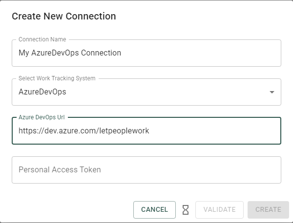
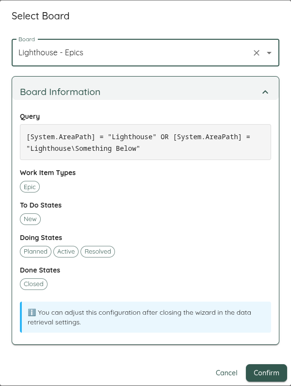

This page will give you an overview of the specifics to Azure DevOps when using Lighthouse. In detail, it will cover:  

- TOC
{:toc}

# Work Tracking System Connection
To create a connection to an Azure DevOps system, you need two things:
- The URL of your Azure DevOps Instance
- A Personal Access Token (PAT)
  
  


The URL will look something like this: `https://dev.azure.com/letpeoplework` where *letpeoplework* would be your organization name. You don't need to specify any Team Project, this should be part of the [Query](#query).

# Authentication

Lighthouse supports two authentication methods against Azure DevOps. OAuth (against an Entra ID app registration) is the recommended path because it removes per-user token rotation; Personal Access Tokens are simpler to set up but pin the connection to one human's credential.

## Azure DevOps (OAuth)

OAuth lets you authorise Lighthouse as an Entra ID application in the same tenant that owns your Azure DevOps organisation — no shared PAT to rotate, no service account to manage. OAuth is a **Premium** feature and applies to **Azure DevOps Services** (`dev.azure.com`); on-premises Azure DevOps Server continues to use PATs.

### Register an Entra ID app

You need an Entra ID app registration in the same tenant that owns the Azure DevOps organisation you want to connect.

1. Sign in to the [Azure portal](https://portal.azure.com) with an account that can create app registrations in the tenant (typically *Application Developer* or higher).
2. **Microsoft Entra ID** → **App registrations** → **New registration**.
3. Name the app (e.g. *Lighthouse — `<org>`*).
4. Pick a supported account type:

    - **Single tenant** (recommended for a self-hosted Lighthouse serving one tenant). You MUST paste the **Directory (tenant) ID** into Lighthouse later so it targets the per-tenant Microsoft endpoint — the `/common/` endpoint rejects single-tenant clients with `unauthorized_client`.
    - **Multi-tenant**: only if a single Lighthouse instance serves Azure DevOps organisations across multiple Entra tenants. Adds a verified-publisher requirement and broadens consent surface. Leave **Directory (Tenant) ID** empty in Lighthouse.

5. Leave **Redirect URI** blank for now; click **Register**.
6. On the app's **Overview** page, copy the **Application (client) ID** and the **Directory (tenant) ID**.

### Set the redirect URI

1. In the app registration: **Authentication** → **Add a platform** → **Web**.
2. **Redirect URI**: `{your-lighthouse-base-url}/api/oauth/callback`. The host must match what your operators have configured as `Lighthouse:BaseUrl` (see [OAuth Callback Base URL](../../Installation/configuration.html#oauth-callback-base-url)).
3. The redirect URI MUST be `https://` in any production deployment. Entra ID accepts `http://localhost` for local development only — every other host must use HTTPS.

### Add the API permission

1. **API permissions** → **Add a permission** → **APIs my organization uses** → search for **Azure DevOps** → select it.
2. Pick **Delegated permissions** and tick `vso.work_write` (read-and-write to work items, queries, boards, and area/iteration paths). Lighthouse handles the Microsoft v2.0 resource-prefixing transparently — you do not need to add the GUID prefix manually.
3. `offline_access` is requested as an OIDC protocol scope; do not add it under **API permissions**.
4. Click **Grant admin consent for `<tenant>`**. Tenant-wide admin consent is required so the connector-admin (who may not be a tenant admin) does not get blocked with `AADSTS65001`.

### Create a client secret

1. **Certificates & secrets** → **Client secrets** → **New client secret**.
2. Description (e.g. *Lighthouse — production*), pick an expiry (Microsoft caps at 24 months).
3. Click **Add** and copy the secret's **Value** immediately — the portal only shows it once.
4. Record the expiry. Lighthouse does **not** auto-rotate Entra ID client secrets; when the secret expires the connection moves to `RefreshFailed` and an admin must mint a new one and paste it back into the connection form.

### Configure the connection in Lighthouse

1. **Settings → Connections** → **New Azure DevOps connection** (or **Edit** an existing one if you are migrating off a PAT).
2. Set **Authentication** to **Azure DevOps (OAuth)**. Hidden if your instance has no Premium licence.
3. Fill in: **Organization URL** (`https://dev.azure.com/<org>`), **Client ID**, **Directory (Tenant) ID** (single-tenant) or leave empty (multi-tenant), **Client Secret**.
4. Verify the read-only **Callback URL** matches exactly what you registered in the Entra app. If it shows a warning, set `Lighthouse:BaseUrl` on the server to the public `https://` URL first and reload the page — Entra rejects non-HTTPS redirect URIs for every host except `localhost`.
5. Click **Connect**. A browser popup opens against `login.microsoftonline.com`; sign in, **Accept**, and the popup closes when consent succeeds.

### Silent refresh and reconnect

Microsoft access tokens expire after roughly an hour. Lighthouse refreshes them silently before they expire; the admin sees nothing. If a refresh fails (revoked grant, expired client secret, scope tightened, network timeout) the connection's `Status` transitions to `RefreshFailed`, a yellow *Reconnect required* banner appears on the connection card, background syncs against that connection stop, and you have to click **Reconnect** and complete the Microsoft consent flow again — or, if the client secret has expired, mint a new one in **Certificates & secrets** and paste the new value into the connection.

When at least one OAuth connection exists, system admins see a cloud icon in the application header that reports OAuth health at a glance.

### Troubleshooting

| Symptom | Likely cause | Fix |
|---|---|---|
| `AADSTS50011: Reply URL mismatch` after consent | Redirect URI registered in the Entra app does not match `{Lighthouse:BaseUrl}/api/oauth/callback` exactly. | Confirm `Lighthouse:BaseUrl`. Entra compares scheme + host + port + path exactly — a trailing slash or wrong scheme breaks the match. |
| `AADSTS65001: not consented` | The Azure DevOps API permission is missing admin consent, or the connector-admin lacks consent rights. | App → **API permissions** → **Grant admin consent for `<tenant>`** → retry **Connect**. |
| `AADSTS650053: scope … doesn't exist on the resource '00000003-…'` | `vso.work_write` is missing from the app's API permissions. The `00000003-…` resource in the error is Microsoft Graph — the v2.0 endpoints default to Graph when no resource prefix is supplied, which fires when no Azure DevOps permission is granted yet. | Add the **Azure DevOps → Delegated → `vso.work_write`** permission, grant admin consent, retry. |
| `unauthorized_client: client does not exist or is not enabled for consumers` | The Entra app is single-tenant but Lighthouse hit `/common/` because the **Directory (Tenant) ID** field is empty. | Paste the tenant ID from the app's Overview page into Lighthouse, save, retry — or switch the app to multi-tenant. |
| Popup blocked when clicking **Connect** | The browser blocked the popup against `login.microsoftonline.com`. | Allow popups for the Lighthouse origin and retry. |
| Yellow *"Reconnect required"* banner on a previously-syncing connection | Silent refresh failed — expired client secret, revoked grant, scope tightened. | If the secret expired, mint a new one in **Certificates & secrets** and paste it into the connection. Otherwise click **Reconnect** and complete consent again. |
| `VssServiceException: Identity {guid} has not been materialized, please use interactive login over the browser first.` on the first API call after connecting | The Entra account you OAuth'd with has never signed into the target Azure DevOps organisation interactively. Azure DevOps maintains its own user table separate from Entra and refuses to recognise Entra identities until a browser sign-in materialises them. OAuth itself worked; the token is valid; ADO just doesn't know the principal yet. | Open `https://dev.azure.com/{your-org}` in a fresh browser tab, sign in with the same Microsoft account, accept any "request access" prompt, wait for the ADO home page to load. That one interactive sign-in materialises the identity. Then retry the failing Lighthouse operation. No need to re-do OAuth consent. |

For deeper issues, capture the failing callback URL from the browser's address bar (it contains the `error=` / `error_description=` parameters along with the AADSTS code) and include it when reporting the problem.

## Personal Access Token

If you cannot use OAuth (on-premises Azure DevOps Server, or no Premium licence), authenticate with a PAT. See the [Microsoft documentation](https://learn.microsoft.com/en-us/azure/devops/organizations/accounts/use-personal-access-tokens-to-authenticate?view=azure-devops&tabs=Windows/) for how to mint one.

{: .important}
The Personal Access Token shall be treated like a password. Do not share this with anyone or store it in plaintext. Lighthouse stores it encrypted in its database (see [Encryption Key](../../Installation/configuration.html#encryption-key) for more details) and will not send it to any client in the frontend.
# Additional Fields

Lighthouse allows you to configure **Additional Fields** for Azure DevOps connections. These fields are used to retrieve and display extra information from your work items, such as custom properties or metadata that are not part of the default set.

{: .note}
The community edition supports one additional field. You get unlimited with the premium license.

### Example Additional Fields
Following may be interesting additional fields for Jira:
- **Iteration Path** (`System.IterationPath`)
- **Area Path** (`System.AreaPath`)
- **Size** (`Microsoft.VSTS.Scheduling.Size`)

### How to Add or Configure Additional Fields
You can manage additional fields in the connection settings UI. When adding a field, you will be prompted for:
- **Display Name**: A user-friendly name for the field.
- **Field Reference**: The Azure DevOps field reference (e.g., `System.IterationPath`, `Custom.MyField`) or name (e.g. `Iteration Path` or `My Field`).

For help finding the correct field reference, see the [Azure DevOps field documentation](https://learn.microsoft.com/en-us/azure/devops/boards/work-items/guidance/work-item-field?view=azure-devops). The UI provides direct links and helper text to guide you.

#### Example: Adding a Custom Field
Suppose you want to add a custom field called "Business Value". You would enter:
- Display Name: `Business Value`
- Field Reference: `Custom.BusinessValue`


# Options

## Request Timeout
- **Request Timeout (seconds)**: Controls how long Lighthouse will wait for a response from Azure DevOps before timing out. The default is `100` seconds, but you can adjust this in the connection settings if you experience slow network conditions or large queries.

# Query
Queries for Azure DevOps are written in the [Work Item Query Language (WIQL)](https://learn.microsoft.com/en-us/azure/devops/boards/queries/wiql-syntax?view=azure-devops). An example Query for a Team called "Binary Blazers" in the Team Project "Lighthouse Demo" could look like this:

```
[System.TeamProject] = "Lighthouse Demo" AND [System.AreaPath] = "Lighthouse Demo\Binary Blazers"
```

You can use any kind of filtering you'd like and that is valid according to the WIQL language. An extended query that would exclude certain items based on their tags would look like this:

```
[System.TeamProject] = "Lighthouse Demo" AND [System.AreaPath] = "Lighthouse Demo\Binary Blazers" AND [System.Tags] NOT CONTAINS "Automation"
```

# Team Backlog
When you create a new team, you will have to define a query that will get the items that belong to the specific team backlog. The query should **not** specify *Work Item Types* (for example Story, Bug, etc.) nor specific *Work Item States* (like In Progress, Canceled), as those things will be specified outside the query.

{: .definition}
The work items we look for on team level are the ones that you plan with on that level. Often this would be *User Stories* and *Bugs*. They should be delivering value and you should be able to consistently close them. *Tasks* tend to be too detailed and technical (so they do not deliver value), while *Epics* and *Features* may be too big (see [Portfolios](#portfolios) for more details on how to handle this). This is the general guidance, but your context might be different, so adjust this as needed.

What should be in there is everything else that defines whether an item is belonging to a team or not, like:
- Team Project (via *System.TeamProject*)
- Tags (via *System.Tags*)
- Area Paths (via *[System.AreaPath]*)
- Anything else that is needed to identify an item for your team, including custom fields if you have them

```bash
[System.TeamProject] = "Lighthouse Demo" AND [System.AreaPath] = "Lighthouse Demo\Binary Blazers"
[System.TeamProject] = "Lighthouse Demo" AND [System.Tags] NOT CONTAINS "Automation"
```

{: .note}
The whole syntax of WIQL is at your disposal. Remember, with great power comes great responsibility. Lighthouse will not be able to validate if what you write is making sense or not. There is a minimal verification on saving of a team, that makes sure that at least one item is found by the query. As long as that's the case, Lighthouse will assume it's correct.

# Portfolios
Portfolios are made up of items that have *child items* - in Lighthouse this is called a *Feature*. In an Azure DevOps context, this often means either *Epics* or *Features*. But it could be other (custom) types as well.

When creating a portfolio, you need to specify a query that will fetch the features that are relevant for this portfolio. This may be via:
- AreaPath (*[System.AreaPath]*)
- Tags (*[System.Tags]*)
- Whatever else may identify a feature to belong to a specific portfolio

As with the [Teams](#team-backlog), you do **not** have to specify work item type and state in the query itself when defining the portfolio.

Example WIQL Queries for Portfolios could look like these:

```bash
[System.TeamProject] = "Lighthouse Demo" AND [System.Tags] CONTAINS "Release 1.33.7"
[System.TeamProject] = "Lighthouse Demo" AND [System.AreaPath] = "Lighthouse Demo\Release 1.33.7" AND [System.Tags] NOT CONTAINS "Technical Debt"
```

# Feature Order
The Order of Features (be it *Epics*, *Features*, or anything else) is based on the *Stack Rank* property. This property is stored in the field *[Microsoft.VSTS.Common.StackRank]*.  

Azure DevOps is shwoing this as *Order* in the *Backlog View*, and in general the field is adjusted if you shift items *up* or *down* (in the Backlog or Boards view).

Check out the [documentation from Microsoft](https://learn.microsoft.com/en-us/azure/devops/boards/backlogs/backlogs-overview?view=azure-devops#backlog-priority-or-stack-rank-order) to learn more.

# Board Wizard

Use the Azure DevOps Board Wizard to automatically discover and import configuration from the Boards in your Azure DevOps Instance. The Wizard will:
- Show you all boards from all the Projects you have access
- Upon selection of a Board, fetch the WIQL Query, Work Item Types, and State Configuration for the board



You may adjust all those values to your liking after that. For example, if the state mapping is not what you want to use.

{: .note}
Please be aware that this is a one-time operation. Lighthouse does not keep your settings in sync with the selected board. If you make changes in your Azure DevOps board, you must either update them manually, or rerun the Wizard.