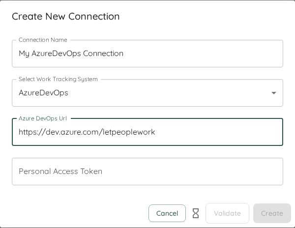

This page will give you an overview of the specifics to Azure DevOps when using Lighthouse. In detail, it will cover:  

- TOC
{:toc}

# Work Tracking System Connection
To create a connection to an Azure DevOps system, you need two things:
- The URL of your Azure DevOps Instance
- A Personal Access Token (PAT)
  
  


The URL will look something like this: `https://dev.azure.com/letpeoplework` where *letpeoplework* would be your organization name. You don't need to specify any Team Project, this should be part of the [Query](#query).

# Authentication
Currently you can only authenticate using a *Personal Access Token* to Azure DevOps.

You can find more information on how to create a Personal Access Token in the [Microsoft Documentation](https://learn.microsoft.com/en-us/azure/devops/organizations/accounts/use-personal-access-tokens-to-authenticate?view=azure-devops&tabs=Windows/)

{: .important}
The Personal Access Token shall be treated like a password. Do not share this with anyone or store it in plaintext. Lighthouse is storing it encrypted in its database (see [Encryption Key](../installation/configuration.html#encryption-key) for more details) and will not send it to any client in the frontend.
# Additional Fields

Lighthouse allows you to configure **Additional Fields** for Azure DevOps connections. These fields are used to retrieve and display extra information from your work items, such as custom properties or metadata that are not part of the default set.

### Default Additional Fields
When you create a new Azure DevOps connection, Lighthouse automatically adds the following additional fields:
- **Iteration Path** (`System.IterationPath`)
- **Area Path** (`System.AreaPath`)
- **Size** (`Microsoft.VSTS.Scheduling.Size`)

You can add more fields or edit/remove these defaults as needed.

### How to Add or Configure Additional Fields
You can manage additional fields in the connection settings UI. When adding a field, you will be prompted for:
- **Display Name**: A user-friendly name for the field.
- **Field Reference**: The Azure DevOps field reference (e.g., `System.IterationPath`, `Custom.MyField`) or name (e.g. `Iteration Path` or `My Field`).

For help finding the correct field reference, see the [Azure DevOps field documentation](https://learn.microsoft.com/en-us/azure/devops/boards/work-items/guidance/work-item-field?view=azure-devops). The UI provides direct links and helper text to guide you.

#### Example: Adding a Custom Field
Suppose you want to add a custom field called "Business Value". You would enter:
- Display Name: `Business Value`
- Field Reference: `Custom.BusinessValue`


# Options

## Request Timeout
- **Request Timeout (seconds)**: Controls how long Lighthouse will wait for a response from Azure DevOps before timing out. The default is `100` seconds, but you can adjust this in the connection settings if you experience slow network conditions or large queries.

# Query
Queries for Azure DevOps are written in the [Work Item Query Language (WIQL)](https://learn.microsoft.com/en-us/azure/devops/boards/queries/wiql-syntax?view=azure-devops). An example Query for a Team called "Binary Blazers" in the Team Project "Lighthouse Demo" could look like this:

```
[System.TeamProject] = "Lighthouse Demo" AND [System.AreaPath] = "Lighthouse Demo\Binary Blazers"
```

You can use any kind of filtering you'd like and that is valid according to the WIQL language. An extended query that would exclude certain items based on their tags would look like this:

```
[System.TeamProject] = "Lighthouse Demo" AND [System.AreaPath] = "Lighthouse Demo\Binary Blazers" AND [System.Tags] NOT CONTAINS "Automation"
```

# Team Backlog
When you create a new team, you will have to define a query that will get the items that belong to the specific team backlog. The query should **not** specify *Work Item Types* (for example Story, Bug, etc.) nor specific *Work Item States* (like In Progress, Canceled), as those things will be specified outside the query.

{: .definition}
The work items we look for on team level are the ones that you plan with on that level. Often this would be *User Stories* and *Bugs*. They should be delivering value and you should be able to consistently close them. *Tasks* tend to be too detailed and technical (so they do not deliver value), while *Epics* and *Features* may be too big (see [Portfolios](#portfolios) for more details on how to handle this). This is the general guidance, but your context might be different, so adjust this as needed.

What should be in there is everything else that defines whether an item is belonging to a team or not, like:
- Team Project (via *System.TeamProject*)
- Tags (via *System.Tags*)
- Area Paths (via *[System.AreaPath]*)
- Anything else that is needed to identify an item for your team, including custom fields if you have them

```bash
[System.TeamProject] = "Lighthouse Demo" AND [System.AreaPath] = "Lighthouse Demo\Binary Blazers"
[System.TeamProject] = "Lighthouse Demo" AND [System.Tags] NOT CONTAINS "Automation"
```

{: .note}
The whole syntax of WIQL is at your disposal. Remember, with great power comes great responsibility. Lighthouse will not be able to validate if what you write is making sense or not. There is a minimal verification on saving of a team, that makes sure that at least one item is found by the query. As long as that's the case, Lighthouse will assume it's correct.

# Portfolios
Portfolios are made up of items that have *child items* - in Lighthouse this is called a *Feature*. In an Azure DevOps context, this often means either *Epics* or *Features*. But it could be other (custom) types as well.

When creating a portfolio, you need to specify a query that will fetch the features that are relevant for this portfolio. This may be via:
- AreaPath (*[System.AreaPath]*)
- Tags (*[System.Tags]*)
- Whatever else may identify a feature to belong to a specific portfolio

As with the [Teams](#team-backlog), you do **not** have to specify work item type and state in the query itself when defining the portfolio.

Example WIQL Queries for Portfolios could look like these:

```bash
[System.TeamProject] = "Lighthouse Demo" AND [System.Tags] CONTAINS "Release 1.33.7"
[System.TeamProject] = "Lighthouse Demo" AND [System.AreaPath] = "Lighthouse Demo\Release 1.33.7" AND [System.Tags] NOT CONTAINS "Technical Debt"
```

# Feature Order
The Order of Features (be it *Epics*, *Features*, or anything else) is based on the *Stack Rank* property. This property is stored in the field *[Microsoft.VSTS.Common.StackRank]*.  

Azure DevOps is shwoing this as *Order* in the *Backlog View*, and in general the field is adjusted if you shift items *up* or *down* (in the Backlog or Boards view).

Check out the [documentation from Microsoft](https://learn.microsoft.com/en-us/azure/devops/boards/backlogs/backlogs-overview?view=azure-devops#backlog-priority-or-stack-rank-order) to learn more.

# Board Wizard

Use the Azure DevOps Board Wizard to automatically discover and import configuration from the Boards in your Azure DevOps Instance. The Wizard will:
- Show you all boards from all the Projects you have access
- Upon selection of a Board, fetch the WIQL Query, Work Item Types, and State Configuration for the board


You may adjust all those values to your liking after that. For example, if the state mapping is not what you want to use.

{: .note}
Please be aware that this is a one-time operation. Lighthouse does not keep your settings in sync with the selected board. If you make changes in your Azure DevOps board, you must either update them manually, or rerun the Wizard.