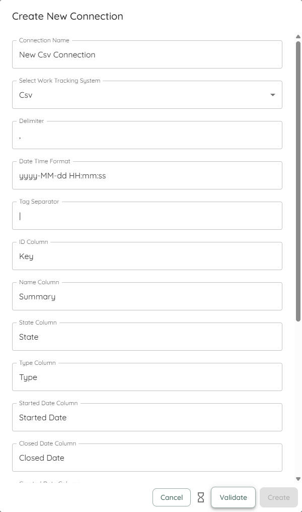
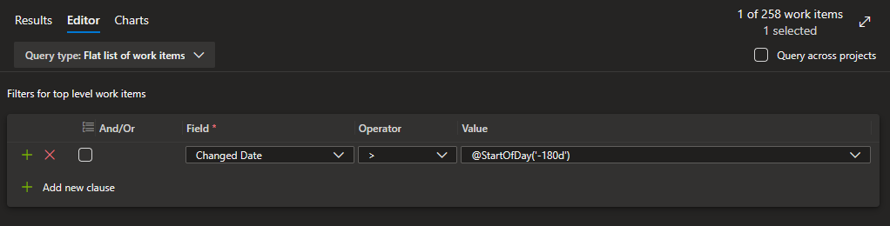
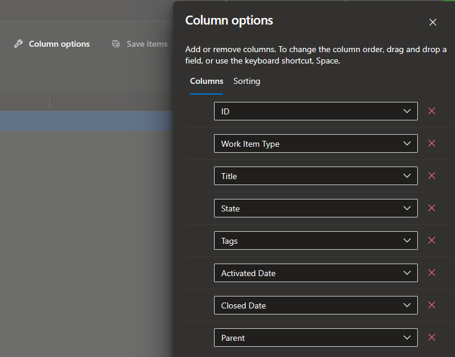

This page will give you an overview of the specifics to CSV data sources when using Lighthouse. In detail, it will cover:  

- TOC
{:toc}

# Why use CSV?
You may wonder, why even use CSV if you can directly connect Lighthouse to your Work Tracking System. Indeed, if you can, we always encourage having a direct connection, as file based options like CSV have the draw back that the data will not automatically update. Instead, you'd need to manually update your teams and portfolios.

However, there may be the following reasons why you opt for the CSV connection:
- Your work tracking system is not supported by Lighthouse
- You want to try out Lighthouse without having a direct connection yet, but first want to give it a try with an simpler setup
- You do not have the possibility to connect it directly to your system, for example because your instance is secured and doesn't allow third party tools to talk with it

So while we highly encourage you to use a direct connection to get all the benefits, CSV might be a feasible option to either quickly try something out, or work around constraints of your environment.

{: .note}
In case you use the CSV connection because Lighthouse does not support your system, please let us know. While we can't promise adding everything, if we are aware of what systems people use, it will help us prioritize certain features over others.

# Work Tracking System Connection
To create a connection to static csv data, you need to specify various options so that the file can be read by Lighthouse:
  

## Work Tracking System Options
The following table will give you an overview over the required options:

## CSV Work Tracking Options

Below is a table of available options for configuring CSV work tracking connectors:

| Option Name                | Description                                                      | Default Value         | Required/Optional                      |
|----------------------------|------------------------------------------------------------------|----------------------|----------------------------------------|
| Delimiter                  | Character used to separate columns in the CSV file.              | ,                    | Required                                |
| Date Time Format           | Format string for parsing date/time values. [See format reference](https://learn.microsoft.com/en-us/dotnet/standard/base-types/custom-date-and-time-format-strings). **Note:** All date columns (Started, Closed, Created) must use the same format. | yyyy-MM-dd HH:mm:ss  | Required                                |
| Tag Separator              | Character used to separate multiple tags in a single field.      | ;                    | Required                                |
| ID Column                  | Name of the column containing unique item IDs (for example the "Key" in Jira or "ID" in Azure DevOps)                  | ID                   | Required                                |
| Name Column                | Name of the column containing item names ("Summary" in Jira, "Title" in Azure DevOps)                        | Name                 | Required                                |
| State Column               | Name of the column containing item states.                       | State                | Required                                |
| Type Column                | Name of the column containing item type.                         | Type                 | Required                                |
| Started Date Column        | Name of the column containing started date values.               | Started Date         | Required                                |
| Closed Date Column         | Name of the column containing closed date values.                | Closed Date          | Required                                |
| Created Date Column        | Name of the column containing created date values.               | Created Date         | Optional                                |
| Parent Reference Id Column | Name of the column containing parent reference IDs.              | Parent Reference Id  | Optional                                |
| Tags Column                | Name of the column containing tags.                              | Tags                 | Optional                                |
| Url Column                 | Name of the column containing URLs.                              | Url                  | Optional                                |
| Owning Team Column         | Name of the column containing owning team information.           | Owning Team          | Optional (only needed for portfolios)     |
| Estimated Size Column      | Name of the column containing estimated size values.             | Estimated Size       | Optional (only needed for portfolios)     |

All required columns must be specified and be available in the CSV for Lighthouse to work. Optional columns can be skipped. Your csv can contain more information, Lighthouse will just use the columns that are specified above and ignore others.

## Default Work Tracking System Connectors
For common systems, Lighthouse will add a pre-configured connector by default. They should allow you to easily get going with known systems. Check [Examples](#examples) for details. The following default connectors are supported:
- [Azure DevOps](#azure-devops)

{: .note}
If you want to have a default connector added, please let us know!

# File Upload
If you use CSV as a data source, you will not specify any query when you create/edit a team or portfolio. Instead, you will have to upload a valid csv file that matches your [Configuration](#csv-work-tracking-options).

If you want to update the data, simply edit the team/portfolio and upload a new file.

# Team Backlog
When you create a new team, you will have to upload a file that will contain the items that belong to the specific team backlog. The file will be filtered based on the *Work Item Types* and *States* that you configure to be valid for this team. For example, you can have items that are *Canceled* in your CSV file, and they will be ignored if you chose to not map the state within the team configuration.

The file should only contain items for a specific team, as you will not have a way to filter this out. This means, if you have many teams, you will have to add multiple csv files - one for each team.

{: .definition}
The work items we look for on team level are the ones that you plan with on that level. Often this would be *User Stories* and *Bugs*. They should be delivering value and you should be able to consistently close them. *Tasks* tend to be too detailed and technical (so they do not deliver value), while *Epics* and *Features* may be too big (see [Portfolios](#portfolios) for more details on how to handle this). This is the general guidance, but your context might be different, so adjust this as needed.

# Portfolios
Portfolios are made up of items that have *child items* - in Lighthouse this is called a *Feature*. In many contexts this means either *Epics* or *Features*. But it could be other (custom) types as well.

For portfolios to work properly, the child items must be linked to these *Features*. This happens through the [Parent Column](#work-tracking-system-options). When you import a csv for a team, make sure that the parent item id is set if you want to make use the portfolio feature.

Each feature can have optionally an *Estimated Size*, which would be a number of how many child items you would expect a *Feature* to have if you have not broken it down. On top of that, you could specify which team is *owning* a *Feature*. This would be used to assign the work of not broken down *Features* to a specific team. Specify this in the *Owning Team* column by providing the team name of the owning team.

As with the [Teams](#team-backlog), you do **not** have to specify work item type and state in the query itself when defining the portfolio.

# Feature Order
The Order of Features (be it *Epics*, *Features*, or anything else) is based on the order they appear in the csv file. The higher up, the more important the feature is.

# Examples
Following section gives you examples on how to extract data from different systems.

## Azure DevOps
In Azure DevOps, you can export CSV files through the [Query functionality](https://learn.microsoft.com/en-us/azure/devops/boards/queries/import-work-items-from-csv?view=azure-devops#export-list-as-a-csv-file).

A simple query could be to get all items that were updated within the last 180 days:

If you have multiple teams, you want to extend the query filter to be team specific.

Then you should make sure to display the following columns:

Once you've set this up, you can export the CSV file and import it into Lighthouse through the built-in Azure DevOps CSV Connector.

{: .important}
The default CSV connector for Azure DevOps assumes your dates are in the following format: *d.M.yyyy HH:mm:ss*.
However, this may change depending on your local settings. Please double-check the [date format](#work-tracking-system-options) and if needed, change it in the settings to match your format.