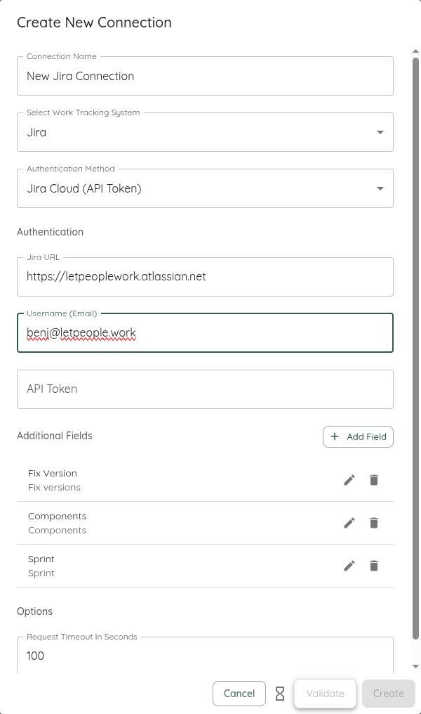
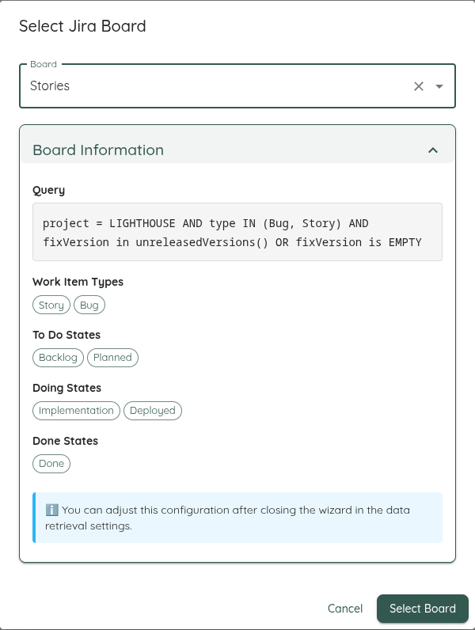

This page will give you an overview of the specifics to Jira when using Lighthouse. In detail, it will cover:  

- TOC
{:toc}

# Work Tracking System Connection
To create a connection to a Jira system, you need three things:
- The URL of your Jira Instance
- The username for the user that will be used to connect to the Jira Instance
- The API token for this user



The URL will look something like this: `https://letpeoplework.atlassian.net` where *letpeoplework* is your instance name.  

## Authentication
Depending on whether you use Jira Cloud or Jira Data Center, you have different Authentication Options.

### Jira Cloud (API Token)
You can find more information on how to create an Access Token in the [Atlassian Documentation](https://support.atlassian.com/atlassian-account/docs/manage-api-tokens-for-your-atlassian-account/)

{: .important}
The API Token shall be treated like a password. Do not share this with anyone or store it in plaintext. Lighthouse is storing it encrypted in its database (see [Encryption Key](../installation/configuration.html#encryption-key) for more details) and will not send it to any client in the frontend.

### Jira Data Center (Personal Access Token)
The above description is true if you are working against a Jira Cloud instance. In case you are connecting to an on-premise Jira version (*Server* or *Data Center*), there are small differences.

Instead of an *API Token*, you have to provide a *Personal Access Token*. See the [Atlassian Documentation](https://confluence.atlassian.com/enterprise/using-personal-access-tokens-1026032365.html) for more details.

A *Personal Access Token* will not require you to specify a username, as it's part of the token itself.

{: .important}
As with the *API Token*, the *Personal Access Token* is treated like a password from Lighthouse.

# Additional Fields

Lighthouse allows you to configure **Additional Fields** for Jira connections. These fields let you retrieve and display extra information from your Jira issues, including custom fields and built-in properties.

{: .note}
The community edition supports one additional field. You get unlimited with the premium license.

### Example Additional Fields
Following may be interesting additional fields for Jira:
- **Fix Version** (`Fix versions`)
- **Components** (`Components`)
- **Sprint** (`Sprint`)

### How to Add or Configure Additional Fields
You can manage additional fields in the connection settings UI. When adding a field, you will be prompted for:
- **Display Name**: A user-friendly name for the field.
- **Field Reference**: The Jira field name or key (e.g., `Flagged`, `customfield_10011`).

For help finding the correct field reference, see the [Jira custom field documentation](https://confluence.atlassian.com/jirakb/find-my-custom-field-id-number-in-jira-744522503.html). The UI provides direct links and helper text to guide you.

#### Example: Adding a Custom Field
Suppose you want to add a custom field called "Business Value". You would enter:
- Display Name: `Business Value`
- Field Reference: `customfield_12345`

# Options

## Request Timeout
- **Request Timeout (seconds)**: Controls how long Lighthouse will wait for a response from Jira before timing out. The default is `100` seconds, but you can adjust this in the connection settings if you experience slow network conditions or large queries.

# Query
Queries for Jira are written in [Jira Query Language (JQL)](https://www.atlassian.com/blog/jira/jql-the-most-flexible-way-to-search-jira-14). An example Query for a Team called "Lagunitas", where all issues for this Team are labeled with their team name, could look like this:

```
project = "LGHTHSDMO" AND labels = "Lagunitas"
```

You can use any kind of filtering you'd like and that is valid according to the JQL specification. An extended query that would exclude certain states would look like this:

```
project = "LGHTHSDMO" AND labels = "Lagunitas" AND status NOT IN (Canceled)
```

# Team Backlog
When you create a new team, you will have to define a query that will get the items that belong to the specific team backlog. The query should **not** specify *Work Item Types* (for example Story, Bug, etc.) nor specific *Work Item States* (like In Progress, Canceled), as those things will be specified outside the query.

{: .definition}
The work items we look for on team level are the ones that you plan with on that level. Often this would be *Stories* and *Bugs*. They should be delivering value and you should be able to consistently close them. *Subtasks* tend to be too detailed and technical (so they do not deliver value), while *Epics* may be too big (see [Projects](#projects) for more details on how to handle this). This is the general guidance, but your context might be different, so adjust this as needed.

What should be in there is everything else that defines whether an item is belonging to a team or not, like:
- Project (via *project*)
- Label (via *label*)
- Components (via *component*)
- Anything else that is needed to identify an item for your team, including custom fields if you have them

```bash
project = "LGHTHSDMO" AND labels in (Team B)
component = "Team A"
YourCustomField = "crypticValueThatIdentifesYourTeam"
```

{: .note}
The whole syntax of JQL is at your disposal. Remember, with great power comes great responsibility. Lighthouse will not be able to validate if what you write is making sense or not. There is a minimal verification on saving of a team, that makes sure that at least one item is found by the query. As long as that's the case, Lighthouse will assume it's correct.

# Projects
Projects are made up of items that have *child items* - in Lighthouse this is called a *Feature*. In a Jira context, this often means *Epics*. But it could be other (custom) types as well.

When creating a project, you need to specify a query that will fetch the features that are relevant for this project. This may be via:
- Release (*fixVersion*)
- Label (*label*)
- Whatever else may identify a feature to belong to a specific project

As with the [Teams](#team-backlog), you do **not** have to specify work item type and state in the query itself when defining the project.

Example JQL Queries for Projects could look like these:

```bash
project = "LGHTHSDMO" AND fixVersion = "Release GCZ 1886"
project = "LGHTHSDMO" AND labels = "Version 1.33.7"
```

# Feature Order
The Order of Features (usually *Epics*, but it may be any other type) is based on the *Rank* property.

Jira is using the [LexoRank Algorithm](https://confluence.atlassian.com/adminjiraserver/managing-lexorank-938847803.html) to adjust the ranks. While it's quite interesting (you can read more about it [here](https://tmcalm.nl/blog/lexorank-jira-ranking-system-explained/)), it's not relevant that you understand it.  

What you must understand is that you simply need to re-order your items in Jira and that this order will be taken into account by Lighthouse. Higher up means higher priority, further down will mean less priority.


# Board Wizard

Use the Jira Board Wizard to automatically discover and import configuration from the Boards in your Jira Instance. The Wizard will:
- Show you all available boards from your Jira instance
- Upon selection of a Board, fetch the JQL, Work Item Types, and State Configuration for the board



You may adjust all those values to your liking after that. For example, if the state mapping is not what you want to use.

{: .note}
Please be aware that this is a one-time operation. Lighthouse does not keep your settings in sync with the selected board. If you make changes in your Jira board, you must either update them manually, or rerun the Wizard.