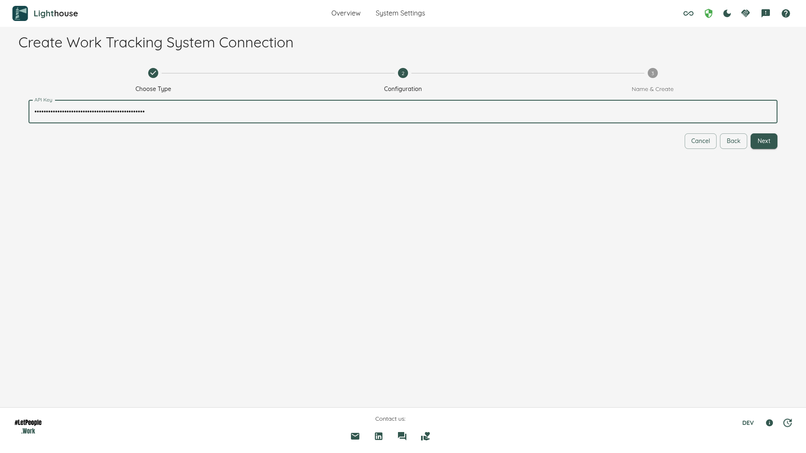

This page will give you an overview of the specifics to Linear when using Lighthouse. In detail, it will cover:  

- TOC
{:toc}

# Work Tracking System Connection
To create a connection to a Linear Workspace, you need a single thing: A Linear API Key
  

You can find more information on how to create an API Key in the [Linear Documentation](https://linear.app/docs/api-and-webhooks#create-an-api-key)

{: .important}
Treat the API key like a password: don't share it, and don't keep it anywhere in plain text. Lighthouse encrypts it before it is written to the database, never sends it back to the browser, and you can revoke it in Linear at any time. [Security](../../security.html) explains how that works, and what it does not protect against.

# Team Backlog
When you create a new team in Lighthouse that uses a Linear connection, you can select a Linear team from a wizard that lists all teams available in the connected workspace.

Lighthouse will automatically fetch all issues for the selected team. Work item types are fixed to *Issue* — you do not need to configure item types manually.

# Portfolios
Linear portfolios retrieve all **projects** from the authenticated workspace as Lighthouse features. No query or work item type configuration is required.

Each Linear project becomes a Lighthouse feature, and its issues roll up as work items. If a project is linked to a Linear **initiative**, Lighthouse will resolve that initiative as the parent feature.

# Hierarchy
Lighthouse maps the full Linear hierarchy:

| Linear Concept | Lighthouse Concept |
|---|---|
| Issue | Work Item (team level) |
| Project | Feature (portfolio level) |
| Initiative | Parent Feature |

Issues are associated with the project they belong to. If an issue does not have a direct project association, Lighthouse checks the issue's parent chain to find the project. Projects linked to initiatives will display the initiative as a parent feature with its name, status, and URL fetched from the Linear API.

# States
The states correspond to **Issue statuses** in Linear. Make sure to specify all statuses you care about. As an example, if you have the following states:
- Backlog
- Planned
- Development
- Done
- Canceled

You can configure them as follows:
- *To Do*
  - Backlog
  - Planned
- *Doing*
  - Development
- *Done*
  - Done

States you don't need (e.g. *Canceled*) can be left out. Items in unmapped states will not be tracked by Lighthouse and will not affect your metrics.

# Feature Order
The order of features is based on the ordering you set in Linear. To change this, you can [manually reorder](https://linear.app/docs/display-options#manual-ordering).

# Dependencies
Lighthouse reads what a Feature is waiting on from **Project relations**. Linear accepts exactly one relation type between two Projects, so every relation is a dependency and the direction is carried by which end you are looking at: only the end that is waiting is read, so each dependency is recorded once. Lighthouse never creates, changes or removes a relation.

Note that this is about relations between **Projects**, not between Issues. Lighthouse maps a Linear Project to a Feature — see [Hierarchy](#hierarchy).

What you then see is described on the [Features page](../../features/features.html#dependencies).
