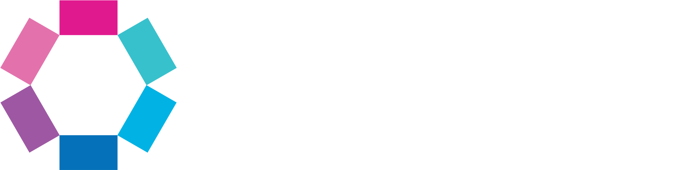

We develop Ligththouse as an Open Source project, so that people can actively contribute. There are many different ways that you can contribute, not only via writing code.

There are various ways on how you can support Lighthouse:

- TOC
{:toc}

# Join our Slack Community
We do have a [Slack community](https://join.slack.com/t/let-people-work/shared_invite/zt-2y0zfim85-qhbgt8N0yw90G1P~JWXvlg){:target="_blank"} where you can ask questions about the tools and get support from us as well as other people that use the tool. As the usage of Lighthouse grows, this is our preferred way to support, as others may be able to support you. So by joining this community, you are supporting us in handling the growth of the tool!

We use our Slack Community also to look for feedback, asking for support where we may lack some skills, or identify pilot users for preview features we want to get an early feedback on.

# Bugs or Feature Requests
If you have a feature request or found a potential bug, you can best reach us via [Slack](#join-our-slack-community). Otherwise, please raise an [Issue](https://github.com/LetPeopleWork/Lighthouse/issues). When doing so, please describe it in as much detail as possible.

# Documentation
If you find something that can be improved in the documentation, you can contribute by letting us know about it!
To do so, you can either just [let us know](#join-our-slack-community), or open a new [issue](https://github.com/LetPeopleWork/Lighthouse/issues/new?template=documentation-improvement.yml){:target="_blank"} in our GitHub repository. An issue can be as small as a typo, but also wrong or outdated sections, as well as something that we've might have missed so far.

If you want to do more than just reporting, we're happy to onboard people that help us improve our docs. Please reach out to use if you are interested in this.

# Become a Pilot User
While we're adding new functionality, we're always looking for people that are willing to spend some time in trying things out and give us feedback on a regular base. If you are willing to occasionally run into some errors in return for being at the bleeding edge of the development, [reach out](#join-our-slack-community).

# Code
While we mentioned that there are other ways than contributing code, the code still needs to be written. So if you are willing to contribute here, you are very welcome. We recommend to [reach out](#join-our-slack-community) before you start with adjusting the code, so we can make sure it makes sense what you work on.

Feel free to browse through the [Issues](https://github.com/LetPeopleWork/Lighthouse/issues) and have a look at what might be there.

You can also see the next issues we prioritized in our [Project Overview](https://github.com/orgs/LetPeopleWork/projects/3/views/2).

Last but not least, you can also propose things where you want to contribute. After all, it's your time and it should be meaningful to you. We're always happy if we can improve, especially on the Frontend side of things. Go ahead, check out the code and make a proposal on how you would like to contribute. Once you have a proposal, [connect with us](#join-our-slack-community) to discuss details.

We appreciate any contribution, but also want to make you aware that we reserve the right to decline certain changes. Thus, if you don't work on any of the prioritized issues, please always double check with us first. Otherwise it might lead to wasted work.

# Contributors
A huge thank you to everyone who has contributed to this project! Your support, whether through code, documentation, giving feedback, or spreading the word, has been invaluable. We’re incredibly grateful to have such an amazing community around this project.

If you’d like to contribute, feel free to [reach out](#join-our-slack-community) to learn about how to best get involved. Every little bit helps, and we’d love to see you as part of our contributors’ family!

---

## Individual Contributors

We’d like to recognize the efforts of all individual contributors. Thank you for your dedication and hard work! Without you, Lighthouse would not be the tool that is right now! ❤️

- [**Lorenzo Santoro**](https://www.linkedin.com/in/lorenzo-santoro-57172626/)
- [**Anoop A Parapurath**](https://www.linkedin.com/in/anoop-a-parapurath-137a3b4/)
- [**Ann K Brea**](https://www.linkedin.com/in/annkbrea/)
- [**Chris Graves**](https://www.linkedin.com/in/chris-graves-23455ab8/)
- [**Agnieszka Reginek**](https://www.linkedin.com/in/agnieszka-reginek/)
- [**Hendra Gunawan**](https://www.linkedin.com/in/hendragunawan823/)
- [**Laurence Grantham-Clarke**](https://www.linkedin.com/in/laurence-grantham-clarke-a03316131/)
- [**Andy Normington**](https://www.linkedin.com/in/andynormington/)

---

## Supporting Companies

Our project wouldn’t be where it is today without the support of the following companies. Thank you for your sponsorship, resources, and collaboration!

---

Thank you all for your support!