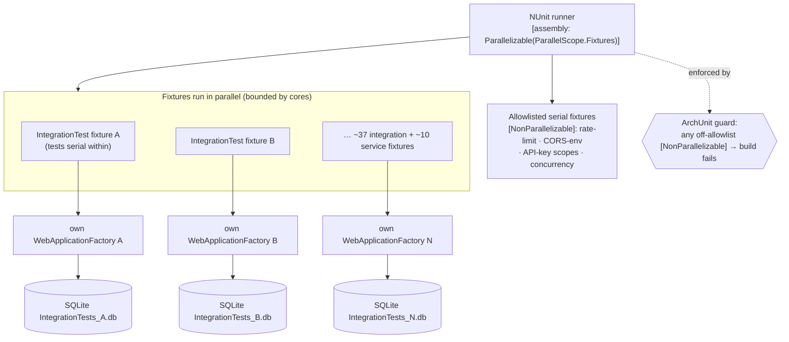

# Feature Delta — backend-test-speed

ADO source: [User Story #5258 — Improve Backend test speed](https://dev.azure.com/letpeoplework/Lighthouse/_workitems/edit/5258) (state: `New` as of 2026-06-15)
Density: `lean` (DISCUSS hard default) — Tier-1 [REF] only; no Tier-2 expansion trigger fired (single persona, single context, no AC ambiguity, no compliance, WS strategy ≠ D).
Waves complete: DISCUSS (this document).
Next wave: DESIGN (light-touch — the technical pivot is the integration-test DB-isolation strategy; gated by the Slice-01 spike that measures per-fixture `WebApplicationFactory` setup cost). DEVOPS receives outcome-KPIs only.

**Lineage:** This is a focused follow-up to the paused `test-speed-improvements` feature (ADO #5020). #5020's **CS-P** slice enabled `[assembly: Parallelizable(ParallelScope.Fixtures)]` but deliberately allowed `[NonParallelizable]` opt-outs as the safety valve ("the goal is no flakes, not every fixture parallel-safe forever"). Those opt-outs accumulated to **54 files**, so the backend suite is effectively serial again and the CI backend step is back to 12+ min. #5258 pays down that debt by fixing the shared-state **root cause** so the opt-outs can be removed. Distinct from #5020's CS-H (real-external-API cadence) — this is entirely about in-process `WebApplicationFactory` tests.

---

## Wave: DISCUSS / [REF] Persona ID

`lighthouse-developer` — A maintainer or contributor (Benj + community) writing C# against Lighthouse. Runs `dotnet test` many times per day and waits on `Build And Deploy Lighthouse` to gate the merge. The backend test wait (12+ min CI, ~6+ min local) is a context-switch tax that pushes them to batch commits behind a slow signal.

---

## Wave: DISCUSS / [REF] JTBD one-liner

**When** I have a backend code change ready, **I want to** know within a few minutes (CI) and ~3 min (local) whether it broke anything, **so I can** stay in flow and ship incremental commits instead of batching behind a slow signal.

Traces to existing job `job-dev-test-feedback-velocity` in `docs/product/jobs.yaml` (no new job; the developer is the user, same as #5020).

---

## Wave: DISCUSS / [REF] Evidence base (current state, verified 2026-06-15)

| Fact | Evidence |
|---|---|
| Fixture-level parallelism IS enabled | `Lighthouse.Backend.Tests/GlobalUsings.cs:3` — `[assembly: Parallelizable(ParallelScope.Fixtures)]` present. |
| But **54 test files** carry `[NonParallelizable]` | `grep -rln NonParallelizable` over the test project → 54 files. The suite is therefore mostly serial despite the attribute. |
| The dominant cluster (~37) is in-process WAF API tests | `API/Integration/*IntegrationTest.cs` + `TestHelpers/IntegrationTestBase.cs`. |
| The root cause is ONE design flaw, not 37 | `IntegrationTestBase` is `[NonParallelizable]` **at the base** (`IntegrationTestBase.cs:8`), shares **one `static` `TestWebApplicationFactory` + one database** (`SharedFactoryLazy`, line 11), and **`EnsureDeleted()`+`EnsureCreated()` the whole DB in every `[SetUp]`/`[TearDown]`** (lines 77-86). Two parallel tests would wipe each other's data → the base MUST be serial today. |
| Secondary cluster (~10) is shared Moq / in-memory-DB / dispatcher state | `Services/Implementation/**` — Team/PortfolioUpdater, Team/PortfolioMetricsService, TerminologySeeder, the DomainEvents `*GoldTest`s, DeliveryMetricSnapshotRecordingHandler, LighthouseReleaseServiceIntegration. |
| Residue (~6) is genuinely serial | `API/Security/**` (rate-limiting `S6`, CORS/origins `S1`, API-key scopes `S5`, group-snapshot `F_BE_1`) + `LighthouseAppContextConcurrencyTest`. These exercise process-global state or concurrency on purpose. |

---

## Wave: DISCUSS / [REF] Locked decisions

| ID | Decision | Verdict | Rationale |
|---|---|---|---|
| D1 | Feature type | Cross-cutting (developer-experience) | Touches BE test infrastructure + small production-side test-isolation seams + CI wall-clock. Mirrors #5020 D1. |
| D2 | Walking skeleton | No | Brownfield optimisation; no greenfield vertical. |
| D3 | UX research depth | Lightweight | Single persona (developer). |
| D4 | JTBD | Yes — reuse `job-dev-test-feedback-velocity` | The developer is the user; not the infrastructure-only escape valve. |
| D5 | Scope | **BE parallelization root-cause only** | User-directed 2026-06-15. Not the broader-speed option (CS-H / CS-B stay out — see Out-of-scope). |
| D6 | Opt-out target | **Drive avoidable `[NonParallelizable]` to ~zero** | User-directed 2026-06-15. Fix every fixture whose only blocker is shared in-memory DB / shared Moq; tags survive only for inherently-serial tests. |
| D7 | Measurement before the big refactor | Slice-01 triage + spike is mandatory first | The per-fixture isolation strategy turns on one unknown: per-fixture `WebApplicationFactory` setup cost vs the parallelism gain (`FixtureSetupTimer` already instruments this; #5020's `spike-be-fixture-setup-findings.md` is the prior art). Decide shared-WAF-per-test-DB vs WAF-per-fixture against measured numbers, not a guess. |
| D8 | Behaviour-preservation invariant | Same tests, same assertions — only *how/when* they run changes | No test is deleted or weakened. A fixture moves to parallel only when its isolation is real; correctness coverage is untouched. |
| D9 | Mutation kill rate | Re-validate ≥ 80 % on any production file touched for isolation | CLAUDE.md Stryker.NET gate. Most change is test-only; production seams (if any, à la #5020's `AuthenticationMethodSchema`) get the per-feature config check. |

---

## Wave: DISCUSS / [REF] Cross-cutting impact checklist (CLAUDE.md DISCUSS gate)

- **RBAC** — **N/A, because** the work changes test isolation only (per-fixture DB/WAF/mock lifetime). No authorization path, role, permission, or `IRbacAdministrationService` flow changes; any production seam introduced for isolation (e.g. making a test DB name configurable) carries no authorization semantics.
- **Lighthouse-Clients (CLI + MCP)** — **N/A, because** no API contract, endpoint, or DTO changes. The CLI/MCP clients are unaffected; nothing to version-gate.
- **Website** — **N/A, because** no user-visible or marketed surface changes. This is internal test-suite performance.

---

## Wave: DISCUSS / [REF] User stories with elevator pitches

### US-01 — Triage the 54 opt-outs + spike the isolation strategy

**As** a Lighthouse developer
**I want** every `[NonParallelizable]` fixture classified by root cause (shared-DB/WAF · shared-Moq · inherently-serial) with a keep/fix verdict, plus a measurement of per-fixture WAF setup cost
**So that** the big refactor targets the right fixtures and picks the cheaper isolation strategy on evidence, not a guess
**Job traceability**: `job-dev-test-feedback-velocity` (emotional: "confidence the fix is the right one")

#### Elevator Pitch
Before: We know 54 files are tagged but not which are genuinely serial vs lazily opted-out, nor whether per-fixture WAF isolation costs more setup than it saves in parallelism.
After: read `docs/feature/backend-test-speed/triage.md` → see all 54 fixtures in a table with `root_cause_category, verdict(keep|fix), cluster`, plus a measured "WAF setup cost × fixture count vs serial wall-clock saved" figure and a recommended isolation strategy.
Decision enabled: Open Slice-02 against the chosen strategy and the exact fix-list, knowing the speed ceiling.

#### Acceptance criteria
- AC-01.1: `triage.md` classifies all 54 currently-tagged files into exactly one of {shared-DB/WAF, shared-Moq-state, inherently-serial} with a `keep` or `fix` verdict each.
- AC-01.2: The current backend CI test-step wall-clock and the serial-cluster's share of it are recorded from a recent `Build And Deploy Lighthouse` run (re-baseline; the #5020 timing artifacts still publish).
- AC-01.3: A spike measures per-fixture `WebApplicationFactory` construction cost (reuse `FixtureSetupTimer`) and reports the break-even: at what fixture count does WAF-per-fixture lose to shared-WAF-per-test-DB.
- AC-01.4: The memo recommends ONE isolation strategy (shared-WAF + per-test isolated DB **vs** WAF-per-fixture + unique in-memory DB) with the measured rationale.
- AC-01.5: No production or test code beyond the spike scratch is changed in this slice (measurement only).

### US-02 — Integration (WAF) tests run in parallel via per-fixture DB isolation

**As** a Lighthouse developer
**I want** the ~37 in-process API integration fixtures to run in parallel by giving each isolated database state instead of sharing one globally-reset DB
**So that** the dominant serial cluster stops dominating the backend wall-clock
**Job traceability**: `job-dev-test-feedback-velocity`

#### Elevator Pitch
Before: `dotnet test` runs every `API/Integration` fixture one-after-another because they share one DB that each test deletes and recreates.
After: run `dotnet test ./Lighthouse.Backend --filter "Category!=Integration"` → the integration fixtures execute in parallel (no `[NonParallelizable]` on `IntegrationTestBase`); local + CI backend wall-clock drops materially.
Decision enabled: The developer gets the merge signal back inside a coffee break.

#### Acceptance criteria
- AC-02.1: `IntegrationTestBase` no longer carries `[NonParallelizable]`; the shared `static` factory + global `EnsureDeleted`/`EnsureCreated` reset are replaced by the Slice-01-chosen per-fixture isolation (each fixture sees only its own data).
- AC-02.2: The full integration suite runs **3 consecutive times green** under `ParallelScope.Fixtures` locally (no cross-fixture data bleed, no flake).
- AC-02.3: Behaviour preserved (D8): same fixtures, same test names, same assertions; only isolation/lifetime changes.
- AC-02.4: Measured local + CI backend wall-clock recorded before/after; CI backend test step trends toward ≤ 7 min (precise target locked from Slice-01).
- AC-02.5: Any production seam introduced for isolation keeps Stryker ≥ 80 % (D9).

### US-03 — Service / mock-state fixtures parallelized

**As** a Lighthouse developer
**I want** the ~10 `Services/Implementation` fixtures tagged for shared Moq / in-memory-DB / dispatcher state fixed (per-test mock construction or scoped DB) and un-tagged
**So that** the remaining avoidable serial debt is reclaimed
**Job traceability**: `job-dev-test-feedback-velocity`

#### Elevator Pitch
Before: Background-service, metrics, seeder, and domain-event Gold fixtures are serial because they share mutable Moq/DB/dispatcher state across methods.
After: run `dotnet test ./Lighthouse.Backend` → those fixtures run in parallel after their shared state is made per-test; only inherently-serial tests remain tagged.
Decision enabled: The developer's full-suite local run drops toward the ≤ 3–4 min target.

#### Acceptance criteria
- AC-03.1: Each `fix`-verdict fixture from US-01's `Services/Implementation` cluster has its shared state moved per-test (fresh mocks in `[SetUp]`, scoped/unique DB) and its `[NonParallelizable]` removed.
- AC-03.2: Full backend suite runs 3 consecutive times green under `ParallelScope.Fixtures` locally.
- AC-03.3: Behaviour preserved (D8); Stryker ≥ 80 % on any touched production file (D9).

### US-04 — Lock in the gain: justified residue + a regression guard

**As** a Lighthouse developer
**I want** the surviving `[NonParallelizable]` tests documented as an explicit, justified allowlist and a guard that fails the build if a new opt-out appears without justification
**So that** the parallel-debt cannot silently re-accumulate the way it did after #5020's CS-P
**Job traceability**: `job-dev-test-feedback-velocity` (social: "the contribution loop stays fast for everyone")

#### Elevator Pitch
Before: A new `[NonParallelizable]` can be added with no justification; that's exactly how 54 accumulated.
After: a test/analyzer enumerates the allowlisted serial fixtures with a documented reason each; adding an un-listed `[NonParallelizable]` fails the build with a pointer to the allowlist + `docs/ci-learnings.md`.
Decision enabled: Future contributors keep the suite parallel by default; opting out is a deliberate, reviewed act.

#### Acceptance criteria
- AC-04.1: An allowlist (with a one-line justification per entry) of the inherently-serial fixtures exists; every surviving `[NonParallelizable]` maps to an allowlist entry.
- AC-04.2: A guard (ArchUnitNET test or equivalent, per `feedback-ci-and-e2e-minimalism` — backend test, not Playwright) fails if a `[NonParallelizable]` exists that is not on the allowlist.
- AC-04.3: `docs/ci-learnings.md` gains an entry: the per-fixture isolation pattern, why the allowlist exists, and the `IntegrationTestBase` precedent.
- AC-04.4: ADO #5258 comment summarises before/after wall-clock and the final allowlist size.

---

## Wave: DISCUSS / [REF] Definition of Done (feature)

1. All 54 `[NonParallelizable]` files triaged; avoidable opt-outs removed (D6); only the justified allowlist remains.
2. Integration (WAF) + service/mock clusters run in parallel; full backend suite green 3× consecutively locally and on CI.
3. Behaviour-preservation invariant (D8) held — no test deleted or weakened.
4. Mutation kill rate ≥ 80 % on any production file touched (D9).
5. Regression guard in place so new un-justified opt-outs fail the build (US-04).
6. `docs/ci-learnings.md` updated per `/clean-ci` discipline.
7. No new SonarCloud issues.
8. ADO #5258 reaches `Resolved`. **No child Stories** unless the user requests them (mirrors #5020 D-no-children; slices tracked in this delta + slice briefs).

Concrete wall-clock targets are locked in the Slice-01 triage/spike, calibrated to the re-baseline — directional targets: CI backend test step ≤ 7 min (from 12+), local full suite ≤ 3–4 min.

---

## Wave: DISCUSS / [REF] Out-of-scope

- **Frontend test speed** — out (D5; story title is "Backend"). FE becomes the candidate constraint only after BE is no longer the bottleneck.
- **Real-external-API `[Category("Integration")]` cadence / path-scoping (#5020 CS-H)** — separate concern, not re-opened here.
- **Fixture session-sharing for real-API tests (#5020 CS-B)** — out.
- **`ParallelScope.Children` / `.All` (parallelism *within* a fixture)** — out; fixture-level is the lever.
- **Splitting the test project into multiple assemblies** — bigger architectural change; out unless the suite grows materially.
- **Replacing in-memory EF with SQLite-in-file** — test-fidelity question, unrelated to parallelism; out.
- **E2E / Playwright** — out.

---

## Wave: DISCUSS / [REF] WS strategy

**Not applicable** — D2 = No walking skeleton (brownfield optimisation).

---

## Wave: DISCUSS / [REF] Driving ports

| Surface | Form | Owner story | Change type |
|---|---|---|---|
| `dotnet test ./Lighthouse.Backend` (CLI) | Local + CI | US-02, US-03 | Test-isolation refactor → parallel execution; no public-API change |
| `Build And Deploy Lighthouse` workflow | GitHub Actions | US-02, US-03 | Wall-clock reduction (no workflow restructure required) |
| `docs/feature/backend-test-speed/triage.md` | New developer doc | US-01 | New artifact |
| Parallel-debt regression guard | New backend test (ArchUnit-style) | US-04 | New artifact |

No HTTP / UI / public-API / client surface changes.

---

## Wave: DISCUSS / [REF] Pre-requisites

- #5020's `[assembly: Parallelizable(ParallelScope.Fixtures)]` is in place (verified) — this feature builds directly on it.
- `docs/ci-learnings.md` test-isolation invariants (the 2026-05-17 `VssConnection`/cache-collision entries; the CS-P `AuthenticationMethodSchema` per-host-singleton precedent) constrain the isolation refactor and must be preserved.
- ADO #5258 is the single parent; no child Stories unless requested.
- #5020 prior art to reuse: `spike-be-fixture-setup-findings.md` (WAF setup cost), `slice-be-parallel-enable.md` (the CS-P pattern + `[NonParallelizable]` opt-out precedent).

---

## Wave: DISCUSS / [REF] Scope assessment

| Heuristic | Threshold | Observed | Verdict |
|---|---|---|---|
| User stories | > 10 = oversized | 4 | Pass |
| Bounded contexts / modules | > 3 = oversized | 1 (BE test infrastructure) | Pass |
| Estimated effort | > 2 weeks = oversized | Slice-01 ½ d + Slice-02 1–1.5 d + Slice-03 ~1 d + Slice-04 ½ d ≈ 3.5 d | Pass |
| Independent outcomes | If multiple → split | Single coherent outcome (BE test velocity) | Pass |

**Verdict: right-sized.** Measurement-first (Slice-01) de-risks the one real uncertainty before the big refactor.

---

## Wave: DISCUSS / [REF] Story map and slice plan

Backbone (developer journey):

```
  triage + measure  →  isolate integration DB  →  isolate service/mock state  →  lock in (guard)
     US-01/Slice-01      US-02/Slice-02             US-03/Slice-03               US-04/Slice-04
```

Slice briefs at `docs/feature/backend-test-speed/slices/`:

1. **slice-01-triage-and-spike** — classify the 54, re-baseline, spike WAF setup cost, pick the isolation strategy. ½ d. Disproves "we know which fixtures are genuinely serial" / "WAF-per-fixture is obviously fine."
2. **slice-02-integration-db-isolation** — the dominant lever: per-fixture DB isolation, drop base-level `[NonParallelizable]`, ~37 fixtures parallelize. 1–1.5 d. Disproves "integration serial cost is intrinsic."
3. **slice-03-service-mock-isolation** — fix the ~10 shared-Moq/DB/dispatcher fixtures. ~1 d. Disproves "the remaining tags are all inherent."
4. **slice-04-regression-guard** — justified allowlist + build guard + ci-learnings entry. ½ d. Disproves "this won't silently regress again."

Each slice's user-visible value is observable by the developer-as-user: the triage doc (1), faster `dotnet test` (2, 3), a failing build on un-justified opt-outs (4). No slice is purely `@infrastructure`.

Prioritisation: Slice-01 first (highest-uncertainty, cheapest); Slice-02 next (biggest lever, ship the headline win early); Slice-03 (incremental reclaim); Slice-04 last (locks the gain — must follow the fixes so the allowlist is final).

---

## Wave: DISCUSS / [REF] Outcome KPIs

| KPI ID | Title | Target | Status |
|---|---|---|---|
| OUT-be-parallel-debt | Avoidable `[NonParallelizable]` count | Reduced from 54 to the justified allowlist only (target ≤ ~8 inherently-serial) | **Firm** (D6) |
| OUT-be-test-ci-walltime | PR CI backend test step wall-clock | ≤ 7 min (from 12+); precise target locked in Slice-01 | **Firm (directional)** |
| OUT-be-test-local-walltime | Local full backend suite wall-clock | ≤ 3–4 min; precise target locked in Slice-01 | **Firm (directional)** |
| OUT-be-suite-stability | Consecutive green parallel runs | 3× consecutive green locally + green CI on the merge build | **Firm** |
| OUT-be-mutation-kill-rate | Per-feature mutation kill rate on touched production files | ≥ 80 % | **Firm** (CLAUDE.md) |
| OUT-be-regression-guard | Un-justified opt-out fails the build | Guard present and red on a planted violation | **Firm** (US-04) |

All KPIs are `per_instance` (local dev) or `vendor_demo_only` (CI on the LetPeopleWork GitHub org). Numeric wall-clock contracts append to `docs/product/kpi-contracts.yaml` once Slice-01 sets them.

---

## Wave: DISCUSS / [REF] Definition of Ready (9-item gate)

1. **Persona identified**: ✓ `lighthouse-developer`.
2. **JTBD captured**: ✓ `job-dev-test-feedback-velocity` (existing).
3. **Stories sized**: ✓ 4 stories, each ≤ ~1.5 d.
4. **Acceptance criteria testable**: ✓ Every AC has a measurable artifact / numeric threshold / binary gate.
5. **Out-of-scope explicit**: ✓ 7 items.
6. **Pre-requisites enumerated**: ✓.
7. **KPIs measurable**: ✓ (directional numbers locked in Slice-01 by design).
8. **Cross-cutting concerns surfaced**: ✓ RBAC/Clients/Website (all explicit N/A); behaviour-preservation (D8); mutation gate (D9); CI-learnings preservation.
9. **Handoff target named**: ✓ DESIGN (light-touch; the isolation-strategy pivot is gated on the Slice-01 spike).

---

## Wave: DISCUSS / [REF] Changed assumptions

None. DISCUSS extends — does not contradict — prior waves or SSOT. No DISCOVER ran (internal-quality initiative); the evidence base is the current code (verified 2026-06-15), `docs/ci-learnings.md`, and #5020's artifacts.

---

## Wave: DISCUSS / [REF] Wave-decisions summary

- **Primary job**: `job-dev-test-feedback-velocity` (reused from #5020).
- **Walking skeleton scope**: N/A.
- **Feature type**: Cross-cutting (developer experience; backend test infrastructure only).
- **Constraints established**: Behaviour preserved (D8); mutation ≥ 80 % (D9); CI-learnings isolation rules preserved; standalone/regular behaviour unaffected (test-only + isolated seams).
- **Decided**: BE-only parallelization root-cause (D5); drive avoidable opt-outs to ~zero (D6); measurement-first via Slice-01 spike (D7).
- **Upstream changes**: None.
- **Handoff**: DESIGN (light-touch) — chiefly ratify the Slice-01-chosen integration DB-isolation strategy.

---
---

# DESIGN

Density: `lean` — Tier-1 [REF] only; no Tier-2 expansion trigger fired. Scope: Application/components (solution-architect, propose mode). SSOT: ADR-074 + brief.md `## Application Architecture — backend-test-speed (DESIGN delta)`.

Prior-wave reading: ✓ `brief.md` (no prior test-isolation section), ✓ ADR index (none govern test infra), ✓ this DISCUSS delta; ⊘ spike findings (Slice-01 not yet run — isolation numbers gated on it). No contradictions with DISCUSS.

Outcome Collision Check: **skipped (methodology/internal-quality)** — `backend-test-speed` introduces no new product typed-contract surface (no endpoint/DTO/aggregate); its OUT-* KPIs are internal dev-velocity, not promises about what the system does. Per the registry's code-feature gate-scoping, there is nothing to deduplicate against `docs/product/outcomes/registry.yaml`.

## Wave: DESIGN / [REF] DDD list

| ID | Decision | Verdict | Rationale |
|---|---|---|---|
| DDD-1 | Isolation strategy | **Strategy A — per-fixture `WebApplicationFactory` ownership** | The WAF already makes a unique SQLite file per instance + strips hosted services; the base already has an `ownsFactory` path. Cleanest isolation; lightest change. (ADR-074) |
| DDD-2 | Parallelism grain | Fixture-level (`ParallelScope.Fixtures`, unchanged) | One factory built once per fixture, reused across its serial test methods. No `ParallelScope.Children`. |
| DDD-3 | Per-test DB reset | Keep `EnsureDeleted`/`EnsureCreated`, now on the fixture's own DB | Tests within a fixture are serial → reset is collision-free once the factory is per-fixture. |
| DDD-4 | Service/mock cluster | Per-test isolation (fresh mocks / scoped DB), then un-tag | Same root-cause class as the integration cluster; no shared abstraction needed. |
| DDD-5 | Serial residue | `[NonParallelizable]` allowlist + ArchUnit guard | Inherently-serial tests (rate-limit, CORS-env, API-key scopes, concurrency) stay tagged but justified; guard blocks silent re-accumulation. |
| DDD-6 | Host-build cost risk | Measure in Slice-01; mitigations pre-identified | Bounded parallelism / factory pool / SQLite in-memory if N builds erase the parallel gain. |
| DDD-7 | Cost mitigations are deferred, not pre-applied | YAGNI until the spike says otherwise | Strategy A is shipped plain first; a mitigation is added only if Slice-01 shows the parallel wall-clock doesn't beat serial. |

## Wave: DESIGN / [REF] Component decomposition

| Component | File | Change type |
|---|---|---|
| `IntegrationTestBase` | `Lighthouse.Backend.Tests/TestHelpers/IntegrationTestBase.cs` | **EXTEND** — default ctor builds an owned factory; remove `SharedFactoryLazy` + base `[NonParallelizable]`; keep the SetUp/TearDown/Seed contract so derived fixtures are unchanged |
| `TestWebApplicationFactory<T>` | `Lighthouse.Backend.Tests/TestHelpers/TestWebApplicationFactory.cs` | **REUSE AS-IS** — already unique-file-per-instance + hosted-services-stripped; possibly add an opt-in SQLite-in-memory mode only if Slice-01 needs it |
| `FixtureSetupTimer` | `Lighthouse.Backend.Tests/TestHelpers/` (existing) | **REUSE AS-IS** — Slice-01 reads it to measure per-fixture WAF build cost |
| `Services/Implementation/**` serial fixtures (~10) | per US-01 triage | **EXTEND** — move shared Moq/DB/dispatcher state per-test; remove `[NonParallelizable]` |
| Serial-residue allowlist + guard | new ArchUnitNET test (test project) | **CREATE NEW** — no existing guard enumerates `[NonParallelizable]`; justified below |
| `docs/feature/backend-test-speed/triage.md` | new | **CREATE NEW** — Slice-01 classification + spike output |

## Wave: DESIGN / [REF] Driving ports

| Surface | Form | Change |
|---|---|---|
| `dotnet test ./Lighthouse.Backend` | CLI (local + CI) | Fixtures execute in parallel after the isolation refactor; no flag/contract change |
| `Build And Deploy Lighthouse` | GitHub Actions | Wall-clock drop only; no workflow restructure |

## Wave: DESIGN / [REF] Driven ports + adapters

None new. The test SQLite file is the only "external" side-effect and is already encapsulated by `TestWebApplicationFactory` (create on build, delete on dispose). No production driven port changes. If an isolation seam needs a production-side hook (not anticipated for Strategy A), it carries no authorization/IO semantics.

## Wave: DESIGN / [REF] Technology choices

| Choice | Pin | Rationale |
|---|---|---|
| Test framework | NUnit 4.x (existing) | No migration; `ParallelScope.Fixtures` is the lever |
| WAF | `Microsoft.AspNetCore.Mvc.Testing` (existing) | Per-fixture instance ownership |
| Test DB | SQLite file per fixture (existing); SQLite in-memory as a contingency | Already wired; in-memory only if file I/O dominates per Slice-01 |
| Guard | ArchUnitNET (already in the suite) | Per `feedback-ci-and-e2e-minimalism` — backend test, not Playwright |

## Wave: DESIGN / [REF] Decisions table

| ID | Decision |
|---|---|
| DDD-1 | Strategy A — per-fixture WAF ownership (ADR-074) |
| DDD-2 | Fixture-level parallelism, unchanged |
| DDD-3 | Keep per-test reset on the per-fixture DB |
| DDD-4 | Service/mock cluster isolated per-test then un-tagged |
| DDD-5 | Serial-residue allowlist + ArchUnit guard |
| DDD-6 | Host-build cost measured in Slice-01; mitigations deferred |

## Wave: DESIGN / [REF] Reuse Analysis

| Existing Component | File | Overlap | Decision | Justification |
|---|---|---|---|---|
| `IntegrationTestBase` | `…/TestHelpers/IntegrationTestBase.cs` | Fixture WAF/DB lifecycle, seeding | **EXTEND** | Flip default ctor to the existing `ownsFactory` path + drop the static + base tag (~10-20 LOC) vs a new base class duplicating SetUp/Seed |
| `TestWebApplicationFactory<T>` | `…/TestHelpers/TestWebApplicationFactory.cs` | Per-instance unique DB, service stripping | **REUSE AS-IS** | Already does exactly what per-fixture isolation needs |
| `FixtureSetupTimer` | `…/TestHelpers/` | Per-phase timing | **REUSE AS-IS** | Slice-01 measurement instrument already exists |
| CS-P `AuthenticationMethodSchema` per-host-singleton | production + `docs/ci-learnings.md` | Shared-static isolation precedent | **REUSE (pattern)** | Same fix-class reference; no code change |
| Serial-residue guard | — | Enumerate/allowlist `[NonParallelizable]` | **CREATE NEW** | No existing component does this; extending a feature ArchUnit test would couple unrelated concerns. New ArchUnit test is the minimal, single-purpose home (~30 LOC) |

One CREATE NEW (the guard), justified: nothing today enumerates parallel opt-outs, and the guard is the structural fix for the exact regression that produced 54 tags.

## Wave: DESIGN / [REF] C4 — test execution topology (Container/Component, Mermaid)



System Context is unchanged from `brief.md` (this feature alters only the test harness, not the running system). No new product containers.

## Wave: DESIGN / [REF] Open questions (deferred to DELIVER)

- **Per-fixture WAF build cost** — measured in Slice-01; decides whether a mitigation (bounded parallelism / factory pool / SQLite in-memory) is needed. Strategy A ships plain first (DDD-7).
- **`LevelOfParallelism` tuning on CI** — the CI runner core count caps the gain; tune only if Slice-02 measurement shows under-utilisation.
- **Whether any `Services/Implementation` fixture is *genuinely* serial** — resolved per-fixture in Slice-03; genuine ones join the Slice-04 allowlist.

## Wave: DESIGN / [REF] Wave-decisions summary (DESIGN)

- **Pattern**: ports-and-adapters unchanged; this is test-harness isolation (ADR-074).
- **Paradigm**: OOP (unchanged; no CLAUDE.md paradigm change).
- **Key decision**: Strategy A — per-fixture `WebApplicationFactory` ownership; drop base `[NonParallelizable]`; allowlist + ArchUnit guard for the serial residue.
- **Reuse**: EXTEND `IntegrationTestBase`; REUSE `TestWebApplicationFactory`/`FixtureSetupTimer`; one CREATE NEW (the guard).
- **Constraints**: behaviour preserved (D8); mutation ≥ 80 % on touched production seams (D9); CI-learnings isolation rules upheld; standalone/regular behaviour untouched (test-only).
- **Upstream changes**: none.
- **Handoff**: DEVOPS (KPIs only — wall-clock targets) → DISTILL. DELIVER executes slices 01→04; Slice-01 validates the cost assumption behind ADR-074.

---
---

# DEVOPS

Density: `lean`. Scope: deliberately minimal — this feature deploys nothing and adds no infrastructure. All platform decisions are settled by the existing project and verified in-repo; none re-litigated. No contradiction with DESIGN.

Prior-wave reading: ✓ `feature-delta.md` DISCUSS outcome-KPIs + DESIGN (lean single-file model holds both). Machine artifact produced: `environments.yaml`.

## Wave: DEVOPS / [REF] Environment matrix

| Environment | Platform | Preconditions | Wall-clock target |
|---|---|---|---|
| `local-dev` | linux/macos/wsl | multi-core; assembly `Parallelizable(Fixtures)` active | full BE suite ≤ 3–4 min (locked Slice-01) |
| `ci-runner` | GitHub Actions ubuntu-latest | constrained cores; `dotnet test -c Release … MaxCpuCount=0` | BE test step ≤ 7 min, from 12+ (locked Slice-01) |

Full inventory + coexistence: `docs/feature/backend-test-speed/environments.yaml`.

## Wave: DEVOPS / [REF] CI/CD pipeline outline

**No pipeline change.** `ci_backend.yml` already (a) runs `dotnet test -c Release … RunConfiguration.MaxCpuCount=0` on the single BE test assembly, (b) extracts per-test timings to `test-timings-backend.csv` and uploads it as an artifact (#5020), and (c) carries the real-API integration path-filter (#5020 CS-H). The parallelization is a **test-project code change**, not a pipeline change. The US-04 ArchUnit guard runs as an ordinary test → it gates on the existing backend test step with **no new stage**.

| Stage (existing) | Trigger | Change for this feature |
|---|---|---|
| Backend build + `dotnet test` | every PR + `main` | none — picks up the faster parallel suite + the guard automatically |
| test-timings extract + upload | every PR + `main` | none — reused as the before/after measurement instrument (Slice-01/02) |

## Wave: DEVOPS / [REF] Monitoring contracts (KPI → instrument)

| KPI | Instrument |
|---|---|
| OUT-be-test-ci-walltime | GitHub Actions backend test-step duration (run summary) + `test-timings-backend.csv` sum |
| OUT-be-test-local-walltime | local `dotnet test` wall-clock, recorded in the Slice-01/02 measurement table |
| OUT-be-parallel-debt | `grep -rl NonParallelizable` count vs the justified allowlist (US-04) |
| OUT-be-suite-stability | 3× consecutive local green + CI merge-build green |
| OUT-be-mutation-kill-rate | Stryker.NET per-feature report on any touched production file |
| OUT-be-regression-guard | ArchUnit guard test: red on a planted off-allowlist `[NonParallelizable]` |

No new observability stack, dashboard, or alerting — these are CI-artifact + local-stdout measurements (consistent with #5020 and the self-hosted, no-phone-home posture).

## Wave: DEVOPS / [REF] Deployment strategy

**N/A** — no deployable artifact. Rollback = `git revert` of the test-project change; the suite is its own safety net (green-3× gate).

## Wave: DEVOPS / [REF] Mutation testing strategy

**per-feature** (unchanged; CLAUDE.md gate ≥ 80 %). The assembly `Parallelizable` attribute must not break Stryker runs — re-validated on any production isolation seam (DISCUSS D9 / ADR-074). No CLAUDE.md change.

## Wave: DEVOPS / [REF] Observability stack

Reuse #5020's per-test timing artifacts (`Scripts/test-timings/*` + the `ci_backend.yml` extract/upload steps) as the measurement surface. No metrics/log/trace stack added.

## Wave: DEVOPS / [REF] Branching strategy

**Trunk-based on `main`** (project standard). Each slice = a focused local commit; push at slice boundaries, wait for CI green, then transition ADO. No feature branches/PRs.

## Wave: DEVOPS / [REF] Coexistence matrix

The existing BE suite, the #5020 timing instrumentation, the Stryker per-feature configs, and the `ci_backend.yml` integration path-filter must all keep working. See `environments.yaml`.

## Wave: DEVOPS / [REF] Pre-requisites

- `[assembly: Parallelizable(ParallelScope.Fixtures)]` present (verified).
- `ci_backend.yml` timing instrumentation intact (verified — lines 116/118/139).
- ArchUnitNET available in the test project (existing; used by current seam tests).

## Wave: DEVOPS / [REF] Wave-decisions summary (DEVOPS)

- **Deployment**: none (test-infra). **CI/CD**: GitHub Actions, existing `ci_backend.yml`, no new stage. **Branching**: trunk-based. **Observability**: reuse #5020 timing artifacts. **Mutation**: per-feature ≥ 80 % (unchanged).
- **Constraint established**: the guard and the faster suite ride the existing backend test step — no pipeline edit, no new workflow (per `feedback-ci-and-e2e-minimalism`).
- **Upstream changes**: none.
- **Handoff**: DISTILL (acceptance design). `environments.yaml` parametrizes the local-vs-CI realism axis.

---
---

# DISTILL

Density: `lean`. Reconciliation gate: **passed — 0 contradictions** (DISCUSS BE-only-parallelization-root-cause, DESIGN Strategy A, DEVOPS no-pipeline-change are mutually consistent; no port/protocol/tenancy conflict). Stack: C#/.NET (NUnit + ArchUnitNET), not pytest-bdd — the polyglot adapter matrix C# row applies; the Gherkin/`.feature`/scaffold machinery is adapted to NUnit.

Prior-wave reading: ✓ `feature-delta.md` (DISCUSS + DESIGN + DEVOPS, single-file lean model), ✓ `environments.yaml`, ✓ `brief.md` + ADR-074, ✓ `kpi-contracts.yaml` (OUT-be-* entries). No separate `discuss/`,`design/`,`devops/` dirs (lean model) — content read inline.

## Wave: DISTILL / [REF] Acceptance shape (why this feature is non-standard)

This is a **test-infrastructure** feature: its outcome is "the existing tests run faster, in parallel, with behaviour preserved." So acceptance splits into two oracles, neither of which is a freshly-authored product scenario:

1. **Behaviour preservation** — the **existing backend suite** is the oracle. Acceptance = the full suite runs **green 3× consecutively** under `ParallelScope.Fixtures` (locally) and green on the CI merge build. No new behavioural test is authored; authoring one would duplicate coverage. (DISCUSS D8.)
2. **Parallel-debt outcome** — the one genuinely authorable test: the **parallelization guard** (US-04). RED today (~48 off-allowlist `[NonParallelizable]` vs the 6-name allowlist), GREEN after Slices 02–03 remove the avoidable opt-outs.
3. **Wall-clock** — a **measurement**, recorded in the Slice-01/02 before/after table and the GitHub Actions run summary. Deliberately **not** asserted in a test (a `< 7 min` assertion would be flaky under runner contention; OUT-be-test-ci-walltime is observed, not gated by a unit test).

## Wave: DISTILL / [REF] Scenario list with tags

| Scenario | Tag(s) | Oracle | Authored? |
|---|---|---|---|
| Suite stays green under fixture parallelism, 3× consecutive | `@US-02 @US-03 @real-io @behaviour-preservation` | existing backend suite | No — reuse the suite (verification step, Slices 02/03) |
| No fixture opts out of parallelization without being allowlisted | `@US-04 @property @guard` | `BackendTestParallelizationGuardTest` (new) | **Yes — scaffolded `[Ignore]`** |
| Per-fixture WAF isolation: two fixtures hold disjoint DB state concurrently | `@US-02 @real-io` | RED unit test written in DELIVER Slice-02 (TDD) | No — crafter authors at GREEN-driving time |
| CI backend step ≤ 7 min / local ≤ 3–4 min | `@kpi-OUT-be-test-ci-walltime @measurement` | GitHub Actions duration + timing CSV | No — measured, not asserted |

The guard is a `Property:`-style invariant ("for every fixture carrying `[NonParallelizable]`, it must be on the allowlist") expressed as a reflection-over-assembly NUnit test — the C#/NUnit equivalent of a pytest-bdd `@property` scaffold.

## Wave: DISTILL / [REF] WS strategy

**N/A** — no walking skeleton (brownfield test-infra; nothing end-to-end to bootstrap). Per the Architecture of Reference: the only driven port touched is the test database, already a real adapter (SQLite file per fixture) exercised by the existing suite — no fake, no new mechanism.

## Wave: DISTILL / [REF] Adapter coverage

| Driven adapter | `@real-io` coverage | Covered by |
|---|---|---|
| Test database (SQLite, per-fixture file) | YES | the existing integration suite (real EF + SQLite), now per-fixture isolated (ADR-074) |

No new driven adapters. No external/non-deterministic ports (hosted services are stripped in the test WAF).

## Wave: DISTILL / [REF] Driving adapter coverage

The driving surface is `dotnet test` (CLI) — already exercised by every suite run and by CI (`ci_backend.yml`). No new CLI/endpoint/hook is introduced, so there is no uncovered entry point. The guard runs as an ordinary test under the same `dotnet test`.

## Wave: DISTILL / [REF] Scaffolds

| Scaffold | Path | Marker | State |
|---|---|---|---|
| Parallelization guard | `Lighthouse.Backend.Tests/Architecture/BackendTestParallelizationGuardTest.cs` | `[Ignore("pending: … Slice-04")]` (NUnit `@pending` equivalent) | **Compiles (verified `dotnet build`, 0 warnings); RED-when-unskipped** |

No production-module RED stubs needed (no new production type — the isolation refactor edits existing test infrastructure). The guard is committed `[Ignore]`d so it rides CI without breaking it; DELIVER Slice-04 un-skips it once the allowlist is final.

## Wave: DISTILL / [REF] Red-classification (fail-for-right-reason gate)

| Test | Classification | Note |
|---|---|---|
| `BackendTestParallelizationGuardTest` | **RED (correct)** — structurally | Un-ignored, it fails because ~48 off-allowlist `[NonParallelizable]` types exist (the cleanup is the missing functionality), not from import/fixture/setup error. Compile verified now (`dotnet build` green, 0 warnings). Live un-skip confirmation is the Slice-04 RED-phase entry gate (ADR-025 D2). |

## Wave: DISTILL / [REF] Test placement

`Lighthouse.Backend.Tests/Architecture/` — precedent: the existing seam guards (`DomainEventDispatcherSeamArchUnitTest`, `ModuleBoundariesArchUnitTest`, etc.) live here. The parallelization guard is the same class of structural ratchet, so it shares the directory and `[TestFixture]` idiom.

## Wave: DISTILL / [REF] Outcome registration

**Skipped (methodology/internal-quality)** — `backend-test-speed` introduces no new product typed-contract surface (no rule module, CLI subcommand, public service operation, or system-wide product invariant). The guard is a test-suite invariant, not a promise about what the *product* does. Per the registry's code-feature gate-scoping, nothing is registered in `docs/product/outcomes/registry.yaml`.

## Wave: DISTILL / [REF] Pre-requisites

- DESIGN driving port: `dotnet test` (existing). DEVOPS environment matrix: `local-dev` (≤3–4 min) vs `ci-runner` (≤7 min) from `environments.yaml`.
- ArchUnitNET + NUnit `NonParallelizableAttribute` available in the test project (verified — the guard builds).
- The guard's allowlist is provisional (6 inherently-serial fixtures from the US-01 triage); **Slice-04 finalises it** after Slices 02–03 land.

## Wave: DISTILL / [REF] Wave-decisions summary (DISTILL)

- **Acceptance oracles**: existing suite (behaviour preservation, green-3×) + the parallelization guard (debt outcome) + wall-clock measurement (not asserted).
- **Authored AT**: one — `BackendTestParallelizationGuardTest`, scaffolded `[Ignore]`, compiles clean, RED-when-unskipped for the right reason.
- **No walking skeleton, no new driven adapter, no new driving port, no outcome registration** (test-infra).
- **Handoff to DELIVER**: execute Slices 01→04; Slice-01 validates ADR-074's cost assumption; Slice-04 un-skips the guard against the final allowlist.

## Wave: DISTILL / [REF] Consolidated review verdict + action items

Four-reviewer parallel gate (Haiku) against the full 4-wave delta, 2026-06-15:

| Reviewer | Wave | Verdict | Blockers | High |
|---|---|---|---|---|
| Eclipse (PO) | DISCUSS | approved | 0 | 0 |
| Architect | DESIGN | approved | 0 | 0 |
| Forge (Platform) | DEVOPS | conditionally_approved | 0 | 0 (1 med, 2 low) |
| Sentinel (Acceptance) | DISTILL | approved | 0 | 0 |

**Gate: PASS** (all approved/conditionally-approved; zero blockers, zero high). Action items:

- **APPLIED — Slice-01 is a measurement spike/precursor, not a shippable value slice** (Eclipse): it changes no code and ships a doc + measurement. It is exempt from the value-slice composition gate as a timeboxed spike whose output feeds Slice-02; it is NOT released independently. Slices 02–04 each carry developer-observable value (faster `dotnet test`, red-on-planted-opt-out). slice-01 brief reclassified accordingly.
- **APPLIED — core-count assumption** (Forge, med): the `≤ 7 min` CI target assumes GitHub Actions `ubuntu-latest` provides ≥ 2 usable cores; recorded in `environments.yaml` (ci-runner) and the `OUT-be-test-ci-walltime` KPI. Slice-01 re-baseline locks the precise number against the observed runner.
- **APPLIED — terminology clarity**: the `API/Integration/*` fixtures are in-process `WebApplicationFactory` tests and are **not** `[Category("Integration")]` (that category = real-external-API tests, #5020). So `dotnet test --filter "Category!=Integration"` runs them (fast) while excluding the real-API suite — the normal local invocation.
- **DELIVER-scope** (Forge, low): (a) whether local wall-clock needs ongoing observability vs one-time measurement — default one-time per the self-hosted no-phone-home posture, note in `ci-learnings.md` at Slice-02; (b) confirm #5020's TRX timing-extraction cost stays negligible under fixture parallelism — record in the Slice-02 measurement table.
- **ACCEPTED AS-IS**: narrative job traceability (each story names `job-dev-test-feedback-velocity`) matches the #5020 sibling and the lean single-file model; not a DoR gate (Eclipse's structured verdict was `approved`, 0 blockers).

---
---

# DELIVER

Density: `lean`. In progress — Slice-01 complete (measurement-only); Slices 02–04 pending. DES-exempt for Slice-01 (`<!-- DES-ENFORCEMENT : exempt -->`: triage/measurement, no production or test code changed).

## Wave: DELIVER / [REF] Slice-01 — triage + spike (delivered 2026-06-15)

Implementation summary: classified every serial backend fixture, re-baselined CI + local wall-clock, microbenchmarked per-fixture `WebApplicationFactory` setup cost, and recommended the isolation strategy. No code changed (the WAF-cost microbenchmark was throwaway scratch, deleted, not committed).

Files: `docs/feature/backend-test-speed/triage.md` (new — full inventory, per-cluster fix strategy, spike measurements).

Key results:
- **71 serial fixtures** (not 54 — DISCUSS counted only the literal-tag grep; 36 fixtures serialize by *inheriting* `IntegrationTestBase`'s tag). Split **67 fix / 4 keep**. Clusters: WAF-integration-base 36 · WAF-integration-selfbuilt 25 · service-mock 7 · inherently-serial 3.
- **Binding constraint is correctness, not WAF cost.** Per-fixture WAF setup ≈ 187ms warm (110ms host build + 77ms DB bootstrap); at 61 WAF fixtures across 12 cores that is ~1s wall-clock — far from any break-even where shared-WAF would win. So ADR-074 DDD-7 holds: ship Strategy A plain, no cost mitigation. The real blocker is the **process-wide SQLite connection-pool race** (ci-learnings 2026-05-18) — unique file names do NOT defeat it; Slice-02 must set `Pooling=False` (or held-open in-memory SQLite) per fixture.
- CI re-baseline: backend job ~765s/12.75min; `Test Backend` step ~580s/9.7min. Local serial baseline (`Category!=Integration`) ≈ **336s/5.5min** (2 runs: 341s with one non-reproducible flake; 332s clean).

DoD progress: items 1 (triage) ✓; wall-clock targets locked in `triage.md` (item per §DoD); remaining items pending Slices 02–04.

## Wave: DELIVER / [WHY] Upstream Issues

**Guard allowlist contradicts the triage (back-prop to DISTILL scaffold + Slice-04).** The DISTILL scaffold `Architecture/BackendTestParallelizationGuardTest.cs` allowlists 6 fixtures; the Slice-01 triage finds the genuine inherently-serial set is **4**, a 3-out / 1-in swing:
- **Remove (fixable — SQLite-pool race, not process-global):** `S5_ApiKeyScopesTests`, `F_BE_1_GroupSnapshotInheritanceTests`, `LighthouseAppContextConcurrencyTest` (misnamed — it tests EF concurrency-token semantics serially across scopes, not in-process `Task.Run`).
- **Add (genuinely serial — shared `static IGitHubService` rate-limit workaround):** `LighthouseReleaseServiceIntegrationTest`.
- **Keep (agree):** `S6_RateLimitingTests`, `S1_AllowedOriginsEnvVarBindingTests`, `S1_CorsFailClosedTests`.

Resolution: the final allowlist is set in **Slice-04** after Slices 02–03 prove the `fix` verdicts via 3× green. Any `fix` fixture that still flakes after isolation moves back to the allowlist with a justification (slice-brief contingency). The `LighthouseAppContextConcurrencyTest` un-allowlisting is provisional pending a confirmation it has no `Task.Run` parallelism.
