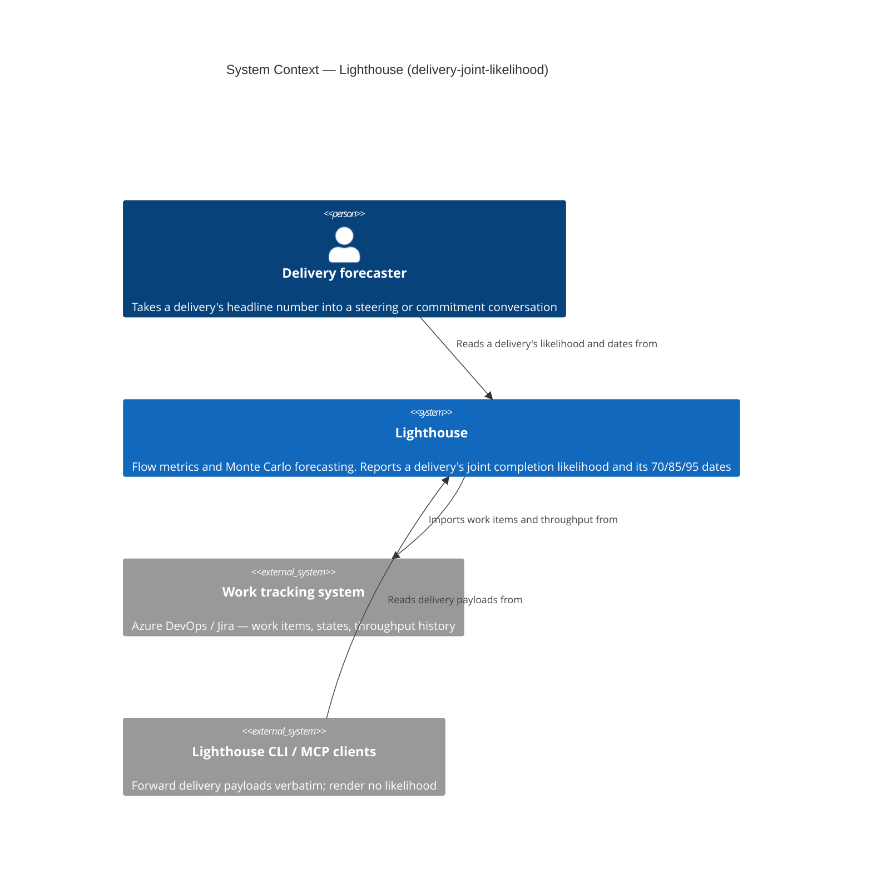
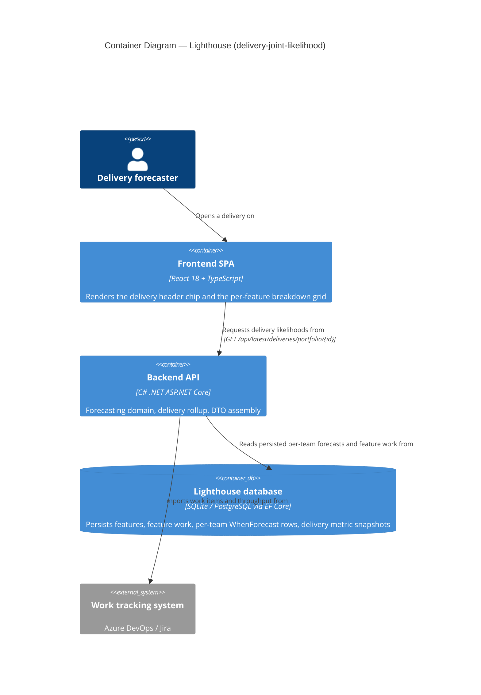
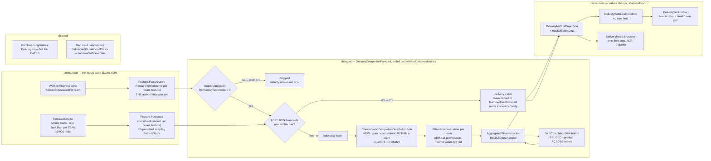

# Feature Delta — delivery-joint-likelihood

**ADO**: User Story **#5587** "Delivery likelihood reflects all features, not just the governing one"
(parent Epic **#5459** "Multi Team Forecasts")
**Waves**: DISCUSS ✅ · DESIGN ✅ · DISTILL ✅ · DELIVER ⬜ *(DISTILL covers slice-01 only)*
**Density**: lean (Tier-1 [REF] only) · `expansion_prompt = ask-intelligent`
**Feature type**: cross-cutting (backend forecast maths · frontend copy · concept docs · release-notes positioning)

---

## Wave: DISCUSS / [REF] Evidence provenance

Everything below is read from the repository, not inferred, **except** ADO #5587's
`System.Description`. This agent has no shell tool in this session (`ctx_shell` is not granted), so
`az boards work-item show --id 5587` could not be run and the work item's body could not be fetched
first-hand. The analysis in #5587 reached this wave through the maintainer's briefing, and every
factual claim it makes has been re-verified against the code below. **DESIGN should re-read #5587
directly** and flag any divergence.

Code re-verified this wave:

| Claim | Verified at |
|---|---|
| Trials are grouped by **team**, not by feature | `Services/Implementation/Forecast/ForecastService.cs` — `RunMonteCarloSimulation`: `simulationResults.GroupBy(s => s.Team)`, one `Task.Run` per team |
| Intra-team features contend and share draws | `SimulateIndividualDayForFeatureForecast` → `GetSimulationResultsOfFeatureToUpdate` picks a feature at random under `FeatureWIP` from **that team's** remaining rows |
| Rows are genuinely sparse | `InitializeSimulationResults` emits one `SimulationResult` per `FeatureWork` with `RemainingWorkItems > 0` — never a cartesian product |
| The header rollup | `Models/Delivery.cs:51` `CalculateMetrics` → `GetGoverningFeature` (likelihood **and** the 70/85/95 chips) |
| The second rollup | `API/DTO/DeliveryWithLikelihoodDto.cs:66,125` `GetLeastLikelyFeature` — filters `>= 0`, orders, takes min; since ADR-112 D8 it drives only `HasSufficientData` |
| Lighthouse persists no person data | `ctx_search "Assignee" --include=*.cs` over `Lighthouse.Backend` → **0 matches in 3 files** (grounds D4) |
| Terminology keys exist | `src/models/TerminologyKeys.ts:8,9,25` — `FEATURE`, `FEATURES`, `DELIVERY` |
| Concept page already teaches the coin analogy | `docs/concepts/howlighthouseforecasts.md` → "2 Teams - 1 Feature" + "Doing it by hand" + "When a Team Cannot Be Forecast" |

---

## Wave: DISCUSS / [REF] Persona ID

`delivery-forecaster` (`docs/product/personas/delivery-forecaster.yaml`) — the person who takes a
delivery's header number into a steering or commitment conversation and is accountable for the date.

Secondary reader, not a distinct persona here: `product-owner`
(`docs/product/personas/product-owner.yaml`), who reads the same breakdown grid to decide a scope cut
(`job-po-scope-cut-from-delivery-trend`). The scope-cut decision gets **better**, not different: the
row-vs-header gap now tells the PO which feature is actually governing.

---

## Wave: DISCUSS / [REF] JTBD

**New job**: `job-delivery-likelihood-covers-every-feature` — added to `docs/product/jobs.yaml`,
added to `delivery-forecaster.primary_jobs`.

> *When I read a delivery's likelihood and its per-feature breakdown, I want the headline number to be
> the chance that **all** of its features land by the date — not the chance that the single governing
> one does — so the number I commit to in front of leadership is not optimistic by construction, and
> so the difference between the header and the rows is something I can explain rather than something I
> have to explain away.*

Opportunity score: **importance 5 / satisfaction 1 / gap 4**. Same trust surface and same defect class
as `job-forecast-multi-team-joint-probability` (Epic 5459), one level up — that epic fixed the
feature; the delivery rollup still selects a single representative.

**Four forces** (full text in `jobs.yaml`):

- **Push** — `GetGoverningFeature` picks one feature and reports its number as the delivery's. Every
  other feature in the delivery is treated as a certainty. Invisible on screen; no workaround a user
  could construct short of redoing the maths by hand from the per-team rows.
- **Pull** — one read-side change at `Delivery.CalculateMetrics` makes the badge **and** the 70/85/95
  chips honest at once, with no schema change and no new endpoint.
- **Anxiety** — the number drops and the dates move out at the release boundary, and the recorded
  trend shows a one-time step that cannot be backfilled. A forecaster mid-commitment may read that as
  the delivery getting worse rather than the tool getting honest. Mitigated by D1 (the label says what
  the number means) and D3 (release notes + concept docs), exactly as ADR-110 D5 handled 5459's own
  step.
- **Habit** — forecasters read a delivery percentage as if it were one feature's. The new number needs
  no new ritual, but the first release will prompt "why is my delivery number lower than every row?" —
  the relabelled chip is what converts that from alarm to comprehension at a glance.

**JTBD-to-story bridge**

| Story | `job_id` | Why this job |
|---|---|---|
| US-01 joint delivery rollup | `job-delivery-likelihood-covers-every-feature` | The spine — the number itself |
| US-02 sufficiency at row grain | `job-forecast-only-with-enough-data` | Literally that job's functional dimension ("every forecast surface… portfolio delivery likelihood") one grain down |
| US-03 relabel both surfaces | `job-delivery-likelihood-covers-every-feature` | The job's social/emotional dimension — being able to explain the header-vs-row gap |
| US-04 concept docs + release notes | `job-delivery-likelihood-covers-every-feature` | The job's `habit` force names the concept-page explanation as the mitigation |

---

## Wave: DISCUSS / [REF] Evidence — two rollups, one grain error

**There are two delivery-level rollups, and the ADO note names only one.**

**Rollup 1 — `Delivery.CalculateMetrics` → `GetGoverningFeature`** (`Models/Delivery.cs:51-107`).
Selects one feature by `OrderByDescending(forecast.GetProbability(85)).ThenBy(likelihood)` and reports
*that feature's* likelihood **and** its histogram's 70/85/95 percentile dates as the delivery's. This
is the ADR-110 worst-team defect one level up: a representative stands in for the whole, and every
other feature is silently a certainty. Two features each 85 % ⇒ true ≈ 72 %, reported 85 %.

**Rollup 2 — `DeliveryWithLikelihoodDto.GetLeastLikelyFeature`** (`API/DTO/…:66,125`). Filters
`LikelihoodPercentage >= 0`, orders, takes the minimum. Since ADR-112 D8 it no longer drives the
likelihood — but it **still** drives `HasSufficientData` via
`leastLikelyFeature?.HasSufficientData ?? featureLikelihoods.All(fl => fl.HasSufficientData)`. So the
delivery's "not enough data" warning is read off **one** feature. Same defect, third instance. See D6.

**The grain that makes it correct is `(team, feature)`, not `feature`.**
`ForecastService.RunMonteCarloSimulation` groups trials by team. Two features worked by the same team
share that team's throughput draws and contend for its `FeatureWIP` — they are positively correlated.
Two features on different teams draw from independent streams. So:

- **Within a team's bucket** — comonotonic. The honest, mildly-optimistic proxy for "that team's last
  row finishes" is the elementwise **min** of the bucket's CDFs (a valid CDF, and the correct upper
  bound under perfect positive dependence).
- **Across buckets** — independent, by construction of the simulation. **Product**, exactly as
  ADR-110 already does for a feature's teams.

Multiplying *feature* CDFs is wrong and double-penalises same-team features. Building a team term out
of `feature.Forecast` (the `AggregatedWhenForecast`) is wrong in the other direction — it folds team B
into team A's term and then multiplies B again.

**Row states, enumerated from the code** (this is what any implementation must handle):

| `(team, feature)` row | In `feature.Forecasts`? | `TotalTrials` | Meaning |
|---|---|---|---|
| remaining > 0, team has throughput | yes | 10 000 | normal contributor |
| remaining > 0, team has **no** throughput | yes | **0** | cannot forecast (ADR-112) |
| remaining == 0 | **absent** — `InitializeSimulationResults` filters `RemainingWorkItems > 0` | — | done; contributes CDF ≡ 1 |
| **all** of a feature's rows remaining == 0 | one sentinel row, `Team == null`, `{0: 0}` | **0** | done; `Feature.GetLikelhoodForDate` short-circuits to 100 |

**Finding (new this wave, sharpens trap 4).** A finished row inside an unfinished shared feature is
normally **absent** from `Forecasts`, not present-with-zero-trials — so the naive failure mode is a
*missing* bucket rather than a degenerate one. But `Forecasts` is EF-persisted and only rewritten by
`SetFeatureForecasts` on the next forecast run, so a stale zero-trial row for a team whose remaining
work has since dropped to 0 **is** reachable between runs. Both shapes must resolve to CDF ≡ 1. The
exemption therefore keys off `FeatureWork.RemainingWorkItems` for that pair — **not** off the
emptiness of the forecast, and **not** off who owns it. Same rule as ADR-112's completed-feature
exemption, applied one grain down.

**Finding (new this wave, blocks a naive D6).** The whole-feature sentinel row carries
`HasSufficientData == false`: `CreateWhenForecastForSimulationResult` only copies the sufficiency flag
`if (simulationResult.Team is { } team && …)`, and the sentinel's `Team` is null, so the `bool` stays
at its default. `AggregatedWhenForecast` then ANDs it to `false`. Today `GetLeastLikelyFeature` masks
this — a finished feature sorts to likelihood 100 and is never selected unless it is the only one.
**Switching to a plain `All(…)` across features would make every delivery containing a completed
feature report "not enough data".** D6 carries the exemption to prevent exactly that.

---

## Wave: DISCUSS / [REF] Locked decisions

D1–D5 are the maintainer's, recorded verbatim in substance. D6–D11 were derived this wave; **D6 and
D12 were put back to the maintainer at wave end and ratified** (see their verdicts). D7–D11 stand as
derived.

| ID | Decision | Verdict |
|----|----------|---------|
| **D1** | **UX framing: relabel both surfaces.** The header chip becomes **"All {features} by {date}: NN%"** with an info tooltip **"P(ALL of these land by the date)"**. The breakdown grid's Likelihood column gets **"each on its own"** framing with a tooltip **"P(this one lands), ignoring the others"**. | LOCKED (maintainer, this session). Rejected: showing joint **and** marginal on the badge (two competing numbers); tooltip-only with no label change (leaves the row-vs-header mismatch unexplained at a glance). **Constraint A**: all new copy routes through `useTerminology()` / `getTerm(TERMINOLOGY_KEYS.DELIVERY \| FEATURE \| FEATURES)` — "Delivery" and "Feature" are user-renamable; never hardcode. **Constraint B**: the copy must **not** promise the header is always lower than every row — equality is legitimate (see D5). |
| **D2** | **ADR-112 D8 stands unchanged.** A delivery containing a feature that cannot be forecast is itself un-forecastable and names the teams. | LOCKED (maintainer). Rejected: exposing a forecastable-subset upper bound alongside it; replacing D8 with a subset-plus-warning. |
| **D3** | **Upgrade shock is handled with release notes + docs only.** A release-notes lead item written as positioning (customer pain → outcome win), plus extending `docs/concepts/howlighthouseforecasts.md` — which already teaches the multi-team coin analogy — one level up to deliveries. **No** in-app banner, **no** dismissible notice, **no** trend-chart annotation. | LOCKED (maintainer). Rationale: matches how ADR-110 D5 handled 5459's own one-time step; no dismissible-notice mechanism exists today and building one for a single-release message is disproportionate. |
| **D4** | **Team independence: docs only.** The assumption is already stated plainly in the concept docs post-5459 ("shared people or a hand-off make reality worse than the maths suggests"). No in-product caveat, no detector. | LOCKED (maintainer). Grounding: `ctx_search "Assignee" --include=*.cs` over the backend returns **zero hits** — Lighthouse stores no person/assignee data at all, so shared-people correlation is not merely undetected, it is **underivable from what is persisted**. Recorded here so it is not re-litigated. |
| **D5** | **Shared features decompose per team, never at feature grain.** A feature worked by teams A and B contributes one row to A's bucket and one to B's. Every `(team, feature)` row lands in exactly one bucket, so the sharing is expressed once and never re-applied. `min` operates only *within* a bucket; the product operates only *across* buckets; the two operators never touch the same pair. | LOCKED (maintainer — the correctness backbone). **Invariant**: `delivery ≤ every breakdown row`, **equality possible**. Proof in one line: team *t*'s min ≤ any row in bucket(*t*), and every other team's term ≤ 1. Equality occurs when one feature governs entirely and the other teams' rows carry slack. |
| **D6** | **`GetLeastLikelyFeature` is deleted. `HasSufficientData` becomes an AND across the delivery's contributing features — excluding features with no remaining work.** | **RATIFIED (maintainer, wave end).** Derived this wave as the answer to the brief's open question, then put back to the maintainer and confirmed. The exemption chain was re-verified independently against the code before ratification: `ForecastService.cs:141-144` builds the no-rows sentinel with the parameterless `SimulationResult()` ctor, so `Team` is null; `CreateWhenForecastForSimulationResult:156` guards on `simulationResult.Team is { } team` and therefore never assigns `HasSufficientData`, leaving the `bool` at its `false` default (`WhenForecast.cs:36`, no initializer); `AggregatedWhenForecast.cs:26` ANDs over that single row. A plain `All(…)` would regress every delivery containing a completed feature to "not enough data". See the dedicated section below. |
| **D7** | **`GetGoverningFeature` is deleted.** The 70/85/95 chips come from the joint delivery histogram, not the governing feature's. | DERIVED — a consequence of D5. The joint rollup produces a full histogram, so there is no selection step left to keep. Note it currently carries the ADO **#5435** tie-break fix; that fix is superseded structurally, not dropped — see AC-01.9. |
| **D8** | **The ADR-112 D8 un-forecastable check runs *before* the joint computation**, unchanged. | DERIVED — preserves D2 exactly. `Delivery.CalculateMetrics` already short-circuits on `Features.Any(f => !f.CanBeForecast)` before touching the governing feature; that ordering stays. |
| **D9** | **Slices 01–04 ship as one release unit.** Do not release the maths (01/02) without the relabel (03) and the docs/notes (04). | DERIVED. Slice order is a build order, not a release order. Releasing 01 alone ships a number that dropped with nothing on screen or in the notes explaining why — the precise failure D1 and D3 exist to prevent. |
| **D10** | **The row set is derived from the persisted per-team forecasts plus `FeatureWork` remaining work — never from a cartesian product of the delivery's teams × features.** | DERIVED (trap 3). `AddOrUpdateWorkForTeam` / `RemoveTeamFromFeature` make the row set genuinely sparse; a cartesian product injects degenerate empty CDFs for teams with no work on a feature. |
| **D11** | **The delivery rollup reuses `JointCompletionDistribution` for the cross-bucket product** rather than reimplementing it. | DERIVED. Forced by the canonical consistency fixture (AC-01.5): a delivery holding exactly one feature shared by two teams must be **bit-identical** to that feature's `AggregatedWhenForecast`, which pins the largest-remainder allocation and the canonical multiplication order. A parallel implementation cannot satisfy it by accident. The per-bucket `min` combinator is new and is DESIGN's to place. |
| **D12** | **The per-bucket elementwise `min` ships as the intra-team proxy. The exact form is deferred, not refused.** | **RATIFIED (maintainer, wave end).** `min` is the comonotonic upper bound on a team's own completion — mildly optimistic, bounded, and far closer to honest than today's single-feature marginal. The exact form is a per-trial max within the bucket, which needs trial-level storage and touches `ForecastService`'s hot loop; deferred for the same reason and on the same terms as ADR-110's cross-team per-trial max ("deferred, not refused: if cross-team correlation ever needs modelling, this is the door"). Consequence to state wherever the approximation is documented: **the delivery number is an upper bound twice over** — `min` is optimistic within a team, and cross-team independence (D4) is optimistic where teams share people. Both err in the same direction, so the shipped figure is a ceiling, never a floor. |

---

## Wave: DISCUSS / [REF] The `GetLeastLikelyFeature` / `HasSufficientData` question — answered

The brief asked this as a real open question. **Verdict: delete `GetLeastLikelyFeature`; make
`HasSufficientData` an AND across the delivery's contributing features, with the no-remaining-work
exemption.**

Concretely — replace

```csharp
HasSufficientData = leastLikelyFeature?.HasSufficientData ?? featureLikelihoods.All(fl => fl.HasSufficientData),
```

with an AND over the features that actually carry a forecast, i.e. those with remaining work; empty
set ⇒ `true`.

**Why AND, not least-likely-feature-derived:**

1. **Grain consistency with the change itself.** After US-01 the delivery number rests on *every*
   `(team, feature)` row. A sufficiency flag read off one representative feature is the same
   "representative stands for the whole" defect the story exists to remove — it would be the last one
   left in the delivery rollup.
2. **ADR-039's rule already says AND.** `AggregatedWhenForecast.HasSufficientData = materialized.All(…)`
   ANDs across a feature's team rows *today*. The delivery is the same aggregation one level up;
   least-likely-feature is the odd one out, not the precedent.
3. **`FeatureLikelihoodDto.HasSufficientData` is already the All-across-teams aggregate**
   (`feature.Forecast.HasSufficientData`). So All-across-features ≡ All across every `(team, feature)`
   row — exactly the row set the likelihood now uses. One grain, two signals.
4. **Direction of change is conservative.** AND can only flip `true → false`, never the reverse. It
   never newly hides a warning; it can only surface one that was previously masked.
5. **Nothing else calls it.** `ctx_search` finds `GetLeastLikelyFeature` at exactly two sites — its
   own definition and the single `FromDelivery` call. Leaving a dead "pick a representative" helper in
   a file whose whole point is that representatives are wrong is an invitation to reuse it.

**Why the exemption is not optional.** A feature with no remaining work carries the `{0: 0}` sentinel,
whose `Team` is null, so `CreateWhenForecastForSimulationResult` never copies the sufficiency flag and
the `bool` stays at its `false` default. A plain `All(…)` would therefore make **any** delivery
containing a completed feature report "not enough data" — a visible regression that today's
least-likely path masks by accident. The exemption keys off remaining work, which is the same rule as
ADR-112's completed-feature exemption and the same rule as trap 4. One rule, three applications.

**Visible behaviour delta to put in the release notes**: today, a delivery whose *least likely* feature
has sufficient data but where some *other* feature rests on thin history reports `hasSufficientData:
true` and shows no warning. After: `false`, and the "not enough data" indicator appears. That is the
right direction — the joint number genuinely rests on that thin history now — but it is a change users
will see. Covered by AC-02.4 and US-04.

**Implementation note for DESIGN (not a DISCUSS decision)**: `FeatureLikelihoodDto` does not carry
remaining work, so the exemption needs either a new row-level signal or evaluation against
`delivery.Features` rather than against the DTO list. DESIGN's call.

---

## Wave: DISCUSS / [REF] Scope assessment (Elephant Carpaccio gate)

**PASS — 4 stories, 2 bounded contexts (forecast domain + delivery presentation) plus a docs surface,
estimated 3–4 days.**

Oversized signals checked: >10 stories — no (4). >3 contexts — no (2 + docs). Walking skeleton needs
>5 integration points — N/A, no skeleton (Decision 2: brownfield, read-side change on an existing
seam; the path `throughput → ForecastService → Feature.Forecasts → Delivery.CalculateMetrics →
DeliveryWithLikelihoodDto → DeliverySection` already runs in production, and this replaces one node in
it). Effort >2 weeks — no. Multiple independent shippable outcomes — no; D9 binds all four into one
release unit.

---

## Wave: DISCUSS / [REF] Journey

**Mental model the forecaster brings.** "The delivery is done when the last feature is done, so the
delivery percentage should be the worst feature's percentage." That model is *almost* right and is
exactly why the current number passes casual inspection: the worst feature **is** a bound — it is just
an upper bound, not the answer. The forecaster's model has no slot for "and the others each have to
land too". The relabel (D1) is what installs that slot: "All {features} by {date}" names the
conjunction the model is missing.

**Vocabulary** — the delivery surface must speak one language. Today it says "Likelihood" in two
places meaning two different things. After: "All {features} by {date}" (joint, header) and
"Likelihood (each on its own)" (marginal, row). Both terms route through `useTerminology()`.

**Happy path.**

```
Portfolio → Deliveries → expand a delivery
  ┌─────────────────────────────────────────────────────────────────────┐
  │ Q3 Launch      Delivery Date: Oct 14, 2026                          │
  │ [ All features by Oct 14, 2026: 72% ]  ⓘ                            │
  │   ⓘ  P(ALL of these land by the date)                               │
  │ Forecast:  [70%: Oct 12]  [85%: Oct 21]  [95%: Nov 03]              │
  │            ^ joint histogram, not the governing feature's           │
  ├─────────────────────────────────────────────────────────────────────┤
  │ Feature            Team        Progress   Forecast   Likelihood ⓘ   │
  │                                                      (each on its own)│
  │                                            ⓘ P(this one lands), ignoring the others
  │ FTR-1 Checkout     Alpha,Beta  ██████░░    Oct 20     [ 72% ]        │
  │ FTR-2 Reporting    Beta        ████████    Oct 09     [ 95% ]        │
  └─────────────────────────────────────────────────────────────────────┘
```

Note the header (72 %) **equals** FTR-1's row here. That is the three-way fixture rendered, and it is
why D1's copy may not promise "always lower".

**Emotional arc.**

- *Start* — unsettled: "The delivery says 85 % and so does the top feature. Are the other four
  features free?"
- *Middle* — oriented: "The header says **All** features. The rows say **each on its own**. Of course
  the header is the lower one — that is what 'all' means. And when they match, I can see which single
  feature is carrying the delivery."
- *End* — defensible: "I can reproduce this by hand from the per-team numbers, the docs show me how,
  and I can say out loud what the number means without a caveat speech."

No jarring transition: the badge keeps its position, size and colour scale. Only the label, the
tooltip and the value change.

**Shared artifacts.** Every `${variable}` above has a single source:

| Variable | Source of truth |
|---|---|
| `{features}` / `{feature}` / `{delivery}` | `getTerm(TERMINOLOGY_KEYS.FEATURES \| FEATURE \| DELIVERY)` — user-renamable, never hardcoded |
| `{date}` (header chip) | `delivery.getFormattedDate()` — the same formatter as the "Delivery Date:" text beside it |
| header `NN%` | `DeliveryWithLikelihoodDto.LikelihoodPercentage` ← `Delivery.CalculateMetrics` joint histogram (US-01) |
| header 70/85/95 chips | `DeliveryWithLikelihoodDto.CompletionDates` ← the **same** joint histogram (US-01, D7) |
| row `NN%` | `FeatureLikelihoodDto.LikelihoodPercentage` ← `feature.GetLikelhoodForDate` — **unchanged** |
| "Cannot forecast" + team names | `TeamsWithoutForecast` (ADR-112) — **unchanged** (D2) |
| "Not enough data" | `DeliveryWithLikelihoodDto.HasSufficientData` — changes rule (US-02, D6) |
| recorded trend points | `DeliveryMetricSnapshot` — forward-only, one-time step (US-04) |

**Error and edge paths — all four must be answered on screen.**

| Path | Behaviour |
|---|---|
| Any feature cannot be forecast | "Cannot forecast", names the teams. **Unchanged** (D2). The joint maths is never reached. |
| All features finished | 100 % / Done, dates as today. The joint rollup must not turn "done" into "cannot forecast" — this is the ADR-110 zero-trial replay one grain down (trap 4). |
| Delivery with no features | 0 %, empty chips — as today. |
| Some features finished, others not | The finished rows drop out (CDF ≡ 1); the delivery reflects only the rows with remaining work. |

**Integration checkpoints.** (a) US-01 → US-03: the relabel is only truthful once the header is joint —
D9 binds them into one release. (b) US-02 → the existing `INSUFFICIENT_FORECAST_DATA_SHORT` rendering:
composes, does not replace (ADR-039/ADR-112 D4). (c) US-01 → `DeliveryMetricSnapshot`: the recorder
writes the new percentile dates from the day of release; no backfill (ADR-048/049).

---

## Wave: DISCUSS / [REF] Story map

**Backbone (user activities, left to right):**

`Open a delivery` → `Read the headline number` → `Compare it against the per-feature rows` →
`Explain the gap to leadership` → `Reproduce it / understand why it moved`

| Activity | Story | Slice |
|---|---|---|
| Read the headline number | US-01 — the number and the dates are the joint across all features' team rows | 01 |
| Read the headline number | US-02 — the "not enough data" warning covers every contributing feature | 02 |
| Compare against the rows · Explain the gap | US-03 — both surfaces say which probability they are | 03 |
| Understand why it moved · Reproduce it | US-04 — release notes + concept docs one level up | 04 |

**No walking skeleton** (Decision 2, brownfield). Slice 01 is itself end-to-end through an existing
path.

**Release slicing** — one release unit (D9), built in the order 01 → 02 → 03 → 04. Every slice is
≤ 1 day and carries at least one user-visible value story.

**Priority rationale.** 01 first because everything else describes its output; releasing the relabel
against the old number would be actively false. 02 second because it is the last representative-based
signal in the same file and is cheapest to fix while that code is open. 03 third because the copy must
describe the shipped number. 04 last because the release notes must describe what actually shipped,
including US-02's visible delta.

---

## Wave: DISCUSS / [REF] User stories

<!-- markdownlint-disable MD024 -->

### US-01 — A delivery's likelihood and dates reflect every feature, not the governing one

`job_id: job-delivery-likelihood-covers-every-feature`

As a **delivery-forecaster**, when a delivery holds several features, I want its headline likelihood
and its 70/85/95 dates computed from the joint distribution over every contributing `(team, feature)`
row, so the number I commit to is not optimistic by construction.

#### Elevator Pitch

**Before**: a delivery with five features shows the governing feature's 85 % and the governing
feature's dates, as though the other four were certainties.
**After**: open Portfolio → Deliveries and expand a delivery (`GET
/api/latest/deliveries/portfolio/{portfolioId}`) → the badge reads the joint probability across all
features and the 70/85/95 chips are the joint histogram's dates. In the Dependencies demo scenario the
badge drops and the chips move outward by days, and no delivery's number exceeds any of its own rows.
**Decision enabled**: whether to commit to the delivery date in the steering meeting, or cut scope now.

#### Domain examples

1. **Happy path — Maria Santos, RTE for the Q3 Launch delivery (14 Oct 2026).** Two features:
   *Checkout* (teams Alpha + Beta) and *Reporting* (Beta alone). Rows at 14 Oct:
   `Alpha/Checkout = 0.90`, `Beta/Checkout = 0.80`, `Beta/Reporting = 0.95`.
   bucket(Alpha) = min(0.90) = 0.90; bucket(Beta) = min(0.80, 0.95) = 0.80; delivery = 0.90 × 0.80 =
   **0.720**. Breakdown rows: Checkout **0.72**, Reporting **0.95**. The header equals Checkout's row.
   Maria reports 72 % and can point at Checkout as the governing feature.
2. **Edge — equality with slack.** Same delivery, but Beta's *Reporting* work closes and its row drops
   out. bucket(Beta) = min(0.80) = 0.80; delivery = 0.90 × 0.80 = 0.720, still. The finished feature
   changed nothing, which is correct — it is a fact, not a forecast.
3. **Error/boundary — Team Meridian has zero throughput** on *Checkout*. `Checkout.CanBeForecast` is
   false, so the delivery short-circuits to "Cannot forecast — no throughput history for Team
   Meridian" (ADR-112 D8, D2). The joint maths is never reached and Maria goes and fixes the data gap.

#### UAT scenarios

**Scenario: A delivery's headline number accounts for every feature**
Given Maria's Q3 Launch delivery holds Checkout (Alpha + Beta) and Reporting (Beta), with the row
probabilities 0.90 / 0.80 / 0.95 at the delivery date
When Maria opens the delivery on the Portfolio page
Then the headline number reads 72 %, and it is not greater than either the Checkout row (72 %) or the
Reporting row (95 %)

**Scenario: A feature shared by two teams is counted once**
Given a delivery holding exactly one feature that both Alpha and Beta work on
When Maria opens the delivery
Then the delivery's likelihood and its 70/85/95 dates are identical to that feature's own likelihood
and dates

**Scenario: The delivery's dates are never earlier than any feature's**
Given a delivery whose features have different 85 % dates
When Maria reads the delivery's 85 % chip
Then that date is on or after every feature's own 85 % date

**Scenario: Work a team has already finished does not drag the delivery down**
Given Alpha has finished all of its work on Checkout while Beta still has work left
When Maria opens the delivery
Then the delivery still reports a forecast (Alpha's finished work counts as certain), and it does not
read "cannot forecast"

**Scenario: A delivery whose work is entirely finished reads as done**
Given every feature in the delivery has no remaining work
When Maria opens the delivery
Then it reads 100 % / Done, exactly as it does today

**Acceptance criteria**

- **AC-01.1** *(D5 — row grain)* The delivery CDF at every day `d` is `∏_t min_{r ∈ bucket(t)} CDF_r(d)`,
  where `bucket(t)` is the set of `(t, feature)` rows in the delivery. Rows are per-team, per-feature.
- **AC-01.2** *(trap 1)* No team term is derived from `feature.Forecast` / `AggregatedWhenForecast`.
  **Discriminating fixture**: F1 shared by A+B, F2 owned by B alone; at some day
  `A/F1 = 0.90`, `B/F1 = 0.80`, `B/F2 = 0.95` ⇒ the delivery is **0.720**. A team term built from
  `feature.Forecast` gives `(0.90×0.80) × min(0.72, 0.95) = 0.518`; multiplying feature CDFs gives
  `(0.90×0.80) × 0.95 = 0.684`. All three values are distinct — the fixture kills all three grain
  traps at once.
- **AC-01.3** *(trap 2)* `min` is taken over the individual per-team rows in a bucket, never over
  feature aggregates. Covered by the same fixture (a min over feature aggregates yields 0.518).
- **AC-01.4** *(D5 invariant)* `delivery ≤ every breakdown row`, and **equality is permitted**. The
  fixture in AC-01.2 must render as delivery 0.720 with rows F1 = 0.72, F2 = 0.95 — a passing test
  must accept the equality, not assert strict inequality.
- **AC-01.5** *(canonical consistency, D11)* A delivery holding exactly **one feature shared by two
  teams** produces a likelihood, histogram and 70/85/95 dates **bit-identical** to that feature's
  `AggregatedWhenForecast`. The single-**team** version of this check is trivially true and proves
  nothing; the shared-feature version is the required fixture.
- **AC-01.6** *(trap 3, D10)* The row set is enumerated from the actual `(team, feature)` work pairs —
  never a cartesian product of the delivery's teams × features. A team with no work on a feature
  contributes no row and injects no degenerate empty CDF. Fixture: a delivery with 2 teams × 2
  features where team A works only F1 must not produce 4 rows.
- **AC-01.7** *(trap 4a)* A row whose `(team, feature)` pair has `RemainingWorkItems == 0` contributes
  CDF ≡ 1 — whether that row is **absent** from `Forecasts` (the normal case) or **present with zero
  trials** (a stale persisted row between forecast runs). The exemption keys off remaining work, not
  off the emptiness of the forecast and not off who owns it.
- **AC-01.8** *(trap 4b)* If such a row is a team's **only** row in the delivery, `bucket(team)`
  resolves to **1** — not to "cannot forecast", and not to a degenerate empty CDF. A whole-feature
  `{0: 0}` sentinel row (`Team == null`) is excluded and must never create a null-keyed bucket.
- **AC-01.9** *(D7 / ADO #5435 regression)* `GetGoverningFeature` is removed and the 70/85/95 chips
  come from the joint histogram. The #5435 symptom — a delivery's forecast dates earlier than an
  individual feature's — becomes structurally impossible, because the delivery CDF is pointwise ≤ every
  feature's CDF. Assert it directly, do not rely on the deleted tie-break.
- **AC-01.10** *(D2 preserved)* The ADR-112 D8 check runs **before** the joint computation. A delivery
  containing any feature with `CanBeForecast == false` still reports "cannot forecast" and names the
  teams; no forecastable-subset number is produced.
- **AC-01.11** A delivery with no features still reports 0 % and empty completion dates, as today.
- **AC-01.12** No schema change, no new DTO field, no new endpoint. `LikelihoodPercentage` and
  `CompletionDates` carry different values on the same contract.

---

### US-02 — The "not enough data" warning covers every contributing feature

`job_id: job-forecast-only-with-enough-data`

As a **delivery-forecaster**, when any feature in a delivery rests on thin throughput history, I want
the delivery to say so, so I do not present a joint number whose weakest input is invisible.

#### Elevator Pitch

**Before**: `HasSufficientData` is read off the single least-likely feature. A delivery whose *other*
features rest on three days of history shows no warning at all.
**After**: open Portfolio → Deliveries → a delivery containing Team Equinox's thin-data feature shows
the "not enough data" indicator on the header, regardless of which feature happens to be least likely.
In the Dependencies demo scenario this makes the thin-data case visible on the delivery, not only on
the feature row.
**Decision enabled**: wait for more history before quoting the delivery number, or quote it with the
caveat the tool is now making for you.

#### Domain examples

1. **Happy path — Maria's Q3 Launch.** Checkout (60 %, 90 days of history) and Reporting (95 %, Team
   Equinox, three active days). Today: least-likely is Checkout, which has sufficient data ⇒ **no
   warning**. After: AND across both ⇒ **warning shown**.
2. **Edge — a completed feature must not trigger it.** Q3 Launch also holds *Legacy Migration*, fully
   done. Its `{0: 0}` sentinel carries `HasSufficientData == false` by default. The exemption keys off
   remaining work, so the delivery is judged only on Checkout and Reporting.
3. **Error/boundary — every feature is done.** All rows exempt, the AND is over an empty set ⇒
   `true`. The delivery reads 100 % / Done with no spurious data warning.

#### UAT scenarios

**Scenario: A thin-data feature raises the warning even when it is not the least likely one**
Given Maria's delivery holds Checkout at 60 % on 90 days of history and Reporting at 95 % on three
days of history
When Maria opens the delivery
Then the delivery shows the "not enough data" indicator

**Scenario: A finished feature does not raise a false warning**
Given Maria's delivery holds one finished feature and one feature with ample history
When Maria opens the delivery
Then no "not enough data" indicator is shown

**Scenario: A delivery whose work is entirely finished shows no data warning**
Given every feature in the delivery has no remaining work
When Maria opens the delivery
Then it reads 100 % / Done with no "not enough data" indicator

**Acceptance criteria**

- **AC-02.1** *(D6)* `DeliveryWithLikelihoodDto.HasSufficientData` is the logical AND of
  `HasSufficientData` across the delivery's features **that have remaining work**. An empty set yields
  `true`.
- **AC-02.2** *(D6 exemption)* A feature with no remaining work is excluded from the AND. Regression
  fixture: a delivery holding one completed feature and one well-supported feature reports
  `hasSufficientData: true`. Without the exemption this returns `false`, because the whole-feature
  `{0: 0}` sentinel carries the `bool` default.
- **AC-02.3** *(D6)* `GetLeastLikelyFeature` is deleted; no delivery-level signal is derived from a
  single representative feature.
- **AC-02.4** *(visible delta, must reach the release notes)* A delivery whose least-likely feature has
  sufficient data but where another feature does not now reports `false` where it previously reported
  `true`. This is intentional.
- **AC-02.5** The unknown-forecast state (ADR-112) and the sufficiency signal continue to **compose**:
  a delivery can be both un-forecastable and insufficient; the "cannot forecast" label wins on screen,
  as today.
- **AC-02.6** The existing `INSUFFICIENT_FORECAST_DATA_SHORT` rendering on `DeliverySection` is reused
  unchanged — no new indicator, no new colour.

---

### US-03 — Both surfaces say which probability they are showing

`job_id: job-delivery-likelihood-covers-every-feature`

As a **delivery-forecaster**, when the delivery's headline number is lower than every feature row
beneath it, I want each surface to state which probability it is, so I can explain the gap at a glance
instead of being asked to justify an apparent inconsistency.

#### Elevator Pitch

**Before**: the header chip reads `Likelihood: 72%` and the grid column reads `Likelihood`, showing
95 % on a row — two numbers with the same word and no way to tell they answer different questions.
**After**: open Portfolio → Deliveries → the header chip reads **"All features by Oct 14, 2026: 72%"**
with an info tooltip **"P(ALL of these land by the date)"**, and the grid column reads **"Likelihood
(each on its own)"** with a tooltip **"P(this one lands), ignoring the others"**.
**Decision enabled**: answer "why is the delivery lower than every feature?" in the meeting itself,
without opening the docs.

#### Domain examples

1. **Happy path — Maria in a steering review.** Header "All features by Oct 14, 2026: 72%"; a row
   shows 95 %. A director asks about the gap; Maria hovers the header tooltip and reads it aloud.
2. **Edge — a renamed vocabulary.** An org has renamed "Feature" to "Epic" and "Delivery" to "Release
   Train". The header must read "All epics by Oct 14, 2026: 72%" — the copy is built from
   `getTerm(TERMINOLOGY_KEYS.FEATURES)`, never a literal.
3. **Error/boundary — equality.** The three-way fixture renders header 72 % with rows 72 % and 95 %.
   The copy must remain true when the header equals a row — it says "All", it does not say "lower than
   any of these".

#### UAT scenarios

**Scenario: The header states that it covers all features**
Given Maria opens a delivery whose headline number is 72 %
When she reads the delivery header
Then it reads "All features by {the delivery date}: 72%" and an info tooltip explains "P(ALL of these
land by the date)"

**Scenario: The breakdown column states that it ignores the other features**
Given Maria expands the delivery's feature grid
When she reads the Likelihood column header
Then it carries "each on its own" framing and a tooltip explaining "P(this one lands), ignoring the
others"

**Scenario: Renamed vocabulary flows into the new copy**
Given an administrator has renamed "Feature" to "Epic"
When Maria opens the delivery
Then the header reads "All epics by {the delivery date}: 72%"

**Scenario: The copy still reads correctly when the header equals a row**
Given a delivery whose headline number is 72 % and whose highest-risk feature row is also 72 %
When Maria reads both
Then neither the label nor the tooltip claims the header is lower than every row

**Scenario: The cannot-forecast state keeps its own message**
Given a delivery containing a feature that cannot be forecast
When Maria reads the delivery header
Then it reads "Cannot forecast" with the existing tooltip naming the teams — not the "All features by
…" framing

**Acceptance criteria**

- **AC-03.1** *(D1)* The header chip label in the numeric state is `All {featuresTerm} by {formatted
  delivery date}: NN%`, with an info affordance whose tooltip reads `P(ALL of these land by the date)`.
- **AC-03.2** *(D1)* The breakdown grid's Likelihood column header carries "each on its own" framing
  with a tooltip reading `P(this one lands), ignoring the others`.
- **AC-03.3** *(D1 Constraint A)* Every new user-facing string that names a domain object is built
  from `useTerminology()` / `getTerm(TERMINOLOGY_KEYS.DELIVERY | FEATURE | FEATURES)`. No new
  hardcoded "Delivery" / "Feature" / "Features" literal is introduced. Verified by the renamed-
  vocabulary scenario, not by inspection alone.
- **AC-03.4** *(D1 Constraint B)* Neither the label nor either tooltip asserts that the header is lower
  than every row. Equality is legitimate.
- **AC-03.5** The non-numeric header states are unaffected: `CANNOT_FORECAST_SHORT` keeps its label
  and its `cannotForecastReason(teamsWithoutForecast)` tooltip; `INSUFFICIENT_FORECAST_DATA_SHORT`
  keeps its label. The "All … by …" framing applies to the numeric state only.
- **AC-03.6** The existing per-row `FeatureLikelihoodChip` tooltip (cannot-forecast, naming teams) is
  not clobbered by the new column-header tooltip; the two coexist.
- **AC-03.7** The header chip's position, size and colour scale (`ForecastLevel`) are unchanged — only
  the label text, the tooltip and the value change.
- **AC-03.8** The date rendered inside the header label uses the same formatter as the "Delivery Date:"
  text beside it, so the two never disagree.

---

### US-04 — A reader can find out why the number moved, and reproduce it by hand

`job_id: job-delivery-likelihood-covers-every-feature`

As a **delivery-forecaster** upgrading Lighthouse, when my delivery numbers drop and my percentile
dates move outward on the same day, I want the release notes to tell me why and the concept page to
let me reproduce the new number from the per-team figures, so I read the change as the tool getting
honest rather than the delivery getting worse.

#### Elevator Pitch

**Before**: after upgrading, a delivery's badge drops, its 70/85/95 chips move outward, its recorded
trend shows a step, and nothing anywhere explains it — the reader's only hypothesis is "the delivery
got worse".
**After**: the release notes lead with the change written as positioning, and
`docs/concepts/howlighthouseforecasts.md` gains a delivery-level worked example alongside the existing
"2 Teams - 1 Feature / Doing it by hand" section, so a reader can reproduce the 0.90 × 0.80 = 72 %
from their own per-team rows in a spreadsheet.
**Decision enabled**: trust the new number and re-baseline the commitment, instead of opening a
support issue or reverting the upgrade.

#### Domain examples

1. **Happy path — Maria upgrades on a Monday.** Q3 Launch drops from 85 % to 72 %; the 85 % chip moves
   from 14 Oct to 21 Oct. She reads the release-notes lead item, follows the link to the concept page,
   reproduces 72 % from Alpha's 0.90 and Beta's 0.80, and re-baselines.
2. **Edge — the recorded trend step.** Maria opens the delivery's Metrics tab. The likelihood line
   steps down at the release boundary. The release notes say the recorded history is forward-only
   (ADR-048/049) and cannot be backfilled, so the step is a change of method, not of delivery health.
3. **Error/boundary — the sufficiency delta.** Maria's *other* delivery gains a "not enough data"
   indicator it never had, because its thin-data feature was never the least likely one. The release
   notes name this as its own bullet (AC-02.4), so it is not mistaken for a new defect.

#### UAT scenarios

**Scenario: The release notes lead with the customer pain and the outcome win**
Given a reader opens the release notes for the version carrying this change
When they read the lead item
Then it states that a delivery's likelihood and dates previously reflected only its governing feature,
and now reflect all of them, and names the three visible consequences: the number drops, the
percentile dates move outward, and the recorded trend shows a one-time step that cannot be backfilled

**Scenario: The sufficiency change is called out separately**
Given the same release notes
When the reader looks for why a delivery gained a "not enough data" indicator
Then a distinct bullet explains that the warning now covers every contributing feature rather than the
least likely one

**Scenario: A reader can reproduce a delivery number by hand**
Given a reader opens the forecasting concept page
When they follow the delivery-level worked example
Then they can compute the delivery percentage from their own per-team, per-feature figures and arrive
at the number Lighthouse displays, rounded

**Scenario: The independence assumption is stated at delivery grain**
Given a reader reaches the end of the delivery-level section
When they look for the caveat
Then the page states that teams are assumed independent and that shared people or a hand-off make
reality worse than the maths suggests

**Acceptance criteria**

- **AC-04.1** *(D3)* A release-notes lead item exists, written as positioning (customer pain → outcome
  win, per house style), covering: the delivery number drops; the 70/85/95 chips move outward; the
  recorded `DeliveryMetricSnapshot` trend shows a one-time step that **cannot** be backfilled
  (forward-only, ADR-048/049).
- **AC-04.2** *(D6, AC-02.4)* The sufficiency-signal change is a separate release-notes bullet.
- **AC-04.3** *(D3)* `docs/concepts/howlighthouseforecasts.md` gains a delivery-level scenario
  alongside the existing "2 Teams - 1 Feature" / "Doing it by hand" walkthrough, using the same coin
  framing, with a worked example a reader can reproduce in a spreadsheet from per-team rows.
- **AC-04.4** *(D5, teaching the grain)* The concept page explains that the decomposition is per team
  per feature, that a feature shared by two teams contributes one row to each, and that this is why a
  shared feature is not penalised twice.
- **AC-04.5** *(D4)* The independence assumption is restated at delivery grain, in the same plain terms
  the page already uses post-5459. **No in-product caveat and no detector** — the backend persists no
  person data (`Assignee`: 0 hits), so the correlation is underivable, not merely undetected.
- **AC-04.6** *(D1 Constraint B, in prose)* The docs must not claim the delivery number is always lower
  than every feature; they must show the equality case, which is the same three-way fixture.
- **AC-04.7** *(D3)* No in-app banner, no dismissible notice, no trend-chart annotation is added.

---

## Wave: DISCUSS / [REF] Trap → AC index

| # | Trap | Failure mode | Closed by |
|---|---|---|---|
| 1 | Team term built from `feature.Forecast` (`AggregatedWhenForecast`) instead of `feature.Forecasts.Where(team == t)` | Folds B's risk into A's term, then multiplies B again — 0.518 instead of 0.720 | **AC-01.2** |
| 2 | `min` taken over feature aggregates per team rather than over per-team rows | Same double-count in different clothing | **AC-01.3** (same fixture) |
| 3 | Row enumeration by cartesian product (teams × features) | Injects degenerate empty CDFs for teams with no work on a feature; `AddOrUpdateWorkForTeam` / `RemoveTeamFromFeature` make the row set genuinely sparse | **AC-01.6**, D10 |
| 4 | A finished row inside an unfinished shared feature | Row-level replay of the Epic 5459 zero-trial bug — "done" rendering as "cannot forecast" or as a degenerate CDF | **AC-01.7** (absent *or* stale-zero-trial row ⇒ CDF ≡ 1), **AC-01.8** (sole row ⇒ bucket = 1, never a null-keyed bucket) |

Cross-cutting kill shot: the three-way fixture in AC-01.2 produces **three distinct values** (0.720 /
0.684 / 0.518) from one input, so it discriminates traps 1 and 2 and the feature-grain product
simultaneously. The bit-identity fixture in AC-01.5 uses a **shared** feature deliberately — the
single-team version is trivially true and proves nothing.

---

## Wave: DISCUSS / [REF] Cross-cutting verdicts

No silent N/A — every item answered.

- **RBAC — N/A, because** the change alters *what number* an existing surface renders, not who may read
  it. No new operation, no `IRbacAdministrationService` interaction, no new UI gate, no change to
  `useRbac()`. Every caller who can read a delivery today continues to, and reads the same fields.
  The premium gate on the delivery Metrics tab is untouched.
- **Lighthouse-Clients (CLI/MCP) — no version gate required, because** the change is read-side and
  adds no DTO field. `lighthouse_delivery_list` forwards the delivery payload verbatim
  (`packages/mcp-core/src/index.ts` → `encodePayload`), and `listDeliveries` is typed
  `Promise<LighthouseApiResult<readonly unknown[]>>` — the clients do not deserialise or render a
  likelihood to a human. `LikelihoodPercentage`, `CompletionDates` and `HasSufficientData` all already
  exist and keep their types (`LikelihoodPercentage` is already nullable per ADR-112). No
  `FEATURE_REQUIRES_SERVER_NEWER_THAN` gate applies. **Verdict: no clients release needed for this
  feature.** Values change, contracts do not — the same conclusion ADR-112's client audit reached, and
  it should be re-confirmed rather than re-derived at DELIVER.
- **Website marketing surface — N/A, because** no new capability, screen or headline claim is
  introduced; this corrects an existing number. The marketing pages do not quote a delivery
  likelihood. **In scope for `docs/`**, which the website hot-links from `Lighthouse@main/docs/` via
  jsDelivr: the concept-page edit (AC-04.3–04.6) is live on letpeople.work as soon as it merges, so it
  must be complete and self-consistent at merge time, not "finished later".
- **Recorded history — one-time step, no backfill.** `DeliveryMetricSnapshot` is forward-only
  (ADR-048/049) and stores percentile *dates*; recomputation would need per-snapshot historical
  throughput that is not retained. Same situation as ADR-110 D5, one level up. **Must appear in the
  release notes** (AC-04.1). No schema change, no migration.
- **Percentile chips move too — stated explicitly.** `delivery.completionDates` currently comes from
  the governing feature's histogram and will come from the joint histogram (D7). Dates move outward,
  not just the badge. Recorded in the journey, in AC-01.9, and in the release notes (AC-04.1). This is
  the single most under-communicated consequence of the change: a reader watching only the badge will
  be surprised by the dates.
- **Demo data — no change required, but verify.** The premium **Dependencies** scenario already
  demonstrates joint / thin-data / cannot-forecast / finished side by side (Epic 5459). It is the
  natural fixture for the visible-delta checks in US-01 and US-02; DELIVER should confirm it exercises
  a shared feature across two teams within one delivery, and add one if it does not.
- **EF migrations — N/A, because** the change is read-side only (S2). No entity, no column, no
  `CreateMigration` run.

---

## Wave: DISCUSS / [REF] Outcome KPIs

Measurement honesty first: Lighthouse is self-hosted with **no phone-home telemetry** (#5015), so no
KPI here may depend on usage data from customer instances. Every measurement below is either a CI
assertion, a maintainer-run check, or public issue triage.

| Who | Does what | By how much | Measured by | Baseline |
|---|---|---|---|---|
| Every delivery rendered by Lighthouse | Reports a likelihood no greater than any of its own feature rows, and dates no earlier than any of its features' | **0 violations** | Backend integration assertion over the Dependencies demo scenario, run on every CI build | Unknown today — the invariant is not asserted anywhere, and `GetGoverningFeature` can violate it (ADO #5435 was that symptom) |
| A forecaster reading a multi-feature delivery | Can state what the headline number means without opening the docs | Both surfaces carry the framing and the tooltip; renamed-vocabulary scenario passes | Frontend test + maintainer walkthrough on the demo instance before release | 0 — today both surfaces say "Likelihood" and mean different things |
| A reader of the concept page | Reproduces a displayed delivery percentage by hand from per-team rows | Reproduces to the displayed rounded value | Maintainer walks the new worked example end to end against the running demo instance before release; a mismatch blocks the release | The page teaches this at *feature* grain only (post-5459); at delivery grain it is 0 |
| A forecaster upgrading | Attributes a dropped delivery number to the method change rather than to delivery health | Every post-release question about a moved delivery number is answerable by linking the release-notes item or the concept section, with no bespoke explanation needed | GitHub/community issue triage for 90 days after release; count of questions answered by link vs. by bespoke explanation | Epic 5459's equivalent step produced no such issues, which sets the bar rather than the baseline — the delivery surface is more leadership-facing, so expect more |
| A forecaster whose delivery rests on thin history | Sees the "not enough data" indicator on the delivery, not only on the feature row | Indicator present in 100 % of deliveries containing a thin-data feature with remaining work; **0** false positives on deliveries containing a completed feature | Backend + frontend tests (AC-02.1, AC-02.2), plus the Dependencies scenario | Today the indicator fires only when the *least likely* feature is the thin one — an unmeasured fraction, and provably 0 in the Dependencies scenario's shape |

---

## Wave: DISCUSS / [REF] Out of scope

- Changing the Monte Carlo, the throughput sampling, the filter modes, or the blackout day-shift
  translation.
- Per-trial max across teams, or modelling cross-team correlation (ADR-110's deferred door).
- Modelling **intra**-team correlation more exactly than the comonotonic `min` proxy. `min` is the
  honest upper bound under perfect positive dependence; a per-trial max within a team's bucket would
  be exact and is deferred for the same reason ADR-110 deferred it.
- Any schema change, new DTO field, new endpoint, or migration.
- Changing per-feature likelihood or per-feature dates — the breakdown rows are marginals and stay
  marginals (that is the point of D1).
- Changing ADR-112 D8 (D2), including any forecastable-subset upper bound.
- In-app upgrade messaging of any kind (D3).
- An in-product independence caveat or a shared-people detector (D4).
- Backfilling `DeliveryMetricSnapshot` history.
- Filing the standing `ForecastBase.GetLikelihood` `return 100` ticket — still open from Epic 5459,
  still deliberately untouched, still wants its own ticket.

---

## Wave: DISCUSS / [REF] DoR validation

| # | Item | Verdict | Evidence |
|---|---|---|---|
| 1 | Problem statement clear, domain language | **PASS** | Two rollups documented from code with file:line; the grain error stated in forecasting vocabulary, not implementation terms |
| 2 | User/persona with specific characteristics | **PASS** | `delivery-forecaster` (existing SSOT persona); secondary `product-owner`; Maria Santos carries the examples |
| 3 | 3+ domain examples with real data | **PASS** | Each story carries 3 examples with named people, named teams (Alpha/Beta/Equinox/Meridian), named features and concrete probabilities (0.90 / 0.80 / 0.95 → 0.720) |
| 4 | UAT in Given/When/Then (3–7 scenarios) | **PASS** | US-01: 5 · US-02: 3 · US-03: 5 · US-04: 4. All titled by business outcome, no implementation titles |
| 5 | AC derived from UAT | **PASS** | 12 / 6 / 8 / 7 ACs, each traceable to a scenario or to a named trap; the four traps are indexed to ACs |
| 6 | Right-sized (1–3 days, 3–7 scenarios) | **PASS** | 4 stories, one slice each, ≤ 1 day each; 3–5 scenarios each. US-01 is the largest at 12 ACs but a single seam and a single day |
| 7 | Technical notes: constraints/dependencies | **PASS** | Row-state table; the `FeatureLikelihoodDto` remaining-work gap flagged for DESIGN; D11 bit-identity constrains the combinator; `min` combinator placement left to DESIGN |
| 8 | Dependencies resolved or tracked | **PASS with one tracked gap** | Slice order 01→02→03→04, release-bound by D9. **Tracked gap**: ADO #5587's `System.Description` could not be fetched (no shell tool this session) — recorded in the provenance section; DESIGN must re-read it and flag divergence. Not blocking: every claim was independently re-verified against code |
| 9 | Outcome KPIs with measurable targets | **PASS** | Five KPIs, each with a measurement method that exists without telemetry (CI assertion, maintainer walkthrough, issue triage), and an honest baseline including "unknown today" where that is the truth |

**Verdict: DoR PASS (9/9).** Ready for DESIGN.

---

## Wave: DISCUSS / [REF] Open questions for DESIGN

1. **Where does the per-bucket `min` combinator live?** `JointCompletionDistribution` is `internal
   static` and multiplies. A `Min` sibling there is the obvious home, but the two operators must stay
   visibly distinct (D5: they never touch the same pair). DESIGN owns the placement and the
   trial-count/rounding rule for the min result — constrained by AC-01.5's bit-identity requirement.
2. **How does the sufficiency exemption reach the DTO?** `FeatureLikelihoodDto` carries no remaining
   work. Either add a row-level signal or evaluate the AND against `delivery.Features`. DESIGN's call;
   AC-02.1/02.2 constrain the behaviour, not the shape.
3. **Cost.** ADR-110 D-point 4 declined memoisation on a measured 0.113 ms p95 for 5 teams × 500 day
   keys. The delivery rollup adds a second pass over the same day-key union per delivery, and
   `Feature.Forecast` is still a computed property rebuilt on every get. DESIGN should measure before
   deciding, and note that this change reads `feature.Forecasts` (the raw rows) rather than
   `feature.Forecast` (the aggregate) — which may make the delivery path *cheaper*, not dearer.
4. **Does an ADR get filed?** This extends ADR-110's reasoning to a new grain and supersedes
   `GetGoverningFeature`. DESIGN decides whether that is a new ADR or an amendment; DISCUSS does not
   write ADRs.

---

## Wave: DESIGN / [REF] Prior-wave consultation

Scope = **application/components** (Decision 0). Mode = **guide** (Decision 1) — every open question
was answered by the maintainer in session; nothing below is a proposal. `.nwave/des-config.json`
carries no `rigor` key ⇒ standard defaults.

| Artifact | Read | Note |
|---|---|---|
| `feature-delta.md` DISCUSS (813 L, D1–D12, US-01..04, 33 ACs) | ✓ | Every AC below traces back to it |
| `slices/slice-01-joint-delivery-rollup.md` | ✓ | The rule, the three-way fixture, the four traps |
| `slices/slice-02-sufficiency-across-contributing-rows.md` | ✓ | The `{0:0}`-sentinel landmine |
| `slices/slice-03-relabel-joint-and-marginal.md` | ✓ | Constraints A + B; the truncation hypothesis |
| `slices/slice-04-explain-the-move.md` | ✓ | Docs/notes surface; jsDelivr live-on-merge |
| `adr-110-multi-team-forecast-joint-probability.md` | ✓ | Product, largest-remainder, canonical order, no memoisation — inherited verbatim |
| `adr-111-aggregate-forecast-field-provenance.md` | ✓ | Applied one grain down to the per-team carrier |
| `adr-112-unknown-forecast-when-contributor-cannot-be-forecast.md` | ✓ | D8 preserved; the `return 100` trap must not be reached |
| `docs/product/architecture/brief.md` `## Application Architecture` | ✓ | Extended with a new delta section; prior sections untouched |
| `docs/evolution/2026-07-28-epic-5459-multi-team-forecasts.md` | ✓ | Traps carried forward: point-mass fixtures, the zero-trial filter, CS9236/CA1861 |
| `docs/ci-learnings.md` | ✓ | CA1861 (6 recurrences), CA1859 concrete return types, "Sonar gate = zero new issues of ANY severity" |
| Code: `Delivery.cs`, `Feature.cs`, `FeatureWork.cs`, `ForecastBase.cs`, `WhenForecast.cs`, `AggregatedWhenForecast.cs`, `JointCompletionDistribution.cs`, `DeliveryMetricsProjection.cs`, `DeliveryWithLikelihoodDto.cs`, `ForecastService.cs`, `DeliverySection.tsx` | ✓ | All claims below re-verified against source this wave |
| `spike/` for this feature | **⊘** | Does not exist. Epic 5459's SPIKE-00 (#5568) was consumed by the predecessor story; its measured findings are carried in ADR-110 and the evolution doc |
| ADO #5587 `System.Description` | **⊘** | Still not fetched — no shell tool in this session either. DISCUSS flagged it; it stays a DELIVER gate (slice-01 gate 4). Every claim was independently re-derived from code, so it is not blocking |

---

## Wave: DESIGN / [REF] DDD-1 — the `min` combinator: a sibling type, not an overload

Four types in `Models/Forecast/`, three of them new:

| Type | Status | Role |
|---|---|---|
| `JointCompletionDistribution` | unchanged | product **ACROSS** buckets (ADR-110, reused per D11) |
| `ComonotonicCompletionDistribution` | **NEW** | elementwise `min` **WITHIN** a bucket |
| `CompletionHistogram` | **NEW** | shared primitives: `TrialsIn`, `CumulativeProbabilities`, `DistributeByLargestRemainder` |
| `DeliveryCompletionForecast` | **NEW** (review H4) | the composing builder: pairs → bucket → `Min` → carrier → `AggregatedWhenForecast`. Reimplements no maths |

The two combinators stay distinct **types** on **cohesion grounds**: `min`-within-a-bucket and
product-across-buckets are two different domain operations with two different justifications
(comonotonicity vs independence), and one type per operation is how ADR-110 already shapes this corner
of the model. **The claim that the type split alone makes D5 machine-checkable is withdrawn** — see the
Reuse Analysis section; the grain invariant is a property of the *call site*, and it is
`DeliveryCompletionForecast` plus the `Models.Delivery ↛ combinator` rule that makes it enforceable.

`CompletionHistogram` is the three private helpers lifted out of `JointCompletionDistribution` verbatim
— **a behaviour-preserving `refactor(forecast):` commit, separate from the feature commit** (project
convention). After the extraction `JointCompletionDistribution` contains only `Combine`.

**`Min` contract.**

```
Min(IEnumerable<IReadOnlyDictionary<int,int>> histograms) -> Dictionary<int,int>
  contributors = each histogram's buckets ordered by day key (per contributor; the SEQUENCE
                 of contributors is deliberately left unordered — see below), TrialsIn > 0
  count == 0  -> []                      # caller treats this as "no bucket", never as a distribution
  count == 1  -> that histogram VERBATIM  # short-circuit, load-bearing
  count >= 2  -> days       = ascending union of contributors' keys
                 cum[i]     = min over contributors of CumulativeProbabilities(c, days)[i]
                 exact[i]   = max(0, (cum[i] - cum[i-1]) * totalTrials)
                 totalTrials= contributors.Max(TrialsIn)
                 return DistributeByLargestRemainder(days, exact, totalTrials)
```

Return type is the concrete `Dictionary<int,int>`, mirroring `Combine` — CA1859 fires on the Sonar
gate for non-public methods declared as an interface (ci-learnings, 2026-06-09).

**Why `count == 1` short-circuits.** Round-tripping a single histogram through
cumulative → differentiate → largest-remainder is *not* the identity in IEEE 754: `(a/T − b/T) × T`
can land a hair under the original integer count, the floor drops a trial, and the residue pass hands
that trial to whichever day has the largest fractional part — which need not be the day it came from.
One shifted trial breaks **AC-01.5** bit-identity. The short-circuit is correctness, not speed.

**Why `Min` must NOT sort its inputs — and why the absence needs a comment.**
`JointCompletionDistribution` sorts contributor probabilities before multiplying, because IEEE 754
multiplication is not associative: a caller-determined order can differ in the last bit and tip a
rounding decision. **Minimum has no such hazard.** It returns one of its inputs unchanged, does no
arithmetic, does no rounding, and is invariant under permutation of finite inputs. A mirrored
`.Order()` in `Min` would be dead code that the next reader mistakes for a load-bearing invariant, and
the Stryker `disable once Linq` pragma next to it would be cargo-culted too. The absence carries a
one-line comment pointing at ADR-113 §3.

**Validity of the result.** Each contributor's cumulative series is non-decreasing and reaches exactly
1 at the last key of the union (the union bounds every contributor's own max key), so the pointwise
minimum is a valid CDF reaching 1 there too, and the differentiated mass sums to `totalTrials` before
rounding. Largest-remainder then makes the sum exact, as it already does for the product.

---

## Wave: DESIGN / [REF] DDD-2 — sufficiency carrier: `DeliveryMetricsProjection`, zero wire change

`Delivery` computes the AND and returns it; the DTO copies it.

- `DeliveryMetricsProjection` gains **one field**: `bool HasSufficientData`. It is a **`public`**
  `sealed record` in `Models/DeliveryMetricsProjection.cs` (not internal — corrected) that is **never
  serialised**: the DTO reads from it and emits its own shape, so adding a field here is not a wire
  change.
- `Delivery.CalculateMetrics` fills it on **every** return path, including the un-forecastable one
  (AC-02.5: the two signals compose; "cannot forecast" merely wins on screen).
- `DeliveryWithLikelihoodDto.FromDelivery` becomes `HasSufficientData = metrics.HasSufficientData`.
  `GetLeastLikelyFeature` is **deleted** (D6/AC-02.3) — `ctx_search` confirms exactly two sites, its
  definition and that one call.
- **Zero wire-contract change.** No new field on `FeatureLikelihoodDto`, nothing new on
  `DeliveryWithLikelihoodDto`. The CLI/MCP payloads are byte-compatible; DISCUSS's
  "no clients release needed" verdict stands and only needs re-confirming, not re-deriving.

**The rule** (AC-02.1/02.2, and this is how the exemption reaches the DTO — DISCUSS open question 2):

```csharp
Features
  .Where(f => f.FeatureWork.Sum(w => w.RemainingWorkItems) > 0)   // the completed-feature exemption
  .All(f => f.Forecasts.All(r => r.HasSufficientData));           // empty set ⇒ true, both levels
```

Evaluated against `delivery.Features`, **not** against the `FeatureLikelihoodDto` list — the DTO
carries no remaining work, and adding a field to it would be a wire change for an internal predicate.

`f.Forecasts.All(...)` is exactly `f.Forecast.HasSufficientData`
(`AggregatedWhenForecast.cs:26` — `materialized.Count == 0 || materialized.All(...)`) **without
rebuilding the aggregate**, so the sufficiency pass costs one boolean walk over the persisted rows
rather than N product-of-CDFs constructions. Same value, feature grain as AC-02.1 words it.

**The landmine, closed.** A feature with no remaining work carries the whole-feature `{0: 0}` sentinel
whose `Team` is null; `CreateWhenForecastForSimulationResult` (`ForecastService.cs:156`) guards on
`simulationResult.Team is { } team` and therefore never assigns `HasSufficientData`, leaving the
`bool` at its `false` default. The `Where` clause is what stops a plain `All(…)` from reporting "not
enough data" on every delivery containing a completed feature.

**Named nuance, not silently accepted.** Feature-grain AND (this rule) and row-grain AND (what the
delivery aggregate itself computes, DDD-5) agree everywhere except one corner: a *stale done row*
inside a still-live feature, which feature grain includes and row grain excludes. AC-02.1 words the
rule at feature grain, so feature grain wins; the divergence is recorded so a future reader does not
"unify" them without noticing they are two different sets.

---

## Wave: DESIGN / [REF] DDD-3 — cost: expected direction stated, DELIVER measures

**DESIGN states the direction; slice-01 measures before commit. No memoisation unless the measurement
contradicts** (ADR-110 point 4 declined it at 0.113 ms p95 for 5 teams × 500 day keys).

**Expected direction: cheaper, not dearer.** Counted from source, for a delivery of *N* features:

| | Today | After |
|---|---|---|
| `feature.Forecast` rebuilds (a full `AggregatedWhenForecast` — product-of-CDFs + one transient `IndividualSimulationResult` per day key) attributable to the **header** | ≈ *N* in `GetGoverningFeature` + ≈ *N* via `GetLikelhoodForDate` + `percentiles.Length` more, because `ToWhenPercentile(governingFeature.Forecast, …)` re-evaluates the computed property inside the `Select` + 1 at the return | **1** — the single delivery aggregate |
| `feature.Forecast` rebuilds inside `CalculateMetrics` that **do not change** | — | ≈ *N* — `CalculateFeatureBreakdown` → `ToFeatureMetric` → `GetLikelhoodForDate` → `Forecast.GetLikelihood`, one per feature, which stays exactly where it is |
| **Total aggregate constructions inside `CalculateMetrics`** | ≈ 2*N* + `percentiles.Length` + 1 | **≈ *N* + 1** |
| Per-bucket work | — | one `Min` per bucket, O(pairs × day-keys) |

With the three percentiles the DTO passes, today is 2*N* + 4; `DeliveryMetricSnapshotRecordingHandler.cs:53`
passes **four** percentiles, so that path is 2*N* + 5 today. Either way the after-figure is **≈ *N* + 1,
not 1** — an earlier draft of this table claimed 0 header rebuilds and 1 total, which overstated the
win and would have made DELIVER's measurement read as a regression against DESIGN's own expectation.
The conclusion survives: 2*N* + 4 → *N* + 1 is still a reduction of roughly half.

The header path stops reading `feature.Forecast` (a computed property rebuilt on **every** get) and
reads the raw EF-persisted `feature.FeatureWork` + `feature.Forecasts` once; the delivery aggregate is
built once and reused for the likelihood and all three percentiles. The residual ≈ *N* is the
breakdown, which this story deliberately does not touch.

**What DELIVER must measure** (slice-01, before commit): worst case = many teams × many features ×
≈ 500 distinct day keys, on the premium **Dependencies** demo portfolio, timing
`DeliveryWithLikelihoodDto.FromDelivery` per delivery and the portfolio deliveries endpoint end to end,
p95 over ≥ 100 iterations. **Budget: ADR-110's 5 ms per delivery.**

**What triggers a rethink**: p95 > 5 ms per delivery, or a measurable regression on the deliveries
endpoint against the pre-change baseline on the same data. Either would put memoisation of
`Feature.Forecast` (or of the per-bucket `Min`) back on the table — as a separate decision, with the
measurement attached, not as a pre-emptive optimisation.

**Context worth keeping**: the delivery DTO's dominant cost is **unchanged** and lives elsewhere —
`CalculateFeatureLikelihoods` still calls `feature.GetLikelhoodForDate`, `feature.Forecast.CreateForecastDtos`
and `feature.Forecast.HasSufficientData` once per feature (≈ 3*N* aggregate builds) to render the
breakdown rows. Measuring only the header would flatter the change; measure the endpoint too.

---

## Wave: DESIGN / [REF] DDD-4 — ADR-113 filed (113 verified free)

`docs/product/architecture/adr-113-delivery-grain-joint-completion.md`. Highest existing ADR is 112
(`ctx_glob docs/product/architecture/adr-1*.md` → 100..112), so 113 is free.

- **References** ADR-110 — same reasoning, new grain. **ADR-110 is not edited.**
- **Preserves ADR-112 D8 unchanged** in substance (D2); records the `GetLikelihood` `return 100` trap
  (ADO Bug **#5586**) that the delivery rollup must not reach.
- **Records that `GetGoverningFeature` — and with it ADO #5435's tie-break fix — is structurally
  superseded, not dropped**: there is no selection step left to tie-break. The delivery CDF is
  pointwise ≤ every feature's CDF **exactly, on the CDFs**; on the *emitted histograms* that ordering
  holds only up to the ±1-trial largest-remainder residue, so a percentile **day** can still land one
  earlier in a near-equality case. AC-01.9 is therefore asserted on the pre-rounding cumulative series,
  or with an explicit one-day tolerance that names the residue — never on the deleted tie-break, and
  never as an unqualified strict inequality over demo data.
- Carries the reuse verdict, the enforcement table, and seven rejected alternatives (including the
  composing-builder alternative added in response to review H4).

---

## Wave: DESIGN / [REF] DDD-5 — the delivery distribution carrier: reuse, no new type

**Where do the header dates come from once the governing feature is gone? Off the joint distribution
itself. There is no representative feature anywhere in the path.**

```
per team t:  var teamForecast = new WhenForecast(ComonotonicCompletionDistribution.Min(bucket(t)))
                 { NumberOfItems = Σ bucket, CreationTime = min bucket, FilterApplied = any bucket,
                   ExcludedSummary = distinct-join bucket, HasSufficientData = all bucket }
delivery:    var deliveryForecast = new AggregatedWhenForecast(teamForecasts)
```

`AggregatedWhenForecast` already: runs the cross-bucket product through `JointCompletionDistribution`
(satisfying **D11** by construction), ORs `FilterApplied`, distinct-joins `ExcludedSummary`, ANDs
`HasSufficientData`, sums `NumberOfItems`, takes the oldest `CreationTime` (ADR-111), and carries the
`{0:0}` day-key-union fallback for the no-trials case. So **likelihood and all three percentile dates
come off one object**.

`WhenForecast`'s `internal` histogram constructor is the carrier seam. It was added by Story #5569 as
a **test** seam, and its comment says exactly that (`WhenForecast.cs:10`, "Test seam for hand-built
histograms"). This design promotes it to a **production** seam, so **that comment must change in the
same commit** — otherwise the next reader deletes it as test-only scaffolding and breaks the delivery
rollup. (No `InternalsVisibleTo` consideration applies: the caller is in the same assembly.)

**`Team`/`TeamId`/`Feature`/`FeatureId` stay null on the carrier.** Nothing downstream reads them, and
unset navigations are what keep these transient read-path entities structurally unable to be fixed up
by EF onto a tracked `Feature` or `Team`. ADR-110 point 4 already guarantees the transient
`IndividualSimulationResult` objects are never attached; this extends the guarantee, and the
enforcement table turns it into a `ChangeTracker` assertion rather than a promise.

**AC-01.5 bit-identity holds trivially.** A delivery holding one feature shared by teams A and B has
two single-row buckets; each `Min` short-circuits verbatim; the aggregate is then literally the same
call `feature.Forecast` makes — `JointCompletionDistribution.Combine` over the same two histograms —
and the four flags compose identically (Σ, min, any, all, distinct-join over one element each).

**For the record — two different selectors in two different files, both deleted.**
`GetLeastLikelyFeature` (`DeliveryWithLikelihoodDto.cs:125`) never fed the dates; since ADR-112 D8 it
feeds only `HasSufficientData`. The dates came from `GetGoverningFeature` in `Delivery.CalculateMetrics`
(`Delivery.cs:93-107`). Conflating the two is the easiest way to mis-scope this change.

---

## Wave: DESIGN / [REF] Bucket construction, precisely

**Rows — and the direction matters more than anything else in this design (C1, maintainer-locked).**
Enumerate **FROM `feature.FeatureWork.Where(w => w.RemainingWorkItems > 0)`**, then **LEFT JOIN**
`feature.Forecasts` for that team. `FeatureWork` is the authoritative set of contributing pairs;
`Forecasts` is a *derived, lagging* projection of it, rewritten only by `SetFeatureForecasts` on a
forecast run. **Never** a cartesian product of the delivery's teams × features (**D10 / AC-01.6**).

Driving from `Forecasts` — the obvious reading, and what an earlier draft of this design specified —
is **unsafe**: a contributing pair with no forecast row would emit nothing, land in no bucket, and
therefore contribute **CDF ≡ 1**, a silent certainty. That is this feature's own defect one grain
lower, and it is reachable (`WorkItemService.cs:332`/`:412` call `AddOrUpdateWorkForTeam` during
work-item sync, which is not a forecast run). See DDD-7.

```
for each feature in Features:
    for each work in feature.FeatureWork where work.RemainingWorkItems > 0:   # authoritative pairs
        row = feature.Forecasts.FirstOrDefault(f => (f.Team?.Id ?? f.TeamId) == work.TeamId)
        if row is null:  ⇒ CANNOT FORECAST — name work.Team, abandon the rollup   # C1
        emit (work.TeamId, row)

buckets = rows grouped by teamId                      # empty buckets simply do not exist
teamForecasts = buckets.Select(b => carrier(Min(b.rows.Select(r => r.SimulationResult))))
```

The `Team?.Id ?? TeamId` precedence matches `Feature.TeamFor`. The whole-feature `{0: 0}` sentinel has
`Team == null` **and** `TeamId == null`, so it matches no `FeatureWork` pair and is never reached from
this direction at all — a null-keyed bucket is structurally unrepresentable.

**Pairs with no remaining work — the exemption (AC-01.7).** A `FeatureWork` with
`RemainingWorkItems <= 0` is simply not enumerated. The exemption keys off remaining work — **not** off
the emptiness of the forecast and **not** off who owns it. Because `Forecasts` is EF-persisted and
lags `FeatureWork`, **four** shapes are reachable, and this direction handles all four:

| Shape | Why it occurs | Result |
|---|---|---|
| Pair **absent** from `Forecasts`, remaining work `0` | `InitializeSimulationResults` filters `RemainingWorkItems > 0` — the normal, common case | not enumerated |
| Pair **present with full trials**, remaining work now `0` | the **common stale shape**: work finished after the last forecast run, so the row keeps its 10 000 trials | not enumerated |
| Pair **present with zero trials** | the team lost its throughput and was dropped from the simulation (`ForecastService.cs:112-119`, `:126`). Note this is the *only* way a row reaches zero trials — a row stale from finished work keeps its full trials | not enumerated if remaining work is 0; if remaining work is `> 0`, guard 2 (ADR-112) fires first |
| Pair **has remaining work but NO row at all** | `AddOrUpdateWorkForTeam` ran during sync after the last forecast run | **cannot forecast** — the C1 case; never a silent 1 |

Note for DISTILL: the second and third shapes are **different fixtures**. A row stale because work
finished still has 10 000 trials; only a throughput-less team yields a zero-trial row. Conflating them
produces a fixture that cannot be constructed and a false belief that trap 4 is covered.

**A team whose only pair is done (AC-01.8).** It is never enumerated, so its bucket is **absent** from
the bucket set — which is exactly `bucket(t) = 1`, because 1 is the identity of the cross-bucket
product. It resolves to 1, **not** to "cannot forecast", and **not** to a degenerate empty CDF that
would drag the product to 0. Dropping a done pair from a live bucket is likewise exact, because 1 is
the identity of `min`. **One mechanism, two identity elements, no special case** — and, critically,
it is only safe because the *only* pairs that resolve to 1 are pairs with no remaining work. A pair
with work but no forecast must never take this path; that is the whole of C1.

**Defence in depth, not the mechanism.** `Min` additionally filters contributors with `TrialsIn == 0`.
After guard 2 a zero-trial row with remaining work cannot survive to this point, so that filter is a
belt, not the braces. Do not let a test rely on it as *the* rule for trap 4 — the rule is the
remaining-work predicate plus the C1 join.

---

## Wave: DESIGN / [REF] The four guards in `CalculateMetrics`

`CalculateFeatureBreakdown` runs first and is **unchanged** (the breakdown rows are marginals and stay
marginals). Then:

| # | Guard | Result | AC |
|---|---|---|---|
| 1 | `Features.Count == 0` | `(0.0, [], breakdown, sufficiency)` | **AC-01.11** |
| 2 | `Features.Any(f => !f.CanBeForecast)` | `(null, [], breakdown, sufficiency)` — teams named by the existing `TeamsWithoutForecast` path, now including C1's missing pairs (DDD-8) | **AC-01.10**, D2/D8, **C1** |
| 3 | total remaining work `<= 0` | `(100.0, day-0 percentiles, breakdown, true)` | all-done |
| 4 | *backstop* — any contributing pair (`FeatureWork` with remaining work) still has no `Forecasts` row after guard 2 | `(null, [], breakdown, sufficiency)` | **C1** |
| 5 | otherwise | joint rollup off `deliveryForecast` | **AC-01.1** |

**Guard 2 is the ADR-112 D8 short-circuit and it runs BEFORE the joint computation, unchanged (D2/D8).**
Today it lives at `Models/Delivery.cs:62-66`. Its position **relative to guard 1 is irrelevant** —
`Features.Count == 0` and `Features.Any(…)` are disjoint, so no ordering between them is observable
(see DDD-6, which corrects an earlier claim to the contrary). What matters, and what D2/D8 require, is
that it precedes the maths.

**Guard 4 is a backstop, at PAIR grain, not the mechanism.** Once DDD-8 extends
`Feature.TeamsWithoutForecast` to see contributing pairs with no forecast row, guard 2 already covers
C1 and guard 4 should be unreachable. It is retained deliberately and cheaply: it is the one place that
re-derives the predicate from the row set the maths actually consumes, so the two cannot drift apart
silently. It is **not** "no contributing row anywhere" — that framing was wrong, because it only fires
when the row set is *globally* empty and therefore misses the single-pair case entirely.

**Guards 1 and 3 — the two "no rows" cases that must report opposite numbers.**
An empty delivery and an all-done delivery both yield zero contributing pairs. They are distinguished
by `Features.Count`, not by the pair set:

- **Empty delivery ⇒ 0 %.** Today: `GetGoverningFeature` returns null and
  `Delivery.CalculateMetrics` returns `(0.0, [], breakdown)` (`Delivery.cs:56-59`). **Replaced by**
  guard 1, same values. (AC-01.11.)
- **All features finished ⇒ 100 %.** Today: `Feature.GetLikelhoodForDate` short-circuits to `100` on
  `FeatureWork.Sum(RemainingWorkItems) <= 0` (`Feature.cs`). **Replaced by** guard 3, which mirrors
  that short-circuit one grain up: likelihood `100` by explicit rule, and the percentile dates taken
  from an `AggregatedWhenForecast` over a single `{0: 0}` day-0 marker — byte-for-byte the shape
  `ForecastService` already emits for a finished feature (`ForecastService.cs:141-146`), so no date
  arithmetic is special-cased.
  **The dates are unchanged only when the delivery was already complete at the last forecast run.**
  If it finished *between* runs, the persisted rows still carry their full trials and today's path
  shows future dates against a likelihood of 100; guard 3 moves them to `today`. Better, but a visible
  delta — see **DDD-9**.

**Guards 3 and 4 exist for the same reason: the rollup must never reach
`ForecastBase.GetLikelihood`'s `trialCounter == 0 → return 100`** (`ForecastBase.cs:88-92`, ADO Bug
**#5586**, filed, deliberately untouched here — it is reachable from single-team paths and fixing it
inside this story would change behaviour outside its scope without its own tests). A 100 % that is
*meant* is returned by an explicit rule; a 100 % that falls out of an empty histogram is the defect
this ADR family exists to remove. Reaching that branch from the delivery path is a **test failure**,
not a tolerated edge case — same standing as ADR-112 point 3 one grain down.

---

## Wave: DESIGN / [REF] Reuse Analysis (HARD GATE)

Default is EXTEND/REUSE. Every overlapping component is classified with evidence; each carries its
contract shape (pure-function / bounded-change / unbounded-preservation), the universe its assertions
range over, and the mechanism DISTILL will use.

| Component | Path | Decision | Evidence / justification | Contract shape · universe · assertion |
|---|---|---|---|---|
| `JointCompletionDistribution` | `Models/Forecast/JointCompletionDistribution.cs` | **REUSE UNCHANGED** | D11. It already is the cross-bucket product with the canonical multiplication order and largest-remainder residue that AC-01.5 bit-identity pins. A second call site, zero edits. Only its three private helpers move out, in the separate refactor commit | pure-function · input histograms only · value equality of the returned dictionary; the extraction is proven behaviour-preserving by the existing `JointCompletionDistributionTest` suite passing untouched |
| `AggregatedWhenForecast` | `Models/Forecast/AggregatedWhenForecast.cs` | **REUSE UNCHANGED** | It is already "combine N `WhenForecast`s into one, product across contributors, flags aggregated". A delivery is that operation one grain up. Adding a delivery-specific type would fork the flag rules and cannot satisfy AC-01.5 other than by accident | bounded-change · mutates only the instance under construction (`SetSimulationResult` on `this`) · AC-01.5 bit-identity fixture |
| `WhenForecast` | `Models/Forecast/WhenForecast.cs` | **REUSE** (no edit) | The `internal WhenForecast(Dictionary<int,int>)` ctor added by #5569 as a test seam is exactly the per-bucket carrier seam. `InternalsVisibleTo` already present; same assembly | bounded-change · the new instance only; `Team`/`Feature` navigations deliberately unset · `ChangeTracker` assertion that the read path attaches nothing |
| `Delivery.CalculateMetrics` | `Models/Delivery.cs:51` | **EXTEND** | The one seam the whole story turns on; already returns the projection every consumer reads. `GetGoverningFeature` deleted (D7); it keeps the four guards (delivery **policy**) and delegates the combination to `DeliveryCompletionForecast` | bounded-change · **declared mutation set: none over the entity graph** — read-only over `Features`, `Forecasts`, `FeatureWork` · `ChangeTracker` assertion; `CalendarDayAnchorSeamArchUnitTest` source scanner keeps it clock-free; `FeatureAndDeliveryModels_DoNotDependOnRepositories` keeps it repository-free |
| `DeliveryCompletionForecast` | `Models/Forecast/` | **CREATE NEW** | The composing builder: `FeatureWork` pairs → LEFT JOIN `Forecasts` → bucket → `Min` → carrier → `AggregatedWhenForecast`. Reimplements no maths. Added in response to review H4 — it is what makes the grain rule machine-checkable (`Models.Delivery` ↛ either combinator) and keeps ~40 lines of combination logic out of an EF-mapped entity, per ADR-110 point 1's own reasoning one grain up | pure-function · the feature set handed to it; touches no EF state · three-way fixture, bit-identity fixture, missing-pair fixture — all constructible without a `Delivery` graph |
| `DeliveryMetricsProjection` | `Models/DeliveryMetricsProjection.cs` | **EXTEND** | One field, `bool HasSufficientData`. A `public sealed record` projection that is **never serialised** — the DTO copies from it — so it is the cheapest carrier for D6 with no wire-surface change | pure data · n/a · compile-time |
| `DeliveryWithLikelihoodDto.FromDelivery` | `API/DTO/DeliveryWithLikelihoodDto.cs:62` | **EXTEND** | `GetLeastLikelyFeature` deleted (two sites only); `HasSufficientData` reads the projection. No new field anywhere on the DTO surface ⇒ CLI/MCP untouched | pure-function over the entity graph · the delivery + blackout periods · integration test on the JSON payload shape (no added/removed keys) |
| `ComonotonicCompletionDistribution` | `Models/Forecast/` | **CREATE NEW** | See below | pure-function · input histograms only · three-way fixture + verbatim short-circuit test |
| `CompletionHistogram` | `Models/Forecast/` | **CREATE NEW** | Two callers now need `TrialsIn` / `CumulativeProbabilities` / `DistributeByLargestRemainder`. Duplicating them would let the two combinators' residue rules drift, and AC-01.5 requires them identical. Extracted verbatim in a separate refactor commit | pure-function · inputs only · existing tests pass unchanged across the extraction |
| `Feature.TeamsWithoutForecast` | `Models/Feature.cs` | **EXTEND** — ratified (DDD-8) | Forced by C1's locked resolution: the missing-pair team must be **named**, and this is the only team-naming path. Gains a second clause for `FeatureWork` pairs with remaining work and no `Forecasts` row. Completed-feature exemption unchanged. **Moves the feature surface too** (Team/Portfolio grids) — put to the maintainer and ratified 2026-07-29 as a latent ADR-112 fix, so DISTILL owns an AC for that surface | bounded-change · read-only over `FeatureWork` + `Forecasts` · unit test on the newly-synced-team shape |
| `Feature.GetLikelhoodForDate` | `Models/Feature.cs` | **UNCHANGED** | The breakdown rows are marginals and stay marginals (D1's whole point). Still the source of `FeatureLikelihoodDto.LikelihoodPercentage`. Note it inherits DDD-8 indirectly through `CanBeForecast` | — |
| `ForecastService` | `Services/Implementation/Forecast/` | **UNCHANGED** — deliberately | The per-team histograms it produces are already the correct inputs; only their combination was wrong. No trial-level storage, no hot-loop change (D12 defers the exact per-trial max) | — |
| `ForecastBase.GetLikelihood` | `Models/Forecast/ForecastBase.cs:70` | **UNCHANGED** — deliberately | The `return 100` branch is ADO Bug #5586, reachable from single-team paths. Guards 3 and 4 ensure the delivery rollup never reaches it | — |
| `INSUFFICIENT_FORECAST_DATA_SHORT` rendering | `components/Common/Forecasts/` | **REUSE UNCHANGED** | AC-02.6 — no new indicator, no new colour | — |

**The three CREATE NEWs, and the alternative that was missing.** An earlier draft justified
`ComonotonicCompletionDistribution` as a separate type on the grounds that an ArchUnitNET rule could
then forbid the two combinators from depending on each other. **That justification does not hold and
has been withdrawn**: the "min only within a bucket, product only across" invariant is a property of
the **call site**, which must depend on both combinators, so "neither combinator depends on the other"
is satisfied by a caller that applies `Min` across teams. It forbids only what nobody would write.

The alternative that was genuinely missing from the first pass is a **composing builder** —
`DeliveryCompletionForecast`, which reimplements nothing (pair enumeration → bucket → `Min` → carrier →
`AggregatedWhenForecast`) and is *not* the strawman "a new distribution type that redoes the product"
this design already rejects. Adding it does three things the type split alone cannot:

1. **It makes the grain rule actually enforceable.** With the combination logic behind one collaborator,
   the rule becomes `Models.Delivery` must not depend on either combinator — which forbids exactly the
   mistake, and is checkable by ArchUnitNET.
2. **It keeps a non-trivial algorithm out of an EF-mapped entity.** `Delivery` also holds `Name`,
   `Date`, `Portfolio`, `SelectionMode` and the rule-set JSON; the first draft grew it by ~40 lines of
   pair enumeration, bucketing and carrier construction without discussing it. This is exactly
   **ADR-110 point 1's own reasoning** ("a dedicated collaborator, not constructor logic … it touches
   no EF-mapped state, so it is directly unit-testable and gives mutation testing a real target"),
   applied one grain up.
3. **It gives the ≥ 80 % mutation gate a pure target** instead of a target reachable only by
   constructing a `Delivery` with its `Portfolio`, `FeatureWork` and `Forecasts` graph.

`ComonotonicCompletionDistribution` therefore stands on **cohesion and naming**, not on a machine-check:
`min`-within-a-bucket and product-across-buckets are two different domain operations with two different
justifications (comonotonicity vs independence), and one type per operation is how ADR-110 already
shapes this corner of the model. `CompletionHistogram` stands on shared-residue-rule integrity —
AC-01.5 requires both combinators to allocate the residue identically, and duplication would let them
drift. The **guards stay in `Delivery.CalculateMetrics`**: they are delivery policy (empty / cannot
forecast / all done), not combination, and moving them would just relocate the coupling.

---

## Wave: DESIGN / [REF] C4

### L1 — System Context (unchanged; shown for honesty, not padding)

No new actor, no new external system. Included because the change alters what a named person reads off
an existing surface, and that person is the whole point of the story.



### L2 — Container (unchanged topology; one container's read path changes)



No new endpoint, no new store, no new external integration. The delta is entirely inside the Backend
API container's read path.

### L3 — Component: the delivery forecast-rollup chain

The diagram that carries the information here — rows → bucket `min` → cross-bucket product →
projection → DTO.



`docs/product/architecture/c4-diagrams.md` carries the same three diagrams under
"C4 Architecture Diagrams — delivery-joint-likelihood".

---

## Wave: DESIGN / [REF] Frontend surface (slices 03 + 04)

Components that change. **The copy itself is locked in DISCUSS (D1) and is not re-designed here.**

| Component | Path | Change |
|---|---|---|
| `DeliverySection` — header chip | `src/pages/Portfolios/Detail/Components/DeliveryGrid/DeliverySection.tsx:255-270` | The **numeric** branch of `likelihoodLabel` takes the D1 "All … by … : NN%" form plus an info affordance and tooltip. The `CANNOT_FORECAST_SHORT` and `INSUFFICIENT_FORECAST_DATA_SHORT` branches are untouched (AC-03.5) |
| `DeliverySection` — Likelihood column | same file, `:226-242` (`headerName: "Likelihood"`) | Column header takes the D1 "each on its own" framing plus a header tooltip. The `renderCell` body is untouched |
| `FeatureLikelihoodChip` | `src/components/Common/Forecasts/FeatureLikelihoodChip.tsx` | **UNCHANGED.** Named because AC-03.6 requires its own conditional tooltip to keep working *alongside* the new column-header tooltip — the coexistence is the assertion, not a change |
| `ForecastLevel`, `formatLikelihood`, `CANNOT_FORECAST_SHORT`, `INSUFFICIENT_FORECAST_DATA_SHORT` | `src/components/Common/Forecasts/` | **REUSE UNCHANGED** — chip position, size and colour scale are unchanged (AC-03.7) |
| `docs/concepts/howlighthouseforecasts.md` | — | Slice 04, D3. Extends the existing "2 Teams – 1 Feature / Doing it by hand" section one grain up |

**Constraint A (terminology) — structural, not a review note.** `DeliverySection` already destructures
`{ getTerm }` from `useTerminology()` and derives `featureTerm` / `featuresTerm` / `deliveryTerm` from
it at `:144-148` (`getTerm(TERMINOLOGY_KEYS.FEATURE | FEATURES | DELIVERY)`). **Reuse those derived
consts; introduce no new literal.**
"Delivery" and "Feature" are user-renamable (`src/models/TerminologyKeys.ts:8,9,25`). Proven by the
renamed-vocabulary scenario (AC-03.3), not by inspection.

**Constraint B (no false promise).** Neither the label nor either tooltip may assert the header is
lower than every row. Equality is legitimate (D5) and is exactly what the three-way fixture renders:
delivery 0.720 with rows F1 = 0.72 and F2 = 0.95.

**AC-03.8, already available.** The date inside the header label uses `delivery.getFormattedDate()` —
the same call the "Delivery Date:" text beside it already makes at `DeliverySection.tsx:407`. One
formatter, so the two can never disagree.

**Slice-03's learning hypothesis, pre-answered.** The label grows by a renamable plural term and a
date. The design position: keep the text in the existing chip and let MUI's `Tooltip` carry the full
string; **test with a deliberately long terminology override ("Programme Increment Epics") before the
copy is final.** If it truncates at common viewport widths, that is a layout problem and a chip/label
restructure comes back to DESIGN — it is not solved by shortening the copy, which is locked.

---

## Wave: DESIGN / [REF] Traps carried from Epic 5459 — design-level answers

| Trap | Design answer |
|---|---|
| **Constant-throughput fixtures cannot discriminate** the joint from the marginal — point masses, and the product of point masses *is* their max | Every fixture this design pins is discriminating. The reference is slice-01's three-way fixture: `A/F1=0.90`, `B/F1=0.80`, `B/F2=0.95` ⇒ **0.720** correct vs **0.684** (feature-CDF product) vs **0.518** (team term from the aggregate). Three distinct values from one input. A constant-throughput case may survive only as a labelled plumbing anchor that says so in its own comment |
| **`ForecastBase.GetLikelihood` returns 100 when `trialCounter == 0`** — ADO Bug **#5586**, filed, still deliberately there | Interaction noted, **not fixed here**. Guards 3 and 4 make the delivery rollup structurally unable to reach it. Reaching it from the delivery path is a test failure |
| **Sonar gate = zero new issues of ANY severity, including INFO** — CS9236 (repeated nested generic lambda binding) cost a CI cycle on 5459 | `CompletionHistogram.TrialsIn` stays a **method group**, not an inline lambda, for exactly this reason (the existing comment on it must survive the extraction). Any new repeated `Select(x => x.Something)` shape in the bucket/`Min` code gets hoisted the same way |
| **CA1861** — inline arrays in NUnit assertions; six recurrences in the ledger, two of them arriving during mutation-driven test strengthening | Hoist expected arrays to `private static readonly` fields. Re-grep every touched test file after mutation hardening, per `docs/ci-learnings.md` |
| **The constant-literal rule is broader than CA1861** (`ci-learnings.md:590`) — *any* constant array literal, **including a collection expression `[...]`**, must be `private static readonly` | Every hand-built histogram fixture in this design is a collection expression (`[(0, 5000), (1, 5000)]`, day-key arrays, expected-bucket arrays). Hoist them all; this is the single most likely new-violation source in the slice |
| **CA1859** — non-public methods declared as an interface return type | `Min` returns the concrete `Dictionary<int,int>`, mirroring `Combine` |
| **NUnit4002** (`ci-learnings.md:37`) — `Is.Zero`, never `Is.EqualTo(0)` | Forced by AC-01.11's "0 %", by the `{0: 0}` day-0 marker, and by `GetProbability(p) == 0` on the all-done path — three separate assertions that all want a literal zero |
| **NUnit4002-default** (`:40`) — `Is.Default`, never `Is.EqualTo(default(X))` | Forced by deferred question 1, `Delivery.Date == default` |
| **NUnit2046** (`:39`) — `Has.Count.EqualTo(N)`, never `Assert.That(collection.Count, …)` | Forced by AC-01.6's "3 rows, not 4" and by the bucket-count assertions |
| **NUnit2056** (`:41`) — `using (Assert.EnterMultipleScope())`, never `Assert.Multiple(() => …)` | Forced by the AC-01.5 bit-identity test, which asserts likelihood + histogram + three dates together |
| **Stryker `test-case-filter`** — a new test class matching no filter token silently never runs, and the survivor list looks worse than reality | Check the filter before believing a survivor list on `ComonotonicCompletionDistribution` / `CompletionHistogram` / `DeliveryCompletionForecast` (three new class names) |
| **Demo-data side effect** — a throughput-less team makes every default-sized epic in that portfolio un-forecastable | Already true in the Dependencies scenario (4 of 13 epics). It means guard 2 fires more often than a reader expects; it is correct behaviour, not a defect |

---

## Wave: DESIGN / [REF] DDD-6 … DDD-9 — four design-introduced behaviour deltas, flagged not buried

All four are forced by the locked decisions rather than chosen; all four are visible; none was
enumerated in DISCUSS. Recorded so DISTILL writes a scenario for each and the maintainer can veto
cheaply.

**DDD-6 — the all-un-forecastable delivery: the fix is the SPLIT, not the ordering.**
Today `CalculateMetrics` returns `(0.0, [], breakdown)` keyed on `governingFeature == null`
(`Delivery.cs:56-59`) — a single condition that means **two different things**: "the delivery has no
features" *or* "the `likelihood >= 0` filter rejected every candidate". `GetGoverningFeature` filters
`likelihood >= 0`, and `null >= 0` is `false` in C#, so an un-forecastable feature drops out of the
ranking; a delivery in which **every** feature is un-forecastable therefore reports **0 %**, not
"cannot forecast" — a direct contradiction of ADR-112 D8. Reachable in the Dependencies scenario.

Deleting the selector **splits that one condition in two**: guard 1 narrows to `Features.Count == 0`,
and the all-un-forecastable case no longer matches it, so it falls through to guard 2 and reports
unknown. **That split is the fix.** An earlier draft of this design claimed the fix was *reordering*
guard 2 above guard 1 — that was wrong and is corrected here: `Features.Count == 0` and
`Features.Any(f => !f.CanBeForecast)` are **disjoint** (an empty collection makes `Any(…)` false), so
their relative order is unobservable and no reordering changes any behaviour. What remains true, and
is what D2/D8 actually require, is that **guard 2 runs before the joint computation** — it does.
**Visible delta**: such a delivery moves `0 %` → "Cannot forecast", naming the teams.

**DDD-7 — a contributing pair with no forecast row ⇒ unknown, not a silent certainty.**
**Maintainer-locked (C1).** The dangerous enumeration direction is `Forecasts` → `FeatureWork`: a
`FeatureWork` with `RemainingWorkItems > 0` and **no** matching `Forecasts` row emits no row, lands in
no bucket, and therefore contributes **CDF ≡ 1** — a silent certainty, which is the exact defect this
feature exists to remove, one grain lower. It is reachable: `WorkItemService.cs:332` and `:412` call
`Feature.AddOrUpdateWorkForTeam` during **work-item sync**, which is not a forecast run, so a team
newly added to an already-forecast feature has precisely this shape. `Feature.TeamsWithoutForecast`
iterates `Forecasts` and so cannot see it — `CanBeForecast` stays `true` and guard 2 does not fire.

**Locked resolution**: enumerate **FROM `FeatureWork.Where(w => w.RemainingWorkItems > 0)` LEFT JOIN
`Forecasts`**. Any contributing pair with no row ⇒ the delivery reports `null` ("Cannot forecast"),
with that team named in `teamsWithoutForecast`. **Accepted cost, stated plainly**: a delivery flips to
"Cannot forecast" **transiently** after a sync adds a team to an already-forecast feature, and
self-heals on the next forecast run. The alternative is a number that quietly assumes the new team's
work is already done, which is strictly worse.

**DDD-8 — the lock forces `Feature.TeamsWithoutForecast` to grow, which moves the FEATURE surface too.**
**RATIFIED (maintainer, 2026-07-29): fix it at source.** The containment fallback was offered and
declined; the feature-surface move is accepted as a latent ADR-112 fix. The locked resolution
requires the offending team to be **named in `teamsWithoutForecast`**, and the only path that names
teams is `DeliveryWithLikelihoodDto.GetTeamsWithoutForecast` → `feature.TeamsWithoutForecast`. So the
detection must live there:

```csharp
// existing clause: rows that simulated nothing
Forecasts.Where(f => f.TotalTrials == 0).Select(TeamFor)
// NEW clause (DDD-7): contributing pairs with no row at all
FeatureWork.Where(w => w.RemainingWorkItems > 0)
           .Where(w => !Forecasts.Any(f => (f.Team?.Id ?? f.TeamId) == w.TeamId))
           .Select(w => w.Team)
```

The completed-feature exemption (`FeatureWork.Sum(RemainingWorkItems) <= 0 ⇒ []`) is unchanged and
still guards both clauses. Consequences, both intended:

- **Guard 2 now covers DDD-7**, and the delivery-level pair-grain guard becomes a structural backstop
  rather than the mechanism. It is retained anyway (cheap; catches the two predicates drifting apart).
- **The feature surface moves too.** Team and Portfolio feature grids will show "Cannot forecast" for a
  feature whose newly-synced team has no forecast row yet — transient, self-healing, and arguably a
  latent-defect fix at feature grain, since ADR-112's premise is "a team that must still finish and has
  no honest distribution makes the feature un-forecastable" and *no row at all* is strictly worse than
  zero trials. It is **outside this story's stated delivery-only scope** and was therefore put to the
  maintainer rather than assumed; the answer was to fix it at source. The rejected containment option
  was to keep the detection delivery-local and surface the team names through
  `DeliveryMetricsProjection` — more plumbing, two detection paths for one fact, and the feature would
  have kept showing a forecast that silently omits a team's work. **DISTILL owns an AC for the feature
  surface**, not only the delivery one, and slice-04's release note must name the feature-grid change.

**DDD-9 — guard 3's dates are only unchanged if the delivery was already complete at the last forecast
run.** An earlier draft claimed "the dates are unchanged" flatly. That is false when the delivery
finishes **between** forecast runs: the persisted rows still carry their full 10 000 trials, so today's
governing-feature path shows **future** percentile dates while the likelihood already reads 100 (the
`Feature.GetLikelhoodForDate` short-circuit fires but the histogram is untouched). Guard 3's `{0: 0}`
day-0 marker yields `today` for all three. That is the **better** answer — "done" should not carry a
future forecast date — but it is a visible delta on its own, not a no-op.

---

## Wave: DESIGN / [REF] Architectural enforcement (this feature)

Architecture rules without enforcement erode. Language-appropriate mechanisms only.

| Rule | Mechanism |
|---|---|
| Only the builder may reach a combinator directly — `min` and the product can never be applied at the wrong grain from the entity | **ArchUnitNET**: `Lighthouse.Backend.Models.Delivery` must not depend on `ComonotonicCompletionDistribution` or `JointCompletionDistribution`; only `DeliveryCompletionForecast` may. This is the rule that **bites** — it forbids exactly the mistake (a `Delivery` calling `Min` over cross-team rows). The weaker "neither combinator depends on the other" is *not* used: the grain invariant is a property of the call site, so that rule forbids only what nobody would write |
| The delivery read path attaches nothing to EF | **Integration test**: `ChangeTracker.Entries<WhenForecast>()` and `<IndividualSimulationResult>()` counts are unchanged across a `DeliveryWithLikelihoodDto.FromDelivery` call. Backed structurally by leaving `Team`/`Feature` navigations null on the carrier |
| `delivery ≤ every breakdown row` — **exact on the CDFs**, ±1 trial on the emitted histograms | Assert on the **pre-rounding cumulative series** (the honest statement), or on percentile days with an explicit **one-day tolerance naming the largest-remainder residue as the reason**. Do **not** assert strict day-level ordering over demo data on every CI build: `DistributeByLargestRemainder` floors per day and hands the residue to the largest fractional parts, which is not monotone across two different day-key grids, and D5 says near-equality is the *common* case — so a naive assertion is a flake generator. Equality must be **accepted**, not asserted away (AC-01.4) |
| No representative-selection helper survives in the delivery read path | Deletion proven by compilation (`GetGoverningFeature`, `GetLeastLikelyFeature`); behaviour proven by the invariant above |
| The rollup never reaches `ForecastBase.GetLikelihood`'s `trialCounter == 0` branch | Unit tests on the all-done and missing-pair deliveries assert the explicit `100` / `null`; a spy/derived-forecast test that fails if the branch is entered |
| `Delivery` stays clock-free | **`CalendarDayAnchorSeamArchUnitTest.cs`** — a plain **source scanner**, not ArchUnitNET, and it says so in its own comment at `:20-23`: `DateTime.UtcNow` is a property access on a universally-referenced type, which dependency rules cannot express. `CalculateMetrics` keeps taking `DateOnly today` as a parameter, never `ILighthouseClock` |
| `Delivery` stays repository-free | **`BlackoutForecastShiftSeamArchUnitTest.FeatureAndDeliveryModels_DoNotDependOnRepositories`** (`:29`) — the real, existing rule for this boundary. **Not** a `Models.* ↛ Services.*` rule: such a rule does exist elsewhere (`RecurringBlackoutEventsSeamArchUnitTest.cs:35-37`, "ADR-060 Models ↛ Services") but it **cannot** cover `Delivery`, which already imports `Services.Implementation` / `Services.Interfaces` (`Delivery.cs:2-3`) and calls `InstanceCalendar.AsUtcMidnight` (`Delivery.cs:113`) |
| Bit-identity: one feature shared by two teams ⇒ delivery ≡ that feature's forecast | Unit test on likelihood, histogram and all three dates (AC-01.5), inside `using (Assert.EnterMultipleScope())` — never `Assert.Multiple(() => …)` (NUnit2056). The **shared-feature** version is required; the single-team version is trivially true and proves nothing |
| The row set is never a cartesian product | Unit test: 2 teams × 2 features where team A works only F1 must produce **3** rows, not 4 (AC-01.6). Assert with `Has.Count.EqualTo(3)`, never `Assert.That(rows.Count, …)` (NUnit2046) |
| Every contributing pair has a forecast row, or the delivery says so | Unit test: a `FeatureWork` with remaining work and no matching `Forecasts` row ⇒ `null` + that team named. This is the C1 guard; without it the pair contributes a silent CDF ≡ 1 |
| No new hardcoded "Delivery"/"Feature"/"Features" literal on the frontend | The renamed-vocabulary scenario (AC-03.3), plus a grep gate on the changed file |
| No wire-contract change | Integration test on the deliveries payload: key set identical before and after |

---

## Wave: DESIGN / [REF] Open questions deferred to DISTILL / DELIVER

Deliberately not decided here.

1. **`Delivery.Date == default`.** `Feature.GetLikelhoodForDate` guards `date != default` and returns
   `100`; today the delivery inherits that guard through the feature call, and after this change it
   does not. Reachable only via the EF parameterless constructor (the public ctor requires a future
   date). **DISTILL decides** whether to mirror the guard or assert it unreachable — do not invent a
   third behaviour. If it is asserted, use `Is.Default`, never `Is.EqualTo(default(DateTime))`
   (NUnit4002, `ci-learnings.md:40`).
2. ~~**DDD-6, DDD-7, DDD-8 and DDD-9 need the maintainer's nod.**~~ **CLOSED 2026-07-29** — all four
   ratified. DDD-8's `Feature.TeamsWithoutForecast` extension is fixed at source, feature surface
   included; the delivery-local containment fallback was declined.
3. **The cannot-forecast tooltip with an empty team list.** Much less likely after DDD-8 (the missing
   pair is now named), but still reachable if a `FeatureWork.Team` navigation is not loaded. DISTILL
   checks `cannotForecastReason` degrades rather than rendering a dangling "no throughput history
   for ".
4. **`ExcludedSummary` composes twice** — distinct-joined within a bucket, then across buckets. The
   case that actually bites needs a **multi-row bucket**: bucket A yields `"X; Y"`, bucket B yields
   `"X"`, and `AggregatedWhenForecast`'s `.Distinct()` (`AggregatedWhenForecast.cs:27-32`) sees two
   *different* strings, so the delivery reads `"X; Y; X"`. Two single-row buckets both reading `"X"`
   collapse correctly and are **not** the fixture — a test built on that shape passes with no
   production change. Cosmetic; DISTILL decides whether to assert distinctness or accept it. It does
   not touch AC-01.5, where both buckets are single-row.
5. **`FilterApplied` / `ExcludedSummary` now cover every contributing team**, not just the governing
   feature's — so a delivery whose *non*-governing feature had a throughput filter applied now shows
   the filter chip. Correct and intended; **slice 04 should decide** whether it earns a release-notes
   line alongside AC-02.4's sufficiency delta.
6. **Cost measurement** (DDD-3): the numbers, the budget and the rethink trigger are specified;
   slice-01 runs it before commit. Measure the **endpoint**, not only the header — the after-figure is
   ≈ *N* + 1, not 1.
7. **Demo-data verification**: confirm the Dependencies scenario contains a **shared feature across two
   teams inside one delivery**; add one if it does not (DISCUSS flagged this, it remains open).
8. **Long-terminology truncation test** before the slice-03 copy is final.
9. **Re-read ADO #5587 directly** — still unfetched across two waves (slice-01 gate 4).
10. **The `DeliveryMetricSnapshot` `hasForecast` interaction** (M5, below): guard 4 / DDD-8 returns an
    empty `WhenDistribution`, and `DeliveryMetricSnapshotRecordingHandler.cs:54-56` keys `hasForecast`
    off `metrics.WhenDistribution.Count > 0`. A delivery that today records `LikelihoodPercentage =
    100` will record `null` for the runs where the guard fires. DISTILL decides whether the recorder
    should skip the row rather than record a null.

---

## Wave: DISTILL / [REF] Inherited commitments

Scope of this wave: **slice-01 only** (US-01, AC-01.1 … AC-01.12). Slices 02 (sufficiency), 03 (copy)
and 04 (docs/notes) are deliberately untested here; where a slice-01 test will later need extending,
the note is in the test's own comment, not a stub.

| Origin | Commitment | DDR | Impact |
|--------|------------|-----|--------|
| DISCUSS#D5 | Shared features decompose per team; `min` only WITHIN a bucket, product only ACROSS | n/a | The three-way fixture is asserted at the `DeliveryCompletionForecast` seam, where all three grain traps produce three distinct values (.720 / .684 / .518) from one input |
| DISCUSS#D5 | The invariant is `delivery <= every breakdown row`, **equality permitted** | n/a | `Build_ThreeWayFixture_IsNeverAboveAnyFeaturesOwnProbabilityAndIsAllowedToEqualOne` asserts `<=` and then asserts the equality explicitly. No test asserts strict inequality anywhere |
| DISCUSS#D11 | The cross-bucket product REUSES `JointCompletionDistribution` | n/a | Forced structurally by the AC-01.5 bit-identity test on a **shared** feature — a parallel product cannot satisfy it by accident. The single-team version is not written at all |
| DESIGN#DDD-1 | `Min` is a sibling type; `count == 1` short-circuits verbatim; `Min` does NOT sort | DDR-1 | `Min_SingleContributor_ReturnsThatHistogramVerbatimIncludingItsEmptyDays` uses a histogram with an empty day bucket, which the round-trip would drop — so the short-circuit is pinned, not assumed. `Min_ContributorsInEitherOrder_...` asserts permutation invariance without requiring a sort |
| DESIGN#DDD-1 | `CompletionHistogram` is a verbatim, behaviour-preserving extraction in a SEPARATE refactor commit | DDR-1 | **No test targets it directly** — the extraction is proven by `JointCompletionDistributionTest` passing untouched, exactly as the reuse table words it. Writing a parallel residue test would duplicate the very code the extraction exists to de-duplicate |
| DESIGN#DDD-5 | Likelihood and all three dates come off ONE `AggregatedWhenForecast`; carriers leave `Team`/`Feature` null | DDR-5 | The bit-identity test asserts likelihood, histogram, `TotalTrials`, all three percentile days, `NumberOfItems`, `CreationTime`, `FilterApplied`, `ExcludedSummary` and `HasSufficientData` in one `Assert.EnterMultipleScope()`. `FromDelivery_JointRollup_AttachesNothingToTheChangeTracker` covers the unset navigations |
| DESIGN#C1 / DDD-7 | Rows are enumerated FROM `FeatureWork.Where(RemainingWorkItems > 0)` LEFT JOIN `Forecasts` — never the reverse | DDR-7 | Three tests at three grains: `Build_ContributingPairWithNoForecastRow_ReportsNoForecast` (pure), `CalculateMetrics_ContributingPairHasNoForecastRow_...` (entity), `FromDelivery_ContributingPairHasNoForecastRow_ReportsUnknownAndNamesThatTeam` (DTO + team naming) |
| DESIGN#DDD-8 | `Feature.TeamsWithoutForecast` gains a second clause — **and the feature surface moves too** | DDR-8 | DISTILL owns `FeatureMissingForecastRowTest`, an AC for the FEATURE grain, not only the delivery one. Three RED (names the team / `CanBeForecast` false / likelihood unknown) plus three green guards for the exemption and the unnameable-team case |
| DESIGN#DDD-6 | Guards 1 and 2 are DISJOINT, so their relative order is unobservable | DDR-6 | **No order-sensitivity test is written** — it could never fail. The observable delta is the SPLIT: `CalculateMetrics_EveryFeatureCannotBeForecast_ReportsUnknownRatherThanZeroPercent` |
| DESIGN#DDD-9 | Guard 3's dates are unchanged only if the delivery was complete at the last forecast run | DDR-9 | Two separate fixtures, because they are two different shapes: the `{0: 0}` sentinel (green) and the stale full-trial rows (RED) |
| DESIGN#enforcement | `delivery <= every row` is exact on the CDFs, ±1 trial on the emitted histograms | n/a | **No strict day-level ordering is asserted over demo data anywhere.** Day-level assertions use exact hand-built histograms whose percentile boundaries are nowhere near a rounding edge; the probability-level invariant carries a one-trial tolerance |
| Epic 5459 evolution | Constant-throughput fixtures cannot discriminate the joint from the marginal | n/a | Every discriminating fixture here is multi-valued and crossing. The one test that is green under both implementations is labelled a GRAIN ANCHOR in its own comment and in the RED classification |

## Wave: DISTILL / [REF] Scenario list with tags

Executable SSOT: the NUnit test files listed under *Test placement*. This repository has **no Gherkin
layer, no pytest-bdd and no `.feature` files** — `Given/When/Then` lives in the Arrange/Act/Assert shape
of the test bodies, and the tags below are documentation, not attributes.

| Scenario (test) | Tags | Tier |
|---|---|---|
| `Min_TwoCrossingContributors_TakesTheElementwiseMinimumOfTheirCumulativeSeries` | `@AC-01.1` `@in-memory` | 1 |
| `Min_TwoIdenticalContributors_ReturnsThatHistogramUnchanged` | `@AC-01.3` `@discriminator` `@in-memory` | 1 |
| `Min_SingleContributor_ReturnsThatHistogramVerbatimIncludingItsEmptyDays` | `@AC-01.5` `@in-memory` | 1 |
| `Min_ContributorFinishedBeforeTheUnionMaximum_HoldsItsProbabilityAtOneBeyondItsLastDay` | `@AC-01.1` `@edge` `@in-memory` | 1 |
| `Min_ScaledContributorsLeaveAResidue_AssignsItByLargestRemainder` | `@AC-01.5` `@edge` `@in-memory` | 1 |
| `Min_ContributorWithoutTrials_IsExcludedFromTheMinimum` | `@AC-01.7` `@defence-in-depth` `@in-memory` | 1 |
| `Min_EveryContributorWithoutTrials_ReturnsAnEmptyHistogram` | `@error` `@in-memory` | 1 |
| `Min_NoContributors_ReturnsAnEmptyHistogram` | `@error` `@in-memory` | 1 |
| `Min_ContributorsInEitherOrder_ProduceTheSameHistogram` | `@ADR-113-s3` `@in-memory` | 1 |
| `Min_RandomContributors_IsNeverAboveAnyContributorsCumulativeProbability` | `@AC-01.4` `@property` `@in-memory` | 2 |
| `Min_RandomContributors_SumsToThePreservedTotalTrials` | `@property` `@in-memory` | 2 |
| `ContributingRows_TeamWorksOnlyOneOfTwoFeatures_ProducesThreeRowsNotFour` | `@AC-01.6` `@D10` `@in-memory` | 1 |
| `ContributingRows_NoFeatures_IsEmpty` | `@error` `@in-memory` | 1 |
| `Build_ThreeWayFixture_IsTheProductOfPerTeamMinimaNotOfFeatureDistributions` | `@AC-01.1` `@AC-01.2` `@AC-01.3` `@kill-shot` `@in-memory` | 1 |
| `Build_ThreeWayFixture_IsNeverAboveAnyFeaturesOwnProbabilityAndIsAllowedToEqualOne` | `@AC-01.4` `@in-memory` | 1 |
| `Build_OneFeatureSharedByTwoTeams_IsBitIdenticalToThatFeaturesOwnForecast` | `@AC-01.5` `@D11` `@in-memory` | 1 |
| `Build_ContributingPairWithNoForecastRow_ReportsNoForecast` | `@C1` `@DDD-7` `@error` `@in-memory` | 1 |
| `ContributingRows_PairWhoseWorkFinishedSinceTheLastForecastRun_IsNotEnumerated` | `@AC-01.7` `@edge` `@in-memory` | 1 |
| `ContributingRows_PairWhoseWorkIsFinishedAndWhoseRowIsAbsent_IsNotEnumeratedAndIsNotACannotForecast` | `@AC-01.7` `@edge` `@in-memory` | 1 |
| `Build_TeamWhoseOnlyPairIsFinished_ContributesCertaintyRatherThanCannotForecast` | `@AC-01.8` `@edge` `@in-memory` | 1 |
| `ContributingRows_WholeFeatureDayZeroSentinel_IsNeverEnumeratedAsARow` | `@AC-01.8` `@edge` `@in-memory` | 1 |
| `CalculateMetrics_DeliveryWithoutFeatures_ReportsZeroPercentAndNoDates` | `@AC-01.11` `@regression-guard` | 3 |
| `CalculateMetrics_EveryFeatureCannotBeForecast_ReportsUnknownRatherThanZeroPercent` | `@DDD-6` `@visible-delta` | 3 |
| `CalculateMetrics_OneFeatureCannotBeForecast_ReportsUnknownAndNoDates` | `@AC-01.10` `@D2` `@regression-guard` | 3 |
| `CalculateMetrics_EveryFeatureWasAlreadyFinishedAtTheLastForecastRun_ReportsHundredPercentForToday` | `@guard-3` `@regression-guard` | 3 |
| `CalculateMetrics_DeliveryFinishedBetweenForecastRuns_MovesEveryPercentileDateToToday` | `@DDD-9` `@visible-delta` | 3 |
| `CalculateMetrics_TwoFeaturesOnSeparateTeams_HeadlineAndPercentileDatesComeFromTheJointHistogram` | `@AC-01.1` `@AC-01.9` `@D7` `@visible-delta` | 3 |
| `CalculateMetrics_ThreeWayFixture_HeadlineIsSeventyTwoAndEqualsTheGoverningBreakdownRow` | `@AC-01.2` `@AC-01.4` `@grain-anchor` | 4 |
| `CalculateMetrics_ContributingPairHasNoForecastRow_ReportsUnknownRatherThanASilentCertainty` | `@C1` `@DDD-7` `@error` | 3 |
| `CalculateMetrics_ContributingPairHasNoForecastRowAndNoTeamNavigation_StillReportsUnknown` | `@guard-4` `@error` | 3 |
| `CalculateMetrics_DeliveryWithoutADate_KeepsReportingHundredPercentAndPublishesTheJointDates` | `@deferred-q1` `@edge` | 3 |
| `CalculateMetrics_LateAndEarlyFeatureOnSeparateTeams_PercentileDatesAreNeverEarlierThanTheLatestFeature` | `@AC-01.9` `@ADO-5435` `@regression-guard` | 3 |
| `CalculateMetrics_OverdueDelivery_ReportsZeroPercentAndStillSaysWhenItWillLand` | `@regression-guard` | 3 |
| `TeamsWithoutForecast_ContributingPairHasNoForecastRow_NamesThatTeam` | `@DDD-8` `@feature-surface` | 3 |
| `CanBeForecast_ContributingPairHasNoForecastRow_IsFalse` | `@DDD-8` `@feature-surface` | 3 |
| `GetLikelhoodForDate_ContributingPairHasNoForecastRow_IsUnknownRatherThanAlphasNumberAlone` | `@DDD-8` `@feature-surface` | 3 |
| `TeamsWithoutForecast_PairWithNoRemainingWorkAndNoForecastRow_IsNotNamed` | `@AC-01.7` `@regression-guard` | 3 |
| `TeamsWithoutForecast_ContributingPairWithNoForecastRowAndNoTeamNavigation_IsNotNamed` | `@deferred-q3` `@regression-guard` | 3 |
| `TeamsWithoutForecast_EveryContributingPairHasARow_StaysEmpty` | `@DDD-8` `@regression-guard` | 3 |
| `FromDelivery_ContributingPairHasNoForecastRow_ReportsUnknownAndNamesThatTeam` | `@C1` `@DDD-8` `@error` | 3 |
| `GetDelivery_TwoFeaturesOnSeparateTeams_LikelihoodIsTheJointAcrossEveryFeature` | `@AC-01.1` `@walking_skeleton` `@driving_adapter` `@real-io` | 3 |
| `GetDelivery_TwoFeaturesOnSeparateTeams_PercentileDatesComeFromTheJointHistogram` | `@AC-01.9` `@driving_adapter` `@real-io` | 3 |
| `GetDelivery_JointRollup_LeavesTheDeliveryPayloadShapeUnchanged` | `@AC-01.12` `@contract-guard` `@real-io` | 3 |
| `FromDelivery_JointRollup_AttachesNothingToTheChangeTracker` | `@enforcement` `@real-io` | 3 |
| `Delivery_DoesNotReachForACompletionCombinatorDirectly` | `@enforcement` `@archunit` | 4 |

**Coverage of US-01**: AC-01.1 ✓ · AC-01.2 ✓ · AC-01.3 ✓ · AC-01.4 ✓ · AC-01.5 ✓ · AC-01.6 ✓ ·
AC-01.7 ✓ · AC-01.8 ✓ · AC-01.9 ✓ · AC-01.10 ✓ · AC-01.11 ✓ · AC-01.12 ✓. Plus DDD-6, DDD-7, DDD-8
(feature surface), DDD-9, guard 4 and deferred question 1 — the four design-introduced behaviour deltas
each have their own scenario, as DESIGN asked. US-02/03/04 are slices 02–04 and are untouched.

**Error/edge share**: 20 of 45 scenarios carry `@error`, `@edge`, `@visible-delta` or a guard tag — 44 %.

## Wave: DISTILL / [REF] Test placement

| File | Change | Precedent |
|---|---|---|
| `Lighthouse.Backend.Tests/Models/Forecast/ComonotonicCompletionDistributionTest.cs` | NEW | sits beside `JointCompletionDistributionTest`, its sibling combinator, and reuses that file's seeded-`Random` invariant idiom |
| `Lighthouse.Backend.Tests/Models/Forecast/DeliveryCompletionForecastTest.cs` | NEW | same directory; the builder is a `Models/Forecast/` type, and the design made it constructible without a `Delivery` graph precisely so it could be tested here |
| `Lighthouse.Backend.Tests/Models/DeliveryJointForecastTest.cs` | NEW | beside `DeliveryTest.cs`. Kept separate rather than growing that file, mirroring how `FeatureUnknownForecastTest` sits beside `FeatureTest` for ADR-112 |
| `Lighthouse.Backend.Tests/Models/FeatureMissingForecastRowTest.cs` | NEW | beside `FeatureUnknownForecastTest.cs` — same subject (`TeamsWithoutForecast` / `CanBeForecast`), one story later. The existing zero-trial clause and completed-feature exemption stay in that file and are not duplicated |
| `Lighthouse.Backend.Tests/API/DTO/DeliveryUnknownForecastDtoTest.cs` | EXTEND (+1 test) | the ADR-112 D8 delivery-grain file is the right home for "the delivery reports unknown and names the team"; a new file would fork the fixture helpers |
| `Lighthouse.Backend.Tests/API/Integration/DeliveryJointForecastIntegrationTest.cs` | NEW | modelled on `MultiTeamJointForecastDeliveryIntegrationTest` (Story #5569), including its seed/POST/GET shape and `JsonStringEnumConverter` options |
| `Lighthouse.Backend.Tests/Architecture/DeliveryGrainSeamArchUnitTest.cs` | NEW | same shape as `BlackoutForecastShiftSeamArchUnitTest`; `LighthouseArchitecture.Production` + `.Because(...)` |

**No E2E for slice-01.** Playwright is a thin walking-skeleton sanity check in this repo, and the shape
that most needs proving here — a contributing pair with no forecast row — requires a seeded-then-resynced
sequence that does not belong in an E2E. It stays at unit/integration grain. Slice 03 owns the
UI-facing E2E for the relabel.

## Wave: DISTILL / [REF] Scaffolds

| File | Marker | State |
|---|---|---|
| `Lighthouse.Backend/Models/Forecast/ComonotonicCompletionDistribution.cs` | `__SCAFFOLD__` | `internal static Dictionary<int,int> Min(IEnumerable<IReadOnlyDictionary<int,int>>)` throwing `InvalidOperationException`; the ADR-113 contract is in the comment above it |
| `Lighthouse.Backend/Models/Forecast/DeliveryCompletionForecast.cs` | `__SCAFFOLD__` | `ContributingRows(List<Feature>) -> List<DeliveryForecastRow>` and `Build(List<Feature>) -> AggregatedWhenForecast?`, both throwing. `DeliveryForecastRow` is a real `internal sealed record`, not a scaffold — it has no behaviour to implement |
| `Lighthouse.Backend/Models/Forecast/CompletionHistogram.cs` | `__SCAFFOLD__` | the three shared primitives, throwing. **DELIVER's FIRST commit is the behaviour-preserving `refactor(forecast):` that lifts the bodies out of `JointCompletionDistribution` verbatim** — that commit precedes the feature commit, and until it lands this type is unreferenced |

`InvalidOperationException` rather than `NotImplementedException`: the latter is SonarQube S3717 and
would fail the quality gate on a new file. Either way NUnit reports a failing test, never a broken
suite. Detection: `grep -rn "__SCAFFOLD__" Lighthouse.Backend/Lighthouse.Backend/` returns **9 hits
across 3 files** today and must return zero when DELIVER is done.

`JointCompletionDistribution`, `AggregatedWhenForecast` and `WhenForecast` were **not** touched — their
public surface already carries every observable the tests assert on. `WhenForecast`'s `internal`
histogram ctor is used as the carrier seam by the tests exactly as production will use it, which is why
its "Test seam for hand-built histograms" comment must change in the same DELIVER commit (DDD-5).

## Wave: DISTILL / [REF] Driving adapter + adapter coverage

| Driven adapter | `@real-io` scenario | Covered by |
|---|---|---|
| *(none added)* | n/a | Per DESIGN this slice is read-side only: no entity, no column, no migration, no new driven port |
| EF-persisted `Feature.Forecasts` + `Feature.FeatureWork` (existing) | YES | `DeliveryJointForecastIntegrationTest` round-trips through the repositories and `WebApplicationFactory`; `FromDelivery_JointRollup_AttachesNothingToTheChangeTracker` additionally asserts the read path attaches nothing |

| Driving port (DESIGN) | Scenario |
|---|---|
| `GET /api/latest/deliveries/portfolio/{portfolioId}` | `GetDelivery_TwoFeaturesOnSeparateTeams_LikelihoodIsTheJointAcrossEveryFeature` (real HTTP, real status check, real DTO deserialisation) + `..._PercentileDatesComeFromTheJointHistogram` + `GetDelivery_JointRollup_LeavesTheDeliveryPayloadShapeUnchanged` |
| `POST /api/latest/deliveries/portfolio/{portfolioId}` | Exercised as the fixture's own setup — a delivery is created through the real endpoint, not inserted behind it |
| `GET /api/latest/portfolios/{id}` (`FeatureDto`) | NOT covered end-to-end. DDD-8 moves this surface too, but the behaviour is asserted at `Feature.TeamsWithoutForecast` / `CanBeForecast` in `FeatureMissingForecastRowTest`; a second HTTP scenario for the same computed property would duplicate the walking skeleton. Flagged for DELIVER to reconsider only if the DTO assembly is touched |
| `GET /api/latest/deliveries/{deliveryId}/metrics-history` | N/A — one-time step (DISCUSS), no forecast maths in the path. See upstream note 5 |
| MCP / CLI tools | N/A — they forward the DTO above verbatim; `GetDelivery_JointRollup_LeavesTheDeliveryPayloadShapeUnchanged` is the guard that keeps them out of this release |

## Wave: DISTILL / [REF] Pre-requisites

- `InternalsVisibleTo("Lighthouse.Backend.Tests")` at `Lighthouse.Backend.csproj:64` — already present,
  so the `internal` combinators, the builder and the `WhenForecast` histogram ctor cost no plumbing.
- No DEVOPS artefacts exist for this feature: the default environment applies (in-process
  `WebApplicationFactory` + EF InMemory, as every other `API/Integration` test). Logged as a warning,
  not a block. This repo has **no** `docs/architecture/atdd-infrastructure-policy.md` and none was
  created — the test conventions are established and live in `CLAUDE.md`.
- No `discuss/`, `design/` or `devops/` sub-directories and no per-wave `wave-decisions.md`: this
  feature uses the single-narrative `feature-delta.md` layout. Wave-decision reconciliation was run
  against the DISCUSS and DESIGN sections of this file instead — **0 contradictions**, with one
  correction DESIGN had already made to itself (DDD-6 withdrew the guard-reordering claim).
- No demo-data dependency in the backend suite: every fixture is hand-built, so the "does the
  Dependencies scenario contain a shared feature across two teams in one delivery?" question stays open
  for DELIVER's visible-delta check but blocks nothing here.

## Wave: DISTILL / [REF] Decisions taken in DISTILL

| ID | Decision | Rationale |
|----|----------|-----------|
| DT-1 | `ComonotonicCompletionDistribution.Min` takes `IEnumerable<IReadOnlyDictionary<int,int>>` and returns `Dictionary<int,int>` | Mirrors `Combine` exactly, which is what AC-01.5 needs; CA1859 forbids the interface return on a non-public member |
| DT-2 | `DeliveryCompletionForecast` exposes **two** members: `ContributingRows(List<Feature>)` and `Build(List<Feature>)` | AC-01.6 ("3 rows, not 4") is a statement about the ROW SET, not about the distribution — asserting it through the histogram would be indirect and mutation-weak. Both parameters are the concrete `List<T>` per CA1859's parameter clause |
| DT-3 | `Build` returns `AggregatedWhenForecast?`, null meaning "a contributing pair has no forecast row" | One null, one meaning. Guards 1/2/3 run before it in `CalculateMetrics`, so `Build` never has to distinguish "empty delivery" from "all done" — the conflation DDD-6 exists to remove is not re-introduced one layer down |
| DT-4 | `DeliveryForecastRow(int TeamId, Team? Team, WhenForecast? Forecast)` carries the team NAVIGATION as well as the id | DDD-8 has to name the team, and the join already has it in hand. Nullable because a `FeatureWork` loaded without its navigation is reachable (deferred question 3) |
| DT-5 | **Deferred question 1 — `Delivery.Date == default`: MIRROR the guard.** The delivery keeps reporting 100 %; the percentile dates still come off the joint histogram | The design said "mirror or assert unreachable, do not invent a third behaviour". Mirroring is the cheaper of the two and preserves today's answer on an EF-only shape; letting it silently flip 100 % → 0 % (because `CountWorkingDays` against `DateTime.MinValue` is negative) is a behaviour change nobody asked for. Note the guard only ever touched the LIKELIHOOD — the dates came from the forecast on both sides — so this is a mirror, not a third behaviour |
| DT-6 | **Deferred question 4 — `ExcludedSummary` composing twice: do NOT assert distinctness** | Accepted as cosmetic, as DESIGN allowed. No AC specifies it, the fixture that actually bites needs a multi-row bucket (`"X; Y"` vs `"X"` → `"X; Y; X"`), and a test built on the two-single-row shape passes with no production change — i.e. it would be theatre. Recorded so a future reader knows it was decided, not missed |
| DT-7 | **Deferred question 10 — `DeliveryMetricSnapshot` `hasForecast`: no test, no change** | The recorder already handles `(null, [])` today — that is exactly what an ADR-112 D8 delivery produces. DDD-7 makes that shape more FREQUENT, it does not make it new. No schema or handler behaviour is introduced, so there is nothing for slice-01 to assert; slice 04's release note should mention the frequency change |
| DT-8 | No property-testing library introduced | Consistent with Story #5569's DT-6: two seeded loops over `Random(5587)` express the `Min` invariants. Adding FsCheck for two tests would be a dependency for its own sake, and the repo's stack is NUnit + Moq + EF InMemory + `WebApplicationFactory` |
| DT-9 | `CompletionHistogram` gets **no direct test** | The reuse table words its contract as "existing tests pass unchanged across the extraction". A parallel residue/tie-break test would duplicate `Combine_ScaledBucketsLeaveAResidue_AssignsItByLargestRemainderPreferringTheEarlierDay` and, worse, would let the two copies drift — the exact failure the shared type exists to prevent |
| DT-10 | No reflection test asserting `GetGoverningFeature` / `GetLeastLikelyFeature` are gone | The design's own enforcement table says "deletion proven by compilation". A `GetMethods()` assertion is an AST-shape test: it pins the code's shape rather than its behaviour, and it would go green on a rename |
| DT-11 | Day-level assertions use hand-built histograms only; the probability-level invariant carries a one-trial tolerance | ADR-113 is explicit that the `delivery <= every row` ordering holds exactly on the CDFs but only ±1 trial on the emitted histograms, because `DistributeByLargestRemainder` is not monotone across two different day-key grids. Every asserted percentile day in this suite sits on an actual histogram key, far from a rounding edge |
| DT-12 | `CalculateMetrics_ThreeWayFixture_...` is kept as a labelled GRAIN ANCHOR rather than deleted or forced red | It is green under both implementations by construction (see upstream note 1). It still fails on a wrong grain, which is what it is for. Labelling it beats deleting a fixture the ACs name explicitly, and beats pretending it discriminates |

## Wave: DISTILL / [REF] Upstream notes (back-propagation)

1. **AC-01.2's three-way fixture does not discriminate old from new at the `Delivery.CalculateMetrics`
   seam.** It discriminates the three GRAIN traps (.720 / .684 / .518) — which is what the AC claims —
   but on this fixture today's governing-feature answer is *also* .720, because Checkout governs
   entirely and Reporting carries slack. That is the AC-01.4 equality corner working as designed, not a
   defect; it just means the fixture proves the grain at the builder seam and proves nothing about
   old-vs-new at the entity seam. A **second** fixture (two independent teams, .90 × .90 = .81) is what
   makes the change visible end to end, and it is now the one wired through the HTTP port. No change
   requested to the AC — recorded so nobody reads the fixture as an end-to-end discriminator.
2. **DDD-8's code snippet is missing a null filter.** As written,
   `FeatureWork.Where(...).Select(w => w.Team)` yields nulls for pairs loaded without their `Team`
   navigation, where the existing zero-trial clause has `.Where(team => team is not null)`. Without the
   filter the property either throws downstream or renders a dangling "no throughput history for ".
   With it, guard 4 stops being "unreachable" and becomes **load-bearing** for exactly that shape —
   which is why `CalculateMetrics_ContributingPairHasNoForecastRowAndNoTeamNavigation_StillReportsUnknown`
   exists and is RED. This also answers deferred question 3 at backend grain; the frontend half
   (does `cannotForecastReason` degrade on an empty team list?) is slice 03's.
3. **Two pre-existing `DeliveryTest` fixtures will need repair in DELIVER.**
   `CalculateMetrics_MultipleFeaturesTiedOnLikelihood_...` and
   `CalculateMetrics_FeatureWithZeroLikelihood_...` build `FeatureWork` with no `Team` and forecasts
   with no `TeamId`, so under the new LEFT JOIN they resolve to "cannot forecast". That is a fixture
   defect, not a regression, and both are already covered by direct replacements in
   `DeliveryJointForecastTest`. The first one asserts the *governing feature's* dates — the behaviour
   AC-01.9 deletes — so it can be removed rather than repaired. Full detail in
   `distill-red-classification.md`.
4. **`ForecastBase.GetLikelihood` adds a day's mass BEFORE testing `key >= daysToTargetDate`**, so mass
   on a day strictly later than the target can count toward the likelihood when no earlier key reaches
   it. Adjacent to ADO Bug #5586 and deliberately out of scope; noted because every fixture here was
   chosen so the delivery date lands **on** an actual histogram key, which keeps the suite independent
   of that quirk. A future fix to #5586's family should not silently move these expectations.
5. **`DeliveryMetricSnapshotRecordingHandler` passes FOUR percentiles** (`:53`) where the DTO passes
   three. Nothing in slice-01 depends on the count, but DDD-3's cost measurement must use the handler's
   figure (2N + 5 today) for that path, not the DTO's (2N + 4), or the "roughly half" claim will read as
   a smaller win than it is.
6. **ADO #5587's `System.Description` is still unfetched** across three waves. Every claim in this
   wave was re-derived from code, so it blocks nothing, but it remains slice-01 gate 4 and DELIVER
   should read it before writing production code.

## Wave: DISTILL / [REF] Review gate

The four-reviewer Final Wave Review Gate was **not** dispatched. This feature runs under the same
explicit maintainer gate as its parent epic (line-by-line diff review before every commit), which
supersedes agent review for the production diff; DISCUSS and DESIGN were reviewed and accepted with the
maintainer and are pushed at `ff9f06d15`. Not a silent skip: re-run `/nw-review` against
`feature-delta.md` if a second opinion on the DISTILL sections is wanted before DELIVER.

Gates verified this wave: `dotnet build` **0 warnings** (`TreatWarningsAsErrors` is on) and
`dotnet test` **3918 passed / 0 failed / 33 skipped** with the RED tests ignored. `docs/ci-learnings.md`
was pre-applied rather than discovered: `Is.Zero` (never `Is.EqualTo(0)`), `Is.Default` (never
`Is.EqualTo(default(X))`), `Has.Count.EqualTo(N)` (never `Assert.That(collection.Count, …)`),
`using (Assert.EnterMultipleScope())` (never `Assert.Multiple(() => …)`), every constant array literal
— including collection expressions — hoisted to a `private static readonly` field, and `Min` returning
the concrete `Dictionary<int,int>` for CA1859. Still owed by DELIVER: the Stryker `test-case-filter`
check against the three new class names, mutation ≥ 80 % on the changed surface, and the DDD-3 cost
measurement on the endpoint (not only the header).

RED classification for the hand-off: `distill-red-classification.md` (33 RED, all
`MISSING_FUNCTIONALITY`, 0 broken; 21 regression guards and anchors green).

---

## Wave: DISTILL / [REF] Inherited commitments — slices 02, 03, 04

Scope of this pass: **slices 02 (sufficiency), 03 (copy) and 04 (docs/notes)**. Slice-01's sections
above are unchanged and its tests were not touched. As above, this repository has **no Gherkin layer,
no pytest-bdd and no `.feature` files**: `Given/When/Then` lives in the Arrange/Act/Assert shape of
NUnit / Vitest / Playwright bodies, and the tags below are documentation, not attributes.

| Origin | Commitment | DDR | Impact |
|--------|------------|-----|--------|
| DISCUSS#D6 | `HasSufficientData` is the AND across the delivery's features **that have remaining work**; empty set ⇒ true | n/a | Nine fixtures in `DeliverySufficiencyDtoTest`. The exemption is pinned from both sides — one fixture fails without it (`FinishedFeatureAlongsideAWellSupportedOne`), one fails if it over-exempts (`FinishedFeatureAlongsideAThinOne`) |
| DISCUSS#D6 | AND can only flip `true → false`, never the reverse | n/a | `ThinHistoryOnTheLeastLikelyFeature_KeepsReportingInsufficientData` is the direction guard; `EveryContributingFeatureHasAmpleHistory` is the negative control |
| DISCUSS#D6 / AC-02.3 | `GetLeastLikelyFeature` is deleted | n/a | **No test.** Deletion is proven by compilation, exactly as slice-01's DT-10 ruled for `GetGoverningFeature`. A `GetMethods()` assertion pins shape, not behaviour, and goes green on a rename |
| DESIGN#DDD-2 | Sufficiency is carried on `DeliveryMetricsProjection`, zero wire change | DDR-2 | The **carrier** is untested and the field was not added in DISTILL; every AC-02.* words its subject as the DTO, which is where the value is genuinely computed today. Full reasoning in `distill-red-classification.md` § "Why every slice-02 assertion is at the DTO grain" |
| DESIGN#DDD-2 | Feature-grain AND and row-grain AND diverge on a stale done row inside a live feature; **feature grain wins** | DDR-2 | `StaleDoneRowInsideALiveFeature_IsStillCountedByTheFeatureGrainAnd` — pinned so a future reader does not unify the two grains without noticing they are different sets |
| DISCUSS#AC-02.5 | The unknown state and the sufficiency signal **compose** | n/a | `UnforecastableDeliveryWithThinHistoryElsewhere_ReportsBothSignals` asserts `LikelihoodPercentage is null` **and** `HasSufficientData is false` in one scope |
| DISCUSS#AC-02.6 | The existing `INSUFFICIENT_FORECAST_DATA_SHORT` rendering is reused unchanged | n/a | Carried by slice-03's `keeps the not-enough-data label, without the joint framing` guard rather than duplicated — the same assertion proves the indicator is reused AND that the new framing does not leak into that branch |
| DISCUSS#D1 | Header `All {featuresTerm} by {date}: NN%`; column "each on its own"; the two tooltips | n/a | Five RED cases in `DeliverySection.likelihoodCopy.test.tsx`. Every user-visible string is asserted against the **literal**, never rebuilt from a shared const — a self-comparing assertion survives blanking the copy to `""` (ci-learnings, mutation section) |
| DISCUSS#D1 constraint A | All new copy routes through `getTerm(...)`; no new hardcoded literal | n/a | The terminology mock is **parameterised per test**, not hardcoded to "Feature". `builds the header from the renamed vocabulary` renders under `features: "Epics"` and additionally asserts `All Features by` is **absent** — a mock returning a fixed term cannot fail on the defect it exists to catch |
| DISCUSS#D1 constraint B | The copy must NOT promise the header is lower than every row | n/a | `never claims the header is lower than every row` (frontend) + `never claims the delivery is always lower than every feature` (docs). Both are **outside** the skipped blocks and both are **vacuous today** — labelled as such in their own bodies, because a guard on copy that does not exist yet cannot be RED |
| DISCUSS#AC-03.5 / 03.6 / 03.7 | Non-numeric states, the row chip's tooltip and chip size/colour are untouched | n/a | Three green guards. Chip **position** is deliberately not asserted: jsdom has no layout, and every available assertion would pin markup order rather than appearance |
| DESIGN#frontend / AC-03.8 | The header date uses `delivery.getFormattedDate()`, the same call the "Delivery Date:" text makes | n/a | The Vitest case asserts both strings against the same `getFormattedDate()` result in one test; the E2E asserts the chip contains the date the header renders beside it |
| DESIGN#deferred-q8 | Long-terminology truncation test before the copy is final | n/a | **Half-covered, and said so.** The Vitest case proves the full string is rendered under "Programme Increment Epics"; it cannot prove it does not visually truncate. That half stays a manual check — DESIGN already says a truncation failure returns a chip restructure to DESIGN rather than shortening locked copy |
| DISCUSS#D3 | Upgrade shock is handled with release notes + concept docs only; **no** in-app messaging | n/a | Six RED drift guards over `releasenotes.md` and `howlighthouseforecasts.md`, plus a green source scan of `DeliverySection.tsx` for `Alert` / `Snackbar` / `dismiss` |
| DISCUSS#D4 / AC-04.5 | Team independence stays docs-only | n/a | Asserted **inside the new delivery-grain section**, not page-wide. The page already states independence at feature grain, so a page-wide check is green today and can never fail — see the note below |
| DISCUSS#D12 | The delivery number is an **upper bound twice over** | n/a | **Not covered by any test, by nature.** It is a claim about the model's honesty, not about behaviour. It is a required element of slice-04's prose and a maintainer review item; no keyword check would distinguish saying it from saying it well |
| DESIGN#DDD-8 | The feature surface moves too (Team/Portfolio grids read "Cannot forecast") | DDR-8 | **Backend covered by slice-01** (`FeatureMissingForecastRowTest`). Judged: **no new frontend AC here** — see the ruling below |

## Wave: DISTILL / [REF] Scenario list with tags — slices 02, 03, 04

| Scenario (test) | Tags | Slice |
|---|---|---|
| `FromDelivery_ThinHistoryOnAFeatureThatIsNotTheLeastLikely_ReportsInsufficientData` | `@AC-02.1` `@AC-02.4` `@visible-delta` | 02 |
| `FromDelivery_EveryFeatureIsFinished_ReportsSufficientDataRatherThanTheSentinelDefault` | `@AC-02.1` `@landmine` `@edge` | 02 |
| `FromDelivery_UnforecastableDeliveryWithThinHistoryElsewhere_ReportsBothSignals` | `@AC-02.5` `@D2` `@error` | 02 |
| `FromDelivery_FinishedFeatureAlongsideAWellSupportedOne_StillReportsSufficientData` | `@AC-02.2` `@regression-guard` `@kill-shot` | 02 |
| `FromDelivery_FinishedFeatureAlongsideAThinOne_StillReportsInsufficientData` | `@AC-02.2` `@regression-guard` | 02 |
| `FromDelivery_EveryContributingFeatureHasAmpleHistory_KeepsReportingSufficientData` | `@AC-02.1` `@regression-guard` | 02 |
| `FromDelivery_ThinHistoryOnTheLeastLikelyFeature_KeepsReportingInsufficientData` | `@AC-02.4` `@regression-guard` | 02 |
| `FromDelivery_DeliveryWithoutFeatures_ReportsSufficientData` | `@AC-02.1` `@edge` `@regression-guard` | 02 |
| `FromDelivery_StaleDoneRowInsideALiveFeature_IsStillCountedByTheFeatureGrainAnd` | `@DDD-2` `@edge` `@regression-guard` | 02 |
| `labels the header with the joint framing, the renamable plural term and the delivery date` | `@AC-03.1` `@AC-03.8` `@in-memory` | 03 |
| `explains on the header what ALL means` | `@AC-03.1` `@in-memory` | 03 |
| `frames the breakdown column as the per-feature probability and says what it ignores` | `@AC-03.2` `@in-memory` | 03 |
| `builds the header from the renamed vocabulary rather than a literal` | `@AC-03.3` `@kill-shot` `@in-memory` | 03 |
| `keeps the full label reachable under a long renamed term` | `@deferred-q8` `@edge` `@partial` | 03 |
| `never claims the header is lower than every row` | `@AC-03.4` `@constraint-guard` `@vacuous-today` | 03 |
| `keeps the cannot-forecast label and its team-naming tooltip, without the joint framing` | `@AC-03.5` `@regression-guard` | 03 |
| `keeps the not-enough-data label, without the joint framing` | `@AC-03.5` `@AC-02.6` `@regression-guard` | 03 |
| `keeps the per-row chip's own cannot-forecast tooltip alongside the column header` | `@AC-03.6` `@regression-guard` | 03 |
| `keeps the header chip's size and ForecastLevel colour` | `@AC-03.7` `@regression-guard` | 03 |
| `forecaster reads which probability each delivery surface is showing` | `@walking_skeleton` `@driving_adapter` `@real-io` `@US-03` | 03 |
| `names all three visible consequences in the release notes` | `@AC-04.1` `@drift-guard` | 04 |
| `calls the sufficiency change out separately` | `@AC-04.2` `@drift-guard` | 04 |
| `adds a delivery-level worked example to the concept page` | `@AC-04.3` `@drift-guard` | 04 |
| `teaches the per-team-per-feature grain` | `@AC-04.4` `@D5` `@drift-guard` | 04 |
| `restates the independence assumption at delivery grain` | `@AC-04.5` `@D4` `@drift-guard` | 04 |
| `shows the equality case` | `@AC-04.6` `@D1-constraint-B` `@drift-guard` | 04 |
| `never claims the delivery is always lower than every feature` | `@AC-04.6` `@constraint-guard` `@vacuous-today` | 04 |
| `adds no in-app banner or dismissible notice to the delivery surface` | `@AC-04.7` `@D3` `@regression-guard` | 04 |

**Coverage.** US-02: AC-02.1 ✓ · 02.2 ✓ · 02.3 — deliberately untested (deletion proven by
compilation) · 02.4 ✓ · 02.5 ✓ · 02.6 ✓ (carried by slice-03's guard). US-03: AC-03.1 ✓ · 03.2 ✓ ·
03.3 ✓ · 03.4 ✓ (vacuous today) · 03.5 ✓ · 03.6 ✓ · 03.7 ✓ (size + colour; position not asserted) ·
03.8 ✓. US-04: AC-04.1 ✓ · 04.2 ✓ · 04.3 ✓ · 04.4 ✓ · 04.5 ✓ · 04.6 ✓ · 04.7 ✓ (`DeliverySection`
scanned; the trend-annotation half is a diff-review item) — **all as drift guards, not quality gates.**

**Counts**: 28 scenarios (27 automated + 1 E2E). **15 RED** (3 backend + 5 frontend + 6 docs +
1 E2E), **13 green** guards. Error/edge/visible-delta/constraint-guard tags: 12 of 28 — 43 %.

## Wave: DISTILL / [REF] Test placement — slices 02, 03, 04

| File | Change | Precedent |
|---|---|---|
| `Lighthouse.Backend.Tests/API/DTO/DeliverySufficiencyDtoTest.cs` | NEW | beside `DeliveryUnknownForecastDtoTest.cs`, the ADR-112 delivery-grain sufficiency file. Kept separate rather than grown into it because that file's fixtures are shaped for the unknown state; the same split slice-01 made between `DeliveryTest` and `DeliveryJointForecastTest` |
| `Lighthouse.Frontend/src/pages/.../DeliveryGrid/DeliverySection.likelihoodCopy.test.tsx` | NEW | beside `DeliverySection.metrics.test.tsx` — this component already splits its tests by concern. A new file is also what makes the parameterised terminology mock possible: the existing `DeliverySection.test.tsx` hardcodes `getTerm` to return "Feature" |
| `Lighthouse.Frontend/src/utils/forecast/deliveryJointLikelihoodDocs.enforcement.test.ts` | NEW | beside `formatLikelihood.enforcement.test.ts`, this repo's only `readFileSync`-plus-regex enforcement precedent. **Not** under `src/docs` — a `src/docs` path here has a history of Biome reformatting the entire docs tree |
| `Lighthouse.EndToEndTests/tests/specs/portfolios/DeliveryJointLikelihood.spec.ts` | NEW | modelled on `DeliveryMetrics.spec.ts` (same demo scenario 0, same `loadDemoScenario` → `goToPortfolio` → `goToDeliveries` shape) and on `OAuthConnection.spec.ts` for the `test.skip` DISTILL skeleton convention |
| `Lighthouse.EndToEndTests/tests/models/portfolios/Deliveries/DeliveryItem.ts` | EXTEND (+3 members) | `forecastChip` / `getForecastChipLabel()` / `getDeliveryDate()` / `likelihoodColumnHeader`. Specs go through POMs; two of these exist because the live run found the existing helpers unusable — see the classification doc |

**One E2E for the whole feature.** Slice-01 has none by design; this is the single thin walking
skeleton, driven by seeded demo data, through Page Objects. No team↔portfolio twin, no permutation
matrix, no re-seed to reach the same page.

## Wave: DISTILL / [REF] Scaffolds — slices 02, 03, 04

**None.** Every observable these slices assert already exists: `DeliveryWithLikelihoodDto.HasSufficientData`
(slice 02), the rendered `DeliverySection` (slice 03), and two committed Markdown files (slice 04). No
production type had to be stubbed for the tests to compile, so
`grep -rn "__SCAFFOLD__" Lighthouse.Backend/Lighthouse.Backend/` still returns slice-01's **9 hits
across 3 files** and no more.

The one production change these slices need — `DeliveryMetricsProjection` gaining `bool
HasSufficientData` (DDD-2) — was **deliberately not made in DISTILL**. It is a data-only field with no
behaviour, and adding it would have forced a default value that makes half the sufficiency suite green
for the wrong reason. Reasoning in full in `distill-red-classification.md`.

## Wave: DISTILL / [REF] Driving adapter + adapter coverage — slices 02, 03, 04

| Driven adapter | `@real-io` scenario | Covered by |
|---|---|---|
| *(none added)* | n/a | Slice 02 is a read-side predicate change; slices 03/04 are presentation and prose. No entity, no column, no migration, no new driven port |

| Driving port | Scenario |
|---|---|
| `GET /api/latest/deliveries/portfolio/{portfolioId}` | Covered end-to-end by slice-01's `DeliveryJointForecastIntegrationTest`. Slice 02 adds **no** HTTP scenario: `hasSufficientData` is an existing key with an existing type, so slice-01's `GetDelivery_JointRollup_LeavesTheDeliveryPayloadShapeUnchanged` contract guard already covers the wire surface, and a second round-trip for one boolean would duplicate it |
| Portfolio → Deliveries UI (browser) | `DeliveryJointLikelihood.spec.ts` — real navigation, real DTO, real terminology service, real MUI rendering. **Run live before commit**; all three steps observed failing on missing copy |
| MCP / CLI tools | N/A — zero wire-contract change (DDD-2). Slice-01's payload-shape guard is what keeps them out of this release |

## Wave: DISTILL / [REF] Decisions taken in DISTILL — slices 02, 03, 04

| ID | Decision | Rationale |
|----|----------|-----------|
| DT-13 | **Slice-02 asserts only at the DTO grain.** `DeliveryMetricsProjection.HasSufficientData` gets no test and is not added in DISTILL | Every AC-02.* words its subject as `DeliveryWithLikelihoodDto.HasSufficientData`, and the DTO computes the value today, so all nine fixtures discriminate old from new. A defaulted projection field would make half the suite pass by default value rather than by computation; pinning the route is an AST-shape test, which DT-10 already refused |
| DT-14 | **Both new tooltips are carried in a native `title` attribute**, asserted with `getByTitle` / `page.getByTitle` | The header chip already uses `title=` for `cannotForecastReason`, so this is the component's own idiom rather than a new one. An MUI `<Tooltip>` renders only on hover and is queryable neither from RTL without `userEvent` nor from Playwright without a hover — and the CI ledger warns that `getByRole("tooltip")` matches two elements on a page hosting the component twice. **Open to veto**: if DELIVER prefers MUI `Tooltip`, both assertions must change to hover-based, and the cost is a slower, flakier test |
| DT-15 | **The header label uses `featuresTerm` VERBATIM** — `All Features by …`, not `All features by …` | AC-03.1 is the normative statement and writes `All {featuresTerm} by {formatted delivery date}: NN%`. The lowercase "All features" / "All epics" in the US-03 prose is illustrative. Lower-casing would also mangle acronym-shaped renames ("PIs" → "pis"). Flagged as upstream note S3-2 |
| DT-16 | **The AC-03.4 and AC-04.6 "must not overclaim" guards live OUTSIDE the skipped blocks and are labelled vacuous** | They constrain copy that does not exist yet, so they cannot be RED. Leaving them skipped would mean they first run only when someone remembers to un-skip them — i.e. after the copy is already written. Running them from now on means the first over-promising draft fails immediately. A vacuous guard is honest only when it says so in its own body, which both do |
| DT-17 | **Slice-04's docs checks are DRIFT guards, not quality gates**, and say so at the top of the file | No test can judge whether an explanation explains. The real gates are the maintainer's reproduce-by-hand walkthrough (slice-04 gate 1, also an outcome KPI) and the DIVIO/Diataxis prose review. What a machine can do is fail when the section is never written, is deleted, or makes the one claim D1 constraint B forbids — on a page published live via jsDelivr the moment it merges |
| DT-18 | **Slice-04's content assertions are scoped to the new delivery-grain SECTION, never page-wide** | AC-04.4/04.5/04.6 were first written page-wide and observed **passing against the unchanged page**: it already teaches independence, the coin analogy and "about 72%" at feature grain. A check that cannot fail is worse than no check. Recorded in the classification doc rather than quietly corrected |
| DT-19 | **No new AC for DDD-8's frontend surface** | DDD-8 moves the Team/Portfolio feature grids to "Cannot forecast" for a newly-synced team. That is not a rendering change: `FeatureLikelihoodChip` and the Team/Portfolio grids already render `CANNOT_FORECAST_SHORT` from `teamsWithoutForecast`, and slice-01's `FeatureMissingForecastRowTest` pins the backend value that feeds them. A frontend test would re-assert a code path that has not changed and would go green with the backend fix absent. **Slice-04's release note must still name the feature-grid change** — that is where it needs to surface, and AC-04.1's release-notes check is the mechanical hook |
| DT-20 | **Deferred question 10 (`DeliveryMetricSnapshot` `hasForecast`) is not in slice-02's scope** | It is a consequence of slice-01's guard 4 returning an empty `WhenDistribution`, already answered by DT-7. Slice-02 changes one boolean and introduces no new empty-distribution path; the snapshot table has no sufficiency column at all, so the recorder cannot observe this slice |
| DT-21 | **No new test for AC-02.6**; it is carried by slice-03's not-enough-data guard | AC-02.6 is a "no change" criterion about a rendering slice-03 also touches. One assertion proves both that the indicator is reused unchanged and that the new joint framing does not leak into that branch. A separate test would assert the absence of a change nobody proposed |
| DT-22 | **The E2E was run against a live instance before hand-off**, not merely typechecked | Standing project rule: never commit a Playwright spec or POM locator you have not run. The run paid for itself twice — `getTargetDate()` and the page-global `/^Likelihood/` locator were both broken and would have produced wrong-reason REDs |

## Wave: DISTILL / [REF] Upstream notes (back-propagation) — slices 02, 03, 04

1. **S3-1 — `DeliveriesChips` is left describing the same number differently.** The portfolio
   **overview** table (`components/Common/DataOverviewTable/DeliveriesChips.tsx:76`) renders
   `Likelihood: NN%` for a delivery from the very same DTO field the detail header uses. D1's copy is
   scoped to `DeliverySection`, and slice-03's OUT-of-scope list does not mention the overview at all.
   After slice-03 a user sees the joint number labelled "All Features by …" on one screen and
   "Likelihood" on another. **Not fixed here and no AC invented** — but it is a gap in D1's scope
   rather than a deliberate exclusion, and it is cheap to close (the same `getTerm`-built string).
   Worth a maintainer ruling before DELIVER writes the copy.
2. **S3-2 — AC-03.1 and the US-03 prose disagree on the term's case.** AC-03.1 specifies
   `All {featuresTerm} by …`; the elevator pitch and UAT scenarios read "All features by Oct 14, 2026"
   and "All epics by …". DT-15 takes AC-03.1 as normative (verbatim term), which renders
   `All Features by …` under the default vocabulary. A one-word maintainer ruling settles it; the tests
   pin the literal either way and would need a one-line change if the ruling goes the other way.
3. **S1-1 (a slice-01 finding, surfaced here) — `PortfolioDetail.spec.ts:87` breaks on slice-01, not
   on slice-03.** `expect(featureLikelihoods).toContain(details.likelihood)` asserts the delivery
   number **equals one of its feature rows**. That is true today because the governing feature answers
   for the delivery; after the joint rollup it is `<=` every row, with equality the exception (D5).
   Slice-01's own classification lists the two `DeliveryTest` fixtures that need repair but not this
   one, because it lives in the E2E suite. It also breaks a second time on slice-03's relabel, via
   `getLikelihood()`. **DELIVER must repair it as part of slice-01, not discover it at slice-03.**
4. **S2-1 — one existing DTO test must be INVERTED, not repaired.**
   `DeliveryUnknownForecastDtoTest.FromDelivery_ForecastableFeatureIsSufficientButAnUnknownOneIsNot_TheGoverningFeatureStillAnswers`
   pins the precedence rule D6 deletes ("the all-features fallback must not take over while a feature
   that can be forecast is still there to govern the delivery"). Under the new AND it flips from
   `True` to `False`. That is the AC-02.4 delta asserted from the other side, not a regression. Two
   neighbours in the same file and `Should_Mirror_Insufficient_Data_From_Governing_Feature` are
   value-stable but **name-drifted** once nothing governs anything.
5. **S3-3 — `DeliveryItem.getTargetDate()` has never worked on this page.** It matches a
   `Target Date:` prefix; `DeliverySection` renders `Delivery Date:`. Verified live: it returns
   `null`. Harmless today because its only caller reads `name` and `scope` off `getDetails()`, but it
   is a POM getter that silently returns null rather than failing — the exact shape the CI ledger warns
   makes one-sided assertions vacuous. Left in place, `getDeliveryDate()` added beside it.
6. **S4-1 — two `@screenshot` images must be regenerated after slice-03.**
   `Screenshots.spec.ts:308` (`features/delivery_detail.png`) and `:247`
   (`features/portfoliodetail.png`) both show the delivery header chip. Standing trap: an
   `@screenshot` test keeps the OLD PNG when the pixel diff is under 0.5 %, so `rm` the old file
   first. A DELIVER task, recorded so it is not found at release time.
7. **D12's "upper bound twice over" has no mechanical home.** It is a claim about the model's honesty,
   required in slice-04's prose (`min` is optimistic within a team, cross-team independence is
   optimistic where teams share people, both err in the same direction, so the shipped figure is a
   ceiling and never a floor). No keyword check distinguishes stating it from stating it well. It is a
   maintainer review item on the release notes and the concept page.

## Wave: DISTILL / [REF] Review gate — slices 02, 03, 04

The four-reviewer Final Wave Review Gate was **not** dispatched, for the same reason recorded for
slice-01: this feature runs under an explicit maintainer gate (line-by-line diff review before every
commit) that supersedes agent review for the production diff. Not a silent skip — re-run `/nw-review`
against `feature-delta.md` if a second opinion on these sections is wanted before DELIVER.

**Gates verified this wave, all run rather than asserted:**

- `dotnet build` — **0 warnings** (`TreatWarningsAsErrors` on).
- `dotnet test` — **3924 passed, 0 failed, 37 skipped** (33 slice-01, 3 slice-02, 1 from a concurrent
  slice-01 edit that landed mid-wave).
- `pnpm build` — green, which implies a clean Biome `prebuild`.
- `pnpm test` — **281 files, 3779 passed, 11 skipped** (5 slice-03, 6 slice-04).
- `pnpm biome check ./src` — clean. One `info` remains (`noUselessFragments` in
  `FeatureListDataGrid/columns.test.tsx`), pre-existing and untouched by this wave.
- `pnpm exec tsc --noEmit` in `Lighthouse.EndToEndTests` — clean; `playwright test` lists and skips the
  new spec.
- **Playwright run live** against a local instance (backend on `:5169`, frontend built into `wwwroot`,
  demo scenario 0, `TZ=Europe/Zurich`), un-skipped, all three steps observed failing on missing copy.

`docs/ci-learnings.md` was pre-applied rather than discovered: `Is.Zero` / `Is.Default` /
`Has.Count.EqualTo(N)` / `using (Assert.EnterMultipleScope())`, every constant array literal —
including collection expressions — hoisted to `private static readonly` (`NoBlackoutPeriods`), the
concrete-type rule for new non-public members (CA1859), and on the frontend the POM-locator rules
(scope a shared locator to its container; never trust an icon `data-testid` in a production build;
never commit an unrun spec).

**Still owed by DELIVER**: mutation ≥ 80 % on the changed surface for both stacks (with the Stryker
`test-case-filter` / frontend `include:` re-anchoring check — three new test files here, and a file
missing from the frontend runner's include list reads as a coverage gap that is really a run gap), the
long-terminology **visual** truncation check, the two screenshot regenerations, and the maintainer's
reproduce-by-hand walkthrough of the slice-04 worked example.

RED classification for the hand-off: `distill-red-classification.md` — slices 02/03/04 add **15 RED**,
all `MISSING_FUNCTIONALITY`, 0 broken, plus **13 green** guards (two of them labelled vacuous-today).
