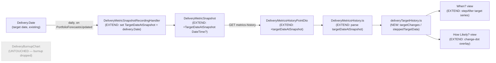

# Feature: delivery-target-date-tracking

> Epic 3993 Delivery Metrics — follow-up. Make the delivery over-time charts honest when a
> delivery's **target date moves**. Builds directly on the shipped `delivery-metrics` charts
> (burnup, predictability likelihood/when, per-feature fever). Density: lean (Tier-1 [REF] only).

## Wave: DISCUSS / [REF] Pre-DISCUSS code reality check

Grounded in the shipped code, not assumptions:

- `Models/DeliveryMetricSnapshot.cs` — forward-recorded store has `RecordedAt`, `TotalWork`,
  `DoneWork`, `RemainingWork`, `EstimatedItemCount?`, `ForecastHowMany?`, `LikelihoodPercentage?`,
  `WhenDistributionJson?`, `FeatureBreakdownJson?`. **There is no per-snapshot target date.**
- `Models/Delivery.cs` — the target date is `Delivery.Date` (`DateTime`). Every target-relative
  metric is computed against it: `GetLikelhoodForDate(Date)` (likelihood + the per-feature
  breakdown likelihoods that feed chance-of-being-late = `100 − likelihood`).
- `DomainEvents/DeliveryMetricSnapshotRecordingHandler.cs` — the daily forward recorder
  (reacts to `PortfolioForecastsUpdated`). It captures every series for the then-current day but
  **does not capture `delivery.Date`**, so the target-as-of-each-day is lost.
- `API/DTO/DeliveryMetricsHistoryDto.cs` — exposes a **single** `DeliveryDate` (today's
  `delivery.Date`) at the top level; `DeliveryMetricsHistoryPointDto` has **no** per-point target.
- `Frontend/.../DeliveryBurnupChart.tsx` — draws **one** `ChartsReferenceLine x={history.deliveryDate}`
  ("Delivery Date"). Past burnup geometry is judged against today's target line.
- `Frontend/.../DeliveryPredictabilityChart.tsx` — the **When?** view draws **one** flat
  `ChartsReferenceLine y={history.deliveryDate}` ("Delivery Target"); the **How Likely?** view has
  no target reference at all. Forecast percentiles recorded under an old target are silently
  contrasted against today's.
- `Frontend/.../DeliveryFeverChart.tsx` — per-feature bubbles, chance-of-being-late
  (`100 − likelihood`) vs completion-rate, with a per-feature trail. The bubble position is
  target-relative, so a replan jolts every bubble with no annotation.

**The defect:** `history.deliveryDate` is a single current value. When `Delivery.Date` moves, every
recorded point is re-referenced against the new target. A +2-week replan makes the recorded
likelihood line **step up** — reads as progress, is goalpost-moving. Today nothing on the charts
signals that a replan happened.

## Wave: DISCUSS / [REF] Persona ID

- **delivery-forecaster** (primary) — owns the leadership "is this delivery on track?" conversation;
  reads the trend charts to report status. Inherits the `delivery-metrics` journey.
- **product-owner** (secondary) — acts on the trend by cutting scope; a replan vs progress
  distinction changes whether a cut is even warranted (`job-po-scope-cut-from-delivery-trend`).

## Wave: DISCUSS / [REF] JTBD one-liner

When a delivery's target date has been moved during its life, show me **where** it moved and contrast
the forecast against the target **as it stood at each point in time**, so I never mistake a replan
for delivery progress — and leadership doesn't either. (`job-honest-delivery-trend-when-target-moves`,
new; refines `job-forecast-delivery-trend-over-time`, shares the trust surface of
`job-forecast-no-false-certainty`.)

## Wave: DISCUSS / [REF] Locked decisions

- **[D1] Option 2 — "annotate + dual reference"** (user, 2026-06-04, pre-agreed). Not annotate-only
  (level 1), not re-baseline/scenario (level 3). (a) Forward-record the target per snapshot and
  annotate target-change events on the trend charts; (b) dual reference — burnup shows the target's
  replanning history, the predictability When? view contrasts forecast vs the **moving** target.
- **[D2] `TargetDateAtSnapshot` (`DateTime?`) on `DeliveryMetricSnapshot`, forward-only.** One EF
  migration via `Create-Migration.ps1` (Sqlite + Postgres); past rows are `null`. Consistent with the
  epic's forward-only principle — no reconstruction of past targets.
- **[D3] Daily cadence, no edit-trigger.** The recorder captures `delivery.Date` on its existing
  daily run (`snapshot.TargetDateAtSnapshot = delivery.Date`). No immediate snapshot on a target-date
  edit. Cost accepted: a same-day edit-then-edit-back is invisible; a move is captured at the next
  daily run. Benefit: zero new event wiring.
- **[D4] Neutral date-pair annotation** (user, 2026-06-04). A target-change marker reads
  `Target moved: {old} → {new}` — states the fact, lets the forecaster narrate. No editorial
  "replan, not progress" copy that would otherwise live in a leadership screenshot.
- **[D5] 3 thin slices** (user, 2026-06-04): S1 = column + recorder + When?-view moving target
  (ships the data spine with the most-distorted surface); S2 = target-change annotation markers;
  S3 = burnup target-replanning history.
- **[D6] No new authorization, no new endpoint.** Additive nullable field on the existing
  metrics-history response; inherits the delivery surface's premium + portfolio-read RBAC.
- **[D7] Likelihood-view gets annotation only.** There is no second date axis on the How Likely?
  view, so "dual reference" does not apply there — only the target-change marker (S2). Dual reference
  is the When? view (S1) and the burnup (S3).
- **[D8] Burnup target history is a faded-prior + emphasized-current marker, mechanism deferred.**
  The burnup's x-axis is time and y-axis is item counts; the target is a date that lands on the
  x-axis, so it cannot be a y-series. The seed's "stepped line" maps on the burnup to prior target
  marker(s) shown faded with the current emphasized. Exact MUI-X rendering → DESIGN open question.
  *(Superseded at DESIGN — see `## Changed Assumptions`: US-03/the burnup was dropped, so D5/D7/D8's
  burnup framing is moot; the moving target lives only on the two predictability views.)*

## Wave: DISCUSS / [REF] Scope Assessment

**PASS — right-sized.** 3 stories, 1 bounded context (delivery-metrics), 1 new nullable column,
1 EF migration, 3 chart-component edits, 0 new endpoints. No oversized signal fires. Builds entirely
on shipped `delivery-metrics` plumbing.

### Carpaccio taste tests per slice

- "Ships 4+ new components"? No — each slice edits existing components / adds one nullable field. ✅
- "Every slice depends on a new abstraction"? The abstraction (`TargetDateAtSnapshot` column) ships
  **inside S1** alongside a visible chart change (When?-view moving target), not as a precursor
  infra slice — slice-composition gate satisfied by construction. ✅
- "No slice disproves a pre-commitment"? Each slice carries a distinct learning hypothesis. ✅
- "Synthetic-data-only"? Each AC is exercised against a real replanned delivery (demo data with a
  target move) in the live E2E, not just unit fixtures. ✅
- "2+ slices identical except scale"? No — distinct surfaces (data/When? vs annotations vs burnup). ✅

## Wave: DISCUSS / [REF] Story map

Backbone (one activity): **Read a delivery's over-time trend when the target has moved.**

| Slice | Story | User-visible value | Ships |
|---|---|---|---|
| S1 | US-01 | When? view plots the target as a **stepped line** tracking the target as-of-each-day | `TargetDateAtSnapshot` column + recorder capture + DTO/model field + When?-view stepped target |
| S2 | US-02 | **Dot markers** on the How Likely? likelihood line at each target change (date-pair on hover) | change points derived from per-point target deltas; When? change is shown by S1's step itself |

> **Scope reduced at DESIGN (2026-06-04):** the burnup slice (former S3 / US-03) is **dropped** —
> the delivery date is not wanted on the burnup at all (user). The fever-chart annotation (former
> US-02 in-scope-stretch) is **out** (not requested; awkward without a time axis). See
> `## Changed Assumptions`.

### Priority rationale

S1 first: it ships the data spine (the column S2 reads) folded with the single **most distorted**
surface — the When? view's flat target line, where a moved target most visibly misleads (forecast
dates contrasted against a target that wasn't in effect then). Highest learning leverage: validates
that `delivery.Date` history is captured correctly and renders as a clean step before S2 builds on
it. S2 second: dot markers on the How Likely? line are pure-additive readers of S1's column,
covering the likelihood view's false-progress step.

## Wave: DISCUSS / [REF] User stories with elevator pitches

### US-01 — Moving target on the predictability "When?" view (+ `TargetDateAtSnapshot` spine)

As a delivery forecaster, I want the When? view to contrast each day's forecast completion-date
percentiles against the target **as it stood that day**, so a replan doesn't silently re-score the
whole history against today's finish line.

#### Elevator Pitch
Before: the When? view draws one flat dashed "Delivery Target" line at today's `delivery.Date`; a moved target silently relocates the reference under every past percentile point.
After: open a delivery → Metrics tab → Predictability → "When?" → see the target rendered as a **stepped line** (step-after) that holds at the old target across the days it applied and steps to the new target on the day it changed.
Decision enabled: judge whether the forecast is genuinely converging on the target that actually applied, instead of a convergence manufactured by moving the date.

**Acceptance criteria**
- AC1: Given a delivery with snapshots whose `TargetDateAtSnapshot` is D1 for the first three days then D2 for the next three, when I open the When? view, then the target reference is a step function — flat at D1 over days 1–3, stepping to D2 at day 4, flat at D2 over days 4–6 — **not** a single flat line at D2 across all six days.
- AC2: Given a delivery whose every recorded `TargetDateAtSnapshot` is `null` (pre-migration history only), when I open the When? view, then it falls back to a single flat line at `history.deliveryDate` (current behaviour preserved; no crash, no gap).
- AC3 (backend): Given the daily recorder runs, when a snapshot is written, then `TargetDateAtSnapshot == delivery.Date` for that snapshot, and re-recording the same day overwrites it in place (idempotent on `(deliveryId, recordedAt-day)`).
- AC4: Given a delivery whose target never moved, when I open the When? view, then the stepped line is visually a single flat level equal to the current target (no spurious steps).

### US-02 — Target-change dot markers on the "How Likely?" view

As a delivery forecaster, I want a dot on the likelihood line wherever the target moved, so I can
attribute a likelihood jump to a replan rather than to delivery progress when I narrate the trend to
leadership.

#### Elevator Pitch
Before: a +14d replan makes the "How Likely?" line step up with no explanation — it reads as progress.
After: open Predictability → "How Likely?" → see an emphasized dot on the likelihood line at the snapshot where the target changed; hovering it reads `Target moved: 1 Jun → 15 Jun` (neutral date-pair, per D4).
Decision enabled: say "this jump is the replan, not the team" — or, when there's no dot, defend the rise as real progress.

**Acceptance criteria**
- AC1: Given two consecutive snapshots whose `TargetDateAtSnapshot` differs, when I view the How Likely? chart, then an emphasized dot appears on the likelihood line at the later snapshot, and its hover shows both dates (old → new).
- AC2: Given N target changes across the recorded window, when I view the chart, then exactly N dots appear, one at each change snapshot.
- AC3: Given no target change across the window (all equal or all `null`), when I view the chart, then no change-dot appears (the line's normal marks are unaffected).
- AC4: The When? view shows the same change via its stepped target line (US-01), so it carries **no** separate change-dot — the step itself is the marker (no duplication across the two predictability views).

> **Out of US-02 (DESIGN 2026-06-04):** the fever-chart annotation is dropped (not requested; the
> fever chart has no time axis to mark cleanly). The burnup is untouched.

### US-03 — Burnup target-replanning history — ❌ DROPPED (DESIGN 2026-06-04)

**Dropped.** The delivery date is not wanted on the burnup at all (user, 2026-06-04). The burnup
stays a clean backlog-vs-done-over-time view; the "when vs target" story lives solely on the
predictability charts (US-01 step line + US-02 dots). ADO #5176 **Removed** (2026-06-04). The existing
`ChartsReferenceLine x={deliveryDate}` in `DeliveryBurnupChart.tsx` renders off the right edge
(target date is beyond the snapshot data) and is effectively invisible today — **to be removed during
S1 in DELIVER** as a one-line Boy-Scout cleanup (user-confirmed; still present in the shipped
`DeliveryBurnupChart.tsx`). See `## Changed Assumptions`.

## Wave: DISCUSS / [REF] Definition of Done

1. `TargetDateAtSnapshot` column added; one EF migration per provider via `Create-Migration.ps1`
   (never `dotnet ef migrations add` directly); InMemory-test trap noted (migration not exercised by
   InMemory — verify against Sqlite/Postgres).
2. Recorder captures `delivery.Date`; idempotent same-day overwrite preserved.
3. DTO + FE model + FE parser each carry the nullable `targetDateAtSnapshot`; boundary parser uses
   `asNullableDate` (graceful on null).
4. When? view stepped target line (S1); How Likely? change dots (S2) — each with the
   null/no-change fallbacks above. Burnup untouched.
5. Backend `dotnet build` zero warnings + `dotnet test` green; FE `pnpm test` + `pnpm build` clean
   (Biome zero warnings).
6. SonarCloud new-violations = 0 (pre-apply `docs/ci-learnings.md` rules to every touched line).
7. Live Playwright E2E run locally against demo data with a replanned delivery (per memory:
   never commit an unrun spec/POM; E2E via demo data, not live syncs).
8. Mutation testing per-feature ≥ 80% on the new chart/recorder logic (presentational MUI survivors
   justified).
9. ADO board synced (Epic 3993 child stories), pause before each push, transition Active→Resolved per
   slice.

## Wave: DISCUSS / [REF] Out of scope

- **Reconstruction of past targets** — forward-only; pre-migration rows stay `null` (D2).
- **Immediate snapshot on a target-date edit** — daily cadence only (D3).
- **Re-baselining / scenario comparison** (Option 2 level 3) — not this feature.
- **Changing the current-snapshot delivery metrics** — `likelihoodPercentage`, progress, completion
  dates on the snapshot view are unchanged; purely additive over-time annotation.
- **A "chance of being late" headline number** — chance-of-being-late stays the fever chart's
  `100 − likelihood`; this feature annotates its target-relativity, it does not add a new metric.
- **Editorial replan copy** on the markers (D4 chose neutral date-pair).

## Wave: DISCUSS / [REF] WS strategy

**Type A — additive extension, no new walking skeleton.** Builds on the shipped `delivery-metrics`
walking skeleton (snapshot store + recorder + Metrics tab). Each slice is itself an end-to-end thin
vertical (DB column → recorder → DTO → FE model → chart) shipped same-day.

## Wave: DISCUSS / [REF] Driving ports

No **new** driving port. Three existing surfaces are extended:

- `GET /api/portfolios/{portfolioId}/deliveries/{deliveryId}/metrics-history` — response gains a
  nullable `targetDateAtSnapshot` per point (additive; backward-compatible).
- `DeliveryMetricSnapshotRecordingHandler` (daily, on `PortfolioForecastsUpdated`) — captures
  `delivery.Date`.
- Metrics tab UI — burnup, predictability (likelihood + When?), fever components extended.

## Wave: DISCUSS / [REF] Cross-cutting impact checklist (DoR item 7 hard gate)

- **RBAC — N/A, no authorization effect.** No new permission and no new endpoint; the metrics-history
  response and the Metrics tab already gate on `canUsePremiumFeatures` (premium) + portfolio
  read-access RBAC via the existing `DeliveriesController`. Nothing flows through
  `IRbacAdministrationService` because there is no role/permission change; UI gating is unchanged and
  still derives from the existing `useRbac()`/license gate on the delivery surface.
- **Lighthouse-Clients (CLI + MCP) — N/A, additive nullable field on an existing endpoint.** No new
  endpoint, so no `FEATURE_REQUIRES_SERVER_NEWER_THAN` entry and no version gate is required (that
  rule guards NEW endpoints that old servers 404). The metrics-history response gains one optional
  `targetDateAtSnapshot`; a client that deserialises it ignores an unknown/absent field
  (case-insensitive, nullable) — old clients keep working, new clients treat `null` as "no recorded
  target". The CLI/MCP clients do not currently surface delivery over-time history, so no client
  change is needed; if one is added later it reads the field with a null-safe default.
- **Website — N/A.** An honesty/correctness refinement to an already-marketed premium capability
  (delivery over-time metrics), not a new feature to surface. No public-website change.

## Wave: DISCUSS / [REF] Outcome KPIs

### Objective
Make a replanned delivery's recorded trend self-evidently honest: the target's movement is visible
and every forecast point is read against the target that actually applied.

### Outcome KPIs
- **KPI-1 (guardrail, backend-measurable today):** For every recorded snapshot taken after the
  migration, `TargetDateAtSnapshot` is non-null and equals `delivery.Date` at record time. Target:
  100%. Method: backend integration assertion on the recorder.
- **KPI-2 (guardrail, backend/FE-measurable today):** Every consecutive `TargetDateAtSnapshot` delta
  in a delivery's snapshot series yields exactly one annotation marker; zero target changes yields
  zero markers. Target: 100% (no missed and no spurious markers). Method: FE unit + backend
  integration assertions.
- **KPI-3 (outcome, dogfood/interview until Epic 5015 telemetry):** In review of a replanned
  delivery, the forecaster correctly attributes the likelihood jump to the replan when the marker is
  present. Target: ≥ 2 of 3 dogfood/interview reviews name the replan from the chart, vs a baseline
  of mis-reading the jump as progress. Method: dogfood sessions + user interviews (cross-instance
  behavioural telemetry blocked on Epic 5015, no timeline).

### Measurement caveat
Forward-only: the markers/stepped line only become meaningful once a delivery has accrued snapshots
across at least one target change, so KPI-3's window starts when a delivery first has a recorded
replan, not at launch.

## Wave: DISCUSS / [REF] DoR validation (9-item)

Applies to all three stories (US-01/02/03) unless noted.

1. **Business value clear** — ✅ honest replan-vs-progress read; trust surface shared with the
   forecast-honesty jobs.
2. **User story + AC testable** — ✅ ACs above are observable through the metrics-history endpoint
   and the three chart components.
3. **Dependencies identified** — ✅ depends only on shipped `delivery-metrics`; S2/S3 depend on S1's
   column.
4. **Job traceability** — ✅ `job-honest-delivery-trend-when-target-moves` (new, added to
   `docs/product/jobs.yaml`); secondary `job-po-scope-cut-from-delivery-trend`.
5. **Elevator pitch (real entry point + observable output)** — ✅ each story names the Metrics-tab
   action and the on-screen result.
6. **Sized ≤ 1 day each** — ✅ S1 ~0.75d (column + migration + recorder + When?-view step line),
   S2 ~0.5d (How Likely? change dots, pure FE reader of S1's column).
7. **Technical notes / cross-cutting** — ✅ RBAC / Clients / Website all answered above with
   evidence; migration + InMemory-trap + idempotency noted.
8. **No blocking unknowns** — ✅ the former open question (D8 burnup mechanism) is resolved by
   dropping the burnup from scope (DESIGN 2026-06-04).
9. **Acceptance path runnable** — ✅ live Playwright against demo data with a replanned delivery
   (a target-date move on a seeded delivery); per memory, run locally before commit.

**Verdict: READY** (2 slices; no open questions after the burnup drop).

## Wave: DISCUSS / [REF] Risks

- **InMemory tests miss the migration** (recurring trap, per memory) — verify the new column against
  Sqlite/Postgres, not just InMemory.
- **MUI-X stepped line / reference-line mechanics** — step-after interpolation and multiple
  reference lines in MUI-X 9.0.1 carry the same selector fragility logged for the dashed estimated
  series; reuse the `data-series` selector lesson; run the live chart, don't trust the type-check.
- **Null past rows on existing dogfood data** — all three charts must fall back gracefully when
  `targetDateAtSnapshot` is null across the window (explicit ACs).
- **Fever annotation has no time axis** — kept as IN-scope-stretch so it can't sink S2.

## Wave: DISCUSS / [REF] Wave Decisions summary

- Primary need: a replanned delivery's recorded trend must distinguish a moved finish line from real
  progress, forward-only.
- Feature type: user-facing (charts) with a thin backend column.
- 3 carpaccio slices; neutral date-pair annotations; Option 2 dual-reference.
- No new RBAC, no new endpoint, no website change; additive nullable field.
- One DESIGN open question carried forward: the burnup target-history rendering mechanism (D8).

## Wave: DISCUSS / [REF] Pre-requisites

- Shipped `delivery-metrics` (Epic 3993): snapshot store, recorder, metrics-history endpoint, the
  three chart components, the Metrics-tab gate — all present on `main`.

## Wave: DESIGN / [REF] Architect + status

Morgan (nw-solution-architect), application scope, mode = propose. Status: **complete, READY for
DISTILL.** A thin, reuse-heavy extension of the shipped delivery-metrics stack — one nullable column
(ADR-051), two predictability-chart renderings (ADR-052), no new endpoint, no new RBAC, no new
dependency. The single open question (D8 burnup) was resolved by dropping the burnup from scope.

## Wave: DESIGN / [REF] DDD list

| # | Decision | Verdict | Rationale (one line) | ADR |
|---|---|---|---|---|
| DDD-1 | Per-snapshot target capture | `TargetDateAtSnapshot` (`DateTime?`) on `DeliveryMetricSnapshot`; recorder sets `= delivery.Date`; forward-only (past rows null) | Reuses the wide-nullable-column + daily-recorder pattern (ADR-048/049/050); no reconstruction | ADR-051 |
| DDD-2 | When?-view moving target | A `curve:"stepAfter"` series over per-point `targetDateAtSnapshot` on the existing time y-axis, **replacing** the flat `ChartsReferenceLine`; flat-line fallback to `deliveryDate` when all-null | The When? y-axis is already a date scale, so the moving target is a natural same-axis series | ADR-052 |
| DDD-3 | How Likely? change marker | A marks-only overlay series with non-null values only at change snapshots (value = the likelihood there, so the dot sits on the line); neutral date-pair in the mark tooltip (D4) | Dots (user choice) over vertical lines; no chart-face clutter | ADR-052 |
| DDD-4 | Change-derivation placement | A pure FE helper `targetChanges(points)` / `steppedTargetData(points)` in `models/Delivery/`, unit-tested in isolation — NOT inline in the chart component | UI-1 lesson from delivery-metrics: keep projection logic out of the presentational component for testability | ADR-052 |
| DDD-5 | Burnup | No target marker; former S3/US-03 dropped; the dead off-axis `ChartsReferenceLine x={deliveryDate}` to be removed during S1 in DELIVER (Boy-Scout, user-confirmed) | User: the delivery date is not wanted on the burnup | — |
| DDD-6 | API/contract impact | DTO gains one nullable `targetDateAtSnapshot` per point on the **existing** metrics-history endpoint; no new route | Additive nullable field — backward-compatible; re-affirms ADR-050; no clients version-gate, no RBAC change | ADR-050 (re-affirmed) |

## Wave: DESIGN / [REF] Component decomposition

| Component | Path | EXTEND / CREATE NEW | Notes |
|---|---|---|---|
| `DeliveryMetricSnapshot` model | `Lighthouse.Backend/.../Models/DeliveryMetricSnapshot.cs` | EXTEND | add `public DateTime? TargetDateAtSnapshot { get; set; }` |
| EF migration | `Lighthouse.Migrations.Sqlite` + `Lighthouse.Migrations.Postgres` | CREATE NEW | one nullable column via `Create-Migration.ps1` (NOT `dotnet ef migrations add`); forward-only; verify on a REAL provider (InMemory misses it) |
| `DeliveryMetricSnapshotRecordingHandler` | `.../DomainEvents/DeliveryMetricSnapshotRecordingHandler.cs` | EXTEND | one line: `snapshot.TargetDateAtSnapshot = delivery.Date;` inside the existing per-delivery loop |
| `DeliveryMetricsHistoryPointDto` (+ `ToPoint`) | `API/DTO/DeliveryMetricsHistoryDto.cs` | EXTEND | add `DateTime? TargetDateAtSnapshot` record param; map from `snapshot.TargetDateAtSnapshot` |
| `DeliveryMetricsHistoryPoint` + parser | `Frontend/src/models/Delivery/DeliveryMetricsHistory.ts` | EXTEND | add `targetDateAtSnapshot: Date \| null`; parse via existing `asNullableDate` in `parsePoint` |
| `deliveryTargetHistory.ts` (pure helpers) | `Frontend/src/models/Delivery/` | CREATE NEW | `targetChanges(points)` + `steppedTargetData(points)`; no React; unit-tested (DDD-4) |
| `DeliveryPredictabilityChart.tsx` — `WhenView` | `Frontend/src/components/Common/Charts/` | EXTEND | replace flat target `ChartsReferenceLine` with the stepAfter target series; flat fallback when all-null (DDD-2) |
| `DeliveryPredictabilityChart.tsx` — `LikelihoodView` | same file | EXTEND | add the marks-only change-dot overlay series + date-pair tooltip (DDD-3) |
| `DeliveryBurnupChart.tsx` | same dir | EXTEND (S1, one line) | remove the dead off-axis `ChartsReferenceLine x={deliveryDate}` (DDD-5); no target marker added |

## Wave: DESIGN / [REF] Driving ports

No new driving port. `GET /api/v1/deliveries/{deliveryId}/metrics-history` (+ `api/latest/…`,
`[RbacGuard(PortfolioRead)]`) response gains one nullable `targetDateAtSnapshot` per point —
additive, backward-compatible (ADR-050 re-affirmed; DDD-6).

## Wave: DESIGN / [REF] Driven ports + adapters

No new driven port. `Delivery.Date` (existing model property) is read by the recorder; the existing
`IDeliveryMetricSnapshotRepository` EF adapter persists the extra column with no interface change.

## Wave: DESIGN / [REF] Technology choices (pinned)

No new dependency. ASP.NET Core .NET 8; EF Core 8.x (migration via `Create-Migration.ps1` across
Sqlite/Postgres); NUnit 4.6 + Moq + EF InMemory + `Mvc.Testing` (migration verified on a real
provider); React 18 + TS 5.x strict; MUI-X-charts 9.0.1 `LineChart` (`curve:"stepAfter"` for the
step line; a marks-only series for the dots); Vitest + RTL; Stryker ≥80% BE/FE; Playwright POM.

## Wave: DESIGN / [REF] Decisions table

| # | Decision | Recommendation | ADR |
|---|---|---|---|
| DDD-1 | Per-snapshot target | `TargetDateAtSnapshot DateTime?`, recorder = `delivery.Date`, forward-only | ADR-051 |
| DDD-2 | When? moving target | `stepAfter` series, flat fallback when all-null | ADR-052 |
| DDD-3 | How Likely? marker | marks-only dot overlay at change points, date-pair tooltip | ADR-052 |
| DDD-4 | Derivation placement | pure FE helper, unit-tested, out of the component | ADR-052 |
| DDD-5 | Burnup | dropped from scope; untouched | — |
| DDD-6 | Contract | additive nullable DTO field; no new endpoint/RBAC/clients gate | ADR-050 |

## Wave: DESIGN / [REF] Reuse Analysis

| Existing component | Verdict | Evidence / justification |
|---|---|---|
| `DeliveryMetricSnapshot` wide-nullable-column schema (ADR-048/050) | EXTEND | one more nullable column is exactly the pattern; Slices-2/3 of delivery-metrics added columns the same way |
| EF migration tooling (`Create-Migration.ps1`, Sqlite+Postgres) | REUSE AS-IS | one nullable column, no data backfill |
| `DeliveryMetricSnapshotRecordingHandler` daily recorder | EXTEND | one assignment inside the existing per-delivery loop; no new event, no new cadence |
| `DeliveryMetricsHistoryDto` / `ToPoint` projection | EXTEND | one record param + one field map |
| `DeliveryMetricsHistory.ts` boundary parser (`asNullableDate`) | REUSE AS-IS | the null-safe date parser already exists; add one field |
| MUI-X `LineChart` `ChartsReferenceLine` / series / `curve` / `showMark` | REUSE AS-IS | step line = `curve:"stepAfter"`; dots = a marks-only series; both are stock LineChart features (no new chart, no new dep) |
| metrics-history endpoint + `[RbacGuard(PortfolioRead)]` + premium gate | REUSE AS-IS | additive field; no auth/route change |
| `targetChanges` / `steppedTargetData` helpers | CREATE NEW | no existing target-history projection; pure functions, ~30 LOC, justified vs inlining in the component (DDD-4 testability) — the only CREATE NEW, and it is logic, not a class duplicating an existing responsibility |

Net: EXTEND/REUSE-only except two small pure helper functions (justified by DDD-4). No CREATE-NEW class, no new endpoint, no new adapter, no new dependency.

## Wave: DESIGN / [REF] C4 — data flow (component level; system context unchanged from brief.md)

## Wave: DESIGN / [REF] Open questions (for DISTILL / DELIVER)

- **Demo-data replan fixture** — DELIVER needs a seeded delivery whose `Delivery.Date` differs across
  recorded snapshots so the step + dots are exercised by the live Playwright run. Reuse the
  delivery-metrics demo-snapshot seeding; confirm it can vary the target across days (else add a
  CSV/seed knob, mirroring the `state-since` demo column precedent).
- *(Resolved)* Burnup dead-line removal — user confirmed; the off-axis `ChartsReferenceLine` is
  removed in S1 (DDD-5).

## Wave: DESIGN / [REF] ADR references (this feature)

- **ADR-051** — per-snapshot target capture (`TargetDateAtSnapshot` column + recorder), forward-only.
- **ADR-052** — moving-target predictability rendering (When? step line + How Likely? change dots +
  pure derivation helper).
- Re-affirms **ADR-050** (single metrics-history endpoint, wide nullable schema): the new field is an
  additive nullable column on that contract.

## Wave: DESIGN / [REF] Wave Decisions summary

- Pattern: ports-and-adapters modular monolith (inherited; no change). Paradigm: OOP backend, FP-leaning
  React.
- Key change: one nullable column + recorder assignment + two predictability-chart renderings, driven
  by a pure FE helper. Burnup dropped.
- No new endpoint, RBAC, dependency, or migration-beyond-one-column.
- Open questions are non-blocking (demo fixture, optional dead-line cleanup).

## Changed Assumptions

**Source:** DISCUSS `## Wave: DISCUSS / [REF] Story map` and `US-03`, this feature-delta (written
2026-06-04, same session).

**Original assumption (DISCUSS, US-03):** *"Burnup target-replanning history … see the prior target
position(s) faded and the current one emphasized — the replan is legible as the finish line moving,"*
shipped as Slice 3 (ADO #5176), with D8 (burnup rendering mechanism) carried as a DESIGN open
question.

**New assumption (DESIGN, 2026-06-04):** The burnup shows **no** target marker at all — the delivery
date is not wanted there (user). **US-03 / Slice 3 is dropped; ADO #5176 to be Removed.** D8 is moot.
The "when vs target" honesty story lives entirely on the predictability charts: US-01's When?-view
step line and US-02's How Likely? change dots.

**Original assumption (DISCUSS, US-02):** target-change markers as **vertical lines on both the
likelihood and When? views**, plus a fever-trail annotation (in-scope-stretch).

**New assumption (DESIGN, 2026-06-04):** US-02 markers are **dots on the How Likely? line only**
(user: "markers like dots in how likely, just a step line in the when"). The When? view conveys the
change via US-01's step line itself (no duplicate marker). The **fever-chart annotation is dropped**
(not requested; no clean time axis). Rationale: avoids double-marking the same change across two
views and keeps each chart's marking idiom suited to its axes.

**Rationale:** narrower, sharper scope — two slices instead of three, no dual-axis/clutter viz risk,
and each predictability view marks the replan in the idiom that fits its axes (a step where the
y-axis is a date; a dot where it is a percentage).

## Wave: DISTILL / [REF] Acceptance designer + status

Acceptance Designer: Sentinel (nw-acceptance-designer), C#/.NET + React + Playwright rows of the ATDD Infrastructure Policy. Date: 2026-06-04. NOT the Python pilot: NO pytest-bdd / Hypothesis / `assert_state_delta` / `__SCAFFOLD__`. Backend ATs are black-box example-based via `WebApplicationFactory<Program>` (skip = `[Ignore("pending — DELIVER (delivery-target-date-tracking)")]`); FE behaviour is Vitest + RTL on the chart + the pure helper (skip = `it.skip`); E2E is Playwright POM (skip = `test.fixme`). The `.feature` files under `docs/feature/delivery-target-date-tracking/acceptance/` are the scenario SSOT. Outcomes registry skipped (no working `nwave-ai` outcomes CLI / no `docs/product/outcomes/` in this repo).

Prior-wave reading confirmation:

- `+ docs/architecture/atdd-infrastructure-policy.md` (all ports already covered — no new rows)
- `+ docs/feature/delivery-target-date-tracking/feature-delta.md` (DISCUSS + DESIGN, DDD-1..6, Changed Assumptions, US-01/US-02, US-03 dropped)
- `+ docs/product/journeys/delivery-target-date-tracking.yaml` (steps + error_paths_summary + D1..D8)
- `+ docs/product/architecture/adr-051 / adr-052` (+ re-affirmed adr-050)
- `+ docs/feature/delivery-target-date-tracking/slices/slice-01 / slice-02`
- `+ docs/feature/delivery-metrics/acceptance/*` (precedent .feature + test-class names this feature extends)
- `+ docs/product/kpi-contracts.yaml` (soft — no rows for this feature; `@kpi` tags the recorder-captures-target guardrail, the backend-measurable KPI)
- `- docs/feature/delivery-target-date-tracking/{discuss,design,devops}/wave-decisions.md` (not found — single-file model; decisions live in the feature-delta wave sections)

WARN: single-file model (no per-wave `wave-decisions.md`), no `devops/` directory. Reconciliation ran against the feature-delta DISCUSS+DESIGN sections + journey + ADRs; ATDD policy defaults govern infra (no env matrix).

## Wave: DISTILL / [REF] Reconciliation result

Reconciliation passed — 0 contradictions. The DESIGN-time scope reduction (3 slices → 2; burnup dropped; target-change rendered as a When?-view step line + How Likely? dots rather than vertical lines on both views; fever annotation dropped) is an upstream EVOLUTION already recorded in `## Changed Assumptions` + DDD-5/DDD-3 + ADR-052, not a contradiction. Scenarios were written against the resolved 2-slice design.

## Wave: DISTILL / [REF] Scenario list with tags

Spec SSOT = the `.feature` files under `docs/feature/delivery-target-date-tracking/acceptance/`. 17 scenarios across 4 files.

| File | Scenario | Tags |
|---|---|---|
| walking-skeleton.feature | Forecaster opens a replanned delivery and sees the target step on the When? view | `@walking_skeleton @driving_adapter @US-01 @premium @real-io` |
| milestone-1-target-at-snapshot.feature | The recorder remembers the delivery's target as of the recording day | `@US-01 @real-io @kpi` |
| | Re-recording the same day keeps a single snapshot with the current target | `@US-01 @real-io @kpi` |
| | The metrics history returns the recorded target per day | `@US-01 @real-io @driving_adapter` |
| | History recorded before target capture returns no per-day target | `@US-01 @real-io @driving_adapter @error` |
| | The When? view steps the target where it was moved | `@US-01 @fe-component @in-memory` |
| | The When? view falls back to one flat target line when no per-day target was recorded | `@US-01 @fe-component @in-memory @error` |
| | The When? target line is one flat level when the target never moved | `@US-01 @fe-component @in-memory @edge` |
| | The burnup no longer carries a delivery-date marker | `@US-01 @fe-component @in-memory @edge` |
| milestone-2-change-dots.feature | A dot marks each day the target changed on the likelihood line | `@US-02 @fe-component @in-memory` |
| | Hovering a change dot shows the old and new target dates | `@US-02 @fe-component @in-memory` |
| | No change dots appear when the target never moved | `@US-02 @fe-component @in-memory @error` |
| | No change dots appear when no per-day target was recorded | `@US-02 @fe-component @in-memory @error` |
| | The When? view carries no change dot because its step line already shows the move | `@US-02 @fe-component @in-memory @edge` |
| integration-checkpoints.feature | The recorder captures the target in the same pass as the other series | `@integration @US-01 @real-io @kpi` |
| | The existing metrics-history series are unchanged by the added target field | `@integration @US-01 @real-io @driving_adapter` |
| | Reading the history requires premium and portfolio read access as before | `@integration @US-01 @real-io @driving_adapter @error` |

Negative/edge surface: 5 `@error` + 3 `@edge` (never-moved flat level, burnup-no-marker regression, When?-no-duplicate-dot) = 8 of 17 = **47%** — above the 40% bar.

## Wave: DISTILL / [REF] WS strategy

Architecture-of-Reference treatment (not the retired A/B/C/D): driving adapters real (E2E = Playwright against the real app; backend endpoint = `WebApplicationFactory<Program>`); driven-internal EF store real per the policy; driven-external `ILicenseService` faked (`Mock<ILicenseService>`). Matches existing policy rows exactly — no new rows.

ONE `@walking_skeleton @driving_adapter` E2E scenario (`walking-skeleton.feature` / extends `DeliveryMetrics.spec.ts`): open a replanned delivery → Metrics → predictability → When? → the target is a stepped line. Demo-data driven; premium. Demoable ("can a forecaster see where the target moved on the When? view?"). Forward-only: needs demo snapshots whose `TargetDateAtSnapshot` varies across days — see Pre-requisites.

## Wave: DISTILL / [REF] Adapter coverage table

| Driven adapter | `@real-io` scenario | Covered by |
|---|---|---|
| `DeliveryMetricSnapshot` EF store (`IDeliveryMetricSnapshotRepository`, +`TargetDateAtSnapshot`) | YES | extend `DeliveryMetricsHistoryReadApiIntegrationTest` (seeds rows with varying/absent target via real EF, reads via endpoint) |
| `DeliveryMetricSnapshotRecordingHandler` (now also sets `TargetDateAtSnapshot = delivery.Date`) | YES | extend `DeliveryMetricSnapshotRecordingHandlerTest` (target captured, same-day idempotent overwrite, captured in the same pass as other series) |
| metrics-history endpoint (driving, `GET /api/latest/.../metrics-history`, +nullable `targetDateAtSnapshot`) | YES | extend `DeliveryMetricsHistoryReadApiIntegrationTest` (per-point target, null when unrecorded, existing series unchanged, premium+RBAC) via `WebApplicationFactory<Program>` |
| `deliveryTargetHistory.ts` (`targetChanges` / `steppedTargetData`) — pure FE | n/a (pure, not I/O) | new Vitest unit tests (no adapter) |
| `DeliveryPredictabilityChart` When?/How Likely? (FE component) | n/a (component, in-memory) | new Vitest + RTL on the chart (step line, dots, fallbacks) |
| `ILicenseService` (driven external — faked) | n/a (fake by policy) | `Mock<ILicenseService>` in the premium/RBAC scenario |
| React app (driving, E2E) | YES (real app) | `DeliveryMetrics.spec.ts` walking-skeleton, Playwright POM, demo data |

## Wave: DISTILL / [REF] Scaffolds

NO production scaffolds for the backend (ATs hit HTTP routes dynamically and parse JSON, so they compile without the field; `[Ignore]`d → suite stays green, not BROKEN). FE behaviour tests reference the NEW `point.targetDateAtSnapshot` (typed) and the NEW `deliveryTargetHistory` helper, which DELIVER creates in step order before un-skipping — so the FE Vitest specs stay `it.skip` until their production symbols exist (RED-not-BROKEN by un-skip order, mirroring the C#/TS no-`__SCAFFOLD__` precedent). Skip markers: `[Ignore("pending — DELIVER (delivery-target-date-tracking)")]` (NUnit), `it.skip` (Vitest), `test.fixme` (Playwright).

DELIVER authors/extends (skip-marked, RED) then un-skips one scenario per TDD cycle:

- extend `Lighthouse.Backend.Tests/.../DeliveryMetricsHistoryReadApiIntegrationTest.cs`
- extend `Lighthouse.Backend.Tests/.../DomainEvents/DeliveryMetricSnapshotRecordingHandlerTest.cs`
- NEW `Lighthouse.Frontend/src/models/Delivery/deliveryTargetHistory.test.ts`
- extend/NEW `Lighthouse.Frontend/src/components/Common/Charts/DeliveryPredictabilityChart.test.tsx`
- extend `Lighthouse.EndToEndTests/tests/specs/portfolios/DeliveryMetrics.spec.ts` (+ the `DeliveryMetricsTab` POM)

## Wave: DISTILL / [REF] Test placement

| Test | Path | Precedent |
|---|---|---|
| metrics-history per-day-target read AT | extend `Lighthouse.Backend.Tests/API/Integration/DeliveryMetricsHistoryReadApiIntegrationTest.cs` | the shipped delivery-metrics read-API AT (same `WebApplicationFactory` + EF seed pattern) |
| recorder target-capture AT | extend `Lighthouse.Backend.Tests/Services/Implementation/DomainEvents/DeliveryMetricSnapshotRecordingHandlerTest.cs` | the shipped recorder handler test |
| `deliveryTargetHistory` helper unit | NEW `Lighthouse.Frontend/src/models/Delivery/deliveryTargetHistory.test.ts` | sibling pure-model tests under `src/models/` |
| predictability chart behaviour | NEW/extend `Lighthouse.Frontend/src/components/Common/Charts/DeliveryPredictabilityChart.test.tsx` | the shipped chart-component Vitest pattern |
| E2E walking skeleton | extend `Lighthouse.EndToEndTests/tests/specs/portfolios/DeliveryMetrics.spec.ts` + `tests/models/portfolios/Deliveries/DeliveryMetricsTab.ts` | the shipped `DeliveryMetrics.spec.ts` + POM family |

## Wave: DISTILL / [REF] Driving adapter coverage

| Driving adapter | Exercised by |
|---|---|
| `GET /api/latest/deliveries/{deliveryId}/metrics-history` (HTTP, +nullable `targetDateAtSnapshot`) | `DeliveryMetricsHistoryReadApiIntegrationTest` via `WebApplicationFactory<Program>` — per-point target, null fallback, unchanged existing series, premium + `AsPortfolioViewer` RBAC |
| React predictability chart (production app) | `DeliveryMetrics.spec.ts` via Playwright POM against the real app, demo data with a moved target |

## Wave: DISTILL / [REF] Pre-requisites

- **DELIVER must seed demo `DeliveryMetricSnapshot` rows whose `TargetDateAtSnapshot` varies across days** (and at least one delivery that never moved, one with null history) so the E2E walking skeleton renders a real step and the chart fallbacks are demonstrable. Reuse the demo-data-time-in-state CSV-column precedent (`project_demo_data_time_in_state_via_csv_column`). This is the single hard WS pre-requisite.
- EF migration generated via `Create-Migration.ps1` across Sqlite + Postgres; verify the new column on a REAL provider (InMemory misses migrations — the persisted-model trap).
- No DEVOPS environment matrix (no DEVOPS wave) — ATDD policy defaults govern (Sqlite + Postgres lockstep in CI for the EF ATs).

## Wave: DISTILL / [REF] Inherited commitments

| Origin | Commitment | DDD | Impact |
|--------|------------|-----|--------|
| DISCUSS#D2 | `TargetDateAtSnapshot` is forward-only; past rows null; no reconstruction | DDD-1 | An `@error` AT asserts history predating capture returns no per-day target and the When? view falls back to one flat line |
| DISCUSS#D3 | Daily cadence; recorder sets `TargetDateAtSnapshot = delivery.Date`; same-day idempotent | DDD-1/ADR-049 | Recorder ATs assert target captured, same-day re-record overwrites in place to one row, captured in the same pass as other series |
| DESIGN#DDD-2 | When? view = `stepAfter` target series; flat fallback when all-null | ADR-052 | FE ATs assert the step holds-then-steps, a single flat level when never moved, and the flat-line fallback when absent |
| DESIGN#DDD-3 | How Likely? change dots; date-pair on hover; none when constant/absent | ADR-052 | FE ATs assert a dot per change, hover reveals old→new, no dot when constant or absent |
| DESIGN#DDD-3/DDD-2 | No duplicate marker across the two predictability views | ADR-052 | An `@edge` AT asserts the When? view shows the change via its step (no dot) while How Likely? shows the dot |
| DESIGN#DDD-5 | Burnup untouched; dead off-axis delivery-date line removed in S1 | n/a | An `@edge` AT asserts no delivery-date marker is shown on the burnup |
| DESIGN#DDD-6 | Additive nullable field on the existing metrics-history endpoint; no new endpoint/RBAC/clients gate | ADR-050 | An `@integration` AT asserts the existing series are unchanged and the read is still premium + portfolio-read gated |

## Wave: DISTILL / [REF] Consolidated review gate — result + DELIVER action items

Mandatory consolidated gate (2026-06-04). Forge (DEVOPS) is N/A — no DEVOPS wave / no DEVOPS sections. Three reviewers on Haiku, in parallel, against the full feature-delta:

| Reviewer | Wave | Verdict | Blockers | High | Low |
|---|---|---|---|---|---|
| Eclipse (`nw-product-owner-reviewer`) | DISCUSS | conditionally_approved | 0 | 1 | 1 |
| Architect (`nw-solution-architect-reviewer`) | DESIGN | conditionally_approved | 0 (its 1 "blocker" — confirm #5176 Removed — was already satisfied) | 0 | 1 |
| Sentinel (`nw-acceptance-designer-reviewer`) | DISTILL | conditionally_approved | 0 | 1 | 0 |

**Net: 0 true blockers.** All findings resolved in this DISTILL session:

- ✅ Eclipse HIGH (job traceability) — added `job_id: job-honest-delivery-trend-when-target-moves` to both slice briefs.
- ✅ Eclipse LOW (D8 clarity) — added a "Superseded at DESIGN" forward reference at D8 → `## Changed Assumptions`.
- ✅ Architect BLOCKER (ADO #5176 must be Removed, not deferred) — already done: #5176 set to **Removed** (2026-06-04) with a note.
- ✅ Architect LOW (premature "removed in S1" wording) — reworded to "to be removed during S1 in DELIVER (still present in the shipped chart)".
- ✅ Sentinel HIGH (business-language: "endpoint" in a `.feature` title) — `integration-checkpoints.feature` retitled to "The per-day target is recorded alongside the existing delivery metrics".

**DELIVER action items carried forward:**

1. **Burnup dead-line removal (S1)** — delete the off-axis `ChartsReferenceLine x={deliveryDate}` from `DeliveryBurnupChart.tsx` (still present; user-confirmed cleanup).
2. **EF migration via `Create-Migration.ps1` (S1)** — regenerate Sqlite + Postgres; verify the new column on a REAL provider (InMemory misses migrations — the persisted-model trap).
3. **Demo-snapshot target variation (S1)** — extend demo seeding so a delivery's `TargetDateAtSnapshot` varies across days (plus one never-moved, one null-history) for the E2E walking skeleton + chart-fallback demos.
4. **MUI-X live-chart check (S1/S2)** — run the live When? step line + How Likely? dots; the `data-series` selector wiring is not validated by the type-check (the dashed-estimated-line lesson).
5. **RED phase gate (ADR-025)** — DELIVER authors/un-skips one scenario per cycle; the pre-DELIVER fail-for-right-reason check is the RED entry/exit gate (FE Vitest stays `it.skip` until its production symbols — `targetDateAtSnapshot`, `deliveryTargetHistory` — exist, so RED-not-BROKEN holds by un-skip order).

All four wave verdicts are APPROVED / CONDITIONALLY_APPROVED with action items in DELIVER scope → **DELIVER handoff unblocked.**
