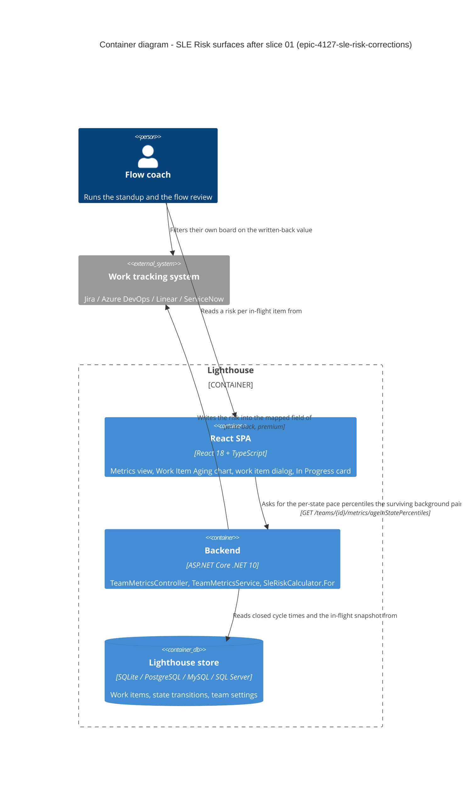

# epic-4127-sle-risk-corrections — feature delta

**ADO**: Epic #4127 "Show SLE Probability for In Progress Items" (Active) · Stories #6034, #6035, #6036, #6037
**Round**: 2. Round 1 shipped 2026-09-17 and is archived at `docs/evolution/2026-09-17-epic-4127-sle-risk.md`.
**Wave**: DISCUSS · started 2026-09-19 · density `lean` / `ask-intelligent`

---

## Wave: DISCUSS / [REF] Prior Wave Consultation

| File | Read |
|---|---|
| `docs/product/journeys/epic-4127-sle-risk.yaml` | ✓ |
| `docs/product/jobs.yaml` → `job-flow-coach-act-before-sle-breach` (L6821-6896) | ✓ |
| `docs/product/personas/flow-coach.yaml` | ✓ |
| `docs/product/architecture/adr-192-sle-risk-as-a-pure-conditional-over-the-cycle-time-population.md` | ✓ |
| `docs/evolution/2026-09-17-epic-4127-sle-risk.md` (round-1 archive) | ✓ |
| `docs/evolution/epic-4127-sle-risk/OUT-4127-risk-stability.md` | ✓ |
| `docs/product/outcomes/registry.yaml` | ✓ (contains no `OUT-4127-*` row — round 1's own "Still open" item) |
| `docs/product/vision.md` | ⊘ not found |
| `docs/project-brief.md` | ⊘ not found |
| `docs/stakeholders.yaml` | ⊘ not found |
| `docs/feature/epic-4127-sle-risk-corrections/discover/` | ⊘ not found (no DISCOVER for this round) |
| `docs/feature/epic-4127-sle-risk-corrections/diverge/` | ⊘ not found (no DIVERGE for this round) |

**Contradiction check against prior evidence: one found, and it is load-bearing.**

`OUT-4127-risk-stability.md` concluded *"something must gate it"* and named the minimum-sample guard as the fix. Story **#6037 deletes that guard**. This is a direct reversal of a measured finding, not an oversight — #6037 argues the certainty rule (`age > target ⇒ 100`) owns the entire high-age region where the measured volatility lives, so the guard is left protecting a range that no longer divides by anything. The measurement's own replay supports that reading: every unstable row in its table is at an age where the tail has thinned, and all of those ages sit past a realistic target. **Resolution: the reversal is accepted, and it is #6037's to argue in DESIGN with an ADR amendment — not to be smuggled in as a code change.** See D24.

No other DISCUSS decision in this round contradicts round-1 evidence.

---

## Wave: DISCUSS / [REF] Persona ID

**`flow-coach`** — runs standups and flow reviews for one team. Unchanged from round 1; this round adds no persona.

`config-admin` appears only as the write-back mapper in #6037's second half and gains no new decision.

---

## Wave: DISCUSS / [REF] JTBD one-liner

**`job-flow-coach-act-before-sle-breach`** — *"When I look at what is in flight during a standup, I want to know which items are more likely than not to break the Service Level Expectation we published — while there is still time to do something about it."*

**No new job.** Every story in this round corrects the *delivery* of that job rather than serving a new one. That is the round's defining property and the reason the epic stays open: `jobs.yaml` records `satisfaction_review.due: after epic-4127-sle-risk slice 01 ships and OUT-4127-risk-stability has been read`, with the note *"Do not re-score on delivery alone."* Round 1 shipped four surfaces; using them found that two of the four answer with numbers that disagree, one paints a ladder that cannot be read, and one is invisible without scrolling. The job is not yet satisfied, so the score does not move this round either.

---

## Wave: DISCUSS / [REF] Scope Assessment

Oversized signals — 4 user stories, 2 modules (backend domain + React), no new integration points, estimated 3-4 days total. **`## Scope Assessment: PASS`** — right-sized, no split proposed.

The round splits naturally into four slices along the ADO stories, one per slice, because each is independently shippable and independently revertible.

---

## Wave: DISCUSS / [REF] Locked decisions

Numbering continues round 1's sequence (which reached D17) in the same journey file.

**D18 — The zones are removed, not repaired.** Three defects were reported against them; only one is a repair away. The band ladder emits its lowest band at risk ≥ 25, so the whole region below 25% — the calm end, and most of a healthy chart — is never painted; an unpainted area already means *"too little finished work ever ran this long to say"* in the documented contract (`flow-metrics.md:132`), so the calm region and the unknowable region are drawn identically. The judgement is the maintainer's and it is recorded as taste, not arithmetic: **the zones cost more reading than they return.** The per-item column and the widget answer the same question without a geometry.

*Corrected during DESIGN — the original rationale here had the evidence gradient backwards, and the correction strengthens the verdict rather than weakening it.* This first read "the chart claims safety below the first crossing on evidence that is thinnest exactly there." That is wrong: `n(a) = count(T >= a)` is **largest** at low ages, so the evidence is thickest there, not thinnest. The real consequence is worse. `risk(1)` is `count(T > R) / count(T >= 1)` — the team's overall breach rate. So a team holding an 85% SLE and meeting it has `risk(1) ≈ 15`, below the first band's threshold, and the ladder paints nothing until the age where risk climbs past 25. **The better a team's attainment, the blanker its chart** — the background is brightest exactly where it is least needed, and absent for the teams the feature was built for.

**D19 — Two of the three reported defects are one defect.** *"The calmest colour index is unreachable"* and *"the bottom of the chart is never painted"* are the same fact seen from two sides. `sleRiskColorFor` ranks a risk by how many of `[25, 50, 75, 100]` it clears, so a risk below 25 takes `PACE_BAND_COLORS_LOW_TO_HIGH[0]`; the zone ladder never emits a band below 25, so rank 0 is unreachable *in zone mode only*. The colour is reachable, and correct, everywhere else the function is called. Recording this matters because it is why `sleRiskColorFor` survives the deletion untouched (D21) — a reader of the ADO description alone would reasonably conclude the palette mapping was at fault.

**D20 — The third defect is real and independent.** *"A team with a thin history gets no bands at all"*: `Zones()` walks ages upward and breaks the moment `For()` returns null, which the minimum-sample guard makes happen at age 1 on a thin history. The chart then draws nothing, in a mode the user explicitly selected, with no explanation. This one would survive #6037's guard deletion in a different shape, which is a second reason not to keep the zones and re-derive their geometry twice.

**D21 — `sleRiskColorFor` stays; only the ladder that consumes it in zone form goes.** The column and the widget still colour a risk, and they use rank 0. Deleting the palette mapping with the zones would silently decolour two surfaces this round is trying to improve.

**D22 — A stored `"risk"` preference resolves to Off, and that is a tested outcome rather than a fall-through.** `useAgingBackground` persists the literal string `"risk"` under `workItemAgingPaceBandsEnabled`. Removing `"risk"` from the accepted union leaves it unrecognised, and the existing `storedBackground` returns `null` for anything unrecognised, so the chart paints nothing. That is the right behaviour and it is already what the code would do — but it is currently an accident of a default, and the comment above it describes a three-mode world. An explicit test pins it. Nobody outside dev and dogfood browsers can be holding `"risk"`, because the mode was never released (D26); the test exists for the dogfood browsers and for the reader.

**D23 — The background control keeps its string-valued storage, and does not revert to a boolean.** The key `workItemAgingPaceBandsEnabled` already migrated `"true"` → `pace` once. Reverting the stored values to `"true"`/`"false"` would be a second migration in the opposite direction, over a key that now holds three possible strings, to reach a state indistinguishable from the current one for every user. The tri-state *control* collapses to two options; the *storage* keeps reading `"off"`/`"pace"` and translating legacy `"true"`.

**D24 — ADR-192 gets a Status note, not a rewrite, in this slice.** ADR-192 names the zones once, in passing, as one of four planned surfaces. That sentence becomes false and is corrected. The genuine reversal against ADR-192 is #6037's: its *Architectural Enforcement* table carries the row *"Beyond history is `null`, never `0`, `100` or an omitted entry"*, and #6037 makes past-the-target read `100` and a 0/0 inside the target read `0`. **That amendment belongs to slice 02 and must not be pre-empted here.** The ADO description for #6034 asks for "a superseding note on ADR-192" and is right; it is a one-line note, and the deeper rewrite is a different story's.

**D25 — `docs/settings/worktrackingsystems.md` is out of scope for slice 01.** The ADO description lists it. Verified line by line (L74-98): that file documents the write-back value source and contains no zone content. Its one SLE-risk caveat — *"an item at an age fewer than ten finished items ever reached"* — describes the minimum-sample guard, which **#6037** deletes. Editing it in slice 01 would either be a no-op or would land #6037's change a slice early.

**D26 — The deletion is clean because nothing was released.** Verified: `v26.9.9.9` is the newest tag, and every SLE-risk commit (`4abc63c4a` … `c58620c65`) is after it. No deprecation path, no migration, no release note describing a feature being taken away.

**D27 — The marketing website does not reference the asset, and this was checked rather than assumed.** `docs/assets/features/metrics/aging_sle_risk.png` appears nowhere in `/storage/repos/website` (full-repo grep, not just `lighthouseAsset()` call sites). The only `features/metrics/` assets the site hot-links are `metricsoverview.png` and `portfoliometricsoverview.png`, and both are plain page screenshots taken at the default background mode — neither renders a zone. **The asset is safe to delete.** The check is recorded because an asset with zero references inside this repo can still be live on the site, and that has cost a revert before.

**D28 — The round-1 archive is not edited.** `docs/evolution/2026-09-17-epic-4127-sle-risk.md` is a true account of what shipped on 2026-09-17, including a bullet promising risk zones. It stays as written; this round produces its own archive entry that supersedes it. Rewriting history to match the present is how a record stops being worth keeping.

**D29 — The Epic's Release Notes copy is rewritten once, at the end of the round.** Epic #4127 carries the `Release Notes` tag and its description still promises risk zones and an at-risk chip, both of which this round removes before any user sees them. Three of the four slices change what will ship. Rewriting the copy per slice would produce three drafts of which two are wrong. **Owner: slice 04's finalization.** None of the four child stories carries the tag, so the Epic is the only surface to correct.

---

## Wave: DISCUSS / [REF] Changed Assumptions (back-propagation)

Two decisions recorded in `docs/product/journeys/epic-4127-sle-risk.yaml` are superseded by this round. The journey file is SSOT and is amended in place; the originals are quoted here so the change is readable without a diff.

**Original — D12**, verbatim:
> *"As a THIRD MODE of the existing background control (Off / Pace percentiles / SLE Risk), not a second independent toggle. Both paint the same background channel so they are mutually exclusive by construction … The existing boolean localStorage key migrates to tri-state so no user's chart changes on upgrade."*

**New assumption**: the background control has two modes, Off and Pace percentiles. The mutual-exclusivity reasoning was correct and is unaffected — it is why there was only ever one background channel to contend for. What did not hold is the premise underneath it: that a risk ladder *has* a legible geometry on a real history. Below the first crossing it paints nothing, which the same chart's vocabulary already uses for "unknowable"; above it the evidence thins fastest. The storage key keeps its string values (D23).

**Original — D13**, verbatim:
> *"No — the line IS the top zone's labelled lower edge. The 100% zone begins exactly at R days, which is where the sleVisible reference line already sits … If the zone and the line ever disagree, the chart is asserting two different deadlines — which is the central correctness check of that slice."*

**New assumption**: moot. With the zones gone the SLE reference line is once again the only deadline the chart asserts, which is the outcome D13 was protecting. The line itself is untouched.

**`OUT-4127-risk-stability`'s recommendation** is superseded by #6037, not by this slice. Recorded here so the reversal is visible from the round's entry point; argued in slice 02.

---

## Wave: DISCUSS / [REF] User stories

### US-R2-01 — Remove the SLE Risk background zones (ADO #6034)

**job_id**: `job-flow-coach-act-before-sle-breach`

As a flow coach, I want the aging chart's background to make one claim I can trust, so that I stop trying to read a band ladder whose quiet end is indistinguishable from its unknown end.

#### Elevator Pitch
Before: the aging chart offers an **SLE Risk** background mode that paints nothing below the first 25% crossing, nothing at all on a thin history, and gives no way to tell a calm age from an unevidenced one.
After: open the Work Item Aging chart's background control → sees exactly two choices, **Off** and **Pace percentiles**, and no SLE Risk option.
Decision enabled: the coach reads an unpainted region as "no pace history here" and nothing else — one meaning per colour and one meaning per gap, which is the condition for using the background at all.

#### Acceptance criteria

- **AC-01.1** Given a team whose workflow has per-state history, when the coach opens the aging chart's background control, then it offers exactly two options — Off and Pace percentiles — and the SLE Risk option is absent. *(Corrected during DESIGN. The precondition as first written named a published SLE, which is irrelevant: `WorkItemAgingChart.tsx:632` gates the control on `backgroundModes.length > 1`, and after the deletion the only thing that can add a second mode is `perStatePercentileValues.length > 0`.)*
- **AC-01.1b** Given a team whose workflow has no per-state history, when the chart renders, then **no background control is drawn at all** — not a control with one option. *(The case AC-01.1 as first written could not see.)*
- **AC-01.2** Given a browser holding `workItemAgingPaceBandsEnabled = "risk"` from before the removal, when the chart loads, then the background is Off, the chart renders normally, and no error is raised. *(D22 — pinned by a test, not left to a default.)*
- **AC-01.3** Given a browser holding `workItemAgingPaceBandsEnabled = "true"` (the pre-tri-state legacy value), when the chart loads, then the background is Pace percentiles — unchanged from today. *(The one migration that must survive this revert.)*
- **AC-01.4** Given any team, when `GET /api/{version}/teams/{teamId}/metrics/sleRisk/zones` is requested, then the response is 404 — the route no longer exists. *(Corrected during DESIGN. As first written this named `/metrics/sleRiskZones`, a route that has never existed — `TeamMetricsController.cs:232` declares `[HttpGet("sleRisk/zones")]`. The AC would have passed against untouched code, which is the worst way for one to be wrong.)*
- **AC-01.5** Given the work item dialog and the In Progress widget, when either renders a risk, then it is coloured exactly as it is today. *(D21 — `sleRiskColorFor` is untouched; this AC is the regression net around the deletion.)*
- **AC-01.6** `docs/metrics/flow-metrics.md` contains no "SLE Risk Zones on the Aging Chart" section, and no surviving sentence in that file describes the background control as offering three choices.
- **AC-01.7** `docs/assets/features/metrics/aging_sle_risk.png` is deleted, and the `@screenshot` test that generated it is deleted with it. *(Cleared by D27.)*
- **AC-01.8** ADR-192's mention of chart background zones as a planned surface is corrected by a dated Status note. Its *Architectural Enforcement* table is **not** edited. *(D24.)*
- **AC-01.9** `grep -rniE "sleRiskZone|computeSleRiskZoneRects|[Gg]etSleRiskZones|countSleRiskZones|showSleRisk|sle-risk-zone|\bZones_[A-Z]"` over `Lighthouse.Backend`, `Lighthouse.Frontend/src` and `Lighthouse.EndToEndTests` returns nothing. *(Corrected during DESIGN, twice over. The pattern as first written was case-sensitive and, more importantly, keyed on symbol names — which missed a whole file: `SleRiskCalculatorTest.cs:184-333` holds twelve `Zones_*` tests whose names contain no zone symbol at all. This grep is a review gate read by a person; the compiler and Biome are what actually cannot be talked past.)*

### US-R2-02 — SLE Risk is one number over the team's configured history (ADO #6037)

**job_id**: `job-flow-coach-act-before-sle-breach`

As a flow coach, I want the risk I read in Lighthouse and the risk written to my board to be the same number, so that I am not choosing which of two systems to believe about my own team.

#### Elevator Pitch
Before: the dialog says 27% for an item and the board field says 18 for the same item on the same day, because one reads the browser's date range and the other reads the team's configured history.
After: open the work item dialog for an in-flight item, then read the mapped field on that item's board → sees the same integer in both, and moving the date picker does not change it.
Decision enabled: the coach acts on the number instead of reconciling it — and a board filter built on the field means what the dashboard means.

Four changes interlock in one file and ship together: one window, certainty past the target, deletion of the minimum-sample guard, and 0/0 inside the target reading 0. Full ACs at `slices/slice-02-one-number.md`.

### US-R2-03 — Show the SLE Risk column without horizontal scrolling (ADO #6035)

**job_id**: `job-flow-coach-act-before-sle-breach`

As a flow coach, I want the risk column to be on screen when I open the dialog, so that the column exists for me in practice and not only in the codebase.

#### Elevator Pitch
Before: the SLE Risk column is off the right edge of a `maxWidth="md"` dialog, and clicking a bubble on the aging chart opens a dialog that has no risk column at all.
After: click any in-flight bubble on the Work Item Aging chart → sees the SLE Risk column without scrolling sideways, and a maximise control for the dialogs that keep gaining columns.
Decision enabled: the coach orders the standup off the column, from either entry point, without discovering that one of them silently omits it.

Full ACs at `slices/slice-03-column-visible.md`.

### US-R2-04 — SLE Risk widget with RAG derived from the team's SLE (ADO #6036)

**job_id**: `job-flow-coach-act-before-sle-breach`

As a flow coach, I want the at-risk count to be a widget with its own status, so that one number stops doing two jobs on the In Progress card.

#### Elevator Pitch
Before: the count of at-risk items is a subtitle line under the WIP count, with no status of its own, and its threshold — `AT_RISK_FROM = 50` in `sleRisk.ts:149` — is reachable only by leaving the product for the docs. *(Corrected at the final gate. This first said the 50% "is not written down anywhere a reader will find it", which is false: `flow-metrics.md:116` states it plainly. What is missing is any **in-product** surface — the count has no entry in `widgetInfoMetadata.ts`, so a coach looking at the card has nowhere to click. #6036 both moves the threshold to 70 and gives it an info description, and conflating those two into "undocumented" understated the first and invented the second.)*
After: open the team's Flow Overview → sees an **SLE Risk** widget with its own RAG, its own info description naming the 70% threshold, and a View Data list of every in-flight item with its risk.
Decision enabled: the coach knows whether the at-risk share is inside the allowance the team's own SLE implies — 15% for a team on 85%, 30% for a team on 70% — rather than comparing a raw count to nothing.

Full ACs at `slices/slice-04-risk-widget.md`.

---

## Wave: DISCUSS / [REF] Slice composition gate

Four slices, four user-visible value stories, zero `@infrastructure`-only slices. **PASS.**

US-R2-01 is a deletion and still user-visible: an option disappears from a control the coach uses. It is not infrastructure.

---

## Wave: DISCUSS / [REF] Story map and prioritization

**Backbone**: *land on the team page* → *read the status* → *open the list* → *act on the item* → *carry it to the board*.

| Slice | Story | Ships | Learning hypothesis |
|---|---|---|---|
| 01 | #6034 remove zones | the background control offers two honest modes | Disproved if the removal decolours the column or the widget — which would mean the palette mapping, not the ladder, was the defect (D19/D21). |
| 02 | #6037 one number | one risk, always the configured history | Disproved if a real team's dialog and board field still disagree after the change, which would mean the disagreement was never only about the window. |
| 03 | #6035 column visible | the column on screen from both entry points | Disproved if a `WorkItemsDialog` call site is found that still silently omits the descriptor after the sweep — the per-call-site design makes this class of miss invisible by construction. |
| 04 | #6036 risk widget | a status derived from the team's own SLE | Disproved if the derived allowance flips on a rounding artifact, or if Observe proves reachable at the WIP the team actually runs. |

**Prioritization — and it departs from the board's stack rank, on evidence.**

The ADO board ranks these 6037 → 6036 → 6034 → 6035. Running 6037 first is wrong, and the reason is in `SleRiskCalculator.cs:101-119`:

```csharp
for (var age = 1; age <= oldestFinishedItem && nextLevel < ZoneLevels.Length; age++)
{
    var risk = For(age, targetRangeInDays, closedCycleTimes).Risk;
    if (risk is null) { break; }
```

`Zones()` is built on `For()` returning null. #6037 deletes the minimum-sample guard and makes past-the-target return `100`, so null becomes unreachable, the `break` never fires, and every band's geometry changes. Running 6037 before 6034 therefore forces a full rewrite of zone code that 6034 then deletes — including `CertainRisk`, which lives in the zones half and which #6037 needs to reintroduce where `For` can reach it.

Slice 03 before slice 04 because #6036's View Data opens a `WorkItemsDialog`; adding that call site after #6035's sweep means it lands on an already-correct pattern rather than becoming the sweep's next miss.

Slice 02's screenshot re-take is deferred to slice 03, because #6037 changes the column's description text and #6035 re-takes `sle_risk_column.png` at the new width. One re-take, after both.

**Order: 01 → 02 → 03 → 04.** Dogfood moment at the end of each; each is ≤1 day.

**Taste tests**: no slice ships 4+ new components (01 and 02 ship none); no slice depends on a new abstraction; every slice disproves something (table above); 02 and 04 carry production-data criteria — 02's whole trigger is an observed live disagreement (27% vs 18) and it is not closed until that pair agrees on a real team; no two slices are the same slice at different scale. **All pass.**

---

## Wave: DISCUSS / [REF] Outcome KPIs

| ID | Target | Measurement |
|---|---|---|
| `OUT-4127-R2-one-number` | The dialog and the written-back field report the identical integer for the same item, same team, same day — and the dialog's value does not change when the date range changes. | Read both on the dev instance for one team; move the range picker and re-read. Slice 02. |
| `OUT-4127-R2-column-reachable` | The SLE Risk column is visible without horizontal scrolling at 1280px wide, from both the widget header's View Data and a bubble click. | Playwright, both entry points. Slice 03. |
| `OUT-4127-R2-no-silent-omission` | Every `WorkItemsDialog` call site either passes a risk descriptor or is recorded in the slice brief as deliberately without one. Count of call sites == count accounted for. | Grep + the brief's table. Slice 03. |
| `OUT-4127-R2-zone-free` | Zero occurrences of the zone symbols **and of the twelve `Zones_*` test names**; the background control offers exactly two options where it is drawn at all. | The widened, anchored AC-01.9 grep + AC-01.1 + AC-01.1b. Slice 01. *(Definition moved with DESIGN's correction — the original grep was case-sensitive and symbol-keyed, and would have reported this KPI met while a whole test file survived.)* |
| `OUT-4127-R2-allowance-not-rounded` | No team's RAG flips because a ratio was rounded before comparison. | A 14.6%-share fixture reads Sustain/Observe, not Act. Slice 04. |

**Carried forward, unregistered**: round 1's `OUT-4127-risk-stability` and `OUT-4127-early-warning` are still absent from `docs/product/outcomes/registry.yaml` — round 1's own recorded "Still open" item, blocked on `nwave-ai outcomes register` not being on PATH in this checkout. Not this round's to fix; restated so it does not go quiet.

---

## Wave: DISCUSS / [REF] Out of scope

- **Portfolios.** Unchanged from round 1 D4 — a feature belongs to several portfolios, each with its own SLE and history, so there is no single answer to write. No portfolio surface gains a risk this round.
- **The human half of round 1's learning hypothesis** — whether a coach reading the column recognises the ordering as true of their own team. Needs a person and a real team; still open, still not this round.
- **A skipped-item count in the write-back log** (round 1's slice-04 DEVOPS carry-over). On a thin history a user sees the field written on some items and not others with nothing saying why. **#6037 shrinks this problem rather than solving it** — deleting the minimum-sample guard removes the commonest reason for a skip — but the beyond-history skip survives and stays unexplained. Out of scope; re-raise after #6037 lands, when the remaining skip rate is known rather than guessed.
- **Rewriting the round-1 archive** (D28).
- **`docs/settings/worktrackingsystems.md` in slice 01** (D25) — it belongs to slice 02.
- **A risk-over-time trend.** Unbought scope, as ADR-192 Option D recorded.

---

## Wave: DISCUSS / [REF] Walking-skeleton strategy

**Not applicable — strategy N/A, brownfield.** Four surfaces already ship end to end; every slice in this round modifies or deletes an existing path. There is nothing to prove a skeleton through. *(Explicit rather than silent: the project rule forbids an implicit skip.)*

---

## Wave: DISCUSS / [REF] Driving ports

| Port | Slice | Change |
|---|---|---|
| `GET /api/{version}/teams/{id}/metrics/sleRisk/zones` | 01 | **Deleted.** *(Corrected — this row first read `sleRiskZones`, a path that never existed. Same slip as AC-01.4, found separately by DEVOPS: fixing one instance of a wrong path does not fix the others.)* |
| `GET /api/{version}/teams/{id}/metrics/sleRisk` | 02 | Same route; the window it reads changes from the caller's range to the team's configured history, and the cache key is re-keyed off history and target. |
| Work Item Aging chart background control (UI) | 01 | Three options → two. |
| Work item dialog (UI) | 03 | `maxWidth` md → xl, plus a maximise toggle; risk descriptor plumbed to the aging chart's own dialog. |
| Flow Overview widget grid (UI) | 04 | New SLE Risk widget; the at-risk subtitle leaves `WipOverviewWidget`. |
| Write-back value source `SLE Risk` | 02 | Same mapping; the value changes to match the display. |

No CLI or MCP port is added or removed. See the project checklist below.

---

## Wave: DISCUSS / [REF] Pre-requisites

- Round 1 shipped and is on `main` (`c58620c65`). Working tree clean, nothing unpushed.
- No release between round 1's merge and this round's start — `v26.9.9.9` is still the newest tag (D26).
- Epic #4127 is `Active` and stays `Active`. It is closed only when released.

---

## Wave: DISCUSS / [REF] Project DISCUSS checklist

No silent N/A — every item answered.

**RBAC impact — none, and the deletion is not a gap.** The zones route rode the class-level `[RbacGuard(TeamRead)]` on `TeamMetricsController` (ADR-192 §5). Removing an action from a class-guarded controller removes a guarded route; no grant, role, or policy changes, and no other route inherits anything from it. Nothing in this round reads `/api/latest/authorization/my-summary` or gates UI outside `useRbac()`. Slices 02-04 add no route and no new guard: 02 changes an existing action's inputs, 03 and 04 are frontend-only.

**Lighthouse-Clients CLI / MCP versioning — nothing owed, and this was checked rather than inferred.** Grepped `/storage/repos/lighthouse-clients` for `sleRisk` / `sle-risk` / `sle_risk` across `.ts`, `.py`, `.md`, `.json`: zero hits. No wrapper exists for any SLE-risk route, so no `FEATURE_REQUIRES_SERVER_NEWER_THAN` entry exists to remove and none is owed for the deletion. ADR-192 §5 recorded the same thing prospectively; it is now also true retrospectively. **The standing caveat survives**: the moment a client wrapper is added for `/metrics/sleRisk`, it must be version-gated, because a new endpoint 404s opaquely on an old server.

**Website marketing surface — one asset deleted, verified unreferenced (D27).** `aging_sle_risk.png` appears nowhere in `/storage/repos/website` under a full-repo grep. The site's only `features/metrics/` hot-links are `metricsoverview.png` and `portfoliometricsoverview.png`, both plain page screenshots at the default background mode, so neither shows a zone and neither needs re-taking. No website copy names SLE Risk zones. **No website change is owed by slice 01.** Re-check at slice 04, when the new widget may warrant a marketing screenshot.

**Terminology** — the round touches surfaces that render `SLE`, `Work Item` and `Work Item Age`, all configurable under Settings → Terminology. Every doc sentence and UI fallback written this round uses the `TerminologySeeder.cs` default; no heading says "Epic", "Initiative" or "Story".

**Demo data** — the demo teams carry `85% @ 7 days` as of round 1 (`DemoDataFactoryTest` pins it). Slice 01 needs nothing new. Slice 04's widget will render on demo data for free because the SLE is there — **but verify it rather than assert it**, which is precisely the checklist item round 1 got wrong three times.

---

## Wave: DISCUSS / [REF] Definition of Done

1. All four slices' ACs demonstrably pass.
2. `dotnet build` zero warnings; `dotnet test` green with the connector categories excluded.
3. `pnpm test` green; `pnpm build` clean (implies a clean Biome check).
4. SonarQube Cloud introduces no new issue of any severity.
5. Playwright run locally before commit for every touched spec or POM locator; no unrun spec committed.
6. `docs/ci-learnings.md` consulted and its machine-readable greps run over every file written, before the first push.
7. Mutation testing per slice on changed code, ≥80% kill rate, recorded under `docs/feature/epic-4127-sle-risk-corrections/mutation/`. Slice 01 is a deletion; its run covers the surviving `sleRisk.ts` and the chart, not the removed code.
8. Docs and screenshots updated at feature finalization; ADO transitioned Active → Resolved per slice on green CI; Epic #4127 left Active.
9. The Epic's Release Notes copy rewritten once, at slice 04 (D29).

---

## Wave: DISCUSS / [REF] DoR validation

| # | Item | Verdict | Evidence |
|---|---|---|---|
| 1 | Business value articulated | ✓ | Every story removes a way the shipped feature misleads or hides. Elevator pitches name the decision each restores. |
| 2 | Job traceability | ✓ | All four trace to `job-flow-coach-act-before-sle-breach`. No new job; `satisfaction_review` deliberately not re-scored. |
| 3 | Acceptance criteria testable | ✓ **for slice 01 only** | Slice 01's ten ACs are each a grep, an HTTP status, a rendered control, or a stored-value case. Slice 02 gained nine ACs at the final gate (AC-02.1..02.9 in its brief). **Slices 03 and 04 have elevator pitches and scope but no ACs, and are therefore NOT at DoR** — see the scoping note below. |
| 4 | Dependencies identified | ✓ | The 01-before-02 ordering is derived from `SleRiskCalculator.cs:101-119` and stated with the code. |
| 5 | Scope bounded | ✓ | Out-of-scope section; D25 removes one file the ADO description wrongly included. |
| 6 | Non-functional constraints | ✓ | Quality gates in DoD; no new latency, storage or migration. |
| 7 | Risks surfaced | ✓ | Website asset (cleared, D27); stored `"risk"` preference (D22); the `OUT-4127-risk-stability` reversal (flagged, deferred to slice 02). |
| 8 | Sized | ✓ | Four slices, ≤1 day each; scope assessment PASS. |
| 9 | Demoable | ✓ | Each slice has a dogfood moment on the dev instance the same day. |

**Scope of this DoR claim — added at the final review gate, because the table as first written implied more than it had.** DoR is claimed for **slice 01 only**. That is the slice taken through DESIGN, DEVOPS and DISTILL, and the only one being handed to DELIVER. Slices 02, 03 and 04 are *mapped* — job, elevator pitch, scope, dependencies, learning hypothesis — and slice 02 now has ACs too, but 03 and 04 have not been designed and their ACs do not exist. Claiming DoR across all four would have asserted readiness for three slices nobody has looked at yet.

This is not a gap to close now: the round runs one slice at a time by design, and each slice's ACs are written when its own wave runs. It is written down so that "DoR passed" is not read as covering work that has had no wave. **Slice 04 additionally carries an unresolved question that blocks its DESIGN** — see below.

**Resolved 2026-09-19 — the maintainer is the confirmer.** #6036's *"Observe is unreachable at low WIP"* is confirmed as intended by Benjamin Huser-Berta, directly. With a 15% allowance one at-risk item out of six reads 16.7% and lands on Act; Observe needs a WIP of seven or more. **That is accepted, not a gap to close.** Slice 04 implements the rule as the story states it and does not re-open it.

**Requirements completeness: 1.00 for slice 01.** Not claimed for the round. The one open item — slice 04's *"Observe is unreachable at low WIP"* — was confirmed directly by the maintainer on 2026-09-19 and is closed.

---

## Wave: DISCUSS / [REF] Wave Decisions Summary

**Key decisions**: D18 remove rather than repair · D19 two reported defects are one · D20 the thin-history blank is the independent one · D21 `sleRiskColorFor` survives · D22 stored `"risk"` → Off, tested · D23 storage stays string-valued · D24 ADR-192 note now, amendment in slice 02 · D25 `worktrackingsystems.md` is slice 02's · D26 nothing released, clean deletion · D27 website cleared · D28 archive not edited · D29 Release Notes copy rewritten once at slice 04.

**Primary job**: unchanged — act on an item before it breaks the published SLE. This round removes a surface that answered it badly, makes the remaining answer singular, and makes it reachable.

**Feature type**: user-facing.

**Constraints established**: slice order 01 → 02 → 03 → 04, fixed by the `Zones()`/`For()` coupling, not by board rank. No RBAC change, no client version gate, no migration, no website change in slice 01.

**Upstream changes**: journey D12 and D13 superseded; `OUT-4127-risk-stability`'s recommendation reversed by slice 02, flagged here, argued there.

**Handoff**: DESIGN (`nw-solution-architect`) for slice 01 — the open architectural question is the ADR-192 Status note's wording and whether the zones warrant a short ADR of their own recording why a risk ladder has no legible geometry, so the next person to propose one finds the answer.

---
---

# DESIGN — slice 01 (ADO User Story #6034)

**Wave**: DESIGN · 2026-09-19 · Morgan (Solution Architect), interaction mode **PROPOSE** · scope: Application / components
**Paradigm**: unchanged — OOP (C# .NET 10 backend), functional-leaning React 18 + TypeScript frontend. Ports-and-adapters, unchanged.

---

## Wave: DESIGN / [REF] Prior Wave Consultation

| Artifact | Read |
|---|---|
| `docs/feature/epic-4127-sle-risk-corrections/feature-delta.md` (DISCUSS, D18-D29) | ✓ |
| `docs/feature/epic-4127-sle-risk-corrections/slices/slice-01-remove-risk-zones.md` | ✓ |
| `docs/product/architecture/adr-192-sle-risk-as-a-pure-conditional-over-the-cycle-time-population.md` | ✓ |
| `docs/product/journeys/epic-4127-sle-risk.yaml` (D12/D13 superseded) | ✓ |
| `docs/product/architecture/brief.md` | ✓ (paged; **no `## Application Architecture — epic-4127-sle-risk` section exists** — round 1 produced ADR-192 and no brief section) |
| `docs/ci-learnings.md` | ✓ |
| `docs/metrics/flow-metrics.md` L95-145 | ✓ |
| Code: `SleRiskCalculator.cs`, `SleRiskDto.cs`, `TeamMetricsService.cs`, `ITeamMetricsService.cs`, `TeamMetricsController.cs` | ✓ |
| Code: `WorkItemAgingChart.tsx`, `useAgingBackground.ts` (+ test), `useMetricsData.ts`, `SleRisk.ts`, `categoryMetadata.ts`, both `*MetricsService.ts`, `BaseMetricsView.tsx`, `MockApiServiceProvider.ts` | ✓ |
| Code: `Lighthouse.EndToEndTests/tests/models/metrics/WorkItemAgingChart.ts`, `Screenshots.spec.ts` L987-1010 | ✓ |
| Backend tests: `Slice03SleRiskZonesScenarios.cs`, `SleRiskAcceptanceTest.cs`, **`SleRiskCalculatorTest.cs`** | ✓ |
| `docs/product/architecture/adr-194-*.md` | ⊘ not found — the number is free and is claimed by this slice |
| DEVOPS artifacts for this round | ⊘ none (no DEVOPS wave run; none owed — no infrastructure, migration or pipeline change) |

---

## Wave: DESIGN / [REF] Four upstream corrections

Stated before the decisions, because three of them change an acceptance criterion and one changes the
argument the ADR is written on. None reverses the slice; all four make it executable as written.

**C-1 — the route in AC-01.4 does not exist and never did.** AC-01.4 asserts that
`GET /api/{version}/teams/{teamId}/metrics/sleRiskZones` returns 404. The shipped route is
`[HttpGet("sleRisk/zones")]` (`TeamMetricsController.cs:232`), i.e.
`GET /api/{version}/teams/{teamId}/metrics/sleRisk/zones` — which is also what
`TeamMetricsService.ts:69` fetches and what `Slice03SleRiskZonesScenarios.cs:178` and
`SleRiskAcceptanceTest.cs:222` address. As written, AC-01.4 passes today, before a line is deleted,
and would pass just as well if the deletion were forgotten entirely. **Corrected wording is in the
decisions table (DDD-7).**

**C-2 — a twenty-first file carries the zone code, and the AC-01.9 grep cannot see it.**
`Lighthouse.Backend.Tests/Services/Implementation/SleRiskCalculatorTest.cs` holds **twelve**
`Zones_*` unit tests (L184-333) plus `Zones_NoHistorySupplied_Refuses`. The file appears in neither
the DISCUSS inventory nor the slice's IN-scope list. It is also invisible to AC-01.9: that grep looks
for `SleRiskZone`, `sleRiskZone`, `computeSleRiskZoneRects`, `GetSleRiskZones`, `countSleRiskZones`
and `showSleRisk`, and the test file contains none of them — its call is `SleRiskCalculator.Zones(…)`
and its method names begin `Zones_`. The compiler catches the omission, so nothing ships broken, but
the AC would report success over a file nobody deleted. **DDD-9 adds the file and widens the grep.**

**C-3 — AC-01.1's precondition is the wrong one, and "exactly two options" is conditional.**
`backgroundModes` (`WorkItemAgingChart.tsx:514-530`) is built from what the chart can actually paint:
`off` always, `pace` when `perStatePercentileValues.length > 0`, `risk` when the zone list is
non-empty. The group is rendered only when `backgroundModes.length > 1` (`:632`). After the removal a
published SLE has **nothing to do with the background control** — the only input left is per-state
cycle-time history. So AC-01.1's `Given a team with a published SLE` selects a team that may show one
option and therefore no control at all. **DDD-8 restates the criterion as a pair.**

**C-4 — D18 contains a backwards claim about where the evidence is thin, and the removal's case is
stronger without it.** D18 argues that emitting a 0-to-25 band would make "the chart claim safety for
every age below the first crossing on evidence that is thinnest exactly there." The arithmetic runs
the other way. `comparableItems(a) = |{T : T ≥ a}|` is monotonically **non-increasing** in age, so the
evidence is at its thickest at the lowest ages and thins as the age grows — which is exactly what
`OUT-4127-risk-stability` measured, and what `flow-metrics.md:132` already documents ("the evidence
thins as the age grows, so it is usually the highest bands that go missing"). The sub-25 region is the
**best**-evidenced part of the chart, not the worst.

This does not rescue the zones; it relocates the fault, and the relocated fault is the one a repair
cannot reach. Restated correctly, and this is what ADR-194 is written on:

- The same visual absence carries two opposite meanings inside one chart. Below the first crossing
  nothing is painted **because the ladder has no band that low**, on the chart's thickest evidence.
  Above the last placeable band nothing is painted **because the evidence ran out**. A reader cannot
  tell the two apart, and a 0-to-25 band repairs only the first.
- The better a team meets its promise, the more of its chart stays blank. `risk(1)` is the overall
  breach rate; a team holding an 85%-on-time SLE breaches about 15% of the time, which is below the
  ladder's first level, so nothing is painted until the conditional climbs past 25. A team that misses
  constantly gets a fully painted chart. **The background is brightest exactly where it is least
  needed** — and that is arithmetic, not taste.
- On a thin history the whole ladder vanishes. `Zones()` walks ages upward and `break`s at the first
  null (`SleRiskCalculator.cs:105-110`); with fewer than `MinimumComparableItems` finished items the
  null arrives at age 1, so a mode the user explicitly selected draws nothing and says nothing. This
  is D20, and no repair to the band set touches it.

D18's verdict stands unchanged and its two other arguments stand unchanged. Only the parenthetical
about evidence depth is wrong, and it is corrected here rather than carried into an ADR, because an
ADR is the one place the reasoning is read years after the decision.

---

## Wave: DESIGN / [REF] Design decisions

**DDD-1 — ADR-192 is amended with a dated note under its Status line; its Decision, its Alternatives
and its Architectural Enforcement table are untouched.** ADR-192's Context names four planned surfaces
and one of them stops existing, so one sentence becomes false. The instrument for that is an
amendment note, not a supersession and not an edit to the sentence: the ADR's *decision* — risk is a
pure conditional over the closed population, computed once, in one place — is not what changed. The
register's own convention is immutability with dated notes, and `state-time-cumulative-view` in
`brief.md` already carries an "Amend delta" of exactly this shape. The note is placed directly beneath
`**Status**`, before `**Feature**`, so a reader meets the correction before the prose it corrects. The
*Architectural Enforcement* row `Beyond history is null, never 0, 100 or an omitted entry` is
deliberately left alone: slice 02 reverses it, and pre-empting it here would land #6037's change a
story early (D24).

**DDD-2 — the removal gets an ADR of its own: [ADR-194](../../product/architecture/adr-194-sle-risk-is-a-number-per-item-never-a-background-ladder.md).**

*Argued against first, because an ADR for a deletion is unusual.* ADRs constrain future work; deleting
never-released code constrains nothing. The story is already in three places — this feature delta, the
round-2 evolution archive, and ADR-192's amendment note. A register that grows an entry per removal
gets read less, and a diluted register is worse than a short one.

*Argued for, and this is the call.* The ADR register is the **only** artifact anyone reads when
*proposing* a surface; a feature delta under `docs/feature/epic-4127-sle-risk-corrections/` is not
somewhere a future author looks before suggesting risk zones, and an evolution archive is a dated
narrative of what shipped, not a constraint. What is being recorded is not a preference but a
structural property of a threshold ladder laid over an empirical conditional: its lowest band is its
first threshold, so the sub-threshold region is unpaintable by construction; the chart already spends
unpaintedness on "unknowable"; and the region the ladder describes best is the region a team wants
least. Without the record, the next proposal rebuilds the same ladder and rediscovers the same defect
at the same cost — which is the textbook trigger for an ADR. The register also already carries
limiting and negative decisions (ADR-134's narrowed objection; ADR-018's standing refusal to share),
so this is not a new kind of entry.

The ADR is framed as the positive constraint — *SLE Risk is reported as a number per item, never as a
background ladder* — because that is the form a future proposal collides with. A file titled "we
deleted the zones" constrains nobody.

**DDD-3 — ADR-194 takes number 194, and the number was verified rather than assumed.**
`docs/product/architecture/` holds adr-190, 191, 192, 193, 195, 196, 197; a repository-wide search for
`ADR-194` / `adr-194` across 6190 files returns zero matches. 194 was skipped when 195 was written, not
used and withdrawn. Nothing in the tree claims it.

**DDD-4 — the deletion order is tests-first, then consumer, then producer, then docs, and it is
monotonic rather than merely unpushed.** Four commits, in this order:

| # | Commit | Contents | Green after it |
|---|---|---|---|
| 1 | `test(sle-risk): retire the zone screenshot and the POM that drove it` | `Lighthouse.EndToEndTests/tests/models/metrics/WorkItemAgingChart.ts` — `SLE_RISK_ZONE_TEST_ID`, `sleRiskZones`, `countSleRiskZones`, `showSleRisk`; `Screenshots.spec.ts` L987-1010 in full | Everything. Deleting a test never reds a test. |
| 2 | `refactor(metrics): the aging chart's background has two modes again` | The whole frontend column of the component table below, including the `useAgingBackground` narrowing and every Vitest change | `pnpm test`, `pnpm build` (Biome via `prebuild`). Backend untouched. The zones route survives with no caller. |
| 3 | `refactor(metrics): drop the SLE risk zone read` | The whole backend column: controller action, port member, service method + cache entry, `SleRiskZoneDto`, the zone half of `SleRiskCalculator`, `Slice03SleRiskZonesScenarios.cs`, `SleRiskAcceptanceTest.SleRiskZonesRoute`, the twelve `Zones_*` tests | `dotnet build` (zero warnings), `dotnet test` with the connector categories excluded |
| 4 | `docs(metrics): the aging chart's background no longer offers a risk ladder` | `flow-metrics.md` L120-135, `docs/assets/features/metrics/aging_sle_risk.png`, ADR-192 note, ADR-194, `brief.md` section, this delta, the slice briefs, **`docs/product/journeys/epic-4127-sle-risk.yaml`** (D12/D13 superseded in place), **`docs/product/jobs.yaml`** (functional dimension + satisfaction-review note), **`environments.yaml`** | Docs gates — and per DEVOPS, `ci.yml`'s `paths:` filter excludes `docs/**`, so this commit triggers no CI job at all |

**Why not backend-first.** The question worth asking is whether a 404 between commits matters at all,
given that each slice ships as a coherent set and the intermediate state is never pushed. It does not
matter for what ships — but making the answer depend on the push discipline turns a habit into a
correctness precondition, and the habit is exactly what a long session drops (the ledger's own recurring lesson,
five times over, is a mandatory step skipped at the end of a long green stretch). Both orders cost one
commit. One of them leaves a shipped bundle calling a deleted route, which surfaces on a dev instance
as an error on the metrics page and is indistinguishable from a real outage to anyone bisecting. The
other leaves an endpoint nobody calls, which is invisible. Take the invisible one, and do not spend
the discipline to buy back the difference.

**Why E2E first rather than alongside the frontend.** `showSleRisk()` clicks a control that commit 2
removes and `countSleRiskZones()` reads a `data-testid` that commit 2 deletes. Between a
frontend-first commit and an E2E commit the Playwright spec is broken. Deleting the spec first makes
every commit boundary green in every stack without reference to when anything is pushed.

*Corrected by DEVOPS — the right conclusion reached through the wrong mechanism.* This first argued
that E2E **runs** in CI through `ci_verifysqlite` / `ci_verifypostgres`. It does, but not this spec:
the deleted block is `@screenshot`-tagged, and the E2E project's `test` script is
`playwright test --grep-invert "@screenshot|@auth|@rbac|@proxyauth"`, so it has never run in CI. What
actually protects commit 1 is `ci_e2e.yml`'s `pnpm run build` — a TypeScript compile that fails on a
POM member the spec still calls. The ordering is unchanged; the reason it is safe is a compiler, not a
browser. Worth the correction because the two failure modes look nothing alike when one fires. This is also the ledger's
2026-07-19 lesson — *dropping a user-visible label prefix silently killed a POM locator in another
spec* — applied before it can fire rather than after.

**DDD-5 — `useAgingBackground` keeps a three-value *reader* over a two-value *type*, and `"risk"` is
an explicit retired branch.** The exact shape:

| Element | After |
|---|---|
| `AGING_BACKGROUND_STORAGE_KEY` | `"workItemAgingPaceBandsEnabled"` — unchanged, name and all (D23) |
| `AgingBackground` | `"off" \| "pace"` — `"risk"` leaves the union |
| `storedBackground` | Four branches in this order: `"true"` → `"pace"`; `"risk"` → `"off"`; `"off" \| "pace"` → itself; anything else → `null` |
| `chooseBackground` | Unchanged; it can only ever be handed a value in the narrowed union |
| Stored values | Still strings. No migration, in either direction (D23) |

Three things this shape buys, in order of how load-bearing they are:

1. **The legacy `"true"` → `pace` translation survives untouched**, which is the one migration that
   must not be lost (AC-01.3).
2. **`"risk"` resolves to Off through a branch that names it, not through the unrecognised-value
   default.** Both routes paint nothing today. They claim different things: the default says *"this
   value means nothing to us"*, the branch says *"this value meant something and no longer does."* The
   difference is not observable now — it becomes observable the day someone adds a background mode and
   reaches for the word `risk` again, at which point a dogfood browser holding the old string would
   silently opt into the new mode. The branch is a tripwire for that author: to reuse the name they
   must first delete a line that says the name is retired. That is the whole of its value, and it is
   worth one line.
3. **The doc comments stop describing a three-mode world.** Three comments currently say so — the key's
   ("predates the third mode"), the type's, and `storedBackground`'s ("before this was a choice of
   three" / "because the control grew a third option"). Rewritten to describe two modes and to name
   both retired values plainly, with no internal reference of any kind, per the project's comment rule.

**DDD-6 — the equivalent mutant on that branch is accepted and recorded now, not litigated after the
Stryker run.** Mutating the literal in `if (stored === "risk") return "off";` leaves behaviour
identical: the value falls through to `null`, and the hook's own initial state is already `"off"`. The
branch is therefore an **equivalent mutant by construction** and will survive StrykerJS. This is not a
coverage gap and there is no test that can kill it, because there is no observable difference to
assert. It is recorded here, before the run, so the mutation report is read against a known
expectation rather than re-argued.

The alternative that *would* kill it was considered and rejected: have the hook write `"off"` back
when it reads `"risk"`, which makes the branch observable in `localStorage` and retires the dead value
in the browser. It costs the existing pinned invariant *"does not write to localStorage until the user
picks a mode"*, for a population D26 bounds at dev and dogfood browsers. Not worth breaking a pinned
invariant to kill one equivalent mutant over three machines.

There is a second reason, which only became visible under peer review: **reading the value without
rewriting it is what keeps a rollback lossless.** If this slice is ever reverted, a browser that stored
`"risk"` still holds it, so the restored ladder comes back on for the reader who had chosen it — the
state they left, not a blank chart. A hook that normalised the value on read would have quietly
discarded that preference on the way past, and the loss would only be discovered by the one person
rolling back. Two independent reasons, one line of code.

**DDD-7 — AC-01.4 is restated against the real route, and against the real risk.** Replace with:

> **AC-01.4** Given any team, when `GET /api/{version}/teams/{teamId}/metrics/sleRisk/zones` is
> requested, then the response is 404; and `GET /api/{version}/teams/{teamId}/metrics/sleRisk` for
> the same team is unaffected.

The second clause is the one that earns its keep. `sleRisk/zones` is a **sub-path of a surviving
route**, so "the action is deleted" and "the path 404s" are two different claims — ASP.NET route
matching is what connects them, and this design refuses to assume it. The paired assertion also
catches the opposite mistake: a deletion that took the wrong `[HttpGet]` with it.

Its home is the surviving `Slice01SleRiskRead*` fixture, which already drives this route family
through `SleRiskRoute` / `SleRiskRouteBetween` on the shared base. It cannot be the zones fixture:
that file is deleted, and so is `SleRiskZonesRoute`, whose only caller is
`Slice03SleRiskZonesScenarios.cs:170` — which is why the helper and the file go in the same commit
rather than leaving an uncalled `protected` member behind for Sonar to find.

**DDD-8 — AC-01.1 is restated as a pair, because the control is conditional.** Replace with:

> **AC-01.1a** Given a team whose Doing states have cycle-time history, when the coach opens the aging
> chart's background control, then it offers exactly two options — Off and Pace percentiles — and no
> SLE Risk option.
> **AC-01.1b** Given a team with a published SLE but no per-state cycle-time history, when the chart
> renders, then no background control is drawn at all — one option is not a choice.

AC-01.1b is not new behaviour; it is shipped behaviour (`backgroundModes.length > 1`) that becomes
reachable for a new reason once `risk` can no longer be the second entry. Pinning it is what stops a
future reader mistaking the absent control for a regression. A published SLE is now irrelevant to this
control and the criterion should stop mentioning it.

**DDD-9 — `SleRiskCalculatorTest.cs` joins the IN-scope list and AC-01.9's grep is widened.** The
twelve `Zones_*` tests go with the code they test (commit 3). AC-01.9's pattern becomes:

```
SleRiskZone\|sleRiskZone\|computeSleRiskZoneRects\|[Gg]etSleRiskZones\|countSleRiskZones\|showSleRisk\|SleRiskCalculator\.Zones\|\bZones_[A-Z]
```

over `Lighthouse.Backend`, `Lighthouse.Frontend/src` and `Lighthouse.EndToEndTests`. Two additions
matter: `SleRiskCalculator\.Zones` and the `Zones_` term are what C-2 found, and `[Gg]etSleRiskZones`
replaces the capital-G-only form because the existing list is case-sensitive and the frontend method is
lower-cased. A grep that cannot fail is not a gate.

**The last term is anchored, and the whole thing is a review gate rather than a CI job.**
`\bZones_[A-Z]` matches the `Zones_ARealDistribution` test-method convention and not a prose mention,
a string literal or an identifier like `someZones_data` — a bare `Zones_` would match all three. Even
anchored it is a naming convention rather than a symbol, so the result is read by a person before the
first push and is not wired into a build. The two mechanisms that genuinely cannot be talked past are
the compiler and Biome: a surviving `SleRiskCalculator.Zones` call does not build, and a surviving
unused import does not pass `prebuild`. The grep's job is to catch what still *compiles* — a stale
string, a dead test id, a doc sentence — which is exactly the class no gate in this repo catches.

**DDD-10 — the chart loses two imports, and `utils/charts/sleRisk.ts` is not touched.**
`computeSleRiskZoneRects` is the only thing in `WorkItemAgingChart.tsx` that reads `sleRiskColorFor`
(`:53`, used at `:205`) **and** the only thing that reads `PACE_BAND_COLORS_LOW_TO_HIGH` (`:42`, used
at `:205`). Both imports become unused and both are removed from the chart. Neither *module* is
touched: `sleRiskColorFor` still serves the dialog column and the In Progress at-risk line (D21), and
`PACE_BAND_COLORS_LOW_TO_HIGH` still backs `paceBandColorForRank`. Recorded because "the last import
of a shared helper is leaving this file" is the exact moment an over-eager deletion takes the helper
with it, and because Biome will red the build if the imports are left — a one-line correction that is
cheaper to have written down than to discover at `pnpm build`.

`sleTerm` (`:509`) stays: the removal takes its use at `:526` but it is still read at `:824` for the
SLE reference line's label, which this slice does not touch.

**DDD-11 — `docs/evolution/epic-4127-sle-risk/mutation-results.md` is not edited, and the non-edit is
stated rather than skipped.** It carries a section *"Slice 03 / Story #6014 — the risk zones on the
aging chart"*. It is a true record of a mutation run that happened, on code that existed at the time,
and it is the same class of artifact D28 protects: a record stops being worth keeping the moment it is
rewritten to match the present. The round-2 mutation record supersedes it by being later, not by
deleting it.

**DDD-12 — this slice writes the first `## Application Architecture — epic-4127-sle-risk*` section in
`brief.md`, and it is written as an as-built of what remains.** Round 1 produced ADR-192 and appended
no brief section; the file's tail runs `story-5884` → `story-5914` → `parent-from-issue-links` →
`story-5877` with nothing for this Epic between them. The section therefore cannot be a delta against
a predecessor that does not exist. It states what the three surviving SLE-risk surfaces are and what
the one removed one was, so a reader of the SSOT alone can tell which is which without opening a
feature folder.

**DDD-13 — Earned Trust: this slice introduces no adapter, so the probing owed is over two claims the
deletion makes about environments it does not control.** There is no new driven port and no new
substrate, so a `probe()` specification would be ceremony. What the slice does claim, and what must be
demonstrated rather than assumed:

| Claim | Environment that could lie | How it is demonstrated |
|---|---|---|
| Deleting the controller action makes the path 404 | ASP.NET route matching over a path that is a sub-path of a surviving route | Acceptance test asserting 404 on `sleRisk/zones` **and** 200 on `sleRisk`, same team, same run (DDD-7) |
| A browser holding a retired preference renders normally | A `localStorage` carrying a value the code no longer knows | Vitest seeding the literal `"risk"` and asserting Off with no throw (AC-01.2), separate from the unrecognised-value test so that neither covers for the other |
| The `data-testid` a POM drives is gone from both sides | A Playwright spec that still names a deleted id | Commit 1 removes the POM before commit 2 removes the id, and the widened AC-01.9 grep spans `Lighthouse.EndToEndTests` |

The second row's separation is load-bearing: folding the `"risk"` case into the existing `"sideways"`
unrecognised-value test would leave a test that passes whether or not the retired branch exists.

**DDD-14 — contract shapes of what survives, so slice 02 inherits a stated frame rather than a guess.**

| Component | Contract shape | Universe / declared change set |
|---|---|---|
| `SleRiskCalculator.For` | **pure-function** (return-only) | Its three arguments. No clock, no repository, no provider. Unchanged by this slice |
| `storedBackground` | **pure-function**, total over `string \| null` | Its one argument |
| `useAgingBackground.chooseBackground` | **bounded-change** | Exactly one React state slot and exactly one `localStorage` key. The hook is the only production module that names the key; a `throw` from `setItem` is caught and the choice still applies to the live chart |
| `TeamMetricsService.GetSleRiskForTeam` | **bounded-change** | One cache entry keyed `SleRisk_{start}_{end}_{range}`. Unchanged by this slice; re-keyed by slice 02 |
| `SleRiskCalculator.Zones` and `GetSleRiskZonesForTeam` | removed — shape moot | — |

---

## Wave: DESIGN / [REF] Component Decomposition

**DELETE — backend**

| Component | File | Summary |
|---|---|---|
| `SleRiskZone` record struct | `Services/Implementation/SleRiskCalculator.cs:18` | The band type |
| `Zones`, `WithUpperEdges`, `UpperEdgeOf` | same, `:86`, `:130`, `:142` | The ladder. All three go together — leaving a private helper behind is an S1144 on a deletion commit |
| `ZoneLevels`, `CertainRisk` | same, `:72`, `:75` | `CertainRisk` is slice 02's to reintroduce where `For` can reach it, not this slice's to preserve |
| `SleRiskZoneDto` | `Models/Metrics/SleRiskDto.cs` | The file keeps `SleRiskDto` |
| `GetSleRiskZonesForTeam` | `Services/Interfaces/ITeamMetricsService.cs` | Port member. No signature-freeze test pins this interface; Moq adapts |
| `GetSleRiskZonesForTeam` + its cache entry | `Services/Implementation/TeamMetricsService.cs:393-408` | Cache key `SleRiskZones_…` disappears with it |
| `GetSleRiskZonesForTeam` action | `API/TeamMetricsController.cs:232-244` | Route `sleRisk/zones`. Rides the class-level `[RbacGuard(TeamRead)]`; removing it removes a guarded route and nothing else |
| `Slice03SleRiskZonesTest` | `Tests/API/Integration/SleRisk/Slice03SleRiskZonesScenarios.cs` | Whole file, 247 lines |
| `SleRiskZonesRoute` | `Tests/API/Integration/SleRisk/SleRiskAcceptanceTest.cs:222-225` | One member of a shared fixture, with exactly one caller — `Slice03SleRiskZonesScenarios.cs:170` — so both go in the same commit. The seeding helpers and `SleRiskRoute` / `SleRiskRouteBetween` stay: `Slice01SleRiskReadSpecifications.cs:118-146` drives the surviving route through them |
| Twelve `Zones_*` tests | `Tests/Services/Implementation/SleRiskCalculatorTest.cs:184-333` | **Not in the DISCUSS inventory (C-2).** The `For_*` tests in the same file all stay |

**DELETE — frontend**

| Component | File | Summary |
|---|---|---|
| `SleRiskZoneGeometryConfig`, `computeSleRiskZoneRects`, `SleRiskZoneOverlay` | `components/Common/Charts/WorkItemAgingChart.tsx:143-248` | Including `data-testid="sle-risk-zone"` |
| `sleRiskZones` prop, `NO_RISK_ZONES`, the `background === "risk"` render branch, the `risk` entry in `backgroundModes` | same, `:448`, `:456`, `:468`, `:521-528`, `:846-849` | |
| `sleRiskColorFor` and `PACE_BAND_COLORS_LOW_TO_HIGH` imports | same, `:53`, `:42` | Imports only — both modules stay (DDD-10) |
| Zone tests | `WorkItemAgingChart.test.tsx` — the `renderWithZones` block and the eleven `computeSleRiskZoneRects` cases, `:1720-1990` | The pace-band tests are untouched |
| `SleRiskZoneSchema`, `ISleRiskZone` | `models/Metrics/SleRisk.ts:25-36` | `SleRiskSchema` / `ISleRisk` stay |
| `getSleRiskZones` | `services/Api/TeamMetricsService.ts:62-74` and the `ITeamMetricsService` member at `services/Api/MetricsService.ts:275-279` | |
| `sleRiskZones` state, fetch effect and return field | `hooks/useMetricsData.ts:23, 73, 171, 246, 452-458, 729` | |
| `sleRiskZones` in `metricsFetchKeys` and in `aging`'s requirements | `pages/Common/MetricsView/categoryMetadata.ts:193, 287` | `categoryMetadata.test.ts` asserts every widget has an entry; `aging` keeps five keys including `sleRisk` |
| `sleRiskZones` plumbing | `pages/Common/MetricsView/BaseMetricsView.tsx:59, 970, 1075, 1283, 1741` | |
| `getSleRiskZones` mocks | `tests/MockApiServiceProvider.ts:247`, `hooks/useMetricsData.test.ts:61`, `pages/Common/MetricsView/BaseMetricsView.test.tsx:4455` | |

**DELETE — E2E and docs**

| Component | File | Summary |
|---|---|---|
| `SLE_RISK_ZONE_TEST_ID`, `sleRiskZones`, `countSleRiskZones`, `showSleRisk` | `Lighthouse.EndToEndTests/tests/models/metrics/WorkItemAgingChart.ts:5, 45-60` | `showPacePercentiles` and `hideBackground` stay |
| The zone screenshot test | `Lighthouse.EndToEndTests/tests/specs/screenshots/Screenshots.spec.ts:987-1010` | The whole `testWithDemo` block |
| `## SLE Risk Zones on the Aging Chart` | `docs/metrics/flow-metrics.md:120-135` | Includes L122, the only surviving sentence anywhere in the docs that says the control offers three choices |
| `aging_sle_risk.png` | `docs/assets/features/metrics/` | Cleared by D27 |

**EXTEND (modified, not deleted)**

| Component | File | Summary |
|---|---|---|
| `useAgingBackground` | `hooks/useAgingBackground.ts` | Union narrowed; retired `"risk"` branch added; three doc comments rewritten (DDD-5) |
| `useAgingBackground.test.ts` | same dir | `it.each` drops to `["off","pace"]`; the three `"risk"` round-trip assertions become one named retired-value test; `"true"`, `"false"` and `"sideways"` cases unchanged |
| ADR-192 | `docs/product/architecture/` | One dated amendment note (DDD-1) |
| `brief.md` | `docs/product/architecture/` | New section (DDD-12) |

**CREATE**

| Component | File |
|---|---|
| ADR-194 | `docs/product/architecture/adr-194-sle-risk-is-a-number-per-item-never-a-background-ladder.md` |

**Nothing else is created.** No new component, no new module, no new abstraction — which is what a
deletion slice should be able to say.

---

## Wave: DESIGN / [REF] Driving ports

| Method | Route | Guard | Change |
|---|---|---|---|
| GET | `/api/{version}/teams/{teamId}/metrics/sleRisk/zones` | class-level `[RbacGuard(TeamRead)]` | **DELETED** |
| GET | `/api/{version}/teams/{teamId}/metrics/sleRisk` | same | UNCHANGED (slice 02 changes its window) |
| UI | Aging chart background control | — | Three options → two, and none when a team has no per-state history |
| UI | Work item dialog SLE Risk column | — | UNCHANGED |
| UI | In Progress card at-risk line | — | UNCHANGED |

No RBAC grant, role or policy changes. No CLI or MCP port is added or removed — a repository-wide
search of `/storage/repos/lighthouse-clients` for `sleRisk` returns zero hits (D27, re-verified), so
there is no `FEATURE_REQUIRES_SERVER_NEWER_THAN` entry to remove and none is owed.

## Wave: DESIGN / [REF] Driven ports

| Port | Adapter | Change |
|---|---|---|
| Work item / transition store | `LighthouseAppContext` | UNCHANGED. No schema change, no migration, no EF work of any kind |
| Metrics cache | `GetFromCacheIfExists` | One cache key stops being written. No mechanism change |
| Browser preference store | `localStorage`, one key | UNCHANGED name, unchanged string values, one retired value read explicitly |
| Work tracking system | `IWorkTrackingConnector` | UNCHANGED. The write-back field is slice 02's |

**External integrations introduced: none. No contract tests recommended** at the platform-architect
handoff — this slice removes a first-party route and touches no third-party API. The existing
recommendation for the tracker write-back path is unchanged and belongs to slice 02.

## Wave: DESIGN / [REF] Technology choices

Nothing added, nothing upgraded, nothing removed from either lockfile. .NET 10 / ASP.NET Core, EF Core
across four providers, NUnit 4.6 + Moq, React 18 + TypeScript, MUI + MUI-X, Zod, Vitest + React
Testing Library, Playwright, Biome, Stryker.NET and StrykerJS — all as they stand. No licence
question arises because no dependency moves.

Named so the absence is a decision rather than an oversight: **no deprecation shim, no feature flag,
no redirect from the removed route, and no localStorage migration.** All four are the right answer to
the same fact — nothing was ever released (D26, `v26.9.9.9` is still the newest tag), so there is
nobody to be gentle with.

---

## Wave: DESIGN / [REF] Reuse Analysis

Hard gate. For a deletion the question is inverted: every surviving line that *touches* the removed
feature must be justified as KEPT, because the failure mode of a deletion slice is taking a neighbour
with it.

| Component | File | Relation to the zones | Decision | Justification |
|---|---|---|---|---|
| `sleRiskColorFor` + all of `utils/charts/sleRisk.ts` | `utils/charts/sleRisk.ts` | The zone overlay's fill came from it | **KEEP, untouched** | The dialog column and the In Progress at-risk line still colour a risk through it, including its rank-0 (risk < 25) colour, which is reachable and correct there. Rank-0 was unreachable **in zone mode only**, because the ladder never emitted a band below 25 (D19/D21) |
| `SleRiskCalculator.For`, `SleRiskVerdict`, `MinimumComparableItems` | `SleRiskCalculator.cs:25-70` | `Zones()` called `For()` in a loop | **KEEP** | `For` is the rule ADR-192 is about and the surviving route's only arithmetic. `MinimumComparableItems` is slice 02's to delete, with its own argument against a measured finding (D24) |
| `SleRiskDto` | `Models/Metrics/SleRiskDto.cs` | Shares a file with `SleRiskZoneDto` | **KEEP** | Payload of the surviving route. The file keeps its name; a file named for the type it still contains needs no rename |
| `GET /metrics/sleRisk` + `GetSleRiskForTeam` + its cache entry | controller, service | Sibling route, adjacent method, adjacent cache key | **KEEP, untouched** | Three of the four surfaces ADR-192 planned still read it. Its window and cache key change in slice 02, not here — and AC-01.4's second clause is the assertion that this slice left it alone |
| `SleRiskSchema` / `ISleRisk` | `models/Metrics/SleRisk.ts` | Shares a file with `SleRiskZoneSchema` | **KEEP** | Parses the surviving route. Half a file is deleted, not the file |
| `"sleRisk"` fetch key; `wipOverview` and `aging` requirements | `categoryMetadata.ts:192, 248, 286` | Adjacent to `"sleRiskZones"` in the same arrays | **KEEP** | The dialog column and the In Progress card's count both need it. Only the `sleRiskZones` entries go |
| SLE reference line; `sleTerm` | `WorkItemAgingChart.tsx:824` | The top band's lower edge was aligned to it | **KEEP, untouched** | D13's concern is moot in the best way: with the ladder gone the line is once again the only deadline the chart asserts. `sleTerm` is still read at `:824` after its use at `:526` goes |
| `IPaceBandRect`, `computePaceBandRects`, `PaceBandOverlay`, `paceBandColorForRank`, `PACE_BAND_COLORS_LOW_TO_HIGH`, `resolvePaceBandLadders` | `WorkItemAgingChart.tsx`, `utils/charts/paceBands.ts` | `computeSleRiskZoneRects` returned `IPaceBandRect[]` and borrowed one colour | **KEEP** | The pace mode is the whole surviving background vocabulary. Only the chart's *import* of the colour array goes, because its last use in that file goes (DDD-10) |
| `AGING_BACKGROUND_STORAGE_KEY`; the `"true"` → `pace` translation; string-valued storage | `useAgingBackground.ts` | The key held `"risk"` | **KEEP** (D23) | Renaming the key silently resets every chart that has one stored; reverting to booleans would be a second migration in the opposite direction, over a key that now holds three possible strings, to reach a state indistinguishable from today for every user |
| `Slice01SleRiskReadScenarios.cs`, `Slice01SleRiskReadSpecifications.cs`, the `For_*` half of `SleRiskCalculatorTest.cs`, the seeding half of `SleRiskAcceptanceTest.cs` | backend tests | Same folder, same fixture | **KEEP** | They test `For`, the surviving route and the surviving DTO. Verified by search: none carries a zone symbol |
| `showPacePercentiles`, `hideBackground`, `countPaceBands` | E2E POM | Same class as the deleted members | **KEEP** | Driven by the surviving pace specs |
| `sle_risk_column.png` and its `@screenshot` test | `docs/assets/`, `Screenshots.spec.ts:1012+` | Adjacent block, adjacent asset | **KEEP** | Documents the surviving column. Slice 03 re-takes it at the new dialog width — not this slice, and not twice |
| `docs/settings/worktrackingsystems.md` | docs | Carries an SLE-risk caveat | **KEEP, untouched** (D25) | Verified L74-98: no zone content. Its "fewer than ten finished items" caveat describes the minimum-sample guard, which #6037 deletes. Editing it here is either a no-op or slice 02's change a slice early |
| `docs/evolution/2026-09-17-epic-4127-sle-risk.md`; `docs/evolution/epic-4127-sle-risk/mutation-results.md`; `OUT-4127-risk-stability.md` | evolution archives | All three describe the zones as shipped | **KEEP, untouched** (D28, DDD-11) | All three are true accounts of things that happened. A record rewritten to match the present stops being a record |
| ADR-192's *Architectural Enforcement* table | `adr-192-*.md` | One row is about the zones' null contract | **KEEP, untouched** (D24) | Reversed by slice 02. Touching it here lands #6037's change early |
| Epic #4127 Release Notes copy | ADO | Promises risk zones | **KEEP for now** (D29) | Three of four slices change what ships; rewriting per slice produces three drafts of which two are wrong. Owner: slice 04 |

**CREATE NEW: one — ADR-194** (DDD-2, argued both ways above).
**Zero unjustified keeps. Zero components created in code.**

---

## Wave: DESIGN / [REF] Quality attributes (ISO 25010)

**Functional suitability** is the driving attribute and the only one that moves. The chart's
background regains a single vocabulary: a painted region means a pace band, an unpainted region means
no pace history for that state — one meaning per colour, one meaning per gap. The verifiable claim is
AC-01.5: the dialog column and the In Progress at-risk line render byte-identically before and after,
which is the regression net around the deletion and the thing that would disprove the whole slice's
hypothesis if it moved.

**Maintainability** improves by subtraction and the amount is stated rather than implied: one route,
one port member, one service method, one DTO, one cache key, one pure C# type's larger half, one
React overlay, one Zod schema, one fetch key, one fetch effect, one E2E POM triple and one screenshot
test stop existing — and one of the two reasons `SleRiskCalculator` was coupled to `For`'s null return
goes with them, which is precisely what unblocks slice 02.

**Reliability**: no new failure mode. The one intermediate state that could produce a user-visible
error is designed out by the commit order (DDD-4) rather than avoided by discipline.

**Security**: no change. No route is added, no guard is added, moved or relaxed, and removing an action
from a class-guarded controller removes a guarded route and nothing else.

**Performance**: one fewer HTTP round trip and one fewer cache entry on the Flow Metrics view for
teams with a published SLE. Not the reason for the change; recorded because it is real.

**Testability**: everything this slice asserts is assertable without a browser or a database except
the two Playwright-shaped facts, and both of those are deletions. The surviving arithmetic stays a
pure function.

**Observability**: nothing to instrument and nothing promised. The product has no phone-home
telemetry and this slice does not change that.

---

## Wave: DESIGN / [REF] C4 — Container (SLE Risk surfaces after the removal)

One container diagram, which is the whole of the useful C4 here. A System Context diagram would say
"a flow coach uses Lighthouse, which talks to a work tracking system", which is true of every feature
in the product and tells a reader nothing about this change; it is deliberately not drawn.



The removed edge is labelled rather than colour-styled: two relations run between the same pair of
containers, and Mermaid's `UpdateRelStyle` selects by endpoint pair, so it would restyle the surviving
`sleRisk` read as well. A label that says what happened survives that.

**What the diagram is for.** Three surfaces read one number per item; one surface read a shape over
ages, and it is the one that goes. Nothing about the container topology changes — no container is
added or removed, no edge to the store or to the tracker moves, and the only removed edge is one of
three between the SPA and the backend.

---

## Wave: DESIGN / [REF] Architectural Enforcement (this slice)

| Rule | Mechanism |
|---|---|
| The zone route is gone and its sibling is not | Acceptance test asserting 404 on `sleRisk/zones` and 200 on `sleRisk`, same team, same run (DDD-7) |
| Zone symbols exist nowhere in either stack or in the E2E project | The widened, anchored AC-01.9 grep (DDD-9) — a review gate read by a person before the first push, not a CI job |
| A retired stored preference paints nothing and raises nothing | Vitest seeding `"risk"`, kept separate from the unrecognised-value case. *(Wording corrected at the final gate. This first said the two are separate "so neither covers for the other", which overclaims and contradicts DDD-6 in the same document: both paths produce `"off"` today, so no test distinguishes them now. The separation is a **forward** tripwire — the day someone reuses the word `risk` for a new mode, the retired-value test reds and a `"sideways"` test never could. The `"risk"` case also pins that `localStorage` still holds `"risk"` after the read, which is the lossless-rollback guarantee DDD-6 and ADR-194 rest on and nothing currently tests.)* |
| The one legacy translation survives | Vitest seeding `"true"` and asserting `pace` — the existing test, unmodified |
| The storage key keeps its name | The existing test pinning the literal `"workItemAgingPaceBandsEnabled"`, unmodified |
| A risk is coloured exactly as it is today wherever it still appears | `utils/charts/sleRisk.test.ts` — `describe("painting the risk")` L145-172 and the three colour assertions in `describe("counting what is at risk")` L217-243 — unmodified by this slice's commits. An unmodified suite is the assertion, but only a suite that actually calls the function. *(Corrected at the final gate, found independently by DISTILL and by the DESIGN reviewer. This row first named `WorkItemsDialog.test.tsx` and the In Progress suite; `WorkItemsDialog.test.tsx:1468-1475` builds its **own** `colorForRisk` and never imports `sleRiskColorFor`, so it is blind to the thing the row exists to protect. Rows `[0,0]` and `[24,0]` in `sleRisk.test.ts` are the rank-0 case the whole "calmest colour" argument turns on.)* |
| No private member is orphaned by the deletion | `dotnet build` with `TreatWarningsAsErrors`, plus the mandatory `dotnet format analyzers … --severity info` run before push. S1144 / S2325 fire on a helper whose last caller was deleted |
| No import is orphaned by the deletion | Biome via `prebuild`; `pnpm build` must be warning-free (DDD-10 names the two) |
| The E2E project never references a deleted test id | Commit order (DDD-4) plus the widened grep spanning `Lighthouse.EndToEndTests` |
| No backend schema, migration or provider file is touched | The commit set touches no `Migrations/` path — a review gate, and the absence of a `CreateMigration` run is the evidence |

---

## Wave: DESIGN / [REF] CI-learnings pre-application

Consulted `docs/ci-learnings.md` in full. The rules that bear on what this slice writes, pre-applied
rather than rediscovered:

- **The mandatory pre-push run.** `cd Lighthouse.Backend && dotnet format analyzers Lighthouse.sln --severity info --verify-no-changes --no-restore`, before `git push`, not before commit and not after. Its five recorded recurrences all share one condition — a long session that has been green locally for a while — which is what a four-commit deletion looks like at the end.
- **The touched-files filter must union `git diff` with `git status --porcelain`.** This slice deletes files rather than adding them, so the untracked-file trap does not fire; the union is still the correct filter and costs nothing.
- **S1144 / S2325 are a deletion's characteristic Sonar failure**, not an addition's: removing the last caller of a private member leaves it unused. `WithUpperEdges` and `UpperEdgeOf` must go in the same commit as `Zones`, and `SleRiskZonesRoute` in the same commit as the scenarios that call it. Enumerated in the component table so the grouping is not left to memory.
- **typescript:S4144 — two mock-service factories with byte-identical bodies** (2026-06-06). `createMockTeamMetricsService` exists in both `tests/MockApiServiceProvider.ts:236` and `hooks/useMetricsData.test.ts:49`, and this slice removes the same line from each, moving them *closer* together. Check the two bodies after the edit; if they have converged, the fix is the one that rule already took, not a fresh abstraction.
- **2026-07-19 — dropping a user-visible label prefix silently killed a POM locator in another spec**, and **2026-05-17 — never commit a Playwright test you have not actually run.** Both are answered by the commit order and by running Playwright locally before commit 1.
- **2026-09-17 — a demo-data default gave every team an SLE, and the one spec that assumed no team had one failed on a colour.** Relevant in the inverse direction: after this slice every demo team still has an SLE and still gets the risk column, so no surviving spec's assumptions move. Verified by what the slice does not touch.
- **`typescript:S6767` — a component declares a prop it never draws with.** `sleRiskZones` must leave `WorkItemAgingChartProps`, not merely stop being read.

---

## Wave: DESIGN / [REF] Decisions table

| ID | Decision | Rationale in one line |
|---|---|---|
| DDD-1 | ADR-192 gets a dated amendment note under Status; Decision, Alternatives and the Enforcement table untouched | One Context sentence became false; the decision did not |
| DDD-2 | The removal gets its own ADR | The register is the only thing read when *proposing* a surface; without it the ladder gets rebuilt |
| DDD-3 | ADR-194 is the number | Verified free: 190-193 and 195-197 exist, zero repository hits for 194 |
| DDD-4 | Order: E2E → frontend → backend → docs, four commits | Strictly monotonic; never relies on "we don't push mid-slice" |
| DDD-5 | `AgingBackground` narrows to two; `storedBackground` keeps a named `"risk"` branch | A tripwire for whoever next reaches for the word, not an assertion about today |
| DDD-6 | The equivalent mutant on that branch is accepted and pre-recorded | No test can kill it; the write-back that could costs a pinned invariant for three browsers |
| DDD-7 | AC-01.4 restated against `sleRisk/zones`, paired with a 200 on `sleRisk` | The stated route never existed; a sub-path deletion needs both halves asserted |
| DDD-8 | AC-01.1 splits into 01.1a / 01.1b | The control is conditional on per-state history, and no longer on the SLE at all |
| DDD-9 | `SleRiskCalculatorTest.cs` is IN scope; AC-01.9's grep widened | Twelve `Zones_*` tests that the inventory and the grep both miss |
| DDD-10 | Two imports leave `WorkItemAgingChart.tsx`; both modules stay | The last import of a shared helper is when a deletion takes the helper too |
| DDD-11 | The historical mutation record is not edited | Same reasoning as D28 |
| DDD-12 | The `brief.md` section is written as an as-built, not a delta | Round 1 wrote no brief section for this Epic |
| DDD-13 | Earned Trust is spent on the 404, the retired preference and the POM id | No adapter is introduced, so a `probe()` would be ceremony |
| DDD-14 | Contract shapes stated for everything that survives | Slice 02 inherits a stated frame rather than a guess |

---

## Wave: DESIGN / [REF] Peer review disposition

`nw-solution-architect-reviewer`, iteration 1, 2026-09-19. **Approved — 0 critical, 0 high.** The
reviewer independently verified the three claims this DESIGN makes against upstream and confirmed all
three: the evidence-depth arithmetic in C-4 against `SleRiskCalculator.For`, the twelve `Zones_*` tests
in `SleRiskCalculatorTest.cs` as a file the DISCUSS inventory missed, and the case-sensitivity hole in
AC-01.9's grep. It also confirmed the commit order is monotonic with no red intermediate state.

Three lower-severity findings, all dispositioned rather than left open.

| # | Finding | Severity | Disposition |
|---|---|---|---|
| 1 | ADR-194's Context correction of D18 "does not name D18 or link to the feature delta" | medium | **Declined — the premise is false.** ADR-194 names it in as many words: *"the DISCUSS decision that closed this argument (D18 in `docs/feature/epic-4127-sle-risk-corrections/feature-delta.md`)"*. The recommendation asks for something already there, so acting on it would add a second reference to the same place. Recorded rather than silently ignored, because a declined review finding that leaves no trace is indistinguishable from one nobody read |
| 2 | ADR-194 states there is no deprecation and no migration but never says what was assumed about deployment, rollback or a mixed-version fleet | medium | **Accepted, fixed.** ADR-194 gains a *Deployment assumptions* subsection under Consequences. Writing it surfaced something worth having: because the retired preference is read but never rewritten (DDD-5/DDD-6), a rollback finds a browser's `risk` preference intact and resumes painting the ladder — the state the user left, not a broken one. The write-back variant rejected in DDD-6 would have made the rollback lossy. That is a second, independent reason for the same decision, and it was not visible until the reviewer asked the question |
| 3 | The `Zones_` grep term is unanchored and would match a comment, a string literal or an identifier such as `someZones_data` | low | **Accepted, fixed.** The term becomes `\bZones_[A-Z]`, matching the test-method convention only, and `getSleRiskZones` folds into `[Gg]etSleRiskZones`. The grep is also now stated as what it is — a review gate read by a person before the first push, not a CI job — with the note that the compiler and Biome are the mechanisms that cannot be talked past, and the grep exists for the class they miss: stale strings, dead test ids and doc sentences that still compile. Applied in DDD-9, in this delta's enforcement table, in `brief.md` and in ADR-194 |

No finding required a change to any decision, to the deletion inventory, to the commit order or to the
acceptance criteria as restated in DDD-7 and DDD-8.

---

## Wave: DESIGN / [REF] Open questions

1. ~~**Does the maintainer accept C-4's correction to D18?**~~ **RESOLVED, same session.** The original
   framing was a slip, not a deliberate reading: `n(a) = count(T >= a)` is monotonically non-increasing
   in `a`, so the evidence is thickest at low ages, and the claim that it was "thinnest exactly there"
   was simply wrong. Re-derived independently before accepting. D18 now carries the corrected
   reasoning and the sharper consequence it implies — `risk(1)` is the team's overall breach rate, so
   **the better a team's SLE attainment, the blanker its chart**. The verdict never depended on the
   error. ADR-194 needs no edit.
2. **AC-01.1b pins shipped behaviour as a criterion.** A team with a published SLE and no per-state
   history gets no background control at all. That is correct and it is what the code already does;
   it is being *written down* for the first time here. Flagged because "no control" is the kind of
   thing that gets reported as a regression by someone who never saw the code.
3. **`brief.md`'s tail describes an update queue of three lanes** (`## Application Architecture —
   story-5877-update-queue-lanes`, L7684-7898), which commit `f216ef558` reverted. Not this slice's to
   fix and not touched, but the section this slice appends lands directly beneath it, so a reader
   taking the tail as current would be wrong about the neighbour and right about us. Raised for the
   maintainer, not acted on.
4. **`OUT-4127-R2-zone-free`'s measurement is the widened grep**, so the KPI's definition should move
   with DDD-9. Recorded here rather than edited into the KPI table, which is DISCUSS's artifact.

---
---

# DEVOPS — slice 01 (ADO User Story #6034)

**Wave**: DEVOPS · 2026-09-19 · Apex (Platform Architect), interaction mode **PROPOSE** · density `lean`
**Scope**: slice 01 only. Slices 02-04 get their own DEVOPS pass if they earn one; slice 02 touches a
cache key and a write-back value and probably does.

Decisions 1-9 are settled by the project and were not re-asked: hybrid self-hosted (Docker image +
Helm chart + signed standalone) · Kubernetes and Docker · GitHub Actions · existing infra **and**
existing CI/CD, so this wave extends and never redesigns · Prometheus (the word *telemetry* in this
codebase means exactly that and nothing else) · rolling · foundational monitoring only, no continuous
learning · trunk-based, pushed straight to `origin main` with no PR and no branch protection ·
per-feature mutation testing, already in `CLAUDE.md`.

**This is a deletion of never-released code. The proportionate DEVOPS answer is short**, and most of
the Tier-1 rows below are one line. Four questions are not N/A and they are answered first, at length,
because they are the only part of this wave that could change what slice 01 does.

---

## Wave: DEVOPS / [REF] Prior Wave Consultation

| Artifact | Read |
|---|---|
| `docs/feature/epic-4127-sle-risk-corrections/feature-delta.md` — DISCUSS D18-D29 + the Outcome KPIs table + DESIGN DDD-1..DDD-14 | ✓ |
| `docs/feature/epic-4127-sle-risk-corrections/slices/slice-01-remove-risk-zones.md` | ✓ |
| `docs/product/architecture/adr-194-sle-risk-is-a-number-per-item-never-a-background-ladder.md` | ✓ (including its *Deployment assumptions*, which this wave verifies rather than restates) |
| `docs/ci-learnings.md` | ✓ (paged; the deletion-bearing and E2E/POM-bearing rules pulled below) |
| `.github/workflows/` — all 28 files; `ci.yml`, `ci_changes.yml`, `ci_e2e.yml`, `ci_verifysqlite.yml`, `ci_verifypostgres.yml`, `pages.yml` read in full | ✓ |
| `chart/` — `values.yaml`, `templates/deployment-api.yaml`, `templates/ingress.yaml`, full file list | ✓ |
| `Lighthouse.Backend/Lighthouse.Backend/Startup/TelemetryConfigurator.cs` + `TelemetryConfiguration.cs` + `appsettings.json` | ✓ |
| `.githooks/pre-commit`, `.githooks/pre-push`, `Scripts/check_license_claims.sh`, `Scripts/setup-git-hooks.sh` | ✓ |
| `docs/feature/epic-4127-sle-risk-corrections/discuss/outcome-kpis.md` | ⊘ not found — the Outcome KPIs live inline in `feature-delta.md` (DISCUSS section), which is what this wave consumed |
| `docs/feature/epic-4127-sle-risk-corrections/design/` | ⊘ not found — DESIGN wrote into `feature-delta.md`, not a per-wave directory |
| `docs/feature/epic-4127-sle-risk-corrections/devops/` (prior round) | ⊘ not found — round 1 ran no DEVOPS wave |
| Grafana dashboards / `ServiceMonitor` / `PrometheusRule` / alert rules, anywhere in this repo | ⊘ **none exist** — searched `chart/`, `.github/`, `docs/`. This is evidence for Q1, not a gap |

---

## Wave: DEVOPS / [REF] Q1 — a public HTTP route disappears: what is owed

**Nothing is owed. Here is the evidence, one candidate at a time.**

`GET /api/{version}/teams/{teamId}/metrics/sleRisk/zones` (`TeamMetricsController.cs:232`) and its
`LogDateBoundaries("sleRiskZones", …)` call (`:241`) were checked against every consumer a route can
acquire in this system.

| Candidate consumer | Verdict | Evidence |
|---|---|---|
| **Per-route Prometheus series** | Exists in principle, has never existed in practice | `TelemetryConfigurator.cs:18-21` registers `AddAspNetCoreInstrumentation().AddPrometheusExporter()`, which emits `http_server_request_duration_seconds` carrying an `http_route` label — so yes, a route *is* a label value. But the whole registration sits behind `IsEnabled(configuration)`, and `Telemetry.Enabled` is `false` in `appsettings.json:30` **and** `false` in `chart/values.yaml:78` ("Off by default (self-hoster)"). More decisively: the route has never been in a tagged release (D26 — `v26.9.9.9` predates every SLE-risk commit), so **no scrape anywhere has ever recorded this series.** A label value that was never emitted cannot go to no-data on anyone's panel |
| **Grafana dashboard JSON** | None in this repo | Zero files matching `grafana` / `dashboard.json` under `chart/`, `.github/` or `docs/` outside wave workspaces. The only mention is `docs/feature/epic-5306-productization-platform/slices/slice-09-fleet-observability.md`, an **unimplemented** slice whose tiles are per-tenant RED (request / error / latency), not per-route — a route vanishing moves a RED tile by its share of traffic, it does not empty a panel |
| **Alert rule / recording rule** | None | No `PrometheusRule`, no `ServiceMonitor`, no `alerting_rules` anywhere. `chart/` holds 9 templates and none of them is a monitoring CR |
| **Log-based metric on the `sleRiskZones` label** | Not possible — the label is not even written by default | `LogDateBoundaries` is a `logger.LogDebug` (`TeamMetricsController.cs:673-677`). Serilog's `MinimumLevel.Default` is `Information` (`appsettings.json:5`). At stock verbosity the string `sleRiskZones` never reaches a sink at all, in text or JSON format. Nothing downstream can key on it |
| **Route allowlist / reverse-proxy path map** | None | `chart/templates/ingress.yaml` publishes three **prefix** paths — `/`, `/mcp`, `/.well-known/oauth-protected-resource`. No per-endpoint enumeration exists to prune |
| **OpenAPI snapshot test** | None | Swagger is generated live at runtime (`Program.cs:189-192, 326-327`). No test in `Lighthouse.Backend.Tests` compares a generated spec against a committed snapshot, so no snapshot goes stale |
| **Client wrapper (CLI / MCP)** | None | Re-confirming D27 and the DESIGN driving-ports note: zero hits for `sleRisk` across `/storage/repos/lighthouse-clients`. No `FEATURE_REQUIRES_SERVER_NEWER_THAN` entry to remove |

**Owed: nothing.** Not a dashboard edit, not an alert silence, not a recording-rule prune, not a
deprecation header, not an operator note. The one sentence worth carrying forward is the *standing*
caveat, unchanged from ADR-192 §5: the moment any dashboard or client wrapper is keyed to
`/metrics/sleRisk` — the **surviving** sibling — the removal of a sibling sub-path becomes a thing to
check, because self-hosters own their own Prometheus and we cannot see it. That is not true today.

---

## Wave: DEVOPS / [REF] Q2 — does the commit order survive CI

**No intermediate commit can go red while the final state is green.** That holds on two independent
grounds, and the second one is the stronger.

**Ground 1 — every one of the four boundaries is independently green.** Checked, not assumed:

| After commit | What is inconsistent | Which gate would see it | Verdict |
|---|---|---|---|
| 1 — E2E | Nothing. The POM members deleted (`SLE_RISK_ZONE_TEST_ID`, `sleRiskZones`, `countSleRiskZones`, `showSleRisk`) have **exactly two call sites**, `Screenshots.spec.ts:1002` and `:1003`, both inside the `testWithDemo` block the same commit deletes | `ci_e2e.yml` → `pnpm run build` (tsc + Biome via `prebuild`) | GREEN |
| 2 — frontend | A backend route with no caller | Nothing sees it. An uncalled controller action is invisible to `dotnet build`, to `dotnet test` (its own integration scenarios still call it), and to Sonar (still reachable, still covered) | GREEN |
| 3 — backend | Nothing. Route, port member, service method, cache entry, DTO, calculator half, `Slice03SleRiskZonesScenarios.cs`, `SleRiskZonesRoute` and the twelve `Zones_*` tests all land together | `dotnet build` (`TreatWarningsAsErrors`), `dotnet test` | GREEN |
| 4 — docs | Nothing | `ci.yml` **does not even trigger** — its `paths:` filter lists the four project trees, `.github/workflows/ci*.yml`, `.github/actions/**`, `examples/postgres/**`, `Dockerfile`, `.dockerignore`, `LICENSE`, `NOTICE`, and **no `docs/**`**. Only `pages.yml` fires, and it runs `bundle exec jekyll build` with no link checking (Q3) | GREEN |

**Ground 2 — CI never evaluates an intermediate boundary on a single push.** A GitHub Actions `push`
event fires **one** workflow run, for the tip commit of the push. `ci_changes.yml` compounds this: on
`main` it diffs not against `HEAD~1` but against the head SHA of the last run whose `sqlite` and
`postgres` verify jobs **both** concluded `success` (`ci_changes.yml:41-120`). So a push of all four
commits produces a single run, over the union of all four diffs, against the final tree. The
intermediate states are not merely unpushed — they are **unobservable to CI by construction**.

That makes the order's value real but different from what DDD-4 argues. It buys:

- **`git bisect`** — every commit builds and runs, so a bisect through this slice never lands on a
  broken tree. This is the one that matters on a trunk with no PR gate.
- **A partial push** (`git push origin <sha>:main`, or a push interrupted after three of four
  commits) — every prefix of the sequence is a valid `main`.
- **A dev instance built from an intermediate tree** — DDD-4's own point, and the right one:
  backend-first would leave a bundle calling a 404 route, which reads as an outage to whoever is
  bisecting. Frontend-first leaves an endpoint nobody calls, which is invisible.

**No reorder and no squash is recommended. The order ships as DDD-4 wrote it.**

**One correction to DDD-4's supporting argument, which does not change its conclusion.** DDD-4 puts
E2E first because "the Playwright spec is broken, and E2E **does** run in CI (through
`ci_verifysqlite` / `ci_verifypostgres`)". E2E does run in CI twice — but **the spec being deleted
here does not**. Both verify workflows invoke `pnpm run test`, which is `playwright test
--grep-invert` over the tags `@screenshot`, `@auth`, `@rbac`, `@proxyauth`
(`Lighthouse.EndToEndTests/package.json:8`). The `@screenshot` block at `Screenshots.spec.ts:987-1010`
is grep-inverted out of every CI run; only `pnpm run screenshots` runs it and no workflow calls it.
What actually protects the commit-1 boundary is **`ci_e2e.yml`'s `pnpm run build`** — a spec calling a
deleted POM method is a TypeScript compile error, and that is the gate that cannot be talked past. The
ordering decision is unchanged; the mechanism named in its justification is. Recorded because the next
deletion that reasons from "E2E runs in CI" will reason wrongly about a `@screenshot` test.

**Trunk-based caveat, stated because there is no PR gate to catch it**: the four commits must be
pushed as one push, or in ascending order. Pushing commit 3 before commit 2 would put a bundle calling
a deleted route on `main` — which no CI job would catch either, because the frontend does not fail to
build when a fetch 404s. The ordering is a human discipline here, not an enforced one.

---

## Wave: DEVOPS / [REF] Q3 — will any CI job fail on a deleted asset

**No. Denied on evidence, seven checks, all negative.**

The asset is `docs/assets/features/metrics/aging_sle_risk.png`, generated by the `@screenshot` test at
`Screenshots.spec.ts:987-1010`. D27 already cleared the marketing website. The remaining question was
CI, and CI has nothing that looks at it.

1. **No docs link checker exists.** Searched all 28 workflow files for `lychee`, `markdown-link`,
   `linkcheck`, `link-check`, `docs/assets` and `.png` — zero hits.
2. **No screenshot manifest or asset-inventory test exists.** The **only** reference to the file name
   anywhere in the repository is `Screenshots.spec.ts:1007` (the test that writes it) and the
   ``
   embed at `docs/metrics/flow-metrics.md:127`, which sits inside the L120-135 block slice 01 deletes.
   File and reference die in the same commit.
3. **The `@screenshot` suite does not run in CI at all.** See Q2 — grep-inverted out of both verify
   workflows. Deleting a test that never ran cannot red a job that never ran it.
4. **`Scripts/check_license_claims.sh` is not wired into CI.** Grepping every workflow for `Scripts/`
   returns eight scripts — `generate_license.py`, `verify_license.py`, `send_license_email.py`,
   `test-selection/path-classifier.sh`, `test-timings/*`, `stamp-sbom-metadata.js`, `DemoEnv/*` — and
   this is not one of them. It is a manual check. Doubly irrelevant here: its pattern is
   `open[ -]source|\bMIT\b` and it never scans `docs/feature`, `docs/product` or `docs/architecture`.
5. **The docs-enforcement test family does not cover this file.** Three `*.enforcement.test.ts` exist
   — `serviceNowQueryGuidance`, `deliveryJointLikelihoodDocs`, `formatLikelihood`. None reads
   `docs/metrics/flow-metrics.md`. This family is the real hazard class and the ledger's 2026-08-02
   entry is exactly it: a docs-enforcement test scoped to a section that later got renamed went red on
   an unrelated push. Checked precisely because of that entry.
6. **No UI help link points at the deleted anchor.** `widgetInfoMetadata.ts:172` deep-links
   `flow-metrics.html#work-item-aging-chart`, which survives. Nothing links
   `#sle-risk-zones-on-the-aging-chart`.
7. **`pages.yml` is the only workflow that triggers on `docs/**`, and it cannot fail on this.** It
   runs `bundle exec jekyll build`. `docs/Gemfile` pins `jekyll ~> 4.3.4` + `just-the-docs 0.10.1` and
   six support gems — **no html-proofer, no link-checking plugin**. Jekyll does not fail a build on a
   missing image, and here the embed is removed in the same commit as the file anyway.

**The residual worth naming, because it is the flip side of the same finding**: *nothing in CI
validates this deletion either.* Commit 4 runs no `ci.yml` job at all. The asset removal and the docs
edit are covered by AC-01.6 / AC-01.7 as review gates read by a person, and that is the only coverage
they get — consistent with ADR-194's enforcement table, which already calls the zone-symbol grep a
human review gate rather than a CI job.

---

## Wave: DEVOPS / [REF] Q4 — rollback

**Acceptable as designed. Nothing is owed, and the retired-preference behaviour is the correct
rollback semantic rather than a tolerated defect.**

**The rollback procedure itself is the ordinary one and this slice does not change it.** The frontend
bundle and the API ship in one artifact — one container image, one Helm `image.tag`, one signed
standalone build — so a rollback restores the bundle and the route *together*. There is no order to
get wrong and no half-rolled-back state. Concretely: `helm rollback` (or re-pin `image.tag`) for the
chart; re-pull the prior tag for plain Docker; re-install the prior standalone. `replicaCount: 1` with
no explicit `strategy` block (`chart/templates/deployment-api.yaml:12`) means Kubernetes' default
`RollingUpdate`, so a two-pod mixed-version overlap exists for a few seconds during both the deploy
and the rollback. ADR-194's "a mixed-version fleet is harmless" holds through it: the zones were a
cache-backed projection over stored rows and were never persisted, so an old replica still serving the
route recomputes the same answer and a new one simply 404s. Nothing stale, nothing contradictory, no
cache invalidation, no warm-up, no operator action.

**The `localStorage` question.** A browser holding `workItemAgingPaceBandsEnabled = "risk"` is read
but never rewritten (DDD-5, DDD-6). So on the new build that browser paints nothing, and on a rollback
the old build finds `"risk"` intact and resumes painting the ladder.

That is acceptable, on four grounds:

1. **A rollback that restores the state the user left is a rollback working.** The alternative —
   rewriting `"risk"` to `"off"` on read — would make the rollback *lossy*: the user would come back
   from a rollback with a preference they never changed. ADR-194 records this as the second,
   independent reason for the same decision, and it is the right one.
2. **The population is three browsers.** The mode was never in a release (D26). Only developer and
   dogfood browsers can hold the value.
3. **Nothing server-side is involved.** `useAgingBackground.ts:7` is the sole production module that
   names the key — the only other occurrences are its own test and one `WorkItemsDialog.test.tsx:1147`
   seeding the legacy `"false"`. No user setting, no DB column, no export, no sync. A rollback has no
   server state to reconcile.
4. **The failure mode of *not* rolling back is nil.** No data written, no schema changed, no migration
   to reverse — this is the one shape of change where rollback is genuinely free.

**Owed operationally: nothing.** Specifically **not** owed, each named so the absence is a decision
and not an oversight: no `localStorage` migration, no feature flag, no route redirect or 410, no
deprecation window, no release note about a withdrawn feature, no cache flush, no runbook entry, no
on-call briefing.

**Owed at dogfood time: one sentence, and it is a demo note rather than an operational task.** A
dogfood browser sitting on the SLE Risk mode will show **Off** after this deploys, with no message.
That is AC-01.2 working exactly as specified — but "my aging chart lost its background setting" is
precisely the shape of thing that gets raised as a regression by whoever did not read the slice. Say
it once in the slice's dogfood note, alongside the AC-01.1b point the DESIGN open questions already
flagged for the same reason.

---

## Wave: DEVOPS / [REF] Environment matrix

Full inventory in `docs/feature/epic-4127-sle-risk-corrections/environments.yaml` (DISTILL parses it).
Five environments, all pre-existing, none introduced by this slice: `local-dev`, `ci-build`,
`ci-verify-sqlite`, `ci-verify-postgres`, `customer-self-hosted`. No new environment, no new
credential, no new environment variable, no new configuration key.

## Wave: DEVOPS / [REF] CI/CD pipeline outline

**Unchanged — no workflow file is edited, added or removed by this slice.** The existing topology, as
it will execute over this slice's push:

| Stage | Workflow / job | What is relevant here |
|---|---|---|
| Change detection | `ci.yml` → `ci_changes.yml` | On `main`, diffs against the head SHA of the last run with both verify jobs green. All of `backend`, `frontend`, `e2e` go true for this push |
| Commit — backend | `ci_backend.yml` | `dotnet build` (`TreatWarningsAsErrors`) + `dotnet test` + SonarCloud scan with coverage, on every run |
| Commit — frontend | `ci_frontend.yml` | `pnpm test`, `tsc -b`, `vite build`, Biome via `prebuild` |
| Commit — E2E | `ci_e2e.yml` | `pnpm run build` — **compiles** the Playwright project. This is the gate that catches a POM method deleted out from under a spec |
| Quality gate | `ci_sonar_gates.yml` | `new_violations = 0`, waiting on the fresh frontend + backend reports |
| Acceptance | `ci_verifysqlite.yml`, `ci_verifypostgres.yml` | Package, boot, licence, then `pnpm run test` — the Playwright suite minus `@screenshot`, `@auth`, `@rbac`, `@proxyauth`. This is where E2E actually **runs**, twice |
| Package / sign / release | `ci_packageapp`, `ci_docker`, `ci_sbom`, the three standalone packagers, `ci_codesign-windows`, `ci_release` | Untouched. A route deletion changes no packaging input |
| Docs | `pages.yml` | Fires on `docs/**`; Jekyll build, no link checking |

**Local quality gates, unchanged and already installed**: `.githooks/pre-commit` runs
`gitleaks protect --staged`; `.githooks/pre-push` runs the SonarQube CLI secrets scan
(`Scripts/setup-git-hooks.sh` points `core.hooksPath` at `.githooks`). Neither can be tripped by a
deletion. The gate that *can* be tripped is not a hook at all —
`dotnet format analyzers Lighthouse.sln --severity info --verify-no-changes --no-restore`, mandatory
before `git push`, which is where S1144 / S2325 on an orphaned private member surface. DESIGN already
pre-applied that rule (DDD-4 groups `WithUpperEdges` / `UpperEdgeOf` with `Zones`, and
`SleRiskZonesRoute` with its only caller); it is restated here because the ledger records five
recurrences, all under the condition this slice ends in — a long session, green locally for hours.

## Wave: DEVOPS / [REF] Monitoring contracts

One row per outcome KPI, per the DISCUSS table. Only one belongs to slice 01.

| KPI | Instrument | Where it is read |
|---|---|---|
| `OUT-4127-R2-zone-free` | The widened, anchored grep of DDD-9 / AC-01.9 over `Lighthouse.Backend`, `Lighthouse.Frontend/src`, `Lighthouse.EndToEndTests`, plus AC-01.1 / AC-01.1b in Vitest | **A review gate run by a person before the first push**, not a CI job — the `\bZones_[A-Z]` term matches a test-method convention, so a hit needs reading rather than failing a build. This is ADR-194's enforcement table, unchanged |
| `OUT-4127-R2-one-number` | Slice 02 | N/A here |
| `OUT-4127-R2-column-reachable` | Slice 03 | N/A here |
| `OUT-4127-R2-no-silent-omission` | Slice 03 | N/A here |
| `OUT-4127-R2-allowance-not-rounded` | Slice 04 | N/A here |

**No runtime instrumentation is designed for this slice, and that is the correct answer rather than a
gap.** Slice 01's KPI is a property of the source tree, verified before the push. There is no field
signal that could confirm a deletion — the one thing a running instance could report is the absence of
requests to a route that no longer exists, which is what deleting it means. Consistent with the
project's standing position that Lighthouse carries no phone-home and that an outcome is asserted in
the suite, not observed in the field.

## Wave: DEVOPS / [REF] Deployment strategy

**Rolling, inherited, unchanged.** `chart/templates/deployment-api.yaml:12` sets
`replicas: {{ .Values.replicaCount }}` with `replicaCount: 1` and no explicit `strategy` block, so
Kubernetes' default `RollingUpdate` applies; liveness and readiness probes are already defined
(`:94`, `:99`). Docker and standalone are stop-and-replace by nature. **Rollback contract**: re-pin
the previous image tag / `helm rollback` / re-install the previous standalone — one artifact carries
both the bundle and the API, so the rollback is atomic with respect to this change. No database
change, no migration, nothing persisted, no cache warm-up, no operator step. Full argument in Q4.

## Wave: DEVOPS / [REF] Mutation testing strategy

**per-feature**, already recorded in `CLAUDE.md` — not re-asked and not rewritten. For this slice the
run covers the **surviving** `utils/charts/sleRisk.ts` and `WorkItemAgingChart.tsx`, not the removed
code: a deletion cannot raise a kill rate, and the run exists to prove the survivors are still covered
(DoD item 7). Two shipped traps apply and are named so they are not rediscovered — Stryker.NET must
skip the acceptance suite, and StrykerJS has been observed leaving `@ts-nocheck` behind, so check the
working tree after the run. DDD-6 pre-records one accepted equivalent mutant on the retired `"risk"`
branch; no test can kill it and none should be written to try.

## Wave: DEVOPS / [REF] Observability stack

**Unchanged, and the slice adds nothing to it.** Metrics: OpenTelemetry → Prometheus exporter
(`TelemetryConfigurator.cs`), `Telemetry.Enabled` default `false` in both `appsettings.json` and
`chart/values.yaml`. Logs: Serilog, console + rolling file, `MinimumLevel.Default = Information`,
optional JSON format under the same `Telemetry` section. Traces: **N/A, because none are collected** —
`AddOpenTelemetry()` registers `.WithMetrics(...)` only, no `WithTracing`, and this slice is not the
place to add one. Health: existing liveness / readiness probes, untouched. **One `LogDebug` line and
one `http_route` label value stop existing; nothing consumes either (Q1).**

## Wave: DEVOPS / [REF] Branching strategy

**Trunk-based, pushed directly to `origin main`. No PR, no branch protection, no required status
check.** Pipeline alignment: `ci.yml` triggers on `push: [main, features/**]` under a path filter that
covers the four project trees but **not** `docs/**`; `pages.yml` covers `docs/**`. Two consequences
bear on this slice, both argued in Q2 — a push of four commits produces exactly one CI run at the tip,
so no intermediate commit is ever evaluated; and commit 4 (docs-only) triggers no `ci.yml` job at all.
Nothing enforces the commit order: it is a discipline, and its payoff is bisectability rather than CI
redness.

## Wave: DEVOPS / [REF] Coexistence matrix

| Must not break | Why it is at risk here | Guard |
|---|---|---|
| `ci_e2e.yml` compile of the Playwright project | A POM method deleted while a spec still calls it | Commit order (DDD-4); verified — the four deleted members have exactly two call sites, both in the deleted block |
| The surviving Playwright specs | `showPacePercentiles` / `hideBackground` / `countPaceBands` live in the same POM class | They resolve by role + accessible name (`"Pace percentiles"`, `"Off"`), not by index, so a three-option control becoming two cannot shift them |
| SonarCloud `new_violations = 0` | S1144 / S2325 on a private member whose last caller was deleted; `typescript:S6767` on a prop declared but never drawn; `typescript:S4144` on the two mock-service factories converging as the same line leaves both | The mandatory `dotnet format analyzers … --severity info` run before push; Biome via `prebuild`; all three pre-applied in DESIGN's CI-learnings section |
| The `@screenshot` suite | `sle_risk_column.png` and its test sit immediately after the deleted block | Out of scope by decision — slice 03 re-takes it at the new dialog width. Do not re-run `@screenshot` for this slice: the run needs the gitignored premium licence fixture, and a regen keeps the old PNG under a 0.5% diff |
| `pages.yml` Jekyll build | A deleted asset and a deleted section | No link checking in the toolchain (Q3); reference and file removed together |
| Local git hooks (`gitleaks`, sonar secrets) | — | A deletion introduces no secret; both hooks pass trivially |
| `docs/settings/worktrackingsystems.md`, the round-1 archive, the mutation record | Adjacent, tempting, and all three out of scope | D25 / D28 / DDD-11 |

## Wave: DEVOPS / [REF] Pre-requisites

- **Working tree**: `origin/main..HEAD` is empty — nothing unpushed. Four files modified and two paths
  untracked, all of them DISCUSS/DESIGN artifacts (see *Changed Assumptions* below).
- **No infrastructure prerequisite.** No secret, no credential, no chart version bump, no
  `values.yaml` key, no environment variable, no EF migration, no `HistoricalSchemaPatch` entry, no
  new dependency in either lockfile.
- **Demo data**: unchanged; slice 01 needs nothing new (DISCUSS checklist).
- **Chart version**: not bumped. `chart/` is untouched, so the publish gate and the maintainer-PAT
  path are not exercised.

---

## Wave: DEVOPS / [REF] Changed Assumptions (back-propagation)

Three findings against the prior waves. None changes a decision; two change a sentence and one changes
a file list, so all three are recorded rather than silently corrected downstream.

**1 — DDD-4's commit-4 contents list is incomplete, and the missing files are already written.** The
table names `flow-metrics.md`, the PNG, the ADR-192 note, ADR-194, the `brief.md` section and "this
delta". The working tree also carries `docs/product/jobs.yaml` and
`docs/product/journeys/epic-4127-sle-risk.yaml` as modified — the D12/D13 supersession that DISCUSS's
own *Changed Assumptions* section describes as "amended in place" in the SSOT journey file. Both are
docs-only and belong in commit 4. Stated explicitly because that commit is built from an enumerated
path list, and an enumerated list that omits a written file leaves a wave artifact uncommitted with
nothing red to say so.

**2 — DDD-4's justification names the wrong mechanism, and the conclusion is unaffected.** "E2E does
run in CI (through `ci_verifysqlite` / `ci_verifypostgres`)" is true of the suite and false of *this*
spec: `@screenshot` is grep-inverted out of both. The commit-1-first ordering is protected by
`ci_e2e.yml`'s TypeScript compile, not by a Playwright run. Full argument in Q2.

**3 — the DISCUSS driving-ports table still carries the route path that DESIGN's C-1 corrected.**
Line 252 of this delta read `GET /api/{version}/teams/{id}/metrics/sleRiskZones`. C-1 established
that this path has never existed and fixed AC-01.4; it did not fix the ports table, so the same wrong
string that made the AC vacuous survived in the document.

**RESOLVED at the final review gate** — line 252 now reads `sleRisk/zones` and carries its own
correction note. The lesson is worth more than the fix: **fixing one instance of a wrong string does
not fix the others**, and a wave that corrects an AC should grep the whole delta for the same literal
before declaring it handled.

---

## Wave: DEVOPS / [REF] Handoff

To **DISTILL** (`nw-acceptance-designer`): `environments.yaml` at the feature root — not under
`devops/`, because this feature's other artifacts are flat — plus this section. The
acceptance-relevant content is thin and deliberately so: five pre-existing environments, no new
platform axis to parametrize over, and the one behavioural axis worth carrying is the **stored
preference**, which has three cases that must be asserted separately and must not be allowed to cover
for one another — `"risk"` → Off (retired), `"true"` → Pace (legacy translation), unrecognised →
`null`. ADR-194's enforcement table and DDD-5 both say the same thing; it is repeated here because it
is the only thing in this slice that a scenario can get subtly wrong.

No peer review was invoked for this wave (per-wave Forge review is opt-in; the mandatory consolidated
review fires at end of DISTILL).

---
---

# DISTILL — slice 01 (ADO User Story #6034)

**Wave**: DISTILL · 2026-09-19 · Quinn (Acceptance Designer) · density `lean`
**Scope**: slice 01 only. **Backend** NUnit 4.6 + `WebApplicationFactory`; **frontend** Vitest + React
Testing Library; **E2E** Playwright + Page Object Model. No pytest, no Gherkin `.feature` file, no
property-based machinery — none of those exist in this repository and the wave's own examples do not
override the project's conventions.

---

## Wave: DISTILL / [REF] Prior Wave Consultation

| Artifact | Read |
|---|---|
| `docs/feature/epic-4127-sle-risk-corrections/feature-delta.md` (DISCUSS D18-D29, DESIGN C-1..C-4 + DDD-1..DDD-14 + Architectural Enforcement + Component Decomposition + Reuse Analysis, DEVOPS Q1-Q4) | ✓ |
| `docs/feature/epic-4127-sle-risk-corrections/slices/slice-01-remove-risk-zones.md` | ✓ |
| `docs/feature/epic-4127-sle-risk-corrections/environments.yaml` | ✓ |
| `Lighthouse.Backend.Tests/API/Integration/SleRisk/SleRiskAcceptanceTest.cs` | ✓ |
| `Lighthouse.Backend.Tests/API/Integration/SleRisk/Slice01SleRiskReadScenarios.cs` | ✓ |
| `Lighthouse.Backend.Tests/API/Integration/SleRisk/Slice01SleRiskReadSpecifications.cs` | ✓ |
| `Lighthouse.Backend.Tests/API/Integration/SleRisk/Slice03SleRiskZonesScenarios.cs` | ✓ (inventoried, not re-read in full — it is deleted whole) |
| `Lighthouse.Backend.Tests/Services/Implementation/SleRiskCalculatorTest.cs` | ✓ |
| `Lighthouse.Frontend/src/hooks/useAgingBackground.test.ts` | ✓ |
| `Lighthouse.Frontend/src/components/Common/Charts/WorkItemAgingChart.test.tsx` | ✓ |
| `Lighthouse.Frontend/src/utils/charts/sleRisk.ts` + `sleRisk.test.ts` | ✓ |
| `Lighthouse.Frontend/src/components/Common/WorkItemsDialog/WorkItemsDialog.test.tsx` | ✓ |
| `Lighthouse.Frontend/src/pages/Common/MetricsView/categoryMetadata.test.ts` | ✓ |
| `docs/ci-learnings.md` (NUnit2046, NUnit2056, NUnit1028, NUnit4002, CA1859, S1144/S2325) | ✓ |
| `docs/product/journeys/epic-4127-sle-risk.yaml` | ✓ (via the DISCUSS *Changed Assumptions* quotation of D12/D13) |
| `docs/feature/epic-4127-sle-risk-corrections/discuss/`, `design/`, `devops/` as separate directories | ⊘ not found — **by layout, not by omission.** This feature keeps all four waves in one `feature-delta.md` |
| `docs/architecture/atdd-infrastructure-policy.md` | ⊘ not found — see *Infrastructure policy* below |
| `tests/common/state_delta.*` | ⊘ not found, and not bootstrapped — see *What this wave does not do* |

---

## Wave: DISTILL / [REF] Wave-decision reconciliation

**Zero outstanding contradictions. Gate passed.**

Prior-wave decisions live in the single `feature-delta.md`; there are no per-wave `wave-decisions.md`
files in this project, which is the layout rather than a gap. Seven contradictions were found and
**corrected at source** before this wave — four by DESIGN (C-1 the route path, C-2 the twenty-first
file, C-3 the wrong precondition, C-4 the backwards evidence claim) and three by DEVOPS (the
commit-4 file list, the "E2E runs in CI" mechanism, the still-wrong path in the DISCUSS ports table).
Each is recorded with its correction in the section that made it. None is re-litigated here.

At the time DISTILL ran, one DEVOPS finding was still live in the document: line 252's driving-ports
row read `/metrics/sleRiskZones`, a path that has never existed — the one string in this delta a
reader could copy into a test and get a vacuous pass from. **Resolved at the final review gate**;
line 252 now reads `sleRisk/zones`. **The scenario below hard-codes the real path and nothing else**,
which was the right defence while the wrong string was still in the document and remains the right
one after.

---

## Wave: DISTILL / [REF] What this wave does not do, and why

This slice deletes never-released code. There is **no new behaviour to specify**. Saying so is the
correct output; filling the sections anyway would manufacture coverage that does not exist.

| Normally owed | Here | Why |
|---|---|---|
| Walking skeleton | **None.** | A skeleton proves a new path end to end. Nothing is wired; four surfaces already ship and one of them is being withdrawn. DISCUSS already recorded *strategy N/A, brownfield* for the whole round |
| RED scaffolds | **None.** | Scaffolds exist so an unskipped test fails RED rather than BROKEN against a module that does not exist yet. Nothing is being implemented, so there is no module to stub. The one new backend test fails against **today's** tree for the right reason — the route still answers 200 — and goes green when the action is deleted |
| Property-based tests | **None.** | The slice is a fixed set of absences: one route gone, one option gone, one stored word retired. There is no input space to quantify over and no invariant that ranges over one. A generator here would be ceremony with a runtime cost |
| Driven-adapter coverage table | **N/A — no adapter is introduced, changed or removed.** | The one driven port that moves is the metrics cache, and only by ceasing to write one key (DESIGN *Driven ports*). No new I/O, no new substrate, nothing to cover |
| Tier-B state-machine acceptance | **None.** | Config-shaped and single-shot. One stored preference with three inputs and no transitions worth modelling |
| Infrastructure-policy file | **Not bootstrapped.** | Writing `docs/architecture/atdd-infrastructure-policy.md` on a deletion slice would put a new project-wide artifact in a commit set whose whole claim is that it creates nothing in code and one ADR in docs. The mechanisms it would record are already in force and already written down — `WebApplicationFactory<Program>` + `FakeLighthouseClock` + real EF InMemory for the backend, `renderHook` + real `localStorage` for the hook, Playwright POM for E2E. Raised for the maintainer as a project-level item, not smuggled in here |

---

## Wave: DISTILL / [REF] Acceptance test inventory

Nine acceptance criteria. **Three carry an executable test, three are guarded by an existing test
staying untouched, and three are human review gates with no coverage at all.** The split is the
honest shape of a deletion, and each row says which it is.

| AC | Test | Kind | Tags |
|---|---|---|---|
| AC-01.4 | `The_chart_s_risk_background_can_no_longer_be_asked_for_and_the_item_risk_still_can` — `Slice01SleRiskReadScenarios.cs` | **NEW**, backend acceptance | `@driving_port @real-io @error @contract-shape:unbounded-preservation` |
| AC-01.2 | `paints nothing for a chart left on the background that no longer exists` — `useAgingBackground.test.ts` | **NEW**, Vitest | `@in-memory @contract-shape:unbounded-preservation` |
| AC-01.1a | `does not offer the risk mode to a team that published no target` — `WorkItemAgingChart.test.tsx` **rewritten** as the two-option assertion (see below) | **EDITED**, Vitest | `@in-memory @contract-shape:pure-function` |
| AC-01.1b | Same file — the no-control case | **NEW**, Vitest | `@in-memory @contract-shape:pure-function` |
| AC-01.3 | `reads a chart that had pace bands on as still having them on` — **unmodified** | existing, Vitest | `@regression-net` |
| — | `names the key the stored preference has always lived under` — **unmodified** | existing, Vitest | `@regression-net` |
| — | `ignores a stored value it cannot make sense of` — **unmodified** | existing, Vitest | `@regression-net` |
| AC-01.5 | `utils/charts/sleRisk.test.ts`, whole file **byte-identical** | existing, Vitest | `@regression-net` |
| AC-01.6 | — | **human review gate, no test** | |
| AC-01.7 | — | **human review gate, no test** | |
| AC-01.8 | — | **human review gate, no test** | |
| AC-01.9 | — | **human review gate, no test** (a grep is not a test) | |

Two AC-01.1 rows need a word of explanation, because they are the one place this slice changes a test
rather than deleting one. `WorkItemAgingChart.test.tsx:1738` currently pins *"does not offer the risk
mode to a team that published no target"* — an assertion whose subject stops existing. What replaces
it is the pair DDD-8 restated: with per-state history the control offers **exactly two** buttons, Off
and Pace percentiles (assert the set, not the absence of a third — an absence assertion passes against
a control that offers none); without per-state history **no control is rendered at all**. Both live in
the surviving part of the chart suite, outside the `describe("SLE risk background")` block that goes.

**Name the buttons, do not pattern-match them.** The existing block reaches for `{ name: /Risk$/ }`,
and the repository's own ledger records that an unanchored RTL name matcher is how `/risk/i` comes to
match *"no risk"*. The replacement asserts accessible names exactly — `toHaveAccessibleName("Off")`,
`toHaveAccessibleName("Pace percentiles")` — and asserts the button count, which is the only form that
can fail when a third option comes back.

---

## Wave: DISTILL / [REF] Q1 — the surgical-deletion acceptance test

**One test, one fixture, one run, two questions asked of the same team.**

| | |
|---|---|
| **File** | `Lighthouse.Backend/Lighthouse.Backend.Tests/API/Integration/SleRisk/Slice01SleRiskReadScenarios.cs` |
| **Fixture** | `Slice01SleRiskReadTest` — the surviving partial class, which already drives this route family and already seeds teams, finished work and in-flight items |
| **Test** | `The_chart_s_risk_background_can_no_longer_be_asked_for_and_the_item_risk_still_can` |
| **Steps added to** | `Slice01SleRiskReadSpecifications.cs` — one `When`, one `Then` |

Shape, in the fixture's established vocabulary:

```
GivenATeamThatPromisesTenDays()
GivenTheTeamHasFinished(2, 4, 12, 14)
GivenAnItemOpenFor(3)

WhenTheChartsRiskBackgroundIsAskedFor(team)   ->  ThenThatQuestionIsNoLongerAnswered()
WhenTheRiskIsAskedFor(team)                   ->  ThenTheAnswerArrived()
```

Four things about it are deliberate.

**The pairing is the test.** Asserting only the 404 proves a route stopped answering. It cannot
distinguish a deletion from a typo in the route template, from a deleted `[HttpGet]` attribute on the
wrong action, or from an accident that took the whole controller. `sleRisk/zones` is a **sub-path of
a surviving route**, so "the action is gone" and "the path 404s" are two claims joined by ASP.NET
route matching, and the second question is what refuses to assume the join. Same team, same seeded
data, same `HttpClient`, same run — a second fixture would let the two halves drift apart.

**It asks as someone allowed to ask.** `ThenTheyAreTurnedAway` in this same fixture accepts
`Forbidden.Or.NotFound`, which is the honest reading of RBAC in this codebase: **404 is also what an
unauthorised caller gets.** A 404 collected from an anonymous or ungranted client would therefore prove
nothing at all. The `When` calls `Client.AsTeamAdmin(teamId)` first, exactly as every other `When` in
the file does, so the only remaining meaning of a 404 is that there is no such route.

**The path literal is inlined in the step, not kept on the base.** `SleRiskZonesRoute` is deleted from
`SleRiskAcceptanceTest.cs` in commit 3, because its only caller — the zones scenarios file — is deleted
in the same commit, and a `protected` helper addressing a route that does not exist is the kind of
orphan a deletion commit is supposed to remove. The new step builds the URI itself. That also puts the
string that C-1 got wrong in exactly one place, in the test that exists to prove it is gone.

**It reuses the existing `Then` for the surviving half.** `ThenTheAnswerArrived()` already asserts
`HttpStatusCode.OK`. Writing a second one would give the two halves two different standards.

The new `Then` — `ThenThatQuestionIsNoLongerAnswered()` — is a single `Assert.That(response.StatusCode,
Is.EqualTo(HttpStatusCode.NotFound), …)` with a message naming the body, matching every other `Then` in
the file. One assertion, so no `Assert.EnterMultipleScope()` is needed; if DELIVER adds a second, it is
`using (Assert.EnterMultipleScope())` and never `Assert.Multiple(() => …)`. No collection is asserted,
so `Has.Count.EqualTo` does not arise; there is no `TestCaseSource`; the two `private` step methods take
concrete types, so `CA1859` does not arise either.

**Against today's tree this test fails at the first `Then`** — the route answers 200 — which is the
right reason, and it is the only pre-DELIVER RED in this slice.

**One naming collision, flagged not fixed.** The fixture carries `[Category("slice-01")]` from round 1,
whose slice 01 was ADO Story #6016. Round 2's slice 01 is #6034. After this change the category names
two different slices of two different rounds. Renaming the fixture would touch three files to buy
nothing a comment cannot buy, so the scenario's comment should name the round in words. Raised so the
next reader of `--filter TestCategory=slice-01` is not surprised.

---

## Wave: DISTILL / [REF] Q2 — two stored-preference tests, and why one will not do

`useAgingBackground.test.ts` ends with two tests that look interchangeable and are not:

| Test | Stored | Expected | State |
|---|---|---|---|
| `paints nothing for a chart left on the background that no longer exists` | `"risk"` | `"off"`, **and the stored word is still `"risk"`** | **NEW** |
| `ignores a stored value it cannot make sense of` | `"sideways"` | `"off"` | **UNMODIFIED** |

**Why they cannot be one, stated precisely — and DESIGN's phrasing overclaims slightly.** DDD-13's
table says the two must be separate "so that neither covers for the other." Taken literally that
promises detection power the pair does not have, and DDD-6 has already conceded why: mutating or
deleting `if (stored === "risk") return "off";` leaves `"risk"` falling through to the unrecognised
branch, which also yields `"off"`. **No test can tell today's two paths apart, and none should be
written to try.** What the separation actually buys is a **forward tripwire**, and that is a real,
non-equivalent guarantee:

- The day someone adds a third background mode and reaches for the word `risk` again, the retired-value
  test goes red — it seeds `"risk"` and demands `"off"`, and the new mode would return `"risk"`.
- Folded into the `"sideways"` test, that tripwire is gone. `"sideways"` will never collide with a mode
  name anyone chooses, so an unrecognised-value test can never catch a name being reused.

So the honest claim is not "neither covers for the other" but "one of them is a guard against a future
change that the other cannot be." Both tests are worth their line; only the reason is different from
the one DESIGN wrote down.

**The new test also pins something nothing currently tests: the rollback is lossless.** DDD-6's second
argument and ADR-194's deployment assumptions both rest on the hook *reading* the retired word without
*rewriting* it — a rollback finds the browser's `"risk"` preference intact and restores the reader to
the state they left. The existing `does not write to localStorage until the user picks a mode` test only
covers the case where nothing was stored, so the guarantee that matters for rollback is currently
asserted nowhere. One extra line in the new test — `expect(localStorage.getItem(AGING_BACKGROUND_STORAGE_KEY)).toBe("risk")`
— closes that, and it is what makes this scenario `@contract-shape:unbounded-preservation` rather than
a bare read.

**Three tests stay byte-identical, and an unmodified passing test is the whole of the migration's
guard:**

- `reads a chart that had pace bands on as still having them on` — seeds `"true"`, expects `"pace"`
  (AC-01.3). **Unmodified.** This is the one translation that must survive the revert, and the only
  thing proving it survived is that nobody touched the test asserting it.
- `names the key the stored preference has always lived under` — pins the literal
  `"workItemAgingPaceBandsEnabled"`. **Unmodified.** D23 keeps the key's name; a renamed key silently
  forgets every existing reader's choice, and this test is the only place the word itself appears.
- `ignores a stored value it cannot make sense of` — seeds `"sideways"`. **Unmodified.**

**Three further tests must be retargeted, not deleted — and this corrects the EXTEND row.** DESIGN's
component table says *"the three `"risk"` round-trip assertions become one named retired-value test."*
On the natural reading that deletes three tests that have nothing to do with `"risk"` and would take
three unrelated invariants with them:

| Test | Uses `"risk"` as | Must become |
|---|---|---|
| `keeps a choice across remounts so it becomes the default everywhere` | an arbitrary mode to store and re-read | the same test with `"pace"` |
| `switches from one background to the other without leaving both on` | the second of two modes | `"off"` ↔ `"pace"` |
| `still applies a choice the browser refuses to remember` | the mode chosen while `setItem` throws | the same test with `"pace"` |

None of the three is about `"risk"`; each names an invariant — persistence across remounts, mutual
exclusivity, and applying a choice a private window refuses to store — that survives the slice intact.
The genuine retirement is the `"risk"` entry in `it.each(["off", "pace", "risk"])`, which drops to
`["off", "pace"]`. Net: three edited, one dropped case, one added test, **zero invariants lost**.

---

## Wave: DISTILL / [REF] Q3 — the regression net around the colour

**DESIGN's position is accepted — an unmodified suite is the assertion — and the suites it names are
the wrong ones.** The enforcement row reads *"the existing `WorkItemsDialog` and In Progress Vitest
suites, unmodified by this slice's commits."* Checked, and `WorkItemsDialog.test.tsx` cannot serve:

```
WorkItemsDialog.test.tsx:1459-1476   const sleRiskColumn: SleRiskColumnDescriptor = {
                                       …
                                       colorForRisk: (risk) => { … },   // a local ladder, built in the test
```

The dialog suite injects its **own** `colorForRisk` over five hand-written thresholds. It proves the
grid renders whatever colour it is handed. It never calls `sleRiskColorFor`, so it would stay green if
the palette mapping moved by two bands — which is precisely the failure AC-01.5 exists to catch. Naming
it as the net would be claiming coverage from a test double.

**The suite that is actually the net is `Lighthouse.Frontend/src/utils/charts/sleRisk.test.ts`**, and
it is a good one. `sleRiskColorFor` has exactly two production consumers, both in that file's subject
— `buildSleRiskColumnDescriptor` (`sleRisk.ts:132`, the dialog column) and `sleRiskAtRiskSummary`
(`sleRisk.ts:179`, the In Progress at-risk line) — and both are covered against the real palette:

| Suite | Lines | What it pins |
|---|---|---|
| `describe("painting the risk")` | 145-172 | Nine `test.each` rows mapping risk → `PACE_BAND_COLORS_LOW_TO_HIGH[band]`, **including `[0, 0]` and `[24, 0]`** — the rank-0 colour D19/D21 are about, asserted here as reachable and correct. Plus `colorForRisk(undefined)` staying unpainted |
| `describe("counting what is at risk")` | 217-243 | `summary.color` from the worst counted item, from an item beyond all history, and `undefined` when nothing was counted |

Rank 0 was unreachable **in zone mode only**; these rows are the written proof that it is reachable
everywhere else, and they were green before this slice and must be green after it without anyone
opening the file.

**No new test is needed, and one would be worse than none.** A fresh AC-01.5 test would be written
after the deletion, against the post-deletion tree, and could only re-state what lines 149-164 already
assert — while being the one assertion in the set that was never green before the change it is
supposed to police.

**What a reviewer checks, mechanically.** These four paths must not appear in any of the slice's four
commits:

```
Lighthouse.Frontend/src/utils/charts/sleRisk.ts
Lighthouse.Frontend/src/utils/charts/sleRisk.test.ts
Lighthouse.Frontend/src/utils/charts/paceBands.ts
Lighthouse.Frontend/src/components/Common/WorkItemsDialog/WorkItemsDialog.test.tsx
```

`git diff --stat <before>..<after>` over the slice is the check, and it is a one-line one. If
`sleRisk.test.ts` appears in that list at all, the learning hypothesis has been disproved — the
deletion moved a colour — and the slice's own brief says that means the ladder deserved a repair
rather than a removal.

---

## Wave: DISTILL / [REF] Q4 — AC-01.6, AC-01.7, AC-01.8, AC-01.9 carry no test, and nothing in CI sees them

**All four are human review gates. Stated plainly, because implying coverage here would be worse than
admitting there is none.**

DEVOPS Q3 established this with seven negative checks and it is restated rather than re-derived: there
is **no docs link checker** in any of the 28 workflows; **no screenshot manifest or asset-inventory
test**; `Scripts/check_license_claims.sh` **is not wired into CI** and does not scan these paths
anyway; the three `*.enforcement.test.ts` suites read other files entirely; no UI help link points at
the deleted anchor; `pages.yml` runs Jekyll with **no html-proofer and no link-checking plugin**; and
`ci.yml`'s `paths:` filter lists the four project trees and **not `docs/**`**, so commit 4 triggers no
`ci.yml` job at all.

| AC | Gate | Read by |
|---|---|---|
| AC-01.6 — no zones section survives in `flow-metrics.md` | reading the diff of `docs/metrics/flow-metrics.md` L120-135, and the file for any other sentence claiming three background choices | a person, before the push |
| AC-01.7 — `aging_sle_risk.png` and its `@screenshot` test are gone | `git status` shows both deleted in the same commit as the embed at `flow-metrics.md:127` | a person |
| AC-01.8 — ADR-192 carries a dated Status note and its Enforcement table is untouched | reading the ADR's diff | a person |
| AC-01.9 — the widened zone-symbol grep returns nothing | running the grep; the **compiler** and **Biome** are what actually cannot be talked past, and the grep exists for the class they miss — a stale string, a dead test id, a doc sentence that still compiles | a person |

**No test is invented for the grep.** AC-01.9 matches a naming convention (`\bZones_[A-Z]`), not a
symbol; a hit needs reading rather than failing a build, and wiring it into CI would convert a judgement
into a tripwire that fires on the next test method whose name happens to start with the word.

**One residue the widened grep still cannot see**, found while inventorying the chart suite and worth a
decision rather than a surprise: `WorkItemAgingChart.test.tsx:2215` is
`describe("the dialog's band and the chart's zone name the same thing")`. Read in full, that suite is
**entirely about pace bands** — `resolvePaceBandLadders`, `computePaceBandRects`, `classifyPaceBand` —
and it survives the slice untouched and correct. Only its title uses the word *zone*, generically, and
after this slice "the chart's zone" names nothing on the chart. AC-01.9's pattern is keyed to
`SleRiskZone` and `Zones_[A-Z]`, so it will not report it. Two acceptable answers: reword the title in
commit 2 (the file is already open in that commit), or record the non-edit deliberately. **Not
decided here** — it is a one-word judgement that belongs to whoever writes commit 2.

---

## Wave: DISTILL / [REF] Test-layer deletion inventory

Three columns, because on a deletion slice "unchanged" is a claim that has to be made explicitly or it
is not made at all.

### Deleted outright

| File | Size | Note |
|---|---|---|
| `Lighthouse.Backend.Tests/API/Integration/SleRisk/Slice03SleRiskZonesScenarios.cs` | whole file, 247 lines | The only caller of `SleRiskZonesRoute`, which is why both go in commit 3 |

### Edited — a part removed

| File | What goes | Note |
|---|---|---|
| `SleRiskAcceptanceTest.cs` | `SleRiskZonesRoute` only (`:222-225`) | Everything else — the pinned clock, `SeedTeamWithTarget`, `SeedFinishedItem(s)`, `SeedInFlightItem`, `ChangeTheTargetOf`, `SleRiskRoute`, `SleRiskRouteBetween` — is untouched and still drives the surviving route |
| `SleRiskCalculatorTest.cs` | **L183-333**, and **the `RiskLevels` field at L23** | Two corrections to the DESIGN inventory, below |
| `WorkItemAgingChart.test.tsx` | **L1705-1990** — the section comment through the close of `describe("SLE risk background")`, including the nested `describe("the geometry")` and its twelve `computeSleRiskZoneRects` calls — plus the `computeSleRiskZoneRects` import at `:23` | The pace-band suites at `:848` and `:2215` and the age-band suite at `:1993` are untouched |
| `tests/MockApiServiceProvider.ts` | `getSleRiskZones` mock (`:247`) | Check `typescript:S4144` afterwards — this body and `useMetricsData.test.ts:49`'s converge as the same line leaves both |
| `hooks/useMetricsData.test.ts` | `getSleRiskZones` mock (`:61`) | |
| `pages/Common/MetricsView/BaseMetricsView.test.tsx` | `getSleRiskZones` mock (`:4455`) | |
| `Lighthouse.EndToEndTests/tests/models/metrics/WorkItemAgingChart.ts` | `SLE_RISK_ZONE_TEST_ID`, `sleRiskZones`, `countSleRiskZones`, `showSleRisk` | `showPacePercentiles`, `hideBackground`, `countPaceBands` stay |
| `Lighthouse.EndToEndTests/tests/specs/screenshots/Screenshots.spec.ts` | the `testWithDemo` block at `:987-1010` | The only two call sites of the four deleted POM members are `:1002` and `:1003`, both inside it |

### Edited — something added or retargeted

| File | Change |
|---|---|
| `Slice01SleRiskReadScenarios.cs` | **+1 scenario** (Q1) |
| `Slice01SleRiskReadSpecifications.cs` | **+1 `When`, +1 `Then`** (Q1). Existing steps untouched |
| `useAgingBackground.test.ts` | **+1 test** (Q2); 3 tests retargeted `"risk"` → `"pace"`; `it.each` drops to `["off", "pace"]` |
| `WorkItemAgingChart.test.tsx` | The AC-01.1a / AC-01.1b pair replaces the retired *"does not offer the risk mode…"* assertion, outside the deleted block, using exact accessible names |

### Must stay byte-identical — and the reviewer checks this against the diff

| File | Why it is the assertion |
|---|---|
| `utils/charts/sleRisk.test.ts` | **AC-01.5.** The only suite exercising the real palette through both consumers (Q3) |
| `utils/charts/sleRisk.ts` | The thing AC-01.5 is about |
| `utils/charts/paceBands.ts` + `paceBands.test.ts` | The surviving background vocabulary; only the chart's *import* of the colour array goes |
| `components/Common/WorkItemsDialog/WorkItemsDialog.test.tsx` | Not the colour net (it stubs `colorForRisk`), but it is the dialog column's suite and the slice must not reach it |
| `pages/Common/MetricsView/categoryMetadata.test.ts` | Verified: it asserts widget keys, never fetch keys, and contains no zone literal. Removing `"sleRiskZones"` from `metricsFetchKeys` does not reach it |
| The `For_*` half of `SleRiskCalculatorTest.cs` (L25-182 and L334+) | Tests the rule ADR-192 is about, which this slice does not touch |

---

## Wave: DISTILL / [REF] Changed Assumptions (back-propagation)

Five findings against DESIGN. **None changes a decision, the commit order, or an acceptance
criterion.** Two would have broken a build or lost an invariant if carried out as written.

**1 — `RiskLevels` must be deleted with the twelve tests, and it is not in the inventory.**
`SleRiskCalculatorTest.cs:23` declares `private static readonly int[] RiskLevels = [25, 50, 75, 100];`
and it is read at exactly two places, `:193` and `:236` — **both inside the deleted block**. Deleting
L183-333 without it leaves an unused private static field: `S1144` on the mandatory
`dotnet format analyzers … --severity info` run, which DESIGN's own CI-learnings section names as *a
deletion's characteristic Sonar failure*. The rule was pre-applied to `WithUpperEdges` / `UpperEdgeOf`
and to `SleRiskZonesRoute`; this is the third instance of the same shape and it was missed because the
field is 160 lines above its only callers. `SixtyFinishedItems` (`:19`) is read by the surviving
`For_*` tests and **stays**.

**2 — the AC-01.5 enforcement row names two suites that cannot enforce it.** Full argument in Q3:
`WorkItemsDialog.test.tsx:1468-1475` supplies its own `colorForRisk`, so the dialog suite is blind to
`sleRiskColorFor` by construction. The row should name `utils/charts/sleRisk.test.ts`. The *mechanism*
DESIGN chose — an unmodified suite is the assertion — is right and is kept.

**3 — the `useAgingBackground.test.ts` EXTEND row, read literally, deletes three unrelated
invariants.** *"The three `"risk"` round-trip assertions become one named retired-value test"* reads as
collapsing the remount, mutual-exclusivity and storage-refusal tests into the new one. Those three use
`"risk"` only as an arbitrary mode; each pins something the slice does not change. They must be
**retargeted to `"pace"`**. Full table in Q2.

**4 — two line ranges are one line short at the top, and the missing line is a section comment.**
`SleRiskCalculatorTest.cs` — the block is **L183**-333, where L183 is
`// --- Where the odds turn, for the chart's background zones ---`; leaving it strands a heading over
the surviving `For_*` tests. `WorkItemAgingChart.test.tsx` — the block is **L1705**-1990, where
L1705-1710 is the *"Epic #4127 slice 03: where the odds turn against an item"* comment, and the
`describe` closes at 1990, not 1990-with-1991-outside. Precision only; the compiler would catch neither
because a stranded comment compiles fine, which is exactly the class AC-01.9's grep exists for and also
cannot see.

**5 — DDD-13's second row overclaims what the two stored-preference tests buy.** *"So that neither
covers for the other"* promises discrimination the pair does not have, and DDD-6 already explains why
(the branch is an equivalent mutant). The separation's real value is a forward tripwire against a future
mode named `risk`. Argued in Q2. DDD-6's conclusion — accept the mutant, write no test to kill it — is
unchanged and is reinforced by this reading.

**Additionally, and not a correction**: the new Vitest test asserts that the stored `"risk"` is **still
`"risk"`** after the read. That guarantee is what DDD-6's rollback argument and ADR-194's deployment
assumptions rest on, and nothing currently tests it — the existing no-write test covers only the
nothing-stored case.

---

## Wave: DISTILL / [REF] Test placement, environment and pre-requisites

**Placement follows precedent; nothing new is created.** The backend scenario joins the existing
partial-class pair in `Lighthouse.Backend.Tests/API/Integration/SleRisk/` — `*Scenarios.cs` holds the
`[Test]` methods written as sentences, `*Specifications.cs` holds the `Given`/`When`/`Then` steps. The
Vitest changes stay beside the modules they cover. No new test project, no new fixture base, no new
directory.

**Environment: `local-dev` and `ci-build` only.** From `environments.yaml`, the one axis that is not
ceremony is the **stored preference**, and it is a Vitest-level axis with three cases that must not be
folded together (Q2). The backend scenario needs the pinned clock and EF InMemory the shared fixture
already provides. `ci-verify-sqlite` and `ci-verify-postgres` run the Playwright suite, which after
commit 1 has one block fewer and no new one; `customer-self-hosted` has no acceptance surface here.
**No new environment, credential, variable or configuration key** — the deleted route touched no
database, so nothing is provider-visible and the two verify workflows run for topology reasons alone.

**Pre-requisites owed by DELIVER before the first push**: the commit order of DDD-4 unchanged (E2E →
frontend → backend → docs); `dotnet format analyzers Lighthouse.sln --severity info
--verify-no-changes --no-restore` **before `git push`**, which is where finding 1 above would otherwise
surface; `pnpm build` warning-free, which is where the two orphaned chart imports of DDD-10 surface;
and `dotnet test` with the four connector categories excluded.

---

## Wave: DISTILL / [REF] Handoff to DELIVER

**One new backend acceptance test, one new Vitest test, one Vitest pair replacing a retired assertion,
three Vitest tests retargeted, one `it.each` case dropped.** Everything else in the test layer is a
deletion or an untouched file whose continuing to pass is the assertion.

**The only pre-DELIVER RED** is `The_chart_s_risk_background_can_no_longer_be_asked_for_and_the_item_risk_still_can`,
which fails today at its first `Then` because the route still answers 200 — implementation missing, not
setup broken, not a fixture bug. It goes green when commit 3 removes the controller action. Its second
half is green today and must stay green; if it ever reds, the deletion took the wrong `[HttpGet]`.

Nothing else in this slice is RED at any point, which is the property DDD-4's commit order was chosen
for: deleting a test never reds a test, and every commit boundary builds and runs.
