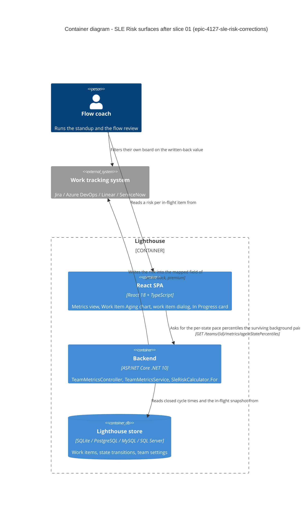
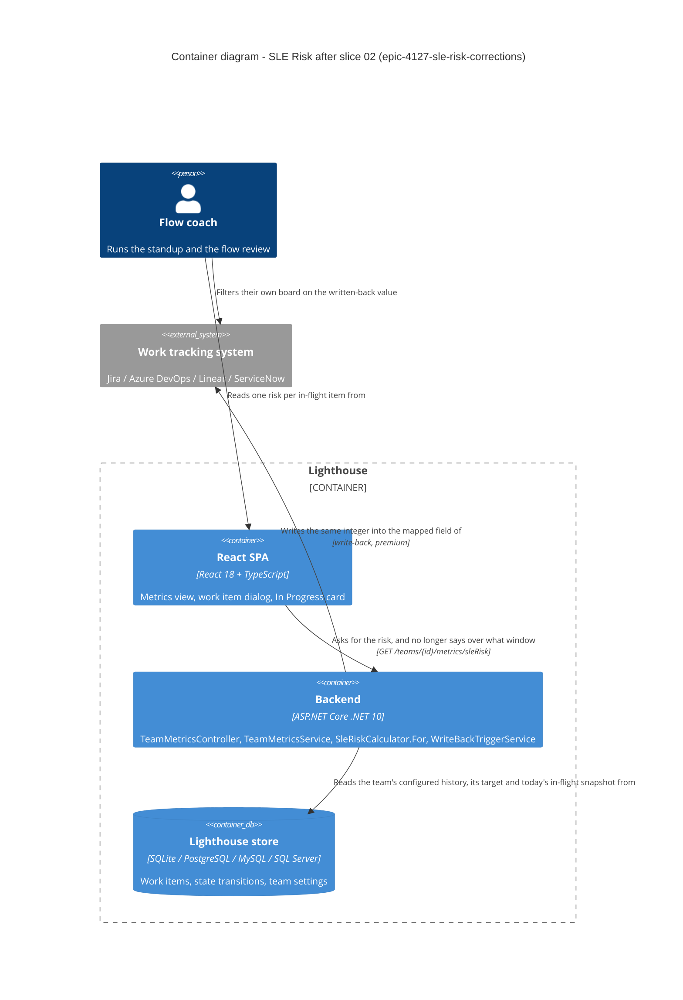
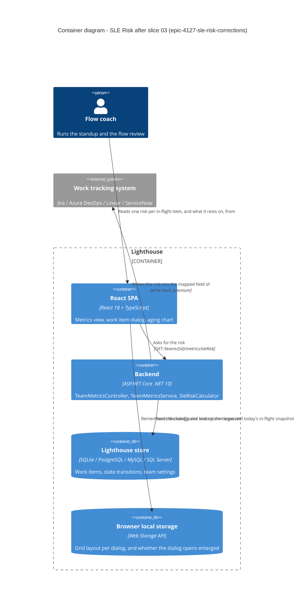
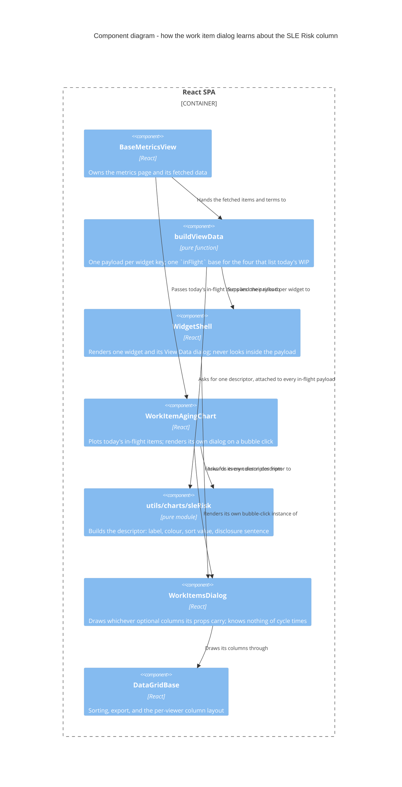

# epic-4127-sle-risk-corrections — feature delta

**ADO**: Epic #4127 "Show SLE Probability for In Progress Items" (Active) · Stories #6034, #6035, #6036, #6037
**Round**: 2. Round 1 shipped 2026-09-17 and is archived at `docs/evolution/2026-09-17-epic-4127-sle-risk.md`.
**Wave**: DISCUSS · started 2026-09-19 · density `lean` / `ask-intelligent`

---

## Wave: DISCUSS / [REF] Prior Wave Consultation

| File | Read |
|---|---|
| `docs/product/journeys/epic-4127-sle-risk.yaml` | ✓ |
| `docs/product/jobs.yaml` → `job-flow-coach-act-before-sle-breach` (L6821-6896) | ✓ |
| `docs/product/personas/flow-coach.yaml` | ✓ |
| `docs/product/architecture/adr-192-sle-risk-as-a-pure-conditional-over-the-cycle-time-population.md` | ✓ |
| `docs/evolution/2026-09-17-epic-4127-sle-risk.md` (round-1 archive) | ✓ |
| `docs/evolution/epic-4127-sle-risk/OUT-4127-risk-stability.md` | ✓ |
| `docs/product/outcomes/registry.yaml` | ✓ (contains no `OUT-4127-*` row — round 1's own "Still open" item) |
| `docs/product/vision.md` | ⊘ not found |
| `docs/project-brief.md` | ⊘ not found |
| `docs/stakeholders.yaml` | ⊘ not found |
| `docs/feature/epic-4127-sle-risk-corrections/discover/` | ⊘ not found (no DISCOVER for this round) |
| `docs/feature/epic-4127-sle-risk-corrections/diverge/` | ⊘ not found (no DIVERGE for this round) |

**Contradiction check against prior evidence: one found, and it is load-bearing.**

`OUT-4127-risk-stability.md` concluded *"something must gate it"* and named the minimum-sample guard as the fix. Story **#6037 deletes that guard**. This is a direct reversal of a measured finding, not an oversight — #6037 argues the certainty rule (`age > target ⇒ 100`) owns the entire high-age region where the measured volatility lives, so the guard is left protecting a range that no longer divides by anything. The measurement's own replay supports that reading: every unstable row in its table is at an age where the tail has thinned, and all of those ages sit past a realistic target. **Resolution: the reversal is accepted, and it is #6037's to argue in DESIGN with an ADR amendment — not to be smuggled in as a code change.** See D24.

No other DISCUSS decision in this round contradicts round-1 evidence.

---

## Wave: DISCUSS / [REF] Persona ID

**`flow-coach`** — runs standups and flow reviews for one team. Unchanged from round 1; this round adds no persona.

`config-admin` appears only as the write-back mapper in #6037's second half and gains no new decision.

---

## Wave: DISCUSS / [REF] JTBD one-liner

**`job-flow-coach-act-before-sle-breach`** — *"When I look at what is in flight during a standup, I want to know which items are more likely than not to break the Service Level Expectation we published — while there is still time to do something about it."*

**No new job.** Every story in this round corrects the *delivery* of that job rather than serving a new one. That is the round's defining property and the reason the epic stays open: `jobs.yaml` records `satisfaction_review.due: after epic-4127-sle-risk slice 01 ships and OUT-4127-risk-stability has been read`, with the note *"Do not re-score on delivery alone."* Round 1 shipped four surfaces; using them found that two of the four answer with numbers that disagree, one paints a ladder that cannot be read, and one is invisible without scrolling. The job is not yet satisfied, so the score does not move this round either.

---

## Wave: DISCUSS / [REF] Scope Assessment

Oversized signals — 4 user stories, 2 modules (backend domain + React), no new integration points, estimated 3-4 days total. **`## Scope Assessment: PASS`** — right-sized, no split proposed.

The round splits naturally into four slices along the ADO stories, one per slice, because each is independently shippable and independently revertible.

---

## Wave: DISCUSS / [REF] Locked decisions

Numbering continues round 1's sequence (which reached D17) in the same journey file.

**D18 — The zones are removed, not repaired.** Three defects were reported against them; only one is a repair away. The band ladder emits its lowest band at risk ≥ 25, so the whole region below 25% — the calm end, and most of a healthy chart — is never painted; an unpainted area already means *"too little finished work ever ran this long to say"* in the documented contract (`flow-metrics.md:132`), so the calm region and the unknowable region are drawn identically. The judgement is the maintainer's and it is recorded as taste, not arithmetic: **the zones cost more reading than they return.** The per-item column and the widget answer the same question without a geometry.

*Corrected during DESIGN — the original rationale here had the evidence gradient backwards, and the correction strengthens the verdict rather than weakening it.* This first read "the chart claims safety below the first crossing on evidence that is thinnest exactly there." That is wrong: `n(a) = count(T >= a)` is **largest** at low ages, so the evidence is thickest there, not thinnest. The real consequence is worse. `risk(1)` is `count(T > R) / count(T >= 1)` — the team's overall breach rate. So a team holding an 85% SLE and meeting it has `risk(1) ≈ 15`, below the first band's threshold, and the ladder paints nothing until the age where risk climbs past 25. **The better a team's attainment, the blanker its chart** — the background is brightest exactly where it is least needed, and absent for the teams the feature was built for.

**D19 — Two of the three reported defects are one defect.** *"The calmest colour index is unreachable"* and *"the bottom of the chart is never painted"* are the same fact seen from two sides. `sleRiskColorFor` ranks a risk by how many of `[25, 50, 75, 100]` it clears, so a risk below 25 takes `PACE_BAND_COLORS_LOW_TO_HIGH[0]`; the zone ladder never emits a band below 25, so rank 0 is unreachable *in zone mode only*. The colour is reachable, and correct, everywhere else the function is called. Recording this matters because it is why `sleRiskColorFor` survives the deletion untouched (D21) — a reader of the ADO description alone would reasonably conclude the palette mapping was at fault.

**D20 — The third defect is real and independent.** *"A team with a thin history gets no bands at all"*: `Zones()` walks ages upward and breaks the moment `For()` returns null, which the minimum-sample guard makes happen at age 1 on a thin history. The chart then draws nothing, in a mode the user explicitly selected, with no explanation. This one would survive #6037's guard deletion in a different shape, which is a second reason not to keep the zones and re-derive their geometry twice.

**D21 — `sleRiskColorFor` stays; only the ladder that consumes it in zone form goes.** The column and the widget still colour a risk, and they use rank 0. Deleting the palette mapping with the zones would silently decolour two surfaces this round is trying to improve.

**D22 — A stored `"risk"` preference resolves to Off, and that is a tested outcome rather than a fall-through.** `useAgingBackground` persists the literal string `"risk"` under `workItemAgingPaceBandsEnabled`. Removing `"risk"` from the accepted union leaves it unrecognised, and the existing `storedBackground` returns `null` for anything unrecognised, so the chart paints nothing. That is the right behaviour and it is already what the code would do — but it is currently an accident of a default, and the comment above it describes a three-mode world. An explicit test pins it. Nobody outside dev and dogfood browsers can be holding `"risk"`, because the mode was never released (D26); the test exists for the dogfood browsers and for the reader.

**D23 — The background control keeps its string-valued storage, and does not revert to a boolean.** The key `workItemAgingPaceBandsEnabled` already migrated `"true"` → `pace` once. Reverting the stored values to `"true"`/`"false"` would be a second migration in the opposite direction, over a key that now holds three possible strings, to reach a state indistinguishable from the current one for every user. The tri-state *control* collapses to two options; the *storage* keeps reading `"off"`/`"pace"` and translating legacy `"true"`.

**D24 — ADR-192 gets a Status note, not a rewrite, in this slice.** ADR-192 names the zones once, in passing, as one of four planned surfaces. That sentence becomes false and is corrected. The genuine reversal against ADR-192 is #6037's: its *Architectural Enforcement* table carries the row *"Beyond history is `null`, never `0`, `100` or an omitted entry"*, and #6037 makes past-the-target read `100` and a 0/0 inside the target read `0`. **That amendment belongs to slice 02 and must not be pre-empted here.** The ADO description for #6034 asks for "a superseding note on ADR-192" and is right; it is a one-line note, and the deeper rewrite is a different story's.

**D25 — `docs/settings/worktrackingsystems.md` is out of scope for slice 01.** The ADO description lists it. Verified line by line (L74-98): that file documents the write-back value source and contains no zone content. Its one SLE-risk caveat — *"an item at an age fewer than ten finished items ever reached"* — describes the minimum-sample guard, which **#6037** deletes. Editing it in slice 01 would either be a no-op or would land #6037's change a slice early.

**D26 — The deletion is clean because nothing was released.** Verified: `v26.9.9.9` is the newest tag, and every SLE-risk commit (`4abc63c4a` … `c58620c65`) is after it. No deprecation path, no migration, no release note describing a feature being taken away.

**D27 — The marketing website does not reference the asset, and this was checked rather than assumed.** `docs/assets/features/metrics/aging_sle_risk.png` appears nowhere in `/storage/repos/website` (full-repo grep, not just `lighthouseAsset()` call sites). The only `features/metrics/` assets the site hot-links are `metricsoverview.png` and `portfoliometricsoverview.png`, and both are plain page screenshots taken at the default background mode — neither renders a zone. **The asset is safe to delete.** The check is recorded because an asset with zero references inside this repo can still be live on the site, and that has cost a revert before.

**D28 — The round-1 archive is not edited.** `docs/evolution/2026-09-17-epic-4127-sle-risk.md` is a true account of what shipped on 2026-09-17, including a bullet promising risk zones. It stays as written; this round produces its own archive entry that supersedes it. Rewriting history to match the present is how a record stops being worth keeping.

**D29 — The Epic's Release Notes copy is rewritten once, at the end of the round.** Epic #4127 carries the `Release Notes` tag and its description still promises risk zones and an at-risk chip, both of which this round removes before any user sees them. Three of the four slices change what will ship. Rewriting the copy per slice would produce three drafts of which two are wrong. **Owner: slice 04's finalization.** None of the four child stories carries the tag, so the Epic is the only surface to correct.

---

## Wave: DISCUSS / [REF] Changed Assumptions (back-propagation)

Two decisions recorded in `docs/product/journeys/epic-4127-sle-risk.yaml` are superseded by this round. The journey file is SSOT and is amended in place; the originals are quoted here so the change is readable without a diff.

**Original — D12**, verbatim:
> *"As a THIRD MODE of the existing background control (Off / Pace percentiles / SLE Risk), not a second independent toggle. Both paint the same background channel so they are mutually exclusive by construction … The existing boolean localStorage key migrates to tri-state so no user's chart changes on upgrade."*

**New assumption**: the background control has two modes, Off and Pace percentiles. The mutual-exclusivity reasoning was correct and is unaffected — it is why there was only ever one background channel to contend for. What did not hold is the premise underneath it: that a risk ladder *has* a legible geometry on a real history. Below the first crossing it paints nothing, which the same chart's vocabulary already uses for "unknowable"; above it the evidence thins fastest. The storage key keeps its string values (D23).

**Original — D13**, verbatim:
> *"No — the line IS the top zone's labelled lower edge. The 100% zone begins exactly at R days, which is where the sleVisible reference line already sits … If the zone and the line ever disagree, the chart is asserting two different deadlines — which is the central correctness check of that slice."*

**New assumption**: moot. With the zones gone the SLE reference line is once again the only deadline the chart asserts, which is the outcome D13 was protecting. The line itself is untouched.

**`OUT-4127-risk-stability`'s recommendation** is superseded by #6037, not by this slice. Recorded here so the reversal is visible from the round's entry point; argued in slice 02.

---

## Wave: DISCUSS / [REF] User stories

### US-R2-01 — Remove the SLE Risk background zones (ADO #6034)

**job_id**: `job-flow-coach-act-before-sle-breach`

As a flow coach, I want the aging chart's background to make one claim I can trust, so that I stop trying to read a band ladder whose quiet end is indistinguishable from its unknown end.

#### Elevator Pitch
Before: the aging chart offers an **SLE Risk** background mode that paints nothing below the first 25% crossing, nothing at all on a thin history, and gives no way to tell a calm age from an unevidenced one.
After: open the Work Item Aging chart's background control → sees exactly two choices, **Off** and **Pace percentiles**, and no SLE Risk option.
Decision enabled: the coach reads an unpainted region as "no pace history here" and nothing else — one meaning per colour and one meaning per gap, which is the condition for using the background at all.

#### Acceptance criteria

- **AC-01.1** Given a team whose workflow has per-state history, when the coach opens the aging chart's background control, then it offers exactly two options — Off and Pace percentiles — and the SLE Risk option is absent. *(Corrected during DESIGN. The precondition as first written named a published SLE, which is irrelevant: `WorkItemAgingChart.tsx:632` gates the control on `backgroundModes.length > 1`, and after the deletion the only thing that can add a second mode is `perStatePercentileValues.length > 0`.)*
- **AC-01.1b** Given a team whose workflow has no per-state history, when the chart renders, then **no background control is drawn at all** — not a control with one option. *(The case AC-01.1 as first written could not see.)*
- **AC-01.2** Given a browser holding `workItemAgingPaceBandsEnabled = "risk"` from before the removal, when the chart loads, then the background is Off, the chart renders normally, and no error is raised. *(D22 — pinned by a test, not left to a default.)*
- **AC-01.3** Given a browser holding `workItemAgingPaceBandsEnabled = "true"` (the pre-tri-state legacy value), when the chart loads, then the background is Pace percentiles — unchanged from today. *(The one migration that must survive this revert.)*
- **AC-01.4** Given any team, when `GET /api/{version}/teams/{teamId}/metrics/sleRisk/zones` is requested, then the response is 404 — the route no longer exists. *(Corrected during DESIGN. As first written this named `/metrics/sleRiskZones`, a route that has never existed — `TeamMetricsController.cs:232` declares `[HttpGet("sleRisk/zones")]`. The AC would have passed against untouched code, which is the worst way for one to be wrong.)*
- **AC-01.5** Given the work item dialog and the In Progress widget, when either renders a risk, then it is coloured exactly as it is today. *(D21 — `sleRiskColorFor` is untouched; this AC is the regression net around the deletion.)*
- **AC-01.6** `docs/metrics/flow-metrics.md` contains no "SLE Risk Zones on the Aging Chart" section, and no surviving sentence in that file describes the background control as offering three choices.
- **AC-01.7** `docs/assets/features/metrics/aging_sle_risk.png` is deleted, and the `@screenshot` test that generated it is deleted with it. *(Cleared by D27.)*
- **AC-01.8** ADR-192's mention of chart background zones as a planned surface is corrected by a dated Status note. Its *Architectural Enforcement* table is **not** edited. *(D24.)*
- **AC-01.9** `grep -rniE "sleRiskZone|computeSleRiskZoneRects|[Gg]etSleRiskZones|countSleRiskZones|showSleRisk|sle-risk-zone|\bZones_[A-Z]"` over `Lighthouse.Backend`, `Lighthouse.Frontend/src` and `Lighthouse.EndToEndTests` returns nothing. *(Corrected during DESIGN, twice over. The pattern as first written was case-sensitive and, more importantly, keyed on symbol names — which missed a whole file: `SleRiskCalculatorTest.cs:184-333` holds twelve `Zones_*` tests whose names contain no zone symbol at all. This grep is a review gate read by a person; the compiler and Biome are what actually cannot be talked past.)*

### US-R2-02 — SLE Risk is one number over the team's configured history (ADO #6037)

**job_id**: `job-flow-coach-act-before-sle-breach`

As a flow coach, I want the risk I read in Lighthouse and the risk written to my board to be the same number, so that I am not choosing which of two systems to believe about my own team.

#### Elevator Pitch
Before: the dialog says 27% for an item and the board field says 18 for the same item on the same day, because one reads the browser's date range and the other reads the team's configured history.
After: open the work item dialog for an in-flight item, then read the mapped field on that item's board → sees the same integer in both, and moving the date picker does not change it.
Decision enabled: the coach acts on the number instead of reconciling it — and a board filter built on the field means what the dashboard means.

Four changes interlock in one file and ship together: one window, certainty past the target, deletion of the minimum-sample guard, and 0/0 inside the target reading 0. Full ACs at `slices/slice-02-one-number.md`.

### US-R2-03 — Show the SLE Risk column without horizontal scrolling (ADO #6035)

**job_id**: `job-flow-coach-act-before-sle-breach`

As a flow coach, I want the risk column to be on screen when I open the dialog, so that the column exists for me in practice and not only in the codebase.

#### Elevator Pitch
Before: the SLE Risk column is off the right edge of a `maxWidth="md"` dialog, and clicking a bubble on the aging chart opens a dialog that has no risk column at all.
After: click any in-flight bubble on the Work Item Aging chart → sees the SLE Risk column without scrolling sideways, and a maximise control for the dialogs that keep gaining columns.
Decision enabled: the coach orders the standup off the column, from either entry point, without discovering that one of them silently omits it.

Full ACs at `slices/slice-03-column-visible.md`.

### US-R2-04 — SLE Risk widget with RAG derived from the team's SLE (ADO #6036)

**job_id**: `job-flow-coach-act-before-sle-breach`

As a flow coach, I want the at-risk count to be a widget with its own status, so that one number stops doing two jobs on the In Progress card.

#### Elevator Pitch
Before: the count of at-risk items is a subtitle line under the WIP count, with no status of its own, and its threshold — `AT_RISK_FROM = 50` in `sleRisk.ts:149` — is reachable only by leaving the product for the docs. *(Corrected at the final gate. This first said the 50% "is not written down anywhere a reader will find it", which is false: `flow-metrics.md:116` states it plainly. What is missing is any **in-product** surface — the count has no entry in `widgetInfoMetadata.ts`, so a coach looking at the card has nowhere to click. #6036 both moves the threshold to 70 and gives it an info description, and conflating those two into "undocumented" understated the first and invented the second.)*
After: open the team's Flow Overview → sees an **SLE Risk** widget with its own RAG, its own info description naming the 70% threshold, and a View Data list of every in-flight item with its risk.
Decision enabled: the coach knows whether the at-risk share is inside the allowance the team's own SLE implies — 15% for a team on 85%, 30% for a team on 70% — rather than comparing a raw count to nothing.

Full ACs at `slices/slice-04-risk-widget.md`.

---

## Wave: DISCUSS / [REF] Slice composition gate

Four slices, four user-visible value stories, zero `@infrastructure`-only slices. **PASS.**

US-R2-01 is a deletion and still user-visible: an option disappears from a control the coach uses. It is not infrastructure.

---

## Wave: DISCUSS / [REF] Story map and prioritization

**Backbone**: *land on the team page* → *read the status* → *open the list* → *act on the item* → *carry it to the board*.

| Slice | Story | Ships | Learning hypothesis |
|---|---|---|---|
| 01 | #6034 remove zones | the background control offers two honest modes | Disproved if the removal decolours the column or the widget — which would mean the palette mapping, not the ladder, was the defect (D19/D21). |
| 02 | #6037 one number | one risk, always the configured history | Disproved if a real team's dialog and board field still disagree after the change, which would mean the disagreement was never only about the window. |
| 03 | #6035 column visible | the column on screen from both entry points | Disproved if a `WorkItemsDialog` call site is found that still silently omits the descriptor after the sweep — the per-call-site design makes this class of miss invisible by construction. |
| 04 | #6036 risk widget | a status derived from the team's own SLE | Disproved if the derived allowance flips on a rounding artifact, or if Observe proves reachable at the WIP the team actually runs. |

**Prioritization — and it departs from the board's stack rank, on evidence.**

The ADO board ranks these 6037 → 6036 → 6034 → 6035. Running 6037 first is wrong, and the reason is in `SleRiskCalculator.cs:101-119`:

```csharp
for (var age = 1; age <= oldestFinishedItem && nextLevel < ZoneLevels.Length; age++)
{
    var risk = For(age, targetRangeInDays, closedCycleTimes).Risk;
    if (risk is null) { break; }
```

`Zones()` is built on `For()` returning null. #6037 deletes the minimum-sample guard and makes past-the-target return `100`, so null becomes unreachable, the `break` never fires, and every band's geometry changes. Running 6037 before 6034 therefore forces a full rewrite of zone code that 6034 then deletes — including `CertainRisk`, which lives in the zones half and which #6037 needs to reintroduce where `For` can reach it.

Slice 03 before slice 04 because #6036's View Data opens a `WorkItemsDialog`; adding that call site after #6035's sweep means it lands on an already-correct pattern rather than becoming the sweep's next miss.

Slice 02's screenshot re-take is deferred to slice 03, because #6037 changes the column's description text and #6035 re-takes `sle_risk_column.png` at the new width. One re-take, after both.

**Order: 01 → 02 → 03 → 04.** Dogfood moment at the end of each; each is ≤1 day.

**Taste tests**: no slice ships 4+ new components (01 and 02 ship none); no slice depends on a new abstraction; every slice disproves something (table above); 02 and 04 carry production-data criteria — 02's whole trigger is an observed live disagreement (27% vs 18) and it is not closed until that pair agrees on a real team; no two slices are the same slice at different scale. **All pass.**

---

## Wave: DISCUSS / [REF] Outcome KPIs

| ID | Target | Measurement |
|---|---|---|
| `OUT-4127-R2-one-number` | The dialog and the written-back field report the identical integer for the same item, same team, same day — and the dialog's value does not change when the date range changes. | Read both on the dev instance for one team; move the range picker and re-read. Slice 02. |
| `OUT-4127-R2-column-reachable` | The SLE Risk column is visible without horizontal scrolling at 1280px wide, from both the widget header's View Data and a bubble click. | Playwright, both entry points. Slice 03. |
| `OUT-4127-R2-no-silent-omission` | Every `WorkItemsDialog` call site either passes a risk descriptor or is recorded in the slice brief as deliberately without one. Count of call sites == count accounted for. | Grep + the brief's table. Slice 03. |
| `OUT-4127-R2-zone-free` | Zero occurrences of the zone symbols **and of the twelve `Zones_*` test names**; the background control offers exactly two options where it is drawn at all. | The widened, anchored AC-01.9 grep + AC-01.1 + AC-01.1b. Slice 01. *(Definition moved with DESIGN's correction — the original grep was case-sensitive and symbol-keyed, and would have reported this KPI met while a whole test file survived.)* |
| `OUT-4127-R2-allowance-not-rounded` | No team's RAG flips because a ratio was rounded before comparison. | A 14.6%-share fixture reads Sustain/Observe, not Act. Slice 04. |

**Carried forward, unregistered**: round 1's `OUT-4127-risk-stability` and `OUT-4127-early-warning` are still absent from `docs/product/outcomes/registry.yaml` — round 1's own recorded "Still open" item, blocked on `nwave-ai outcomes register` not being on PATH in this checkout. Not this round's to fix; restated so it does not go quiet.

---

## Wave: DISCUSS / [REF] Out of scope

- **Portfolios.** Unchanged from round 1 D4 — a feature belongs to several portfolios, each with its own SLE and history, so there is no single answer to write. No portfolio surface gains a risk this round.
- **The human half of round 1's learning hypothesis** — whether a coach reading the column recognises the ordering as true of their own team. Needs a person and a real team; still open, still not this round.
- **A skipped-item count in the write-back log** (round 1's slice-04 DEVOPS carry-over). On a thin history a user sees the field written on some items and not others with nothing saying why. **#6037 shrinks this problem rather than solving it** — deleting the minimum-sample guard removes the commonest reason for a skip — but the beyond-history skip survives and stays unexplained. Out of scope; re-raise after #6037 lands, when the remaining skip rate is known rather than guessed.
- **Rewriting the round-1 archive** (D28).
- **`docs/settings/worktrackingsystems.md` in slice 01** (D25) — it belongs to slice 02.
- **A risk-over-time trend.** Unbought scope, as ADR-192 Option D recorded.

---

## Wave: DISCUSS / [REF] DEVOPS is skipped for slices 02, 03 and 04

**Maintainer decision, 2026-09-19, in as many words: "skip devops, think we won't need that."** Recorded rather than left implicit, because the project rule is that a wave is skipped only on an explicit instruction and never by a request that merely names a later wave.

It is the right call on the evidence slice 01 produced. DEVOPS ran in full for slice 01 and its four substantive findings were all about **removing** a public route: whether a Prometheus series or dashboard was keyed on it, whether an intermediate commit could go red, whether a CI job would fail on a deleted asset, and what a rollback would find. None of those questions exists for the three remaining slices — they add no route, delete none, touch no chart or asset, and change no deployment surface. Slice 02 changes what an existing endpoint computes and how its cache is keyed; 03 and 04 are frontend-only.

**What DEVOPS would still have owned, and where it goes instead:**

- **The cache re-key's operational effect** (slice 02) — a settings save must invalidate. That is an architectural contract, so DESIGN owns it and DISTILL tests it.
- **The `@screenshot` re-take** (slice 03) — already a DELIVER step with its own watch-outs in the slice brief.
- **Demo-data verification** (slice 04) — already a DoD item, and one round 1 got wrong three times by asserting rather than looking.

If a later slice turns out to add a route, a migration, or a chart change, DEVOPS comes back for that slice. This is a decision about three known slices, not a standing exemption.

---

## Wave: DISCUSS / [REF] Walking-skeleton strategy

**Not applicable — strategy N/A, brownfield.** Four surfaces already ship end to end; every slice in this round modifies or deletes an existing path. There is nothing to prove a skeleton through. *(Explicit rather than silent: the project rule forbids an implicit skip.)*

---

## Wave: DISCUSS / [REF] Driving ports

| Port | Slice | Change |
|---|---|---|
| `GET /api/{version}/teams/{id}/metrics/sleRisk/zones` | 01 | **Deleted.** *(Corrected — this row first read `sleRiskZones`, a path that never existed. Same slip as AC-01.4, found separately by DEVOPS: fixing one instance of a wrong path does not fix the others.)* |
| `GET /api/{version}/teams/{id}/metrics/sleRisk` | 02 | Same route; the window it reads changes from the caller's range to the team's configured history, and the cache key is re-keyed off history and target. |
| Work Item Aging chart background control (UI) | 01 | Three options → two. |
| Work item dialog (UI) | 03 | `maxWidth` md → xl, plus a maximise toggle; risk descriptor plumbed to the aging chart's own dialog. |
| Flow Overview widget grid (UI) | 04 | New SLE Risk widget; the at-risk subtitle leaves `WipOverviewWidget`. |
| Write-back value source `SLE Risk` | 02 | Same mapping; the value changes to match the display. |

No CLI or MCP port is added or removed. See the project checklist below.

---

## Wave: DISCUSS / [REF] Pre-requisites

- Round 1 shipped and is on `main` (`c58620c65`). Working tree clean, nothing unpushed.
- No release between round 1's merge and this round's start — `v26.9.9.9` is still the newest tag (D26).
- Epic #4127 is `Active` and stays `Active`. It is closed only when released.

---

## Wave: DISCUSS / [REF] Project DISCUSS checklist

No silent N/A — every item answered.

**RBAC impact — none, and the deletion is not a gap.** The zones route rode the class-level `[RbacGuard(TeamRead)]` on `TeamMetricsController` (ADR-192 §5). Removing an action from a class-guarded controller removes a guarded route; no grant, role, or policy changes, and no other route inherits anything from it. Nothing in this round reads `/api/latest/authorization/my-summary` or gates UI outside `useRbac()`. Slices 02-04 add no route and no new guard: 02 changes an existing action's inputs, 03 and 04 are frontend-only.

**Lighthouse-Clients CLI / MCP versioning — nothing owed, and this was checked rather than inferred.** Grepped `/storage/repos/lighthouse-clients` for `sleRisk` / `sle-risk` / `sle_risk` across `.ts`, `.py`, `.md`, `.json`: zero hits. No wrapper exists for any SLE-risk route, so no `FEATURE_REQUIRES_SERVER_NEWER_THAN` entry exists to remove and none is owed for the deletion. ADR-192 §5 recorded the same thing prospectively; it is now also true retrospectively. **The standing caveat survives**: the moment a client wrapper is added for `/metrics/sleRisk`, it must be version-gated, because a new endpoint 404s opaquely on an old server.

**Website marketing surface — one asset deleted, verified unreferenced (D27).** `aging_sle_risk.png` appears nowhere in `/storage/repos/website` under a full-repo grep. The site's only `features/metrics/` hot-links are `metricsoverview.png` and `portfoliometricsoverview.png`, both plain page screenshots at the default background mode, so neither shows a zone and neither needs re-taking. No website copy names SLE Risk zones. **No website change is owed by slice 01.** Re-check at slice 04, when the new widget may warrant a marketing screenshot.

**Terminology** — the round touches surfaces that render `SLE`, `Work Item` and `Work Item Age`, all configurable under Settings → Terminology. Every doc sentence and UI fallback written this round uses the `TerminologySeeder.cs` default; no heading says "Epic", "Initiative" or "Story".

**Demo data** — the demo teams carry `85% @ 7 days` as of round 1 (`DemoDataFactoryTest` pins it). Slice 01 needs nothing new. Slice 04's widget will render on demo data for free because the SLE is there — **but verify it rather than assert it**, which is precisely the checklist item round 1 got wrong three times.

---

## Wave: DISCUSS / [REF] Definition of Done

1. All four slices' ACs demonstrably pass.
2. `dotnet build` zero warnings; `dotnet test` green with the connector categories excluded.
3. `pnpm test` green; `pnpm build` clean (implies a clean Biome check).
4. SonarQube Cloud introduces no new issue of any severity.
5. Playwright run locally before commit for every touched spec or POM locator; no unrun spec committed.
6. `docs/ci-learnings.md` consulted and its machine-readable greps run over every file written, before the first push.
7. Mutation testing per slice on changed code, ≥80% kill rate, recorded under `docs/feature/epic-4127-sle-risk-corrections/mutation/`. Slice 01 is a deletion; its run covers the surviving `sleRisk.ts` and the chart, not the removed code.
8. Docs and screenshots updated at feature finalization; ADO transitioned Active → Resolved per slice on green CI; Epic #4127 left Active.
9. The Epic's Release Notes copy rewritten once, at slice 04 (D29).

---

## Wave: DISCUSS / [REF] DoR validation

| # | Item | Verdict | Evidence |
|---|---|---|---|
| 1 | Business value articulated | ✓ | Every story removes a way the shipped feature misleads or hides. Elevator pitches name the decision each restores. |
| 2 | Job traceability | ✓ | All four trace to `job-flow-coach-act-before-sle-breach`. No new job; `satisfaction_review` deliberately not re-scored. |
| 3 | Acceptance criteria testable | ✓ **for slice 01 only** | Slice 01's ten ACs are each a grep, an HTTP status, a rendered control, or a stored-value case. Slice 02 gained nine ACs at the final gate (AC-02.1..02.9 in its brief). **Slices 03 and 04 have elevator pitches and scope but no ACs, and are therefore NOT at DoR** — see the scoping note below. |
| 4 | Dependencies identified | ✓ | The 01-before-02 ordering is derived from `SleRiskCalculator.cs:101-119` and stated with the code. |
| 5 | Scope bounded | ✓ | Out-of-scope section; D25 removes one file the ADO description wrongly included. |
| 6 | Non-functional constraints | ✓ | Quality gates in DoD; no new latency, storage or migration. |
| 7 | Risks surfaced | ✓ | Website asset (cleared, D27); stored `"risk"` preference (D22); the `OUT-4127-risk-stability` reversal (flagged, deferred to slice 02). |
| 8 | Sized | ✓ | Four slices, ≤1 day each; scope assessment PASS. |
| 9 | Demoable | ✓ | Each slice has a dogfood moment on the dev instance the same day. |

**Scope of this DoR claim — added at the final review gate, because the table as first written implied more than it had.** DoR is claimed for **slice 01 only**. That is the slice taken through DESIGN, DEVOPS and DISTILL, and the only one being handed to DELIVER. Slices 02, 03 and 04 are *mapped* — job, elevator pitch, scope, dependencies, learning hypothesis — and slice 02 now has ACs too, but 03 and 04 have not been designed and their ACs do not exist. Claiming DoR across all four would have asserted readiness for three slices nobody has looked at yet.

This is not a gap to close now: the round runs one slice at a time by design, and each slice's ACs are written when its own wave runs. It is written down so that "DoR passed" is not read as covering work that has had no wave. **Slice 04 additionally carries an unresolved question that blocks its DESIGN** — see below.

**Resolved 2026-09-19 — the maintainer is the confirmer.** #6036's *"Observe is unreachable at low WIP"* is confirmed as intended by Benjamin Huser-Berta, directly. With a 15% allowance one at-risk item out of six reads 16.7% and lands on Act; Observe needs a WIP of seven or more. **That is accepted, not a gap to close.** Slice 04 implements the rule as the story states it and does not re-open it.

**Requirements completeness: 1.00 for slice 01.** Not claimed for the round. The one open item — slice 04's *"Observe is unreachable at low WIP"* — was confirmed directly by the maintainer on 2026-09-19 and is closed.

---

## Wave: DISCUSS / [REF] Wave Decisions Summary

**Key decisions**: D18 remove rather than repair · D19 two reported defects are one · D20 the thin-history blank is the independent one · D21 `sleRiskColorFor` survives · D22 stored `"risk"` → Off, tested · D23 storage stays string-valued · D24 ADR-192 note now, amendment in slice 02 · D25 `worktrackingsystems.md` is slice 02's · D26 nothing released, clean deletion · D27 website cleared · D28 archive not edited · D29 Release Notes copy rewritten once at slice 04.

**Primary job**: unchanged — act on an item before it breaks the published SLE. This round removes a surface that answered it badly, makes the remaining answer singular, and makes it reachable.

**Feature type**: user-facing.

**Constraints established**: slice order 01 → 02 → 03 → 04, fixed by the `Zones()`/`For()` coupling, not by board rank. No RBAC change, no client version gate, no migration, no website change in slice 01.

**Upstream changes**: journey D12 and D13 superseded; `OUT-4127-risk-stability`'s recommendation reversed by slice 02, flagged here, argued there.

**Handoff**: DESIGN (`nw-solution-architect`) for slice 01 — the open architectural question is the ADR-192 Status note's wording and whether the zones warrant a short ADR of their own recording why a risk ladder has no legible geometry, so the next person to propose one finds the answer.

---
---

# DESIGN — slice 01 (ADO User Story #6034)

**Wave**: DESIGN · 2026-09-19 · Morgan (Solution Architect), interaction mode **PROPOSE** · scope: Application / components
**Paradigm**: unchanged — OOP (C# .NET 10 backend), functional-leaning React 18 + TypeScript frontend. Ports-and-adapters, unchanged.

---

## Wave: DESIGN / [REF] Prior Wave Consultation

| Artifact | Read |
|---|---|
| `docs/feature/epic-4127-sle-risk-corrections/feature-delta.md` (DISCUSS, D18-D29) | ✓ |
| `docs/feature/epic-4127-sle-risk-corrections/slices/slice-01-remove-risk-zones.md` | ✓ |
| `docs/product/architecture/adr-192-sle-risk-as-a-pure-conditional-over-the-cycle-time-population.md` | ✓ |
| `docs/product/journeys/epic-4127-sle-risk.yaml` (D12/D13 superseded) | ✓ |
| `docs/product/architecture/brief.md` | ✓ (paged; **no `## Application Architecture — epic-4127-sle-risk` section exists** — round 1 produced ADR-192 and no brief section) |
| `docs/ci-learnings.md` | ✓ |
| `docs/metrics/flow-metrics.md` L95-145 | ✓ |
| Code: `SleRiskCalculator.cs`, `SleRiskDto.cs`, `TeamMetricsService.cs`, `ITeamMetricsService.cs`, `TeamMetricsController.cs` | ✓ |
| Code: `WorkItemAgingChart.tsx`, `useAgingBackground.ts` (+ test), `useMetricsData.ts`, `SleRisk.ts`, `categoryMetadata.ts`, both `*MetricsService.ts`, `BaseMetricsView.tsx`, `MockApiServiceProvider.ts` | ✓ |
| Code: `Lighthouse.EndToEndTests/tests/models/metrics/WorkItemAgingChart.ts`, `Screenshots.spec.ts` L987-1010 | ✓ |
| Backend tests: `Slice03SleRiskZonesScenarios.cs`, `SleRiskAcceptanceTest.cs`, **`SleRiskCalculatorTest.cs`** | ✓ |
| `docs/product/architecture/adr-194-*.md` | ⊘ not found — the number is free and is claimed by this slice |
| DEVOPS artifacts for this round | ⊘ none (no DEVOPS wave run; none owed — no infrastructure, migration or pipeline change) |

---

## Wave: DESIGN / [REF] Four upstream corrections

Stated before the decisions, because three of them change an acceptance criterion and one changes the
argument the ADR is written on. None reverses the slice; all four make it executable as written.

**C-1 — the route in AC-01.4 does not exist and never did.** AC-01.4 asserts that
`GET /api/{version}/teams/{teamId}/metrics/sleRiskZones` returns 404. The shipped route is
`[HttpGet("sleRisk/zones")]` (`TeamMetricsController.cs:232`), i.e.
`GET /api/{version}/teams/{teamId}/metrics/sleRisk/zones` — which is also what
`TeamMetricsService.ts:69` fetches and what `Slice03SleRiskZonesScenarios.cs:178` and
`SleRiskAcceptanceTest.cs:222` address. As written, AC-01.4 passes today, before a line is deleted,
and would pass just as well if the deletion were forgotten entirely. **Corrected wording is in the
decisions table (DDD-7).**

**C-2 — a twenty-first file carries the zone code, and the AC-01.9 grep cannot see it.**
`Lighthouse.Backend.Tests/Services/Implementation/SleRiskCalculatorTest.cs` holds **twelve**
`Zones_*` unit tests (L184-333) plus `Zones_NoHistorySupplied_Refuses`. The file appears in neither
the DISCUSS inventory nor the slice's IN-scope list. It is also invisible to AC-01.9: that grep looks
for `SleRiskZone`, `sleRiskZone`, `computeSleRiskZoneRects`, `GetSleRiskZones`, `countSleRiskZones`
and `showSleRisk`, and the test file contains none of them — its call is `SleRiskCalculator.Zones(…)`
and its method names begin `Zones_`. The compiler catches the omission, so nothing ships broken, but
the AC would report success over a file nobody deleted. **DDD-9 adds the file and widens the grep.**

**C-3 — AC-01.1's precondition is the wrong one, and "exactly two options" is conditional.**
`backgroundModes` (`WorkItemAgingChart.tsx:514-530`) is built from what the chart can actually paint:
`off` always, `pace` when `perStatePercentileValues.length > 0`, `risk` when the zone list is
non-empty. The group is rendered only when `backgroundModes.length > 1` (`:632`). After the removal a
published SLE has **nothing to do with the background control** — the only input left is per-state
cycle-time history. So AC-01.1's `Given a team with a published SLE` selects a team that may show one
option and therefore no control at all. **DDD-8 restates the criterion as a pair.**

**C-4 — D18 contains a backwards claim about where the evidence is thin, and the removal's case is
stronger without it.** D18 argues that emitting a 0-to-25 band would make "the chart claim safety for
every age below the first crossing on evidence that is thinnest exactly there." The arithmetic runs
the other way. `comparableItems(a) = |{T : T ≥ a}|` is monotonically **non-increasing** in age, so the
evidence is at its thickest at the lowest ages and thins as the age grows — which is exactly what
`OUT-4127-risk-stability` measured, and what `flow-metrics.md:132` already documents ("the evidence
thins as the age grows, so it is usually the highest bands that go missing"). The sub-25 region is the
**best**-evidenced part of the chart, not the worst.

This does not rescue the zones; it relocates the fault, and the relocated fault is the one a repair
cannot reach. Restated correctly, and this is what ADR-194 is written on:

- The same visual absence carries two opposite meanings inside one chart. Below the first crossing
  nothing is painted **because the ladder has no band that low**, on the chart's thickest evidence.
  Above the last placeable band nothing is painted **because the evidence ran out**. A reader cannot
  tell the two apart, and a 0-to-25 band repairs only the first.
- The better a team meets its promise, the more of its chart stays blank. `risk(1)` is the overall
  breach rate; a team holding an 85%-on-time SLE breaches about 15% of the time, which is below the
  ladder's first level, so nothing is painted until the conditional climbs past 25. A team that misses
  constantly gets a fully painted chart. **The background is brightest exactly where it is least
  needed** — and that is arithmetic, not taste.
- On a thin history the whole ladder vanishes. `Zones()` walks ages upward and `break`s at the first
  null (`SleRiskCalculator.cs:105-110`); with fewer than `MinimumComparableItems` finished items the
  null arrives at age 1, so a mode the user explicitly selected draws nothing and says nothing. This
  is D20, and no repair to the band set touches it.

D18's verdict stands unchanged and its two other arguments stand unchanged. Only the parenthetical
about evidence depth is wrong, and it is corrected here rather than carried into an ADR, because an
ADR is the one place the reasoning is read years after the decision.

---

## Wave: DESIGN / [REF] Design decisions

**DDD-1 — ADR-192 is amended with a dated note under its Status line; its Decision, its Alternatives
and its Architectural Enforcement table are untouched.** ADR-192's Context names four planned surfaces
and one of them stops existing, so one sentence becomes false. The instrument for that is an
amendment note, not a supersession and not an edit to the sentence: the ADR's *decision* — risk is a
pure conditional over the closed population, computed once, in one place — is not what changed. The
register's own convention is immutability with dated notes, and `state-time-cumulative-view` in
`brief.md` already carries an "Amend delta" of exactly this shape. The note is placed directly beneath
`**Status**`, before `**Feature**`, so a reader meets the correction before the prose it corrects. The
*Architectural Enforcement* row `Beyond history is null, never 0, 100 or an omitted entry` is
deliberately left alone: slice 02 reverses it, and pre-empting it here would land #6037's change a
story early (D24).

**DDD-2 — the removal gets an ADR of its own: [ADR-194](../../product/architecture/adr-194-sle-risk-is-a-number-per-item-never-a-background-ladder.md).**

*Argued against first, because an ADR for a deletion is unusual.* ADRs constrain future work; deleting
never-released code constrains nothing. The story is already in three places — this feature delta, the
round-2 evolution archive, and ADR-192's amendment note. A register that grows an entry per removal
gets read less, and a diluted register is worse than a short one.

*Argued for, and this is the call.* The ADR register is the **only** artifact anyone reads when
*proposing* a surface; a feature delta under `docs/feature/epic-4127-sle-risk-corrections/` is not
somewhere a future author looks before suggesting risk zones, and an evolution archive is a dated
narrative of what shipped, not a constraint. What is being recorded is not a preference but a
structural property of a threshold ladder laid over an empirical conditional: its lowest band is its
first threshold, so the sub-threshold region is unpaintable by construction; the chart already spends
unpaintedness on "unknowable"; and the region the ladder describes best is the region a team wants
least. Without the record, the next proposal rebuilds the same ladder and rediscovers the same defect
at the same cost — which is the textbook trigger for an ADR. The register also already carries
limiting and negative decisions (ADR-134's narrowed objection; ADR-018's standing refusal to share),
so this is not a new kind of entry.

The ADR is framed as the positive constraint — *SLE Risk is reported as a number per item, never as a
background ladder* — because that is the form a future proposal collides with. A file titled "we
deleted the zones" constrains nobody.

**DDD-3 — ADR-194 takes number 194, and the number was verified rather than assumed.**
`docs/product/architecture/` holds adr-190, 191, 192, 193, 195, 196, 197; a repository-wide search for
`ADR-194` / `adr-194` across 6190 files returns zero matches. 194 was skipped when 195 was written, not
used and withdrawn. Nothing in the tree claims it.

**DDD-4 — the deletion order is tests-first, then consumer, then producer, then docs, and it is
monotonic rather than merely unpushed.** Four commits, in this order:

| # | Commit | Contents | Green after it |
|---|---|---|---|
| 1 | `test(sle-risk): retire the zone screenshot and the POM that drove it` | `Lighthouse.EndToEndTests/tests/models/metrics/WorkItemAgingChart.ts` — `SLE_RISK_ZONE_TEST_ID`, `sleRiskZones`, `countSleRiskZones`, `showSleRisk`; `Screenshots.spec.ts` L987-1010 in full | Everything. Deleting a test never reds a test. |
| 2 | `refactor(metrics): the aging chart's background has two modes again` | The whole frontend column of the component table below, including the `useAgingBackground` narrowing and every Vitest change | `pnpm test`, `pnpm build` (Biome via `prebuild`). Backend untouched. The zones route survives with no caller. |
| 3 | `refactor(metrics): drop the SLE risk zone read` | The whole backend column: controller action, port member, service method + cache entry, `SleRiskZoneDto`, the zone half of `SleRiskCalculator`, `Slice03SleRiskZonesScenarios.cs`, `SleRiskAcceptanceTest.SleRiskZonesRoute`, the twelve `Zones_*` tests | `dotnet build` (zero warnings), `dotnet test` with the connector categories excluded |
| 4 | `docs(metrics): the aging chart's background no longer offers a risk ladder` | `flow-metrics.md` L120-135, `docs/assets/features/metrics/aging_sle_risk.png`, ADR-192 note, ADR-194, `brief.md` section, this delta, the slice briefs, **`docs/product/journeys/epic-4127-sle-risk.yaml`** (D12/D13 superseded in place), **`docs/product/jobs.yaml`** (functional dimension + satisfaction-review note), **`environments.yaml`** | Docs gates — and per DEVOPS, `ci.yml`'s `paths:` filter excludes `docs/**`, so this commit triggers no CI job at all |

**Why not backend-first.** The question worth asking is whether a 404 between commits matters at all,
given that each slice ships as a coherent set and the intermediate state is never pushed. It does not
matter for what ships — but making the answer depend on the push discipline turns a habit into a
correctness precondition, and the habit is exactly what a long session drops (the ledger's own recurring lesson,
five times over, is a mandatory step skipped at the end of a long green stretch). Both orders cost one
commit. One of them leaves a shipped bundle calling a deleted route, which surfaces on a dev instance
as an error on the metrics page and is indistinguishable from a real outage to anyone bisecting. The
other leaves an endpoint nobody calls, which is invisible. Take the invisible one, and do not spend
the discipline to buy back the difference.

**Why E2E first rather than alongside the frontend.** `showSleRisk()` clicks a control that commit 2
removes and `countSleRiskZones()` reads a `data-testid` that commit 2 deletes. Between a
frontend-first commit and an E2E commit the Playwright spec is broken. Deleting the spec first makes
every commit boundary green in every stack without reference to when anything is pushed.

*Corrected by DEVOPS — the right conclusion reached through the wrong mechanism.* This first argued
that E2E **runs** in CI through `ci_verifysqlite` / `ci_verifypostgres`. It does, but not this spec:
the deleted block is `@screenshot`-tagged, and the E2E project's `test` script is
`playwright test --grep-invert "@screenshot|@auth|@rbac|@proxyauth"`, so it has never run in CI. What
actually protects commit 1 is `ci_e2e.yml`'s `pnpm run build` — a TypeScript compile that fails on a
POM member the spec still calls. The ordering is unchanged; the reason it is safe is a compiler, not a
browser. Worth the correction because the two failure modes look nothing alike when one fires. This is also the ledger's
2026-07-19 lesson — *dropping a user-visible label prefix silently killed a POM locator in another
spec* — applied before it can fire rather than after.

**DDD-5 — `useAgingBackground` keeps a three-value *reader* over a two-value *type*, and `"risk"` is
an explicit retired branch.** The exact shape:

| Element | After |
|---|---|
| `AGING_BACKGROUND_STORAGE_KEY` | `"workItemAgingPaceBandsEnabled"` — unchanged, name and all (D23) |
| `AgingBackground` | `"off" \| "pace"` — `"risk"` leaves the union |
| `storedBackground` | Four branches in this order: `"true"` → `"pace"`; `"risk"` → `"off"`; `"off" \| "pace"` → itself; anything else → `null` |
| `chooseBackground` | Unchanged; it can only ever be handed a value in the narrowed union |
| Stored values | Still strings. No migration, in either direction (D23) |

Three things this shape buys, in order of how load-bearing they are:

1. **The legacy `"true"` → `pace` translation survives untouched**, which is the one migration that
   must not be lost (AC-01.3).
2. **`"risk"` resolves to Off through a branch that names it, not through the unrecognised-value
   default.** Both routes paint nothing today. They claim different things: the default says *"this
   value means nothing to us"*, the branch says *"this value meant something and no longer does."* The
   difference is not observable now — it becomes observable the day someone adds a background mode and
   reaches for the word `risk` again, at which point a dogfood browser holding the old string would
   silently opt into the new mode. The branch is a tripwire for that author: to reuse the name they
   must first delete a line that says the name is retired. That is the whole of its value, and it is
   worth one line.
3. **The doc comments stop describing a three-mode world.** Three comments currently say so — the key's
   ("predates the third mode"), the type's, and `storedBackground`'s ("before this was a choice of
   three" / "because the control grew a third option"). Rewritten to describe two modes and to name
   both retired values plainly, with no internal reference of any kind, per the project's comment rule.

**DDD-6 — the equivalent mutant on that branch is accepted and recorded now, not litigated after the
Stryker run.** Mutating the literal in `if (stored === "risk") return "off";` leaves behaviour
identical: the value falls through to `null`, and the hook's own initial state is already `"off"`. The
branch is therefore an **equivalent mutant by construction** and will survive StrykerJS. This is not a
coverage gap and there is no test that can kill it, because there is no observable difference to
assert. It is recorded here, before the run, so the mutation report is read against a known
expectation rather than re-argued.

The alternative that *would* kill it was considered and rejected: have the hook write `"off"` back
when it reads `"risk"`, which makes the branch observable in `localStorage` and retires the dead value
in the browser. It costs the existing pinned invariant *"does not write to localStorage until the user
picks a mode"*, for a population D26 bounds at dev and dogfood browsers. Not worth breaking a pinned
invariant to kill one equivalent mutant over three machines.

There is a second reason, which only became visible under peer review: **reading the value without
rewriting it is what keeps a rollback lossless.** If this slice is ever reverted, a browser that stored
`"risk"` still holds it, so the restored ladder comes back on for the reader who had chosen it — the
state they left, not a blank chart. A hook that normalised the value on read would have quietly
discarded that preference on the way past, and the loss would only be discovered by the one person
rolling back. Two independent reasons, one line of code.

**DDD-7 — AC-01.4 is restated against the real route, and against the real risk.** Replace with:

> **AC-01.4** Given any team, when `GET /api/{version}/teams/{teamId}/metrics/sleRisk/zones` is
> requested, then the response is 404; and `GET /api/{version}/teams/{teamId}/metrics/sleRisk` for
> the same team is unaffected.

The second clause is the one that earns its keep. `sleRisk/zones` is a **sub-path of a surviving
route**, so "the action is deleted" and "the path 404s" are two different claims — ASP.NET route
matching is what connects them, and this design refuses to assume it. The paired assertion also
catches the opposite mistake: a deletion that took the wrong `[HttpGet]` with it.

Its home is the surviving `Slice01SleRiskRead*` fixture, which already drives this route family
through `SleRiskRoute` / `SleRiskRouteBetween` on the shared base. It cannot be the zones fixture:
that file is deleted, and so is `SleRiskZonesRoute`, whose only caller is
`Slice03SleRiskZonesScenarios.cs:170` — which is why the helper and the file go in the same commit
rather than leaving an uncalled `protected` member behind for Sonar to find.

**DDD-8 — AC-01.1 is restated as a pair, because the control is conditional.** Replace with:

> **AC-01.1a** Given a team whose Doing states have cycle-time history, when the coach opens the aging
> chart's background control, then it offers exactly two options — Off and Pace percentiles — and no
> SLE Risk option.
> **AC-01.1b** Given a team with a published SLE but no per-state cycle-time history, when the chart
> renders, then no background control is drawn at all — one option is not a choice.

AC-01.1b is not new behaviour; it is shipped behaviour (`backgroundModes.length > 1`) that becomes
reachable for a new reason once `risk` can no longer be the second entry. Pinning it is what stops a
future reader mistaking the absent control for a regression. A published SLE is now irrelevant to this
control and the criterion should stop mentioning it.

**DDD-9 — `SleRiskCalculatorTest.cs` joins the IN-scope list and AC-01.9's grep is widened.** The
twelve `Zones_*` tests go with the code they test (commit 3). AC-01.9's pattern becomes:

```
SleRiskZone\|sleRiskZone\|computeSleRiskZoneRects\|[Gg]etSleRiskZones\|countSleRiskZones\|showSleRisk\|SleRiskCalculator\.Zones\|\bZones_[A-Z]
```

over `Lighthouse.Backend`, `Lighthouse.Frontend/src` and `Lighthouse.EndToEndTests`. Two additions
matter: `SleRiskCalculator\.Zones` and the `Zones_` term are what C-2 found, and `[Gg]etSleRiskZones`
replaces the capital-G-only form because the existing list is case-sensitive and the frontend method is
lower-cased. A grep that cannot fail is not a gate.

**The last term is anchored, and the whole thing is a review gate rather than a CI job.**
`\bZones_[A-Z]` matches the `Zones_ARealDistribution` test-method convention and not a prose mention,
a string literal or an identifier like `someZones_data` — a bare `Zones_` would match all three. Even
anchored it is a naming convention rather than a symbol, so the result is read by a person before the
first push and is not wired into a build. The two mechanisms that genuinely cannot be talked past are
the compiler and Biome: a surviving `SleRiskCalculator.Zones` call does not build, and a surviving
unused import does not pass `prebuild`. The grep's job is to catch what still *compiles* — a stale
string, a dead test id, a doc sentence — which is exactly the class no gate in this repo catches.

**DDD-10 — the chart loses two imports, and `utils/charts/sleRisk.ts` is not touched.**
`computeSleRiskZoneRects` is the only thing in `WorkItemAgingChart.tsx` that reads `sleRiskColorFor`
(`:53`, used at `:205`) **and** the only thing that reads `PACE_BAND_COLORS_LOW_TO_HIGH` (`:42`, used
at `:205`). Both imports become unused and both are removed from the chart. Neither *module* is
touched: `sleRiskColorFor` still serves the dialog column and the In Progress at-risk line (D21), and
`PACE_BAND_COLORS_LOW_TO_HIGH` still backs `paceBandColorForRank`. Recorded because "the last import
of a shared helper is leaving this file" is the exact moment an over-eager deletion takes the helper
with it, and because Biome will red the build if the imports are left — a one-line correction that is
cheaper to have written down than to discover at `pnpm build`.

`sleTerm` (`:509`) stays: the removal takes its use at `:526` but it is still read at `:824` for the
SLE reference line's label, which this slice does not touch.

**DDD-11 — `docs/evolution/epic-4127-sle-risk/mutation-results.md` is not edited, and the non-edit is
stated rather than skipped.** It carries a section *"Slice 03 / Story #6014 — the risk zones on the
aging chart"*. It is a true record of a mutation run that happened, on code that existed at the time,
and it is the same class of artifact D28 protects: a record stops being worth keeping the moment it is
rewritten to match the present. The round-2 mutation record supersedes it by being later, not by
deleting it.

**DDD-12 — this slice writes the first `## Application Architecture — epic-4127-sle-risk*` section in
`brief.md`, and it is written as an as-built of what remains.** Round 1 produced ADR-192 and appended
no brief section; the file's tail runs `story-5884` → `story-5914` → `parent-from-issue-links` →
`story-5877` with nothing for this Epic between them. The section therefore cannot be a delta against
a predecessor that does not exist. It states what the three surviving SLE-risk surfaces are and what
the one removed one was, so a reader of the SSOT alone can tell which is which without opening a
feature folder.

**DDD-13 — Earned Trust: this slice introduces no adapter, so the probing owed is over two claims the
deletion makes about environments it does not control.** There is no new driven port and no new
substrate, so a `probe()` specification would be ceremony. What the slice does claim, and what must be
demonstrated rather than assumed:

| Claim | Environment that could lie | How it is demonstrated |
|---|---|---|
| Deleting the controller action makes the path 404 | ASP.NET route matching over a path that is a sub-path of a surviving route | Acceptance test asserting 404 on `sleRisk/zones` **and** 200 on `sleRisk`, same team, same run (DDD-7) |
| A browser holding a retired preference renders normally | A `localStorage` carrying a value the code no longer knows | Vitest seeding the literal `"risk"` and asserting Off with no throw (AC-01.2), separate from the unrecognised-value test so that neither covers for the other |
| The `data-testid` a POM drives is gone from both sides | A Playwright spec that still names a deleted id | Commit 1 removes the POM before commit 2 removes the id, and the widened AC-01.9 grep spans `Lighthouse.EndToEndTests` |

The second row's separation is load-bearing: folding the `"risk"` case into the existing `"sideways"`
unrecognised-value test would leave a test that passes whether or not the retired branch exists.

**DDD-14 — contract shapes of what survives, so slice 02 inherits a stated frame rather than a guess.**

| Component | Contract shape | Universe / declared change set |
|---|---|---|
| `SleRiskCalculator.For` | **pure-function** (return-only) | Its three arguments. No clock, no repository, no provider. Unchanged by this slice |
| `storedBackground` | **pure-function**, total over `string \| null` | Its one argument |
| `useAgingBackground.chooseBackground` | **bounded-change** | Exactly one React state slot and exactly one `localStorage` key. The hook is the only production module that names the key; a `throw` from `setItem` is caught and the choice still applies to the live chart |
| `TeamMetricsService.GetSleRiskForTeam` | **bounded-change** | One cache entry keyed `SleRisk_{start}_{end}_{range}`. Unchanged by this slice; re-keyed by slice 02 |
| `SleRiskCalculator.Zones` and `GetSleRiskZonesForTeam` | removed — shape moot | — |

---

## Wave: DESIGN / [REF] Component Decomposition

**DELETE — backend**

| Component | File | Summary |
|---|---|---|
| `SleRiskZone` record struct | `Services/Implementation/SleRiskCalculator.cs:18` | The band type |
| `Zones`, `WithUpperEdges`, `UpperEdgeOf` | same, `:86`, `:130`, `:142` | The ladder. All three go together — leaving a private helper behind is an S1144 on a deletion commit |
| `ZoneLevels`, `CertainRisk` | same, `:72`, `:75` | `CertainRisk` is slice 02's to reintroduce where `For` can reach it, not this slice's to preserve |
| `SleRiskZoneDto` | `Models/Metrics/SleRiskDto.cs` | The file keeps `SleRiskDto` |
| `GetSleRiskZonesForTeam` | `Services/Interfaces/ITeamMetricsService.cs` | Port member. No signature-freeze test pins this interface; Moq adapts |
| `GetSleRiskZonesForTeam` + its cache entry | `Services/Implementation/TeamMetricsService.cs:393-408` | Cache key `SleRiskZones_…` disappears with it |
| `GetSleRiskZonesForTeam` action | `API/TeamMetricsController.cs:232-244` | Route `sleRisk/zones`. Rides the class-level `[RbacGuard(TeamRead)]`; removing it removes a guarded route and nothing else |
| `Slice03SleRiskZonesTest` | `Tests/API/Integration/SleRisk/Slice03SleRiskZonesScenarios.cs` | Whole file, 247 lines |
| `SleRiskZonesRoute` | `Tests/API/Integration/SleRisk/SleRiskAcceptanceTest.cs:222-225` | One member of a shared fixture, with exactly one caller — `Slice03SleRiskZonesScenarios.cs:170` — so both go in the same commit. The seeding helpers and `SleRiskRoute` / `SleRiskRouteBetween` stay: `Slice01SleRiskReadSpecifications.cs:118-146` drives the surviving route through them |
| Twelve `Zones_*` tests | `Tests/Services/Implementation/SleRiskCalculatorTest.cs:184-333` | **Not in the DISCUSS inventory (C-2).** The `For_*` tests in the same file all stay |

**DELETE — frontend**

| Component | File | Summary |
|---|---|---|
| `SleRiskZoneGeometryConfig`, `computeSleRiskZoneRects`, `SleRiskZoneOverlay` | `components/Common/Charts/WorkItemAgingChart.tsx:143-248` | Including `data-testid="sle-risk-zone"` |
| `sleRiskZones` prop, `NO_RISK_ZONES`, the `background === "risk"` render branch, the `risk` entry in `backgroundModes` | same, `:448`, `:456`, `:468`, `:521-528`, `:846-849` | |
| `sleRiskColorFor` and `PACE_BAND_COLORS_LOW_TO_HIGH` imports | same, `:53`, `:42` | Imports only — both modules stay (DDD-10) |
| Zone tests | `WorkItemAgingChart.test.tsx` — the `renderWithZones` block and the eleven `computeSleRiskZoneRects` cases, `:1720-1990` | The pace-band tests are untouched |
| `SleRiskZoneSchema`, `ISleRiskZone` | `models/Metrics/SleRisk.ts:25-36` | `SleRiskSchema` / `ISleRisk` stay |
| `getSleRiskZones` | `services/Api/TeamMetricsService.ts:62-74` and the `ITeamMetricsService` member at `services/Api/MetricsService.ts:275-279` | |
| `sleRiskZones` state, fetch effect and return field | `hooks/useMetricsData.ts:23, 73, 171, 246, 452-458, 729` | |
| `sleRiskZones` in `metricsFetchKeys` and in `aging`'s requirements | `pages/Common/MetricsView/categoryMetadata.ts:193, 287` | `categoryMetadata.test.ts` asserts every widget has an entry; `aging` keeps five keys including `sleRisk` |
| `sleRiskZones` plumbing | `pages/Common/MetricsView/BaseMetricsView.tsx:59, 970, 1075, 1283, 1741` | |
| `getSleRiskZones` mocks | `tests/MockApiServiceProvider.ts:247`, `hooks/useMetricsData.test.ts:61`, `pages/Common/MetricsView/BaseMetricsView.test.tsx:4455` | |

**DELETE — E2E and docs**

| Component | File | Summary |
|---|---|---|
| `SLE_RISK_ZONE_TEST_ID`, `sleRiskZones`, `countSleRiskZones`, `showSleRisk` | `Lighthouse.EndToEndTests/tests/models/metrics/WorkItemAgingChart.ts:5, 45-60` | `showPacePercentiles` and `hideBackground` stay |
| The zone screenshot test | `Lighthouse.EndToEndTests/tests/specs/screenshots/Screenshots.spec.ts:987-1010` | The whole `testWithDemo` block |
| `## SLE Risk Zones on the Aging Chart` | `docs/metrics/flow-metrics.md:120-135` | Includes L122, the only surviving sentence anywhere in the docs that says the control offers three choices |
| `aging_sle_risk.png` | `docs/assets/features/metrics/` | Cleared by D27 |

**EXTEND (modified, not deleted)**

| Component | File | Summary |
|---|---|---|
| `useAgingBackground` | `hooks/useAgingBackground.ts` | Union narrowed; retired `"risk"` branch added; three doc comments rewritten (DDD-5) |
| `useAgingBackground.test.ts` | same dir | `it.each` drops to `["off","pace"]`; the three `"risk"` round-trip assertions become one named retired-value test; `"true"`, `"false"` and `"sideways"` cases unchanged |
| ADR-192 | `docs/product/architecture/` | One dated amendment note (DDD-1) |
| `brief.md` | `docs/product/architecture/` | New section (DDD-12) |

**CREATE**

| Component | File |
|---|---|
| ADR-194 | `docs/product/architecture/adr-194-sle-risk-is-a-number-per-item-never-a-background-ladder.md` |

**Nothing else is created.** No new component, no new module, no new abstraction — which is what a
deletion slice should be able to say.

---

## Wave: DESIGN / [REF] Driving ports

| Method | Route | Guard | Change |
|---|---|---|---|
| GET | `/api/{version}/teams/{teamId}/metrics/sleRisk/zones` | class-level `[RbacGuard(TeamRead)]` | **DELETED** |
| GET | `/api/{version}/teams/{teamId}/metrics/sleRisk` | same | UNCHANGED (slice 02 changes its window) |
| UI | Aging chart background control | — | Three options → two, and none when a team has no per-state history |
| UI | Work item dialog SLE Risk column | — | UNCHANGED |
| UI | In Progress card at-risk line | — | UNCHANGED |

No RBAC grant, role or policy changes. No CLI or MCP port is added or removed — a repository-wide
search of `/storage/repos/lighthouse-clients` for `sleRisk` returns zero hits (D27, re-verified), so
there is no `FEATURE_REQUIRES_SERVER_NEWER_THAN` entry to remove and none is owed.

## Wave: DESIGN / [REF] Driven ports

| Port | Adapter | Change |
|---|---|---|
| Work item / transition store | `LighthouseAppContext` | UNCHANGED. No schema change, no migration, no EF work of any kind |
| Metrics cache | `GetFromCacheIfExists` | One cache key stops being written. No mechanism change |
| Browser preference store | `localStorage`, one key | UNCHANGED name, unchanged string values, one retired value read explicitly |
| Work tracking system | `IWorkTrackingConnector` | UNCHANGED. The write-back field is slice 02's |

**External integrations introduced: none. No contract tests recommended** at the platform-architect
handoff — this slice removes a first-party route and touches no third-party API. The existing
recommendation for the tracker write-back path is unchanged and belongs to slice 02.

## Wave: DESIGN / [REF] Technology choices

Nothing added, nothing upgraded, nothing removed from either lockfile. .NET 10 / ASP.NET Core, EF Core
across four providers, NUnit 4.6 + Moq, React 18 + TypeScript, MUI + MUI-X, Zod, Vitest + React
Testing Library, Playwright, Biome, Stryker.NET and StrykerJS — all as they stand. No licence
question arises because no dependency moves.

Named so the absence is a decision rather than an oversight: **no deprecation shim, no feature flag,
no redirect from the removed route, and no localStorage migration.** All four are the right answer to
the same fact — nothing was ever released (D26, `v26.9.9.9` is still the newest tag), so there is
nobody to be gentle with.

---

## Wave: DESIGN / [REF] Reuse Analysis

Hard gate. For a deletion the question is inverted: every surviving line that *touches* the removed
feature must be justified as KEPT, because the failure mode of a deletion slice is taking a neighbour
with it.

| Component | File | Relation to the zones | Decision | Justification |
|---|---|---|---|---|
| `sleRiskColorFor` + all of `utils/charts/sleRisk.ts` | `utils/charts/sleRisk.ts` | The zone overlay's fill came from it | **KEEP, untouched** | The dialog column and the In Progress at-risk line still colour a risk through it, including its rank-0 (risk < 25) colour, which is reachable and correct there. Rank-0 was unreachable **in zone mode only**, because the ladder never emitted a band below 25 (D19/D21) |
| `SleRiskCalculator.For`, `SleRiskVerdict`, `MinimumComparableItems` | `SleRiskCalculator.cs:25-70` | `Zones()` called `For()` in a loop | **KEEP** | `For` is the rule ADR-192 is about and the surviving route's only arithmetic. `MinimumComparableItems` is slice 02's to delete, with its own argument against a measured finding (D24) |
| `SleRiskDto` | `Models/Metrics/SleRiskDto.cs` | Shares a file with `SleRiskZoneDto` | **KEEP** | Payload of the surviving route. The file keeps its name; a file named for the type it still contains needs no rename |
| `GET /metrics/sleRisk` + `GetSleRiskForTeam` + its cache entry | controller, service | Sibling route, adjacent method, adjacent cache key | **KEEP, untouched** | Three of the four surfaces ADR-192 planned still read it. Its window and cache key change in slice 02, not here — and AC-01.4's second clause is the assertion that this slice left it alone |
| `SleRiskSchema` / `ISleRisk` | `models/Metrics/SleRisk.ts` | Shares a file with `SleRiskZoneSchema` | **KEEP** | Parses the surviving route. Half a file is deleted, not the file |
| `"sleRisk"` fetch key; `wipOverview` and `aging` requirements | `categoryMetadata.ts:192, 248, 286` | Adjacent to `"sleRiskZones"` in the same arrays | **KEEP** | The dialog column and the In Progress card's count both need it. Only the `sleRiskZones` entries go |
| SLE reference line; `sleTerm` | `WorkItemAgingChart.tsx:824` | The top band's lower edge was aligned to it | **KEEP, untouched** | D13's concern is moot in the best way: with the ladder gone the line is once again the only deadline the chart asserts. `sleTerm` is still read at `:824` after its use at `:526` goes |
| `IPaceBandRect`, `computePaceBandRects`, `PaceBandOverlay`, `paceBandColorForRank`, `PACE_BAND_COLORS_LOW_TO_HIGH`, `resolvePaceBandLadders` | `WorkItemAgingChart.tsx`, `utils/charts/paceBands.ts` | `computeSleRiskZoneRects` returned `IPaceBandRect[]` and borrowed one colour | **KEEP** | The pace mode is the whole surviving background vocabulary. Only the chart's *import* of the colour array goes, because its last use in that file goes (DDD-10) |
| `AGING_BACKGROUND_STORAGE_KEY`; the `"true"` → `pace` translation; string-valued storage | `useAgingBackground.ts` | The key held `"risk"` | **KEEP** (D23) | Renaming the key silently resets every chart that has one stored; reverting to booleans would be a second migration in the opposite direction, over a key that now holds three possible strings, to reach a state indistinguishable from today for every user |
| `Slice01SleRiskReadScenarios.cs`, `Slice01SleRiskReadSpecifications.cs`, the `For_*` half of `SleRiskCalculatorTest.cs`, the seeding half of `SleRiskAcceptanceTest.cs` | backend tests | Same folder, same fixture | **KEEP** | They test `For`, the surviving route and the surviving DTO. Verified by search: none carries a zone symbol |
| `showPacePercentiles`, `hideBackground`, `countPaceBands` | E2E POM | Same class as the deleted members | **KEEP** | Driven by the surviving pace specs |
| `sle_risk_column.png` and its `@screenshot` test | `docs/assets/`, `Screenshots.spec.ts:1012+` | Adjacent block, adjacent asset | **KEEP** | Documents the surviving column. Slice 03 re-takes it at the new dialog width — not this slice, and not twice |
| `docs/settings/worktrackingsystems.md` | docs | Carries an SLE-risk caveat | **KEEP, untouched** (D25) | Verified L74-98: no zone content. Its "fewer than ten finished items" caveat describes the minimum-sample guard, which #6037 deletes. Editing it here is either a no-op or slice 02's change a slice early |
| `docs/evolution/2026-09-17-epic-4127-sle-risk.md`; `docs/evolution/epic-4127-sle-risk/mutation-results.md`; `OUT-4127-risk-stability.md` | evolution archives | All three describe the zones as shipped | **KEEP, untouched** (D28, DDD-11) | All three are true accounts of things that happened. A record rewritten to match the present stops being a record |
| ADR-192's *Architectural Enforcement* table | `adr-192-*.md` | One row is about the zones' null contract | **KEEP, untouched** (D24) | Reversed by slice 02. Touching it here lands #6037's change early |
| Epic #4127 Release Notes copy | ADO | Promises risk zones | **KEEP for now** (D29) | Three of four slices change what ships; rewriting per slice produces three drafts of which two are wrong. Owner: slice 04 |

**CREATE NEW: one — ADR-194** (DDD-2, argued both ways above).
**Zero unjustified keeps. Zero components created in code.**

---

## Wave: DESIGN / [REF] Quality attributes (ISO 25010)

**Functional suitability** is the driving attribute and the only one that moves. The chart's
background regains a single vocabulary: a painted region means a pace band, an unpainted region means
no pace history for that state — one meaning per colour, one meaning per gap. The verifiable claim is
AC-01.5: the dialog column and the In Progress at-risk line render byte-identically before and after,
which is the regression net around the deletion and the thing that would disprove the whole slice's
hypothesis if it moved.

**Maintainability** improves by subtraction and the amount is stated rather than implied: one route,
one port member, one service method, one DTO, one cache key, one pure C# type's larger half, one
React overlay, one Zod schema, one fetch key, one fetch effect, one E2E POM triple and one screenshot
test stop existing — and one of the two reasons `SleRiskCalculator` was coupled to `For`'s null return
goes with them, which is precisely what unblocks slice 02.

**Reliability**: no new failure mode. The one intermediate state that could produce a user-visible
error is designed out by the commit order (DDD-4) rather than avoided by discipline.

**Security**: no change. No route is added, no guard is added, moved or relaxed, and removing an action
from a class-guarded controller removes a guarded route and nothing else.

**Performance**: one fewer HTTP round trip and one fewer cache entry on the Flow Metrics view for
teams with a published SLE. Not the reason for the change; recorded because it is real.

**Testability**: everything this slice asserts is assertable without a browser or a database except
the two Playwright-shaped facts, and both of those are deletions. The surviving arithmetic stays a
pure function.

**Observability**: nothing to instrument and nothing promised. The product has no phone-home
telemetry and this slice does not change that.

---

## Wave: DESIGN / [REF] C4 — Container (SLE Risk surfaces after the removal)

One container diagram, which is the whole of the useful C4 here. A System Context diagram would say
"a flow coach uses Lighthouse, which talks to a work tracking system", which is true of every feature
in the product and tells a reader nothing about this change; it is deliberately not drawn.



The removed edge is labelled rather than colour-styled: two relations run between the same pair of
containers, and Mermaid's `UpdateRelStyle` selects by endpoint pair, so it would restyle the surviving
`sleRisk` read as well. A label that says what happened survives that.

**What the diagram is for.** Three surfaces read one number per item; one surface read a shape over
ages, and it is the one that goes. Nothing about the container topology changes — no container is
added or removed, no edge to the store or to the tracker moves, and the only removed edge is one of
three between the SPA and the backend.

---

## Wave: DESIGN / [REF] Architectural Enforcement (this slice)

| Rule | Mechanism |
|---|---|
| The zone route is gone and its sibling is not | Acceptance test asserting 404 on `sleRisk/zones` and 200 on `sleRisk`, same team, same run (DDD-7) |
| Zone symbols exist nowhere in either stack or in the E2E project | The widened, anchored AC-01.9 grep (DDD-9) — a review gate read by a person before the first push, not a CI job |
| A retired stored preference paints nothing and raises nothing | Vitest seeding `"risk"`, kept separate from the unrecognised-value case. *(Wording corrected at the final gate. This first said the two are separate "so neither covers for the other", which overclaims and contradicts DDD-6 in the same document: both paths produce `"off"` today, so no test distinguishes them now. The separation is a **forward** tripwire — the day someone reuses the word `risk` for a new mode, the retired-value test reds and a `"sideways"` test never could. The `"risk"` case also pins that `localStorage` still holds `"risk"` after the read, which is the lossless-rollback guarantee DDD-6 and ADR-194 rest on and nothing currently tests.)* |
| The one legacy translation survives | Vitest seeding `"true"` and asserting `pace` — the existing test, unmodified |
| The storage key keeps its name | The existing test pinning the literal `"workItemAgingPaceBandsEnabled"`, unmodified |
| A risk is coloured exactly as it is today wherever it still appears | `utils/charts/sleRisk.test.ts` — `describe("painting the risk")` L145-172 and the three colour assertions in `describe("counting what is at risk")` L217-243 — unmodified by this slice's commits. An unmodified suite is the assertion, but only a suite that actually calls the function. *(Corrected at the final gate, found independently by DISTILL and by the DESIGN reviewer. This row first named `WorkItemsDialog.test.tsx` and the In Progress suite; `WorkItemsDialog.test.tsx:1468-1475` builds its **own** `colorForRisk` and never imports `sleRiskColorFor`, so it is blind to the thing the row exists to protect. Rows `[0,0]` and `[24,0]` in `sleRisk.test.ts` are the rank-0 case the whole "calmest colour" argument turns on.)* |
| No private member is orphaned by the deletion | `dotnet build` with `TreatWarningsAsErrors`, plus the mandatory `dotnet format analyzers … --severity info` run before push. S1144 / S2325 fire on a helper whose last caller was deleted |
| No import is orphaned by the deletion | Biome via `prebuild`; `pnpm build` must be warning-free (DDD-10 names the two) |
| The E2E project never references a deleted test id | Commit order (DDD-4) plus the widened grep spanning `Lighthouse.EndToEndTests` |
| No backend schema, migration or provider file is touched | The commit set touches no `Migrations/` path — a review gate, and the absence of a `CreateMigration` run is the evidence |

---

## Wave: DESIGN / [REF] CI-learnings pre-application

Consulted `docs/ci-learnings.md` in full. The rules that bear on what this slice writes, pre-applied
rather than rediscovered:

- **The mandatory pre-push run.** `cd Lighthouse.Backend && dotnet format analyzers Lighthouse.sln --severity info --verify-no-changes --no-restore`, before `git push`, not before commit and not after. Its five recorded recurrences all share one condition — a long session that has been green locally for a while — which is what a four-commit deletion looks like at the end.
- **The touched-files filter must union `git diff` with `git status --porcelain`.** This slice deletes files rather than adding them, so the untracked-file trap does not fire; the union is still the correct filter and costs nothing.
- **S1144 / S2325 are a deletion's characteristic Sonar failure**, not an addition's: removing the last caller of a private member leaves it unused. `WithUpperEdges` and `UpperEdgeOf` must go in the same commit as `Zones`, and `SleRiskZonesRoute` in the same commit as the scenarios that call it. Enumerated in the component table so the grouping is not left to memory.
- **typescript:S4144 — two mock-service factories with byte-identical bodies** (2026-06-06). `createMockTeamMetricsService` exists in both `tests/MockApiServiceProvider.ts:236` and `hooks/useMetricsData.test.ts:49`, and this slice removes the same line from each, moving them *closer* together. Check the two bodies after the edit; if they have converged, the fix is the one that rule already took, not a fresh abstraction.
- **2026-07-19 — dropping a user-visible label prefix silently killed a POM locator in another spec**, and **2026-05-17 — never commit a Playwright test you have not actually run.** Both are answered by the commit order and by running Playwright locally before commit 1.
- **2026-09-17 — a demo-data default gave every team an SLE, and the one spec that assumed no team had one failed on a colour.** Relevant in the inverse direction: after this slice every demo team still has an SLE and still gets the risk column, so no surviving spec's assumptions move. Verified by what the slice does not touch.
- **`typescript:S6767` — a component declares a prop it never draws with.** `sleRiskZones` must leave `WorkItemAgingChartProps`, not merely stop being read.

---

## Wave: DESIGN / [REF] Decisions table

| ID | Decision | Rationale in one line |
|---|---|---|
| DDD-1 | ADR-192 gets a dated amendment note under Status; Decision, Alternatives and the Enforcement table untouched | One Context sentence became false; the decision did not |
| DDD-2 | The removal gets its own ADR | The register is the only thing read when *proposing* a surface; without it the ladder gets rebuilt |
| DDD-3 | ADR-194 is the number | Verified free: 190-193 and 195-197 exist, zero repository hits for 194 |
| DDD-4 | Order: E2E → frontend → backend → docs, four commits | Strictly monotonic; never relies on "we don't push mid-slice" |
| DDD-5 | `AgingBackground` narrows to two; `storedBackground` keeps a named `"risk"` branch | A tripwire for whoever next reaches for the word, not an assertion about today |
| DDD-6 | The equivalent mutant on that branch is accepted and pre-recorded | No test can kill it; the write-back that could costs a pinned invariant for three browsers |
| DDD-7 | AC-01.4 restated against `sleRisk/zones`, paired with a 200 on `sleRisk` | The stated route never existed; a sub-path deletion needs both halves asserted |
| DDD-8 | AC-01.1 splits into 01.1a / 01.1b | The control is conditional on per-state history, and no longer on the SLE at all |
| DDD-9 | `SleRiskCalculatorTest.cs` is IN scope; AC-01.9's grep widened | Twelve `Zones_*` tests that the inventory and the grep both miss |
| DDD-10 | Two imports leave `WorkItemAgingChart.tsx`; both modules stay | The last import of a shared helper is when a deletion takes the helper too |
| DDD-11 | The historical mutation record is not edited | Same reasoning as D28 |
| DDD-12 | The `brief.md` section is written as an as-built, not a delta | Round 1 wrote no brief section for this Epic |
| DDD-13 | Earned Trust is spent on the 404, the retired preference and the POM id | No adapter is introduced, so a `probe()` would be ceremony |
| DDD-14 | Contract shapes stated for everything that survives | Slice 02 inherits a stated frame rather than a guess |

---

## Wave: DESIGN / [REF] Peer review disposition

`nw-solution-architect-reviewer`, iteration 1, 2026-09-19. **Approved — 0 critical, 0 high.** The
reviewer independently verified the three claims this DESIGN makes against upstream and confirmed all
three: the evidence-depth arithmetic in C-4 against `SleRiskCalculator.For`, the twelve `Zones_*` tests
in `SleRiskCalculatorTest.cs` as a file the DISCUSS inventory missed, and the case-sensitivity hole in
AC-01.9's grep. It also confirmed the commit order is monotonic with no red intermediate state.

Three lower-severity findings, all dispositioned rather than left open.

| # | Finding | Severity | Disposition |
|---|---|---|---|
| 1 | ADR-194's Context correction of D18 "does not name D18 or link to the feature delta" | medium | **Declined — the premise is false.** ADR-194 names it in as many words: *"the DISCUSS decision that closed this argument (D18 in `docs/feature/epic-4127-sle-risk-corrections/feature-delta.md`)"*. The recommendation asks for something already there, so acting on it would add a second reference to the same place. Recorded rather than silently ignored, because a declined review finding that leaves no trace is indistinguishable from one nobody read |
| 2 | ADR-194 states there is no deprecation and no migration but never says what was assumed about deployment, rollback or a mixed-version fleet | medium | **Accepted, fixed.** ADR-194 gains a *Deployment assumptions* subsection under Consequences. Writing it surfaced something worth having: because the retired preference is read but never rewritten (DDD-5/DDD-6), a rollback finds a browser's `risk` preference intact and resumes painting the ladder — the state the user left, not a broken one. The write-back variant rejected in DDD-6 would have made the rollback lossy. That is a second, independent reason for the same decision, and it was not visible until the reviewer asked the question |
| 3 | The `Zones_` grep term is unanchored and would match a comment, a string literal or an identifier such as `someZones_data` | low | **Accepted, fixed.** The term becomes `\bZones_[A-Z]`, matching the test-method convention only, and `getSleRiskZones` folds into `[Gg]etSleRiskZones`. The grep is also now stated as what it is — a review gate read by a person before the first push, not a CI job — with the note that the compiler and Biome are the mechanisms that cannot be talked past, and the grep exists for the class they miss: stale strings, dead test ids and doc sentences that still compile. Applied in DDD-9, in this delta's enforcement table, in `brief.md` and in ADR-194 |

No finding required a change to any decision, to the deletion inventory, to the commit order or to the
acceptance criteria as restated in DDD-7 and DDD-8.

---

## Wave: DESIGN / [REF] Open questions

1. ~~**Does the maintainer accept C-4's correction to D18?**~~ **RESOLVED, same session.** The original
   framing was a slip, not a deliberate reading: `n(a) = count(T >= a)` is monotonically non-increasing
   in `a`, so the evidence is thickest at low ages, and the claim that it was "thinnest exactly there"
   was simply wrong. Re-derived independently before accepting. D18 now carries the corrected
   reasoning and the sharper consequence it implies — `risk(1)` is the team's overall breach rate, so
   **the better a team's SLE attainment, the blanker its chart**. The verdict never depended on the
   error. ADR-194 needs no edit.
2. **AC-01.1b pins shipped behaviour as a criterion.** A team with a published SLE and no per-state
   history gets no background control at all. That is correct and it is what the code already does;
   it is being *written down* for the first time here. Flagged because "no control" is the kind of
   thing that gets reported as a regression by someone who never saw the code.
3. **`brief.md`'s tail describes an update queue of three lanes** (`## Application Architecture —
   story-5877-update-queue-lanes`, L7684-7898), which commit `f216ef558` reverted. Not this slice's to
   fix and not touched, but the section this slice appends lands directly beneath it, so a reader
   taking the tail as current would be wrong about the neighbour and right about us. Raised for the
   maintainer, not acted on.
4. **`OUT-4127-R2-zone-free`'s measurement is the widened grep**, so the KPI's definition should move
   with DDD-9. Recorded here rather than edited into the KPI table, which is DISCUSS's artifact.

---
---

# DEVOPS — slice 01 (ADO User Story #6034)

**Wave**: DEVOPS · 2026-09-19 · Apex (Platform Architect), interaction mode **PROPOSE** · density `lean`
**Scope**: slice 01 only. Slices 02-04 get their own DEVOPS pass if they earn one; slice 02 touches a
cache key and a write-back value and probably does.

Decisions 1-9 are settled by the project and were not re-asked: hybrid self-hosted (Docker image +
Helm chart + signed standalone) · Kubernetes and Docker · GitHub Actions · existing infra **and**
existing CI/CD, so this wave extends and never redesigns · Prometheus (the word *telemetry* in this
codebase means exactly that and nothing else) · rolling · foundational monitoring only, no continuous
learning · trunk-based, pushed straight to `origin main` with no PR and no branch protection ·
per-feature mutation testing, already in `CLAUDE.md`.

**This is a deletion of never-released code. The proportionate DEVOPS answer is short**, and most of
the Tier-1 rows below are one line. Four questions are not N/A and they are answered first, at length,
because they are the only part of this wave that could change what slice 01 does.

---

## Wave: DEVOPS / [REF] Prior Wave Consultation

| Artifact | Read |
|---|---|
| `docs/feature/epic-4127-sle-risk-corrections/feature-delta.md` — DISCUSS D18-D29 + the Outcome KPIs table + DESIGN DDD-1..DDD-14 | ✓ |
| `docs/feature/epic-4127-sle-risk-corrections/slices/slice-01-remove-risk-zones.md` | ✓ |
| `docs/product/architecture/adr-194-sle-risk-is-a-number-per-item-never-a-background-ladder.md` | ✓ (including its *Deployment assumptions*, which this wave verifies rather than restates) |
| `docs/ci-learnings.md` | ✓ (paged; the deletion-bearing and E2E/POM-bearing rules pulled below) |
| `.github/workflows/` — all 28 files; `ci.yml`, `ci_changes.yml`, `ci_e2e.yml`, `ci_verifysqlite.yml`, `ci_verifypostgres.yml`, `pages.yml` read in full | ✓ |
| `chart/` — `values.yaml`, `templates/deployment-api.yaml`, `templates/ingress.yaml`, full file list | ✓ |
| `Lighthouse.Backend/Lighthouse.Backend/Startup/TelemetryConfigurator.cs` + `TelemetryConfiguration.cs` + `appsettings.json` | ✓ |
| `.githooks/pre-commit`, `.githooks/pre-push`, `Scripts/check_license_claims.sh`, `Scripts/setup-git-hooks.sh` | ✓ |
| `docs/feature/epic-4127-sle-risk-corrections/discuss/outcome-kpis.md` | ⊘ not found — the Outcome KPIs live inline in `feature-delta.md` (DISCUSS section), which is what this wave consumed |
| `docs/feature/epic-4127-sle-risk-corrections/design/` | ⊘ not found — DESIGN wrote into `feature-delta.md`, not a per-wave directory |
| `docs/feature/epic-4127-sle-risk-corrections/devops/` (prior round) | ⊘ not found — round 1 ran no DEVOPS wave |
| Grafana dashboards / `ServiceMonitor` / `PrometheusRule` / alert rules, anywhere in this repo | ⊘ **none exist** — searched `chart/`, `.github/`, `docs/`. This is evidence for Q1, not a gap |

---

## Wave: DEVOPS / [REF] Q1 — a public HTTP route disappears: what is owed

**Nothing is owed. Here is the evidence, one candidate at a time.**

`GET /api/{version}/teams/{teamId}/metrics/sleRisk/zones` (`TeamMetricsController.cs:232`) and its
`LogDateBoundaries("sleRiskZones", …)` call (`:241`) were checked against every consumer a route can
acquire in this system.

| Candidate consumer | Verdict | Evidence |
|---|---|---|
| **Per-route Prometheus series** | Exists in principle, has never existed in practice | `TelemetryConfigurator.cs:18-21` registers `AddAspNetCoreInstrumentation().AddPrometheusExporter()`, which emits `http_server_request_duration_seconds` carrying an `http_route` label — so yes, a route *is* a label value. But the whole registration sits behind `IsEnabled(configuration)`, and `Telemetry.Enabled` is `false` in `appsettings.json:30` **and** `false` in `chart/values.yaml:78` ("Off by default (self-hoster)"). More decisively: the route has never been in a tagged release (D26 — `v26.9.9.9` predates every SLE-risk commit), so **no scrape anywhere has ever recorded this series.** A label value that was never emitted cannot go to no-data on anyone's panel |
| **Grafana dashboard JSON** | None in this repo | Zero files matching `grafana` / `dashboard.json` under `chart/`, `.github/` or `docs/` outside wave workspaces. The only mention is `docs/feature/epic-5306-productization-platform/slices/slice-09-fleet-observability.md`, an **unimplemented** slice whose tiles are per-tenant RED (request / error / latency), not per-route — a route vanishing moves a RED tile by its share of traffic, it does not empty a panel |
| **Alert rule / recording rule** | None | No `PrometheusRule`, no `ServiceMonitor`, no `alerting_rules` anywhere. `chart/` holds 9 templates and none of them is a monitoring CR |
| **Log-based metric on the `sleRiskZones` label** | Not possible — the label is not even written by default | `LogDateBoundaries` is a `logger.LogDebug` (`TeamMetricsController.cs:673-677`). Serilog's `MinimumLevel.Default` is `Information` (`appsettings.json:5`). At stock verbosity the string `sleRiskZones` never reaches a sink at all, in text or JSON format. Nothing downstream can key on it |
| **Route allowlist / reverse-proxy path map** | None | `chart/templates/ingress.yaml` publishes three **prefix** paths — `/`, `/mcp`, `/.well-known/oauth-protected-resource`. No per-endpoint enumeration exists to prune |
| **OpenAPI snapshot test** | None | Swagger is generated live at runtime (`Program.cs:189-192, 326-327`). No test in `Lighthouse.Backend.Tests` compares a generated spec against a committed snapshot, so no snapshot goes stale |
| **Client wrapper (CLI / MCP)** | None | Re-confirming D27 and the DESIGN driving-ports note: zero hits for `sleRisk` across `/storage/repos/lighthouse-clients`. No `FEATURE_REQUIRES_SERVER_NEWER_THAN` entry to remove |

**Owed: nothing.** Not a dashboard edit, not an alert silence, not a recording-rule prune, not a
deprecation header, not an operator note. The one sentence worth carrying forward is the *standing*
caveat, unchanged from ADR-192 §5: the moment any dashboard or client wrapper is keyed to
`/metrics/sleRisk` — the **surviving** sibling — the removal of a sibling sub-path becomes a thing to
check, because self-hosters own their own Prometheus and we cannot see it. That is not true today.

---

## Wave: DEVOPS / [REF] Q2 — does the commit order survive CI

**No intermediate commit can go red while the final state is green.** That holds on two independent
grounds, and the second one is the stronger.

**Ground 1 — every one of the four boundaries is independently green.** Checked, not assumed:

| After commit | What is inconsistent | Which gate would see it | Verdict |
|---|---|---|---|
| 1 — E2E | Nothing. The POM members deleted (`SLE_RISK_ZONE_TEST_ID`, `sleRiskZones`, `countSleRiskZones`, `showSleRisk`) have **exactly two call sites**, `Screenshots.spec.ts:1002` and `:1003`, both inside the `testWithDemo` block the same commit deletes | `ci_e2e.yml` → `pnpm run build` (tsc + Biome via `prebuild`) | GREEN |
| 2 — frontend | A backend route with no caller | Nothing sees it. An uncalled controller action is invisible to `dotnet build`, to `dotnet test` (its own integration scenarios still call it), and to Sonar (still reachable, still covered) | GREEN |
| 3 — backend | Nothing. Route, port member, service method, cache entry, DTO, calculator half, `Slice03SleRiskZonesScenarios.cs`, `SleRiskZonesRoute` and the twelve `Zones_*` tests all land together | `dotnet build` (`TreatWarningsAsErrors`), `dotnet test` | GREEN |
| 4 — docs | Nothing | `ci.yml` **does not even trigger** — its `paths:` filter lists the four project trees, `.github/workflows/ci*.yml`, `.github/actions/**`, `examples/postgres/**`, `Dockerfile`, `.dockerignore`, `LICENSE`, `NOTICE`, and **no `docs/**`**. Only `pages.yml` fires, and it runs `bundle exec jekyll build` with no link checking (Q3) | GREEN |

**Ground 2 — CI never evaluates an intermediate boundary on a single push.** A GitHub Actions `push`
event fires **one** workflow run, for the tip commit of the push. `ci_changes.yml` compounds this: on
`main` it diffs not against `HEAD~1` but against the head SHA of the last run whose `sqlite` and
`postgres` verify jobs **both** concluded `success` (`ci_changes.yml:41-120`). So a push of all four
commits produces a single run, over the union of all four diffs, against the final tree. The
intermediate states are not merely unpushed — they are **unobservable to CI by construction**.

That makes the order's value real but different from what DDD-4 argues. It buys:

- **`git bisect`** — every commit builds and runs, so a bisect through this slice never lands on a
  broken tree. This is the one that matters on a trunk with no PR gate.
- **A partial push** (`git push origin <sha>:main`, or a push interrupted after three of four
  commits) — every prefix of the sequence is a valid `main`.
- **A dev instance built from an intermediate tree** — DDD-4's own point, and the right one:
  backend-first would leave a bundle calling a 404 route, which reads as an outage to whoever is
  bisecting. Frontend-first leaves an endpoint nobody calls, which is invisible.

**No reorder and no squash is recommended. The order ships as DDD-4 wrote it.**

**One correction to DDD-4's supporting argument, which does not change its conclusion.** DDD-4 puts
E2E first because "the Playwright spec is broken, and E2E **does** run in CI (through
`ci_verifysqlite` / `ci_verifypostgres`)". E2E does run in CI twice — but **the spec being deleted
here does not**. Both verify workflows invoke `pnpm run test`, which is `playwright test
--grep-invert` over the tags `@screenshot`, `@auth`, `@rbac`, `@proxyauth`
(`Lighthouse.EndToEndTests/package.json:8`). The `@screenshot` block at `Screenshots.spec.ts:987-1010`
is grep-inverted out of every CI run; only `pnpm run screenshots` runs it and no workflow calls it.
What actually protects the commit-1 boundary is **`ci_e2e.yml`'s `pnpm run build`** — a spec calling a
deleted POM method is a TypeScript compile error, and that is the gate that cannot be talked past. The
ordering decision is unchanged; the mechanism named in its justification is. Recorded because the next
deletion that reasons from "E2E runs in CI" will reason wrongly about a `@screenshot` test.

**Trunk-based caveat, stated because there is no PR gate to catch it**: the four commits must be
pushed as one push, or in ascending order. Pushing commit 3 before commit 2 would put a bundle calling
a deleted route on `main` — which no CI job would catch either, because the frontend does not fail to
build when a fetch 404s. The ordering is a human discipline here, not an enforced one.

---

## Wave: DEVOPS / [REF] Q3 — will any CI job fail on a deleted asset

**No. Denied on evidence, seven checks, all negative.**

The asset is `docs/assets/features/metrics/aging_sle_risk.png`, generated by the `@screenshot` test at
`Screenshots.spec.ts:987-1010`. D27 already cleared the marketing website. The remaining question was
CI, and CI has nothing that looks at it.

1. **No docs link checker exists.** Searched all 28 workflow files for `lychee`, `markdown-link`,
   `linkcheck`, `link-check`, `docs/assets` and `.png` — zero hits.
2. **No screenshot manifest or asset-inventory test exists.** The **only** reference to the file name
   anywhere in the repository is `Screenshots.spec.ts:1007` (the test that writes it) and the
   ``
   embed at `docs/metrics/flow-metrics.md:127`, which sits inside the L120-135 block slice 01 deletes.
   File and reference die in the same commit.
3. **The `@screenshot` suite does not run in CI at all.** See Q2 — grep-inverted out of both verify
   workflows. Deleting a test that never ran cannot red a job that never ran it.
4. **`Scripts/check_license_claims.sh` is not wired into CI.** Grepping every workflow for `Scripts/`
   returns eight scripts — `generate_license.py`, `verify_license.py`, `send_license_email.py`,
   `test-selection/path-classifier.sh`, `test-timings/*`, `stamp-sbom-metadata.js`, `DemoEnv/*` — and
   this is not one of them. It is a manual check. Doubly irrelevant here: its pattern is
   `open[ -]source|\bMIT\b` and it never scans `docs/feature`, `docs/product` or `docs/architecture`.
5. **The docs-enforcement test family does not cover this file.** Three `*.enforcement.test.ts` exist
   — `serviceNowQueryGuidance`, `deliveryJointLikelihoodDocs`, `formatLikelihood`. None reads
   `docs/metrics/flow-metrics.md`. This family is the real hazard class and the ledger's 2026-08-02
   entry is exactly it: a docs-enforcement test scoped to a section that later got renamed went red on
   an unrelated push. Checked precisely because of that entry.
6. **No UI help link points at the deleted anchor.** `widgetInfoMetadata.ts:172` deep-links
   `flow-metrics.html#work-item-aging-chart`, which survives. Nothing links
   `#sle-risk-zones-on-the-aging-chart`.
7. **`pages.yml` is the only workflow that triggers on `docs/**`, and it cannot fail on this.** It
   runs `bundle exec jekyll build`. `docs/Gemfile` pins `jekyll ~> 4.3.4` + `just-the-docs 0.10.1` and
   six support gems — **no html-proofer, no link-checking plugin**. Jekyll does not fail a build on a
   missing image, and here the embed is removed in the same commit as the file anyway.

**The residual worth naming, because it is the flip side of the same finding**: *nothing in CI
validates this deletion either.* Commit 4 runs no `ci.yml` job at all. The asset removal and the docs
edit are covered by AC-01.6 / AC-01.7 as review gates read by a person, and that is the only coverage
they get — consistent with ADR-194's enforcement table, which already calls the zone-symbol grep a
human review gate rather than a CI job.

---

## Wave: DEVOPS / [REF] Q4 — rollback

**Acceptable as designed. Nothing is owed, and the retired-preference behaviour is the correct
rollback semantic rather than a tolerated defect.**

**The rollback procedure itself is the ordinary one and this slice does not change it.** The frontend
bundle and the API ship in one artifact — one container image, one Helm `image.tag`, one signed
standalone build — so a rollback restores the bundle and the route *together*. There is no order to
get wrong and no half-rolled-back state. Concretely: `helm rollback` (or re-pin `image.tag`) for the
chart; re-pull the prior tag for plain Docker; re-install the prior standalone. `replicaCount: 1` with
no explicit `strategy` block (`chart/templates/deployment-api.yaml:12`) means Kubernetes' default
`RollingUpdate`, so a two-pod mixed-version overlap exists for a few seconds during both the deploy
and the rollback. ADR-194's "a mixed-version fleet is harmless" holds through it: the zones were a
cache-backed projection over stored rows and were never persisted, so an old replica still serving the
route recomputes the same answer and a new one simply 404s. Nothing stale, nothing contradictory, no
cache invalidation, no warm-up, no operator action.

**The `localStorage` question.** A browser holding `workItemAgingPaceBandsEnabled = "risk"` is read
but never rewritten (DDD-5, DDD-6). So on the new build that browser paints nothing, and on a rollback
the old build finds `"risk"` intact and resumes painting the ladder.

That is acceptable, on four grounds:

1. **A rollback that restores the state the user left is a rollback working.** The alternative —
   rewriting `"risk"` to `"off"` on read — would make the rollback *lossy*: the user would come back
   from a rollback with a preference they never changed. ADR-194 records this as the second,
   independent reason for the same decision, and it is the right one.
2. **The population is three browsers.** The mode was never in a release (D26). Only developer and
   dogfood browsers can hold the value.
3. **Nothing server-side is involved.** `useAgingBackground.ts:7` is the sole production module that
   names the key — the only other occurrences are its own test and one `WorkItemsDialog.test.tsx:1147`
   seeding the legacy `"false"`. No user setting, no DB column, no export, no sync. A rollback has no
   server state to reconcile.
4. **The failure mode of *not* rolling back is nil.** No data written, no schema changed, no migration
   to reverse — this is the one shape of change where rollback is genuinely free.

**Owed operationally: nothing.** Specifically **not** owed, each named so the absence is a decision
and not an oversight: no `localStorage` migration, no feature flag, no route redirect or 410, no
deprecation window, no release note about a withdrawn feature, no cache flush, no runbook entry, no
on-call briefing.

**Owed at dogfood time: one sentence, and it is a demo note rather than an operational task.** A
dogfood browser sitting on the SLE Risk mode will show **Off** after this deploys, with no message.
That is AC-01.2 working exactly as specified — but "my aging chart lost its background setting" is
precisely the shape of thing that gets raised as a regression by whoever did not read the slice. Say
it once in the slice's dogfood note, alongside the AC-01.1b point the DESIGN open questions already
flagged for the same reason.

---

## Wave: DEVOPS / [REF] Environment matrix

Full inventory in `docs/feature/epic-4127-sle-risk-corrections/environments.yaml` (DISTILL parses it).
Five environments, all pre-existing, none introduced by this slice: `local-dev`, `ci-build`,
`ci-verify-sqlite`, `ci-verify-postgres`, `customer-self-hosted`. No new environment, no new
credential, no new environment variable, no new configuration key.

## Wave: DEVOPS / [REF] CI/CD pipeline outline

**Unchanged — no workflow file is edited, added or removed by this slice.** The existing topology, as
it will execute over this slice's push:

| Stage | Workflow / job | What is relevant here |
|---|---|---|
| Change detection | `ci.yml` → `ci_changes.yml` | On `main`, diffs against the head SHA of the last run with both verify jobs green. All of `backend`, `frontend`, `e2e` go true for this push |
| Commit — backend | `ci_backend.yml` | `dotnet build` (`TreatWarningsAsErrors`) + `dotnet test` + SonarCloud scan with coverage, on every run |
| Commit — frontend | `ci_frontend.yml` | `pnpm test`, `tsc -b`, `vite build`, Biome via `prebuild` |
| Commit — E2E | `ci_e2e.yml` | `pnpm run build` — **compiles** the Playwright project. This is the gate that catches a POM method deleted out from under a spec |
| Quality gate | `ci_sonar_gates.yml` | `new_violations = 0`, waiting on the fresh frontend + backend reports |
| Acceptance | `ci_verifysqlite.yml`, `ci_verifypostgres.yml` | Package, boot, licence, then `pnpm run test` — the Playwright suite minus `@screenshot`, `@auth`, `@rbac`, `@proxyauth`. This is where E2E actually **runs**, twice |
| Package / sign / release | `ci_packageapp`, `ci_docker`, `ci_sbom`, the three standalone packagers, `ci_codesign-windows`, `ci_release` | Untouched. A route deletion changes no packaging input |
| Docs | `pages.yml` | Fires on `docs/**`; Jekyll build, no link checking |

**Local quality gates, unchanged and already installed**: `.githooks/pre-commit` runs
`gitleaks protect --staged`; `.githooks/pre-push` runs the SonarQube CLI secrets scan
(`Scripts/setup-git-hooks.sh` points `core.hooksPath` at `.githooks`). Neither can be tripped by a
deletion. The gate that *can* be tripped is not a hook at all —
`dotnet format analyzers Lighthouse.sln --severity info --verify-no-changes --no-restore`, mandatory
before `git push`, which is where S1144 / S2325 on an orphaned private member surface. DESIGN already
pre-applied that rule (DDD-4 groups `WithUpperEdges` / `UpperEdgeOf` with `Zones`, and
`SleRiskZonesRoute` with its only caller); it is restated here because the ledger records five
recurrences, all under the condition this slice ends in — a long session, green locally for hours.

## Wave: DEVOPS / [REF] Monitoring contracts

One row per outcome KPI, per the DISCUSS table. Only one belongs to slice 01.

| KPI | Instrument | Where it is read |
|---|---|---|
| `OUT-4127-R2-zone-free` | The widened, anchored grep of DDD-9 / AC-01.9 over `Lighthouse.Backend`, `Lighthouse.Frontend/src`, `Lighthouse.EndToEndTests`, plus AC-01.1 / AC-01.1b in Vitest | **A review gate run by a person before the first push**, not a CI job — the `\bZones_[A-Z]` term matches a test-method convention, so a hit needs reading rather than failing a build. This is ADR-194's enforcement table, unchanged |
| `OUT-4127-R2-one-number` | Slice 02 | N/A here |
| `OUT-4127-R2-column-reachable` | Slice 03 | N/A here |
| `OUT-4127-R2-no-silent-omission` | Slice 03 | N/A here |
| `OUT-4127-R2-allowance-not-rounded` | Slice 04 | N/A here |

**No runtime instrumentation is designed for this slice, and that is the correct answer rather than a
gap.** Slice 01's KPI is a property of the source tree, verified before the push. There is no field
signal that could confirm a deletion — the one thing a running instance could report is the absence of
requests to a route that no longer exists, which is what deleting it means. Consistent with the
project's standing position that Lighthouse carries no phone-home and that an outcome is asserted in
the suite, not observed in the field.

## Wave: DEVOPS / [REF] Deployment strategy

**Rolling, inherited, unchanged.** `chart/templates/deployment-api.yaml:12` sets
`replicas: {{ .Values.replicaCount }}` with `replicaCount: 1` and no explicit `strategy` block, so
Kubernetes' default `RollingUpdate` applies; liveness and readiness probes are already defined
(`:94`, `:99`). Docker and standalone are stop-and-replace by nature. **Rollback contract**: re-pin
the previous image tag / `helm rollback` / re-install the previous standalone — one artifact carries
both the bundle and the API, so the rollback is atomic with respect to this change. No database
change, no migration, nothing persisted, no cache warm-up, no operator step. Full argument in Q4.

## Wave: DEVOPS / [REF] Mutation testing strategy

**per-feature**, already recorded in `CLAUDE.md` — not re-asked and not rewritten. For this slice the
run covers the **surviving** `utils/charts/sleRisk.ts` and `WorkItemAgingChart.tsx`, not the removed
code: a deletion cannot raise a kill rate, and the run exists to prove the survivors are still covered
(DoD item 7). Two shipped traps apply and are named so they are not rediscovered — Stryker.NET must
skip the acceptance suite, and StrykerJS has been observed leaving `@ts-nocheck` behind, so check the
working tree after the run. DDD-6 pre-records one accepted equivalent mutant on the retired `"risk"`
branch; no test can kill it and none should be written to try.

## Wave: DEVOPS / [REF] Observability stack

**Unchanged, and the slice adds nothing to it.** Metrics: OpenTelemetry → Prometheus exporter
(`TelemetryConfigurator.cs`), `Telemetry.Enabled` default `false` in both `appsettings.json` and
`chart/values.yaml`. Logs: Serilog, console + rolling file, `MinimumLevel.Default = Information`,
optional JSON format under the same `Telemetry` section. Traces: **N/A, because none are collected** —
`AddOpenTelemetry()` registers `.WithMetrics(...)` only, no `WithTracing`, and this slice is not the
place to add one. Health: existing liveness / readiness probes, untouched. **One `LogDebug` line and
one `http_route` label value stop existing; nothing consumes either (Q1).**

## Wave: DEVOPS / [REF] Branching strategy

**Trunk-based, pushed directly to `origin main`. No PR, no branch protection, no required status
check.** Pipeline alignment: `ci.yml` triggers on `push: [main, features/**]` under a path filter that
covers the four project trees but **not** `docs/**`; `pages.yml` covers `docs/**`. Two consequences
bear on this slice, both argued in Q2 — a push of four commits produces exactly one CI run at the tip,
so no intermediate commit is ever evaluated; and commit 4 (docs-only) triggers no `ci.yml` job at all.
Nothing enforces the commit order: it is a discipline, and its payoff is bisectability rather than CI
redness.

## Wave: DEVOPS / [REF] Coexistence matrix

| Must not break | Why it is at risk here | Guard |
|---|---|---|
| `ci_e2e.yml` compile of the Playwright project | A POM method deleted while a spec still calls it | Commit order (DDD-4); verified — the four deleted members have exactly two call sites, both in the deleted block |
| The surviving Playwright specs | `showPacePercentiles` / `hideBackground` / `countPaceBands` live in the same POM class | They resolve by role + accessible name (`"Pace percentiles"`, `"Off"`), not by index, so a three-option control becoming two cannot shift them |
| SonarCloud `new_violations = 0` | S1144 / S2325 on a private member whose last caller was deleted; `typescript:S6767` on a prop declared but never drawn; `typescript:S4144` on the two mock-service factories converging as the same line leaves both | The mandatory `dotnet format analyzers … --severity info` run before push; Biome via `prebuild`; all three pre-applied in DESIGN's CI-learnings section |
| The `@screenshot` suite | `sle_risk_column.png` and its test sit immediately after the deleted block | Out of scope by decision — slice 03 re-takes it at the new dialog width. Do not re-run `@screenshot` for this slice: the run needs the gitignored premium licence fixture, and a regen keeps the old PNG under a 0.5% diff |
| `pages.yml` Jekyll build | A deleted asset and a deleted section | No link checking in the toolchain (Q3); reference and file removed together |
| Local git hooks (`gitleaks`, sonar secrets) | — | A deletion introduces no secret; both hooks pass trivially |
| `docs/settings/worktrackingsystems.md`, the round-1 archive, the mutation record | Adjacent, tempting, and all three out of scope | D25 / D28 / DDD-11 |

## Wave: DEVOPS / [REF] Pre-requisites

- **Working tree**: `origin/main..HEAD` is empty — nothing unpushed. Four files modified and two paths
  untracked, all of them DISCUSS/DESIGN artifacts (see *Changed Assumptions* below).
- **No infrastructure prerequisite.** No secret, no credential, no chart version bump, no
  `values.yaml` key, no environment variable, no EF migration, no `HistoricalSchemaPatch` entry, no
  new dependency in either lockfile.
- **Demo data**: unchanged; slice 01 needs nothing new (DISCUSS checklist).
- **Chart version**: not bumped. `chart/` is untouched, so the publish gate and the maintainer-PAT
  path are not exercised.

---

## Wave: DEVOPS / [REF] Changed Assumptions (back-propagation)

Three findings against the prior waves. None changes a decision; two change a sentence and one changes
a file list, so all three are recorded rather than silently corrected downstream.

**1 — DDD-4's commit-4 contents list is incomplete, and the missing files are already written.** The
table names `flow-metrics.md`, the PNG, the ADR-192 note, ADR-194, the `brief.md` section and "this
delta". The working tree also carries `docs/product/jobs.yaml` and
`docs/product/journeys/epic-4127-sle-risk.yaml` as modified — the D12/D13 supersession that DISCUSS's
own *Changed Assumptions* section describes as "amended in place" in the SSOT journey file. Both are
docs-only and belong in commit 4. Stated explicitly because that commit is built from an enumerated
path list, and an enumerated list that omits a written file leaves a wave artifact uncommitted with
nothing red to say so.

**2 — DDD-4's justification names the wrong mechanism, and the conclusion is unaffected.** "E2E does
run in CI (through `ci_verifysqlite` / `ci_verifypostgres`)" is true of the suite and false of *this*
spec: `@screenshot` is grep-inverted out of both. The commit-1-first ordering is protected by
`ci_e2e.yml`'s TypeScript compile, not by a Playwright run. Full argument in Q2.

**3 — the DISCUSS driving-ports table still carries the route path that DESIGN's C-1 corrected.**
Line 252 of this delta read `GET /api/{version}/teams/{id}/metrics/sleRiskZones`. C-1 established
that this path has never existed and fixed AC-01.4; it did not fix the ports table, so the same wrong
string that made the AC vacuous survived in the document.

**RESOLVED at the final review gate** — line 252 now reads `sleRisk/zones` and carries its own
correction note. The lesson is worth more than the fix: **fixing one instance of a wrong string does
not fix the others**, and a wave that corrects an AC should grep the whole delta for the same literal
before declaring it handled.

---

## Wave: DEVOPS / [REF] Handoff

To **DISTILL** (`nw-acceptance-designer`): `environments.yaml` at the feature root — not under
`devops/`, because this feature's other artifacts are flat — plus this section. The
acceptance-relevant content is thin and deliberately so: five pre-existing environments, no new
platform axis to parametrize over, and the one behavioural axis worth carrying is the **stored
preference**, which has three cases that must be asserted separately and must not be allowed to cover
for one another — `"risk"` → Off (retired), `"true"` → Pace (legacy translation), unrecognised →
`null`. ADR-194's enforcement table and DDD-5 both say the same thing; it is repeated here because it
is the only thing in this slice that a scenario can get subtly wrong.

No peer review was invoked for this wave (per-wave Forge review is opt-in; the mandatory consolidated
review fires at end of DISTILL).

---
---

# DISTILL — slice 01 (ADO User Story #6034)

**Wave**: DISTILL · 2026-09-19 · Quinn (Acceptance Designer) · density `lean`
**Scope**: slice 01 only. **Backend** NUnit 4.6 + `WebApplicationFactory`; **frontend** Vitest + React
Testing Library; **E2E** Playwright + Page Object Model. No pytest, no Gherkin `.feature` file, no
property-based machinery — none of those exist in this repository and the wave's own examples do not
override the project's conventions.

---

## Wave: DISTILL / [REF] Prior Wave Consultation

| Artifact | Read |
|---|---|
| `docs/feature/epic-4127-sle-risk-corrections/feature-delta.md` (DISCUSS D18-D29, DESIGN C-1..C-4 + DDD-1..DDD-14 + Architectural Enforcement + Component Decomposition + Reuse Analysis, DEVOPS Q1-Q4) | ✓ |
| `docs/feature/epic-4127-sle-risk-corrections/slices/slice-01-remove-risk-zones.md` | ✓ |
| `docs/feature/epic-4127-sle-risk-corrections/environments.yaml` | ✓ |
| `Lighthouse.Backend.Tests/API/Integration/SleRisk/SleRiskAcceptanceTest.cs` | ✓ |
| `Lighthouse.Backend.Tests/API/Integration/SleRisk/Slice01SleRiskReadScenarios.cs` | ✓ |
| `Lighthouse.Backend.Tests/API/Integration/SleRisk/Slice01SleRiskReadSpecifications.cs` | ✓ |
| `Lighthouse.Backend.Tests/API/Integration/SleRisk/Slice03SleRiskZonesScenarios.cs` | ✓ (inventoried, not re-read in full — it is deleted whole) |
| `Lighthouse.Backend.Tests/Services/Implementation/SleRiskCalculatorTest.cs` | ✓ |
| `Lighthouse.Frontend/src/hooks/useAgingBackground.test.ts` | ✓ |
| `Lighthouse.Frontend/src/components/Common/Charts/WorkItemAgingChart.test.tsx` | ✓ |
| `Lighthouse.Frontend/src/utils/charts/sleRisk.ts` + `sleRisk.test.ts` | ✓ |
| `Lighthouse.Frontend/src/components/Common/WorkItemsDialog/WorkItemsDialog.test.tsx` | ✓ |
| `Lighthouse.Frontend/src/pages/Common/MetricsView/categoryMetadata.test.ts` | ✓ |
| `docs/ci-learnings.md` (NUnit2046, NUnit2056, NUnit1028, NUnit4002, CA1859, S1144/S2325) | ✓ |
| `docs/product/journeys/epic-4127-sle-risk.yaml` | ✓ (via the DISCUSS *Changed Assumptions* quotation of D12/D13) |
| `docs/feature/epic-4127-sle-risk-corrections/discuss/`, `design/`, `devops/` as separate directories | ⊘ not found — **by layout, not by omission.** This feature keeps all four waves in one `feature-delta.md` |
| `docs/architecture/atdd-infrastructure-policy.md` | ⊘ not found — see *Infrastructure policy* below |
| `tests/common/state_delta.*` | ⊘ not found, and not bootstrapped — see *What this wave does not do* |

---

## Wave: DISTILL / [REF] Wave-decision reconciliation

**Zero outstanding contradictions. Gate passed.**

Prior-wave decisions live in the single `feature-delta.md`; there are no per-wave `wave-decisions.md`
files in this project, which is the layout rather than a gap. Seven contradictions were found and
**corrected at source** before this wave — four by DESIGN (C-1 the route path, C-2 the twenty-first
file, C-3 the wrong precondition, C-4 the backwards evidence claim) and three by DEVOPS (the
commit-4 file list, the "E2E runs in CI" mechanism, the still-wrong path in the DISCUSS ports table).
Each is recorded with its correction in the section that made it. None is re-litigated here.

At the time DISTILL ran, one DEVOPS finding was still live in the document: line 252's driving-ports
row read `/metrics/sleRiskZones`, a path that has never existed — the one string in this delta a
reader could copy into a test and get a vacuous pass from. **Resolved at the final review gate**;
line 252 now reads `sleRisk/zones`. **The scenario below hard-codes the real path and nothing else**,
which was the right defence while the wrong string was still in the document and remains the right
one after.

---

## Wave: DISTILL / [REF] What this wave does not do, and why

This slice deletes never-released code. There is **no new behaviour to specify**. Saying so is the
correct output; filling the sections anyway would manufacture coverage that does not exist.

| Normally owed | Here | Why |
|---|---|---|
| Walking skeleton | **None.** | A skeleton proves a new path end to end. Nothing is wired; four surfaces already ship and one of them is being withdrawn. DISCUSS already recorded *strategy N/A, brownfield* for the whole round |
| RED scaffolds | **None.** | Scaffolds exist so an unskipped test fails RED rather than BROKEN against a module that does not exist yet. Nothing is being implemented, so there is no module to stub. The one new backend test fails against **today's** tree for the right reason — the route still answers 200 — and goes green when the action is deleted |
| Property-based tests | **None.** | The slice is a fixed set of absences: one route gone, one option gone, one stored word retired. There is no input space to quantify over and no invariant that ranges over one. A generator here would be ceremony with a runtime cost |
| Driven-adapter coverage table | **N/A — no adapter is introduced, changed or removed.** | The one driven port that moves is the metrics cache, and only by ceasing to write one key (DESIGN *Driven ports*). No new I/O, no new substrate, nothing to cover |
| Tier-B state-machine acceptance | **None.** | Config-shaped and single-shot. One stored preference with three inputs and no transitions worth modelling |
| Infrastructure-policy file | **Not bootstrapped.** | Writing `docs/architecture/atdd-infrastructure-policy.md` on a deletion slice would put a new project-wide artifact in a commit set whose whole claim is that it creates nothing in code and one ADR in docs. The mechanisms it would record are already in force and already written down — `WebApplicationFactory<Program>` + `FakeLighthouseClock` + real EF InMemory for the backend, `renderHook` + real `localStorage` for the hook, Playwright POM for E2E. Raised for the maintainer as a project-level item, not smuggled in here |

---

## Wave: DISTILL / [REF] Acceptance test inventory

Nine acceptance criteria. **Three carry an executable test, three are guarded by an existing test
staying untouched, and three are human review gates with no coverage at all.** The split is the
honest shape of a deletion, and each row says which it is.

| AC | Test | Kind | Tags |
|---|---|---|---|
| AC-01.4 | `The_chart_s_risk_background_can_no_longer_be_asked_for_and_the_item_risk_still_can` — `Slice01SleRiskReadScenarios.cs` | **NEW**, backend acceptance | `@driving_port @real-io @error @contract-shape:unbounded-preservation` |
| AC-01.2 | `paints nothing for a chart left on the background that no longer exists` — `useAgingBackground.test.ts` | **NEW**, Vitest | `@in-memory @contract-shape:unbounded-preservation` |
| AC-01.1a | `does not offer the risk mode to a team that published no target` — `WorkItemAgingChart.test.tsx` **rewritten** as the two-option assertion (see below) | **EDITED**, Vitest | `@in-memory @contract-shape:pure-function` |
| AC-01.1b | Same file — the no-control case | **NEW**, Vitest | `@in-memory @contract-shape:pure-function` |
| AC-01.3 | `reads a chart that had pace bands on as still having them on` — **unmodified** | existing, Vitest | `@regression-net` |
| — | `names the key the stored preference has always lived under` — **unmodified** | existing, Vitest | `@regression-net` |
| — | `ignores a stored value it cannot make sense of` — **unmodified** | existing, Vitest | `@regression-net` |
| AC-01.5 | `utils/charts/sleRisk.test.ts`, whole file **byte-identical** | existing, Vitest | `@regression-net` |
| AC-01.6 | — | **human review gate, no test** | |
| AC-01.7 | — | **human review gate, no test** | |
| AC-01.8 | — | **human review gate, no test** | |
| AC-01.9 | — | **human review gate, no test** (a grep is not a test) | |

Two AC-01.1 rows need a word of explanation, because they are the one place this slice changes a test
rather than deleting one. `WorkItemAgingChart.test.tsx:1738` currently pins *"does not offer the risk
mode to a team that published no target"* — an assertion whose subject stops existing. What replaces
it is the pair DDD-8 restated: with per-state history the control offers **exactly two** buttons, Off
and Pace percentiles (assert the set, not the absence of a third — an absence assertion passes against
a control that offers none); without per-state history **no control is rendered at all**. Both live in
the surviving part of the chart suite, outside the `describe("SLE risk background")` block that goes.

**Name the buttons, do not pattern-match them.** The existing block reaches for `{ name: /Risk$/ }`,
and the repository's own ledger records that an unanchored RTL name matcher is how `/risk/i` comes to
match *"no risk"*. The replacement asserts accessible names exactly — `toHaveAccessibleName("Off")`,
`toHaveAccessibleName("Pace percentiles")` — and asserts the button count, which is the only form that
can fail when a third option comes back.

---

## Wave: DISTILL / [REF] Q1 — the surgical-deletion acceptance test

**One test, one fixture, one run, two questions asked of the same team.**

| | |
|---|---|
| **File** | `Lighthouse.Backend/Lighthouse.Backend.Tests/API/Integration/SleRisk/Slice01SleRiskReadScenarios.cs` |
| **Fixture** | `Slice01SleRiskReadTest` — the surviving partial class, which already drives this route family and already seeds teams, finished work and in-flight items |
| **Test** | `The_chart_s_risk_background_can_no_longer_be_asked_for_and_the_item_risk_still_can` |
| **Steps added to** | `Slice01SleRiskReadSpecifications.cs` — one `When`, one `Then` |

Shape, in the fixture's established vocabulary:

```
GivenATeamThatPromisesTenDays()
GivenTheTeamHasFinished(2, 4, 12, 14)
GivenAnItemOpenFor(3)

WhenTheChartsRiskBackgroundIsAskedFor(team)   ->  ThenThatQuestionIsNoLongerAnswered()
WhenTheRiskIsAskedFor(team)                   ->  ThenTheAnswerArrived()
```

Four things about it are deliberate.

**The pairing is the test.** Asserting only the 404 proves a route stopped answering. It cannot
distinguish a deletion from a typo in the route template, from a deleted `[HttpGet]` attribute on the
wrong action, or from an accident that took the whole controller. `sleRisk/zones` is a **sub-path of
a surviving route**, so "the action is gone" and "the path 404s" are two claims joined by ASP.NET
route matching, and the second question is what refuses to assume the join. Same team, same seeded
data, same `HttpClient`, same run — a second fixture would let the two halves drift apart.

**It asks as someone allowed to ask.** `ThenTheyAreTurnedAway` in this same fixture accepts
`Forbidden.Or.NotFound`, which is the honest reading of RBAC in this codebase: **404 is also what an
unauthorised caller gets.** A 404 collected from an anonymous or ungranted client would therefore prove
nothing at all. The `When` calls `Client.AsTeamAdmin(teamId)` first, exactly as every other `When` in
the file does, so the only remaining meaning of a 404 is that there is no such route.

**The path literal is inlined in the step, not kept on the base.** `SleRiskZonesRoute` is deleted from
`SleRiskAcceptanceTest.cs` in commit 3, because its only caller — the zones scenarios file — is deleted
in the same commit, and a `protected` helper addressing a route that does not exist is the kind of
orphan a deletion commit is supposed to remove. The new step builds the URI itself. That also puts the
string that C-1 got wrong in exactly one place, in the test that exists to prove it is gone.

**It reuses the existing `Then` for the surviving half.** `ThenTheAnswerArrived()` already asserts
`HttpStatusCode.OK`. Writing a second one would give the two halves two different standards.

The new `Then` — `ThenThatQuestionIsNoLongerAnswered()` — is a single `Assert.That(response.StatusCode,
Is.EqualTo(HttpStatusCode.NotFound), …)` with a message naming the body, matching every other `Then` in
the file. One assertion, so no `Assert.EnterMultipleScope()` is needed; if DELIVER adds a second, it is
`using (Assert.EnterMultipleScope())` and never `Assert.Multiple(() => …)`. No collection is asserted,
so `Has.Count.EqualTo` does not arise; there is no `TestCaseSource`; the two `private` step methods take
concrete types, so `CA1859` does not arise either.

**Against today's tree this test fails at the first `Then`** — the route answers 200 — which is the
right reason, and it is the only pre-DELIVER RED in this slice.

**One naming collision, flagged not fixed.** The fixture carries `[Category("slice-01")]` from round 1,
whose slice 01 was ADO Story #6016. Round 2's slice 01 is #6034. After this change the category names
two different slices of two different rounds. Renaming the fixture would touch three files to buy
nothing a comment cannot buy, so the scenario's comment should name the round in words. Raised so the
next reader of `--filter TestCategory=slice-01` is not surprised.

---

## Wave: DISTILL / [REF] Q2 — two stored-preference tests, and why one will not do

`useAgingBackground.test.ts` ends with two tests that look interchangeable and are not:

| Test | Stored | Expected | State |
|---|---|---|---|
| `paints nothing for a chart left on the background that no longer exists` | `"risk"` | `"off"`, **and the stored word is still `"risk"`** | **NEW** |
| `ignores a stored value it cannot make sense of` | `"sideways"` | `"off"` | **UNMODIFIED** |

**Why they cannot be one, stated precisely — and DESIGN's phrasing overclaims slightly.** DDD-13's
table says the two must be separate "so that neither covers for the other." Taken literally that
promises detection power the pair does not have, and DDD-6 has already conceded why: mutating or
deleting `if (stored === "risk") return "off";` leaves `"risk"` falling through to the unrecognised
branch, which also yields `"off"`. **No test can tell today's two paths apart, and none should be
written to try.** What the separation actually buys is a **forward tripwire**, and that is a real,
non-equivalent guarantee:

- The day someone adds a third background mode and reaches for the word `risk` again, the retired-value
  test goes red — it seeds `"risk"` and demands `"off"`, and the new mode would return `"risk"`.
- Folded into the `"sideways"` test, that tripwire is gone. `"sideways"` will never collide with a mode
  name anyone chooses, so an unrecognised-value test can never catch a name being reused.

So the honest claim is not "neither covers for the other" but "one of them is a guard against a future
change that the other cannot be." Both tests are worth their line; only the reason is different from
the one DESIGN wrote down.

**The new test also pins something nothing currently tests: the rollback is lossless.** DDD-6's second
argument and ADR-194's deployment assumptions both rest on the hook *reading* the retired word without
*rewriting* it — a rollback finds the browser's `"risk"` preference intact and restores the reader to
the state they left. The existing `does not write to localStorage until the user picks a mode` test only
covers the case where nothing was stored, so the guarantee that matters for rollback is currently
asserted nowhere. One extra line in the new test — `expect(localStorage.getItem(AGING_BACKGROUND_STORAGE_KEY)).toBe("risk")`
— closes that, and it is what makes this scenario `@contract-shape:unbounded-preservation` rather than
a bare read.

**Three tests stay byte-identical, and an unmodified passing test is the whole of the migration's
guard:**

- `reads a chart that had pace bands on as still having them on` — seeds `"true"`, expects `"pace"`
  (AC-01.3). **Unmodified.** This is the one translation that must survive the revert, and the only
  thing proving it survived is that nobody touched the test asserting it.
- `names the key the stored preference has always lived under` — pins the literal
  `"workItemAgingPaceBandsEnabled"`. **Unmodified.** D23 keeps the key's name; a renamed key silently
  forgets every existing reader's choice, and this test is the only place the word itself appears.
- `ignores a stored value it cannot make sense of` — seeds `"sideways"`. **Unmodified.**

**Three further tests must be retargeted, not deleted — and this corrects the EXTEND row.** DESIGN's
component table says *"the three `"risk"` round-trip assertions become one named retired-value test."*
On the natural reading that deletes three tests that have nothing to do with `"risk"` and would take
three unrelated invariants with them:

| Test | Uses `"risk"` as | Must become |
|---|---|---|
| `keeps a choice across remounts so it becomes the default everywhere` | an arbitrary mode to store and re-read | the same test with `"pace"` |
| `switches from one background to the other without leaving both on` | the second of two modes | `"off"` ↔ `"pace"` |
| `still applies a choice the browser refuses to remember` | the mode chosen while `setItem` throws | the same test with `"pace"` |

None of the three is about `"risk"`; each names an invariant — persistence across remounts, mutual
exclusivity, and applying a choice a private window refuses to store — that survives the slice intact.
The genuine retirement is the `"risk"` entry in `it.each(["off", "pace", "risk"])`, which drops to
`["off", "pace"]`. Net: three edited, one dropped case, one added test, **zero invariants lost**.

---

## Wave: DISTILL / [REF] Q3 — the regression net around the colour

**DESIGN's position is accepted — an unmodified suite is the assertion — and the suites it names are
the wrong ones.** The enforcement row reads *"the existing `WorkItemsDialog` and In Progress Vitest
suites, unmodified by this slice's commits."* Checked, and `WorkItemsDialog.test.tsx` cannot serve:

```
WorkItemsDialog.test.tsx:1459-1476   const sleRiskColumn: SleRiskColumnDescriptor = {
                                       …
                                       colorForRisk: (risk) => { … },   // a local ladder, built in the test
```

The dialog suite injects its **own** `colorForRisk` over five hand-written thresholds. It proves the
grid renders whatever colour it is handed. It never calls `sleRiskColorFor`, so it would stay green if
the palette mapping moved by two bands — which is precisely the failure AC-01.5 exists to catch. Naming
it as the net would be claiming coverage from a test double.

**The suite that is actually the net is `Lighthouse.Frontend/src/utils/charts/sleRisk.test.ts`**, and
it is a good one. `sleRiskColorFor` has exactly two production consumers, both in that file's subject
— `buildSleRiskColumnDescriptor` (`sleRisk.ts:132`, the dialog column) and `sleRiskAtRiskSummary`
(`sleRisk.ts:179`, the In Progress at-risk line) — and both are covered against the real palette:

| Suite | Lines | What it pins |
|---|---|---|
| `describe("painting the risk")` | 145-172 | Nine `test.each` rows mapping risk → `PACE_BAND_COLORS_LOW_TO_HIGH[band]`, **including `[0, 0]` and `[24, 0]`** — the rank-0 colour D19/D21 are about, asserted here as reachable and correct. Plus `colorForRisk(undefined)` staying unpainted |
| `describe("counting what is at risk")` | 217-243 | `summary.color` from the worst counted item, from an item beyond all history, and `undefined` when nothing was counted |

Rank 0 was unreachable **in zone mode only**; these rows are the written proof that it is reachable
everywhere else, and they were green before this slice and must be green after it without anyone
opening the file.

**No new test is needed, and one would be worse than none.** A fresh AC-01.5 test would be written
after the deletion, against the post-deletion tree, and could only re-state what lines 149-164 already
assert — while being the one assertion in the set that was never green before the change it is
supposed to police.

**What a reviewer checks, mechanically.** These four paths must not appear in any of the slice's four
commits:

```
Lighthouse.Frontend/src/utils/charts/sleRisk.ts
Lighthouse.Frontend/src/utils/charts/sleRisk.test.ts
Lighthouse.Frontend/src/utils/charts/paceBands.ts
Lighthouse.Frontend/src/components/Common/WorkItemsDialog/WorkItemsDialog.test.tsx
```

`git diff --stat <before>..<after>` over the slice is the check, and it is a one-line one. If
`sleRisk.test.ts` appears in that list at all, the learning hypothesis has been disproved — the
deletion moved a colour — and the slice's own brief says that means the ladder deserved a repair
rather than a removal.

---

## Wave: DISTILL / [REF] Q4 — AC-01.6, AC-01.7, AC-01.8, AC-01.9 carry no test, and nothing in CI sees them

**All four are human review gates. Stated plainly, because implying coverage here would be worse than
admitting there is none.**

DEVOPS Q3 established this with seven negative checks and it is restated rather than re-derived: there
is **no docs link checker** in any of the 28 workflows; **no screenshot manifest or asset-inventory
test**; `Scripts/check_license_claims.sh` **is not wired into CI** and does not scan these paths
anyway; the three `*.enforcement.test.ts` suites read other files entirely; no UI help link points at
the deleted anchor; `pages.yml` runs Jekyll with **no html-proofer and no link-checking plugin**; and
`ci.yml`'s `paths:` filter lists the four project trees and **not `docs/**`**, so commit 4 triggers no
`ci.yml` job at all.

| AC | Gate | Read by |
|---|---|---|
| AC-01.6 — no zones section survives in `flow-metrics.md` | reading the diff of `docs/metrics/flow-metrics.md` L120-135, and the file for any other sentence claiming three background choices | a person, before the push |
| AC-01.7 — `aging_sle_risk.png` and its `@screenshot` test are gone | `git status` shows both deleted in the same commit as the embed at `flow-metrics.md:127` | a person |
| AC-01.8 — ADR-192 carries a dated Status note and its Enforcement table is untouched | reading the ADR's diff | a person |
| AC-01.9 — the widened zone-symbol grep returns nothing | running the grep; the **compiler** and **Biome** are what actually cannot be talked past, and the grep exists for the class they miss — a stale string, a dead test id, a doc sentence that still compiles | a person |

**No test is invented for the grep.** AC-01.9 matches a naming convention (`\bZones_[A-Z]`), not a
symbol; a hit needs reading rather than failing a build, and wiring it into CI would convert a judgement
into a tripwire that fires on the next test method whose name happens to start with the word.

**One residue the widened grep still cannot see**, found while inventorying the chart suite and worth a
decision rather than a surprise: `WorkItemAgingChart.test.tsx:2215` is
`describe("the dialog's band and the chart's zone name the same thing")`. Read in full, that suite is
**entirely about pace bands** — `resolvePaceBandLadders`, `computePaceBandRects`, `classifyPaceBand` —
and it survives the slice untouched and correct. Only its title uses the word *zone*, generically, and
after this slice "the chart's zone" names nothing on the chart. AC-01.9's pattern is keyed to
`SleRiskZone` and `Zones_[A-Z]`, so it will not report it. Two acceptable answers: reword the title in
commit 2 (the file is already open in that commit), or record the non-edit deliberately. **Not
decided here** — it is a one-word judgement that belongs to whoever writes commit 2.

---

## Wave: DISTILL / [REF] Test-layer deletion inventory

Three columns, because on a deletion slice "unchanged" is a claim that has to be made explicitly or it
is not made at all.

### Deleted outright

| File | Size | Note |
|---|---|---|
| `Lighthouse.Backend.Tests/API/Integration/SleRisk/Slice03SleRiskZonesScenarios.cs` | whole file, 247 lines | The only caller of `SleRiskZonesRoute`, which is why both go in commit 3 |

### Edited — a part removed

| File | What goes | Note |
|---|---|---|
| `SleRiskAcceptanceTest.cs` | `SleRiskZonesRoute` only (`:222-225`) | Everything else — the pinned clock, `SeedTeamWithTarget`, `SeedFinishedItem(s)`, `SeedInFlightItem`, `ChangeTheTargetOf`, `SleRiskRoute`, `SleRiskRouteBetween` — is untouched and still drives the surviving route |
| `SleRiskCalculatorTest.cs` | **L183-333**, and **the `RiskLevels` field at L23** | Two corrections to the DESIGN inventory, below |
| `WorkItemAgingChart.test.tsx` | **L1705-1990** — the section comment through the close of `describe("SLE risk background")`, including the nested `describe("the geometry")` and its twelve `computeSleRiskZoneRects` calls — plus the `computeSleRiskZoneRects` import at `:23` | The pace-band suites at `:848` and `:2215` and the age-band suite at `:1993` are untouched |
| `tests/MockApiServiceProvider.ts` | `getSleRiskZones` mock (`:247`) | Check `typescript:S4144` afterwards — this body and `useMetricsData.test.ts:49`'s converge as the same line leaves both |
| `hooks/useMetricsData.test.ts` | `getSleRiskZones` mock (`:61`) | |
| `pages/Common/MetricsView/BaseMetricsView.test.tsx` | `getSleRiskZones` mock (`:4455`) | |
| `Lighthouse.EndToEndTests/tests/models/metrics/WorkItemAgingChart.ts` | `SLE_RISK_ZONE_TEST_ID`, `sleRiskZones`, `countSleRiskZones`, `showSleRisk` | `showPacePercentiles`, `hideBackground`, `countPaceBands` stay |
| `Lighthouse.EndToEndTests/tests/specs/screenshots/Screenshots.spec.ts` | the `testWithDemo` block at `:987-1010` | The only two call sites of the four deleted POM members are `:1002` and `:1003`, both inside it |

### Edited — something added or retargeted

| File | Change |
|---|---|
| `Slice01SleRiskReadScenarios.cs` | **+1 scenario** (Q1) |
| `Slice01SleRiskReadSpecifications.cs` | **+1 `When`, +1 `Then`** (Q1). Existing steps untouched |
| `useAgingBackground.test.ts` | **+1 test** (Q2); 3 tests retargeted `"risk"` → `"pace"`; `it.each` drops to `["off", "pace"]` |
| `WorkItemAgingChart.test.tsx` | The AC-01.1a / AC-01.1b pair replaces the retired *"does not offer the risk mode…"* assertion, outside the deleted block, using exact accessible names |

### Must stay byte-identical — and the reviewer checks this against the diff

| File | Why it is the assertion |
|---|---|
| `utils/charts/sleRisk.test.ts` | **AC-01.5.** The only suite exercising the real palette through both consumers (Q3) |
| `utils/charts/sleRisk.ts` | The thing AC-01.5 is about |
| `utils/charts/paceBands.ts` + `paceBands.test.ts` | The surviving background vocabulary; only the chart's *import* of the colour array goes |
| `components/Common/WorkItemsDialog/WorkItemsDialog.test.tsx` | Not the colour net (it stubs `colorForRisk`), but it is the dialog column's suite and the slice must not reach it |
| `pages/Common/MetricsView/categoryMetadata.test.ts` | Verified: it asserts widget keys, never fetch keys, and contains no zone literal. Removing `"sleRiskZones"` from `metricsFetchKeys` does not reach it |
| The `For_*` half of `SleRiskCalculatorTest.cs` (L25-182 and L334+) | Tests the rule ADR-192 is about, which this slice does not touch |

---

## Wave: DISTILL / [REF] Changed Assumptions (back-propagation)

Five findings against DESIGN. **None changes a decision, the commit order, or an acceptance
criterion.** Two would have broken a build or lost an invariant if carried out as written.

**1 — `RiskLevels` must be deleted with the twelve tests, and it is not in the inventory.**
`SleRiskCalculatorTest.cs:23` declares `private static readonly int[] RiskLevels = [25, 50, 75, 100];`
and it is read at exactly two places, `:193` and `:236` — **both inside the deleted block**. Deleting
L183-333 without it leaves an unused private static field: `S1144` on the mandatory
`dotnet format analyzers … --severity info` run, which DESIGN's own CI-learnings section names as *a
deletion's characteristic Sonar failure*. The rule was pre-applied to `WithUpperEdges` / `UpperEdgeOf`
and to `SleRiskZonesRoute`; this is the third instance of the same shape and it was missed because the
field is 160 lines above its only callers. `SixtyFinishedItems` (`:19`) is read by the surviving
`For_*` tests and **stays**.

**2 — the AC-01.5 enforcement row names two suites that cannot enforce it.** Full argument in Q3:
`WorkItemsDialog.test.tsx:1468-1475` supplies its own `colorForRisk`, so the dialog suite is blind to
`sleRiskColorFor` by construction. The row should name `utils/charts/sleRisk.test.ts`. The *mechanism*
DESIGN chose — an unmodified suite is the assertion — is right and is kept.

**3 — the `useAgingBackground.test.ts` EXTEND row, read literally, deletes three unrelated
invariants.** *"The three `"risk"` round-trip assertions become one named retired-value test"* reads as
collapsing the remount, mutual-exclusivity and storage-refusal tests into the new one. Those three use
`"risk"` only as an arbitrary mode; each pins something the slice does not change. They must be
**retargeted to `"pace"`**. Full table in Q2.

**4 — two line ranges are one line short at the top, and the missing line is a section comment.**
`SleRiskCalculatorTest.cs` — the block is **L183**-333, where L183 is
`// --- Where the odds turn, for the chart's background zones ---`; leaving it strands a heading over
the surviving `For_*` tests. `WorkItemAgingChart.test.tsx` — the block is **L1705**-1990, where
L1705-1710 is the *"Epic #4127 slice 03: where the odds turn against an item"* comment, and the
`describe` closes at 1990, not 1990-with-1991-outside. Precision only; the compiler would catch neither
because a stranded comment compiles fine, which is exactly the class AC-01.9's grep exists for and also
cannot see.

**5 — DDD-13's second row overclaims what the two stored-preference tests buy.** *"So that neither
covers for the other"* promises discrimination the pair does not have, and DDD-6 already explains why
(the branch is an equivalent mutant). The separation's real value is a forward tripwire against a future
mode named `risk`. Argued in Q2. DDD-6's conclusion — accept the mutant, write no test to kill it — is
unchanged and is reinforced by this reading.

**Additionally, and not a correction**: the new Vitest test asserts that the stored `"risk"` is **still
`"risk"`** after the read. That guarantee is what DDD-6's rollback argument and ADR-194's deployment
assumptions rest on, and nothing currently tests it — the existing no-write test covers only the
nothing-stored case.

---

## Wave: DISTILL / [REF] Test placement, environment and pre-requisites

**Placement follows precedent; nothing new is created.** The backend scenario joins the existing
partial-class pair in `Lighthouse.Backend.Tests/API/Integration/SleRisk/` — `*Scenarios.cs` holds the
`[Test]` methods written as sentences, `*Specifications.cs` holds the `Given`/`When`/`Then` steps. The
Vitest changes stay beside the modules they cover. No new test project, no new fixture base, no new
directory.

**Environment: `local-dev` and `ci-build` only.** From `environments.yaml`, the one axis that is not
ceremony is the **stored preference**, and it is a Vitest-level axis with three cases that must not be
folded together (Q2). The backend scenario needs the pinned clock and EF InMemory the shared fixture
already provides. `ci-verify-sqlite` and `ci-verify-postgres` run the Playwright suite, which after
commit 1 has one block fewer and no new one; `customer-self-hosted` has no acceptance surface here.
**No new environment, credential, variable or configuration key** — the deleted route touched no
database, so nothing is provider-visible and the two verify workflows run for topology reasons alone.

**Pre-requisites owed by DELIVER before the first push**: the commit order of DDD-4 unchanged (E2E →
frontend → backend → docs); `dotnet format analyzers Lighthouse.sln --severity info
--verify-no-changes --no-restore` **before `git push`**, which is where finding 1 above would otherwise
surface; `pnpm build` warning-free, which is where the two orphaned chart imports of DDD-10 surface;
and `dotnet test` with the four connector categories excluded.

---

## Wave: DISTILL / [REF] Handoff to DELIVER

**One new backend acceptance test, one new Vitest test, one Vitest pair replacing a retired assertion,
three Vitest tests retargeted, one `it.each` case dropped.** Everything else in the test layer is a
deletion or an untouched file whose continuing to pass is the assertion.

**The only pre-DELIVER RED** is `The_chart_s_risk_background_can_no_longer_be_asked_for_and_the_item_risk_still_can`,
which fails today at its first `Then` because the route still answers 200 — implementation missing, not
setup broken, not a fixture bug. It goes green when commit 3 removes the controller action. Its second
half is green today and must stay green; if it ever reds, the deletion took the wrong `[HttpGet]`.

Nothing else in this slice is RED at any point, which is the property DDD-4's commit order was chosen
for: deleting a test never reds a test, and every commit boundary builds and runs.

---
---

# DESIGN — slice 02 (ADO User Story #6037)

Wave: DESIGN · Date: 2026-09-19 · Architect: Morgan (Solution Architect), interaction mode = PROPOSE
Scope: Application / components. Slice 02 only (`slices/slice-02-one-number.md`, AC-02.1 … AC-02.9).

## Wave: DESIGN (slice 02) / [REF] Prior Wave Consultation

| Source | Read | What it settled, and what it left open |
|---|---|---|
| `slices/slice-02-one-number.md` | in full | Four interlocking changes, nine ACs, the ADR amendment outline explicitly offered as *"a sketch … to either complete or refute"* |
| DISCUSS D18-D29 above | in full | D24 hands the ADR-192 *Architectural Enforcement* reversal to this slice; D25 hands `worktrackingsystems.md` here |
| DESIGN/DEVOPS/DISTILL slice 01 above | in full | House shape: decisions argued both ways, a commit order that is monotonic without relying on push discipline, a Reuse Analysis that justifies every keep |
| `docs/product/architecture/adr-192-…md` | in full | §1 signature, §3 window and cache-key completeness claim, §4 `null` contract and the two-field DTO, and the enforcement row this slice rewrites |
| `docs/evolution/epic-4127-sle-risk/OUT-4127-risk-stability.md` | in full | The measurement. Its verdict — *"something must gate it"* — is what this slice reverses, and its two replay tables are what refute the reversal as the brief sketched it |
| Code | `SleRiskCalculator.cs`, `TeamMetricsService.GetSleRiskForTeam`, `WriteBackTriggerService.cs:106-127/203-229`, `TeamMetricsController.cs:218-230`, `BaseMetricsService.GetFromCacheIfExists`/`InvalidateMetrics`, `Team.GetThroughputSettings`, `LighthouseClock`, `sleRisk.ts`, `SleRisk.ts`, `WorkItemsDialog.tsx:162-205` | Four things the brief did not know, recorded under *Four upstream corrections* below |
| `docs/ci-learnings.md` | in full | Pre-applied below |

---

## Wave: DESIGN (slice 02) / [REF] Four upstream corrections

**C-1 — the two paths already share a service method; only the arguments differ.** The brief reads as
though display and write-back are two computations. They are one:
`WriteBackTriggerService.RiskByReferenceIdFor` calls `teamMetricsService.GetSleRiskForTeam(team,
history.StartDate, clock.TodayAsUtcMidnight)` and the controller calls the same method with the
browser's range. ADR-192 §1 designed it that way deliberately — *"two callers with identical semantics
and different windows"*. **The window being a parameter is the entire defect**, which is why the fix in
DDD-15 is to take it away from both callers rather than to make them agree.

**C-2 — the cache key already carries the target.** `TeamMetricsService.cs:375` reads
`SleRisk_{startDate}_{endDate}_{team.ServiceLevelExpectationRange}`. Round 1's omission was found and
fixed before slice 01 shipped; the brief's watch-out describes a state the code has already left. The
watch-out is still live in a different shape, and DDD-18 is about that shape — which is worse, because
it is invisible on a rolling history and only bites a team using fixed throughput dates.

**C-3 — nothing invalidates this cache when a team's settings are saved.** Verified:
`InvalidateTeamMetrics` is reached from `UpdateTeamMetrics`, `BlackoutConfigurationChangedMetricsInvalidationHandler`
and the two recording handlers. A team settings save is not among them. So the key is not an
optimisation of correctness — it *is* the correctness mechanism for AC-02.7, and the entry otherwise
lives for `refreshRateInMinutes`.

**C-4 — the doc comment at `WriteBackTriggerService.cs:106` does not promise the opposite; it promises
agreement, and the promise was false.** Its words are *"read from the service the screens read — so a
number in someone else's tracker cannot disagree with the number on the page."* That sentence is the
bug report, written in the source, a slice early. After DDD-15 it becomes true, and its second
paragraph (the one explaining *which* window) stops belonging to this caller, because this caller no
longer chooses one.

**C-5 — the slice brief's doc line numbers are stale by seventeen lines.** It points at
`flow-metrics.md` L148-149 for the two sentinel bullets; slice 01 deleted the *SLE Risk Zones* section
above them and they now sit at L131-132. The sentence that actually needs the most work is L126 —
*"Both parts come from the work your team finished inside the date range you are looking at, so the
column follows the range picker like everything else on the page"* — which the brief does not name at
all and which this slice makes false.

---

## Wave: DESIGN (slice 02) / [REF] The reversal, and whether it survives its refuting case

This is the wave's real work. The brief supplied an outline and asked for it to be completed **or
refuted**. It is refuted. The decision it was written to support survives, on two other grounds, with a
compensating control. Nothing here is smuggled.

**In one line, for a reader who stops here.** The certainty rule absorbs the volatility at ages
*strictly greater* than the target. Both volatile rows the measurement actually recorded sit *at* the
target, where the rule does not apply and where AC-02.4 requires the number to stay computed. The
outline's claim is therefore false as stated, and everything below is why the guard goes anyway.

### The arithmetic, stated once

`risk(a) = B / n(a)` where `B = count(T > R)` and `n(a) = count(T ≥ a)`, over the cycle times `T` of
the work finished in the window, for an item of age `a` against a target range `R`.

Two properties fall straight out and neither is currently written down anywhere:

- **`B` does not depend on `a`, for every `a ≤ R`.** If `T > R` and `R ≥ a` then `T ≥ a`, so the
  numerator's second clause is free below the target. The risk therefore has *one* moving part below
  the target: the denominator.
- **Risk is monotonically non-decreasing in age, by construction.** `n(a)` is non-increasing, `B` is
  constant, and past the target the answer is 100, which is ≥ everything below it. This is a free
  invariant worth asserting (see the enforcement table) — it was unprovable before, because the old
  guard could put a `null` in the middle of the walk.

### What the outline claims, and why it is wrong

The outline's load-bearing sentence is: *"Below the target, `n(a)` is at its largest, because `n(a)` is
monotonically non-increasing in `a` and `n(1)` is the whole closed population; the number there is
stable by construction."*

The premise is true and the conclusion does not follow. `n(a) ≤ n(1)` says nothing about how large
`n(R)` is. And `n(R)` is small **by construction, for exactly the teams that are meeting their SLE**:

```
n(R) = count(T ≥ R) = B + count(T = R) ≥ B = (1 − p) × N
```

where `p` is the team's actual attainment and `N` the finished count in the window. A team holding an
85% promise and keeping it has `B ≈ 0.15N`. On a 30-day window at twenty finished items that is
`n(R) ≈ 3`, and the exact bound the measurement established puts one item's arrival or departure at
**33 points overnight** — on the target age itself.

This is the same arithmetic as D18's corrected finding, one slice later and pointed the other way: the
better a team's attainment, the thinner the evidence at the age that decides its column.

### The measurement already recorded the counterexample — twice

`OUT-4127-risk-stability`'s two volatile replay rows both sit at `a = R`, which AC-02.4 keeps
**computed**:

| Replay row | Age | Target | median `n(a)` | worst overnight move | still computed after this slice? |
|---|---|---|---|---|---|
| 90-day window, 3-day target | 3 | 3 | 6 | **25 pts**, 6 days over 15 | **Yes** — `3 > 3` is false |
| 30-day window, 2-day target | 2 | 2 | 10 | 9 pts p95, 8 days over 15 | **Yes** — `2 > 2` is false |
| 90-day window, 2-day target | 3, 5 | 2 | 6, 3 | — | No — the certainty rule answers 100 |

So the certainty rule does **not** own the volatile region. It owns the region *above* it. The worst
number the measurement ever observed — 25 points overnight, on 602 real closed items, on the easiest
board in the repository — survives this slice unchanged, at the target age.

And the shape the outline nominated as its own refutation (*"a long target over a short-tailed
distribution"*) is not merely possible: it is the case **change 4 governs**. When `R` sits above
everything the team has ever finished, `n(a) = 0` for ages at and below the target, and change 4
answers that with `0`. The outline names the refuting shape and then hands it to the change least able
to speak about it.

### So why delete the guard anyway

Two reasons, neither of which the outline uses, and both of which are about the guard rather than about
the volatility.

**1. On a board there is no sentinel to write, so suppression produces staleness, not silence.**
`RiskValueFor` returns `null` for a guarded item, `ResolveWorkItemValue` returns `null`, and no
`WriteBackFieldUpdate` is emitted — the field is left *exactly as it was*. This is documented behaviour
(`worktrackingsystems.md:90-93`) and it is correct for a finished item. For a guarded in-flight item it
is not silence: it is **yesterday's number, or last month's, sitting in a field a coach filters on,
with nothing marking it stale**. The guard was designed for a column that can render the words "not
enough history". Applied to the write-back it guarantees the one failure mode worse than a volatile
number — a confident, wrong, *old* one. A slice whose entire purpose is that the two surfaces agree
cannot keep a mechanism that makes one of them silently lag.

**2. The guard blanks the column on the day the coach needs it most.** `MinimumComparableItems = 10`
suppresses every age with `n(a) < 10`. The section above shows that for a team meeting an 85% SLE on a
month's window, the first age to fall below ten is `a = R` — the day the item is due. The guard buys
its stability by removing the answer at the single most decision-relevant age, and it does so most
aggressively for the best-performing teams. That is not a conservative default; it is an inverted one.

The measurement's verdict — *"something must gate it"* — is honoured. What is rejected is that the gate
should be **suppression**, and the specific instrument, which the measurement itself was already
unhappy with (*"`Beyond history` is not that gate"*).

### The compensating control, and who owns it

**The guard returns as disclosure, not as suppression.** The number is always shown; what it rests on
is said alongside it, so a reader can discount a share of four items without the product deciding on
their behalf that they may not see it.

| Control | Slice | Form |
|---|---|---|
| The column's description says the number is a share of the team's finished work at that age, and that a thin history reads as a cliff rather than a curve | **02** | One string in `sleRisk.ts` — already plumbed as the header tooltip, zero new plumbing |
| `docs/metrics/flow-metrics.md` carries the cliff consequence: 0% up to the target and 100% the day after, on a history with nothing to build a gradient from | **02** | Prose |
| A per-cell disclosure of the evidence depth ("a share of 4 finished items") | **03** | Slice 03 owns the dialog, its width and the screenshot re-take. It is assigned, with an AC, not deferred to "later" |
| The at-risk count must not flip a member overnight on the target age | **04** | Open question 1 below, with an option that costs nothing |

`SleRiskDto.comparableItems` is **removed in slice 02** and re-added in slice 03 if and only if slice 03
builds the cell disclosure that consumes it (DDD-22). A field kept for a consumer one slice away is
speculative generality wearing a plan; AC-02.9 exists to catch exactly that.

### Verdict

**The ADR-192 amendment is written, and it does not say what the outline said.** It records the
volatility as reachable, quantified, worst for the best teams, and **accepted** — with the two reasons
above and the disclosure control — rather than claiming the certainty rule absorbed it. A reversal that
rested on the outline's argument would have been refuted by the register's own measurement the first
time anyone checked.

---

## Wave: DESIGN (slice 02) / [REF] Design decisions

**DDD-15 — `GetSleRiskForTeam` takes no dates. The window stops being a parameter and becomes a
derivation.** The new port member is `IEnumerable<SleRiskDto> GetSleRiskForTeam(Team team)`; the service
reads `team.GetThroughputSettings(Clock.Today)` itself.

*The alternative considered first was the obvious one*: keep the signature and have both callers pass
the configured history. It is one line shorter and it is wrong, because it leaves the defect
*representable*. Two callers that must agree about a window, and a signature that lets them disagree,
is the arrangement that produced 27% in the dialog against 18 on the board. Removing the parameter
makes the disagreement impossible to express rather than merely currently absent — the same reasoning
the project applies to a driving port that "only reads" not exposing a write method. ADR-192 §1's
*"the age is an input, never computed inside — which keeps the as-of-date convention the caller's
business"* is the sentence this reverses, and it is reversed knowingly: the as-of-date convention is
no longer any caller's business, because there is only one right answer to it.

`SleRiskCalculator.For` keeps taking the age as an argument. It is a pure function and must stay one;
what moves is the *service's* freedom to be told a window, not the calculator's ignorance of clocks.

**DDD-16 — the evidence window and the as-of day are two different things and are separated.** They are
conflated today: `endDate` selects the closed population, selects the in-flight snapshot, *and* dates
the ages. After this slice:

| Input | Source | Why |
|---|---|---|
| Closed cycle times | `ClosedCycleTimesFor(team, settings.StartDate, settings.EndDate)` | The throughput history is the product's word for "the evidence", everywhere else too |
| In-flight population | `GetWipSnapshotForTeam(team, Clock.TodayAsUtcMidnight)` | The question is about items in flight *now* |
| Age | `item.AgeOnDay(Clock.Zone, Clock.Today)`, filtered to `> 0` | A claim about now, on the write-back's anchor |

For a team on a rolling history `settings.EndDate` **is** today and the distinction is invisible. For a
team using `UseFixedDatesForThroughput` it is not, and today's write-back gets it wrong in a way nobody
has noticed: it passes `history.StartDate, clock.TodayAsUtcMidnight`, which runs the *evidence* window
past the fixed end date the team configured. Separating the two fixes that as a by-product and is the
reason this decision exists rather than being folded into DDD-15.

**Consequence, and it is a real one.** With ages as of today, an item that was in flight at the end of
a *past* window and has since closed is not in the answer at all. Its cell is empty. That is the
correct reading — the risk is a claim about now, and a closed item has none (AC-02.8) — but it means a
coach parked on last month's range sees a column with gaps. This is new behaviour, it is intended, and
it goes in `flow-metrics.md`.

**DDD-17 — the route keeps its path and loses its query parameters, and the `startDate > endDate` 400
guard goes with them.** `GET /api/{version}/teams/{teamId}/metrics/sleRisk`, no query string.

*Argued against*: there is an in-repo precedent for the other choice. `GetWorkItemAgePercentilesForTeam`
(`TeamMetricsController.cs:205-216`) takes both dates, validates them, and passes only `endDate` to the
service. Keeping the parameters would leave every caller and every client compiling and would cost one
line.

*Argued for, and this is the call*: that precedent is a wart being copied, not a pattern being
followed, and here the parameter **is the bug**. A query parameter the server accepts and ignores is a
documented lie with a 200 on it; the next reader to wire a date picker to this route would be right to
expect it to work. Removing it is also tolerant in the safe direction — ASP.NET Core ignores query
parameters an action does not bind, so an older bundle still sending `?startDate&endDate` gets the
right answer. There is no CLI or MCP wrapper for this route (ADR-192 §5, re-verified for slice 01), so
no `FEATURE_REQUIRES_SERVER_NEWER_THAN` entry is owed. The 400 guard is deleted because it guards
inputs that no longer exist, and the acceptance scenario asserting it is deleted in the same commit.

**DDD-18 — the cache key is `SleRisk_{historyStart}_{historyEnd}_{asOfDay}_{target}`, and the as-of day
is the part that is easy to miss.** The invariant stated plainly: **every input the answer depends on
appears in the key.** There are four.

The trap is not the target — round 1 already fixed that (C-2). It is `asOfDay`. On a rolling history
the start and end dates already move with the calendar, so a key without the as-of day is *accidentally*
correct. On a team with `UseFixedDatesForThroughput` the window is constant, the key would be constant,
and the ages would still advance every midnight — the entry would serve yesterday's risks until it
expired on `refreshRateInMinutes`. The same class of error as round 1's, one level further in, and it
only bites a setting most teams do not use, which is what makes it worth writing down rather than
discovering.

Nothing invalidates this cache on a settings save (C-3), so the key is the whole mechanism for AC-02.7
and its test must exercise a live cache rather than a mock.

**DDD-19 — the certainty check goes first, and 100 is a named constant, not a literal.**

```
if (ageInDays > targetRangeInDays) return CertainRisk;   // before any counting
```

Ahead of the counting because it needs no population: an item that has already been open longer than
the target cannot finish within the target, whatever the history does or does not contain. That is a
definitional truth, not an empirical one, and it is the only one of the four changes that owes no
evidence. `private const int CertainRisk = 100;` returns to `SleRiskCalculator` — slice 01 deleted it
with the zone ladder and its component table recorded it as *"slice 02's to reintroduce where `For` can
reach it"*.

Strictly greater, never `>=`: an item at four days against a four-day target can still close today and
meet "four days or less" (AC-02.4). This is the boundary the whole refutation section turns on, and it
already has a named `For_*` test.

**DDD-20 — `MinimumComparableItems` and `SleRiskVerdict` are deleted together, and `For` returns
`int`.** The verdict struct exists only to carry `ComparableItems` alongside the risk; with the count
gone from the DTO (DDD-22) it carries nothing. The signature becomes

```
SleRiskCalculator.For(int ageInDays, int targetRangeInDays, IReadOnlyList<int> closedCycleTimes) -> int
```

with `ArgumentNullException.ThrowIfNull(closedCycleTimes)` kept and
`ArgumentOutOfRangeException.ThrowIfNegativeOrZero` added for both integers — no explicit parameter
names, which the ledger's S3236 entry forbids on a helper that infers them. The preconditions are
established at the single call site by two lines that are already there or nearly: the service returns
early when the team has no target, and it filters ages to `> 0` exactly as
`GetWorkItemAgePercentilesForTeam` does.

The `0/0 ⇒ 0` case (change 4) is implemented as a guard on `comparableItems == 0`, **not** as a
division that happens to work out. It cannot be the latter — `0/0` is not `0` — and writing it as a
named branch is what lets the source say why.

**DDD-21 — totality is expressed in the type, not asserted by a test. `SleRiskDto(string ReferenceId,
int Risk)`.** AC-02.6 says every in-flight item on a team with a target carries a number. A test can
check that on the cases it thought of; a non-nullable `int` makes the alternative unrepresentable
across the whole wire. The three remaining "not applicable" cases are all expressed as **absence from
the collection**, which is now unambiguous:

| Case | Shape |
|---|---|
| The team published no target | The collection is empty (unchanged, `TeamMetricsService.cs:366-369`) |
| The item is closed, or was not in flight today | Not in the in-flight snapshot, so not in the collection |
| The item had not started as of today (`age ≤ 0`) | Filtered at the service, as the age-percentile read already filters |

ADR-192 §4 argued for `null` on the grounds that *"an omitted entry would be indistinguishable from an
item that is not in progress"*. After this slice that is no longer a defect but the definition: an
omitted entry **means** not in progress. Zod drops `.nullable()` in the same move — the ledger's rule
is to use `.nullable()` for backend `T?` fields, and this one stops being `T?`.

*Cost, recorded*: this contradicts AC-02.8's literal wording (*"the risk is null"*) while honouring its
intent (*"no answer, no write-back"*). Flagged to DISTILL rather than quietly reinterpreted — see Open
question 3.

**DDD-22 — `comparableItems` is removed from the DTO, the zod schema and the descriptor, and AC-02.9 is
answered "removed".** Its only two consumers are `labelFor`'s choice between the two sentinels and
`sleRiskAtRiskSummary`'s null arm, and both retire in this slice. Keeping it for the slice-03 cell
disclosure would be a field with no consumer for the length of a slice, which is the artefact AC-02.9
was written to catch. Slice 03 re-adds it with its consumer, in the same commit, named for what it then
means.

**DDD-23 — the ADR-192 amendment rewrites the enforcement row and dates the prose corrections, and the
two instruments are deliberately different.** Slice 01's DDD-1 established dated notes over edits, on
the register's immutability convention. That convention is about the *record of a decision*. An
*Architectural Enforcement* row is not a record; it is a pointer to the test that holds a rule up, and
after this slice the row `Beyond history is null, never 0, 100 or an omitted entry` points at
`Slice01SleRiskReadScenarios.An_item_older_than_anything_ever_finished_is_given_no_answer`, a test that
will not exist. A broken pointer left in place out of respect for immutability is a worse record than a
corrected one. **Prose gets dated notes; the enforcement table gets rewritten.**

**DDD-24 — no new ADR is written for this slice, and that is a departure from slice 01's DDD-2 with a
reason.** DDD-2 created ADR-194 because the zones decision was a *different subject* — a geometry
versus a number — that a future author could propose without ever opening ADR-192. This slice changes
ADR-192's own subject: the same function, the same route, the same DTO. Splitting one function's
contract across two ADRs costs a reader a second hop for no constraint they would otherwise miss.

**DDD-25 — the frontend loses both sentinels; `labelFor` returns a percentage or the empty string, and
the empty string now means one thing.** `SLE_RISK_BEYOND_HISTORY_LABEL` and
`SLE_RISK_NOT_ENOUGH_HISTORY_LABEL` are deleted. `sleRiskSortValue` loses its two named early returns
and keeps its `Number.parseInt` / `NaN` arm, which still has a real case: a row the answer set does not
mention parses to `undefined` and sorts to the bottom in both directions, which is where an item with
no claim belongs. `WorkItemsDialog.tsx:173`'s comment — *"Wide enough for the beyond-history sentinel"*
— is corrected in this slice because it names a thing that stops existing; the `width: 130` it explains
is **not** touched, because dialog geometry is slice 03's.

**DDD-26 — `sleRiskAtRiskSummary` loses its null arm and keeps its threshold.** The filter becomes
`answer.risk >= AT_RISK_FROM` and the `Math.max(... ?? 100)` fallback goes with it. `AT_RISK_FROM`
stays at 50; moving it to 70 is slice 04's, and changing a threshold in the slice that changes the
numbers underneath it would make both unreadable in one diff.

**DDD-27 — `Program.cs` is not touched, and this was checked rather than hoped.** The slice reaches
`SleRiskCalculator`, `SleRiskDto`, `ITeamMetricsService`, `TeamMetricsService`, `TeamMetricsController`
and `WriteBackTriggerService`. No constructor signature changes — `WriteBackTriggerService` already
holds both `clock` and `teamMetricsService` and continues to use both — so no registration moves. The
full backend Integration suite, and the live-connector flake exposure that comes with it, stays out of
this slice's CI runs.

**DDD-28 — four commits, consumer before producer, with one deliberate expand/contract step.** The
payload loses a field and a nullability; a frontend that requires either against a backend that has
stopped sending it is a runtime parse failure on the metrics page, which is precisely the class of
mid-slice breakage slice 01's DDD-4 refused to rely on push discipline to avoid.

| # | Commit | Contents | Green after it |
|---|---|---|---|
| 1 | `refactor(sle-risk): the risk column stops speaking in sentinels` | Frontend, tolerant: both sentinel constants, `comparableItems` out of `SleRiskSchema` and the descriptor, `labelFor` → percentage or `""`, `sleRiskSortValue`'s sentinel arms, `sleRiskAtRiskSummary`'s null arm, the dialog comment. **`risk` keeps `.nullable()` and the client keeps sending the dates.** | `pnpm test`, `pnpm build` (Biome via `prebuild`). Against the old backend a thin-history item renders an empty cell instead of a sentinel — degraded, never broken |
| 2 | `fix(sle-risk): one window, one anchor, one number` | Backend in full: the calculator, `SleRiskDto`, the port member, the service method + key, the controller action's parameters and its 400 guard, `WriteBackTriggerService`'s dictionary and comments, and every backend test | `dotnet build` zero warnings; `dotnet test` with the connector categories excluded. Zod's surviving `.nullable()` accepts a non-null number; the client's unbound query parameters are ignored |
| 3 | `refactor(sle-risk): the risk is always a number` | Frontend contraction: `risk: z.number()`, `getSleRisk(teamId)` drops its date arguments, `useMetricsData` drops them from the call and the dependency array, `MockApiServiceProvider` follows | `pnpm test`, `pnpm build` |
| 4 | `docs(sle-risk): the risk is one number over the team's own history` | `flow-metrics.md`, `worktrackingsystems.md`, the ADR-192 amendment, the `brief.md` section, this delta, the slice brief | Docs gates only — `ci.yml`'s `paths:` filter excludes `docs/**` |

**Why not backend-first.** Same answer as slice 01, one layer down: both orders cost the same number of
commits, and only one of them can leave a shipped bundle unable to parse a payload. Take the order
where the intermediate state is cosmetic.

**Why 1 and 3 are not one commit.** They cannot be, in that order, without the frontend rejecting the
old backend's `null` between commits. Merging them means moving the whole frontend after the backend,
which puts the parse failure on the other side of commit 2 instead of removing it. The expand/contract
is the cost of a contract narrowing, and three commits is what it costs.

**DDD-29 — the docs changes, with the line numbers re-derived.** The slice brief's references predate
slice 01's deletion (C-5).

| File | Line today | Change |
|---|---|---|
| `flow-metrics.md` | 126 | *"Both parts come from the work your team finished inside the date range you are looking at, so the column follows the range picker"* — reversed. The evidence is the team's configured history and the answer is about today; the range picker does not move it. **Not named in the slice brief and the most wrong sentence in the file** |
| `flow-metrics.md` | 131-132 | Both sentinel bullets deleted |
| `flow-metrics.md` | new | The cliff: a history with nothing to build a gradient from reads 0% up to the target and 100% the day after. And: on a past date range, items that have since closed show an empty cell (DDD-16) |
| `flow-metrics.md` | 130 | Kept and sharpened — *"an item older than the target reads 100%"* is now a rule rather than a by-product of the arithmetic |
| `worktrackingsystems.md` | 90-93 | The *"an item at an age fewer than ten finished items ever reached"* clause goes (D25 routed this here). What remains gets no write: a finished item, and a team with no published target |
| `worktrackingsystems.md` | 94-95 | *"The evidence is the team's configured history, read as of today"* — already true of write-back, now true of the screens too, and the sentence should say so |

Terminology: every sentence written uses the `TerminologySeeder.cs` defaults — `SLE`, `Work Item`,
`Feature`. No heading says Epic, Initiative or Story.

**DDD-30 — contract shapes, stated so slice 03 and slice 04 inherit a frame rather than a guess.**

| Component | Shape | Universe | How the crafter asserts it |
|---|---|---|---|
| `SleRiskCalculator.For` | pure-function, return-only | its three arguments | Static class, no injected dependency, no clock, no repository. Unit tests over boundaries; a mutation run that cannot reach I/O because there is none |
| `TeamMetricsService.GetSleRiskForTeam` | bounded-change | exactly one cache entry, under the key DDD-18 names | Service test with a live cache asserting the key's four components each move the answer |
| `WriteBackTriggerService.ResolveTeamUpdates` | plan-value — already | returns `List<WriteBackFieldUpdate>`; writes nothing | Unchanged by this slice, and worth naming: the write-back path already has the shape that keeps "resolve" from touching a tracker |
| `utils/charts/sleRisk.ts` | pure-function, return-only | its arguments | No fetch, no storage, no `Date.now()`. Vitest |

**Earned Trust for this slice.** No adapter is introduced, so a `probe()` would be ceremony. The
substrate that can lie here is the **metrics cache**, and it lies by being right for the wrong reason:
a key that omits an input is correct until the day that input changes alone. The trust is earned by two
tests that exercise the lie rather than the happy path — a target changed between two reads against a
live cache (AC-02.7), and a fixed-dates team read across a simulated day boundary (DDD-18). Both fail
today against a key that looks complete.

---

## Wave: DESIGN (slice 02) / [REF] Component Decomposition

**EXTEND — backend**

| Component | File | Change |
|---|---|---|
| `SleRiskCalculator.For` | `Services/Implementation/SleRiskCalculator.cs` | Certainty check first; `comparableItems == 0` returns 0; returns `int`; argument guards |
| `SleRiskVerdict`, `MinimumComparableItems` | same | **DELETED.** Both in the same commit as their last reader — S1144 is a deletion's characteristic failure |
| `CertainRisk` | same | **RE-ADDED** as `private const int` = 100 |
| `SleRiskDto` | `Models/Metrics/SleRiskDto.cs` | `(string ReferenceId, int Risk)`. Doc comment rewritten: it currently explains the two silences |
| `ITeamMetricsService.GetSleRiskForTeam` | `Services/Interfaces/ITeamMetricsService.cs` | `(Team team)`. No signature-freeze test pins this interface; Moq adapts |
| `TeamMetricsService.GetSleRiskForTeam` | `Services/Implementation/TeamMetricsService.cs:359-391` | Window derived, evidence and as-of day separated, age filter, new cache key |
| `TeamMetricsController.GetSleRiskForTeam` | `API/TeamMetricsController.cs:218-230` | Query parameters, 400 guard and `LogDateBoundaries` call removed |
| `WriteBackTriggerService.RiskByReferenceIdFor` | `Services/Implementation/WriteBackTriggerService.cs:106-127` | Loses `history`; dictionary becomes `Dictionary<string, int>`; the doc comment's window paragraph moves to the service, where the window is now decided |
| `ResolveWorkItemValue`, `ResolveTeamUpdates`, `RiskValueFor` | same, `:129-229` | Dictionary type; the comment at `:215-217` names a retired case and is corrected |

**EXTEND — frontend**

| Component | File | Change |
|---|---|---|
| `SLE_RISK_BEYOND_HISTORY_LABEL`, `SLE_RISK_NOT_ENOUGH_HISTORY_LABEL` | `utils/charts/sleRisk.ts:10,19` | **DELETED** |
| `sleRiskColumnDescription` | same, `:25` | Gains *"across the team's configured history"* and the thin-history caveat |
| `sleRiskSortValue` | same, `:62` | Sentinel arms out; `NaN` arm and its comment retargeted at the unmentioned row |
| `labelFor` in `buildSleRiskColumnDescriptor` | same, `:120-134` | Percentage, or `""` for a row the answer does not mention |
| `sleRiskAtRiskSummary` | same, `:172-192` | Null arm out; threshold untouched |
| `SleRiskSchema` | `models/Metrics/SleRisk.ts` | `comparableItems` out; `risk` loses `.nullable()` in commit 3 |
| `getSleRisk` | `services/Api/TeamMetricsService.ts:43-54`, `services/Api/MetricsService.ts:269-273` | Drops both date arguments |
| `useMetricsData` | `hooks/useMetricsData.ts:442-445` | Call and dependency array |
| `sleRiskGridColumn` | `components/Common/WorkItemsDialog/WorkItemsDialog.tsx:173` | Comment only. `width: 130` is slice 03's |
| Mocks | `tests/MockApiServiceProvider.ts:246`, `hooks/useMetricsData.test.ts` | Signature follows. Re-check the two `createMockTeamMetricsService` bodies against S4144 after the edit |

**EXTEND — tests and docs**

`SleRiskCalculatorTest.cs` (the `For_*` half), `Slice01SleRiskReadScenarios.cs`,
`Slice01SleRiskReadSpecifications.cs`, `SleRiskAcceptanceTest.cs`, `sleRisk.test.ts`,
`WorkItemsDialog.test.tsx`, `BaseMetricsView.test.tsx`, write-back tests; `flow-metrics.md`,
`worktrackingsystems.md`, ADR-192, `brief.md`.

**DELETED outright**: the acceptance scenario asserting `startDate > endDate ⇒ 400` on this route
(DDD-17), `Slice01SleRiskReadScenarios.An_item_older_than_anything_ever_finished_is_given_no_answer`
and `…_too_little_finished_work_can_be_compared_against_…`, and the
`ThenTooLittleRanThatLongToSay(item, comparableItems:)` specification helper — which has exactly one
caller and must go in the same commit as it does, or it is an S1144 on a deletion commit.

**CREATE**: nothing. No new component, no new file, no new abstraction.

---

## Wave: DESIGN (slice 02) / [REF] Driving ports

| Method | Route | Guard | Change |
|---|---|---|---|
| GET | `/api/{version}/teams/{teamId}/metrics/sleRisk` | class-level `[RbacGuard(TeamRead)]` | **Query parameters removed.** Same path, same guard, no premium gate. Older clients sending the parameters are unaffected — unbound query parameters are ignored |
| UI | Work item dialog SLE Risk column | — | Always a percentage or an empty cell; new description; geometry untouched |
| UI | In Progress card at-risk line | — | Counts a number rather than a number-or-sentinel; threshold unchanged |
| Write-back value source `SLE Risk` | — | premium, unchanged | Same mapping, same field. The value now equals the displayed one. No write for a finished item or a team with no target |

No RBAC grant, role or policy change. No CLI or MCP port added or removed; no
`FEATURE_REQUIRES_SERVER_NEWER_THAN` entry owed. The standing caveat survives: the moment a client
wrapper is added for this route it must be version-gated.

## Wave: DESIGN (slice 02) / [REF] Driven ports

| Port | Adapter | Change |
|---|---|---|
| Work item / transition store | `LighthouseAppContext` | UNCHANGED. No schema change, no migration, no EF work of any kind |
| Metrics cache | `GetFromCacheIfExists` / `MetricsCache` | One key's composition changes. No mechanism change. Nothing invalidates it on a settings save, which is why the key is the mechanism (C-3) |
| Instance clock | `ILighthouseClock` | UNCHANGED, and now read by one more path. `Clock.Today` is the instance day, `TodayAsUtcMidnight` its UTC anchor via `InstanceCalendar` |
| Work tracking system | `IWorkTrackingConnector` | UNCHANGED shape. The value written changes |

**External integrations**: the tracker write-back is the only one, and it is pre-existing. The standing
recommendation is unchanged and repeated here because this slice changes what is written: **the
write-back field mapping to Jira / Azure DevOps / Linear / ServiceNow is the highest-risk boundary in
this feature, and the existing connector integration categories are what cover it.** No new
consumer-driven contract is introduced by this slice; none is removed.

## Wave: DESIGN (slice 02) / [REF] Technology choices

Nothing added, upgraded or removed from either lockfile. No licence question arises because no
dependency moves. Named so the absence is a decision: **no feature flag, no migration, no deprecation
shim and no redirect** — nothing in this feature has been released (`v26.9.9.9` is still the newest
tag), so there is nobody to be gentle with, and the write-back field's previous values will be
overwritten on the next update round rather than migrated.

---

## Wave: DESIGN (slice 02) / [REF] Reuse Analysis

Hard gate. Every component this slice touches is EXTEND or DELETE; the question for each is why it is
not being replaced, and what frame the crafter works inside.

| Component | File | Overlap | Decision | Contract shape · universe · assertion | Justification |
|---|---|---|---|---|---|
| `SleRiskCalculator` | `Services/Implementation/SleRiskCalculator.cs` | Is the rule | **EXTEND** | pure-function · its three arguments · unit tests + no reachable I/O | ADR-192's whole point is one definition in one place. Both callers reach it; a second calculator is the defect this feature exists to remove |
| `Team.GetThroughputSettings` | `Models/Team.cs:33-48` | Already computes the configured window, UTC-anchored, fixed-dates aware | **REUSE, untouched** | pure-function · `today` + the team's own fields · pinned by `TeamTest` and `InstanceDayAnchorEntityTest` | Computing the window in the metrics service would fork the definition of "the team's history" away from forecasting. It already handles the two cases and the zone boundary |
| `ILighthouseClock` | `Services/…/LighthouseClock.cs` | The as-of day and its UTC anchor | **REUSE, untouched** | bounded-change (reads a `TimeProvider`) · none · `FakeLighthouseClock` in tests | The UTC-anchor work already settled this. `Clock.Today` is the instance day and `TodayAsUtcMidnight` derives from it through `InstanceCalendar`, so display and write-back land on one anchor by construction rather than by two agreeing conventions |
| `ClosedCycleTimesFor` | `TeamMetricsService.cs:348-357` | The evidence selection | **REUSE, untouched** | pure-ish read · the team's closed items in the window · the ADR-192 enforcement row asserting it equals the cycle-time percentiles' population | ADR-192 §3 requires the risk and the percentiles to read the same work. Only the dates handed to it change |
| `GetWipSnapshotForTeam` | `BaseMetricsService` | The in-flight population | **REUSE**, new argument | read · the team's snapshot on a day · the existing enforcement row asserting it equals `/metrics/wip` | ADR-192 §3's choice. It is asked about today instead of about a range end |
| `GetFromCacheIfExists` | `BaseMetricsService.cs:929-947` | Caching | **REUSE, untouched** | bounded-change · one entry · a live-cache service test | The mechanism is right; the key was incomplete. Changing the mechanism to fix a key would be a much larger blast radius for no gain |
| `GetWorkItemAgePercentilesForTeam`'s `Where(age => age > 0)` | `TeamMetricsService.cs:337` | Same age filter, same reason | **COPY the idiom, not the code** | — | The two reads have the same exclusion (*"the item had not started on that day"*) but different inclusion rules elsewhere; extracting a shared helper is what ADR-018 refuses. One line, twice, with the reason written once |
| `sleRiskColorFor`, `PACE_BAND_COLORS_LOW_TO_HIGH` | `utils/charts/sleRisk.ts`, `paceBands.ts` | Colours a risk | **KEEP, untouched** | pure-function · a number · `sleRisk.test.ts` rows `[0,0]` and `[24,0]` | Slice 01 defended these and the defence still holds. Rank 0 becomes *more* reachable after this slice, not less: a thin history now reads 0 rather than a sentinel |
| `SleRiskColumnDescriptor` / the dialog's optional prop | `sleRisk.ts`, `WorkItemsDialog.tsx` | The plumbing | **KEEP, untouched** | pure-function · a work item · Vitest | ADR-188's twin. The dialog stays ignorant of cycle times; only what the descriptor returns changes |
| `sleRiskSortValue`'s `NaN` arm | `sleRisk.ts:62-79` | Ordering | **KEEP**, retargeted | pure-function · a string · Vitest, including the existing `""` case | It still has a case — a row the answer does not mention. Only the two named-sentinel early returns go |
| `AT_RISK_FROM = 50` | `sleRisk.ts` | The at-risk rule | **KEEP** | — | Slice 04's to move. Changing a threshold in the slice that changes the numbers under it makes both unreadable |
| `WriteBackFieldUpdate` / the resolve-then-write split | `WriteBackTriggerService.cs` | The write path | **KEEP, untouched** | plan-value · returns data, writes nothing · existing tests | Already the shape the project wants. Only the dictionary's value type changes |
| `SleRiskDto.ComparableItems` | `Models/Metrics/SleRiskDto.cs` | Told the two silences apart | **DELETE** | — | Both silences retire; the field's only two consumers retire with them. Re-added by slice 03 with its consumer, or never (DDD-22, AC-02.9) |
| `MinimumComparableItems`, `SleRiskVerdict` | `SleRiskCalculator.cs` | The guard | **DELETE** | — | Argued in full above. Not on the outline's grounds |
| `OUT-4127-risk-stability.md` | `docs/evolution/…` | The measurement being reversed | **KEEP, untouched** | — | It is a true account of what was measured, and this slice's argument *depends* on its numbers. A record rewritten to match the present stops being a record |
| `docs/evolution/2026-09-17-epic-4127-sle-risk.md` | `docs/evolution/` | Describes the guard as shipped | **KEEP, untouched** | — | Same reason (D28) |
| ADR-194 | `docs/product/architecture/` | Slice 01's | **KEEP, untouched** | — | Different subject. Nothing here touches the ladder question it settles |
| `sle_risk_column.png` and its `@screenshot` test | `docs/assets/`, `Screenshots.spec.ts` | Shows the column | **KEEP for now** | — | The cell contents change, and so does the dialog width in slice 03. One re-take, at slice 03, not two |

**Zero components created. Zero unjustified keeps.**

---

## Wave: DESIGN (slice 02) / [REF] Quality attributes (ISO 25010)

**Functional suitability** is the driving attribute and the one the slice exists for. *Correctness*:
one item has one risk, and the two surfaces that show it cannot diverge because neither chooses the
window. The verifiable claim is AC-02.1 — the same integer in the dialog and on the board, same item,
same day — and AC-02.2, which is the same claim stated as an invariance.

**Reliability / maturity** moves in a direction worth naming out loud: the displayed number becomes
**more volatile**, not less, at the target age, and that is accepted with its argument above rather
than hidden. The compensating control is disclosure, and its slice owners are named.

**Maintainability / modifiability** improves structurally. A window that cannot be passed cannot be
passed differently by two callers; a non-nullable `int` cannot carry a silence; a cache key that names
its four inputs cannot omit one without the code saying so. Each replaces a test with a type or a
signature.

**Performance efficiency** is neutral to slightly better. The read no longer re-fetches on every date-
picker move — the frontend stops sending the range and stops depending on it — and the cache entry now
keys on inputs that change daily rather than per keystroke. The closed-population scan is the same
work over a window the team configured rather than one the browser chose, which for a default 30-day
picker against a 30-day history is identical.

**Security** unchanged: same class-level `[RbacGuard(TeamRead)]`, no premium gate on the read, the
premium boundary stays where it is — on write-back.

**Portability** unchanged: no schema, no migration, no provider-specific behaviour. Nothing here
touches `Migrations/`.

---

## Wave: DESIGN (slice 02) / [REF] C4 — Container

One container diagram. No System Context is drawn, for the same reason as slice 01: at that level
nothing about this change is visible.



**What the diagram is for.** Two edges leave the backend carrying the same number, and before this
slice they carried two. Nothing about the container topology changes; what changes is that the SPA's
request no longer contains the parameter that made the two disagree.

---

## Wave: DESIGN (slice 02) / [REF] Architectural Enforcement (this slice)

| Rule | Mechanism |
|---|---|
| Neither caller can choose a window | The port signature. `GetSleRiskForTeam(Team team)` takes no dates — a compiler-enforced version of the rule, not a test |
| The dialog's number and the written-back number are the same integer | Backend test driving the controller action and `WriteBackTriggerService` for one team on one day and asserting equality per `ReferenceId` (AC-02.1). One run, both paths, no shared mock of the thing under test |
| The number does not move with the date range | The route binds no dates. An acceptance test requesting it with and without stray query parameters gets the same body (AC-02.2) |
| A settings change is visible on the next read | Service test against a **live** cache: read, change `ServiceLevelExpectationRange`, read again, assert the answer moved (AC-02.7). Nothing invalidates this cache on a settings save, so a mock cache would assert nothing |
| A fixed-dates team's risk advances at midnight | Service test with `FakeLighthouseClock` over two instance days and `UseFixedDatesForThroughput = true`, asserting the cached entry does not survive the day change (DDD-18) |
| Past the target is 100; exactly on the target is computed | Two `For_*` unit tests at `R` and `R+1`, each with the arithmetic that would change if the comparison flipped. The `R` case is the one the whole guard argument turns on |
| A 0/0 inside the target is 0 | `For_*` unit test with an empty comparable set below the target |
| The risk never decreases as an item ages | Property-style test over a fixed population walking `a` from 1 past `R`. Free from the arithmetic, unassertable before this slice because the guard could put a `null` mid-walk |
| Every listed item carries a number | The type. `SleRiskDto.Risk` is `int`; `SleRiskSchema.risk` is `z.number()` with no `.nullable()` |
| No sentinel string survives anywhere | `grep -rniE "SLE_RISK_(BEYOND|NOT_ENOUGH)|Beyond history|Not enough history|MinimumComparableItems|comparableItems"` over `Lighthouse.Backend`, `Lighthouse.Frontend/src`, `Lighthouse.EndToEndTests` and `docs/` returns nothing outside `docs/evolution/` — a review gate read by a person before the first push. The evolution archives keep their copies and must |
| No member is orphaned by the deletion | `dotnet build` under `TreatWarningsAsErrors`, plus the mandatory `dotnet format analyzers Lighthouse.sln --severity info --verify-no-changes --no-restore` immediately before `git push`. S1144 / S2325 fire on `ThenTooLittleRanThatLongToSay` and on anything left behind by `SleRiskVerdict` |
| No unused import or prop survives on the frontend | Biome via `prebuild`; `pnpm build` warning-free |
| `Program.cs` is untouched | The commit set reaches no registration. A review gate, and the absence of the full Integration suite in the run is the evidence |
| No schema or migration is touched | The commit set reaches no `Migrations/` path |

---

## Wave: DESIGN (slice 02) / [REF] CI-learnings pre-application

Consulted `docs/ci-learnings.md` in full. The rules that bear on what this slice writes:

- **The mandatory pre-push run** — `dotnet format analyzers … --severity info --verify-no-changes
  --no-restore`, before `git push`, not before commit. Five recorded recurrences, all at the end of a
  long green stretch, which is what a four-commit slice looks like.
- **S1144 / S2325 are a deletion's characteristic Sonar failure.** This slice deletes a public const, a
  record struct, two acceptance scenarios and a specification helper. The helper
  (`ThenTooLittleRanThatLongToSay`) has exactly one caller and must go in the same commit as it does —
  enumerated in the component table so the grouping is not left to memory.
- **CA1859** — any new non-public method returning `.ToList()` must declare `List<T>`, not an
  interface. `ClosedCycleTimesFor` already does; anything extracted from `GetSleRiskForTeam` must.
- **S3236** — no explicit parameter name on a guard helper that infers it. Applies to both new
  `ArgumentOutOfRangeException.ThrowIfNegativeOrZero` calls.
- **CA1861** — no inline `new[] {…}` in a repeatedly-called assertion. This slice's tests hand cycle-time
  arrays to `For` in exactly that position; hoist to `private static readonly`.
- **Zod `.nullable()` vs `.optional()`** — the ledger's rule is `.nullable()` for a backend `T?`. `risk`
  stops being `T?`, so the correct end state is neither.
- **typescript:S4144 — two mock-service factories with byte-identical bodies.**
  `createMockTeamMetricsService` exists in `tests/MockApiServiceProvider.ts:236` and
  `hooks/useMetricsData.test.ts:49`, and this slice edits the same `getSleRisk` line in each, moving
  them closer together. Re-check the two bodies after commit 3.
- **typescript:S6767** — a prop declared and never drawn with. Nothing is removed from
  `WorkItemsDialogProps` here, but `SleRiskColumnInputs` loses nothing and gains nothing; verify.
- **Never commit a Playwright spec you have not run.** No E2E spec changes in this slice; the
  `sle_risk_column.png` `@screenshot` block is slice 03's. If a cell's rendered text changes under an
  existing spec's locator, run it.
- **Stryker excludes the acceptance suite**, and the run must be backgrounded — the per-job cap kills a
  foreground run. Per-feature mutation, ≥80%, recorded under
  `docs/feature/epic-4127-sle-risk-corrections/mutation/`.

---

## Wave: DESIGN (slice 02) / [REF] Decisions table

| ID | Decision | Rationale in one line |
|---|---|---|
| DDD-15 | `GetSleRiskForTeam(Team team)` — the window stops being a parameter | A signature that lets two callers disagree is the defect; delete the disagreement, not the symptom |
| DDD-16 | Evidence window and as-of day are separated | They are conflated today, and the fixed-dates team is where that already goes wrong |
| DDD-17 | The route drops its query parameters and its 400 guard | A parameter the server ignores is a lie with a 200 on it; removal is tolerant in the safe direction |
| DDD-18 | Cache key = history start + history end + as-of day + target | Every input the answer depends on appears in the key; the as-of day is the one a rolling history hides |
| DDD-19 | Certainty check first, `CertainRisk` named | Past the target needs no population; strictly greater, because an item on its target day can still meet it |
| DDD-20 | `MinimumComparableItems` and `SleRiskVerdict` deleted; `For` returns `int` | Argued in full; not on the outline's grounds |
| DDD-21 | `SleRiskDto(string, int)` — totality in the type | A test checks the cases it thought of; a non-nullable int checks the wire |
| DDD-22 | `comparableItems` removed, AC-02.9 answered "removed" | A field kept for a consumer one slice away is the artefact the AC exists to catch |
| DDD-23 | The enforcement row is rewritten; the prose gets dated notes | A row is a pointer to a test, and this one would point at a deleted test |
| DDD-24 | No new ADR | Same subject as ADR-192, unlike slice 01's ladder |
| DDD-25 | Both sentinels deleted; `""` now means "not in flight today" | The sort's `NaN` arm keeps a real case and its comment is retargeted |
| DDD-26 | `sleRiskAtRiskSummary` loses its null arm; threshold untouched | Moving a threshold in the slice that moves the numbers makes both unreadable |
| DDD-27 | `Program.cs` untouched, verified | No constructor moves, so the full Integration suite stays out |
| DDD-28 | Four commits: frontend tolerant → backend → frontend contract → docs | Only one order cannot leave a bundle unable to parse a payload |
| DDD-29 | Docs line numbers re-derived; L126 is the sentence the brief missed | The brief's references predate slice 01's deletion |
| DDD-30 | Contract shapes stated; Earned Trust spent on the cache key | The substrate that lies here is a key that is right for the wrong reason |

---

## Wave: DESIGN (slice 02) / [REF] Peer review disposition

`nw-solution-architect-reviewer`, iteration 1, 2026-09-19. **Conditionally approved — 0 critical,
1 high.** The reviewer independently re-derived the seven claims this DESIGN stakes its argument on and
confirmed all seven against the code and the measurement: the numerator's independence from the age
below the target, the two volatile replay rows sitting at `a = R` where the certainty rule does not
reach them, the cache key already carrying the target (C-2), the absence of any settings-save
invalidation path (C-3), that no constructor moves and so `Program.cs` stays out (DDD-27), that the
four-commit order parses in both directions at every boundary (DDD-28), and that `comparableItems` has
exactly two consumers and both retire here (DDD-22).

| # | Finding | Severity | Disposition |
|---|---|---|---|
| 1 | AC-02.8's literal *"the risk is null"* against DDD-21's absence-from-collection. Behaviour is identical and the design flags it, but the acceptance criteria are not yet aligned, which leaves DISTILL a choice it might make silently | high | **Accepted, fixed.** Open question 3 is rewritten from a flag into a gate: the two options are stated in full, one is recommended with its reason, and the sentence *"there is no third option in which both the AC's wording and the non-nullable type survive"* closes the seam a silent reinterpretation would slip through |
| 2 | The reversal section's argument is correct but a reader who does not reach the arithmetic could carry away the outline's framing | medium | **Accepted, fixed.** The section now opens with the refutation in one line — the certainty rule absorbs ages *strictly greater* than the target, and both measured volatile rows sit *at* it — before any derivation |

No finding required a change to a decision, to the component decomposition, to the commit order or to
the ADR-192 amendment. The reviewer recorded no bias finding and no completeness gap.

---

## Wave: DESIGN (slice 02) / [REF] Open questions

1. **Slice 04 inherits the one volatile age, and its threshold rule lands on it.** The at-risk count
   (≥ 70% in #6036) will include or exclude an item at `a = R` on a number that the measurement
   observed moving 25 points overnight. The count is what a coach acts on, so the flip is visible as
   "an item appeared in the chip and nothing happened". **An option that costs nothing**: treat an item
   whose age has *reached* the target as at-risk by definition for the purposes of the count, leaving
   the displayed number computed (AC-02.4 is about the number, not about the count). That removes the
   only volatile age from the only surface where volatility changes a decision. Raised for slice 04's
   DESIGN, not decided here — #6036 has no ACs yet.

2. **The 0/0 ⇒ 0 convention is a product choice, not arithmetic, and should be recorded as one.** The
   empirical conditional is undefined on an empty set; `0` is chosen to keep the function total. It is
   the least-wrong total answer — the item is inside its target and can still meet it, so `100` would
   be false — but it reads as "no chance of breach" for an item that has already outlasted everything
   the team ever finished. The slice ships it because the alternative is the silence being removed.
   Flagged so the next reader does not mistake it for a derivation.

3. **AC-02.8's wording versus DDD-21.** The AC says a closed item's risk *"is null"*; the design
   expresses it as absence from the collection. The intent — no answer, no write-back — is unchanged
   and the observable behaviour is unchanged for the write-back. Raised rather than reinterpreted
   quietly, and it is a **gate on DISTILL, not a flag**: exactly one of two things must happen before
   the ACs are handed to DELIVER.

   - **(a) Restate AC-02.8 against absence — recommended.** *"Given a closed item, or an item not in
     flight today, then it is absent from the response and no write-back occurs; given a team with no
     published target, the response is empty and no write-back occurs."* This is what the design
     implements, it is what the write-back already does, and it is what makes AC-02.6's totality
     enforceable by the compiler rather than by a test.
   - **(b) Overrule DDD-21.** `SleRiskDto.Risk` stays `int?` and `SleRiskSchema.risk` keeps
     `.nullable()`. The AC's literal wording holds and AC-02.6's totality goes back to being a claim
     tests have to keep making. Commit 3 in DDD-28 disappears and the frontend keeps a null branch in
     `labelFor`, `sleRiskSortValue` and `sleRiskAtRiskSummary` for a value the backend will never send.

   There is no third option in which both the AC's wording and the non-nullable type survive.

4. **A coach on a past date range now sees empty cells** for items that were in flight then and have
   since closed (DDD-16). Correct, intended, documented — and exactly the kind of thing that gets
   reported as a regression by someone who never saw the code. Flagged in the same spirit as slice 01's
   AC-01.1b.

5. **`brief.md`'s neighbouring section still describes a reverted update queue**
   (`## Application Architecture — story-5877-update-queue-lanes`, L7684-7898, reverted by
   `f216ef558`). Unchanged from slice 01's open question 3; still not this slice's to fix, and this
   slice's section lands two below it.

---
---

# DISTILL — slice 02 (ADO User Story #6037)

Wave: DISTILL · Date: 2026-09-19 · Acceptance designer: Quinn
Scope: Slice 02 only (`slices/slice-02-one-number.md`, AC-02.1 … AC-02.9). No test file is written by
this wave; DISTILL specifies and DELIVER executes.

---

## Wave: DISTILL (slice 02) / [REF] Prior Wave Consultation

| Artifact | Read |
|---|---|
| `slices/slice-02-one-number.md` | ✓ in full, including AC-02.8 as restated at DESIGN's gate |
| `feature-delta.md` DESIGN slice 02 — C-1…C-5, the reversal section, DDD-15…DDD-30, Component Decomposition, Driving/Driven ports, Architectural Enforcement, CI-learnings, Decisions, Peer review, Open questions 1-5 | ✓ |
| `feature-delta.md` DISTILL slice 01 (house style) | ✓ |
| `docs/evolution/epic-4127-sle-risk/OUT-4127-risk-stability.md` | ✓ via DESIGN's two replay tables, which quote it |
| `SleRiskCalculator.cs`, `TeamMetricsService.GetSleRiskForTeam`, `TeamMetricsController` (`sleRisk`), `WriteBackTriggerService.cs:106-229`, `SleRiskDto.cs`, `Team.GetThroughputSettings`, `FakeLighthouseClock` | ✓ |
| `SleRiskAcceptanceTest.cs`, `Slice01SleRiskReadScenarios.cs`, `Slice01SleRiskReadSpecifications.cs`, `SleRiskCalculatorTest.cs`, `WriteBackTriggerServiceTest.cs` | ✓ |
| `utils/charts/sleRisk.ts` + `sleRisk.test.ts`, `models/Metrics/SleRisk.ts`, `useMetricsData.ts`, `services/Api/TeamMetricsService.ts`, `WorkItemsDialog.test.tsx` | ✓ |
| `JiraWriteBackTest.cs`, `AzureDevOpsWriteBackTest.cs`, `ViewerEmbedTestHost.cs` (premium-licence precedent) | ✓ |
| `Lighthouse.EndToEndTests/tests/models/metrics/WorkItemAgingChart.ts`, `specs/screenshots/Screenshots.spec.ts:987-1015` | ✓ |
| `docs/ci-learnings.md` | ✓ via DESIGN's pre-application section, re-applied below |
| `docs/feature/epic-4127-sle-risk-corrections/{discuss,design,devops}/` as separate directories | ⊘ not found — **by layout, not by omission.** All waves live in this one `feature-delta.md` |
| DEVOPS section for slice 02 | ⊘ **deliberately skipped by the maintainer**, with the reason recorded in the delta. Not a gap, and not treated as one |
| `docs/architecture/atdd-infrastructure-policy.md` | ⊘ not found, and not bootstrapped — same reasoning as slice 01 |

---

## Wave: DISTILL (slice 02) / [REF] Wave-decision reconciliation

**Zero outstanding contradictions. Gate passed.**

Five contradictions were found and **corrected at source** before this wave: DESIGN's C-1…C-5 (the two
paths already share a method; the cache key already carries the target; nothing invalidates on a
settings save; the doc comment promises agreement rather than the opposite; the doc line numbers are
stale by seventeen lines), and AC-02.8's wording, restated against **absence** rather than `null` under
Open question 3 option (a). None is re-litigated here.

The one contradiction this wave inherits as a live choice is Open question 3, and DESIGN framed it as a
gate on DISTILL rather than a flag. **It is answered (a).** AC-02.8 as it now stands in the slice brief
— *"absent from the response and no write-back occurs"* — is the wording the scenarios below are
written against, and `SleRiskDto.Risk` is non-nullable. The consequence for the test layer is Q4 below:
most of AC-02.6 stops being testable because it stops being falsifiable, and that is the point of
choosing (a).

Open questions 1, 2, 4 and 5 are **not** gates on DISTILL. 1 is slice 04's, 2 is a recorded product
choice that AC-02.5 already pins, 4 is documented new behaviour that gets a scenario rather than a
warning, and 5 is somebody else's section of `brief.md`.

---

## Wave: DISTILL (slice 02) / [REF] What this wave does not do, and why

| Normally owed | Here | Why |
|---|---|---|
| Walking skeleton | **None new.** `A_team_with_a_target_is_told_each_open_item_s_chance_of_missing_it` already holds that role for the Epic and survives this slice unchanged in its arithmetic | A skeleton proves a new path end to end. This slice changes what a shipped path computes; there is no new wiring for a skeleton to prove. The existing one keeps its `@walking_skeleton` tag and its 46% |
| RED scaffolds | **None.** | Nothing new is created — DESIGN's component table says *"CREATE: nothing"*. Every module the new tests import already exists, so a scaffold would stub a file that is already there. The new tests fail against today's tree because the behaviour is wrong, which is RED for the right reason without a stub |
| Property-based tests (FsCheck) | **None**, and the one invariant that would justify one is written as a deterministic walk instead — Q5 | FsCheck is not a dependency of `Lighthouse.Backend.Tests`. Adding a package to a slice whose design says *"nothing added, upgraded or removed from either lockfile"* costs more than the invariant is worth, and the invariant's proof has no dependence on the population's shape, so one fixed population discriminates as well as a generator |
| Tier-B state-machine acceptance | **None.** | There is no state machine. One pure function, one cached read, one resolve. Nothing transitions |
| Driven-adapter coverage table | **One row, and it is the metrics cache** — see Q3 | No adapter is introduced or removed. The cache is the only driven port whose behaviour changes, and its coverage is the whole of Q3 |
| New Playwright spec | **None.** See Q2's second half | The E2E suite is a thin sanity check here and the one existing block survives untouched |
| Infrastructure-policy file | **Not bootstrapped**, same as slice 01 | Unchanged reasoning; still a project-level item for the maintainer rather than something to smuggle into a slice that creates nothing |

---

## Wave: DISTILL (slice 02) / [REF] Acceptance test inventory

Nine acceptance criteria. **Seven carry at least one executable test that would fail today; one is
enforced by the type system and needs a test only for the part the type cannot reach (Q4); one is a
review gate answered by a deletion (AC-02.9).**

| AC | Test | Layer | Commit | Contract shape |
|---|---|---|---|---|
| AC-02.1 | `The_dialog_and_the_board_are_told_the_same_number_for_the_same_item_on_the_same_day` | backend acceptance, in-process | 2 | `pure-function` |
| AC-02.1 | `The_number_a_coach_filters_on_in_their_own_tracker_is_the_number_Lighthouse_shows` — `[Category("JiraIntegration")]` | real connector, real Jira | 2 | `bounded-change` |
| AC-02.2 | `The_answer_does_not_move_when_the_question_carries_a_date_range` | backend acceptance | 2 | `unbounded-preservation` |
| AC-02.2 | `asks for the risk without telling the backend which days are on screen` — `useMetricsData.test.ts` | Vitest | 3 | `unbounded-preservation` |
| AC-02.3 | `An_item_past_the_target_is_certain_even_when_nothing_ever_ran_that_long` | backend acceptance | 2 | `pure-function` |
| AC-02.3 | `For_ItemPastTheTargetWithNothingToCompareAgainst_IsStillCertain` | unit | 2 | `pure-function` |
| AC-02.4 | `An_item_exactly_on_its_target_day_is_still_given_the_history_s_answer` | backend acceptance | 2 | `pure-function` |
| AC-02.4 | `For_ItemExactlyOnItsTarget_IsComputedRatherThanAssumedCertain` | unit — **the discriminating one** | 2 | `pure-function` |
| AC-02.5 | `An_item_inside_its_target_that_nothing_can_be_compared_against_reads_as_no_chance_yet` | backend acceptance | 2 | `pure-function` |
| AC-02.5 | `For_NothingToCompareAgainstInsideTheTarget_ReadsAsNoChanceYet` | unit | 2 | `pure-function` |
| AC-02.6 | `Every_item_in_flight_today_is_given_a_number_however_thin_the_history` | backend acceptance | 2 | `unbounded-preservation` |
| AC-02.6 | `reads an item the answer never mentioned as nothing at all` — `sleRisk.test.ts` | Vitest | 1 | `pure-function` |
| AC-02.6 | the rest — **the type, not a test.** Q4 | — | 2, 3 | — |
| AC-02.7 | `Tightening_the_target_changes_the_answer_rather_than_repeating_the_old_one` — existing, adapted | backend acceptance, live cache | 2 | `bounded-change` |
| AC-02.7 | `Looking_further_back_admits_older_work_rather_than_repeating_the_old_answer` | backend acceptance, live cache | 2 | `bounded-change` |
| AC-02.7 | `A_team_with_pinned_history_dates_is_told_a_day_older_answer_after_midnight` | backend acceptance, live cache | 2 | `bounded-change` |
| AC-02.8 | `A_closed_item_is_left_out_of_the_answer_rather_than_listed_without_one` | backend acceptance | 2 | `unbounded-preservation` |
| AC-02.8 | `An_item_that_has_not_started_today_is_left_out_of_the_answer` | backend acceptance | 2 | `unbounded-preservation` |
| AC-02.8 | `A_team_that_never_published_a_target_is_told_nothing_rather_than_zero` — existing, unchanged | backend acceptance | 2 | `unbounded-preservation` |
| AC-02.8 | `ResolveWriteBackForTeam_ItemTheAnswerNeverMentioned_IsNotWrittenAtAll` — existing, unchanged, and now the **only** surviving no-write mechanism | unit | 2 | `bounded-change` |
| AC-02.9 | — | **review gate, answered "removed" by DDD-22.** The compiler and Biome enforce it | — | — |
| — | `A_fixed_history_team_reads_its_evidence_from_the_dates_it_pinned` | backend acceptance | 2 | `pure-function` |
| — | `A_risk_never_falls_as_an_item_gets_older` — Q5 | unit | 2 | `pure-function` |

**On tags in the source.** Slice 01's scenario comments carry `@AC-01.4`-style markers. The new
scenarios carry the behaviour tags (`@driving_port`, `@real-io`, `@error`) and **not** the AC numbers:
an AC number resolves to a section of a document that gets archived, and a reader six months from now
cannot open it. The AC mapping lives in the table above, where it can be maintained. The existing
markers in `Slice01SleRiskReadScenarios.cs` are left alone — retiring them is a separate tidy, not
this slice's.

---

## Wave: DISTILL (slice 02) / [REF] Q1 — AC-02.4, and the three places the new rules are observable

This is the sharpest boundary in the slice and DESIGN proved it is where the volatility lives. It is
also the place where a test can most easily look like it pins something and pin nothing.

### The four regions, and which two discriminate

For an item of age `a`, a target `R`, and `n = count(T >= a)` over the finished cycle times:

| Region | Answer after this slice | Would a `>` → `>=` flip change it? | Would swapping the two guards change it? |
|---|---|---|---|
| `a = R`, `n > 0` | computed from the history | **Yes** — it would read 100 | no |
| `a > R`, `n > 0` | 100 | no | no |
| `a > R`, `n = 0` | 100 | no | **Yes** — it would read 0 |
| `a <= R`, `n = 0` | 0 | no | no |

Two of the four rows are load-bearing and two are not. Row 2 is not a defect in the tests — it is an
**equivalent mutant**: at any age strictly above the target, every comparable item necessarily ran
longer than the target (`T >= a > R`), so the arithmetic already returns 100 and the certainty rule
short-circuits to the same number. A mutation run will report the certainty check as surviving on that
row and the survivor is genuine. Recorded here so nobody spends an afternoon writing a test that
cannot exist.

### The existing test that looks like it covers row 1 and does not

`SleRiskCalculatorTest.For_ItemStillOpen_IsTheShareOfComparableItemsThatWentOnToMiss` carries
`[TestCase(10, 100)]` against a target of 10 — an age exactly on the target, expecting 100. It reads
like the boundary test and it is not one: `SixtyFinishedItems` contains no item that took exactly ten
days, so `count(T >= 10)` and `count(T > 10)` are the same set and the arithmetic returns 100 on its
own. **Flip the comparison to `>=` and this test still passes.** The same is true of its acceptance
twin, `The_longer_an_item_stays_open_the_worse_its_chances_get` at `[TestCase(10, 100)]`.

Both survive this slice untouched and neither is the AC-02.4 test.

### The test that does discriminate

```
For_ItemExactlyOnItsTarget_IsComputedRatherThanAssumedCertain

    population: four items at 3 days, five at 6, five at 7
    target:     6
    age:        6

    comparable = count(T >= 6) = 10      breaches = count(T > 6) = 5      answer = 50
```

Under `>=` the answer is 100. Under `>` it is 50. **The population must contain finished work at
exactly the target that did not miss it** — that is the entire seeding constraint, and a population
without it produces a test that passes either way. Its acceptance twin,
`An_item_exactly_on_its_target_day_is_still_given_the_history_s_answer`, seeds the same distribution
through the endpoint and expects the same 50.

The comment in the source says the reason and not the rule: an item at six days against a six-day
target can still close today and meet *six days or less*, so the history is still the best thing
anyone has to say about it.

### The `R + 1` side, and why it needs a different population

The brief asks for both sides of the boundary pinned. `a = R + 1` cannot be made to discriminate a
`>` / `>=` flip — at any age above the target the arithmetic and the rule agree, as row 2 shows. What
`a = R + 1` **can** discriminate is the guard ordering, and only when the history is empty at that age:

```
For_ItemPastTheTargetWithNothingToCompareAgainst_IsStillCertain

    population: four items at 3 days, five at 6       (nothing at 7 or above)
    target:     6
    age:        7

    comparable = 0    ->   the certainty rule answers 100
```

If the `0/0` guard were placed first, this reads **0** — an item that has already outlasted its target
and everything the team ever finished, reported as no chance of missing. That is the worst inversion
available in this function, and this is the only test that catches it. The population must contain
**nothing at or above `R + 1`**, which is the mirror of the constraint above and just as easy to get
wrong.

Its acceptance twin is `An_item_past_the_target_is_certain_even_when_nothing_ever_ran_that_long`,
which is the direct replacement for the deleted
`An_item_older_than_anything_ever_finished_is_given_no_answer` — the same seeded situation, the
opposite expectation. DESIGN's deletion list names the old test; this is what stands where it stood.

---

## Wave: DISTILL (slice 02) / [REF] Q2 — AC-02.1, and how far it closes automatically

The observed defect is 27% in the dialog against 18 on the board for the same item on the same day.
It is covered at two layers, and they cover different things.

### The in-process test, which is the one that catches the defect

```
The_dialog_and_the_board_are_told_the_same_number_for_the_same_item_on_the_same_day

    GivenATeamThatPromisesTenDays()
    GivenTheTeamHasFinishedSeveralOfEach(3, 1, 2, 2, 3, 4, 5, 6, 7, 8, 9, 11, 13, 15, 18, 22, 30)
    GivenTheTeamWritesTheRiskBackToItsBoard()
    GivenSeveralItemsOpenFor(2, 5, 9, 14)

    WhenTheDialogAndTheBoardAreBothAskedInTheSameBreath(team)

    ThenEveryItemIsGivenOneNumberByBoth()
```

One host, one seeded team, one pinned day, one run. The `When` issues the HTTP GET through the
controller **and** calls `IWriteBackTriggerService.ResolveWriteBackForTeam(team)` out of the same
DI scope. The `Then` joins the two by `ReferenceId` and asserts the integers are equal — and asserts
the two sets of reference ids are the same set, because two empty collections agree trivially and that
is the failure this test is most exposed to.

Four items rather than one, at ages spanning both sides of the target, because the defect was a
**window** disagreement: with one item and one age the two paths can coincide by luck.

This test fails against today's tree for the right reason — the two calls pass different windows, so a
long-open item gets a different denominator on each side — and it runs in the default `dotnet test`.
It is the discriminating test for AC-02.1. After DDD-15 it cannot fail for that reason again, because
the signature stops carrying the window; it survives as the assertion that nothing reintroduced one.

### The connector test, which proves the agreement survives a real write

```
The_number_a_coach_filters_on_in_their_own_tracker_is_the_number_Lighthouse_shows
    [Category("JiraIntegration")] [Category("Integration")]
```

Modelled on `JiraWriteBackTest`: a scratch Story created in `[OneTimeSetUp]` against `LGHTHSDMO` and
hard-deleted in `[OneTimeTearDown]`, **not** the fixed demo items — reusing `LGHTHSDMO-1`/`-16` is what
made this fixture collide with the integration fixtures that read them, and the comment at
`JiraWriteBackTest.cs:35-44` records the fix. The scratch issue's key becomes the `ReferenceId` of a
seeded in-flight item; the risk is computed through the display path; `ResolveWriteBackForTeam`
produces the plan; `JiraWorkTrackingConnector.WriteFieldsToWorkItems` writes it to the numeric `Age`
field; the read-back polls at **30 attempts × 500 ms** because Jira's JQL index is eventually
consistent, and the assertion is that the integer read back out of Jira equals the integer the HTTP
response carried.

**A second item in the same run writes `0`**, from a team whose history has nothing comparable inside
its target. This is the one genuinely new shape on the wire: before this slice a thin-history item
produced `null` and therefore no write at all, and after it the field receives a literal zero. Zero is
the one integer a field-type coercion or a board filter can quietly turn into blank, and nothing in
the existing connector tests writes it — they write `42` and `15`.

### One connector, not two

**Jira only.** The defect is upstream of every connector: `RiskValueFor` produces `risk.ToString()` on
an `int`, identically for Jira, Azure DevOps, Linear and ServiceNow, and the two windows that
disagreed were chosen in `TeamMetricsService` before any connector was reached. A second fixture
against Azure DevOps would run the same computation, hand the same string to a different writer, and
prove the writer — which `AzureDevOpsWriteBackTest.WriteNumericValue_*` already proves, for a value
whose shape this slice does not change. It would double the credential dependency and the flake
surface for a claim the second run cannot falsify independently.

The two connectors do differ in ways that would matter if this were a connector change: Jira addresses
fields by opaque id (`customfield_10206`), Azure DevOps by named reference path (`Custom.Age`), so a
parameterised cross-connector test could not share the field identifier; and their read-back
consistency models are different enough that copying `ReadBackMaxAttempts` from one to the other would
be copying a constant without its reason. Neither difference is reachable from this slice.

**The one thing that could hide on the other side**, and it is narrow: whether Azure DevOps'
`Custom.Age` round-trips a literal `0` as `0` rather than as blank. The cheapest honest cover for that
is **one `[TestCase("0")]` added to the existing `AzureDevOpsWriteBackTest` numeric-value family** — a
connector test, in the connector's own fixture, where it belongs and where it costs nothing. Specified
as a follow-up rather than as an AC-02.1 test, because it is a claim about Azure DevOps and not about
this slice.

### What a green default run does not mean — say this out loud

`dotnet test` with the project's standard filter **excludes** `JiraIntegration`, `AdoIntegration`,
`LinearIntegration`, `ServiceNowIntegration` and `Integration`. These fixtures do not skip when a
credential is missing; they throw. **A green default run is not evidence that AC-02.1's connector half
passed, and must never be read as one.** It is evidence that the in-process half passed, which is the
half that catches the defect. The connector half runs when somebody invokes the category
deliberately, and the Jira API key is shared with CI, so an ad-hoc local run can rate-limit the next
CI build.

### AC-02.2's two halves, and neither of them is manual

The brief asked what can only be verified by hand. **On AC-02.1, nothing** — the loop closes. On
AC-02.2 the claim splits and neither half needs a human either:

- **The server ignores dates it no longer binds.** `The_answer_does_not_move_when_the_question_carries_a_date_range`
  asks the route twice in one run, once bare and once with a stray `?startDate=&endDate=` a year wide,
  and asserts the two bodies are identical strings. The date literals are inlined in the step rather
  than built from a helper, for the reason slice 01 gave about the zones path: a helper that composes
  the thing under test is the thing being tested. `SleRiskRouteBetween` is deleted, so there is no
  helper left to reach for by accident.
- **The browser stops asking about the range at all.** After commit 3 `useMetricsData` drops
  `startDate`/`endDate` from the `getSleRisk` call and from the effect's dependency array, so a range
  change does not re-issue the fetch. `asks for the risk without telling the backend which days are on
  screen` renders the hook, changes the range, and asserts `getSleRisk` was called once with the team
  id alone. That is the whole of the coach's experience — the number does not move because nothing
  re-fetches — and it is a Vitest claim, not a browser one.

**No new Playwright spec.** Driving a real browser to move a date picker and read a cell would be the
most expensive available form of the cheapest available claim, and the E2E suite here is a thin sanity
check. The existing `@screenshot` block is untouched and stays green: its only assertion is that at
least one risk cell renders, and every in-flight item still renders one.

---

## Wave: DISTILL (slice 02) / [REF] Q3 — AC-02.7 against a live cache

DESIGN established that **nothing invalidates this cache when a team's settings are saved** — a team
save is not among the paths that reach `InvalidateTeamMetrics`. The key is therefore not an
optimisation of correctness; it is the correctness mechanism. A test that does not exercise a real
cache asserts nothing at all.

### What must not be written

- **A test that asserts the key string.** It pins the implementation's spelling and passes even if the
  cache is never consulted, or consulted with a different key than the one asserted. It is the shape
  that looks like the strongest possible test of a cache key and is the weakest.
- **A service test over a hand-constructed `TeamMetricsService` with a fresh or mocked cache.** Two
  reads against a cache that starts empty each time agree whatever the key contains.
- **Two reads in two `[Test]` methods.** `SleRiskAcceptanceTest` builds a fresh
  `WebApplicationFactory` per `[SetUp]`, so the cache is new per test and the second read is a cold
  read. The mutation and both reads must be in **one** test method.

### What must be written — one test per key component

The key is `SleRisk_{historyStart}_{historyEnd}_{asOfDay}_{target}`. Four inputs, three tests: the two
history dates move together and one test moves both.

| Component | Test | Shape |
|---|---|---|
| target | `Tightening_the_target_changes_the_answer_rather_than_repeating_the_old_one` — **exists**, survives with its route stripped of dates | read → `GivenTheTeamNowPromises(6)` → read → 50 becomes 75 |
| history start + end | `Looking_further_back_admits_older_work_rather_than_repeating_the_old_answer` — **new** | seed work closed 60 days ago; read on a 30-day history → read after `GivenTheTeamNowLooksBack(90)`. The older work enters the population and the answer moves |
| as-of day | `A_team_with_pinned_history_dates_is_told_a_day_older_answer_after_midnight` — **new** | `GivenTheTeamPinsItsHistoryTo(90 days ago, 60 days ago)`; read; `GivenTheInstanceReachesTomorrow()`; read. The item is one day older and its answer moves |

The third is DDD-18's trap and the only one that can catch it. It **cannot** be written against a team
on a rolling history: there the start and end dates advance with the calendar, so a key without the
as-of day is accidentally correct and the test passes against the broken key. `UseFixedDatesForThroughput`
is what holds the window still while the ages advance, and it is a setting most teams do not use —
which is exactly why the failure would otherwise be found by a customer rather than by CI.

All three go through the HTTP route against the real DI container, so `GetFromCacheIfExists` is the
production `MetricsCache` and the entry written by the first read is the entry the second read either
hits or misses. That is the only arrangement in which the assertion means what it says.

### The one thing this cannot cover

A cache entry expiring on `refreshRateInMinutes` is a time-based eviction the fixture's pinned clock
does not drive, and no test here asserts it. It does not need one: the entry expiring early is
harmless, and the entry expiring late is precisely what the three tests above make safe.

---

## Wave: DISTILL (slice 02) / [REF] Q4 — AC-02.6, and what the compiler already enforces

After DDD-21, most of AC-02.6 stops being a claim tests have to keep making. Writing tests for the
part the type system guarantees is the characteristic waste of a totality change, so the split is
stated explicitly.

### Enforced for free — write no test

| Claim | Mechanism |
|---|---|
| The backend never sends a null risk | `SleRiskDto(string ReferenceId, int Risk)`. A null is unrepresentable. An acceptance assertion that `risk` is not null is an assertion about `int` |
| The frontend never receives a null risk | `SleRiskSchema.risk = z.number()` with no `.nullable()`. A test that the schema rejects `null` tests zod |
| `SLE_RISK_BEYOND_HISTORY_LABEL` and `SLE_RISK_NOT_ENOUGH_HISTORY_LABEL` no longer appear | Deleting an exported const makes every reference a TypeScript compile error. `pnpm build` (`tsc -b`) is the gate. A test asserting the constants are gone cannot even be written — it would not compile |
| `comparableItems` no longer appears | Same, plus Biome on the unused import |
| `sleRiskSortValue` no longer special-cases a sentinel | The two early returns reference deleted constants; the compiler removes the option of leaving them |
| `sleRiskAtRiskSummary` no longer has a null arm | `answer.risk === null` is a comparison the narrowed type rejects |

The repository-wide grep DESIGN put in its enforcement table (`SLE_RISK_(BEYOND|NOT_ENOUGH)`,
`MinimumComparableItems`, `comparableItems`, returning nothing outside `docs/evolution/`) stays as a
**human review gate before the first push**. It is not a test and is not claimed as one; it catches the
residue the compiler cannot see — prose in `docs/`, a string in an E2E locator, a comment.

### Not enforced — needs a test

| Claim | Test | Why the type is silent |
|---|---|---|
| Every item in flight today appears in the collection | `Every_item_in_flight_today_is_given_a_number_however_thin_the_history` — one team, a deliberately thin history, four items at ages spanning both sides of the target; assert four entries and four numbers | The type stops the *field* being null. It says nothing about the *collection* omitting an item. After DDD-21 an omission is how "no answer" is expressed, so an over-eager filter is now silent where it used to produce a visible null |
| `labelFor` returns `""` for a row the answer never mentions | `reads an item the answer never mentioned as nothing at all` — `sleRisk.test.ts`, **retargeted** from the existing beyond-history test | `labelFor` returns `string` before and after. Nothing in the type says which string, and `""` is the new meaning of the empty cell |
| An empty label still sorts to the bottom in both directions | `has no number for a label that was never a percentage` — **exists, byte-identical** | It is now the only remaining case for the `NaN` arm, which is what DDD-25 retargets |
| A thin history reads as a percentage rather than as blank | `reads a thin history as no chance yet rather than as silence` — `sleRisk.test.ts`, new: `risk: 0` renders `"0%"` | `0` is falsy. A `labelFor` written as a truthiness check on the risk compiles, type-checks, and turns every thin-history cell blank — the exact regression AC-02.6 exists to prevent, reachable only because `0` became a possible value in this slice |

That last row is the one worth the most. It is the single most likely way to implement DDD-21 and get
a green compile with the feature broken.

---

## Wave: DISTILL (slice 02) / [REF] Q5 — the monotonicity invariant

**It earns one test, and its value should be stated accurately rather than oversold.**

The invariant: for a fixed population and a fixed target, risk is non-decreasing in age. Below the
target the numerator `count(T > R)` does not depend on the age at all — if `T > R` and `R >= a` then
`T >= a`, so the second clause is free — and the denominator `count(T >= a)` is non-increasing. Above
the target the answer is a flat 100, which is at least everything below it. The `0/0 ⇒ 0` case does not
break it: `count(T >= a) = 0` with `a <= R` forces `count(T > R) = 0` as well, so the value just below
was already 0.

It was unassertable before this slice because the guard could put a `null` in the middle of the walk.

### The shape

```
A_risk_never_falls_as_an_item_gets_older

    walk a from 1 to R + 2 over one fixed population, asserting risk(a) >= risk(a - 1)
```

Deterministic, not generated. Two `private static readonly` populations hoisted out of the walk
(CA1861 — the ledger forbids an inline `new[] {…}` in a repeatedly-called assertion position, and this
is exactly that position): one with a long tail and one that stops short of the target, so the second
exercises the `0/0` floor and the jump to 100 in the same walk. If the populations are supplied by a
`[TestCaseSource]`, the provider is `private static` — NUnit1028.

**The population must make the sequence actually move.** A flat walk passes vacuously and would pass
against almost any implementation. The test should assert, alongside the invariant, that the first and
last values differ — one line that turns a vacuous pass into a failure.

### What it catches, honestly

Its unique catch is a future reordering of the two guards, and the `a > R, n = 0` test in Q1 already
catches that directly at the one age where it bites. It does **not** catch a `>` → `>=` flip: `>=`
would set `risk(R) = 100`, which is still greater than `risk(R - 1)`.

So its value is not coverage of a case the enumerated tests miss. It is a **forward tripwire**: it
ranges over every age rather than the four the enumerated tests pick, and it fails on any future
change that introduces a dip anywhere — a clamp, a smoothing, a second guard, a "don't alarm people"
special case. It is one cheap test against a class of change nobody has proposed yet, and the class is
one a reader of the column would immediately call a bug. That is worth a test and is not worth
claiming more for.

---

## Wave: DISTILL (slice 02) / [REF] Test-layer inventory

### Deleted outright

| Test | File | Why |
|---|---|---|
| `An_item_older_than_anything_ever_finished_is_given_no_answer` | `Slice01SleRiskReadScenarios.cs` | Its expectation reverses. **Replaced** by `An_item_past_the_target_is_certain_even_when_nothing_ever_ran_that_long` |
| `An_item_too_little_finished_work_can_be_compared_against_is_given_no_answer` | same | The guard it pins is deleted |
| `One_more_comparable_item_is_enough_to_be_told_the_answer` | same | **Not in DESIGN's deletion list.** It is the guard's threshold-direction test and has no meaning once there is no threshold |
| `A_window_that_ends_before_it_starts_is_refused` | same | The 400 guard goes with the query parameters (DDD-17) |
| `A_window_of_one_day_is_a_question_like_any_other` | same | Its subject is the guard above |
| `A_window_that_ended_in_the_past_is_answered_as_of_that_day` | same | Its claim is **reversed** by DDD-16 — the answer is now always about today. Not in DESIGN's list |
| `Two_windows_asked_one_after_the_other_get_their_own_answers` | same | There is one window. Not in DESIGN's list |
| `ThenTooLittleRanThatLongToSay(item, comparableItems:)` | `Slice01SleRiskReadSpecifications.cs` | One caller, and it goes. Same commit, or S1144 |
| `ThenTheItemIsBeyondWhatTheHistoryCanAnswer` | same | Both callers go. Same commit, or S1144 |
| `SleRiskRouteBetween` and its three `When` steps (`…AWindowEnding`, `…ASingleDay`, `…ABackwardsWindow`) | `SleRiskAcceptanceTest.cs`, `Slice01SleRiskReadSpecifications.cs` | Their callers all go. `SleRiskRoute` survives and loses its query string |
| `For_TooLittleFinishedWorkRanThisLong_HasNoAnswerButSaysHowLittle`, `For_ExactlyTheMinimumComparableItems_IsAnswered`, `For_OneShortOfTheMinimum_IsNotAnswered` | `SleRiskCalculatorTest.cs` | The guard |
| `ResolveWriteBackForTeam_SleRisk_AsksAboutTheTeamsOwnHistoryAsOfToday` | `WriteBackTriggerServiceTest.cs:821` | It verifies the dates passed to `GetSleRiskForTeam`. There are none |
| `ResolveWriteBackForTeam_SleRisk_TeamWithFixedThroughputDates_StillAsksAboutToday` | same, `:843` | Same, and worse — see the finding below |
| `ResolveWriteBackForTeam_ItemTheHistoryCannotAnswerFor_IsNotWrittenAtAll` | same, `:785` | It seeds `("WIP-2", null)`, which a non-nullable `Risk` makes unrepresentable |
| `describe("what the two silences are called")` (2 tests) | `sleRisk.test.ts:59-69` | The constants |
| `says beyond history for an item the history cannot answer for`, `tells a thinly-evidenced item apart…`, `leaves a thinly-evidenced item out of the ordering as well` | `sleRisk.test.ts:84-118` | All three construct a `null` risk |
| `has no number for the beyond-history label` | `sleRisk.test.ts:179` | The constant |
| `counts an item that has outlasted everything the team ever finished`, `does not count an item too little history can speak for`, `reads an item beyond all history as the worst band there is` | `sleRisk.test.ts:202-236` | The null arm of `sleRiskAtRiskSummary` |

### Edited — meaning changes

| Test | File | Change |
|---|---|---|
| `A_team_that_has_finished_nothing_yet_is_given_no_answer` | `Slice01SleRiskReadScenarios.cs` | Age 4, target 10, nothing finished → **0**, not silence. Renamed to say so |
| `Only_work_finished_inside_the_chosen_window_counts_as_evidence` | same | "chosen" becomes "configured". The seeding survives: the ancient work sits 210 days back and the default 30-day history excludes it, as the old 180-day route window did |
| `Tightening_the_target_…`, `A_team_with_a_target_is_told_each_open_item_s_chance_…`, `The_longer_an_item_stays_open_…`, `An_item_already_past_the_target_…`, `An_item_that_finished_on_the_target_day_…`, `An_item_as_old_as_a_finished_one_…`, `Someone_who_may_not_see_the_team_…`, `Portfolios_are_not_asked_…`, `The_chart_background_can_no_longer_be_asked_for_…` | same | **Arithmetic unchanged** — every one of them seeds work closed 20 days back, inside the default 30-day history, so moving from the 180-day route window to the configured history does not move a single expected number. Only the route helper changes under them |
| `For_ItemOlderThanTheTarget_IsCertainWithoutASpecialCase` | `SleRiskCalculatorTest.cs:34` | **The name becomes false.** It is a special case now. Renamed, and its comment — *"No clamp and no rule — it is the division"* — rewritten to say the opposite |
| `For_NothingFinishedEverRanThisLong_HasNoAnswerAndNothingToCompareAgainst` | same, `:97` | Becomes the `0/0` test or the certainty test depending on the age it picks. Split into the two named in Q1 |
| `For_NothingFinishedAtAll_HasNoAnswer` | same, `:152` | Becomes 0 below the target |
| `For_AgeThatCannotBeRead_HasNoAnswer`, `For_NoTargetPublished_HasNoAnswer` | same, `:161`, `:172` | DDD-20 adds `ThrowIfNegativeOrZero`, so these become **throws**, not silences. Renamed, and the guard helper takes no explicit parameter name (S3236) |
| `GivenTheRiskIs` helper | `WriteBackTriggerServiceTest.cs:930` | `SleRiskDto(a.ReferenceId, a.Risk)`; the `a.Risk is null ? 0 : 30` argument goes; the tuple's risk type narrows to `int` |
| mock setup at `:41` | same | `GetSleRiskForTeam(It.IsAny<Team>())` |
| `answer` helper | `sleRisk.test.ts:31-36` | `(referenceId, risk: number) => ({ referenceId, risk })`. Every call site passing two numeric arguments is unchanged |
| `says the same about an item the answer never mentioned` | `sleRisk.test.ts:120` | Expects `""`. Renamed to say what the empty cell means |
| `getSleRisk` mocks | `MockApiServiceProvider.ts:246`, `useMetricsData.test.ts:49`, `BaseMetricsView.test.tsx` | Signature drops both dates. Re-check `typescript:S4144` on the two `createMockTeamMetricsService` bodies afterwards |

### Added

| Test | File | Commit |
|---|---|---|
| Eleven backend acceptance scenarios (inventory table above) | **new pair** `Slice02SleRiskOneNumberScenarios.cs` + `Slice02SleRiskOneNumberSpecifications.cs`, partial class `Slice02SleRiskOneNumberTest : SleRiskAcceptanceTest` | 2 |
| `For_ItemExactlyOnItsTarget_IsComputedRatherThanAssumedCertain`, `For_ItemPastTheTargetWithNothingToCompareAgainst_IsStillCertain`, `For_NothingToCompareAgainstInsideTheTarget_ReadsAsNoChanceYet`, `A_risk_never_falls_as_an_item_gets_older` | `SleRiskCalculatorTest.cs` | 2 |
| `The_number_a_coach_filters_on_in_their_own_tracker_is_the_number_Lighthouse_shows` | **new** `…/WorkTrackingConnectors/Jira/JiraSleRiskWriteBackTest.cs`, `[Category("JiraIntegration")]` | 2 |
| `reads an item the answer never mentioned as nothing at all`, `reads a thin history as no chance yet rather than as silence`, the at-risk summary's zero case | `sleRisk.test.ts` | 1 |
| `asks for the risk without telling the backend which days are on screen` | `useMetricsData.test.ts` | 3 |

### Must stay untouched — and the reviewer checks this against the diff

| File or block | Why it is the assertion |
|---|---|
| `sleRisk.test.ts` — `describe("painting the risk")`, lines 145-172 | **The colour regression net, and it survives byte-identical.** Every call in it is `descriptorFor([answer("ZEN-412", 86)])` — two arguments, a numeric risk — so the helper's narrowing does not reach it, and `colorForRisk(undefined)` keeps a real case because `riskFor` still returns `undefined` for a row the answer never mentioned. This answers the brief's question directly: **this slice's changes to `labelFor` and `sleRiskSortValue` do not touch it** |
| `sleRisk.test.ts` — `recovers the risk from the percentage the column carries` and `has no number for a label that was never a percentage` | Byte-identical, and the second is now the only surviving case for the arm DDD-25 retargets |
| `utils/charts/paceBands.ts` + `paceBands.test.ts` | The palette the net is about |
| `WorkItemsDialog.test.tsx` | Verified: it supplies its own `labelFor` and `colorForRisk` at `:1459` and references neither sentinel constant. **Nothing in this slice reaches it.** Its `width: 130` and the comment above it are slice 03's |
| `Lighthouse.EndToEndTests/.../WorkItemAgingChart.ts` and `Screenshots.spec.ts:987-1015` | Verified: the block's only assertion is `countSleRiskCells() > 0`, and every in-flight item still renders a cell. It generates `sle_risk_column.png` rather than comparing against it, so changed cell text cannot red it. **The asset goes stale on purpose** until slice 03's single re-take |
| `SixtyFinishedItems` (`SleRiskCalculatorTest.cs:19`) | Read by the surviving `For_*` tests |
| `For_HalfwayBetweenTwoWholePercentages_RoundsToTheWorseOne` | Sixteen items, age 5, target 10 — above the old minimum and unaffected by its removal. The rounding rule is untouched |

### A correction to slice 01's inventory

Slice 01's DISTILL recorded `utils/charts/sleRisk.test.ts` as *"whole file byte-identical"*. That was
true for slice 01 and is **not** the durable claim. The regression net is the
`describe("painting the risk")` block and the two surviving sort cases; the rest of the file is
ordinary coverage of things this slice changes. A reviewer holding slice 01's wording would block a
correct diff.

---

## Wave: DISTILL (slice 02) / [REF] Harness additions the scenarios need

`SleRiskAcceptanceTest` is the Epic-wide harness and says so — *"slices 02-04 inherit it rather than
standing up a host each"*. Five additions, each named for the scenario that needs it. All land in
commit 2.

| Addition | Needed by | Note |
|---|---|---|
| The `FakeLighthouseClock` kept in a `protected` field | the midnight test | `SetInstant` already exists (Bug #5567's work). `Init` builds the fake and drops the reference; keeping it is the whole change |
| `ILicenseService` faked to premium in `Init` | AC-02.1's in-process test | `ResolveWriteBackForTeam` returns early without it. Precedent: `ViewerEmbedTestHost.cs:523-526` |
| `SeedFinishedItemClosedDaysAgo(teamId, cycleTime, daysAgo)` | the history-window test | Today's `SeedFinishedItem` hard-codes "20 days back" and offers only "before `WindowStart`". The test needs work closed 60 days ago — outside a 30-day history, inside a 90-day one |
| `ChangeTheHistoryOf(teamId, days)` and `PinTheHistoryOf(teamId, start, end)` | the history-window and midnight tests | Mirrors the existing `ChangeTheTargetOf` |
| `SeedWriteBackMappingFor(teamId, field)` | AC-02.1's in-process test | A `WriteBackMappingDefinition` with `AppliesTo = Team`, `ValueSource = SleRisk` and a resolved `AdditionalFieldDefinition` |

**Two traps in the harness, named so they are not discovered.**

`WindowStart` and `WindowEnd` are derived from the static `Today`, not from the clock. Advancing the
clock does **not** move them, so every seeded date stays where it was put and an item seeded at age `a`
becomes age `a + 1` — which is exactly what the midnight test wants, and exactly what would silently
break a rolling-history test written the same way. The midnight test pins its history dates explicitly
for that reason, not only for DDD-18's.

`SleRiskRoute` keeps its name and loses its query string. The one scenario that still needs a query
string inlines it, as slice 01's zones step inlined its path: a helper that composes the thing under
test is not a helper.

---

## Wave: DISTILL (slice 02) / [REF] Changed Assumptions (back-propagation)

Six findings against DESIGN. **None changes a decision, the commit order, or an acceptance criterion.**
Three would have left a claim uncovered or a test pinning the old behaviour.

**1 — `WriteBackTriggerServiceTest.ResolveWriteBackForTeam_SleRisk_TeamWithFixedThroughputDates_StillAsksAboutToday`
currently pins the bug DDD-16 fixes, and deleting it drops the claim.** At `:860-863` it asserts the
write-back passes `start = today − 90` and `end = today` for a team whose pinned window is
`today − 90 … today − 60`. That is DDD-16's by-product defect written as an expectation: *"it runs the
evidence window past the fixed end date the team configured"*. The test must go — after DDD-15 there
are no dates to verify — but the claim underneath it must be **re-homed**, not dropped. That is
`A_fixed_history_team_reads_its_evidence_from_the_dates_it_pinned`, which belongs in the acceptance
pair because `TeamMetricsService` is now where the window is decided. It is in the inventory above and
is not in DESIGN's component table.

**2 — three acceptance scenarios die that DESIGN's deletion list does not name.**
`One_more_comparable_item_is_enough_to_be_told_the_answer` (the guard's threshold-direction test),
`A_window_that_ended_in_the_past_is_answered_as_of_that_day` (its claim is reversed by DDD-16, not
merely unreachable), and `Two_windows_asked_one_after_the_other_get_their_own_answers`. DESIGN names
two scenarios and one helper. The real count is five scenarios and three helpers, and two of the
helpers (`ThenTheItemIsBeyondWhatTheHistoryCanAnswer`, `SleRiskRouteBetween` with its three `When`
steps) are S1144 on a deletion commit if they lag their callers — the same shape the ledger records as
a deletion's characteristic Sonar failure and that slice 01 hit twice.

**3 — the `a = R` boundary is not covered by the test that looks like it covers it.**
`For_ItemStillOpen_…[TestCase(10, 100)]` and `The_longer_an_item_stays_open_…[TestCase(10, 100)]` both
sit exactly on the target and both pass under `>=`, because `SixtyFinishedItems` contains no item that
took exactly ten days. DESIGN's enforcement row says *"two `For_*` unit tests at `R` and `R+1`, each
with the arithmetic that would change if the comparison flipped"* and adds *"the `R` case … already has
a named `For_*` test"*. **It does not.** Full argument and the populations that do discriminate are in
Q1.

**4 — `R + 1` cannot discriminate the comparison, only the guard ordering.** DESIGN's enforcement row
asks for arithmetic at `R + 1` that would change if the comparison flipped. There is none: at any age
above the target every comparable item necessarily ran longer than the target, so the arithmetic
already returns 100. The `R + 1` test's real subject is the ordering of the certainty rule against the
`0/0` guard, and it only has a subject when the history is empty at that age. Row 2 of Q1's table is an
equivalent mutant and a mutation run will report it as a survivor.

**5 — `0` is falsy, and that is the most likely way to break AC-02.6 with a green compile.** A
`labelFor` written as a truthiness check on the risk type-checks perfectly and blanks every
thin-history cell — the exact outcome this slice exists to remove. Reachable only because `0` became a
possible value here. It gets its own Vitest test; DESIGN's enforcement table does not mention it.

**6 — the AC-02.1 loop closes automatically, including the tracker half.** The slice brief and the
first framing of this wave both assumed the board half needed a human. `JiraWriteBackTest` and
`AzureDevOpsWriteBackTest` already create and delete scratch issues, write a numeric custom field and
poll it back. The loop is specifiable end to end (Q2). What is **not** automatic is that anyone runs
it: the category is excluded from the default filter and throws rather than skips without a credential.

*Additionally, and not a correction*: the existing connector tests write `42` and `15`. Nothing writes
`0`, and `0` is the value this slice newly makes possible on the wire. Covered on Jira inside AC-02.1's
connector test; the Azure DevOps twin is specified as a one-line follow-up in its own fixture.

---

## Wave: DISTILL (slice 02) / [REF] Test placement, environment and pre-requisites

**Placement follows precedent; one new partial pair, no new project or fixture base.**
`Slice02SleRiskOneNumberScenarios.cs` holds the `[Test]` methods written as sentences,
`Slice02SleRiskOneNumberSpecifications.cs` holds the `Given`/`When`/`Then` steps, both in
`Lighthouse.Backend.Tests/API/Integration/SleRisk/`, both inheriting the existing
`SleRiskAcceptanceTest`. Categories follow slice 01's: `acceptance`, `epic-4127-sle-risk`, `slice-02`.
The connector test joins the Jira connector's own directory because it is a Jira fixture with a Jira
credential and a Jira teardown. Vitest changes stay beside the modules they cover.

**Environment: `local-dev` and `ci-build`, plus one deliberately-invoked connector category.** The
acceptance pair needs the pinned clock and EF InMemory the shared fixture already provides. No new
environment, credential, variable or configuration key for anything that runs by default. The Jira
test needs `JiraLighthouseIntegrationTestToken` and `JiraLighthouseIntegrationTestUsername`, both of
which already exist for the fixtures beside it, and it runs only when `JiraIntegration` is invoked on
purpose. `ci-verify-sqlite` and `ci-verify-postgres` run the Playwright suite, which this slice does
not change.

**Build rules pre-applied to everything specified above** — `Has.Count.EqualTo`, never `.Count`
directly (NUnit2046); `using (Assert.EnterMultipleScope())`, never `Assert.Multiple(() => …)`
(NUnit2056); `TestCaseSource` providers `private static` (NUnit1028); `Is.Zero`/`Is.Default` rather
than `Is.EqualTo(0)` (NUnit4002); non-public members returning `.ToList()` declare `List<T>` (CA1859);
no inline `new[] {…}` in a repeatedly-called assertion position, so every cycle-time array handed to
`For` is hoisted to `private static readonly` (CA1861); no explicit parameter name on a guard helper
that infers it (S3236); and every deletion carries its now-orphaned private members in the **same**
commit (S1144/S2325). RTL matchers use `toHaveAccessibleName` rather than an unanchored `name:` regex.

**Pre-requisites owed by DELIVER before the first push**: the four-commit order of DDD-28 unchanged;
`dotnet format analyzers Lighthouse.sln --severity info --verify-no-changes --no-restore` **before
`git push`**, which is where findings 1 and 2 above surface as S1144 if a helper lags its callers;
`pnpm build` warning-free; and `dotnet test` with the four connector categories excluded.

---

## Wave: DISTILL (slice 02) / [REF] Handoff to DELIVER

**Eleven new backend acceptance scenarios, four new unit tests, one new connector test, three new
Vitest tests. Seven acceptance scenarios, three write-back unit tests, three calculator unit tests and
eight Vitest tests deleted. Eight tests retargeted or renamed, plus the helper and mock signatures
under them. And one regression net that must come through the diff untouched.**

**RED is per-commit, never across a boundary.** Every commit in DDD-28 builds and runs green at its
own boundary, so no test is left failing over a push. The new tests are RED against the tree as it
stands immediately before their own commit's production edit and green after it, which is the same
property slice 01's commit order was chosen for. Concretely: the three new Vitest tests are RED against
the frontend as it stands before commit 1 and green after it; the backend additions are RED against
the tree before commit 2 and green after it.

**The test that would have caught the reported defect** is
`The_dialog_and_the_board_are_told_the_same_number_for_the_same_item_on_the_same_day`. It fails today
because the two callers pass different windows, and after DDD-15 it cannot fail for that reason again,
because the signature stops carrying one. It runs in the default `dotnet test`.

**Two things a reviewer must not accept.** A cache test that constructs its own `TeamMetricsService`
or asserts the key string — it proves nothing, and the key is the entire mechanism (Q3). And a green
default `dotnet test` read as evidence that AC-02.1's connector half passed — that category is
excluded by the standard filter and throws rather than skips without a credential (Q2).

**Carried forward to slice 03**: the per-cell disclosure of evidence depth and the `comparableItems`
field that feeds it, re-added with its consumer in one commit; the dialog width and the
`sle_risk_column.png` re-take, once rather than twice. **To slice 04**: the at-risk threshold and
DESIGN's Open question 1, which lands on the one volatile age this slice deliberately leaves computed.

---

## Wave: DESIGN (slice 03) / [REF] Prior Wave Consultation

| Artifact | Read |
|---|---|
| `docs/feature/epic-4127-sle-risk-corrections/slices/slice-03-column-visible.md` | ✓ |
| This delta, DESIGN slice 02 — the reversal section, its compensating-control table, DDD-15 … DDD-30 | ✓ |
| This delta, DESIGN slice 01 — the house style for these sections | ✓ |
| This delta, DISCUSS — US-R2-03, the story map, `OUT-4127-R2-column-reachable` and `-no-silent-omission` | ✓ |
| `docs/product/architecture/brief.md` — the slice 02 section at L8130-8289 (paged; the file is 8289 lines) | ✓ |
| `docs/product/architecture/adr-188-pace-band-ladder-shared-by-chart-geometry-and-dialog-value.md` | ✓ — the twin, and its *Architectural Enforcement* table already records the sibling failure this slice must answer |
| `docs/ci-learnings.md` — the preflight block (L151-254) in full | ✓ |
| Code: `WorkItemsDialog.tsx`, `BaseMetricsView.tsx` (`buildViewData`, L541-880), `WidgetShell.tsx`, `WorkItemAgingChart.tsx`, `utils/charts/sleRisk.ts`, `models/Metrics/SleRisk.ts` | ✓ |
| Code: `DataGridBase.tsx` + `ColumnOrderDialog` + `usePersistedGridState`, `useAgingBackground.ts`, `EnlargeableChart.tsx` | ✓ |
| Code: all 16 production `<WorkItemsDialog` render sites (the sweep below) | ✓ |
| Backend: `SleRiskCalculator.cs`, `SleRiskDto.cs`, `TeamMetricsService.GetSleRiskForTeam` | ✓ |
| E2E: `tests/models/metrics/WorkItemsDialog.ts`, `tests/models/metrics/WorkItemAgingChart.ts`, `MetricsPage.ts`, `Screenshots.spec.ts` L987-1016 | ✓ |
| `docs/product/architecture/adr-198-*.md` | ⊘ not found — 197 is the highest shipped number, and 198 is claimed by this slice |
| DEVOPS artifacts for this slice | ⊘ none, and **one is now arguably owed** — see DDD-39. The slice was planned frontend-only and is not |

---

## Wave: DESIGN (slice 03) / [REF] Three upstream corrections

Stated before the decisions, because two of them change what the slice contains and one changes what
its acceptance criterion can honestly claim.

**C-6 — the slice brief's line numbers are stale, and so is its count of the problem.** The brief cites
`WorkItemsDialog.tsx:431` and `WorkItemAgingChart.tsx:909`. At HEAD they are `WorkItemsDialog.tsx:432`
and `WorkItemAgingChart.tsx:775` — slice 01 deleted 134 lines from the chart. More importantly the
brief describes the defect as *one* dialog missing the column. It is **three**. `buildViewData`
(`BaseMetricsView.tsx:631-880`) hands the same array, `inputs.inProgressItems`, to four payloads —
`wipOverview`, `totalWorkItemAge`, `workItemAgePercentiles` and `aging` — and attaches
`sleRiskColumn` to two of them. The two that go without are not a different population, a different
day or a different team. They are the same list with a column missing, and nothing said so.

**C-7 — the defect is not "a call site forgot a prop", and the fix the brief names would leave the
generator of the defect intact.** Thirteen of the sixteen call sites never had a decision to make: they
are handed a population by something else and could not show a risk if they wanted to. The decision
exists in exactly two places — the payload table in `buildViewData`, and the aging chart's own dialog —
and in the first of those it is *repeated four times*. A rule repeated four times in one function is
where the fourth copy goes missing. DDD-31 and DDD-32 are about deleting the repetition rather than
about remembering to complete it.

**C-8 — `pages/Teams/Detail/ItemsInProgress.tsx` is dead.** It renders a `WorkItemsDialog` at `:181`
and is imported by nothing in production; `ItemsInProgress` appears in three files across 821 scanned,
and two of them are tests. The sweep found it because the sweep enumerates rather than samples. It is
recorded and left alone — see DDD-48.

---

## Wave: DESIGN (slice 03) / [REF] The call-site sweep

Sixteen production render sites. `WorkItemsDialog.tsx:215` is the component's own declaration and is
not one. This table is `OUT-4127-R2-no-silent-omission`'s evidence: sixteen enumerated, sixteen
accounted for.

| # | Call site | Population it lists | Risk column | Why that is right |
|---|---|---|---|---|
| 1 | `pages/Common/MetricsView/WidgetShell.tsx:380` | whichever `ViewDataPayload` its widget owns | **forwarded** | One call site, twenty-odd payloads. The decision is upstream in `buildViewData`, which is where rows 1a-1d below actually live |
| 1a | `buildViewData` → `wipOverview` | `inputs.inProgressItems` | **yes** (today) | In flight today. Correct already |
| 1b | `buildViewData` → `aging` | `inputs.inProgressItems` | **yes** (today) | In flight today. Correct already |
| 1c | `buildViewData` → `totalWorkItemAge` | `inputs.inProgressItems` | **MISSING → added** | Same array, same day, same team. There is no account under which this one should differ from `wipOverview` |
| 1d | `buildViewData` → `workItemAgePercentiles` | `inputs.inProgressItems` | **MISSING → added** | As above |
| 1e | `buildViewData` → `blockedOverview`, `staleOverview` | `blockedItems` / `staleItems` | no, deliberate | Both are in flight, so a risk exists — but both are *subsets selected by a different judgement*, and a column answering a third question on a two-question list is how a reader learns to distrust all three. Raised as Open question 2 rather than decided by default |
| 1f | `buildViewData` → `percentiles`, `cycleScatter`, `throughput` | closed items | no | A finished item has no chance of missing its target; it either did or did not. After slice 02 it is absent from the answer set and every cell would be empty |
| 1g | `buildViewData` → `wipOverTime`, `totalWorkItemAgeOverTime`, `stacked`, `workDistribution` | a past day's WIP, or a mix of open and closed | no | The risk is an as-of-**today** statement. Putting it against a list built for another day, or against a mixed list, would be a number that is right about a different question |
| 1h | `buildViewData` → `featuresWorkedOnOverview`, `featureSize` | Features | no | A Feature belongs to several Portfolios, each with its own history and target, so there is no single answer to show. DISCUSS out-of-scope item 1, unchanged since round 1 D4 |
| 1i | `buildViewData` → `estimationVsCycleTime`, `throughputPbc` and the remaining PBC entries | closed items | no | As 1f |
| 2 | `components/Common/Charts/WorkItemAgingChart.tsx:775` | the items under one clicked bubble — a subset of today's in-flight snapshot | **MISSING → added** | The one chart whose population is today's WIP. This is the miss #6035 was written about |
| 3 | `components/Common/Charts/BarRunChart.tsx:149` | the items behind one bar of a run chart | no | A past day's count. As 1g |
| 4 | `components/Common/Charts/LineRunChart.tsx:197` | as above | no | As 1g |
| 5 | `components/Common/Charts/BlockedItemsOverTimeChart.tsx:127` | items blocked on the clicked day | no | A past day, and a blocked-selection list. As 1g and 1e together |
| 6 | `components/Common/Charts/TotalWorkItemAgeRunChart.tsx:168` | the items contributing to one day's total age | no | As 1g |
| 7 | `components/Common/Charts/ProcessBehaviourChart.tsx:562` | the items behind one PBC point | no | As 1g |
| 8 | `components/Common/Charts/CycleTimeScatterPlotChart.tsx:554` | closed items | no | As 1f |
| 9 | `components/Common/Charts/EstimationVsCycleTimeChart.tsx:286` | closed items with estimates | no | As 1f |
| 10 | `components/Common/Charts/FeatureSizeScatterPlotChart.tsx:790` | Features | no | As 1h |
| 11 | `components/Common/Charts/WorkDistributionChart.tsx:348` | open and closed together | no | As 1g |
| 12 | `pages/Common/MetricsView/BaseMetricsView.tsx:1942` | the items contributing to one state's cumulative time | no | Selected by time spent in a state over a chosen range, not by being in flight now. A mixed population by construction |
| 13 | `pages/Teams/Detail/TeamFeatureList.tsx:149` | one Feature's child items, across teams | no | Several teams, several targets, one list. As 1h |
| 14 | `pages/Portfolios/Detail/PortfolioFeatureList.tsx:146` | as above | no | As 1h |
| 15 | `pages/Portfolios/Detail/Components/DeliveryGrid/DeliverySection.tsx:856` | as above | no | As 1h |
| 16 | `pages/Teams/Detail/ItemsInProgress.tsx:181` | **unreachable** | n/a | Dead code. Imported by its own test and nothing else (DDD-48) |

**Sixteen enumerated, sixteen accounted for, three missing columns found where the brief expected
one.** The learning hypothesis is answered in its own terms: the class of miss was invisible by
construction, and the sweep found two more of it than the bug report did.

---

## Wave: DESIGN (slice 03) / [REF] Design decisions

**DDD-31 — the optional `sleRiskColumn` prop stays optional, and that is the right shape; what goes is
the *repetition* of the decision.** Three alternatives were weighed and two are rejected on evidence
from the sweep above.

- **Make the prop required** — `sleRiskColumn: SleRiskColumnDescriptor | NoRiskToShow`, so no call
  site can compile without saying something. The compiler enforces it and the next author cannot
  forget. **Rejected**: thirteen of sixteen call sites would write a ceremonial "nothing here", the
  same argument applies with equal force to `ageBandColumn`, `timeInStateColumn`, `sle` and
  `highlightColumn` — none of which is being made required — and an asymmetry that exists because one
  column had a bug is a worse rule than no rule. It also buys nothing where the bug actually was: all
  four of the missing payloads are written in one function by one author in one sitting, and a required
  prop is satisfied by typing `undefined` four times.
- **Let the dialog fetch or derive its own risk** — a `useSleRisk()` inside `WorkItemsDialog`.
  **Rejected outright**: the dialog is rendered on the Portfolio detail page, the Team feature list and
  the delivery grid, none of which has a team context or a `/metrics/sleRisk` fetch, and it is rendered
  sixteen times. It also destroys the property ADR-188 and slice 02's Reuse Analysis both defend — the
  dialog knows nothing about cycle times and takes finished answers.
- **Keep the prop and delete the repetition** — **chosen.** The decision exists in two places, not
  sixteen. In `buildViewData` it is made once for all four in-flight payloads (DDD-32); in the aging
  chart it is made once and the compiler insists on it (DDD-33). A structural test enumerates the rest
  (DDD-34).

Recorded in **ADR-198**, because a future author can propose either rejected option without ever
opening ADR-192, ADR-194 or ADR-188 — none of which is about this dialog's prop surface — and because
the brief's own note that this dialog *"will gain more"* columns means the question recurs by design.

**DDD-32 — `buildViewData` grows one named base object for "what is in flight today", and three
payloads gain the risk column as a consequence rather than as four separate acts of memory.** The four
payloads already pass the identical `items` and, in three cases, the identical `highlightColumn`. They
become spreads of one `inFlight` literal carrying `items`, `highlightColumn` and `sleRiskColumn`;
`wipOverview` adds its `timeInStateColumn`, `aging` adds its `ageBandColumn`, each keeps its own
`title`. No new function, no new file, no new abstraction — one object literal, four spreads, four
fewer duplicated lines. **You cannot write the population without the risk**, because they are the same
three characters apart. This is a refactor and ships as one (`refactor(metrics): …`), separate from the
feature commits, per the repo's convention.

*What this does not claim.* It is a convention, not a type. An author can still hand-write
`items: inputs.inProgressItems` in a fifth payload. DDD-34 is what catches that, and the reason a test
can catch it here — where ADR-188 recorded that no instrument existed for its own sibling problem — is
stated there.

**DDD-33 — `WorkItemAgingChartProps.sleRiskValues` is required, not optional, and the chart builds the
descriptor the way it already builds the band one.** The chart has exactly one caller
(`BaseMetricsView.tsx:1065`), so a required prop costs one line and turns the whole class of miss into
a build failure at that call site forever. The chart already holds `sleTerm` and `workItemTerm`, and
already calls `buildAgeBandColumnDescriptor` in a `useMemo` at `:409` from raw inputs — so
`buildSleRiskColumnDescriptor` beside it is the shape the file already has, not a new one. Raw
`ISleRisk[]` crosses the prop boundary rather than a built descriptor, for the same reason: symmetry
with the sibling, and the chart is where the terminology lives.

An empty array is the correct value for a team with no published target, and
`buildSleRiskColumnDescriptor` already returns `undefined` for it — so "required prop" and "no column
when there is no target" are not in tension.

**DDD-34 — the omission is enforced by a test that partitions `buildViewData`'s keys exhaustively, and
the partition is the sweep table written as code.** `buildViewData` is a pure function returning a
finite `Record<string, ViewDataPayload | undefined>`. The test names two sets of keys — those that must
carry a risk descriptor and those that must deliberately not — and asserts three things:

1. every key in the first set has a defined `sleRiskColumn` for a non-empty answer set;
2. every key in the second set has none;
3. **the union of the two sets is exactly `Object.keys(buildViewData(…))`.**

The third assertion is the one that does the work. A payload key nobody has written yet fails the test
**because the test does not know about it**, not because the test guessed its semantics — so the author
is made to put it in one list or the other, which is the decision that went missing four times.

*This replaces a weaker first draft and the correction is worth recording.* The first version keyed the
predicate on referential identity of `inputs.inProgressItems`. Peer review pointed out that this is the
same mechanism the ADR rejects as Option D, and that the rejection's stated grounds — *"a test that is
wrong is loud, and a wrapper that is wrong is not"* — are false for the one bypass that matters: an
author writing `items: [...inputs.inProgressItems]` defeats an identity check in a test exactly as
silently as in a wrapper. The finding is correct and the design is changed rather than defended. The
partition depends on no property of the items at all, so it cannot be spoofed by how they were built.

The enabling change is one word: `buildViewData` becomes exported. The alternative — walking the
rendered `widget-view-data-{key}` testids — is rejected because it would require every widget rendered
in every category to see every payload, which is a slower test that proves less.

**Why this instrument exists here when ADR-188 recorded none.** ADR-188's enforcement table says, of
its own sibling problem: *"Not enforced by a test — the agreement property compares outputs, so a
correct re-implementation passes it… The shared type and code review are the whole mechanism here."*
That is right for its question, which is *"did you call the shared function"* — a question about a
program's text, which the program cannot ask about itself. This question is *"does this finite record's
key set match a stated partition"*, which it can. Same family of worry, different instrument, because
the shape of the guarded thing is different.

**DDD-35 — `maxWidth` goes from `md` to `xl`, and the arithmetic says both what that fixes and what it
does not.** Stated because "widen it" reads as if it solved everything, and it does not.

MUI's `Dialog` takes its width from `theme.breakpoints.values[maxWidth]`, bounded by the viewport less
its 64px of margin. At the 1280px the KPI names:

| | paper | usable (less `DialogContent`'s 24px each side) |
|---|---|---|
| `md` (900) | 900 | 852 |
| `lg` (1200) | 1200 | 1152 |
| `xl` (1536) | **1216** (viewport-bound) | **1168** |

The two aging dialogs do not carry the same columns, and the difference is worth stating because it
turns out not to matter. The **bubble-click** dialog (`WorkItemAgingChart.tsx:775-795`) passes a
`timeInStateColumn`; the **aging widget's View Data** payload (`BaseMetricsView.tsx:708-714`) does not.
In render order, with `Name` at its 200px floor:

| | ID | Name | Type | State | Age | Age Band | **SLE Risk** | Time in State | total |
|---|---|---|---|---|---|---|---|---|---|
| bubble click | 120 | 200 | 120 | 150 | 200 | 130 | **920→1050** | 200 | 1250 |
| widget View Data | 120 | 200 | 120 | 150 | 200 | 130 | **920→1050** | — | 1050 |

**920 is the number that decides this, and it is the same on both.** So:

- at 852 the visible row ends 62px into the Age Band column, so **the risk column is entirely
  off-screen** — it does not begin until 920. That is the reported defect, exactly;
- at 1168 the risk column spans 920→1050 with 118px to spare. **`xl` satisfies AC-03.1 at 1280px, and
  it does so because `Name` flexes down to its floor and because Time in State — not SLE Risk — is the
  column that spills.**

`lg` would also clear it at 1280. `xl` is chosen for the screen above: at 1920 the paper is 1536, the
usable width 1488, and the whole row including Time in State fits with no horizontal scrollbar at all.
`lg` would leave one there forever on a wide monitor for the sake of 336px it has no use for.

**The margin is one column wide, and peer review was right to ask for the number.** At 1280 the risk
column ends at 1050 against 1168 of usable width, so 118px of headroom. The next fixed column added to
this dialog *to the left of the risk column* — a 130px one, which is what the last two were — pushes it
to 1050→1180 and off the edge again. So `xl` buys exactly one more column at 1280px, and the Enlarge
toggle is what the dialog has after that. This is recorded rather than discovered by the author of the
ninth column: it is an enforcement row, and it is why the toggle is in this slice rather than deferred
as a nicety.

**DDD-36 — an Enlarge toggle, and its state is per viewer and remembered.** The house has three
precedents and they do not agree, so the question is which one this is:

| Precedent | Remembers? | What it holds |
|---|---|---|
| `useAgingBackground` | yes, `localStorage` | which of two things the chart paints behind its dots |
| `DataGridBase` / `usePersistedGridState`, under `lighthouse:datagrid:work-items-dialog:state` | yes, `localStorage` | **this dialog's** column order, widths and visibility |
| `EnlargeableChart` | no, `useState(false)` | a momentary closer look at one chart |

The distinguishing question is whether the control expresses *how the viewer wants to work* or *what
they want to look at right now*. Column widths and dialog size are the first; enlarging a chart to read
one dot is the second. The brief's own framing — a dialog that has gained four columns and will gain
more — is a statement about how the reader works. **Remembered**, and the precedent that governs is
`DataGridBase`'s, which already remembers this same dialog's layout for this same viewer.

**The house trap applies too, and it is the naming one.** `AGING_BACKGROUND_STORAGE_KEY` is
`workItemAgingPaceBandsEnabled` — a key named for a feature that no longer exists, carrying a comment
recording that it can never be renamed without silently resetting every chart, and a poisoned value
(`"risk"`) that must never be reused. So: the key is named for the **state**, not for the slice that
introduced it, and it takes the newer namespaced form —
`lighthouse:workItemsDialog:enlarged`, one key for the dialog as a whole rather than one per call site.
One key, because a binary working preference that has to be re-set on each of sixteen surfaces is the
problem the toggle exists to remove.

Read with a lazy `useState` initialiser rather than `useAgingBackground`'s mount `useEffect`. Both are
house patterns; the effect form repaints a chart a frame late, which is invisible, and would resize a
dialog a frame late, which is not. `DataGridBase`'s `useState<GridColumnVisibilityModel>(() => …)` is
the closer precedent and the one followed. Both the read and the write are wrapped, because a browser
with site data blocked still gets a dialog.

The affordance reuses `EnlargeableChart`'s idiom rather than its code: `OpenInFullIcon` /
`CloseFullscreenIcon`, a `Tooltip`, and an `aria-label` on the **button** — never on the icon, because
MUI strips `data-testid` from icons in production builds. Labels `Enlarge` and `Restore size`; the verb
is the house's own and it sidesteps the Maximise/Maximize spelling question, which this repository has
never had to answer. `fullScreen` on the `Dialog` is the mechanism; MUI ignores `maxWidth` while it is
set, which is the behaviour wanted.

**DDD-37 — the Close button gains an accessible name, and the E2E page object moves off `.first()` in
the same commit.** `Lighthouse.EndToEndTests/tests/models/metrics/WorkItemsDialog.ts:11` closes this
dialog with `page.getByRole("button").first()`. The close `IconButton`
(`WorkItemsDialog.tsx:435`) carries no `aria-label`, so that positional locator is the only way it is
reachable — and **adding any button ahead of it in the title bar silently retargets every spec that
closes this dialog**. This is the ledger's 2026-09-17 entry (*"a green component suite is no
protection… the POMs live in a separate project that neither `tsc -b` nor `pnpm test` compiles"*),
filed against this very feature's round-1 slice 03, arriving a second time by a different route: the
rule as written is about *changing* a name, and here nothing is changed.

So the close button gets `aria-label="Close"` and the page object gets
`this.dialog.getByRole("button", { name: "Close" })` — **scoped to the dialog**, because Playwright's
`name` is a case-insensitive substring match and `FeatureSizeScatterPlotChart.tsx:685` renders a
`ToggleButton` labelled `Closed Date` on the page behind this dialog. Same commit, or the slice ships
red E2E on both verify jobs.

**DDD-38 — a returning viewer's persisted grid layout can still push the column right, and AC-03.1 is
stated against a default layout rather than pretending otherwise.** `DataGridBase` restores
`columnOrder` from `lighthouse:datagrid:work-items-dialog:state` and appends any column the stored
order does not name (`DataGridBase.tsx:218-221`). A viewer who has opened this dialog before has a
stored order from before the risk column existed, so the column arrives **last** — to the right of Time
in State, at 1250, off the edge again at 1280.

Three things follow and all three are decisions rather than omissions. The stored key is **not**
changed and not split per call site: renaming it would reset every viewer's column widths and
visibility to fix a one-time ordering, which is the `workItemAgingPaceBandsEnabled` mistake made
deliberately. The toolbar's existing **Reset layout** action already restores the default order, and is
the answer for a viewer who wants one. And the acceptance criterion says *"with no stored grid layout"*
— which is what the Playwright run has, and what a new reader has — rather than claiming something the
mechanism cannot deliver. Recorded in the brief's Architectural Enforcement table so it is not
rediscovered as a bug.

**DDD-39 — the evidence-depth disclosure lands in this slice, and it makes this slice a backend
change.** Slice 02's compensating-control table assigns it here *"with an AC, not deferred to
'later'"*, and DDD-22 removed `comparableItems` on the explicit condition that slice 03 re-adds it with
its consumer. The case for moving it was weighed and rejected:

- **For moving it**: the subject is different. #6035's job is *the column is on screen from every entry
  point*; what the number rests on is #6037's subject continued. And it converts a ≤1-day frontend
  slice into a full-stack one.
- **Against, and decisive**: cost is not a refutation. Nothing found in this wave weakens slice 02's
  reasoning — the reasoning is that the guard's deletion is paid for by disclosure, and a control that
  moves to a story invented because the design got inconvenient is the evaporation the brief warned
  about. The deletion and its replacement should not be separated by a release boundary, and slices 02
  and 03 are on the same side of one. The cost is also smaller than it looks: the count is already
  computed inside `SleRiskCalculator.For` as the denominator, the route does not change, the cache key
  does not change, no constructor moves and so `Program.cs` and the full Integration suite stay out
  exactly as DDD-27 arranged.

**The consequence is reported rather than absorbed: this slice is not frontend-only, and DEVOPS was
skipped on the assumption that it was.** Nothing in the change reaches infrastructure, a migration, a
pipeline or a gate, so no DEVOPS artifact is actually owed — but the assumption that licensed the skip
is now false and is corrected here rather than left standing. The estimate moves with it (DDD-49).

**DDD-40 — the disclosure is a sentence about the team's history, not about how the number was derived,
and that is what lets it be one non-nullable integer.** Three cases reach a cell, and a naive "how many
items was this computed over" cannot tell two of them apart:

| Case | Risk | `n(a) = count(T ≥ a)` | What a derivation-shaped disclosure would have to say |
|---|---|---|---|
| Past the target (`a > R`) | 100, definitional | any value, often 0 | "computed over nothing" — false; this answer owes no evidence |
| Inside the target, nothing ever ran this long | 0 | 0 | "computed over nothing" — true, and it is the retired `Beyond history` case |
| Inside the target, with history | computed | ≥ 1 | "computed over n" |

`(Risk = 100, n = 3)` is ambiguous between row 1 and row 3, and no extra field resolves it without
re-adding a nullable or a sentinel — the two things slices 02 spent its whole length removing. So the
disclosure states a fact that is **true in all three rows**: *how many items the team finished were
still open at this age*. It makes no claim about the derivation, so it cannot be wrong about one.

Three arms, all terminology-driven. **Amended after DISTILL** — this decision was written with two,
and the singular is a third case neither covered: the `n ≥ 1` arm renders *"1 Work Items … were still
open"*, wrong in both the noun and the verb. A team with a thin history at a given age is the exact
case this disclosure exists for, so the singular is not a rare path worth rounding off.

- `n ≥ 2` — *"{n} {Work Items} the team finished were still open at this age."*
- `n = 1` — *"1 {Work Item} the team finished was still open at this age."*
- `n = 0` — *"No {Work Item} the team finished was ever still open this long."*

The rejected alternative was a rephrase that cannot be wrong in either number — *"Finished work still
open at this age: {n}"*. It reads as a label rather than a sentence, and the whole argument above is
that the disclosure states a **fact about the history**. A label states a quantity and leaves the
reader to supply the fact. One branch is the cheaper price.

The second arm is the information the deleted `Beyond history` sentinel carried, returned **as evidence
beside the answer instead of as a substitute for it**. That is precisely the compensating control slice
02 described, and it is worth noticing that the design lands there by arithmetic rather than by
intention.

A row the answer set does not mention renders `""` and gets no disclosure — it makes no claim, so there
is nothing to disclose.

**DDD-41 — the field is `FinishedItemsStillOpenAtThisAge`, not `ComparableItems`.** DDD-22 said slice
03 re-adds it *"named for what it then means"*. It is the sentence in DDD-40's first arm, and a DTO
field is read far more often than it is typed. Two names rejected: **`ComparableItems`** — the guard's
own word, and reusing it invites the next reader to look for the guard; **`EvidenceDepth`** — needs its
doc comment to mean anything, which is a weaker name than one that does not.

Zod gains `finishedItemsStillOpenAtThisAge: z.number()`. No `.nullable()`, no `.optional()`: it is not
a backend `T?`, and the ledger's Zod rule turns on that.

**DDD-42 — a second pure function on the calculator, not a second return value.** `SleRiskCalculator`
gains `public static int FinishedItemsStillOpenAtThisAge(int ageInDays, IReadOnlyList<int> closedCycleTimes)`.
`For` keeps its three-argument signature and its `int` return untouched.

The alternative — making `For` return a pair — would reintroduce `SleRiskVerdict` under a new name one
slice after DDD-20 deleted it, and would re-open a decision that was argued at length and closed. The
two questions are genuinely different and their signatures prove it: the count **takes no target**,
because *"how many finished items were still open this long"* has nothing to do with the promise, and
it has **no certainty short-circuit**, because past the target the count is still a true fact about the
history even though the risk stops depending on it.

*Cost, recorded.* One more `Count()` pass per in-flight item over the closed cycle times — the method
already makes two inside `For`, so the read goes from 2·N·M to 3·N·M comparisons for N closed items and
M in flight, both in the tens to low hundreds, behind a cache entry that is already keyed on everything
that moves it. Named so it is a measured trade rather than an unnoticed one.

**DDD-43 — the disclosure is a cell tooltip, and the three alternatives fail on this slice's own
terms.**

- **A suffix in the cell** — `86% (of 4)`. Rejected twice over. The cell's text is the column's value,
  so it is what the export carries and what `sleRiskSortValue` parses; and the column is 130px wide
  precisely because *"the header, rather than any cell, sets the column's width"*. A suffix makes the
  cell the widest thing in the column and forces it wider — in the slice whose entire purpose is
  getting that column on screen.
- **A separate column** — costs another 100px-plus in the dialog this slice is widening because it is
  already too narrow. Self-defeating for the same reason.
- **A visual weight cue** — a lighter or italic rendering for a thin-evidence cell. Rejected on slice
  01's argument: this cell already carries one meaning in its colour, and a second visual channel that
  a reader must learn is how the zones ladder failed.
- **A cell tooltip** — **chosen.** Zero width, zero change to the exported value, zero change to the
  sort. It also layers correctly: the **header** tooltip (slice 02's `sleRiskColumnDescription`) says
  what the number is and that a thin history reads as a cliff; the **cell** tooltip says what this
  row's number rests on. General above, particular below.

The count also goes into the cell's accessible name, so the disclosure is not hover-only for a reader
using assistive technology — and the name is **value first, then disclosure**: *"86%. 4 Work Items the
team finished were still open at this age."* **Amended after DISTILL**, which caught that this decision
originally said only that the count "also goes into the accessible name". An `aria-label` *replaces* a
cell's accessible name rather than adding to it, so a label carrying the sentence alone would take the
`86%` away from the reader it was written to help — the exact opposite of the claim being made here.
The test asserts both halves in one body, so no diff can satisfy one and drop the other. The cell keeps `data-testid="sleRiskColumnContent"` unchanged — the E2E
page object counts on it, and nothing here renames it.

**DDD-44 — one new ADR (198) and one more dated amendment to ADR-192; the split follows DDD-2 and
DDD-24 rather than inventing a third rule.** The register's own test is whether a future author could
propose the rejected option without ever opening the existing ADR.

- **ADR-198 — written.** *A shared dialog's optional columns are attached by the payload that owns the
  population, not decided per call site.* Nobody reaching for "should this prop be required" opens an
  ADR about the SLE Risk conditional or about a pace-band ladder. The constraint outlives this feature
  by the brief's own admission that the dialog will gain more columns, and ADR-188 — its nearest
  neighbour — settles where a *rule* lives, not how a *column* is attached.
- **ADR-192 — amended, third dated note.** §4's DTO shape gains a field. Same function, same route,
  same DTO: DDD-24's reasoning applies unchanged, and splitting one contract across two entries costs a
  reader a hop for no constraint they would otherwise miss.
- **ADR-194 — untouched.** Nothing here reaches the ladder question.

**DDD-45 — eight commits, and the expand/contract runs the other way round from DDD-28.** Slice 02
narrowed the payload, so the consumer had to move first. This slice **widens** it, and a `z.object`
ignores keys it does not know — so an old bundle against a new backend is simply unaware of the new
field, and the safe order is producer first.

| # | Commit | Contents | Green after it |
|---|---|---|---|
| 1 | `fix(sle-risk): the work item dialog stops hiding its own columns` | `maxWidth="md"` → `"xl"`; `WorkItemsDialog.test.tsx` | `pnpm test`, `pnpm build` |
| 2 | `feat(work-items-dialog): an enlarge toggle for a dialog that keeps gaining columns` | the toggle, `useEnlargedWorkItemsDialog`, `aria-label="Close"`, **and the E2E page object's move off `.first()`** | `pnpm test`, `pnpm build`; the touched Playwright spec run locally |
| 3 | `refactor(metrics): what is in flight today is one payload, not four` | the `inFlight` base in `buildViewData`, its export, the enumerating test; `totalWorkItemAge` and `workItemAgePercentiles` gain the column as a consequence | `pnpm test`, `pnpm build` |
| 4 | `fix(sle-risk): a bubble click shows the risk column the widget shows` | `WorkItemAgingChartProps.sleRiskValues` required, the descriptor `useMemo`, the dialog prop, the one call site in `BaseMetricsView` | `pnpm test`, `pnpm build` |
| 5 | `feat(sle-risk): the risk carries how much finished work it rests on` | backend: `FinishedItemsStillOpenAtThisAge`, the DTO's third field, `GetSleRiskForTeam`, backend tests | `dotnet build` zero warnings; `dotnet test` with the connector categories excluded. The shipped frontend ignores the new key |
| 6 | `feat(sle-risk): a risk cell says what it rests on` | frontend: the Zod field, the descriptor's accessor, the cell tooltip and accessible name, Vitest | `pnpm test`, `pnpm build` |
| 7 | `test(sle-risk): the risk column is reachable from both entry points` | the two Playwright assertions at 1280px, the page-object additions, and the `sle_risk_column.png` re-take | Playwright, run locally against a live instance |
| 8 | `docs(sle-risk): the risk column says what it rests on` | `flow-metrics.md`, ADR-198, ADR-192's third amendment, `brief.md`, this delta, the slice brief's call-site table | Docs gates only — `ci.yml`'s `paths:` filter excludes `docs/**` |

**Why none of these merges.** 1 and 2 are a fix and a feature and the convention separates them; 3 is a
refactor and the convention separates that too. 5 and 6 cannot merge without either the frontend
requiring a field the backend has not shipped, or a backend field with no consumer for the length of a
commit. 7 is last because the screenshot must be taken once, after every visual change in the round —
which is what DISCUSS deferred slice 02's re-take for.

**DDD-46 — the screenshot, with all three traps pre-applied.** One re-take of
`docs/assets/features/metrics/sle_risk_column.png`, in commit 7, by the existing `@screenshot` block at
`Screenshots.spec.ts:987-1016`. No new asset and no renamed one, so the website's jsDelivr hot-links to
`@main` are unaffected.

- The run needs a **premium licence**, whose fixture is gitignored and therefore absent from every
  worktree. Import it from the main checkout first.
- **`rm` the PNG before the run.** The comparison keeps the old file when the pixel diff is under 0.5%,
  and a kept old file is a silent no-op that looks like a pass.
- **Exclude `@auth`.** A DB wipe reds the premium tests, and the PNGs already removed are then lost.
- The dialog is captured in its **default** state, not enlarged: the screenshot documents what a reader
  gets on opening it, and the Enlarge affordance is visible in the title bar either way.

**DDD-47 — contract shapes, continuing DDD-30 so slice 04 inherits a frame rather than a guess.**

| Component | Shape | Universe | How the crafter asserts it |
|---|---|---|---|
| `SleRiskCalculator.FinishedItemsStillOpenAtThisAge` | pure-function, return-only | its two arguments | Static, no clock, no repository, no target. Unit tests over boundaries; no I/O to reach |
| `buildViewData` | pure-function, return-only | its `ViewDataInputs` | Already pure and already builds no component. Exported in commit 3 and called directly by the enumerating test |
| `utils/charts/sleRisk.ts` descriptor + disclosure accessor | pure-function, return-only | its arguments | No fetch, no storage, no `Date.now()`. Vitest |
| `useEnlargedWorkItemsDialog` | bounded-change | exactly one `localStorage` key, `lighthouse:workItemsDialog:enlarged` | Vitest with a real `localStorage`, as `DataGridBase.test.tsx` already does; plus a test that a throwing storage still renders the dialog |
| `WorkItemsDialog` | render-only | its props | Takes finished answers; learns nothing about cycle times, targets or teams. The prop types are the assertion |

**Earned Trust for this slice.** No adapter is introduced, so a `probe()` would be ceremony. Two
substrates can lie and both are exercised rather than assumed. **`localStorage`** lies by throwing — a
browser with site data blocked, or a quota that is full — and both the read and the write are wrapped,
with a test that asserts the dialog still opens when the storage throws. **The persisted grid layout**
lies by being stale: it is a stored order that predates a column and is right about every column it
names, which is why the new one lands last (DDD-38). The trust there is earned by naming the limit in
the acceptance criterion instead of by a test that quietly runs with an empty `localStorage` and
reports a guarantee the mechanism does not give.

**DDD-48 — `ItemsInProgress.tsx` is dead, is recorded, and is not deleted here.** It renders a
`WorkItemsDialog` and is reachable only from its own test. Deleting 198 lines of component plus its
test is a clean win and it is **not this slice's**: #6035 is about a column being on screen, the
deletion would double the diff's surface for a reader reviewing a width change, and a dead component is
not a defect anyone is experiencing. Recorded in the sweep table and raised as Open question 3 so that
it is owned rather than noticed twice.

**DDD-49 — the estimate moves from ≤1 day to about 1.5, and that is reported.** Slice 02's assignment
adds a backend round-trip, its tests and a second mutation surface to a slice DISCUSS sized as
frontend-only. The alternative was to hold the estimate by dropping the assignment, which is the one
outcome slice 02 wrote its compensating-control table to prevent.

---

## Wave: DESIGN (slice 03) / [REF] Component Decomposition

**EXTEND — frontend**

| Component | File | Change |
|---|---|---|
| `WorkItemsDialog`'s `<Dialog>` | `components/Common/WorkItemsDialog/WorkItemsDialog.tsx:432` | `maxWidth="md"` → `"xl"`; `fullScreen` bound to the enlarge state |
| `WorkItemsDialog`'s `<DialogTitle>` | same, `:433-441` | Enlarge / Restore size `IconButton` beside Close; `aria-label="Close"` added to the existing one |
| `sleRiskGridColumn`'s `renderCell` | same, `:196-212` | The cell gains a `Tooltip` and an accessible name carrying the disclosure. `data-testid`, width, sort and value all unchanged |
| `buildViewData` | `pages/Common/MetricsView/BaseMetricsView.tsx:541-880` | Exported; one `inFlight` base literal; `totalWorkItemAge` and `workItemAgePercentiles` gain the risk column through it |
| `<WorkItemAgingChart>` call site | same, `:1065` | Passes `sleRiskValues` |
| `WorkItemAgingChartProps` | `components/Common/Charts/WorkItemAgingChart.tsx:324-334` | `sleRiskValues: ISleRisk[]` — **required** |
| `WorkItemAgingChart` body | same, `:409-418` and `:775-795` | A `sleRiskColumn` `useMemo` beside the band one; the prop on its own dialog |
| `SleRiskColumnDescriptor` | `utils/charts/sleRisk.ts:31-41` | One accessor for the disclosure sentence |
| `buildSleRiskColumnDescriptor` | same, `:87-113` | Reads the new field; the two-arm sentence |
| `SleRiskSchema` | `models/Metrics/SleRisk.ts` | `finishedItemsStillOpenAtThisAge: z.number()` |

**EXTEND — backend**

| Component | File | Change |
|---|---|---|
| `SleRiskCalculator` | `Services/Implementation/SleRiskCalculator.cs` | **New** `FinishedItemsStillOpenAtThisAge(int, IReadOnlyList<int>)`. `For` untouched |
| `SleRiskDto` | `Models/Metrics/SleRiskDto.cs` | `(string ReferenceId, int Risk, int FinishedItemsStillOpenAtThisAge)`; the doc comment gains the third field's sentence. **Not a persisted model** — verified, not assumed: the type appears in six places across the backend (`TeamMetricsService`, `TeamMetricsController`, `ITeamMetricsService`, its own file and one test), in no `DbSet`, no `LighthouseAppContext` mapping and no `Migrations/` path, so the ledger's *"a new property on a persisted model needs a migration"* rule does not reach it |
| `TeamMetricsService.GetSleRiskForTeam` | `Services/Implementation/TeamMetricsService.cs:359-396` | One more call in the projection at `:393`. Window, cache key, filters and guard all unchanged |

**CREATE**

| Component | File | Why not an extension |
|---|---|---|
| `useEnlargedWorkItemsDialog` | `hooks/useEnlargedWorkItemsDialog.ts` | The only new file. `useAgingBackground` holds a different key with a different legacy-value translation, and a shared "remember a boolean" hook would be an abstraction over two callers — which is the one ADR-018 refuses. Fifteen lines, one key, one wrapped read and one wrapped write |

**EXTEND — tests, docs and E2E**

`WorkItemsDialog.test.tsx`, `BaseMetricsView.test.tsx`, `WorkItemAgingChart.test.tsx`, `sleRisk.test.ts`;
`SleRiskCalculatorTest.cs`, `Slice01SleRiskReadScenarios.cs` / `…Specifications.cs`,
`SleRiskAcceptanceTest.cs`; `Lighthouse.EndToEndTests/tests/models/metrics/WorkItemsDialog.ts` and
`WorkItemAgingChart.ts`, `Screenshots.spec.ts`; `docs/metrics/flow-metrics.md`, `brief.md`, ADR-192,
ADR-198, this delta, `slices/slice-03-column-visible.md`.

**DELETED**: nothing.

**`Program.cs`, `Migrations/` and every RBAC surface are untouched, and this was checked rather than
hoped.** No constructor signature moves — `SleRiskCalculator` is static, `TeamMetricsService` gains no
dependency — so no registration moves and the full backend Integration suite, with its live-connector
flake exposure, stays out of this slice's CI runs, exactly as DDD-27 arranged for slice 02.

---

## Wave: DESIGN (slice 03) / [REF] Driving ports

| Port | Route / surface | Guard | Change |
|---|---|---|---|
| GET | `/api/{version}/teams/{teamId}/metrics/sleRisk` | class-level `[RbacGuard(TeamRead)]` | **Same path, same guard, same parameters (none).** The response body gains one integer per entry. Additive: an older bundle's Zod object ignores keys it does not declare |
| UI | Work item dialog | — | Wider by default; an Enlarge toggle; the risk cell gains a tooltip and an accessible name. No column added, removed, renamed or resized |
| UI | Work Item Aging chart, bubble click | — | The dialog it opens now carries the risk column |
| UI | Total `{Work Item} Age` and `{Work Item} Age Percentiles` View Data | — | Both gain the risk column, because both list what is in flight today |

No RBAC grant, role or policy change. No premium gate added or removed. No CLI or MCP wrapper exists
for this route, so no `FEATURE_REQUIRES_SERVER_NEWER_THAN` entry is owed — and the standing caveat
survives: the moment one is added it must be version-gated.

## Wave: DESIGN (slice 03) / [REF] Driven ports

| Port | Adapter | Change |
|---|---|---|
| Work item / transition store | `LighthouseAppContext` | UNCHANGED. No schema, no migration, no EF work |
| Metrics cache | `GetFromCacheIfExists` / `MetricsCache` | UNCHANGED, key included. The new field is a function of the same four inputs the key already names |
| Instance clock | `ILighthouseClock` | UNCHANGED |
| Work tracking system | `IWorkTrackingConnector` | UNCHANGED. The write-back reads `dto.Risk` and is not touched; `RiskByReferenceIdFor` keeps its `Dictionary<string, int>` |
| Browser local storage | `localStorage` | **One new key**, `lighthouse:workItemsDialog:enlarged`. Reads and writes wrapped; a throwing storage degrades to a dialog that does not remember |

**External integrations**: the tracker write-back is the only one and this slice does not change what is
written. The standing recommendation is unchanged and repeated because it is the feature's highest-risk
boundary: **the write-back field mapping to Jira / Azure DevOps / Linear / ServiceNow is covered by the
existing connector integration categories**, and no new consumer-driven contract is introduced or
removed here.

## Wave: DESIGN (slice 03) / [REF] Technology choices

Nothing added, upgraded or removed from either lockfile; no licence question arises because no
dependency moves. `OpenInFullIcon` and `CloseFullscreenIcon` are already in `@mui/icons-material`, which
is already a direct dependency and is already the source of every icon in this dialog. Named so the
absence is a decision: **no feature flag, no migration, no deprecation shim and no redirect** — nothing
in this feature has been released (`v26.9.9.9` is still the newest tag), so there is nobody to be gentle
with.

---

## Wave: DESIGN (slice 03) / [REF] Reuse Analysis

Hard gate. One component is created; every other line is EXTEND or REUSE, and the question for each is
why it is not being replaced and what frame the crafter works inside.

| Component | File | Overlap | Decision | Contract shape · universe · assertion | Justification |
|---|---|---|---|---|---|
| `WorkItemsDialog` + its optional descriptor props | `WorkItemsDialog.tsx` | Is the surface | **EXTEND** | render-only · its props · the prop types, plus Vitest | ADR-188's twin, defended again in DDD-31. Thirteen of sixteen callers have nothing to show; a required prop would make them all say so for the sake of one that had a bug |
| `buildViewData` | `BaseMetricsView.tsx:541` | Owns the payload table | **EXTEND**, plus export | pure-function · its inputs · the enumerating test of DDD-34 | The decision for the widget path lives here already. Moving it anywhere else would put a second place to forget |
| `WidgetShell` / `ViewDataPayload` | `WidgetShell.tsx:42-52, 379-391` | Forwards everything | **REUSE, untouched** | render-only · its payload · existing tests | It already forwards `sleRiskColumn` and already documents itself as never looking inside. Nothing about the shell is wrong |
| `buildSleRiskColumnDescriptor` | `utils/charts/sleRisk.ts:87` | Builds the column | **EXTEND** | pure-function · its arguments · `sleRisk.test.ts` | One factory, two consumers after this slice. A second builder in the chart is the defect this feature exists to remove, one level up |
| `buildAgeBandColumnDescriptor`'s `useMemo` in the chart | `WorkItemAgingChart.tsx:409-418` | The identical problem, already solved | **COPY the shape, not the code** | — | The chart already builds one descriptor from raw inputs and the terms it holds. The risk one sits beside it; extracting a shared "build both descriptors" helper would couple two columns that have nothing to do with each other |
| `SleRiskCalculator.For` | `SleRiskCalculator.cs` | Is the rule | **KEEP, untouched** | pure-function · its three arguments · unit tests, no reachable I/O | DDD-42. Adding a return value would undo DDD-20 one slice after it was argued |
| `TeamMetricsService.GetSleRiskForTeam`'s window, key and filters | `TeamMetricsService.cs:359-396` | The read | **REUSE, untouched** | bounded-change · one cache entry · the live-cache service test from slice 02 | Slice 02 settled every part of this and the new field depends on no input the key does not already carry |
| `DataGridBase` + `usePersistedGridState` | `DataGrid/DataGridBase.tsx`, `DataGrid/hooks` | Remembers this dialog's layout per viewer | **REUSE, untouched** | bounded-change · one `localStorage` key per grid · `DataGridBase.test.tsx` | The precedent that governs DDD-36, and the mechanism behind DDD-38's limit. Changing its key to force the new column left would reset every viewer's widths to fix a one-time ordering |
| `EnlargeableChart` | `Charts/EnlargeableChart.tsx` | "Make this bigger" | **COPY the idiom, not the code** | — | It wraps content in a `Modal`; wrapping a `Dialog` in a `Modal` is absurd. What is reused is the house's verb (*Enlarge*), its icon, its tooltip-plus-`aria-label` pairing and its habit of putting the test id on the button rather than the icon |
| `useAgingBackground` | `hooks/useAgingBackground.ts` | Remembers a per-viewer display choice | **COPY the idiom, not the code** | — | Different key, different legacy-value translation, different type. A shared "remember a boolean" hook over two callers is the abstraction ADR-018 refuses. What is reused is the wrapped read/write and the lesson about the key's name |
| `sleRiskColorFor`, `PACE_BAND_COLORS_LOW_TO_HIGH`, `sleRiskSortValue`, `AT_RISK_FROM` | `sleRisk.ts`, `paceBands.ts` | Colour, order, threshold | **KEEP, untouched** | pure-function · a number or a string · `sleRisk.test.ts` | Nothing here changes what a risk *is*. The disclosure sits beside the value and never inside it, which is exactly why the sort and the export need no change |
| `WriteBackTriggerService` and its `Dictionary<string, int>` | `WriteBackTriggerService.cs` | The write path | **KEEP, untouched** | plan-value · returns `List<WriteBackFieldUpdate>` · existing tests | It reads `dto.Risk` and the disclosure is not written to anyone's board. A third DTO field it ignores costs it nothing |
| `Screenshots.spec.ts`'s SLE Risk block and its page object | `Screenshots.spec.ts:987`, `models/metrics/WorkItemAgingChart.ts` | Produces the asset | **REUSE**, re-run | — | The block already opens the dialog, polls the cells and sorts worst-first. Only the PNG changes |
| `models/metrics/WorkItemsDialog.ts`'s `close()` | E2E page object | Closes the dialog | **EXTEND**, necessarily | — | DDD-37. Its `.first()` is a positional locator that the new button silently retargets, and the ledger's rule as written would not have caught it because nothing is being renamed |
| `pages/Teams/Detail/ItemsInProgress.tsx` | frontend | A dead `WorkItemsDialog` call site | **KEEP, untouched** | — | DDD-48. Dead, recorded, and not this slice's to delete |
| ADR-188, ADR-194, `OUT-4127-risk-stability.md`, `docs/evolution/2026-09-17-epic-4127-sle-risk.md` | register and archive | — | **KEEP, untouched** | — | Different subjects, and a record rewritten to match the present stops being a record |

**One component created — `useEnlargedWorkItemsDialog`, justified above. Zero unjustified keeps.**

---

## Wave: DESIGN (slice 03) / [REF] Quality attributes (ISO 25010)

**Usability** is the driving attribute, which is unusual for this feature and is the point: slices 01
and 02 were about *correctness* of a number nobody could see. *Operability* is the verifiable claim —
the column is on screen at 1280px from both entry points with no horizontal scrolling and no stored
grid layout (AC-03.1, AC-03.2), and DDD-35 carries the arithmetic rather than an assurance.
*Learnability*: the disclosure layers general above particular — the header says what the number is, the
cell says what this row's rests on — instead of asking a reader to hold two meanings in one channel,
which is the mistake ADR-194 was written about. *Accessibility*: the disclosure is in the cell's
accessible name and not only in a hover, and both new controls carry `aria-label`s on the button rather
than on an icon MUI strips.

**Functional suitability** — *correctness* is inherited, not re-argued: nothing here changes what a
risk is. The one new claim is *completeness*, and it is the sweep's: every surface listing what is in
flight today shows the risk, and every surface that does not is named with its reason. That is a
finite, checked claim rather than a feeling, and DDD-34 keeps it true after the authors of this slice
have moved on.

**Maintainability** — *modifiability* improves measurably: the decision "does this list carry a risk"
existed in four places in one function and now exists in one. *Testability*: `buildViewData` becomes
directly callable, so an invariant over its whole output is a unit test rather than a rendering
exercise. *Analysability*: the sweep table is the map a future author needs and did not have.

**Performance efficiency** — one additional `Count()` pass per in-flight item (DDD-42), on a read that
is cached on every input that moves it. `maxWidth="xl"` renders more columns in the viewport at once;
the grid is virtualised by row, not by column, so this is a layout change and not a data one.

**Reliability** — *fault tolerance* on the one new substrate: a `localStorage` that throws leaves a
dialog that works and does not remember. *Maturity*: no new dependency, no new endpoint, no new
persistence on the server.

**Security** — nothing reaches authentication, authorisation, a premium gate or a tenant boundary. The
new DTO field is derived from work already visible to any principal that can read the route, under the
`[RbacGuard(TeamRead)]` that already governs it. `localStorage` holds one boolean about a dialog's size.

**Portability, Compatibility** — the payload change is additive and old bundles ignore it; the route,
its shape and its guard are unchanged; no lockfile moves.

---

## Wave: DESIGN (slice 03) / [REF] C4 — Container



**What the diagram is for.** One edge is new and it is the only architectural fact in this slice: the
SPA now keeps a piece of the reader's working state in the browser. Everything else — the route, its
guard, the store, the write-back — is unchanged. The response body widens by one integer, which is not
a topology change and is not drawn as one.

## Wave: DESIGN (slice 03) / [REF] C4 — Component (the two dialog paths)

Drawn at L3 because this slice's whole subject is a structure the container diagram cannot show: two
paths to one dialog, and a decision that used to be repeated on one of them.



**What the diagram is for.** It shows the two arrows into `WorkItemsDialog` and makes plain that only
one of them used to carry the risk. It also shows why the fix is not symmetric: the upper path has one
render site and many payloads, so the decision belongs in `buildViewData`; the lower path has one
payload and one render site, so the decision belongs in a required prop.

---

## Wave: DESIGN (slice 03) / [REF] Architectural Enforcement (this slice)

| Rule | Mechanism |
|---|---|
| A payload listing what is in flight today carries the risk column, and every other payload deliberately does not | **A Vitest test partitioning `buildViewData`'s key set**: two named lists, each asserted, and their union asserted equal to `Object.keys(buildViewData(…))`. A payload key not in either list fails because the test does not know about it. No property of the items is inspected, so nothing about how they were built can spoof it |
| The dialog has one column of headroom left at 1280px | The arithmetic in DDD-35, carried here so the author of a ninth fixed column meets it: the risk column ends at 1050 against 1168 usable, and one more 130px column to its left puts it off the edge. The Enlarge toggle is the answer past that point, not another `maxWidth` |
| Adding a field to `SleRiskDto` cannot silently miss a construction site | The positional record. Two sites construct it — `TeamMetricsService.cs:393` and `WriteBackTriggerServiceTest.cs:914` — and a third positional parameter is a compile error at both under `TreatWarningsAsErrors` |
| No migration is owed for the new field | `SleRiskDto` is a response record, not a persisted model: no `DbSet`, no context mapping, no `Migrations/` path in the commit set. Verified by enumerating its six references, not assumed from its folder |
| The aging chart's own dialog cannot be built without the risks | The prop type. `sleRiskValues` is required on `WorkItemAgingChartProps`, so the one call site is a compile error until it passes them |
| Every `WorkItemsDialog` call site is accounted for | The sweep table above — sixteen enumerated, sixteen answered, with the reason written for each "no". A review gate read by a person, and `OUT-4127-R2-no-silent-omission`'s evidence |
| The column is on screen at 1280px from both entry points | Playwright at a 1280-wide viewport, once through the widget header's View Data and once through a bubble click, asserting the risk column header is in the viewport with no horizontal scroll. Poll for the cells to render **before** bounding anything, or the assertion passes on the loading frame |
| Widening the dialog changes no column | `WorkItemsDialog.test.tsx` over the existing column set; the `width` and `field` of every column are untouched in the diff |
| The enlarge state survives a reopen, and a throwing storage does not break the dialog | Vitest with a real `localStorage` (as `DataGridBase.test.tsx` does) and a second case with a storage stubbed to throw. The two cases are separated: the stub replaces the whole API and must not be live while the grid's own persisted-state tests run, which share the `lighthouse:` prefix |
| Closing the dialog still works from every spec that closes it | The page object moves to `this.dialog.getByRole("button", { name: "Close" })` in the same commit as the new button. Scoped to the dialog, because Playwright's `name` is a substring match and `Closed Date` is on the page behind it |
| The disclosure never changes the column's value | The cell's `valueGetter` is untouched. `sleRiskSortValue` and the CSV export read the same string they read today, and `sleRisk.test.ts`'s existing rows pin it |
| The disclosure is true in all three cases | Unit tests over `FinishedItemsStillOpenAtThisAge` at `a > R`, at `a ≤ R` with an empty comparable set, and at `a ≤ R` with history — the three rows of DDD-40's table, each asserting the count rather than the risk |
| Every entry carries a count | The type. `int FinishedItemsStillOpenAtThisAge` on the wire, `z.number()` in the schema, neither nullable nor optional |
| A returning viewer's stored layout is a known limit, not a silent failure | Stated in the acceptance criterion (*"with no stored grid layout"*) and answered in-product by the grid toolbar's existing Reset layout action. Not asserted, because the mechanism does not provide it |
| No member is orphaned and no prop is declared unused | `dotnet build` under `TreatWarningsAsErrors` plus the mandatory `dotnet format analyzers … --severity info --verify-no-changes --no-restore` immediately before `git push`; Biome via `prebuild` and a warning-free `pnpm build` (typescript:S6767) |
| `Program.cs`, `Migrations/` and RBAC untouched | The commit set reaches none of them; no constructor moves, which is why the full Integration suite stays out |

---

## Wave: DESIGN (slice 03) / [REF] CI-learnings pre-application

Consulted `docs/ci-learnings.md` in full. The rules that bear on what this slice writes, pre-applied
rather than rediscovered:

- **Changing or deleting a `data-testid` or accessible name means grepping `Lighthouse.EndToEndTests/`
  in the same edit** — and this slice found the rule's blind spot. Nothing here is renamed; a button is
  *added*, and `WorkItemsDialog.ts:11`'s `getByRole("button").first()` breaks anyway. DDD-37. The
  ledger's own 2026-09-17 entry for this rule was filed against this feature's round-1 slice 03, cost
  two 120s Playwright timeouts × 3 retries on both verify jobs, and was invisible to 99 green Vitest
  tests over the same component.
- **MUI strips `data-testid` from icons in production builds.** The enlarge affordance carries its
  `aria-label` and any test id on the `IconButton`, never on `OpenInFullIcon` — which is exactly what
  `EnlargeableChart` already does.
- **`getByRole({ name })` and `getByText` are case-insensitive substring matches by default.** Hence
  scoping the Close locator to the dialog: `FeatureSizeScatterPlotChart.tsx:685` renders a
  `Closed Date` toggle on the page behind it. And hence checking that "Enlarge" and "Restore size"
  collide with nothing else in the dialog — they do not.
- **RTL name matchers are unanchored**; where a Vitest assertion needs the whole name, use
  `toHaveAccessibleName` rather than a `name:` regex.
- **typescript:S6754 — `useState` must destructure into `[thing, setThing]`, with any wrapper given its
  own verb.** Filed 2026-09-17 against *this feature's round-1 slice 03*, on `useAgingBackground`, for
  exactly the shape `useEnlargedWorkItemsDialog` is about to take. `[isEnlarged, setIsEnlarged]` with a
  `toggleEnlarged` wrapper. MINOR severity, invisible to `pnpm build`, `pnpm test` and Biome, and one
  MINOR issue fails the gate.
- **typescript:S6767 — a prop declared and never drawn with.** `sleRiskValues` is added to
  `WorkItemAgingChartProps` and must be used in the same commit, not plumbed ahead of its consumer.
- **Prefer `globalThis` over `window` (S7764)**; pass single-argument pure functions directly (S7770).
- **Zod `.nullable()` is for a backend `T?`.** `finishedItemsStillOpenAtThisAge` is not one, so the
  correct end state is a bare `z.number()` — neither `.nullable()` nor `.optional()`.
- **CA1861 — no inline `new[] {…}` in a repeatedly-called assertion.** The new
  `FinishedItemsStillOpenAtThisAge` unit tests hand cycle-time arrays to a method in exactly that
  position; hoist to `private static readonly`. Ten recorded recurrences, and the pre-commit hook has
  been observed not to block it three times.
- **CA1859 / NUnit1028** — any new non-public test helper takes its concrete type, and any
  `TestCaseSource` provider is `private static`, which then arms CA1859 on the same edit.
- **NUnit2045** — two independent `Assert.That` calls in one method, including inside a private helper,
  need `Assert.EnterMultipleScope()`.
- **S1144 is a deletion's failure and this slice deletes nothing**, which is worth stating so nobody
  goes looking for it. The characteristic failure here is the opposite: an added member with no caller
  yet, which is why DDD-45 refuses to split commits 5 and 6 any further.
- **`Program.cs` is on `path-classifier.sh`'s whitelist and forces every live-connector suite.** Not
  reached — verified, not assumed.
- **Never commit a Playwright spec or page object you have not run against a live Lighthouse**, and
  **after writing an assertion whose failure you have not seen, sabotage the production code and re-run
  it**. Both apply to commit 7, which is the only commit that touches E2E.
- **A POM getter returning `0` for "not rendered yet" makes a one-sided assertion vacuous.** The
  1280px assertion must poll for the risk cells to exist before it bounds anything about position.
- **Stryker excludes the acceptance suite and the run must be backgrounded** — the per-job cap kills a
  foreground run. Per-feature mutation, ≥80%, recorded under
  `docs/feature/epic-4127-sle-risk-corrections/mutation/`. Note this slice mutates **both** stacks for
  the first time in the round.
- **`@screenshot` traps** — premium licence fixture (gitignored), `rm` the PNG first, exclude `@auth`.
  DDD-46.

---

## Wave: DESIGN (slice 03) / [REF] Decisions table

| ID | Decision | Rationale in one line |
|---|---|---|
| DDD-31 | The optional prop stays; the repetition of the decision goes (ADR-198) | Thirteen of sixteen callers legitimately have nothing to show, and all four misses sit within seventy lines of one function |
| DDD-32 | One `inFlight` base literal in `buildViewData`; three payloads gain the column through it | You cannot write the population without the risk when they are three characters apart |
| DDD-33 | `WorkItemAgingChartProps.sleRiskValues` is required | One caller, one line, and the class of miss becomes a build failure forever |
| DDD-34 | An exhaustive partition of `buildViewData`'s key set, inspecting no item | A key in neither list fails because the test does not know about it; keying on the items would be Option D in a test's clothes |
| DDD-35 | `maxWidth` `md` → `xl`, with the arithmetic | `xl` clears the risk column at 1280 and clears the whole row at 1920; `lg` would leave a scrollbar forever |
| DDD-36 | Enlarge toggle, per viewer, remembered, key named for the state | Layout is remembered in this house; a peek is not — and `workItemAgingPaceBandsEnabled` is why the key is not named for the slice |
| DDD-37 | Close gains an accessible name; the page object leaves `.first()` in the same commit | Adding a button silently retargets a positional locator, which the ledger's rule as written does not cover |
| DDD-38 | A stored grid layout still puts the new column last, and the AC says so | Renaming the storage key to fix a one-time ordering would reset every viewer's widths |
| DDD-39 | The disclosure lands here, and this slice is therefore not frontend-only | Cost is not a refutation, and a control moved to a new story is the evaporation slice 02 wrote its table to prevent |
| DDD-40 | The disclosure states a fact about the history, not about the derivation | It is the only form that is true in all three cases without a nullable or a sentinel |
| DDD-41 | `FinishedItemsStillOpenAtThisAge` | The guard's word invites a reader to look for the guard; `EvidenceDepth` needs its doc comment to mean anything |
| DDD-42 | A second pure function, not a second return value | Undoing DDD-20 one slice after it was argued, to carry a count that needs no target, is the wrong trade |
| DDD-43 | A cell tooltip plus the accessible name | A suffix or a column would widen the column this slice exists to get on screen |
| DDD-44 | ADR-198 written; ADR-192 amended a third time | The prop surface is a subject nobody reaches through ADR-192; the DTO is not |
| DDD-45 | Eight commits, producer first this time | A widening payload is ignored by an old bundle; a narrowing one is not, which is why DDD-28 ran the other way |
| DDD-46 | One screenshot re-take, in the last code commit, three traps pre-applied | The comparison keeps the old PNG under a 0.5% diff, which is a silent pass |
| DDD-47 | Contract shapes stated; Earned Trust spent on `localStorage` and on the stored layout | Both substrates lie, one by throwing and one by being stale about a column it predates |
| DDD-48 | `ItemsInProgress.tsx` is dead, recorded, not deleted | A dead component is not a defect anyone is experiencing, and the deletion would double a width change's review surface |
| DDD-49 | The estimate moves to ≈1.5 days | Reported, because the alternative was to hold it by dropping slice 02's compensating control |

---

## Wave: DESIGN (slice 03) / [REF] Peer review disposition

`nw-solution-architect-reviewer`, iteration 1, 2026-09-19. **Conditionally approved — 0 critical,
3 high.** The reviewer independently re-derived the width arithmetic and confirmed it, re-walked the
sixteen-row sweep and found no misclassified site and no duplicate, and confirmed against
`BaseMetricsView.tsx:631-714` that `wipOverview` and `aging` carry the descriptor while
`totalWorkItemAge` and `workItemAgePercentiles` do not.

| # | Finding | Severity | Disposition |
|---|---|---|---|
| 1 | **DDD-34's test keyed on referential identity of `inputs.inProgressItems` — which is the mechanism ADR-198 rejects as Option D.** The stated ground for the asymmetry (*"a test that is wrong is loud, and a wrapper that is wrong is not"*) is false for the bypass that matters: `items: [...inputs.inProgressItems]` defeats an identity check in a test as silently as in a wrapper | high | **Accepted, design changed.** This is a real hole and the finding is correct. DDD-34 is rewritten as an **exhaustive partition of the key set** that inspects no property of the items at all, with the third assertion — union equals `Object.keys(...)` — doing the work. It is strictly stronger: it catches a hand-written payload, a spread one, and one whose items come from somewhere new. ADR-198's move 3, its Option D rejection, its *"what this does not claim"* paragraph, its enforcement row and its Consequences are all amended to match, and the brief's invariant with them |
| 2 | The DTO change's DEVOPS implications are asserted rather than verified — no migration, no version gate | high | **Accepted, verified and written down.** `SleRiskDto` was enumerated: six references across the backend, none in a `DbSet`, a context mapping or a `Migrations/` path, so the ledger's persisted-model rule does not reach it. Two new enforcement rows record the check and a second property found while making it — the record is **positional**, so a third field is a compile error at both construction sites (`TeamMetricsService.cs:393`, `WriteBackTriggerServiceTest.cs:914`) rather than a silent default. On the version gate: the caveat the reviewer asks for is already the one in the ports table, and it stands unchanged |
| 3 | The E2E page object still uses `getByRole("button").first()`; the locator must move in the same commit as the Enlarge toggle | high | **Already specified — no change, and the disposition is worth stating.** DDD-37 argues it, DDD-45 puts it in commit 2, and both enforcement tables carry it. The reviewer's evidence is that the code has not changed, which is true and is what a DESIGN wave looks like: no code has been written. Recorded rather than silently dismissed, because a reviewer reading the code instead of the plan is exactly how this rule gets re-derived at DELIVER |
| 4 | The width arithmetic does not say how much headroom is left, so a ninth column would rediscover the defect | medium | **Accepted, fixed.** DDD-35 gains the number: 118px, which is **one 130px column**. Carried into both enforcement tables, and it strengthens the toggle's case — past that point Enlarge is the answer rather than a wider `maxWidth` |
| 5 | ADR-198's Option A rejection asserts the four payloads were *"written by one author in one sitting"*, a timeline not checked | low | **Accepted, rephrased.** Replaced with the claim the evidence supports — all four sit within seventy lines of one function — and the sentence now leans on move 3 forcing the decision at the same place rather than on an unverified history |
| 6 | The `localStorage` tests may interact with `DataGridBase`'s, which share the `lighthouse:` prefix | low | **Accepted, fixed.** The enforcement row now requires the throwing-storage stub to be separated from the grid's persisted-state cases |
| 7 | Q4 — does the write-back path deserialize `SleRiskDto` and could a widening field break it? | — | **Answered, no change owed.** There is no deserialization: `WriteBackTriggerService` consumes `SleRiskDto` as an in-process C# object from `ITeamMetricsService`, never over the wire. The only wire consumer is the frontend Zod schema, which is what DDD-45's commit order is built around |

No finding required a change to the sweep, to the component decomposition, to the commit order or to
the ADR's decision. Finding 1 changed an enforcement mechanism and is the reason this wave's output is
stronger than the one it reviewed.

---

## Wave: DESIGN (slice 03) / [REF] Open questions

1. **`blockedOverview` and `staleOverview` list in-flight items and get no risk column, and that is a
   judgement rather than a derivation.** Both populations are in flight today, so a risk exists for
   every row and the descriptor is already in scope at that point in `buildViewData` — adding it costs
   one spread. The case against is that both lists are *selected by a different judgement* (blocked;
   stale), and a column answering a third question beside a two-question list is how a reader learns to
   distrust all three. The case for is that a coach triaging blocked work is exactly the reader who
   wants to know which of them will breach. **Not decided here** and not decided silently: it needs a
   coach looking at the two lists, which is a dogfood question rather than a design one. If the answer
   is yes, it is one line each and lands wherever the answer arrives.

2. **The at-risk count on the In Progress card still counts a number the disclosure can now qualify.**
   `sleRiskAtRiskSummary` counts `risk >= AT_RISK_FROM` and cannot see how much history each answer
   rests on. Slice 04 moves the threshold to 70 and gives the count a widget of its own. Slice 02's
   Open question 1 already asks slice 04 to decide what a count does at the one volatile age; this adds
   a second input to that decision — whether a count should include an item whose share rests on a
   single finished item. Raised for slice 04's DESIGN, not decided here.

3. **`pages/Teams/Detail/ItemsInProgress.tsx` is dead and needs an owner.** 198 lines plus a test file,
   reachable only from that test, rendering a `WorkItemsDialog` nobody can open. Deleting it is a clean
   win and belongs in its own commit on its own story, not inside a width change. Needs an ADO item;
   flagged so it is owned rather than found a third time.

4. **This slice is not frontend-only and DEVOPS was skipped on the assumption that it was** (DDD-39).
   Nothing in the change reaches infrastructure, a migration, a pipeline, a gate or a secret, so no
   DEVOPS artifact is actually owed and the skip stands. Recorded because the *reason* it stands is now
   different from the reason it was granted, and a stale justification is how the next skip gets made
   without checking.

## Wave: DISTILL (slice 03) / [REF] Prior Wave Consultation

| Artifact | Read |
|---|---|
| This delta, DESIGN slice 03 — C-6…C-8, the sixteen-row call-site sweep, DDD-31…DDD-49, Component Decomposition, Driving/Driven ports, Reuse Analysis, Architectural Enforcement, CI-learnings, Decisions, Peer review disposition, Open questions 1-4 | ✓ |
| `docs/product/architecture/adr-198-shared-dialog-optional-columns-attached-by-the-payload-that-owns-the-population.md` | ✓ in full — the three moves, all four rejected options, the Consequences and the enforcement table |
| `slices/slice-03-column-visible.md` | ✓ — and its line numbers are stale and its count of the defect is 1 where the code says 3. Neither is re-derived below; DESIGN's C-6 corrected both and this wave writes against the corrected version |
| This delta, DISTILL slice 02 — the acceptance inventory's shape, the five Q sections, the test-layer inventory's four-part split, the byte-identical table | ✓, and followed as house style |
| This delta, DISCUSS — US-R2-03 and its Elevator Pitch, the story map, `OUT-4127-R2-column-reachable`, `OUT-4127-R2-no-silent-omission` | ✓ |
| Code: `BaseMetricsView.tsx` (`ViewDataInputs` L509-539, `buildViewData` L541-787), `WorkItemsDialog.tsx` (the risk column L180-212, the dialog L432-441), `WorkItemAgingChart.tsx` (props L324-334, the band `useMemo` L409-418, its own dialog L775-795, the bubble's marker button L254-261), `DataGridBase.tsx`, `utils/charts/sleRisk.ts`, `models/Metrics/SleRisk.ts`, `hooks/useAgingBackground.ts` | ✓ |
| Backend: `SleRiskCalculator.cs`, `SleRiskDto.cs`, `TeamMetricsService.GetSleRiskForTeam` | ✓ |
| Tests: `sleRisk.test.ts` (230L, all five `describe`s), `WorkItemsDialog.test.tsx` (the SLE Risk block L1440-1652), `WorkItemAgingChart.test.tsx`, `BaseMetricsView.test.tsx` (the `buildWorkItemLookup` block L6684-6772, which is the placement precedent), `SleRiskCalculatorTest.cs` | ✓ |
| E2E: `models/metrics/WorkItemsDialog.ts`, `models/metrics/WorkItemAgingChart.ts`, `models/metrics/MetricsPage.ts`, `specs/screenshots/Screenshots.spec.ts:987-1016`, `specs/flow/TimeInStateAndStaleness.spec.ts:130-152` | ✓ |
| `docs/ci-learnings.md` | ✓ via DESIGN's pre-application section, re-applied below |
| DEVOPS section for slice 03 | ⊘ none, and none is owed — DDD-39 and Open question 4 already correct the reason the skip stands |
| `docs/architecture/atdd-infrastructure-policy.md` | ⊘ not found, not bootstrapped — unchanged reasoning from slices 01 and 02 |
| `slices/slice-03-column-visible.md` § acceptance criteria | ⊘ **not found, and it was promised.** DISCUSS says *"Full ACs at `slices/slice-03-column-visible.md`"*; that file carries a Goal, an IN-scope list and Watch-outs, and no numbered criteria. DESIGN cites `AC-03.1` and `AC-03.2` as if they existed. They are written down for the first time below |

---

## Wave: DISTILL (slice 03) / [REF] Wave-decision reconciliation

**Zero outstanding contradictions between DISCUSS, DESIGN and DEVOPS. Gate passed.**

DESIGN corrected three upstream claims at source (C-6 the stale line numbers and the count of one where the code says three; C-7 the defect is a repeated decision rather than a forgotten prop; C-8 a dead call site) and none is re-litigated here. The one decision DISCUSS made that DESIGN reversed — that this slice is frontend-only — was reversed **by DISCUSS's own instrument**: slice 02's compensating-control table assigns the disclosure here, and DDD-39 reports the consequence rather than absorbing it. That is a correction, not a contradiction, and Open question 4 already records that the DEVOPS skip now stands for a different reason than the one it was granted for.

Open questions 1 and 2 are not gates on this wave — 1 is a dogfood question about two lists this slice deliberately does not touch, 2 is slice 04's. **Open question 3 is answered against DESIGN by the maintainer**: `ItemsInProgress.tsx` is deleted in this slice rather than backlogged (finding 8). No test is written for it, and two are deleted with it.

**Eight findings this wave raises against its own upstream are in *Changed Assumptions* below.** Two of them change what DELIVER writes, and one of them — the deletion — is a maintainer decision that reverses DESIGN.

---

## Wave: DISTILL (slice 03) / [REF] The acceptance criteria, written down

DESIGN cites `AC-03.1` and `AC-03.2`; the brief carries neither. These are the criteria the tests below are written against, derived from the brief's IN-scope list and DESIGN's decisions. They are stated here because a test written against a criterion nobody wrote down is a test whose subject can be argued after it fails.

| AC | Criterion |
|---|---|
| AC-03.1 | At a 1280px-wide viewport, for a viewer **with no stored grid layout**, the SLE Risk column is on screen when the work item dialog opens from the widget header's View Data, with no horizontal scrolling |
| AC-03.2 | The same, from a click on a bubble on the Work Item Aging chart |
| AC-03.3 | Every list of what the team has in flight today carries the risk column, and every other list deliberately does not — with no list unaccounted for |
| AC-03.4 | A coach can enlarge the dialog, and it opens the way they left it next time |
| AC-03.5 | A risk cell says how much finished work the number rests on, without changing what the cell shows, exports or sorts by |
| AC-03.6 | The disclosure is true for an item past its target, for an item with history, and for an item nothing the team finished ever ran as long as |
| AC-03.7 | Every `WorkItemsDialog` render site is accounted for, with the reason written for each deliberate omission — and the one site nobody can reach is deleted rather than footnoted again |

---

## Wave: DISTILL (slice 03) / [REF] What this wave does not do, and why

| Normally owed | Here | Why |
|---|---|---|
| Walking skeleton | **None new.** `A_team_with_a_target_is_told_each_open_item_s_chance_of_missing_it` holds that role for the Epic | No new path is wired. The route is the same route with one more integer in its body, and the two dialog paths both already render |
| RED scaffolds | **One file is created and it is not scaffolded** — `hooks/useEnlargedWorkItemsDialog.ts` | A fifteen-line hook whose test is written in the same commit. A stub that raises would exist for the length of one commit and tell nobody anything the failing test does not |
| Property-based tests | **None**, on either stack | FsCheck is not a dependency of `Lighthouse.Backend.Tests` and fast-check is not one of the frontend's, and DESIGN's technology section says nothing moves in either lockfile. The one function with an unbounded input domain — `FinishedItemsStillOpenAtThisAge` — is a `Count` over a list against one integer, and its three interesting regions are enumerable in three lines |
| Tier-B state-machine acceptance | **None.** | The one thing that transitions is a boolean in `localStorage` with two states and one event. A state machine over it would have more machinery than subject |
| Driven-adapter coverage | **One row, and it is the browser's `localStorage`** | No server-side adapter is introduced or changed. The cache, the store and the connectors are untouched. The one substrate that can lie is exercised in Q4's third paragraph |
| A new backend acceptance *pair* | **None.** The one new scenario joins the Epic's existing pair | See *Changed Assumptions* finding 3: DELIVER folded slice 02's scenarios into `Slice01SleRiskReadTest` rather than founding the pair slice 02's DISTILL specified. That is now the house shape for this Epic and slice 03 follows it rather than founding a third |
| Infrastructure-policy file | **Not bootstrapped**, same as slices 01 and 02 | Unchanged reasoning |

---

## Wave: DISTILL (slice 03) / [REF] Acceptance test inventory

Seven criteria. **All seven carry at least one executable test that fails against the tree as it stands.** AC-03.7 additionally carries a review gate — the sweep table — and that half is not automatable and is not claimed to be.

| AC | Test | File | Layer | Commit | Contract shape |
|---|---|---|---|---|---|
| AC-03.1 | `the risk column is on screen when the dialog opens` | `SleRiskColumnReachable.spec.ts` | E2E, 1280px | 7 | `bounded-change` |
| AC-03.1 | `opens wide enough for the columns it now carries` | `WorkItemsDialog.test.tsx` | Vitest — a canary, not the evidence (Q4) | 1 | `pure-function` |
| AC-03.2 | `the risk column is on screen when a bubble opens the dialog` | `SleRiskColumnReachable.spec.ts` | E2E, 1280px | 7 | `bounded-change` |
| AC-03.2 | `shows the risk on the items behind a bubble` | `WorkItemAgingChart.test.tsx` | Vitest | 4 | `pure-function` |
| AC-03.2 | `shows no risk column for a team that published no target` | `WorkItemAgingChart.test.tsx` | Vitest | 4 | `pure-function` |
| AC-03.3 | `every list of what is in flight today carries the risk` | `BaseMetricsView.test.tsx` | Vitest, parameterised over the payload keys | 3 | `pure-function` |
| AC-03.3 | `no other list carries it` | same | Vitest, parameterised | 3 | `pure-function` |
| AC-03.3 | `every list is in one of the two lists above` — **the one that does the work** | same | Vitest | 3 | `unbounded-preservation` |
| AC-03.3 | `no list is claimed that no longer exists` | same | Vitest | 3 | `unbounded-preservation` |
| AC-03.3 | `a team with no published target gets the column nowhere` | same | Vitest — makes the first assertion discriminate | 3 | `pure-function` |
| AC-03.4 | `remembers a coach's choice of size across a reopen` | `WorkItemsDialog.test.tsx` | Vitest, real `localStorage` | 2 | `bounded-change` |
| AC-03.4 | `opens anyway when the browser will not remember anything` | same, storage stubbed to throw | Vitest | 2 | `unbounded-preservation` |
| AC-03.4 | `names its close control, so nothing has to find it by position` | same | Vitest — the durable guard behind Q4's first trap | 2 | `pure-function` |
| AC-03.5 | `counts the finished work that ran at least this long, in the team's own word for it` | `sleRisk.test.ts` | Vitest | 6 | `pure-function` |
| AC-03.5 | `tells a reader what the number rests on without putting it in the cell` | `WorkItemsDialog.test.tsx` | Vitest | 6 | `bounded-change` |
| AC-03.5 | `carries no name of its own for a row that makes no claim` | same | Vitest | 6 | `pure-function` |
| AC-03.5 | `offers nothing to disclose for a row the answer never mentioned` | `sleRisk.test.ts` | Vitest | 6 | `pure-function` |
| AC-03.6 | `FinishedItemsStillOpenAtThisAge_WorkTheTeamFinishedThatRanAtLeastThisLong_IsCounted` | `SleRiskCalculatorTest.cs` | unit | 5 | `pure-function` |
| AC-03.6 | `FinishedItemsStillOpenAtThisAge_NothingTheTeamFinishedEverRanThisLong_IsZero` | same | unit | 5 | `pure-function` |
| AC-03.6 | `FinishedItemsStillOpenAtThisAge_ItemPastTheTarget_StillCountsTheHistory` — **the discriminating one** | same | unit | 5 | `pure-function` |
| AC-03.6 | `FinishedItemsStillOpenAtThisAge_WorkThatFinishedOnExactlyThisDay_IsCounted` | same | unit | 5 | `pure-function` |
| AC-03.6 | `says a thin history said nothing rather than saying nothing` | `sleRisk.test.ts` | Vitest | 6 | `pure-function` |
| AC-03.6 | `says the same about a certain item as about a safe one` — **the trap** | `sleRisk.test.ts` | Vitest | 6 | `unbounded-preservation` |
| AC-03.6 | `The_risk_carries_how_much_finished_work_it_rests_on` | the Epic's acceptance pair | backend acceptance | 5 | `bounded-change` |
| AC-03.7 | the sweep, fifteen rows after the deletion | this delta, DESIGN slice 03 | **review gate, read by a person** | 9 | — |
| — | `arrives after the columns a saved arrangement already names` | `WorkItemsDialog.test.tsx` | Vitest — the limit AC-03.1 does not claim | 1 | `bounded-change` |

**On tags in the source.** As in slice 02: the tests carry behaviour names and no `AC-03.x` markers. An AC number resolves to a section of a document that gets archived. The mapping lives in this table, where it can be maintained.

**Completeness audit.** Fourteen of the fifteen mechanical checks pass; the one that does not is *every failure mode in the environment matrix has a named sad path*, because no DEVOPS environment matrix exists for this slice. The failure modes that do exist — a throwing `localStorage`, a stale stored column order, a team with no published target, a row the answer set never mentions — each carry a named test above. Verdict **COMPLETE**. One `SPECIFICATION_AMBIGUITY` was routed upstream and is finding 1 below.

---

## Wave: DISTILL (slice 03) / [REF] Q1 — the exhaustive key-set partition, which is this slice's most important artefact

It is the artefact because it is the only instrument in the slice that outlives the slice. The width is a constant, the three missing columns are three edits, the disclosure is a field — all of them are done once. The partition is what makes the fourth omission fail instead of shipping.

### Where it lives

`Lighthouse.Frontend/src/pages/Common/MetricsView/BaseMetricsView.test.tsx`, as a new top-level `describe("which lists carry the risk column")` beside the existing `describe("buildWorkItemLookup")` at `:6684`.

Not a new file, and the precedent decides it rather than taste: `buildWorkItemLookup` is already an exported pure helper living in `BaseMetricsView.tsx` and already tested in `BaseMetricsView.test.tsx` under its own `describe`, importing it by name at `:49`. `buildViewData` is the same shape and gets the same placement. A sibling `buildViewData.test.ts` would be the first file in this directory to test a symbol that lives in another one.

### The two lists

```ts
const LISTS_WHAT_IS_IN_FLIGHT_TODAY = [
	"wipOverview",
	"totalWorkItemAge",
	"workItemAgePercentiles",
	"aging",
] as const;

const DOES_NOT_LIST_WHAT_IS_IN_FLIGHT_TODAY = [
	"blockedOverview", "staleOverview", "featuresWorkedOnOverview", "percentiles",
	"throughput", "cycleScatter", "workDistribution", "wipOverTime",
	"totalWorkItemAgeOverTime", "stacked", "estimationVsCycleTime", "featureSize",
	"throughputPbc", "wipPbc", "totalWorkItemAgePbc", "cycleTimePbc", "featureSizePbc",
	"arrivals", "arrivalsPbc", "totalThroughput", "totalArrivals",
] as const;
```

Four and twenty-one, against the twenty-five keys `buildViewData` returns at HEAD. The names say what the lists mean rather than what the test does with them — `EXPECTED_TO_HAVE_COLUMN` would tell a future author the rule is about a column, and the rule is about a population.

### The four assertions

1. **`every list of what is in flight today carries the risk`** — `it.each(LISTS_WHAT_IS_IN_FLIGHT_TODAY)`, asserting the payload is defined and its `sleRiskColumn` is defined, for inputs carrying a non-empty `sleRiskValues`. Two of the four fail against HEAD, which is this assertion's whole job.
2. **`no other list carries it`** — `it.each(DOES_NOT_LIST_WHAT_IS_IN_FLIGHT_TODAY)`, asserting `built[key]?.sleRiskColumn` is `undefined`. Optional chaining rather than a non-null assertion, because `featuresWorkedOnOverview` is legitimately `undefined` when the inputs carry no Features in progress, and a test that crashed on that would be reporting a fixture choice as a defect.
3. **`every list is in one of the two lists above`** — the third assertion, which is the one that does the work:

   ```ts
   const unaccountedFor = Object.keys(built).filter(
   	(key) => !inFlight.includes(key) && !notInFlight.includes(key),
   );

   expect(
   	unaccountedFor,
   	"Put each of these in exactly one of the two lists at the top of this block: the first is for lists of what the team has in flight today, which carry the risk column; the second is for every other list, which deliberately does not. Whichever you choose, write the reason in the call-site table in the feature's DESIGN record.",
   ).toEqual([]);
   ```

   The message is the artefact's user interface. It names the decision, names both options, and names the second place the decision has to be recorded — because a new payload that is silently added to the second list and never written into the sweep passes the test and defeats AC-03.7. Vitest's second argument to `expect` prints ahead of the diff, so the author sees the instruction and then sees which keys triggered it.
4. **`no list is claimed that no longer exists`** — the reverse direction, its own test so the two failure modes are distinguishable:

   ```ts
   const named = [...inFlight, ...notInFlight].filter((key) => !(key in built));
   expect(named, "These payloads were renamed or removed. Update the list that still names them.").toEqual([]);
   ```

   ADR-198's Consequences already accept this cost — *"a payload renamed rather than added fails the test, correctly but noisily"*. Separating it from assertion 3 is what makes the noise legible: a rename fires this test, a new payload fires the other, and the author is never left reading a diff of twenty-five strings to work out which happened.

A fifth test, **`a team with no published target gets the column nowhere`**, calls `buildViewData` with `sleRiskValues: []` and asserts no payload at all carries a descriptor. It exists because assertion 1 would be satisfied by a descriptor that is unconditionally defined, and `buildSleRiskColumnDescriptor` returning `undefined` for an empty answer set is the behaviour that keeps a team without a target from getting a column of blanks. Without this test, assertion 1 does not discriminate between "attached correctly" and "attached always".

### What the partition must not do, and this is the load-bearing part

**It inspects no item.** No `toBe` against `inputs.inProgressItems`, no `Object.is`, no reference comparison, no length check, no `payload.items[0]`. The predicate is over key names and nothing else.

DESIGN's first draft keyed it on referential identity of the in-flight array, and peer review's finding 1 is correct: `items: [...inputs.inProgressItems]` defeats an identity check in a test exactly as silently as in the wrapper ADR-198 rejects as Option D. A reviewer rejecting a DELIVER diff on this point needs no argument beyond the ADR's own Option D rejection — the mechanism is rejected in both places or in neither.

The consequence is what makes the instrument strong: because it depends on no property of the items, it catches a hand-written payload, a spread one, a filtered one, and one whose items arrive from somewhere that does not exist yet. The only thing it cannot catch is a seventeenth call site outside `buildViewData` and outside the aging chart — which ADR-198 names, in writing, as weaker than a test and leaves to the sweep.

### The enabling change

`buildViewData` becomes exported. One word, one existing precedent in the same file, and the export exists for the test — which ADR-198's Consequences already record as a cost accepted rather than a shape improved.

---

## Wave: DISTILL (slice 03) / [REF] Q2 — the three missing columns, and why they are not one test

**Two tests, not three and not one.** The three misses do not share a driving surface, and the boundary between them is exactly the boundary ADR-198's moves 1 and 2 are split along.

**`totalWorkItemAge` and `workItemAgePercentiles` need no test of their own.** They are two keys in a record built by a pure function, and Q1's first assertion is already a parameterised test over those keys — `it.each` over a four-element list, two elements of which fail against HEAD. Writing `shows the risk on the total age list` and `shows the risk on the age percentiles list` as two named tests would be two bodies differing by one string, with the four-key list then maintained in two places: once in the partition and once in the test names. The moment a fifth in-flight payload arrives, the partition's list is updated and the named tests are not, and the new payload is covered by the weaker of the two instruments. Parameterising over the list that the partition already maintains is what keeps them from diverging.

**The aging chart's bubble-click dialog needs its own test, and it could not be folded in.** It is not a `buildViewData` payload. It is a required prop on a different component, which renders its own `WorkItemsDialog` at `WorkItemAgingChart.tsx:775` from `selectedItems` — a subset chosen by a click, assembled inside the component, never passing through `buildViewData` at all. `buildViewData` cannot observe it and the partition cannot reach it.

So, in `WorkItemAgingChart.test.tsx`:

- **`shows the risk on the items behind a bubble`** — render the chart with in-flight items and a matching `sleRiskValues`, click a bubble by its accessible name, assert the dialog carries the `SLE Risk` column header and one `sleRiskColumnContent` cell per listed item. The bubble is reached by `getByRole("button", { name: /^View \d+ .* aged \d+ days/ })`: every marker button carries that label at `:258`, and only the ones with stale items carry a `data-testid`, so a test id would silently depend on the fixture producing staleness.
- **`shows no risk column for a team that published no target`** — the same render with `sleRiskValues={[]}`, asserting no header and no cells. This is the arm that proves the required prop and the descriptor factory agree: DDD-33's *"required prop"* and *"no column when there is no target"* are only not in tension if the empty array reaches `buildSleRiskColumnDescriptor` and comes back `undefined`. Without this test, a crafter satisfying the required prop by building a descriptor unconditionally would ship a column of blanks to every team without a target and nothing would notice.

**Why not one test over all three.** A single test covering all three would have to render `BaseMetricsView` whole, drive a widget's View Data and drive a bubble click, and assert the column in both dialogs. It is slower, it fails for a dozen reasons that are not this slice's, and it proves *less*: it would exercise the four in-flight payloads that happen to be rendered in the category on screen and say nothing about the twenty-one that are not. The partition covers twenty-five payloads by inspecting a record; the rendering test would cover perhaps four by rendering a page.

---

## Wave: DISTILL (slice 03) / [REF] Q3 — the disclosure's content, at the boundary

The field is one non-nullable integer and the sentence is about the **history**, not about the derivation (DDD-40). Three cases reach a cell, and the third is a trap because it is the one where the count was never consulted.

### The backend: the count is a fact about history and takes no target

Four tests on `SleRiskCalculator.FinishedItemsStillOpenAtThisAge` in `SleRiskCalculatorTest.cs`, using the existing `SixtyFinishedItems` array at `:16` rather than a new one:

| Test | What it pins |
|---|---|
| `FinishedItemsStillOpenAtThisAge_WorkTheTeamFinishedThatRanAtLeastThisLong_IsCounted` | age 9 against `SixtyFinishedItems` returns the count of cycle times `>= 9` — the ordinary case, and the number the sentence quotes |
| `FinishedItemsStillOpenAtThisAge_WorkThatFinishedOnExactlyThisDay_IsCounted` | the `>=` boundary. An item that finished on exactly this day was still open at this age, and counting it is what makes the count agree with `For`'s own comparable set |
| `FinishedItemsStillOpenAtThisAge_NothingTheTeamFinishedEverRanThisLong_IsZero` | a history whose longest item is shorter than the age returns 0, which is the second arm's input |
| `FinishedItemsStillOpenAtThisAge_ItemPastTheTarget_StillCountsTheHistory` | **the discriminating one.** The method takes no target, so there is no certainty short-circuit to reach. An age past every plausible target still returns the true count. This is the test that reds if somebody later "aligns" the method with `For` by adding the `ageInDays > targetRangeInDays` clause — which would silently zero the count for exactly the rows DDD-40's first table row is about |

The signature carries this by itself — `FinishedItemsStillOpenAtThisAge(int ageInDays, IReadOnlyList<int> closedCycleTimes)` has nowhere to put a target — and the fourth test is what stops the signature from growing one.

Pre-applied build rules: the arrays are `private static readonly` already and no new inline `new[] {…}` appears in an assertion position (CA1861); any method with two independent `Assert.That` calls uses `Assert.EnterMultipleScope()` (NUnit2056/2045); the return is an `int`, so NUnit2046's `Has.Count.EqualTo` does not apply here and is not cargo-culted in — it applies to any helper this slice adds that returns a collection, and this slice adds none. **S1144 is a deletion's failure and this slice deletes nothing**; the shape to watch is the opposite, an added member with no caller yet, which is why commits 5 and 6 are not split further.

### The frontend: one pure sentence, three inputs, no risk

A new exported pure function beside `sleRiskColumnDescription`:

```ts
sleRiskEvidenceDisclosure(finishedItemsStillOpenAtThisAge: number, workItemTerm: string, workItemsTerm: string): string
```

It takes **no risk**. That is the design, not an omission, and it is what makes the trap untriggerable rather than merely untriggered.

Tests in `sleRisk.test.ts`, new `describe("what a risk rests on")`:

| Test | Case |
|---|---|
| `counts the finished work that ran at least this long, in the team's own word for it` | `n = 4` reads *"4 Work Items the team finished were still open at this age."*, and with a renamed term *"4 Tickets …"* — the terminology is configurable and the sentence renders the team's word, never ours |
| `speaks of one finished item in the singular` | `n = 1`. **See finding 1 below — DDD-40 specifies two arms and this is a third case neither covers.** As written, the first arm renders *"1 Work Items … were still open"* |
| `says a thin history said nothing rather than saying nothing` | `n = 0` reads *"No Work Item the team finished was ever still open this long."* This is the information the deleted `Beyond history` sentinel carried, returned as evidence beside the answer instead of as a substitute for it |
| **`says the same about a certain item as about a safe one`** | **the trap.** See below |

### The trap, and the shape of the assertion that catches it

An item past its target reads 100 because the certainty rule short-circuits — the count was **never consulted**. Its count may well be 0, because nothing the team finished ever ran that long. So the cell shows `100%` and discloses *"No Work Item the team finished was ever still open this long"*, and a reader must not be able to conclude that the 100 came from that emptiness.

The obvious test — assert the sentence contains none of "computed", "based on", "of", "rests on" — is the wrong instrument. It is a negative assertion over an open set of words, it goes stale the moment the wording is edited, and it passes for a sentence that implies the derivation without using any of the four words.

The assertion that discriminates is a positive one about **invariance**:

```
the disclosure for a row reading 100% with nothing to compare against
    is byte-identical to
the disclosure for a row reading 0% with nothing to compare against
```

Written at the descriptor level, over two answers that differ only in their risk and share `finishedItemsStillOpenAtThisAge: 0`. It fails the instant anyone adds a risk-aware branch to the sentence, which is the only way the implication can get in. And it is provable by construction at the function level too, because `sleRiskEvidenceDisclosure` has no risk parameter — so the test documents a property the signature already guarantees, which is exactly what makes it cheap to keep and loud when the signature changes.

The backend half of the same trap is `FinishedItemsStillOpenAtThisAge_ItemPastTheTarget_StillCountsTheHistory`: the number itself must stay a true statement about the history in the row where the risk stopped depending on it.

### The accessor, and the row that makes no claim

`SleRiskColumnDescriptor` gains `disclosureFor: (workItem: IWorkItem) => string | undefined`. A row the answer set never mentions renders `""` in the cell and gets **no** disclosure — it makes no claim, so there is nothing to disclose (DDD-40's last paragraph). One test, `offers nothing to disclose for a row the answer never mentioned`, asserting `undefined`.

### At the cell

Two tests in `WorkItemsDialog.test.tsx`, under the existing `describe("SLE Risk column")`:

| Test | Assertion |
|---|---|
| `tells a reader what the number rests on without putting it in the cell` | the cell's **accessible name** carries the value and the sentence; the cell's **text content** is still exactly `86%`. Both halves in one test, because separating them lets a diff satisfy one and break the other |
| `carries no name of its own for a row that makes no claim` | the unanswered cell's accessible name is `""` — no `aria-label` is added to a cell that discloses nothing |

Assertions use **`toHaveAccessibleName`**, not `getByRole(…, { name: /…/ })`. RTL name matchers are unanchored substring matches, and the sentence is a long string whose whole point is its wording — an unanchored match would pass for a truncated or a differently-worded sentence.

**The accessible name must carry both the value and the sentence, and DESIGN does not say so** — see finding 2. An `aria-label` on the cell *replaces* the accessible name rather than adding to it, so `aria-label={disclosure}` alone would take `86%` away from a reader using assistive technology in the act of telling them more.

---

## Wave: DISTILL (slice 03) / [REF] Q4 — the two E2E traps the ledger's rule does not cover

### Trap one: adding a sibling silently retargets a positional locator

`Lighthouse.EndToEndTests/tests/models/metrics/WorkItemsDialog.ts:11` closes this dialog with `this.page.getByRole("button").first()`. The close `IconButton` at `WorkItemsDialog.tsx:435` carries no `aria-label`, so position is the only way it is reachable. Adding **any** button ahead of it in the title bar retargets every spec that closes this dialog — and the ledger's rule is phrased around *renaming* a locator, so nothing here trips it. Nothing is renamed. A button is added.

**What is tested, in three places, and only one of them is E2E.**

1. **The page object moves in the same commit as the toggle** (commit 2). `close()` becomes `this.dialog.getByRole("button", { name: "Close" })` — scoped to the dialog, because Playwright's `name` is a case-insensitive substring match and `FeatureSizeScatterPlotChart.tsx:685` renders a `Closed Date` toggle on the page behind this dialog. An unscoped `getByRole("button", { name: "Close" })` would be ambiguous on exactly the surfaces where this dialog is most used.
2. **A Vitest test is the durable instrument**, and it is the one that matters: `names its close control, so nothing has to find it by position` asserts the close control has accessible name `Close` and the enlarge control has its own distinct one. It runs in three seconds in `pnpm test`, on every push, forever. If a future edit drops the `aria-label`, this reds locally instead of costing two 120s Playwright timeouts × 3 retries on both verify jobs — which is what the ledger's 2026-09-17 entry, filed against this feature's own round-1 slice 03, actually cost. The POM change is the fix; this test is what stops the fix from rotting.
3. **Every spec that closes this dialog is run locally before commit 2 is made.** `TimeInStateAndStaleness.spec.ts:130` is one of them. This is an obligation on DELIVER rather than a test, and it is stated because the POM project is compiled by neither `tsc -b` nor `pnpm test` — a green component suite is no protection, and nothing local will tell you the locator is wrong except running it.

### Trap two: a returning viewer's stored order puts a new column last

`DataGridBase` restores `columnOrder` from `lighthouse:datagrid:work-items-dialog:state` and appends any column the stored order does not name (`DataGridBase.tsx:218-221`). A viewer who has opened this dialog before has an order from before the risk column existed, so the column arrives **last** — right of Time in State, at x≈1250 against 1168px of usable width at 1280. Off the edge again, and no amount of widening fixes it, because the cause is the stored order and not the width.

**What is tested.**

- The **visibility** half is already covered and DESIGN does not mention it: `WorkItemsDialog.test.tsx:1549`, *"stays visible for a coach whose saved column arrangement predates it"*, seeds a stored `columnOrder` naming five columns and asserts the risk header is in the document. That test stays and is not edited.
- The **ordering** half is added beside it: `arrives after the columns a saved arrangement already names` — the same stored order, asserting the risk header's index is greater than the index of every column the stored order names. It is the test a future reader needs in order not to "fix" the ordering by renaming the storage key, which would reset every viewer's widths and visibility to correct a one-time placement. That is the `workItemAgingPaceBandsEnabled` mistake, made deliberately.

**What the AC can claim.** At a 1280px viewport, for a viewer **with no stored grid layout**, the SLE Risk column header is within the dialog's visible width with no horizontal scrolling, from the widget header's View Data (AC-03.1) and from a bubble click (AC-03.2). That is what a fresh Playwright context has and what a new reader has.

**What the AC cannot claim, and says so rather than implying otherwise.** Nothing about a returning viewer. The mechanism does not provide it. The in-product answer is the grid toolbar's existing **Reset layout** action; the test answer is that there is none. The E2E spec must not clear `localStorage` as a quiet setup step and then report a guarantee — a fresh context starts empty by construction, and the AC's *"with no stored grid layout"* is what makes running in one honest rather than merely convenient.

### The E2E spec

One new spec, `Lighthouse.EndToEndTests/tests/specs/flow/SleRiskColumnReachable.spec.ts`, two `test.step`s, following the naming of `WorkItemAgePercentilesStatus.spec.ts` beside it. The suite is a thin sanity check here: one walking skeleton per entry point, no matrix.

- **`page.setViewportSize({ width: 1280, height: 900 })` first.** There is no `setViewportSize` anywhere in the suite today — see finding 5. Without it the test asserts about the runner's default viewport, which is not the screen the criterion is stated against.
- **Poll before bounding.** `await expect.poll(() => agingChart.countSleRiskCells()).toBeGreaterThan(0)` before any assertion about position. A POM getter returning `0` for "not rendered yet" makes a one-sided position assertion vacuous — it passes on the loading frame.
- **The assertions**: the risk column header's bounding box is inside the grid's visible width, and the virtual scroller's `scrollWidth` is not greater than its `clientWidth`. Two claims, because a header can be within the box while the row still scrolls.
- **Step 2 closes the dialog through the new `Close` locator before clicking a bubble**, which exercises trap one on the way past.
- **The bubble**: a new `openDialogFromBubble()` on `WorkItemAgingChart.ts` using `getByRole("button", { name: /^View \d+ .* aged \d+ days/ }).first()`. Not `openDialogFromStaleBubble()` — that one depends on the demo data containing a stale item, which is a second thing that can fail and has nothing to do with this criterion.
- **Sabotage it before committing.** Revert `maxWidth` to `md` locally and confirm the position assertion reds. An assertion whose failure has not been seen is not an assertion, and a position assertion against a virtualised grid is the shape most likely to pass for the wrong reason.

---

## Wave: DISTILL (slice 03) / [REF] Q5 — the screenshot re-take

**One re-take, in commit 7, after every visual change in the round.** `docs/assets/features/metrics/sle_risk_column.png`, by the existing `@screenshot` block at `Screenshots.spec.ts:987-1016`. No new asset and no renamed one, so the website's jsDelivr hot-links to `@main` are unaffected. The block's code does not change; only the PNG does.

Four traps, pre-applied rather than rediscovered:

1. **The run needs a premium licence and the fixture is gitignored** — `valid_not_expired_license.json` is absent from every worktree. Import it from the main checkout before the run, or two Licensing tests red and the premium screenshots never execute.
2. **`rm` the PNG before the run.** The comparison keeps the old file when the pixel diff is under 0.5%, and a kept old file is a silent no-op that reads as a pass. This slice adds a button to the title bar and widens the paper by 316px, so the diff will almost certainly clear the threshold — which is a reason to expect the trap not to bite, not a reason to skip the `rm`.
3. **Exclude `@auth`.** A DB wipe reds the premium tests, and the PNGs already removed are then lost with nothing to restore them from.
4. **Capture the dialog in its default state, not enlarged.** The asset documents what a reader gets on opening it; the Enlarge affordance is visible in the title bar either way.

The block already opens the dialog, polls `countSleRiskCells()` and sorts worst-first, so nothing about its sequence changes. It generates the asset rather than comparing against it, which is why a changed cell text cannot red it — and is why the asset has been deliberately stale since slice 02.

---

## Wave: DISTILL (slice 03) / [REF] Test-layer inventory

### Deleted outright

| File | Tests leaving the suite | Why |
|---|---|---|
| `pages/Teams/Detail/ItemsInProgress.tsx` (198 lines) | — | Dead. It renders a `WorkItemsDialog` at `:181` and nothing in production imports it. Verified by enumeration rather than sampled: the only `ItemsInProgress` occurrences anywhere in `src/` outside the component and its own test are `mockItemsInProgressData` at `BaseMetricsView.test.tsx:721` and `:827`, a same-named local variable holding a `RunChartData` fixture with no relation to it |
| `pages/Teams/Detail/ItemsInProgress.test.tsx` (102 lines) | **2** — `renders nothing when no entries provided` and `renders entries and opens dialog on click` | Its only subject goes. The file mocks `WorkItemsDialog` and the terminology hook and asserts the props the component hands the dialog, so none of it survives the deletion |

**The suite loses exactly two tests.** Recorded so a reviewer reading a smaller total treats the change as expected rather than as something to investigate — which is the failure mode a deletion inside a slice that adds twenty-four tests invites.

**Why it rides this slice rather than an item of its own.** The slice's deliverable is the sweep of every `WorkItemsDialog` call site, and a dead call site is one the sweep has to reason about and dismiss *every single time* it is redone. Round 1 found it, nobody acted, and DESIGN found it again — which is how an inventory grows a permanent footnote. It is deleted here, and the sweep drops from sixteen rows to fifteen.

**What a deletion would normally owe and does not owe here.** Stated rather than skipped, because a silent skip is how the next deletion skips it wrongly.

- **No `Lighthouse.EndToEndTests/` grep is owed.** Nothing in the E2E project reaches this component. The single textual match is `WorkItemsInProgressOverTime` at `models/metrics/MetricsPage.ts:619`, a widget-name constant that shares a substring and nothing else.
- **No `data-testid` leaves the shipped bundle.** The component carries none. The only test id in either file is `mock-dialog`, declared inside the test's own `vi.mock` factory, so it never existed in production.
- **No accessible name leaves the shipped bundle**, for the same reason: the component is unreachable, so nothing it labelled was ever on a screen.

**The one check that is owed, and it is the characteristic Sonar failure of any deletion.** A helper, constant, type or import used only by the deleted component becomes unused the moment it goes, and a warning-free `pnpm build` turns that into a failure rather than a note. Slice 01 hit exactly this class — an unused `private static readonly` field that `TreatWarningsAsErrors` made a build error — so it is live here. The inventory, checked rather than assumed:

| Symbol | Verdict |
|---|---|
| `InProgressEntry`, exported from the component at `:8` | **Goes with the file.** Exported, but referenced only at `:16` inside its own module — zero consumers anywhere else in `src/` |
| `HighlightColumnDefinition`, imported by the test at `:36` | **Survives.** Two other consumers, `WorkItemsDialog.tsx` and `WidgetShell.tsx` |
| `TERMINOLOGY_KEYS.WORK_ITEM_AGE`, `useTerminology`, MUI `Chip` | **Survive.** Each has many consumers |

So the two files go together and orphan nothing — but the check is what establishes that, and Biome plus a warning-free `pnpm build` are what confirm it in the commit. The deletion is **its own commit**, which is also what keeps this check reviewable: a deletion folded into a feature commit is a deletion whose orphan surface nobody can see in the diff.

**It does not perturb the key-set partition.** `ItemsInProgress` is not a `buildViewData` payload and never was — it renders its own `WorkItemsDialog` directly from an `entries` prop that its (nonexistent) caller would supply, so it contributes no key to the record the partition inspects. `Object.keys(buildViewData(...))` is the same twenty-five keys before and after, and neither of the two lists in Q1 changes by a name.

### Added

| Test | File | Commit |
|---|---|---|
| `opens wide enough for the columns it now carries` | `WorkItemsDialog.test.tsx` | 1 |
| `arrives after the columns a saved arrangement already names` | same | 1 |
| `names its close control, so nothing has to find it by position` | same | 2 |
| `remembers a coach's choice of size across a reopen` | same, new `describe`, real `localStorage` | 2 |
| `opens anyway when the browser will not remember anything` | same, storage stubbed to throw | 2 |
| `every list of what is in flight today carries the risk`, `no other list carries it`, `every list is in one of the two lists above`, `no list is claimed that no longer exists`, `a team with no published target gets the column nowhere` | `BaseMetricsView.test.tsx`, new top-level `describe("which lists carry the risk column")` | 3 |
| `shows the risk on the items behind a bubble`, `shows no risk column for a team that published no target` | `WorkItemAgingChart.test.tsx` | 4 |
| four `FinishedItemsStillOpenAtThisAge_*` tests | `SleRiskCalculatorTest.cs` | 5 |
| `The_risk_carries_how_much_finished_work_it_rests_on` | the Epic's acceptance pair (see *Placement*) | 5 |
| `describe("what a risk rests on")` — four tests | `sleRisk.test.ts` | 6 |
| `offers nothing to disclose for a row the answer never mentioned` | same, under `describe("building the risk column")` | 6 |
| `tells a reader what the number rests on without putting it in the cell`, `carries no name of its own for a row that makes no claim` | `WorkItemsDialog.test.tsx` | 6 |
| `SleRiskColumnReachable.spec.ts` — two steps | E2E | 7 |
| the `sle_risk_column.png` re-take | `Screenshots.spec.ts` — code unchanged, asset regenerated | 7 |

### Edited

| Test or helper | File | Change |
|---|---|---|
| `sleRiskColumn` fixture at `:1456` | `WorkItemsDialog.test.tsx` | gains `disclosureFor`. **Mechanical and compiler-forced** — the descriptor type widens, so every construction site must supply it |
| `answer()` helper at `:29`, `descriptorFor()` at `:34` | `sleRisk.test.ts` | `answer` gains the third field with a default, so the twenty-odd existing two-argument call sites do not move. A signature change that touched them would put the colour regression net into the diff, which Q-below forbids |
| every `<WorkItemAgingChart>` render | `WorkItemAgingChart.test.tsx` | gains `sleRiskValues={[]}`. Required prop (DDD-33), so this is a compile error until done. `[]` changes no existing expectation, because the descriptor factory returns `undefined` for it — which the new `shows no risk column` test is what proves |
| `<WorkItemAgingChart>` assertions and any mock of it | `BaseMetricsView.test.tsx` | same required prop, same reason |
| `getSleRisk` mock shape | `MockApiServiceProvider.ts`, `useMetricsData.test.ts` | the answers gain the third field. Re-check `typescript:S4144` on the two `createMockTeamMetricsService` bodies afterwards, as slice 02 had to |
| `close()` | `models/metrics/WorkItemsDialog.ts` | `.first()` → `this.dialog.getByRole("button", { name: "Close" })`. **Same commit as the toggle** (commit 2), or the slice ships red E2E on both verify jobs |
| new `openDialogFromBubble()` | `models/metrics/WorkItemAgingChart.ts` | `sleRiskColumnHeader` and `countSleRiskCells` already exist and are reused unchanged |
| `SleRiskDto` construction at `:914` | `WriteBackTriggerServiceTest.cs` | a third positional argument. A **compile error** at both construction sites rather than a silent default — which is the positional record's enforcement, not a chore |

### Must stay byte-identical — and the reviewer checks this against the diff

| File or block | Why it is the assertion |
|---|---|
| `sleRisk.test.ts` — `describe("painting the risk")` (`:126-154`) and `describe("reading the number back out of a rendered label")` (`:155-168`) | **The regression net around the column's colouring and labelling, and it scored 100% on mutation in slice 02.** The disclosure sits beside the value and never inside it: `labelFor`, `sleRiskColorFor` and `sleRiskSortValue` take no new argument and return no new thing. A diff that reaches these two blocks is a diff that changed the value, which is the one thing this slice must not do |
| `WorkItemsDialog.test.tsx` — `describe("ordering and carrying out the list")` (`:1593`→) | The sort comparator and the CSV export read the cell's **text**; the disclosure is in the accessible name. If these move, the disclosure leaked into the value and DDD-43's whole case for a tooltip collapses |
| `WorkItemsDialog.test.tsx:1549` — `stays visible for a coach whose saved column arrangement predates it` | Already covers DDD-38's visibility half. The new ordering test sits **beside** it, never instead of it |
| Every `data-testid` in the dialog — `sleRiskColumnContent`, `ageBandColumnContent`, `additionalColumnContent`, `time-in-state-stale` | Four E2E page objects count on them and nothing here renames one. Any rename means grepping `Lighthouse.EndToEndTests/` in the same edit |
| Every column's `width` and `field` in `WorkItemsDialog.tsx`, `width: 130` on the risk column in particular | DDD-35's arithmetic — the risk column spanning 920→1050 against 1168 usable, with 118px of headroom — is stated against these numbers. A changed width invalidates the headroom claim and AC-03.1 with it |
| `SleRiskCalculator.For` and every existing `For_*` test | DDD-42. `For` keeps its three arguments and its `int`. A diff touching `For` is a diff that undid DDD-20 one slice after it was argued |
| `Screenshots.spec.ts:987-1016` | Re-run, not rewritten |
| `paceBands.ts` and `paceBands.test.ts` | The palette the net is about |
| `useAgingBackground.ts` and its `AGING_BACKGROUND_STORAGE_KEY` | A different key with a different legacy-value translation. The new hook copies the idiom, never the code, and never the key |

---

## Wave: DISTILL (slice 03) / [REF] Changed Assumptions (back-propagation)

Eight. Two change what DELIVER writes and are not deferrable; one reverses a DESIGN decision on the maintainer's instruction.

**1 — DDD-40 specifies two arms and there are three cases. `n = 1` renders "1 Work Items … were still open".** The first arm is *"{n} {Work Items} the team finished were still open at this age"*, and it is wrong in the singular — both in the noun and in the verb. This is a specification gap rather than an implementation detail, because the fix is a wording decision: either a third arm (*"1 {Work Item} the team finished was still open at this age"*), or a rephrase that cannot be wrong in either number (*"Finished work still open at this age: {n}"* — which reads as a label rather than a sentence and loses DDD-40's whole argument about stating a fact about the history). **Recommendation: the third arm.** It costs one branch, keeps the sentence a sentence, and the singular is not rare — a team with a thin history at a given age is the exact case the disclosure exists for. The `speaks of one finished item in the singular` test is written against the third arm and will red until it exists.

**2 — DDD-43 says the count "also goes into the cell's accessible name" without saying the name must carry the value too.** An `aria-label` on the cell *replaces* its accessible name; it does not add to it. So `aria-label={disclosure}` alone takes `86%` away from a reader using assistive technology in the very act of telling them more — the opposite of the accessibility claim in the Quality attributes section. The accessible name must be value-then-disclosure, and the test asserts both halves in one body so a diff cannot satisfy one and break the other.

**3 — slice 02's DISTILL specified a new `Slice02SleRiskOneNumberScenarios.cs` / `…Specifications.cs` pair, and DELIVER folded eighteen scenarios into `Slice01SleRiskReadTest` instead** — still carrying `[Category("slice-01")]`. The code is fine and the shipped shape is arguably better (one acceptance pair for the Epic, which is what `SleRiskAcceptanceTest`'s own comment proposes), but the record is now wrong and a reader following it would found a third pair. **Slice 03 follows the shipped shape**: its one backend acceptance scenario joins `Slice01SleRiskReadScenarios.cs` / `…Specifications.cs`. Whether the class and its category are renamed to drop `Slice01` is a tidy, and it is not this slice's.

**4 — DESIGN's sweep does not name four of the twenty-five payload keys.** `arrivals`, `arrivalsPbc`, `totalThroughput` and `totalArrivals` appear in no row. Row 1i covers *"`estimationVsCycleTime`, `throughputPbc` and the remaining PBC entries"*, which reaches `arrivalsPbc` at a stretch and reaches neither `arrivals` nor `totalArrivals` nor `totalThroughput`, none of which is a PBC. All four list a started-on-a-past-day or a closed population and belong in the deliberately-without list for row 1g's and row 1f's reasons respectively — but the sweep is `OUT-4127-R2-no-silent-omission`'s evidence and it currently accounts for twenty-one of twenty-five. **The sweep table gains four rows in the docs commit.** Worth noticing on its own terms: the partition test caught a gap in the sweep at authoring time, before a line of it was written, which is the instrument doing exactly what ADR-198's move 3 claims for it.

**5 — the E2E suite contains no `setViewportSize` anywhere.** AC-03.1 and AC-03.2 are stated at 1280px and the suite has never pinned a viewport, so the new spec is the first. Not an error upstream, but a spec that omits it asserts about the CI runner's default window and would read as green on any machine wide enough.

**6 — DDD-38's visibility half is already covered by an existing test** at `WorkItemsDialog.test.tsx:1549`, which DESIGN does not mention. The new test adds the *ordering* claim, and a reviewer expecting one new test where DESIGN implies the mechanism is untested should find two tests covering two different halves.

**7 — the slice brief promises ACs it does not carry.** DISCUSS says *"Full ACs at `slices/slice-03-column-visible.md`"* and DESIGN cites `AC-03.1` and `AC-03.2`; neither exists in that file. The seven criteria above are written down here for the first time. **The slice brief gains them in the docs commit**, or the next reader re-derives them and gets a different set.

**8 — DDD-48 and Open question 3 are overridden by the maintainer: `ItemsInProgress.tsx` is deleted in this slice, not backlogged.** DESIGN argued for recording it and leaving it — *"a dead component is not a defect anyone is experiencing, and the deletion would double a width change's review surface"* — and raised it as needing an ADO item. The maintainer's decision reverses both halves: it rides this slice, with no item of its own. The argument that carries it is the one DESIGN did not weigh — the slice's deliverable is the sweep, a dead call site is a row the sweep must dismiss on every future pass, and round 1 already found it once without acting. The review-surface objection is answered by the deletion being its own commit rather than by deferral. **The sweep table becomes fifteen rows in the docs commit**, and DDD-48 and Open question 3 are amended to record the reversal rather than left standing against the shipped tree.

---

## Wave: DISTILL (slice 03) / [REF] Test placement, environment and pre-requisites

**Placement follows precedent throughout; one new E2E spec, no new project, no new fixture base, no new backend test pair.**

- The partition goes in `BaseMetricsView.test.tsx` beside `describe("buildWorkItemLookup")`, which is this file's own precedent for an exported pure helper.
- The disclosure's sentence and accessor go in `sleRisk.test.ts` beside the wording tests they extend.
- The hook's two tests go in `WorkItemsDialog.test.tsx` under their own `describe` rather than in a `useEnlargedWorkItemsDialog.test.ts` — the hook has one consumer and the behaviour under test is *the dialog opens the way it was left*, which is a claim about the dialog.
- **The two `localStorage` cases are separated**, and the enforcement table already requires it: the throwing-storage stub replaces the whole API and must not be live while `DataGridBase`'s persisted-state cases run, which share the `lighthouse:` prefix. `DataGridBase.test.tsx` clears storage in `beforeEach`; the new `describe` restores the real API in `afterEach`.
- The backend unit tests join `SleRiskCalculatorTest.cs`; the one acceptance scenario joins the Epic's existing pair (finding 3).
- `SleRiskColumnReachable.spec.ts` joins `tests/specs/flow/`.

**The deletion is a ninth commit and it goes first among the frontend ones.** `refactor(teams): delete a work item list nobody can open` — both files in one commit, ahead of DDD-45's current commit 3, so the `inFlight` refactor and the partition test land against a tree with fifteen call sites rather than sixteen. Its own commit for two reasons: the house convention separates a refactor from a fix and from a feature, and an orphan check is only reviewable in a diff that contains nothing but the deletion. DDD-45's numbering shifts by one from that point on; the order and the reasoning behind every other boundary are unchanged.

**Environment: `local-dev` and `ci-build` for everything that runs by default, plus the two verify jobs for the E2E spec.** No new credential, variable or configuration key. No connector category is invoked. `Program.cs` is not reached — verified, not assumed — so `path-classifier.sh` does not force the live-connector suites and the standard filter still excludes them. The `@screenshot` run is manual, local, and needs the premium licence fixture imported first.

**Build rules pre-applied to everything specified above.** Backend: `Assert.EnterMultipleScope()` rather than `Assert.Multiple` (NUnit2056/2045); `TestCaseSource` providers `private static` (NUnit1028), which arms CA1859 on the same edit; cycle-time arrays hoisted to `private static readonly`, never inline `new[] {…}` in a repeatedly-called assertion position (CA1861); `Has.Count.EqualTo` on any collection assertion (NUnit2046) — none of the new assertions is one, and the rule is named so its absence is a decision. S1144 is a deletion's failure and this slice deletes nothing; the shape to watch is an added member with no caller yet, which is why commits 5 and 6 are not split. Frontend: `toHaveAccessibleName` rather than an unanchored `name:` regex; `[isEnlarged, setIsEnlarged]` with a separately-named wrapper verb (S6754, filed against this feature's own round-1 slice 03); no prop declared before its consumer (S6767); `globalThis` over `window` (S7764); Zod `z.number()` with neither `.nullable()` nor `.optional()`, because the field is not a backend `T?`.

**Pre-requisites owed by DELIVER before the first push**: the eight-commit order of DDD-45 unchanged, producer before consumer; `dotnet format analyzers Lighthouse.sln --severity info --verify-no-changes --no-restore` before `git push`; `pnpm build` warning-free; `dotnet test` with the four connector categories excluded; and every Playwright spec or page object touched in commits 2 and 7 run locally against a live instance before it is committed.

---

## Wave: DISTILL (slice 03) / [REF] Handoff to DELIVER

**Twenty-four new tests — eleven Vitest in the dialog and the descriptor, five Vitest in the partition, two Vitest in the aging chart, four backend unit, one backend acceptance, one E2E spec of two steps. Two tests deleted, with 300 lines of dead component and its test. Seven helpers, fixtures and mocks retargeted, five of them by the compiler. And one regression net that must come through the diff untouched.**

**RED is per-commit, never across a boundary.** Every commit in DDD-45 builds and runs green at its own boundary. The new tests are RED against the tree as it stands immediately before their own commit's production edit and green after it. Concretely: the partition's first assertion fails on `totalWorkItemAge` and `workItemAgePercentiles` before commit 3 and passes after it; the aging chart's two tests fail before commit 4; the four calculator tests fail to compile before commit 5, which is RED for the right reason at that layer because the method does not exist; the disclosure's tests fail before commit 6.

**The test that would have caught the reported defect** is `shows the risk on the items behind a bubble`. **The test that would have caught the two nobody reported** is the partition's third assertion — and it is the one that keeps catching, because a payload nobody has written yet fails it for not being classified rather than for being wrong.

**Four things a reviewer must not accept.**

1. **A partition that inspects an item.** Any `toBe` against `inputs.inProgressItems`, any reference comparison, any `items.length` check. It is Option D wearing a test's clothes, ADR-198 rejects it in both places, and `items: [...inputs.inProgressItems]` defeats it silently.
2. **A disclosure sentence that takes a risk.** The signature having no risk parameter is what makes the certainty case untriggerable rather than merely untriggered.
3. **An `aria-label` on the risk cell that carries only the sentence.** It replaces the accessible name and takes the number away from the reader it was meant to help.
4. **The POM's `close()` moving in a later commit than the Enlarge button.** One commit, or two verify jobs go red for a reason that looks like a dozen unrelated specs breaking at once.

**Carried forward to slice 04**: the disclosure now qualifies a number the In Progress card's at-risk count cannot see, which is DESIGN's Open question 2 and a second input to the threshold decision slice 04 already owns. **Nothing goes to the backlog** — the one item DESIGN raised for it, `ItemsInProgress.tsx`, is deleted here instead (finding 8).

---

---

## Wave: DELIVER (slice 03) / [REF] What shipped

**Nine commits.** The eight DDD-45 planned, plus the `ItemsInProgress.tsx` deletion the maintainer
moved into this slice, which runs first so the sweep it shortens is already shorter when the sweep
is written.

| # | Commit | Gate it cleared |
|---|---|---|
| 0 | `refactor(teams): delete a component nobody can open` | `pnpm build` clean |
| 1 | `fix(sle-risk): the work item dialog stops hiding its own columns` | full suite 371 files / 5291 tests |
| 2 | `feat(work-items-dialog): an enlarge toggle for a dialog that keeps gaining columns` | same, plus `TimeInStateAndStaleness.spec.ts` 3/3 against a live instance |
| 3 | `refactor(metrics): what is in flight today is one payload, not four` | 5319 tests |
| 4 | `fix(sle-risk): a bubble click shows the risk column the widget shows` | 5321 tests |
| 5 | `feat(sle-risk): the risk carries how much finished work it rests on` | `dotnet build` 0 errors; backend suite **7050** passed |
| 6 | `feat(sle-risk): a risk cell says what it rests on` | 5328 tests |
| 7 | `test(sle-risk): the risk column is reachable from both entry points` | Playwright green, and **red at `maxWidth="md"`** |
| 8 | docs | docs-only; `ci.yml` excludes `docs/**` |

**Mutation: frontend 96.25%, backend 84.21%, both above the 80% gate.** `sleRisk.ts` finished at
100%. Full record, including the three gaps mutation found and the four equivalent survivors, in
`mutation/results-slice03.md`.

## Wave: DELIVER (slice 03) / [REF] Changed Assumptions (back-propagation)

**Six things the plan got wrong or did not know. Four are corrections to this delta; two are
corrections to a test that was already written.**

**1 — DESIGN's sixteen-row sweep named 21 of 25 payload keys.** `arrivals`, `arrivalsPbc`,
`totalThroughput` and `totalArrivals` appear in no row of it. DISTILL caught this while writing the
partition and it is recorded there; noted again here because of *when* it was caught — before a line
of the partition existed. The instrument found a hole in the inventory it was built to enforce.

**2 — the E2E assertion DISTILL specified cannot be written, and the reason is measurable.** DISTILL
asked for *"the virtual scroller's `scrollWidth` is not greater than its `clientWidth`"* beside the
bounding-box check. That assertion fails against a dialog in which nothing is cut off: at 1280px the
widget's dialog has seven columns summing to exactly 1166, its row element measures 1166 and its
content element measures 1166 — all equal to `clientWidth` — while `scrollWidth` reports 1189. No
column accounts for the 23px, the grid reserves no scrollbar gutter, and it is internal to MUI-X.
Replaced with a bounding-box assertion on the risk column's **header and a cell**, which is the
subject the criterion is about. In the ledger.

**3 — and the bubble dialog genuinely overflows, which no criterion forbids.** Measured: it carries
eight columns to 1250px against 1166 visible, because it adds a Time in State column the widget's
own dialog does not have. The risk column ends at 1050 and is comfortably on screen — AC-03.2 holds
— and Time in State is the part cut off. Stated rather than quietly dropped: **nothing in this slice
promises every column fits at 1280px**, and the enlarge toggle is the answer for the ones that do
not. A reviewer who reads the spec and expects a no-overflow assertion should find this paragraph.

**4 — `getByRole` cannot reach a chart marker, so the bubble locator is an attribute selector.**
DISTILL specified `getByRole("button", { name: /^View \d+ .* aged \d+ days/ })`. Every marker is a
real `<button>` carrying exactly that `aria-label`, and the lookup still matches nothing: the markers
sit inside the chart's `<foreignObject>` and MUI-X hides the SVG surface from the accessibility tree,
which `getByRole` skips by design. Measured before concluding — 13 buttons by role in that widget,
none of them a marker; five markers by a CSS lookup. In the ledger.

**5 — the trap test was vacuous, and mutation found it rather than review.** `says the same about a
certain item as about a safe one` compares two disclosures against each other, which two `undefined`s
satisfy — so emptying `disclosureFor` survived. DISTILL chose invariance over a banned-word list for
good reasons and the reasoning stands; what it needed was an anchor. One positive assertion was
added beside it. The adversarial review of the same commits returned zero findings, correctly: this
is a hole in a test's strength, not in the code's shape.

**6 — the slice brief had lost its `## OUT of scope` heading.** Its three out-of-scope bullets sat
directly under *"Also in scope: delete `ItemsInProgress.tsx`"* and therefore read as **in** scope —
an inversion introduced when that section was inserted. Restored, along with the seven acceptance
criteria DISCUSS promised the brief carried and DESIGN cited as if it did.

**The DEVOPS-skip record, corrected rather than left standing.** The skip was licensed on "slices
02-04 are frontend-only". Slice 03 re-adds a DTO field, so that premise is false. The skip itself
still holds — nothing here reaches infrastructure, a migration, a pipeline, a gate or a secret — but
it now holds for a different reason than the one it was granted for, and a stale justification is how
the next skip gets made without checking. DDD-39 and DISTILL's Open question 4 already said this; it
is repeated here because this is the wave that proved it by shipping backend code.

---

## Wave: DESIGN (slice 04) / [REF] Prior Wave Consultation

| Artifact | Read |
|---|---|
| This delta — DISCUSS D18-D29, and **D29 in particular**: the Epic's Release Notes copy is rewritten once, here | ✓ |
| This delta — DESIGN and DELIVER for slices 01-03, including the call-site sweep and the key-set partition | ✓ |
| `slices/slice-04-risk-widget.md` | ✓, and its *Open question for DESIGN* is **closed rather than answered here** — the maintainer confirmed it during DISCUSS and the brief now says so |
| ADR-192 (all three amendments), ADR-194, ADR-198 | ✓ |
| Code: `WipOverviewWidget.tsx`, `ragRules.ts`, `widgetInfoMetadata.ts`, `categoryMetadata.ts`, `BaseMetricsView.tsx` (`buildViewData`, `buildWidgetNodes`, the `sleRiskAtRisk` memo), `WidgetShell.tsx`, `utils/charts/sleRisk.ts` | ✓ |
| `docs/metrics/flow-overview.md`, `docs/metrics/flow-metrics.md` | ✓ |
| DEVOPS | ⊘ skipped by the maintainer. Nothing here reaches infrastructure, a migration, a pipeline, a gate or a secret — **and unlike slice 03, this slice really is frontend-only**, so the original premise holds again |

---

## Wave: DESIGN (slice 04) / [REF] Decisions

**DDD-50 — the widget key is `sleRisk`, and choosing it is choosing the View Data payload.** `BaseMetricsView` renders each widget with `viewData={widgetViewData[w.widgetKey]}`, so the payload key *is* the widget key. A `sleRisk` widget therefore requires a `sleRisk` entry in `buildViewData`, and there is no way to add the widget without adding the payload.

**That payload will fail slice 03's partition test on its first run, and that is the point.** `every list is in one of the two lists above` will report `sleRisk` as unaccounted for, with a message naming both options and the second place the decision has to be recorded. It is the fifth list of what the team has in flight today, so it belongs in `LISTS_WHAT_IS_IN_FLIGHT_TODAY` and in the slice-03 call-site table — which is exactly the sequence ADR-198 predicted. The instrument's first live exercise is one slice after it was built.

**DDD-51 — the payload is a spread of `inFlight`, not a copy of `wipOverview`.** The brief says *"the existing dialog config is reusable"*, and the reusable thing is the `inFlight` base slice 03 introduced rather than the `wipOverview` literal. `sleRisk: inFlight` gives the same items, the same age highlight and the same risk descriptor in three characters. Copying `wipOverview` would also bring its `timeInStateColumn`, which this widget has no reason to show.

The title is the one thing that differs, and it is left alone: `inFlight`'s title is `${inputs.title} in Progress`, which is what this list is. A widget-specific title would be a second name for the same population.

**DDD-52 — `AT_RISK_FROM` moves from 50 to 70, and the function loses nothing else.** The brief calls for *"At risk = 70% or more. Fixed and explainable."* `sleRiskAtRiskSummary` already computes exactly one threshold and returns a count plus the worst colour; it needs one constant changed and its comment rewritten. The comment currently argues for 50 as *"more likely than not to breach"* — an argument for a different number, which must go with the number.

**The colour half of the summary survives the widget.** The subtitle it was written for is being removed, but the widget's own count renders in the same palette for the same reason: a reader who has learned the colour on the dialog column has learned it here.

**DDD-53 — `computeSleRiskRag` joins `ragRules.ts`, and its argument list is the whole of its design.**

```
computeSleRiskRag(
    atRiskCount: number,
    wipCount: number,
    sle: IPercentileValue | null,
    terms: RagTerms,
): RagResult
```

Four rules in order, from the story:

1. no SLE → **red**, consistent with `computeWipOverviewRag` and `computeBlockedOverviewRag` both surfacing missing configuration as red rather than as absence
2. `wipCount === 0` → **green**, which is also what stops the division below
3. `atRiskCount / wipCount >= (100 - sle.percentile) / 100` → **red**
4. `atRiskCount >= 1` → **amber**
5. otherwise → **green**

Rule 2 is listed second rather than first because a team with no SLE and no WIP should still be told to configure the SLE — the missing configuration outlives the empty board.

**The ratio is compared raw and never rounded.** The brief is explicit and the reason is arithmetic: a 14.6% share rounds to 15 and flips red against a 15% allowance on a display artifact. Both sides are kept as fractions — `atRiskCount / wipCount` against `(100 - percentile) / 100` — so no intermediate ever becomes a percentage.

**DDD-54 — the two numbers must never appear in the same tooltip, and the split follows what each number is.** The 70 is a product constant: it is the same for every team, it is explainable once, and it belongs in the info icon — the `description`, the `statusGuidance` and the Learn More page. The allowance is a fact about *this* team derived from *their* SLE percentile: 85% allows 15%, 70% allows 30%. It belongs in the RAG `tipText`, computed live.

A reader who meets both in one tooltip has two percentages and no way to tell which is the rule and which is their team. `statusGuidance` therefore carries no figures at all, which is also the house style of every existing entry in `widgetInfoMetadata.ts`.

**DDD-55 — removing `atRisk` from `WipOverviewWidget` is a revert, and reverts nothing that shipped.** The prop, its `hasRisk` guard, its `wip-overview-at-risk` test id and the four tests naming it all go. #6017 introduced them and was never released, so this is a deletion rather than a behaviour change — the same situation as slices 01 and 02, and the same freedom.

The deletion's characteristic failure applies: `SleRiskAtRiskSummary` is imported by `WipOverviewWidget.tsx` and by nothing else once the prop goes, so the import must go with it or Biome fails the build. `ctx.sleRiskAtRisk` stops feeding `wipOverview` and starts feeding the new widget; the memo itself is unchanged.

**DDD-56 — the widget's trend policy is `none`.** Every other entry in `trendPolicies` is a deliberate choice and this one is too. A previous-period arrow on an at-risk count would compare today's count against a count from a window whose ages are all as-of that window's end — and the risk is a claim about *now*, which is the whole of ADR-192's second amendment. `wipOverview` carries `snapshot-compare` because a WIP count is a snapshot that means the same thing on any day; an at-risk count is not.

**DDD-57 — placement: immediately after `wipOverview` in `flow-overview`.** The widget exists because one number was doing two jobs; putting its replacement anywhere but next to the number it was split from would hide the relationship. `small`, like its neighbours, and no `ownerFilter` — but see the open question below.

**DDD-58 — the Epic's Release Notes copy is rewritten here, once, for the whole round (D29).** Epic #4127's ADO description still promises risk zones behind the aging chart and an at-risk chip on the WIP card. Slice 01 deleted the first and this slice deletes the second, so the description now describes a product that will never exist. The rewrite covers the round rather than this slice, and per the ADO rules a Release-Notes-tagged edit is confirmed with the maintainer before it is made.

---

## Wave: DESIGN (slice 04) / [REF] Open questions

1. **Does the portfolio surface get this widget?** The brief's OUT-of-scope list says *"Any portfolio surface. Unchanged from round 1 D4."*, which settles it — but `flow-overview` is a shared category and a widget added there without an `ownerFilter` appears on both. **So the placement needs `ownerFilter: "team-only"` to honour the brief**, and this is recorded as a decision rather than an omission because the default is the wrong answer here and nothing would have said so. The SLE is a team setting; a portfolio has no target for an item to be at risk against.

2. **Answered against the code: the SLE and the WIP count are both already in scope, and only the at-risk count is not.** `computeSleRiskRag` needs three numbers. The RAG-statuses builder is already handed `sle: serviceLevelExpectation` and `currentWip: inProgressItems.length`, and `ctx.serviceLevelExpectation` is already in `buildWidgetNodes`' parameter type and passed to two widgets. What is *not* threaded there is `sleRiskAtRisk`, which today goes to `buildWidgetNodes` alone. **So the only plumbing this slice owes is the at-risk count reaching the RAG builder** — one field, and worth naming now so DELIVER does not discover it as a surprise and reach for a second `sleRiskAtRiskSummary` call to avoid it. Counting the same thing twice is how a count and the list behind it come to disagree, which is the mistake `sleRiskAtRiskSummary`'s own comment already warns about.

3. **Demo data.** The brief's watch-out stands and is not negotiable: *"Verify the widget on demo data rather than asserting it."* Round 1 asserted "the demo teams already carry an SLE" in three checklists and it was false. DELIVER opens an instance and looks.

---

## Wave: DISTILL (slice 04) / [REF] Wave-decision reconciliation

**Zero outstanding contradictions. Gate passed.**

DESIGN closed the brief's one open question rather than answering it — the maintainer had already
confirmed it during DISCUSS — and answered its own two against the code. Nothing is left for this
wave to improvise.

DEVOPS is skipped, and for this slice the original premise actually holds: it is frontend-only.
Slice 03 was not, which is why that skip had to be re-justified; this one needs no re-justification.

---

## Wave: DISTILL (slice 04) / [REF] Acceptance criteria

| AC | Criterion |
|---|---|
| AC-04.1 | A coach sees how much of the team's in-flight work is at risk as a number of its own, with its own status, rather than as a line under the WIP count |
| AC-04.2 | The status is Act when the share at risk reaches the allowance the team's own target implies, Observe when anything at all is at risk, and Sustain otherwise |
| AC-04.3 | A team that has published no target is told to publish one, rather than shown a status about nothing |
| AC-04.4 | A team with nothing in progress reads Sustain, and no division happens |
| AC-04.5 | The status does not flip on a rounding artifact — a share that is under the allowance stays under it however it would be displayed |
| AC-04.6 | The rule's fixed threshold and the team's derived allowance are each readable, and never in the same place |
| AC-04.7 | View Data lists every in-flight item with its risk, not only the ones at risk |
| AC-04.8 | The widget is a team surface, and does not appear on a portfolio |
| AC-04.9 | The WIP count carries no at-risk line any more |

---

## Wave: DISTILL (slice 04) / [REF] The one test that is already written

**`every list is in one of the two lists above`, in `BaseMetricsView.test.tsx`.** It is slice 03's,
it currently passes, and adding the `sleRisk` payload will red it before a single test of this slice
exists. Its failure message names both lists and the call-site table.

This is worth stating as an acceptance step rather than as a surprise, because the natural reaction
to a red test one has not written is to make it green as quickly as possible. **The correct response
is to classify the payload, not to add the key to whichever list makes the message stop** — and the
classification is already decided: it is the fifth list of what the team has in flight today, it
carries the risk column, and it goes in `LISTS_WHAT_IS_IN_FLIGHT_TODAY` and in the slice-03 sweep
table as row 16.

If a future author instead files it under the second list, the test goes green and nothing else
catches it — which ADR-198 states in writing as the limit of the instrument. The sweep table is the
compensating control, and it only works if it is actually updated.

---

## Wave: DISTILL (slice 04) / [REF] Acceptance test inventory

| AC | Test | File | Layer | Shape |
|---|---|---|---|---|
| AC-04.2 | `is act when the share at risk reaches the team's allowance` | `ragRules.test.ts` | unit | `pure-function` |
| AC-04.2 | `is observe when anything at all is at risk but the share is under the allowance` | same | unit | `pure-function` |
| AC-04.2 | `is sustain when nothing is at risk` | same | unit | `pure-function` |
| AC-04.3 | `tells a team with no target to publish one` | same | unit | `pure-function` |
| AC-04.4 | `is sustain with nothing in progress, and never divides` | same | unit | `pure-function` |
| AC-04.5 | **`does not act on a share that only rounds up to the allowance`** — the discriminating one | same | unit | `bounded-change` |
| AC-04.2 | `a tighter target allows less` — two teams, same board, different verdict | same | unit | `pure-function` |
| AC-04.1 | `shows the count of work at risk` | `SleRiskWidget.test.tsx` | Vitest | `render-only` |
| AC-04.6 | `names the team's own allowance in its status tip` | same | Vitest | `pure-function` |
| AC-04.6 | `keeps the rule's threshold out of the status tip` — the other half of the split | same | Vitest | `bounded-change` |
| AC-04.7 | `lists every item in flight, not only the ones at risk` | `BaseMetricsView.test.tsx` | Vitest | `pure-function` |
| AC-04.8 | `is a team widget` | `categoryMetadata.test.ts` if one exists, else `BaseMetricsView.test.tsx` | Vitest | `pure-function` |
| AC-04.9 | the four `atRisk` tests in `WipOverviewWidget.test.tsx` are **deleted** | — | — | — |
| — | slice 03's partition, unchanged, classifying the new payload | `BaseMetricsView.test.tsx` | Vitest | `unbounded-preservation` |

**The suite's net change is four tests deleted and twelve added.** Recorded so a reviewer reading
`WipOverviewWidget.test.tsx` shrink treats it as expected.

---

## Wave: DISTILL (slice 04) / [REF] The rounding test, which is the one that earns its place

Every other RAG test here states a rule. This one states the *absence* of a bug that the obvious
implementation has, and it is the reason DESIGN insisted both sides of the comparison stay fractions.

**The case**: a team on 85% — a 15% allowance — with 41 items in progress and 6 at risk. The share is
`6 / 41 = 14.63%`, which is **under** the allowance and must read Observe. An implementation that
rounds the share to a whole percentage before comparing gets `15`, finds `15 >= 15`, and reads Act.

The numbers are chosen so the two implementations disagree, which is the only thing that makes the
test worth writing. `40` items would give `15%` exactly and both implementations would agree; `50`
would give `12%` and both would agree. A test written on either would pass against the bug.

**It is asserted on the status, not on an internal.** The rounding is not a step anything can observe
— it is a way of writing the comparison — so the test says what a coach sees.

---

## Wave: DISTILL (slice 04) / [REF] The tooltip split, tested as two halves that cannot both be satisfied by accident

DESIGN's rule is that the fixed 70 and the derived allowance never share a tooltip. Two assertions,
deliberately opposite in direction:

- **the status tip names the allowance** — for a team on 85%, the tip contains `15%`
- **the status tip does not name the threshold** — the same tip does not contain `70`

The second is a negative assertion, which DISTILL generally avoids, and it is defensible here for a
reason that did not apply to slice 03's disclosure: the set is not open. There is exactly one number
that must not appear and it is a constant. This is not "the sentence must avoid implying something";
it is "this figure belongs in the other tooltip".

**The trap to avoid**: asserting the info description contains `70%` and stopping there. That passes
while the status tip also contains it, which is precisely the failure. Both halves, and the negative
one is the one that does the work.

---

## Wave: DISTILL (slice 04) / [REF] What this wave does not do, and why

| Normally owed | Here | Why |
|---|---|---|
| A new E2E spec | **None** | No new path is wired. The widget renders in a category that is already driven end to end, and `SleRiskColumnReachable.spec.ts` already proves the dialog this widget's View Data opens. A spec asserting a card shows a number is a slower unit test |
| A backend test | **None** | Nothing backend changes. The risk and its evidence count already ship |
| Property-based tests | **None** | `computeSleRiskRag` has two integer inputs and a percentile, and its interesting region is one inequality. The boundary cases are enumerable and are enumerated above |
| A walking skeleton | **None new** | The Epic's holds |

**What IS owed and is not a test: opening the demo instance and looking at the widget.** The brief's
watch-out is explicit, and it is there because round 1 asserted *"the demo teams already carry an
SLE"* in three separate checklists while it was false. An assertion about seeded data is not evidence
about seeded data.

---

## Wave: DELIVER (slice 04) / [REF] What shipped

**Four commits**, one fewer than DDD-45's shape because the threshold and the rule are both changes
to arithmetic nobody can see until the widget exists.

| # | Commit | Gate |
|---|---|---|
| 1 | `feat(sle-risk): at risk means seventy percent or worse` | 371 files / 5331 tests |
| 2 | `feat(sle-risk): a status for how much of the board is at risk` | 5341 tests |
| 3 | `feat(sle-risk): the at-risk count becomes a widget of its own` | 372 files / 5347 tests |
| 4 | `refactor(metrics): the WIP count stops carrying two meanings` | 5342 tests, `pnpm build` clean |

**Mutation: 75.00% → 100.00%, 61 of 61.** Full record in `mutation/results-slice04.md`.

## Wave: DELIVER (slice 04) / [REF] The partition fired, exactly as designed

DESIGN predicted it and DISTILL wrote it down as a step rather than a surprise. On the first run
after the `sleRisk` payload existed:

```
AssertionError: Put each of these in exactly one of the two lists at the top of this block: …
Whichever you choose, write the reason in the call-site table in the feature's DESIGN record.
expected [ 'sleRisk' ] to deeply equal []
```

One test, red, naming the key, both options and the second place the decision has to be recorded —
**before any test of this slice existed**. The instrument was built one slice earlier and its first
live exercise found the thing it was built for on the first attempt.

**Two other inventory tests caught the widget too**, and neither was designed for this: the
flow-overview composition list and the render-surface fixture in `BaseMetricsView.test.tsx`. Both
are exhaustive lists of what a category renders, both went red, and both needed a person to say which
answer was the right one. Recorded because it is the same shape of instrument working for free.

**And a correction this wave owes its own DISTILL.** That wave said the new payload would become
"row 16" of slice 03's call-site sweep. It does not. The sweep has one row per **render site**, and a
new payload adds no render site — it is a fifth thing rendered by the site already in row 1. The
table stays at fifteen rows; what changed is row 1's count of payloads carrying a descriptor, four to
five. The brief now says so.

## Wave: DELIVER (slice 04) / [REF] The demo-data check, which was an obligation rather than a test

The brief was firm: *"Verify the widget on demo data rather than asserting it"*, because round 1
asserted *"the demo teams already carry an SLE"* in three checklists while it was false. So a
throwaway instance was started, the demo scenario loaded, and the answers read off the live route.

**What is actually there**, 2026-09-19:

| | |
|---|---|
| Team Zenith's target | **85% @ 7 days** — the assertion round 1 made is true now, and is now checked |
| Items in flight with a risk | **4** |
| Their risks | 55, 48, 41, 39 |
| At risk at the new line (≥ 70) | **0** |
| What the widget reads | **0, Sustain** |

Three things follow, and none of them could have been got from the code.

**1 — the threshold change moves the demo board from Act to Sustain.** At the old line of 50 the 55%
item counted; one of four is 25%, which is at or above the 15% an 85% target allows, so the board
read **Act**. It now reads Sustain. That is the change working as intended — 55% is not a coach's
emergency — but it is a visible difference in the demo data anyone evaluating the product will see,
and it should not be discovered by surprise.

**2 — Observe is unreachable on this team, and now that is an observation rather than a claim.** With
four items in flight and a 15% allowance, a single at-risk item is 25% and lands on Act. The story
recorded *"Observe is unreachable at low WIP … Confirmed as intended"* without recording which team's
WIP it was confirmed against; the answer, for the demo data at least, is any board of six or fewer.
The maintainer confirmed the consequence during DISCUSS and it stands. It is simply no longer
unattributed arithmetic.

**3 — the widget's zero is the common case on a healthy board, which is the point.** A count that is
usually zero is one a coach reads when it is not.

## Wave: DELIVER (slice 04) / [REF] Changed Assumptions (back-propagation)

**1 — DESIGN said four `atRisk` tests would be deleted; there were five.** A miscount, not a
misjudgement — the fifth asserted the limit and the risk line side by side. The count, the limit and
the title all remain covered by the tests that survive, so the file loses five tests and no coverage.

**2 — two tests in the metrics view asserted the at-risk count through the *WIP* widget's mock**, and
DESIGN did not name them. They still assert the same count for the same reason; it now arrives at a
different widget. One of them also got a name that says what it is about rather than what it used to
be about.

**3 — the widget's mutation score is meaningless whole-file and had to be scoped.** 8 of 22 mutants
killed, with 13 of the 14 survivors being MUI `sx` literals. That is a known dominant equivalent
class in this frontend, and the standing rule is not to write tests for margins. Scoped to the two
lines that decide what the widget renders: 7 of 7.
