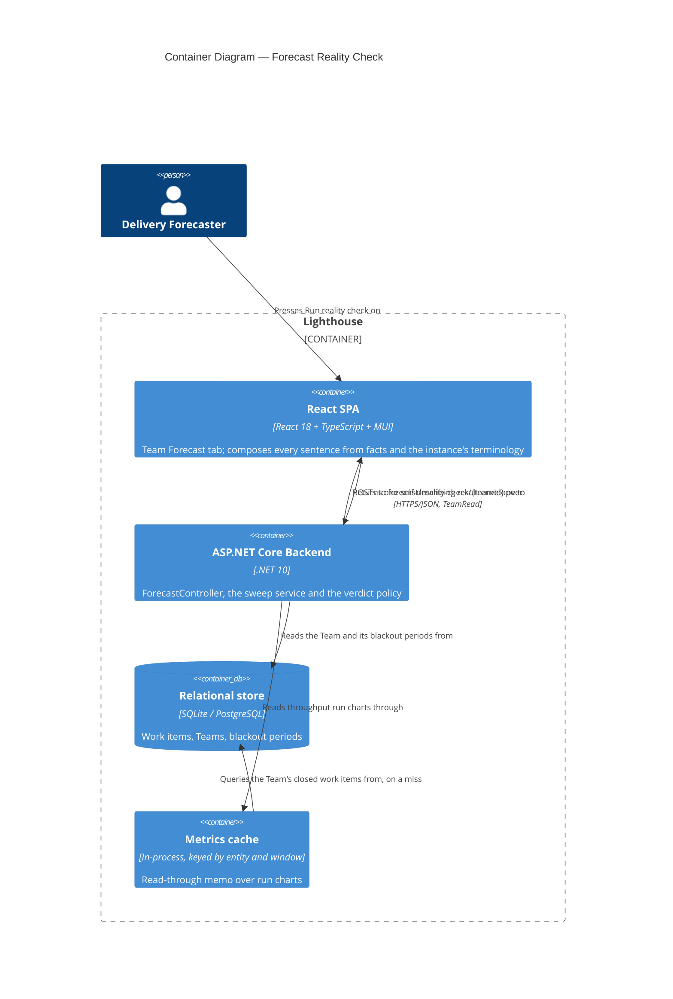

<!-- markdownlint-disable MD024 -->

# Feature Delta — epic-4172-forecast-backtest-sweep

**Feature**: **Forecast Reality Check** — a one-click, synchronous check that replays the Team's own
forecast against its own completed history at four sampling windows and four horizons, and answers in
one sentence that names a *region* of sound sampling windows rather than a winner, and says which
confidence levels actually held up.
**ADO**: Epic #4172, internal codename "The Full Monte" (state Planned, tag `Community`, priority 2).
**Origin**: no named customer. The business-primary objective is demonstrating the method; the
forecaster's own job is genuine but light, and the DIVERGE wave recorded that in the open rather than
inflating it. Source method: Nick Brown (ASOS), *The Full Monte*, ASOS Tech Blog, January 2024.
**Waves present**: DIVERGE (complete, peer-approved), DISCUSS (this).
**Density**: lean, `expansion_prompt: ask-intelligent`.

> **Four user decisions taken after DIVERGE override `recommendation.md` where they differ.** They are
> carried here as D1-D8 and are the substance of this wave. The largest is **U2**: Flux recommended
> scoring every cell against one fixed 85th percentile; the user chose instead to score several and show
> them side by side. That restores the axis Brown's study found carried the entire signal, and it
> changes the feature's headline. See D1-D4.

> **REVISED 2026-09-22, after the first DISCUSS pass was committed (`5ca5cd257`).** The maintainer
> **dropped the Apply control entirely** — removed from the feature, not deferred. It structurally
> contradicted honesty requirement §4.1: the verdict names a *region* ("anything between 30 and 90 days"),
> but a button must write **one** number, so `Apply 60 days` names a winner — the exact claim the Bailey
> et al. reasoning says the data cannot support. The tension was present from DIVERGE onward and nobody
> caught it; scoring Apply 5/5 on DECISION-CHANGING obscured what it cost on HONESTY, the
> higher-weighted criterion. **D4 is rewritten, D5 is deleted, US-03 is gone and the export story is
> promoted into its place, and the feature is now read-only end to end.** Everything else stands.

---

## Wave: DISCUSS / [REF] Prior Wave Consultation

Read on 2026-09-22 before any decision below.

| Source | State |
|---|---|
| `docs/product/` | ✓ exists — no migration gate |
| `docs/product/jobs.yaml` (7432 lines, 136 jobs) | ✓ paged, not read whole — lines 7340-7432 (the SSOT job), 303-382, 1243-1312, 1097-1146 |
| `docs/product/outcomes/registry.yaml` | ✓ present |
| `docs/product/architecture/brief.md` (872 KB) | ✓ searched only, never read whole |
| `docs/product/vision.md`, `docs/project-brief.md`, `docs/stakeholders.yaml` | ⊘ do not exist |
| `docs/feature/epic-4172-*/discover/` | ⊘ DISCOVER deliberately skipped — problem already evidenced in SSOT |
| `recommendation.md` (496 lines) | ✓ read whole, in three pages |
| `diverge/job-analysis.md` §6, §7, §8 | ✓ read — ODI statements quoted from §7 of this file, **never** from `review.yaml` |
| `diverge/competitive-research.md` | ✓ findings carried via `recommendation.md` §1 |
| `diverge/taste-evaluation.md` §6 | ✓ weighting sensitivity carried via `recommendation.md` §6 |
| `wave-decisions.md` | ✓ read whole |
| `docs/product/personas/delivery-forecaster.yaml`, `forecasting-prospect.yaml` | ✓ read whole |
| `docs/product/journeys/forecast-minimum-data-guard.yaml` | ✓ read — the shipped guard this composes with |

Code read directly, listed in the surface inventory below. Nothing in this document rests on an
inference about the codebase that was not checked against the tree on 2026-09-22.

---

## Wave: DISCUSS / [REF] Persona IDs

SSOT ids from `docs/product/personas/`. None is new to this feature.

| Persona | Role here |
|---|---|
| `delivery-forecaster` | **Primary.** Owns the conversation with leadership about how much the Team will deliver. Set `ThroughputHistory` once, probably never, and has no way to find out whether it was right. Presses the button, reads the sentence, decides whether to change the setting and which number to quote. |
| `forecasting-prospect` | **Secondary.** Does not yet use the product. Reads the same artifact — in the launch post, in the docs, or in a one-pager somebody pasted into a Slack channel — and judges the method by it. Recorded on the SSOT job rather than given a job of its own, per the DIVERGE decision. |
| `flow-coach` | **Explicitly not this persona.** Their jobs are diagnostic — stuck items, blocked duration, pace outliers. Forecast-model calibration is not among them. |
| `config-admin` | **Explicitly not this persona.** Owns the `ThroughputHistory` field, but owning a field is not knowing what to put in it. |

---

## Wave: DISCUSS / [REF] JTBD One-Liners

**One job. It already exists in SSOT and was written for this feature — it is traced to, not re-derived.**

- **`job-forecaster-check-the-forecast-against-what-happened`** (`delivery-forecaster`,
  `docs/product/jobs.yaml:7340-7432`) — When I am about to publish a forecast from a Team whose sampling
  configuration I set once and have never checked, I want evidence from that Team's own completed history
  about whether that configuration would have got the last few periods right, so I can either stand
  behind the number or change the configuration before anyone anchors on it.

All four user stories below trace to this one job (N:1). No new job is created. Two corrections are made
to the existing job by this wave, recorded under SSOT Updates.

### ODI outcome statements

Quoted verbatim from `diverge/job-analysis.md` §7. These are **reasoned estimates, not survey results** —
DISCOVER was skipped by design and no customer interviews exist. They must not be quoted downstream as
measured.

| # | Outcome statement | Imp. | Sat. | Score | Status |
|---|---|---|---|---|---|
| **O4** | Minimize the likelihood of ranking one sampling window above another when the comparison rests on periods that are not equivalent. | 8.2 | 1.5 | **14.9** | Under-served |
| **O1** | Minimize the time it takes to determine whether a Team's throughput sampling window produces forecasts that match what that Team actually delivered. | 7.8 | 2.4 | **13.2** | Under-served |
| **O2** | Minimize the likelihood of publishing a forecast whose sampling window has never been compared against a completed period. | 7.1 | 2.0 | **12.2** | Under-served |
| **O5** | Minimize the effort required to show a sceptical stakeholder that probabilistic forecasting held up on a Team's own history. | 6.9 | 2.2 | **11.6** | Under-served (marginal) |
| **O3** | Minimize the number of configuration attempts required before a Team's forecast settings match its observed delivery. | 6.4 | 3.1 | **9.7** | **Over-served — do not invest** |
| **O6** | Minimize the likelihood of reading a calibration result for a period whose history cannot support one. | 7.4 | 6.8 | **8.0** | **Over-served — do not invest** |

**O4 outranks O1**: staying honest about non-comparability scores higher than answering the question.
That is the evidence base for the three honesty requirements being hard acceptance criteria rather than
prose, and for the 30% HONESTY weight in the DIVERGE matrix.

---

## Wave: DISCUSS / [REF] Current-State Surface Inventory

Read from the tree on 2026-09-22, before any decision below was taken.

| # | Surface | What is actually there |
|---|---|---|
| S1 | `Lighthouse.Backend/API/ForecastController.cs:195-234` | `RunBacktest`. **`public ActionResult<BacktestResultDto> RunBacktest(...)` — already synchronous, no `async`/`await`.** One `forecastService.HowMany`, one `GetBlackoutAwareThroughputForTeam`, one `GetThroughputForTeam`, one `GetForecastThroughputStatus`, one `CreateForecastDtos(50, 70, 85, 95)`. Guard `[RbacGuard(RbacGuardRequirement.TeamRead, ScopeIdRouteKey = "teamId")]`. |
| S2 | `ForecastController.cs:169-193` | `ValidateBacktestInput` — four date rules. Under D6 (today as the end anchor) three of the four are vacuous; only the 14-day minimum survives, and it survives as a property of the 2-week horizon rather than as input validation. |
| S3 | `API/DTO/BacktestResultDto.cs` | Four dates, `List<ForecastDto> Percentiles`, `ActualThroughput`, `FilterApplied`, `ExcludedSummary`. **All four percentiles are already returned by every run.** |
| S4 | `Services/Implementation/Forecast/ForecastDataSufficiencyPolicy.cs:7,9` | `public const int MinimumActiveDays = 5;` and `HasEnoughData(RunChartData throughput) => throughput.DaysWithThroughput >= MinimumActiveDays`. **This is the shipped bar C5 composes with. It is a pure function over a `RunChartData` and can be called per cell without modification.** |
| S5 | `Services/Implementation/TeamMetricsService.cs:110-118` | `GetForecastThroughputStatus` returns `status with { HasSufficientData = ForecastDataSufficiencyPolicy.HasEnoughData(status.Throughput) }` — but over the *Team's configured* window. Per-cell sufficiency means calling S4 on each cell's own `RunChartData`, not calling S5 sixteen times. |
| S6 | `Models/Team.cs:17` and `Team.GetThroughputSettings(DateOnly today)` | `public int ThroughputHistory { get; set; } = 30;`. `GetThroughputSettings` is already today-anchored — `today.AddDays(-(ThroughputHistory - 1))` to `today`. **The end-anchored shape D6 requires is the shape the product already uses.** |
| S7 | `Models/Team.cs` (whole file), `Models/WorkTrackingSystemOptionsOwner.cs:40` | **There is no percentile field on `Team`.** A search for `Percentile` in `Team.cs` returns zero matches. `ServiceLevelExpectationProbability` (default 0) lives on the base class but is a **cycle-time** SLE: its only consumer is `TeamMetricsService.GetSleRiskForTeam:359-397`, via `SleRiskCalculator.For(item.Age, team.ServiceLevelExpectationRange, cycleTimes)`. It governs how long one Work Item may take, not which percentile a How-Many forecast is quoted at. **This is the decisive finding for D4.** |
| S8 | `Lighthouse.Frontend/src/pages/Teams/Detail/TeamForecastView.tsx:438-460` | `<InputGroup title="Forecast Backtesting">` wrapping `<BacktestForecaster>` with six date/mode props. The new control goes inside this group, above the shipped pickers. |
| S9 | `pages/Teams/Detail/TeamDetail.tsx:402-430` | `QuickSettingsBar` → `ThroughputQuickSetting`, present on every Team tab, already writing `throughputHistory` with validation. |
| S10 | `Lighthouse.Frontend/package.json` | `@mui/x-charts` 9.0.1 is the only charts package. There is no `@mui/x-charts-pro`, so no Heatmap component exists. A sixteen-cell matrix needs no charting component regardless. |

---

## Wave: DISCUSS / [REF] Locked Decisions

### D1 — Score all four confidence levels (50 / 70 / 85 / 95), not Brown's three

**This implements U2.** Flux recommended one fixed 85th. The user chose several, side by side. Given
that, the question is *which several*, and the answer is all four.

Four reasons, in order of weight:

1. **It is free, and dropping one costs code.** S1 shows `CreateForecastDtos(50, 70, 85, 95)` already
   runs on every backtest. Scoring three would mean filtering output — more code, to show less.
2. **The rest of the product shows four.** `ForecastPredictabilityScore` adds all four;
   `DeliveryWhenPercentile` takes a `params int[]` that every caller fills with four; the shipped
   backtest display renders four. A calibration artifact that scores three while every neighbouring
   surface shows four is an inconsistency a user would notice and nobody could explain.
3. **The 95th is where the nominal-rate lesson is legible.** A 95% forecast is supposed to be beaten
   about one time in twenty. Across four horizons it will usually be beaten zero times — and that is
   precisely how a user learns that "never beaten" means over-forecasting rather than excellence
   (§4.3). **The 95th is the teaching cell.** Dropping it would remove the clearest instance of the
   honesty requirement it exists to serve.
4. **Comparability to Brown is preserved, not traded away.** His published figures are for 50 / 70 / 85,
   and all three are present. The 95th is an addition, not a substitution. The launch post can quote
   his three and show our four, and that is honest.

### D2 — The confidence level is a *position*, not a fifth panel. Four panels stay four

**This is the main UX problem of the wave, and it dissolves rather than trades off.**

The temptation is to treat the confidence level as a fourth axis and plot it — which at 4 windows × 4
horizons × 4 levels gives 64 marks and an unreadable artifact. That temptation rests on a mistake: a
Monte Carlo How-Many forecast at 50/70/85/95 is **not four forecasts. It is one distribution, read at
four places.** Drawing it as four points throws away the thing that makes it readable.

So the small multiple is: **one panel per sampling window; one row per horizon; each row drawn as a band
running from the 95th to the 50th with the four levels marked along it; one mark showing where the
Team's actual completed count landed.**

```text
  Sampling window: 30 days
                     95    85    70    50
   8 weeks   ├──────┼─────┼─────┼─────┤        ● 42
   4 weeks   ├────┼────┼────┼────┤  ●  19
   2 weeks   not enough history in this window to check
   1 week    ├──┼──┼──┼──┤          ●  6
```

Where the mark falls in the band **is** the per-level verdict, read directly. A mark to the left of the
85th means the 85% forecast held. A mark to the right of the 50th means the 50% forecast was beaten.
There is no percentile selector, no fifth panel, no toggle. **The confidence dimension costs zero panels
and zero controls.**

The nominal-rate roll-up (§4.3) is then four lines of text below the panels, not a visual:

```text
  Across the 14 checks that could be run:
    50%   beaten in 9   (about 7 expected)    about right
    70%   beaten in 5   (about 4 expected)    about right
    85%   beaten in 1   (about 2 expected)    about right
    95%   beaten in 0   (about 1 expected)    never beaten — this is over-forecasting, not excellence
```

### D3 — The denominator states two numbers and discloses the correlation between them

§4.2 required the artifact to print its own denominator. With D1 the honest denominator is no longer one
number, and saying "64 configurations were checked" would be dishonest in a *new* direction: the four
levels of one cell are read off **the same simulation** and are perfectly correlated by construction.

The permanent copy therefore states both numbers and their relationship:

> *"16 forecast runs were checked, each read at 4 confidence levels — 64 scores in all. The four levels
> of a single run come from the same simulation, so they are not independent of one another. And each run
> covers a different stretch of real time — every one ends today and reaches back by its own length — so
> they are not repeated trials of one experiment and should not be ranked against each other."*

This is a **better** disclosure than the one §4.2 asked for, and it exists only because U2 forced the
question. It is recorded as an improvement the override produced, not as a concession to it.

### D4 — Two findings, no buttons. The check reports; the human acts

**Rewritten 2026-09-22 when Apply was dropped.** The earlier version explained why only *one* of the two
axes had a control. Neither does now, so the asymmetry no longer needs explaining — and the copy gets
simpler and more direct as a result.

The check reports two findings, and the user acts on both themselves:

> *The sampling window is a setting on this Team, and this check found it barely matters across the range
> tested — anything between 30 and 90 days would have behaved about the same.*
> *The confidence level is not a setting. It is which of the four numbers you say out loud in the room,
> and this check found it matters enormously.*

The underlying fact is unchanged and was established by searching the tree rather than by assuming. S7
records it: `Team` carries no percentile field. `ServiceLevelExpectationProbability` exists on the base
class but is a cycle-time SLE consumed only by `GetSleRiskForTeam` — it bounds how long one Work Item may
take, and has nothing to do with which percentile a How-Many forecast is quoted at. Forecast percentiles
are the fixed set 50/70/85/95, hard-coded at every call site. **The product shows all four and lets the
human choose which to quote.**

**Why no control for the sampling window either.** Two reasons, in the maintainer's order of weight:

1. **A button would contradict §4.1.** The verdict names a region. A button must write one number.
   `Apply 60 days` names a winner inside a range the artifact has just said is undifferentiated — which
   is precisely the selection-bias claim Bailey et al. say a sixteen-cell search against months of
   history cannot support. It would undo the feature's central honesty discipline in the single
   interaction the user is most likely to trust.
2. **The control is already on screen.** Verified: `ThroughputQuickSetting` sits in
   `QuickSettingsBar` inside `DetailHeader`'s `quickSettingsContent` (`TeamDetail.tsx:402-405`) — the page
   shell, so it renders on **every** Team tab including the Forecast tab where the check lives. A user
   reading "your 14 days is outside the sound range" already has the throughput control visible on the
   same screen. Apply was a shortcut to something already in front of them, bought at the cost of point 1.

**One wrinkle worth recording, found while verifying point 2**: that header block is wrapped in
`showWriteControls ?`, so a read-only user sees no throughput control at all. That does not break
anything — it makes the read-only path cleaner, because for such a user the check is purely informational
and there is no control anywhere to be inconsistent with. It does mean "the control is already on screen"
is true *for users who can act on it*, which is the only audience the argument needs.

**Residual — DECLINED by the maintainer, 2026-09-22**: *should Lighthouse gain a per-Team default forecast
confidence level?* It was raised as a candidate ADO item and the maintainer declined to raise one.
**Recorded as considered-and-declined so a later wave does not re-raise it as though it were an
oversight.** The consequence is that the window/level asymmetry — one axis is a setting, the other is a
reading — is now **permanent by decision rather than by accident.**

### D5 — deleted

**D5 previously read "Apply appears only when the current window is outside the sound region".** It was
deleted on 2026-09-22 when Apply was dropped: the conditional-button logic, the "what do we render when
there is nothing to apply" case and the no-op-button reasoning all went with it.

**The number is left as a tombstone rather than renumbered**, because D6-D13 are cross-referenced from the
journey YAML, the slice briefs and `wave-decisions.md`, and silently shifting them would break every one
of those references for no gain.

### D6 — Today is the end anchor. No date picker anywhere

**U4, settled before this wave.** Every cell ENDS today and reaches backward by its horizon. The 8-week
cell scores `[today-8w, today]`, with its history window immediately before it at
`[today-8w-W, today-8w]`. S6 shows this is the shape `Team.GetThroughputSettings` already uses.

**Load-bearing consequence**: each horizon scores a *different* stretch of real time, so the cells are
not repeated trials of one experiment and must never be ranked against one another. This is honesty
requirement §4.2 and it is why D3's copy is permanent rather than a tooltip.

Practical consequence: the request body carries no dates, which is what makes one click viable and what
makes three of S2's four validation rules vacuous.

### D7 — The three-way verdict is kept, and the departure from the source is owned out loud

**U3, confirmed.** Under / over / within-range is kept. Brown scored one-sided — over-delivery counted as
correct. Ours is arguably more honest (a forecast never beaten is over-forecasting, not excellence) and
matches weather verification's symmetric treatment of conditional bias.

**It must never be described as "what Nick Brown did."** Wherever the source method is credited — the
UI, the docs, the launch post, the exported one-pager — the departure is stated in the same place.
AC-1.8 and AC-3.4 make this testable.

### D8 — No Report abstraction. ADR-207 is a DESIGN deliverable

**U1, confirmed as Flux recommended.** Nothing is stored: no entity, no table, no `UpdateType` member,
no queue work, no notification seam. The result is a response, not a record.

ADR-207 (next free number — 206 ADRs exist, highest `adr-206`) records the position, the accepted
consequence ("has this Team ever been checked?" is unanswerable, and emailing needs something durable
that does not exist), the named revisit trigger (**the second Report kind**, not a date), the six
questions the eventual Report ADR must answer, the ADR-195 single-lane measurement behind the runner
question, and the forward-compatibility constraint that the result shape must not hard-code one Team.
The parked constellation (#1822, #4753, #4754, #4755, #4155, #4080) is named as future context only.

**Luna does not write this ADR.** It is flagged here as a DESIGN-wave deliverable.

### D9 — Per-cell sufficiency reuses the shipped bar unchanged. No second bar

**C5.** Each cell's own history window is checked by `ForecastDataSufficiencyPolicy.HasEnoughData`
(S4, `MinimumActiveDays = 5`) called on that cell's own `RunChartData`. `MinimumActiveDays` is not
changed, no new threshold is introduced, and nothing in `ForecastDataSufficiencyPolicy` is touched.

Because each cell carries its own history window, **sufficiency varies within one report** — one artifact
can hold answerable and unanswerable cells at once. ADR-194 governs the rendering: on this product's
charts a blank region already means "too little history", so a calm result and an unevaluable one must
never render alike, and "leave it empty" is the option that ADR already ruled out. An unevaluable row
says so in words where the band would be.

### D10 — The name

| Layer | Name |
|---|---|
| User-facing | **Forecast Reality Check**, shortening to **"Reality Check"** in-app |
| Placement label | inside the existing `InputGroup title="Forecast Backtesting"` (S8) |
| Internal codename | **"The Full Monte"** — kept, in the commit scope, the ADO Epic title, and the launch post *with attribution to Nick Brown* |
| Engineering slug | `epic-4172-forecast-backtest-sweep` — unchanged |

**C6 extended**: "throughput" is itself user-renameable under Settings → Terminology, so it cannot appear
in a feature name — it would render as the user's own word. Safe vocabulary: forecast, calibration,
hindsight, replay, accuracy, check, reality, sampling, history, percentile.

### D11 — Re-sliced. Every slice carries user-visible value

**`recommendation.md` §5.5 is corrected here, as Flux invited ("a starting shape for Luna, not a
decision").** Its slice 01 was the endpoint with no UI and its slice 02 the verdict logic with still no
UI — two consecutive slices of `@infrastructure` stories with no release value, which is a structural
failure this workflow hard-gates on.

What Flux was protecting is preserved in full:

- **(a) The R-1 timing measurement still happens first**, before any UI is written. It is the first task
  of slice 01 and AC-1.1 gates the rest of the slice on it.
- **(b) The honesty requirements are still built early.** All three land in slice 01 — they are the
  sentence, and the sentence is the first thing that ships. They cannot be dropped under UI pressure
  because they *are* the UI.

The endpoint and the verdict logic become precursor commits inside slice 01 rather than slices of their
own. **Three slices result** (four, until Apply was dropped on 2026-09-22 and its slice collapsed), every
one of them user-visible. The `@infrastructure`-only hard gate was re-checked after that removal: slice 01
ships a sentence, slice 02 ships the evidence view, slice 03 ships the one-pager. No slice is left whose
only content is copy or plumbing. See the story map.

### D12 — No CLI / MCP client exposure in this Epic

Answered explicitly rather than skipped; see the project checklist below.

### D13 — R-6 is out of scope and is now Bug #6071

`Team.ThroughputHistory` defaults to **30** (`Team.cs:17`) while `CreateTeamWizard.tsx:35` and
`EditTeam.tsx:80` both seed **90**. Independently verified. **Do not fold into this Epic** — it is now
tracked as **Bug #6071**. It is recorded here because it was found while researching this feature, and
because it is incidentally an argument *for* the feature: nobody currently knows which value is right.

---

## Wave: DISCUSS / [REF] Scope Assessment

**PASS — right-sized. 3 stories, 2 modules, ~17h (≈2.5 days).** Assessed before journey visualisation, per
the early gate; re-checked 2026-09-22 after Apply was dropped (was 4 stories / ~20h).

Oversized signals checked:

| Signal | Present |
|---|---|
| More than 10 user stories | No — 3 |
| More than 3 bounded contexts or modules | No — 2 (backend forecasting/API; Team Forecast UI). Slice 03's export is client-side within the second |
| Walking skeleton needs more than 5 integration points | N/A — no walking skeleton (brownfield, Strategy B) |
| Estimated effort over 2 weeks | No — ~17h |
| Multiple independent user outcomes that could ship separately | One outcome, one job. Slice 03 is severable but serves the same job through a secondary persona |

No split required. Slice 03 is severable on its own merits, not because the feature is oversized.

---

## Wave: DISCUSS / [REF] Walking Skeleton Strategy

**Strategy B — extend an existing end-to-end path. No walking skeleton is built.** Decision 2, confirmed
against the tree: the endpoint pattern (S1), the forecast engine, the blackout-aware working-day counting,
the data-sufficiency guard (S4) and the Team Forecast surface (S8) are all shipped. Slice 01 runs a second
kind of request down a path that already exists. **The feature adds no write path at all** — since Apply
was dropped it is read-only end to end.

Nothing in this feature uses a configurable or environment-switching strategy, so the strategy-D
expansion trigger does not fire.

---

## Wave: DISCUSS / [REF] Driving Ports

| Port | Surface | Slice |
|---|---|---|
| HTTP | `POST /api/latest/forecast/reality-check/{teamId}` and `POST /api/v1/forecast/reality-check/{teamId}` | 01 |
| UI | Team → Forecast tab → "Forecast Backtesting" group → the check button and its verdict sentence | 01 |
| UI | the same group → "Show the evidence" → four small-multiple panels and the nominal-rate lines | 02 |
| Clipboard | "Copy as Markdown" from the verdict card | 03 |

**There is no driving port that writes.** The feature is read-only end to end.

---

## Wave: DISCUSS / [REF] User Stories

### US-01 — One sentence that says whether the configuration behind my forecasts is sound

**Job**: `job-forecaster-check-the-forecast-against-what-happened`
**Persona**: `delivery-forecaster`
**Slice**: 01

As a delivery forecaster about to publish a number leadership will hold me to, I want one press to tell
me whether the sampling window behind every forecast this Team produces would have got the last few
periods right — and which of the four confidence levels actually held up — so that I can stand behind
tomorrow's forecast for a reason rather than out of habit.

#### Elevator Pitch

Before: the Team's Forecast tab can back-test exactly one hand-typed date pair at a time, and nothing
anywhere in the product says whether the sampling window driving every forecast this Team publishes is
sound. Nobody runs it, because you have to already suspect the answer to know which dates to type.

After: press **Run reality check** in the Forecast Backtesting group and within seconds one sentence
comes back — *"Anything between 30 and 90 days would have behaved about the same for Ocean Explorer, and
your current 30 is inside that range. At the 85% level the forecast held in 3 of the 4 checks; at 50% it
held in 1 of 4. Two of the sixteen checks could not run: their 14-day sampling windows hold fewer than
5 days with completed Work Items."*

Decision enabled: whether to publish tomorrow's forecast as configured or change the window first — and,
independently, which of the four numbers to say out loud in the room.

#### Domain Examples

##### 1 — Happy path, and the modal case: the null result

Maria Santos runs delivery for **Ocean Explorer**, a Team with fourteen months of Work Items and
`ThroughputHistory` left at the entity default of 30 days. She presses the button on a Tuesday. All
sixteen cells evaluate. Every sampling window behaves alike: the region is *all of them*. The sentence
reads *"Anything between 14 and 90 days would have behaved about the same for Ocean Explorer. Your
current 30 is inside that range — this setting is fine."* The second
clause reads *"At 85% the forecast held in 4 of 4 checks; at 95% it held in 4 of 4 and was never beaten,
which is over-forecasting rather than excellence; at 50% it held in 1 of 4."* Maria keeps her setting and
starts quoting the 85th instead of the 70th.

##### 2 — Edge case: sufficiency varies inside one report

**Coastal Survey** was formed eleven weeks ago and closes work in bursts. Its 90-day and 60-day cells
evaluate; its 14-day cells hold 3 and 4 distinct days with a completed Work Item respectively, below
`MinimumActiveDays = 5`. Four of the sixteen cells are unevaluable. The sentence names them and their
reason, every count is taken over the twelve that ran, and the four rows in the evidence view say so in
words where the band would be — never blank (D9, ADR-194).

##### 3 — Error/boundary: the window really is wrong

**Deep Current** has `ThroughputHistory` at 14 days after somebody set it during a spike three quarters
ago. The 14-day window over-forecast in three of its four checks; 30, 60 and 90 all behaved alike. The
sentence reads *"Anything between 30 and 90 days would have behaved about the same for Deep Current. Your
current 14 is not inside that range — it over-forecast in 3 of its 4 checks."* This is the minority case.
Maria changes the setting herself using the throughput control already visible in the Team header on the
same screen (D4); the feature writes nothing on her behalf.

#### UAT Scenarios (BDD)

```gherkin
Scenario: The check answers in one sentence without asking for a date
  Given Maria Santos is on Ocean Explorer's Forecast tab
  And Ocean Explorer's sampling window is set to 30 days
  When Maria presses "Run reality check"
  Then a verdict sentence appears in the Forecast Backtesting group
  And she was asked for no dates at any point

Scenario: Every window behaving alike is a real answer, not an absence
  Given Ocean Explorer's history makes all four sampling windows behave alike
  When Maria runs the reality check
  Then the verdict names the whole range as acceptable and says her current setting is fine
  And no single sampling window is described as best or recommended

Scenario: The artifact states what it checked and why the checks cannot be ranked
  Given Maria has run the reality check on Ocean Explorer
  When she reads the result
  Then the count of runs, the count of scores, and the fact that a run's four levels share one simulation are on screen
  And the statement that each run covers a different stretch of real time ending today is on screen
  And neither statement is hidden behind a tooltip or a disclosure

Scenario: A confidence level that was never beaten is called over-forecasting
  Given Ocean Explorer's 95% forecast was not beaten in any of the evaluable checks
  When Maria reads the verdict
  Then the 95% level is described as over-forecasting rather than as excellent
  And the nominal rate it was expected to be beaten at is stated alongside it

Scenario: A period whose own history is too thin is excluded and named
  Given Coastal Survey's 14-day sampling windows hold fewer than 5 days with a completed Work Item
  When Maria runs the reality check on Coastal Survey
  Then those checks are reported as unable to run, with that reason
  And they are excluded from every count in the verdict

Scenario: Reading the check needs read rights on the Team and nothing more
  Given Tom Becker can read Ocean Explorer but cannot change its settings
  When Tom runs the reality check
  Then he sees the verdict
```

#### Acceptance Criteria

- **AC-1.1 (R-1, measurement gate — runs before any other work in this slice)** — a sixteen-run reality
  check on a Team holding at least twelve months of Work Items completes on the development instance with
  a **median at most 5 seconds and a maximum at most 10 seconds across twelve samples**, alongside the
  measured median of a single shipped `POST /api/latest/forecast/backtest/{teamId}` on the same Team as a
  baseline. Both numbers are written into the slice brief. **If the budget is missed, the slice stops and
  the fallback (`UpdateQueueService`, with the ADR-195 single-lane caveat) is re-scoped before any UI is
  written.**
- **AC-1.2** — `POST /api/latest/forecast/reality-check/{teamId}`, and the `/api/v1/…` twin, accept a body
  of at most `{ "applyFilterOverride": true | false | null }` and return the verdict, the denominator, the
  confidence levels used, and sixteen cells each carrying its real start and end date, its four forecast
  values, the Team's actual completed count, a coverage state per confidence level, and a sufficiency
  state. **The body accepts no dates**, and the response carries no field naming a single winning
  sampling window.
- **AC-1.3 (RBAC)** — the endpoint is guarded by
  `[RbacGuard(RbacGuardRequirement.TeamRead, ScopeIdRouteKey = "teamId")]`, identical to the shipped
  backtest. A user with Team read but not Team write receives the full result. No new
  `RbacGuardRequirement` member is introduced and no new permission is added.
- **AC-1.4 (honesty §4.1 — region, never a winner)** — the verdict names a *range* of sampling windows
  that behaved alike and states whether the Team's current setting is inside it. For a Team where all four
  windows behave alike, the sentence reads that the current setting is fine. No response field and no
  rendered string names one window as best.
- **AC-1.5 (honesty §4.2 — denominator and non-comparability, per D3)** — permanently on screen, never
  behind a tooltip or a disclosure: the number of runs, the number of scores, the statement that the four
  levels of one run come from the same simulation and are therefore not independent, and the statement
  that each run covers a different stretch of real time ending today and must not be ranked against the
  others.
- **AC-1.6 (honesty §4.3 — coverage against a nominal rate, per D1)** — the verdict reports, for each of
  the four confidence levels, how many of the evaluable checks the forecast held in, and prints the level
  as a number. A level not beaten in any evaluable check is described as over-forecasting rather than as
  excellent.
- **AC-1.7 (C5 / D9)** — a cell whose own history window holds fewer than five distinct days with at
  least one completed Work Item is marked unevaluable by `ForecastDataSufficiencyPolicy.HasEnoughData`
  called unchanged, is excluded from every count, and is named in the sentence with its reason.
  `MinimumActiveDays` is not changed and no second threshold is introduced.
- **AC-1.8 (D7)** — no response field, UI string, doc page or launch-post sentence attributes the
  three-way under / over / within-range verdict to Nick Brown. Wherever the source method is credited, the
  departure is stated in the same place.
- **AC-1.9 (D4 — moved here 2026-09-22 when Apply was dropped)** — permanent copy reports the two findings
  as two findings: that the sampling window is a setting on this Team, and that the confidence level is
  not a setting but a choice of which number to quote. **The feature renders no control that writes any
  Team setting**, and no string offers to change one.

> **Sizing note, stated rather than gamed**: US-01 carries 9 acceptance criteria against a 3-7 band.
> AC-1.1 is a measurement gate rather than a behaviour, so the story is eight behaviours and a probe, and
> AC-1.9 arrived by absorbing the copy from the deleted Apply story rather than by the story growing.
> The precedent is `epic-6033` US-01, which carried ten and passed DoR. The story remains demonstrable in
> one session and estimated at one day.

#### Technical Notes

- Reuses unchanged: `forecastService.HowMany`, `teamMetricsService.GetBlackoutAwareThroughputForTeam`,
  `GetThroughputForTeam`, `blackoutPeriodService.GetEffectiveBlackoutDays` / `CountWorkingDays`,
  `GetForecastThroughputStatus`, `CreateForecastDtos`, `ForecastDataSufficiencyPolicy.HasEnoughData`.
  **Nothing in the forecast engine changes.**
- `BacktestInputDto`'s validation (S2) is not reused as written; D6 makes three of its four rules vacuous.
- No entity, no migration, no `UpdateType` member (D8).
- Route style: kebab-case is this codebase's convention (`my-summary`, `group-mappings`, `system-admins`).
- Forward-compatibility (ADR-207): the result shape must not hard-code one Team — "check every Team at
  once" is a plausible next unit of work and nothing here should make it expensive.

#### Dependencies

`ForecastController` two-route pattern (shipped, S1) · `ForecastDataSufficiencyPolicy` (shipped, S4) ·
`TeamForecastView` `InputGroup` (shipped, S8). All confirmed present. AC-1.1 is the only open unknown
and it is resolved inside this slice.

---

### US-02 — The evidence, when the sentence is not enough

**Job**: `job-forecaster-check-the-forecast-against-what-happened`
**Persona**: `delivery-forecaster` (secondary: `forecasting-prospect`)
**Slice**: 02

As a forecaster who is about to repeat this verdict to someone who will push back, I want to see the
sixteen checks themselves — each one's forecast range with the Team's actual marked against it — so that
I am repeating something I have looked at rather than something I was told.

#### Elevator Pitch

Before: the verdict is a sentence you either believe or you do not, and the sixteen checks behind it exist
only inside the response.

After: click **Show the evidence** under the verdict and four panels appear, one per sampling window, each
with a row per horizon drawn as a forecast band with a mark showing where the Team's actual landed — plus
four lines saying how often each confidence level was beaten and how often it should have been.

Decision enabled: whether the sentence is solid enough to repeat to a stakeholder — and, on seeing a 95%
band never beaten across sixteen checks, that "never beaten" is a symptom rather than a score.

#### Domain Examples

##### 1 — Happy path

Maria expands the evidence on Ocean Explorer. Four panels: 14, 30, 60, 90 days. In the 30-day panel the
8-week row's mark sits between the 70th and the 85th; the 4-week row's sits between the 85th and the 95th.
She can see without reading a number that the 85th has been holding and the 50th has not. The nominal-rate
lines below confirm it in four lines.

##### 2 — Edge case: an unevaluable row inside an otherwise healthy panel

On Coastal Survey, the 14-day panel's 2-week row cannot be drawn. Where the band would be, the row reads
*"not enough history in this window — 3 days with completed Work Items, 5 needed"*. It is visually
distinct from every evaluable outcome and is never blank (ADR-194).

##### 3 — Boundary: the whole panel is unevaluable

A Team created six weeks ago has no evaluable cell at all in its 90-day panel. The panel renders with all
four rows carrying their reason, rather than the panel being dropped — a missing panel would be read as
"this window was fine".

#### UAT Scenarios (BDD)

```gherkin
Scenario: The evidence shows one panel per sampling window and no more
  Given Maria has run the reality check on Ocean Explorer
  When she expands the evidence
  Then she sees four panels, one for each sampling window checked
  And she is offered no control for choosing a confidence level

Scenario: Where the actual landed is what says which levels held
  Given the 30-day panel's 8-week check forecast between 31 and 48 items and Ocean Explorer completed 42
  When Maria reads that row
  Then the forecast is drawn as a band with its four confidence levels marked
  And the actual of 42 is marked at its position within that band

Scenario: A check that could not run says so where the picture would be
  Given Coastal Survey's 14-day, 2-week check holds 3 days with completed Work Items
  When Maria expands the evidence for Coastal Survey
  Then that row states it could not be checked and why
  And it does not render as an empty or a calm result

Scenario: Each confidence level reports how often it was beaten against how often it should have been
  Given twelve of Coastal Survey's sixteen checks could be run
  When Maria reads the lines below the panels
  Then each of the four confidence levels reports how many of the twelve it was beaten in
  And each states the number of times its nominal rate would expect

Scenario: The non-comparability statement is visible whether or not the evidence is expanded
  Given Maria has run the reality check and has not expanded the evidence
  When she reads the collapsed result
  Then the denominator and non-comparability statements are on screen
```

#### Acceptance Criteria

- **AC-2.1 (D2)** — expanding the evidence reveals exactly four panels, one per sampling window, titled by
  window length. No per-confidence-level panel is added and no confidence-level control is rendered.
- **AC-2.2 (D2)** — each panel carries one row per horizon. The row draws the forecast as a band spanning
  the four confidence levels, with a single mark at the Team's actual completed count. The mark's position
  within the band is what reports which levels held.
- **AC-2.3 (ADR-194 / D9)** — an unevaluable row renders its reason in words where the band would be. It is
  visually distinct from every evaluable outcome and is never left blank. A panel whose rows are all
  unevaluable still renders, rather than being omitted.
- **AC-2.4 (honesty §4.3)** — below the panels, one line per confidence level: the count of evaluable
  checks it was beaten in, the count its nominal rate expects, and a plain reading of the two together.
- **AC-2.5** — the AC-1.5 denominator and non-comparability copy is on screen whether or not the evidence
  is expanded.
- **AC-2.6** — no charting package is added. The panels build on `@mui/x-charts` 9.0.1 or on plain layout.
  `@mui/x-charts-pro` is not introduced, and no heatmap or ranked-list rendering is used.

#### Technical Notes

Presentation only — consumes the slice 01 response and adds no computation. ADR-194 is the governing
precedent for AC-2.3 and is not amended. The rendering is deliberately not a matrix: a matrix is a
coordinate system and D6 says these cells are not one.

#### Dependencies

Slice 01 (the response shape). No external dependency.

---

### US-03 — The answer travels to the person who asked the question

**Job**: `job-forecaster-check-the-forecast-against-what-happened`
**Persona**: `forecasting-prospect` (primary for this story; `delivery-forecaster` produces it)
**Slice**: 03 — **severable**

As a forecaster who was asked "how do you know this is right?" by someone who is not in the room, I want
to paste the whole check into a message, so that the answer is something they can check rather than
something they have to take from me.

#### Elevator Pitch

Before: nothing about the check leaves the browser. A sceptic has to be sitting at the screen, and a
prospect who has never used the product cannot see it at all.

After: press **Copy as Markdown** on the verdict card and the clipboard holds a one-pager — the verdict
sentence, the denominator and non-comparability paragraph, the sixteen rows with their real date spans and
outcomes, the unevaluable rows with their reasons, and the nominal-rate table — ready to paste into Slack,
a Confluence page, or an email.

Decision enabled: whether the person who asked gets an answer they can interrogate, or a claim they have to
trust. For a prospect, whether the method is worth their evaluation at all.

#### Domain Examples

##### 1 — Happy path

Maria pastes the one-pager into the delivery channel under her forecast. Her director reads the sentence,
the sixteen date spans and the line saying they are not repeated trials, and stops asking.

##### 2 — Edge case: terminology is the reader's, not ours

A customer has renamed "Work Item" to "Ticket" and "throughput" to "delivery rate". The pasted one-pager
reads *"fewer than 5 days with completed Tickets"* and never contains the words "Work Item" or
"throughput" except as that instance's configured terms.

##### 3 — Boundary: a report that is mostly unevaluable

Coastal Survey's one-pager has four unevaluable rows. They are in the table with their reasons, not
silently dropped — an export that omits them would mislead exactly the audience it exists for.

#### UAT Scenarios (BDD)

```gherkin
Scenario: The whole check pastes into a message
  Given Maria has run the reality check on Ocean Explorer
  When she presses the copy control on the verdict card
  Then the clipboard holds the verdict, the non-comparability statement, all sixteen rows with their date spans, and the nominal-rate table

Scenario: Checks that could not run travel with the ones that could
  Given four of Coastal Survey's sixteen checks could not be run
  When Maria copies the one-pager
  Then those four appear in the table with the reason they could not run

Scenario: The one-pager speaks the reader's vocabulary
  Given the instance has renamed Work Item to Ticket
  When Maria copies the one-pager
  Then it says Ticket wherever it refers to a work item

Scenario: The one-pager credits the source method and names where we departed from it
  Given Maria has copied the one-pager
  When she reads its footer
  Then it credits Nick Brown's method and states that the three-way verdict is our departure from it
```

#### Acceptance Criteria

- **AC-3.1** — the copy control produces a Markdown one-pager holding the verdict sentence, the AC-1.5
  denominator and non-comparability paragraph, all sixteen rows with their real date spans and outcomes,
  every unevaluable row with its reason, and the nominal-rate table.
- **AC-3.2 (ADR-172 / ADR-162)** — the one-pager is built in the client. No server-side document renderer
  is added and no new endpoint is introduced.
- **AC-3.3 (C6)** — every configurable term renders from the instance's terminology. The words "Epic",
  "Initiative" and "Story" do not appear. "Throughput" appears only as that instance's configured term.
- **AC-3.4 (D7)** — the one-pager credits Nick Brown's method and states, in the same paragraph, that the
  three-way under / over / within-range verdict is this product's departure from it.

#### Technical Notes

The export precedent is ADR-172 (a Delivery exports one settled table the caller builds) and ADR-162
(export header block as a generic toolbar input). Both are client-side, which is what makes this cheap and
what makes the durable emailable Report expensive (D8).

#### Dependencies

Slices 01 and 02 (the verdict and the cell detail). Severable — if dropped, the feature still ships.

---

## Wave: DISCUSS / [REF] Story Map and Slices

**Backbone**: press it → read the sentence → look at the evidence → send it to someone else.

*(The backbone previously had a fifth step, "act on it". It was removed with Apply on 2026-09-22 — the
user still acts, using the throughput control already on the page, but the feature does not do it for
them.)*

| Slice | Story | Ships | Estimate |
|---|---|---|---|
| 01 | US-01 | R-1 measurement, the endpoint, the verdict logic with all three honesty requirements, and the sentence and button on the Forecast tab | ~1h probe + ~7h |
| 02 | US-02 | Four small-multiple panels, the unevaluable-row state, the nominal-rate lines | ~6h |
| 03 | US-03 | The Markdown one-pager — **severable** | ~4h |

**Walking skeleton**: none. Strategy B, brownfield — see the strategy section.

### Priority Rationale

1. **Slice 01 first — it carries the only decisive unknown and all three honesty requirements.** AC-1.1
   runs before anything else in the slice; if a sixteen-run sweep does not fit a request, every downstream
   decision changes and finding out costs an hour. The three honesty requirements land here because they
   *are* the sentence — building them into the first user-visible thing is what makes them impossible to
   drop later. This is what `recommendation.md` §5.5 was protecting, preserved without the
   `@infrastructure`-only slices.
2. **Slice 02 second — it is the mitigation that earns the recommendation's weakest score.** M1 scores 3/5
   on HONESTY, the highest-weighted criterion, and the evidence view is what moves it. Second, not first,
   because a verdict nobody can act on is still worth more than evidence nobody has a verdict for; but not
   later than second, because deferring it is exactly how the recommendation degrades into the "black box"
   exposure §3 names.
3. **Slice 03 last and severable — it serves the declared secondary objective.** C1 makes conversion an
   honest secondary, the Epic is tagged Community for that reason, and this is the whole of the marketing
   surface. Last because a one-pager of a verdict that has not been dogfooded is a liability rather than an
   asset.

*(A slice between 02 and 03 previously carried Apply, on the reasoning that O3 scored 9.7 — over-served —
but that Apply shipped anyway because `ThroughputQuickSetting` already existed and the cost was near zero.
Dropped on 2026-09-22: near-zero cost was the wrong axis to judge it on, because what it actually cost was
§4.1. See D4.)*

### Carpaccio taste tests

- **Four or more new components in one slice?** Slice 01 adds one endpoint, one verdict calculation and
  one card. Slice 02 adds one panel component. Pass.
- **Every slice depending on a new abstraction?** Slices 02 and 03 both consume slice 01's response, which
  is why it ships first. Nothing depends on an abstraction built speculatively. Pass.
- **Does any slice disprove a pre-commitment?** Slice 01 disproves the synchronous premise if AC-1.1 fails
  — the whole recommendation rests on it. Slice 02 disproves D2 if four bands per panel turn out to be
  unreadable at real data. Pass.
- **Synthetic data only?** Slices 01 and 02 are dogfooded against this project's own Lighthouse instance
  with real history, per `recommendation.md` §5.5. Pass.
- **Two slices identical but for scale?** 02 and 03 both render the sixteen cells, but one is on screen and
  one is a portable document for a different persona. Not merged, deliberately. Pass.
- **Is any slice left with no user-visible value?** Re-checked after Apply was dropped. Slice 01 ships a
  sentence, 02 the evidence view, 03 the one-pager. None is `@infrastructure`-only. Pass.

---

## Wave: DISCUSS / [REF] Out of Scope

- **Any Report entity, table, migration, `UpdateType` member, queue work or notification seam.** Declined,
  not deferred (D8). ADR-207 records why and what the second Report must decide.
- **Any control that writes a Team setting — the Apply button.** **Declined 2026-09-22, not deferred**
  (D4). It contradicted §4.1 by naming one number inside a range the artifact had just called
  undifferentiated, and the control it was a shortcut to is already on the same screen. **DESIGN should
  not reintroduce it as an obvious improvement.**
- **A per-Team default forecast confidence level.** **Raised as a candidate and DECLINED by the maintainer,
  2026-09-22** (D4). Recorded so a later wave does not re-raise it as though unconsidered. The
  window/level asymmetry is permanent by decision.
- **The `ThroughputHistory` 30-vs-90 default disagreement** (D13). Tracked as **Bug #6071**.
- **Rolling-origin evaluation** (R-7). C4/D6 is not reopened. Recorded as the strongest candidate for a
  later slice if the honesty mitigations prove insufficient in use.
- **Scheduling, continuous checking or auto-adjustment** (C2). On demand only. The auto-adjusting future
  is deliberately not foreclosed but is not built.
- **The forecast-throughput filter as a sweep dimension** (C3). It is a config option of the run,
  `applyFilterOverride`, and nothing else.
- **A second data-sufficiency bar** (C5 / D9). The shipped `MinimumActiveDays = 5` is composed with,
  unchanged.
- **Any change to the forecast engine.** AC-1.2's reuse list asserts this.
- **CLI or MCP client exposure** (D12). See the checklist below for the explicit answer and the
  precondition that would reverse it.
- **ADR-127's team-settings advisory channel.** Story #5612 deleted it; `ValidationAdvisory.tsx` is absent
  from the frontend and a later rung was built *"rather than reviving them"*. **Do not reach for that
  mechanism.** ADR-127 now carries a SUPERSEDED-BY-EVENTS status note recording the deletion, so the
  standing caution this document used to raise is discharged — read the corrected ADR.

---

## Wave: DISCUSS / [REF] Project DISCUSS Checklist

No silent N/A — every item answered.

### RBAC impact — no new surface, and now read-only end to end

**Confirmed against the tree.** The one endpoint reuses
`[RbacGuard(RbacGuardRequirement.TeamRead, ScopeIdRouteKey = "teamId")]`, byte-identical to the shipped
`POST backtest/{teamId}` (S1). No new `RbacGuardRequirement` member, no new permission, no new scope.

**Simplified 2026-09-22 by dropping Apply, and worth stating rather than letting it disappear: the feature
now has no write path at all.** It reads, it renders, it copies to the clipboard. Previously the RBAC
answer had two halves — a read endpoint plus a write that borrowed `canUpdateTeamData` through the shipped
`ThroughputQuickSetting`. The second half is gone. There is no write endpoint, no borrowed write path, and
no control anywhere in the feature that mutates a Team.

Consequences, all simplifications:

- **A single permission governs the whole feature**: Team read. Anyone who can see the Team's Forecast tab
  can run the check and read every part of the result.
- **There is no differential rendering by permission** — no control to show or hide, so no
  read-versus-write branch in this feature's UI at all.
- The project's standing rule still holds and is unchanged: all UI gating derives from the `useRbac()`
  hook, and **no component fetches `/api/latest/authorization/my-summary` directly.** This feature adds no
  new gating, so it adds no new opportunity to break that rule.

*(One observation recorded under D4: the Team header's `QuickSettingsBar` is itself wrapped in
`showWriteControls ?`, so a read-only user sees no throughput control on the page either. That is existing
behaviour this feature neither uses nor changes.)*

### Lighthouse-Clients CLI / MCP versioning — deliberately no, with the precondition for later

**Answer: no CLI or MCP exposure in this Epic, and no client version bump.**

The reason is not cost, it is honesty. The value of this feature is the *rendered artifact and its three
honesty requirements*: the region-not-a-winner verdict, the denominator with its correlation disclosure,
and the coverage-against-nominal reading. A CLI or MCP tool returning sixty-four scores as JSON strips
all three, and an agent reading the raw cells and reporting "the 60-day window is best" is the §4.1 failure
mode, automated and at scale. Shipping the grid to a machine consumer before the honest reading exists
would undo the mitigation the recommendation is conditional on.

**The precondition that reverses this**: AC-1.2 puts the verdict *sentence* in the response as a field. An
MCP tool that surfaces the sentence, the denominator statement and the nominal-rate lines — and does not
expose the cell grid — is both honest and cheap, and becomes a candidate once slice 02 has been dogfooded
and the sentence has proven it reads well. Recorded as a follow-up, not scheduled.

### Website marketing surface — real, secondary, and declared

C1 (free / Community tier) makes conversion an honest secondary objective, and the Epic is tagged
Community for the stated reason that it "should convince people of the method, so they flock to use the
tool". O5 scores 11.6, under-served. So the marketing surface is answered rather than waved at:

- **The carrier is slice 03's one-pager.** `recommendation.md` §5.5 named it as a candidate, and this wave
  commits to it as slice 03 (severable; it was slice 04 until Apply was dropped on 2026-09-22). It is the
  only thing in the feature that travels, and it is the whole of the MARKETING criterion.
- **The launch post** carries the internal codename "The Full Monte" **with attribution to Nick Brown**,
  which is what converts a borrowed article title into a citation. It states the U3 departure in the same
  place (D7, AC-1.8).
- **A docs page** under the Team / Forecast docs, in configurable terminology (C6), showing the collapsed
  verdict and the expanded evidence.
- **R-5 is a DELIVER-wave gate**: the source article was read via a readmedium.com mirror because
  medium.com returns 403. It is arithmetic-reconciled and corroborated, but **one human page-load of the
  original is required before anything from it is quoted publicly.** Nothing ships to the website or the
  launch post until that is done.
- The website hot-links `docs/assets` from `@main` via jsDelivr, so any asset this feature adds must not
  be renamed or removed without checking the website repo first.

### Per-feature docs and screenshots — what DELIVER will owe

1. A docs page for Forecast Reality Check under the Team / Forecast documentation, written in the
   configurable terminology seeded by `TerminologySeeder.cs` — Team, Work Item, Feature — and never using
   "Epic", "Initiative" or "Story". The feature name contains no configurable term (D10/C6).
2. Two `@screenshot` shots, one per theme per the project's per-theme convention: the collapsed verdict
   card, and the expanded four-panel evidence view. Both need a Team with enough real history to produce a
   non-degenerate result, so demo data has to carry one.
3. Demo data check: at least one demo Team whose history produces evaluable cells, and ideally one whose
   short windows do not — the unevaluable state is a differentiator worth showing.
4. Website asset freshness: if the docs page adds an image under `docs/assets`, confirm nothing in the
   website repo links a path this change renames.
5. The launch post, gated on R-5.

---

## Wave: DISCUSS / [REF] Outcome KPIs

Targets are declared as hypotheses. The Epic has no named customer and the ODI figures are reasoned
estimates, so nothing below may be reported downstream as a measured baseline.

| KPI | Who | Does what | By how much | Measured by | Baseline |
|---|---|---|---|---|---|
| **O1 — time to know whether the window fits** | A delivery forecaster on a Team with a year of history | Goes from "no idea" to a verdict they can repeat | One press, answer within 5 s median / 10 s max | AC-1.1, twelve samples on the dev instance | Currently unbounded — requires four typed dates and a guess about which to type |
| **O4 — do not rank incomparable windows** | Every reader of the artifact | Reads the denominator and the non-comparability statement | 100% of rendered results, collapsed and expanded | AC-1.5 and AC-2.5, asserted | 0 — nothing in the product says it today |
| **O4b — no winner is ever named** | The verdict | Names a region, never a single best window | 0 response fields and 0 rendered strings naming one window as best | AC-1.4, asserted | N/A — the surface does not exist |
| **O6 — no unsupportable cell is read as a result** | Every unevaluable cell | Says why it could not be checked, visibly distinct from a calm result | 100% of unevaluable cells; 0 blank | AC-1.7, AC-2.3, asserted | Shipped guard covers the Team-level case; the per-cell case does not exist |
| **§4.3 — the nominal-rate lesson lands** | Each of the four confidence levels | Reports beaten-count against expected-count, with never-beaten called over-forecasting | 4 of 4 levels, every run | AC-1.6, AC-2.4, asserted | 0 — no surface in the product states a nominal rate |
| **O2 — Teams whose window has been checked** | Teams on the dev and demo instances | Have been through a reality check at least once | At least 3 within 30 days of release | Dogfooding record in the slice briefs; usage data only if consent exists | 0 |
| **O5 — the answer travels** | A forecaster answering a sceptic | Pastes a one-pager instead of describing a screen | At least 1 one-pager shared externally within 60 days | Manual — the maintainer's own use, and any community mention | 0 |
| **No write path exists** | The feature | Mutates a Team setting | 0 endpoints, 0 controls | AC-1.9, asserted; and the absence of any write in the driving-ports table | N/A — the previous plan had one |
| **Engine drift introduced** | The shipped forecast engine | Changes | 0 | Existing forecast assertions unchanged before and after slice 01 | N/A |
| **Mutation kill rate** | Both stacks | Stryker.NET and StrykerJS, acceptance suite excluded | At least 80% | Per-feature run on frozen code | Project standard |

**O3 is deliberately unserved and carries no KPI.** It scored 9.7 — over-served — and dropping Apply
makes that explicit rather than merely weighted: the feature now optimises the diagnosis and does nothing
at all about the keystroke. No KPI measuring apply-usage or click-through survives, because there is
nothing to click; none is left in the table pointing at something unreportable.

---

## Wave: DISCUSS / [REF] Pre-requisites

| # | Pre-requisite | State |
|---|---|---|
| P1 | A synchronous forecast endpoint pattern exists in this controller | **Confirmed** — `RunBacktest` is already non-async (S1) |
| P2 | All four confidence levels are already computed per run | **Confirmed** — `CreateForecastDtos(50, 70, 85, 95)` (S1, S3) |
| P3 | A shipped data-sufficiency bar exists and is callable per cell | **Confirmed** — `ForecastDataSufficiencyPolicy.HasEnoughData`, a pure function over `RunChartData`, `MinimumActiveDays = 5` (S4) |
| P4 | Today-anchored, reach-back-by-length windowing is the product's existing shape | **Confirmed** — `Team.GetThroughputSettings` (S6) |
| P5 | A surface exists on the Forecast tab to host the control | **Confirmed** — `InputGroup title="Forecast Backtesting"` (S8) |
| P6 | ~~A shipped control writes `throughputHistory` from every Team tab~~ | **No longer a pre-requisite — Apply was dropped 2026-09-22.** Retained as context only: `ThroughputQuickSetting` does sit in `QuickSettingsBar` inside `DetailHeader`'s `quickSettingsContent` (`TeamDetail.tsx:402-405`), so it renders on every Team tab. That is now the *argument for* not building Apply (D4), not a dependency of it |
| P7 | There is a Team setting for the forecast confidence level | **Confirmed ABSENT** — searched; `Team` has no percentile field and `ServiceLevelExpectationProbability` is a cycle-time SLE (S7). **This is a finding, not a blocker** — see D4 |
| P8 | A sixteen-run sweep fits a request budget | **OPEN — the only one.** AC-1.1, resolved as the first task of slice 01 |
| P9 | A client-side export precedent exists | **Confirmed** — ADR-172 and ADR-162, both client-side |

P8 is the single open pre-requisite and is closed inside slice 01 before any UI is written.

---

## Wave: DISCUSS / [REF] Definition of Ready

| # | Item | Status | Evidence |
|---|---|---|---|
| 1 | Problem statement clear, in domain language | **PASS** | Each story opens from the forecaster's pain — a setting made once, never checked, driving every published number. No solution language. The SSOT job states it at strategic level |
| 2 | User / persona identified with specific characteristics | **PASS** | `delivery-forecaster` primary and `forecasting-prospect` secondary, both SSOT personas with full profiles. `flow-coach` and `config-admin` explicitly excluded with reasons |
| 3 | 3+ domain examples with real data | **PASS** | Three per story, nine total. Real personas (Maria Santos, Tom Becker), real Teams (Ocean Explorer, Coastal Survey, Deep Current), real numbers (30, 14, 60, 90 days; 42 items; 3 of 5 days). No `user123` |
| 4 | UAT in Given/When/Then, 3-7 scenarios | **PASS** | 6 / 5 / 4 across US-01 to US-03. All within band |
| 5 | AC derived from UAT | **PASS** | 9 / 6 / 4. Each traces to a scenario or to a named honesty requirement, and each asserts an observable output |
| 6 | Right-sized, 1-3 days, 3-7 scenarios | **PASS with a stated qualification** | Three slices at ~8h / ~6h / ~4h, each demonstrable in one session. **US-01 carries 9 ACs against the 3-7 band**; AC-1.1 is a measurement gate rather than a behaviour and AC-1.9 was absorbed from the deleted Apply story, so the story is eight behaviours plus a probe. Stated rather than gamed; the `epic-6033` US-01 precedent carried ten |
| 7 | Technical notes identify constraints and dependencies | **PASS** | Per story. The surface inventory gives every line the feature touches. C1-C6 honoured and none reopened |
| 8 | Dependencies resolved or tracked | **PASS** | P1-P9. Seven confirmed, P6 retired with Apply, P7 confirmed absent as a finding that drives D4, **P8 open and closed inside slice 01 by AC-1.1** before any UI |
| 9 | Outcome KPIs defined with measurable targets | **PASS** | Ten KPIs with who / does what / by how much / measured by / baseline. All declared as hypotheses, none as measured. O3 carries none, deliberately and on the record |

Job traceability: **all three stories carry `job_id: job-forecaster-check-the-forecast-against-what-happened`**, an existing SSOT entry. No story is `@infrastructure`, and all three carry an Elevator Pitch with a real entry point and concrete output.

### DoR: PASS — re-validated 2026-09-22 after Apply was dropped

The one qualification — US-01 at nine ACs — is recorded rather than engineered away. The removal of Apply
did not break any DoR item: it removed a story rather than hollowing one out, the `@infrastructure`-only
slice gate was re-checked and passes, and the only AC worth keeping from the deleted story was folded into
US-01 as AC-1.9. No genuine ambiguity surfaced, so the optional per-wave peer review is still not run; the
mandatory consolidated review fires at the end of DISTILL.

---

## Wave: DISCUSS / [REF] Definition of Done

1. `dotnet build` clean, zero warnings (`TreatWarningsAsErrors`).
2. `dotnet test` green with the live-connector categories excluded
   (`Integration`, `JiraIntegration`, `LinearIntegration`, `AdoIntegration`, `ServiceNowIntegration`).
3. `pnpm test` green; `pnpm build` clean with zero errors and zero warnings; Biome clean on `./src`.
4. Playwright specs run locally before commit, through page objects, against demo data.
5. SonarQube Cloud introduces no new issues of any severity.
6. Stryker at or above 80% on both stacks, acceptance suite excluded, run last on frozen code.
7. **No EF migration** — D8 says there is nothing to migrate, and a migration appearing in this Epic is a
   signal that D8 was violated.
8. **AC-1.1 measured and both numbers written into the slice 01 brief.** Not asserted, not inferred.
9. Docs page and two per-theme screenshots at feature finalization, in configurable terminology.
10. **R-5 discharged before anything from the source article is quoted publicly.**
11. ADR-207 written in the DESIGN wave, deciding more than "not yet".
12. **Bug #6071** (the `ThroughputHistory` 30-vs-90 default disagreement, D13) stays out of this Epic. The
    per-Team default confidence level question was **declined** by the maintainer on 2026-09-22 and no item
    is owed for it (D4).
13. **No write path ships.** If any slice introduces an endpoint or a control that mutates a Team setting,
    Apply has been reintroduced and D4 has been violated.
14. ADO Epic #4172 and its child Stories transitioned; **the Epic stops at Resolved, never Closed.**

---

## Wave: DISCUSS / [REF] SSOT Updates

| File | Change |
|---|---|
| `docs/product/jobs.yaml` | `job-forecaster-check-the-forecast-against-what-happened` — `dimensions.functional` corrected (it said the answer names the window that "would have fitted best", which D1/§4.1 forbid), and a DISCUSS note appended recording D1, D3, D4 and the absent percentile setting. Patched by anchor; the file was not rewritten |
| `docs/product/personas/delivery-forecaster.yaml` | The SSOT job appended to `primary_jobs`. DIVERGE created the job but did not link it from the persona |
| `docs/product/personas/forecasting-prospect.yaml` | The same job appended to `primary_jobs`, marked as the secondary read |
| `docs/product/journeys/epic-4172-forecast-reality-check.yaml` | Created — one journey, emotional arc, per-step failure modes, shared-artifact registry and integration validation. **Revised 2026-09-22**: D4 rewritten, D5 deleted, the fifth step rewritten from "act on it" to "take the two findings away", and the apply-control artifacts and failure modes removed |
| `docs/product/jobs.yaml` *(second patch, 2026-09-22)* | The DISCUSS note's clause saying the sampling window "gets a control" corrected — neither axis does — and the per-Team confidence level recorded as **declined** rather than as an owed ADO item |

---

## Wave: DISCUSS / [REF] Risks Carried Forward

| # | Risk | Disposition |
|---|---|---|
| **R-1** | Does a sixteen-run sweep fit a request budget? | **RESOLVED 2026-09-22 by measurement — yes, with room.** 701 ms cold median on a real-sized Team against a 5000 ms budget. See "R-1, measured" below. No fallback needed; `UpdateQueueService` is not used and the ADR-195 caveat is moot |
| **R-3** | Which confidence level does a cell score against? | **RESOLVED by U2 and D1** — all four, 50/70/85/95, printed |
| **R-4** | Is the three-way verdict kept? | **RESOLVED by U3 and D7** — kept, and the departure from Brown is owned out loud in an AC |
| **R-5** | The source article was read via a readmedium.com mirror | **Carried to DELIVER** as a hard gate on the launch post. Arithmetic-reconciled and corroborated, but one human page-load is wanted before anything is quoted publicly |
| **R-6** | `ThroughputHistory` defaults to 30 on the entity and 90 in two UIs | **CLOSED as out of scope — now Bug #6071** (D13). Found while researching this Epic; independently verified |
| **R-7** | Rolling-origin evaluation is what every adjacent field does by default | Recorded, not scheduled. D6 is not reopened |
| **R-8** | There is no Team setting for the forecast confidence level (S7, P7) | **CLOSED.** Resolved as a design finding, not a gap (D4). The follow-on question — should one exist — was **declined by the maintainer on 2026-09-22**, making the window/level asymmetry permanent by decision |
| **R-9** *(new, 2026-09-22)* | **Apply was scored 5/5 on DECISION-CHANGING in DIVERGE and shipped through the first DISCUSS pass before anyone noticed it contradicted §4.1.** | **CLOSED by removal** (D4). Recorded as a risk rather than only as a decision because the failure mode is general: a criterion scored in isolation can hide what it costs on a higher-weighted one. The same check is worth running on anything DESIGN adds |
| **Standing** | ADR-127 describes a team-settings advisory channel that no longer exists in the tree | **DISCHARGED.** ADR-127 now carries a SUPERSEDED-BY-EVENTS status note recording that Story #5612 deleted the channel. Still do not reach for that mechanism — but read the corrected ADR rather than this row |

---

## Wave: DISCUSS / Tier-2 Expansion Menu

Density is `lean` with `expansion_prompt: ask-intelligent`. Triggers evaluated against the artifacts
above.

| Trigger | Fired | Why |
|---|---|---|
| AC ambiguity across 2 or more stories | No | Every AC names an observable output and a surface |
| Cross-context complexity (3+ contexts or technologies) | No | Two — backend forecasting/API and the Team Forecast UI. Slice 03's export is client-side inside the second |
| Multi-stakeholder (3+ personas) | No | Two — `delivery-forecaster` and `forecasting-prospect`. Two more are named only to be excluded |
| Compliance or regulatory | No | No regulated data; the endpoint is read-only over data already in the instance |
| Walking-skeleton strategy = D (configurable) | No | Strategy B |

**No trigger fired. No expansion menu is offered and no Tier-2 section is rendered.**

One thing that *would* have justified an expansion was considered and declined: a `ux-rendering-options`
section weighing alternatives to D2's band-with-a-mark. It is declined because the alternatives were
already eliminated on the record rather than on taste — the heatmap by ADR-194's precedent against a
rendering whose grammar overclaims and by `@mui/x-charts-pro` not being installed (S10), the ranked list
by §4.1, and the four-panels-per-level explosion by D2's argument that a distribution read at four places
is one object. Re-rendering that reasoning in a separate section would duplicate D2.

Telemetry: no triggered ids, so no `choice` records.

**Re-evaluated 2026-09-22** after Apply was dropped. Every count moved the same direction — 3 stories
instead of 4, 2 contexts unchanged, 2 personas unchanged, and the feature is now read-only — so no trigger
that was cold has warmed. No expansion is offered on the revision either.

---

## Wave: DESIGN / [REF] Prior Wave Consultation

Agent: Morgan (`nw-solution-architect`) · Date: 2026-09-22 · Interaction mode: **Propose** (the
maintainer stepped away; options are weighed and called here, and everything that would have been a
question is in Open Questions below). Design scope: **Application / components** — determined on
evidence, not defaulted: DISCUSS locked no new entity, no table, no migration, no `UpdateType` member, no
queue work, no bounded context and no infrastructure change, which rules out system, domain and platform
scope.

| Source | State |
|---|---|
| `feature-delta.md` (1 077 lines, DISCUSS) | ✓ read whole, in four pages |
| `wave-decisions.md` (506 lines) | ✓ read whole — DV-1…DV-10, DISCUSS, **DR-1…DR-6**, the ADO mapping |
| `slices/slice-01-…md` | ✓ read whole — the R-1 probe and the implementer notes |
| `slices/slice-02-…md`, `slices/slice-03-…md` | ✓ read whole |
| `recommendation.md` §7, §8, §9 | ✓ read — the ADR-207 framing and the nine ADRs it touches |
| `docs/product/journeys/epic-4172-forecast-reality-check.yaml` (349 lines) | ✓ read whole — five steps, nine resolved decisions, shared-artifact registry, integration validation |
| `docs/product/architecture/brief.md` (872 KB, 8 747 lines) | ✓ heading map read; **body searched with `grep`, not `ctx_search`**, which skips the file for size |
| `docs/product/architecture/` ADR inventory | ✓ 206 files, highest `adr-206`, **no `adr-207`** — re-verified by listing, not assumed |
| ADR-194, ADR-195 | ✓ read directly |
| `docs/product/vision.md`, `docs/project-brief.md`, `docs/stakeholders.yaml` | ⊘ do not exist |
| `spike/findings.md` | ⊘ no SPIKE was run. R-1 is deliberately unresolved and stays that way |

Code read directly on 2026-09-22: `ForecastController.cs` (whole), `BacktestResultDto.cs`,
`ForecastDataSufficiencyPolicy.cs`, `ForecastBase.cs` (whole), `TeamMetricsService.cs:90-175`,
`BaseMetricsService.cs:915-960`, `RepositoryBase.GetAllByPredicate`, `TeamForecastView.tsx:400-465`,
`BacktestResultDisplay.tsx` (whole), `DataGridToolbar.tsx:35-125`. Nothing below rests on an inference
about the codebase that was not checked against the tree.

### The `Report` question DIVERGE escalated — answered

**Confirmed absent.** `grep` over `brief.md` returns **four** case-sensitive occurrences of `Report` in
8 747 lines, every one of them ordinary English: a mutation report, a field report, surfaces that "report
success", a readability report. `grep -iE 'report (entity|abstraction|aggregate|table|record|store|
repository|kind|type)'` returns nothing. The 206 ADR titles contain none. **There is no `Report` concept
in this product**, which is what makes ADR-207 a decision rather than an observation.

### Outcome Collision Check

`nwave-ai outcomes check-delta docs/feature/epic-4172-forecast-backtest-sweep/feature-delta.md` was run
after the Reuse Analysis and returned **`0 outcomes checked, 0 collisions found across 0 outcomes`**. The
delta's Outcome KPIs are written as a prose table rather than as registry-shaped `outcome:` blocks, so the
checker had nothing to match against `docs/product/outcomes/registry.yaml`. **No collision, and no
evidence of one either** — recorded as a clean run with a caveat rather than as a pass.

---

## Wave: DESIGN / [REF] Design Decisions

Numbered `DES-n` so they cannot be confused with DISCUSS's `D1-D13`. Nothing in the locked set is
reopened; `DES-8` and `DES-9` are corrections to DISCUSS and are flagged as such.

### DES-1 — The response is one self-describing envelope, and it carries facts, never a rendered sentence

`RealityCheckResultDto` is a complete, self-contained object about one subject. Every fact about the
checked Team lives inside it; nothing about the Team is flattened onto the top level of the response.
That is ADR-207's forward-compatibility constraint discharged **without** returning a list of one, which
would be speculative generality and which this project's SOLUTION EFFICIENCY rule rejects at its first
step.

**The response carries no verdict sentence.** This corrects an assumption carried in the DISCUSS
checklist, which states that "AC-1.2 puts the verdict *sentence* in the response as a field". It cannot:
`story-6055-activity-names-the-work` establishes the standing rule in this brief — *"Terminology stays in
the browser — enforced by the response carrying facts and never a rendered clause"* — and every
user-facing string in this feature contains at least one renameable term (Team, Work Item, throughput). A
sentence composed on the server would hard-code one instance's vocabulary into every other instance's
screen. The sentence is composed in the client from the facts plus `useTerminology()`.

Consequence for the recorded CLI/MCP precondition (D12): it does not hold as written. An MCP tool cannot
"surface the sentence" for free, because there is no sentence to surface. It would have to compose one,
which means either re-implementing the copy or hard-coding terminology. **D12's answer — no CLI/MCP
exposure — is unchanged and if anything better supported.** The precondition needs rewriting before
anyone acts on it.

### DES-2 — No `recommendedWindow`. The sound region is a *set*, and the set cannot be ordered by a score

The hardest pressure in this feature is the field that names a winner. It is resisted structurally rather
than by convention.

`SoundWindowDto.soundWindowDays` is an `int[]` **derived by filtering the fixed ascending sampled ladder
`[14, 30, 60, 90]`**. Filtering an ordered constant cannot produce an order that is not the constant's
order, so the array's sequence is the window lengths ascending and there is no representable way for it
to carry a ranking. There is no score per window in the response, so nothing exists to sort by. **The bug
class "the response ranks the sampling windows" is non-representable, not merely untested.**

No `recommendedWindow`, no `bestWindow`, no `windowScore`, no ordering field. This is the pressure that
produced the Apply button and got it removed; the design refuses it at the type rather than in a review.

### DES-3 — Bounds are derived in the client, because a bounds pair is a field that can lie

The verdict reads *"anything between 30 and 90 days"*, so bounds are needed. They are **not** response
fields.

A `lowerBoundDays`/`upperBoundDays` pair asserts that everything between them is sound. If the sound set
is non-contiguous — `{14, 60, 90}` with 30 unsound — the pair `14…90` claims 30 was sound when the check
found the opposite. That is the §4.1 failure in miniature, in a field nobody would think to look at. A
*set* cannot make that claim. The client renders "anything between X and Y" only when the set is a
contiguous run of the sampled ladder, and lists the members otherwise.

### DES-4 — The current setting's standing is a tri-state, not a boolean

`Team.ThroughputHistory` is a free integer. The entity defaults to 30 and two UIs seed 90 (Bug #6071), and
both are ladder values — but nothing stops a Team sitting at 45, and a Team at 45 is checked against 14,
30, 60 and 90, none of which is theirs.

A boolean "is the current setting inside the sound range" must answer `true` or `false` for a value the
check never examined. **A boolean here makes the artifact assert something it did not check** — the exact
discipline the feature exists to keep. So:

```
currentSettingDays      : int
currentSettingWasTested : bool
currentSettingStanding  : Inside | Outside | NotDetermined
```

`NotDetermined` covers both the no-evidence case and the off-ladder-plus-non-contiguous case. The
orchestrator's "a range plus a boolean" is right in spirit — no winner — but the boolean cannot carry the
un-tested-value case, so it is widened by one member rather than forced.

### DES-5 — Effect isolation: the sweep service is never given anything that can write a Team

The Definition of Done's item 13 — *"if any slice introduces an endpoint or a control that mutates a Team
setting, Apply has been reintroduced and D4 has been violated"* — is made structural rather than
asserted.

`ForecastRealityCheckService` **takes the resolved `Team` as a method parameter and is never injected
with `IRepository<Team>`.** The controller resolves the Team through the existing
`GetEntityByIdAnExecuteAction` helper, exactly as `RunBacktest` does. The service therefore holds no
reference to anything with a `Save`, `Update` or `Add` on it, and cannot write a Team setting even by
mistake. Its four dependencies are all read surfaces.

**Contract shape: bounded-change with an empty mutation set — in practice, pure over its inputs.** The
service returns a value and performs no write of any kind. The only state it touches is the metrics cache,
which `ITeamMetricsService` owns and which is a read-through memo rather than a mutation the caller
declares.

`RealityCheckVerdictPolicy` is a **pure-function (return-only)** static class: values in, values out, no
DI, no clock, no I/O. Today's date arrives as a parameter, never as a `DateTime.UtcNow` read — which is
what the shipped `CalendarDayAnchorSeamArchUnitTest` already enforces across this codebase.

### DES-6 — No charting component, and the reason is grammar rather than cost

`@mui/x-charts` 9.0.1 is the only charts package installed and there is no `@mui/x-charts-pro`, so no
Heatmap exists. AC-2.6 is satisfied trivially. But the substantive reason stands on its own:

**A chart axis is a shared coordinate system, and these rows do not share one.** Inside one panel the four
horizons are 1, 2, 4 and 8 weeks, so their item counts differ by roughly 8×. A shared axis would squash
the 1-week row to a sliver and — far worse — would invite exactly the cross-row comparison D6 forbids,
because a shared axis *is* the visual claim that two rows are commensurable. ADR-194's precedent is
precisely refusing a rendering whose grammar overclaims.

So **each row is normalised to its own extent**, and the mark's position *within its own band* is the
whole of its meaning, which is what D2 asks for. The row spans
`[min(value95, actual), max(value50, actual)]` with padding, so a mark outside the band — which is the
`OverForecast` and `UnderForecast` cases — is always visible. Implementation is plain MUI `Box` with
positioned ticks; no SVG library, no new dependency.

### DES-7 — `useDataGridExport` is not the export path, because it is premium-gated

The slice 03 brief names ADR-172 and ADR-162 as the export precedent. **The shipped code behind that
precedent refuses to run without a premium licence**: `useDataGridExport`'s copy handler opens with
`if (!canUsePremiumFeatures) { console.warn("Copy to clipboard requires premium license"); return; }`
(`DataGridToolbar.tsx:72-76`), and the CSV handler does the same.

This Epic is **C1 — free / Community**, and slice 03 is the entire marketing surface, aimed at a persona
who does not yet use the product. Reusing that hook would premium-gate the one thing built to convince
non-customers.

**The precedent is followed in *placement* — client-side, no server renderer, no new endpoint — and not
reused as code.** The mechanism is the ungated `navigator.clipboard.writeText` already used at
`SystemInfoDisplay.tsx:21` and `ApiKeysSettings.tsx:222`. AC-3.2 is satisfied and strengthened; ADR-172
and ADR-162 are cited for their shape, not imported.

### DES-8 — CORRECTION: "beaten" is retired; a level *holds*, and its nominal rate is the level ([ADR-208](../../product/architecture/adr-208-a-forecast-level-holds-or-it-does-not-and-its-nominal-rate-is-the-level.md), **PROPOSED**)

Reading the nominal-rate requirement against the engine shows three DISCUSS artifacts describing the same
measurement in mutually incompatible ways.

`ForecastBase` sorts simulation results **descending** ("at least N items"), so
`value(95) <= value(85) <= value(70) <= value(50)` and each means *"in P% of simulated futures the Team
completed at least `value(P)`"*. Therefore:

- The mockup's expected counts are `evaluated × (100 − P)/100`, which is the rate of the *complement*
  event.
- The mockup's own reading of the 95% row — *"never beaten — over-forecasting, not excellence"* — is only
  true under the opposite convention.
- D2's *"a mark to the left of the 85th means the 85% forecast held"* is inverted: left is the smaller
  count, so a mark left of the 85th tick is that level **failing**.

**The 50% row is identical under both formulas, which is why it survived review.** The other three are
wrong by a factor of two or more; at the 95% level, by an order of magnitude.

Settled: `Held(cell, P) ⟺ actual >= value(P)` and `ExpectedHeldCount(P) = evaluated × P/100`. The word
"beaten" is retired from response fields, UI copy, docs, the one-pager and the launch post, because in
English a forecast can be beaten by the Team or beat the Team and the two readings are opposites.

**This changes AC-1.6 and AC-2.4 and the journey's worked example, so the ADR is PROPOSED and the
maintainer is asked.** It is raised as Open Question OQ-1. Note that the correction *strengthens* §4.3:
under the old arithmetic the never-held case — the feature's headline lesson — read as unremarkable.

### DES-9 — CORRECTION: a degenerate forecast is a second, independent reason a cell is unevaluable

`ForecastBase.GetProbability` returns **`-1`** when no simulation key reaches the threshold. A cell can
clear `ForecastDataSufficiencyPolicy.HasEnoughData` and still produce one. DISCUSS's model has exactly one
unevaluable reason (thin history); the engine has two.

A cell carrying any sentinel value is reported unevaluable with its own reason and excluded from every
count, rendered under ADR-194 like the other unevaluable state. **This is not a second sufficiency
threshold** — `MinimumActiveDays` is untouched and C5/D9 hold. It is a second reason the same
unevaluable state is reached, and `SufficiencyReason` is an enum precisely so a third cannot be added
silently.

### DES-10 — The two-sided cell verdict is a first-class enum, and the unevaluable states are members of the same closed set

`CellOutcome` is `{ OverForecast, WithinBand, UnderForecast }`, named from the forecast's point of view
because that is what the user is judging. `actual < value(95)` is `OverForecast`, matching the wording
DISCUSS already used for Deep Current.

Sufficiency is a separate closed set, `{ Sufficient, TooFewActiveDays, DegenerateForecast }`, so an
exhaustive `Record<…>` on the TypeScript side — the enforcement idiom `story-6055` established in this
brief — makes it a compile error to add a state without writing its copy. That is the mechanism which
keeps the journey's named failure mode *"an unevaluable row renders as an empty band"* from recurring.

### DES-11 — The sampled ladder is fixed and printed, not derived from the Team

The response carries `sampledWindowDays: [14, 30, 60, 90]` and `sampledHorizonDays: [7, 14, 28, 56]`
explicitly rather than leaving the client to assume them. Two reasons: AC-1.5 requires the artifact to
state what it checked, and a future run over a different ladder needs no contract change.

The ladder is **not** widened to include the Team's own setting when that setting is off-ladder. That
would make the denominator Team-dependent, and the denominator copy is locked at 16 runs / 4 levels / 64
scores. The off-ladder case is handled honestly by DES-4 instead. Raised as OQ-2.

### DES-12 — The transport can change without the contract changing, which is what R-1 is allowed to cost

`RealityCheckResultDto` is a complete result with no partial, streaming or progress semantics. If R-1
fails, the endpoint returns `202 Accepted` and the same body arrives by poll or push later. **The response
shape does not change.** That is stated as a property of the design rather than built for: no job id, no
status field, no `isComplete` flag ships now.

---

## Wave: DESIGN / [REF] The R-1 Budget — the cost finding, and what changes if it fails

R-1 stays **OPEN**. Nothing below resolves it; AC-1.1 does, as the first task of slice 01. What DESIGN
adds is the specific shape of the cost, which makes the probe cheaper to run and its result easier to act
on.

### Where the cost actually is

Read from the tree: `TeamMetricsService.GetThroughputForTeam` caches under
`Throughput_{startDate:yyyy-MM-dd}_{endDate:yyyy-MM-dd}`, and on a miss its lambda runs
`workItemRepository.GetAllByPredicate(i => i.TeamId == team.Id && i.StateCategory == Done)` —
an `IQueryable` from `RepositoryBase:61`, materialised inside the run-chart projection.
`GetBlackoutAwareThroughputForTeam` layers a second cache key over the same window and adds one
`GetEffectiveBlackoutDays` call.

**The cache key is window-dependent; the repository query is not.** The predicate is identical for all
sixteen history windows — only the projection differs. A cold-cache sweep therefore issues up to
**twenty** identical "all closed items for this Team" queries: sixteen distinct history windows plus four
distinct scored periods.

Two facts soften it, and both are worth measuring rather than trusting:

- The four **scored periods** are per *horizon*, not per cell, so they are four reads shared four ways —
  not sixteen. Any implementation that reads the actual per cell has already made the sweep 25% more
  expensive than it needs to be.
- No work tracking system is contacted at any point. The cost is database plus CPU, which is why
  `RunBacktest` gets away with being a non-async action today.

This is the concrete form of the slice brief's failure mode 2. **The probe must be run cold as well as
warm**, and the cold number is the one that decides.

### If the budget is missed

**Contingency A — preferred. Read the closed-item set once per request.** The sweep reads the Team's
closed work items once and projects all twenty run charts in memory. It touches no forecast-engine code,
adds no dependency, changes no response field and introduces no queue. It costs a read path that does not
go through `GetThroughputForTeam`'s per-window repository call.

**Contingency B — the `UpdateQueueService` fallback named in DISCUSS. Re-examined, and worse than it
looks.** DISCUSS carries the ADR-195 caveat correctly, but **ADR-195 itself carries no revert note.** It
still reads `Accepted`, with three lanes and a Forecast lane among them. The lanes shipped and were
reverted the same day (`f216ef558`); this brief's own `story-5877-update-queue-lanes` section records
that, and the ADR does not. Anyone who reads ADR-195 to evaluate this fallback will conclude a calibration
run gets its own lane and cannot be starved by a Portfolio refresh. **That is false at HEAD** — one
channel, one sequential reader. The field report's 3h38m starvation applies in full, on a button a human
is watching.

**Recommendation: if R-1 fails, take Contingency A. Contingency B is a last resort and needs the ADR-195
status correction first.** Recorded as OQ-3.

---

## Wave: DESIGN / [REF] C4 — System Context (L1)

```mermaid
C4Context
  title System Context — Forecast Reality Check (Epic #4172)
  Person(forecaster, "Delivery Forecaster", "About to publish a forecast; needs Team read")
  Person(prospect, "Forecasting Prospect", "Reads the pasted one-pager; never opens the product")
  System(lighthouse, "Lighthouse", "Flow metrics and Monte Carlo forecasting")
  System_Ext(tracker, "Work Tracking System", "Jira / ADO / Linear / ServiceNow")
  System_Ext(chat, "Chat or wiki", "Slack, Confluence, email")
  Rel(forecaster, lighthouse, "Runs the reality check on a Team through")
  Rel(lighthouse, forecaster, "Answers with a verdict, the evidence and its own denominator")
  Rel(forecaster, chat, "Pastes the Markdown one-pager into")
  Rel(prospect, chat, "Reads the one-pager in")
  Rel(tracker, lighthouse, "Supplies work items to, on a schedule this feature never triggers")
  UpdateRelStyle(tracker, lighthouse, $offsetY="-30")
```

The reality check **never contacts the work tracking system**. It replays work items already in the
Lighthouse database. That is the single most important edge on this diagram and the reason the
synchronous shape is plausible at all.

## Wave: DESIGN / [REF] C4 — Container (L2)



**No new container.** No queue, no store, no external call, no migration. The feature adds one route to a
container that exists and one card to a page that exists.

A component diagram (L3) is **not** drawn. The backend addition is three types and the frontend addition
is four; the decomposition table below carries more information than a diagram of seven boxes would.
L3 earns its place on a complex subsystem, and this is not one.

---

## Wave: DESIGN / [REF] Component Decomposition

### Backend — `Lighthouse.Backend`

| Component | Verdict | Responsibility | Contract shape |
|---|---|---|---|
| `ForecastController.RunRealityCheck` | **EXTEND** | Driving adapter. Resolves the Team via the shipped `GetEntityByIdAnExecuteAction` helper, maps `applyFilterOverride` to a `ThroughputFilterMode` via the existing private `MapOverrideToFilterMode`, calls the sweep, returns the envelope. **No input validation**: the body carries no dates, so there is nothing to validate. | Adapter; no logic |
| `IForecastRealityCheckService` / `ForecastRealityCheckService` | **CREATE NEW** | Builds the sixteen `(horizon, window)` pairs from today; reads history and actuals; runs `HowMany`; assembles the envelope. Holds no write surface (DES-5). | Bounded-change, empty mutation set. Returns a value; writes nothing outside the metrics cache its collaborators own |
| `RealityCheckVerdictPolicy` | **CREATE NEW** | Pure static. `Held`, `ExpectedHeldCount`, `CellOutcome`, `SoundWindows`, `Determination`, `CurrentSettingStanding`. Owns every rule ADR-208 settles. | **Pure function (return-only).** No DI, no clock, no I/O; today arrives as a parameter |
| `RealityCheckInputDto` + the result DTO family | **CREATE NEW** | The wire contract. See the contract section. | Data |

### Frontend — `Lighthouse.Frontend/src`

| Component | Verdict | Responsibility | Slice |
|---|---|---|---|
| `ForecastRealityCheck` | **CREATE NEW** | Container inside the shipped `InputGroup title="Forecast Backtesting"`, above `<BacktestForecaster>`. Button → spinner in place → result. No dialog, no dates. | 01 |
| `RealityCheckVerdict` | **CREATE NEW** | Both verdict clauses, the denominator paragraph, the named unevaluable cells, the two-findings copy. Composes every string from facts plus `useTerminology()`. | 01 |
| `RealityCheckEvidence` | **CREATE NEW** | Four panels, one per sampling window; the nominal-rate lines below them. | 02 |
| `RealityCheckBandRow` | **CREATE NEW** | One horizon row: the band, four level ticks, one actual mark — or the unevaluable words where the band would be. Self-normalised extent (DES-6). | 02 |
| `realityCheckToMarkdown` | **CREATE NEW** | Pure function, facts + terminology → the one-pager string. No component, no hook, so it is directly testable. | 03 |
| `forecastService.runRealityCheck` | **EXTEND** | One method on the existing forecast API client, beside `runBacktest`. | 01 |
| `getPercentileColor` | **EXTEND** | Currently module-private in `BacktestResultDisplay.tsx`. Lifted to a shared helper so the band's four ticks colour identically to every other forecast surface. A second copy would drift. | 02 |

---

## Wave: DESIGN / [REF] Reuse Analysis (MANDATORY HARD GATE)

Every overlapping existing component, classified. "It's complex" and "too many dependencies" are not
valid justifications and none is used.

| # | Existing component | Verdict | Justification | Contract shape / universe |
|---|---|---|---|---|
| 1 | `ForecastController` (two-route class attribute, `api/v1` + `api/latest`) | **EXTEND** | One added action. The dual-route attribute is on the class, so the `/api/v1/…` twin is free — verified in the source, not assumed. | Adapter; the added action declares no mutation |
| 2 | `ForecastController.MapOverrideToFilterMode` | **EXTEND (reuse as-is)** | Already private static and exactly the mapping `applyFilterOverride` needs. | Pure |
| 3 | `ForecastController.GetEntityByIdAnExecuteAction` | **EXTEND (reuse as-is)** | The shipped Team-resolution + 404 path, used by `RunBacktest`. Reusing it is what lets the sweep service avoid `IRepository<Team>` entirely (DES-5). | Read-only resolution |
| 4 | `IForecastService.HowMany` | **NO CHANGE** | Called sixteen times with different inputs. AC asserts the engine does not change; the existing forecast assertions must pass unmodified before and after. | Pure over `(RunChartData, days)` |
| 5 | `ITeamMetricsService.GetBlackoutAwareThroughputForTeam` | **NO CHANGE** | The history read, per cell, per its own window. | Read; memoises into the metrics cache |
| 6 | `ITeamMetricsService.GetThroughputForTeam(team, start, end, mode)` | **NO CHANGE** | The actual-completed read, **per horizon (four reads), not per cell (sixteen)**. | Read; memoises |
| 7 | `ITeamMetricsService.GetForecastThroughputStatus` | **NO CHANGE** | One call, for `FilterApplied` and `ExcludedSummary` on the envelope. Not called sixteen times — it reports the Team's configured window, which is not what a cell asks. | Read; memoises |
| 8 | `IBlackoutPeriodService.GetEffectiveBlackoutDays` / `CountWorkingDays` | **NO CHANGE** | Horizon → working days, exactly as `RunBacktest` does it. Four distinct horizons, so four calls. | Pure over the fetched periods |
| 9 | `ForecastDataSufficiencyPolicy.HasEnoughData` | **NO CHANGE — called per cell** | C5/D9. A pure predicate over one `RunChartData`; calling it on each cell's own history needs no modification. `MinimumActiveDays` is echoed into the response, never re-declared. | Pure |
| 10 | `ILighthouseClock.Today` / `TodayAsUtcMidnight` | **NO CHANGE** | The END anchor. Never `DateTime.UtcNow` — already enforced by the shipped `CalendarDayAnchorSeamArchUnitTest`. | Read |
| 11 | `Team.GetThroughputSettings(today)` | **NO CHANGE, and not called** | Confirms the today-anchored reach-back shape the sweep uses, but it answers for the Team's *configured* window. A cell needs an arbitrary window, so the sweep computes its own dates. Recorded so nobody "reuses" it into a bug. | Pure |
| 12 | `BacktestResultDto` | **CREATE NEW instead** | Cannot be extended. It models exactly one scored period and one history window in four get-only constructor-set `DateOnly` properties. A sweep of sixteen is not that object with more fields, and widening it would change the shipped `POST backtest/{teamId}` contract that three frontend components consume. | — |
| 13 | `ValidateBacktestInput` | **NOT REUSED, and nothing replaces it** | D6 makes three of its four rules vacuous; the fourth (a 14-day minimum) survives as a property of the 2-week horizon rather than as input validation. The request body carries no dates, so there is nothing to validate. | — |
| 14 | `ForecastDataSufficiencyPolicy` as the home for the verdict rules | **CREATE NEW (`RealityCheckVerdictPolicy`) instead** | Adding to that file would modify a file AC-1.7 asserts is unchanged, and it is a single-predicate policy that C5/D9 explicitly forbid touching. The new policy sits beside it in the same namespace, same pure-static shape. | Pure |
| 15 | `UpdateQueueService` | **NOT USED** | ADR-207 §3. One channel, one reader; the reality check is a different kind of work and a human is waiting. | — |
| 16 | `InputGroup` | **NO CHANGE** | The shipped container the card goes inside. | — |
| 17 | `BacktestForecaster` (530 lines) | **NO CHANGE** | Sibling in the same group, untouched. The new control sits above its date pickers. | — |
| 18 | `BacktestResultDisplay` (246 lines) | **NOT REUSED** | Two independent reasons. It is a 450 px `ChartsContainer` per result — sixteen would be ~7 200 px. And its grammar is wrong: a bar chart per cell on a shared axis is the visual claim that cells are commensurable, which D6 forbids (DES-6). | — |
| 19 | `getPercentileColor` inside `BacktestResultDisplay.tsx` | **EXTEND — lift to shared** | The 50/70/85/95 → risky/realistic/confident/certain palette must be identical across forecast surfaces. Copying it is how two surfaces end up disagreeing about what "85%" looks like. | Pure |
| 20 | `useTerminology()` / `TERMINOLOGY_KEYS` | **NO CHANGE** | Every renameable term in every string, including the one-pager. C6. | Read |
| 21 | `useDataGridExport` (`DataGridToolbar`) | **NOT REUSED — see DES-7** | Premium-gated at `DataGridToolbar.tsx:72-76`. This Epic is Community and slice 03 is its whole marketing surface. | — |
| 22 | `navigator.clipboard.writeText` precedent (`SystemInfoDisplay.tsx:21`, `ApiKeysSettings.tsx:222`) | **REUSE the pattern** | Ungated, already in the tree twice, does exactly what a Markdown one-pager needs. | — |
| 23 | `ThroughputQuickSetting` / `QuickSettingsBar` | **NOT TOUCHED — deliberately** | D4. It is the argument for *not* building Apply, not a dependency. Naming it here so a later reader does not read its absence as an oversight. | — |
| 24 | `useRbac()` | **NO CHANGE** | The feature adds no gating, because with no write path there is no control to show or hide. | Read |

**Summary: 24 overlapping components. 19 reused unchanged or extended; 5 CREATE NEW, each justified above
by an impossibility or an unacceptable coupling, none by complexity.** This is a reuse-heavy feature and
the analysis reflects that.

---

## Wave: DESIGN / [REF] Driving Ports

| Port | Surface | Guard | Slice |
|---|---|---|---|
| HTTP | `POST /api/latest/forecast/reality-check/{teamId}` and `POST /api/v1/forecast/reality-check/{teamId}` | `[RbacGuard(RbacGuardRequirement.TeamRead, ScopeIdRouteKey = "teamId")]` | 01 |
| UI | Team → Forecast tab → "Forecast Backtesting" → **Run reality check** + the verdict card | `useRbac()` — no new gating | 01 |
| UI | the same card → **Show the evidence** | — | 02 |
| Clipboard | the same card → **Copy as Markdown** | — | 03 |

**No driving port writes.** Read-only end to end. Route style is kebab-case, this codebase's convention
(`my-summary`, `group-mappings`, `system-admins`).

### Request

```
POST  { "applyFilterOverride": true | false | null }
```

At most that. **No dates, ever** — D6, and it is what makes one click viable. Absent or `null` means
`ThroughputFilterMode.RespectTeamSetting`.

## Wave: DESIGN / [REF] Driven Ports

| Port | Adapter | New? |
|---|---|---|
| `ITeamMetricsService` | `TeamMetricsService` | No |
| `IForecastService` | `ForecastService` | No |
| `IBlackoutPeriodService` | `BlackoutPeriodService` | No |
| `IRepository<Team>` | EF repository — **held by the controller, never by the sweep service** (DES-5) | No |
| `ILighthouseClock` | Instance clock | No |

**No new driven port. No new adapter. No external integration, therefore no contract-testing annotation
is owed** — the feature contacts no third party and reads no data it did not already have. That is an
explicit answer, not a silent N/A.

---

## Wave: DESIGN / [REF] The Response Contract

One envelope. Field names are the contract; C# properties are `PascalCase` and serialise `camelCase` as
everywhere else in this API.

```
RealityCheckResultDto                    ← the whole response body; the ADR-207 envelope
  teamId                    int
  teamName                  string
  anchorDate                DateOnly     // today, instance day — the END anchor
  sampledWindowDays         int[]        // [14, 30, 60, 90] — printed, not assumed (DES-11)
  sampledHorizonDays        int[]        // [7, 14, 28, 56]
  confidenceLevels          int[]        // [50, 70, 85, 95]
  filterApplied             bool
  excludedSummary           string?
  minimumActiveDays         int          // echoed from ForecastDataSufficiencyPolicy, never re-declared
  denominator               DenominatorDto
  soundWindow               SoundWindowDto
  levelCoverage             LevelCoverageDto[]      // 4
  cells                     RealityCheckCellDto[]   // 16, always — unevaluable ones included

DenominatorDto
  runsAttempted             int          // 16
  runsEvaluated             int          // 16 − unevaluable
  levelsPerRun              int          // 4
  scoresEvaluated           int          // runsEvaluated × levelsPerRun — what was ACTUALLY evaluated

SoundWindowDto                            // DES-2, DES-3, DES-4
  soundWindowDays           int[]        // filtered from sampledWindowDays; its order IS that order
  determination             AllWindowsAlike | SomeWindowsSound | NoWindowSound | NotEnoughEvidence
  currentSettingDays        int
  currentSettingWasTested   bool
  currentSettingStanding    Inside | Outside | NotDetermined

LevelCoverageDto                          // DES-8 / ADR-208
  confidenceLevel           int
  heldCount                 int
  expectedHeldCount         double       // runsEvaluated × confidenceLevel / 100
  reading                   AboutRight | NeverHeld | AlwaysHeld

RealityCheckCellDto
  horizonDays               int
  samplingWindowDays        int
  scoredPeriodStart         DateOnly     // anchorDate − horizonDays
  scoredPeriodEnd           DateOnly     // anchorDate
  historyWindowStart        DateOnly     // scoredPeriodStart − samplingWindowDays
  historyWindowEnd          DateOnly     // scoredPeriodStart
  sufficiency               SufficiencyDto
  forecast                  ForecastDto[]?           // 4 when evaluable, null otherwise
  actualCompleted           int?
  outcome                   OverForecast | WithinBand | UnderForecast | null
  levelOutcomes             CellLevelOutcomeDto[]?   // 4 when evaluable

SufficiencyDto
  isSufficient              bool
  reason                    Sufficient | TooFewActiveDays | DegenerateForecast   // DES-9
  daysWithCompletedWork     int

CellLevelOutcomeDto
  confidenceLevel           int
  forecastValue             int
  held                      bool
```

### What is deliberately absent, and why

| Absent | Why |
|---|---|
| `recommendedWindow`, `bestWindow`, `windowScore`, any per-window score | DES-2. Nothing exists to rank by, so no ranking is representable. |
| `lowerBoundDays` / `upperBoundDays` | DES-3. A bounds pair can assert an interval the check never examined; a set cannot. |
| `verdictSentence` or any rendered clause | DES-1. Terminology stays in the browser. |
| `jobId`, `status`, `isComplete`, progress | DES-12. Nothing is queued today, and the shape survives it if something is tomorrow. |
| Anything that mutates | DES-5. No write path exists anywhere in this feature. |

`cells` always has sixteen entries. An unevaluable cell is **present with its reason**, never omitted — a
missing cell reads as "that one was fine", which is ADR-194's exact finding.

---

## Wave: DESIGN / [REF] Technology Choices

Everything is already installed. Nothing is added. Recorded per the wave's requirement rather than waved
at.

| Choice | Version | Licence | Why, and what was rejected |
|---|---|---|---|
| ASP.NET Core / .NET | 10 | MIT | The backend. No alternative considered; this is a delta on a shipped controller. |
| React + TypeScript | 18 | MIT | The frontend, unchanged. |
| MUI (`@mui/material`) | installed | MIT | The card, the panels, the band rows. Plain `Box` layout. |
| `@mui/x-charts` | 9.0.1 | MIT | **Present, deliberately not used for the band** (DES-6). |
| `@mui/x-charts-pro` | — | commercial | **Not installed and not added.** A Heatmap is forbidden on its own merits (ADR-194's grammar-overclaim precedent) before licence or cost enters it. |
| Clipboard | `navigator.clipboard.writeText` | platform | DES-7. Rejected: `useDataGridExport`, premium-gated. |
| NUnit 4.6 + Moq + EF InMemory + `WebApplicationFactory` | installed | MIT | Backend tests. |
| Vitest + React Testing Library | installed | MIT | Frontend tests. |
| ArchUnitNET | installed | Apache 2.0 | The enforcement tool for the rules below. Five `*ArchUnitTest` classes already exist under `Lighthouse.Backend.Tests/Architecture/`. |

**No proprietary technology is introduced.** No new package of any kind is added to either stack.

---

## Wave: DESIGN / [REF] Architecture Enforcement

Style: **Hexagonal (ports and adapters)**, the project's shipped pattern. Language: C# and TypeScript.
Tools: **ArchUnitNET** (backend, already in the tree) and the **TypeScript compiler** (frontend).

| # | Rule | Enforced by |
|---|---|---|
| E1 | **No type in the reality-check namespace references `IRepository<Team>`, `IWorkItemRepository` or any `Save`/`Update`/`Add` member.** This is DES-5 and DoD item 13 made structural — the feature cannot write a Team setting. | ArchUnitNET, new `RealityCheckReadOnlyArchUnitTest` |
| E2 | `RealityCheckVerdictPolicy` is `static`, has no constructor dependencies and references no type in `Services.Implementation` — the pure-function contract shape, checkable. | ArchUnitNET |
| E3 | Nothing in the feature reads `DateTime.UtcNow` / `DateTime.Today`; the anchor arrives from `ILighthouseClock`. | The shipped `CalendarDayAnchorSeamArchUnitTest`, which already covers the assembly |
| E4 | `ForecastDataSufficiencyPolicy.cs` is byte-unchanged before and after the Epic. | Reviewable in the diff; asserted by AC-1.7's existing tests passing untouched |
| E5 | **No response field names a single winning window.** A test asserts `soundWindowDays` is always a subsequence of `sampledWindowDays` in that exact order, so a sort by any score fails it. | NUnit, over the DTO |
| E6 | Sufficiency, cell outcome, determination and level reading are rendered through exhaustive `Record<Enum, …>` maps with no `default:` branch, so a new member cannot reach the screen without someone writing its copy. | TypeScript compiler — the `story-6055` idiom already in this brief |
| E7 | No user-facing string hard-codes a renameable term. | Vitest, and the shipped terminology test conventions |

**Note for the crafter**: this codebase's ArchUnit tests can key on a comment marker, and a marker is
executable — stripping one as an "internal reference" reds the suite. Any marker E1 or E2 introduces is
code, not a comment.

---

## Wave: DESIGN / [REF] Quality Attribute Strategies

| Attribute (ISO 25010) | Strategy |
|---|---|
| **Functional suitability** | The three honesty requirements are structural, not asserted: no rankable field exists (DES-2), no bounds field can lie (DES-3), no boolean can over-claim (DES-4), and the denominator reports what was evaluated rather than attempted. |
| **Performance efficiency** | The open risk, and the only one. Sixteen `HowMany` runs plus up to twenty cold-cache run-chart reads, in-request, no external call. R-1 / AC-1.1 measures it cold **and** warm before any UI is written. Budget: median ≤ 5 s, max ≤ 10 s over twelve samples. |
| **Reliability** | No write path, so no partial-failure state to recover from. A failed request leaves nothing behind. A degenerate forecast degrades one cell to unevaluable rather than failing the sweep (DES-9). |
| **Security** | One permission, `TeamRead`, byte-identical to the shipped backtest. No new `RbacGuardRequirement`, no new permission, no new scope, no differential rendering. The attack surface added is one read endpoint over data the same principal can already read. |
| **Maintainability** | Every rule in one pure static policy, testable without a database or a Monte Carlo run. Five CREATE NEW components against nineteen reused. |
| **Testability** | The policy is pure, so the verdict rules are value-in/value-out assertions. The sweep service takes the `Team` as a parameter, so it needs no repository double. The band row takes facts as props. |
| **Usability** | One click, no dialog, no dates. The unevaluable state is visually distinct and never blank (ADR-194). The null result reads as an answer, which is the journey's stated failure mode to avoid. |
| **Compatibility** | Additive only. One new route; no shipped contract changes. No CLI, no MCP, no client version bump (D12). |
| **Portability** | No provider-specific SQL, no migration, nothing that differs between SQLite and PostgreSQL. |

**Trade-off point**: performance against the synchronous shape. The whole feature's value rests on one
click and an answer in seconds; buying performance headroom by queueing it costs the interaction that
*is* the feature. That is why R-1 gates the slice rather than being designed around, and why Contingency A
(make it cheaper) is preferred over Contingency B (make it asynchronous).

---

## Wave: DESIGN / [REF] Open Questions

Interaction mode is Propose, so each carries a recommendation and the work is not blocked on an answer.

| # | Question | Recommendation |
|---|---|---|
| **OQ-1** | **ADR-208 changes AC-1.6 and AC-2.4 and the journey's worked example.** "Beaten" becomes "held" and the expected count becomes `evaluated × P/100`. Accept? | **Accept.** The current arithmetic is wrong at three of four levels and wrong by an order of magnitude at the one the feature exists to teach. The correction strengthens §4.3. ADR-208 is PROPOSED pending this. |
| **OQ-2** | A Team whose `ThroughputHistory` is off-ladder (say 45) is checked against 14/30/60/90, none of which is theirs. Widen the sweep to five windows, or tell them plainly? | **Tell them plainly** — DES-4's `currentSettingWasTested: false`. Widening makes the denominator Team-dependent and the 16/4/64 copy is locked. The two seeded defaults (30 and 90) are both on the ladder, so the case is real but uncommon. |
| **OQ-3** | **ADR-195 is stale** — it reads `Accepted` with three lanes; the lanes were reverted (`f216ef558`) and only this brief records it. Correct its status? | **Yes, separately.** Not this Epic's work, but this Epic is the second feature in a row to be misled by an ADR describing a deleted mechanism (ADR-127 was the first). One line of status note. |
| **OQ-4** | The verdict sentence cannot come from the server (DES-1), which contradicts the recorded D12 MCP precondition. Rewrite the precondition? | **Yes.** The answer (no CLI/MCP in this Epic) is unchanged and better supported. The precondition as written would need an MCP tool to re-implement the copy, which is the §4.1 risk D12 exists to avoid. |
| **OQ-5** | Should the sweep's cost finding (up to twenty identical closed-item queries on a cold cache) be probed before slice 01 starts, or as its first task? | **As its first task, unchanged.** AC-1.1 already requires it. DESIGN only sharpens what to measure: run it cold, and count the queries, not just the wall clock. |

---

## Wave: DESIGN / [REF] What DESIGN Found Wrong in the DISCUSS Plan

Recorded plainly rather than corrected silently.

1. **The nominal-rate arithmetic is wrong at three of the four levels** (DES-8 / ADR-208), and the one row
   that would have exposed it is the one row where both formulas agree.
2. **"Beaten" is used for two opposite events** across D2, the mockup and the elevator pitch.
3. **The engine has a second unevaluable case** — `GetProbability` returns `-1` — that DISCUSS's one-reason
   model cannot express (DES-9).
4. **The export precedent is premium-gated**, so reusing it would paywall the Community feature's entire
   marketing surface (DES-7).
5. **The response cannot carry a verdict sentence**, so the D12 MCP precondition does not hold as written
   (DES-1, OQ-4).
6. **A boolean cannot express the off-ladder current setting** (DES-4).
7. **ADR-195 is stale**, which makes the recorded R-1 fallback look safer than it is (OQ-3).

None of these reopens a locked decision. Items 1 and 2 change two acceptance criteria and are escalated
rather than applied.

---

## Wave: DESIGN / [REF] Handoff

**To DEVOPS (`nw-platform-architect`)** — and the honest answer is that there is almost nothing to hand
over. No new container, no new dependency, no migration, no queue, no external integration, no new
configuration, no new secret, no infrastructure change of any kind. **No contract tests are owed**,
because the feature contacts no third party. The CI gates are the project's standing ones.

**To DISTILL (`nw-acceptance-designer`)** — the response contract above is the test surface. The three
honesty requirements are testable as structural properties rather than as copy checks: E5 (no rankable
field), the denominator identity `scoresEvaluated = runsEvaluated × levelsPerRun`, and the sixteen-cell
invariant (`cells.length == 16` always, unevaluable included). **AC-1.6 and AC-2.4 should not be turned
into acceptance tests until OQ-1 is answered** — they currently specify arithmetic ADR-208 says is wrong.

**Paradigm**: object-oriented, per this project's `CLAUDE.md`. `@nw-software-crafter` implements. Not
re-asked and not rewritten.

**Peer review**: not run. The skill's triggers were evaluated — no contested ADR (ADR-207 ratifies a
locked decision; ADR-208 is escalated to the maintainer rather than contested), no novel pattern (one
controller action and a pure policy in a shipped hexagon), no security boundary change (one reused guard,
no write path). The mandatory consolidated review fires at the end of DISTILL.

---

## Wave: DESIGN / [REF] R-1, measured

**Resolved 2026-09-22. The sweep fits a request, and the cost DESIGN feared is real in count but small
in time.** Measured by `RealityCheckWallClockProbe`, which runs the sixteen end-anchored cells through
the real `TeamMetricsService` and `ForecastService` over a SQLite database, counting executed commands
as well as wall clock.

| Closed Work Items | Cold median | Cold max | Warm median | Queries |
|---|---|---|---|---|
| 615 — a real Team in this product's own dev database | **701 ms** | 800 ms | 612 ms | **20** |
| 5,000 | **885 ms** | 923 ms | 619 ms | **20** |
| 20,000 | **1,745 ms** | 1,785 ms | 619 ms | **20** |

Budget was median ≤ 5,000 ms and max ≤ 10,000 ms. A realistic Team lands seven times inside the median.

**Four things the measurement settles that the reasoning could not.**

1. **The query prediction was exact.** DESIGN reasoned "up to twenty"; it is twenty, at every volume and
   on every run. Sixteen sampling windows and four scored periods, each missing the cache, each running
   the same window-independent predicate. The count does **not** grow with Team size.
2. **The queries are not where the time goes.** Cold minus warm is ~85 ms at 615 items. The floor is the
   Monte Carlo — sixteen runs at 10,000 trials, about **615 ms**, and irreducible without changing the
   trial count.
3. **Warm cost is flat at ~615 ms regardless of Team size**, because the cache holds projected run
   charts rather than Work Items. A second click costs the same on any Team.
4. **Only the cold cost scales with Team size**, roughly linearly in the query path: ~85 ms, ~270 ms,
   ~1,130 ms at 615 / 5,000 / 20,000 items. Extrapolated, the 5,000 ms median budget would not be
   threatened until somewhere near **80,000 closed Work Items on a single Team**.

**Consequences.** AC-1.1 is answered rather than pending, and the R-1 probe is no longer the gate on
slice 01 — though the AC stays, because the number belongs to this machine and a second opinion on real
hardware costs nothing. **Contingency A is not needed**; it remains the right fix if a Team ever does
approach that size, since reading the closed-item set once and projecting it twenty ways collapses the
only cost that scales. **Contingency B is dead**: the queue is not used, so ADR-195's staleness never
mattered to this feature after all.

**What the number is not.** SQLite, in-process, one machine, no Kestrel, no serialisation, no concurrent
load. It measures the sweep's own cost, which is what R-1 asked — a loaded production instance will be
slower, and the 20,000-item row has less headroom than it looks.
