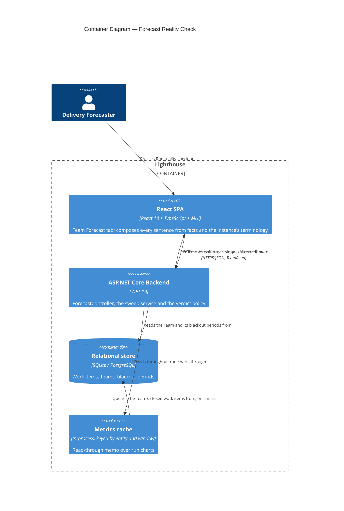

<!-- markdownlint-disable MD024 -->

# Feature Delta — epic-4172-forecast-backtest-sweep

**Feature**: **Forecast Reality Check** — a one-click, synchronous check that replays the Team's own
forecast against its own completed history at four sampling windows and four horizons, and answers in
one sentence that names a *region* of sound sampling windows rather than a winner, and says which
confidence levels actually held up.
**ADO**: Epic #4172, internal codename "The Full Monte" (state Planned, tag `Community`, priority 2).
**Origin**: no named customer. The business-primary objective is demonstrating the method; the
forecaster's own job is genuine but light, and the DIVERGE wave recorded that in the open rather than
inflating it. Source method: Nick Brown (ASOS), *The Full Monte*, ASOS Tech Blog, January 2024.
**Waves present**: DIVERGE (complete, peer-approved), DISCUSS (this).
**Density**: lean, `expansion_prompt: ask-intelligent`.

> **Four user decisions taken after DIVERGE override `recommendation.md` where they differ.** They are
> carried here as D1-D8 and are the substance of this wave. The largest is **U2**: Flux recommended
> scoring every cell against one fixed 85th percentile; the user chose instead to score several and show
> them side by side. That restores the axis Brown's study found carried the entire signal, and it
> changes the feature's headline. See D1-D4.

> **REVISED 2026-09-22, after the first DISCUSS pass was committed (`5ca5cd257`).** The maintainer
> **dropped the Apply control entirely** — removed from the feature, not deferred. It structurally
> contradicted honesty requirement §4.1: the verdict names a *region* ("anything between 30 and 90 days"),
> but a button must write **one** number, so `Apply 60 days` names a winner — the exact claim the Bailey
> et al. reasoning says the data cannot support. The tension was present from DIVERGE onward and nobody
> caught it; scoring Apply 5/5 on DECISION-CHANGING obscured what it cost on HONESTY, the
> higher-weighted criterion. **D4 is rewritten, D5 is deleted, US-03 is gone and the export story is
> promoted into its place, and the feature is now read-only end to end.** Everything else stands.

---

## Wave: DISCUSS / [REF] Prior Wave Consultation

Read on 2026-09-22 before any decision below.

| Source | State |
|---|---|
| `docs/product/` | ✓ exists — no migration gate |
| `docs/product/jobs.yaml` (7432 lines, 136 jobs) | ✓ paged, not read whole — lines 7340-7432 (the SSOT job), 303-382, 1243-1312, 1097-1146 |
| `docs/product/outcomes/registry.yaml` | ✓ present |
| `docs/product/architecture/brief.md` (872 KB) | ✓ searched only, never read whole |
| `docs/product/vision.md`, `docs/project-brief.md`, `docs/stakeholders.yaml` | ⊘ do not exist |
| `docs/feature/epic-4172-*/discover/` | ⊘ DISCOVER deliberately skipped — problem already evidenced in SSOT |
| `recommendation.md` (496 lines) | ✓ read whole, in three pages |
| `diverge/job-analysis.md` §6, §7, §8 | ✓ read — ODI statements quoted from §7 of this file, **never** from `review.yaml` |
| `diverge/competitive-research.md` | ✓ findings carried via `recommendation.md` §1 |
| `diverge/taste-evaluation.md` §6 | ✓ weighting sensitivity carried via `recommendation.md` §6 |
| `wave-decisions.md` | ✓ read whole |
| `docs/product/personas/delivery-forecaster.yaml`, `forecasting-prospect.yaml` | ✓ read whole |
| `docs/product/journeys/forecast-minimum-data-guard.yaml` | ✓ read — the shipped guard this composes with |

Code read directly, listed in the surface inventory below. Nothing in this document rests on an
inference about the codebase that was not checked against the tree on 2026-09-22.

---

## Wave: DISCUSS / [REF] Persona IDs

SSOT ids from `docs/product/personas/`. None is new to this feature.

| Persona | Role here |
|---|---|
| `delivery-forecaster` | **Primary.** Owns the conversation with leadership about how much the Team will deliver. Set `ThroughputHistory` once, probably never, and has no way to find out whether it was right. Presses the button, reads the sentence, decides whether to change the setting and which number to quote. |
| `forecasting-prospect` | **Secondary.** Does not yet use the product. Reads the same artifact — in the launch post, in the docs, or in a one-pager somebody pasted into a Slack channel — and judges the method by it. Recorded on the SSOT job rather than given a job of its own, per the DIVERGE decision. |
| `flow-coach` | **Explicitly not this persona.** Their jobs are diagnostic — stuck items, blocked duration, pace outliers. Forecast-model calibration is not among them. |
| `config-admin` | **Explicitly not this persona.** Owns the `ThroughputHistory` field, but owning a field is not knowing what to put in it. |

---

## Wave: DISCUSS / [REF] JTBD One-Liners

**One job. It already exists in SSOT and was written for this feature — it is traced to, not re-derived.**

- **`job-forecaster-check-the-forecast-against-what-happened`** (`delivery-forecaster`,
  `docs/product/jobs.yaml:7340-7432`) — When I am about to publish a forecast from a Team whose sampling
  configuration I set once and have never checked, I want evidence from that Team's own completed history
  about whether that configuration would have got the last few periods right, so I can either stand
  behind the number or change the configuration before anyone anchors on it.

All four user stories below trace to this one job (N:1). No new job is created. Two corrections are made
to the existing job by this wave, recorded under SSOT Updates.

### ODI outcome statements

Quoted verbatim from `diverge/job-analysis.md` §7. These are **reasoned estimates, not survey results** —
DISCOVER was skipped by design and no customer interviews exist. They must not be quoted downstream as
measured.

| # | Outcome statement | Imp. | Sat. | Score | Status |
|---|---|---|---|---|---|
| **O4** | Minimize the likelihood of ranking one sampling window above another when the comparison rests on periods that are not equivalent. | 8.2 | 1.5 | **14.9** | Under-served |
| **O1** | Minimize the time it takes to determine whether a Team's throughput sampling window produces forecasts that match what that Team actually delivered. | 7.8 | 2.4 | **13.2** | Under-served |
| **O2** | Minimize the likelihood of publishing a forecast whose sampling window has never been compared against a completed period. | 7.1 | 2.0 | **12.2** | Under-served |
| **O5** | Minimize the effort required to show a sceptical stakeholder that probabilistic forecasting held up on a Team's own history. | 6.9 | 2.2 | **11.6** | Under-served (marginal) |
| **O3** | Minimize the number of configuration attempts required before a Team's forecast settings match its observed delivery. | 6.4 | 3.1 | **9.7** | **Over-served — do not invest** |
| **O6** | Minimize the likelihood of reading a calibration result for a period whose history cannot support one. | 7.4 | 6.8 | **8.0** | **Over-served — do not invest** |

**O4 outranks O1**: staying honest about non-comparability scores higher than answering the question.
That is the evidence base for the three honesty requirements being hard acceptance criteria rather than
prose, and for the 30% HONESTY weight in the DIVERGE matrix.

---

## Wave: DISCUSS / [REF] Current-State Surface Inventory

Read from the tree on 2026-09-22, before any decision below was taken.

| # | Surface | What is actually there |
|---|---|---|
| S1 | `Lighthouse.Backend/API/ForecastController.cs:195-234` | `RunBacktest`. **`public ActionResult<BacktestResultDto> RunBacktest(...)` — already synchronous, no `async`/`await`.** One `forecastService.HowMany`, one `GetBlackoutAwareThroughputForTeam`, one `GetThroughputForTeam`, one `GetForecastThroughputStatus`, one `CreateForecastDtos(50, 70, 85, 95)`. Guard `[RbacGuard(RbacGuardRequirement.TeamRead, ScopeIdRouteKey = "teamId")]`. |
| S2 | `ForecastController.cs:169-193` | `ValidateBacktestInput` — four date rules. Under D6 (today as the end anchor) three of the four are vacuous. The fourth, the 14-day minimum, has no successor: the request carries no dates, so there is nothing to hold to a minimum, and whether a short horizon can be evaluated is decided per check by the shipped sufficiency bar (D9). *(Corrected in DISTILL, 2026-09-26: this row used to say the 14-day minimum survives as a property of the 2-week horizon, which cannot be true once the shortest horizon is 1 week.)* |
| S3 | `API/DTO/BacktestResultDto.cs` | Four dates, `List<ForecastDto> Percentiles`, `ActualThroughput`, `FilterApplied`, `ExcludedSummary`. **All four percentiles are already returned by every run.** |
| S4 | `Services/Implementation/Forecast/ForecastDataSufficiencyPolicy.cs:7,9` | `public const int MinimumActiveDays = 5;` and `HasEnoughData(RunChartData throughput) => throughput.DaysWithThroughput >= MinimumActiveDays`. **This is the shipped bar C5 composes with. It is a pure function over a `RunChartData` and can be called per cell without modification.** |
| S5 | `Services/Implementation/TeamMetricsService.cs:110-118` | `GetForecastThroughputStatus` returns `status with { HasSufficientData = ForecastDataSufficiencyPolicy.HasEnoughData(status.Throughput) }` — but over the *Team's configured* window. Per-cell sufficiency means calling S4 on each cell's own `RunChartData`, not calling S5 sixteen times. |
| S6 | `Models/Team.cs:17` and `Team.GetThroughputSettings(DateOnly today)` | `public int ThroughputHistory { get; set; } = 30;`. `GetThroughputSettings` is already today-anchored — `today.AddDays(-(ThroughputHistory - 1))` to `today`. **The end-anchored shape D6 requires is the shape the product already uses.** |
| S7 | `Models/Team.cs` (whole file), `Models/WorkTrackingSystemOptionsOwner.cs:40` | **There is no percentile field on `Team`.** A search for `Percentile` in `Team.cs` returns zero matches. `ServiceLevelExpectationProbability` (default 0) lives on the base class but is a **cycle-time** SLE: its only consumer is `TeamMetricsService.GetSleRiskForTeam:359-397`, via `SleRiskCalculator.For(item.Age, team.ServiceLevelExpectationRange, cycleTimes)`. It governs how long one Work Item may take, not which percentile a How-Many forecast is quoted at. **This is the decisive finding for D4.** |
| S8 | `Lighthouse.Frontend/src/pages/Teams/Detail/TeamForecastView.tsx:438-460` | `<InputGroup title="Forecast Backtesting">` wrapping `<BacktestForecaster>` with six date/mode props. The new control goes inside this group, above the shipped pickers. |
| S9 | `pages/Teams/Detail/TeamDetail.tsx:402-430` | `QuickSettingsBar` → `ThroughputQuickSetting`, present on every Team tab, already writing `throughputHistory` with validation. |
| S10 | `Lighthouse.Frontend/package.json` | `@mui/x-charts` 9.0.1 is the only charts package. There is no `@mui/x-charts-pro`, so no Heatmap component exists. A sixteen-cell matrix needs no charting component regardless. |

---

## Wave: DISCUSS / [REF] Locked Decisions

### D1 — Score all four confidence levels (50 / 70 / 85 / 95), not Brown's three

**This implements U2.** Flux recommended one fixed 85th. The user chose several, side by side. Given
that, the question is *which several*, and the answer is all four.

Four reasons, in order of weight:

1. **It is free, and dropping one costs code.** S1 shows `CreateForecastDtos(50, 70, 85, 95)` already
   runs on every backtest. Scoring three would mean filtering output — more code, to show less.
2. **The rest of the product shows four.** `ForecastPredictabilityScore` adds all four;
   `DeliveryWhenPercentile` takes a `params int[]` that every caller fills with four; the shipped
   backtest display renders four. A calibration artifact that scores three while every neighbouring
   surface shows four is an inconsistency a user would notice and nobody could explain.
3. **The 95th is where the nominal-rate lesson is legible.** A 95% forecast is supposed to be beaten
   about one time in twenty. Across four horizons it will usually be beaten zero times — and that is
   precisely how a user learns that "never beaten" means over-forecasting rather than excellence
   (§4.3). **The 95th is the teaching cell.** Dropping it would remove the clearest instance of the
   honesty requirement it exists to serve.
4. **Comparability to Brown is preserved, not traded away.** His published figures are for 50 / 70 / 85,
   and all three are present. The 95th is an addition, not a substitution. The launch post can quote
   his three and show our four, and that is honest.

### D2 — The confidence level is a *position*, not a fifth panel. Four panels stay four

**This is the main UX problem of the wave, and it dissolves rather than trades off.**

The temptation is to treat the confidence level as a fourth axis and plot it — which at 4 windows × 4
horizons × 4 levels gives 64 marks and an unreadable artifact. That temptation rests on a mistake: a
Monte Carlo How-Many forecast at 50/70/85/95 is **not four forecasts. It is one distribution, read at
four places.** Drawing it as four points throws away the thing that makes it readable.

So the small multiple is: **one panel per sampling window; one row per horizon; each row drawn as a band
running from the 95th to the 50th with the four levels marked along it; one mark showing where the
Team's actual completed count landed.**

```text
  Sampling window: 30 days
                     95    85    70    50
   8 weeks   ├──────┼─────┼─────┼─────┤        ● 42
   4 weeks   ├────┼────┼────┼────┤  ●  19
   2 weeks   not enough history in this window to check
   1 week    ├──┼──┼──┼──┤          ●  6
```

Where the mark falls in the band **is** the per-level verdict, read directly. A mark to the left of the
85th means the 85% forecast held. A mark to the right of the 50th means the 50% forecast was beaten.
There is no percentile selector, no fifth panel, no toggle. **The confidence dimension costs zero panels
and zero controls.**

The nominal-rate roll-up (§4.3) is then four lines of text below the panels, not a visual:

```text
  Across the 14 checks that could be run:
    50%   beaten in 9   (about 7 expected)    about right
    70%   beaten in 5   (about 4 expected)    about right
    85%   beaten in 1   (about 2 expected)    about right
    95%   beaten in 0   (about 1 expected)    never beaten — this is over-forecasting, not excellence
```

> **SUPERSEDED 2026-09-22 by [ADR-210](../../product/architecture/adr-210-a-forecast-level-holds-or-it-does-not-and-its-nominal-rate-is-the-level.md)
> (Accepted). The verdicts in the right-hand column are right; the expected counts are wrong.**
>
> The engine sorts its simulation results descending ("at least N items"), so a level's nominal rate is
> **`P`**, not `100 − P`. Out of fourteen evaluable checks the 85% row expects about **12**, not 2, and the
> 95% row about **13**, not 1. The 50% row is identical under both formulas, which is exactly why the error
> survived review.
>
> The word **"beaten" is retired** — in English a forecast can be beaten *by* the Team or beat the Team,
> and those are opposite events. The measurement is **held**: `actual >= value(P)`. The 95% reading stands
> and gets *stronger*: held in 0 of 14 against about 13 expected is a dramatic signal, where the old
> arithmetic made it read as unremarkable.
>
> This block is left as written so the correction is legible. **AC-1.6 and AC-2.4 carry the corrected
> version and are what DISTILL tests against.**

### D3 — The denominator states two numbers and discloses the correlation between them

§4.2 required the artifact to print its own denominator. With D1 the honest denominator is no longer one
number, and saying "64 configurations were checked" would be dishonest in a *new* direction: the four
levels of one cell are read off **the same simulation** and are perfectly correlated by construction.

The permanent copy therefore states both numbers and their relationship. **It is a template, not a fixed
string** — see the amendment below:

> *"${runCount} forecast runs were checked, each read at ${levelCount} confidence levels — ${scoreCount}
> scores in all. The ${levelCount} levels of a single run come from the same simulation, so they are not
> independent of one another. And each run covers a different stretch of real time — every one ends today
> and reaches back by its own length — so they are not repeated trials of one experiment and should not be
> ranked against each other."*

This is a **better** disclosure than the one §4.2 asked for, and it exists only because U2 forced the
question. It is recorded as an improvement the override produced, not as a concession to it.

> **AMENDED 2026-09-22 (DESIGN, maintainer decision on OQ-2).** This decision originally rendered the
> template with the constants **16 runs / 4 levels / 64 scores**, and those constants were carried
> downstream as though they were the requirement. **They were not.** The honesty requirement §4.2 is
> *state your denominator* — say what was actually checked — and a report reading *"20 forecast runs were
> checked, each read at 4 confidence levels — 80 scores in all"* satisfies it exactly as well.
>
> The sweep is now **16 cells for a Team whose sampling window is on the standard 14/30/60/90 ladder and
> 20 for a Team whose window is off it**, because the off-ladder Team's own setting is tested as a fifth
> window (DES-13). So `${runCount}` is 16 or 20, and `${scoreCount}` is 64 or 80.
>
> **The principle is locked; the constants never were.** The correlation sentence and the
> non-comparability sentence are unchanged, and neither depends on the count.
>
> Everything below this line that says "sixteen" and is a *worked example on a named Team* is correct as
> written — Ocean Explorer sits at 30 and Coastal Survey and Deep Current at ladder values, so all three
> genuinely run sixteen cells. Statements of the *general contract* have been amended to say 16 or 20.

### D4 — Two findings, no buttons. The check reports; the human acts

**Rewritten 2026-09-22 when Apply was dropped.** The earlier version explained why only *one* of the two
axes had a control. Neither does now, so the asymmetry no longer needs explaining — and the copy gets
simpler and more direct as a result.

The check reports two findings, and the user acts on both themselves:

> *The sampling window is a setting on this Team, and this check found it barely matters across the range
> tested — anything between 30 and 90 days would have behaved about the same.*
> *The confidence level is not a setting. It is which of the four numbers you say out loud in the room,
> and this check found it matters enormously.*

The underlying fact is unchanged and was established by searching the tree rather than by assuming. S7
records it: `Team` carries no percentile field. `ServiceLevelExpectationProbability` exists on the base
class but is a cycle-time SLE consumed only by `GetSleRiskForTeam` — it bounds how long one Work Item may
take, and has nothing to do with which percentile a How-Many forecast is quoted at. Forecast percentiles
are the fixed set 50/70/85/95, hard-coded at every call site. **The product shows all four and lets the
human choose which to quote.**

**Why no control for the sampling window either.** Two reasons, in the maintainer's order of weight:

1. **A button would contradict §4.1.** The verdict names a region. A button must write one number.
   `Apply 60 days` names a winner inside a range the artifact has just said is undifferentiated — which
   is precisely the selection-bias claim Bailey et al. say a sixteen- or twenty-cell search against
   months of history cannot support. It would undo the feature's central honesty discipline in the single
   interaction the user is most likely to trust.
2. **The control is already on screen.** Verified: `ThroughputQuickSetting` sits in
   `QuickSettingsBar` inside `DetailHeader`'s `quickSettingsContent` (`TeamDetail.tsx:402-405`) — the page
   shell, so it renders on **every** Team tab including the Forecast tab where the check lives. A user
   reading "your 14 days is outside the sound range" already has the throughput control visible on the
   same screen. Apply was a shortcut to something already in front of them, bought at the cost of point 1.

**One wrinkle worth recording, found while verifying point 2**: that header block is wrapped in
`showWriteControls ?`, so a read-only user sees no throughput control at all. That does not break
anything — it makes the read-only path cleaner, because for such a user the check is purely informational
and there is no control anywhere to be inconsistent with. It does mean "the control is already on screen"
is true *for users who can act on it*, which is the only audience the argument needs.

**Residual — DECLINED by the maintainer, 2026-09-22**: *should Lighthouse gain a per-Team default forecast
confidence level?* It was raised as a candidate ADO item and the maintainer declined to raise one.
**Recorded as considered-and-declined so a later wave does not re-raise it as though it were an
oversight.** The consequence is that the window/level asymmetry — one axis is a setting, the other is a
reading — is now **permanent by decision rather than by accident.**

### D5 — deleted

**D5 previously read "Apply appears only when the current window is outside the sound region".** It was
deleted on 2026-09-22 when Apply was dropped: the conditional-button logic, the "what do we render when
there is nothing to apply" case and the no-op-button reasoning all went with it.

**The number is left as a tombstone rather than renumbered**, because D6-D13 are cross-referenced from the
journey YAML, the slice briefs and `wave-decisions.md`, and silently shifting them would break every one
of those references for no gain.

### D6 — Today is the end anchor. No date picker anywhere

**U4, settled before this wave.** Every cell ENDS today and reaches backward by its horizon. The 8-week
cell scores `[today-8w, today]`, with its history window immediately before it at
`[today-8w-W, today-8w]`. S6 shows this is the shape `Team.GetThroughputSettings` already uses.

**Load-bearing consequence**: each horizon scores a *different* stretch of real time, so the cells are
not repeated trials of one experiment and must never be ranked against one another. This is honesty
requirement §4.2 and it is why D3's copy is permanent rather than a tooltip.

Practical consequence: the request body carries no dates, which is what makes one click viable and what
makes three of S2's four validation rules vacuous.

### D7 — The three-way verdict is kept, and the departure from the source is owned out loud

**U3, confirmed.** Under / over / within-range is kept. Brown scored one-sided — over-delivery counted as
correct. Ours is arguably more honest (a forecast never beaten is over-forecasting, not excellence) and
matches weather verification's symmetric treatment of conditional bias.

**It must never be described as "what Nick Brown did."** Wherever the source method is credited — the
UI, the docs, the launch post, the exported one-pager — the departure is stated in the same place.
AC-1.8 and AC-3.4 make this testable.

### D8 — No Report abstraction. ADR-209 is a DESIGN deliverable

**U1, confirmed as Flux recommended.** Nothing is stored: no entity, no table, no `UpdateType` member,
no queue work, no notification seam. The result is a response, not a record.

ADR-209 (issued as the next free number, ADR-207 — renumbered to 209 on 2026-09-24, because story 6053 had taken 207 and 208 in a parallel DESIGN wave) records the position, the accepted
consequence ("has this Team ever been checked?" is unanswerable, and emailing needs something durable
that does not exist), the named revisit trigger (**the second Report kind**, not a date), the six
questions the eventual Report ADR must answer, the ADR-195 single-lane measurement behind the runner
question, and the forward-compatibility constraint that the result shape must not hard-code one Team.
The parked constellation (#1822, #4753, #4754, #4755, #4155, #4080) is named as future context only.

**Luna does not write this ADR.** It is flagged here as a DESIGN-wave deliverable.

### D9 — Per-cell sufficiency reuses the shipped bar unchanged. No second bar

**C5.** Each cell's own history window is checked by `ForecastDataSufficiencyPolicy.HasEnoughData`
(S4, `MinimumActiveDays = 5`) called on that cell's own `RunChartData`. `MinimumActiveDays` is not
changed, no new threshold is introduced, and nothing in `ForecastDataSufficiencyPolicy` is touched.

Because each cell carries its own history window, **sufficiency varies within one report** — one artifact
can hold answerable and unanswerable cells at once. ADR-194 governs the rendering: on this product's
charts a blank region already means "too little history", so a calm result and an unevaluable one must
never render alike, and "leave it empty" is the option that ADR already ruled out. An unevaluable row
says so in words where the band would be.

### D10 — The name

| Layer | Name |
|---|---|
| User-facing | **Forecast Reality Check**, shortening to **"Reality Check"** in-app |
| Placement label | inside the existing `InputGroup title="Forecast Backtesting"` (S8) |
| Internal codename | **"The Full Monte"** — kept, in the commit scope, the ADO Epic title, and the launch post *with attribution to Nick Brown* |
| Engineering slug | `epic-4172-forecast-backtest-sweep` — unchanged |

**C6 extended**: "throughput" is itself user-renameable under Settings → Terminology, so it cannot appear
in a feature name — it would render as the user's own word. Safe vocabulary: forecast, calibration,
hindsight, replay, accuracy, check, reality, sampling, history, percentile.

### D11 — Re-sliced. Every slice carries user-visible value

**`recommendation.md` §5.5 is corrected here, as Flux invited ("a starting shape for Luna, not a
decision").** Its slice 01 was the endpoint with no UI and its slice 02 the verdict logic with still no
UI — two consecutive slices of `@infrastructure` stories with no release value, which is a structural
failure this workflow hard-gates on.

What Flux was protecting is preserved in full:

- **(a) The R-1 timing measurement still happens first**, before any UI is written. It is the first task
  of slice 01 and AC-1.1 gates the rest of the slice on it.
- **(b) The honesty requirements are still built early.** All three land in slice 01 — they are the
  sentence, and the sentence is the first thing that ships. They cannot be dropped under UI pressure
  because they *are* the UI.

The endpoint and the verdict logic become precursor commits inside slice 01 rather than slices of their
own. **Three slices result** (four, until Apply was dropped on 2026-09-22 and its slice collapsed), every
one of them user-visible. The `@infrastructure`-only hard gate was re-checked after that removal: slice 01
ships a sentence, slice 02 ships the evidence view, slice 03 ships the one-pager. No slice is left whose
only content is copy or plumbing. See the story map.

### D12 — No CLI / MCP client exposure in this Epic

Answered explicitly rather than skipped; see the project checklist below.

### D13 — R-6 is out of scope and is now Bug #6071

`Team.ThroughputHistory` defaults to **30** (`Team.cs:17`) while `CreateTeamWizard.tsx:35` and
`EditTeam.tsx:80` both seed **90**. Independently verified. **Do not fold into this Epic** — it is now
tracked as **Bug #6071**. It is recorded here because it was found while researching this feature, and
because it is incidentally an argument *for* the feature: nobody currently knows which value is right.

---

## Wave: DISCUSS / [REF] Scope Assessment

**PASS — right-sized. 3 stories, 2 modules, ~17h (≈2.5 days).** Assessed before journey visualisation, per
the early gate; re-checked 2026-09-22 after Apply was dropped (was 4 stories / ~20h).

Oversized signals checked:

| Signal | Present |
|---|---|
| More than 10 user stories | No — 3 |
| More than 3 bounded contexts or modules | No — 2 (backend forecasting/API; Team Forecast UI). Slice 03's export is client-side within the second |
| Walking skeleton needs more than 5 integration points | N/A — no walking skeleton (brownfield, Strategy B) |
| Estimated effort over 2 weeks | No — ~17h |
| Multiple independent user outcomes that could ship separately | One outcome, one job. Slice 03 is severable but serves the same job through a secondary persona |

No split required. Slice 03 is severable on its own merits, not because the feature is oversized.

---

## Wave: DISCUSS / [REF] Walking Skeleton Strategy

**Strategy B — extend an existing end-to-end path. No walking skeleton is built.** Decision 2, confirmed
against the tree: the endpoint pattern (S1), the forecast engine, the blackout-aware working-day counting,
the data-sufficiency guard (S4) and the Team Forecast surface (S8) are all shipped. Slice 01 runs a second
kind of request down a path that already exists. **The feature adds no write path at all** — since Apply
was dropped it is read-only end to end.

Nothing in this feature uses a configurable or environment-switching strategy, so the strategy-D
expansion trigger does not fire.

---

## Wave: DISCUSS / [REF] Driving Ports

| Port | Surface | Slice |
|---|---|---|
| HTTP | `POST /api/latest/forecast/reality-check/{teamId}` and `POST /api/v1/forecast/reality-check/{teamId}` | 01 |
| UI | Team → Forecast tab → "Forecast Backtesting" group → the check button and its verdict sentence | 01 |
| UI | the same group → "Show the evidence" → four small-multiple panels and the nominal-rate lines | 02 |
| Clipboard | "Copy as Markdown" from the verdict card | 03 |

**There is no driving port that writes.** The feature is read-only end to end.

---

## Wave: DISCUSS / [REF] User Stories

### US-01 — One sentence that says whether the configuration behind my forecasts is sound

**Job**: `job-forecaster-check-the-forecast-against-what-happened`
**Persona**: `delivery-forecaster`
**Slice**: 01

As a delivery forecaster about to publish a number leadership will hold me to, I want one press to tell
me whether the sampling window behind every forecast this Team produces would have got the last few
periods right — and which of the four confidence levels actually held up — so that I can stand behind
tomorrow's forecast for a reason rather than out of habit.

#### Elevator Pitch

Before: the Team's Forecast tab can back-test exactly one hand-typed date pair at a time, and nothing
anywhere in the product says whether the sampling window driving every forecast this Team publishes is
sound. Nobody runs it, because you have to already suspect the answer to know which dates to type.

After: press **Run reality check** in the Forecast Backtesting group and within seconds one sentence
comes back — *"Anything between 30 and 90 days would have behaved about the same for Ocean Explorer, and
your current 30 is inside that range. At the 85% level the forecast held in 3 of the 4 checks; at 50% it
held in 1 of 4. Two of the sixteen checks could not run: their 14-day sampling windows hold fewer than
5 days with completed Work Items."*

Decision enabled: whether to publish tomorrow's forecast as configured or change the window first — and,
independently, which of the four numbers to say out loud in the room.

#### Domain Examples

##### 1 — Happy path, and the modal case: the null result

Maria Santos runs delivery for **Ocean Explorer**, a Team with fourteen months of Work Items and
`ThroughputHistory` left at the entity default of 30 days. She presses the button on a Tuesday. All
sixteen cells evaluate. Every sampling window behaves alike: the region is *all of them*. The sentence
reads *"Anything between 14 and 90 days would have behaved about the same for Ocean Explorer. Your
current 30 is inside that range — this setting is fine."* The second
clause reads *"At 85% the forecast held in 4 of 4 checks; at 95% it held in 4 of 4 and was never beaten,
which is over-forecasting rather than excellence; at 50% it held in 1 of 4."* Maria keeps her setting and
starts quoting the 85th instead of the 70th.

##### 2 — Edge case: sufficiency varies inside one report

**Coastal Survey** was formed eleven weeks ago and closes work in bursts. Its 90-day and 60-day cells
evaluate; its 14-day cells hold 3 and 4 distinct days with a completed Work Item respectively, below
`MinimumActiveDays = 5`. Four of the sixteen cells are unevaluable. The sentence names them and their
reason, every count is taken over the twelve that ran, and the four rows in the evidence view say so in
words where the band would be — never blank (D9, ADR-194).

##### 3 — Error/boundary: the window really is wrong

**Deep Current** has `ThroughputHistory` at 14 days after somebody set it during a spike three quarters
ago. The 14-day window over-forecast in three of its four checks; 30, 60 and 90 all behaved alike. The
sentence reads *"Anything between 30 and 90 days would have behaved about the same for Deep Current. Your
current 14 is not inside that range — it over-forecast in 3 of its 4 checks."* This is the minority case.
Maria changes the setting herself using the throughput control already visible in the Team header on the
same screen (D4); the feature writes nothing on her behalf.

#### UAT Scenarios (BDD)

```gherkin
Scenario: The check answers in one sentence without asking for a date
  Given Maria Santos is on Ocean Explorer's Forecast tab
  And Ocean Explorer's sampling window is set to 30 days
  When Maria presses "Run reality check"
  Then a verdict sentence appears in the Forecast Backtesting group
  And she was asked for no dates at any point

Scenario: Every window behaving alike is a real answer, not an absence
  Given Ocean Explorer's history makes all four sampling windows behave alike
  When Maria runs the reality check
  Then the verdict names the whole range as acceptable and says her current setting is fine
  And no single sampling window is described as best or recommended

Scenario: The artifact states what it checked and why the checks cannot be ranked
  Given Maria has run the reality check on Ocean Explorer
  When she reads the result
  Then the count of runs, the count of scores, and the fact that a run's four levels share one simulation are on screen
  And the statement that each run covers a different stretch of real time ending today is on screen
  And neither statement is hidden behind a tooltip or a disclosure

Scenario: A confidence level that never held is called over-forecasting
  Given Ocean Explorer's 95% forecast was not reached in any of the evaluable checks
  When Maria reads the verdict
  Then the 95% level is described as over-forecasting rather than as excellent
  And the number of checks its nominal rate expected it to hold in is stated alongside it

Scenario: A period whose own history is too thin is excluded and named
  Given Coastal Survey's 14-day sampling windows hold fewer than 5 days with a completed Work Item
  When Maria runs the reality check on Coastal Survey
  Then those checks are reported as unable to run, with that reason
  And they are excluded from every count in the verdict

Scenario: Reading the check needs read rights on the Team and nothing more
  Given Tom Becker can read Ocean Explorer but cannot change its settings
  When Tom runs the reality check
  Then he sees the verdict
```

#### Acceptance Criteria

- **AC-1.1 (R-1, measurement gate — runs before any other work in this slice)** — a full reality check
  (**sixteen runs for a Team on the standard sampling-window ladder, twenty for a Team whose own window is
  off it** — DES-13) on a Team holding at least twelve months of Work Items completes on the development
  instance with a **median at most 5 seconds and a maximum at most 10 seconds across twelve samples**,
  alongside the measured median of a single shipped `POST /api/latest/forecast/backtest/{teamId}` on the
  same Team as a baseline. Both numbers are written into the slice brief. **If the budget is missed, the
  slice stops and the fallback (`UpdateQueueService`, with the ADR-195 single-lane caveat) is re-scoped
  before any UI is written.**
  **RESOLVED 2026-09-22 by measurement for the sixteen-cell case** — see "R-1, measured" at the foot of
  this document. The twenty-cell case is extrapolated, not measured.
- **AC-1.2** — `POST /api/latest/forecast/reality-check/{teamId}`, and the `/api/v1/…` twin, accept a body
  of at most `{ "applyFilterOverride": true | false | null }` and return the verdict, the denominator, the
  confidence levels used, the sampling-window ladder actually swept, and **one cell per
  (horizon × sampling window) pair — sixteen on the standard ladder, twenty when the Team's own window is
  off it** — each carrying its real start and end date, its four forecast values, the Team's actual
  completed count, a coverage state per confidence level, and a sufficiency state. **The body accepts no
  dates**, and the response carries no field naming a single winning sampling window.
- **AC-1.3 (RBAC)** — the endpoint is guarded by
  `[RbacGuard(RbacGuardRequirement.TeamRead, ScopeIdRouteKey = "teamId")]`, identical to the shipped
  backtest. A user with Team read but not Team write receives the full result. No new
  `RbacGuardRequirement` member is introduced and no new permission is added.
- **AC-1.4 (honesty §4.1 — region, never a winner)** — the verdict names a *range* of sampling windows
  that behaved alike and states whether the Team's current setting is inside it. For a Team where every
  swept window behaves alike, the sentence reads that the current setting is fine. No response field and
  no rendered string names one window as best. **The Team's own sampling window is always one of the
  windows swept** (DES-13), so "is your setting inside the sound region" is a membership test over cells
  that were actually run.
- **AC-1.5 (honesty §4.2 — denominator and non-comparability, per D3)** — permanently on screen, never
  behind a tooltip or a disclosure: the number of runs, the number of scores, the statement that the four
  levels of one run come from the same simulation and are therefore not independent, and the statement
  that each run covers a different stretch of real time ending today and must not be ranked against the
  others.
- **AC-1.6 (honesty §4.3 — coverage against a nominal rate, per D1)** — the verdict reports, for each of
  the four confidence levels, how many of the evaluable checks the forecast held in, and prints the level
  as a number, together with the count its nominal rate expects — `evaluated × P/100` (ADR-210, Accepted;
  "held" replaces "beaten", and the expected count is `P`, not `100 − P`). A level that **held in none** of
  the evaluable checks is described as over-forecasting rather than as
  excellent.
- **AC-1.7 (C5 / D9)** — a cell whose own history window holds fewer than five distinct days with at
  least one completed Work Item is marked unevaluable by `ForecastDataSufficiencyPolicy.HasEnoughData`
  called unchanged, is excluded from every count, and is named in the sentence with its reason.
  `MinimumActiveDays` is not changed and no second threshold is introduced.
- **AC-1.8 (D7)** — no response field, UI string, doc page or launch-post sentence attributes the
  three-way under / over / within-range verdict to Nick Brown. Wherever the source method is credited, the
  departure is stated in the same place.
- **AC-1.9 (D4 — moved here 2026-09-22 when Apply was dropped)** — permanent copy reports the two findings
  as two findings: that the sampling window is a setting on this Team, and that the confidence level is
  not a setting but a choice of which number to quote. **The feature renders no control that writes any
  Team setting**, and no string offers to change one.

> **Sizing note, stated rather than gamed**: US-01 carries 9 acceptance criteria against a 3-7 band.
> AC-1.1 is a measurement gate rather than a behaviour, so the story is eight behaviours and a probe, and
> AC-1.9 arrived by absorbing the copy from the deleted Apply story rather than by the story growing.
> The precedent is `epic-6033` US-01, which carried ten and passed DoR. The story remains demonstrable in
> one session and estimated at one day.

#### Technical Notes

- Reuses unchanged: `forecastService.HowMany`, `teamMetricsService.GetBlackoutAwareThroughputForTeam`,
  `GetThroughputForTeam`, `blackoutPeriodService.GetEffectiveBlackoutDays` / `CountWorkingDays`,
  `GetForecastThroughputStatus`, `CreateForecastDtos`, `ForecastDataSufficiencyPolicy.HasEnoughData`.
  **Nothing in the forecast engine changes.**
- `BacktestInputDto`'s validation (S2) is not reused as written; D6 makes three of its four rules vacuous.
- No entity, no migration, no `UpdateType` member (D8).
- Route style: kebab-case is this codebase's convention (`my-summary`, `group-mappings`, `system-admins`).
- Forward-compatibility (ADR-209): the result shape must not hard-code one Team — "check every Team at
  once" is a plausible next unit of work and nothing here should make it expensive.

#### Dependencies

`ForecastController` two-route pattern (shipped, S1) · `ForecastDataSufficiencyPolicy` (shipped, S4) ·
`TeamForecastView` `InputGroup` (shipped, S8). All confirmed present. AC-1.1 is the only open unknown
and it is resolved inside this slice.

---

### US-02 — The evidence, when the sentence is not enough

**Job**: `job-forecaster-check-the-forecast-against-what-happened`
**Persona**: `delivery-forecaster` (secondary: `forecasting-prospect`)
**Slice**: 02

As a forecaster who is about to repeat this verdict to someone who will push back, I want to see the
checks themselves — each one's forecast range with the Team's actual marked against it — so that
I am repeating something I have looked at rather than something I was told.

#### Elevator Pitch

Before: the verdict is a sentence you either believe or you do not, and the checks behind it exist
only inside the response.

After: click **Show the evidence** under the verdict and a panel appears per sampling window checked —
four for Ocean Explorer, five for a Team whose own window is off the standard ladder — each
with a row per horizon drawn as a forecast band with a mark showing where the Team's actual landed — plus
four lines saying how often each confidence level held and how often it should have.

Decision enabled: whether the sentence is solid enough to repeat to a stakeholder — and, on seeing a 95%
band that never held across the checks, that "never held" is a symptom rather than a score.

#### Domain Examples

##### 1 — Happy path

Maria expands the evidence on Ocean Explorer. Four panels: 14, 30, 60, 90 days. In the 30-day panel the
8-week row's mark sits between the 70th and the 85th; the 4-week row's sits between the 85th and the 95th.
She can see without reading a number that the 85th has been holding and the 50th has not. The nominal-rate
lines below confirm it in four lines.

##### 2 — Edge case: an unevaluable row inside an otherwise healthy panel

On Coastal Survey, the 14-day panel's 2-week row cannot be drawn. Where the band would be, the row reads
*"not enough history in this window — 3 days with completed Work Items, 5 needed"*. It is visually
distinct from every evaluable outcome and is never blank (ADR-194).

##### 3 — Boundary: the whole panel is unevaluable

A Team created six weeks ago has no evaluable cell at all in its 90-day panel. The panel renders with all
four rows carrying their reason, rather than the panel being dropped — a missing panel would be read as
"this window was fine".

#### UAT Scenarios (BDD)

```gherkin
Scenario: The evidence shows one panel per sampling window and no more
  Given Maria has run the reality check on Ocean Explorer
  When she expands the evidence
  Then she sees four panels, one for each sampling window checked
  And she is offered no control for choosing a confidence level

Scenario: Where the actual landed is what says which levels held
  Given the 30-day panel's 8-week check forecast between 31 and 48 items and Ocean Explorer completed 42
  When Maria reads that row
  Then the forecast is drawn as a band with its four confidence levels marked
  And the actual of 42 is marked at its position within that band

Scenario: A check that could not run says so where the picture would be
  Given Coastal Survey's 14-day, 2-week check holds 3 days with completed Work Items
  When Maria expands the evidence for Coastal Survey
  Then that row states it could not be checked and why
  And it does not render as an empty or a calm result

Scenario: Each confidence level reports how often it held against how often it should have
  Given twelve of Coastal Survey's sixteen checks could be run
  When Maria reads the lines below the panels
  Then each of the four confidence levels reports how many of the twelve it held in
  And each states the number of times its nominal rate would expect

Scenario: The non-comparability statement is visible whether or not the evidence is expanded
  Given Maria has run the reality check and has not expanded the evidence
  When she reads the collapsed result
  Then the denominator and non-comparability statements are on screen
```

#### Acceptance Criteria

- **AC-2.1 (D2, amended by DES-13)** — expanding the evidence reveals **exactly one panel per sampling
  window swept — four on the standard ladder, five when the Team's own window is off it** — titled by
  window length and ordered by window length ascending. No per-confidence-level panel is added and no
  confidence-level control is rendered.
  **This is the one place where "four panels stay four" genuinely changes.** D2's rule was never about the
  number four; it was that the *confidence level* must not become an axis. A fifth panel is a fifth
  sampling window, which is the axis the panels already carry. The confidence dimension still costs zero
  panels and zero controls.
- **AC-2.2 (D2)** — each panel carries one row per horizon. The row draws the forecast as a band spanning
  the four confidence levels, with a single mark at the Team's actual completed count. The mark's position
  within the band is what reports which levels held.
- **AC-2.3 (ADR-194 / D9)** — an unevaluable row renders its reason in words where the band would be. It is
  visually distinct from every evaluable outcome and is never left blank. A panel whose rows are all
  unevaluable still renders, rather than being omitted.
- **AC-2.4 (honesty §4.3, amended by ADR-210)** — below the panels, one line per confidence level: the
  count of evaluable checks in which that level **held** (`actual >= value(P)`), the count its nominal
  rate expects (`evaluated × P/100`), and a plain reading of the two together. A level that held in none
  of them is over-forecasting; a level that held in all of them where far fewer were expected is
  under-forecasting.
- **AC-2.5** — the AC-1.5 denominator and non-comparability copy is on screen whether or not the evidence
  is expanded.
- **AC-2.6** — no charting package is added. The panels build on `@mui/x-charts` 9.0.1 or on plain layout.
  `@mui/x-charts-pro` is not introduced, and no heatmap or ranked-list rendering is used.

#### Technical Notes

Presentation only — consumes the slice 01 response and adds no computation. ADR-194 is the governing
precedent for AC-2.3 and is not amended. The rendering is deliberately not a matrix: a matrix is a
coordinate system and D6 says these cells are not one.

#### Dependencies

Slice 01 (the response shape). No external dependency.

---

### US-03 — The answer travels to the person who asked the question

**Job**: `job-forecaster-check-the-forecast-against-what-happened`
**Persona**: `forecasting-prospect` (primary for this story; `delivery-forecaster` produces it)
**Slice**: 03 — **severable**

As a forecaster who was asked "how do you know this is right?" by someone who is not in the room, I want
to paste the whole check into a message, so that the answer is something they can check rather than
something they have to take from me.

#### Elevator Pitch

Before: nothing about the check leaves the browser. A sceptic has to be sitting at the screen, and a
prospect who has never used the product cannot see it at all.

After: press **Copy as Markdown** on the verdict card and the clipboard holds a one-pager — the verdict
sentence, the denominator and non-comparability paragraph, the sixteen rows with their real date spans and
outcomes, the unevaluable rows with their reasons, and the nominal-rate table — ready to paste into Slack,
a Confluence page, or an email.

Decision enabled: whether the person who asked gets an answer they can interrogate, or a claim they have to
trust. For a prospect, whether the method is worth their evaluation at all.

#### Domain Examples

##### 1 — Happy path

Maria pastes the one-pager into the delivery channel under her forecast. Her director reads the sentence,
the sixteen date spans and the line saying they are not repeated trials, and stops asking.

##### 2 — Edge case: terminology is the reader's, not ours

A customer has renamed "Work Item" to "Ticket" and "throughput" to "delivery rate". The pasted one-pager
reads *"fewer than 5 days with completed Tickets"* and never contains the words "Work Item" or
"throughput" except as that instance's configured terms.

##### 3 — Boundary: a report that is mostly unevaluable

Coastal Survey's one-pager has four unevaluable rows. They are in the table with their reasons, not
silently dropped — an export that omits them would mislead exactly the audience it exists for.

#### UAT Scenarios (BDD)

```gherkin
Scenario: The whole check pastes into a message
  Given Maria has run the reality check on Ocean Explorer
  When she presses the copy control on the verdict card
  Then the clipboard holds the verdict, the non-comparability statement, all sixteen rows with their date spans, and the nominal-rate table

Scenario: Checks that could not run travel with the ones that could
  Given four of Coastal Survey's sixteen checks could not be run
  When Maria copies the one-pager
  Then those four appear in the table with the reason they could not run

Scenario: The one-pager speaks the reader's vocabulary
  Given the instance has renamed Work Item to Ticket
  When Maria copies the one-pager
  Then it says Ticket wherever it refers to a work item

Scenario: The one-pager credits the source method and names where we departed from it
  Given Maria has copied the one-pager
  When she reads its footer
  Then it credits Nick Brown's method and states that the three-way verdict is our departure from it
```

#### Acceptance Criteria

- **AC-3.1** — the copy control produces a Markdown one-pager holding the verdict sentence, the AC-1.5
  denominator and non-comparability paragraph, **every row that was run** — sixteen on the standard
  ladder, twenty when the Team's own window is off it — with its real date span and outcome, every
  unevaluable row with its reason, and the nominal-rate table.
- **AC-3.2 (ADR-172 / ADR-162)** — the one-pager is built in the client. No server-side document renderer
  is added and no new endpoint is introduced.
- **AC-3.3 (C6)** — every configurable term renders from the instance's terminology. The words "Epic",
  "Initiative" and "Story" do not appear. "Throughput" appears only as that instance's configured term.
- **AC-3.4 (D7)** — the one-pager credits Nick Brown's method and states, in the same paragraph, that the
  three-way under / over / within-range verdict is this product's departure from it.

#### Technical Notes

The export precedent is ADR-172 (a Delivery exports one settled table the caller builds) and ADR-162
(export header block as a generic toolbar input). Both are client-side, which is what makes this cheap and
what makes the durable emailable Report expensive (D8).

#### Dependencies

Slices 01 and 02 (the verdict and the cell detail). Severable — if dropped, the feature still ships.

---

## Wave: DISCUSS / [REF] Story Map and Slices

**Backbone**: press it → read the sentence → look at the evidence → send it to someone else.

*(The backbone previously had a fifth step, "act on it". It was removed with Apply on 2026-09-22 — the
user still acts, using the throughput control already on the page, but the feature does not do it for
them.)*

| Slice | Story | Ships | Estimate |
|---|---|---|---|
| 01 | US-01 | R-1 measurement, the endpoint, the verdict logic with all three honesty requirements, and the sentence and button on the Forecast tab | ~1h probe + ~7h |
| 02 | US-02 | Four small-multiple panels, the unevaluable-row state, the nominal-rate lines | ~6h |
| 03 | US-03 | The Markdown one-pager — **severable** | ~4h |

**Walking skeleton**: none. Strategy B, brownfield — see the strategy section.

### Priority Rationale

1. **Slice 01 first — it carries the only decisive unknown and all three honesty requirements.** AC-1.1
   runs before anything else in the slice; if a sixteen-run sweep does not fit a request, every downstream
   decision changes and finding out costs an hour. The three honesty requirements land here because they
   *are* the sentence — building them into the first user-visible thing is what makes them impossible to
   drop later. This is what `recommendation.md` §5.5 was protecting, preserved without the
   `@infrastructure`-only slices.
2. **Slice 02 second — it is the mitigation that earns the recommendation's weakest score.** M1 scores 3/5
   on HONESTY, the highest-weighted criterion, and the evidence view is what moves it. Second, not first,
   because a verdict nobody can act on is still worth more than evidence nobody has a verdict for; but not
   later than second, because deferring it is exactly how the recommendation degrades into the "black box"
   exposure §3 names.
3. **Slice 03 last and severable — it serves the declared secondary objective.** C1 makes conversion an
   honest secondary, the Epic is tagged Community for that reason, and this is the whole of the marketing
   surface. Last because a one-pager of a verdict that has not been dogfooded is a liability rather than an
   asset.

*(A slice between 02 and 03 previously carried Apply, on the reasoning that O3 scored 9.7 — over-served —
but that Apply shipped anyway because `ThroughputQuickSetting` already existed and the cost was near zero.
Dropped on 2026-09-22: near-zero cost was the wrong axis to judge it on, because what it actually cost was
§4.1. See D4.)*

### Carpaccio taste tests

- **Four or more new components in one slice?** Slice 01 adds one endpoint, one verdict calculation and
  one card. Slice 02 adds one panel component. Pass.
- **Every slice depending on a new abstraction?** Slices 02 and 03 both consume slice 01's response, which
  is why it ships first. Nothing depends on an abstraction built speculatively. Pass.
- **Does any slice disprove a pre-commitment?** Slice 01 disproves the synchronous premise if AC-1.1 fails
  — the whole recommendation rests on it. Slice 02 disproves D2 if four bands per panel turn out to be
  unreadable at real data. Pass.
- **Synthetic data only?** Slices 01 and 02 are dogfooded against this project's own Lighthouse instance
  with real history, per `recommendation.md` §5.5. Pass.
- **Two slices identical but for scale?** 02 and 03 both render the same cells, but one is on screen and
  one is a portable document for a different persona. Not merged, deliberately. Pass.
- **Is any slice left with no user-visible value?** Re-checked after Apply was dropped. Slice 01 ships a
  sentence, 02 the evidence view, 03 the one-pager. None is `@infrastructure`-only. Pass.

---

## Wave: DISCUSS / [REF] Out of Scope

- **Any Report entity, table, migration, `UpdateType` member, queue work or notification seam.** Declined,
  not deferred (D8). ADR-209 records why and what the second Report must decide.
- **Any control that writes a Team setting — the Apply button.** **Declined 2026-09-22, not deferred**
  (D4). It contradicted §4.1 by naming one number inside a range the artifact had just called
  undifferentiated, and the control it was a shortcut to is already on the same screen. **DESIGN should
  not reintroduce it as an obvious improvement.**
- **A per-Team default forecast confidence level.** **Raised as a candidate and DECLINED by the maintainer,
  2026-09-22** (D4). Recorded so a later wave does not re-raise it as though unconsidered. The
  window/level asymmetry is permanent by decision.
- **The `ThroughputHistory` 30-vs-90 default disagreement** (D13). Tracked as **Bug #6071**.
- **Rolling-origin evaluation** (R-7). C4/D6 is not reopened. Recorded as the strongest candidate for a
  later slice if the honesty mitigations prove insufficient in use.
- **Scheduling, continuous checking or auto-adjustment** (C2). On demand only. The auto-adjusting future
  is deliberately not foreclosed but is not built.
- **The forecast-throughput filter as a sweep dimension** (C3). It is a config option of the run,
  `applyFilterOverride`, and nothing else.
- **A second data-sufficiency bar** (C5 / D9). The shipped `MinimumActiveDays = 5` is composed with,
  unchanged.
- **Any change to the forecast engine.** AC-1.2's reuse list asserts this.
- **CLI or MCP client exposure** (D12). See the checklist below for the explicit answer and the
  precondition that would reverse it.
- **ADR-127's team-settings advisory channel.** Story #5612 deleted it; `ValidationAdvisory.tsx` is absent
  from the frontend and a later rung was built *"rather than reviving them"*. **Do not reach for that
  mechanism.** ADR-127 now carries a SUPERSEDED-BY-EVENTS status note recording the deletion, so the
  standing caution this document used to raise is discharged — read the corrected ADR.

---

## Wave: DISCUSS / [REF] Project DISCUSS Checklist

No silent N/A — every item answered.

### RBAC impact — no new surface, and now read-only end to end

**Confirmed against the tree.** The one endpoint reuses
`[RbacGuard(RbacGuardRequirement.TeamRead, ScopeIdRouteKey = "teamId")]`, byte-identical to the shipped
`POST backtest/{teamId}` (S1). No new `RbacGuardRequirement` member, no new permission, no new scope.

**Simplified 2026-09-22 by dropping Apply, and worth stating rather than letting it disappear: the feature
now has no write path at all.** It reads, it renders, it copies to the clipboard. Previously the RBAC
answer had two halves — a read endpoint plus a write that borrowed `canUpdateTeamData` through the shipped
`ThroughputQuickSetting`. The second half is gone. There is no write endpoint, no borrowed write path, and
no control anywhere in the feature that mutates a Team.

Consequences, all simplifications:

- **A single permission governs the whole feature**: Team read. Anyone who can see the Team's Forecast tab
  can run the check and read every part of the result.
- **There is no differential rendering by permission** — no control to show or hide, so no
  read-versus-write branch in this feature's UI at all.
- The project's standing rule still holds and is unchanged: all UI gating derives from the `useRbac()`
  hook, and **no component fetches `/api/latest/authorization/my-summary` directly.** This feature adds no
  new gating, so it adds no new opportunity to break that rule.

*(One observation recorded under D4: the Team header's `QuickSettingsBar` is itself wrapped in
`showWriteControls ?`, so a read-only user sees no throughput control on the page either. That is existing
behaviour this feature neither uses nor changes.)*

### Lighthouse-Clients CLI / MCP versioning — deliberately no, with the precondition for later

**Answer: no CLI or MCP exposure in this Epic, and no client version bump.**

The reason is not cost, it is honesty. The value of this feature is the *rendered artifact and its three
honesty requirements*: the region-not-a-winner verdict, the denominator with its correlation disclosure,
and the coverage-against-nominal reading. A CLI or MCP tool returning sixty-four scores as JSON strips
all three, and an agent reading the raw cells and reporting "the 60-day window is best" is the §4.1 failure
mode, automated and at scale. Shipping the grid to a machine consumer before the honest reading exists
would undo the mitigation the recommendation is conditional on.

**The precondition that reverses this** — **REWRITTEN 2026-09-22 (DESIGN, OQ-4). The original version was
built on a premise DESIGN found to be false.**

It used to read: *"AC-1.2 puts the verdict sentence in the response as a field. An MCP tool that surfaces
the sentence … is both honest and cheap."* **The response cannot carry a sentence.** Every user-facing
string in this feature contains at least one renameable term — Team, Work Item, throughput — and the
standing architectural rule is facts on the wire, never a rendered clause. A sentence composed on the
server would hard-code one instance's vocabulary into every other instance's output. So there is no
sentence sitting in the response for a tool to pick up; the client builds it.

**The answer is unchanged, and now better supported.** A tool that returns the score set as JSON strips
all three honesty requirements at once, and an agent reading the raw cells and reporting *"the 60-day
window is best"* is the §4.1 failure mode, automated and at scale.

**What would actually have to be true for a later MCP tool to be safe**, stated so that nobody builds it
on the old premise:

1. **The tool composes the artifact from facts, exactly as the browser client does** — the verdict
   sentence, the denominator statement with its correlation clause, the non-comparability statement and
   the nominal-rate lines. It does not ask the server for prose, because the server has none to give.
2. **It resolves the instance's terminology itself**, from the same source the browser reads. A tool that
   says "Work Item" to an instance that says "Ticket" has already broken C6.
3. **It does not expose the cell grid as its primary output.** The grid may be available on request; it
   must not be what the tool returns by default, because the grid without the reading is the thing that
   produces "the 60-day window is best".
4. **Slice 02 has been dogfooded and the sentence has proven it reads well**, which was the original and
   still-correct gate.

The cost of (1) and (2) is a second implementation of the composition logic, which is the real reason this
is not cheap — and a reason to factor the client's composer so that a future tool can share it rather than
reimplement it. Recorded as a follow-up, not scheduled.

### Website marketing surface — real, secondary, and declared

C1 (free / Community tier) makes conversion an honest secondary objective, and the Epic is tagged
Community for the stated reason that it "should convince people of the method, so they flock to use the
tool". O5 scores 11.6, under-served. So the marketing surface is answered rather than waved at:

- **The carrier is slice 03's one-pager.** `recommendation.md` §5.5 named it as a candidate, and this wave
  commits to it as slice 03 (severable; it was slice 04 until Apply was dropped on 2026-09-22). It is the
  only thing in the feature that travels, and it is the whole of the MARKETING criterion.
- **The launch post** carries the internal codename "The Full Monte" **with attribution to Nick Brown**,
  which is what converts a borrowed article title into a citation. It states the U3 departure in the same
  place (D7, AC-1.8).
- **A docs page** under the Team / Forecast docs, in configurable terminology (C6), showing the collapsed
  verdict and the expanded evidence.
- **R-5 is a DELIVER-wave gate**: the source article was read via a readmedium.com mirror because
  medium.com returns 403. It is arithmetic-reconciled and corroborated, but **one human page-load of the
  original is required before anything from it is quoted publicly.** Nothing ships to the website or the
  launch post until that is done.
- The website hot-links `docs/assets` from `@main` via jsDelivr, so any asset this feature adds must not
  be renamed or removed without checking the website repo first.

### Per-feature docs and screenshots — what DELIVER will owe

1. A docs page for Forecast Reality Check under the Team / Forecast documentation, written in the
   configurable terminology seeded by `TerminologySeeder.cs` — Team, Work Item, Feature — and never using
   "Epic", "Initiative" or "Story". The feature name contains no configurable term (D10/C6).
2. Two `@screenshot` shots, one per theme per the project's per-theme convention: the collapsed verdict
   card, and the expanded four-panel evidence view. Both need a Team with enough real history to produce a
   non-degenerate result, so demo data has to carry one.
3. Demo data check: at least one demo Team whose history produces evaluable cells, and ideally one whose
   short windows do not — the unevaluable state is a differentiator worth showing.
4. Website asset freshness: if the docs page adds an image under `docs/assets`, confirm nothing in the
   website repo links a path this change renames.
5. The launch post, gated on R-5.

---

## Wave: DISCUSS / [REF] Outcome KPIs

Targets are declared as hypotheses. The Epic has no named customer and the ODI figures are reasoned
estimates, so nothing below may be reported downstream as a measured baseline.

| KPI | Who | Does what | By how much | Measured by | Baseline |
|---|---|---|---|---|---|
| **O1 — time to know whether the window fits** | A delivery forecaster on a Team with a year of history | Goes from "no idea" to a verdict they can repeat | One press, answer within 5 s median / 10 s max | AC-1.1, twelve samples on the dev instance | Currently unbounded — requires four typed dates and a guess about which to type |
| **O4 — do not rank incomparable windows** | Every reader of the artifact | Reads the denominator and the non-comparability statement | 100% of rendered results, collapsed and expanded | AC-1.5 and AC-2.5, asserted | 0 — nothing in the product says it today |
| **O4b — no winner is ever named** | The verdict | Names a region, never a single best window | 0 response fields and 0 rendered strings naming one window as best | AC-1.4, asserted | N/A — the surface does not exist |
| **O6 — no unsupportable cell is read as a result** | Every unevaluable cell | Says why it could not be checked, visibly distinct from a calm result | 100% of unevaluable cells; 0 blank | AC-1.7, AC-2.3, asserted | Shipped guard covers the Team-level case; the per-cell case does not exist |
| **§4.3 — the nominal-rate lesson lands** | Each of the four confidence levels | Reports held-count against expected-count (`evaluated × P/100`, per ADR-210), with always-held called over-forecasting | 4 of 4 levels, every run | AC-1.6, AC-2.4, asserted | 0 — no surface in the product states a nominal rate |
| **O2 — Teams whose window has been checked** | Teams on the dev and demo instances | Have been through a reality check at least once | At least 3 within 30 days of release | Dogfooding record in the slice briefs; usage data only if consent exists | 0 |
| **O5 — the answer travels** | A forecaster answering a sceptic | Pastes a one-pager instead of describing a screen | At least 1 one-pager shared externally within 60 days | Manual — the maintainer's own use, and any community mention | 0 |
| **No write path exists** | The feature | Mutates a Team setting | 0 endpoints, 0 controls | AC-1.9, asserted; and the absence of any write in the driving-ports table | N/A — the previous plan had one |
| **Engine drift introduced** | The shipped forecast engine | Changes | 0 | Existing forecast assertions unchanged before and after slice 01 | N/A |
| **Mutation kill rate** | Both stacks | Stryker.NET and StrykerJS, acceptance suite excluded | At least 80% | Per-feature run on frozen code | Project standard |

**O3 is deliberately unserved and carries no KPI.** It scored 9.7 — over-served — and dropping Apply
makes that explicit rather than merely weighted: the feature now optimises the diagnosis and does nothing
at all about the keystroke. No KPI measuring apply-usage or click-through survives, because there is
nothing to click; none is left in the table pointing at something unreportable.

---

## Wave: DISCUSS / [REF] Pre-requisites

| # | Pre-requisite | State |
|---|---|---|
| P1 | A synchronous forecast endpoint pattern exists in this controller | **Confirmed** — `RunBacktest` is already non-async (S1) |
| P2 | All four confidence levels are already computed per run | **Confirmed** — `CreateForecastDtos(50, 70, 85, 95)` (S1, S3) |
| P3 | A shipped data-sufficiency bar exists and is callable per cell | **Confirmed** — `ForecastDataSufficiencyPolicy.HasEnoughData`, a pure function over `RunChartData`, `MinimumActiveDays = 5` (S4) |
| P4 | Today-anchored, reach-back-by-length windowing is the product's existing shape | **Confirmed** — `Team.GetThroughputSettings` (S6) |
| P5 | A surface exists on the Forecast tab to host the control | **Confirmed** — `InputGroup title="Forecast Backtesting"` (S8) |
| P6 | ~~A shipped control writes `throughputHistory` from every Team tab~~ | **No longer a pre-requisite — Apply was dropped 2026-09-22.** Retained as context only: `ThroughputQuickSetting` does sit in `QuickSettingsBar` inside `DetailHeader`'s `quickSettingsContent` (`TeamDetail.tsx:402-405`), so it renders on every Team tab. That is now the *argument for* not building Apply (D4), not a dependency of it |
| P7 | There is a Team setting for the forecast confidence level | **Confirmed ABSENT** — searched; `Team` has no percentile field and `ServiceLevelExpectationProbability` is a cycle-time SLE (S7). **This is a finding, not a blocker** — see D4 |
| P8 | A sixteen-run sweep fits a request budget | **OPEN — the only one.** AC-1.1, resolved as the first task of slice 01 |
| P9 | A client-side export precedent exists | **Confirmed** — ADR-172 and ADR-162, both client-side |

P8 is the single open pre-requisite and is closed inside slice 01 before any UI is written.

---

## Wave: DISCUSS / [REF] Definition of Ready

| # | Item | Status | Evidence |
|---|---|---|---|
| 1 | Problem statement clear, in domain language | **PASS** | Each story opens from the forecaster's pain — a setting made once, never checked, driving every published number. No solution language. The SSOT job states it at strategic level |
| 2 | User / persona identified with specific characteristics | **PASS** | `delivery-forecaster` primary and `forecasting-prospect` secondary, both SSOT personas with full profiles. `flow-coach` and `config-admin` explicitly excluded with reasons |
| 3 | 3+ domain examples with real data | **PASS** | Three per story, nine total. Real personas (Maria Santos, Tom Becker), real Teams (Ocean Explorer, Coastal Survey, Deep Current), real numbers (30, 14, 60, 90 days; 42 items; 3 of 5 days). No `user123` |
| 4 | UAT in Given/When/Then, 3-7 scenarios | **PASS** | 6 / 5 / 4 across US-01 to US-03. All within band |
| 5 | AC derived from UAT | **PASS** | 9 / 6 / 4. Each traces to a scenario or to a named honesty requirement, and each asserts an observable output |
| 6 | Right-sized, 1-3 days, 3-7 scenarios | **PASS with a stated qualification** | Three slices at ~8h / ~6h / ~4h, each demonstrable in one session. **US-01 carries 9 ACs against the 3-7 band**; AC-1.1 is a measurement gate rather than a behaviour and AC-1.9 was absorbed from the deleted Apply story, so the story is eight behaviours plus a probe. Stated rather than gamed; the `epic-6033` US-01 precedent carried ten |
| 7 | Technical notes identify constraints and dependencies | **PASS** | Per story. The surface inventory gives every line the feature touches. C1-C6 honoured and none reopened |
| 8 | Dependencies resolved or tracked | **PASS** | P1-P9. Seven confirmed, P6 retired with Apply, P7 confirmed absent as a finding that drives D4, **P8 open and closed inside slice 01 by AC-1.1** before any UI |
| 9 | Outcome KPIs defined with measurable targets | **PASS** | Ten KPIs with who / does what / by how much / measured by / baseline. All declared as hypotheses, none as measured. O3 carries none, deliberately and on the record |

Job traceability: **all three stories carry `job_id: job-forecaster-check-the-forecast-against-what-happened`**, an existing SSOT entry. No story is `@infrastructure`, and all three carry an Elevator Pitch with a real entry point and concrete output.

### DoR: PASS — re-validated 2026-09-22 after Apply was dropped

The one qualification — US-01 at nine ACs — is recorded rather than engineered away. The removal of Apply
did not break any DoR item: it removed a story rather than hollowing one out, the `@infrastructure`-only
slice gate was re-checked and passes, and the only AC worth keeping from the deleted story was folded into
US-01 as AC-1.9. No genuine ambiguity surfaced, so the optional per-wave peer review is still not run; the
mandatory consolidated review fires at the end of DISTILL.

---

## Wave: DISCUSS / [REF] Definition of Done

1. `dotnet build` clean, zero warnings (`TreatWarningsAsErrors`).
2. `dotnet test` green with the live-connector categories excluded
   (`Integration`, `JiraIntegration`, `LinearIntegration`, `AdoIntegration`, `ServiceNowIntegration`).
3. `pnpm test` green; `pnpm build` clean with zero errors and zero warnings; Biome clean on `./src`.
4. Playwright specs run locally before commit, through page objects, against demo data.
5. SonarQube Cloud introduces no new issues of any severity.
6. Stryker at or above 80% on both stacks, acceptance suite excluded, run last on frozen code.
7. **No EF migration** — D8 says there is nothing to migrate, and a migration appearing in this Epic is a
   signal that D8 was violated.
8. **AC-1.1 measured and both numbers written into the slice 01 brief.** Not asserted, not inferred.
9. Docs page and two per-theme screenshots at feature finalization, in configurable terminology.
10. **R-5 discharged before anything from the source article is quoted publicly.**
11. ADR-209 written in the DESIGN wave, deciding more than "not yet".
12. **Bug #6071** (the `ThroughputHistory` 30-vs-90 default disagreement, D13) stays out of this Epic. The
    per-Team default confidence level question was **declined** by the maintainer on 2026-09-22 and no item
    is owed for it (D4).
13. **No write path ships.** If any slice introduces an endpoint or a control that mutates a Team setting,
    Apply has been reintroduced and D4 has been violated.
14. ADO Epic #4172 and its child Stories transitioned; **the Epic stops at Resolved, never Closed.**
15. *(Added by DEVOPS, 2026-09-26.)* **The usage-data event `TeamForecastRealityCheckRun` (value 11,
    name only) ships in slice 01**, reported from the browser after a run comes back with a result, and
    `docs/settings/usagedata.md` lists it in the same commit as the enum member. See "Usage-data event"
    under DEVOPS.

---

## Wave: DISCUSS / [REF] SSOT Updates

| File | Change |
|---|---|
| `docs/product/jobs.yaml` | `job-forecaster-check-the-forecast-against-what-happened` — `dimensions.functional` corrected (it said the answer names the window that "would have fitted best", which D1/§4.1 forbid), and a DISCUSS note appended recording D1, D3, D4 and the absent percentile setting. Patched by anchor; the file was not rewritten |
| `docs/product/personas/delivery-forecaster.yaml` | The SSOT job appended to `primary_jobs`. DIVERGE created the job but did not link it from the persona |
| `docs/product/personas/forecasting-prospect.yaml` | The same job appended to `primary_jobs`, marked as the secondary read |
| `docs/product/journeys/epic-4172-forecast-reality-check.yaml` | Created — one journey, emotional arc, per-step failure modes, shared-artifact registry and integration validation. **Revised 2026-09-22**: D4 rewritten, D5 deleted, the fifth step rewritten from "act on it" to "take the two findings away", and the apply-control artifacts and failure modes removed |
| `docs/product/jobs.yaml` *(second patch, 2026-09-22)* | The DISCUSS note's clause saying the sampling window "gets a control" corrected — neither axis does — and the per-Team confidence level recorded as **declined** rather than as an owed ADO item |

---

## Wave: DISCUSS / [REF] Risks Carried Forward

| # | Risk | Disposition |
|---|---|---|
| **R-1** | Does a sixteen-run sweep fit a request budget? | **RESOLVED 2026-09-22 by measurement — yes, with room.** 701 ms cold median on a real-sized Team against a 5000 ms budget. See "R-1, measured" below. No fallback needed; `UpdateQueueService` is not used and the ADR-195 caveat is moot |
| **R-3** | Which confidence level does a cell score against? | **RESOLVED by U2 and D1** — all four, 50/70/85/95, printed |
| **R-4** | Is the three-way verdict kept? | **RESOLVED by U3 and D7** — kept, and the departure from Brown is owned out loud in an AC |
| **R-5** | The source article was read via a readmedium.com mirror | **Carried to DELIVER** as a hard gate on the launch post. Arithmetic-reconciled and corroborated, but one human page-load is wanted before anything is quoted publicly |
| **R-6** | `ThroughputHistory` defaults to 30 on the entity and 90 in two UIs | **CLOSED as out of scope — now Bug #6071** (D13). Found while researching this Epic; independently verified |
| **R-7** | Rolling-origin evaluation is what every adjacent field does by default | Recorded, not scheduled. D6 is not reopened |
| **R-8** | There is no Team setting for the forecast confidence level (S7, P7) | **CLOSED.** Resolved as a design finding, not a gap (D4). The follow-on question — should one exist — was **declined by the maintainer on 2026-09-22**, making the window/level asymmetry permanent by decision |
| **R-9** *(new, 2026-09-22)* | **Apply was scored 5/5 on DECISION-CHANGING in DIVERGE and shipped through the first DISCUSS pass before anyone noticed it contradicted §4.1.** | **CLOSED by removal** (D4). Recorded as a risk rather than only as a decision because the failure mode is general: a criterion scored in isolation can hide what it costs on a higher-weighted one. The same check is worth running on anything DESIGN adds |
| **Standing** | ADR-127 describes a team-settings advisory channel that no longer exists in the tree | **DISCHARGED.** ADR-127 now carries a SUPERSEDED-BY-EVENTS status note recording that Story #5612 deleted the channel. Still do not reach for that mechanism — but read the corrected ADR rather than this row |

---

## Wave: DISCUSS / Tier-2 Expansion Menu

Density is `lean` with `expansion_prompt: ask-intelligent`. Triggers evaluated against the artifacts
above.

| Trigger | Fired | Why |
|---|---|---|
| AC ambiguity across 2 or more stories | No | Every AC names an observable output and a surface |
| Cross-context complexity (3+ contexts or technologies) | No | Two — backend forecasting/API and the Team Forecast UI. Slice 03's export is client-side inside the second |
| Multi-stakeholder (3+ personas) | No | Two — `delivery-forecaster` and `forecasting-prospect`. Two more are named only to be excluded |
| Compliance or regulatory | No | No regulated data; the endpoint is read-only over data already in the instance |
| Walking-skeleton strategy = D (configurable) | No | Strategy B |

**No trigger fired. No expansion menu is offered and no Tier-2 section is rendered.**

One thing that *would* have justified an expansion was considered and declined: a `ux-rendering-options`
section weighing alternatives to D2's band-with-a-mark. It is declined because the alternatives were
already eliminated on the record rather than on taste — the heatmap by ADR-194's precedent against a
rendering whose grammar overclaims and by `@mui/x-charts-pro` not being installed (S10), the ranked list
by §4.1, and the four-panels-per-level explosion by D2's argument that a distribution read at four places
is one object. Re-rendering that reasoning in a separate section would duplicate D2.

Telemetry: no triggered ids, so no `choice` records.

**Re-evaluated 2026-09-22** after Apply was dropped. Every count moved the same direction — 3 stories
instead of 4, 2 contexts unchanged, 2 personas unchanged, and the feature is now read-only — so no trigger
that was cold has warmed. No expansion is offered on the revision either.

---

## Wave: DESIGN / [REF] Prior Wave Consultation

Agent: Morgan (`nw-solution-architect`) · Date: 2026-09-22 · Interaction mode: **Propose** (the
maintainer stepped away; options are weighed and called here, and everything that would have been a
question is in Open Questions below). Design scope: **Application / components** — determined on
evidence, not defaulted: DISCUSS locked no new entity, no table, no migration, no `UpdateType` member, no
queue work, no bounded context and no infrastructure change, which rules out system, domain and platform
scope.

| Source | State |
|---|---|
| `feature-delta.md` (1 077 lines, DISCUSS) | ✓ read whole, in four pages |
| `wave-decisions.md` (506 lines) | ✓ read whole — DV-1…DV-10, DISCUSS, **DR-1…DR-6**, the ADO mapping |
| `slices/slice-01-…md` | ✓ read whole — the R-1 probe and the implementer notes |
| `slices/slice-02-…md`, `slices/slice-03-…md` | ✓ read whole |
| `recommendation.md` §7, §8, §9 | ✓ read — the ADR-209 framing and the nine ADRs it touches |
| `docs/product/journeys/epic-4172-forecast-reality-check.yaml` (349 lines) | ✓ read whole — five steps, nine resolved decisions, shared-artifact registry, integration validation |
| `docs/product/architecture/brief.md` (872 KB, 8 747 lines) | ✓ heading map read; **body searched with `grep`, not `ctx_search`**, which skips the file for size |
| `docs/product/architecture/` ADR inventory | ✓ 206 files, highest `adr-206`, **no `adr-207`** — re-verified by listing, not assumed |
| ADR-194, ADR-195 | ✓ read directly |
| `docs/product/vision.md`, `docs/project-brief.md`, `docs/stakeholders.yaml` | ⊘ do not exist |
| `spike/findings.md` | ⊘ no SPIKE was run. R-1 is deliberately unresolved and stays that way |

Code read directly on 2026-09-22: `ForecastController.cs` (whole), `BacktestResultDto.cs`,
`ForecastDataSufficiencyPolicy.cs`, `ForecastBase.cs` (whole), `TeamMetricsService.cs:90-175`,
`BaseMetricsService.cs:915-960`, `RepositoryBase.GetAllByPredicate`, `TeamForecastView.tsx:400-465`,
`BacktestResultDisplay.tsx` (whole), `DataGridToolbar.tsx:35-125`. Nothing below rests on an inference
about the codebase that was not checked against the tree.

### The `Report` question DIVERGE escalated — answered

**Confirmed absent.** `grep` over `brief.md` returns **four** case-sensitive occurrences of `Report` in
8 747 lines, every one of them ordinary English: a mutation report, a field report, surfaces that "report
success", a readability report. `grep -iE 'report (entity|abstraction|aggregate|table|record|store|
repository|kind|type)'` returns nothing. The 206 ADR titles contain none. **There is no `Report` concept
in this product**, which is what makes ADR-209 a decision rather than an observation.

### Outcome Collision Check

`nwave-ai outcomes check-delta docs/feature/epic-4172-forecast-backtest-sweep/feature-delta.md` was run
after the Reuse Analysis and returned **`0 outcomes checked, 0 collisions found across 0 outcomes`**. The
delta's Outcome KPIs are written as a prose table rather than as registry-shaped `outcome:` blocks, so the
checker had nothing to match against `docs/product/outcomes/registry.yaml`. **No collision, and no
evidence of one either** — recorded as a clean run with a caveat rather than as a pass.

---

## Wave: DESIGN / [REF] Design Decisions

Numbered `DES-n` so they cannot be confused with DISCUSS's `D1-D13`. Nothing in the locked set is
reopened; `DES-8` and `DES-9` are corrections to DISCUSS and are flagged as such.

### DES-1 — The response is one self-describing envelope, and it carries facts, never a rendered sentence

`RealityCheckResultDto` is a complete, self-contained object about one subject. Every fact about the
checked Team lives inside it; nothing about the Team is flattened onto the top level of the response.
That is ADR-209's forward-compatibility constraint discharged **without** returning a list of one, which
would be speculative generality and which this project's SOLUTION EFFICIENCY rule rejects at its first
step.

**The response carries no verdict sentence.** This corrects an assumption carried in the DISCUSS
checklist, which states that "AC-1.2 puts the verdict *sentence* in the response as a field". It cannot:
`story-6055-activity-names-the-work` establishes the standing rule in this brief — *"Terminology stays in
the browser — enforced by the response carrying facts and never a rendered clause"* — and every
user-facing string in this feature contains at least one renameable term (Team, Work Item, throughput). A
sentence composed on the server would hard-code one instance's vocabulary into every other instance's
screen. The sentence is composed in the client from the facts plus `useTerminology()`.

Consequence for the recorded CLI/MCP precondition (D12): it does not hold as written. An MCP tool cannot
"surface the sentence" for free, because there is no sentence to surface. It would have to compose one,
which means either re-implementing the copy or hard-coding terminology. **D12's answer — no CLI/MCP
exposure — is unchanged and if anything better supported.** The precondition needs rewriting before
anyone acts on it.

### DES-2 — No `recommendedWindow`. The sound region is a *set*, and the set cannot be ordered by a score

The hardest pressure in this feature is the field that names a winner. It is resisted structurally rather
than by convention.

`SoundWindowDto.soundWindowDays` is an `int[]` **derived by filtering the fixed ascending sampled ladder
`[14, 30, 60, 90]`**. Filtering an ordered constant cannot produce an order that is not the constant's
order, so the array's sequence is the window lengths ascending and there is no representable way for it
to carry a ranking. There is no score per window in the response, so nothing exists to sort by. **The bug
class "the response ranks the sampling windows" is non-representable, not merely untested.**

No `recommendedWindow`, no `bestWindow`, no `windowScore`, no ordering field. This is the pressure that
produced the Apply button and got it removed; the design refuses it at the type rather than in a review.

> **RE-CHECKED 2026-09-22 against DES-13, and it holds.** Adding the Team's own window makes the ladder
> **Team-dependent** but not **unordered**: `sampledWindowDays` is still a fixed ascending sequence for
> any given run, and `soundWindowDays` is still a filter of it. Filtering an ascending sequence cannot
> produce a different order however the sequence was computed. And the fifth window adds **no scalar** —
> there is still no per-window score anywhere in the response, so there is still nothing to sort by.
>
> **The bug class stays non-representable.** The one thing that would break it is a per-window score, and
> nothing in DES-13 introduces one. Stated affirmatively rather than left to be assumed, because the
> instruction was to say so loudly if it broke.

### DES-3 — Bounds are derived in the client, because a bounds pair is a field that can lie

The verdict reads *"anything between 30 and 90 days"*, so bounds are needed. They are **not** response
fields.

A `lowerBoundDays`/`upperBoundDays` pair asserts that everything between them is sound. If the sound set
is non-contiguous — `{14, 60, 90}` with 30 unsound — the pair `14…90` claims 30 was sound when the check
found the opposite. That is the §4.1 failure in miniature, in a field nobody would think to look at. A
*set* cannot make that claim. The client renders "anything between X and Y" only when the set is a
contiguous run of the sampled ladder, and lists the members otherwise.

> **DES-13 makes this rule carry more weight, not less.** An off-ladder Team's own window sits *between*
> two standard ones — 45 falls between 30 and 60 — so the sound set can now have a hole exactly where the
> user is standing: `{14, 30, 60, 90}` sound, 45 not. That is a sharp and genuinely useful finding
> (*"the windows either side of yours behaved fine; yours did not"*), and a bounds pair would have erased
> it by reporting `14–90` and calling the user's setting inside. The contiguity rule catches it: the set
> is non-contiguous, so the client lists members instead of naming a range.
>
> Before DES-13 this was a rare shape. Now it is the characteristic shape of the case the fifth window
> exists to detect.

### DES-4 — The current setting's standing is a tri-state, not a boolean

`Team.ThroughputHistory` is a free integer. The entity defaults to 30 and two UIs seed 90 (Bug #6071), and
both are ladder values — but nothing stops a Team sitting at 45, and a Team at 45 is checked against 14,
30, 60 and 90, none of which is theirs.

A boolean "is the current setting inside the sound range" must answer `true` or `false` for a value the
check never examined. **A boolean here makes the artifact assert something it did not check** — the exact
discipline the feature exists to keep. So:

```
currentSettingDays      : int
currentSettingWasTested : bool
currentSettingStanding  : Inside | Outside | NotDetermined
```

The orchestrator's "a range plus a boolean" is right in spirit — no winner — but a boolean cannot carry
the case where the check has nothing to say, so it is widened by one member rather than forced.

> **NARROWED 2026-09-22 by DES-13 — the tri-state survives, its `NotDetermined` member does not mean what
> it meant.** When this was written, `NotDetermined` covered two things: a Team whose cells were all
> unevaluable, **and** a Team whose sampling window was off the ladder and therefore never checked. The
> second case no longer exists — an off-ladder window is now swept as a fifth window, so it gets a real
> answer like any other.
>
> `NotDetermined` now means exactly one thing: **the cells for the Team's own sampling window could not be
> evaluated**, because that window's history failed the shipped ≥5-active-days sufficiency bar (or
> produced a degenerate forecast, DES-9). The check ran; it could not conclude. That is a narrower and
> more useful state than the one it replaces.

**`currentSettingStanding` is now a set-membership test, not an interval test.** Because the Team's own
window is always in `sampledWindowDays`:

- `Inside` ⟺ `currentSettingDays ∈ soundWindowDays`
- `Outside` ⟺ the Team's window was evaluated and is not in `soundWindowDays`
- `NotDetermined` ⟺ the Team's window was swept but none of its cells could be evaluated

No contiguity reasoning is needed to decide the standing, which is a simplification DESIGN did not
anticipate when it recommended against the fifth window. Contiguity is still needed to *render the
sentence* — see DES-3.

**`currentSettingWasTested` is now `true` for almost every Team, and the exceptions are worth naming
explicitly rather than leaving as "whatever is left".** It is `false` only when there is no rolling
sampling window to test:

| Case | Why `false` |
|---|---|
| `Team.UseFixedDatesForThroughput == true` | The Team samples a fixed date range, so `ThroughputHistory` does not drive its forecasts at all and there is no "current sampling window" to check. See DES-13 and OQ-6. |
| `ThroughputHistory <= 0` | Not reachable through the UI, but the field is a plain `int` on the entity with no domain guard, so the sweep must not construct a window from it. |

In every other case — any Team whose forecasts are driven by a positive rolling window, on-ladder or
off — it is `true`, and `currentSettingStanding` carries a real answer.

### DES-5 — Effect isolation: the sweep service is never given anything that can write a Team

The Definition of Done's item 13 — *"if any slice introduces an endpoint or a control that mutates a Team
setting, Apply has been reintroduced and D4 has been violated"* — is made structural rather than
asserted.

`ForecastRealityCheckService` **takes the resolved `Team` as a method parameter and is never injected
with `IRepository<Team>`.** The controller resolves the Team through the existing
`GetEntityByIdAnExecuteAction` helper, exactly as `RunBacktest` does. The service therefore holds no
reference to anything with a `Save`, `Update` or `Add` on it, and cannot write a Team setting even by
mistake. Its four dependencies are all read surfaces.

**Contract shape: bounded-change with an empty mutation set — in practice, pure over its inputs.** The
service returns a value and performs no write of any kind. The only state it touches is the metrics cache,
which `ITeamMetricsService` owns and which is a read-through memo rather than a mutation the caller
declares.

`RealityCheckVerdictPolicy` is a **pure-function (return-only)** static class: values in, values out, no
DI, no clock, no I/O. Today's date arrives as a parameter, never as a `DateTime.UtcNow` read — which is
what the shipped `CalendarDayAnchorSeamArchUnitTest` already enforces across this codebase.

### DES-6 — No charting component, and the reason is grammar rather than cost

`@mui/x-charts` 9.0.1 is the only charts package installed and there is no `@mui/x-charts-pro`, so no
Heatmap exists. AC-2.6 is satisfied trivially. But the substantive reason stands on its own:

**A chart axis is a shared coordinate system, and these rows do not share one.** Inside one panel the four
horizons are 1, 2, 4 and 8 weeks, so their item counts differ by roughly 8×. A shared axis would squash
the 1-week row to a sliver and — far worse — would invite exactly the cross-row comparison D6 forbids,
because a shared axis *is* the visual claim that two rows are commensurable. ADR-194's precedent is
precisely refusing a rendering whose grammar overclaims.

So **each row is normalised to its own extent**, and the mark's position *within its own band* is the
whole of its meaning, which is what D2 asks for. The row spans
`[min(value95, actual), max(value50, actual)]` with padding, so a mark outside the band — which is the
`OverForecast` and `UnderForecast` cases — is always visible. Implementation is plain MUI `Box` with
positioned ticks; no SVG library, no new dependency.

### DES-7 — `useDataGridExport` is not the export path, because it is premium-gated

The slice 03 brief names ADR-172 and ADR-162 as the export precedent. **The shipped code behind that
precedent refuses to run without a premium licence**: `useDataGridExport`'s copy handler opens with
`if (!canUsePremiumFeatures) { console.warn("Copy to clipboard requires premium license"); return; }`
(`DataGridToolbar.tsx:72-76`), and the CSV handler does the same.

This Epic is **C1 — free / Community**, and slice 03 is the entire marketing surface, aimed at a persona
who does not yet use the product. Reusing that hook would premium-gate the one thing built to convince
non-customers.

**The precedent is followed in *placement* — client-side, no server renderer, no new endpoint — and not
reused as code.** The mechanism is the ungated `navigator.clipboard.writeText` already used at
`SystemInfoDisplay.tsx:21` and `ApiKeysSettings.tsx:222`. AC-3.2 is satisfied and strengthened; ADR-172
and ADR-162 are cited for their shape, not imported.

### DES-8 — CORRECTION: "beaten" is retired; a level *holds*, and its nominal rate is the level ([ADR-210](../../product/architecture/adr-210-a-forecast-level-holds-or-it-does-not-and-its-nominal-rate-is-the-level.md), **ACCEPTED**)

Reading the nominal-rate requirement against the engine shows three DISCUSS artifacts describing the same
measurement in mutually incompatible ways.

`ForecastBase` sorts simulation results **descending** ("at least N items"), so
`value(95) <= value(85) <= value(70) <= value(50)` and each means *"in P% of simulated futures the Team
completed at least `value(P)`"*. Therefore:

- The mockup's expected counts are `evaluated × (100 − P)/100`, which is the rate of the *complement*
  event.
- The mockup's own reading of the 95% row — *"never beaten — over-forecasting, not excellence"* — is only
  true under the opposite convention.
- D2's *"a mark to the left of the 85th means the 85% forecast held"* is inverted: left is the smaller
  count, so a mark left of the 85th tick is that level **failing**.

**The 50% row is identical under both formulas, which is why it survived review.** The other three are
wrong by a factor of two or more; at the 95% level, by an order of magnitude.

Settled: `Held(cell, P) ⟺ actual >= value(P)` and `ExpectedHeldCount(P) = evaluated × P/100`. The word
"beaten" is retired from response fields, UI copy, docs, the one-pager and the launch post, because in
English a forecast can be beaten by the Team or beat the Team and the two readings are opposites.

**This changes AC-1.6 and AC-2.4 and the journey's worked example, so the ADR was raised as PROPOSED and
the maintainer was asked** (OQ-1). **Accepted 2026-09-22**, after the claim was verified against
`HowManyForecast`'s descending comparer. Note that the correction *strengthens* §4.3: under the old
arithmetic the never-held case — the feature's headline lesson — read as unremarkable.

### DES-9 — CORRECTION: a degenerate forecast is a second, independent reason a cell is unevaluable

`ForecastBase.GetProbability` returns **`-1`** when no simulation key reaches the threshold. A cell can
clear `ForecastDataSufficiencyPolicy.HasEnoughData` and still produce one. DISCUSS's model has exactly one
unevaluable reason (thin history); the engine has two.

A cell carrying any sentinel value is reported unevaluable with its own reason and excluded from every
count, rendered under ADR-194 like the other unevaluable state. **This is not a second sufficiency
threshold** — `MinimumActiveDays` is untouched and C5/D9 hold. It is a second reason the same
unevaluable state is reached, and `SufficiencyReason` is an enum precisely so a third cannot be added
silently.

### DES-10 — The two-sided cell verdict is a first-class enum, and the unevaluable states are members of the same closed set

`CellOutcome` is `{ OverForecast, WithinBand, UnderForecast }`, named from the forecast's point of view
because that is what the user is judging. `actual < value(95)` is `OverForecast`, matching the wording
DISCUSS already used for Deep Current.

Sufficiency is a separate closed set, `{ Sufficient, TooFewActiveDays, DegenerateForecast }`, so an
exhaustive `Record<…>` on the TypeScript side — the enforcement idiom `story-6055` established in this
brief — makes it a compile error to add a state without writing its copy. That is the mechanism which
keeps the journey's named failure mode *"an unevaluable row renders as an empty band"* from recurring.

### DES-11 — The sampled ladder is printed, not assumed — **second paragraph REVERSED by DES-13**

The response carries `sampledWindowDays` and `sampledHorizonDays: [7, 14, 28, 56]` explicitly rather than
leaving the client to assume them. Two reasons: AC-1.5 requires the artifact to state what it checked, and
a run over a different ladder needs no contract change. **That half stands, and DES-13 is what makes it
load-bearing rather than merely tidy** — the window ladder is now Team-dependent, so a client that assumed
`[14, 30, 60, 90]` would be wrong for every off-ladder Team.

> **REVERSED 2026-09-22 by the maintainer (OQ-2).** This decision originally continued: *"The ladder is
> **not** widened to include the Team's own setting when that setting is off-ladder. That would make the
> denominator Team-dependent, and the denominator copy is locked at 16 runs / 4 levels / 64 scores."*
>
> **Both halves of that reasoning were wrong, and one of them was mine.**
>
> The cost objection is **measured away**: the sweep runs 701 ms cold against a 5,000 ms budget, and the
> Monte Carlo floor (~615 ms) dominates, so four more cells cost roughly 150 ms more. When this was
> written the cost was unknown and caution was correct; it is not unknown now.
>
> The denominator objection **confused a principle with a constant**. §4.2 requires the artifact to state
> its denominator, not to state *sixteen*. A Team-dependent denominator that says what it actually ran is
> exactly as honest — arguably more so, since it reports the check the user got rather than a check a
> different Team got.
>
> **See DES-13.** This section is left standing rather than deleted so the reversal is legible.

### DES-13 — The Team's own sampling window is always swept. Sixteen cells on-ladder, twenty off it

**The maintainer's decision, 2026-09-22, against DESIGN's recommendation on OQ-2.**

`sampledWindowDays` is the standard ladder `[14, 30, 60, 90]` **union the Team's own
`ThroughputHistory`, sorted ascending.** For a Team at 30 that is four windows and sixteen cells. For a
Team at 45 it is `[14, 30, 45, 60, 90]` — five windows and **twenty cells, eighty scores**.

**The substantive reason, which outranks both of DESIGN's objections**: the Team's own setting is the
single most decision-relevant cell in the entire report. *"We checked four windows and could not determine
anything about yours"* invites the obvious reply, and the check can answer it for about 150 ms.

**Why DESIGN got this wrong**, recorded rather than quietly fixed:

1. **The cost was unknown when DES-4 and DES-11 were written**, so caution was the correct posture. R-1
   resolved by measurement afterwards. Caution that survives its own evidence is just a habit.
2. **The dispatch listed "the denominator copy states 16 runs / 4 levels / 64 scores" among the LOCKED
   constraints, and DESIGN treated the constant as the requirement.** The requirement is §4.2 — *state
   your denominator*. This is a general failure mode worth naming beside R-9: **a constant quoted inside
   a locked principle acquires the principle's authority without earning it.**

#### What this does *not* change

- **DES-2 still holds, and this was checked rather than assumed.** `soundWindowDays` is still produced by
  filtering `sampledWindowDays`, which is still a **fixed ascending sequence for any given run** — it is
  merely computed per Team instead of per product. Filtering an ascending sequence still cannot yield a
  different order, and **there is still no per-window score anywhere in the response to sort by.** "The
  response ranks the sampling windows" remains non-representable. The fifth window changes the ladder's
  length, not its orderedness, and adds no scalar.
- Today as the END anchor; cells not comparable; the region never a winner; all four confidence levels as
  one band with one mark; sufficiency composing with the shipped ≥5-active-days rule with no second bar;
  ADR-194 governing the unevaluable render; **no Apply, no write path**; the three-way verdict never
  attributed to Brown; ADR-209 and ADR-210.

#### What it does change, beyond the count

- **A fifth *panel* in the evidence view** for an off-ladder Team (AC-2.1). This is the one place "four
  panels stay four" genuinely moves. D2's rule was that the *confidence level* must not become an axis;
  the panel axis has always been the sampling window, and it just got one more value.
- **`currentSettingStanding` becomes a set-membership test rather than an interval test**, which is a
  simplification DESIGN did not anticipate — see DES-4.
- **DES-3's contiguity rule gets more load, not less** — see DES-3.
- The cold query count rises from 20 to 24 for an off-ladder Team (20 history windows + 4 scored periods).

#### The case neither of us anticipated: a Team with no rolling sampling window at all

`Team.UseFixedDatesForThroughput` (`Team.cs:11`, default `false`) switches a Team from a rolling window to
a fixed `ThroughputHistoryStartDate`/`ThroughputHistoryEndDate` pair. `TeamMetricsService`'s
`ComputeBlackoutAwareThroughput` branches on it, and `Team.GetThroughputSettings` does too.

**For such a Team, `ThroughputHistory` does not drive its forecasts at all** — so there is no "the Team's
own sampling window" to add as a fifth window, and the feature's whole premise (*"the sampling window
behind every forecast this Team publishes"*) does not describe it.

Under the old decision this was latent, because the sweep ignored the Team's setting anyway. **Making the
Team's setting load-bearing is what surfaced it.** It is handled, not designed around: a fixed-dates Team
sweeps the standard four windows, sixteen cells, and `currentSettingWasTested` is `false` with its reason.
Raised as **OQ-6**, because whether such a Team should see this feature at all is a product question
rather than an architectural one.

### DES-12 — The transport can change without the contract changing, which is what R-1 is allowed to cost

`RealityCheckResultDto` is a complete result with no partial, streaming or progress semantics. If R-1
fails, the endpoint returns `202 Accepted` and the same body arrives by poll or push later. **The response
shape does not change.** That is stated as a property of the design rather than built for: no job id, no
status field, no `isComplete` flag ships now.

---

## Wave: DESIGN / [REF] The R-1 Budget — the cost finding, and what changes if it fails

> **This section was written while R-1 was open, and is kept for its cost analysis, which the measurement
> then confirmed exactly. R-1 is now RESOLVED — see "R-1, measured" at the foot of this document.** The
> paragraphs below predict the query count; the measurement found precisely that count.

What DESIGN adds is the specific shape of the cost, which made the probe cheaper to run and its result
easier to act on.

### Where the cost actually is

Read from the tree: `TeamMetricsService.GetThroughputForTeam` caches under
`Throughput_{startDate:yyyy-MM-dd}_{endDate:yyyy-MM-dd}`, and on a miss its lambda runs
`workItemRepository.GetAllByPredicate(i => i.TeamId == team.Id && i.StateCategory == Done)` —
an `IQueryable` from `RepositoryBase:61`, materialised inside the run-chart projection.
`GetBlackoutAwareThroughputForTeam` layers a second cache key over the same window and adds one
`GetEffectiveBlackoutDays` call.

**The cache key is window-dependent; the repository query is not.** The predicate is identical for every
history window — only the projection differs. A cold-cache sweep therefore issues one identical "all
closed items for this Team" query per distinct window, plus one per distinct scored period:

| Team | History windows | Scored periods | Cold queries |
|---|---|---|---|
| On the standard ladder (16 cells) | 16 | 4 | **20** |
| Off-ladder, fifth window swept (20 cells) | 20 | 4 | **24** (DES-13) |

Two facts soften it, and both are worth measuring rather than trusting:

- The **scored periods** are per *horizon*, not per cell, so they are four reads shared four or five ways
  — not sixteen or twenty. Any implementation that reads the actual per cell has already made the sweep
  25% more expensive than it needs to be, and 30% on an off-ladder Team.
- No work tracking system is contacted at any point. The cost is database plus CPU, which is why
  `RunBacktest` gets away with being a non-async action today.

This is the concrete form of the slice brief's failure mode 2. **The probe must be run cold as well as
warm**, and the cold number is the one that decides.

### If the budget is missed

**Contingency A — preferred. Read the closed-item set once per request.** The sweep reads the Team's
closed work items once and projects all twenty (or twenty-four) run charts in memory. It touches no forecast-engine code,
adds no dependency, changes no response field and introduces no queue. It costs a read path that does not
go through `GetThroughputForTeam`'s per-window repository call.

**Contingency B — the `UpdateQueueService` fallback named in DISCUSS. Re-examined, and worse than it
looks.** DISCUSS carries the ADR-195 caveat correctly, but **ADR-195 itself carries no revert note.** It
still reads `Accepted`, with three lanes and a Forecast lane among them. The lanes shipped and were
reverted the same day (`f216ef558`); this brief's own `story-5877-update-queue-lanes` section records
that, and the ADR does not. Anyone who reads ADR-195 to evaluate this fallback will conclude a calibration
run gets its own lane and cannot be starved by a Portfolio refresh. **That is false at HEAD** — one
channel, one sequential reader. The field report's 3h38m starvation applies in full, on a button a human
is watching.

**Recommendation: if R-1 fails, take Contingency A. Contingency B is a last resort and needs the ADR-195
status correction first.** Recorded as OQ-3.

---

## Wave: DESIGN / [REF] C4 — System Context (L1)

```mermaid
C4Context
  title System Context — Forecast Reality Check (Epic #4172)
  Person(forecaster, "Delivery Forecaster", "About to publish a forecast; needs Team read")
  Person(prospect, "Forecasting Prospect", "Reads the pasted one-pager; never opens the product")
  System(lighthouse, "Lighthouse", "Flow metrics and Monte Carlo forecasting")
  System_Ext(tracker, "Work Tracking System", "Jira / ADO / Linear / ServiceNow")
  System_Ext(chat, "Chat or wiki", "Slack, Confluence, email")
  Rel(forecaster, lighthouse, "Runs the reality check on a Team through")
  Rel(lighthouse, forecaster, "Answers with a verdict, the evidence and its own denominator")
  Rel(forecaster, chat, "Pastes the Markdown one-pager into")
  Rel(prospect, chat, "Reads the one-pager in")
  Rel(tracker, lighthouse, "Supplies work items to, on a schedule this feature never triggers")
  UpdateRelStyle(tracker, lighthouse, $offsetY="-30")
```

The reality check **never contacts the work tracking system**. It replays work items already in the
Lighthouse database. That is the single most important edge on this diagram and the reason the
synchronous shape is plausible at all.

## Wave: DESIGN / [REF] C4 — Container (L2)



**No new container.** No queue, no store, no external call, no migration. The feature adds one route to a
container that exists and one card to a page that exists.

A component diagram (L3) is **not** drawn. The backend addition is three types and the frontend addition
is four; the decomposition table below carries more information than a diagram of seven boxes would.
L3 earns its place on a complex subsystem, and this is not one.

---

## Wave: DESIGN / [REF] Component Decomposition

### Backend — `Lighthouse.Backend`

| Component | Verdict | Responsibility | Contract shape |
|---|---|---|---|
| `ForecastController.RunRealityCheck` | **EXTEND** | Driving adapter. Resolves the Team via the shipped `GetEntityByIdAnExecuteAction` helper, maps `applyFilterOverride` to a `ThroughputFilterMode` via the existing private `MapOverrideToFilterMode`, calls the sweep, returns the envelope. **No input validation**: the body carries no dates, so there is nothing to validate. | Adapter; no logic |
| `IForecastRealityCheckService` / `ForecastRealityCheckService` | **CREATE NEW** | Builds the `(horizon, window)` pairs from today — sixteen, or twenty when the Team's own window is off the standard ladder (DES-13); reads history per cell and actuals per horizon; runs `HowMany`; assembles the envelope. Holds no write surface (DES-5). | Bounded-change, empty mutation set. Returns a value; writes nothing outside the metrics cache its collaborators own |
| `RealityCheckVerdictPolicy` | **CREATE NEW** | Pure static. `Held`, `ExpectedHeldCount`, `CellOutcome`, `SoundWindows`, `Determination`, `CurrentSettingStanding`. Owns every rule ADR-210 settles. | **Pure function (return-only).** No DI, no clock, no I/O; today arrives as a parameter |
| `RealityCheckInputDto` + the result DTO family | **CREATE NEW** | The wire contract. See the contract section. | Data |

### Frontend — `Lighthouse.Frontend/src`

| Component | Verdict | Responsibility | Slice |
|---|---|---|---|
| `ForecastRealityCheck` | **CREATE NEW** | Container inside the shipped `InputGroup title="Forecast Backtesting"`, above `<BacktestForecaster>`. Button → spinner in place → result. No dialog, no dates. | 01 |
| `RealityCheckVerdict` | **CREATE NEW** | Both verdict clauses, the denominator paragraph, the named unevaluable cells, the two-findings copy. Composes every string from facts plus `useTerminology()`. | 01 |
| `RealityCheckEvidence` | **CREATE NEW** | Four panels, one per sampling window; the nominal-rate lines below them. | 02 |
| `RealityCheckBandRow` | **CREATE NEW** | One horizon row: the band, four level ticks, one actual mark — or the unevaluable words where the band would be. Self-normalised extent (DES-6). | 02 |
| `realityCheckToMarkdown` | **CREATE NEW** | Pure function, facts + terminology → the one-pager string. No component, no hook, so it is directly testable. | 03 |
| `forecastService.runRealityCheck` | **EXTEND** | One method on the existing forecast API client, beside `runBacktest`. | 01 |
| `getPercentileColor` | **EXTEND** | Currently module-private in `BacktestResultDisplay.tsx`. Lifted to a shared helper so the band's four ticks colour identically to every other forecast surface. A second copy would drift. | 02 |

---

## Wave: DESIGN / [REF] Reuse Analysis (MANDATORY HARD GATE)

Every overlapping existing component, classified. "It's complex" and "too many dependencies" are not
valid justifications and none is used.

| # | Existing component | Verdict | Justification | Contract shape / universe |
|---|---|---|---|---|
| 1 | `ForecastController` (two-route class attribute, `api/v1` + `api/latest`) | **EXTEND** | One added action. The dual-route attribute is on the class, so the `/api/v1/…` twin is free — verified in the source, not assumed. | Adapter; the added action declares no mutation |
| 2 | `ForecastController.MapOverrideToFilterMode` | **EXTEND (reuse as-is)** | Already private static and exactly the mapping `applyFilterOverride` needs. | Pure |
| 3 | `ForecastController.GetEntityByIdAnExecuteAction` | **EXTEND (reuse as-is)** | The shipped Team-resolution + 404 path, used by `RunBacktest`. Reusing it is what lets the sweep service avoid `IRepository<Team>` entirely (DES-5). | Read-only resolution |
| 4 | `IForecastService.HowMany` | **NO CHANGE** | Called once per cell — sixteen or twenty times — with different inputs. AC asserts the engine does not change; the existing forecast assertions must pass unmodified before and after. | Pure over `(RunChartData, days)` |
| 5 | `ITeamMetricsService.GetBlackoutAwareThroughputForTeam` | **NO CHANGE** | The history read, per cell, per its own window. | Read; memoises into the metrics cache |
| 6 | `ITeamMetricsService.GetThroughputForTeam(team, start, end, mode)` | **NO CHANGE** | The actual-completed read, **per horizon (four reads), not per cell**. The scored period depends only on the horizon, so the fifth sampling window adds no actual-completed read. | Read; memoises |
| 7 | `ITeamMetricsService.GetForecastThroughputStatus` | **NO CHANGE** | One call, for `FilterApplied` and `ExcludedSummary` on the envelope. Not called per cell — it reports the Team's configured window, which is not what a cell asks. **Amended 2026-09-26 (DES-18): the call is made by the controller, as `RunBacktest` makes it, and never by the sweep service** — so the sweep reads 20 / 24 times on a cold cache and a whole request 21 / 25. | Read; memoises |
| 8 | `IBlackoutPeriodService.GetEffectiveBlackoutDays` / `CountWorkingDays` | **NO CHANGE** | Horizon → working days, exactly as `RunBacktest` does it. Four distinct horizons, so four calls. | Pure over the fetched periods |
| 9 | `ForecastDataSufficiencyPolicy.HasEnoughData` | **NO CHANGE — called per cell** | C5/D9. A pure predicate over one `RunChartData`; calling it on each cell's own history needs no modification. `MinimumActiveDays` is echoed into the response, never re-declared. | Pure |
| 10 | `ILighthouseClock.Today` / `TodayAsUtcMidnight` | **NO CHANGE** | The END anchor. Never `DateTime.UtcNow` — already enforced by the shipped `CalendarDayAnchorSeamArchUnitTest`. | Read |
| 11 | `Team.GetThroughputSettings(today)` | **NO CHANGE, and not called** | Confirms the today-anchored reach-back shape the sweep uses, but it answers for the Team's *configured* window. A cell needs an arbitrary window, so the sweep computes its own dates. Recorded so nobody "reuses" it into a bug. | Pure |
| 12 | `BacktestResultDto` | **CREATE NEW instead** | Cannot be extended. It models exactly one scored period and one history window in four get-only constructor-set `DateOnly` properties. A sweep of sixteen is not that object with more fields, and widening it would change the shipped `POST backtest/{teamId}` contract that three frontend components consume. | — |
| 13 | `ValidateBacktestInput` | **NOT REUSED, and nothing replaces it** | D6 makes three of its four rules vacuous. The fourth (a 14-day minimum) has no successor: the request body carries no dates, so there is nothing to validate, and whether a 1-week or 2-week horizon can be evaluated is decided per check by the shipped sufficiency bar (D9). *(Corrected in DISTILL, 2026-09-26; the horizons are 7/14/28/56 days.)* | — |
| 14 | `ForecastDataSufficiencyPolicy` as the home for the verdict rules | **CREATE NEW (`RealityCheckVerdictPolicy`) instead** | Adding to that file would modify a file AC-1.7 asserts is unchanged, and it is a single-predicate policy that C5/D9 explicitly forbid touching. The new policy sits beside it in the same namespace, same pure-static shape. | Pure |
| 15 | `UpdateQueueService` | **NOT USED** | ADR-209 §3. One channel, one reader; the reality check is a different kind of work and a human is waiting. | — |
| 16 | `InputGroup` | **NO CHANGE** | The shipped container the card goes inside. | — |
| 17 | `BacktestForecaster` (530 lines) | **NO CHANGE** | Sibling in the same group, untouched. The new control sits above its date pickers. | — |
| 18 | `BacktestResultDisplay` (246 lines) | **NOT REUSED** | Two independent reasons. It is a 450 px `ChartsContainer` per result — sixteen would be ~7 200 px, twenty ~9 000 px. And its grammar is wrong: a bar chart per cell on a shared axis is the visual claim that cells are commensurable, which D6 forbids (DES-6). | — |
| 19 | `getPercentileColor` inside `BacktestResultDisplay.tsx` | **EXTEND — lift to shared** | The 50/70/85/95 → risky/realistic/confident/certain palette must be identical across forecast surfaces. Copying it is how two surfaces end up disagreeing about what "85%" looks like. | Pure |
| 20 | `useTerminology()` / `TERMINOLOGY_KEYS` | **NO CHANGE** | Every renameable term in every string, including the one-pager. C6. | Read |
| 21 | `useDataGridExport` (`DataGridToolbar`) | **NOT REUSED — see DES-7** | Premium-gated at `DataGridToolbar.tsx:72-76`. This Epic is Community and slice 03 is its whole marketing surface. | — |
| 22 | `navigator.clipboard.writeText` precedent (`SystemInfoDisplay.tsx:21`, `ApiKeysSettings.tsx:222`) | **REUSE the pattern** | Ungated, already in the tree twice, does exactly what a Markdown one-pager needs. | — |
| 23 | `ThroughputQuickSetting` / `QuickSettingsBar` | **NOT TOUCHED — deliberately** | D4. It is the argument for *not* building Apply, not a dependency. Naming it here so a later reader does not read its absence as an oversight. | — |
| 24 | `useRbac()` | **NO CHANGE** | The feature adds no gating, because with no write path there is no control to show or hide. | Read |

**Summary: 24 overlapping components. 19 reused unchanged or extended; 5 CREATE NEW, each justified above
by an impossibility or an unacceptable coupling, none by complexity.** This is a reuse-heavy feature and
the analysis reflects that.

---

## Wave: DESIGN / [REF] Driving Ports

| Port | Surface | Guard | Slice |
|---|---|---|---|
| HTTP | `POST /api/latest/forecast/reality-check/{teamId}` and `POST /api/v1/forecast/reality-check/{teamId}` | `[RbacGuard(RbacGuardRequirement.TeamRead, ScopeIdRouteKey = "teamId")]` | 01 |
| UI | Team → Forecast tab → "Forecast Backtesting" → **Run reality check** + the verdict card | `useRbac()` — no new gating | 01 |
| UI | the same card → **Show the evidence** | — | 02 |
| Clipboard | the same card → **Copy as Markdown** | — | 03 |

**No driving port writes.** Read-only end to end. Route style is kebab-case, this codebase's convention
(`my-summary`, `group-mappings`, `system-admins`).

### Request

```
POST  { "applyFilterOverride": true | false | null }
```

At most that. **No dates, ever** — D6, and it is what makes one click viable. Absent or `null` means
`ThroughputFilterMode.RespectTeamSetting`.

## Wave: DESIGN / [REF] Driven Ports

| Port | Adapter | New? |
|---|---|---|
| `ITeamMetricsService` | `TeamMetricsService` | No |
| `IForecastService` | `ForecastService` | No |
| `IBlackoutPeriodService` | `BlackoutPeriodService` | No |
| `IRepository<Team>` | EF repository — **held by the controller, never by the sweep service** (DES-5) | No |
| `ILighthouseClock` | Instance clock | No |

**No new driven port. No new adapter. No external integration, therefore no contract-testing annotation
is owed** — the feature contacts no third party and reads no data it did not already have. That is an
explicit answer, not a silent N/A.

---

## Wave: DESIGN / [REF] The Response Contract

One envelope. Field names are the contract; C# properties are `PascalCase` and serialise `camelCase` as
everywhere else in this API.

```
RealityCheckResultDto                    ← the whole response body; the ADR-209 envelope
  teamId                    int
  teamName                  string
  anchorDate                DateOnly     // today, instance day — the END anchor
  standardWindowDays        int[]        // [14, 30, 60, 90] — the fixed ladder every Team is checked against
  sampledWindowDays         int[]        // standardWindowDays ∪ {ThroughputHistory}, ascending: 4 or 5 (DES-13)
  sampledHorizonDays        int[]        // [7, 14, 28, 56]
  confidenceLevels          int[]        // [50, 70, 85, 95]
  filterApplied             bool         // read by the controller, not the sweep (DES-18, amended 2026-09-26)
  excludedSummary           string?      // same
  minimumActiveDays         int          // echoed from ForecastDataSufficiencyPolicy, never re-declared
  denominator               DenominatorDto
  soundWindow               SoundWindowDto
  levelCoverage             LevelCoverageDto[]      // 4
  cells                     RealityCheckCellDto[]   // sampledWindowDays.length × 4 — 16 or 20,
                                                    // always complete; unevaluable ones included

DenominatorDto
  runsAttempted             int          // 16 or 20 — the at-a-glance discriminator (DES-13)
  runsEvaluated             int          // runsAttempted − unevaluable
  levelsPerRun              int          // 4
  scoresEvaluated           int          // runsEvaluated × levelsPerRun — what was ACTUALLY evaluated

SoundWindowDto                            // DES-2, DES-3, DES-4, DES-14..DES-17
  soundWindowDays           int[]        // filtered from sampledWindowDays; its order IS that order.
                                         // Membership rule: DES-14 (rule A, confirmed by the maintainer, amended 2026-09-26)
  unevaluatedWindowDays     int[]        // NEW, amended 2026-09-26 (DES-15): sampledWindowDays filtered to
                                         // the windows none of whose checks could run; never overlaps soundWindowDays
  determination             AllWindowsAlike | SomeWindowsSound | NoWindowSound | NotEnoughEvidence
                                         // rules fixed in DES-15, amended 2026-09-26
  currentSettingDays        int          // the stored ThroughputHistory; not the forecast's window when NotTested (DES-17)
  currentSettingWasTested   bool         // false ⟺ standing NotTested ⟺ reason non-null (DES-17)
  currentSettingStanding    Inside | Outside | NotDetermined | NotTested   // NotTested amended 2026-09-26 (DES-17)
  currentSettingNotTestedReason  UsesFixedDates | NotAPositiveLength | null // NEW, amended 2026-09-26 (DES-17)

LevelCoverageDto                          // DES-8 / ADR-210
  confidenceLevel           int
  heldCount                 int
  expectedHeldCount         double       // runsEvaluated × confidenceLevel / 100
  reading                   SometimesHeld | NeverHeld | AlwaysHeld | NotEvaluated
                                         // NotEvaluated, the thresholds and the rename AboutRight -> SometimesHeld
                                         // amended 2026-09-26 (DES-16, the name confirmed by the maintainer)

RealityCheckCellDto
  horizonDays               int
  samplingWindowDays        int
  scoredPeriodStart         DateOnly     // anchorDate − horizonDays
  scoredPeriodEnd           DateOnly     // anchorDate
  historyWindowStart        DateOnly     // scoredPeriodStart − samplingWindowDays
  historyWindowEnd          DateOnly     // scoredPeriodStart
  sufficiency               SufficiencyDto
  forecast                  ForecastDto[]?           // 4 when evaluable, null otherwise
  actualCompleted           int?
  outcome                   OverForecast | WithinBand | UnderForecast | null
  levelOutcomes             CellLevelOutcomeDto[]?   // 4 when evaluable

SufficiencyDto
  isSufficient              bool
  reason                    Sufficient | TooFewActiveDays | DegenerateForecast   // DES-9
  daysWithCompletedWork     int

CellLevelOutcomeDto
  confidenceLevel           int
  forecastValue             int
  held                      bool
```

### What is deliberately absent, and why

| Absent | Why |
|---|---|
| `recommendedWindow`, `bestWindow`, `windowScore`, any per-window score | DES-2. Nothing exists to rank by, so no ranking is representable. |
| `lowerBoundDays` / `upperBoundDays` | DES-3. A bounds pair can assert an interval the check never examined; a set cannot. |
| `verdictSentence` or any rendered clause | DES-1. Terminology stays in the browser. |
| `jobId`, `status`, `isComplete`, progress | DES-12. Nothing is queued today, and the shape survives it if something is tomorrow. |
| Anything that mutates | DES-5. No write path exists anywhere in this feature. |

`cells` always has `sampledWindowDays.length × sampledHorizonDays.length` entries — **sixteen for a Team
on the standard ladder, twenty for a Team whose own window is off it** (DES-13). It is never partial. An
unevaluable cell is **present with its reason**, never omitted — a missing cell reads as "that one was
fine", which is ADR-194's exact finding.

### Telling a twenty-cell report from a sixteen-cell one

Three facts answer it, and none requires counting `cells`:

- **`denominator.runsAttempted`** is 16 or 20 — the direct discriminator, and it is already the number the
  permanent denominator copy prints.
- **`standardWindowDays` versus `sampledWindowDays`** says *which* ladder was swept and therefore which
  window was added. This is why `standardWindowDays` is echoed rather than left for the client to
  hard-code: a client that hard-coded `[14, 30, 60, 90]` could not tell the Team's own window apart from a
  standard one, and a client that hard-coded it as a *policy constant* would be duplicating a backend
  decision, which is the anti-pattern `minimumActiveDays` is echoed to avoid.
- **`soundWindow.currentSettingWasTested`** says whether the Team has a rolling window at all (DES-4).

**No `ladderKind` enum.** It would be derivable from the two arrays and could therefore drift from them;
two arrays of facts cannot disagree with each other.

---

## Wave: DESIGN / [REF] Technology Choices

Everything is already installed. Nothing is added. Recorded per the wave's requirement rather than waved
at.

| Choice | Version | Licence | Why, and what was rejected |
|---|---|---|---|
| ASP.NET Core / .NET | 10 | MIT | The backend. No alternative considered; this is a delta on a shipped controller. |
| React + TypeScript | 18 | MIT | The frontend, unchanged. |
| MUI (`@mui/material`) | installed | MIT | The card, the panels, the band rows. Plain `Box` layout. |
| `@mui/x-charts` | 9.0.1 | MIT | **Present, deliberately not used for the band** (DES-6). |
| `@mui/x-charts-pro` | — | commercial | **Not installed and not added.** A Heatmap is forbidden on its own merits (ADR-194's grammar-overclaim precedent) before licence or cost enters it. |
| Clipboard | `navigator.clipboard.writeText` | platform | DES-7. Rejected: `useDataGridExport`, premium-gated. |
| NUnit 4.6 + Moq + EF InMemory + `WebApplicationFactory` | installed | MIT | Backend tests. |
| Vitest + React Testing Library | installed | MIT | Frontend tests. |
| ArchUnitNET | installed | Apache 2.0 | The enforcement tool for the rules below. Five `*ArchUnitTest` classes already exist under `Lighthouse.Backend.Tests/Architecture/`. |

**No proprietary technology is introduced.** No new package of any kind is added to either stack.

---

## Wave: DESIGN / [REF] Architecture Enforcement

Style: **Hexagonal (ports and adapters)**, the project's shipped pattern. Language: C# and TypeScript.
Tools: **ArchUnitNET** (backend, already in the tree) and the **TypeScript compiler** (frontend).

| # | Rule | Enforced by |
|---|---|---|
| E1 | **No type in the reality-check namespace references `IRepository<Team>`, `IWorkItemRepository` or any `Save`/`Update`/`Add` member.** This is DES-5 and DoD item 13 made structural — the feature cannot write a Team setting. | ArchUnitNET, new `RealityCheckReadOnlyArchUnitTest` |
| E2 | `RealityCheckVerdictPolicy` is `static`, has no constructor dependencies and references no type in `Services.Implementation` — the pure-function contract shape, checkable. | ArchUnitNET |
| E3 | Nothing in the feature reads `DateTime.UtcNow` / `DateTime.Today`; the anchor arrives from `ILighthouseClock`. | The shipped `CalendarDayAnchorSeamArchUnitTest`, which already covers the assembly |
| E4 | `ForecastDataSufficiencyPolicy.cs` is byte-unchanged before and after the Epic. | Reviewable in the diff; asserted by AC-1.7's existing tests passing untouched |
| E5 | **No response field names a single winning window.** Three assertions over the DTO, widened because DES-13 made the ladder Team-dependent: (a) `sampledWindowDays` equals `standardWindowDays` union the Team's `ThroughputHistory`, sorted ascending, with no duplicates; (b) `soundWindowDays` is always a subsequence of `sampledWindowDays` **in that exact order**, so a sort by any score fails it; (c) **no property anywhere in the response carries a per-window scalar.** (c) is what actually holds the invariant — (b) is unbreakable only for as long as there is nothing to sort by. | NUnit, over the DTO |
| E6 | Sufficiency, cell outcome, determination and level reading are rendered through exhaustive `Record<Enum, …>` maps with no `default:` branch, so a new member cannot reach the screen without someone writing its copy. | TypeScript compiler — the `story-6055` idiom already in this brief |
| E7 | No user-facing string hard-codes a renameable term. | Vitest, and the shipped terminology test conventions |

**Note for the crafter**: this codebase's ArchUnit tests can key on a comment marker, and a marker is
executable — stripping one as an "internal reference" reds the suite. Any marker E1 or E2 introduces is
code, not a comment.

---

## Wave: DESIGN / [REF] Quality Attribute Strategies

| Attribute (ISO 25010) | Strategy |
|---|---|
| **Functional suitability** | The three honesty requirements are structural, not asserted: no rankable field exists (DES-2), no bounds field can lie (DES-3), no boolean can over-claim (DES-4), and the denominator reports what was evaluated rather than attempted. |
| **Performance efficiency** | **Measured, not open.** Sixteen `HowMany` runs plus twenty cold-cache run-chart reads: **701 ms cold median** against a 5,000 ms budget on a real Team, with the Monte Carlo floor (~615 ms) dominating. An off-ladder Team adds four cells and four queries — extrapolated ~870 ms, still about five times inside budget. See "R-1, measured". |
| **Reliability** | No write path, so no partial-failure state to recover from. A failed request leaves nothing behind. A degenerate forecast degrades one cell to unevaluable rather than failing the sweep (DES-9). |
| **Security** | One permission, `TeamRead`, byte-identical to the shipped backtest. No new `RbacGuardRequirement`, no new permission, no new scope, no differential rendering. The attack surface added is one read endpoint over data the same principal can already read. |
| **Maintainability** | Every rule in one pure static policy, testable without a database or a Monte Carlo run. Five CREATE NEW components against nineteen reused. |
| **Testability** | The policy is pure, so the verdict rules are value-in/value-out assertions. The sweep service takes the `Team` as a parameter, so it needs no repository double. The band row takes facts as props. |
| **Usability** | One click, no dialog, no dates. The unevaluable state is visually distinct and never blank (ADR-194). The null result reads as an answer, which is the journey's stated failure mode to avoid. |
| **Compatibility** | Additive only. One new route; no shipped contract changes. No CLI, no MCP, no client version bump (D12). |
| **Portability** | No provider-specific SQL, no migration, nothing that differs between SQLite and PostgreSQL. |

**Trade-off point**: performance against the synchronous shape. The whole feature's value rests on one
click and an answer in seconds; buying performance headroom by queueing it costs the interaction that
*is* the feature. That is why R-1 gates the slice rather than being designed around, and why Contingency A
(make it cheaper) is preferred over Contingency B (make it asynchronous).

---

## Wave: DESIGN / [REF] Open Questions

Interaction mode is Propose, so each carries a recommendation and the work is not blocked on an answer.
**Status column added 2026-09-22 as the maintainer worked through them.**

| # | Question | Recommendation | Status |
|---|---|---|---|
| **OQ-1** | **ADR-210 changes AC-1.6 and AC-2.4 and the journey's worked example.** "Beaten" becomes "held" and the expected count becomes `evaluated × P/100`. Accept? | **Accept.** The current arithmetic is wrong at three of four levels and wrong by an order of magnitude at the one the feature exists to teach. The correction strengthens §4.3. ADR-210 is PROPOSED pending this. | **ACCEPTED** 2026-09-22. ADR-210 status is now `Accepted`, verified against `HowManyForecast`'s descending comparer before ratification. Closed — do not reopen. |
| **OQ-2** | A Team whose `ThroughputHistory` is off-ladder (say 45) is checked against 14/30/60/90, none of which is theirs. Widen the sweep to five windows, or tell them plainly? | ~~**Tell them plainly** — DES-4's `currentSettingWasTested: false`. Widening makes the denominator Team-dependent and the 16/4/64 copy is locked.~~ | **RESOLVED 2026-09-22 AGAINST this recommendation — widen the sweep.** Both objections failed: the cost was measured away (701 ms against a 5,000 ms budget, Monte Carlo floor dominating), and the denominator objection confused §4.2's principle (*state your denominator*) with the constant 16 that the dispatch happened to quote beside it. The Team's own setting is the most decision-relevant cell in the report. **See DES-13.** |
| **OQ-3** | **ADR-195 is stale** — it reads `Accepted` with three lanes; the lanes were reverted (`f216ef558`) and only this brief records it. Correct its status? | **Yes, separately.** Not this Epic's work, but this Epic is the second feature in a row to be misled by an ADR describing a deleted mechanism (ADR-127 was the first). One line of status note. | Open. Note that R-1 resolving in favour of the in-request shape means **this Epic never touches the queue**, so the staleness no longer endangers this feature — only the next one to read that ADR. |
| **OQ-4** | The verdict sentence cannot come from the server (DES-1), which contradicts the recorded D12 MCP precondition. Rewrite the precondition? | **Yes.** The answer (no CLI/MCP in this Epic) is unchanged and better supported. The precondition as written would need an MCP tool to re-implement the copy, which is the §4.1 risk D12 exists to avoid. | **CLOSED 2026-09-22 — rewritten as recommended.** The precondition now turns on the *client* composing the sentence from facts rather than the server shipping one. The answer (no CLI/MCP in this Epic) is unchanged and better supported. See the amended DISCUSS checklist entry above. |
| **OQ-5** | Should the sweep's cost finding (up to twenty identical closed-item queries on a cold cache) be probed before slice 01 starts, or as its first task? | **As its first task, unchanged.** AC-1.1 already requires it. DESIGN only sharpens what to measure: run it cold, and count the queries, not just the wall clock. | **CLOSED 2026-09-22 — overtaken by events, resolved by measurement.** It was probed ahead of both options. `RealityCheckWallClockProbe` does exactly the sharpened thing — cold and warm, counting executed commands rather than only wall clock — and **the prediction was exact, not approximate: twenty queries, at every data volume and on every run, with the count not growing with Team size.** See "R-1, measured". |
| **OQ-6** *(new, 2026-09-22 — see below)* | **A Team with `UseFixedDatesForThroughput = true` has no rolling sampling window at all** — `ThroughputHistory` does not drive its forecasts, so there is nothing of its own to sweep as a fifth window, and the feature's premise (*"the sampling window behind every forecast this Team publishes"*) does not describe it. Should such a Team see the check at all? | **Run it, and say so.** Sweep the standard four windows, sixteen cells, with `currentSettingWasTested: false` and a reason. The sixteen cells are still a true statement about how that Team's history would have forecast; only the "is *your* setting sound" clause is inapplicable. **Hiding the button would be worse** — a fixed-dates Team is exactly the kind that has stopped thinking about its sampling configuration. | **Open — product question, not architectural.** Surfaced by DES-13; latent before it. |

### Where this stands after the 2026-09-22 pass

**Nothing is open that blocks DISTILL, and no architectural question remains undecided.** OQ-1, OQ-2,
OQ-4 and OQ-5 are closed. Two items are carried, and neither is a blocker — stated rather than forced to
read RESOLVED:

- **OQ-3 is another document's bookkeeping.** ADR-195 needs a status note. R-1 resolved in favour of the
  in-request shape, so this Epic never touches the update queue and the staleness cannot mislead this
  feature. It can still mislead the next reader of that ADR, which is why it stays on the list.
- **OQ-6 is a product question with a safe default already designed in.** A fixed-dates Team gets the
  standard sixteen cells and `currentSettingWasTested: false`. That behaviour is specified, testable and
  ships correctly whatever the maintainer later decides about whether to show the control at all. It is
  open in the sense that someone may want a different product answer, not in the sense that anything is
  unspecified.

---

## Wave: DESIGN / [REF] What DESIGN Found Wrong in the DISCUSS Plan

Recorded plainly rather than corrected silently.

1. **The nominal-rate arithmetic is wrong at three of the four levels** (DES-8 / ADR-210), and the one row
   that would have exposed it is the one row where both formulas agree.
2. **"Beaten" is used for two opposite events** across D2, the mockup and the elevator pitch.
3. **The engine has a second unevaluable case** — `GetProbability` returns `-1` — that DISCUSS's one-reason
   model cannot express (DES-9).
4. **The export precedent is premium-gated**, so reusing it would paywall the Community feature's entire
   marketing surface (DES-7).
5. **The response cannot carry a verdict sentence**, so the D12 MCP precondition does not hold as written
   (DES-1, OQ-4).
6. **A boolean cannot express the off-ladder current setting** (DES-4). Still true, but the case it
   described was **removed** rather than reported: DES-13 sweeps the Team's own window, so the tri-state
   now carries a narrower and better-defined meaning.
7. **ADR-195 is stale**, which makes the recorded R-1 fallback look safer than it is (OQ-3).
8. **A Team can have no rolling sampling window at all.** `Team.UseFixedDatesForThroughput` switches it
   to a fixed date pair, so `ThroughputHistory` is inert for its forecasts and the feature's premise does
   not describe it. Latent until DES-13 made the Team's own setting load-bearing. **Found 2026-09-22,
   raised as OQ-6.**

None of these reopens a locked decision. Items 1 and 2 changed two acceptance criteria, were escalated as
OQ-1, and were **accepted** — ADR-210 is now `Accepted`.

---

## Wave: DESIGN / [REF] Handoff

**To DEVOPS (`nw-platform-architect`)** — and the honest answer is that there is almost nothing to hand
over. No new container, no new dependency, no migration, no queue, no external integration, no new
configuration, no new secret, no infrastructure change of any kind. **No contract tests are owed**,
because the feature contacts no third party. The CI gates are the project's standing ones.

**To DISTILL (`nw-acceptance-designer`)** — the response contract above is the test surface. The three
honesty requirements are testable as structural properties rather than as copy checks: E5 (no rankable
field and no per-window scalar), the denominator identity
`scoresEvaluated = runsEvaluated × levelsPerRun`, and the completeness invariant
(`cells.length == sampledWindowDays.length × sampledHorizonDays.length` always — **16 or 20**, unevaluable
included).

**Both cell counts need coverage, and the off-ladder case is the one that will be forgotten.** Every Team
in the domain examples sits on the ladder, so a suite written from the worked examples alone would test
only the sixteen-cell path. At minimum: an on-ladder Team (16 cells, 4 panels), an off-ladder Team
(20 cells, 5 panels, the Team's window in sorted position), a Team whose own window is sound while its
neighbours are not and vice versa (DES-3's hole-in-the-middle case), and a fixed-dates Team
(`currentSettingWasTested: false`, OQ-6).

**AC-1.6 and AC-2.4 are settled** — ADR-210 is `Accepted`, so they specify "held" with
`expectedHeldCount = evaluated × P/100` and can be turned into acceptance tests directly.

**Paradigm**: object-oriented, per this project's `CLAUDE.md`. `@nw-software-crafter` implements. Not
re-asked and not rewritten.

**Peer review**: not run. The skill's triggers were evaluated — no contested ADR (ADR-209 ratifies a
locked decision; ADR-210 was escalated to the maintainer rather than contested, and was accepted), no
novel pattern (one controller action and a pure policy in a shipped hexagon), no security boundary change
(one reused guard, no write path). Re-evaluated after the OQ-2 reversal: a decision reversed **by the
maintainer** is a decision taken, not a contested one, and DES-13 introduces no new pattern — it changes
the length of an array. The mandatory consolidated review fires at the end of DISTILL.

---

## Wave: DESIGN / [REF] R-1, measured

**Resolved 2026-09-22. The sweep fits a request, and the cost DESIGN feared is real in count but small
in time.** Measured by `RealityCheckWallClockProbe`, which runs the sixteen end-anchored cells through
the real `TeamMetricsService` and `ForecastService` over a SQLite database, counting executed commands
as well as wall clock.

| Closed Work Items | Cold median | Cold max | Warm median | Queries |
|---|---|---|---|---|
| 615 — a real Team in this product's own dev database | **701 ms** | 800 ms | 612 ms | **20** |
| 5,000 | **885 ms** | 923 ms | 619 ms | **20** |
| 20,000 | **1,745 ms** | 1,785 ms | 619 ms | **20** |

Budget was median ≤ 5,000 ms and max ≤ 10,000 ms. A realistic Team lands seven times inside the median.

**Four things the measurement settles that the reasoning could not.**

1. **The query prediction was exact.** DESIGN reasoned "up to twenty"; it is twenty, at every volume and
   on every run. Sixteen sampling windows and four scored periods, each missing the cache, each running
   the same window-independent predicate. The count does **not** grow with Team size.
2. **The queries are not where the time goes.** Cold minus warm is ~85 ms at 615 items. The floor is the
   Monte Carlo — sixteen runs at 10,000 trials, about **615 ms**, and irreducible without changing the
   trial count.
3. **Warm cost is flat at ~615 ms regardless of Team size**, because the cache holds projected run
   charts rather than Work Items. A second click costs the same on any Team.
4. **Only the cold cost scales with Team size**, roughly linearly in the query path: ~85 ms, ~270 ms,
   ~1,130 ms at 615 / 5,000 / 20,000 items. Extrapolated, the 5,000 ms median budget would not be
   threatened until somewhere near **80,000 closed Work Items on a single Team**.

**Consequences.** AC-1.1 is answered rather than pending. **The AC stays in slice 01, but it has changed
character: it is a confirmation on real hardware, no longer a gate that could change the design.** The
measurement below is SQLite, in-process, one machine — see "What the number is not" — so a second opinion
on a loaded instance costs nothing and is worth having; it just cannot send the design back to the drawing
board the way the original gate could have. **Contingency A is not needed**; it remains the right fix if a
Team ever does approach that size, since reading the closed-item set once and projecting it twenty ways
collapses the only cost that scales. **Contingency B is dead**: the queue is not used, so ADR-195's
staleness never mattered to this feature after all.

### The twenty-cell case — extrapolated, not measured

**DES-13 (the maintainer's OQ-2 decision) makes the sweep twenty cells for a Team whose sampling window is
off the standard ladder.** The table above measures **sixteen**, and `RealityCheckWallClockProbe`
exercises sixteen. The twenty-cell figures below are arithmetic on the measured parts, and are labelled as
such wherever they appear:

| | 16 cells (measured) | 20 cells (extrapolated) |
|---|---|---|
| Monte Carlo floor | ~615 ms | ~770 ms (× 20/16) |
| Cold query path, 615 items | ~85 ms | ~102 ms (24 queries rather than 20) |
| **Cold median** | **701 ms** | **~870 ms** |

Still roughly **five times inside** the 5,000 ms median budget. The Monte Carlo dominates and scales
linearly in cell count, so the extrapolation is on the safe, well-understood part of the cost; the query
path is the part that scales with Team size, and it grows by four queries rather than by a factor.

**Should the probe gain a twenty-cell case? Yes — recommended, not done here.** DESIGN does not change the
probe. Two reasons it is worth adding:

1. **It is the only part of the sweep nobody has run.** Extrapolating a Monte Carlo cost linearly is
   reasonable and almost certainly right, but "almost certainly right" is what the probe exists to replace
   — the sixteen-cell prediction was also reasonable, and the value of measuring it was that it came back
   *exact* rather than approximate.
2. **It would confirm the query count, which is the claim most likely to be wrong.** Twenty-four assumes
   the fifth window misses the cache exactly once and adds no actual-completed read. That follows from the
   scored period depending only on the horizon, and it is easy to get wrong in implementation — an
   implementation that reads the actual per cell would show 25 rather than 24, and the probe would catch
   it immediately.

The cheapest form is a second case on the existing probe with a Team whose `ThroughputHistory` is
off-ladder — 45 is the worked example throughout this document — asserting both the wall clock and a query
count of 24.

**What the number is not.** SQLite, in-process, one machine, no Kestrel, no serialisation, no concurrent
load. It measures the sweep's own cost, which is what R-1 asked — a loaded production instance will be
slower, and the 20,000-item row has less headroom than it looks.

---

## Wave: DESIGN / [REF] Amendments after DISTILL (2026-09-26)

Agent: Morgan (`nw-solution-architect`) · Date: 2026-09-26 · Interaction mode: **Propose** (autonomous
back-propagation). DISTILL routed five findings to DESIGN as `SPECIFICATION_AMBIGUITY` (see *DISTILL /
Findings*). Each is closed here by one decision, numbered on from DES-13. This section sits before the
DEVOPS part so that DESIGN reads as one block; the Response Contract above is amended in place and every
changed line is marked "amended 2026-09-26".

| Decision | Closes | Status |
|---|---|---|
| DES-14 — what makes a sampling window hold up, and how the region is formed | F-1 | **DECIDED — confirmed by the maintainer 2026-09-26 (rule A)** |
| DES-15 — `determination` when a whole window could not be evaluated | F-2 | **DECIDED** |
| DES-16 — a level's `reading` with nothing evaluated, and the thresholds for the two extremes | F-3 | **DECIDED**; the middle member's name confirmed by the maintainer 2026-09-26 as `SometimesHeld` |
| DES-17 — the standing of a setting that was not tested, and its reason | F-4 | **DECIDED** |
| DES-18 — where the filter status is read, and therefore the query count | F-5 | **DECIDED** |

Read for this pass, fresh: DISCUSS D1-D4, D6, D7, D9, US-01 and US-02 with their ACs; DESIGN DES-1..DES-13,
the Response Contract, the Reuse Analysis; DEVOPS (query count, usage-data event); DISTILL (scenario list,
pre-requisites, findings); ADR-209, ADR-210; `recommendation.md` §1.2 and §4; the DISTILL test files
(`ForecastRealityCheckAcceptanceTest.cs`, `Slice01…Scenarios.cs`, `Slice01…Specifications.cs`,
`RealityCheckQueryCountTest.cs`, `RealityCheckFixture.tsx`, both frontend spec files); and
`ForecastController.RunBacktest`, `TeamMetricsService.GetForecastThroughputStatus`.

### DES-14 — A sampling window holds up when its 95% forecast held in more than half of the checks that could be run on it — **DECIDED — confirmed by the maintainer 2026-09-26 (rule A)**

> **Confirmed 2026-09-26.** The maintainer chose rule A as written below: two short-falls of four put a
> window outside; delivering more than the 50% forecast never counts against a window; a partly
> evaluable window is judged on the checks that ran; a window with no check that ran is not evaluated
> and never in the region; and a window between two that hold up which does not hold up, or was not
> evaluated, breaks the span. The question below is kept as it was asked.

**What the maintainer must decide:** *Confirm the rule: a sampling window is outside the range when the Team
fell short of even its 95% forecast in at least half of the checks that could be run on it (two of four is
enough), and delivering more than the 50% forecast never counts against a window — that shows up only in
the 50% level's line. The alternatives are to require a strict majority of short-falls (three of four), or
to count consistent over-delivery against a window as well.*

**The shape is decided; only the threshold is proposed.** The rule has to judge each window on its own
checks, never against the other windows. A relative rule — "a window is in the region when it cannot be
told apart from the rest", which is the Model Confidence Set idea `recommendation.md` §1.2 cites — needs a
score per window and a comparison between scores. DES-2 exists to make exactly that non-representable, so
any relative rule is ruled out by a decision already taken. What remains is an *absolute* test per window,
and every window ends in one of three states:

| Window state | When |
|---|---|
| **holds up** | at least one of its checks could be evaluated, and its 95% forecast held (`actual >= value(95)`, ADR-210) in **more than half** of those checks |
| **does not hold up** | at least one of its checks could be evaluated, and the 95% forecast held in half of them or fewer |
| **not evaluated** | none of its checks could be evaluated (too little history or a degenerate forecast, DES-9) |

Said to a user in one sentence: *"A sampling window counts as holding up when the Team delivered at least
its most cautious (95%) forecast in more than half of the checks that could be run on it."*

**How it answers each case DISTILL left open:**

| Case | Result | Why |
|---|---|---|
| All four checks inside the band | holds up | 95% held in 4 of 4 (DISTILL's pinned case) |
| Three or four of four below the whole band | does not hold up | 95% held in 1 or 0 of 4 (DISTILL's pinned case, and Deep Current) |
| Two of four below the whole band | does not hold up | 95% held in 2 of 4, which is not more than half. A 95% forecast that fails in half its checks is failing ten times as often as it says it will |
| Mixed: some below the band, some above it | only the ones below count | A check above the band held at 95% (and at every other level). It is an under-forecast *check*, and it is reported as one in its cell, but it is not a short-fall |
| Partly evaluable (say 2 of 4 checks could run) | judged on the checks that ran | 95% held in 2 of 2 holds up; 1 of 2 does not. The window's denominator is visible in the evidence view, where each unevaluable row says why |
| Only one check could run | that one check decides | Kept deliberately simple; the evidence view shows the one row it rests on. A minimum number of checks per window would be a second sufficiency bar, which D9 forbids |
| No check could run | not evaluated | Never in the region (the principle DISTILL pinned) and never counted as not holding up either — see DES-15 |

**Why only the bottom edge of the band counts against a window.** The band runs from the 95% forecast up
to the 50% forecast. Its top edge is the *median*: by the forecast's own definition, about half of all
checks of a perfectly calibrated forecast land above it. Landing above the band is a coin flip, not a
failure. Landing below it is the 5% tail. So the band is not symmetric in what it means, and a rule that
treated both edges alike would be reading noise as a finding. Under-forecasting is not lost: it is what
the 50% level's line reports when that level held in every check (DES-16), which is where D7's symmetric
three-way treatment already lives — per check and per level. The region asks the one question a
forecaster publishes on: *could the cautious number this window produces be trusted?*

**The candidates, compared.** The rates below treat the checks as independent draws at the forecast's own
nominal rate. They are not independent (D6 — each covers a different stretch of real time and several
overlap), so these numbers are used only to compare the rules with each other at design time. They are
never shown to a user and are not a significance test.

| Rule | A perfectly calibrated window with four checks is called "does not hold up"… | Verdict |
|---|---|---|
| **A (recommended)** — 95% held in more than half of the evaluable checks | about 1 time in 70 | Recommended. One sentence, uses ADR-210's own word, and false findings are rare |
| A′ — 95% held in at least half (a strict majority of short-falls is needed: 3 of 4) | about 1 time in 2 000 | Viable and more conservative, but calls a window that failed its 95% forecast in two of four checks "about the same" as one that never failed |
| B — most checks landed inside the band | about 3 times in 4 | Rejected. The band holds only ~45% of a calibrated forecast's outcomes, so this would call good windows unsound most of the time |
| C — any check below the band | about 1 time in 5; with four or five windows, most Teams would see a false finding | Rejected. Noise presented as a finding |
| D — A, plus "does not hold up" when the 50% forecast held in every check | about 1 time in 13 per window; roughly one Team in three across five windows | Rejected as the default: it turns ordinary over-delivery into a finding against the sampling window. It is the maintainer's alternative if over-delivery should count against a window |

**How the region is formed from the window states.** `soundWindowDays` is `sampledWindowDays` filtered to
the windows that hold up — so it stays a subsequence of the ladder in the ladder's own order, and DES-2
holds unchanged. DES-3's contiguity rule decides only how the client *words* it: the client names a span
("anything between X and Y days") only when the windows that hold up are a contiguous run of
`sampledWindowDays`; **any sampled window between them that does not hold up, or was not evaluated, breaks
the run**, and the client lists the members instead. Both hole directions DISTILL covers follow directly:

- Team at 45, its own window short in every check, the rest fine → region `[14, 30, 60, 90]`, the 45 in the
  middle breaks the run, so the members are listed and the Team's setting is `Outside`.
- Team at 45 holding up while 30 and 60 do not → region `[14, 45, 90]`, listed, setting `Inside`.
- Coastal Survey, 14 not evaluated at the bottom of the ladder, the rest fine → region `[30, 60, 90]`, a
  contiguous run, so "anything between 30 and 90 days"; the 14 is named as could-not-run, never as
  not-holding-up (DES-15).

**The worked examples still read as written.** Ocean Explorer: every window holds up, the region is all of
them, "this setting is fine". Deep Current: 14 days held at 95% in 1 of 4, so it does not hold up; 30, 60
and 90 do; "anything between 30 and 90 days … your current 14 is not inside that range — it over-forecast
in 3 of its 4 checks".

**Where it lives.** `RealityCheckVerdictPolicy.SoundWindows`, pure, over the cells. No contract field
changes because of this decision: the rule decides which windows appear in `soundWindowDays`, and nothing
else. If the maintainer chooses A′ or D instead, only that predicate changes.

**What DELIVER may do before the answer.** Every region scenario DISTILL pinned passes under A, A′ and D
alike (checked against the scripted forecasts: the default check holds at 95% and 85%, and every
"does not hold up" window is scripted to hold at no level). So those scenarios can be turned on with A
implemented. The boundary scenarios — two of four, mixed, partly evaluable, a not-evaluated window in the
middle of the ladder — are written only after the maintainer confirms, so no test pins a rule nobody has
agreed to.

### DES-15 — A window none of whose checks could run makes the answer `SomeWindowsSound`, never `AllWindowsAlike` — DECIDED

Derived from I2 and ADR-194 (a missing result must never read as a calm one) and from DES-4's own
membership logic; no product judgement is involved. `determination` is decided over the three window
states of DES-14, in this order:

| `determination` | When |
|---|---|
| `NotEnoughEvidence` | no window was evaluated |
| `AllWindowsAlike` | **every** sampled window was evaluated and holds up |
| `NoWindowSound` | at least one window was evaluated, and none holds up |
| `SomeWindowsSound` | everything else: at least one window holds up, and at least one either does not or was not evaluated |

"All windows alike" is a claim about every window in `sampledWindowDays`. A window the check could not
evaluate cannot be part of that claim, so a Team like Coastal Survey — 14 unevaluable, the rest holding
up — is `SomeWindowsSound`, which is also what DISTILL's frontend fixture already assumes.

**One field is added so the client never has to re-derive a backend rule.** `SomeWindowsSound` covers two
different situations the sentence must word differently: "14 days did not hold up" and "14 days could not be
checked". The cells carry enough to tell them apart, but only by re-implementing "a window is evaluated
when at least one of its checks is" in the browser — the same duplication `minimumActiveDays` is echoed to
avoid. So `SoundWindowDto` gains **`unevaluatedWindowDays: int[]`** — `sampledWindowDays` filtered to the
windows none of whose checks could run. It is a set of window lengths in ladder order, carries no number
per window, and cannot rank anything, so DES-2 and E5 hold (E5(b)'s subsequence assertion applies to it as
well). `soundWindowDays` and `unevaluatedWindowDays` never share a member; the windows in neither are the
ones that were evaluated and did not hold up.

`currentSettingStanding` is unaffected: `NotDetermined` still means exactly "the Team's own window is in
`unevaluatedWindowDays`".

### DES-16 — A level's reading: `NotEvaluated` when nothing ran, and an extreme is a finding only when its own rate expected at least one check to go the other way — DECIDED (the middle member's name confirmed as `SometimesHeld`, 2026-09-26)

> **Renamed 2026-09-26, confirmed by the maintainer: `AboutRight` is now `SometimesHeld`** — a plain fact
> beside `NeverHeld` and `AlwaysHeld`; the held and expected counts printed beside it carry the judgement,
> and the client puts no calibration adjective on it. The tables below use the new name.

**Nothing evaluated.** `reading` gains **`NotEvaluated`**, used when `runsEvaluated` is 0. `heldCount` is 0
and `expectedHeldCount` is 0.0, as DISTILL already asserts. A closed-set member rather than `null`, so
E6's exhaustive map forces the client to write its copy ("no check could be run, so this level was not
tested").

**The two extremes.** With `evaluated` checks, `held` of them held, and `expected = evaluated × P/100`
(ADR-210):

| `reading` | When |
|---|---|
| `NotEvaluated` | `evaluated = 0` |
| `NeverHeld` | `held = 0` **and** `expected ≥ 1` — at least one hold was expected |
| `AlwaysHeld` | `held = evaluated` **and** `evaluated − expected ≥ 1` — at least one miss was expected |
| `SometimesHeld` | everything else |

**Why "at least one whole check".** The counts are whole checks, and the check cannot justify a statistical
test because its checks are not independent trials (D3, D6). The one model-free line is whether the level's
own rate predicted the extreme *not* to happen. ADR-210 already draws it: under the superseded arithmetic a
95% level that fell short in none of 14 checks, against about one expected short-fall (0.7 of one), is
called *"unremarkable and says nothing about over-forecasting"*. The same holds for a 95% level holding in 16 of 16 against 15.2
expected: its rate predicted fewer than one miss, so never missing is what it predicted, and calling it
under-forecasting would over-claim. AC-2.4's *"where far fewer were expected"* is this condition; "far"
cannot be made stricter without a statistical model the checks do not support.

What the rule gives on the cases DISTILL pinned:

| Case | Old pin | Under DES-16 |
|---|---|---|
| 16 checks, held 8 / 11 / 14 / 15 at 50 / 70 / 85 / 95 | all `AboutRight` | all `SometimesHeld` — unchanged but for the name |
| 12 checks, held 0 / 0 / 12 / 12 | `NeverHeld` / `NeverHeld` / `AlwaysHeld` / `AlwaysHeld` | 50, 70, 85 unchanged; **95% becomes `SometimesHeld`** (0.6 of a miss expected) |
| 16 checks, none held | all `NeverHeld` | unchanged (even the 50% level expected 8) |
| 16 checks, every level held | all `AlwaysHeld` | 50, 70, 85 unchanged; **95% becomes `SometimesHeld`** (0.8 of a miss expected) |

The headline lesson is untouched: a 95% level that held in none of 16 checks against about 15 expected is
`NeverHeld`, over-forecasting, with its yardstick beside it.

**The name of the middle member — CONFIRMED 2026-09-26 as `SometimesHeld`.** The question as it was put: *What the maintainer must decide: should a level that neither
never held nor always held be labelled "about right" even when it is far from its expected count — for
example a 95% level holding in 8 of 16 checks against about 15 expected? Recommended: rename it
`SometimesHeld`, so it sits beside `NeverHeld` and `AlwaysHeld` as a fact rather than a judgement, and let
the two counts printed beside it be the plain reading.* No model-free threshold for "about right" exists,
for the same reason as above. **The maintainer accepted the rename: the wire name is `SometimesHeld`, its
meaning is "neither extreme", and the client prints the held and expected counts for it with no calibration
adjective** — which DISTILL's frontend specs assert (`held in 8 … about 8 expected`, and no "about right"
anywhere). The rename touched only the enum member, the client's copy map and the tests that name it.

### DES-17 — A setting that was not tested has its own standing, `NotTested`, and its reason travels as a closed enum — DECIDED

Derived from DES-4 (which narrowed `NotDetermined` to one meaning precisely so it would not be overloaded
again) and DES-1 (facts, never a rendered sentence). No product judgement: OQ-6 — whether a fixed-dates
Team should see the check at all — stays open exactly as it was, and this decision is correct under either
answer.

- `currentSettingStanding` gains **`NotTested`**: the Team has no rolling sampling window for the check to
  test. It is neither inside nor outside anything, which is all DISTILL pinned.
- `SoundWindowDto` gains **`currentSettingNotTestedReason: UsesFixedDates | NotAPositiveLength | null`**.
  `UsesFixedDates` when `Team.UseFixedDatesForThroughput` is true; `NotAPositiveLength` when
  `ThroughputHistory <= 0`. When both hold, `UsesFixedDates` wins, because it is the reason the stored
  window does not drive the Team's forecasts at all. `null` whenever the setting was tested.
- **Invariant**, to be asserted wherever the answer is checked: `currentSettingWasTested == false` ⟺
  `currentSettingStanding == NotTested` ⟺ `currentSettingNotTestedReason != null`.
- `currentSettingDays` keeps reporting the stored `ThroughputHistory` as stored. When the standing is
  `NotTested` it is **not** the window behind the Team's forecasts, and the client must not render it as
  "your current N" — DISTILL's fixed-dates spec already asserts that no "current 45" line appears.

**Why not reuse `NotDetermined`.** It means "your window was checked and there was too little history to
conclude", and its copy says so. A fixed-dates Team given that copy would be told something false about
its history. **Why not a free-text reason.** DES-1: every sentence is composed in the browser in the
instance's own words. **Why a separate reason rather than two standing members.** The standing answers
"where does your setting sit relative to the region"; the reason answers "why was it not tested". Keeping
them apart keeps the standing's copy map at one "not tested" message and lets a third reason be added
without touching the standing. `currentSettingWasTested` is now derivable from the standing; it stays,
because it is already the at-a-glance discriminator ("Telling a twenty-cell report from a sixteen-cell
one") and DISTILL pins it, and the invariant above keeps the two from drifting.

### DES-18 — The filter status is read in the controller, so the sweep's own reads stay 20 / 24 — DECIDED

`ForecastController.RunRealityCheck` reads `ITeamMetricsService.GetForecastThroughputStatus(team, mode)`,
exactly as `RunBacktest` does, and hands `filterApplied` and `excludedSummary` to the sweep; how they reach
the envelope is the crafter's choice. **`ForecastRealityCheckService` never calls
`GetForecastThroughputStatus`.** This is DISTILL's pre-requisite P-D1, confirmed.

Three reasons:

1. **It is the shipped pattern.** `RunBacktest` reads the status in the controller, after the forecast; the
   reality check is its sibling on the same controller.
2. **The status is request context, not sweep work.** It describes the Team's *configured* window — for a
   fixed-dates Team, its fixed range — which reuse row 7 already says is "not what a cell asks".
3. **It keeps the query-count guard sharp.** The status is cached under its own key
   (`ForecastStatus_{mode}`), separate from every key the sweep uses, so reading it inside the service
   would always add exactly one cold read. The service's reads would become "one per window asked about,
   plus one", and a regression that added one read per horizon or per cell would be one number further
   from the invariant a reader has in their head.

**The numbers, stated in full so nobody discovers them later.** The sweep reads **20** times on a cold cache
for a Team on the standard ladder and **24** for a Team whose own window adds a fifth — what
`RealityCheckQueryCountTest` pins, unchanged. **A whole cold request reads one more, 21 / 25**, because the
controller's status read is part of it. The query-count test is the guard: a service that also read the
status would show 21 / 25 there.

Reuse row 7 is amended in place to say where the call now lives.

### What these amendments change in the contract

All additive; no shipped contract changes (the endpoint is not built yet).

| Change | Decision |
|---|---|
| `SoundWindowDto.unevaluatedWindowDays : int[]` — new | DES-15 |
| `SoundWindowDto.determination` — members unchanged, precise rules added | DES-15 |
| `SoundWindowDto.currentSettingStanding` — gains `NotTested` | DES-17 |
| `SoundWindowDto.currentSettingNotTestedReason : UsesFixedDates \| NotAPositiveLength \| null` — new | DES-17 |
| `LevelCoverageDto.reading` — gains `NotEvaluated`; thresholds for `NeverHeld` / `AlwaysHeld` fixed; `AboutRight` renamed `SometimesHeld` (confirmed 2026-09-26) | DES-16 |
| `filterApplied`, `excludedSummary` — unchanged in shape, read by the controller | DES-18 |

E6's exhaustive `Record<…>` maps now also cover `NotTested`, the two not-tested reasons, and
`NotEvaluated`, so none of them can reach the screen without copy. No enforcement rule is added: the
query-count test already guards DES-18, and the DES-17 invariant is an assertion over the answer.

### DISTILL tests that must change

No test file was edited in this wave. These are the adjustments the amendments require. **All of them were made in the DISTILL follow-up on 2026-09-26.**

**Assertions that would fail as pinned:**

| File | Test | What must change |
|---|---|---|
| `Slice01OneSentenceAboutYourSamplingWindowScenarios.cs` | `A_Team_that_always_beat_its_most_optimistic_forecast_is_told_every_level_always_held` | `ThenEveryLevelReads(answer, AlwaysHeld)` fails at the 95% level (16 held against 15.2 expected reads `AboutRight`). Assert `AlwaysHeld` at 50, 70 and 85 and `AboutRight` at 95; the title should stop claiming "every level" |
| same | `Only_the_checks_that_could_run_count_towards_how_often_a_level_should_have_held` | `[TestCase(95, 12, 11.4, AlwaysHeld)]` becomes `AboutRight`. The other three cases stand |

**Fixtures that would describe an answer the server can no longer give** (the assertions still pass, but
the fixture is wrong):

| File | Where | What must change |
|---|---|---|
| `Lighthouse.Frontend/src/tests/RealityCheckFixture.tsx` | `Standing`, `LevelReading`, `RealityCheckWireAnswer`, `aRealityCheckAnswer` | `Standing` gains `"NotTested"`; `LevelReading` gains `"NotEvaluated"`; the wire answer gains `unevaluatedWindowDays` and `currentSettingNotTestedReason`; defaults stay consistent (reason `null` when tested, standing `NotTested` when not; `unevaluatedWindowDays` = windows whose every check is unevaluable; readings `NotEvaluated` when nothing was evaluated) |
| `TeamForecastView.realityCheck.test.tsx` | "a Team forecasting from fixed dates still gets the region…" | `standing: "NotDetermined"` → `"NotTested"`, with reason `"UsesFixedDates"` |
| `TeamForecastView.realityCheck.usageData.test.tsx` | the fixed-dates run (`currentSettingWasTested: false`, `standing: "NotDetermined"`) | same change |
| `TeamForecastView.realityCheck.test.tsx` and `…usageData.test.tsx` | the "no check could run" answers (`determination: "NotEnoughEvidence"`) | readings `NotEvaluated` at every level; `unevaluatedWindowDays` = every sampled window |
| `TeamForecastView.realityCheck.test.tsx` | `coastalSurvey()` | `unevaluatedWindowDays: [14]` |

**Recommended additions, not required by a failing assertion:**

- Backend harness (`ForecastRealityCheckAcceptanceTest.cs`): `RealityCheckAnswer` accessors for
  `unevaluatedWindowDays` and `currentSettingNotTestedReason`; constants `NotTested`, `NotEvaluated`.
- `A_Team_forecasting_from_fixed_dates_…` and `A_stored_window_that_is_not_a_length_of_time_…`: tighten
  to standing `NotTested` and reasons `UsesFixedDates` / `NotAPositiveLength`, plus the DES-17 invariant.
- `A_Team_whose_history_supports_no_check_at_all_…`: every level reads `NotEvaluated`; every sampled window
  is in `unevaluatedWindowDays`.
- `Coastal_Surveys_fourteen_day_checks_…`: `determination` is `SomeWindowsSound`, `unevaluatedWindowDays`
  is `[14]`.
- **After the maintainer confirms DES-14**: the boundary scenarios — two of four short, mixed over and
  under, partly evaluable (1 of 1, 1 of 2), and a not-evaluated window in the middle of the ladder breaking
  the span (backend region and frontend wording).
- `RealityCheckQueryCountTest`: **no change** — 20 / 24 stands (DES-18).

### What does not change

The response stays one envelope of facts (DES-1); no per-window score, bounds pair or rendered sentence
appears (DES-2, DES-3); the check stays read-only (DES-5); ADR-210's scoring is used exactly as accepted;
D9's single sufficiency bar is untouched — DES-14 deliberately adds no minimum number of checks per window.
OQ-6 stays open as a product question with its default unchanged.

---

# DEVOPS

**Wave**: DEVOPS · 2026-09-26 · Apex (`nw-platform-architect`), interaction mode **PROPOSE** · density
`lean`, `expansion_prompt: ask-intelligent`. DEVOPS declares no expansion triggers, so no menu is offered
and no Tier-2 section is rendered. (The density-telemetry helper the skill names,
`scripts/shared/telemetry.py`, is not installed in this environment, so no skip event was written.)

Decisions 1-9 are settled by the project and were not re-asked: Docker image plus signed standalone builds,
published as a GitHub release · no new container · GitHub Actions, existing workflows only · existing
infrastructure **and** existing CI/CD, so this wave extends and never redesigns · observability is the
opt-in usage-data pipe (Epic #5733) to PostHog plus the existing structured logging · the existing calver
release with a recreate-style image replace · no feature flags and no A/B · trunk-based, pushed straight to
`main` · per-feature mutation testing, already in `CLAUDE.md` and not rewritten.

**The honest summary is the one DESIGN gave: there is almost no platform work.** One thing is new, and it
was asked for by the maintainer: a usage-data event when somebody runs the check. Most of this section is
about that event.

---

## Wave: DEVOPS / [REF] Prior Wave Consultation

| Source | State |
|---|---|
| `CLAUDE.md` (project) | ✓ read whole |
| `docs/ci-learnings.md` (1 800 lines) | ✓ headings, the mandatory pre-push command, the whole preflight checklist, and the entries on wall-clock budgets in CI (2026-08-23), ArchUnit in Release (2026-08-22) and cache warming (2026-07-24) |
| `feature-delta.md` DISCUSS: Locked Decisions, US-01..03 with ACs, Story Map, Out of Scope, Project Checklist, **Outcome KPIs**, Pre-requisites, DoR, **Definition of Done**, **Risks Carried Forward** | ✓ read |
| `feature-delta.md` DESIGN: every section from Prior Wave Consultation to "R-1, measured", including DES-1..DES-13, the R-1 budget, C4 L1/L2, driving and driven ports, the response contract, Architecture Enforcement E1-E7, Quality Attributes, Open Questions (OQ-1..OQ-6), Handoff | ✓ read |
| `wave-decisions.md` (810 lines) | ✓ DISCUSS revision, ADO mapping, DESIGN, DESIGN revision DR-D1..DR-D6 |
| `slices/slice-01…md`, `slice-02…md`, `slice-03…md` | ✓ read whole |
| ADR-209, ADR-210 | ✓ read (209 whole, 210 context and decision) |
| ADR-190 (usage-data pipe), ADR-191 (pseudonymous identity) | ✓ context and constraints; ADR-191 via `ARCHITECTURE.md` §10 |
| `RealityCheckWallClockProbe.cs` (`Lighthouse.Backend.Tests/API/Integration/ForecastRealityCheck/`) | ✓ read — `[Explicit]`, three `TestCase`s, its own copy of the sweep |
| Usage-data pipe, backend: `UsageDataEventName`, `UsageDataEventShapes`, `UsageDataEventReported`, `UsageDataEventBatchDto`, `UsageDataGate` (allowance), `PostHogUsageDataPublisher` (name serialisation) | ✓ read |
| Usage-data pipe, frontend: `UsageDataService.ts`, `usageDataReporter.ts`, the `TeamManualForecastRun` call site in `TeamForecastView.tsx` | ✓ read |
| Pinning tests: `UsageDataDisclosureTest`, `Slice04ProductEventsTests` (`EventsThatCarryNothingButTheirName`, `EveryEventThereIs`) | ✓ read |
| `docs/settings/usagedata.md` (the public list of everything collected) | ✓ read |
| `docs/feature/optional-feature-toggled-usage-event/feature-delta.md` — the most recent event added to the pipe, used as the touch-list precedent | ✓ read |
| `docs/product/kpi-contracts.yaml` | ✓ exists; header and the four `OUT-usagedata-*` entries read |
| `.github/workflows/ci.yml`, `ci_backend.yml` (test filter), `Scripts/test-selection/path-classifier.sh` | ✓ read |
| Website privacy notice (`/storage/repos/website/src/components/LegalInfoDialog.tsx` §6) | ✓ read — it describes what is received by category and points at the Lighthouse docs page for the list |
| `docs/feature/epic-4172-*/discuss/outcome-kpis.md`, `…/design/` | ⊘ do not exist — this feature keeps everything in `feature-delta.md` |

**Contradictions with DESIGN checked for.** None of the DEVOPS decisions below contradicts DESIGN. Three
discrepancies *inside* the prior artifacts were found while reading and are recorded under Changed
Assumptions; none of them changes an architectural decision.

---

## Wave: DEVOPS / [REF] Environment matrix

| Environment | Platform | Preconditions | Why it is (or is not) an axis |
|---|---|---|---|
| **clean** | linux, macos | A Team with completed Work Items in the database | The only target environment. Nothing is stored (ADR-209), so no run can start from anything but clean |
| EF InMemory | test only | — | Backend unit and `WebApplicationFactory` tests. No query counting, no foreign keys |
| SQLite | `ci_verifysqlite.yml` | — | Real store; the Playwright suite runs here |
| PostgreSQL | `ci_verifypostgres.yml` | — | Real store; the Playwright suite runs here too |

The two real stores are **not** a parametrization axis for acceptance tests: DESIGN establishes no
provider-specific SQL and no migration. They are named so DISTILL knows the walking skeleton runs twice in
CI. The usage-data consent states the new event must be asserted across are in `environments.yaml`.

**Coexistence with a prior install: N/A, because** the feature stores nothing and adds no configuration.
There is no older state for a new version to meet.

---

## Wave: DEVOPS / [REF] CI/CD pipeline outline

**No new workflow, no new job, no new step.** The feature rides the existing pipeline.

| Stage | Where | What this feature relies on |
|---|---|---|
| Local, before commit | developer machine | `dotnet build` (zero warnings), the connector-excluded `dotnet test`, `pnpm test`, `pnpm build` (Biome runs as `prebuild`) |
| Local, before push | developer machine | `dotnet format analyzers … --verify-no-changes` over every touched **and new** `.cs` file, per the ledger. Run before `git push`, not after |
| Commit stage | `ci.yml` → `ci_backend.yml`, `ci_frontend.yml` | Every push to `main`. The backend always runs `Category!=Integration`, which **includes `Architecture/`** — so the new read-only rule (E1) and the usage-data pins run on every push |
| Quality gate | `ci_sonar_gates.yml` | `new_violations = 0`. Skipped if the backend job is red, so a red backend ships unjudged |
| Build | `ci_packageapp.yml`, `ci_docker.yml`, standalone packaging | Unchanged |
| Acceptance | `ci_verifysqlite.yml`, `ci_verifypostgres.yml` | The Playwright walking skeleton for the check, once per store |
| Release | calver release, deployment approval | Unchanged. A `waiting` run on `main` is the deploy approval, not a missing gate |

**Two things about this feature's cost in CI that are not visible from the diff:**

1. **Slice 01 will force the full live-connector suite once.** Registering `IForecastRealityCheckService`
   is a line in `Program.cs`, and `Program.cs` is on the shared-path whitelist in `path-classifier.sh`. The
   push that lands it runs every `Category=Integration` test — Jira, ADO, Linear, ServiceNow and the
   unauthenticated GitHub pair. Expect it; a red GitHub pair on a rate limit is not this feature's defect.
2. **The Monte Carlo is about seven times slower in CI than locally**, because `ci_backend.yml` runs under
   coverage instrumentation (`[Lighthouse]*`), and a simulation loop is the worst case for it (ledger,
   2026-08-23). One real sweep costs ~0.7 s on a workstation and roughly 5 s on the agent. **DISTILL should
   run the real engine end to end in a handful of scenarios only** and drive the verdict rules through the
   pure `RealityCheckVerdictPolicy`, or through a stubbed `IForecastService`. **No scenario may assert a
   wall clock.**

### The R-1 probe stays `[Explicit]` — decided, with one addition recommended

`RealityCheckWallClockProbe` answered R-1 by measurement (701 ms cold median against a 5 000 ms budget, 20
queries at every data volume). It is `[Explicit]`, so no CI filter selects it, and that is correct: a wall
clock measured on one machine says nothing on another, and the ledger has already paid for learning that a
5× margin fails on an agent that is 10-20× slower.

**What is worth promoting is the query count, not the time.** The count is machine-independent, and it is
the one number that catches the regression DESIGN predicted — an implementation that reads the actual
completed count per cell rather than per horizon shows 25 queries instead of 24. The probe cannot catch that
today because it runs **its own copy** of the sweep, not the production service. **Recommended to DISTILL,
not required:** one ordinary (non-`[Explicit]`) backend test that drives the *production*
`ForecastRealityCheckService` over a small SQLite fixture with a cold cache and asserts **20 queries for a
Team on the standard ladder and 24 for a Team at 45 days**. It asserts no time. It costs one real sweep
per case in CI. The `[Explicit]` probe keeps the wall clock, and DESIGN's recommended twenty-cell case
belongs there as a fourth `TestCase`.

---

## Wave: DEVOPS / [REF] Monitoring contracts

One row per Outcome KPI from DISCUSS. Most of them are properties of the artifact, held by tests in CI
rather than measured in the field — which is the right place for a property that must hold for every
rendered result.

| KPI (DISCUSS) | Instrument | Where it runs | Field-measurable? |
|---|---|---|---|
| **O1** — answer within 5 s median / 10 s max | `RealityCheckWallClockProbe` (`[Explicit]`), and the AC-1.1 confirmation written into the slice 01 brief | By hand, on one machine | **No, by decision.** Usage data carries no durations, and adding one would be a new field on every layer of the pipe for a number the probe already answers. Structured request logging already records the endpoint's duration per instance |
| **O4** — denominator and non-comparability on screen, 100 % of results | AC-1.5 / AC-2.5 acceptance tests | CI, every push | No — asserted |
| **O4b** — no winner named, 0 fields and 0 strings | E5 over the DTO (NUnit); a Vitest check on rendered copy | CI, every push | No — asserted, and structurally non-representable (DES-2) |
| **O6** — no unevaluable cell blank or read as a result | AC-1.7 / AC-2.3 tests; E6 exhaustive `Record<Enum,…>` maps | CI — the TypeScript compiler and Vitest | No — asserted |
| **§4.3** — held-count against expected-count at 4 of 4 levels | AC-1.6 / AC-2.4 tests; `RealityCheckVerdictPolicy` value-in/value-out tests | CI, every push | No — asserted |
| **O2** — at least 3 Teams checked within 30 days of release, on dev and demo instances | **The dogfooding record in the slice briefs.** Manual | Maintainer | **Not by usage data, and not for this target.** The target population is exactly the population the pipe excludes: a build nobody published sends nothing, and the vendor's own instance is excluded from every ratio. The event also never carries a Team, so it cannot count Teams anywhere. See the next row |
| *new* — **the check is used outside the vendor** | **`TeamForecastRealityCheckRun`**, the usage-data event designed below | Released instances whose browser agreed | **Yes**, as a floor: distinct consenting browsers that ran the check, per 30-day window. Counts browsers, not installations and not Teams |
| **O5** — at least one one-pager shared externally within 60 days | Manual — the maintainer's own use and community mentions | Maintainer | No. A "copied as Markdown" event was considered and not designed; see Open question U-2 below |
| **No write path** — 0 endpoints, 0 controls | E1, `RealityCheckReadOnlyArchUnitTest` in `Lighthouse.Backend.Tests/Architecture/`; AC-1.9 | CI, every push — `Architecture/` runs under `Category!=Integration` | No — structural |
| **Engine drift** — 0 | The existing forecast assertions, unedited, before and after slice 01; E4 (`ForecastDataSufficiencyPolicy.cs` byte-unchanged) reviewed in the diff | CI, every push | No — asserted |
| **Mutation kill rate** ≥ 80 % | Stryker.NET and StrykerJS, per feature, acceptance suite excluded | By hand, last, on frozen code | No — per delivery |

**Alerting: none, deliberately.** A self-hosted product has no central on-call, the endpoint writes nothing
that could corrupt, and every guardrail above is a failing build rather than a page.

---

## Wave: DEVOPS / [REF] Usage-data event — `TeamForecastRealityCheckRun`

**The maintainer's explicit ask**: know when somebody runs the Reality Check. The pipe is live on `main`
and was built to answer exactly this kind of question ("did anyone ever use the thing we spent a month
on"), so the event goes through it unchanged.

### The design

| | Decision |
|---|---|
| **Name** | `TeamForecastRealityCheckRun`. House naming is *owner + thing + past-tense verb*, and the nearest sibling is `TeamManualForecastRun`; the feature's product name is *Forecast Reality Check* |
| **Integer** | **`11`**, appended at the end of `UsageDataEventName`. Never renumber: the TypeScript mirror sends the *word*, but the backend reads integers too, and a renumbered member would silently name a different event |
| **Where it fires** | In the browser, in the new `ForecastRealityCheck` card, **after `forecastService.runRealityCheck` has resolved with a result**, through `useUsageDataReporter()`. Never on the press, never in the `catch`, and with no consent branch at the call site — the hook already does nothing for a browser that has not agreed |
| **What counts** | **Every run that came back with a result — including one whose cells were all unevaluable, and one for a Team on fixed sampling dates.** A run whose request failed (network, 4xx, 5xx) does **not** count |
| **Properties** | **None. Name only**, like `TeamManualForecastRun`. No Team, no sampling window, no cell count, no standing, no outcome |
| **Owning slice** | **Slice 01 — ADO Story #6072.** That is where the check first becomes runnable. It is a DELIVER step; nothing is implemented in this wave |

### Why a thin-history run counts and a failed request does not

The event means *somebody got a reality check back*. That is the same line `TeamManualForecastRun` draws
("after the forecast came back, not when it was asked for"). A response saying "this Team's history is too
thin to check most windows" **is** the check's answer — D9 and ADR-194 make the unevaluable state a
first-class result, rendered in words, never blank. Leaving those runs out would bias the count towards
Teams with long histories and make the feature look least used exactly where its warning matters most.
Telling the two kinds of run apart would also need the outcome property rejected below.

A failed request gave the user nothing. Its count belongs in the server's own logs, which already record
it, not in a record of what people use.

### Why name-only and not the standing of the current setting

The obvious candidate for a property is DES-4's tri-state — `Inside | Outside | NotDetermined` — which
would say how often a Team's sampling window turns out to be wrong in the field. It is rejected, for four
reasons in descending weight:

1. **No Outcome KPI needs it.** The KPI the event serves is "is the check used outside the vendor", and a
   name answers that completely. The closest thing to a question the standing would answer — slice 01's
   learning hypothesis 3, *"the null result may be the answer for every Team"* — is answered by dogfooding
   before slice 02, long before a field population exists to count.
2. **It would be the first event that reports a result computed from the customer's own Work Items.**
   Every event today says that somebody *did* something, plus at most a fixed fact about the product
   (which tab, which connector kind, which setting). The public page promises the nearest sibling carries
   "not what was asked, not what came back"; the website's privacy notice says "we do not receive any of
   your content" and describes what *is* received as the name of the action. A verdict about a Team's
   delivery history is not content in the narrow sense, but it is derived from nothing else, and it is a
   change to what people agreed to that the maintainer would have to make deliberately, in the consent copy
   first. Name-only keeps the event inside what both pages already say.
3. **Every property widens every layer.** The last property added (`OptionalFeatureToggled`) touched the
   record, the DTO, `UsageDataEventShapes`, the controller, the publisher, the emit-seam ArchUnit list, two
   TypeScript types and the buffer. A name-only event touches none of those: an event absent from every
   declaration in `UsageDataEventShapes` is already refused if it carries anything.
4. **A count of `Outside` would be read as a quality score for the feature**, when it is a fact about
   Teams, and would invite exactly the kind of league table D6 forbids.

**Revisit trigger:** the maintainer wants the field distribution of verdicts. Then it is a separate
decision, taken consent-copy first, with its own closed enum — not a property added in passing.

### What slice 01's DELIVER owes, in order (backend first)

Backend before frontend within the slice, as the precedent did: a browser that posts a name the server
cannot read gets its **whole batch** refused, so the server must know the name before any bundle sends it.
In production the two always ship together in one image, so the ordering matters only between commits on
`main`.

1. `Models/UsageData/UsageDataEventName.cs` — append `TeamForecastRealityCheckRun = 11`.
2. **Same commit:** `docs/settings/usagedata.md` gains one event row, or
   `UsageDataDisclosureTest.EveryEventTheProductCanSend_HasALineOnThePage` goes red — it counts the enum
   against the page's rows. Proposed row, in the page's own voice:
   *A forecast reality check was run* | *Somebody pressed **Run reality check** on a Team's Forecast tab and
   got an answer back — including an answer that said the history was too thin to check. **Never a check
   that failed to come back*** | *Nothing. **Not which Team, not its sampling window, not what the check
   found***.
   The counts on the same page move with it and must be re-grepped rather than trusted: *"Seven of the
   eleven carry nothing"* becomes *eight of the twelve*; *"On the other nine events"* (tab field) becomes
   *ten*; *"On the other ten events"* (both setting fields) becomes *eleven*.
3. `Lighthouse.Backend.Tests/Integration/UsageData/Slice04ProductEventsTests.cs` — add the name to
   `EventsThatCarryNothingButTheirName`, so the administrator-veto and refusing-browser sweeps cover it and
   `Nothing_travels_with_an_event_beyond_what_the_page_says_travels` judges it. No new test class is needed
   for the backend half.
4. `Lighthouse.Frontend/src/services/Api/UsageDataService.ts` — `TeamForecastRealityCheckRun:
   "TeamForecastRealityCheckRun"` in the `UsageDataEventName` object. **The value is the word, never a
   number**: enums serialise as strings outbound, so a numeric mirror compared against what the server
   sends is always false.
5. The call site in the new `ForecastRealityCheck` component, after the awaited result; nothing in the
   `catch`.
6. **A frontend call-site test.** The shipped `TeamManualForecastRun` call site has no page-level test —
   `useUsageDataReporter` is exercised only by its own unit test, `OverviewDashboard` and
   `SystemSettingsTab`. A seam between two tested ends is where coverage goes missing, so this one gets a
   test: reported once after a result, not on the press, not on a failed request.
7. `docs/product/kpi-contracts.yaml` — flip `OUT-4172-reality-check-used-outside-the-vendor` to
   `live-on-release`, and move the header's "eleven named events" to twelve with a one-line description of
   the new one.

Unchanged, and worth saying so a reviewer does not go looking: `UsageDataEventShapes`,
`UsageDataEventReported`, `UsageDataEventBatchDto`, `UsageDataController`, `PostHogUsageDataPublisher` (it
sends `Name.ToString()`), `UsageDataEmitSeamArchUnitTest`'s field list, `UsageDataPayloadPurityTest`, the
PostHog project (an event name is created on first arrival), and the daily event allowance (a button a
human presses a few times a day is noise against it).

---

## Wave: DEVOPS / [REF] Deployment strategy

**The existing release, unchanged: a calver release, and the running image replaced by the next one
(recreate).** No canary and no flag: the feature is read-only, stores nothing and adds one route, so there
is nothing a partial rollout would protect.

**Rollback contract, written first:** redeploy the previous release's image. Nothing is persisted (ADR-209),
there is **no migration** (DoD 7 — confirmed; DESIGN's "none" holds, and the shipped
`ExpandOnlyMigrationGuard` would judge one if it appeared), no configuration key and no secret, so a
rollback leaves nothing behind and needs no data step. Usage-data events already forwarded stay at the
collector under its retention period, which is the standing behaviour for every event.

**Post-deploy validation:** run the check once on a Team on the released instance and read the sentence.
The first `TeamForecastRealityCheckRun` can only appear after a published release, because an unpublished
build sends nothing.

---

## Wave: DEVOPS / [REF] Mutation testing strategy

**per-feature**, as `CLAUDE.md` already records — not rewritten. Stryker.NET on the backend, StrykerJS on
the frontend, **≥ 80 %**, run **last, on frozen code**, because any later edit shifts the line and byte
ranges the configs target. **Both configs must exclude the acceptance suite** (a run that includes it takes
~80 minutes instead of ~3), and both are gitignored, so they are re-anchored per slice and force-added when
committed. Primary targets: `RealityCheckVerdictPolicy` and `ForecastRealityCheckService` on the backend;
the verdict composer and `realityCheckToMarkdown` on the frontend. The one-line usage-data additions are
covered by the existing pins rather than by mutation.

---

## Wave: DEVOPS / [REF] Observability stack

| Signal | Tool | This feature |
|---|---|---|
| Product usage | Opt-in usage data → our backend → PostHog (Cloud EU) | One new event name, `TeamForecastRealityCheckRun`. No new vendor, no new field |
| Logs | Existing structured ASP.NET Core logging, per instance | Nothing new. A failed request is logged by the existing pipeline |
| Metrics | None beyond the above for this product | Not applicable: a self-hosted product with no central metrics collection |
| Traces | None | Not applicable, for the same reason |

---

## Wave: DEVOPS / [REF] Branching strategy

**Trunk-based.** Commits are pushed straight to `origin main`; no branch and no pull request. `ci.yml`
triggers on push to `main` (and `features/**`), which is the only trigger this feature uses. Every commit on
`main` must be green on its own, which is why the usage-data enum member and its disclosure row land in
**one** commit.

---

## Wave: DEVOPS / [REF] Coexistence matrix

| Must keep working | Risk from this feature | Held by |
|---|---|---|
| The shipped single backtest and `BacktestForecaster` in the same group | The card sits above its date pickers; the shipped contract is not widened | DESIGN reuse row 12; existing tests unedited |
| `TeamManualForecastRun` | The check must never travel through the manual-forecast path, or one press would report two events | The slice 01 call-site test |
| The shared per-Team metrics cache | A sweep warms up to 24 window-keyed entries. It is a user-initiated read like any widget, so its exposure during a Team refresh is the same as any widget's; it adds no invalidation and needs none. The ledger's 2026-07-24 rule is about *event handlers* that read through the cache, which this is not | No new mechanism |
| `ThroughputQuickSetting` | None — untouched by design (D4) | — |
| The usage-data pipe | One enum member at value 11 | `UsageDataDisclosureTest`, `Slice04ProductEventsTests`, `UsageDataPayloadPurityTest` |
| Lighthouse-Clients CLI / MCP | **N/A, because** neither client touches usage data and D12 declines any client exposure of the check | — |
| The website | **N/A, because** its privacy notice describes what is received by category and points at `docs/settings/usagedata.md` for the list; a name-only event fits the category "the name of the action taken" | — |

---

## Wave: DEVOPS / [REF] Pre-requisites

| # | DESIGN constraint the platform must satisfy | State |
|---|---|---|
| PR-1 | No new container, store, queue, secret or configuration | **Satisfied** — nothing added |
| PR-2 | No EF migration | **Satisfied** — none needed; the usage-data event persists nothing either |
| PR-3 | The read-only rule (E1) runs on every push | **Satisfied** — `Architecture/` runs under the always-on `Category!=Integration` filter. Verify the new ArchUnit test in **Release** before pushing: CI builds `-c Release`, and a dependency edge that exists only inside an `async` method vanishes there (ledger, 2026-08-22) |
| PR-4 | E3 — no `DateTime.UtcNow` in the feature | **Satisfied** — the shipped `CalendarDayAnchorSeamArchUnitTest` covers the assembly |
| PR-5 | The usage-data pipe is on `main` | **Satisfied** — ten events live, the eleventh (`OptionalFeatureToggled`, value 10) shipped 2026-09-24 |
| PR-6 | R-5 — one human page-load of the source article before anything is quoted publicly | **Open, DELIVER gate** — unchanged by this wave |

---

## Wave: DEVOPS / [REF] Changed Assumptions

**1. DISCUSS O2 said "usage data only if consent exists". Refined, not changed.** The DISCUSS row reads:
*"O2 — Teams whose window has been checked … Measured by: Dogfooding record in the slice briefs; usage data
only if consent exists."* Usage data **cannot** measure O2 as targeted: the target population (dev and demo
instances) is the one the pipe excludes, and no event carries a Team. O2 stays manual. The event serves a
**new** outcome instead — use outside the vendor — recorded in `kpi-contracts.yaml` as
`OUT-4172-reality-check-used-outside-the-vendor`.

**2. Slice 01 gains a step, and the Definition of Done gains an item.** The slice brief's IN scope now
lists the usage-data event and its disclosure row, and DISCUSS's Definition of Done gains item 15. Both
edits are marked as DEVOPS additions in place. D8 is untouched: the event stores nothing in Lighthouse.

**3. Found while reading, not caused by this wave — for DISTILL to reconcile, not for DEVOPS to fix:**

- **The probe measured different horizons from the contract.** `RealityCheckWallClockProbe` sweeps
  horizons `[14, 28, 42, 56]` days; the response contract (DES-11) and DES-6 say `[7, 14, 28, 56]`. The
  Monte Carlo cost is linear in the number of days forecast, so the probe did 140 horizon-days of work
  where the contract does 105. **R-1's conclusion stands and gets safer** — the measured 701 ms is an
  over-estimate of the contract's sweep — but the number in DESIGN is not a measurement of the contract.
  It also ran three samples per volume where AC-1.1 asks for twelve. AC-1.1's confirmation in slice 01
  should run against the production service with the contract's horizons and twelve samples.
- **A 1-week horizon and DISCUSS's "14-day minimum survives as a property of the 2-week horizon" (S2,
  reuse row 13) cannot both be true.** With a 7-day horizon the shortest scored period is 7 days, not 14.
  DESIGN did not reopen it and nothing here depends on it, but DISTILL will write a scenario over the
  shortest horizon and should know which number it is.
- **The slice briefs lag DESIGN.** Slice 01 still says "sixteen runs" and "a *range* plus a boolean"
  (DES-4 made it a tri-state; DES-13 made it sixteen or twenty); slice 02 still says "no fifth panel" and
  "beaten" (retired by ADR-210 and amended by AC-2.1); slice 03 says "all sixteen rows". `feature-delta.md`
  carries the corrected ACs and is the source of truth; the briefs were not rewritten here.

No change to DESIGN is required by any of this, so no `upstream-changes.md` is written.

---

## Wave: DEVOPS / [REF] Handoff to DISTILL

**To `nw-acceptance-designer`:**

- **Environments**: `environments.yaml` — one target environment, `clean`. SQLite and PostgreSQL run the
  Playwright suite in CI but are not a parametrization axis. The usage-data consent states are listed there
  for the event's scenarios.
- **Keep the real engine to a handful of scenarios.** Coverage instrumentation makes a real sweep ~5 s in
  CI. Everything that can be a value-in/value-out assertion on `RealityCheckVerdictPolicy` should be one.
  **No wall-clock assertion anywhere.**
- **Recommended, not required — and written by DISTILL as `RealityCheckQueryCountTest`:** one non-`[Explicit]` query-count test on the production service over
  SQLite — 20 on-ladder, 24 at 45 days. It is the only automated check that catches a per-cell actual read.
- **The usage-data event** is slice 01's: backend scenarios go in the existing `Slice04ProductEventsTests`
  harness by adding the name to `EventsThatCarryNothingButTheirName`; the frontend needs a call-site test
  for "reported once after a result, not on the press, not on failure". `UsageDataDisclosureTest` needs no
  edit — it goes red on its own until the page gains the row.
- **Reconcile the horizon ladder** (`[7, 14, 28, 56]` in the contract, `[14, 28, 42, 56]` in the probe)
  before writing the shortest-horizon scenario.
- **Both cell counts** still need coverage, as DESIGN's handoff says: on-ladder (16), off-ladder (20), the
  hole-in-the-middle case, and a fixed-dates Team — which also counts as a completed run for the event.

**Open questions that are the maintainer's, not the design's** (none blocks DISTILL):

- **U-1** — The event is designed name-only. If you want the field distribution of verdicts (how often a
  Team's window turns out `Outside`), that is a consent-copy change first. Recommended: no.
- **U-2** — O5 ("the answer travels") stays manual. A second name-only event on **Copy as Markdown**
  (slice 03) would measure it for the cost of one more enum member and one more disclosure row.
  Recommended: not now — slice 03 is severable, and the event can join it if the slice ships.
- **U-3** — Not this feature's, found in passing: the website privacy notice lists *which tab was opened*
  among what is received but not *which kind of work tracking system was connected* nor *which setting was
  switched*, both of which the pipe sends today. It points at the docs page for the full list, so it may be
  sufficient as written; that is a legal-copy judgement, not an engineering one.

Per-wave peer review: **not run.** No trigger fires — no new deployment target, no new CI framework, no
observability rewrite (one enum member in an existing pipe), no security posture change. The consolidated
review runs at the end of DISTILL.

---

# DISTILL

**Wave**: DISTILL · 2026-09-26 · Quinn (`nw-acceptance-designer`) · density `lean`; DISTILL declares no
expansion triggers, so no menu is offered and no Tier-2 section is rendered. Language: C# (NUnit 4.6,
`WebApplicationFactory`, ArchUnitNET) on the backend, TypeScript (Vitest + React Testing Library) on the
frontend. Deliverable type: `application` (`.nwave/des-config.json` declares none). The Python-pilot
artifacts of the methodology - `.feature` files, `assert_state_delta`, Hypothesis - do not apply to this
project, as the ATDD infrastructure policy records; the scenarios are NUnit and Vitest tests whose names are
the Gherkin, split `*Scenarios.cs` / `*Specifications.cs` as the house precedent does.

---

## Wave: DISTILL / [REF] Prior Wave Consultation

| | Source |
|---|---|
| + | `CLAUDE.md` (project) and `docs/ci-learnings.md` - the mandatory analyzer sweep, the preflight rules and the Tests section, pre-applied to every file written here |
| + | `feature-delta.md` - all of it, re-read fresh: DISCUSS (US-01..US-03, their Gherkin and ACs, DoD 1-15), DESIGN (DES-1..DES-13, the response contract, driving/driven ports, E1-E7, R-1 measured), DEVOPS (all thirteen sections) |
| + | `wave-decisions.md` - DESIGN, DESIGN revision DR-D1..DR-D6, DEVOPS |
| + | `environments.yaml`, `slices/slice-01..03` |
| + | `docs/architecture/atdd-infrastructure-policy.md` |
| + | `docs/product/kpi-contracts.yaml` - the five `OUT-4172-*` entries |
| + | ADR-209 (structure and consequences), ADR-210 (decision, cell verdict, degenerate forecast) |
| + | `docs/product/architecture/brief.md` - the `epic-4172-forecast-backtest-sweep` section, invariants I1-I9 |
| + | `recommendation.md` §4.1 and §5.2; `docs/product/journeys/epic-4172-forecast-reality-check.yaml` step 3 |
| + | Precedent `e0f557de3` (story 6053 DISTILL: harness + `SliceNN…Scenarios/Specifications` pairs, `[Ignore(Pending)]`, test-side seams throwing `AssertionException`) and `62a8b62fe` (usage-data event: raw-JSON backend fixture on `UsageDataCollectorObservationTest`, frontend call-site spec, `red-classification.md`) |
| + | `RealityCheckWallClockProbe.cs`, `Slice04ProductEventsTests`, `UsageDataDisclosureTest`, `TeamForecastView.autorun.test.tsx`, `ForecastController.RunBacktest`, `TeamMetricsService` throughput reads, `ForecastBase.GetProbability` |
| - | `docs/feature/epic-4172-*/discuss/`, `design/`, `devops/` - do not exist; everything lives in this file |
| - | `spike/` - no SPIKE was run; no walking skeleton was promoted |

---

## Wave: DISTILL / [REF] Slice 03 deferred

**Slice 03 (US-03, the Copy as Markdown one-pager, Story #6074) was deferred by the maintainer on
2026-09-26, because how the check is reported is being re-evaluated after slices 01 and 02 ship. It is
not cancelled.** No scenario, scaffold or test is written for it in this wave, and none that had been
drafted was kept. The DISCUSS and DESIGN text about slice 03 is left as it stands; the slice brief carries
a DEFERRED banner and nothing else changed. When the reporting question is answered, slice 03 gets its own
DISTILL pass against whatever format replaces or confirms the one-pager.

---

## Wave: DISTILL / [REF] Reconciliation

**Reconciliation passed - 0 contradictions between DISCUSS, DESIGN and DEVOPS**, after three items the
orchestrator resolved before this wave and which are applied here:

| # | Item | Resolution applied |
|---|---|---|
| R-D1 | Horizons: DISCUSS's mockup and stories draw 1/2/4/8-week rows and DESIGN's contract says `[7, 14, 28, 56]`, while three sentences said "the 14-day minimum survives as a property of the 2-week horizon" | **Horizons are `[7, 14, 28, 56]` days.** The stale sentence is corrected in place in S2 (DISCUSS surface inventory), DESIGN reuse row 13, `recommendation.md` §5.2 and the slice 01 implementer notes: the old 14-day input rule has no successor, because the request carries no dates, and whether a short horizon can be evaluated is decided per check by the shipped sufficiency bar (D9). The R-1 probe's `[14, 28, 42, 56]` is a probe inaccuracy that over-states the cost; the probe is not changed |
| R-D2 | OQ-6: should a Team forecasting from fixed dates see the check at all? | **DESIGN's designed default**: the standard four windows, sixteen checks, `currentSettingWasTested: false`. Covered by `A_Team_forecasting_from_fixed_dates_is_checked_at_the_standard_windows_and_told_its_own_setting_was_not_tested`, and the usage-data event fires for such a run |
| R-D3 | The slice briefs lagged DESIGN ("sixteen runs", "a range plus a boolean", "no fifth panel", "beaten", "all sixteen rows", "slices 02, 03 and 04") | Updated in place in the slice 01 and slice 02 briefs; this file stays the source of truth. The slice 03 brief was left as it was, apart from its DEFERRED banner, when slice 03 was deferred the same day |

No other contradiction was found. What *was* found are places where the design does not yet say enough
for a test to pin; they are not contradictions and they are routed below under **Findings**.

---

## Wave: DISTILL / [REF] Scenario list with tags

**79 test definitions, 111 executed cases. 1 green, 110 pending** (after the DESIGN amendments and the
maintainer's two answers on 2026-09-26). Slice 03 has none - see *Slice 03
deferred* below. Backend pending tests carry
`[Ignore(Pending)]` with `Pending = "Pending: the Forecast Reality Check is not built yet (epic 4172,
slice 01, story 6072)."`; frontend ones are `it.skip` / `it.skip.each` with the same reason in the title.
Tags sit in a `// @tag` line above each backend test and in the title of each frontend spec, as the
directories' house style has it. Every scenario carries a `@contract-shape:` tag; below, `pure` /
`bounded` / `preserving`.

**Error and edge scenarios: 39 of 79 definitions (49%).**

### Backend - `Slice01OneSentenceAboutYourSamplingWindowScenarios.cs` (38 methods, 65 cases)

| Scenario | Tags | Cases | State |
|---|---|---|---|
| `Maria_runs_the_reality_check_on_Ocean_Explorer_and_gets_an_answer_without_giving_a_date` | `@walking_skeleton @driving_port @driving_adapter @real-io @us-01 @kpi-OUT-4172-never-overclaims` `preserving` | 1 | pending |
| `The_same_check_answers_on_the_versioned_route_as_well` | `@driving_port @driving_adapter @real-io @us-01` `pure` | 1 | pending |
| `The_check_answers_whether_or_not_the_forecast_filter_choice_is_given` | `@driving_port @us-01 @boundary @real-io` `pure` | 4 | pending |
| `A_request_whose_filter_choice_is_not_yes_no_or_unset_is_refused_and_nothing_is_checked` | `@driving_port @us-01 @error @real-io` `preserving` | 3 | pending |
| `Dates_sent_with_the_request_are_ignored_and_every_check_still_ends_today` | `@driving_port @us-01 @error @real-io` `pure` | 1 | pending |
| `Tom_who_can_read_the_Team_but_not_change_it_gets_the_whole_answer` | `@driving_port @us-01 @rbac @real-io` `pure` | 1 | pending |
| `Somebody_who_cannot_read_the_Team_is_refused_and_learns_nothing_about_it` (told the Team was not found, like the back-test) | `@driving_port @us-01 @rbac @error @real-io` `preserving` | 1 | green (DELIVER step 01-11) |
| `A_Team_that_does_not_exist_is_answered_as_not_found` | `@driving_port @us-01 @error @real-io` `preserving` | 1 | pending |
| `Every_check_ends_today_and_reaches_back_by_its_own_length` | `@driving_port @us-01 @real-io @kpi-OUT-4172-never-overclaims` `pure` | 1 | pending |
| `The_answer_states_exactly_what_it_checked_and_the_bar_each_check_had_to_clear` | `@driving_port @us-01 @real-io @kpi-OUT-4172-never-overclaims` `pure` | 1 | pending |
| `A_Team_whose_window_is_on_the_standard_ladder_is_checked_sixteen_times` (14/30/60/90) | `@driving_port @us-01 @real-io` `pure` | 4 | pending |
| `A_Team_whose_window_is_off_the_ladder_has_it_checked_as_a_fifth_window` (45/7/120) | `@driving_port @us-01 @boundary @real-io @kpi-OUT-4172-never-overclaims` `pure` | 3 | pending |
| `No_part_of_the_answer_can_rank_one_sampling_window_above_another` (30/45) | `@driving_port @us-01 @property @real-io @kpi-OUT-4172-never-overclaims` `pure` | 2 | pending |
| `Every_check_that_was_run_is_in_the_answer_including_the_ones_that_could_not_be_evaluated` | `@driving_port @us-01 @real-io @kpi-OUT-4172-never-overclaims` `pure` | 1 | pending |
| `Every_window_behaving_alike_is_an_answer_that_says_the_setting_is_fine` | `@driving_port @us-01 @real-io @kpi-OUT-4172-never-overclaims` `pure` | 1 | pending |
| `Deep_Currents_fourteen_day_window_over_forecast_three_times_in_four_and_sits_outside_the_region` | `@driving_port @us-01 @real-io @kpi-OUT-4172-never-overclaims` `pure` | 1 | pending |
| `The_windows_either_side_of_an_off_ladder_setting_can_hold_up_when_the_setting_itself_does_not` | `@driving_port @us-01 @error @real-io @kpi-OUT-4172-never-overclaims` `pure` | 1 | pending |
| `An_off_ladder_setting_can_hold_up_when_the_windows_either_side_of_it_do_not` | `@driving_port @us-01 @real-io @kpi-OUT-4172-never-overclaims` `pure` | 1 | pending |
| `A_window_that_fell_short_of_its_most_cautious_forecast_in_two_of_four_checks_is_outside_the_region` | `@driving_port @us-01 @boundary @real-io @kpi-OUT-4172-never-overclaims` `pure` | 1 | pending |
| `Delivering_more_than_forecast_never_counts_against_a_window_only_falling_short_does` | `@driving_port @us-01 @boundary @real-io @kpi-OUT-4172-never-overclaims` `pure` | 1 | pending |
| `A_window_only_some_of_whose_checks_could_run_is_judged_on_the_ones_that_did` (2/0, 2/1, 1/0, 1/1) | `@driving_port @us-01 @boundary @real-io @kpi-OUT-4172-never-overclaims` `pure` | 4 | pending |
| `A_window_that_could_not_be_checked_in_the_middle_of_the_ladder_is_a_gap_in_the_region` | `@driving_port @us-01 @error @real-io @kpi-OUT-4172-never-overclaims` `pure` | 1 | pending |
| `When_no_window_held_up_the_answer_says_so_rather_than_naming_the_least_bad` | `@driving_port @us-01 @error @real-io @kpi-OUT-4172-never-overclaims` `pure` | 1 | pending |
| `A_Team_whose_history_supports_no_check_at_all_is_told_nothing_could_be_concluded` | `@driving_port @us-01 @error @real-io @kpi-OUT-4172-never-overclaims` `pure` | 1 | pending |
| `When_the_Teams_own_window_could_not_be_evaluated_its_standing_is_not_determined` | `@driving_port @us-01 @error @real-io @kpi-OUT-4172-never-overclaims` `pure` | 1 | pending |
| `A_level_is_expected_to_hold_as_often_as_its_own_percentage_of_the_checks` (50/70/85/95) | `@driving_port @us-01 @property @real-io @kpi-OUT-4172-never-overclaims` `pure` | 4 | pending |
| `Only_the_checks_that_could_run_count_towards_how_often_a_level_should_have_held` (50/70/85/95) | `@driving_port @us-01 @real-io @kpi-OUT-4172-never-overclaims` `pure` | 4 | pending |
| `A_Team_that_never_reached_even_its_most_cautious_forecast_is_told_no_level_ever_held` | `@driving_port @us-01 @error @real-io @kpi-OUT-4172-never-overclaims` `pure` | 1 | pending |
| `A_Team_that_always_beat_its_most_optimistic_forecast_is_told_every_level_always_held` | `@driving_port @us-01 @error @real-io @kpi-OUT-4172-never-overclaims` `pure` | 1 | pending |
| `Each_check_says_where_the_Teams_actual_landed_against_its_forecast` (5 positions) | `@driving_port @us-01 @property @real-io` `pure` | 5 | pending |
| `Coastal_Surveys_fourteen_day_checks_hold_too_few_days_of_finished_work_and_are_named_as_unable_to_run` | `@driving_port @us-01 @error @real-io @kpi-OUT-4172-never-overclaims` `pure` | 1 | pending |
| `Five_days_with_finished_work_is_enough_to_check_and_four_is_not` (5/4) | `@driving_port @us-01 @boundary @real-io` `pure` | 2 | pending |
| `A_check_whose_forecast_could_not_be_worked_out_is_named_for_that_reason_and_counts_for_nothing` | `@driving_port @us-01 @error @real-io @kpi-OUT-4172-never-overclaims` `pure` | 1 | pending |
| `A_Team_forecasting_from_fixed_dates_is_checked_at_the_standard_windows_and_told_its_own_setting_was_not_tested` (stored 45 / 0) | `@driving_port @us-01 @error @real-io @kpi-OUT-4172-never-overclaims` `pure` | 2 | pending |
| `A_stored_window_that_is_not_a_length_of_time_adds_nothing_to_the_check` (0/-7) | `@driving_port @us-01 @error @real-io` `pure` | 2 | pending |
| `Running_the_check_changes_nothing_about_the_Team_or_its_Work_Items` | `@driving_port @us-01 @real-io @kpi-OUT-4172-read-only` `preserving` | 1 | pending |
| `Running_the_check_twice_gives_the_same_answer_twice` | `@driving_port @us-01 @real-io @kpi-OUT-4172-read-only` `preserving` | 1 | pending |
| `The_single_back_test_beside_the_check_still_answers_as_it_did` | `@driving_port @regression @coexistence @real-io` `preserving` | 1 | **green** |

### Backend - other fixtures (10 methods, 14 cases)

| Scenario | File | Tags | Cases | State |
|---|---|---|---|---|
| `One_check_on_a_cold_cache_reads_the_Teams_finished_work_once_per_window_it_asks_about` (30 -> 20, 45 -> 24) | `ForecastRealityCheck/RealityCheckQueryCountTest.cs` | `@driving_port @us-01 @real-io @sqlite @kpi-OUT-4172-answer-in-seconds` `bounded` | 2 | pending |
| `The_sweep_and_its_verdict_rules_exist_where_these_rules_look_for_them` | `Architecture/RealityCheckReadOnlyArchUnitTest.cs` | `@us-01 @kpi-OUT-4172-read-only` `preserving` | 1 | pending |
| `Nothing_in_the_reality_check_can_reach_a_repository` | same | `@us-01 @kpi-OUT-4172-read-only` `preserving` | 1 | pending |
| `Nothing_in_the_reality_check_can_reach_the_database_directly` | same | `@us-01 @kpi-OUT-4172-read-only` `preserving` | 1 | pending |
| `The_verdict_rules_depend_on_no_service` | same | `@us-01` `pure` | 1 | pending |
| `A_browser_that_agreed_reports_a_reality_check_as_one_event_carrying_only_its_name` | `Integration/UsageData/TeamForecastRealityCheckRunEventTests.cs` | `@driving_port @real-io @us-01 @kpi-OUT-4172-reality-check-used-outside-the-vendor` `bounded` | 1 | pending |
| `Nothing_leaves_a_browser_that_did_not_agree_when_it_runs_a_reality_check` (declined / never asked) | same | `@driving_port @real-io @us-01 @error` `preserving` | 2 | pending |
| `Nothing_is_forwarded_while_the_administrator_has_stopped_usage_data` | same | `@driving_port @real-io @us-01 @error` `preserving` | 1 | pending |
| `A_reality_check_event_carrying_anything_but_its_name_is_refused` (route / kind of system / setting) | same | `@driving_port @real-io @us-01 @error` `preserving` | 3 | pending |
| `The_event_is_the_twelfth_on_the_list_and_the_usage_data_page_describes_it` | same | `@us-01 @kpi-OUT-4172-reality-check-used-outside-the-vendor` `bounded` | 1 | pending |

### Frontend - `TeamForecastView.realityCheck.test.tsx` (25 definitions, 26 cases)

| Spec | Story | Tags | State |
|---|---|---|---|
| pressing Run reality check answers in the Forecast Backtesting group without asking for a date | US-01 | `@walking_skeleton @driving_port` | pending |
| every window behaving alike reads as an answer: the whole range, and the setting is fine | US-01 | | pending |
| Deep Current's 14 days sits outside a range and is told so | US-01 | | pending |
| a region with a hole in it is listed window by window, never as a span that would claim the gap | US-01 | `@error` | pending |
| a window that could not be checked in the middle of the ladder breaks the range, and is named as not checked rather than as not holding up | US-01 | `@error` | pending |
| when no window held up the sentence says so and names no least-bad window | US-01 | `@error` | pending |
| states its denominator and why the checks cannot be ranked, on screen and never behind a tooltip (16 and 20 runs) | US-01 | | pending (2 cases) |
| each level is reported as how often it held against its own percentage of the checks | US-01 | | pending |
| a level that never held is called over-forecasting, beside how often it should have held | US-01 | `@error` | pending |
| checks that could not run are named with their reason and left out of every count | US-01 | `@error` | pending |
| a Team whose history supports no check is told nothing could be concluded | US-01 | `@error` | pending |
| a Team forecasting from fixed dates still gets the region, and no claim about a setting that was not tested | US-01 | `@error` | pending |
| reports the two findings as two findings | US-01 | | pending |
| offers no control that could change a Team setting | US-01 | `@kpi-OUT-4172-read-only` | pending |
| speaks the instance's own words for Team and Work Item | US-01 | | pending |
| a check that fails to come back leaves no verdict and says what went wrong | US-01 | `@error` | pending |
| pressing again while a check is running does not start a second one | US-01 | `@error` | pending |
| expanding shows one panel per sampling window checked, in order of length, and no confidence-level control | US-02 | | pending |
| a Team whose own window is off the ladder gets a fifth panel, in its place by length | US-02 | | pending |
| a row draws the forecast as a band with its four levels and marks where the Team's actual landed | US-02 | | pending |
| a check that could not run says so in words where the band would be, never blank | US-02 | `@error` | pending |
| a check whose forecast could not be worked out gives its own reason, not the thin-history one | US-02 | `@error` | pending |
| a panel none of whose checks could run still appears, every row carrying its reason | US-02 | `@error` | pending |
| below the panels each level says how often it held against how often it should have | US-02 | | pending |
| the denominator and non-comparability statements stay on screen whether or not the evidence is open | US-02 | | pending |

### Frontend - `TeamForecastView.realityCheck.usageData.test.tsx` (6)

| Spec | Tags | State |
|---|---|---|
| is on the list of names the browser may send, as the word itself | `@kpi-OUT-4172-reality-check-used-outside-the-vendor` | pending |
| reports a run once, after the answer came back and not when the button was pressed | | pending |
| reports a run whose every check was too thin to evaluate, because that is still an answer | `@error` | pending |
| reports a run for a Team that forecasts from fixed dates | `@error` | pending |
| reports nothing for a request that failed | `@error` | pending |
| never reports a reality check as a forecast run by hand | | pending |

### E2E - one thin Playwright walking skeleton, listed and not written

`Lighthouse.EndToEndTests/tests/specs/teams/ForecastRealityCheck.spec.ts`, through a Page Object, on a
seeded demo scenario: open a demo Team's Forecast tab, press **Run reality check**, see the sentence and the
denominator. **Pending and deliberately not written in this wave**: the card does not exist, and a POM
locator written against markup nobody has rendered is exactly the unrun spec the project's rules forbid.
It is owed at DELIVER of slice 01 and runs twice in CI (SQLite and PostgreSQL verify jobs). One skeleton
only; everything else stays in the fast suites.

### DISCUSS Gherkin coverage

| DISCUSS scenario | Acceptance test |
|---|---|
| US-01 The check answers in one sentence without asking for a date | backend WS `Maria_runs_the_reality_check_…` + frontend WS `pressing Run reality check answers …` |
| US-01 Every window behaving alike is a real answer, not an absence | `Every_window_behaving_alike_…` + `every window behaving alike reads as an answer …` |
| US-01 The artifact states what it checked and why the checks cannot be ranked | `The_answer_states_exactly_what_it_checked_…` + `states its denominator … (16 and 20 runs)` |
| US-01 A confidence level that never held is called over-forecasting | `A_Team_that_never_reached_even_its_most_cautious_forecast_…` + `a level that never held is called over-forecasting …` |
| US-01 A period whose own history is too thin is excluded and named | `Coastal_Surveys_fourteen_day_checks_…` + `checks that could not run are named …` |
| US-01 Reading the check needs read rights on the Team and nothing more | `Tom_who_can_read_the_Team_but_not_change_it_…` + `Somebody_who_cannot_read_the_Team_is_refused_…` |
| US-02 The evidence shows one panel per sampling window and no more | `expanding shows one panel per sampling window …` + `… gets a fifth panel …` |
| US-02 Where the actual landed is what says which levels held | `a row draws the forecast as a band …` + backend `Each_check_says_where_the_Teams_actual_landed_…` |
| US-02 A check that could not run says so where the picture would be | `a check that could not run says so in words …` |
| US-02 Each confidence level reports how often it held against how often it should have | `below the panels each level says …` + backend `Only_the_checks_that_could_run_count_…` |
| US-02 The non-comparability statement is visible whether or not the evidence is expanded | `the denominator and non-comparability statements stay on screen …` |
| US-03, all four scenarios | **deferred** - no test written (see *Slice 03 deferred*) |

Added beyond DISCUSS, each from a named decision: the twenty-check path and the hole in the region
(DES-13, DES-3), the fixed-dates Team and the non-positive window (DES-4, OQ-6), the degenerate forecast
(DES-9), the 70/85/95 scoring rows (ADR-210), the rankability scan (DES-2, E5), the query count (DEVOPS),
the read-only architecture rules (E1, E2), the usage-data event (DoD 15), and the coexistence with the
single back-test.

---

## Wave: DISTILL / [REF] WS strategy

**Inherited, not decided here: DISCUSS chose Strategy B** - extend the shipped vertical; no new layer is
built. Under the Architecture of Reference the one walking-skeleton scenario per surface drives the
production composition root end to end:

- **Backend**: `Maria_runs_the_reality_check_on_Ocean_Explorer_and_gets_an_answer_without_giving_a_date` -
  real HTTP host, real SQLite file, real EF, real metrics service over seeded finished Work Items, and the
  **shipped forecast engine** with its starting number pinned and 1 000 simulated runs. The only scenario
  that runs the real Monte Carlo, because one sweep costs about five seconds under CI's coverage run.
  It asserts no clock time.
- **Frontend**: `pressing Run reality check answers in the Forecast Backtesting group without asking for a
  date` - the real `TeamForecastView` with the check's request answered by a stand-in service.
- **E2E**: the one Playwright skeleton above, owed at DELIVER.

**Why the one green scenario is not the walking skeleton**: the skeleton cannot pass before the endpoint
exists. Following the story 6053 precedent, the green scenario is one that holds today and proves the
harness: `The_single_back_test_beside_the_check_still_answers_as_it_did` drives the shipped back-test
through the same host, seeding, pinned clock and scripted forecast every pending scenario uses, and it
stays as the coexistence guard the DEVOPS matrix asks for.

---

## Wave: DISTILL / [REF] Adapter coverage table

| Adapter / port | Class | Real-I/O scenario | Treatment |
|---|---|---|---|
| `ForecastController` over HTTP (both routes) | driving | every Slice01 scenario; `The_same_check_answers_on_the_versioned_route_as_well` | real `WebApplicationFactory` host |
| EF `LighthouseAppContext` + `IRepository<Team>` + `WorkItemRepository` (SQLite file) | driven internal | every Slice01 scenario; `RealityCheckQueryCountTest` (query counting needs SQLite, per `environments.yaml`) | real |
| `ITeamMetricsService` / `TeamMetricsService` | driven internal | every Slice01 scenario (history windows, actuals, sufficiency from seeded Work Items) | real |
| `IBlackoutPeriodService` | driven internal | every Slice01 scenario (no blackout periods seeded, so working days equal calendar days) | real |
| `IForecastService` | driven, non-deterministic | the walking skeleton runs the shipped engine; every other scenario scripts the forecast per check | shipped engine, per-check scripted - new policy row |
| `ILighthouseClock` | driven, non-deterministic | every Slice01 scenario | `FakeLighthouseClock` at 2026-09-22 |
| `ILicenseService` | driven external | every Slice01 scenario | `Mock<ILicenseService>`, premium granted |
| Usage-data pipe (ingest endpoint, gate, queue, collector) | driven | the five `TeamForecastRealityCheckRunEventTests` | real pipe, recording collector (existing policy rows) |
| `forecastService.runRealityCheck` (browser API client) | driving port of the card | every frontend spec | stand-in returning the wire-shaped answer |

No "NO - MISSING" rows. **Policy file**: one row appended to `docs/architecture/atdd-infrastructure-policy.md`
- the per-check scripted forecast over the production engine. Every other
mechanism was already recorded.

---

## Wave: DISTILL / [REF] Scaffolds

**No production scaffold files are created.** Every scenario talks to the check over the wire and reads
the answer as JSON (backend) or hands the card the wire shape (frontend), so the suites build against the
application as it stands and an un-skipped scenario fails on its assertion rather than on the build - the
choice both precedents made. Test-side seams replace the scaffolds where a type is needed:

| Seam | Where | Replaced at DELIVER by |
|---|---|---|
| `TheProductionSweepRunsOnce(team, metrics, forecasts)` - throws `AssertionException` spelling out the missing service and its shape | `RealityCheckQueryCountTest.cs` | a call to the production `ForecastRealityCheckService` |
| ArchUnitNET rules naming `*RealityCheck*` types and `RealityCheckVerdictPolicy` by name | `RealityCheckReadOnlyArchUnitTest.cs` | nothing - they judge the types the moment they exist (ArchUnitNET refuses an empty rule, so they are RED until then) |
| `forecastService.runRealityCheck` stand-in and the wire-shaped `aRealityCheckAnswer` | `src/tests/RealityCheckFixture.tsx` | the real API method; if the client model turns ISO dates into `Date`s, the fixture is the one place to change |
| The event name as text (`"TeamForecastRealityCheckRun"`) | `TeamForecastRealityCheckRunEventTests.cs`, `…usageData.test.tsx` | the enum member (value 11) and the TypeScript mirror (the word) |

`UsageDataDisclosureTest` and `Slice04ProductEventsTests` are **not edited**: adding the name to
`EventsThatCarryNothingButTheirName` now would red the shipped sweeps, and the disclosure test goes red on
its own the moment the enum gains a member without a page row. Both are DELIVER's step 1-3 of the DEVOPS
touch list.

---

## Wave: DISTILL / [REF] Test placement

| File | Holds |
|---|---|
| `Lighthouse.Backend.Tests/API/Integration/ForecastRealityCheck/ForecastRealityCheckAcceptanceTest.cs` | Feature-wide harness beside the R-1 probe: host, seeding, the per-check forecast script, the wire reader |
| `…/ForecastRealityCheck/Slice01OneSentenceAboutYourSamplingWindow{Scenarios,Specifications}.cs` | Slice 01 through the endpoint |
| `…/ForecastRealityCheck/RealityCheckQueryCountTest.cs` | The DEVOPS query-count check, ordinary (not `[Explicit]`) |
| `Lighthouse.Backend.Tests/Architecture/RealityCheckReadOnlyArchUnitTest.cs` | E1 and E2 |
| `Lighthouse.Backend.Tests/Integration/UsageData/TeamForecastRealityCheckRunEventTests.cs` | The usage-data event, beside `OptionalFeatureToggledEventTests` |
| `Lighthouse.Frontend/src/pages/Teams/Detail/TeamForecastView.realityCheck.test.tsx` | Slices 01 and 02 as the forecaster meets them |
| `Lighthouse.Frontend/src/pages/Teams/Detail/TeamForecastView.realityCheck.usageData.test.tsx` | The event's call site |
| `Lighthouse.Frontend/src/tests/RealityCheckFixture.tsx` | The wire-shaped answer and the render helper both frontend files share |

Slice 02 is presentation over slice 01's response, so it has no backend fixture of its own. Slice 03 is
deferred and has no tests anywhere.

---

## Wave: DISTILL / [REF] Driving Adapter coverage

| Entry point in DESIGN | Exercised over its protocol by |
|---|---|
| `POST /api/latest/forecast/reality-check/{teamId}` | every Slice01 scenario, the walking skeleton first |
| `POST /api/v1/forecast/reality-check/{teamId}` | `The_same_check_answers_on_the_versioned_route_as_well` |
| RBAC guard `TeamRead` on that route | `Tom_who_can_read_the_Team_but_not_change_it_…` (Team viewer, full answer) and `Somebody_who_cannot_read_the_Team_is_refused_…` (viewer of another Team: told the Team was not found, exactly like the existing back-test, so the answer never reveals that the Team exists; no check in the body) |
| UI: **Run reality check** + the verdict card | frontend slice 01 specs |
| UI: **Show the evidence** | frontend slice 02 specs |
| Clipboard: **Copy as Markdown** | none - slice 03 deferred |
| `POST /api/latest/usagedata/events` carrying the new name | `TeamForecastRealityCheckRunEventTests` |

No scenario calls the sweep service or the verdict policy to *make* a check happen, except the query-count
test, whose whole subject is the service's own reads and which DEVOPS asked for at that seam.

---

## Wave: DISTILL / [REF] Pre-requisites

For DELIVER, in the order the scenarios need them:

- **P-D1. The filter status for the envelope is read in the controller**, as `RunBacktest` reads it, not
  inside the counted service call. The query-count test pins **20 / 24** as DEVOPS specified - the sweep's
  own reads. If the service also reads `GetForecastThroughputStatus`, the count becomes 21 / 25 and the
  test has to be re-argued with DESIGN, not simply re-numbered. **Confirmed by DES-18.**
- **P-D2. Enums travel as words.** Every scenario reads `determination`, `currentSettingStanding`,
  `reading`, `outcome` and `sufficiency.reason` as strings, as the API already serialises enums outbound.
- **P-D3. Every cell is present, and an unevaluable one carries `forecast: null`, `outcome: null`,
  `levelOutcomes: null`.** The contract says so for `forecast`; the scenarios hold the other two to it,
  because a cell that could not run must carry nothing a reader can take for a result.
- **P-D4. The markup the frontend specs find things by**: the card lives in the Forecast Backtesting group;
  its buttons are named **Run reality check** and **Show the evidence**; each evidence
  panel is a `group` named "Sampling window: N days"; each row is a `group` named by its horizon ("1 week",
  "2 weeks", "4 weeks", "8 weeks"). Nothing about layout or styling is pinned. Where the actual mark sits
  inside the band is not asserted in jsdom; the Playwright skeleton and the per-theme screenshots are where
  that is seen.
- **P-D5. The walking skeleton runs the real engine** with the pinned starting number and 1 000 runs the
  harness registers. A slow CI run there is the coverage instrumentation, not a regression; no scenario
  asserts clock time.
- **P-D6. Architecture rules in Release**: run `RealityCheckReadOnlyArchUnitTest` under `-c Release`
  before the push that turns it on.
- **P-D7. DEVOPS environment matrix**: one target environment, `clean`; SQLite and PostgreSQL are not an
  axis here (both carry the Playwright skeleton in CI); the five usage-data consent states are covered by
  the event fixture (agreed, refused, never asked, administrator veto) and by the pipe's existing
  unpublished-build behaviour.

---

## Wave: DISTILL / [REF] Findings

Routed upstream as `SPECIFICATION_AMBIGUITY` - none contradicts another wave. **All five are closed**
(DES-14..DES-18, 2026-09-26; DES-14's rule and DES-16's name confirmed by the maintainer the same day),
and the suite was brought in line with them the same day. Nothing now blocks DELIVER.

| # | Finding | Route | What the scenarios do now |
|---|---|---|---|
| **F-1** | **What makes a sampling window "sound" is not specified.** DESIGN names `SoundWindows` and `Determination` on the policy and gives the shape of the answer, but no rule decides whether a window "behaved alike". The only worked example is Deep Current: three of four checks below the whole band makes a window unsound. Two of four, a mix of over- and under-forecast, and a window that is partly unevaluable are all undecided | DESIGN — **Resolved by DES-14, confirmed by the maintainer 2026-09-26 (rule A)**: a window holds up when its 95% forecast held in more than half of the checks that ran on it | The earlier pins stand. The boundary scenarios are now written: two of four short -> outside; one short and three above the band -> holds up; partly evaluable, judged on the checks that ran (2/0, 2/1, 1/0, 1/1); a window that could not be checked mid-ladder breaks the span (backend region and frontend wording) |
| **F-2** | **`determination` when a whole window could not be evaluated** - is it `AllWindowsAlike` if the rest agree? | DESIGN — **Resolved by DES-15 (2026-09-26), DECIDED**: `SomeWindowsSound`, and the window is listed in the new `unevaluatedWindowDays` | Asserted wherever a whole window is unevaluable (Coastal Survey, the Team at 14 bursting, the mid-ladder gap): listed in `unevaluatedWindowDays`, not sound, `determination` `SomeWindowsSound`; with no window evaluated, every window is listed and the answer is `NotEnoughEvidence` |
| **F-3** | **A level's `reading` when nothing could be evaluated**, and whether `AlwaysHeld` needs "far fewer expected" (AC-2.4's wording) or simply every check held - a 95% level holding 16 of 16 against 15.2 expected is not obviously under-forecasting | DESIGN — **Resolved by DES-16 (2026-09-26), DECIDED**: `NotEvaluated` when nothing ran; an extreme needs at least one whole check expected the other way, so two pinned 95% cases change. The middle member is renamed `SometimesHeld`, confirmed by the maintainer | 95% holding 16/16 and 12/12 now reads `SometimesHeld`; the always-beat scenario asserts `AlwaysHeld` at 50/70/85 only and is retitled. Nothing evaluated reads `NotEvaluated` at every level. The UI shows the two counts and no "about right" wording, asserted on every rendered verdict |
| **F-4** | **A fixed-dates Team's `currentSettingStanding` and "its reason"**: DES-4 says `currentSettingWasTested: false` "with its reason", but the contract has no reason field, and `false` has two causes (fixed dates; a window of zero or less) the client cannot tell apart | DESIGN — **Resolved by DES-17 (2026-09-26), DECIDED**: standing `NotTested`, reason `UsesFixedDates` or `NotAPositiveLength` in a new closed-enum field | Asserted: standing `NotTested` with `UsesFixedDates` (including a fixed-dates Team whose stored window is 0 - fixed dates wins) or `NotAPositiveLength`; and the invariant not tested <=> `NotTested` <=> a reason, on the tested Teams too |
| **F-5** | **20 / 24 queries versus the envelope's filter status** (reuse row 7): the probe that produced 20 did not read the filter status; reading it inside the service adds one | DESIGN (placement) — **Resolved by DES-18 (2026-09-26), DECIDED**: read in the controller; the sweep reads 20 / 24, a whole cold request 21 / 25 | Pinned at 20 / 24; P-D1 confirmed |

**AT gaps inside delivery scope, deliberately left**: the forecast-filter override is exercised for
acceptance only (four body shapes answer); that it changes `filterApplied` and nothing else - the
completeness audit's flag-orthogonality item - needs a Team with a forecast filter configured and is left
to DELIVER's unit tests of the controller's mapping, which is shipped and unchanged.

---

## Wave: DISTILL / [REF] AT completeness audit

15-item checklist, computed item by item: **14 / 15 - COMPLETE.**

| Item | Verdict | By |
|---|---|---|
| C1a empty / minimum input | pass | empty body; a Team that has finished almost nothing |
| C1b partition boundaries | pass | five days vs four; windows 7, 0, -7, 120 |
| C2a / C2b state machine | pass (N/A) | the check is stateless - nothing is stored between runs (ADR-209) |
| C3 0 / 1 / N | pass | unevaluable checks 0, 1 (the degenerate one), 4, 16; sound windows 0 and N |
| C4a apply twice | pass | `Running_the_check_twice_gives_the_same_answer_twice` |
| C4b inverse without prerequisite | pass (N/A) | read-only; there is no inverse |
| C5a mode flags | pass | `applyFilterOverride` absent / null / false / true |
| C5b flag orthogonality | **gap** | see AT gaps above |
| C6a malformed input | pass | a word, a number, cut-off JSON; dates the check does not take |
| C6b each declared error | pass | not found for a person who cannot read the Team (as the back-test answers, so the Team's existence is never revealed), not found for a Team that does not exist, 400 for a malformed body, both unevaluable reasons |
| C6c closed error set | pass | every reason and outcome comes from its closed set |
| C7a degraded resource | pass | the request fails -> no verdict, no event |
| C7b interruption | pass | a second press while a check is running |
| C7c concurrency | pass (N/A) | no concurrency claim; nothing is written |

Audit log: `(epic-4172-forecast-backtest-sweep, C5, 1, low)`.

---

## Wave: DISTILL / [REF] Outcomes registry

**Not registered, with the reason.** The new typed contract is the reality-check endpoint's answer. Its
kind would be `operation`, but the registry's rows are pure modules with stable input and output shapes,
and the answer's decisive rule - F-1, which windows are sound - is not specified yet. Register it at DELIVER
once `RealityCheckVerdictPolicy` exists with that rule decided, so the row describes the rule rather than a
placeholder.

---

## Wave: DISTILL / [REF] Handoff

**To DELIVER (`nw-software-crafter`)**, slice 01 first:

1. The measurement AC-1.1 stays first, and is now a confirmation - run it against the production service
   with the contract's horizons and twelve samples, at sixteen and at twenty checks.
2. Un-ignore one scenario at a time, starting with the walking skeleton. `red-classification.md` records
   what each one fails on today; a scenario that fails on anything else when un-ignored is a harness
   problem to fix before the production step.
3. Backend before frontend for the usage-data event, in the DEVOPS order: enum member 11 + the page row +
   `EventsThatCarryNothingButTheirName` in one commit, then the TypeScript mirror (the word), then the call
   site.
4. The region follows DES-14 rule A, confirmed by the maintainer; the boundary scenarios that pin it are
   written and pending like the rest.
5. The Playwright skeleton is written and run locally at the end of slice 01, on demo data, through a POM.
6. Slice 03 is deferred, not cancelled: DELIVER stops after slice 02, and slice 03 comes back through
   DISTILL once the maintainer has decided how the check is reported.

**Reviewer gate**: the four-reviewer final gate is run by the orchestrator, not by this wave.
