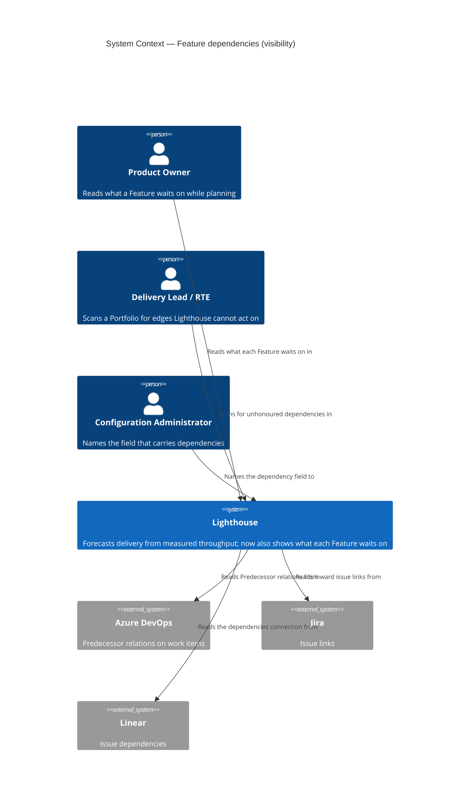
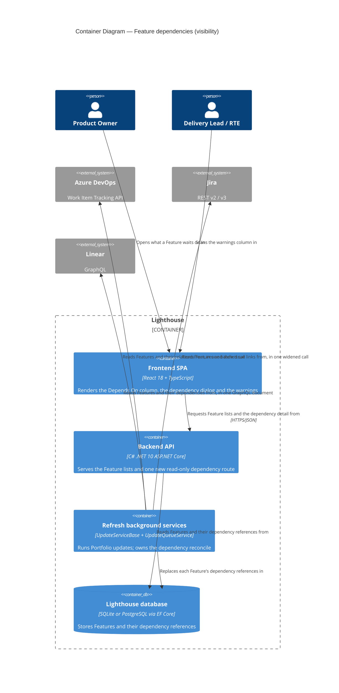

# Feature Delta — epic-4365-dependencies

**ADO**: Epic #4365 "Show Feature Dependencies" (Planned, created 2026-02-23, tagged `Documentation`,
`Release Notes`) · **Feature type**: cross-cutting (work-tracking connectors + Feature list UI) ·
**Density**: lean · **DISCUSS run**: 2026-08-14 · **DESIGN run**: 2026-08-14 ·
**Split**: 2026-08-16

> **This epic was split on 2026-08-16.** It originally covered both halves of dependencies: *seeing*
> them and *forecasting against* them. The forecasting half — premium, and by far the riskier of the
> two — now lives in **Epic #5792, Dependency-Aware Forecasting**
> (`docs/feature/epic-5792-dependency-aware-forecasting/`). This epic is the community half: read
> dependencies from the tracker, show them, warn about the ones Lighthouse cannot act on, and let a
> Portfolio name the field they live in. It ships first and stands on its own — the epic's own scope
> assessment already found the visibility half *"useful with the second never shipping"*.
>
> Story and acceptance-criterion identifiers are **unchanged** across the split, so US-05 through
> US-08 are simply absent here and present there. Nothing was renumbered; only the slices were.
> Decisions D1-D15 were written for both halves and are numbered once — the ones that belong wholly
> to forecasting (D2, D3) are stated in Epic #5792's delta and referenced from here where they explain
> why something is out of scope.

The epic asked for two things in one line: *"Set dependencies on Features, then in the forecast,
'jump' over them until the dependent Features are forecasted to be done."* This half is the first
clause. Reading the codebase during DISCUSS turned it into something less obvious than it looks.

1. **The surface this lands on already exists, and was built for it.** Epic #5375 (Manual Sorting)
   shipped `/features` (`FeaturesView.tsx`) as a general Feature view, and its D17 says in as many
   words that it is *"the surface that will later host ADO Epic #4365 'Dependencies'"*. The warnings
   column the epic asks for is `WarningsIndicator.tsx`, already rendering two warning kinds through the
   shared `FeatureListDataGrid`/`columns.tsx` factory. This epic writes a column and a dialog, not a page.

2. **"Blocked" is already taken.** Epic #5074 shipped blocked items — `WorkItem.IsBlocked`,
   `BlockedSince`, blocked-history widgets — and `blocked` is a **renameable terminology key**
   (`TerminologyKeys.ts:18`). A Feature row that says "blocked" for two unrelated reasons is unreadable.
   This feature says *depends on* and never *blocked by*, whatever the tracker calls its field (D10).

3. **The relation payloads are three different shapes, and only three connectors have one.** ADO already
   fetches `WorkItemExpand.Relations` on the parent path
   (`AzureDevOpsWorkTrackingConnector.cs:1043`) — the extension point is open. Jira sends an explicit
   `fields=` list (`:1613`), so `issuelinks` must be added to it, and returns the summary inline. Linear
   is GraphQL and returns titles inline for free. **ServiceNow and CSV have no standard dependency field
   at all** — they are out of scope, not deferred-with-a-plan.

4. **Ordering is solved and must not be re-solved.** `FeatureRepository.GetAll()` orders through
   `IFeatureOrdering`, which switches between `ManualRankComparer` and `FeatureComparer` at one point.
   This feature reads that order and never writes it. A dependency whose blocker is ranked *below* its
   dependent is a warning, not an auto-reorder (D12).

5. **Detection is where the epic's own premium boundary already sat.** The epic text gates the
   *forecast effect* and explicitly keeps the warning and the hint free. That boundary is now an epic
   boundary rather than a licence branch inside one epic, which is what makes this half releasable
   alone.

---

## Wave: DISCUSS / [REF] Prior-Wave Reading Confirmation

- ⊘ `docs/feature/epic-4365-dependencies/discover/` (not found — no DISCOVER wave ran)
- ⊘ `docs/feature/epic-4365-dependencies/diverge/` (not found — no DIVERGE wave ran)
- ✓ `docs/product/jobs.yaml` (schema_version 1, 98 jobs) — none covers dependencies between Features.
  Nearest neighbours are the four `epic-5375-manual-sorting` ordering jobs, which establish that the
  sequence the forecast consumes is a first-class user concern; this epic adds the constraint that
  sequence cannot express.
- ✓ `docs/product/journeys/epic-5375-manual-sorting.yaml` — read in full. Its D17, D10, D12 and D16 are
  load-bearing here and are carried forward rather than re-decided.
- ✓ `docs/product/journeys/` (41 journeys) — none touches dependencies.
- ✓ `docs/product/personas/` (9 personas) — `product-owner`, `delivery-lead-rte` and `config-admin` are
  reused verbatim. No new persona needed.
- ✓ `docs/product/kpi-contracts.yaml` — the `measurement_scope` convention
  (`per_instance` / `vendor_demo_only` / `opt_in_telemetry_required`) is inherited by every KPI below.
- ⊘ `docs/product/vision.md`, `docs/project-brief.md`, `docs/stakeholders.yaml` (not found — product
  SSOT lives under `docs/product/` in this repo)
- ✓ `CLAUDE.md`, `docs/ci-learnings.md` — standing rules applied (expand-only migrations via
  `CreateMigration`, quality gates, per-feature docs, configurable terminology, no internal references
  in comments).
- ✓ **Code read during this wave**: `Models/Feature.cs`, `Models/WorkItemBase.cs`,
  `Models/FeatureComparer.cs`, `Models/ManualRankComparer.cs`, `Models/FeatureOrderKey.cs`,
  `Services/Implementation/FeatureOrdering.cs`,
  `Services/Implementation/Repositories/FeatureRepository.cs`, `API/DTO/FeatureDto.cs`,
  `API/FeaturesController.cs`, `Services/Interfaces/WorkTrackingConnectors/IWorkTrackingConnector.cs`,
  `WorkTrackingConnectors/AzureDevOps/AzureDevOpsWorkTrackingConnector.cs` + `WorkItemExtensions.cs`,
  `WorkTrackingConnectors/Jira/JiraWorkTrackingConnector.cs`,
  `WorkTrackingConnectors/Linear/LinearWorkTrackingConnector.cs`,
  `Models/WorkTrackingSystemOptionsOwner.cs`, `pages/Features/FeaturesView.tsx`,
  `components/Common/FeatureListDataGrid/columns.tsx` + `WarningsIndicator.tsx`,
  `hooks/useLicenseRestrictions.ts`, `hooks/useFeatureOrdering.ts`, `models/TerminologyKeys.ts`, plus
  `Services/Implementation/Forecast/ForecastService.cs` — read to establish what this half must *not*
  touch.
- ✓ **ADO** #4365 including its 2026-05-24 comment, which supplies the exact per-tracker field shapes and
  is quoted rather than paraphrased in D14.

No DISCOVER evidence exists to contradict, so no contradiction check was possible and none is claimed.

---

## Wave: DISCUSS / [REF] Persona IDs

| Persona | Role in this feature |
|---|---|
| `product-owner` | Primary. Owns the order the forecast runs in (epic #5375) and now sees the constraint that order cannot express. The person who has to explain why a Feature is late, and who reads the dependency dialog to find out. |
| `delivery-lead-rte` | Portfolio scope. Reads a Feature list to find where the chain breaks — a dependency pointing outside the Portfolio, a blocker ranked below its dependent, a loop. Wants the map, not the individual edge. |
| `config-admin` | Appears once, in slice 04, and only on instances whose tracker does not use standard dependency links. Owns the Portfolio setting that names which field carries them — the same person who already sets the parent override next to it. |
| `delivery-forecaster` | Not served by this epic. Named here because the omission is deliberate: the dates this persona consumes are unchanged by everything below, and that is Epic #5792's whole subject. |

---

## Wave: DISCUSS / [REF] JTBD One-Liners

| Job ID | One-liner |
|---|---|
| `job-po-see-what-a-feature-is-waiting-on` | When a Feature looks stalled, show me what it is waiting on without my opening the work tracking system. |
| `job-config-admin-point-at-the-field-that-carries-dependencies` | When my teams record dependencies in a custom field rather than the tracker's built-in link, let me tell Lighthouse which field that is, once, for the whole Portfolio. |
| `job-lead-see-where-the-dependency-chain-breaks` | When a dependency cannot be honoured — it points outside the Portfolio, or its blocker is ranked below it, or it loops — tell me plainly rather than quietly doing something else. |

The three forecasting jobs — `job-forecast-honours-what-cannot-start-yet`,
`job-forecast-covers-dependencies-that-cross-teams` and
`job-forecaster-know-the-forecast-is-ignoring-a-dependency` — moved to Epic #5792 with the split. All
six remain in `docs/product/jobs.yaml`; only their `feature_context` differs.

Full job stories, dimensions, four forces and opportunity scores are written to
`docs/product/jobs.yaml`.

### Opportunity scores

| Job | Importance | Satisfaction | Gap | Note |
|---|---|---|---|---|
| `job-config-admin-point-at-the-field-that-carries-dependencies` | 4 | 0 | **4** | Satisfaction 0 because the instance gets *nothing* — not a degraded version. Importance 4 rather than 5 because it is conditional on how a given tracker is configured; for the instances it applies to it is worth 5, for the rest it is worth nothing. |
| `job-po-see-what-a-feature-is-waiting-on` | 4 | 1 | **3** | Partly satisfied: the answer exists, in the tracker, one context switch away. The cost is the switch and the fact that nobody makes it while reading a forecast. |
| `job-lead-see-where-the-dependency-chain-breaks` | 3 | 0 | **3** | Lower importance because it is a diagnostic rather than an outcome — but it is the job that stops the others from being quietly wrong. |

---

## Wave: DISCUSS / [REF] Current-State Surface Inventory

| Surface | Location | State today |
|---|---|---|
| Feature ordering | `FeatureOrdering.cs`, consumed by `FeatureRepository.GetAll:18` | One switch point between `ManualRankComparer` and `FeatureComparer`, tie-broken by `Id`. Shipped by epic #5375. This feature reads it and never writes it. |
| Feature model | `Models/Feature.cs` | Carries `ManualRank` (deliberately absent from `Update`, so sync cannot overwrite it) — the exact precedent D5 copies. No relation of any kind to another Feature. |
| Synced fields | `Models/WorkItemBase.cs:18-56` | `ParentReferenceId` is the only inter-item link, a single string, overwritten from source on every sync. |
| Connector port | `IWorkTrackingConnector.cs` | Ten methods, none returning relations. DESIGN found none is owed — see F-2. |
| ADO relations | `AzureDevOpsWorkTrackingConnector.cs:1043` | Already requests `WorkItemExpand.Relations` for the parent path; `WorkItemExtensions.cs:25-27` already walks `workItem.Relations`. Relation URLs carry an id, not a title. |
| Jira fields | `JiraWorkTrackingConnector.cs:1560`, `:1613` | Explicit `fields=` list per request. `issuelinks` is not in it. |
| Linear query | `LinearWorkTrackingConnector.cs:660-726` | Hand-built GraphQL with `parent { … }` already selected. `dependencies` is a sibling selection. |
| ServiceNow / CSV | `ServiceNowWorkItemMapper.cs`, `CsvWorkTrackingConnector.cs` | No dependency field exists in either. Out of scope (D13). |
| Feature list UI | `FeatureListDataGrid/columns.tsx` | Column factories: name, forecasts, state, warnings, active work, parent, position, ordering actions. A dependency column is one more factory used by both surfaces. |
| Warnings | `WarningsIndicator.tsx` | Renders exactly two warning kinds today (done-with-remaining-work, default-feature-size), or a green check. Additive by construction. |
| Instance-wide Feature view | `pages/Features/FeaturesView.tsx` | Exists, free, RBAC-filtered result set, built by epic #5375 D17 explicitly to host this epic. |
| Feature DTO | `API/DTO/FeatureDto.cs:76-85` | Already carries additive presentation fields (`Position`, `CanMove`, `MoveBlockReason`, `BlockingPortfolios`) — the pattern this feature's fields follow. |
| Simulation eligibility | `ForecastService.cs:201-209` | `simulationResults.Where(x => x.HasWorkRemaining)`. **Untouched by this epic.** Listed so that "no forecast change" is a checkable statement rather than a promise. |
| Premium gate | `LicenseGuardAttribute` (backend), `hooks/useLicenseRestrictions.ts` (frontend) | Both shipped and in use on `FeaturesController.cs:125`. Neither is used by this epic — everything here is free. |
| Terminology | `TerminologyKeys.ts` | `FEATURE`, `FEATURES`, `WORK_ITEMS`, `PORTFOLIOS` — and `BLOCKED: "blocked"`, already owned by epic #5074. See D10. |

---

## Wave: DISCUSS / [REF] Locked Decisions

- **[D1] A dependency is a directed edge between two Features: "this one cannot start until that one is
  done".** Not between work items, not between Portfolios, not between teams. Straight from the epic
  ("Set dependencies on Features"). Work-item-grain dependencies have no consumer — the simulation
  sequences Features, so a work-item edge would ship plumbing, exactly as epic #5375's D1 concluded for
  ordering.

- **[D2] — moved to Epic #5792.** The forecast honours a dependency by excluding the dependent from the
  eligible set inside each trial, not by shifting its dates afterwards. Referenced here only because it
  is why *nothing* in this epic touches `ForecastService`: the mechanic is a single predicate at a
  single call site, and putting half of it here would spread one decision over two epics.

- **[D3] — moved to Epic #5792.** One joint simulation across all teams, replacing the per-team
  independent runs.

- **[D4] Every dependency comes from the work tracking system. Lighthouse never authors one**
  (user, 2026-08-14, resolving the wave's one open question). The default source is the standard link
  per connector (D14). A Portfolio may **override which field carries them**, exactly as it can for the
  parent: a nullable `DependencyOverrideAdditionalFieldDefinitionId` beside
  `ParentOverrideAdditionalFieldDefinitionId` (`IWorkItemQueryOwner:27`; DESIGN moved the declaration to
  `Portfolio` — F-3). The connector's behaviour copies `GetParentReferenceForWorkItems`
  (`AzureDevOpsWorkTrackingConnector.cs:1012-1018`) in shape: when the override is set, **skip the
  relations fetch entirely** — "no need to load stuff if we have an override anyway" — and read the
  value from `AdditionalFieldValues` instead.

  **Replace, not union** (user, 2026-08-14: "if I set an override, just use the content from that
  specific field"). A Portfolio that names a field is declaring that field authoritative; native links
  on the same Feature are ignored while it is set. Union was considered — an ADO team could plausibly
  have some Predecessors native and some in a custom field — and rejected as harder to explain than it
  is worth, and inconsistent with the parent override it copies.

  **The owner is the Portfolio only**, not the Team, even though `IWorkItemQueryOwner` is implemented
  by both (user, 2026-08-14). Dependencies are between Features, and Features are fetched per
  Portfolio — a Team-level setting would have no consumer.
  A per-Feature declaration made inside Lighthouse was considered during this wave and **rejected**:
  it would make Lighthouse an author of dependency data, which is a different product posture from the
  one it takes everywhere else, and it would need a precedence rule against the tracker that this one
  does not.

- **[D15] The override field carries a LIST of references in the connector's own reference form, and
  that is where it differs from the parent override** (user, 2026-08-14). A parent is 0..1, so
  `GetParentReference` (`:1095-1106`) can return one string. Dependencies are 0..n, so the field's
  value is split on comma or semicolon and each entry trimmed.

  **What an entry looks like is settled: whatever that tracker calls a Feature.** Jira keys on a Jira
  connection, work item ids on ADO, identifiers on Linear — which is exactly `ReferenceId` space, so
  no per-tracker normalisation layer is owed. The one transformation that remains is Linear's
  lower-casing (D14). An entry that resolves to nothing is skipped exactly as an unresolvable relation
  is (AC-1.4) — a hand-maintained field will contain typos, and one typo must not discard the three
  good references beside it. The separator is fixed rather than configurable in this epic.

- **[D5] A Feature stores the LIST OF REFERENCES it waits on, resolved when read — not a resolved
  Feature-to-Feature foreign key** (user, 2026-08-14, correcting this wave's first draft). The stored
  form is strings in the same space as `ReferenceId`, exactly as `WorkItemBase.ParentReferenceId`
  already works.

  The reason is sync order. If Feature B references A and A has not been imported yet, a resolved
  foreign key cannot be written at all, and the edge silently does not exist until some later sync
  happens to fix it. A stored reference heals on its own: the next read resolves it. The graph the
  cycle detector wants — and, later, the one Epic #5792's simulation wants — is derived at read time
  from those references, which also keeps the stored form dumb and the derived form single-sourced
  (KPI-5).

  It sits in its own persisted collection, never on a synced scalar — `WorkItemBase.Update` overwrites
  every synced field on every refresh, which is why `Feature.ManualRank` sits outside it. One writer:
  the sync's reconcile, replacing a Feature's references wholesale with whatever the current source —
  link or override field — now says. Expand-only, generated with the `CreateMigration` script.

- **[D6] A dependency changes the forecast only when both Features share at least one Portfolio**
  (epic's proposal, user-confirmed 2026-08-14). Feature ↔ Portfolio is many-to-many
  (`LighthouseAppContext.cs:217-219`), so "same Portfolio" means "they share at least one". A dependency
  pointing outside is **detected, stored, shown and warned** — never silently dropped. Everything in
  that sentence except the forecast consequence is delivered by this epic; the forecast consequence is
  Epic #5792's, and is a no-op until it ships.

- **[D7] Cycles are detected and never reach the simulation.** After every sync the edge set is
  checked; an edge that closes a cycle is excluded from the honoured set and every Feature in the cycle
  carries a warning naming the loop. This is the epic's third bullet ("must ensure we are not having
  chains that end up in an infinite loop"). It lands here, in slice 02, **one epic before anything
  consumes it** — which is the cheapest place to get it wrong, and which is why it did not travel with
  the forecast half. DESIGN refined *where* it runs: inside the one honour policy rather than at
  ingestion (F-5).

- **[D8] A dependency whose blocker can never complete in a forecast run is dropped for that run, and
  warned.** The *warning* is this epic's — slice 02 computes and shows the `cannot be forecast` verdict
  using `Feature.CanBeForecast` / `TeamsWithoutForecast`, which already exist. The *drop* is Epic
  #5792's, and is vacuous until it ships. Split this way deliberately: the verdict is a pure function of
  data this epic already loads, and stating it early means the warning vocabulary is settled before any
  simulation depends on it.

- **[D9] Premium gates the forecast effect and nothing else.** Verbatim from the epic: *"If we don't
  have a premium license, you will see the warning that the item has a dependency together with the
  hint that it's not taken into account in the forecasting unless you have premium."* After the split
  this is an epic boundary, not a licence branch: **everything in Epic #4365 is free, with no licence
  check anywhere in it**, and everything premium is in Epic #5792. Detection, the count, the dialog,
  the warnings and the Portfolio's dependency-field setting are all free — the setting is what makes
  detection work at all on an instance whose tracker does not use standard links, and gating it would
  gate the free half behind a licence. The "not taken into account" hint itself (US-06) travels with the
  premium epic, because a hint pointing at a capability nobody can buy yet is worse than no hint.

- **[D10] The UI word is "depends on", never "blocked".** `TERMINOLOGY_KEYS.BLOCKED` and
  `WorkItem.IsBlocked` already name a different, shipped concept from epic #5074, and `blocked` is a
  term instances may rename. Two meanings of one renameable word on the same Feature row is a defect in
  waiting. `Feature`/`Features`/`Portfolios`/`Work Items` resolve through `getTerm` as everywhere else.
  Tracker wording is not UI wording: ADO's "Predecessor" and Jira's "is blocked by" are read, not shown.

- **[D11] Both surfaces are existing ones.** The instance-wide Features view (`FeaturesView.tsx`, built
  by epic #5375 D17 for this) and the existing Portfolio Feature list, both through the shared
  `FeatureListDataGrid` and its `columns.tsx` factory, so the column is written once. The "which items
  do we depend on" list the epic asks for is a dialog opened from the row, following the existing
  work-items dialog pattern. No new page is built by this epic.

- **[D12] Lighthouse never reorders to satisfy a dependency.** A blocker ranked below its dependent is
  the epic's *"dependency ordered lower — that will cause a mess"*, and it is a warning. Ordering stays
  the user's decision (epic #5375's whole premise).

- **[D13] ADO first, then Jira and Linear. ServiceNow and CSV are out, and cannot be rescued by D4's
  field override.** ADO is the thinnest first connector because `WorkItemExpand.Relations` is already
  requested on the parent path, and it is the bulk of the dogfood instance's data.

  The tempting argument that the field override brings ServiceNow and CSV along — every connector
  supports additional fields, so the mechanism is available to them — **does not hold, and was checked
  during this wave**: `ServiceNowWorkTrackingConnector.GetFeaturesForProject` throws
  `NotSupportedException` (`:751-757`). ServiceNow has no Features, so it has nothing for a dependency
  to be *between*. A dependency is a Feature-to-Feature edge (D1), Features live in Portfolios (D6),
  and ServiceNow supports neither. The field override changes where a reference is read from; it does
  not create the objects the reference points at. Recorded here so the argument is not re-made.

- **[D14] Only the "waiting on" direction is fetched; the reverse is derived by inverting stored
  references.** Per ADO #4365's 2026-05-24 comment, and with the extraction each connector needs so
  the stored string lands in `ReferenceId` space (D5):

  | Connector | Source | `ReferenceId` is | Extraction |
  |---|---|---|---|
  | ADO | relation `System.LinkTypes.Dependency-Reverse` | `$"{workItem.Id}"` (`:870`) | trailing segment of the relation URL |
  | Jira | `issuelinks` where `type.inward = "is blocked by"` **and** an `inwardIssue` is present | `issue.Key` (`:1348`) | `inwardIssue.key`, verbatim |
  | Linear | `dependencies` connection | `issue.Identifier?.ToLowerInvariant()` (`:343`) | `identifier`, **lower-cased** |

  **The Linear lower-casing is the trap in this feature.** The connector stores identifiers folded to
  lower case and the GraphQL connection returns them upper case, so without the fold every Linear
  reference resolves to nothing — silently, because D15 skips unresolvable entries by design. The
  failure presents as "Linear simply has no dependencies", which is indistinguishable from the truth.
  It gets its own acceptance criterion rather than being left to the mapper (AC-9.2).

  Fetching the forward direction too would double the request cost to learn something the stored
  reference set already contains.

---

## Wave: DISCUSS / [REF] Scope Assessment

**Verdict: right-sized after the 2026-08-16 split.**

The original epic was assessed OVERSIZED, with three signals present (two triggers the gate): four
areas touched, an estimate beyond two weeks, and — the decisive one — **two independently valuable
user outcomes that could ship as separate releases**: *see the dependencies* and *forecast against
them*, the first useful with the second never shipping.

That assessment named the split and the 2026-08-16 decision executed it as an epic boundary rather
than a release boundary inside one epic. What remains here touches two areas (connectors, Feature list
UI), carries no licensing surface at all, and is four slices each shipping end to end.

**Release boundary: this epic is a release.** The question the original delta deferred — *is
visibility alone worth releasing* — is answered by the split itself. Slices 01-02 remain the natural
first release inside it if the board wants one earlier still.

---

## Wave: DISCUSS / [REF] WS Strategy

**Strategy B — extend an existing skeleton.** Brownfield throughout: the Feature view, the shared grid,
the warnings column, the connector port and the ordering switch point are all in production. No walking
skeleton is built. Slice 01 is the thin end-to-end proof — one ADO relation read, stored, ordered, and
rendered as a count on two surfaces.

---

## Wave: DISCUSS / [REF] Driving Ports

| Port | Surface | Introduced by |
|---|---|---|
| Sync (scheduled + manual refresh) | Portfolio Feature fetch gains a relation read; edges are reconciled against stored ones | slice 01 (ADO), slice 03 (Jira, Linear), slice 04 (Portfolio field) |
| UI — Features view (`/features`) | A "Depends On" column showing the count of Features this one waits on, plus a dependency warning in the existing warnings column | slices 01, 02 |
| UI — Portfolio detail Feature list | Same column, same factory, no second implementation | slices 01, 02 |
| UI — dependency dialog | Row action opening the list of Features this one waits on: name, state, Portfolio, link to the tracker, and why an edge is not honoured | slice 02 |
| HTTP | `GET /api/latest/features/{id}/dependencies` — free, read-only. No write endpoint exists in this epic (D4) | slice 02 |
| UI — Portfolio settings | A **Dependency field** selector beside the existing parent-override selector, listing the connection's additional fields | slice 04 |
| Docs | Dependencies page under the Features documentation, per-feature screenshots | slice 03 |

No forecast port. The 50/70/85/95 % dates are unchanged by every slice below — that is Epic #5792's
only port, and it has no endpoint.

---

## Wave: DISCUSS / [REF] Pre-requisites

- Epic #5375's `/features` view and shared `FeatureListDataGrid` in `main` — both shipped.
- The dev instance on `:5169` restored from a real backup, so relation reads run against genuine ADO
  data rather than seeded rows. Its measured Feature mix (86 ADO, 4 Jira, 4 Linear) is why ADO is first.
- **Real Predecessor links created in the dogfood ADO project** covering: a same-team pair, a
  cross-team pair, a cross-Portfolio pair, a blocker ranked below its dependent, a two-Feature cycle,
  and a blocker whose team has no throughput. Slice 02's warning kinds cannot be confirmed against real
  data without the last three, and Epic #5792 cannot start without them at all. Created directly in ADO
  with `az boards work-item relation add` — no in-Lighthouse authoring exists to create them (D4),
  which is what moved this from a slice to a prerequisite.
- One additional field defined on the dogfood ADO connection, carrying a dependency list, for slice 04.
- `CreateMigration` PowerShell script for the D5 migration, additive only.
- A pre-slice-01 timing baseline of a full ADO portfolio refresh, to defend KPI-3. Epic #5687 just took
  that path from 468,856 ms to 2,087 ms; an N+1 relation read is exactly the shape that gives it back.

A premium licence is **not** a prerequisite for any slice in this epic (D9).

---

## Wave: DISCUSS / [REF] Out of Scope

- **Any change to a forecast date.** Epic #5792, in full — the eligibility rule, the joint simulation,
  the free-tier hint that names the premium capability, and the premium gate itself.
- **Work-item-grain dependencies.** Features only (D1).
- **Writing dependencies back to the tracker.** Lighthouse reads; it never creates a link in ADO, Jira
  or Linear. Same posture as epic #5375's D8 on ordering.
- **Declaring or editing a dependency inside Lighthouse**, in any form — adding one, removing one, or
  suppressing a tracker-sourced one. Considered and rejected under D4: it would make Lighthouse an
  author of dependency data. To change a dependency, change it in the tracker.
- **A configurable *separator* for the override field.** Comma and semicolon, fixed (D15).
- **ServiceNow and CSV.** No standard field exists (D13).
- **Auto-reordering to satisfy a dependency** (D12).
- **A dependency graph visualisation.** The epic asks for a column, a warning and a list. A graph view
  is a plausible successor and is not designed here.
- **Marketing website copy.** Flagged for the DELIVER checklist under the `Release Notes` tag, not built
  here.

---

## Wave: DISCUSS / [REF] User Stories

Every story traces to a `job_id` in `docs/product/jobs.yaml`. Identifiers are unchanged from before the
split; US-05 through US-08 live in Epic #5792.

---

### US-01 — A Feature says how many things it is waiting on

`job_id: job-po-see-what-a-feature-is-waiting-on` · persona `product-owner` · **slice 01**

As a product owner, I want every Feature list to show how many other Features it is waiting on, so that
I stop discovering dependencies by accident in a stakeholder review.

### Elevator Pitch
Before: nothing in Lighthouse knows one Feature waits on another; the fact lives only in the tracker.
After: open **Features** in the top navigation → the **Depends On** column reads `2` on a Feature with
two ADO Predecessor links, and `—` on one with none.
Decision enabled: whether this Feature can actually be started now, or whether the team should pull the
next one instead.

**Acceptance criteria**

- **AC-1.1** A Feature with two ADO `System.LinkTypes.Dependency-Reverse` relations to Features in the
  same Portfolio renders `2` in the Depends On column on `/features`.
- **AC-1.2** The same Feature renders the same `2` in the Portfolio detail Feature list — from the same
  column factory, asserted by the column being defined once.
- **AC-1.3** A Feature with no relations renders the empty marker, not `0`.
- **AC-1.4** A relation pointing at a work item that is not a Feature in Lighthouse is skipped, and the
  count excludes it. No error, no partial row.
- **AC-1.5** After a full refresh in which a Predecessor link was removed in ADO, the count drops
  accordingly — stored edges are reconciled, not accumulated.
- **AC-1.6** `Feature.ManualRank` and every synced field are unchanged by dependency ingestion.
- **AC-1.7** The column header resolves through `getTerm(TERMINOLOGY_KEYS.FEATURES)` and contains no
  literal "Epic" or "Blocked".
- **AC-1.8** A full portfolio refresh on the dev instance completes within 110% of the pre-slice
  baseline (KPI-3).
- **AC-1.9** A Portfolio that has the **parent** override configured still yields its Features'
  dependencies. The relations fetch is skipped only when both overrides are set. Without this
  assertion the failure is silent and indistinguishable from a Portfolio that genuinely has none
  (F-4).
- **AC-1.10** Forecast percentiles are unchanged by dependency ingestion — asserted against a fixed
  seed with dependency data present and absent. The epic boundary is a claim, so it is a test.

---

### US-02 — See exactly what a Feature is waiting on

`job_id: job-po-see-what-a-feature-is-waiting-on` · persona `product-owner` · **slice 02**

As a product owner, I want to open the list of Features a Feature is waiting on and see their names and
states, so that I can tell whether the wait is nearly over or has not started.

### Elevator Pitch
Before: the count says `2` and nothing says which two, so the answer is still in the tracker.
After: click the **Depends On** cell → a dialog lists each Feature it waits on with name, state,
Portfolio and a link to the tracker record.
Decision enabled: whether to chase the blocker, re-sequence around it, or accept the wait.

**Acceptance criteria**

- **AC-2.1** Clicking the cell opens a dialog listing every Feature this one waits on, each with name,
  state, its Portfolios, and a link that opens the tracker record.
- **AC-2.2** Each row names where it came from — the tracker's own link, or the field this Portfolio
  named (D4). Both are the work tracking system; the distinction is which part of it was read.
- **AC-2.3** An edge that will not be honoured by the forecast is labelled in the dialog with the reason
  in plain language, one of: outside this Portfolio, part of a dependency loop, or the Feature it waits
  on cannot be forecast.
- **AC-2.4** The dialog opens for a user with read access and shows the same content; no action is
  offered without `PortfolioWrite`.
- **AC-2.5** A Feature it waits on that the user cannot read is shown as a redacted row with the reason,
  never omitted silently — a hidden blocker is worse than an unnamed one.

---

### US-03 — Be warned when a dependency will not be honoured

`job_id: job-lead-see-where-the-dependency-chain-breaks` · persona `delivery-lead-rte` · **slice 02**

As a delivery lead, I want the warnings column to flag dependencies Lighthouse cannot act on, so that I
find the broken links by scanning a list rather than by auditing every Feature.

### Elevator Pitch
Before: a cross-Portfolio dependency and a healthy one look identical — both invisible.
After: open **Features** → the warnings column shows a warning on the affected row, whose tooltip reads
e.g. "Waits on a Feature outside this Portfolio — not included in the forecast".
Decision enabled: whether to move a Feature into the Portfolio, re-rank it, or break the loop.

**Acceptance criteria**

- **AC-3.1** A Feature waiting on one in no shared Portfolio renders a warning naming that Feature and
  stating the dependency is not included in the forecast.
- **AC-3.2** A Feature waiting on one ranked **below** it renders a distinct warning naming the
  ordering conflict. No rank is changed by Lighthouse.
- **AC-3.3** A Feature in a dependency loop renders a warning naming the other members of the loop.
- **AC-3.4** A Feature whose dependency carries no not-honoured reason renders **no** warning — the
  presence of a dependency is not itself a warning. Phrased against the verdict rather than against the
  forecast, because until Epic #5792 ships no edge has a forecast consequence either way.
- **AC-3.5** Existing warnings (done-with-remaining-work, default-feature-size) still render alongside,
  unchanged, and a Feature with none still renders the green check.
- **AC-3.6** No warning text contains the word "blocked" (D10).

---

### US-04 — Read dependencies from the field this Portfolio actually uses

`job_id: job-config-admin-point-at-the-field-that-carries-dependencies` · persona `config-admin` ·
**slice 04** · free

As a configuration admin, I want to tell Lighthouse which field on my Portfolio's work items carries
its dependencies, so that instances that record them in a custom field get everything the standard-link
instances get.

### Elevator Pitch
Before: a Portfolio whose team records dependencies in a custom field reads `—` in the Depends On
column, because Lighthouse only understands the tracker's built-in link type.
After: open **Portfolio → Settings → Advanced**, set **Dependency field** to that additional field, run
a refresh → the Depends On column populates from it, and the relations fetch is skipped entirely.
Decision enabled: whether this Portfolio can use dependency forecasting at all, without anyone
re-recording links in a format the tracker's UI does not offer.

**Acceptance criteria**

- **AC-4.1** With the override set, a Feature whose named field reads `1234;5678` yields two edges,
  and both appear in the count (US-01) and the dialog (US-02).
- **AC-4.2** With the override set, the connector performs **no** relations fetch — asserted on the
  request, mirroring `GetParentReferenceForWorkItems`'s early return (`:1014-1018`).
- **AC-4.3** Comma and semicolon both separate; surrounding whitespace is trimmed; an empty field
  yields no edges and no error.
- **AC-4.4** An entry that resolves to no Feature is skipped and the entries beside it still yield
  edges (D15) — one typo does not discard the list.
- **AC-4.5** With the override **unset**, behaviour is byte-identical to slices 01-03: the standard
  link is read, asserted by an unchanged fixture comparison.
- **AC-4.6** The setting is per Portfolio, offered only for additional fields defined on that
  Portfolio's connection, and requires the same permission the parent override requires.
- **AC-4.7** The setting is available on an unlicensed instance and changes no forecast value there
  (D9) — it feeds detection, which is free.

---

### US-09 — Jira and Linear dependencies

`job_id: job-po-see-what-a-feature-is-waiting-on` · persona `product-owner` · **slice 03**

As a product owner on Jira or Linear, I want my tracker's dependency links read too, so that everything
slices 01-02 delivered applies to my instance without my re-entering anything.

### Elevator Pitch
Before: a Jira Feature with an "is blocked by" link and a Linear Feature with a `dependencies` entry
both read `—` in the Depends On column.
After: run a refresh → both read their real counts, and their dialogs and warnings behave exactly as
the ADO ones.
Decision enabled: the same decisions as US-01 through US-03, on the tracker the team actually uses.

**Acceptance criteria**

- **AC-9.1** A Jira issue with `issuelinks` containing `type.inward = "is blocked by"` **and** an
  `inwardIssue` yields one edge per such link; entries with only an `outwardIssue` yield none.
- **AC-9.2** A Linear issue's `dependencies` connection yields one reference per node, **lower-cased**
  to match `ReferenceId` (`LinearWorkTrackingConnector.cs:343`), and each one resolves to a Feature.
  Asserted on a fixture whose `identifier` is upper case — without the fold this passes ingestion and
  yields zero resolved dependencies, which is indistinguishable from an instance that has none. Its
  `blocking` connection yields nothing (D14).
- **AC-9.3** Adding `issuelinks` to the Jira `fields=` list does not change any existing mapped value —
  asserted by an unchanged fixture comparison.
- **AC-9.4** A ServiceNow or CSV Feature yields no edges and renders no dependency warning — the
  absence of a field is not an error condition.
- **AC-9.5** US-02 and US-03's ACs pass with Jira- and Linear-sourced edges, parameterised over
  connector rather than duplicated per connector. When Epic #5792 has shipped, its ACs join the same
  parameterisation rather than gaining a per-connector copy.
- **AC-9.6** A full refresh on Jira and Linear stays within 110% of its own pre-slice baseline.
- **AC-9.7** ADO behaviour is unchanged — the same fixture comparison that guards AC-9.3 for Jira.

---

## Wave: DISCUSS / [REF] Story Map

**Backbone** (user activities, left to right):
*Discover a dependency* → *Understand it* → *Use it on my tracker* → *Read it from the field we
actually use*

| Slice | Stories | Outcome shipped | Licence |
|---|---|---|---|
| **01** ADO dependencies visible | US-01 | A Feature list that knows what waits on what | free |
| **02** Detail and warnings | US-02, US-03 | The specifics, and every link Lighthouse cannot act on | free |
| **03** Jira and Linear | US-09 | Everything above, on the other two trackers | free |
| **04** Per-Portfolio dependency field | US-04 | Instances whose dependencies live in a custom field | free |

**Slice composition gate**: every slice carries at least one user-visible value story. This epic
contains no `@infrastructure` story — the one that existed (US-07) went with the forecast half.

**Re-numbered 2026-08-16** by the split. The old slices 03 and 04 (forecast, premium) became Epic
#5792's slices 01 and 02; the old 05 and 06 moved up to 03 and 04 here. No slice content changed, and
no story or AC identifier moved.

**Carpaccio taste tests**

| Test | Verdict |
|---|---|
| Any slice shipping 4+ new components? | **Pass after re-cut.** The original slice 01 carried ingestion + storage + column + dialog + warnings. Split into 01 (ingest + count) and 02 (dialog + warnings). |
| Every slice depending on a new abstraction? | **Pass.** The dependency-edge store (D5) ships in slice 01 with the smallest thing that uses it, and every later slice reads it rather than extending it. |
| Does any slice disprove a pre-commitment? | **Pass.** Slice 01 can disprove that relation reads are affordable (KPI-3). Slice 02 can disprove that the honour-ability verdict is cheap enough to compute per row (OQ-6). |
| Synthetic-only data anywhere? | **Pass with one stated exception.** Every slice's dogfood moment runs on `:5169` restored from a real backup, and the awkward shapes (a cycle, a throughput-less blocker) are created as **real ADO links** rather than fixtures. The exception is slice 04: no reachable instance keeps dependencies in a custom field, so its acceptance is fixture-led with one manual confirmation against a deliberately-created additional field. Recorded rather than hidden. |
| Two slices identical except for scale? | **Pass, with one deliberate merge.** Jira and Linear are one slice, not two — same slice shape, and splitting them would produce exactly the pair this test forbids. |

---

## Wave: DISCUSS / [REF] Prioritization

1. **Slice 01** first because it carries the epic's cheapest disprovable claim. Epic #5687 took the
   refresh path from 468,856 ms to 2,087 ms; an N+1 relation read is precisely the shape that gives it
   back, and finding that out costs one slice rather than four.
2. **Slice 02** next because slice 01's count is honest but unactionable, and because the warning
   vocabulary it establishes is what Epic #5792 turns off as it delivers. It is also where cycle
   detection lands — one epic before the forecast needs it, which is the cheapest place to get it
   wrong.
3. **Slice 03** after the mechanic is proven, and the ordering is worth restating because it is not the
   value ordering: ADO is 86 of the dev instance's 94 Features, so it is where the mechanic can be
   dogfooded daily. If the board wants a Jira-first release instead, slice 03 moves ahead of slice 02
   at the cost of two connectors' worth of change before the warning vocabulary is settled.

   The dogfood mix is also why slice 03 is not split per connector: 4 Jira and 4 Linear Features means
   the evidence either slice could produce is thin either way, and splitting doubles the ceremony
   without doubling what is learned.
4. **Slice 04** last because it is the only slice serving a population the dogfood instance does not
   contain. Every instance reachable for verification uses standard links; the Portfolio-named field
   exists for instances that do not, and its acceptance is therefore fixture-led with one manual
   confirmation on `:5169` using a deliberately-created additional field. Shipping it last means it
   inherits a mechanic already proven rather than proving one through an unusual configuration.

**Dogfood cadence**: same-day on `:5169` for every slice.

---

## Wave: DISCUSS / [REF] Outcome KPIs

| KPI | Target | Measurement | Scope |
|---|---|---|---|
| **KPI-1** Dependencies become visible | 100% of ADO Predecessor links between Features in a shared Portfolio appear in the Depends On column after one refresh; 0 silently dropped | Count stored edges vs. the tracker's own link list on `:5169` | `vendor_demo_only` |
| **KPI-3** Sync stays fast | Full portfolio refresh ≤ 110% of the pre-slice-01 baseline, per connector | Update log timing on `:5169`, baseline captured before slice 01 | `per_instance` + `vendor_demo_only` |
| **KPI-5** One eligibility decision | Exactly 1 place in the codebase decides whether a dependency is honoured | Grep at DISTILL; ArchUnitNET assertion (SA-12) | `per_instance` |
| **KPI-8** The forecast is untouched | 0 percentile values differ, under a fixed seed, between a run with dependency data present and one without, at every slice of this epic | Gold test (AC-1.10) | `per_instance` |

KPI-2, KPI-4, KPI-6 and KPI-7 moved to Epic #5792 with the outcomes they measure. KPI-5 stays here
because the single honour-ability decision is written here, in slice 02, and Epic #5792 consults it
rather than adding a second one.

---

## Wave: DISCUSS / [REF] Definition of Done

1. All acceptance criteria for the slice pass as automated tests.
2. `dotnet build` zero warnings; `dotnet test` green.
3. `pnpm test`, `pnpm build` (zero warnings), Biome clean — stated explicitly as N/A per slice where
   there is no frontend change.
4. Mutation testing ≥ 80% kill rate on the changed backend surface. Non-negotiable on the cycle
   detector and the honour policy.
5. SonarQube Cloud: no new issues of any severity, including security hotspots.
6. EF migration generated with the `CreateMigration` script, additive only.
7. Docs updated per-feature, in the seeded terminology, with per-feature screenshots.
8. ADO story transitioned; slice pushed only after CI is green.
9. The slice's learning hypothesis has an explicit verdict recorded in its brief — confirmed or
   disproved, never blank.

---

## Wave: DISCUSS / [REF] DoR Validation

| # | Item | Verdict | Evidence |
|---|---|---|---|
| 1 | Business value articulated | ✅ | A dependency that nothing in the product can express is one the plan silently assumes away. KPI-1 carries the outcome |
| 2 | Job traceability | ✅ | 3 jobs in `docs/product/jobs.yaml`; all 5 value stories carry a real `job_id`; no `@infrastructure` story remains in this epic |
| 3 | Acceptance criteria testable | ✅ | 34 ACs, each observable from a rendered cell, a dialog, a tooltip, an HTTP status, a stored edge, an outbound request, or a wall-clock measurement |
| 4 | Dependencies identified | ✅ | Epic #5375's Feature view shipped; `:5169` restored from a real backup; real Predecessor links created in ADO; `CreateMigration`; a pre-slice-01 timing baseline |
| 5 | Sliced ≤ 1 day each | ✅ | 4 briefs, each 5-6h. The epic's one conditional estimate (the simulation restructure) left with Epic #5792 |
| 6 | No known blockers | ✅ | None. The wave's one open question (where a dependency comes from) was resolved by the user on 2026-08-14 |
| 7 | Observable surface defined | ✅ | Driving Ports table; the forecast is explicitly named as a port this epic does not touch |
| 8 | Test data / environment available | ⚠️ | `:5169` has real ADO/Jira/Linear Features but contains no cycle and no dependency-carrying custom field. Both are created directly in ADO before slice 02, because D4 leaves Lighthouse no way to author them |
| 9 | Outcome KPI with numeric target | ✅ | 4 KPIs, each with a number or a binary and a named measurement source |

**Requirements completeness: 0.98.** The missing 0.02 is item 8, stated as open with a plan rather than
guessed at.

---

## Wave: DISCUSS / [REF] Wave Decisions Summary

### Key decisions

See Locked Decisions above. The four that shape everything downstream in this half:

- **[D4] + [D15]** Lighthouse reads dependencies and never authors them; a Portfolio may name the field
  they live in, copying the parent override. The list-valued field is the one place the two mechanisms
  genuinely differ.
- **[D5]** References are stored as strings and the graph is derived on read, so an edge to a
  not-yet-imported Feature heals instead of silently never existing.
- **[D7] + [D8]** Cycles and unforecastable blockers get their verdict and their warning here, one epic
  before anything depends on them. That is the cheapest place to get the vocabulary wrong.
- **[D11] + [D10]** Two existing surfaces and one deliberate refusal of the tracker's vocabulary,
  because `blocked` already names a different shipped concept and is renameable.

### Requirements summary

- **Primary needs**: a Feature list that says what each Feature waits on; a plain statement of every
  link Lighthouse cannot act on; and a way to read dependencies from whichever field a Portfolio
  actually keeps them in.
- **Walking skeleton scope**: none built (strategy B). Slice 01 is the thin end-to-end proof through the
  existing sync, storage, ordering and grid path.
- **Feature type**: cross-cutting.

### Constraints established

- **Nothing in this epic may move a forecast date.** AC-1.10 asserts it under a fixed seed at every
  slice. This is the epic boundary made checkable.
- Sync speed is a protected asset after epic #5687. Relation reads are additive to a path that is now
  225× faster than it was, and KPI-3 defends it.
- Lighthouse never writes to the tracker — no link is created, changed or removed there — and, per D4,
  never authors a dependency on its own side either. It reads, in both directions of that sentence.
- Expand-only migrations, generated with `CreateMigration`.
- Terminology is the instance's own; `blocked` is off-limits for this concept.
- **The usual green-then-commit autonomy applies here** (maintainer, 2026-08-16). The
  no-commit-without-approval rule was set on 2026-08-14 for an epic that still contained the Monte
  Carlo change; with the forecasting code split out, it applies to Epic #5792 only. This half provably
  moves no date (AC-1.10), so a slice commits when it is green and pushes when CI is.

### Upstream changes

None. No DISCOVER or DIVERGE wave ran for this feature, so no prior assumption was altered. Epic
#5375's D17 anticipated this feature and is carried forward intact rather than revised.

---

## Wave: DISCUSS / [REF] SSOT Updates

- `docs/product/jobs.yaml` — 6 jobs appended 2026-08-14; on 2026-08-16 three had their
  `feature_context` re-pointed at `epic-5792-dependency-aware-forecasting`.
- `docs/product/journeys/epic-4365-dependencies.yaml` — created; split 2026-08-16, with the
  forecasting journey moved to `docs/product/journeys/epic-5792-dependency-aware-forecasting.yaml`.
- `docs/product/personas/product-owner.yaml` — 1 job appended to `primary_jobs`.
- `docs/product/personas/delivery-forecaster.yaml` — 3 jobs appended; the feature they name is now
  Epic #5792.
- `docs/product/personas/delivery-lead-rte.yaml` — 1 job appended.
- `docs/product/personas/config-admin.yaml` — 1 job appended.

---

## Wave: DISCUSS / [REF] Peer Review

Not invoked. The mandatory consolidated review fires at the end of DISTILL with all waves visible.
Per-wave review triggers were checked: DoR carries one ⚠️ item, stated-open-with-a-plan rather than an
ambiguity a reviewer could resolve, and it does not block DESIGN. No vendor-neutrality risk — the
connector-specific reading is confined to D14 and US-09, and D13 states plainly which trackers are out
and why.

---

## Wave: DISCUSS / [REF] Handoff

**To**: `nw-solution-architect` (DESIGN) — full artifact set. `nw-platform-architect` (DEVOPS) — the
Outcome KPIs section only.

**Open questions carried into DESIGN**

- **OQ-1 — RESOLVED** (user, 2026-08-14). The epic meant the per-Portfolio pointer at a tracker field,
  in the shape of `ParentOverrideAdditionalFieldDefinitionId`, once per Portfolio. D4, D5, D9, US-04
  and the slice order were rewritten; D15 was added for the list-parsing difference. Kept here rather
  than deleted because DESIGN should know the per-Feature declaration was considered and dropped, not
  overlooked.
- **OQ-3 — RESOLVED** (user, 2026-08-14). An entry is a reference in the connector's own form — a Jira
  key, an ADO id, a Linear identifier — which is `ReferenceId` space, so no normalisation layer is
  owed beyond trim, split and Linear's lower-casing. Folded into D15.
- **OQ-4** — Where the single honour-ability decision lives so that KPI-5 is structurally true rather
  than defended by a grep. Answered by SA-12.
- **OQ-5** — Whether cycle detection runs over the whole edge set on every sync, or incrementally per
  changed Feature. At the dogfood instance's size either is free; at ten thousand Features it is not.
  Answered by SA-13.

OQ-2 (per-trial concurrency) went to Epic #5792 with the work it describes.

---

## Wave: DESIGN / [REF] Prior-Wave Reading Confirmation

- ✓ `docs/feature/epic-4365-dependencies/feature-delta.md` — DISCUSS output in full.
- ✓ `docs/feature/epic-4365-dependencies/slices/*.md` — all briefs.
- ✓ `docs/product/journeys/epic-4365-dependencies.yaml` — journeys, `design_decisions_resolved`, shared
  artifacts and error paths. Every shared artifact is bound to exactly one owning component in the
  decomposition below.
- ✓ `docs/product/architecture/brief.md` — the most recent per-feature `## Application Architecture`
  deltas read for house style (`epic-5775-secret-encryption-key-custody`, `quiet-jira-writeback`).
- ✓ **ADRs read in full**: 132/133/134/135/136 (Feature ordering, epic #5375), 138/139/140 (two-phase
  incremental sync and the fetch fingerprint, epic #5687), 102/103/104 (Feature *blocked* — the naming
  collision this feature must not walk into), 110/111/112/113 (the forecasting interactions this half
  must leave alone). ADR index read by filename: **the delta's "next free number is 140" is stale — 140
  through 153 exist, so this feature starts at 154** (F-1).
- ✓ **Code read during this wave, verifying rather than re-deriving what DISCUSS reported**:
  `Models/Feature.cs` (whole), `Models/WorkItemBase.cs` (whole),
  `Services/Implementation/FeatureOrdering.cs`,
  `Services/Implementation/Repositories/FeatureRepository.cs`,
  `Services/Implementation/WorkItems/FetchFingerprint.cs` (whole), `API/DTO/FeatureDto.cs`,
  `Services/Interfaces/WorkTrackingConnectors/IWorkTrackingConnector.cs`, `Models/IWorkItemQueryOwner.cs`,
  `WorkTrackingConnectors/AzureDevOps/AzureDevOpsWorkTrackingConnector.cs:1005-1115`,
  `Lighthouse.Frontend/src/components/Common/FeatureListDataGrid/{columns.tsx,WarningsIndicator.tsx}`,
  `Lighthouse.Backend.Tests/Architecture/*ArchUnitTest.cs` (ArchUnitNET is present and in use).
- ✓ `CLAUDE.md`, `docs/ci-learnings.md` — standing rules applied.
- ⊘ `docs/feature/epic-4365-dependencies/{discover,diverge}/` — not found. No SPIKE was run.

---

## Wave: DESIGN / [REF] Domain-Driven Design decisions

No new bounded context. The feature extends **Work Tracking Connection** (where an edge is read) with
one small **Feature Dependency** module whose ubiquitous language is new to the product. The
**Forecasting** context is deliberately untouched here and is Epic #5792's subject.

- **DDD-1 — Ubiquitous language, used verbatim in code, API and documentation.** *Depends on* (the
  edge, from dependent to blocker), *dependency reference* (the stored string), *blocker* (the Feature
  waited on), *dependent* (the Feature waiting), *honoured* / *not honoured* (whether the forecast acts
  on the edge), *loop*. **The word *blocked* is not used anywhere in this feature** — not in a type
  name, a property, a log message or a UI string. `WorkItem.IsBlocked` and `TERMINOLOGY_KEYS.BLOCKED`
  name epic #5074's shipped concept and instances can rename that term; two meanings of one renameable
  word on the same row is a defect in waiting. The tracker's own vocabulary — ADO's *Predecessor*,
  Jira's *is blocked by* — is read, never shown.
- **DDD-2 — `Feature` remains the aggregate root; the reference list is inside it.** A dependency
  reference has no identity of its own and no lifecycle apart from the Feature that owns it. It is
  never addressed independently, so it is not an entity in the domain sense even though it needs its
  own table for query and `Source`.
- **DDD-3 — The edge set is a stored value; the graph is derived.** What is persisted is a bag of
  strings per Feature. The directed graph, the cycle set, the reverse direction ("what waits on me")
  and the honoured subset are all derived on read. One stored thing, several derived things, so nothing
  can disagree with itself.
- **DDD-4 — Contract shapes, declared at design time.**

  | Component | Contract shape | Universe / mutation set | How the crafter asserts it |
  |---|---|---|---|
  | `IDependencyHonourPolicy.Evaluate` | **pure-function** (return-only) | none | Argument types are read-only projections; ArchUnitNET forbids the type depending on any repository or `DbContext` |
  | `DependencyCycleDetector` | **pure-function** | none | Static, takes and returns collections; no field |
  | `DependencyReconciler.Reconcile` | **bounded-change** | exactly `Feature.DependsOnReferences` | Architecture test naming the single write site; no other type may write that collection |
  | `GET /features/{id}/dependencies` | **pure-function** over stored state | none | Read-only driving port; no write route exists in this epic |

- **DDD-5 — The read port and the write path are different ports.** The dependency dialog and the
  Features column are served by a read-only driving port. There is deliberately **no** write endpoint
  anywhere in this epic: Lighthouse never authors a dependency, so "this action cannot write" is a
  compile-time fact rather than an authorization check.
- **DDD-6 — No domain event is published for dependency changes.** The project defaults to the event
  bus for cross-component facts and the default was tested here. The honour-ability verdict is derived
  in O(V+E) from data the same request already loads, so an event plus a projection would be a cache of
  something cheaper than the cache, with an invalidation question whose only honest answer is
  "recompute it". Recorded so the omission is a decision (ADR-158, *Alternatives*).
- **DDD-7 — Feature order is read, never written.** `IFeatureOrdering` stays owned by epic #5375. This
  feature reads the total order for the ranked-below advisory and writes no rank under any
  circumstance.

---

## Wave: DESIGN / [REF] Component Decomposition

New backend types live under `Services/{Interfaces,Implementation}/Dependencies/`, mirroring the
existing layout.

| Component | Path | Change | Summary | Slice |
|---|---|---|---|---|
| `FeatureDependencyReference` | `Models/FeatureDependencyReference.cs` | **CREATE NEW** | `(Id, FeatureId, ReferenceId, Source)`. Owned collection on `Feature`; expand-only migration via `CreateMigration` | 01 |
| `DependencySource` | `Models/Dependencies/DependencySource.cs` | **CREATE NEW** | `TrackerLink` \| `PortfolioField` — which part of the work tracking system the edge was read from (AC-2.2) | 01 |
| `Feature` | `Models/Feature.cs` | **EXTEND** | `DependsOnReferences` collection, deliberately absent from `Update` — the `ManualRank` precedent | 01 |
| `Portfolio` | `Models/Portfolio.cs` | **EXTEND** | `DependencyOverrideAdditionalFieldDefinitionId`, third of its kind on this type. **Not** on `IWorkItemQueryOwner` — see F-3 | 04 |
| `FetchFingerprint` | `Services/Implementation/WorkItems/FetchFingerprint.cs` | **EXTEND** | One registered property under *how the answer is read*, so changing the setting forces a full re-download | 04 |
| `DependencyReconciler` | `Services/Implementation/Dependencies/DependencyReconciler.cs` | **CREATE NEW** | The one writer. Replaces a Feature's references wholesale; dedupes; keeps a self-reference so the loop warning can name it | 01 |
| `IDependencyHonourPolicy` / `DependencyHonourPolicy` | `Services/{Interfaces,Implementation}/Dependencies/` | **CREATE NEW** | The single honour-ability decision, pure. The `${honour-ability verdict}` shared artifact. Epic #5792 consults it; it is written here | 02 |
| `DependencyCycleDetector` | `Services/Implementation/Dependencies/DependencyCycleDetector.cs` | **CREATE NEW** | Iterative DFS over the edge set — iterative because a long chain must not be a stack overflow in a background service | 02 |
| `HonouredDependencies`, `DependencyVerdict`, `NotHonouredReason` | `Models/Dependencies/` | **CREATE NEW** | Immutable verdict set; closed reason enum so no caller can invent a fifth reason or default to "probably fine" | 02 |
| `AzureDevOpsWorkTrackingConnector` | `…/AzureDevOps/AzureDevOpsWorkTrackingConnector.cs` | **EXTEND** | Reads dependency relations from the response it already fetches; the early return now needs **both** overrides set | 01 |
| `WorkItemExtensions` | `…/AzureDevOps/WorkItemExtensions.cs` | **EXTEND** | `ExtractDependencyReferences` beside `ExtractParentFromWorkItem`, walking the same `Relations` | 01 |
| `JiraWorkTrackingConnector` | `…/Jira/JiraWorkTrackingConnector.cs` | **EXTEND** | `issuelinks` added to the `fields=` list; inward links only; emits `dependency.jira.unknown_link_type` when it recognises none | 03 |
| `LinearWorkTrackingConnector` | `…/Linear/LinearWorkTrackingConnector.cs` | **EXTEND** | `dependencies` selection beside `parent`; identifiers folded to lower case to land in `ReferenceId` space | 03 |
| `IWorkTrackingConnector` | `Services/Interfaces/WorkTrackingConnectors/…` | **NO CHANGE** | A Feature carries its own references; the existing call already returns Features — see F-2 | — |
| `FeatureDto` | `API/DTO/FeatureDto.cs` | **EXTEND** | `DependsOnCount` and `DependencyWarnings` (reason code + blocker name, never a sentence). **Lighthouse-Clients contract — version gate applies** | 01, 02 |
| `FeatureDependencyDto` | `API/DTO/FeatureDependencyDto.cs` | **CREATE NEW** | One per edge for the dialog: reference, resolved Feature or redaction, state, Portfolios, tracker URL, source, verdict | 02 |
| `FeaturesController` | `API/FeaturesController.cs` | **EXTEND** | `GET /api/{v1,latest}/features/{id}/dependencies`, read-only, free, RBAC-filtered | 02 |
| `LighthouseAppContext` | `Data/LighthouseAppContext.cs` | **EXTEND** | Entity configuration for the new table | 01 |
| `createDependsOnColumn` | `…/FeatureListDataGrid/columns.tsx` | **EXTEND (new factory)** | Ninth factory in an existing file; used by both surfaces so the column is written once | 01 |
| `WarningsIndicator` | `…/FeatureListDataGrid/WarningsIndicator.tsx` | **EXTEND** | Accepts a list of dependency warnings alongside the two existing kinds; still renders the green check when there are none | 02 |
| `DependencyDialog` | `…/Common/DependencyDialog/DependencyDialog.tsx` | **CREATE NEW** | Row-opened list following the existing work-items dialog pattern | 02 |
| `IFeature` | `Lighthouse.Frontend/src/models/Feature/…` | **EXTEND** | `dependsOnCount`, `dependencyWarnings` | 01, 02 |
| Portfolio advanced settings | `…/pages/Portfolios/Edit/…` | **EXTEND** | Dependency-field selector beside the parent-override selector | 04 |
| `ForecastService` | `Services/Implementation/Forecast/ForecastService.cs` | **NO CHANGE** | Named explicitly. Every change to this file belongs to Epic #5792 | — |
| `SimulationResult` | `Models/SimulationResult.cs` | **NO CHANGE** | As above | — |
| `useLicenseRestrictions` | `Lighthouse.Frontend/src/hooks/useLicenseRestrictions.ts` | **NO CHANGE** | Nothing in this epic is licence-gated | — |

**Shared-artifact binding** (each of the journey YAML's artifacts owned by this epic has exactly one
owner): *dependency edge* → `DependencyReconciler` (the only writer). *honour-ability verdict* →
`DependencyHonourPolicy`. *Feature order* → `IFeatureOrdering` (read only, owned by epic #5375).

---

## Wave: DESIGN / [REF] Driving Ports

| Port | Surface | Guard | Slice |
|---|---|---|---|
| Sync (scheduled + manual refresh) | Portfolio Feature fetch reads dependency references from the response it already retrieves; the reconcile replaces stored references wholesale | unchanged | 01, 03, 04 |
| HTTP (existing) | `GET /api/{v1,latest}/features` and the Portfolio Feature list — each Feature gains `dependsOnCount` and `dependencyWarnings` | unchanged (RBAC-filtered result set) | 01, 02 |
| HTTP (new) | `GET /api/{v1,latest}/features/{id}/dependencies` → the edge list with names, states, Portfolios, tracker URL, source and verdict. **Free, read-only. No write route exists in this epic** | read access; unreadable blockers redacted per ADR-136 | 02 |
| UI | "Depends On" column on both Feature surfaces, from one column factory | free | 01 |
| UI | Dependency dialog opened from the row | free | 02 |
| UI | Dependency warnings in the existing warnings column | free | 02 |
| UI | Portfolio → Settings → Advanced → Dependency field selector | same permission as the parent override | 04 |

---

## Wave: DESIGN / [REF] Driven Ports and Adapters

**Driven (extended, no port change):** the three work-tracking adapters read a second thing from a
response they already fetch — ADO from `WorkItemExpand.Relations` in the existing chunked batch, Jira
from a widened `fields=` list, Linear from a sibling GraphQL selection. **Zero additional requests on
all three**, which is how KPI-3 is defended by construction rather than by optimisation.

**Driven (extended):** `IRepository<Feature>` / `FeatureRepository` — the new collection joins the
existing `Include` chain. The chain is already split-query configured globally, so no Cartesian
explosion is introduced.

**Driven (new):** none. No new outbound integration, no new store, no new transport.

**External integrations requiring contract tests** — carried to `nw-platform-architect` unchanged in
kind but extended in surface:

```
External Integrations Requiring Contract Tests:
- Azure DevOps (Work Item Tracking REST): work item relations, specifically the presence and shape of
  System.LinkTypes.Dependency-Reverse under WorkItemExpand.Relations
- Jira (REST v2/v3): the issuelinks field, and the inward link-type NAME, which a Jira administrator
  can rename per instance — the highest-risk string in this feature
- Linear (GraphQL): the dependencies connection on Issue, and the case of the identifier it returns
  Recommended: consumer-driven contracts via PactNet in the CI acceptance stage, plus the recorded
  real-payload gold tests named under Architectural Enforcement.
```

---

## Wave: DESIGN / [REF] Technology Choices

| Choice | Verdict | Rationale |
|---|---|---|
| New runtime dependency | **None** | Everything is in the solution or in the .NET base class library |
| Cycle detection | **Iterative DFS, in-process, no library** | O(V+E) over a set the caller already materialised. Recursive DFS is explicitly rejected: a long chain in a large Portfolio would be a stack overflow inside a background refresh service |
| Persistence | **EF Core, one additive table, one additive nullable column** | Expand-only, generated with the existing `CreateMigration` PowerShell script across all supported providers |
| Architecture enforcement | **ArchUnitNET** (already in `Lighthouse.Backend.Tests/Architecture/`) | Five precedents in the repository; no new tool, no new licence |
| Contract tests | **PactNet** for the three trackers | Polyglot consumer-driven contracts, the standing recommendation for this repository's connectors |

All choices are existing, permissively-licensed OSS or first-party code. No proprietary component is
introduced.

---

## Wave: DESIGN / [REF] Decisions

| # | Decision | Resolves | ADR |
|---|---|---|---|
| **SA-8** | A Feature owns a persisted list of the references it waits on `(FeatureId, ReferenceId, Source)`; the graph is derived on read | D5; the persisted shape the delta asked DESIGN to settle | [157](../../product/architecture/adr-157-dependency-references-stored-on-the-feature.md) |
| **SA-9** | Ingestion rides the fetch that already happens — **zero additional requests on ADO, Jira and Linear**. The ADO relations early return now requires **both** overrides set | KPI-3; F-4 | 157 |
| **SA-10** | `IWorkTrackingConnector` gains no method | F-2 | 157 |
| **SA-11** | `DependencyOverrideAdditionalFieldDefinitionId` is declared on `Portfolio`, not on `IWorkItemQueryOwner` | D4; F-3 | 157 |
| **SA-12** | Honour-ability is one pure policy, `IDependencyHonourPolicy`, consulted by the warnings here and — once Epic #5792 ships — by the simulation there. Readiness is a separate per-trial collaborator and belongs to that epic | **OQ-4**; KPI-5 | [158](../../product/architecture/adr-158-one-dependency-honour-policy-two-eligibility-layers.md) |
| **SA-13** | Cycle detection runs over the whole edge set inside that policy, iteratively, writing nothing. No stored cycle flag | **OQ-5**; refines D7 | 158 |
| **SA-14** | The premium licence is a **field of the policy's input**, not a branch around the mechanic. On this epic's own the field is unread, because no verdict has a forecast consequence yet; Epic #5792 turns it on. Designing it in now is what keeps that epic's AC-6.2 structural rather than retrofitted | D9 | 158 |
| **SA-16** | `FeatureDto` carries `DependsOnCount` and `DependencyWarnings` (reason code + blocker name); the full edge list comes from a separate route when the dialog opens. **The DTO never carries a rendered sentence** | The DTO shape the delta asked DESIGN to settle | 159 |

SA-1 through SA-7 and SA-15 describe the forecasting mechanic and live in Epic #5792's delta, with
ADRs 154, 155, 156 (deferred) and 159. ADRs 157 and 158 are this epic's.

---

## Wave: DESIGN / [REF] Reuse Analysis — MANDATORY HARD GATE

Every component whose responsibility overlaps something already in the product, with the evidence for
its verdict. Contract shape and mutation universe per DDD-4.

| Existing component | Verdict | Evidence |
|---|---|---|
| `Feature.CanBeForecast` / `TeamsWithoutForecast` | **REUSED AS IS** | Precisely the "can this Feature be simulated" predicate the honour policy needs for the `cannot be forecast` verdict. Adding a second one would be the two-places-decide defect this epic is guarding against |
| `Feature.ManualRank` | **PATTERN REUSED, NOT EXTENDED** | It is the precedent for a field the sync must not overwrite, and the reference collection copies its placement outside `Update` — but it carries ordering, not dependencies |
| `WorkItemBase.ParentReferenceId` | **PATTERN REUSED, NOT EXTENDED** | Same reference-string idea, wrong cardinality: a parent is 0..1 and can be a scalar overwritten by `Update`; a dependency is 0..n and must survive `Update` |
| `IWorkTrackingConnector` | **NO CHANGE** | `GetFeaturesForProject` already returns `List<Feature>`, and a Feature now carries its own references. A port method would be a second round trip for data the first already returns |
| `AzureDevOpsWorkTrackingConnector.GetParentReferencesFromRelationFields` | **EXTEND** | It already batches `WorkItemExpand.Relations` (`:1032-1052`); the dependency relations are in that response, unread. A separate fetch would be an N+1 against a path epic #5687 made 225× faster |
| `WorkItemExtensions.ExtractParentFromWorkItem` | **EXTEND (sibling added)** | Same file, same `Relations` walk, different link type. Merging them into one method would return two unrelated things from one call |
| `JiraWorkTrackingConnector` / `LinearWorkTrackingConnector` | **EXTEND** | One field-list entry and one GraphQL selection respectively; both are additive to an existing request |
| `ServiceNowWorkTrackingConnector` / `CsvWorkTrackingConnector` | **NO CHANGE** | `GetFeaturesForProject` throws `NotSupportedException` (`:751-757`). ServiceNow has no Features, so there is nothing for a dependency to be between. The field override does not rescue them: it changes where a reference is read from, not whether the objects it points at exist |
| `IWorkItemQueryOwner.ParentOverrideAdditionalFieldDefinitionId` | **PATTERN REUSED, NOT EXTENDED** | The override mechanism is copied; the field is declared on `Portfolio` instead, beside `FeatureOwnerAdditionalFieldDefinitionId`, because a Team-level setting would have no consumer and `FetchFingerprint` already records that reasoning for its two siblings |
| `FetchFingerprint` | **EXTEND** | One property, in the *how the answer is read* group, so the setting change forces a re-download exactly like the parent override does |
| `IFeatureOrdering` | **READ, NOT EXTENDED** | This feature consumes the total order for the ranked-below advisory. It writes no rank under any circumstance (ADR-132/134; epic #5375's whole premise) |
| `FeatureRepository.GetAll` | **EXTEND** | One `Include` on the existing chain; split queries are already configured globally |
| `ILicenseService.CanUsePremiumFeatures` | **DESIGNED FOR, NOT READ** | The policy input carries the flag (SA-14) so Epic #5792 does not have to re-cut the type. No call site in this epic reads it |
| `LicenseGuardAttribute` | **NO CHANGE** | No premium route exists in this epic |
| `FeatureDto` | **EXTEND** | It already carries additive presentation fields (`Position`, `CanMove`, `MoveBlockReason`, `BlockingPortfolios`). **Shared contract — grep usages and extend the test factory first** |
| `FeatureListDataGrid` / `columns.tsx` | **EXTEND** | Eight column factories exist; the ninth is used by both surfaces, so the column is written once and AC-1.2 is asserted by the column being defined once |
| `WarningsIndicator` | **EXTEND** | Additive by construction — it already composes two warning kinds and falls through to a green check. A separate dependency indicator would put two warning columns on one row |
| Work-items dialog pattern | **PATTERN REUSED** | The dependency dialog follows it; no shared component is extracted, because the two dialogs list different things and share only a shell |
| Epic #5074's `WorkItem.IsBlocked`, `BlockedSince`, blocked-history | **DELIBERATE NON-REUSE** | Superficially the same word, a genuinely different concept: an item blocked *now* by a board state, versus a Feature that cannot start until another finishes. Reusing the type or the terminology key would put two meanings on one renameable word (ADR-102/103/104) |
| `ForecastService`, `SimulationResult`, `IRandomNumberService`, `JointCompletionDistribution` | **UNTOUCHED** | Every one of them is Epic #5792's. Listed so the boundary is a checkable claim (AC-1.10), not an intention |
| ArchUnitNET test fixtures in `Lighthouse.Backend.Tests/Architecture/` | **PATTERN REUSED** | Five existing seam tests; the new rules follow their shape |

---

## Wave: DESIGN / [REF] C4 — System Context (L1)



---

## Wave: DESIGN / [REF] C4 — Container (L2)



The L3 component diagram — the forecasting subsystem, two eligibility layers, one honour policy — is
in Epic #5792's delta, because that is where the second layer is written. The policy this epic ships
appears there as the collaborator it becomes.

---

## Wave: DESIGN / [REF] Quality Attribute Strategies

| Attribute | Strategy |
|---|---|
| **Functional correctness** | The epic's central claim is a negative one: no date moves. It is asserted, not assumed (AC-1.10), against a fixed seed at every slice |
| **Performance — sync** | Zero additional requests on all three connectors; the growth is payload only. Baselines captured before slice 01 and before slice 03, budget 110 % (KPI-3). This is the claim slice 01 exists to be able to disprove cheaply |
| **Performance — read path** | The honour policy runs per request over the edge set the request already loads, O(V+E). Measured in slice 02; if it bites, the answer is a request-scoped memo of a derived value, never a persisted verdict |
| **Reliability** | Cycle detection is iterative rather than recursive, because a long chain in a large Portfolio must not be a stack overflow inside a background refresh service |
| **Maintainability** | One place decides whether an edge is honoured, enforced by an architecture test rather than by review. One stored form, several derived views. Nothing is deleted and no existing seam is re-cut |
| **Testability** | The policy and the cycle detector are pure, so most acceptance criteria need no database and no HTTP |
| **Security** | The dependency route reuses the RBAC portfolio filter; a blocker the caller may not read is a redacted row carrying the reason, never a silent omission, following ADR-136's non-disclosing pattern. A hidden blocker is worse than an unnamed one |
| **Usability / honesty** | The DTO carries reason codes and names, never sentences, so every warning renders in the instance's own terminology. The word *blocked* does not appear |
| **Portability** | No provider-specific SQL; one additive table and one additive column, expand-only, generated with `CreateMigration` across all supported providers |

---

## Wave: DESIGN / [REF] Architectural Enforcement

| Rule | Enforced by |
|---|---|
| Exactly one type decides whether a dependency is honoured (**KPI-5**) | ArchUnitNET: `IDependencyHonourPolicy` has exactly one implementation, and only it may depend on `DependencyCycleDetector` |
| The sync is the only writer of dependency references | Structural test over the write sites of `Feature.DependsOnReferences`; a second writer fails the build |
| Dependency ingestion never touches a synced field | Gold test: a full refresh with dependency data present leaves `ManualRank` and every `WorkItemBase.Update` field unchanged (AC-1.6) |
| **This epic moves no forecast date** | Gold test: fixed-seed percentiles with dependency data present and absent, asserted **equal** (AC-1.10, KPI-8) |
| The word *blocked* does not enter this feature | Structural test over the new backend types and the new frontend components for the literal `blocked` / `Blocked`, plus a rendered-string assertion on the warning texts (AC-3.6) |
| The DTO carries no rendered sentence | Contract test: `DependencyWarnings` entries expose a reason code and a name and no free-text field |
| ADO relations are still fetched when only the parent override is set | Request assertion on the outbound call (the F-4 regression, which would otherwise present as "this Portfolio has no dependencies") |
| Jira's inward link type is a string an administrator can rename | The read emits `dependency.jira.unknown_link_type` listing the inward names it saw when it recognised none; asserted on a fixture with a renamed type |
| Linear identifiers land in `ReferenceId` space | Gold test on a fixture whose `identifier` is upper case (AC-9.2). Without the fold this passes ingestion and yields zero resolved dependencies, which is indistinguishable from an instance that has none |

---

## Wave: DESIGN / [REF] Forks and upstream corrections

Points where DESIGN diverges from, corrects or extends the DISCUSS output. Each needs the maintainer's
confirmation before the affected slice is dispatched. F-6, F-7 and F-9 concerned the forecasting
mechanic and moved to Epic #5792.

- **F-1 — ADR numbering.** The handoff said the next free number is 140. ADRs 140-153 exist (epics
  #5687, #5500, #5775). The dependency work uses **154-159**, of which **157 and 158** are this epic's.
- **F-2 — `IWorkTrackingConnector` needs no new method.** The Current-State Surface Inventory said "A
  new method is owed". `GetFeaturesForProject` already returns `List<Feature>`, and a Feature now
  carries its own references, exactly as `ParentReferenceId` arrives today. A port method would be a
  second round trip per connector for data the first already returns.
- **F-3 — the override field belongs on `Portfolio`, not `IWorkItemQueryOwner`.** D4 says "a nullable
  `DependencyOverrideAdditionalFieldDefinitionId` on `IWorkItemQueryOwner`, beside
  `ParentOverrideAdditionalFieldDefinitionId`", while its own next paragraph says the owner is the
  Portfolio only. `FetchFingerprint`'s existing note explains why the portfolio-only references arrive
  by pattern match rather than by widening the interface — a Team would carry them as dead surface.
  Declared on `Portfolio`, beside its two siblings. Slice 04's brief still reads `IWorkItemQueryOwner`
  and is corrected by this fork rather than by an edit to the brief.
- **F-4 — SETTLED (maintainer, 2026-08-14). The ADO relations early return must test both overrides.**
  D4 says the connector copies `GetParentReferenceForWorkItems`'s early return "verbatim in shape".
  Copied verbatim it skips the relations fetch whenever the *parent* override is set — and that method
  (`AzureDevOpsWorkTrackingConnector.cs:1012-1018`) is the only place `WorkItemExpand.Relations` is
  ever requested (`:1043`), which is precisely what SA-9 has dependency ingestion ride. So a Portfolio
  with a parent override configured — an ordinary, supported setup — would report zero dependencies
  for every Feature, permanently.

  It fails silently, which is the part that matters: `—` is a legitimate value in that column and D15
  deliberately skips unresolvable entries, so nothing distinguishes "this Portfolio has no
  dependencies" from "we never looked".

  The condition becomes: skip only when **both** overrides are set, i.e. when nothing in the relations
  payload is wanted. Two things make the fix non-mechanical and belong in slice 01's brief rather than
  being discovered mid-implementation: the method takes the base `WorkTrackingSystemOptionsOwner` while
  the dependency override lives on `Portfolio`, so either the parameter narrows or the check does; and
  it is called from two sites — `:87` for a Team and `:609` for a Portfolio — of which only the
  Portfolio one has a dependency reason to fetch, so the Team path must keep today's behaviour exactly.

  **AC-1.9 is owed**: a Portfolio with the parent override set still yields its Features' dependencies.
  Without that assertion the defect is invisible, which is the entire reason it is worth writing down.
- **F-5 — D7's "detected at ingestion" becomes "detected by the one policy".** A stored cycle flag
  would be a second source of truth for half of the honour-ability verdict, which is exactly what KPI-5
  forbids, and the verdict also depends on the licence and the ordering, neither of which is known at
  ingestion. D7's actual guarantee — no cycle logic inside the simulation loop — is delivered in full,
  and is now delivered one epic ahead of the loop that benefits from it.
- **F-8 — one journey error path is stale.** `docs/product/journeys/epic-4365-dependencies.yaml` says
  "A declaration that would close a loop is refused at the point of the action". D4 removed
  in-Lighthouse declaration, so there is no action to refuse; loops are only ever discovered in data.
  Recommend deleting that clause.
- **F-10 — RESOLVED (maintainer, 2026-08-16). The commit-approval constraint is Epic #5792's only.**
  It was written on 2026-08-14 for an epic that contained the Monte Carlo change. This half touches no
  forecasting code and asserts as much under a fixed seed (AC-1.10), so it reverts to the project's
  normal slice-boundary discipline: commit per focused step, push at the slice boundary once CI is
  green.

---

## Wave: DESIGN / [REF] Open questions carried into DISTILL

- **OQ-4 — ANSWERED** (SA-12). One pure policy for honour-ability; the per-trial readiness collaborator
  belongs to Epic #5792, and the ArchUnitNET rule that makes the alternative uncompilable is written
  there alongside it.
- **OQ-5 — ANSWERED** (SA-13). Whole edge set, iteratively, inside the policy, writing nothing.
- **OQ-6** — the read path's honour-policy cost on `/features` at instance scale. Slice 02 owes a
  measurement from the `:5169` restored backup before anyone argues about caching.
- **OQ-8** — whether the Lighthouse-Clients version gate is triggered by `FeatureDto`'s two additive
  fields. Additive-only suggests not, but the standing rule is to check rather than assume.

OQ-2 and OQ-7 concerned the simulation restructure and its storage and went to Epic #5792.

---

## Wave: DESIGN / [REF] Handoff

**To**: `nw-acceptance-designer` (DISTILL) — full artifact set. `nw-platform-architect` (DEVOPS) — the
external-integration annotation under *Driven Ports and Adapters* and the Outcome KPIs.

**Tightenings DISTILL should apply to the existing acceptance criteria**

- **A new AC is owed for the F-4 regression** — with the parent override set and the dependency
  override unset, relations are still fetched and dependencies still appear. It is the cheapest bug in
  this epic to write and the hardest to notice. Written as AC-1.9.
- **AC-1.10 is the epic boundary as a test.** It should run at every slice, not only slice 01, because
  the thing it guards against is an accidental import, not a deliberate change.
- **AC-3.4 is phrased against the verdict, not the forecast.** "The forecast honours it" is vacuously
  false everywhere until Epic #5792 ships, so the assertion is that an edge with no not-honoured reason
  produces no warning.

**Non-negotiable for mutation testing**: the cycle detector and the honour-ability policy. A surviving
mutant there is a wrong warning today and a wrong date once Epic #5792 consumes the same verdict.

**Commit discipline**: normal. The approval gate is Epic #5792's alone (F-10).

---

## Wave: DESIGN / [REF] Peer Review

Not invoked. The mandatory consolidated review fires at the end of DISTILL with all waves visible, per
the same reasoning recorded at the end of DISCUSS. Per-wave triggers were checked: the open forks are
stated-open-with-a-recommendation rather than ambiguities a reviewer could resolve without the
maintainer.
