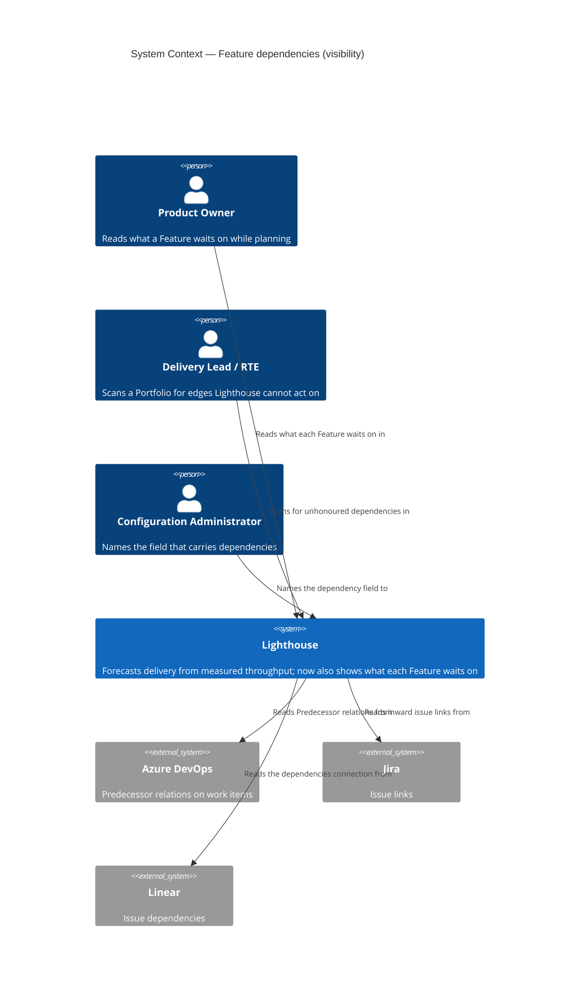
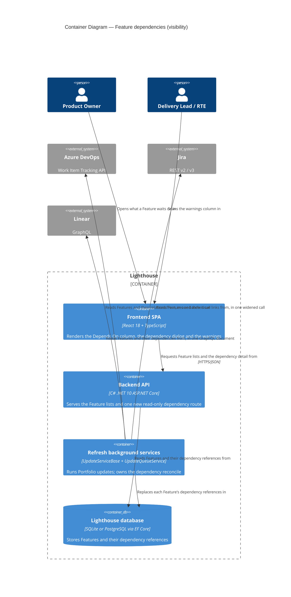

# Feature Delta — epic-4365-dependencies

**ADO**: Epic #4365 "Show Feature Dependencies" (Planned, created 2026-02-23, tagged `Documentation`,
`Release Notes`) · **Feature type**: cross-cutting (work-tracking connectors + Feature list UI) ·
**Density**: lean · **DISCUSS run**: 2026-08-14 · **DESIGN run**: 2026-08-14 ·
**Split**: 2026-08-16

> **This epic was split on 2026-08-16.** It originally covered both halves of dependencies: *seeing*
> them and *forecasting against* them. The forecasting half — premium, and by far the riskier of the
> two — now lives in **Epic #5792, Dependency-Aware Forecasting**
> (`docs/feature/epic-5792-dependency-aware-forecasting/`). This epic is the community half: read
> dependencies from the tracker, show them, warn about the ones Lighthouse cannot act on, and let a
> Portfolio name the field they live in. It ships first and stands on its own — the epic's own scope
> assessment already found the visibility half *"useful with the second never shipping"*.
>
> Story and acceptance-criterion identifiers are **unchanged** across the split, so US-05 through
> US-08 are simply absent here and present there. Nothing was renumbered; only the slices were.
> Decisions D1-D15 were written for both halves and are numbered once — the ones that belong wholly
> to forecasting (D2, D3) are stated in Epic #5792's delta and referenced from here where they explain
> why something is out of scope.

The epic asked for two things in one line: *"Set dependencies on Features, then in the forecast,
'jump' over them until the dependent Features are forecasted to be done."* This half is the first
clause. Reading the codebase during DISCUSS turned it into something less obvious than it looks.

1. **The surface this lands on already exists, and was built for it.** Epic #5375 (Manual Sorting)
   shipped `/features` (`FeaturesView.tsx`) as a general Feature view, and its D17 says in as many
   words that it is *"the surface that will later host ADO Epic #4365 'Dependencies'"*. The warnings
   column the epic asks for is `WarningsIndicator.tsx`, already rendering two warning kinds through the
   shared `FeatureListDataGrid`/`columns.tsx` factory. This epic writes a column and a dialog, not a page.

2. **"Blocked" is already taken.** Epic #5074 shipped blocked items — `WorkItem.IsBlocked`,
   `BlockedSince`, blocked-history widgets — and `blocked` is a **renameable terminology key**
   (`TerminologyKeys.ts:18`). A Feature row that says "blocked" for two unrelated reasons is unreadable.
   This feature says *depends on* and never *blocked by*, whatever the tracker calls its field (D10).

3. **The relation payloads are three different shapes, and only three connectors have one.** ADO already
   fetches `WorkItemExpand.Relations` on the parent path
   (`AzureDevOpsWorkTrackingConnector.cs:1043`) — the extension point is open. Jira sends an explicit
   `fields=` list only on its identity sweep (`:1613`); its data fetch already returns `issuelinks`
   — `*all` on Cloud (`:1494`), Jira's `*navigable` default on Data Center, which names no `fields=`
   at all (`:1462`) — and returns the summary inline. Linear
   is GraphQL and returns titles inline for free. **ServiceNow and CSV have no standard dependency field
   at all** — they are out of scope, not deferred-with-a-plan.

4. **Ordering is solved and must not be re-solved.** `FeatureRepository.GetAll()` orders through
   `IFeatureOrdering`, which switches between `ManualRankComparer` and `FeatureComparer` at one point.
   This feature reads that order and never writes it. A dependency whose blocker is ranked *below* its
   dependent is a warning, not an auto-reorder (D12).

5. **Detection is where the epic's own premium boundary already sat.** The epic text gates the
   *forecast effect* and explicitly keeps the warning and the hint free. That boundary is now an epic
   boundary rather than a licence branch inside one epic, which is what makes this half releasable
   alone.

---

## Wave: DISCUSS / [REF] Prior-Wave Reading Confirmation

- ⊘ `docs/feature/epic-4365-dependencies/discover/` (not found — no DISCOVER wave ran)
- ⊘ `docs/feature/epic-4365-dependencies/diverge/` (not found — no DIVERGE wave ran)
- ✓ `docs/product/jobs.yaml` (schema_version 1, 98 jobs) — none covers dependencies between Features.
  Nearest neighbours are the four `epic-5375-manual-sorting` ordering jobs, which establish that the
  sequence the forecast consumes is a first-class user concern; this epic adds the constraint that
  sequence cannot express.
- ✓ `docs/product/journeys/epic-5375-manual-sorting.yaml` — read in full. Its D17, D10, D12 and D16 are
  load-bearing here and are carried forward rather than re-decided.
- ✓ `docs/product/journeys/` (41 journeys) — none touches dependencies.
- ✓ `docs/product/personas/` (9 personas) — `product-owner`, `delivery-lead-rte` and `config-admin` are
  reused verbatim. No new persona needed.
- ✓ `docs/product/kpi-contracts.yaml` — the `measurement_scope` convention
  (`per_instance` / `vendor_demo_only` / `opt_in_telemetry_required`) is inherited by every KPI below.
- ⊘ `docs/product/vision.md`, `docs/project-brief.md`, `docs/stakeholders.yaml` (not found — product
  SSOT lives under `docs/product/` in this repo)
- ✓ `CLAUDE.md`, `docs/ci-learnings.md` — standing rules applied (expand-only migrations via
  `CreateMigration`, quality gates, per-feature docs, configurable terminology, no internal references
  in comments).
- ✓ **Code read during this wave**: `Models/Feature.cs`, `Models/WorkItemBase.cs`,
  `Models/FeatureComparer.cs`, `Models/ManualRankComparer.cs`, `Models/FeatureOrderKey.cs`,
  `Services/Implementation/FeatureOrdering.cs`,
  `Services/Implementation/Repositories/FeatureRepository.cs`, `API/DTO/FeatureDto.cs`,
  `API/FeaturesController.cs`, `Services/Interfaces/WorkTrackingConnectors/IWorkTrackingConnector.cs`,
  `WorkTrackingConnectors/AzureDevOps/AzureDevOpsWorkTrackingConnector.cs` + `WorkItemExtensions.cs`,
  `WorkTrackingConnectors/Jira/JiraWorkTrackingConnector.cs`,
  `WorkTrackingConnectors/Linear/LinearWorkTrackingConnector.cs`,
  `Models/WorkTrackingSystemOptionsOwner.cs`, `pages/Features/FeaturesView.tsx`,
  `components/Common/FeatureListDataGrid/columns.tsx` + `WarningsIndicator.tsx`,
  `hooks/useLicenseRestrictions.ts`, `hooks/useFeatureOrdering.ts`, `models/TerminologyKeys.ts`, plus
  `Services/Implementation/Forecast/ForecastService.cs` — read to establish what this half must *not*
  touch.
- ✓ **ADO** #4365 including its 2026-05-24 comment, which supplies the exact per-tracker field shapes and
  is quoted rather than paraphrased in D14.

No DISCOVER evidence exists to contradict, so no contradiction check was possible and none is claimed.

---

## Wave: DISCUSS / [REF] Persona IDs

| Persona | Role in this feature |
|---|---|
| `product-owner` | Primary. Owns the order the forecast runs in (epic #5375) and now sees the constraint that order cannot express. The person who has to explain why a Feature is late, and who reads the dependency dialog to find out. |
| `delivery-lead-rte` | Portfolio scope. Reads a Feature list to find where the chain breaks — a dependency pointing outside the Portfolio, a blocker ranked below its dependent, a loop. Wants the map, not the individual edge. |
| `config-admin` | Appears once, in slice 04, and only on instances whose tracker does not use standard dependency links. Owns the Portfolio setting that names which field carries them — the same person who already sets the parent override next to it. |
| `delivery-forecaster` | Not served by this epic. Named here because the omission is deliberate: the dates this persona consumes are unchanged by everything below, and that is Epic #5792's whole subject. |

---

## Wave: DISCUSS / [REF] JTBD One-Liners

| Job ID | One-liner |
|---|---|
| `job-po-see-what-a-feature-is-waiting-on` | When a Feature looks stalled, show me what it is waiting on without my opening the work tracking system. |
| `job-config-admin-point-at-the-field-that-carries-dependencies` | When my teams record dependencies in a custom field rather than the tracker's built-in link, let me tell Lighthouse which field that is, once, for the whole Portfolio. |
| `job-lead-see-where-the-dependency-chain-breaks` | When a dependency cannot be honoured — it points outside the Portfolio, or its blocker is ranked below it, or it loops — tell me plainly rather than quietly doing something else. |

The three forecasting jobs — `job-forecast-honours-what-cannot-start-yet`,
`job-forecast-covers-dependencies-that-cross-teams` and
`job-forecaster-know-the-forecast-is-ignoring-a-dependency` — moved to Epic #5792 with the split. All
six remain in `docs/product/jobs.yaml`; only their `feature_context` differs.

Full job stories, dimensions, four forces and opportunity scores are written to
`docs/product/jobs.yaml`.

### Opportunity scores

| Job | Importance | Satisfaction | Gap | Note |
|---|---|---|---|---|
| `job-config-admin-point-at-the-field-that-carries-dependencies` | 4 | 0 | **4** | Satisfaction 0 because the instance gets *nothing* — not a degraded version. Importance 4 rather than 5 because it is conditional on how a given tracker is configured; for the instances it applies to it is worth 5, for the rest it is worth nothing. |
| `job-po-see-what-a-feature-is-waiting-on` | 4 | 1 | **3** | Partly satisfied: the answer exists, in the tracker, one context switch away. The cost is the switch and the fact that nobody makes it while reading a forecast. |
| `job-lead-see-where-the-dependency-chain-breaks` | 3 | 0 | **3** | Lower importance because it is a diagnostic rather than an outcome — but it is the job that stops the others from being quietly wrong. |

---

## Wave: DISCUSS / [REF] Current-State Surface Inventory

| Surface | Location | State today |
|---|---|---|
| Feature ordering | `FeatureOrdering.cs`, consumed by `FeatureRepository.GetAll:18` | One switch point between `ManualRankComparer` and `FeatureComparer`, tie-broken by `Id`. Shipped by epic #5375. This feature reads it and never writes it. |
| Feature model | `Models/Feature.cs` | Carries `ManualRank` (deliberately absent from `Update`, so sync cannot overwrite it) — the exact precedent D5 copies. No relation of any kind to another Feature. |
| Synced fields | `Models/WorkItemBase.cs:18-56` | `ParentReferenceId` is the only inter-item link, a single string, overwritten from source on every sync. |
| Connector port | `IWorkTrackingConnector.cs` | Ten methods, none returning relations. DESIGN found none is owed — see F-2. |
| ADO relations | `AzureDevOpsWorkTrackingConnector.cs:1043` | Already requests `WorkItemExpand.Relations` for the parent path; `WorkItemExtensions.cs:25-27` already walks `workItem.Relations`. Relation URLs carry an id, not a title. |
| Jira fields | `JiraWorkTrackingConnector.cs:1494`, `:1462`, `:1613` | Two different requests. The data fetch already carries `issuelinks`: Cloud asks for `AllFields = "*all"` (`:1494`), Data Center names no `fields=` at all (`:1462`) and so gets Jira's `*navigable` default. Only the identity sweep restricts to `SweepFields = "key,updated"` (`:1613`), and it must stay that narrow. |
| Linear query | `LinearWorkTrackingConnector.cs:660-726` | Hand-built GraphQL with `parent { … }` already selected. `dependencies` is a sibling selection. |
| ServiceNow / CSV | `ServiceNowWorkItemMapper.cs`, `CsvWorkTrackingConnector.cs` | No dependency field exists in either. Out of scope (D13). |
| Feature list UI | `FeatureListDataGrid/columns.tsx` | Column factories: name, forecasts, state, warnings, active work, parent, position, ordering actions. A dependency column is one more factory used by both surfaces. |
| Warnings | `WarningsIndicator.tsx` | Renders exactly two warning kinds today (done-with-remaining-work, default-feature-size), or a green check. Additive by construction. |
| Instance-wide Feature view | `pages/Features/FeaturesView.tsx` | Exists, free, RBAC-filtered result set, built by epic #5375 D17 explicitly to host this epic. |
| Feature DTO | `API/DTO/FeatureDto.cs:76-85` | Already carries additive presentation fields (`Position`, `CanMove`, `MoveBlockReason`, `BlockingPortfolios`) — the pattern this feature's fields follow. |
| Simulation eligibility | `ForecastService.cs:201-209` | `simulationResults.Where(x => x.HasWorkRemaining)`. **Untouched by this epic.** Listed so that "no forecast change" is a checkable statement rather than a promise. |
| Premium gate | `LicenseGuardAttribute` (backend), `hooks/useLicenseRestrictions.ts` (frontend) | Both shipped and in use on `FeaturesController.cs:125`. Neither is used by this epic — everything here is free. |
| Terminology | `TerminologyKeys.ts` | `FEATURE`, `FEATURES`, `WORK_ITEMS`, `PORTFOLIOS` — and `BLOCKED: "blocked"`, already owned by epic #5074. See D10. |

---

## Wave: DISCUSS / [REF] Locked Decisions

- **[D1] A dependency is a directed edge between two Features: "this one cannot start until that one is
  done".** Not between work items, not between Portfolios, not between teams. Straight from the epic
  ("Set dependencies on Features"). Work-item-grain dependencies have no consumer — the simulation
  sequences Features, so a work-item edge would ship plumbing, exactly as epic #5375's D1 concluded for
  ordering.

- **[D2] — moved to Epic #5792.** The forecast honours a dependency by excluding the dependent from the
  eligible set inside each trial, not by shifting its dates afterwards. Referenced here only because it
  is why *nothing* in this epic touches `ForecastService`: the mechanic is a single predicate at a
  single call site, and putting half of it here would spread one decision over two epics.

- **[D3] — moved to Epic #5792.** One joint simulation across all teams, replacing the per-team
  independent runs.

- **[D4] Every dependency comes from the work tracking system. Lighthouse never authors one**
  (user, 2026-08-14, resolving the wave's one open question). The default source is the standard link
  per connector (D14). A Portfolio may **override which field carries them**, exactly as it can for the
  parent: a nullable `DependencyOverrideAdditionalFieldDefinitionId` beside
  `ParentOverrideAdditionalFieldDefinitionId` (`IWorkItemQueryOwner:27`; DESIGN moved the declaration to
  `Portfolio` — F-3). The connector's behaviour copies `GetParentReferenceForWorkItems`
  (`AzureDevOpsWorkTrackingConnector.cs:1012-1018`) in shape: when the override is set, **skip the
  relations fetch entirely** — "no need to load stuff if we have an override anyway" — and read the
  value from `AdditionalFieldValues` instead.

  **Replace, not union** (user, 2026-08-14: "if I set an override, just use the content from that
  specific field"). A Portfolio that names a field is declaring that field authoritative; native links
  on the same Feature are ignored while it is set. Union was considered — an ADO team could plausibly
  have some Predecessors native and some in a custom field — and rejected as harder to explain than it
  is worth, and inconsistent with the parent override it copies.

  **The owner is the Portfolio only**, not the Team, even though `IWorkItemQueryOwner` is implemented
  by both (user, 2026-08-14). Dependencies are between Features, and Features are fetched per
  Portfolio — a Team-level setting would have no consumer.
  A per-Feature declaration made inside Lighthouse was considered during this wave and **rejected**:
  it would make Lighthouse an author of dependency data, which is a different product posture from the
  one it takes everywhere else, and it would need a precedence rule against the tracker that this one
  does not.

- **[D15] The override field carries a LIST of references in the connector's own reference form, and
  that is where it differs from the parent override** (user, 2026-08-14). A parent is 0..1, so
  `GetParentReference` (`:1095-1106`) can return one string. Dependencies are 0..n, so the field's
  value is split on comma or semicolon and each entry trimmed.

  **What an entry looks like is settled: whatever that tracker calls a Feature.** Jira keys on a Jira
  connection, work item ids on ADO, identifiers on Linear — which is exactly `ReferenceId` space, so
  no per-tracker normalisation layer is owed. The one transformation that remains is Linear's
  lower-casing (D14). An entry that resolves to nothing is skipped exactly as an unresolvable relation
  is (AC-1.4) — a hand-maintained field will contain typos, and one typo must not discard the three
  good references beside it. The separator is fixed rather than configurable in this epic.

- **[D5] A Feature stores the LIST OF REFERENCES it waits on, resolved when read — not a resolved
  Feature-to-Feature foreign key** (user, 2026-08-14, correcting this wave's first draft). The stored
  form is strings in the same space as `ReferenceId`, exactly as `WorkItemBase.ParentReferenceId`
  already works.

  The reason is sync order. If Feature B references A and A has not been imported yet, a resolved
  foreign key cannot be written at all, and the edge silently does not exist until some later sync
  happens to fix it. A stored reference heals on its own: the next read resolves it. The graph the
  cycle detector wants — and, later, the one Epic #5792's simulation wants — is derived at read time
  from those references, which also keeps the stored form dumb and the derived form single-sourced
  (KPI-5).

  It sits in its own persisted collection, never on a synced scalar — `WorkItemBase.Update` overwrites
  every synced field on every refresh, which is why `Feature.ManualRank` sits outside it. One writer:
  the sync's reconcile, replacing a Feature's references wholesale with whatever the current source —
  link or override field — now says. Expand-only, generated with the `CreateMigration` script.

- **[D6] A dependency changes the forecast only when both Features share at least one Portfolio**
  (epic's proposal, user-confirmed 2026-08-14). Feature ↔ Portfolio is many-to-many
  (`LighthouseAppContext.cs:217-219`), so "same Portfolio" means "they share at least one". A dependency
  pointing outside is **detected, stored, shown and warned** — never silently dropped. Everything in
  that sentence except the forecast consequence is delivered by this epic; the forecast consequence is
  Epic #5792's, and is a no-op until it ships.

- **[D7] Cycles are detected and never reach the simulation.** After every sync the edge set is
  checked; an edge that closes a cycle is excluded from the honoured set and every Feature in the cycle
  carries a warning naming the loop. This is the epic's third bullet ("must ensure we are not having
  chains that end up in an infinite loop"). It lands here, in slice 02, **one epic before anything
  consumes it** — which is the cheapest place to get it wrong, and which is why it did not travel with
  the forecast half. DESIGN refined *where* it runs: inside the one honour policy rather than at
  ingestion (F-5).

- **[D8] A dependency whose blocker can never complete in a forecast run is dropped for that run, and
  warned.** The *warning* is this epic's — slice 02 computes and shows the `cannot be forecast` verdict
  using `Feature.CanBeForecast` / `TeamsWithoutForecast`, which already exist. The *drop* is Epic
  #5792's, and is vacuous until it ships. Split this way deliberately: the verdict is a pure function of
  data this epic already loads, and stating it early means the warning vocabulary is settled before any
  simulation depends on it.

- **[D9] Premium gates the forecast effect and nothing else.** Verbatim from the epic: *"If we don't
  have a premium license, you will see the warning that the item has a dependency together with the
  hint that it's not taken into account in the forecasting unless you have premium."* After the split
  this is an epic boundary, not a licence branch: **everything in Epic #4365 is free, with no licence
  check anywhere in it**, and everything premium is in Epic #5792. Detection, the count, the dialog,
  the warnings and the Portfolio's dependency-field setting are all free — the setting is what makes
  detection work at all on an instance whose tracker does not use standard links, and gating it would
  gate the free half behind a licence. The "not taken into account" hint itself (US-06) travels with the
  premium epic, because a hint pointing at a capability nobody can buy yet is worse than no hint.

- **[D10] The UI word is "depends on", never "blocked".** `TERMINOLOGY_KEYS.BLOCKED` and
  `WorkItem.IsBlocked` already name a different, shipped concept from epic #5074, and `blocked` is a
  term instances may rename. Two meanings of one renameable word on the same Feature row is a defect in
  waiting. `Feature`/`Features`/`Portfolios`/`Work Items` resolve through `getTerm` as everywhere else.
  Tracker wording is not UI wording: ADO's "Predecessor" and Jira's "is blocked by" are read, not shown.

- **[D11] Both surfaces are existing ones.** The instance-wide Features view (`FeaturesView.tsx`, built
  by epic #5375 D17 for this) and the existing Portfolio Feature list, both through the shared
  `FeatureListDataGrid` and its `columns.tsx` factory, so the column is written once. The "which items
  do we depend on" list the epic asks for is a dialog opened from the row, following the existing
  work-items dialog pattern. No new page is built by this epic.

- **[D12] Lighthouse never reorders to satisfy a dependency.** A blocker ranked below its dependent is
  the epic's *"dependency ordered lower — that will cause a mess"*, and it is a warning. Ordering stays
  the user's decision (epic #5375's whole premise).

- **[D13] ADO first, then Jira and Linear. ServiceNow and CSV are out, and cannot be rescued by D4's
  field override.** ADO is the thinnest first connector because `WorkItemExpand.Relations` is already
  requested on the parent path, and it is the bulk of the dogfood instance's data.

  The tempting argument that the field override brings ServiceNow and CSV along — every connector
  supports additional fields, so the mechanism is available to them — **does not hold, and was checked
  during this wave**: `ServiceNowWorkTrackingConnector.GetFeaturesForProject` throws
  `NotSupportedException` (`:751-757`). ServiceNow has no Features, so it has nothing for a dependency
  to be *between*. A dependency is a Feature-to-Feature edge (D1), Features live in Portfolios (D6),
  and ServiceNow supports neither. The field override changes where a reference is read from; it does
  not create the objects the reference points at. Recorded here so the argument is not re-made.

- **[D14] Only the "waiting on" direction is fetched; the reverse is derived by inverting stored
  references.** Per ADO #4365's 2026-05-24 comment, and with the extraction each connector needs so
  the stored string lands in `ReferenceId` space (D5):

  | Connector | Source | `ReferenceId` is | Extraction |
  |---|---|---|---|
  | ADO | relation `System.LinkTypes.Dependency-Reverse` | `$"{workItem.Id}"` (`:870`) | trailing segment of the relation URL |
  | Jira | `issuelinks` where `type.inward = "is blocked by"` **and** an `inwardIssue` is present | `issue.Key` (`:1348`) | `inwardIssue.key`, verbatim |
  | Linear | `dependencies` connection | `issue.Identifier?.ToLowerInvariant()` (`:343`) | `identifier`, **lower-cased** |

  **The Linear lower-casing is the trap in this feature.** The connector stores identifiers folded to
  lower case and the GraphQL connection returns them upper case, so without the fold every Linear
  reference resolves to nothing — silently, because D15 skips unresolvable entries by design. The
  failure presents as "Linear simply has no dependencies", which is indistinguishable from the truth.
  It gets its own acceptance criterion rather than being left to the mapper (AC-9.2).

  Fetching the forward direction too would double the request cost to learn something the stored
  reference set already contains.

- **[D16] A Portfolio may set its dependencies aside without hiding them** (user, 2026-08-18, after
  DISTILL). A per-Portfolio **Ignore dependencies** switch makes every dependency in that Portfolio
  **un-honoured**: the count, the dialog, the source and the resolved blockers all stay exactly as
  they are, and the one honour-ability decision (SA-12) answers "no" for every edge, with a reason of
  its own. It exists because the forecast Epic #5792 ships will argue back on every re-order, and a
  lead trying out a different plan needs to ask the question without editing links in the tracker.

  **Ingestion is deliberately untouched.** The alternative — skip reading dependencies altogether
  while the switch is on — was considered and rejected on 2026-08-18. It reaches the same place for
  the forecast, since Epic #5792 consumes the honoured set and nothing else, but it costs three
  things. An ignored Portfolio's column would read the same as an instance that genuinely has no
  dependencies, which is the exact confusion this epic refuses for unresolvable references (D15,
  AC-9.2). Turning the switch on would have to delete stored edges, and turning it off would have to
  re-download everything through `FetchFingerprint`. And the reader would lose sight of what they
  chose to set aside. Honouring nothing costs one field on the policy's input and deletes nothing.

  Off by default, free (D9), per Portfolio and never on a Team (D4). **No warning is raised while it
  is on** — the state is a deliberate choice, not a broken link, and a warning on every Feature in the
  Portfolio would train the reader to ignore the column US-03 exists to make worth reading. The dialog
  says it instead, per entry.

  **Where a Feature belongs to more than one Portfolio** (Feature to Portfolio is many-to-many, D6),
  an edge is un-honoured by this switch only when **every** Portfolio containing both its ends has the
  switch set. On a single-Portfolio instance — the ordinary case — that reads simply as "this
  Portfolio ignores dependencies". It is stated because a dependency only ever has a consequence
  inside a Portfolio holding both Features (D6), so any other rule would let one Portfolio's what-if
  setting quietly change another Portfolio's plan.

---

## Wave: DISCUSS / [REF] Scope Assessment

**Verdict: right-sized after the 2026-08-16 split.**

The original epic was assessed OVERSIZED, with three signals present (two triggers the gate): four
areas touched, an estimate beyond two weeks, and — the decisive one — **two independently valuable
user outcomes that could ship as separate releases**: *see the dependencies* and *forecast against
them*, the first useful with the second never shipping.

That assessment named the split and the 2026-08-16 decision executed it as an epic boundary rather
than a release boundary inside one epic. What remains here touches two areas (connectors, Feature list
UI), carries no licensing surface at all, and is four slices each shipping end to end.

**Release boundary: this epic is a release.** The question the original delta deferred — *is
visibility alone worth releasing* — is answered by the split itself. Slices 01-02 remain the natural
first release inside it if the board wants one earlier still.

---

## Wave: DISCUSS / [REF] WS Strategy

**Strategy B — extend an existing skeleton.** Brownfield throughout: the Feature view, the shared grid,
the warnings column, the connector port and the ordering switch point are all in production. No walking
skeleton is built. Slice 01 is the thin end-to-end proof — one ADO relation read, stored, ordered, and
rendered as a count on two surfaces.

---

## Wave: DISCUSS / [REF] Driving Ports

| Port | Surface | Introduced by |
|---|---|---|
| Sync (scheduled + manual refresh) | Portfolio Feature fetch gains a relation read; edges are reconciled against stored ones | slice 01 (ADO), slice 03 (Jira, Linear), slice 04 (Portfolio field) |
| UI — Features view (`/features`) | A "Depends On" column showing the count of Features this one waits on, plus a dependency warning in the existing warnings column | slices 01, 02 |
| UI — Portfolio detail Feature list | Same column, same factory, no second implementation | slices 01, 02 |
| UI — dependency dialog | Row action opening the list of Features this one waits on: name, state, Portfolio, link to the tracker, and why an edge is not honoured | slice 02 |
| HTTP | `GET /api/latest/features/{id}/dependencies` — free, read-only. No write endpoint exists in this epic (D4) | slice 02 |
| UI — Portfolio settings | A **Dependency field** selector beside the existing parent-override selector, listing the connection's additional fields | slice 04 |
| Docs | Dependencies page under the Features documentation, per-feature screenshots | slice 03 |

No forecast port. The 50/70/85/95 % dates are unchanged by every slice below — that is Epic #5792's
only port, and it has no endpoint.

---

## Wave: DISCUSS / [REF] Pre-requisites

- Epic #5375's `/features` view and shared `FeatureListDataGrid` in `main` — both shipped.
- The dev instance on `:5169` restored from a real backup, so relation reads run against genuine ADO
  data rather than seeded rows. Its measured Feature mix (86 ADO, 4 Jira, 4 Linear) is why ADO is first.
- **Real Predecessor links created in the dogfood ADO project** covering: a same-team pair, a
  cross-team pair, a cross-Portfolio pair, a blocker ranked below its dependent, a two-Feature cycle,
  and a blocker whose team has no throughput. Slice 02's warning kinds cannot be confirmed against real
  data without the last three, and Epic #5792 cannot start without them at all. Created directly in ADO
  with `az boards work-item relation add` — no in-Lighthouse authoring exists to create them (D4),
  which is what moved this from a slice to a prerequisite.
- One additional field defined on the dogfood ADO connection, carrying a dependency list, for slice 04.
- `CreateMigration` PowerShell script for the D5 migration, additive only.
- A pre-slice-01 timing baseline of a full ADO portfolio refresh, to defend KPI-3. Epic #5687 just took
  that path from 468,856 ms to 2,087 ms; an N+1 relation read is exactly the shape that gives it back.

A premium licence is **not** a prerequisite for any slice in this epic (D9).

---

## Wave: DISCUSS / [REF] Out of Scope

- **Any change to a forecast date.** Epic #5792, in full — the eligibility rule, the joint simulation,
  the free-tier hint that names the premium capability, and the premium gate itself.
- **Work-item-grain dependencies.** Features only (D1).
- **Writing dependencies back to the tracker.** Lighthouse reads; it never creates a link in ADO, Jira
  or Linear. Same posture as epic #5375's D8 on ordering.
- **Declaring or editing a dependency inside Lighthouse**, in any form — adding one, removing one, or
  suppressing a tracker-sourced one. Considered and rejected under D4: it would make Lighthouse an
  author of dependency data. To change a dependency, change it in the tracker.
- **A configurable *separator* for the override field.** Comma and semicolon, fixed (D15).
- **Ignoring dependencies anywhere other than a Portfolio.** D16's switch is per Portfolio. A global
  one and a per-Feature one were both rejected: a global switch has no owner and no place to be seen
  from, and a per-Feature one is a suppression, which is Lighthouse authoring dependency data by the
  back door (D4).
- **ServiceNow and CSV.** No standard field exists (D13).
- **Auto-reordering to satisfy a dependency** (D12).
- **A dependency graph visualisation.** The epic asks for a column, a warning and a list. A graph view
  is a plausible successor and is not designed here.
- **Marketing website copy.** Flagged for the DELIVER checklist under the `Release Notes` tag, not built
  here.

---

## Wave: DISCUSS / [REF] User Stories

Every story traces to a `job_id` in `docs/product/jobs.yaml`. Identifiers are unchanged from before the
split; US-05 through US-08 live in Epic #5792.

---

### US-01 — A Feature says how many things it is waiting on

`job_id: job-po-see-what-a-feature-is-waiting-on` · persona `product-owner` · **slice 01**

As a product owner, I want every Feature list to show how many other Features it is waiting on, so that
I stop discovering dependencies by accident in a stakeholder review.

### Elevator Pitch
Before: nothing in Lighthouse knows one Feature waits on another; the fact lives only in the tracker.
After: open **Features** in the top navigation → the **Depends On** column reads `2` on a Feature with
two ADO Predecessor links, and `—` on one with none.
Decision enabled: whether this Feature can actually be started now, or whether the team should pull the
next one instead.

**Acceptance criteria**

- **AC-1.1** A Feature with two ADO `System.LinkTypes.Dependency-Reverse` relations to Features in the
  same Portfolio renders `2` in the Depends On column on `/features`.
- **AC-1.2** The same Feature renders the same `2` in the Portfolio detail Feature list — from the same
  column factory, asserted by the column being defined once.
- **AC-1.3** A Feature with no relations renders the empty marker, not `0`.
- **AC-1.4** A relation pointing at a work item that is not a Feature in Lighthouse is skipped, and the
  count excludes it. No error, no partial row.
- **AC-1.5** After a full refresh in which a Predecessor link was removed in ADO, the count drops
  accordingly — stored edges are reconciled, not accumulated.
- **AC-1.6** `Feature.ManualRank` and every synced field are unchanged by dependency ingestion.
- **AC-1.7** The column header resolves through `getTerm(TERMINOLOGY_KEYS.FEATURES)` and contains no
  literal "Epic" or "Blocked".
- **AC-1.8** A full portfolio refresh on the dev instance completes within 110% of the pre-slice
  baseline (KPI-3).
- **AC-1.9** A Portfolio that has the **parent** override configured still yields its Features'
  dependencies. The relations fetch is skipped only when both overrides are set. Without this
  assertion the failure is silent and indistinguishable from a Portfolio that genuinely has none
  (F-4).
- **AC-1.10** Forecast percentiles are unchanged by dependency ingestion — asserted against a fixed
  seed with dependency data present and absent. The epic boundary is a claim, so it is a test.

---

### US-02 — See exactly what a Feature is waiting on

`job_id: job-po-see-what-a-feature-is-waiting-on` · persona `product-owner` · **slice 02**

As a product owner, I want to open the list of Features a Feature is waiting on and see their names and
states, so that I can tell whether the wait is nearly over or has not started.

### Elevator Pitch
Before: the count says `2` and nothing says which two, so the answer is still in the tracker.
After: click the **Depends On** cell → a dialog lists each Feature it waits on with name, state,
Portfolio and a link to the tracker record.
Decision enabled: whether to chase the blocker, re-sequence around it, or accept the wait.

**Acceptance criteria**

- **AC-2.1** Clicking the cell opens a dialog listing every Feature this one waits on, each with name,
  state, its Portfolios, and a link that opens the tracker record.
- **AC-2.2** Each row names where it came from — the tracker's own link, or the field this Portfolio
  named (D4). Both are the work tracking system; the distinction is which part of it was read.
- **AC-2.3** An edge that will not be honoured by the forecast is labelled in the dialog with the reason
  in plain language, one of: outside this Portfolio, part of a dependency loop, or the Feature it waits
  on cannot be forecast.
- **AC-2.4** The dialog opens for a user with read access and shows the same content; no action is
  offered without `PortfolioWrite`.
- **AC-2.5** A Feature it waits on that the user cannot read is shown as a redacted row with the reason,
  never omitted silently — a hidden blocker is worse than an unnamed one.

---

### US-03 — Be warned when a dependency will not be honoured

`job_id: job-lead-see-where-the-dependency-chain-breaks` · persona `delivery-lead-rte` · **slice 02**

As a delivery lead, I want the warnings column to flag dependencies Lighthouse cannot act on, so that I
find the broken links by scanning a list rather than by auditing every Feature.

### Elevator Pitch
Before: a cross-Portfolio dependency and a healthy one look identical — both invisible.
After: open **Features** → the warnings column shows a warning on the affected row, whose tooltip reads
e.g. "Waits on a Feature outside this Portfolio — not included in the forecast".
Decision enabled: whether to move a Feature into the Portfolio, re-rank it, or break the loop.

**Acceptance criteria**

- **AC-3.1** A Feature waiting on one in no shared Portfolio renders a warning naming that Feature and
  stating the dependency is not included in the forecast.
- **AC-3.2** A Feature waiting on one ranked **below** it renders a distinct warning naming the
  ordering conflict. No rank is changed by Lighthouse.
- **AC-3.3** A Feature in a dependency loop renders a warning naming the other members of the loop.
- **AC-3.4** A Feature whose dependency carries no not-honoured reason renders **no** warning — the
  presence of a dependency is not itself a warning. Phrased against the verdict rather than against the
  forecast, because until Epic #5792 ships no edge has a forecast consequence either way.
- **AC-3.5** Existing warnings (done-with-remaining-work, default-feature-size) still render alongside,
  unchanged, and a Feature with none still renders the green check.
- **AC-3.6** No warning text contains the word "blocked" (D10).

---

### US-04 — Read dependencies from the field this Portfolio actually uses

`job_id: job-config-admin-point-at-the-field-that-carries-dependencies` · persona `config-admin` ·
**slice 04** · free

As a configuration admin, I want to tell Lighthouse which field on my Portfolio's work items carries
its dependencies, so that instances that record them in a custom field get everything the standard-link
instances get.

### Elevator Pitch
Before: a Portfolio whose team records dependencies in a custom field reads `—` in the Depends On
column, because Lighthouse only understands the tracker's built-in link type.
After: open **Portfolio → Settings → Advanced**, set **Dependency field** to that additional field, run
a refresh → the Depends On column populates from it, and the relations fetch is skipped entirely.
Decision enabled: whether this Portfolio can use dependency forecasting at all, without anyone
re-recording links in a format the tracker's UI does not offer.

**Acceptance criteria**

- **AC-4.1** With the override set, a Feature whose named field reads `1234;5678` yields two edges,
  and both appear in the count (US-01) and the dialog (US-02).
- **AC-4.2** With the override set, the connector performs **no** relations fetch — asserted on the
  request, mirroring `GetParentReferenceForWorkItems`'s early return (`:1014-1018`).
- **AC-4.3** Comma and semicolon both separate; surrounding whitespace is trimmed; an empty field
  yields no edges and no error.
- **AC-4.4** An entry that resolves to no Feature is skipped and the entries beside it still yield
  edges (D15) — one typo does not discard the list.
- **AC-4.5** With the override **unset**, behaviour is byte-identical to slices 01-03: the standard
  link is read, asserted by an unchanged fixture comparison.
- **AC-4.6** The setting is per Portfolio, offered only for additional fields defined on that
  Portfolio's connection, and requires the same permission the parent override requires.
- **AC-4.7** The setting is available on an unlicensed instance and changes no forecast value there
  (D9) — it feeds detection, which is free.

---

### US-10 — Set the dependencies aside to try a different plan

`job_id: job-lead-plan-without-the-dependencies` · persona `delivery-lead-rte` ·
**slice 04** · free

As a delivery lead, I want to switch dependencies off for a Portfolio without deleting them, so that I
can re-order Features to see what a different plan looks like and still see what I set aside.

### Elevator Pitch
Before: the only way to ask what a plan looks like without its dependencies is to edit the links in
the tracker — changing the real plan in order to ask a hypothetical question.
After: open **Portfolio → Settings → Advanced**, tick **Ignore dependencies** → the Depends On column
still shows every dependency, and every entry in the dialog reads *ignored for this Portfolio*.
Decision enabled: whether the order you want is worth the dependencies it breaks — asked without
touching the tracker.

**Acceptance criteria**

- **AC-10.1** With the switch on, every dependency in that Portfolio is un-honoured with the reason
  *this Portfolio ignores dependencies*, and the count and the dialog list are identical to what they
  show with the switch off.
- **AC-10.2** With the switch on, the warnings column raises **no** dependency warning anywhere in
  that Portfolio — not for an outside-Portfolio edge, not for a loop, not for a blocker positioned
  below its dependent. Warnings that existed before this epic are untouched.
- **AC-10.3** The switch takes effect on the next read: no refresh, no re-download, and no stored
  reference deleted or altered — asserted by comparing the stored reference set across a toggle.
- **AC-10.4** With the switch off, behaviour is byte-identical to slices 01-03, asserted by toggling
  on and back off and comparing every verdict.
- **AC-10.5** An edge whose two ends share more than one Portfolio is un-honoured by this switch only
  when every Portfolio containing both ends has it set (D16); otherwise it keeps the verdict it would
  have had.
- **AC-10.6** `FetchFingerprint` does **not** change with this setting, asserted directly. The
  opposite is the reflex — its two siblings on this form both belong there — but nothing about what is
  fetched depends on it, and a fingerprint entry would force a full re-download on every toggle.
- **AC-10.7** Per Portfolio, offered nowhere on a Team, needing the same permission the dependency
  field needs, available unlicensed, and off for every Portfolio that already exists after the
  migration.
- **AC-10.8** `IgnoredByPortfolio` takes precedence over the three data reasons when more than one
  applies; `NotLicensed` stays outermost, because it describes the instance rather than the plan and is
  the more actionable thing to be told. Cycle detection still runs while the switch is on: the verdict
  a Feature carries the moment the switch is turned off must be the one it would have had all along,
  not one computed for the first time on a plan already being read.

---

### US-09 — Jira and Linear dependencies

`job_id: job-po-see-what-a-feature-is-waiting-on` · persona `product-owner` · **slice 03**

As a product owner on Jira or Linear, I want my tracker's dependency links read too, so that everything
slices 01-02 delivered applies to my instance without my re-entering anything.

### Elevator Pitch
Before: a Jira Feature with an "is blocked by" link and a Linear Feature with a `dependencies` entry
both read `—` in the Depends On column.
After: run a refresh → both read their real counts, and their dialogs and warnings behave exactly as
the ADO ones.
Decision enabled: the same decisions as US-01 through US-03, on the tracker the team actually uses.

**Acceptance criteria**

- **AC-9.1** A Jira issue with `issuelinks` containing `type.inward = "is blocked by"` **and** an
  `inwardIssue` yields one edge per such link; entries with only an `outwardIssue` yield none.
- **AC-9.2** *(restated 2026-08-21 against the published Linear schema — see the slice-03 premise note
  near the end of this document; the original text named `dependencies` on Issue and a lower-case fold,
  neither of which exists on the Feature path.)* A Linear Project's `inverseRelations` connection yields
  one reference per node, taken from `project.id` and stored verbatim, and each one resolves to a
  Feature. Its `relations` connection — what this Project blocks — yields nothing and is not requested
  (D14). Asserted on a fixture carrying both directions, because reading the wrong one reverses every
  edge in the instance while still producing a plausible-looking count.
- **AC-9.3** Reading `issuelinks` changes no existing mapped value, and the identity sweep still asks
  for `key,updated` and nothing more —
  asserted by an unchanged fixture comparison.
- **AC-9.4** A ServiceNow or CSV Feature yields no edges and renders no dependency warning — the
  absence of a field is not an error condition.
- **AC-9.5** US-02 and US-03's ACs pass with Jira- and Linear-sourced edges, parameterised over
  connector rather than duplicated per connector. When Epic #5792 has shipped, its ACs join the same
  parameterisation rather than gaining a per-connector copy.
- **AC-9.6** A full refresh on Jira and Linear stays within 110% of its own pre-slice baseline.
- **AC-9.7** ADO behaviour is unchanged — the same fixture comparison that guards AC-9.3 for Jira.

---

## Wave: DISCUSS / [REF] Story Map

**Backbone** (user activities, left to right):
*Discover a dependency* → *Understand it* → *Use it on my tracker* → *Read it from the field we
actually use* → *Set them aside to try something*

| Slice | Stories | Outcome shipped | Licence |
|---|---|---|---|
| **01** ADO dependencies visible | US-01 | A Feature list that knows what waits on what | free |
| **02** Detail and warnings | US-02, US-03 | The specifics, and every link Lighthouse cannot act on | free |
| **03** Jira and Linear | US-09 | Everything above, on the other two trackers | free |
| **04** Per-Portfolio dependency settings | US-04, US-10 | Instances whose dependencies live in a custom field, and Portfolios that want to set theirs aside | free |

**Slice composition gate**: every slice carries at least one user-visible value story. This epic
contains no `@infrastructure` story — the one that existed (US-07) went with the forecast half.

**Re-numbered 2026-08-16** by the split. The old slices 03 and 04 (forecast, premium) became Epic
#5792's slices 01 and 02; the old 05 and 06 moved up to 03 and 04 here. No slice content changed, and
no story or AC identifier moved.

**Carpaccio taste tests**

| Test | Verdict |
|---|---|
| Any slice shipping 4+ new components? | **Pass after re-cut.** The original slice 01 carried ingestion + storage + column + dialog + warnings. Split into 01 (ingest + count) and 02 (dialog + warnings). |
| Every slice depending on a new abstraction? | **Pass.** The dependency-edge store (D5) ships in slice 01 with the smallest thing that uses it, and every later slice reads it rather than extending it. |
| Does any slice disprove a pre-commitment? | **Pass.** Slice 01 can disprove that relation reads are affordable (KPI-3). Slice 02 can disprove that the honour-ability verdict is cheap enough to compute per row (OQ-6). |
| Synthetic-only data anywhere? | **Pass with one stated exception.** Every slice's dogfood moment runs on `:5169` restored from a real backup, and the awkward shapes (a cycle, a throughput-less blocker) are created as **real ADO links** rather than fixtures. The exception is US-04 in slice 04: no reachable instance keeps dependencies in a custom field, so its acceptance is fixture-led with one manual confirmation against a deliberately-created additional field. Recorded rather than hidden. US-10, added to the same slice on 2026-08-18, has no such exception — it is dogfoodable on `:5169` the day it lands. |
| Two slices identical except for scale? | **Pass, with one deliberate merge.** Jira and Linear are one slice, not two — same slice shape, and splitting them would produce exactly the pair this test forbids. |

---

## Wave: DISCUSS / [REF] Prioritization

1. **Slice 01** first because it carries the epic's cheapest disprovable claim. Epic #5687 took the
   refresh path from 468,856 ms to 2,087 ms; an N+1 relation read is precisely the shape that gives it
   back, and finding that out costs one slice rather than four.
2. **Slice 02** next because slice 01's count is honest but unactionable, and because the warning
   vocabulary it establishes is what Epic #5792 turns off as it delivers. It is also where cycle
   detection lands — one epic before the forecast needs it, which is the cheapest place to get it
   wrong.
3. **Slice 03** after the mechanic is proven, and the ordering is worth restating because it is not the
   value ordering: ADO is 86 of the dev instance's 94 Features, so it is where the mechanic can be
   dogfooded daily. If the board wants a Jira-first release instead, slice 03 moves ahead of slice 02
   at the cost of two connectors' worth of change before the warning vocabulary is settled.

   The dogfood mix is also why slice 03 is not split per connector: 4 Jira and 4 Linear Features means
   the evidence either slice could produce is thin either way, and splitting doubles the ceremony
   without doubling what is learned.
4. **Slice 04** last because it is the only slice serving a population the dogfood instance does not
   contain. Every instance reachable for verification uses standard links; the Portfolio-named field
   exists for instances that do not, and its acceptance is therefore fixture-led with one manual
   confirmation on `:5169` using a deliberately-created additional field. Shipping it last means it
   inherits a mechanic already proven rather than proving one through an unusual configuration.

   US-10 (added 2026-08-18) joins the same slice because it is the same form, the same permission and
   the same migration, and because it needs the verdict vocabulary slice 02 settles. It does not
   inherit slice 04's dogfood weakness: it is verifiable on `:5169` on the day it lands.

**Dogfood cadence**: same-day on `:5169` for every slice.

---

## Wave: DISCUSS / [REF] Outcome KPIs

| KPI | Target | Measurement | Scope |
|---|---|---|---|
| **KPI-1** Dependencies become visible | 100% of ADO Predecessor links between Features in a shared Portfolio appear in the Depends On column after one refresh; 0 silently dropped | Count stored edges vs. the tracker's own link list on `:5169` | `vendor_demo_only` |
| **KPI-3** Sync stays fast | Full portfolio refresh ≤ 110% of the pre-slice-01 baseline, per connector | Update log timing on `:5169`, baseline captured before slice 01 | `per_instance` + `vendor_demo_only` |
| **KPI-5** One eligibility decision | Exactly 1 place in the codebase decides whether a dependency is honoured | Grep at DISTILL; ArchUnitNET assertion (SA-12) | `per_instance` |
| **KPI-8** The forecast is untouched | 0 percentile values differ, under a fixed seed, between a run with dependency data present and one without, at every slice of this epic | Gold test (AC-1.10) | `per_instance` |

KPI-2, KPI-4, KPI-6 and KPI-7 moved to Epic #5792 with the outcomes they measure. KPI-5 stays here
because the single honour-ability decision is written here, in slice 02, and Epic #5792 consults it
rather than adding a second one.

D16's ignore switch does not add a second one: it is a field of that policy's input (SA-17), so the
ArchUnitNET rule behind KPI-5 stands unchanged and Epic #5792 needs no knowledge of the setting.

---

## Wave: DISCUSS / [REF] Definition of Done

1. All acceptance criteria for the slice pass as automated tests.
2. `dotnet build` zero warnings; `dotnet test` green.
3. `pnpm test`, `pnpm build` (zero warnings), Biome clean — stated explicitly as N/A per slice where
   there is no frontend change.
4. Mutation testing ≥ 80% kill rate on the changed backend surface. Non-negotiable on the cycle
   detector and the honour policy.
5. SonarQube Cloud: no new issues of any severity, including security hotspots.
6. EF migration generated with the `CreateMigration` script, additive only.
7. Docs updated per-feature, in the seeded terminology, with per-feature screenshots.
8. ADO story transitioned; slice pushed only after CI is green.
9. The slice's learning hypothesis has an explicit verdict recorded in its brief — confirmed or
   disproved, never blank.

---

## Wave: DISCUSS / [REF] DoR Validation

| # | Item | Verdict | Evidence |
|---|---|---|---|
| 1 | Business value articulated | ✅ | A dependency that nothing in the product can express is one the plan silently assumes away. KPI-1 carries the outcome |
| 2 | Job traceability | ✅ | 4 jobs in `docs/product/jobs.yaml`; all 6 value stories carry a real `job_id`; no `@infrastructure` story remains in this epic |
| 3 | Acceptance criteria testable | ✅ | 42 ACs, each observable from a rendered cell, a dialog, a tooltip, an HTTP status, a stored edge, an outbound request, or a wall-clock measurement. The concrete worked examples this item also asks for live in `docs/product/jobs.yaml` under the three `feature_context` entries, not repeated in the story bodies — that file is the source of truth for them |
| 4 | Dependencies identified | ✅ | Epic #5375's Feature view shipped; `:5169` restored from a real backup; real Predecessor links created in ADO; `CreateMigration`; a pre-slice-01 timing baseline |
| 5 | Sliced ≤ 1 day each | ⚠️ | 4 briefs. Three at 5-6h. Slice 04 became ~7h on 2026-08-18 when US-10 joined it, which exceeds the ≤6h dispatch target — a **stated exception**, taken because both stories are one form, one migration and one permission, and splitting them would ship two settings to the same page in two releases. If the slice runs long, US-10 is the clean cut line: it depends on slice 02 and on nothing in US-04. The epic's one conditional estimate (the simulation restructure) left with Epic #5792 |
| 6 | No known blockers | ✅ | None. The wave's one open question (where a dependency comes from) was resolved by the user on 2026-08-14 |
| 7 | Observable surface defined | ✅ | Driving Ports table; the forecast is explicitly named as a port this epic does not touch |
| 8 | Test data / environment available | ⚠️ | `:5169` has real ADO/Jira/Linear Features but contains no cycle and no dependency-carrying custom field. Both are created directly in ADO before slice 02, because D4 leaves Lighthouse no way to author them |
| 9 | Outcome KPI with numeric target | ✅ | 4 KPIs, each with a number or a binary and a named measurement source |

**Requirements completeness: 0.98.** The missing 0.02 is item 8, stated as open with a plan rather than
guessed at.

---

## Wave: DISCUSS / [REF] Wave Decisions Summary

### Key decisions

See Locked Decisions above. The five that shape everything downstream in this half:

- **[D4] + [D15]** Lighthouse reads dependencies and never authors them; a Portfolio may name the field
  they live in, copying the parent override. The list-valued field is the one place the two mechanisms
  genuinely differ.
- **[D5]** References are stored as strings and the graph is derived on read, so an edge to a
  not-yet-imported Feature heals instead of silently never existing.
- **[D7] + [D8]** Cycles and unforecastable blockers get their verdict and their warning here, one epic
  before anything depends on them. That is the cheapest place to get the vocabulary wrong.
- **[D11] + [D10]** Two existing surfaces and one deliberate refusal of the tracker's vocabulary,
  because `blocked` already names a different shipped concept and is renameable.
- **[D16]** A Portfolio can set its dependencies aside without hiding or deleting them. Ignoring is a
  field of the one honour policy's input, so nothing about ingestion changes and Epic #5792 needs no
  knowledge of the setting.

### Requirements summary

- **Primary needs**: a Feature list that says what each Feature waits on; a plain statement of every
  link Lighthouse cannot act on; a way to read dependencies from whichever field a Portfolio actually
  keeps them in; and a way to set them aside while trying out a different plan.
- **Walking skeleton scope**: none built (strategy B). Slice 01 is the thin end-to-end proof through the
  existing sync, storage, ordering and grid path.
- **Feature type**: cross-cutting.

### Constraints established

- **Nothing in this epic may move a forecast date.** AC-1.10 asserts it under a fixed seed at every
  slice. This is the epic boundary made checkable.
- Sync speed is a protected asset after epic #5687. Relation reads are additive to a path that is now
  225× faster than it was, and KPI-3 defends it.
- Lighthouse never writes to the tracker — no link is created, changed or removed there — and, per D4,
  never authors a dependency on its own side either. It reads, in both directions of that sentence.
- Expand-only migrations, generated with `CreateMigration`.
- Terminology is the instance's own; `blocked` is off-limits for this concept.
- **The usual green-then-commit autonomy applies here** (maintainer, 2026-08-16). The
  no-commit-without-approval rule was set on 2026-08-14 for an epic that still contained the Monte
  Carlo change; with the forecasting code split out, it applies to Epic #5792 only. This half provably
  moves no date (AC-1.10), so a slice commits when it is green and pushes when CI is.

### Upstream changes

None. No DISCOVER or DIVERGE wave ran for this feature, so no prior assumption was altered. Epic
#5375's D17 anticipated this feature and is carried forward intact rather than revised.

### Amendment — 2026-08-18, after DISTILL

US-10 and D16 were added to slice 04 at the maintainer's request, one wave later than the rest of this
document. What moved: D16, US-10 with AC-10.1…10.8, SA-17, one job in `docs/product/jobs.yaml`, six
scenarios in `milestone-4`, one line in `milestone-2` (the closed reason set is four, not three), and
slice 04's brief. What did not move: no existing AC, no existing decision, no scenario already written,
and no identifier. Slice 04's estimate went from ~5h to ~7h, recorded as a stated exception in DoR
item 5 rather than absorbed silently.

The amendment reaches DISTILL artifacts because DISTILL had already run. The alternative — a new slice
05 with its own ADO Story — was weighed and rejected: the two stories share one settings form, one
migration and one permission, and would otherwise ship two controls to the same page in two releases.

---

## Wave: DISCUSS / [REF] SSOT Updates

- `docs/product/jobs.yaml` — 6 jobs appended 2026-08-14; on 2026-08-16 three had their
  `feature_context` re-pointed at `epic-5792-dependency-aware-forecasting`; a seventh,
  `job-lead-plan-without-the-dependencies`, appended 2026-08-18 with US-10.
- `docs/product/journeys/epic-4365-dependencies.yaml` — created; split 2026-08-16, with the
  forecasting journey moved to `docs/product/journeys/epic-5792-dependency-aware-forecasting.yaml`;
  D16 and the new job added 2026-08-18, and the honour-ability artifact now records that ignoring is a
  field of its input rather than a second decision.
- `docs/product/personas/product-owner.yaml` — 1 job appended to `primary_jobs`.
- `docs/product/personas/delivery-forecaster.yaml` — 3 jobs appended; the feature they name is now
  Epic #5792.
- `docs/product/personas/delivery-lead-rte.yaml` — 1 job appended 2026-08-14, a second 2026-08-18.
- `docs/product/personas/config-admin.yaml` — 1 job appended.

---

## Wave: DISCUSS / [REF] Peer Review

Not invoked. The mandatory consolidated review fires at the end of DISTILL with all waves visible.
Per-wave review triggers were checked: DoR carries one ⚠️ item, stated-open-with-a-plan rather than an
ambiguity a reviewer could resolve, and it does not block DESIGN. No vendor-neutrality risk — the
connector-specific reading is confined to D14 and US-09, and D13 states plainly which trackers are out
and why.

---

## Wave: DISCUSS / [REF] Handoff

**To**: `nw-solution-architect` (DESIGN) — full artifact set. `nw-platform-architect` (DEVOPS) — the
Outcome KPIs section only.

**Open questions carried into DESIGN**

- **OQ-1 — RESOLVED** (user, 2026-08-14). The epic meant the per-Portfolio pointer at a tracker field,
  in the shape of `ParentOverrideAdditionalFieldDefinitionId`, once per Portfolio. D4, D5, D9, US-04
  and the slice order were rewritten; D15 was added for the list-parsing difference. Kept here rather
  than deleted because DESIGN should know the per-Feature declaration was considered and dropped, not
  overlooked.
- **OQ-3 — RESOLVED** (user, 2026-08-14). An entry is a reference in the connector's own form — a Jira
  key, an ADO id, a Linear identifier — which is `ReferenceId` space, so no normalisation layer is
  owed beyond trim, split and Linear's lower-casing. Folded into D15.
- **OQ-4** — Where the single honour-ability decision lives so that KPI-5 is structurally true rather
  than defended by a grep. Answered by SA-12.
- **OQ-5** — Whether cycle detection runs over the whole edge set on every sync, or incrementally per
  changed Feature. At the dogfood instance's size either is free; at ten thousand Features it is not.
  Answered by SA-13.

OQ-2 (per-trial concurrency) went to Epic #5792 with the work it describes.

---

## Wave: DESIGN / [REF] Prior-Wave Reading Confirmation

- ✓ `docs/feature/epic-4365-dependencies/feature-delta.md` — DISCUSS output in full.
- ✓ `docs/feature/epic-4365-dependencies/slices/*.md` — all briefs.
- ✓ `docs/product/journeys/epic-4365-dependencies.yaml` — journeys, `design_decisions_resolved`, shared
  artifacts and error paths. Every shared artifact is bound to exactly one owning component in the
  decomposition below.
- ✓ `docs/product/architecture/brief.md` — the most recent per-feature `## Application Architecture`
  deltas read for house style (`epic-5775-secret-encryption-key-custody`, `quiet-jira-writeback`).
- ✓ **ADRs read in full**: 132/133/134/135/136 (Feature ordering, epic #5375), 138/139/140 (two-phase
  incremental sync and the fetch fingerprint, epic #5687), 102/103/104 (Feature *blocked* — the naming
  collision this feature must not walk into), 110/111/112/113 (the forecasting interactions this half
  must leave alone). ADR index read by filename: **the delta's "next free number is 140" is stale — 140
  through 153 exist, so this feature starts at 154** (F-1).
- ✓ **Code read during this wave, verifying rather than re-deriving what DISCUSS reported**:
  `Models/Feature.cs` (whole), `Models/WorkItemBase.cs` (whole),
  `Services/Implementation/FeatureOrdering.cs`,
  `Services/Implementation/Repositories/FeatureRepository.cs`,
  `Services/Implementation/WorkItems/FetchFingerprint.cs` (whole), `API/DTO/FeatureDto.cs`,
  `Services/Interfaces/WorkTrackingConnectors/IWorkTrackingConnector.cs`, `Models/IWorkItemQueryOwner.cs`,
  `WorkTrackingConnectors/AzureDevOps/AzureDevOpsWorkTrackingConnector.cs:1005-1115`,
  `Lighthouse.Frontend/src/components/Common/FeatureListDataGrid/{columns.tsx,WarningsIndicator.tsx}`,
  `Lighthouse.Backend.Tests/Architecture/*ArchUnitTest.cs` (ArchUnitNET is present and in use).
- ✓ `CLAUDE.md`, `docs/ci-learnings.md` — standing rules applied.
- ⊘ `docs/feature/epic-4365-dependencies/{discover,diverge}/` — not found. No SPIKE was run.

---

## Wave: DESIGN / [REF] Domain-Driven Design decisions

No new bounded context. The feature extends **Work Tracking Connection** (where an edge is read) with
one small **Feature Dependency** module whose ubiquitous language is new to the product. The
**Forecasting** context is deliberately untouched here and is Epic #5792's subject.

- **DDD-1 — Ubiquitous language, used verbatim in code, API and documentation.** *Depends on* (the
  edge, from dependent to blocker), *dependency reference* (the stored string), *blocker* (the Feature
  waited on), *dependent* (the Feature waiting), *honoured* / *not honoured* (whether the forecast acts
  on the edge), *loop*. **The word *blocked* is not used anywhere in this feature** — not in a type
  name, a property, a log message or a UI string. `WorkItem.IsBlocked` and `TERMINOLOGY_KEYS.BLOCKED`
  name epic #5074's shipped concept and instances can rename that term; two meanings of one renameable
  word on the same row is a defect in waiting. The tracker's own vocabulary — ADO's *Predecessor*,
  Jira's *is blocked by* — is read, never shown.
- **DDD-2 — `Feature` remains the aggregate root; the reference list is inside it.** A dependency
  reference has no identity of its own and no lifecycle apart from the Feature that owns it. It is
  never addressed independently, so it is not an entity in the domain sense even though it needs its
  own table for query and `Source`.
- **DDD-3 — The edge set is a stored value; the graph is derived.** What is persisted is a bag of
  strings per Feature. The directed graph, the cycle set, the reverse direction ("what waits on me")
  and the honoured subset are all derived on read. One stored thing, several derived things, so nothing
  can disagree with itself.
- **DDD-4 — Contract shapes, declared at design time.**

  | Component | Contract shape | Universe / mutation set | How the crafter asserts it |
  |---|---|---|---|
  | `IDependencyHonourPolicy.Evaluate` | **pure-function** (return-only) | none | Argument types are read-only projections; ArchUnitNET forbids the type depending on any repository or `DbContext` |
  | `DependencyCycleDetector` | **pure-function** | none | Static, takes and returns collections; no field |
  | `DependencyReconciler.Reconcile` | **bounded-change** | exactly `Feature.DependsOnReferences` | Architecture test naming the single write site; no other type may write that collection |
  | `GET /features/{id}/dependencies` | **pure-function** over stored state | none | Read-only driving port; no write route exists in this epic |

- **DDD-5 — The read port and the write path are different ports.** The dependency dialog and the
  Features column are served by a read-only driving port. There is deliberately **no** write endpoint
  anywhere in this epic: Lighthouse never authors a dependency, so "this action cannot write" is a
  compile-time fact rather than an authorization check.
- **DDD-6 — No domain event is published for dependency changes.** The project defaults to the event
  bus for cross-component facts and the default was tested here. The honour-ability verdict is derived
  in O(V+E) from data the same request already loads, so an event plus a projection would be a cache of
  something cheaper than the cache, with an invalidation question whose only honest answer is
  "recompute it". Recorded so the omission is a decision (ADR-158, *Alternatives*).
- **DDD-7 — Feature order is read, never written.** `IFeatureOrdering` stays owned by epic #5375. This
  feature reads the total order for the ranked-below advisory and writes no rank under any
  circumstance.

---

## Wave: DESIGN / [REF] Component Decomposition

New backend types live under `Services/{Interfaces,Implementation}/Dependencies/`, mirroring the
existing layout.

| Component | Path | Change | Summary | Slice |
|---|---|---|---|---|
| `FeatureDependencyReference` | `Models/FeatureDependencyReference.cs` | **CREATE NEW** | `(Id, FeatureId, ReferenceId, Source)`. Owned collection on `Feature`; expand-only migration via `CreateMigration` | 01 |
| `DependencySource` | `Models/Dependencies/DependencySource.cs` | **CREATE NEW** | `TrackerLink` \| `PortfolioField` — which part of the work tracking system the edge was read from (AC-2.2) | 01 |
| `Feature` | `Models/Feature.cs` | **EXTEND** | `DependsOnReferences` collection, deliberately absent from `Update` — the `ManualRank` precedent | 01 |
| `Portfolio` | `Models/Portfolio.cs` | **EXTEND** | `DependencyOverrideAdditionalFieldDefinitionId`, third of its kind on this type, plus the `IgnoreDependencies` flag (D16), non-null, default false. **Not** on `IWorkItemQueryOwner` — see F-3 | 04 |
| `FetchFingerprint` | `Services/Implementation/WorkItems/FetchFingerprint.cs` | **EXTEND** | One registered property under *how the answer is read*, so changing the setting forces a full re-download | 04 |
| `DependencyReconciler` | `Services/Implementation/Dependencies/DependencyReconciler.cs` | **CREATE NEW** | The one writer. Replaces a Feature's references wholesale; dedupes; keeps a self-reference so the loop warning can name it | 01 |
| `IDependencyHonourPolicy` / `DependencyHonourPolicy` | `Services/{Interfaces,Implementation}/Dependencies/` | **CREATE NEW** | The single honour-ability decision, pure. The `${honour-ability verdict}` shared artifact. Epic #5792 consults it; it is written here. Its input gains the ignore flag in slice 04, beside the licence field it already carries (SA-14, SA-17) | 02, 04 |
| `DependencyCycleDetector` | `Services/Implementation/Dependencies/DependencyCycleDetector.cs` | **CREATE NEW** | Iterative DFS over the edge set — iterative because a long chain must not be a stack overflow in a background service | 02 |
| `HonouredDependencies`, `DependencyVerdict`, `NotHonouredReason` | `Models/Dependencies/` | **CREATE NEW** | Immutable verdict set; closed reason enum — five members: `OutsideThisPortfolio`, `InALoop`, `BlockerCannotBeForecast`, `NotLicensed`, `IgnoredByPortfolio` — so no caller can invent a sixth or default to "probably fine". `NotLicensed` is unreachable in this epic (D9: nothing here is gated) and `IgnoredByPortfolio` is declared in slice 02, produced from slice 04 | 02, 04 |
| `AzureDevOpsWorkTrackingConnector` | `…/AzureDevOps/AzureDevOpsWorkTrackingConnector.cs` | **EXTEND** | Reads dependency relations from the response it already fetches; the early return now needs **both** overrides set | 01 |
| `WorkItemExtensions` | `…/AzureDevOps/WorkItemExtensions.cs` | **EXTEND** | `ExtractDependencyReferences` beside `ExtractParentFromWorkItem`, walking the same `Relations` | 01 |
| `JiraWorkTrackingConnector` | `…/Jira/JiraWorkTrackingConnector.cs` | **EXTEND** | Reads `issuelinks` off the response the data fetch already returns — no `fields=` change on either deployment; inward links only; emits `dependency.jira.unknown_link_type` when it recognises none | 03 |
| `LinearWorkTrackingConnector` | `…/Linear/LinearWorkTrackingConnector.cs` | **EXTEND** | `dependencies` selection beside `parent`; identifiers folded to lower case to land in `ReferenceId` space | 03 |
| `IWorkTrackingConnector` | `Services/Interfaces/WorkTrackingConnectors/…` | **NO CHANGE** | A Feature carries its own references; the existing call already returns Features — see F-2 | — |
| `FeatureDto` | `API/DTO/FeatureDto.cs` | **EXTEND** | `DependsOnCount` and `DependencyWarnings` (reason code + blocker name, never a sentence). **Lighthouse-Clients contract — version gate applies** | 01, 02 |
| `FeatureDependencyDto` | `API/DTO/FeatureDependencyDto.cs` | **CREATE NEW** | One per edge for the dialog: reference, resolved Feature or redaction, state, Portfolios, tracker URL, source, verdict | 02 |
| `FeaturesController` | `API/FeaturesController.cs` | **EXTEND** | `GET /api/{v1,latest}/features/{id}/dependencies`, read-only, free, RBAC-filtered | 02 |
| `LighthouseAppContext` | `Data/LighthouseAppContext.cs` | **EXTEND** | Entity configuration for the new table | 01 |
| `WorkItemService` | `Services/Implementation/WorkItems/WorkItemService.cs` | **EXTEND** | Calls the reconciler from `AddOrUpdateFeature` (`:1000-1012`) — both branches, since a brand-new Feature has references too. Added at DELIVER (see below) | 01 |
| `FeatureListDataGrid` | `…/FeatureListDataGrid/FeatureListDataGrid.tsx` + `index.ts` | **EXTEND** | Composes and re-exports the new factory, the way `:94` already does for `createPositionColumn`. Added at DELIVER (see below) | 01 |
| `createDependsOnColumn` | `…/FeatureListDataGrid/columns.tsx` | **EXTEND (new factory)** | Ninth factory in an existing file; used by both surfaces so the column is written once | 01 |
| `WarningsIndicator` | `…/FeatureListDataGrid/WarningsIndicator.tsx` | **EXTEND** | Accepts a list of dependency warnings alongside the two existing kinds; still renders the green check when there are none | 02 |
| `DependencyDialog` | `…/Common/DependencyDialog/DependencyDialog.tsx` | **CREATE NEW** | Row-opened list following the existing work-items dialog pattern | 02 |
| `IFeature` | `Lighthouse.Frontend/src/models/Feature/…` | **EXTEND** | `dependsOnCount`, `dependencyWarnings` | 01, 02 |
| Portfolio advanced settings | `…/pages/Portfolios/Edit/…` | **EXTEND** | Dependency-field selector beside the parent-override selector, and the ignore-dependencies switch beside it | 04 |
| `ForecastService` | `Services/Implementation/Forecast/ForecastService.cs` | **NO CHANGE** | Named explicitly. Every change to this file belongs to Epic #5792 | — |
| `SimulationResult` | `Models/SimulationResult.cs` | **NO CHANGE** | As above | — |
| `useLicenseRestrictions` | `Lighthouse.Frontend/src/hooks/useLicenseRestrictions.ts` | **NO CHANGE** | Nothing in this epic is licence-gated | — |

**Shared-artifact binding** (each of the journey YAML's artifacts owned by this epic has exactly one
owner): *dependency edge* → `DependencyReconciler` (the only writer). *honour-ability verdict* →
`DependencyHonourPolicy`. *Feature order* → `IFeatureOrdering` (read only, owned by epic #5375).

---

## Wave: DESIGN / [REF] Driving Ports

| Port | Surface | Guard | Slice |
|---|---|---|---|
| Sync (scheduled + manual refresh) | Portfolio Feature fetch reads dependency references from the response it already retrieves; the reconcile replaces stored references wholesale | unchanged | 01, 03, 04 |
| HTTP (existing) | `GET /api/{v1,latest}/features` and the Portfolio Feature list — each Feature gains `dependsOnCount` and `dependencyWarnings` | unchanged (RBAC-filtered result set) | 01, 02 |
| HTTP (new) | `GET /api/{v1,latest}/features/{id}/dependencies` → the edge list with names, states, Portfolios, tracker URL, source and verdict. **Free, read-only. No write route exists in this epic** | read access; unreadable blockers redacted per ADR-136 | 02 |
| UI | "Depends On" column on both Feature surfaces, from one column factory | free | 01 |
| UI | Dependency dialog opened from the row | free | 02 |
| UI | Dependency warnings in the existing warnings column | free | 02 |
| UI | Portfolio → Settings → Advanced → Dependency field selector | same permission as the parent override | 04 |

---

## Wave: DESIGN / [REF] Driven Ports and Adapters

**Driven (extended, no port change):** the three work-tracking adapters read a second thing from a
response they already fetch — ADO from `WorkItemExpand.Relations` in the existing chunked batch, Jira
from a widened `fields=` list, Linear from a sibling GraphQL selection. **Zero additional requests on
all three**, which is how KPI-3 is defended by construction rather than by optimisation.

**Driven (extended):** `IRepository<Feature>` / `FeatureRepository` — the new collection joins the
existing `Include` chain. The chain is already split-query configured globally, so no Cartesian
explosion is introduced.

**Driven (new):** none. No new outbound integration, no new store, no new transport.

**External integrations requiring contract tests** — carried to `nw-platform-architect` unchanged in
kind but extended in surface:

```
External Integrations Requiring Contract Tests:
- Azure DevOps (Work Item Tracking REST): work item relations, specifically the presence and shape of
  System.LinkTypes.Dependency-Reverse under WorkItemExpand.Relations
- Jira (REST v2/v3): the issuelinks field, and the inward link-type NAME, which a Jira administrator
  can rename per instance — the highest-risk string in this feature
- Linear (GraphQL): the dependencies connection on Issue, and the case of the identifier it returns
  Recommended: consumer-driven contracts via PactNet in the CI acceptance stage, plus the recorded
  real-payload gold tests named under Architectural Enforcement.
```

---

## Wave: DESIGN / [REF] Technology Choices

| Choice | Verdict | Rationale |
|---|---|---|
| New runtime dependency | **None** | Everything is in the solution or in the .NET base class library |
| Cycle detection | **Iterative DFS, in-process, no library** | O(V+E) over a set the caller already materialised. Recursive DFS is explicitly rejected: a long chain in a large Portfolio would be a stack overflow inside a background refresh service |
| Persistence | **EF Core, one additive table, one additive nullable column** | Expand-only, generated with the existing `CreateMigration` PowerShell script across all supported providers |
| Architecture enforcement | **ArchUnitNET** (already in `Lighthouse.Backend.Tests/Architecture/`) | Five precedents in the repository; no new tool, no new licence |
| Contract tests | **PactNet** for the three trackers | Polyglot consumer-driven contracts, the standing recommendation for this repository's connectors |

All choices are existing, permissively-licensed OSS or first-party code. No proprietary component is
introduced.

---

## Wave: DESIGN / [REF] Decisions

| # | Decision | Resolves | ADR |
|---|---|---|---|
| **SA-8** | A Feature owns a persisted list of the references it waits on `(FeatureId, ReferenceId, Source)`; the graph is derived on read | D5; the persisted shape the delta asked DESIGN to settle | [157](../../product/architecture/adr-157-dependency-references-stored-on-the-feature.md) |
| **SA-9** | Ingestion rides the fetch that already happens — **zero additional requests on ADO, Jira and Linear**. The ADO relations early return now requires **both** overrides set | KPI-3; F-4 | 157 |
| **SA-10** | `IWorkTrackingConnector` gains no method | F-2 | 157 |
| **SA-11** | `DependencyOverrideAdditionalFieldDefinitionId` is declared on `Portfolio`, not on `IWorkItemQueryOwner` | D4; F-3 | 157 |
| **SA-12** | Honour-ability is one pure policy, `IDependencyHonourPolicy`, consulted by the warnings here and — once Epic #5792 ships — by the simulation there. Readiness is a separate per-trial collaborator and belongs to that epic | **OQ-4**; KPI-5 | [158](../../product/architecture/adr-158-one-dependency-honour-policy-two-eligibility-layers.md) |
| **SA-13** | Cycle detection runs over the whole edge set inside that policy, iteratively, writing nothing. No stored cycle flag | **OQ-5**; refines D7 | 158 |
| **SA-14** | The premium licence is a **field of the policy's input**, not a branch around the mechanic. On this epic's own the field is unread, because no verdict has a forecast consequence yet; Epic #5792 turns it on. Designing it in now is what keeps that epic's AC-6.2 structural rather than retrofitted | D9 | 158 |
| **SA-16** | `FeatureDto` carries `DependsOnCount` and `DependencyWarnings` (reason code + blocker name); the full edge list comes from a separate route when the dialog opens. **The DTO never carries a rendered sentence** | The DTO shape the delta asked DESIGN to settle | 159 |
| **SA-17** | Ignoring dependencies is a **field of the honour policy's input**, exactly as the premium licence is (SA-14) — never a branch around ingestion and never a check inside the forecast. Epic #5792 consumes the honoured set and needs no knowledge of the setting | **D16**; KPI-5 | 158 |

SA-1 through SA-7 and SA-15 describe the forecasting mechanic and live in Epic #5792's delta, with
ADRs 154, 155, 156 (deferred) and 159. ADRs 157 and 158 are this epic's.

---

## Wave: DESIGN / [REF] Reuse Analysis — MANDATORY HARD GATE

Every component whose responsibility overlaps something already in the product, with the evidence for
its verdict. Contract shape and mutation universe per DDD-4.

| Existing component | Verdict | Evidence |
|---|---|---|
| `Feature.CanBeForecast` / `TeamsWithoutForecast` | **REUSED AS IS** | Precisely the "can this Feature be simulated" predicate the honour policy needs for the `cannot be forecast` verdict. Adding a second one would be the two-places-decide defect this epic is guarding against |
| `Feature.ManualRank` | **PATTERN REUSED, NOT EXTENDED** | It is the precedent for a field the sync must not overwrite, and the reference collection copies its placement outside `Update` — but it carries ordering, not dependencies |
| `WorkItemBase.ParentReferenceId` | **PATTERN REUSED, NOT EXTENDED** | Same reference-string idea, wrong cardinality: a parent is 0..1 and can be a scalar overwritten by `Update`; a dependency is 0..n and must survive `Update` |
| `IWorkTrackingConnector` | **NO CHANGE** | `GetFeaturesForProject` already returns `List<Feature>`, and a Feature now carries its own references. A port method would be a second round trip for data the first already returns |
| `AzureDevOpsWorkTrackingConnector.GetParentReferencesFromRelationFields` | **EXTEND** | It already batches `WorkItemExpand.Relations` (`:1032-1052`); the dependency relations are in that response, unread. A separate fetch would be an N+1 against a path epic #5687 made 225× faster |
| `WorkItemExtensions.ExtractParentFromWorkItem` | **EXTEND (sibling added)** | Same file, same `Relations` walk, different link type. Merging them into one method would return two unrelated things from one call |
| `JiraWorkTrackingConnector` / `LinearWorkTrackingConnector` | **EXTEND** | One field-list entry and one GraphQL selection respectively; both are additive to an existing request |
| `ServiceNowWorkTrackingConnector` / `CsvWorkTrackingConnector` | **NO CHANGE** | `GetFeaturesForProject` throws `NotSupportedException` (`:751-757`). ServiceNow has no Features, so there is nothing for a dependency to be between. The field override does not rescue them: it changes where a reference is read from, not whether the objects it points at exist |
| `IWorkItemQueryOwner.ParentOverrideAdditionalFieldDefinitionId` | **PATTERN REUSED, NOT EXTENDED** | The override mechanism is copied; the field is declared on `Portfolio` instead, beside `FeatureOwnerAdditionalFieldDefinitionId`, because a Team-level setting would have no consumer and `FetchFingerprint` already records that reasoning for its two siblings |
| `FetchFingerprint` | **EXTEND, ONCE ONLY** | One property for the dependency field, in the *how the answer is read* group, so that setting change forces a re-download exactly like the parent override does. The ignore switch pointedly does **not** join it (AC-10.6): nothing about what is fetched depends on it, and registering it would re-download the whole Portfolio on every toggle of a what-if |
| `IFeatureOrdering` | **READ, NOT EXTENDED** | This feature consumes the total order for the ranked-below advisory. It writes no rank under any circumstance (ADR-132/134; epic #5375's whole premise) |
| `FeatureRepository.GetAll` | **EXTEND** | One `Include` on the existing chain; split queries are already configured globally |
| `ILicenseService.CanUsePremiumFeatures` | **DESIGNED FOR, NOT READ** | The policy input carries the flag (SA-14) so Epic #5792 does not have to re-cut the type. No call site in this epic reads it |
| `LicenseGuardAttribute` | **NO CHANGE** | No premium route exists in this epic |
| `FeatureDto` | **EXTEND** | It already carries additive presentation fields (`Position`, `CanMove`, `MoveBlockReason`, `BlockingPortfolios`). **Shared contract — grep usages and extend the test factory first** |
| `FeatureListDataGrid` / `columns.tsx` | **EXTEND** | Eight column factories exist; the ninth is used by both surfaces, so the column is written once and AC-1.2 is asserted by the column being defined once |
| `WarningsIndicator` | **EXTEND** | Additive by construction — it already composes two warning kinds and falls through to a green check. A separate dependency indicator would put two warning columns on one row |
| Work-items dialog pattern | **PATTERN REUSED** | The dependency dialog follows it; no shared component is extracted, because the two dialogs list different things and share only a shell |
| Epic #5074's `WorkItem.IsBlocked`, `BlockedSince`, blocked-history | **DELIBERATE NON-REUSE** | Superficially the same word, a genuinely different concept: an item blocked *now* by a board state, versus a Feature that cannot start until another finishes. Reusing the type or the terminology key would put two meanings on one renameable word (ADR-102/103/104) |
| `ForecastService`, `SimulationResult`, `IRandomNumberService`, `JointCompletionDistribution` | **UNTOUCHED** | Every one of them is Epic #5792's. Listed so the boundary is a checkable claim (AC-1.10), not an intention |
| ArchUnitNET test fixtures in `Lighthouse.Backend.Tests/Architecture/` | **PATTERN REUSED** | Five existing seam tests; the new rules follow their shape |

---

## Wave: DESIGN / [REF] C4 — System Context (L1)



---

## Wave: DESIGN / [REF] C4 — Container (L2)



The L3 component diagram — the forecasting subsystem, two eligibility layers, one honour policy — is
in Epic #5792's delta, because that is where the second layer is written. The policy this epic ships
appears there as the collaborator it becomes.

---

## Wave: DESIGN / [REF] Quality Attribute Strategies

| Attribute | Strategy |
|---|---|
| **Functional correctness** | The epic's central claim is a negative one: no date moves. It is asserted, not assumed (AC-1.10), against a fixed seed at every slice |
| **Performance — sync** | Zero additional requests on all three connectors; the growth is payload only. Baselines captured before slice 01 and before slice 03, budget 110 % (KPI-3). This is the claim slice 01 exists to be able to disprove cheaply |
| **Performance — read path** | The honour policy runs per request over the edge set the request already loads, O(V+E). Measured in slice 02; if it bites, the answer is a request-scoped memo of a derived value, never a persisted verdict |
| **Reliability** | Cycle detection is iterative rather than recursive, because a long chain in a large Portfolio must not be a stack overflow inside a background refresh service |
| **Maintainability** | One place decides whether an edge is honoured, enforced by an architecture test rather than by review. One stored form, several derived views. Nothing is deleted and no existing seam is re-cut |
| **Testability** | The policy and the cycle detector are pure, so most acceptance criteria need no database and no HTTP |
| **Security** | The dependency route reuses the RBAC portfolio filter; a blocker the caller may not read is a redacted row carrying the reason, never a silent omission, following ADR-136's non-disclosing pattern. A hidden blocker is worse than an unnamed one |
| **Usability / honesty** | The DTO carries reason codes and names, never sentences, so every warning renders in the instance's own terminology. The word *blocked* does not appear |
| **Portability** | No provider-specific SQL; one additive table and one additive column, expand-only, generated with `CreateMigration` across all supported providers |

---

## Wave: DESIGN / [REF] Architectural Enforcement

| Rule | Enforced by |
|---|---|
| Exactly one type decides whether a dependency is honoured (**KPI-5**) | ArchUnitNET: `IDependencyHonourPolicy` has exactly one implementation, and only it may depend on `DependencyCycleDetector` |
| The sync is the only writer of dependency references | Structural test over the write sites of `Feature.DependsOnReferences`; a second writer fails the build |
| Dependency ingestion never touches a synced field | Gold test: a full refresh with dependency data present leaves `ManualRank` and every `WorkItemBase.Update` field unchanged (AC-1.6) |
| **This epic moves no forecast date** | Gold test: fixed-seed percentiles with dependency data present and absent, asserted **equal** (AC-1.10, KPI-8) |
| The word *blocked* does not enter this feature | Structural test over the new backend types and the new frontend components for the literal `blocked` / `Blocked`, plus a rendered-string assertion on the warning texts (AC-3.6) |
| The DTO carries no rendered sentence | Contract test: `DependencyWarnings` entries expose a reason code and a name and no free-text field |
| ADO relations are still fetched when only the parent override is set | Request assertion on the outbound call (the F-4 regression, which would otherwise present as "this Portfolio has no dependencies") |
| Jira's inward link type is a string an administrator can rename | The read emits `dependency.jira.unknown_link_type` listing the inward names it saw when it recognised none; asserted on a fixture with a renamed type |
| Linear identifiers land in `ReferenceId` space | Gold test on a fixture whose `identifier` is upper case (AC-9.2). Without the fold this passes ingestion and yields zero resolved dependencies, which is indistinguishable from an instance that has none |

---

## Wave: DESIGN / [REF] Forks and upstream corrections

Points where DESIGN diverges from, corrects or extends the DISCUSS output. Each needs the maintainer's
confirmation before the affected slice is dispatched. F-6, F-7 and F-9 concerned the forecasting
mechanic and moved to Epic #5792.

- **F-1 — ADR numbering.** The handoff said the next free number is 140. ADRs 140-153 exist (epics
  #5687, #5500, #5775). The dependency work uses **154-159**, of which **157 and 158** are this epic's.
- **F-2 — `IWorkTrackingConnector` needs no new method.** The Current-State Surface Inventory said "A
  new method is owed". `GetFeaturesForProject` already returns `List<Feature>`, and a Feature now
  carries its own references, exactly as `ParentReferenceId` arrives today. A port method would be a
  second round trip per connector for data the first already returns.
- **F-3 — the override field belongs on `Portfolio`, not `IWorkItemQueryOwner`.** D4 says "a nullable
  `DependencyOverrideAdditionalFieldDefinitionId` on `IWorkItemQueryOwner`, beside
  `ParentOverrideAdditionalFieldDefinitionId`", while its own next paragraph says the owner is the
  Portfolio only. `FetchFingerprint`'s existing note explains why the portfolio-only references arrive
  by pattern match rather than by widening the interface — a Team would carry them as dead surface.
  Declared on `Portfolio`, beside its two siblings. Slice 04's brief still reads `IWorkItemQueryOwner`
  and is corrected by this fork rather than by an edit to the brief.
- **F-4 — SETTLED (maintainer, 2026-08-14). The ADO relations early return must test both overrides.**
  D4 says the connector copies `GetParentReferenceForWorkItems`'s early return "verbatim in shape".
  Copied verbatim it skips the relations fetch whenever the *parent* override is set — and that method
  (`AzureDevOpsWorkTrackingConnector.cs:1012-1018`) is the only place `WorkItemExpand.Relations` is
  ever requested (`:1043`), which is precisely what SA-9 has dependency ingestion ride. So a Portfolio
  with a parent override configured — an ordinary, supported setup — would report zero dependencies
  for every Feature, permanently.

  It fails silently, which is the part that matters: `—` is a legitimate value in that column and D15
  deliberately skips unresolvable entries, so nothing distinguishes "this Portfolio has no
  dependencies" from "we never looked".

  The condition becomes: skip only when **both** overrides are set, i.e. when nothing in the relations
  payload is wanted. Two things make the fix non-mechanical and belong in slice 01's brief rather than
  being discovered mid-implementation: the method takes the base `WorkTrackingSystemOptionsOwner` while
  the dependency override lives on `Portfolio`, so either the parameter narrows or the check does; and
  it is called from two sites — `:87` for a Team and `:609` for a Portfolio — of which only the
  Portfolio one has a dependency reason to fetch, so the Team path must keep today's behaviour exactly.

  **AC-1.9 is owed**: a Portfolio with the parent override set still yields its Features' dependencies.
  Without that assertion the defect is invisible, which is the entire reason it is worth writing down.
- **F-5 — D7's "detected at ingestion" becomes "detected by the one policy".** A stored cycle flag
  would be a second source of truth for half of the honour-ability verdict, which is exactly what KPI-5
  forbids, and the verdict also depends on the licence and the ordering, neither of which is known at
  ingestion. D7's actual guarantee — no cycle logic inside the simulation loop — is delivered in full,
  and is now delivered one epic ahead of the loop that benefits from it.
- **F-8 — one journey error path is stale.** `docs/product/journeys/epic-4365-dependencies.yaml` says
  "A declaration that would close a loop is refused at the point of the action". D4 removed
  in-Lighthouse declaration, so there is no action to refuse; loops are only ever discovered in data.
  Recommend deleting that clause.
- **F-10 — RESOLVED (maintainer, 2026-08-16). The commit-approval constraint is Epic #5792's only.**
  It was written on 2026-08-14 for an epic that contained the Monte Carlo change. This half touches no
  forecasting code and asserts as much under a fixed seed (AC-1.10), so it reverts to the project's
  normal slice-boundary discipline: commit per focused step, push at the slice boundary once CI is
  green.

---

## Wave: DESIGN / [REF] Open questions carried into DISTILL

- **OQ-4 — ANSWERED** (SA-12), and **revised 2026-08-17 after the DISTILL review gate**. One pure
  policy for honour-ability; the per-trial readiness collaborator belongs to Epic #5792. The
  ArchUnitNET rule that makes the alternative uncompilable is written **here, in slice 02** — not,
  as this answer first had it, in #5792 alongside the collaborator. The decision it guards is written
  in this epic and merely consulted by the other, so deferring the guard would ship the invariant
  behind nothing but a grep, in the epic that was split off precisely so it could ship alone. The
  rule asserts *at most one* implementation; #5792 tightens it to *exactly one* when it adds the
  second consumer.
- **OQ-5 — ANSWERED** (SA-13). Whole edge set, iteratively, inside the policy, writing nothing.
- **OQ-6** — the read path's honour-policy cost on `/features` at instance scale. Slice 02 owes a
  measurement from the `:5169` restored backup before anyone argues about caching.
- **OQ-8** — whether the Lighthouse-Clients version gate is triggered by `FeatureDto`'s two additive
  fields. Additive-only suggests not, but the standing rule is to check rather than assume.

OQ-2 and OQ-7 concerned the simulation restructure and its storage and went to Epic #5792.

---

## Wave: DESIGN / [REF] Handoff

**To**: `nw-acceptance-designer` (DISTILL) — full artifact set. `nw-platform-architect` (DEVOPS) — the
external-integration annotation under *Driven Ports and Adapters* and the Outcome KPIs.

**Tightenings DISTILL should apply to the existing acceptance criteria**

- **A new AC is owed for the F-4 regression** — with the parent override set and the dependency
  override unset, relations are still fetched and dependencies still appear. It is the cheapest bug in
  this epic to write and the hardest to notice. Written as AC-1.9.
- **AC-1.10 is the epic boundary as a test.** It should run at every slice, not only slice 01, because
  the thing it guards against is an accidental import, not a deliberate change.
- **AC-3.4 is phrased against the verdict, not the forecast.** "The forecast honours it" is vacuously
  false everywhere until Epic #5792 ships, so the assertion is that an edge with no not-honoured reason
  produces no warning.

**Non-negotiable for mutation testing**: the cycle detector and the honour-ability policy. A surviving
mutant there is a wrong warning today and a wrong date once Epic #5792 consumes the same verdict.

**Commit discipline**: normal. The approval gate is Epic #5792's alone (F-10).

---

## Wave: DESIGN / [REF] Peer Review

Not invoked. The mandatory consolidated review fires at the end of DISTILL with all waves visible, per
the same reasoning recorded at the end of DISCUSS. Per-wave triggers were checked: the open forks are
stated-open-with-a-recommendation rather than ambiguities a reviewer could resolve without the
maintainer.

---

## Wave: DISTILL / [REF] Prior-Wave Reading Confirmation

**Artifact model**: this project uses the **unified feature-delta model** — each wave appends
`## Wave: <NAME> / [REF] <Section>` sections to the single `feature-delta.md`, and wave decisions live
in that file's *Wave Decisions Summary* sections. There are no `discuss/`, `design/` or `distill/`
subdirectories and none is owed; their absence is the model, not a missing artifact.

- ✓ `docs/feature/epic-4365-dependencies/feature-delta.md` — all 1183 lines, both waves, read in full.
- ✓ `docs/feature/epic-4365-dependencies/slices/slice-01-ado-dependencies-visible.md`
- ✓ `docs/feature/epic-4365-dependencies/slices/slice-02-dependency-detail-and-warnings.md`
- ✓ `docs/feature/epic-4365-dependencies/slices/slice-03-jira-and-linear-dependencies.md`
- ✓ `docs/feature/epic-4365-dependencies/slices/slice-04-portfolio-dependency-field.md`
- ✓ `docs/product/journeys/epic-4365-dependencies.yaml` — one journey, three jobs, three shared
  artifacts, **eight `error_paths`**, every one of which now carries at least one scenario.
- ✓ `docs/product/jobs.yaml` — the three `feature_context: epic-4365-dependencies` jobs; the other
  three moved to `epic-5792-dependency-aware-forecasting` with the split.
- ✓ `docs/product/architecture/brief.md` — `## Application Architecture — Feature dependencies (DESIGN
  delta)` (:5657) plus the epic #5375 and #5687 deltas it builds on. **There is no
  `## For Acceptance Designer` section in this repository's brief** and no sibling feature has one —
  driving ports come from the delta's own *Driving Ports* tables instead, which is the house pattern.
- ✓ `docs/product/kpi-contracts.yaml` — read in full. **No `OUT-4365-*` rows exist**; this epic's four
  KPIs live in the delta's *Outcome KPIs* table only. Soft gate, recorded not silently skipped.
- ✓ `docs/architecture/atdd-infrastructure-policy.md` — applied under the default `--policy=inherit`.
- ✓ `docs/ci-learnings.md` — read before authoring anything that becomes code.
- ✓ `docs/product/outcomes/registry.yaml` — **verified rather than assumed**: the file exists but is an
  empty stub (`schema_version: "0.1"`, `outcomes: []`). The outcomes-registry pipeline is present but
  unadopted in this repository — zero `OUT-N` rows across all features. See *Register Outcomes* below.
- ✓ **Code read to ground the traps rather than re-derive them**:
  `AzureDevOpsWorkTrackingConnector.GetParentReferenceForWorkItems` (the early return and the single
  `WorkItemExpand.Relations` request it guards), `LinearWorkTrackingConnector.cs:343`
  (`Identifier?.ToLowerInvariant()`), `FetchFingerprint.RegisteredProperties` (the *how the answer is
  read* group and its `FetchShapingPropertyGuardTest`), `WarningsIndicator.tsx` (two warning kinds plus
  the all-clear), and the sibling test trees named in *Test Placement*.
- ⊘ `docs/feature/epic-4365-dependencies/devops/` — **not found. No DEVOPS wave ran.** Per the
  graceful-degradation matrix this is a WARN, not a block. **The project default environment matrix is
  used**: backend acceptance on the real ASP.NET host with a real EF context (SQLite and Postgres in
  CI lockstep), frontend on Vitest, end-to-end on Playwright against a locally started application
  with seeded demo data. No container-backed environment is required by any scenario in this epic —
  nothing here touches concurrency, migration locking or a shared status store.
- ⊘ `docs/feature/epic-4365-dependencies/{discover,diverge,spike}/` — not found. No such wave ran.

---

## Wave: DISTILL / [REF] Wave-Decision Reconciliation

**Reconciliation passed — 0 contradictions.**

DISCUSS's *Locked Decisions* + *Wave Decisions Summary* were checked one by one against DESIGN's
*Decisions*, *Reuse Analysis* and *Forks and upstream corrections*. Five points where DESIGN diverges
from DISCUSS were found; **all five are recorded forks with a stated verdict**, not live
contradictions, so none of them leaves a scenario ambiguous:

| Fork | DISCUSS said | DESIGN says | Verdict | Effect on scenarios |
|---|---|---|---|---|
| F-2 | a connector port method is owed | no port method | DESIGN stands, evidenced | none — no scenario asserts a port shape |
| F-3 | the override sits on the shared query-owner interface | it sits on the Portfolio | DESIGN stands; slice 04's brief is corrected by the fork rather than by an edit | slice-04 scenario asserts the setting is offered per Portfolio and **nowhere on a Team** |
| F-4 | copy the parent early return "verbatim in shape" | test **both** overrides | **SETTLED by the maintainer, 2026-08-14** | two slice-01 scenarios: the Portfolio path gains dependencies, the Team path is untouched |
| F-5 | cycles detected at ingestion | cycles detected inside the one policy, nothing stored | DESIGN stands; a stored flag would be the second decision KPI-5 forbids | loop scenario asserts the warning, not a stored flag |
| F-8 | journey error path spoke of refusing a declaration | no declaration exists to refuse | **already applied** — the journey YAML now reads "Loops are only ever discovered in data" | no scenario for an in-Lighthouse declaration; none exists |

F-10 (commit approval) is likewise resolved: normal slice-boundary discipline, the approval gate binds
Epic #5792 only.

**DEVOPS**: no wave ran, so no DEVOPS decision can contradict anything. Recorded as a warning above.

---

## Wave: DISTILL / [REF] Pre-requisites

- **DESIGN driving ports** (from the DESIGN *Driving Ports* table): the Portfolio refresh; the existing
  Feature list read; the new read-only `GET /api/{v1,latest}/features/{id}/dependencies`; the Depends
  On column on both Feature surfaces; the dependency dialog; the dependency warnings in the existing
  warnings column; the Portfolio advanced-settings dependency-field selector. Every one is covered
  below.
- **Environment matrix**: project default (no DEVOPS wave) — real ASP.NET host + real EF context,
  SQLite and Postgres in CI lockstep for the additive migration; Vitest for the frontend; Playwright
  with seeded demo data for the walking skeleton.
- **Real data**: real Predecessor links in the dogfood Azure DevOps project covering a same-team pair,
  a cross-team pair, a cross-Portfolio pair, a blocker positioned below its dependent, a two-Feature
  loop, and a blocker whose Team has no measured delivery. DISCUSS records this as a prerequisite
  because Lighthouse has no way to author one. Slice 02's loop scenario falls back to fixtures if they
  are not in place — say which happened in the slice verdict rather than leaving it implied.
- **Reconciliation gate**: passed, 0 contradictions (above).

---

## Wave: DISTILL / [REF] Scenario List (tags)

Scenario SSOT is `docs/feature/epic-4365-dependencies/acceptance/*.feature`. Six files, **50
scenarios** (44 at DISTILL, plus six for US-10 on 2026-08-18). Every scenario carries a
`@contract-shape:` tag.

| # | Scenario | File | Tags | ACs |
|---|---|---|---|---|
| 1 | A product owner sees, without leaving Lighthouse, that a Feature is waiting on two others | walking-skeleton | `@walking_skeleton @real-io @driving_adapter @us-01 @slice-01` · bounded-change | US-01 end to end |
| 2 | Predecessor links recorded in the tracker become a count on the Feature row | milestone-1 | `@real-io @driving_port @us-01` · bounded-change | AC-1.1 |
| 3 | The same count is read on both Feature lists, because there is only one of them | milestone-1 | `@real-io @driving_adapter @us-01` · pure-function | AC-1.2 |
| 4 | A Feature waiting on nothing reads as nothing, not as zero | milestone-1 | `@edge @driving_adapter` · pure-function | AC-1.3 |
| 5 | A link pointing at something Lighthouse does not keep as a Feature is passed over | milestone-1 | `@edge @driving_port` · bounded-change | AC-1.4 |
| 6 | A link removed in the tracker lowers the count on the next refresh | milestone-1 | `@regression @driving_port` · bounded-change | AC-1.5 |
| 7 | Reading dependencies changes nothing else about a Feature | milestone-1 | `@regression @driving_port` · unbounded-preservation | AC-1.6 |
| 8 | The column speaks the instance's own vocabulary | milestone-1 | `@edge @terminology @driving_adapter` · pure-function | AC-1.7 |
| 9 | A Portfolio that already names its own parent field still gets its dependencies | milestone-1 | `@error @regression @driving_port` · unbounded-preservation | **AC-1.9 (F-4)** |
| 10 | A Team that names its own parent field is completely unaffected | milestone-1 | `@error @regression @driving_port` · unbounded-preservation | **AC-1.9 (F-4, the other call site)** |
| 11 | Reading dependencies costs the refresh nothing extra to speak of | milestone-1 | `@kpi @real-io` · unbounded-preservation | AC-1.8 / KPI-3 |
| 12 | Opening the list of Features one is waiting on | milestone-2 | `@driving_adapter @us-02` · pure-function | AC-2.1 |
| 13 | Each entry says where Lighthouse read it from | milestone-2 | `@driving_adapter @us-02` · pure-function | AC-2.2 |
| 14 | An entry Lighthouse cannot act on says so, in words the reader already uses | milestone-2 | `@driving_adapter @us-02` · pure-function | AC-2.3 |
| 15 | A Feature the reader may not see is named as withheld, never quietly dropped | milestone-2 | `@error @driving_adapter @us-02` · pure-function | AC-2.5 |
| 16 | A reader who may not change anything sees the same list and is offered no action | milestone-2 | `@error @rbac @driving_adapter @us-02` · pure-function | AC-2.4 |
| 17 | Waiting on a Feature outside the Portfolio raises a warning that names it | milestone-2 | `@error @driving_adapter @us-03` · pure-function | AC-3.1 |
| 18 | Waiting on a Feature positioned below raises a different warning, and nothing is moved | milestone-2 | `@error @driving_adapter @us-03` · unbounded-preservation | AC-3.2 |
| 19 | A loop warns on every Feature in it and names the others | milestone-2 | `@error @driving_adapter @us-03` · pure-function | AC-3.3 (D7) |
| 20 | A dependency with nothing wrong with it raises no warning at all | milestone-2 | `@edge @driving_adapter @us-03` · pure-function | **AC-3.4, phrased against the verdict** |
| 21 | A Feature waiting on one whose Team has no measured delivery is told why | milestone-2 | `@edge @driving_adapter @us-03` · pure-function | AC-2.3 / D8 verdict half |
| 22 | The warnings that already existed are untouched | milestone-2 | `@regression @driving_adapter @us-03` · unbounded-preservation | AC-3.5 |
| 23 | No dependency warning uses the word that already names something else | milestone-2 | `@regression @terminology @us-03` · unbounded-preservation | AC-3.6 (D10) |
| 24 | Exactly one place decides whether a dependency can be acted on | milestone-2 | `@architecture @kpi @us-03` · unbounded-preservation | **KPI-5 / SA-12** |
| 25 | The verdict is worked out from what the page already loaded | milestone-2 | `@kpi @real-io @us-03` · pure-function | OQ-6 |
| 26 | A Jira Feature's inward links become dependencies, and its outward ones do not | milestone-3 | `@real-io @driving_port @us-09` · bounded-change | AC-9.1 |
| 27 | A Linear Feature's dependencies resolve even though the tracker names them differently | milestone-3 | `@error @regression @real-io @driving_port @us-09` · bounded-change | **AC-9.2 — the Linear trap** |
| 28 | Linear's other direction contributes nothing | milestone-3 | `@edge @real-io @driving_port @us-09` · bounded-change | AC-9.2 (D14) |
| 29 | A Jira instance that has renamed its link type says so instead of failing quietly | milestone-3 | `@error @us-09` · pure-function | Architectural Enforcement row |
| 30 | Reading Jira's link information changes nothing else Lighthouse already read | milestone-3 | `@regression @real-io @us-09` · unbounded-preservation | AC-9.3 |
| 31 | Azure DevOps behaviour is unchanged by the two trackers added beside it | milestone-3 | `@regression @real-io @us-09` · unbounded-preservation | AC-9.7 |
| 32 | A tracker with no dependency link yields nothing and complains about nothing (× ServiceNow, CSV) | milestone-3 | `@edge @us-09` · pure-function | AC-9.4 (D13) |
| 33 | Everything the earlier slices delivered behaves the same on every tracker (× ADO, Jira, Linear) | milestone-3 | `@driving_adapter @us-09` · pure-function | **AC-9.5 — parameterised, not duplicated** |
| 34 | Reading dependencies costs each tracker's refresh nothing extra (× Jira, Linear) | milestone-3 | `@kpi @real-io @us-09` · unbounded-preservation | AC-9.6 |
| 35 | A Portfolio names the field that carries its dependencies, and the Feature list fills in | milestone-4 | `@driving_adapter @us-04` · bounded-change | AC-4.1 |
| 36 | Naming a field replaces the tracker's own link rather than adding to it | milestone-4 | `@us-04` · unbounded-preservation | **AC-4.2 — replace, not union** |
| 37 | The field is read forgivingly, and an empty one is not a problem (× 5 field contents) | milestone-4 | `@edge @us-04` · bounded-change | AC-4.3 |
| 38 | One mistyped entry does not throw away the good ones beside it | milestone-4 | `@error @us-04` · bounded-change | AC-4.4 (D15) |
| 39 | A Portfolio that names no field behaves exactly as it did before this slice | milestone-4 | `@regression @us-04` · unbounded-preservation | AC-4.5 |
| 40 | Changing which field carries dependencies makes the next refresh read everything again | milestone-4 | `@regression @us-04` · bounded-change | **the fetch-fingerprint trap** |
| 41 | The setting is offered per Portfolio, from that connection's own fields, to the right people | milestone-4 | `@rbac @us-04` · pure-function | AC-4.6 (F-3) |
| 42 | The setting works on an instance with no premium licence, and moves no date | milestone-4 | `@edge @us-04` · unbounded-preservation | AC-4.7 (D9) |
| 43 | Adding dependency information to an instance changes no forecast anywhere (× 4 slices) | epic-boundary | `@regression @kpi @architecture @slice-01..04` · unbounded-preservation | **AC-1.10 / KPI-8, at every slice** |
| 44 | The forecasting code is not touched by this epic at all | epic-boundary | `@regression @architecture @slice-01..04` · unbounded-preservation | the boundary as a structural claim |
| 45 | Setting the dependencies aside leaves every one of them in plain sight | milestone-4 | `@driving_adapter @us-10` · pure-function | AC-10.1 |
| 46 | Nothing is warned about while the dependencies are set aside | milestone-4 | `@edge @driving_adapter @us-10` · pure-function | AC-10.2 |
| 47 | The switch takes hold without a refresh, and putting it back changes nothing | milestone-4 | `@regression @us-10` · unbounded-preservation | AC-10.3, AC-10.4, AC-10.6 |
| 48 | A dependency another Portfolio still honours keeps the verdict it had | milestone-4 | `@edge @us-10` · pure-function | **AC-10.5 — the many-to-many rule** |
| 49 | The switch is offered per Portfolio, unlicensed, and starts off everywhere | milestone-4 | `@rbac @us-10` · pure-function | AC-10.7 |
| 50 | A loop is still found while the dependencies are set aside | milestone-4 | `@error @us-10` · pure-function | **AC-10.8 — the hang guard must not go quiet** |

**Error / edge / regression coverage = 33 / 50 = 66%** — comfortably above the ≥40% target. Every one
of the journey's eight `error_paths` has at least one scenario (#17 outside-Portfolio, #19 loop, #21
no measured delivery, #5 not-a-Feature, #6 link removed, #38 typo, #15 unreadable Feature, #42 no
licence).

**AC traceability**: all 43 acceptance criteria (AC-1.1…1.10, 2.1…2.5, 3.1…3.6, 4.1…4.7, 9.1…9.7,
10.1…10.8) are covered. Four scenarios (#10, #24, #29, #40) carry no AC number — they come from DESIGN's
*Architectural Enforcement* table and F-4's second call site, and are the reason those rows exist.

**Out of scope, deliberately unwritten**: US-05…US-08, D2, D3, SA-1…SA-7, SA-15, ADRs 154/155/156/159,
KPI-2/4/6/7 — all of them Epic #5792's. **No scenario in this wave asserts a forecast behaviour.**
Identifier gaps are the split, not an omission.

---

## Wave: DISTILL / [REF] WS Strategy + Two-Tier Composition

- **Walking skeleton**: exactly one — `walking-skeleton.feature`, `@walking_skeleton @driving_adapter
  @real-io`, slice 01. It closes the end-to-end loop through the production composition root: a real
  Predecessor link in the tracker → the refresh that already runs → stored against the Feature → read
  off the Features view in a real browser. Litmus: a product owner confirms "yes, that is what I
  need". DISCUSS's *Strategy B* (extend an existing skeleton) is honoured — no new page, no new
  entry point, the existing Features view and Page Object are the surface.
- **Architecture-of-Reference treatment** (project defaults, unchanged): driving ports (refresh, the
  Feature list read, the new dependency read, the UI) = real adapter. Driven-internal (the Feature
  store and the new reference collection via EF) = **real**. Driven-external / non-deterministic (the
  three trackers, the licence service, the forecast) = faked at the boundary per the project
  Infrastructure Policy.
- **Tier A only** (Mandate 10). The journey is chained (Pillar 2 is active across slices), but the
  input space is not domain-rich — the observables are a count, a bounded three-value reason, a
  warning presence and a rendered list. More decisively: **the host is C# / NUnit / Playwright, not
  the Python + Hypothesis pilot**, so `RuleBasedStateMachine`, `InMemoryComposition` and
  `tests/common/state_delta` have no implementation here and none is bootstrapped. Recorded, not
  silently skipped. The one place a generative shape would have paid — the loop detector over
  arbitrary edge sets — is covered instead by the hundred-Feature chain assertion inside scenario #19
  and by the mutation-testing floor DESIGN made non-negotiable for that component.
- **Mandate 8 (`assert_state_delta` universes)**: not applicable in this host stack for the same
  reason. Its *intent* is carried by the `@contract-shape:` tag on every scenario and by the
  `unbounded-preservation` scenarios (#7, #9, #10, #30, #31, #36, #39, #43, #44), which are exactly
  the "and nothing else moved" assertions the universe guard exists to force.

---

## Wave: DISTILL / [REF] Adapter Coverage (Mandate 6)

| Driven adapter | `@real-io` scenario | Covered by |
|---|---|---|
| Azure DevOps connector, relation path | YES | #1 (walking skeleton), #2, #5, #6, #9, #10, #31 |
| Jira connector — the widened field list carrying `issuelinks` | YES | #26, #29, #30, #33, #34 |
| Linear connector — the dependencies selection and its identifier case | YES | #27, #28, #33, #34 |
| Dependency storage on the Feature (new collection + additive migration, SQLite and Postgres) | YES | #2, #6 (reconcile replaces wholesale), #7 (synced values untouched), #37 |
| Fetch fingerprint | YES | #40 (the dependency field belongs in it) and #47 (the ignore switch pointedly does not) |
| Feature read path (the new collection joining the existing include chain) | YES | #3, #25 |
| Feature ordering (read only, owned by epic #5375) | YES | #18 |
| ServiceNow and CSV connectors | YES — negative | #32, which asserts they yield nothing and error about nothing |

Zero **NO — MISSING** rows.

---

## Wave: DISTILL / [REF] Driving Adapter Coverage

| Driving adapter (DESIGN) | Exercised through its own protocol by |
|---|---|
| Portfolio refresh (scheduled + manual) | #2, #5, #6, #7, #9, #10, #11, #26–#28, #30–#32, #35–#40, #42 — the real refresh raised on the real host, not a service call |
| `GET /api/{v1,latest}/features` (Feature list, extended payload) | #3 — real host, RBAC-filtered result set |
| `GET /api/{v1,latest}/features/{id}/dependencies` (new, read-only) | #12–#16 — real host; #16 also asserts no write route exists at all |
| Features view `/features` (UI, epic #5375's surface) | **#1 walking skeleton** (Playwright through the real browser, via the existing `FeaturesPage` Page Object), plus #3, #4, #8, #17–#23, #33 |
| Portfolio detail Feature list (UI) | #3, #33 — the same column factory, asserted by the column being defined once |
| Dependency dialog (UI, opened from the row) | #12–#16, #35, #38, #45, #50 |
| Dependency warnings in the existing warnings column (`WarningsIndicator`) | #17–#23, and #46 for the silence the ignore switch buys |
| Portfolio → Settings → Advanced → dependency field selector (UI) | #35, #41 |
| Portfolio → Settings → Advanced → ignore-dependencies switch (UI) | #45, #46, #47, #49 |

Zero uncovered entry points. Every UI row is exercised through the real user interface, never by
calling the component that backs it.

---

## Wave: DISTILL / [REF] Test Placement

Precedent is the direct sibling `epic-5375-manual-sorting` (same grid, same column factory, same
surface) plus `epic-5687-faster-updates` for the fetch fingerprint. Every path below has a real
existing file beside it.

| Artifact | Path | Precedent |
|---|---|---|
| Scenario specs (this wave) | `docs/feature/epic-4365-dependencies/acceptance/*.feature` | `docs/feature/epic-5427-percentiles-over-time/acceptance/` |
| Per-slice acceptance / integration | `Lighthouse.Backend/Lighthouse.Backend.Tests/API/Integration/Dependencies/{DependenciesAcceptanceTest.cs, Slice0N…Scenarios.cs, Slice0N…Specifications.cs}` | `API/Integration/ManualSorting/{ManualSortingAcceptanceTest.cs, Slice01FeaturesViewScenarios.cs, Slice01FeaturesViewSpecifications.cs}` |
| Azure DevOps connector | `…/Services/Implementation/WorkTrackingConnectors/AzureDevOps/AzureDevOpsDependencyRelationTest.cs` | `AzureDevOpsIncrementalSyncTest.cs`, `AzureDevOpsWorkTrackingConnectorTest.cs` (same folder) |
| Jira connector | `…/WorkTrackingConnectors/Jira/JiraDependencyLinkTest.cs` | `JiraWorkTrackingConnectorTest.cs` |
| Linear connector (identifier case) | `…/WorkTrackingConnectors/Linear/LinearDependencyIdentifierTest.cs` | `LinearWorkTrackingConnectorHistoryParsingTest.cs` |
| Honour policy + loop detector (pure) | `…/Services/Implementation/Dependencies/{DependencyHonourPolicyTest.cs, DependencyCycleDetectorTest.cs}` | `Services/Implementation/` unit tree; purity precedent `Architecture/RuleEvaluatorPurityTest.cs` |
| Reconciler (the one writer) | `…/Services/Implementation/Dependencies/DependencyReconcilerTest.cs` | `Services/Implementation/` unit tree |
| Model | `Lighthouse.Backend.Tests/Models/FeatureDependencyReferenceTest.cs` | `Models/FeatureTest.cs`, `Models/BlockedCountSnapshotTests.cs` |
| Architecture seam — one honour decision, one writer, no *blocked*, forecast untouched | `Lighthouse.Backend.Tests/Architecture/DependencySingleDecisionArchUnitTest.cs` | `FeatureOrderingSingleSourceArchUnitTest.cs`, `LicenseGateSingleSourceArchUnitTest.cs`, `BlockedItemSinglePathArchUnitTest.cs` |
| Fetch fingerprint guard | `Lighthouse.Backend.Tests/Architecture/FetchShapingPropertyGuardTest.cs` — **EXTEND** | itself; the guard already records why each registered property is there. It gains the dependency field and, separately, the assertion that `IgnoreDependencies` is **absent** — the one setting on that form that must not force a re-download (AC-10.6) |
| Expand-only migration guard | `Lighthouse.Backend.Tests/Architecture/ExpandOnlyMigrationGuardTest.cs` — no change needed | itself |
| Frontend — the column | `Lighthouse.Frontend/src/components/Common/FeatureListDataGrid/columns.dependsOn.test.tsx` | `columns.position.test.tsx` (the same file's previous new-column slice) |
| Frontend — the warnings | `…/FeatureListDataGrid/WarningsIndicator.test.tsx` — **EXTEND** | itself |
| Frontend — the dialog | `…/Common/DependencyDialog/DependencyDialog.test.tsx` | `FeatureListDataGrid/FeatureMoveMenu.test.tsx` |
| End to end | `Lighthouse.EndToEndTests/tests/specs/features/FeatureDependencies.spec.ts`, driven by `tests/models/features/FeaturesPage.ts` — **EXTEND the Page Object, never an inline locator** | `tests/specs/features/{FeaturesView.spec.ts, ManualSortingMove.spec.ts}` |

---

## Wave: DISTILL / [REF] RED Mechanism (project reconciliation — deviates from Mandate 7)

**Mandate 7's `src/` AssertionError scaffolds do NOT apply here.** This is a statically-typed,
trunk-green C# repository: a NUnit test referencing a type that does not exist yet fails to
**compile**, so `dotnet build` goes red and the snapshot classifies the run as BROKEN, not RED. The
project's established mechanism — precedent `FlowEfficiencyReadApiIntegrationTest.cs` and the whole of
epic #5427 — is **RED-by-skip**:

- Executable `[Ignore("pending — DELIVER (epic-4365)")]` NUnit tests and `test.fixme` Playwright specs
  are authored in **DELIVER, per slice, alongside the minimal type skeletons**, so `main` always
  compiles and always stays green. Each slice un-ignores its scenarios one at a time.
- DISTILL's committed deliverable is the compile-independent **`.feature` scenario specs** above plus
  these `[REF]` sections. The pre-DELIVER fail-for-the-right-reason gate becomes each slice's RED
  entry gate.
- **The polyglot Python-pilot artifacts do not apply**: no `tests/common/state_delta` port is
  bootstrapped, no `assert_state_delta` universe assertion is written, no Hypothesis or
  `RuleBasedStateMachine` harness exists. Stated explicitly rather than skipped in silence. The
  Infrastructure Policy already records this reconciliation for the whole repository.

---

## Wave: DISTILL / [REF] ATDD Infrastructure Policy

Applied under the default `--policy=inherit`. Most ports this epic drives were already in the policy —
the real ASP.NET host, the real EF context, the mocked `IWorkTrackingConnector` at the service seam,
the mocked `ILicenseService`, Playwright with seeded demo data. **Two rows were appended** to *Driven
internal (real)*, because no existing row covered them:

- **`IFeatureOrdering`** — the real implementation, never mocked. The epic reads the total order for
  the positioned-below warning and writes no position under any circumstance; substituting the
  ordering would make scenario #18's "and Lighthouse has moved nothing" vacuous.
- **`IForecastService` + `IRandomNumberService`, real and seed-pinned, for the `epic-boundary`
  scenarios only** — the deliberate exception to the policy's existing `Mock<IForecastService>` row. A
  mocked forecast cannot prove "this epic moves no date": the claim is exactly that the real
  simulation produces identical output with and without dependency data, so the simulation has to run.
  Every other scenario in this epic keeps the mock.

**Assumption stated rather than blocked on**: the three trackers stay at the service seam — the real
`WorkItemService` and the real EF context run, and only the connector boundary is faked — exactly as
the policy's existing `IWorkTrackingConnector` row prescribes. The `@real-io` tag on the connector
scenarios therefore means *real payload shapes through the real mapping and storage path*, not *a live
call to Azure DevOps*. Live-connector coverage stays where the policy already puts it: the
`AdoIntegration` category and the dogfood instance, once per slice.

---

## Wave: DISTILL / [REF] Register Outcomes

**Verified, not assumed.** `docs/product/outcomes/registry.yaml` exists but is an empty stub —
`schema_version: "0.1"`, `outcomes: []` — and no feature in this repository has ever registered a row.
The outcomes-registry pipeline is present but unadopted here, which matches what
`epic-5427-percentiles-over-time` recorded. **No `OUT-N` row is registered by this wave.** The four
outcome KPIs live in the delta's own *Outcome KPIs* table (KPI-1, KPI-3, KPI-5, KPI-8) and each has a
scenario: #2 and #6 (KPI-1), #11 and #34 (KPI-3), #24 (KPI-5), #43 and #44 (KPI-8).

**KPI-5 grep, run in this wave as DISCUSS asked**: `IDependencyHonourPolicy`,
`DependencyHonourPolicy`, `DependencyCycleDetector`, `NotHonouredReason`, `DependsOnReferences` and
`DependencyOverrideAdditionalFieldDefinitionId` return **0 matches** across the backend, the frontend
and the end-to-end suite. Nothing decides honour-ability today, so slice 02 starts from one decision
and the ArchUnitNET rule (SA-12) has to keep it at one. Recorded as the baseline the rule is measured
against.

---

## Wave: DISTILL / [REF] Deferred / Open

- **No DEVOPS wave ran.** The project default environment matrix is used and is stated above. If a
  DEVOPS wave runs later and names a different matrix, scenarios #11 and #34 (the timing budgets) are
  the only ones whose environment assumption would need revisiting.
- **No `OUT-4365-*` rows in `kpi-contracts.yaml`.** Soft gate. The KPIs are in the delta and each has a
  scenario; adding the contract rows is a DEVOPS-wave job that has not run.
- **The loop and no-measured-delivery shapes** depend on real Predecessor links being created in the
  dogfood project first. If they are not in place when slice 02 runs, scenarios #19 and #21 fall back
  to fixtures and the real-data confirmation moves to Epic #5792's first dogfood moment. Say which
  happened in the slice verdict.
- **OQ-6 stays open** and scenario #25 is the measurement that answers it. If it fails, the verdict
  must be worked out at ingestion and stored, which changes slice 01's storage shape retroactively.
- **OQ-8 stays open** — whether the two additive fields on the Feature payload trigger the
  Lighthouse-Clients version gate. Additive-only suggests not; the standing rule is to check.
- **Mandate 12 (typed domain module + step-reuse ratio)**: not applicable as written — it is specified
  against a Python `domain_types.py` and `pytest-bdd` decorators. Its intent is met by the project's
  own `Slice0N…Scenarios.cs` / `…Specifications.cs` split, where the Scenarios file reads as the
  narrative and the Specifications file holds the Given/When/Then helpers that every scenario in the
  slice reuses. Scenario #33 and #37 and #43 are parameterised over their varying dimension rather
  than copied per tracker, per separator and per slice, which is the substance the ratio measures.
- **Mutation testing is non-negotiable on the loop detector and the honour policy** (DESIGN handoff). A
  surviving mutant there is a wrong warning today and a wrong date once Epic #5792 reads the same
  verdict.

---

## Wave: DISTILL / [REF] Final Wave Review Gate (4 reviewers, 2026-08-17)

Consolidated review over DISCUSS + DESIGN + DEVOPS-skip + DISTILL.

| Reviewer | Wave | Verdict | Findings |
|---|---|---|---|
| Eclipse (`nw-product-owner-reviewer`) | DISCUSS | **approved** | 1 medium, 1 low — both fixed |
| Architect (`nw-solution-architect-reviewer`) | DESIGN | **conditionally_approved** | 4 high, 2 medium — all fixed |
| Forge (`nw-platform-architect-reviewer`) | DEVOPS-skip | **needs_revision** | 2 blocker, 1 critical, 4 high — 5 fixed, 2 downgraded |
| Sentinel (`nw-acceptance-designer-reviewer`) | DISTILL | **approved** | 0 |

Sentinel's first pass returned "DISTILL wave not executed" against every deliverable. It had resolved
relative paths against the main checkout rather than this worktree, where the wave's commit does not
exist. Re-run with absolute paths, it verified the counts independently: 44 scenarios, 29 non-happy-path,
one walking skeleton, all 35 ACs traced, zero Pillar-1 violations. Noted because the failure mode is
indistinguishable from real absence, and the answer was not to trust the reviewer's first report.

### Decided and applied

- **The KPI-5 ArchUnitNET rule moves into this epic's slice 02** (maintainer, 2026-08-17), reversing
  OQ-4's original answer. Rationale in that entry and in the slice brief.
- **F-4 resolved: the caller passes an explicit `bool`.** Neither a per-owner method split nor a
  downcast inside the base-typed method — the second reproduces the shape that caused the trap. Code
  sketch in the slice-01 brief.
- **`Feature.DependsOnReferences` gets both an `IReadOnlyCollection<>` type and an ArchUnitNET rule.**
  The type stops the accident; the rule stops it being widened back.
- **OQ-6's threshold and fallback are fixed before slice 01 stores anything** — 200 ms added to the
  `/features` read, no per-Feature query at any size; fallback is a precomputed verdict on the edge.
  The measurement stays in slice 02, but a failure is now a planned branch rather than a migration of
  shipped data.
- **Reconcile dedupes on `(FeatureId, ReferenceId)`**, chosen so a self-reference survives and slice
  02's loop warning can name it.
- **Four `OUT-4365-*` rows added to `kpi-contracts.yaml`** — the registration a DEVOPS wave would have
  done.
- **The KPI-3 baseline is now a required written number** in the slice-01 brief, in a fixed shape.
  "≤110% of baseline" is unfalsifiable while the baseline is only an intention.
- **Two operator log events, sized against the noise already present**: one `WARN` per detected loop,
  one aggregated line per refresh for unforecastable blockers. Forge asked for per-edge `INFO`;
  rejected because `ForecastService` already buries the `TeamUpdater` summary operators actually read.
- **AC-1.4 now covers a malformed relation URL**, not only an unresolvable one.
- **AC-1.10's mechanics are specified** — backend NUnit, pinned seed, exact array equality, no
  tolerance.
- **DoR item 3 cites `jobs.yaml`** as the home of the worked examples.

### Corrected — a DESIGN claim that was wrong about the code

Jira does **not** need `issuelinks` added to a `fields=` list, and the line naming `:1613` as the place
to add it pointed at the identity sweep — the one request that must stay narrow, and the reason a Data
Center refresh went from 468,856 ms to 2,087 ms in Epic #5687. The data fetch already returns
`issuelinks` on both deployments: `AllFields = "*all"` on Cloud (`:1494`), and no `fields=` parameter
at all on Data Center (`:1462`), which yields Jira's `*navigable` default. KPI-3 is therefore defended
more strongly than the design claimed. Corrected in five places across this file and the slice-03
brief; slice 03 confirms it against a real payload before writing the mapping.

### Downgraded, with reasons

- **"`Portfolio.DependencyOverrideAdditionalFieldDefinitionId` not found in the model"** — the code is
  not written yet. That is what DISTILL means. Forge's own evidence line concedes it.
- **"`FetchFingerprint` invalidation has no code shown"** — no code is due at DISTILL, and scenario #40
  already covers the behaviour, as Forge's own citation shows.

### Still open, carried into DELIVER

- **OQ-8 — ANSWERED 2026-08-18: no version-gate entry is owed by this epic's payload fields.** The
  gate is `FEATURE_REQUIRES_SERVER_NEWER_THAN` in `packages/client/src/index.ts` of the
  `lighthouse-clients` repository, and it guards **routes that did not exist in an older release** —
  `ensureServerSupports(feature)` runs before the call, not over the response. Feature payloads are
  decoded as `readonly unknown[]`: no zod, no strict schema, no field whitelist, so an additive field
  cannot break a client of any age. The `deliveryMetricsHistory` entry already records this exact
  precedent in a comment, for per-epic size fields that arrived long after their endpoint.
  Slice 02's `GET /features/{id}/dependencies` **is** a new route, so it earns a gate entry — but only
  once a client chooses to expose it, and the baseline is then the last release without it.
- **Scenarios #19 and #21** need real loop and no-throughput Predecessor links in the dogfood project.
  If they are absent when slice 02 runs, the scenarios fall back to fixtures — and the slice verdict
  says which happened rather than leaving it implied.
- **Contract tests for the three connectors** (Architect, high): PactNet is a standing recommendation,
  not yet a mandate. Jira's inward link-type name is admin-editable per instance, so a renamed type
  degrades silently. Slice 03 decides whether the `dependency.jira.unknown_link_type` event is enough
  or a contract test is owed.

**Gate outcome**: Eclipse, Architect and Sentinel approved or conditionally approved. Forge's
`needs_revision` is resolved by the decisions above — its two observability blockers are answered at a
different level than requested, its KPI-registration blocker is closed, and its two remaining highs
were downgraded with reasons. **DELIVER handoff unblocked.**

---

## Wave: DELIVER / [WHY] Upstream Issues

### The Component Decomposition table omitted three files the slice cannot be built without

Found while building slice 01's roadmap, 2026-08-18. Each was verified against the code before being
added, and none of them is a new component — all three are the composition points that make an
already-designed component reachable:

- **`WorkItemService.cs`.** `DependencyReconciler` is the one writer, but nothing called it. Its only
  sensible call site is `AddOrUpdateFeature` (`:1000-1012`), where `featureFromDatabase.Update(feature)`
  runs — and it has to fire on **both** branches, because a Feature seen for the first time
  (`featureRepository.Add`, `:1004`) carries references just as one being updated does. Left out, the
  reconciler is dead code and the wiring smoke check fails the slice.
- **`FeatureListDataGrid.tsx` and `index.ts`.** The table names `columns.tsx` for the factory, which is
  where it is *written* — but a factory still has to be composed into the grid and re-exported.
  `:94` already does exactly this for `createPositionColumn`. Without both, AC-1.2 cannot pass, since
  the column would exist and appear on neither surface.
- **`FeatureRepository.cs`** was already sanctioned — the DESIGN *Reuse Analysis* table carries an
  explicit **EXTEND** verdict for it (one `Include` on the existing chain). It is listed here only
  because the two tables in the same wave document disagreed about it.

The table rows are now added above. The general lesson: the Component Decomposition table describes
**components**, and a component's call site is not always a component. A future wave should read it as
a manifest of what changes conceptually, not as a complete file list — or should list composition
points explicitly.

One further correction, silent in the roadmap: the table's frontend path `src/models/Feature/…` is
directory-approximate. `IFeature` actually lives at `Lighthouse.Frontend/src/models/Feature.ts`.

### Jira link types are instance data, not constants — the match cannot be a literal label

Raised by the maintainer 2026-08-18 while seeding real Jira link data, and it upgrades a known risk
into a design change slice 03 has to make.

D14 says to match `issuelinks` where `type.inward = "is blocked by"`. Jira returns a link type as:

```json
"type": { "id": "10000", "name": "Blocks", "inward": "is blocked by", "outward": "blocks" }
```

**All four fields are instance data.** `inward` and `outward` are display labels an administrator can
rename; `name` is editable too; `id` is stable within one instance but differs across instances. Jira
models link types as user-created records — "Blocks" is *seeded*, not built in, and it can be renamed
or deleted outright.

Azure DevOps is the opposite and is why that half is safe: `System.LinkTypes.Dependency-Reverse` is a
genuine system constant, identical in every organisation. There is no Jira equivalent to match on.

So a literal-label match reads **zero dependencies** on a renamed instance, and zero is a legitimate
answer — the failure is silent and indistinguishable from a Portfolio that genuinely has none. This is
the same shape as the Linear fold below and as the parent-override trap: a wrong answer that looks
exactly like a right one.

**Decision for slice 03**: match the seeded defaults out of the box, but carry the link type as a
**per-connection setting** beside the existing additional-field definitions, and emit the already-named
`dependency.jira.unknown_link_type` event when a Jira instance returns links whose type nothing
recognises. Detection has to be loud, because silence is the one outcome that cannot be distinguished
from correctness. Confirm the real payload against the dogfood instance before writing the mapping.

**Test data now exists on the dogfood Jira** (maintainer, 2026-08-18), seeded as a chain rather than
isolated pairs: `LGHTHSDMO-10` blocks `LGHTHSDMO-9` blocks `LGHTHSDMO-7`, and `LGHTHSDMO-8` blocks
`LGHTHSDMO-7`. Expected once slice 03 ships: **-7 reads 2, -9 reads 1, -8 and -10 read empty**. That
covers the multi-dependency count, the direction guard and a transitive chain at once. The instance
reports the seeded English labels today, so the default match will work — which is exactly why the
rename case needs its own test rather than a dogfood check.

### D14's Linear row is wrong about the code — found 2026-08-18, during slice 01

**D14 says a Linear dependency reference is `issue.Identifier?.ToLowerInvariant()` (`:343`), and calls
the lower-casing "the trap in this feature". On the Feature path, neither half is true.**

`:343` is inside `CreateWorkItemFromIssue` — the **Work Item** path, where a Linear Issue becomes a
`WorkItemBase`. Features are built somewhere else entirely: `GetFeaturesForProject` (`:113`) fetches
Linear **Projects**, and `CreateFeatureFromProject` (`:411-421`) assigns `ReferenceId = projectNode.Id`
— a raw UUID, with no case fold applied and none wanted. The Linear Portfolio on the dogfood instance
confirms it: its seven Features are keyed `00c1acac-f18e-4bd8-9919-25099d648011` and so on, not
`abc-123`.

Two consequences for slice 03, neither of them small:

- **AC-9.2 asserts a fold that must not happen.** Applying `ToLowerInvariant` to a UUID that already
  arrives lower-case is harmless by luck rather than by design, and the acceptance criterion as
  written describes a defect being fixed that does not exist on this path. The criterion needs
  rewriting against Project ids before anyone implements it.
- **The source field is probably wrong too.** `dependencies` is a connection on **Issue**. A
  Feature-to-Feature edge on Linear is between Projects, which is a different GraphQL relation. Slice
  03 must confirm what the Linear API actually exposes for project relations before writing any
  mapping — and must treat "Linear cannot express this between Projects" as a live possible answer,
  the way ServiceNow's `NotSupportedException` was (D13).

Jira is unaffected: a Jira Feature is an Epic, which is an issue, so `issue.Key` and `issuelinks` hold
as D14 states. The dogfood Jira Portfolio's Features are keyed `LGHTHSDMO-7`…`-10`, which are issue
keys.

Nothing in slice 01 depends on any of this. Recorded here so slice 03 opens with it instead of
building to a design that names the wrong field on the wrong entity. Setting up real Jira and Linear
link data was deferred to slice 03 by the maintainer on 2026-08-18, which is also when this should be
re-checked against the live API.

---

### Slice 03's premise, settled against the published Linear schema — 2026-08-21

**Linear can express a dependency between two Features, and the DESIGN named the wrong field for it.**
Checked against `linear/linear`'s published `schema.graphql` rather than against a running workspace,
because the shape of the API is what the question was about.

- `dependencies` is a connection on **Issue**. A Lighthouse Feature is a Linear **Project**, so that
  field is unreachable from the Feature path and was never the right one.
- A Project carries `relations` and `inverseRelations`, both `ProjectRelationConnection!`. A
  `ProjectRelation` has `project` (the source), `relatedProject` (the target) and `type`, the last
  being the kind of dependency "from the project to the related project (e.g. blocks)".
- So the Features a Project **waits on** are its `inverseRelations`, read through `project.id` —
  someone else is the source and this Project is the target. Its own `relations` are what it blocks,
  which D14 excludes on every connector.
- Linear ships this as "Blocked by" / "Blocking" in the product, end-to-start only.

**AC-9.2 as written describes a defect that does not exist.** `ReferenceId` for a Feature is
`projectNode.Id`, a UUID Linear returns in the form it stores; the relation returns the other end's id
in that same form. There is no case fold on this path and none is wanted, so the criterion is restated:
a Linear reference resolves because it is the Project id verbatim, and the assertion that earns its
place is the **direction** one — `inverseRelations` and not `relations`, which is the mistake that
would silently reverse every edge.

The lower-case fold D14 warned about is real, but it belongs to `CreateWorkItemFromIssue` on the Work
Item path, where it already happens and where nothing in this epic reads.

**Jira needed no verification beyond the fixture already in the repository.** `IssueFactoryTest`'s
Cloud payload carries `"issuelinks":[]` inside `fields`, so the existing `*all` request already returns
the field and `Issue.Fields` already holds it. Data Center asks for no `fields=` at all and so receives
Jira's navigable default, which includes `issuelinks`. No request changes on either flavour, which is
what AC-9.3 and AC-9.6 ask for.

### What the live trackers said, once slice 03 actually asked them — 2026-08-21

Everything above was settled against a published schema and a fixture. Running the real connectors
against the real demo instances changed three things and confirmed the rest.

**The Jira demo project already had the links, and a first look said it had none.** A search for the
project's Epics returns the fifty most recent, which are all auto-generated and carry nothing;
`LGHTHSDMO-7` … `-10` are the four hand-made ones and they were far down the list. The lesson is about
looking, not about the data: **filter by `issueLinkType is not EMPTY` rather than paging through
Epics**, or the demo instance reports itself empty. The four are arranged
`-7 ← -8`, `-7 ← -9`, `-9 ← -10`, which leaves `-8` and `-10` carrying only outward links — the pair
that has to read empty, and the reason the direction guard is testable on real data at all.

**`is blocked by` is the live inward name on that instance**, alongside `is cloned by`,
`is duplicated by`, `is implemented by` and `relates to`. So the discriminator is right, and the four
link types the mapper ignores are all present to be ignored.

**Linear's relation type is `dependency`, and nothing else.** The published schema documents
`ProjectRelation.type` as "the type of dependency relationship … (e.g., blocks)", and the API rejects
`blocks` outright: `type must be one of the following values: dependency`. Two consequences:

- The fixtures said `"type": "blocks"`, which no Linear instance can produce. Corrected.
- **Not reading the type is correct on Linear and would be wrong on Jira.** Linear accepts one type
  between two Projects, so every relation is a dependency and direction lives entirely in which end is
  the source. Jira gives four other link types the identical shape, which is why that mapper must read
  the name.

**Linear's demo workspace had no relations at all**, so three were created by hand
(`Epsilon-960 → Zeta-797`, `Zeta-361 → Zeta-797`, `Gamma-767 → Zeta-361`) to mirror the Jira shape,
including the two Projects that only block.

**The projects query still fits Linear's complexity budget with `inverseRelations` on it.** Worth
recording because the budget is real and undocumented in the schema: an exploratory query at
`projects(first: 250)` with two 20-wide relation connections was refused at complexity 23575 against a
10000 ceiling. The production shape — `projects(first: 50)` with `inverseRelations(first: 50)`,
`initiatives(first: 10)` and `history(first: 25)` — is accepted, and was measured against the live
workspace both with and without the new connection.

Both trackers now have a dogfood test that reads the real instance and asserts the whole shape,
including the Features that must wait on nothing.

### Slice 03 review gate — 2026-08-21

The crafter reviewer rejected the slice on three blockers. All three were checked against the source
rather than accepted, and none of them holds. Recorded here because each is a plausible reading that
will be made again.

- **"`InwardNameOf` can return null, so the comparison throws."** It cannot. Every failure path returns
  `string.Empty` and the last line is `?? string.Empty`. The nine parameterised malformed-payload cases
  include `{"type": {"inward": null}, …}` and pass.
- **"The new one-argument `Feature` constructor leaves `FeatureWork` empty, so no Linear Feature can be
  forecast."** `FeatureWork` was empty on that path before this slice too: the old code used the
  parameterless constructor, which chains to the remaining-work one with an empty collection. A
  connector never knows who is working on a Feature — the work is matched to Teams later, by the service
  that holds both. The claim describes the design of the Feature mapping, not a regression, and the live
  Linear dogfood test returns Features that resolve. Two tests now pin the emptiness so the reading does
  not have to be re-made.
- **"Azure DevOps may be affected."** Only `CreateFeatureFromProject` on Linear calls the new
  constructor. Azure DevOps and Jira both call `Feature(WorkItemBase, IEnumerable<…>)`, CSV calls
  `Feature(WorkItemBase)`, and no file under the Azure DevOps connector was opened by this slice.

**One finding was real and is now written down rather than changed.** The renamed-link-type warning is
asked only by the whole-query fetch. On an instance running incremental sync, the refresh usually takes
the by-reference-id path, so a rename is reported the next time the whole query runs rather than on the
cycle that first read past it. Warning from the incremental path was rejected: it downloads the handful
of Features whose stamp moved, and "none of these three carries a link Lighthouse recognises" is an
ordinary morning rather than evidence of anything. The trade is now stated where the method is defined.

## Wave: DESIGN / [REF] Slice 05 — Prior-Wave Reading Confirmation

Read before designing, with what each settled:

- ✓ `feature-delta.md` — `## Wave: DISCUSS / [REF] Locked Decisions` (D4, D15), `## Wave: DESIGN / [REF] Decisions` (SA-9, SA-11), `## Wave: DESIGN / [REF] Component Decomposition`, `## Wave: DESIGN / [REF] Reuse Analysis`. Source of the contradiction recorded below.
- ✓ `slices/slice-04-portfolio-dependency-field.md` — its "Why this slice exists", its OUT-of-scope line, its learning-hypothesis verdict, and F-4 (the both-overrides correction).
- ✓ `docs/product/architecture/adr-157`, `adr-158` — the dependency ingestion and honour-ability decisions.
- ✓ `JiraWorkTrackingConnector.cs` — `:36` `AllFields = "*all"`, `:43` `SweepFields = "key,updated"`, `:375-380` `ValidateConnection`, `:966` `GetMissingAdditionalFields`, `:1047` `portfolioLinkFieldName`, `:1073`/`:1129` Portfolio-scoped additional-field reads on the Feature path, `:1082-1104` `TheIssuesItWaitsOn` and the renamed-link diagnostic, `:1277` `SetStoredFieldKeys`, `:1309` `GetCustomFieldMappings`, `:1420`/`:1422`/`:1447` `PopulateAdditionalFieldValues`, `:1518` Data Center full-detail URL, `:1542-1553`/`:1616` Cloud full-detail, `:1593-1601`/`:1655-1659` the identity sweep.
- ✓ `AzureDevOpsWorkTrackingConnector.cs:628` (fetch decision) and `:1089-1108` (`TheDependenciesOf`, the extraction branch) — the reference class.
- ✓ `DependencyFieldReferences.cs`, `FetchFingerprint.cs:41,:85`, `LinearWorkTrackingConnector.cs:46`.
- ✓ `acceptance/milestone-4-the-field-this-portfolio-actually-uses.feature` — Background is Azure DevOps only.
- ⊘ No SPIKE ran for this slice. The one unknown worth a spike — whether the Jira request carries the named field — was answered by reading, not by probing (see SA-18).

## Wave: DESIGN / [REF] Slice 05 — Changed Assumptions

Slice 04 shipped `DependencyOverrideAdditionalFieldDefinitionId` and declared it settled for every
connector. It is implemented on exactly one. Jira and Linear read native links and ignore the setting
in silence, while the settings form offers the selector on every Portfolio. The prior wave said so in
four places, and none of them was wrong on its own terms — which is the interesting part.

**Slice 04's OUT-of-scope line, verbatim** (`slices/slice-04-portfolio-dependency-field.md`):

> Jira and Linear override support beyond what falls out of the shared port — their standard links land in slice 03, and the override is connector-agnostic by construction.

Nothing fell out of the shared port, because **there is no shared port for extraction**. Each connector
builds `FeatureDependencyReference` itself. "Connector-agnostic by construction" named a construction
that does not exist in the code; it was an unbacked claim, and no wave artifact ever backed it.

**SA-9, verbatim** (`## Wave: DESIGN / [REF] Decisions`):

> | **SA-9** | Ingestion rides the fetch that already happens — **zero additional requests on ADO, Jira and Linear**. The ADO relations early return now requires **both** overrides set | KPI-3; F-4 | 157 |

SA-9 is *true* and remains true. It is also the whole of what DESIGN ever said about Jira and the
override — a cost property, not an assignment. It never said Jira reads the field.

**Reuse Analysis Jira/Linear row, verbatim**:

> | `JiraWorkTrackingConnector` / `LinearWorkTrackingConnector` | **EXTEND** | One field-list entry and one GraphQL selection respectively; both are additive to an existing request |

**Component Decomposition Jira row, verbatim**:

> | `JiraWorkTrackingConnector` | `…/Jira/JiraWorkTrackingConnector.cs` | **EXTEND** | Reads `issuelinks` off the response the data fetch already returns — no `fields=` change on either deployment; inward links only; emits `dependency.jira.unknown_link_type` when it recognises none | 03 |

Both rows scope Jira to native links only. **No DESIGN row in any wave assigns
`DependencyOverrideAdditionalFieldDefinitionId` to any connector but Azure DevOps.** The ADO row is the
only one that mentions it:

> | `AzureDevOpsWorkTrackingConnector` | `…/AzureDevOps/AzureDevOpsWorkTrackingConnector.cs` | **EXTEND** | Reads dependency relations from the response it already fetches; the early return now needs **both** overrides set | 01 |

**The mechanism of the defect, and its class.** D4 specified the override once, in one connector's
vocabulary:

> The connector's behaviour copies `GetParentReferenceForWorkItems` (`AzureDevOpsWorkTrackingConnector.cs:1012-1018`) in shape: when the override is set, **skip the relations fetch entirely** — "no need to load stuff if we have an override anyway" — and read the value from `AdditionalFieldValues` instead.

One named Azure DevOps file, one named line range, and a cost argument ("skip the relations fetch")
that is true of Azure DevOps and of no other connector. Slice 04 implemented exactly what D4
described, correctly, and the result served one connector. The class of defect is not "someone forgot
Jira" — it is **a cross-cutting rule stated in one adapter's idiom becomes one adapter's
implementation**, and nothing downstream can catch it, because every artifact is individually
consistent. That is what SA-19 and SA-20 exist to make structurally impossible rather than a thing to
remember.

`Portfolio` itself was never the problem — its row is correct and unchanged:

> | `Portfolio` | `Models/Portfolio.cs` | **EXTEND** | `DependencyOverrideAdditionalFieldDefinitionId`, third of its kind on this type, plus the `IgnoreDependencies` flag (D16), non-null, default false. **Not** on `IWorkItemQueryOwner` — see F-3 | 04 |

SA-11 stands untouched. The setting is declared in the right place; it is *read* in only one.

## Wave: DESIGN / [REF] Slice 05 — Options Considered

The fork is: **where does the override-vs-native branch live?** Judged on four criteria — does a fourth
connector inherit the behaviour by default or by remembering; does the Azure DevOps both-overrides
fetch skip survive intact; is `DependencySource.PortfolioField` still stamped correctly; is the
no-override path byte-identical on both connectors.

### (a) Per-connector duplication

Copy the shape of `TheDependenciesOf` (`AzureDevOpsWorkTrackingConnector.cs:1089-1108`) into Jira.
`TheIssuesItWaitsOn` gains a `Portfolio` and the populated work item, and branches locally.

- Smallest diff, lowest risk to Azure DevOps (it is not touched at all).
- Fourth connector inherits **by remembering**. This is the option that produced the present slice; choosing it again is choosing to run this slice a third time for connector #4.
- The branch logic — read the field, parse, stamp `PortfolioField`, else use native and stamp `TrackerLink` — would exist twice, in two files, with two sets of tests, free to drift.

### (b) Shared extraction collaborator above the connectors — **RECOMMENDED**

A new pure type in `Services/{Interfaces,Implementation}/Dependencies/` owns the decision. Connectors
supply what only they can produce — the native references, in their own reference form — and the
already-populated work item. The collaborator decides override-vs-native and stamps the source.

- Fourth connector still has to *call* it, but the call is a single named type in a namespace whose entire purpose is dependencies, and the choice is **enforceable**: `DependencySource.PortfolioField` may be constructed nowhere else (SA-20). A connector that hand-rolls the branch cannot stamp the right source, and a connector that forgets the collaborator entirely is caught by the cross-connector acceptance generalisation. "By remembering" becomes "by remembering, with two independent alarms".
- The Azure DevOps fetch skip stays exactly where it is, at `:628`, untouched. Fetch cost is the one genuinely per-connector concern — it depends on whether relations arrive in the same payload — and it stays with the connector that knows its own payload shape.
- The no-override path becomes byte-identical on both connectors *because there is one branch*, not because two branches were written to match.
- Symmetric with a shape this epic already accepted: `IDependencyHonourPolicy` / `DependencyHonourPolicy`, "the single honour-ability decision, pure". This is its sibling — the single dependency-**sourcing** decision, pure.
- Cost: one new interface, one implementation, one registration, and a delegation edit inside Azure DevOps that must leave its behaviour bit-for-bit identical. That last part is the real risk and the reason the regression assertion is an acceptance criterion, not a unit test.

### (c) Reconciler-level application

Connectors always return native references; `DependencyReconciler` (or `WorkItemService.AddOrUpdateFeature`)
applies the override off the Feature's own `AdditionalFieldValues`.

Attractive on paper — connector #4 would inherit **by default**, the strongest property on offer. It
fails on three counts:

1. **The connector still needs the Portfolio anyway.** Jira's renamed-link diagnostic (`:1087-1104`) must fall silent when the source is overridden (SA-21). That decision is made at the fetch, in the connector, before any reconciler runs. So (c) does not actually remove connector awareness of the override — it splits it, leaving the diagnostic in the connector and the extraction in the reconciler.
2. **Split-brain on "is the override set".** The Azure DevOps fetch skip at `:628` must keep reading the setting for cost reasons. Under (c) the extraction reads it somewhere else entirely. Two sites must agree forever about a condition neither owns.
3. ~~**Unverified precondition.**~~ **Withdrawn — the precondition holds, verified 2026-08-21.** This reason originally read that `AdditionalFieldValues` might be transient and dropped between fetch and reconcile, citing the copy-constructor trap this project has hit before. It was raised as a doubt and never checked, and checking it takes one read: the dictionary is EF-mapped for both `WorkItem` and `Feature` (`LighthouseAppContext.cs:419`, `:424`), `WorkItemBase.Update` clears and re-copies it entry by entry (`:157-160`), and `AddOrUpdateFeature` resolves the stored Feature **before** calling the reconciler (`WorkItemService.cs:1008-1015`), so the values are present at reconcile time. **(c) fails on (1) and (2) alone**, which are architectural and sufficient. Recorded rather than deleted: rejecting an option on a doubt nobody spent a minute confirming is how the adapter-specific reading of D4 survived four slices.

It is also **not a smaller diff**: every connector's construction site changes anyway, because either the
reconciler restamps a source the connector already set, or connectors stop stamping altogether.

### Recommendation

**(b).** It is the only option that converts "remember to do this in the next connector" into something
with a failing test attached, and it does so without moving the fetch-cost decision away from the
connector that owns the payload. (a) is cheaper today and buys a third occurrence of this slice.
(c) promises connector-agnosticism it cannot deliver, because the diagnostic drags the Portfolio back
into the connector regardless — which is reason (1), and stands on its own now that (3) is withdrawn.

**ADR: amend ADR-157, do not mint ADR-160.** Slice 05 does not reverse a decision — D4's intent was
always connector-neutral ("A Portfolio may override which field carries them"). What was wrong is the
*mechanism*, which D4 stated in one adapter's idiom and ADR-157 inherited. A new ADR would tell a
future reader, correctly diffing 157 against 160, that the team changed its mind about dependency
sourcing. It did not. An amendment section on ADR-157 — recording that the override was specified
once in Azure DevOps vocabulary, implemented on Azure DevOps only, and subsequently relocated to a
shared collaborator with an enforcement rule — is the honest shape. The amendment lands **with the
implementation commit**, so the ADR describes shipped code rather than intended code.

## Wave: DESIGN / [REF] Slice 05 — Component Decomposition (delta rows only)

| Component | Path | Action | Notes | Slice |
|---|---|---|---|---|
| `IDependencySourceSelector` / `DependencySourceSelector` | `Services/{Interfaces,Implementation}/Dependencies/` | **CREATE NEW** | The single dependency-**sourcing** decision, pure. Given the Portfolio, the populated work item and the connector's native references, returns the effective references and the `DependencySource` that produced them. Sibling to `DependencyHonourPolicy`; no I/O, no connector types in its signature | 05 |
| `JiraWorkTrackingConnector` | `…/Jira/JiraWorkTrackingConnector.cs` | **EXTEND** | **Supersedes the slice-03 row above**, which scoped Jira to `issuelinks` only. `TheIssuesItWaitsOn` (`:1082-1084`) gains the Portfolio and the populated work item and delegates the branch to the selector. The renamed-link diagnostic (`:1087-1104`) is gated on the effective source being the tracker link. Request shape unchanged on both deployments (SA-18) | 05 |
| `AzureDevOpsWorkTrackingConnector` | `…/AzureDevOps/AzureDevOpsWorkTrackingConnector.cs` | **EXTEND** | `TheDependenciesOf` (`:1089-1108`) delegates its branch to the selector. The fetch decision at `:628` and the both-overrides early return (F-4) are **not touched** — fetch cost stays with the connector that owns its payload shape | 05 |
| `DependencySourceStampingTest` | `Lighthouse.Backend.Tests/Architecture/` | **CREATE NEW** | Asserts `DependencySource.PortfolioField` is constructed nowhere outside `Services/Implementation/Dependencies/`. Purity-test precedent: `Architecture/RuleEvaluatorPurityTest.cs` | 05 |

Interface contract only — internal structure is the crafter's:

```csharp
public interface IDependencySourceSelector
{
    ResolvedDependencyReferences Resolve(
        Portfolio portfolio,
        WorkItemBase workItem,
        IReadOnlyList<string> nativeReferences);
}

public sealed record ResolvedDependencyReferences(
    IReadOnlyList<string> References,
    DependencySource Source);
```

C4 L1 and L2 are unchanged by this slice — no new container, no new external system, no new
boundary crossing. The only view that would say anything new is an L3 of the dependencies package,
catalogued below as a Tier-2 expansion rather than rendered.

## Wave: DESIGN / [REF] Slice 05 — Reuse Analysis — MANDATORY HARD GATE

Default is EXTEND. Every overlap is listed, including the ones that turn out to need no edit, so the
gate is complete rather than convenient. Contract shape per the effect-isolation classification.

| Existing component | Action | Evidence | Contract shape | Universe | Assertion mechanism |
|---|---|---|---|---|---|
| `DependencyFieldReferences.In` | **EXTEND** (no code change) | Already the connector-agnostic comma/semicolon split-and-trim parser, already tested. Slice 05 adds one more call site and no behaviour | pure-function (return-only) | none | Existing NUnit table tests; no new ones owed |
| `IDependencySourceSelector` / `DependencySourceSelector` | **CREATE NEW** | No existing type decides override-vs-native. Azure DevOps's copy is inline and private inside `TheDependenciesOf`. `DependencyHonourPolicy` is a **different** decision — whether an edge is honoured, given licence and the ignore flag — and folding sourcing into it would couple field parsing to licence semantics on a type Epic #5792 also consults | pure-function (return-only) | none | NUnit table test, no Moq. Purity is the point: it takes data and returns data |
| `AzureDevOpsWorkTrackingConnector` | **EXTEND** | Delegation only. `:628` and the both-overrides early return unchanged | bounded-change: mutates the Feature's `DependsOnReferences` only | one Feature per call | **The regression gate**: existing Azure DevOps override and native tests must pass unmodified. A test that had to be edited to stay green is a failed delegation |
| `JiraWorkTrackingConnector` | **EXTEND** | `:1073` and `:1129` already read Portfolio-scoped additional fields on the Feature path; `:1422` already reads `ParentOverrideAdditionalFieldDefinitionId` off the populated values. The precedent is in the same file | bounded-change: the Feature's `DependsOnReferences`, plus one conditional log emission | one Feature per call; one log sink | NUnit over a fixture issue payload for extraction and for diagnostic silence; `JiraDependencyDogfoodTest` (category `JiraIntegration`) for the live probe |
| `PopulateAdditionalFieldValues` (`:1420`, `:1447`) | **EXTEND** (no code change) | Already populates `AdditionalFieldValues` for every issue, Features included, on both deployments. The dependency override field arrives with the owner and size fields that already work | bounded-change (existing) | the work item's field dictionary | Covered by the Jira extraction tests reading through it |
| `GetCustomFieldMappings` (`:1309`) / `SetStoredFieldKeys` (`:1277`) | **EXTEND** (no code change) | `GetCustomFieldMappings` resolves additional-field references to custom-field ids against `rest/api/latest/field` and already covers this field, because it is an additional field like any other. `SetStoredFieldKeys` is an unrelated cache of four built-in Jira system fields (`Flagged`, `Rank`, `Epic Link`, `Parent Link`) and is not a site | pure-function / cache | Jira field catalogue | Existing tests |
| `GetMissingAdditionalFields` (`:966`) / `ValidateConnection` (`:375-380`) | **EXTEND** (no code change) | A mistyped dependency field already surfaces as *"Some additional fields could not be found: …"*, because the override names an additional-field definition on the connection. The validation surface exists; slice 05 inherits it | pure-function over resolved mappings | connection field set | Existing validation tests; confirm coverage rather than add a parallel surface |
| `DependencySource` enum | **EXTEND** (no code change) | Values are correct. What changes is a **constraint**: `PortfolioField` may be constructed only inside `Services/Implementation/Dependencies/` (SA-20) | value type | n/a | `DependencySourceStampingTest` |
| `FetchFingerprint` (`:41`, `:85`) | **EXTEND** (no code change) | `:41` already lists `nameof(Portfolio.DependencyOverrideAdditionalFieldDefinitionId)` and `:85` renders it. Connector-independent, so a Jira Portfolio changing the setting **already** forces a full re-download today. Recorded so nobody adds a second entry and double-counts the field | pure-function | Portfolio settings | Existing fingerprint tests |
| `LinearWorkTrackingConnector` | **NO CHANGE** | `:46` `GetPredefinedAdditionalFields(…) => []` and the file contains no `AdditionalFieldValues` or `GetAdditionalFieldValue` reference anywhere. Linear has no additional-field support to override *from*. Listed so the gate records a decision rather than an omission | n/a | n/a | n/a |
| `DependenciesComponent.tsx` | **NO CHANGE this slice** | The selector is inert on Linear Portfolios, but so are the other three additional-field-backed settings on the same connector. Gating one of four is worse than gating none — see SA-23 | n/a | n/a | n/a |
| `acceptance/milestone-4-the-field-this-portfolio-actually-uses.feature` | **EXTEND** | Its `Background` opens *"Given a Portfolio whose Features are read from Azure DevOps"* and every example uses Azure DevOps ids (`"1234;5678"`). A green suite proved nothing about Jira. DISTILL decides generalise-vs-add | n/a | n/a | See the DISTILL question below |

## Wave: DESIGN / [REF] Slice 05 — Decisions

| ID | Decision | Traces | ADR |
|---|---|---|---|
| **SA-18** | **The Jira request shape is untouched by this slice.** Cloud full-detail sends `&fields=*all` (`:36`, `:1542-1553`, `:1616`); Data Center full-detail (`:1518`) names no `fields=` parameter at all and therefore receives every field. The named additional field is already in both responses — which is why `FeatureOwnerAdditionalFieldDefinitionId` (`:1073`) and `SizeEstimateAdditionalFieldDefinitionId` (`:1129`) already work. SA-9's zero-additional-requests property is preserved **by construction, not by care**. The identity sweep (`SweepFields = "key,updated"`, `:43`, `:1593-1601`) is the one narrow request; it reads identity only and never builds a Feature, so it is not a site. **Guard**: narrowing the full fetch to a named field list would silently break both the override and native `issuelinks` on both deployments — see the comment at `:1655-1659` | SA-9; KPI-3 | 157 (amend) |
| **SA-19** | The override-vs-native decision moves out of the connectors into `IDependencySourceSelector` / `DependencySourceSelector` in `Services/{Interfaces,Implementation}/Dependencies/`. Connectors supply native references in their own reference form plus the populated work item, and keep **only** their own fetch-cost decision. Azure DevOps's `:628` decision and its both-overrides early return (F-4) stay in Azure DevOps | D4; F-4; SA-11 | 157 (amend) |
| **SA-20** | `DependencySource.PortfolioField` may be constructed nowhere outside `Services/Implementation/Dependencies/`, enforced by `DependencySourceStampingTest`. A connector that hand-rolls the branch cannot stamp the correct source and fails the build. This is the rule that makes SA-19 survive connector #4 | SA-19 | 157 (amend) |
| **SA-21** | Jira's renamed-link diagnostic (`dependency.jira.unknown_link_type`, `:1087-1104`) is gated on the effective source being the tracker link. Under an override, native links are irrelevant by decision, so the warning is noise **and actively misleading** — it tells an administrator to rename a link type when Lighthouse is not reading link types at all. This is a live defect the slice must fix, not a nicety, and the failing case is the inverse of the obvious one. The diagnostic opens with an **early return** - `if (features.Exists(feature => feature.DependsOnReferences.Count > 0)) { return; }` - so a populated override field fills that same collection and silences it for free. What is not covered is the state an administrator passes through while setting the field up: an override whose field is empty, or whose every entry resolves to nothing, leaves `DependsOnReferences` empty on every Feature, the early return does not fire, and Lighthouse warns that no link is called `is blocked by` - on a Portfolio that is deliberately not reading links | D4; Q3 | 157 (amend) |
| **SA-22** | On Jira an entry in the override field is an issue key (`LGHTHSDMO-7`), which is exactly `ReferenceId` space. `DependencyFieldReferences.In` is the whole transformation — split on comma or semicolon, trim. **No case fold and no normalisation** are applied; Linear's lower-casing (D14) is Linear's alone. A URL pasted into the field remains unresolved and is skipped alongside typos, per D15's skip-the-unresolvable rule | D15; D14 | 157 |
| **SA-23** | Linear stays unsupported and the settings-form selector is **not** gated in this slice. Linear cannot serve *any* additional-field-backed setting — the parent override, the Feature owner and the size estimate are inert there for the same reason (`:46` returns `[]`). The honest fix is capability gating for all additional-field-backed settings on connectors without additional-field support, which is a separate story and not a dependency concern. Slice 05 shrinks the blast radius from two connector families to one by making Jira work | Q5 | — |
| **SA-24** | `FetchFingerprint` is complete for this setting. `:41` registers it and `:85` renders it, connector-independently, so a Jira Portfolio changing the field **already** triggers a full re-download today. No second entry is owed; adding one would double-count the field in the fingerprint | SA-19 | 157 |

## Wave: DESIGN / [REF] Slice 05 — Open questions carried into DISTILL

1. **Generalise `milestone-4-the-field-this-portfolio-actually-uses.feature` across connectors, or add a Jira milestone?** Its `Background` and every example are Azure DevOps. Recommendation: generalise the `Background` to a connector parameter and keep the existing examples, then add **one** Jira-specific scenario for the diagnostic gating (SA-21), which has no Azure DevOps counterpart because Azure DevOps has no renamed-link warning.
2. **Does the Jira dogfood Portfolio get a real override field on the demo instance, or is the override path covered by fixtures only?** The live instance carries `LGHTHSDMO-7`..`-10` with real `Blocks` links, exercised by `JiraDependencyDogfoodTest`. Adding an override field there costs API calls against a key **shared with CI** — hand-exploring can rate-limit the next CI run. Recommendation: fixtures carry the override path; the live test stays on native links.
3. **Where does `DependencySourceStampingTest` live** — the existing architecture-test suite or its own? Bears on whether the check runs on every build or only in the architecture pass.
4. **Scope of the SA-23 follow-up story**: the dependency selector alone, or capability gating for all four additional-field-backed settings at once? The second is the honest fix and is barely larger.

## Wave: DESIGN / [REF] Slice 05 — Tier-2 Expansion Catalog (unrendered)

Available on request; not rendered under lean density.

- `T2-05-A` — Sequence: Jira Feature fetch → `PopulateAdditionalFieldValues` → `DependencySourceSelector.Resolve` → `DependsOnReferences`, both deployments.
- `T2-05-B` — C4 L3 component view of `Services/{Interfaces,Implementation}/Dependencies/` after SA-19.
- `T2-05-C` — Full interface contract and record shape for `IDependencySourceSelector`, with the Azure DevOps and Jira call sites side by side.
- `T2-05-D` — `DependencySourceStampingTest` design: construction-site detection strategy, and why an import-graph rule cannot express it.
- `T2-05-E` — Jira fixture payload catalogue for the extraction and diagnostic-silence tests.
- `T2-05-F` — Cross-connector acceptance-scenario generalisation matrix (feeds DISTILL question 1).
- `T2-05-G` — Additional-field capability-gating analysis across all four settings (feeds SA-23's follow-up story).
- `T2-05-H` — Reference normalisation sketch for the deferred URL-in-field slice.

## Wave: DISTILL / [REF] Slice 05 — Prior-Wave Reading Confirmation

- ✓ `docs/feature/epic-4365-dependencies/feature-delta.md` — DISCUSS (US-04, AC-4.1…4.7, D4, D15), DESIGN slice-05 sections (SA-18…SA-24, Changed Assumptions, Reuse Analysis, Open questions), DISTILL slice-01…04 sections (scenario list, RED Mechanism, Test Placement, Infrastructure Policy).
- ✓ `acceptance/milestone-4-the-field-this-portfolio-actually-uses.feature` — the nine US-04 scenarios and six US-10 scenarios this slice must reconcile with.
- ✓ `acceptance/milestone-3-the-same-thing-on-jira-and-linear.feature` — the epic's own precedent for re-asserting a capability on a second tracker.
- ✓ `acceptance/milestone-2-…`, `acceptance/epic-boundary.feature` — the `@architecture` scenario idiom and the boundary claim's slice coverage.
- ✓ `CLAUDE.md`, `docs/ci-learnings.md` conventions — NUnit + Moq + EF InMemory, configurable terminology, comment rules.
- ⊘ `docs/product/outcomes/registry.yaml` — read, empty stub (`outcomes: []`). See *Register Outcomes* below.
- ⊘ `docs/feature/epic-4365-dependencies/devops/` — absent for this epic, as at slices 01–04. Default environment matrix inherited from the slice-04 Infrastructure Policy section; no slice-05 environment need.

---

## Wave: DISTILL / [REF] Slice 05 — Wave-Decision Reconciliation

**Zero open contradictions.** Reconciliation ran in the main thread before this wave.

Exactly one contradiction existed and is **RESOLVED**: DESIGN never assigned the dependency override to any tracker but Azure DevOps, while slice 04's brief described the setting as tracker-agnostic. The resolution is recorded in `## Wave: DESIGN / [REF] Slice 05 — Changed Assumptions` — the setting is offered per Portfolio on every connection that has additional fields, and slice 05 makes Jira the second tracker to honour it. No scenario in this wave is written against the pre-resolution reading.

DISCUSS ↔ DESIGN ↔ DEVOPS were re-checked pairwise for slice 05's scope. DEVOPS has no artifacts for this epic, which is a warning and not a blocker: slice 05 introduces no environment, no migration and no deployment surface.

**DESIGN's open questions carried into DISTILL are answered here**, not deferred:

1. *Generalise milestone-4 over the tracker, or a new file?* → **new file**. Reasoning in *Scenario List* below.
2. *Dogfood or fixtures for the Jira override path?* → **fixtures**. The live `JiraDependencyDogfoodTest` stays on native links. The Jira API key is shared with CI, so hand-exploring the override path against the live instance rate-limits the next backend run, and the 429 surfaces as several unrelated-looking failures of which only one names it.
3. *Where does `DependencySourceStampingTest` live?* → **its own file in `Lighthouse.Backend.Tests/Architecture/`**, so it runs on every `dotnet test` rather than only an architecture pass. A separate file rather than an extension of `DependencySingleDecisionArchUnitTest.cs`, following that folder's own one-invariant-per-file precedent (`FeatureOrderingSingleSourceArchUnitTest`, `LicenseGateSingleSourceArchUnitTest`, `BlockedItemSinglePathArchUnitTest` are three files for three invariants).
4. *Scope of the SA-23 follow-up story?* → **left open.** Not DISTILL's call; carried below.

---

## Wave: DISTILL / [REF] Slice 05 — Scenario List (tags)

**Decision on generalisation: a new file, `acceptance/milestone-5-the-same-field-on-jira.feature`. `milestone-4-…` is not edited at all.** The recommendation was to parameterise milestone-4's `Background` over the tracker; this wave declines it, for four reasons:

1. **Gherkin cannot parameterise a `Background`.** Making milestone-4's nine US-04 scenarios run on two trackers means deleting the `Background` and converting every one of them into a `Scenario Outline` carrying a `<tracker>` column. That rewrites nine reviewed scenarios to add a second tracker.
2. **The reference form must vary in lockstep with the tracker**, so the column is never `<tracker>` alone — it is `<tracker>` plus the entry text. Scenario #37's five-row `<content>/<count>` table becomes a ten-row two-tracker Cartesian, and #41 (the settings form) and #42 (the licence) gain a tracker column that means nothing to them.
3. **The epic already has this idiom, and it is a separate file.** `milestone-3-the-same-thing-on-jira-and-linear.feature` is precisely "the capability landed on one tracker; here it is on the others". A reader of this epic already knows to look at the next milestone file for the second tracker. Inventing a parameterisation the epic has never used is worse than following the shape it has.
4. **Slice-04 scenarios would carry slice-05 concerns.** `@slice-04` on a scenario that only became true in slice 05 makes the slice tags stop describing what shipped when.

Where the step text genuinely is tracker-independent, this file uses `Scenario Outline` exactly as milestone-3 does — see #60 over the two Jira deployments.

**Delta rows** (existing 1–50 unchanged; all fifteen live in `milestone-5`):

| # | Scenario | File | Tags | ACs |
|---|---|---|---|---|
| 51 | A Jira Portfolio names the field that carries its dependencies, and the Feature list fills in | milestone-5 | `@driving_adapter @us-04 @slice-05` · bounded-change | AC-4.1 on Jira |
| 52 | Naming a field replaces Jira's own link rather than adding to it | milestone-5 | `@us-04 @slice-05` · unbounded-preservation | **AC-4.2 / D4 — replace, not union** |
| 53 | Where an entry was read from reads the same on Jira as on Azure DevOps | milestone-5 | `@driving_adapter @us-04 @slice-05` · pure-function | **SA-19 / SA-20 — the stamped source** |
| 54 | The field is read forgivingly on Jira too, and an empty one is not a problem (× 5 field contents) | milestone-5 | `@edge @us-04 @slice-05` · bounded-change | AC-4.3 on Jira (D15) |
| 55 | One mistyped key does not throw away the good ones beside it | milestone-5 | `@error @us-04 @slice-05` · bounded-change | AC-4.4 on Jira (D15) |
| 56 | What was typed in is read as written, and what is not a key names nothing | milestone-5 | `@error @edge @us-04 @slice-05` · bounded-change | **SA-22 — no case fold, no tidying** |
| 57 | A field name that exists nowhere is caught while the administrator is still looking at it | milestone-5 | `@error @us-04 @slice-05` · pure-function | Reuse row: the existing connection-check surface, confirmed rather than duplicated |
| 58 | A Portfolio reading a field of its own is not told that its links are named wrong | milestone-5 | `@error @regression @us-04 @slice-05` · unbounded-preservation | **SA-21 — the carrying scenario** |
| 59 | The same Portfolio, once it names no field, is told about its links again | milestone-5 | `@error @regression @us-04 @slice-05` · bounded-change | SA-21's control; preserves #29 |
| 60 | Reading the named field costs the refresh no extra question (× Jira Cloud, Jira Data Center) | milestone-5 | `@kpi @real-io @us-04 @slice-05` · unbounded-preservation | **SA-18** / AC-9.6 shape |
| 61 | Changing the field reads every Feature again, and changing nothing reads only what changed | milestone-5 | `@regression @us-04 @slice-05` · bounded-change | **SA-24 — no second fingerprint entry** |
| 62 | A Jira Portfolio that names no field behaves exactly as it did before this slice | milestone-5 | `@regression @us-04 @slice-05` · unbounded-preservation | AC-4.5 on Jira |
| 63 | Azure DevOps is unchanged by the choice moving out of it | milestone-5 | `@regression @us-04 @slice-05` · unbounded-preservation | **SA-19 + F-4 — the delegation regression** |
| 64 | Exactly one place decides where a dependency was read from | milestone-5 | `@architecture @us-04 @slice-05` · unbounded-preservation | **SA-20 — the enforcement probe** |
| 65 | A Linear Portfolio goes on reading its own links, undisturbed | milestone-5 | `@edge @regression @us-04 @slice-05` · unbounded-preservation | **SA-23 — Linear stays as it was** |

**Updated totals: seven files, 65 scenarios** (50 through slice 04, plus fifteen for slice 05).

**Error / edge / regression coverage = 43 / 65 = 66.2%** — at or above the 66% the epic ran at before this slice, and well above the ≥40% floor. Ten of the fifteen new scenarios carry `@error`, `@edge` or `@regression` (#54, #55, #56, #57, #58, #59, #61, #62, #63, #65).

**How #58 is set up so that it actually exercises the fix.** The report that names the inward link types Lighthouse did see opens with an early return the moment *any* Feature is waiting on something. A Portfolio whose named field has entries in it therefore silences that report for free, with or without the source gating — a scenario written that way passes identically against the code as it stands today and proves nothing. #58 is deliberately written in the only state the gating is load-bearing for: the named field is **empty on every Feature**, so nothing is waiting on anything and the early return does not fire, while the Features **do** carry inward links under a name Lighthouse does not look for, so the report has every reason to fire and, without the gating, does. #59 is its control in the same chained narrative — clearing the field on the same Portfolio brings the report back, which is what stops the gating being implemented as a deletion.

**`epic-boundary.feature` is not extended, and this is a decision rather than an omission.** Its two scenarios re-assert "nothing in this epic moves a date" per slice, and the row for `slice 04, the Portfolio's own field` is already written tracker-independently. Slice 05 introduces no new source of dependency information — it makes a second tracker honour a source whose boundary claim is already asserted. Adding a `slice 05` row would re-run an identical assertion under a new label.

**AC traceability**: slice 05 adds no acceptance criteria. It re-asserts AC-4.1…4.5 in Jira's reference form and adds coverage for SA-18…SA-24, which are design decisions rather than user-visible criteria — the same relationship #24 and #44 already have to SA-12 and the boundary. AC-4.6 (the settings form) and AC-4.7 (the licence) are tracker-independent and are not re-asserted; #41 and #42 already cover them for every connection.

---

## Wave: DISTILL / [REF] Slice 05 — Adapter Coverage (Mandate 6)

Fixtures carry the override path; the live dogfood test stays on native links (reconciliation answer 2 above). "Real payload shape" below means a recorded Jira issue payload of the shape the refresh already receives — full-detail Cloud (`fields=*all`) and full-detail Data Center (no field list, every field returned) — not a hand-built object graph.

| Driven adapter | Real-payload scenario | Payload shape exercised |
|---|---|---|
| Jira Cloud, full detail | #51, #54, #55, #56 | Named additional field present alongside the issue's own links; separators, whitespace, a key that resolves to nothing, a lower-cased key, a pasted address |
| Jira Data Center, full detail | #60 | The same named field arriving without a field list being asked for — the deployment where a `fields=` change would have been needed and is not |
| Jira, either deployment | #58 | The uncovered state: named field **empty**, `issuelinks` populated under an inward name that is not `is blocked by` |
| Jira, either deployment | #62 | No override named — native `issuelinks` read exactly as slice 03 left it |
| Azure DevOps | #63 | Three Portfolios (field only, no field, both fields) through the moved decision; the relations request is skipped only for the third |
| Linear | #65 | Unchanged; no additional-field surface exists to exercise |
| Both deployments, cost | #60 | Request count and shape identical to the pre-setting refresh — SA-18's zero-additional-request claim asserted rather than assumed |

Mandate 6 is satisfied for the adapters this slice touches. No new driven adapter is introduced — `IDependencySourceSelector` is a pure in-process decision with no I/O, so it has no `@real-io` obligation of its own; #64 covers it structurally instead.

---

## Wave: DISTILL / [REF] Slice 05 — Test Placement (delta rows only)

The slice-01…04 placement table stands. Slice 05 changes two of its rows and adds two.

| Artifact | Path | EXTEND / new | Note |
|---|---|---|---|
| Jira connector | `…/WorkTrackingConnectors/Jira/JiraDependencyLinkTest.cs` | **EXTEND** | Already the home of Jira dependency extraction. Gains the override cases (#51, #54, #55, #56) and the diagnostic-silence case (#58) with its control (#59). No parallel `JiraDependencyFieldTest.cs` — the same connector reading the same Feature belongs in one file |
| Source selector (pure) | `…/Services/Implementation/Dependencies/DependencySourceSelectorTest.cs` | **new** | Sits beside `DependencyHonourPolicyTest.cs` and `DependencyCycleDetectorTest.cs`, which are the existing pure-decision tests in that namespace. Covers the override-vs-link choice and the stamped source (#53) independently of any tracker |
| Architecture seam — source stamping | `Lighthouse.Backend.Tests/Architecture/DependencySourceStampingTest.cs` | **new** | #64. Its own file rather than an extension of `DependencySingleDecisionArchUnitTest.cs`, per that folder's one-invariant-per-file precedent. Runs on every `dotnet test` |
| Azure DevOps connector | `…/WorkTrackingConnectors/AzureDevOps/AzureDevOpsDependencyRelationTest.cs` | **EXTEND — by nothing** | #63's assertion is that this file's slice-04 cases pass **with nothing altered in them**. If DELIVER finds itself editing an existing case here to keep it green, the delegation changed behaviour and the edit is the report of it. Only genuinely new cases (the three-Portfolio F-4 matrix) may be added |
| Fetch fingerprint guard | `Lighthouse.Backend.Tests/Architecture/FetchShapingPropertyGuardTest.cs` | **EXTEND — by nothing** | #61. The dependency field is already a registered property and is connector-independent. Slice 05 asserts the existing registration covers Jira; adding a second entry would double-count and force a full download for a change that never happened |
| Per-slice acceptance | `…/API/Integration/Dependencies/{Slice05JiraFieldScenarios.cs, Slice05JiraFieldSpecifications.cs}` | **new** | Follows the `Slice0N…Scenarios.cs` / `…Specifications.cs` split already established for slices 01–04 |
| End to end | `Lighthouse.EndToEndTests/tests/specs/features/FeatureDependencies.spec.ts` | **no change** | Slice 05 adds no user-visible surface — the field selector, the count and the detail list all shipped in slice 04. E2E stays the thin sanity check it is |
| Frontend | — | **no change** | No frontend change in this slice. Stated rather than skipped in silence |

---

## Wave: DISTILL / [REF] Slice 05 — RED Mechanism

**Unchanged from the slice-01…04 reconciliation above: RED-by-skip, and no scaffolds are written this slice.**

DISTILL's committed deliverable for slice 05 is `acceptance/milestone-5-the-same-field-on-jira.feature` plus these `[REF]` sections. Nothing was written under `Lighthouse.Backend/`, `Lighthouse.Frontend/` or `Lighthouse.EndToEndTests/`, and no `tests/` directory was created. The executable `[Ignore("pending — DELIVER (epic-4365)")]` NUnit tests are authored in DELIVER alongside the minimal `IDependencySourceSelector` skeleton, so `main` compiles and stays green throughout.

The polyglot Python-pilot artifacts continue not to apply: no `tests/common/state_delta` port, no `assert_state_delta`, no Hypothesis, no `RuleBasedStateMachine`.

**One ordering constraint for DELIVER, from #64's own comment**: the stamping guard must be made to fail on purpose once — by stamping the source from inside a connector — and watched to fail, before it is trusted. A guard nobody has seen fail is an assumption wearing a guard's name, and this one is the whole reason SA-19's delegation survives a fourth tracker.

---

## Wave: DISTILL / [REF] Slice 05 — Register Outcomes

**No outcome registered.** `docs/product/outcomes/registry.yaml` is an empty stub (`outcomes: []`) and no feature in this repository has ever registered a row; the registry has never been adopted here. Slice 05 does not adopt it unilaterally in the middle of an epic whose first four slices registered nothing — that would leave the epic half-registered, which reads as an omission rather than a decision.

Stated explicitly rather than skipped in silence. Adopting the registry is a project-level decision, not a slice-level one.

---

## Wave: DISTILL / [REF] Slice 05 — Open questions carried into DELIVER

1. **The SA-23 follow-up story's scope** — the dependency selector alone, or capability gating for all four additional-field-backed settings on connections without additional-field support. Deliberately left open; not DISTILL's call. Until it is answered, a Linear Portfolio is still offered a dependency field selector that does nothing, and #65 asserts only that Linear's own link reading is undisturbed — it does not bless the ungated selector.
2. **Where #57's report is raised from.** The reuse analysis says a mistyped field name already surfaces through the existing connection check, and #57 is written as a confirmation of that surface rather than a new one. If DELIVER finds the existing check does not in fact cover a dependency field named on the Portfolio, that is a genuine gap in slice 04, not a slice-05 scenario to satisfy — report it back rather than adding a parallel validation path.
3. **Whether #63's three-Portfolio matrix belongs in the Azure DevOps connector file or the new selector test.** The scenario spans both — the F-4 skip decision stays in Azure DevOps while the source choice moves out — so it may need a case in each. DELIVER decides at the seam; the constraint that matters is that no existing slice-04 case is edited.
4. **No untestable upstream criterion was found.** AC-4.1…4.5 all restate cleanly in Jira's reference form. Recorded here rather than in a separate `upstream-issues.md`, per the epic's single-delta convention.

---

## Wave: DISTILL / [REF] Slice 05 — Tier-2 Expansion Catalog (unrendered)

Available on request; not rendered under lean density.

- `T2-D05-A` — Full Gherkin-to-NUnit step mapping for the fifteen slice-05 scenarios, with the fixture payload each one binds to.
- `T2-D05-B` — Jira fixture payload catalogue: Cloud `fields=*all` and Data Center full-detail bodies for the override, empty-override and renamed-link-name cases.
- `T2-D05-C` — Edge-case enumeration behind #56: the full set of near-miss entry forms considered (case variants, pasted addresses, project-key-only, trailing punctuation) and why only three are asserted.
- `T2-D05-D` — Why #58 rather than a populated-field scenario: the early-return trace through the report, and the vacuous-pass proof for the populated variant.
- `T2-D05-E` — The generalisation matrix that was weighed and rejected: milestone-4 converted to tracker outlines, scenario by scenario, with the resulting Examples tables.
- `T2-D05-F` — `DependencySourceStampingTest` authoring recipe: how the guard is broken on purpose, what the failure output must name, and why an import-graph rule cannot express it.
- `T2-D05-G` — Request-shape evidence for SA-18: the before-and-after request inventory per deployment that #60 asserts.

---

## Wave: DELIVER / [REF] Slice 05 — What changed under it while it was being built

**A file can carry dependencies now, and two claims in the slice-05 sections above are stale because
of it.** Work landing in parallel gave CSV a depends-on column named on the connection. Where the
sections above say CSV has no Features for a dependency to run between, read that as ServiceNow only.

It was not found by reading: the single-decider guard caught it on the first build after the rebase,
naming `CsvWorkTrackingConnector.cs:462` — a fourth tracker recording for itself where a dependency
came from, hours after the rule was written. That is the recurrence the guard exists for, and it is
the clearest evidence available that the rule is worth more than the branch it replaced.

A file exposes no fields of its own for a Portfolio to point at, so it takes Linear's route rather
than Jira's: it asks for its own links by name instead of being handed a setting it cannot answer.
Reading the column is unchanged and nothing a user sees moves.

**SA-23's follow-up grows by one.** The inert selector now renders on CSV Portfolios as well as Linear
ones — two connector families that cannot serve it, not one. The capability-gating story is worth
slightly more than when it was deferred.

---

## Wave: DISTILL / [REF] Slice 05 — Final Wave Review Gate (4 reviewers, 2026-08-21)

Consolidated review over the slice-05 DESIGN + DISTILL sections. Slices 01–04 passed their own gate on
2026-08-17 and were context, not subject.

| Reviewer | Wave | Verdict | Findings |
|---|---|---|---|
| Eclipse (`nw-product-owner-reviewer`) | DISCUSS fidelity | **needs_revision** | 2 blocker, 3 high, 2 medium |
| Architect (`nw-solution-architect-reviewer`) | DESIGN | **conditionally_approved** | 1 critical, 2 high, 2 medium, 1 low |
| Forge (`nw-platform-architect-reviewer`) | platform | **needs_revision** | 1 blocker, 2 critical, 1 high, 1 low |
| Sentinel (`nw-acceptance-designer-reviewer`) | DISTILL | **conditionally_approved** | 0 blocker, 1 high, 2 low |

**All four reviewers read through a degraded tool path.** lean-ctx triage stripped `.feature` and
`feature-delta.md` content for every one of them, so each worked partly from pasted extracts. Two of
Sentinel's four findings trace directly to an extract that elided three scenarios and omitted the Test
Placement table. Recorded because it changes how much weight a verdict carries: a finding that depends
on something the reviewer could not see is a question, not a defect.

### Accepted — new decisions

| # | Decision | Raised by | ADR |
|---|---|---|---|
| **SA-25** | **Every tracker that can carry dependencies must obtain them through `IDependencySourceSelector`, and that is enforced separately from the stamping rule.** SA-20 constrains where `PortfolioField` may be constructed, which catches a tracker that hand-rolls the branch — but not one that never calls the selector at all, only ever produces tracker-link references, and passes. A `DependencySourceSelectorUsageTest` asserts the call, so the rule is enforced rather than its symptom | Architect (critical) | 157 (amend) |
| **AC-4.8** | **A Portfolio reading its dependencies from a field it named is not told that its tracker's links are named wrong** — whatever those links are called, and whether or not the named field yields anything. Scenarios #58 and #59 carry it | Eclipse (high) | — |

### Accepted — corrections to this delta

- **Option (c)'s third rejection reason is withdrawn.** `AdditionalFieldValues` is EF-mapped and copied by `Update`, and the stored Feature is resolved before the reconciler runs, so the precondition holds. (c) still fails on reasons (1) and (2). Corrected in place above.
- **D15's Linear premise is void, and no gate has reviewed the narrowing.** D15 names "identifiers on Linear" as a valid entry form and slice 04's brief says the setting "serves ADO, Jira and Linear instances". Neither is true: `LinearWorkTrackingConnector` returns an empty predefined-field list (`:46`) and never populates `AdditionalFieldValues` anywhere, so a Linear Portfolio cannot read any additional field, this one included. **Audited at Eclipse's request: the 2026-08-17 review gate contains no mention of Linear and predates the discovery**, so this narrowing has never been reviewed by anyone. Recorded here as an amendment to D15 rather than left inside SA-23, because it removes a tracker the epic told a reader it served.
- **"Slice 05 adds no acceptance criteria" was too strong.** Narrowing a diagnostic is user-visible behaviour and now carries AC-4.8. The rest of the sentence stands: AC-4.1…4.5 are re-asserted in Jira's reference form and AC-4.6/4.7 are tracker-independent.
- **ADR-157's amendment must separate intent from specification.** It reads: D4 was correctly specific to Azure DevOps when written, because that was the only tracker supported then; the principle — a Portfolio may override which field carries its dependencies — was always tracker-neutral. Without that sentence the amendment reads as a retcon of what D4 meant.

### Accepted — carried into DELIVER

1. **Shipping slice 05 changes live data with no user gesture** (Forge, blocker). Portfolios that named a Jira dependency field under slice 04 have had that setting saved and ignored. Their next refresh after slice 05 starts reading it, and their dependencies change without anyone touching a setting — appearing, in the case Forge names, on a Portfolio whose users had concluded it had none. This needs a release-note line naming the affected population and what they will see. Drafted in `release-note-lines.md`.
2. **Rolling slice 05 back leaves the same surprise in reverse** (Forge, high). The setting persists; reverting the code returns those Portfolios to ignoring a field they can see is set. Clean to execute, confusing to receive — the runbook needs the stakeholder-notification step.
3. **The narrowed diagnostic needs a replacement signal** (Forge, critical). Once the report is gated, a Jira Portfolio on named-field mode returning nothing cannot be told apart from one whose field is empty. One INFO line per refresh naming the Portfolio, the field and the count read — not a warning, because an empty field is an ordinary state.
4. **The inert selector on Linear Portfolios** (Eclipse, Architect, and the standing SA-23). Three reviewers raised it independently. It stays ungated this slice for the reason SA-23 gives, and it is recorded as a known limitation in the release notes rather than left for a user to discover. No ADO story is opened — the maintainer's call.
5. **Nothing prevents this defect class recurring** (Architect, medium). A rule that spans trackers, written in one tracker's idiom, becomes one tracker's implementation, and each document reads as consistent on its own. The candidate gate: a decision naming a behaviour every connector must have names each connector explicitly, with its fetch cost and its decision point. Not adopted here — it changes how DESIGN is reviewed for every feature, which is not a slice-level call.

### Rejected, with reasons

- **Sentinel, high — "#64 asserts code structure; move it to an ArchUnit rule."** #24 in `milestone-2` is the same shape, down to `When the codebase is examined`, and Sentinel approved it at the 2026-08-17 gate. The Test Placement table already routes #64 to `Architecture/DependencySourceStampingTest.cs`, so the recommendation is what the plan says; the reviewer did not have that table. Acting on it would leave #64 inconsistent with #24 in the same suite.
- **Sentinel, low — "#60's `@kpi` tag suggests DEVOPS scope."** `milestone-1`, `-2` and `-3` all carry `@kpi @real-io`. #60 asserts a functional guarantee — no additional request, identical request shape — not an infrastructure measurement.
- **Eclipse, medium ×2 — "add ACs for replace-not-union and skip-unresolvable on Jira."** Both already have acceptance criteria: #52 traces to AC-4.2 and #55 to AC-4.4, each re-asserted in Jira's reference form. New numbers for existing rules would duplicate them.
- **Eclipse, part of blocker 2 — "an empty override still warns, a residual gap."** This misreads SA-21. The uncovered state is what the fix *covers*; "not covered" describes today's code. #58 asserts exactly that state.
- **Forge, critical — shared-key rate-limit exposure.** Already answered: the override path is fixture-only and the live dogfood test stays on native links.

---

## Next Wave

**Handoff → DELIVER** (`nw-software-crafter`, object-oriented). Slice order is 01 → 02 → 03 → 04, each
one: create the minimal type skeletons, author and un-ignore that slice's `.feature`-derived NUnit and
Playwright scenarios one at a time, implement to green, refactor, commit. The walking skeleton is
slice 01's and ships first. `epic-boundary.feature` runs at **every** slice, not only the first. Run
Playwright locally before every commit; Stryker ≥ 80% at feature end, with no surviving mutant in the
loop detector or the honour policy. Commit discipline is normal — the approval gate is Epic #5792's
alone.
