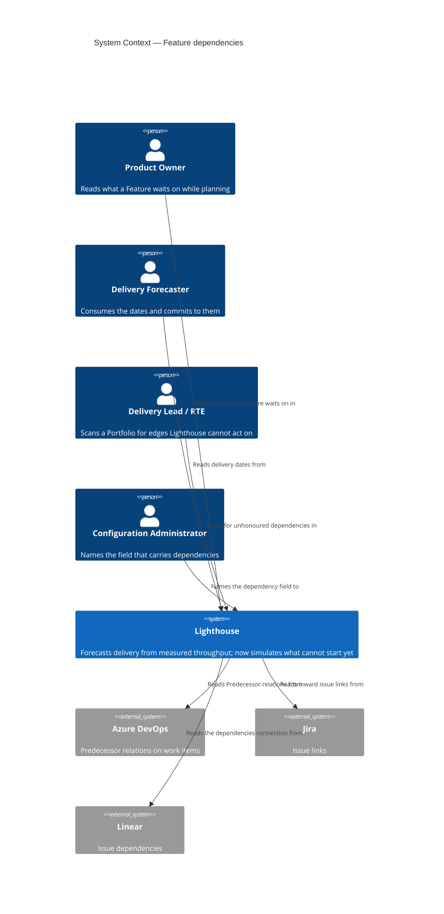
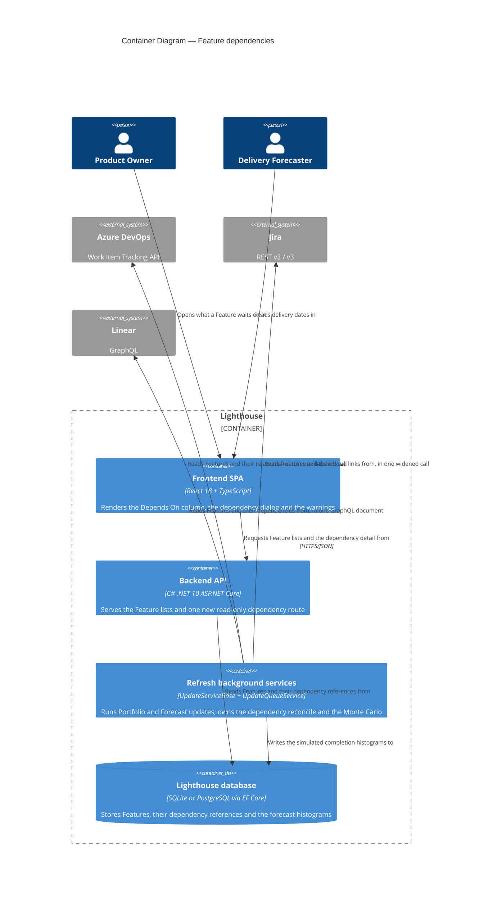
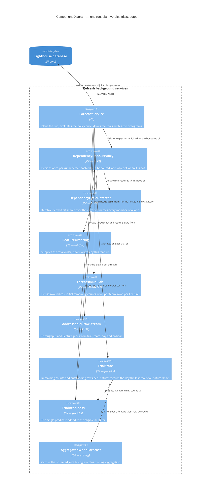

# Feature Delta — epic-4365-dependencies

**ADO**: Epic #4365 "Dependencies" (New, created 2026-02-23, tagged `Premium`, `Documentation`,
`Release Notes`) · **Feature type**: cross-cutting (work-tracking connectors + forecasting engine +
Feature list UI + licensing) · **Density**: lean · **DISCUSS run**: 2026-08-14

The epic asks for one thing in one line: *"Set dependencies on Features, then in the forecast, 'jump'
over them until the dependent Features are forecasted to be done."* Reading the forecasting engine
during this wave turned that line into something more interesting than it looks, and turned two of its
sub-bullets into decisions the sketch could not have anticipated.

1. **"Jump over" is not a date shift, and that is where the value is.**
   `ForecastService.GetSimulationResultsOfFeatureToUpdate` (`:201-209`) draws each simulated day's
   throughput from the first `min(FeatureWIP, remaining)` Features that still have remaining work, in
   order. Skipping a waiting Feature does not merely push *its* dates out — it hands its capacity to the
   Features **below** it, which finish **earlier**. A naive `max(own date, blocker's date)` gets the
   waiting Feature roughly right and every other Feature wrong. The mechanic has to live inside the
   simulation loop, per trial, or it is not this feature.

2. **The simulation is per-team and independent, so cross-team dependencies do not fit today.**
   `RunMonteCarloSimulation` (`:108-131`) groups `simulationResults` by team and runs each group's 10,000
   trials in its own `Task.Run`, each with its own day counter. Inside one trial of team T, no other
   team's Features exist and no other team's completion day is knowable. Since a dependency between two
   Features in one Portfolio very often crosses teams, the epic's core promise is unreachable without
   restructuring that loop. **The user's decision (2026-08-14) is to restructure it** — see D3.

3. **The surface this lands on already exists, and was built for it.** Epic #5375 (Manual Sorting)
   shipped `/features` (`FeaturesView.tsx`) as a general Feature view, and its D17 says in as many
   words that it is *"the surface that will later host ADO Epic #4365 'Dependencies'"*. The warnings
   column the epic asks for is `WarningsIndicator.tsx`, already rendering two warning kinds through the
   shared `FeatureListDataGrid`/`columns.tsx` factory. This epic writes a column and a dialog, not a page.

4. **"Blocked" is already taken.** Epic #5074 shipped blocked items — `WorkItem.IsBlocked`,
   `BlockedSince`, blocked-history widgets — and `blocked` is a **renameable terminology key**
   (`TerminologyKeys.ts:18`). A Feature row that says "blocked" for two unrelated reasons is unreadable.
   This feature says *depends on* and never *blocked by*, whatever the tracker calls its field (D10).

5. **The relation payloads are three different shapes, and only three connectors have one.** ADO already
   fetches `WorkItemExpand.Relations` on the parent path
   (`AzureDevOpsWorkTrackingConnector.cs:1043`) — the extension point is open, but the relation URL
   carries an id and no title, so names cost a follow-up request. Jira sends an explicit `fields=` list
   (`:1613`), so `issuelinks` must be added to it, and returns the summary inline. Linear is GraphQL and
   returns titles inline for free. **ServiceNow and CSV have no standard dependency field at all** —
   they are out of scope, not deferred-with-a-plan.

6. **Ordering is solved and must not be re-solved.** `FeatureRepository.GetAll()` orders through
   `IFeatureOrdering`, which switches between `ManualRankComparer` and `FeatureComparer` at one point.
   This feature reads that order and never writes it. A dependency whose blocker is ranked *below* its
   dependent is a warning, not an auto-reorder (D12).

---

## Wave: DISCUSS / [REF] Prior-Wave Reading Confirmation

- ⊘ `docs/feature/epic-4365-dependencies/discover/` (not found — no DISCOVER wave ran)
- ⊘ `docs/feature/epic-4365-dependencies/diverge/` (not found — no DIVERGE wave ran)
- ✓ `docs/product/jobs.yaml` (schema_version 1, 98 jobs) — none covers dependencies between Features.
  Nearest neighbours are the four `epic-5375-manual-sorting` ordering jobs, which establish that the
  sequence the forecast consumes is a first-class user concern; this epic adds the constraint that
  sequence cannot express.
- ✓ `docs/product/journeys/epic-5375-manual-sorting.yaml` — read in full. Its D17, D10, D12 and D16 are
  load-bearing here and are carried forward rather than re-decided.
- ✓ `docs/product/journeys/` (41 journeys) — none touches dependencies.
- ✓ `docs/product/personas/` (9 personas) — `product-owner`, `delivery-forecaster` and
  `delivery-lead-rte` are reused verbatim. No new persona needed.
- ✓ `docs/product/kpi-contracts.yaml` — the `measurement_scope` convention
  (`per_instance` / `vendor_demo_only` / `opt_in_telemetry_required`) is inherited by every KPI below.
- ⊘ `docs/product/vision.md`, `docs/project-brief.md`, `docs/stakeholders.yaml` (not found — product
  SSOT lives under `docs/product/` in this repo)
- ✓ `CLAUDE.md`, `docs/ci-learnings.md` — standing rules applied (expand-only migrations via
  `CreateMigration`, quality gates, per-feature docs, configurable terminology, no internal references
  in comments).
- ✓ **Code read during this wave**: `Services/Implementation/Forecast/ForecastService.cs`,
  `Models/Feature.cs`, `Models/WorkItemBase.cs`, `Models/FeatureComparer.cs`,
  `Models/ManualRankComparer.cs`, `Models/FeatureOrderKey.cs`,
  `Services/Implementation/FeatureOrdering.cs`,
  `Services/Implementation/Repositories/FeatureRepository.cs`, `API/DTO/FeatureDto.cs`,
  `API/FeaturesController.cs`, `Services/Interfaces/WorkTrackingConnectors/IWorkTrackingConnector.cs`,
  `WorkTrackingConnectors/AzureDevOps/AzureDevOpsWorkTrackingConnector.cs` + `WorkItemExtensions.cs`,
  `WorkTrackingConnectors/Jira/JiraWorkTrackingConnector.cs`,
  `WorkTrackingConnectors/Linear/LinearWorkTrackingConnector.cs`,
  `Models/WorkTrackingSystemOptionsOwner.cs`, `pages/Features/FeaturesView.tsx`,
  `components/Common/FeatureListDataGrid/columns.tsx` + `WarningsIndicator.tsx`,
  `hooks/useLicenseRestrictions.ts`, `hooks/useFeatureOrdering.ts`, `models/TerminologyKeys.ts`.
- ✓ **ADO** #4365 including its 2026-05-24 comment, which supplies the exact per-tracker field shapes and
  is quoted rather than paraphrased in D14.

No DISCOVER evidence exists to contradict, so no contradiction check was possible and none is claimed.

---

## Wave: DISCUSS / [REF] Persona IDs

| Persona | Role in this feature |
|---|---|
| `product-owner` | Primary. Owns the order the forecast runs in (epic #5375) and now sees the constraint that order cannot express. The person who has to explain why a Feature is late, and who reads the dependency dialog to find out. |
| `delivery-forecaster` | Consumes the dates. Does not author dependencies, but is the persona harmed most by their absence — the forecast is confidently wrong, with nothing on screen suggesting it might be. Also the free-tier persona who must be told the forecast is ignoring something. |
| `delivery-lead-rte` | Portfolio scope. Reads a Feature list to find where the chain breaks — a dependency pointing outside the Portfolio, a blocker ranked below its dependent, a loop. Wants the map, not the individual edge. |
| `config-admin` | Appears once, in slice 06, and only on instances whose tracker does not use standard dependency links. Owns the Portfolio setting that names which field carries them — the same person who already sets the parent override next to it. |

---

## Wave: DISCUSS / [REF] JTBD One-Liners

| Job ID | One-liner |
|---|---|
| `job-forecast-honours-what-cannot-start-yet` | When one Feature cannot start until another finishes, make the forecast simulate that, so the dates I present are not fiction. |
| `job-po-see-what-a-feature-is-waiting-on` | When a Feature looks stalled, show me what it is waiting on without my opening the work tracking system. |
| `job-config-admin-point-at-the-field-that-carries-dependencies` | When my teams record dependencies in a custom field rather than the tracker's built-in link, let me tell Lighthouse which field that is, once, for the whole Portfolio. |
| `job-lead-see-where-the-dependency-chain-breaks` | When a dependency cannot be honoured — it points outside the Portfolio, or its blocker is ranked below it, or it loops — tell me plainly rather than quietly doing something else. |
| `job-forecaster-know-the-forecast-is-ignoring-a-dependency` | When my instance is not licensed for dependency-aware forecasting, tell me the dependency exists and that these dates do not account for it. |
| `job-forecast-covers-dependencies-that-cross-teams` | When the Feature I am waiting on belongs to another team, make the forecast account for it too — most real dependencies cross a team boundary. |

Full job stories, dimensions, four forces and opportunity scores are written to
`docs/product/jobs.yaml`.

### Opportunity scores

| Job | Importance | Satisfaction | Gap | Note |
|---|---|---|---|---|
| `job-forecast-honours-what-cannot-start-yet` | 5 | 0 | **5** | The product's core output is computed as though every Feature could start today. There is no partial workaround: nothing in Lighthouse can express "not yet". |
| `job-forecast-covers-dependencies-that-cross-teams` | 5 | 0 | **5** | Same importance, and the same zero — but scored separately because it is the half that costs a simulation-engine change, and separating them is what lets the cheaper half ship first. |
| `job-config-admin-point-at-the-field-that-carries-dependencies` | 4 | 0 | **4** | Satisfaction 0 because the instance gets *nothing* — not a degraded version. Importance 4 rather than 5 because it is conditional on how a given tracker is configured; for the instances it applies to it is worth 5, for the rest it is worth nothing. |
| `job-forecaster-know-the-forecast-is-ignoring-a-dependency` | 4 | 0 | **4** | Today the free instance is not merely unlicensed, it is uninformed — the dates look exactly as authoritative as licensed ones. |
| `job-po-see-what-a-feature-is-waiting-on` | 4 | 1 | **3** | Partly satisfied: the answer exists, in the tracker, one context switch away. The cost is the switch and the fact that nobody makes it while reading a forecast. |
| `job-lead-see-where-the-dependency-chain-breaks` | 3 | 0 | **3** | Lower importance because it is a diagnostic rather than an outcome — but it is the job that stops the other five from being quietly wrong. |

---

## Wave: DISCUSS / [REF] Current-State Surface Inventory

| Surface | Location | State today |
|---|---|---|
| Feature ordering | `FeatureOrdering.cs`, consumed by `FeatureRepository.GetAll:18` | One switch point between `ManualRankComparer` and `FeatureComparer`, tie-broken by `Id`. Shipped by epic #5375. This feature reads it and never writes it. |
| Simulation eligibility | `ForecastService.cs:201-209` | `simulationResults.Where(x => x.HasWorkRemaining)`, then a random pick within the first `min(FeatureWIP, count)`. **The single insertion point for D2.** |
| Simulation grouping | `ForecastService.cs:108-131` | `GroupBy(s => s.Team)`, one `Task.Run` per team, one independent day counter each. **The single thing D3 changes.** |
| Simulation seeding | `InitializeSimulationResults` (`:164-177`) | One `SimulationResult` per (Feature, Team) pair with `RemainingWorkItems > 0`. A done Feature already has no row, which is why D8's "already finished blocker" case costs nothing. |
| Feature model | `Models/Feature.cs` | Carries `ManualRank` (deliberately absent from `Update`, so sync cannot overwrite it) — the exact precedent D5 copies. No relation of any kind to another Feature. |
| Synced fields | `Models/WorkItemBase.cs:18-56` | `ParentReferenceId` is the only inter-item link, a single string, overwritten from source on every sync. |
| Connector port | `IWorkTrackingConnector.cs` | Ten methods, none returning relations. A new method is owed. |
| ADO relations | `AzureDevOpsWorkTrackingConnector.cs:1043` | Already requests `WorkItemExpand.Relations` for the parent path; `WorkItemExtensions.cs:25-27` already walks `workItem.Relations`. Relation URLs carry an id, not a title. |
| Jira fields | `JiraWorkTrackingConnector.cs:1560`, `:1613` | Explicit `fields=` list per request. `issuelinks` is not in it. |
| Linear query | `LinearWorkTrackingConnector.cs:660-726` | Hand-built GraphQL with `parent { … }` already selected. `dependencies` is a sibling selection. |
| ServiceNow / CSV | `ServiceNowWorkItemMapper.cs`, `CsvWorkTrackingConnector.cs` | No dependency field exists in either. Out of scope (D13). |
| Feature list UI | `FeatureListDataGrid/columns.tsx` | Column factories: name, forecasts, state, warnings, active work, parent, position, ordering actions. A dependency column is one more factory used by both surfaces. |
| Warnings | `WarningsIndicator.tsx` | Renders exactly two warning kinds today (done-with-remaining-work, default-feature-size), or a green check. Additive by construction. |
| Instance-wide Feature view | `pages/Features/FeaturesView.tsx` | Exists, free, RBAC-filtered result set, built by epic #5375 D17 explicitly to host this epic. |
| Feature DTO | `API/DTO/FeatureDto.cs:76-85` | Already carries additive presentation fields (`Position`, `CanMove`, `MoveBlockReason`, `BlockingPortfolios`) — the pattern this feature's fields follow. |
| Premium gate | `LicenseGuardAttribute` (backend), `hooks/useLicenseRestrictions.ts` (frontend) | Both shipped and in use on `FeaturesController.cs:125`. |
| Terminology | `TerminologyKeys.ts` | `FEATURE`, `FEATURES`, `WORK_ITEMS`, `PORTFOLIOS` — and `BLOCKED: "blocked"`, already owned by epic #5074. See D10. |

---

## Wave: DISCUSS / [REF] Locked Decisions

- **[D1] A dependency is a directed edge between two Features: "this one cannot start until that one is
  done".** Not between work items, not between Portfolios, not between teams. Straight from the epic
  ("Set dependencies on Features"). Work-item-grain dependencies have no consumer — the simulation
  sequences Features, so a work-item edge would ship plumbing, exactly as epic #5375's D1 concluded for
  ordering.

- **[D2] The forecast honours a dependency by EXCLUDING the dependent from the eligible set inside each
  trial, not by shifting its dates afterwards.** `GetSimulationResultsOfFeatureToUpdate` filters
  `Where(x => x.HasWorkRemaining)` today; it gains one predicate and filters
  `Where(x => x.HasWorkRemaining && ready)`. A Feature whose blockers still have remaining work *in
  this trial* is not eligible to receive throughput; the Features below it move up into the
  `FeatureWIP` window and consume that capacity instead. *Jump* is the epic's own word for it, and it
  is the entire difference between a feature and a cosmetic date adjustment. The post-hoc alternative
  (`max(own, blocker)`) was considered and rejected: it never frees the capacity, so every Feature
  ranked below a waiting one keeps a date that assumes work nobody is doing. KPI-2 exists to prove
  this distinction actually materialises on real data.

  If every eligible Feature is waiting, the team's throughput for that day is **discarded** rather
  than carried forward. An idle day is the honest outcome, and it is what makes D7 and D8 load-bearing
  rather than tidy: with nothing able to unblock, the run would never end.

  **No new per-trial state.** Each closed item already re-draws independently from the top of the
  eligible list, so a Feature becomes available again on the very next draw after its blocker clears;
  nothing needs to remember that a team was previously working on something. Modelling sticky WIP
  slots — a team holding a Feature until it finishes — was considered and rejected (user,
  2026-08-14): it would change dates for Features with no dependencies at all, which forfeits D3's
  distribution-preserving property and turns a safe restructure into a re-baseline.

- **[D3] One joint simulation across all teams, replacing the per-team independent runs**
  (user, 2026-08-14). Concretely, the loop nesting swaps from **team → trial → day** to
  **trial → day → team**: one trial advances a single day counter, and on each day every team with
  throughput draws its own throughput and consumes from its own rows. The per-day work itself — draw
  throughput, close that many items, pick which Feature each comes from — is untouched.

  That swap is the entire mechanism. Today team A's "day 5" and team B's "day 5" are not the same
  moment and not even the same trial, so "is A finished yet?" has no answer; once the clock is shared
  it means "finished by day 5 in this trial", and the dependency rule becomes one extra predicate in
  one place (D2).

  **Distribution-preserving when no dependency is present** — a team only ever consumes its own
  `SimulationResult` rows, so interleaving other teams between its days cannot change what happens to
  any row. Existing forecasts do not re-baseline, and DISTILL asserts it. Two consequences DESIGN must
  carry: teams need **separate RNG streams**, or a fixed-seed equality test fails on draw order rather
  than on distribution; and concurrency moves from per-team to **per-trial**, which is not a free
  `Parallel.For` — `ResetRemainingItems()` mutates the shared rows and `AddSimulationResult` writes a
  plain `Dictionary`, both safe today only because each team's task owns its group exclusively. Each
  trial needs its own remaining-count state and thread-safe histogram accumulation.

  **Correctness lands before speed** (user, 2026-08-14). The restructure ships as two commits: a
  serial joint loop proved against a fixed seed, then per-trial parallelism proved to leave that
  equality untouched. The intermediate is slower than today's release — per-team concurrency is gone
  and per-trial concurrency has not arrived — which is why both land inside one slice and neither is
  released alone. If parallelising moves a percentile, the state isolation is wrong, and proving it
  serially first is what makes that diagnosable.

- **[D4] Every dependency comes from the work tracking system. Lighthouse never authors one**
  (user, 2026-08-14, resolving the wave's one open question). The default source is the standard link
  per connector (D14). A Portfolio may **override which field carries them**, exactly as it can for the
  parent: a nullable `DependencyOverrideAdditionalFieldDefinitionId` on `IWorkItemQueryOwner`, beside
  `ParentOverrideAdditionalFieldDefinitionId` (`:27`). The connector's behaviour copies
  `GetParentReferenceForWorkItems` (`AzureDevOpsWorkTrackingConnector.cs:1012-1018`) verbatim in shape:
  when the override is set, **skip the relations fetch entirely** — "no need to load stuff if we have
  an override anyway" — and read the value from `AdditionalFieldValues` instead.

  **Replace, not union** (user, 2026-08-14: "if I set an override, just use the content from that
  specific field"). A Portfolio that names a field is declaring that field authoritative; native links
  on the same Feature are ignored while it is set. Union was considered — an ADO team could plausibly
  have some Predecessors native and some in a custom field — and rejected as harder to explain than it
  is worth, and inconsistent with the parent override it copies.

  **The owner is the Portfolio only**, not the Team, even though `IWorkItemQueryOwner` is implemented
  by both (user, 2026-08-14). Dependencies are between Features, and Features are fetched per
  Portfolio — a Team-level setting would have no consumer.
  A per-Feature declaration made inside Lighthouse was considered during this wave and **rejected**:
  it would make Lighthouse an author of dependency data, which is a different product posture from the
  one it takes everywhere else, and it would need a precedence rule against the tracker that this one
  does not.

- **[D15] The override field carries a LIST of references in the connector's own reference form, and
  that is where it differs from the parent override** (user, 2026-08-14). A parent is 0..1, so
  `GetParentReference` (`:1095-1106`) can return one string. Dependencies are 0..n, so the field's
  value is split on comma or semicolon and each entry trimmed.

  **What an entry looks like is settled: whatever that tracker calls a Feature.** Jira keys on a Jira
  connection, work item ids on ADO, identifiers on Linear — which is exactly `ReferenceId` space, so
  no per-tracker normalisation layer is owed. The one transformation that remains is Linear's
  lower-casing (D14). An entry that resolves to nothing is skipped exactly as an unresolvable relation
  is (AC-1.4) — a hand-maintained field will contain typos, and one typo must not discard the three
  good references beside it. The separator is fixed rather than configurable in this epic.

- **[D5] A Feature stores the LIST OF REFERENCES it waits on, resolved when read — not a resolved
  Feature-to-Feature foreign key** (user, 2026-08-14, correcting this wave's first draft). The stored
  form is strings in the same space as `ReferenceId`, exactly as `WorkItemBase.ParentReferenceId`
  already works.

  The reason is sync order. If Feature B references A and A has not been imported yet, a resolved
  foreign key cannot be written at all, and the edge silently does not exist until some later sync
  happens to fix it. A stored reference heals on its own: the next read resolves it. The graph the
  simulation and the cycle detector want is derived at read time from those references, which also
  keeps the stored form dumb and the derived form single-sourced (KPI-5).

  It sits in its own persisted collection, never on a synced scalar — `WorkItemBase.Update` overwrites
  every synced field on every refresh, which is why `Feature.ManualRank` sits outside it. One writer:
  the sync's reconcile, replacing a Feature's references wholesale with whatever the current source —
  link or override field — now says. Expand-only, generated with the `CreateMigration` script.

- **[D6] A dependency changes the forecast only when both Features share at least one Portfolio**
  (epic's proposal, user-confirmed 2026-08-14). Feature ↔ Portfolio is many-to-many
  (`LighthouseAppContext.cs:217-219`), so "same Portfolio" means "they share at least one". A dependency
  pointing outside is **detected, stored, shown and warned** — never silently dropped, never forecast.
  The epic's own reasoning holds: a Portfolio's forecast should not depend on Features its viewers may
  not be able to read.

- **[D7] Cycles are detected at ingestion and never reach the simulation.** After every sync, the edge
  set is checked; an edge that closes a cycle is excluded from the honoured set and every Feature in
  the cycle carries a warning naming the loop. Ingestion is the only moment this has to run, because
  it is the only moment edges change (D4). This is the epic's third bullet
  ("must ensure we are not having chains that end up in an infinite loop"), and under D2 it is not a
  nicety: a cycle means no member is ever eligible, so
  `while (simulationResults.GetRemainingItems() > 0)` never terminates. Detection at ingestion keeps the
  simulation loop free of any cycle logic at all.

- **[D8] A dependency whose blocker can never complete in this run is dropped for that run, and warned.**
  Three cases, one rule. A blocker that is **already finished** has no `SimulationResult` row
  (`InitializeSimulationResults` only admits `RemainingWorkItems > 0`) and therefore imposes no
  constraint — that case is free. A blocker whose **team has no throughput** is excluded from
  `RunMonteCarloSimulation` entirely (`Where(g => throughputByTeam.ContainsKey(...))`), so it never
  reaches zero remaining. A blocker **outside the current run's Feature set** likewise never completes.
  In the last two the dependent would wait forever, so the edge is dropped and the dependent is warned
  that its date ignores that dependency. Without this rule the epic ships a hang, and the hang appears
  only on instances that have a team with no recent throughput — which is most of them, eventually.

- **[D9] Premium gates the forecast effect and nothing else.** Verbatim from the epic: *"If we don't
  have a premium license, you will see the warning that the item has a dependency together with the
  hint that it's not taken into account in the forecasting unless you have premium."* This mirrors epic
  #5375's D12 — show the truth, gate the mechanism. Detection, the count, the dialog, the warnings
  **and the Portfolio's dependency-field setting** are all free: the setting is what makes detection
  work at all on an instance whose tracker does not use standard links, and gating it would gate the
  free half of the feature behind a licence.

- **[D10] The UI word is "depends on", never "blocked".** `TERMINOLOGY_KEYS.BLOCKED` and
  `WorkItem.IsBlocked` already name a different, shipped concept from epic #5074, and `blocked` is a
  term instances may rename. Two meanings of one renameable word on the same Feature row is a defect in
  waiting. `Feature`/`Features`/`Portfolios`/`Work Items` resolve through `getTerm` as everywhere else.
  Tracker wording is not UI wording: ADO's "Predecessor" and Jira's "is blocked by" are read, not shown.

- **[D11] Both surfaces are existing ones.** The instance-wide Features view (`FeaturesView.tsx`, built
  by epic #5375 D17 for this) and the existing Portfolio Feature list, both through the shared
  `FeatureListDataGrid` and its `columns.tsx` factory, so the column is written once. The "which items
  do we depend on" list the epic asks for is a dialog opened from the row, following the existing
  work-items dialog pattern. No new page is built by this epic.

- **[D12] Lighthouse never reorders to satisfy a dependency.** A blocker ranked below its dependent is
  the epic's *"dependency ordered lower — that will cause a mess"*, and it is a warning. The forecast
  still honours the dependency and still terminates: the dependent is skipped, capacity flows past it,
  the blocker eventually completes and the dependent becomes eligible. So the situation is not broken,
  it is counter-intuitive — the board disagrees with the stated priority, and the warning is what
  explains that. Ordering stays the user's decision (epic #5375's whole premise).

- **[D13] ADO first, then Jira and Linear. ServiceNow and CSV are out, and cannot be rescued by D4's
  field override.** ADO is the thinnest first connector because `WorkItemExpand.Relations` is already
  requested on the parent path, and it is the bulk of the dogfood instance's data.

  The tempting argument that the field override brings ServiceNow and CSV along — every connector
  supports additional fields, so the mechanism is available to them — **does not hold, and was checked
  during this wave**: `ServiceNowWorkTrackingConnector.GetFeaturesForProject` throws
  `NotSupportedException` (`:751-757`). ServiceNow has no Features, so it has nothing for a dependency
  to be *between*. A dependency is a Feature-to-Feature edge (D1), Features live in Portfolios (D6),
  and ServiceNow supports neither. The field override changes where a reference is read from; it does
  not create the objects the reference points at. Recorded here so the argument is not re-made.

- **[D14] Only the "waiting on" direction is fetched; the reverse is derived by inverting stored
  references.** Per ADO #4365's 2026-05-24 comment, and with the extraction each connector needs so
  the stored string lands in `ReferenceId` space (D5):

  | Connector | Source | `ReferenceId` is | Extraction |
  |---|---|---|---|
  | ADO | relation `System.LinkTypes.Dependency-Reverse` | `$"{workItem.Id}"` (`:870`) | trailing segment of the relation URL |
  | Jira | `issuelinks` where `type.inward = "is blocked by"` **and** an `inwardIssue` is present | `issue.Key` (`:1348`) | `inwardIssue.key`, verbatim |
  | Linear | `dependencies` connection | `issue.Identifier?.ToLowerInvariant()` (`:343`) | `identifier`, **lower-cased** |

  **The Linear lower-casing is the trap in this feature.** The connector stores identifiers folded to
  lower case and the GraphQL connection returns them upper case, so without the fold every Linear
  reference resolves to nothing — silently, because D15 skips unresolvable entries by design. The
  failure presents as "Linear simply has no dependencies", which is indistinguishable from the truth.
  It gets its own acceptance criterion rather than being left to the mapper (AC-9.2).

  Fetching the forward direction too would double the request cost to learn something the stored
  reference set already contains.

---

## Wave: DISCUSS / [REF] Scope Assessment

**Verdict: OVERSIZED as stated, split accepted — with one point for the user to confirm.**

Oversized signals present (2 triggers the gate; 3 are present):

- Touches four areas: work-tracking connectors, the Monte Carlo forecasting engine, the Feature list
  UI, and licensing.
- Contains **two independently valuable user outcomes** that could ship as separate releases: *see the
  dependencies* (slices 01-02) and *forecast against them* (slices 03-04). The first is useful with the
  second never shipping.
- Estimated effort beyond two weeks if taken as one change, principally because of D3.

**Split**: six thin slices, each shipping end to end. The `RunMonteCarloSimulation` restructure (D3) is
**not** a slice — it is a precursor commit inside slice 04, per the slice-composition rule, because it
has no user-visible output of its own.

**Release boundary: deferred, deliberately** (user, 2026-08-14). Slices 01-02 are the visibility half
and 03-04 the forecasting half, which is a natural place to cut a release. The decision is taken after
slice 02 lands and the column is on a real board, rather than now — whether visibility alone is worth
releasing is a question the board answers better than the plan does.

---

## Wave: DISCUSS / [REF] WS Strategy

**Strategy B — extend an existing skeleton.** Brownfield throughout: the Feature view, the shared grid,
the warnings column, the connector port, the licence guard and the ordering switch point are all in
production. No walking skeleton is built. Slice 01 is the thin end-to-end proof — one ADO relation read,
stored, ordered, and rendered as a count on two surfaces.

---

## Wave: DISCUSS / [REF] Driving Ports

| Port | Surface | Introduced by |
|---|---|---|
| Sync (scheduled + manual refresh) | Portfolio Feature fetch gains a relation read; edges are reconciled against stored ones | slice 01 (ADO), slice 06 (Jira, Linear) |
| UI — Features view (`/features`) | A "Depends On" column showing the count of Features this one waits on, plus a dependency warning in the existing warnings column | slices 01, 02 |
| UI — Portfolio detail Feature list | Same column, same factory, no second implementation | slices 01, 02 |
| UI — dependency dialog | Row action opening the list of Features this one waits on: name, state, Portfolio, link to the tracker, and why an edge is not honoured | slice 02 |
| HTTP | `GET /api/latest/features/{id}/dependencies` — free, read-only. No write endpoint exists in this epic (D4) | slice 02 |
| Forecast output | The 50/70/85/95% dates themselves — the port that matters most and the one with no new endpoint | slices 03, 04 |
| UI — Portfolio settings | A **Dependency field** selector beside the existing parent-override selector, listing the connection's additional fields | slice 06 |
| Docs | Dependencies page under the Features documentation, per-feature screenshots | slice 05 |

---

## Wave: DISCUSS / [REF] Pre-requisites

- Epic #5375's `/features` view and shared `FeatureListDataGrid` in `main` — both shipped.
- The dev instance on `:5169` restored from a real backup, so relation reads run against genuine ADO
  data rather than seeded rows. Its measured Feature mix (86 ADO, 4 Jira, 4 Linear) is why ADO is first.
- A premium licence on the verification instance for slices 03-04, and a **deliberately unlicensed**
  profile for KPI-6 and AC-4.7.
- **Real Predecessor links created in the dogfood ADO project** covering: a same-team pair, a
  cross-team pair, a cross-Portfolio pair, a blocker ranked below its dependent, a two-Feature cycle,
  and a blocker whose team has no throughput. Slice 03 cannot be verified without the last three.
  Created directly in ADO with `az boards work-item relation add`, before slice 03 starts — no
  in-Lighthouse authoring exists to create them (D4), which is what moved this from a slice to a
  prerequisite.
- One additional field defined on the dogfood ADO connection, carrying a dependency list, for slice 06.
- `CreateMigration` PowerShell script for the D5 migration, additive only.
- A pre-slice-01 timing baseline of a full ADO portfolio refresh, to defend KPI-3. Epic #5687 just took
  that path from 468,856 ms to 2,087 ms; an N+1 relation read is exactly the shape that gives it back.

---

## Wave: DISCUSS / [REF] Out of Scope

- **Work-item-grain dependencies.** Features only (D1).
- **Writing dependencies back to the tracker.** Lighthouse reads; it never creates a link in ADO, Jira
  or Linear. Same posture as epic #5375's D8 on ordering.
- **Declaring or editing a dependency inside Lighthouse**, in any form — adding one, removing one, or
  suppressing a tracker-sourced one. Considered and rejected under D4: it would make Lighthouse an
  author of dependency data. To change a dependency, change it in the tracker.
- **A configurable *separator* for the override field.** Comma and semicolon, fixed (D15).
- **ServiceNow and CSV.** No standard field exists (D13).
- **Auto-reordering to satisfy a dependency** (D12).
- **Cross-Portfolio forecast effect** (D6) — warned, not simulated.
- **A dependency graph visualisation.** The epic asks for a column, a warning and a list. A graph view
  is a plausible successor and is not designed here.
- **Marketing website copy.** Flagged for the DELIVER checklist under the `Release Notes` tag, not built
  here.

---

## Wave: DISCUSS / [REF] User Stories

Every story traces to a `job_id` in `docs/product/jobs.yaml`. One story is labelled `@infrastructure`
and is a precursor commit inside slice 04, never a slice of its own.

---

### US-01 — A Feature says how many things it is waiting on

`job_id: job-po-see-what-a-feature-is-waiting-on` · persona `product-owner` · **slice 01**

As a product owner, I want every Feature list to show how many other Features it is waiting on, so that
I stop discovering dependencies by accident in a stakeholder review.

### Elevator Pitch
Before: nothing in Lighthouse knows one Feature waits on another; the fact lives only in the tracker.
After: open **Features** in the top navigation → the **Depends On** column reads `2` on a Feature with
two ADO Predecessor links, and `—` on one with none.
Decision enabled: whether this Feature can actually be started now, or whether the team should pull the
next one instead.

**Acceptance criteria**

- **AC-1.1** A Feature with two ADO `System.LinkTypes.Dependency-Reverse` relations to Features in the
  same Portfolio renders `2` in the Depends On column on `/features`.
- **AC-1.2** The same Feature renders the same `2` in the Portfolio detail Feature list — from the same
  column factory, asserted by the column being defined once.
- **AC-1.3** A Feature with no relations renders the empty marker, not `0`.
- **AC-1.4** A relation pointing at a work item that is not a Feature in Lighthouse is skipped, and the
  count excludes it. No error, no partial row.
- **AC-1.5** After a full refresh in which a Predecessor link was removed in ADO, the count drops
  accordingly — stored edges are reconciled, not accumulated.
- **AC-1.6** `Feature.ManualRank` and every synced field are unchanged by dependency ingestion.
- **AC-1.7** The column header resolves through `getTerm(TERMINOLOGY_KEYS.FEATURES)` and contains no
  literal "Epic" or "Blocked".
- **AC-1.8** A full portfolio refresh on the dev instance completes within 110% of the pre-slice
  baseline (KPI-3).
- **AC-1.9** A Portfolio that has the **parent** override configured still yields its Features'
  dependencies. The relations fetch is skipped only when both overrides are set. Without this
  assertion the failure is silent and indistinguishable from a Portfolio that genuinely has none
  (F-4).

---

### US-02 — See exactly what a Feature is waiting on

`job_id: job-po-see-what-a-feature-is-waiting-on` · persona `product-owner` · **slice 02**

As a product owner, I want to open the list of Features a Feature is waiting on and see their names and
states, so that I can tell whether the wait is nearly over or has not started.

### Elevator Pitch
Before: the count says `2` and nothing says which two, so the answer is still in the tracker.
After: click the **Depends On** cell → a dialog lists each Feature it waits on with name, state,
Portfolio and a link to the tracker record.
Decision enabled: whether to chase the blocker, re-sequence around it, or accept the wait.

**Acceptance criteria**

- **AC-2.1** Clicking the cell opens a dialog listing every Feature this one waits on, each with name,
  state, its Portfolios, and a link that opens the tracker record.
- **AC-2.2** Each row names where it came from — the tracker's own link, or the field this Portfolio
  named (D4). Both are the work tracking system; the distinction is which part of it was read.
- **AC-2.3** An edge that will not be honoured by the forecast is labelled in the dialog with the reason
  in plain language, one of: outside this Portfolio, part of a dependency loop, or the Feature it waits
  on cannot be forecast.
- **AC-2.4** The dialog opens for a user with read access and shows the same content; no action is
  offered without `PortfolioWrite`.
- **AC-2.5** A Feature it waits on that the user cannot read is shown as a redacted row with the reason,
  never omitted silently — a hidden blocker is worse than an unnamed one.

---

### US-03 — Be warned when a dependency will not be honoured

`job_id: job-lead-see-where-the-dependency-chain-breaks` · persona `delivery-lead-rte` · **slice 02**

As a delivery lead, I want the warnings column to flag dependencies Lighthouse cannot act on, so that I
find the broken links by scanning a list rather than by auditing every Feature.

### Elevator Pitch
Before: a cross-Portfolio dependency and a healthy one look identical — both invisible.
After: open **Features** → the warnings column shows a warning on the affected row, whose tooltip reads
e.g. "Waits on a Feature outside this Portfolio — not included in the forecast".
Decision enabled: whether to move a Feature into the Portfolio, re-rank it, or break the loop.

**Acceptance criteria**

- **AC-3.1** A Feature waiting on one in no shared Portfolio renders a warning naming that Feature and
  stating the dependency is not included in the forecast.
- **AC-3.2** A Feature waiting on one ranked **below** it renders a distinct warning naming the
  ordering conflict. No rank is changed by Lighthouse.
- **AC-3.3** A Feature in a dependency loop renders a warning naming the other members of the loop.
- **AC-3.4** A Feature with a healthy dependency renders **no** warning — the presence of a dependency
  is not itself a warning while the forecast honours it.
- **AC-3.5** Existing warnings (done-with-remaining-work, default-feature-size) still render alongside,
  unchanged, and a Feature with none still renders the green check.
- **AC-3.6** No warning text contains the word "blocked" (D10).

---

### US-04 — Read dependencies from the field this Portfolio actually uses

`job_id: job-config-admin-point-at-the-field-that-carries-dependencies` · persona `config-admin` ·
**slice 06** · free

As a configuration admin, I want to tell Lighthouse which field on my Portfolio's work items carries
its dependencies, so that instances that record them in a custom field get everything the standard-link
instances get.

### Elevator Pitch
Before: a Portfolio whose team records dependencies in a custom field reads `—` in the Depends On
column, because Lighthouse only understands the tracker's built-in link type.
After: open **Portfolio → Settings → Advanced**, set **Dependency field** to that additional field, run
a refresh → the Depends On column populates from it, and the relations fetch is skipped entirely.
Decision enabled: whether this Portfolio can use dependency forecasting at all, without anyone
re-recording links in a format the tracker's UI does not offer.

**Acceptance criteria**

- **AC-4.1** With the override set, a Feature whose named field reads `1234;5678` yields two edges,
  and both appear in the count (US-01) and the dialog (US-02).
- **AC-4.2** With the override set, the connector performs **no** relations fetch — asserted on the
  request, mirroring `GetParentReferenceForWorkItems`'s early return (`:1014-1018`).
- **AC-4.3** Comma and semicolon both separate; surrounding whitespace is trimmed; an empty field
  yields no edges and no error.
- **AC-4.4** An entry that resolves to no Feature is skipped and the entries beside it still yield
  edges (D15) — one typo does not discard the list.
- **AC-4.5** With the override **unset**, behaviour is byte-identical to slices 01-05: the standard
  link is read, asserted by an unchanged fixture comparison.
- **AC-4.6** The setting is per Portfolio, offered only for additional fields defined on that
  Portfolio's connection, and requires the same permission the parent override requires.
- **AC-4.7** The setting is available on an unlicensed instance and changes no forecast value there
  (D9) — it feeds detection, which is free.

---

### US-05 — The forecast jumps over a Feature that cannot start

`job_id: job-forecast-honours-what-cannot-start-yet` · persona `delivery-forecaster` · **slice 03** ·
premium

As a delivery forecaster, I want the forecast to give a waiting Feature's capacity to the ones behind it
until its blocker is done, so that the dates reflect the order work can actually happen in.

### Elevator Pitch
Before: the forecast simulates every Feature as startable today, so a Feature that cannot begin for six
weeks gets a date as though it could.
After: open a Portfolio → the waiting Feature's 85% date has moved out, **and at least one Feature
ranked below it has moved in**, because it now gets the capacity.
Decision enabled: whether the delivery date you are about to commit to is achievable at all.

**Acceptance criteria**

- **AC-5.1** Given Features A, B, C in that order, one team, and B waiting on A: B's simulated completion
  is never earlier than A's within a trial.
- **AC-5.2** In the same setup, C's 85% date is **earlier** with the dependency honoured than without —
  the capacity B did not consume went to C. This is the AC that distinguishes D2 from a date shift.
- **AC-5.3** With no dependencies present anywhere, forecast percentiles are unchanged from the previous
  release within Monte Carlo noise, asserted against a fixed random seed.
- **AC-5.4** A dependency whose blocker is in another team is **not** honoured in this slice, and the
  dependent carries a warning saying so (removed by US-08).
- **AC-5.5** A cycle in the data produces the US-03 warning and a forecast that completes in normal
  time — no member of a cycle constrains any other in the simulation.
- **AC-5.6** A blocker whose team has no throughput, or which is absent from the run, is dropped for
  that run and the dependent is warned; the run terminates.
- **AC-5.7** A blocker that is already finished imposes no constraint and produces no warning.
- **AC-5.8** A cross-Portfolio dependency does not change any date (D6).

---

### US-06 — Know the forecast is ignoring a dependency

`job_id: job-forecaster-know-the-forecast-is-ignoring-a-dependency` · persona `delivery-forecaster` ·
**slice 03** · free

As a delivery forecaster on an unlicensed instance, I want to be told that a Feature has a dependency
and that these dates do not account for it, so that I do not present them as though they did.

### Elevator Pitch
Before: an unlicensed instance's dates look exactly as authoritative as a licensed one's, with nothing
to suggest a dependency was ignored.
After: open **Features** without a premium licence → the row shows its Depends On count and a warning
reading "Waits on 1 Feature — dependencies are not included in forecasts without a premium licence".
Decision enabled: whether to trust this date, chase the dependency by hand, or ask for a licence.

**Acceptance criteria**

- **AC-6.1** On an unlicensed instance, every Feature with at least one dependency renders the count,
  the dialog, and the premium hint.
- **AC-6.2** On an unlicensed instance, forecast percentiles are byte-identical to a run with the
  dependency data absent — nothing is silently half-applied.
- **AC-6.3** Licensing the instance and re-running the forecast changes at least one date, with no other
  change of any kind.
- **AC-6.4** The hint names what is withheld and why, and does not use the word "blocked".

---

### US-07 — One joint simulation `@infrastructure`

`job_id: infrastructure-only` · **precursor commit inside slice 04**, never a slice of its own

`infrastructure_rationale`: restructuring `RunMonteCarloSimulation` from one `Task.Run` per team to a
single per-trial loop over a shared day clock produces **no user-visible output on its own** — by
design, since D3's correctness argument is precisely that it changes nothing observable while no
dependency crosses a team. It cannot be released alone and it cannot be verified alone; its verification
is AC-5.3 re-run and US-08's ACs. It lands as the first commit of slice 04, ahead of the story that
needs it.

**Acceptance criteria**

- **AC-7.1** With no cross-team dependency present, every percentile for every Feature matches the
  pre-change run under a fixed random seed, within Monte Carlo noise.
- **AC-7.2** Forecast wall-clock time for the dogfood instance's full Feature set stays within an
  agreed multiple of the **pre-epic** baseline; the number is set by DESIGN and recorded in the slice
  brief before the commit lands. Asserted only after the parallelism commit — the serial intermediate
  is deliberately slower and is never released (user, 2026-08-14: correctness first, speed second).
- **AC-7.3** A team with no throughput is excluded exactly as before, and its Features' behaviour is
  unchanged.

---

### US-08 — Dependencies that cross teams count too

`job_id: job-forecast-covers-dependencies-that-cross-teams` · persona `delivery-forecaster` ·
**slice 04** · premium

As a delivery forecaster, I want a dependency on another team's Feature to move my dates, so that the
most common kind of real dependency stops being the one Lighthouse ignores.

### Elevator Pitch
Before: the warning says "waits on a Feature owned by another team — not included in the forecast", and
that covers most real dependencies.
After: open a Portfolio → that warning is gone and the waiting Feature's 85% date has moved to sit
behind the other team's Feature.
Decision enabled: whether a cross-team commitment is realistic, without building the two forecasts by
hand and comparing them in a spreadsheet.

**Acceptance criteria**

- **AC-8.1** Given team X's Feature B waiting on team Y's Feature A, B's simulated completion is never
  earlier than A's within a trial.
- **AC-8.2** The cross-team warning from AC-5.4 no longer renders for an honoured cross-team edge.
- **AC-8.3** Team X's throughput continues to be drawn from team X's own history — a joint clock shares
  time, never throughput.
- **AC-8.4** A cross-team cycle is detected and warned exactly as a same-team one (D7).
- **AC-8.5** A cross-team blocker on a team with no throughput follows D8 — dropped, warned, run
  terminates.
- **AC-8.6** AC-5.3 still holds: with no dependencies present, dates are unchanged.

---

### US-09 — Jira and Linear dependencies

`job_id: job-po-see-what-a-feature-is-waiting-on` · persona `product-owner` · **slice 05**

As a product owner on Jira or Linear, I want my tracker's dependency links read too, so that everything
slices 01-04 delivered applies to my instance without my re-entering anything.

### Elevator Pitch
Before: a Jira Feature with an "is blocked by" link and a Linear Feature with a `dependencies` entry
both read `—` in the Depends On column.
After: run a refresh → both read their real counts, and their dialogs, warnings and forecast dates
behave exactly as the ADO ones.
Decision enabled: the same decisions as US-01 through US-08, on the tracker the team actually uses.

**Acceptance criteria**

- **AC-9.1** A Jira issue with `issuelinks` containing `type.inward = "is blocked by"` **and** an
  `inwardIssue` yields one edge per such link; entries with only an `outwardIssue` yield none.
- **AC-9.2** A Linear issue's `dependencies` connection yields one reference per node, **lower-cased**
  to match `ReferenceId` (`LinearWorkTrackingConnector.cs:343`), and each one resolves to a Feature.
  Asserted on a fixture whose `identifier` is upper case — without the fold this passes ingestion and
  yields zero resolved dependencies, which is indistinguishable from an instance that has none. Its
  `blocking` connection yields nothing (D14).
- **AC-9.3** Adding `issuelinks` to the Jira `fields=` list does not change any existing mapped value —
  asserted by an unchanged fixture comparison.
- **AC-9.4** A ServiceNow or CSV Feature yields no edges and renders no dependency warning — the
  absence of a field is not an error condition.
- **AC-9.5** All of US-02, US-03, US-05 and US-08's ACs pass with Jira- and Linear-sourced edges,
  parameterised over connector rather than duplicated per connector.
- **AC-9.6** A full refresh on Jira and Linear stays within 110% of its own pre-slice baseline.
- **AC-9.7** ADO behaviour is unchanged — the same fixture comparison that guards AC-9.3 for Jira.

---

## Wave: DISCUSS / [REF] Story Map

**Backbone** (user activities, left to right):
*Discover a dependency* → *Understand it* → *Record one Lighthouse cannot read* → *Forecast against it*
→ *Trust it across teams* → *Use it on my tracker*

| Slice | Stories | Outcome shipped | Licence |
|---|---|---|---|
| **01** ADO dependencies visible | US-01 | A Feature list that knows what waits on what | free |
| **02** Detail and warnings | US-02, US-03 | The specifics, and every link Lighthouse cannot act on | free |
| **03** Forecast jumps over a same-team blocker | US-05, US-06 | Dates that account for waiting — and honesty when they do not | premium (US-06 free) |
| **04** Joint simulation, cross-team | US-07 `@infrastructure` (precursor), US-08 | The dependency kind that is actually most common | premium |
| **05** Jira and Linear | US-09 | Everything above, on the other two trackers | as above |
| **06** Per-Portfolio dependency field | US-04 | Instances whose dependencies live in a custom field | free |

**Slice composition gate**: every slice carries at least one user-visible value story. Slice 04's
`@infrastructure` story US-07 is a precursor commit inside it, not a slice.

**Re-ordered 2026-08-14** after the user resolved the wave's open question: dependencies are never
authored in Lighthouse, only read from the tracker, optionally through a Portfolio-named field. The
old slice 03 (declare in Lighthouse) became this slice 06 (name the field), and with it went its
reason to precede the forecast work — it was the only way to seed a cycle onto the dogfood instance,
and it no longer creates edges at all. Those shapes are now created as real Predecessor links in ADO
(see Pre-requisites), and the forecast slices move up two places.

**Carpaccio taste tests**

| Test | Verdict |
|---|---|
| Any slice shipping 4+ new components? | **Pass after re-cut.** The original slice 01 carried ingestion + storage + column + dialog + warnings. Split into 01 (ingest + count) and 02 (dialog + warnings). |
| Every slice depending on a new abstraction? | **Pass.** The dependency-edge store (D5) ships in slice 01 with the smallest thing that uses it, and every later slice reads it rather than extending it. |
| Does any slice disprove a pre-commitment? | **Pass.** Slice 01 can disprove that relation reads are affordable (KPI-3). Slice 03 can disprove that exclusion redistributes capacity at all (KPI-2). Slice 04 can disprove that a joint simulation is affordable (AC-7.2). |
| Synthetic-only data anywhere? | **Pass with one stated exception.** Every slice's dogfood moment runs on `:5169` restored from a real backup, and the awkward shapes (a cycle, a throughput-less blocker) are created as **real ADO links** rather than fixtures. The exception is slice 06: no reachable instance keeps dependencies in a custom field, so its acceptance is fixture-led with one manual confirmation against a deliberately-created additional field. Recorded rather than hidden. |
| Two slices identical except for scale? | **Pass, with one deliberate merge.** Jira and Linear are one slice, not two — same slice shape, and splitting them would produce exactly the pair this test forbids. |

---

## Wave: DISCUSS / [REF] Prioritization

1. **Slice 01** first because it carries the epic's cheapest disprovable claim. Epic #5687 took the
   refresh path from 468,856 ms to 2,087 ms; an N+1 relation read is precisely the shape that gives it
   back, and finding that out costs one slice rather than six.
2. **Slice 02** next because slice 01's count is honest but unactionable, and because the warning
   vocabulary it establishes is what slices 03 and 04 turn off as they deliver. It is also where cycle
   detection lands — one slice before the forecast needs it, which is the cheapest place to get it
   wrong.
3. **Slice 03** is where the epic becomes true, and it is deliberately the *same-team* half: it proves
   the exclusion mechanic, cycle handling and termination against real data without touching
   `RunMonteCarloSimulation`. If D2 is wrong about capacity redistribution, this is the cheapest place
   to find out, and it is now third rather than fourth because nothing needs to precede it.
4. **Slice 04** carries the highest technical risk (D3) and is sequenced after slice 03 has confirmed
   the mechanic it generalises. Reversing them would mean debugging a new simulation loop and a new
   eligibility rule at the same time.
5. **Slice 05** after the mechanic is proven, and the ordering is worth restating because it is not the
   value ordering: ADO is 86 of the dev instance's 94 Features, so it is where the mechanic can be
   dogfooded daily. If the board wants a Jira-first release instead, slice 05 moves ahead of slice 03
   at the cost of two connectors' worth of change before the forecast mechanic is proven.

   The dogfood mix is also why slice 05 is not split per connector: 4 Jira and 4 Linear Features means
   the evidence either slice could produce is thin either way, and splitting doubles the ceremony
   without doubling what is learned.
6. **Slice 06** last because it is the only slice serving a population the dogfood instance does not
   contain. Every instance reachable for verification uses standard links; the Portfolio-named field
   exists for instances that do not, and its acceptance is therefore fixture-led with one manual
   confirmation on `:5169` using a deliberately-created additional field. Shipping it last means it
   inherits a mechanic already proven rather than proving one through an unusual configuration.

**Dogfood cadence**: same-day on `:5169` for every slice. Slices 03 and 04 additionally leave a
before/after date comparison in the slice brief, because "the dates moved" is the only evidence that
matters and it is not visible in a test run.

---

## Wave: DISCUSS / [REF] Outcome KPIs

| KPI | Target | Measurement | Scope |
|---|---|---|---|
| **KPI-1** Dependencies become visible | 100% of ADO Predecessor links between Features in a shared Portfolio appear in the Depends On column after one refresh; 0 silently dropped | Count stored edges vs. the tracker's own link list on `:5169` | `vendor_demo_only` |
| **KPI-2** The forecast actually moves | ≥ 1 Feature's 85% date moves by ≥ 3 working days with the effect on, **and** ≥ 1 Feature ranked below a waiting one moves **earlier** | Forecast diff with the effect on and off, recorded in the slice 03 brief | `vendor_demo_only` |
| **KPI-3** Sync stays fast | Full portfolio refresh ≤ 110% of the pre-slice-01 baseline, per connector | Update log timing on `:5169`, baseline captured before slice 01 | `per_instance` + `vendor_demo_only` |
| **KPI-4** The forecast always terminates | 0 runs exceeding the pre-epic p99 duration across 5 consecutive scheduled refreshes, with a cycle, a throughput-less blocker and a cross-Portfolio edge all present in the data | Scheduled runs on `:5169` with the seeded shapes from the prerequisites | `per_instance` |
| **KPI-5** One eligibility decision | Exactly 1 place in the codebase decides whether a dependency is honoured | Grep at DISTILL; ArchUnit-style assertion if one fits | `per_instance` |
| **KPI-6** Free-tier honesty | On an unlicensed instance: 100% of Features with a dependency show the hint, and 0 forecast values differ from a dependency-free run | E2E against the unlicensed profile (AC-6.1, AC-6.2) | `per_instance` |
| **KPI-7** Cross-team coverage | ≥ 80% of the dogfood instance's detected same-Portfolio dependencies are honoured after slice 04, versus the same-team subset after slice 03 | Count honoured vs. detected edges before and after | `vendor_demo_only` |

KPI-2 is the one that decides whether this epic was worth building. If no Feature below a waiting one
moves earlier, D2 reduces to a date shift and the design is wrong, not the data.

---

## Wave: DISCUSS / [REF] Definition of Done

1. All acceptance criteria for the slice pass as automated tests.
2. `dotnet build` zero warnings; `dotnet test` green.
3. `pnpm test`, `pnpm build` (zero warnings), Biome clean — stated explicitly as N/A per slice where
   there is no frontend change.
4. Mutation testing ≥ 80% kill rate on the changed backend surface. Non-negotiable on the eligibility
   rule and the cycle detector, where a surviving mutant is a hang or a wrong date rather than a metric.
5. SonarQube Cloud: no new issues of any severity, including security hotspots.
6. EF migration generated with the `CreateMigration` script, additive only.
7. Docs updated per-feature, in the seeded terminology, with per-feature screenshots.
8. ADO story transitioned; slice pushed only after CI is green.
9. The slice's learning hypothesis has an explicit verdict recorded in its brief — confirmed or
   disproved, never blank.

---

## Wave: DISCUSS / [REF] DoR Validation

| # | Item | Verdict | Evidence |
|---|---|---|---|
| 1 | Business value articulated | ✅ | The forecast is the product's core output and is computed as though nothing waits on anything. KPI-2 and KPI-7 carry the outcome |
| 2 | Job traceability | ✅ | 6 jobs written to `docs/product/jobs.yaml`; all 8 value stories carry a real `job_id`; US-07 is `@infrastructure` with a rationale and is a precursor commit inside slice 04 |
| 3 | Acceptance criteria testable | ✅ | 55 ACs, each observable from a rendered cell, a dialog, a tooltip, an HTTP status, a stored edge, a forecast percentile, an outbound request, or a wall-clock measurement |
| 4 | Dependencies identified | ✅ | Epic #5375's Feature view shipped; `:5169` restored from a real backup; real Predecessor links created in ADO; premium + unlicensed profiles; `CreateMigration`; a pre-slice-01 timing baseline |
| 5 | Sliced ≤ 1 day each | ⚠️ | 6 briefs. Five are 4-6h. **Slice 04 is the exception** — D3's restructure is bounded by AC-7.2, whose number DESIGN has not set. The brief carries a timeboxed probe and is re-cut if the probe says the parallelism change is larger than a day |
| 6 | No known blockers | ✅ | None. The wave's one open question (where a dependency comes from) was resolved by the user on 2026-08-14; D4, D5, D9, D15, US-04 and the slice order were rewritten to match |
| 7 | Observable surface defined | ✅ | Driving Ports table; the forecast dates themselves are named as the port that matters and the one with no endpoint |
| 8 | Test data / environment available | ⚠️ | `:5169` has real ADO/Jira/Linear Features but contains no cycle, no throughput-less blocker and no dependency-carrying custom field. All three are created directly in ADO before slice 03, because D4 leaves Lighthouse no way to author them |
| 9 | Outcome KPI with numeric target | ✅ | 7 KPIs, each with a number or a binary and a named measurement source |

**Requirements completeness: 0.96.** The missing 0.04 is items 5 and 8, both of which are stated as
open with a plan rather than guessed at.

---

## Wave: DISCUSS / [REF] Wave Decisions Summary

### Key decisions

See Locked Decisions above (D1-D14). The five that shape everything downstream:

- **[D2]** Exclusion inside the trial, not a date shift afterwards. It is the difference between this
  feature and a cosmetic one, and KPI-2 is written to falsify it.
- **[D3]** One joint simulation across teams — the epic's promise is unreachable without it, and it is
  distribution-preserving where no dependency crosses a team, which is what makes it safe to ship.
- **[D7] + [D8]** Cycles excluded at ingestion and unforecastable blockers dropped per run. Under D2
  both are termination guarantees, not polish: without either, the simulation's `while` loop does not
  end.
- **[D9]** Detection free, forecast effect premium — the epic's own wording, and epic #5375's D12 shape.
- **[D4] + [D15]** Lighthouse reads dependencies and never authors them; a Portfolio may name the field
  they live in, copying the parent override. The list-valued field is the one place the two mechanisms
  genuinely differ.
- **[D11] + [D10]** Two existing surfaces and one deliberate refusal of the tracker's vocabulary,
  because `blocked` already names a different shipped concept and is renameable.

### Requirements summary

- **Primary needs**: a forecast that knows what cannot start yet and gives that capacity to what can; a
  Feature list that says what each Feature waits on; a way to read dependencies from whichever field a
  Portfolio actually keeps them in; and an unlicensed instance that says plainly it is ignoring one.
- **Walking skeleton scope**: none built (strategy B). Slice 01 is the thin end-to-end proof through the
  existing sync, storage, ordering and grid path.
- **Feature type**: cross-cutting.

### Constraints established

- The Monte Carlo simulation must terminate on every input, including cycles, self-references and
  blockers that can never complete. This constrains the design more than any functional requirement.
- Existing forecasts must not re-baseline. D3 is only acceptable because it is distribution-preserving
  in the absence of dependencies, and AC-5.3 / AC-7.1 assert that under a fixed seed.
- Sync speed is a protected asset after epic #5687. Relation reads are additive to a path that is now
  225× faster than it was, and KPI-3 defends it.
- Lighthouse never writes to the tracker — no link is created, changed or removed there — and, per D4,
  never authors a dependency on its own side either. It reads, in both directions of that sentence.
- Expand-only migrations, generated with `CreateMigration`.
- Terminology is the instance's own; `blocked` is off-limits for this concept.
- **No commit lands without the maintainer's explicit approval** (user, 2026-08-14). This epic edits the
  Monte Carlo loop every date in the product comes from, so the usual "green then commit" autonomy is
  suspended for its whole length: DISTILL and DELIVER stop and ask before every commit, including
  test-only and refactor commits.

### Upstream changes

None. No DISCOVER or DIVERGE wave ran for this feature, so no prior assumption was altered. Epic
#5375's D17 anticipated this feature and is carried forward intact rather than revised.

---

## Wave: DISCUSS / [REF] SSOT Updates

- `docs/product/jobs.yaml` — 6 jobs appended, `epic-4365-dependencies` added to `feature_context`.
- `docs/product/journeys/epic-4365-dependencies.yaml` — created; 3 journeys.
- `docs/product/personas/product-owner.yaml` — 1 job appended to `primary_jobs`.
- `docs/product/personas/delivery-forecaster.yaml` — 3 jobs appended.
- `docs/product/personas/delivery-lead-rte.yaml` — 1 job appended.
- `docs/product/personas/config-admin.yaml` — 1 job appended.

---

## Wave: DISCUSS / [REF] Peer Review

Not invoked. The mandatory consolidated review fires at the end of DISTILL with all four waves visible.
Per-wave review triggers were checked: DoR carries two ⚠️ items, but both are stated-open-with-a-plan
rather than ambiguities a reviewer could resolve, and neither blocks DESIGN. No vendor-neutrality risk —
the connector-specific reading is confined to D14 and US-09, and D13 states plainly which trackers are
out and why.

---

## Wave: DISCUSS / [REF] Handoff

**To**: `nw-solution-architect` (DESIGN) — full artifact set. `nw-platform-architect` (DEVOPS) — the
Outcome KPIs section only.

**Open questions carried into DESIGN**

- **OQ-1 — RESOLVED** (user, 2026-08-14). The epic meant the per-Portfolio pointer at a tracker field,
  in the shape of `ParentOverrideAdditionalFieldDefinitionId`, once per Portfolio. D4, D5, D9, US-04
  and the slice order were rewritten; D15 was added for the list-parsing difference. Kept here rather
  than deleted because DESIGN should know the per-Feature declaration was considered and dropped, not
  overlooked.
- **OQ-2** — How per-trial concurrency is made safe, and what it costs. Running the 10,000 trials in
  parallel is the obvious replacement for today's per-team tasks (user, 2026-08-14), and it is a
  better unit of work — 10,000 of them rather than a handful. The work is the state isolation:
  `ResetRemainingItems()` mutates the shared `SimulationResult` rows and `AddSimulationResult` writes
  a plain `Dictionary`, both safe today only because each team's task owns its group. Each trial needs
  its own remaining counts and a thread-safe histogram. AC-7.2's wall-clock number comes out of this,
  and slice 04's estimate depends on it.
- **OQ-3 — RESOLVED** (user, 2026-08-14). An entry is a reference in the connector's own form — a Jira
  key, an ADO id, a Linear identifier — which is `ReferenceId` space, so no normalisation layer is
  owed beyond trim, split and Linear's lower-casing. Folded into D15.
- **OQ-4** — Where the single eligibility decision lives so that KPI-5 is structurally true rather than
  defended by a grep: inside `SimulationResult`, in a small collaborator consulted by
  `GetSimulationResultsOfFeatureToUpdate`, or in the set handed to `InitializeSimulationResults`.
- **OQ-5** — Whether cycle detection runs over the whole edge set on every sync, or incrementally per
  changed Feature. At the dogfood instance's size either is free; at ten thousand Features it is not.

---

## Wave: DESIGN / [REF] Prior-Wave Reading Confirmation

- ✓ `docs/feature/epic-4365-dependencies/feature-delta.md` — DISCUSS output in full: 15 locked decisions
  (D1-D15), 8 value stories + 1 `@infrastructure`, 55 ACs, 7 KPIs, the six-slice map, OQ-1 and OQ-3
  resolved, OQ-2/4/5 open and answered below.
- ✓ `docs/feature/epic-4365-dependencies/slices/slice-0{1..6}-*.md` — all six briefs.
- ✓ `docs/product/journeys/epic-4365-dependencies.yaml` — 3 journeys, 15 `design_decisions_resolved`,
  4 shared artifacts, 5 error paths. Every shared artifact is bound to exactly one owning component in
  the decomposition below.
- ✓ `docs/product/architecture/brief.md` — the most recent per-feature `## Application Architecture`
  deltas read for house style (`epic-5775-secret-encryption-key-custody`, `quiet-jira-writeback`).
- ✓ **ADRs read in full**: 110 (multi-team joint probability — the load-bearing interaction), 111
  (aggregate provenance), 112 (unknown forecast when a contributor cannot be forecast — the second
  load-bearing interaction), 113 (delivery-grain joint completion), 132/133/134/135/136 (Feature
  ordering, epic #5375), 138/139/140 (two-phase incremental sync and the fetch fingerprint, epic
  #5687), 102/103/104 (Feature *blocked* — the naming collision this feature must not walk into). ADR
  index read by filename: **the delta's "next free number is 140" is stale — 140 through 153 exist, so
  this feature starts at 154** (F-1 below).
- ✓ **Code read during this wave, verifying rather than re-deriving what DISCUSS reported**:
  `Services/Implementation/Forecast/ForecastService.cs` (whole), `Models/SimulationResult.cs`,
  `Models/Feature.cs` (whole), `Models/WorkItemBase.cs` (whole),
  `Models/Forecast/{WhenForecast,AggregatedWhenForecast,JointCompletionDistribution}.cs`,
  `Services/Implementation/{FeatureOrdering,RandomNumberService}.cs`,
  `Services/Interfaces/IRandomNumberService.cs`,
  `Services/Implementation/Repositories/FeatureRepository.cs`,
  `Services/Implementation/WorkItems/FetchFingerprint.cs` (whole), `API/DTO/FeatureDto.cs`,
  `Services/Interfaces/WorkTrackingConnectors/IWorkTrackingConnector.cs`, `Models/IWorkItemQueryOwner.cs`,
  `WorkTrackingConnectors/AzureDevOps/AzureDevOpsWorkTrackingConnector.cs:1005-1115`,
  `Lighthouse.Frontend/src/components/Common/FeatureListDataGrid/{columns.tsx,WarningsIndicator.tsx}`,
  `Lighthouse.Frontend/src/hooks/useLicenseRestrictions.ts`,
  `Lighthouse.Backend.Tests/Architecture/*ArchUnitTest.cs` (ArchUnitNET is present and in use).
- ✓ `CLAUDE.md`, `docs/ci-learnings.md` — standing rules applied: expand-only migrations via
  `CreateMigration`, zero-warning build, SonarQube no-new-issues, terminology from `TerminologySeeder`,
  comments written for a stranger and never citing an internal reference.
- ⊘ `docs/feature/epic-4365-dependencies/{discover,diverge}/` — not found; no DISCOVER or DIVERGE wave
  ran, so no prior assumption is contradicted and none is claimed. No SPIKE was run.

Three DISCUSS statements were checked against the code and found to need correction; they are written
out under *Forks and upstream corrections* rather than silently applied.

---

## Wave: DESIGN / [REF] Domain-Driven Design decisions

No new bounded context. The feature spans two existing ones — **Work Tracking Connection** (where an
edge is read) and **Forecasting** (where it is honoured) — joined by one small **Feature Dependency**
module whose ubiquitous language is new to the product.

- **DDD-1 — Ubiquitous language, used verbatim in code, API and documentation.** *Depends on* (the
  edge, from dependent to blocker), *dependency reference* (the stored string), *blocker* (the Feature
  waited on), *dependent* (the Feature waiting), *honoured* / *not honoured* (whether the forecast acts
  on the edge), *ready* (the dependent's blockers have all finished in this trial), *loop*. **The word
  *blocked* is not used anywhere in this feature** — not in a type name, a property, a log message or a
  UI string. `WorkItem.IsBlocked` and `TERMINOLOGY_KEYS.BLOCKED` name epic #5074's shipped concept and
  instances can rename that term; two meanings of one renameable word on the same row is a defect in
  waiting. The tracker's own vocabulary — ADO's *Predecessor*, Jira's *is blocked by* — is read, never
  shown.
- **DDD-2 — `Feature` remains the aggregate root; the reference list is inside it.** A dependency
  reference has no identity of its own and no lifecycle apart from the Feature that owns it. It is
  never addressed independently, so it is not an entity in the domain sense even though it needs its
  own table for query and `Source`.
- **DDD-3 — The edge set is a stored value; the graph is derived.** What is persisted is a bag of
  strings per Feature. The directed graph, the cycle set, the reverse direction ("what waits on me")
  and the honoured subset are all derived on read. One stored thing, several derived things, so nothing
  can disagree with itself.
- **DDD-4 — Contract shapes, declared at design time.**

  | Component | Contract shape | Universe / mutation set | How the crafter asserts it |
  |---|---|---|---|
  | `IDependencyHonourPolicy.Evaluate` | **pure-function** (return-only) | none | Argument types are read-only projections; ArchUnitNET forbids the type depending on any repository or `DbContext` |
  | `DependencyCycleDetector` | **pure-function** | none | Static, takes and returns collections; no field |
  | `IDrawStream.Draw` | **pure-function** | none — no state exists to mutate | Static function of six integers; a same-coordinates-same-result property test |
  | `TrialState` / `TrialReadiness` | **bounded-change** | its own arrays, allocated by the trial that owns it, never reachable from another trial | Allocated inside the trial body; ArchUnitNET forbids either type being a field of `ForecastService` or `SimulationResult` |
  | `DependencyReconciler.Reconcile` | **bounded-change** | exactly `Feature.DependsOnReferences` | Architecture test naming the single write site; no other type may write that collection |
  | `SimulationResult` (after ADR-155) | **bounded-change**, narrowed | its own completion histogram | Run state removed from the type, so the previous shared mutation is unrepresentable |
  | `GET /features/{id}/dependencies` | **pure-function** over stored state | none | Read-only driving port; no write route exists in this epic |

- **DDD-5 — The read port and the write path are different ports.** The dependency dialog and the
  Features column are served by a read-only driving port. There is deliberately **no** write endpoint
  anywhere in this epic: Lighthouse never authors a dependency, so "this action cannot write" is a
  compile-time fact rather than an authorization check.
- **DDD-6 — No domain event is published for dependency changes.** The project defaults to the event
  bus for cross-component facts and the default was tested here. The honour-ability verdict is derived
  in O(V+E) from data the same request already loads, so an event plus a projection would be a cache of
  something cheaper than the cache, with an invalidation question whose only honest answer is
  "recompute it". Recorded so the omission is a decision (ADR-158, *Alternatives*).
- **DDD-7 — Feature order is read, never written.** `IFeatureOrdering` stays owned by epic #5375. This
  feature reads the total order for the ranked-below advisory and for the sequence the simulation walks,
  and writes no rank under any circumstance.

---

## Wave: DESIGN / [REF] Component Decomposition

New backend types live under `Services/{Interfaces,Implementation}/Dependencies/` and
`Services/Implementation/Forecast/`, mirroring the existing layout.

| Component | Path | Change | Summary | Slice |
|---|---|---|---|---|
| `FeatureDependencyReference` | `Models/FeatureDependencyReference.cs` | **CREATE NEW** | `(Id, FeatureId, ReferenceId, Source)`. Owned collection on `Feature`; expand-only migration via `CreateMigration` | 01 |
| `DependencySource` | `Models/Dependencies/DependencySource.cs` | **CREATE NEW** | `TrackerLink` \| `PortfolioField` — which part of the work tracking system the edge was read from (AC-2.2) | 01 |
| `Feature` | `Models/Feature.cs` | **EXTEND** | `DependsOnReferences` collection, deliberately absent from `Update` — the `ManualRank` precedent | 01 |
| `Portfolio` | `Models/Portfolio.cs` | **EXTEND** | `DependencyOverrideAdditionalFieldDefinitionId`, third of its kind on this type. **Not** on `IWorkItemQueryOwner` — see F-3 | 06 |
| `FetchFingerprint` | `Services/Implementation/WorkItems/FetchFingerprint.cs` | **EXTEND** | One registered property under *how the answer is read*, so changing the setting forces a full re-download | 06 |
| `DependencyReconciler` | `Services/Implementation/Dependencies/DependencyReconciler.cs` | **CREATE NEW** | The one writer. Replaces a Feature's references wholesale; dedupes; keeps a self-reference so the loop warning can name it | 01 |
| `IDependencyHonourPolicy` / `DependencyHonourPolicy` | `Services/{Interfaces,Implementation}/Dependencies/` | **CREATE NEW** | The single honour-ability decision, pure. The `${honour-ability verdict}` shared artifact | 02 |
| `DependencyCycleDetector` | `Services/Implementation/Dependencies/DependencyCycleDetector.cs` | **CREATE NEW** | Iterative DFS over the edge set — iterative because a long chain must not be a stack overflow in a background service | 02 |
| `HonouredDependencies`, `DependencyVerdict`, `NotHonouredReason` | `Models/Dependencies/` | **CREATE NEW** | Immutable verdict set; closed reason enum so no caller can invent a fifth reason or default to "probably fine" | 02 |
| `IDrawStreamFactory` / `AddressableDrawStream` | `Services/{Interfaces,Implementation}/Forecast/` | **CREATE NEW** | `Draw(seed, trial, team, day, ordinal, maxExclusive)`. No state, no allocation, no lock (ADR-154) | 04 |
| `IRandomNumberService` | `Services/Interfaces/IRandomNumberService.cs` | **NO CHANGE** | Kept for `HowMany` and work-item-creation forecasting | — |
| `ForecastRunPlan` | `Services/Implementation/Forecast/ForecastRunPlan.cs` | **CREATE NEW** | Immutable flattening of the run: row indices, initial remaining counts, rows per team, rows per Feature | 04 |
| `TrialState` | `Services/Implementation/Forecast/TrialState.cs` | **CREATE NEW** | Per-trial remaining counts, outstanding-row count per Feature, completion emissions. Owned by one trial | 04 |
| `TrialReadiness` | `Services/Implementation/Forecast/TrialReadiness.cs` | **CREATE NEW** | The one predicate the eligible-set filter consults. Aggregates across all of a blocker's rows | 03 |
| `SimulationResult` | `Models/SimulationResult.cs` | **EXTEND (narrowed)** | Run state (`RemainingItems`, `ResetRemainingItems`, `HasWorkRemaining`) leaves; identity + histogram stay | 04 |
| `ForecastService` | `Services/Implementation/Forecast/ForecastService.cs` | **EXTEND** | Loop nesting swaps to `trial → day → team`; one predicate on the eligible set; the per-Feature completion recorder; the trial-day ceiling | 03, 04 |
| `AggregatedWhenForecast` | `Models/Forecast/AggregatedWhenForecast.cs` | **EXTEND** | Flag aggregation and provenance kept; the distribution is supplied by the simulation rather than derived | 04 |
| `JointCompletionDistribution` | `Models/Forecast/JointCompletionDistribution.cs` | **NO CHANGE** | Kept. ADR-156 proposed deleting it in favour of an observed per-trial maximum and was **deferred** — the correlation dependencies introduce biases the product of CDFs *conservatively*, not optimistically | — |
| `AzureDevOpsWorkTrackingConnector` | `…/AzureDevOps/AzureDevOpsWorkTrackingConnector.cs` | **EXTEND** | Reads dependency relations from the response it already fetches; the early return now needs **both** overrides set | 01 |
| `WorkItemExtensions` | `…/AzureDevOps/WorkItemExtensions.cs` | **EXTEND** | `ExtractDependencyReferences` beside `ExtractParentFromWorkItem`, walking the same `Relations` | 01 |
| `JiraWorkTrackingConnector` | `…/Jira/JiraWorkTrackingConnector.cs` | **EXTEND** | `issuelinks` added to the `fields=` list; inward links only; emits `dependency.jira.unknown_link_type` when it recognises none | 05 |
| `LinearWorkTrackingConnector` | `…/Linear/LinearWorkTrackingConnector.cs` | **EXTEND** | `dependencies` selection beside `parent`; identifiers folded to lower case to land in `ReferenceId` space | 05 |
| `IWorkTrackingConnector` | `Services/Interfaces/WorkTrackingConnectors/…` | **NO CHANGE** | A Feature carries its own references; the existing call already returns Features — see F-2 | — |
| `FeatureDto` | `API/DTO/FeatureDto.cs` | **EXTEND** | `DependsOnCount` and `DependencyWarnings` (reason code + blocker name, never a sentence). **Lighthouse-Clients contract — version gate applies** | 01, 02 |
| `FeatureDependencyDto` | `API/DTO/FeatureDependencyDto.cs` | **CREATE NEW** | One per edge for the dialog: reference, resolved Feature or redaction, state, Portfolios, tracker URL, source, verdict | 02 |
| `FeaturesController` | `API/FeaturesController.cs` | **EXTEND** | `GET /api/{v1,latest}/features/{id}/dependencies`, read-only, free, RBAC-filtered | 02 |
| `LighthouseAppContext` | `Data/LighthouseAppContext.cs` | **EXTEND** | Entity configuration for the new table and the aggregate forecast row | 01, 04 |
| `createDependsOnColumn` | `…/FeatureListDataGrid/columns.tsx` | **EXTEND (new factory)** | Ninth factory in an existing file; used by both surfaces so the column is written once | 01 |
| `WarningsIndicator` | `…/FeatureListDataGrid/WarningsIndicator.tsx` | **EXTEND** | Accepts a list of dependency warnings alongside the two existing kinds; still renders the green check when there are none | 02, 03 |
| `DependencyDialog` | `…/Common/DependencyDialog/DependencyDialog.tsx` | **CREATE NEW** | Row-opened list following the existing work-items dialog pattern | 02 |
| `IFeature` | `Lighthouse.Frontend/src/models/Feature/…` | **EXTEND** | `dependsOnCount`, `dependencyWarnings` | 01, 02 |
| Portfolio advanced settings | `…/pages/Portfolios/Edit/…` | **EXTEND** | Dependency-field selector beside the parent-override selector | 06 |
| `useLicenseRestrictions` | `Lighthouse.Frontend/src/hooks/useLicenseRestrictions.ts` | **NO CHANGE** | The existing premium signal is exactly what the hint needs | — |

**Shared-artifact binding** (each of the journey YAML's four artifacts has exactly one owner):
*dependency edge* → `DependencyReconciler` (the only writer). *honour-ability verdict* →
`DependencyHonourPolicy`. *Feature order* → `IFeatureOrdering` (read only, owned by epic #5375).
*per-trial completion state* → `TrialState`.

---

## Wave: DESIGN / [REF] Driving Ports

| Port | Surface | Guard | Slice |
|---|---|---|---|
| Sync (scheduled + manual refresh) | Portfolio Feature fetch reads dependency references from the response it already retrieves; the reconcile replaces stored references wholesale | unchanged | 01, 05, 06 |
| HTTP (existing) | `GET /api/{v1,latest}/features` and the Portfolio Feature list — each Feature gains `dependsOnCount` and `dependencyWarnings` | unchanged (RBAC-filtered result set) | 01, 02 |
| HTTP (new) | `GET /api/{v1,latest}/features/{id}/dependencies` → the edge list with names, states, Portfolios, tracker URL, source and verdict. **Free, read-only. No write route exists in this epic** | read access; unreadable blockers redacted per ADR-136 | 02 |
| UI | "Depends On" column on both Feature surfaces, from one column factory | free | 01 |
| UI | Dependency dialog opened from the row | free | 02 |
| UI | Dependency warnings in the existing warnings column | free | 02, 03 |
| UI | Portfolio → Settings → Advanced → Dependency field selector | same permission as the parent override | 06 |
| Forecast output | The 50/70/85/95 % dates themselves — the port that matters most and the one with no new endpoint | premium gates the effect only | 03, 04 |

---

## Wave: DESIGN / [REF] Driven Ports and Adapters

**Driven (extended, no port change):** the three work-tracking adapters read a second thing from a
response they already fetch — ADO from `WorkItemExpand.Relations` in the existing chunked batch, Jira
from a widened `fields=` list, Linear from a sibling GraphQL selection. **Zero additional requests on
all three**, which is how KPI-3 is defended by construction rather than by optimisation.

**Driven (extended):** `IRepository<Feature>` / `FeatureRepository` — the new collection joins the
existing `Include` chain. The chain is already split-query configured globally, so no Cartesian
explosion is introduced.

**Driven (new):** none. No new outbound integration, no new store, no new transport.

**External integrations requiring contract tests** — carried to `nw-platform-architect` unchanged in
kind but extended in surface:

```
External Integrations Requiring Contract Tests:
- Azure DevOps (Work Item Tracking REST): work item relations, specifically the presence and shape of
  System.LinkTypes.Dependency-Reverse under WorkItemExpand.Relations
- Jira (REST v2/v3): the issuelinks field, and the inward link-type NAME, which a Jira administrator
  can rename per instance — the highest-risk string in this feature
- Linear (GraphQL): the dependencies connection on Issue, and the case of the identifier it returns
  Recommended: consumer-driven contracts via PactNet in the CI acceptance stage, plus the recorded
  real-payload gold tests named under Architectural Enforcement.
```

---

## Wave: DESIGN / [REF] Technology Choices

| Choice | Verdict | Rationale |
|---|---|---|
| New runtime dependency | **None** | Everything is in the solution or in the .NET base class library |
| PRNG for the addressable draw stream | **Hand-written SplitMix64-class mixer + Lemire unbiased reduction**, ~20 lines, no branches | No OSS package supplies the property that matters — addressability by coordinate — so a package would still be wrapped in the same function, at the cost of a dependency on the core forecasting path. `System.Random(seed)` was rejected because .NET documents its algorithm as free to change between releases, which would make an exact-equality regression test break on a runtime upgrade for no defect |
| Parallelism primitive | **`Parallel.For` over trials with per-partition accumulation** | 10 000 units instead of a handful of teams. No lock and no `ConcurrentDictionary`, because the addressable stream and per-trial state remove the shared mutable state rather than guarding it |
| Cycle detection | **Iterative DFS, in-process, no library** | O(V+E) over a set the caller already materialised. Recursive DFS is explicitly rejected: a long chain in a large Portfolio would be a stack overflow inside a background refresh service |
| Persistence | **EF Core, one additive table, one additive nullable column, one additive forecast row shape** | Expand-only, generated with the existing `CreateMigration` PowerShell script across all supported providers |
| Architecture enforcement | **ArchUnitNET** (already in `Lighthouse.Backend.Tests/Architecture/`) | Five precedents in the repository; no new tool, no new licence |
| Contract tests | **PactNet** for the three trackers | Polyglot consumer-driven contracts, the standing recommendation for this repository's connectors |

All choices are existing, permissively-licensed OSS or first-party code. No proprietary component is
introduced.

---

## Wave: DESIGN / [REF] Decisions

| # | Decision | Resolves | ADR |
|---|---|---|---|
| **SA-1** | The forecast draws from an addressable stream: a draw is a function of `(seed, trial, team, day, ordinal)`, never of a position in a sequence | OQ-2 (determinism half); makes AC-5.3 / AC-7.1 / AC-8.6 **exact** rather than "within noise" | [154](../../product/architecture/adr-154-addressable-draw-streams-for-the-feature-forecast.md) |
| **SA-2** | Loop nesting swaps to `trial → day → team`; `SimulationResult` stops being run state and `TrialState` owns the per-trial arrays | D3; OQ-2 (safety half) | [155](../../product/architecture/adr-155-joint-trial-clock-replaces-per-team-simulation.md) |
| **SA-3** | Histograms accumulate per partition and fold once, in row order. No lock, no concurrent collection | OQ-2 (histogram half) | 155 |
| **SA-4** | AC-7.2's number: the parallel joint run must finish within **1.5×** the pre-epic wall clock; expectation ≤1.0×. The serial intermediate carries no budget and is never released | AC-7.2 (DESIGN owed this number) | 155 |
| **SA-5** | A last-resort ceiling on simulated days per trial aborts the run with a structured `forecast.trial.aborted` event naming the trial coordinates. Not how termination is achieved — how a mistake in achieving it becomes visible | KPI-4 | 155 |
| **SA-6** | The multi-team aggregation is **unchanged**. ADR-110's product of CDFs stays; `JointCompletionDistribution` is kept. The correlation a dependency introduces biases it **conservatively** (dates read slightly late), only for Features that are both multi-team and dependent — an accepted, documented residual | Maintainer, 2026-08-14: one change to forecasting at a time, and the deferred ADR's premise had the bias direction inverted | [156](../../product/architecture/adr-156-per-trial-max-replaces-product-of-cdfs.md) (Deferred) |
| **SA-7** | Slice 04 is **four** commits in this order: addressable stream → serial joint loop → per-trial parallelism → cross-team honouring. **No commit moves a date on a dependency-free Feature** — dropping the aggregation change removed the only one that would have | F-6, resolved; the "correctness first" constraint | 154, 155 |
| **SA-8** | A Feature owns a persisted list of the references it waits on `(FeatureId, ReferenceId, Source)`; the graph is derived on read | D5; the persisted shape the delta asked DESIGN to settle | [157](../../product/architecture/adr-157-dependency-references-stored-on-the-feature.md) |
| **SA-9** | Ingestion rides the fetch that already happens — **zero additional requests on ADO, Jira and Linear**. The ADO relations early return now requires **both** overrides set | KPI-3; F-4 | 157 |
| **SA-10** | `IWorkTrackingConnector` gains no method | F-2 | 157 |
| **SA-11** | `DependencyOverrideAdditionalFieldDefinitionId` is declared on `Portfolio`, not on `IWorkItemQueryOwner` | D4; F-3 | 157 |
| **SA-12** | Honour-ability is one pure policy, `IDependencyHonourPolicy`, consulted by both the warnings and the simulation; readiness is a separate per-trial collaborator consulted by the eligible-set filter | **OQ-4**; KPI-5 | [158](../../product/architecture/adr-158-one-dependency-honour-policy-two-eligibility-layers.md) |
| **SA-13** | Cycle detection runs over the whole edge set inside that policy, iteratively, writing nothing. No stored cycle flag | **OQ-5**; refines D7 | 158 |
| **SA-14** | The premium licence is a **field of the policy's input**, not a branch around the mechanic. Unlicensed ⇒ every verdict is `NotHonoured(NotLicensed)`, so AC-6.2 is structural | D9 | 158 |
| **SA-15** | A blocker that cannot be simulated drops the edge; the dependent's dates are presented as an **earliest-possible**, and the row points at the blocker, which already reports unknown under ADR-112 | The ADR-112 / D8 interaction | [159](../../product/architecture/adr-159-un-forecastable-blocker-drops-and-the-date-reads-as-a-floor.md) |
| **SA-16** | `FeatureDto` carries `DependsOnCount` and `DependencyWarnings` (reason code + blocker name); the full edge list comes from a separate route when the dialog opens. **The DTO never carries a rendered sentence** | The DTO shape the delta asked DESIGN to settle | 159 |

---

## Wave: DESIGN / [REF] Reuse Analysis — MANDATORY HARD GATE

Every component whose responsibility overlaps something already in the product, with the evidence for
its verdict. Contract shape and mutation universe per DDD-4.

| Existing component | Verdict | Evidence |
|---|---|---|
| `ForecastService` | **EXTEND** | The per-day work — draw throughput, close items, pick a Feature — is unchanged and stays here. Only the nesting and the state ownership move. A second forecast service would be a second definition of the product's core output |
| `SimulationResult` | **EXTEND (narrowed)** | Identity and the completion histogram are exactly what is still needed. The run state is removed rather than guarded, which is what makes per-trial parallelism safe by construction |
| `IRandomNumberService` / `RandomNumberService` | **NO CHANGE** | Its other callers (`HowMany`, `PredictWorkItemCreation`) do not want a seed or coordinates. Widening it would push five parameters onto an interface to serve one caller |
| `AggregatedWhenForecast` | **EXTEND** | Flag aggregation (`FilterApplied` Any / `HasSufficientData` All / `ExcludedSummary` distinct-join) and ADR-111 provenance are unaffected by how the distribution is produced |
| `JointCompletionDistribution` | **NO CHANGE** | Kept. Deleting it in favour of an observed per-trial maximum was proposed (ADR-156) and deferred: the correlation dependencies introduce makes the product of CDFs *under*-state the joint CDF, so dates read late rather than early. Conservative, bounded to multi-team-and-dependent Features, and cheaper to document than to re-architect alongside a simulation rewrite |
| `Feature.CanBeForecast` / `TeamsWithoutForecast` | **REUSED AS IS** | Precisely the "can this Feature be simulated" predicate the honour policy needs. Adding a second one would be the two-places-decide defect this epic is guarding against |
| `Feature.ManualRank` | **PATTERN REUSED, NOT EXTENDED** | It is the precedent for a field the sync must not overwrite, and the reference collection copies its placement outside `Update` — but it carries ordering, not dependencies |
| `WorkItemBase.ParentReferenceId` | **PATTERN REUSED, NOT EXTENDED** | Same reference-string idea, wrong cardinality: a parent is 0..1 and can be a scalar overwritten by `Update`; a dependency is 0..n and must survive `Update` |
| `IWorkTrackingConnector` | **NO CHANGE** | `GetFeaturesForProject` already returns `List<Feature>`, and a Feature now carries its own references. A port method would be a second round trip for data the first already returns |
| `AzureDevOpsWorkTrackingConnector.GetParentReferencesFromRelationFields` | **EXTEND** | It already batches `WorkItemExpand.Relations` (`:1032-1052`); the dependency relations are in that response, unread. A separate fetch would be an N+1 against a path epic #5687 made 225× faster |
| `WorkItemExtensions.ExtractParentFromWorkItem` | **EXTEND (sibling added)** | Same file, same `Relations` walk, different link type. Merging them into one method would return two unrelated things from one call |
| `JiraWorkTrackingConnector` / `LinearWorkTrackingConnector` | **EXTEND** | One field-list entry and one GraphQL selection respectively; both are additive to an existing request |
| `ServiceNowWorkTrackingConnector` / `CsvWorkTrackingConnector` | **NO CHANGE** | `GetFeaturesForProject` throws `NotSupportedException` (`:751-757`). ServiceNow has no Features, so there is nothing for a dependency to be between. The field override does not rescue them: it changes where a reference is read from, not whether the objects it points at exist |
| `IWorkItemQueryOwner.ParentOverrideAdditionalFieldDefinitionId` | **PATTERN REUSED, NOT EXTENDED** | The override mechanism is copied; the field is declared on `Portfolio` instead, beside `FeatureOwnerAdditionalFieldDefinitionId`, because a Team-level setting would have no consumer and `FetchFingerprint` already records that reasoning for its two siblings |
| `FetchFingerprint` | **EXTEND** | One property, in the *how the answer is read* group, so the setting change forces a re-download exactly like the parent override does |
| `IFeatureOrdering` | **READ, NOT EXTENDED** | This feature consumes the total order for the ranked-below advisory and for the sequence the simulation walks. It writes no rank under any circumstance (ADR-132/134; epic #5375's whole premise) |
| `FeatureRepository.GetAll` | **EXTEND** | One `Include` on the existing chain; split queries are already configured globally |
| `ILicenseService.CanUsePremiumFeatures` | **REUSED AS IS** | The existing signal, read once into the policy's input rather than branched on at each call site |
| `LicenseGuardAttribute` | **NO CHANGE** | No new premium route exists — the gate is on the forecast effect, which has no endpoint |
| `FeatureDto` | **EXTEND** | It already carries additive presentation fields (`Position`, `CanMove`, `MoveBlockReason`, `BlockingPortfolios`). **Shared contract — grep usages and extend the test factory first** |
| `FeatureListDataGrid` / `columns.tsx` | **EXTEND** | Eight column factories exist; the ninth is used by both surfaces, so the column is written once and AC-1.2 is asserted by the column being defined once |
| `WarningsIndicator` | **EXTEND** | Additive by construction — it already composes two warning kinds and falls through to a green check. A separate dependency indicator would put two warning columns on one row |
| `useLicenseRestrictions` | **NO CHANGE** | The existing premium flag is exactly what the free-tier hint reads |
| Work-items dialog pattern | **PATTERN REUSED** | The dependency dialog follows it; no shared component is extracted, because the two dialogs list different things and share only a shell |
| Epic #5074's `WorkItem.IsBlocked`, `BlockedSince`, blocked-history | **DELIBERATE NON-REUSE** | Superficially the same word, a genuinely different concept: an item blocked *now* by a board state, versus a Feature that cannot start until another finishes. Reusing the type or the terminology key would put two meanings on one renameable word (ADR-102/103/104) |
| `AggregatedWhenForecast` for the delivery grain (ADR-113) | **NO CHANGE** | It consumes the aggregate and is indifferent to how the aggregate is produced |
| ArchUnitNET test fixtures in `Lighthouse.Backend.Tests/Architecture/` | **PATTERN REUSED** | Five existing seam tests; the two new rules follow their shape |

---

## Wave: DESIGN / [REF] C4 — System Context (L1)



---

## Wave: DESIGN / [REF] C4 — Container (L2)



---

## Wave: DESIGN / [REF] C4 — Component (L3, the forecasting subsystem)

Rendered because this is the part of the feature a reader is most likely to get wrong: two eligibility
layers, one of which runs once and one of which runs several thousand times a second, and the one place
that decides whether an edge counts at all.



---

## Wave: DESIGN / [REF] Quality Attribute Strategies

| Attribute | Strategy |
|---|---|
| **Functional correctness** | The restructure's safety net is *exact* histogram equality under a fixed seed, made possible by landing the addressable draw stream first. Only one commit in the epic legitimately breaks that equality, and it is isolated, named, and carries its own before/after comparison on real data |
| **Reliability — termination** | Three independent guarantees, in order: edges that could not terminate are excluded before the run; the trial loop contains no dependency logic and no cycle logic; a day-count ceiling aborts with a structured event naming the trial coordinates. The third exists because a hang here stops a background service rather than failing a request |
| **Performance — sync** | Zero additional requests on all three connectors; the growth is payload only. Baselines captured before slice 01 and before slice 05, budget 110 % (KPI-3). This is the claim slice 01 exists to be able to disprove cheaply |
| **Performance — forecast** | Parallel unit goes from a handful of teams to 10 000 trials; the per-draw `Random` allocation disappears. Budget 1.5× pre-epic wall clock, expectation ≤1.0×. A team with no remaining rows is skipped for the rest of a trial, so the joint loop performs the same number of draws as today |
| **Performance — read path** | The honour policy runs per request over the edge set the request already loads, O(V+E). Measured in slice 02; if it bites, the answer is a request-scoped memo of a derived value, never a persisted verdict |
| **Concurrency safety** | Achieved by removing shared mutable state, not by guarding it: draws are stateless and addressable, per-trial counts are owned by the trial, histograms accumulate per partition and fold once in row order. No lock and no concurrent collection is introduced |
| **Maintainability** | One place decides whether an edge is honoured, enforced by two architecture tests rather than by review. One stored form, several derived views. Nothing is deleted and no existing seam is re-cut, so the epic adds surface without disturbing what is already trusted |
| **Testability** | The policy, the cycle detector and the draw function are pure, so most acceptance criteria need no database and no HTTP. Any single trial is reproducible in isolation from its coordinates, which turns "trial 4 217 hangs" from a bisect into a test |
| **Security** | The dependency route reuses the RBAC portfolio filter; a blocker the caller may not read is a redacted row carrying the reason, never a silent omission, following ADR-136's non-disclosing pattern. A hidden blocker is worse than an unnamed one |
| **Usability / honesty** | The DTO carries reason codes and names, never sentences, so every warning renders in the instance's own terminology. The word *blocked* does not appear. An unlicensed instance is told plainly what is being withheld |
| **Portability** | No provider-specific SQL; one additive table and one additive column, expand-only, generated with `CreateMigration` across all supported providers |

---

## Wave: DESIGN / [REF] Architectural Enforcement

| Rule | Enforced by |
|---|---|
| Exactly one type decides whether a dependency is honoured (**KPI-5**) | ArchUnitNET: `IDependencyHonourPolicy` has exactly one implementation, and only it may depend on `DependencyCycleDetector` |
| The forecast never constructs a verdict | ArchUnitNET: no type in `Services.Implementation.Forecast` may depend on `DependencyCycleDetector`, `IFeatureOrdering` or `ILicenseService` |
| `SimulationResult` knows nothing about dependencies | ArchUnitNET: it may not depend on any type in `Models.Dependencies` |
| Per-trial state cannot be shared between trials | ArchUnitNET: `TrialState` and `TrialReadiness` may not be a field of `ForecastService` or `SimulationResult` |
| The sync is the only writer of dependency references | Structural test over the write sites of `Feature.DependsOnReferences`; a second writer fails the build |
| Dependency ingestion never touches a synced field | Gold test: a full refresh with dependency data present leaves `ManualRank` and every `WorkItemBase.Update` field unchanged (AC-1.6) |
| The word *blocked* does not enter this feature | Structural test over the new backend types and the new frontend components for the literal `blocked` / `Blocked`, plus a rendered-string assertion on the warning texts (AC-3.6, AC-6.4) |
| The DTO carries no rendered sentence | Contract test: `DependencyWarnings` entries expose a reason code and a name and no free-text field |
| The restructure changed nothing | Gold test: recorded per-team histograms before and after each of slice 04's first three commits, asserted **equal**, not "close" |
| Parallelism changed nothing | The same gold test re-run with the parallel executor. **This is the probe for the state isolation** — a difference means the isolation is wrong, and it is diagnosable because the serial run passed first |
| The draw function is uniform and uncorrelated | Property test over the modulus and over adjacent coordinates; it is hand-written, so it is asserted rather than trusted |
| Every trial terminates | Gold test with a loop, a throughput-less blocker and a cross-Portfolio edge all present in one run, asserting completion within the pre-epic p99 (KPI-4) |
| An unlicensed instance is byte-identical to a dependency-free run | Gold test comparing percentiles with the licence off against the same data with the references removed (AC-6.2) |
| ADO relations are still fetched when only the parent override is set | Request assertion on the outbound call (the F-4 regression, which would otherwise present as "this Portfolio has no dependencies") |
| Jira's inward link type is a string an administrator can rename | The read emits `dependency.jira.unknown_link_type` listing the inward names it saw when it recognised none; asserted on a fixture with a renamed type |
| Linear identifiers land in `ReferenceId` space | Gold test on a fixture whose `identifier` is upper case (AC-9.2). Without the fold this passes ingestion and yields zero resolved dependencies, which is indistinguishable from an instance that has none |

---

## Wave: DESIGN / [REF] Forks and upstream corrections

Nine points where DESIGN diverges from, corrects or extends the DISCUSS output. Each needs the
maintainer's confirmation before the affected slice is dispatched.

- **F-1 — ADR numbering.** The handoff said the next free number is 140. ADRs 140-153 exist (epics
  #5687, #5500, #5775). This feature uses **154-159**.
- **F-2 — `IWorkTrackingConnector` needs no new method.** The Current-State Surface Inventory says "A
  new method is owed". `GetFeaturesForProject` already returns `List<Feature>`, and a Feature now
  carries its own references, exactly as `ParentReferenceId` arrives today. A port method would be a
  second round trip per connector for data the first already returns.
- **F-3 — the override field belongs on `Portfolio`, not `IWorkItemQueryOwner`.** D4 says "a nullable
  `DependencyOverrideAdditionalFieldDefinitionId` on `IWorkItemQueryOwner`, beside
  `ParentOverrideAdditionalFieldDefinitionId`", while its own next paragraph says the owner is the
  Portfolio only. `FetchFingerprint`'s existing note explains why the portfolio-only references arrive
  by pattern match rather than by widening the interface — a Team would carry them as dead surface.
  Declared on `Portfolio`, beside its two siblings.
- **F-4 — SETTLED (maintainer, 2026-08-14). The ADO relations early return must test both overrides.**
  D4 says the connector copies `GetParentReferenceForWorkItems`'s early return "verbatim in shape".
  Copied verbatim it skips the relations fetch whenever the *parent* override is set — and that method
  (`AzureDevOpsWorkTrackingConnector.cs:1012-1018`) is the only place `WorkItemExpand.Relations` is
  ever requested (`:1043`), which is precisely what SA-9 has dependency ingestion ride. So a Portfolio
  with a parent override configured — an ordinary, supported setup — would report zero dependencies
  for every Feature, permanently.

  It fails silently, which is the part that matters: `—` is a legitimate value in that column and D15
  deliberately skips unresolvable entries, so nothing distinguishes "this Portfolio has no
  dependencies" from "we never looked".

  The condition becomes: skip only when **both** overrides are set, i.e. when nothing in the relations
  payload is wanted. Two things make the fix non-mechanical and belong in slice 01's brief rather than
  being discovered mid-implementation: the method takes the base `WorkTrackingSystemOptionsOwner` while
  the dependency override lives on `Portfolio`, so either the parameter narrows or the check does; and
  it is called from two sites — `:87` for a Team and `:609` for a Portfolio — of which only the
  Portfolio one has a dependency reason to fetch, so the Team path must keep today's behaviour exactly.

  **AC-1.9 is owed**: a Portfolio with the parent override set still yields its Features' dependencies.
  Without that assertion the defect is invisible, which is the entire reason it is worth writing down.
- **F-5 — D7's "detected at ingestion" becomes "detected by the one policy".** A stored cycle flag
  would be a second source of truth for half of the honour-ability verdict, which is exactly what KPI-5
  forbids, and the verdict also depends on the licence and the ordering, neither of which is known at
  ingestion. D7's actual guarantee — no cycle logic inside the simulation loop — is delivered in full.
- **F-6 — RESOLVED. Slice 04 is four commits, and none of them re-baselines.** The delta planned
  "serial then parallel". DESIGN inserted the addressable draw stream ahead of both — kept, because
  without it the fixed-seed assertion tests draw order rather than distribution — and a per-trial-max
  aggregation after both, which the maintainer **deferred** (2026-08-14). The order is: addressable
  stream → serial joint loop → per-trial parallelism → cross-team honouring.

  Dropping the aggregation change removed the only commit that would have moved a dependency-free
  date, so "existing forecasts must not re-baseline" now holds without exception. The reason DESIGN
  wanted it — that honouring a cross-team edge while the aggregate still assumes independence leaves a
  bias — is real but points the *safe* way: the product of CDFs under-states the joint CDF when teams
  share a blocker, so such a Feature reads slightly late rather than slightly early. Accepted as a
  documented residual; ADR-156 holds the correction if it is ever wanted.
- **F-7 — RESOLVED, D8 stands.** The maintainer confirmed (2026-08-14): drop the edge for that run
  and warn clearly. The edge drops, the run terminates, the dependent's dates are presented as an
  earliest-possible rather than as a forecast, and the row points at the blocker, which already
  reports unknown under ADR-112. The warning rides the warnings column that already exists on both
  Feature lists; the planned task-manager surface is where it will also land later. ADR-112's stricter
  rule was considered and not applied — the dependent's own work is fully forecastable and only its
  start is unknown, so a floor is a true statement where "unknown" would discard information
  (ADR-159).
- **F-8 — one journey error path is stale.** `docs/product/journeys/epic-4365-dependencies.yaml` says
  "A declaration that would close a loop is refused at the point of the action". D4 removed
  in-Lighthouse declaration, so there is no action to refuse; loops are only ever discovered in data.
  Recommend deleting that clause.
- **F-9 — production forecast dates already wobble between refreshes.** `RandomNumberService` calls
  `new Random()` per draw with no seed, so successive runs already differ by Monte Carlo noise. Named
  here so that a moved date after this epic's release is not automatically attributed to the dependency
  mechanic, and so that the option of a fixed production seed is recorded as considered and
  deliberately not taken (ADR-154).

---

## Wave: DESIGN / [REF] Open questions carried into DISTILL

- **OQ-2 — ANSWERED** (SA-1, SA-2, SA-3, SA-4). Safety comes from removing the shared state, not from
  guarding it. What remains open is the *number*: the 1.5× ceiling is a design judgement, and slice 04's
  parallelism commit is where it becomes a measurement.
- **OQ-4 — ANSWERED** (SA-12). One pure policy for honour-ability, one per-trial collaborator for
  readiness, two ArchUnitNET rules making the alternatives uncompilable.
- **OQ-5 — ANSWERED** (SA-13). Whole edge set, iteratively, inside the policy, writing nothing.
- **OQ-6 (new)** — the read path's honour-policy cost on `/features` at instance scale. Slice 02 owes a
  measurement from the `:5169` restored backup before anyone argues about caching.
- **OQ-7 (new)** — whether the aggregate forecast histogram is stored as a `Forecasts` row with a null
  `TeamId` or as its own table. The design assumes the former, because `AggregatedWhenForecast` already
  declares a null team (ADR-111); the EF mapping needs confirming at the start of slice 04's fourth
  commit.
- **OQ-8 (new)** — whether the Lighthouse-Clients version gate is triggered by `FeatureDto`'s two
  additive fields. Additive-only suggests not, but the standing rule is to check rather than assume.

---

## Wave: DESIGN / [REF] Handoff

**To**: `nw-acceptance-designer` (DISTILL) — full artifact set. `nw-platform-architect` (DEVOPS) — the
external-integration annotation under *Driven Ports and Adapters* and the Outcome KPIs.

**Tightenings DISTILL should apply to the existing acceptance criteria**

- **AC-5.3, AC-7.1, AC-8.6** — "within Monte Carlo noise" can and should become **exact equality** for
  slice 04's first three commits, because the addressable draw stream lands first. Exactness is the
  point: a statistical assertion cannot distinguish "the restructure is correct" from "the restructure
  is wrong by less than the noise floor".
- **AC-7.2** — the number is 1.5× the pre-epic wall clock, asserted only after the parallelism commit
  (SA-4).
- **A new AC is owed for the F-4 regression** — with the parent override set and the dependency
  override unset, relations are still fetched and dependencies still appear. It is the cheapest bug in
  this epic to write and the hardest to notice.
- **A new AC is owed for the aggregation change** — a multi-team Feature with no dependency has its
  percentiles recorded before and after slice 04's fourth commit, and the difference is reported rather
  than asserted away. KPI-2's sibling: the evidence that the re-baseline is noise and not a defect.

**Non-negotiable for mutation testing**: the eligibility predicate, the cycle detector and the
honour-ability policy. A surviving mutant there is a hang or a wrong date, not a metric.

**Standing constraint, restated**: no commit lands without the maintainer's explicit approval, for the
whole length of this epic, including test-only and refactor commits.

---

## Wave: DESIGN / [REF] Peer Review

Not invoked. The mandatory consolidated review fires at the end of DISTILL with all four waves visible,
per the same reasoning recorded at the end of DISCUSS. Per-wave triggers were checked: the two
load-bearing ADR interactions are decided with alternatives, evidence and a named fallback each, and
the nine open forks are stated-open-with-a-recommendation rather than ambiguities a reviewer could
resolve without the maintainer.
