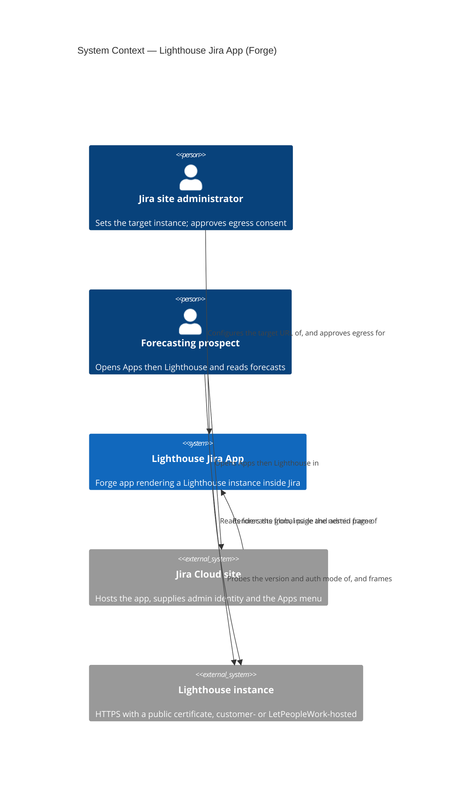
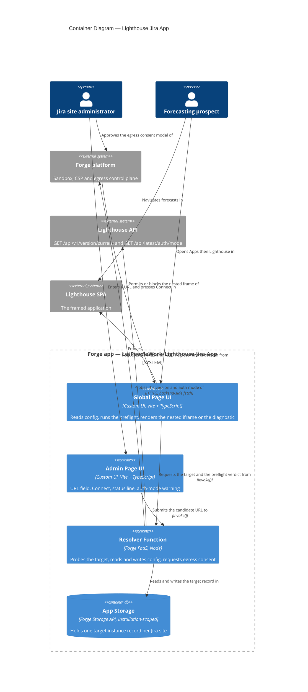

# Lightweight Jira App (Forge wrapper) — feature delta

**ADO**: Epic [#5146](https://dev.azure.com/letpeoplework/Lighthouse/_workitems/edit/5146) —
*Lightweight Jira App*, state `Planned`, tag `Premium`. Five child User Stories created 2026-08-02:

| Story | Title | Maps to |
|---|---|---|
| [#5634](https://dev.azure.com/letpeoplework/Lighthouse/_workitems/edit/5634) | Learn Forge and get a hello-world app onto our cloud instance | Pre-req P2 + P4, risk R4 |
| [#5635](https://dev.azure.com/letpeoplework/Lighthouse/_workitems/edit/5635) | Provide a publicly reachable Lighthouse instance to embed | Pre-req P3 |
| [#5636](https://dev.azure.com/letpeoplework/Lighthouse/_workitems/edit/5636) | A Lighthouse renders inside Jira | Slice 01 / US-01 |
| [#5637](https://dev.azure.com/letpeoplework/Lighthouse/_workitems/edit/5637) | Point it at my own Lighthouse | Slice 02 / US-02 |
| [#5638](https://dev.azure.com/letpeoplework/Lighthouse/_workitems/edit/5638) | Reach a go/no-go verdict | Slice 03 / US-03 |

**Waves recorded here**: DISCUSS (2026-08-02), DESIGN (2026-08-03).

**Precondition check.** The epic body opens with *"If we have #5306 we may be able to…"*.
[#5306](https://dev.azure.com/letpeoplework/Lighthouse/_workitems/edit/5306) (l8e Kubernetes
Productization) is **`Closed`** — the precondition holds. Note that it holds in a weaker sense than
the epic body assumed: because the app points at **any user-entered URL** (D3), a hosted l8e tenant
is a *convenient* demo target, not a dependency. A self-hosted instance works identically.

**Density**: lean (`~/.nwave/global-config.json` → `documentation.density = "lean"`,
`expansion_prompt = "ask-intelligent"`).

---

## Wave: DISCUSS / [REF] Persona

**Primary**: `forecasting-prospect` (existing — `docs/product/personas/forecasting-prospect.yaml`).
A delivery lead / engineering manager / flow coach who does **not** yet use Lighthouse and whose
team lives in Jira all day. Extended in this wave with the alias `jira-native-prospect` and a
second primary job; the persona's existing `not_this_persona` entry ("authenticated in-tool
Lighthouse user") still holds — the person here is evaluating, not operating.

**Secondary**: `lighthouse-maintainer` (existing). The maintainer is the one running the demo and
the one who must eventually answer *"do we build a real Forge app?"*.

**Explicitly not this persona**: an existing paying customer's delivery lead. Daily in-Jira use is
a *retention* story; this epic is a *qualification* story. Named here because it is the most likely
scope drift — the first request after a good demo will be "can my team use this every day", and
that is a different epic with a different bar (see Out-of-scope).

## Wave: DISCUSS / [REF] JTBD one-liners

- **`job-evaluate-lighthouse-without-leaving-jira`** (persona `forecasting-prospect`) — When I am
  sizing up Lighthouse but my team's whole day happens inside Jira, I want to see its forecasts
  from inside Jira, so I can judge whether adopting it adds a tab to my team's day or fits into
  the one they already have.
- **`job-qualify-jira-native-demand`** (persona `lighthouse-maintainer`) — When a Jira-shop
  prospect asks "does this live in Jira?", I want to show a real, installable Jira-native
  Lighthouse in the call, so I can find out whether Jira-nativeness is an actual buying trigger
  before I invest in a marketplace-grade app.

Full JTBD narrative (dimensions, four forces, opportunity table) — see the corresponding sections
below and `docs/product/jobs.yaml`.

## Wave: DISCUSS / [REF] Four forces + opportunity scores

| Force | `job-evaluate-lighthouse-without-leaving-jira` | `job-qualify-jira-native-demand` |
|---|---|---|
| **Push** | Every new tool proposal dies on "another tool, another tab". I cannot answer that objection about Lighthouse because today Lighthouse *is* another tab. | Prospects ask "is there a Jira app?" and the honest answer is "no". I cannot tell whether that ends the conversation or is a throwaway question. |
| **Pull** | Seeing forecasts appear under Jira's own **Apps** menu makes the adoption story concrete in one screen, with no story about future integration work. | An installable app turns a hypothetical ("we could build one") into an observable reaction I can measure across several calls. |
| **Anxiety** | "Is this a real integration or a picture frame?" — a wrapper that is obviously an iframe may *reduce* credibility if oversold. | Building the wrong thing: sinking marketplace-grade effort into an avenue nobody actually buys. Also: an under-baked demo damaging trust. |
| **Habit** | Bookmarking a separate forecasting tool and opening it once a sprint; treating forecast review as a ceremony, not a glance. | Demoing Lighthouse standalone in a browser tab and talking *about* integration rather than showing it. |

**Opportunity scores** (importance × satisfaction gap, 1–10, maintainer's judgement — no customer
interview data exists for this epic; recorded as an assumption, not evidence):

| Job | Importance | Current satisfaction | Gap | Opportunity | Rank |
|---|---|---|---|---|---|
| `job-qualify-jira-native-demand` | 8 | 1 | 7 | **15** | 1 |
| `job-evaluate-lighthouse-without-leaving-jira` | 6 | 2 | 4 | **10** | 2 |

The maintainer's job outranks the prospect's, and that ordering is the honest one — this epic is
funded to answer a business question, not to serve prospects at scale. It is why the epic's exit
criterion is a **verdict document** (D6), not an adoption number.

## Wave: DISCUSS / [REF] Locked decisions

| # | Decision | Rationale |
|---|---|---|
| **D1** | The app renders the **whole Lighthouse SPA in a nested iframe**. No Jira-context-aware scoping. | Maintainer, 2026-08-02. Simplicity is the point: an iframe of an existing URL needs zero Lighthouse changes, so the demo can exist in days rather than weeks. The double navigation (Jira chrome + Lighthouse chrome) is a known, accepted cost of the MVP. |
| **D2** | **Scoped views are deferred, not rejected.** A later slice may map a Jira project/board to a Lighthouse Team or Portfolio and render only that view. | Maintainer, 2026-08-02, explicitly: *"I like the scoped options too … first we should go with the iframe … could become something we tackle later after we have feedback."* **Revisit trigger**: the first prospect demo where the double navigation is what the prospect comments on. Recorded so the deferral is a decision with a wake-up condition, not a dropped idea. |
| **D3** | The target Lighthouse is **any URL the user types**, stored per Jira site. | Widest demo reach — works against a hosted l8e tenant *and* a prospect's own self-hosted instance, which is where the more persuasive demo lives (their data, not ours). Cost: the Forge manifest must permit egress/framing to an origin unknown at build time — the central technical risk, see R1. |
| **D4** | Identity handshake **reuses `GET /api/v1/version/current`**. No new Lighthouse endpoint. | Maintainer, 2026-08-02. Already `[AllowAnonymous]` at class level (`Lighthouse.Backend/API/VersionController.cs:12`), already returns a version string, already deployed on every instance in the wild — including instances older than this epic. A new endpoint would only be readable on instances that upgraded, which is exactly the population a *prospect* demo does not control. Weak as proof of product identity, sufficient to catch a typo'd URL, a dead host, or a non-Lighthouse origin. |
| **D5** | **Step 2 (Atlassian identity → Lighthouse session) is out of scope.** The user logs into Lighthouse inside the frame, or points at an instance with auth disabled. | Maintainer, 2026-08-02. Atlassian is not a general-purpose OIDC IdP for Forge apps; turning a Forge user context into a Lighthouse session needs a trust path that does not exist in the codebase today. Deciding *whether* to build it is precisely what the verdict doc (D6) is for — so it cannot also be a precondition of producing the verdict. |
| **D6** | Epic exits on a written **go/no-go verdict** after demos, not on shipping software. | Maintainer, 2026-08-02, consistent with the epic body: *"Goal is *not* a production ready thing, but something to showcase to potential customers to evaluate if this is an avenue we want to go towards."* |
| **D7** | Source lives in a **new, separate repository** (working name `Lighthouse-Jira-App`), not in this repo and not in `Lighthouse-Clients`. | Maintainer, 2026-08-02. A Forge/Node toolchain in this repo would land inside CI gates built for .NET + pnpm (`TreatWarningsAsErrors`, Biome on `./src`, SonarCloud on new code) and impose production-grade gates on an explicitly throwaway showcase. `Lighthouse-Clients` is an npm **library** monorepo; a Forge app is not a published library. Consequence: this epic ships **zero commits to the Lighthouse repo** if all goes well — which is also KPI K4. |
| **D8** | Auth-enabled target instances get a **pre-warning**, using the already-anonymous `GET /api/latest/auth/mode`. | Not a new endpoint and not step-2 auth (D5). `AuthController.GetRuntimeAuthStatus` is `[AllowAnonymous]` (`API/AuthController.cs:26-33`) and returns `RuntimeAuthStatus.Mode`. One extra call in the same probe round-trip turns the worst demo failure (blank frame mid-call, no explanation) into a sentence the presenter can read aloud. See R2. |

## Wave: DISCUSS / [REF] Pre-requisites

| # | Pre-requisite | Status | Owner |
|---|---|---|---|
| P1 | Epic #5306 (l8e productization) closed | **Met** — `Closed`. Weaker dependency than the epic body assumed, per D3. | — |
| P2 | An Atlassian **Jira Cloud** site + Forge CLI account | **Partially met** — LetPeopleWork has its own Atlassian cloud instance for testing (maintainer, 2026-08-02), so the *site* exists. The Forge CLI account, `forge login` and the toolchain do not. Forge apps are Cloud-only: a Jira Data Center prospect cannot be demoed this way at all, and that limitation belongs in the verdict rather than in a backlog. | **#5634** |
| P3 | A reachable demo Lighthouse instance over **HTTPS with a public certificate** | **Not verified.** An Atlassian-hosted page will not frame an `http://` or self-signed origin. `localhost` demos are out — which also rules out the usual dev instance on `:5169`. | **#5635** |
| P4 | New GitHub repo under `LetPeopleWork` | **Not created.** | **#5634** (the Forge scaffold needs somewhere to live, so repo creation rides with it rather than becoming a story of its own) |
| P5 | Lighthouse changes | **None required** — and required to stay none (K4). | — |

## Wave: DISCUSS / [REF] Risks that shape the slicing

| # | Risk | Why it drives slice order |
|---|---|---|
| **R1** | **Forge may refuse to frame an arbitrary external origin.** Forge Custom UI runs inside an Atlassian-controlled iframe whose CSP is derived from statically declared manifest permissions. Whether a user-entered domain can be framed at runtime — via a wildcard egress/frame declaration, or at all — is unverified against current Forge platform rules. | If this is false, **the entire epic is dead as designed** and D1/D3 must be rethought (e.g. hardcoded demo instance, or a data-level integration instead of a visual wrapper). It therefore goes in **slice 01**, before any settings UI, storage, or polish is built. Slice 01 exists to try to kill the epic cheaply. |
| **R2** | **The Lighthouse SPA may not work inside a third-party iframe even when framing is allowed.** Its session cookie becomes third-party (needs `SameSite=None; Secure`, and Chrome's partitioned-cookie behaviour applies), and an OIDC login redirect inside a frame typically fails because IdPs send `X-Frame-Options: DENY`. | Bounds what "works" means. Slice 01 is accepted against an **auth-disabled** instance; D8's warning is how the auth-enabled case degrades honestly instead of silently. Chasing this further is step 2 (D5). |
| **R3** | Lighthouse sets no `X-Frame-Options` / `frame-ancestors` today (verified: zero matches across the repo outside `examples/keycloak/realm-export.json:1477`, which is Keycloak's own config, not Lighthouse's). | **Reduces** risk — the Lighthouse side needs no change to be frameable. But it is an *absence*, not a guarantee: anything later adding a security-headers middleware would break this app silently. Recorded so the verdict doc can flag it. |
| **R4** | **Nobody on the team has built a Jira app of any kind** (maintainer, 2026-08-02). The Forge CLI, manifest schema, Custom UI resource model, tunnel/deploy/install lifecycle and permission vocabulary are all first-contact. | Left inside slice 01, an unfamiliar toolchain and an unanswered platform question (R1) fail *the same way* — a blank page — and the slice could not tell "Forge forbids this" from "we held it wrong". That ambiguity would corrupt the epic's single most consequential answer. Split out as a **hello-world story (#5634)**: a stock template app, no Lighthouse involved, whose only job is to make the toolchain boring before it has to carry a real question. Slice 01's ≤1-day estimate holds *after* #5634, not instead of it. |

## Wave: DISCUSS / [REF] User stories

### US-01 — See a Lighthouse inside Jira

`job_id: job-qualify-jira-native-demand`

As the **Lighthouse maintainer**, I want a Forge app that renders a Lighthouse instance on a Jira
global page, so that I can find out whether a Jira-native Lighthouse is technically possible at all
before designing anything around the idea.

#### Elevator Pitch
Before: there is no way to see Lighthouse inside Jira; the only answer to "is there a Jira app?" is "no".
After: install the app with `forge deploy && forge install`, open **Apps → Lighthouse** in a Jira Cloud site → sees the live Lighthouse SPA (nav bar, Teams, Portfolios) rendered inside the Jira page chrome.
Decision enabled: whether the wrapper approach is viable at all — a blank or CSP-blocked frame ends the epic here, at one slice of cost.

**AC**
- **AC-01.1** Given the app is deployed and installed on a Jira Cloud dev site, when the user opens **Apps → Lighthouse**, then the configured Lighthouse instance's SPA renders inside the page and its own top-level navigation is usable (at minimum: navigating to a Teams list and opening one team).
- **AC-01.2** Given the target instance has authentication **disabled**, when the frame loads, then no login prompt appears and team/portfolio data is visible.
- **AC-01.3** Given the frame is blocked by Forge's or the browser's CSP, when the page loads, then the app shows a readable diagnostic (the blocked origin and the reason) rather than an empty rectangle. *A blocked frame is a valid slice outcome — it is the hypothesis being tested — but it must be legible.*
- **AC-01.4** No product-code file in the Lighthouse repository is modified for this slice (K4 as reworded in CA-1).

### US-02 — Point it at my own Lighthouse

`job_id: job-evaluate-lighthouse-without-leaving-jira`

As a **forecasting prospect**, I want the app pointed at my own Lighthouse and confirmed to really be
a Lighthouse, so that I evaluate the integration against my own data instead of somebody else's demo.
The actor splits: a **Jira site administrator** configures, the prospect views. *(Amended in DESIGN
per CA-2 — the original single-actor wording is quoted in Changed Assumptions below.)*

#### Elevator Pitch
Before: the app only ever shows the one instance whose URL was compiled into it; a prospect cannot see their own teams in it.
After: a Jira site administrator opens **Settings → Apps → Lighthouse**, pastes `https://lighthouse.example.com`, presses **Connect**, approves Forge's egress consent modal → sees `Connected — Lighthouse v26.8.1.14`, and the global page then frames that instance for everyone on the site.
Decision enabled: whether Lighthouse-in-Jira is worth anything against *their* board — the difference between a canned demo and a real evaluation. The consent step is itself a finding: it is what a shipped app would cost a customer (D21).

**AC**
- **AC-02.1** Given a valid Lighthouse base URL, when a **Jira site administrator** presses **Connect**, then the app calls `GET {url}/api/v1/version/current`, and on `200` shows `Connected — Lighthouse v{version}` and persists the URL for the Jira site. On first use of a new domain the administrator is shown Forge's egress consent modal and must approve **both `FRAMES` and `FETCH_BACKEND_SIDE`** before the global page renders (D9, D10).
- **AC-02.2** Given a URL that resolves but is not a Lighthouse (non-200 other than 404, or a 200 whose body is not a version string), when the administrator presses **Connect**, then the app shows *"That URL responded, but it does not look like a Lighthouse instance"* and does **not** persist it. The body is classified as **text**, not JSON, and a `404` is a real Lighthouse with an empty version — see the probe response-shape note under Driven ports.
- **AC-02.3** Given a URL that does not resolve or times out, when the administrator presses **Connect**, then the app shows the failure and does not persist it.
- **AC-02.4** Given a saved URL whose instance reports `Mode = Enabled` from `GET {url}/api/latest/auth/mode`, when the **admin page** is shown, then it displays a warning that a login inside the embedded frame is expected to fail and that an auth-disabled instance should be used for demos (D8, D10, R2).
- **AC-02.5** Given a URL saved by one Jira user, when another user on the same Jira site opens the app, then they see the same configured instance (site-level, not per-user, configuration).
- **AC-02.6** Given the URL is `http://` rather than `https://`, when the administrator presses **Connect**, then the app rejects it with a reason (P3).
- **AC-02.7** No product-code file in the Lighthouse repository is modified for this slice (K4 as reworded in CA-1).
- **AC-02.8** Given a user who is not a Jira site administrator, when they open the app, then they see the configured instance, or a *"not yet configured — ask your Jira administrator"* message, and have **no** path to change it (D10).

### US-03 — Reach a verdict

`job_id: job-qualify-jira-native-demand`

As the **Lighthouse maintainer**, I want an install guide and a written verdict after showing the
app to prospects, so that the decision to invest in (or drop) a real Forge app is made on observed
reactions rather than on my own enthusiasm.

#### Elevator Pitch
Before: "should we build a Jira app?" is answered by opinion; nobody outside the maintainer has ever seen one.
After: follow `README.md` in the new repo → a prospect's own Jira site has the app installed within 10 minutes, and after the demos `docs/verdict.md` states **go** or **no-go** with the reactions that produced it.
Decision enabled: whether the next epic is "marketplace-grade Forge app" or "close 5146 and stop".

**AC**
- **AC-03.1** The new repo's `README.md` takes a reader from zero to a rendered Lighthouse in a Jira site, and someone other than the author completes it without asking the author a question.
- **AC-03.2** The app has been shown in **≥3** prospect or user conversations, each with a dated note capturing what the person said unprompted.
- **AC-03.3** `docs/verdict.md` exists and states an explicit **go** or **no-go**, with: the reactions behind it, the platform limits found (Cloud-only per P2, auth behaviour per R2, framing constraints per R1), and either a named follow-up epic or an explicit decision to stop.
- **AC-03.4** The verdict explicitly answers the deferred question from D2 — did the double navigation come up, and does scoped-view work move to the follow-up epic?

## Wave: DISCUSS / [REF] Out of scope

- **Atlassian identity → Lighthouse session (step 2)** — D5. The single largest deferral.
- **Jira-context-aware scoped views** — D2. Deferred *with* a revisit trigger, not rejected.
- **Atlassian Marketplace listing, privacy/security review, app licensing** — the epic body rules it out; marketplace review would also reject a wildcard-egress app.
- **Jira Data Center / Server** — Forge is Cloud-only (P2). This is a finding for the verdict, not a gap to close.
- **Reading Jira data or writing back to Jira** — the app renders a Lighthouse; it is not a second Jira connector. Lighthouse's existing Jira work-tracking connector is untouched.
- **Confluence, Bitbucket, or other Atlassian hosts.**
- **Any change to the Lighthouse backend or frontend** — D7, and KPI K4 measures it.
- **Mobile / small-viewport layout** — a full SPA in a nested frame will not fit a phone; demos are desktop.
- **Production hardening**: automated tests beyond a smoke check, error telemetry, multi-instance switching, per-user configuration.

## Wave: DISCUSS / [REF] Walking skeleton strategy

**Strategy: real-integration, no stubs.** The walking skeleton is **slice 01**: a real Forge app,
deployed by the real Forge CLI, installed on a real Jira Cloud site, framing a real Lighthouse
instance over real HTTPS. Nothing is mocked, because every one of R1/R2/R3 is a property of the
vendor platform — a stubbed version would prove only that an iframe tag renders, which nobody
doubts.

*(The A/B/C/D ladder letter from Mandate 5 is deliberately not asserted here: the skeleton crosses a
vendor boundary this project does not control, and picking a letter would imply a fidelity claim the
platform, not the code, decides. The strategy is stated in full instead.)*

## Wave: DISCUSS / [REF] Driving ports

| Surface | Detail |
|---|---|
| Jira `jira:globalPage` module | The only Jira surface. Appears under **Apps** in the Jira Cloud nav. Chosen over project page / dashboard gadget / board panel because a full SPA needs the full viewport and needs no project context (D1). |
| Forge app settings view | URL entry + **Connect** + status. Site-scoped Forge storage. |
| `GET {lighthouse}/api/v1/version/current` | Handshake probe (D4). Existing, `[AllowAnonymous]`. Called from the Forge backend, so browser CORS does not apply and Lighthouse's fail-closed `AllowedOrigins` is never involved. |
| `GET {lighthouse}/api/latest/auth/mode` | Auth-mode pre-warning (D8). Existing, `[AllowAnonymous]`. |
| The framed Lighthouse SPA itself | Its own API calls are **same-origin** to its own backend — the iframe does not make them cross-origin. This is why D1 needs no CORS work at all, and it is the single biggest simplification the whole-UI wrapper buys over a scoped view. |

## Wave: DISCUSS / [REF] Scope assessment

**PASS — right-sized.** Oversized signals scored: 3 user stories (<10) ✓; 1 bounded context, and it
is outside this codebase ✓; the walking skeleton has 2 integration points, Forge and one HTTP probe
(<5) ✓; estimated effort well under 2 weeks ✓. One signal is arguable — US-03 is a
different *kind* of outcome (a decision) from US-01/02 (software) — but splitting it out would
produce an epic that ships an app and never asks whether it was worth it, which is the failure mode
D6 exists to prevent. **No split.**

## Wave: DISCUSS / [REF] Story map

**Backbone** (prospect's path): *Hear about Lighthouse* → *Ask "is it in Jira?"* → **Install the app**
→ **Point it at an instance** → *See forecasts without leaving Jira* → *Decide whether to evaluate
properly*.

Bold steps are what this epic builds. The rest is the surrounding sales motion.

| Slice | Story | Ships | Learning hypothesis |
|---|---|---|---|
| **—** | #5634, #5635 | **Enablement, not slices.** Forge toolchain + hello-world app + the new repo (#5634, risk R4 and pre-reqs P2/P4); an HTTPS-reachable auth-disabled Lighthouse to embed (#5635, pre-req P3). | None — these are not experiments. They exist so the experiments that follow return a clean answer instead of an ambiguous blank page. Deliberately *not* counted as carpaccio slices: neither delivers user-visible value, and calling them slices would breach the slice-composition gate rather than satisfy it. |
| **01** | US-01 | Forge app skeleton + `globalPage` + nested iframe of a **hardcoded** URL | Disproves *"Forge Custom UI can frame an arbitrary external HTTPS origin, and the Lighthouse SPA survives being nested"* if it fails. Failure ends the epic at minimum cost. |
| **02** | US-02 | Settings view, site-scoped storage, `version/current` probe, `auth/mode` warning | Disproves *"a domain unknown at manifest-build time can be framed and fetched"* if it fails. If only this fails, D3 degrades to a hardcoded demo instance and the epic survives. |
| **03** | US-03 | `README.md`, ≥3 demos, `docs/verdict.md` | Disproves *"Jira-nativeness is a real buying trigger"* if prospects shrug. This is the epic's actual product. |

**Slice composition gate**: every slice contains ≥1 user-visible value story; no slice is
`@infrastructure`-only. Slice 01 is genuinely user-visible — a person opens a Jira menu and sees
Lighthouse.

**Carpaccio taste tests**

| Test | Verdict |
|---|---|
| "Ships 4+ new components" → not thin | Pass. Slice 01 = one Forge module + one iframe. Slice 02 = one settings view + one probe. |
| Every slice depends on a new abstraction → ship it first | Pass. No shared abstraction; slice 02 replaces slice 01's hardcoded constant with stored config. |
| No slice disproves a pre-commitment → decoration | Pass. Each slice above can end or reshape the epic. |
| Synthetic-data-only slice proves plumbing, not value | **Partial.** Slice 01 legitimately runs against a demo instance — real Lighthouse, seeded data. Slices 02 and 03 carry the production-data requirement: slice 02's AC is satisfied against a *self-hosted instance with real data*, and slice 03's demos must include at least one prospect's own instance. Documented rather than waved through. |
| 2+ slices identical except for scale → merge | Pass. |

**Prioritisation rationale** — strictly highest-uncertainty-first, which here coincides with the
dependency chain: R1 is existential and lives in slice 01, so it is bought first and cheapest; R1's
weaker cousin (runtime-unknown domains) lives in slice 02 and only degrades scope; the business
question lives in slice 03 and cannot be asked before something exists to show. Dogfood cadence:
slices 01 and 02 are each demoable in the maintainer's own Jira dev site on the day they land.

Slice briefs: `docs/feature/epic-5146-jira-forge-app/slices/slice-0{1,2,3}-*.md`.

## Wave: DISCUSS / [REF] Outcome KPIs

| # | KPI | Target | Measurement |
|---|---|---|---|
| **K1** | Prospect exposure | **≥3** conversations where the app is installed and shown | Dated notes in `docs/verdict.md`; one entry per conversation with a verbatim unprompted reaction |
| **K2** | Time from zero to rendered Lighthouse, following the README | **≤10 minutes** | Timed once by a person who did not write the app or the README (AC-03.1) |
| **K3** | Verdict exists and decides | **1** document with an explicit go/no-go plus a named follow-up epic or an explicit stop | Binary: `docs/verdict.md` in the new repo |
| **K4** | Lighthouse repo untouched — the "lightweight" claim, made falsifiable | **0** files changed under `/storage/repos/Lighthouse` attributable to this epic | `git log --since=<epic start>` filtered for 5146-referencing commits; expected empty |

K4 is the load-bearing one. If it goes non-zero, the epic has silently stopped being a lightweight
wrapper and D1/D7 need to be re-decided rather than quietly amended.

## Wave: DISCUSS / [REF] Definition of Ready — validation

| # | DoR item | Verdict | Evidence |
|---|---|---|---|
| 1 | Every story traces to a `job_id` | Pass | US-01, US-03 → `job-qualify-jira-native-demand`; US-02 → `job-evaluate-lighthouse-without-leaving-jira`. Both added to `docs/product/jobs.yaml` in this run. No `infrastructure-only` escape used. |
| 2 | Persona named & scoped | Pass | `forecasting-prospect` primary (existing, extended with alias `jira-native-prospect` + the new job); `lighthouse-maintainer` secondary (existing). Explicit non-persona recorded (existing customer's delivery lead). |
| 3 | Elevator pitch per non-`@infrastructure` story | Pass | All three stories carry Before/After/Decision. Entry points are real and user-invocable: the Jira **Apps → Lighthouse** menu item, the app's **Settings → Connect** action, and `README.md`. Observable outputs are concrete: the rendered SPA, the `Connected — Lighthouse v{version}` string, the verdict document. |
| 4 | AC testable, no ambiguous outcomes | Pass | Probe outcomes are enumerated by HTTP result (200 / non-200 / unreachable / non-https). The framing outcome has a defined *failure* behaviour (AC-01.3) so "it didn't work" is still a pass/fail observation. AC-03.1's "without asking the author a question" is the operational form of "the README is complete". |
| 5 | Out-of-scope explicit | Pass | 9 items listed, each with a reason; the two deferrals that carry revisit conditions (D2 scoped views, D5 step-2 auth) are named as deferrals rather than silently dropped. |
| 6 | Outcome KPIs measurable with targets | Pass | 4 KPIs, each numeric with a stated measurement method. |
| 7 | Pre-requisites resolved | **Pass with open items** | P1 met (#5306 `Closed`). **P2, P3, P4 are unmet and block slice 01's first run** — a Jira Cloud dev site, an HTTPS-reachable demo instance, and the new repo. These are setup, not design unknowns, and they gate DELIVER rather than DESIGN. Flagged here so DESIGN does not assume them. |
| 8 | Slice composition: each slice contains ≥1 user-visible story | Pass | 3 slices, 3 value-bearing stories, one per slice. No `@infrastructure`-only slice. |
| 9 | Handoff target identified | Pass | nw-solution-architect (DESIGN, full artifacts); nw-platform-architect (DEVOPS, KPIs only). DESIGN's first job is R1 — see handoff note. |

**DoR overall verdict: PASSED**, with P2/P3/P4 recorded as open setup items.

## Wave: DISCUSS / [REF] Wave decisions summary

**Primary user need**: let a Jira-resident prospect see Lighthouse inside Jira, cheaply enough that
the maintainer can find out whether Jira-nativeness sells before building anything real.

**Feature type**: user-facing (new deliverable surface — a Jira Forge app), built entirely outside
this repository.

**Walking skeleton scope**: slice 01 — real Forge app, real Jira Cloud site, real HTTPS Lighthouse,
hardcoded URL, nested iframe. Exists to try to falsify R1 before any other work.

**Foundation investment**: **zero** in the Lighthouse codebase. Both endpoints the app depends on
already exist and are already anonymous. This is the epic's defining constraint and its K4 metric.

**Constraints established**
- Forge is Jira **Cloud** only — Data Center prospects cannot be demoed this way (P2).
- The target instance must be **HTTPS with a public certificate**; `localhost` cannot be framed (P3).
- The framed SPA's session cookie is **third-party**; OIDC login inside the frame is expected to
  fail. Demos run against auth-disabled instances, with a pre-warning otherwise (D8, R2).
- Lighthouse currently sends **no** `X-Frame-Options` / `frame-ancestors`. The app depends on that
  absence, which nothing in the codebase guards (R3).

**Upstream changes**: none — no DISCOVER or DIVERGE wave ran for this epic. The epic body's premise
that #5306 is a hard dependency was **weakened** during this wave (D3): a hosted tenant is a
convenient demo target, not a prerequisite.

**Handoff note for DESIGN**: the first question is R1, and it is answerable only against the live
Forge platform, not from this repository. If DESIGN cannot resolve from current Forge documentation
whether a runtime-supplied external origin can be framed and fetched, run `/nw-spike` before
committing to slice 02's settings design — the answer determines whether D3 survives or degrades to
a hardcoded instance.

---

## Wave: DESIGN / [REF] Preamble

**DESIGN wave, 2026-08-03** (nw-solution-architect, propose mode, application/components scope).

R1 — DISCUSS's open question, *"whether a runtime-supplied origin can be framed at all"* — is
**resolved from current Atlassian documentation**, without a spike. Three mechanisms exist:

- **A — customer-managed egress and remotes** (Forge Preview). `permissions.external.configurable.enabled: true`; no build-time domain list; accepted egress types explicitly include **`FRAMES`** alongside `FETCH_BACKEND_SIDE`. A Jira site administrator approves a runtime-supplied domain through a consent modal and CSP is updated per installation. Approval **cannot** be performed on an admin's behalf via Forge user impersonation. Limits: 10 egress groups per installation, 10 domains per group, ≤40 total entries. Apps using it are **not eligible for "Runs on Atlassian"**.
- **B — wildcard** `permissions.external.frames: ['*']`. Evidence conflicts: a 2025 report that `*` stopped working, and a later reply in the same thread confirming it still works with "global URL" and "deprecated egress syntax" warnings. Not resolvable on documentation alone.
- **C — statically listed origin.** The degraded fallback DISCUSS already anticipated.

**Decision: the static-first ladder (D9).** Slice 01 declares one static origin (C); the wildcard (B)
is measured afterwards as a separate one-line second deploy; slice 02 uses A. Rationale: slice 01's
question is existential, and declaring `['*']` there would answer two questions at once — *can Forge
frame an external origin* and *does the wildcard still work* — so a blank page would be
uninterpretable. That is exactly the ambiguity #5634 was split out of slice 01 to prevent,
reintroduced one slice later.

**D3 survives**, with an administrator added to the loop. Marketplace viability for the follow-up
epic survives only on mechanism A; B is a dead end there, as DISCUSS already noted in Out of scope.

This wave writes **no** content to `docs/product/architecture/brief.md` and creates **no** ADRs under
`docs/product/architecture/`: the architecture described here lives in a different repository
(`LetPeopleWork/Lighthouse-Jira-App`, D7) and does not belong in this project's SSOT. ADRs for D9,
D10 and D13 are authored in the new repo.

## Wave: DESIGN / [REF] Decisions

| # | Decision | Rationale |
|---|---|---|
| **D9** | **Egress ladder: C for slice 01 → wildcard measured as a separate second deploy → A for slice 02.** Degrade to a static allow-list if A fails. | One question per deploy; a blank page then has exactly one possible cause. |
| **D10** | Split the surface: read-only `jira:globalPage` + admin-only `jira:adminPage`. | Jira enforces who may change the target URL; no app-side permission code exists to get wrong. Resolves the US-02 admin gate structurally (CA-2). |
| **D11** | Site-scoped **Forge app storage**, one key `targetInstance`. Not entity properties, not `setSecret`. | One installation == one Jira site == AC-02.5, for free. Entity properties are project-scoped and readable too widely; no credential is ever stored (D5), so `setSecret` is inapplicable. |
| **D12** | All probing and all config writes execute in the **resolver function**; the Custom UI never calls Lighthouse directly. | Backend-side fetch ⇒ browser CORS and Lighthouse's fail-closed `Authentication__AllowedOrigins` never enter the path. |
| **D13** | **The blocked-frame diagnostic is predicted, not detected**: preflight = HTTP probe + egress-consent state + frame-header check, *then* render; plus a timed "still blank" fallback. | A cross-origin frame blocked by CSP fires no usable event in the parent — `onload` fires for the error page too. Without this, AC-01.3 is unimplementable and slice 01 returns the blank rectangle it exists to avoid. |
| **D14** | **Custom UI, not UI Kit**, for both modules. | UI Kit renders a declarative Atlassian component tree and has no arbitrary-`<iframe>` primitive. The entire app is one iframe tag. |
| **D15** | **Vite + vanilla TypeScript; no React, no `@atlaskit/*`** — unless de-Reacting the `forge create` template costs more than ~30 minutes, in which case React is kept and recorded as accepted incidental complexity. | ~200 LOC: one iframe, one form, two pure functions. A bundler is unavoidable only because `@forge/bridge` is an npm package. #5634's purpose is a boring toolchain, so purity must not eat the slice budget. |
| **D16** | **Do not depend on the `@letpeoplework/lighthouse-*` npm clients.** | Two anonymous GETs; see Reuse Analysis row 6. |
| **D17** | **The R3 guard lives in the consumer**: the preflight reports a present `X-Frame-Options` / `frame-ancestors` on the target. No guard is added to the Lighthouse repository. | Turns a future silent break into D13's legible diagnostic at zero K4 cost. The dependent proves the dependency rather than trusting it. |
| **D18** | **`target="_blank"` links inside the framed SPA are accepted as broken.** | Forge Custom UI sandboxes popups by default; the nested SPA is a foreign origin and cannot reach Forge's `router.open()`; fixing it in Lighthouse would breach K4. Becomes a demo-script constraint and a verdict finding — see the note below this table. |
| **D19** | Pin the Forge CLI version and the function runtime explicitly (`package.json` + committed lockfile, `manifest.yml` `runtime.name`). No floating `latest`. | A demo that breaks on the morning of a call costs more than the pin. |
| **D20** | **Keep the statically-declared LetPeopleWork instance as the primary demo path permanently**; mechanism A is the "point it at your own instance" upgrade. | Consent cannot be impersonated, and the `forecasting-prospect` persona is usually not a Jira site administrator. Without this, K1 (≥3 conversations) is gated on other people's admins being free. |
| **D21** | Admin-consent friction is a **measured verdict input**, recorded per demo. | It is what a shipped app would cost a customer, and therefore a direct input to the go/no-go rather than an implementation detail. |
| **D22** | **No consumer-driven contract test** (Pact or equivalent) during this epic. The runtime preflight *is* the contract check. | Right-sized for a throwaway. **But**: on a *go* verdict, `version/current` and `auth/mode` acquire an out-of-repo consumer that Lighthouse CI cannot see — that is when a contract test earns its keep, and it belongs in the follow-up epic's scope. |

**D18 — the three call sites that break.** `target="_blank"` links in the framed SPA cannot open:
`Lighthouse.Frontend/src/components/Common/FeatureName/FeatureName.tsx:15`,
`Lighthouse.Frontend/src/components/Common/FeatureGrid/FeatureGrid.tsx:192`,
`Lighthouse.Frontend/src/components/Common/DataOverviewTable/DataOverviewTable.tsx:351`
(plus logo, licence tooltip and splash screen, which no demo clicks). These are precisely the links a
prospect clicks to open a Work Item from a Features table, so the demo script must route around them
and the verdict must record the limitation. This materially enlarges R2 beyond what DISCUSS recorded.

**Architectural enforcement (proportionate).** ArchUnit-class tooling on a 200-LOC app would be
cargo-cult and is declined explicitly rather than silently omitted. The substitutes: TypeScript
`strict` plus a `ConfigReader` type carrying **no `save` method**, so the global page cannot write
(the read/write port split is compile-enforced, not conventional); `manifest.yml` treated as the
architecture, with the README stating the exact egress declarations the design permits so any
addition is a design change rather than a config tweak; `vitest` over the two pure functions.

## Wave: DESIGN / [REF] Component decomposition

| Component | Type | Responsibility | Notes |
|---|---|---|---|
| **Global Page UI** | `jira:globalPage`, Custom UI static resource | Reads config → runs the preflight → renders either the nested `<iframe>` or the diagnostic | `layout: blank` to drop Atlassian page chrome and halve the double navigation (D1, D2's revisit trigger). **Read-only by port type** — receives a `ConfigReader` with no `save`. |
| **Admin Page UI** | `jira:adminPage`, Custom UI static resource | URL field, **Connect**, status line, auth-mode warning | Lives under Jira **Settings → Apps**; Jira makes it admin-only by construction (D10). |
| **Resolver Function** | Forge FaaS, Node | `getConfig()`, `probe(url) → ProbeResult`, `saveConfig(record)`, `requestEgress(domain)`, `egressStatus(domain)` | The only component that talks to Lighthouse (D12). |
| **App Storage** | Forge Storage API, installation-scoped KV | One record per Jira site | Key `targetInstance`; value `{ url, version, authMode, probedAt, savedBy }` (D11). |

Four containers, no shared abstraction between them.

**Contract shapes (effect isolation).** `validateUrl(text)` and `classifyVersionBody(text)` are
**pure** — string in, verdict out, no fetch, no storage; they are the only two units worth testing.
`probe(url)` is **unbounded-preservation**: it returns a `ProbeResult` and is structurally incapable
of persisting, which makes AC-02.2 and AC-02.3 ("does **not** persist it") a type-level guarantee
rather than a test that can rot. `saveConfig` is **bounded-change**: declared mutation set is exactly
one storage key.

## Wave: DESIGN / [REF] Driving ports

| Port | Adapter | Contract |
|---|---|---|
| `ViewTarget` | `jira:globalPage` Custom UI | `render()` — reads config, never writes |
| `ConfigureTarget` | `jira:adminPage` Custom UI | `probe(candidate)`, then *separately* `save(verified)` |
| `EgressApproved` | Forge consent modal, admin-driven | An inbound state change the app does not control; modelled as a driving port so the global page treats "approved yet?" as an input rather than an assumption |

## Wave: DESIGN / [REF] Driven ports and adapters

| Port | Adapter | Probe (Earned Trust) |
|---|---|---|
| `ConfigStore` | Forge Storage API | Read-after-write on save; a write that does not read back is reported, never swallowed |
| `LighthouseProbe` | `@forge/api` fetch → `GET {url}/api/v1/version/current`, `GET {url}/api/latest/auth/mode` | *Is* the probe (D4, D8). Fault scenarios it must survive: DNS failure, TLS failure, timeout, 200-but-not-a-Lighthouse, 404, `text/plain` body, redirect to a login page |
| `EgressConsent` | Forge customer-managed egress API (slice 02) | `egressStatus(domain)` before every render — approval is never assumed to have persisted |
| `FrameHeaders` | `@forge/api` fetch, root of the target | Reports a present `X-Frame-Options` / `frame-ancestors`. This is the R3 guard, living in the consumer (D17) |
| `FrameRenderer` | The browser plus the Forge CSP | Cannot be probed from inside — hence D13's predict-don't-detect preflight and the timed fallback |

**Probe response shape — carry this into DISTILL.** `GET /api/v1/version/current`
(`Lighthouse.Backend/Lighthouse.Backend/API/VersionController.cs:25-34`, `[ProducesResponseType<string>]`,
`return Ok(version)`) returns a **bare string, not an object**. With no `Accept` header — which is the
default for a backend fetch — ASP.NET Core's `StringOutputFormatter` wins over the JSON formatter, so
the body arrives as **`text/plain`, unquoted**: `26.8.1.14`, not `{"version":"26.8.1.14"}` and not
`"26.8.1.14"`. AC-02.2's classifier must therefore **read the body as text and must not call
`.json()`** — doing so throws rather than producing a verdict, and the "responded but is not a
Lighthouse" path silently misfires. Separately, that endpoint returns **404 when the version string is
empty**, which is a *real* Lighthouse answering, not a non-Lighthouse origin; the classifier must not
conflate the two.

`GET /api/latest/auth/mode` (`API/AuthController.cs:26-33`) carries `[AllowAnonymous]` on the
**method** — the class is not anonymous — so it remains reachable on auth-enabled instances, which is
the only case in which D8's warning matters. AC-02.4 names only `Mode = Enabled`; `Blocked` also
exists (`AuthController.cs:44`) and needs a wording decision — see Q8.

## Wave: DESIGN / [REF] Technology choices

| Choice | Decision | Rationale |
|---|---|---|
| Custom UI vs UI Kit | **Custom UI**, both modules | Not a preference: UI Kit has no arbitrary-`<iframe>` primitive (D14). UI Kit would suit the admin form, but two UI technologies in a two-view app cost more than they save. |
| Framework | **Vite + vanilla TypeScript**; no React, no `@atlaskit/*` | D15. A throwaway app does not need to look Atlassian-native; on a *go* verdict the real app is built properly. |
| Forge CLI | Pin the exact version resolved on the day #5634 runs, in `devDependencies` + committed lockfile | D19. No version is asserted here — the instruction is *pin, don't float*. |
| Function runtime | Declare `runtime.name` explicitly in `manifest.yml` | D19. A platform default that moves under an unmaintained app is a silent break. |
| Tests | `vitest`, two files: URL validation, version-body classification | DISCUSS caps testing at a smoke check. These two are pure functions and cover the three error ACs; nothing else is testable without the vendor platform. |
| CI in the new repo | None in slices 01–02; at most one `forge lint` job | The new repo exists *because* this repo's gates are wrong for it (D7). Recreating them there repeats the mistake in a new location. |
| Licence | Match LetPeopleWork's existing public-repo licence | OSS throughout; no proprietary dependency anywhere in this design. |

## Wave: DESIGN / [REF] Reuse Analysis

The honest complication: the "existing codebase" is an *empty* repository, so the reuse question is
not "what do we extend" but **"what do we refuse to rebuild"** — and by that measure this epic has the
highest reuse ratio of any feature in the project, because it reuses an entire SPA.

| # | Candidate | Location / evidence | Verdict |
|---|---|---|---|
| 1 | `GET /api/v1/version/current` | `API/VersionController.cs:12` (`[AllowAnonymous]` at class level), `:25-34`; dual-routed `api/v1` + `api/latest`; returns `Ok(version)` — a bare string — or 404 when empty | **REUSE AS-IS.** D4 confirmed this wave. See the response-shape note above: read as text, never `.json()`; 404 is a real Lighthouse. |
| 2 | `GET /api/latest/auth/mode` | `API/AuthController.cs:26-33`; `[AllowAnonymous]` on the method, not the class | **REUSE AS-IS.** D8 confirmed this wave. Survives auth-enabled instances, which is the only case that matters. |
| 3 | The Lighthouse SPA | `Lighthouse.Frontend/` | **REUSE AS-IS, FRAMED.** Zero UI rebuilt. Its own API calls stay same-origin inside the frame — the single largest simplification the whole-UI wrapper buys. `BrowserRouter` (`Lighthouse.Frontend/src/App.tsx:11`) is unaffected by nesting. |
| 4 | Absence of `X-Frame-Options` / `frame-ancestors` | Re-verified this wave: the only repo-wide match is `examples/keycloak/realm-export.json:1477`, which is Keycloak's own config | **DEPEND ON — UNGUARDED.** R3 stands; no test asserts the absence. The guard moves to the consumer (D17) because guarding it here would breach K4. |
| 5 | `forge create` Custom UI Jira template | Produced by #5634 | **EXTEND.** The scaffold *is* the starting repo; hand-rolling `manifest.yml` would re-import R4. |
| 6 | `@letpeoplework/lighthouse-cli`, `-mcp-stdio`, `-mcp-http` | `docs/aiintegration.md:31-33`; `chart/values.yaml:141` | **CREATE NEW — do not depend.** They wrap the *authenticated* API for CLI/MCP hosts; this app makes two anonymous GETs. Forge's backend fetch is `@forge/api`'s, not Node's global, so a generic client would need an HTTP-adapter seam those packages do not expose. The dependency would version-couple a repo that must stay disposable. |
| 7 | Lighthouse Playwright POMs / E2E harness | `Lighthouse.Frontend/` tests | **NOT REUSED.** Slice 01 caps testing at "opening the page and looking at it". Named so the omission is explicit rather than silent. |
| 8 | Verdict-document pattern | `docs/feature/epic-5513-servicenow-integration/` slice 05 | **EXTEND (shape only).** Already slice 03's stated reference class. |
| 9 | Lighthouse CI / SonarQube / Stryker gates | `.github/`, `CLAUDE.md` quality gates | **DELIBERATELY NOT REUSED.** D7's entire rationale. |

## Wave: DESIGN / [REF] C4 diagrams

**System Context (L1)**

**Container (L2)**

**No Component diagram (L3) — omitted by decision at four containers**, which is below the 5+
threshold at which a component view earns its maintenance cost.

## Wave: DESIGN / [REF] Open questions

| # | Question | Answered where |
|---|---|---|
| **Q1** | Does `frames: ['*']` still work, and with which warnings? | Slice 01, second deploy. Empirical, one manifest line. |
| **Q2** | Does the customer-managed egress request API work from a `globalPage` / `adminPage` resolver, or only certain module types? | Slice 02. Preview API, documentation-reviewed, unproven. **This is slice 02's real risk**, not the settings form. |
| **Q3** | Does changing the URL to a different domain require re-consent (near-certainly yes), and what does that do to K2's ≤10-minute target when the reader may not be an administrator? | Slice 02 → slice 03. K2 may need re-basing. |
| **Q4** | Does `layout: blank` reduce the double navigation enough to change D2's revisit trigger? | Slice 01, observationally. |
| **Q5** | Partitioned browser storage in the nested frame: does the SPA lose theme and terminology preferences per session? | Slice 01 — observe and record. Cosmetic, but not something to discover live on a call. |
| **Q6** | Forge storage consistency and quota behaviour for a single key. | Assumed benign; covered by `ConfigStore`'s read-after-write probe. |
| **Q7** | Does the new repo get any CI at all? | DELIVER. Recommendation: none, or one `forge lint` job. |
| **Q8** | `AuthMode` values other than `Enabled` — does `Blocked` (`API/AuthController.cs:44`) need its own warning text? | DISTILL. AC-02.4 currently names only `Enabled`. |

## Wave: DESIGN / [REF] Changed Assumptions

Back-propagated to DISCUSS. Originals quoted verbatim.

### CA-1 — K4 is false as written

**Source**: `docs/feature/epic-5146-jira-forge-app/feature-delta.md:259`, with commentary at `:261-262`.

**Original, verbatim:**

> | **K4** | Lighthouse repo untouched — the "lightweight" claim, made falsifiable | **0** files changed under `/storage/repos/Lighthouse` attributable to this epic | `git log --since=<epic start>` filtered for 5146-referencing commits; expected empty |

> K4 is the load-bearing one. If it goes non-zero, the epic has silently stopped being a lightweight
> wrapper and D1/D7 need to be re-decided rather than quietly amended.

**Why it is false**: DISCUSS committed its own record to this repository (`3d04f5839`), and DESIGN
appends to this file. The KPI was violated by the wave that wrote it.

**Reworded** (maintainer, 2026-08-03): **0** files changed under `Lighthouse.Backend/`,
`Lighthouse.Frontend/`, `chart/`, or any published client package, attributable to this epic.
Measurement: `git log --since=<epic start> -- Lighthouse.Backend Lighthouse.Frontend chart` filtered
for 5146-referencing commits; expected empty. Feature-workspace documentation under `docs/` does not
count.

The commentary survives intact and is *strengthened* — the load-bearing claim was always about
product code. D17 and D18 both exist to keep the reworded K4 true under pressure: each is a place
where the obvious fix is a Lighthouse change, and the design refuses it.

### CA-2 — US-02 assumes any user can set the URL; both viable mechanisms require a site administrator

**Source**: `docs/feature/epic-5146-jira-forge-app/feature-delta.md:132-134` (story), `:145` (AC-02.1),
`:149` (AC-02.5).

**Original, verbatim:**

> As a **forecasting prospect**, I want to enter my own Lighthouse URL in the app's settings and have
> it confirm the URL is really a Lighthouse, so that I evaluate the integration against my own data
> instead of somebody else's demo.

> - **AC-02.1** Given a valid Lighthouse base URL, when the user presses **Connect**, then the app calls `GET {url}/api/v1/version/current`, and on `200` shows `Connected — Lighthouse v{version}` and persists the URL for the Jira site.

> - **AC-02.5** Given a URL saved by one Jira user, when another user on the same Jira site opens the app, then they see the same configured instance (site-level, not per-user, configuration).

**What changed**: mechanism A puts an approval modal in front of a **Jira site administrator**, and
that approval explicitly cannot be granted via Forge user impersonation. Mechanism B without a
working wildcard needs a developer redeploy. AC-02.5 already scoped configuration as site-level, so
the direction was right — but *"the user presses **Connect**"* now has a gate DISCUSS did not know
existed.

**AC text that needed to change — APPLIED to the US-02 block above on 2026-08-03.** The quotes above
are the pre-amendment record; the story now reads as amended. What changed:

- **Story sentence** — the actor for *configuration* becomes the **Jira site administrator**;
  `forecasting-prospect` remains the actor for *viewing*. The story splits its actor between
  configuring and using.
- **AC-02.1** — "the user presses **Connect**" → "a **Jira site administrator** presses **Connect**",
  and the criterion gains the consent step: on first use of a new domain the administrator is shown
  Forge's egress consent modal and must approve **both `FRAMES` and `FETCH_BACKEND_SIDE`** before the
  global page renders.
- **AC-02.4** — the auth-mode warning surface moves to the admin page (D10).
- **New AC-02.8** — a non-administrator opening the app sees the configured instance, or a "not yet
  configured — ask your Jira administrator" message, and has no path to change it.
- **AC-01.4 and AC-02.7** — "No file in the Lighthouse repository is modified" → "No **product-code**
  file …", per CA-1's rewording of K4.
- **AC-03.1 (K2, ≤10 minutes)** — flagged at risk rather than reworded: the README's reader must now
  be, or must fetch, a Jira site administrator. D20 is the mitigation, since the canned-demo path
  needs no consent; K2's measurement should state which path is being timed.

## Wave: DESIGN / [REF] Tier-2 expansion catalog

Density is `lean`, so Tier-1 sections only are rendered above. Available on request, by name:

`threat-model` (framed-SPA trust boundary, third-party storage partitioning) ·
`quality-attribute-scenarios` (ISO 25010 table — the dominant attribute here is time-to-first-answer,
not performance) · `residuality-stress-analysis` (`--residuality`) · `adr-set` (D9, D10 and D13 each
warrant one, authored in the new repo, not under `docs/product/architecture/`) ·
`contract-testing-detail` (deferred by D22) · `dev-loop-design` (`forge tunnel` vs
`forge deploy -e development`) · `readme-information-architecture` (K2's ≤10-minute path) ·
`demo-script` (including D18's routing around Work Item links).
