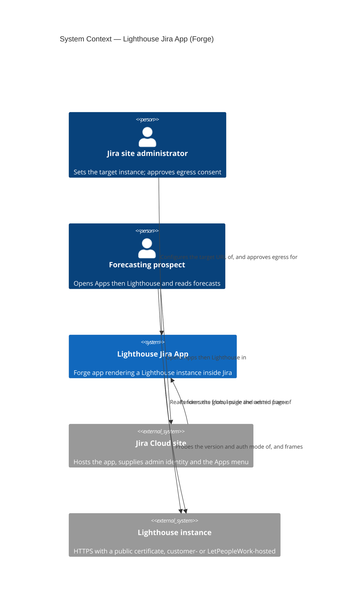
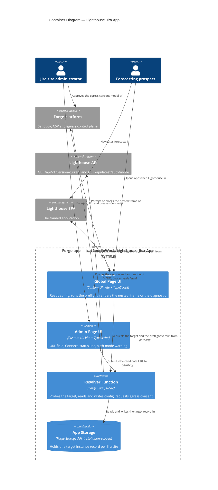
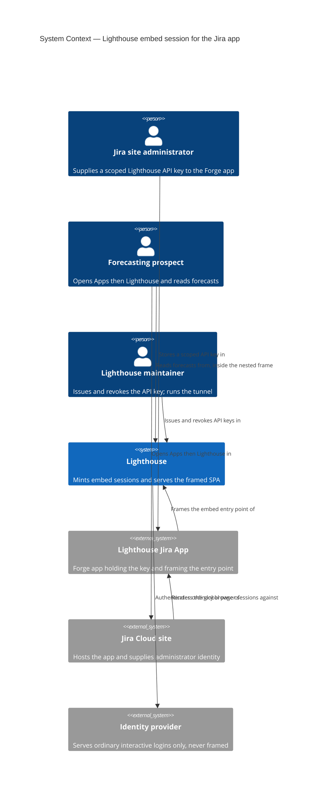
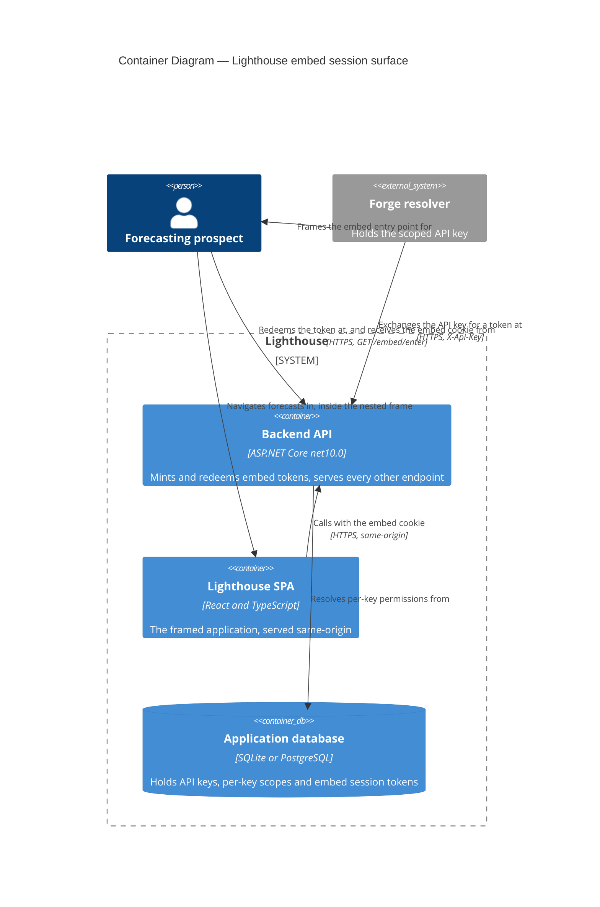
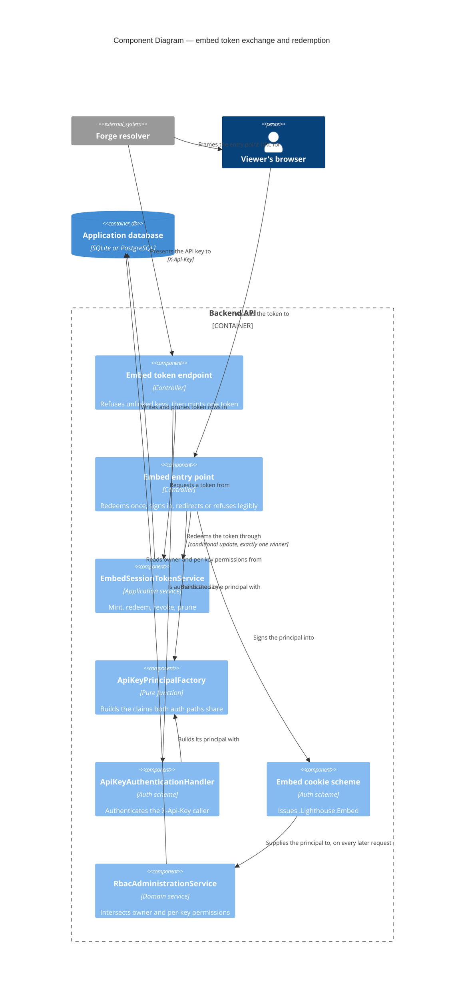

# Lightweight Jira App (Forge wrapper) — feature delta

**ADO**: Epic [#5146](https://dev.azure.com/letpeoplework/Lighthouse/_workitems/edit/5146) —
*Lightweight Jira App*, state `Planned`, tag `Premium`. Five child User Stories created 2026-08-02:

| Story | Title | Maps to |
|---|---|---|
| [#5634](https://dev.azure.com/letpeoplework/Lighthouse/_workitems/edit/5634) | Learn Forge and get a hello-world app onto our cloud instance | Pre-req P2 + P4, risk R4 |
| ~~[#5635](https://dev.azure.com/letpeoplework/Lighthouse/_workitems/edit/5635)~~ **REMOVED in ADO** | ~~Provide a publicly reachable Lighthouse instance to embed~~ — premise dead: it assumed a *hosted* auth-disabled instance, which the l8e platform forbids (`oidcEnabled: true` is mandatory, CI-enforced). **Replaced by [#5661](https://dev.azure.com/letpeoplework/Lighthouse/_workitems/edit/5661)**, a Tailscale Funnel (D43). Do not recreate as written | Pre-req P3 |
| [#5636](https://dev.azure.com/letpeoplework/Lighthouse/_workitems/edit/5636) | A Lighthouse renders inside Jira | Slice 01 / US-01 |
| ~~[#5637](https://dev.azure.com/letpeoplework/Lighthouse/_workitems/edit/5637)~~ **REMOVED in ADO** | ~~Point it at my own Lighthouse~~ — premise dead: a settings flow pointing at an arbitrary instance is useless while the identity provider refuses to be framed (F3/F4). **Replaced by [#5641](https://dev.azure.com/letpeoplework/Lighthouse/_workitems/edit/5641)** (the embed session) and **[#5642](https://dev.azure.com/letpeoplework/Lighthouse/_workitems/edit/5642)** (the Forge settings flow on top of it). Do not recreate as written | Slice 02 / US-02 |
| [#5638](https://dev.azure.com/letpeoplework/Lighthouse/_workitems/edit/5638) | Reach a go/no-go verdict | Slice 03 / US-03 |

**Waves recorded here**: DISCUSS (2026-08-02), DESIGN (2026-08-03 + re-run 2026-08-04), SPIKE
(2026-08-04, `spike/`), DISTILL (2026-08-04).

> **Reading order matters in this document.** Later sections supersede earlier ones and say so; the
> superseded text is left in place, struck through, with a dated amendment naming what replaced it.
> Nothing is quietly rewritten. If a DISCUSS-era statement and a DESIGN-era one disagree, the later
> one wins — and the earlier one is kept because *how the understanding changed* is itself the record
> this epic exists to produce.

**Precondition check.** The epic body opens with *"If we have #5306 we may be able to…"*.
[#5306](https://dev.azure.com/letpeoplework/Lighthouse/_workitems/edit/5306) (l8e Kubernetes
Productization) is **`Closed`** — the precondition holds. Note that it holds in a weaker sense than
the epic body assumed: because the app points at **any user-entered URL** (D3), a hosted l8e tenant
is a *convenient* demo target, not a dependency. A self-hosted instance works identically.

**Density**: lean (`~/.nwave/global-config.json` → `documentation.density = "lean"`,
`expansion_prompt = "ask-intelligent"`).

---

## Wave: DISCUSS / [REF] Persona

**Primary**: `forecasting-prospect` (existing — `docs/product/personas/forecasting-prospect.yaml`).
A delivery lead / engineering manager / flow coach who does **not** yet use Lighthouse and whose
team lives in Jira all day. Extended in this wave with the alias `jira-native-prospect` and a
second primary job; the persona's existing `not_this_persona` entry ("authenticated in-tool
Lighthouse user") still holds — the person here is evaluating, not operating.

**Secondary**: `lighthouse-maintainer` (existing). The maintainer is the one running the demo and
the one who must eventually answer *"do we build a real Forge app?"*.

**Explicitly not this persona**: an existing paying customer's delivery lead. Daily in-Jira use is
a *retention* story; this epic is a *qualification* story. Named here because it is the most likely
scope drift — the first request after a good demo will be "can my team use this every day", and
that is a different epic with a different bar (see Out-of-scope).

## Wave: DISCUSS / [REF] JTBD one-liners

- **`job-evaluate-lighthouse-without-leaving-jira`** (persona `forecasting-prospect`) — When I am
  sizing up Lighthouse but my team's whole day happens inside Jira, I want to see its forecasts
  from inside Jira, so I can judge whether adopting it adds a tab to my team's day or fits into
  the one they already have.
- **`job-qualify-jira-native-demand`** (persona `lighthouse-maintainer`) — When a Jira-shop
  prospect asks "does this live in Jira?", I want to show a real, installable Jira-native
  Lighthouse in the call, so I can find out whether Jira-nativeness is an actual buying trigger
  before I invest in a marketplace-grade app.

Full JTBD narrative (dimensions, four forces, opportunity table) — see the corresponding sections
below and `docs/product/jobs.yaml`.

## Wave: DISCUSS / [REF] Four forces + opportunity scores

| Force | `job-evaluate-lighthouse-without-leaving-jira` | `job-qualify-jira-native-demand` |
|---|---|---|
| **Push** | Every new tool proposal dies on "another tool, another tab". I cannot answer that objection about Lighthouse because today Lighthouse *is* another tab. | Prospects ask "is there a Jira app?" and the honest answer is "no". I cannot tell whether that ends the conversation or is a throwaway question. |
| **Pull** | Seeing forecasts appear under Jira's own **Apps** menu makes the adoption story concrete in one screen, with no story about future integration work. | An installable app turns a hypothetical ("we could build one") into an observable reaction I can measure across several calls. |
| **Anxiety** | "Is this a real integration or a picture frame?" — a wrapper that is obviously an iframe may *reduce* credibility if oversold. | Building the wrong thing: sinking marketplace-grade effort into an avenue nobody actually buys. Also: an under-baked demo damaging trust. |
| **Habit** | Bookmarking a separate forecasting tool and opening it once a sprint; treating forecast review as a ceremony, not a glance. | Demoing Lighthouse standalone in a browser tab and talking *about* integration rather than showing it. |

**Opportunity scores** (importance × satisfaction gap, 1–10, maintainer's judgement — no customer
interview data exists for this epic; recorded as an assumption, not evidence):

| Job | Importance | Current satisfaction | Gap | Opportunity | Rank |
|---|---|---|---|---|---|
| `job-qualify-jira-native-demand` | 8 | 1 | 7 | **15** | 1 |
| `job-evaluate-lighthouse-without-leaving-jira` | 6 | 2 | 4 | **10** | 2 |

The maintainer's job outranks the prospect's, and that ordering is the honest one — this epic is
funded to answer a business question, not to serve prospects at scale. It is why the epic's exit
criterion is a **verdict document** (D6), not an adoption number.

## Wave: DISCUSS / [REF] Locked decisions

| # | Decision | Rationale |
|---|---|---|
| **D1** | The app renders the **whole Lighthouse SPA in a nested iframe**. No Jira-context-aware scoping. | Maintainer, 2026-08-02. Simplicity is the point: an iframe of an existing URL needs zero Lighthouse changes, so the demo can exist in days rather than weeks. The double navigation (Jira chrome + Lighthouse chrome) is a known, accepted cost of the MVP. |
| **D2** | **Scoped views are deferred, not rejected.** A later slice may map a Jira project/board to a Lighthouse Team or Portfolio and render only that view. | Maintainer, 2026-08-02, explicitly: *"I like the scoped options too … first we should go with the iframe … could become something we tackle later after we have feedback."* **Revisit trigger**: the first prospect demo where the double navigation is what the prospect comments on. Recorded so the deferral is a decision with a wake-up condition, not a dropped idea. |
| **D3** | The target Lighthouse is **any URL the user types**, stored per Jira site. | Widest demo reach — works against a hosted l8e tenant *and* a prospect's own self-hosted instance, which is where the more persuasive demo lives (their data, not ours). Cost: the Forge manifest must permit egress/framing to an origin unknown at build time — the central technical risk, see R1. |
| **D4** | Identity handshake **reuses `GET /api/v1/version/current`**. No new Lighthouse endpoint. | Maintainer, 2026-08-02. Already `[AllowAnonymous]` at class level (`Lighthouse.Backend/API/VersionController.cs:12`), already returns a version string, already deployed on every instance in the wild — including instances older than this epic. A new endpoint would only be readable on instances that upgraded, which is exactly the population a *prospect* demo does not control. Weak as proof of product identity, sufficient to catch a typo'd URL, a dead host, or a non-Lighthouse origin. |
| **D5** | **Step 2 (Atlassian identity → Lighthouse session) is out of scope.** The user logs into Lighthouse inside the frame, or points at an instance with auth disabled. | Maintainer, 2026-08-02. Atlassian is not a general-purpose OIDC IdP for Forge apps; turning a Forge user context into a Lighthouse session needs a trust path that does not exist in the codebase today. Deciding *whether* to build it is precisely what the verdict doc (D6) is for — so it cannot also be a precondition of producing the verdict. |
| **D6** | Epic exits on a written **go/no-go verdict** after demos, not on shipping software. | Maintainer, 2026-08-02, consistent with the epic body: *"Goal is *not* a production ready thing, but something to showcase to potential customers to evaluate if this is an avenue we want to go towards."* |
| **D7** | Source lives in a **new, separate repository** (working name `Lighthouse-Jira-App`), not in this repo and not in `Lighthouse-Clients`. | Maintainer, 2026-08-02. A Forge/Node toolchain in this repo would land inside CI gates built for .NET + pnpm (`TreatWarningsAsErrors`, Biome on `./src`, SonarCloud on new code) and impose production-grade gates on an explicitly throwaway showcase. `Lighthouse-Clients` is an npm **library** monorepo; a Forge app is not a published library. Consequence: this epic ships **zero commits to the Lighthouse repo** if all goes well — which is also KPI K4. |
| **D8** | Auth-enabled target instances get a **pre-warning**, using the already-anonymous `GET /api/latest/auth/mode`. | Not a new endpoint and not step-2 auth (D5). `AuthController.GetRuntimeAuthStatus` is `[AllowAnonymous]` (`API/AuthController.cs:26-33`) and returns `RuntimeAuthStatus.Mode`. One extra call in the same probe round-trip turns the worst demo failure (blank frame mid-call, no explanation) into a sentence the presenter can read aloud. See R2. |

## Wave: DISCUSS / [REF] Pre-requisites

| # | Pre-requisite | Status | Owner |
|---|---|---|---|
| P1 | Epic #5306 (l8e productization) closed | **Met** — `Closed`. Weaker dependency than the epic body assumed, per D3. | — |
| P2 | An Atlassian **Jira Cloud** site + Forge CLI account | **Partially met** — LetPeopleWork has its own Atlassian cloud instance for testing (maintainer, 2026-08-02), so the *site* exists. The Forge CLI account, `forge login` and the toolchain do not. Forge apps are Cloud-only: a Jira Data Center prospect cannot be demoed this way at all, and that limitation belongs in the verdict rather than in a backlog. | **#5634** |
| P3 | A reachable demo Lighthouse instance over **HTTPS with a public certificate** | **MET 2026-08-04, by a route this row did not anticipate.** `#5635` was **Removed** in ADO — it assumed a *hosted* instance. Replaced by **#5661**, a Tailscale Funnel publishing the maintainer's own machine (D43), which satisfies the HTTPS-and-real-certificate requirement while leaving `:5169` as the origin. The "`localhost` demos are out" reasoning still holds and is exactly why a tunnel was needed. | ~~#5635~~ **#5661** |
| P4 | New GitHub repo under `LetPeopleWork` | **Not created.** | **#5634** (the Forge scaffold needs somewhere to live, so repo creation rides with it rather than becoming a story of its own) |
| P5 | Lighthouse changes | **None required** — and required to stay none (K4). | — |

## Wave: DISCUSS / [REF] Risks that shape the slicing

| # | Risk | Why it drives slice order |
|---|---|---|
| **R1** | **Forge may refuse to frame an arbitrary external origin.** Forge Custom UI runs inside an Atlassian-controlled iframe whose CSP is derived from statically declared manifest permissions. Whether a user-entered domain can be framed at runtime — via a wildcard egress/frame declaration, or at all — is unverified against current Forge platform rules. | If this is false, **the entire epic is dead as designed** and D1/D3 must be rethought (e.g. hardcoded demo instance, or a data-level integration instead of a visual wrapper). It therefore goes in **slice 01**, before any settings UI, storage, or polish is built. Slice 01 exists to try to kill the epic cheaply. |
| **R2** | **The Lighthouse SPA may not work inside a third-party iframe even when framing is allowed.** Its session cookie becomes third-party (needs `SameSite=None; Secure`, and Chrome's partitioned-cookie behaviour applies), and an OIDC login redirect inside a frame typically fails because IdPs send `X-Frame-Options: DENY`. | Bounds what "works" means. Slice 01 is accepted against an **auth-disabled** instance; D8's warning is how the auth-enabled case degrades honestly instead of silently. Chasing this further is step 2 (D5). |
| **R3** | Lighthouse sets no `X-Frame-Options` / `frame-ancestors` today (verified: zero matches across the repo outside `examples/keycloak/realm-export.json:1477`, which is Keycloak's own config, not Lighthouse's). | **Reduces** risk — the Lighthouse side needs no change to be frameable. But it is an *absence*, not a guarantee: anything later adding a security-headers middleware would break this app silently. Recorded so the verdict doc can flag it. |
| **R4** | **Nobody on the team has built a Jira app of any kind** (maintainer, 2026-08-02). The Forge CLI, manifest schema, Custom UI resource model, tunnel/deploy/install lifecycle and permission vocabulary are all first-contact. | Left inside slice 01, an unfamiliar toolchain and an unanswered platform question (R1) fail *the same way* — a blank page — and the slice could not tell "Forge forbids this" from "we held it wrong". That ambiguity would corrupt the epic's single most consequential answer. Split out as a **hello-world story (#5634)**: a stock template app, no Lighthouse involved, whose only job is to make the toolchain boring before it has to carry a real question. Slice 01's ≤1-day estimate holds *after* #5634, not instead of it. |

## Wave: DISCUSS / [REF] User stories

### US-01 — See a Lighthouse inside Jira

`job_id: job-qualify-jira-native-demand`

As the **Lighthouse maintainer**, I want a Forge app that renders a Lighthouse instance on a Jira
global page, so that I can find out whether a Jira-native Lighthouse is technically possible at all
before designing anything around the idea.

#### Elevator Pitch
Before: there is no way to see Lighthouse inside Jira; the only answer to "is there a Jira app?" is "no".
After: install the app with `forge deploy && forge install`, open **Apps → Lighthouse** in a Jira Cloud site → sees the live Lighthouse SPA (nav bar, Teams, Portfolios) rendered inside the Jira page chrome.
Decision enabled: whether the wrapper approach is viable at all — a blank or CSP-blocked frame ends the epic here, at one slice of cost.

**AC**
- **AC-01.1** Given the app is deployed and installed on a Jira Cloud dev site, when the user opens **Apps → Lighthouse**, then the configured Lighthouse instance's SPA renders inside the page and its own top-level navigation is usable (at minimum: navigating to a Teams list and opening one team).
- **AC-01.2** Given the target instance has authentication **disabled**, when the frame loads, then no login prompt appears and team/portfolio data is visible.
- **AC-01.3** ~~Given the frame is blocked by Forge's or the browser's CSP, when the page loads, then the app shows a readable diagnostic (the blocked origin and the reason) rather than an empty rectangle.~~ **UNIMPLEMENTABLE AS DETECTION — replaced by D13, "predict, don't detect".** A cross-origin CSP-blocked frame fires no event the parent can observe (`onload` fires for the error page), so nothing in the page can know it was refused. The replacement is a preflight that *predicts* the refusal and says so before the frame is attempted. Marked inline 2026-08-04: the Definition of Ready below scored this AC as testable, and it was not.
- **AC-01.4** No product-code file in the Lighthouse repository is modified for this slice (K4 as reworded in CA-1).

### US-02 — Point it at my own Lighthouse

`job_id: job-evaluate-lighthouse-without-leaving-jira`

As a **forecasting prospect**, I want the app pointed at my own Lighthouse and confirmed to really be
a Lighthouse, so that I evaluate the integration against my own data instead of somebody else's demo.
The actor splits: a **Jira site administrator** configures, the prospect views. *(Amended in DESIGN
per CA-2 — the original single-actor wording is quoted in Changed Assumptions below.)*

#### Elevator Pitch
Before: the app only ever shows the one instance whose URL was compiled into it; a prospect cannot see their own teams in it.
After: a Jira site administrator opens **Settings → Apps → Lighthouse**, pastes `https://lighthouse.example.com`, presses **Connect**, approves Forge's egress consent modal → sees `Connected — Lighthouse v26.8.1.14`, and the global page then frames that instance for everyone on the site.
Decision enabled: whether Lighthouse-in-Jira is worth anything against *their* board — the difference between a canned demo and a real evaluation. The consent step is itself a finding: it is what a shipped app would cost a customer (D21).

**AC**
- **AC-02.1** Given a valid Lighthouse base URL, when a **Jira site administrator** presses **Connect**, then the app calls `GET {url}/api/v1/version/current`, and on `200` shows `Connected — Lighthouse v{version}` and persists the URL for the Jira site. On first use of a new domain the administrator is shown Forge's egress consent modal and must approve **both `FRAMES` and `FETCH_BACKEND_SIDE`** before the global page renders (D9, D10).
- **AC-02.2** Given a URL that resolves but is not a Lighthouse (non-200 other than 404, or a 200 whose body is not a version string), when the administrator presses **Connect**, then the app shows *"That URL responded, but it does not look like a Lighthouse instance"* and does **not** persist it. The body is classified as **text**, not JSON, and a `404` is a real Lighthouse with an empty version — see the probe response-shape note under Driven ports.
- **AC-02.3** Given a URL that does not resolve or times out, when the administrator presses **Connect**, then the app shows the failure and does not persist it.
- **AC-02.4** Given a saved URL whose instance reports `Mode = Enabled` from `GET {url}/api/latest/auth/mode`, when the **admin page** is shown, then it displays a warning that a login inside the embedded frame is expected to fail and that an auth-disabled instance should be used for demos (D8, D10, R2).
- **AC-02.5** Given a URL saved by one Jira user, when another user on the same Jira site opens the app, then they see the same configured instance (site-level, not per-user, configuration).
- **AC-02.6** Given the URL is `http://` rather than `https://`, when the administrator presses **Connect**, then the app rejects it with a reason (P3).
- **AC-02.7** No product-code file in the Lighthouse repository is modified for this slice (K4 as reworded in CA-1).
- **AC-02.8** Given a user who is not a Jira site administrator, when they open the app, then they see the configured instance, or a *"not yet configured — ask your Jira administrator"* message, and have **no** path to change it (D10).

### US-03 — Reach a verdict

`job_id: job-qualify-jira-native-demand`

As the **Lighthouse maintainer**, I want an install guide and a written verdict after showing the
app to prospects, so that the decision to invest in (or drop) a real Forge app is made on observed
reactions rather than on my own enthusiasm.

#### Elevator Pitch
Before: "should we build a Jira app?" is answered by opinion; nobody outside the maintainer has ever seen one.
After: follow `README.md` in the new repo → a prospect's own Jira site has the app installed within 10 minutes, and after the demos `docs/verdict.md` states **go** or **no-go** with the reactions that produced it.
Decision enabled: whether the next epic is "marketplace-grade Forge app" or "close 5146 and stop".

**AC**
- **AC-03.1** The new repo's `README.md` takes a reader from zero to a rendered Lighthouse in a Jira site, and someone other than the author completes it without asking the author a question.
- **AC-03.2** The app has been shown in **≥3** prospect or user conversations, each with a dated note capturing what the person said unprompted.
- **AC-03.3** `docs/verdict.md` exists and states an explicit **go** or **no-go**, with: the reactions behind it, the platform limits found (Cloud-only per P2, auth behaviour per R2, framing constraints per R1), and either a named follow-up epic or an explicit decision to stop.
- **AC-03.4** The verdict explicitly answers the deferred question from D2 — did the double navigation come up, and does scoped-view work move to the follow-up epic?

## Wave: DISCUSS / [REF] Out of scope

- **Atlassian identity → Lighthouse session (step 2)** — D5. The single largest deferral.
- **Jira-context-aware scoped views** — D2. Deferred *with* a revisit trigger, not rejected.
- **Atlassian Marketplace listing, privacy/security review, app licensing** — the epic body rules it out; marketplace review would also reject a wildcard-egress app.
- **Jira Data Center / Server** — Forge is Cloud-only (P2). This is a finding for the verdict, not a gap to close.
- **Reading Jira data or writing back to Jira** — the app renders a Lighthouse; it is not a second Jira connector. Lighthouse's existing Jira work-tracking connector is untouched.
- **Confluence, Bitbucket, or other Atlassian hosts.**
- ~~**Any change to the Lighthouse backend or frontend** — D7, and KPI K4 measures it.~~ **FALSE since 2026-08-03 — see CA-5 and the scope revision.** Backend changes **bounded to the embed session** (D25–D44) are in scope; the **frontend stays untouched** (D37). Amended inline 2026-08-04, because a reader who stops at this list would otherwise be misled about the epic's actual boundary.
- **Mobile / small-viewport layout** — a full SPA in a nested frame will not fit a phone; demos are desktop.
- **Production hardening**: automated tests beyond a smoke check, error telemetry, multi-instance switching, per-user configuration.

## Wave: DISCUSS / [REF] Walking skeleton strategy

**Strategy: real-integration, no stubs.** The walking skeleton is **slice 01**: a real Forge app,
deployed by the real Forge CLI, installed on a real Jira Cloud site, framing a real Lighthouse
instance over real HTTPS. Nothing is mocked, because every one of R1/R2/R3 is a property of the
vendor platform — a stubbed version would prove only that an iframe tag renders, which nobody
doubts.

*(The A/B/C/D ladder letter from Mandate 5 is deliberately not asserted here: the skeleton crosses a
vendor boundary this project does not control, and picking a letter would imply a fidelity claim the
platform, not the code, decides. The strategy is stated in full instead.)*

## Wave: DISCUSS / [REF] Driving ports

| Surface | Detail |
|---|---|
| Jira `jira:globalPage` module | The only Jira surface. Appears under **Apps** in the Jira Cloud nav. Chosen over project page / dashboard gadget / board panel because a full SPA needs the full viewport and needs no project context (D1). |
| Forge app settings view | URL entry + **Connect** + status. Site-scoped Forge storage. |
| `GET {lighthouse}/api/v1/version/current` | Handshake probe (D4). Existing, `[AllowAnonymous]`. Called from the Forge backend, so browser CORS does not apply and Lighthouse's fail-closed `AllowedOrigins` is never involved. |
| `GET {lighthouse}/api/latest/auth/mode` | Auth-mode pre-warning (D8). Existing, `[AllowAnonymous]`. |
| The framed Lighthouse SPA itself | Its own API calls are **same-origin** to its own backend — the iframe does not make them cross-origin. This is why D1 needs no CORS work at all, and it is the single biggest simplification the whole-UI wrapper buys over a scoped view. |

## Wave: DISCUSS / [REF] Scope assessment

**PASS — right-sized.** Oversized signals scored: 3 user stories (<10) ✓; 1 bounded context, and it
is outside this codebase ✓; the walking skeleton has 2 integration points, Forge and one HTTP probe
(<5) ✓; estimated effort well under 2 weeks ✓. One signal is arguable — US-03 is a
different *kind* of outcome (a decision) from US-01/02 (software) — but splitting it out would
produce an epic that ships an app and never asks whether it was worth it, which is the failure mode
D6 exists to prevent. **No split.**

## Wave: DISCUSS / [REF] Story map

**Backbone** (prospect's path): *Hear about Lighthouse* → *Ask "is it in Jira?"* → **Install the app**
→ **Point it at an instance** → *See forecasts without leaving Jira* → *Decide whether to evaluate
properly*.

Bold steps are what this epic builds. The rest is the surrounding sales motion.

| Slice | Story | Ships | Learning hypothesis |
|---|---|---|---|
| **—** | #5634, #5635 | **Enablement, not slices.** Forge toolchain + hello-world app + the new repo (#5634, risk R4 and pre-reqs P2/P4); an HTTPS-reachable auth-disabled Lighthouse to embed (#5635, pre-req P3). | None — these are not experiments. They exist so the experiments that follow return a clean answer instead of an ambiguous blank page. Deliberately *not* counted as carpaccio slices: neither delivers user-visible value, and calling them slices would breach the slice-composition gate rather than satisfy it. |
| **01** | US-01 | Forge app skeleton + `globalPage` + nested iframe of a **hardcoded** URL | Disproves *"Forge Custom UI can frame an arbitrary external HTTPS origin, and the Lighthouse SPA survives being nested"* if it fails. Failure ends the epic at minimum cost. |
| **02** | US-02 | Settings view, site-scoped storage, `version/current` probe, `auth/mode` warning | Disproves *"a domain unknown at manifest-build time can be framed and fetched"* if it fails. If only this fails, D3 degrades to a hardcoded demo instance and the epic survives. |
| **03** | US-03 | `README.md`, ≥3 demos, `docs/verdict.md` | Disproves *"Jira-nativeness is a real buying trigger"* if prospects shrug. This is the epic's actual product. |

**Slice composition gate**: every slice contains ≥1 user-visible value story; no slice is
`@infrastructure`-only. Slice 01 is genuinely user-visible — a person opens a Jira menu and sees
Lighthouse.

**Carpaccio taste tests**

| Test | Verdict |
|---|---|
| "Ships 4+ new components" → not thin | Pass. Slice 01 = one Forge module + one iframe. Slice 02 = one settings view + one probe. |
| Every slice depends on a new abstraction → ship it first | Pass. No shared abstraction; slice 02 replaces slice 01's hardcoded constant with stored config. |
| No slice disproves a pre-commitment → decoration | Pass. Each slice above can end or reshape the epic. |
| Synthetic-data-only slice proves plumbing, not value | **Partial.** Slice 01 legitimately runs against a demo instance — real Lighthouse, seeded data. Slices 02 and 03 carry the production-data requirement: slice 02's AC is satisfied against a *self-hosted instance with real data*, and slice 03's demos must include at least one prospect's own instance. Documented rather than waved through. |
| 2+ slices identical except for scale → merge | Pass. |

**Prioritisation rationale** — strictly highest-uncertainty-first, which here coincides with the
dependency chain: R1 is existential and lives in slice 01, so it is bought first and cheapest; R1's
weaker cousin (runtime-unknown domains) lives in slice 02 and only degrades scope; the business
question lives in slice 03 and cannot be asked before something exists to show. Dogfood cadence:
slices 01 and 02 are each demoable in the maintainer's own Jira dev site on the day they land.

Slice briefs: `docs/feature/epic-5146-jira-forge-app/slices/slice-0{1,2,3}-*.md`.

## Wave: DISCUSS / [REF] Outcome KPIs

| # | KPI | Target | Measurement |
|---|---|---|---|
| **K1** | Prospect exposure | **≥3** conversations where the app is installed and shown | Dated notes in `docs/verdict.md`; one entry per conversation with a verbatim unprompted reaction. **Stands at 0 as of 2026-08-03, and that is a finding, not a delay** — the verdict declines a go/no-go on exactly this basis. K1 could not be collected at K4's original cost: the wrapper cannot serve auth-enabled instances, which is what prospects actually run. The three ways out are in `docs/verdict.md` § "The decision that is actually live" |
| **K2** | Time from zero to rendered Lighthouse, following the README | **≤10 minutes** | Timed once by a person who did not write the app or the README (AC-03.1) |
| **K3** | Verdict exists and decides | **1** document with an explicit go/no-go plus a named follow-up epic or an explicit stop | Binary: `docs/verdict.md` in the new repo |
| **K4** | ~~Lighthouse repo untouched — the "lightweight" claim, made falsifiable~~ **FALSIFIED TWICE, REWORDED TWICE** | ~~**0** files changed under `/storage/repos/Lighthouse`~~ | **Current wording lives in the scope revision § "K4, reworded again"**: the change stays bounded to the embed session — one token exchange, one entry point, a cookie policy applying only to sessions it issues — with no change to the existing auth flow, the RBAC model or the permission vocabulary. Falsified first by this epic's own documentation commits (CA-1), then by slice 01 proving an authenticated instance cannot be framed without a Lighthouse change. **The warning below — "if it goes non-zero, the epic has silently stopped being a lightweight wrapper" — fired exactly as written.** It was not silent, and each rewording is on the record beside the original rather than in place of it |

K4 is the load-bearing one. If it goes non-zero, the epic has silently stopped being a lightweight
wrapper and D1/D7 need to be re-decided rather than quietly amended.

## Wave: DISCUSS / [REF] Definition of Ready — validation

| # | DoR item | Verdict | Evidence |
|---|---|---|---|
| 1 | Every story traces to a `job_id` | Pass | US-01, US-03 → `job-qualify-jira-native-demand`; US-02 → `job-evaluate-lighthouse-without-leaving-jira`. Both added to `docs/product/jobs.yaml` in this run. No `infrastructure-only` escape used. |
| 2 | Persona named & scoped | Pass | `forecasting-prospect` primary (existing, extended with alias `jira-native-prospect` + the new job); `lighthouse-maintainer` secondary (existing). Explicit non-persona recorded (existing customer's delivery lead). |
| 3 | Elevator pitch per non-`@infrastructure` story | Pass | All three stories carry Before/After/Decision. Entry points are real and user-invocable: the Jira **Apps → Lighthouse** menu item, the app's **Settings → Connect** action, and `README.md`. Observable outputs are concrete: the rendered SPA, the `Connected — Lighthouse v{version}` string, the verdict document. |
| 4 | AC testable, no ambiguous outcomes | Pass | Probe outcomes are enumerated by HTTP result (200 / non-200 / unreachable / non-https). The framing outcome has a defined *failure* behaviour (AC-01.3) so "it didn't work" is still a pass/fail observation. AC-03.1's "without asking the author a question" is the operational form of "the README is complete". |
| 5 | Out-of-scope explicit | Pass | 9 items listed, each with a reason; the two deferrals that carry revisit conditions (D2 scoped views, D5 step-2 auth) are named as deferrals rather than silently dropped. |
| 6 | Outcome KPIs measurable with targets | Pass | 4 KPIs, each numeric with a stated measurement method. |
| 7 | Pre-requisites resolved | **Pass with open items** | P1 met (#5306 `Closed`). **P2, P3, P4 are unmet and block slice 01's first run** — a Jira Cloud dev site, an HTTPS-reachable demo instance, and the new repo. These are setup, not design unknowns, and they gate DELIVER rather than DESIGN. Flagged here so DESIGN does not assume them. |
| 8 | Slice composition: each slice contains ≥1 user-visible story | Pass | 3 slices, 3 value-bearing stories, one per slice. No `@infrastructure`-only slice. |
| 9 | Handoff target identified | Pass | nw-solution-architect (DESIGN, full artifacts); nw-platform-architect (DEVOPS, KPIs only). DESIGN's first job is R1 — see handoff note. |

**DoR overall verdict: PASSED**, with P2/P3/P4 recorded as open setup items.

## Wave: DISCUSS / [REF] Wave decisions summary

**Primary user need**: let a Jira-resident prospect see Lighthouse inside Jira, cheaply enough that
the maintainer can find out whether Jira-nativeness sells before building anything real.

**Feature type**: user-facing (new deliverable surface — a Jira Forge app), built entirely outside
this repository.

**Walking skeleton scope**: slice 01 — real Forge app, real Jira Cloud site, real HTTPS Lighthouse,
hardcoded URL, nested iframe. Exists to try to falsify R1 before any other work.

**Foundation investment**: **zero** in the Lighthouse codebase. Both endpoints the app depends on
already exist and are already anonymous. This is the epic's defining constraint and its K4 metric.

**Constraints established**
- Forge is Jira **Cloud** only — Data Center prospects cannot be demoed this way (P2).
- The target instance must be **HTTPS with a public certificate**; `localhost` cannot be framed (P3).
- The framed SPA's session cookie is **third-party**; OIDC login inside the frame is expected to
  fail. Demos run against auth-disabled instances, with a pre-warning otherwise (D8, R2).
- Lighthouse currently sends **no** `X-Frame-Options` / `frame-ancestors`. The app depends on that
  absence, which nothing in the codebase guards (R3).

**Upstream changes**: none — no DISCOVER or DIVERGE wave ran for this epic. The epic body's premise
that #5306 is a hard dependency was **weakened** during this wave (D3): a hosted tenant is a
convenient demo target, not a prerequisite.

**Handoff note for DESIGN**: the first question is R1, and it is answerable only against the live
Forge platform, not from this repository. If DESIGN cannot resolve from current Forge documentation
whether a runtime-supplied external origin can be framed and fetched, run `/nw-spike` before
committing to slice 02's settings design — the answer determines whether D3 survives or degrades to
a hardcoded instance.

---

## Wave: DESIGN / [REF] Preamble

**DESIGN wave, 2026-08-03** (nw-solution-architect, propose mode, application/components scope).

R1 — DISCUSS's open question, *"whether a runtime-supplied origin can be framed at all"* — is
**resolved from current Atlassian documentation**, without a spike. Three mechanisms exist:

- **A — customer-managed egress and remotes** (Forge Preview). `permissions.external.configurable.enabled: true`; no build-time domain list; accepted egress types explicitly include **`FRAMES`** alongside `FETCH_BACKEND_SIDE`. A Jira site administrator approves a runtime-supplied domain through a consent modal and CSP is updated per installation. Approval **cannot** be performed on an admin's behalf via Forge user impersonation. Limits: 10 egress groups per installation, 10 domains per group, ≤40 total entries. Apps using it are **not eligible for "Runs on Atlassian"**.
- **B — wildcard** `permissions.external.frames: ['*']`. Evidence conflicts: a 2025 report that `*` stopped working, and a later reply in the same thread confirming it still works with "global URL" and "deprecated egress syntax" warnings. Not resolvable on documentation alone.
- **C — statically listed origin.** The degraded fallback DISCUSS already anticipated.

**Decision: the static-first ladder (D9).** Slice 01 declares one static origin (C); the wildcard (B)
is measured afterwards as a separate one-line second deploy; slice 02 uses A. Rationale: slice 01's
question is existential, and declaring `['*']` there would answer two questions at once — *can Forge
frame an external origin* and *does the wildcard still work* — so a blank page would be
uninterpretable. That is exactly the ambiguity #5634 was split out of slice 01 to prevent,
reintroduced one slice later.

**D3 survives**, with an administrator added to the loop. Marketplace viability for the follow-up
epic survives only on mechanism A; B is a dead end there, as DISCUSS already noted in Out of scope.

This wave writes **no** content to `docs/product/architecture/brief.md` and creates **no** ADRs under
`docs/product/architecture/`: the architecture described here lives in a different repository
(`LetPeopleWork/Lighthouse-Jira-App`, D7) and does not belong in this project's SSOT. ADRs for D9,
D10 and D13 are authored in the new repo.

## Wave: DESIGN / [REF] Decisions

| # | Decision | Rationale |
|---|---|---|
| **D9** | **Egress ladder: C for slice 01 → wildcard measured as a separate second deploy → A for slice 02.** Degrade to a static allow-list if A fails. | One question per deploy; a blank page then has exactly one possible cause. |
| **D10** | Split the surface: read-only `jira:globalPage` + admin-only `jira:adminPage`. | Jira enforces who may change the target URL; no app-side permission code exists to get wrong. Resolves the US-02 admin gate structurally (CA-2). |
| **D11** | Site-scoped **Forge app storage**, one key `targetInstance`. Not entity properties, not `setSecret`. | One installation == one Jira site == AC-02.5, for free. Entity properties are project-scoped and readable too widely; no credential is ever stored (D5), so `setSecret` is inapplicable. |
| **D12** | All probing and all config writes execute in the **resolver function**; the Custom UI never calls Lighthouse directly. | Backend-side fetch ⇒ browser CORS and Lighthouse's fail-closed `Authentication__AllowedOrigins` never enter the path. |
| **D13** | **The blocked-frame diagnostic is predicted, not detected**: preflight = HTTP probe + egress-consent state + frame-header check, *then* render; plus a timed "still blank" fallback. | A cross-origin frame blocked by CSP fires no usable event in the parent — `onload` fires for the error page too. Without this, AC-01.3 is unimplementable and slice 01 returns the blank rectangle it exists to avoid. |
| **D14** | **Custom UI, not UI Kit**, for both modules. | UI Kit renders a declarative Atlassian component tree and has no arbitrary-`<iframe>` primitive. The entire app is one iframe tag. |
| **D15** | **Vite + vanilla TypeScript; no React, no `@atlaskit/*`** — unless de-Reacting the `forge create` template costs more than ~30 minutes, in which case React is kept and recorded as accepted incidental complexity. | ~200 LOC: one iframe, one form, two pure functions. A bundler is unavoidable only because `@forge/bridge` is an npm package. #5634's purpose is a boring toolchain, so purity must not eat the slice budget. |
| **D16** | **Do not depend on the `@letpeoplework/lighthouse-*` npm clients.** | Two anonymous GETs; see Reuse Analysis row 6. |
| **D17** | **The R3 guard lives in the consumer**: the preflight reports a present `X-Frame-Options` / `frame-ancestors` on the target. No guard is added to the Lighthouse repository. | Turns a future silent break into D13's legible diagnostic at zero K4 cost. The dependent proves the dependency rather than trusting it. |
| **D18** | **`target="_blank"` links inside the framed SPA are accepted as broken.** | Forge Custom UI sandboxes popups by default; the nested SPA is a foreign origin and cannot reach Forge's `router.open()`; fixing it in Lighthouse would breach K4. Becomes a demo-script constraint and a verdict finding — see the note below this table. |
| **D19** | Pin the Forge CLI version and the function runtime explicitly (`package.json` + committed lockfile, `manifest.yml` `runtime.name`). No floating `latest`. | A demo that breaks on the morning of a call costs more than the pin. |
| **D20** | **Keep the statically-declared LetPeopleWork instance as the primary demo path permanently**; mechanism A is the "point it at your own instance" upgrade. | Consent cannot be impersonated, and the `forecasting-prospect` persona is usually not a Jira site administrator. Without this, K1 (≥3 conversations) is gated on other people's admins being free. |
| **D21** | Admin-consent friction is a **measured verdict input**, recorded per demo. | It is what a shipped app would cost a customer, and therefore a direct input to the go/no-go rather than an implementation detail. |
| **D22** | **No consumer-driven contract test** (Pact or equivalent) during this epic. The runtime preflight *is* the contract check. | Right-sized for a throwaway. **But**: on a *go* verdict, `version/current` and `auth/mode` acquire an out-of-repo consumer that Lighthouse CI cannot see — that is when a contract test earns its keep, and it belongs in the follow-up epic's scope. |

**D18 — the three call sites that break.** `target="_blank"` links in the framed SPA cannot open:
`Lighthouse.Frontend/src/components/Common/FeatureName/FeatureName.tsx:15`,
`Lighthouse.Frontend/src/components/Common/FeatureGrid/FeatureGrid.tsx:192`,
`Lighthouse.Frontend/src/components/Common/DataOverviewTable/DataOverviewTable.tsx:351`
(plus logo, licence tooltip and splash screen, which no demo clicks). These are precisely the links a
prospect clicks to open a Work Item from a Features table, so the demo script must route around them
and the verdict must record the limitation. This materially enlarges R2 beyond what DISCUSS recorded.

**Architectural enforcement (proportionate).** ArchUnit-class tooling on a 200-LOC app would be
cargo-cult and is declined explicitly rather than silently omitted. The substitutes: TypeScript
`strict` plus a `ConfigReader` type carrying **no `save` method**, so the global page cannot write
(the read/write port split is compile-enforced, not conventional); `manifest.yml` treated as the
architecture, with the README stating the exact egress declarations the design permits so any
addition is a design change rather than a config tweak; `vitest` over the two pure functions.

## Wave: DESIGN / [REF] Component decomposition

| Component | Type | Responsibility | Notes |
|---|---|---|---|
| **Global Page UI** | `jira:globalPage`, Custom UI static resource | Reads config → runs the preflight → renders either the nested `<iframe>` or the diagnostic | `layout: blank` to drop Atlassian page chrome and halve the double navigation (D1, D2's revisit trigger). **Read-only by port type** — receives a `ConfigReader` with no `save`. |
| **Admin Page UI** | `jira:adminPage`, Custom UI static resource | URL field, **Connect**, status line, auth-mode warning | Lives under Jira **Settings → Apps**; Jira makes it admin-only by construction (D10). |
| **Resolver Function** | Forge FaaS, Node | `getConfig()`, `probe(url) → ProbeResult`, `saveConfig(record)`, `requestEgress(domain)`, `egressStatus(domain)` | The only component that talks to Lighthouse (D12). |
| **App Storage** | Forge Storage API, installation-scoped KV | One record per Jira site | Key `targetInstance`; value `{ url, version, authMode, probedAt, savedBy }` (D11). |

Four containers, no shared abstraction between them.

**Contract shapes (effect isolation).** `validateUrl(text)` and `classifyVersionBody(text)` are
**pure** — string in, verdict out, no fetch, no storage; they are the only two units worth testing.
`probe(url)` is **unbounded-preservation**: it returns a `ProbeResult` and is structurally incapable
of persisting, which makes AC-02.2 and AC-02.3 ("does **not** persist it") a type-level guarantee
rather than a test that can rot. `saveConfig` is **bounded-change**: declared mutation set is exactly
one storage key.

## Wave: DESIGN / [REF] Driving ports

| Port | Adapter | Contract |
|---|---|---|
| `ViewTarget` | `jira:globalPage` Custom UI | `render()` — reads config, never writes |
| `ConfigureTarget` | `jira:adminPage` Custom UI | `probe(candidate)`, then *separately* `save(verified)` |
| `EgressApproved` | Forge consent modal, admin-driven | An inbound state change the app does not control; modelled as a driving port so the global page treats "approved yet?" as an input rather than an assumption |

## Wave: DESIGN / [REF] Driven ports and adapters

| Port | Adapter | Probe (Earned Trust) |
|---|---|---|
| `ConfigStore` | Forge Storage API | Read-after-write on save; a write that does not read back is reported, never swallowed |
| `LighthouseProbe` | `@forge/api` fetch → `GET {url}/api/v1/version/current`, `GET {url}/api/latest/auth/mode` | *Is* the probe (D4, D8). Fault scenarios it must survive: DNS failure, TLS failure, timeout, 200-but-not-a-Lighthouse, 404, `text/plain` body, redirect to a login page |
| `EgressConsent` | Forge customer-managed egress API (slice 02) | `egressStatus(domain)` before every render — approval is never assumed to have persisted |
| `FrameHeaders` | `@forge/api` fetch, root of the target | Reports a present `X-Frame-Options` / `frame-ancestors`. This is the R3 guard, living in the consumer (D17) |
| `FrameRenderer` | The browser plus the Forge CSP | Cannot be probed from inside — hence D13's predict-don't-detect preflight and the timed fallback |

**Probe response shape — carry this into DISTILL.** `GET /api/v1/version/current`
(`Lighthouse.Backend/Lighthouse.Backend/API/VersionController.cs:25-34`, `[ProducesResponseType<string>]`,
`return Ok(version)`) returns a **bare string, not an object**. With no `Accept` header — which is the
default for a backend fetch — ASP.NET Core's `StringOutputFormatter` wins over the JSON formatter, so
the body arrives as **`text/plain`, unquoted**: `26.8.1.14`, not `{"version":"26.8.1.14"}` and not
`"26.8.1.14"`. AC-02.2's classifier must therefore **read the body as text and must not call
`.json()`** — doing so throws rather than producing a verdict, and the "responded but is not a
Lighthouse" path silently misfires. Separately, that endpoint returns **404 when the version string is
empty**, which is a *real* Lighthouse answering, not a non-Lighthouse origin; the classifier must not
conflate the two.

`GET /api/latest/auth/mode` (`API/AuthController.cs:26-33`) carries `[AllowAnonymous]` on the
**method** — the class is not anonymous — so it remains reachable on auth-enabled instances, which is
the only case in which D8's warning matters. AC-02.4 names only `Mode = Enabled`; `Blocked` also
exists (`AuthController.cs:44`) and needs a wording decision — see Q8.

## Wave: DESIGN / [REF] Technology choices

| Choice | Decision | Rationale |
|---|---|---|
| Custom UI vs UI Kit | **Custom UI**, both modules | Not a preference: UI Kit has no arbitrary-`<iframe>` primitive (D14). UI Kit would suit the admin form, but two UI technologies in a two-view app cost more than they save. |
| Framework | **Vite + vanilla TypeScript**; no React, no `@atlaskit/*` | D15. A throwaway app does not need to look Atlassian-native; on a *go* verdict the real app is built properly. |
| Forge CLI | Pin the exact version resolved on the day #5634 runs, in `devDependencies` + committed lockfile | D19. No version is asserted here — the instruction is *pin, don't float*. |
| Function runtime | Declare `runtime.name` explicitly in `manifest.yml` | D19. A platform default that moves under an unmaintained app is a silent break. |
| Tests | `vitest`, two files: URL validation, version-body classification | DISCUSS caps testing at a smoke check. These two are pure functions and cover the three error ACs; nothing else is testable without the vendor platform. |
| CI in the new repo | None in slices 01–02; at most one `forge lint` job | The new repo exists *because* this repo's gates are wrong for it (D7). Recreating them there repeats the mistake in a new location. |
| Licence | Match LetPeopleWork's existing public-repo licence | OSS throughout; no proprietary dependency anywhere in this design. |

## Wave: DESIGN / [REF] Reuse Analysis

The honest complication: the "existing codebase" is an *empty* repository, so the reuse question is
not "what do we extend" but **"what do we refuse to rebuild"** — and by that measure this epic has the
highest reuse ratio of any feature in the project, because it reuses an entire SPA.

| # | Candidate | Location / evidence | Verdict |
|---|---|---|---|
| 1 | `GET /api/v1/version/current` | `API/VersionController.cs:12` (`[AllowAnonymous]` at class level), `:25-34`; dual-routed `api/v1` + `api/latest`; returns `Ok(version)` — a bare string — or 404 when empty | **REUSE AS-IS.** D4 confirmed this wave. See the response-shape note above: read as text, never `.json()`; 404 is a real Lighthouse. |
| 2 | `GET /api/latest/auth/mode` | `API/AuthController.cs:26-33`; `[AllowAnonymous]` on the method, not the class | **REUSE AS-IS.** D8 confirmed this wave. Survives auth-enabled instances, which is the only case that matters. |
| 3 | The Lighthouse SPA | `Lighthouse.Frontend/` | **REUSE AS-IS, FRAMED.** Zero UI rebuilt. Its own API calls stay same-origin inside the frame — the single largest simplification the whole-UI wrapper buys. `BrowserRouter` (`Lighthouse.Frontend/src/App.tsx:11`) is unaffected by nesting. |
| 4 | Absence of `X-Frame-Options` / `frame-ancestors` | Re-verified this wave: the only repo-wide match is `examples/keycloak/realm-export.json:1477`, which is Keycloak's own config | **DEPEND ON — UNGUARDED.** R3 stands; no test asserts the absence. The guard moves to the consumer (D17) because guarding it here would breach K4. |
| 5 | `forge create` Custom UI Jira template | Produced by #5634 | **EXTEND.** The scaffold *is* the starting repo; hand-rolling `manifest.yml` would re-import R4. |
| 6 | `@letpeoplework/lighthouse-cli`, `-mcp-stdio`, `-mcp-http` | `docs/aiintegration.md:31-33`; `chart/values.yaml:141` | **CREATE NEW — do not depend.** They wrap the *authenticated* API for CLI/MCP hosts; this app makes two anonymous GETs. Forge's backend fetch is `@forge/api`'s, not Node's global, so a generic client would need an HTTP-adapter seam those packages do not expose. The dependency would version-couple a repo that must stay disposable. |
| 7 | Lighthouse Playwright POMs / E2E harness | `Lighthouse.Frontend/` tests | **NOT REUSED.** Slice 01 caps testing at "opening the page and looking at it". Named so the omission is explicit rather than silent. |
| 8 | Verdict-document pattern | `docs/feature/epic-5513-servicenow-integration/` slice 05 | **EXTEND (shape only).** Already slice 03's stated reference class. |
| 9 | Lighthouse CI / SonarQube / Stryker gates | `.github/`, `CLAUDE.md` quality gates | **DELIBERATELY NOT REUSED.** D7's entire rationale. |

## Wave: DESIGN / [REF] C4 diagrams

**System Context (L1)**

**Container (L2)**

**No Component diagram (L3) — omitted by decision at four containers**, which is below the 5+
threshold at which a component view earns its maintenance cost.

## Wave: DESIGN / [REF] Open questions

| # | Question | Answered where |
|---|---|---|
| **Q1** | Does `frames: ['*']` still work, and with which warnings? | Slice 01, second deploy. Empirical, one manifest line. |
| **Q2** | Does the customer-managed egress request API work from a `globalPage` / `adminPage` resolver, or only certain module types? | Slice 02. Preview API, documentation-reviewed, unproven. **This is slice 02's real risk**, not the settings form. |
| **Q3** | Does changing the URL to a different domain require re-consent (near-certainly yes), and what does that do to K2's ≤10-minute target when the reader may not be an administrator? | Slice 02 → slice 03. K2 may need re-basing. |
| **Q4** | Does `layout: blank` reduce the double navigation enough to change D2's revisit trigger? | Slice 01, observationally. |
| **Q5** | Partitioned browser storage in the nested frame: does the SPA lose theme and terminology preferences per session? | Slice 01 — observe and record. Cosmetic, but not something to discover live on a call. |
| **Q6** | Forge storage consistency and quota behaviour for a single key. | Assumed benign; covered by `ConfigStore`'s read-after-write probe. |
| **Q7** | Does the new repo get any CI at all? | DELIVER. Recommendation: none, or one `forge lint` job. |
| **Q8** | `AuthMode` values other than `Enabled` — does `Blocked` (`API/AuthController.cs:44`) need its own warning text? | DISTILL. AC-02.4 currently names only `Enabled`. |

## Wave: DESIGN / [REF] Changed Assumptions

Back-propagated to DISCUSS. Originals quoted verbatim.

### CA-1 — K4 is false as written

**Source**: `docs/feature/epic-5146-jira-forge-app/feature-delta.md:259`, with commentary at `:261-262`.

**Original, verbatim:**

> | **K4** | Lighthouse repo untouched — the "lightweight" claim, made falsifiable | **0** files changed under `/storage/repos/Lighthouse` attributable to this epic | `git log --since=<epic start>` filtered for 5146-referencing commits; expected empty |

> K4 is the load-bearing one. If it goes non-zero, the epic has silently stopped being a lightweight
> wrapper and D1/D7 need to be re-decided rather than quietly amended.

**Why it is false**: DISCUSS committed its own record to this repository (`3d04f5839`), and DESIGN
appends to this file. The KPI was violated by the wave that wrote it.

**Reworded** (maintainer, 2026-08-03): **0** files changed under `Lighthouse.Backend/`,
`Lighthouse.Frontend/`, `chart/`, or any published client package, attributable to this epic.
Measurement: `git log --since=<epic start> -- Lighthouse.Backend Lighthouse.Frontend chart` filtered
for 5146-referencing commits; expected empty. Feature-workspace documentation under `docs/` does not
count.

The commentary survives intact and is *strengthened* — the load-bearing claim was always about
product code. D17 and D18 both exist to keep the reworded K4 true under pressure: each is a place
where the obvious fix is a Lighthouse change, and the design refuses it.

### CA-2 — US-02 assumes any user can set the URL; both viable mechanisms require a site administrator

**Source**: `docs/feature/epic-5146-jira-forge-app/feature-delta.md:132-134` (story), `:145` (AC-02.1),
`:149` (AC-02.5).

**Original, verbatim:**

> As a **forecasting prospect**, I want to enter my own Lighthouse URL in the app's settings and have
> it confirm the URL is really a Lighthouse, so that I evaluate the integration against my own data
> instead of somebody else's demo.

> - **AC-02.1** Given a valid Lighthouse base URL, when the user presses **Connect**, then the app calls `GET {url}/api/v1/version/current`, and on `200` shows `Connected — Lighthouse v{version}` and persists the URL for the Jira site.

> - **AC-02.5** Given a URL saved by one Jira user, when another user on the same Jira site opens the app, then they see the same configured instance (site-level, not per-user, configuration).

**What changed**: mechanism A puts an approval modal in front of a **Jira site administrator**, and
that approval explicitly cannot be granted via Forge user impersonation. Mechanism B without a
working wildcard needs a developer redeploy. AC-02.5 already scoped configuration as site-level, so
the direction was right — but *"the user presses **Connect**"* now has a gate DISCUSS did not know
existed.

**AC text that needed to change — APPLIED to the US-02 block above on 2026-08-03.** The quotes above
are the pre-amendment record; the story now reads as amended. What changed:

- **Story sentence** — the actor for *configuration* becomes the **Jira site administrator**;
  `forecasting-prospect` remains the actor for *viewing*. The story splits its actor between
  configuring and using.
- **AC-02.1** — "the user presses **Connect**" → "a **Jira site administrator** presses **Connect**",
  and the criterion gains the consent step: on first use of a new domain the administrator is shown
  Forge's egress consent modal and must approve **both `FRAMES` and `FETCH_BACKEND_SIDE`** before the
  global page renders.
- **AC-02.4** — the auth-mode warning surface moves to the admin page (D10).
- **New AC-02.8** — a non-administrator opening the app sees the configured instance, or a "not yet
  configured — ask your Jira administrator" message, and has no path to change it.
- **AC-01.4 and AC-02.7** — "No file in the Lighthouse repository is modified" → "No **product-code**
  file …", per CA-1's rewording of K4.
- **AC-03.1 (K2, ≤10 minutes)** — flagged at risk rather than reworded: the README's reader must now
  be, or must fetch, a Jira site administrator. D20 is the mitigation, since the canned-demo path
  needs no consent; K2's measurement should state which path is being timed.

## Wave: DESIGN / [REF] Tier-2 expansion catalog

Density is `lean`, so Tier-1 sections only are rendered above. Available on request, by name:

`threat-model` (framed-SPA trust boundary, third-party storage partitioning) ·
`quality-attribute-scenarios` (ISO 25010 table — the dominant attribute here is time-to-first-answer,
not performance) · `residuality-stress-analysis` (`--residuality`) · `adr-set` (D9, D10 and D13 each
warrant one, authored in the new repo, not under `docs/product/architecture/`) ·
`contract-testing-detail` (deferred by D22) · `dev-loop-design` (`forge tunnel` vs
`forge deploy -e development`) · `readme-information-architecture` (K2's ≤10-minute path) ·
`demo-script` (including D18's routing around Work Item links).

## Wave: DESIGN / [REF] Slice 01 results — run live 2026-08-03

Slice 01 was built and run against a real Jira Cloud site on the day DESIGN closed, before slice 02
was designed. It answers R1 and invalidates part of the DESIGN record above. **Nothing above has been
rewritten**: the value of this record is that it shows an egress problem was predicted and an
authentication problem was found. Where this section and an earlier one disagree, this one wins.

**What was built.** A `jira:globalPage` with `layout: blank` rendering one `<iframe>`, and a footer
stating what is framed and what a blank area means. No resolver, no npm dependencies, no framework —
one `manifest.yml` and one `index.html`, because the slice hardcodes its target and anything more
would build on the assumption under test. Repository `LetPeopleWork/lighthouse-jira-app`, commits
`690cc0d` and `0c63b42`. App id `ari:cloud:ecosystem::app/85b44adf-8453-46ab-ac44-cdb467899b1a`,
deployed to `development`, installed on and since uninstalled from `letpeoplework.atlassian.net`.

**The target was changed from the design's.** DESIGN specified an authentication-disabled instance
(P3, AC-01.2). The maintainer rejected that premise before the slice ran: *"every instance will have
auth enabled, otherwise folks wouldn't put it in the internet"*. The slice therefore ran against
`https://lpw.lighthouse.letpeople.work` — the real, authenticated LetPeopleWork tenant. This was the
right call and it is why the slice returned a useful answer: against an auth-disabled instance it
would have gone green and taught us nothing about the world prospects live in.

### What is now proven rather than assumed

| # | Finding | Evidence |
|---|---|---|
| **F1** | **Forge frames an arbitrary declared external HTTPS origin.** A single static `permissions.external.frames` entry places the origin directly into Forge's `frame-src`. No wildcard, no customer-managed egress needed for the framing itself. | The blocked-resource console message lists `frame-src 'self' … https://lpw.lighthouse.letpeople.work …` — our origin is present and permitted. |
| **F2** | **Lighthouse renders inside Jira.** Its own sign-in screen appeared in the page. R3 held in the field: nothing on our side blocks framing. | Screenshot, Jira **Apps → Lighthouse**. |
| **F3** | **The login redirect is where it stops.** With only the instance origin declared, Forge's `frame-src` refused the hop to the identity provider. Declaring the Auth0 origin as well moved the failure exactly one step later: **Auth0 itself refuses with `X-Frame-Options`**. | Two console messages, in that order. |
| **F4** | **F3 is a category result, not a misconfiguration.** Auth0 Universal Login is deliberately un-framable — embedded login was deprecated because entering credentials inside another site's iframe is the attack that describes. Entra, Okta and Keycloak default the same way. **No number of declared origins reaches past this**, and it applies to every customer's identity provider, not just ours. | Auth0 platform behaviour; no tenant setting exists to permit framing. |
| **F5** | A second wall sits behind F4: `Lighthouse.Backend/Program.cs:643` sets `options.Cookie.SameSite = SameSiteMode.Lax` unconditionally on `.Lighthouse.Session`. A login that somehow completed would still produce a cookie the browser declines to send from inside a cross-site frame. | Source, verified. |

### What this does to the design above

- **R1 is retired.** The existential risk is answered *yes*. D9's egress ladder, the
  customer-managed-egress branch and open question Q2 are all moot for the framing problem — they
  were built to solve a problem that turned out not to exist. Customer-managed egress may return if
  the app ever needs many per-customer origins, but it is no longer on the critical path.
- **D1 holds only for authentication-disabled instances.** The whole-UI iframe cannot serve an
  authenticated instance by framing the normal login flow. Since authenticated is what everybody runs,
  the design's central mechanism does not reach its own audience.
- **K4 is spent.** Reaching authenticated instances requires a change to Lighthouse. The epic's
  defining constraint — zero product-code changes — is incompatible with its purpose, and that is a
  finding rather than a failure: it was worth knowing for the price of one afternoon.
- **D20's dual demo path loses its cheap half.** The canned demo needed an authentication-disabled
  instance, and the l8e platform forbids one: `oidcEnabled: true` is mandatory per RD-2 (#5387) and
  enforced in CI by `scripts/validate-tenants.sh`. The Helm chart supports `oidc.enabled: false`; the
  platform deliberately does not. Any demo instance would have to be hosted outside the platform.
- **Surviving unchanged**: D10's two-module split, D11's storage choice, D12's resolver-side probing,
  D13's predict-don't-detect diagnostic, D14's Custom UI selection, D16's no-client-dependency call,
  and the whole Reuse Analysis.

### Direction chosen

**Embed token** (maintainer, 2026-08-03). The Forge backend holds a scoped Lighthouse API key,
exchanges it for a short-lived token, and frames an entry point that establishes the session inside
the frame — so no identity-provider hop happens there at all. Requires the cookie policy from F5 to
become configurable (`SameSite=None; Secure; Partitioned`). Keeps the whole-UI iframe and keeps the
Forge app nearly empty.

**Its blocking question, deliberately unanswered here**: *whose* identity does an embed session carry?
A Jira user has no Lighthouse account. A token minted from a site-wide API key would grant every
viewer of that Jira page whatever the key's owner can see, which collides with per-Team and
per-Portfolio RBAC. The alternatives — a read-only service principal with an explicit scope, or a
mapping from Jira identity to Lighthouse user (which is D5's deferred step-2 authentication in a new
costume) — produce materially different endpoints, token claims, revocation stories and review
burdens. This is a product decision and belongs in a DISCUSS wave for a new Lighthouse feature, not
in this epic's DESIGN.

### Forge platform mechanics, learned the hard way

Recorded because each cost time and none is in the getting-started documentation. The full set,
including the toolchain traps from work item 5634, lives in the new repository's `README.md`.

- Adding an egress origin is a **major version bump**: `forge deploy` refuses until
  `--approve MAJOR_VERSION_RULE`, then `forge install --upgrade` re-prompts for consent, naming the
  new origin. That is D21's friction, and it fires on the *first* origin change rather than at scale.
- **Declaring even one static origin forfeits "Runs on Atlassian" eligibility.** The deploy output
  said *eligible* before the permission existed and *not eligible* immediately after. The badge is
  lost at one hardcoded domain, not only at a wildcard or at customer-managed egress.
- `forge lint` warns that the plain-list `frames:` syntax is **deprecated** in favour of the
  `address:` form — so open question Q1's wildcard uncertainty has a companion: the shorthand itself
  is moving.
- `forge register` cannot run in a non-TTY shell without `--developer-space-id`; `--personal` does not
  bypass the prompt. `forge developer-spaces list` yields the id.
- `app.runtime.name` is required in `manifest.yml` even for an app with zero functions.
- Forge sizes a Custom UI iframe to **measured content height**, so `height: 100%` has nothing to
  resolve against and collapses to roughly 170px. A fixed pixel height is what makes it usable.

### Where to resume

1. **Decide the identity question above.** Everything else in the embed-token design follows from it.
   A DISCUSS wave for a new Lighthouse feature, not a continuation of this epic's DESIGN.
2. **Then** the embed-token slice in Lighthouse: token issuance and validation, expiry and
   revocation, the configurable cookie policy, and a security review — an embed token is a bearer
   credential that grants a session, so it does not ship on a demo's timeline.
3. **Only then** the Forge app grows a resolver, an admin page and the settings flow that slice 02
   described. Until the token exists there is nothing for it to configure.
4. The verdict (#5638) can be written at any point — it now has real evidence, and its answer to
   *"do we build a marketplace-grade Forge app?"* turns on whether step 2 is worth funding.

## Wave: DESIGN / [REF] Scope revision — the embed session belongs to this epic

Decided 2026-08-03, after slice 01. Supersedes the "Direction chosen" paragraph above, which routed
the embed token to a separate Lighthouse feature.

**The Lighthouse change is in scope for epic 5146.** Maintainer: *"all should be part of this feature.
I want it as part of this epic and this is the only reason I would change Lighthouse."* The reasoning
holds up: a bearer-token endpoint has no independent business case, and every line of rationale for it
lives in this epic's record. Split out, it would be an orphan nobody funds.

### D23 — the embed session runs as a scoped API key's identity

The blocking question from slice 01 — *whose identity does an embed session carry?* — is answered:
**the identity of a Lighthouse API key the Jira administrator supplies.** Everyone who can open the
Jira page sees exactly what that key can see, and nothing else. Over-sharing is bounded by how the
administrator scopes the key, which is a decision they already understand how to make.

Rejected: mapping Jira identity to a Lighthouse user. It is the correct end state and the only version
that could ever be a marketplace product, but it is D5's deferred step-2 authentication in full — a
trust path between Atlassian and Lighthouse that does not exist today, larger than the rest of this
epic combined. Recorded as the follow-up the verdict should name if the answer is *go*.

Also rejected: an instance-level anonymous read-only embed mode. Marginally smaller, but it puts the
scope in Lighthouse configuration rather than in something the customer's own administrator controls
per installation.

**Why this is the small change.** The machinery already exists. `X-Api-Key` is routed to
`ApiKeyAuthenticationHandler` (`Program.cs:613`), which resolves scopes into `RbacGuardRequirement`s
(`ApiKeyController.cs:78`). An embed session issues a cookie carrying the principal that handler
already produces. No new authorization model, no new permission vocabulary.

### D24 — only the embed cookie relaxes `SameSite`

`Program.cs:643` sets `SameSite=Lax` unconditionally today. Rather than making that instance-wide
configuration, **only the cookie issued by the embed exchange** gets `SameSite=None; Secure;
Partitioned`. Ordinary browser sessions keep `Lax`.

This matters more than it looks. Instance-wide relaxation would weaken every session on every
Lighthouse deployment to serve a feature most of them never enable. Confining it to deliberately
minted embed sessions keeps the blast radius equal to the feature's own footprint, and makes the
security review answerable: the question becomes *"is this token safe?"* rather than *"have we
weakened everyone's cookies?"*

### K4, reworded again

Slice 01 falsified K4 as a zero. It is not deleted — it is what made the constraint visible early
enough to decide deliberately rather than drift. Restated:

> **K4** — the Lighthouse change stays bounded to the embed session: one token-exchange endpoint, one
> embed entry point, and a cookie policy that applies only to sessions issued by it. Measurement: no
> change to the existing authentication flow, the RBAC model, or the permission vocabulary;
> `SameSite=Lax` still governs every non-embed session. Expected diff confined to the auth surface
> plus its tests.

The original spirit survives — *this must not turn into a rewrite of Lighthouse's authentication* —
and it stays falsifiable, which the zero no longer was.

### Revised slicing

Slices 02 and 03 as originally written are removed (work items 5635 and 5637), along with the
auth-disabled demo instance they depended on. What replaces them:

| Slice | Story | Ships | Learning hypothesis |
|---|---|---|---|
| **01** | US-01 (#5636) | **Done 2026-08-03.** Framing works; the identity provider is the wall. | Answered. |
| **02** | Lighthouse mints an embed session | Token exchange authenticated by `X-Api-Key`, an embed entry point that signs the caller in, short expiry, single use, revocation, and the embed-only cookie policy. Plus a security review. | Disproves *"a session can be established inside a third-party frame without an interactive login"* if the partitioned cookie does not survive real browsers. Testable end to end **without Forge** — curl the exchange, open the entry point in a plain page framed from another origin. |
| **03** | The Jira app shows my data | The Forge app grows an admin page (instance URL + API key), a resolver that exchanges the key for a token, and frames the embed URL. Run against `lpw.lighthouse.letpeople.work`. | Disproves *"the whole flow survives inside Forge"* — the platform's own frame, its CSP, and a partitioned cookie in a nested context, all at once. |
| **04** | US-03 (#5638) | README, demos, `docs/verdict.md`. | Unchanged: whether Jira-nativeness is a real buying trigger. |

Slice 02 before 03 is deliberate and follows slice 01's lesson. The cookie question is the one that
can still kill the approach, and it is answerable in a plain browser page with no Forge involvement —
so it should not be bought bundled with Forge's own behaviour. One question at a time (D9's principle,
which survives its own ladder).

### What slice 02 must not assume

- **Partitioned cookies are not universally settled.** Chrome ships CHIPS; Firefox's Total Cookie
  Protection partitions by default; Safari's ITP is stricter still. Slice 02 verifies in each, and a
  browser that refuses is a finding for the verdict, not a bug to chase.
- **The token is a bearer credential that grants a session.** Short expiry, single use, and revocation
  are part of the slice, not follow-ups. It does not ship on a demo's timeline.
- **The API key is entered by an administrator into Forge storage.** That is a customer secret living
  in Atlassian's infrastructure — name it in the security review, and in whatever the verdict says
  about what a real product would need.

---

## Wave: DESIGN / [REF] Re-run preamble (2026-08-04)

Second DESIGN pass, run after slice 01's live results and the 2026-08-03 scope revision.
nw-solution-architect, propose mode, application/components scope, density `lean`.

**What this wave is.** The delta only. DISCUSS stands. The prior DESIGN's Forge-side architecture
(D10 two-module split, D11 storage, D12 resolver-side probing, D13 predict-don't-detect, D14 Custom
UI, D16 no client dependency) survives and lives in `LetPeopleWork/lighthouse-jira-app`. What is new
is that **Lighthouse itself now has product code in this epic** — the embed session — and that needs
a design, ADRs and an SSOT entry in this repository.

**Retired, not carried forward:**

| Retired | Why |
|---|---|
| D9's egress ladder (C → wildcard → customer-managed egress) | F1 proved one static declared `permissions.external.frames` entry is sufficient. The ladder solved a problem that turned out not to exist. **UN-RETIRED 2026-08-04 — see below.** |
| The customer-managed-egress branch, and open question Q2 | Same. It returns only if the app ever needs many per-customer origins, which is a marketplace-grade concern, not this epic's. **UN-RETIRED 2026-08-04 — see below.** |

| "Runs on Atlassian" eligibility as a live constraint | Already forfeited at the first hardcoded origin, confirmed in the deploy output. Not recoverable while the app frames an external origin. It is a verdict finding, not a design input. |
| Work items #5635 and #5637 (Removed in ADO) | Their premises are dead: an auth-disabled *hosted* instance (superseded by D33's tunnel) and "point it at my own Lighthouse" as originally written (superseded by the embed flow). Not recreated as written. |

**The first two were retired one slice too early, and #5642 walked straight into it.** F1 proved a
static declared origin is sufficient *for framing a known instance* — slice 01's question. It is not
sufficient for **US-02's actual promise**, "point it at my own Lighthouse", because Forge frames and
fetches only origins declared in the manifest at build time. A URL an administrator types that is not
already on that list cannot be framed at all: it needs a redeploy, a version bump and re-consent,
which is not something a customer can perform.

So **D3's "any URL the user types" was never delivered by the static mechanism.** The admin page built
for #5642 renders the declared list and refuses anything outside it rather than failing as a blank
rectangle, which is honest — and a materially smaller story than US-02 describes.

**D9's mechanism A is the answer, and the verdict already said so**: *"No wildcard origins. Marketplace
review rejects them, so a shipped app needs customer-managed egress, where a site administrator
approves each origin at install time and consent cannot be granted on their behalf."* It was retired as
a *framing* solution once framing turned out to be easy, and nobody noticed it was still load-bearing
as a *runtime-origin* solution.

**Q2 is live again**: does the customer-managed egress request API work from a `globalPage` /
`adminPage` resolver, or only from certain module types? Nothing has answered it, and it now decides
whether #5642 can serve a prospect's own instance or only instances we declared in advance — the
difference between the persuasive demo and the canned one.

**Where this wave writes:** `docs/product/architecture/brief.md` (`## Application Architecture`),
ADR-129, ADR-130, ADR-131, and this file. See CA-3.

**Outcome collision check:** `docs/product/outcomes/registry.yaml` does not exist in this project —
verified by glob across 3412 files. Recorded as **N/A for that reason**, not skipped.

## Wave: DESIGN / [REF] Changed Assumptions (re-run)

Originals quoted verbatim. Later sections supersede earlier ones and say so.

### CA-3 — the prior DESIGN preamble's "no Lighthouse SSOT content" is false

**Source**: `docs/feature/epic-5146-jira-forge-app/feature-delta.md:337-340`.

**Original, verbatim:**

> This wave writes **no** content to `docs/product/architecture/brief.md` and creates **no** ADRs under
> `docs/product/architecture/`: the architecture described here lives in a different repository
> (`LetPeopleWork/Lighthouse-Jira-App`, D7) and does not belong in this project's SSOT. ADRs for D9,
> D10 and D13 are authored in the new repo.

**Why it is false**: the 2026-08-03 scope revision put the embed session inside this epic
(*"all should be part of this feature … this is the only reason I would change Lighthouse"*). The
token exchange, the embed entry point, the token store and the cookie policy are Lighthouse product
code on the authentication surface. Product code with no SSOT entry and no ADR is precisely the drift
this project's architecture discipline exists to prevent.

**Replacement**: this wave writes to `docs/product/architecture/brief.md` under
`## Application Architecture`, and authors **ADR-129** (token exchange and identity model),
**ADR-130** (embed-only cookie policy) and **ADR-131** (token lifecycle and revocation store).
Forge-app-side ADRs (D10, D13, D14) stay in the other repository — the split is by *where the code
lives*, which is the rule the original sentence was reaching for and got right for the wrong scope.

### CA-4 — D11's "no credential is ever stored" is false

**Source**: `docs/feature/epic-5146-jira-forge-app/feature-delta.md:348`.

**Original, verbatim:**

> | **D11** | Site-scoped **Forge app storage**, one key `targetInstance`. Not entity properties, not `setSecret`. | One installation == one Jira site == AC-02.5, for free. Entity properties are project-scoped and readable too widely; no credential is ever stored (D5), so `setSecret` is inapplicable. |

**Why it is false**: D23 puts a **Lighthouse API key** into the Forge app. That is a customer
credential, and it is exactly what `setSecret` exists for.

**Replacement — D32 below.** The storage *scoping* decision survives unchanged (site-scoped app
storage, one record per Jira site, not entity properties); only the "no credential, so no secret
storage" clause is superseded.

### CA-5 — DISCUSS's out-of-scope list still forbids the change this epic is now making

**Source**: `docs/feature/epic-5146-jira-forge-app/feature-delta.md:182`.

**Original, verbatim:**

> - **Any change to the Lighthouse backend or frontend** — D7, and KPI K4 measures it.

**Why it is false**: superseded by the 2026-08-03 scope revision and by K4's second rewording. It is
quoted here because the out-of-scope list itself was never amended, and a reader arriving at that
line has no signal that it no longer holds. **Replacement**: backend changes bounded to the embed
session are in scope; **frontend changes remain out of scope** (D37).

### CA-6 — "testable without Forge" understated what the cookie test needs

**Source**: `docs/feature/epic-5146-jira-forge-app/feature-delta.md:767`.

**Original, verbatim:**

> Testable end to end **without Forge** — curl the exchange, open the entry point in a plain page framed from another origin.

**Why it is incomplete**: a `Secure; SameSite=None; Partitioned` cookie in a genuinely cross-**site**
frame needs two different *registrable domains*, both over HTTPS. Two ports on `localhost` are the
same site and prove nothing; a plain-HTTP framer cannot carry a `Secure` cookie at all. "Another
origin" is not the bar — "another site, over HTTPS" is.

**Consequence**: the tunnel work moves earlier than the revision assumed. It is a prerequisite for
slice 02's *verdict-grade* answer, not only for the demo. **Replacement — D35.**

## Wave: DESIGN / [REF] Decisions (D25–D37)

| # | Decision | Rationale |
|---|---|---|
| **D25** | **Token exchange at `POST /api/v1/embed/session-token`**, dual-routed `api/latest`, guarded by the existing `X-Api-Key` path. Returns `{ token, expiresAt, embedUrl }`. Opaque token, server-side state. | No new authentication scheme: `SmartAuthSchemeSelector.Select` already routes `X-Api-Key` to `ApiKeyAuthenticationHandler` (`Program.cs:613`). Minting a session for your own identity needs no privilege beyond holding the key, so no `RbacGuard`. ADR-129. |
| **D26** | **Embed entry point at `GET /embed/enter`**, outside `/api`, `[AllowAnonymous]`. Valid token → sign in → 302 into the SPA. Invalid, expired or replayed → **HTTP 401 carrying a legible HTML body**, never an empty response. | Outside `/api` because the cookie handler turns `/api` challenges into bare 401s (`Program.cs:648-654`) — the blank rectangle D13 exists to prevent. 401-with-body keeps the status code honest and the frame readable. This is D13's predict-don't-detect applied to the token. |
| **D27** | **Token lifecycle is in the slice**: 60-second default expiry, single use via a conditional database update, revocation by API-key cascade plus a revoke-all scoped to the calling key. State lives in a new `EmbedSessionToken` table. | Memory is wrong on multiple replicas (redeemable once *per replica*, and the second redemption silently succeeds). Redis is optional in this product, as ADR-005 already reasoned. The database is present in every topology. ADR-131. |
| **D28** | **A second cookie scheme**, `LighthouseEmbedCookie`, own name `.Lighthouse.Embed`, `SameSite=None; Secure; Partitioned`, short `ExpireTimeSpan`, `SlidingExpiration = false`. `Program.cs:639-671` is not touched. | D24 confined the relaxation to embed sessions; a second scheme is how that becomes structural rather than conditional. Two cookie names also let an embed session and an ordinary session coexist in one browser — which the maintainer's own demo setup requires. ADR-130. |
| **D29** | **Claims parity is an invariant, enforced by one shared claims factory** used by both `ApiKeyAuthenticationHandler` and the embed redemption path. | `GetEffectivePermissionsAsync` reads `api_key_id` off the **principal** (`RbacAdministrationService.cs:968`, `:1012`), not off the scheme or the headers. Parity is therefore the entire reason RBAC needs no change. Independent construction would drift *silently* — the embed session would keep authenticating while resolving different permissions. |
| **D30** | **The exchange refuses an API key whose owner is unlinked**, with a structured reason. | Verified failure chain: unlinked → no `sub` claim (`ApiKeyAuthenticationHandler.cs`, owner-resolution branch) → `GetOrCreateFromPrincipalAsync` returns null (`CurrentUserProfileService.cs:17-22`) → every scoped RBAC check returns false (`RbacAdministrationService.cs:174-178` ×6). The session would authenticate and render an empty Lighthouse. Earned Trust: prove the key can honour the contract before issuing a credential that promises it can. |
| **D31** | ~~Both embed endpoints return 404 unless `AuthMode` is `Enabled` or `Blocked`~~ **AMENDED 2026-08-04: both embed endpoints exist only when `AuthMode` is `Enabled`, and return 404 under both `Disabled` and `Blocked`.** Still reuses the guard shape at `AuthController.cs:41-45`, with a narrower predicate. | With authentication disabled there is no cookie scheme to sign into — `ConfigureAuthentication` returns early at `Program.cs:564-573`. **`Blocked` added by the maintainer, 2026-08-04, resolving OQ-8**: `BlockedModeFilter` (`BlockedModeFilter.cs:11-15`) permits only `/api/latest/auth`, `/license` and `/version`, so a session minted under `Blocked` would meet a 403 on every data endpoint — correct-and-useless. A legible refusal beats a session that authenticates into nothing. An endpoint that cannot work should say so in the vocabulary the surface already uses. **AMENDED AGAIN by D44 (2026-08-04, from DISTILL finding F-D1): under `Blocked` the refusal is a 403, not a 404** — `BlockedModeFilter` gets there first. The `Disabled` → 404 half is unchanged. |
| **D32** | **The Lighthouse API key goes into Forge's encrypted secret storage** (`setSecret`), not the plain app-storage record. The `targetInstance` URL record stays where D11 put it. | Supersedes D11's "no credential is ever stored, so `setSecret` is inapplicable" (CA-4). A customer credential in a third party's infrastructure is the security review's headline item; storing it in the clear alongside a URL would be indefensible. |
| **D33** | **Demo and test transport is a Cloudflare Tunnel from the maintainer's machine to a stable `letpeople.work` subdomain.** No authentication gate in front of it. | The hostname must be stable because every origin change in the Forge manifest is a MAJOR version bump — `forge deploy --approve MAJOR_VERSION_RULE`, then `forge install --upgrade`, then re-consent. A random per-session ngrok subdomain makes that a per-demo ritual. **Cloudflare Access is rejected explicitly**: it is an identity-provider redirect and would re-trigger F3/F4, the exact wall this epic is routing around. **Transport superseded by D43 (2026-08-04) — Tailscale Funnel, not Cloudflare.** Everything above about *why the hostname must be stable* and *why no gate may sit in front of it* survives unchanged; only the vendor moved. |
| **D34** | ~~The tunnel serves two different instance configurations at different times, switched by the operator~~ **AMENDED 2026-08-04: the tunnel points at whichever of two instances that already exist locally the task needs.** Auth-**disabled** dev instance on `:5169` for the canned demo; the **existing docker-compose instance** (Postgres, different port, authentication already configured) for exercising the embed endpoints. | The underlying distinction survives and is the finding that made this decision necessary: the demo target and the embed-iteration target were **never the same configuration**, because an auth-disabled instance cannot exercise the embed path at all (D31 as amended). What changes is the *mechanism* — the maintainer confirmed on 2026-08-04 that LetPeopleWork already runs an internal auth-enabled Lighthouse in docker-compose, so there is nothing to switch. The tunnel simply changes which port it fronts. **Config-switching is removed; the distinction it existed to serve is not.** No Keycloak needs standing up — the identity provider is never framed, which was the whole point. |
| **D35** | **Slice 02's cookie verification runs twice**: first against a locally-trusted HTTPS hostname pair (`mkcert`) for the development loop, then against the tunnel plus a second HTTPS site for the answer that goes in the verdict. | Slice 01's lesson, applied. A partitioned-cookie refusal caused by a private CA or a non-PSL TLD would be a test-harness artefact indistinguishable from a real browser policy — and this slice exists to produce exactly that verdict. The cheap loop is for iteration; the real pair is for the finding. |
| **D36** | **D18 stands unchanged**: `target="_blank"` links inside the framed SPA remain broken. The embed change does not alter it. | Popup sandboxing is a property of Forge's *outer* Custom UI frame, independent of which session the *inner* document carries. Nothing in the embed flow touches it. Remains a demo-script constraint and a verdict finding. |
| **D37** | **No frontend change in slices 02–03.** The framed SPA showing the key owner's display name, and offering a sign-out control that would strand the frame, are accepted and recorded as verdict findings. | Suppressing them means an embed-mode flag through the SPA's header and session handling — product UI, not the auth surface, and therefore outside K4's bound. If the verdict is *go*, it belongs in the follow-up epic alongside per-user identity. |

## Wave: DESIGN / [REF] Component decomposition

Everything below is inside `Lighthouse.Backend`. The Forge-side components are unchanged from the
prior DESIGN and live in the other repository.

| Component | Type | Responsibility | Contract shape |
|---|---|---|---|
| **Embed token endpoint** | ASP.NET controller, `api/v1/embed` | Validates the calling principal is an API key with a resolved owner; mints a token; prunes expired rows | **bounded-change** — declared mutation set is exactly `EmbedSessionToken` rows for the calling key |
| **Embed entry point** | ASP.NET controller, `/embed/enter` | Redeems a token once; signs the principal into the embed cookie scheme; redirects into the SPA, or renders the refusal | **bounded-change** — one row transitions to redeemed; issues one cookie |
| **`IEmbedSessionTokenService`** | Application service | Mint, redeem, revoke, prune. The only component that knows the token's shape | Mint is bounded-change; **redeem is the single atomic transition** and returns a result, never throws for the expected refusals |
| **`ApiKeyPrincipalFactory`** | Pure function (extracted from `ApiKeyAuthenticationHandler`) | `ApiKeyValidationResult → ClaimsPrincipal` | **pure** — the only reason D29's parity is checkable at all |
| **`EmbedSessionToken`** | EF entity + repository | Persisted token state | Store; cascade-deleted with its `ApiKey` |
| **Embed cookie scheme** | `CookieAuthenticationOptions` registration | Issues and reads `.Lighthouse.Embed` | Configuration, asserted on the wire by test |

Six components, one of them pure. **No component diagram (L3) for the whole feature** — but the
token-exchange subsystem gets one below, because the two-hop credential flow is the part a reviewer
must be able to read at a glance.

**Effect isolation.** `ApiKeyPrincipalFactory` is pure by construction: claims in, principal out, no
repository, no clock, no `HttpContext`. That is what makes "the embed principal equals the header
principal" an assertion over a function rather than an integration test over two request pipelines.
`EmbedSessionTokenService.RedeemAsync` is deliberately **not** decomposable into a read and a write —
the single-use property *is* the atomicity, so exposing a `Find` method next to a `MarkRedeemed`
method would offer callers a way to be wrong. The port exposes redemption only.

## Wave: DESIGN / [REF] Driving ports

| Port | Adapter | Contract |
|---|---|---|
| `MintEmbedSession` | `POST /api/v1/embed/session-token`, `X-Api-Key` via `SmartAuthSchemeSelector` → `ApiKeyAuthenticationHandler` | `(authenticated api-key principal) → { token, expiresAt, embedUrl }` · `401` no/invalid key · `409`-class refusal with a structured reason when the owner is unlinked (D30) · `404` when auth mode is not Enabled/Blocked (D31) |
| `EnterEmbedSession` | `GET /embed/enter?token=…&returnPath=…`, anonymous | `(token) → 302 into the SPA + Set-Cookie` · `401 + HTML body` on invalid, expired, already-redeemed or revoked (D26) |
| `RevokeEmbedSessions` | `POST /api/v1/embed/session-token/revoke-all`, `X-Api-Key` | Revokes outstanding tokens for the **calling** key only |

**`returnPath` is an open-redirect surface and must be validated as a local path.** It exists so the
Forge app can deep-link a Team or Portfolio view; an unvalidated value turns the entry point into a
redirector that arrives with a fresh authenticated cookie. Named here so DISTILL writes the negative
case, not only the happy one.

**Read/write port split.** `MintEmbedSession` and `RevokeEmbedSessions` are separate driving ports on
purpose. A caller that only needs to mint must not be handed an interface that can also revoke.

## Wave: DESIGN / [REF] Driven ports and adapters

| Port | Adapter | Probe (Earned Trust) |
|---|---|---|
| `EmbedSessionTokenStore` | EF Core over `LighthouseAppContext`, both provider assemblies | **Single use under concurrency**: two simultaneous redemptions of one token yield exactly one success. Must run on a real provider (SQLite/Postgres), never EF InMemory — InMemory does not enforce foreign keys (`docs/ci-learnings.md`, 2026-07-21) and its concurrency semantics do not model the conditional update this design depends on |
| `EmbedCookieIssuer` | Second `CookieAuthenticationOptions` scheme | **Assert the literal `Set-Cookie` header**: embed responses carry `SameSite=None`, `Secure`, `Partitioned`; ordinary sign-in responses still carry `SameSite=Lax`. Both halves. The second is what keeps D24 true against a future edit to `Program.cs:643` |
| `ApiKeyIdentity` | `IApiKeyService.ValidateApiKeyWithOwnerAsync` | **Claims parity**: for one key, the principal built by `ApiKeyAuthenticationHandler` and the principal signed into the embed cookie are claim-equivalent. This is D29's enforcement, and without it the RBAC equivalence is a hope |
| `RbacDecision` | `IRbacAdministrationService`, unchanged | **Scope equivalence**: a read-scoped key reaches the same resources through an embed cookie as through `X-Api-Key`, and is refused the same writes |
| `BrowserPartitionedCookie` | The browser | **Cannot be probed from the server.** Hence D35's two-phase verification in Chrome, Firefox and Safari, and hence "a browser that refuses is a finding, not a bug" |

### The RBAC claim, verified rather than asserted

D23 claimed the embed principal is the API key's principal so `RbacGuardRequirement` applies
unchanged. Checked against the code, and it holds **conditionally**:

- `RbacGuardAttribute.OnAuthorizationAsync` calls
  `IRbacAdministrationService.CanSatisfyRequirementAsync(context.HttpContext.User, …)` — it takes the
  principal and has no knowledge of the authentication scheme (`RbacGuardAttribute.cs:47-53`).
- `GetEffectivePermissionsAsync` reads `api_key_id` from the principal and intersects the owner's
  permissions with the per-key `ApiKeyPermission` rows (`RbacAdministrationService.cs:961-984`,
  `TryGetApiKeyId` at `:1009-1019`). ADR-004's intersection rule applies untouched.
- **The condition**: the cookie principal must carry `sub` *and* `api_key_id`. Drop `sub` and every
  scoped check fails closed; drop `api_key_id` and the session silently widens to the **owner's full
  scope**, which is worse — it fails *open*.

That asymmetry is why D29 makes claims parity a shared function and a test rather than a convention.
It is the one place in this design where a plausible-looking implementation is a privilege escalation.

### What the framed SPA does under an API-key principal

| Surface | Behaviour | Verdict |
|---|---|---|
| `GET /api/latest/auth/session` | `IsAuthenticated: true`; `DisplayName` from the `name` claim — the **key owner's** name (`AuthController.cs:69-84`) | Works. The owner's name is visible to every viewer of the Jira page. D37 accepts it; the verdict records it |
| `GET /api/latest/auth/mode` | `Enabled` | Correct, and the SPA does not route to a login page because the session is already authenticated |
| `useRbac()` → `authorization/my-summary` | `[Authorize]`, satisfied by the embed cookie. Summary computed from the same `GetEffectivePermissionsAsync`, so a read-scoped key yields `isSystemAdmin: false` and empty admin id lists (`useRbac.ts`, `RbacAdministrationService.cs:361-410`) | **UI gating works and gates correctly.** Admin surfaces hide for a read-scoped key. The project rule — no component fetches `my-summary` directly, all gating derives from `useRbac()` — needs no exception |
| Sign-out control in the header | Would clear the embed cookie and strand the frame | D37 accepts. Demo-script constraint |
| `target="_blank"` links | Still broken (D18) | D36: unchanged by this design |

## Wave: DESIGN / [REF] Technology choices

| Choice | Decision | Rationale |
|---|---|---|
| Token format | Opaque `{tokenId}.{secret}`, server-side state | Single use cannot be expressed statelessly; a JWT would carry signing-key management for no gain. ADR-129 alternative A |
| Token store | Application database, new table | Redis is optional in this product; memory is wrong on multiple replicas. ADR-131 |
| Secret verification | Fast digest + `CryptographicOperations.FixedTimeEquals`, keyed by an indexed `tokenId` | The secret is 256-bit random, not a human-chosen password. Deliberately **not** the existing `ApiKeyService.FindMatchingKey` pattern, which scans every row at 100 000 PBKDF2 iterations — correct for its input, wrong on a per-page-load path |
| Cookie mechanism | Second `AddCookie` scheme | ADR-130. Per-request mutation of the shared options object is a data race that would pass every single-threaded test |
| `Partitioned` attribute | **Unverified at this TFM** — ladder recorded, probe specified | TFM is `net10.0` (`Lighthouse.Backend/Lighthouse.Backend.csproj:4`). This session had no shell and no reference-assembly access; asserting the API would be unearned. See open question OQ-1 |
| Rate limiting | New policy in the existing `RateLimitingConfiguration` set (`Program.cs:850-880`) | Extends the ADR-005 mechanism. No new dependency |
| Migration | `Lighthouse.Backend/Create-Migration.ps1`, both provider assemblies | Project rule. Additive-only; already guarded by `ExpandOnlyMigrationGuardTest` |
| Tests | NUnit 4.6 + Moq + EF InMemory for unit work; **real provider** for the single-use concurrency probe; `WebApplicationFactory` for the `Set-Cookie` assertions | Project stack. InMemory cannot carry the concurrency probe |
| Tunnel | **Tailscale Funnel**, stable `https://<machine>.<tailnet>.ts.net` (D43, superseding D33's `cloudflared` + `letpeople.work` subdomain) | OSS client, no proprietary dependency introduced into the product. A named Cloudflare tunnel would have required moving `letpeople.work`'s nameservers to Cloudflare — a change to the live marketing domain, for a feasibility spike |
| Licence | No new runtime dependency of any kind | Everything above is BCL or already present |

**Architectural enforcement (this feature).** Three orthogonal layers, each answering a different
question, so a single-layer bypass is caught by at least one other:

1. **Wire assertion** — `WebApplicationFactory` tests on the literal `Set-Cookie` header, both the
   embed cookie's relaxed attributes and the ordinary cookie's `Lax`. Catches a regression in
   `Program.cs` that no type checks.
2. **Claims-parity assertion** — one test over the pure `ApiKeyPrincipalFactory` and one over the
   redeem path, asserting claim equivalence. Catches D29's silent drift, which is the privilege-
   escalation path.
3. **Migration guard** — the existing `ExpandOnlyMigrationGuardTest` runs unmodified over the new
   migration. Catches a destructive migration nobody meant to write.

No new ArchUnitNET rule is proposed: the invariants here are runtime and wire-level, and an
import-graph rule cannot see any of them. Recorded as a deliberate decline rather than an omission.

## Wave: DESIGN / [REF] Reuse Analysis (HARD GATE)

Default is EXTEND. "Too many dependencies" is not a justification and is not used below.

| # | Existing component | Location / evidence | Verdict | Contract shape · universe · assertion |
|---|---|---|---|---|
| 1 | `ApiKeyAuthenticationHandler` | `Services/Implementation/Auth/`, wired at `Program.cs:613` | **EXTEND** — extract the claims-building block into a pure `ApiKeyPrincipalFactory` the handler then calls. No behaviour change to the handler | pure · claim set for one key · claim-equivalence test (D29) |
| 2 | `ApiKeyService` / `IApiKeyService` | `Services/Implementation/Auth/ApiKeyService.cs` | **REUSE AS-IS.** `ValidateApiKeyWithOwnerAsync` already returns the owner-resolution state D30 needs. No new method | bounded-change (`LastUsedAt`) · one `ApiKey` row · existing `ApiKeyServiceTest` |
| 3 | `SmartAuthSchemeSelector` | `Services/Implementation/Auth/SmartAuthSchemeSelector.cs`, `Program.cs:606` | **EXTEND** — one branch: embed cookie present → embed scheme. Existing precedence (`X-Api-Key`, then Bearer, then cookie) preserved. Signature widens from `IHeaderDictionary` to the request | pure · header + cookie names · table-driven unit test per branch |
| 4 | `AuthModeResolver` / `IAuthModeResolver` | `Services/Implementation/Auth/AuthModeResolver.cs` | **REUSE AS-IS.** D31's 404 guard consumes `Resolve()` exactly as `AuthController.Login` does at `:41-45` | pure over config · resolver output · existing tests |
| 5 | Cookie options block | `Program.cs:639-671` | **CREATE NEW (adjacent), do not modify.** A second `.AddCookie(EmbedCookieScheme, …)`. The existing block is not touched, and a test asserts it still emits `Lax` | configuration · `Set-Cookie` header · wire assertion, both halves |
| 6 | `ApiKeyRepository` / `IApiKeyRepository` | `Services/Implementation/Repositories/ApiKeyRepository.cs` | **CREATE NEW** sibling `EmbedSessionTokenRepository`. Justification is not dependency count: the single-use property is a **conditional update returning an affected-row count**, which the generic `IRepository<T>` add/save shape cannot express. Forcing it through would produce a read-then-write that loses the race in production and passes every test | bounded-change · one token row · real-provider concurrency probe |
| 7 | RBAC guard path (`RbacGuardAttribute` → `IRbacAdministrationService`) | `Services/Implementation/Authorization/` | **REUSE AS-IS, UNMODIFIED.** Verified: the guard takes a principal and is scheme-agnostic (`RbacGuardAttribute.cs:47-53`); the api-key intersection reads the principal claim (`RbacAdministrationService.cs:968`, `:1012`) | unbounded-preservation (decision only) · principal + permission rows · scope-equivalence test (driven ports table) |
| 8 | `ApiKeyPermission` + ADR-004 intersection | `Models/Authorization/`, `RbacAdministrationService.cs:1021-1042` | **REUSE AS-IS.** Per-key least privilege reaches the embed session for free — the single largest reuse win in this design, and the reason D23 is a small change | pure · owner ∩ key rows · existing `S5_ApiKeyScopesTests` |
| 9 | Rate-limiting policies | `Program.cs:830-882`, ADR-005 | **EXTEND** — one more named policy in the existing loop and config section | configuration · one policy · endpoint test asserting 429 |
| 10 | `ExpandOnlyMigrationGuardTest` | `Lighthouse.Backend.Tests/Architecture/` | **REUSE AS-IS.** Runs unmodified over the new migration | assertion · migration set · itself |
| 11 | `Create-Migration.ps1` | `Lighthouse.Backend/Create-Migration.ps1` | **REUSE AS-IS.** Both provider assemblies in lockstep | — |
| 12 | `DisabledAuthenticationHandler` | `Services/Implementation/Auth/`, `Program.cs:568` | **NOT REUSED, and named so the omission is explicit.** It is the auth-disabled path; D31 makes the embed endpoints absent there. Called out because "just reuse the disabled handler for the embed" is the tempting shortcut and it would hand every anonymous caller a session | — |
| 13 | `@letpeoplework/lighthouse-*` npm clients | `docs/aiintegration.md` | **CREATE NEW — do not depend.** D16 unchanged. The Forge resolver makes two backend fetches through `@forge/api` | — |
| 14 | Existing auth tests | `ApiKeyAuthenticationHandlerTest`, `ApiKeyServiceTest`, `S5_ApiKeyScopesTests`, `ApiKeyControllerHttpSmokeTests` | **EXTEND.** These four bound the blast radius; the claims-parity and scope-equivalence probes belong beside them, not in a new isolated fixture | — |

## Wave: DESIGN / [REF] C4 diagrams

**System Context (L1)**

**Container (L2)** — Lighthouse-side containers only; the Forge app's internals are unchanged and
live in the other repository.

**Component (L3) — the token-exchange subsystem.** Included because the two-hop credential flow is
the part a security reviewer must be able to read at a glance.

## Wave: DESIGN / [REF] Security review boundary

**This is a gate, not a note. The slice does not ship until every line below has an answer.** Each
item names what must be reviewed, not what the answer should be.

| # | Item | Why it is on the list |
|---|---|---|
| **S1** | The customer's Lighthouse API key lives in **Atlassian's Forge storage** | A customer credential in a third party's infrastructure. Review must cover: encrypted secret storage (D32), who can read it (Forge app scope, Atlassian staff, Atlassian's own breach surface), how it is rotated, and what happens on app uninstall. This is the item the verdict must repeat verbatim for any marketplace-grade successor |
| **S2** | The key's **scope** is the whole authorization boundary | Everyone who opens the Jira page is that key. Review must state the guidance: issue a **read-scoped** key, never a SystemAdmin one. The design deliberately does **not** enforce read-only in code — that would fork the RBAC model and breach K4 — so the control is administrative and must be documented as such |
| **S3** | **Token interception** — the token crosses in a URL query string | **SETTLED 2026-08-04 (D39): accept, plus three mitigations that are part of the slice.** It reaches browser history, `Referer` headers, and any proxy or Atlassian log on the path — but D27's 60-second single-use window means a token written to a log is already spent before anyone reads it. Required: `Referrer-Policy: no-referrer` on the entry-point response; a 302 to a clean URL immediately after the cookie is set, so history and access logs hold the token exactly once and already spent; and token scrubbing named explicitly here so it is not left to a logging config nobody reviews. Review confirms all three ship, not that the trade-off is re-argued |
| **S4** | **Replay** | Single use via conditional update (ADR-131). Review must confirm the probe runs on a real provider under genuine concurrency, not EF InMemory |
| **S5** | **The widened cookie's blast radius** | `SameSite=None; Secure; Partitioned` on `.Lighthouse.Embed` only. Review must confirm the wire assertion covers **both** halves — that the embed cookie is relaxed *and* that `.Lighthouse.Session` still emits `Lax` |
| **S6** | **Embed session lifetime and revocation gap** | **SETTLED 2026-08-04 (D40): 30 minutes, `SlidingExpiration = false`.** Revoking a token does not end a session already established from it (ADR-131), so this number *is* the bound on that gap. Review confirms the value reaches the wire and that sliding renewal is off — not that the number is re-derived |
| **S7** | **Rate limiting on both embed endpoints** | ADR-005's limiter is **per-instance and in-memory** — its own recorded negative consequence. With multiple replicas an attacker spreads across them. Review must confirm the limiter is defence in depth and that the actual control against token guessing is the 256-bit random secret |
| **S8** | **Open redirect via `returnPath`** | The entry point redirects *after* setting an authenticated cookie. Must be validated as a local path. Negative test required |
| **S9** | **Privilege escalation via missing `api_key_id`** | If the embed principal carries `sub` but not `api_key_id`, the session silently widens to the owner's **full** scope. Fails open. D29's parity test is the control; review must confirm the test asserts the claim's *presence*, not only equivalence |
| **S10** | **`AuthMode` gating** | Confirm both endpoints 404 outside **`Enabled`** — under `Disabled` *and* `Blocked` (D31 as amended 2026-08-04), so neither an auth-disabled instance nor an unlicensed one exposes a session-minting surface. Two negative tests, not one |
| **S11** | **The demo tunnel's exposure** | Separate from the product change; see the section below. Reviewed together because the tunnel is where the product change will first be exercised against real recorded data |

**S11 is a different gate from S1–S10, and the distinction is load-bearing.** S1–S10 are *product*
gates: they block the embed session from shipping, and they are answered by reading this design and
the code it produces. S11 is an *operational* gate owned by whoever runs the tunnel (D33, slice 02b):
it blocks the tunnel from being exposed, not the code from being written, and its answer is an
operational judgement rather than a design argument — one the maintainer has now made (2026-08-04:
the dev database holds nothing that warrants securing, so M1 is a glance). Slice 02a can complete its
local phase (D35's `mkcert` pair) with S11 still open. **What S11 does block is the moment the two
meet** — the
verdict-grade browser run and every demo thereafter, because that is when an auth-disabled Lighthouse
carrying real recorded history first becomes reachable from the internet. Listed alongside S1–S10 so
it cannot be quietly skipped on the grounds of belonging to someone else.

## Wave: DESIGN / [REF] Demo and test environment — the tunnel

New in this wave; no prior wave covers it. The maintainer will not host an instance online.

**Shape (D33 as superseded by D43, 2026-08-04).** A tunnel client runs on the maintainer's machine and
publishes a local instance on a stable hostname over HTTPS with a real certificate. The hostname is
stable because a changed origin in the Forge manifest is a MAJOR version bump plus a re-consent — a
per-demo ritual that a random subdomain would impose every single time. The vendor is **Tailscale
Funnel** (D43); the paragraphs below were written for `cloudflared` and hold unchanged for either,
because none of the reasoning turns on which company runs the edge.

**No authentication gate in front of it, and that is not an oversight.** Cloudflare Access, Tailscale's
own Funnel access controls — or any identity-provider gate — is itself a redirect to an identity
provider, which re-triggers exactly the `X-Frame-Options` wall F3/F4 documented. Putting a gate in
front of the tunnel would break the thing the tunnel exists to demonstrate.

**Two instances, one transport (D34, amended 2026-08-04).** The maintainer confirmed that
LetPeopleWork already runs an internal auth-enabled Lighthouse in **docker-compose with Postgres, on
a different port**. Both instances the epic needs therefore already exist locally; the tunnel points
at whichever port the task calls for.

| Purpose | Instance | Why |
|---|---|---|
| Canned demo (verdict option A) | The auth-**disabled** dev instance on `:5169` | The slice-01 iframe works as-is; no embed session involved |
| Embed iteration loop (slices 02–03) | The existing auth-**enabled** docker-compose instance | The embed endpoints **do not exist** when auth is disabled (D31 as amended). Its identity provider is never framed — that is the whole point of the design — so no Keycloak needs standing up for this epic |

This collapses the verdict's A/B tension: one transport funds both the missing evidence *and* the
development loop, so option A no longer competes with option B for a day of work. It also corrects a
hidden assumption in the verdict — "a demo against our instance with authentication disabled" and
"iterate on the embed change" were never the same instance.

**What the 2026-08-04 amendment changed, and what it did not.** The original D34 proposed *switching
one instance's configuration* between the two roles. That mechanism is gone — there is nothing to
switch, because two instances already exist. **The distinction that made D34 necessary survives
untouched**: the demo target and the embed-iteration target are different configurations and always
were. The amendment removes work, not a finding.

Note for the record: **the l8e platform cannot host either configuration's auth-disabled variant.**
`oidcEnabled: true` is mandatory (RD-2, #5387), CI-enforced by `scripts/validate-tenants.sh`. The
Helm chart supports `oidc.enabled: false`; the platform deliberately forbids it. Any auth-disabled
instance runs outside the platform, which the tunnel now satisfies without hosting anything.

### What this exposes — stated plainly

The dev instance on `:5169` is an **authentication-disabled Lighthouse carrying real recorded
history**. With auth disabled, `DisabledAuthenticationHandler` grants every request a synthetic
authenticated principal (`Program.cs:568`, `DisabledAuthenticationHandler.cs`), and
`IsRbacEnforcedAsync` is false, so `CanSatisfyRequirementAsync` returns **true for `SystemAdmin`**
(`RbacAdministrationService.cs:308`).

**Anyone who knows the URL is a system administrator of that instance.** Not a reader — an
administrator. That includes the work-tracking connection settings and their stored credentials, the
database backup and restore surface, every write endpoint, and the real recorded history itself.

**That property is not softened by anything below.** It is what the demo path *is*, and it stays on
the record in those words so that a future reader — or a future decision to point the tunnel at
something else — starts from the true statement rather than from a reassurance.

**What changes is the weight, not the description (maintainer, 2026-08-04).** Asked what that
database actually holds, the maintainer's answer was that it *"doesn't contain anything special, it's
not really relevant to secure this"*. The exposure is therefore a **deliberate, informed
acceptance** rather than an outstanding risk: the asset behind the door is known and judged not worth
the lock. M1 drops from *required audit* to *glance before first exposure* accordingly. If the tunnel
is ever pointed at an instance whose contents have not been judged that way, M1 returns to required
without further discussion — the acceptance attaches to this database, not to the mechanism.

### Mitigations

| | Mitigation | Status |
|---|---|---|
| **M1** | **Glance at what the dev database holds before first exposure.** Confirm the work-tracking connections carry nothing real. Downgraded from *required audit* on the maintainer's 2026-08-04 assessment above; it remains on the list because the judgement is about *this* database, and pointing the tunnel elsewhere re-arms it | **Advisable — a glance, not an audit** |
| **M2** | **The tunnel is up only during a session.** Started by hand, never installed as a service, never left running overnight. Under D43 this is `tailscale funnel` run in the foreground and stopped afterwards — note that Funnel state is **persistent by default**, so "stop" is an explicit action rather than closing a terminal | **Required** |
| **M3** | **A dedicated hostname, linked from nowhere** — not the website, not the docs, not a public repository | **Required** |
| **M4** | An unguessable component in the hostname | Advisable |
| **M5** | ~~A Cloudflare WAF rate-limit rule on the hostname.~~ **Not available under D43** — Tailscale Funnel has no WAF layer. The reasoning it rested on still holds for any future edge (a rate limit is not an authentication gate and triggers no redirect, so F3/F4 do not apply), so this returns if the transport ever does | N/A under D43 |
| **M6** | Demo from a **purpose-built database snapshot** rather than the working dev database. Less load-bearing now that M1 is downgraded, but it still turns the judgement into a one-time job on a fixed file rather than a standing assumption about live state that drifts as the dev instance is used | Advisable |
| **M7** | Cloudflare Access, Tailscale's own Funnel access controls, or any identity-provider gate | **Rejected** — it is the F3/F4 wall, reintroduced. Funnel must be plain public HTTPS |
| **M8** | **Tear the transport out when the epic closes** (maintainer, 2026-08-04): Funnel off, Tailscale uninstalled from the machine, the node removed from the tailnet. | **Required at epic close** — the tunnel is scaffolding for a feasibility question, and scaffolding that outlives its question becomes a standing exposure nobody is deciding about any more. Recorded as a mitigation rather than a task so it travels with the risk it retires |

## Wave: DESIGN / [REF] Revised slicing

Current ADO state: epic **5146 Active**; **5638** `New`; **5641** `New`; **5642** `New` (depends on
5641); 5634 and 5636 `Closed`; 5635 and 5637 `Removed`.

| Slice | Work item | Ships | Learning hypothesis — what it disproves |
|---|---|---|---|
| **01** | #5636 | **Done 2026-08-03.** Framing works; the identity provider is the wall (F1–F5) | Answered. |
| **02a** | **#5641** | The Lighthouse embed session: token exchange, entry point, single use, expiry, revocation, the embed-only cookie, and the security review gate. Verified in a plain browser page with **no Forge** — call the exchange, frame the entry point from a second HTTPS site, in Chrome, Firefox and Safari | Disproves *"a session can be established inside a third-party frame without an interactive login"* if the partitioned cookie does not survive real browsers. A browser that refuses is a **verdict finding**, not a bug to chase |
| **02b** | **#5661** | The stable demo transport: **Tailscale Funnel** (D43) publishing either local instance (D34 as amended). Site B is no longer part of it (D42) | Not an experiment — enablement. It exists so 02a's browser answer is trustworthy (D35) and so slices 03–04 have somewhere to run. **Runs in parallel with 02a's local phase; blocks only 02a's verdict-grade run** |
| **03** | **#5642** | The Forge app grows an admin page (instance URL plus API key in secret storage, D32), a resolver that exchanges the key, and frames the embed URL | Disproves *"the whole flow survives inside Forge"* — the platform's own frame, its CSP, and a partitioned cookie in a **nested** context, all at once. Slice 02a cannot answer this: one frame is not two |
| **04** | **#5638** | README, ≥3 demos, `docs/verdict.md` | Unchanged: *"Jira-nativeness is a real buying trigger"* |

**Why 02 stays before 03.** Slice 01's lesson, reapplied: the cookie question can still kill the
approach, and it is answerable without Forge. Bought bundled with Forge's own behaviour, a failure
would be uninterpretable — exactly the ambiguity #5634 was split out of slice 01 to prevent.

**Why 02b is separate from 02a.** They fail differently and they can run at the same time. A tunnel
that will not come up is an infrastructure problem; a cookie a browser refuses is the epic's verdict.
Merging them would let the first mask the second.

### Proposed work item — needs the maintainer's confirmation before creation

ADO items are created only on explicit confirmation. **Not created.** Proposed:

> **Title**: A stable demo Lighthouse over a tunnel — **created as #5661**
> **Type**: User Story, child of Epic 5146
> **Scope**: **Tailscale Funnel** (D43) from the maintainer's machine to a stable
> `https://<machine>.<tailnet>.ts.net` hostname with a real certificate, fronting **either** of the
> two local instances that already exist —
> the auth-disabled dev instance on `:5169` or the auth-enabled docker-compose instance (D34 as
> amended 2026-08-04; no configuration switching, just which port the tunnel fronts). No
> authentication gate (M7 rejected — it is the F3/F4 wall). **Site B is no longer part of this story**
> (D42, 2026-08-04): the verdict-grade run happens inside the Forge app, and the `*.pages.dev` page
> from D38 is published only if that run is red and the cause needs isolating.
> Mitigations M2 and M3 completed before first exposure; M1 is now a glance (maintainer, 2026-08-04).
> Runbook in the epic's workspace so a demo is a command, not a recollection.
> **Not** a replacement for #5635 as written — that story assumed a *hosted* auth-disabled instance,
> and D33 replaces hosting with a tunnel.

## Wave: DESIGN / [REF] Open questions

| # | Question | Answer or deferral |
|---|---|---|
| **OQ-1** | Does `Partitioned` reach the `Set-Cookie` header on `net10.0`, and if not, what is the fallback? | **Deferred to slice 02a, with a ladder rather than an assumption.** TFM verified as `net10.0` (`Lighthouse.Backend/Lighthouse.Backend.csproj:4`); the API surface was **not** verified — this session had no shell and no reference-assembly access, and asserting it would be unearned. Ladder, in order: (1) a first-class `CookieBuilder.Partitioned` property if it exists at this TFM; (2) `options.Cookie.Extensions.Add("Partitioned")`, the documented CHIPS route; (3) `CookiePolicyOptions.OnAppendCookie` for the embed cookie name only; (4) if none reaches the wire, that is a verdict finding. **The deciding probe is a `WebApplicationFactory` assertion on the literal header** — one test settles all four rungs. **Confirmed as recorded by the maintainer, 2026-08-04, with one instruction: this is the FIRST thing slice 02 does** (step 1 of the ordered list below). It needs no tunnel, no site B and no browser — if no rung puts the attribute on the wire, every later step is moot. **ANSWERED by the probe of 2026-08-04 (`spike/findings.md`): rung 2. `CookieOptions.Partitioned` and `CookieBuilder.Partitioned` do NOT exist on `net10.0`; `CookieBuilder.Extensions.Add("Partitioned")` puts the attribute on the wire verbatim** — `.Probe.Rung2b=v; path=/; secure; samesite=none; httponly; Partitioned` — which is the exact shape D28's cookie scheme uses, so no `OnAppendCookie` hook and no raw header append are needed. Rung 3 is unused. The framework does not validate the extension string, so step 2 asserts the literal header rather than trusting the call site |
| **OQ-2** | Where does single-use and revocation state live so it survives a restart and a second replica? | **Answered — ADR-131.** The application database, single use enforced by a conditional update returning an affected-row count. Memory is redeemable once *per replica* and the second redemption silently succeeds; Redis is optional in this product, as ADR-005 already reasoned |
| **OQ-3** | Does the framed SPA work at all under an API-key principal — session bootstrap, `useRbac()`, `/api/latest/auth/mode`? | **Answered from code** — see the table under Driven ports. `auth/session` reports authenticated with the key **owner's** display name; `auth/mode` reports `Enabled` and no login routing occurs; `useRbac()` gates correctly because `my-summary` travels the same `GetEffectivePermissionsAsync` path. Two accepted cosmetic consequences: the owner's name is visible to every viewer, and the sign-out control would strand the frame (D37). **Confirm observationally in slice 03** |
| **OQ-4** | Does the embed change alter D18's `target="_blank"` verdict? | **Answered: no.** D36. Popup sandboxing is a property of Forge's outer Custom UI frame, independent of the inner document's session |
| **OQ-5** | What embed cookie lifetime is right? | **ANSWERED 2026-08-04 (D40): 30 minutes, non-sliding.** Every page open re-mints — the Forge resolver exchanges the API key again — so expiry is cheap to recover from, which argues short. Non-sliding means a frame left open all day cannot outlive its window. The only person inconvenienced is one staring at an untouched frame past 30 minutes, and D26 makes that failure legible rather than blank |
| **OQ-6** | Does the Forge Custom UI's **nested** frame change partitioned-cookie behaviour versus a single frame? | **Deferred to slice 03, deliberately.** This is precisely why 03 is not merged into 02a. One frame is not two, and Chrome's partition key is derived from the top-level site — which in slice 03 is Atlassian's, not ours |
| **OQ-7** | Does the SPA lose theme and terminology preferences to partitioned browser storage inside the frame? | **Carried forward unchanged from Q5.** Slice 03, observationally. Cosmetic, but not something to discover live on a call |
| **OQ-8** | `AuthMode.Blocked` — an instance with authentication configured but no valid premium licence. Can it mint embed sessions? | **ANSWERED 2026-08-04: no. Refused.** D31 amended in place — the embed endpoints exist only under `Enabled` and 404 under both `Disabled` and `Blocked`. The reasoning is the one this row already carried: `BlockedModeFilter` (`BlockedModeFilter.cs:11-15`) permits only `/api/latest/auth`, `/license` and `/version`, so a session minted under `Blocked` would meet a 403 on every data endpoint. A legible refusal beats a session that authenticates into nothing. Note this makes the embed guard **narrower** than `AuthController.Login`'s, which still accepts `Blocked` — a deliberate divergence, because a login into a blocked instance can at least reach the licence page, and a framed embed cannot |

## Wave: DESIGN / [REF] Maintainer answers — decisions D38–D41 (2026-08-04)

Six open items were put to the maintainer and all six came back. Two were answered by **amending an
existing decision in place** rather than adding one — **D31** (`Blocked` now refused) and **D34** (two
local instances, no configuration switching); each carries a dated strike-through at its row above, so
a reader arriving there is not left with superseded text. Two more were confirmed as already recorded
(OQ-1's `Partitioned` ladder, D35's two-phase harness order). The four below are new.

| # | Decision | Rationale |
|---|---|---|
| **D38** | **Site B is pinned: one static HTML page on Cloudflare Pages (`*.pages.dev`)**, whose entire content is an `<iframe>` pointing at the tunnel host's embed entry point. Fallback: GitHub Pages under the LetPeopleWork org (`letpeoplework.github.io`), which satisfies the requirement identically. | **The eTLD+1 trap is the whole reason this needs pinning.** A cross-**site** frame is judged on the registrable domain, not the hostname: `demo.letpeople.work` framing `lighthouse.letpeople.work` is **same-site**, and would return a confident false pass — the cookie would flow, and it would flow for reasons that vanish the moment Jira is the top-level site. `pages.dev` is on the **Public Suffix List**, so a `*.pages.dev` host is its own registrable domain and forms a genuine cross-site pair with any `letpeople.work` host. **Cloudflare Pages over GitHub Pages on the maintainer's call (2026-08-04): the Cloudflare account already exists for the tunnel, so this is one account rather than two.** `github.io` is on the PSL for the same reason and is the equivalent fallback — the requirement is *PSL membership*, not a particular vendor. **Amended by D42 (2026-08-04): site B is no longer a step of its own.** It is published only if the Forge run at step 6 comes back red and the cause needs isolating. Everything above stays true of it — the eTLD+1 reasoning is exactly what makes it a valid bisect instrument on the day it is needed. **Host amended by D43 (2026-08-04): GitHub Pages under the LetPeopleWork org, not Cloudflare Pages** — the Cloudflare account the earlier pick assumed does not exist. `github.io` is on the PSL, which is the only property that ever mattered. |
| **D39** | **The token stays in the URL query string** (`GET /embed/enter?token=…`). Accepted by the maintainer, 2026-08-04: *"lets go with query param first, this is just about feasibility, so we can live with this."* **The three mitigations are still required** and are part of the slice: `Referrer-Policy: no-referrer` on the entry-point response; a **302 to a clean URL immediately after the cookie is set**; and token scrubbing named in the security checklist (S3) rather than left to a logging config. | Accepted deliberately **for a feasibility slice** — and the feasibility framing is the reason the decision is *allowed to be quick*, not a reason to weaken what makes it defensible. What makes it defensible is D27's 60-second single-use window: a token written to a log or to history **is already spent before anyone reads it**. Drop the mitigations and that argument stops holding, so they do not travel with the framing. The POST hand-off would cost the "an iframe src is just a URL" simplicity that D1 buys, including turning slice 02's harness from a plain `<iframe src>` into a form-submitting page — more moving parts in exactly the slice whose job is a clean yes or no. **The decision is cheap to reverse**: the POST variant is a Forge-side change, not a Lighthouse one, so it stays available without holding anything here open. |
| **D40** | **Embed cookie lifetime: 30 minutes, `SlidingExpiration = false`.** | Every page open re-mints — the Forge resolver exchanges the API key again — so expiry is cheap to recover from, which argues short. Non-sliding means a frame left open all day cannot outlive its window, which is the property that bounds ADR-131's revocation gap. The only person inconvenienced is one staring at an untouched frame past 30 minutes, and D26 makes that failure legible rather than blank. |
| **D41** | **The dev database behind the tunnel is judged not to warrant securing** (maintainer, 2026-08-04: it *"doesn't contain anything special, it's not really relevant to secure this"*). M1 drops from **required audit** to **glance before first exposure**. The *description* of the exposure is unchanged. | This converts an outstanding risk into a **deliberate, informed acceptance** — which is a different thing on a record, and the difference matters to whoever reads this next. The property itself still stands in the text above in its true form: with authentication disabled, anyone with the URL is effectively `SystemAdmin`. What the maintainer's assessment changes is the value of what sits behind that door, not the door. **The acceptance attaches to this database, not to the tunnel**: point it at anything else and M1 is required again. |
| **D42** | **The verdict-grade browser run happens inside the Forge app, not on site B.** Site B is demoted from a required deliverable to a **bisect tool, stood up only if the Forge run fails.** Maintainer, 2026-08-04: *"why dont we bloody test it from within the atlassian app right away?"* Amends **D38**, which pinned site B as a step of its own. | The Forge run **is** the condition site B was built to approximate, so if it passes, site B would only have confirmed something already known — and it never gets built. The argument that put a plain page first was diagnostic isolation, and it is real: Forge Custom UI is itself an iframe on an Atlassian-controlled domain, so Lighthouse sits at **two** levels of nesting, under a `sandbox` attribute whose flags the inner frame inherits, under Forge's own CSP. A red result there has five candidate causes — cookie policy, Forge's sandbox, Forge's CSP, the ancestor chain, our token. **But that argument only earns its cost once the run is red.** Green needs no bisection. Costs run the same way: the Forge app already exists (`lighthouse-jira-app@0c63b42`), framing is proven (F1), and the console messages that established F1 and F3 are the same instrument that would diagnose a failure here — pointing it at the tunnel is comparable work to a Pages deploy, and it answers the question instead of standing in for it. |
| **D43** | **The tunnel is Tailscale Funnel, not a Cloudflare Tunnel.** Supersedes D33's transport and D38's site-B host. Stable `https://<machine>.<tailnet>.ts.net`, real certificate, one command to change which local port it fronts. Site B's contingent host moves to **GitHub Pages** (`letpeoplework.github.io`). | **The Cloudflare account the earlier decision assumed does not exist** (maintainer, 2026-08-04) — it was inferred from an agreement to the *approach*, not stated, and the inference was not checked. Standing one up is free, but a *named* Cloudflare tunnel on a `letpeople.work` hostname additionally requires moving that domain's nameservers to Cloudflare: a change to the live marketing domain's DNS, in service of a feasibility spike. Tailscale Funnel gives the same three properties that mattered — stable hostname, publicly trusted certificate, no identity gate — for an SSO signup and no DNS change, and `ts.net` is on the Public Suffix List so it is genuinely cross-site from `atlassian.net`. **A Cloudflare quick tunnel was considered and rejected as the standing answer**: it needs no account at all, but the `*.trycloudflare.com` hostname rotates per start, and a changed origin is a MAJOR manifest bump plus re-consent — it is a one-shot instrument, not a demo path. **ngrok is rejected outright and the reason is recorded so it does not return**: the free tier injects a browser interstitial on HTML responses, bypassable only with a custom request header, and a framed SPA cannot set headers on its own top-level navigation — the iframe would show ngrok's warning page instead of Lighthouse. **What does not change**: the hostname must still be stable, no gate may sit in front of it, and M7 now names Funnel's own access controls alongside Cloudflare Access as the same rejected thing. |
| **D44** | **Under `Blocked`, the embed endpoints are refused with 403 by `BlockedModeFilter`, not 404 by their own guard.** Amends D31's `Blocked` half; the `Disabled` → 404 half stands. Raised by DISTILL as finding F-D1. | `BlockedModeFilter` is registered as a **global** MVC filter (`Program.cs:268`, when `authConfig.Enabled`) and its allow-list is exactly `/api/latest/{auth,license,version}` (`BlockedModeFilter.cs:10-15`). Both embed endpoints therefore meet a 403 before their own `AuthMode` guard runs. Reaching D31's designed 404 would mean **adding the embed paths to that allow-list** — widening, by two entries, the set of endpoints reachable while an instance is in `Blocked` mode, on the exact auth surface K4 bounds, in order to return a different number for the same refusal. **D31's own stated goal argues for accepting the 403**: it asked that an endpoint which cannot work *"say so in the vocabulary the surface already uses"*, and 403-from-`BlockedModeFilter` **is** that vocabulary — it is what every other data endpoint answers in `Blocked` mode. A special-cased 404 would be the inconsistent one. The practical stakes are near zero either way: an instance in `Blocked` mode serves nothing, so a framed Lighthouse is broken regardless of which refusal the entry point gives. Cost of the alternative is real and permanent; benefit is cosmetic. Tests `S7-6` and `S8-11` assert 403. |

### Slice 02 — ordered steps and prerequisites

The question this table exists to answer: **what can start today, with no hosting work at all?**
Steps 1–4. The first thing that needs the tunnel is step 6.

| # | Step | Needs the tunnel? | Needs Forge? | Prerequisite |
|---|---|---|---|---|
| **1** | **The `Partitioned` wire probe.** One `WebApplicationFactory` assertion on the literal `Set-Cookie` header, walking OQ-1's four-rung ladder until one puts the attribute on the wire. | **No** | No | Nothing. **This is the first thing slice 02 does** — if no rung reaches the wire, every step below is moot and the answer is already a verdict finding |
| **2** | **Build the embed session.** Exchange endpoint, entry point, `EmbedSessionToken` table plus its expand-only migration, the second cookie scheme, the extracted claims factory, rate-limit policy. Plus the probes: single-use concurrency on a real provider, claims parity, `Lax`-still-holds, the two `AuthMode` refusals, the `returnPath` negative. | **No** | No | Step 1 (the cookie scheme's attributes are settled by it) |
| **3** | **Local cross-site harness.** `mkcert` two locally-trusted HTTPS hostnames on **different registrable domains**, one framing the other. Run Chrome and Firefox. | **No** | No | Step 2 |
| **4** | **Security review S1–S10.** The product gates. Answerable by reading this design and the code step 2 produced. | **No** | No | Step 2 |
| **5** | **Stand up the transport (02b, #5661).** Tailscale Funnel (D43) publishing the auth-enabled docker-compose instance. M2 and M3 done; M1 is a glance (D41). **Site B is not built here** (D42). | — | — | Independent of 1–4; **can run in parallel from today** |
| **6** | **The verdict-grade browser run, inside Forge.** Reinstall the slice-01 app, point its declared origin at the tunnel host, frame the embed entry point. Chrome and Firefox; Safari per the constraint below. This is the answer that goes in the verdict, and the one step 3's result is not allowed to substitute for. | **Yes** | **Yes** | Steps 3 and 5, plus S11's operational gate |
| **6b** | **Bisect — only if step 6 is red.** *Then* publish site B (D38's `*.pages.dev` page) and frame the tunnel host from it: one nesting level, no sandbox, no Forge CSP. Green here and red at step 6 isolates the cause to Forge's frame rather than the cookie; red in both means the approach is dead and that is the verdict finding. | **Yes** | No | A red step 6 |

**Why step 3 does not settle it.** A partitioned-cookie refusal from a private CA on a non-PSL TLD is
indistinguishable from a real browser policy, and this slice exists to produce exactly that verdict
(D35). Step 3 is the iteration loop; step 6 is the finding. If the two ever disagree, **step 6
wins** — and the disagreement is itself worth recording, because it would mean the cheap loop had
been lying for the whole slice.

**Safari cannot be checked from the maintainer's machine, in any of these steps.** It does not run on
Linux, and it is the strictest of the three — ITP is the likeliest of them to refuse a partitioned
cookie outright (see `adr-011-oauth-popup-flow.md`, which already carries a Safari-ITP empirical gate
for the same class of reason). This is a property of every plan above equally, not a reason to prefer
one. It needs a Mac or a hosted browser service, and it is better known now than discovered at step 6.
A Safari result that never arrives is itself something the verdict has to say out loud rather than
quietly omit.

---

## Wave: DISTILL / [REF] Preamble

**DISTILL wave, 2026-08-04** (nw-acceptance-designer). Scope: **slice 02a (#5641), step 2 of the
ordered list above — the Lighthouse embed session — and nothing else.** Steps 3–6 (the local `mkcert`
cross-site harness, the S1–S10 security review, the Tailscale transport #5661, the Forge run) are out
of this wave. **No test here claims anything about whether a browser accepts the partitioned cookie**:
no test in this repository can answer that, and a green suite must not be readable as if it had.

Density `lean`. **Language: C#/.NET 10**, per `docs/architecture/atdd-infrastructure-policy.md`, which
records explicitly that the Python-pilot artefacts (`state_delta`, Hypothesis, `__SCAFFOLD__` markers,
`.feature` files) do not apply here. Backend ATs are black-box example-based NUnit over
`WebApplicationFactory<Program>`; the skip marker is `[Ignore("…")]`.

**Prior-wave reading**

| Artefact | Read |
|---|---|
| `feature-delta.md` (DISCUSS + DESIGN + slice-01 F1–F5 + scope revision + D1–D43 + S1–S11 + M1–M8 + OQ-1–OQ-8) | ✓ |
| `spike/findings.md`, `spike/wave-decisions.md` (step 1, verdict WORKS at rung 2, promotion DISCARD) | ✓ |
| ADR-129, ADR-130, ADR-131 | ✓ |
| `docs/architecture/atdd-infrastructure-policy.md` | ✓ |
| `docs/ci-learnings.md` (preflight checklist pre-applied: CA1859, CA1861, NUnit1028, NUnit2046, NUnit2056, NUnit4002) | ✓ |
| `docs/product/architecture/brief.md` § embed session | ✓ **present** at `brief.md:4257`, `## Application Architecture — embed-session-for-third-party-frames (ADO Epic 5146, Story 5641)`. Initially reported absent; see F-D2, **withdrawn** |
| `slices/slice-02-point-it-at-my-own-lighthouse.md` | ✓ read, confirmed **stale** (describes the removed #5637 Forge settings flow), ignored |
| `docs/product/outcomes/registry.yaml` | ⊘ **does not exist in this project** — outcome registration recorded **N/A for that reason**, not skipped |

**Wave-decision reconciliation: passed — 0 contradictions.** Run against the decisions inside
`feature-delta.md` rather than per-wave files (this feature uses the unified layout; the absence of
`discuss/`, `design/` and `devops/` subdirectories is the layout, not a missing DESIGN). Every
superseding decision in the record carries its own dated amendment and names what it replaces —
D31 (`Blocked` now refused), D34 (two local instances), D33→D43 (transport), D38→D42 (site B),
CA-3/CA-4/CA-5/CA-6. Nothing in scope for step 2 is decided twice in two directions.

## Wave: DISTILL / [REF] Scenario list

33 executable cases (30 test methods; the `returnPath` negative is one method over 4 cases).
**21 of 33 are refusals — 64%**, which is what a feature made mostly of refusals should look like.

| # | Scenario | Driving port | Pins | Contract shape |
|---|---|---|---|---|
| **WS-1** | An API key is exchanged for a token, the entry point signs the caller in, and the framed app sees an authenticated session | both | D25, D26, ADR-129 | bounded-change |
| S7-1 | A valid key mints a token carrying its expiry and the embed URL | `POST …/embed/session-token` | D25 | bounded-change |
| S7-2 | An anonymous caller is refused *while a keyed caller mints* | exchange | D25 | unbounded-preservation |
| S7-3 | An unknown key is refused *while a known key mints* | exchange | D25 | unbounded-preservation |
| S7-4 | A key whose owner is unlinked is refused with a reason | exchange | **D30** | unbounded-preservation |
| S7-5 | With authentication disabled the surface is absent *while it mints when enabled* | exchange | **D31**, S10 | unbounded-preservation |
| S7-6 | On an unlicensed instance the surface is absent *while it mints when licensed* | exchange | **D31**/OQ-8, S10 | unbounded-preservation |
| S7-7 | Exceeding the rate limit is throttled with `Retry-After` | exchange | ADR-005, S7 | unbounded-preservation |
| S7-8 | Revoking all tokens of the calling key makes an outstanding token unredeemable | revoke + entry | ADR-131 | bounded-change |
| S7-9 | Revoke-all leaves another key's outstanding token alone | revoke + entry | ADR-131 | bounded-change |
| S8-1 | A valid token redirects to a clean URL that no longer carries it | `GET /embed/enter` | **D39**, S3 | bounded-change |
| S8-2 | The entry-point response suppresses the referrer | entry | **D39**, S3 | pure-function |
| S8-3 | A replayed token is refused legibly and issues no session | entry | **D27**, S4 | unbounded-preservation |
| S8-4 | An unknown token is refused legibly | entry | D26 | unbounded-preservation |
| S8-5 | A malformed token is refused legibly | entry | D26 | unbounded-preservation |
| S8-6 | A missing token is refused legibly | entry | D26 | unbounded-preservation |
| S8-7 | An expired token is refused legibly and issues no session | entry | D27 | unbounded-preservation |
| S8-8 ×4 | A `returnPath` pointing off-host is never redirected to (absolute, protocol-relative, backslash, plain-http) | entry | **S8** | unbounded-preservation |
| S8-9 | A local `returnPath` is honoured | entry | D26 | bounded-change |
| S8-10 | With authentication disabled the entry point is absent *while it redirects when enabled* | entry | D31, S10 | unbounded-preservation |
| S8-11 | On an unlicensed instance the entry point is absent *while it redirects when licensed* | entry | D31/OQ-8, S10 | unbounded-preservation |
| S9-1 | The embed `Set-Cookie` header carries `Secure`, `SameSite=None`, `Partitioned`, `HttpOnly` | entry | **D28**, spike rung 2b, S5 | bounded-change |
| S9-2 | The entry point never touches `.Lighthouse.Session` | entry | D28 | unbounded-preservation |
| S9-3 | The embed cookie expires in 30 minutes and never slides | scheme options | **D40**, S6 | pure-function |
| S9-4 | The ordinary session cookie still emits `SameSite=Lax` and no `Partitioned` | scheme options | **D24**, K4, S5 | unbounded-preservation |
| S10-1 | A read-scoped key's embed session reaches the same in-scope resource as the header | embed cookie | **D29** (fails *closed* if `sub` is dropped) | unbounded-preservation |
| S10-2 | A read-scoped key's embed session is refused the same out-of-scope resource as the header | embed cookie | **D29 / S9 — the fail-*open* case** | unbounded-preservation |
| S10-3 | A read-scoped key's embed session is refused writes exactly as the header is | embed cookie | D29, ADR-004 | unbounded-preservation |
| S10-4 | The permission summary the SPA gates on is identical under both credentials | embed cookie | D29, `useRbac()` | unbounded-preservation |
| C-1 | Of eight simultaneous redemptions of one token, exactly one establishes a session | entry, real Postgres | **D27 / S4**, ADR-131 | bounded-change |

**Tags** are NUnit categories and attributes, not Gherkin: `[Category("requires-docker")]` on C-1,
`[Ignore("pending: …")]` on everything not yet implementable. There is no `.feature` file and no tag
carrier for `@contract-shape:` in this stack, so the classification lives in the column above — which
is where a reviewer reads it and where it stays machine-greppable.

**Why every refusal scenario is differential.** S7-2/3/5/6 and S8-10/11 each assert the *positive*
control in the same test: the same request against the same host mints or redirects when it should.
Without that, "404 when authentication is disabled" passes against a system with no endpoint at all —
the false green this whole gate exists to prevent. Two scenarios (S7-2, S7-3) were caught passing
vacuously during the fail-for-the-right-reason run and rewritten for exactly this reason.

## Wave: DISTILL / [REF] Driving-adapter coverage

Both driving adapters are exercised through a real HTTP request over `WebApplicationFactory`, never
through a service call.

| Driving port | Adapter under test | Exercised by |
|---|---|---|
| `MintEmbedSession` | `POST /api/v1/embed/session-token`, `X-Api-Key` through the production `LighthouseSmartAuth` scheme | WS-1, S7-1…S7-7 |
| `EnterEmbedSession` | `GET /embed/enter?token=…&returnPath=…`, anonymous, no auto-redirect | WS-1, S8-1…S8-11, S9-1, S9-2, C-1 |
| `RevokeEmbedSessions` | `POST /api/v1/embed/session-token/revoke-all`, `X-Api-Key` | S7-8, S7-9 |

The test host fakes **only** the seeded administrator (so an API key can be created without an OIDC
login) and `ILicenseService` (to reach `Blocked`). `X-Api-Key`, the embed cookie, challenge and forbid
all stay on the production `LighthouseSmartAuth` path — deliberately, so that a missing
`SmartAuthSchemeSelector` branch surfaces as a failing test instead of being simulated by the harness.

## Wave: DISTILL / [REF] Adapter coverage

| Driven port | Mechanism | Real I/O scenario |
|---|---|---|
| `EmbedSessionTokenStore` | Real EF over SQLite (`TestWebApplicationFactory`) for every scenario; **real Postgres via `Testcontainers.PostgreSql`** for the concurrency property | every scenario; **C-1** |
| `EmbedCookieIssuer` | Second `CookieAuthenticationOptions` scheme, asserted on the literal `Set-Cookie` header | S9-1, S9-2 (and S9-4 for the other half) |
| `ApiKeyIdentity` | Real `ApiKeyService` + real `ApiKeyAuthenticationHandler` | S10-1…S10-4 |
| `RbacDecision` | Real `IRbacAdministrationService` over real permission rows | S10-1…S10-4 |
| `BrowserPartitionedCookie` | **Not covered and cannot be** — server-side only. Steps 3 and 6 | — |

All rows already existed in `docs/architecture/atdd-infrastructure-policy.md`; **no row was added.**

## Wave: DISTILL / [REF] Test placement

| File | Why there |
|---|---|
| `API/Security/S7_EmbedSessionTokenExchangeTests.cs` | Continues the folder's `S<n>_` sequence. Closest neighbour `S5_ApiKeyScopesTests` (api-key principal → scopes → RBAC) and `S6_RateLimitingTests` (429 + `Retry-After`), whose shape both are copied from |
| `API/Security/S8_EmbedEntryPointTests.cs` | Same |
| `API/Security/S9_EmbedCookiePolicyTests.cs` | Same |
| `API/Security/S10_EmbedScopeEquivalenceTests.cs` | Same |
| `API/Integration/EmbedSessionWalkingSkeletonTests.cs` | The end-to-end journey, beside `ApiKeyControllerHttpSmokeTests` and `JwtBearerAuthIntegrationTest` |
| `Integration/Containers/EmbedSessionSingleUseConcurrencyTests.cs` | The only folder with `Testcontainers`; mirrors `ConcurrentStartupMigrationTests` |
| `TestHelpers/EmbedSessionTestHost.cs` | Follows `JwtBearerTestHost` — one host object owning the factory, the seeding and the vocabulary |
| `TestHelpers/UnservedSpaPageStartupFilter.cs` | Follows `ForwardedHeadersTestStartupFilter`, the folder's existing `IStartupFilter` precedent |

The `S<n>_` numbers continue this folder's own sequence and are **not** this feature's S1–S11 checklist
numbers; each file names the checklist items it covers in its one-line header comment.

## Wave: DISTILL / [REF] Scaffolds — none, and why

**No production scaffold types were created.** In this repository that is the correct answer rather
than an omission:

- C# is compiled. A test referencing an `EmbedSessionToken` entity or an `IEmbedSessionTokenService`
  that does not exist breaks the **whole** test assembly's build — which is `BROKEN`, the very
  classification the scaffold rule exists to avoid, and it would also break the zero-warning gate.
- Every AT here is **black-box over HTTP** and references only types that already exist. The suite
  compiles today, and each scenario fails on a status-code assertion.
- The repository has **zero** `[Ignore(` occurrences, so there is no local precedent for pending
  tests. Per the deliverable's own instruction the fallback is `[Ignore]`-marked tests over stub
  production types, and that is what was chosen: 29 of 30 methods carry
  `[Ignore("pending: epic 5146 slice 02a step 2 — …")]`.

The one test that is **not** ignored is `S9_OrdinarySessionCookie_StillSameSiteLaxAndUnpartitioned`.
It passes today and must keep passing: it is D24's blast-radius guarantee and K4's falsifier, not a
pending scenario. DELIVER un-ignores the rest one at a time.

Two pieces of harness infrastructure were needed and are recorded rather than buried:

- **`UnservedSpaPageStartupFilter`.** `/embed/enter` sits outside `/api`, so an unrouted request
  reaches `app.UseSpa`, which **throws** in a test host because `wwwroot` is a gitignored frontend
  build output with no `index.html`. That exception masked every entry-point assertion as an
  infrastructure error. The filter converts it to 404 — the status an unrouted request deserves — so
  the assertion that fails is the one about the feature. Once the route exists the filter never fires.
- **`UseSetting`, not `ConfigureAppConfiguration`.** `Program` reads `builder.Configuration` while
  registering services, before an added configuration source is visible; the first draft silently ran
  with authentication *disabled* and the cookie block unregistered. `JwtBearerTestHost` already knew
  this. Worth stating: a test host that looks configured and is not produces confident wrong answers.

## Wave: DISTILL / [REF] Red classification (fail-for-the-right-reason gate)

Run 2026-08-04 with every `[Ignore]` temporarily removed, `dotnet test --filter FullyQualifiedName~Embed`.

| Classification | Count | Evidence |
|---|---|---|
| `MISSING_FUNCTIONALITY` (correct RED) | 31 of 32 non-container cases | Every failure is an assertion on a status code: `Expected: OK / But was: NotFound`, `Expected: 200 / But was: 404`, or the ADR-130 options assertion `Expected ".Lighthouse.Embed" / But was ".AspNetCore.LighthouseEmbedCookie"`, `Expected 00:30:00 / But was 14.00:00:00`, `Expected False / But was True` |
| Correctly passing regression guard | 1 | `S9_OrdinarySessionCookie_StillSameSiteLaxAndUnpartitioned` |
| `IMPORT_ERROR` / `FIXTURE_BROKEN` / `SETUP_FAILURE` | **0** | Two rounds of harness failures (the SPA middleware exception, the two-provider EF error) were found and fixed *by running this gate*; none remain |
| Vacuous pass (false green) | **0 remaining** | 2 found (S7-2, S7-3 returned 401 from the fallback authorization policy with no endpoint present) and rewritten as differential |

C-1 was run against a real Postgres container (Docker available): the container starts, migrations
apply, the key is created through the real `IApiKeyService`, and the test fails at the exchange with
`Expected: 200 / But was: 404` — RED, with the whole harness proven working.

`dotnet build` clean, **0 warnings**. `dotnet format analyzers Lighthouse.sln --severity info
--verify-no-changes` reports **zero findings in any new file** (the 35 pre-existing hits are the
generated-migration CA1861 noise the ledger already describes).

Full backend suite with the scenarios ignored: **4383 passed, 32 skipped**. Two failures, both
addressed: `BackendTestParallelizationGuardTest` rejected a `[NonParallelizable]` copied from
`S6_RateLimitingTests` — the attribute was removed rather than allowlisted, because the limiter is
registered per test host and the guard's own rule is to allowlist only genuinely serial fixtures. If
S7-7 turns out to be flaky under parallel load in DELIVER, the fix is its own fixture plus an
allowlist entry with a reason, not blanket-serializing the class. The other,
`JiraWriteBackTest.WriteDate_DifferentDate_…`, is a live-Jira test that passes in isolation and is
unrelated to this change.

## Wave: DISTILL / [REF] Decisions DISTILL had to fix, and pre-requisites

Three names the design left open had to be chosen to make an assertion possible. Each is pinned in a
test, so changing it is a deliberate edit rather than a drift:

| # | Name | Where | Note |
|---|---|---|---|
| N1 | Embed cookie scheme name `LighthouseEmbedCookie` | S9-3 | ADR-130 already uses this string in its table |
| N2 | Rate-limit policy name `EmbedSession` | S7-7 | Needs a `RateLimitingConfiguration.EmbedSessionPolicy` constant beside the existing three |
| N3 | Token lifetime config key `Embed:TokenLifetimeSeconds` | S8-7 | ADR-131 says "short and configurable" without naming the key. The test drives expiry by configuring **1 second** rather than waiting out the 60-second default |

**Pre-requisites for DELIVER**

- The DESIGN'd `ApiKeyPrincipalFactory` claims-parity **unit** test is not authored here. Claims parity
  is asserted *behaviourally* at S10 (which is stronger against the fail-open case than a claim-set
  comparison, because it exercises the real RBAC path), but the pure-function test named in the
  "Architectural enforcement" section belongs beside the type the crafter extracts. DELIVER writes it.
- The `EmbedSessionToken` migration is generated with `Lighthouse.Backend/Create-Migration.ps1` across
  both provider assemblies, never `dotnet ef migrations add`; `ExpandOnlyMigrationGuardTest` runs over
  it unmodified.

## Wave: DISTILL / [REF] Findings for DESIGN

Three, all discovered by reading the code the design points at.

**F-D1 — `BlockedModeFilter` will pre-empt D31's 404, and it is a global MVC filter.**
`Program.cs:268` registers `options.Filters.Add<BlockedModeFilter>()`, and the filter's allow-list is
`/api/latest/auth`, `/api/latest/license`, `/api/latest/version` (`BlockedModeFilter.cs:10-15`). Under
`Blocked`, `POST /api/v1/embed/session-token` and `GET /embed/enter` therefore both meet a **403** from
the filter before the controller's own `AuthModeResolver` guard can return 404 — and `/api/v1/…` is not
on the allow-list at all, only `/api/latest/…`. D31 says 404; S7-6 and S8-11 assert 404. Reaching it
means the embed paths must be allow-listed in `BlockedModeFilter` so the narrower guard governs, which
is a two-line change on the same auth surface K4 already bounds. Named here so it is a decision, not a
surprise in the middle of DELIVER.

**RESOLVED by D44, 2026-08-04**: the 403 is accepted and D31's `Blocked` half amended, rather than
widening the allow-list. `S7-6` and `S8-11` now assert `Forbidden`. The `Disabled` → 404 half is
untouched, and no change is made to the auth surface.

**F-D2 — WITHDRAWN 2026-08-04, the finding was wrong.** It claimed the brief had no embed-session
section and that the DESIGN re-run's promise to write one went unkept. The section **exists**, at
`docs/product/architecture/brief.md:4257` — `## Application Architecture —
embed-session-for-third-party-frames (ADO Epic 5146, Story 5641)`, roughly 176 lines, covering why the
change exists in Lighthouse at all, the identity problem, and the invariants. The search that produced
the finding missed it. Recorded rather than deleted because a withdrawn finding is itself evidence:
CA-3's obligation was met, and the next reader should not go looking for a gap that was never there.

**F-D3 — `/embed/enter` lives in the SPA fallback's territory.** Being outside `/api` buys the legible
refusal D26 wants, and it also means that if the route is ever *absent* (a guard implemented by not
mapping rather than by returning 404) the SPA middleware answers **200 with `index.html`** in
production rather than 404. D31's refusal must therefore be an explicit `NotFound()` from a mapped
action. S7-5/S7-6/S8-10/S8-11 enforce exactly that.

## Wave: DISTILL / [REF] Outcomes registry

**N/A — `docs/product/outcomes/registry.yaml` does not exist in this project.** Recorded for that
reason rather than skipped, consistent with the DESIGN re-run's own check.

## Wave: DISTILL / [REF] Final review gate — four reviewers, 2026-08-04

| Reviewer | Scope | Verdict |
|---|---|---|
| Sentinel (`nw-acceptance-designer-reviewer`) | DISTILL sections + the test files | **approved** — 0 blockers, 0 high |
| Architect (`nw-solution-architect-reviewer`) | DESIGN sections + ADR-129/130/131 | **conditionally approved** — 0 blockers, 2 high, 3 medium |
| Eclipse (`nw-product-owner-reviewer`) | DISCUSS sections | **rejected pending revisions** — 5 sync issues, **all resolved below** |
| Forge (`nw-platform-architect-reviewer`) | transport, mitigations, security checklist | **rejected pending revisions** — 1 blocker (**refuted**), 3 material |

### The blocker was refuted, not fixed

Forge's blocker: *"`EmbedSessionSingleUseConcurrencyTests` is marked `[Category("requires-docker")]` but
the CI filter never includes that category, so the S4 security gate cannot be verified."*

**This is wrong, and the test does run.** `ci_backend.yml` computes its filter as `Category!=Integration`
plus optional connector categories. `requires-docker` is not `Integration`, so the exclusion does not
match it and the test is **included in every backend run**. The sibling Testcontainers tests in the same
directory — `PostgresUpdateExecutionLockTests`, `ConcurrentStartupMigrationTests`, `ScalabilityTests` —
carry no category at all and run by exactly the same route; the runner provides Docker. Nothing needed
wiring. Recorded because a plausible-sounding CI blocker that turns out to be false is worth being able
to point at the next time it is raised.

The one true observation underneath it: **nothing filters on `requires-docker`**, so the category is
documentation rather than a gate. That is fine — it is what the ATDD policy uses it for locally — but it
should not be mistaken for an exclusion mechanism.

### Eclipse's five — all applied inline

Every one was the same class of problem: DESIGN superseded a DISCUSS statement, the supersession was
recorded in a `CA-N` block further down, and the *original* line was left un-marked. A reader who stopped
at the DISCUSS section would have been misled. Fixed by striking the superseded text in place and naming
what replaced it — the document's stated convention, now applied where it had been missed.

| # | What was stale | Now |
|---|---|---|
| 1 | Out-of-scope: *"any change to the Lighthouse backend or frontend"* | Struck; backend bounded to the embed session, frontend still out (D37) |
| 2 | K4's original *"0 files changed"* | Struck; points at the current wording, and notes the warning beneath it fired exactly as written |
| 3 | K1 target `≥3` with no note that it stands at 0 | Records 0 as a **finding**, and why it could not be collected at K4's original cost |
| 4 | AC-01.3 scored testable in the DoR | Struck; **unimplementable as detection**, replaced by D13's predict-don't-detect |
| 5 | #5635 and #5637 listed as live stories, P3 unmet | Marked **REMOVED**, with what replaced each and *do not recreate as written* |

A reading-order note was added at the top of the document, because the convention that later sections win
was load-bearing and only stated implicitly.

### Carried into DELIVER — pre-requisites, not suggestions

- **The claims-parity unit test must assert `api_key_id` is _present_, not merely equal.** Architect and
  Sentinel appeared to disagree here and do not: `S10-2` catches the fail-open case *behaviourally* (a
  dropped claim widens the session, so the out-of-scope resource would be permitted and the test reddens),
  while the **pure-function** test cannot exist until the crafter extracts `ApiKeyPrincipalFactory`. That
  one must assert presence — a value comparison passes when *both* sides drop the claim.
- **A `Set-Cookie` assertion under genuine concurrency**, covering the embed and the ordinary cookie
  together, so `SameSite=None` cannot leak across schemes under load.
- **Define "local path" for `returnPath` before implementing it.** DISTILL wrote four negative cases
  against a rule stated nowhere: no scheme, no host, no protocol-relative `//`, must begin with `/`.
- **Make K4 falsifiable mechanically**: after implementation, `git diff` must show *additions* only —
  zero edited lines in `SmartAuthSchemeSelector`, the `Program.cs:639-671` cookie block, or
  `RbacGuardAttribute`. An edit there is a K4 breach, not a style question.
- **A one-line refusal comment at the embed entry point**: do not reuse `DisabledAuthenticationHandler`
  here — it would hand anonymous callers a session.
- Watch `S8-7` (expired token, 1-second lifetime, 2-second wait) for flake in CI; widen the margin rather
  than absorbing a retry.

### Carried into slice 03 and the verdict — not step 2's problem, and not forgotten

- **Safari is still untested and is verdict-critical.** ITP is the likeliest of the three engines to
  refuse a partitioned cookie outright, and it cannot run on the maintainer's Linux machine. Test it on a
  Mac or a hosted browser service **before** a prospect call, or state its absence in the verdict. Do not
  discover it live.
- **M2 will decay.** Funnel state is persistent by default, so "lower it after the session" is a habit
  with no mechanism behind it. Either give it one, or rewrite M2 to describe what actually happens —
  a required mitigation nobody performs is worse than an accepted risk, because it reads as controlled.
- **S1's questions about Forge `setSecret` are still open**: end-to-end encrypted or encrypted-at-rest,
  whether Atlassian staff can read it, what happens on uninstall, whether it can reach a log. These are
  answers to obtain from Atlassian's documentation, not judgements to make.
- **M1 attaches to one database.** There is no continuous check that the dev database stays uninteresting.
  Re-run the glance before an exposure that follows a gap in time.

## Wave: DELIVER / [REF] Slice 02a step 6 — run live in Forge, 2026-08-04

**The embed session works inside Jira.** An authenticated Lighthouse rendered in a `jira:globalPage`
on `letpeoplework.atlassian.net`, entered through a single-use token, with **no login and no identity
provider declared in the manifest at all**. Slice 01 established that an authenticated instance could
not be framed by any arrangement of declared origins; this is the same wall, crossed.

**What was run.** App `4.1.0`, one static origin — `https://cachy-desktop.tail70a661.ts.net` — framing
`/embed/enter?token=…` against the maintainer's own working-tree build behind the Tailscale Funnel
(#5661), with authentication **enabled** and the Entra configuration borrowed from the docker-compose
stack. The API key was scoped read-only by the maintainer and deleted afterwards.

### Proven, not predicted

| # | Finding | Evidence |
|---|---|---|
| **F6** | **A `SameSite=None; Secure; Partitioned` cookie survives Forge's nested frame — in Firefox.** Lighthouse is two iframes deep (Atlassian's page, Forge's own Custom UI frame, then ours) and the cookie was still sent back. **Firefox is the harder of the two engines reachable here**: Total Cookie Protection partitions third-party cookies by default, so this is not the permissive case. **Chrome is now the untested one**, along with Safari. | Rendered, authenticated Lighthouse UI in the Jira page, Firefox, 2026-08-04. |
| **F7** | **The identity-provider wall is gone, not routed around.** The manifest declares **one** origin. Slice 01 needed two (instance + Auth0) and still failed at the IdP. Nothing redirects, so nothing can refuse to be framed. | `manifest.yml`, `permissions.external.frames`, single entry. |
| **F8** | **The server half holds through a real proxy with a real certificate**, not just in a test host: `302` to a clean URL, `referrer-policy: no-referrer`, and `set-cookie: .Lighthouse.Embed=…; path=/; secure; samesite=none; httponly; Partitioned`. | `curl -D-` against the funnel host. |
| **F10** | **D31 holds in a running instance, not only in tests.** With authentication `Disabled`, `GET /embed/enter` and `POST /api/v1/embed/session-token` both answer **404** — the surface genuinely does not exist rather than existing and refusing. | Live probe against the reverted dev instance, 2026-08-04. |
| **F9** | **`embedUrl` is scheme-sensitive and silently wrong behind a TLS-terminating proxy.** It came back `http://` until `Authentication:TrustedProxies` declared the proxy, because `ForwardedHeadersConfigurator` makes forwarded-header trust strictly opt-in. An `http` embed URL cannot be framed and its `Secure` cookie cannot be delivered — the flow breaks with no error worth reading. **This is a deployment requirement, not a code defect**, and #5642's resolver consumes exactly that field. | Two mints, before and after declaring the proxy. |

### What this does *not* establish

- **Only one browser engine — Firefox.** Chrome was never run, and Safari cannot run on the
  maintainer's machine at all. The verdict must say which engine was measured rather than imply
  coverage. That Firefox passed is the more encouraging half of the unknown, since its Total Cookie
  Protection partitions by default; but "one of three" is the honest count.
- **The scope boundary was not visually confirmed.** The API key was scoped read-only and narrow, and
  D23's model says every viewer of the Jira page sees exactly what that key sees — but the maintainer
  did not sign in to compare, and the check was dropped deliberately rather than passed. `S10-2` pins
  it at the integration layer; nothing pins it visually.
- **Nothing about demand.** K1 still stands at zero. This removes the technical obstacle that made
  prospect demos impossible; it does not substitute for the demos.
- **Not a product.** The token was minted by hand and pasted into a static page. The admin page and
  resolver that would do this properly are #5642, unbuilt.

### The bind is broken

The verdict's live question was *how to buy the missing evidence*, given that a demo against a
prospect's own instance required the Lighthouse change first. That change now exists and is proven in
the real host. Option B is no longer an investment ahead of evidence — it is spent, and the evidence it
was blocking can now be collected against a prospect's own authenticated instance rather than a canned
demo. `docs/verdict.md` in the app repository needs revising on exactly this point.

### Two directions the maintainer raised, 2026-08-04 — post-verdict candidates, not scope

Recorded because they are better than what exists, and because the verdict should name them rather
than leave the reader to invent them.

**Atlassian OAuth instead of a shared API key.** The viewer is *already* authenticated to Jira, so
Forge can hand us a verified Atlassian identity with no login hop — the thing the whole epic works
around. This is D5's deferred "step 2" arriving from the other direction, and it fixes what the
current design structurally cannot: **per-user permissions**. Today everyone opening the Jira page
sees whatever the configured key sees, which is acceptable for a demo and disqualifying for a
product. The hard part was never obtaining the identity; it is that a Jira user has no Lighthouse
account, so something must map `atlassian-account-id` → Lighthouse user and something must decide
what an unmapped viewer gets. Offered as an *option beside* the API key rather than a replacement, it
is incrementally shippable, which is what makes it credible rather than a rewrite.

**Multiple views, each bound to a differently-scoped key** — one for management, one per team.
Genuinely clever, because it buys per-audience scoping *without* the identity mapping: the scope
lives in the key, and Jira already knows who is looking. The catch is the last clause of the idea
itself — "specify who gets to see what" means an authorization model inside the Forge app. The
security review of the same day is the argument against putting it there: a permission decision that
lives somewhere other than where the data lives is how findings F2 and F4 happened. If Jira group
membership selects the view, then **Jira becomes an authorization authority over Lighthouse data**,
and that is a decision to make deliberately rather than discover.

They interact, and the order matters: with OAuth the session already carries the right scope, so
views degrade from a permission mechanism to a convenience. Which argues for settling OAuth first.

**Sharpened by the maintainer, 2026-08-04, into two settings-level alternatives** — an evaluation to
run, not a decision taken:

1. **"Lighthouse uses Jira auth"** — a setting that hands authentication to Forge for the signed-in
   user. Evidence gathered the same day makes the shape precise: Atlassian *does* publish a real OIDC
   discovery document at `auth.atlassian.com`, and Lighthouse's OIDC is generic enough to point at it —
   but `auth.atlassian.com` answers `X-Frame-Options: DENY`, so **an OIDC redirect inside the frame
   fails exactly as Auth0's did**. The route that works is Forge asserting the viewer's `accountId`
   *server-side to the resolver*, with no browser hop to refuse. If Lighthouse also used Atlassian as
   its identity provider, the OIDC `sub` would be that same account id and the mapping problem
   disappears — which is the strongest argument for pairing the two.
2. **"Custom views"** — named views, each bound to a differently-scoped API key, with visibility
   managed in Jira's own admin panel.

The trade between them is where authorization lives. Option 1 keeps it in Lighthouse, where the data
is. Option 2 moves part of it into Jira, which is convenient and makes **Jira an authorization
authority over Lighthouse data** — and this epic's own security review is the argument for caution:
F2 and F4 were both permission decisions sitting somewhere other than the data they governed.

Unresolved and worth naming before either is built: under option 1 the API key stops being a scoped
reader and becomes a credential that can mint a session **as anybody**, which is a real escalation over
today and needs its own scope, short expiry, and an audit trail of who was impersonated.

### If the verdict is *go*, the app needs productising before it is anything but a demo

Maintainer, 2026-08-04. Recorded here because the app's current quality bar is deliberately, explicitly
low — D7 put it in a separate repository precisely so a throwaway showcase would not be held to this
repository's CI gates. That decision expires the moment anyone decides to keep it.

What "productised" means here, concretely: coding guidelines and a linter, SonarQube analysis, an
actual test suite (there is **none** today — the Forge round trip, the resolver, `setSecret` and the
nested frame are untested by anything), CI/CD, dependency scanning, and a release process. Also the
things this epic already knows it is carrying: `npm audit` reports three high transitive findings via
`@forge/bridge`, unreachable today and unaddressed; the manifest's origin list is enforced by a
hand-rolled build script; and `forge lint --fix` silently deletes every comment in `manifest.yml`.

None of that is worth doing before the verdict. All of it is required after a *go*, and the gap is
large enough that it belongs in the estimate rather than being discovered afterwards.

### If this change becomes permanent — extend the auth E2E suite to cover API keys

Maintainer, 2026-08-04. **Conditional on a *go* verdict; deliberately not done now.**

The embed session is the first feature to depend on an API-key principal resolving RBAC the same way a
user principal does, and slice 02a pins that at the integration layer only — `WebApplicationFactory`,
real EF, real `IRbacAdministrationService`, but no browser. **There is no E2E coverage of the API-key
path at all today**, for the embed session or for anything else. That gap predates this epic and is
worth closing on its own merits: API keys are a shipped, documented surface (`ApiKeyController`,
scopes, `RbacGuardRequirement`) that the E2E suite has never exercised.

What it would cover, in the order the value falls out:
1. **The existing API-key surface** — create a scoped key, call a scoped endpoint with `X-Api-Key`,
   confirm an out-of-scope resource is refused. This is the general win and does not depend on the
   verdict.
2. **The embed flow end to end** — exchange, entry point, cookie, and a rendered SPA under the
   embed principal. This is the part that is conditional.

Why not now: E2E here is a thin sanity check by policy — one walking skeleton per flow — and adding a
flow for a feature whose verdict is still open would spend that budget on something that may be
deleted. The integration tests already pin the contract; what E2E would add is the browser, and the
browser question is exactly what slice 02a step 6 answers first.

**Trigger**: a *go* verdict on #5638, or any decision to ship the embed session independently of this
epic. At that point item 1 above should be lifted out and done regardless of what happens to item 2.

## Wave: SPIKE / [REF] Mode A is not feasible — Atlassian is not an OIDC provider (2026-08-05)

Recorded because two earlier documents in this file assert the opposite, and both are load-bearing for
decisions that were nearly built.

### What was believed

DESIGN, 2026-08-04: *"Atlassian does publish real OIDC discovery, but an OIDC redirect inside the frame
fails exactly as Auth0's did. The workable route is Forge asserting `accountId` server-side to the
resolver. If Lighthouse also used Atlassian OIDC, `sub` would equal that accountId and the
identity-mapping problem disappears."* On 2026-08-05 the maintainer chose that route — **mode A**, no
API key, Atlassian OIDC as a precondition, no mapping table, no fallback — and mode B was dropped
story-wise.

### What is true

The discovery document is real: `https://auth.atlassian.com/.well-known/openid-configuration` answers
**200** with an issuer, a `userinfo_endpoint`, `openid`/`profile`/`email` in `scopes_supported`, PKCE
`S256`, and the `code` response type. It is visibly an Auth0 tenant.

**It cannot be used by a third-party app.** Bisected live against a real OAuth 2.0 (3LO) integration:

| Authorize request | Result |
|---|---|
| `audience=api.atlassian.com` + `scope=read:me` — the console's own generated URL | consent, then Lighthouse's callback |
| the same URL, `openid` added to the scope, nothing else changed | `Something went wrong` |
| `audience` + `openid profile email` | `Something went wrong` |
| no `audience`, `openid profile email` — what Lighthouse's handler sends | 302 to login, then `The authorize request was incomplete or invalid` |

Adding one parameter to a known-good request is what makes this conclusive. **`openid` is refused.**
`audience=api.atlassian.com` is required for 3LO but is not the blocker.

Atlassian is an OIDC *consumer* — you sign in to Atlassian with Google, Apple, Microsoft or Slack — and
publishes an OIDC *provider* only for Bitbucket Pipelines workload identity. There is no
"sign in with Atlassian" for third-party web applications, and Atlassian Guard SSO is SAML-only.

### Method trap, recorded because it produced two wrong calls in one session

A `curl` to the authorize endpoint returning **302 to `id.atlassian.com/login` proves nothing**. Both
failing variants produced exactly that response. Authorize-parameter validity is only observable
*after* the login page, in a browser with a real session. Any future probe of an authorize endpoint
must be driven interactively.

### Consequence

Mode A's precondition is unreachable, so the identity join it was designed to avoid comes back. Forge
can still identify the viewer — the Forge Invocation Token carries a `principal` claim, verifiable
against Atlassian's JWKS with `iss = forge/invocation-token` and `aud` = the app id, needing no API key
at all. The *mechanism* is sound. What died is the free join.

Closing it would need an email join through the User Identity API, or a per-user stored accountId —
and if Atlassian identity were ever to back a Lighthouse login, an entire new authentication adapter,
since the stack is OIDC-only and this flow has neither an `id_token` nor a discovery document to lean
on. **Maintainer, 2026-08-05: we are not changing the whole login for this.** #5664 is Removed.

**Direction**: back to the shipped API-key embed session with scoped dashboards — what this epic had
called mode B. The API-key embed path is therefore **not** retired, and the retirement clause that
briefly lived in #5664 is void.

### Two defects found while restoring the demo, neither previously known

1. **The `embed_url_insecure` guidance names an environment variable that does nothing.** The Forge
   app tells the operator to set `LIGHTHOUSE_AUTHENTICATION__TRUSTEDPROXIES`. **No `LIGHTHOUSE_`
   configuration prefix is registered anywhere in the backend**; ASP.NET reads unprefixed variables
   here, so the working name is `Authentication__TrustedProxies__0`. An operator who follows the
   instruction verbatim sees no change and no error.
2. **A TLS-terminating reverse proxy breaks the embed flow, and nothing documents it.** Tailscale
   Funnel terminates TLS at its edge and proxies plain HTTP inward, so `Request.Scheme` is `http`,
   `BuildEmbedUrl` mints an `http://` embed URL, the frame blocks it as mixed content, and the embed
   cookie is `Secure` so it would never return. The fix is to declare the proxy in
   `Authentication:TrustedProxies` / `TrustedNetworks`. Any prospect running Lighthouse behind nginx,
   Traefik, Caddy or a cloud load balancer meets this before seeing a single chart.

The app detects and explains both situations well — the failure is legible, which is why they were
found in minutes. The guidance text is what is wrong, not the detection.
