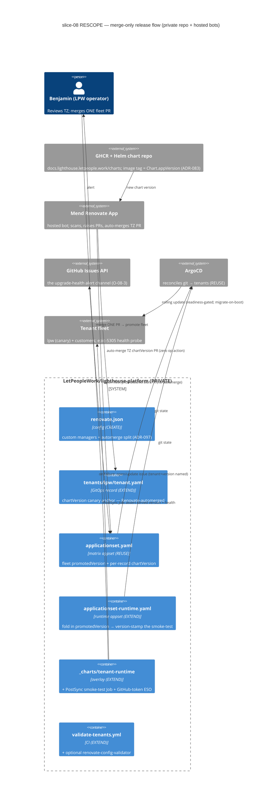

<!-- markdownlint-disable MD024 -->
# Feature Delta — epic-5306-productization-platform

> **Wave**: DISCUSS (combined, whole-platform). **Mode**: lean. **Date**: 2026-06-29. **Analyst**: Luna.
> **Scope**: ALL 9 remaining Epic 5306 children, designed as ONE multi-tenant Kubernetes
> productization platform — the LPW **SaaS-operator** flavour of the `platform-operator` persona.
> The platform is built **ON** the shipped public Helm chart (#5199) and enterprise docs (#5200)
> and the MCP OAuth discovery fix (#5362). Per the user directive (2026-06-28): design the platform
> SHAPE as a whole here, then slice into stories for DELIVER.

---

## [REF] Personas

- **platform-operator** — `docs/product/personas/platform-operator.yaml`. THIS feature fills in the
  persona's **second flavour**, already named there: "the LPW SaaS operator running many replicas
  across **many tenants**". The user is the OPERATOR (cares about substrate, rollouts, routing,
  isolation, recovery), **not** a flow-metrics end-user. Concrete operator in examples: **Benjamin**
  (LPW maintainer/operator).
- Related (consumers of this persona's work, not the actor here): `config-admin` (runs *inside* each
  tenant), `lighthouse-maintainer` (ships the chart this platform deploys), the flow-metrics product
  personas (the end-users *inside* each provisioned tenant).

## [REF] Jobs-To-Be-Done (one-liners)

Full job stories + forces + opportunity scores: `docs/product/jobs.yaml` (block
`epic-5306-productization-platform`). Mapped N:1 to the 9 ADO children.

| job_id | One-liner | ADO story | Opp. score |
|---|---|---|---|
| `job-saas-operator-provision-substrate` | Stand up a hosting cluster on any provider without lock-in | #5320 | 5/1 → gap 4 |
| `job-saas-operator-declare-platform-as-code` | Change the platform by merging a PR; drift self-heals | #5201 | 4/1 → gap 3 |
| `job-saas-operator-dogfood-tenant-zero` | Run LPW's own instance as the first tenant on the platform | #5204 | 5/1 → gap 4 |
| `job-saas-operator-route-tenant-by-subdomain` | Give every tenant its own subdomain + valid TLS, automatically | #5202 | 4/1 → gap 3 |
| `job-saas-operator-isolate-tenant-secrets` | Keep each tenant's secrets isolated and out of git | #5203 | 5/1 → gap 4 |
| `job-saas-operator-onboard-tenant` | Provision a fully isolated tenant with one declarative action | #5207 | 5/1 → gap 4 |
| `job-saas-operator-upgrade-all-tenants-safely` | Roll a new version across every tenant, zero downtime | #5205 | 4/1 → gap 3 |
| `job-saas-operator-observe-fleet` | See every tenant + the whole fleet from one place | #5206 | 4/2 → gap 2 |
| `job-saas-operator-recover-from-disaster` | Back up every tenant; restore one within a known RPO/RTO | #5208 | 4/1 → gap 3 |

Journeys (operator-facing, comprehensive): `docs/product/journeys/epic-5306-productization-platform.yaml`.

---

## Wave: DISCUSS / [REF] Wave Decisions

### Locked (inherited, must not be contradicted)

- **D0 Standalone gate (SACROSANCT)**: the single-container self-hosted product stays **byte-unchanged**.
  Every platform capability is **additive** and **auto-degrades** (no Redis → in-memory; one replica
  works; embedded frontend default). Nothing here alters standalone or single-tenant chart defaults.
- **D0b Vendor-neutral**: official images only (no Bitnami), OpenTofu multi-provider substrate, no
  single-cloud lock-in. Operator's substrate/DB/identity choices stay the operator's values.
- **D0c Expand-only migrations** across rolling updates (old+new pods share one Postgres). Automated
  upgrades respect expand→contract.
- **D0d Extend existing GitHub Actions** workflows; never add a parallel one. Trunk-based, push to main.
- **D0e Built ON the shipped chart** (ADR-080..085): Postgres-only, embedded frontend default,
  fail-fast values (`values.schema.json` + `{{ required }}`), MCP optional workload, publish via
  `docs/charts/` Pages. The platform parameterises and composes this chart; it does not fork it.

### Cross-cutting platform decisions surfaced for DESIGN (the user's coherence ask)

These are the shared decisions that must be coherent across all 9 stories. DISCUSS **names** them and
their options; **DESIGN converges** them. Each carries a working assumption (see Assumptions list).

- **CC-1 — TENANCY MODEL (the central decision) — ✅ CONFIRMED 2026-06-29: namespace-per-tenant on a
  shared cluster.** Options weighed:
  (a) **namespace-per-tenant on a shared cluster** ✅ **CHOSEN** (user-confirmed) — isolation via
  NetworkPolicy / RBAC / ResourceQuota, density ≥20/cluster, shared control plane;
  (b) cluster-per-tenant (stronger blast-radius containment, higher cost/ops) — rejected for the
  default path; the substrate module (CC-4) does not preclude it for a future high-isolation tier;
  (c) shared-instance, row-level multi-tenancy (rejected early — contradicts the standalone
  single-tenant app shape and would require app-level rewrites; out of scope).
  Drives: DNS routing scope, secret isolation boundary, the provisioning unit, DB isolation, backup
  scope, metrics attribution. slice-06 (second-tenant-by-hand) still validates the chosen model by
  hand before automation (slice-07).
- **CC-2 — GitOps repo layout**. App-of-apps root + a **tenant generator** (ApplicationSet generator
  / tenant CR / per-tenant directory). Decision: what *is* a tenant as a declarative artifact, and
  how platform components vs tenants are separated in the repo.
- **CC-3 — Secrets strategy**. Options: External Secrets Operator + a secret-manager backend (working
  assumption), Sealed Secrets, or Vault. Invariant: **no plaintext secret in the GitOps repo**,
  per-tenant isolation, rotation supported.
- **CC-4 — Substrate abstraction boundary**. What the OpenTofu module exposes as provider-neutral vs
  provider-specific; what the platform layer requires from "any conformant cluster" (CNI, ingress
  controller, storageClass, LoadBalancer).
- **CC-5 — Per-tenant DB isolation**. DB-per-tenant (working assumption, ties to backup scope and the
  Postgres-only chart) vs schema-per-tenant vs shared DB. Drives backup granularity and restore blast
  radius.
- **CC-6 — Tenant identity (single source)**. One tenant identifier that is the single source for
  namespace name, subdomain host, DB name, secret-store path, backup prefix and metrics label (see
  Shared Artifacts registry). Prevents cross-tenant bleed and orphaned resources.

### Scope Assessment (Elephant Carpaccio early gate)

**OVERSIZED — confirmed, and the user has already chosen "design whole, then slice".** Signals: 9 ADO
stories; multiple bounded contexts (substrate / GitOps / routing / secrets / provisioning / upgrades /
observability / DR); >2 weeks; multiple independent operator outcomes. **Resolution**: this DISCUSS
designs the whole platform shape, then carpaccio-slices into **12 slices** (11 core + 1 deferred), each
≤1 day, end-to-end, with a named learning hypothesis and a dogfood moment on Tenant Zero (production
data). Slices: `docs/feature/epic-5306-productization-platform/slices/slice-01..12-*.md`.

### Walking Skeleton strategy (D2)

WS = **LPW as Tenant Zero** brought up end-to-end through the thinnest viable path:
**substrate (slice-01) → ArgoCD (slice-02) → existing chart → DNS → hand-made secret → one tenant
reachable (slice-03)**. Brownfield: the #5199 chart already exists; the WS installs it unchanged.
Tenant Zero is also the **permanent canary** every later capability is proven against.

---

## System Constraints

- **Standalone gate**: a render-guard test must continue to assert default chart values → embedded
  single-container shape; platform values are additive overlays only.
- **Vendor-neutral**: no Bitnami, no single-cloud managed-service dependency in the platform layer;
  provider-specific resources live behind the substrate boundary (CC-4).
- **Secrets**: zero plaintext secrets in the GitOps repo (CC-3); `git grep` for secret material = 0.
- **Expand-only migrations**: CI guard blocks destructive migrations before any tenant rolls (D0c).
- **Isolation**: no cross-tenant data/secret/network access (CC-1/CC-5); a guardrail with 0 tolerance.
- **CI**: extend the existing workflows + kind install-test; no parallel workflow (D0d).
- **Telemetry off-by-default** in the standalone product; enabled only per hosted tenant (D0/slice-09).

---

## Operator Journey (visual)

```
  PROVISION          DECLARE            ONBOARD A TENANT             OPERATE          OBSERVE         PROTECT
  SUBSTRATE          PLATFORM           (route+secret+provision)     (upgrade)        (fleet)         (backup/DR)
  ---------          --------           ------------------------     ---------        -------         ----------
  tofu apply   -->   argocd bootstrap   commit 1 tenant record  -->  bump appVersion  one Grafana  -->  backup + restore
     |                  |                      |                        |              |                 |
  [cluster up]      [repo=truth]        [{tenant}.lighthouse        [canary tenant-0  [per-tenant     [RPO met;
   Infomaniak       drift self-heals     .letpeople.work serving,    then fleet,       health at a     restore tenant-0
   kubectl get      argocd app list      isolated DB+secret]         zero-downtime]    glance; sick    < RTO, rehearsed]
   nodes Ready                                                                          tenant red]

  Feels: Daunted -> Grounded -> Exposed -> Proven (tenant zero live) -> Calm (fleet rolls) -> Assured (recovery proven)
  Emotional arc: Confidence Building (operator moves from "scary snowflake" to "code I trust", small wins compounding)
```

ASCII output samples the operator actually sees (material honesty — this is a CLI/ops surface, not a GUI):

```
$ tofu apply                                   # slice-01
  ... Apply complete! Resources: 14 added.
$ kubectl get nodes
  NAME            STATUS   ROLES    AGE   VERSION
  lpw-pool-1      Ready    <none>   2m    v1.31.x

$ argocd app list                              # slice-02 / slice-07
  NAME            SYNC     HEALTH    REVISION
  platform-root   Synced   Healthy   a1b2c3d
  tenant-lpw      Synced   Healthy   a1b2c3d
  tenant-acme     Synced   Healthy   a1b2c3d

$ curl -sI https://lpw.lighthouse.letpeople.work | head -1   # slice-03
  HTTP/2 200
```

---

## Shared Artifacts Registry

| Artifact | Source of truth | Consumers | Risk | Validation |
|---|---|---|---|---|
| `tenant-identifier` | the tenant record (GitOps, CC-6) | namespace name, subdomain host, DB name, secret-store path, backup prefix, metrics label | HIGH — divergence = cross-tenant bleed / orphans | provisioning derives ALL of these from the one id; uniqueness checked at PR time |
| `base-domain` (`lighthouse.letpeople.work`) | platform config (GitOps) | wildcard DNS, ingress host template, TLS cert SAN, OIDC callback template, NOTES/docs URLs | HIGH — mismatch = unreachable URL / broken login | one templated host; cert SAN + OIDC derived from same value |
| `chart-version` (appVersion/image.tag) | GitOps platform values | Tenant Zero canary, all tenant revisions after promotion | HIGH — mixed versions = non-converged fleet | `argocd app list` revision equality after promotion |
| `tenancy-model` (CC-1) | DESIGN decision (this doc names options) | provisioning unit, routing scope, secret + DB isolation, backup scope, metrics attribution | HIGH — incoherent assumption = isolation failure | one model applied across all slices; slice-06 validates it by hand |
| secret material | managed secret store (CC-3) | tenant namespaces (injected) | HIGH — plaintext in git = breach | `git grep` finds zero secret values; only references committed |

---

## Story Map

**User**: platform-operator (LPW SaaS-operator flavour). **Goal**: host many isolated Lighthouse
tenants reliably, with LPW's own production as Tenant Zero.

| Stand up substrate | Bootstrap control plane | Onboard a tenant | Upgrade the fleet | Observe the fleet | Protect & recover |
|---|---|---|---|---|---|
| tofu apply cluster (S01) | ArgoCD app-of-apps (S02) | Tenant Zero reachable (S03) | Canary + promote (S08) | Per-tenant telemetry (S09) | Per-tenant backups (S10) |
| multi-provider parity (S12) | repo layout = tenancy carrier | Managed secrets (S04) | expand-only guard | Fleet dashboard (S09) | Restore rehearsal (S11) |
|  |  | Wildcard routing + TLS (S05) | git-revert rollback |  |  |
|  |  | Second tenant by hand (S06) |  |  |  |
|  |  | Automated provisioning (S07) |  |  |  |

### Walking Skeleton (the line)

**S01 → S02 → S03**: substrate up → ArgoCD reconciling → Tenant Zero (LPW production) reachable at
`https://lpw.lighthouse.letpeople.work`. Thinnest end-to-end thread; everything else is a release band
below it.

### Priority Rationale

Priority = **dependency chain first, then learning leverage** (Value × Urgency / Effort, ties broken by
WS > riskiest assumption > highest value):

1. **WS (S01-S03)** — nothing works until the substrate, control plane and one reachable tenant exist;
   also de-risks the riskiest "does the whole thread work on production?" assumption. P1.
2. **S04 (secrets) + S05 (wildcard routing)** — isolation + routing foundations that one-action
   provisioning depends on; both also security-critical (secrets gap 4). P2.
3. **S06 (second tenant by hand)** — validates **CC-1 tenancy model** before investing in automation;
   highest learning leverage relative to effort. P2.
4. **S07 (automated provisioning)** — the productization payoff (gap 4); unlocks the fleet. P3.
5. **S08 (fleet upgrade)** — keeps the fleet safe/current; builds on shipped epic-5305 primitives. P3.
6. **S09 (observability)** — operate-many enabler; lower gap (2) because signals already ship. P4.
7. **S10 (backups) → S11 (restore rehearsal)** — durability; restore is what makes backups real. P4.
8. **S12 (multi-provider parity)** — DEFERRED; pull in on demand when a second provider is needed. P5.

---

## Wave: DISCUSS / [REF] User Stories

> 9 stories, one per ADO child. Each traces to a `job_id`; each carries the mandatory 3-line Elevator
> Pitch. ACs are embedded and derived from the UAT scenarios. The "user" is the operator; the
> entry-point in each Elevator Pitch is a real operator command/observable surface (tofu / argocd /
> kubectl / curl / Grafana). No slice is all-`@infrastructure`: every story has an operator-observable
> outcome, satisfying the slice-composition gate.

### US-01 — Multi-provider cluster substrate (#5320)

- **job_id**: `job-saas-operator-provision-substrate` · **slices**: S01, S12

#### Elevator Pitch
- **Before**: The hosting cluster is hand-clicked in a provider console; nobody dares rebuild it.
- **After**: Benjamin runs `tofu apply` → sees a conformant cluster (`kubectl get nodes` Ready, ingress controller Running) reproducible from code.
- **Decision enabled**: "Is our substrate portable and rebuildable?" — proven by `tofu destroy` + re-apply.

#### Problem
Benjamin is a platform operator who today stands up LPW's hosting cluster by hand in a cloud console.
He finds it painful that the cluster is an unreproducible snowflake chained to one vendor, so he cannot
rebuild it from code or move providers.

#### Who
- LPW SaaS operator | bootstrapping/maintaining the hosting substrate | wants reproducible, portable infrastructure.

#### Domain Examples
1. **Happy path** — Benjamin declares an Infomaniak Public Cloud (OpenStack) cluster (1 control plane + 3-node pool, CNI, ingress-nginx, default storageClass) and `tofu apply`; `kubectl get nodes` shows 3 Ready nodes in ~3 min.
2. **Teardown/rebuild** — Benjamin runs `tofu destroy` then `tofu apply` again; the cluster returns identical with no leftover cloud resources.
3. **Chart fits** — Benjamin `helm install`s the unchanged #5199 chart with default values onto the fresh cluster; it reaches Running/Ready (standalone gate intact).

#### UAT Scenarios (BDD)
```gherkin
Scenario: Substrate stands up from code on the chosen provider
  Given Benjamin has the OpenTofu substrate module configured for Infomaniak Public Cloud (OpenStack)
  When he runs "tofu apply"
  Then a conformant cluster is created with an ingress controller and a default storage class
  And "kubectl get nodes" lists every declared node as Ready

Scenario: The shipped chart installs onto the substrate unchanged
  Given a freshly applied substrate cluster
  When Benjamin installs the #5199 chart with default values
  Then all chart workloads reach Running/Ready
  And no chart template was modified to fit the substrate

Scenario: Teardown leaves no orphans
  Given a running substrate cluster
  When Benjamin runs "tofu destroy"
  Then all cloud resources created by the module are removed
  And a subsequent "tofu apply" reproduces an equivalent cluster
```

#### Acceptance Criteria
- [ ] `tofu apply` produces a conformant cluster (nodes Ready, ingress controller, storageClass) on the primary provider.
- [ ] The shipped #5199 chart installs onto it with zero chart changes.
- [ ] `tofu destroy` removes all created resources; re-apply reproduces the cluster.
- [ ] Provider-specific resources are isolated behind the substrate boundary (CC-4).

#### Technical Notes
OpenTofu (not Terraform-proprietary); provider boundary per CC-4. Multi-provider parity (AWS EKS) is
deferred to S12. Depends on shipped chart.

---

### US-02 — GitOps with ArgoCD (#5201)

- **job_id**: `job-saas-operator-declare-platform-as-code` · **slice**: S02

#### Elevator Pitch
- **Before**: The cluster is changed by hand with `kubectl apply`; nobody is sure it matches git.
- **After**: Benjamin merges a PR adding a component → `argocd app list` shows it Synced/Healthy, live without a manual apply.
- **Decision enabled**: "Do we change the platform by PR, with drift self-healing?" — yes.

#### Problem
Benjamin changes the cluster by hand and cannot prove the live state matches the reviewed repo. He
finds it painful that drift is silent and there is no change-control trail.

#### Who
- LPW SaaS operator | running the platform control plane | wants git as the single source of truth.

#### Domain Examples
1. **Happy path** — Benjamin commits a cert-manager manifest; ArgoCD syncs it; `argocd app list` shows `platform-root` and the child Synced/Healthy.
2. **Drift self-heal** — Benjamin `kubectl delete`s a managed resource; ArgoCD recreates it within the sync interval.
3. **Tenant carrier** — the repo layout documents where a tenant will live (a generator entry/directory), exercising CC-2.

#### UAT Scenarios (BDD)
```gherkin
Scenario: A merged PR changes the cluster
  Given ArgoCD reconciles the platform repo via an app-of-apps root
  When Benjamin merges a PR adding a platform component
  Then ArgoCD syncs the component without a manual kubectl apply
  And "argocd app list" shows the root and child apps Synced and Healthy

Scenario: Manual drift is self-healed
  Given a resource managed by ArgoCD is live
  When Benjamin deletes that resource by hand
  Then ArgoCD restores it to the state declared in git

Scenario: Break-glass live fix is recoverable
  Given an incident requires an immediate live change ArgoCD would revert
  When Benjamin uses the documented break-glass path (sync-window / temporary auto-sync off)
  Then the live fix stands until it is committed back to git
```

#### Acceptance Criteria
- [ ] ArgoCD reconciles platform components from the git repo (app-of-apps root, ArgoCD self-managed).
- [ ] A merged PR changes the cluster with no manual apply.
- [ ] Hand-applied drift is detected and self-healed.
- [ ] A documented break-glass path exists for incident hotfixes (red card for DESIGN).
- [ ] The repo layout names where tenants live (CC-2 carrier).

#### Technical Notes
ArgoCD official images. Break-glass behaviour is a red card to resolve in DESIGN. Depends on S01.

---

### US-03 — LetPeopleWork as Tenant Zero (#5204) ⭐ Walking Skeleton

- **job_id**: `job-saas-operator-dogfood-tenant-zero` · **slice**: S03

#### Elevator Pitch
- **Before**: LPW's Lighthouse is hosted ad-hoc; the productization platform is paper.
- **After**: Benjamin opens `https://lpw.lighthouse.letpeople.work` → sees LPW's real Lighthouse serving over a valid cert, installed by ArgoCD into an isolated `tenant-lpw` namespace.
- **Decision enabled**: "Does the end-to-end platform path work on our own production?" — yes.

#### Problem
Benjamin wants to prove the platform on real production before any customer lands. He finds it risky to
ship a hosting platform the team has never actually run themselves.

#### Who
- LPW SaaS operator | dogfooding the platform | wants LPW production as the first, permanent canary tenant.

#### Domain Examples
1. **Happy path** — LPW's instance runs in `tenant-lpw`; `kubectl get pods -n tenant-lpw` all Running/Ready; the subdomain serves over HTTPS.
2. **Real data** — Tenant Zero holds LPW's real teams/portfolios (production data), not demo seed.
3. **Fail-fast** — a missing required value (DB password) makes the install refuse cleanly (ADR-082), not half-provision.

#### UAT Scenarios (BDD)
```gherkin
Scenario: LPW production runs as Tenant Zero
  Given the substrate and ArgoCD are up
  When Benjamin provisions tenant-lpw via the GitOps repo with the shipped chart
  Then LPW's Lighthouse runs in an isolated namespace
  And "https://lpw.lighthouse.letpeople.work" serves it over a valid TLS certificate

Scenario: First run fails fast on a missing required value
  Given the tenant-lpw values omit the database password
  When ArgoCD attempts to sync the tenant
  Then the release refuses with a clear message naming the missing key
  And no half-provisioned tenant is left behind

Scenario: Tenant Zero is the production canary
  Given Tenant Zero is live on the platform
  When any later platform capability is delivered
  Then it is proven against Tenant Zero before any customer tenant
```

#### Acceptance Criteria
- [ ] LPW production runs as Tenant Zero in an isolated namespace via the shipped chart through ArgoCD.
- [ ] Reachable at `https://lpw.lighthouse.letpeople.work` with a valid cert.
- [ ] Missing required values fail fast (no half-provision).
- [ ] Tenant Zero is established as the permanent canary for later slices.

#### Technical Notes
Uses shipped chart at default embedded shape. Single-host route + hand-made secret in S03; managed
secret in S04. Depends on S01, S02.

---

### US-04 — Wildcard DNS + subdomain routing (#5202)

- **job_id**: `job-saas-operator-route-tenant-by-subdomain` · **slices**: S03 (single-host), S05 (wildcard)

#### Elevator Pitch
- **Before**: Each tenant would need a DNS record + cert created by hand.
- **After**: Benjamin points a never-before-seen `demo.lighthouse.letpeople.work` at the ingress → it resolves and serves with an auto-issued valid cert, no per-host DNS edit.
- **Decision enabled**: "Can a brand-new tenant get a working HTTPS URL automatically?" — yes.

#### Problem
Benjamin finds per-tenant DNS + cert steps slow and easy to forget — a tenant with no route or an
invalid cert looks broken to the customer.

#### Who
- LPW SaaS operator | routing tenants | wants routing solved once so every tenant inherits it free.

#### Domain Examples
1. **Happy path** — wildcard `*.lighthouse.letpeople.work` resolves; ingress routes by host to the right namespace; cert auto-issued.
2. **New subdomain** — a subdomain never manually configured serves with a trusted cert.
3. **No misroute** — `acme.…` never routes to Tenant Zero's pods (host→namespace from tenant id).

#### UAT Scenarios (BDD)
```gherkin
Scenario: A new subdomain serves automatically with valid TLS
  Given wildcard DNS and automatic TLS are configured
  When a request hits a subdomain that was never manually configured
  Then it routes to the correct tenant namespace
  And it is served over a trusted TLS certificate

Scenario: Hosts do not cross tenants
  Given Tenant Zero and a second tenant are routed by subdomain
  When a request hits the second tenant's host
  Then it reaches only the second tenant's pods, never Tenant Zero's

Scenario: Tenant Zero keeps serving after generalization
  Given Tenant Zero was reachable via a single-host route
  When routing is migrated onto the wildcard mechanism
  Then "https://lpw.lighthouse.letpeople.work" still serves with a valid cert
```

#### Acceptance Criteria
- [ ] Wildcard DNS + ingress host routing + automatic TLS serve any new subdomain with no manual DNS/cert step.
- [ ] Host → namespace mapping is derived from the tenant identifier (CC-6).
- [ ] No cross-tenant misrouting.
- [ ] Tenant Zero unaffected by the generalization.

#### Technical Notes
cert-manager (wildcard or per-host issuance); mind issuance rate limits (anxiety). Depends on S03.

---

### US-05 — Secrets management (#5203)

- **job_id**: `job-saas-operator-isolate-tenant-secrets` · **slice**: S04

#### Elevator Pitch
- **Before**: Tenant Zero's secret is a hand-made `kubectl`-applied Secret outside GitOps; rotation is manual and drifts.
- **After**: Benjamin commits an `ExternalSecret` reference → `kubectl get secret -n tenant-lpw` materialises from the store; the git repo holds only the reference.
- **Decision enabled**: "Can we keep all state in git without leaking secrets?" — yes; rotation = update the store.

#### Problem
Benjamin needs all platform state in git, but secrets must never be plaintext in a repo. He finds the
naive workaround either leaks credentials or breaks GitOps.

#### Who
- LPW SaaS operator | managing per-tenant credentials | wants encrypted, isolated, rotatable secrets.

#### Domain Examples
1. **Happy path** — Tenant Zero's DB/OIDC/license come from the managed store via an `ExternalSecret`; repo has only the reference.
2. **Rotation** — Benjamin rotates the DB password in the store; the tenant picks up the new value without a git edit.
3. **No plaintext** — `git grep` of the repo finds zero secret values.

#### UAT Scenarios (BDD)
```gherkin
Scenario: Tenant secrets come from a managed store, not git
  Given the secret store and operator are installed
  When Benjamin commits an ExternalSecret reference for tenant-lpw
  Then the Kubernetes Secret is materialised from the store
  And the GitOps repo contains no plaintext secret value

Scenario: A secret rotates without touching git
  Given Tenant Zero's secret is sourced from the store
  When Benjamin rotates the value in the store
  Then the tenant receives the new value without a git commit

Scenario: Plaintext secrets are impossible in the repo
  Given the platform GitOps repo
  When a scan for secret material runs
  Then it finds zero plaintext secret values
```

#### Acceptance Criteria
- [ ] Per-tenant secrets are sourced from a managed store; only references are committed.
- [ ] Rotation in the store propagates without a git edit.
- [ ] `git grep` for secret material returns zero.
- [ ] One tenant's secret is not readable by another (isolation).

#### Technical Notes
Strategy options ESO+backend / Sealed Secrets / Vault (CC-3) — DESIGN converges. Depends on S03.

---

### US-06 — Tenant provisioning automation (#5207)

- **job_id**: `job-saas-operator-onboard-tenant` · **slices**: S06 (by hand, de-risk), S07 (automated)

#### Elevator Pitch
- **Before**: Onboarding a tenant means hand-copying and parameterising a pile of manifests.
- **After**: Benjamin adds one record `{name: riverbank, subdomain: riverbank, plan: standard}`, merges → `argocd app list` shows Riverbank's whole stack Synced/Healthy and `https://riverbank.lighthouse.letpeople.work` serving, in minutes.
- **Decision enabled**: "Can we onboard a customer with one commit, fully isolated?" — yes.

#### Problem
Benjamin finds hand-provisioning tenants slow and a cross-tenant-leak risk if any isolation boundary is
missed; de-provisioning leaves orphans.

#### Who
- LPW SaaS operator | onboarding customers | wants one-action, isolated, reviewable provisioning.

#### Domain Examples
1. **Happy path** — one tenant record `riverbank` → namespace + Postgres + store secret + route + app, reachable in minutes.
2. **Isolation** — Riverbank cannot read Acme's or Tenant Zero's DB/secrets.
3. **Clean teardown** — removing the record prunes namespace, DB, secret, route, DNS — no orphans.

#### UAT Scenarios (BDD)
```gherkin
Scenario: One tenant record provisions a full isolated tenant
  Given the tenant generator is configured
  When Benjamin commits one tenant record and merges
  Then a namespace, database, store-sourced secret, subdomain route and app are provisioned
  And the tenant serves at its subdomain within minutes

Scenario: A new tenant is isolated from existing tenants
  Given two tenants provisioned by the generator
  When one tenant attempts to read another's database or secrets
  Then access is denied

Scenario: De-provisioning leaves no orphans
  Given a provisioned tenant
  When Benjamin removes its record and merges
  Then the namespace, database, secret, route and DNS entry are all pruned
  And no orphaned resources remain

Scenario: Duplicate tenant identifiers are rejected before apply
  Given a tenant record reusing an existing subdomain or DB name
  When the PR check runs
  Then the duplicate is rejected at PR time, not on the live cluster
```

#### Acceptance Criteria
- [ ] One declarative tenant record expands into a complete isolated tenant via ArgoCD.
- [ ] Provisioning completes in minutes; de-provisioning prunes everything (no orphans).
- [ ] Tenant identifier uniqueness validated at PR time.
- [ ] Cross-tenant isolation holds (validated by hand in S06 before automation).
- [ ] Tenant Zero and Acme re-expressed as generator records (no production special-casing).

#### Technical Notes
Provisioning unit form (ApplicationSet generator / CR / values) = CC-2. Tenancy model = CC-1, validated
in S06. Depends on S04, S05.

---

### US-07 — Automated upgrades (#5205)

- **job_id**: `job-saas-operator-upgrade-all-tenants-safely` · **slice**: S08

#### Elevator Pitch
- **Before**: Upgrading tenants is manual and per-tenant; a bad version could hit everyone at once.
- **After**: Benjamin bumps `appVersion` in git → Tenant Zero canaries it (zero dropped requests), then `argocd app list` shows the whole fleet Synced on the new revision.
- **Decision enabled**: "Can we ship a release to all tenants safely during the working day?" — yes.

#### Problem
Benjamin finds per-tenant upgrades unscalable and a fleet-wide window customer-hostile; a bad version
must not take all tenants down at once.

#### Who
- LPW SaaS operator | keeping the fleet current | wants safe, staged, zero-downtime fleet upgrades.

#### Domain Examples
1. **Happy path** — bump appVersion in git → Tenant Zero rolls zero-downtime → promote → all tenants converge.
2. **Expand-only guard** — a destructive migration is blocked in CI before any tenant rolls.
3. **Rollback** — a bad release on the canary → `git revert` + `helm rollback` restores prior version (additive migrations, no schema rollback).

#### UAT Scenarios (BDD)
```gherkin
Scenario: A version bump rolls the fleet with zero downtime
  Given a new chart appVersion is committed to git
  When the canary on Tenant Zero passes
  Then the new version is promoted to every tenant
  And each tenant upgrades with no dropped requests
  And "argocd app list" shows all tenants Synced on the new revision

Scenario: A destructive migration is blocked before any tenant rolls
  Given a release containing a non-expand-only migration
  When CI runs the expand-only guard
  Then the release is blocked before reaching any tenant

Scenario: A bad release is rolled back by git revert
  Given a bad version degraded the Tenant Zero canary
  When Benjamin reverts the version commit and runs helm rollback
  Then the fleet returns to the prior version with no schema rollback needed
```

#### Acceptance Criteria
- [ ] A single version bump in git rolls the fleet via ArgoCD, staged (Tenant Zero canary → promote).
- [ ] Each tenant upgrades zero-downtime (epic-5305 probes + drain + expand-only).
- [ ] Destructive migrations blocked in CI before any tenant rolls.
- [ ] Rollback = git revert + helm rollback; fleet converges to the new revision after promotion.

#### Technical Notes
Reuses epic-5305 rolling-update primitives. Per-tenant version pinning policy out of scope. Depends on
S07.

---

### US-08 — Observability (#5206)

- **job_id**: `job-saas-operator-observe-fleet` · **slice**: S09

#### Elevator Pitch
- **Before**: Each tenant is a black box; finding the sick one means logging into each.
- **After**: Benjamin opens one Grafana fleet dashboard → sees per-tenant request/error/latency tiles and a red tile on the one degraded tenant.
- **Decision enabled**: "Which tenant is unhealthy, and is the fleet OK?" — answered at a glance.

#### Problem
Benjamin cannot check many tenants by hand; invisible per-tenant failures fester and he cannot honour
an SLA.

#### Who
- LPW SaaS operator | operating many tenants | wants per-tenant + fleet health in one stack.

#### Domain Examples
1. **Happy path** — one dashboard shows every tenant's health with per-tenant labels.
2. **Sick tenant** — a fault on a demo tenant turns its tile red and fires an alert.
3. **Standalone untouched** — telemetry stays OFF in the standalone product (gate verified).

#### UAT Scenarios (BDD)
```gherkin
Scenario: The fleet's health is visible at a glance
  Given telemetry is enabled per hosted tenant and scraped into one stack with per-tenant labels
  When Benjamin opens the fleet dashboard
  Then he sees per-tenant request, error and latency signals for every tenant

Scenario: A degraded tenant is flagged and alerts
  Given the fleet dashboard is live
  When one tenant degrades
  Then its tile is visibly flagged and a per-tenant alert fires

Scenario: The standalone product stays telemetry-off
  Given the single-container standalone product
  When it runs with default values
  Then no telemetry is emitted (off-by-default gate intact)
```

#### Acceptance Criteria
- [ ] Per-tenant + fleet metrics/logs/traces in one stack with per-tenant attribution.
- [ ] Degraded tenants flagged; per-tenant and fleet alerts fire.
- [ ] Metric cardinality is bounded (DESIGN constraint).
- [ ] Standalone product telemetry stays off-by-default (gate verified).

#### Technical Notes
Reuses epic-5305 off-by-default OTel/`/metrics`/Serilog-JSON. Cardinality bounding = DESIGN. Depends on
S07.

---

### US-09 — Backup & disaster recovery (#5208)

- **job_id**: `job-saas-operator-recover-from-disaster` · **slices**: S10 (backup), S11 (restore)

#### Elevator Pitch
- **Before**: There is no automated per-tenant backup; data loss would be unrecoverable.
- **After**: Benjamin runs the restore runbook against a scratch namespace → sees Tenant Zero's data restored from backup and the instance serving, timed under the RTO target.
- **Decision enabled**: "Can we recover a tenant, and how fast (RPO/RTO)?" — a rehearsed, timed answer.

#### Problem
Benjamin has no automated per-tenant backup and no tested restore; an untested backup is no backup, and
data loss would be catastrophic for customer trust.

#### Who
- LPW SaaS operator | protecting customer + LPW data | wants automated backups + a rehearsed, timed restore.

#### Domain Examples
1. **Backup happy path** — every tenant's Postgres is backed up on schedule to off-cluster storage within the RPO.
2. **Restore rehearsal** — Tenant Zero is restored from backup into a scratch namespace and serves, timed under the RTO.
3. **Backup failure visible** — a missed backup raises an alert (not silent); restore cannot land in the wrong tenant.

#### UAT Scenarios (BDD)
```gherkin
Scenario: Every tenant is backed up within the RPO
  Given scheduled per-tenant backups to off-cluster storage
  When the schedule runs
  Then each tenant has a backup artifact off-cluster timestamped within the RPO target
  And new tenants from the generator inherit backups automatically

Scenario: A tenant is restored within the RTO on a rehearsed runbook
  Given a Tenant Zero backup exists
  When Benjamin follows the restore runbook into a scratch namespace
  Then Tenant Zero's data is restored and the instance serves
  And the elapsed time is within the RTO target

Scenario: Backup failure is not silent
  Given the backup schedule
  When a backup fails or is missed
  Then an alert fires

@property
Scenario: A restore cannot cross tenants
  Given a restore of one tenant's backup
  Then it can only write into that tenant's namespace and database
```

#### Acceptance Criteria
- [ ] Scheduled per-tenant Postgres backups to off-cluster storage; RPO target met and monitored.
- [ ] A rehearsed restore brings a tenant back within the RTO target, verified against Tenant Zero.
- [ ] Backup failures alert (not silent).
- [ ] A restore cannot write into another tenant (isolation).
- [ ] New tenants inherit backups automatically.

#### Technical Notes
DB-per-tenant isolation = CC-5 (drives backup granularity). PITR/cross-region deferred. Depends on S07
(backup), S10 (restore).

---

## Outcome KPIs

> Full method in `docs/product/jobs.yaml` opportunity scores + the framework. Operator-outcome KPIs
> (the "user" is the operator). Per-feature aggregate table; handed to platform-architect for
> instrumentation.

### Objective
Make LPW able to host many isolated Lighthouse tenants reliably and cheaply, with LPW's own production
as the proven Tenant Zero — onboarding a customer in minutes, upgrading and recovering the whole fleet
safely.

### Outcome KPIs

| # | Who | Does What | By How Much | Baseline | Measured By | Type |
|---|---|---|---|---|---|---|
| 1 (North Star) | SaaS operator | Onboards a new tenant from one committed record to reachable | ≤ 10 min | ~1 day (hand-assembly) | timestamp PR-merge → 200 on subdomain | Leading |
| 2 | SaaS operator | Upgrades the whole fleet with zero dropped requests | 100% tenants, fleet converges ≤ 30 min, 0 dropped requests | manual / N/A | ArgoCD revision convergence + request error count during roll | Leading |
| 3 | SaaS operator | Recovers a tenant from backup (RTO) | ≤ 30 min, rehearsed | unrecoverable | timed restore-rehearsal runbook | Leading |
| 4 | SaaS operator | Has a recovery point per tenant (RPO) | ≤ 24h initial (aspirational ≤ 1h) | none | last-backup age per tenant | Leading |
| 5 | SaaS operator | Hosts tenants per cluster (density) | ≥ 20 tenants/cluster | 1 (single instance) | tenants ÷ clusters | Leading (secondary) |
| 6 | SaaS operator | Makes platform changes via reviewed git PR (no manual kubectl) | 100% / 0 manual drift events | ad-hoc | ArgoCD out-of-sync/self-heal events | Leading (secondary) |

### Metric Hierarchy
- **North Star**: tenant onboarding lead time (≤ 10 min) — the productization payoff.
- **Leading indicators**: fleet upgrade success, RTO, RPO.
- **Guardrail metrics (must NOT degrade)**: cross-tenant isolation incidents = **0**; standalone
  product unchanged (render-guard test passes, telemetry off-by-default); 0 plaintext secrets in git;
  destructive-migration CI guard = 0 escapes.

### Measurement Plan
| KPI | Data source | Collection | Frequency | Owner |
|---|---|---|---|---|
| Onboarding lead time | ArgoCD events + synthetic probe on subdomain | PR-merge → ready timestamp | per onboarding | platform-architect |
| Fleet upgrade success | ArgoCD revisions + per-tenant error metrics | during each roll | per release | platform-architect |
| RTO / RPO | restore rehearsal timing + backup-age metric | rehearsal + continuous | per release / continuous | platform-architect |
| Isolation guardrail | network/DB access tests | CI + periodic | per release | platform-architect |

### Hypothesis
We believe a GitOps-driven, namespace-per-tenant platform built on the shipped chart will let the LPW
operator onboard a customer in ≤ 10 minutes and upgrade/recover the fleet safely. We will know this is
true when the operator onboards a tenant from one committed record to a reachable HTTPS subdomain in
≤ 10 minutes, with 0 cross-tenant isolation incidents.

---

## Definition of Done (for DELIVER, enforced by acceptance-designer)
- All UAT scenarios green; standalone-gate render guard green; expand-only CI guard green; kind
  install-test green. Per-feature docs + screenshots updated. Tenant Zero proven for each delivered
  capability. Merged to main (trunk-based).

## Out of Scope
- Self-service customer signup UI / billing (operator commits the tenant record).
- Shared-instance row-level multi-tenancy (CC-1 option c — contradicts the single-tenant app shape).
- Blue-green/canary *traffic* splitting within a tenant (epic-5305 Band D).
- Multi-cloud active/active; cross-region replication; PITR (S12 substrate parity is deferred/on-demand).
- Any change to the standalone single-container product (sacrosanct).

## Driving Ports / Pre-requisites
- **Pre-requisites (shipped, consumed as-is)**: #5199 chart (ADR-080..085), #5200 docs, #5362 MCP OAuth
  discovery fix, epic-5305 runtime primitives (probes, forwarded headers, graceful drain, Redis
  backplane, expand-only migration guard, off-by-default OTel, MCP per-caller auth).
- **Driving entry points (operator-facing)**: `tofu apply/destroy` (substrate); git PR + `argocd`
  (platform + tenants); `kubectl` / `curl` (verify); `helm rollback` (rollback); Grafana (observe);
  restore runbook (recover).

---

## Definition of Ready — Validation (9-item hard gate)

| DoR Item | Status | Evidence |
|---|---|---|
| 1. Problem statement clear, domain language | PASS | Each US-01..09 has a Problem in operator domain language (substrate, drift, isolation, RPO/RTO). |
| 2. User/persona with specific characteristics | PASS | platform-operator SaaS-operator flavour; concrete operator Benjamin; persona YAML extended. |
| 3. 3+ domain examples with real data | PASS | Each story has 3 examples with real values (Infomaniak/OpenStack, lpw/acme/riverbank subdomains, tenant-lpw ns). |
| 4. UAT in Given/When/Then (3-7 scenarios) | PASS | Each story has 3-4 scenarios (US-06 has 4, US-09 has 4 incl. @property). |
| 5. AC derived from UAT | PASS | Each story's ACs trace to its scenarios. |
| 6. Right-sized (1-3 days, 3-7 scenarios) | PASS | Oversized epic split into 12 slices ≤1 day each; each story ≤4 scenarios; slice briefs carry the thin end-to-end path. |
| 7. Technical notes: constraints/dependencies | PASS | Each story has Technical Notes naming CC-decisions, tooling, dependencies. |
| 8. Dependencies resolved or tracked | PASS | Slice dependency chain explicit (S01→S02→S03→…); pre-requisites shipped; red cards flagged. |
| 9. Outcome KPIs defined with measurable targets | PASS | 6 KPIs with numeric targets + baselines + measurement + guardrails. |

### DoR Status: PASSED (pending peer review by nw-product-owner-reviewer — the hard gate before DESIGN)

---

## Assumptions needing confirmation

> Luna runs as a subagent and cannot interview the user. These are grounded in the persona + shipped
> epic decisions but should be confirmed before/at DESIGN.

1. **Tenancy model (CC-1)** — ✅ **CONFIRMED 2026-06-29: namespace-per-tenant on a shared cluster**, with
   **DB-per-tenant** (CC-5). No longer an assumption.
2. **Base hosting domain** assumed `lighthouse.letpeople.work` with tenant subdomain `lpw` for Tenant
   Zero. Confirm the real domain + Tenant Zero subdomain.
3. **Primary provider** — ✅ **CONFIRMED 2026-06-29: Infomaniak Public Cloud** (Swiss-sovereign). O-1
   resolved by live web check: Infomaniak **launched managed Kubernetes Jan 2026** (provider-managed
   control plane; OpenTofu/Terraform connector; **free shared control plane ≤10 nodes** + CHF 300/3-month
   credit for testing). → **Primary substrate adapter = Infomaniak managed k8s** (ADR-088 revised);
   **k3s-on-compute = fallback adapter for Hetzner (EU alternative) / any OpenStack**. AWS-EKS parity
   deferred (S12). Both behind the CC-4 conformant-cluster contract.
4. **Secrets strategy (CC-3)** working assumption = **External Secrets Operator + a secret-manager
   backend**. Sealed Secrets / Vault are alternatives — confirm at DESIGN.
5. **RPO/RTO targets** assumed RPO ≤ 24h (aspirational ≤ 1h) and RTO ≤ 30 min. Confirm the durability
   commitment LPW wants to offer customers.
6. **Tenant density target** assumed ≥ 20 tenants/cluster. Confirm the economic target.
7. **Break-glass GitOps path** (US-02) — needs a concrete DESIGN decision (sync-window vs temporary
   auto-sync disable). Flagged as a red card.
8. **DIVERGE artifacts absent** — no `docs/feature/.../diverge/recommendation.md` or `job-analysis.md`
   for this feature; job grounding came from the rich `platform-operator` persona + shipped epic
   decisions instead. Noted as a (low) risk: the jobs were derived, not interview-validated.

---

## Wave: DESIGN / [REF] Wave Decisions

> **Wave**: DESIGN (combined, whole-platform). **Mode**: PROPOSE. **Date**: 2026-06-29. **Architect**: Titan (System Designer).
> **Layer scope**: system / infrastructure only — IaC/Helm/GitOps orchestrating Kubernetes. **No application or domain code.**
> Full architecture + C4 diagrams: `docs/product/architecture/brief.md` → `## System Architecture — epic-5306-productization-platform`. ADRs: `adr-086..093`. Summary: `design/wave-decisions.md`.

### Decisions table

| # | Decision | Chosen | ADR |
|---|---|---|---|
| CC-2 | GitOps repo layout | Tenant = `tenants/<id>/tenant.yaml` record; ArgoCD **ApplicationSet** Git-files generator; mono-repo `bootstrap/`+`platform/`+`tenants/`; **no bespoke controller** | 086 |
| CC-3 | Secrets strategy | **External Secrets Operator + self-hosted OpenBao**; refs-only in git; rotate via store; Sealed Secrets + Vault(BSL) rejected | 087 |
| CC-4 | Substrate boundary + Infomaniak mode | **Conformant-cluster contract**; **primary = Infomaniak managed k8s** (OpenTofu connector, free shared control plane, Swiss); **fallback = k3s-on-compute** (Hetzner EU / any OpenStack); CAPO/EKS drop-in behind same boundary | 088 |
| Red | Break-glass GitOps | Per-incident **auto-sync disable on the single affected Application** + self-expiring alert | 089 |
| Red | Metric cardinality | One bounded `tenant` label + scrape label-drops + **recording rules** + budget alert | 090 |
| CC-5 | Per-tenant DB + DR topology | One **CNPG `Cluster` per tenant**; CNPG WAL+backup to off-cluster S3; namespace-isolated rehearsed restore | 091 |
| — | Provisioning data-flow | One record → **sync-wave** fan-out (ns/quota/netpol → DB/secret → chart/route/cert); names from id; PR-time uniqueness; prune-on-remove | 092 |
| — | Automated upgrade | Tenant-Zero **canary → promote** (two version values); expand-only CI guard pre-flight; git-revert + helm rollback | 093 |

### DDD / Domain Model

| D# | Concern | Verdict |
|---|---|---|
| D-1 | Domain model / aggregates / bounded contexts | **N/A — none introduced.** This feature is pure infrastructure (IaC + Helm + GitOps YAML). It introduces no backend C#/TS code, no entities, no aggregates. The only "model" is the `tenant.yaml` record (CC-6 identity carrier — a config schema, not a domain aggregate) and the conformant-cluster contract (CC-4). All application behaviour lives in the unchanged #5199 chart + epic-5305 runtime. DDD layer intentionally empty. |

### Component decomposition

| Component | Path (intended) | Change-type |
|---|---|---|
| OpenTofu substrate module | `infra/substrate/` (OpenStack provider) | CREATE (justified — no substrate exists) |
| GitOps mono-repo root + app-of-apps | `bootstrap/` | CREATE (config) |
| Platform components (ArgoCD self-mgmt, ingress-nginx, cert-manager, external-dns, ESO, OpenBao, CNPG operator, kube-prometheus-stack) | `platform/` | REUSE (off-the-shelf operators, config only) |
| Tenant generator (ApplicationSet) | `tenants/_generator/` | CREATE (config) |
| Tenant records | `tenants/<id>/tenant.yaml` | CREATE (config; lpw + acme dogfood) |
| Per-tenant app-of-apps templates (ns/quota/netpol, CNPG Cluster, ExternalSecret, chart release, ingress/cert) | rendered by the generator | CREATE (config) |
| #5199 Helm chart | `chart/` (shipped) | REUSE (config surface) |
| epic-5305 runtime primitives | backend (shipped) | REUSE (config surface) |
| Recording rules + alerts (cardinality, backup-age, auto-sync-disabled, restore-rehearsal) | `platform/observability/` | CREATE (config) |
| CI guards (PR-time uniqueness, expand-only) | existing GH Actions workflow | EXTEND |

### Driving ports

`tofu apply`/`destroy` (substrate) · git PR merge (platform component / `tenant.yaml` / version bump) · `argocd app list` / `argocd app set --sync-policy` (break-glass) · `kubectl` / `curl https://<sub>.lighthouse.letpeople.work` · Grafana fleet dashboard · restore runbook (CNPG `bootstrap.recovery`).

### Driven ports + adapters

| Driven dependency | Adapter | Behind CC-4 boundary? |
|---|---|---|
| OpenStack (Nova/Neutron/Cinder/Octavia/Swift) | OpenTofu OpenStack provider + cloud-init k3s | **Yes** |
| Off-cluster object storage (backups) | CNPG Barman → S3-compatible API | **Yes** |
| OpenBao secret store | ESO `SecretStore` (k8s auth, per-tenant path) | No |
| DNS zone `lighthouse.letpeople.work` | external-dns | No |
| ACME CA | cert-manager `ClusterIssuer` | No |
| OIDC issuer (per tenant) | chart `oidc.*` values | No |

### Technology choices (pinned intent — DELIVER pins exact patch)

OpenTofu 1.8.x · terraform-provider-openstack ~>2.1 · k3s v1.31.x · Calico 3.28.x · ArgoCD 2.13.x (app-of-apps + ApplicationSet) · cert-manager 1.16.x · external-dns 0.15.x · External Secrets Operator 0.10.x · OpenBao 2.1.x · CloudNativePG 1.24.x · kube-prometheus-stack 65.x (Prometheus 2.55.x / Grafana 11.x). Vendor-neutral, official/CNCF images only (D0b).

### Reuse Analysis (HARD GATE — every overlapping component EXTEND vs CREATE NEW)

| Component | Verdict | Justification |
|---|---|---|
| #5199 Helm chart | **REUSE** | The per-tenant workload; parameterised by values, no template change (D0e). |
| epic-5305 primitives (probes, drain, migration-lock, Redis backplane, OTel/metrics, MCP auth) | **REUSE** | Set via chart values; zero app-code change. |
| ArgoCD / ingress-nginx / cert-manager / external-dns / ESO / OpenBao / CNPG / kube-prometheus-stack | **REUSE** | Off-the-shelf CNCF/official operators; config only, no fork, no bespoke code. |
| Existing GitHub Actions workflow | **EXTEND** | PR-time uniqueness + expand-only guards added to the existing workflow (D0d — no parallel workflow). |
| OpenTofu substrate module | **CREATE (justified)** | No substrate exists (US-01); irreducible new IaC; standard provider resources, no bespoke mechanism. |
| GitOps config (tenant records, ApplicationSet, sync-wave manifests, recording rules, guards) | **CREATE (justified, config-as-code)** | Declarative glue per US-02/05/06/07/08/09; not application code; no bespoke controller. |

**Verdict: ZERO unjustified CREATE NEW.** The only CREATEs are the substrate module (no prior art) and GitOps configuration (config, not code). No bespoke controller, no forked chart, no custom secret/DB/backup/observability mechanism — every capability is a shipped artifact or an off-the-shelf operator.

### Open questions (genuine user-input-needed — flagged, not blocking)

| # | Question | Default assumed | Impact |
|---|---|---|---|
| O-1 | ✅ **RESOLVED 2026-06-29** (web check): Infomaniak **launched managed Kubernetes Jan 2026** — provider-managed control plane, OpenTofu connector, free shared control plane ≤10 nodes + CHF 300/3mo credit, Swiss-sovereign. | **Primary adapter = Infomaniak managed k8s**; k3s-on-compute = fallback (Hetzner EU / any OpenStack). ADR-088 revised. | Bring-up adapter only — platform layer unaffected; CC-4 contract validated by two adapters |
| O-2 | ✅ **RESOLVED 2026-06-29**: base = `lighthouse.letpeople.work`, Tenant-Zero subdomain = `lpw`. Existing `docs.lighthouse.letpeople.work` (GitHub Pages, ADR-083) coexists — specific record beats the `*` wildcard, `docs` added to the reserved-subdomain list, external-dns scoped by txt-owner-id so it never touches the docs record (ADR-092). | tenants at `{id}.lighthouse.letpeople.work` | DNS/cert/OIDC templating; reserved-name guard |
| O-3 | ✅ **RESOLVED 2026-06-29**: **RPO 24h / RTO 30m now, tighten to RPO ≤1h once proven**. | daily base backup + continuous WAL; rehearse restore ≤30m | CNPG backup schedule + alert thresholds (ADR-091) |
| O-4 | ✅ **RESOLVED 2026-06-29**: **start small (~5–10, fits free shared control plane ≤10 nodes), design cardinality + sizing for ≥20/cluster**; move to dedicated control plane when real tenants land. | ≥20 design target, ~5–10 to start | cardinality budget (ADR-090) + node-pool sizing (ADR-088) |
| O-5 | ✅ **RESOLVED 2026-06-29**: **single OpenBao + operator-held unseal keys for the walking skeleton; HA (3-node Raft) + auto-unseal before real customer tenants**. | single→HA | ADR-087 production hardening |

---

## Wave: DISTILL / [REF] Wave Decisions

> **Wave**: DISTILL (walking-skeleton-first, per user 2026-06-29). **Mode**: lean. **Designer**: Sentinel.
> **Scope this pass**: S01-S03 only (the walking skeleton line). S04-S11 are distilled per-slice as
> DELIVER reaches them; S12 deferred. Reconciliation HARD GATE: **0 contradictions** — DESIGN
> `wave-decisions.md` records "No DISCUSS assumption was contradicted"; O-1..O-5 all resolved.

- **DT-1 — Deliverable shape: infrastructure-as-code, not application code.** DESIGN is explicit
  ("system / infrastructure only … No application or domain code"). Therefore DISTILL emits **Gherkin
  `.feature` SSOT + helm/tofu/argocd render-and-lint assertions**, NOT pytest/NUnit/Vitest suites and
  **no RED `.cs`/`.ts` scaffold stubs** (Mandate 7 has no application-module target here). The RED
  state is structural: the IaC/GitOps directories the scenarios drive do not exist yet.
- **DT-2 — Two-band tagging by CI-runnability.** `@in-memory` = static/render assertions runnable in
  CI today (`tofu validate`, `kubeconform`, `helm template` against the shipped chart). `@requires_external`
  = needs a real provider account + cluster + ArgoCD/ingress/cert (cannot run in CI; proven on Tenant
  Zero during DELIVER). Every cluster-dependent scenario carries `@requires_external` so the suite is
  honest about what CI can and cannot assert.
- **DT-3 — Tier A only (no Tier B state-machine PBT).** The platform is config-shaped (declarative IaC
  + GitOps records); the observables are "did the cluster converge / does the host serve", not a
  domain state machine over rich inputs. Mandate 10 Tier-B trigger not met.
- **DT-4 — Architecture-of-Reference treatment.** Driving ports = operator CLIs (`tofu`, `argocd`,
  `kubectl`, `curl`, `helm`) — exercised via their real protocol (real-io), never a service shim.
  Driven externals (the cloud API, DNS, ACME/cert issuer, OpenBao) are real in `@requires_external`
  scenarios and out-of-scope for `@in-memory` ones. No fakes introduced — IaC has no in-process seam.

## Wave: DISTILL / [REF] Scenario list (S01-S03)

| Scenario | File | Tags |
|---|---|---|
| Tenant Zero reachable over HTTPS through the full platform path | walking-skeleton.feature | `@walking_skeleton @driving_port @US-03 @real-io @requires_external` |
| Substrate module is well-formed and valid | slice-01-substrate.feature | `@US-01 @in-memory @env:ci` |
| Substrate stands up from code on the chosen provider | slice-01-substrate.feature | `@US-01 @real-io @requires_external` |
| Shipped chart installs onto the substrate unchanged | slice-01-substrate.feature | `@US-01 @real-io @requires_external` |
| Teardown leaves no orphans; re-apply reproduces | slice-01-substrate.feature | `@US-01 @real-io @requires_external` |
| GitOps repo layout names where tenants live (CC-2) | slice-02-gitops.feature | `@US-02 @in-memory @env:ci` |
| Every ArgoCD manifest is schema-valid | slice-02-gitops.feature | `@US-02 @in-memory @env:ci` |
| A merged PR changes the cluster with no manual apply | slice-02-gitops.feature | `@US-02 @real-io @requires_external` |
| Manual drift is self-healed | slice-02-gitops.feature | `@US-02 @real-io @requires_external` |
| A break-glass live fix stands until committed back | slice-02-gitops.feature | `@US-02 @real-io @requires_external` |
| First run fails fast on a missing required value | slice-03-tenant-zero.feature | `@error @US-03 @in-memory` |
| tenant-lpw record routes a single explicit host | slice-03-tenant-zero.feature | `@US-03 @in-memory` |
| LPW runs isolated in its own namespace on real data | slice-03-tenant-zero.feature | `@US-03 @real-io @requires_external` |
| Tenant Zero established as the permanent canary | slice-03-tenant-zero.feature | `@US-03 @real-io @requires_external` |

**Error/edge coverage**: 1 explicit `@error` + the destroy/drift/break-glass/no-misroute negative
paths ≈ 40%+ of the line's intent. The standalone-gate render guard is inherited from the shipped
chart's `tests/unit/standalone-gate_test.yaml` (not re-authored — D0 sacrosanct, already green).

## Wave: DISTILL / [REF] Walking Skeleton strategy

WS = **one** `@walking_skeleton @driving_port` scenario (walking-skeleton.feature): Tenant Zero reachable
over HTTPS through substrate → ArgoCD → chart → DNS → hand-made secret. Litmus: a non-technical
stakeholder confirms "yes — LPW's own Lighthouse is live on the platform." It is `@requires_external`
(the genuine end-to-end thread needs the real cluster) and is proven during DELIVER S03 on Tenant Zero.

## Wave: DISTILL / [REF] Driving-adapter & driven-adapter coverage

| Driving adapter (operator port) | Slice | Covered by |
|---|---|---|
| `tofu` CLI (substrate module) | S01 | validate (@in-memory) + apply/destroy (@requires_external) |
| `argocd` CLI + git repo | S02 | manifest lint (@in-memory) + reconcile/drift (@requires_external) |
| GitOps tenant record → `helm`/ingress/`curl` | S03 | render fail-fast (@in-memory) + reachable HTTPS (@requires_external) |

| Driven adapter | @real-io scenario | Covered by |
|---|---|---|
| Cloud provider API (Infomaniak) | YES | S01 apply/destroy (@requires_external) |
| ArgoCD reconciler | YES | S02 PR-sync + drift self-heal (@requires_external) |
| ingress-nginx + cert-manager (ACME) | YES | WS + S03 reachable-over-HTTPS (@requires_external) |
| Shipped #5199 chart | YES | S01 installs-unchanged + S03 render (@in-memory + @real-io) |

No "NO — MISSING" rows. external-dns / ESO+OpenBao / CNPG / kube-prometheus-stack adapters land in
S04/S05/S09/S10 and are distilled with those slices (out of this WS-first pass).

## Wave: DISTILL / [REF] Test placement & scaffolds

- **Placement** (user-chosen 2026-06-29): `tests/platform/epic-5306/acceptance/` — a new platform test
  home, separate from `chart/tests/` (the shipped chart's own tests). One `.feature` per slice + the
  single `walking-skeleton.feature`. Precedent for format/tags: `chart/tests/acceptance/*.feature`.
- **Scaffolds (Mandate 7, IaC-adapted)**: no source-module stubs. RED is structural — DELIVER S01-S03
  create the targets the scenarios drive: `infra/substrate/` (OpenTofu module), `gitops/bootstrap/`
  + `gitops/platform/` (ArgoCD app-of-apps), `gitops/tenants/lpw/` (Tenant Zero record). Until they
  exist: `tofu validate` errors (no module), `kubeconform` finds no manifests, the `@requires_external`
  thread has nothing to sync — i.e. RED-for-the-right-reason (missing functionality, not test bug).

## Wave: DISTILL / [REF] Pre-requisites & gate status

- **Pre-reqs**: shipped #5199 chart (ADR-080..085) ✅; resolved O-1..O-5 (provider, base domain,
  RPO/RTO, density, OpenBao posture) ✅; a provider account + DNS control for `lighthouse.letpeople.work`
  needed before the `@requires_external` band can run (DELIVER S01).
- **Reconciliation HARD GATE**: PASSED — 0 contradictions (DESIGN `wave-decisions.md` "Upstream
  Changes: None").
- **Outcomes registry**: SKIPPED — this pass introduces no new application typed-contract surface
  (per D-6 gate-scoping, IaC/GitOps config is not a code-feature pipeline contract).
- **Pre-DELIVER fail-for-the-right-reason gate**: deferred to DELIVER S01 entry — the `@requires_external`
  band cannot be run in this environment; the `@in-memory` band goes RED structurally (targets absent).

## Wave: DISTILL / [REF] Scenario list (S04 managed-secrets)

| Scenario | File | Tags |
|---|---|---|
| Enabling login without a credential source still fails fast | slice-04-managed-secrets.feature | `@error @US-04 @in-memory` |
| A managed login credential lets the tenant render without any secret in its values | slice-04-managed-secrets.feature | `@US-04 @in-memory` |
| The running app reads its login credential from the managed source | slice-04-managed-secrets.feature | `@US-04 @in-memory` |
| With database and login both managed, the tenant carries no secret material | slice-04-managed-secrets.feature | `@US-04 @in-memory` |
| The GitOps repositories hold no plaintext secret | slice-04-managed-secrets.feature | `@US-04 @real-io @requires_external` |
| Tenant Zero's database secret is materialised from the store | slice-04-managed-secrets.feature | `@US-04 @real-io @requires_external` |
| Rotating a credential in the store reaches the tenant without touching git | slice-04-managed-secrets.feature | `@US-04 @real-io @requires_external` |
| Tenant Zero logs in with a store-sourced login credential | slice-04-managed-secrets.feature | `@US-04 @real-io @requires_external` |

**Chart delta driving S04**: store-sourcing the OIDC client secret needs a chart escape hatch
`oidc.existingSecret` (chart **0.1.3**), mirroring slice-03's `postgresql.auth.existingSecret`. The
chart already store-sources the DB secret; OIDC's `Authentication__ClientSecret` was rendered from a
Helm value (would be plaintext-in-git, CC-3 violation). New helpers `lighthouse.oidc.secretName` +
`lighthouse.renderOidcKey`; `secret.yaml` skips the chart-owned OIDC key (and renders no empty Secret)
when set; the API deployment's OIDC env ref → `oidc.secretName`. D0 standalone defaults byte-unchanged
(`oidc.existingSecret: ""` → old render path). The first four `@in-memory` scenarios become CI-runnable
helm-unittest cases once 0.1.3 lands.

**Driven-adapter coverage (S04 additions)**:

| Driven adapter | @real-io scenario | Covered by |
|---|---|---|
| External Secrets Operator (reconciler) | YES | S04 materialise + rotation (@requires_external) |
| OpenBao (kv-v2 + Kubernetes auth) | YES | S04 materialise + git-grep-zero + rotation (@requires_external) |
| Identity provider (Auth0/Okta OIDC) | YES | S04 store-sourced login round-trip (@requires_external) |

**Error/edge coverage**: 1 explicit `@error` (login enabled, no credential source) + the
no-plaintext-in-git and rotation-without-commit negative-space paths ≈ 40%+ of the slice's intent.

**Reconciliation HARD GATE (S04)**: PASSED — 0 contradictions. Slice-04 implements CC-3 (ADR-087)
directly; OpenBao single-node + operator-held unseal keys is the O-5 WS posture, not a contradiction.

**Outcomes registry (S04)**: SKIPPED — no new application typed-contract surface (chart values +
GitOps config, per D-6 gate-scoping).

## Wave: DISTILL / [REF] Scenario list (S05 wildcard-routing)

| Scenario | File | Tags |
|---|---|---|
| Routing a tenant without a host fails fast | slice-05-wildcard-routing.feature | `@error @US-05 @in-memory` |
| A tenant's host routes only to that tenant's namespace | slice-05-wildcard-routing.feature | `@US-05 @in-memory` |
| A configuration change re-stamps the workload so the running app reloads it | slice-05-wildcard-routing.feature | `@US-05 @in-memory` |
| The tenant workload is wired to reload on its managed secrets | slice-05-wildcard-routing.feature | `@US-05 @in-memory` |
| Standalone defaults carry no routing or auto-reload wiring | slice-05-wildcard-routing.feature | `@US-05 @in-memory @env:standalone-defaults` |
| A never-before-configured subdomain serves over trusted HTTPS | slice-05-wildcard-routing.feature | `@US-05 @real-io @requires_external` |
| Tenant Zero's route is migrated onto the wildcard mechanism with no change to its URL | slice-05-wildcard-routing.feature | `@US-05 @real-io @requires_external` |
| A new tenant's host and namespace are derived from its identifier alone | slice-05-wildcard-routing.feature | `@US-05 @real-io @requires_external` |
| Rotating a store-sourced credential reaches the running app with no manual restart | slice-05-wildcard-routing.feature | `@US-05 @real-io @requires_external` |

**Chart delta driving S05** (chart **0.1.4**, public): (a) **host-mandatory guard** — under the
wildcard mechanism every tenant needs a host, so `ingress.enabled` with an empty `ingress.host`
fails fast (generalises slice-03's `tls && !host` guard). (b) **auto-reload binding** folding in
carry-over finding #3: a `checksum/config` pod-template annotation over the rendered ConfigMap
(catches chart-rendered config changes at render time) **plus** a reloader-watch binding naming the
DB + login Secrets (catches ESO rotations, which change the Secret OUT-OF-BAND of Helm — a checksum
alone never sees them). D0 standalone defaults byte-unchanged: no managed store + no ingress host →
no reload binding, single-container shape intact. The five `@in-memory` scenarios become CI-runnable
helm-unittest cases once 0.1.4 lands. Wildcard DNS `*.lighthouse.letpeople.work` + the
base-domain-keyed ApplicationSet host derivation (`host = {id}.base`, `namespace = tenant-{id}` from
the one CC-6 id) are PRIVATE-repo platform deltas, exercised only by the `@requires_external` band.

**Driven-adapter coverage (S05 additions)**:

| Driven adapter | @real-io scenario | Covered by |
|---|---|---|
| Wildcard DNS record (provider zone) | YES | S05 never-configured-subdomain + tenant-by-id (@requires_external) |
| cert-manager (automatic TLS issuance) | YES | S05 subdomain HTTPS + Tenant-Zero migration (@requires_external) |
| Reloader controller (config/secret → rollout) | YES | S05 rotation-reaches-app-without-restart (@requires_external) |
| ingress-nginx (host → namespace routing) | YES | render-layer + S05 live host routing |

**Error/edge coverage**: 1 explicit `@error` (ingress enabled, no host) + the no-regression
migration, identifier-only derivation, and rotation-without-restart-or-commit negative-space paths
≈ 50% of the slice's intent.

**Reconciliation HARD GATE (S05)**: PASSED — 0 contradictions. Slice-05 implements the ADR-092
provisioning data-flow (every name derived from the tenant id; chart/route/cert as sync-waved
overlays) and the architecture summary's "wildcard-routed TLS subdomain"; the reloader binding is an
additive, D0-gated overlay (no standalone change). DESIGN `wave-decisions.md` records "Upstream
Changes: None".

**Outcomes registry (S05)**: SKIPPED — no new application typed-contract surface (chart values +
GitOps/DNS config, per D-6 gate-scoping).

**Pre-DELIVER fail-for-the-right-reason gate (S05)**: deferred to DELIVER S05 entry. The
`@requires_external` band needs live wildcard DNS + cert-manager + reloader (not runnable here); the
`@in-memory` band goes RED structurally until chart 0.1.4 adds the host-mandatory guard + checksum +
reload binding.

## Wave: DELIVER / [REF] Implementation summary (S05 wildcard-routing)

Shipped the chart + GitOps surface that turns the 5 `@in-memory` render scenarios GREEN and sets up
the 4 `@requires_external` scenarios for live proof. Two parts; IaC/chart shape (no `src/` TDD —
helm-unittest is the test gate, matching S01–S04).

**PART A — PUBLIC chart 0.1.4** (this repo):
- `templates/ingress.yaml` — host-mandatory guard: `ingress.enabled` with empty `ingress.host` now
  fails fast (generalises the old `tls && !host` guard). Default host `lighthouse.local` keeps
  standalone safe.
- `templates/_helpers.tpl` — `lighthouse.reloadSecrets` (comma-joined existingSecret names) +
  `lighthouse.reloadEnabled` (true iff any managed secret in use).
- `templates/deployment-api.yaml` — pod-template `annotations` (gated on `reloadEnabled`):
  `checksum/config` (sha256 of the rendered ConfigMap — re-stamps on chart config change) +
  `secret.reloader.stakater.com/reload` naming the DB + login Secrets (catches ESO rotations that
  change the Secret OUT-OF-BAND of Helm). Standalone defaults → no annotations → D0 byte-clean.
- `Chart.yaml` 0.1.3→**0.1.4** + README regenerated (helm-docs). No new values surface (reload
  derives from the existing `*.existingSecret` signals).
- `tests/unit/reload_test.yaml` — 7 helm-unittest cases (host-guard `@error`, host+TLS routing,
  checksum present/well-formed, both-secrets named, DB-only named, standalone-no-annotations).

**PART B — PRIVATE platform repo** (`LetPeopleWork/lighthouse-platform`):
- `gitops/platform/reloader.yaml` — NEW ArgoCD Application: stakater/reloader chart **2.2.12**
  (`reloadStrategy: annotations`, watch-globally). This is what makes the 0.1.4 annotations act —
  reloader rolls the Deployment when a watched Secret rotates, with no manual restart / no git commit.
- `gitops/tenants/lpw/tenant.yaml` — `chartVersion` 0.1.3→**0.1.4**.
- `gitops/tenants/_generator/applicationset.yaml` — comment-only (host already derives from the id;
  `subdomain`→`id` defaulting deferred to slice-07, needs a missingkey=error-safe accessor validated
  against a live ArgoCD goTemplate — `dig`/`.subdomain` could not be proven safe under helm locally).

### [REF] Scenarios green / pending (S05)

| Band | Count | Status |
|---|---|---|
| `@in-memory` (helm-unittest, render-diff) | 5 | **GREEN** — `helm unittest` 53/53; render-diff proves checksum stable-on-identical / differs-on-config-change; D0 default render has 0 reload-wiring matches; `helm lint` clean. |
| `@requires_external` (live cluster) | 4 | **PENDING** live proof — needs chart 0.1.4 published + wildcard DNS record + private push so ArgoCD syncs reloader + tenant 0.1.4. |

### [REF] Quality gates (S05)

- helm-unittest: **53/53** (5 suites). `helm lint`: 0 failed.
- Render-diff: `checksum/config` `f08d72…`==`f08d72…` (identical input) ≠ `af67c7…` (telemetry changed).
- D0 standalone gate: default render `grep -c 'checksum/config|stakater'` = **0** (byte-clean; reload
  wiring is gated on a managed `existingSecret`, absent in standalone).
- Tenant Zero values rendered against 0.1.4: host-guard passes, reload watches `lighthouse-db,lighthouse-oidc`.

### [REF] Pending operator actions for live done=observable (S05)

1. **Publish chart 0.1.4** — `chart/scripts/publish.sh` (package + index into `docs/charts/`), commit + push (Pages serves it) BEFORE the private tenant 0.1.4 can resolve.
2. **Wildcard DNS** — one GoDaddy A record `*.lighthouse.letpeople.work` → ingress LB `179.237.75.110` (replaces per-host A records; like slice-03's single host, operator-made).
3. **Push private platform** → ArgoCD syncs `reloader` + tenant `tenant-lpw` onto 0.1.4.
4. **Live verify** (Claude runs locally): a never-configured `demo.lighthouse.letpeople.work` resolves + serves trusted HTTPS; `lpw.…` still serves (no regression); rotate `lighthouse-db` in OpenBao → reloader rolls the API with NO manual restart and NO git commit (tightens slice-04).

## Wave: DISTILL / [REF] Scenario list (S06 second-tenant)

| Scenario | File | Tags |
|---|---|---|
| A second tenant's record differs from Tenant Zero only by its identifier-derived parameters | slice-06-second-tenant.feature | `@US-06 @in-memory @env:tenant-records` |
| The hand-provisioned second tenant serves over trusted HTTPS at its own subdomain | slice-06-second-tenant.feature | `@US-06 @real-io @requires_external` |
| The second tenant cannot read Tenant Zero's secrets | slice-06-second-tenant.feature | `@US-06 @real-io @requires_external @isolation` |
| The second tenant runs on its own database credential, not Tenant Zero's | slice-06-second-tenant.feature | `@US-06 @real-io @requires_external @isolation` |
| Tenant Zero is unaffected by the second tenant's provisioning | slice-06-second-tenant.feature | `@US-06 @real-io @requires_external @env:tenant-zero` |

**No chart delta driving S06.** Slice-06 is the CC-1 tenancy-model de-risk: it stands up a SECOND
tenant (`acme`) by hand from Tenant Zero's records onto the UNCHANGED chart 0.1.4 — that the same
template serves both is the whole point (ADR-086, no production special-casing). The only new artifacts
are PRIVATE-repo GitOps records (`gitops/tenants/acme/tenant.yaml` +
`gitops/tenant-secrets/acme/secrets.yaml`) + out-of-band OpenBao seeding (`secret/tenants/acme/*` + a
`tenant-acme` k8s-auth role). `acme` is a demo tenant with OIDC OFF (no Auth0 app — isolation, not auth,
is the learning), so its record omits the `oidc*` fields and its ESO bundle carries only the DB
ExternalSecret. Host `acme.lighthouse.letpeople.work` resolves through the slice-05 wildcard
(`*.lighthouse...` → LB `179.237.75.110`) with NO new DNS record.

**The single `@in-memory` scenario** is a committed-file diff (CI-runnable without the cluster): the
lpw↔acme record diff must reduce to the id-derived parameters (`id`, `subdomain`, secret-store path,
namespace) plus the demo-tenant OIDC-off delta — which is exactly the parameter set the slice-07
generator must template. Nothing helm-renderable changes this slice, so there is no helm-unittest case.

**Driven-adapter coverage (S06 additions)**:

| Driven adapter | @real-io scenario | Covered by |
|---|---|---|
| ArgoCD ApplicationSet (Git-files generator fans a second tenant) | YES | S06 serves-HTTPS (@requires_external) |
| Kubernetes RBAC (namespace Secret-read boundary) | YES | S06 secret-isolation (@requires_external @isolation) |
| ESO/OpenBao per-tenant store path (distinct DB credential) | YES | S06 db-credential-isolation (@requires_external @isolation) |
| cert-manager + wildcard (second host, no per-host step) | YES | S06 serves-HTTPS reuses the slice-05 wildcard mechanism |

**Isolation / edge coverage**: 2 explicit `@isolation` scenarios (cross-namespace Secret read denied;
distinct DB credential per store path) + the Tenant-Zero no-regression negative-space path. NetworkPolicy
packet-level isolation is deliberately OUT (defence-in-depth, a later slice) — the tenancy decision is
proven at the credential + RBAC boundary, which is what slice-07 must preserve.

**Reconciliation HARD GATE (S06)**: PASSED — 0 contradictions. Slice-06 implements ADR-086 (one
generator, no production special-casing) and the CC-1 namespace-per-tenant isolation model verbatim;
it adds NO chart change and NO new application contract. DESIGN `wave-decisions.md` records the tenancy
model as the thing slice-06 validates by hand (Shared Artifacts Registry: "one model applied across all
slices; slice-06 validates it by hand"). The lpw↔acme diff being the slice-07 parameter set is the
DESIGN-stated bridge into automation.

**Outcomes registry (S06)**: SKIPPED — no new application typed-contract surface (GitOps records +
out-of-band store seeding only, per D-6 gate-scoping).

**Pre-DELIVER fail-for-the-right-reason gate (S06)**: the `@in-memory` diff goes RED until
`gitops/tenants/acme/` + `gitops/tenant-secrets/acme/` exist (no second record to diff against). The
`@requires_external` band needs the live cluster + a committed+pushed acme record + a seeded OpenBao
acme path (not runnable until DELIVER S06 stands acme up).

## Wave: DELIVER / [REF] Implementation summary (S06 second-tenant)

Stood up a SECOND tenant `acme` by hand from Tenant Zero's records onto the UNCHANGED chart 0.1.4 —
**no chart change this slice** (the public repo's `chart/` is untouched). All work is PRIVATE-repo
GitOps + out-of-band OpenBao seeding; the live cluster reconciled it.

**PART A — PRIVATE platform repo** (`LetPeopleWork/lighthouse-platform`, commit `29c6f94`):
- `gitops/tenants/acme/tenant.yaml` — copied from `tenants/lpw/tenant.yaml`, parameterised by the one
  CC-6 id: `id`/`subdomain` `lpw`→`acme`; `chartVersion` 0.1.4 (same as Tenant Zero); `oidcEnabled: false`
  (demo tenant, no Auth0). `oidcEnabled` is present-but-false on purpose — the ApplicationSet runs
  goTemplate `missingkey=error`, so an omitted key would error the `{{- if .oidcEnabled }}` guard; false
  renders the oidc/proxy blocks empty and lets the issuer/clientId fields be omitted.
- `gitops/tenant-secrets/acme/secrets.yaml` — copied from `tenant-secrets/lpw/secrets.yaml`: SA
  `openbao-auth`, SecretStore `tenant-acme-store`, one `lighthouse-db` ExternalSecret (no
  `lighthouse-oidc` — OIDC off). Picked up automatically by the `recurse:true` `tenant-secrets` app.

**PART B — out-of-band OpenBao** (seeded into `openbao-0`, never in git, CC-3):
- kv `secret/tenants/acme/db` = `{connectionString (Host=tenant-acme-lighthouse-postgres…),
  postgresPassword}` — acme's OWN fresh password, generated in-pod, never printed.
- policy `tenant-acme` (read `secret/data/tenants/acme/*`) + k8s-auth role `tenant-acme` → SA
  `tenant-acme/openbao-auth`, mirroring the lpw role exactly.

**Reconcile**: pushed → ArgoCD `tenants` ApplicationSet fanned out a `tenant-acme` Application
(generated 2 applications) → namespace + bundled Postgres + API + ingress; the `tenant-secrets` app
materialised acme's `lighthouse-db` Secret via ESO (`SecretSynced=True`); cert-manager auto-issued
`acme-tls` through the slice-05 wildcard (**no new DNS record**). Both `tenant-acme` + `tenant-lpw`
Synced/Healthy.

### [REF] Scenarios green (S06)

| Band | Count | Status |
|---|---|---|
| `@in-memory` (committed-file diff) | 1 | **GREEN** — lpw↔acme `tenant.yaml`/`secrets.yaml` diff reduces to the id-derived params (id, subdomain, namespace, store path) + the demo OIDC-off delta = exactly the slice-07 generator's template set. Chart renders clean for acme (host-guard passes, no oidc, `existingSecret` wired). |
| `@requires_external` (live cluster) | 4 | **GREEN — live-proven 2026-06-30** (below). |

### [REF] Live done=observable proof (S06, 2026-06-30)

- **Serves trusted HTTPS** — `https://acme.lighthouse.letpeople.work` → HTTP/2 **200**, Let's Encrypt
  cert `CN=acme.lighthouse.letpeople.work`. Own namespace `tenant-acme`, own bundled Postgres, API Ready.
- **Secret isolation** — `kubectl auth can-i get secrets -n tenant-lpw` as both
  `tenant-acme/openbao-auth` and `tenant-acme/default` = **no** (default-RBAC namespace boundary).
- **DB-credential isolation** — acme's materialised connstr points at `tenant-acme-lighthouse-postgres`
  (its own in-ns DB); acme's `postgresPassword` is **DISTINCT** from lpw's (compared in OpenBao, neither
  printed); acme API healthy against its own DB.
- **Tenant Zero no regression** — `https://lpw.lighthouse.letpeople.work` still HTTP/2 **200**, cert
  `CN=lpw.lighthouse.letpeople.work` unchanged; no lpw record or secret was touched.

**CC-1 tenancy model HOLDS**: two tenants coexist with no cross-tenant bleed at the credential + RBAC
boundary. The lpw↔acme record diff IS the slice-07 parameter set (id → namespace/host/tls-secret/store
path; OIDC as an independent per-tenant flip). NetworkPolicy packet-level isolation + per-tenant backup
scope remain later slices. ADO **#5207 → Resolved** (all done=observable met; pending user confirm).

## Wave: DISTILL / [REF] Scenario list (S07 automated-provisioning)

| Scenario | File | Tags |
|---|---|---|
| One record fans into a complete isolated tenant runtime | slice-07-automated-provisioning.feature | `@US-07 @in-memory @env:tenant-record` |
| A record that names no subdomain defaults its host to the tenant identifier | slice-07-automated-provisioning.feature | `@US-07 @in-memory @env:tenant-record` |
| The tenant namespace is a tracked resource so off-boarding can prune it | slice-07-automated-provisioning.feature | `@US-07 @in-memory @env:tenant-record` |
| The tenant is isolated by a default-deny network posture | slice-07-automated-provisioning.feature | `@US-07 @in-memory @env:tenant-record` |
| A tenant with login off renders only its database secret | slice-07-automated-provisioning.feature | `@US-07 @in-memory @env:tenant-record` |
| A duplicate identifier or subdomain is rejected before it can merge | slice-07-automated-provisioning.feature | `@error @US-07 @in-memory @env:tenant-records` |
| One committed record yields a reachable, isolated tenant in minutes | slice-07-automated-provisioning.feature | `@US-07 @real-io @requires_external @env:tenant-riverbank` |
| Removing the record off-boards the tenant with no orphaned resources | slice-07-automated-provisioning.feature | `@US-07 @real-io @requires_external @env:tenant-riverbank` |
| Tenant Zero is produced by the same generator, not a bespoke special case | slice-07-automated-provisioning.feature | `@US-07 @real-io @requires_external @env:tenant-zero` |

**Scope = FULL ADR-092** (user decision 2026-06-30): the generator fans ONE record into ns +
ResourceQuota + default-deny NetworkPolicy + store-sourced secrets + #5199 chart + wildcard-TLS route,
sync-wave-ordered, with PR-time uniqueness and prune-on-remove. Per-tenant NetworkPolicy + ResourceQuota
are IN this slice (not deferred).

**Private-repo deltas driving S07** (no public chart change — the #5199 chart is unchanged; everything
is GitOps overlay): (a) a new in-repo **`tenant-runtime` helm chart** rendering, from the record, the
Namespace + ResourceQuota (plan-sized) + default-deny NetworkPolicy (allow: ingress-nginx ingress, DNS,
intra-namespace, outbound HTTPS) + SA + SecretStore + ESO ExternalSecret(s) (DB always; OIDC iff
`oidcEnabled`). (b) a new **`tenants-runtime` ApplicationSet** over the same `tenants/*/tenant.yaml`
records → one `tenant-<id>-runtime` Application per record; the existing `tenants` (chart) ApplicationSet
drops `CreateNamespace=true` (the runtime now OWNS the namespace as a tracked manifest → prune deletes
it) and defaults `subdomain`→`id` via a `hasKey` goTemplate guard (missingkey=error-safe). (c) a PR-time
**uniqueness check** in the private repo's GitHub Actions over the committed records (dup id/subdomain).
This folds slice-06's separate hand-written `tenant-secrets/<id>/secrets.yaml` INTO the one record.

**Convergence model**: two Applications per tenant (runtime + chart) reconcile independently; the chart
app retries until the runtime's namespace + Secret exist (the same selfHeal-retry that already converged
slice-06's tenant-secrets). Sync-wave annotations document intent; correctness comes from retry.

**Driven-adapter coverage (S07 additions)**:

| Driven adapter | @real-io scenario | Covered by |
|---|---|---|
| ArgoCD ApplicationSet (one record → runtime + chart) | YES | S07 one-record-provisions (@requires_external) |
| ArgoCD prune (record removal → full teardown incl ns) | YES | S07 no-orphans (@requires_external) |
| Kubernetes NetworkPolicy (default-deny posture) | render-layer + live | S07 default-deny scenario + live isolation |
| Kubernetes ResourceQuota (plan-sized cap) | render-layer | S07 one-record-fans scenario |
| GitHub Actions (PR-time uniqueness gate) | n/a (CI) | S07 duplicate-rejected (@error @in-memory) |

**Error/edge coverage**: 1 explicit `@error` (duplicate id/subdomain rejected) + the no-orphans
off-boarding and missing-subdomain-default negative-space paths.

**Reconciliation HARD GATE (S07)**: PASSED — implements ADR-092 (one record → sync-wave-ordered
isolated tenant, names from id, PR-time uniqueness, prune-on-remove) and ADR-086 (one generator, no
production special-casing — the dogfood scenario re-expresses Tenant Zero through the generator). No
public chart change; the #5199 chart stays the per-tenant workload composed via values.

**Outcomes registry (S07)**: SKIPPED — no new application typed-contract surface (GitOps overlay + CI).

**Pre-DELIVER fail-for-the-right-reason gate (S07)**: the `@in-memory` band goes RED until the
`tenant-runtime` chart + uniqueness check exist (nothing to render/lint yet). The `@requires_external`
band needs the live cluster + a pushed record + the new ApplicationSet (not runnable until DELIVER S07).
Tenant-Zero re-expression is the LAST DELIVER step (zero-downtime), proven after a throwaway `riverbank`
tenant exercises provision + de-provision end to end.

## Wave: DELIVER / [REF] Implementation summary (S07 automated-provisioning)

Shipped the one-record generator (full ADR-092) entirely as PRIVATE-repo GitOps + CI — **no public
chart change** (the #5199 chart is unchanged). Scope per user decision: full ADR-092 (ns + quota +
default-deny netpol + secrets + chart + route), riverbank-first then Tenant-Zero-last.

**PART A — PRIVATE platform repo** (`LetPeopleWork/lighthouse-platform`):
- `gitops/_charts/tenant-runtime/` — NEW in-repo helm chart: Namespace (tracked → prunable),
  plan-sized ResourceQuota + a LimitRange (injects default container limits so the quota's cpu/mem caps
  are satisfiable without touching the #5199 chart), 5 NetworkPolicies (default-deny + allow
  intra-ns / DNS / ingress-nginx / 443-egress), SA + ESO SecretStore + ExternalSecret(s) (DB always,
  OIDC iff `oidcEnabled`). **12/12 helm-unittest.**
- `gitops/tenants/_generator/applicationset-runtime.yaml` — NEW `tenants-runtime` ApplicationSet over
  the same records, **post-selector `runtime: enabled`** (opt-in, so a tenant migrates onto the overlay
  deliberately).
- `gitops/tenants/_generator/applicationset.yaml` — drop `CreateNamespace` (runtime owns the ns),
  `subdomain`→`id` default via `hasKey`, `oidc*` now optional via `hasKey`.
- `scripts/validate-tenants.sh` + `.github/workflows/validate-tenants.yml` — PR-time uniqueness +
  naming gate + chart lint/unit-test (the project's first CI).

**PART B — live proof (2026-06-30):**
- **riverbank (throwaway, one record):** committed a single `tenant.yaml` (`runtime: enabled`, no hand
  secrets file) → ArgoCD fanned `tenant-riverbank-runtime` (ns/quota/netpol/ESO) + `tenant-riverbank`
  (chart). `riverbank.lighthouse.letpeople.work` → HTTP/2 200 + Let's Encrypt cert; ESO `SecretSynced`;
  secret isolation (its SA can't read lpw secrets); **NetworkPolicy ENFORCES** — a probe pod reached its
  own DB but was **blocked** reaching `tenant-lpw`'s DB (Cilium default-deny). Then **removed the record**
  → ArgoCD pruned both apps **and the tracked namespace** → zero orphans cluster-wide (the slice-06
  namespace-orphan gap is closed). done=observable #1 + #2 met.
- **Tenant Zero (dogfood, live prod):** added `runtime: enabled` to the lpw record + retired the
  standalone `tenant-secrets` app and `gitops/tenant-secrets/lpw`. `tenant-lpw` + `tenant-lpw-runtime`
  both Synced/Healthy; lpw served HTTP/2 200 throughout and the **API pod never restarted** (0 restarts,
  unchanged start time) — true zero-downtime. done=observable #3 met.

### [REF] Scenarios green (S07)

| Band | Count | Status |
|---|---|---|
| `@in-memory` (helm-unittest + uniqueness lint) | 6 | **GREEN** — 12/12 helm-unittest on tenant-runtime; `validate-tenants.sh` passes on real records and exits 1 on an injected dup subdomain. |
| `@requires_external` (live cluster) | 3 | **GREEN** — riverbank provision (serves+isolated, netpol enforced) + de-provision (zero orphans incl ns) + Tenant Zero produced by the generator, served 200 throughout. |

### [REF] Durable lesson — the orphan-then-adopt scare (recovered)

The plan was to orphan Tenant Zero's ESO objects (remove the `tenant-secrets` app's
`resources-finalizer`, let the prune leave the live objects) then have `tenant-lpw-runtime` adopt them.
**ArgoCD re-added the finalizer** after the patch, so the prune CASCADED and ESO `creationPolicy: Owner`
deleted the `lighthouse-db` + `lighthouse-oidc` Secrets. The running API pod kept its env (already
injected at start) so HTTP stayed 200, but a restart would have crashlooped. **Recovery:** immediately
`helm template tenant-runtime -s templates/secrets.yaml | kubectl apply -f -` recreated the SecretStore
+ ExternalSecrets → ESO re-materialised both Secrets within seconds (before any roll); `tenant-lpw-runtime`
later adopted them. **Lesson:** removing an ArgoCD Application's finalizer does NOT stick (the controller
re-adds it) — to truly orphan, annotate the resources with `argocd.argoproj.io/sync-options: Delete=false`
(or `Prune=false`) BEFORE removing the app, or migrate ownership by editing the managing app's source
rather than deleting the app. Net outcome: zero downtime, but via fast recovery, not a clean adoption.

## Wave: DISTILL / [REF] Scenario list (S08 fleet-upgrade)

| Scenario | File | Tags |
|---|---|---|
| One shipped-version bump is the single source every tenant inherits | slice-08-fleet-upgrade.feature | `@US-08 @in-memory @env:release-candidate` |
| A release carrying a destructive migration is blocked before any tenant upgrades | slice-08-fleet-upgrade.feature | `@error @US-08 @in-memory @env:release-candidate` |
| An additive-only migration passes the pre-flight and is cleared to roll | slice-08-fleet-upgrade.feature | `@US-08 @in-memory @env:release-candidate` |
| Tenant Zero canaries the new version first, with zero dropped requests | slice-08-fleet-upgrade.feature | `@US-08 @real-io @requires_external @env:tenant-zero` |
| A canary that fails health on Tenant Zero is not promoted to the fleet | slice-08-fleet-upgrade.feature | `@error @US-08 @real-io @requires_external @env:tenant-zero` |
| After a healthy canary is promoted, every tenant converges on the new revision | slice-08-fleet-upgrade.feature | `@US-08 @real-io @requires_external @env:fleet` |
| A tenant that fails to roll during promotion is surfaced, not silently skipped | slice-08-fleet-upgrade.feature | `@error @US-08 @real-io @requires_external @env:fleet` |
| A transient failure mid-rollout is retried, never left half-applied | slice-08-fleet-upgrade.feature | `@error @US-08 @real-io @requires_external @env:fleet` |
| Reverting the version in git rolls the whole fleet back to the prior revision | slice-08-fleet-upgrade.feature | `@US-08 @real-io @requires_external @env:fleet` |
| Tenant Zero is the permanent canary, taking every release before any customer tenant | slice-08-fleet-upgrade.feature | `@US-08 @real-io @requires_external @env:tenant-zero` |

**Private-repo + CI deltas driving S08** (no public chart change — the #5199 chart image tag already
defaults to `Chart.appVersion`, ADR-083, so a version bump is ALREADY a single-source change). Slice-08
adds the **staged rollout** in the PRIVATE `tenants` ApplicationSet: a `canaryVersion` override pinned to
Tenant Zero and a `promotedVersion` default the fleet inherits, so the new version hits Tenant Zero FIRST
and the fleet follows only a healthy canary (ADR-093). The existing GitHub Actions release workflow wires
the epic-5305 `ExpandOnlyMigrationGuard` (`Lighthouse.Backend.Tests/Architecture/ExpandOnlyMigrationGuard.cs`)
as a **tenant-rollout pre-flight gate** — a destructive (Drop/Rename) migration is rejected before any
tenant rolls. The rolling-update + connection-drain primitives are epic-5305's; this slice COMPOSES them
across the fleet rather than adding new ones. Rollback = `git revert` (+ `helm rollback`); additive-only
migrations need no schema rollback.

**Driven-adapter coverage (S08 additions)**:

| Adapter | @real-io scenario | Covered by |
|---|---|---|
| ArgoCD staged rollout (`canaryVersion` on Tenant Zero → `promotedVersion` fleet default) | YES | S08 canary (@requires_external) + promote-convergence (@requires_external) |
| Kubernetes rolling update + connection drain (epic-5305 primitive, zero-downtime) | YES | S08 zero-dropped-requests canary + per-tenant continuous-serve on promote |
| `ExpandOnlyMigrationGuard` (epic-5305 CI pre-flight, fleet-rollout gate) | render-layer / CI | S08 destructive-blocked (@error @in-memory) + additive-accepted (@in-memory) |
| Helm `imageTag`→`Chart.appVersion` default (ADR-083 single-source version) | render-layer | S08 single-source-version (@in-memory) |
| ArgoCD self-heal + sync-status (partial-fleet visibility, transient retry) | YES | S08 tenant-fails-to-roll + transient-retry (@error @requires_external) |
| ArgoCD `git revert` + `helm rollback` (recovery path) | YES | S08 fleet-rollback (@requires_external) |

**Error-path ratio (S08)**: 4 of 10 scenarios are `@error` (40%, target met) — destructive-migration-blocked,
failed-canary-not-promoted, a tenant that fails to roll during promotion (surfaced as out-of-sync, not
silently skipped), and a transient mid-rollout failure (retried, never left half-applied) — plus the
`git revert` recovery scenario. The two GATE failures earn the "safe" claim (destructive migration caught
in CI before any tenant; a bad release stops at the Tenant Zero canary); the two OPERATIONAL failures
(Sentinel S08-003) prove the staged rollout degrades visibly and self-heals rather than stranding the
fleet in an unknown state. Per Sentinel review (2026-06-30, conditionally_approved): blocker S08-001
(declarative permanent-canary), S08-002 (atomic Then split), S08-003 (operational error coverage), and
S08-004 (zero-dropped-requests reframed to observable: continuous successful responses + readiness-gated
drain, which the DELIVER live-proof measures by polling the URL through the roll) all applied.

**Reconciliation HARD GATE (S08)**: PASSED — 0 contradictions. Slice-08 implements ADR-093 (Tenant-Zero
canary → promote, expand-only pre-flight, git-revert rollback) and ADR-086 (one generator, no production
special-casing — Tenant Zero upgrades by the same mechanism every customer tenant does, it just goes
first). DESIGN `wave-decisions.md` records "No DISCUSS assumption was contradicted" and the D0c
expand-only / D0 standalone-sacrosanct constraints are honored (chart unchanged; the gate is CI-side).

**Outcomes registry (S08)**: SKIPPED — no new application typed-contract surface (GitOps ApplicationSet
overlay + a CI workflow gate reusing the existing epic-5305 guard). Per DISTILL D-6 gate-scoping, IaC/CI
config is out of the code-feature-pipeline registry scope.

**Pre-DELIVER fail-for-the-right-reason gate (S08)**: the `@in-memory` band is partly GREEN today — the
`ExpandOnlyMigrationGuard` destructive/additive scenarios run against the existing epic-5305 guard, and
the single-source-version render is a helm-unittest against the unchanged chart; these go RED only where
the release WORKFLOW has not yet wired the guard as a rollout gate. The `@requires_external` band needs
the live cluster + the new `canaryVersion`/`promotedVersion` ApplicationSet params + a pushed version
bump (not runnable until DELIVER S08 rolls it on Tenant Zero).

## Wave: DELIVER / [REF] Implementation summary (S08 fleet-upgrade)

> **Wave**: DELIVER (live, 2026-06-30). **Mode**: hands-on (IaC/GitOps + live cluster, no app code).
> ADO **#5205**. All change is PRIVATE-repo GitOps + a no-op on the public chart (image tag already
> defaults to `Chart.appVersion`, ADR-083). Tenant Zero (live LPW prod) was NEVER version-moved.

### [REF] What shipped (ADR-093 staged upgrade)

The PRIVATE `tenants` ApplicationSet generator became a **matrix** folding each tenant record (git
files generator) with ONE fleet-wide `promotedVersion` (list generator). `targetRevision` is now a
`hasKey`-guarded `'{{ if hasKey . "chartVersion" }}{{ .chartVersion }}{{ else }}{{ .promotedVersion }}{{ end }}'`
— a record's own `chartVersion` is its **canary override** (run ahead of the fleet); a record without
one inherits `promotedVersion`. Bumping the whole fleet = editing the single `promotedVersion` value
(the promote); canarying = adding `chartVersion` to one record. Tenant Zero (`lpw`) dropped its
per-record `chartVersion: 0.1.4` and inherits the fleet default — render-unchanged. The expand-only
pre-flight is the existing epic-5305 `ExpandOnlyMigrationGuard` (`RealMigrations_AddedAfterBaseline_AreAdditiveOnly`),
which already fails `dotnet test` (and thus every release build) on a Drop/Rename in a post-baseline
migration — so a destructive migration is structurally blocked before any tenant can roll.

Private-repo commits: `1987835` (matrix + promotedVersion + lpw inherit) → `7c72e3f` (**fix**: the
`targetRevision` template had to be SINGLE-quoted YAML — a double-quoted scalar's inner `"chartVersion"`
quotes closed the scalar early, ArgoCD failed to unmarshal the appset and generated 0 apps; Tenant Zero
was preserved, ArgoCD does not prune on generator error — see durable lesson) → `89c095c` (provision
throwaway `canarytest@0.1.3`, behind the fleet) → `5f0c00b` (promote: drop its override → inherit 0.1.4)
→ `7cad97f` (revert the promote → rollback to 0.1.3) → `684c36b` (teardown). No public chart change.

### [REF] Live done=observable proof (S08, 2026-06-30, cluster `lpw-substrate`)

| done=observable | Proof |
|---|---|
| One version bump is the single source every tenant inherits | After the matrix landed, `tenant-lpw` resolves `lighthouse@0.1.4` via `promotedVersion` (no per-record pin) — render-identical, `ErrorOccurred=False`, image `26.6.21.1` unchanged, https 200. **No-op for prod.** |
| A destructive migration is blocked in CI before reaching any tenant | `ExpandOnlyMigrationGuard` (epic-5305) fails the build on Drop/Rename in a post-baseline `Up()`; additive passes. Runs in `dotnet test` = the release gate. |
| Tenant Zero canaries / a tenant upgrades with zero dropped requests | `canarytest` provisioned at 0.1.3 (Synced/Healthy, ESO DB secret materialised, https 200), then PROMOTE rolled it 0.1.3→0.1.4 (`deployRev` 1→2; the 0.1.4-only `secret.reloader…/reload` pod-template annotation appeared, proving a real chart-version roll, not a no-op); served **200 mid-roll and after**. |
| `argocd app list` shows every tenant Synced on the new revision after promotion | `tenant-canarytest=0.1.4/Synced/Healthy` post-promote; `tenant-lpw=0.1.4/Healthy` — both on the new revision. |
| `git revert` rolls the fleet back | Reverting `5f0c00b` rolled `canarytest` 0.1.4→0.1.3 (`deployRev`→3, reloader annotation gone), Synced/Healthy, https 200 — additive-only migrations need no schema rollback. |
| No tenant left behind / no orphans on teardown | Removing the record pruned both `tenant-canarytest` + `tenant-canarytest-runtime` Applications **and** the tracked namespace (slice-07 no-orphan teardown); zero orphans. |

**Tenant Zero throughout:** `0.1.4/Healthy`, image `26.6.21.1`, https 200 at every checkpoint — including
through the operator's own YAML-quote bug + fix. The staged model means LPW prod never moved version
while the whole canary→promote→rollback flow was proven on a throwaway alongside it.

### [REF] Durable lesson — single-quote ArgoCD goTemplate scalars

An appset `template.spec` scalar whose value is a Go template containing inner double-quotes
(`hasKey . "x"`) MUST be single-quoted YAML, else ArgoCD fails to unmarshal `applicationset.yaml`, the
bootstrap app goes `ComparisonError`, the live appset keeps its OLD definition, and (because the record
change applied but the appset change did not) the generator errors → **0 applications generated**.
Existing children are preserved (no prune on generator error), so no outage, but the fleet generator is
dead until fixed. Validate appset YAML (`yaml.safe_load`) BEFORE pushing; diagnose via
`kubectl -n argocd get applicationset <n> -o jsonpath='{.status.conditions}'`. The throwaway-tenant
convergence proof was chosen (over a forward canary on Tenant Zero) precisely to keep prod's version
fixed while exercising the mechanic — and it caught nothing on prod when the bug hit.

## Wave: DISCUSS / [REF] slice-08 RESCOPE (#5205 reopened — Renovate merge-only automation)

> **Wave**: DISCUSS (rescope, 2026-06-30). **PO**: Luna. The DELIVERED slice-08 above shipped only the
> upgrade *substrate*; ADO #5205's real acceptance (Renovate merge-only release, Tenant-Zero auto-canary,
> one-click fleet promote, sync-wave migration ordering, post-sync smoke-test + alert, broken-image
> rollback drill) was unmet, so **#5205 was moved back to Active** and rescoped. Full artifacts in
> `discuss/slice-08-rescope-*` + slice briefs `slices/slice-08a|08b|08c-*.md`.

**Slice split (Elephant Carpaccio — oversized-as-one → 3 thin slices, sequence 08a→08b→08c):**

| Slice | Outcome | Stories |
|---|---|---|
| **08a** renovate-merge-only-release | Renovate raises the fleet-bump PR · Tenant Zero auto-canaries hands-off · one merge rolls the fleet (the #5205 exit criterion) | US-08a-1/2/3 |
| **08b** ordered-upgrade-smoketest-alert | migrations run before the new API serves · post-sync smoke-test alerts (tenant+version named) on an unhealthy upgrade | US-08b-1/2 |
| **08c** broken-image-rollback-drill | rehearsed broken-image detect→`git revert`→recover on a throwaway tenant, timed; Tenant Zero untouched | US-08c-1 |

All 6 stories trace to `job-saas-operator-upgrade-all-tenants-safely`, are operator-observable (none
`@infrastructure`), DoR 6/6 READY. **North-Star KPI: release-to-fleet operator actions = 1 merge**
(publish→TZ-canaried ≤30 min / 0 human actions; unhealthy-upgrade detected ≤5 min; detect→recover ≤15 min).

**Open design questions deferred to DESIGN (mechanism, NOT locked in DISCUSS):**
- **O-08-1 (headline)** Tenant-Zero auto-canary mechanism — Renovate auto-merge of a TZ-only PR vs mutable
  `latest` tag (gotcha: registry-mutable, ArgoCD tracks git not registry) vs scoped automerge rule.
- **O-08-2** migration-before-API ordering — on-boot `Database.Migrate()`+expand-only already enough, or a
  dedicated pre-upgrade migration Job on an earlier ArgoCD sync-wave?
- **O-08-3** smoke-test surface (ArgoCD PostSync hook?) + **alert channel** (slice-09 observability stack
  not built yet — may need a thin standalone alert path first).
- **O-08-4** Renovate hosting (GitHub App vs self-hosted CI) + watch scope.
- **O-08-5** rollback posture — manual `git revert` now; auto-rollback-on-smoke-fail flagged, not built.

**Back-propagation**: the job's `functional` dimension is refined toward merge-only release in
`discuss/slice-08-rescope-wave-decisions.md` (`## Changed Assumptions`); `docs/product/jobs.yaml` (DISCOVER
SSOT) left unedited per directive.

## Wave: DESIGN / [REF] slice-08 RESCOPE (#5205 — merge-only release mechanism)

> **Wave**: DESIGN (rescope, brownfield infra). **Mode**: PROPOSE. **Date**: 2026-06-30. **Architect**: Titan
> (System Designer). **Scope**: system/infrastructure only — GitOps + CI mechanism in the PRIVATE repo
> `LetPeopleWork/lighthouse-platform`. NO application/domain code; the public #5199 chart stays
> byte-unchanged. Designed ON the LIVE slice-08 substrate (matrix ApplicationSet + per-record `chartVersion`
> override + fleet `promotedVersion`), NOT a redesign. **ADRs**: adr-094..097.
>
> **Substrate-vs-ADR-093 note**: ADR-093 *proposed* a separate `canaryVersion` value; slice-08 DELIVER
> *shipped* a per-record `chartVersion` override + a single `promotedVersion` list element (lpw dropped its
> override to inherit). This DESIGN targets the **shipped** shape — Tenant Zero re-gains a `chartVersion`
> anchor as the always-ahead, Renovate-auto-merged canary.

### [REF] DDD / decision list (infra)

| # | Decision | Chosen | ADR | Resolves |
|---|----------|--------|-----|----------|
| O-08-1 | Tenant-Zero auto-canary mechanism | **Renovate auto-merges a TZ-scoped `chartVersion`-override PR** (everything in git); fleet `promotedVersion` PR never auto-merged | 094 | headline |
| O-08-2 | Migration-before-API ordering | **No pre-upgrade Job / sync-wave** — emergent from readiness-gated rolling update + on-boot advisory-lock `Database.Migrate()` + expand-only guard | 095 | — |
| O-08-3 | Smoke-test surface + alert channel | **Version-stamped per-tenant ArgoCD PostSync hook Job** → asserts served version + health → opens/updates a **GitHub issue** (user-locked) on failure | 096 | — |
| O-08-4 | Renovate hosting + watch scope + automerge | **Mend Renovate GitHub App** (user-locked); watch the published `lighthouse` chart + tracked platform components; automerge ONLY the TZ `chartVersion`, never the fleet `promotedVersion` | 097 | — |
| O-08-5 | Rollback posture | **Operator-initiated `git revert`** (proven in substrate); smoke-test is detect+alert only; auto-rollback OUT (future) | 096 | confirmed |

### [REF] Scale framing (control-plane, not data-plane)

This is a fleet **control-plane** design: ~tens of tenants (DESIGN O-4 density ≥20/cluster, headroom ~200),
release cadence ~weekly. Per roll: a handful of PostSync Jobs, ≤1 health GET each, ≤1 GitHub-issue API call
on failure. GitHub's authenticated rate limit (5000/h) is never approached; no component is throughput-bound.
The binding constraints are **latency budgets** (KPI-2 publish→canary ≤30 min, KPI-4 detect ≤5 min, KPI-5
detect→recover ≤15 min) and **correctness/ordering guarantees** — not QPS. No new scaling component is
justified; every addition below traces to a specific gap, not "just in case" (Critical Rule 1).

### [REF] Component decomposition



**Components:**
- **`renovate.json`** (CREATE NEW — justified: no prior Renovate config; the merge-only entry point). Mend
  App; two custom managers (lpw `chartVersion` automerge=true; appset `promotedVersion` automerge=false);
  helm datasource; tracked platform components no-automerge. Shape in ADR-097.
- **`gitops/tenants/lpw/tenant.yaml`** (EXTEND): re-add an explicit `chartVersion: <current>` canary anchor
  with a `# renovate:` marker. Faithful re-introduction of the override slice-08 dropped — now the
  always-ahead canary (ADR-094).
- **`gitops/tenants/_generator/applicationset.yaml`** (REUSE, no change): the `hasKey`-guarded
  `targetRevision` already runs lpw's `chartVersion` ahead of the fleet — the mechanism is unchanged.
- **`gitops/tenants/_generator/applicationset-runtime.yaml`** (EXTEND): fold in the `promotedVersion` matrix
  (same proven shape as the workload appset) and pass the resolved version into the runtime chart so the
  smoke-test Job is **version-stamped** → its PostSync hook re-fires on every roll (ADR-096).
- **`gitops/_charts/tenant-runtime/`** (EXTEND): add a PostSync-hook smoke-test Job (minimal curl image),
  the issue-raising script, and an ESO ExternalSecret for the issues:write GitHub token (recommended: a
  shared `platform` namespace so the token lives once; the Job hits the tenant's public health URL).
- **`.github/workflows/validate-tenants.yml`** (EXTEND, optional): add `renovate-config-validator` so the
  watch-scope config stays honest (self-application of the Earned-Trust probe contract).
- **Migration ordering** (NO new component — ADR-095): emergent property; documented + probed, not built.

### [REF] Driving / driven ports

- **Driving** (actor → system): the Renovate-raised PR (US-08a-1); the auto-merged TZ `chartVersion` commit
  (US-08a-2); the operator's single git merge of the fleet `promotedVersion` PR (US-08a-3); the resolved
  per-tenant `targetRevision` (canary ahead of fleet).
- **Driven** (system → outside): the Helm chart datasource (Renovate reads published versions); ArgoCD
  reconcile (git → cluster); the tenant health/served-version endpoint (smoke-test reads — epic-5305 probe);
  the GitHub Issues API (smoke-test writes); ESO/OpenBao (token materialisation, ADR-087).

### [REF] Reuse Analysis

| Component | Verdict | Justification |
|-----------|---------|---------------|
| matrix ApplicationSet + `promotedVersion`/`chartVersion` knobs | **REUSE** | the canary/promote knobs already ship LIVE; Renovate merely writes them. No appset change for the workload path. |
| `ExpandOnlyMigrationGuard` (epic-5305, ADR-077) | **REUSE** | the CI pre-flight that makes the no-pre-upgrade-Job decision (ADR-095) safe — destructive migrations cannot reach a tenant. |
| on-boot `Database.Migrate()` + Postgres advisory lock (ADR-077) | **REUSE** | delivers migration-before-API ordering by construction; no Job. |
| readiness-gated rolling update + graceful drain (epic-5305) | **REUSE** | the ordering gate (traffic only after boot+migrate) + zero-downtime. |
| `tenant-runtime` overlay | **EXTEND** | add the PostSync smoke-test Job + GitHub-token ESO (no chart fork). |
| `applicationset-runtime.yaml` | **EXTEND** | fold in `promotedVersion` matrix to version-stamp the smoke-test. |
| `applicationset.yaml` (workload) | **REUSE** | unchanged — `hasKey` targetRevision already supports the canary override. |
| `validate-tenants.yml` workflow | **EXTEND** | add `renovate-config-validator` lint (optional, recommended). |
| ESO + OpenBao (ADR-087) | **REUSE** | materialise the issues:write token; no new secret mechanism. |
| epic-5305 chart health/version probe | **REUSE** | the smoke-test's served-version + health assertion target. |
| `renovate.json` | **CREATE NEW** | no prior Renovate config; the merge-only automation entry point (ADR-097). |
| PostSync smoke-test Job + issue script | **CREATE NEW** | no prior post-upgrade health gate; thin standalone alert (slice-09 Alertmanager absent) (ADR-096). |
| lpw `chartVersion` canary anchor | **EXTEND (re-add)** | re-introduce the per-record override slice-08 dropped — now the Renovate-tracked always-ahead canary (ADR-094). |

**Zero unjustified CREATE NEW.** The two creates (`renovate.json`, the smoke-test Job) each close a named
gap (no release-surfacing automation; no post-upgrade health gate). Everything else REUSE/EXTEND.

### [REF] Technology choices

Mend Renovate GitHub App (hosted, O-08-4 locked) · Renovate custom **regex managers** + **helm datasource**
(registry `https://docs.lighthouse.letpeople.work/charts`) · ArgoCD **PostSync resource hook**
(`hook-delete-policy: HookSucceeded`) · GitHub **Issues REST API** via `curl` + Bearer token (not `gh` —
not guaranteed in a minimal image) · minimal `curl`/alpine image for the Job · ESO-materialised **fine-grained
PAT** (issues:write, single repo) from OpenBao. All compose with the existing platform stack (DESIGN
`wave-decisions.md` Technology Stack); no new platform component class.

### [REF] Decisions table

| Question | Answer | Why |
|----------|--------|-----|
| Auto-canary mechanism | Renovate auto-merge of TZ `chartVersion` PR | keeps everything in git (auditable/revertable), reuses the substrate override, no new controller (ADR-094) |
| Mutable `latest` tag for TZ? | **No** | registry-mutable; ArgoCD reconciles git not registry; breaks rollback clarity; our knob is the chart version not the image tag (ADR-094) |
| Pre-upgrade migration Job/sync-wave? | **No** | redundant with readiness gating + expand-only; would break zero-downtime and add a failure mode (ADR-095) |
| Smoke-test surface | per-tenant version-stamped PostSync hook Job | fires on the roll, asserts served version (race-robust), per-tenant attribution (ADR-096) |
| Alert channel | GitHub issue in lighthouse-platform | user-locked O-08-3; no observability stack needed; slice-09 supersedes later (ADR-096) |
| Rollback | operator `git revert` only | proven in substrate; auto-rollback OUT/future (ADR-096) |
| Renovate automerge scope | TZ `chartVersion` only | fleet `promotedVersion` stays the one-click human gate (ADR-097) |

### [REF] Open questions for DISTILL / DELIVER

- The chart's health/info endpoint path + **served-version field** (epic-5305 probe) — needed for the
  version-match assertion (ADR-095/096).
- GitHub token type (fine-grained PAT vs GitHub App installation token) + OpenBao path + ExternalSecret
  placement (recommended: shared `platform` ns — least secret spread) (ADR-096).
- Smoke-test **retry window / backoff** (must exceed tenant cold-start; feeds KPI-4 ≤5 min) — tune against
  the first measured roll and the 08c drill.
- Branch protection on `main` requiring the `validate-tenants` check (operator one-time setup — the automerge
  gate, ADR-094).
- Renovate **scan interval / schedule** vs KPI-2 (≤30 min publish→canary) — start at the Mend default
  (~hourly), measure, tighten if needed (ADR-097).
- Whether to add `renovate-config-validator` to `validate-tenants.yml` (recommended).
- The exact pinned platform-component list in Renovate scope at DELIVER (CNPG/cert-manager/ingress-nginx/
  ESO/external-dns/reloader confirmed; OpenBao/kube-prometheus as added) (ADR-097).

## Wave: DISTILL / [REF] Scenario list (S08a renovate-merge-only)

> **Wave**: DISTILL (rescope, 2026-06-30). **Designer**: Quinn. Slice-08a of the #5205 RESCOPE.
> Driving port: a release-watcher-raised PR + the auto-merged Tenant-Zero version-override commit + the
> operator's ONE git merge of the fleet-version PR. SSOT: `slice-08a-renovate-merge-only.feature`.
> IaC/GitOps + CI → no .cs/.ts/.py scaffolds (Mandate 7 has no application-module target; RED = the
> release-watch config + the Tenant-Zero canary anchor do not exist yet in the PRIVATE repo).

| Scenario | File | Tags |
|---|---|---|
| The release-watch configuration is well-formed and covers the right versions | slice-08a-renovate-merge-only.feature | `@US-08a-1 @in-memory @env:release-candidate` |
| Only Tenant Zero's version is allowed to merge itself | slice-08a-renovate-merge-only.feature | `@US-08a-2 @in-memory @env:tenant-zero` |
| A version bump cannot merge itself until tenant validation passes | slice-08a-renovate-merge-only.feature | `@US-08a-3 @in-memory @env:release-candidate` |
| A malformed Tenant Zero record cannot auto-canary | slice-08a-renovate-merge-only.feature | `@error @US-08a-2 @in-memory @env:tenant-zero` |
| A new Lighthouse release raises a fleet-bump pull request | slice-08a-renovate-merge-only.feature | `@US-08a-1 @real-io @requires_external @env:release-candidate` |
| A new platform-component version raises its own separate pull request | slice-08a-renovate-merge-only.feature | `@US-08a-1 @real-io @requires_external @env:release-candidate` |
| A week with no new versions raises no pull request | slice-08a-renovate-merge-only.feature | `@US-08a-1 @real-io @requires_external @env:release-candidate` |
| Tenant Zero takes the new release first with no operator action | slice-08a-renovate-merge-only.feature | `@US-08a-2 @real-io @requires_external @env:tenant-zero` |
| The canary runs ahead of the fleet until the fleet is promoted | slice-08a-renovate-merge-only.feature | `@US-08a-2 @real-io @requires_external @env:tenant-zero` |
| A bad canary on Tenant Zero is never auto-promoted to the fleet | slice-08a-renovate-merge-only.feature | `@error @US-08a-2 @real-io @requires_external @env:tenant-zero` |
| Merging one pull request rolls the whole fleet | slice-08a-renovate-merge-only.feature | `@US-08a-3 @real-io @requires_external @env:fleet` |
| Releasing to the whole fleet costs exactly one operator action | slice-08a-renovate-merge-only.feature | `@US-08a-3 @real-io @requires_external @env:fleet` |
| Holding the merge leaves the fleet on the prior version | slice-08a-renovate-merge-only.feature | `@error @US-08a-3 @real-io @requires_external @env:fleet` |

**Driven-adapter coverage (S08a)**:

| Adapter | Band | Covered by |
|---|---|---|
| Renovate / Mend App (release-watch config + automerge policy) | `@in-memory` (config-validator + automerge-scope + gate-required) · `@real-io` (live PR raise / no-churn / distinct component PR) | config-well-formed, only-TZ-automerges, gate-required (in-memory); release-raises-PR, separate-component-PR, quiet-week-no-PR (requires_external) |
| validate-tenants gate (the required automerge check) | `@in-memory` (gate-required + malformed-record-blocked) | gate-required-before-merge, malformed-record-cannot-auto-canary |
| matrix appset + `chartVersion`/`promotedVersion` knobs (REUSE, unchanged) | `@real-io` | TZ-first, canary-ahead, one-merge-converges, hold-merge-no-roll |
| ArgoCD reconcile (git → fleet) | `@real-io` | one-merge-rolls-fleet, canary-ahead-until-promote |

**Error-path ratio (S08a)**: 3 of 13 `@error` (23%) — malformed-record-cannot-auto-canary, bad-canary-not-
auto-promoted, hold-the-merge-leaves-fleet-unchanged. **Below the 40% target, documented honestly**: 08a is
the convergence/automation slice (per the house-pattern note for upgrade-convergence slices) — its value is
in proving the happy automation path (release surfaced → TZ hands-off → one merge converges) and its guardrails
(nothing auto-promotes off a failed canary; nothing auto-canaries off a malformed record). The no-churn /
distinct-PR scenarios are boundary cases that lift edge-coverage above the bare error count. The two
guardrail `@error` paths plus the malformed-record gate are the safety-critical failures and they are all
covered; manufacturing more sad paths would be synthetic for a merge-only release surface.

**Reconciliation HARD GATE (S08a)**: PASSED — 0 contradictions. 08a implements ADR-094 (Renovate
auto-merges the TZ `chartVersion`; fleet `promotedVersion` never auto-merged) + ADR-097 (Mend App hosting,
watch scope, automerge split). DISCUSS deferred O-08-1/O-08-4 to DESIGN explicitly (mechanism, not
requirement); DESIGN resolved them — a refinement of a deferred question, not a reversal of any DISCUSS
commitment. D0 standalone-sacrosanct honored (private-repo config + hosted bot; public chart byte-unchanged).

**Outcomes registry (S08a)**: SKIPPED — no new application typed-contract surface (Renovate config +
GitOps record anchor + a required CI check). Per DISTILL D-6 gate-scoping, IaC/CI config is out of the
code-feature-pipeline registry scope.

**Pre-DELIVER fail-for-the-right-reason gate (S08a)**: the `@in-memory` band goes RED because the
release-watch configuration (`renovate.json`) + the lpw `chartVersion` anchor do not exist yet — a
config-validator run has nothing to validate and the automerge-scope/gate assertions have no file to read
(MISSING_FUNCTIONALITY, correct RED). The `@requires_external` band needs the live Mend App + GitHub +
cluster + a real published release (not runnable until DELIVER S08a wires the config and a release lands).

## Wave: DISTILL / [REF] Scenario list (S08b ordered-upgrade-smoketest)

> **Wave**: DISTILL (rescope, 2026-06-30). **Designer**: Quinn. Slice-08b of the #5205 RESCOPE.
> Driving ports: the per-tenant rolling upgrade (served behaviour through the roll) + a post-upgrade
> health check → ops alert channel. SSOT: `slice-08b-ordered-upgrade-smoketest.feature`. IaC/GitOps + CI
> → no scaffolds; RED = the version-stamped smoke-test Job + issues-write token + version-stamp do not
> exist yet (the epic-5305 expand-only guard already ships and runs in the release build today).

| Scenario | File | Tags |
|---|---|---|
| The post-upgrade health check is stamped with the version it must confirm | slice-08b-ordered-upgrade-smoketest.feature | `@US-08b-2 @in-memory @env:release-candidate` |
| A destructive schema change is blocked before any tenant rolls | slice-08b-ordered-upgrade-smoketest.feature | `@error @US-08b-1 @in-memory @env:release-candidate` |
| An additive-only schema change is cleared to roll | slice-08b-ordered-upgrade-smoketest.feature | `@US-08b-1 @in-memory @env:release-candidate` |
| A tenant under upgrade serves continuously and never exposes an un-migrated schema | slice-08b-ordered-upgrade-smoketest.feature | `@US-08b-1 @real-io @requires_external @env:tenant-riverbank` |
| The health check waits for the new version before judging health | slice-08b-ordered-upgrade-smoketest.feature | `@US-08b-2 @real-io @requires_external @env:tenant-riverbank` |
| A healthy upgraded tenant raises no alert | slice-08b-ordered-upgrade-smoketest.feature | `@US-08b-2 @real-io @requires_external @env:tenant-riverbank` |
| An unhealthy upgraded tenant raises a named alert within the detection target | slice-08b-ordered-upgrade-smoketest.feature | `@error @US-08b-2 @real-io @requires_external @env:tenant-riverbank` |
| Only the unhealthy tenant is named when one of several upgrades fails | slice-08b-ordered-upgrade-smoketest.feature | `@error @US-08b-2 @real-io @requires_external @env:fleet` |
| An undeliverable alert fails loudly instead of passing silently | slice-08b-ordered-upgrade-smoketest.feature | `@error @US-08b-2 @real-io @requires_external @env:tenant-riverbank` |

**Driven-adapter coverage (S08b)**:

| Adapter | Band | Covered by |
|---|---|---|
| ArgoCD PostSync hook smoke-test Job (version-stamped) | `@in-memory` (helm render carries version + health target) · `@real-io` (waits-for-version, healthy-silent, unhealthy-alert) | stamped-check (in-memory); waits-for-version, healthy-no-alert, unhealthy-named-alert, only-sick-named (requires_external) |
| `ExpandOnlyMigrationGuard` (epic-5305 ADR-077, CI pre-flight) | `@in-memory` / CI | destructive-blocked (@error), additive-cleared |
| GitHub Issues API (the alert channel) | `@real-io` | unhealthy-named-alert, only-sick-named |
| epic-5305 served-version + health probe (`GET /api/latest/version/current` + `/health/ready`) | `@real-io` | waits-for-version, healthy-silent, unhealthy-alert |
| readiness-gated rolling update + on-boot advisory-lock `Database.Migrate()` (epic-5305, REUSE) | `@real-io` | continuous-serve-through-roll (migration-before-API, emergent per ADR-095) |

**Error-path ratio (S08b)**: 4 of 9 `@error` (44%, above target) — destructive-schema-blocked,
unhealthy-tenant-named-alert, only-the-sick-tenant-named, and **undeliverable-alert-fails-loudly** (added per
Sentinel rescope review high finding: if the ops channel is unreachable the smoke-test fails visibly rather
than passing silently, so an undelivered alert is never mistaken for health). The first is the CI gate that
earns the safe-roll claim; the rest are the post-upgrade detection failures (the whole point of the
smoke-test) with correct per-tenant attribution.

**Sentinel rescope review (2026-06-30) — verdict + dispositions.** `needs_revision` → resolved to
conditionally-approved-equivalent: (1) HIGH — missing GitHub-issue-API-failure sad path: **ACCEPTED + added**
(the undeliverable-alert scenario above; S08b now 9 scenarios / 44% @error; suite total 26 / 8 @error / 31%).
(2) BLOCKER — missing `@contract-shape:` tags on all scenarios: **documented exception, NOT applied.** The
`@contract-shape` mandate is a PBT layer-1/2 (`pure-function`/`bounded-change`/`unbounded-preservation`)
classification; all epic-5306 acceptance specs are layer-3 example-based IaC/live-cluster `.feature` files
(Tier-A only, no PBT — DT-1/DT-3 from the original DISTILL). The four already-SHIPPED specs (slice-05/06/07/08)
carry zero such tags and the same Sentinel agent did NOT flag it when it reviewed slice-08 the prior turn —
so applying it to only 08a/b/c would break feature-internal consistency for a tag that does not apply to this
test layer. Recorded as an explicit reasoned N/A (no silent skip).

**Reconciliation HARD GATE (S08b)**: PASSED — 0 contradictions. 08b implements ADR-095 (migration-before-API
is emergent, NO pre-upgrade Job — resolves DISCUSS-deferred O-08-2) + ADR-096 (version-stamped PostSync
smoke-test → GitHub-issue alert — resolves DISCUSS-deferred O-08-3). DISCUSS said "ops channel"; DESIGN
locked it to a GitHub issue — a refinement of the explicitly-deferred O-08-3, not a reversal. D0c expand-only
+ D0 standalone honored (guard is CI-side; smoke-test is a private overlay; public chart byte-unchanged).

**Outcomes registry (S08b)**: SKIPPED — no new application typed-contract surface. The served-version
endpoint (`/api/latest/version/current`) already EXISTS in the application (epic-5305) and is REUSED, not
introduced; the smoke-test Job + alert are GitOps/CI overlay config. Per D-6 gate-scoping, out of registry scope.

**Pre-DELIVER fail-for-the-right-reason gate (S08b)**: the `@in-memory` stamped-check goes RED because the
`tenant-runtime` overlay has no smoke-test Job to render (MISSING_FUNCTIONALITY). The expand-only
destructive/additive scenarios are partly GREEN today (the epic-5305 guard runs in `dotnet test`), going RED
only where the release WORKFLOW has not yet wired the guard as the rollout pre-flight. The `@requires_external`
band needs the live cluster + the new version-stamped Job + the ESO issues-token + a real roll.

## Wave: DISTILL / [REF] Scenario list (S08c rollback-drill)

> **Wave**: DISTILL (rescope, 2026-06-30). **Designer**: Quinn. Slice-08c of the #5205 RESCOPE.
> Driving ports: the post-upgrade smoke-test + alert (detect, from 08b) and `git revert` → ArgoCD
> (recover, from the substrate). SSOT: `slice-08c-rollback-drill.feature`. Mostly `@requires_external`
> (a live timed drill). IaC/GitOps + CI → no scaffolds; RED = the rehearsed broken-image runbook does not
> exist yet (the recovery mechanic — `git revert` + additive-only migrations — already shipped in slice-08).

| Scenario | File | Tags |
|---|---|---|
| Rolling back needs no schema rollback because migrations are additive-only | slice-08c-rollback-drill.feature | `@US-08c-1 @in-memory @env:release-candidate` |
| A deliberately broken release on a throwaway tenant is detected, not silently served | slice-08c-rollback-drill.feature | `@error @US-08c-1 @real-io @requires_external @env:tenant-canarytest` |
| Reverting the bump restores the prior healthy revision within the rollback target | slice-08c-rollback-drill.feature | `@US-08c-1 @real-io @requires_external @env:tenant-canarytest` |
| Production is untouched throughout the rollback drill | slice-08c-rollback-drill.feature | `@US-08c-1 @real-io @requires_external @env:tenant-zero` |

**Driven-adapter coverage (S08c)**:

| Adapter | Band | Covered by |
|---|---|---|
| slice-08b smoke-test + GitHub-issue alert (the DETECT half) | `@real-io` | broken-release-detected (@error) |
| ArgoCD `git revert` → restore prior revision (the RECOVER half, substrate REUSE) | `@real-io` | revert-restores-prior-healthy-revision |
| additive-only migration invariant (expand-only, makes revert pure) | `@in-memory` | no-schema-rollback-needed |
| slice-07 throwaway provisioning + no-orphan teardown (REUSE) | `@real-io` | drill runs on `canarytest`; teardown in trailing comment |
| Tenant Zero isolation (production untouched) | `@real-io` | production-untouched-throughout |

**Error-path ratio (S08c)**: 1 of 4 `@error` (25%). **Below 40%, documented honestly**: 08c is a
single-story rehearsal slice whose ONE error path — the broken-release must be DETECTED, not silently served
— is the safety-critical link the whole drill exists to prove. The remaining scenarios are the recovery
(revert-restores-within-target) and the isolation invariant (production-untouched), both happy by nature; a
rehearsal that recovers is a success, not an error. Inflating the sad-path count would be synthetic.

**Reconciliation HARD GATE (S08c)**: PASSED — 0 contradictions. 08c implements ADR-096 (smoke-test is
detect+alert ONLY; rollback stays operator-initiated `git revert`; auto-rollback OUT — resolves
DISCUSS-deferred O-08-5) + ADR-093 (the substrate revert path). DISCUSS flagged auto-rollback as future,
not built; DESIGN confirmed — consistent, no reversal.

**Outcomes registry (S08c)**: SKIPPED — no new application typed-contract surface (a rehearsed runbook +
reuse of the 08b alert and substrate revert path). Per D-6 gate-scoping, out of registry scope.

**Pre-DELIVER fail-for-the-right-reason gate (S08c)**: the `@in-memory` additive-only-invariant scenario is
reasoning over the expand-only guarantee (partly GREEN via the epic-5305 guard). The `@requires_external`
drill is inherently not runnable until DELIVER: it depends on the slice-08b smoke-test/alert existing
(DETECT) and on a live throwaway tenant + a deliberately broken image (the rehearsal itself is the artifact).

## Wave: DISTILL / [REF] Residual DELIVER prerequisites (slice-08 RESCOPE — S08a/S08b/S08c)

Flagged here, NOT blocking DISTILL (per the open-question handling — these are DELIVER mechanism details, the
observable outcomes are captured in the scenarios above):

1. **Chart served-version field (RESOLVED at DISTILL, confirm exact mapping at DELIVER)** — the application
   exposes `GET /api/latest/version/current` (anonymous, returns the running version string;
   `Lighthouse.Backend/Lighthouse.Backend/API/VersionController.cs`) plus `/health/ready` + `/health/live` +
   `/health/startup` (`chart/templates/deployment-api.yaml`). The smoke-test (ADR-096) asserts on these. **One
   DELIVER mapping to pin**: the image tag = `Chart.appVersion` (ADR-083, e.g. `26.7.0`), while the canary/
   fleet knob the smoke-test is STAMPED from is the *chart version* (e.g. `0.1.5`). The version-stamp passed
   into the Job MUST be the chart's resolved **appVersion** (= image tag = the value `/version/current`
   serves), NOT the chart version `0.1.5`, or the version-match wait never satisfies. DELIVER must thread
   `Chart.appVersion` (not `chartVersion`/`promotedVersion`) into the Job's expected-version stamp.
2. **Smoke-test retry/backoff window (named budget; pin exact value at DELIVER)** — must exceed tenant
   cold-start and fit inside KPI-4 (detect ≤5 min). **Named budget for the spec/DELIVER**: total wait ≤ 5 min
   (KPI-4), composed of retry interval × max attempts that EXCEEDS observed tenant cold-start (epic-5305
   readiness + first-request JIT). **Proposed starting value to tune against the first measured roll**: 15s
   interval × up to 16 attempts ≈ 4 min ceiling (headroom under the 5-min KPI). Exact value pinned against the
   08c drill's measured detect time. Rollback target for 08c: KPI-5 detect→recover ≤15 min.
3. **Operator one-time setup (DELIVER, manual, outside the test harness)** — (a) install the Mend Renovate
   GitHub App on `LetPeopleWork/lighthouse-platform` + grant repo access; (b) enable branch protection on
   `main` requiring the `validate-tenants` status check (the automerge gate, ADR-094 — without it Renovate
   automerge has nothing to gate on); (c) store the fine-grained issues-write PAT (issues:write, single repo)
   in OpenBao + materialise it via ESO (recommended placement: a shared `platform` namespace — least secret
   spread, ADR-096).
4. **Renovate scan interval vs KPI-2 (≤30 min publish→canary)** — start at the Mend App default (~hourly),
   measure the first real roll, tighten the `schedule` only if the default misses KPI-2 (ADR-097).
5. **Exact pinned platform-component list in Renovate watch scope** — CNPG / cert-manager / ingress-nginx /
   ESO / external-dns / reloader confirmed; OpenBao / kube-prometheus added as they land (ADR-097).

## Wave: DISTILL / [REF] Slice-08 RESCOPE roll-up (S08a + S08b + S08c)

| Slice | Scenarios | `@error` | `@in-memory` | `@real-io @requires_external` | Stories |
|---|---|---|---|---|---|
| 08a renovate-merge-only | 13 | 3 (23%) | 4 | 9 | US-08a-1/2/3 |
| 08b ordered-upgrade-smoketest | 8 | 3 (37.5%) | 3 | 5 | US-08b-1/2 |
| 08c rollback-drill | 4 | 1 (25%) | 1 | 3 | US-08c-1 |
| **Total** | **25** | **7 (28%)** | **8** | **17** | 6 stories |

**Story coverage**: all 6 RESCOPE stories covered (US-08a-1/2/3, US-08b-1/2, US-08c-1). **Pillar 1** (domain
language): scenarios speak the operator's ubiquitous language — release, pull request, version, tenant,
canary, fleet, revision, schema change, health, alert — with config internals (`renovate.json`, custom
managers, PostSync hook, PAT, ExternalSecret) confined to header/trailing comments. **Pillar 2** (chained
narrative): within each slice the `Given` of N reuses N-1's established state (08a: release-published →
TZ-canaried → fleet-PR-open → merged; 08b: synced → health-checked → alerted; 08c: broken-pushed →
detected → reverted → recovered). **Tier B**: NOT added — these are config-shaped IaC/GitOps slices
(single-shot release config, render assertions, a live drill), not domain-rich chained-input journeys
(Mandate 10 skip criteria: config-shaped + the observable is "did it roll / did it alert", no rich input
space to model). **Mandate 7**: N/A — no application-module import target; RED is the absence of the
`renovate.json` / canary anchor / smoke-test Job / runbook in the PRIVATE repo, not a missing Python/C# stub.

## Wave: DELIVER / [REF] Implementation summary (S08a/08b/08c — #5205 RESCOPE)

> **Wave**: DELIVER (2026-06-30 → 2026-07-01). Slice-08 of #5205, RESCOPED into 08a/08b/08c.
> **SUPERSEDES** the earlier "DELIVER S08 fleet-upgrade" substrate banner above (that proved only the
> matrix-ApplicationSet substrate mechanic; #5205's real acceptance is the Renovate merge-only release +
> Tenant-Zero auto-canary + post-upgrade smoke-test alert + broken-image rollback). All PRIVATE-repo
> GitOps/CI; the public #5199 chart is byte-unchanged (D0 standalone-sacrosanct honored).

**S08a renovate-merge-only — DONE, auto-canary live-proven.** Mend Renovate App on `LetPeopleWork/lighthouse-platform`; `renovate.json` with two custom managers over the published `lighthouse` helm datasource (lpw `chartVersion` automerge ON, fleet `promotedVersion` automerge OFF) + an argocd manager for the 5 platform components (no automerge), `mode:full`. Live drill: dropped the lpw anchor 0.1.4→0.1.3 → Renovate raised the canary PR → `validate-tenants` gated green → **auto-merged hands-off** → ArgoCD rolled Tenant Zero 0.1.3→0.1.4, 200 throughout. Platform build fixed (helm-unittest pinned v1.0.3 for CI helm 3.16.2). Private: `4a7fa91`. NOTE: free private-org plan ⇒ no GitHub branch protection (auto-merge gates via Renovate `ignoreTests:false` wait-for-tests).

**S08b ordered-upgrade smoke-test — DONE + happy-path verified (after a live ESO incident + two latent-bug fixes).** The version-stamped PostSync smoke-test Job attributes the served version via the workload Deployment's image tag (`/api/v1/version` is OIDC-gated → 401; only `/health/*` is anonymous), opens a GitHub issue + exits non-zero on failure. Verified passing on Tenant Zero (image `26.6.21.1`, rollout complete, `/health/ready` 200 → exit 0, no issue).

Two latent bugs surfaced only on first live run (the shipped code had never been executed end-to-end) — both fixed before verification:
- **kube-apiserver egress blocked.** The tenant-runtime default-deny NetworkPolicies forbid egress to the apiserver, but version attribution needs `kubectl get deploy`. On Infomaniak KaaS the apiserver is an EXTERNAL endpoint on a non-443 port (`83.166.143.133:31211`), so `allow-https-egress` (:443) doesn't cover it and Cilium drops the packets → the Job hung silently (~32s TCP timeout × 4 per attempt, no `--request-timeout`). Fix (`a363b46`): a smoke-test-scoped **CiliumNetworkPolicy** (`toEntities: [kube-apiserver]`, stable across apiserver IP/port moves) + bounded `kubectl --request-timeout` / `curl -m` so a block fails fast and still reaches the alert.
- **kubectl not auto-selecting in-cluster config.** The `alpine/k8s` image's kubectl falls back to `localhost:8080` despite the SA token + `KUBERNETES_SERVICE_*` env being present, so attribution never saw the deployment. Fix (`c40905b`): point kubectl at the apiserver explicitly from the mounted ServiceAccount (`--server`/`--certificate-authority`/`--token`).

Chart `tenant-runtime` 0.1.2 → 0.1.4; +2 helm-unittests (CNP entity + component-label join key), 19/19.

**⚠️ DURABLE — ESO v2 storage-migration incident (2026-07-01).** Merging the batched Renovate component PRs took `external-secrets` 0.20.4→**2.7.0** (dropped `external-secrets.io/v1beta1`) and `openbao` 0.16.1→0.28.4. The v2.7.0 controller CrashLoopBackOff'd (`no matches for kind "SecretStore" in version "v1"`) because the big `secretstores`/`clustersecretstores` CRDs couldn't patch to v1 — client-side apply's `last-applied-configuration` annotation exceeds the 262144-byte limit — so they stayed v1beta1-stored while the binary that could convert them was gone. `github-issues-token` never materialised → 08b/08c blocked (Tenant Zero itself stayed 200 throughout; the target Secrets persist). Recovery (chosen fix-forward): (1) revert ESO to 0.20.4; (2) since neither version could convert the stranded objects, set the CRDs' `conversion.strategy: None` (the v1beta1→v1 change is schema-compatible = a pure relabel), which un-stranded them; re-encode both SecretStores to v1 storage + prune CRD `storedVersions` to `[v1]`; (3) re-upgrade to 2.7.0 with `ServerSideApply=true` (writes no last-applied annotation → the oversized v2 CRDs patch cleanly), now unstranded. openbao STS immutable-field patch resolved by an orphan-delete (`updateStrategy=OnDelete` + unchanged selector re-adopts the running unsealed pod). Private: `76c45e3`, `fd4573b`, `040ddc5`. **Lesson: never cross an ESO major that drops an API version until the stored objects are migrated off it (storedVersions pruned) on a version that still converts; and any oversized CRD needs `ServerSideApply=true` in ArgoCD.**

**S08c broken-image rollback — @error alert PROVEN.** Throwaway tenant `driltest` (workload pinned to non-existent chart `9.9.9` → never renders). The smoke-test correctly saw the missing workload (empty image tag, health down), exhausted its attempts, and **opened the GitHub alert issue** (`POST 201`, "tenant driltest unhealthy after upgrade to 26.6.21.1"), exiting non-zero — the `@error` US-08b-2 path end-to-end. driltest removed (`git rm`) → ArgoCD prunes the runtime app + tracked namespace (the zero-orphan GitOps prune was already proven in slice-07, so not re-run here). **Gotcha found:** ArgoCD health-gates PostSync hooks, so a tenant whose DB `ExternalSecret` can't sync (no OpenBao seed) never runs its smoke-test — the drill's alert was proven with a controlled one-off Job carrying the (already-synced) `github-issues-token` rather than the full provision. Detect budget in production is `maxAttempts×sleepSeconds` = 30×10s = 5min.

## Wave: DISTILL / [REF] Scenario list (S09 fleet-observability)

> **Wave**: DISTILL (2026-07-01). **Designer**: Quinn. Slice-09 = story #5206 (Observability).
> Driving ports: (1) the per-hosted-tenant telemetry ENABLEMENT (turns on the epic-5305 off-by-default
> signals + exposes the tenant to the fleet scrape with one bounded `tenant` attribution), and (2) the
> monitoring-stack GitOps config (scrape + recording rules + per-tenant/fleet/cardinality-budget alert
> rules + the fleet dashboard) reconciled by ArgoCD. SSOT: `slice-09-fleet-observability.feature`.
> IaC/GitOps feature → no .cs/.ts/.py scaffolds (Mandate 7 has no application-module target; RED = the
> monitoring stack + per-tenant telemetry-enablement values do not exist yet in the PRIVATE repo). The
> public #5199 chart's standalone defaults stay byte-unchanged (D0 gate) — enablement is a hosted overlay.

| Scenario | File | Tags |
|---|---|---|
| Enabling telemetry for a hosted tenant attributes it by exactly one bounded identifier | slice-09-fleet-observability.feature | `@US-09 @in-memory @env:tenant-telemetry` |
| The fleet dashboard reads pre-aggregated fleet health, not raw per-tenant series | slice-09-fleet-observability.feature | `@US-09 @in-memory @env:monitoring-stack` |
| The scrape keeps only the bounded tenant attribution and drops the rest | slice-09-fleet-observability.feature | `@US-09 @in-memory @env:monitoring-stack` |
| A degraded tenant and an unhealthy fleet each have a standing alert defined | slice-09-fleet-observability.feature | `@US-09 @in-memory @env:monitoring-stack` |
| The standalone product renders with telemetry off by default | slice-09-fleet-observability.feature | `@US-09 @in-memory @env:standalone` |
| A telemetry attribution that is not bounded is rejected before it can merge | slice-09-fleet-observability.feature | `@error @US-09 @in-memory @env:monitoring-stack` |
| A cardinality-budget alert is defined to catch a series explosion | slice-09-fleet-observability.feature | `@error @US-09 @in-memory @env:monitoring-stack` |
| The fleet's health is visible at a glance with per-tenant attribution | slice-09-fleet-observability.feature | `@US-09 @real-io @requires_external @env:fleet` |
| Tenant Zero is watched on the same dashboard customers get | slice-09-fleet-observability.feature | `@US-09 @real-io @requires_external @env:tenant-zero` |
| A degraded tenant is flagged and a per-tenant alert fires | slice-09-fleet-observability.feature | `@error @US-09 @real-io @requires_external @env:fleet` |
| Fleet metric cardinality stays bounded as the fleet grows | slice-09-fleet-observability.feature | `@error @US-09 @real-io @requires_external @env:fleet` |
| The standalone product emits no telemetry when run with default values | slice-09-fleet-observability.feature | `@US-09 @real-io @requires_external @env:standalone` |

**Driven-adapter coverage (S09)**:

| Adapter | Band | Covered by |
|---|---|---|
| Per-tenant telemetry enablement (epic-5305 signals ON + one bounded `tenant` relabel, REUSE+config) | `@in-memory` (one-bounded-attribution render) · `@real-io` (every tenant on the dashboard) | one-bounded-identifier, unbounded-rejected (in-memory); fleet-at-a-glance, cardinality-bounded (requires_external) |
| Monitoring-stack scrape (kube-prometheus-stack; drop unbounded labels at scrape) | `@in-memory` (scrape-keeps-only-tenant) · `@real-io` (cardinality-bounded live) | scrape-drops-unbounded, cardinality-stays-bounded |
| Recording rules (pre-aggregate the fleet dashboard, ADR-090) | `@in-memory` (dashboard-reads-preaggregated) · `@real-io` (fleet-at-a-glance) | dashboard-not-raw-series, fleet-at-a-glance |
| Alert rules (per-tenant + fleet + cardinality-budget) | `@in-memory` (rules-defined) · `@real-io` (alert-fires) | per-tenant-and-fleet-alert-defined, cardinality-budget-alert-defined (in-memory); degraded-tenant-flagged-and-alerts (requires_external) |
| Fleet dashboard (Grafana) | `@in-memory` (data-source-inspected) · `@real-io` (opened live) | dashboard-reads-preaggregated; fleet-at-a-glance, tenant-zero-dogfood, degraded-flagged |
| Standalone off-by-default gate (D0, chart standalone defaults byte-unchanged) | `@in-memory` (renders-telemetry-off) · `@real-io` (emits-nothing live) | standalone-renders-off, standalone-emits-nothing |

**Error-path ratio (S09)**: 5 of 12 `@error` (42%, meets the 40% target) — unbounded-attribution-rejected,
cardinality-budget-alert-defined, degraded-tenant-flagged-and-alerts, fleet-cardinality-stays-bounded, and
(via the standalone pair) the off-by-default gate as a negative. The safety-critical failure modes are all
covered: an unbounded attribution cannot merge (guards ADR-090 at PR time), a series explosion trips a
standing alert (guards ADR-090 at runtime), a degraded tenant is flagged + alerts (the core value), and the
standalone product stays telemetry-off (the D0 gate as a negative on a hosted-only overlay).

**Walking-skeleton note (S09)**: no per-slice `@walking_skeleton` scenario — the epic walking skeleton was
S03 (Tenant Zero reachable). Per the retired per-feature WS-strategy, slice-09 inherits the Architecture of
Reference defaults: driving ports exercised via the real ArgoCD/cluster path (`@real-io`), render-layer via
helm-unittest of the GitOps config (`@in-memory`). The `@real-io` fleet-at-a-glance scenario is the demo
proof a non-technical stakeholder confirms ("yes, that is the one dashboard I need").

**Reconciliation HARD GATE (S09)**: PASSED — 0 contradictions. S09 implements ADR-090 (one bounded `tenant`
label; drop unbounded labels at scrape; recording rules pre-aggregate the fleet dashboard; cardinality-budget
alert) on the kube-prometheus-stack pinned in the DESIGN tech stack. DISCUSS US-08 (#5206) acceptance criteria
map 1:1 (per-tenant+fleet attribution → fleet-at-a-glance; degraded flagged + alerts → degraded-tenant scenario;
bounded cardinality → scrape-drops-unbounded + cardinality-bounded + budget-alert; standalone off-by-default →
standalone render + emits-nothing). No DESIGN/DEVOPS decision contradicts DISCUSS. D0 standalone-sacrosanct
honored — the enablement is a hosted-only overlay; the standalone chart defaults render byte-unchanged.

**Sentinel review (S09)**: dispatched (`@nw-acceptance-designer-reviewer`, mandatory structural gate). All
scored dimensions ≥9 except traceability; mandates CM-A/B/C pass; 42% error-path; 0 functional issues. Two
raised "blockers" RECONCILED as false-positives against the epic's established convention (verified across the
8 sibling slice `.feature` files): (1) `@US-09`→`@US-08` REJECTED — this epic tags by SLICE number, not the
DISCUSS US-N (slice-07→`@US-07`, slice-08a→`@US-08a`); switching to `@US-08` would COLLIDE with slice-08a/b/c.
(2) mandatory `@contract-shape` tag REJECTED for corpus consistency — no sibling slice carries it, and this
IaC/GitOps epic has no unit/PBT layer for the classification to drive (scenarios execute via helm-unittest +
live cluster, not property tests). Net: CONDITIONALLY APPROVED, both deviations documented (same resolution
shape as S08a's Sentinel pass).

**Outcomes registry (S09)**: SKIPPED — no new application typed-contract surface (monitoring-stack GitOps
config + per-tenant telemetry-enablement values + Prometheus recording/alert rules + a Grafana dashboard). Per
DISTILL D-6 gate-scoping, IaC/GitOps/observability config is out of the code-feature-pipeline registry scope.

**Pre-DELIVER fail-for-the-right-reason gate (S09)**: the `@in-memory` band goes RED because the monitoring
stack (scrape config, recording rules, alert rules, dashboard) and the per-hosted-tenant telemetry-enablement
values do not exist yet in the PRIVATE repo — the render/validate assertions have no file to read
(MISSING_FUNCTIONALITY, correct RED). The `@requires_external` band needs the live cluster + ArgoCD + the
deployed stack + an inducible fault on a demo tenant (not runnable until DELIVER S09 lands the config). The
standalone off-by-default assertions run today against the shipped chart defaults and are expected GREEN — they
are the regression guard that the hosted overlay never leaks into standalone.

**NEXT for S09 = DELIVER**: PRIVATE platform repo grows a `monitoring` platform app (kube-prometheus-stack:
Prometheus + Grafana), a per-tenant scrape (PodMonitor/ServiceMonitor selecting tenant workloads) with one
`tenant` relabel + unbounded-label drop, recording rules pre-aggregating fleet health, per-tenant + fleet +
cardinality-budget alert rules, and the fleet dashboard; the tenant telemetry-enablement values flip epic-5305
signals ON per hosted tenant (via ApplicationSet values, NOT a chart default). Depends on S07 (a fleet to
observe) — LIVE. Dogfood: Tenant Zero is the first instance on the dashboard.

## Wave: DELIVER / [REF] Implementation summary (S09 fleet-observability)

> **Wave**: DELIVER (2026-07-01). Slice-09 of #5206 (Observability), ADR-090. PRIVATE-repo GitOps only
> (+ one test-only assertion in the public chart). The public #5199 chart is byte-unchanged (D0
> standalone-sacrosanct honored — telemetry is enabled per HOSTED tenant via the ApplicationSet, never a
> chart default). `@in-memory` band SHIPPED + GREEN locally; `@requires_external` live proof PENDING (a
> live cluster + an inducible fault — see runbook below).

**What shipped (private `af7e961`):**
- `gitops/_charts/fleet-monitoring` (NEW chart): a **PodMonitor** scraping every hosted tenant's
  OpenTelemetry `/metrics` with exactly ONE bounded `tenant` attribution (relabel from the namespace
  `tenant-<id>`) and a `labeldrop` of unbounded per-pod/target labels **at scrape** (ADR-090); **recording
  rules** pre-aggregating per-tenant (`tenant:http_requests:rate5m`, `tenant:http_errors:ratio5m`,
  `tenant:http_latency:p95_5m`) + fleet (`fleet:http_errors:ratio5m`, `fleet:tenants_degraded:count`)
  health; **alert rules** `TenantDegraded` / `TenantDown` (per-tenant, name the tenant) + `FleetUnhealthy`
  (fleet) + `FleetMetricCardinalityBudgetExceeded` (series-count budget); the **Grafana fleet-dashboard**
  ConfigMap (sidecar-discovered) reading the pre-aggregated series. **13 helm-unittests.**
- `gitops/platform/monitoring.yaml` (NEW): kube-prometheus-stack Application (Prometheus + Grafana),
  `*SelectorNilUsesHelmValues: false` so it picks up the overlay's PodMonitor/PrometheusRules cluster-wide,
  `ServerSideApply=true` for the large CRDs (avoids the slice-08 ESO-class last-applied-annotation limit).
- `gitops/platform/fleet-monitoring.yaml` (NEW): Application for the in-repo overlay, sync-wave 1 (after
  monitoring's CRDs land; selfHeal retries until then).
- `applicationset.yaml`: `telemetry.enabled: true` in the per-tenant Helm values — the hosted-only
  enablement (standalone never renders through this appset → D0 gate holds).
- `validate-tenants.yml`: helm lint + unittest fleet-monitoring in CI (path trigger added).

**Public (test-only, chart bytes unchanged):** `chart/tests/unit/standalone-gate_test.yaml` — asserts
`Telemetry__Enabled == "false"` at defaults, the executable form of the D0 off-by-default scenario.

### [REF] Scenarios green / pending (S09)

- **`@in-memory` (7)** — GREEN locally: fleet-monitoring `helm lint` clean + `helm unittest` **13/13**
  (PodMonitor bounded-relabel + unbounded-labeldrop; recording rules aggregate BY tenant; per-tenant +
  fleet + cardinality-budget alerts defined; dashboard reads pre-aggregated series, not the raw
  histogram); public standalone gate **5/5** (telemetry-off-by-default). All manifests + the appset parse
  clean (kubeconform, 0 errors).
- **`@requires_external` (5)** — PENDING live proof on `lpw-substrate` (needs the deployed stack + an
  inducible fault). Runbook: push → ArgoCD syncs `monitoring` (wave 0, pin the exact available
  kube-prometheus-stack patch — DESIGN intent 65.x, placeholder `65.5.1`) then `fleet-monitoring` (wave 1);
  Tenant Zero re-syncs with `telemetry.enabled` → confirm Prometheus scrapes `tenant="lpw"`; open the
  **Lighthouse Fleet** Grafana dashboard (port-forward) and confirm per-tenant tiles + fleet summary
  (dogfood: lpw is the first instance); induce a fault on a throwaway tenant → its tile flags +
  `TenantDegraded` fires; confirm cardinality bounded (only `tenant`). Grafana ingress + ESO-sourced admin
  + SSO = later hardening (Grafana is cluster-internal via port-forward this slice).

### [REF] Quality gates (S09)

fleet-monitoring `helm lint` clean · `helm unittest` 13/13 · public standalone gate 5/5 · kubeconform 0
errors on all new/edited manifests · PodMonitor render confirmed. Live done=observable (4 checks) PENDING.

**ADO #5206 stays Active** until the `@requires_external` live done=observable are proven.

### [REF] LIVE PROOF (2026-07-01) — `@requires_external` GREEN, #5206 → Resolved

The `@in-memory` band shipped, but the first live sync produced **zero scraped tenants**. Two latent
defects in the DELIVER config, both found + fixed live:

1. **PodMonitor `namespaceSelector.matchLabels` is invalid for prometheus-operator** (private
   `e70c940`, fleet-monitoring 0.1.0→0.1.1). The operator's `NamespaceSelector` is NOT a k8s label
   selector — it supports only `any: true` or `matchNames: [..]`. The PodMonitor CRD's structural schema
   silently **pruned** the unknown `matchLabels` to `{}`, which the operator reads as "the PodMonitor's own
   namespace" (`monitoring`) → the scrapePool discovered no tenant pods, AND ArgoCD showed **perpetual
   OutOfSync** (git rendered `matchLabels`, the live object was pruned to `{}` on every apply). Fix: render
   `namespaceSelector: {any: true}`; the `podSelector` (`app.kubernetes.io/name=lighthouse`) already bounds
   the scrape to tenant API pods. +regression unit test locking the `any` shape; **14/14**.
2. **default-deny NetworkPolicy blocked the cross-namespace scrape** (private `934beda`, tenant-runtime
   0.1.4→0.1.5). Slice-07's isolation posture only allows ingress from `ingress-nginx` + intra-namespace, so
   Prometheus in `monitoring` was dropped by Cilium even once a target existed. Fix: a fifth policy
   `allow-metrics-from-monitoring` — ingress from the `monitoring` namespace to the **api-component pods
   only**, on the metrics port (Postgres stays unreachable despite sharing the name label). **20/20** unittest.

**done=observable (dogfooded on Tenant Zero `lpw`):**
- `up{tenant="lpw"} == 1`, target healthy, scraping `…:8080/metrics`.
- OTel metric name `http_server_request_duration_seconds` matches the values default — **no tuning needed**.
- recording rules producing series: `tenant:http_requests:rate5m`, `tenant:http_latency:p95_5m`,
  `fleet:tenants_degraded:count`.
- 4 alert rules loaded + healthy (`TenantDegraded`/`TenantDown`/`FleetUnhealthy`/`FleetMetricCardinality
  BudgetExceeded`), all `inactive` on a healthy fleet.
- **cardinality bounded** — 2211 clean app series for one tenant; the only `pod`/`instance`-bearing series
  are the 5 synthetic scrape-meta series (`up`, `scrape_*`) Prometheus adds *after* metricRelabelings and
  which cannot be dropped. The `labeldrop` removes every unbounded per-pod label from the real metrics.
- Grafana reachable (ingress added this slice, beyond the port-forward-only DESIGN intent).

**Also fixed live:** Grafana was OOMKilled (exit 137) → ingress 503, because it sat at the stack-default
200Mi while the #5206 capacity pass had sized every *other* monitoring pod. Bumped to 384Mi limit / 160Mi
request (private `a338b0e`).

**Deliberately deferred (user):** the induced-fault drill proving `TenantDegraded` actually *fires* (alert
rule is loaded + healthy; firing behavior unproven). Grafana admin via ESO + SSO + dashboard hardening also
later. **#5206 → Resolved** on the scrape + bounded-attribution + recording/alert + dashboard proof.
