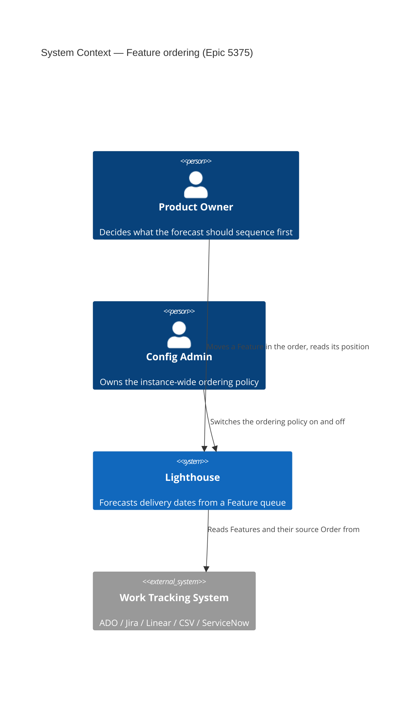
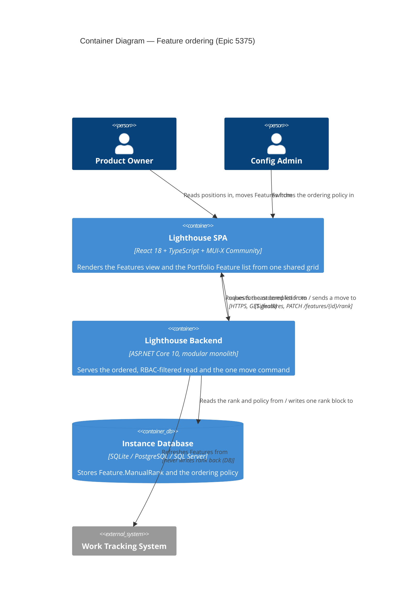
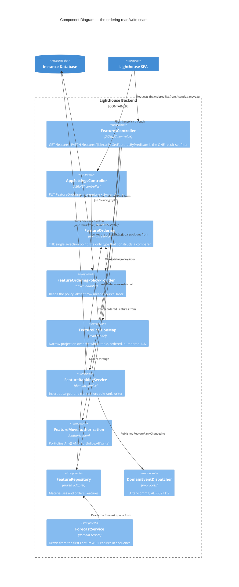

# Feature Delta — epic-5375-manual-sorting

**ADO**: Epic #5375 "Manual Sorting" (Premium, Planned, reported by Lorenzo, created 2026-06-30, no
children at DISCUSS start) · **Feature type**: cross-cutting (forecasting + settings + authorization +
UI) · **Density**: lean (Tier-1 [REF] only) · **DISCUSS run**: 2026-08-06

The epic's description is a four-line sketch. This wave turns it into locked decisions, and the sketch
survives largely intact — the three things it did not say are what the wave is worth: ordering already
drives forecasts, `Order` is overwritten on every sync, and `Feature ↔ Portfolio` is many-to-many, which
is what makes "scoped to the portfolio" a decision rather than a detail.

**Revised 2026-08-06 after user input** (second pass, same day). Four changes, all narrowing risk:
the sorting page becomes a **general Features view** shared with Epic #4365 "Dependencies" (D17);
reordering ships as **discrete move actions**, not drag-and-drop (D18), which removes the epic's only
dependency blocker; the Portfolio surface reuses the **existing** Feature list rather than gaining a new
one (D10); and Done Features are treated as **irrelevant to ranking** rather than merely hideable (D15).

---

## Wave: DISCUSS / [REF] Prior-Wave Reading Confirmation

- ⊘ `docs/feature/epic-5375-manual-sorting/discover/` (not found — no DISCOVER wave ran)
- ⊘ `docs/feature/epic-5375-manual-sorting/diverge/` (not found — no DIVERGE wave ran)
- ✓ `docs/product/jobs.yaml` (schema_version 1) — no existing job covers feature ordering or priority;
  nearest neighbours are `job-forecast-throughput-tune` and `job-po-scope-cut-from-delivery-trend`, both
  about *what feeds* a forecast, not *what order* it runs in.
- ✓ `docs/product/journeys/` (37 journeys) — none touches ordering. `epic-5459-multi-team-forecasts.yaml`
  and `delivery-joint-likelihood.yaml` are the closest, and neither assumes anything about sequence.
- ✓ `docs/product/personas/` (9 personas) — `product-owner`, `config-admin`, `delivery-forecaster` all
  exist and are reused verbatim; no new persona needed.
- ✓ `docs/product/architecture/` — 131 ADRs read by index; none constrains feature ordering. ADR-110/113
  (joint forecasting) consume the forecast output, not its sequencing, so nothing is re-litigated here.
- ⊘ `docs/project-brief.md`, `docs/stakeholders.yaml` (not found — this repo carries product SSOT under
  `docs/product/` instead)
- ✓ `CLAUDE.md`, `docs/ci-learnings.md` — project standing rules applied (terminology, expand-only
  migrations, per-feature docs, quality gates).
- ✓ **ADO Epic #4365 "Dependencies"** (Premium, New, description: *"Set dependencies on Features"*) —
  read during the second pass because D17 makes this feature build the surface #4365 will land on. It is
  as sketchy as #5375 was, so nothing is assumed about its requirements beyond "it needs a per-Feature
  place to live and a cross-Portfolio view to be useful".

No DISCOVER evidence exists to contradict, so no contradiction check was possible and none is claimed.
Everything in the Current-State Surface Inventory below was read from code during this wave, not recalled.

---

## Wave: DISCUSS / [REF] Persona IDs

| Persona | Role in this feature |
|---|---|
| `product-owner` | Primary. Owns what gets built next; today cannot make Lighthouse agree with that. |
| `config-admin` | Turns the instance switch on and off, and carries the reversibility anxiety. |
| `delivery-forecaster` | Secondary. Consumes the forecast dates that ordering moves; does not reorder. |

---

## Wave: DISCUSS / [REF] JTBD One-Liners

| Job ID | One-liner |
|---|---|
| `job-po-own-the-order-the-forecast-uses` | When my tracker's rank does not match what we agreed to build next, I want to set the order Lighthouse forecasts against, so the dates I show stakeholders come from our real priority. |
| `job-po-order-features-when-the-connector-has-no-rank` | When my connector hands Lighthouse no priority signal at all, I want to supply one, so forecasts are sequenced by intent rather than by record number or import order. |
| `job-po-reorder-inside-my-own-portfolio` | When I own one portfolio on a shared instance, I want to reprioritise my own Features without needing rights over — or silently moving — anyone else's. |
| `job-config-admin-switch-ordering-ownership` | When I decide Lighthouse should own priority, I want one instance switch that starts from today's order and can be undone, so nobody's forecast jumps the moment I flip it. |
| `job-po-see-the-order-that-drives-the-forecast` | When two Features have very different forecast dates, I want to see where each sits in the queue Lighthouse simulates, so I can tell a priority effect from a throughput effect. |

### Opportunity Scores

Scored on the 1-5 scale `docs/product/jobs.yaml` already uses.

| Job | Importance | Satisfaction | Gap | Note |
|---|---|---|---|---|
| `job-po-order-features-when-the-connector-has-no-rank` | 5 | 0 | **5** | ServiceNow instances forecast in record-number order today, with no workaround short of editing records in the tracker. **Widened by the premise check**: any *multi-connector* instance is a second, far more common case — ints outrank all non-ints (S17), so ADO Features segregate ahead of Jira and Linear ones regardless of priority. Highest gap in the set. |
| `job-config-admin-switch-ordering-ownership` | 4 | 1 | **3** | Enabling ownership is the whole premise; a one-way door would sink adoption on its own. |
| `job-po-own-the-order-the-forecast-uses` | 5 | 2 | **3** | A workaround exists — go re-rank the backlog in the tracker — but it costs a round trip and is often not the PO's call to make. |
| `job-po-reorder-inside-my-own-portfolio` | 3 | 0 | **3** | Only bites on multi-Portfolio instances, but there it is a hard blocker: without it the feature is admin-only. |
| `job-po-see-the-order-that-drives-the-forecast` | 3 | 1 | **2** | The list *is* ordered today, but nothing says the order is load-bearing, so nobody reads it as information. Ranked lowest deliberately — it explains a problem rather than solving one. |

---

## Wave: DISCUSS / [REF] Current-State Surface Inventory

Read from code during this wave. Cited so DESIGN does not re-derive.

| # | Fact | Location |
|---|---|---|
| S1 | Ordering rides on exactly one field: `WorkItemBase.Order`, a **string**. There is no numeric rank anywhere. | `Models/WorkItemBase.cs:36` |
| S2 | `WorkItemBase.Update` copies `Order` from the source system on **every** refresh. Any manual value written into this field is destroyed on the next sync. | `Models/WorkItemBase.cs:142` |
| S3 | `FeatureComparer` reconciles the string: int-parse first (ints sort ahead of everything), then double-parse with the comparison **inverted** for Linear, then `string.Compare`. | `Models/FeatureComparer.cs:8-44` |
| S4 | Five call sites apply it — four read paths and one write path. Any new ordering must be honoured by all five or the UI and the forecast disagree. | `FeatureRepository.cs:18`, `:23`; `PortfolioDto.cs:15`; `FeaturesController.cs:93`; `WorkItemService.cs:535` |
| S5 | **Ordering drives forecasts, not just display.** Each simulated day a team draws from the first `FeatureWIP` remaining Features *in `Order` sequence*; reorder and the throughput lands on different Features, producing different 50/70/85/95% dates. | `ForecastService.cs:201-209` (+ `:180-189`) |
| S6 | Per-connector `Order` quality: ADO = `Microsoft.VSTS.Common.StackRank` (fallback `BacklogPriority`); Jira = `issue.Rank` (LexoRank, default field `customfield_10019`); Linear = `SortOrder` double, **lower means higher**; CSV = optional `order` column, frequently absent; ServiceNow = **`recordNumber`** — not a rank at all. | `WorkItemExtensions.cs:42-51`, `JiraWorkTrackingConnector.cs:1036`, `IssueFactory.cs:14`, `LinearWorkTrackingConnector.cs:177/338/415`, `CsvWorkTrackingConnector.cs:202`, `ServiceNowWorkItemMapper.cs:123` |
| S7 | `Feature ↔ Portfolio` is **many-to-many**. A Feature can belong to several Portfolios simultaneously. | `Data/LighthouseAppContext.cs:217-219`; `Feature.cs:41`; `Portfolio.cs:11` |
| S8 | The Portfolio Feature list renders through MUI-X DataGrid with **no initial sort model**, so the backend order shows through — but a user clicking any column header replaces it. | `PortfolioFeatureList.tsx:98-130`, `FeatureListDataGrid.tsx:19-60` |
| S9 | A per-portfolio "hide completed" toggle already exists and filters Done Features with no remaining work. | `FeatureListDataGrid.tsx:31-43` |
| S10 | The top navigation has exactly **two** entries: `{ path: "/", text: "Overview" }` and `{ path: "/settings", text: "System Settings" }`. Routes are `/`, `/connections`, `/teams/:id/:tab?`, `/portfolios/:id/:tab?`, `/settings`. There is no instance-wide Feature surface of any kind. | `App/Header/Header.tsx:59-60`; `App.tsx:202-224` |
| S11 | Premium gating exists and is attribute-driven: `[LicenseGuard(RequirePremium = true)]` → `ILicenseService.CanUsePremiumFeatures()`. | `LicenseGuardAttribute.cs:17,36-40`; `LicenseService.cs:49` |
| S12 | RBAC guard requirements include `PortfolioRead` and `PortfolioWrite`. | `Models/Authorization/RbacGuardRequirement.cs` |
| S13 | `FeaturesController` is mounted at `api/v1/features` + `api/latest/features` and today exposes **only GETs** (`ids`, `references`, `{id}/workitems`). No write surface. | `FeaturesController.cs:13-17,42,55,68` |
| S14 | **No drag-and-drop library is installed** in the frontend. MUI-X DataGrid's own row-reorder is a Pro/Premium licensed feature. *Neutralised by D18 — no longer a blocker.* | `Lighthouse.Frontend/package.json` (grep for dnd/sortable/drag → no match) |
| S15 | The Portfolio list already resolves the configurable term via `getTerm(TERMINOLOGY_KEYS.FEATURE)`. | `PortfolioFeatureList.tsx:44` |
| S16 | `FeatureListDataGrid` + its `columns.tsx` factory are **shared components**, already parameterised by a caller-supplied column list and storage key — so one column and one row-action menu added there serve every Feature list at once. | `components/Common/FeatureListDataGrid/` |
| S17 | **`FeatureComparer` segregates by connector.** Int-parseable values sort ahead of *everything* non-int (`:14-25`), so on a multi-connector instance every ADO Feature precedes every Jira and Linear Feature unconditionally, whatever their priority. Measured on the dev instance below. | `FeatureComparer.cs:14-25` + premise check |

---

## Wave: DISCUSS / [REF] Premise Check Results (slice 01, run early 2026-08-06)

Slice 01's premise check was pulled forward and run before DESIGN, because both of its failure modes
would have reshaped the epic. Source: the dev instance's SQLite database
(`Lighthouse.Backend/LighthouseAppContext.db`, real recorded history, 94 Features, 3 Portfolios, mixed
ADO + Jira + Linear connectors). The dev API on `:5169` was not running, so this was read directly from a
copy of the database rather than over HTTP.

**Hypothesis 1 — "the source order is noise" — DID NOT FIRE.**

| Measure | Value |
|---|---|
| Features | 94 |
| Blank or null `Order` | **0** |
| Distinct `Order` values | 91 of 94 |
| Duplicate values | 3 pairs — and all six are `StateCategory = Done`, so no tie touches the not-Done set ranking is *for* |

D6 can seed from the current order. US-02's "nothing moves" promise stands. Note the tie evidence cuts
**for** slice 02's own hypothesis surviving too: ties exist and `FeatureComparer` returns 0 for them, so
subset-vs-full-set sort stability is still worth the 30-minute check that brief calls for — it simply is
not a Done-set problem.

**Hypothesis 2 — "the flat list is unusable at size" — INCONCLUSIVE, not passed.** 38 not-Done Features
is comfortable, but this is a dev instance and proves nothing about a customer's. Slice 01 keeps the
hypothesis and re-checks it against the dogfood instance.

**Unanticipated finding, and the most useful thing the probe produced.** The dev instance carries three
`Order` shapes at once — 86 int-parseable (ADO StackRank), 4 LexoRank strings (Jira), 4 doubles (Linear).
Combined with S17, that means **a multi-connector instance has no meaningful cross-connector order at
all**: every ADO Feature outranks every Jira and Linear Feature by construction, not by anyone's
decision. Two consequences:

1. This is a **second** "no meaningful order exists" class alongside ServiceNow, and a much more common
   one. It widens `job-po-order-features-when-the-connector-has-no-rank` from a ServiceNow/CSV story to
   *any instance wired to more than one tracker*, which is a materially stronger case for the epic.
2. D6 still holds — seeding preserves the segregation, so nothing moves on enable — but the seeded
   starting point on such an instance is **garbage from day one**, and the first thing that user will do
   is a large re-sort. That argues directly for slice 04's picker (D18) rather than relative moves alone,
   and it is a second input to K7 beyond raw usage counts.

**Pre-requisite gap — now confirmed, not merely suspected.** All 90 Portfolio-linked Features sit in
**exactly one** Portfolio. There is no shared Feature anywhere on this instance, so D11's
write-on-every-Portfolio rule and AC-3.8 have no real-data case here. Demo data must seed one (slice 01),
and D11 ships field-unvalidated until an instance with a genuine shared Feature exists.

**Orphans — noted, deliberately not built for.** 4 Features belong to no Portfolio at all, so the
Features view's `PortfolioRead` filter (D11) would hide them from everyone including admins. All four
are Linear-sourced, `StateCategory = Unknown`, with **zero** `FeatureWork` rows and zero remaining work —
inert leftovers that enter no forecast (`InitializeSimulationResults` needs `RemainingWorkItems > 0`).
So nothing that matters is hidden. If an orphan ever *did* carry work it would be forecast while
invisible, since team membership flows through `FeatureWork` and not through Portfolio — recorded here
for DESIGN as a known edge, not as scope.

---

## Wave: DISCUSS / [REF] Locked Decisions

| # | Decision | Rationale / source |
|---|---|---|
| **D1** | **Features only.** Work items inside a Feature are not manually orderable. | User, 2026-08-06. Matches the epic ("ALL features"), and Feature order is the only ordering any consumer reads (S5). Work-item order has no consumer at all today, so ordering it would ship plumbing. |
| **D2** | **One instance-wide switch, all-or-nothing.** When manual sorting is ON, every Feature is manually ranked and the source `Order` is ignored entirely. No mixed mode. | Epic text ("It's either or"). A per-portfolio or per-Feature opt-in would leave the forecast with two incomparable orderings for one team (S5, S7). |
| **D3** | **One global total order.** Not one order per Portfolio. | Forced by S5+S7: a team spans Portfolios, so per-Portfolio orderings give its simulation no unambiguous next Feature. The epic already says it — "they are all in relation to each other". |
| **D4** | **Insert-at-target** is the translation rule for a move made through any filtered view. The moved Feature lands at the **global rank of the row it was placed against**; the block it jumped shifts by one. | User, 2026-08-06, after comparing against slot permutation. It is one rule for the Features view, the Portfolio list and every RBAC scope — and since S12 means most users see a filtered list anyway, a rule defined against "the visible slot set" would give two users different results from the same gesture. It also causes strictly fewer relative-order changes than slot permutation, and relative order is the only thing `ForecastService` reads. D18 makes it more literal, not less: "Move above Feature X" *is* insert-at-target, spelled out. |
| **D5** | **Manual rank lives in a new persisted field, never in `Order`.** `Order` continues to carry the source value untouched. | Forced by S2 — a value written to `Order` is destroyed on the next sync. Keeping `Order` intact is also what makes D9 (turn-off) a genuine revert rather than a re-import. |
| **D6** | **Enabling seeds from the current order.** Every Feature gets a rank derived from today's `FeatureComparer` result, so the visible order is byte-identical the instant the switch flips. | `job-config-admin-switch-ordering-ownership`. A switch that reshuffles the board on activation would be indistinguishable from a bug. |
| **D7** | **New Features append silently to the end.** No badge, no notification, no "needs triage" state. | User, 2026-08-06, choosing the epic's original wording over the badge alternative offered. Accepted cost, eyes open: a Feature arriving after the last sort is invisible until someone scrolls, and it forecasts last. Revisit if the tail turns out to be where real work hides. |
| **D8** | **No write-back.** The manual order is never pushed to ADO StackRank, Jira Rank or Linear SortOrder. | User, 2026-08-06. Lighthouse owns its own ordering; the tracker is untouched. Rank write-back (LexoRank generation in particular) is its own epic if it is ever wanted. |
| **D9** | **The switch is bidirectional.** Turning it off restores the source order immediately, and manual ranks are **retained**, so turning it back on restores the manual order rather than re-seeding. | `job-config-admin-switch-ordering-ownership` anxiety force. Retention is nearly free (D5 keeps the two fields separate) and converts a one-way door into an experiment. |
| **D10** | **Two surfaces, one order — and neither is new UI built for sorting.** (a) The Features view (D17); (b) the **existing** Portfolio detail Feature list, which gains a row-action menu and nothing else. | User, 2026-08-06: *"For sorting/viewing on Portfolio, we should use the existing Features View."* `FeatureListDataGrid` and its `columns.tsx` factory are already shared (S16), so the column and the actions are written once and appear on both. |
| **D11** | **RBAC: everyone may open the Features view; content is filtered to Portfolios the user can read; actions require `PortfolioWrite`.** A Feature may be moved only if the user holds `PortfolioWrite` on **every** Portfolio it belongs to; a shared Feature the user only partly owns renders its move actions disabled, naming the blocking Portfolio. | User, 2026-08-06: *"This is viewable by all, what they see and if they can do any actions is governed by their role."* The all-Portfolios mutation rule is this wave's addition: S7 means one move can re-sequence a Feature another Portfolio forecasts against, and "write on at least one" would let a PO reorder someone else's delivery. Open to DESIGN revision if it proves too strict. |
| **D12** | **The view is not premium. The manual order is.** The Features view, its position column and its help text ship to every instance, licensed or not, and stay visible when manual sorting is OFF. The switch and every move action require premium (S11). | Follows from D17 — the view is general infrastructure that later hosts dependencies, not a sorting page wearing a hat. And the position column reports a fact that is already true and already driving every forecast (S5); withholding it would be withholding an explanation. |
| **D13** | **Rank is a dense contiguous integer, renumbered across the affected block on each move.** | Simplest correct thing at Lighthouse's scale (hundreds to low thousands of Features). A sparse or LexoRank-style key would avoid the block UPDATE; noted for DESIGN, not chosen here, because it buys nothing at this size and costs a rebalancing path. |
| **D14** | **Relative move actions are disabled while a column sort is active; absolute ones are not.** "Move Up/Down/Top/Bottom" have no predictable meaning when the grid is sorted by Name (S8), so they grey out with a tooltip. "Move above/below Feature X" names its target explicitly, so it stays available under any sort. | D18 improves on what drag could offer here — a drag while sorted is simply meaningless, whereas an explicitly-targeted move is not. Filtering (including `hideCompleted`, S9) stays fully compatible under both: D4 translates through the *target row's* global rank, which is well-defined under any filter. |
| **D15** | **Done Features are irrelevant to ranking and are hidden by default on both ordering surfaces**, and are excluded from the "move above/below Feature X" target picker. They keep whatever rank they hold — no special storage rule, no rank reclamation. | User, 2026-08-06: *"while done features also have a rank, they are not really relevant (as the main thing for ranking is forecasting and done items dont matter)."* Confirmed in code: `InitializeSimulationResults` only admits `FeatureWork` with `RemainingWorkItems > 0`, so a Done Feature already contributes nothing to a forecast. Hiding rather than un-ranking keeps D7 simple if a Feature reopens. |
| **D16** | **The UI calls them whatever the instance calls them** — `getTerm(TERMINOLOGY_KEYS.FEATURE/FEATURES)` throughout, including the new nav entry, page title and switch label. | Project standing rule; S15 shows the Portfolio list already does it. The nav entry in particular: an instance that renames Features to "Deliverables" gets a "Deliverables" tab. |
| **D17** | **A general Features view is added as the third top-level navigation entry**, beside Overview and System Settings (S10), at `/features`. It lists every Feature the user can see across all Portfolios, and it is the surface that will later host **Epic #4365 "Dependencies"**. It is not a sorting page. | User, 2026-08-06. This reframes the largest piece of the epic from *a page for a premium feature* into *a shared surface two epics land on*, which is why D12 makes it free and always-visible. Nothing of #4365's requirements is designed here — only the obligation not to build a surface that would have to be rebuilt for it. |
| **D18** | **Reordering ships as discrete move actions, not drag-and-drop**: Move to Top, Move Up, Move Down, Move to Bottom, and Move above/below a named Feature. Drag-and-drop is explicitly deferred, not planned. | User, 2026-08-06: *"Drag and Drop is nice, but we can also work with arrows … That may be enough for the beginning."* Three things this buys: it neutralises S14 (no DnD dependency decision, no MUI-X Pro licence question) and removes the epic's only true blocker; it is keyboard- and screen-reader-operable by construction, which drag never is; and long-range moves become *possible* — on a 300-Feature list, "Move above Feature X" is the only usable gesture, since dragging across 200 rows is not a real interaction. Every action reduces to the same insert-at-target primitive (D4), so the rule is unchanged and the endpoint is a single shape. |

---

## Wave: DISCUSS / [REF] User Stories

### US-01 — See every Feature I have rights to, in the order that drives the forecast

**As a** product owner **I want** one place listing all Features across my Portfolios, in the order
Lighthouse simulates **so that** I can tell a priority effect from a throughput effect instead of
guessing why a date is late. · `job_id: job-po-see-the-order-that-drives-the-forecast`,
`job-po-own-the-order-the-forecast-uses` · **not** premium (D12)

#### Elevator Pitch
Before: Features can only be seen one Portfolio at a time, the list happens to be in forecast order but
nothing says so, and the order that decides every date is invisible.
After: click **Features** in the top nav (third entry, after Overview and System Settings) → sees every
Feature across every Portfolio you can read, in one ranked list, with a `#` column and help text reading
"Lighthouse forecasts Features in this order — the top of the list gets your teams' throughput first."
Decision enabled: whether a late date is because the Feature sits low in the queue (fix the order) or
because throughput is low (fix the flow).

**Acceptance criteria**
- AC-1.1 A third top-level nav entry appears beside Overview and System Settings (`Header.tsx:59-60`),
  labelled with `getTerm(TERMINOLOGY_KEYS.FEATURES)` (D16), routing to `/features`.
- AC-1.2 The view lists Features from every Portfolio the user holds `PortfolioRead` on, in global rank
  order, and lists nothing else (D11).
- AC-1.3 It is reachable on a **non-premium** instance and while manual sorting is **off** (D12) — in
  both cases read-only, with no move actions rendered.
- AC-1.4 Each row shows Portfolio membership; a Feature in several Portfolios shows all of them and
  appears exactly once.
- AC-1.5 The position column shows the Feature's rank **across the whole instance**, not its index in the
  visible rows — two rows shown consecutively may read `4` and `17`. The same column appears on the
  existing Portfolio Feature list, from the same shared factory (D10, S16).
- AC-1.6 Sorting the grid by another column leaves every position value unchanged.
- AC-1.7 Done Features are hidden by default on this view (D15) and revealed by the existing toggle;
  positions of the remaining rows are unchanged by the toggle.
- AC-1.8 A Feature whose source `Order` is empty still renders a position; no blank cell, no `NaN`.
- AC-1.9 The view renders and stays interactive for an instance with 500 Features.

---

### US-02 — Stop the tracker reshuffling my forecast every sync

**As a** config admin **I want** to hand ordering ownership to Lighthouse with one switch **so that**
the forecast stops moving for reasons nobody on my team decided. · `job_id:
job-config-admin-switch-ordering-ownership` · premium

#### Elevator Pitch
Before: every refresh re-imports the tracker's rank, so a rank change made by anyone in ADO or Jira
silently re-sequences the forecast; on ServiceNow the sequence was never meaningful to begin with.
After: open **Settings → System → Manual Sorting**, toggle it on → the Features view is unchanged, and
the `#` column header now reads "Manual"; a full refresh leaves every position exactly where it was.
Decision enabled: whether Lighthouse's forecast reflects the tracker's opinion or this team's.

**Acceptance criteria**
- AC-2.1 Flipping the switch on assigns every Feature a rank matching the pre-flip `FeatureComparer`
  order; the rendered list is identical before and after, for every connector's `Order` shape —
  int (ADO), LexoRank string (Jira), inverted double (Linear), record number (ServiceNow), empty (CSV).
- AC-2.2 With the switch on, running a full work-item refresh changes no Feature's rank, while
  `WorkItemBase.Order` is still updated from the source (D5 — the two fields are independent).
- AC-2.3 With the switch on, all five ordering call sites (S4) return the manual order. An integration
  test asserts the Portfolio DTO, the features endpoint and the forecast input agree.
- AC-2.4 Flipping the switch off restores the source order everywhere immediately; flipping it on again
  restores the previous manual order rather than re-seeding (D9).
- AC-2.5 A non-premium instance receives 403 on the enable endpoint and the switch renders disabled
  with the standard premium affordance. The Features view itself stays reachable (AC-1.3).
- AC-2.6 A Feature that arrives while the switch is on receives a rank at the end of the list and
  produces no notification, badge or log entry (D7).
- AC-2.7 The switch requires `SystemAdmin`; a `PortfolioWrite`-only user gets 403 and no control.

---

### US-03 — Move a Feature up the order

**As a** product owner **I want** Move to Top / Up / Down / Bottom on any Feature I own **so that** the
forecast sequences my delivery the way we actually agreed. · `job_id:
job-po-reorder-inside-my-own-portfolio`, `job-po-own-the-order-the-forecast-uses` · premium

#### Elevator Pitch
Before: the only way to change what Lighthouse forecasts first is to go and re-rank the backlog in the
tracker — a round trip that is often not the PO's to make, and impossible on ServiceNow.
After: on the **Features** view or on **Portfolio → detail → Features**, open a row's action menu and
choose **Move to Top** → the row jumps to the top of the list you are looking at, the `#` column
renumbers, and the Feature's forecast dates move on the next forecast run.
Decision enabled: which Feature the team's throughput lands on first, and therefore which delivery date
is credible.

**Acceptance criteria**
- AC-3.1 Moving Feature X to the position of Feature Y gives X the global rank Y held; every Feature
  between the old and new position shifts by exactly one; no other Feature's relative order changes (D4).
- AC-3.2 The rule holds when the visible Features are non-contiguous in the global order: with global
  `F1 F2 F3 F4 F5 F6` and Portfolio A = `{F2, F4, F5}`, **Move to Top** on F5 from A's list yields
  `F1 F5 F2 F3 F4 F6` — F5 lands above A's first Feature, **not** at global rank 1 (D10, D4).
- AC-3.3 **Move Up** targets the previous **visible** row, so hidden Done Features (D15) and filtered-out
  rows are jumped, not landed on. **Move to Bottom** sends the Feature to the end of the global order.
- AC-3.4 Features outside the visible set are never reordered relative to each other.
- AC-3.5 The move persists: a page reload and a full work-item refresh both show the new order.
- AC-3.6 The forecast changes accordingly — an integration test moving a Feature into the top
  `FeatureWIP` positions asserts its 85% date improves and the displaced Feature's worsens.
- AC-3.7 A user without `PortfolioWrite` sees the action menu without move entries; the endpoint returns
  403.
- AC-3.8 A Feature belonging to a Portfolio the user cannot write renders its move actions disabled with
  a tooltip naming that Portfolio; the endpoint returns 403 for it (D11).
- AC-3.9 Relative moves are disabled with an explanatory tooltip while the grid is sorted by a column
  (D14).
- AC-3.10 With manual sorting off, or on a non-premium instance, no move actions render at all.
- AC-3.11 The actions are reachable and operable by keyboard alone, and each announces its outcome to a
  screen reader (D18 — this is a stated reason for choosing buttons, so it is asserted, not assumed).

---

### US-04 — Move a Feature next to a specific other Feature

**As a** product owner **I want** to move a Feature directly above or below a named Feature **so that**
I can reprioritise across a long list without clicking Move Up two hundred times. · `job_id:
job-po-own-the-order-the-forecast-uses`, `job-po-order-features-when-the-connector-has-no-rank` · premium

#### Elevator Pitch
Before: relative moves only travel one row at a time, so on a real backlog the top and the bottom of the
list are effectively unreachable from each other.
After: choose **Move above…** from a row's action menu → a searchable picker of Features you can move
against → pick one → the Feature lands immediately above it.
Decision enabled: long-range reprioritisation — "this belongs ahead of the thing we start in Q3" —
which is the only form the decision actually takes on a backlog of any size.

**Acceptance criteria**
- AC-4.1 The picker lists Features from Portfolios the user can read, searchable by name and reference
  id, excluding Done Features (D15) and the Feature being moved.
- AC-4.2 Choosing a target places the moved Feature immediately above (or below) it, by the same
  insert-at-target rule as US-03 — asserted by a test that runs the same intended outcome through both a
  relative move and a targeted move and compares the resulting global order (D4).
- AC-4.3 Available regardless of the grid's current column sort (D14), unlike the relative moves.
- AC-4.4 Available from both surfaces (D10) with identical behaviour.
- AC-4.5 Choosing a target the user may not move *against* is allowed — the permission that matters is
  write on the **moved** Feature's Portfolios (D11), not on the target's. A test pins this, because it is
  the case a reviewer will otherwise assume was overlooked.
- AC-4.6 Same premium and RBAC gating as US-03 (AC-3.7, AC-3.8, AC-3.10).

---

### US-05 — Try it without a one-way door

**As a** config admin **I want** turning manual sorting off to give me my tracker's order back, with my
manual order still there if I turn it on again **so that** I can evaluate the feature on a real instance
without risking the ordering my forecasts already depend on. · `job_id:
job-config-admin-switch-ordering-ownership` · premium

#### Elevator Pitch
Before: "everything will be manually maintained" reads as irreversible, so the switch is a decision
nobody makes on a live instance.
After: on **Settings → System**, toggle Manual Sorting off → the Features view immediately shows the
tracker's order again, and the switch's help text says the manual order is kept; toggle it back on → the
manual order returns exactly as it was.
Decision enabled: whether to adopt manual ordering at all, evaluated by trying it rather than by
committing to it.

**Acceptance criteria**
- AC-5.1 Turning the switch off makes all five ordering call sites (S4) return the source order again,
  with no refresh required.
- AC-5.2 Manual ranks survive the off state — the column is not cleared.
- AC-5.3 Turning it on again restores the retained manual order and does **not** re-seed from source
  (D9), including for Features that arrived while it was off, which take end-of-list ranks (D7).
- AC-5.4 The off state removes every move action (AC-3.10) and reverts the `#` column header from
  "Manual" to the source label. The Features view itself remains reachable and read-only (D12).
- AC-5.5 The switch's help text states, in the instance's own terminology, what turning it off does and
  that the manual order is retained.

---

## Wave: DISCUSS / [REF] Story Map & Slices

**Backbone**: *see every Feature and the order that already drives my forecast* → *take ownership of that
order* → *nudge a Feature up it* → *move a Feature a long way in one step* → *hand ownership back*.

**Walking skeleton**: slice 02 is the skeleton — the first slice touching the whole spine (migration →
setting → comparer → all five read paths → UI label). Slice 01 precedes it because it needs none of that
and de-risks the epic's premise.

| Slice | Ships | Story | Est. | Learning hypothesis |
|---|---|---|---|---|
| **01** | The Features view: nav entry, route, RBAC-filtered list, position column on **both** surfaces, help text. Read-only, non-premium | US-01 | ~6h | Disproves "a global ranked list of Features is worth showing" — two ways it can fail: the source `Order` turns out to be mostly ties or blanks on real instances, so the column reports noise; or the flat list is unusable at real size, so the view needs grouping or search before it needs actions. Either failure reshapes the rest of the epic *and* Epic #4365's surface. |
| **02** | `ManualRank` + instance switch (on **and** off) + seeding + all five call sites honour it | US-02, US-05 | ~6h | Disproves "seeding from the current order is invisible to the user" if the seeded order differs from what was on screen — `FeatureComparer`'s int-before-string rule and `string.Compare` tie-breaking are applied at five call sites, two of which sort a *subset*. If it fails, D6 needs an explicit ordering snapshot rather than a re-derivation. |
| **03** | Relative move actions (Top / Up / Down / Bottom) + reorder endpoint + RBAC, on both surfaces | US-03 | ~6h | Disproves **D4** if a move made from a Portfolio's filtered list produces a global order the user finds surprising — the fallback is slot permutation, which changes only the rank service's body, so the endpoint, RBAC and menu all survive. |
| **04** | "Move above/below Feature X" picker | US-04 | ~4h | Disproves "relative moves are enough for the beginning" — if a fortnight of dogfooding shows people only ever use Move to Top, the picker is unnecessary and this slice is **dropped, not deferred**. It is the one slice designed to be cancellable. |

Full briefs: `docs/feature/epic-5375-manual-sorting/slices/slice-0{1..4}-*.md`.

**Prioritisation rationale** — 01 first because it carries zero dependencies, ships to every instance
licensed or not, and it is now also the surface Epic #4365 will land on (D17), so getting it wrong is
expensive twice over; its premise check is the cheapest way to find out whether the rest of the epic is
aimed correctly. 02 second because every later slice reads the rank it introduces, and because it is the
only slice that can ship and be left on safely by itself — an instance can run on frozen-but-uneditable
order indefinitely. 03 before 04 because it carries the epic's one genuine design unknown (D4 read
through a filtered view), and because 04's whole purpose is to be evaluated *after* people have lived
with 03. 04 last and optional by design.

### Slice taste tests

| Test | Verdict |
|---|---|
| Any slice shipping 4+ new components? | **Pass** — 01 adds a page, a nav entry and a shared column; 02 adds a switch panel; 03 adds a row-action menu plus one endpoint; 04 adds one dialog. |
| Every slice depending on a new abstraction? | **Pass** — the one shared abstraction (the insert-at-target rank service) ships **inside** slice 03, its first consumer, and slice 04 reuses it unchanged. Nothing is built ahead of its first consumer. |
| Does any slice disprove a pre-commitment? | **Pass** — 01 disproves the ranked-list premise, 02 seeding invisibility, 03 D4 itself, 04 the sufficiency of relative moves. Each failure changes the plan, and 04's failure deletes the slice. |
| Synthetic-data-only slices? | **Pass** — 01 and 02 are premise-checked against the dev instance's recorded history (`reference_dev_db_backup_restore`); 03 and 04 are dogfooded on a real multi-Portfolio instance the same day. Demo data is extended for the E2E, but no slice is *accepted* on demo data alone. |
| Two slices identical except for scale? | **Pass** — the earlier draft had this failure (a Portfolio drag slice and an instance-page drag slice). D10 and D18 dissolved it: both surfaces share one grid and one action menu, so 03 ships the gesture once for both, and 04 is a different gesture rather than the same one at larger scale. |

---

## Wave: DISCUSS / [REF] Scope Assessment

**PASS — right-sized.** 5 stories (≤10); ~22h total (<2 weeks); 4 slices, each ≤6h; 0 new external
integration points.

Honest note on the oversize heuristics: this feature touches **4 areas** — work-item sync/forecasting,
licensing + instance settings, authorization, and frontend — which trips the "≥3 bounded contexts"
signal on its own. It is not split, because only one of those four is where the behaviour lives
(ordering, inside the Features/forecast context); the other three are gates and surfaces it passes
through, each with an existing mechanism to reuse (S11, S12, S16). One signal firing is below the
"any 2+" split threshold.

Second-pass note: D17 adds a new top-level surface, which normally *grows* scope. Here it shrank the
plan — 4 slices instead of 5, and one fewer implementation of the same gesture — because D10 folded the
Portfolio surface into the shared grid and D18 removed the dependency decision that gated the largest
slice. The new view is also amortised across two epics rather than charged entirely to this one.

---

## Wave: DISCUSS / [REF] Outcome KPIs

| # | KPI | Target | Measurement |
|---|---|---|---|
| K1 | Seeding is order-preserving across every connector's `Order` shape | 100% of Features identical position pre/post enable, for int, LexoRank, inverted double, record number, and empty | Backend integration test parameterised over the five shapes (AC-2.1) + one dogfood enable on the dev instance's recorded data |
| K2 | Rank churn across sync with the switch on | **0** rank changes over 5 consecutive full refreshes | Backend integration assertion (AC-2.2) + dogfood over one week |
| K3 | A reorder actually moves the forecast | Moving a Feature into the top `FeatureWIP` positions changes its 85% date by ≥1 day on an instance with non-degenerate throughput | Integration test (AC-3.6). Note: constant-throughput test data cannot demonstrate this — the fixture must carry variable throughput, per the Epic 5459 lesson |
| K4 | Cross-surface agreement | All five ordering call sites (S4) return the same sequence in every state (on/off/mid-refresh) | Integration test asserting Portfolio DTO, features endpoint and forecast input agree (AC-2.3) |
| K5 | RBAC containment | A `PortfolioWrite`-on-A user cannot change the rank of any Feature outside A, and cannot move a Feature shared with a Portfolio they lack write on | 403 assertions per AC-3.7/3.8; no move affordance rendered |
| K6 | Move round trip on a realistic instance | ≤500ms p95 from action to persisted-and-rerendered, at 500 Features | Backend timing assertion on the block renumber (D13) + manual profile on the Features view (AC-1.9) |
| K7 | Are relative moves enough? | **Primary signal**: any observed run of **≥3 consecutive Move-Ups on the same Feature** within one sitting. **Secondary**: the Move-to-Top share of all moves. | Direct observation over 2 weeks. See the K7 reading rule below — the review flagged that "mostly Move to Top" left the mixed case undefined, which would have made a cancellable slice un-cancellable in practice. |
| K8 | Adoption verdict | ≥1 pilot instance whose connector has no meaningful rank (ServiceNow or CSV) turns it on and is still on after 2 weeks | Benjamin's customer conversations. Cross-instance telemetry remains blocked on Epic 5015 (opt-in telemetry, no timeline), so this is qualitative by necessity, not by choice |

### K7 reading rule (slice 04 go/no-go)

Deliberately **not** a percentage band. Two weeks of single-operator dogfooding produces on the order of
tens of moves, and a band over that sample is noise dressed as a threshold. The run signal is direct
evidence and survives a small sample; the share is context.

| Observation | Verdict for slice 04 |
|---|---|
| **Any** run of ≥3 consecutive Move-Ups on one Feature | **Build it.** That run *is* someone hand-climbing toward a target the picker collapses into one action. One clear instance is enough — it is existence proof, not a frequency claim. |
| Zero such runs **and** Move-to-Top ≥ ~75% of moves | **Drop it**, not defer it. The decision people actually make is binary ("this is next" / "this is not"), and long-range placement was imagined rather than needed. |
| Zero such runs, Move-to-Top below that | **Re-time, do not decide.** Neither signal fired; the sample is too thin. Carry slice 04 to the next dogfood window rather than building or deleting on no evidence. |

---

## Wave: DISCUSS / [REF] Out of Scope

- **Drag-and-drop reordering** (D18). Deferred, not planned. Revisit only if K7 shows the button actions
  are genuinely insufficient — and note it would then also need an accessible equivalent, which the
  buttons already are.
- **Anything from Epic #4365 "Dependencies".** This feature builds the surface #4365 will land on (D17)
  and nothing else. No dependency model, no dependency column, no graph. The only obligation carried here
  is not to build a Features view that would have to be rebuilt.
- **No write-back to the tracker** (D8). ADO StackRank, Jira Rank and Linear SortOrder are never written.
- **No work-item-level ordering** inside a Feature (D1).
- **No per-Portfolio independent orderings** (D3). "Scoped to the Portfolio" constrains what a move may
  *touch*, not how many orders exist.
- **No mixed mode** — no per-Feature or per-Portfolio opt-in while the instance switch is off (D2).
- **No badge, banner, count or digest for newly arrived Features** (D7), and no digest of what landed at
  the end since last time.
- **No rank reclamation for Done Features** (D15) — they are hidden, not un-ranked.
- **No CLI or MCP surface for reordering.** A set-rank command would be plumbing with no decision
  attached to its output.
- **No bulk operations** — no multi-select move, no CSV import of an order.
- **No ordering history or audit trail** of who moved what when.
- **No search, grouping, saved views or virtualised scrolling** on the Features view beyond what
  `FeatureListDataGrid` already provides. If slice 01's hypothesis fires, that changes — but as a
  re-plan, not as silent scope growth.
- **No change to `FeatureComparer`'s source-order semantics.** Its int/double/string rules stay exactly
  as they are for the switch-off path; the manual path is a separate comparison, not a rewrite.

---

## Wave: DISCUSS / [REF] WS Strategy

**Type B — parallel field behind a switch.** The manual rank is a new persisted field coexisting with
the untouched source `Order` (D5), selected by the instance switch (D2). Not Type A (a new column changes
the ordering five existing call sites depend on, so it is not purely additive) and not Type D (the switch
is a user-facing product setting, not an env-var implementation toggle — no `alternatives-considered`
trigger from this row).

Degradation is graceful at every partial state, and D12 improves this over the first draft: with slice 01
alone the instance gains a genuinely useful read-only view; with 02 and not 03 it runs on a frozen order,
which is a coherent product. There is no state in which the list and the forecast can disagree, because
D2 makes the selection instance-global and AC-2.3/K4 assert all five call sites together.

---

## Wave: DISCUSS / [REF] Driving Ports

| Port | Surface | Change |
|---|---|---|
| UI | **Top navigation** (`Header.tsx:59-60`) | Third entry, after Overview and System Settings, labelled by `getTerm` |
| UI | **`/features`** (new route) | The Features view: RBAC-filtered ranked list, read-only for everyone, actions by role + licence |
| UI | Portfolio → detail → **Features** tab | Position column + the same row-action menu, via the shared `FeatureListDataGrid` (S16). No new component |
| UI | **Settings → System** | Manual Sorting switch, premium-gated, `SystemAdmin`-guarded |
| HTTP (inbound) | `PATCH api/v1\|latest/features/{featureId}/rank` — body carries exactly one of `beforeFeatureId` / `afterFeatureId`; `beforeFeatureId: null` means "to the end" | **New write surface on a controller that has only ever exposed GETs (S13).** `[LicenseGuard(RequirePremium = true)]` + `PortfolioWrite` on every Portfolio the Feature belongs to (D11). Every move action in D18 reduces to this one shape |
| HTTP (inbound) | `GET api/v1\|latest/features` | New RBAC-filtered ranked list backing the Features view. Not premium-gated (D12) |
| HTTP (inbound) | The instance setting's existing settings endpoint | Gains the manual-sorting flag; enable path premium-guarded |
| CLI / MCP | — | **No change.** Explicitly out of scope; the clients call none of these routes |

---

## Wave: DISCUSS / [REF] Pre-requisites

- Premium licence infrastructure — **met** (S11); dev seed available (`reference_premium_license_dev_seed`).
- RBAC `PortfolioWrite` guard — **met** (S12).
- Shared Feature grid to extend rather than duplicate — **met** (S16).
- ~~A drag-and-drop mechanism~~ — **removed by D18.** This was the epic's only hard blocker; discrete
  actions need no new dependency and no MUI-X Pro licence.
- An instance with several Portfolios and at least one Feature shared between two of them, to dogfood D4
  and D11 — **confirmed absent** by the premise check: all 90 Portfolio-linked Features on the dev
  instance sit in exactly one Portfolio. AC-3.8 is reachable only through an integration test plus seeded
  demo data (owed in slice 01), and D11 ships field-unvalidated until a real shared Feature exists.
- An EF migration for the new column — **owed**, generated via the existing `CreateMigration` PowerShell
  script across all providers, expand-only (additive nullable column, nothing dropped).
- No dependency on Epic 5015 telemetry (K8 is qualitative by necessity).

---

## Wave: DISCUSS / [REF] DISCUSS Checklist (project standing rules)

**No silent N/A** — every item answered.

| Item | Answer |
|---|---|
| **RBAC impact** | **Substantial and new.** This is the first write surface on `FeaturesController` (S13), the first instance-wide Feature *read* surface, and the first case where one user's action moves an object another user's Portfolio forecasts against (S7). D11 sets the rule: the view opens for everyone, content is filtered by `PortfolioRead`, and mutation requires `PortfolioWrite` on **all** of a Feature's Portfolios. All gating flows through the existing `RbacGuardRequirement` mechanism server-side and `useRbac()` client-side — no component fetches `/authorization/my-summary` directly, and the disabled-action state derives from the same summary the guard enforces. Note for DESIGN: `GET /features` is the first endpoint whose *result set* is RBAC-filtered rather than RBAC-gated, which is a different shape from every existing guard. |
| **Lighthouse-Clients CLI/MCP versioning** | **Not owed.** The clients expose no ordering surface and call none of the new or changed routes; reordering is out of scope for them by decision, and no existing client response shape changes. If DESIGN adds a `rank` field to `FeatureDto` for the frontend's convenience, that is additive per `docs/concepts/api-versioning.md` and still needs no client bump — but it needs saying out loud at that point rather than discovered at release. |
| **Website marketing surface** | **In scope, deferred to DELIVER.** Premium-tagged epic, so `letpeople.work`'s premium/pricing surface is a candidate for a line item. Not verified during DISCUSS — the website lives in a separate repo (`project_website_hotlinks_docs_assets`) and no page was read. Owed check at DELIVER: does the premium feature list enumerate features individually, and if so does Manual Sorting belong on it? Confirm with the user before editing marketing copy. |
| **Per-feature docs + screenshots** | Owed at DELIVER, per feature, not batched into `/release`: a new docs page for the Features view (which Epic #4365 will extend rather than replace), a section on the move actions, a Settings note for the switch, and `@screenshot` E2Es for the Features view and the Portfolio list with actions. Watch the pixel-threshold trap — `rm` any regenerated PNG first. Docs wait for the user's confirmation in their own environment before being written. |
| **Demo data** | **Owed in slice 01.** The demo seeder must produce enough Features across enough Portfolios that the Features view is not trivially short, and — for AC-3.8 — at least one Feature shared between two Portfolios. Without the shared Feature, D11's most interesting case has no demo or screenshot representation. |
| **EF migrations** | **Owed in slice 02.** One additive nullable column on `Feature`, generated with the `CreateMigration` script across all supported providers. Expand-only: nothing dropped, nothing renamed. |
| **Terminology** | Every user-visible string resolves through `getTerm` (D16) — including the **nav entry**, which is the most visible instance of the rule in the product so far. No literal "Epic", "Initiative" or "Story" anywhere. |

---

## Wave: DISCUSS / [REF] Definition of Done (feature level)

1. All five stories' ACs green in CI (backend NUnit + frontend Vitest).
2. `pnpm test`, `pnpm build` (zero warnings), `dotnet build` (zero warnings), `dotnet test` green
   locally before push.
3. SonarQube Cloud: no new issues of any severity.
4. Mutation testing per feature: backend ≥80% kill on the rank service and comparer selection, frontend
   ≥80% on the Features view and the action menu.
5. One Playwright walking-skeleton assertion per surface — load the Features view, and perform one move
   from the Portfolio list — driven from demo data, run locally before commit, no re-seed to reach a
   second page.
6. Keyboard-only operation of every move action verified manually (AC-3.11).
7. Docs pages + regenerated screenshots, after the user confirms the behaviour in their environment.
8. Demo data seeds a multi-Portfolio set including one shared Feature.
9. EF migration generated by `CreateMigration` and verified against every provider.
10. ADO: Epic 5375 carries one Story per slice, states transitioned, "Release Notes" tag confirmed with
    the user before it is applied.
11. Evolution doc written and the feature workspace archived at finalize.

---

## Wave: DISCUSS / [REF] DoR Validation

| # | DoR item | Evidence |
|---|---|---|
| 1 | Business value articulated | 5 JTBD jobs with opportunity scores 2-5; the top gap (5) is a connector class — ServiceNow — that currently forecasts in record-number order with no workaround. Epic reported by a real user (Lorenzo). |
| 2 | Stories in LeanUX form with elevator pitches | US-01…US-05, each Before/After/Decision-enabled, each naming a real user-invocable entry point. **No `@infrastructure`-only slice**: slice 02 pairs the migration and the comparer change with US-02's observable outcome (the order stops moving across sync) and US-05's reversibility. |
| 3 | Acceptance criteria testable | 37 ACs, each asserting an observable — a rendered column value, a nav entry, a persisted rank, an HTTP status, a forecast date delta. |
| 4 | Dependencies identified | Pre-requisites section. The drag-mechanism blocker is **gone** (D18); one open item remains (a shared Feature to dogfood D11 against) and is flagged rather than assumed. |
| 5 | Job traceability | Every story carries a `job_id`; all five jobs are in `docs/product/jobs.yaml`. |
| 6 | Sized / sliceable | 4 slices, each ≤6h, each with a named learning hypothesis; all taste tests pass, including the two-slices-alike test that the first draft failed. |
| 7 | Technical feasibility grounded | S1-S16 read from code during this wave with file:line citations. The one real remaining unknown (D4 read through a filtered view) is isolated into slice 03 with a documented fallback. |
| 8 | Outcome KPIs measurable | K1-K8 with targets and methods; K7 is explicitly a decision signal rather than a pass/fail bar, and the telemetry limit on K8 is stated rather than hidden. |
| 9 | Out-of-scope explicit | 13 named non-goals, including the whole of Epic #4365. |

**Requirements completeness: 0.97** — up from 0.96 in the first pass, because D18 removed the dependency
decision and D10 removed a duplicate surface. The residual gap is whether D11's write-on-every-Portfolio
rule is too strict in real multi-team instances, which only field use can answer.

---

## Wave: DISCUSS / [REF] Expansion Menu Evaluation

`expansion_prompt = "ask-intelligent"` → all five triggers evaluated:

| Trigger | Fires? |
|---|---|
| AC ambiguity (≥2 stories with a contestable AC) | **No** — the one genuinely contestable rule (D4) is pinned by a worked numeric example in AC-3.2. |
| Cross-context complexity (≥3 contexts or technologies) | **YES** — forecasting, licensing/settings, authorization and frontend. Suggests `alternatives-considered`. |
| Multi-stakeholder (≥3 personas) | **YES** — `product-owner`, `config-admin`, `delivery-forecaster` carry distinct requirements (reorder / switch / consume). Suggests `persona-narrative`. |
| Compliance / regulatory terms in ACs | **No.** |
| WS strategy = D (configurable) | **No** — Type B. |

Two triggers fired; the scoped menu is offered to the user at wave end rather than auto-expanded (lean
mode). Telemetry: the nWave `scripts/shared/telemetry.py` helper is not present in this repo's install
(`~/.claude/skills/nw-discuss/` ships `SKILL.md` only), so the density event is recorded here rather
than hand-rolled into JSONL.

---

## Wave: DISCUSS / [REF] Handoff

**To**: `nw-solution-architect` (DESIGN) — full artifact set.
**And**: `nw-platform-architect` (DEVOPS) — KPI section only. No new infrastructure; K2, K4 and K6 are
the instrumentable ones.

**Open questions for DESIGN**:

1. **Where the switch is stored.** `OptionalFeature` (`OptionalFeatureKeys` — has a Settings UI already,
   but is framed as *preview/optional capability*, not *licensed setting*) versus an `AppSetting`.
   DISCUSS proposes `AppSetting` + `[LicenseGuard(RequirePremium = true)]` on the enable path, because
   the premium gate is the distinguishing property; ratify or overturn.
2. **Where the manual comparison lives.** `FeatureComparer` takes a mode, or a second
   `ManualRankComparer` is selected at each of the five call sites (S4). Whichever is chosen, K4 requires
   a **single** selection point — five independent `if` statements is the failure mode.
3. **Rank storage and renumbering (D13).** Dense int with a block UPDATE is proposed; confirm it holds
   at 500+ Features under K6's 500ms budget, and decide the transaction boundary so a concurrent refresh
   cannot interleave with a renumber.
4. **`GET /features` result-set filtering.** This is the first endpoint whose *rows* are RBAC-filtered
   rather than whose *access* is RBAC-gated. Decide where that filter lives so it cannot be bypassed by
   a future caller, and whether it belongs in the repository or the controller.
5. **D11's strictness.** "Write on every Portfolio the Feature belongs to" is this wave's proposal, not
   the user's words. Confirm it, and decide how the disabled-action tooltip names a blocking Portfolio
   the user may not have read access to.
6. **Seeding transaction.** Enabling the switch writes a rank for every Feature in the instance. Decide
   whether that is synchronous or queued, and what the UI shows while it runs on a large instance.
7. **Forward-compatibility with Epic #4365.** The Features view is being built as the surface
   dependencies will land on (D17). Without designing #4365, decide only this: does the row model and the
   view's layout leave room for a dependency indicator and a per-Feature detail affordance, so #4365 is
   an extension rather than a rebuild?

---

## Wave: DESIGN / [REF] DDD List

Domain layer, 2026-08-06, Hera (DDD Architect), interaction mode = **PROPOSE**. Density: lean, Tier-1
only. Full analysis in `docs/product/architecture/brief.md` → `## Domain Model —
epic-5375-manual-sorting`. ADRs: **ADR-132** (ownership + consistency), **ADR-133** (event + recompute).

Nothing in the DISCUSS wave above is rewritten. Two locked decisions are **refined** (D13 demoted from
contract to algorithm; D11 corrected for the empty-Portfolio set) and one AC's wording is **sharpened**
(AC-3.6). Each is called out below rather than applied silently.

| # | Decision | Source |
|---|---|---|
| **DDD-1** | **No ordering aggregate.** `Feature.ManualRank` (`int?`) is a scalar attribute of the existing `Feature` aggregate; the *sequence* is derived at read time and has no root. A "Backlog Ordering" root and an instance-settings-owned list are both rejected as god aggregates (Vernon Rule 2). Instance settings owns the **policy**, not the data. | ADR-132 §1 |
| **DDD-2** | **`Feature` stays untokened.** No optimistic-concurrency token, per ADR-027 — it is rewritten on every sync, so a token would manufacture 409s on routine refreshes. | ADR-132 §3 |
| **DDD-3** | **The ordering is a total order, not a permutation**: `ManualRank` ASC, **nulls last**, ties broken by `Feature.Id` ASC. Total over any rank multiset — gaps, duplicates and nulls all yield a deterministic sequence. | ADR-132 §2, INV-O1 |
| **DDD-4** | **D13 refined.** Dense contiguous 1..N is **not** a transactional invariant. The block renumber stays as the move *algorithm*; contiguity is a post-condition nothing may rely on. This is what makes DDD-1 available at all, and it lets slice 03 swap in slot permutation without touching a consumer. | ADR-132 §2, INV-O2 |
| **DDD-5** | **The `#` column is a computed ordinal, not the stored rank.** Free — `FeatureRepository.GetAll` (`:16-18`) already materialises and sorts the whole table. Positions count Done Features, which is what AC-1.5/1.7 require. | ADR-132 §2, INV-O3 |
| **DDD-6** | **One DB transaction per move**, re-reading the target's rank *inside* the boundary. Not a lock over all Features, not the update queue. A concurrent refresh **may** interleave with a renumber: the collision produces a duplicate rank, which DDD-3 resolves by `Id`. | ADR-132 §3 |
| **DDD-7** | **The move command carries identities, not positions** (`beforeFeatureId` / `afterFeatureId`). A rank-carrying command would need a token; an identity-carrying one does not. D18's endpoint shape was already the concurrency-safe one. Two simultaneous moves are last-writer-wins on intent — no 409, stated not mitigated. | ADR-132 §3 |
| **DDD-8** | **A committed move publishes `FeatureRankChanged(int FeatureId)`**; a handler resolves the Feature's Portfolios and calls `IForecastUpdater.TriggerUpdate`. Flipping the switch publishes `FeatureOrderingPolicyChanged(FeatureOrderingPolicy)`. **No new debounce** — `UpdateQueueService` already parks a single coalesced follow-up (`:78-88`, `:198-230`), so a burst of moves collapses to at most two forecast runs per Portfolio. | ADR-133 |
| **DDD-9** | **D11 corrected.** `Portfolios.All(canWrite)` is `true` for a Feature in **no** Portfolio, so a literal transcription would let anyone move the 4 orphans the premise check found. The rule is `Portfolios.Any() && Portfolios.All(canWrite)` — an orphan is movable by nobody. | ADR-132 §4 |
| **DDD-10** | **ES rejected, CQRS unchanged.** ADR-027 D7 stands: no event store, no move audit trail, no replay. The "give me my old order back" need is already met by D5/D9 keeping the untouched source `Order`. CQRS-lite is unchanged — the move is a command, the ordered list with its ordinal is a read model on the same store. | brief.md, ES/CQRS assessment |

---

## Wave: DESIGN / [REF] Ubiquitous Language

`Order` is taken and must never drift. It means the **source system's** value, always.

| Term | Meaning |
|---|---|
| **Order** | The connector's value (`WorkItemBase.Order`), overwritten every sync (`:142`). Never the manual concept. |
| **Manual Rank** | The instance's own ordering value for one Feature (`Feature.ManualRank`). |
| **Position** | The computed 1-based ordinal in the global order. Derived, never persisted. What the `#` column shows. |
| **Forecast Queue** | The sequence the simulation draws from (`ForecastService.cs:201-209`). The thing being ordered. Not "the backlog" — the tracker owns that word. |
| **Ordering Policy** | `SourceOrder` \| `ManualOrder`. An enum, not a boolean: "manual sorting on/off" names a UI switch, not a domain concept. |
| **Move** | The one command. Insert-at-target, carrying identities. Not "reorder"/"sort"/"drag". |

**"Priority" is rejected** — ADO, Jira and Linear all ship a real field by that name, and this is a
queue position, not a judgement of importance.

**Terminology boundary (D16).** Every term above is *internal*. The user-facing noun stays configurable
via `getTerm(TERMINOLOGY_KEYS.FEATURE/FEATURES)`, so UI copy composes as *"{Features} position"* —
the noun is the instance's word, the concept word is not run through the terminology service. No
literal "Epic", "Initiative" or "Story" anywhere.

---

## Wave: DESIGN / [REF] Bounded-Change Contract — the Move command

The aggregate boundary is the test universe. DELIVER asserts the complement, not just the delta.

- **Universe**: the set of `(FeatureId, ManualRank)` over all Features, plus the Ordering Policy value.
- **Declared delta** for `Move(featureId, before|after targetId)`: `ManualRank` of the moved Feature and
  of the Features in the shifted block. Nothing else.
- **Complement equality**: `WorkItemBase.Order` byte-identical for **every** Feature (this is D5's
  promise, and it is directly testable); `State`, `StateCategory`, `FeatureWork`, `Forecasts`,
  `Portfolios` membership and every other field unchanged; the Ordering Policy unchanged.
- **Relative-order complement**: for any pair of Features neither of which is the moved one, relative
  order is unchanged. This is AC-3.4 restated as a property — and it is the property both D4 and its
  slot-permutation fallback preserve, which is why the swap is safe.

---

## Wave: DESIGN / [REF] DISCUSS Open Questions — domain-layer answers

| Q | Answer |
|---|---|
| **1. Where the switch is stored** | **Not a domain call — stays open for the solution architect.** Domain constraint only: single-valued, instance-scoped, read at **exactly one** selection point, and modelled as the `SourceOrder`/`ManualOrder` enum rather than a bare boolean. `AppSetting` vs `OptionalFeature` is a persistence choice; DISCUSS's `AppSetting` proposal is not contradicted here. |
| **2. Where the manual comparison lives** | **Not a domain call — open.** Domain constraint: one selection point, and it must implement DDD-3's **full** sort key (rank, nulls last, `Id`). A consumer sorting by rank alone is wrong only when duplicates or nulls exist — the hardest bug class to notice, hence ADR-132's enforcement test. |
| **3. Rank storage, renumbering, transaction boundary** | **Answered, and partly dissolved.** D13's block renumber is kept as the algorithm (DDD-4); contiguity is not a contract; the boundary is one transaction per move (DDD-6). The question's premise — "so a concurrent refresh cannot interleave with a renumber" — is **retired**: it may interleave, and DDD-3 makes the result harmless. |
| **4. `GET /features` result-set filtering** | **Not a domain call — open.** One domain constraint: filtering must not change the position values. Positions are global (DDD-5) and are computed **before** the RBAC filter, not after. |
| **5. D11's strictness** | **Confirmed as coherent, corrected in one place** (DDD-9). Domain layer confirms the rule is right, not that it is usable — that stays a field question, unchanged from DISCUSS. The tooltip naming a Portfolio the user cannot read is a UX/authorization-disclosure call for the solution architect; the domain layer only requires that the *decision* be `Any() && All()`. |
| **6. Seeding transaction** | **Mostly dissolved by DDD-3.** Seeding need not be atomic with anything: a partially-seeded instance is still totally ordered, because unseeded Features sort at the tail by `Id`. Synchronous is adequate; queued is an ergonomics choice, not a correctness one. |
| **7. Forward-compatibility with Epic #4365** | **Out of the domain layer.** No domain concept introduced here constrains a dependency model: `Feature` gains one scalar, no new root, no changed relation. A future `FeatureDependency` is a separate aggregate referencing Features by id (Vernon Rule 3), which this design neither helps nor hinders. Layout is the solution architect's. |

---

## Wave: DESIGN / [REF] Refinements to DISCUSS artifacts (no silent changes)

| Item | Change | Why |
|---|---|---|
| **D13** | Demoted from invariant to algorithm (DDD-4). The wording "dense contiguous integer" survives as *what the code does*; "renumbered across the affected block" survives verbatim. What changes is that nothing may depend on it. | D13 explicitly invited DESIGN revision. |
| **D11** | The mutation rule gains `Portfolios.Any() &&` (DDD-9). | `All()` over the empty set grants access to orphans. |
| **AC-3.6** | "the dates move on the next forecast run" → **"the move triggers a forecast run"**. Same observable, stronger promise; the integration test is unchanged in shape. | DDD-8 / ADR-133. |
| **AC-2.6 / AC-5.3** | "receives a rank at the end of the list" is satisfied either by a written `max + 1` or by a null rank sorting last (DDD-3). The observable — appears last, no notification — is identical. Crafters may implement the cheap form. | INV-O4. |
| **AC-1.5** | Reconfirmed, with the mechanism pinned: the position is a **computed ordinal**, not the stored rank, and counts Done Features. | DDD-5. |

Nothing else in the DISCUSS wave is touched. D1-D10, D12, D14-D18 stand as written.

---

## Wave: DESIGN / [REF] Domain-layer Handoff

**To**: `nw-solution-architect` (DESIGN, application layer) — then `nw-acceptance-designer` (DISTILL).

Fixed for the solution architect:

1. `Feature.ManualRank` (`int?`) on the existing aggregate. No new root, no new token, ADR-027's token
   set unchanged. One additive nullable column, expand-only, via `CreateMigration`.
2. The ordering function is `rank ASC, nulls last, Id ASC`, implemented **once**. Contiguity is not a
   contract; nothing reads a rank value; the `#` column is a computed ordinal.
3. The move endpoint takes identities only, runs in one transaction that re-reads the target's rank
   inside the boundary, uses a set-based UPDATE for the shift (keeping it off `SaveWithRetry`), and does
   not serialise against the sync path.
4. A committed move publishes `FeatureRankChanged(featureId)`; the handler resolves the Feature's
   Portfolios and calls `IForecastUpdater.TriggerUpdate`. Reuse the existing coalescing; add no debounce.
5. Authority is `Portfolios.Any() && Portfolios.All(PortfolioWrite)`.

The DELIVER acceptance test for DDD-3/DDD-4: feed a deliberately gapped, duplicated and partially-null
rank set through all five ordering call sites (`FeatureRepository.cs:18`/`:23`, `PortfolioDto.cs:15`,
`FeaturesController.cs:93`, `WorkItemService.cs:535`) and assert identical sequences. The DELIVER test
for the bounded-change contract: assert `WorkItemBase.Order` is byte-identical across every Feature
after a move.

---

## Wave: DESIGN / [REF] Application Layer — preamble

Application layer, 2026-08-06, Morgan (Solution Architect), interaction mode = **PROPOSE**. Density:
lean, Tier-1 only. Full analysis in `docs/product/architecture/brief.md` → `## Application
Architecture — epic-5375-manual-sorting`. ADRs: **ADR-134** (policy store + single ordering seam),
**ADR-135** (position), **ADR-136** (authorization).

Nothing in the DISCUSS wave or the Domain-Model sections above is rewritten. Two DISCUSS **premises**
are corrected (Q4's "first result-set-filtered endpoint"; the `OptionalFeature` framing), two ACs are
**refined** (AC-1.2, AC-3.8) and two slice-brief lines are **corrected** (slice-01's `rank`,
slice-03's retired transaction premise). Each is listed in *Refinements*, below, rather than applied
silently.

---

## Wave: DESIGN / [REF] Component Decomposition

**Backend — CREATE NEW (10)**

| Component | Kind | Responsibility |
|---|---|---|
| `FeatureOrderingPolicy` | enum | `SourceOrder` \| `ManualOrder`. The domain vocabulary ADR-132 named |
| `IFeatureOrderingPolicyProvider` / `FeatureOrderingPolicyProvider` | driven port + adapter | Reads `AppSettingKeys.FeatureOrderingPolicy`; absent row ⇒ `SourceOrder`. No principal, no HTTP |
| `IFeatureOrdering` / `FeatureOrdering` | domain service | **The single selection point.** `Order(IEnumerable<Feature>)`. The only production type that constructs a comparer |
| `ManualRankComparer` | value | `ManualRank` ASC, nulls last, `Id` ASC — INV-O1's full key |
| `IFeaturePositionMap` / `FeaturePositionMap` | read model | `featureId -> 1-based ordinal` over the whole table, from a projection query. ADR-135 |
| `FeatureOrderKey` | record | `(int Id, string Order, int? ManualRank)`. The projection shape — the type is the evidence that no `Include` graph is loaded |
| `IFeatureRankingService` / `FeatureRankingService` | domain service | ADR-132's sole rank writer. Insert-at-target, one transaction, set-based block UPDATE, publishes `FeatureRankChanged` |
| `IFeatureMoveAuthorization` / `FeatureMoveAuthorization` | authorization | `Portfolios.Any() && Portfolios.All(canWrite)`. Returns `FeatureMoveVerdict(CanMove, MoveBlockReason, BlockingPortfolios)`. ADR-136 |
| `FeatureRankChanged`, `FeatureOrderingPolicyChanged` | events | Past-tense `record`s in `Models/Events/`, matching `PortfolioFeaturesRefreshed`. ADR-133 |
| `FeatureRankChangedForecastTriggerHandler` | event handler | Resolves Portfolios from the Feature, calls `IForecastUpdater.TriggerUpdate`. Mirrors `TeamDataRefreshedForecastTriggerHandler.cs:13-27` |

**Backend — EXTEND (8)**

| Component | Change |
|---|---|
| `Feature` | `+ public int? ManualRank { get; set; }`. **Deliberately absent from `Update`** (`Feature.cs:172-178`) |
| `FeatureRepository` | `:18`, `:23` → `featureOrdering.Order(...)` |
| `PortfolioDto` | `:15` → `featureOrdering.Order(portfolio.Features)`; constructor takes `IFeatureOrdering`. Two call sites: `PortfolioController.cs:47`, `PortfoliosController.cs:50` |
| `WorkItemService` | `:535` → `featureOrdering.Order(features)` |
| `FeaturesController` | `+ GET /features`, `+ PATCH /features/{id}/rank`, **`− :93`** (redundant re-sort), and `GetFeaturesByPredicate` populates position + verdict |
| `FeatureDto` | `+ Position`, `+ CanMove`, `+ MoveBlockReason`, `+ BlockingPortfolios`. All additive |
| `AppSettingKeys` / `IAppSettingService` / `AppSettingService` | `+ FeatureOrderingPolicy` key, `+ GetFeatureOrderingPolicy()`, `+ SetFeatureOrderingPolicy(policy)` (which runs INV-A3's seed and publishes) |
| `AppSettingsController` | `+ GET/PUT FeatureOrdering`, PUT carries `[LicenseGuard(RequirePremium = true)]` |

**Frontend — CREATE NEW (5)**

| Component | Responsibility |
|---|---|
| `pages/Features/FeaturesView.tsx` | The `/features` page. Reference class: `PortfolioFeatureList.tsx` minus the portfolio-scoped props |
| `components/Common/FeatureListDataGrid/FeatureMoveMenu.tsx` | The row menu. Renders enabled/disabled + tooltip from a verdict it is **given**, never one it derives |
| `hooks/useFeatureOrdering.ts` | The one place AC-3.7/3.8/3.9/3.10 resolve. Returns `{ enabled: true } \| { enabled: false; reason: "not-premium" \| "policy-off" \| "sorted" \| "no-write" \| "orphan" }` |
| `pages/Settings/System/FeatureOrderingSettings.tsx` | The switch + AC-5.5 help text, composed from `getTerm` at render time |
| `models/FeatureOrdering.ts` | Policy type + block-reason union + zod schema |

**Frontend — EXTEND (9)**

| Component | Change |
|---|---|
| `FeatureListDataGrid.tsx` | `+ showPosition?`, `+ ordering?`. **Injects** the position column first and the actions column last, exactly as it already injects warnings + active-work at `:60-73`. Owns `isSortActive` |
| `columns.tsx` | `+ createPositionColumn(headerLabel)` (`field: "position"`, sortable, w70; header `"#"` under `SourceOrder`, `"Manual"` under `ManualOrder` — the label is a prop so the factory stays policy-ignorant), `+ createFeatureOrderingActionsColumn(binding)` (`sortable: false`) |
| `FeatureListDataGrid/index.ts`, `types.ts` | Export + prop types |
| `DataGridBase.tsx` | `+ onSortModelChange?: (m: GridSortModel) => void`. Additive; `undefined` for ~20 existing grids |
| `App/Header/Header.tsx:58-61` | Third entry `{ path: "/features", text: getTerm(TERMINOLOGY_KEYS.FEATURES) }`. Adds the `useTerminology()` hook the component does not currently call |
| `App.tsx:224` | `<Route path="/features" element={<FeaturesView />} />`, lazy like its neighbours |
| `services/Api/FeatureService.ts` | `+ getAllFeatures()`, `+ moveFeature(id, { beforeFeatureId \| afterFeatureId })` |
| `models/Feature.ts` | `FeatureSchema` + `Feature.fromParsed` gain the four new fields |
| `pages/Settings/System/SystemSettingsTab.tsx` | One `InputGroup` hosting the new panel |

---

## Wave: DESIGN / [REF] Driving Ports

| Port | Route / surface | Guards | AC |
|---|---|---|---|
| HTTP | `GET api/v1\|latest/features` | `[Authorize]` only — **no `LicenseGuard`** (D12). Rows filtered by `PortfolioRead` via the shipped `GetFeaturesByPredicate` | AC-1.2, AC-1.3 |
| HTTP | `PATCH api/v1\|latest/features/{featureId}/rank` | `[LicenseGuard(RequirePremium = true)]` + `IFeatureMoveAuthorization` → 403. Body carries **exactly one** of `beforeFeatureId` / `afterFeatureId`; `beforeFeatureId: null` ⇒ to the end | AC-3.1, AC-3.7, AC-3.8, AC-3.10, AC-4.2 |
| HTTP | `GET api/v1\|latest/appsettings/FeatureOrdering` | class-level `[RbacGuard]` ⇒ `SystemAdmin` | AC-5.4 |
| HTTP | `PUT api/v1\|latest/appsettings/FeatureOrdering` | `[LicenseGuard(RequirePremium = true)]` + inherited `SystemAdmin` | AC-2.5, AC-2.7, AC-5.1 |
| UI | Top nav, third entry → `/features` | none | AC-1.1 |
| UI | Portfolio → detail → Features tab | unchanged component; gains both injected columns | AC-1.5, AC-3.x, AC-4.4 |
| UI | Settings → System → the new `InputGroup` | premium-disabled switch via `useLicenseRestrictions()` + `LicenseTooltip` | AC-2.5, AC-5.5 |
| CLI / MCP | — | **No change**, per DISCUSS. The clients call none of these routes | — |

The four relative gestures and both targeted gestures collapse onto the single `PATCH` shape: Top ⇒
`before` the first **visible** row; Up ⇒ `before` the previous visible row; Down ⇒ `after` the next
visible row; Bottom ⇒ `beforeFeatureId: null`; "Move above/below X" ⇒ `before`/`after` X. "Visible"
means after `hideCompleted` and after any grid filter (AC-3.3).

---

## Wave: DESIGN / [REF] Driven Ports + Adapters

| Port | Adapter | Substrate | Earned-Trust probe |
|---|---|---|---|
| `IFeatureOrderingPolicyProvider` | `AppSettingRepository` row | the instance database | Absent row must read `SourceOrder`, not throw. Probe: delete the row, assert `GET /features` returns the source order (this is also the downgrade path) |
| `IFeaturePositionMap` | `LighthouseAppContext.Features` projection | SQLite / PostgreSQL / SQL Server | Assert the ordinal sequence is identical across providers for a rank set containing gaps, duplicates, nulls **and** all five `Order` shapes. The comparison runs in memory, so provider divergence would be a collation surprise in the `string.Compare` fallback — probe it rather than assume it |
| `IFeatureRankingService` → block UPDATE | `LighthouseAppContext` transaction | ditto | Assert the set-based UPDATE does **not** route through `SaveWithRetry`'s reload-and-retry path (ADR-027 flags it), and that a move concurrent with a sync append leaves a total order (ADR-132 §3 says the duplicate is harmless — prove it rather than cite it) |
| `IFeatureMoveAuthorization` → `IRbacAdministrationService` | shipped RBAC service | in-process | Assert 403 for the orphan case with `SystemAdmin`, which is the one where the naive implementation returns 200 |
| `IDomainEventDispatcher` | shipped dispatcher | in-process | Covered by the shipped `DomainEventDispatcherSeamArchUnitTest`; no new probe |
| `IForecastUpdater` → `UpdateQueueService` | shipped queue | in-process | Covered by ADR-133's coalescing test; no new probe |
| EF migration | `Create-Migration.ps1` across all provider assemblies | all | Shipped `ExpandOnlyMigrationGuardTest`, unmodified |

**No external integration is added or touched.** `WorkItemBase.Order` is already populated by the
connectors, and D8 forbids write-back, so no tracker API is called on any path in this feature.
Contract testing is therefore **N/A, because there is no consumer-provider boundary to pin** — stated
rather than skipped.

---

## Wave: DESIGN / [REF] Technology Choices

| Choice | Verdict | Licence / rationale |
|---|---|---|
| MUI-X DataGrid **Community** | REUSE | Row reordering and tree data are Pro and **not licensed**. D18's discrete actions were chosen before the licence question was asked, which is why no Pro feature is needed. `onSortModelChange` and `sortable` are Community. MIT |
| No drag-and-drop library | DECLINE | S14 found none installed; D18 removed the need. Not adding `dnd-kit`, `react-beautiful-dnd` or `@hello-pangea/dnd` — each is a new dependency for a deferred gesture |
| ArchUnitNET 0.13.3 | REUSE | Already in the test project (16 `*ArchUnitTest.cs` files). Two new rules, both mirroring `LicenseGateSingleSourceArchUnitTest.cs`. Apache-2.0 |
| NUnit 4.6 + Moq + EF InMemory + `WebApplicationFactory` | REUSE | Project standard. **One caveat**: EF InMemory has no transactions, so ADR-132 §3's concurrency claims must be probed on a real provider, not asserted against InMemory |
| zod | REUSE | Already the frontend parse boundary (`models/Feature.ts`). Four additive optional keys |
| No new NuGet, no new npm package | — | Nothing in this feature needs one |

---

## Wave: DESIGN / [REF] Decisions Table

| # | Decision | Source |
|---|---|---|
| **SA-1** | **The Ordering Policy is an `AppSetting` enum**, key `FeatureOrdering:Policy`, absent ⇒ `SourceOrder`. `OptionalFeature` rejected — a `bool` where the domain named an enum, a silent no-op where AC-2.5 needs 403, and a server-seeded description string that cannot run through `getTerm`, which makes AC-5.5 unsatisfiable there. | ADR-134 §1, §A |
| **SA-2** | **One ordering port, `IFeatureOrdering`; five call sites become four.** `FeaturesController.cs:93` is **deleted** (it re-sorts what `GetAllByPredicate` already sorted). Enforced by `FeatureOrderingSingleSourceArchUnitTest`. | ADR-134 §2 |
| **SA-3** | **INV-A3 — the seed fills nulls only, appending.** One rule satisfies AC-2.1, AC-2.6 and AC-5.3. Synchronous, no progress UI. | ADR-134 §3 |
| **SA-4** | **The sync path never writes `ManualRank`.** INV-O4's `max + 1` tail append is declined so K2/AC-2.2 is absolute. Structural, not guarded: `Feature.Update` copies by explicit enumeration. | ADR-134 §4 |
| **SA-5** | **Position is a computed global ordinal from a narrow projection**, before filtering. DTO field `Position`. A SQL window function is **structurally unavailable** — `FeatureComparer`'s parse ladder has no `ORDER BY` equivalent, so it would serve only half the policy. | ADR-135 |
| **SA-6** | **`GET /features` reuses the shipped `GetFeaturesByPredicate`** — DISCUSS's "first result-set-filtered endpoint" premise is wrong; `FeaturesController.cs:97-99` already does it. | ADR-136 §1 |
| **SA-7** | **Orphans are visible and unmovable.** The shipped filter admits them; tightening it would silently change two live endpoints. ADR-132 §4's `Any()` already freezes them. Refines AC-1.2. | ADR-136 §1 |
| **SA-8** | **The move conjunction lives in `IFeatureMoveAuthorization`**, consumed by the endpoint (enforcement) and the DTO (hint). `RbacGuardAttribute` cannot express it — it resolves one scope id from a route key (`:78-102`). | ADR-136 §2 |
| **SA-9** | **The block reason names only Portfolios the caller can read**; otherwise a true unnamed sentence. Symmetric with `FeatureDto.cs:47-55`, which already hides unreadable Portfolios. Refines AC-3.8. | ADR-136 §3 |
| **SA-10** | **The client must not re-derive the verdict.** `projects.every(p => isPortfolioAdmin(p.id))` **fails open** twice — `projects` is read-filtered, and it is empty for an orphan. Pinned by a Vitest. | ADR-136 §4 |
| **SA-11** | **Shared UI is injected by `FeatureListDataGrid`, not passed by callers** — the pattern already at `:60-73`. This is what makes D10's "one change, both surfaces" literal. | brief.md |
| **SA-12** | **`useFeatureOrdering()` is the single frontend gate.** AC-3.7/3.8/3.9/3.10 are four reasons for one visual state; four scattered `if`s is the frontend twin of the five-`if` backend failure. | brief.md |
| **SA-13** | **`DataGridBase` gains one optional `onSortModelChange`** so the grid can know a sort is active (AC-3.9). Additive; `undefined` for every existing grid. | brief.md |
| **SA-14** | **No index on `ManualRank`.** No query plan sorts in SQL; the only candidate write would add amplification to every sync. Falsifiable revisit: K6's 500 ms p95 failing at measured size. | brief.md |
| **SA-15** | **#4365 forward-compat is two affordances that already exist** — the additive DTO/zod row model, and `WorkItemsDialog` via `onShowDetails`. Nothing is reserved or stubbed. | brief.md |
| **SA-16** | **ADR-133's optional optimisation is taken**: `FeatureOrderingPolicyChanged` skips the forecast fan-out on *enable*, because INV-A3 makes "nothing moved" checkable in one comparison. Disable and re-enable still fan out. | ADR-133 |

---

## Wave: DESIGN / [REF] Reuse Analysis

**HARD GATE.** Every overlapping component classified. CREATE NEW requires evidence that extending is
**impossible**, not inconvenient.

### REUSE AS-IS (13) — consumed unmodified

`FeatureComparer` (source semantics untouched, per the DISCUSS out-of-scope list) · `LicenseGuardAttribute`
· `RbacGuardAttribute` · `IRbacAdministrationService` · `IDomainEventDispatcher` · `IForecastUpdater` +
`UpdateQueueService` coalescing · `EntityReferenceDto` · `Create-Migration.ps1` ·
`ExpandOnlyMigrationGuardTest` · `useRbac()` / `useRbacGate()` · `useLicenseRestrictions()` +
`LicenseTooltip` · `useHideCompletedFeatures` · `useTerminology` / `getTerm` · `WorkItemsDialog` ·
`InputGroup` · `DataGridBase` virtualisation (AC-1.9 needs no new work).

### EXTEND (17)

Listed in *Component Decomposition* above. The three worth naming here:

- **`FeaturesController`** — extended rather than joined by a new controller, because the result-set
  filter and `FeatureDto` construction already live in one private helper there. A second controller
  would mean a second filter (ADR-136 §A).
- **`FeatureListDataGrid` + `columns.tsx`** — S16's promise cashed. Both new columns are injected by
  the grid, not passed by callers, so the Portfolio surface gets them without editing
  `PortfolioFeatureList.tsx` at all.
- **`PortfolioDto`** — gains a service constructor parameter. Precedent: `FeatureDto` already takes
  `ILighthouseClock` (`FeatureDto.cs:16`). Two call sites.

### CREATE NEW (15) — each with the impossibility evidence

| Component | Why extending is impossible |
|---|---|
| `IFeatureOrdering` + `FeatureOrdering` | The thing being created is *the absence of choice at four call sites*. No existing type sits on all four paths: `FeatureRepository` cannot reach `PortfolioDto`'s navigation-collection sort or `WorkItemService`'s pre-`Save` list sort (ADR-134 §C). Extending `FeatureComparer` with a mode leaves five construction sites each needing the policy (§B) |
| `ManualRankComparer` | `FeatureComparer` parses `Order`; this compares `ManualRank` with a nulls-last rule and an `Id` tie-break. No shared code, and merging them would put the branch back inside the comparer that §B rejects |
| `FeatureOrderingPolicy` enum | New vocabulary. ADR-132 fixed it as an enum specifically so it is not a bool |
| `IFeatureOrderingPolicyProvider` | `IAppSettingService` is extended for the read/write; the *provider* exists so `FeatureOrdering` depends on one method rather than on the whole settings service, which would drag `TimeProvider` and the survey-nudge surface into the ordering path |
| `IFeaturePositionMap` + `FeatureOrderKey` | `FeatureRepository.GetAll()` produces the right order but loads three `Include` graphs for every Feature in the instance (`FeatureRepository.cs:38-46`); `/features/ids` would pay a whole-instance graph load to number a handful of rows (ADR-135 §C). The projection cannot be expressed through `RepositoryBase<Feature>`, whose contract is `IEnumerable<Feature>` |
| `IFeatureRankingService` | First write path on `Feature`'s ordering; nothing exists to extend. ADR-132 names it the sole writer |
| `IFeatureMoveAuthorization` + `FeatureMoveVerdict` + `MoveBlockReason` | **`RbacGuardAttribute` resolves exactly one scope id from a route key** (`:78-102`) and `RbacGuardRequirement` has no all-of-a-set member. The rule's scope set is discovered from the entity's own state after loading it, so the attribute would need a pluggable scope-set resolver — new machinery on the mechanism the entire product's authorization depends on, to serve one endpoint (ADR-136 §C) |
| `FeatureRankChanged`, `FeatureOrderingPolicyChanged` | New facts. ADR-133 §D rejected folding them into a coarser existing event |
| `FeatureRankChangedForecastTriggerHandler` | `TeamDataRefreshedForecastTriggerHandler` resolves Portfolios from a **Team**; this resolves them from a **Feature**. Same shape, different source — a shared base would abstract over a one-line difference |
| `MoveFeatureRankRequest` | Request DTO for a route that did not exist |
| `FeaturesView.tsx` | `/features` has no page. `PortfolioFeatureList` is the reference class, not the component — it takes an `IPortfolio` and derives `involvedTeams`, `featuresInProgress` and its storage keys from it; a portfolio-less variant would be a mass of optional props |
| `FeatureMoveMenu.tsx` | No row-action menu exists in `FeatureListDataGrid` today |
| `useFeatureOrdering.ts` | `useRbacGate` answers **one** role-shaped question (`RbacGateRequirement` is a three-case union of scoped roles). This composes a policy setting, a licence status and a per-row server verdict. Adding a fourth non-role case to `useRbacGate` would make it not-an-RBAC-hook |
| `FeatureOrderingSettings.tsx` | The Optional Features table is a generic Name/Description/Enabled renderer over server-seeded strings; AC-5.5's terminology-resolved help text cannot be produced there (ADR-134 §A.3) |
| `models/FeatureOrdering.ts` | New types |

### DELIBERATELY NOT REUSED (4) — the tempting shortcuts, named

| Not reused | Why |
|---|---|
| **MUI-X row reordering** | Pro-licensed and not held. D18 removed the need before the licence was checked, so this is a non-cost rather than a workaround |
| **The `OptionalFeature` mechanism** | The single most tempting reuse in this feature — a shipped premium gate, `SystemAdmin` guard, Settings UI and seeder, all free. It loses on AC-5.5 (server-seeded description vs `getTerm`), and the D16 violation is silent: the row would just say "Feature" on an instance that says "Deliverables" |
| **`[RbacGuard(PortfolioWrite)]` on the move endpoint** | Would look right and be wrong: it resolves one scope from the route, so it would authorize against whichever Portfolio the caller named rather than every Portfolio the Feature belongs to |
| **`FeatureRepository.GetAll()` for the position map** | Correct output, ~20× the bytes, paid by `/features/ids` on the Portfolio surface |

---

## Wave: DESIGN / [REF] C4 diagrams

### L1 — System Context

The one arrow that is **not** drawn is the point: D8 forbids write-back, so nothing flows from
Lighthouse to the tracker. The absent arrow is the decision.

### L2 — Container

### L3 — Component: the ordering read/write seam

Included below the usual threshold, for the reason brief.md states: this is where four decisions have
to be read together, and "how do you know every ordering path agrees?" is the question this feature
will attract.

Read the diagram for the invariant: **every path that produces an order passes through
`FeatureOrdering`** — the API read, the position map and the forecast queue alike. That single
convergence is K4, and `FeatureOrderingSingleSourceArchUnitTest` is what keeps the picture true.

---

## Wave: DESIGN / [REF] Refinements to upstream artifacts (no silent changes)

| Item | Change | Why |
|---|---|---|
| **DISCUSS Q4 premise** | "First endpoint whose rows are RBAC-filtered" — **wrong**. `FeaturesController.cs:97-99` already does it, and both shipped GETs route through it. | Read from code this wave. |
| **DISCUSS Q1 premise** | `OptionalFeature` framed as "preview capability" — **wrong**; `IsPremium` and `IsPreview` are separate flags (`OptionalFeature.cs:17-19`). Still rejected, on three better grounds. | ADR-134 §A. |
| **AC-1.2** | "and lists nothing else" → orphaned Features are **visible and unmovable**. | SA-7 / ADR-136 §1. |
| **AC-3.8** | The tooltip names a blocking Portfolio **only when the caller may read it**; otherwise a true unnamed sentence. | SA-9 / ADR-136 §3. |
| **slice-01** | "an additive `rank` integer on `FeatureDto`" → **`position`**. | INV-O2 forbids reading a rank value; the two diverge once gaps exist. |
| **slice-03** | "Transaction boundary such that a concurrent work-item refresh cannot interleave with a renumber" — **retired**. | ADR-132 §3 already retired the premise. |
| **DISCUSS Q6** | Seeding is synchronous, no progress UI, governed by INV-A3. | ADR-134 §3. |

Nothing else is touched. D1-D18 stand as written; DDD-1 … DDD-10 stand as written.

---

## Wave: DESIGN / [REF] Open Questions

Carried forward deliberately. **No silent N/A.**

| # | Question | Owner | Note |
|---|---|---|---|
| ~~**OQ-1**~~ | ~~Does per-row move-verdict evaluation stay inside AC-1.9's budget at 500 Features?~~ | **CLOSED** — user, 2026-08-06 | **Decided: add the writable batch method rather than measure first.** `GetWritablePortfolioIdsAsync(ClaimsPrincipal, IEnumerable<int>, CancellationToken)` on `IRbacAdministrationService`, mirroring `GetReadablePortfolioIdsAsync` (`RbacAdministrationService.cs:122-155`) exactly and swapping `HasPortfolioReadPermission` for the **already-existing** `HasPortfolioWritePermission` (`:1205`). Lands in **slice 01**, alongside the `GET /features` endpoint that needs it. See "OQ-1 closure" below for the one part that is not mechanical. |
| **OQ-2** | Is D11's `Any() && All()` usable in a real multi-team instance? | field | Unchanged from DISCUSS and from the domain layer. All 90 Portfolio-linked Features on the dev instance sit in exactly one Portfolio, so it ships proven by integration test and seeded demo data alone. **Three ADR-136 decisions rest on it.** |
| **OQ-3** | Does the `string.Compare` fallback in `FeatureComparer` behave identically across SQLite, PostgreSQL and SQL Server? | DISTILL / DELIVER | The comparison runs **in memory**, so it should be provider-independent — but "should" is the word this project has been burned by. The driven-port probe table makes it an assertion. Only bites instances whose `Order` is non-numeric (Jira LexoRank, ServiceNow record numbers). |
| **OQ-4** | Should `Move to Bottom` materialise ranks for *all* null-ranked rows or only those it jumps? | DELIVER | INV-O4 says the jumped ones. On an instance where the policy was enabled and many Features have since arrived, "the ones it jumps" may be most of the tail. Bounded either way; flagged so the crafter does not discover it as a surprise. |
| **OQ-5** | Does the Features view need search before slice 03 ships? | slice 01's dogfood | Slice 01's hypothesis 2 is still **inconclusive** — the premise check measured a dev instance, not a customer's. If it fires, slices 03/04 re-plan behind search. Not designed for here, deliberately. |
| **OQ-6** | Website premium/pricing copy. | DELIVER | Unchanged from DISCUSS: owed, unverified, separate repo, confirm with the user before editing marketing copy. |
| **OQ-7** | A `FeatureRankChanged` handler that throws is logged and swallowed (`DomainEventDispatcher.cs:20-34`), leaving the rank correct and the dates stale. | accepted gap | Named, not fixed. On a feature whose promise is "the forecast follows your priority", it is the one failure indistinguishable from success. No new observability ships; the future fix is a subscriber on the same event, not a redesign. There is **no AT for it** — DISTILL should not invent one against a swallowed exception. |

### OQ-1 closure — `GetWritablePortfolioIdsAsync`

Decided by the user on 2026-08-06, ahead of measuring: add the batch method rather than resolve the
write set per row and see whether it hurts. It removes the ~1000-check worst case by construction and
makes the read path symmetric with the write path it already has.

The body is a mirror of `GetReadablePortfolioIdsAsync` (`RbacAdministrationService.cs:122-155`) with one
predicate swapped — `HasPortfolioWritePermission` (`:1205`) already exists and is already used by
`CanWritePortfolioAsync` (`:238-262`) and `CanManagePortfolioMembershipAsync` (`:604`), so no new
permission logic is written.

**The part that is not mechanical, and the reason this gets its own note:** the four early returns in
that method are the security surface, and each means something different for *write* than it does for
read. They must be copied deliberately, not pattern-matched:

| Branch | Read behaviour | Correct write behaviour |
|---|---|---|
| `!IsRbacEnforcedAsync` (`:129`) | returns **all** requested ids | **Same** — with RBAC off, everyone may move everything. This is the single-user/self-hosted default and it must stay permissive. |
| `!IsEnforcementGateSatisfiedAsync` (`:134`) | returns **none** | **Same** — fail closed. A half-configured RBAC instance must not hand out write. |
| `CanManageRbacAsync` (`:139`) | returns **all** | **Same** — an RBAC manager already passes `PortfolioWrite` everywhere via `CanWritePortfolioAsync`. Diverging here would make the batch method disagree with the per-id one, which is the exact bug this method exists to avoid. |
| `currentUser is null` (`:144`) | returns **none** | **Same** — fail closed. |

So all four branches carry over unchanged. That is worth asserting in tests rather than assuming, because
the failure mode of getting one wrong is silent over-permission on a write path, not a visible error.

**Consumers**: the `GET /features` per-row move verdict (slice 01, one call per request) and
`IFeatureMoveAuthorization` (slice 03). Note the two are **not** interchangeable — this method answers
"which of these Portfolios may the caller write?", while ADR-136's rule is
`Portfolios.Any() && Portfolios.All(canWrite)` over one Feature's Portfolios. The batch method supplies
the set; the `Any() && All()` conjunction still has to be applied per Feature on top of it, and the
`Any()` guard is what stops an orphan Feature from passing vacuously.

**Scope note**: this widens `IRbacAdministrationService`, a cross-cutting interface. Per the project's
shared-contract rule, grep for implementations and test doubles and extend the relevant fake before
changing the interface — `CanUsePremiumFeatures`-style mocks are spread across the backend test suite.

---

## Wave: DESIGN / [REF] Application-layer Handoff

**To**: `nw-acceptance-designer` (DISTILL). **And**: `nw-platform-architect` (DEVOPS) — KPI section
only; **no new infrastructure, no new dependency, no new external integration**. K2, K4 and K6 remain
the instrumentable ones.

Fixed for DISTILL:

1. **One ordering seam.** `IFeatureOrdering` is the only type that constructs a comparer; four call
   sites, not five (`FeaturesController.cs:93` is deleted). The AT for K4 feeds a gapped + duplicated +
   partially-null rank set through `FeatureRepository.GetAll`, `GetAllByPredicate`, `PortfolioDto.Features`
   and `GET /features` and asserts identical sequences.
2. **`Position` is a computed global ordinal**, not the stored rank and not a row index. The AT that
   pins it is AC-1.5's literal case: a non-contiguous subset returning `4` and `17`.
3. **`GET /features` is `GetFeaturesByPredicate(_ => true)`.** Orphans appear and are unmovable — the
   AT asserts 403 for a `SystemAdmin` on an orphan.
4. **The move verdict is server-computed.** The single most important AT in the feature asserts
   `canMove == false` ⟺ `PATCH` returns 403, across a read/write scope matrix. A Vitest separately
   pins that `FeatureMoveMenu` renders disabled when `projects` is empty **or** fully writable — the
   two fail-open shapes.
5. **INV-A3.** Enable ⇒ `1..N` in pre-flip order; disable ⇒ ranks retained; re-enable ⇒ latecomers
   append, no re-seed. One AT sequence covers AC-2.1, AC-2.6, AC-5.3.
6. **The sync writes no rank.** Full refresh ⇒ every `ManualRank` byte-identical, every `Order`
   updated (K2 / AC-2.2), plus a unit test on `Feature.Update`.
7. **Test-stack caveat**: EF InMemory has no transactions. ADR-132 §3's concurrency claims must be
   probed on a real provider or they are not probed at all.

Two things DISTILL must **not** assume: that contiguity holds (INV-O2 — the ATs should deliberately
produce gaps), and that a passing frontend test implies a correct gate (SA-10 — the fail-open
expression passes every naive test).

---

## Wave: DISTILL / [REF] Scenario list with tags

Slice 01 only (US-01, AC-1.1 … AC-1.9). Density lean, Tier-1 only. **No Gherkin** — this project
carries none since epic-5427; the executable SSOT is the NUnit partial-class pair plus the co-located
Vitest files, per `PercentilesOverTime`.

**Backend acceptance — `Slice01FeaturesViewScenarios.cs` (13, all `[Ignore("RED — Epic 5375 slice 01 not implemented")]`)**

| # | Scenario | Tags | AC |
|---|---|---|---|
| 1 | `The_product_owner_sees_every_feature_from_the_portfolios_they_may_read_and_nothing_else` | `@walking_skeleton @driving_port @real-io` | AC-1.2 |
| 2 | `Two_features_shown_next_to_each_other_report_their_places_across_the_whole_instance` | `@driving_port @real-io` | AC-1.5 |
| 3 | `A_feature_two_portfolios_share_is_listed_once_and_names_both` | `@driving_port @real-io` | AC-1.4 |
| 4 | `A_feature_belonging_to_no_portfolio_stays_visible` | `@error @driving_port` | AC-1.2 (as refined, SA-7 / ADR-136 §1) |
| 5 | `The_features_view_opens_on_an_instance_with_no_premium_licence` | `@driving_port` | AC-1.3 |
| 6 | `A_finished_feature_still_occupies_its_place_in_the_order` | `@driving_port` | AC-1.7 (backend half) |
| 7 | `A_feature_the_tracker_never_ranked_still_reports_its_place` | `@error @driving_port` | AC-1.8 |
| 8 | `The_features_view_answers_for_an_instance_of_five_hundred_features` | `@driving_port` | AC-1.9 (backend half) |
| 9 | `With_access_control_switched_off_every_portfolio_is_writable` | `@branch` | OQ-1 branch 1 |
| 10 | `With_access_control_only_half_configured_no_portfolio_is_writable` | `@error @branch` | OQ-1 branch 2 |
| 11 | `Whoever_administers_access_control_may_write_every_portfolio` | `@branch` | OQ-1 branch 3 |
| 12 | `An_unrecognised_caller_may_write_no_portfolio` | `@error @branch` | OQ-1 branch 4 |
| 13 | `Someone_who_may_only_read_a_portfolio_may_not_write_it` | `@error @branch` | OQ-1, the predicate swap itself |

Scenarios 9-13 drive the **real** `RbacAdministrationService` over an isolated store, not the
claims-driven double — asserting the four early returns against the double would assert nothing. The
thirteenth is the one that fails if `HasPortfolioReadPermission` is copied instead of swapped.

**Frontend — `columns.position.test.tsx` (6) + `Header.featuresNav.test.tsx` (3), all `describe.skip`**

| Scenario | AC |
|---|---|
| shows the place the row holds across the whole instance | AC-1.5 |
| shows a place for a feature that arrived without a rank from the tracker | AC-1.8 |
| leaves the cell blank rather than printing NaN when the place is missing | AC-1.8 |
| takes the header label it is given rather than naming the concept itself | D16 / the factory stays policy-ignorant |
| stays sortable, so re-sorting the grid never hides the column | AC-1.6 |
| reads the place off the row, never off where the row sits in the visible list | AC-1.5, AC-1.6 |
| offers a third way in beside Overview and System Settings | AC-1.1 |
| leads to the Features view | AC-1.1 |
| wears the word this instance uses for its features | AC-1.1, D16 |

The last one renders under a `TerminologyProvider` returning `Deliverables` and asserts `Features` is
absent — a hard-coded label passes the first two and fails this one.

**E2E — `FeaturesView.spec.ts` (1, `.skip`)** — walking skeleton, demo data, through `FeaturesPage`.

Error/edge share: 6 of 13 backend scenarios (46%), plus 1 of 6 column tests.

---

## Wave: DISTILL / [REF] Adapter coverage

Slice 01 adds no driven adapter. Its ports:

| Port | Treatment | Covered by |
|---|---|---|
| `FeatureRepository` / `LighthouseAppContext` (Features + Portfolios) | real adapter, real SQLite via `TestWebApplicationFactory` | scenarios 1-8 (`@real-io`) |
| `IRbacAdministrationService` (result-set filter) | the shipped `ClaimsDrivenRbacAdministrationService`, which this wave made **grant-honouring** (see Scaffolds) | scenarios 1-8 |
| `IRbacAdministrationService.GetWritablePortfolioIdsAsync` | the **real** service over an isolated store | scenarios 9-13 |
| `ILicenseService` | faked (external/non-deterministic) | scenario 5 |

`IFeaturePositionMap` / `IFeatureOrdering` are DESIGN's decomposition, not slice-01 driving ports; they
are exercised through the read endpoint, never directly (Mandate 1).

**Not covered, deliberately** — OQ-3 (`string.Compare` parity across SQLite / PostgreSQL / SQL Server).
The driven-port probe table asks for it; slice 01 runs on SQLite only, so it stays open for DELIVER.

---

## Wave: DISTILL / [REF] Scaffolds

C# is not Python: a missing type is a compile error, which makes the whole test project BROKEN rather
than RED. Each scaffold below exists so `dotnet build` / `tsc -b` succeed at zero warnings and the tests
fail on their assertions.

| File | Scaffold | Marker |
|---|---|---|
| `Services/Interfaces/Authorization/IRbacAdministrationService.cs` | `+ GetWritablePortfolioIdsAsync` | — (interface widening) |
| `Services/Implementation/Authorization/RbacAdministrationService.cs` | body throws `InvalidOperationException("Not yet implemented — RED scaffold")` | `// __SCAFFOLD__` |
| `Lighthouse.Frontend/src/components/Common/FeatureListDataGrid/columns.tsx` | `+ createPositionColumn(headerLabel)`, throws | `// __SCAFFOLD__` |
| `Lighthouse.Frontend/src/models/Feature.ts` | `+ position?: number` on `IFeature` and the class | `// __SCAFFOLD__` |

**Deviation from the skill's Mandate 7, stated not skipped**: the skill asks for NUnit's
`AssertionException`. Production `Lighthouse.Backend` does not (and must not) reference NUnit, so the
scaffold throws `InvalidOperationException` with the same message. `NotImplementedException` is still
avoided. The failure classifies as RED either way — see the red-classification below.

**Not scaffolded, on purpose**:

- The `GET /features` route. It is not a compile dependency; an unmapped route is a genuine RED. The
  harness translates the test host's SPA-fallback exception into the 404 it really is, so the scenario
  fails on its own assertion (see red-classification).
- `FeatureSchema` / `Feature.fromParsed`. Wiring `position` through the zod boundary would make part of
  the feature green from DISTILL — that is Fixture Theater. The interface field is type-only.

**Shared-contract change, blast radius measured**: `IRbacAdministrationService` has exactly two
implementations. `ClaimsDrivenRbacAdministrationService` gained the new method **and** had both batch
methods rewritten to resolve the same grants the per-id checks do — previously
`GetReadablePortfolioIdsAsync` returned every id it was handed, which would have made AC-1.2's scenario
vacuous. Full backend suite after the change: **4465 passed, 0 regressions** (the only other 2 failures
are a pre-existing missing `valid_not_expired_license.json` in this worktree, unrelated).

---

## Wave: DISTILL / [REF] Test placement

| Layer | Path | Precedent |
|---|---|---|
| Backend acceptance | `Lighthouse.Backend.Tests/API/Integration/ManualSorting/{ManualSortingAcceptanceTest, Slice01FeaturesViewScenarios, Slice01FeaturesViewSpecifications}.cs` | `API/Integration/PercentilesOverTime/` — same harness/scenarios/specifications triple, same `public partial class` |
| Frontend unit | `src/components/Common/FeatureListDataGrid/columns.position.test.tsx`, `src/components/App/Header/Header.featuresNav.test.tsx` | co-located `*.test.tsx`, as `columns.test.tsx` already is |
| E2E | `Lighthouse.EndToEndTests/tests/specs/features/FeaturesView.spec.ts` + POM `tests/models/features/FeaturesPage.ts` | `specs/portfolios/PortfolioOverview.spec.ts` + `models/portfolios/` |

New POM entry point: `LighthousePage.goToFeatures(navigationLabel)` — takes the label rather than
assuming `Features`, because D16 makes it the instance's own word.

---

## Wave: DISTILL / [REF] Driving-adapter coverage

| Driving port (DESIGN) | Slice-01 scenario | Protocol exercised |
|---|---|---|
| `GET api/v1\|latest/features` | 1-8 | real HTTP through `WebApplicationFactory` |
| UI top nav → `/features` | `Header.featuresNav.test.tsx` + E2E skeleton | rendered link + real click |
| Portfolio → detail → Features tab | — | **not covered in slice 01.** The column is added to the shared factory, so `columns.position.test.tsx` covers the cell for both surfaces; that the Portfolio list passes `showPosition` is DELIVER's wiring, and `PortfolioFeatureList.test.tsx` is where it belongs |
| `PATCH .../rank`, Settings → System switch | — | out of slice 01 (slices 02-04) |

---

## Wave: DISTILL / [REF] Pre-requisites

- **Wave-decision reconciliation**: passed, 0 contradictions. This project keeps one narrative file, so
  there are no `discuss/` `design/` `devops/` subdirectories to cross-read; DESIGN recorded every change
  to DISCUSS in its two "Refinements to … (no silent changes)" sections, both present and consistent
  (D13, D11, AC-3.6, AC-2.6/5.3, AC-1.5; then DISCUSS Q1/Q4, AC-1.2, AC-3.8, slice-01 `rank`→`position`,
  slice-03, DISCUSS Q6). `deliverable_type` resolves to `application` — no plugin or skill reviewer.
- **Demo data owes a multi-Portfolio set with one shared Feature** — **still owed, not delivered here.**
  The premise check found zero shared Features on the dev instance, so ADR-136's `Any() && All()` rule
  has no real-data case. Scenario 3 covers it as an integration test on seeded data, which is what OQ-2
  says D11 ships on; the demo-data seeder change stays owed for DELIVER, and the E2E skeleton
  deliberately does not depend on it.
- **`GET /features` route, `FeatureDto.Position`, `IFeaturePositionMap`, `FeatureOrdering`** — DELIVER.
- **EF migration** — not needed by slice 01; `ManualRank` is slice 02.

---

## Wave: DISTILL / [REF] Red classification (fail-for-the-right-reason gate)

Suite run once before the `[Ignore]` markers went on. 13 of 13 backend scenarios classify as
`MISSING_FUNCTIONALITY`.

| Scenarios | Failure | Class |
|---|---|---|
| 1-8 | `The Features view read port must answer. Body: <no route mapped for the Features view read port>` | `MISSING_FUNCTIONALITY` |
| 9-13 | `InvalidOperationException : Not yet implemented — RED scaffold` (from the production scaffold) | `MISSING_FUNCTIONALITY` |

The unmapped route reaches the SPA fallback, and what that returns depends on whether `wwwroot` has
been populated by a frontend build — so both worlds were checked. With no `wwwroot` the fallback
throws and the harness reports the 404 (row 1 above). With `wwwroot` present it serves `index.html`,
and the scenario fails on `The read port must return a JSON array, not HTML/other — the endpoint
appears unimplemented. Body starts: <!doctype html>`. Both are the scenario's own assertion; neither
is host plumbing. Verified by un-skipping scenario 1 against a populated `wwwroot` and re-skipping it.

**One wrong-RED was found and fixed.** On the first run all 8 HTTP scenarios failed with
`InvalidOperationException : The SPA default page middleware could not return the default page
'/index.html'` — the unmapped route falls through to the SPA fallback, which throws because the test
host has no `wwwroot`. The assertion never ran: `SETUP_FAILURE`, not RED. The harness now catches that
one exception and reports the 404, so each scenario fails on its own `Then`. A second run confirmed all
13 fail on their assertions.

Frontend and E2E scenarios are `describe.skip` / `.skip` and were not executed; their scaffolds throw
`Not yet implemented — RED scaffold` on first call.

### Hard gate for DELIVER — the fail-open move verdict

Raised by the DESIGN reviewer and adopted. The client-side expression a reviewer would most naturally
write for "may I move this Feature?" is `projects.every(p => isPortfolioAdmin(p.id))`, and it **fails open
twice**: `projects` is already read-filtered, and `every` is vacuously true on the empty array an orphan
Feature produces. Both paths render the move actions *enabled* for someone who may not move anything.

That is the exact trap ADR-136 exists to close, and it currently sits behind `describe.skip` like every
other slice-01 test. It must be **un-skipped and green before the slice-03 code review**, not merely
before DELIVER completes — a skipped test for a fail-open authorization path is indistinguishable from no
test. Both paths need their own assertion: empty `projects`, and a non-empty fully-writable `projects`
whose Features are not all writable. And the assertion is that the component does **not** re-derive the
verdict at all — the server-computed verdict is the only source.

**Owed at GREEN — delete the SPA-fallback catch.** `ManualSortingAcceptanceTest.GetAllFeatures` (`:215-226`)
wraps the request in a `catch (InvalidOperationException) when (… "SPA default page" …)` that reports the
404 the unmapped route really is. It exists only so RED scenarios fail on their own `Then` rather than on
host plumbing. Once the route is mapped the catch is unreachable, and leaving it means a future
accidental un-mapping is reported as "endpoint unimplemented" instead of surfacing as a routing
regression — the same message, but pointing at the wrong cause. Remove it in the same commit that maps
the route.

Gates after the markers went on: `dotnet build` 0 warnings / 0 errors · `dotnet test` green (13 skipped)
· `pnpm test` 3941 passed / 9 skipped · `pnpm build` clean · Biome clean on every file this wave
touched · E2E `tsc --noEmit` clean.

---

## Wave: DISTILL / [REF] Not made testable as written

No silent N/A.

| AC | Gap |
|---|---|
| **AC-1.6** | "Sorting the grid by another column leaves every position value unchanged" is covered only as the column contract (the value comes off the row, the column stays sortable). Whether MUI-X re-sorting really leaves the rendered values alone is a grid behaviour no unit test observes; it wants a Playwright assertion, which slice 01 does not spend its one E2E on. Flagged for DELIVER. |
| **AC-1.7** | Split. The backend half — finished Features keep their place, so the toggle cannot renumber the rest — is scenario 6. The "hidden by default" half rides on the shipped `useHideCompletedFeatures` (already defaults to true) and is only observable once `FeaturesView` exists; it belongs in that component's own test. Not written here, because writing it would have meant scaffolding a whole page component. |
| **AC-1.9** | Split. "Answers for 500 Features" is scenario 8. "**Stays interactive**" is a UI-performance claim with no budget in the AC and no instrument in this stack; the E2E skeleton runs on demo data, not 500 rows. Stated, not faked. |
| **AC-1.1** | The *third* position ("beside Overview and System Settings") is asserted only as presence + href + label. Ordering within the nav bar is not pinned — a nav-order assertion would break on every future entry for no user-visible gain. |
| **OQ-3** | Provider parity for the `string.Compare` fallback: not probed. SQLite only. |
| **OQ-7** | No AT, as DESIGN instructed — a swallowed handler exception has no observable to assert against. |

---

## Wave: DISTILL / [REF] Slice-02 Premise Check Results (run 2026-08-07, before the migration)

The slice brief asks for this before anything is written, and it was run first. Source: the same dev
database the slice-01 check used (`Lighthouse.Backend/Lighthouse.Backend/LighthouseAppContext.db`, real
recorded history, now **97** Features / 3 Portfolios / 4 orphans, 89 int-parseable + 4 doubles + 4
LexoRanks). The four ordering call sites plus `FeaturePositionMap` were compiled against the **real**
`FeatureComparer.cs` and run over that data — the source file itself, not a transcription.

**The hypothesis as the brief states it — CONFIRMED.** `0235b0f3a` gave a decimal its own rung, and the
comparison is now a total order: **0 antisymmetry violations and 0 transitivity violations** over both
the 94 distinct `Order` values the dev instance actually carries and a synthetic set covering all five
connector shapes at once (stack ranks, LexoRanks, inverted doubles, ServiceNow record numbers, empty).
Every whole-table path agrees — `FeatureRepository.GetAll`, `GetAllByPredicate` and `FeaturePositionMap`
produce byte-identical sequences — and **every real-data subset sort agreed with the whole-table sort
restricted to it**, for all three Portfolios. D6 can seed from the current order; US-02's "nothing
moves" promise stands; slice 03 may assume one unambiguous global sequence.

**But it agrees by luck, not by construction — and that is the finding.** Two of the four call sites,
`PortfolioDto.cs:15` and `WorkItemService.cs:535`, sort with the comparer **alone**; the two whole-table
paths add `.ThenBy(f => f.Id)`. `OrderBy` is a stable sort, so where two Features carry the same `Order`
those two sites resolve the tie by **whatever order EF happened to materialise the navigation
collection in** — which no `ORDER BY` pins. Forcing that collection to come back Id-descending flips all
three tied pairs on Portfolio 34, and a synthetic non-Done three-way tie flips too. On today's data the
ties are the same three Done pairs slice 01 found, and EF hands the rows back Id-ascending, so nobody
has ever seen it.

Three consequences, all of which make slice 02 *easier* rather than harder:

1. **SA-2 is load-bearing, not tidiness.** The single `IFeatureOrdering` seam must carry INV-O1's full
   key (`ManualRank` ASC, nulls last, `Id` ASC) at **all four** call sites including the two subset ones.
   The `FeatureOrderingSingleSourceArchUnitTest` and K4's AT are what convert "agrees today" into
   "agrees". Scenario 4 below is this finding written as an assertion, with two Features deliberately
   tied.
2. **The seed must read a whole-table, Id-tie-broken sequence.** Seeding from a per-Portfolio query would
   bake the ambiguity into stored ranks, where it stops being latent.
3. **Nothing here re-scopes US-02.** The brief's failure branch — "D6 needs an explicit ordering snapshot
   from the query path the user was looking at" — is **not** taken.

**Culture, named because the ladder is culture-sensitive and nobody had said so.** `int.TryParse`,
`double.TryParse` and `string.Compare(..., CurrentCulture)` all read the ambient culture, so the ladder
is in principle server-locale-dependent. Re-running the whole check under `en_US`, `de_DE` and `tr_TR`
produced identical output. That is *evidence, not proof* — the probe could not confirm the runtime
culture actually switched, and the dev instance's four doubles all carry two decimals, which is the
easy case. Recorded as a second half of **OQ-3** rather than closed.

---

## Wave: DISTILL / [REF] Slice-02 Scenario list with tags

US-02 (AC-2.1 … AC-2.7) and US-05 (AC-5.1 … AC-5.5). Density lean, Tier-1 only. **No Gherkin** — same
house pattern as slice 01: the NUnit partial-class triple plus co-located Vitest.

**Backend acceptance — `Slice02ManualRankScenarios.cs` (13 methods → 17 cases, fixture-level
`[Ignore("RED — Epic 5375 slice 02 not implemented")]`)**

| # | Scenario | Tags | AC |
|---|---|---|---|
| 1 | `Handing_the_order_over_moves_nobody_whatever_the_tracker_wrote` — **5 cases**, one per connector `Order` shape | `@walking_skeleton @driving_port @real-io` | AC-2.1 |
| 2 | `Handing_the_order_over_moves_nobody_on_an_instance_wired_to_several_trackers` | `@driving_port @real-io` | AC-2.1 |
| 3 | `The_tracker_may_re_rank_all_it_likes_and_the_order_this_instance_shows_never_moves` | `@driving_port @real-io` | AC-2.2 / K2 |
| 4 | `Every_way_in_reports_the_same_order_even_where_the_tracker_ranked_two_features_alike` | `@driving_port @real-io` | AC-2.3 / K4 |
| 5 | `Giving_the_order_back_restores_the_trackers_own_sequence_straight_away` | `@driving_port @real-io` | AC-2.4, AC-5.1 |
| 6 | `The_places_this_instance_chose_survive_giving_the_order_back` | `@driven-port-probe` | AC-5.2 |
| 7 | `Taking_the_order_over_again_restores_what_this_instance_chose_not_what_the_tracker_since_decided` | `@driving_port @real-io` | AC-5.3 |
| 8 | `A_feature_arriving_while_this_instance_owns_the_order_lands_last` | `@error @driving_port @real-io` | AC-2.6 |
| 9 | `An_instance_without_a_premium_licence_may_not_hand_the_order_over` | `@error @driving_port` | AC-2.5 |
| 10 | `Someone_who_may_only_run_a_portfolio_may_not_hand_the_order_over` | `@error @driving_port` | AC-2.7 |
| 11 | `Before_anyone_chooses_the_instance_follows_the_tracker` | `@error @driving_port` | AC-5.1, the absent-row probe |
| 12 | `A_ragged_set_of_places_is_still_one_unambiguous_order` | `@error @driving_port @real-io` | INV-O2 / DDD-3 |
| 13 | `Taking_the_order_over_disturbs_nothing_but_the_places` | `@driven-port-probe` | AC-2.1, D5's complement |

Three carry the slice, and they are the three the brief named. **#3** drives five *real* refreshes
through the production `WorkItemService` with the tracker rewriting its own order every time, then
asserts the tracker's value really did change — a scenario where the sync silently stopped running would
otherwise pass. **#7** is the only shape in which "restores rather than re-seeds" is observable at all:
the tracker reshuffles *while the order is given back*, so a re-seed and a restore produce different
lists. **#4** is the premise check, with two Features tied on `5`.

**Frontend — `FeatureOrderingSettings.test.tsx` (6) + `useFeatureOrdering.test.tsx` (4), all
`describe.skip`**

| Scenario | AC |
|---|---|
| shows the tracker owning the order until somebody decides otherwise | AC-5.1 |
| hands the order to this instance when the switch is turned on | AC-2.1 |
| gives the order back to the tracker when the switch is turned off | AC-5.1 |
| cannot be flipped on an instance without a premium licence | AC-2.5 |
| says the places this instance chose are kept if the order is given back | AC-5.5 |
| wears the word this instance uses for its features | AC-5.5, D16 |
| reports the tracker owning the order before anybody has chosen | AC-5.1 |
| reports this instance owning the order once it has been handed over | AC-2.1 |
| names the position column after whoever owns the order | AC-2.x header |
| gives the position column its plain heading back when the tracker owns the order | AC-5.4 |

The terminology one renders under a `TerminologyProvider` returning `Deliverables` and asserts `Features`
is **absent** — a hard-coded label passes the other five and fails this one, exactly as slice 01's nav
test does.

**E2E — `ManualSortingSwitch.spec.ts` (1, `.skip`, `@premium @walking_skeleton`)** — read the list, flip
the switch on Settings → System, read the list again, assert it is identical and the heading changed.

Error/edge share: 5 of 13 backend scenarios (38%), plus 1 of 6 switch tests. Below the skill's 40% bar,
and left there deliberately: the sixth error path a reviewer would ask for is "the switch removes the
move actions" (AC-5.4), and there are no move actions until slice 03. Padding the count with a permuted
licence or role case would raise the ratio without covering a failure mode the five do not already.

---

## Wave: DISTILL / [REF] Slice-02 Adapter coverage

| Port | Treatment | Covered by |
|---|---|---|
| `IFeatureOrderingPolicyProvider` → `AppSetting` row | real adapter, real SQLite via `TestWebApplicationFactory` | 1-13; **#11 is the probe DESIGN asked for** — absent row must read `SourceOrder` and not throw |
| `Feature.ManualRank` → `LighthouseAppContext` | real adapter, real SQLite | 6, 12, 13 (read back through the store) |
| `IFeatureOrdering` / `IFeaturePositionMap` | exercised through the read ports, never directly (Mandate 1) | 1-5, 7, 8, 12 |
| `IWorkTrackingConnector` | **faked** (external/non-deterministic) — everything downstream of it, including the real `WorkItemService`, stays production | 3, 5, 7, 8 |
| `ILicenseService` | faked (external/non-deterministic) | 9 |
| `IRbacAdministrationService` | shipped `ClaimsDrivenRbacAdministrationService`, grant-honouring since slice 01 | 10 |
| EF migration | shipped `ExpandOnlyMigrationGuardTest`, unmodified | the migration below |

**Not covered, deliberately** — the seed's transaction boundary. DDD-6/OQ-6 already dissolved it (a
partially-seeded instance is still totally ordered, because unseeded Features sort at the tail), and EF
InMemory has no transactions anyway. Scenario 12 asserts the property that makes the boundary a
non-question; it does not assert the boundary.

**Not covered, deliberately** — provider parity, both halves of OQ-3. SQLite only, as in slice 01.

---

## Wave: DISTILL / [REF] Slice-02 Scaffolds

Same constraint as slice 01: in C# a missing type is a compile error, which makes the project BROKEN
rather than RED, so each scaffold exists only so `dotnet build` / `tsc -b` succeed at zero warnings and
the tests fail on their assertions.

| File | Scaffold | Marker |
|---|---|---|
| `Models/Feature.cs` | `+ public int? ManualRank { get; set; }`, **deliberately absent from `Update`** (SA-4) | — (additive property) |
| `Lighthouse.Migrations.{Sqlite,Postgres}/Migrations/*_AddFeatureManualRank.cs` | the additive column, both providers | — (generated) |
| `Lighthouse.Frontend/src/models/FeatureOrdering.ts` | policy type + `IFeatureOrdering`, **types only** | `// __SCAFFOLD__` |
| `services/Api/SettingsService.ts` | `+ getFeatureOrdering`, `+ updateFeatureOrdering`, both throw | `// __SCAFFOLD__` |
| `hooks/useFeatureOrdering.ts` | throws | `// __SCAFFOLD__` |
| `pages/Settings/System/FeatureOrderingSettings.tsx` | throws on render | `// __SCAFFOLD__` |
| `tests/MockApiServiceProvider.ts` | the two new `ISettingsService` members | — (test double) |

**The migration is scaffolded, and that is a deliberate departure worth naming.** `DatabaseConfigurator`
calls `Database.Migrate()` on startup, so a model property without a migration is not an inert stub — it
breaks every real instance with `no such column: f.ManualRank` the moment anyone runs the app. The
column is also a hard precondition: without it, scenarios 6, 12 and 13 cannot express what they are
about. So the property and the migration ship together, generated by the project's own
`Create-Migration.ps1` across both provider assemblies (nullable `int`, `AddColumn` only, `Down` drops
it) — expand-only, per `feedback_expand_only_migrations`.

**Not scaffolded, on purpose**:

- The two ordering-policy routes. They are not a compile dependency; an unmapped route is a genuine RED.
- `FeatureOrderingPolicy` as a C# enum, `AppSettingKeys.FeatureOrdering`, `IFeatureOrdering`,
  `ManualRankComparer`, `FeatureRankingService`. None is needed to compile a test that talks HTTP. The
  policy body is written as **raw JSON** in the harness precisely so no scenario can go green by
  compiling against a type somebody added.
- The zod schema and `SystemSettingsTab`'s hosting of the new panel. Wiring either would make part of
  the slice green from DISTILL — Fixture Theater, same call slice 01 made about `position`.

**Shared-contract change, blast radius measured**: `ISettingsService` gains two members. One
implementation (`SettingsService`) and one factory (`createMockSettingsService`); both extended before
the interface widened, per the project's shared-contract rule. `Feature` gains one nullable column, which
is additive for every consumer.

---

## Wave: DISTILL / [REF] Slice-02 Test placement

| Layer | Path | Precedent |
|---|---|---|
| Backend acceptance | `Lighthouse.Backend.Tests/API/Integration/ManualSorting/Slice02ManualRank{Scenarios,Specifications}.cs` on the shared `ManualSortingAcceptanceTest` harness | slice 01's own triple, extended rather than copied |
| Frontend unit | `src/pages/Settings/System/FeatureOrderingSettings.test.tsx`, `src/hooks/useFeatureOrdering.test.tsx` | co-located, as `BlackoutSettings.test.tsx` and `useHideCompletedFeatures.test.ts` already are |
| E2E | `Lighthouse.EndToEndTests/tests/specs/features/ManualSortingSwitch.spec.ts` + POM additions | `specs/features/FeaturesView.spec.ts` |

The harness gained four things and no scenario owns any of them: the faked connector factory (mirroring
`PortfolioBlockedHistoryAcceptanceTest`, which is where the "fake only the connector, keep the real
`WorkItemService`" pattern comes from), `DriveAPortfolioRefresh`, the two policy ports, and
`ReadStoredOrderingColumns`. New POM surface: `SystemConfigurationPage.handOrderingOverToThisInstance()`
— which waits on the `PUT` rather than on a rendered state, per
`project_e2e_debounced_autosave_navigation_race` — plus `FeaturesPage.getListedFeatureNames()` and
`getPositionColumnHeading()`.

---

## Wave: DISTILL / [REF] Slice-02 Driving-adapter coverage

| Driving port (DESIGN) | Slice-02 scenario | Protocol exercised |
|---|---|---|
| `PUT api/v1\|latest/appsettings/FeatureOrdering` | 1-10, 12, 13 | real HTTP through `WebApplicationFactory` |
| `GET api/v1\|latest/appsettings/FeatureOrdering` | 10, 11 | real HTTP |
| `GET api/v1\|latest/features` | 1-5, 7, 8, 9, 11, 12 | real HTTP |
| `GET api/v1\|latest/portfolios/{id}` (the `PortfolioDto` call site) | 4 | real HTTP |
| work-item refresh (`IWorkItemService.UpdateFeaturesForPortfolio`) | 3, 5, 7, 8 | real service port, faked connector behind it |
| UI Settings → System switch | `FeatureOrderingSettings.test.tsx` + the E2E skeleton | rendered switch + real click |
| `PATCH .../rank` | — | **out of slice 02** (slice 03) |

---

## Wave: DISTILL / [REF] Slice-02 Pre-requisites

- **Review gate**: `@nw-acceptance-designer-reviewer` (Sentinel) — **APPROVED, 0 blockers, 0 high**, one
  informational note on the error-share ratio, answered above. Eclipse / Architect / Forge were **not**
  re-dispatched, and that is stated rather than skipped: slice 01 already ran the full four-wave gate
  over the identical DISCUSS/DESIGN text, and slice 02 changes none of it. Sentinel is the reviewer that
  never skips, and it ran.
- **Wave-decision reconciliation**: passed, 0 contradictions. Re-read for this slice; DESIGN's two
  "Refinements to … (no silent changes)" sections still cover every change to DISCUSS, and nothing in
  slice 02's surface touches a decision the later sections revise. `deliverable_type` resolves to
  `application` — no plugin or skill reviewer.
- **DEVOPS**: deliberately skipped, as for slice 01 — no new infrastructure, no new dependency, no new
  external integration. K2 and K4 are the instrumentable KPIs and both are ACs here.
- **The migration is already generated** (both providers). DELIVER inherits it rather than creating it.
- **`FeatureOrderingPolicy`, the policy provider, `IFeatureOrdering`, `ManualRankComparer`, the two
  routes, `AppSettingKeys.FeatureOrdering`, the seed, `FeatureOrderingPolicyChanged`** — DELIVER.
- **The E2E needs a premium licence on the instance under test** (`reference_premium_license_dev_seed`),
  which is why it carries `@premium`. It was **not run** — see below.

---

## Wave: DISTILL / [REF] Slice-02 Red classification (fail-for-the-right-reason gate)

Suite run twice, before the `[Ignore]` marker went on. 17 of 17 backend cases and 10 of 10 frontend
tests classify as `MISSING_FUNCTIONALITY`.

| Cases | Failure | Class |
|---|---|---|
| 1-10, 12, 13 | `The ordering switch must accept 'ManualOrder' … Body: <no route mapped for the ordering policy port>` | `MISSING_FUNCTIONALITY` |
| 9 | `Handing the order over is premium (S11), and a refusal is not a silent no-op. Expected: Forbidden` | `MISSING_FUNCTIONALITY` |
| 10 | `Who owns the order is an instance-wide decision, so it takes an instance administrator. Expected: Forbidden` | `MISSING_FUNCTIONALITY` |
| 11 | `The read port must answer, not fall through to the single-page app — the port appears unimplemented. Body starts: <!doctype html>` | `MISSING_FUNCTIONALITY` |
| frontend (10) | `Error: Not yet implemented — RED scaffold` | `MISSING_FUNCTIONALITY` |

**The same wrong-RED slice 01 found, found again — and it did not announce itself.** On the first run
**all 17** backend cases died on `InvalidOperationException : The SPA default page middleware could not
return the default page '/index.html'`. The assertion never ran: `SETUP_FAILURE`, not RED. An unmapped
route falls through to the SPA fallback, and what that does depends on the verb — a `GET` is served
`index.html` from a populated `wwwroot`, a `PUT` throws. Both worlds were checked and both are now
reported as what they are: the harness's `Send` helper translates that one exception into the 404, and
scenario 11 additionally refuses a body that begins with `<`. A second run confirmed every case fails on
its own `Then`.

**Owed at GREEN — delete `ManualSortingAcceptanceTest.Send`'s catch** in the same commit that maps the
ordering-policy routes, for the reason slice 01 recorded: once the routes exist the catch is unreachable,
and leaving it means a future accidental un-mapping is reported as "unimplemented" rather than surfacing
as the routing regression it would be.

Gates after the marker went on: `dotnet build` 0 warnings / 0 errors · `pnpm build` clean · Biome clean
on 681 files · E2E `tsc --noEmit` clean · E2E Biome clean.

---

## Wave: DISTILL / [REF] Slice-02 Not made testable as written

No silent N/A.

| AC | Gap |
|---|---|
| **AC-2.6** | Split. "Lands at the end of the list" is scenario 8. "**Produces no notification, badge or log entry**" is not asserted, because there is no notification or badge surface in this product to assert the absence against, and a log assertion would pin an implementation rather than a behaviour. Stated, not faked — and D7's revisit trigger is already being watched from slice 01's dogfood. |
| **AC-2.3** | Partly. Scenario 4 compares **two** of the four call sites (`GET /features` and the Portfolio DTO). `FeatureRepository.GetAll`/`GetAllByPredicate` are the ones both of those already route through, and `WorkItemService.cs:535` sorts a list on its way *into* `UpdateFeatures` with no read port downstream of it, so it has no observable of its own. The fourth is DELIVER's `FeatureOrderingSingleSourceArchUnitTest` — a structural assertion, not a behavioural one. Named because "all five call sites agree" reads as one test and is really two mechanisms. |
| **AC-5.2** | Judged against the **store**, not a port. While the order is given back there is by construction no read port that would show a retained place; scenario 7 covers the same fact behaviourally, and 6 pins the column itself. Tagged `@driven-port-probe` rather than passed off as an acceptance test. |
| **AC-5.4** | Split. The heading reverting is `useFeatureOrdering.test.tsx`. "**Removes every move action**" cannot be tested here — there are no move actions until slice 03; it belongs to that slice's `FeatureMoveMenu` tests and is recorded there rather than stubbed here. |
| **AC-2.2** | The refresh is driven through the real `IWorkItemService` with a **faked connector**. The one thing this cannot prove is that a real connector's response shape does not carry something that writes a rank; SA-4 makes that structural (`Feature.Update` copies by explicit enumeration) and the unit test DESIGN asked for on `Feature.Update` is DELIVER's. |
| **OQ-3** | Now **two** questions, not one: provider parity for `string.Compare` (unchanged, unprobed, SQLite only) and the culture-sensitivity of the whole parse ladder, newly named by this slice's premise check and probed only weakly. |
| **OQ-4** | Untouched — it is about `Move to Bottom`, which is slice 03. |
| **E2E** | The walking skeleton is written and `.skip`ped but was **not executed**: it needs a premium licence on a live instance, and slice 01's screenshots are already stale from the nav reorder, so a run here would have mixed two unrelated diffs. It must be un-skipped and green before slice 02's code review. **Closed in DELIVER** — un-skipped and green against a licensed local instance, along with the eight features/portfolios specs around it. |

---

## Wave: DELIVER / [REF] Slice-02 Departures from DESIGN (no silent changes)

All 17 backend scenarios, 10 Vitest and the E2E skeleton are green. Three decisions differ from what
DESIGN wrote, each stated in the code at the point it applies rather than only here.

| # | Departure | Why |
|---|---|---|
| **DEL-1** | **The ordering-policy READ is not RBAC-guarded.** DESIGN's driving-port table put `GET appsettings/FeatureOrdering` behind the class-level `[RbacGuard]` ⇒ `SystemAdmin`. `AppSettingsController`'s class-level guard is removed and re-applied to each of the four refresh routes and to the `PUT`; the `GET` is left authenticated-only. | `FeatureListDataGrid` reads the policy to name its position column, so on an RBAC-enforced instance every non-admin would have got a 403 on every feature list and read `#` over a manually-ordered list. The answer — which ordering this instance uses — is already visible in the list itself, so guarding it withheld nothing. User's call, 2026-08-07: *"as long as it's just possible to read which ordering is selected, that is fine."* The AT that pinned the old behaviour is rewritten, not deleted: `Someone_who_may_only_run_a_portfolio_may_read_who_owns_the_order_but_not_change_it` still asserts 403 on the write. |
| **DEL-2** | **ADR-133's SA-16 optimisation is declined.** `FeatureOrderingPolicyChangedForecastTriggerHandler` fans out on every policy change, not only on disable. | SA-16's premise — INV-A3 seeds from the sequence already on screen, so nothing moved — holds only the *first* time. Taking the order over again after the tracker has re-ranked (AC-5.3) moves plenty. One coalesced run per Portfolio on a rare administrative action is cheaper than silently stale dates on a feature whose promise is "the forecast follows your priority". |
| **DEL-3** | **`IFeatureRankSeeder` is a type DESIGN did not name.** | SA-3's seed needed a home. Putting it in `AppSettingService` would have given that class a `IRepository<Feature>` and an ordering dependency it has no other use for. |

| **DEL-4** | **The ordering-policy READ is open** (see the Quality-gate section — this was DEL-1's original entry, kept here as the numbered decision). | See DEL-1. |

---

## Wave: DELIVER / [REF] Slice-02 Manual verification (2026-08-07, Benjamin)

**PASSED, no findings.** Verified on a restored real database, including the sharpest available case:
the order was changed in the tracker's own backlog, a refresh confirmed to move nothing while the
switch was on, then the switch was turned off and the tracker's change appeared. That is AC-2.2 and
AC-5.1 exercised against real data in one pass.

**One defect found, and only by hand.** Handing the order over on a database that had Teams failed with
`UNIQUE constraint failed: PortfolioTeam.PortfoliosId, PortfolioTeam.TeamsId`. `FeatureRankSeeder` read
Features through `IRepository<Feature>` — whose `GetAll` loads the whole `Include` graph — and then
called `Update` on each, and `RepositoryBase.Update` is `DbSet.Update`, which re-marks that entire graph
and re-inserts the join rows. The seeder now reads the narrow `FeatureOrderKey` projection, loads only
the rows it will place, and never calls `Update`.

**Why 17 green scenarios missed it, which is the part worth keeping**: every fixture used a Portfolio
with **no Teams**, so no join rows existed to violate. And a Team merely attached to a Portfolio is
still not enough — the first repro attempt passed. The Team has to reach the Feature graph through
`FeatureWork`, which is the edge that makes EF fix up the join. The harness gained `SeedTeamOn` and
`SeedWorkOn`, and `Handing_the_order_over_works_on_a_portfolio_that_has_teams` reproduces the failure
against the old code.

---

## Wave: DELIVER / [REF] Slice-02 Quality gate

| gate | result |
|---|---|
| Code review (`@nw-software-crafter-reviewer`) | 1 blocker raised, **partly upheld** — see below |
| Mutation, backend | **85.42 %** (first run 73.96 %) |
| Mutation, frontend | **84.78 %** (first run 57.14 %) |
| `dotnet test` | 4560 passed / 0 failed / 0 skipped |
| `pnpm test` | 3980 passed / 0 failed / 0 skipped |
| `dotnet build`, `pnpm build`, Biome, E2E `tsc` | clean, 0 warnings |

Full survivor triage: `mutation/results.md`.

**The reviewer's blocker, and why it was only partly upheld.** It reported that two concurrent seeds can
assign duplicate ranks, "violating the invariant that each Feature has one unambiguous place". That
invariant is not the one this design has: DDD-3/INV-O2 make duplicates, gaps and nulls *legal*, and
`A_ragged_set_of_places_is_still_one_unambiguous_order` already proves the sequence stays total because
ties fall to `Id`. So the stated violation is not one. The underlying concern was still worth acting on
for a different reason: the seeder could have **overwritten a place somebody already chose**, which
becomes a real defect the moment slice 03 starts writing ranks. It now re-reads inside the write step
and takes only what is still unplaced. Racing seeds can still land on the same number, which INV-O2
allows.

**What the mutation survivors were actually worth.** Four were genuine holes, not score noise: AC-5.3's
"latecomers append after the last place" path had never been executed by any test; nothing asserted the
policy change is announced, and the handler that listens had no test at all; the two new
`SettingsService` methods had no test whatsoever; and AC-5.4's real observable — that the grid renders
the heading the ordering seam hands it — was unasserted. A fifth survivor exposed `isLoading` on
`useFeatureOrdering` as dead API surface, which was deleted rather than tested.

**Also closed here**: `FeatureOrderingSingleSourceArchUnitTest`, which ADR-134 SA-2 named and which the
DISTILL premise-check section above had claimed existed. It does now, and it was verified by
introducing a violation and watching it fail — not by watching it pass. And
`ManualSortingAcceptanceTest`'s SPA-fallback catch is deleted, as the red-classification section owed.

---

## Wave: DELIVER / [REF] Slice-02 Finalization checklist

No silent N/A.

| item | state |
|---|---|
| **Docs prose** | Done — `settings/configuration.html#feature-order-premium` (the switch, both directions, the premium boundary), plus the "Where the order comes from" section on the Features page and "Who decides that order" in `concepts/howlighthouseforecasts.md`. |
| **Screenshots** | **Deliberately deferred to the epic's finalization**, user's call 2026-08-07. Slice 01's nav reorder already staled all 13 page shots; regenerating twice for two slices of one epic is waste. The debt is the epic's, not this slice's. |
| **Demo data** | N/A — slice 02 seeds no new surface. The shared-Feature scenario that slice 01 owed is unchanged. |
| **Clients (CLI / MCP)** | N/A — the clients call none of the ordering routes, so no version bump. Unchanged from DESIGN's driving-port table. |
| **Website marketing surface** | **Deferred to pre-release**, user's call 2026-08-07. OQ-6 stays open: manual sorting is premium and the pricing copy does not say so yet. |
| **ADO** | US 5689 → Resolved. Epic 5375 stays Active; slices 03 and 04 remain. |
| **Workspace** | Kept. Three slices of four are not done, so nothing is archived. |

---

## Wave: DISTILL / [REF] Slice-03 Premise Check Results (run 2026-08-07, before any test was written)

The slice brief asks for one thing first — **find a real shared Feature on the dogfood instance**, because
AC-3.8 and D11 both hinge on one. It was run first, and the answer is no.

Source: the dogfood database the slice-01 manual verification used
(`Lighthouse.Backend/Lighthouse.Backend/LighthouseAppContext.db`, `http://localhost:5169`, real recorded
history, last written 2026-08-07 15:50). **97 Features · 3 Portfolios · 93 Feature-Portfolio rows ·
4 orphans · 0 Features in more than one Portfolio.**

**And it is not merely absent — on this instance it is unreachable.** The three Portfolios sit on three
*different* work-tracking connections (Azure DevOps 32, Jira 33, Linear 34), and a Feature is matched to
an incoming row by `ReferenceId` alone (`WorkItemService.cs:518`) with no connection scope. So the only
realistic path to one Feature in two Portfolios is **two Portfolios on the same connection whose queries
both match it** — and this instance has one Portfolio per connection, over three disjoint id namespaces
(ADO `1812`…`5698`, Jira `LGHTHSDMO-…`, Linear UUIDs). No amount of dogfooding the current setup
produces the case.

**Said out loud, as the brief asks: D11's most interesting case ships validated by integration test and
seeded demo data alone.** Scenarios 9, 10 and 11 below are that test; demo scenario 15 *Shared Features*
(`DemoDataService.cs:397-408`, premium, `ORI-101` across Launch Alignment and New Product Initiative) is
that seeded data, and it shipped in slice 01. This is **OQ-2 unchanged**, now measured twice.

**The actionable route, since the dogfood moment is the whole point of this slice**: load demo scenario
15 on the dogfood instance before the dogfood run, which gives a second Portfolio on one connection and a
genuinely shared Feature. That is a dogfood-setup step, not slice scope, and it is the only way the
D4 verdict ("what happened to a Feature in a Portfolio you did **not** open") can be taken against a
shared row rather than against a private one.

---

## Wave: DISTILL / [REF] Slice-03 Scenario list with tags

US-03 (AC-3.1 … AC-3.10). AC-3.11 is a keyboard/screen-reader promise with no backend observable and
lives in the component test. Density lean, Tier-1 only. **No Gherkin** — same house pattern as slices 01
and 02: the NUnit partial-class triple plus co-located Vitest.

**Backend acceptance — `Slice03RelativeMovesScenarios.cs` (18, fixture-level
`[Ignore("RED — Epic 5375 slice 03 not implemented")]`)**

| # | Scenario | Tags | AC |
|---|---|---|---|
| 1 | `Placing_a_feature_where_another_one_stands_shifts_only_the_block_between_them` | `@walking_skeleton @driving_port @real-io` | AC-3.1, AC-3.4 |
| 2 | `Move_to_top_of_my_portfolios_list_lands_above_that_lists_first_feature_not_the_instances` | `@driving_port @real-io` | AC-3.2 |
| 3 | `Move_to_bottom_sends_the_feature_past_everybody_including_those_that_hold_no_place_yet` | `@driving_port @real-io` | AC-3.3, **OQ-4** |
| 4 | `Placing_a_feature_below_another_one_puts_it_immediately_after_it` | `@driving_port @real-io` | AC-3.3 |
| 5 | `The_new_place_survives_the_tracker_re_ranking_everything_on_the_next_sync` | `@driving_port @real-io` | AC-3.5 |
| 6 | `Bringing_a_feature_to_the_front_of_the_queue_brings_its_date_forward_and_pushes_the_displaced_one_back` | `@driving_port @real-io` | AC-3.6 |
| 7 | `A_move_asks_for_a_fresh_forecast_for_every_portfolio_the_feature_belongs_to` | `@driven-port-probe` | AC-3.6 / ADR-133 |
| 8 | `Someone_who_may_only_read_a_portfolio_may_not_move_its_features` | `@error @driving_port` | AC-3.7 |
| 9 | `A_feature_two_portfolios_share_may_be_moved_only_by_someone_who_may_write_both` | `@error @driving_port` | AC-3.8 / D11 |
| 10 | `The_refusal_names_the_portfolio_standing_in_the_way_when_the_caller_may_read_it` | `@error @driving_port` | AC-3.8 |
| 11 | `The_refusal_names_no_portfolio_the_caller_may_not_even_read` | `@error @driving_port` | AC-3.8 / SA-9 |
| 12 | `A_feature_in_no_portfolio_may_be_moved_by_nobody_not_even_an_instance_administrator` | `@error @driving_port` | DDD-9 |
| 13 | `An_instance_without_a_premium_licence_may_not_move_anything` | `@error @driving_port` | AC-3.10 |
| 14 | `While_the_tracker_owns_the_order_a_move_is_refused_rather_than_quietly_stored` | `@error @driving_port` | AC-3.10 |
| 15 | `A_move_naming_both_a_target_to_go_above_and_one_to_go_below_is_refused` | `@error @driving_port` | DDD-7 |
| 16 | `A_move_against_a_target_that_does_not_exist_changes_nothing` | `@error @driving_port` | DDD-7 |
| 17 | `Moving_within_a_ragged_set_of_places_still_leaves_one_unambiguous_order` | `@error @driving_port @real-io` | INV-O2 |
| 18 | `A_move_disturbs_nothing_but_the_places` | `@driven-port-probe` | AC-3.1, D5's complement |

Three carry the slice, and they are the three the brief named.

**#2 is D4 itself**, and it is the only scenario in the epic where "top of *my* list" and "top of the
instance" give different answers. Global `F1 F2 F3 F4 F5 F6`, Launch Alignment owns rows 2, 4 and 5; the
product owner writes only that Portfolio and places F5 above F2; the assertion then switches to an
instance administrator and reads the **whole** instance back as `F1 F5 F2 F3 F4 F6`. F5 lands above A's
own first Feature and crosses `F3` — a Feature in a Portfolio that was never on screen. That crossing is
the thing the dogfood moment is meant to judge.

**#3 is OQ-4, and the answer turned out to be forced rather than chosen.** `ManualRankComparer` sorts a
null place **last**, so a Move to Bottom that renumbers only the placed rows would leave the moved Feature
*above* every Feature that arrived after the order was handed over. "To the end" therefore has to
materialise the places of the whole unplaced tail it jumps — INV-O4's "only the ones it jumps" and
"all of the null-ranked rows" are the same set the moment the target is the end of the list. The scenario
seeds three placed Features, syncs a fourth in while the instance owns the order (so it holds no place),
sends the first to the bottom and asserts the order reads `F2 F3 FTR-LATE F1`. **OQ-4 is closed by INV-O1
rather than decided**, and the crafter inherits an assertion instead of a question.

**#6 is AC-3.6, and the fixture carries variable throughput deliberately.** The team closes
`1,0,3,0,2,0,0,4,1,0,2,0,0,3,1,0,0,2,5,0` items over the last twenty days; on a flat run chart every
Feature finishes on the same simulated day and a sequencing change has nothing at all to show up in
(`project_epic5459_multi_team_forecasts_resume`). With `FeatureWIP = 1` the queue head is the only Feature
worked on, so the direction is deterministic even though the simulation is not: the Feature brought
forward finishes sooner, the displaced one later, and both are asserted rather than "the dates changed".

**AC-3.6 is split across #6 and #7, stated rather than skipped.** "The move triggers a forecast run"
(DESIGN's refinement of AC-3.6, DDD-8/ADR-133) is a promise the background queue keeps on another thread,
so a scenario that waited for it would be timing against a thread rather than asserting a promise. #7
asserts the promise where it is made — a committed move asks `IForecastUpdater` for a run **for every
Portfolio the Feature belongs to** — and #6 drives the Monte Carlo itself to assert that the order really
decides the dates. #8 asserts the negative: a refused move spends no forecast run.

**Frontend — `FeatureMoveMenu.test.tsx` (15) + `useFeatureOrdering.moveGate.test.tsx` (8), all
`describe.skip`**

| Block | Scenario | AC |
|---|---|---|
| **the move verdict is the server's alone** | keeps the actions disabled for a Feature that belongs to no Portfolio the caller can see | AC-3.8 / SA-10 |
| | keeps the actions disabled when every Portfolio shown on the row is writable | AC-3.8 / SA-10 |
| | enables the actions only because the server said so | AC-3.7 |
| a refusal says why | names the Portfolio standing in the way | AC-3.8 |
| | still says something when there is no Portfolio it may name | SA-9 |
| | greys the relative moves out while the grid is sorted by a column | AC-3.9 / D14 |
| no ordering of our own | renders no move actions at all (`not-premium`, `policy-off`) | AC-3.10 |
| the four gestures | Move to Top / Up / Down / Bottom each send the one command shape | AC-3.1, AC-3.3, D18 |
| | asks for nothing when a disabled action is clicked | AC-3.7 |
| operable without a mouse | opens and moves by keyboard alone | AC-3.11 |
| | announces the outcome | AC-3.11 |
| the gate | six reasons resolved in one place, plus precedence and an absent verdict | AC-3.7 … AC-3.10 |

**E2E — `ManualSortingMove.spec.ts` (1, `.skip`, `@premium @walking_skeleton`)** — hand the order over,
send the bottom row to the top through the row menu, read the list back.

Error/edge share: **10 of 18 backend scenarios (56%)**, plus 6 of 15 menu tests. Above the skill's 40%
bar without padding, because this slice is the epic's first write surface and most of its promises are
refusals.

---

## Wave: DISTILL / [REF] Slice-03 Adapter coverage

| Port | Treatment | Covered by |
|---|---|---|
| the move port → `LighthouseAppContext` block UPDATE | real adapter, real SQLite via `TestWebApplicationFactory` | 1-6, 17, 18 |
| `IFeatureMoveAuthorization` → `IRbacAdministrationService` | shipped `ClaimsDrivenRbacAdministrationService`, grant-honouring since slice 01 | 8-13; **12 is the probe DESIGN asked for** — 403 for an orphan with `SystemAdmin`, the one case the naive implementation answers 200 |
| `IForecastUpdater` → `UpdateQueueService` | **faked** — a background queue is external/non-deterministic to a scenario, and waiting on it would time a thread | 7 (positive), 8 (negative) |
| `IForecastService` (real Monte Carlo, 10 000 trials) | real, driven explicitly by the scenario rather than through the queue | 6 |
| `ILicenseService` | faked (external/non-deterministic) | 13 |
| `IWorkTrackingConnector` | faked; everything downstream of it, including the real `WorkItemService`, stays production | 3, 5 |
| `IFeatureOrderingPolicyProvider` / `IFeatureOrdering` / `IFeaturePositionMap` / `IFeatureRankSeeder` | exercised through the read and policy ports, never directly (Mandate 1) | all |
| EF migration | **N/A — slice 03 adds no column.** `ManualRank` shipped in slice 02 and the verdict fields are computed, not stored | — |

**Not covered, deliberately — the renumber's concurrency.** DESIGN's driven-port table asks for a move
racing a sync append. These scenarios run on real SQLite through a single-threaded test host, so the
race cannot be staged here; ADR-132 §3 says the collision produces a duplicate rank that DDD-3 resolves
by `Id`, and **scenario 17 asserts the property that makes the race harmless** (a ragged set of places
still reports one place per Feature) without asserting the race. Stated, not faked.

**Not covered, deliberately — provider parity, both halves of OQ-3.** SQLite only, as in slices 01
and 02.

---

## Wave: DISTILL / [REF] Slice-03 Scaffolds

**Backend: none, and that is a deliberate departure from slices 01 and 02 worth naming.** Every backend
scenario talks raw JSON over real HTTP — the move body is written as `{"beforeFeatureId":N}` in the
harness and the verdict is read out of the response with `TryGetProperty` — so nothing in the test
project needs a production type in order to compile. `FeatureDto`'s `CanMove` / `MoveBlockReason` /
`BlockingPortfolios`, `IFeatureMoveAuthorization`, `IFeatureRankingService`, `FeatureRankChanged` and its
handler are **all DELIVER's**, and writing any of them here would let a scenario go green by compiling
against a type somebody added rather than by the behaviour arriving.

| File | Scaffold | Marker |
|---|---|---|
| `Lighthouse.Frontend/src/models/FeatureOrdering.ts` | `+ FeatureMoveBlockReason`, `+ FeatureMoveGate`, `+ FeatureMoveTarget`, **types only** | `// __SCAFFOLD__` |
| `Lighthouse.Frontend/src/models/Feature.ts` | `+ canMove?`, `+ moveBlockReason?`, `+ blockingPortfolios?` on `IFeature` and the class, **not** through zod | `// __SCAFFOLD__` |
| `services/Api/FeatureService.ts` | `+ moveFeature(featureId, target)`, throws | `// __SCAFFOLD__` |
| `hooks/useFeatureOrdering.ts` | `+ resolveMoveGate(feature, { isSortActive })`, throws | `// __SCAFFOLD__` |
| `components/Common/FeatureListDataGrid/FeatureMoveMenu.tsx` | throws on render | `// __SCAFFOLD__` |
| `tests/MockApiServiceProvider.ts` | the new `IFeatureService` member | — (test double) |

**Not scaffolded, on purpose**:

- The `PATCH .../rank` route. It is not a compile dependency; an unmapped route is a genuine RED. The
  harness translates the test host's SPA-fallback exception into the 404 it really is, so each scenario
  fails on its own `Then` (see the red classification below).
- The zod schema for the three new `FeatureDto` fields, `FeatureListDataGrid`'s injection of the actions
  column, and `DataGridBase.onSortModelChange`. Wiring any of them would make part of the slice green
  from DISTILL — Fixture Theater, the same call slices 01 and 02 made about `position` and the policy
  routes.

**Owed at GREEN — delete the SPA-fallback catch.** `ManualSortingAcceptanceTest.MoveFeature` wraps the
request in a `catch (InvalidOperationException) when (… "SPA default page" …)` that reports the 404 the
unmapped route really is. Remove it in the same commit that maps the route: once the route exists the
catch is unreachable, and leaving it would report a future accidental un-mapping as "the move port
refused" instead of surfacing as the routing regression it is. This is the identical debt slice 01
incurred and paid.

**Shared-contract change, blast radius measured**: `IFeatureService` gains one member — one
implementation (`FeatureService`) and one factory (`createMockFeatureService`), both extended before the
interface widened, per the project's shared-contract rule. `IFeature` gains three optional fields, which
is additive for every consumer. `IRbacAdministrationService` is **not** widened again: slice 01's
`GetWritablePortfolioIdsAsync` is the batch method `IFeatureMoveAuthorization` consumes.

---

## Wave: DISTILL / [REF] Slice-03 Test placement

| Layer | Path | Precedent |
|---|---|---|
| Backend acceptance | `Lighthouse.Backend.Tests/API/Integration/ManualSorting/Slice03RelativeMoves{Scenarios,Specifications}.cs` on the shared `ManualSortingAcceptanceTest` harness | slices 01 and 02's own triples, extended rather than copied |
| Frontend unit | `src/components/Common/FeatureListDataGrid/FeatureMoveMenu.test.tsx`, `src/hooks/useFeatureOrdering.moveGate.test.tsx` | co-located, as `columns.position.test.tsx` and `useFeatureOrdering.test.tsx` already are |
| E2E | `Lighthouse.EndToEndTests/tests/specs/features/ManualSortingMove.spec.ts` + `FeaturesPage.moveToTop` | `specs/features/ManualSortingSwitch.spec.ts` |

The harness gained four things and no scenario owns any of them: `MoveFeature` (raw-JSON PATCH with the
SPA-fallback translation), `SeedThroughputFor` (a run chart that is deliberately not flat),
`DriveAForecastRun`, and `TheCallerCanWriteSomePortfoliosAndOnlyReadOthers` — the last because
`TheCallerCanWritePortfolios` and `TheCallerCanReadPortfolios` each *replace* the caller's identity, so
calling both would silently drop the first and quietly turn ADR-136's central scenario into a
read-only one. `IForecastUpdater` is now faked at the factory, for every slice on this harness.

New POM surface: `FeaturesPage.moveToTop(featureName)`, which waits on the `PATCH` rather than on a
rendered state — the grid reorders optimistically, so a row that has already jumped says nothing about
whether the instance accepted the move (`project_e2e_debounced_autosave_navigation_race`).

---

## Wave: DISTILL / [REF] Slice-03 Driving-adapter coverage

| Driving port (DESIGN) | Slice-03 scenario | Protocol exercised |
|---|---|---|
| `PATCH api/v1\|latest/features/{featureId}/rank` | 1-9, 12-18 | real HTTP through `WebApplicationFactory` |
| `GET api/v1\|latest/features` | 1-6, 8-14, 16-17 | real HTTP |
| `PUT api/v1\|latest/appsettings/FeatureOrdering` | precondition in 17 of 18 | real HTTP |
| work-item refresh (`IWorkItemService.UpdateFeaturesForPortfolio`) | 3, 5 | real service port, faked connector behind it |
| forecast run (`IForecastService.UpdateForecastsForPortfolio`) | 6 | real service port, real Monte Carlo |
| UI row action menu | `FeatureMoveMenu.test.tsx` + the E2E skeleton | rendered menu, real click, real keyboard |
| `GET api/v1\|latest/portfolios/{id}` | — | **not re-covered here.** Slice 02's scenario 4 already pins that call site against the Features view; a move changes the sequence both read, not which sequence they read |

---

## Wave: DISTILL / [REF] Slice-03 Pre-requisites

- **Wave-decision reconciliation**: passed, 0 contradictions. Re-read for this slice; DESIGN's two
  "Refinements to … (no silent changes)" sections still cover every change to DISCUSS, including the one
  that touches this slice directly (slice-03's "a concurrent work-item refresh cannot interleave with a
  renumber" was **retired** by ADR-132 §3, and the scenarios honour the retirement rather than the brief).
  `deliverable_type` resolves to `application` — no plugin or skill reviewer.
- **DEVOPS**: deliberately skipped, as for slices 01 and 02 — no new infrastructure, no new dependency,
  no new external integration, no new column. K7 is the instrumentable KPI here and it is a field count,
  not an assertion.
- **The fail-open move-verdict Vitest is the hard gate, and it did not exist to be un-skipped.** See the
  section below.
- **`IFeatureRankingService`, `IFeatureMoveAuthorization`, `FeatureRankChanged` + its handler, the
  `PATCH` route, the three `FeatureDto` verdict fields and their zod schema, `FeatureMoveMenu`'s body,
  `resolveMoveGate`'s body, `DataGridBase.onSortModelChange`, the actions column and the optimistic
  reorder** — all DELIVER.
- **The E2E needs a premium licence on the instance under test** (`reference_premium_license_dev_seed`),
  which is why it carries `@premium`. It was **not run** — it is `.skip` against an endpoint that does
  not exist.
- **The dogfood run wants demo scenario 15 loaded first** (see the premise check), or the D4 verdict is
  taken against a Feature nobody else holds.

---

## Wave: DISTILL / [REF] Slice-03 The hard gate — the fail-open move verdict

Slice 01's DISTILL raised this and said it "currently sits behind `describe.skip` like every other
slice-01 test" and "must be un-skipped and green before the slice-03 code review". **The test does not
exist.** Slice 01 shipped `position` and nothing else of the verdict surface: there is no
`FeatureMoveMenu`, no `canMove`, and no `describe.skip` block anywhere in the frontend matching it. The
whole verdict surface — DTO fields, authorization service, menu — is slice 03's.

So the gate carries, unchanged in force and changed in mechanics: **DISTILL has now written it**, as the
`the move verdict is the server's alone` block in `FeatureMoveMenu.test.tsx`, and it must be un-skipped
and green **before the slice-03 code review**, not merely before DELIVER completes. A skipped test for a
fail-open authorization path is indistinguishable from no test — which is exactly what the last four
weeks demonstrated.

Both fail-open shapes have their own assertion, and the file mocks `useRbac` to answer **yes to
everything** so that a component which re-derives the verdict passes every other test in the file and
fails these three:

1. **Empty `projects`** — `projects.every(…)` is vacuously true on the empty array an orphan Feature
   produces, so the naive expression renders the actions *enabled* for a Feature nobody may move.
2. **Fully-writable `projects`** — `projects` is already filtered to the Portfolios the caller may read,
   so every Portfolio *on the row* can be writable while the Feature also sits in one the caller cannot
   see at all.
3. **The positive control** — the actions are enabled because the server said so, never because the row
   looks writable.

`useFeatureOrdering.moveGate.test.tsx` carries the same discipline one layer down: the gate reads the
server's `canMove` and does not consult RBAC or `projects` at all, and an **absent** verdict reads as
refused, because absent is not permission.

---

## Wave: DISTILL / [REF] Slice-03 Red classification (fail-for-the-right-reason gate)

Suite run before the `[Ignore]` / `describe.skip` markers went on. **18 of 18 backend scenarios and 23 of
23 frontend tests classify as `MISSING_FUNCTIONALITY`.**

| Cases | Failure | Class |
|---|---|---|
| Backend 1-9, 12-18 | `… Body: <no route mapped for the move port>` — each on its own `Then` (`Expected: OK` / `Forbidden` / `BadRequest`, `But was: NotFound`) | `MISSING_FUNCTIONALITY` |
| Backend 10 | `A refusal a Portfolio owner cannot act on is a dead end … Expected: some item equal to "New Product Initiative", But was: <empty>` | `MISSING_FUNCTIONALITY` |
| Backend 11 | `Expected: False, But was: null` — the row carries no verdict at all | `MISSING_FUNCTIONALITY` |
| Frontend, all 23 | `Error: Not yet implemented — RED scaffold` from the production scaffold | `MISSING_FUNCTIONALITY` |

**One wrong-RED was found and fixed, and it is the same one slice 01 hit.** On the first run every
scenario that drives the move port failed with `InvalidOperationException : The SPA default page
middleware could not return the default page '/index.html'` — an unmapped route falls through to the SPA
fallback, which throws because the test host has no `wwwroot`. The assertion never ran: `SETUP_FAILURE`,
not RED. `MoveFeature` now catches that one exception and reports the 404, so each scenario fails on its
own `Then`.

**A second wrong-RED was found and fixed, and it is the more interesting one.** Scenario 16 (a move
against a target that does not exist) deliberately asserts only that the move *did not succeed* — whether
that reads as `400` or `404` is not something the acceptance criteria decide. That expectation was
satisfied by the unmapped route's own 404: the scenario went **green against an endpoint nobody had
written**. It now rejects the harness's unmapped-route sentinel explicitly, and fails.

Gates after the markers went on: `dotnet build` 0 warnings / 0 errors · `pnpm test` 3980 passed /
23 skipped · `pnpm build` clean · Biome clean on every file this wave touched · E2E `tsc --noEmit` clean.

---

## Wave: DISTILL / [REF] Slice-03 Decisions taken and questions closed

No silent N/A.

| # | Item | Outcome |
|---|---|---|
| **OQ-4** | Should Move to Bottom materialise ranks for *all* null-ranked rows or only those it jumps? | **CLOSED, and forced rather than decided.** A null place sorts last (INV-O1), so "to the end" is not the end unless the unplaced tail is given places. When the target is the end of the list, "the ones it jumps" and "all of them" are the same set. Scenario 3 asserts it; the crafter inherits an assertion, not a question. |
| **OQ-2** | Is D11's `Any() && All()` usable in a real multi-team instance? | **Unchanged, and now measured on the dogfood instance too** — zero shared Features, and structurally unreachable there. Ships proven by integration test and demo scenario 15 alone. The dogfood-setup route is named in the premise check. |
| **New — refused vs quietly stored** | What does the move port answer while the **tracker** owns the order? | **DISTILL's call, named because DESIGN does not decide it.** Scenario 14 asserts a refusal. The alternative — accept and store a rank nobody reads — is harmless to the data (D9 retains ranks either way) but leaves a direct API caller looking at an unmoved list with no way to tell why, which is the silent no-op this project rejects. If DELIVER or a reviewer prefers `200`, only that one assertion changes. |
| **New — the exact status for a missing target** | `400` or `404`? | **Deliberately not pinned.** Scenario 16 asserts only that the move did not report success and did not fall over. |
| **OQ-3** | `string.Compare` parity across providers | Unchanged, still open. SQLite only. |
| **OQ-7** | A `FeatureRankChanged` handler that throws is logged and swallowed | **No AT, as DESIGN instructed.** #7's assertion is that the trigger is *asked for*; what a subscriber does with it has no observable to assert against. |

---

## Wave: DISTILL / [REF] Slice-03 Not made testable as written

No silent N/A.

| AC | Gap |
|---|---|
| **AC-3.3** | Split. "Move to Bottom sends the Feature to the end of the global order" is backend scenario 3. "**Move Up targets the previous *visible* row**" has no backend observable at all — the server is told an identity, not a screen — so it is asserted on the client, from the `visibleNeighbours` the menu is given (`FeatureMoveMenu.test.tsx`). That the grid computes those neighbours from the rows actually rendered, after `hideCompleted` and after any filter, is DELIVER's wiring and belongs in `FeatureListDataGrid.test.tsx`. |
| **AC-3.9** | Split. The gate's answer while a sort is active is `useFeatureOrdering.moveGate.test.tsx`. Whether MUI-X really reports its sort model through the new `DataGridBase.onSortModelChange` is grid behaviour no unit test observes; the gate is driven from an `isSortActive` flag, not from the grid. Flagged for DELIVER. |
| **AC-3.11** | Partly. Keyboard operation is asserted (tab to the trigger, Enter, arrow, Enter). "Announces its outcome to a screen reader" is asserted as a `role="status"` region naming the Feature — which is the mechanism, not the experience. Whether a real screen reader reads it out is not observable in this stack. Stated, not faked. |
| **the optimistic reorder** | Not asserted. "Optimistic reorder in the grid, reconciled against the server response" is in the slice brief's IN scope, and it is a component concern with no acceptance-level observable: the E2E waits on the `PATCH` precisely so it cannot accidentally assert the optimistic state. Belongs in `FeatureListDataGrid.test.tsx` at DELIVER. |
| **the renumber's transaction boundary** | Not probed — see the adapter coverage. The harness is single-threaded, and scenario 17 asserts the property that makes the race harmless rather than the race. |
| **K7** | No test, by construction. "How often is the answer Move to Top versus a run of Move Ups" is a fortnight of field counting, and it is what slice 04's go/no-go rests on. |

---

## Wave: DELIVER / [REF] Slice-03 Departures from DESIGN (no silent changes)

| Item | What shipped | Why |
|---|---|---|
| **The block renumber (D13 / DDD-4)** | A move renumbers the **whole sequence** 1..N, not the block between the two positions. | Over a ragged set a partial renumber is not sound: a row left untouched ahead of the block can hold a larger place than the ones just written (INV-O2 makes `900` a legal place). Whole-table is also what makes Move to Bottom mean the bottom — the unplaced tail sorts last and has to be given places (OQ-4). DDD-4 already demoted contiguity to a post-condition nothing may rely on, so writing it is free. |
| **The set-based UPDATE** | One `ExecuteUpdateAsync` per row whose place actually changes, rather than loading Features and saving them back. | Two failures found on the way, both real: loading Features drags the navigation graph into the change tracker and re-inserts the `PortfolioTeam` join rows (`5f055dc30` in the same shape — it surfaced as `SQLite Error 19` the moment a fixture gave the Portfolio a Team), and an attached stub collides with the Feature the request already tracks. `ExecuteUpdateAsync` touches neither. |
| **The transaction** | The unit of work runs inside `Database.CreateExecutionStrategy().ExecuteAsync(...)`. | Postgres runs with `EnableRetryOnFailure` (`DatabaseConfigurator.cs:35`), which refuses a user-initiated transaction unless the whole unit of work is handed to the strategy. A bare `BeginTransactionAsync` would have worked on every SQLite instance and thrown on every Postgres one. |
| **`FeatureRankChanged` publication** | After the commit, outside the execution strategy. | A retried delegate would otherwise publish twice, and a run triggered by a move that then rolled back would forecast an order nobody chose. |
| **The endpoint's answer while the tracker owns the order** | `403`. | DISTILL's call, recorded when the tests were written and unchanged here. DESIGN does not decide it; the alternative is a `200` that leaves the caller looking at an unmoved list. |
| **A move naming neither target** | `400`, same as naming both. | DDD-7 says exactly one. `{}` and `{"beforeFeatureId":null}` are different commands and the endpoint reads the property's **presence**, not its value, to tell them apart. |
| **`FeatureMoveMenu`'s disabled items** | `aria-disabled` plus a `title`, not the `disabled` prop. | A disabled element fires no events, so it carries no tooltip and a screen reader skips the very sentence that explains the refusal — which is the whole of AC-3.8 and half of AC-3.11. |
| **AC-3.10's two reasons** | Render **nothing at all**, where AC-3.7/3.8/3.9 render disabled items with a tooltip. | AC-3.10's own words: "no move actions render at all". Four greyed-out entries explaining a capability the instance does not have would be worse than silence. |
| **`useFeatureOrdering` now reads the licence** | It calls `useLicenseRestrictions()`, so the gate owns all five reasons rather than four. | SA-12 asks for one gate. Splitting the premium check back out to each caller is the scattered-`if` shape this epic exists to avoid. Cost, stated: the hook now depends on the licence, Team and Portfolio reads that hook performs, and a test rendering it must supply all three. |
| **`FeatureListDataGrid` injects the actions column off `showPosition`** | One flag names both ordering surfaces; no caller passes the menu in. | SA-11 / D10 — the two surfaces that show a place are the two that let you change it. A second flag would let the two drift apart, which is the thing D10 forbids. |

**Not departures, recorded because they were checked**: `Feature.Update` still omits `ManualRank` (SA-4) and `FeatureRankSeeder` still refuses to overwrite a place somebody chose. Neither was touched. No EF migration — slice 03 adds no column.

---

## Wave: DELIVER / [REF] Slice-03 Quality gates

| Gate | Result |
|---|---|
| `dotnet build` | 0 warnings, 0 errors |
| `dotnet test` | **4578 passed, 0 failed, 0 skipped** — the 18 slice-03 scenarios un-skipped and green |
| `pnpm test` | **4004 passed, 0 skipped** — the 24 slice-03 Vitest un-skipped and green |
| `pnpm build` | clean (`tsc -b` + `vite build`) |
| Biome | clean on `./src` |
| E2E `tsc --noEmit` | clean |
| E2E `specs/features/` | **3 passed** against a live instance on a throwaway database with a premium licence — `FeaturesView`, `ManualSortingSwitch` and the new `ManualSortingMove` |
| Adversarial review | `@nw-software-crafter-reviewer` — **APPROVED, 0 blockers, 0 high, 0 low** |
| Mutation testing | **not run** — held for Benjamin's review of the slice first |

**The hard gate is closed.** The fail-open move-verdict block in `FeatureMoveMenu.test.tsx` was un-skipped and green *before* the code review, as the slice-01 note required. Its three tests mock `useRbac` to answer yes to everything, so a component that re-derives the verdict passes the other twelve and fails those three.

**The SPA-fallback catch is gone**, deleted in the same change that mapped the route, as owed. The unmapped-route sentinel it produced went with it, along with the one assertion that referenced it.
