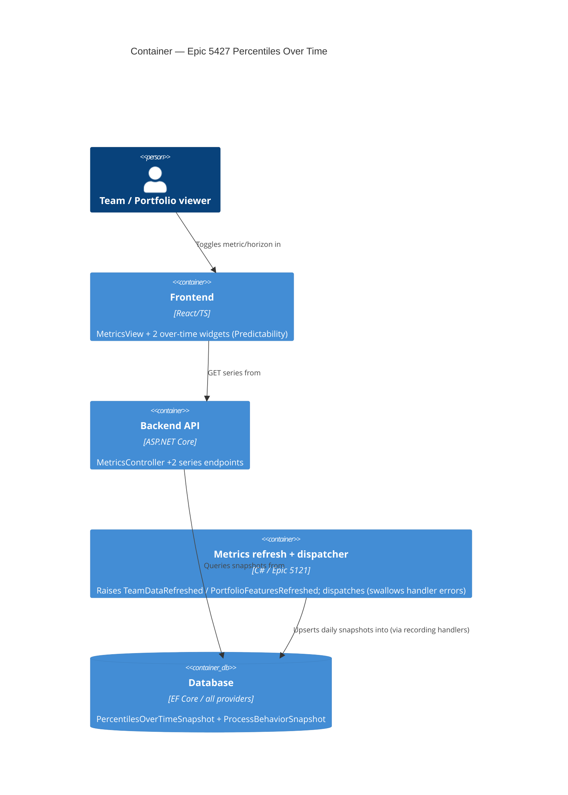
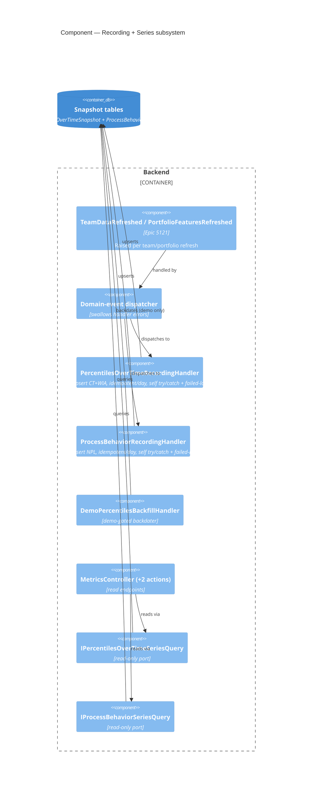

# Feature: Percentiles Over Time (Epic 5427)

**Epic**: ADO 5427 — "Show Percentiles over Time Charts" (Community / Productboard)
**Feature id**: `epic-5427-percentiles-over-time`
**Wave**: DISTILL (complete) → DELIVER next
**Density**: lean (Tier-1 [REF] only; expansions on demand via `--expand <id>`)

---

## Wave: DISCUSS / [REF] Pre-requisites

- **Snapshot precedent exists**: `DeliveryMetricSnapshot` (Epic 3993) and `BlockedCountSnapshot` (Epic 5074)
  are forward-only, one-row-per-day metric snapshot entities written on a refresh/domain event. This
  epic reuses that exact pattern — no new persistence paradigm.
- **Point-in-time metrics already computed**: CT percentiles (`percentiles` widget), WIA percentiles
  (`workItemAgePercentiles`), and PBC NPLs (`throughputPbc`/`cycleTimePbc`/… in the Predictability
  category) all exist as *current-window* computations. Their only "trend" today is `previous-period`
  (a single up/down arrow comparing two equal windows — `getTrendPolicy` in `categoryMetadata.ts`).
  **No daily percentile/PBC persistence exists** (verified: only two `*Snapshot` DbSets).
- **Domain-event bus** (Epic 5121) is the recording trigger: metric refresh raises an event, a handler
  records the fresh numbers, latest-write-wins per calendar day. Mind dispatch-freshness/ordering
  (known gotcha: dispatcher swallows handler errors — recording must be resilient and idempotent-per-day).
- **Multiple-cycle-times & RBAC** are untouched: this feature is **free-tier, ungated** (Decision D3).

## Wave: DISCUSS / [REF] Personas

| Persona ID | One-line identifier |
|---|---|
| `flow-coach` | Runs periodic flow/ops reviews for a team or train; asks "is our predictability firming up or slipping?" — **primary**. |
| `delivery-lead-rte` | Cumulative/systemic lens; reads process-behaviour (NPL) stability over time across the portfolio — **secondary (PBC-over-time)**. |
| `product-owner` | Consumes the same charts in reviews; no bespoke view — tertiary, no dedicated story. |

## Wave: DISCUSS / [REF] JTBD one-liners

- **job-flow-coach-see-predictability-trend** — *When I run a periodic flow/ops review, I want to see how
  our cycle-time and work-item-age percentiles have moved over the last N days, so I can tell whether our
  predictability is firming up or degrading — and show it, not assert it.*
- **job-delivery-lead-see-process-stability-trend** — *When I review a team/portfolio's process health, I
  want to see how the PBC natural process limits (UNPL/Average/LNPL) have moved day by day, so I can spot
  a genuine process shift over time rather than reacting to a single out-of-limit point.*

Both are the flow-metric siblings of `job-forecast-delivery-trend-over-time` (delivery-metrics): honest
*trend* story over a forward-only snapshot, not a point-in-time number.

## Wave: DISCUSS / [REF] Locked Decisions

| ID | Decision | Verdict | Source |
|---|---|---|---|
| D1 | Widget UX | **Combined CT+WIA "Percentiles Over Time" widget** with toggle rows `[ WIA \| CT-30 \| CT-60 \| CT-90 ]`; PBC-over-time is a **separate** widget with a metric-type toggle. | User (AskUserQuestion) |
| D2 | Walking skeleton / first slice | **Cycle Time percentiles over time** — proves the daily-snapshot pipeline **and** the 30/60/90 horizon dimension **and** the combined-widget shell in one thin slice. | User |
| D3 | License gating | **Free-tier, ungated** — same as the sibling point-in-time PBC/percentile widgets. No premium/RBAC change. | User |
| D4 | CT lookback horizons | **30/60/90 snapshotted daily**, widget toggles between them (mirrors the WIA↔CT toggle in the Aging chart). | User |
| D5 | Persistence model | **Forward-only, latest-write-wins per calendar day**, one snapshot row per (metric, horizon, day). Event-driven on refresh. Reuses `DeliveryMetricSnapshot`/`BlockedCountSnapshot` shape. | Epic body + precedent |
| D6 | Empty-state honesty | Over-time charts are forward-only; on a fresh team they read *"builds forward from today — no snapshots recorded yet"*, never a broken/empty chart. Same contract as delivery-metrics forecast trend. | Precedent (job-forecast-delivery-trend) |
| D7 | Colouring | CT/WIA percentile lines keep the existing **red→green** percentile colour ramp (50/70/85/95). PBC keeps UNPL/Average/LNPL styling. Consistency, no new visual language. | Epic body |
| D8 | Placement | Combined percentiles-over-time widget and PBC-over-time widget both live in the **Predictability** category (`categoryMetadata.ts`), team **and** portfolio scope. Feature-Size variants stay `portfolio-only`. | Epic body |

## Wave: DISCUSS / [REF] Scope Assessment: SPLIT (user-approved)

Oversized signals fired (≥2): three metric families (CT, WIA, PBC×6 types) · new persistence + event
recording · multiple widgets · >1 week effort. **Split into 4 elephant-carpaccio slices** (below). Each
ships end-to-end in ≤1 day, each with a named learning hypothesis, each with a value-bearing story.
The shared snapshot-recording pipeline is a new abstraction all slices need — per the taste test it is
**not** shipped as an @infrastructure-only slice (that would trip the hard gate); it lands **inside**
Slice 1 alongside the user-visible CT chart.

## Wave: DISCUSS / [REF] Story Map + WS strategy

**Backbone**: Record daily metric snapshot → Serve over-time series → Render over-time chart → Read the trend.

**WS strategy = A (thinnest end-to-end vertical)**: Slice 1 (CT percentiles over time) walks the full
backbone with the least incidental complexity beyond the horizon dimension.

| Slice | Story | Type | Ships |
|---|---|---|---|
| 01 | US-01 CT percentiles over time (widget shell + 30/60/90 toggle) | value | combined widget (CT tabs only), snapshot entity, event recorder, HTTP series endpoint |
| 01 | US-02 forward-only daily snapshot recording | `@infrastructure` (lands within slice 01) | event handler, latest-per-day write, migration |
| 02 | US-03 WIA percentiles over time (WIA tab) | value | WIA snapshot + WIA tab on the combined widget |
| 03 | US-04 Throughput PBC NPLs over time | value | PBC-over-time widget shell (Throughput active) |
| 04 | US-05 PBC over time — remaining type toggles | value | WIA/WIP/CT/Arrivals/Feature-Size(portfolio) toggle options |

Slice briefs: `docs/feature/epic-5427-percentiles-over-time/slices/slice-0{1..4}-*.md`.

## Wave: DISCUSS / [REF] User Stories

### US-01 — Cycle Time percentiles over time
`job_id: job-flow-coach-see-predictability-trend` · slice 01 · **value**

As a flow coach, I want a chart of my team's cycle-time percentiles (50/70/85/95) plotted day by day for
a chosen lookback horizon, so I can see whether cycle-time predictability is tightening or drifting.

#### Elevator Pitch
Before: I can see today's CT percentiles as four numbers, but not whether they're getting better or worse over time.
After: open **Team → Metrics → Predictability → "Percentiles Over Time"**, keep the default `CT-30` toggle → see four dated lines (50/70/85/95, red→green) trending across the range.
Decision enabled: decide whether last month's process change actually tightened cycle time, or just moved a single number.

#### Acceptance Criteria
- AC1: The combined "Percentiles Over Time" widget appears in the **Predictability** category for team and portfolio scope, with a toggle row `[ CT-30 | CT-60 | CT-90 ]` (WIA tab arrives in US-03).
- AC2: Selecting a CT horizon renders 50/70/85/95 percentile lines, one point per calendar day in the selected date range, using the existing red→green percentile colour ramp (D7).
- AC3: Each day's value is the CT percentile computed over that horizon **as of that day** — read from the persisted daily snapshot, not recomputed live for historical days.
- AC4: On a team with no snapshots yet, the widget shows the honest empty state *"builds forward from today — no snapshots recorded yet"* (D6), never a broken axis.
- AC5: Switching `30 ↔ 60 ↔ 90` re-plots from already-persisted horizon series without a backend recompute of history.

### US-02 — Forward-only daily snapshot recording `@infrastructure`
`job_id: job-flow-coach-see-predictability-trend` (enabler) · slice 01 · lands **within** slice 01

As the system, on each metrics refresh I record the fresh CT-percentile numbers for today, keeping only
the latest write per calendar day, so the over-time chart has one honest point per day going forward.

#### Acceptance Criteria
- AC1: A metrics-refresh domain event triggers a handler that records CT percentiles for horizons 30/60/90 for the current day.
- AC2: Re-running the refresh N times the same day overwrites (latest-write-wins) — exactly one row per (team, metric, horizon, day). *(Blast radius: verify with a same-day double-refresh test.)*
- AC3: Recording is forward-only — no historical backfill of real data; the series starts the day recording begins.
- AC4: A handler failure does not break the refresh path and is observable (recall: the dispatcher swallows handler errors — do not rely on it surfacing).
- AC5: EF migration is expand-only/additive (new table, no destructive change), generated via the `CreateMigration` script across all providers.

> Slice-composition gate: Slice 01 contains US-01 (value) + US-02 (`@infrastructure`) → passes (≥1 value story).

### US-03 — Work Item Age percentiles over time
`job_id: job-flow-coach-see-predictability-trend` · slice 02 · **value**

As a flow coach, I want a **WIA** tab on the same widget showing work-item-age percentiles (50/70/85/95)
day by day, so I read age and cycle-time predictability trends from one surface.

#### Elevator Pitch
Before: the over-time widget only shows cycle-time horizons; work-item-age trend isn't there.
After: click the **WIA** toggle on "Percentiles Over Time" → see 50/70/85/95 age percentiles trending day by day.
Decision enabled: decide whether in-progress work is ageing worse over time even when finished-item cycle time looks stable.

#### Acceptance Criteria
- AC1: The widget's toggle row becomes `[ WIA | CT-30 | CT-60 | CT-90 ]`; WIA has no horizon dimension (age is as-of-today).
- AC2: The WIA tab renders 50/70/85/95 daily lines from a persisted WIA-percentile daily snapshot, reusing the US-02 recording pipeline (no second bespoke pipeline).
- AC3: Empty-state and red→green colouring behave identically to the CT tabs (D6/D7).

### US-04 — Throughput PBC natural process limits over time
`job_id: job-delivery-lead-see-process-stability-trend` · slice 03 · **value**

As a delivery lead, I want a chart of the **Throughput** PBC's UNPL/Average/LNPL plotted day by day, so I
can see whether the natural process limits are shifting — a real process change vs a one-off signal.

#### Elevator Pitch
Before: the Throughput PBC shows one current set of limits; I can't see when the limits actually moved.
After: open **Predictability → "PBC Over Time"** (Throughput selected) → see UNPL / Average / LNPL as three dated lines.
Decision enabled: decide whether a process change genuinely shifted the limits, or the chart just caught a single special-cause point.

#### Acceptance Criteria
- AC1: A separate "PBC Over Time" widget appears in the Predictability category with a metric-type toggle showing **Throughput** (further types in US-05).
- AC2: Renders UNPL, Average, LNPL as three daily lines from a persisted PBC-NPL daily snapshot, reusing the US-02 recording pipeline.
- AC3: NPL styling matches the existing point-in-time PBC widgets (D7); empty state per D6.

### US-05 — PBC over time: remaining metric-type toggles
`job_id: job-delivery-lead-see-process-stability-trend` · slice 04 · **value**

As a delivery lead, I want the PBC-over-time widget to toggle across all PBC metric types, so I can read
limit-stability for whichever behaviour I'm reviewing.

#### Elevator Pitch
Before: PBC-over-time only covers Throughput.
After: use the type toggle to switch to **WIA / WIP / CT / Arrivals / Feature Size** → each shows its own UNPL/Average/LNPL over time.
Decision enabled: decide which behaviour's process limits are actually drifting, across the full PBC set.

#### Acceptance Criteria
- AC1: Toggle exposes Throughput, WIA, WIP, Cycle Time, Arrivals, and (portfolio-only) Feature Size.
- AC2: Each type reads its own persisted NPL daily series; Feature Size stays `portfolio-only` (D8).
- AC3: Adding a type does not alter the US-04 Throughput behaviour (regression-guarded).

## Wave: DISCUSS / [REF] Outcome KPIs

| KPI | Target | Measurement |
|---|---|---|
| Recording correctness | Exactly 1 snapshot row per (team, metric, horizon, calendar day) under repeated same-day refresh | Backend integration test asserting row count after N refreshes = 1 |
| Pipeline reuse | ≥2 metric families (CT, WIA) + PBC share **one** recording pipeline (no per-metric bespoke recorder) | Code review + AT: single handler/table family drives all series |
| Trend readability | Flow coach identifies "firming vs drifting" from the chart in a 5-min review without export | Dogfood on a real Lighthouse team; qualitative confirm |
| Empty-state honesty | 0 charts render a broken/empty axis on a fresh team | E2E on a zero-snapshot team asserts the honest empty-state copy |
| Mutation kill rate | ≥80% backend + frontend on new snapshot/recording/series code | Stryker.NET + Stryker per feature (per-feature mandate) |

## Wave: DISCUSS / [REF] Definition of Done

1. All 5 user stories' ACs pass (US-02 within slice 01).
2. `dotnet build` zero warnings; `dotnet test` green; `pnpm test`/`pnpm build`/Biome clean.
3. New EF migration additive/expand-only, generated via `CreateMigration` across all providers.
4. Mutation testing ≥80% BE + FE on new code (per-feature).
5. Forward-only recording is idempotent-per-day and resilient to handler failure.
6. Empty-state honesty verified by E2E on a zero-snapshot team.
7. Demo data: a backfill handler backdates snapshots so demo/screenshot E2Es show populated charts
   (precedent: `DemoBlockedHistoryBackfillHandler`) — **not** shipped to real tenants.
8. Docs + per-feature screenshots at feature finalization (one `@screenshot` per theme; `rm` old PNG first).
9. SonarCloud gate: no new issues. ADO 5427 children mirrored + state-transitioned.

## Wave: DISCUSS / [REF] Out of scope

- Premium gating / RBAC changes (D3: free-tier).
- Backfilling **real** historical percentiles (forward-only by design, D5; only demo data is backdated).
- Overlaying percentile-over-time on the existing scatter/aging charts (dedicated widgets only, D1).
- Configurable per-team horizons beyond the fixed 30/60/90 set (D4).
- Alerting/thresholds on trend direction (read-only charts this epic).
- New export/CSV of the series.

## Wave: DISCUSS / [REF] Driving Ports (inbound surfaces)

- **HTTP**: `GET` team & portfolio metrics endpoints returning the over-time series (CT-by-horizon,
  WIA, PBC-NPL-by-type) — extend the existing MetricsController surface, do not fetch a new bespoke route from a component.
- **Domain event (inbound)**: metrics-refresh event → snapshot-recording handler (US-02).
- **UI actions**: "Percentiles Over Time" widget toggle (`WIA | CT-30 | CT-60 | CT-90`); "PBC Over Time"
  widget metric-type toggle — both via the existing MetricsView widget/hook plumbing.

## Wave: DISCUSS / [REF] DoR Validation

| # | DoR item | Status |
|---|---|---|
| 1 | Job traceability | ✓ every story → real `job_id` (2 jobs added to `jobs.yaml`) |
| 2 | Elevator pitch per value story | ✓ US-01/03/04/05 (US-02 is `@infrastructure`, gated within a value slice) |
| 3 | Testable ACs | ✓ each AC verifiable end-to-end |
| 4 | Personas defined | ✓ flow-coach (primary), delivery-lead-rte (secondary) |
| 5 | Journey mapped | ✓ `docs/product/journeys/epic-5427-percentiles-over-time.yaml` |
| 6 | Slices ≤1 day, learning hypothesis each | ✓ 4 slice briefs |
| 7 | Outcome KPIs numeric | ✓ 5 KPIs with targets |
| 8 | Out-of-scope explicit | ✓ |
| 9 | No silent N/A | ✓ premium/RBAC/CLI-MCP-versioning explicitly N/A (free-tier, no client surface) |

## Wave: DISCUSS / [REF] Wave Decisions Summary

- **Primary need**: honest *trend* of flow-metric percentiles/NPLs over time, not a point-in-time number
  — the flow-metric sibling of the delivery-metrics over-time trend.
- **Feature type**: user-facing (new charts) + backend (forward-only snapshot persistence + event recorder).
- **Walking skeleton**: CT percentiles over time (D2) — full backbone, least incidental complexity.
- **Constraints**: forward-only latest-per-day persistence; free-tier; reuse `DeliveryMetricSnapshot`
  pattern + Epic 5121 event bus; empty-state honesty mandatory; expand-only migrations.
- **Upstream changes**: none — no DISCOVER/DIVERGE artifacts for this epic; SSOT extended additively.

## Next Wave

**Handoff → DESIGN** (`nw-solution-architect`) with full artifact set + **DEVOPS** (`nw-platform-architect`,
KPIs only). Key DESIGN questions: snapshot table shape (one wide table with a metric+horizon+type
discriminator vs per-family tables), the recording handler's placement on the refresh path, and the
series HTTP contract shared by both widgets.

---

## Wave: DESIGN / [REF] Decisions

| ID | Decision | Verdict | ADR |
|---|---|---|---|
| DDD-1 | Snapshot table shape | **Hybrid 2-table**: `PercentilesOverTimeSnapshot` (CT+WIA, `MetricType` + nullable `Horizon`, `P50/70/85/95`) + `ProcessBehaviorSnapshot` (`MetricType`, `Unpl/Average/Lnpl`). Not one wide discriminator, not per-family 3-table. | [ADR-106](../../product/architecture/adr-106-percentiles-over-time-snapshot-table-shape.md) |
| DDD-2 | Recording placement | **New handlers on the existing refresh events** (`TeamDataRefreshed` + `PortfolioFeaturesRefreshed`), mirroring `BlockedCountSnapshotRecordingHandler`. Idempotent-per-day upsert; self-try/catch + failure log (dispatcher swallows errors). Not inline, not scheduled. | [ADR-107](../../product/architecture/adr-107-percentiles-recording-handler-on-refresh-events.md) |
| DDD-3 | Series HTTP contract | **Two typed read endpoints** on `MetricsController` (percentiles-over-time?horizon; process-behavior-over-time?type). Not one polymorphic envelope. | [ADR-108](../../product/architecture/adr-108-percentiles-over-time-series-http-contract.md) |
| DDD-4 | Demo data | **`DemoPercentilesBackfillHandler`** backdates snapshots for demo connections only; real tenants stay forward-only. Mirrors `DemoBlockedHistoryBackfillHandler`. | [ADR-109](../../product/architecture/adr-109-demo-percentiles-backfill-handler.md) |
| DDD-5 | Idempotency mechanism | Upsert on the natural-key predicate `(OwnerId, OwnerType, MetricType, Horizon?, RecordedAt=today)`; update-in-place on same-day re-run → exactly one row per key per day (US-02 AC2). | ADR-106/107 |
| DDD-6 | Failure isolation | Each recording handler wraps its own work in try/catch + emits a structured recording-failed signal; refresh path structurally protected by the dispatcher's error-swallowing (do not rely on it surfacing). | ADR-107 |
| DDD-7 | Paradigm | OOP, modular monolith + ports-and-adapters — unchanged (project CLAUDE.md). No paradigm write needed. | ADR-027 |

## Wave: DESIGN / [REF] Component Decomposition

| Component | Path (new/extend) | Change |
|---|---|---|
| `PercentilesOverTimeSnapshot` (entity) | `Lighthouse.Backend/.../Models/` | CREATE NEW — `OwnerId/OwnerType/RecordedAt/MetricType/Horizon?/P50..P95` |
| `ProcessBehaviorSnapshot` (entity) | `Lighthouse.Backend/.../Models/` | CREATE NEW — `OwnerId/OwnerType/RecordedAt/MetricType/Unpl/Average/Lnpl` |
| `IPercentilesOverTimeSnapshotRepository` + impl | `.../Services/{Interfaces,Implementation}/Repositories/` | CREATE NEW — thin `RepositoryBase<T>` (BlockedCount idiom) |
| `IProcessBehaviorSnapshotRepository` + impl | same | CREATE NEW — thin `RepositoryBase<T>` |
| `PercentilesOverTimeRecordingHandler` | `.../Services/Implementation/DomainEvents/` | CREATE NEW — `IDomainEventHandler<TeamDataRefreshed>,<PortfolioFeaturesRefreshed>` |
| `ProcessBehaviorRecordingHandler` | same | CREATE NEW — same two interfaces |
| `DemoPercentilesBackfillHandler` | same | CREATE NEW — demo-gated backdater |
| `IPercentilesOverTimeSeriesQuery` / `IProcessBehaviorSeriesQuery` (read ports) | `.../Services/{Interfaces,Implementation}/` | CREATE NEW — read-only query ports |
| `MetricsController` (team + portfolio) | `.../Controllers/` | EXTEND — +2 GET actions each |
| `ITeamMetricsService` / `IPortfolioMetricsService` | `.../Services/Interfaces/` | EXTEND — expose CT/WIA percentile + PBC as-of-today reads for the handlers |
| EF migration | via `CreateMigration` script (all providers) | EXTEND process — additive, 2 new tables |
| Percentiles-Over-Time widget (combined CT/WIA toggle) | `Lighthouse.Frontend/src/pages/Common/MetricsView/` | CREATE NEW — reuses `IPercentileValue[]`, D7 ramp, empty-state pattern |
| PBC-Over-Time widget (metric-type toggle) | same | CREATE NEW — reuses UNPL/Avg/LNPL styling |
| `categoryMetadata.ts` (Predictability) | `.../MetricsView/` | EXTEND — register 2 widgets, team+portfolio (D8) |

## Wave: DESIGN / [REF] Driving Ports (inbound)

- **HTTP (read)**: `GET .../metrics/percentiles-over-time?horizon={30|60|90}` → `{recordedAt, metricType, p50, p70, p85, p95}[]`; `GET .../metrics/process-behavior-over-time?type={Throughput|WorkItemAge|Wip|CycleTime|Arrivals|FeatureSize}` → `{recordedAt, unpl, average, lnpl}[]`. On `MetricsController` (team + portfolio); Feature-Size portfolio-only. Read-gate inherited (D3 ungated).
- **Domain event (inbound)**: `TeamDataRefreshed` / `PortfolioFeaturesRefreshed` → the two recording handlers (+ demo backfill handler, demo-gated).
- **UI actions**: Percentiles-Over-Time toggle `[WIA|CT-30|CT-60|CT-90]`; PBC-Over-Time metric-type toggle — via existing `MetricsView` widget/hook plumbing.

## Wave: DESIGN / [REF] Driven Ports + Adapters

- `IPercentilesOverTimeSnapshotRepository` / `IProcessBehaviorSnapshotRepository` → EF `RepositoryBase<T>` → `LighthouseAppContext` DbSets (write: upsert; read: query ports). Adapter = EF Core across all providers.
- Metrics services (`ITeamMetricsService` / `IPortfolioMetricsService`) → in-process read of today's percentile/PBC numbers (no new external adapter).
- No external integration (no connector call for recording — values are Lighthouse-computed). Pact/contract-testing **N/A**.

## Wave: DESIGN / [REF] Technology Choices

- Backend: C# .NET 10, EF Core (all supported providers), NUnit 4.6 + Moq + EF InMemory — unchanged.
- Persistence: 2 additive tables via `CreateMigration` (expand-only, never `dotnet ef migrations add`).
- Frontend: React 18 + TS, existing MUI-X charting (reuse point-in-time percentile/PBC chart components + D7 ramp).
- No new library, no new runtime, no new bounded context.

## Wave: DESIGN / [REF] Reuse Analysis

| Existing component | File / symbol | Overlap | Decision | Justification |
|---|---|---|---|---|
| Refresh events | `TeamDataRefreshed`, `PortfolioFeaturesRefreshed` | recording trigger | **EXTEND** | new subscribers, same events (verified: `BlockedCountSnapshotRecordingHandler` subscribes both) |
| `BlockedCountSnapshotRecordingHandler` | `.../DomainEvents/` | snapshot-on-refresh idiom | **CREATE NEW handler** | genuinely different computation (percentile/PBC math), same events; not a reimplementation |
| `DeliveryMetricSnapshot` / `BlockedCountSnapshot` | `Models/` | forward-only 1-row/day snapshot shape | **CREATE NEW entities** | reuse the pattern (`RecordedAt:DateOnly`, `(Owner,RecordedAt)` upsert), not the columns |
| `RepositoryBase<T>` + `BlockedCountSnapshotRepository` | `.../Repositories/` | repo plumbing | **EXTEND pattern → CREATE NEW repos** | thin `RepositoryBase<T>` subclasses, identical idiom |
| `MetricsController` (team + portfolio) | `.../Controllers/` | series endpoints | **EXTEND** | +2 GET actions; constraint = extend, no bespoke route |
| `ITeamMetricsService` / `IPortfolioMetricsService` | `.../Services/Interfaces/` | metric compute | **EXTEND** | `GetThroughputProcessBehaviourChart(...)` + percentile reads already here (verified) |
| Point-in-time percentile / PBC widgets, `IPercentileValue[]` | `Charts/WorkItemAgePercentiles.tsx` | charting + D7 ramp | **EXTEND/parallel** | reuse chart + ramp + empty-state; new over-time wrappers |
| `categoryMetadata.ts` Predictability | `.../MetricsView/` | widget registration | **EXTEND** | register 2 widgets team+portfolio (D8); ungated (D3) |
| `DemoBlockedHistoryBackfillHandler` | `.../DomainEvents/` | demo backdating + idempotency + demo-gate | **CREATE NEW handler** | different snapshot tables, same demo idiom |
| EF migration | `CreateMigration` script | schema add | **EXTEND process** | additive, all providers |

Every row defaults EXTEND; the four CREATE-NEW (2 entities, 2 handler families, repos, demo handler) are new computation/shape/table — **zero unjustified CREATE NEW**.

## Wave: DESIGN / [REF] C4

**System Context**: no delta — percentiles/PBC stay Lighthouse-computed; the work-tracking connector is never asked for trend data.

## Wave: DESIGN / [REF] Open Questions (deferred to DISTILL/DELIVER)

- **CT percentile source per horizon**: confirm during DELIVER that `ITeamMetricsService` can compute CT percentiles for a 30/60/90 window as-of-today without a bespoke recompute path (the point-in-time percentile widget uses the team's configured window). If not, a thin per-horizon read is added to the service (EXTEND).
- **Demo backfill window length**: number of backdated days for demo/screenshot charts — pick in DELIVER to match the sibling `DemoBlockedHistoryBackfillHandler` window.
- **PBC-over-time day grain**: the point-in-time PBC recomputes limits over a window; the daily snapshot records that day's computed UNPL/Avg/LNPL — confirm the recompute is cheap enough to run per refresh (spike-free; measured in DELIVER, fall back to caching if hot).

## Wave: DESIGN / [REF] Outcome Collision Check

Skipped — `docs/product/outcomes/registry.yaml` does not exist (no outcomes registry in this repo). No SSOT to collide against; recorded explicitly rather than silently.

## Next Wave

**Handoff → DEVOPS** (`nw-platform-architect`, KPIs only — no infra change, single monolith, no new deploy surface) **and DISTILL** (`nw-acceptance-designer`) with the full artifact set. Key AT targets: same-day double-refresh → exactly 1 row per key (US-02 AC2); recording-failure leaves refresh green + emits signal (US-02 AC4/DDD-6); zero-snapshot owner → honest empty-state, never broken axis (US-01 AC4/D6); horizon toggle re-plots from persisted series, no recompute (US-01 AC5); demo backfill demo-gated, real tenants forward-only (DDD-4).

---

## Wave: DEVOPS / [REF] Pre-requisites

DESIGN constraints the platform must satisfy (all met by the existing Lighthouse platform — **zero new infra**):
- Two additive EF tables + unique natural-key indexes, applied on **both** providers (SQLite + PostgreSQL) via the existing `CreateMigration` script (expand-only).
- Recording handlers subscribe the existing `TeamDataRefreshed` / `PortfolioFeaturesRefreshed` events; failure must be isolated from the refresh path (dispatcher swallows handler errors) and observable via structured logging.
- Free-tier/ungated: no new secrets, config keys, RBAC, or license gate.

## Wave: DEVOPS / [REF] Environment Matrix

| Environment | Platform | Preconditions |
|---|---|---|
| local-dev | linux/macos/windows/wsl | dotnet 10 + pnpm; migration applies 2 tables on startup |
| ci-sqlite | linux (GH Actions) | existing `ci_verifysqlite.yml`; additive migration clean on SQLite |
| ci-postgres | linux (GH Actions) | existing `ci_verifypostgres.yml`; 2 tables + unique indexes clean on Postgres |
| e2e-demo-screenshot | linux | existing Playwright; DEMO connection → `DemoPercentilesBackfillHandler` backdates → populated charts; `rm` stale PNG first |
| customer-self-hosted | linux/windows/macos/docker | migration on startup; forward-only → empty-state until days accrue; no telemetry |

Full inventory + coexistence + deployment assumptions: `environments.yaml`.

## Wave: DEVOPS / [REF] CI/CD Pipeline Outline

**No new workflow** — the feature rides the existing "Build And Deploy Lighthouse" pipeline:
- `dotnet build` (TreatWarningsAsErrors) + `dotnet test` (NUnit) — new snapshot/recording/query tests.
- `ci_verifysqlite.yml` + `ci_verifypostgres.yml` — the additive migration + idempotency integration tests run on both providers.
- `pnpm build` (tsc + vite, zero warnings) + `pnpm test` (Vitest) + Biome — new widgets/hooks.
- `ci_e2e.yml` — empty-state E2E + one `@screenshot` per theme for the two widgets.
- SonarCloud Cloud analysis — no new issues.
- Stryker.NET + Stryker (frontend) per-feature, `>= 80%` on new code.

## Wave: DEVOPS / [REF] Monitoring Contracts (KPI → instrument)

| KPI (OUT-id) | Instrument | Scope | Gate |
|---|---|---|---|
| OUT-5427-recording-idempotency | BE integration test: N same-day refreshes → 1 row/key | vendor_demo_only (CI) | hard (CI red) |
| OUT-5427-recording-failure-isolation | BE AT: forced handler exception → refresh green + structured Serilog recording-failed event | per_instance (operator logs) + CI | hard (CI red) |
| OUT-5427-empty-state-honesty | E2E on zero-snapshot owner → D6 empty-state copy, never broken axis | vendor_demo_only (CI E2E) | hard (CI red) |
| OUT-5427-pipeline-reuse | Code review + AT: one recording pipeline drives CT+WIA+PBC | vendor_demo_only | soft (review) + AT |
| OUT-5427-mutation-kill-rate | Stryker.NET + Stryker per-feature on new code | vendor_demo_only | hard (>= 80%) |

Instrumentation deltas recorded in SSOT `docs/product/kpi-contracts.yaml` (5 appended outcomes). Self-hosted product, no central telemetry — trend-readability (DISCUSS KPI 3) is a **vendor-demo dogfood qualitative** check, not an automated gate.

## Wave: DEVOPS / [REF] Observability Stack

- **Logs**: existing Serilog structured logging (`ILogger<T>`). New signal: a **recording-failed** structured event per handler (fields: owner id/type, metric family, exception) — the handler's own observability, since the dispatcher swallows errors.
- **Metrics/traces**: no new instrument. In-app admin-visible aggregation only (self-hosted; no phone-home).
- No new observability tool, no dashboard change.

## Wave: DEVOPS / [REF] Deployment Strategy

Rides the existing Lighthouse deploy (server + standalone). Rollback contract: the two tables are additive/expand-only, so a rollback of the app code leaves orphan-but-inert tables (no destructive change, no data migration to reverse) — consistent with the expand-only migration mandate. No blue-green/canary change; the feature is behind no flag (free-tier, additive).

## Wave: DEVOPS / [REF] Mutation Testing Strategy

**per-feature** (inherited — already declared in project `CLAUDE.md` `## Mutation Testing Strategy`; no write needed). Stryker.NET (backend) + Stryker (frontend), `>= 80%` kill on new snapshot/recording/query/widget code. High-value targets: upsert idempotency, failure isolation, empty-series read, horizon-toggle re-plot.

## Wave: DEVOPS / [REF] Branching Strategy

**Trunk-based on `main`** (inherited project convention). CI gates on every push to `main`; feature ships in focused commits per slice, push at slice end, wait for CI green, then ADO Active→Resolved. No feature-branch/PR flow.

## Wave: DEVOPS / [REF] Coexistence Matrix

Must-not-break alongside this deployment (full list in `environments.yaml`):
- existing BlockedCount / DeliveryMetric recording handlers (share the same refresh events)
- existing point-in-time percentile/PBC widgets + `categoryMetadata.ts` registration
- existing metrics-refresh path (US-02 AC4 — recording failure must not break it)
- existing Stryker, SonarCloud gate, and `@screenshot` E2E suite

## Wave: DEVOPS / [REF] Changed Assumptions

None. DEVOPS introduces no infra, CI, deploy, or observability change; every DESIGN assumption stands. No upstream-changes.md.

## Next Wave

**Handoff → DISTILL** (`nw-acceptance-designer`) with `environments.yaml` (Mandate 4) + the 5 KPI contracts. AT priorities: same-day double-refresh idempotency (OUT-5427-recording-idempotency), forced-failure refresh-green + signal (OUT-5427-recording-failure-isolation), zero-snapshot empty-state (OUT-5427-empty-state-honesty), horizon-toggle re-plot without recompute (US-01 AC5), demo-gated backfill (DDD-4). Parametrize over `ci-sqlite` + `ci-postgres` (migration + unique-index behaviour differs by provider).

---

## Wave: DISTILL / [REF] Pre-requisites

- **DESIGN driving ports** (from DESIGN [REF]): the two "over-time" widgets (UI driving adapters), the metrics-refresh domain events `TeamDataRefreshed`/`PortfolioFeaturesRefreshed` (inbound recording port), and the two typed `MetricsController` GET endpoints (read ports).
- **DEVOPS environment matrix** (`environments.yaml`): scenarios parametrize over `ci-sqlite` + `ci-postgres` (the additive migration + unique-index behaviour differs by provider); the `e2e-demo-screenshot` env drives the populated-chart E2Es via `DemoPercentilesBackfillHandler`.
- **Reconciliation gate**: read DISCUSS (D1–D8), DESIGN (DDD-1..7), DEVOPS (inherit-existing) from this feature-delta — **0 contradictions, reconciliation passed**.

## Wave: DISTILL / [REF] Scenario List (tags)

| # | Scenario | File | Tags |
|---|---|---|---|
| 1 | Flow coach reads dated CT-30/60/90 trend + horizon re-plot without recompute | walking-skeleton | `@walking_skeleton @real-io @driving_adapter @us-01` |
| 2 | Refresh records today's CT percentiles for all horizons | milestone-1 | `@real-io @driving_port @us-02` |
| 3 | Same-day re-refresh overwrites (1 row/key) | milestone-1 | `@real-io @driving_port @us-02` |
| 4 | Forward-only — no historical days fabricated | milestone-1 | `@edge @us-02` |
| 5 | Recording failure does not break refresh + is logged | milestone-1 | `@error @us-02` |
| 6 | Two snapshot stores added additively on SQLite + Postgres | milestone-1 | `@real-io @adapter-integration @us-02` |
| 7 | WIA tab renders dated age percentiles (no horizon) | milestone-2 | `@real-io @driving_adapter @us-03` |
| 8 | WIA recorded by the SAME pipeline (no 2nd recorder) | milestone-2 | `@real-io @driving_port @us-03` |
| 9 | Fresh-team WIA honest empty-state | milestone-2 | `@edge @us-03` |
| 10 | Throughput PBC over time (upper/avg/lower) | milestone-3 | `@real-io @driving_adapter @us-04` |
| 11 | Throughput limits recorded by shared pipeline | milestone-3 | `@real-io @driving_port @us-04` |
| 12 | Fresh-team PBC honest empty-state | milestone-3 | `@edge @us-04` |
| 13 | PBC type toggle across Throughput/WIA/WIP/CT/Arrivals | milestone-4 | `@real-io @driving_adapter @us-05` |
| 14 | Feature Size portfolio-only | milestone-4 | `@real-io @driving_adapter @us-05` |
| 15 | Adding types does not regress Throughput | milestone-4 | `@regression @us-05` |

Error/edge/regression coverage = 6/15 (40%) — meets the ≥40% non-happy-path target.

## Wave: DISTILL / [REF] WS Strategy + Two-Tier Composition

- **Walking skeleton**: Scenario 1 (Slice 01 CT), `@walking_skeleton @driving_adapter`, closes the end-to-end loop through the production composition root (widget → HTTP → recorded snapshot). Litmus: a flow coach confirms "yes, that's the trend I need."
- **Architecture-of-Reference treatment** (project defaults): driving ports (widget, HTTP, refresh event) = real adapter; driven-internal (snapshot repositories via EF) = **real** (EF InMemory for handler/repo unit + Testcontainers-Postgres for the migration test — precedent `BlockedCountSnapshotMigrationTests`); no driven-external/non-deterministic port here (all values Lighthouse-computed; `DateTime.Today` is the only clock touch).
- **Tier A only** (Mandate 10): journeys are ≤2 chained scenarios and the observable is bounded (recorded rows, rendered lines, empty-state copy). No Tier B state-machine PBT — and the host is C#/NUnit, not the pytest/Hypothesis state-machine stack. No `tests/common/state_delta` port applies.

## Wave: DISTILL / [REF] Adapter Coverage (Mandate 6)

| Driven adapter | @real-io scenario | Covered by |
|---|---|---|
| PercentilesOverTimeSnapshot repository (EF) | YES | Scenarios 2/3/4 (real EF) + 6 (Postgres migration) |
| ProcessBehaviorSnapshot repository (EF) | YES | Scenarios 11 + 6 (Postgres migration) |
| Percentiles series query port | YES | Scenario 1 (read after record) |
| Process-behaviour series query port | YES | Scenario 10 |
| DemoPercentilesBackfillHandler (demo-gated) | YES | Scenarios 1/7/10 (demo-data E2E renders populated) |

Zero "NO — MISSING" rows.

## Wave: DISTILL / [REF] Driving Adapter Coverage

| Driving adapter (DESIGN) | Exercised via its protocol by |
|---|---|
| "Percentiles Over Time" widget (UI) | Scenarios 1, 7 — Playwright E2E through the real UI (POM), not a service call |
| "PBC Over Time" widget (UI) | Scenarios 10, 13, 14 — Playwright E2E |
| `MetricsController` percentiles-over-time GET | Scenario 1 read path — NUnit WebApplicationFactory integration |
| `MetricsController` process-behavior-over-time GET | Scenario 10 read path — WebApplicationFactory integration |
| Metrics-refresh domain events (recording) | Scenarios 2/3/4/5/8/11 — handler + integration tests raising the event |

Zero uncovered entry points.

## Wave: DISTILL / [REF] Test Placement

Precedent: the direct sibling `epic-5074-blocked-items` Slice-03 blocked-count-over-time.

| Artifact | Path | Precedent |
|---|---|---|
| Scenario specs (this wave) | `docs/feature/epic-5427-percentiles-over-time/acceptance/*.feature` | `epic-5074` / `api-keys` acceptance dirs |
| Acceptance/integration (per slice, DELIVER) | `Lighthouse.Backend.Tests/API/Integration/PercentilesOverTime/Slice0N…Scenarios.cs` (`[TestFixture][Category("acceptance")]`, partial class, Given/When/Then helpers) | `API/Integration/BlockedItems/Slice03BlockedTrendScenarios.cs` |
| Recording handler unit | `…/Services/Implementation/DomainEvents/{PercentilesOverTime,ProcessBehavior}RecordingHandlerTests.cs` | `BlockedCountSnapshotRecordingHandlerTests.cs` |
| Repository unit | `…/Services/Implementation/Repositories/{…}SnapshotRepositoryTests.cs` | `BlockedCountSnapshotRepositoryTests.cs` |
| Entity unit | `…/Models/{PercentilesOverTime,ProcessBehavior}SnapshotTests.cs` | `BlockedCountSnapshotTests.cs` |
| Migration (Postgres container) | `…/Integration/Containers/PercentilesOverTimeSnapshotMigrationTests.cs` | `BlockedCountSnapshotMigrationTests.cs` |
| E2E | `Lighthouse.EndToEndTests/tests/specs/flow/PercentilesOverTime.spec.ts` (POM, demo scenario 0 = Team Zenith) | `AgingPacePercentiles.spec.ts` |

## Wave: DISTILL / [REF] RED Mechanism (project reconciliation — deviates from Mandate 7)

**Mandate-7 src/ AssertionError scaffolds do NOT apply here.** This is a statically-typed C# trunk-green repo: a NUnit AT referencing a not-yet-existent type fails to **compile** → `dotnet build` red = BROKEN, not RED. The project's established RED mechanism (precedent `FlowEfficiencyReadApiIntegrationTest.cs`: *"every test is `[Ignore("pending — DELIVER")]` (RED-by-skip, not Broken)"*) is **RED-by-skip**:

- Executable `[Ignore("pending — DELIVER (epic-5427)")]` NUnit ATs + Playwright specs are authored in **DELIVER, per slice, alongside the minimal type skeletons** (so main always compiles + stays green). Each slice un-ignores its scenarios one at a time (skip-to-push / un-skip-to-resume convention).
- DISTILL's committed deliverable = the compile-independent **`.feature` scenario specs** above + these `[REF]` sections. This matches how `epic-5074` Slice-03 was structured.

## Wave: DISTILL / [REF] Register Outcomes

Skipped — no `docs/product/outcomes/registry.yaml` in this repo (the outcomes-registry pipeline is not adopted here). KPI contracts already carry the testable outcomes (`kpi-contracts.yaml`, 5 OUT-5427 rows added in DEVOPS). Recorded, not silently skipped.

## Wave: DISTILL / [REF] Deferred / Open

- **Trend readability** (DISCUSS KPI 3) is a vendor-demo dogfood qualitative check, not an automated scenario — no `@kpi` gate authored (self-hosted, no telemetry).
- Executable ATs + PBT unit tests authored per-slice in DELIVER (C# compile-coupling, above). The pre-DELIVER fail-for-right-reason gate becomes each slice's RED entry gate (ADR-025).

## Next Wave

**Handoff → DELIVER** (`nw-software-crafter`, OOP). Per-slice: create the minimal type skeletons + un-ignore that slice's `.feature`-derived NUnit/Playwright scenarios (RED), implement to GREEN, refactor, commit. Slice 01 (CT + shared recording pipeline) is the walking skeleton and ships first. Run Playwright locally before each commit; per-feature Stryker ≥80% at feature end.
