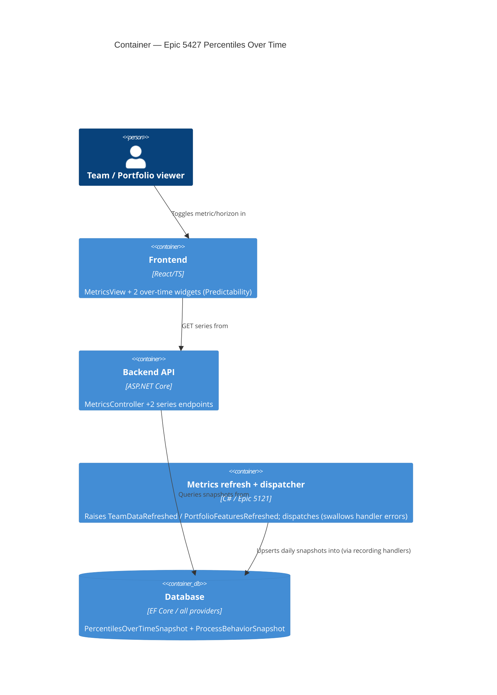
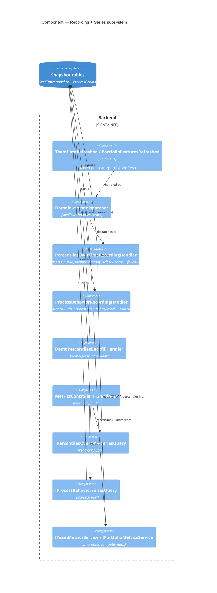

# Feature: Percentiles Over Time (Epic 5427)

**Epic**: ADO 5427 — "Show Percentiles over Time Charts" (Community / Productboard)
**Feature id**: `epic-5427-percentiles-over-time`
**Wave**: slices 01-03 DELIVERed · slice-03b DISCUSS + DESIGN (2026-07-26, ADO #5564) → DEVOPS/DISTILL next
**Density**: lean (Tier-1 [REF] only; expansions on demand via `--expand <id>`)

---

## Wave: DISCUSS / [REF] Pre-requisites

- **Snapshot precedent exists**: `DeliveryMetricSnapshot` (Epic 3993) and `BlockedCountSnapshot` (Epic 5074)
  are forward-only, one-row-per-day metric snapshot entities written on a refresh/domain event. This
  epic reuses that exact pattern — no new persistence paradigm.
- **Point-in-time metrics already computed**: CT percentiles (`percentiles` widget), WIA percentiles
  (`workItemAgePercentiles`), and PBC NPLs (`throughputPbc`/`cycleTimePbc`/… in the Predictability
  category) all exist as *current-window* computations. Their only "trend" today is `previous-period`
  (a single up/down arrow comparing two equal windows — `getTrendPolicy` in `categoryMetadata.ts`).
  **No daily percentile/PBC persistence exists** (verified: only two `*Snapshot` DbSets).
- **Domain-event bus** (Epic 5121) is the recording trigger: metric refresh raises an event, a handler
  records the fresh numbers, latest-write-wins per calendar day. Mind dispatch-freshness/ordering
  (known gotcha: dispatcher swallows handler errors — recording must be resilient and idempotent-per-day).
- **Multiple-cycle-times & RBAC** are untouched: this feature is **free-tier, ungated** (Decision D3).

## Wave: DISCUSS / [REF] Personas

| Persona ID | One-line identifier |
|---|---|
| `flow-coach` | Runs periodic flow/ops reviews for a team or train; asks "is our predictability firming up or slipping?" — **primary**. |
| `delivery-lead-rte` | Cumulative/systemic lens; reads process-behaviour (NPL) stability over time across the portfolio — **secondary (PBC-over-time)**. |
| `product-owner` | Consumes the same charts in reviews; no bespoke view — tertiary, no dedicated story. |

## Wave: DISCUSS / [REF] JTBD one-liners

- **job-flow-coach-see-predictability-trend** — *When I run a periodic flow/ops review, I want to see how
  our cycle-time and work-item-age percentiles have moved over the last N days, so I can tell whether our
  predictability is firming up or degrading — and show it, not assert it.*
- **job-delivery-lead-see-process-stability-trend** — *When I review a team/portfolio's process health, I
  want to see how the PBC natural process limits (UNPL/Average/LNPL) have moved day by day, so I can spot
  a genuine process shift over time rather than reacting to a single out-of-limit point.*

Both are the flow-metric siblings of `job-forecast-delivery-trend-over-time` (delivery-metrics): honest
*trend* story over a forward-only snapshot, not a point-in-time number.

## Wave: DISCUSS / [REF] Locked Decisions

| ID | Decision | Verdict | Source |
|---|---|---|---|
| D1 | Widget UX | **Combined CT+WIA "Percentiles Over Time" widget** with toggle rows `[ WIA \| CT-30 \| CT-60 \| CT-90 ]`; PBC-over-time is a **separate** widget with a metric-type toggle. | User (AskUserQuestion) |
| D2 | Walking skeleton / first slice | **Cycle Time percentiles over time** — proves the daily-snapshot pipeline **and** the 30/60/90 horizon dimension **and** the combined-widget shell in one thin slice. | User |
| D3 | License gating | **Free-tier, ungated** — same as the sibling point-in-time PBC/percentile widgets. No premium/RBAC change. | User |
| D4 | CT lookback horizons | **30/60/90 snapshotted daily**, widget toggles between them (mirrors the WIA↔CT toggle in the Aging chart). | User |
| D5 | Persistence model | **Forward-only, latest-write-wins per calendar day**, one snapshot row per (metric, horizon, day). Event-driven on refresh. Reuses `DeliveryMetricSnapshot`/`BlockedCountSnapshot` shape. | Epic body + precedent |
| D6 | Empty-state honesty | Over-time charts are forward-only; on a fresh team they read *"builds forward from today — no snapshots recorded yet"*, never a broken/empty chart. Same contract as delivery-metrics forecast trend. | Precedent (job-forecast-delivery-trend) |
| D7 | Colouring | CT/WIA percentile lines keep the existing **red→green** percentile colour ramp (50/70/85/95). PBC keeps UNPL/Average/LNPL styling. Consistency, no new visual language. | Epic body |
| D8 | Placement | Combined percentiles-over-time widget and PBC-over-time widget both live in the **Predictability** category (`categoryMetadata.ts`), team **and** portfolio scope. Feature-Size variants stay `portfolio-only`. | Epic body |
| D9 | Date-range filtering (slice-03b) | Both over-time series endpoints take **optional, additive** `startDate`/`endDate`, filtered on `RecordedAt` inclusive at both ends and applied server-side; omitted ⇒ full history. ADR-108 gets an **amendment, not a supersession** — the endpoints stay read-only and the shipped request shape keeps its shipped meaning. | User (slice brief, 2026-07-26) |
| D10 | Empty-state disambiguation (slice-03b) | Decided **in the widget**, not via a response envelope — no discriminator field, no second unfiltered request; ADR-108 explicitly rejected envelopes, and two shipped E2Es assert the forward-only copy verbatim. Empty series + range ending **before today** ⇒ *"no data recorded in the selected range"*; empty series + range ending **today or later** ⇒ the existing forward-only D6 copy. *(The brief said "narrowed vs default range"; DDD-13 refined the predicate to the range's end, because the dashboard has no unfiltered range — its default IS a 30-day/90-day window. The user's decision — decide it in the widget, no envelope — is unchanged.)* | User (slice brief, 2026-07-26); predicate refined in DESIGN |

## Wave: DISCUSS / [REF] Scope Assessment: SPLIT (user-approved)

Oversized signals fired (≥2): three metric families (CT, WIA, PBC×6 types) · new persistence + event
recording · multiple widgets · >1 week effort. **Split into 4 elephant-carpaccio slices** (below). Each
ships end-to-end in ≤1 day, each with a named learning hypothesis, each with a value-bearing story.
The shared snapshot-recording pipeline is a new abstraction all slices need — per the taste test it is
**not** shipped as an @infrastructure-only slice (that would trip the hard gate); it lands **inside**
Slice 1 alongside the user-visible CT chart.

## Wave: DISCUSS / [REF] Story Map + WS strategy

**Backbone**: Record daily metric snapshot → Serve over-time series → Render over-time chart → Read the trend.

**WS strategy = A (thinnest end-to-end vertical)**: Slice 1 (CT percentiles over time) walks the full
backbone with the least incidental complexity beyond the horizon dimension.

| Slice | Story | Type | Ships |
|---|---|---|---|
| 01 | US-01 CT percentiles over time (widget shell + 30/60/90 toggle) | value | combined widget (CT tabs only), snapshot entity, event recorder, HTTP series endpoint |
| 01 | US-02 forward-only daily snapshot recording | `@infrastructure` (lands within slice 01) | event handler, latest-per-day write, migration |
| 02 | US-03 WIA percentiles over time (WIA tab) | value | WIA snapshot + WIA tab on the combined widget |
| 03 | US-04 Throughput PBC NPLs over time | value | PBC-over-time widget shell (Throughput active) |
| 03b | US-06 over-time widgets respect the dashboard date range | value | optional `startDate`/`endDate` on both series endpoints threaded to the snapshot stores; both hooks re-keyed to selection-plus-range; range-aware empty state |
| 04 | US-05 PBC over time — remaining type toggles | value | WIA/WIP/CT/Arrivals/Feature-Size(portfolio) toggle options |

Slice briefs: `docs/feature/epic-5427-percentiles-over-time/slices/slice-0{1..4}-*.md` (incl. `slice-03b-*`).

## Wave: DISCUSS / [REF] User Stories

### US-01 — Cycle Time percentiles over time
`job_id: job-flow-coach-see-predictability-trend` · slice 01 · **value**

As a flow coach, I want a chart of my team's cycle-time percentiles (50/70/85/95) plotted day by day for
a chosen lookback horizon, so I can see whether cycle-time predictability is tightening or drifting.

#### Elevator Pitch
Before: I can see today's CT percentiles as four numbers, but not whether they're getting better or worse over time.
After: open **Team → Metrics → Predictability → "Percentiles Over Time"**, keep the default `CT-30` toggle → see four dated lines (50/70/85/95, red→green) trending across the range.
Decision enabled: decide whether last month's process change actually tightened cycle time, or just moved a single number.

#### Acceptance Criteria
- AC1: The combined "Percentiles Over Time" widget appears in the **Predictability** category for team and portfolio scope, with a toggle row `[ CT-30 | CT-60 | CT-90 ]` (WIA tab arrives in US-03).
- AC2: Selecting a CT horizon renders 50/70/85/95 percentile lines, one point per calendar day in the selected date range, using the existing red→green percentile colour ramp (D7).
- AC3: Each day's value is the CT percentile computed over that horizon **as of that day** — read from the persisted daily snapshot, not recomputed live for historical days.
- AC4: On a team with no snapshots yet, the widget shows the honest empty state *"builds forward from today — no snapshots recorded yet"* (D6), never a broken axis.
- AC5: Switching `30 ↔ 60 ↔ 90` re-plots from already-persisted horizon series without a backend recompute of history.

### US-02 — Forward-only daily snapshot recording `@infrastructure`
`job_id: job-flow-coach-see-predictability-trend` (enabler) · slice 01 · lands **within** slice 01

As the system, on each metrics refresh I record the fresh CT-percentile numbers for today, keeping only
the latest write per calendar day, so the over-time chart has one honest point per day going forward.

#### Acceptance Criteria
- AC1: A metrics-refresh domain event triggers a handler that records CT percentiles for horizons 30/60/90 for the current day.
- AC2: Re-running the refresh N times the same day overwrites (latest-write-wins) — exactly one row per (team, metric, horizon, day). *(Blast radius: verify with a same-day double-refresh test.)*
- AC3: Recording is forward-only — no historical backfill of real data; the series starts the day recording begins.
- AC4: A handler failure does not break the refresh path and is observable (recall: the dispatcher swallows handler errors — do not rely on it surfacing).
- AC5: EF migration is expand-only/additive (new table, no destructive change), generated via the `CreateMigration` script across all providers.

> Slice-composition gate: Slice 01 contains US-01 (value) + US-02 (`@infrastructure`) → passes (≥1 value story).

### US-03 — Work Item Age percentiles over time
`job_id: job-flow-coach-see-predictability-trend` · slice 02 · **value**

As a flow coach, I want a **WIA** tab on the same widget showing work-item-age percentiles (50/70/85/95)
day by day, so I read age and cycle-time predictability trends from one surface.

#### Elevator Pitch
Before: the over-time widget only shows cycle-time horizons; work-item-age trend isn't there.
After: click the **WIA** toggle on "Percentiles Over Time" → see 50/70/85/95 age percentiles trending day by day.
Decision enabled: decide whether in-progress work is ageing worse over time even when finished-item cycle time looks stable.

#### Acceptance Criteria
- AC1: The widget's toggle row becomes `[ WIA | CT-30 | CT-60 | CT-90 ]`; WIA has no horizon dimension (age is as-of-today).
- AC2: The WIA tab renders 50/70/85/95 daily lines from a persisted WIA-percentile daily snapshot, reusing the US-02 recording pipeline (no second bespoke pipeline).
- AC3: Empty-state and red→green colouring behave identically to the CT tabs — on a fresh team the WIA tab shows *"builds forward from today — no snapshots recorded yet"* (D6), never a broken axis; colours use the 50/70/85/95 red→green ramp (D7).

### US-04 — Throughput PBC natural process limits over time
`job_id: job-delivery-lead-see-process-stability-trend` · slice 03 · **value**

As a delivery lead, I want a chart of the **Throughput** PBC's UNPL/Average/LNPL plotted day by day, so I
can see whether the natural process limits are shifting — a real process change vs a one-off signal.

#### Elevator Pitch
Before: the Throughput PBC shows one current set of limits; I can't see when the limits actually moved.
After: open **Predictability → "PBC Over Time"** (Throughput selected) → see UNPL / Average / LNPL as three dated lines.
Decision enabled: decide whether a process change genuinely shifted the limits, or the chart just caught a single special-cause point.

#### Acceptance Criteria
- AC1: A separate "PBC Over Time" widget appears in the Predictability category with a metric-type toggle showing **Throughput** (further types in US-05).
- AC2: Renders UNPL, Average, LNPL as three daily lines from a persisted PBC-NPL daily snapshot, reusing the US-02 recording pipeline.
- AC3: NPL styling matches the existing point-in-time PBC widgets (D7); empty state per D6.

### US-05 — PBC over time: remaining metric-type toggles
`job_id: job-delivery-lead-see-process-stability-trend` · slice 04 · **value**

As a delivery lead, I want the PBC-over-time widget to toggle across all PBC metric types, so I can read
limit-stability for whichever behaviour I'm reviewing.

#### Elevator Pitch
Before: PBC-over-time only covers Throughput.
After: use the type toggle to switch to **WIA / WIP / CT / Arrivals / Feature Size** → each shows its own UNPL/Average/LNPL over time.
Decision enabled: decide which behaviour's process limits are actually drifting, across the full PBC set.

#### Acceptance Criteria
- AC1: Toggle exposes Throughput, WIA, WIP, Cycle Time, Arrivals, and (portfolio-only) Feature Size.
- AC2: Each type reads its own persisted NPL daily series; Feature Size stays `portfolio-only` (D8).
- AC3: Adding a type does not alter the US-04 Throughput behaviour (regression-guarded).
- AC4: Each metric type's empty state shows the honest D6 copy *"builds forward from today — no snapshots recorded yet"* when no snapshots exist for that type, never a broken chart.

### US-06 — Over-time widgets respect the dashboard date range
`job_id: job-flow-coach-see-predictability-trend` **and** `job-delivery-lead-see-process-stability-trend` · slice 03b · **value**

As a flow coach (and as a delivery lead on the PBC widget), I want the metrics dashboard's date pickers
to apply to "Percentiles Over Time" and "PBC Over Time" like they do to every sibling widget, so I can
read the trend for the period I am actually reviewing instead of all of recorded history.

#### Elevator Pitch
Before: the date pickers sit above both over-time charts and do nothing to them — the charts always plot every recorded day, so I cannot ask "what did the trend look like during the last sprint?".
After: set the dashboard range on **Team → Metrics → Predictability** → both "Percentiles Over Time" and "PBC Over Time" re-plot to just the recorded days inside that range, with the point count dropping accordingly.
Decision enabled: attribute a change in the percentiles or the process limits to the period a change was made in, instead of reading it out of a full-history line that averages the change away.

#### Acceptance Criteria
- AC1: `GET .../metrics/percentiles-over-time` and `GET .../metrics/process-behavior-over-time` accept **optional** `startDate` and `endDate` on **both** team and portfolio scope; both params omitted returns the full history byte-identically to the shipped behaviour.
- AC2: Filtering is on `RecordedAt` and **inclusive at both ends** — a snapshot recorded exactly on `startDate` or exactly on `endDate` is in the series. Filtering happens server-side (the repository/query composes onto `IQueryable`, it does not materialise then filter).
- AC3: Setting the dashboard range re-plots both widgets to only the recorded days inside it; narrowing the range strictly reduces the plotted point count when snapshots exist outside it.
- AC4: Changing the range **refetches** rather than replaying a cached series — both hook caches are keyed on selection-plus-range, so no stale series is ever served after a range change.
- AC5: An empty series for a range that **ends before today** renders *"no data recorded in the selected range"* — not the forward-only copy (D10, predicate refined by DDD-13: the discriminator is the range's end, because there is no unfiltered range in the UI).
- AC6: An empty series for a range that **ends today or later** — which includes the dashboard's default window, and therefore the zero-snapshot-owner case the two shipped E2Es drive — still renders the **verbatim** forward-only copy *"builds forward from today — no snapshots recorded yet"*; the constants `PERCENTILES_OVER_TIME_EMPTY_COPY` and `PBC_OVER_TIME_EMPTY_COPY` keep passing unchanged.
- AC7: An inverted window (both params present, `startDate > endDate`) is rejected with **400** and the controllers' existing `StartDateMustBeBeforeEndDateErrorMessage`, rather than answered with an empty 200 that AC5 would then mislabel as an honest in-range emptiness (DDD-12; deviates from the slice brief's "stay lenient" out-of-scope line — see Changed Assumptions).

## Wave: DISCUSS / [REF] Outcome KPIs

| KPI | Target | Measurement |
|---|---|---|
| Recording correctness | Exactly 1 snapshot row per (team, metric, horizon, calendar day) under repeated same-day refresh | Backend integration test asserting row count after N refreshes = 1 |
| Pipeline reuse | ≥2 metric families (CT, WIA) + PBC share **one** recording pipeline (no per-metric bespoke recorder) | Code review + AT: single handler/table family drives all series |
| Trend readability | Flow coach identifies "firming vs drifting" from the chart in a 5-min review without export | Dogfood on a real Lighthouse team; qualitative confirm |
| Empty-state honesty | 0 charts render a broken/empty axis on a fresh team **and** 0 charts claim "no snapshots recorded yet" when the only reason the series is empty is a narrowed range (slice-03b, D10) | E2E on a zero-snapshot team asserts the honest forward-only copy; E2E on a populated team with a pre-recording range asserts the in-range copy |
| Mutation kill rate | ≥80% backend + frontend on new snapshot/recording/series code | Stryker.NET + Stryker per feature (per-feature mandate) |

## Wave: DISCUSS / [REF] Definition of Done

1. All 6 user stories' ACs pass (US-02 within slice 01; US-06 in slice 03b).
2. `dotnet build` zero warnings; `dotnet test` green; `pnpm test`/`pnpm build`/Biome clean.
3. New EF migration additive/expand-only, generated via `CreateMigration` across all providers.
4. Mutation testing ≥80% BE + FE on new code (per-feature).
5. Forward-only recording is idempotent-per-day and resilient to handler failure.
6. Empty-state honesty verified by E2E on a zero-snapshot team.
7. Demo data: a backfill handler backdates snapshots so demo/screenshot E2Es show populated charts
   (precedent: `DemoBlockedHistoryBackfillHandler`) — **not** shipped to real tenants.
8. Docs + per-feature screenshots at feature finalization (one `@screenshot` per theme; `rm` old PNG first).
9. SonarCloud gate: no new issues. ADO 5427 children mirrored + state-transitioned.

## Wave: DISCUSS / [REF] Out of scope

- Premium gating / RBAC changes (D3: free-tier).
- Backfilling **real** historical percentiles (forward-only by design, D5; only demo data is backdated).
- Overlaying percentile-over-time on the existing scatter/aging charts (dedicated widgets only, D1).
- Configurable per-team horizons beyond the fixed 30/60/90 set (D4).
- Alerting/thresholds on trend direction (read-only charts this epic).
- New export/CSV of the series.

## Wave: DISCUSS / [REF] Driving Ports (inbound surfaces)

- **HTTP**: `GET` team & portfolio metrics endpoints returning the over-time series (CT-by-horizon,
  WIA, PBC-NPL-by-type) — extend the existing MetricsController surface, do not fetch a new bespoke route from a component.
  Both series endpoints additionally accept **optional** `startDate` / `endDate` (slice-03b, D9);
  omitted means full history, so the shipped request shape keeps its shipped meaning.
- **Domain event (inbound)**: metrics-refresh event → snapshot-recording handler (US-02).
- **UI actions**: "Percentiles Over Time" widget toggle (`WIA | CT-30 | CT-60 | CT-90`); "PBC Over Time"
  widget metric-type toggle — both via the existing MetricsView widget/hook plumbing.

## Wave: DISCUSS / [REF] DoR Validation

| # | DoR item | Status |
|---|---|---|
| 1 | Job traceability | ✓ every story → real `job_id` (2 jobs added to `jobs.yaml`) |
| 2 | Elevator pitch per value story | ✓ US-01/03/04/05 (US-02 is `@infrastructure`, gated within a value slice) |
| 3 | Testable ACs | ✓ each AC verifiable end-to-end |
| 4 | Personas defined | ✓ flow-coach (primary), delivery-lead-rte (secondary) |
| 5 | Journey mapped | ✓ `docs/product/journeys/epic-5427-percentiles-over-time.yaml` |
| 6 | Slices ≤1 day, learning hypothesis each | ✓ 4 slice briefs |
| 7 | Outcome KPIs numeric | ✓ 5 KPIs with targets |
| 8 | Out-of-scope explicit | ✓ |
| 9 | No silent N/A | ✓ premium/RBAC/CLI-MCP-versioning explicitly N/A (free-tier, no client surface) |

## Wave: DISCUSS / [REF] Wave Decisions Summary

- **Primary need**: honest *trend* of flow-metric percentiles/NPLs over time, not a point-in-time number
  — the flow-metric sibling of the delivery-metrics over-time trend.
- **Feature type**: user-facing (new charts) + backend (forward-only snapshot persistence + event recorder).
- **Walking skeleton**: CT percentiles over time (D2) — full backbone, least incidental complexity.
- **Constraints**: forward-only latest-per-day persistence; free-tier; reuse `DeliveryMetricSnapshot`
  pattern + Epic 5121 event bus; empty-state honesty mandatory; expand-only migrations.
- **Upstream changes**: none — no DISCOVER/DIVERGE artifacts for this epic; SSOT extended additively.

## Next Wave

**Handoff → DESIGN** (`nw-solution-architect`) with full artifact set + **DEVOPS** (`nw-platform-architect`,
KPIs only). Key DESIGN questions: snapshot table shape (one wide table with a metric+horizon+type
discriminator vs per-family tables), the recording handler's placement on the refresh path, and the
series HTTP contract shared by both widgets.

---

## Wave: DESIGN / [REF] Decisions

| ID | Decision | Verdict | ADR |
|---|---|---|---|
| DDD-1 | Snapshot table shape | **Hybrid 2-table**: `PercentilesOverTimeSnapshot` (CT+WIA, `MetricType` + nullable `Horizon`, `P50/70/85/95`) + `ProcessBehaviorSnapshot` (`MetricType`, `Unpl/Average/Lnpl`). Not one wide discriminator, not per-family 3-table. | [ADR-106](../../product/architecture/adr-106-percentiles-over-time-snapshot-table-shape.md) |
| DDD-2 | Recording placement | **New handlers on the existing refresh events** (`TeamDataRefreshed` + `PortfolioFeaturesRefreshed`), mirroring `BlockedCountSnapshotRecordingHandler`. Idempotent-per-day upsert; self-try/catch + failure log (dispatcher swallows errors). Not inline, not scheduled. | [ADR-107](../../product/architecture/adr-107-percentiles-recording-handler-on-refresh-events.md) |
| DDD-3 | Series HTTP contract | **Two typed read endpoints** on `MetricsController` (percentiles-over-time?horizon; process-behavior-over-time?type). Not one polymorphic envelope. | [ADR-108](../../product/architecture/adr-108-percentiles-over-time-series-http-contract.md) |
| DDD-4 | Demo data | **`DemoPercentilesBackfillHandler`** backdates snapshots for demo connections only; real tenants stay forward-only. Mirrors `DemoBlockedHistoryBackfillHandler`. | [ADR-109](../../product/architecture/adr-109-demo-percentiles-backfill-handler.md) |
| DDD-5 | Idempotency mechanism | Upsert on the natural-key predicate `(OwnerId, OwnerType, MetricType, Horizon?, RecordedAt=today)`; update-in-place on same-day re-run → exactly one row per key per day (US-02 AC2). | ADR-106/107 |
| DDD-6 | Failure isolation | Each recording handler wraps its own work in try/catch + emits a structured recording-failed signal; refresh path structurally protected by the dispatcher's error-swallowing (do not rely on it surfacing). | ADR-107 |
| DDD-7 | Paradigm | OOP, modular monolith + ports-and-adapters — unchanged (project CLAUDE.md). No paradigm write needed. | ADR-027 |

## Wave: DESIGN / [REF] Component Decomposition

| Component | Path (new/extend) | Change |
|---|---|---|
| `PercentilesOverTimeSnapshot` (entity) | `Lighthouse.Backend/.../Models/` | CREATE NEW — `OwnerId/OwnerType/RecordedAt/MetricType/Horizon?/P50..P95` |
| `ProcessBehaviorSnapshot` (entity) | `Lighthouse.Backend/.../Models/` | CREATE NEW — `OwnerId/OwnerType/RecordedAt/MetricType/Unpl/Average/Lnpl` |
| `IPercentilesOverTimeSnapshotRepository` + impl | `.../Services/{Interfaces,Implementation}/Repositories/` | CREATE NEW — thin `RepositoryBase<T>` (BlockedCount idiom) |
| `IProcessBehaviorSnapshotRepository` + impl | same | CREATE NEW — thin `RepositoryBase<T>` |
| `PercentilesOverTimeRecordingHandler` | `.../Services/Implementation/DomainEvents/` | CREATE NEW — `IDomainEventHandler<TeamDataRefreshed>,<PortfolioFeaturesRefreshed>` |
| `ProcessBehaviorRecordingHandler` | same | CREATE NEW — same two interfaces |
| `DemoPercentilesBackfillHandler` | same | CREATE NEW — demo-gated backdater |
| `IPercentilesOverTimeSeriesQuery` / `IProcessBehaviorSeriesQuery` (read ports) | `.../Services/{Interfaces,Implementation}/` | CREATE NEW — read-only query ports |
| `MetricsController` (team + portfolio) | `.../Controllers/` | EXTEND — +2 GET actions each |
| `ITeamMetricsService` / `IPortfolioMetricsService` | `.../Services/Interfaces/` | EXTEND — expose CT/WIA percentile + PBC as-of-today reads for the handlers |
| EF migration | via `CreateMigration` script (all providers) | EXTEND process — additive, 2 new tables |
| Percentiles-Over-Time widget (combined CT/WIA toggle) | `Lighthouse.Frontend/src/pages/Common/MetricsView/` | CREATE NEW — reuses `IPercentileValue[]`, D7 ramp, empty-state pattern |
| PBC-Over-Time widget (metric-type toggle) | same | CREATE NEW — reuses UNPL/Avg/LNPL styling |
| `categoryMetadata.ts` (Predictability) | `.../MetricsView/` | EXTEND — register 2 widgets, team+portfolio (D8) |

## Wave: DESIGN / [REF] Driving Ports (inbound)

- **HTTP (read)**: `GET .../metrics/percentiles-over-time?horizon={30|60|90}` → `{recordedAt, metricType, p50, p70, p85, p95}[]`; `GET .../metrics/process-behavior-over-time?type={Throughput|WorkItemAge|Wip|CycleTime|Arrivals|FeatureSize}` → `{recordedAt, unpl, average, lnpl}[]`. On `MetricsController` (team + portfolio); Feature-Size portfolio-only. Read-gate inherited (D3 ungated).
- **Domain event (inbound)**: `TeamDataRefreshed` / `PortfolioFeaturesRefreshed` → the two recording handlers (+ demo backfill handler, demo-gated).
- **UI actions**: Percentiles-Over-Time toggle `[WIA|CT-30|CT-60|CT-90]`; PBC-Over-Time metric-type toggle — via existing `MetricsView` widget/hook plumbing.

## Wave: DESIGN / [REF] Driven Ports + Adapters

- `IPercentilesOverTimeSnapshotRepository` / `IProcessBehaviorSnapshotRepository` → EF `RepositoryBase<T>` → `LighthouseAppContext` DbSets (write: upsert; read: query ports). Adapter = EF Core across all providers.
- Metrics services (`ITeamMetricsService` / `IPortfolioMetricsService`) → in-process read of today's percentile/PBC numbers (no new external adapter).
- No external integration (no connector call for recording — values are Lighthouse-computed). Pact/contract-testing **N/A**.

## Wave: DESIGN / [REF] Technology Choices

- Backend: C# .NET 10, EF Core (all supported providers), NUnit 4.6 + Moq + EF InMemory — unchanged.
- Persistence: 2 additive tables via `CreateMigration` (expand-only, never `dotnet ef migrations add`).
- Frontend: React 18 + TS, existing MUI-X charting (reuse point-in-time percentile/PBC chart components + D7 ramp).
- No new library, no new runtime, no new bounded context.

## Wave: DESIGN / [REF] Reuse Analysis

| Existing component | File / symbol | Overlap | Decision | Justification |
|---|---|---|---|---|
| Refresh events | `TeamDataRefreshed`, `PortfolioFeaturesRefreshed` | recording trigger | **EXTEND** | new subscribers, same events (verified: `BlockedCountSnapshotRecordingHandler` subscribes both) |
| `BlockedCountSnapshotRecordingHandler` | `.../DomainEvents/` | snapshot-on-refresh idiom | **CREATE NEW handler** | genuinely different computation (percentile/PBC math), same events; not a reimplementation |
| `DeliveryMetricSnapshot` / `BlockedCountSnapshot` | `Models/` | forward-only 1-row/day snapshot shape | **CREATE NEW entities** | reuse the pattern (`RecordedAt:DateOnly`, `(Owner,RecordedAt)` upsert), not the columns |
| `RepositoryBase<T>` + `BlockedCountSnapshotRepository` | `.../Repositories/` | repo plumbing | **EXTEND pattern → CREATE NEW repos** | thin `RepositoryBase<T>` subclasses, identical idiom |
| `MetricsController` (team + portfolio) | `.../Controllers/` | series endpoints | **EXTEND** | +2 GET actions; constraint = extend, no bespoke route |
| `ITeamMetricsService` / `IPortfolioMetricsService` | `.../Services/Interfaces/` | metric compute | **EXTEND** | PBC read **verified** (`GetThroughputProcessBehaviourChart(...)`); point-in-time percentile reads exist, but the **CT-per-horizon (30/60/90) as-of-today** read is **pending DELIVER verification** (Open Questions). Fallback: add a thin per-horizon read method — still EXTEND. |
| Point-in-time percentile / PBC widgets, `IPercentileValue[]` | `Charts/WorkItemAgePercentiles.tsx` | charting + D7 ramp | **EXTEND/parallel** | reuse chart + ramp + empty-state; new over-time wrappers |
| `categoryMetadata.ts` Predictability | `.../MetricsView/` | widget registration | **EXTEND** | register 2 widgets team+portfolio (D8); ungated (D3) |
| `DemoBlockedHistoryBackfillHandler` | `.../DomainEvents/` | demo backdating + idempotency + demo-gate | **CREATE NEW handler** | different snapshot tables, same demo idiom |
| EF migration | `CreateMigration` script | schema add | **EXTEND process** | additive, all providers |

Every row defaults EXTEND; the four CREATE-NEW (2 entities, 2 handler families, repos, demo handler) are new computation/shape/table — **zero unjustified CREATE NEW**.

## Wave: DESIGN / [REF] C4

**System Context**: no delta — percentiles/PBC stay Lighthouse-computed; the work-tracking connector is never asked for trend data.

## Wave: DESIGN / [REF] Open Questions (deferred to DISTILL/DELIVER)

- **CT percentile source per horizon**: confirm during DELIVER that `ITeamMetricsService` can compute CT percentiles for a 30/60/90 window as-of-today without a bespoke recompute path (the point-in-time percentile widget uses the team's configured window). If not, a thin per-horizon read is added to the service (EXTEND).
- **Demo backfill window length**: number of backdated days for demo/screenshot charts — pick in DELIVER to match the sibling `DemoBlockedHistoryBackfillHandler` window.
- **PBC-over-time day grain**: the point-in-time PBC recomputes limits over a window; the daily snapshot records that day's computed UNPL/Avg/LNPL — confirm the recompute is cheap enough to run per refresh (spike-free; measured in DELIVER, fall back to caching if hot).

## Wave: DESIGN / [REF] Outcome Collision Check

Skipped — `docs/product/outcomes/registry.yaml` does not exist (no outcomes registry in this repo). No SSOT to collide against; recorded explicitly rather than silently.

## Next Wave

**Handoff → DEVOPS** (`nw-platform-architect`, KPIs only — no infra change, single monolith, no new deploy surface) **and DISTILL** (`nw-acceptance-designer`) with the full artifact set. Key AT targets: same-day double-refresh → exactly 1 row per key (US-02 AC2); recording-failure leaves refresh green + emits signal (US-02 AC4/DDD-6); zero-snapshot owner → honest empty-state, never broken axis (US-01 AC4/D6); horizon toggle re-plots from persisted series, no recompute (US-01 AC5); demo backfill demo-gated, real tenants forward-only (DDD-4).

---

## Wave: DEVOPS / [REF] Pre-requisites

DESIGN constraints the platform must satisfy (all met by the existing Lighthouse platform — **zero new infra**):
- Two additive EF tables + unique natural-key indexes, applied on **both** providers (SQLite + PostgreSQL) via the existing `CreateMigration` script (expand-only).
- Recording handlers subscribe the existing `TeamDataRefreshed` / `PortfolioFeaturesRefreshed` events; failure must be isolated from the refresh path (dispatcher swallows handler errors) and observable via structured logging.
- Free-tier/ungated: no new secrets, config keys, RBAC, or license gate.

## Wave: DEVOPS / [REF] Environment Matrix

| Environment | Platform | Preconditions |
|---|---|---|
| local-dev | linux/macos/windows/wsl | dotnet 10 + pnpm; migration applies 2 tables on startup |
| ci-sqlite | linux (GH Actions) | existing `ci_verifysqlite.yml`; additive migration clean on SQLite |
| ci-postgres | linux (GH Actions) | existing `ci_verifypostgres.yml`; 2 tables + unique indexes clean on Postgres |
| e2e-demo-screenshot | linux | existing Playwright; DEMO connection → `DemoPercentilesBackfillHandler` backdates → populated charts; `rm` stale PNG first |
| customer-self-hosted | linux/windows/macos/docker | migration on startup; forward-only → empty-state until days accrue; no telemetry |

Full inventory + coexistence + deployment assumptions: `environments.yaml`.

## Wave: DEVOPS / [REF] CI/CD Pipeline Outline

**No new workflow** — the feature rides the existing "Build And Deploy Lighthouse" pipeline:
- `dotnet build` (TreatWarningsAsErrors) + `dotnet test` (NUnit) — new snapshot/recording/query tests.
- `ci_verifysqlite.yml` + `ci_verifypostgres.yml` — validate on both providers: (a) the two tables are created; (b) the unique natural-key indexes `(OwnerId, OwnerType, MetricType, Horizon?, RecordedAt)` are created; (c) same-day double-refresh enforces exactly one row per key (idempotency, DISTILL Scenario 3/6). Postgres is the provider that actually enforces the unique constraint.
- `pnpm build` (tsc + vite, zero warnings) + `pnpm test` (Vitest) + Biome — new widgets/hooks.
- `ci_e2e.yml` — empty-state E2E + one `@screenshot` per theme for the two widgets.
- SonarCloud Cloud analysis — no new issues.
- Stryker.NET + Stryker (frontend) per-feature, `>= 80%` on new code.

## Wave: DEVOPS / [REF] Monitoring Contracts (KPI → instrument)

| KPI (OUT-id) | Instrument | Scope | Gate |
|---|---|---|---|
| OUT-5427-recording-idempotency | BE integration test: N same-day refreshes → 1 row/key | vendor_demo_only (CI) | hard (CI red) |
| OUT-5427-recording-failure-isolation | BE AT: forced handler exception → refresh green + structured Serilog recording-failed event | per_instance (operator logs) + CI | hard (CI red) |
| OUT-5427-empty-state-honesty | E2E on zero-snapshot owner → D6 empty-state copy, never broken axis | vendor_demo_only (CI E2E) | hard (CI red) |
| OUT-5427-pipeline-reuse | Code review + AT: one recording pipeline drives CT+WIA+PBC | vendor_demo_only | soft (review) + AT |
| OUT-5427-mutation-kill-rate | Stryker.NET + Stryker per-feature on new code | vendor_demo_only | hard (>= 80%) |

Instrumentation deltas recorded in SSOT `docs/product/kpi-contracts.yaml` (5 appended outcomes). Self-hosted product, no central telemetry — trend-readability (DISCUSS KPI 3) is a **vendor-demo dogfood qualitative** check, not an automated gate.

## Wave: DEVOPS / [REF] Observability Stack

- **Logs**: existing Serilog structured logging (`ILogger<T>`). New signal — a **recording-failed** structured event per handler, the handler's own observability (the dispatcher swallows errors). Formal schema (per ADR-107):
  - Event message template: `"Percentile/PBC snapshot recording failed for {OwnerType} {OwnerId} ({MetricFamily})"`
  - Structured properties: `OwnerId` (int), `OwnerType` (Team|Portfolio), `MetricFamily` (Percentiles|ProcessBehavior), `Exception` (full exception)
  - Level: `Error`. Emitted from the handler's own `try/catch`, never from the dispatcher.
  - Example: `[ERR] Percentile/PBC snapshot recording failed for Team 42 (Percentiles) System.InvalidOperationException: …`
  - Operators detect it by scanning application logs for level=Error + `MetricFamily` property; recommended alert rule: fire on ≥1 such event per refresh cycle. No central dashboard (self-hosted, no telemetry).
- **Metrics/traces**: no new instrument. In-app admin-visible aggregation only (self-hosted; no phone-home).
- No new observability tool, no dashboard change.

## Wave: DEVOPS / [REF] Deployment Strategy

Rides the existing Lighthouse deploy (server + standalone). Rollback contract: the two tables are additive/expand-only, so a rollback of the app code leaves orphan-but-inert tables (no destructive change, no data migration to reverse) — consistent with the expand-only migration mandate. No blue-green/canary change; the feature is behind no flag (free-tier, additive).

## Wave: DEVOPS / [REF] Mutation Testing Strategy

**per-feature** (inherited — already declared in project `CLAUDE.md` `## Mutation Testing Strategy`; no write needed). Stryker.NET (backend) + Stryker (frontend), `>= 80%` kill on new snapshot/recording/query/widget code. High-value targets: upsert idempotency, failure isolation, empty-series read, horizon-toggle re-plot.

## Wave: DEVOPS / [REF] Branching Strategy

**Trunk-based on `main`** (inherited project convention). CI gates on every push to `main`; feature ships in focused commits per slice, push at slice end, wait for CI green, then ADO Active→Resolved. No feature-branch/PR flow.

## Wave: DEVOPS / [REF] Coexistence Matrix

Must-not-break alongside this deployment (full list in `environments.yaml`):
- existing BlockedCount / DeliveryMetric recording handlers (share the same refresh events)
- existing point-in-time percentile/PBC widgets + `categoryMetadata.ts` registration
- existing metrics-refresh path (US-02 AC4 — recording failure must not break it)
- existing Stryker, SonarCloud gate, and `@screenshot` E2E suite

## Wave: DEVOPS / [REF] Changed Assumptions

None. DEVOPS introduces no infra, CI, deploy, or observability change; every DESIGN assumption stands. No upstream-changes.md.

## Next Wave

**Handoff → DISTILL** (`nw-acceptance-designer`) with `environments.yaml` (Mandate 4) + the 5 KPI contracts. AT priorities: same-day double-refresh idempotency (OUT-5427-recording-idempotency), forced-failure refresh-green + signal (OUT-5427-recording-failure-isolation), zero-snapshot empty-state (OUT-5427-empty-state-honesty), horizon-toggle re-plot without recompute (US-01 AC5), demo-gated backfill (DDD-4). Parametrize over `ci-sqlite` + `ci-postgres` (migration + unique-index behaviour differs by provider).

---

## Wave: DISTILL / [REF] Pre-requisites

- **DESIGN driving ports** (from DESIGN [REF]): the two "over-time" widgets (UI driving adapters), the metrics-refresh domain events `TeamDataRefreshed`/`PortfolioFeaturesRefreshed` (inbound recording port), and the two typed `MetricsController` GET endpoints (read ports).
- **DEVOPS environment matrix** (`environments.yaml`): scenarios parametrize over `ci-sqlite` + `ci-postgres` (the additive migration + unique-index behaviour differs by provider); the `e2e-demo-screenshot` env drives the populated-chart E2Es via `DemoPercentilesBackfillHandler`.
- **Reconciliation gate**: read DISCUSS (D1–D8), DESIGN (DDD-1..7), DEVOPS (inherit-existing) from this feature-delta — **0 contradictions, reconciliation passed**.

## Wave: DISTILL / [REF] Scenario List (tags)

| # | Scenario | File | Tags |
|---|---|---|---|
| 1 | Flow coach reads dated CT-30/60/90 trend + horizon re-plot without recompute | walking-skeleton | `@walking_skeleton @real-io @driving_adapter @us-01` |
| 2 | Refresh records today's CT percentiles for all horizons | milestone-1 | `@real-io @driving_port @us-02` |
| 3 | Same-day re-refresh overwrites (1 row/key) | milestone-1 | `@real-io @driving_port @us-02` |
| 4 | Forward-only — no historical days fabricated | milestone-1 | `@edge @us-02` |
| 5 | Recording failure does not break refresh + is logged | milestone-1 | `@error @us-02` |
| 6 | Two snapshot stores added additively on SQLite + Postgres | milestone-1 | `@real-io @adapter-integration @us-02` |
| 7 | WIA tab renders dated age percentiles (no horizon) | milestone-2 | `@real-io @driving_adapter @us-03` |
| 8 | WIA recorded by the SAME pipeline (no 2nd recorder) | milestone-2 | `@real-io @driving_port @us-03` |
| 9 | Fresh-team WIA honest empty-state | milestone-2 | `@edge @us-03` |
| 10 | Throughput PBC over time (upper/avg/lower) | milestone-3 | `@real-io @driving_adapter @us-04` |
| 11 | Throughput limits recorded by shared pipeline | milestone-3 | `@real-io @driving_port @us-04` |
| 12 | Fresh-team PBC honest empty-state | milestone-3 | `@edge @us-04` |
| 13 | PBC type toggle across Throughput/WIA/WIP/CT/Arrivals | milestone-4 | `@real-io @driving_adapter @us-05` |
| 14 | Feature Size portfolio-only | milestone-4 | `@real-io @driving_adapter @us-05` |
| 15 | Adding types does not regress Throughput | milestone-4 | `@regression @us-05` |

Error/edge/regression coverage = 6/15 (40%) — meets the ≥40% non-happy-path target.

## Wave: DISTILL / [REF] WS Strategy + Two-Tier Composition

- **Walking skeleton**: Scenario 1 (Slice 01 CT), `@walking_skeleton @driving_adapter`, closes the end-to-end loop through the production composition root (widget → HTTP → recorded snapshot). Litmus: a flow coach confirms "yes, that's the trend I need."
- **Architecture-of-Reference treatment** (project defaults): driving ports (widget, HTTP, refresh event) = real adapter; driven-internal (snapshot repositories via EF) = **real** (EF InMemory for handler/repo unit + Testcontainers-Postgres for the migration test — precedent `BlockedCountSnapshotMigrationTests`); no driven-external/non-deterministic port here (all values Lighthouse-computed; `DateTime.Today` is the only clock touch).
- **Tier A only** (Mandate 10): journeys are ≤2 chained scenarios and the observable is bounded (recorded rows, rendered lines, empty-state copy). No Tier B state-machine PBT — and the host is C#/NUnit, not the pytest/Hypothesis state-machine stack. No `tests/common/state_delta` port applies.

## Wave: DISTILL / [REF] Adapter Coverage (Mandate 6)

| Driven adapter | @real-io scenario | Covered by |
|---|---|---|
| PercentilesOverTimeSnapshot repository (EF) | YES | Scenarios 2/3/4 (real EF) + 6 (Postgres migration) |
| ProcessBehaviorSnapshot repository (EF) | YES | Scenarios 11 + 6 (Postgres migration) |
| Percentiles series query port | YES | Scenario 1 (read after record) |
| Process-behaviour series query port | YES | Scenario 10 |
| DemoPercentilesBackfillHandler (demo-gated) | YES | Scenarios 1/7/10 (demo-data E2E renders populated) |

Zero "NO — MISSING" rows.

## Wave: DISTILL / [REF] Driving Adapter Coverage

| Driving adapter (DESIGN) | Exercised via its protocol by |
|---|---|
| "Percentiles Over Time" widget (UI) | Scenarios 1, 7 — Playwright E2E through the real UI (POM), not a service call |
| "PBC Over Time" widget (UI) | Scenarios 10, 13, 14 — Playwright E2E |
| `MetricsController` percentiles-over-time GET | Scenario 1 read path — NUnit WebApplicationFactory integration |
| `MetricsController` process-behavior-over-time GET | Scenario 10 read path — WebApplicationFactory integration |
| Metrics-refresh domain events (recording) | Scenarios 2/3/4/5/8/11 — handler + integration tests raising the event |

Zero uncovered entry points.

## Wave: DISTILL / [REF] Test Placement

Precedent: the direct sibling `epic-5074-blocked-items` Slice-03 blocked-count-over-time.

| Artifact | Path | Precedent |
|---|---|---|
| Scenario specs (this wave) | `docs/feature/epic-5427-percentiles-over-time/acceptance/*.feature` | `epic-5074` / `api-keys` acceptance dirs |
| Acceptance/integration (per slice, DELIVER) | `Lighthouse.Backend.Tests/API/Integration/PercentilesOverTime/Slice0N…Scenarios.cs` (`[TestFixture][Category("acceptance")]`, partial class, Given/When/Then helpers) | `API/Integration/BlockedItems/Slice03BlockedTrendScenarios.cs` |
| Recording handler unit | `…/Services/Implementation/DomainEvents/{PercentilesOverTime,ProcessBehavior}RecordingHandlerTests.cs` | `BlockedCountSnapshotRecordingHandlerTests.cs` |
| Repository unit | `…/Services/Implementation/Repositories/{…}SnapshotRepositoryTests.cs` | `BlockedCountSnapshotRepositoryTests.cs` |
| Entity unit | `…/Models/{PercentilesOverTime,ProcessBehavior}SnapshotTests.cs` | `BlockedCountSnapshotTests.cs` |
| Migration (Postgres container) | `…/Integration/Containers/PercentilesOverTimeSnapshotMigrationTests.cs` | `BlockedCountSnapshotMigrationTests.cs` |
| E2E | `Lighthouse.EndToEndTests/tests/specs/flow/PercentilesOverTime.spec.ts` (POM, demo scenario 0 = Team Zenith) | `AgingPacePercentiles.spec.ts` |

## Wave: DISTILL / [REF] RED Mechanism (project reconciliation — deviates from Mandate 7)

**Mandate-7 src/ AssertionError scaffolds do NOT apply here.** This is a statically-typed C# trunk-green repo: a NUnit AT referencing a not-yet-existent type fails to **compile** → `dotnet build` red = BROKEN, not RED. The project's established RED mechanism (precedent `FlowEfficiencyReadApiIntegrationTest.cs`: *"every test is `[Ignore("pending — DELIVER")]` (RED-by-skip, not Broken)"*) is **RED-by-skip**:

- Executable `[Ignore("pending — DELIVER (epic-5427)")]` NUnit ATs + Playwright specs are authored in **DELIVER, per slice, alongside the minimal type skeletons** (so main always compiles + stays green). Each slice un-ignores its scenarios one at a time (skip-to-push / un-skip-to-resume convention).
- DISTILL's committed deliverable = the compile-independent **`.feature` scenario specs** above + these `[REF]` sections. This matches how `epic-5074` Slice-03 was structured.

## Wave: DISTILL / [REF] Register Outcomes

Skipped — no `docs/product/outcomes/registry.yaml` in this repo (the outcomes-registry pipeline is not adopted here). KPI contracts already carry the testable outcomes (`kpi-contracts.yaml`, 5 OUT-5427 rows added in DEVOPS). Recorded, not silently skipped.

## Wave: DISTILL / [REF] Deferred / Open

- **Trend readability** (DISCUSS KPI 3) is a vendor-demo dogfood qualitative check, not an automated scenario — no `@kpi` gate authored (self-hosted, no telemetry).
- Executable ATs + PBT unit tests authored per-slice in DELIVER (C# compile-coupling, above). The pre-DELIVER fail-for-right-reason gate becomes each slice's RED entry gate (ADR-025).

## Next Wave

**Handoff → DELIVER** (`nw-software-crafter`, OOP). Per-slice: create the minimal type skeletons + un-ignore that slice's `.feature`-derived NUnit/Playwright scenarios (RED), implement to GREEN, refactor, commit. Slice 01 (CT + shared recording pipeline) is the walking skeleton and ships first. Run Playwright locally before each commit; per-feature Stryker ≥80% at feature end.

## Wave: DISTILL / [REF] Final Wave Review Gate (4 reviewers, 2026-07-23)

Consolidated review over DISCUSS+DESIGN+DEVOPS+DISTILL. **0 blockers.**

| Reviewer | Wave | Verdict | Findings |
|---|---|---|---|
| Eclipse (`nw-product-owner-reviewer`) | DISCUSS | **approved** | 2 low (D6 copy verbatim in ACs) — **fixed** |
| Architect (`nw-solution-architect-reviewer`) | DESIGN | **conditionally_approved** | 1 high (reuse-row verification contradiction) + 1 med (C4 read edges) — **both fixed** |
| Forge (`nw-platform-architect-reviewer`) | DEVOPS | **conditionally_approved** | 1 high (recording-failed schema) — **fixed**; 2 med + 2 low — see deferred below |
| Sentinel (`nw-acceptance-designer-reviewer`) | DISTILL | **approved** (9.875/10) | 0 |

### Fixed in this feature-delta
- **DESIGN reuse row** now states PBC read verified, CT-per-horizon read pending DELIVER (removes the "verified" vs open-question contradiction).
- **C4 component** gains `ITeamMetricsService`/`IPortfolioMetricsService` read component + `recP/recB → svc` read edges.
- **DEVOPS Observability** now carries the formal recording-failed event schema (message template, structured properties, level, example, operator detection + alert rule).
- **US-03 AC3 / US-05 AC4** quote the D6 empty-state copy verbatim.
- **CI/CD Postgres line** now names index creation + idempotency validation explicitly.

### Deferred to DELIVER (documented action items — gate condition satisfied)
- **[Forge med] Operator monitoring procedure** (self-hosted): finalize the log-scan + alert-rule guidance into the ops/runbook docs at feature finalization (per-feature docs pass). Schema above is the input.
- **[Forge med] Demo-gated CI config**: the `e2e-demo-screenshot` env must set the connection `IsDemo=true` and the `@screenshot` E2E must assert populated (non-empty) charts before PNG capture; backfill-window length is the existing DESIGN open question — pick in DELIVER to match `DemoBlockedHistoryBackfillHandler`.
- **[Forge low] Optional rollback smoke**: expand-only makes rollback safe; a downgrade-against-migrated-schema smoke test is optional in DELIVER, else a one-line runbook note ("expand-only ⇒ safe rollback, no data loss").
- **[Architect/Open-Q] CT-per-horizon read source**: verify `ITeamMetricsService` can compute CT percentiles per 30/60/90 window as-of-today; fallback = thin per-horizon read method (EXTEND).

**Gate outcome**: all four verdicts approved or conditionally_approved with action items in DELIVER scope → **DELIVER handoff unblocked**.

> Tooling note: this gate initially returned 4× "BLOCKED — Read unavailable" because `permissions.deny` in `~/.claude/settings.json` listed `Read/Grep/Glob` (denied for all subagents; deny beats allow). Fixed by emptying `permissions.deny`; re-run produced the real verdicts above. See memory `project_nwave_subagent_tooling_wall`.

---

## Wave: DELIVER / [REF] Pre-requisites (slice-02, US-03, ADO #5547)

- **Upstream**: DISCUSS + DESIGN + DEVOPS + DISTILL sections above (whole epic) + slice-01 SHIPPED on `main` (`c01d4171a`). Slice brief: `slices/slice-02-wia-percentiles-over-time.md`. Acceptance: `acceptance/milestone-2-wia-tab.feature`.
- **Roadmap / execution log**: `deliver/roadmap.json` + `deliver/execution-log.json` (slice-02). Slice-01's are archived beside them as `deliver/roadmap-slice-01.json` / `deliver/execution-log-slice-01.json`.
- **Entry invariant carried from slice-01**: the `OUT-5427-pipeline-reuse` KPI — WIA must **join** the existing handler / table / endpoint / widget, not fork a parallel set.
- **Blocking risk cleared at entry**: none. Both open questions from DISTILL ("CT-per-horizon read source", "demo-gated CI config") were resolved in slice-01.

## Wave: DELIVER / [REF] Implementation summary (slice-02)

Adds the **Work Item Age** percentile family to the pipeline slice-01 built. **No new table, no new
repository, no new handler, no new endpoint, no EF migration** — the whole slice is an extension of
existing components plus one enum member and one constant.

| # | Change | Where |
|---|---|---|
| 1 | `MetricType.WorkItemAge` **appended** after `CycleTime` (persisted as ordinal ⇒ append-only, warned in XML doc) | `Models/MetricType.cs` |
| 2 | `PercentilesOverTimeSnapshot.NoHorizon = 0` sentinel; WIA rows persist at that horizon. `Horizon` stays `int?` ⇒ no schema change | `Models/PercentilesOverTimeSnapshot.cs` |
| 3 | `RecordFamily(...)` — one handler records CT `[30,60,90]` **and** WIA `[NoHorizon]` in one pass on the existing refresh events; per-family inner `try/catch` so one family's failure never discards the other's staged rows; slice-01 `finally { invalidateReadCache(); }` guard preserved and now pinned on success **and** exception paths; `MetricFamily` hoisted to `private const string "Percentiles"` | `DomainEvents/PercentilesOverTimeRecordingHandler.cs` |
| 4 | Demo backfill covers WIA over the same 14-day window; idempotency guard narrowed to **per metric family** | `DomainEvents/DemoPercentilesBackfillHandler.cs` |
| 5 | Additive `[FromQuery] MetricType metricType = MetricType.CycleTime` on both controllers; `ResolveHorizon` maps `WorkItemAge` → `NoHorizon` so the sentinel never leaks past the query port | `API/TeamMetricsController.cs`, `API/PortfolioMetricsController.cs`, `Services/Implementation/PercentilesOverTimeSeriesQuery.cs` |
| 6 | `PercentilesSelection = "age" \| 30 \| 60 \| 90`; per-selection cache in the hook; `describeSelection` module-level chip helper; "Age" chip first, default stays 30 days; Tooltip-wrapped explicit-`selected` ToggleButton pattern preserved | `models/Metrics/PercentilesOverTimeSnapshot.ts`, `pages/Common/MetricsView/{PercentilesOverTimeWidget.tsx,usePercentilesOverTime.ts}`, `services/Api/MetricsService.ts` |
| 7 | POM `ageToggle` / `isAgeSelected` / `selectAge` + exported `PERCENTILES_OVER_TIME_EMPTY_COPY`; 2 new scenarios | `tests/models/metrics/PercentilesOverTimeWidget.ts`, `tests/specs/flow/PercentilesOverTime.spec.ts` |

Commits on `main` (all CI-green):
`51ec12870` 02-01 recorder · `e3c583b98` 02-02 series endpoint · `0dbe4d031` 02-03 demo backfill ·
`93e8027f6` 02-04 FE Age tab · `57f043dc4` 02-05 E2E · `724099f32` review fix (metric-family log
contract) · `0c074c456` Sonar fix (NUnit2045).

## Wave: DELIVER / [REF] Files modified (slice-02)

**Production (10)**

- `Lighthouse.Backend/Lighthouse.Backend/Models/MetricType.cs`
- `Lighthouse.Backend/Lighthouse.Backend/Models/PercentilesOverTimeSnapshot.cs`
- `Lighthouse.Backend/Lighthouse.Backend/Services/Implementation/DomainEvents/PercentilesOverTimeRecordingHandler.cs`
- `Lighthouse.Backend/Lighthouse.Backend/Services/Implementation/DomainEvents/DemoPercentilesBackfillHandler.cs`
- `Lighthouse.Backend/Lighthouse.Backend/Services/Implementation/PercentilesOverTimeSeriesQuery.cs`
- `Lighthouse.Backend/Lighthouse.Backend/API/TeamMetricsController.cs`
- `Lighthouse.Backend/Lighthouse.Backend/API/PortfolioMetricsController.cs`
- `Lighthouse.Frontend/src/models/Metrics/PercentilesOverTimeSnapshot.ts`
- `Lighthouse.Frontend/src/pages/Common/MetricsView/PercentilesOverTimeWidget.tsx`
- `Lighthouse.Frontend/src/pages/Common/MetricsView/usePercentilesOverTime.ts`
- `Lighthouse.Frontend/src/services/Api/MetricsService.ts`

**Tests (9)**

- `Lighthouse.Backend.Tests/API/Integration/PercentilesOverTime/Slice02WorkItemAgePercentilesScenarios.cs` *(new)*
- `Lighthouse.Backend.Tests/API/Integration/PercentilesOverTime/Slice02WorkItemAgePercentilesSpecifications.cs` *(new)*
- `Lighthouse.Backend.Tests/API/Integration/PercentilesOverTime/PercentilesOverTimeAcceptanceTest.cs`
- `Lighthouse.Backend.Tests/Models/PercentilesOverTimeSnapshotTests.cs`
- `Lighthouse.Backend.Tests/Services/Implementation/DomainEvents/PercentilesOverTimeRecordingHandlerTests.cs`
- `Lighthouse.Backend.Tests/Services/Implementation/DomainEvents/DemoPercentilesBackfillHandlerTests.cs`
- `Lighthouse.Frontend/src/pages/Common/MetricsView/PercentilesOverTimeWidget.test.tsx`
- `Lighthouse.Frontend/src/services/Api/MetricsService.test.ts`
- `Lighthouse.EndToEndTests/tests/models/metrics/PercentilesOverTimeWidget.ts` (POM) + `tests/specs/flow/PercentilesOverTime.spec.ts` + `tests/helpers/api/teams.ts` (added the missing `blockedStalenessThresholdDays: 0` — the helper 400s without it and scenario 9 is its first consumer)

**Docs / SSOT (finalization, this pass)**

- `docs/product/architecture/adr-106-…md` — Amendment (slice-02): `Horizon = NoHorizon (0)`, not `NULL`; enum-ordinal hazard
- `docs/product/architecture/adr-107-…md` — Amendment (slice-02): one handler / per-family containment; recording-failed template reconciled to the shipped string
- `docs/product/architecture/adr-108-…md` — Amendment (slice-02): explicit `?metricType=`, not implicit "no horizon ⇒ WIA"
- `docs/product/architecture/adr-109-…md` — Amendment (slice-02): idempotency guard scoped per metric family
- `docs/evolution/2026-07-24-epic-5427-percentiles-over-time.md` — Slice 02 section; slice-01's NULL-`Horizon` note marked SUPERSEDED
- `docs/product/architecture/brief.md` — Component Inventory extended for slice-02
- `docs/product/kpi-contracts.yaml` — measured baselines on the OUT-5427 rows this slice touched
- `docs/ci-learnings.md` — 2 new entries (SQLite `disk I/O error` runner flake; NUnit2045 INFO gate failure)
- `docs/feature/epic-5427-percentiles-over-time/acceptance/milestone-2-wia-tab.feature` — toggle wording aligned to the shipped labels ("Age" / "30 days"…), semantics unchanged
- this file

**Not touched (explicitly)**: no EF migration (no schema change — the sentinel is a value in an existing
nullable column); no `Program.cs` DI registration (no new type to register); no `categoryMetadata.ts`
(the widget was already registered in slice-01).

## Wave: DELIVER / [REF] Scenarios green (slice-02)

**Milestone-2 (`acceptance/milestone-2-wia-tab.feature`): 3 of 3 green — 2026-07-25.**

| Scenario | Tags | Realised as | Status |
|---|---|---|---|
| Flow coach reads a dated WIA percentile trend from the Age tab | `@real-io @driving_adapter @us-03` | `PercentilesOverTime.spec.ts` → "@real-io @driving_adapter @US-03 flow coach reads a dated work item age percentile trend from the WIA tab" (Playwright, demo data) | ✅ |
| Age percentiles are recorded by the same daily pipeline, not a second one | `@real-io @driving_port @us-03` | `Slice02WorkItemAgePercentilesScenarios.cs` + `PercentilesOverTimeRecordingHandlerTests` (one handler, both families, one `Save()`) | ✅ |
| A fresh team's Age tab shows the honest forward-only empty state | `@edge @us-03` | `PercentilesOverTime.spec.ts` → "@edge @US-03 a fresh team's work item age tab shows the honest forward only empty state" (non-demo team via the API helper) + `Slice02WorkItemAgePercentilesSpecifications.ThenTheSeriesIsEmpty` | ✅ |

Playwright `PercentilesOverTime.spec.ts` runs **3/3** (the slice-01 walking skeleton + the two above),
executed locally against a locally-built instance before each commit, and green in `ci_e2e`.

## Wave: DELIVER / [REF] DoD check (slice-02) — itemised against the DISCUSS Definition of Done

| # | DoD item | Verdict | Evidence |
|---|---|---|---|
| 1 | All 5 user stories' ACs pass (US-02 within slice 01) | **PASS (in scope)** | US-03 ACs all green (3/3 milestone-2 scenarios). US-01/US-02 remain green from slice-01. **US-04 / US-05 are out of slice-02 scope** — slices 03/04, explicitly not claimed here. |
| 2 | `dotnet build` 0 warnings; `dotnet test` green; `pnpm test`/`pnpm build`/Biome clean | **PASS** | build 0 warnings (`TreatWarningsAsErrors`); backend 3601 pass / 0 fail / 3 pre-existing skips; `pnpm test` 3644 pass; `pnpm build` clean (⇒ Biome `prebuild` clean). |
| 3 | New EF migration additive/expand-only via `CreateMigration` across all providers | **N/A — because there is no schema change.** `Horizon` was already `int?`; slice-02 only changes the *value* written into it (`0` instead of `NULL`). `CreateMigration` deliberately not run. Expand-only holds trivially. |
| 4 | Mutation ≥80% BE + FE on new code (per-feature) | **PASS** | Stryker.NET **87.13%**, Stryker FE **93.42%**. |
| 5 | Forward-only recording idempotent-per-day and resilient to handler failure | **PASS** | Sentinel horizon makes the unique index enforce one-row-per-day for WIA identically to CT; per-family inner `try/catch` pinned by tests on both success and exception paths, incl. the `invalidateReadCache()` `finally` guard. |
| 6 | Empty-state honesty verified by E2E on a zero-snapshot team | **PASS** | New `@edge @US-03` Playwright scenario on a **non-demo** team asserts `PERCENTILES_OVER_TIME_EMPTY_COPY` verbatim. |
| 7 | Demo data: backfill handler backdates snapshots so demo/screenshot E2Es show populated charts; not shipped to real tenants | **PASS** | `DemoPercentilesBackfillHandler` covers WIA over the same 14-day window; guard now per-family so already-CT-backfilled demo owners still gain WIA rows; demo-gate unchanged ⇒ real tenants stay forward-only. |
| 8 | Docs + per-feature screenshots at feature finalization | **PARTIAL — docs PASS, screenshots N/A (deferred, with reason).** Docs: 4 ADR amendments + evolution Slice-02 section + `brief.md` inventory + `kpi-contracts.yaml` baselines + 2 `ci-learnings.md` entries + `.feature` wording fix (this pass). **Screenshots deliberately deferred to epic completion** — slices 03/04 change this same widget's toggle row, so a slice-02 PNG would be regenerated and discarded twice. Recorded as an explicit N/A, not a silent skip. Deferral note: `rm` the old PNG before regenerating (the comparator keeps the old file when the diff is < 0.5%). |
| 9 | SonarCloud gate: no new issues. ADO 5427 children mirrored + state-transitioned | **PASS** | `sonar-gates` green on `main` after `0c074c456` (one INFO `NUnit2045` cleared). ADO **#5547 Closed** prior to this finalization pass — no transition performed here. |

**Cross-cutting N/As (explicit, per the no-silent-N/A rule)**

| Item | Verdict |
|---|---|
| RBAC impact | **N/A** — free-tier (D3); the GETs inherit the existing class-level `MetricsController` read guard. No `useRbac()` or license-path change. |
| Lighthouse-Clients (CLI + MCP) versioning | **N/A** — the contract change is one optional query param defaulting to the previous behaviour; no existing request or DTO changes shape ⇒ no client version gate. |
| Website marketing surface | **N/A** — free metric surface; no pricing/positioning change. |
| Contract testing (Pact) | **N/A** — no external integration. |
| Outcomes registry collision check | **N/A** — no `docs/product/outcomes/registry.yaml` in this repo; testable outcomes live in `kpi-contracts.yaml`. |
| `Program.cs` DI registration | **N/A** — no new type; both handlers were registered in slice-01. |
| User-facing docs page | **N/A** — the user-visible delta is one additional chip on an existing toggle; no docs page describes the toggle contents. |

## Wave: DELIVER / [REF] Quality gates per phase (slice-02)

| Phase / step | Gate | Result |
|---|---|---|
| 02-01 recorder | RED → GREEN; `dotnet build` 0 warnings; backend suite green | ✅ `51ec12870` |
| 02-02 series endpoint | Additive contract verified (existing CT calls unchanged on the wire); backend suite green | ✅ `e3c583b98` |
| 02-03 demo backfill | Per-family idempotency regression test (owner already CT-backfilled still gains WIA); backend suite green | ✅ `0dbe4d031` |
| 02-04 FE Age tab | `pnpm test` 3644 pass; `pnpm build` clean (Biome clean via `prebuild`) | ✅ `93e8027f6` |
| 02-05 E2E | Playwright `PercentilesOverTime.spec.ts` 3/3 run locally against a locally-built instance **before** commit | ✅ `57f043dc4` |
| Mutation (per-feature mandate) | Stryker.NET **87.13%** BE / Stryker **93.42%** FE, both ≥80% | ✅ |
| Adversarial review | **REJECTED** → 1 BLOCKER (`MetricFamily` logged the metric *type*, fragmenting the failure-isolation alert) → fixed → clean | ✅ `724099f32` |
| CI on `main` | backend · frontend · E2E · SQLite · Postgres · auth · sonar-gates — all success | ✅ (after `0c074c456`) |
| `des-verify-integrity` | exit 0 — 5/5 steps, complete traces | ✅ |

Two CI cycles were consumed and both are ledgered in `docs/ci-learnings.md` (2026-07-25 entries): a
SQLite `disk I/O error` in `IntegrationTestBase.Init` (runner IO flake — re-run, change nothing) and a
`sonar-gates` failure on a single INFO-severity `NUnit2045` that a warning-clean local `dotnet build`
cannot see.

## Wave: DELIVER / [REF] Deferred / carry-forward after slice-02

- **Slices 03-04** — the entire `ProcessBehaviorSnapshot` family (table + repo + a **real** EF migration, `ProcessBehaviorRecordingHandler`, `IProcessBehaviorSeriesQuery`, `process-behavior-over-time?type=`, the "PBC Over Time" widget). Slice 03 = Throughput; slice 04 = the remaining types, Feature-Size portfolio-only.
- **Per-feature screenshots** — one `@screenshot` pass for the whole widget at epic completion.
- **`OUT-5427-empty-state-honesty`** — closes only when the PBC widget's empty state ships (slice 03).
- **Slice-03 traps inherited from here**: extend the per-family idempotency-guard idiom to `ProcessBehaviorSnapshot`'s per-`MetricType` rows; `ProcessBehaviorMetricType` is ordinal-persisted ⇒ append-only; the PBC recorder emits its own recording-failed message (`MetricFamily = "ProcessBehavior"`), it does not share the percentiles template.
- **[Forge med, still open from the DISTILL gate] Operator monitoring procedure** — the log-scan + alert-rule guidance for the recording-failed event is still not written into an ops/runbook doc. The schema is canonical in the ADR-107 amendment; the runbook page is deferred to epic completion.

---

## Wave: DISCUSS / [REF] Slice-03b Delta (2026-07-26, ADO #5564)

Mid-epic DISCUSS increment. Origin: user review of the shipped slice-03 widget on 2026-07-26 found
that the dashboard date pickers have no effect on either over-time widget. Adds **US-06** (above),
**D9**/**D10** (Locked Decisions) and slice **03b** to the story map. Runs **after slice 03, before
slice 04** — slice 04 touches the same widget surface, so this lands first rather than re-touching it.

**Feature type**: user-facing (chart honours the range) + backend (optional filter on two read paths).
Read-path only — nothing about recording, forward-only semantics or the two snapshot tables changes.

**Walking skeleton**: N/A — slices 01-03 already walk the full backbone end-to-end on `main`. This is
an increment on a shipped surface, not a new one.

**UX research depth**: lightweight. The journey
(`docs/product/journeys/epic-5427-percentiles-over-time.yaml`) already exists and is extended with one
step + one error path; both personas and both jobs are already validated in `jobs.yaml`.

**JTBD**: US-06 traces to **both** existing jobs (`job-flow-coach-see-predictability-trend`,
`job-delivery-lead-see-process-stability-trend`) — no new job. It closes the same "show it, don't
assert it" job at review granularity: a flow review looks at *a period*, and until now the widget
could only answer for all of recorded history.

### Scope Assessment: PASS

One story, one bounded context (metrics), no new persistence, no new widget. None of the oversized
signals fire (1 story; 1 context; 0 new integration points; <1 day; single user outcome). No split.

### Pre-requisites (verified 2026-07-26 — established facts, not re-derived)

- **No date params anywhere in the read path** — `TeamMetricsController.cs:509,525`,
  `PortfolioMetricsController.cs:525,541`, both query ports, `IPercentilesOverTimeSnapshotRepository.GetSeries`.
- **The two read paths are asymmetric**: percentiles go controller → query → a bespoke repository
  `GetSeries(...)`; PBC (`ProcessBehaviorSeriesQuery.cs:11`) has **no** repo-level `GetSeries` and
  filters via `GetAllByPredicate(...)`, ordering in the query class. Which way to close the gap is a
  consistency call for DESIGN, not a correctness one.
- **No perf trap either way** — `RepositoryBase.GetAllByPredicate` returns `IQueryable<T>`
  (`RepositoryBase.cs:61`), so a date filter added to the predicate stays server-side.
- **Both hook caches are keyed by selection alone** (`usePercentilesOverTime.ts:36`,
  `usePbcOverTime.ts:37`). Adding a range without re-keying serves a stale series — the single most
  likely bug in this slice.
- **Widget nodes pass only `ownerId` + `metricsService`** (`BaseMetricsView.tsx:1122-1134`);
  `ctx.startDate`/`ctx.endDate` exist (`:873-874`) and already feed a dozen sibling widgets.
- **React #185 risk is bounded** — `ctx.startDate`/`endDate` come from `useState<Date>`
  (`:1202-1211`), so they are already referentially stable. The loop only appears if a new inline
  `new Date()` default is introduced.
- **Blast radius**: changing the two `MetricsService` methods changes `IMetricsService`, which every
  test double implements — expect `BaseMetricsView.test.tsx`, `MockApiServiceProvider.ts`,
  `useMetricsData.test.ts`, `TotalWorkItemAgeWidget.test.tsx` (the same four slice-03 hit).

### Driving Ports delta

- **HTTP (read)**: `GET .../metrics/percentiles-over-time` and `.../metrics/process-behavior-over-time`
  gain **optional** `startDate` / `endDate` query params on both `TeamMetricsController` and
  `PortfolioMetricsController`. Additive and omissible; omitted ⇒ full history ⇒ the shipped contract
  is unchanged on the wire. No new route, no new endpoint, still read-only (D9).
- **UI actions**: no new control. The existing dashboard date pickers become effective on the two
  over-time widget nodes — `BaseMetricsView.tsx` passes `ctx.startDate`/`ctx.endDate` through.
- **Domain event (inbound)**: unchanged. Recording is untouched.

### Out of scope (slice-03b)

- Remaining PBC metric types — slice 04.
- Any change to the recording path, the snapshot tables, or forward-only semantics.
- A response envelope or discriminator field to disambiguate the empty state (D10 — ADR-108 rejects
  envelopes; the widget decides from what it already knows).
- Persisting the picked range, or a per-widget range control independent of the dashboard pickers.
- Server-side rejection (400) of an inverted or out-of-range window — omitted/odd ranges stay lenient,
  consistent with the ADR-108-amendment precedent of ignoring an irrelevant `horizon` for WIA.

### DoR Validation (slice-03b)

| # | DoR item | Status |
|---|---|---|
| 1 | Job traceability | ✓ US-06 → both existing `job_id`s; no new job needed |
| 2 | Elevator pitch | ✓ US-06 is a value story with a complete Before/After/Decision triplet |
| 3 | Testable ACs | ✓ AC1-AC6, each verifiable end-to-end (inclusive boundaries, cache re-key, two empty-state variants) |
| 4 | Personas defined | ✓ `flow-coach` (primary), `delivery-lead-rte` — both already in `jobs.yaml` |
| 5 | Journey mapped | ✓ journey YAML extended (`step-narrow-the-date-range` + empty-in-range error path) |
| 6 | Slice ≤1 day + learning hypothesis | ✓ `slices/slice-03b-over-time-date-range.md` |
| 7 | Outcome KPIs numeric | ✓ `OUT-5427-empty-state-honesty` extended (2 variants); no new KPI row invented |
| 8 | Out-of-scope explicit | ✓ above |
| 9 | No silent N/A | ✓ premium/RBAC **N/A** — free-tier read inherits the existing `MetricsController` read gate (D3), unchanged. CLI/MCP client version gate **N/A** — the params are additive and optional, no client consumes these two endpoints. EF migration **N/A** — read-path only, no schema delta. Demo data **N/A** — the existing demo backfill already covers `[today-14, today-1]`, wide enough to narrow inside. Walking skeleton **N/A** — backbone already walked by slices 01-03. |

### Wave Decisions Summary (slice-03b)

- **Primary need**: a flow review looks at *a period*; the two over-time widgets answered for all of
  recorded history regardless of the pickers, which silently contradicted every sibling widget on the
  same dashboard.
- **Locked**: D9 (optional additive date params, ADR-108 **amendment** not supersession) and D10
  (empty-state disambiguation decided in the widget, no envelope). Both were pre-decided in the slice
  brief and are confirmed here, not re-opened.
- **Constraints**: params optional ⇒ shipped contract holds; filtering stays server-side; both hook
  caches must be re-keyed to selection-plus-range; the default-range path must keep returning the
  verbatim forward-only copy that `PERCENTILES_OVER_TIME_EMPTY_COPY` and `PBC_OVER_TIME_EMPTY_COPY`
  assert.
- **Upstream changes**: none to DISCOVER/DIVERGE (this epic has neither). ADR-108 gains a slice-03b
  amendment; DISCUSS D1-D8 are unchanged and uncontradicted.
- **Density**: `lean` + `ask-intelligent` (resolved from `~/.nwave/global-config.json`). Trigger
  evaluation: AC-ambiguity **no** (single story), cross-context **no** (one context, project-standard
  stack), multi-stakeholder **no** (2 personas), compliance **no**, WS-strategy-D **no** — zero
  triggers fired ⇒ strict lean, no expansion menu emitted. Telemetry: the `DocumentationDensityEvent`
  skip event (`expansion_id: "*"`) could **not** be written — `~/.nwave/` ships no
  `scripts/shared/telemetry.py` in this install and the skill forbids writing the JSONL directly.
  Recorded here explicitly rather than skipped silently.

---

## Wave: DESIGN / [REF] Decisions (slice-03b)

| ID | Decision | Verdict | ADR |
|---|---|---|---|
| DDD-8 | PBC read-path symmetry | **Add `GetSeries(...)` to `IProcessBehaviorSnapshotRepository`** mirroring `PercentilesOverTimeSnapshotRepository.GetSeries`, and have `ProcessBehaviorSeriesQuery` delegate to it. Not "extend the predicate inside the query class". The percentiles family already places the series query in the repo; slice 04 adds five more metric types to this exact read path, so the date predicate belongs in the one place both families now share structurally, leaving each query class holding only family-specific policy (horizon-sentinel resolution for percentiles, nothing for PBC). Cost: one interface member. | [ADR-108](../../product/architecture/adr-108-percentiles-over-time-series-http-contract.md) amendment |
| DDD-9 | Filter type at the seam | Repository + query ports take `DateOnly? from, DateOnly? to`; controllers take `[FromQuery] DateTime? startDate, [FromQuery] DateTime? endDate` and convert with `DateOnly.FromDateTime(x.Date)`. `RecordedAt` is a `DateOnly`, and the `DateTime`-at-the-boundary/`DateOnly`-inside split is exactly what `GetBlockedCountHistory` already does on the same controllers. | ADR-108 amendment |
| DDD-10 | Predicate composition | Both repositories compose the date bounds **conditionally onto the existing `IQueryable`** before `.OrderBy().ToList()` — `if (from is not null) q = q.Where(s => s.RecordedAt >= from)`, likewise `<= to`. `RepositoryBase.GetAllByPredicate` returns `IQueryable<T>` (`RepositoryBase.cs:61`), so this stays one SQL round-trip and never materialises the unfiltered series. Two independent optional bounds, not one range object: a lone `startDate` is a legal "everything since" request. | ADR-108 amendment |
| DDD-11 | Frontend service signature | `IMetricsService.getPercentilesOverTime(id, selection, startDate, endDate)` / `getProcessBehaviorOverTime(id, metricType, startDate, endDate)` with **required** `Date`s, serialised through the existing `getDateFormatString(startDate, endDate)` helper (`MetricsService.ts`). Backend optional / frontend required is deliberate: the wire contract must stay omissible for the shipped ATs and any other caller, but the dashboard *always* holds a range (`ctx.startDate`/`ctx.endDate` are non-nullable `Date`), and every sibling method — `getBlockedCountHistory`, `getFlowEfficiencyInfoForTeam`, the percentile reads — is shaped that way. Optionality on the FE would add a dead branch. | ADR-108 amendment |
| DDD-12 | Inverted-range guard | **400 + the controllers' existing `StartDateMustBeBeforeEndDateErrorMessage`** when both params are present and `startDate > endDate`. Matches `GetEstimationVsCycleTimeData` and `GetBlockedCountHistory` on the same controllers, and matches this endpoint pair's own existing choice to 400 an unknown `type` rather than answer an empty 200. **Deviates from the slice brief's out-of-scope line** — see Changed Assumptions. | ADR-108 amendment |
| DDD-13 | Empty-state predicate | The widget's discriminator is **`endDate >= today`**, not "narrowed vs default range" — the brief's predicate is not implementable because the dashboard has no unfiltered state (its default is `getDefaultStartDate(defaultDateRange)`..today: 30 days for teams, 90 for portfolios). Range ends today-or-later + empty ⇒ forward-only D6 copy; range ends before today + empty ⇒ *"no data recorded in the selected range"*. Still decided in the widget, still no envelope, still no second request — D10's substance is intact. | ADR-108 amendment |
| DDD-14 | Cache key shape | Both hooks' caches move from `Partial<Record<Selection, T[]>>` to a `Record<string, T[]>` keyed on `` `${selection}|${startISO}|${endISO}` ``. The existing already-fetched-early-return + `cache`-in-deps pattern is kept verbatim (it is proven and does not loop: `setCache` → effect re-runs → early return); only the key widens. Date **objects** go in the dep array, not derived values — `ctx.startDate`/`endDate` come from `useState<Date>` (`BaseMetricsView.tsx:1202-1211`) and are referentially stable, so no React #185. | — |
| DDD-15 | Paradigm | OOP, ports-and-adapters — unchanged. No new port, no new adapter, no new bounded context, no schema delta. | ADR-027 |

## Wave: DESIGN / [REF] Component Decomposition (slice-03b)

| Component | Path | Change |
|---|---|---|
| `IProcessBehaviorSnapshotRepository` | `.../Services/Interfaces/Repositories/` | EXTEND — `+GetSeries(int ownerId, OwnerType ownerType, ProcessBehaviorMetricType metricType, DateOnly? from, DateOnly? to)` (DDD-8) |
| `ProcessBehaviorSnapshotRepository` | `.../Services/Implementation/Repositories/` | EXTEND — implement `GetSeries`, moving the predicate + `OrderBy` down from the query class |
| `IPercentilesOverTimeSnapshotRepository` + impl | same dirs | EXTEND — `GetSeries` gains `DateOnly? from, DateOnly? to`; conditional bounds composed onto the existing predicate |
| `IProcessBehaviorSeriesQuery` + `ProcessBehaviorSeriesQuery` | `.../Services/{Interfaces,Implementation}/` | EXTEND — `GetSeries` gains the two bounds; body becomes a delegation to the repo |
| `IPercentilesOverTimeSeriesQuery` + `PercentilesOverTimeSeriesQuery` | same | EXTEND — `GetSeries` gains the two bounds; `ResolveHorizon` untouched |
| `TeamMetricsController` | `.../API/` | EXTEND — both over-time actions gain `[FromQuery] DateTime? startDate, DateTime? endDate` + the DDD-12 guard |
| `PortfolioMetricsController` | `.../API/` | EXTEND — identical delta |
| `IMetricsService` + `MetricsService` | `src/services/Api/` | EXTEND — two methods gain required `startDate`/`endDate`, built via `getDateFormatString` |
| `usePercentilesOverTime` / `usePbcOverTime` | `src/pages/Common/MetricsView/` | EXTEND — accept the range, re-key the cache (DDD-14) |
| `PercentilesOverTimeWidget` / `PbcOverTimeWidget` | same | EXTEND — accept `startDate`/`endDate` props, pass to the hook, pick the empty copy per DDD-13. Also **export** `PERCENTILES_OVER_TIME_EMPTY_COPY` from the widget (today only PBC exports its constant; the percentiles E2E POM duplicates the string) and add the new in-range constant to both. |
| `BaseMetricsView` | same | EXTEND — the two widget nodes pass `ctx.startDate`/`ctx.endDate` (2 lines each) |
| Test doubles | `MockApiServiceProvider.ts`, `BaseMetricsView.test.tsx`, `useMetricsData.test.ts`, `TotalWorkItemAgeWidget.test.tsx` | EXTEND — the same four the `IMetricsService` change hit in slice-03 |

**No CREATE NEW.** Zero new components, zero new ports, zero new tables, zero migrations.

## Wave: DESIGN / [REF] Driving / Driven Ports (slice-03b)

- **Driving (inbound)**: the two existing `GET` actions on both controllers, request shape widened by two optional params. No new route, no new action, still read-only. UI: no new control — the existing dashboard pickers become effective on the two widget nodes.
- **Driven**: the two existing snapshot repositories via EF `RepositoryBase<T>`; the date bounds compose into the same `IQueryable` (DDD-10). No new driven port, no external adapter, no connector call. Recording, the two snapshot tables and the forward-only contract are untouched.

## Wave: DESIGN / [REF] Reuse Analysis (slice-03b)

| Existing component | Overlap | Decision | Justification |
|---|---|---|---|
| `GetBlockedCountHistory` (`startDate`/`endDate` + 400 guard + `DateOnly` conversion) | date-ranged over-time read on the same controllers | **REUSE the idiom** | param names, types, boundary conversion and the shared error constant all come from here — the sibling over-time endpoint (ADR-069) |
| `StartDateMustBeBeforeEndDateErrorMessage` | inverted-range rejection | **REUSE the constant** | already on both controllers; a new message would fragment one operator-visible string |
| `getDateFormatString(startDate, endDate)` | query-string serialisation | **REUSE** | already used by `getBlockedCountHistory`; no new formatting path |
| `RepositoryBase.GetAllByPredicate` → `IQueryable<T>` | server-side composition | **REUSE** | the reason no perf work is needed |
| `PercentilesOverTimeSnapshotRepository.GetSeries` | repo-level series query | **EXTEND + mirror onto PBC** | DDD-8; consistency of placement, not a shared abstraction over two different concepts |
| Both hooks' fetch-once-and-cache pattern | selection→series cache | **EXTEND** | only the key widens (DDD-14); the proven early-return/dep shape is kept |
| `ctx.startDate` / `ctx.endDate` in `BaseMetricsView` | dashboard range | **REUSE** | already feeds a dozen sibling widgets; referentially stable |
| Both widgets' empty-state block | D6 copy | **EXTEND** | one branch added, the shipped string kept verbatim |

Every row is REUSE or EXTEND — zero CREATE NEW, so nothing to justify.

## Wave: DESIGN / [REF] Changed Assumptions (slice-03b)

Two DISCUSS/brief assumptions did not survive contact with the code. Neither reverses a user decision;
both are recorded here rather than edited away upstream.

1. **"Default/unfiltered range" does not exist.**
   Original (slice brief, *Decision to make*): *"An unfiltered/default-range request that comes back
   empty → keep the existing forward-only copy."*
   Reality: `BaseMetricsView.tsx:1202-1211` seeds the pickers from
   `getDefaultStartDate(defaultDateRange)`..`new Date()`, with `defaultDateRange = 30` for teams (the
   team's own `dateRange` setting) and `90` for portfolios. There is no "unfiltered" state to compare
   against — every dashboard request is narrowed.
   New assumption: the discriminator is `endDate >= today` (DDD-13). D10's substance — decide it in the
   widget, no envelope, no second request — is preserved exactly; only the predicate changed.
   **Second-order consequence, user-visible**: both over-time widgets will now plot at most the last 30
   (team) / 90 (portfolio) days by default rather than all recorded history. That is the requested
   semantics and it makes the widgets agree with their siblings, but it *is* a default-behaviour change
   and it lands in `docs/metrics/predictability.md`.

2. **Inverted range is no longer "stay lenient".**
   Original (slice brief, *Out of scope*): *"Server-side rejection (400) of an inverted or out-of-range
   window — omitted/odd ranges stay lenient, consistent with the ADR-108-amendment precedent of
   ignoring an irrelevant `horizon` for WIA."*
   Reality: both controllers already 400 an inverted range in two other actions via a shared constant,
   and this very endpoint pair already 400s an unknown `type` on the stated grounds that *"an empty
   array is indistinguishable from 'nothing recorded yet' and would make the widget lie about why it is
   empty"* — which is precisely what a swapped window would cause under D10.
   New assumption: 400 when both params are present and inverted (DDD-12, US-06 AC7). The slice-02
   leniency precedent is about ignoring an *irrelevant* parameter, not accepting a self-contradictory
   one. Three lines; flag if you would rather keep the brief's leniency.

## Wave: DESIGN / [REF] Open Questions (slice-03b)

- **Shipped-AT breakage surface**: `PercentilesOverTimeAcceptanceTest` and the slice-01/02/03
  specification helpers build their URLs without date params. Since both params stay optional they
  should compile and pass untouched — confirmed in DELIVER step 1, not assumed.
- **Demo/E2E window arithmetic**: demo backfill covers `[today-14, today-1]` and the team default
  window is 30 days, so the default view still contains the whole backfill and the shipped point-count
  assertions stand. The portfolio default (90) likewise. Verified in DELIVER when the E2E runs, since a
  narrowed-window assertion depends on it.
- **Percentiles empty-copy constant**: the E2E POM duplicates the widget's private `EMPTY_MESSAGE`
  string instead of importing an exported constant (PBC does export its own). DELIVER exports it for
  symmetry so a copy change fails loudly on both widgets, not just one.

## Wave: DESIGN / [REF] Outcome Collision Check (slice-03b)

Skipped — no `docs/product/outcomes/registry.yaml` in this repo (recorded, not silently skipped).
`OUT-5427-empty-state-honesty` in `kpi-contracts.yaml` is the affected contract; it gains the second
(in-range) variant in DEVOPS rather than a new KPI row.

## Next Wave

**Handoff → DEVOPS** (KPI→instrument delta only; no infra, no deploy surface, no migration) **and
DISTILL** (scenarios for: inclusive boundaries at both ends, lone-bound requests, omitted-params
regression against the shipped contract, inverted-range 400, cache re-key on range change, and the two
empty-state variants).
