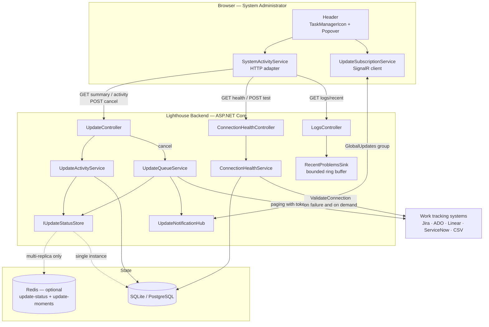
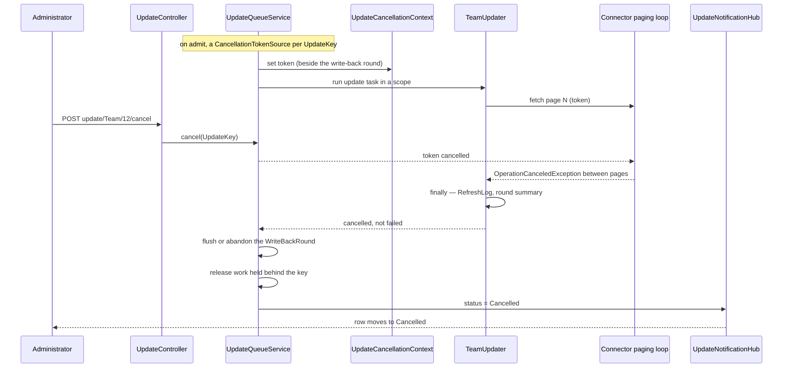

<!-- markdownlint-disable MD024 -->
# Feature Delta — epic-5511-task-manager

ADO Epic **#5511 "Task Manager"** (New, Size 2, Priority 2, tags `Community; Documentation;
nwave-discuss; Release Notes`, board column Options, forecasted delivery 2026-08-29).

Children absorbed into this Epic:

- **#5019** — "I get warned when any connection's authentication breaks, not just OAuth" (User Story, New)
- **#5788** — "A scheduled refresh that failed is reported to the browser as completed" (Bug, New)

Predecessor **#5733 Opt-In Usage Data** (Planned) — not a build dependency; see Pre-requisites.
Related **#5502 Event-driven write-back collection** (Closed) — its write-back rounds are a *deferred*
surface here, see Out of Scope.
Successor **#5510 Sizing Poker** — unrelated, board ordering only.

Wave DISCUSS run 2026-08-23. Cold DISCUSS — no DISCOVER or DIVERGE artifacts existed for this Epic.
Grounded in an ADO read of the Epic plus its five linked items, and a code reality check of the update
pipeline, the status stores, the log configuration and the header (see Current-State Surface Inventory).

Density: `lean` + `ask-intelligent` — Tier-1 `[REF]` only. Triggers that fired are listed in the
expansion menu at the foot of this file.

---

## Wave: DISCUSS / [REF] Persona IDs

| Persona | Role in this Epic |
|---|---|
| `platform-operator` | **Primary.** Runs the instance. Wants to know what the refresh pipeline is doing right now, why something is not moving, and how to stop it when it is doing harm. Both flavours — the standalone self-hoster and the LPW SaaS operator — ask the same question. |
| `config-admin` | **Primary for connection health.** Owns the work-tracking Connections. Today learns that a credential died by noticing a flat throughput chart. |
| `lighthouse-maintainer` | Secondary. Dogfoods on Tenant Zero; this is the surface that tells them a tenant's sync is wedged before the tenant reports it. |

With authentication disabled every caller is `lighthouse|auth-disabled` and therefore a System
Administrator, so the standalone single-container product gets the whole surface with nothing to
configure. That is deliberate: a standalone operator is exactly who has nowhere else to look.

---

## Wave: DISCUSS / [REF] JTBD One-Liners

| Job ID | One-liner |
|---|---|
| `job-operator-trust-that-a-finished-refresh-tells-the-truth` | When a scheduled refresh ends, I want the answer I am shown to be the answer that happened, so I do not build an operational habit on a status that is decorative. |
| `job-operator-see-what-lighthouse-is-doing-right-now` | When I am wondering whether Lighthouse is working or wedged, I want to see what is running and what is waiting without leaving the page I am on, so the question costs me a glance instead of a log download. |
| `job-operator-stop-a-refresh-that-is-doing-harm` | When a refresh is hammering a tracker I need quiet, or is chewing through a rate limit I share with other tools, I want to stop it from inside Lighthouse, so my only options are not "wait it out" or "restart the container". |
| `job-config-admin-know-any-credential-is-failing-not-just-oauth` | When a connection's credential stops working — a revoked token, an expired PAT, a deprovisioned owner — I want Lighthouse to say so regardless of which authentication method that connection uses, so I fix it before the team notices the data froze. |
| `job-operator-read-the-warnings-without-reading-the-log` | When something has gone wrong repeatedly, I want the warnings and errors surfaced where I already look, so noticing does not depend on me choosing to read a log file. |

Full JTBD narrative — dimensions, four forces, opportunity scores — lives in `docs/product/jobs.yaml`.

---

## Wave: DISCUSS / [REF] Current-State Surface Inventory

Established by reading the code before writing requirements. Every decision below rests on these.

| # | Fact | Evidence |
|---|---|---|
| S1 | **`IUpdateStatusStore` cannot be enumerated.** It offers `TryAdmit`, `Advance`, `Requeue`, `TryGet`, `Remove`, `HasActiveWork()` and `HasQueuedWork(keys)`. There is no "list everything admitted". A task list is therefore a *new capability on the port*, not a new read of an existing one. | `Services/Interfaces/Update/IUpdateStatusStore.cs` |
| S2 | **`UpdateStatus` carries three fields** — `UpdateType`, `Id`, `Status`. No entity name, no queued-at, no started-at, no duration, no failure reason. Everything a task list wants to show beyond "Team 12 is running" does not exist. | `Services/Implementation/BackgroundServices/Update/UpdateStatus.cs` |
| S3 | **The Redis store persists exactly one integer per key** — the `UpdateProgress` ordinal, in the hash `lighthouse:update-status`, and reconstructs `UpdateStatus` from key + ordinal in `StatusFor`. Two Lua scripts (`MonotonicAdvanceScript`, `RequeueIfAdmittedScript`) do `tonumber()` on that value. Any field added to `UpdateStatus` must survive that representation, or multi-replica loses it. | `RedisUpdateStatusStore.cs` |
| S4 | **`UpdateController` bypasses the port.** It injects the raw `ConcurrentDictionary<UpdateKey, UpdateStatus>` and counts it directly. Under Redis with more than one replica this answers only about the calling pod, so `/api/latest/update/status` is already wrong in the multi-replica product. | `API/UpdateController.cs:12,19` |
| S5 | **`UpdateProgress.Failed` is unreachable from any periodic refresh.** `UpdateServiceBase.TriggerUpdate` wraps `Update()` in its own `try/catch(Exception)`, logs, and swallows. The enqueued lambda therefore returns normally, so `RunUpdateAsync`'s catch never fires and it advances to `Completed`. `NotifyListeners` pushes `Status=Completed` over SignalR. This is Bug #5788. | `UpdateServiceBase.cs:29-41`, `UpdateQueueService.cs` (`RunUpdateAsync`) |
| S6 | **The RefreshLog row disagrees with the browser.** The `finally` in the updater persists `Success = false` and logs `Update completed \| … \| success=False`, both correct. Only the SignalR path lies. The two records already exist and already contradict each other. | `UpdateServiceBase.cs` (`WriteSummary`), `Models/RefreshLog.cs` |
| S7 | **`RefreshLog` stores `Success` as a bare `bool`.** There is no failure reason column. "It failed" is recordable today; "why" is not. | `Models/RefreshLog.cs` |
| S8 | **Nothing anywhere can be cancelled.** `IUpdateQueueService` has no cancel; `UpdateQueueService` holds no `CancellationTokenSource`; the queue is an unbounded `Channel<Func<Task>>` with a single reader loop. `EnqueueAndAwaitAsync`'s `cancellationToken` cancels *the caller's wait*, not the work. | `UpdateQueueService.cs` |
| S9 | **`IWorkTrackingConnector` takes no `CancellationToken` on any of its 16 methods.** Cooperative cancellation cannot reach inside a connector call without changing that port. | `Services/Interfaces/WorkTrackingConnectors/IWorkTrackingConnector.cs` |
| S10 | **The wall-clock is inside the connector.** Epic #5687's Data-Center dogfood went 468 856 ms → 2 087 ms by changing how the connector pages, with an identical scanned set. So the time a refresh spends is overwhelmingly connector paging — which is precisely where S9 says a token cannot currently reach. | `docs/feature/epic-5687-faster-updates/` |
| S11 | **`UpdateType` has five members** — `Team, Features, Forecasts, PortfolioDelete, TeamDelete` — while the frontend's union type has three (`"Team" \| "Features" \| "Forecasts"`). A list of everything admitted will surface the two delete types the UI has never had to name. | `UpdateType.cs`, `UpdateSubscriptionService.ts:5` |
| S12 | **A queued row can be queued for three different reasons and the store cannot tell them apart.** Genuinely waiting behind the single-reader loop; parked in `heldUpdates` by `HoldUntilQueuedWorkClears`; or `Requeue`d as a coalesced follow-up. All three read as `Queued`. | `UpdateQueueService.cs` (`heldUpdates`, `pendingReruns`, `TryScheduleRerun`) |
| S13 | **`DatabaseMaintenanceGate` drops triggers silently.** `IsBlockedByDatabaseMaintenance` logs at Information and returns — the update is never queued and leaves no trace a user can see. | `UpdateQueueService.cs` (`IsBlockedByDatabaseMaintenance`) |
| S14 | **Health is OAuth-only by construction.** `OAuthHealthAggregator` reads `IRepository<OAuthCredential>`, groups by connection, and counts anything not `Valid`. A PAT or API-token connection has no `OAuthCredential` row at all, so it is invisible to it — and `WorkTrackingSystemConnectionDto.RequiresReconnect` is likewise computed from `OAuthCredential.Status` alone. This is exactly the #5019 gap. | `OAuthHealthAggregator.cs`, `WorkTrackingSystemConnectionDto.cs:56` |
| S15 | **Auth failure is not distinguishable at the updater boundary.** `TriggerUpdate` catches bare `Exception`. The only typed failure that survives is `UnreadableSecretException` (encryption, not authentication) and `OAuthCredentialNotValidException`. A Jira 401 arrives as an untyped exception. | `UpdateServiceBase.cs:29-41`, `BuildUnreadableSecretReason` |
| S16 | **The header already carries the pattern.** `OAuthHealthIcon` is an `IconButton` + MUI `Badge`, gated on `isSystemAdmin`, returning `null` when there is nothing to say, and it *navigates away* on click (`/connections/{id}/edit`). It renders in both the mobile and desktop branches of `Header.tsx`. | `OAuthHealthIcon.tsx`, `Header.tsx:124,161` |
| S17 | **There is no structured log store.** Serilog writes to a rolling *text file*; `SerilogLogConfiguration.GetLogs()` finds the newest `*.txt` and `ReadToEnd()`s it into a string. `LogsController` returns that string. There is nothing to query by level, and no in-memory sink. | `SerilogLogConfiguration.cs`, `LoggingConfigurator.cs`, `API/LogsController.cs` |
| S18 | **`LogsController` is already `SystemAdmin`-guarded**, with a comment recording that it was unguarded until 2026-08-06 and that after ADR-137 "authenticated" includes every viewer who reaches the Jira frame. The log is instance-wide and carries team names, work-tracking URLs and connector errors. | `API/LogsController.cs:10-18` |
| S19 | **`SystemInfoController.GetRefreshLog` is `SystemAdmin`-guarded too**, with the same reasoning written out. Refresh history is already treated as administrator-only operational detail. | `SystemInfoController.cs` (`refreshlog`) |
| S20 | **The live channel already exists.** `UpdateNotificationHub` has a `GlobalUpdates` group that every connected client joins, and `UpdateQueueService.NotifyListeners` fires `GlobalUpdateNotification` into it on every status change. A popover needs no new transport. | `UpdateNotificationHub.cs:12,22`, `UpdateQueueService.NotifyListeners` |
| S21 | **`team`, `teams`, `portfolio`, `portfolios`, `feature`, `features`, `workTrackingSystem`, `workTrackingSystems` are configurable Terminology keys.** Every row label and section heading below renders the tenant's word. | `Seeding/TerminologySeeder.cs` |
| S22 | **Settings already has seven tabs**, including `System Info` (which hosts `RefreshHistorySection`, the RefreshLog table) and a log viewer under `LogSettings`. The material a task manager wants is scattered across two of them and neither is live. | `pages/Settings/Settings.tsx`, `pages/Settings/SystemInfo/`, `pages/Settings/LogSettings/` |

∴ **S5 + S6 are the reason nothing can be built first.** A list that reports the same lie in five more
places is worse than no list. **S1 + S2 + S3 are the shape of the build** — the port must learn to
enumerate, and anything richer than an ordinal has to survive Redis. **S9 + S10 are the honest risk on
cancellation**, and they are why slice 04 opens with a probe rather than an estimate. **S14 + S15 are
the #5019 gap and its cost**: generalising health is not a rename, it needs a signal that does not
exist yet. **S17 is why the warning feed is a new sink, not a query.**

---

## Wave: DISCUSS / [REF] Locked Decisions

### D1 — A header popover, not a page and not a dialog

**Decision** (user, 2026-08-23). The Task Manager opens from an icon in the `Header` as a **popover** —
anchored, dismiss-on-outside-click, non-modal. Not a route, not a Settings tab, not a `Dialog`.

**Why**: the user's framing is "something you just quickly check, independent of where you are, so you
don't need to navigate". A modal dialog would block the page underneath, which is wrong for a surface
whose whole purpose is a glance mid-task. A route would make checking cost a navigation and a return.

**Consequence**: the popover must be usable at the widths `Header.tsx` already handles — it renders in
both the mobile and desktop branches (S16). Content has to be scannable in a constrained box, so the
list is rows, not a table with eight columns.

### D2 — One icon: activity, with a worst-of health badge

**Decision** (user, 2026-08-23). `OAuthHealthIcon` is replaced, not joined. A single header icon
answers both questions at a glance: it animates while anything is running, carries a numeric badge for
the active count, and turns amber/red when any connection is unhealthy or a run failed.

**Why**: two adjacent status icons make the user decide which one to look at, which is the opposite of
a glance.

**Consequence**: the health signal must be *at least as good* as today's before the OAuth icon is
removed, so `OAuthHealthIcon` **stays in place until slice 05** and is deleted in the same slice that
lands generalised connection health. Removing it earlier would regress a shipped warning.

### D3 — System Administrator only

**Decision** (user, 2026-08-23). The icon does not render, and every endpoint refuses, for anyone who
is not a System Administrator.

**Why**: this matches what the codebase already decided twice, for the same material, in writing — the
refresh log (S19) and the log file (S18) are both `SystemAdmin`-guarded, both with a comment noting
that after ADR-137 "authenticated" includes any viewer who reaches the Jira frame. The task list
carries the same content: team and portfolio names, connection names, connector failure text.

**Consequence**: with authentication off everyone is an administrator, so the standalone product is
unaffected. A per-row RBAC scoping model (viewers seeing their own teams' runs) is explicitly not built.

### D4 — Free for everyone, no premium gate

**Decision** (user, 2026-08-23).

**Why**: it is operational truth about the instance you are running. Withholding it makes the free
product feel broken rather than limited — the specific thing being fixed in slice 01 is a *lie*, and a
lie is not a premium upsell. System Info and the log viewer are free today; this is the same class.

**Consequence**: no `OptionalFeature` entry, no licence check. Relevant because the premium gate on
optional features is itself known to silently drop writes and return 200, so not depending on it is
also the safer path.

### D5 — Cancellation is cooperative and best-effort, and says so

**Decision** (user, 2026-08-23). Cancel threads a `CancellationToken` from the queue into the running
update. Queued work is dropped before it starts. Running work stops at the next checkpoint it reaches;
an HTTP call already in flight is allowed to finish. `Cancelled` becomes a fifth, terminal
`UpdateProgress` value that the user can see.

**Why**: hard abort risks half-written work items, an orphaned `WriteBackRound` and a `RefreshLog` row
that describes a run that did not happen. Dequeue-only leaves the epic's actual pain — a runaway
refresh — unfixed.

**Consequence, stated plainly because it is uncomfortable**: S9 + S10 together say the time is spent
inside connector paging and the connector port takes no token. So "best effort" in the first
implementation may mean *the checkpoint is between entities and between phases, not between pages* —
which for a single wedged Team could be a long wait. Slice 04 opens with a probe to find out where the
reachable checkpoints actually are, and the slice's acceptance criteria state the granularity that was
achieved rather than assuming one.

### D6 — Truth before display: #5788 ships first, on its own

**Decision.** Bug #5788 (S5) is slice 01, ahead of any Task Manager UI.

**Why**: `UpdateProgress.Failed` is currently unreachable from a periodic refresh, so a task list built
today would render every failed run as "Completed" — and would do it in a surface whose only job is to
be believed. Fixing it is also user-visible on its own, in the refresh indicators that already ship on
Team and Portfolio detail: those stop lying before any new pixel exists.

**Consequence**: slice 01 is not infrastructure. It is the first value-bearing slice and satisfies the
slice-composition gate by itself.

### D7 — The task list reads through `IUpdateStatusStore`, never the raw dictionary

**Decision.** The new "what is admitted" read is a method on `IUpdateStatusStore`, implemented by both
`InProcessUpdateStatusStore` and `RedisUpdateStatusStore`. `UpdateController` is moved off its injected
`ConcurrentDictionary` onto the port in the same slice.

**Why**: S4 — the existing endpoint is already wrong under Redis with more than one replica, reporting
only the calling pod's dictionary. Building the Task Manager on the same shortcut would ship a fleet
surface that shows a third of the fleet. `RedisUpdateStatusStore.HasActiveWork` already reads the whole
hash, so the enumeration is a shape it can serve.

### D8 — Entity names are resolved on the read path, not stored in the status store

**Decision.** The API enriches each admitted key with the entity's display name by looking it up in the
repository when the list is requested. The name is not written into `UpdateStatus` and not into Redis.

**Why**: S3 — the Redis hash holds one integer per key, and both Lua scripts `tonumber()` it. Pushing a
name through the write path would force a representation change on the hot path of every admit and
advance, to serve a read that happens when a human opens a popover. The read path already has a
database and can afford one lookup per row.

**Consequence**: a row whose entity was deleted mid-run (the `TeamDelete` / `PortfolioDelete` update
types, S11) has no name to resolve. It renders by type and id rather than disappearing.

### D9 — Non-OAuth health comes from classified failures plus an on-demand test, not a probe loop

**Decision.** A connection's health is derived from (a) the outcome of its most recent refresh,
classified as an authentication failure where the connector can say so, and (b) an explicit
"Test connection" the administrator triggers. Not from a background loop that periodically calls every
tracker to see whether the credential still works.

**Why**: a probe loop adds a recurring outbound call per connection to systems whose rate limits we
already share and already trip — the Linear API key is shared with CI and 429s are a known local
hazard. It would also be the second scheduler in a product whose first one this Epic exists to explain.

**Consequence, and this is the cost**: S15 says a Jira 401 currently arrives at `TriggerUpdate` as an
untyped `Exception`. Classifying it means connectors have to surface an authentication failure as
something typed. Slice 05 carries that, and its learning hypothesis is aimed straight at it. Until a
connection has failed once, its health is `Unknown` rather than `Healthy` — and the UI says `Unknown`,
because claiming "healthy" from an absence of evidence is how the current icon would mislead.

### D10 — The warning feed is a bounded in-memory sink, not a parse of the log file

**Decision.** A Serilog sink holds the most recent N (order of 200) events at `Warning` and above as
structured records — timestamp, level, source context, rendered message, exception type. The popover
reads that. The full log file stays where it is, reachable by a link.

**Why**: S17 — there is no structured log store, and `GetLogs()` reads an entire rolling text file into
a string. Regex-parsing that per popover open is both expensive and brittle against the two different
output templates (`ConsoleTextTemplate` and `ConsoleJsonTemplate`) the configurator already switches
between.

**Consequence**: the buffer is per-process and does not survive a restart, and under multiple replicas
each pod holds its own. That is acceptable for "what has gone wrong lately"; it is not an audit log,
and the copy must not imply it is.

### D11 — The eleven adjacent ideas are recorded and not built

**Decision** (user, 2026-08-23): *"Don't do any — complicated enough already, but note it somewhere so
we could potentially later get back to it."* See Out of Scope for the list, kept in full so the next
pass starts from the analysis rather than redoing it.

---

## Wave: DISCUSS / [REF] Scope Assessment

**Verdict: right-sized after the user's cut. PASS.**

The Epic as written in ADO was oversized on three of the five heuristics — it bundled five independent
user outcomes that could each ship separately (task list, cancel, connection health, log-derived
warnings, write-back events), touched four bounded contexts, and its walking skeleton would have needed
more than five integration points. The user cut it in the DISCUSS session:

- **In**: live task list, cooperative cancel, connection health for all authentication types (#5019),
  warnings/errors elevated from logs. Plus #5788 as the precondition for any of it being believable.
- **Out**: write-back round outcomes (#5502's territory) and ten further adjacent surfaces — recorded
  under Out of Scope, not built.

What remains is six slices, each end-to-end and each under a day, across two bounded contexts (update
orchestration; connection health) plus one read-only sink. Two slices open with a timeboxed probe
because their uncertainty is real rather than estimable.

---

## Wave: DISCUSS / [REF] User Stories

### US-01 — A refresh that failed says it failed

`job_id: job-operator-trust-that-a-finished-refresh-tells-the-truth` · ADO Bug **#5788** · slice 01

As a platform operator, when a scheduled Team or Portfolio refresh throws, I want every surface that
reports it to agree that it failed, so that a green indicator means something.

#### Elevator Pitch

Before: a scheduled refresh that throws pushes `Status=Completed` to the browser, while the RefreshLog
row it wrote in the same `finally` says `Success=false` — the two records disagree and the user is
looking at the wrong one.
After: on Team detail, when the refresh fails → the refresh indicator shows **Refresh failed** and the
Refresh History row under Settings → System Info agrees with it.
Decision enabled: whether to go and look at why, right now, instead of trusting a green tick and
discovering days later that the throughput chart has been flat.

#### Acceptance Criteria

- **AC-01.1** A periodic Team refresh whose `Update()` throws results in the SignalR listener receiving
  `Status = Failed` for that `UpdateKey`. (S5 — today it receives `Completed`.)
- **AC-01.2** The same run still writes its `RefreshLog` row with `Success = false` and still emits the
  one-line `Update completed | … | success=False` summary. The `finally` behaviour is unchanged.
- **AC-01.3** Write-back is still flushed and the round summary still written on the failure path —
  a failing refresh must not strand a `WriteBackRound`, because a round that never finishes silently
  drops everything it had staged.
- **AC-01.4** Work held behind the failed key by `HoldUntilQueuedWorkClears` is still released.
- **AC-01.5** `EnqueueAndAwaitAsync` callers see the same outcome they see today for a failing update —
  no caller that awaits an update begins throwing where it previously returned. Enumerated and asserted,
  because this is the change's actual blast radius.
- **AC-01.6** With authentication disabled, and with RBAC on as a System Administrator, the Team detail
  page shows the failed state in both configurations.

---

### US-02 — See what Lighthouse is doing right now

`job_id: job-operator-see-what-lighthouse-is-doing-right-now` · slice 02

As a platform operator, wherever I am in the app, I want one glance to tell me what is refreshing and
what is waiting, so that "is it working or is it wedged" is not a question I have to leave the page to
answer.

#### Elevator Pitch

Before: nothing in the product lists what is running. The only global signal is a boolean count behind
`/api/latest/update/status`, which under Redis reports only the pod that answered.
After: click the activity icon in the header → a popover lists **Team 'Lagunitas' — running** and
**Portfolio 'Q4 Platform' — queued**, updating live as they change.
Decision enabled: whether to wait, or to go and investigate, without downloading a log.

#### Acceptance Criteria

- **AC-02.1** `IUpdateStatusStore` gains an enumeration of everything currently admitted, implemented by
  both the in-process and the Redis store, and the Redis implementation answers about work admitted by
  *any* replica.
- **AC-02.2** `UpdateController` reads through `IUpdateStatusStore` and no longer injects
  `ConcurrentDictionary<UpdateKey, UpdateStatus>`. (S4 — this corrects a multi-replica defect that
  exists today.)
- **AC-02.3** Each row carries the update type, the entity id, the entity's display name resolved on the
  read path, and the status. A row whose entity no longer exists renders by type and id and does not
  break the list. (D8, S11.)
- **AC-02.4** Row labels use the tenant's configured Terminology for team / portfolio / feature — never
  the literal seeded default when the tenant has renamed it. (S21.)
- **AC-02.5** The popover updates without a manual refresh, driven by the existing
  `GlobalUpdateNotification` on the `GlobalUpdates` SignalR group. No new transport. (S20.)
- **AC-02.6** The icon and the endpoint are refused to a non-System-Administrator: the icon does not
  render, and the endpoint returns the same refusal `SystemInfoController`'s refresh log returns. (D3.)
- **AC-02.7** With nothing running the popover says so in words rather than showing an empty box.
- **AC-02.8** `OAuthHealthIcon` still renders, unchanged, beside the new icon. (D2 — it is removed in
  slice 05, not before.)
- **AC-02.9** Verified against a real instance with a real connector refresh in flight — not a seeded
  status dictionary.

---

### US-03 — See how long it has been going

`job_id: job-operator-see-what-lighthouse-is-doing-right-now` · slice 03

As a platform operator, I want each row to say how long it has been running or waiting, so that I can
tell a slow refresh from a stuck one.

#### Elevator Pitch

Before: a row says "running". A refresh that started four seconds ago and one that has been going for
forty minutes look identical, which is the difference the operator actually cares about.
After: the popover row reads **Team 'Lagunitas' — running for 12s** and **Portfolio 'Q4 Platform' —
queued for 3m**.
Decision enabled: whether this is normal or whether something is wedged — the judgement that decides
between waiting and cancelling.

#### Acceptance Criteria

- **AC-03.1** `UpdateStatus` carries the moment it was admitted and the moment it started running.
- **AC-03.2** Both survive the Redis store, and the monotonic-advance and requeue-if-admitted guarantees
  are preserved exactly — a key still cannot go backwards through `Advance`, and `Requeue` still refuses
  a key another replica has removed. (S3 — the Lua scripts currently `tonumber()` a bare ordinal.)
- **AC-03.3** A coalesced follow-up (`Requeue`) resets the queued-at moment, because it is new work
  waiting, not the old work still waiting.
- **AC-03.4** Elapsed time is computed against the same clock the rest of the backend anchors on — no
  browser-local `new Date()` deciding what "now" is on the server's behalf.
- **AC-03.5** Times are rendered as a duration, not a timestamp, and degrade to the row without a
  duration if the moment is absent (an entry admitted by an older replica mid-rollout).

---

### US-04 — Stop a refresh that is doing harm

`job_id: job-operator-stop-a-refresh-that-is-doing-harm` · slice 04

As a platform operator, when a refresh is hammering a tracker I need quiet or burning a shared rate
limit, I want to stop it from inside Lighthouse, so that my options are not "wait" or "restart the
container".

#### Elevator Pitch

Before: there is no cancel anywhere. The queue holds `Func<Task>` and no token; the only way to stop a
running refresh is to restart the process.
After: click **Cancel** on the row in the popover → the row moves to **Cancelled**, and the refresh
stops at its next checkpoint instead of running to completion.
Decision enabled: whether to intervene now — which is only a decision if intervening is possible.

#### Acceptance Criteria

- **AC-04.1** A **queued** update that is cancelled never runs: it leaves the store without contacting
  the work tracking system at all.
- **AC-04.2** A **running** update that is cancelled stops at the next checkpoint the probe established,
  and the achieved granularity is written into this slice's brief as a fact rather than an intention.
- **AC-04.3** `Cancelled` is appended to `UpdateProgress` **after** `Failed`, so existing persisted and
  transmitted ordinals keep their meaning and monotonic `Advance` can still reach it.
- **AC-04.4** A cancelled run still flushes or explicitly abandons its `WriteBackRound` and still
  releases anything held behind its key — a cancel must not strand staged write-backs or park a held
  update for good. This is the same failure mode AC-01.3 and AC-01.4 guard, reached by a different door.
- **AC-04.5** A cancelled run leaves the work-tracking system and the database in a state a subsequent
  refresh corrects — no half-written entity that a later run will not overwrite.
- **AC-04.6** The cancel endpoint is `SystemAdmin`-guarded and is idempotent: cancelling an update that
  has already finished is accepted and changes nothing.
- **AC-04.7** Cancelling one entity's refresh does not cancel another's — each `UpdateKey` is
  independently cancellable.
- **AC-04.8** Verified against a real connector refresh long enough to be cancelled mid-flight, not a
  synthetic sleep.

---

### US-05 — Any broken credential says so, not just OAuth

`job_id: job-config-admin-know-any-credential-is-failing-not-just-oauth` · ADO Story **#5019** · slice 05

As a configuration administrator, when a connection's credential stops working, I want Lighthouse to
tell me — whether that connection uses OAuth, a PAT, a scoped API token or anything else — so that I fix
it before the team notices their data froze.

#### Elevator Pitch

Before: the header icon only knows about `OAuthCredential.Status`. An Azure DevOps PAT that expired, a
Jira API token that was revoked, a Linear key whose owner was deprovisioned — all fail silently;
Lighthouse keeps making 401-returning calls and the chart goes flat.
After: open the Task Manager popover → a **Connections** section lists each connection with its state —
`Healthy`, `Authentication failed`, `Unreachable` or `Unknown` — and **Test connection** re-checks one
on demand.
Decision enabled: which credential to go and reissue, and whether the flat chart is a credential problem
at all.

#### Acceptance Criteria

- **AC-05.1** Health is reported for **every** connection regardless of authentication method, not only
  those with an `OAuthCredential` row. (S14.)
- **AC-05.2** An authentication failure from a connector is distinguishable from any other failure at
  the point health is derived. Where a connector cannot yet say, the connection reads `Unreachable`, not
  `Authentication failed` — guessing wrong sends an administrator to reissue a credential that was never
  the problem, which is the exact harm `BuildUnreadableSecretReason` was written to avoid.
- **AC-05.3** A connection that has never failed and has never been tested reads `Unknown`, not
  `Healthy`. (D9.)
- **AC-05.4** **Test connection** performs one outbound check for that connection only, on demand, and
  updates its state. No background probe loop is introduced. (D9.)
- **AC-05.5** OAuth connections keep exactly their current behaviour and wording — a `RefreshFailed` or
  `Disconnected` credential still surfaces as needing a reconnect, and still offers the route to the
  connection's edit page that `OAuthHealthIcon` offers today. (S16.)
- **AC-05.6** `OAuthHealthIcon` is deleted in this slice and its badge is folded into the activity icon
  as a worst-of. Not before. (D2.)
- **AC-05.7** The header icon's colour reflects the worst connection state plus any failed run, and its
  tooltip names what is wrong.
- **AC-05.8** Connection names are shown to System Administrators only, consistent with D3.

---

### US-06 — The warnings, without reading the log

`job_id: job-operator-read-the-warnings-without-reading-the-log` · slice 06

As a platform operator, I want recent warnings and errors surfaced where I already look, so that
noticing does not depend on me deciding to download a log file and read it.

#### Elevator Pitch

Before: warnings exist only inside a rolling text file that `GetLogs()` reads whole into a string. The
only way to see them is Settings → the log viewer, and only if you thought to go there.
After: open the popover → a **Recent problems** section lists the last warnings and errors with their
time, level and message, and a link opens the full log.
Decision enabled: whether the thing you just noticed in the task list has an explanation already sitting
in the logs, without leaving the popover to find out.

#### Acceptance Criteria

- **AC-06.1** A bounded in-memory sink retains the most recent events at `Warning` and above as
  structured records — time, level, source context, rendered message, exception type where present.
- **AC-06.2** The buffer is bounded and cannot grow without limit; the oldest entry is evicted first.
- **AC-06.3** Changing the log level through the existing `LogsController` endpoint takes effect on what
  the sink captures, without a restart — the level switch is already a `LoggingLevelSwitch`.
- **AC-06.4** The endpoint is on the already-`SystemAdmin`-guarded `LogsController`. (S18.)
- **AC-06.5** The section states plainly that it holds recent events since this instance started and is
  not a complete history — it is per-process and does not survive a restart. (D10.)
- **AC-06.6** With nothing captured, the section says so rather than rendering empty.
- **AC-06.7** Verified with real warnings produced by a real failing connector, not with injected log
  lines.

---

## Wave: DISCUSS / [REF] Story Map and Slices

**Backbone** (operator's activities, left to right):
notice something → see what is happening → judge whether it is stuck → intervene → find out why.

| Slice | Story | ADO | Ships | Learning hypothesis |
|---|---|---|---|---|
| `slice-01-a-failed-refresh-says-failed` | US-01 | **#5788** (Bug) | The status the browser receives matches what happened | Disproves that the existing status pipeline can carry a truthful terminal state |
| `slice-02-see-what-is-running` | US-02 | **#5840** | Activity icon + popover listing running and queued work | Disproves that the status store can answer "what is running" at all |
| `slice-03-how-long-has-it-been-going` | US-03 | **#5841** | Elapsed time per row | Disproves that the Redis hash can carry more than an ordinal safely |
| `slice-04-stop-a-refresh` | US-04 | **#5842** | Cancel, cooperative | Disproves that cancellation can be honoured without changing `IWorkTrackingConnector` |
| `slice-05-any-broken-credential-says-so` | US-05 | **#5019** | Connection health for every auth method; OAuth icon absorbed | Disproves that an auth failure is distinguishable from any other failure |
| `slice-06-the-warnings-without-the-log` | US-06 | **#5843** | Recent warnings and errors in the popover | Disproves that a level filter alone yields a signal rather than noise |

**Walking skeleton**: slice 01 + slice 02 together. After those two, an operator can open one thing and
see a truthful list of what the instance is doing. Everything after deepens that.

### Carpaccio taste tests

| Test | Verdict |
|---|---|
| Any slice shipping 4+ new components? | No. The largest, slice 02, adds one icon, one popover and one endpoint on an existing controller. |
| Every slice depending on a new abstraction? | No — and the one shared abstraction (`IUpdateStatusStore` enumeration) ships *inside* slice 02, the first slice that needs it, rather than as its own slice. |
| Does any slice disprove a pre-commitment? | Yes, four of six carry a hypothesis that can kill the approach. Slices 04 and 05 are the sharp ones: both could return "the port has to change", which would resize the Epic. |
| Synthetic data only? | No. AC-02.9, AC-04.8 and AC-06.7 each require a real connector refresh. |
| Two slices identical but for scale? | No. |

### Prioritisation

Order: **01 → 02 → 03 → 04 → 05 → 06**, with one deliberate exception.

- **01 first** on correctness, not preference: a display built on S5 would ship the lie into five new
  places (D6).
- **02 next** because it is the Epic's actual subject, and because it corrects the multi-replica defect
  in S4 as a side effect.
- **03 next** because it is small and it is what turns a list into a judgement.
- **Exception — run slice 04's probe during 02/03, not at the start of 04.** Slice 04 has the highest
  uncertainty in the Epic (S9 + S10) and its answer can resize the whole thing. Learning leverage says
  find out early, while the cost of being wrong is two slices rather than five.
- **05 before 06** because it is a named ADO child with a user waiting on it, and because "which
  connection is broken" is a more common question than "what warned recently".

---

## Wave: DISCUSS / [REF] Out of Scope

### Explicitly not built in this Epic (user decision, D11)

Eleven adjacent surfaces were analysed during DISCUSS and cut. Kept in full so a later pass starts from
the analysis rather than repeating it.

| # | Idea | Why it was attractive | Why it is out |
|---|---|---|---|
| A | Show **held** updates distinctly (`heldUpdates`) | A held row renders as `Queued` forever and looks stuck (S12) | Deferred with the rest; the list is honest without it, just less explanatory |
| B | Show a **coalesced follow-up** is pending (`pendingReruns`) | Otherwise a refresh appears to restart itself (S12) | Deferred |
| C | Show **paused by database maintenance** | `DatabaseMaintenanceGate` drops the trigger with no user-visible trace (S13) | Deferred |
| D | **Write-back round outcome** — what was pushed, what was refused | Jira 403s and *drops* the write; nobody learns. Highest-value of the deferred set | Pulls in #5502's event model; a slice of its own, later |
| E | **Failure reason** on the last run | `RefreshLog.Success` is a bare bool (S7) — "failed" is recordable, "why" is not | Deferred; note it needs a schema change, so it wants planning with D |
| F | **Next scheduled run** per entity | Answers "do I need to refresh?" before they refresh | Deferred |
| G | **Queue position / wait estimate** | Single-reader loop means position is a real wait | Deferred |
| H | **Which replica is running it** | `RedisUpdateStatusStore` already knows; SaaS operators ask | Deferred |
| I | **Trigger a refresh from the popover** | Per-entity buttons exist; no central one | Deferred |
| J | **Stale-data badge** ("last synced 3d ago") | Ties staleness into the same glance | Deferred |
| K | **Toast when a background refresh fails** while you are elsewhere | Failures are only visible if you look | Deferred |

Recommended re-entry order if this is picked up again: **A + B + C + E** first — they are what make a
queued or failed row *explain itself* — then **D**, which is the largest and needs #5502's events.

### Also out

- **Write-back events as a monitor surface** (#5502's territory) — the Epic description raises it; it is D above.
- **Per-viewer RBAC scoping** of the task list (D3 settles this).
- **A premium gate** (D4).
- **A background credential probe loop** (D9).
- **A persistent, queryable log store** — the sink is bounded and in-process (D10).
- **A new Settings tab or route** — the popover is the only surface (D1).
- **Hard abort of in-flight work** (D5).

---

## Wave: DISCUSS / [REF] Walking Skeleton Strategy

**Strategy B — extend an existing end-to-end path.** No greenfield skeleton is needed or wanted.

The end-to-end path already exists and already runs in production: background service → `TriggerUpdate`
→ `UpdateQueueService` → `IUpdateStatusStore` → `UpdateNotificationHub` → `UpdateSubscriptionService` →
React. Every slice below hangs off a seam on that path. Slice 01 corrects it; slice 02 adds a read of it;
slices 03–04 deepen what it carries; slices 05–06 hang two adjacent read-only surfaces off the same
popover.

The two seams that are genuinely new are `IUpdateStatusStore`'s enumeration (slice 02, D7) and a
cancellation context alongside the existing `WriteBackRoundContext` (slice 04). Both are introduced
inside the first slice that needs them, not ahead of it.

---

## Wave: DISCUSS / [REF] Driving Ports

| Surface | Port | Guard |
|---|---|---|
| Task list read | `GET /api/latest/update/…` on the existing `UpdateController` | SystemAdmin (D3) |
| Existing global count | `GET /api/latest/update/status` — moved onto `IUpdateStatusStore` (D7) | unchanged `[Authorize]` |
| Cancel | `POST` on `UpdateController`, per `UpdateKey` | SystemAdmin |
| Connection health | replaces `GET /api/oauth/health` | SystemAdmin (already) |
| Recent warnings | new route on the existing `LogsController` | SystemAdmin (already, S18) |
| Live updates | existing `UpdateNotificationHub`, `GlobalUpdates` group (S20) | connection-level |
| UI | header icon + popover, rendered in both branches of `Header.tsx` (S16) | `isSystemAdmin` |

---

## Wave: DISCUSS / [REF] Outcome KPIs

Lighthouse is self-hosted and there is no vendor telemetry pipeline, so every KPI here is
`per_instance` or `vendor_demo_only`. Predecessor #5733 would change that; it is not a dependency.

| KPI | Target | Measurement | Scope |
|---|---|---|---|
| `OUT-5511-status-truthfulness` | **100%** of failing periodic refreshes report `Failed` to the browser; today it is 0% | Assert the SignalR terminal status against the `RefreshLog.Success` written by the same run — the two records that disagree today (S6) must agree | per_instance |
| `OUT-5511-time-to-notice` | Median time from a refresh failing to an administrator seeing it drops from *"whenever someone opens the log"* to **one page load** | The signal is visible without navigation on any page that renders the header | per_instance |
| `OUT-5511-cancel-effectiveness` | **≥ 90%** of cancels on a running update stop it within the checkpoint granularity the slice-04 probe established | Measured on a real connector refresh; the granularity is recorded in the slice brief as a number, not an intention | vendor_demo_only |
| `OUT-5511-credential-coverage` | **100%** of connections report a health state, against roughly the OAuth-only share today | Count connections with a non-`Unknown` state after one refresh cycle, over total connections | per_instance |
| `OUT-5511-multi-replica-correctness` | The active-update count is identical from every replica | Two replicas behind Redis; query both; compare. Corrects the defect in S4 | vendor_demo_only |

---

## Wave: DISCUSS / [REF] Pre-requisites

| # | Pre-requisite | State |
|---|---|---|
| P1 | Bug **#5788** fixed | **Blocking.** It is slice 01 of this Epic (D6). |
| P2 | `IUpdateStatusStore` enumerable | Built in slice 02 (D7). |
| P3 | Connectors able to name an authentication failure | **Unproven.** S15. Slice 05's hypothesis is aimed at it; it may resize that slice. |
| P4 | Redis representation able to carry more than an ordinal | **Unproven.** S3. Slice 03 opens with a probe. |
| P5 | `IWorkTrackingConnector` cancellation reach | **Unproven and consequential.** S9 + S10. Slice 04's probe runs early, during slices 02/03. |
| P6 | Opt-in usage data (#5733) | **Not a dependency.** It is a board predecessor. Without it the KPIs stay `per_instance`, which is what they are declared as. |
| P7 | Premium licence | **Not required.** D4. |

---

## Wave: DISCUSS / [REF] Definition of Ready

| # | Item | Evidence |
|---|---|---|
| 1 | Business value stated | Five job stories, each with a named persona; opportunity scores in `docs/product/jobs.yaml` |
| 2 | Acceptance criteria testable | 40 ACs across six stories, each naming an observable outcome; three name a real-connector verification |
| 3 | Dependencies identified | Pre-requisites table; three marked unproven with the slice that proves each |
| 4 | Sized | Six slices, each ≤ 1 day; two carry a timeboxed probe inside the slice |
| 5 | No blocking unknowns | P3, P4 and P5 are unknowns but not blockers — each is confined to one slice and each has a probe. P5's probe is deliberately pulled forward |
| 6 | UX defined | D1 (popover), D2 (one icon), D3 (System Admin only); anchored to `Header.tsx`'s two existing branches |
| 7 | Job traceability | Every story carries a real `job_id`; no story uses the infrastructure-only escape valve |
| 8 | Non-functional constraints stated | Multi-replica correctness (D7, S3/S4); Terminology (S21, AC-02.4); RBAC parity with `LogsController` and the refresh log (D3, S18/S19); write-back round integrity (AC-01.3, AC-04.4) |
| 9 | Out-of-scope explicit | Eleven deferred surfaces recorded with reasons and a re-entry order, plus seven further exclusions |

**Verdict: READY.** Requirements completeness 0.96 — the shortfall is P3/P5, which are honest unknowns
scoped to one slice each rather than gaps in the requirements.

---

## Wave: DISCUSS / [REF] Definition of Done

1. All six slices shipped, each with its own focused commit and its hypothesis answered in its brief.
2. Backend `dotnet build` zero warnings; `dotnet test` green with the live-connector categories excluded.
3. Frontend `pnpm test` green; `pnpm build` zero errors and zero warnings; Biome clean.
4. SonarQube Cloud gate green — no new issues of any severity.
5. Mutation testing run per feature on both stacks, kill rate ≥ 80%, recorded under
   `docs/feature/epic-5511-task-manager/mutation/`.
6. One walking-skeleton E2E through a Page Object for the popover, driven by demo data.
7. Per-theme `@screenshot` coverage for the popover, regenerated (delete the old PNG first — the
   comparator keeps the old file when the diff is under threshold).
8. Public docs updated at feature finalization, using the tenant's configurable Terminology.
9. ADO #5511, #5019 and #5788 transitioned; #5511 stops at Resolved, never Closed.

---

## Wave: DISCUSS / [REF] Wave Decisions Summary

### Key decisions

- **D1** Header popover, not a page or dialog — the user's "quickly check from wherever you are".
- **D2** One icon: activity with a worst-of health badge; `OAuthHealthIcon` absorbed in slice 05, not earlier.
- **D3** System Administrator only — matches what `LogsController` and the refresh log already decided in writing.
- **D4** Free for everyone — it is operational truth, and slice 01 fixes a lie, which is not an upsell.
- **D5** Cooperative best-effort cancel; `Cancelled` is a visible terminal state; granularity to be established by probe, not assumed.
- **D6** #5788 ships first, alone — truth before display.
- **D7** Read through `IUpdateStatusStore`, never the raw dictionary; corrects a live multi-replica defect.
- **D8** Entity names resolved on the read path; the Redis hot path keeps its bare ordinal.
- **D9** Non-OAuth health from classified failures plus an on-demand test; `Unknown` never renders as `Healthy`.
- **D10** Bounded in-memory Serilog sink, not a parse of the log file; the copy must not imply an audit log.
- **D11** Eleven adjacent surfaces recorded and not built.

### Requirements summary

- **Primary jobs**: see what the instance is doing; believe what it says; stop what is doing harm; know
  which credential broke; read the warnings without reading the log.
- **Walking skeleton**: slices 01 + 02 — a truthful list behind one header icon.
- **Feature type**: cross-cutting — backend orchestration, a new port capability, a logging sink, and a
  user-facing UI surface.

### Constraints established

- Multi-replica correctness is a requirement, not a nice-to-have: the endpoint being replaced is already
  wrong under Redis.
- Anything richer than an ordinal must survive the Redis hash and its two Lua scripts.
- Cancellation and failure paths must both leave `WriteBackRound` and `heldUpdates` in a state that does
  not silently drop staged writes or park held work for good.
- Every label renders the tenant's configured Terminology.

### Upstream changes

None. No DISCOVER or DIVERGE artifacts existed for this Epic, so no prior assumption was contradicted.

---

## Wave: DISCUSS / Tier-2 Expansion Menu

Density resolved to `lean` + `ask-intelligent`. Triggers evaluated against the artifacts above:

| Trigger | Fired | Suggested expansion |
|---|---|---|
| AC ambiguity across ≥2 stories | **Yes** — AC-04.2 and AC-05.2 both defer a definition to a probe result | `gherkin-scenarios` |
| Cross-context complexity (≥3 contexts or technologies) | **Yes** — update orchestration, connection health, Serilog sink, Redis, SignalR, React | `alternatives-considered` |
| Multi-stakeholder (≥3 personas) | No — two primary, one secondary | |
| Compliance / regulatory terms in ACs | No | |
| WS strategy = D (configurable) | No — strategy B | |

Suggested expansions for this feature (triggered by: AC ambiguity, cross-context complexity):

- `gherkin-scenarios` — Given-When-Then covering the happy path and the failure paths for each slice
- `alternatives-considered` — the alternatives weighed and rejected behind D5, D8, D9 and D10

Apply? `[Y/n/all/none/custom]` — or ask for any catalog item ad hoc.

---
---

# Wave: DESIGN

Run 2026-08-23. Scope: **Application / components** (`nw-solution-architect`). Mode: **propose**.
Paradigm unchanged — OOP on the C# backend, functional-leaning React on the frontend.
Architectural pattern unchanged — ports-and-adapters, extended, no new style introduced.

Density `lean` + `ask-intelligent`. Prior-wave consultation: `brief.md` (base section plus 40-odd
per-feature deltas), 180 existing ADRs, `journeys/epic-5511-task-manager.yaml`, `jobs.yaml`, and this
file's DISCUSS half. No SPIKE artifacts exist — the two probes are scheduled inside slices 03 and 04.
No contradiction found between DESIGN and DISCUSS.

**Outcome collision check**: `nwave-ai outcomes check-delta` exits `0` — no collisions.

## Wave: DESIGN / [REF] Correction to a DISCUSS assumption

DISCUSS S15 stated that an authentication failure is not distinguishable, and D9 costed slice 05 on
that basis. Reading the connectors during DESIGN shows the picture is better than DISCUSS assumed:

`ConnectionValidationResult` already carries a **`Code`** string discriminator, and the value
**`authentication_failed`** already exists — emitted by `AzureDevOpsWorkTrackingConnector`,
`JiraWorkTrackingConnector` and `ServiceNowValidationVerdict`. ServiceNow additionally emits
`insufficient_permissions`. `ValidateConnection` is already reachable from
`WorkTrackingSystemConnectionsController`. Linear and CSV emit no auth code.

S15 remains true about the **passive** path — a refresh that 401s never calls `ValidateConnection`, and
`TriggerUpdate` catches bare `Exception`. But the classifier itself is not greenfield. This is what
makes DDD-4 possible and shrinks slice 05.

---

## Wave: DESIGN / [REF] DDD List

| # | Decision | Verdict | One-line rationale |
|---|---|---|---|
| DDD-1 | Update activity is a **read through the status store**, not a new projection written on the update path | Locked | The store already holds exactly the set being asked about; a projection would be a second copy of a truth that already exists in one place. ADR-181 |
| DDD-2 | `UpdateController` stops injecting `ConcurrentDictionary<UpdateKey, UpdateStatus>` and depends on `IUpdateStatusStore` | Locked | The direct injection is a live multi-replica defect, not a shortcut to preserve. ADR-181 |
| DDD-3 | Admission and start moments live in a **sibling Redis hash**, written outside the Lua scripts | Locked | Keeps the monotonic-advance and requeue-if-admitted guarantees provably untouched on the hot path. ADR-182 |
| DDD-4 | Cancellation is an **ambient scoped token** plus a **narrow widening of the connector paging methods** | Locked | The context is needed either way; the paging widening is where the wall-clock actually is. ADR-183 |
| DDD-5 | `Cancelled` is appended to `UpdateProgress` **after** `Failed` | Locked | Monotonic `Advance` compares ordinals, and existing values must keep their meaning. ADR-183 |
| DDD-6 | Connection health is a **recorded verdict per connection**, classified by `ValidateConnection`'s existing `Code` | Locked | The classifier already exists on three of five connectors; the verdict must outlive the process that observed it. ADR-184 |
| DDD-7 | `OAuthHealthAggregator` and `OAuthHealthController` are **absorbed**, not kept alongside | Locked | Two sources for one question is how the two disagree. ADR-184 |
| DDD-8 | Recent problems is a **bounded in-process Serilog sink**, constructed before the logger and registered as a singleton | Locked | No structured store exists, and the sink must be reachable by DI while being handed to a logger built at builder time. ADR-185 |
| DDD-9 | The header badge is fed by a **small always-live summary**; each popover section fetches on open | Locked | The header is on every page for every administrator; the sections are read by one human occasionally. ADR-186 |
| DDD-10 | Name enrichment happens in an **application service**, not in the controller and not in the store | Locked | Keeps the repository fan-out out of the controller and the database out of the store. ADR-181 |
| DDD-11 | Entity names are resolved **per read**, not cached | Deferred to DELIVER | A popover open is not a hot path; revisit only if a real instance shows it is. |

---

## Wave: DESIGN / [REF] Component Decomposition

### Backend

| Component | File | Change | Summary |
|---|---|---|---|
| `IUpdateStatusStore` | `Services/Interfaces/Update/IUpdateStatusStore.cs` | EXTEND | Add an enumeration of everything admitted. Add the admission/start moments to what a status carries. |
| `InProcessUpdateStatusStore` | `.../Update/InProcessUpdateStatusStore.cs` | EXTEND | Enumerate the dictionary; stamp moments on admit and on advance-to-`InProgress`. |
| `RedisUpdateStatusStore` | `.../Update/RedisUpdateStatusStore.cs` | EXTEND | `HashGetAll` over `lighthouse:update-status` for the enumeration; a sibling hash `lighthouse:update-moments` for the moments, written and deleted alongside the ordinal but never inside the Lua scripts. |
| `UpdateStatus` | `.../Update/UpdateStatus.cs` | EXTEND | `QueuedAt` and `StartedAt`, both nullable — absent is a legitimate state during a rolling upgrade. |
| `UpdateProgress` | `.../Update/UpdateProgress.cs` | EXTEND | Append `Cancelled` after `Failed`. |
| `IUpdateQueueService` | `Services/Interfaces/Update/IUpdateQueueService.cs` | EXTEND | Add a cancel for one `UpdateKey`, idempotent. |
| `UpdateQueueService` | `.../Update/UpdateQueueService.cs` | EXTEND | A `CancellationTokenSource` per admitted key; set the token into the cancellation context in `ExecuteUpdateTask` beside the write-back round; record `Cancelled` as a terminal status; dispose the source alongside `statusStore.Remove`. |
| `UpdateCancellationContext` | `Services/Implementation/UpdateCancellationContext.cs` | **NEW** | `AsyncLocal<CancellationToken?>`, a direct sibling of `WriteBackRoundContext`, written only by the queue. |
| `UpdateServiceBase` | `.../Update/UpdateServiceBase.cs` | EXTEND | Stop swallowing (slice 01). Distinguish `OperationCanceledException` from a genuine failure so a cancel is not logged as an error. |
| `TeamUpdater` / `PortfolioUpdater` / `ForecastUpdater` | `.../Update/*.cs` | EXTEND | Observe the ambient token at phase boundaries and pass it into the connector paging calls. |
| `IUpdateActivityService` + `UpdateActivityService` | `Services/Interfaces/Update/`, `Services/Implementation/Update/` | **NEW** | The read model: takes what the store enumerates, resolves entity display names from the repositories, returns rows. Also computes the header summary. |
| `UpdateController` | `API/UpdateController.cs` | EXTEND | Drop the `ConcurrentDictionary` injection. Existing `status` route re-implemented over the port. Add the activity list, the summary and the cancel routes. |
| `IWorkTrackingConnector` | `Services/Interfaces/WorkTrackingConnectors/IWorkTrackingConnector.cs` | EXTEND | `CancellationToken` on the six paging methods only — the two `GetWorkItemsForTeam` overloads, the two `GetFeaturesForProject` overloads, and the three sweeps. Not on `ValidateConnection`, `GetPredefinedAdditionalFields`, or `WriteFieldsToWorkItems`. |
| Five connectors | `.../WorkTrackingConnectors/{AzureDevOps,Jira,Linear,ServiceNow,Csv}/` | EXTEND | Thread the token into the paging loop; that is the whole change. |
| `ConnectionHealthVerdict` | `Models/ConnectionHealthVerdict.cs` | **NEW** | One row per connection: state, code, message, observed-at. Additive, expand-only migration. |
| `IConnectionHealthService` + `ConnectionHealthService` | `Services/Interfaces/`, `Services/Implementation/` | **NEW** | Records a verdict when a refresh fails, by asking `ValidateConnection` why; runs the on-demand test; folds `OAuthCredential.Status` in; answers the read. |
| `ConnectionHealthController` | `API/ConnectionHealthController.cs` | **NEW** | Replaces `OAuthHealthController` at a connection-neutral route. |
| `OAuthHealthAggregator` / `OAuthHealthController` / `IOAuthHealthAggregator` | `.../OAuth/`, `API/` | **DELETE** (slice 05) | Absorbed into connection health. |
| `RecentProblemsSink` + `IRecentProblems` | `Services/Implementation/Logging/`, `Services/Interfaces/` | **NEW** | Bounded ring buffer of warning-and-above events as structured records. |
| `LoggingConfigurator` | `Startup/LoggingConfigurator.cs` | EXTEND | Accept the sink instance and wire it, the same way it already accepts the `LoggingLevelSwitch`. |
| `LogsController` | `API/LogsController.cs` | EXTEND | Add the recent-problems read. Already `SystemAdmin`-guarded. |

### Frontend

| Component | File | Change | Summary |
|---|---|---|---|
| `TaskManagerIcon` | `components/App/Header/TaskManagerIcon.tsx` | **NEW** | Activity icon, animating while work runs, badge for the active count, colour from the worst of run failures and connection health. Renders `null` for a non-System-Administrator. |
| `TaskManagerPopover` | `components/App/Header/TaskManagerPopover.tsx` | **NEW** | MUI `Popover`, non-modal, anchored to the icon. Three sections, each fetching on open. |
| `ActivitySection` / `ConnectionsSection` / `RecentProblemsSection` | `components/App/Header/TaskManager/` | **NEW** | One per slice — 02, 05, 06 — so each slice adds a section without reshaping the others. |
| `Header.tsx` | `components/App/Header/Header.tsx` | EXTEND | Mount the icon in **both** the mobile and desktop branches. |
| `OAuthHealthIcon.tsx` | `components/App/Header/OAuthHealthIcon.tsx` | **DELETE** (slice 05) | Not before — it is the only health signal until then. |
| `UpdateSubscriptionService.ts` | `services/UpdateSubscriptionService.ts` | EXTEND | `UpdateProgress` gains `"Cancelled"`; `UpdateType` gains `"PortfolioDelete"` and `"TeamDelete"`; add the summary subscription. |
| `SystemActivityService.ts` | `services/Api/SystemActivityService.ts` | **NEW** | HTTP adapter for the activity list, cancel, connection health and recent problems. Registered on `ApiServiceContext` beside the 28 existing services. |
| `OAuthService.ts` | `services/Api/OAuthService.ts` | EXTEND | `getHealth` removed in slice 05; the rest of the OAuth surface is untouched. |

---

## Wave: DESIGN / [REF] Driving Ports

| Method | Route | Guard | Purpose | Slice |
|---|---|---|---|---|
| GET | `/api/latest/update/status` | `[Authorize]` (unchanged) | Existing boolean + count, now answered through the port | 02 |
| GET | `/api/latest/update/summary` | SystemAdmin | Header badge: active count + worst severity. Small and frequently read | 02, widened 05/06 |
| GET | `/api/latest/update/activity` | SystemAdmin | The rows: type, entity id, resolved name, status, moments | 02 |
| POST | `/api/latest/update/{updateType}/{id}/cancel` | SystemAdmin | Cancel one `UpdateKey`; idempotent | 04 |
| GET | `/api/latest/connectionhealth` | SystemAdmin | Per-connection verdicts. Replaces `GET /api/oauth/health` | 05 |
| POST | `/api/latest/connectionhealth/{connectionId}/test` | SystemAdmin | On-demand re-check via `ValidateConnection` | 05 |
| GET | `/api/latest/logs/recent` | SystemAdmin (already) | Recent warning-and-above events | 06 |
| SignalR | `updateNotificationHub`, group `GlobalUpdates` | connection-level `[Authorize]` | Existing live signal; no new transport | 02 |

`GET /api/oauth/health` is **removed** in slice 05, not deprecated in place — it has exactly one caller
and that caller is deleted in the same slice.

---

## Wave: DESIGN / [REF] Driven Ports and Adapters

| Port | Adapter | Technology | Purpose | Change |
|---|---|---|---|---|
| Update status store | `InProcessUpdateStatusStore` / `RedisUpdateStatusStore` | `ConcurrentDictionary` / StackExchange.Redis | Enumerate admitted work; carry the moments | EXTEND |
| Update notification | `IHubContext<UpdateNotificationHub>` | SignalR (in-memory or Redis backplane) | Push status changes | UNCHANGED |
| Entity read | `IRepository<Team>` / `IRepository<Portfolio>` | EF Core | Resolve display names on the read path | REUSED |
| Connection health persistence | `LighthouseAppContext` | EF Core, SQLite/PostgreSQL | One verdict row per connection | EXTEND (additive migration) |
| Work tracking system | `IWorkTrackingConnector` | 5 connectors | Paging now observes a token; `ValidateConnection` classifies a failure | EXTEND |
| Log capture | `RecentProblemsSink` | Serilog `ILogEventSink` | Bounded ring buffer, in process | **NEW** |

---

## Wave: DESIGN / [REF] Technology Choices

No new technology. Every version is what the repository already pins.

| Concern | Technology | Note |
|---|---|---|
| Backend | ASP.NET Core, .NET 10 | unchanged |
| Persistence | EF Core, SQLite / PostgreSQL | one additive table |
| Distributed status | StackExchange.Redis | one additional hash; the existing hash and its two Lua scripts are untouched |
| Live push | SignalR | existing hub and group |
| Logging | Serilog | one additional sink on a logger that already takes a level switch the same way |
| Frontend | React 18, TypeScript, MUI | `Popover`, `Badge`, `IconButton` — all already in use in the header |
| Backend tests | NUnit 4.6, Moq, EF InMemory, WebApplicationFactory | unchanged |
| Frontend tests | Vitest, React Testing Library | unchanged |
| E2E | Playwright, Page Object Model | unchanged |

---

## Wave: DESIGN / [REF] Reuse Analysis

Every component with overlapping responsibility, classified. `CREATE NEW` requires evidence that
extending is impossible or creates unacceptable coupling.

| Existing component | File | Overlap | Decision | Justification |
|---|---|---|---|---|
| `IUpdateStatusStore` | `Services/Interfaces/Update/IUpdateStatusStore.cs` | Holds exactly the set being asked about | **EXTEND** | It already owns admitted work, in both deployment shapes. A parallel activity store would be a second copy of a truth that exists in one place, and the two would drift. |
| `UpdateController` | `API/UpdateController.cs` | Already serves the active-update count | **EXTEND** | Same resource, same route prefix. Adding three routes beats a second controller answering about the same thing — and the extension is what corrects its multi-replica defect. |
| `UpdateStatus` | `.../Update/UpdateStatus.cs` | The per-key record | **EXTEND** | Two nullable moments. A parallel record keyed the same way would need the same lifecycle for no gain. |
| `UpdateProgress` | `.../Update/UpdateProgress.cs` | Terminal states | **EXTEND** | Appending `Cancelled` after `Failed` preserves every existing ordinal, which is what monotonic `Advance` compares. |
| `WriteBackRoundContext` | `Services/Implementation/WriteBackRoundContext.cs` | Ambient per-execution value set only by the queue | **CREATE NEW** (sibling) | Deliberately **not** extended. Its round has `Join`/`Leave`/`HasFinished` semantics a token has no use for, and putting a token on it would mean an execution with no write-back still carries a round. `UpdateCancellationContext` copies the shape — the same `AsyncLocal`, the same single writer — and shares no state. |
| `UpdateNotificationHub` | `.../Update/UpdateNotificationHub.cs` | Live push | **EXTEND** (usage only) | No code change. Both new payloads ride the existing `GlobalUpdates` group. |
| `IWorkTrackingConnector` | `Services/Interfaces/WorkTrackingConnectors/` | The outbound port | **EXTEND** | Six paging methods gain a token. Widening the whole port would put a token on `ValidateConnection` and `GetPredefinedAdditionalFields`, which do not page and cannot use one. |
| `ConnectionValidationResult` | `Models/Validation/ConnectionValidationResult.cs` | Already carries a `Code` including `authentication_failed` | **EXTEND** (usage only) | No shape change. This is the whole reason DDD-6 is cheap: the classifier exists, it just was never asked outside a manual validate. |
| `OAuthHealthAggregator` | `.../OAuth/OAuthHealthAggregator.cs` | Health, OAuth-only | **REPLACE** | Not extended: its whole shape is "count OAuth credential rows", and a PAT connection has none. Generalising it in place would leave a class named for OAuth answering about connections that have no OAuth. `ConnectionHealthService` subsumes it and it is deleted. |
| `WorkTrackingSystemConnectionDto.RequiresReconnect` | `API/DTO/` | Per-connection OAuth-only health flag | **EXTEND** | Kept and left computed as it is, so the connection edit page is unaffected. The popover reads the verdict; the edit page keeps its existing flag. Merging them is a later tidy, not this Epic's job. |
| `LogsController` | `API/LogsController.cs` | The log read surface, already SystemAdmin-guarded | **EXTEND** | One route. A second logs controller would need the same guard and the same comment explaining it. |
| `SerilogLogConfiguration` | `Services/Implementation/SerilogLogConfiguration.cs` | Level switch and file read | **EXTEND** (usage only) | Untouched. The sink is a peer of the file sink, not a change to how the file one is read. |
| `LoggingConfigurator` | `Startup/LoggingConfigurator.cs` | Builds the logger before DI exists | **EXTEND** | It already takes a `LoggingLevelSwitch` constructed outside it and registered separately. The sink follows exactly that precedent. |
| `Header.tsx` | `components/App/Header/Header.tsx` | Hosts the status icons | **EXTEND** | Mount one icon in the two existing branches. |
| `OAuthHealthIcon.tsx` | `components/App/Header/OAuthHealthIcon.tsx` | The icon being replaced | **REPLACE** | Its click navigates away to a connection edit page; the new one opens a popover. Different interaction, different data source, one line of shared markup. Rewriting it in place would leave a file named for OAuth rendering activity. |
| `UpdateSubscriptionService.ts` | `services/UpdateSubscriptionService.ts` | The SignalR client | **EXTEND** | Two union types widen and one subscription is added. A second SignalR client would open a second connection to the same hub. |
| `ApiServiceContext` | `services/Api/ApiServiceContext.ts` | 28 registered services | **EXTEND** | One more service registered the established way. |

**Zero unjustified `CREATE NEW`.** The three genuinely new backend units are
`UpdateCancellationContext` (justified above against extending `WriteBackRoundContext`),
`ConnectionHealthService` + its verdict row (replacing a class whose shape cannot generalise), and
`RecentProblemsSink` (no in-memory log sink exists in any form).

---

## Wave: DESIGN / [REF] C4 — Container

Dashed edges are the deployment fork: with no Redis the store is the in-process dictionary and the
whole surface still works, which is the standing constraint that every change preserves the
single-container product unchanged.

## Wave: DESIGN / [REF] C4 — Component: the cancellation path

The two steps after the exception are the ones that are easy to omit and expensive to omit: a round
that never finishes silently drops every write it staged, and held work behind a key that never
released stays parked until something unrelated happens to poke the same key.

---

## Wave: DESIGN / [REF] Decisions Table

| ADR | Title | Slice |
|---|---|---|
| ADR-181 | Update activity is a read through the status store | 02 |
| ADR-182 | Update moments live in a sibling hash, outside the advance script | 03 |
| ADR-183 | Cancellation is an ambient token with the paging methods widened | 04 |
| ADR-184 | Connection health is a recorded verdict classified by ValidateConnection | 05 |
| ADR-185 | Recent problems is a bounded in-process sink handed to the logger at builder time | 06 |
| ADR-186 | The header summary is live, the section payloads are fetched on open | 02 |

---

## Wave: DESIGN / [REF] Architectural Enforcement

| Rule | Mechanism |
|---|---|
| Nothing outside the update package injects `ConcurrentDictionary<UpdateKey, UpdateStatus>` | ArchUnit — `UpdateActivitySeamArchUnitTest`, following the established `*SeamArchUnitTest` convention |
| `UpdateCancellationContext` is written only by `UpdateQueueService` | ArchUnit — no other type may reference its setter |
| Only `ConnectionHealthService` records a health verdict | ArchUnit — single writer of `ConnectionHealthVerdict` |
| No component fetches connection health directly; the popover reads it through `SystemActivityService` | Biome / import rule, mirroring the existing `useRbac` constraint |
| The moments hash is never read or written from inside a Lua script | Unit test asserting both existing scripts are byte-identical to their current text |
| Every new admin route carries `RbacGuard(SystemAdmin)` | Integration test enumerating the new routes, the way the existing guarded-route tests do |

---

## Wave: DESIGN / [REF] Open Questions — deferred to DISTILL/DELIVER

| # | Question | Deferred because |
|---|---|---|
| OQ-1 | Exact checkpoint granularity for cancel | Slice 04's probe measures it; AC-04.2 asserts the measured number |
| OQ-2 | Whether the moments hash needs its own expiry | Depends on whether an abandoned key can leave a moment behind — answerable once the store code exists |
| OQ-3 | Whether Linear and CSV should gain `authentication_failed` | Slice 05 ships with the three connectors that have it; the other two read `Unreachable` honestly until someone needs better |
| OQ-4 | Ring buffer size for recent problems | The slice-06 pre-check counts a real day's warnings first; guessing a number before that is how the section becomes noise |
| OQ-5 | Whether `RequiresReconnect` on the connection DTO should later fold into the verdict | Two sources for one question is a real smell, but merging them touches the connection edit page, which this Epic does not otherwise touch |
| OQ-6 | Whether name resolution needs caching | DDD-11 — measure on a real instance rather than pre-optimise a popover open |

---

## Wave: DESIGN / [REF] Wave Decisions Summary

**Pattern**: ports-and-adapters, extended. No new architectural style.
**Paradigm**: OOP (C#) / functional-leaning React. Unchanged, not re-litigated.
**Key components**: `IUpdateStatusStore` (extended to enumerate), `UpdateActivityService` (new read
model), `UpdateCancellationContext` (new, sibling of the write-back round context),
`ConnectionHealthService` + verdict row (new, replacing the OAuth-only aggregator),
`RecentProblemsSink` (new), `TaskManagerIcon` + `TaskManagerPopover` (new).

**Constraints established**
- The Redis ordinal hash and both its Lua scripts are frozen. Anything richer goes beside them.
- The single-container product must be unaffected: no Redis means the in-process store and the whole
  surface still works.
- Cancellation and failure must both leave the write-back round and the held-update set in a state that
  drops nothing silently. Same invariant, two doors.
- Every new route is System-Administrator-guarded, matching what the refresh log and the log file
  already decided.
- Every user-visible label renders the tenant's configured Terminology.
- The connector port widens only where it pages.

**Upstream changes**: one. DISCUSS S15/D9 understated what the connectors can already say —
`authentication_failed` exists as a `ConnectionValidationResult.Code` on three of five connectors.
Slice 05 shrinks accordingly, and its probe now confirms coverage rather than discovering a mechanism.
Recorded in full under *Correction to a DISCUSS assumption* above.

---

## Wave: DESIGN / Tier-2 Expansion Menu

| Trigger | Fired | Suggested expansion |
|---|---|---|
| Contested decision with a live alternative | **Yes** — DDD-4 was chosen over two alternatives, and the probe can still overturn it | `rejected-alternatives` |
| Quality attributes in tension | **Yes** — multi-replica correctness against hot-path cost drives DDD-3 and DDD-9 both | `trade-off-analysis` |
| Novel pattern | No — every seam mirrors one already in the codebase | |
| Performance budget unverified by spike | Partly — OQ-1 and OQ-4, both already scheduled as probes | |

Suggested expansions (triggered by: contested decision, quality attributes in tension):

- `rejected-alternatives` — why the serialised-record Redis encoding, the phase-boundary-only cancel and
  the typed-exception health path were weighed and set aside
- `trade-off-analysis` — the multi-replica-correctness vs hot-path-cost matrix behind DDD-3 and DDD-9

Apply? `[Y/n/all/none/custom]`
