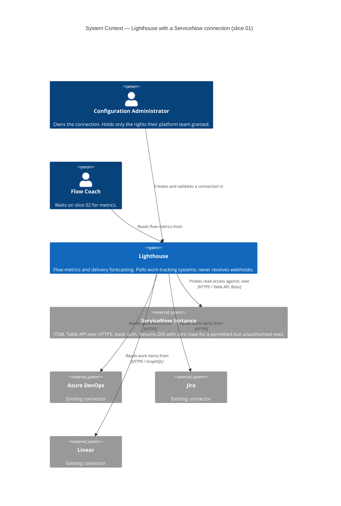
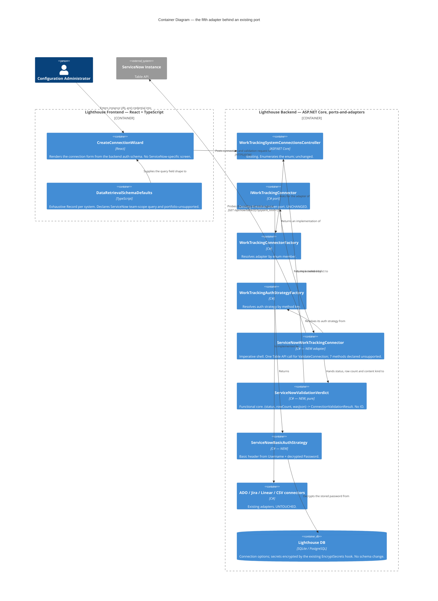

# Feature: ServiceNow Integration (Epic 5513)

**Epic**: ADO 5513 — "ServiceNow Integration" (Community / Release Notes)
**Feature id**: `epic-5513-servicenow-integration`
**Wave**: DISCUSS complete (2026-07-27) → **SPIKE required before DESIGN**
**Density**: lean (Tier-1 [REF] only; expansions on demand via `--expand <id>`)

> **Read this first.** This is a *viability* epic, not a parity epic. The epic body states plainly:
> "We don't know SNOW at all, so we don't have much of an idea how it's normally used." Every
> technology statement below is marked as either **[verified]** (checked against the Lighthouse
> codebase, or against the maintainer's own ServiceNow instance) or **[hypothesis]** (desk research,
> to be proved or killed by the SPIKE). No slice is committed until the SPIKE closes its questions.
>
> **Two premises were closed by the maintainer on 2026-07-27, before the SPIKE ran:** basic auth works
> on the target on-prem instance (D3), and ITSM is the default data model to optimise for (D4). Both
> are first-hand evidence and outrank the desk research they replace.

---

## Wave: DISCUSS / [REF] Pre-requisites

- **A connector port already exists** [verified]. `IWorkTrackingConnector` (8 methods:
  `SupportsTransitionHistory`, `GetPredefinedAdditionalFields`, `GetWorkItemsForTeam`,
  `GetFeaturesForProject`, `GetParentFeaturesDetails`, `ValidateConnection`, `ValidateTeamSettings`,
  `ValidatePortfolioSettings`, `WriteFieldsToWorkItems`) is the whole contract a new work-tracking
  system must satisfy. Four implementations exist: `AzureDevOps`, `Jira`, `Linear`, `Csv`.
- **Adding a system is a known, bounded shape** [verified]. `WorkTrackingSystems` enum +
  `AuthenticationMethodKeys` entry + `IWorkTrackingAuthStrategy` + connector class +
  frontend `DataRetrievalSchemaDefaults` entry + optional `DataRetrievalWizardRegistry` wizard.
  The frontend connection/settings surface is **schema-driven** — a new system needs configuration,
  not new React screens, for the baseline case.
- **Linear is the reference class, not Jira** [verified]. Linear is the most recent addition, uses a
  non-REST API (GraphQL), has no work-item-types requirement (`isWorkItemTypesRequired=false`),
  declares `SupportsTransitionHistory` dynamically with a runtime `DowngradeHistorySupport()` path,
  and returns `WriteBackResult` unsupported. Every one of those traits is likely to recur for SNOW.
- **Demo-data generators are a per-system artifact** [verified]. `Scripts/DemoEnv/` holds
  `ADOSystemUpdater.py`, `JiraSystemUpdater.py`, `LinearSystemUpdater.py`. A
  `ServiceNowSystemUpdater.py` is the matching deliverable, and the user has confirmed a cloud
  instance can be self-provisioned for it.
- **OAuth infrastructure exists but is user-delegated** [verified]. ADR-007 (provider registry),
  ADR-008 (credential separation), ADR-009 (base-URL callback), ADR-010 (single-flight refresh),
  ADR-011 (popup flow) all assume an *authorization-code* flow with a human at a browser. A
  service-to-service **client-credentials** flow is not currently a registered pattern. Not a v1
  concern — v1 is basic auth (D3) — but it is the shape the successor OAuth work will need (D3a).
- **No prior wave artifacts.** No DISCOVER, no DIVERGE, no `docs/product/vision.md`, no
  `docs/project-brief.md`, no `docs/stakeholders.yaml`. jobs.yaml has **no** job for "connect a new
  work-tracking system" — this feature bootstraps that job family.

## Wave: DISCUSS / [REF] Personas

No new persona. Four existing personas carry this feature; a SNOW shop is the same set of humans on a
different toolchain.

| Persona ID | One-line identifier |
|---|---|
| `config-admin` | Owns the Connection. Creates it, validates it, and lives with whatever rights their SNOW admin will grant — **primary**. |
| `flow-coach` | The reason the connection exists: wants cycle time / throughput / age on SNOW-tracked work without exporting to a spreadsheet — **primary**. |
| `delivery-lead-rte` | Wants a Portfolio over SNOW parents — **conditional**, only if the SPIKE finds a usable hierarchy (US-04). |
| `lighthouse-maintainer` | Owns the *viability verdict*: does the SNOW market justify further investment? This epic's stated outcome is theirs — **primary for US-06**. |

## Wave: DISCUSS / [REF] JTBD one-liners

- **job-snow-admin-connect-servicenow** — *When my team's work lives in ServiceNow and I have only the
  rights my platform team will grant me, I want to point Lighthouse at my instance and be told plainly
  whether the credential actually works, so I can start without escalating for admin rights or
  guessing why a sync is empty.*
- **job-snow-flow-coach-see-flow-metrics** — *When my team's work is ServiceNow records rather than Jira
  issues, I want the same cycle time, throughput, age and forecast Lighthouse gives every other team,
  so my tool choice stops deciding whether I can measure flow.*
- **job-snow-delivery-lead-portfolio-over-servicenow** — *When my ServiceNow work rolls up to a parent
  record, I want a Lighthouse Portfolio over those parents, so I can forecast a delivery instead of
  only reading one team's throughput.* (**conditional on SPIKE finding a hierarchy**)
- **job-maintainer-learn-servicenow-viability** — *When I am deciding whether ServiceNow is a market
  worth building for, I want a real integration in front of real ServiceNow users and their feedback
  in my hands, so I invest based on evidence rather than on a hypothesis about an untapped market.*

The fourth job is deliberately a *maintainer* job, not a user job. This epic's stated expected outcome
is "we know more about the viability" — pretending that is a user feature would hide the actual bet.

## Wave: DISCUSS / [REF] Locked Decisions

| ID | Decision | Verdict | Source |
|---|---|---|---|
| D1 | Feature type | **Cross-cutting** — backend connector + auth strategy + FE schema/wizard config + docs + demo-data script + E2E. | User (AskUserQuestion, 2026-07-27) |
| D2 | Walking skeleton | **Yes — slice 01 is "connect and validate a ServiceNow connection"**, slice 02 is the first metric. WS strategy **A** (thinnest end-to-end vertical). | User |
| D3 | Auth method for v1 | **Basic auth — confirmed by direct evidence on the target on-prem instance.** The maintainer has verified basic auth works there today, whereas OAuth would need instance-side admin setup they do not have. OAuth is the long-term answer and a named successor item; it is **not** the v1 gate. | User (2026-07-27), verified against the real on-prem instance — outranks the desk research |
| D3a | OAuth deferral is a recorded risk, not an oversight | ServiceNow has been tightening inbound Basic Authentication platform-wide [hypothesis]. That is a *future* constraint, not a present blocker, and the mitigation is already named: OAuth 2.0 client credentials as the successor method. Two consequences: (a) the docs (US-05) state plainly that v1 is basic auth, so a customer whose instance already blocks it finds out before installing rather than after; (b) OAuth's own setup cost — an instance-side application-registry entry made by *someone else* — is an adoption barrier in its own right, which is exactly why it is not the v1 choice. | Desk research, downgraded from blocker to risk |
| D4 | What counts as a "work item" in SNOW | **ITSM is the default and the optimisation target** — `task`-derived tables (`incident`, `change_request`, `sc_task`, `sc_req_item`). The table name stays **configurable** so an Agile Development 2.0 shop (`rm_epic`→`rm_story`, plugin `com.snc.agile_dev`, not installed by default) is not locked out, but ITSM is what the field mapping, demo data, docs and worked examples are built around. | User (2026-07-27) |
| D5 | Query model | **Reuse the existing per-system "query" concept** — SNOW's Table API takes a `sysparm_query` encoded query [hypothesis], which is the same shape as WIQL (ADO) and JQL (Jira): an opaque, user-authored filter string Lighthouse passes through. No new UX concept. | Desk research + connector precedent |
| D6 | Transition history in v1 | **Declare `SupportsTransitionHistory = false` by default and degrade honestly.** The Linear `DowngradeHistorySupport()` precedent [verified] is the pattern. Upgrading to real history is slice 04, and only if the SPIKE finds an affordable, read-only-role-accessible source. | Precedent + SPIKE gate |
| D7 | Portfolio / hierarchy | **Conditional slice.** Epic body already sanctions the fallback: "If not, we may start with team only". The SPIKE decides; slice 03 is written but not committed until it does. | Epic body |
| D8 | Write-back | **Out of scope this epic.** `WriteFieldsToWorkItems` returns an explicit unsupported result, as Linear does [verified]. Read-only integration only. | Scope discipline |
| D9 | Licensing | **Free tier, no premium gate.** Existing connectors are not gated by system; gating a whole work-tracking system would contradict that and would also block the viability signal this epic exists to collect. | Precedent + epic outcome |
| D10 | Primary target environment | **Cloud (self-provisioned developer instance) is the build-and-test target.** On-prem is the *validation fallback*, exercised once the integration is in decent shape, via scripts the user can run under a restricted account. | User (AskUserQuestion, 2026-07-27) |
| D11 | Least privilege is a first-class requirement, not a nicety | The user's limited on-prem access is treated as **a feature of the design brief**: whatever role set the integration needs must be documented and proved sufficient with a restricted account. Discovering the minimum viable rights *is* part of the epic's value. | User |

## Wave: DISCUSS / [REF] Scope Assessment: SPLIT (oversized — 5 of 5 signals fired)

Oversized signals, all present: (1) >3 distinct unknowns each capable of invalidating the design;
(2) touches backend connector + auth + frontend schema + docs + demo tooling + E2E; (3) walking
skeleton needs a live external system that does not yet exist; (4) effort clearly >2 weeks;
(5) multiple independent outcomes that can ship separately (connect / team metrics / portfolio /
history / proof-on-customer-instance).

**Split into one mandatory SPIKE + 5 elephant-carpaccio slices.** The SPIKE is *not* a slice — it
ships no production code and therefore cannot satisfy the value gate. It is a gate in front of the
slices, per `docs/feature/epic-5513-servicenow-integration/spike-questions.md`.

### Carpaccio taste tests

| Test | Result |
|---|---|
| Any slice shipping 4+ new components? | Pass — slice 01 ships connector skeleton + auth strategy + enum/schema entries only; the connector's read methods arrive in 02. |
| Every slice depends on a new abstraction? | Pass — the abstraction (`IWorkTrackingConnector`) already exists and is shipped four times over. Nothing new to invent. |
| Does any slice disprove a pre-commitment? | Pass — 01 disproves "a non-admin ServiceNow account can validate a connection"; 02 disproves "ITSM records map onto our team+query+state-mapping concepts"; 03 disproves "ITSM work rolls up to something forecastable"; 04 disproves "state history is affordably readable"; 05 disproves "a restricted account is sufficient end to end". |
| Any slice on synthetic data only? | Pass — every slice acceptance runs against a live ServiceNow instance; `ServiceNowSystemUpdater.py` seeds *real records in a real instance*, not fixtures. |
| Any two slices identical except scale? | Pass — no duplicates. |

## Wave: DISCUSS / [REF] Story Map + WS strategy

**Backbone**: Connect an instance → Point a Team at SNOW work → Read flow metrics & forecast →
Roll up to a Portfolio → Trust the time-in-state numbers → Prove it on a customer's real instance.

**WS strategy = A (thinnest end-to-end vertical).** Slice 01 walks connection→validation→green tick;
slice 02 extends the same vertical to the first rendered metric.

| Slice | Story | Type | Ships | Gate |
|---|---|---|---|---|
| — | **SPIKE** | *no code* | Answers to 9 questions; kills or confirms D3/D4/D6/D7 | **blocks all slices** |
| 01 | US-01 Connect and validate a ServiceNow instance | value | enum + **basic-auth** strategy + connector skeleton + FE schema entry + `ValidateConnection` | SPIKE Q8 only (Q1 closed by D3) |
| 02 | US-02 A team's ServiceNow work becomes flow metrics and a forecast | value | `GetWorkItemsForTeam` over an **ITSM `task`-derived table** + `ValidateTeamSettings` + state mapping + `SupportsTransitionHistory=false` honest downgrade | 01 |
| 03 | US-03 A portfolio over ServiceNow parents | value | `GetFeaturesForProject` + `GetParentFeaturesDetails` + `ValidatePortfolioSettings` | 02 + SPIKE says hierarchy exists |
| 04 | US-04 Time-in-state on ServiceNow work | value | transition history source + `SupportsTransitionHistory=true` | 02 + SPIKE says history is affordable |
| 05 | US-05 A ServiceNow admin self-serves from the docs | value | docs page + `ServiceNowSystemUpdater.py` + screenshots + minimum-role documentation | 02 |
| 05 | US-06 The maintainer gets a viability verdict | value | on-prem restricted-account validation run + structured feedback from ≥3 SNOW users | 05 |

Slice briefs: `docs/feature/epic-5513-servicenow-integration/slices/slice-0{1..5}-*.md`.

**Prioritisation rationale (learning leverage first, not dependency-order-only):**
- **SPIKE first** — D3 (auth) and D4 (data model) are now closed by the maintainer's first-hand evidence, so the SPIKE is materially *shorter* than first scoped. D6/D7 and the ITSM field mapping still gate every downstream estimate.
- **01 before 02** — with the protocol settled, slice 01's remaining risk is **rights, not auth**: can a non-admin account validate and read? Still the cheapest place to find out, and still the likeliest blocker to adoption at a real customer.
- 02 before 03/04 — team-level metrics is the epic's minimum shippable value ("we may start with team only").
- 03 before 04 — hierarchy determines whether Lighthouse's headline capability (portfolio forecasting) is reachable at all on SNOW; transition history only affects secondary widgets, and D6 already gives an honest fallback.
- 05 last but **not deferred to `/release`** — docs, screenshots and the demo-data script are per-feature finalisation work, and US-06's feedback loop cannot start until a SNOW user can actually follow a page.

## Wave: DISCUSS / [REF] User Stories

### US-01 — Connect and validate a ServiceNow instance
`job_id: job-snow-admin-connect-servicenow` · slice 01 · **value**

As a configuration administrator in a ServiceNow shop, I want to create a ServiceNow connection in
Lighthouse using the credential my platform team will actually give me, and be told immediately
whether it works, so I find out about a permissions problem on the settings page instead of from an
empty team a week later.

#### Elevator Pitch
Before: ServiceNow is not in Lighthouse's connection list at all — a SNOW shop cannot start.
After: open **Settings → Work Tracking Systems → New Connection → ServiceNow**, enter instance URL and credential, click **Validate** → see a green "Connection valid" or a specific failure naming what the credential cannot do.
Decision enabled: decide whether the account I was granted is sufficient, or whether I need to go back to my platform team with a named missing right — before configuring any team.

#### Acceptance Criteria
- AC1: "ServiceNow" appears as a selectable system in the connection-creation wizard alongside Azure DevOps, Jira, Linear and CSV.
- AC2: The connection form renders the SNOW option set (instance base URL + basic-auth username/password, per D3) from the schema-driven configuration — no bespoke React screen.
- AC3: Clicking Validate against a reachable instance with a sufficient credential returns a success result.
- AC4 *(amended per C-1, accepted 2026-07-29)*: Validate against an unreachable host, a wrong credential, and a **reachable instance whose configured table returns no visible rows** each return three distinguishable, actionable failures. A permissions failure is never reported as a connection failure and never as a success. Because ServiceNow returns `200` with zero rows for a permitted-but-unauthorised read, the third message names **both** possible causes and the role to grant, rather than asserting a certainty the API cannot supply. *(This AC is the one D11 exists for.)*
- AC5: The credential is stored using the existing encrypted connection-option mechanism; it is never returned to the client in plaintext on reload.

---

### US-02 — A team's ServiceNow work becomes flow metrics and a forecast
`job_id: job-snow-flow-coach-see-flow-metrics` · slice 02 · **value**

As a flow coach whose team tracks work in ServiceNow, I want to point a Lighthouse team at a
ServiceNow query and see throughput, cycle time and a forecast, so my team gets the same flow
diagnosis as the Jira teams next door.

#### Elevator Pitch
Before: my team's work is in ServiceNow, so Lighthouse gives me nothing — I export to a spreadsheet or go without.
After: create a Team with a ServiceNow connection, paste a ServiceNow query into the team's query field, hit **Refresh** → the team's Throughput and Cycle Time charts render and the "How many items by date" forecast returns percentiles.
Decision enabled: decide what my team can commit to for the next two weeks from our own historical throughput, instead of from a guess.

#### Acceptance Criteria
- AC1: A Team bound to a ServiceNow connection accepts a query string and syncs matching records into Lighthouse work items. The work-item table defaults to an **ITSM `task`-derived table** (D4) and is configurable.
- AC2: Each synced record maps to a Lighthouse work item with id, title, type, state, and the dates needed for cycle time (started / closed), derived from the SNOW record's fields.
- AC3: The team's Doing/Done state mapping is configured through the **existing** team-settings state mapping UI. ServiceNow states are commonly **numeric choice values with a separate display label** — the mapping UI must show the label the user recognises ("In Progress"), never the raw integer.
- AC4: Throughput, Cycle Time and the "How many" / "When" forecasts render for the team from synced data.
- AC5: `SupportsTransitionHistory` returns **false** for ServiceNow connections (D6), and every widget that requires transition history degrades to its documented unsupported state — no blank chart, no crash, no silently-wrong number.
- AC6: `ValidateTeamSettings` reports a bad query or an unresolvable table as a specific, actionable message on the team settings page.
- AC7: Pagination is honoured — a query matching more records than one page returns all of them.

---

### US-03 — A portfolio over ServiceNow parents
`job_id: job-snow-delivery-lead-portfolio-over-servicenow` · slice 03 · **value** · **conditional on SPIKE**

As a delivery lead, I want a Lighthouse Portfolio whose features are ServiceNow parent records, so I
can forecast a delivery date rather than only reading one team's throughput.

#### Elevator Pitch
Before: even with teams syncing, ServiceNow work stops at team level — no portfolio, no delivery forecast.
After: create a Portfolio on a ServiceNow connection with a parent query → the portfolio lists features with their child-item counts and a forecasted completion date per feature.
Decision enabled: decide whether a delivery is on track, and which feature is the one at risk.

#### Acceptance Criteria
- AC1: A Portfolio bound to a ServiceNow connection syncs parent records as Lighthouse features.
- AC2: Child work items resolve to their parent via the hierarchy relationship the SPIKE identified, so each feature reports remaining/total work.
- AC3: Feature forecasts render from contributing teams' throughput.
- AC4: `ValidatePortfolioSettings` gives an actionable message when the parent query or the relationship field is wrong.
- AC5: **If the SPIKE finds no usable hierarchy**, this story is cancelled — not silently deferred — and the docs (US-05) state explicitly that ServiceNow support is team-scope only, so a prospect learns the limit before they install rather than after.

---

### US-04 — Time-in-state on ServiceNow work
`job_id: job-snow-flow-coach-see-flow-metrics` · slice 04 · **value** · **conditional on SPIKE**

As a flow coach, I want the time-in-state, staleness and percentile widgets to work on ServiceNow
work, so I get the same "where is time being spent?" diagnosis my Jira colleagues get.

#### Elevator Pitch
Before: ServiceNow teams see throughput and cycle time, but every time-in-state widget reads "not supported for this system".
After: open **Team → Metrics** on a ServiceNow team → the Cumulative State Time and per-state widgets render real per-state durations.
Decision enabled: decide which workflow state is actually eating the team's cycle time, instead of only knowing the total.

#### Acceptance Criteria
- AC1: `SupportsTransitionHistory` returns true for ServiceNow connections whose configuration supports it.
- AC2: State transitions are captured per work item and mapped through `WorkItemStateTransitionMapper` like every other system's.
- AC3: Cumulative State Time, per-state percentiles and staleness render on a ServiceNow team.
- AC4: If history is unavailable **at runtime** for a given instance (source not readable with the granted rights), the connector downgrades at runtime rather than erroring — the Linear `DowngradeHistorySupport()` precedent.
- AC5: The extra history queries do not push a normal team refresh beyond the existing refresh-duration expectations; if they do, the feature ships behind an opt-in team setting rather than on by default.

---

### US-05 — A ServiceNow admin self-serves from the docs
`job_id: job-snow-admin-connect-servicenow` · slice 05 · **value**

As a ServiceNow administrator evaluating Lighthouse, I want a documentation page that tells me exactly
which instance settings, roles and query to use, so I can connect without a call and without over-granting.

#### Elevator Pitch
Before: nothing in the docs mentions ServiceNow; a prospect has to ask, or guess and over-grant an admin role.
After: open **docs → Concepts → Work Tracking Systems → ServiceNow** → follow a page that names the exact minimum role set, the auth setup steps, and a worked example query, with screenshots.
Decision enabled: decide whether Lighthouse can work inside my organisation's security posture — before I ask anyone for access.

#### Acceptance Criteria
- AC1: A ServiceNow docs page exists under the work-tracking-systems docs, matching the structure of the Jira/ADO/Linear pages.
- AC2: The page names the **minimum** ServiceNow role/ACL set the integration needs, proved sufficient (US-06 AC2), not the roles that merely happened to work for an admin account.
- AC3: Screenshots are generated by an `@screenshot` E2E per theme (per project convention: `rm` the old PNG first).
- AC4: `Scripts/DemoEnv/ServiceNowSystemUpdater.py` — created minimally by the environment prereq — is brought to the same shape the ADO/Jira/Linear updaters produce, so demo and screenshot environments are reproducible.
- AC5: If US-03 was cancelled, the page states the team-only limitation prominently (US-03 AC5).

---

### US-06 — The maintainer gets a viability verdict
`job_id: job-maintainer-learn-servicenow-viability` · slice 05 · **value**

As the Lighthouse maintainer, I want the integration exercised on a real customer's on-prem instance
under a restricted account, and structured feedback from real ServiceNow users, so I decide whether to
invest further based on evidence.

#### Elevator Pitch
Before: "ServiceNow is a huge untapped market" is a hypothesis with no evidence attached to it.
After: run the documented validation script against the on-prem customer instance under a restricted account → get a pass/fail per capability, plus written feedback from ≥3 ServiceNow users on what works and what is missing.
Decision enabled: decide whether Epic 5513 gets a successor epic, a narrowing, or a stop.

#### Acceptance Criteria
- AC1: A repeatable validation script/checklist runs against an instance the maintainer does **not** administer, exercising connect → team sync → metrics, and reports pass/fail per capability. It must be runnable standalone by someone with limited rights and no Lighthouse build (D10 — building Lighthouse on the on-prem side is cumbersome).
- AC2: The minimum-role claim in the docs (US-05 AC2) is confirmed on that instance, or the docs are corrected to what actually worked.
- AC3: Cloud-vs-on-prem behavioural differences are recorded — API version, auth acceptance, table availability, plugin presence — as a written list, even if the list is empty.
- AC4: Structured feedback is collected from ≥3 ServiceNow users/prospects and written up as a go / narrow / stop recommendation.
- AC5: The recommendation is recorded on ADO 5513 and, if it is "go", the successor epic's scope is named.

## Wave: DISCUSS / [REF] Outcome KPIs

| KPI | Target | Measurement |
|---|---|---|
| Time to first metric | ≤15 min from "create connection" to a rendered Throughput chart, for someone who has never connected Lighthouse before | Timed dogfood run on the cloud instance + repeated on the on-prem instance (US-06 AC1) |
| Least-privilege proof | The documented minimum role set is sufficient — **0** capabilities require an elevated/admin SNOW role | US-06 AC2, run under the restricted on-prem account |
| Honest capability reporting | **0** silent no-ops: each of the 8 `IWorkTrackingConnector` methods either works or reports a user-visible unsupported state | Backend integration tests + AC-level assertions (US-01 AC4, US-02 AC5, US-03 AC5) |
| Market signal | ≥3 ServiceNow users/prospects give structured feedback within 30 days of the release note | ADO 5513 `Community` tag + Slack/community thread; written up per US-06 AC4 |
| Verdict recorded | A go / narrow / stop recommendation exists on ADO 5513 within 30 days of shipping slice 05 | ADO work item |
| Mutation kill rate | ≥80% backend + frontend on new connector/auth code | Stryker.NET + Stryker, per-feature |

## Wave: DISCUSS / [REF] Definition of Done

1. All non-cancelled user stories' ACs pass. Cancelled conditional stories (US-03, US-04) are recorded as cancelled **with the SPIKE finding that cancelled them** — never silently dropped.
2. `dotnet build` zero warnings; `dotnet test` green; `pnpm test` / `pnpm build` / Biome clean.
3. Any EF migration is additive / expand-only, generated via the `CreateMigration` script across all providers.
4. Mutation testing ≥80% BE + FE on new code (per-feature, not deferred).
5. Every unsupported capability is *declared* and user-visible; no silent no-op (KPI 3).
6. E2E: one walking-skeleton spec covering connect → team sync → metric, driven from demo data, per the project's thin-sanity-check E2E principle. No team↔portfolio twin specs.
7. `Scripts/DemoEnv/ServiceNowSystemUpdater.py` exists and is documented alongside its three siblings.
8. Docs page + per-feature screenshots at feature finalisation (one `@screenshot` per theme; `rm` the old PNG first). Lighthouse-Clients CLI/MCP versioning: **N/A, because** this epic adds no client-facing contract change — connectors are server-side and the clients address teams/portfolios generically. Website marketing surface: **in scope** — a new supported system is a marketing claim; confirm with the maintainer before publishing.
9. SonarCloud gate: no new issues. ADO 5513 children mirrored + state-transitioned; the epic carries the `Release Notes` tag already.

## Wave: DISCUSS / [REF] Out of scope

- **Write-back to ServiceNow** (D8) — `WriteFieldsToWorkItems` reports unsupported.
- **OAuth 2.0** — v1 is basic auth (D3). OAuth is the named successor (D3a), not this epic.
- **Instance-side OAuth application registration** — a setup step performed by someone the Lighthouse user usually is not; part of why OAuth is deferred rather than a nicety we skipped.
- **ServiceNow as an inbound/webhook source** — Lighthouse polls; no SNOW-side business rules, flows or scripted REST endpoints are installed on the customer's instance. Requiring instance-side configuration would defeat D11.
- **Supporting both the Agile 2.0 and ITSM data models with bespoke logic** — D4 makes the table configurable; Lighthouse does not model SNOW's applications.
- **Premium gating** (D9).
- **Instance-side plugin installation** (e.g. asking a customer to activate `com.snc.agile_dev`) as a prerequisite for basic team metrics.
- **The successor epic** — this epic ends at a recommendation (US-06), not at parity.

## Wave: DISCUSS / [REF] Driving Ports (inbound surfaces)

- **UI actions**: Settings → Work Tracking Systems → New Connection → *ServiceNow* (wizard); Validate button on connection settings; Team settings query + state mapping; Portfolio settings parent query (US-03).
- **HTTP**: existing connection / team / portfolio settings and validation endpoints — no new routes. A new system is data, not a new controller surface.
- **Refresh pipeline (inbound trigger)**: the existing team/portfolio update queue drives `GetWorkItemsForTeam` / `GetFeaturesForProject` — no new scheduler.
- **Script (out-of-band)**: `Scripts/DemoEnv/ServiceNowSystemUpdater.py` (demo seeding) and the US-06 standalone validation script — the latter must run without a Lighthouse build (D10).

## Wave: DISCUSS / [REF] Pre-SPIKE gate

DESIGN **must not start** before the SPIKE closes. Question set:
`docs/feature/epic-5513-servicenow-integration/spike-questions.md` (9 questions, each with a named
decision it unblocks and an explicit "what we do if the answer is no").

**Environment prerequisite, ahead of the SPIKE**: provision a ServiceNow cloud Personal Developer
Instance and stand up a minimal `Scripts/DemoEnv/ServiceNowSystemUpdater.py` that seeds and churns
ITSM records against it. This is a *separate work item*, not part of the SPIKE timebox — PDI signup
carries no learning, and a signup problem is an account problem rather than a finding about the API.

It pays for itself three times over, which is why it is a story rather than a checklist line:
1. **Keeps the instance alive.** PDIs hibernate on inactivity and are eventually reclaimed. A
   scheduled seeder run is a cleaner guard than remembering to log in.
2. **Front-loads SPIKE evidence.** Creating and transitioning `incident` records over basic auth is
   the first real Table API traffic, and it answers part of Q2 (field mapping) and Q4 (which
   timestamps actually get populated when a record moves) as a by-product rather than a duplicate.
3. **It is the SPIKE's test data.** Every other question needs records to query.

**Ownership split with slice 05** (stated to avoid two work items claiming the same file): the prereq
creates the *minimal* seeder — enough ITSM records, in enough states, to answer the SPIKE. Slice 05
brings it to parity with `ADOSystemUpdater.py` / `JiraSystemUpdater.py` / `LinearSystemUpdater.py`
and documents it (US-05 AC4).

## Wave: DISCUSS / [REF] DoR Validation

| # | DoR item | Status |
|---|---|---|
| 1 | Job traceability | ✓ every story → real `job_id` (4 jobs added to `jobs.yaml`); no `infrastructure-only` escape used |
| 2 | Elevator pitch per value story | ✓ all 6 stories are value stories, all 6 have Before/After/Decision-enabled |
| 3 | Testable ACs | ⚠ **conditionally** — US-01 is now fully specified (D3 names the auth fields). US-03/US-04 ACs are testable but their *existence* is still gated on SPIKE Q5/Q6. Smaller residual than at first draft. |
| 4 | Personas defined | ✓ config-admin, flow-coach, delivery-lead-rte, lighthouse-maintainer — all pre-existing, extended with the new jobs |
| 5 | Journey mapped | ✓ `docs/product/journeys/epic-5513-servicenow-integration.yaml` |
| 6 | Slices ≤1 day, learning hypothesis each | ⚠ **5 briefs written, but slice 02 is the honest exception** — a first read-path against an unknown API is not a ≤1-day slice until the SPIKE has already made the calls by hand. The SPIKE deliberately absorbs that discovery so slice 02 becomes ≤1 day of *implementation*. Documented, not hidden. |
| 7 | Outcome KPIs numeric | ✓ 6 KPIs with targets and measurement methods |
| 8 | Out-of-scope explicit | ✓ 7 explicit non-goals |
| 9 | No silent N/A | ✓ RBAC impact: **N/A, because** connectors carry no new authorization surface — connection CRUD is already RBAC-gated and unchanged. Clients CLI/MCP versioning: **N/A, because** no client-facing contract changes (see DoD 8). Website marketing surface: **NOT N/A — in scope**, a new supported system is a public claim. |

**Requirements completeness: 0.93 — below the 0.95 gate, deliberately and transparently.** The residual
is not vagueness in what we want. Of the four originally-named unknowns, **two are now closed by the
maintainer's first-hand evidence** (D3 auth = basic; D4 table model = ITSM-first, configurable). Two
remain — D6 (history source) and D7 (hierarchy) — and no amount of requirements work closes them from
this side of the API. The SPIKE is the instrument. Expect >0.95 at SPIKE exit, and treat the SPIKE
report as a required amendment to this document before DESIGN.

## Wave: DISCUSS / [REF] Changed Assumptions

Two additions to the epic body, one of which reverses an earlier draft of this document.

### 1. Basic auth: challenged, then CONFIRMED by first-hand evidence

> **Original (ADO 5513 description, verbatim):** "We can build a test instance online (if available for
> free) and support one mean of auth (e.g. basic auth) - others like OAuth we could add later."

An earlier draft of this document put this premise **at risk**, on desk research showing ServiceNow
tightening inbound Basic Authentication in favour of OAuth 2.0 client credentials, and deferred the
auth choice to the SPIKE.

**That challenge is withdrawn.** The maintainer checked the actual target: basic auth works on the
on-prem customer instance today, and OAuth there would require instance-side admin setup they do not
have access to. First-hand evidence from the deciding environment beats desk research about the
platform in general, so **D3 locks basic auth for v1** and the epic body stands as written.

**What survives** is a smaller, real point, recorded as D3a rather than as a blocker: the restriction
trend is genuine, so OAuth is a named successor rather than an optional nicety, and US-05's docs must
say plainly that v1 is basic auth — a customer whose instance *already* blocks it should learn that
before installing. Note the second-order finding this surfaced: OAuth's setup cost (an instance-side
application-registry entry made by someone other than the Lighthouse user) is itself an adoption
barrier, which reinforces D11 rather than arguing against the deferral.

### 2. ITSM is the default data model — new, not in the epic body

> **Original (ADO 5513 description, verbatim):** "To be seen how we connect, how the 'query' works (if
> at all), if there is a concept like boards and states…"

**New assumption**: ServiceNow customers are assumed to be tracking work in **ITSM** (`task`-derived
tables: `incident`, `change_request`, `sc_task`, `sc_req_item`), not in Agile Development 2.0
(`rm_story`, a plugin that is not installed by default). Field mapping, demo data, docs and worked
examples optimise for ITSM; the table name stays configurable so an Agile 2.0 shop is not locked out.

**Rationale**: the epic left "what is a work item" entirely open. Optimising for the wrong model would
mean building the state mapping, demo generator and docs against tables most prospects do not use.
Consequence to carry into DESIGN: an ITSM-first read changes the vocabulary (tickets, not stories),
makes `On Hold` a natural blocked-state candidate, and weakens the hierarchy story — ITSM's rollup
concept is less obvious than `rm_epic`, so US-03 is now *more* likely to be cancelled, not less.

**The epic body is not edited.** This section is the record, per the back-propagation contract.

## Wave: DISCUSS / [REF] Wave Decisions Summary

- **Primary need**: let ServiceNow shops get the flow metrics and forecasts every other Lighthouse user gets — and, for the maintainer, find out whether that market is real.
- **Feature type**: cross-cutting (D1).
- **Walking skeleton**: connect + validate (D2), because auth is the likeliest thing to make the epic infeasible and the cheapest place to find that out.
- **Constraints**: read-only (D8); **basic auth** as the single v1 method, OAuth as named successor (D3/D3a); **ITSM-first** but configurable work-item table (D4); honest capability downgrade over silent gaps (D6); least privilege as a design requirement, not a nicety (D11); cloud primary / on-prem as the validation fallback (D10).
- **Upstream changes**: no DISCOVER/DIVERGE existed. Basic auth was challenged on desk research, then **confirmed** by the maintainer testing the actual on-prem instance; ITSM-as-default is a new assumption the epic body did not carry. Both recorded in Changed Assumptions.

## Next Wave

**SPIKE first** (`/nw-spike`) against `spike-questions.md` — mandatory gate, user-confirmed.
Then **DESIGN** (`nw-solution-architect`) + **DEVOPS** (`nw-platform-architect`, KPIs only).

Key DESIGN questions: whether the basic-auth strategy is a new class or reuses the shape of
`JiraCloudBasicAuthStrategy` (which is also username+token over Basic); whether the SNOW connector is
one class or splits cloud/on-prem; how the configurable ITSM table name (D4) threads through
connection vs team vs portfolio option scopes, and where its default lives; how numeric state choice
values are surfaced as readable labels in the existing state-mapping UI (US-02 AC3); and — downstream
of the SPIKE — where the transition-history source (D6/US-04) sits relative to
`WorkItemStateTransitionMapper`.

Deliberately **not** a DESIGN question this epic: the OAuth client-credentials shape (D3a). It is
successor work; designing it now would be speculative generality.

---

## Wave: DESIGN / [REF] Upstream Confirmation

DESIGN ran 2026-07-29, architect Morgan, interaction mode **propose**, scope **application/components**,
density **lean**, stress analysis **off**. Scoped to **slice 01 / ADO Story 5574** only.

| Upstream artifact | Read | Status |
|---|---|---|
| `feature-delta.md` DISCUSS (16 `[REF]` sections, D1–D11, US-01 AC1–AC5) | ✓ | Binding |
| `slices/slice-01-connect-and-validate.md` | ✓ | Binding |
| `spike/findings.md` (10 questions, all answered) | ✓ | **Measured fact — not re-derived** |
| `spike/wave-decisions.md` (PROMOTED, 7 design implications) | ✓ | Binding |
| `docs/product/architecture/brief.md` (SSOT) | ✓ | Extended, not rewritten |
| ADR-001 … ADR-113 | ✓ (index) | Next free = **ADR-114** |
| `docs/ci-learnings.md` | ✓ | Pre-applied, see CI section |
| `docs/product/outcomes/registry.yaml` | ⊘ | **Does not exist** — Outcome Collision Check skipped per instruction |
| DISCOVER / DIVERGE artifacts | ⊘ | Never existed (DISCUSS Pre-requisites records this) |
| `--residuality` stress analysis | ⊘ | Flag off |

**Paradigm and pattern are not re-opened.** OOP C# backend, functional-leaning React frontend,
ports-and-adapters. This feature adds a **fifth driven adapter behind an existing port**. No new
bounded context, no new port, no new controller, no schema change, no EF migration, no new library.

---

## Wave: DESIGN / [REF] Open Call 1 — Three distinguishable validation failures

**The problem, restated from measurement.** SPIKE Q8: a permitted-but-unauthorised read of `incident`
returns **`200` with zero rows**, byte-identical to a legitimately empty table. Q3: an unknown field in
`sysparm_query` makes the term vanish and returns the *whole table*. ServiceNow's failure modes are
shaped like successes. This is the single hardest thing in the slice.

### 1a — Does the port need to change to carry a three-way verdict?

**Verdict: NO. `IWorkTrackingConnector` and `ConnectionValidationResult` are used unchanged.**

`ConnectionValidationResult` already carries `IsValid` + **`Code`** + `Message` + `TechnicalDetails` +
`FieldName`, and `Code` is a **free-form per-connector string** — Jira emits `invalid_url` /
`authentication_failed` / `connection_failed` / `additional_fields_invalid`; Linear emits
`validation_failed` / `no_work_items_found`; CSV emits `missing_required_option`. There is no shared
enum to widen and no exhaustive switch to break. A fifth connector emitting its own codes breaks
nothing in the other four.

This closes the DISCUSS "Next Wave" question about the verdict contract: **there was never a contract
problem, only a connector-internal one.**

### 1b — Where does the "rows actually came back" assertion live?

| Option | Shape | Trade-off |
|---|---|---|
| **A** Inline in `ServiceNowWorkTrackingConnector.ValidateConnection` | Jira/Linear precedent, ~60 lines of mixed IO + branching | Cheapest. But the verdict ladder is the *only interesting logic in the slice* and it becomes reachable only through an `HttpMessageHandler` mock — expensive to reach at the ≥80 % Stryker density the DoD demands |
| **B** ✅ **Pure verdict mapper + thin IO in the connector** | `ServiceNowValidationVerdict.From(status, rowCount, table, wasJson)` → `ConnectionValidationResult`; connector performs one HTTP call and hands the mapper two scalars | Functional core / imperative shell at adapter grain. Every one of the 7 ladder rungs is a table-driven unit test with no HTTP. Mutants land on the branch that matters. Cost: one extra ~40-line static class |
| **C** Cross-connector `IConnectionProbe` abstraction | Shared probe port, all five connectors implement | **Rejected — speculative generality.** One connector needs it. Revisit at the rule of three |

**Verdict: B.** The verdict ladder is a **pure function** (contract shape: pure-function, return-only);
the connector is the imperative shell that supplies `(HttpStatusCode, int rowCount, bool wasJson)`.
The bug class "validation reported success because nobody counted the rows" becomes a mapper unit test
rather than an integration concern.

### 1c — The ladder itself (all rungs grounded in measured SPIKE data)

| # | Observation | `Code` | `IsValid` | Provenance |
|---|---|---|---|---|
| 0 | Base URL not an absolute `Uri` | `invalid_url` | false | Jira precedent, pre-flight, no IO |
| 1 | `HttpRequestException` / timeout (DNS, refused, TLS) | `connection_failed` | false | **AC4 failure #1 — unreachable host** |
| 2 | `401` | `authentication_failed` | false | **AC4 failure #2 — bad credential.** Carries the D3a hint (Open Call 2) |
| 3 | `200` but body is not JSON (SSO/SAML-fronted instance serving a login page) | `unexpected_response` | false | **[hypothesis — NOT measured.]** Defensive rung; provenance tagged so nobody later mistakes it for a finding |
| 4 | `400` | `unknown_table` | false | Measured: `pm_project`, `rm_story`, `demand` all return 400 |
| 5 | `403` | `insufficient_permissions` | false | Measured: `sys_db_object`, `metric_definition` below `itil`. An *honest* denial |
| 6 | `200`, JSON, **0 rows** | `no_records_visible` | false | **AC4 failure #3 — the denial in a success costume** |
| 7 | `200`, JSON, **≥1 row** | `valid` | true | Measured: `sn_incident_read` → 200/5 |

**Probe call**: `GET {baseUrl}/api/now/table/{table}?sysparm_limit=1`, verdict from
`(status, result.Length, contentIsJson)`. Deliberately **no `sysparm_fields`** — the SPIKE never measured
whether field projection interacts with ACL filtering, and a validation probe is the wrong place to
rely on an unmeasured mechanism. Slice 02 may add projection once it measures it.

**Rung 6 is honest about its own ambiguity — see Flagged Contradiction C-1.** Its message names both
causes and the role to grant. It is a *failure*, never a success, so AC4's "a permissions failure must
never be reported as a connection failure" holds, and so does the KPI-3 no-silent-no-op rule.

---

## Wave: DESIGN / [REF] Open Call 2 — the `snc_basic_auth_api_access` prerequisite

Measured: the restriction is **armed** on the Australia release with an enforcement date; after it,
accounts without the role are blocked. Also measured: as `sn_*_read`, `sys_properties` returns
**200 with zero rows** for all three restriction properties, `sys_plugins` returns 403. **Lighthouse
cannot see this using the credentials a customer would give it.**

| Option | Trade-off |
|---|---|
| **A** Docs-only prerequisite (US-05) | Honest and cheap, but the customer meets it at 3 a.m. when the sync starts 401-ing, having forgotten the docs |
| **B** ✅ **Docs prerequisite + a static hint on the `authentication_failed` rung** | The failure we already surface carries the one sentence that turns a 40-minute hunt into a 2-minute role grant. Zero detection, zero new IO, zero speculation |
| **C** Detect and warn — read the restriction properties at validation time | **FORBIDDEN.** Measured invisible to the integration account. An earlier SPIKE draft proposed exactly this and was *disproven*. Building it would produce a warning that silently never fires for the only users who need it |

**Verdict: B, with C recorded as forbidden** so slice 02+ cannot resurrect it. → **ADR-115**.

The hint is worded as a *conditional*, never as a claim of knowledge: rung 2's `TechnicalDetails` reads
"ServiceNow returned 401. If this instance enforces the inbound basic-auth restriction, the account
also needs the `snc_basic_auth_api_access` role — Lighthouse cannot check this for you." It does not
assert the restriction is active, because it cannot know.

**Also recorded for US-05 docs**: `snc_read_only` grants **no read access whatsoever** (measured
identical to holding no roles) — its name invites precisely the wrong guess.

---

## Wave: DESIGN / [REF] Open Call 3 — Configuration surface

Measured: `sys_db_object` → 403 below `itil`; `sys_dictionary` → 200/EMPTY at *every* level including
`itil`. **Table and field discovery cannot be offered to a least-privilege account.** A wizard that
enumerates tables works for the maintainer and shows the customer a silent empty list.

| Option | Where the table name lives | Trade-off |
|---|---|---|
| **A** Connection-scope only | One connection = one table | Gives `ValidateConnection` a probe target, satisfying AC4 today. Boxes in a shop reading both `incident` and `change_request` — they need two connections |
| **B** Team-scope only, inside the query | Nothing to probe at connection scope | **Fails AC4 outright**: slice-01 validation has no table to test rights against, and the third failure mode becomes unreachable |
| **C** ✅ **Connection-scope default table + team-scope query (and, in slice 02, an optional per-team table override)** | Both | AC4 is satisfiable now; slice 02 is not boxed in. Cost: one option key that slice 01 ships and slice 02 re-reads |

**Verdict: C.** → **ADR-116**.

**Slice-01 connection options** (`ServiceNowWorkTrackingOptionNames`):

| Key | Default | Secret | Optional |
|---|---|---|---|
| `Instance Url` | `""` | no | no |
| `Username` | `""` | no | no |
| `Password` | `""` | **yes** | no |
| `Work Item Table` | **`incident`** | no | yes |

`Password` secret ⇒ AC5 is satisfied by the **existing** `EncryptSecrets` change-tracker hook and the
existing DTO redaction — no new mechanism.

**Frontend `DataRetrievalSchemaDefaults` (both records are exhaustive `Record<WorkTrackingSystemType, …>`,
so `tsc` forces both entries the moment the union gains `"ServiceNow"` — the enforcement is free):**

```ts
// teamSchemas
ServiceNow: { key: "servicenow.query", displayLabel: "ServiceNow Query (Encoded Query)",
              inputKind: "freetext", isRequired: true,
              isWorkItemTypesRequired: false, wizardHint: null }

// portfolioSchemas — slice 03 is CANCELLED; the schema says so in the type system
ServiceNow: { key: "servicenow.portfolio.unsupported", displayLabel: "Not supported for ServiceNow",
              inputKind: "none", isRequired: false,
              isWorkItemTypesRequired: false, wizardHint: null }
```

- `wizardHint: null` — **no wizard entry in slice 01**, matching the slice brief, *and* matching the
  measurement: a discovery wizard cannot work for the account it would be built for.
- `isWorkItemTypesRequired: false` — for the ITSM-first default the **table is the type**
  (Linear precedent, `isWorkItemTypesRequired=false`). A `task`-rooted read scopes by `sys_class_name`
  inside the query instead. **Revisit at slice 02**, where the type-vs-`sys_class_name` mapping is
  actually exercised; recorded here so the revisit is a decision, not a discovery.
- The portfolio entry makes **US-03 AC5's "state the limit prominently"** structural rather than
  documentary — the config surface itself declines, so there is no half-working portfolio path to
  stumble into.

---

## Wave: DESIGN / [REF] Open Call 4 — `sys_choice` label resolution placement

Measured: `sys_choice` is readable **with no roles at all** (200/5 for every account), and `state`
values collide across subclasses (`3` = On Hold on `incident`, Closed Complete on `task`). Choice values
are also instance- and release-specific — the seeder already had to resolve `close_code` at runtime
after a hardcoded value from the instance's own sample data was rejected.

| Option | Trade-off |
|---|---|
| **A** Private helper inside `ServiceNowWorkTrackingConnector` | Cheapest. But it has two foreseeable consumers (state-mapping labels for US-02 AC3; runtime choice resolution on the write/seed path) and a cache lifetime longer than one connector call — a private method makes the second consumer a copy-paste |
| **B** ✅ **A named collaborator, `ServiceNowChoiceLabelResolver`, injected into the connector — specified now, built in slice 02** | Keeps slice 01 to its stated scope while fixing the seam so slice 02 does not have to refactor a private method outward under delivery pressure |
| **C** Defer the question entirely to slice 02 | Rejected by the task brief and by experience: the placement gets decided by whoever is closest to a deadline |

**Verdict: B — seam named, not built.** Slice 01 ships **no** resolver class. What slice 01 does ship is
the constraint that makes slice 02 cheap:

> **Invariant (slice 02 gate):** no raw ServiceNow choice *value* may cross the connector boundary. What
> reaches `Team.MapStateToStateCategory` / `MapRawStateToMappedName` and the state-mapping UI is always
> the `sys_choice` **label**. Enforced by a `ServiceNowLabelBoundaryArchUnitTest` added in slice 02
> (`Lighthouse.Backend.Tests/Architecture/`, the established convention — 7 such fixtures exist).

Because `sys_choice` needs no roles, the resolver can populate the mapping UI **even on a connection
whose table read is failing rung 6** — a small, real usability win that only falls out if the resolver
is a separate collaborator rather than a step inside the work-item read.

---

## Wave: DESIGN / [REF] Open Call 5 — ADR verdicts

Three of the five calls are precedent-setting or contested; two are mechanical.

| Call | ADR? | Reason |
|---|---|---|
| 1 — validation verdict ladder | ✅ **ADR-114** | First connector whose *success is indistinguishable from a denial*. It redefines what "valid" means for a work-tracking connection and the reasoning must survive the next connector |
| 2 — basic-auth prerequisite, detection forbidden | ✅ **ADR-115** | **Contested and already disproven once.** A rejection needs a durable home or it gets re-proposed |
| 3 — table at connection scope, portfolio declared unsupported | ✅ **ADR-116** | First connector where the *entity kind* is configuration, and the first to decline a capability in the schema rather than in prose |
| 4 — choice-label placement | ⊘ No ADR | The *rule* (labels never numbers) is a SPIKE finding, already recorded; restating it in an ADR adds a second source of truth. The *placement* is uncontested and unbuilt — slice 02 raises one if it becomes contested |
| 5 — enum / factory / DI / schema touch points | ⊘ No ADR | Mechanical. Seven touch points already enumerated and verified by the SPIKE; a fifth traversal of a known path sets no precedent |

---

## Wave: DESIGN / [REF] Reuse Analysis (hard gate)

Default is EXTEND; every CREATE NEW carries evidence for why extension fails. Contract shape per
component: **pure** (return-only) · **bounded** (declared mutation set) · **io** (imperative shell).

| # | Component | Path | Verdict | Evidence | Shape |
|---|---|---|---|---|---|
| 1 | `WorkTrackingSystems` | `Services/Implementation/WorkTrackingConnectors/WorkTrackingSystems.cs` | **EXTEND** | 4 members. `GetSupportedWorkTrackingSystemConnections` iterates `Enum.GetValues<WorkTrackingSystems>()`, so **AC1 is satisfied by the enum addition alone** — no controller change. ⚠ **Append `ServiceNow` after `Csv`**: no `HasConversion` on this property anywhere in `LighthouseAppContext`, so EF persists it as **int**; inserting mid-enum silently repoints every stored connection | pure |
| 2 | `AuthenticationMethodKeys` | `…/AuthenticationMethodKeys.cs` | **EXTEND** | Per-system consts + `GetDefaultForSystem` switch that throws on unknown. Add `ServiceNowBasic = "servicenow.basic"` + one arm | pure |
| 3 | `AuthenticationMethodSchema` | `…/AuthenticationMethodSchema.cs` | **EXTEND** | `MethodsBySystem` dictionary; `GetMethodsForSystem` **throws** if a system is absent. One entry with 3 options drives **AC2** — the form renders from schema, no React screen | pure |
| 4 | `IWorkTrackingConnector` | `Services/Interfaces/WorkTrackingConnectors/` | **REUSE — UNCHANGED** | 8-method port, 4 implementations. Nothing in slice 01 needs a 9th method | — |
| 5 | `ConnectionValidationResult` | `Models/Validation/` | **REUSE — UNCHANGED** | Already carries `Code`/`Message`/`TechnicalDetails`/`FieldName`; codes are free-form per connector. **Direct answer to Open Call 1a** | pure |
| 6 | `IWorkTrackingAuthStrategy` | `Services/Interfaces/WorkTrackingConnectors/` | **REUSE — UNCHANGED** | `ApplyAsync(request, connection, ct)` already fits Basic | — |
| 7 | `JiraCloudBasicAuthStrategy` | `…/Auth/JiraCloudBasicAuthStrategy.cs` | **CREATE NEW** `ServiceNowBasicAuthStrategy` | Extension fails on inspection: `ApplyAsync` reads `JiraWorkTrackingOptionNames.ApiToken`/`.Username` **by name** and branches on `AuthenticationMethodKeys.JiraCloud or JiraScopedToken`, falling through to **Bearer**. Reusing it means putting ServiceNow option keys inside a Jira-named class — repeating *knowledge*, which the project's DRY rule forbids. New class ≈ 20 lines, same shape. *Alternative considered:* generalise to `BasicAuthStrategy(usernameKey, secretKey)` — rejected, it forces a refactor of a live Jira path inside a walking skeleton; revisit at the rule of three | io |
| 8 | `WorkTrackingAuthStrategyFactory` | `…/Auth/` | **EXTEND** | Add ctor param + switch arm. ⚠ **6th constructor parameter** — see CI section, S107 |  bounded |
| 9 | `WorkTrackingConnectorFactory` | `Factories/` | **EXTEND** | Switch + 2-minute cache. One arm | bounded |
| 10 | `WorkTrackingSystemFactory` | `Factories/` | **EXTEND** | `CreateOptionsForWorkTrackingSystem` switch **throws** on unknown. Add `GetOptionsForServiceNow()` (4 options, table 3 above) | pure |
| 11 | `LinearWorkTrackingConnector` | `…/Linear/` | **REFERENCE ONLY — NOT MODIFIED** | The model for the skeleton (`SupportsTransitionHistory`, `DowngradeHistorySupport`, unsupported write-back). Reading it is the reuse | — |
| 12 | `ServiceNowWorkTrackingConnector` | `…/ServiceNow/` | **CREATE NEW** | No existing connector speaks the ServiceNow Table API. `ValidateConnection` real; the other 7 return **declared** unsupported/empty (CSV + Linear precedent: `=> []`, `=> false`, `throw new NotSupportedException`) — never a silent no-op (DoD 5 / KPI 3) | io |
| 13 | `IServiceNowWorkTrackingConnector` | `Services/Interfaces/WorkTrackingConnectors/` | **CREATE NEW** | Marker for DI, precedent `ILinearWorkTrackingConnector`. **Does not** extend `IBoardInformationProvider` — no board concept, no wizard (Open Call 3) | — |
| 14 | `ServiceNowWorkTrackingOptionNames` | `…/ServiceNow/` | **CREATE NEW** | Every system has one (`Jira`, `AzureDevOps`, `Linear`, `Csv`). Not shared — the keys *are* the per-system knowledge | pure |
| 15 | `ServiceNowValidationVerdict` | `…/ServiceNow/` | **CREATE NEW** | The Open Call 1b functional core. Pure: `(HttpStatusCode, int, bool, string) → ConnectionValidationResult`. Universe: return value only; performs **no IO, no logging, no mutation** — asserted by an ArchUnit rule | **pure** |
| 16 | `Program.cs` DI | `Program.cs` | **EXTEND** | 2 registrations beside `LinearApiKeyAuthStrategy` (L1036) and `ILinearWorkTrackingConnector` (L966) | io |
| 17 | `WorkTrackingSystemConnectionsController` | `API/` | **NO CHANGE** | Enumerates the enum. Confirmed by reading L41–52 | — |
| 18 | `LighthouseAppContext` / EF | `Data/` | **NO CHANGE** | New enum member, new option **rows** — no new column, **no migration**. Existing `EncryptSecrets` hook covers AC5 | — |
| 19 | FE `WorkTrackingSystemType` | `models/WorkTracking/WorkTrackingSystemConnection.ts` | **EXTEND** | Add `"ServiceNow"` to the union. Cascades into both exhaustive `Record`s — free compile-time enforcement | pure |
| 20 | FE `AuthenticationMethodKeys` (const) | same file | **EXTEND** | Mirror of the backend consts | pure |
| 21 | FE `workTrackingSystemGetDataRetrievalDisplayName()` | same file | **EXTEND** | ⚠ this `switch` has a `default:` arm, so **`tsc` will NOT force the new case** — it would silently render "Query". The only drift-prone touch point in the FE set; needs an explicit unit test, not compiler trust | pure |
| 22 | FE `DataRetrievalSchemaDefaults` | `models/Common/` | **EXTEND** | Two entries, shapes in Open Call 3 | pure |
| 23 | FE `DataRetrievalWizardRegistry` | `components/DataRetrievalWizards/` | **NO CHANGE** | `applicableSystemTypes` is opt-in; absence = no wizard, which is the decision | — |
| 24 | FE `AdditionalFieldsEditor` | `pages/Settings/Connections/` | **EXTEND** | ⚠ **found by inspection, easy to miss.** Gates on `workTrackingSystemType !== "Linear"`. ServiceNow's `GetPredefinedAdditionalFields` returns `[]` in slice 01, so leaving the editor visible ships a control that does nothing — a **silent no-op**, which DoD 5 / KPI 3 forbid. Add ServiceNow to the exclusion | bounded |
| 25 | FE `WriteBackMappingsEditor` | `pages/Settings/Connections/` | **EXTEND** | Same gate, same reason, and **permanent** (D8) | bounded |
| 26 | `Scripts/DemoEnv/ServiceNowSystemUpdater.py` | `Scripts/DemoEnv/` | **NO CHANGE in slice 01** | **Already exists** (pre-SPIKE environment prereq; it is the working Table API client the SPIKE used). Brought to sibling parity in **slice 05**, per the ownership split DISCUSS already recorded | io |
| 27 | `Lighthouse.Backend.Tests/Architecture/` | tests | **EXTEND** | 7 ArchUnitNET fixtures exist. Add one (below) | — |

**Net: 13 EXTEND · 5 CREATE NEW · 6 REUSE-UNCHANGED / NO-CHANGE · 1 reference-only.** Every CREATE NEW
is either a per-system artifact that every one of the four existing systems also has (12, 13, 14) or is
justified above against a named extension candidate (7, 15).

---

## Wave: DESIGN / [REF] C4 — System Context (L1)



Lighthouse installs **nothing** on the customer instance — no business rules, no flows, no scripted REST
endpoints. That is D11 (least privilege) expressed at system-context grain, and it is why the arrow runs
one way only.

## Wave: DESIGN / [REF] C4 — Container (L2)



**L3 is deliberately not produced.** The new subsystem is three classes; a component diagram over three
classes restates the container diagram at a smaller font. The threshold this project uses is 5+
interacting components.

---

## Wave: DESIGN / [REF] Earned Trust — the probe and the lies it must survive

ServiceNow is a **substrate that lies in a specific, measured way**: it answers a denial with a success.
The probe is therefore not a nicety bolted onto validation — it *is* validation.

**Probe placement.** `ValidateConnection` is the probe. There is no composition-root "wire then probe
then use" gate here and inventing one would be wrong: connections are **user data created at runtime**,
not startup configuration, so there is nothing to refuse to start. The probe runs when the admin clicks
Validate and again on every settings save. Stated plainly rather than forced into a startup shape that
does not fit.

**Catalogued substrate lies the probe must survive** — these are the DISTILL acceptance-test rows:

| Lie | Injected as | Required verdict | Measured? |
|---|---|---|---|
| L1 Denial in a success costume | `200` + `{"result":[]}` | `no_records_visible` (**never** `valid`, **never** `connection_failed`) | ✓ measured |
| L2 Bad credential | `401` | `authentication_failed` + D3a hint | ✓ measured |
| L3 Honest denial | `403` | `insufficient_permissions` | ✓ measured |
| L4 Table does not exist | `400` | `unknown_table` | ✓ measured |
| L5 Host unreachable | `HttpRequestException`, timeout | `connection_failed` | ✓ (control) |
| L6 SSO login page wearing a 200 | `200` + `text/html` | `unexpected_response` | ✗ **hypothesis** |
| L7 The truth | `200` + ≥1 row | `valid` | ✓ measured |

L6 is the only unmeasured rung and is tagged as such everywhere it appears, so a later reader cannot
mistake a defensive guess for a finding.

**Enforcement — three orthogonal layers, matching the project's existing ArchUnitNET convention**
(`Lighthouse.Backend.Tests/Architecture/`, 7 fixtures):

1. **Structural** — `ServiceNowValidationVerdictPurityArchUnitTest`: `ServiceNowValidationVerdict` must
   not depend on `HttpClient`, `ILogger`, or `Lighthouse.Backend.Data`. Keeps the functional core pure.
2. **Behavioural** — a table-driven NUnit fixture over all 7 rungs. This is where the Stryker mutants
   land, and it is the reason Option 1b/B exists.
3. **Contract** — one integration test asserting `ValidateConnection` returns `IsValid == false` for a
   `200`-with-zero-rows response. The single assertion that makes the headline bug non-shippable.

A bypass of any one layer is caught by at least one other.

---

## Wave: DESIGN / [REF] Flagged Contradictions

Per the DESIGN mandate these are surfaced rather than papered over. **C-1 was ruled on 2026-07-29:
the amendment is ACCEPTED. DISTILL writes AC4's tests against the amended wording below.**

### C-1 — US-01 AC4 asks for a distinction the platform cannot make (RESOLVED — amendment accepted)

- **DISCUSS US-01 AC4** requires three distinguishable failures, the third being "a reachable instance
  where the account **lacks read access** to the configured table".
- **SPIKE Q8** measured that `incident` returns `200` with zero rows for *both* an unauthorised account
  **and** a genuinely empty table. `X-Total-Count` is 0 in both. No status code, header or body field
  separates them, and every alternative discriminator is itself unavailable: `sys_db_object` 403,
  `sys_dictionary` 200/EMPTY at every role level, `sys_properties` 200/EMPTY.
- **Therefore**: rung 6 cannot honestly claim "you lack rights". It can only report "the credential
  authenticated, and the configured table returned nothing visible — either the account lacks read
  access to `{table}` (grant `sn_incident_read` or its per-table sibling; note `snc_read_only` grants
  nothing), or the table is genuinely empty."
- **What is preserved**: three distinguishable *codes* and *messages* (`connection_failed`,
  `authentication_failed`, `no_records_visible`), and AC4's real safety property — **a permissions
  failure is never reported as a connection failure, and never as a success**.
- **What changes**: AC4's third bullet asserts a certainty the API does not provide.

**AC4 amendment — ACCEPTED 2026-07-29 (maintainer ruling). This is the binding AC4 for DISTILL;
the US-01 AC4 bullet above has been replaced with it:**

> AC4: Validate against an unreachable host, a wrong credential, and a reachable instance whose
> configured table returns no visible rows each return three distinguishable, actionable failures. A
> permissions failure is never reported as a connection failure and never as a success. Because
> ServiceNow returns `200` with zero rows for a permitted-but-unauthorised read, the third message names
> **both** possible causes and the role to grant, rather than asserting a certainty the API cannot
> supply.

### C-2 — the no-instance-side-setup scope line is already broken (recorded, not blocking)

DISCUSS "Out of scope" states Lighthouse requires no instance-side configuration. The SPIKE measured
that a current release needs `snc_basic_auth_api_access` granted to the integration account after the
enforcement date. **The SPIKE already recorded this contradiction**; DESIGN does not re-litigate it —
D3 stands, the grant is small and documentable. Carried here so it reaches US-05's docs as a
**prerequisite** rather than a footnote, and so ADR-115 exists to hold the "do not build detection"
rejection. It also strengthens the OAuth successor case (D3a).

### C-3 — `isWorkItemTypesRequired` is decided on thin evidence (recorded, low risk)

Set `false` on the reasoning that for the ITSM-first default the table *is* the type. That reasoning
holds for `incident`/`change_request` and weakens for a `task`-rooted read scoped by `sys_class_name`.
Slice 01 does not read work items, so nothing is at risk yet. Flagged so slice 02 revisits it
deliberately. Cost of being wrong: one boolean and one FE test.

---

## Wave: DESIGN / [REF] CI rules pre-applied (from `docs/ci-learnings.md`)

| Rule | Where it bites | Pre-applied |
|---|---|---|
| **S107** — too many ctor params (fires at 6–7; ledger entry 2026-07-10) | `WorkTrackingAuthStrategyFactory` goes **5 → 6** params | Highest-probability CI failure in the slice. Either group the strategies behind an `IEnumerable<IWorkTrackingAuthStrategy>` + key lookup, or `#pragma warning disable S107` **wrapping the declaration that triggers it** (ledger 2026-05-16 — placement elsewhere silently does nothing). Prefer the pragma in the walking skeleton; the regrouping is a separate `refactor(worktracking):` commit |
| **CA1859** — return/param should be the concrete type (3 recurrences) | New private helpers in the connector and the verdict mapper | Concrete return **and** parameter types on every new private helper |
| **NUnit2045 / NUnit2056** — INFO severity, invisible to a warning-clean local build | The 7-rung table-driven fixture | `Assert.EnterMultipleScope`, never `Assert.Multiple` |
| **NUnit4002** | Row-count assertions in the ladder tests | `Is.Zero`, never `Is.EqualTo(0)` |
| **NUnit2046** | `result.Length` assertions | `Has.Count.EqualTo(…)`, never `Assert.That(x.Count, …)` |
| **S8969 / S8970** — null-forgiving operators, **ERROR** severity since SonarAnalyzer.CSharp 10.30 (2026-07-29, PR #1622) | JSON parsing in the connector | No `!` anywhere in the new C# |
| **CA1869** | Any `JsonSerializerOptions` for the Table API response | Cache it in a `static readonly` field |
| **S2139** — log-and-rethrow when a higher layer already logs | Connector catch blocks | Follow the Linear precedent: log **and return a failure result**; do not rethrow |
| **SYSLIB1045** | Any parsing temptation | No `new Regex(...)` |
| **S2325 / S1144** | New private members | Every private member justifies its existence and its instance-state use |
| Per-connector path-scoped integration tests (2026-05-18) | New live-instance tests | Path-scope any ServiceNow live test as the ADO/Jira/Linear ones are, so it does not run on every PR |
| **typescript:S107 / S3776** | FE touch points are all small | Low risk; the FE work is 5 declarative edits |

---

## Wave: DESIGN / [REF] Quality Gates

| Gate | Status |
|---|---|
| Requirements traced to components | ✓ AC1→#1 · AC2→#3 · AC3→ladder rung 7 · AC4 (amended, C-1 accepted)→rungs 1/2/6 · AC5→#18 unchanged mechanism |
| Component boundaries with responsibilities | ✓ Reuse Analysis, 27 rows |
| Technology choices in ADRs with alternatives | ✓ ADR-114/115/116, ≥2 alternatives each |
| Quality attributes | ✓ least privilege (D11) is the design driver; honest capability reporting (KPI 3); ~600 ms/call ⇒ **one** probe call, never per-item |
| Dependency-inversion compliance | ✓ new adapter behind an unchanged driven port; pure core has no outward dependency |
| C4 L1 + L2 in Mermaid, verbs on every arrow | ✓ L3 justified as omitted |
| Integration patterns specified | ✓ HTTPS poll, Basic, `sysparm_limit=1`, no `sysparm_fields` (unmeasured), no inbound webhook |
| OSS preference | ✓ **no new dependency of any kind**; `HttpClient` + existing auth-strategy plumbing |
| AC behavioural, not implementation-coupled | ✓ the 7 rungs are observable `(Code, IsValid)` pairs |
| **External integration → contract tests** | ✓ ServiceNow Table API is an external integration. **Consumer-driven contract tests recommended (e.g. Pact) for the ServiceNow Table API response shapes** — the L1–L7 lie catalogue *is* the contract, and it is exactly what a vendor release change would break silently. Carried into the platform-architect handoff |
| Architecture enforcement tooling | ✓ ArchUnitNET (already at 0.13.3, 7 fixtures) — purity rule specified; label-boundary rule scheduled for slice 02 |
| Simplest-solution check | ✓ 2 simpler alternatives rejected with reasons at Open Calls 1b and 3; no new abstraction layer, no new port, no new context |
| Mutation ≥80 % BE/FE | ✓ addressed structurally — the pure verdict mapper is why the ladder is reachable without HTTP mocks |
| Peer review | ✓ **run late, after DISTILL** (2026-07-29) — `nw-solution-architect-reviewer`, verdict `conditionally_approved`: 1 blocker, 1 high, 2 low. Triage below |

---

## Wave: DESIGN / [REF] Tier-2 Expansion Catalog

Lean density: the following are **listed, not rendered**. Request with `--expand <id>`.

| id | Expansion |
|---|---|
| `T2-01` | Full `ServiceNowValidationVerdict` behaviour table with exact `Message` / `TechnicalDetails` / `FieldName` strings per rung |
| `T2-02` | Slice-02 read-path sketch: `sysparm_query` pass-through, the unknown-field no-op detector (configured total vs unfiltered total), `sys_class_name` scoping, pagination |
| `T2-03` | `ServiceNowChoiceLabelResolver` interface, cache lifetime and the label-boundary ArchUnit rule |
| `T2-04` | US-05 docs outline: minimum role set, the `snc_read_only` trap, the `snc_basic_auth_api_access` prerequisite, a worked query |
| `T2-05` | S107 regrouping refactor: keyed `IEnumerable<IWorkTrackingAuthStrategy>` replacing 6 ctor params across all strategies |
| `T2-06` | OAuth client-credentials successor shape (D3a) — **deliberately out of scope**, catalogued only so it is not re-raised as an oversight |
| `T2-07` | Slice-04 `metric_instance` history design and the `itil` adoption-cost decision |
| `T2-08` | Pact contract-test scaffold for the L1–L7 Table API response catalogue |

---

## Wave: DESIGN / [REF] Wave Decisions Summary

- **Shape**: a fifth driven adapter behind an unchanged 8-method port. 5 new classes, 13 extensions,
  no new port, no new controller, no new dependency, **no EF migration**.
- **The one hard problem** is that ServiceNow answers a denial with a success. It is solved by moving the
  verdict into a **pure function** with a 7-rung ladder, every rung but one grounded in measurement.
- **The one thing Lighthouse must not build** is basic-auth-restriction detection — measured impossible
  for the account that would need it. Recorded as a rejection in ADR-115 so it is not re-proposed.
- **The AC4 amendment (C-1) is accepted** (2026-07-29); US-01 AC4 above carries the amended wording.
- **Slice 03 stays cancelled**, and the frontend portfolio schema entry makes that structural rather
  than documentary.

## Next Wave

**DISTILL** (`nw-acceptance-designer`) against US-01 AC1–AC5, with the L1–L7 lie catalogue as the
acceptance-test spine. **C-1 is resolved — the amended AC4 is binding.**
Then **DEVOPS** (`nw-platform-architect`, KPIs + the Pact recommendation), then **DELIVER**.

---

## Wave: DISTILL / [REF] Upstream Confirmation

DISTILL ran 2026-07-29, acceptance designer Quinn, density **lean**, scoped to **slice 01 / ADO
Story 5574** only. Slices 02–05 are out of scope for this run and no test was written against them.

| Upstream artifact | Read | Status |
|---|---|---|
| `feature-delta.md` DISCUSS (D1–D11, US-01 AC1–AC5) | ✓ | Binding |
| `feature-delta.md` DESIGN (Open Calls 1–5, Reuse Analysis, L1–L7 lie catalogue) | ✓ | Binding — the lie catalogue is the test spine |
| **C-1 amendment (AC4)** | ✓ | **ACCEPTED 2026-07-29. Tests are written against the amended wording.** |
| C-2 (`snc_basic_auth_api_access` prerequisite) | ✓ | Ruled non-blocking; carried as a US-05 docs prerequisite, and as the ADR-115 hint on rung 2 |
| C-3 (`isWorkItemTypesRequired = false`) | ✓ | Ruled non-blocking; asserted in the FE schema test with a slice-02 revisit note in the test itself |
| `slices/slice-01-connect-and-validate.md` | ✓ | IN/OUT scope respected |
| `spike/findings.md` Q8 role matrix | ✓ | Every measured rung traces to a row of that matrix |
| `docs/architecture/atdd-infrastructure-policy.md` | ✓ | Applied, mode inherit — no new row needed |
| `docs/ci-learnings.md` + DESIGN's pre-applied rules table | ✓ | Applied, see the CI section below |
| `docs/product/architecture/brief.md`, root `CLAUDE.md` | ✓ | Applied |

**Wave-decision reconciliation.** This project keeps no per-wave `discuss/` `design/` `devops/`
directories — the whole chain lives in this file plus `spike/` and `slices/`. Reconciliation was run
against those. The three contradictions DESIGN surfaced (C-1, C-2, C-3) were all ruled before this
wave started; no new contradiction was found. **DEVOPS has not run**; environment defaults were
taken from the ATDD infrastructure policy rather than improvised. Logged as a warning, not a block.

**Language and framework.** C# .NET 10 / NUnit 4.6 / Moq / `WebApplicationFactory<Program>` on the
backend, Vitest + React Testing Library on the frontend. The nWave Python-pilot artifacts
(`state_delta`, `assert_state_delta` universes, Hypothesis, `__SCAFFOLD__` markers) do not apply
here and the infrastructure policy says so explicitly. No `.feature` files, no pytest-bdd: the
acceptance tests are NUnit and Vitest tests named in domain language, matching the four existing
connectors.

## Wave: DISTILL / [REF] Scenario list

50 backend test cases across 6 fixtures + 8 frontend tests across 3 files. The verdict-ladder
fixture is the spine; everything else either wires it up or guards a declared limitation.

Against the scaffolds: 40 of the 50 backend cases and 7 of the 8 frontend tests are RED for
`MISSING_FUNCTIONALITY`; the remaining 11 pass and each is argued individually in
`distill/red-classification.md` rather than left as an unexplained green.

### The ladder — `ServiceNowValidationVerdictTest` (layer 1, pure, 19 cases)

| Lie | Scenario | Code asserted | Measured? |
|---|---|---|---|
| — | An instance address that is not an address is rejected before anything is sent | `invalid_url` | precedent |
| L5 | An instance that cannot be reached is reported as a connection failure | `connection_failed` | control |
| L2 | A credential the instance rejects is reported as an authentication failure | `authentication_failed` | ✓ |
| L2 | A rejected credential names the basic-auth role without claiming to know it is the cause | `authentication_failed` + ADR-115 hint | ✓ |
| L3 | An instance that refuses the read outright is reported as insufficient permissions | `insufficient_permissions` | ✓ |
| L4 | A table the instance does not have is reported as an unknown table | `unknown_table` | ✓ |
| L6 | **Hypothesis:** a login page wearing a success status is not mistaken for data | `unexpected_response` | ✗ **hypothesis** |
| L1 | An instance that answers successfully with nothing visible is never reported as valid | `no_records_visible` | ✓ |
| L1 | Nothing visible names both possible causes and the role to grant | `no_records_visible` | ✓ (AC4 amended) |
| L7 | An instance that shows work to the credential is reported as valid | `valid` | ✓ |
| all | Every rung of the ladder produces its own verdict (7 `TestCase` rows) | all | mixed |
| — | The three failures an administrator will meet are told apart | AC4 safety property | — |
| — | A rights problem is never dressed up as a reachability problem | AC4 safety property | — |

The L6 rung is tagged `Hypothesis_` **in the test method name**, not only in a comment, so the
provenance survives a grep and cannot be mistaken for a finding by a later reader.

### The shell — `ServiceNowWorkTrackingConnectorTest` (layer 3, real adapter, stubbed transport, 14 tests)

Contract layer, five ladder rungs re-asserted end-to-end through the connector, plus:

| Scenario | Why it exists |
|---|---|
| Validating a connection asks the configured table for a single record and nothing else | ~600 ms/call measured; one probe, `sysparm_limit=1`, and **no** `sysparm_fields` (never measured against ACL filtering) |
| A connection with no table chosen is probed against the incident table | ADR-116 default |
| Validating a connection leaves the credential handling to the resolved authentication strategy | AC5 — the connector never touches the stored password |
| Reading work from ServiceNow is declared unsupported rather than returning nothing | DoD 5 / KPI 3 |
| Writing back to ServiceNow is declared unsupported | D8, permanent |
| Pointing a team at ServiceNow is refused with an actionable reason | DoD 5 |
| Pointing a portfolio at ServiceNow is refused with an actionable reason | US-03 AC5, structural |
| Time-in-state on ServiceNow work is declared unavailable | D6 |
| A ServiceNow connection brings no predefined additional fields | DoD 5 |

### Configuration — `ServiceNowConnectionConfigurationTest` (7 tests)

AC1 + AC2 as data, plus the **enum-ordering guard** (`(int)WorkTrackingSystems.ServiceNow == 4`,
with every sibling pinned) that makes the persisted-int hazard a test failure rather than a support
ticket.

### Credential — `ServiceNowBasicAuthStrategyTest` (3 tests)

Basic scheme, `username:password` payload, and the password reaching the wire through the crypto
service rather than as plaintext.

### Walking skeleton — `ServiceNowConnectionAcceptanceTest` (4 tests, layer 5)

`AnAdministratorValidatingAConnectionToAnInstanceThatIsNotThere_IsToldTheInstanceIsNotThere` is the
skeleton: a real HTTP POST to `/api/latest/worktrackingsystemconnections/validate` as a system
admin, through the real ASP.NET host, the real enum, both real factories, the real DI container, the
real connector, the real auth strategy, a real `HttpClient` and the real verdict — pointed at
`http://127.0.0.1:1/`, a genuinely closed port. Nothing about ServiceNow is faked and no external
system is needed, so it is both a true end-to-end wiring proof and deterministic.

### Frontend (8 tests, 3 files)

`DataRetrievalSchemaDefaults.serviceNow.test.ts` (team query shape, no work-item types, no wizard,
portfolio declines), `WorkTrackingSystemConnection.serviceNow.test.ts` (the display-name switch —
the one FE touch point with a `default:` arm, so `tsc` will not catch its absence), and
`ConnectionEditors.serviceNow.test.tsx` (the Additional Fields and Write-Back editors must not offer
controls that do nothing).

## Wave: DISTILL / [REF] Driving adapter coverage

| Driving surface from DESIGN | Exercised by | Protocol |
|---|---|---|
| `GET /worktrackingsystemconnections/supported` (wizard system list) | `ServiceNowConnectionAcceptanceTest` ×2 | real HTTP through `WebApplicationFactory` |
| `POST /worktrackingsystemconnections/validate` (the Validate button) | `ServiceNowConnectionAcceptanceTest` walking skeleton | real HTTP, real connector, real transport |
| `POST /worktrackingsystemconnections` + `GET` (create then reload) | `ServiceNowConnectionAcceptanceTest` AC5 | real HTTP, real EF |
| React connection form | FE schema tests (the form renders from this data) | Vitest |
| React connection editors | `ConnectionEditors.serviceNow.test.tsx` | React Testing Library |

No new controller, no new route — a new work-tracking system is data, so the driving adapter set is
unchanged and fully covered by the four existing endpoints.

## Wave: DISTILL / [REF] Adapter coverage

| Driven adapter | Real-IO scenario | Covered by |
|---|---|---|
| ServiceNow Table API (`ServiceNowWorkTrackingConnector`) | YES — real `HttpClient` against a closed port | walking skeleton (`connection_failed` path) |
| ServiceNow Table API — response-shape paths | Stubbed transport, real connector | `ServiceNowWorkTrackingConnectorTest` (7 response shapes) |
| `ServiceNowBasicAuthStrategy` | Real strategy, real `HttpRequestMessage` | `ServiceNowBasicAuthStrategyTest` |
| EF connection + option persistence | YES — real EF via the test host | AC5 acceptance test |

**No live-instance test is authored in slice 01.** The dogfood moment in the slice brief covers
manual validation against the developer instance, and a live test would need a new CI path-scope
input plus a credential in the runner for no assertion the stubbed-transport tests do not already
make. If slice 02 adds one, it must be path-scoped exactly as the ADO/Jira/Linear live tests are
(`[Category("Integration")] [Category("ServiceNowIntegration")]` **plus** a matching
`servicenow_connector` input in `ci_changes.yml` and `Scripts/test-selection/path-classifier.sh`) —
without the CI plumbing the category is simply never run, which is silence rather than coverage.

## Wave: DISTILL / [REF] Scaffolds

RED-ready stubs so the suite compiles and every new test fails at its assertion. Each carries a
`// SCAFFOLD (DISTILL slice 01, Story #5574)` comment; `grep -rn "SCAFFOLD (DISTILL slice 01"` finds
the set, and zero should survive DELIVER.

| File | Kind | Scaffold behaviour |
|---|---|---|
| `…/WorkTrackingConnectors/WorkTrackingSystems.cs` | EXTEND | `ServiceNow` appended after `Csv` (declaration; ordering pinned by test) |
| `…/WorkTrackingConnectors/AuthenticationMethodKeys.cs` | EXTEND | `ServiceNowBasic` const + `GetDefaultForSystem` arm |
| `…/WorkTrackingConnectors/AuthenticationMethodSchema.cs` | EXTEND | placeholder entry, zero options |
| `…/WorkTrackingConnectors/ServiceNow/ServiceNowWorkTrackingOptionNames.cs` | NEW | option keys + `incident` default |
| `…/WorkTrackingConnectors/ServiceNow/ServiceNowValidationVerdict.cs` | NEW | 3 entry points, all return a `__scaffold__` verdict |
| `…/WorkTrackingConnectors/ServiceNow/ServiceNowWorkTrackingConnector.cs` | NEW | every member returns the opposite of the specification |
| `…/WorkTrackingConnectors/Auth/ServiceNowBasicAuthStrategy.cs` | NEW | leaves the request unauthenticated |
| `…/Interfaces/WorkTrackingConnectors/IServiceNowWorkTrackingConnector.cs` | NEW | DI marker |
| `Factories/WorkTrackingSystemFactory.cs` | EXTEND | `GetOptionsForServiceNow()` returns `[]` |
| `Factories/WorkTrackingConnectorFactory.cs` | EXTEND | one switch arm |
| `…/WorkTrackingConnectors/Auth/WorkTrackingAuthStrategyFactory.cs` | EXTEND | 6th ctor param + arm + S107 pragma |
| `Program.cs` | EXTEND | 2 DI registrations |
| FE `models/WorkTracking/WorkTrackingSystemConnection.ts` | EXTEND | union + auth key const; display-name switch **deliberately untouched** |
| FE `models/Common/DataRetrievalSchemaDefaults.ts` | EXTEND | `__scaffold__` entries in both exhaustive Records |

The nWave recipe's `AssertionError`-throwing scaffold does not transfer to C#: the production
assembly cannot reference NUnit, and C# has no import-error class (its BROKEN equivalent is "does
not compile", which a clean `dotnet build` rules out). The adaptation is **wrong-value scaffolds** —
each returns a sentinel or the deliberate opposite of the specification, so failures land as real
NUnit assertion failures at the assertion site. Rationale and per-test classification:
`distill/red-classification.md`.

## Wave: DISTILL / [REF] Test placement

| Path | Precedent |
|---|---|
| `Lighthouse.Backend.Tests/Services/Implementation/WorkTrackingConnectors/ServiceNow/` | mirrors `…/Linear/`, `…/Jira/`, `…/Csv/`, `…/AzureDevOps/` |
| `Lighthouse.Backend.Tests/Services/Implementation/WorkTrackingConnectors/Auth/` | existing `WorkTrackingAuthStrategyTest.cs` |
| `Lighthouse.Backend.Tests/Architecture/` | 7 existing ArchUnitNET fixtures |
| `Lighthouse.Backend.Tests/API/Integration/` | 20+ existing `WebApplicationFactory` acceptance tests |
| `Lighthouse.Frontend/src/models/**/<Module>.serviceNow.test.ts` | sibling-of-module convention, e.g. `DeliveriesChips.likelihoodCopy.test.tsx` |

The stubbed-transport connector tests follow `LinearWorkTrackingConnectorHistoryParsingTest`
(`Mock<HttpMessageHandler>` + `Moq.Protected`) rather than `LinearWorkTrackingConnectorTest`, which
is a live-instance fixture gated behind `[Category("LinearIntegration")]`.

## Wave: DISTILL / [REF] CI rules pre-applied

Every rule from the DESIGN CI table that bites test code was applied and verified by a clean
`dotnet build` (0 warnings, `TreatWarningsAsErrors`) and a clean `pnpm build` (Biome prebuild + tsc).

| Rule | Applied |
|---|---|
| NUnit2045 / NUnit2056 | `Assert.EnterMultipleScope` everywhere; no `Assert.Multiple` |
| NUnit4002 | `Is.Zero` in the enum-ordering guard |
| NUnit2046 | `Has.Count.EqualTo(…)` for every collection count |
| S8969 / S8970 | zero null-forgiving `!` in new C#; nullable handled with `??` and explicit `Is.Not.Null` |
| CA1859 | concrete return types on new private helpers |
| CA1869 | `JsonSerializerOptions` cached in a `static readonly` field in the acceptance test |
| SYSLIB1045 | no `Regex` anywhere |
| S2325 / S1144 | scaffold members touch instance state so none is flagged as static-able |
| S125 | comment wording adjusted — a comment line ending in `;` was flagged as commented-out code |
| **S107** | `#pragma warning disable S107` wraps the `WorkTrackingAuthStrategyFactory` **declaration**, not a nearby line. The keyed-`IEnumerable` regrouping stays a separate `refactor(worktracking):` commit |
| Path-scoped live tests | N/A — no live-instance test authored, see Adapter coverage |

## Wave: DISTILL / [REF] Pre-requisites for DELIVER

- **Implementation order**: the verdict ladder first (it is a pure function with no dependencies and
  it turns 19 tests green), then the connector shell, then the auth strategy, then the schema and
  option surfaces, then the two frontend edits. The walking skeleton goes green last, once the
  connector and the auth strategy are both real.
- **Mutation**: the ladder is where the mutants land, and it is reachable with no HTTP. Aim Stryker
  at `ServiceNowValidationVerdict` first when checking the ≥80 % bar.
- **The `AdditionalFieldsEditor` / `WriteBackMappingsEditor` exclusions** are one-line edits to gates
  currently written as "not Linear, not Csv". Easy to miss; two tests guard them.
- **`ServiceNowValidationVerdictPurityArchUnitTest` is green today** and must stay green — it is the
  structural guard that keeps the ladder unit-testable.
- **Scaffold sweep**: `grep -rn "SCAFFOLD (DISTILL slice 01"` and `grep -rn "__scaffold__"` must both
  return nothing at the end of DELIVER.

## Wave: DISTILL / [REF] Upstream issues found

1. **Two pre-existing test failures on `main`, unrelated to this feature.**
   `LicenseServiceTest.ValidLicenseLoaded_LoadNewLicense_IsValid` and
   `…ValidLicenseLoaded_RemoveLicense_LoadNewLicense_IsValid` fail at `main` with every change in
   this run stashed — verified, not assumed. They depend on a license fixture whose validity window
   has passed. Not slice 01's problem, but the backend suite is not green on `main` today and
   someone should own that.

2. **`isWorkItemTypesRequired` (C-3) is asserted in a test that says why it might change.** The FE
   schema test carries the slice-02 revisit note in the test body, so the revisit is a decision
   someone makes deliberately rather than a discovery someone makes under deadline.

3. **The `WriteBackMappingsEditor` "Add Sync Mapping" button only renders when at least one
   additional field exists.** Not a defect — worth recording because the obvious test setup (empty
   `additionalFields`) renders a different branch entirely and produces a misleading green.

4. **No DEVOPS wave has run for this epic.** Environment defaults came from the ATDD infrastructure
   policy. The DESIGN wave's Pact recommendation for the L1–L7 Table API response catalogue
   (`T2-08`) is still unrouted and belongs to whoever runs DEVOPS.

## Wave: DISTILL / [REF] Tier-2 Expansion Catalog

Lean density: listed, not rendered. Request with `--expand <id>`.

| id | Expansion |
|---|---|
| `D2-01` | Exact `Message` / `TechnicalDetails` / `FieldName` strings per rung, as an assertion table |
| `D2-02` | Domain-language fact→test-name table for the whole slice (the soft gate, rendered) |
| `D2-03` | Slice-02 acceptance sketch: encoded-query pass-through, the unknown-field no-op detector, `sys_choice` label boundary |
| `D2-04` | CI plumbing recipe for a path-scoped `ServiceNowIntegration` live test, if slice 02 wants one |
| `D2-05` | Stryker configuration for the ServiceNow surface (no committed config exists in this repo today) |
| `D2-06` | E2E walking-skeleton spec shape for slice 02's connect → sync → metric journey |

## Wave: DISTILL / [REF] Inherited commitments

| Origin | Commitment | DDR | Impact |
|--------|------------|-----|--------|
| DISCUSS US-01 AC1 | ServiceNow is selectable alongside the other four systems | n/a | Satisfied by the enum member alone; guarded by the acceptance test and the enum-ordering guard, which prevents a mid-enum insert silently repointing every stored connection |
| DISCUSS US-01 AC2 | The connection form renders from schema, not from a bespoke screen | n/a | Three tests pin the option set at both the schema and the HTTP boundary, so a missing option surfaces as a failing form test rather than a blank field |
| DISCUSS US-01 AC3 | A reachable instance with a sufficient credential validates | n/a | Rung 7 plus the connector's success path; success now requires rows to come back, not merely a 200 |
| DISCUSS US-01 AC4 (amended, C-1 accepted) | Three distinguishable, actionable failures; a permissions failure is never a connection failure and never a success | C-1 | 13 ladder tests plus two safety-property tests; the no-records message names both causes and the role to grant, and no test asserts a rights-vs-empty distinction the API cannot make |
| DISCUSS US-01 AC5 | The credential is stored encrypted and never returned in plaintext | n/a | Guarded end-to-end through the real host; satisfied by the inherited EncryptSecrets hook, so the test is a regression guard rather than a driver |
| DESIGN Open Call 1b | The verdict is a pure function, the connector is the shell | ADR-114 | Makes all seven rungs reachable without an HTTP mock, which is what makes the ≥80 % Stryker bar affordable; enforced structurally by an ArchUnit fixture |
| DESIGN Open Call 2 | Basic-auth restriction detection is forbidden; the hint is conditional | ADR-115 | A test asserts the rung-2 hint names the role AND stays conditional, so a future author cannot upgrade a guess into a claim Lighthouse cannot make |
| DESIGN Open Call 3 | Table at connection scope; portfolio declared unsupported in the schema | ADR-116 | Connection-option tests plus an FE portfolio-schema test make the cancellation of slice 03 structural rather than documentary |
| DESIGN Open Call 4 | No raw choice value crosses the connector boundary | n/a | Out of scope for slice 01 (no work is read); the label-boundary ArchUnit rule is scheduled for slice 02 and named here so it is not lost |
| DESIGN Earned Trust | Three orthogonal enforcement layers over the probe | ADR-114 | All three exist: an ArchUnit purity fixture, a table-driven ladder fixture, and a contract test asserting a 200-with-zero-rows response is not valid |
| DISCUSS D8 | Write-back is permanently out of scope | n/a | Asserted at the connector and at the FE write-back editor, so the capability is declined in both the API and the UI rather than silently doing nothing |
| DISCUSS DoD 5 / KPI 3 | Zero silent no-ops | n/a | Nine tests assert that each unsupported capability reports an explicit state; the ladder table additionally asserts every rung carries a non-empty message |
| SPIKE Q8 | Minimum rights are read-only; `snc_read_only` grants nothing | n/a | Both facts are asserted in the no-records message, so the guidance reaches the administrator at the moment of failure rather than only in the docs |

---

## Wave: DISTILL / [REF] Peer review triage (DESIGN, run late)

`nw-solution-architect-reviewer` was dispatched on 2026-07-29 — after DISTILL, not before it, so
three of its four findings were already answered by the acceptance tests. Verdict
`conditionally_approved`. Each finding is dispositioned here rather than left in a reviewer report
nobody reads again.

| Severity | Finding | Disposition |
|---|---|---|
| **Blocker** | The 7 unsupported `IWorkTrackingConnector` methods are named but their return behaviour is unspecified — throw, or return a failure result, and with which code? | **CLOSED by DISTILL.** Every method is pinned by a test: `GetWorkItemsForTeam` / `GetFeaturesForProject` / `GetParentFeaturesDetails` / `WriteFieldsToWorkItems` throw `NotSupportedException`; `ValidateTeamSettings` → `team_settings_not_supported`; `ValidatePortfolioSettings` → `portfolio_not_supported`, both with a non-empty message; `SupportsTransitionHistory` → `false`; `GetPredefinedAdditionalFields` → empty. The DESIGN prose was thin, but the executable spec is not. |
| **High** | The `unexpected_response` rung takes `responseIsJson` as an input but nothing specifies how the shell *decides* it — content-type header, parse-and-catch, or first non-whitespace character. | **STANDS — carried into DELIVER.** `ServiceNowValidationVerdict.FromResponse` receives `responseIsJson` as a `bool` parameter, so the ladder tests exercise both values but no test covers the detection itself. The detection lives in the imperative shell and is currently unspecified and uncovered. DELIVER must choose a rule, and the choice belongs in ADR-114 alongside the rung it feeds. This is also the rung the SPIKE never measured, so the shell logic and the verdict it produces are *both* hypothesis today. |
| Low | The FE `workTrackingSystemGetDataRetrievalDisplayName()` switch has a `default:` arm, so the new case is not compiler-enforced and needs an explicit test. | **CLOSED by DISTILL** — `WorkTrackingSystemConnection.serviceNow.test.ts`, "calls a team's data retrieval field a ServiceNow query, not just a query". |
| Low | Unclear whether the `AdditionalFieldsEditor` / `WriteBackMappingsEditor` exclusions already exist or need building. | **CLOSED by DISTILL** — both are asserted in `ConnectionEditors.serviceNow.test.tsx`. Note the trap recorded there: `WriteBackMappingsEditor` renders its button only when `additionalFields` is non-empty, so the obvious setup yields a misleading green. |

The reviewer also confirmed what the design got right, and those are not re-listed here: the pure-mapper
boundary, the evidence-grounded ADRs, and hexagonal compliance (fifth adapter, unchanged 8-method
port, no new controller, no migration) all passed on inspection of the real interface rather than the
document's claim about it.
