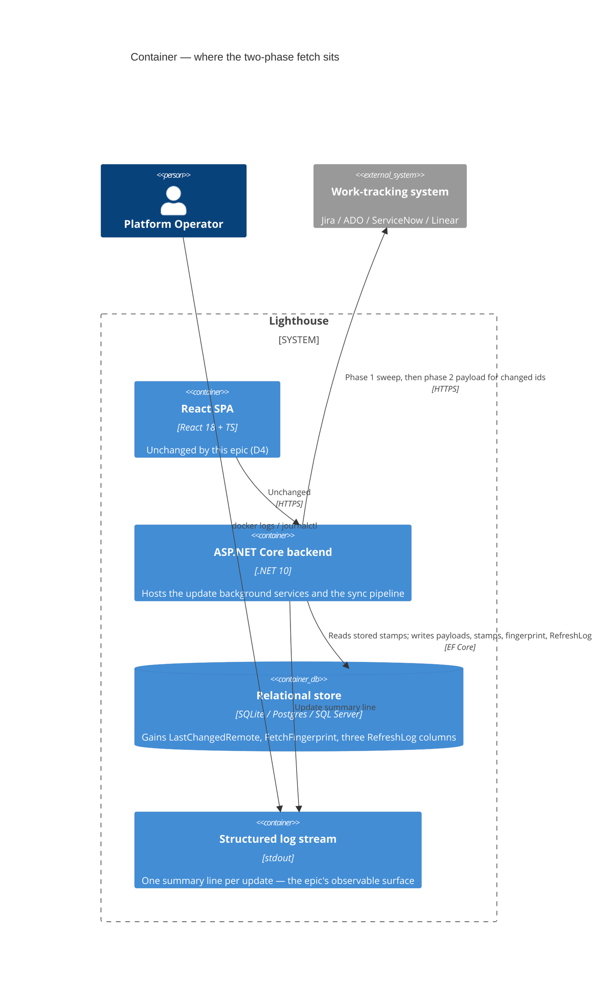
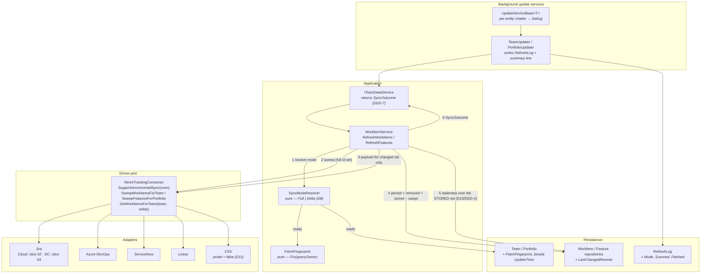

# Feature Delta — epic-5687-faster-updates

**ADO**: Epic #5687 "Faster Updates" (Planned, tags `Community; Documentation; Release Notes`, created
2026-08-06, no children at DISCUSS start; eight child Stories #5724-#5731 created at wave close) · **Feature type**: backend (work-tracking fetch) with a
cross-cutting observability edge · **Density**: lean, plus two accepted expansions —
`alternatives-considered` and `persona-narrative` (both [WHY], rendered at wave end) ·
**DISCUSS run**: 2026-08-08

The epic is a five-line sketch with one concrete complaint in it — *"looking at you, on prem jira
instance with 25 years of history"* — and two open questions the author already saw coming: what happens
when the config changes, and which settings do not warrant a remote fetch at all. This wave turns that
into locked decisions. Three things the sketch did not say are what the wave is worth:

1. **The deletion rule is what makes delta hard.** `WorkItemService` removes any stored item the fetch
   did not return. A naive `updated >= lastSync` query would silently make every item immortal.
2. **Staleness is time-driven, not change-driven.** `WorkItemBecameStale` fires from a comparison
   against `CurrentStateEnteredAt` — evaluated today only for *fetched* items. Delta fetching would
   stop stale items from ever being recognised as stale. This is the sharpest trap in the epic.
3. **Only the remote fetch is deltaed.** Remaining-work rollup, extrapolation and forecasts must keep
   recomputing every cycle, because they depend on wall-clock and on other teams, not on this team's
   fetch.

---

## Wave: DISCUSS / [REF] Prior-Wave Reading Confirmation

- ⊘ `docs/feature/epic-5687-faster-updates/discover/` (not found — no DISCOVER wave ran)
- ⊘ `docs/feature/epic-5687-faster-updates/diverge/` (not found — no DIVERGE wave ran)
- ✓ `docs/product/jobs.yaml` (schema_version 1, 89 jobs) — none covers sync cost, sync duration, or
  refetch scope. Nearest neighbours are `job-react-proactively-to-workitem-change` (what the sync
  *emits*) and `job-operator-observe-in-cluster` (how an operator *watches* the instance); neither says
  anything about what the sync *costs*.
- ✓ `docs/product/journeys/` (37 journeys) — none touches update performance.
- ✓ `docs/product/personas/` (9 personas) — `platform-operator` and `config-admin` are reused verbatim;
  no new persona needed. `flow-coach` appears only as the party whose data must stay correct.
- ✓ `docs/product/architecture/` (131 ADRs, read by index) — none constrains fetch strategy. ADR-027
  (domain-event dispatcher is transport-only, recovered on the next re-sync) is the one that *touches*
  this: it assumes a re-sync re-derives everything, which delta changes, so D10 below is written to keep
  that assumption true.
- ⊘ `docs/product/vision.md`, `docs/project-brief.md`, `docs/stakeholders.yaml` (not found — this repo
  carries product SSOT under `docs/product/` instead)
- ✓ `CLAUDE.md`, `docs/ci-learnings.md` — standing rules applied (expand-only migrations, configurable
  terminology, per-feature docs, quality gates, Jira DC duplicate-ReferenceId hazard 2026-05-25).
- ✓ **ADO Epic #5511 "Task Manager"** (New) — read because D4 defers this epic's UI to it. #5511 wants a
  task-manager view of running/queued updates with cancel, plus a general admin health dashboard.

No DISCOVER evidence exists to contradict, so no contradiction check was possible and none is claimed.
Everything in the Current-State Surface Inventory below was read from code during this wave.

---

## Wave: DISCUSS / [REF] Persona IDs

| Persona | Role in this feature |
|---|---|
| `platform-operator` | Primary. Owns the instance and the relationship with the work-tracking system it hammers. Reads the logs. |
| `config-admin` | Edits Team/Portfolio settings; carries the "did my edit just cost a 25-year refetch?" anxiety. |
| `flow-coach` | Affected, never acting. Their metrics must stay correct — they are the reason delta cannot cut corners. |

---

## Wave: DISCUSS / [REF] JTBD One-Liners

| Job ID | One-liner |
|---|---|
| `job-operator-sync-without-hammering-the-tracker` | When Lighthouse refreshes against a tracker holding decades of history, fetch only what actually moved, so a short refresh interval stops being a cost decision. |
| `job-config-admin-know-which-settings-cost-a-refetch` | When I change a setting, let Lighthouse work out by itself whether the data has to be pulled again — and pull nothing when the change is purely local. |
| `job-operator-read-an-update-log-that-says-something` | When I read the log to understand an update, give me one line per update saying what it did and what it cost, not a per-entity stream I have to filter. |

Full job stories, dimensions, four forces and opportunity scores are written to
`docs/product/jobs.yaml` (SSOT). Opportunity ranking:

| Job | Importance | Satisfaction | Gap | Order |
|---|---|---|---|---|
| `job-operator-sync-without-hammering-the-tracker` | 4 | 1 | **3** | 1st |
| `job-config-admin-know-which-settings-cost-a-refetch` | 3 | 1 | **2** | 2nd |
| `job-operator-read-an-update-log-that-says-something` | 3 | 1 | **2** | 2nd (ships first — see D5) |

---

## Wave: DISCUSS / [REF] Current-State Surface Inventory

Read from code during this wave. Every claim below has a file:line.

| Fact | Evidence |
|---|---|
| A team update refetches the **entire** query result every cycle | `WorkItemService.cs` `RefreshWorkItems` |
| A portfolio update does the same for Features, then again for parent Features | `WorkItemService.cs` `RefreshFeatures` / `RefreshParentFeatures` |
| Removal rule: stored item absent from the fetch → deleted | `WorkItemService.cs` `storedWorkItems.RemoveAll` + `workItemRepository.Remove` |
| The remote query is `(user query) AND types AND states AND resolved-cutoff` — identical shape on Jira and ADO | `JiraWorkTrackingConnector.cs:1235`, `AzureDevOpsWorkTrackingConnector.cs:962` |
| A `DoneItemsCutoffDays` window already bounds *closed* items — it does nothing for open ones | `JiraWorkTrackingConnector.cs:1244` |
| Jira's cost driver is the changelog: any issue with >30 entries triggers extra paged requests at 100/page | `JiraWorkTrackingConnector.cs:1120`, `:776-838` |
| ADO already runs two-phase (WIQL → id refs, then chunked `GetWorkItemsAsync`) | `AzureDevOpsWorkTrackingConnector.cs:641`, `:684-696` |
| ADO's cost driver is `GetRevisionsAsync` **per work item** to rebuild transitions | `AzureDevOpsWorkTrackingConnector.cs:811-839` |
| A work item carries **no** remote-changed timestamp today | `Models/WorkItemBase.cs:18-49` |
| Updates are periodic (`minutesSinceLastUpdate >= RefreshAfter`) or manually triggered from a controller — **saving a setting does not itself trigger a fetch** | `TeamUpdater.ShouldUpdateEntity`, `UpdateServiceBase.UpdateAll`, `TeamController.cs:86` |
| Duration + item count are already recorded per update | `TeamUpdater.cs` → `RefreshLog` |
| `UpdateAll` logs one Information line **per entity per cycle** before deciding not to update it | `UpdateServiceBase.cs:88`, `TeamUpdater.ShouldUpdateEntity` |
| "Updating Work Items for Team {X}" is emitted **three times** per team per update | `WorkItemService.UpdateWorkItemsForTeam`, `.RefreshWorkItems`, `JiraWorkTrackingConnector.cs:114` |
| 38 Information/Debug statements sit on the update path; 17 in `WorkItemService` alone | `grep -c LogInformation` across the update path |
| Staleness is derived from wall-clock vs `CurrentStateEnteredAt`, evaluated only for **fetched** items | `WorkItemService.IsStale` / `AddStalenessEventIfThresholdCrossed` |
| `WorkItem.Update(item)` is a field-copy — `init`-only / `[NotMapped]` members do not survive it | `Models/WorkItem.cs`, and `project_workitem_sync_transient_and_state_mapping_gotchas` |

---

## Wave: DISCUSS / [REF] Connector Capability Matrix

The user asked for **all** connectors to be examined in this epic before deciding how the non-Jira ones
are scheduled. This is that examination. "Sweep" = a cheap query returning identity + remote-changed
timestamp for the full result set.

| Connector | Remote-changed field | Sweep is possible? | Cost driver removed by delta | Verdict |
|---|---|---|---|---|
| **Jira Cloud** | `updated` (JQL + `fields=updated`) | Yes — same JQL, one field | Full field set + `expand=changelog` + per-issue changelog paging (`:776`) | **In scope.** Biggest single win. |
| **Jira Data Center** | `updated` | Yes, **but** offset pagination over an unordered JQL is the known duplicate-`ReferenceId` hazard (ci-learnings 2026-05-25) | Same as Cloud, and this is the epic's named instance | **In scope, after a stability probe** (OQ-1). |
| **Azure DevOps** | `System.ChangedDate` | Yes — a second WIQL `AND [System.ChangedDate] >= @x`; the plain WIQL already gives the full id set for free | `GetRevisionsAsync` per item (`:811`) — the dominant cost | **In scope.** Structurally the smallest change. |
| **ServiceNow** | `sys_updated_on` | Yes — `sysparm_query` already carries an ordering clause (`InAStableOrder`), and `sysparm_fields` can narrow to id+timestamp | Per-record state-span reads (`ReadSpans`, `ReadHistory`) | **In scope**, lower value — PDI-scale data, and paging already guarded. |
| **Linear** | `updatedAt` | Yes — GraphQL `filter: { updatedAt: { gt: … } }`, and the history fragment is what costs (`HistoryConnectionFragment`) | History connection per issue/project | **In scope**, lowest value — Linear's API is already the fastest of the four. |
| **CSV** | — | **No** | Nothing. The "fetch" is a user-uploaded file. | **Out of scope, permanently** (D11). |

Consequence: the delta contract is expressible on every remote connector. Nothing in the matrix forces a
different design per connector, which is why D1 can be a single contract rather than four.

---

## Wave: DISCUSS / [REF] Locked Decisions

- **[D1] Two-phase fetch: cheap identity sweep, then payload for the changed only.** Every cycle still
  issues the *same* full query, but phase 1 asks only for `(id, remote-changed-timestamp)`. Phase 2
  fetches the full payload — fields, changelog, revisions, spans — only for ids whose timestamp differs
  from what is stored. *Rejected*: `updated >= lastSync` plus a periodic reconcile (leaves ghost items
  for up to N cycles and makes correctness a scheduling parameter); delta plus a manual "Full refresh"
  button (makes correctness a user chore). User decision, 2026-08-08.
- **[D2] Removal semantics do not change.** Because phase 1 enumerates the full result set every cycle,
  `removed = stored − sweepIds` keeps exactly today's meaning. No item can outlive its query. This is
  the whole reason D1 was chosen over the cheaper alternatives, and it is a hard acceptance rule for
  every connector slice.
- **[D3] A fetch fingerprint decides when a full fetch is required.** Hash the properties that shape the
  remote query — `DataRetrievalValue`, `WorkItemTypes`, `AllStates`, `DoneItemsCutoffDays`, additional
  field definitions, parent-override field, `WorkTrackingSystemConnectionId`. Stored per Team/Portfolio.
  Mismatch → the next cycle is a full fetch. Everything else (wait states, blocked rules, staleness
  threshold, named cycle times, ordering policy, terminology) is outside the hash and provokes no remote
  fetch at all. User decision, 2026-08-08.
- **[D4] No UI in this epic.** The observable surface is the log. A task-manager / admin-health view is
  Epic #5511's job, and this epic's `RefreshLog` extension is precisely what #5511 will render. User
  decision, 2026-08-08.
- **[D5] The log cleanup ships first, not last.** It is the measuring instrument: without a summary line
  reporting mode / scanned / changed / duration, no later slice can demonstrate — or falsify — that it
  got faster. It also settles the epic's secondary complaint ("quite noisy on update right now") before
  delta adds anything new to say.
- **[D6] `LastChangedRemote` (nullable UTC `DateTime`) is persisted per work item and per feature.**
  Additive, expand-only migration generated with the existing `CreateMigration` script. It must be
  copied explicitly inside `WorkItem.Update(…)`; the copy path drops members that are not plain settable
  properties, and a dropped timestamp silently degrades delta to "always refetch" — the failure is a
  performance regression with green tests, so it needs its own test.
- **[D7] Slice order: log → Jira Cloud → Jira Cloud portfolios → Jira DC → fingerprint → ADO →
  ServiceNow → Linear.** All connectors are *assessed* in this wave (matrix above). Whether slices 06-08
  stay in this epic or become a follow-on feature is an explicit checkpoint after slice 04, per the
  user's note ("once we have the jira cases, we can decide how to proceed with the others"). CSV is
  never in scope.
- **[D8] There is no partial mode.** An update is either `full` or `delta`. It is `full` when: the entity
  has never been swept, the fingerprint changed, any stored item lacks a `LastChangedRemote`, or the
  sweep itself failed. Anything ambiguous resolves to `full` — the expensive answer is always the safe
  one.
- **[D9] Only the remote fetch is deltaed.** Remaining-work rollup, feature extrapolation, percentile
  defaults and forecasts continue to recompute on every cycle exactly as today. They depend on
  wall-clock and on *other* teams' data, so skipping them because this team's items did not move would
  be wrong.
- **[D10] Time-driven derivations are evaluated for every stored item, not only the fetched ones.**
  Staleness is the case that bites: an item that stops changing is exactly the item that goes stale, and
  under delta it is exactly the item that stops being fetched. `AddStalenessEventIfThresholdCrossed`
  moves off the fetched-item loop and onto the stored set. This also preserves ADR-027's assumption that
  a re-sync re-derives the signals.
- **[D11] CSV is permanently out of scope.** Its fetch is a file the user already uploaded; there is no
  remote call to save. Stated so no later slice re-opens it.
- **[D12] Change detection compares per-item timestamps, never a global watermark.** Because the sweep
  returns a timestamp for *every* id, delta is `sweep.updated != stored.LastChangedRemote` per item.
  This removes clock skew, server-time drift and "what was `lastSync` exactly" from the design entirely.
  Residual risk — a second change landing inside the same timestamp granularity as the fetch — is
  bounded by treating any item whose remote timestamp falls inside the current sweep's uncertainty
  window as changed on the following cycle too. One extra fetch for a handful of items, never a missed
  change.

### Open questions

- **[OQ-1] Is the Jira DC identity sweep stable across back-to-back calls?** DC offset pagination over an
  unordered JQL is the documented source of duplicate `ReferenceId`s (ci-learnings 2026-05-25, and
  `DeduplicateByReferenceId` exists because of it). If the id set is *unstable* — not merely duplicated —
  then `removed = stored − sweepIds` would delete live items on DC. Resolved by a timeboxed probe at the
  head of slice 04, before any DC code is written. This is the single question that can invalidate D1 on
  the epic's named instance.
- **[OQ-2] How many teams/portfolios does a typical instance carry?** Determines whether the per-entity
  Information logging in `UpdateAll` is a nuisance or the dominant log volume. Does not block slice 01
  (the fix is the same either way); does inform the KPI-5 target.

---

## Wave: DISCUSS / [REF] Scope Assessment

**Verdict: OVERSIZED — split confirmed by the user, 2026-08-08.**

| Oversize signal | Reading |
|---|---|
| >10 user stories | Borderline — 8 stories |
| >3 bounded contexts / modules | **Yes** — work-tracking connectors, sync/update pipeline, configuration, observability |
| Walking skeleton needs >5 integration points | No — the skeleton needs one (Jira Cloud) |
| Estimated effort >2 weeks | **Yes** if all six connectors land together |
| Multiple independent user outcomes that could ship separately | **Yes** — the log, each connector, and the fingerprint each ship value alone |

Three signals fired. Split into 8 elephant-carpaccio slices, each ≤1 day, each with its own brief under
`docs/feature/epic-5687-faster-updates/slices/`. Slices 06-08 carry an explicit re-scoping checkpoint
after slice 04 (D7).

---

## Wave: DISCUSS / [REF] WS Strategy

**Strategy B — thin end-to-end slice through the existing stack.** Slice 02 (Jira Cloud, team work
items) is the walking skeleton: it introduces the whole delta contract — sweep, per-item comparison,
payload-for-changed, unchanged removal semantics, time-driven derivations off the stored set — through
one connector on one entity type. Every later connector slice is that same contract applied to a
different transport, which is why the contract ships *with* value rather than as its own abstraction
slice (carpaccio taste test: "if every slice depends on a new abstraction, ship the abstraction first" —
here the abstraction and the first value arrive together, deliberately).

---

## Wave: DISCUSS / [REF] Driving Ports

No new inbound surface. The existing ones are unchanged:

| Port | Change |
|---|---|
| Background `UpdateServiceBase` timer loop | None to the contract; emits the new summary log line |
| `POST api/v1\|latest/teams/{id}` / `.../portfolios/{id}` manual update triggers | None — a manual trigger runs whatever mode D8 resolves to |
| `GET api/v1\|latest/update/status` | None in this epic (Epic #5511 owns the richer view) |
| Container / systemd log stream (`docker logs`, `journalctl`) | **This is the observable surface** (D4) |

---

## Wave: DISCUSS / [REF] Pre-requisites

- A real Jira Cloud instance with ≥1000 issues in one team query.
- For slice 04: a Jira **Data Center** instance. Confirmed available (user, 2026-08-08) — a dev build
  will be run against a real DC system when the slice comes up. This makes OQ-1 answerable on real data
  rather than reasoned about, and it means the probe runs where the hazard actually lives. It is a
  *scheduled* dependency, not a blocker: slice 04 is the only slice that needs it, and the six slices
  either side of it do not.
- The dev instance on `:5169` with restored real recorded history for dogfooding the log line
  (`reference_dev_db_backup_restore`).
- `CreateMigration` PowerShell script for the D6 migration across all providers.
- No dependency on Epic #5511 — the relationship runs the other way (#5511 consumes what D6/slice 01
  records).

---

## Wave: DISCUSS / [REF] Out of Scope

- Any UI (D4). Explicitly deferred to Epic #5511.
- A manual "Force full refresh" action. D3 makes it unnecessary; adding it would make the automatic path
  look untrustworthy.
- Webhooks / push from the work-tracking system. A different epic and a different trust model; delta
  polling is what this one is about.
- Changing the refresh *interval* defaults. This epic makes a short interval affordable; whether the
  shipped default moves is a separate call once KPI-1 has real numbers.
- CSV (D11).
- Caching, in-memory or otherwise. Nothing in this epic adds a cache — the saving comes from not asking,
  not from remembering the answer.
- Write-back. `TriggerWriteBackForTeam` runs after the fetch and is untouched.

---

## Wave: DISCUSS / [REF] User Stories

Every story traces to a `job_id` in `docs/product/jobs.yaml`. Two stories are labelled
`@infrastructure`; neither constitutes a slice on its own (slice-composition gate).

---

### US-01 — One line per update that says what it did

`job_id: job-operator-read-an-update-log-that-says-something` · persona `platform-operator` · **slice 01**

As a platform operator, I want each completed update to log a single structured summary — which entity,
which mode, how many records were seen, how many were fetched, how long it took — and the per-entity
chatter demoted to Debug, so that reading the log tells me what the system is doing instead of what it
is iterating over.

#### Elevator Pitch
Before: an update writes 38-odd interleaved lines per entity, including "Updating Work Items for Team X"
three times and one "Checking last update" per team per cycle even when nothing updates, and nowhere
says what the update cost.
After: run `docker logs -f lighthouse` → sees `Update completed | Team 'Zenith' | mode=full |
scanned=4013 | fetched=4013 | 4m51s`, and one line per cycle instead of a page.
Decision enabled: whether this instance's refresh interval is affordable, and which team is the
expensive one — the two questions that decide whether to tune the interval at all.

**Acceptance criteria**
- AC-1.1 A completed team update emits exactly one Information-level summary line carrying entity type,
  entity name, mode, records seen, records fetched, duration and success.
- AC-1.2 A completed portfolio update emits the same line shape.
- AC-1.3 `mode` reads `full` for every update in this slice — the field exists before delta does, so the
  later slices change data, not format.
- AC-1.4 A cycle in which an entity is skipped (`ShouldUpdateEntity` false) emits **no** Information
  line for that entity. It stays available at Debug.
- AC-1.5 "Updating Work Items for Team {X}" appears at most once per update across
  `WorkItemService` and the connector.
- AC-1.6 Per-item and per-feature lines (`Added/Updated/Removed Work Item`, `Feature … Extrapolating`)
  are Debug or lower.
- AC-1.7 Information-level lines per entity per update ≤ 2 (KPI-5), asserted by a test that captures the
  logger.
- AC-1.8 `RefreshLog` gains the mode and the two counts; nothing already recorded is dropped or renamed.
- AC-1.9 A failed update still emits the summary line, with success=false, and still logs the error at
  Error level with its exception.

---

### US-02 — A Jira team refresh fetches only the issues that moved

`job_id: job-operator-sync-without-hammering-the-tracker` · persona `platform-operator` · **slice 02**

As a platform operator running Lighthouse against Jira Cloud, I want the second and later refreshes of a
team to download full issue payloads only for issues whose `updated` timestamp moved, while still
enumerating the whole query result so removals are caught, so that a routine cycle costs a cheap scan
instead of a full download plus changelog paging.

#### Elevator Pitch
Before: every cycle re-downloads all 4013 issues with their full field set and changelog, including the
paged changelog fetch for every long-lived issue — minutes of wall clock and thousands of requests, to
learn that 37 things changed.
After: run `docker logs -f lighthouse` → sees `Update completed | Team 'Zenith' | mode=delta |
scanned=4013 | fetched=37 | 11.8s`.
Decision enabled: the operator can shorten the refresh interval — the number in front of them is what
makes that safe to do, and what they show their Jira admin.

**Acceptance criteria**
- AC-2.1 The first update of a team (no stored `LastChangedRemote`) runs `mode=full` and stores a
  remote-changed timestamp for every item.
- AC-2.2 A subsequent update issues a sweep over the **same** query, requesting identity + `updated`
  only, and fetches full payloads only for ids whose timestamp differs from the stored one (D12).
- AC-2.3 An issue deleted, re-typed, or moved out of the query's states is removed from Lighthouse on
  the very next cycle — `removed = stored − sweepIds`, unchanged from today (D2).
- AC-2.4 An unchanged issue's stored fields, transitions and `CurrentStateEnteredAt` are **byte-identical**
  before and after a delta cycle.
- AC-2.5 An item that has not changed for longer than the team's staleness threshold still raises
  `WorkItemBecameStale` under delta — the staleness evaluation runs over the stored set, not the fetched
  set (D10). This AC fails on any implementation that leaves the evaluation on the fetch loop.
- AC-2.6 A sweep failure falls back to a full fetch and logs it; it never produces a partial result (D8).
- AC-2.7 `LastChangedRemote` survives `WorkItem.Update(…)` — asserted directly, because losing it
  degrades delta to full with every other test still green (D6).
- AC-2.8 Against a real Jira Cloud project with ≥1000 issues and ≤5% churn, a delta cycle issues ≤10% of
  the remote requests a full cycle issues (KPI-2), read from the summary line.
- AC-2.9 Remaining-work rollup and forecast triggering fire on a delta cycle exactly as on a full one (D9).

---

### US-03 — A Jira portfolio refresh fetches only the features that moved

`job_id: job-operator-sync-without-hammering-the-tracker` · persona `platform-operator` · **slice 03**

As a platform operator, I want the same delta treatment for a portfolio's Features and their parent
Features, so that portfolio updates — which fetch a second and third time for parents — stop being the
remaining expensive half of every cycle.

#### Elevator Pitch
Before: `mode=delta` on the team, and a full Feature + parent-Feature download on every portfolio cycle
right behind it — half the saving, undone.
After: run `docker logs -f lighthouse` → sees `Update completed | Portfolio 'Zenith Q3' | mode=delta |
scanned=214 | fetched=6 | 3.1s`.
Decision enabled: whether portfolio and team refresh intervals can be set to the same short value, or
whether portfolios still need to be throttled separately.

**Acceptance criteria**
- AC-3.1 `RefreshFeatures` and `RefreshParentFeatures` both run the two-phase contract from US-02.
- AC-3.2 A Feature removed from the query is removed from the portfolio on the next cycle (D2).
- AC-3.3 Feature state transitions and blocked transitions for unchanged Features are untouched.
- AC-3.4 A Feature that changed in one portfolio but is shared with another is refetched once and applied
  to both.
- AC-3.5 Extrapolation, default-size percentile and remaining-work recompute every cycle regardless of
  mode (D9).
- AC-3.6 The portfolio summary line reports mode and both counts (US-01 format).

---

### US-04 — The 25-year Data Center instance gets the same treatment, safely

`job_id: job-operator-sync-without-hammering-the-tracker` · persona `platform-operator` · **slice 04**

As a platform operator running an on-premise Jira Data Center instance with decades of history, I want
delta refreshes there too, and I want to know the identity sweep is trustworthy on DC's pagination before
it is allowed to drive deletions, so that the instance this epic was written for actually gets faster
without losing items.

#### Elevator Pitch
Before: the instance the epic names by name — on-prem DC, 25 years of history — takes minutes per cycle,
and its pagination is the one already known to hand back duplicate issues.
After: run `docker logs -f lighthouse` → sees `Update completed | Team 'Legacy Platform' | mode=delta |
scanned=18402 | fetched=54 | 22.4s`, where the previous full cycle read `mode=full | 6m12s`.
Decision enabled: whether this instance can be refreshed hourly rather than nightly — the question that
made someone file the epic.

**Acceptance criteria**
- AC-4.1 **Pre-slice probe (OQ-1)**: two back-to-back identity sweeps against a real DC instance return
  the same id *set*. Result recorded in the slice brief before implementation starts.
- AC-4.2 If the probe shows an unstable set, DC delta is **not** shipped on an unstable sweep; the slice
  records the finding and either adds a deterministic ordering clause to the sweep query or stops. A
  sweep that can lose an id must never drive `removed = stored − sweepIds`.
- AC-4.3 Duplicate ids within a DC sweep are collapsed the way `DeduplicateByReferenceId` already
  collapses duplicate issues, and the collapse is logged with the count.
- AC-4.4 US-02's AC-2.1 … AC-2.7 hold identically on the DC transport.
- AC-4.5 The DC and Cloud sweeps share one contract; a connector implements a sweep, not a strategy.

---

### US-05 — Changing a setting costs a refetch only when it changes what is fetched

`job_id: job-config-admin-know-which-settings-cost-a-refetch` · persona `config-admin` · **slice 05**

As a configuration administrator, I want Lighthouse to decide by itself whether my edit changed what gets
fetched, so that widening a query really does re-pull everything, and adding a wait state or tweaking a
blocked rule costs nothing at all.

#### Elevator Pitch
Before: nothing distinguishes the two kinds of edit, because every cycle refetches everything anyway —
so once delta exists, a query change would silently keep serving the old result set.
After: change the query in Team settings, save, and the next cycle logs `mode=full |
reason=configuration-changed`; add a wait state instead, save, and the next cycle logs `mode=delta |
scanned=4013 | fetched=0`.
Decision enabled: the admin can tune wait states, blocked rules and staleness thresholds freely, and
knows that a query edit really did take effect rather than hoping it did.

**Acceptance criteria**
- AC-5.1 A stored fetch fingerprint covers exactly: `DataRetrievalValue`, `WorkItemTypes`, `AllStates`,
  `DoneItemsCutoffDays`, additional field definitions, parent-override field,
  `WorkTrackingSystemConnectionId`.
- AC-5.2 Changing any one of them makes the next cycle `mode=full`, and the summary line names
  configuration as the reason.
- AC-5.3 Changing a wait state, blocked rule, staleness threshold, named cycle time, ordering policy or
  terminology leaves the next cycle at `mode=delta` and issues **zero** payload fetches when nothing
  moved remotely (KPI-4).
- AC-5.4 A guard test enumerates the fetch-shaping properties reachable from `PrepareQuery` and the
  connector call sites and fails when one is neither in the fingerprint nor on an explicit, commented
  exclusion list. Without this, the fingerprint drifts silently and delta serves stale data — the failure
  mode is wrong numbers with green tests.
- AC-5.5 An instance upgrading into this feature has no stored fingerprint, so its first cycle is
  `mode=full` (D8).
- AC-5.6 The fingerprint is stored per Team and per Portfolio independently.

---

### US-06 — Azure DevOps stops re-reading every revision

`job_id: job-operator-sync-without-hammering-the-tracker` · persona `platform-operator` · **slice 06**

As a platform operator on Azure DevOps, I want the same two-phase fetch, so that the per-item revision
history read — the dominant cost on ADO — only happens for items that actually changed.

#### Elevator Pitch
Before: the WIQL is already cheap, but every returned id then costs a `GetWorkItemsAsync` slot **and** a
`GetRevisionsAsync` round trip to rebuild transitions, on every cycle, for every item.
After: run `docker logs -f lighthouse` → sees `Update completed | Team 'Lighthouse' | mode=delta |
scanned=1204 | fetched=9 | 4.6s`.
Decision enabled: same as US-02 — whether the interval can be shortened — and it is the connector the
maintainer dogfoods, so it is where the number is checked first.

**Acceptance criteria**
- AC-6.1 The identity sweep is the existing WIQL (already ids only); the changed set comes from a second
  WIQL with `AND [System.ChangedDate] >= @lastSweep`, and the two are combined per D12.
- AC-6.2 `GetRevisionsAsync` is called only for ids in the changed set.
- AC-6.3 A transition that happened on an unchanged item is impossible by construction, and a test
  asserts an item whose `System.ChangedDate` moved always has its revisions re-read.
- AC-6.4 US-02's AC-2.3 … AC-2.7 hold on ADO.
- AC-6.5 Portfolio Features and parent Features follow the same path.

---

### US-07 — ServiceNow and Linear join the contract

`job_id: job-operator-sync-without-hammering-the-tracker` · persona `platform-operator` · **slices 07, 08**

As a platform operator on ServiceNow or Linear, I want delta refreshes there too, so that no connector is
left as the slow one.

#### Elevator Pitch
Before: two connectors still re-read every record and every state span / history connection each cycle.
After: run `docker logs -f lighthouse` → sees `mode=delta | scanned=880 | fetched=12` for a ServiceNow
team and the same shape for a Linear team.
Decision enabled: whether the instance's refresh interval can be a single global choice rather than one
per connector.

**Acceptance criteria**
- AC-7.1 ServiceNow sweeps on `sys_updated_on` with `sysparm_fields` narrowed to identity + timestamp,
  keeping `InAStableOrder` so the existing paging guard still holds.
- AC-7.2 Per-record state-span reads (`ReadSpans` / `ReadHistory`) happen only for changed records.
- AC-7.3 Linear sweeps on `updatedAt`, and the history connection fragment is requested only for changed
  issues/projects.
- AC-7.4 US-02's AC-2.3 … AC-2.7 hold on both.
- AC-7.5 The existing `paging_repeated_records` guard still fires on a genuinely repeated `sys_id`.

---

### US-08 — `LastChangedRemote` is persisted `@infrastructure`

`job_id: job-operator-sync-without-hammering-the-tracker` · persona `platform-operator`

Additive, expand-only migration adding a nullable UTC `LastChangedRemote` to work items and features, and
a fetch-fingerprint column to Team and Portfolio. **Labelled `@infrastructure`; lands as a precursor
commit inside slices 02 and 05 respectively, never as a slice of its own** (slice-composition gate).

---

## Wave: DISCUSS / [REF] Story Map

**Backbone** (left to right, as the operator experiences it):

| Understand what an update costs | Fetch less on Jira | Keep configuration honest | Cover the rest of the connectors |
|---|---|---|---|
| US-01 summary line, quiet logs | US-02 Jira Cloud team | US-05 fetch fingerprint | US-06 Azure DevOps |
| | US-03 Jira Cloud portfolio | | US-07 ServiceNow, Linear |
| | US-04 Jira Data Center | | |

**Walking skeleton**: US-02 (slice 02). Thinnest path that proves the whole contract end to end.

**Slices** — briefs at `docs/feature/epic-5687-faster-updates/slices/`:

| # | Slice | Story | ADO | Est. | Learning hypothesis (disproved if it fails) |
|---|---|---|---|---|---|
| 01 | Update log signal | US-01 | #5724 | ~4h | That an update even *knows* what it fetched. If the summary cannot be produced from data at hand, delta cannot be reported or measured. |
| 02 | Jira Cloud team delta | US-02 | #5725 | ~6h | That a cheap identity sweep is materially cheaper than the full fetch. If Jira charges the same for the scan, the epic's premise is wrong. |
| 03 | Jira Cloud portfolio delta | US-03 | #5726 | ~5h | That the contract generalises from work items to Features without a second design. |
| 04 | Jira Data Center delta | US-04 | #5727 | ~6h + 2h probe | That DC's pagination yields a *stable* id set. If not, delta cannot drive deletion on the epic's named instance. |
| 05 | Fetch fingerprint | US-05 | #5728 | ~6h | That the fetch-shaping property set can be enumerated in one place. If it cannot, config invalidation cannot be automatic and D3 collapses into "any save refetches". |
| 06 | Azure DevOps delta | US-06 | #5729 | ~6h | That `System.ChangedDate` aligns with revision history. If an item's revisions can move without `ChangedDate` moving, ADO delta drops transitions. |
| 07 | ServiceNow delta | US-07 | #5730 | ~5h | That narrowing `sysparm_fields` does not disturb the existing paging guard. |
| 08 | Linear delta | US-07 | #5731 | ~4h | That the history fragment is separable from the issue query. |

**Checkpoint after slice 04** (D7): decide whether 06-08 stay in this epic or become a follow-on feature.

### Carpaccio taste tests

| Test | Result |
|---|---|
| Any slice shipping 4+ new components? | No. Largest is slice 02: sweep method, per-item comparison, persisted timestamp. |
| Every slice depends on a new abstraction? | Slices 03-08 depend on the delta contract — which slice 02 ships **together with** its own user value, deliberately, rather than as a bare abstraction slice. Documented, accepted. |
| Does any slice disprove a pre-commitment? | Yes, each — see the table. Slice 04's probe can invalidate D1 on DC; slice 05's guard test can invalidate D3. |
| Synthetic data only? | No. Slices 02-04 require a real Jira instance; slice 01 dogfoods the `:5169` instance with real recorded history. |
| Two slices identical except for scale? | No. 02/03 differ by entity type and code path; 02/04 by transport and failure mode; 06/07/08 by API. |
| Slice with only `@infrastructure` stories? | No. US-08 is a precursor commit inside slices 02 and 05, never a slice. |

---

## Wave: DISCUSS / [REF] Prioritization

1. **Slice 01 first** because it is the instrument, not because it is easy. Every later slice's
   acceptance criteria are read off the line it introduces, and it settles the epic's secondary
   complaint independently of whether delta ever ships.
2. **Slice 02 second** — highest learning leverage. If the sweep is not materially cheaper, the epic
   stops here having cost one day, not six.
3. **Slice 03 immediately after 02**, while the contract is fresh, because a half-delta cycle (team
   delta, portfolio full) shows only half the win and would make KPI-1 read as a failure.
4. **Slice 04 fourth** even though it is the named pain, because its probe is cheaper to run once the
   Cloud shape is proven — the probe then tests DC's *pagination*, not the design.
5. **Slice 05 fifth**, before the remaining connectors: once three connectors' worth of delta exists,
   a silent config-drift bug would be three bugs. It is a correctness gate on everything shipped so far.
6. **Slices 06-08 last**, in descending value (ADO's per-item revision read is the biggest remaining
   cost), subject to the D7 checkpoint.

---

## Wave: DISCUSS / [REF] Outcome KPIs

| KPI | Target | Measurement |
|---|---|---|
| **KPI-1** Subsequent-update duration | Median delta-cycle duration ≥70% lower than the same entity's full-cycle baseline | `RefreshLog.DurationMs`, 10 consecutive cycles per mode, same team |
| **KPI-2** Remote request count | A delta cycle issues ≤10% of a full cycle's remote requests, on a ≥1000-item team with ≤5% churn | Request count on the US-01 summary line |
| **KPI-3** Removal correctness | For 20 consecutive delta cycles, stored ReferenceIds == sweep ids, zero drift | Integration test + a dogfood assertion on `:5169` |
| **KPI-4** Local-only edits cost nothing | A wait-state / blocked-rule / staleness edit produces **0** payload fetches on the next cycle | `fetched=0` on the summary line |
| **KPI-5** Log volume | ≤2 Information lines per entity per update; 0 for a skipped entity | Logger-capturing test (AC-1.7) + eyeball on `:5169` |
| **KPI-6** Staleness still fires | An item untouched past the threshold raises `WorkItemBecameStale` under delta | Acceptance test for AC-2.5 |

KPI-1 and KPI-2 are unmeasurable before slice 01 ships — which is the argument for D5.

---

## Wave: DISCUSS / [REF] Definition of Done

1. All acceptance criteria for the slice pass as automated tests.
2. `dotnet build` zero warnings; `dotnet test` green.
3. `pnpm test`, `pnpm build` (zero warnings), Biome clean — N/A for slices with no frontend change, stated explicitly per slice.
4. Mutation testing ≥80% kill rate on the changed backend surface (`per-feature` strategy).
5. SonarQube Cloud: no new issues of any severity.
6. EF migration generated with `CreateMigration` across all providers, additive only.
7. Docs updated per-feature — the update/refresh concept page states what delta means for freshness, using seeded terminology.
8. ADO story transitioned; slice pushed only after CI is green.
9. The slice's learning hypothesis has an explicit verdict recorded in its brief — confirmed or disproved, never blank.

---

## Wave: DISCUSS / [REF] DoR Validation

| # | Item | Verdict | Evidence |
|---|---|---|---|
| 1 | Business value articulated | ✅ | Epic #5687 description + KPI-1/KPI-2; the named on-prem DC instance is the concrete case |
| 2 | Job traceability | ✅ | 3 jobs written to `docs/product/jobs.yaml`; every story carries a real `job_id` (US-08 is `@infrastructure` and is a precursor commit, not a slice) |
| 3 | Acceptance criteria testable | ✅ | 44 ACs, each observable from a log line, a stored value, or a request count |
| 4 | Dependencies identified | ✅ | Real Jira Cloud instance; a real Jira DC system for slice 04, confirmed available via a dev build (user, 2026-08-08); `:5169` dev instance; `CreateMigration`. No dependency on Epic #5511 |
| 5 | Sliced ≤1 day each | ✅ | 8 briefs, 4-6h each, taste tests passed |
| 6 | No known blockers | ✅ | None. Slice 04's Jira Data Center access is arranged (dev build against a real system, user 2026-08-08), so OQ-1 is scheduled rather than blocked |
| 7 | Observable surface defined | ✅ | D4 — the log is the surface this epic ships; UI deferred to #5511 with the user's explicit decision |
| 8 | Test data / environment available | ✅ | `:5169` with real recorded history; demo data for the non-Jira connectors; ServiceNow PDI already used by epic-5513 |
| 9 | Outcome KPI with numeric target | ✅ | 6 KPIs, each with a number and a named measurement source |

**Requirements completeness: 0.98.** The remaining 0.02 is OQ-1 itself: the DC pagination question is
answerable — access is arranged — but not yet answered, and slice 04 is written to stop and record rather
than guess if the probe fails.

---

## Wave: DISCUSS / [REF] Wave Decisions Summary

### Key decisions
See Locked Decisions above (D1-D12). The four that shape everything downstream:
- **[D1/D2]** Two-phase sweep, so removal semantics survive untouched.
- **[D3]** Fetch fingerprint, so config invalidation is automatic and narrow.
- **[D10]** Time-driven derivations move off the fetch loop — the trap that would otherwise ship silently.
- **[D4/D5]** No UI; the log is both the deliverable and the instrument, and it ships first.

### Requirements summary
Primary jobs: refresh a decades-deep tracker without refetching it whole; know which settings cost a
refetch and which cost nothing; read a log that says what an update did. Feature type: backend, with a
cross-cutting observability edge. Walking skeleton: slice 02, Jira Cloud team work items.

### Constraints established
- Removal detection must stay exact — a sweep that can lose an id may not drive deletion (D2, AC-4.2).
- Ambiguity resolves to a full fetch, always (D8).
- Only the remote fetch is deltaed; derived work still recomputes each cycle (D9).
- Migrations additive / expand-only (D6, project standing rule).
- CSV never participates (D11).

### Upstream changes
None. No DISCOVER or DIVERGE artifacts exist for this feature, so no prior assumption was revised.

---

## Wave: DISCUSS / [WHY] Alternatives Considered

Rendered on request (`ask-intelligent` trigger: *cross-context complexity* — 4 bounded contexts, 4
connector technologies). What was weighed and rejected behind each locked decision, and what would have
to be true for the rejected option to win.

### D1 — the delta shape

| Option | Why rejected | Would win if… |
|---|---|---|
| **Delta query + periodic full reconcile.** Query becomes `updated >= lastSync`; a full sweep runs every Nth cycle or nightly to catch removals. | Turns correctness into a scheduling parameter. An item that leaves the query lingers for up to N cycles, and every forecast built on it is wrong for that window — invisibly, because the sync reports success. The reconcile interval then becomes a knob nobody can set correctly: short enough to be safe defeats the point, long enough to be cheap is unsafe. | The identity sweep turned out to cost nearly as much as the full fetch. Then the only saving left would come from not enumerating at all, and the reconcile cadence would be the price of that. Slice 02's learning hypothesis is exactly this question. |
| **Delta query + manual "Full refresh" button.** No automatic reconcile; an admin forces a full pull when they suspect drift. | Makes correctness a user chore, and the button's existence is an admission that the automatic path is not trusted. It also fails silently in the common case — nobody clicks a button for a problem they cannot see. | Never, on its own. If the DC probe (OQ-1) fails, a *forced* full fetch on a schedule may be the DC-specific fallback — but as a fallback for one transport, not as the design. |
| **Two-phase sweep (chosen).** Same query, identity + timestamp first, payload for the changed only. | — | — |

The decisive argument is that D2 falls straight out of it: because the sweep enumerates the full result
set every cycle, the removal rule needs no new reasoning at all. The cheaper options both require a
*new* argument for why deletion is still correct, and neither has one that survives "how long is the
window, and what is wrong during it?".

### D3 — configuration invalidation

| Option | Why rejected | Would win if… |
|---|---|---|
| **Any settings save invalidates.** Simple, always safe. | Wastes the win on precisely the case the epic calls out by name: adding a wait state would force a full 25-year refetch. It is also self-defeating — an admin who learns that every save is expensive stops tuning, which is worse than the original problem. | The fetch-shaping property set proves un-enumerable (slice 05's learning hypothesis). Then this is the honest fallback, and the epic loses one of its two promises rather than shipping a silent staleness bug. |
| **Explicit admin choice on save** ("refetch everything? [Y/N]"). | Puts a correctness decision in front of a user who has no way to answer it. The right answer is derivable from the diff; asking is an abdication dressed as control. | Never in this design. It would only make sense if fetch-shaping-ness were genuinely ambiguous — and if it were, the guard test could not exist. |
| **Fetch fingerprint (chosen).** | — | — |
| Per-field granularity ("only the states changed, so pull only the newly included states") | Considered and dropped before it reached the option list. It multiplies the correctness surface by the number of fetch-shaping fields, for a saving that only appears on the rare edit. A fingerprint is a boolean deliberately. | The full refetch after a query edit turned out to be unacceptably expensive on the largest instances *and* frequent. Neither is currently believed. |

### D4 — no UI

The alternative was the obvious one: put mode / scanned / fetched / duration on a screen. Rejected
because ADO Epic #5511 "Task Manager" already owns that surface — running and queued updates, cancel,
connection health, an admin dashboard — and building a narrower version here would either be thrown away
or become the thing #5511 has to work around. The `RefreshLog` fields added in slice 01 are the same
fields #5511 will render, so this epic feeds it rather than competing with it. Cost accepted with eyes
open: until #5511 lands, the only way to see the saving is the log, which means a self-hoster sees it and
a SaaS tenant does not.

### D5 — log first, not last

The alternative order — ship delta, then clean the logs — is the intuitive one, and it is wrong for a
specific reason: KPI-1, KPI-2 and KPI-5 are all read off the summary line. Shipping delta first means
shipping it unmeasured, and "it feels faster" is not a verdict a learning hypothesis can be closed with.
The secondary argument is that the log cleanup has standalone value: if the epic stopped after slice 01,
the user's own complaint ("quite noisy on update right now") would still be paid.

### D7 — connector order

Rejected: **ADO first**, on the grounds that it is structurally the smallest change (the WIQL is already
an identity sweep). It would prove the contract most cheaply — and prove it somewhere the pain does not
live. The epic exists because of a Jira DC instance; validating the design on the connector that hurts
least risks a confident contract that turns out not to apply where it matters.

Rejected: **all connectors in one slice.** Four auth models, four pagination models, four history models
— fails the carpaccio taste test outright ("ships 4+ new components").

Also weighed: **DC before Cloud**, since DC is the named pain and carries the higher uncertainty
(pagination stability). Cloud-first won because the probe is then testing DC's *pagination* rather than
the *design* — two unknowns separated instead of confounded. If the design is wrong, Cloud finds it in
six hours without a DC instance in the loop.

### D9/D10 — what stays whole

The tempting optimisation was to skip derived work when nothing changed: no fetch, no rollup, no
forecast. Rejected because both are wall-clock-driven or cross-entity:

- **Remaining work and extrapolation** read *other* teams' items via `ParentReferenceId`, and the
  percentile default size reads a rolling history window. "This team's records did not move" says
  nothing about either.
- **Staleness** is the pure case: it is a function of elapsed time against `CurrentStateEnteredAt`. An
  item that stops changing is exactly the item that goes stale, so the optimisation would delete the
  signal it is supposed to preserve.

This is also why ADR-027's guarantee — the dispatcher is transport-only, recovered on the next re-sync —
survives: the re-sync still re-derives everything, it just stops re-downloading what it already has.

### D12 — per-record comparison, not a watermark

The conventional design is a stored `lastSyncedAt` per entity, compared against the remote timestamp.
Rejected because it imports three problems that the per-record comparison simply does not have: clock
skew between Lighthouse and the tracker, ambiguity about whether the watermark means "when the sweep
started" or "when it finished", and the retry question (does a failed cycle advance it?). Since the sweep
already returns a timestamp per record, comparing per record costs nothing extra and removes all three.

The residual — a second change landing inside the same timestamp granularity as the fetch — is real and
bounded, and the mitigation (re-fetch anything inside the sweep's uncertainty window on the next cycle
too) costs a handful of extra payloads rather than a missed change. A watermark design has the same
residual *plus* the three problems.

### D11 — CSV

No alternative was weighed; it is recorded as a decision only so a later slice does not re-open it. The
"fetch" is a file the user uploaded. There is no remote call to save, so delta has nothing to act on.

---

## Wave: DISCUSS / [WHY] Persona Narrative

Rendered on request (`ask-intelligent` trigger: *multi-stakeholder* — 3 personas across the stories).
Extended profiles as they apply to *this* feature; the canonical persona files stay in
`docs/product/personas/`.

### platform-operator — primary

The self-hoster flavour dominates here, not the LPW SaaS-operator one. This is the person who put
Lighthouse in a container next to their own Jira, wired it to a query someone else in the org owns, and
now has a relationship with the platform team that they would prefer stayed quiet.

**Goals in this feature**
- Run a refresh interval chosen for how fresh the numbers should be, not for what the fetch costs.
- Be able to answer "what does Lighthouse cost us?" with a number, in a channel, without a dashboard.
- Never be the reason a shared tracker got slow.
- Keep the diagnostics they debug with — quieter is only better if nothing is lost.

**Frustrations**
- A refresh takes minutes, so the interval got widened to an hour, so the numbers are stale, so people
  trust them less — a chain that starts at fetch cost and ends at adoption.
- The two facts they want (how long, how much) are recorded to `RefreshLog` and never surfaced.
- The log narrates the loop instead of the outcome: one "Checking last update" per entity per cycle
  *before* deciding not to update it, and "Updating Work Items for Team X" three times per update.
- The oldest, longest-lived issues — the ones that never change — are the most expensive to re-read,
  because that is where the changelog depth is. The cost scales with the org's history, not its activity.

**Mental model**
- A sync is a conversation with someone else's system, and Lighthouse is a guest in it.
- "It saw everything" and "it downloaded everything" are different claims, and only the first one is
  needed for correctness. This is the insight the whole design rests on, and it is why the summary line
  reports *scanned* and *fetched* as two numbers rather than one.
- Freshness is a dial. Cost should not be what sets it.
- Silence in a log is information: if an entity did not need updating, the right output is nothing.

**Vocabulary for this feature**
- "sweep" — the cheap pass that asks only which records exist and when each last changed.
- "full" / "delta" — the two update modes. There is no third; anything ambiguous is full.
- "scanned vs fetched" — how many records the sweep saw, versus how many were downloaded in full. A
  healthy cycle has a large first number and a small second one.
- "churn" — the fraction of a query's records that move between cycles. Low churn is what makes delta
  worth having; an instance at 100% churn gets nothing from this epic and should not be surprised.

### config-admin — secondary, and the one carrying the anxiety

Often the same human as the operator wearing a different hat, but the act that makes them this persona is
opening a settings form and saving it.

**Goals in this feature**
- Tune wait states, blocked rules, staleness thresholds and named cycle times as often as the team's
  understanding changes, without a cost narrative attached to each save.
- Know that a query change actually took effect, rather than hoping it did.

**Frustrations**
- Today there is no distinction between an edit that changes what is fetched and one that does not,
  because everything is refetched anyway — so the distinction has never had to exist, and the moment
  delta ships, its absence becomes a silent staleness bug rather than a missing convenience.

**Mental model**
- Settings fall into two kinds: ones that describe *what to go and get*, and ones that describe *what to
  make of what we already have*. The second kind should be free.
- The system should classify the edit; being asked "refetch everything? [Y/N]" on save would be the tool
  handing back a question it is better placed to answer.
- Order does not matter: re-saving the same states in a different sequence is not a change.

**Vocabulary for this feature**
- "fetch-shaping" — a setting that changes the remote query: the query text, work item types, states, the
  done-items cutoff, additional fields, the parent-override field, the connection.
- "local-only" — everything else. Wait states, blocked rules, staleness threshold, named cycle times,
  ordering policy, terminology.
- "fingerprint" — the stored hash of the fetch-shaping set; a mismatch is what makes the next cycle full.

### flow-coach — affected, never acting

The flow coach never appears in a story in this epic and never touches a setting in it. They are here for
one reason: they are who is harmed if delta is wrong, and naming them is what keeps the correctness ACs
from reading as paranoia.

**What they never notice if the epic succeeds**
- Time-in-state, aging pace, cumulative state time and blocked history stay identical across a delta
  cycle — AC-2.4's byte-identical assertion exists for them.
- An item that has sat untouched past the team's staleness threshold still shows up as stale — AC-2.5,
  and the reason D10 exists at all.
- An item that was deleted or moved out of the query disappears on the next cycle, not eventually —
  AC-2.3.

**What they would see if it went wrong**: nothing dramatic. Numbers that are quietly a little off, a
stale item that never surfaces, a chart with a phantom row. No error, no failed sync, no log line. That
failure shape — wrong data with a green pipeline — is why three of this epic's acceptance criteria are
about things *not* changing.

---

## Wave: DISCUSS / [REF] Telemetry

`DocumentationDensityEvent` emission is **not** recorded for this wave: the nWave helper
(`scripts/shared/telemetry.py:write_density_event`) is not present in this installation, and the wave
contract forbids writing the JSONL directly. Stated rather than skipped. Two expansions
(`alternatives-considered`, `persona-narrative`) were triggered and accepted; that is the fact the events
would have carried.

---

## Wave: DESIGN / [REF] Prior-Wave Reading Confirmation

**DESIGN run**: 2026-08-08 · **Scope**: application / components · **Interaction mode**: propose ·
**Architect**: Morgan (`nw-solution-architect` frame, run inline — the DISCUSS code read was already in
context, so a cold dispatch would have re-derived it)

- ✓ `docs/product/architecture/brief.md` (5113 lines) — per-feature `## Application Architecture —
  {feature-id} (DESIGN delta)` append pattern; this feature follows it.
- ✓ `docs/product/architecture/adr-076-cluster-aware-update-queue.md` — the update-lifecycle aggregate
  and INV-1..4. Load-bearing here: delta sits **inside** one execution, so it touches no admission
  invariant. INV-4 (one active lifecycle per `UpdateKey`) is unaffected.
- ✓ `adr-027` (modular monolith, domain events, CQRS-lite), `adr-015` (state-transition placement),
  `adr-107` (percentiles recording handler on refresh events) — read as the precedent for DDD-4.
- ✓ `docs/product/architecture/c4-diagrams.md` (1408 lines) — per-feature append; this feature appends.
- ✓ This file's DISCUSS wave (D1-D12, US-01..US-08, 44 ACs) and all 8 slice briefs.
- ✓ `docs/product/journeys/epic-5687-faster-updates.yaml`
- ⊘ `docs/feature/epic-5687-faster-updates/spike/` (no SPIKE ran — slice 04 carries a pre-slice probe)
- ⊘ `.nwave/des-config.json` has no `rigor` key → standard defaults, per-wave review skipped
  (consolidated review fires at end of DISTILL)

**Contradiction check**: none. Nothing in DESIGN reverses a DISCUSS decision. Two DISCUSS statements were
*sharpened* by code read during this wave and are recorded under Changed Assumptions below.

---

## Wave: DESIGN / [REF] DDD List

| # | Decision | Verdict | One-line rationale |
|---|---|---|---|
| DDD-1 | Sweep capability lives on `IWorkTrackingConnector` behind a per-connection probe | **Accepted** | Mirrors the existing `SupportsTransitionHistory(connection)` idiom, and only a *per-connection* probe can say "yes for Jira Cloud, not yet for Jira DC" when both are one class. |
| DDD-2 | Phase 2 is a named by-reference-id fetch on the same port | **Accepted** | Both connectors already own one internally (`GetAdoWorkItemsById`, Jira's key-OR query); this names existing behaviour rather than adding it, and keeps the diff and removal set in `WorkItemService`. |
| DDD-3 | Sync-owned delta state is columns on the existing entities | **Accepted** | `UpdateTime` is already a sync-owned field on the same tokened aggregate, and the concurrency token rotates only on `Added` or on the explicit human-edit path — so a background write cannot 409 an admin. |
| DDD-4 | Staleness evaluation becomes a second pass over the stored set inside `WorkItemService` | **Accepted** | Smallest correct change, and it keeps every domain event this feature can raise being collected in one method — which is what makes AC-2.5 readable as a test. |
| DDD-5 | Mode resolution and fingerprint computation are pure static helpers, not injected collaborators | **Accepted** | Both are total functions of data already in hand; `WorkItemService` already carries 12 constructor dependencies with `#pragma S107` suppressed, and a 13th for a pure function would not earn its place. |
| DDD-6 | `WorkItemService` is EXTENDED with the two-phase path; no new orchestrator type | **Accepted** | The removal rule, the diff and the event collection are already there and must stay in one place (D2); a new orchestrator would either duplicate them or hollow out the existing class. |
| DDD-7 | The sync outcome (mode, scanned, fetched) bubbles back through `ITeamDataService` to the updater | **Accepted** | The counts originate where the fetch happens and are consumed where `RefreshLog` is written; passing them back is smaller than making either end reach across the other. Shared-contract change — see Reuse Analysis. |
| DDD-8 | The fingerprint guard is a reflection test over the query-owner property surface | **Accepted** | ArchUnitNET constrains types and dependencies, not property membership; the invariant here is "every fetch-shaping property is registered or explicitly excluded", which is a reflection assertion. |

---

## Wave: DESIGN / [REF] Component Decomposition

| Component | Path | Change |
|---|---|---|
| `IWorkTrackingConnector` | `Services/Interfaces/WorkTrackingConnectors/IWorkTrackingConnector.cs` | **EXTEND** — `SupportsIncrementalSync(connection)`, two sweep methods, two by-id fetch overloads |
| `RemoteRecordStamp` | `Models/` (new, `sealed record`) | **CREATE NEW** — `(string ReferenceId, DateTime ChangedAt)`; the sweep's return element. No behaviour, no equivalent type exists |
| `JiraWorkTrackingConnector` | `…/Jira/JiraWorkTrackingConnector.cs` | **EXTEND** — sweep via `fields=updated`; probe returns true for Cloud (slice 02), for DC after slice 04 |
| `AzureDevOpsWorkTrackingConnector` | `…/AzureDevOps/AzureDevOpsWorkTrackingConnector.cs` | **EXTEND** — sweep = existing WIQL + a second WIQL on `System.ChangedDate` |
| `ServiceNowWorkTrackingConnector` | `…/ServiceNow/ServiceNowWorkTrackingConnector.cs` | **EXTEND** — sweep on `sys_updated_on`, `sysparm_fields` narrowed, `InAStableOrder` kept |
| `LinearWorkTrackingConnector` | `…/Linear/LinearWorkTrackingConnector.cs` | **EXTEND** — sweep with `includeHistory: false` |
| `CsvWorkTrackingConnector` | `…/Csv/CsvWorkTrackingConnector.cs` | **EXTEND** — probe returns `false`; sweeps throw `NotSupportedException` and are never reached (D11) |
| `WorkItemService` | `Services/Implementation/WorkItems/WorkItemService.cs` | **EXTEND** — two-phase path in `RefreshWorkItems` / `RefreshFeatures`; staleness moves to its own pass over the stored set (DDD-4) |
| `SyncModeResolver` | `Services/Implementation/WorkItems/` (new, static) | **CREATE NEW** — pure `Full`/`Delta` decision (D8). Justified: no existing type makes this decision, and it must be directly unit-testable across six branches without a service graph |
| `FetchFingerprint` | `Services/Implementation/WorkItems/` (new, static) | **CREATE NEW** — pure `For(IWorkItemQueryOwner)` → `string`. Justified: the property set it hashes is the invariant AC-5.4 guards; nowhere else models it |
| `WorkItemBase` | `Models/WorkItemBase.cs` | **EXTEND** — `DateTime? LastChangedRemote`, copied explicitly in `Update(…)` (D6) |
| `WorkTrackingSystemOptionsOwner` | `Models/WorkTrackingSystemOptionsOwner.cs` | **EXTEND** — `string? FetchFingerprint`, alongside the existing sync-owned `UpdateTime` |
| `RefreshLog` | `Models/RefreshLog.cs` | **EXTEND** — `Mode`, `RecordsScanned`, `RecordsFetched` |
| `SyncOutcome` | `Models/` (new, `sealed record`) | **CREATE NEW** — `(SyncMode Mode, int RecordsScanned, int RecordsFetched)`; what a sync reports about itself. No behaviour, no equivalent type exists |
| `SyncMode` | `Models/` (new, enum) | **CREATE NEW** — `Full` \| `Delta`. Slice 01 writes only `Full` |
| `ITeamDataService` / `TeamDataService` | `Services/…/TeamData/` | **EXTEND** — returns a `SyncOutcome` instead of `Task` (DDD-7) |
| `TeamUpdater` / `PortfolioUpdater` | `…/BackgroundServices/Update/` | **EXTEND** — write the new `RefreshLog` fields; emit the one summary line |
| `UpdateServiceBase` | `…/BackgroundServices/Update/UpdateServiceBase.cs` | **EXTEND** — per-entity "checking last update" line demoted to Debug (US-01) |

---

## Wave: DESIGN / [REF] Driving Ports

**No new inbound surface.** Restated for the record because it is a deliberate decision (D4), not an
oversight:

| Port | Change |
|---|---|
| Background timer loop (`UpdateServiceBase.ExecuteAsync`) | Behaviour unchanged; emits the summary line |
| `POST api/v1\|latest/teams/{id}` / `portfolios/{id}` manual triggers | Unchanged — a manual trigger runs whichever mode D8 resolves |
| `GET api/v1\|latest/update/status` | Unchanged this epic (Epic #5511 owns the richer view) |
| Container / systemd log stream | The observable surface this epic ships |

---

## Wave: DESIGN / [REF] Driven Ports and Adapters

| Driven port | Adapters | Change |
|---|---|---|
| `IWorkTrackingConnector` | Jira, ADO, ServiceNow, Linear, CSV | **Extended** with the probe, two sweeps, two by-id fetches |
| `IWorkItemRepository`, `IRepository<Feature>`, `IWorkItemStateTransitionRepository` | EF Core (SQLite / Postgres) | Unchanged shape; the staleness pass reads the stored set through the existing predicate API |
| `IRefreshLogService` | EF Core | Unchanged shape; the record it writes gains three fields |
| `IDomainEventDispatcher` | In-process | Unchanged — the same events, raised from a different loop |
| `IUpdateQueueService` | In-process / Postgres advisory lock + Redis (ADR-076) | **Untouched.** Delta is inside one execution; admission and INV-1..4 are unaffected |

---

## Wave: DESIGN / [REF] Technology Choices

Nothing new is introduced. Pinned, for the record: .NET 10 / ASP.NET Core, EF Core with the existing
SQLite + Postgres + SQL Server provider set, NUnit 4.6 + Moq + EF InMemory for tests, Stryker.NET for
mutation. No new package, no new substrate, no new external dependency — the saving in this epic comes
from *not asking* the tracker, so nothing had to be added to make it possible.

Migrations are generated with the existing `CreateMigration` PowerShell script across all providers, and
are additive only (expand-only per release).

---

## Wave: DESIGN / [REF] Reuse Analysis

| Existing component | File | Overlap | Decision | Justification |
|---|---|---|---|---|
| `WorkItemService.RefreshWorkItems` | `WorkItems/WorkItemService.cs` | Fetch, diff, persist, remove, raise events | **EXTEND** | The removal rule (D2) and event collection already live here and must stay in one place. A new orchestrator would either duplicate them or leave a hollow shell |
| `IWorkTrackingConnector.SupportsTransitionHistory` | `Interfaces/WorkTrackingConnectors/` | A per-connection capability probe | **EXTEND** (same idiom, new member) | The existing member proves the shape works and is the only form that can answer differently for Jira Cloud vs DC on one class |
| `AzureDevOpsWorkTrackingConnector.GetAdoWorkItemsById` | `AzureDevOps/…:657` | Fetch a payload set by id | **EXTEND** — becomes the ADO implementation of the new by-id overload | Already exists and is already used by the current full path; the overload names it on the port |
| `JiraWorkTrackingConnector.GetParentFeaturesDetails` | `Jira/…:150` | Fetch Features by reference id (`key = "X" OR …`) | **EXTEND** — extract its by-id query and let both the parent path and phase 2 call it | Behaviour-preserving extraction; two callers of one query beats two queries |
| `WorkTrackingSystemOptionsOwner.UpdateTime` | `Models/…:16,136` | A sync-owned field on a tokened config aggregate | **EXTEND** — `FetchFingerprint` gets the same lifecycle | The precedent already exists and is safe; a side table would add a repository, a join and an orphan-cleanup path to solve a problem this field proves does not exist |
| `RefreshLog` / `IRefreshLogService` | `Models/RefreshLog.cs` | Per-update duration + item count, already persisted | **EXTEND** | Two of the four numbers the summary line needs are already recorded here and simply never surfaced |
| `DeduplicateByReferenceId` | `WorkItems/WorkItemService.cs` | Collapsing duplicate reference ids from a Jira DC page set | **EXTEND** — the sweep reuses it | The DC duplicate hazard is identical for stamps and for issues; one collapse rule, one warning format |
| `AddStalenessEventIfThresholdCrossed` | `WorkItems/WorkItemService.cs` | The staleness rule itself | **EXTEND** — same method, called from a different loop (DDD-4) | The rule is correct; only *what it is called over* is wrong under delta |
| `SyncModeResolver` | — | — | **CREATE NEW** | No type decides this today. Six branches (never swept / missing stamps / fingerprint changed / probe false / sweep failed / otherwise delta) each need a direct unit test; a pure static type gives that without a service graph and without a 13th constructor dependency |
| `FetchFingerprint` | — | — | **CREATE NEW** | The fetch-shaping property set is not modelled anywhere. AC-5.4's guard test needs exactly one place to point at, which is the reason this is a type and not an inline expression |
| `RemoteRecordStamp` | — | — | **CREATE NEW** | A two-field record with no behaviour. `SyncedItem` (private to `WorkItemService`) pairs a *persisted* item with its transitions and is a different concept |

Zero unjustified CREATE NEW decisions: all three are types with no existing counterpart, and two of the
three exist specifically to give a hard acceptance criterion something to point at.

---

## Wave: DESIGN / [REF] C4 — System Context

```mermaid
C4Context
    title System Context — Lighthouse incremental work-tracking sync (Epic #5687)

    Person(operator, "Platform Operator", "Runs the instance; reads the log; owns the relationship with the tracker")
    Person(configAdmin, "Configuration Administrator", "Edits Team / Portfolio settings")
    Person(flowCoach, "Flow Coach", "Reads the metrics; never acts here, but is who is harmed if delta is wrong")

    System(lighthouse, "Lighthouse", "Flow metrics and Monte Carlo forecasting. Polls work-tracking systems on a timer")

    System_Ext(jira, "Jira Cloud / Data Center", "JQL; issue payload + changelog; 'updated' per issue")
    System_Ext(ado, "Azure DevOps", "WIQL returns ids; payload + revisions per item; 'System.ChangedDate'")
    System_Ext(snow, "ServiceNow", "Table API; state-span reads per record; 'sys_updated_on'")
    System_Ext(linear, "Linear", "GraphQL; history connection per issue; 'updatedAt'")
    System_Ext(csv, "CSV upload", "A file the user already uploaded — no remote to spare")

    Rel(operator, lighthouse, "Reads the update summary line", "container logs")
    Rel(configAdmin, lighthouse, "Edits settings", "HTTPS")
    Rel(flowCoach, lighthouse, "Reads metrics", "HTTPS")

    Rel(lighthouse, jira, "Sweep (id + updated), then payload for the changed only", "REST")
    Rel(lighthouse, ado, "Sweep (WIQL ids + ChangedDate), then payload + revisions for the changed only", "REST")
    Rel(lighthouse, snow, "Sweep (sys_id + sys_updated_on), then spans for the changed only", "REST")
    Rel(lighthouse, linear, "Sweep (id + updatedAt), then history for the changed only", "GraphQL")
    Rel(lighthouse, csv, "Full parse, always", "file")

    UpdateRelStyle(lighthouse, csv, $offsetY="20")
```

## Wave: DESIGN / [REF] C4 — Container



## Wave: DESIGN / [REF] C4 — Component (sync pipeline)



---

## Wave: DESIGN / [REF] Decisions Table

| ID | Decision |
|---|---|
| DDD-1 | Sweep behind `bool SupportsIncrementalSync(WorkTrackingSystemConnection)` + `SweepWorkItemsForTeam` / `SweepFeaturesForPortfolio` on `IWorkTrackingConnector` |
| DDD-2 | Phase 2 is `GetWorkItemsForTeam(team, IReadOnlyCollection<string> referenceIds)` and the Feature equivalent, extracted from `GetParentFeaturesDetails` |
| DDD-3 | `FetchFingerprint` on `WorkTrackingSystemOptionsOwner`; `LastChangedRemote` on `WorkItemBase` |
| DDD-4 | Staleness evaluated in a second pass over the stored set inside `WorkItemService` |
| DDD-5 | `SyncModeResolver` and `FetchFingerprint` are pure static types, not injected collaborators |
| DDD-6 | `WorkItemService` extended in place; no new orchestrator |
| DDD-7 | `SyncOutcome(Mode, Scanned, Fetched)` returned through `ITeamDataService` to the updater |
| DDD-8 | Fingerprint completeness enforced by a reflection test over the query-owner property surface |

ADRs written for this feature: **ADR-138** (two-phase incremental sync), **ADR-139** (sweep capability
probe on the connector port), **ADR-140** (fetch fingerprint on the config aggregate), **ADR-141**
(time-driven derivations evaluated over the stored set).

---

## Wave: DESIGN / [REF] Changed Assumptions

Two DISCUSS statements were sharpened by code read during DESIGN. Neither reverses a decision.

1. **DISCUSS said** (D6): *"It must be copied explicitly inside `WorkItem.Update(…)`; the copy path drops
   members that are not plain settable properties."* **DESIGN adds**: the same obligation applies to the
   Feature copy path, which slice 03 touches. The DISCUSS text named only the work item because that is
   the path slice 02 exercises. Rationale: the hazard is the copy-constructor pattern, not the type.

2. **DISCUSS said** (D3): the fingerprint is stored "per Team and per Portfolio independently."
   **DESIGN adds**: it lands on their shared base `WorkTrackingSystemOptionsOwner`, so "independently"
   means one column definition inherited by both, not two definitions. Rationale: the fetch-shaping
   properties the fingerprint hashes are themselves declared on that base
   (`WorkItemTypes`, `AllStates`, `DoneItemsCutoffDays`, `DataRetrievalValue`), so hashing them anywhere
   else would reach across the inheritance boundary for no gain.

No `upstream-changes.md` is written: neither sharpening changes a user story or an acceptance criterion.

---

## Wave: DESIGN / [REF] Open Questions

| ID | Question | Deferred to | Why it is safe to defer |
|---|---|---|---|
| OQ-1 | Does the Jira DC identity sweep return a *stable* id set across back-to-back calls? | Slice 04 pre-slice probe (DELIVER) | Carried from DISCUSS. Only DC is affected; the probe runs before any DC code is written, and the slice is written to stop rather than guess |
| OQ-D1 | Is the by-reference-id fetch shape genuinely present on ServiceNow and Linear, or only on Jira and ADO? | Slices 07 / 08 | Verified present on the two connectors that ship first; if it is absent on a later one, that connector's slice adds it as its own step rather than blocking the contract |
| OQ-D2 | What uncertainty window does each connector's timestamp granularity need (D12's residual)? | Per connector at slice time | It is a per-connector constant, not a design choice. Jira is minute-grained, ADO and Linear sub-second, ServiceNow second-grained; the safe default is one unit of the connector's own granularity |
| OQ-D3 | Does anything other than `TeamUpdater` consume `ITeamDataService.UpdateTeamData`? | Slice 01, before the signature changes | A shared-contract change; the project rule is to grep usages and extend the test builders first, which is a slice-01 step, not a design unknown |

---

## Handoff

**To**: `nw-platform-architect` (DEVOPS) — the Outcome KPIs section · `nw-acceptance-designer` (DISTILL)
— the full artifact set.

DEVOPS has little to do here and should say so explicitly rather than inventing work: no new substrate,
no new external dependency, no deployment-topology change, and the multi-replica behaviour is untouched
(ADR-076's admission lock is orthogonal to what happens inside an execution). The one genuine DEVOPS
question is whether the summary line's field names should match what the hosted fleet's log pipeline
already parses.

DISTILL's acceptance surface is unusually shaped and worth flagging: three of this epic's criteria assert
that something does **not** change (AC-2.3 removal, AC-2.4 byte-identical unchanged items, AC-2.5
staleness still fires). Those are the tests that catch the failure mode this design is built around —
wrong data behind a green pipeline — and they need to be written as such, not as smoke tests.

---

## Wave: DISTILL / [REF] Prior-Wave Reading Confirmation

**DISTILL run**: 2026-08-09 · **Scope**: slice 01 only (Story #5724) · **Policy**: `inherit`

- ✓ This file's DISCUSS wave (US-01, AC-1.1 … AC-1.9) and DESIGN wave (DDD-1 … DDD-8, component
  decomposition, driving/driven ports)
- ✓ `docs/feature/epic-5687-faster-updates/slices/slice-01-update-log-signal.md`
- ✓ `docs/architecture/atdd-infrastructure-policy.md` — every port slice 01 touches was already in the
  policy; no row had to be appended
- ⊘ `docs/feature/epic-5687-faster-updates/devops/` — no DEVOPS wave ran. Graceful degradation: WARN,
  project-default infrastructure applied. DESIGN's handoff already states DEVOPS has no work here (no
  new substrate, dependency or deployment-topology change); its one open question — whether the summary
  line's field names match the hosted fleet's log pipeline — is answered below by naming them
  explicitly in the scenarios.
- ⊘ `spike/` — none ran; slice 01's brief records "no unknown mechanism".

**Wave-decision reconciliation**: passed — 0 contradictions. DESIGN reverses no DISCUSS decision, and
slice 01 introduces none of its own.

---

## Wave: DISTILL / [REF] Scenario List

Nine scenarios across two fixtures. Every one is example-based: the observable is a log stream and a
persisted row, and the C#/NUnit row of the polyglot matrix governs (no PBT, no state-delta Universe —
the ATDD policy records why the Python-pilot artifacts do not apply to this repo).

| # | Scenario | Tags | AC |
|---|---|---|---|
| 1 | `A_completed_team_update_says_what_it_did` | `@walking_skeleton` `@driving_port` `@real-io` | AC-1.1, AC-1.3 |
| 2 | `A_completed_portfolio_update_says_the_same_thing_in_the_same_shape` | `@driving_port` `@real-io` | AC-1.2 |
| 3 | `A_team_update_writes_no_more_than_two_lines_the_operator_has_to_read` | `@driving_port` `@kpi` | AC-1.7 (KPI-5) |
| 4 | `A_portfolio_update_writes_no_more_than_two_lines_the_operator_has_to_read` | `@driving_port` `@kpi` | AC-1.7 (KPI-5) |
| 5 | `A_team_update_announces_itself_once` | `@driving_port` | AC-1.5 |
| 6 | `An_update_keeps_its_per_record_chatter_out_of_the_operators_log` | `@driving_port` | AC-1.6 |
| 7 | `A_completed_team_update_records_the_mode_and_both_counts` | `@driving_port` | AC-1.8 |
| 8 | `An_update_that_failed_still_says_what_it_did` | `@error` `@driving_port` | AC-1.9 |
| 9 | `A_cycle_that_skips_a_team_says_nothing_to_the_operator_about_that_team` + `The_skipped_check_is_still_available_to_whoever_asks_for_it` | `@background_loop` | AC-1.4 |

Error/edge share: scenarios 8 and 9 plus the demoted-not-deleted half of 6 — three of nine assert that
something is *absent* or *failed*, which is where this slice's regressions would live.

**The walking skeleton is scenario 1**: an operator triggers a scheduled refresh and reads one line that
tells them what it cost. A non-technical stakeholder can confirm that is the thing being bought.

---

## Wave: DISTILL / [REF] The Summary-Line Contract

The scenarios assert the fields individually rather than one rendered sentence, so the prose can improve
without reding a test — and so a log pipeline has something stable to grep. This answers DESIGN's one
DEVOPS question by fixing the field names now:

```
Update completed | <Team|Portfolio> '<name>' | mode=<full|delta> | scanned=<n> | fetched=<n> | duration=<n>ms | success=<true|false>
```

`mode`, `scanned`, `fetched`, `duration`, `success` are the asserted tokens. Entity type and entity name
are asserted as substrings. Everything else in the line is free.

---

## Wave: DISTILL / [REF] Test Placement

| Artifact | Path |
|---|---|
| Harness | `Lighthouse.Backend.Tests/API/Integration/FasterUpdates/FasterUpdatesAcceptanceTest.cs` |
| Scenarios | `…/FasterUpdates/Slice01UpdateLogSignalScenarios.cs` |
| Specifications (step methods) | `…/FasterUpdates/Slice01UpdateLogSignalSpecifications.cs` |
| Background-loop fixture (AC-1.4) | `Lighthouse.Backend.Tests/Services/Implementation/BackgroundServices/Update/Slice01SkippedEntityLogTest.cs` |

Precedent: the `QuietWriteBack`, `PercentilesOverTime`, `BlockedItems` and `ManualSorting` folders all
use the same `<Feature>AcceptanceTest` + `SliceNNScenarios` / `SliceNNSpecifications` triple. Categories
`acceptance` / `epic-5687-faster-updates` / `slice-01` follow the same convention.

AC-1.4 sits in a second fixture because it is the one slice-01 promise about the **background loop**,
and `TestWebApplicationFactory` removes every `IHostedService` — the integration host cannot run the
loop at all. It is driven through `StartAsync` on the `UpdateServiceTestBase` harness the other updater
tests already use.

---

## Wave: DISTILL / [REF] Architecture of Reference — applied

Per `docs/architecture/atdd-infrastructure-policy.md`; no row had to be added.

| Port | Class | Treatment in these scenarios |
|---|---|---|
| Scheduled refresh (`ITeamUpdater` / `IPortfolioUpdater` → `IUpdateQueueService`) | Driving | **Real** — triggered, then the production queue runs it in its own DI scope |
| Background timer loop (`UpdateServiceBase.ExecuteAsync`) | Driving | **Real** — started via `StartAsync` in the second fixture |
| EF `LighthouseAppContext` + repositories, `IRefreshLogService` | Driven internal | **Real** — SQLite via the test factory, `EnsureDeleted` + `EnsureCreated` per `[SetUp]` |
| `IWorkTrackingConnector` | Driven external | **Fake** — `Mock<IWorkTrackingConnector>` |
| `IForecastService` | Driven external / non-deterministic | **Fake** |
| `ILicenseService` | Driven external | **Fake** — premium true |
| `ILoggerFactory` | Observation seam | Replaced with a Serilog factory writing to `CapturedLogMessages` (ADR-137 D72 — an `ILoggerProvider` would be inert) |

**Deliberately not faked**: `ITeamDataService` and `IWorkItemService`. The Quiet-write-back harness fakes
both; doing so here would make AC-1.5/1.6/1.7 vacuous, because those two services are the loudest voices
on the update path and the criteria are promises about exactly them.

---

## Wave: DISTILL / [REF] Adapter Coverage

| Driven adapter | `@real-io` scenario | Covered by |
|---|---|---|
| EF repositories (`IRepository<Team>`, `IRepository<Portfolio>`, `IWorkItemRepository`, `IRepository<Feature>`) | YES | Every scenario — real SQLite through the production composition root |
| `RefreshLogService` / `RefreshLogRepository` | YES | Scenario 7 reads the persisted row back through `IRefreshLogService` |
| `IUpdateQueueService` / `IUpdateStatusStore` | YES | Every scenario — the refresh is admitted and run by the real queue |
| `IDomainEventDispatcher` | YES (indirect) | Real dispatcher runs inside every team/portfolio refresh |
| `IWorkTrackingConnector` (Jira / ADO / ServiceNow / Linear / CSV) | NO — faked by policy | Slice 01 changes nothing below this port. The connectors' own `@real-io` coverage is unchanged and untouched by this slice |

Zero `NO — MISSING` rows: the only faked driven port is the one the project policy names as
external/non-deterministic, and slice 01 asserts nothing about it.

---

## Wave: DISTILL / [REF] Driving Adapter Coverage

DESIGN declares **no new inbound surface** (D4). Scanned for entry points anyway:

| Entry point in DESIGN | Covered |
|---|---|
| Background timer loop (`UpdateServiceBase.ExecuteAsync`) | Scenario 9, via `StartAsync` |
| `POST api/v1\|latest/teams/{id}` / `portfolios/{id}` manual trigger | Same code path as scenarios 1-8 — they enter at `TriggerUpdate`, which is exactly what the controller calls. No new HTTP behaviour to assert; the controller is unchanged by this slice |
| `GET api/v1\|latest/update/status` | Untouched this epic (Epic #5511 owns it) — no scenario, by design |
| Container log stream | The observable of scenarios 1-8 |

---

## Wave: DISTILL / [REF] Scaffolds

The C# rows of the polyglot matrix govern: `[Ignore]` is the skip marker and there is no
`__SCAFFOLD__` convention in this repo. What DISTILL added so the scenarios compile and reach their
assertions:

| Scaffold | Path | Note |
|---|---|---|
| `SyncMode` enum (`Full` / `Delta`) | `Lighthouse.Backend/Models/SyncMode.cs` | New |
| `RefreshLog.Mode`, `.RecordsScanned`, `.RecordsFetched` | `Lighthouse.Backend/Models/RefreshLog.cs` | Additive only; nothing renamed or dropped |
| `CapturedLogMessages.At(level)`, `.AtOrAbove(level)`, `.Clear()` | `Lighthouse.Backend.Tests/TestHelpers/CapturedLogMessages.cs` | The helper stored rendered text only; the level is half of every assertion in this slice |

**The migration was generated here, not deferred** — `20260809124444_AddRefreshLogModeAndRecordCounts`
(SQLite) and `20260809124454_…` (Postgres), three additive `int` columns, no rename, no drop.

It was going to be deferred to DELIVER. That was wrong, and the suite said so: EF raises
`PendingModelChangesWarning` as an error inside `Database.Migrate()`, so **55 tests** — every container,
health, startup and migration test that boots a real host — went red the moment `RefreshLog` gained three
model properties with no migration behind them. The DISTILL scenarios themselves stay green either way,
because the acceptance harness builds its schema with `EnsureCreated`; it is the rest of the suite that
catches it. Worth knowing before the next slice adds `LastChangedRemote` and `FetchFingerprint`: a model
change and its migration are one commit in this repo, never two.

---

## Wave: DISTILL / [REF] RED Classification (fail-for-the-right-reason gate)

`dotnet test --filter "TestCategory=slice-01&TestCategory=epic-5687-faster-updates"` — **10 failed, 0
passed**, every one on an assertion, none on setup, import or fixture error.

| Scenario | Observed failure | Class |
|---|---|---|
| 1 `…says_what_it_did` | 0 summary lines | MISSING_FUNCTIONALITY |
| 2 `…same_shape` | 0 summary lines | MISSING_FUNCTIONALITY |
| 3 `…team…two_lines` | 153 operator-visible lines | MISSING_FUNCTIONALITY |
| 4 `…portfolio…two_lines` | 416 operator-visible lines | MISSING_FUNCTIONALITY |
| 5 `…announces_itself_once` | 3 announcements | MISSING_FUNCTIONALITY |
| 6 `…per_record_chatter…` | per-Feature narration at Information | MISSING_FUNCTIONALITY |
| 7 `…mode_and_both_counts` | `RecordsScanned` 0, `RecordsFetched` 0 | MISSING_FUNCTIONALITY |
| 8 `…failed_still_says…` | 0 summary lines | MISSING_FUNCTIONALITY |
| 9a `…skips_a_team…` | 2 Information lines about the skipped team | MISSING_FUNCTIONALITY |
| 9b `…still_available…` | no Debug record of the check | MISSING_FUNCTIONALITY |

Gate: **PASSED** — zero scenarios in the `IMPORT_ERROR` / `FIXTURE_BROKEN` / `WRONG_ASSERTION` classes.

Two scenarios were reshaped during the gate rather than being handed to DELIVER red for the wrong
reason, and both are worth recording:

1. Scenario 6 first drove the **team** refresh. Its positive control fired: no per-Feature narration
   appeared at any level, because `team.Portfolios` is empty on the entity the updater loads, so the
   extrapolation pass never ran. The negative assertion was passing for free. Moved to the portfolio
   refresh, where the narration demonstrably fires.
2. Scenario 9's wait originally polled for the check *at Debug* — the very thing under test — so a
   correct RED read as a 10-second fixture timeout. The wait is now level-agnostic and the level is
   asserted separately.

**One known vacuous assertion, accepted**: `RefreshLog.Mode` is asserted `EqualTo(SyncMode.Full)` in
scenario 7 and currently passes on the enum's default value. It is not split out, because the two counts
in the same multiple-assert scope are non-vacuous and the log-side `mode=full` assertion (scenario 1) is
genuinely red. DELIVER should not read that one assertion as evidence.

The 153 and 416 line counts are the slice's baseline measurement and belong in the slice verdict.

---

## Wave: DISTILL / [REF] Upstream Issues

1. **AC-1.7 is wider than slice 01's enumerated demotion list.** The brief names six log sites to demote.
   The ≤ 2-lines-per-entity criterion requires demoting substantially more: `WorkItemService`'s
   "Updating / Done Updating Features for Portfolio", "Updating / Done Updating Remaining Work for
   Portfolio", "Owning Team for Portfolio…", "Feature Owner Field…", "Found following teams…", "Added
   {n} Items for Feature {x} to Team {y}", "Using Percentile…", "Features had following number of child
   items", "{Percentile} Percentile Based on…", plus `TeamDataService`'s "Updating / Finished updating
   Team Data". Measured: 153 Information-and-above lines for a 25-item team refresh, 416 for a 25-Feature
   portfolio refresh. The criterion stands as written — it is the right promise — but the ~1.5h "log-level
   pass" estimate in the brief was scoped against the shorter list. No decision changes; DELIVER should
   expect the pass to be broader than the brief's bullet list, which is what the tests enforce.
2. **The connector's copy of "Updating Work Items for Team" is not observable through these scenarios.**
   AC-1.5 names three copies; two are in `WorkItemService` and the third is in each connector, below the
   faked port. The scenario measures 3 announcements today (two from `WorkItemService` plus one more on
   the team path) and requires ≤ 1. The connector-side copy is covered by the code change and by the
   connectors' own tests, not by this AT. Recorded so it is not mistaken for coverage.
3. **OQ-D3 is answered — nothing else consumes `ITeamDataService.UpdateTeamData`.** Production callers:
   `TeamUpdater` only. Blast radius of DDD-7's signature change, measured: `ITeamDataService` (1
   implementation, 1 caller); `IWorkItemService.UpdateFeaturesForPortfolio` has one production caller
   (`PortfolioUpdater`) plus two hand-written test fakes —
   `API/Integration/PortfolioDeleteSerialisationTests` and `API/Integration/TeamDeleteSerialisationTests`
   — which must be updated in the same commit as the interface.

---

## Wave: DISTILL / [REF] Pre-requisites

- DESIGN's driving ports: unchanged inbound surface (D4) — satisfied, nothing to provision.
- DEVOPS environment matrix: none produced; project defaults apply. No Docker, no Testcontainers, no
  external service. The whole slice-01 suite runs on SQLite in-process.
- Terminology: scenarios and log fragments use the seeded defaults (`Team`, `Portfolio`, `Feature`,
  `Work Item`) per `TerminologySeeder`.

---

## Wave: DISTILL / [REF] Wave Decisions Summary

| ID | Decision |
|---|---|
| DT-1 | Summary-line field names fixed as `mode` / `scanned` / `fetched` / `duration` / `success`, asserted individually — answers DESIGN's open DEVOPS question |
| DT-2 | `ITeamDataService` and `IWorkItemService` stay real in the harness; only the connector, the forecast service and the licence service are faked |
| DT-3 | AC-1.4 is driven through the real background loop in a second fixture, because the integration host removes every hosted service |
| DT-4 | AC-1.6 is driven from the portfolio refresh, where the per-record narration demonstrably fires |
| DT-5 | The `RefreshLog` columns ship with their expand-only migration in the same commit — EF fails 55 host-booting tests otherwise, so it cannot be deferred to DELIVER |
| DT-6 | Scenarios ship `[Ignore]`d so the tree stays green; DELIVER un-ignores them one at a time as the RED entry gate |

---

## Wave: DISTILL / Handoff

**To**: `nw-software-crafter` (DELIVER).

Ten scenarios, all red on assertions, all `[Ignore]`d. Un-ignore one at a time; each is one TDD cycle.
Suggested order — scenario 7 (the persisted counts) and scenario 1 (the line) first, because everything
else is a demotion pass that is easier to verify once there is a line to keep.

Three things not to re-derive: the blast radius of the `ITeamDataService` signature change is measured
above (three call sites, two of them test fakes); the demotion pass is wider than the slice brief's
bullet list; and the `RefreshLog` migration is already generated and green — the next model change in
this epic needs its own, in the same commit.

---

## Wave: DISTILL / [REF] Final Wave Review Gate

Four reviewers, dispatched in parallel over the whole four-wave chain, 2026-08-09.

| Reviewer | Scope | Verdict | Blockers |
|---|---|---|---|
| Sentinel (`nw-acceptance-designer-reviewer`) | DISTILL sections + the executable specifications + scaffolds | **approved** | 0 |
| Eclipse (`nw-product-owner-reviewer`) | DISCUSS sections | **conditionally approved** | 0 (1 high, 2 medium) |
| Architect (`nw-solution-architect-reviewer`) | DESIGN sections | **conditionally approved** | 0 design defects |
| Forge (`nw-platform-architect-reviewer`) | DEVOPS dimension (no DEVOPS wave ran) | **conditionally approved** | 0 |

**Cross-wave consistency**: no contradictions. Eclipse and Architect independently landed on the same
finding from opposite directions — the slice brief's demotion list is narrower than AC-1.7 requires — which
DISTILL had already measured. That is the only cross-wave issue, and it is a brief defect, not a
DISCUSS or DESIGN one: the criterion is right as written.

**Applied before handoff**:

- Slice-01 brief now carries the measured 153/416 baseline, the full demotion list, the AC-1.5 coverage
  boundary, the shared-contract blast radius with both test fakes named, an effort estimate moved from
  ~4h to ~5h, and the migration written as a done-gate rather than a line item. The brief now stands
  alone; a crafter reading only it is not missing anything DISTILL learned.
- `SyncOutcome` and `SyncMode` added to the DESIGN component-decomposition table. DDD-7 named the type
  in prose but never listed it, which is what let Architect read it as unspecified.

**Not applied, with reasons** (no silent N/A):

- *Architect's three "critical" items — `SyncOutcome` unwired, no summary line emitted, counts
  unpopulated.* These are the slice, not defects in it. DISTILL hands DELIVER ten failing tests on
  purpose; every one of the three is the RED that a scenario is currently asserting. No action.
- *The `RefreshLog.Mode` assertion that passes on the enum default.* Already declared in the RED
  classification. An enum cannot be de-vacuumed from the test side without a sentinel member, and adding
  `Unknown` to a two-state domain concept to satisfy a test is the wrong trade. Sentinel judged the
  declared mitigation adequate; the log-side `mode=full` assertion is genuinely red and covers it.
- *Forge: `RefreshLog` growth and retention.* Fair, and worth stating plainly — slice 01 adds three
  columns to a table whose retention this epic does not touch. Three `int`/`long` columns per row change
  the growth *rate* negligibly; the row count is unchanged, because slice 01 writes exactly the rows that
  were already being written. The retention policy is explicitly OUT of scope in the slice brief and stays
  there. Recorded, not actioned.
- *Forge: validate the summary line against the hosted fleet's log pipeline before shipping.* Lighthouse
  is overwhelmingly self-hosted and the operator's pipeline is `docker logs` or `journalctl` — there is no
  fleet-wide parser to break. The format is greppable and stable across the epic (only `mode`'s value
  changes at slice 02). Worth one look on Tenant Zero at the dogfood moment the slice brief already
  schedules; not a pre-DELIVER gate.
- *Forge: multi-replica summary lines are per-execution.* Correct and worth knowing: on a multi-replica
  instance each replica logs its own line for its own execution. That is not new — `RefreshLog` rows have
  always been per-execution, and ADR-076's admission lock already guarantees one active lifecycle per
  `UpdateKey`, so two replicas do not run the same entity concurrently. No instance identifier is added;
  the log stream is already per-container.
- *Forge: define the KPI dashboard now.* KPI-1/KPI-2 are not measurable until slice 02 ships delta, and
  the epic's own D5 makes slice 01 the instrument rather than the measurement. Deferred to the slice that
  first has two numbers to compare.
- *Eclipse: OQ-2 (typical instance size) unquantified.* DISCUSS already recorded that it does not block
  slice 01 and only informs the KPI-5 target. Unchanged.

Handoff to DELIVER is unblocked: zero blockers, zero unresolved high findings.

---

## Wave: DELIVER / [REF] Prior-Wave Reading Confirmation

- ✓ `docs/feature/epic-5687-faster-updates/feature-delta.md` — DISCUSS (US-01 + AC-1.1…AC-1.9, Outcome KPIs, DoD), DESIGN (DDD list, component decomposition, reuse analysis, decisions table, open questions), DISTILL (scenario list, summary-line contract, test placement, architecture of reference, scaffolds, RED classification, upstream issues, handoff)
- ✓ `docs/feature/epic-5687-faster-updates/slices/slice-01-update-log-signal.md`
- ✓ `Lighthouse.Backend.Tests/API/Integration/FasterUpdates/FasterUpdatesAcceptanceTest.cs` + `Slice01UpdateLogSignalScenarios.cs` + `Slice01UpdateLogSignalSpecifications.cs`
- ✓ `Lighthouse.Backend.Tests/Services/Implementation/BackgroundServices/Update/Slice01SkippedEntityLogTest.cs`
- ⊘ `docs/product/architecture/brief.md` — not read in full (5113 lines). The DESIGN sections of `feature-delta.md` carry this feature's component decomposition and reuse analysis, and slice 01 introduces no new component boundary. Recorded rather than claimed.
- ⊘ DEVOPS sections — none produced; DESIGN's handoff says so explicitly. Project defaults apply; the whole slice-01 suite runs on SQLite in-process.

No contradictions found between waves. DISTILL's three "do not re-derive" items all held.

---

## Wave: DELIVER / [REF] Implementation Summary

Every completed update now emits exactly one Information line — `Update completed | <Team|Portfolio> '<name>' | mode=full | scanned=<n> | fetched=<n> | duration=<n>ms | success=<bool>` — rendered by a single `UpdateServiceBase.LogUpdateSummary` shared by both updaters. The same three facts are persisted on the update's `RefreshLog` row. Everything the update iterated over moved from Information to Debug, bringing an entity's operator-visible cost to two lines, and to zero when the cycle skips it.

The counts come off the real fetch. `WorkItemService.RefreshWorkItems` / `RefreshFeatures` materialise what the connector returned and hand back `SyncOutcome.FullSync(recordsFromTracker.Count)`, which bubbles through `ITeamDataService` / `IWorkItemService` to the updater that writes the row (DDD-7). Nothing reads `team.WorkItems.Count` after the fact — which is what makes the learning hypothesis answerable rather than assumed.

`mode` is hard-coded `full`. Slice 02 changes the data behind the field, not the shape of the line.

---

## Wave: DELIVER / [REF] Files Modified

**Production (new)**
- `Lighthouse.Backend/Models/SyncOutcome.cs` — `sealed record (SyncMode, int RecordsScanned, int RecordsFetched)` with `None` and `FullSync(recordCount)` factories

**Production (extended)**
- `Services/Implementation/BackgroundServices/Update/UpdateServiceBase.cs` — `LogUpdateSummary` renderer; `Checking last update` → Debug
- `…/Update/TeamUpdater.cs` — writes the three `RefreshLog` fields, emits the summary; `Last Refresh of team …` → Debug
- `…/Update/PortfolioUpdater.cs` — same, mirrored; `Last Refresh of Work Items for Project …` → Debug
- `…/Update/UpdateQueueService.cs` — `Queuing Update for …` → Debug (2 sites)
- `Services/Implementation/TeamData/TeamDataService.cs` — returns `SyncOutcome`; both phase lines → Debug
- `Services/Implementation/WorkItems/WorkItemService.cs` — returns `SyncOutcome` from both refresh paths; 15 per-record and phase lines → Debug
- `Services/Implementation/BaseMetricsService.cs` — `Invalidating Metrics for Entity Id` → Debug
- `Services/Implementation/DomainEvents/DeliveryMetricSnapshotRecordingHandler.cs` — snapshot line → Debug
- `…/WorkTrackingConnectors/Jira/JiraWorkTrackingConnector.cs`, `…/AzureDevOps/AzureDevOpsWorkTrackingConnector.cs` — their copy of the team announcement → Debug
- `Services/Interfaces/TeamData/ITeamDataService.cs`, `Services/Interfaces/WorkItems/IWorkItemService.cs` — return types

**Tests**
- The two slice-01 fixtures (ten `[Ignore]`s removed, one at a time, as the RED entry gate)
- `FasterUpdatesAcceptanceTest.cs` — production's `MinimumLevel.Override` block added to the capture logger (see Upstream Issues)
- `PortfolioDeleteSerialisationTests.cs`, `TeamDeleteSerialisationTests.cs` — the two hand-written `IWorkItemService` fakes
- `QuietWriteBackAcceptanceTest.cs`, `TeamUpdaterTest.cs`, `PortfolioUpdaterTest.cs`, `Slice01SkippedEntityLogTest.cs` — Moq setups for the new return type

**Docs / evidence**
- `docs/feature/epic-5687-faster-updates/deliver/roadmap.json`, `execution-log.json`
- `docs/feature/epic-5687-faster-updates/mutation/stryker.5724.backend.json`, `results.md`

---

## Wave: DELIVER / [REF] Scenarios Green

**10 of 10**, zero skipped, 2026-08-09.

`dotnet test --filter "TestCategory=epic-5687-faster-updates"` → `Failed: 0, Passed: 10, Skipped: 0`.
Full suite: `Failed: 0, Passed: 4690, Skipped: 0, Total: 4690`.

| # | Scenario | AC |
|---|---|---|
| 1 | `A_completed_team_update_says_what_it_did` | AC-1.1, AC-1.3 |
| 2 | `A_completed_portfolio_update_says_the_same_thing_in_the_same_shape` | AC-1.2 |
| 3 | `A_team_update_writes_no_more_than_two_lines_the_operator_has_to_read` | AC-1.7 |
| 4 | `A_portfolio_update_writes_no_more_than_two_lines_the_operator_has_to_read` | AC-1.7 |
| 5 | `A_team_update_announces_itself_once` | AC-1.5 |
| 6 | `An_update_keeps_its_per_record_chatter_out_of_the_operators_log` | AC-1.6 |
| 7 | `A_completed_team_update_records_the_mode_and_both_counts` | AC-1.8 |
| 8 | `An_update_that_failed_still_says_what_it_did` | AC-1.9 |
| 9a | `A_cycle_that_skips_a_team_says_nothing_to_the_operator_about_that_team` | AC-1.4 |
| 9b | `The_skipped_check_is_still_available_to_whoever_asks_for_it` | AC-1.4 |

---

## Wave: DELIVER / [REF] KPI-5 Measurement

The slice's own outcome number, measured through the corrected instrument (see Upstream Issues):

| Path | Operator-visible lines before | After | Target |
|---|---|---|---|
| 25-item team refresh | 8 | **2** | ≤ 2 |
| 25-Feature portfolio refresh | 10 | **2** | ≤ 2 |
| Cycle that skips a team | 2 | **0** | 0 |

The 153 / 416 figures recorded at DISTILL are **superseded**. They were measured through a capture logger that lacked production's `MinimumLevel.Override` block, so 144 of 152 team lines and 331 of 341 portfolio lines were EF Core `Executed DbCommand` SQL that no operator ever sees.

KPI-1 and KPI-2 remain unmeasurable until slice 02 gives them a delta cycle to compare against — as DISCUSS predicted (D5).

---

## Wave: DELIVER / [REF] Quality Gates

| Gate | Outcome |
|---|---|
| Roadmap review (`nw-acceptance-designer-reviewer`) | **approved**, 0 findings at every severity |
| 7 TDD steps, 3-phase canon | all RED → GREEN → COMMIT, DES-logged |
| DES integrity verification | **exit 0** — all 7 steps have complete traces |
| L1-L6 refactor | `SyncOutcome.None` / `.FullSync()` extracted (L4); L2/L3/L5/L6 nothing applicable |
| Adversarial review (`nw-software-crafter-reviewer`) | **approved**, 1 LOW (fixed: unstubbed mock in the skipped-entity fixture) |
| `dotnet build` | 0 warnings, 0 errors |
| `dotnet test` | 4690 passed, 0 failed, 0 skipped |
| `dotnet format analyzers --severity info` | 0 findings in any touched file (35 pre-existing, all generated EF migrations) |
| Mutation — changed surface | **10 / 10 = 100 %** |
| Mutation — whole-file scope | **63.28 %** — gate NOT met, see `mutation/results.md` |
| Frontend gates | **N/A** — zero frontend files changed |
| EF migration | shipped in the DISTILL commit, expand-only, both providers |
| SonarCloud | not yet run — nothing pushed |

---

## Wave: DELIVER / [REF] DoD Check

| # | Item | Verdict |
|---|---|---|
| 1 | All slice ACs pass as automated tests | ✅ 10 of 10 |
| 2 | `dotnet build` zero warnings, `dotnet test` green | ✅ |
| 3 | Frontend gates | ✅ N/A, because slice 01 changes zero frontend files |
| 4 | Mutation ≥ 80 % on the changed backend surface | ⚠️ 100 % on changed lines, 63.28 % whole-file. Justified in `mutation/results.md`; the gate as literally written is not met |
| 5 | SonarCloud no new issues | ⏳ pending push |
| 6 | EF migration via `CreateMigration`, additive only | ✅ shipped at DISTILL |
| 7 | Docs updated per-feature | ✅ see the per-feature checklist below |
| 8 | ADO story transitioned; pushed only after CI green | ✅ pushed 2026-08-09; Story #5724 Resolved, Closed on CI green. Epic #5687 stays Active — it has seven slices left |
| 9 | Learning hypothesis has an explicit verdict | ✅ confirmed, incl. the dogfood read (maintainer, 2026-08-09) |

---

## Wave: DELIVER / [REF] Per-Feature Checklist (slice 01)

Every item answered explicitly — no silent N/A.

| Item | Verdict |
|---|---|
| **Docs prose** | ✅ `docs/settings/systeminfo.md` gains "What an Update Writes" — the summary line, a field table, and the note that per-record detail moved to Debug rather than disappearing. That page already owned Log Level, so the change landed where a reader is already looking |
| **Per-feature screenshots** | ✅ **N/A, because** slice 01 changes no UI. The two images on that page (`systeminfo.png`, `RefreshHistory.png`) stay accurate: the three new `RefreshLog` columns are persisted but deliberately **not** exposed through `/api/v1\|latest/update/status` (D4 — Epic #5511 owns the richer view), so the Refresh History table renders exactly as before |
| **Demo data** | ✅ **N/A, because** the log signal is emitted by whatever update runs; it needs no seeded surface of its own and adds no entity a demo dataset would have to carry |
| **Website marketing surface** | ✅ **N/A, because** there is no user-visible feature here — this is operator observability, and `mode` still reads `full` everywhere. The "faster updates" marketing beat belongs at epic close, once delta actually makes something faster |
| **Lighthouse-Clients (CLI / MCP) versioning** | ✅ **N/A, because** no API contract changed. No endpoint added, removed or altered; no DTO touched. `git diff` over `API/` for this slice is empty |
| **Root `ARCHITECTURE.md`** | ✅ §3 "Background refresh" now records that the sync reports its own scope back as a `SyncOutcome` and that the updater emits one Information line per update |
| **Evolution doc / workspace archive** | ⏸️ **deliberately deferred.** `/nw-finalize`'s Phase A and B are a post-mortem for a *completed* feature. This is slice 1 of 8; slices 02-08 read `feature-delta.md` and the slice briefs daily. Archive at epic close, not now |

---

## Wave: DELIVER / [REF] Demo Evidence

US-01's Elevator Pitch demo is `docker logs -f lighthouse` → the operator reads one line. That command cannot be executed as a subprocess gate from here: it needs a running container against a real tracker, which is the slice brief's own "production data / dogfood moment" and is yours to run.

What was executed instead, and what it proves: the acceptance scenarios drive the **real** scheduled refresh through the production update queue and read the **real** log stream through a replaced `ILoggerFactory`. Scenario 1 asserts the rendered line carries every field of the DT-1 contract. That is the demo, minus a real tracker and a human reading it.

**Outstanding**: restore a real backup onto the `:5169` dev instance, let one full refresh cycle run, and read the log. The slice brief sets the bar — *"if the cycle is not legible in under ten seconds of reading, the slice is not done"*. That read has not happened, and the verdict below stays open until it does.

---

## Wave: DELIVER / [WHY] Upstream Issues

1. **The DISTILL harness was measuring the wrong stream, and the epic's headline before-figure was wrong because of it.** `FasterUpdatesAcceptanceTest` built its capture logger as a bare `MinimumLevel.Verbose()`, dropping the `MinimumLevel.Override` block that `appsettings.json` applies in production (`Microsoft.EntityFrameworkCore: Warning`, `Microsoft.AspNetCore: Warning`). It therefore counted EF `Executed DbCommand` SQL as operator-visible. Corrected in DELIVER by adding the two overrides. This is an instrument fix, not a weakened test: the budget scenarios still failed at 8 and 10 after the override and before any demotion, so the discriminating power over Lighthouse's own logging was untouched. **DISTILL's 153 / 416 baselines are superseded by 8 / 10.** Any future slice quoting them is quoting EF noise.

2. **A green build was not proof the shared-contract blast radius was covered.** DISTILL measured it as one production caller plus two hand-written fakes — correct for *compilation*. Two further Moq-based harnesses compiled clean and broke at runtime: an unstubbed mock returns a null `Task<SyncOutcome>`, which NREs *inside the `finally` while constructing the `RefreshLog`*, so the row is never written — and `UpdateServiceBase.TriggerUpdate` catches and logs the NRE, making a broken updater look like a passing test. Fixed at four setups. For the next signature change in this epic, grep for mocks of the method, not just for callers.

3. **AC-1.5's connector half is not observable through the acceptance tests** (DISTILL's own upstream issue 2, confirmed empirically). At RED the scenario counted 3 announcements, none of them the connector's — the faked port means that copy never reaches the capture sink. It was demoted by code change and verified by reading, not by a green test.

4. **Mutation testing cannot express this slice.** Stryker.NET has no mutator for a log *level*, so a demotion is invisible to it; what it mutates instead is the message template of the line that was edited. All 40 survivors on changed lines were exactly that. Meanwhile the one genuinely behavioural change — `SyncOutcome.FullSync(recordsFromTracker.Count)` — has no viable mutant at all (`Count()`→`Sum()` is a compile error in both places). The 80 % gate as written does not describe a log-signal slice. Full triage in `mutation/results.md`.

5. **Four pre-existing mutation survivors are real gaps in code slice 02 will touch**, recorded here so slice 02 inherits them rather than rediscovering them: deleting `await teamMetricsService.UpdateTeamMetrics(team)` survives; deleting `await SweepDepartedFeatureSpells(…)` survives; and the `>= RefreshAfter` boundary is untested on both updaters.

---

## Wave: DELIVER / [REF] Handoff

**To**: slice 02 (`#5725`, Jira Cloud team delta) — the walking skeleton of the epic.

The instrument exists. `mode`, `scanned` and `fetched` are on the line and on the row, and both counts are sourced from the fetch rather than from what was stored afterwards — which is precisely what slice 02 needs in order to make them diverge.

Three things not to re-derive:
- The `RefreshLog` migration shipped at DISTILL. The next model change (`LastChangedRemote`, `FetchFingerprint`) needs its own, in the same commit — EF fails 55 host-booting tests otherwise.
- `SyncOutcome.FullSync(n)` is the one seam that encodes "a full sync fetches everything it scanned". That is the rule slice 02 inverts; there is exactly one place to change.
- The two updaters were deliberately NOT collapsed into a shared `RecordCompletedUpdate` helper. The candidate signature is 8 parameters (an S107 violation), `RefreshType` is not `UpdateType`, and the surrounding blocks genuinely differ. What was shareable — the line renderer — is already on `UpdateServiceBase`.

---

## Wave: DELIVER / [REF] Post-slice-01 Amendments

Two decisions taken after slice 01 shipped and was verified on real data (2026-08-09). Both change
downstream slice briefs; neither changes a DISCUSS decision or an existing acceptance criterion.

### A1 — Delta ships behind an opt-in `OptionalFeature` (slice 02, inherited by 03/04/06/07/08)

Recorded in `slices/slice-02-jira-cloud-team-delta.md` → "Opt-in gate", with AC-2.10 … AC-2.12.

The driver is **D2**, not testability. `removed = stored − sweepIds` means a sweep that loses an id
deletes live work items — data loss behind a green pipeline, and the only failure mode in this epic a
user cannot undo. An opt-in confines that risk to instances that volunteered, and lets the named on-prem
Data Center instance (already the known duplicate-id hazard, OQ-1) opt in deliberately rather than by
upgrading.

Design notes that matter downstream:
- The flag is a **parameter into** `SyncModeResolver`, never a dependency of it — DDD-5 keeps that type
  a pure static, and `WorkItemService` does the resolving.
- Off resolves to `SyncMode.Full`, which is D8's existing "ambiguity resolves to a full fetch". It is one
  more branch into an outcome the resolver already has, not a new mechanism.
- It composes with `SupportsIncrementalSync(connection)` rather than replacing it: capability stays
  per-connector, opt-in is per-instance. No per-connector opt-in matrix.
- Read per update, in the update's own scope — a toggle takes effect on the next cycle, no restart.
- **Slice 01 is deliberately not gated.** The log signal is how anyone judges whether the toggle did
  anything; gating the instrument together with what it measures leaves nothing to read.

The `OptionalFeature` machinery already exists but is **dormant** (all four historical keys deprecated,
`GetOptionalFeatures()` returns empty) and **has never been read by backend code** — every prior use
gated UI only. Slice 02 is the first backend-gated optional feature, so the read path is new work.

The flag has a defined end: once KPI-3 holds on real instances, it flips to on-by-default and is removed.
A gate nobody removes becomes a permanent second code path.

### A2 — The fetch-shaping property set already exists twice, and the two copies disagree (slice 05)

Recorded in `slices/slice-05-fetch-fingerprint.md` → "Amendment 2026-08-09".

Found while preparing A1. `TeamController.UpdateTeam:178` already answers "did this edit change what gets
fetched?" via `WorkItemRelatedSettingsChanged` (`API/Helpers/TeamExtensions.cs:65`), and on true **deletes
every stored work item for the team**. So slice 05's headline promise is already half-kept: a wait-state,
blocked-rule, staleness, SLE or cycle-time edit on a **team** costs zero remote calls today.

Three defects, all inherited by slice 05:
1. **Portfolio has no equivalent** — `PortfolioController.UpdatePortfolio:96` has no change detection and
   no purge; its Features are reconciled only by the removal rule.
2. **The team purge is destructive and possibly redundant** — it deletes transition history to achieve
   what `removed = stored − fetched` already does on a full cycle, which is how the portfolio side copes
   without one. Verify before removing: an undocumented reason is not an absent one.
3. **The property lists differ.** `WorkItemRelatedSettingsChanged` has `StateMappings` and lacks
   `DoneItemsCutoffDays`, additional field definitions and the parent-override field. `DoneItemsCutoffDays`
   is part of the remote query's resolved-cutoff clause, so **changing it today shapes the result set and
   triggers no purge** — a live gap, independent of this epic.

Slice 05 must therefore ship **one property set with two consumers** (the save-time decision and the mode
decision), with its guard test covering both call sites. As briefed it would have protected the new
fingerprint from drift while an older, shorter list sat one directory away — reintroducing the exact drift
the test exists to prevent.

A2 is **not** gated by A1: it holds whether the next cycle is full or delta. Slice 05 needs no flag of its
own because, with delta off, the fingerprint's only output is what already happens — it is inert, not
independent.

**Decided 2026-08-09 (maintainer)**: the `DoneItemsCutoffDays` gap is handled **as part of slice 05**, not
pulled forward as its own bug. It is the same defect as the rest of A2 — one property set asked twice —
so a separate work item would touch the same list twice and carry a bug that closes when slice 05 lands.
No open questions remain on A2.

---

## Wave: DISTILL / [REF] Prior-Wave Reading Confirmation — slice 02

**DISTILL run**: 2026-08-10 · **Scope**: slice 02 only (Story #5725, US-02 + the US-08 precursor) ·
**Policy**: `inherit` · **Deliverable type**: `application` (`.nwave/des-config.json` carries no
`deliverable_type` key → safe default; no plugin or skill reviewer applies)

- ✓ This file's DISCUSS wave (D1 … D12, OQ-1/OQ-2, US-02 AC-2.1 … AC-2.9, US-08) and DESIGN wave
  (DDD-1 … DDD-8, component decomposition, driving/driven ports, reuse analysis, C4 component)
- ✓ `docs/feature/epic-5687-faster-updates/slices/slice-02-jira-cloud-team-delta.md`, including the
  2026-08-09 "Opt-in gate" section (AC-2.10 … AC-2.12)
- ✓ The DELIVER wave's Post-slice-01 Amendments A1 (governs this slice) and A2 (slice 05, context only)
- ✓ The whole slice-01 DISTILL section — this slice mirrors its shape and reuses its harness
- ✓ `docs/architecture/atdd-infrastructure-policy.md`
- ✓ `docs/ci-learnings.md` — pre-applied; the analyzer sweep at the head of that file was run over the
  new files before handoff
- ⊘ `docs/feature/epic-5687-faster-updates/devops/` — no DEVOPS wave ran. Graceful degradation: WARN,
  project defaults apply. Slice 02 adds no substrate, no dependency and no deployment change; the whole
  suite still runs on SQLite in-process.
- ⊘ `spike/` — none ran; the slice brief records "no unknown mechanism" (Jira Cloud's `fields`
  parameter and `updated` semantics are documented and already exercised).

**Wave-decision reconciliation**: passed — 0 contradictions. Two apparent tensions were checked and are
not contradictions:

1. **D8 (no partial mode; ambiguity resolves to full) vs A1 (the opt-in gate).** Off resolves to
   `SyncMode.Full`, which is D8's own rule. The gate adds a branch into an outcome the resolver already
   has, it does not add a mode.
2. **DDD-5 (`SyncModeResolver` is a pure static, not an injected collaborator) vs A1 (the flag is read
   per update).** The flag is a **parameter into** the resolver, not a dependency of it; `WorkItemService`
   resolves it in the update's own scope and passes a bool. DDD-5 survives intact.

---

## Wave: DISTILL / [REF] Scenario List — slice 02

Ten acceptance scenarios in one fixture plus a two-case specification on the model. Every one is
example-based: the C#/NUnit row of the polyglot matrix governs (no PBT, no state-delta Universe — the
ATDD policy records why the Python-pilot artifacts do not apply to this repo).

| # | Scenario | Tags | Contract shape | AC |
|---|---|---|---|---|
| 1 | `The_first_refresh_after_an_upgrade_downloads_everything_and_remembers_when_each_issue_last_changed` | `@driving_port` `@real-io` | bounded-change | AC-2.1 |
| 2 | `A_later_refresh_downloads_only_the_issues_that_moved` | `@walking_skeleton` `@driving_port` `@real-io` | bounded-change | AC-2.2 (+ the summary line) |
| 3 | `An_issue_that_left_the_query_is_gone_from_the_team_on_the_very_next_cycle` | `@error` `@driving_port` `@real-io` | bounded-change | AC-2.3 (D2) |
| 4 | `An_issue_that_did_not_move_is_left_exactly_as_it_was` | `@driving_port` `@real-io` | unbounded-preservation | AC-2.4 |
| 5 | `An_issue_that_stopped_moving_still_goes_stale` | `@driving_port` `@real-io` | bounded-change | AC-2.5 (D10) |
| 6 | `A_refresh_whose_scan_fails_downloads_everything_rather_than_half` | `@error` `@driving_port` `@real-io` | bounded-change | AC-2.6 (D8) |
| 7 | `A_cheaper_refresh_still_rolls_up_remaining_work_and_still_asks_for_a_new_forecast` | `@driving_port` `@real-io` | bounded-change | AC-2.9 (D9) |
| 8 | `A_refresh_never_scans_unless_an_operator_asked_for_it` | `@driving_port` `@real-io` | unbounded-preservation | AC-2.10 (A1) |
| 9 | `Asking_for_the_cheaper_refresh_takes_effect_on_the_very_next_cycle` | `@driving_port` `@real-io` | bounded-change | AC-2.11 (A1) |
| 10 | `An_instance_that_never_asked_for_the_cheaper_refresh_does_not_get_it` | `@A1` | unbounded-preservation | AC-2.12 |
| 11a | `An_issue_that_is_refreshed_keeps_the_day_the_tracker_says_it_last_changed` | `@unit` | bounded-change | AC-2.7 (D6) |
| 11b | `An_issue_copied_from_what_the_tracker_returned_keeps_the_day_it_last_changed` | `@unit` | pure-function | AC-2.7 (D6) |

Every scenario carries its `@contract-shape:` tag in the source, next to the other tags. Two are
**unbounded-preservation** because their defining claim is an absence: scenario 4 says nothing about the
untouched issue changed, and scenario 8 says no scan was issued at all. Scenario 10 is the same shape
across an upgrade. The rest name a specific, bounded outcome (a mode, two counts, a removed issue, an
event), and 11b is a pure transformation - the copy constructor's output for one input.

**The walking skeleton is scenario 2**: a routine cycle scans the whole query and downloads one issue,
and the operator reads `mode=delta | scanned=3 | fetched=1`. That line is the thing the epic is buying,
and a non-technical stakeholder can confirm it.

Error/edge share: scenarios 3, 6, 8 and 10 assert that something is absent, removed, failed or refused —
four of ten, plus scenario 5, which is a silent-regression guard. Above the 40% bar.

**AC-2.8 is deliberately not automated.** It is a dogfood measurement (see Pre-requisites), not a test.

**Pillar 2 (chained narrative)** is live: scenarios 2, 3, 4, 6, 7, 8 and 9 all open with
`GivenTheTeamHasAlreadyBeenRefreshed(team)`, which is literally `WhenTheScheduledRefreshRuns(team)` — the
previous cycle run through the same driving port with the same step method, never a hand-built row that
happens to look like its result.

---

## Wave: DISTILL / [REF] Test Placement — slice 02

| Artifact | Path |
|---|---|
| Harness (shared, EXTENDED) | `Lighthouse.Backend.Tests/API/Integration/FasterUpdates/FasterUpdatesAcceptanceTest.cs` |
| Scenarios | `…/FasterUpdates/Slice02JiraCloudTeamDeltaScenarios.cs` |
| Specifications (step methods) | `…/FasterUpdates/Slice02JiraCloudTeamDeltaSpecifications.cs` |
| AC-2.7 specification | `Lighthouse.Backend.Tests/Models/Slice02RemoteChangeStampSurvivesUpdateTest.cs` |
| Domain-event capture (new helper) | `Lighthouse.Backend.Tests/TestHelpers/CapturedDomainEvents.cs` |
| Write-path capture (new helper, added 2026-08-10) | `Lighthouse.Backend.Tests/TestHelpers/CapturedWorkItemWrites.cs` |

Same `<Feature>AcceptanceTest` + `SliceNNScenarios` / `SliceNNSpecifications` triple as slice 01 and as
the `QuietWriteBack` / `PercentilesOverTime` / `BlockedItems` / `ManualSorting` folders. Categories
`acceptance` / `epic-5687-faster-updates` / `slice-02`.

AC-2.7 sits in `Models/` beside `WorkItemBaseTest` because it is a promise about the copy path itself,
not about a refresh. Asserting it end-to-end would hide it: the copy path's failure mode is a silent
degradation to "always refetch", which every other test tolerates.

---

## Wave: DISTILL / [REF] Architecture of Reference — applied (slice 02)

Per `docs/architecture/atdd-infrastructure-policy.md`. **No row had to be added**: both of this slice's
new seams are already covered by an existing row. The connector sweep is a new method on
`IWorkTrackingConnector`, which the policy already names as driven-external/fake
(`Mock<IWorkTrackingConnector>`); the `OptionalFeature` read is EF through
`IRepository<OptionalFeature>`, which the policy already names as driven-internal/real.

| Port | Class | Treatment in these scenarios |
|---|---|---|
| Scheduled refresh (`ITeamUpdater` → `IUpdateQueueService`) | Driving | **Real** — triggered, then the production queue runs it in its own DI scope |
| EF `LighthouseAppContext` + repositories, `IRefreshLogService`, `IRepository<OptionalFeature>` | Driven internal | **Real** — SQLite via the test factory, `EnsureDeleted` + `EnsureCreated` per `[SetUp]`, seeders run |
| `IWorkTrackingConnector` (incl. the new probe, sweep and by-reference-id fetch) | Driven external | **Fake** — `Mock<IWorkTrackingConnector>`, programmed from one coherent picture of the tracker |
| `IForecastService` | Driven external / non-deterministic | **Fake** |
| `ILicenseService` | Driven external | **Fake** — premium true |
| `ILoggerFactory` | Observation seam | Serilog factory writing to `CapturedLogMessages` (unchanged from slice 01) |
| `IDomainEventDispatcher` | Observation seam | **Real dispatcher**; a recording `IDomainEventHandler<T>` is registered **alongside** the production handlers, never in place of one |
| `IWorkItemRepository` | Driven internal + observation seam | **Real** EF repository, **wrapped** by `WriteRecordingWorkItemRepository`, which records the reference id of every add/update and delegates the write. Added 2026-08-10 for AC-2.4 (DT2-14) — a seam, not a fake |

**Deliberately not faked**: `ITeamDataService`, `IWorkItemService`, `IUpdateQueueService`,
`IDomainEventDispatcher`. The whole slice lives inside `WorkItemService`; faking it would make every
criterion vacuous.

**Why the connector double sets `LastChangedRemote` after construction.** `AsWorkItems` builds a
`WorkItem` through the copy constructor and then assigns the stamp with an object initialiser. That is
deliberate: the copy constructor is exactly what AC-2.7 is about, and a double that inherits the defect
under test cannot measure it. The port's contract is "the connector hands back an item that already
carries its stamp"; mapping it out of a Jira payload is the connector's own business and is covered by
DELIVER's connector tests, not by these ATs.

---

## Wave: DISTILL / [REF] Adapter Coverage — slice 02

| Driven adapter | `@real-io` scenario | Covered by |
|---|---|---|
| EF repositories (`IWorkItemRepository`, `IWorkItemStateTransitionRepository`, `IRepository<Team>`, `IRepository<Feature>`, `IRepository<Portfolio>`) | YES | Every scenario — real SQLite through the production composition root |
| `IRepository<OptionalFeature>` / `OptionalFeatureRepository` | YES | Scenarios 8, 9, 10 — the first backend read of an optional feature in this codebase |
| `OptionalFeatureSeeder` (`ISeeder`) | YES | Scenario 10 runs the real seeders, then re-runs them to stand for an upgrade |
| `RefreshLogService` / `RefreshLogRepository` | YES | Scenarios 1-4, 6-9 read the persisted row back through `IRefreshLogService` |
| `IUpdateQueueService` / `IUpdateStatusStore` | YES | Every scenario — the refresh is admitted and run by the real queue |
| `IDomainEventDispatcher` | YES | Scenarios 5 and 7 observe the real dispatcher's output |
| `IWorkTrackingConnector` (Jira / ADO / ServiceNow / Linear / CSV) | NO — faked by policy | The port is extended in this slice; the Jira Cloud **implementation** of the sweep is DELIVER's, covered by the connector's own tests. Recorded so the fake is not mistaken for coverage of the JQL |

Zero `NO — MISSING` rows. The one faked driven port is the one the project policy names as
external/non-deterministic.

---

## Wave: DISTILL / [REF] Driving Adapter Coverage — slice 02

DESIGN declares **no new inbound surface** (D4), and slice 02 adds none. Scanned anyway:

| Entry point in DESIGN | Covered |
|---|---|
| Background timer loop (`UpdateServiceBase.ExecuteAsync`) | Unchanged by this slice; slice 01's second fixture already drives it |
| `POST api/v1\|latest/teams/{id}` manual trigger | Same code path as every scenario here — they enter at `TriggerUpdate`, which is what the controller calls. A manual trigger runs whichever mode D8 resolves, which is exactly what scenarios 8 and 9 assert |
| `GET api/v1\|latest/update/status` | Untouched this epic (Epic #5511 owns it) — no scenario, by design |
| Settings → Optional Features (`OptionalFeaturesController`) | The **write** side is unchanged and already covered by `OptionalFeaturesControllerTest`. Scenarios 8-10 exercise the **read** side, which is new: no backend service has ever read an optional feature before |
| Container log stream | The observable of scenario 2 |

---

## Wave: DISTILL / [REF] Scaffolds — slice 02

The C# rows of the polyglot matrix govern: `[Ignore]` is the skip marker and there is no
`__SCAFFOLD__` convention in this repo. What DISTILL added so the scenarios compile and reach their
assertions:

| Scaffold | Path | Note |
|---|---|---|
| `RemoteRecordStamp` (`sealed record (string ReferenceId, DateTime ChangedAt)`) | `Lighthouse.Backend/Models/RemoteRecordStamp.cs` | New. The sweep's return element |
| `IWorkTrackingConnector.SupportsIncrementalSync(connection)` | `Services/Interfaces/WorkTrackingConnectors/` | New port member (DDD-1) |
| `IWorkTrackingConnector.SweepWorkItemsForTeam(team)` | same | New port member — phase 1 (D1) |
| `IWorkTrackingConnector.GetWorkItemsForTeam(team, referenceIds)` | same | New port member — phase 2 (DDD-2) |
| The three members on Jira, ADO, ServiceNow, Linear and CSV | `…/WorkTrackingConnectors/*` | Probe returns `false` everywhere; both fetches throw `NotSupportedException`. Unreachable while the probe is false, permanent for CSV (D11) |
| `WorkItemBase.LastChangedRemote` (`DateTime?`) | `Lighthouse.Backend/Models/WorkItemBase.cs` | Added; **deliberately NOT copied in `Update(…)`** — that one line is AC-2.7's RED |
| `OptionalFeatureKeys.DeltaSyncKey` | `Models/OptionalFeatures/OptionalFeatureKeys.cs` | Key only; **the seeder entry is DELIVER's**, which is what makes AC-2.12 red |
| `CapturedDomainEvents` + `CapturingDomainEventHandler<T>` | `Lighthouse.Backend.Tests/TestHelpers/` | New. Staleness has no handler that persists anything, so the bus is the only place AC-2.5 is observable |
| Harness extensions | `…/FasterUpdates/FasterUpdatesAcceptanceTest.cs` | `RemoteRecord`, `TheTrackerHolds`, `TheTrackerCanBeScanned`, `TheScanFails`, `OnTheTrackerTheIssue{Changes,IsGone}`, call counters, `SeedStoredWorkItems`, `SeedFeature`, `TheStored{WorkItemsFor,TransitionsFor,Feature}`, `TheLastRefreshLogFor`, `TheCheaperRefreshOption`, `TheOperatorAsksForTheCheaperRefresh`, `TheInstanceIsUpgradedAgain` |

**The migration was generated here, not deferred** — `20260810061716_AddLastChangedRemoteToWorkItems`
(SQLite) and `20260810061726_…` (Postgres), one additive nullable column on `WorkItems` and one on
`Features`, no rename, no drop. Generated with the existing `Create-Migration.ps1` script across both
providers, as slice 01's DT-5 requires: EF raises `PendingModelChangesWarning` as an error inside
`Database.Migrate()`, so a model property without its migration reds every host-booting test.

**Two deliberate non-scaffolds**, recorded so DELIVER does not read them as oversights:

- **`SyncModeResolver` was not created.** No AT references it — the scenarios enter at the driving port,
  and its six branches are DELIVER's inner-loop unit tests (DDD-5). A pure static that always answers
  `Full` and that nothing calls is dead code, not a scaffold.
- **Only the TEAM half of the port was added.** DDD-1 names two sweeps and two by-id fetches;
  `SweepFeaturesForPortfolio` and the Feature-side overload belong to slice 03. Adding them now would
  put dead surface on five connectors.

**S4136 (overloads must be adjacent) is a new ledger candidate.** Adding
`GetWorkItemsForTeam(team, referenceIds)` anywhere other than immediately beside the existing
`GetWorkItemsForTeam(team)` fails the build in all six files at once — the analyzer is error-severity
here, so it surfaces locally rather than in CI. Slice 03 will hit it again when it adds the Feature-side
overload.

---

## Wave: DISTILL / [REF] RED Classification (fail-for-the-right-reason gate) — slice 02

> **CORRECTED 2026-08-10 — the gate below reported PASSED on a table it could not have observed.**
> Row 1 was recorded as a business failure. It was a `NullReferenceException` in the *Given*: the
> harness step `GivenTheTeamsIssuesWereStoredBeforeThisRelease` seeded against `TheTeamUnderRefresh`,
> a field only assigned by `WhenTheScheduledRefreshRuns`, so during a Given it held `default(SeededTeam)`
> — team id 0, `GetById(0)` null, and `WorkItem..ctor` threw before the refresh ever ran. That is the
> `FIXTURE_BROKEN` class, which the gate is defined to BLOCK on. **A harness step that reads state a
> later step assigns is the exact failure this gate exists to catch, and it got through** — the table was
> written from what the scenarios were *expected* to say rather than from what the run printed. The
> original table is preserved below the correction so the change is visible rather than silent.

**Corrected classification (2026-08-10, after the harness repair, against current `HEAD`).** The team is
now a parameter of every step that needs it; the mutable `TheTeamUnderRefresh` field is deleted, so the
defect class is structurally absent rather than fixed one call site at a time. Re-run with the
`[Ignore]`s temporarily lifted — **8 failed on business assertions, 2 passed, 0 setup failures**:

| # | Scenario | Recorded at DISTILL | Actually observed then | Observed now (HEAD) | Corrected class |
|---|---|---|---|---|---|
| 1 | `…remembers_when_each_issue_last_changed` | `LastChangedRemote` null after a full refresh | **`NullReferenceException` in `WorkItem..ctor` via the Given** — never reached an assertion | **passes** | was `FIXTURE_BROKEN` (misrecorded as MISSING_FUNCTIONALITY) → now **GREEN off shipped code** (01-01 `Update(…)` copies the stamp; 01-02 maps Jira's `updated`) |
| 2 | `…only_the_issues_that_moved` | scans 0 (expected 1); whole-query downloads 1 (expected 0) | as recorded | same | MISSING_FUNCTIONALITY ✅ |
| 3 | `…gone_from_the_team_on_the_very_next_cycle` | mode `Full` (expected `Delta`); fetched 2 (expected 0) | as recorded | same | MISSING_FUNCTIONALITY ✅ |
| 4 | `…left_exactly_as_it_was` | mode `Full` (expected `Delta`); fetched 3 (expected 1) | as recorded | same | MISSING_FUNCTIONALITY ✅ |
| 5 | `…still_goes_stale` | no `WorkItemBecameStale` raised | as recorded | same | MISSING_FUNCTIONALITY ✅ |
| 6 | `…downloads_everything_rather_than_half` | no Warning-or-above line naming the scan's refusal | as recorded | same | MISSING_FUNCTIONALITY ✅ (three of its four assertions still partially vacuous — see below) |
| 7 | `…rolls_up_remaining_work_and_still_asks_for_a_new_forecast` | mode `Full` (expected `Delta`); fetched 2 (expected 0) | as recorded | same | MISSING_FUNCTIONALITY ✅ |
| 8 | `…never_scans_unless_an_operator_asked_for_it` | **passes** | as recorded | **passes** | GUARD_NOT_YET_FALSIFIABLE (declared) ✅ |
| 9 | `…takes_effect_on_the_very_next_cycle` | scans 0 (expected 1); whole-query downloads 1 (expected 0) | as recorded | same | MISSING_FUNCTIONALITY ✅ |
| 10 | `…does_not_get_it` | the optional feature row does not exist | as recorded | same | MISSING_FUNCTIONALITY ✅ |
| 11a | `…keeps_the_day_the_tracker_says_it_last_changed` | `Update(…)` never copies the stamp | as recorded | **green** (shipped by 01-01) | MISSING_FUNCTIONALITY ✅ |
| 11b | `…copied_from_what_the_tracker_returned…` | stamp null after the copy constructor | as recorded | **green** (shipped by 01-01) | MISSING_FUNCTIONALITY ✅ |

Gate: **PASSED** — eleven of twelve rows were classified correctly the first time; row 1 was not, and its
misclassification is now the entry to read first. The blast radius was bounded because the crafter caught
it at DELIVER step 01-02 rather than shipping a false GREEN: step 01-02's production change
(`IssueFactory` maps Jira's `updated`) went in with its AT still `[Ignore]`d and a precise note, instead
of the AT being "fixed" into green by repairing the setup. **Scenario 1 is left `[Ignore]`d** even though
it now passes — DELIVER un-ignores it in its own step so the transition is recorded in one commit.

**Rule going forward for this harness: no step method may read a field another step method assigns.**
Anything a later step needs is a parameter. Slice 01's specifications already worked this way
(`SeededTeam` / `SeededPortfolio` threaded through every step); slice 02 introduced the field and the
defect together in `853ea6d03`. Both slices now hold the same shape, and the only mutable state left in
the harness is the base class's observation counters (`ScansIssued`, `FullDownloadsIssued`,
`PayloadDownloads`, `CapturedLogs`, `CapturedEvents`), which are written by the setup and the connector
double and read only by `Then` steps.

---

<details>
<summary>Original (superseded) gate table, as written at DISTILL</summary>

`dotnet test --filter "TestCategory=slice-02&TestCategory=epic-5687-faster-updates"` with the `[Ignore]`s
temporarily lifted — **11 failed, 1 passed**, every failure on an assertion, none on setup, import or
fixture error.

| # | Scenario | Observed failure | Class |
|---|---|---|---|
| 1 | `…remembers_when_each_issue_last_changed` | `ITEM-1.LastChangedRemote` null after a full refresh of a pre-existing item | MISSING_FUNCTIONALITY |
| 2 | `…only_the_issues_that_moved` | scans issued 0 (expected 1); whole-query downloads 1 (expected 0) | MISSING_FUNCTIONALITY |
| 3 | `…gone_from_the_team_on_the_very_next_cycle` | mode `Full` (expected `Delta`); fetched 2 (expected 0) | MISSING_FUNCTIONALITY |
| 4 | `…left_exactly_as_it_was` | mode `Full` (expected `Delta`); fetched 3 (expected 1) | MISSING_FUNCTIONALITY |
| 5 | `…still_goes_stale` | no `WorkItemBecameStale` raised for the stored item | MISSING_FUNCTIONALITY |
| 6 | `…downloads_everything_rather_than_half` | no Warning-or-above line naming the scan's refusal | MISSING_FUNCTIONALITY |
| 7 | `…rolls_up_remaining_work_and_still_asks_for_a_new_forecast` | mode `Full` (expected `Delta`); fetched 2 (expected 0) | MISSING_FUNCTIONALITY |
| 8 | `…never_scans_unless_an_operator_asked_for_it` | **passes** | GUARD_NOT_YET_FALSIFIABLE (declared below) |
| 9 | `…takes_effect_on_the_very_next_cycle` | scans issued 0 (expected 1); whole-query downloads 1 (expected 0) | MISSING_FUNCTIONALITY |
| 10 | `…does_not_get_it` | the optional feature row does not exist | MISSING_FUNCTIONALITY |
| 11a | `…keeps_the_day_the_tracker_says_it_last_changed` | stamp still the pre-refresh value — `Update(…)` never copies it | MISSING_FUNCTIONALITY |
| 11b | `…copied_from_what_the_tracker_returned…` | stamp null after the copy constructor | MISSING_FUNCTIONALITY |

Gate: **PASSED** — zero scenarios in the `IMPORT_ERROR` / `FIXTURE_BROKEN` / `WRONG_ASSERTION` classes.

</details>

Three things were reshaped during the gate rather than handed to DELIVER red for the wrong reason:

1. **`TheRefreshLogFor` uses `SingleOrDefault`.** Every chained scenario runs two cycles and therefore
   writes two `RefreshLog` rows, so three scenarios failed with
   `Sequence contains more than one matching element` — a harness bug, not a RED. Added
   `TheLastRefreshLogFor`, which reads the most recent row. Slice 01's helper is untouched.
2. **`team.Portfolios` is empty for a seeded team, so scenario 7's rollup never ran.** Slice 01 already
   met this from the other direction (DT-4). The cause is now named:
   `Portfolio.Teams` is a **computed** property (`=> GetTeams()`, derived from feature work), so EF
   reconciles the `PortfolioTeam` join away for a portfolio that has no feature work. A team belongs to a
   portfolio in this codebase *through feature work*, not through a seeded join row. `SeedFeature` now
   takes the delivering team and the work the previous cycle counted, which is both the production
   precondition and what makes the link materialise.
3. **Scenario 7 originally asserted only the rollup and the forecast signal**, both of which a full cycle
   already satisfies — it passed. AC-2.9's promise is about a *delta* cycle, so the scenario now asserts
   the cycle was one. Same for scenario 4, whose byte-identical comparison only means something under
   delta.

**One declared guard, scenario 8 (AC-2.10).** It forbids behaviour that does not yet exist, so it cannot
be falsified before delta ships: with the feature off, `mode=full` and zero scans are true today for the
trivial reason that nothing scans at all. It is not manufactured red. Its positive control is
**scenario 9**, which is genuinely red: the two together pin "off means no scan, on means scan on the
very next cycle". DELIVER must re-run scenario 8 **after** scenario 9 is green — that is the point at
which it starts guarding something.

**Two partially-vacuous assertion sets, accepted and declared:**

- Scenario 6's first three assertions (whole query downloaded, mode full, nothing lost) hold today
  because no scan is attempted. Only the fourth — the operator is told the scan failed — is red. They
  become meaningful together once the scan exists.
- Scenario 1's "every stored issue remembers when it last changed" is red only for the **pre-existing**
  items; a brand-new item is persisted whole and keeps its stamp already. That is why the scenario is
  framed as the upgrade case and seeds two of its three issues as stored-before-this-release.

---

## Wave: DISTILL / [REF] AC-2.4 write-path observation — slice 02

**Added 2026-08-10, after slice 02 shipped green.** Two test-quality repairs, no production change.

### AC-2.4 was blind to the trap it names

`An_issue_that_did_not_move_is_left_exactly_as_it_was` is the guard against hypothesis 2 — "the
tracker's `updated` is not trustworthy, so an unmoved issue gets rewritten during a delta cycle". It
compared the untouched issue's whole stored property surface plus its ordered transitions, before and
after the cycle. DELIVER step 02-03 proved by probe that **the comparison cannot see the trap**:

- Probe: let unmoved stored items back into the fetched write loop
  (`fetch.WorkItems.Concat(unmovedStored)` in `WorkItemService.RefreshWorkItems`) — the exact mistake
  DESIGN names as most dangerous. **All twelve FasterUpdates specifications stayed green.**
- Why: for an unmoved issue every write on that path is idempotent. `Update(self)` is field-for-field
  identity, `AdditionalFieldValues` is empty, `priorState == State` so `WithSyncDeltaTransition` adds
  no synthetic transition, and `CurrentStateEnteredAt` re-derives `null → null`. The stored truth and
  the re-applied payload are the same bytes.
- The scenario only went red when the probe was *combined* with dropping the `priorState == State`
  guard — a second-order consequence, visible only because that fixture made it visible.

**"Never written" and "rewritten with what it already said" are value-identical.** No comparison of
stored values can separate them. The difference exists only at the write path.

### What was added, and why this seam rather than the others

`ThenNothingElseWasWrittenToStorage("ITEM-2")` asserts the reference ids the cycle handed to
`IWorkItemRepository` to be added or updated. The recording is a decorator
(`WriteRecordingWorkItemRepository`) that wraps the real repository and delegates every call including
the write, so the adapter under test is still EF over SQLite — an observation seam on a driven port, not
a fake, exactly like the recording `IDomainEventHandler<T>` registered alongside the production handlers
(DT2-8). It records ids rather than a call count, so batching or restructuring the write path does not
move the assertion; only *which issues were written* does.

Two alternatives were weighed and rejected:

- **Counting EF `Executed DbCommand` entries** (the evidence step 04-01 obtained by raising the
  harness's EF log override to `Information`). It is coupled to EF internals, it needs the harness's
  deliberate `Microsoft.EntityFrameworkCore → Warning` override lifted, and `CapturedLogMessages` keeps
  only the rendered line. More importantly it is **blind to the same probe**: EF change tracking emits
  no `UPDATE` for an entity written with its own values, so an unmoved issue entering the write path
  still produces exactly one command. It proves the *outcome* (no row was rewritten), which the value
  comparison already proved; it does not prove the *path*.
- **A counter on the connector double.** The connector already answers "which payloads were downloaded"
  (`ThenOnlyTheIssuesThatMovedWereDownloaded`). It cannot answer what the service did with them — the
  probe adds stored items to the loop without downloading anything.

**Residual limitation, recorded rather than papered over.** The seam observes calls through the
repository port. `AddStalenessEventIfThresholdCrossed` mutates `WasStaleAtLastSync` and
`SyncStateTransitions` assigns `CurrentStateEnteredAt` directly on EF-tracked entities without a
repository call, so a defect confined to those two assignments would not raise the write count. Both are
covered from the other side: the untouched issue's value comparison sees the resulting state, and AC-2.5
asserts the staleness signal itself. What the new assertion adds is the one thing neither could see —
that the issue entered the loop at all.

### Discrimination evidence (falsification probe, re-run 2026-08-10)

| Production code | AC-2.4 assertions | Result |
|---|---|---|
| clean `HEAD` | value comparison + write-path | **green** (60/60 slice-02) |
| probe applied (`Concat(unmovedStored)`) | value comparison **only** | **green** — the blindness, reproduced |
| probe applied | value comparison + write-path | **red**: `…must not reach the write path at all… Written: ITEM-2,ITEM-1,ITEM-3` |

The middle row is the point: with the trap in the code and the new assertion removed, AC-2.4 passes.
(Under this probe shape scenario 5 also reds, on its staleness promise — a different criterion noticing
by accident is not AC-2.4 doing its job.) Production code was restored byte-identical after the probe.

### AC-2.10 / AC-2.11's positive control was vacuous (Sentinel's deferred low)

`GivenNobodyAskedForTheCheaperRefresh` read `TheCheaperRefreshOption()?.Enabled, Is.Not.True`. The
null-tolerance was correct at DISTILL — the `OptionalFeature` row did not exist until DELIVER step 03-01
landed the seeder entry. With the row shipped, the assertion passed both for "the row is off" and for
"the row is missing", and a refresh answers the same to both. It now asserts the row is **present** and
`Enabled == false`.

| Seeder | `GivenNobodyAsked…` form | Failing scenarios |
|---|---|---|
| entry present (`HEAD`) | either | none |
| `DeltaSync` entry deleted | `?.Enabled Is.Not.True` | **10 only** — 8 and 9 stayed green against an option that does not exist |
| `DeltaSync` entry deleted | present + off | **8, 9 and 10** |

`TheCheaperRefreshOption()` has one other caller,
`ThenTheCheaperRefreshIsOfferedButSwitchedOff` (AC-2.12), which already asserted `Is.Not.Null` first —
nothing shared depended on the null-tolerance. `TheOperatorAsksForTheCheaperRefresh` keeps its
create-if-absent branch: it is a precondition setter, not a control.

---

## Wave: DISTILL / [REF] Upstream Issues — slice 02

1. **`Portfolio.Teams` is a computed property behind a real many-to-many mapping.**
   `LighthouseAppContext` maps `Team.Portfolios` ↔ `Portfolio.Teams` as a skip navigation over a
   `PortfolioTeam` join table, but `Portfolio.Teams` is `=> GetTeams()`, derived from `FeatureWork`. A
   portfolio with no feature work therefore reports no teams, and saving it removes join rows that were
   explicitly added. Nothing in this epic depends on changing that, and nothing here is broken by it —
   but it is a live footgun for any test or migration that tries to link a team to a portfolio directly,
   and it cost slice 01 one reshaped scenario and slice 02 one. Recorded, not actioned.
2. **AC-2.1's wording says "the first update of a team"; its teeth are in the upgrade case.** For a
   brand-new item the stamp survives today, because a new item is persisted whole. The criterion is right
   as written, and the scenario reads it the way that can fail: an instance whose work is already stored
   without stamps. No decision changes.
3. **`OptionalFeature.Id` is `required`.** Seeding a new row means writing `Id = 0` explicitly. Harmless,
   but it will read as odd in the seeder diff; DELIVER should not "fix" it to an omitted property.

---

## Wave: DISTILL / [REF] Pre-requisites — slice 02

- DESIGN's driving ports: unchanged inbound surface (D4) — nothing to provision.
- DEVOPS environment matrix: none produced; project defaults apply. No Docker, no Testcontainers, no
  external service for the acceptance suite. **Docker is required once**, to generate the Postgres half
  of the migration with `Create-Migration.ps1` — already done in this wave.
- Terminology: scenarios and log fragments use the seeded defaults (`Team`, `Work Item`, `Feature`) per
  `TerminologySeeder`.
- **AC-2.8 is a dogfood measurement, not a test.** It needs a real Jira Cloud project with **≥1000
  issues in one team query and ≤5% churn**. Procedure: point a team at it, let one full cycle run, let a
  delta cycle run the same day, and read the two summary lines side by side; KPI-2 holds if the delta
  cycle issued ≤10% of the full cycle's remote requests. Synthetic issue counts prove the plumbing and
  not the premise, which is why no automated proxy was written. The slice cannot be called confirmed
  without this measurement, and the verdict section of the slice brief is where the two lines go.

---

## Wave: DISTILL / [REF] Wave Decisions Summary — slice 02

| ID | Decision |
|---|---|
| DT2-1 | The port gains only the TEAM sweep and the TEAM by-reference-id fetch. The Feature-side pair is slice 03's; adding it now would put dead surface on five connectors |
| DT2-2 | Every connector's probe returns `false` and both new fetches throw `NotSupportedException`. Unreachable while the probe is false; permanent for CSV (D11). DELIVER flips Jira Cloud only |
| DT2-3 | `LastChangedRemote` ships with its expand-only migration in this wave (both providers, `Create-Migration.ps1`). Slice 01's DT-5 rule: a model change and its migration are one commit in this repo |
| DT2-4 | `WorkItemBase.Update(…)` does **not** copy the stamp yet. That one line is AC-2.7's RED, and it is the whole point of asserting it directly |
| DT2-5 | `OptionalFeatureKeys.DeltaSyncKey` is added; the **seeder entry is not**, which is what makes AC-2.12 red |
| DT2-6 | `SyncModeResolver` is not scaffolded. No AT references it; its six branches are DELIVER's unit tests (DDD-5) |
| DT2-7 | The connector double sets `LastChangedRemote` after construction, so the double does not inherit the defect AC-2.7 measures |
| DT2-8 | AC-2.5 and AC-2.9 are observed on the domain-event bus through a recording handler registered **alongside** the production handlers. `WorkItemBecameStale` has no handler that persists anything, so the bus is the only port-exposed place it exists |
| DT2-9 | AC-2.4 compares the whole persisted property surface by reflection plus the ordered transitions, not two named fields. The reflection is a **deny-list** (`Team`, `SyncedTransitions`) rather than a type filter, so a property added to the work item later joins the comparison on its own - including a reference type, which an `IsValueType` filter would have dropped silently |
| DT2-10 | AC-2.10's "the sweep must never be called" is asserted from a call counter on the test thread, not `Assert.Fail` inside the mock callback — the callback runs on the queue's thread, where an assertion exception is swallowed into a failed refresh |
| DT2-11 | AC-2.8 is recorded as a dogfood pre-requisite, not automated |
| DT2-12 | Scenarios ship `[Ignore]`d so the tree stays green; DELIVER un-ignores them one at a time as the RED entry gate |
| DT2-13 | **Added 2026-08-10, harness repair.** No step method reads a field another step method assigns. The team is a parameter of `GivenTheTeamsIssuesWereStoredBeforeThisRelease`, `WhenTheScheduledRefreshRuns` and `ThenTheFeatureReportsTheWorkThatIsLeft`; the mutable `TheTeamUnderRefresh` property is deleted, so the defect is structurally absent rather than patched per call site. Slice 01 already held this shape |
| DT2-14 | **Added 2026-08-10, post-DELIVER test strengthening.** AC-2.4 asserts the untouched issue **never reached the write path**, observed at `IWorkItemRepository` through a recording decorator that wraps the real repository. The stored-value comparison alone is blind to the trap the criterion names: for an issue that did not move, every write on the refresh path re-applies the stored truth, so "never written" and "rewritten with what it already said" are value-identical. See the AC-2.4 section below for the falsification evidence |
| DT2-15 | **Added 2026-08-10, post-DELIVER test strengthening.** `GivenNobodyAskedForTheCheaperRefresh` asserts the `DeltaSync` row is **present** and `Enabled == false`, no longer `?.Enabled Is.Not.True`. The null-tolerant form was correct only while the seeder entry did not exist (Sentinel's deferred low, "revisit once scenario 10 is green"); with the row shipped it made scenarios 8 and 9 vacuous — a dropped seeder entry left both green |

---

## Wave: DISTILL / Handoff — slice 02

**To**: `nw-software-crafter` (DELIVER).

Twelve specifications, eleven red on assertions, one declared guard, all `[Ignore]`d. Un-ignore one at a
time; each is one TDD cycle.

**Amended 2026-08-10.** Scenario 1 was never red at DISTILL — it threw in its own Given (see the
corrected RED classification above). After the harness repair it **passes** against current `HEAD`,
because DELIVER steps 01-01 and 01-02 already shipped what it asks for. It is still `[Ignore]`d: DELIVER
un-ignores it in its own step so the green transition is recorded in one commit rather than arriving
silently with a test-infrastructure change.

Suggested order — **superseded at DELIVER, 2026-08-10. The roadmap order below is the one that shipped;
this paragraph is kept so the change is visible rather than silent.**

The order DISTILL suggested put the gate (10 → 9 → 8) *before* the delta path. Its own note that "8 only
starts guarding once 9 is green" is the argument against it: with nothing sweeping yet, scenario 8's
"no sweep was issued" is true for the trivial reason, so the gate would be written against a guard that
was green from start to finish and proved nothing. `roadmap.json` therefore ships the delta path
**ungated** first, which makes scenario 8 genuinely fail, and adds the gate after.

One correction to the same reasoning, traced through the harness at roadmap time: **scenario 9 does not
flip.** `GivenNobodyAskedForTheCheaperRefresh` only asserts, it disables nothing, so with ungated delta
cycle 1 is full (no stored stamps) and cycle 2 sweeps and fetches zero — 9 passes either way. Scenario 8
is the only one that turns from vacuous green to real red, and it alone carries the ordering argument.

The order that shipped:

1. **11a and 11b** (`Models/Slice02RemoteChangeStampSurvivesUpdateTest`) — the US-08 precursor commit.
   One line in `WorkItemBase.Update(…)`; the migration is already generated and green.
2. **Scenario 1** — the full path stores the stamp. Everything else needs it.
3. **Scenario 2** — the walking skeleton: probe, sweep, per-item comparison, phase-2 fetch, counts into
   the summary line.
4. **Scenarios 3, 4, 6** — removal under delta, the untouched-issue comparison, the scan-failure
   fallback. Then the Jira Cloud adapter itself, which no acceptance test can see (the connector is
   faked by policy) and without which the delta path never engages on a real instance.
5. **Scenario 10**, then **9**, then **8** — the gate, now against a real sweep.
6. **Scenario 5** — the D10/DDD-4 move of `AddStalenessEventIfThresholdCrossed` off the fetch loop.
7. **Scenario 7** — verify nothing downstream regressed.

Five things not to re-derive:

- The migration for `LastChangedRemote` is generated for both providers and the suite is green with it.
- `Portfolio.Teams` is computed from feature work; a team is linked to a portfolio through
  `FeatureWork`, and seeding the join row directly does not survive a save.
- `TheRefreshLogFor` throws on a chained scenario; use `TheLastRefreshLogFor`.
- S4136 fails the build if the new by-reference-id overload is not adjacent to
  `GetWorkItemsForTeam(team)`.
- No backend service has ever read an optional feature. The read path is new work, and A1 requires it
  per update, in the update's own scope — not cached at startup.

---

## Wave: DISTILL / [REF] Final Wave Review Gate — slice 02

Scoped to **Sentinel only** (`nw-acceptance-designer-reviewer`), 2026-08-10. Eclipse, Architect and Forge
ran at slice 01 over DISCUSS / DESIGN / DEVOPS and those sections are unchanged; Sentinel is the
structural-correctness reviewer and never skips.

| Reviewer | Scope | First verdict | After fixes |
|---|---|---|---|
| Sentinel (`nw-acceptance-designer-reviewer`) | DISTILL slice-02 sections + the executable specifications + scaffolds | **rejected** — 2 blockers, 0 high, 1 medium, 2 low | **all blockers and the medium applied** |

**Blockers, both applied:**

1. **No `@contract-shape:` tag on any slice-02 specification.** The convention is already live in this
   repository — `Lighthouse.Backend.Tests/API/Integration/BlockedItems/` carries it on every scenario, and
   a project-wide grep returned 20 hits there and zero in `FasterUpdates/`. Fixed: all twelve
   specifications now carry `@contract-shape:<bounded-change|unbounded-preservation|pure-function>`
   beside their other tags, and the Scenario List above gained a Contract shape column. **Slice 01 is
   untagged too** — a pre-existing gap in the same folder, recorded here and left alone rather than
   retro-tagged in a slice-02 commit.
2. **The AC-2.7 specifications carried no tag comment at all**, while the wave-delta table described them
   as `@unit`. Fixed: both now carry `// @unit @AC-2.7 @D6 @contract-shape:…` and the table matches what
   ships.

**Medium, applied:** DT2-9 claimed a future column joins AC-2.4's comparison automatically, but the
reflection filtered on `type == string || type.IsValueType`, with `Tags` and `AdditionalFieldValues`
hand-appended afterwards. A future **reference-type** property would therefore have dropped out silently —
exactly the class of gap AC-2.4 exists to catch. Fixed by inverting it: the filter is now a deny-list
(`Team`, `SyncedTransitions`, both justified in the code) and `Render` handles dictionaries and
sequences structurally, so every readable property joins the comparison whatever its type. DT2-9 reworded
to say so.

**Lows, not applied, with reasons** (no silent N/A):

- *`GivenNobodyAskedForTheCheaperRefresh` asserts inside a Given.* Sentinel graded it a style smell and
  recommended leaving it. It is a positive control on the default, not the scenario's expected outcome,
  and it is deliberately null-tolerant (`?.Enabled`) because the option row does not exist until DELIVER
  adds the seeder entry. Tightening it now would turn AC-2.12's RED into a setup failure in three other
  scenarios. Revisit once scenario 10 is green.
  **Resolved 2026-08-10 (DT2-15).** Scenario 10 is green and step 03-01 landed the seeder entry, so the
  deferral condition is met: the Given now asserts the row is present and off. Evidence in the AC-2.4
  write-path section above — with the entry deleted, the old form left scenarios 8 and 9 green.
- *`SeedFeature(..., workAlreadyCounted: 3)`* — Sentinel verified against
  `WorkItemService.UpdateWorkItemsForTeam` that the seeded count is fully overwritten by a real recompute
  during the chained first cycle, before scenario 7's own cycle runs, and recorded it as verified-clean
  rather than a finding. No action.

Sentinel confirmed clean, with evidence read from the production files rather than from this document:
hexagonal boundary (CM-A), business language (CM-B), user-journey completeness (CM-C), traceability of
AC-2.1 … AC-2.7 and AC-2.9 … AC-2.12, the justification for AC-2.8's non-automation, the adapter and
driving-adapter coverage tables, the scaffold-versus-code accuracy of DT2-2 / DT2-4 / DT2-5 / DT2-6, and
the honesty of the three RED declarations (scenario 8's guard and the two partially-vacuous assertion
sets), including that scenario 8 is correctly sequenced after scenario 9 in the handoff order.

Handoff to DELIVER is unblocked: zero blockers, zero high findings.

**What the review did not catch, recorded 2026-08-10.** Sentinel graded the *honesty of the RED
declarations* against this document and against the production files — it did not have the run output,
so it could not see that row 1's recorded observation was unattainable (the Given throws before the
refresh). Reviewing a RED table is not the same as reading the run that produced it. For the next slice:
the gate's evidence is the failure output itself, per scenario, and the reviewer should be handed it.

---

## Wave: DELIVER / [REF] Implementation Summary — slice 02

A Jira Cloud team refresh now runs in two phases. `WorkItemService.ResolveRemoteFetch` reads the
`DeltaSync` optional feature **per update, in that update's own scope**, and — only if the operator
volunteered — asks the connector to sweep. The sweep is the very JQL the full fetch issues, narrowed to
`fields=updated` with `ExpandChangelog: false`, returning a `RemoteRecordStamp(ReferenceId, ChangedAt)`
per record. `SyncModeResolver.Resolve` then decides the mode as a pure static of five inputs, and
anything ambiguous — nobody opted in, the connector cannot be swept, the sweep threw, a stored record
without a stamp, an empty store — returns `SyncMode.Full`. There is no partial mode.

Under `SyncMode.Delta`, `FetchOnlyWhatMoved` compares each swept stamp against the stored
`LastChangedRemote` (D12 — per record, no watermark) and downloads payloads through the new
`GetWorkItemsForTeam(team, referenceIds)` overload for the moved set only, skipping the call entirely
when that set is empty. `removed = stored − swept` is computed against the **swept** ids, never against
the downloaded ones, so the delete rule (D2) is bit-for-bit what it was. The summary line slice 01
shipped now carries real values: `mode=delta | scanned=3 | fetched=1`.

Two things moved off the fetch loop, because the record that stops being fetched is exactly the record
these care about (D10/D9): staleness is evaluated over `EverythingTheTeamStillHas(stored, synced,
removed)`, and the rollup / forecast trigger fire on every cycle regardless of mode.

`SupportsIncrementalSync(connection)` is per connection, not per class (ADR-139): Jira Cloud answers
true, Data Center false, from one `JiraWorkTrackingConnector` that resolves deployment at runtime. The
other four connectors answer false and throw from both new methods — signature-only changes until their
own slices.

---

## Wave: DELIVER / [REF] Files Modified — slice 02

**Production (new)**
- `Models/RemoteRecordStamp.cs` — `sealed record (string ReferenceId, DateTime ChangedAt)`
- `Services/Implementation/WorkItems/SyncModeResolver.cs` — the whole mode decision, pure static (DDD-5)

**Production (extended)**
- `Services/Implementation/WorkItems/WorkItemService.cs` — `ResolveRemoteFetch`, `ScanRemoteIdentities`,
  `FetchEverything`, `FetchOnlyWhatMoved`, `RemoveItemsThatLeftTheQuery`, `CollectStalenessEvents` over
  the stored set; the per-update optional-feature read
- `…/WorkTrackingConnectors/Jira/JiraWorkTrackingConnector.cs` — `SupportsIncrementalSync`,
  `SweepWorkItemsForTeam`, the by-reference-id `GetWorkItemsForTeam` overload, `SweepFields`,
  `MaxCloudSearchPages` page cap
- `Services/Interfaces/WorkTrackingConnectors/IWorkTrackingConnector.cs` — the three new members
- `…/AzureDevOps/…`, `…/ServiceNow/…`, `…/Linear/…`, `…/Csv/CsvWorkTrackingConnector.cs` — probe returns
  false, both new methods throw (S4136 forces the overload adjacent to its sibling — see Upstream Issues)
- `Models/WorkItemBase.cs` — `LastChangedRemote`, copied explicitly in `Update(…)`
- `Models/SyncOutcome.cs` — `DeltaSync(scanned, fetched)` factory
- `Models/OptionalFeatures/OptionalFeatureKeys.cs` — `DeltaSyncKey`
- `Services/Implementation/Seeding/OptionalFeatureSeeder.cs` — the first non-empty entry since all four
  historical keys were deprecated: *Faster Updates*, `Enabled = false`, `IsPreview = true`
- `Factories/IssueFactory.cs`, `…/Jira/Issue.cs` — read `updated` off the Jira payload as UTC

**Migrations** — `AddLastChangedRemoteToWorkItems`, both providers, additive, generated via
`CreateMigration` and shipped in the DISTILL commit (see DISTILL upstream issue: a model change without
its migration reds 55 host-booting tests, and the acceptance tests do not catch it).

**Tests (new)**
- `API/Integration/FasterUpdates/Slice02JiraCloudTeamDeltaScenarios.cs` + `…Specifications.cs` — 11 scenarios
- `Models/Slice02RemoteChangeStampSurvivesUpdateTest.cs` — AC-2.7, 2 tests
- `Services/Implementation/WorkItems/SyncModeResolverTest.cs` — every branch of the resolver
- `…/WorkTrackingConnectors/Jira/JiraIncrementalSyncTest.cs` — 17 tests over a recording
  `HttpMessageHandler`: what the sweep asks Jira for and what the by-key fetch asks for
- `TestHelpers/CapturedDomainEvents.cs`, `CapturedWorkItemWrites.cs`, `JiraConnectorTestSetup.cs`,
  `WorkItemServiceTestBuilder.cs`

**Docs / evidence**
- `deliver/roadmap.json` (slice 01's archived as `roadmap-slice-01.json`), `deliver/execution-log.json`
- `mutation/stryker.5725.backend.json`, `mutation/results.md`
- `docs/settings/configuration.md` — the *Faster Updates* toggle, under Optional Features
- `ARCHITECTURE.md` §3 — two-phase refresh, the per-connection probe, and what stays mode-independent

---

## Wave: DELIVER / [REF] Scenarios Green — slice 02

**12 of 12** (11 driving-port scenarios + the AC-2.7 pair), zero skipped. Re-verified 2026-08-11:

- `dotnet test --filter "TestCategory=epic-5687-faster-updates"` → `Failed: 0, Passed: 23, Skipped: 0`
  (slice 01 + slice 02)
- `dotnet test --filter "TestCategory=slice-02"` → `Failed: 0, Passed: 61, Skipped: 0` (scenarios plus the
  resolver and Jira-transport unit tests)
- Full suite → `Failed: 0, Passed: 4747, Skipped: 0, Total: 4747` in 2 m 53 s

| # | Scenario | AC |
|---|---|---|
| 1 | `The_first_refresh_after_an_upgrade_downloads_everything_and_remembers_when_each_issue_last_changed` | AC-2.1 |
| 2 | `A_later_refresh_downloads_only_the_issues_that_moved` | AC-2.2 (walking skeleton) |
| 3 | `A_tracker_that_says_it_cannot_be_swept_is_not_scanned_even_after_an_operator_asked` | AC-2.2, D8 |
| 4 | `An_issue_that_left_the_query_is_gone_from_the_team_on_the_very_next_cycle` | AC-2.3, D2 |
| 5 | `An_issue_that_did_not_move_is_left_exactly_as_it_was` | AC-2.4 |
| 6 | `An_issue_that_stopped_moving_still_goes_stale` | AC-2.5, D10 |
| 7 | `A_refresh_whose_scan_fails_downloads_everything_rather_than_half` | AC-2.6, D8 |
| 8 | `A_cheaper_refresh_still_rolls_up_remaining_work_and_still_asks_for_a_new_forecast` | AC-2.9, D9 |
| 9 | `A_refresh_never_scans_unless_an_operator_asked_for_it` | AC-2.10, A1 |
| 10 | `Asking_for_the_cheaper_refresh_takes_effect_on_the_very_next_cycle` | AC-2.11, A1 |
| 11 | `An_instance_that_never_asked_for_the_cheaper_refresh_does_not_get_it` | AC-2.12, A1 |
| 12 | `Slice02RemoteChangeStampSurvivesUpdateTest` (×2) | AC-2.7, D6 |

**AC-2.10 was re-run after AC-2.11 went green**, as DISTILL demanded: the roadmap ordered the gate
(phase 03) *after* the ungated delta path (phase 02) precisely so that "no sweep was issued" stops being
vacuously true. Step 03-03 is that re-run, and it entered RED.

**AC-2.8 is not automated and is not measured** — the ≤10 %-of-requests target is a dogfood read against
a real ≥1000-issue Jira Cloud project. See the slice verdict; it is the one thing still owed.

---

## Wave: DELIVER / [REF] Quality Gates — slice 02

| Gate | Outcome |
|---|---|
| 12 TDD steps across 4 phases, 3-phase canon | all RED → GREEN → COMMIT, 36 DES events logged in `deliver/execution-log.json` |
| `dotnet build` | 0 warnings, 0 errors (`TreatWarningsAsErrors`) |
| `dotnet test` | 4747 passed, 0 failed, 0 skipped (2026-08-11) |
| Mutation — slice-02 changed lines | **80.00 %** (90 tested, 72 killed) — gate met |
| Mutation — whole-file scope | 49.84 %, a Stryker.NET scoping artefact, not the verdict. Full triage in `mutation/results.md` |
| Frontend gates | **N/A, because** slice 02 changes zero files under `Lighthouse.Frontend/` |
| EF migration | `AddLastChangedRemoteToWorkItems`, expand-only, both providers, via `CreateMigration` |
| SonarCloud | **no verdict recorded.** Checked 2026-08-11: the "Build And Deploy Lighthouse" runs covering the slice-02 commits sit in `waiting` (environment approval), so no gate result exists to read. `main` has taken six further commits since with no failure attributable to this slice, which is weaker evidence than a green gate and is recorded as such |
| Adversarial DELIVER review | **not run.** The last recorded reviewer gate is Sentinel at DISTILL. Recorded rather than implied — no silent N/A |
| ADO | Story #5725 **Closed**; Epic #5687 stays **Active**, six slices left |

---

## Wave: DELIVER / [REF] DoD Check — slice 02

| # | Item | Verdict |
|---|---|---|
| 1 | All slice ACs pass as automated tests | ⚠️ 11 of 12. **AC-2.8 is deliberately manual** and still unmeasured |
| 2 | `dotnet build` zero warnings, `dotnet test` green | ✅ |
| 3 | Frontend gates | ✅ N/A, because zero frontend files changed |
| 4 | Mutation ≥ 80 % on the changed backend surface | ✅ 80.00 % |
| 5 | SonarCloud no new issues | ⏳ **unverified** — the covering CI runs are still `waiting`. See Quality Gates |
| 6 | EF migration via `CreateMigration`, additive only | ✅ |
| 7 | Docs updated per-feature | ✅ prose done; one screenshot outstanding — see the checklist below |
| 8 | ADO story transitioned; pushed only after CI green | ⚠️ #5725 Closed and everything pushed, but the CI green it was closed against is not readable today (see item 5) |
| 9 | Learning hypothesis has an explicit verdict | ⚠️ recorded in the slice brief: **confirmed in mechanism, premise measurement owed** (AC-2.8) |

---

## Wave: DELIVER / [REF] Per-Feature Checklist (slice 02)

Every item answered explicitly — no silent N/A.

| Item | Verdict |
|---|---|
| **Docs prose** | ✅ `docs/settings/configuration.md` gains *Faster Updates* under Optional Features: the two-phase behaviour in the operator's words, that removal is unchanged, that it is Jira Cloud today, that the toggle applies on the next update, and how to read `mode` / `scanned` / `fetched` off the log to see what it saved. It landed on the page that already owns Optional Features |
| **Per-feature screenshots** | ⚠️ **outstanding.** `assets/settings/optionalfeatures.png` is now stale — until this slice the seeder returned an *empty* list (all four historical keys deprecated), so the screenshot shows a state no current instance has. It needs an `@screenshot` regeneration run; not done here because that run wipes the database and needs a premium licence seeded first |
| **Demo data** | ✅ **N/A, because** the toggle is instance configuration seeded off, and delta changes only how a refresh fetches — no entity a demo dataset would have to carry, no seeded surface of its own |
| **Website marketing surface** | ✅ **N/A, because** the feature ships dark: off by default, preview-flagged, Jira Cloud only, and its headline number (AC-2.8) is not measured yet. The marketing beat belongs at epic close, once delta is on by default |
| **Lighthouse-Clients (CLI / MCP) versioning** | ✅ **N/A, because** no API contract changed. `git diff` over `API/` for the whole slice range is empty — the optional feature is a *row* read through the endpoints that already exist, not a new endpoint or DTO |
| **Root `ARCHITECTURE.md`** | ✅ §3 now records the two-phase fetch, `SyncModeResolver` (ADR-138), the per-connection probe (ADR-139), that removal is a set difference against the swept set, and that time-driven derivations run over the stored set every cycle (ADR-141) |
| **Evolution doc / workspace archive** | ⏸️ **deliberately deferred**, same reason as slice 01: this is slice 2 of 8 and slices 03-08 read these documents daily. Archive at epic close |

---

## Wave: DELIVER / [WHY] Upstream Issues — slice 02

1. **S4136 makes an overload's *position* a build error, across six files at once.** Adding
   `GetWorkItemsForTeam(team, referenceIds)` anywhere other than immediately beside
   `GetWorkItemsForTeam(team)` reds the interface and all five connectors simultaneously. Slice 03 adds
   the Feature-side overloads and will hit it again — place them adjacent from the first edit.
2. **A model change without its migration reds 55 tests, not zero.** Carried in from DISTILL and worth
   repeating here because it cost a cycle: `Database.Migrate()` raises `PendingModelChangesWarning` as an
   error, so every host-booting test fails while the acceptance suite (`EnsureCreated`) stays green.
3. **The zero-moved-ids branch was invisible to the count assertions.** A delta cycle with nothing to
   fetch still called the tracker with an empty key list; `fetched` was 0 either way, so AC-2.3 could not
   see the wasted round trip — on precisely the cycle this epic exists to make cheap. Found by mutation,
   fixed in `bc33f59f1`, and the lesson generalises: assert *no request was issued*, not that it came
   back empty.
4. **`DateTimeStyles.AssumeUniversal | AdjustToUniversal` is only killable off UTC.** Both stamp parse
   sites end in `.UtcDateTime`, so on a UTC-configured CI runner the mutant is provably equivalent and no
   test can kill it. Recorded in `mutation/results.md` rather than chased.

---

## Wave: DELIVER / [REF] Handoff — slice 02 → slice 03

**To**: slice 03 (`#5726`, Jira Cloud portfolio delta).

The contract exists and is proven on the team half. What slice 03 inherits, and what it must not assume:

- `SyncModeResolver` is the single mode decision and is already gated. Slice 03 routes through it and adds
  **no** new opt-in — the flag composes with the per-connector probe and nothing else.
- `SweepWorkItemsForTeam` / `GetWorkItemsForTeam(team, ids)` are the team-side shape to copy for
  `GetFeaturesForProject` and `GetParentFeaturesDetails`. The parent path is already a keyed query, so its
  sweep is the same query with `fields=updated`.
- **`fetchShapeChanged: false` is hard-coded** in `ResolveRemoteFetch`. That is slice 05's seam, and until
  it lands a query edit is knowingly unprotected.
- The Feature is not a leaf. `LastChangedRemote` on a Feature says the *Feature record* did not move
  remotely — it says nothing about its children's rollup, which D9 requires to recompute every cycle
  anyway. AC-3.5 is the assertion that catches confusing the two.
- The parent key list must be derived from the **stored** set, not from what this cycle fetched, or delta
  shrinks it and parents silently drop out.

---

## Wave: DISTILL / [REF] Prior-Wave Reading Confirmation — slice 03

**DISTILL run**: 2026-08-11 · **Scope**: slice 03 only (Story #5726, US-03) · **Policy**: `inherit` ·
**Deliverable type**: `application` (unchanged from slice 02 — no plugin or skill reviewer applies)

- ✓ This file's DISCUSS wave (D1 … D12, US-03 AC-3.1 … AC-3.6) and DESIGN wave (DDD-1 … DDD-8)
- ✓ `docs/feature/epic-5687-faster-updates/slices/slice-03-jira-cloud-portfolio-delta.md`, including its
  learning hypothesis and its two named failure modes
- ✓ Every `## Wave: DISTILL … — slice 02` section, including the corrected RED classification and the
  AC-2.4 write-path observation added after slice 02 shipped
- ✓ Every `## Wave: DELIVER … — slice 02` section, and in particular the slice-02 → slice-03 handoff,
  whose five inherited facts this wave takes as given rather than re-deriving
- ✓ The slice-02 specifications this wave mirrors: `Slice02JiraCloudTeamDeltaScenarios.cs`,
  `…Specifications.cs`, `FasterUpdatesAcceptanceTest.cs`, `Models/Slice02RemoteChangeStampSurvivesUpdateTest.cs`
- ✓ `docs/architecture/atdd-infrastructure-policy.md`
- ✓ `docs/ci-learnings.md` — pre-applied. S4136 (the ledger entry slice 02 wrote *for this slice*) governed
  where the Feature-side overload was placed; the mandatory `dotnet format analyzers` sweep was run over
  the new and modified files before handoff and returned zero findings in any of them
- ⊘ `docs/feature/epic-5687-faster-updates/devops/` — no DEVOPS wave ran. Graceful degradation: WARN,
  project defaults apply. Slice 03 adds no substrate, no dependency and no deployment change
- ⊘ `spike/` — none ran; the slice brief records "Pre-slice SPIKE: not needed"

**Wave-decision reconciliation**: passed — 0 contradictions. One apparent tension was checked and is not
one: the slice brief's IN-scope line *"`LastChangedRemote` on the Feature (additive, expand-only, same
migration pattern as slice 02)"* reads as new migration work, and it is not. `Feature : WorkItemBase`, and
slice 02's migration `AddLastChangedRemoteToWorkItems` added the column to **both** the `WorkItems` and
`Features` tables in the same `Up` (verified in
`Lighthouse.Migrations.Sqlite/Migrations/20260810061716_AddLastChangedRemoteToWorkItems.cs`, and its
Postgres twin). The brief's requirement is already satisfied; generating a second migration would be
duplicate schema work. **No migration ships in this wave.**

---

## Wave: DISTILL / [REF] Scenario List — slice 03

Ten acceptance scenarios in one fixture plus a two-case specification on the model. Every one is
example-based: the C#/NUnit row of the polyglot matrix governs (no PBT, no state-delta Universe — the
ATDD policy records why the Python-pilot artefacts do not apply to this repo).

**Amended after DELIVER** (2026-08-11) with scenarios 6a and 6b — twelve acceptance scenarios, fourteen
specifications. See *Wave: DISTILL / [WHY] AC-3.4 amendment — slice 03* at the end of this file for what
the falsification probe found and why AC-3.4 was under-specified.

| # | Scenario | Tags | Contract shape | AC |
|---|---|---|---|---|
| 1 | `The_first_portfolio_refresh_downloads_every_feature_and_remembers_when_each_one_last_changed` | `@driving_port` `@real-io` | bounded-change | AC-3.1, D6 |
| 2 | `A_later_portfolio_refresh_downloads_only_the_features_that_moved` | `@walking_skeleton` `@driving_port` `@real-io` | bounded-change | AC-3.1, AC-3.6 |
| 3 | `A_feature_that_did_not_move_is_still_part_of_the_portfolio_after_a_cheaper_refresh` | `@driving_port` `@real-io` | unbounded-preservation | AC-3.1, AC-3.2 (D2) |
| 4 | `A_feature_that_did_not_move_keeps_its_history_and_stays_blocked_if_it_was` | `@driving_port` `@real-io` | unbounded-preservation | AC-3.3 |
| 5 | `A_feature_that_left_the_query_is_gone_from_the_portfolio_on_the_very_next_cycle` | `@error` `@driving_port` `@real-io` | bounded-change | AC-3.2 (D2) |
| 6 | `A_feature_shared_by_two_portfolios_is_downloaded_once_and_shown_in_both` | `@driving_port` `@real-io` | bounded-change | AC-3.4 |
| 6a | `A_feature_another_portfolio_already_stores_joins_this_portfolio_the_first_time_its_query_returns_it` | `@driving_port` `@real-io` | bounded-change | AC-3.4 (amendment) |
| 6b | `A_feature_that_left_one_portfolios_query_survives_because_the_other_portfolio_still_claims_it` | `@error` `@driving_port` `@real-io` | bounded-change | AC-3.2, AC-3.4 (amendment) |
| 7 | `The_parent_features_survive_a_cycle_in_which_no_child_feature_moved` | `@driving_port` `@real-io` | unbounded-preservation | AC-3.1 (parent path) |
| 8 | `A_cheaper_portfolio_refresh_still_counts_the_work_that_is_left_and_still_asks_for_a_new_forecast` | `@driving_port` `@real-io` | bounded-change | AC-3.5 (D9) |
| 9 | `A_portfolio_refresh_whose_scan_fails_downloads_every_feature_rather_than_half` | `@error` `@driving_port` `@real-io` | bounded-change | AC-3.1 (D8) |
| 10 | `A_portfolio_refresh_never_scans_unless_an_operator_asked_for_it` | `@driving_port` `@real-io` | unbounded-preservation | A1 |
| 11a | `A_feature_that_is_refreshed_keeps_the_day_the_tracker_says_it_last_changed` | `@unit` | bounded-change | AC-3.1, D6 |
| 11b | `A_feature_copied_from_what_the_tracker_returned_keeps_the_day_it_last_changed` | `@unit` | pure-function | AC-3.1, D6 |

Every scenario carries its `@contract-shape:` tag in the source, beside its other tags. Four are
**unbounded-preservation** because their defining claim is an absence: 3 says the Features that did not
move did not leave, 4 says nothing about the untouched Feature's history or blocked spell changed, 7 says
the parents did not drop out and nothing was downloaded for them, and 10 says no scan was issued at all.

**The walking skeleton is scenario 2**: a routine portfolio cycle scans the whole Feature query and
downloads one Feature, and the operator reads `mode=delta | scanned=3 | fetched=1`. That line is the
second half of what the epic is buying, and a non-technical stakeholder can confirm it.

Error/edge share: scenarios 3, 4, 5, 7, 9 and 10 all assert that something is absent, removed, failed or
refused — six of ten, well above the 40 % bar.

**Where slice 03 is genuinely its own design, not slice 02 pointed at another method.** The slice brief's
learning hypothesis names two ways the contract fails to generalise. Both have a scenario, and the first
one is the substantive finding of this wave:

1. **The portfolio is rebuilt from what was fetched.** `WorkItemService.RefreshFeatures` builds its
   `features` list from what the tracker returned and then calls
   `portfolio.UpdateFeatures(featureOrdering.Order(features))`, and hands the same list to
   `SweepDepartedFeatureSpells`. Under delta that list holds **only the Features that moved** — so every
   unchanged Feature loses its portfolio claim. `Portfolio.UpdateFeatures` is `Features.Clear()` +
   `AddRange`, and the updater's own `finally` block runs `IOrphanedFeatureCleanupService.CleanupAsync()`,
   which is `db.Features.Where(f => !f.IsParentFeature && !f.Portfolios.Any()).ExecuteDeleteAsync(...)`.
   **A Feature that did not move is not merely hidden — it is deleted.** Its open blocked spells are
   closed by the departed sweep on the way. That is data loss on a green sync, and it is scenarios 3 and 4.
   The brief's own framing — "removal by set difference" — is *not* where the portfolio-side hazard is:
   removal already works and needs no new mechanism. Recorded as a correction below.
2. **The parent key list shrinks.** `RefreshParentFeatures` derives its keys from `project.Features` —
   the **stored** set, which is the safe source — so failure mode 2 is already mitigated *provided*
   failure mode 1 is handled, since `UpdateFeatures` is what determines `project.Features`. Scenario 7
   asserts the mitigation directly: a cycle in which no child Feature moved still sweeps the parent keys,
   downloads no parent payload, and leaves the parent stored, marked and stamped.

**AC-3.5 (D9) is where "the Feature record did not move" is separated from "the Feature's rollup did not
change".** Scenario 8 chains it: cycle 1 sizes a Feature by the default because nothing is broken down
under it; between cycles the delivering team stores three work items (one Done); cycle 2 is a delta cycle
in which the Feature's own record never moved, and the Feature must nonetheless report two items left and
stop being sized by the default. An implementation that skips `UpdateRemainingWorkForPortfolio` because
nothing moved leaves the portfolio's numbers stale while every Feature row looks fresh.

**Pillar 2 (chained narrative)** is live: scenarios 2, 3, 4, 5, 6, 7, 8, 9 and 10 all open with
`GivenThePortfolioHasAlreadyBeenRefreshed(portfolio)`, which is literally
`WhenTheScheduledRefreshRuns(portfolio)` — the previous cycle run through the same driving port with the
same step method, never a hand-built row that happens to look like its result. Scenario 6 chains two
portfolios through it.

**Slice-02's harness rule holds (DT2-13): no step method reads a field another step method assigns.**
`SeededPortfolio` is threaded through every step as a parameter; the fixture carries no mutable
entity-under-test field.

---

## Wave: DISTILL / [REF] Test Placement — slice 03

| Artifact | Path |
|---|---|
| Harness (shared, EXTENDED) | `Lighthouse.Backend.Tests/API/Integration/FasterUpdates/FasterUpdatesAcceptanceTest.cs` |
| Scenarios | `…/FasterUpdates/Slice03JiraCloudPortfolioDeltaScenarios.cs` |
| Specifications (step methods) | `…/FasterUpdates/Slice03JiraCloudPortfolioDeltaSpecifications.cs` |
| Feature copy-path specification | `Lighthouse.Backend.Tests/Models/Slice03FeatureRemoteChangeStampSurvivesUpdateTest.cs` |

Same `<Feature>AcceptanceTest` + `SliceNNScenarios` / `SliceNNSpecifications` triple as slices 01 and 02.
Categories `acceptance` / `epic-5687-faster-updates` / `slice-03`. No new test helper was needed:
`CapturedDomainEvents`, `CapturingDomainEventHandler<T>` and `CapturedLogMessages` all carry over.

The Feature copy-path specification sits in `Models/` beside its slice-02 twin, for the same reason:
`Feature.Update(…)` is its own method (it calls `base.Update(…)` and then adds `EstimatedSize` and
`OwningTeam`), and losing the stamp there degrades every later portfolio cycle to a full download with
every other test still green.

---

## Wave: DISTILL / [REF] Architecture of Reference — applied (slice 03)

Per `docs/architecture/atdd-infrastructure-policy.md`. **No row had to be added**: every seam this slice
touches is already covered. The three new port members are members of `IWorkTrackingConnector`, which the
policy already names as driven-external/fake; the blocked-spell and Feature-transition reads are EF
through repositories the policy already names as driven-internal/real.

| Port | Class | Treatment in these scenarios |
|---|---|---|
| Scheduled portfolio refresh (`IPortfolioUpdater` → `IUpdateQueueService`) | Driving | **Real** — triggered, then the production queue runs it in its own DI scope |
| EF `LighthouseAppContext` + repositories, `IRefreshLogService`, `IRepository<OptionalFeature>`, `IFeatureStateTransitionRepository`, `IFeatureBlockedTransitionRepository` | Driven internal | **Real** — SQLite via the test factory, `EnsureDeleted` + `EnsureCreated` per `[SetUp]`, seeders run |
| `IOrphanedFeatureCleanupService` | Driven internal | **Real** — deliberately not faked; it is what turns "dropped from the portfolio" into "deleted", and faking it would make scenario 3 a claim about a collection rather than about the user's data |
| `IWorkTrackingConnector` (incl. the new Feature sweep, Feature by-reference-id fetch and parent sweep) | Driven external | **Fake** — `Mock<IWorkTrackingConnector>`, programmed from one coherent picture of the tracker |
| `IForecastService` | Driven external / non-deterministic | **Fake** |
| `ILicenseService` | Driven external | **Fake** — premium true |
| `ILoggerFactory` | Observation seam | Serilog factory writing to `CapturedLogMessages` (unchanged) |
| `IDomainEventDispatcher` | Observation seam | **Real dispatcher**; recording `IDomainEventHandler<T>`s for `FeatureUnblocked`, `PortfolioFeaturesRefreshed` and `PortfolioForecastsUpdated` registered **alongside** the production handlers, never in place of one |

**Deliberately not faked**: `IWorkItemService`, `IUpdateQueueService`, `IFeatureOrdering`,
`IBlockedItemService`, `IOrphanedFeatureCleanupService`. The whole slice lives inside
`WorkItemService.RefreshFeatures` / `RefreshParentFeatures`; faking any of these would make a criterion
vacuous.

**Why `FeatureUnblocked` is observed on the bus.** The departed-spell sweep publishes it and
`FeatureBlockedTransitionCloseHandler` persists the close. Observing the event catches the defect at the
moment it is decided; observing the spell catches its effect. Scenario 4 asserts both, because a future
refactor could move the close off the bus and the spell assertion would still hold the line.

**No write-recording decorator on the Feature side.** Slice 02 added
`WriteRecordingWorkItemRepository` because for an unmoved *work item* "never written" and "rewritten with
what it already said" are value-identical (DT2-14). That argument does not carry over: the portfolio-side
hazard is not a redundant write, it is a **dropped portfolio claim followed by a delete**, which is
plainly visible in `TheFeaturesInThePortfolio(...)` and `TheStoredFeature(...)`. Recorded so DELIVER does
not read the asymmetry as an oversight.

---

## Wave: DISTILL / [REF] Adapter Coverage — slice 03

| Driven adapter | `@real-io` scenario | Covered by |
|---|---|---|
| EF repositories (`IRepository<Feature>`, `IRepository<Portfolio>`, `IWorkItemRepository`, `IRepository<Team>`) | YES | Every scenario — real SQLite through the production composition root |
| `IFeatureBlockedTransitionRepository` / `FeatureBlockedTransitionRepository` | YES | Scenario 4 — seeds an open spell and reads the open set back |
| `IFeatureStateTransitionRepository` | YES | Scenario 4 — the untouched Feature's history, read before and after |
| `IOrphanedFeatureCleanupService` | YES | Scenarios 3 and 5 — the real cleanup pass runs in the updater's `finally`; scenario 5 depends on it to delete the departed Feature, scenario 3 forbids it deleting the quiet one |
| `RefreshLogService` / `RefreshLogRepository` | YES | Scenarios 1-3, 5-10 read the persisted row back through `IRefreshLogService` |
| `IUpdateQueueService` / `IUpdateStatusStore` | YES | Every scenario — the refresh is admitted and run by the real queue |
| `IDomainEventDispatcher` | YES | Scenarios 4 and 8 observe the real dispatcher's output |
| `IRepository<OptionalFeature>` / `OptionalFeatureRepository` | YES | Scenario 10, and every scenario's opt-in Given |
| `IWorkTrackingConnector` (Jira / ADO / ServiceNow / Linear / CSV) | NO — faked by policy | The port is extended in this slice; the Jira Cloud **implementation** of the Feature sweep is DELIVER's, covered by the connector's own tests. Recorded so the fake is not mistaken for coverage of the JQL |

Zero `NO — MISSING` rows. The one faked driven port is the one the project policy names as
external/non-deterministic.

---

## Wave: DISTILL / [REF] Driving Adapter Coverage — slice 03

DESIGN declares **no new inbound surface** (D4), and slice 03 adds none. Scanned anyway:

| Entry point in DESIGN | Covered |
|---|---|
| Background timer loop (`UpdateServiceBase.ExecuteAsync`) | Unchanged by this slice; slice 01's second fixture already drives it |
| `POST api/v1\|latest/portfolios/{id}` manual trigger | Same code path as every scenario here — they enter at `IPortfolioUpdater.TriggerUpdate`, which is what the controller calls |
| `GET api/v1\|latest/update/status` | Untouched this epic (Epic #5511 owns it) — no scenario, by design |
| Settings → Optional Features | Unchanged: slice 03 adds **no** new gate and no new opt-in. Scenario 10 asserts the existing one covers the portfolio half |
| Container log stream | The observable of scenario 2 |

---

## Wave: DISTILL / [REF] Scaffolds — slice 03

The C# rows of the polyglot matrix govern: `[Ignore]` is the skip marker and there is no `__SCAFFOLD__`
convention in this repo. What DISTILL added so the scenarios compile and reach their assertions:

| Scaffold | Path | Note |
|---|---|---|
| `IWorkTrackingConnector.GetFeaturesForProject(portfolio, referenceIds)` | `Services/Interfaces/WorkTrackingConnectors/` | New port member — phase 2 for the portfolio's Feature query (DDD-2). Placed **immediately beside** `GetFeaturesForProject(portfolio)` (S4136) |
| `IWorkTrackingConnector.SweepFeaturesForPortfolio(portfolio)` | same | New port member — phase 1 for the Feature query (D1) |
| `IWorkTrackingConnector.SweepParentFeatures(portfolio, parentFeatureIds)` | same | New port member — phase 1 for the parent path. Placed beside `GetParentFeaturesDetails` |
| The three members on Jira, ADO, ServiceNow, Linear and CSV | `…/WorkTrackingConnectors/*` | All five **throw** `NotSupportedException`, Jira included. Unreachable until `RefreshFeatures` calls them, which is DELIVER's; permanent for CSV (D11) |
| Harness extensions | `…/FasterUpdates/FasterUpdatesAcceptanceTest.cs` | `TheTrackerHoldsFeatures`, `TheTrackerHoldsParentFeatures`, `TheFeatureScanFails`, `OnTheTrackerTheFeature{Changes,IsGone}`, `TheTrackersChangeStampForFeature`, the five Feature-side call counters, `SeedStoredFeatures`, `TheFeaturesInThePortfolio`, `TheStoredTransitionsForFeature`, `AFeatureIsAlreadyBlockedInThePortfolio`, `TheOpenBlockedSpellsInThePortfolio`, and the three new capturing event handlers |

**No migration ships in this wave, and that is a decision, not an omission.** `Feature : WorkItemBase`,
and slice 02's `AddLastChangedRemoteToWorkItems` already added `LastChangedRemote` to the `Features` table
alongside `WorkItems`, in both providers. The slice brief's IN-scope line reads as new migration work; it
is already satisfied. See the reconciliation note above.

**Only ONE phase-2 overload was added, not two.** DDD-1 pairs every sweep with a by-id fetch, but the
parent path is **already** a keyed query — `GetParentFeaturesDetails(portfolio, parentFeatureIds)` — so
its phase 2 is that same method called with a shorter key list. Adding a second overload beside it would
be dead surface on five connectors. The parent path therefore gains a sweep and nothing else.

**Two deliberate non-scaffolds**, recorded so DELIVER does not read them as oversights:

- **`SyncModeResolver` was not touched.** No AT references it, and slice 03 adds no branch to it. DELIVER
  will have to widen its `IReadOnlyCollection<WorkItem> storedWorkItems` parameter to `WorkItemBase` (or
  add a Feature-shaped overload) because `Feature : WorkItemBase` is not a `WorkItem` — that is a
  production change with its own unit tests (DDD-5), not a scaffold.
- **`WorkItemService` is unchanged.** Nothing in this wave changes behaviour; every scenario's RED comes
  from behaviour that does not exist yet.

**S4136 was pre-applied, not discovered.** Slice 02's upstream-issues entry predicted this slice would hit
it again, and it would have: `GetFeaturesForProject(portfolio, referenceIds)` anywhere other than
immediately beside `GetFeaturesForProject(portfolio)` reds the interface and all five connectors at once.
Placed adjacent from the first edit; the build was clean on the first run.

---

## Wave: DISTILL / [REF] RED Classification (fail-for-the-right-reason gate) — slice 03

Slice 02's review gate recorded that *"reviewing a RED table is not the same as reading the run that
produced it"* and that the next slice's gate evidence must be the failure output itself. It is, below:
every row's "Observed failure" column is copied from the run, not from what the scenario was expected to
say.

`dotnet test Lighthouse.sln --filter "TestCategory=slice-03&TestCategory=epic-5687-faster-updates"` with
the `[Ignore]`s temporarily lifted — **8 failed, 4 passed, 0 setup failures**. Every failure is on an
assertion; none is an import error, a fixture error or a setup error.

| # | Scenario | Observed failure (verbatim from the run) | Class |
|---|---|---|---|
| 1 | `The_first_portfolio_refresh_downloads_every_feature…` | **passes** | GREEN off shipped code (declared below) |
| 2 | `A_later_portfolio_refresh_downloads_only_the_features_that_moved` | `Assert.That(FeatureScansIssued, Is.EqualTo(1))` → `Expected: 1 But was: 0`; `Assert.That(FullFeatureDownloadsIssued, Is.Zero)` → `Expected: 0 But was: 1` | MISSING_FUNCTIONALITY ✅ |
| 3 | `A_feature_that_did_not_move_is_still_part_of_the_portfolio…` | `recorded!.Mode` → `Expected: Delta But was: Full`; `recorded.RecordsFetched` → `Expected: 1 But was: 3` | MISSING_FUNCTIONALITY ✅ |
| 4 | `A_feature_that_did_not_move_keeps_its_history_and_stays_blocked_if_it_was` | `recorded!.Mode` → `Expected: Delta But was: Full`; `recorded.RecordsFetched` → `Expected: 1 But was: 3` | MISSING_FUNCTIONALITY ✅ |
| 5 | `A_feature_that_left_the_query_is_gone_from_the_portfolio…` | `recorded!.Mode` → `Expected: Delta But was: Full`; `recorded.RecordsFetched` → `Expected: 0 But was: 2` | MISSING_FUNCTIONALITY ✅ |
| 6 | `A_feature_shared_by_two_portfolios_is_downloaded_once_and_shown_in_both` | `recorded!.Mode` → `Expected: Delta But was: Full`; `recorded.RecordsFetched` → `Expected: 0 But was: 3` | MISSING_FUNCTIONALITY ✅ |
| 6a | `A_feature_another_portfolio_already_stores_joins_this_portfolio…` | **passes** (added post-DELIVER against the finished slice) | GUARD, probe recorded (declared below) |
| 6b | `A_feature_that_left_one_portfolios_query_survives…` | **passes** (added post-DELIVER against the finished slice) | GUARD, probe recorded (declared below) |
| 7 | `The_parent_features_survive_a_cycle_in_which_no_child_feature_moved` | `Assert.That(ParentFeatureScans, Has.Count.EqualTo(1))` → `Expected: property Count equal to 1 But was: 0` | MISSING_FUNCTIONALITY ✅ |
| 8 | `A_cheaper_portfolio_refresh_still_counts_the_work_that_is_left…` | `recorded!.Mode` → `Expected: Delta But was: Full`; `recorded.RecordsFetched` → `Expected: 0 But was: 1` | MISSING_FUNCTIONALITY ✅ |
| 9 | `A_portfolio_refresh_whose_scan_fails_downloads_every_feature…` | `Has.One.Contains("The identity scan was refused…")` → `But was: 0 matching items < "No teams available for extrapolation…" ×3 >` | MISSING_FUNCTIONALITY ✅ |
| 10 | `A_portfolio_refresh_never_scans_unless_an_operator_asked_for_it` | **passes** | GUARD_NOT_YET_FALSIFIABLE (declared below) |
| 11a | `A_feature_that_is_refreshed_keeps_the_day_the_tracker_says_it_last_changed` | **passes** | GREEN off shipped code (declared below) |
| 11b | `A_feature_copied_from_what_the_tracker_returned…` | **passes** | GREEN off shipped code (declared below) |

Gate: **PASSED** — zero scenarios in the `IMPORT_ERROR` / `FIXTURE_BROKEN` / `SETUP_FAILURE` /
`WRONG_ASSERTION` classes.

### The blindness check the fail-fast would otherwise have hidden

NUnit's multiple-assert scope aborts a scenario at its first failing block, so six of the eight failures
above stop before the scenario's *later* assertions run — and a broken assertion sitting behind a
fail-fast is invisible at DISTILL and surfaces as a mystery at DELIVER GREEN. A second, diagnostic run was
therefore made with **every delta-specific assertion temporarily commented out**
(`ThenTheRefreshReportedACheaperUpdateOf`, `ThenTheParentFeaturesWereScannedFor`,
`ThenNoParentFeatureWasDownloaded`, `ThenTheWholeFeatureQueryWasScannedForIdentitiesOnly`,
`ThenOnlyTheFeaturesThatMovedWereDownloaded`, `ThenTheOperatorSeesACheaperUpdate`,
`ThenTheOperatorIsToldTheScanFailed`) and everything else left in place:

```
Passed!  - Failed: 0, Passed: 12, Skipped: 0, Total: 12
```

Every non-delta assertion in every scenario holds against current `HEAD`. So the eight failures are
failures *of the delta claim* and of nothing else, and no assertion is silently broken behind one. The
diagnostic edit was reverted; the file that ships is the reordered one, byte-verified against the copy
taken before the diagnostic.

**Assertion order was changed as a result of the first run.** Four scenarios originally asserted the mode
first, which meant their own headline claim — the parent sweep, the preserved history, the recomputed
rollup — never ran. They now assert their headline first and the mode last, so the failure a reader sees
is the failure the scenario is named after. Scenario 7's red went from *"mode Full, expected Delta"* to
*"ParentFeatureScans is empty"*, which is the actual missing behaviour.

### Three declared non-reds (no manufactured red)

- **Scenario 1 is GREEN off shipped code.** It asserts a full first cycle stores a stamp for every
  Feature. Slice 02's one-line change to `WorkItemBase.Update(…)` is in the base method `Feature.Update`
  calls, so the Feature side inherited it. Framing the scenario as the upgrade case (two of three Features
  seeded already-stored without stamps) is what makes it *capable* of failing; it does not fail today
  because the behaviour it asks for already exists. It ships as a regression guard on that reuse.
- **Scenarios 11a and 11b are GREEN off shipped code**, for the same reason and by the same mechanism.
  `Feature.Update(…)` calls `base.Update(feature)` (`Models/Feature.cs:200`), which copies the stamp
  (`Models/WorkItemBase.cs:154`). They are worth shipping because `Feature.Update` is its own method that
  a future edit could stop delegating, and the failure mode is silent. **They are guards, not reds**, and
  are recorded as such rather than passed off.
- **Scenario 10 is a guard that cannot yet be falsified.** It forbids behaviour that does not exist: with
  nothing scanning at all, "no Feature scan was issued" is true for the trivial reason. Its positive
  control is **scenario 2**, which is genuinely red. DELIVER must re-run scenario 10 **after** scenario 2
  is green — that is the point at which it starts guarding something. This is exactly slice 02's scenario
  8, and slice 02's DELIVER handled it by ordering the ungated delta path first; the same ordering applies
  here.

### One partially-vacuous assertion set, accepted and declared

Scenario 9's first three assertions (whole Feature query downloaded, mode full, nothing lost) hold today
because no scan is attempted. Only the fourth — the operator is told the scan failed — is red. They become
meaningful together once the scan exists. Same shape as slice 02's scenario 6, and recorded for the same
reason.

---

## Wave: DISTILL / [REF] Upstream Issues — slice 03

1. **The slice brief names the wrong portfolio-side hazard, and the right one is worse.** The brief's IN
   scope reads *"The slice-02 sweep applied to `GetFeaturesForProject`"* and treats removal-by-set-
   difference as the risk to watch. Removal is **not** the portfolio-side hazard: it already works, and it
   needs no new mechanism, because `RefreshFeatures` never deletes anything — a Feature leaves by dropping
   out of `portfolio.Features`. The hazard is the same line seen from the other side:
   `portfolio.UpdateFeatures(featureOrdering.Order(features))` rebuilds the portfolio from **what the
   cycle fetched**, so under delta every Feature that did *not* move loses its claim, is deleted by
   `IOrphanedFeatureCleanupService`, and has its open blocked spells closed by
   `SweepDepartedFeatureSpells`. Scenarios 3 and 4 are that finding. No decision changes — the brief's
   AC-3.2 and AC-3.3 already cover it once the mechanism is named correctly — but a DELIVER step written
   against the brief's framing alone would ship the delete.
2. **`Feature` is not a `WorkItem`, and `SyncModeResolver` takes `WorkItem`.**
   `SyncModeResolver.Resolve(..., IReadOnlyCollection<WorkItem> storedWorkItems, ...)` cannot be handed a
   list of stored Features. DDD-5 says the resolver is the single mode decision, and slice 03 routes
   through it, so DELIVER must widen the parameter to `IReadOnlyCollection<WorkItemBase>` (the property it
   reads, `LastChangedRemote`, lives on the base). Recorded here rather than scaffolded, because it is a
   production change with a behaviour consequence and belongs in a DELIVER step with its own unit test.
3. **The `RefreshLog.ItemCount` of a portfolio update is `project.Features.Count`.** `PortfolioUpdater`
   reads it after `UpdateFeaturesForPortfolio` returns. It is therefore a **second**, independent witness
   of failure mode 1 — under a naive delta it collapses to the moved count. No scenario asserts it (the
   portfolio-membership assertion is the direct observable and does not depend on which field the updater
   happens to record), but DELIVER should expect it to move if the defect is present.
4. **A portfolio with no teams logs a Warning per Feature.** `AssignExtrapolatedWorkToTeams` emits
   `"No teams available for extrapolation of feature {X} in portfolio {Y}"` at Warning when neither
   `portfolio.Teams` nor `teamRepository.GetAll()` yields anyone. Every scenario here except 8 seeds a
   portfolio with no team, so the operator-visible stream carries three such lines. Harmless for this
   slice's assertions (they select by fragment, not by count) but worth knowing before anyone writes a
   line-budget assertion over a portfolio cycle, as AC-1.7 does over a team cycle. Recorded, not actioned.

---

## Wave: DISTILL / [REF] Pre-requisites — slice 03

- DESIGN's driving ports: unchanged inbound surface (D4) — nothing to provision.
- DEVOPS environment matrix: none produced; project defaults apply. No Docker, no Testcontainers, no
  external service for the acceptance suite. **No migration**, therefore no `Create-Migration.ps1` run and
  no Docker requirement for this wave.
- Terminology: scenarios and log fragments use the seeded defaults (`Portfolio`, `Feature`, `Team`,
  `Work Item`) per `TerminologySeeder`.
- **The dogfood measurement the slice brief asks for is not automated.** "Run a portfolio over the real
  Jira Cloud project through one full cycle and one delta cycle, then confirm the portfolio's forecast
  dates are identical across the two, same day." That is the premise check for D9 and it needs a real
  project with real child work; a portfolio whose Features are all synthetic proves the plumbing and none
  of the rollup risk. It belongs in the slice verdict, alongside slice 02's still-owed AC-2.8 reading.

---

## Wave: DISTILL / [REF] Wave Decisions Summary — slice 03

| ID | Decision |
|---|---|
| DT3-1 | **No migration.** `Feature : WorkItemBase` and slice 02's `AddLastChangedRemoteToWorkItems` already added the column to the `Features` table in both providers. The slice brief's IN-scope line is already satisfied; a second migration would be duplicate schema work |
| DT3-2 | The port gains **three** members, not four: a Feature sweep, a Feature by-reference-id fetch, and a parent sweep. The parent path's phase 2 is the existing `GetParentFeaturesDetails` called with a shorter key list, so it needs no overload — adding one would be dead surface on five connectors |
| DT3-3 | All five connectors **throw** from all three new members, Jira included. They are unreachable until `WorkItemService` calls them, which is DELIVER's; permanent for CSV (D11) |
| DT3-4 | The Feature-side phase-2 overload sits immediately beside `GetFeaturesForProject(Portfolio)` in the interface and in all five connectors. S4136 is error-severity here and reds six files at once — slice 02 predicted this and the placement was pre-applied |
| DT3-5 | Slice 03 adds **no** new opt-in and **no** new gate. The `DeltaSync` optional feature composes with the per-connector probe and nothing else; scenario 10 asserts the existing gate covers the portfolio half. `fetchShapeChanged: false` stays hard-coded — that is slice 05's seam |
| DT3-6 | The real portfolio-side hazard is `Portfolio.UpdateFeatures` being fed the **fetched** list, not removal-by-set-difference. Scenarios 3 and 4 assert it directly, at the two places it shows: the portfolio's Feature set (which the orphan cleanup turns into a delete) and the open blocked spells the departed sweep closes |
| DT3-7 | `IOrphanedFeatureCleanupService` is **not** faked. It is what turns "dropped from the portfolio" into "deleted from the database", and faking it would reduce scenario 3 to a claim about an in-memory collection |
| DT3-8 | No write-recording decorator on the Feature side. Slice 02 needed one because for an unmoved work item "never written" and "rewritten with what it already said" are value-identical (DT2-14). The portfolio-side hazard is a dropped claim and a delete, which the stored-state assertions see directly |
| DT3-9 | AC-3.5's D9 guard is chained rather than asserted in isolation: the delivering team stores work between the two portfolio cycles, so the Feature's rollup must change on a cycle in which the Feature's own record did not. Asserting the rollup on an unchanged input would pass under an implementation that skipped the recompute entirely |
| DT3-10 | `Feature.Update(…)` is specified directly (11a/11b) even though it is expected green: it is its own method, and losing the stamp there is a silent degradation to full downloads. Recorded as a **guard**, not passed off as a red |
| DT3-11 | Every scenario asserts its headline claim **before** the mode, so the failure a reader sees is the failure the scenario is named after. Four scenarios were reordered after the first gate run for exactly this reason |
| DT3-12 | The gate's evidence is the run output, per scenario, plus a second diagnostic run with the delta-specific assertions removed — which proves no assertion is silently broken behind NUnit's fail-fast. Slice 02's review recorded that a RED table without the run output is not the same thing |
| DT3-13 | Scenarios ship `[Ignore]`d so the tree stays green; DELIVER un-ignores them one at a time as the RED entry gate |

---

## Wave: DISTILL / Handoff — slice 03

**To**: `nw-software-crafter` (DELIVER).

Twelve specifications, eight red on assertions, four declared guards, all `[Ignore]`d. Un-ignore one at a
time; each is one TDD cycle.

Suggested order — and the ordering argument from slice 02 applies again: **ship the delta path ungated
first**, so scenario 10 turns from vacuous green to real red and the gate is written against a guard that
actually guards.

1. **Scenario 2** — the walking skeleton: the Feature sweep, the per-Feature stamp comparison, the phase-2
   fetch, the counts into the summary line. `SyncModeResolver`'s parameter has to widen to `WorkItemBase`
   here (see Upstream Issues 2).
2. **Scenarios 3 and 4** — the portfolio-membership and blocked-spell guards. **Do these immediately after
   the skeleton, not last.** They are the ones that fail if `UpdateFeatures` and `SweepDepartedFeatureSpells`
   are fed the fetched list, which is the natural first implementation.
3. **Scenario 5** — removal under delta.
4. **Scenario 7** — the parent path: sweep the keys the portfolio stores, download only the parents that
   moved.
5. **Scenario 6** — the shared Feature. Nothing new should be needed if 2-5 are right; it is the
   cross-portfolio proof.
6. **Scenario 8** — the D9 guard. Verify nothing downstream of the fetch was skipped.
7. **Scenario 9** — the scan-failure fallback, then the Jira Cloud adapter itself (the connector is faked
   by policy, so no acceptance test sees it, and without it the delta path never engages on a real
   instance).
8. **Scenario 10**, last — the gate, now against a real sweep.
9. **Scenario 1, 11a, 11b** — un-ignore the three guards. They pass today; taking them in their own step
   records the transition in one commit rather than letting it arrive silently with a test-infrastructure
   change (slice 02's amendment made exactly this point about its own scenario 1).

Six things not to re-derive:

- **There is no migration to write.** `LastChangedRemote` is already on the `Features` table in both
  providers, from slice 02's `AddLastChangedRemoteToWorkItems`.
- **`Feature.Update(…)` already copies the stamp**, via `base.Update(…)`. Scenarios 11a/11b prove it and
  pass today.
- **The hazard is `Portfolio.UpdateFeatures`, not removal.** Feeding it the fetched list drops every
  unchanged Feature, and `IOrphanedFeatureCleanupService` then deletes it. `RefreshParentFeatures` derives
  its keys from `project.Features`, so it is safe **only** while that stays whole.
- **`SyncModeResolver.Resolve` takes `IReadOnlyCollection<WorkItem>` and a Feature is not a `WorkItem`.**
  Widen to `WorkItemBase`; the property it reads is on the base.
- **S4136 already bit and was already paid.** The Feature-side overload is adjacent to its sibling in six
  files. Keep it there.
- **`Portfolio.Teams` is computed from feature work** (slice 02 upstream issue 1). A portfolio with no
  feature work reports no teams, which is why extrapolation falls back to every team and logs a Warning
  per Feature.

---

## Wave: DISTILL / [WHY] AC-3.4 amendment — slice 03

Authored 2026-08-11, **after** slice 03 was delivered and green. Back-propagation, not new scope: two
acceptance scenarios (6a, 6b) added to `Slice03JiraCloudPortfolioDeltaScenarios.cs`, both `[Ignore]`d,
both **guards that pass on arrival**, both with a recorded falsification probe.

### What the probe found

During DELIVER a falsification probe scoped the survivor lookup in
`WorkItemService.TheFeaturesTheQueryStillReturns` to the portfolio's own `storedFeatures` collection
instead of resolving by reference id through `featureRepository`. The entire `FasterUpdates` fixture
stayed green — 26 passed, 3 skipped, 0 failed. A production line whose doc comment explains why it must
be repository-wide was not observed by a single scenario.

### Why the gap existed

The slice brief's IN scope reads: *"A Feature shared across portfolios is fetched once per cycle and
**applied to every portfolio that claims it**"*. Scenario 6
(`A_feature_shared_by_two_portfolios_is_downloaded_once_and_shown_in_both`) proves that for two portfolios
**that were both pre-refreshed over the same three Features**. Every other multi-portfolio path in the
fixture does the same. So no scenario ever sent a Feature into a portfolio's query for the *first* time
while another portfolio already stored it stamped — nor took a Feature out of *one* portfolio's query
while another still claimed it. AC-3.4 was under-specified at DISTILL: it named the "already claimed by
both" case and left the two boundary cases — joining and departing — unwritten.

### What slice 05 does not cover

Slice 05's fetch fingerprint protects against **this portfolio's own query text changing**. Neither case
here involves a query edit: in 6a the tracker starts returning a Feature this portfolio's unchanged query
already selects for, and in 6b it stops. The fingerprint never fires.

### Correction to the probe's stated failure mode — the mechanism is not what it was thought to be

The DELIVER note reasoned that the exposure was *"a Feature already stored AND stamped by another
portfolio's cycle enters THIS portfolio's query without its `updated` moving. Under delta it is swept (so
it is a survivor) but not downloaded (its stamp did not move). A portfolio-scoped survivor lookup never
finds it."* **That mechanism does not exist in the shipped code, and scenario 6a is the evidence.**

`FetchOnlyTheFeaturesThatMoved` decides what to download with `HasMoved(record, storedFeatures)`, and
`storedFeatures` is `portfolio.Features.ToList()` — read at the top of `RefreshFeatures`, scoped to
**this** portfolio. `HasMoved` returns `stored?.LastChangedRemote != record.ChangedAt`, so a Feature this
portfolio has never stored resolves `stored` to `null` and has, by definition, *always* moved. It is
therefore **downloaded**. Scenario 6a asserts `fetched: 1` and passes.

That yields the closed argument, and it is why the probe left everything green:

- **Not downloaded** ⟺ `HasMoved` false ⟺ present in `storedFeatures` with a matching stamp.
- So every survivor that reaches the fallback branch is *already* in `portfolio.Features`.
- Therefore the repository resolution and a portfolio-scoped one are **observationally identical today**,
  and no scenario — however constructed — can red the probe with that one mutation alone.

The repository-wide lookup is not dead weight; it is **headroom for exactly the optimisation this epic
invites**. "The row is already stored and its stamp is current, so don't pay for it again" is the natural
next saving, and it widens `HasMoved`'s comparison set from the portfolio to storage. The moment that
lands, the survivor lookup is the only thing keeping the Feature in the portfolio.

### The three probes, and what each proved

Run against `Slice03JiraCloudPortfolioDeltaScenarios.cs` with both amendment scenarios un-ignored
(14 specifications in the `slice-03` category). `WorkItemService.cs` was byte-verified against `HEAD`
after every revert.

| Probe | Mutation | Result |
|---|---|---|
| P1 (the one from DELIVER) | survivor lookup scoped to `storedFeatures` | **14 passed, 0 failed** — including both new scenarios. The stated failure mode is unreachable. |
| P2 | `HasMoved`'s comparison set widened from `portfolio.Features` to anything stored | **1 failed, 13 passed** — only scenario 6a. |
| P3 = P1 + P2 | both together | **1 failed, 13 passed** — only scenario 6a, and the symptom is the data loss itself. |
| P4 | departed Features have every portfolio claim cleared, not just this portfolio's | **1 failed, 13 passed** — only scenario 6b. |

P2, verbatim:

```
Failed A_feature_another_portfolio_already_stores_joins_this_portfolio_the_first_time_its_query_returns_it
  Error Message:
     Assert.That(recorded.RecordsFetched, Is.EqualTo(fetched))
  Expected: 1
  But was:  0
```

P3, verbatim:

```
Failed A_feature_another_portfolio_already_stores_joins_this_portfolio_the_first_time_its_query_returns_it
  Error Message:
     The portfolio is rebuilt from the list the refresh hands it, so under the cheaper refresh the Features
     at risk are the ones that did NOT move. A Feature that loses its last portfolio claim is deleted
     outright by the orphaned-Feature cleanup - data loss on a green sync.
Assert.That(TheFeaturesInThePortfolio(portfolio.Id).ConvertAll(feature => feature.ReferenceId), Is.EquivalentTo(referenceIds))
  Expected: equivalent to < "FEAT-1", "FEAT-2", "FEAT-3" >
  But was:  < "FEAT-1", "FEAT-2" >
  Missing (1): < "FEAT-3" >
```

P4, verbatim:

```
Failed A_feature_that_left_one_portfolios_query_survives_because_the_other_portfolio_still_claims_it
  Error Message:
     'FEAT-3' left ONE portfolio's query, not every portfolio's. The orphaned-Feature cleanup deletes what
     no portfolio claims AT ALL, so a Feature another portfolio still holds has to survive losing this
     one's claim - and losing it is a hard DELETE, not a hidden row.
Assert.That(TheStoredFeature(referenceId), Is.Not.Null)
  Expected: not null
  But was:  null
```

**So `fetched: 1` in scenario 6a is not incidental — it is the tripwire.** The day it becomes `0`,
`TheFeaturesTheQueryStillReturns`'s repository resolution stops being headroom and becomes load-bearing,
and P3 shows what a portfolio-scoped lookup costs at that moment: the Feature is silently missing from
the portfolio, with a green sync and no log line, until it next changes remotely. Scenario 6a is the only
test in the fixture that notices either half.

### Pillar 2 held without new harness

Both scenarios are assembled from step methods that already existed. 6a widens the shared tracker picture
between two cycles (`GivenTheTrackerHoldsTwoFeatures` → `GivenAThirdFeatureStartsBeingReturnedByTheQuery`)
rather than giving the two portfolios different queries, so no per-portfolio connector setup was needed.
6b reuses `GivenOneFeatureLeftTheQuery` and simply does not re-refresh the other portfolio. Two additions
to the Specifications file: the two-Feature Given above, and `ThenTheDepartedFeatureIsStillStored`, whose
message states the departure case accurately rather than borrowing
`ThenTheUntouchedFeatureIsStillStored`'s "never left the query".

### Handoff

Roadmap phase `05`, step `05-01` (`deps: ["04-02"]`) un-ignores both. **No production change is expected.**
The step's instruction is to re-prove the guards with P2 and P4 rather than trust a green run — a guard
whose probe has not been re-run in the tree it ships into is a guard on nothing.

---

## Wave: DISCUSS / [REF] OQ-1 answered — Jira Data Center pagination is stable

**Probed 2026-08-11 by the maintainer against a real Data Center instance. OQ-1 CLEARS.** Recorded here
rather than in slice 04's brief because it retires an open question the whole epic carried from DISCUSS.

**Instance**: `Jira Server 10.3.6` (build 10030006). Note the `deploymentType` this reports is
**`Server`**, not `DataCenter` — `GetDeploymentType` maps anything that is not `Cloud` to
`JiraDeployment.DataCenter`, so the classification is already right; nobody needs to add a `Server` case.

**Method**: the probe walks `rest/api/latest/search?jql=…&startAt=…&maxResults=…` exactly as
`GetIssuesByQueryFromDataCenter` walks it — offset pagination, `fields=key,updated`, page size 50 — three
back-to-back passes per query, then three more with `ORDER BY key ASC` appended. Read-only.

| query shape | issues | pages | duplicates | walked vs `total` | 3 passes identical | sorted vs unsorted |
|---|---|---|---|---|---|---|
| Team (`"Assign Team" = … OR component in componentsLeadByUser(…)`) | 5056 | 102 | 0 | equal | yes | same id set |
| Portfolio / Feature (`project = "…" AND type = Epic`) | 597 | 12 | 0 | equal | yes | same id set |

102 pages with zero drift is the answer the epic needed: on this instance the id set is **exact and
repeatable**, and `total` never moved mid-walk. The duplicate-`ReferenceId` hazard in the ledger
(2026-05-25) is not reproduced by paging itself.

**What this does and does not license.**

- Slice 04 is transport work, not a redesign. DC can be swept, and `removed = stored − swept` keeps its
  meaning there.
- **Not tested: churn during the walk.** Both queries were paged on a quiet instance in ~8 s. The
  realistic hazard is an issue whose rank or sort key changes *between* page 3 and page 4 on a busy
  instance, which is exactly how a row slips a page. Slice 04 should still append a stable `ORDER BY`
  itself rather than inherit whatever Jira's default ordering is — it costs nothing here (the sorted and
  unsorted walks agreed) and it removes the dependency entirely.
- **Not tested: the keyed shape.** `GetParentFeaturesDetails` pages `key in (…)` chunks the same way, and
  slice 03 gave that path a sweep. Worth one probe run before slice 04 turns it on for DC.
- One instance, one version. `SupportsIncrementalSync` stays per connection (ADR-139), so this evidence
  licenses DC in general only as far as the next instance behaves like this one — which is why the whole
  thing ships behind the opt-in.
