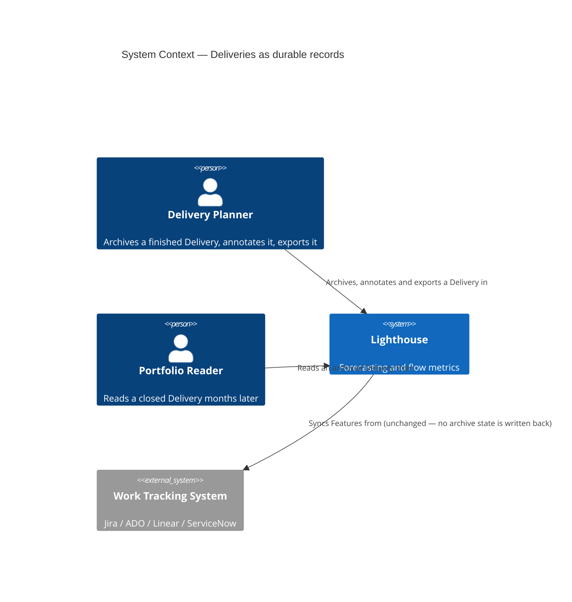
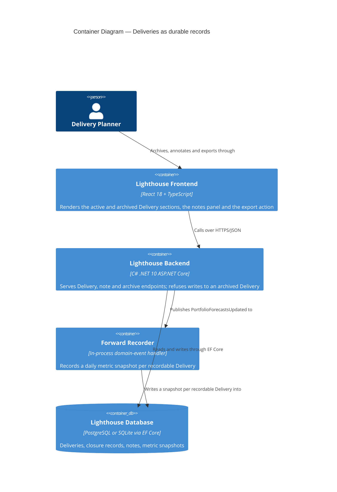
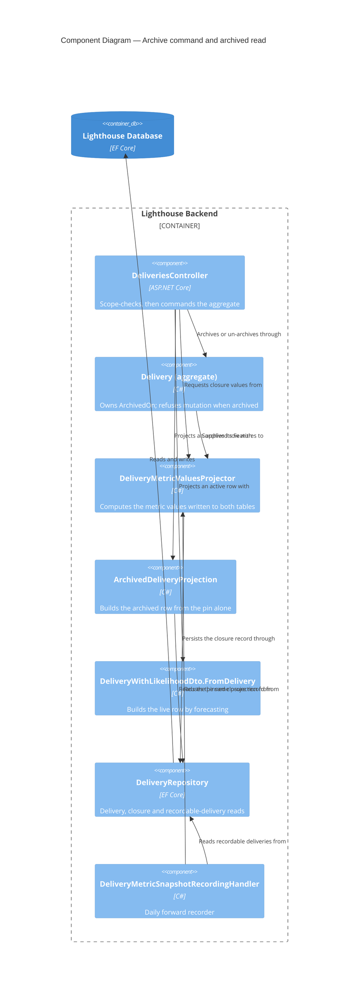

# Feature Delta — epic-5698-deliveries-as-durable-records

ADO Epic #5698 "Deliveries as Durable Records" (Planned, Size 3, tag `Community`, reported by Anoop,
forecasted delivery 2026-08-27). Children: #5640 Archive Deliveries, #5639 Notes on a Delivery,
#4309 Export Delivery Data. Successors: #5565 (date sync, OUT), #5792.

Wave DISCUSS run 2026-08-21. No DISCOVER or DIVERGE artifacts existed — this is a cold DISCUSS
grounded in an ADO read plus a code reality check (see Current-State Surface Inventory).

---

## Wave: DISCUSS / [REF] Persona IDs

| Persona | Role in this Epic |
|---|---|
| `delivery-forecaster` | Primary. Owns the leadership conversation about WHEN. Needs the record to survive the Delivery, and needs to get it out of Lighthouse into a status deck. |
| `delivery-lead-rte` | Primary for notes. Runs the review where "what happened to this one?" gets answered, weeks after the fact. |
| `product-owner` | Secondary. Reads a Delivery's notes to understand why a scope call was made. |
| `config-admin` | Not involved. Nothing here is configurable. |

---

## Wave: DISCUSS / [REF] JTBD One-Liners

| Job ID | One-liner |
|---|---|
| `job-forecaster-keep-a-finished-delivery-as-evidence` | When a Delivery finishes or is called off, I want to retire it without erasing it, so the Portfolio stays clean AND next quarter I can still show what we said and what we shipped. |
| `job-lead-annotate-what-happened-to-a-delivery` | When something notable happens to a live Delivery, I want to write a dated, attributed line against it, so the story survives the meeting it was told in. |
| `job-forecaster-share-a-delivery-outside-lighthouse` | When I am building a status report for people who do not open Lighthouse, I want the Delivery's headline numbers and its Feature grid in one paste, so I stop retyping a forecast into a slide. |

Full JTBD narrative (dimensions, four forces, opportunity scores) lives in `docs/product/jobs.yaml`.

---

## Wave: DISCUSS / [REF] Current-State Surface Inventory

Established by reading the code before writing requirements. Every decision below rests on these.

| # | Fact | Evidence |
|---|---|---|
| S1 | `Delivery` carries Name, Date, PortfolioId, a many-to-many `List<Feature>`, SelectionMode, RuleDefinitionJson. **No state, no lifecycle, no author, no soft-delete.** | `Models/Delivery.cs` |
| S2 | Every number on screen is **recomputed live** — `CalculateMetrics(today, blackoutPeriods, percentiles)` walks the live `Features` collection each read. Nothing about a Delivery's numbers is stored. | `Models/Delivery.cs:50` |
| S3 | Delete is a hard `Remove` + EF cascade to `DeliveryMetricSnapshot`. | `API/DeliveriesController.cs:207`, `Data/LighthouseAppContext.cs:438` |
| S4 | `DeliveryMetricSnapshot` **already stores, per day**: TotalWork, DoneWork, RemainingWork, EstimatedItemCount, LikelihoodPercentage, `WhenDistributionJson` (the 50/70/85/95 dates), `FeatureBreakdownJson` (the per-Feature rows), TargetDateAtSnapshot. Unique on `(DeliveryId, RecordedDay)`. | `Models/DeliveryMetricSnapshot.cs`, `LighthouseAppContext.cs:438-452` |
| S5 | Snapshots are written best-effort by `DeliveryMetricSnapshotRecordingHandler` on every `PortfolioForecastsUpdated`, for **every** Delivery in the Portfolio, unconditionally. | `Services/Implementation/DomainEvents/DeliveryMetricSnapshotRecordingHandler.cs` |
| S6 | A rule-based Delivery **re-matches its Features on every update** — `delivery.Features.Clear()` then re-add from the current Portfolio. | `DeliveriesController.cs:252` |
| S7 | CSV export + rich clipboard copy already exist, generic and premium-gated, inside `DataGridToolbar`. `DataGridBase` reads `licenseStatus.canUsePremiumFeatures` itself, so any grid opting in gets both for free. | `components/Common/DataGrid/DataGridToolbar.tsx`, `DataGridBase.tsx:51` |
| S8 | Only **one** grid opts in today: the Work Items dialog (`enableExport={true}`). `FeatureListDataGrid` does not forward the prop at all. | `WorkItemsDialog.tsx:300`, `FeatureListDataGrid/types.ts` |
| S9 | Identity plumbing exists — `UserProfile{Subject, SubjectClaimType, DisplayName, Email}` created on demand from the principal. **`GetOrCreateFromPrincipalAsync` returns `null` when no stable subject claim is present**, i.e. on an auth-off instance. | `Models/Auth/UserProfile.cs`, `Services/Implementation/Auth/CurrentUserProfileService.cs:18` |
| S10 | All Delivery writes gate on `RbacGuardRequirement.PortfolioWrite` with `ScopeIdRouteKey`; reads on `PortfolioRead`. | `DeliveriesController.cs:31,76` |
| S11 | The Delivery section already has a two-tab shell (`workItems` \| `metrics`), the metrics tab disabled below `MINIMUM_METRIC_SNAPSHOTS = 3`. | `DeliveryGrid/DeliverySection.tsx:475-497` |
| S12 | "Delivery"/"Deliveries" is a **configurable** Terminology key (`delivery`, default `Delivery`). Every UI string and doc line below renders the tenant's word. | `Services/Implementation/Seeding/TerminologySeeder.cs:143` |

∴ **S2 is the whole problem.** Archiving cannot be a boolean. A Delivery that stops being recomputed
has nothing to show; a Delivery that keeps being recomputed shows numbers derived from Features that
have since been re-synced, re-matched (S6) or removed. Either way the "durable record" is not durable.
**S4 is the whole answer** — the shape of the record already exists and is already written daily.

---

## Wave: DISCUSS / [REF] Locked Decisions

### D1 — An archived Delivery is backed by a pinned closure snapshot, not by live Features

**Decision** (user, 2026-08-21). Archiving sets `IsArchived` **and** pins exactly one closure record
reusing the `DeliveryMetricSnapshot` shape (S4). From that moment the Delivery's read path forks: an
archived Delivery renders header numbers and the Feature grid from the pinned record and never calls
`CalculateMetrics`.

**Why not a flag alone**: S2 + S6. A rule-based Delivery re-matches its Features on the next update,
so an archived Delivery's grid can empty itself with no user action. That is the failure the Epic
exists to prevent.

**Why not a new denormalised archive table**: `FeatureBreakdownJson` (S4) is already the serialised
Feature grid, written daily, and already read back by the metrics history endpoint. A second encoding
of the same rows is two things to keep in step.

**Consequence**: when the daily recorder has never run for this Delivery (archived the same day it was
created, or the handler's best-effort write failed — S5), the pin must be **computed at archive time**
rather than read from the newest row. The pin is therefore "snapshot for today, then freeze", not
"point at the last row".

### D2 — Closure outcome and forecast calibration stay a candidate

**Decision** (user, 2026-08-21). This Epic stores the record; it does not read a verdict off it. No
"at 85% we said 12 Sep, it landed 19 Sep" surface, and no actual-finish-date field.

**Accepted residual risk, stated plainly**: D1 gives calibration its *forecast* side for free — the
pinned record already carries `LikelihoodPercentage`, `WhenDistributionJson` and
`TargetDateAtSnapshot` as they stood at closure. What it does not carry is the *actual* — when the
work really finished. A later calibration Epic will need one more forward-only column and one more
migration. That cost is knowingly deferred; it is one column, not a redesign, precisely because D1
pins a snapshot rather than a flag.

### D3 — Archiving stops the machinery, it does not just hide the row

An archived Delivery is skipped by the snapshot recorder (S5) and by rule re-matching (S6). Both are
load-bearing, not tidiness: a recorder that keeps writing rows after closure makes the pinned record
one row among many with nothing marking it as *the* record, and a re-match after closure mutates the
Features behind a record that is supposed to be frozen.

### D4 — Archive and delete both stay

Archive is not a replacement for delete. A Delivery created by mistake should still be deleted
outright; a Delivery that ran its course should be archived. An archived Delivery can still be
deleted (permanently) and can be un-archived back to active.

### D5 — A note is authored by a person, and degrades honestly when there is nobody to name

Adding a note requires `PortfolioWrite` (S10). Editing or deleting a note is restricted to its
**author**. Attribution comes from `UserProfile` (S9).

On an auth-off instance `GetOrCreateFromPrincipalAsync` returns `null` (S9) — there is no author. Such
a note is stored unattributed and displayed as unattributed, and the author restriction cannot apply,
so anyone with `PortfolioWrite` may edit or delete it. The UI never invents an author name, and never
shows an empty "by —" that reads as a bug.

### D6 — Notes freeze when the Delivery is archived

An archived Delivery's notes are readable and exportable but not writable. Rationale: a frozen record
whose commentary can still be rewritten is not a record. A late observation belongs on the Portfolio
or on the next Delivery.

### D7 — Export is one artifact: header block, blank line, Feature grid — premium

**Decision** (user, 2026-08-21). One CSV file and one clipboard paste, both carrying the header
key-value block, a blank line, then the Feature grid with its currently visible columns. Premium-gated
exactly as the existing grid export is (S7) — same gate, same tooltip, same disabled affordance, and no
new licensing concept *for the export itself*. Archiving is separately gated (D46), which does add one.

Header block content, per ADO #4309 verbatim: Delivery Name, Delivery Date, Forecast 70%, Forecast
85%, Forecast 95%, Likelihood, Total Work Items, Completed Work Items, Remaining Work Items.

### D8 — Export reads what is on screen, including for an archived Delivery

The export is a read of the rendered grid (`getSortedRowIds` / `getVisibleColumns`, S7), so column
choices, ordering and sort carry into the file. For an archived Delivery that rendered grid is the
pinned record (D1), so the same action exports the frozen numbers with no separate code path.

### D9 — Nothing here syncs with a work tracking system

Explicitly out, per the Epic. Delivery dates in and forecasts out live in Epic #5565.

### D46 — Archiving is a premium capability; notes are not; un-archiving is the way out

**Decision** (user, 2026-08-21). Retiring a Delivery without erasing it is the sellable capability in
this Epic, and it is gated on a premium licence, using the existing gate, tooltip and disabled
affordance — the same treatment export gets (D7). **Notes stay free.** They are cheap to run, they
build the habit of coming back to a Delivery, and a free user who can explain what happened to a
Delivery has a reason to keep using the product.

**Un-archiving is deliberately NOT gated.** Gating the way in but not the way out is the difference
between a capability somebody has to pay for and a state somebody is trapped in. A licence that lapses
while Deliveries are archived leaves those Deliveries readable and reversible; what the lapsed user
loses is the ability to archive anything *new*.

**Accepted residual, stated plainly** (user, 2026-08-21). After a lapse, a Portfolio whose only
Delivery is archived still counts that Delivery against the free-tier limit (D42), so creating the
next one is refused while the active list looks empty. The refusal message is **not** being improved
to explain this — the case is rare, it only arises from a lapse, and un-archive or delete both resolve
it. Recorded as a known rough edge rather than left to be rediscovered as a bug.

**This amends D7's "no new licensing concept".** That was true when export was the only gated thing in
the Epic, because export reused an existing gate on an existing surface. Archiving is a genuinely new
premium capability, so it needs an answer on the pricing and marketing surface — see *Marketing
Surface* below.

---

## Wave: DISCUSS / [REF] Scope Assessment

**PASS — right-sized.** Against the oversized heuristics:

- User stories: 5 (threshold >10) — under.
- Bounded contexts: 1 (Portfolio/Delivery) — under.
- Walking skeleton integration points: 0 new external integrations — under.
- Effort: 5 slices at ≤1 day each — under 2 weeks.
- Independent user outcomes that could ship separately: 3 (export / notes / archive) — this is the one
  signal that fires. It is answered by the slicing, not by a split: each of the three ships on its own
  day and delivers on its own, and they share exactly one thing (the header + grid shape, D7/D1).

No split proposed. ADO already models the three outcomes as separate children.

---

## Wave: DISCUSS / [REF] WS Strategy

**Strategy B — brownfield vertical slice, no walking skeleton.** Every surface this Epic touches
already exists end to end: the Delivery accordion, its tab shell (S11), the grid (S8), the export
toolbar (S7), the snapshot table (S4), the RBAC guard (S10) and the identity service (S9). There is no
unproven end-to-end path to prove. Slice 01 is deliberately the cheapest of the three so the first
day's work also validates the header + grid shape that Slice 05 later renders from the frozen record.

---

## Wave: DISCUSS / [REF] Driving Ports

| Surface | Kind | Slice |
|---|---|---|
| Delivery Feature grid toolbar → "Export to CSV" / "Copy to Clipboard" | UI action (existing toolbar, newly opted in) | 01 |
| `GET /api/latest/deliveries/{deliveryId}/notes` | HTTP | 02 |
| `POST /api/latest/deliveries/{deliveryId}/notes` | HTTP | 02 |
| Delivery section → "Notes" tab | UI action (third tab beside Work Items / Metrics, S11) | 02 |
| `PUT /api/latest/deliveries/{deliveryId}/notes/{noteId}` | HTTP | 03 |
| `DELETE /api/latest/deliveries/{deliveryId}/notes/{noteId}` | HTTP | 03 |
| `POST /api/latest/deliveries/{deliveryId}/archive` | HTTP | 04 |
| Delivery header → "Archive" action | UI action | 04 |
| Portfolio Deliveries → "Archived" section | UI surface | 04 |
| `POST /api/latest/deliveries/{deliveryId}/unarchive` | HTTP | 05 |

No CLI or MCP surface. The Lighthouse-Clients CLI and MCP server expose Portfolio and Team metrics,
not Delivery lifecycle — nothing in this Epic changes a contract they consume.

**Marketing surface — yes, and this one is not optional.** Archiving is a new premium capability
(D46), so the pricing page and the feature comparison need a line for it, in the tenant's configurable
Terminology. Export does not: it reuses an existing gate on an existing surface and was already
covered by whatever the pricing page says about exports today. Notes need nothing — they are free.
The website lives in its own repository and hot-links assets from this one, so the copy change ships
there, not here, and is owed at feature finalization rather than at release.

**RBAC surface — no change.** Everything reuses `PortfolioRead` / `PortfolioWrite` (S10, D5).
The premium gate is orthogonal to it: a licence decides whether archiving is *available*, RBAC decides
whether this user may do it, and both must pass.

---

## Wave: DISCUSS / [REF] Pre-requisites

- None outside this repository. No new dependency, no new external system, no chart change, no new
  environment variable.
- One EF migration per supported database provider for the notes table (Slice 02) and one for the
  archive columns (Slice 04), generated via the existing `CreateMigration` script, additive-only.
- Premium licence fixture required to run the export tests and any `@screenshot` run that covers the
  export affordance.

---

## Wave: DISCUSS / [REF] Out of Scope

- **Delivery date sync with a work tracking system**, inbound or outbound — Epic #5565 (D9).
- **Closure outcome / forecast calibration** — actual finish date, "we said X, it landed Y" (D2).
- **Delivery owner / stakeholder** — an owner field, and notifications derived from it. Epic candidate.
- **Automatic notes on threshold crossing** — a system-written note when likelihood crosses a band.
  Epic candidate; cheap once notes exist, but it needs a decision on how a system note is attributed
  and whether it is deletable, which D5 does not settle.
- **Reusing an archived Delivery's data in another Delivery's forecast** — floated in #5640 as "may
  also use this data for other deliveries". No user job supports it yet.
- **Rich text, attachments, or @-mentions in notes.** Plain text.
- **Exporting the metrics history charts.** Export covers the header and the Feature grid only.
- **Archiving a Portfolio.** Only a Delivery archives.

---

## Wave: DISCUSS / [REF] User Stories

### US-01 — Export a Delivery's headline and Feature grid in one paste

`job_id: job-forecaster-share-a-delivery-outside-lighthouse` · ADO #4309 · Slice 01

As a Delivery Forecaster building a status report, I want the Delivery's headline numbers and its
Feature grid as one CSV file or one clipboard paste, so that the report is a paste rather than a
retyping exercise.

#### Elevator Pitch
Before: the forecaster reads the likelihood badge, the three forecast chips and every Feature row off
the screen and retypes them into a slide — the Work Items dialog exports, this grid does not.
After: open the Delivery, click **Copy to Clipboard** (or **Export to CSV**) on its Feature grid → sees
one table: a settled set of columns, the Delivery itself as the first row (`Q3 Platform (Delivery)`,
its progress, its four forecast dates, its likelihood), then a row per Feature under the same headings.
Decision enabled: whether the numbers in front of leadership match the tool, without a transcription
step that can silently change one of them.

#### Acceptance Criteria
- AC-01.1 The Delivery's Feature grid shows the same two toolbar actions as the Work Items dialog:
  Copy to Clipboard and Export to CSV.
- AC-01.2 Both are disabled without a premium licence and carry the existing "Premium feature —
  Upgrade to use" tooltip. No new gate, no new copy.
- AC-01.3 With a premium licence, Export to CSV downloads one file holding a single table: a header
  row reading `Name`, `Team`, `Progress`, `Forecast 50%`, `Forecast 70%`, `Forecast 85%`,
  `Forecast 95%`, `Likelihood`, `State`, `Dependencies`, `Warnings`; then the Delivery itself as the
  first data row, named `<Delivery name> (<Delivery term>)` and carrying its own progress, its four
  forecast dates and its likelihood; then one row per Feature.
- AC-01.4 Copy to Clipboard writes the same content, tab-separated as `text/plain` and as an HTML
  table for `text/html`, so a paste into a spreadsheet lands in cells and a paste into a document
  lands as a table.
- AC-01.5 The exported column set is settled and does not follow the grid: hiding a column or
  reordering the columns on screen leaves the file unchanged. The reader's sort and any active filter
  do carry over — the Features are exported in the order, and only the ones, the grid is showing.
- AC-01.6 A value nobody computed renders as an empty cell, never as `null`, `undefined`, `NaN` or
  `0`. Specifically: a Delivery that cannot be forecast exports an empty Likelihood and empty
  Forecast 50/70/85/95 cells rather than a fabricated number.
- AC-01.7 A Delivery name containing a comma, a quote or a newline round-trips through the CSV
  unchanged when re-opened in a spreadsheet.
- AC-01.8 The file reads in the tenant's own vocabulary — a tenant that renamed Delivery to Milestone
  exports the first row as `Q3 Platform (Milestone)`, and a tenant that renamed Feature to Epic sees a
  dependency it may not open named `an Epic you do not have access to`.

---

### US-02 — Write a dated, attributed note against a Delivery

`job_id: job-lead-annotate-what-happened-to-a-delivery` · ADO #5639 · Slice 02

As a Delivery Lead / RTE watching a Delivery's likelihood fall, I want to write a short dated note
against it, so that the reason is attached to the Delivery rather than living in a chat thread nobody
will find in October.

#### Elevator Pitch
Before: the likelihood dropped from 85% to 61% in a week and the only record of why is a message in a
channel; six weeks later nobody can say whether it was a scope addition or two people off sick.
After: open the Delivery → **Notes** tab → type "Two Features added after the steering review" → Save
→ sees the note listed newest-first with its date and the author's name.
Decision enabled: whether a falling trend is a team problem or a scope problem — which changes whether
the answer is help or a scope cut.

#### Acceptance Criteria
- AC-02.1 The Delivery section shows a third tab beside Work Items and Metrics, labelled Notes, always
  enabled (unlike Metrics, it has no minimum-data condition).
- AC-02.2 The tab lists existing notes newest-first, each showing its text, its creation date and its
  author.
- AC-02.3 A user with write access to the Portfolio can add a note; a read-only user sees the list but
  no input, and the API refuses their `POST` with 403.
- AC-02.4 The note is attributed to the calling user's display name, resolved through the existing
  user profile service.
- AC-02.5 On an instance with authentication disabled the note is stored and shown **unattributed** —
  no author line, no placeholder name, no error.
- AC-02.6 Empty or whitespace-only notes are refused with a message on the field, and nothing is
  stored.
- AC-02.7 Notes are scoped to their Delivery: a note added to one Delivery never appears on another,
  including another Delivery in the same Portfolio.
- AC-02.8 Deleting a Delivery deletes its notes.
- AC-02.9 A note's text is rendered as plain text — content that looks like markup is displayed
  literally.

---

### US-03 — Correct or withdraw a note I wrote

`job_id: job-lead-annotate-what-happened-to-a-delivery` · ADO #5639 · Slice 03

As the author of a note, I want to fix a typo or withdraw a note I got wrong, so that the record does
not carry a mistake I can see and cannot touch.

#### Elevator Pitch
Before: a note that names the wrong week stays on the Delivery forever, and the only fix is a second
note contradicting the first.
After: hover the note you wrote → **Edit** → correct the text → Save → sees the corrected note, marked
as edited with the date of the edit.
Decision enabled: whether the note list can be trusted as written — an uncorrectable record gets read
sceptically or not at all.

#### Acceptance Criteria
- AC-03.1 Edit and Delete affordances appear only on notes the current user authored.
- AC-03.2 The API refuses an edit or delete of another user's note with 403, independently of the UI.
- AC-03.3 An edited note displays an edited marker with the edit date; the original creation date is
  still shown.
- AC-03.4 Deleting a note removes it from the list immediately and it does not return on reload.
- AC-03.5 On an instance with authentication disabled, notes carry no author, so any user with write
  access to the Portfolio may edit or delete any note — the affordances are shown to them.
- AC-03.6 An edit that empties the text is refused, exactly as AC-02.6 refuses an empty create.

---

### US-04 — Archive a finished Delivery instead of deleting it

`job_id: job-forecaster-keep-a-finished-delivery-as-evidence` · ADO #5640 · Slice 04

As a Delivery Forecaster whose Portfolio runs indefinitely, I want to retire a finished or cancelled
Delivery without erasing it, so that the active list stays about what is ahead while what already
happened is still there.

#### Elevator Pitch
Before: the only way to clear a finished Delivery off an ongoing Portfolio is Delete, which destroys
the forecast history with it (the snapshots cascade); so the board is either cluttered or amnesiac.
After: open the Delivery's header → **Archive** → confirm → sees it leave the active list and appear
under an **Archived** section, still showing the headline numbers it had on the day it was archived.
Decision enabled: whether the Portfolio's list of live commitments is actually a list of live
commitments — without paying for that clarity in lost history.

#### Acceptance Criteria
- AC-04.1 A Delivery's header offers an Archive action alongside Edit and Delete, available to a user
  with write access to the Portfolio and absent for a read-only user.
- AC-04.1a Archiving requires a premium licence. Without one the action is visible but disabled,
  carrying the same "Premium feature — Upgrade to use" tooltip the export actions use, and the
  product refuses the request when asked directly. Notes are not gated: an unlicensed user can still
  write, correct and read them.
- AC-04.2 Archiving asks for confirmation, and the confirmation says what archiving does and does not
  do — it is reversible, it is not a delete.
- AC-04.3 On archive, exactly one closure record is pinned for that Delivery, carrying the headline
  numbers, the forecast distribution and the Feature grid as they stand at that moment.
- AC-04.4 The pin is correct even when no daily snapshot has ever been recorded for the Delivery —
  a Delivery created and archived the same day still archives with a complete record.
- AC-04.5 An archived Delivery leaves the active list and appears in an Archived section, collapsed by
  default, showing its name, its date and its headline numbers as pinned.
- AC-04.6 The daily snapshot recorder skips archived Deliveries — no further rows accumulate after
  closure.
- AC-04.7 A rule-based archived Delivery does not re-match its Features when the Portfolio next
  updates. Its Feature set is frozen.
- AC-04.8 Archiving a Delivery whose Features are subsequently removed from the Portfolio leaves the
  archived Delivery's numbers unchanged.
- AC-04.9 Delete still exists and still deletes permanently, for archived and active Deliveries alike.
- AC-04.10 An archived Delivery still counts against the free-tier one-Delivery-per-Portfolio limit.
  This only arises after a licence lapses, since archiving needs a licence in the first place
  (AC-04.1a); un-archiving or deleting the archived Delivery both free the slot. The refusal wording
  is deliberately left as it is — see D46's accepted residual.

---

### US-05 — Read an archived Delivery as the record it was

`job_id: job-forecaster-keep-a-finished-delivery-as-evidence` · ADO #5640 · Slice 05

As a Delivery Forecaster preparing a quarterly review, I want to open a Delivery archived two months
ago and see exactly what it looked like at closure, so that I am reporting what happened rather than
what today's data would have said about it.

#### Elevator Pitch
Before: even if an old Delivery were kept, its Feature grid would be recomputed from Features that
have since been re-synced, re-matched or deleted — the record would quietly rewrite itself.
After: expand an archived Delivery → sees its Feature grid rendered from the pinned closure record,
an "Archived on {date}" marker, its notes read-only, and the same **Export to CSV** action producing
the frozen numbers.
Decision enabled: whether a past commitment can be cited in a review at all — a record that moves is
not evidence.

#### Acceptance Criteria
- AC-05.1 Expanding an archived Delivery shows its Feature grid built from the pinned closure record,
  not from live Feature data.
- AC-05.2 The section is marked as archived, with the archive date shown.
- AC-05.3 The archived Delivery's numbers are identical before and after an unrelated Portfolio
  refresh that changes the underlying Features.
- AC-05.4 Export (US-01) works on an archived Delivery and produces the pinned numbers.
- AC-05.5 An archived Delivery's Notes tab is read-only: existing notes are listed, no add, no edit,
  no delete; the API refuses all three with a clear reason.
- AC-05.6 An archived Delivery can be un-archived, returns to the active list, resumes live
  recomputation and resumes daily snapshot recording. Un-archiving does **not** require a premium
  licence, so a lapsed instance is never trapped with Deliveries it cannot bring back.
- AC-05.7 Un-archiving does not destroy the pinned record — archiving again after an un-archive
  re-pins for the new closure moment, and a Delivery is never left with two competing pins.
- AC-05.8 Editing an archived Delivery's name, date, Features or rules is refused.
- AC-05.9 An archived Delivery's Metrics tab stays reachable and read-only, showing the daily history
  up to and including the day it was archived, and subject to the same minimum-history condition a
  live Delivery has — a Delivery archived before it accumulated enough days has the tab dark for
  exactly the reason a live one would.

---

## Wave: DISCUSS / [REF] Story Map

**Backbone** (Delivery Forecaster / Delivery Lead, left to right in time):

```
Plan a Delivery → Watch it → Explain it → Close it → Cite it later → Share it
   (exists)      (exists)     US-02/03    US-04       US-05          US-01
```

| Slice | Story | Ships | Brief |
|---|---|---|---|
| 01 | US-01 | Export the Delivery header + Feature grid, premium-gated | `slices/slice-01-export-a-delivery-record.md` |
| 02 | US-02 | Add and read dated, attributed notes | `slices/slice-02-note-a-delivery-moment.md` |
| 03 | US-03 | Edit and delete your own note | `slices/slice-03-correct-your-own-note.md` |
| 04 | US-04 | Archive: pin the record, leave the active list, stop the machinery | `slices/slice-04-archive-a-finished-delivery.md` |
| 05 | US-05 | Read, export and un-archive from the frozen record | `slices/slice-05-read-an-archived-delivery.md` |

**Slice composition check** (hard gate): every slice contains at least one user-visible value story.
No slice is `@infrastructure`-only. The one piece of pure plumbing in the Epic — forwarding
`enableExport` through `FeatureListDataGrid` (S8) — is a precursor edit inside Slice 01, not a slice.

**Carpaccio taste tests**

| Test | Verdict |
|---|---|
| Any slice shipping 4+ new components? | No. Largest is Slice 04: one entity change, one endpoint, one confirmation dialog, one list section. |
| Every slice depends on a new abstraction? | No. Slices 01-03 add none. Slice 04 introduces the pinned record, and Slice 05 is the first to *read* it — the abstraction ships before it is relied upon. |
| Does any slice disprove a pre-commitment? | Yes, each — see the hypotheses in the briefs. Slice 04's is the one that can actually fail. |
| Any slice on synthetic data only? | No. All five run against demo data on a Portfolio with real Feature rows; Slice 05's acceptance explicitly requires a Portfolio refresh between archive and read (AC-05.3). |
| Any two slices identical but for scale? | 02 and 03 are close — both touch the same table and tab. Kept apart because 03's whole content is the authorship rule (D5), which is where the risk is; merging would hide it inside a CRUD slice. |

---

## Wave: DISCUSS / [REF] Prioritization

Ordered by learning leverage first, dependency second, dogfood cadence third.

| Order | Slice | Rationale |
|---|---|---|
| 1 | 01 Export | Cheapest, no schema, value on day one. Also fixes the header + grid shape (D7) that Slice 05 must later render from the frozen record — getting it wrong here is cheap, getting it wrong in Slice 05 is a migration. |
| 2 | 02 Notes: add + read | Independent of archive. Ships the schema and the attribution path; the auth-off degradation (D5/S9) is discovered here rather than inside the archive work. |
| 3 | 03 Notes: edit + delete own | Depends on 02. Isolates the authorship rule, which is the only contested permission decision in the Epic. |
| 4 | 04 Archive | Highest uncertainty and highest blast radius (recorder + rule re-matching, D3). Deliberately not first: by now the export exists to inspect a pinned record with, and notes exist so the "notes freeze" rule of Slice 05 has something to freeze. |
| 5 | 05 Read the archive | Depends on 04. The payoff slice, and the only one that can prove D1 was the right call — AC-05.3 is the whole Epic in one assertion. |

Dogfood moment for each slice: the Lighthouse team's own Portfolio on the dev instance, same day.

---

## Wave: DISCUSS / [REF] Outcome KPIs

| KPI | Target | Measurement |
|---|---|---|
| K1 — A Delivery's record survives Feature churn | 100% of archived Deliveries report identical headline numbers and Feature rows before and after a Portfolio refresh that changes their Features | Automated: AC-05.3 as an acceptance test that refreshes the Portfolio between two reads |
| K2 — Retiring a Delivery stops destroying its history | 0 rows of `DeliveryMetricSnapshot` lost per retired Delivery when the user chooses Archive | Automated: snapshot count unchanged across archive, in contrast to the cascade on delete |
| K3 — Closure stops costing storage | 0 new snapshot rows written for an archived Delivery per Portfolio update | Automated: AC-04.6 asserts the row count is flat across N updates |
| K4 — The status report is a paste | ≤2 user actions from an open Delivery to the full header + grid on the clipboard | Manual walkthrough, recorded at DELIVER |
| K5 — A note survives the meeting | ≥1 note present on ≥50% of the Lighthouse team's own Deliveries within 4 weeks of Slice 03 shipping | Dogfood observation on the team's own instance (no telemetry exists — see below) |

K5 is a dogfood signal, not an instrumented metric: Lighthouse has no phone-home, so cross-instance
adoption of notes is not measurable. Stated so the DEVOPS wave does not go looking for a counter to
build.

---

## Wave: DISCUSS / [REF] Definition of Done

1. All 5 user stories' acceptance criteria pass as automated tests.
2. Backend `dotnet build` zero warnings, `dotnet test` green.
3. Frontend `pnpm test` green, `pnpm build` zero errors and zero warnings, Biome clean on `./src`.
4. SonarQube Cloud gate green — no new issues of any severity.
5. Mutation testing per feature: Stryker.NET ≥80% kill rate on changed backend code; StrykerJS ≥80% on
   changed frontend code.
6. EF migrations generated through the `CreateMigration` script for every supported provider,
   additive-only.
7. Playwright walking-skeleton coverage run locally before commit; specs go through Page Objects.
8. Documentation updated at feature finalization, in the tenant's configurable Terminology, with
   per-feature screenshots regenerated.
9. ADO children #4309, #5639, #5640 transitioned; Epic #5698 taken no further than Resolved.

---

## Wave: DISCUSS / [REF] DoR Validation

| # | Item | Evidence |
|---|---|---|
| 1 | Business value articulated | Epic body + K1-K5; the value is that a Portfolio meant to run forever stops losing its own history. |
| 2 | User stories in LeanUX form with elevator pitches | US-01…US-05, each with Before / After / Decision-enabled. |
| 3 | Job traceability | 3 job IDs, all real, all added to `docs/product/jobs.yaml`. No `infrastructure-only` story. |
| 4 | Acceptance criteria testable | 40 ACs, each an observable assertion; none says "works correctly". |
| 5 | Dependencies identified | None external. Internal ordering in Prioritization. #5565 explicitly excluded. |
| 6 | Sized and sliced | 5 slices, each ≤1 day, each with a brief and a named hypothesis. |
| 7 | Technical feasibility confirmed | Surface Inventory S1-S12 — every seam read in the code before the decision that rests on it. |
| 8 | UX defined | Journey `retire-a-delivery-without-erasing-it` in `docs/product/journeys/epic-5698-deliveries-as-durable-records.yaml`, with emotional arc and error paths. |
| 9 | Non-functional constraints stated | Premium gating unchanged (D7); RBAC scopes unchanged (S10, D5); migrations additive-only; snapshot recorder cost strictly decreases (K3). |

Requirements completeness: 0.97. The 0.03 is D2's deferred actual-finish-date field — knowingly
deferred, cost quantified as one additive column.

---

## Wave: DISCUSS / [REF] Wave Decisions Summary

### Key Decisions
- [D1] Archived Delivery reads from a pinned closure snapshot reusing the `DeliveryMetricSnapshot`
  shape, never from live Features — because everything is recomputed live today (S2) and rule-based
  Deliveries re-match on update (S6).
- [D2] Forecast calibration stays a candidate; the forecast half is captured for free by D1, the
  actual-finish half costs one additive column later.
- [D3] Archiving stops the snapshot recorder and rule re-matching, not just the list rendering.
- [D4] Archive and delete coexist; archive is reversible.
- [D5] `PortfolioWrite` adds a note; the author alone edits or deletes it; auth-off stores it
  unattributed and lifts the author restriction.
- [D6] Notes freeze on archive.
- [D7] Export is one artifact — header block, blank line, Feature grid — premium-gated exactly as the
  existing grid export.
- [D8] Export reads the rendered grid, so it works unchanged on an archived Delivery.
- [D9] No work-tracking-system sync.

### Requirements Summary
- Primary jobs: retire a Delivery without erasing it; annotate what happened to it; get it out of
  Lighthouse in one paste.
- Walking skeleton scope: none — Strategy B, brownfield vertical slices.
- Feature type: user-facing (with backend persistence).

### Constraints Established
- Migrations additive-only, one per supported provider, via the `CreateMigration` script.
- No new RBAC requirement — everything reuses `PortfolioRead` / `PortfolioWrite`.
- Export reuses the existing premium gate. Archiving adds one new gated capability (D46), using the same gate, tooltip and disabled affordance — no new licensing *mechanism*, one new licensing *decision*. Notes are ungated, and so is un-archiving.
- Every user-visible string honours the configurable Terminology (S12).
- Snapshot storage per Delivery must not grow after closure (K3).

### Upstream Changes
None. There were no DISCOVER or DIVERGE artifacts to contradict.

---

## Wave: DISCUSS / [REF] SSOT Updates

- `docs/product/jobs.yaml` — 3 jobs added, `epic-5698-deliveries-as-durable-records` appended to
  `feature_context`.
- `docs/product/journeys/epic-5698-deliveries-as-durable-records.yaml` — created.
- `docs/product/personas/delivery-forecaster.yaml` — 2 jobs appended to `primary_jobs`.
- `docs/product/personas/delivery-lead-rte.yaml` — 1 job appended to `primary_jobs`.

---

## Wave: DISCUSS / [REF] Handoff

**To**: `nw-solution-architect` (DESIGN, full artifact set) and `nw-platform-architect` (DEVOPS,
Outcome KPIs only).

Open questions carried into DESIGN:

1. **Where the pin lives.** D1 fixes the *shape* (reuse `DeliveryMetricSnapshot`) but not the
   mechanism: a nullable `ClosureSnapshotId` on `Delivery`, an `IsClosure` flag on the snapshot row,
   or a separate one-row-per-Delivery table sharing the columns. AC-05.7's "never two competing pins"
   is the constraint that decides it.
2. **How the archived read path forks.** Whether `DeliveryWithLikelihoodDto.FromDelivery` gains an
   archived branch or a sibling factory reads the pinned record — the latter keeps `CalculateMetrics`
   off the archived path by construction, which is what AC-05.3 actually asserts.
3. **Where the header block is assembled for export.** The existing toolbar exports a grid and knows
   nothing about a header (S7). Either the toolbar grows an optional header-rows input, or the
   Delivery section supplies its own export action beside the grid's. D7's "one artifact" makes the
   first more likely; the reuse gate should decide explicitly.
4. **Whether the recorder skip is a query filter or a per-Delivery guard.** A global filter on
   archived Deliveries is tidier but silently changes every other consumer of
   `GetByPortfolioAsync` — including the active list itself, which is exactly the behaviour Slice 04
   wants and Slice 05 does not.

---

## Wave: DESIGN / [REF] DDD List

Continuing the DISCUSS numbering (D1–D9). Every decision below is design-level; none revisits a
locked DISCUSS decision.

| # | Decision | Rationale (one line) |
|---|---|---|
| D10 | The closure pin is a new table `DeliveryClosureRecord` whose **primary key is `DeliveryId`** | Two competing pins become unrepresentable, and the pin escapes the `(DeliveryId, RecordedDay)` unique key that causes every collision path DISCUSS named (ADR-160) |
| D11 | Archived state is `Delivery.ArchivedOn` (`DateOnly?`), `null` = active, separate from the pin | One column is both the state and the "Archived on {date}" marker, so "archived with no date" cannot exist; un-archive clears it and leaves the pin, which is AC-05.7 |
| D12 | `ArchivedOn` is `DateOnly`, sourced from `ILighthouseClock` | A `DateTime` column is in reach of the global `Properties<DateTime>()` UTC converter, which shifts a local-kind midnight onto the previous day on write |
| D13 | One projection, `DeliveryMetricValuesProjector`, writes both the daily snapshot and the closure record | D1's "one encoding" is only true if one piece of code produces both; the pin is computed at archive time so AC-04.4 holds for a Delivery the recorder never ran for |
| D14 | The archived read is `ArchivedDeliveryProjection.ToDto(ArchivedDeliveryIdentity, DeliveryClosureRecord)` on a **new type** | Withholding `Delivery`, `today` and `blackoutPeriods` makes `CalculateMetrics` uncallable; a new type is what makes the rule expressible as an ArchUnitNET assertion (ADR-161) |
| D15 | ~~The wire contract stays `DeliveryWithLikelihoodDto`, gaining only `archivedOn`~~ **REVERSED by D36** | The rationale — "archived and active rows render in the same grid" — was factually wrong. The Feature grid is fed by a separate live fetch keyed on `features: number[]`, so the archived row never passed through this DTO at all. See the Architecture Review Revisions section |
| D16 | `DataGridToolbar` gains `exportHeaderRows?: ReadonlyArray<{label, value}>`, threaded through `DataGridBase` and `FeatureListDataGrid` | D7's one artifact, with the toolbar staying Delivery-ignorant and inheriting the existing escaping, premium gate and visible-columns/sort reading (ADR-162) |
| D17 | The header block is emitted as leading rows of the **same** table/CSV, followed by a blank row | Pasting lands one contiguous block in cells, so the clipboard artifact matches the CSV's structure rather than being two things |
| D18 | `FeatureListDataGrid` forwards `enableExport`, `exportFileName` and `exportHeaderRows` | It forwards none of them today, so the Delivery grid has no export button at all — precursor edit inside Slice 01 |
| D19 | **No global EF query filter.** *Both* background consumers — the daily recorder and rule re-matching — read through `IDeliveryRepository.GetRecordableByPortfolio`, which returns a `RecordableDeliveries` collection (see D34) | A global filter would silently empty the archived section and would be the first query filter in the codebase; a narrowed port cannot yield the wrong rows (ADR-163) |
| D20 | `Delivery.Features` becomes `IReadOnlyList<Feature>`, written only via `Delivery.ReplaceFeatures`, which refuses when archived as a **backstop** | Three call sites mutate the list today. The two known background paths are narrowed by D19/D34 so they never present an archived Delivery at all; the aggregate guard exists for the fourth write path nobody has thought of yet — it is the safety net, not the primary mechanism for a path already known (ADR-164) |
| D21 | "Archived refuses writes" is an aggregate invariant throwing `DeliveryArchivedException`, mapped to **409 Conflict** by one exception filter | AC-05.5/AC-05.8 must not be bypassable "by a different endpoint"; 409 because the caller's rights are fine and the resource's state is not (ADR-164) |
| D22 | `DELETE` and `unarchive` are exempt by not being guarded mutators | AC-04.9 keeps hard delete on an archived Delivery; the exemption is an absence, not a special case inside a shared check |
| D23 | New entity `DeliveryNote { int Id, int DeliveryId, string Text, DateTime CreatedOn, DateTime? LastEditedOn, int? AuthorUserProfileId, string? AuthorDisplayName }`, cascade-deleted with the Delivery | AC-02.8, matching the `DeliveryMetricSnapshot` cascade convention. The two timestamps are `DateTime` UTC **instants**, not `DateOnly` — see D35 for why this is the opposite call from `ArchivedOn` and how the rendered day is derived |
| D24 | Authorship is stored as **both** a nullable FK (`ON DELETE SET NULL`) and the display name captured at write time | The FK is what authorisation compares; the captured name is what renders, because a durable record must not silently re-label itself when someone is renamed or removed (ADR-165) |
| D25 | The "may I modify this note" predicate is **two explicit branches**, never `note.AuthorUserProfileId == current?.Id` | The naive equality grants a profile-less caller edit rights over an attributed note via `null == null`, and reads as correct — this is a live bug trap, not a style preference |
| D26 | The six new `{deliveryId}`-rooted endpoints use the **in-action** RBAC idiom, not `[RbacGuard]` | `RbacGuardAttribute` resolves scope from a route value only, and these routes carry no `portfolioId`; this is what `UpdateDelivery`/`DeleteDelivery` already do via `GetPortfolioId` + `CanSatisfyRequirementAsync` |
| D27 | Notes live on a new `DeliveryNotesController` | A distinct REST resource with its own per-row authorisation rule; folding six actions plus their helpers into a 338-line controller that already carries six private helpers pushes it toward the S107/maintainability rules the Sonar gate enforces |
| D28 | No `DeliveryArchived` domain event | It would be a second source of truth for a fact `ArchivedOn` already carries; archiving is a synchronous command, and the pin plus the state are written in one `SaveChanges` |
| D29 | `widgetFetchRequirements` is **not** declared for the notes panel | That mechanism belongs to the MetricsView widget/category gate; the notes panel is a tab inside `DeliverySection`, not a metrics widget — stated explicitly rather than skipped |

## Wave: DESIGN / [REF] Component Decomposition

| Component | File | Change |
|---|---|---|
| `Delivery` | `Lighthouse.Backend/Lighthouse.Backend/Models/Delivery.cs` | MODIFIED |
| `DeliveryClosureRecord` | `Lighthouse.Backend/Lighthouse.Backend/Models/DeliveryClosureRecord.cs` | NEW |
| `DeliveryNote` | `Lighthouse.Backend/Lighthouse.Backend/Models/DeliveryNote.cs` | NEW |
| `DeliveryArchivedException` | `Lighthouse.Backend/Lighthouse.Backend/Models/DeliveryArchivedException.cs` | NEW |
| `ArchivedDeliveryIdentity` | `Lighthouse.Backend/Lighthouse.Backend/API/DTO/Archived/ArchivedDeliveryIdentity.cs` | NEW |
| `ArchivedDeliveryProjection` | `Lighthouse.Backend/Lighthouse.Backend/API/DTO/Archived/ArchivedDeliveryProjection.cs` | NEW |
| `DeliveryWithLikelihoodDto` | `Lighthouse.Backend/Lighthouse.Backend/API/DTO/DeliveryWithLikelihoodDto.cs` | MODIFIED (one field; `FromDelivery` untouched) |
| `DeliveryNoteDto` | `Lighthouse.Backend/Lighthouse.Backend/API/DTO/DeliveryNoteDto.cs` | NEW |
| `DeliveriesController` | `Lighthouse.Backend/Lighthouse.Backend/API/DeliveriesController.cs` | MODIFIED |
| `DeliveryNotesController` | `Lighthouse.Backend/Lighthouse.Backend/API/DeliveryNotesController.cs` | NEW |
| `DeliveryArchivedExceptionFilter` | `Lighthouse.Backend/Lighthouse.Backend/API/Filters/DeliveryArchivedExceptionFilter.cs` | NEW |
| `IDeliveryRepository` | `Lighthouse.Backend/Lighthouse.Backend/Services/Interfaces/Repositories/IDeliveryRepository.cs` | MODIFIED |
| `DeliveryRepository` | `Lighthouse.Backend/Lighthouse.Backend/Services/Implementation/Repositories/DeliveryRepository.cs` | MODIFIED |
| `DeliveryMetricValuesProjector` | `Lighthouse.Backend/Lighthouse.Backend/Services/Implementation/DeliveryMetricValuesProjector.cs` | NEW |
| `DeliveryMetricSnapshotRecordingHandler` | `Lighthouse.Backend/Lighthouse.Backend/Services/Implementation/DomainEvents/DeliveryMetricSnapshotRecordingHandler.cs` | MODIFIED |
| `DeliveryRuleService` | `Lighthouse.Backend/Lighthouse.Backend/Services/Implementation/DeliveryRuleService.cs` | MODIFIED (`RecomputeRuleBasedDeliveries` takes `RecordableDeliveries`; updates the ADR-012 signature guard) |
| `RecordableDeliveries` | `Lighthouse.Backend/Lighthouse.Backend/Services/Interfaces/Repositories/RecordableDeliveries.cs` | NEW (sealed collection, one construction site, constructor-asserted) |
| `IDeliveryRuleService` | `Lighthouse.Backend/Lighthouse.Backend/Services/Interfaces/IDeliveryRuleService.cs` | MODIFIED (signature narrows with the implementation) |
| `DeliveryRuleServiceApiPreservationTest` | `Lighthouse.Backend/Lighthouse.Backend.Tests/Architecture/DeliveryRuleServiceApiPreservationTest.cs` | MODIFIED (ADR-012 signature guard, updated in the same commit) |
| `ArchivedDeliveryDto` | `Lighthouse.Backend/Lighthouse.Backend/API/DTO/Archived/ArchivedDeliveryDto.cs` | NEW (carries Feature rows inline; no `features: number[]`) |
| `ArchivedFeatureGrid` | `Lighthouse.Frontend/src/.../DeliveryGrid/ArchivedFeatureGrid.tsx` | NEW |
| `useDeliveryManagement` | `Lighthouse.Frontend/src/pages/Portfolios/Detail/Components/DeliveryGrid/useDeliveryManagement.ts` | MODIFIED (must not live-fetch Features for an archived Delivery) |
| `PortfolioUpdater` | `Lighthouse.Backend/Lighthouse.Backend/Services/Implementation/BackgroundServices/Update/PortfolioUpdater.cs` | MODIFIED (reads `GetRecordableByPortfolio`) |
| `LighthouseAppContext` | `Lighthouse.Backend/Lighthouse.Backend/Data/LighthouseAppContext.cs` | MODIFIED |
| Sqlite migration | `Lighthouse.Backend/Lighthouse.Migrations.Sqlite/Migrations/` | NEW (via `CreateMigration`) |
| Postgres migration | `Lighthouse.Backend/Lighthouse.Migrations.Postgres/Migrations/` | NEW (via `CreateMigration`) |
| `DataGridToolbar` | `Lighthouse.Frontend/src/components/Common/DataGrid/DataGridToolbar.tsx` | MODIFIED |
| `DataGridBase` | `Lighthouse.Frontend/src/components/Common/DataGrid/DataGridBase.tsx` | MODIFIED |
| DataGrid types | `Lighthouse.Frontend/src/components/Common/DataGrid/types.ts` | MODIFIED |
| `FeatureListDataGrid` | `Lighthouse.Frontend/src/components/Common/FeatureListDataGrid/` | MODIFIED (forwards export props) |
| `DeliverySection` | `Lighthouse.Frontend/src/.../DeliveryGrid/DeliverySection.tsx` | MODIFIED |
| `DeliveryNotesPanel` | `Lighthouse.Frontend/src/.../DeliveryGrid/DeliveryNotesPanel.tsx` | NEW |
| Delivery client model + Zod schema | `Lighthouse.Frontend/src/models/` | MODIFIED (`archivedOn`) + NEW (note schema) |
| Delivery API service | `Lighthouse.Frontend/src/services/Api/` | MODIFIED (notes, archive, unarchive) |

## Wave: DESIGN / [REF] Driving Ports

Reconciled against the DISCUSS Driving Ports table: **the six routes are unchanged**; only the
enforcement mechanism is corrected (see *Changed Assumptions*).

| Method | Route | Requirement | Enforcement | Slice |
|---|---|---|---|---|
| GET | `/api/latest/deliveries/{deliveryId}/notes` | `PortfolioRead` | in-action `GetPortfolioId` + `CanSatisfyRequirementAsync` | 02 |
| POST | `/api/latest/deliveries/{deliveryId}/notes` | `PortfolioWrite` | in-action; refused when archived (409) | 02 |
| PUT | `/api/latest/deliveries/{deliveryId}/notes/{noteId}` | `PortfolioWrite` + author predicate | in-action; refused when archived (409) | 03 |
| DELETE | `/api/latest/deliveries/{deliveryId}/notes/{noteId}` | `PortfolioWrite` + author predicate | in-action; refused when archived (409) | 03 |
| POST | `/api/latest/deliveries/{deliveryId}/archive` | `PortfolioWrite` **+ premium licence** | in-action, plus `licenseService.CanUsePremiumFeatures()` as `VerifyDeliveryRequest` already does (D46) | 04 |
| POST | `/api/latest/deliveries/{deliveryId}/unarchive` | `PortfolioWrite` | in-action; exempt from the archived refusal; **deliberately not gated on a licence** (D46) | 05 |

Existing routes whose behaviour changes: `GET /deliveries/portfolio/{portfolioId}` returns
`archivedOn` and both sets; `PUT /deliveries/{deliveryId}` now returns 409 on an archived Delivery;
`DELETE /deliveries/{deliveryId}` is unchanged and still succeeds (AC-04.9).

## Wave: DESIGN / [REF] Driven Ports and Adapters

| Driven port | Adapter | Status |
|---|---|---|
| `IDeliveryRepository` (+ `GetRecordableByPortfolio`, closure + note reads) | `DeliveryRepository` over `LighthouseAppContext` | EXTEND |
| `ILighthouseClock` | existing clock adapter | REUSED AS IS — the only source of `ArchivedOn` |
| `ICurrentUserProfileService` | `CurrentUserProfileService` | REUSED AS IS — its `null` return is the designed-for input |
| `IRbacAdministrationService` | `RbacAdministrationService` | REUSED AS IS |
| Domain-event bus (`PortfolioForecastsUpdated`) | in-process dispatcher | REUSED AS IS — no new event |

No new outbound integration. No work-tracking-system write-back (D9). **No external API is
introduced, so no consumer-driven contract tests are owed for this epic** — stated explicitly rather
than skipped.

## Wave: DESIGN / [REF] Technology Choices

| Choice | Version | Note |
|---|---|---|
| .NET / ASP.NET Core | 10 | existing |
| EF Core | 10, Sqlite + Postgres providers only | two additive migrations via the `CreateMigration` script, never `dotnet ef migrations add` |
| NUnit / Moq / EF InMemory | 4.6 / current | existing; migration verification must run on a real provider — InMemory skips migrations |
| ArchUnitNET | current | already in `Lighthouse.Backend.Tests/Architecture/` |
| React / TypeScript | 18 / current | existing |
| MUI-X DataGrid | current | export path already exists in `DataGridToolbar` |
| Vitest + RTL, Playwright | current | existing |

**No new runtime dependency, backend or frontend.** Everything is OSS under the licences already in
the project.

## Wave: DESIGN / [REF] Decisions Table

| Decision | Verdict |
|---|---|
| DDD-D10 | Closure pin = `DeliveryClosureRecord`, PK `DeliveryId` |
| DDD-D11 | `Delivery.ArchivedOn` (`DateOnly?`) is the archived-state fact |
| DDD-D12 | `ArchivedOn` is `DateOnly` from `ILighthouseClock` |
| DDD-D13 | One `DeliveryMetricValuesProjector` writes both tables |
| DDD-D14 | `ArchivedDeliveryProjection.ToDto` on a new type, forecast inputs withheld |
| DDD-D15 | Wire contract stays `DeliveryWithLikelihoodDto` + `archivedOn` |
| DDD-D16 | `exportHeaderRows` on `DataGridToolbar` |
| DDD-D17 | Header rows lead the same table/CSV, blank row, then grid |
| DDD-D18 | `FeatureListDataGrid` forwards the export props |
| DDD-D19 | No global query filter; both background consumers read `GetRecordableByPortfolio` |
| DDD-D20 | `Features` is `IReadOnlyList<Feature>`, written via `ReplaceFeatures` — the archived refusal there is a backstop |
| DDD-D21 | Archived write refusal is an aggregate invariant → 409 |
| DDD-D22 | Delete and un-archive exempt |
| DDD-D23 | `DeliveryNote` entity, cascade with Delivery |
| DDD-D24 | Author FK (`SET NULL`) + captured display name |
| DDD-D25 | Authorship predicate is two explicit branches |
| DDD-D26 | In-action RBAC idiom for `{deliveryId}` routes |
| DDD-D27 | Separate `DeliveryNotesController` |
| DDD-D28 | No `DeliveryArchived` domain event |
| DDD-D29 | No `widgetFetchRequirements` for the notes panel |
| DDD-D30 | Archive bumps the concurrency token; the reload-retry re-evaluates `ArchivedOn` and drops rather than replays |
| DDD-D31 | Deleting an archived Delivery destroys its pin, deliberately |
| DDD-D32 | No backfill; existing Deliveries take `ArchivedOn = null` |
| DDD-D33 | Auth-off writes both author fields `null` — no placeholder name |
| DDD-D34 | `RecomputeRuleBasedDeliveries` takes `RecordableDeliveries`, so an archived Delivery never enters the re-match loop |
| DDD-D35 | Note timestamps are `DateTime` (UTC instants); the DTO also carries a server-reduced `DateOnly` day, and the client never reduces an instant itself |
| DDD-D36 | **Reverses D15.** Archived rows use `ArchivedDeliveryDto`, carrying Feature rows inline and **no** `features: number[]` |
| DDD-D37 | New `ArchivedFeatureGrid` consuming `DeliveryFeatureMetricDto`, keyed on `ReferenceId`, no `FeatureId` |
| DDD-D38 | `DeliveryClosureRecord` widened: `HasSufficientData`, `TeamsWithoutForecastJson`, `SelectionMode`, `RuleDefinitionJson`, `RuleSchemaVersion` |
| DDD-D39 | Every `Delivery` mutator bumps `ConcurrencyToken`, making a Features-only change a row UPDATE |
| DDD-D40 | Archive/un-archive accept a client concurrency token via `ApplyConcurrencyTokenForEdit` |
| DDD-D41 | Rule recompute is per-Delivery; a concurrency conflict skips that Delivery, not the batch |
| DDD-D42 | An archived Delivery does not count against the free-tier limit — **PROVISIONAL** |
| DDD-D43 | `ForecastWindowEnd` computes over non-archived Deliveries |
| DDD-D44 | `RecordableDeliveries` asserts in its constructor; it is a nominal marker, not a refinement type |
| DDD-D45 | D25's rationale and test rewritten around unattributed note + profiled caller |

## Wave: DESIGN / [REF] Reuse Analysis

Default is EXTEND. CREATE NEW requires evidence that extending is impossible or creates unacceptable
coupling.

| Existing Component | File | Overlap | Decision | Justification |
|---|---|---|---|---|
| `DeliveryMetricSnapshot` | `Models/DeliveryMetricSnapshot.cs` | Holds exactly the value shape the pin needs | **REUSE AS SHAPE** (not extended) | The pin must be one-per-Delivery; this table is keyed `(DeliveryId, RecordedDay)`. Adding an `IsClosure` flag degrades the invariant from a key to a rule and still collides on that key. Same columns, same encoders, different table (ADR-160) |
| `DeliveryMetricsHistoryDto.ParseFeatureBreakdown` | `API/DTO/DeliveryMetricsHistoryDto.cs` | Parses `FeatureBreakdownJson` into per-Feature rows | **REUSE AS IS** | Exactly the archived read's need; reusing it is what makes D1's "one encoding" true |
| `DeliveryMetricSnapshotRecordingHandler` | `Services/Implementation/DomainEvents/` | Computes the daily metric values | **EXTEND** | Its projection is extracted into `DeliveryMetricValuesProjector` so archive-time and record-time produce identical values; the handler keeps its event hook and swaps its delivery source |
| `DeliveriesController` | `API/DeliveriesController.cs` | Delivery CRUD, the read the archived list joins | **EXTEND** | Archive/un-archive are Delivery lifecycle operations on the Delivery resource; they belong here |
| `DeliveryWithLikelihoodDto` | `API/DTO/DeliveryWithLikelihoodDto.cs` | The row contract for both active and archived | **EXTEND** (one field) | `FromDelivery` is deliberately left untouched. The archived factory is a separate type because the "cannot reach a Feature" rule is not expressible by ArchUnitNET if it sits on this class, which legitimately depends on `Feature` for the live path |
| `DataGridToolbar` | `components/Common/DataGrid/DataGridToolbar.tsx` | Owns both export actions, escaping and the premium gate | **EXTEND** | One optional generic prop. A Delivery-owned export action would duplicate `getGridData`, the escaping and the gate, and would yield two buttons — the opposite of D7 |
| `DataGridBase` | `components/Common/DataGrid/DataGridBase.tsx` | Threads toolbar props | **EXTEND** | Pass-through only |
| `FeatureListDataGrid` | `components/Common/FeatureListDataGrid/` | The Delivery Feature grid | **EXTEND** | Currently forwards no export props at all; forwarding them is strictly additive and unblocks other consumers |
| `DeliverySection` | `.../DeliveryGrid/DeliverySection.tsx` | The two-tab shell the notes tab and archived marker join | **EXTEND** | The tab shell already exists; a third tab and a marker are additive |
| `CurrentUserProfileService` | `Services/Implementation/Auth/CurrentUserProfileService.cs` | Resolves the acting profile, `null` when no stable subject claim | **REUSE AS IS** | Its `null` return is the input D5 is written around. Changing it to synthesise an identity would manufacture authorship |
| Metrics-history endpoint | `DeliveriesController.GetMetricsHistory` | Reads the same snapshot shape | **REUSE AS IS — no change** | It reads the daily series; the archived read reads the pin. Overlapping shape, different question. Archiving does not alter the series, so this endpoint keeps working unchanged for an archived Delivery |
| `IDeliveryRepository` | `Services/Interfaces/Repositories/IDeliveryRepository.cs` | Delivery reads incl. `GetPortfolioId` | **EXTEND** | `GetPortfolioId` already exists and is the seam the six new endpoints scope-check through |
| `DeliveryRuleService` | `Services/Implementation/DeliveryRuleService.cs` | Re-matches rule-based Deliveries | **EXTEND** | `RecomputeRuleBasedDeliveries` takes `RecordableDeliveries` instead of `IEnumerable<Delivery>`, so an archived Delivery cannot enter the re-match loop (D34). **This changes a signature pinned by the ADR-012 reflection test** — see the DISTILL revisions section |
| `Delivery` | `Models/Delivery.cs` | The aggregate | **EXTEND** | Encapsulating mutation is what makes the archived rule cover the background write path |
| `RbacGuardAttribute` | `Services/Implementation/Authorization/RbacGuardAttribute.cs` | Declarative scope check | **REUSE AS IS — not extended** | Considered adding a delivery-id scope resolver. Rejected for this epic: it changes an auth-critical filter for six endpoints when the in-action idiom already exists and is already used by three sibling endpoints. Recorded as an open question below |
| `DeliveryNote` | — | — | **CREATE NEW** | No existing entity carries free text against a Delivery |
| `DeliveryClosureRecord` | — | — | **CREATE NEW** | No existing table can hold a one-per-Delivery pin without inheriting the day key that causes the collisions |
| `ArchivedDeliveryProjection` / `ArchivedDeliveryIdentity` | — | — | **CREATE NEW** | The enforcement in ADR-161 point 3 is not expressible if this code lives on the existing DTO type |
| `DeliveryMetricValuesProjector` | — | — | **CREATE NEW** | Extracted from the recording handler so two writers cannot drift; this is a move, not a duplication |
| `DeliveryNotesController` | — | — | **CREATE NEW** | Distinct REST resource with its own per-row authorisation rule |
| `DeliveryNotesPanel` | — | — | **CREATE NEW** | No existing component renders an editable note list |

## Wave: DESIGN / [REF] C4 — System Context (L1)



## Wave: DESIGN / [REF] C4 — Container (L2)



## Wave: DESIGN / [REF] C4 — Component (L3, the archive and archived-read subsystem)

Included because this subsystem is where the epic's central guarantee lives and it carries more than
five collaborating components.



Note what the diagram does **not** contain: an arrow from `ArchivedDeliveryProjection` to the
aggregate, to the forecast service, or to any Feature. That absence is the design.

## Wave: DESIGN / [REF] Per-Slice Impact

| Slice | Components touched |
|---|---|
| **01 — Export a Delivery record** | `DataGridToolbar`, `DataGridBase`, DataGrid `types.ts`, `FeatureListDataGrid` (precursor: forwards `enableExport`/`exportFileName`), `DeliverySection` (assembles header rows through Terminology). Frontend only; no backend, no migration |
| **02 — Note a Delivery moment** | NEW `DeliveryNote`, `DeliveryNoteDto`, `DeliveryNotesController`, `DeliveryNotesPanel`; MODIFIED `LighthouseAppContext` (DbSet + cascade), `IDeliveryRepository`/`DeliveryRepository`, `DeliverySection` (notes tab), client model + Zod schema + API service. First migration pair |
| **03 — Correct your own note** | MODIFIED `DeliveryNote` (the authorship predicate, `LastEditedOn`), `DeliveryNotesController` (PUT/DELETE), `DeliveryNotesPanel`. No schema change beyond `LastEditedOn` if not already added in 02 |
| **04 — Archive a finished Delivery** | NEW `DeliveryClosureRecord`, `DeliveryMetricValuesProjector`, `DeliveryArchivedException`, `DeliveryArchivedExceptionFilter`; MODIFIED `Delivery` (`ArchivedOn`, encapsulated `Features`, `Archive`/`Unarchive`/`ReplaceFeatures`), `DeliveriesController` (archive route, active/archived split), `IDeliveryRepository` (`GetRecordableByPortfolio`), NEW `RecordableDeliveries`, `DeliveryMetricSnapshotRecordingHandler`, `DeliveryRuleService` (parameter narrows; ADR-012 signature guard updated in the same commit), `PortfolioUpdater` (reads the narrowed port), `LighthouseAppContext`. Second migration pair. **The planned 1-hour SPIKE is no longer about the unique-key collision — that collision does not exist under D10 — so re-scope it to verifying the additive migration on a real provider** |
| **05 — Read an archived Delivery** | NEW `ArchivedDeliveryIdentity`, `ArchivedDeliveryProjection`, **`ArchivedDeliveryDto`** (Feature rows inline, no `features: number[]`), **`ArchivedFeatureGrid`**; MODIFIED `DeliveriesController` (projection choice, client token — the un-archive route itself shipped in slice 04, see that brief), **`useDeliveryManagement`** (must not live-fetch Features for an archived Delivery — this is the B1 seam), `DeliverySection` (archived marker, read-only notes, archived grid, export over the archived column set), client model + Zod schema for the archived payload. No migration |

## Wave: DESIGN / [REF] Open Questions

Deliberately deferred; none blocks DISTILL.

1. **Should `RbacGuardAttribute` gain a delivery-id scope resolver?** Out of scope here — the
   in-action idiom already exists and is used by three sibling endpoints. But it would let the six new
   routes be declarative and reflection-testable. Worth its own story; recorded so the choice is
   visible rather than inherited.
2. **Note text limits and formatting.** Max length, whether markdown renders, and whether an empty
   note is refused at the API or only in the UI. DISTILL should pin these as ACs.
3. **Ordering and paging of notes.** Newest-first is assumed; no paging is designed. If a Delivery
   can accumulate hundreds of notes this needs revisiting.
4. **Whether the archived section paginates.** An instance with years of archived Deliveries will
   render a long list. Deferred until someone has one.
5. **`MetricSnapshotCount` on an archived row.** Carried in `ArchivedDeliveryIdentity` so the metrics
   tab still shows its history, but whether the metrics tab should be reachable at all on an archived
   Delivery is a UX call DISTILL should settle.

## Wave: DESIGN / [REF] Changed Assumptions

One DISCUSS assumption is corrected. Nothing else changed; no user story and no acceptance criterion
is altered by this design.

**Original (verbatim), `feature-delta.md:50`, *Current-State Surface Inventory*:**

> | S10 | All Delivery writes gate on `RbacGuardRequirement.PortfolioWrite` with `ScopeIdRouteKey`; reads on `PortfolioRead`. | `DeliveriesController.cs:31,76` |

**Replacement:**

> | S10 | All Delivery writes gate on `PortfolioWrite` and reads on `PortfolioRead`, but by **two different mechanisms**. The `portfolio/{portfolioId}` routes use the `[RbacGuard(..., ScopeIdRouteKey = "portfolioId")]` attribute (`DeliveriesController.cs:31,76` — these are the only two `[RbacGuard]` attributes in the file). The `{deliveryId}`-rooted routes (`GetMetricsHistory`, `UpdateDelivery`, `DeleteDelivery`) carry **no** attribute; they resolve the scope in-action via `IDeliveryRepository.GetPortfolioId(deliveryId)` and call `IRbacAdministrationService.CanSatisfyRequirementAsync`, returning `Forbid()`. | `DeliveriesController.cs:31,76` (attribute); the `{deliveryId}` actions (in-action) |

**Rationale.** `RbacGuardAttribute` exposes `Requirement`, `ScopeIdRouteKey` and `Check`, and resolves
the scope id from a **route value** only — there is no resolver hook. A `{deliveryId}` route carries
no `portfolioId`, so the attribute structurally cannot serve one. The global fallback policy is
`RequireAuthenticatedUser` (`Program.cs:807-808`), which is authentication, not scope. Taking S10 at
face value would have produced six new endpoints written with `ScopeIdRouteKey = "portfolioId"` on a
route that has no such value — silently unscoped, authenticated-only, and passing every test that only
checks that a logged-in caller succeeds.

**Consequential correction to a slice brief** (recorded in
`design/upstream-changes.md`): `slices/slice-02-note-a-delivery-moment.md:12` says the notes endpoints
are gated "with `ScopeIdRouteKey`, matching the existing Delivery endpoints". The intent is right and
the requirement is unchanged; the named mechanism is wrong for a `{deliveryId}` route.

## Wave: DESIGN / [REF] Wave Decisions Summary

### Key Decisions

The four open questions DISCUSS handed DESIGN are answered as D10 (pin location), D14 (archived read
fork), D16 (export header placement) and D19 (recorder exclusion). The three the ACs demanded but
DISCUSS left open are answered as D23 (notes entity and cascade), D24/D25 (authorship storage and the
absent-profile predicate) and D21 (where the archived-write refusal is enforced).

### Architecture Summary

Ports-and-adapters, unchanged; no new architectural style, no new runtime dependency, no new external
integration. The epic's design weight is a single idea applied at four seams: an archived Delivery
must be **unable** to read or write live data rather than instructed not to. Hence a pin in its own
table whose primary key forbids a second pin; a projection whose signature withholds the forecast
inputs; a recorder whose port cannot yield an archived row; and an aggregate that refuses mutation so
the rule reaches the background write path no controller can see.

### Reuse Analysis

12 EXTEND / REUSE against 6 CREATE NEW. Four of the six new components are new persisted concepts
with no existing home. The two needing real justification are `ArchivedDeliveryProjection` — a new
type precisely because the "cannot see live Features" rule is not expressible as an architecture test
otherwise — and `DeliveryMetricValuesProjector`, which is an extraction from the recording handler so
the two writers of the metric shape cannot drift, not a duplication.

### Technology Stack

Unchanged: .NET 10, EF Core 10 over SQLite and PostgreSQL, React 18 + TypeScript, MUI-X, NUnit 4.6 +
Moq + ArchUnitNET, Vitest + RTL, Playwright. Two additive migrations, one per provider, via
`CreateMigration`.

### Constraints Established

- `Delivery.Features` is read-only outside the aggregate; a fourth Feature write path inherits the
  archived refusal automatically.
- Any new `{deliveryId}`-rooted route must use the in-action RBAC idiom; reaching for `[RbacGuard]`
  yields an unguarded endpoint.
- Persisted day keys on the new tables are `DateOnly` and come from `ILighthouseClock`.
- Migrations are expand-only and generated by the `CreateMigration` script; verification runs on a
  real provider because InMemory skips migrations.
- Every user-visible string in the export header, the notes panel and the archived marker resolves
  through the instance's configurable Terminology.

### Upstream Changes

One: S10's mechanism, corrected above, with a consequential note against slice 02's brief. No user
story and no acceptance criterion changes. Written to
`docs/feature/epic-5698-deliveries-as-durable-records/design/upstream-changes.md`.

## Wave: DESIGN / [REF] Post-Review Revisions

Peer review returned 3 critical and 9 high findings. One critical was a real defect and is fixed
below; the other two were misreadings of the design and are answered with evidence rather than
accepted. Four decisions are added (D30–D33). The reviewer worked from an inlined summary because the
context layer would not serve it the markdown, so a second review pass would inherit the same
blindness and is not run.

### Accepted — new decisions

| # | Decision | Rationale |
|---|---|---|
| D30 | **SUPERSEDED by D39/D41.** The token-bump half was right in intent but nothing implemented it (`RegenerateConcurrencyTokens` fires only on `EntityState.Added`), and the reload-retry half described a path that does not exist for `Delivery` (`LighthouseAppContext.cs:559` already excludes `IConcurrencyTokenEntity`). Original text: *the archive/un-archive writes bump the token, and the reload-retry re-evaluates `ArchivedOn` and drops rather than replays* | The guard reads `ArchivedOn` from the **in-memory** aggregate, so a caller holding a Delivery loaded before the archive carries a stale `null`. Real interleaving: `PortfolioUpdater` loads the Deliveries → a user archives one → `DeliveryRuleService.RecomputeRuleBasedDeliveries` mutates the copy it already holds. The token makes the stale save fail; a blanket reload-retry that replays the mutation would defeat it. A background recompute that loses this race is a **no-op, not a retry** (ADR-164, new *Concurrency* section) |
| D31 | Deleting an archived Delivery destroys its closure record and snapshots, by cascade, deliberately | AC-04.9 keeps delete available. Archive is the alternative to deletion, not protection against it. Called out because "archived" and "safe from deletion" are easy to conflate — **the UI wording must not imply the second** |
| D32 | No backfill. Existing Deliveries take `ArchivedOn = null`; no closure record is created for them | The archived read only runs when `ArchivedOn is not null`, so an absent closure record is never dereferenced. Release-time assumption stated explicitly: no production Delivery is archived at release, because the capability does not exist until this ships |
| D33 | On an auth-off instance **both** author fields are written `null` — no placeholder, no synthetic "Unknown" author | A fabricated name is the dishonesty D5 rules out. The note renders unattributed and any writer may edit it, which is AC-02.5 and AC-03.5 together |

Additions to the enforcement matrix: an integration test interleaving *load-for-recompute → archive →
attempt recompute save*, asserting the Feature set is unchanged and no exception escapes to the
background service's caller (D30). The route reflection test is extended to assert every
`{deliveryId}`-rooted action performs a scope check, which recovers the discoverability that the
in-action idiom costs relative to `[RbacGuard]`.

### Rejected — with reasons

| Finding | Verdict |
|---|---|
| *Critical: "AC-04.4 contradiction — the recorder creates the pin, but may never run"* | **Misreading.** D13 and ADR-160 point 3 already state the pin is computed **at archive time** by a projector *shared* with the recorder; the L3 diagram shows `DeliveriesController → DeliveryMetricValuesProjector`. The recorder never creates a pin. No change beyond the wording already present |
| *Critical: "archived read freshness is undefined — snapshot may be re-computed"* | **Misreading.** The pin is written once and never recomputed; the recorder cannot touch an archived Delivery (D19/AC-04.6) and the archived projection has no forecast inputs (D14). The reviewer's proposed test — archive, let the recorder run repeatedly, re-read, expect the pinned values — is a good test and is already the *read-refresh-read byte-identical* case in the enforcement matrix |
| *High: "collapse `DeliveryClosureRecord` into an `IsClosure` bool"* | **Rejected.** The suggestion is self-contradictory: a bool **on the snapshot table** inherits the `(DeliveryId, RecordedDay)` key, which is the entire source of the collisions; a bool on a row keyed by `DeliveryId` **is** this table. The alternatives are argued in ADR-160 |
| *High: "ArchUnitNET rule is unenforceable — tests can instantiate the projection"* | **Rejected — wrong direction.** The rule constrains what `ArchivedDeliveryProjection` *depends on*, not who calls it. Instantiating it in a test is harmless precisely because it cannot reach a Feature |
| *High: "the route reflection test is brittle; a new mutating endpoint breaks it"* | **Rejected — that is the purpose.** A new mutating endpoint *should* fail until it is classified as refusing-or-exempt. The codebase already runs this pattern (`AppSettingsControllerTest`, `API/Security/S4_DeliveriesDeleteGuardInversionTests`) |
| *High: "`GetRecordableByPortfolio` fragments the data-access interface"* | **Rejected.** The narrowing is the mechanism (ADR-163). A shared method plus a filter the recorder must remember is the option that lets the recorder be wrong |
| *Medium: "add a placeholder `AuthorDisplayName` on auth-off"* | **Rejected** — see D33 |

### Still open after review

The reviewer's observability point is fair and not designed here: archive/un-archive are not
instrumented, and a 409 refusal emits no metric. Added to *Open Questions* as a DEVOPS-wave concern
rather than invented now.

## Wave: DESIGN / [REF] DISTILL Feedback Revisions

DISTILL found two defects in the DESIGN sections. Both are accepted. **Neither changes an acceptance
criterion** — UI-1 changes the mechanism by which AC-04.7 is met, not the observable behaviour it
asserts, and UI-2 pins a type that was previously unstated. D34 and D35 are added.

### UI-1 — rule re-matching was left relying on exception-as-control-flow

D19 narrowed the recorder's port so it structurally cannot see an archived Delivery, and the Reuse
Analysis argued that a shared method plus a caller-remembered filter "is the option that lets the
caller be wrong". `DeliveryRuleService` was then given neither treatment: it received
`IEnumerable<Delivery>` from `PortfolioUpdater` and relied on `ReplaceFeatures` throwing. That made
`DeliveryArchivedException` the **normal** case on the hot path — every Portfolio refresh containing
an archived rule-based Delivery would raise and swallow one — and it collided with D30, which needs a
lost concurrency race to be a quiet no-op. If the exception is expected, the race and the normal case
are indistinguishable at the catch site, destroying the very signal D30 preserves.

| # | Decision | Rationale |
|---|---|---|
| D34 | `IDeliveryRepository.GetRecordableByPortfolio` returns a sealed `RecordableDeliveries : IReadOnlyList<Delivery>` that only the repository can construct, and `DeliveryRuleService.RecomputeRuleBasedDeliveries(Portfolio, RecordableDeliveries)` takes that type instead of `IEnumerable<Delivery>` | An archived Delivery cannot enter the re-match loop, because the parameter type cannot hold one. One narrowing now serves both background consumers — the recorder and rule re-matching — rather than protecting one and leaving the other to remember |

Consequences of D34:

- **`DeliveryArchivedException` becomes genuinely exceptional on the background path.** With both
  known consumers narrowed, the only way the aggregate guard fires there is the D30 stale-aggregate
  race — a Delivery archived *after* the collection was fetched. That is exactly the signal D30 wants
  isolated, and a catch site may now treat it as "this Delivery was archived under me, drop the
  mutation" without ambiguity.
- **ADR-164 is reframed.** The aggregate refusal is the **backstop for the write path nobody has
  thought of yet**, not the primary mechanism for a path already known. That is what an invariant is
  for; using it as the routine control flow for a foreseen case was the defect.
- **This changes a signature pinned by the ADR-012 reflection test**, which asserts
  `RecomputeRuleBasedDeliveries` still exists with its original signature. That guard was written to
  stop the rule-engine generalisation refactor *silently* altering the public surface. This change is
  deliberate and documented, so the guard is updated rather than worked around — but it must be
  updated in the same commit, or the suite goes red for the right reason at the wrong time.
- `PortfolioUpdater` switches its delivery read to `GetRecordableByPortfolio`. Anything it does with
  that collection other than rule re-matching — including any forecast-window computation — then also
  excludes archived Deliveries, which is correct: a finished Delivery should not extend a forecast
  window. **The crafter must confirm this at the call site rather than assume it**; if any consumer
  there genuinely needs all Deliveries, it takes a second, explicit read.

### UI-2 — `DeliveryNote` timestamps had no declared type

D12 reasoned that `ArchivedOn` must be `DateOnly` because a `DateTime` is in reach of the global
`Properties<DateTime>()` converter, which applies `ToUniversalTime()` on write and so shifts a
local-kind midnight onto the previous day. D23 then declared `CreatedOn` / `LastEditedOn` without a
type, one implicit `DateTime` away from the same trap, while AC-02.2 and AC-03.3 both render them as a
day to a human.

| # | Decision | Rationale |
|---|---|---|
| D35 | `CreatedOn` is `DateTime` and `LastEditedOn` is `DateTime?`, both **UTC instants** from the clock's instant member. The DTO carries the instant *and* a `DateOnly` day reduced **server-side** by `ILighthouseClock.ToInstanceDay`. The frontend renders the supplied day and never reduces an instant itself | A note records *when a person wrote something* — a moment, not a calendar day. This is the opposite call from `ArchivedOn` and deliberately so |

Why this escapes the converter, stated explicitly because D12 makes the opposite call:

- The converter is **correct** for a genuine UTC instant. It damages a `DateTime` only when the value
  is a local-kind midnight standing in for a calendar day — it round-trips a true instant faithfully
  and restores `Kind = Utc` on read. `ArchivedOn` is a day, so it must not be a `DateTime`;
  `CreatedOn` is an instant, so it may be.
- **The reduction to a day happens once, on the server, in a named zone.** The ledger rule is that
  anything reducing an instant to a day must name the zone it reduces in. The instance zone is the one
  every other day in the product is expressed in (snapshots included), so the DTO carries
  `createdOnDay` / `lastEditedOnDay` alongside the instants, reduced by the clock.
- **The frontend is therefore never handed the reduction.** It renders the supplied day directly, which
  structurally removes the `toISOString().split("T")[0]` foot-gun the ledger tracks — the client has no
  instant-to-day conversion to get wrong.
- The instants remain the sort key (newest-first ordering, and two notes on the same day), and the
  "edited" indicator is `LastEditedOn is not null`. A `Kind == Utc` assertion does not prove the day is
  right, so the test reads a note back through a **fresh** EF context and asserts the rendered **day**.

## Wave: DESIGN / [REF] Architecture Review Revisions (B1, B2, H1–H6, L1–L3)

An independent review with shell access read the real code and returned two blockers and six highs.
**All of them are correct.** I re-verified the load-bearing facts before rewriting: the frontend
live-fetch seam, `RegenerateConcurrencyTokens` filtering `EntityState.Added`, the many-to-many
Features mapping, the retry's `IConcurrencyTokenEntity` exclusion, and the free-tier check. Decisions
D36–D45 are added; **D15 is reversed**.

**Two of my earlier claims were wrong and are withdrawn.** D15 ("archived and active rows render in
the same grid, so a second wire type is pointless") was false — the archived grid is not the same
grid. And D30's concurrency mechanism did not exist; the test it prescribed would have passed
vacuously. Both are corrected below.

### B1 — the archived Feature grid never passed through the DTO

`useDeliveryManagement.ts` reads `delivery.features` (a `number[]` of live Feature ids) and issues a
**separate live GET** of Feature entities, which it hands to `FeatureListDataGrid`. Line 50 returns
early when that array is empty. So `ArchivedDeliveryProjection` protected a payload the Feature grid
never consumed, and the archived grid had two possible outcomes, both wrong: render empty (AC-05.1
fails, and the export ships a header over an empty grid), or carry the live ids and re-fetch live
Features (AC-05.3 fails — archive, refresh, re-open, and the numbers have moved). ADR-161's
"withheld inputs" argument never reached this seam.

| # | Decision | Rationale |
|---|---|---|
| D36 | **D15 is reversed.** An archived Delivery is returned as a distinct `ArchivedDeliveryDto` that carries its Feature rows **inline** and has **no `features: number[]`** | D15's premise was that both rows render in the same grid. They do not. Omitting the id list is the structural part: with no ids on the wire, the client has nothing to re-fetch *by*, so the live-refetch failure mode is unrepresentable rather than merely discouraged |
| D37 | New `ArchivedFeatureGrid` frontend component consuming `DeliveryFeatureMetricDto` rows directly, keyed on `ReferenceId` | The pinned row is a genuinely narrower shape than `IFeature`; reusing `FeatureListDataGrid` would require inventing the fields the pin does not have. No `FeatureId` is carried — **deliberately**, so an archived row cannot offer navigation to a live entity that may have moved or been deleted |

**Columns an archived Feature grid does not have**, because the pin does not hold them: work-item
**state** and **type**, the **owning team(s)**, per-team **remaining/total** work, per-Feature
**forecast completion dates**, and **blocked** status. It has Reference, Name, Completion %,
Likelihood, Total Items, and the default-size flag.

**D8 inherits this**: "export reads what is on screen" now means an archived export carries the
archived column set, which is narrower than a live Delivery's export. That is the honest outcome —
the alternative is an export that claims columns the record never captured.

### B2 — the concurrency story did not work

Three verified facts killed it. `RegenerateConcurrencyTokens` (`LighthouseAppContext.cs:593-596`)
bumps tokens **only for `EntityState.Added`**, so a modified Delivery keeps its token and nothing in
the archive route bumped it. `HasMany(d => d.Features).WithMany()` (`:435`) is a pure skip
navigation, so a Features-only mutation writes join rows and issues **no UPDATE against
`Deliveries`** — EF never puts the token in a WHERE clause. And the retry (`:559`) is already
`!InvolvesConcurrencyTokenEntity(ex)`, so `Delivery` is **already excluded** from the reload-retry
that D30 instructed me to change. Net: the recompute committed silently, and the prescribed test
("no exception escapes") passed vacuously because nothing threw. **The D30 reload-retry instruction
is withdrawn — that path does not exist.**

| # | Decision | Rationale |
|---|---|---|
| D39 | **Every `Delivery` mutator bumps `ConcurrencyToken`** — `Archive`, `Unarchive`, `ReplaceFeatures`, `Rename`, `Reschedule`, `ApplyRuleSet` | This is the mechanism that actually fires on a join-table-only write: bumping the token makes the Delivery row itself modified, so EF emits `UPDATE Deliveries … WHERE Id = @id AND ConcurrencyToken = @old`. A Feature-set change *is* a change to the Delivery's state; that it currently changes nothing on the Delivery row is precisely why optimistic concurrency does not protect it today |
| D40 | Archive and un-archive accept a **client concurrency token** and go through `ApplyConcurrencyTokenForEdit`, like every sibling Delivery mutation | Fixing D39 makes the token meaningful, so the archive route must participate in it. Two users racing archive-vs-edit now get a 409 instead of last-writer-wins (L3) |
| D41 | The rule-recompute's unit of work is **per-Delivery**, and a `DbUpdateConcurrencyException` for one Delivery **skips that Delivery** and continues | `:559` already lets a `Delivery` conflict propagate rather than retrying it, which is what we want — but one conflicting Delivery must not fail the whole portfolio's save. Skipping is correct: a Delivery archived under us no longer wants recomputing |

**Replacement test, which fails if D39 is removed:** fetch deliveries for recompute, archive one
through the API, then run the recompute save; assert the archived Delivery's Feature set is
**unchanged in the database** (read back through a fresh context) and that the other deliveries in
the batch still committed. The previous "no exception escapes" assertion is deleted — it pinned
nothing.

### H1–H6 and L1–L3

| # | Decision | Rationale |
|---|---|---|
| D38 | **Widen `DeliveryClosureRecord` now**: `HasSufficientData` (bool), `TeamsWithoutForecastJson`, `SelectionMode`, `RuleDefinitionJson`, `RuleSchemaVersion` | H5 — `DeliveryWithLikelihoodDto` carries `TeamsWithoutForecast`, `HasSufficientData` (defaulting **true**), and `Rules`/`Mode`, none of which the pin could produce. A Delivery archived while un-forecastable would have rendered CANNOT_FORECAST naming no teams, where on its closure day it read INSUFFICIENT_FORECAST_DATA naming them — the record rewriting itself, which is the one thing this epic exists to prevent. This is the last cheap moment: same additive migration, new table |
| D42 | **An archived Delivery keeps counting against the free-tier one-per-portfolio limit** (user, 2026-08-21). `VerifyDeliveryRequest` (`DeliveriesController.cs:305`) is unchanged. What must change is its refusal message, which has to say that retired Deliveries still count — otherwise a free-tier user reads "you can only have 1" while looking at an empty list | H2 — retiring a Delivery is a premium-flavoured capability, so it does not buy a free-tier user a second slot; their route to next quarter's Delivery is still Delete, or a licence. Rejected alternative: freeing the slot, which would make archive strictly better than delete for free users and give away the limit. The counting behaviour is today's behaviour, so this decision is a **pin against a well-meant future "fix"**, not a change |
| D43 | `ForecastWindowEnd` (`DeliveriesController.cs:38`) computes over **non-archived** Deliveries | H3 — otherwise the on-screen header and that day's history point are computed against two different blackout sets for a Delivery nobody touched, once the recorder's source is narrowed. My earlier D34 note applied this principle to `PortfolioUpdater`, which has no window computation at all |
| D44 | `RecordableDeliveries` carries a **constructor-level assertion** that no element has `ArchivedOn` set, and the prose drops the "cannot compile" claim | H4 — `internal` is assembly-wide, so `Lighthouse.Backend` can reach the constructor, and the element type is still `Delivery`, making the collection a **nominal marker, not a refinement type**. The narrowing is still worth keeping because it centralises the filter at one construction site; it just is not the compile-time guarantee I claimed |
| D45 | D25's rationale and pinning test are rewritten around **unattributed note + profiled caller** | H6 — for `int?`, `null == 5` is already false, so the case I named (profile-less caller vs attributed note) is refused by the naive one-liner too, and my prescribed test guarded nothing. Enumerated: attributed+noprofile → false (correct); unattributed+noprofile → true (correct); attributed+profile → true (correct); **unattributed + profiled caller → false, and that is the only wrong case**. It is exactly the auth-off-then-auth-on instance ADR-165's Consequences already half-identified. The two-branch decision stands; only the reasoning and the test change |

**L1** — the component table gains `Services/Interfaces/IDeliveryRuleService.cs` and
`Lighthouse.Backend.Tests/Architecture/DeliveryRuleServiceApiPreservationTest.cs`, both of which D34
necessarily changes.

**L2** — `Delivery.cs:41` is already `public List<Feature> Features { get; }`, get-only, so
"assigning a property does not compile" described a bypass that never existed. The `IReadOnlyList`
change is still right, for the real reason: it removes `Features.Clear()` / `Features.AddRange()`,
which is how all three current call sites actually mutate the set.

### Acceptance-criteria impact — **yes, this time**

My previous revision reported no AC impact. **That is not true of this one**, and DISTILL's 83
scenarios need a targeted re-run:

- **AC-05.1 / any scenario asserting the archived Feature grid's columns** — the archived grid now
  has a narrower, explicitly named column set (D36/D37). Behaviour is newly *implementable* rather
  than changed in intent, but any scenario that asserts live-grid columns on an archived Delivery
  will now be wrong.
- **AC-01.x export scenarios run against an archived Delivery** — unaffected. The exported column set
  is settled by slice 01b and no longer follows whichever columns the grid is showing, so the
  archived grid's narrower column set does not reach the file.
- **Any scenario asserting how an archived, un-forecastable Delivery renders** — it now reads
  INSUFFICIENT_FORECAST_DATA naming its teams rather than CANNOT_FORECAST naming none (D38).
- **US-04 needs a new AC for the free-tier slot** (D42), and it is **provisional** pending the
  maintainer's monetization call — do not write scenarios against it until that is settled.
- **AC-05.3 is unchanged in wording** and is the one this work makes actually satisfiable.
- **AC-04.7 unchanged in wording**; its concurrency edge now has a test that can fail (D39/D41).

---

## Wave: DISTILL / [REF] Scenario List

90 scenarios across 7 files in
`docs/feature/epic-5698-deliveries-as-durable-records/acceptance/`. 37 of them (41%) carry `@error` or
`@edge`. Every scenario carries `@contract-shape:` (`bounded-change` / `unbounded-preservation` /
`pure-function`), the `@us-NN` and `@slice-NN` it belongs to, and the `@ac-NN.M` it covers.

As in every other feature in this repository, these `.feature` files are **specification documents,
not executable Gherkin**. There is no Gherkin runner in the build. The executable tests are the NUnit,
Vitest and Playwright files named under *Test Placement* below.

| # | File | Scenarios | `@error`/`@edge` |
|---|---|---|---|
| — | `walking-skeleton.feature` | 1 | 0 |
| 01 | `milestone-01-take-a-delivery-into-a-status-report.feature` | 10 | 5 |
| 02 | `milestone-02-write-down-what-happened-to-a-delivery.feature` | 16 | 8 |
| 03 | `milestone-03-correct-a-note-you-wrote.feature` | 10 | 5 |
| 04 | `milestone-04-close-a-delivery-without-erasing-it.feature` | 20 | 9 |
| 05 | `milestone-05-read-a-closed-delivery-as-the-record-it-was.feature` | 19 | 10 |
| — | `epic-boundary.feature` | 14 | 0 (all `@regression`) |

### Walking skeleton

| Scenario | Tags |
|---|---|
| A closed Delivery reads the same after the Portfolio it belonged to has moved on | `@walking_skeleton @real-io @driving_adapter @us-01 @us-04 @us-05 @slice-01 @slice-04 @slice-05 @ac-01.3 @ac-04.3 @ac-04.5 @ac-05.1 @ac-05.2 @ac-05.3 @ac-05.4 @contract-shape:unbounded-preservation` |

### Slice 01 — Take a Delivery into a status report (all `@us-01 @slice-01`)

| Scenario | Extra tags |
|---|---|
| The Delivery's Feature grid offers the same two ways out as the Work Items list already does | `@driving_adapter @ac-01.1` |
| Without a premium licence both ways out are offered but refused, in the words already used | `@error @driving_adapter @ac-01.2` |
| Exporting to a file produces the headline block, a blank line, then the Feature grid | `@driving_adapter @ac-01.3` |
| Copying to the clipboard lands in cells in a spreadsheet and as a table in a document | `@driving_adapter @ac-01.4` |
| What the forecaster chose to look at is what the forecaster takes away | `@ac-01.5` |
| A Delivery with more Features than fit on screen exports all of them | `@edge @ac-01.3 @ac-01.5` |
| A Delivery that cannot be forecast exports blanks, not a number nobody computed | `@error @ac-01.6` |
| A Delivery whose name contains a comma, a quote or a line break survives the round trip | `@error @ac-01.7` |
| The headline labels are the words this tenant uses, not the words the product ships with | `@ac-01.8` |
| A Delivery with no Features yet still exports its headline | `@edge @ac-01.3` |

### Slice 02 — Write down what happened to a Delivery (all `@us-02 @slice-02`)

| Scenario | Extra tags |
|---|---|
| The Notes tab is there from the first day, unlike the one that waits for history | `@driving_adapter @ac-02.1` |
| A note written on a Delivery is listed against it, dated and signed | `@driving_adapter @ac-02.2 @ac-02.4` |
| Notes read newest first, and read the same way every time | `@ac-02.2` |
| Every note on a Delivery comes back, without the reader asking for a second page | `@edge @ac-02.2` |
| A reader who may not change the Portfolio can read the notes but not add one | `@error @driving_adapter @ac-02.3` |
| A signed-in user with no rights over this Portfolio cannot reach its Delivery's notes | `@error @architecture @ac-02.3` |
| Every way into a Delivery checks who is asking and what they may see | `@architecture @ac-02.3` |
| On an instance with nobody signed in, a note is stored with no author rather than a made-up one | `@error @edge @ac-02.5` |
| A note keeps the name it was written under when its author is renamed | `@ac-02.4` |
| A note outlives the person who wrote it leaving the instance | `@edge @ac-02.4` |
| An empty note is refused in the field and refused again when asked for directly | `@error @ac-02.6` |
| Leading and trailing blank space is not part of what somebody wrote | `@ac-02.6` |
| A note that goes to the wrong Delivery does not appear on the right one | `@error @ac-02.7` |
| Deleting a Delivery takes its notes with it | `@ac-02.8` |
| A note that looks like markup is shown as the characters somebody typed | `@error @ac-02.9` |
| An instance upgraded to the release that brings notes keeps everything it already had | `@real-io @adapter-integration @migration` |

### Slice 03 — Correct a note you wrote (all `@us-03 @slice-03`)

| Scenario | Extra tags |
|---|---|
| The person who wrote a note is offered a way to fix it | `@driving_adapter @ac-03.1` |
| Somebody else's note offers no way to change it, and refuses if asked anyway | `@error @driving_adapter @ac-03.1 @ac-03.2` |
| A caller with no identity cannot rewrite a note that somebody signed | `@error @ac-03.2` |
| A note nobody signed may be corrected by anybody who may change the Portfolio | `@ac-03.5` |
| A corrected note says it was corrected, and still says when it was first written | `@ac-03.3` |
| Correcting an old note does not move it to the top of the list | `@ac-03.3` |
| A withdrawn note is gone at once and does not come back | `@driving_adapter @ac-03.4` |
| With nobody signed in, anybody who may change the Portfolio may correct any note | `@edge @ac-03.5` |
| A correction that empties a note is refused, and the note is left as it was | `@error @ac-03.6` |
| A note cannot be reached through a Delivery it does not belong to | `@error @ac-03.2` |

### Slice 04 — Close a Delivery without erasing it (all `@us-04 @slice-04`)

| Scenario | Extra tags |
|---|---|
| A finished Delivery offers a way to retire it beside the ways to change and destroy it | `@driving_adapter @ac-04.1` |
| A reader who may not change the Portfolio is not offered the way to retire a Delivery | `@error @driving_adapter @ac-04.1` |
| Retiring a Delivery asks first, and says what it will and will not do | `@driving_adapter @ac-04.2` |
| The confirmation does not promise a protection that archiving does not give | `@error @ac-04.2` |
| Retiring a Delivery writes down what it said at that moment, once | `@driving_adapter @ac-04.3` |
| A Delivery created and retired the same afternoon still has a complete written record | `@edge @ac-04.4` |
| Retiring a Delivery on a day its numbers were already recorded still leaves one record | `@edge @ac-04.3 @ac-04.4` |
| A retired Delivery leaves the live list and is found under the ones that are done | `@driving_adapter @ac-04.5` |
| A retired Delivery stops accumulating daily rows | `@kpi @ac-04.6` |
| Retiring a Delivery keeps its history, where destroying one loses it | `@kpi @ac-04.6` |
| A retired Delivery that picks its Features by rule stops picking them | `@ac-04.7` |
| Features disappearing from the Portfolio do not change what a retired Delivery said | `@ac-04.8` |
| A refresh already under way when a Delivery is retired does not undo the retirement | `@error @ac-04.7` |
| A Delivery retired late in the evening is recorded as retired that evening, not the day before | `@error @edge @ac-04.5` |
| Deliveries that existed before this was possible are simply not retired | `@edge @ac-04.3` |
| Deleting a Delivery still deletes it, retired or not | `@ac-04.9` |
| An instance upgraded to the release that brings retiring keeps everything it already had | `@real-io @adapter-integration @migration` |
| Retiring a Delivery needs a licence, and says so in the words already used elsewhere | `@error @ac-04.1a` |
| Writing about a Delivery needs no licence | `@ac-04.1a` |
| A Delivery archived under a licence still holds its slot once the licence has lapsed | `@edge @ac-04.10` |

### Slice 05 — Read a closed Delivery as the record it was (all `@us-05 @slice-05`)

| Scenario | Extra tags |
|---|---|
| A closed Delivery shows the Feature grid that was written down, not one worked out today | `@driving_adapter @ac-05.1` |
| A closed Delivery says so, and says when | `@driving_adapter @ac-05.2` |
| A closed Delivery reads identically either side of a refresh that changes its Features | `@kpi @ac-05.3` |
| Taking a closed Delivery into a report gives the numbers that were written down | `@driving_adapter @ac-05.4` |
| The notes on a closed Delivery are still there to read | `@ac-05.5` |
| A note cannot be added to a closed Delivery, however it is asked for | `@error @driving_adapter @ac-05.5` |
| The notes already on a closed Delivery cannot be corrected or withdrawn either | `@error @ac-05.5` |
| Being refused for a closed Delivery reads differently from being refused for lack of rights | `@error @ac-05.5 @ac-05.8` |
| A closed Delivery's name, date, Features and rule cannot be changed | `@error @driving_adapter @ac-05.8` |
| A Delivery closed too early can be brought back, and starts moving again | `@driving_adapter @ac-05.6` |
| Closing, re-opening and closing again on the same day leaves one written record, the newest | `@edge @ac-05.7` |
| Bringing back a Delivery whose Features have all vanished gives an empty live Delivery, not an error | `@edge @ac-05.6` |
| Closing a Delivery blocks changes to it without blocking the two things it was never meant to block | `@edge @ac-05.6 @ac-05.7` |
| The history behind a closed Delivery is still there to look at, and stops on the closing day | `@ac-05.9` |
| A Delivery closed before it had enough history has the same empty Metrics tab a live one would | `@edge @ac-05.9` |
| The code that builds a closed Delivery's view has no way to reach a live Feature | `@architecture @ac-05.1` |
| A Delivery closed while it could not be forecast still says why, and still names the Teams | `@edge @ac-05.1` |
| A closed rule-based Delivery still shows the rule it was built from | `@edge @ac-05.1` |
| Bringing a closed Delivery back does not need a licence | `@ac-05.6` |

### Boundary — what this work promised not to do (all `@regression`)

| Scenario | Extra tags | Pins |
|---|---|---|
| Nothing here says whether a forecast turned out to be right | `@slice-05` | D2 |
| Retiring or annotating a Delivery is invisible to the work tracking system | `@slice-04` | D9 |
| A Portfolio cannot be retired — only a Delivery can | `@slice-04` | Out of Scope |
| A note is text somebody typed and nothing else | `@slice-02` | Out of Scope |
| Nothing writes a note by itself | `@slice-02` | Out of Scope |
| The history charts stay on the screen | `@slice-01` | Out of Scope |
| A closed Delivery's numbers are never borrowed by another Delivery | `@slice-05` | Out of Scope |
| A Portfolio with nothing archived forecasts exactly as it did before | `@kpi @slice-05` | gold-set regression |
| Nobody needs a new permission or a new licence for any of this | `@slice-04` | D7, S10 |
| Retiring a Delivery does not make it harder to destroy | `@slice-04` | D31 |
| Retiring a Delivery announces nothing to the rest of the product | `@architecture @slice-04` | D28 |
| The daily history of a Delivery is read the same way whether it is closed or not | `@slice-05` | Reuse Analysis |
| Deliveries are retired and taken away one at a time | `@slice-04` | Slice 05 OUT |
| A Delivery still belongs to nobody in particular | `@slice-04` | Out of Scope (owner / stakeholder) |

---

## Wave: DISTILL / [REF] WS Strategy

**DISCUSS's Strategy B is upheld, and one walking skeleton is authored anyway.**

DISCUSS's reasoning — every surface already exists end to end, so there is no unproven path to prove —
is correct about every surface and false about the loop. Archive → Portfolio refresh that changes the
underlying Features → read the frozen record → export it has never run in either direction, and it is
the only path that can falsify D1. DISCUSS itself calls AC-05.3 "the whole Epic in one assertion";
an assertion of that weight with no end-to-end scenario behind it is an assertion nobody will run
until a quarterly review runs it.

So: one `@walking_skeleton @real-io @driving_adapter` scenario, spanning Slices 01, 04 and 05, exercised
through the browser against a real instance. Not one skeleton per slice — Slices 01, 02 and 03 each
land entirely inside surfaces that already work, and a skeleton for each would be E2E breadth for its
own sake, which this project pushes down into backend integration and ArchUnit instead.

The refresh in the middle must change the data, not merely run. A refresh that leaves the Features
alone asserts that a read is repeatable; only a refresh that removes a Feature and moves another's
remaining Work Items can tell a frozen record apart from a live recomputation that agrees today.

Tagging: `@real-io` on the skeleton and on the two upgrade scenarios; everything else runs against the
in-memory provider or in RTL. No Tier-B state-machine PBT — the journeys here are 2–4 chained steps
over a small, enumerable state space (live / archived / re-opened), which the example scenarios cover
exhaustively.

---

## Wave: DISTILL / [REF] Adapter Coverage

Per Mandate 6, every driven adapter reachable in this feature has at least one scenario exercising it
with real I/O.

| Driven adapter | `@real-io` scenario | Covered by |
|---|---|---|
| `DeliveryRepository` over `LighthouseAppContext` (SQLite + Postgres) | YES | *An instance upgraded to the release that brings notes…* and *…that brings retiring…* (both providers), plus every integration test running on the real provider |
| `ILighthouseClock` | Faked, manual advance | *A Delivery retired late in the evening is recorded as retired that evening* |
| `ICurrentUserProfileService` | YES, real, both branches | *…a note is stored with no author* (absent subject) and *…listed against it, dated and signed* (present subject) |
| `IRbacAdministrationService` | YES, real | *A signed-in user with no rights over this Portfolio cannot reach its Delivery's notes* |
| In-process domain-event dispatcher (`PortfolioForecastsUpdated`) | YES, real | *A retired Delivery stops accumulating daily rows* |
| MUI-X grid export (browser download + clipboard) | YES | walking skeleton (real download), *Copying to the clipboard lands in cells…* (real clipboard payload in RTL) |
| Work tracking system connector | NOT TOUCHED — asserted so | *Retiring or annotating a Delivery is invisible to the work tracking system* |

No new outbound integration, so no consumer-driven contract tests are owed. Stated rather than skipped.

---

## Wave: DISTILL / [REF] Driving Adapter Coverage

Every route in the DESIGN Driving Ports table is exercised **over HTTP**, not by calling a service.
The `{deliveryId}`-rooted routes carry no `portfolioId`, so an endpoint that reached for the
declarative guard would silently degrade to authenticated-only and pass any test that signs one user
in — which is why each row below names a scenario that asserts a refusal, not only a success.

| Method | Route | Scenario exercising it over HTTP | Refusal asserted |
|---|---|---|---|
| GET | `/deliveries/{deliveryId}/notes` | *A reader who may not change the Portfolio can read the notes but not add one* | *A signed-in user with no rights over this Portfolio cannot reach its Delivery's notes* |
| POST | `/deliveries/{deliveryId}/notes` | *A note written on a Delivery is listed against it, dated and signed* | read-only 403; *A note cannot be added to a closed Delivery* (409) |
| PUT | `/deliveries/{deliveryId}/notes/{noteId}` | *A corrected note says it was corrected* | *A caller with no identity cannot rewrite a note that somebody signed*; *A note cannot be reached through a Delivery it does not belong to*; *…cannot be corrected or withdrawn either* (409) |
| DELETE | `/deliveries/{deliveryId}/notes/{noteId}` | *A withdrawn note is gone at once and does not come back* | *Somebody else's note … refuses if asked anyway*; closed-Delivery 409 |
| POST | `/deliveries/{deliveryId}/archive` | walking skeleton; *Retiring a Delivery writes down what it said at that moment, once* | *A reader who may not change the Portfolio is not offered the way to retire a Delivery* |
| POST | `/deliveries/{deliveryId}/unarchive` | *A Delivery closed too early can be brought back, and starts moving again* | exemption asserted by *Closing a Delivery blocks changes … without blocking the two things it was never meant to block* |
| GET | `/deliveries/portfolio/{portfolioId}` (CHANGED — returns `archivedOn` and both sets) | *A retired Delivery leaves the live list and is found under the ones that are done* | — |
| PUT | `/deliveries/{deliveryId}` (CHANGED — 409 when archived) | *A closed Delivery's name, date, Features and rule cannot be changed* | that scenario is the refusal |
| DELETE | `/deliveries/{deliveryId}` (UNCHANGED — still succeeds) | *Deleting a Delivery still deletes it, retired or not* | *Retiring a Delivery does not make it harder to destroy* |

Plus one structural scenario covering all of them at once: *Every way into a Delivery checks who is
asking and what they may see* — reflection over every `{deliveryId}`-rooted action, so a tenth route
added next year fails until it is classified.

---

## Wave: DISTILL / [REF] Test Placement

Precedent-following, per the directory conventions already in the repository. Nothing new is invented.

### Backend — NUnit 4.6 + Moq + EF InMemory + `WebApplicationFactory`

| File | New/Extend | Covers | Precedent |
|---|---|---|---|
| `Lighthouse.Backend.Tests/API/DeliveryNotesControllerTest.cs` | NEW | notes create/read/correct/withdraw, the two-branch authorship predicate, empty refusal, trimming | `API/DeliveriesControllerTest.cs` |
| `Lighthouse.Backend.Tests/API/DeliveriesControllerArchiveTest.cs` | NEW | archive / un-archive actions, active-vs-archived split on the Portfolio read | `API/DeliveriesControllerUtcTest.cs` (focused companion to the main controller test) |
| `Lighthouse.Backend.Tests/API/DTO/ArchivedDeliveryProjectionTest.cs` | NEW | `ToDto` as a pure function of identity + pin, including the absent-forecast case | existing `API/DTO/` tests |
| `Lighthouse.Backend.Tests/API/Filters/DeliveryArchivedExceptionFilterTest.cs` | NEW | the refusal maps to 409 with a machine-readable reason, distinguishable from 403 | existing `API/Filters/` tests |
| `Lighthouse.Backend.Tests/API/Security/S16_DeliveryScopedRouteGuardTests.cs` | NEW | reflection over every `{deliveryId}`-rooted action asserting an in-action scope check | `API/Security/S4_DeliveriesDeleteGuardInversionTests.cs` |
| `Lighthouse.Backend.Tests/API/Integration/DeliveryNotesAuthorizationIntegrationTest.cs` | NEW | read-only 403, unscoped signed-in caller, cross-Delivery note id, auth-off branch | `API/Integration/BlackoutPeriodsControllerAuthorizationTests.cs` |
| `Lighthouse.Backend.Tests/API/Integration/DeliveryArchiveClosurePinIntegrationTest.cs` | NEW | exactly one pin; recorder-never-ran; recorder-already-ran-today; archive → un-archive → re-archive same day | `API/Integration/DeliveryMetricSnapshotCascadeDeleteIntegrationTest.cs` |
| `Lighthouse.Backend.Tests/API/Integration/ArchivedDeliveryReadStabilityIntegrationTest.cs` | NEW | AC-05.3 / K1 — read, refresh with changed Features, read again, byte-identical | `API/Integration/DeliveryMetricsHistoryReadApiIntegrationTest.cs` |
| `Lighthouse.Backend.Tests/API/Integration/ArchivedDeliveryWriteRefusalIntegrationTest.cs` | NEW | 409 on every guarded mutator over HTTP; delete and un-archive exempt | `API/Integration/RbacExceptionEndpointsAuthorizationTests.cs` |
| `Lighthouse.Backend.Tests/API/Integration/ArchivedDeliveryStaleAggregateRaceIntegrationTest.cs` | NEW | D30 — load for recompute, archive, attempt save; Feature set unchanged, nothing escapes | `API/Integration/PortfolioConcurrencyTokenIntegrationTest.cs` + `ConcurrencyTokenTestHelpers.cs` |
| `Lighthouse.Backend.Tests/API/Integration/DeliveryDurableRecordMigrationIntegrationTest.cs` | NEW | both migration pairs applied to a seeded real provider; existing data unchanged | `Services/Implementation/DatabaseManagementCompatibilityTest.cs` |
| `Lighthouse.Backend.Tests/Services/Implementation/DomainEvents/DeliveryMetricSnapshotRecordingHandlerTest.cs` | EXTEND | recorder skips archived; row count flat across five updates; live siblings still recorded | in place |
| `Lighthouse.Backend.Tests/Services/Implementation/DeliveryRuleServiceTest.cs` | EXTEND | archived rule-based Delivery is not re-matched; live one still is | in place |
| `Lighthouse.Backend.Tests/Services/Implementation/DeliveryMetricValuesProjectorTest.cs` | NEW | the values written at archive time equal the values the daily recorder would write | new component |
| `Lighthouse.Backend.Tests/Models/DeliveryArchivedInvariantTest.cs` | NEW | the aggregate refuses rename, reschedule, Feature replacement, rule change and note-add when archived; permits archive/un-archive | existing `Models/` tests |
| `Lighthouse.Backend.Tests/Architecture/ArchivedDeliveryReadPathArchUnitTest.cs` | NEW | ADR-161 — `ArchivedDeliveryProjection` depends on no `Feature`, `Delivery`, `BlackoutPeriod` or forecast service | `Architecture/DeliveryGrainSeamArchUnitTest.cs` |
| `Lighthouse.Backend.Tests/Architecture/ExpandOnlyMigrationGuardTest.cs` | EXTEND | both new migration pairs are additive-only | in place |
| `Lighthouse.Backend.Tests/Architecture/DeliveryRuleServiceApiPreservationTest.cs` | EXTEND | the rule service's public surface survives the `ReplaceFeatures` change | in place |

### Frontend — Vitest + React Testing Library, co-located `*.test.tsx`

| File | New/Extend | Covers |
|---|---|---|
| `src/components/Common/DataGrid/DataGridToolbar.test.tsx` | EXTEND | header rows lead the artifact, blank row, escaping of comma/quote/newline, premium gate wording, visible-columns + sort, all rows rather than the rendered window, both clipboard flavours |
| `src/components/Common/DataGrid/DataGridBase.test.tsx` | EXTEND | the three export props pass through untouched |
| `src/components/Common/FeatureListDataGrid/FeatureListDataGrid.test.tsx` | NEW | the precursor — the grid forwards `enableExport`, `exportFileName`, `exportHeaderRows` |
| `src/pages/Portfolios/Detail/Components/DeliveryGrid/DeliverySection.export.test.tsx` | NEW | header rows assembled through Terminology; absent forecast renders empty, never a fabricated value |
| `src/pages/Portfolios/Detail/Components/DeliveryGrid/DeliverySection.notes.test.tsx` | NEW | third tab present and always enabled, beside a Metrics tab still gated on history |
| `src/pages/Portfolios/Detail/Components/DeliveryGrid/DeliveryNotesPanel.test.tsx` | NEW | newest-first order stable across renders, author vs unattributed, empty refusal with a field message, literal rendering of markup, own-note affordances, read-only when archived |
| `src/pages/Portfolios/Detail/Components/DeliveryGrid/DeliverySection.archived.test.tsx` | NEW | archived marker and date, grid rendered from the pinned record, Metrics tab reachable and read-only, archived section collapsed by default |
| `src/pages/Portfolios/Detail/Components/DeliveryGrid/DeliverySection.test.tsx` | EXTEND | Archive action present for a writer, absent for a reader, disabled without a premium licence; confirmation wording, including the words it must not contain. Note this is `DeliverySection`, not `DeliveryHeader` — the latter is the list's own header, carrying the Add button, and knows nothing about an individual Delivery |
| `src/pages/Portfolios/Detail/Components/DeliveryGrid/useDeliveryManagement.test.ts` | EXTEND | archive and un-archive state transitions |
| `src/models/` + `src/services/Api/` co-located tests | EXTEND | `archivedOn` on the client model and Zod schema; the notes/archive/un-archive calls |

### E2E — Playwright, Page Object Model, driven from seeded demo data

| File | New/Extend | Covers |
|---|---|---|
| `Lighthouse.EndToEndTests/tests/specs/portfolios/DeliveryArchive.spec.ts` | NEW | the one walking skeleton, and nothing else |
| `tests/models/portfolios/Deliveries/DeliveryItem.ts` | EXTEND | Archive action, archived marker, Notes tab |
| `tests/models/portfolios/Deliveries/DeliveryArchiveDialog.ts` | NEW | mirrors `DeliveryDeletionDialog.ts` |
| `tests/models/portfolios/Deliveries/DeliveryNotesTab.ts` | NEW | mirrors `DeliveryMetricsTab.ts` |
| `tests/models/portfolios/Deliveries/DeliveriesPage.ts` | EXTEND | the Archived section |
| `tests/helpers/csv/csvTestData.ts` | REUSE | CSV assertions, per `tests/specs/csv/csv.spec.ts` |

No spec touches `page.locator()` directly. One walking skeleton per flow; every other invariant is
pushed down to backend integration or ArchUnit rather than adding E2E breadth.

---

## Wave: DISTILL / [REF] Scaffolds

**Mandate 7 (commit RED scaffold stubs under `src/`) is deliberately adapted, not followed literally.**

The mandate exists so a test fails as RED rather than BROKEN. This repository reaches the same
guarantee by a different route, and the route it uses is a standing rule here: never push red, skip
the acceptance test that is not yet passing, un-skip it to resume. A committed scaffold under
`Lighthouse.Backend/` would break `dotnet build` with `TreatWarningsAsErrors`, would be flagged by
SonarQube Cloud as new dead code, and would leave the project in a state that fails the very quality
gates the Definition of Done requires — so a scaffold could not be pushed at all, which defeats its
purpose.

**So no scaffold files are created.** Instead, per slice, DELIVER creates the test files named above
and marks the not-yet-passing ones, un-skipping one at a time:

| Slice | Marker until GREEN |
|---|---|
| 01 | Vitest: `it.skip(...)` on the new toolbar, grid-forwarding and Delivery-section export cases. Playwright: `test.skip(...)` on the walking skeleton until Slice 05 lands |
| 02 | NUnit: `[Test(Description = "…"), Ignore("pending — slice 02")]` on the notes controller, authorization and migration tests. Vitest: `it.skip(...)` on the notes panel and tab |
| 03 | NUnit: `Ignore("pending — slice 03")` on the authorship-predicate and correction tests. Vitest: `it.skip(...)` on the own-note affordances |
| 04 | NUnit: `Ignore("pending — slice 04")` on the pin, recorder-skip, rule-skip, race and migration tests. Vitest: `it.skip(...)` on the header action and confirmation |
| 05 | NUnit: `Ignore("pending — slice 05")` on the archived read, refusal and un-archive tests, and on the ArchUnit rule. Playwright: the walking skeleton un-skips here |

The marker string names the slice, so `grep -rn "pending — slice"` is the equivalent of the scaffold
sweep: zero matches at the end of DELIVER.

---

## Wave: DISTILL / [REF] DISTILL-Owned Decisions

Three questions DESIGN handed DISTILL, answered as acceptance criteria. Continuing the D-numbering.

### D34 — A note has no length limit, and is refused empty in both places

**Decision** (user, 2026-08-21). No maximum length. `HasMaxLength` appears nowhere in this backend —
not one string column is constrained — so a cap on notes would make them the first, and that is a
convention change this Epic was not asked to make. If a ceiling is ever wanted it belongs in the
field as a counter, not in the schema.

Empty and whitespace-only are refused in **both** places, not just the field. The API already cannot
trust the browser for permissions (AC-02.3's 403 says so); it must not start trusting it for content.
Text is trimmed of leading and trailing blank space before the empty check and before storing.

Plain text, per DISCUSS Out of Scope and AC-02.9: markup characters render as themselves. Line breaks
the person typed are preserved as line breaks — that is not markup, it is what they wrote.

### D35 — Notes come back newest-first, all of them, in a stable order

Ordered by when a note was written, newest first, with a deterministic tiebreak so that two notes
written in the same second never swap places between reads. No paging: every note on the Delivery is
returned. A corrected note keeps its place — the order records the sequence of events, and a
correction that jumped a six-week-old note to the top would rewrite that sequence.

DESIGN's open question 3 asks what happens if a Delivery accumulates hundreds. Nobody has one. The
ceiling is asserted at fifty rather than left implicit, so the day somebody does, the failure is a slow
tab and not a silently truncated list.

**Confirmed** (user, 2026-08-21).

### D36 — The Metrics tab stays reachable on an archived Delivery, read-only, ending on the closing day

Reachable. The daily history is untouched by closing (the metrics-history endpoint is REUSE AS IS —
no change), `ArchivedDeliveryIdentity` already carries how many days exist, and the trend that led to
the frozen number is the most useful thing in a review about that number. The tab keeps its existing
minimum-history condition, so a Delivery closed on day two has it dark exactly as a live one would.
No new days are recorded after closing, so the chart simply ends on the closing day.

Rejected alternative: hide the tab. It would throw away the only part of a closed Delivery that shows
movement, and would make `MetricSnapshotCount` on `ArchivedDeliveryIdentity` dead weight.

**Confirmed** (user, 2026-08-21).

---

## Wave: DISTILL / [REF] AC Traceability

All acceptance criteria are covered. Each is carried by an `@ac-NN.M` tag on at least one scenario;
`grep -ho '@ac-[0-9]*\.[0-9]*' *.feature | sort -u` returns the full set.

| Story | Criteria | Covered |
|---|---|---|
| US-01 | AC-01.1 … AC-01.8 | 8 / 8 |
| US-02 | AC-02.1 … AC-02.9 | 9 / 9 |
| US-03 | AC-03.1 … AC-03.6 | 6 / 6 |
| US-04 | AC-04.1, AC-04.1a, AC-04.2 … AC-04.10 | 11 / 11 |
| US-05 | AC-05.1 … AC-05.9 | 9 / 9 |
| | **Total** | **43 / 43** |

Note: DISCUSS's DoR row 4 originally said "39 ACs". The five stories carried 40, and DISTILL added
AC-05.9 for the Metrics tab, so the total is now 41. The original was a miscount, not a missing criterion.

Beyond the criteria, these design claims are pinned by scenarios of their own, because they are where
this work actually fails if it fails:

| Claim | Scenario |
|---|---|
| D30 — the stale-aggregate race | *A refresh already under way when a Delivery is retired does not undo the retirement* |
| D31 — archiving is not protection from deletion | *The confirmation does not promise a protection that archiving does not give*; *Retiring a Delivery does not make it harder to destroy* |
| D32 — no backfill | *Deliveries that existed before this was possible are simply not retired* |
| D25 / ADR-165 — the `null == null` trap | *A caller with no identity cannot rewrite a note that somebody signed* |
| D24 — the byline is captured at write time | *A note keeps the name it was written under when its author is renamed*; *A note outlives the person who wrote it leaving the instance* |
| D26 — in-action scope resolution on `{deliveryId}` routes | *A signed-in user with no rights over this Portfolio cannot reach its Delivery's notes*; *Every way into a Delivery checks who is asking and what they may see* |
| D28 — no new domain event | *Retiring a Delivery announces nothing to the rest of the product* |
| D12 — the closing day is a day, not an instant | *A Delivery retired late in the evening is recorded as retired that evening, not the day before* |
| ADR-161 — the closed read cannot reach live data | *The code that builds a closed Delivery's view has no way to reach a live Feature* |
| K1 | *A closed Delivery reads identically either side of a refresh that changes its Features* |
| K2 | *Retiring a Delivery keeps its history, where destroying one loses it* |
| K3 | *A retired Delivery stops accumulating daily rows* |

---

## Wave: DISTILL / [REF] Pre-requisites

- **A premium licence fixture.** Every export scenario needs one, and the fixture is gitignored and
  absent from a fresh checkout. Import it from a licensed checkout before running Slice 01's tests, the
  walking skeleton, or any `@screenshot` run covering the export affordance.
- **Both database providers.** The two upgrade scenarios and the migration guard run on SQLite and
  PostgreSQL; the in-memory provider skips migrations and cannot carry them.
- **Seeded demo data** for the Playwright walking skeleton, and a way to refresh a Portfolio against a
  changed set of Features between the two reads — a refresh that changes nothing does not test what
  the scenario claims.
- **An instance with authentication switched off**, for the unattributed-note scenarios. This is the
  default configuration, so it is the cheaper half; the signed-in half needs a configured provider.
- **A gold set** of percentiles and headline numbers for the two `epic-boundary.feature` regression
  scenarios, captured on the released product at a tagged commit and committed as its own reviewed
  change **before** the first production commit of this work. A baseline taken from the build under
  test asserts only that the build equals itself.
- **DEVOPS never ran** for this feature. Project defaults apply: the environments are a clean instance,
  an instance upgraded from the previous release, and an instance with an existing licence. No
  blocker — recorded so nobody goes looking for a DEVOPS artifact that does not exist.

---

## Wave: DISTILL / [REF] Upstream Issues

Two things DESIGN leaves unresolved that DELIVER will otherwise have to decide by accident.

### UI-1 — Rule re-matching an archived Delivery: filtered out, or an exception every refresh?

D3 requires rule re-matching to skip archived Deliveries. D20 and ADR-164 achieve it by making
`ReplaceFeatures` throw `DeliveryArchivedException`. D19 solves the *recorder's* equivalent problem by
narrowing its port so it cannot see an archived Delivery at all, and argues explicitly that a shared
method plus a filter the caller must remember is the option that lets the caller be wrong.

The rule service gets neither treatment. As designed, every Portfolio refresh that contains an archived
rule-based Delivery will raise and swallow a `DeliveryArchivedException` **per refresh, per archived
Delivery**, in the hot path — exceptions as expected control flow. That also sits awkwardly against
D30's requirement that a lost race be "a no-op, not a retry" with "no exception escaping to the
background service", since it makes the exception the normal case rather than the race case, and the
two become indistinguishable at the catch site.

Two answers are available and DESIGN picks neither: give `DeliveryRuleService` a narrowed read the way
the recorder got one (consistent with D19, and the archived-Delivery case stops being exceptional), or
keep the throw and accept it as expected flow (in which case D30's "no exception escapes" needs
rewording, because it will be catching this one constantly). **Recommendation: the narrowed read.** The
aggregate invariant stays as the backstop for the fourth write path nobody has thought of — which is
what ADR-164 is actually for — while the known caller simply does not ask.

*Does not block DISTILL.* The scenarios assert the observable outcome (the archived Delivery's Features
are unchanged, the refresh completes, nothing escapes to the job), which holds under either answer.

### UI-2 — `DeliveryNote.CreatedOn` and `LastEditedOn` are not typed as a day or an instant

D12 reasons carefully that `ArchivedOn` must be a `DateOnly` from the clock, because a `DateTime`
column is in reach of the global UTC converter, which shifts a local-kind midnight onto the previous
day on write. D23 then declares `CreatedOn` and `LastEditedOn` on `DeliveryNote` without saying which
they are — and AC-02.2 and AC-03.3 both render them **as a day** to a human being.

The identical trap therefore applies, and the same defect (a note written at eleven at night showing
yesterday's date) is one implicit `DateTime` away. Two acceptance scenarios in
`milestone-02` and `milestone-03` pin the rendered day, so the defect would be caught — but the type
choice should be made deliberately in DESIGN rather than inherited from whichever `DateTime` the first
implementation reaches for.

*Does not block DISTILL.*

---

## Wave: DISTILL / [REF] Wave Decisions Summary

### Key Decisions
- Strategy B upheld; **one** walking skeleton authored for the archive → refresh → read loop, because
  that loop is new even though every surface it crosses is not.
- 90 scenarios, 41% of them error or edge paths.
- Three DESIGN questions settled as D34 (note length, empty refusal in both places, plain text),
  D35 (newest-first, all of them, stable order) and D36 (Metrics tab reachable and read-only on a
  closed Delivery). All three await the user's confirmation.
- Mandate 7's RED scaffolds are adapted to this project's skip/un-skip practice; no stub files are
  committed under `Lighthouse.Backend/`.
- No Tier-B state-machine PBT: the state space here is live / archived / re-opened, small enough for
  the example scenarios to cover exhaustively.

### Constraints Established
- Every user-visible string in a scenario is the tenant's configurable Terminology. No scenario uses
  a work-tracking system's word for anything.
- Playwright stays one walking skeleton; every other invariant lands in backend integration or
  ArchUnit.
- The boundary regression scenarios need a gold set captured and committed **before** the first
  production commit of this work, or they assert nothing.

### Upstream Changes
Two, both recorded above as UI-1 and UI-2, neither blocking. No user story and no acceptance criterion
changes.

### SSOT Updates
None. `docs/product/kpi-contracts.yaml` does not exist in this repository; K1–K3 are carried by the
`@kpi`-tagged scenarios named in *AC Traceability*.
