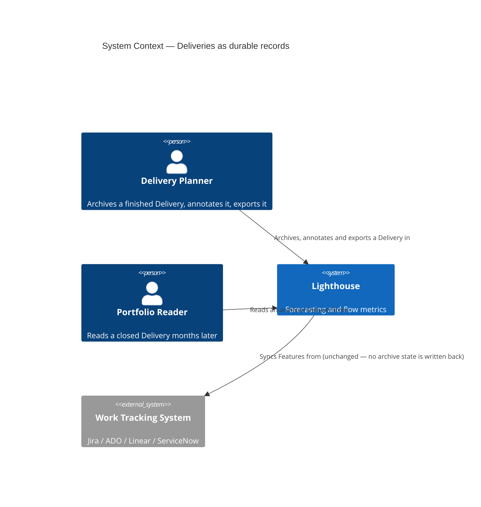
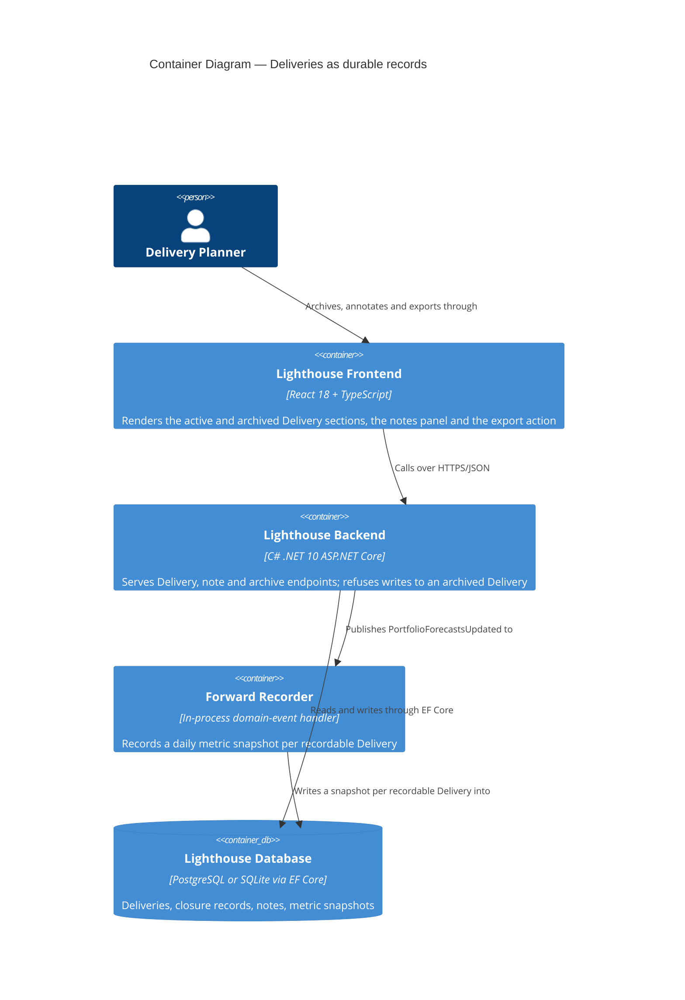
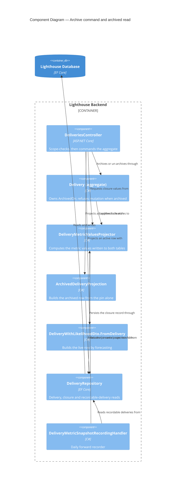

# Feature Delta — epic-5698-deliveries-as-durable-records

ADO Epic #5698 "Deliveries as Durable Records" (Planned, Size 3, tag `Community`, reported by Anoop,
forecasted delivery 2026-08-27). Children: #5640 Archive Deliveries, #5639 Notes on a Delivery,
#4309 Export Delivery Data. Successors: #5565 (date sync, OUT), #5792.

Wave DISCUSS run 2026-08-21. No DISCOVER or DIVERGE artifacts existed — this is a cold DISCUSS
grounded in an ADO read plus a code reality check (see Current-State Surface Inventory).

---

## Wave: DISCUSS / [REF] Persona IDs

| Persona | Role in this Epic |
|---|---|
| `delivery-forecaster` | Primary. Owns the leadership conversation about WHEN. Needs the record to survive the Delivery, and needs to get it out of Lighthouse into a status deck. |
| `delivery-lead-rte` | Primary for notes. Runs the review where "what happened to this one?" gets answered, weeks after the fact. |
| `product-owner` | Secondary. Reads a Delivery's notes to understand why a scope call was made. |
| `config-admin` | Not involved. Nothing here is configurable. |

---

## Wave: DISCUSS / [REF] JTBD One-Liners

| Job ID | One-liner |
|---|---|
| `job-forecaster-keep-a-finished-delivery-as-evidence` | When a Delivery finishes or is called off, I want to retire it without erasing it, so the Portfolio stays clean AND next quarter I can still show what we said and what we shipped. |
| `job-lead-annotate-what-happened-to-a-delivery` | When something notable happens to a live Delivery, I want to write a dated, attributed line against it, so the story survives the meeting it was told in. |
| `job-forecaster-share-a-delivery-outside-lighthouse` | When I am building a status report for people who do not open Lighthouse, I want the Delivery's headline numbers and its Feature grid in one paste, so I stop retyping a forecast into a slide. |

Full JTBD narrative (dimensions, four forces, opportunity scores) lives in `docs/product/jobs.yaml`.

---

## Wave: DISCUSS / [REF] Current-State Surface Inventory

Established by reading the code before writing requirements. Every decision below rests on these.

| # | Fact | Evidence |
|---|---|---|
| S1 | `Delivery` carries Name, Date, PortfolioId, a many-to-many `List<Feature>`, SelectionMode, RuleDefinitionJson. **No state, no lifecycle, no author, no soft-delete.** | `Models/Delivery.cs` |
| S2 | Every number on screen is **recomputed live** — `CalculateMetrics(today, blackoutPeriods, percentiles)` walks the live `Features` collection each read. Nothing about a Delivery's numbers is stored. | `Models/Delivery.cs:50` |
| S3 | Delete is a hard `Remove` + EF cascade to `DeliveryMetricSnapshot`. | `API/DeliveriesController.cs:207`, `Data/LighthouseAppContext.cs:438` |
| S4 | `DeliveryMetricSnapshot` **already stores, per day**: TotalWork, DoneWork, RemainingWork, EstimatedItemCount, LikelihoodPercentage, `WhenDistributionJson` (the 50/70/85/95 dates), `FeatureBreakdownJson` (the per-Feature rows), TargetDateAtSnapshot. Unique on `(DeliveryId, RecordedDay)`. | `Models/DeliveryMetricSnapshot.cs`, `LighthouseAppContext.cs:438-452` |
| S5 | Snapshots are written best-effort by `DeliveryMetricSnapshotRecordingHandler` on every `PortfolioForecastsUpdated`, for **every** Delivery in the Portfolio, unconditionally. | `Services/Implementation/DomainEvents/DeliveryMetricSnapshotRecordingHandler.cs` |
| S6 | A rule-based Delivery **re-matches its Features on every update** — `delivery.Features.Clear()` then re-add from the current Portfolio. | `DeliveriesController.cs:252` |
| S7 | CSV export + rich clipboard copy already exist, generic and premium-gated, inside `DataGridToolbar`. `DataGridBase` reads `licenseStatus.canUsePremiumFeatures` itself, so any grid opting in gets both for free. | `components/Common/DataGrid/DataGridToolbar.tsx`, `DataGridBase.tsx:51` |
| S8 | Only **one** grid opts in today: the Work Items dialog (`enableExport={true}`). `FeatureListDataGrid` does not forward the prop at all. | `WorkItemsDialog.tsx:300`, `FeatureListDataGrid/types.ts` |
| S9 | Identity plumbing exists — `UserProfile{Subject, SubjectClaimType, DisplayName, Email}` created on demand from the principal. **`GetOrCreateFromPrincipalAsync` returns `null` when no stable subject claim is present**, i.e. on an auth-off instance. | `Models/Auth/UserProfile.cs`, `Services/Implementation/Auth/CurrentUserProfileService.cs:18` |
| S10 | All Delivery writes gate on `RbacGuardRequirement.PortfolioWrite` with `ScopeIdRouteKey`; reads on `PortfolioRead`. | `DeliveriesController.cs:31,76` |
| S11 | The Delivery section already has a two-tab shell (`workItems` \| `metrics`), the metrics tab disabled below `MINIMUM_METRIC_SNAPSHOTS = 3`. | `DeliveryGrid/DeliverySection.tsx:475-497` |
| S12 | "Delivery"/"Deliveries" is a **configurable** Terminology key (`delivery`, default `Delivery`). Every UI string and doc line below renders the tenant's word. | `Services/Implementation/Seeding/TerminologySeeder.cs:143` |

∴ **S2 is the whole problem.** Archiving cannot be a boolean. A Delivery that stops being recomputed
has nothing to show; a Delivery that keeps being recomputed shows numbers derived from Features that
have since been re-synced, re-matched (S6) or removed. Either way the "durable record" is not durable.
**S4 is the whole answer** — the shape of the record already exists and is already written daily.

---

## Wave: DISCUSS / [REF] Locked Decisions

### D1 — An archived Delivery is backed by a pinned closure snapshot, not by live Features

**Decision** (user, 2026-08-21). Archiving sets `IsArchived` **and** pins exactly one closure record
reusing the `DeliveryMetricSnapshot` shape (S4). From that moment the Delivery's read path forks: an
archived Delivery renders header numbers and the Feature grid from the pinned record and never calls
`CalculateMetrics`.

**Why not a flag alone**: S2 + S6. A rule-based Delivery re-matches its Features on the next update,
so an archived Delivery's grid can empty itself with no user action. That is the failure the Epic
exists to prevent.

**Why not a new denormalised archive table**: `FeatureBreakdownJson` (S4) is already the serialised
Feature grid, written daily, and already read back by the metrics history endpoint. A second encoding
of the same rows is two things to keep in step.

**Consequence**: when the daily recorder has never run for this Delivery (archived the same day it was
created, or the handler's best-effort write failed — S5), the pin must be **computed at archive time**
rather than read from the newest row. The pin is therefore "snapshot for today, then freeze", not
"point at the last row".

### D2 — Closure outcome and forecast calibration stay a candidate

**Decision** (user, 2026-08-21). This Epic stores the record; it does not read a verdict off it. No
"at 85% we said 12 Sep, it landed 19 Sep" surface, and no actual-finish-date field.

**Accepted residual risk, stated plainly**: D1 gives calibration its *forecast* side for free — the
pinned record already carries `LikelihoodPercentage`, `WhenDistributionJson` and
`TargetDateAtSnapshot` as they stood at closure. What it does not carry is the *actual* — when the
work really finished. A later calibration Epic will need one more forward-only column and one more
migration. That cost is knowingly deferred; it is one column, not a redesign, precisely because D1
pins a snapshot rather than a flag.

### D3 — Archiving stops the machinery, it does not just hide the row

An archived Delivery is skipped by the snapshot recorder (S5) and by rule re-matching (S6). Both are
load-bearing, not tidiness: a recorder that keeps writing rows after closure makes the pinned record
one row among many with nothing marking it as *the* record, and a re-match after closure mutates the
Features behind a record that is supposed to be frozen.

### D4 — Archive and delete both stay

Archive is not a replacement for delete. A Delivery created by mistake should still be deleted
outright; a Delivery that ran its course should be archived. An archived Delivery can still be
deleted (permanently) and can be un-archived back to active.

### D5 — A note is authored by a person, and degrades honestly when there is nobody to name

Adding a note requires `PortfolioWrite` (S10). Editing or deleting a note is restricted to its
**author**. Attribution comes from `UserProfile` (S9).

On an auth-off instance `GetOrCreateFromPrincipalAsync` returns `null` (S9) — there is no author. Such
a note is stored unattributed and displayed as unattributed, and the author restriction cannot apply,
so anyone with `PortfolioWrite` may edit or delete it. The UI never invents an author name, and never
shows an empty "by —" that reads as a bug.

### D6 — Notes freeze when the Delivery is archived

An archived Delivery's notes are readable and exportable but not writable. Rationale: a frozen record
whose commentary can still be rewritten is not a record. A late observation belongs on the Portfolio
or on the next Delivery.

### D7 — Export is one artifact: header block, blank line, Feature grid — premium

**Decision** (user, 2026-08-21). One CSV file and one clipboard paste, both carrying the header
key-value block, a blank line, then the Feature grid with its currently visible columns. Premium-gated
exactly as the existing grid export is (S7) — same gate, same tooltip, same disabled affordance, no
new licensing concept.

Header block content, per ADO #4309 verbatim: Delivery Name, Delivery Date, Forecast 70%, Forecast
85%, Forecast 95%, Likelihood, Total Work Items, Completed Work Items, Remaining Work Items.

### D8 — Export reads what is on screen, including for an archived Delivery

The export is a read of the rendered grid (`getSortedRowIds` / `getVisibleColumns`, S7), so column
choices, ordering and sort carry into the file. For an archived Delivery that rendered grid is the
pinned record (D1), so the same action exports the frozen numbers with no separate code path.

### D9 — Nothing here syncs with a work tracking system

Explicitly out, per the Epic. Delivery dates in and forecasts out live in Epic #5565.

---

## Wave: DISCUSS / [REF] Scope Assessment

**PASS — right-sized.** Against the oversized heuristics:

- User stories: 5 (threshold >10) — under.
- Bounded contexts: 1 (Portfolio/Delivery) — under.
- Walking skeleton integration points: 0 new external integrations — under.
- Effort: 5 slices at ≤1 day each — under 2 weeks.
- Independent user outcomes that could ship separately: 3 (export / notes / archive) — this is the one
  signal that fires. It is answered by the slicing, not by a split: each of the three ships on its own
  day and delivers on its own, and they share exactly one thing (the header + grid shape, D7/D1).

No split proposed. ADO already models the three outcomes as separate children.

---

## Wave: DISCUSS / [REF] WS Strategy

**Strategy B — brownfield vertical slice, no walking skeleton.** Every surface this Epic touches
already exists end to end: the Delivery accordion, its tab shell (S11), the grid (S8), the export
toolbar (S7), the snapshot table (S4), the RBAC guard (S10) and the identity service (S9). There is no
unproven end-to-end path to prove. Slice 01 is deliberately the cheapest of the three so the first
day's work also validates the header + grid shape that Slice 05 later renders from the frozen record.

---

## Wave: DISCUSS / [REF] Driving Ports

| Surface | Kind | Slice |
|---|---|---|
| Delivery Feature grid toolbar → "Export to CSV" / "Copy to Clipboard" | UI action (existing toolbar, newly opted in) | 01 |
| `GET /api/latest/deliveries/{deliveryId}/notes` | HTTP | 02 |
| `POST /api/latest/deliveries/{deliveryId}/notes` | HTTP | 02 |
| Delivery section → "Notes" tab | UI action (third tab beside Work Items / Metrics, S11) | 02 |
| `PUT /api/latest/deliveries/{deliveryId}/notes/{noteId}` | HTTP | 03 |
| `DELETE /api/latest/deliveries/{deliveryId}/notes/{noteId}` | HTTP | 03 |
| `POST /api/latest/deliveries/{deliveryId}/archive` | HTTP | 04 |
| Delivery header → "Archive" action | UI action | 04 |
| Portfolio Deliveries → "Archived" section | UI surface | 04 |
| `POST /api/latest/deliveries/{deliveryId}/unarchive` | HTTP | 05 |

No CLI or MCP surface. The Lighthouse-Clients CLI and MCP server expose Portfolio and Team metrics,
not Delivery lifecycle — nothing in this Epic changes a contract they consume.

---

## Wave: DISCUSS / [REF] Pre-requisites

- None outside this repository. No new dependency, no new external system, no chart change, no new
  environment variable.
- One EF migration per supported database provider for the notes table (Slice 02) and one for the
  archive columns (Slice 04), generated via the existing `CreateMigration` script, additive-only.
- Premium licence fixture required to run the export tests and any `@screenshot` run that covers the
  export affordance.

---

## Wave: DISCUSS / [REF] Out of Scope

- **Delivery date sync with a work tracking system**, inbound or outbound — Epic #5565 (D9).
- **Closure outcome / forecast calibration** — actual finish date, "we said X, it landed Y" (D2).
- **Delivery owner / stakeholder** — an owner field, and notifications derived from it. Epic candidate.
- **Automatic notes on threshold crossing** — a system-written note when likelihood crosses a band.
  Epic candidate; cheap once notes exist, but it needs a decision on how a system note is attributed
  and whether it is deletable, which D5 does not settle.
- **Reusing an archived Delivery's data in another Delivery's forecast** — floated in #5640 as "may
  also use this data for other deliveries". No user job supports it yet.
- **Rich text, attachments, or @-mentions in notes.** Plain text.
- **Exporting the metrics history charts.** Export covers the header and the Feature grid only.
- **Archiving a Portfolio.** Only a Delivery archives.

---

## Wave: DISCUSS / [REF] User Stories

### US-01 — Export a Delivery's headline and Feature grid in one paste

`job_id: job-forecaster-share-a-delivery-outside-lighthouse` · ADO #4309 · Slice 01

As a Delivery Forecaster building a status report, I want the Delivery's headline numbers and its
Feature grid as one CSV file or one clipboard paste, so that the report is a paste rather than a
retyping exercise.

#### Elevator Pitch
Before: the forecaster reads the likelihood badge, the three forecast chips and every Feature row off
the screen and retypes them into a slide — the Work Items dialog exports, this grid does not.
After: open the Delivery, click **Copy to Clipboard** (or **Export to CSV**) on its Feature grid → sees
a header block (`Delivery,Q3 Platform` / `Date,2026-09-12` / `Forecast 70%,2026-09-05` / … /
`Remaining Work Items,48`), a blank line, then the Feature grid with the columns currently on screen.
Decision enabled: whether the numbers in front of leadership match the tool, without a transcription
step that can silently change one of them.

#### Acceptance Criteria
- AC-01.1 The Delivery's Feature grid shows the same two toolbar actions as the Work Items dialog:
  Copy to Clipboard and Export to CSV.
- AC-01.2 Both are disabled without a premium licence and carry the existing "Premium feature —
  Upgrade to use" tooltip. No new gate, no new copy.
- AC-01.3 With a premium licence, Export to CSV downloads one file whose first block is the nine
  header fields as `key,value` rows in the ADO-stated order, followed by one blank line, followed by
  the grid's header row and its data rows.
- AC-01.4 Copy to Clipboard writes the same content, tab-separated as `text/plain` and as an HTML
  table for `text/html`, so a paste into a spreadsheet lands in cells and a paste into a document
  lands as a table.
- AC-01.5 Only the columns currently visible on the grid are exported, in their current order and
  current sort — hiding a column removes it from the export.
- AC-01.6 A header value that is absent renders as an empty value, never as `null`, `undefined`,
  `NaN` or `0`. Specifically: a Delivery that cannot be forecast exports an empty Likelihood and empty
  Forecast 70/85/95 rows rather than a fabricated number.
- AC-01.7 A Delivery name containing a comma, a quote or a newline round-trips through the CSV
  unchanged when re-opened in a spreadsheet.
- AC-01.8 The header block's field labels honour the tenant's Terminology — a tenant that renamed
  Delivery to Milestone and Work Item to Ticket exports `Milestone,…` and `Total Tickets,…`.

---

### US-02 — Write a dated, attributed note against a Delivery

`job_id: job-lead-annotate-what-happened-to-a-delivery` · ADO #5639 · Slice 02

As a Delivery Lead / RTE watching a Delivery's likelihood fall, I want to write a short dated note
against it, so that the reason is attached to the Delivery rather than living in a chat thread nobody
will find in October.

#### Elevator Pitch
Before: the likelihood dropped from 85% to 61% in a week and the only record of why is a message in a
channel; six weeks later nobody can say whether it was a scope addition or two people off sick.
After: open the Delivery → **Notes** tab → type "Two Features added after the steering review" → Save
→ sees the note listed newest-first with its date and the author's name.
Decision enabled: whether a falling trend is a team problem or a scope problem — which changes whether
the answer is help or a scope cut.

#### Acceptance Criteria
- AC-02.1 The Delivery section shows a third tab beside Work Items and Metrics, labelled Notes, always
  enabled (unlike Metrics, it has no minimum-data condition).
- AC-02.2 The tab lists existing notes newest-first, each showing its text, its creation date and its
  author.
- AC-02.3 A user with write access to the Portfolio can add a note; a read-only user sees the list but
  no input, and the API refuses their `POST` with 403.
- AC-02.4 The note is attributed to the calling user's display name, resolved through the existing
  user profile service.
- AC-02.5 On an instance with authentication disabled the note is stored and shown **unattributed** —
  no author line, no placeholder name, no error.
- AC-02.6 Empty or whitespace-only notes are refused with a message on the field, and nothing is
  stored.
- AC-02.7 Notes are scoped to their Delivery: a note added to one Delivery never appears on another,
  including another Delivery in the same Portfolio.
- AC-02.8 Deleting a Delivery deletes its notes.
- AC-02.9 A note's text is rendered as plain text — content that looks like markup is displayed
  literally.

---

### US-03 — Correct or withdraw a note I wrote

`job_id: job-lead-annotate-what-happened-to-a-delivery` · ADO #5639 · Slice 03

As the author of a note, I want to fix a typo or withdraw a note I got wrong, so that the record does
not carry a mistake I can see and cannot touch.

#### Elevator Pitch
Before: a note that names the wrong week stays on the Delivery forever, and the only fix is a second
note contradicting the first.
After: hover the note you wrote → **Edit** → correct the text → Save → sees the corrected note, marked
as edited with the date of the edit.
Decision enabled: whether the note list can be trusted as written — an uncorrectable record gets read
sceptically or not at all.

#### Acceptance Criteria
- AC-03.1 Edit and Delete affordances appear only on notes the current user authored.
- AC-03.2 The API refuses an edit or delete of another user's note with 403, independently of the UI.
- AC-03.3 An edited note displays an edited marker with the edit date; the original creation date is
  still shown.
- AC-03.4 Deleting a note removes it from the list immediately and it does not return on reload.
- AC-03.5 On an instance with authentication disabled, notes carry no author, so any user with write
  access to the Portfolio may edit or delete any note — the affordances are shown to them.
- AC-03.6 An edit that empties the text is refused, exactly as AC-02.6 refuses an empty create.

---

### US-04 — Archive a finished Delivery instead of deleting it

`job_id: job-forecaster-keep-a-finished-delivery-as-evidence` · ADO #5640 · Slice 04

As a Delivery Forecaster whose Portfolio runs indefinitely, I want to retire a finished or cancelled
Delivery without erasing it, so that the active list stays about what is ahead while what already
happened is still there.

#### Elevator Pitch
Before: the only way to clear a finished Delivery off an ongoing Portfolio is Delete, which destroys
the forecast history with it (the snapshots cascade); so the board is either cluttered or amnesiac.
After: open the Delivery's header → **Archive** → confirm → sees it leave the active list and appear
under an **Archived** section, still showing the headline numbers it had on the day it was archived.
Decision enabled: whether the Portfolio's list of live commitments is actually a list of live
commitments — without paying for that clarity in lost history.

#### Acceptance Criteria
- AC-04.1 A Delivery's header offers an Archive action alongside Edit and Delete, available to a user
  with write access to the Portfolio and absent for a read-only user.
- AC-04.2 Archiving asks for confirmation, and the confirmation says what archiving does and does not
  do — it is reversible, it is not a delete.
- AC-04.3 On archive, exactly one closure record is pinned for that Delivery, carrying the headline
  numbers, the forecast distribution and the Feature grid as they stand at that moment.
- AC-04.4 The pin is correct even when no daily snapshot has ever been recorded for the Delivery —
  a Delivery created and archived the same day still archives with a complete record.
- AC-04.5 An archived Delivery leaves the active list and appears in an Archived section, collapsed by
  default, showing its name, its date and its headline numbers as pinned.
- AC-04.6 The daily snapshot recorder skips archived Deliveries — no further rows accumulate after
  closure.
- AC-04.7 A rule-based archived Delivery does not re-match its Features when the Portfolio next
  updates. Its Feature set is frozen.
- AC-04.8 Archiving a Delivery whose Features are subsequently removed from the Portfolio leaves the
  archived Delivery's numbers unchanged.
- AC-04.9 Delete still exists and still deletes permanently, for archived and active Deliveries alike.

---

### US-05 — Read an archived Delivery as the record it was

`job_id: job-forecaster-keep-a-finished-delivery-as-evidence` · ADO #5640 · Slice 05

As a Delivery Forecaster preparing a quarterly review, I want to open a Delivery archived two months
ago and see exactly what it looked like at closure, so that I am reporting what happened rather than
what today's data would have said about it.

#### Elevator Pitch
Before: even if an old Delivery were kept, its Feature grid would be recomputed from Features that
have since been re-synced, re-matched or deleted — the record would quietly rewrite itself.
After: expand an archived Delivery → sees its Feature grid rendered from the pinned closure record,
an "Archived on {date}" marker, its notes read-only, and the same **Export to CSV** action producing
the frozen numbers.
Decision enabled: whether a past commitment can be cited in a review at all — a record that moves is
not evidence.

#### Acceptance Criteria
- AC-05.1 Expanding an archived Delivery shows its Feature grid built from the pinned closure record,
  not from live Feature data.
- AC-05.2 The section is marked as archived, with the archive date shown.
- AC-05.3 The archived Delivery's numbers are identical before and after an unrelated Portfolio
  refresh that changes the underlying Features.
- AC-05.4 Export (US-01) works on an archived Delivery and produces the pinned numbers.
- AC-05.5 An archived Delivery's Notes tab is read-only: existing notes are listed, no add, no edit,
  no delete; the API refuses all three with a clear reason.
- AC-05.6 An archived Delivery can be un-archived, returns to the active list, resumes live
  recomputation and resumes daily snapshot recording.
- AC-05.7 Un-archiving does not destroy the pinned record — archiving again after an un-archive
  re-pins for the new closure moment, and a Delivery is never left with two competing pins.
- AC-05.8 Editing an archived Delivery's name, date, Features or rules is refused.

---

## Wave: DISCUSS / [REF] Story Map

**Backbone** (Delivery Forecaster / Delivery Lead, left to right in time):

```
Plan a Delivery → Watch it → Explain it → Close it → Cite it later → Share it
   (exists)      (exists)     US-02/03    US-04       US-05          US-01
```

| Slice | Story | Ships | Brief |
|---|---|---|---|
| 01 | US-01 | Export the Delivery header + Feature grid, premium-gated | `slices/slice-01-export-a-delivery-record.md` |
| 02 | US-02 | Add and read dated, attributed notes | `slices/slice-02-note-a-delivery-moment.md` |
| 03 | US-03 | Edit and delete your own note | `slices/slice-03-correct-your-own-note.md` |
| 04 | US-04 | Archive: pin the record, leave the active list, stop the machinery | `slices/slice-04-archive-a-finished-delivery.md` |
| 05 | US-05 | Read, export and un-archive from the frozen record | `slices/slice-05-read-an-archived-delivery.md` |

**Slice composition check** (hard gate): every slice contains at least one user-visible value story.
No slice is `@infrastructure`-only. The one piece of pure plumbing in the Epic — forwarding
`enableExport` through `FeatureListDataGrid` (S8) — is a precursor edit inside Slice 01, not a slice.

**Carpaccio taste tests**

| Test | Verdict |
|---|---|
| Any slice shipping 4+ new components? | No. Largest is Slice 04: one entity change, one endpoint, one confirmation dialog, one list section. |
| Every slice depends on a new abstraction? | No. Slices 01-03 add none. Slice 04 introduces the pinned record, and Slice 05 is the first to *read* it — the abstraction ships before it is relied upon. |
| Does any slice disprove a pre-commitment? | Yes, each — see the hypotheses in the briefs. Slice 04's is the one that can actually fail. |
| Any slice on synthetic data only? | No. All five run against demo data on a Portfolio with real Feature rows; Slice 05's acceptance explicitly requires a Portfolio refresh between archive and read (AC-05.3). |
| Any two slices identical but for scale? | 02 and 03 are close — both touch the same table and tab. Kept apart because 03's whole content is the authorship rule (D5), which is where the risk is; merging would hide it inside a CRUD slice. |

---

## Wave: DISCUSS / [REF] Prioritization

Ordered by learning leverage first, dependency second, dogfood cadence third.

| Order | Slice | Rationale |
|---|---|---|
| 1 | 01 Export | Cheapest, no schema, value on day one. Also fixes the header + grid shape (D7) that Slice 05 must later render from the frozen record — getting it wrong here is cheap, getting it wrong in Slice 05 is a migration. |
| 2 | 02 Notes: add + read | Independent of archive. Ships the schema and the attribution path; the auth-off degradation (D5/S9) is discovered here rather than inside the archive work. |
| 3 | 03 Notes: edit + delete own | Depends on 02. Isolates the authorship rule, which is the only contested permission decision in the Epic. |
| 4 | 04 Archive | Highest uncertainty and highest blast radius (recorder + rule re-matching, D3). Deliberately not first: by now the export exists to inspect a pinned record with, and notes exist so the "notes freeze" rule of Slice 05 has something to freeze. |
| 5 | 05 Read the archive | Depends on 04. The payoff slice, and the only one that can prove D1 was the right call — AC-05.3 is the whole Epic in one assertion. |

Dogfood moment for each slice: the Lighthouse team's own Portfolio on the dev instance, same day.

---

## Wave: DISCUSS / [REF] Outcome KPIs

| KPI | Target | Measurement |
|---|---|---|
| K1 — A Delivery's record survives Feature churn | 100% of archived Deliveries report identical headline numbers and Feature rows before and after a Portfolio refresh that changes their Features | Automated: AC-05.3 as an acceptance test that refreshes the Portfolio between two reads |
| K2 — Retiring a Delivery stops destroying its history | 0 rows of `DeliveryMetricSnapshot` lost per retired Delivery when the user chooses Archive | Automated: snapshot count unchanged across archive, in contrast to the cascade on delete |
| K3 — Closure stops costing storage | 0 new snapshot rows written for an archived Delivery per Portfolio update | Automated: AC-04.6 asserts the row count is flat across N updates |
| K4 — The status report is a paste | ≤2 user actions from an open Delivery to the full header + grid on the clipboard | Manual walkthrough, recorded at DELIVER |
| K5 — A note survives the meeting | ≥1 note present on ≥50% of the Lighthouse team's own Deliveries within 4 weeks of Slice 03 shipping | Dogfood observation on the team's own instance (no telemetry exists — see below) |

K5 is a dogfood signal, not an instrumented metric: Lighthouse has no phone-home, so cross-instance
adoption of notes is not measurable. Stated so the DEVOPS wave does not go looking for a counter to
build.

---

## Wave: DISCUSS / [REF] Definition of Done

1. All 5 user stories' acceptance criteria pass as automated tests.
2. Backend `dotnet build` zero warnings, `dotnet test` green.
3. Frontend `pnpm test` green, `pnpm build` zero errors and zero warnings, Biome clean on `./src`.
4. SonarQube Cloud gate green — no new issues of any severity.
5. Mutation testing per feature: Stryker.NET ≥80% kill rate on changed backend code; StrykerJS ≥80% on
   changed frontend code.
6. EF migrations generated through the `CreateMigration` script for every supported provider,
   additive-only.
7. Playwright walking-skeleton coverage run locally before commit; specs go through Page Objects.
8. Documentation updated at feature finalization, in the tenant's configurable Terminology, with
   per-feature screenshots regenerated.
9. ADO children #4309, #5639, #5640 transitioned; Epic #5698 taken no further than Resolved.

---

## Wave: DISCUSS / [REF] DoR Validation

| # | Item | Evidence |
|---|---|---|
| 1 | Business value articulated | Epic body + K1-K5; the value is that a Portfolio meant to run forever stops losing its own history. |
| 2 | User stories in LeanUX form with elevator pitches | US-01…US-05, each with Before / After / Decision-enabled. |
| 3 | Job traceability | 3 job IDs, all real, all added to `docs/product/jobs.yaml`. No `infrastructure-only` story. |
| 4 | Acceptance criteria testable | 39 ACs, each an observable assertion; none says "works correctly". |
| 5 | Dependencies identified | None external. Internal ordering in Prioritization. #5565 explicitly excluded. |
| 6 | Sized and sliced | 5 slices, each ≤1 day, each with a brief and a named hypothesis. |
| 7 | Technical feasibility confirmed | Surface Inventory S1-S12 — every seam read in the code before the decision that rests on it. |
| 8 | UX defined | Journey `retire-a-delivery-without-erasing-it` in `docs/product/journeys/epic-5698-deliveries-as-durable-records.yaml`, with emotional arc and error paths. |
| 9 | Non-functional constraints stated | Premium gating unchanged (D7); RBAC scopes unchanged (S10, D5); migrations additive-only; snapshot recorder cost strictly decreases (K3). |

Requirements completeness: 0.97. The 0.03 is D2's deferred actual-finish-date field — knowingly
deferred, cost quantified as one additive column.

---

## Wave: DISCUSS / [REF] Wave Decisions Summary

### Key Decisions
- [D1] Archived Delivery reads from a pinned closure snapshot reusing the `DeliveryMetricSnapshot`
  shape, never from live Features — because everything is recomputed live today (S2) and rule-based
  Deliveries re-match on update (S6).
- [D2] Forecast calibration stays a candidate; the forecast half is captured for free by D1, the
  actual-finish half costs one additive column later.
- [D3] Archiving stops the snapshot recorder and rule re-matching, not just the list rendering.
- [D4] Archive and delete coexist; archive is reversible.
- [D5] `PortfolioWrite` adds a note; the author alone edits or deletes it; auth-off stores it
  unattributed and lifts the author restriction.
- [D6] Notes freeze on archive.
- [D7] Export is one artifact — header block, blank line, Feature grid — premium-gated exactly as the
  existing grid export.
- [D8] Export reads the rendered grid, so it works unchanged on an archived Delivery.
- [D9] No work-tracking-system sync.

### Requirements Summary
- Primary jobs: retire a Delivery without erasing it; annotate what happened to it; get it out of
  Lighthouse in one paste.
- Walking skeleton scope: none — Strategy B, brownfield vertical slices.
- Feature type: user-facing (with backend persistence).

### Constraints Established
- Migrations additive-only, one per supported provider, via the `CreateMigration` script.
- No new RBAC requirement — everything reuses `PortfolioRead` / `PortfolioWrite`.
- No new licensing concept — export reuses the existing premium gate.
- Every user-visible string honours the configurable Terminology (S12).
- Snapshot storage per Delivery must not grow after closure (K3).

### Upstream Changes
None. There were no DISCOVER or DIVERGE artifacts to contradict.

---

## Wave: DISCUSS / [REF] SSOT Updates

- `docs/product/jobs.yaml` — 3 jobs added, `epic-5698-deliveries-as-durable-records` appended to
  `feature_context`.
- `docs/product/journeys/epic-5698-deliveries-as-durable-records.yaml` — created.
- `docs/product/personas/delivery-forecaster.yaml` — 2 jobs appended to `primary_jobs`.
- `docs/product/personas/delivery-lead-rte.yaml` — 1 job appended to `primary_jobs`.

---

## Wave: DISCUSS / [REF] Handoff

**To**: `nw-solution-architect` (DESIGN, full artifact set) and `nw-platform-architect` (DEVOPS,
Outcome KPIs only).

Open questions carried into DESIGN:

1. **Where the pin lives.** D1 fixes the *shape* (reuse `DeliveryMetricSnapshot`) but not the
   mechanism: a nullable `ClosureSnapshotId` on `Delivery`, an `IsClosure` flag on the snapshot row,
   or a separate one-row-per-Delivery table sharing the columns. AC-05.7's "never two competing pins"
   is the constraint that decides it.
2. **How the archived read path forks.** Whether `DeliveryWithLikelihoodDto.FromDelivery` gains an
   archived branch or a sibling factory reads the pinned record — the latter keeps `CalculateMetrics`
   off the archived path by construction, which is what AC-05.3 actually asserts.
3. **Where the header block is assembled for export.** The existing toolbar exports a grid and knows
   nothing about a header (S7). Either the toolbar grows an optional header-rows input, or the
   Delivery section supplies its own export action beside the grid's. D7's "one artifact" makes the
   first more likely; the reuse gate should decide explicitly.
4. **Whether the recorder skip is a query filter or a per-Delivery guard.** A global filter on
   archived Deliveries is tidier but silently changes every other consumer of
   `GetByPortfolioAsync` — including the active list itself, which is exactly the behaviour Slice 04
   wants and Slice 05 does not.

---

## Wave: DESIGN / [REF] DDD List

Continuing the DISCUSS numbering (D1–D9). Every decision below is design-level; none revisits a
locked DISCUSS decision.

| # | Decision | Rationale (one line) |
|---|---|---|
| D10 | The closure pin is a new table `DeliveryClosureRecord` whose **primary key is `DeliveryId`** | Two competing pins become unrepresentable, and the pin escapes the `(DeliveryId, RecordedDay)` unique key that causes every collision path DISCUSS named (ADR-160) |
| D11 | Archived state is `Delivery.ArchivedOn` (`DateOnly?`), `null` = active, separate from the pin | One column is both the state and the "Archived on {date}" marker, so "archived with no date" cannot exist; un-archive clears it and leaves the pin, which is AC-05.7 |
| D12 | `ArchivedOn` is `DateOnly`, sourced from `ILighthouseClock` | A `DateTime` column is in reach of the global `Properties<DateTime>()` UTC converter, which shifts a local-kind midnight onto the previous day on write |
| D13 | One projection, `DeliveryMetricValuesProjector`, writes both the daily snapshot and the closure record | D1's "one encoding" is only true if one piece of code produces both; the pin is computed at archive time so AC-04.4 holds for a Delivery the recorder never ran for |
| D14 | The archived read is `ArchivedDeliveryProjection.ToDto(ArchivedDeliveryIdentity, DeliveryClosureRecord)` on a **new type** | Withholding `Delivery`, `today` and `blackoutPeriods` makes `CalculateMetrics` uncallable; a new type is what makes the rule expressible as an ArchUnitNET assertion (ADR-161) |
| D15 | The wire contract stays `DeliveryWithLikelihoodDto`, gaining only `archivedOn` | Archived and active rows render in the same grid; a second wire type would fork the client model and Zod schema for no user-visible gain |
| D16 | `DataGridToolbar` gains `exportHeaderRows?: ReadonlyArray<{label, value}>`, threaded through `DataGridBase` and `FeatureListDataGrid` | D7's one artifact, with the toolbar staying Delivery-ignorant and inheriting the existing escaping, premium gate and visible-columns/sort reading (ADR-162) |
| D17 | The header block is emitted as leading rows of the **same** table/CSV, followed by a blank row | Pasting lands one contiguous block in cells, so the clipboard artifact matches the CSV's structure rather than being two things |
| D18 | `FeatureListDataGrid` forwards `enableExport`, `exportFileName` and `exportHeaderRows` | It forwards none of them today, so the Delivery grid has no export button at all — precursor edit inside Slice 01 |
| D19 | **No global EF query filter.** The recorder gets `IDeliveryRepository.GetRecordableByPortfolio` | A global filter would silently empty the archived section and would be the first query filter in the codebase; a narrowed port cannot yield the wrong rows (ADR-163) |
| D20 | `Delivery.Features` becomes `IReadOnlyList<Feature>`, written only via `Delivery.ReplaceFeatures` | Three call sites mutate the list today, one of them a background service with no HTTP surface; only an aggregate-level guard covers all three and any fourth |
| D21 | "Archived refuses writes" is an aggregate invariant throwing `DeliveryArchivedException`, mapped to **409 Conflict** by one exception filter | AC-05.5/AC-05.8 must not be bypassable "by a different endpoint"; 409 because the caller's rights are fine and the resource's state is not (ADR-164) |
| D22 | `DELETE` and `unarchive` are exempt by not being guarded mutators | AC-04.9 keeps hard delete on an archived Delivery; the exemption is an absence, not a special case inside a shared check |
| D23 | New entity `DeliveryNote { Id, DeliveryId, Text, CreatedOn, LastEditedOn, AuthorUserProfileId, AuthorDisplayName }`, cascade-deleted with the Delivery | AC-02.8, matching the `DeliveryMetricSnapshot` cascade convention |
| D24 | Authorship is stored as **both** a nullable FK (`ON DELETE SET NULL`) and the display name captured at write time | The FK is what authorisation compares; the captured name is what renders, because a durable record must not silently re-label itself when someone is renamed or removed (ADR-165) |
| D25 | The "may I modify this note" predicate is **two explicit branches**, never `note.AuthorUserProfileId == current?.Id` | The naive equality grants a profile-less caller edit rights over an attributed note via `null == null`, and reads as correct — this is a live bug trap, not a style preference |
| D26 | The six new `{deliveryId}`-rooted endpoints use the **in-action** RBAC idiom, not `[RbacGuard]` | `RbacGuardAttribute` resolves scope from a route value only, and these routes carry no `portfolioId`; this is what `UpdateDelivery`/`DeleteDelivery` already do via `GetPortfolioId` + `CanSatisfyRequirementAsync` |
| D27 | Notes live on a new `DeliveryNotesController` | A distinct REST resource with its own per-row authorisation rule; folding six actions plus their helpers into a 338-line controller that already carries six private helpers pushes it toward the S107/maintainability rules the Sonar gate enforces |
| D28 | No `DeliveryArchived` domain event | It would be a second source of truth for a fact `ArchivedOn` already carries; archiving is a synchronous command, and the pin plus the state are written in one `SaveChanges` |
| D29 | `widgetFetchRequirements` is **not** declared for the notes panel | That mechanism belongs to the MetricsView widget/category gate; the notes panel is a tab inside `DeliverySection`, not a metrics widget — stated explicitly rather than skipped |

## Wave: DESIGN / [REF] Component Decomposition

| Component | File | Change |
|---|---|---|
| `Delivery` | `Lighthouse.Backend/Lighthouse.Backend/Models/Delivery.cs` | MODIFIED |
| `DeliveryClosureRecord` | `Lighthouse.Backend/Lighthouse.Backend/Models/DeliveryClosureRecord.cs` | NEW |
| `DeliveryNote` | `Lighthouse.Backend/Lighthouse.Backend/Models/DeliveryNote.cs` | NEW |
| `DeliveryArchivedException` | `Lighthouse.Backend/Lighthouse.Backend/Models/DeliveryArchivedException.cs` | NEW |
| `ArchivedDeliveryIdentity` | `Lighthouse.Backend/Lighthouse.Backend/API/DTO/Archived/ArchivedDeliveryIdentity.cs` | NEW |
| `ArchivedDeliveryProjection` | `Lighthouse.Backend/Lighthouse.Backend/API/DTO/Archived/ArchivedDeliveryProjection.cs` | NEW |
| `DeliveryWithLikelihoodDto` | `Lighthouse.Backend/Lighthouse.Backend/API/DTO/DeliveryWithLikelihoodDto.cs` | MODIFIED (one field; `FromDelivery` untouched) |
| `DeliveryNoteDto` | `Lighthouse.Backend/Lighthouse.Backend/API/DTO/DeliveryNoteDto.cs` | NEW |
| `DeliveriesController` | `Lighthouse.Backend/Lighthouse.Backend/API/DeliveriesController.cs` | MODIFIED |
| `DeliveryNotesController` | `Lighthouse.Backend/Lighthouse.Backend/API/DeliveryNotesController.cs` | NEW |
| `DeliveryArchivedExceptionFilter` | `Lighthouse.Backend/Lighthouse.Backend/API/Filters/DeliveryArchivedExceptionFilter.cs` | NEW |
| `IDeliveryRepository` | `Lighthouse.Backend/Lighthouse.Backend/Services/Interfaces/Repositories/IDeliveryRepository.cs` | MODIFIED |
| `DeliveryRepository` | `Lighthouse.Backend/Lighthouse.Backend/Services/Implementation/Repositories/DeliveryRepository.cs` | MODIFIED |
| `DeliveryMetricValuesProjector` | `Lighthouse.Backend/Lighthouse.Backend/Services/Implementation/DeliveryMetricValuesProjector.cs` | NEW |
| `DeliveryMetricSnapshotRecordingHandler` | `Lighthouse.Backend/Lighthouse.Backend/Services/Implementation/DomainEvents/DeliveryMetricSnapshotRecordingHandler.cs` | MODIFIED |
| `DeliveryRuleService` | `Lighthouse.Backend/Lighthouse.Backend/Services/Implementation/DeliveryRuleService.cs` | MODIFIED (call `ReplaceFeatures`; no filter added) |
| `LighthouseAppContext` | `Lighthouse.Backend/Lighthouse.Backend/Data/LighthouseAppContext.cs` | MODIFIED |
| Sqlite migration | `Lighthouse.Backend/Lighthouse.Migrations.Sqlite/Migrations/` | NEW (via `CreateMigration`) |
| Postgres migration | `Lighthouse.Backend/Lighthouse.Migrations.Postgres/Migrations/` | NEW (via `CreateMigration`) |
| `DataGridToolbar` | `Lighthouse.Frontend/src/components/Common/DataGrid/DataGridToolbar.tsx` | MODIFIED |
| `DataGridBase` | `Lighthouse.Frontend/src/components/Common/DataGrid/DataGridBase.tsx` | MODIFIED |
| DataGrid types | `Lighthouse.Frontend/src/components/Common/DataGrid/types.ts` | MODIFIED |
| `FeatureListDataGrid` | `Lighthouse.Frontend/src/components/Common/FeatureListDataGrid/` | MODIFIED (forwards export props) |
| `DeliverySection` | `Lighthouse.Frontend/src/.../DeliveryGrid/DeliverySection.tsx` | MODIFIED |
| `DeliveryNotesPanel` | `Lighthouse.Frontend/src/.../DeliveryGrid/DeliveryNotesPanel.tsx` | NEW |
| Delivery client model + Zod schema | `Lighthouse.Frontend/src/models/` | MODIFIED (`archivedOn`) + NEW (note schema) |
| Delivery API service | `Lighthouse.Frontend/src/services/Api/` | MODIFIED (notes, archive, unarchive) |

## Wave: DESIGN / [REF] Driving Ports

Reconciled against the DISCUSS Driving Ports table: **the six routes are unchanged**; only the
enforcement mechanism is corrected (see *Changed Assumptions*).

| Method | Route | Requirement | Enforcement | Slice |
|---|---|---|---|---|
| GET | `/api/latest/deliveries/{deliveryId}/notes` | `PortfolioRead` | in-action `GetPortfolioId` + `CanSatisfyRequirementAsync` | 02 |
| POST | `/api/latest/deliveries/{deliveryId}/notes` | `PortfolioWrite` | in-action; refused when archived (409) | 02 |
| PUT | `/api/latest/deliveries/{deliveryId}/notes/{noteId}` | `PortfolioWrite` + author predicate | in-action; refused when archived (409) | 03 |
| DELETE | `/api/latest/deliveries/{deliveryId}/notes/{noteId}` | `PortfolioWrite` + author predicate | in-action; refused when archived (409) | 03 |
| POST | `/api/latest/deliveries/{deliveryId}/archive` | `PortfolioWrite` | in-action | 04 |
| POST | `/api/latest/deliveries/{deliveryId}/unarchive` | `PortfolioWrite` | in-action; exempt from the archived refusal | 05 |

Existing routes whose behaviour changes: `GET /deliveries/portfolio/{portfolioId}` returns
`archivedOn` and both sets; `PUT /deliveries/{deliveryId}` now returns 409 on an archived Delivery;
`DELETE /deliveries/{deliveryId}` is unchanged and still succeeds (AC-04.9).

## Wave: DESIGN / [REF] Driven Ports and Adapters

| Driven port | Adapter | Status |
|---|---|---|
| `IDeliveryRepository` (+ `GetRecordableByPortfolio`, closure + note reads) | `DeliveryRepository` over `LighthouseAppContext` | EXTEND |
| `ILighthouseClock` | existing clock adapter | REUSED AS IS — the only source of `ArchivedOn` |
| `ICurrentUserProfileService` | `CurrentUserProfileService` | REUSED AS IS — its `null` return is the designed-for input |
| `IRbacAdministrationService` | `RbacAdministrationService` | REUSED AS IS |
| Domain-event bus (`PortfolioForecastsUpdated`) | in-process dispatcher | REUSED AS IS — no new event |

No new outbound integration. No work-tracking-system write-back (D9). **No external API is
introduced, so no consumer-driven contract tests are owed for this epic** — stated explicitly rather
than skipped.

## Wave: DESIGN / [REF] Technology Choices

| Choice | Version | Note |
|---|---|---|
| .NET / ASP.NET Core | 10 | existing |
| EF Core | 10, Sqlite + Postgres providers only | two additive migrations via the `CreateMigration` script, never `dotnet ef migrations add` |
| NUnit / Moq / EF InMemory | 4.6 / current | existing; migration verification must run on a real provider — InMemory skips migrations |
| ArchUnitNET | current | already in `Lighthouse.Backend.Tests/Architecture/` |
| React / TypeScript | 18 / current | existing |
| MUI-X DataGrid | current | export path already exists in `DataGridToolbar` |
| Vitest + RTL, Playwright | current | existing |

**No new runtime dependency, backend or frontend.** Everything is OSS under the licences already in
the project.

## Wave: DESIGN / [REF] Decisions Table

| Decision | Verdict |
|---|---|
| DDD-D10 | Closure pin = `DeliveryClosureRecord`, PK `DeliveryId` |
| DDD-D11 | `Delivery.ArchivedOn` (`DateOnly?`) is the archived-state fact |
| DDD-D12 | `ArchivedOn` is `DateOnly` from `ILighthouseClock` |
| DDD-D13 | One `DeliveryMetricValuesProjector` writes both tables |
| DDD-D14 | `ArchivedDeliveryProjection.ToDto` on a new type, forecast inputs withheld |
| DDD-D15 | Wire contract stays `DeliveryWithLikelihoodDto` + `archivedOn` |
| DDD-D16 | `exportHeaderRows` on `DataGridToolbar` |
| DDD-D17 | Header rows lead the same table/CSV, blank row, then grid |
| DDD-D18 | `FeatureListDataGrid` forwards the export props |
| DDD-D19 | No global query filter; `GetRecordableByPortfolio` |
| DDD-D20 | `Features` is `IReadOnlyList<Feature>`, written via `ReplaceFeatures` |
| DDD-D21 | Archived write refusal is an aggregate invariant → 409 |
| DDD-D22 | Delete and un-archive exempt |
| DDD-D23 | `DeliveryNote` entity, cascade with Delivery |
| DDD-D24 | Author FK (`SET NULL`) + captured display name |
| DDD-D25 | Authorship predicate is two explicit branches |
| DDD-D26 | In-action RBAC idiom for `{deliveryId}` routes |
| DDD-D27 | Separate `DeliveryNotesController` |
| DDD-D28 | No `DeliveryArchived` domain event |
| DDD-D29 | No `widgetFetchRequirements` for the notes panel |

## Wave: DESIGN / [REF] Reuse Analysis

Default is EXTEND. CREATE NEW requires evidence that extending is impossible or creates unacceptable
coupling.

| Existing Component | File | Overlap | Decision | Justification |
|---|---|---|---|---|
| `DeliveryMetricSnapshot` | `Models/DeliveryMetricSnapshot.cs` | Holds exactly the value shape the pin needs | **REUSE AS SHAPE** (not extended) | The pin must be one-per-Delivery; this table is keyed `(DeliveryId, RecordedDay)`. Adding an `IsClosure` flag degrades the invariant from a key to a rule and still collides on that key. Same columns, same encoders, different table (ADR-160) |
| `DeliveryMetricsHistoryDto.ParseFeatureBreakdown` | `API/DTO/DeliveryMetricsHistoryDto.cs` | Parses `FeatureBreakdownJson` into per-Feature rows | **REUSE AS IS** | Exactly the archived read's need; reusing it is what makes D1's "one encoding" true |
| `DeliveryMetricSnapshotRecordingHandler` | `Services/Implementation/DomainEvents/` | Computes the daily metric values | **EXTEND** | Its projection is extracted into `DeliveryMetricValuesProjector` so archive-time and record-time produce identical values; the handler keeps its event hook and swaps its delivery source |
| `DeliveriesController` | `API/DeliveriesController.cs` | Delivery CRUD, the read the archived list joins | **EXTEND** | Archive/un-archive are Delivery lifecycle operations on the Delivery resource; they belong here |
| `DeliveryWithLikelihoodDto` | `API/DTO/DeliveryWithLikelihoodDto.cs` | The row contract for both active and archived | **EXTEND** (one field) | `FromDelivery` is deliberately left untouched. The archived factory is a separate type because the "cannot reach a Feature" rule is not expressible by ArchUnitNET if it sits on this class, which legitimately depends on `Feature` for the live path |
| `DataGridToolbar` | `components/Common/DataGrid/DataGridToolbar.tsx` | Owns both export actions, escaping and the premium gate | **EXTEND** | One optional generic prop. A Delivery-owned export action would duplicate `getGridData`, the escaping and the gate, and would yield two buttons — the opposite of D7 |
| `DataGridBase` | `components/Common/DataGrid/DataGridBase.tsx` | Threads toolbar props | **EXTEND** | Pass-through only |
| `FeatureListDataGrid` | `components/Common/FeatureListDataGrid/` | The Delivery Feature grid | **EXTEND** | Currently forwards no export props at all; forwarding them is strictly additive and unblocks other consumers |
| `DeliverySection` | `.../DeliveryGrid/DeliverySection.tsx` | The two-tab shell the notes tab and archived marker join | **EXTEND** | The tab shell already exists; a third tab and a marker are additive |
| `CurrentUserProfileService` | `Services/Implementation/Auth/CurrentUserProfileService.cs` | Resolves the acting profile, `null` when no stable subject claim | **REUSE AS IS** | Its `null` return is the input D5 is written around. Changing it to synthesise an identity would manufacture authorship |
| Metrics-history endpoint | `DeliveriesController.GetMetricsHistory` | Reads the same snapshot shape | **REUSE AS IS — no change** | It reads the daily series; the archived read reads the pin. Overlapping shape, different question. Archiving does not alter the series, so this endpoint keeps working unchanged for an archived Delivery |
| `IDeliveryRepository` | `Services/Interfaces/Repositories/IDeliveryRepository.cs` | Delivery reads incl. `GetPortfolioId` | **EXTEND** | `GetPortfolioId` already exists and is the seam the six new endpoints scope-check through |
| `DeliveryRuleService` | `Services/Implementation/DeliveryRuleService.cs` | Re-matches rule-based Deliveries | **EXTEND** (minimal) | Keeps its public surface (pinned by an existing reflection test); it calls `ReplaceFeatures`, which refuses on its own |
| `Delivery` | `Models/Delivery.cs` | The aggregate | **EXTEND** | Encapsulating mutation is what makes the archived rule cover the background write path |
| `RbacGuardAttribute` | `Services/Implementation/Authorization/RbacGuardAttribute.cs` | Declarative scope check | **REUSE AS IS — not extended** | Considered adding a delivery-id scope resolver. Rejected for this epic: it changes an auth-critical filter for six endpoints when the in-action idiom already exists and is already used by three sibling endpoints. Recorded as an open question below |
| `DeliveryNote` | — | — | **CREATE NEW** | No existing entity carries free text against a Delivery |
| `DeliveryClosureRecord` | — | — | **CREATE NEW** | No existing table can hold a one-per-Delivery pin without inheriting the day key that causes the collisions |
| `ArchivedDeliveryProjection` / `ArchivedDeliveryIdentity` | — | — | **CREATE NEW** | The enforcement in ADR-161 point 3 is not expressible if this code lives on the existing DTO type |
| `DeliveryMetricValuesProjector` | — | — | **CREATE NEW** | Extracted from the recording handler so two writers cannot drift; this is a move, not a duplication |
| `DeliveryNotesController` | — | — | **CREATE NEW** | Distinct REST resource with its own per-row authorisation rule |
| `DeliveryNotesPanel` | — | — | **CREATE NEW** | No existing component renders an editable note list |

## Wave: DESIGN / [REF] C4 — System Context (L1)



## Wave: DESIGN / [REF] C4 — Container (L2)



## Wave: DESIGN / [REF] C4 — Component (L3, the archive and archived-read subsystem)

Included because this subsystem is where the epic's central guarantee lives and it carries more than
five collaborating components.



Note what the diagram does **not** contain: an arrow from `ArchivedDeliveryProjection` to the
aggregate, to the forecast service, or to any Feature. That absence is the design.

## Wave: DESIGN / [REF] Per-Slice Impact

| Slice | Components touched |
|---|---|
| **01 — Export a Delivery record** | `DataGridToolbar`, `DataGridBase`, DataGrid `types.ts`, `FeatureListDataGrid` (precursor: forwards `enableExport`/`exportFileName`), `DeliverySection` (assembles header rows through Terminology). Frontend only; no backend, no migration |
| **02 — Note a Delivery moment** | NEW `DeliveryNote`, `DeliveryNoteDto`, `DeliveryNotesController`, `DeliveryNotesPanel`; MODIFIED `LighthouseAppContext` (DbSet + cascade), `IDeliveryRepository`/`DeliveryRepository`, `DeliverySection` (notes tab), client model + Zod schema + API service. First migration pair |
| **03 — Correct your own note** | MODIFIED `DeliveryNote` (the authorship predicate, `LastEditedOn`), `DeliveryNotesController` (PUT/DELETE), `DeliveryNotesPanel`. No schema change beyond `LastEditedOn` if not already added in 02 |
| **04 — Archive a finished Delivery** | NEW `DeliveryClosureRecord`, `DeliveryMetricValuesProjector`, `DeliveryArchivedException`, `DeliveryArchivedExceptionFilter`; MODIFIED `Delivery` (`ArchivedOn`, encapsulated `Features`, `Archive`/`Unarchive`/`ReplaceFeatures`), `DeliveriesController` (archive route, active/archived split), `IDeliveryRepository` (`GetRecordableByPortfolio`), `DeliveryMetricSnapshotRecordingHandler`, `DeliveryRuleService`, `LighthouseAppContext`. Second migration pair. **The planned 1-hour SPIKE is no longer about the unique-key collision — that collision does not exist under D10 — so re-scope it to verifying the additive migration on a real provider** |
| **05 — Read an archived Delivery** | NEW `ArchivedDeliveryIdentity`, `ArchivedDeliveryProjection`; MODIFIED `DeliveryWithLikelihoodDto` (`archivedOn`), `DeliveriesController` (un-archive route, projection choice), `DeliverySection` (archived marker, read-only notes, export unchanged), client model. No migration |

## Wave: DESIGN / [REF] Open Questions

Deliberately deferred; none blocks DISTILL.

1. **Should `RbacGuardAttribute` gain a delivery-id scope resolver?** Out of scope here — the
   in-action idiom already exists and is used by three sibling endpoints. But it would let the six new
   routes be declarative and reflection-testable. Worth its own story; recorded so the choice is
   visible rather than inherited.
2. **Note text limits and formatting.** Max length, whether markdown renders, and whether an empty
   note is refused at the API or only in the UI. DISTILL should pin these as ACs.
3. **Ordering and paging of notes.** Newest-first is assumed; no paging is designed. If a Delivery
   can accumulate hundreds of notes this needs revisiting.
4. **Whether the archived section paginates.** An instance with years of archived Deliveries will
   render a long list. Deferred until someone has one.
5. **`MetricSnapshotCount` on an archived row.** Carried in `ArchivedDeliveryIdentity` so the metrics
   tab still shows its history, but whether the metrics tab should be reachable at all on an archived
   Delivery is a UX call DISTILL should settle.

## Wave: DESIGN / [REF] Changed Assumptions

One DISCUSS assumption is corrected. Nothing else changed; no user story and no acceptance criterion
is altered by this design.

**Original (verbatim), `feature-delta.md:50`, *Current-State Surface Inventory*:**

> | S10 | All Delivery writes gate on `RbacGuardRequirement.PortfolioWrite` with `ScopeIdRouteKey`; reads on `PortfolioRead`. | `DeliveriesController.cs:31,76` |

**Replacement:**

> | S10 | All Delivery writes gate on `PortfolioWrite` and reads on `PortfolioRead`, but by **two different mechanisms**. The `portfolio/{portfolioId}` routes use the `[RbacGuard(..., ScopeIdRouteKey = "portfolioId")]` attribute (`DeliveriesController.cs:31,76` — these are the only two `[RbacGuard]` attributes in the file). The `{deliveryId}`-rooted routes (`GetMetricsHistory`, `UpdateDelivery`, `DeleteDelivery`) carry **no** attribute; they resolve the scope in-action via `IDeliveryRepository.GetPortfolioId(deliveryId)` and call `IRbacAdministrationService.CanSatisfyRequirementAsync`, returning `Forbid()`. | `DeliveriesController.cs:31,76` (attribute); the `{deliveryId}` actions (in-action) |

**Rationale.** `RbacGuardAttribute` exposes `Requirement`, `ScopeIdRouteKey` and `Check`, and resolves
the scope id from a **route value** only — there is no resolver hook. A `{deliveryId}` route carries
no `portfolioId`, so the attribute structurally cannot serve one. The global fallback policy is
`RequireAuthenticatedUser` (`Program.cs:807-808`), which is authentication, not scope. Taking S10 at
face value would have produced six new endpoints written with `ScopeIdRouteKey = "portfolioId"` on a
route that has no such value — silently unscoped, authenticated-only, and passing every test that only
checks that a logged-in caller succeeds.

**Consequential correction to a slice brief** (recorded in
`design/upstream-changes.md`): `slices/slice-02-note-a-delivery-moment.md:12` says the notes endpoints
are gated "with `ScopeIdRouteKey`, matching the existing Delivery endpoints". The intent is right and
the requirement is unchanged; the named mechanism is wrong for a `{deliveryId}` route.

## Wave: DESIGN / [REF] Wave Decisions Summary

### Key Decisions

The four open questions DISCUSS handed DESIGN are answered as D10 (pin location), D14 (archived read
fork), D16 (export header placement) and D19 (recorder exclusion). The three the ACs demanded but
DISCUSS left open are answered as D23 (notes entity and cascade), D24/D25 (authorship storage and the
absent-profile predicate) and D21 (where the archived-write refusal is enforced).

### Architecture Summary

Ports-and-adapters, unchanged; no new architectural style, no new runtime dependency, no new external
integration. The epic's design weight is a single idea applied at four seams: an archived Delivery
must be **unable** to read or write live data rather than instructed not to. Hence a pin in its own
table whose primary key forbids a second pin; a projection whose signature withholds the forecast
inputs; a recorder whose port cannot yield an archived row; and an aggregate that refuses mutation so
the rule reaches the background write path no controller can see.

### Reuse Analysis

12 EXTEND / REUSE against 6 CREATE NEW. Four of the six new components are new persisted concepts
with no existing home. The two needing real justification are `ArchivedDeliveryProjection` — a new
type precisely because the "cannot see live Features" rule is not expressible as an architecture test
otherwise — and `DeliveryMetricValuesProjector`, which is an extraction from the recording handler so
the two writers of the metric shape cannot drift, not a duplication.

### Technology Stack

Unchanged: .NET 10, EF Core 10 over SQLite and PostgreSQL, React 18 + TypeScript, MUI-X, NUnit 4.6 +
Moq + ArchUnitNET, Vitest + RTL, Playwright. Two additive migrations, one per provider, via
`CreateMigration`.

### Constraints Established

- `Delivery.Features` is read-only outside the aggregate; a fourth Feature write path inherits the
  archived refusal automatically.
- Any new `{deliveryId}`-rooted route must use the in-action RBAC idiom; reaching for `[RbacGuard]`
  yields an unguarded endpoint.
- Persisted day keys on the new tables are `DateOnly` and come from `ILighthouseClock`.
- Migrations are expand-only and generated by the `CreateMigration` script; verification runs on a
  real provider because InMemory skips migrations.
- Every user-visible string in the export header, the notes panel and the archived marker resolves
  through the instance's configurable Terminology.

### Upstream Changes

One: S10's mechanism, corrected above, with a consequential note against slice 02's brief. No user
story and no acceptance criterion changes. Written to
`docs/feature/epic-5698-deliveries-as-durable-records/design/upstream-changes.md`.

## Wave: DESIGN / [REF] Post-Review Revisions

Peer review returned 3 critical and 9 high findings. One critical was a real defect and is fixed
below; the other two were misreadings of the design and are answered with evidence rather than
accepted. Four decisions are added (D30–D33). The reviewer worked from an inlined summary because the
context layer would not serve it the markdown, so a second review pass would inherit the same
blindness and is not run.

### Accepted — new decisions

| # | Decision | Rationale |
|---|---|---|
| D30 | **The archive/un-archive writes bump `Delivery`'s concurrency token, and the reload-retry path must re-evaluate `ArchivedOn` after reloading and drop the mutation rather than replay it** | The guard reads `ArchivedOn` from the **in-memory** aggregate, so a caller holding a Delivery loaded before the archive carries a stale `null`. Real interleaving: `PortfolioUpdater` loads the Deliveries → a user archives one → `DeliveryRuleService.RecomputeRuleBasedDeliveries` mutates the copy it already holds. The token makes the stale save fail; a blanket reload-retry that replays the mutation would defeat it. A background recompute that loses this race is a **no-op, not a retry** (ADR-164, new *Concurrency* section) |
| D31 | Deleting an archived Delivery destroys its closure record and snapshots, by cascade, deliberately | AC-04.9 keeps delete available. Archive is the alternative to deletion, not protection against it. Called out because "archived" and "safe from deletion" are easy to conflate — **the UI wording must not imply the second** |
| D32 | No backfill. Existing Deliveries take `ArchivedOn = null`; no closure record is created for them | The archived read only runs when `ArchivedOn is not null`, so an absent closure record is never dereferenced. Release-time assumption stated explicitly: no production Delivery is archived at release, because the capability does not exist until this ships |
| D33 | On an auth-off instance **both** author fields are written `null` — no placeholder, no synthetic "Unknown" author | A fabricated name is the dishonesty D5 rules out. The note renders unattributed and any writer may edit it, which is AC-02.5 and AC-03.5 together |

Additions to the enforcement matrix: an integration test interleaving *load-for-recompute → archive →
attempt recompute save*, asserting the Feature set is unchanged and no exception escapes to the
background service's caller (D30). The route reflection test is extended to assert every
`{deliveryId}`-rooted action performs a scope check, which recovers the discoverability that the
in-action idiom costs relative to `[RbacGuard]`.

### Rejected — with reasons

| Finding | Verdict |
|---|---|
| *Critical: "AC-04.4 contradiction — the recorder creates the pin, but may never run"* | **Misreading.** D13 and ADR-160 point 3 already state the pin is computed **at archive time** by a projector *shared* with the recorder; the L3 diagram shows `DeliveriesController → DeliveryMetricValuesProjector`. The recorder never creates a pin. No change beyond the wording already present |
| *Critical: "archived read freshness is undefined — snapshot may be re-computed"* | **Misreading.** The pin is written once and never recomputed; the recorder cannot touch an archived Delivery (D19/AC-04.6) and the archived projection has no forecast inputs (D14). The reviewer's proposed test — archive, let the recorder run repeatedly, re-read, expect the pinned values — is a good test and is already the *read-refresh-read byte-identical* case in the enforcement matrix |
| *High: "collapse `DeliveryClosureRecord` into an `IsClosure` bool"* | **Rejected.** The suggestion is self-contradictory: a bool **on the snapshot table** inherits the `(DeliveryId, RecordedDay)` key, which is the entire source of the collisions; a bool on a row keyed by `DeliveryId` **is** this table. The alternatives are argued in ADR-160 |
| *High: "ArchUnitNET rule is unenforceable — tests can instantiate the projection"* | **Rejected — wrong direction.** The rule constrains what `ArchivedDeliveryProjection` *depends on*, not who calls it. Instantiating it in a test is harmless precisely because it cannot reach a Feature |
| *High: "the route reflection test is brittle; a new mutating endpoint breaks it"* | **Rejected — that is the purpose.** A new mutating endpoint *should* fail until it is classified as refusing-or-exempt. The codebase already runs this pattern (`AppSettingsControllerTest`, `API/Security/S4_DeliveriesDeleteGuardInversionTests`) |
| *High: "`GetRecordableByPortfolio` fragments the data-access interface"* | **Rejected.** The narrowing is the mechanism (ADR-163). A shared method plus a filter the recorder must remember is the option that lets the recorder be wrong |
| *Medium: "add a placeholder `AuthorDisplayName` on auth-off"* | **Rejected** — see D33 |

### Still open after review

The reviewer's observability point is fair and not designed here: archive/un-archive are not
instrumented, and a 409 refusal emits no metric. Added to *Open Questions* as a DEVOPS-wave concern
rather than invented now.
