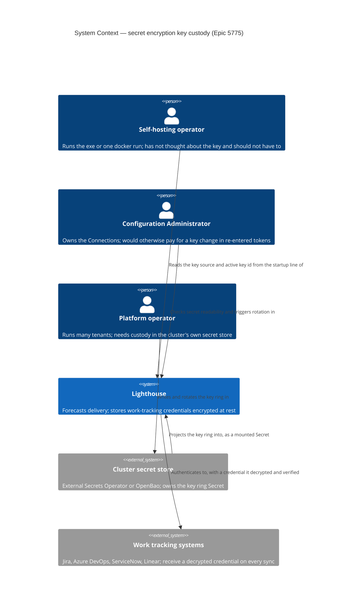
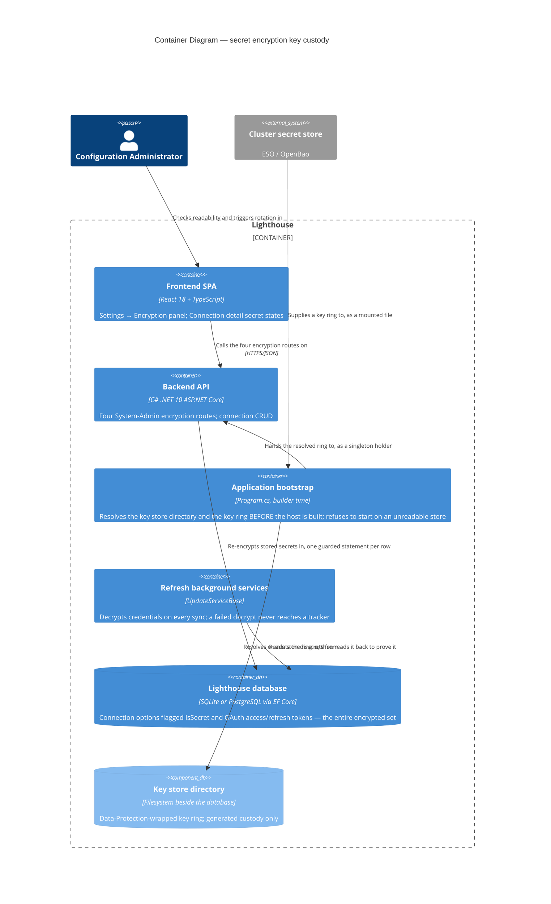
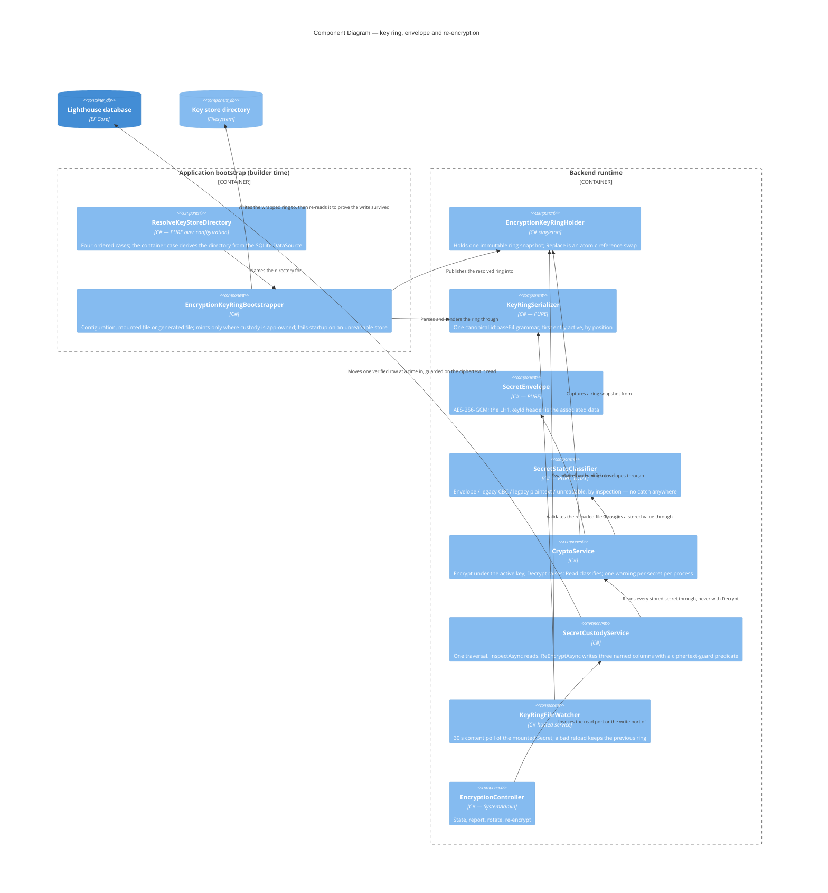

# Feature Delta — epic-5775-secret-encryption-key-custody

**ADO**: Epic #5775 "Secret Encryption: Unique Keys and Safe Rotation" (New, created 2026-08-14) ·
child Stories #5777 (slice 01), #5024 (slice 02, re-parented from Epic #5511 during this wave), #5778
(slice 03), #5779 (slice 04), #5780 (slice 05), #5781 (slice 06) — five created at wave close ·
related Bug #5776 "Encryption key override does not apply the configured key" (absorbed into slice 02
by D7's retirement, 2026-08-15) · **Feature type**: cross-cutting (crypto + persistence + bootstrap +
chart + docs) · **Density**: lean · **DISCUSS run**: 2026-08-14

The epic starts from a lost evaluation. A prospect's team looked at Lighthouse, concluded "credentials
are stored in plain text", and picked something else. That conclusion is wrong about the mechanism and
close enough to right about the outcome to be worth taking seriously. Reading the code during this wave
turned up five things, and the first two are the reason this is an epic and not a hardening ticket.

1. **There is exactly one key, and it is published.** `appsettings.json:43-44` carries a literal
   32-byte AES key, committed to a public repository. Every install that has not overridden it — the
   downloaded exe, `docker run`, `helm install`, and every tenant on the platform — encrypts every
   token with the same key any reader of the repository already has. Encryption at rest with a public
   key is a filing cabinet with the key taped to it.
2. **The documented way to override it does not reach the code.** The docs say `--Encryption:Key` /
   `Encryption__Key`; `CryptoService.cs:12` reads `EncryptionSettings:EncryptionKey`. There is no
   alias anywhere in the repository. Operators who read the configuration page and did the right thing
   set a value nothing consumes, and nothing tells them. That is the population most deserving of the
   fix and the one least likely to know it needs one.
3. **A wrong key does not fail.** `CryptoService.Decrypt` catches `CryptographicException` and
   `FormatException` and returns the ciphertext as though it were the secret. So finding 2 is invisible
   by construction, and — more dangerous for what this epic wants to build — a re-encryption pass over
   the whole database would cheerfully write garbage over good secrets and report success.
4. **The ciphertext carries no identity.** AES-CBC, random IV prepended, no MAC and no key tag.
   Nothing in a stored blob says which key wrote it, and nothing proves it decrypted correctly rather
   than into plausible-looking bytes.
5. **The chart provisions no key at all.** `chart/templates/secret.yaml` writes the database connection
   string and the OIDC client secret and stops. Kubernetes installs, including the platform's tenants,
   inherit the published default.

What the audit did **not** find is worth stating with the same weight: API keys are PBKDF2-SHA256 with
a per-key salt and a constant-time comparison (`ApiKeyService.HashKey`), embed session secrets and
handshake nonces are hashed rather than stored, and the encrypted set is exactly the two things it
should be — connection options flagged `IsSecret` and OAuth access/refresh tokens. The storage design
is sound. The key custody is not.

---

## Wave: DISCUSS / [REF] Prior-Wave Reading Confirmation

- ⊘ `docs/feature/epic-5775-secret-encryption-key-custody/discover/` (not found — no DISCOVER wave ran)
- ⊘ `docs/feature/epic-5775-secret-encryption-key-custody/diverge/` (not found — no DIVERGE wave ran)
- ✓ `docs/product/jobs.yaml` (schema_version 1, 92 jobs) — none covers secret custody, key rotation or
  encryption. Nearest neighbour is `job-saas-operator-isolate-tenant-secrets` (epic-5306 slice-04,
  about which store holds a tenant's secrets), which assumes the application-side encryption question
  is already answered. It is not; this epic answers it.
- ✓ `docs/product/journeys/` (41 journeys) — none touches encryption or key handling.
- ✓ `docs/product/personas/` (9 personas) — `platform-operator`, `config-admin` and
  `lighthouse-maintainer` are reused verbatim. No new persona needed.
- ✓ `docs/product/kpi-contracts.yaml` — the `measurement_scope` convention (per_instance /
  vendor_demo_only / opt_in_telemetry_required) is inherited by every KPI below. Lighthouse does not
  phone home and this epic does not change that.
- ⊘ `docs/product/vision.md`, `docs/project-brief.md`, `docs/stakeholders.yaml` (not found — product
  SSOT lives under `docs/product/` in this repo)
- ✓ `CLAUDE.md`, `docs/ci-learnings.md` — standing rules applied (expand-only migrations, quality
  gates, per-feature docs, no internal references in comments).
- ✓ **Code read during this wave**: `Services/Implementation/CryptoService.cs`,
  `Data/LighthouseAppContext.cs:565-609`, `Program.cs:389-486` and `:884-911`,
  `API/WorkTrackingSystemConnectionsController.cs:144-160`, `Services/Implementation/OAuth/OAuthService.cs`,
  the four `WorkTrackingConnectors/Auth/*Strategy.cs`, `Models/Auth/ApiKey.cs`,
  `Services/Implementation/Auth/ApiKeyService.cs`, `appsettings.json`, `chart/templates/secret.yaml`.
- ✓ **Docs read**: `docs/Installation/configuration.md:172-189`,
  `docs/compliance/cra-self-assessment.md:31-33`.
- ✓ **ADO** #5024, #5019, #2438, #5511.

No DISCOVER evidence exists to contradict, so no contradiction check was possible and none is claimed.

---

## Wave: DISCUSS / [REF] Persona IDs

| Persona | Role in this feature |
|---|---|
| `platform-operator` | Primary, in both its flavours. The self-hoster who runs the exe or the container and should never have to read a page to get a unique key; and the platform operator who runs many tenants and needs custody to sit in the cluster's secret store. |
| `config-admin` | Two roles. The person who would otherwise pay for a key change by re-entering every token in every Connection — rotation exists so that cost goes away. And, in the plainest sense, the person with a credential in their clipboard wondering whether pasting it here is a bad idea. Those two want completely different words, which is why the reassurance lives next to the field and the key truth lives on the encryption panel. |
| `lighthouse-maintainer` | Has to answer "is it secure?" to a prospect's security team, in writing, without hedging. Currently cannot, because the compliance self-assessment's secure-by-default claim does not survive finding 2. |

---

## Wave: DISCUSS / [REF] JTBD One-Liners

| Job ID | One-liner |
|---|---|
| `job-operator-unique-key-without-effort` | When I install Lighthouse, protect my stored credentials with a key that is mine alone, without my having to read a configuration page first. |
| `job-operator-rotate-key-without-recredentialing` | When my key may be exposed, move every stored secret onto a new key from inside Lighthouse, without asking a single team to re-enter a token. |
| `job-operator-know-the-key-is-actually-in-effect` | Tell me plainly which key this instance is using and whether every stored secret can be read with it, so I stop finding out from a failed sync. |
| `job-saas-operator-tenant-owned-encryption-key` | When I run many tenants, give each one a key its own cluster secret store owns, so one leaked backup is one tenant's problem. |
| `job-maintainer-answer-the-secret-storage-question` | When a prospect's security team asks how credentials are protected, let me give a specific, true answer about the shipped defaults. |
| `job-config-admin-paste-a-credential-with-confidence` | When I am about to paste a token into a tool I did not write, tell me plainly what happens to it, so I can proceed — or send someone a link — rather than stopping to ask around. |

Full job stories, dimensions, four forces and opportunity scores are written to
`docs/product/jobs.yaml`.

### Opportunity scores

| Job | Importance | Satisfaction | Gap | Note |
|---|---|---|---|---|
| `job-operator-unique-key-without-effort` | 5 | 1 | **4** | The published default key. Highest leverage: fixing it retires the whole class of criticism. |
| `job-operator-rotate-key-without-recredentialing` | 5 | 1 | **4** | Today's documented answer is "reconfigure your work tracking systems" — an outage of every sync. |
| `job-saas-operator-tenant-owned-encryption-key` | 5 | 1 | **4** | The chart provisions nothing; every tenant shares the published key. Blocks enterprise procurement. |
| `job-operator-know-the-key-is-actually-in-effect` | 4 | 1 | **3** | Silent-by-design today: the decrypt fallback guarantees a wrong key is indistinguishable from a right one. |
| `job-maintainer-answer-the-secret-storage-question` | 4 | 2 | **2** | Partly satisfied — the docs describe the intent correctly, they just describe a mechanism that does not run. |
| `job-config-admin-paste-a-credential-with-confidence` | 4 | 1 | **3** | The form asks for a credential and says nothing. The reassurance exists on a connector page nobody reads mid-setup, so it never reaches the moment of the decision. Cheap to fix and it is the surface where doubt actually starts. |

---

## Wave: DISCUSS / [REF] Current-State Surface Inventory

| Surface | Location | State today |
|---|---|---|
| Key resolution | `CryptoService` ctor (`CryptoService.cs:10-20`) | Single key, read from `EncryptionSettings:EncryptionKey`, base64, must be 32 bytes; throws only if absent or wrong length. |
| Default key | `appsettings.json:43-44` | Literal key committed to the public repository. |
| Documented override | `docs/Installation/configuration.md:178-179` | `--Encryption:Key` / `Encryption__Key` — consumed by nothing. |
| Encrypt path | `LighthouseAppContext.EncryptSecrets` (`:581-609`) | On `SaveChanges`, encrypts `WorkTrackingSystemConnectionOption.Value` where `IsSecret`, and `OAuthCredential.AccessToken` / `RefreshToken` when added or modified. Also `WorkTrackingSystemConnectionsController:154`. |
| Decrypt path | `CryptoService.Decrypt` (`:47-84`) | Catches `CryptographicException` / `FormatException` and **returns the ciphertext** as the plaintext. |
| Consumers | `PatAuthStrategy`, `JiraCloudBasicAuthStrategy`, `LinearApiKeyAuthStrategy`, `ServiceNowBasicAuthStrategy`, `LinearWorkTrackingConnector:633`, `OAuthService` (`:197`, `:238-240`, `:328-329`) | Each calls `Decrypt` and hands the result straight to an HTTP client. A failed decrypt reaches the tracker as a credential. |
| Cipher | `CryptoService.Encrypt` (`:22-45`) | AES-CBC, `GenerateIV()` per write, IV prepended, PKCS7 default padding, no MAC, no key identifier, no format version. |
| Encrypted set | — | Connection options flagged `IsSecret` (includes PAT, Jira API token, Linear API key, ServiceNow password, OAuth clientId/clientSecret) and OAuth access/refresh tokens. Nothing else. |
| Not encrypted, correctly | `ApiKeyService.HashKey` (`:290-300`), `EmbedSessionTokenService.HashSecret` | PBKDF2-SHA256 with per-key salt and constant-time compare; embed secrets and nonces hashed. Verifiers, not recoverable secrets. Out of scope and sound. |
| Model to copy | `Program.cs:429-486` (`EnsureOAuthStateSecret`) | Generates 32 random bytes on first boot, wraps them with ASP.NET Data Protection, persists to the key-store directory, resolves the same value every restart. Exactly the shape #5024 asks for. |
| Multi-replica precedent | `Program.cs:884-911` (`ConfigureDataProtection`) | Data-protection key ring already persists to filesystem or Redis, so the multi-replica story has a precedent to follow. |
| Chart | `chart/templates/secret.yaml` | Renders the database connection string and OIDC client secret only. No encryption key, no `existingSecret` hook for one. |
| Compliance claim | `docs/compliance/cra-self-assessment.md:31` | "Unique encryption keys can be specified per installation" — cited as evidence for secure-by-default. Does not survive finding 2. |

---

## Wave: DISCUSS / [REF] Locked Decisions

- **[D1] The ciphertext becomes an authenticated, self-describing envelope.** A stored secret gains a
  format version, the id of the key that wrote it, a nonce, and an authentication tag — AES-GCM
  replaces bare AES-CBC. This is not hardening bolted onto the epic; it is the precondition for
  everything else in it. Without a tag there is no way to distinguish "decrypted with the right key"
  from "decrypted into plausible bytes", so a re-encryption pass cannot be trusted, and without a key
  id a rotation cannot tell which rows it still has to visit. *Rejected*: keep AES-CBC and rotate
  anyway (rotation becomes unverifiable, and the pass can overwrite good secrets with garbage);
  defer to a follow-up epic (ships the rotation before its own safety net). User decision, 2026-08-14.
- **[D2] The decrypt-returns-ciphertext fallback is deleted.** A secret that cannot be read raises,
  and the caller surfaces it as an unreadable secret on the owning Connection. Legacy plaintext values
  written before encryption existed are handled by an explicit, recognisable legacy branch in the
  envelope reader, not by a catch-all around every failure.
- **[D3] One active key, several retired ones — a key ring, not a key.** Writes always use the active
  key. Reads try the key named by the envelope. The published default key enters the ring as a retired
  entry on upgrade, which is what makes the upgrade invisible: existing secrets stay readable while
  every new write moves to the instance's own key. Once a rotation has run and no row references it,
  the default can be dropped from the ring.
- **[D4] Standalone custody copies `EnsureOAuthStateSecret` verbatim in shape.** First boot with no
  operator-supplied key generates 32 random bytes, wraps them with ASP.NET Data Protection, and writes
  them beside the data. No flag, no page to read, no ceremony — which is the whole of
  `job-operator-unique-key-without-effort`. The literal key leaves `appsettings.json`.
- **[D5] Kubernetes custody is a Secret the cluster owns.** The chart accepts
  `encryption.existingSecret` so External Secrets Operator or OpenBao can populate it, and generates a
  random key into its own Secret when neither is supplied. A `helm upgrade` must never regenerate it —
  that would orphan every secret in the tenant's database, and it is the single most likely way to
  ship this slice broken. *Rejected for this epic*: an OpenBao **Transit** driver where the key never
  leaves the vault. It is the stronger design and it is explicitly out of scope here, because it turns
  `ICryptoService` into a per-secret network round trip with its own failure and latency modes, and
  because the standalone product has to keep working without any vault at all. User decision,
  2026-08-14. Recorded as the successor epic, not as a gap.
- **[D6] Rotation is two jobs, and only one of them is always the application's.** *Minting* a new key
  means creating it and persisting it; *re-encrypting* means walking every stored secret onto the
  active key. Re-encryption is always the application's job and is always available in the app.
  Minting depends on who owns custody:
  - **App-owned custody** — *only* where the key was generated for this instance and the application
    owns the store it lives in. The application mints, activates, re-encrypts and retires in one
    action. One button.
  - **Operator-owned custody** — a Kubernetes Secret (chart-made or External Secrets / OpenBao-owned)
    **and also a key supplied through configuration**. The operator adds the new key alongside the
    existing one, the pod or process picks up the ring with the new key active and the old one
    retired, and then the operator triggers re-encryption. The application never mints a key it
    cannot persist.

  Configuration-supplied custody sits on the operator side and not the application side, which is not
  where this decision first placed it (DESIGN F-2, 2026-08-14). A minted key would go to the generated
  key store, and on the next restart the configured key would win the precedence order again — the
  rotation would un-rotate itself and everything written under the minted key would be unreadable.

  Conflating the two is what would make the Kubernetes story impossible: an application that mints must
  also persist, and persisting into a Kubernetes Secret means granting Lighthouse write access to its
  own Secret — a permission that should not be granted and that an external secret store would
  overwrite on its next sync anyway. Splitting them means the same re-encryption code path serves all
  three environments and no new cluster permission is needed. Scheduled or automatic rotation remains
  out of scope. User decision, 2026-08-14.
- **[D12] The key store lives beside the database.** It resolves, by default, to the directory the
  database file is in, and the resolved path is stated in the startup line. Today the data-protection
  key store defaults to `ContentRootPath/data-protection-keys` — `/app/data-protection-keys` in the
  container — while the documented Docker setup mounts a volume at `/app/Data` and puts the database
  there. That costs nothing today, because the key ships inside the image and a recreated container
  reads the same one. After D4 it inverts: `docker rm` and recreate would hand the operator their
  database with a brand-new key and every stored secret unreadable. That is a worse failure than the
  one this epic fixes, and it would land on people who changed no setting. Anyone who already mounted
  their data volume must keep their key by doing nothing.

  **Narrowed by DESIGN F-3 (2026-08-14).** The standalone launcher already colocates the two
  (`StandaloneInitializer.cs:31-32` sets the connection string and the key-store path into the same
  working directory), so this failure is **Docker-only**, not general. And "beside the database" has no
  meaning for a hand-rolled Postgres install — there is no local database file to sit beside. The
  resolver therefore works through ordered cases (ADR-149), and **where durability cannot be argued it
  refuses to mint**: an existing instance keeps running on the legacy key and says so loudly, a fresh
  one refuses to start. Lighthouse never mints a key it cannot promise to still have tomorrow.
  Consequence, accepted by the maintainer: KPI-1 is not automatically satisfied for a hand-rolled
  Postgres install by slice 02 alone — those operators supply a key or a key-store path explicitly.
- **[D7] ~~Bug #5776 ships first and separately.~~ Retired 2026-08-15.** The original decision rested
  entirely on shipping a small fix quickly to a live audience — the operators who followed the
  documentation and believe they are not on the default key. The maintainer has since decided the fix
  will not be released on its own, which removes the only thing the separation bought. Bug #5776 is
  absorbed into slice 02, where AC-2.3 (a supplied key takes precedence and is reported as such),
  AC-2.8 (startup states the key source) and AC-2.9 (a malformed supplied key stops startup) already
  cover it with no scope added. Absorbing it also avoids shipping a configuration-name alias that the
  ring parser would then have to honour permanently: one grammar, one name, introduced once.
  Consequence, accepted by the maintainer: the exposure described in these artifacts — public on
  `main` since 2026-08-14 — stays live for the length of the epic rather than a week. D8's advisory
  timing is unchanged, since it was already pinned to the release. User decision, 2026-08-15.
- **[D8] Neutral commits, advisory at release.** Commit messages describe the change without narrating
  the exposure. A GitHub Security Advisory and a release-notes entry land when the fixed version is
  available to install, so the people affected learn about it at the same moment they can act on it.
  User decision, 2026-08-14.
- **[D9] The key is never logged, and the key source always is.** Startup and the System Info surface
  state *where* the active key came from — generated for this instance, supplied by configuration,
  supplied by an external secret — and never any part of its material. "Which key am I on?" has to be
  answerable without a debugger, because today it is not answerable at all.
- **[D10] Fail fast on a key store that exists but cannot be read.** If a key ring is present and
  unreadable, the instance refuses to start rather than generating a fresh key. Generating one would
  look like a successful boot and would silently orphan every stored secret.
- **[D11] No vendor telemetry.** Every KPI below is `per_instance` or `vendor_demo_only`, per the
  standing convention in `kpi-contracts.yaml`. Nothing about key state leaves a customer's instance.

### Open questions

- **OQ-1** Does a re-encryption pass need to hold off the sync pipeline, or is per-row optimistic
  concurrency enough? `OAuthCredential` rows are rewritten by token refresh while a rotation could be
  walking them. Slice 03 carries a timeboxed probe; if concurrency turns out to need a lock, that is a
  design change, not a slice tweak.
- **OQ-2 — resolved by D6, retained for the record.** "How does an instance behave when the external
  Secret is rotated underneath a running pod?" was an open question when rotation was assumed to be one
  action. Under D6 it is not an accident to survive but the supported Kubernetes flow: the operator
  adds the new key alongside the old, the ring carries both, and re-encryption follows. What slice 05
  still owes is the degenerate case — a Secret whose *old* key was removed before re-encryption ran —
  which must surface unreadable secrets clearly rather than looping on work-tracking-system rejections.
- **OQ-3** Does the standalone key file need an operator-facing export/backup path? Losing it loses
  every stored secret, which is the correct security property and a support burden. Deferred; named
  here so it is not discovered by a user first.

---

## Wave: DISCUSS / [REF] Scope Assessment

**Verdict: OVERSIZED as stated, split accepted.**

Oversized signals present (2 or more triggers the gate; four are present):

- Touches five areas — cryptography, EF persistence, application bootstrap, Helm chart, docs and
  compliance surface.
- Estimated effort well beyond two weeks if taken as one change.
- Contains at least three independently shippable user outcomes: a unique key by default, a rotation
  that costs no credentials, and cluster-owned custody. Each is valuable without the others.
- The walking-skeleton path crosses more than five integration points (config resolution, data
  protection key store, DbContext save path, every auth strategy, the OAuth refresh path, the chart).

**Split**: six thin slices, each shipping end to end, ordered so the abstraction ships before anything
depends on it. Bug #5776 is carried by slice 02 rather than preceding the epic (D7, retired). The OpenBao Transit driver
becomes a successor epic rather than a slice.

---

## Wave: DISCUSS / [REF] WS Strategy

**Strategy B — extend an existing skeleton.** This is brownfield with a working encryption path and a
working first-boot secret-provisioning path (`EnsureOAuthStateSecret`) already in production. No new
walking skeleton is built. Slice 01 is the thin end-to-end proof: one secret written through the new
envelope, read back, and shown failing legibly under the wrong key — the whole vertical, one row of
data.

---

## Wave: DISCUSS / [REF] Driving Ports

| Port | Surface | Introduced by |
|---|---|---|
| Application bootstrap | Key-ring resolution at builder time — configuration, generated file, or external secret | slice 02 |
| HTTP (admin) | `POST` rotate, `GET`/`POST` verify, under the existing authorization surface — System Admin only | slice 03, slice 04 |
| UI | Settings → an encryption panel showing key source, active key id, the key ids the ring holds, and secret readability. **Custody-aware**: it offers **Rotate key** where the application owns the key, and **Re-encrypt onto the active key** where an operator does. It never offers to mint a key it cannot persist. | slice 03, slice 04 |
| UI (existing) | Connection detail — an unreadable secret is named on the Connection that owns it | slice 01 |
| Startup log | One line naming the key source; never the key | slice 02 |
| Helm values | `encryption.existingSecret`, `encryption.key`, `encryption.secretKey`, `encryption.mountPath` — and a render that **refuses** when neither key nor `existingSecret` is supplied, naming both. The chart generates nothing | slice 05 |
| Docs | Installation configuration page, compliance self-assessment, `SECURITY.md`, security advisory | slice 06 |

---

## Wave: DISCUSS / [REF] Pre-requisites

- No EF migration is required for the envelope. `WorkTrackingSystemConnectionOption.Value`,
  `OAuthCredential.AccessToken` and `.RefreshToken` carry no `HasMaxLength` and are unbounded
  `text`/`TEXT` in both model snapshots, so the column-width migration this section originally assumed
  does not exist (DESIGN F-6). One is owed only if the slice-03 probe forces a concurrency token onto
  `OAuthCredential` — generated with the `CreateMigration` script, additive only, like every other.
- The dev instance on `:5169` restored from a real backup, so slices 02 and 03 run against genuine
  history rather than seeded demo rows.
- A premium licence on the verification instance where the epic touches licensed surfaces.
- Chart floor: the current published chart line; slice 05 bumps it.
- Tenant Zero available as the platform-side proving ground for slice 05.

---

## Wave: DISCUSS / [REF] Out of Scope

- **OpenBao Transit / KMS-backed encryption** where key material never enters the process. Recorded as
  the successor epic (D5).
- Scheduled or automatic key rotation (D6).
- Hardware security modules, cloud KMS drivers, per-tenant automation inside the private platform
  repository.
- Changing how API keys or embed session secrets are stored — they are hashed, which is correct.
- Encrypting anything not currently encrypted: work item data, settings, forecasts. Full-database
  encryption is the database's job, not the application's.
- The OIDC client secret in configuration — it is supplied by the operator's own secret management and
  never persisted by Lighthouse.
- Marketing website security copy. Flagged for the DELIVER checklist, not built here.

---

## Wave: DISCUSS / [REF] User Stories

Every story traces to a `job_id` in `docs/product/jobs.yaml`. One story is labelled `@infrastructure`
and is a precursor commit inside slice 01, never a slice of its own.

---

### US-01 — A secret that cannot be read says so

`job_id: job-operator-know-the-key-is-actually-in-effect` · persona `platform-operator` · **slice 01**

As a platform operator, I want a stored secret that cannot be decrypted to be reported as an unreadable
secret, so that a key problem looks like a key problem instead of arriving days later as a work tracking
system rejecting my token.

#### Elevator Pitch
Before: a wrong or changed encryption key produces no error anywhere — `Decrypt` returns the ciphertext
and the connector sends it to Jira as the API token, so the first symptom is a 401 that reads as an
expired credential.
After: open Settings → Connections → *(the connection)* → sees `Secret cannot be read with the current
encryption key` on the offending field, and the update log carries one matching line.
Decision enabled: whether to go fix the key or go re-issue the token — two very different afternoons,
currently indistinguishable.

**Acceptance criteria**
- AC-1.1 A secret written after this slice is stored as an envelope carrying a format version, the
  active key's id, a nonce and an authentication tag.
- AC-1.2 A secret written before this slice — bare AES-CBC — is still read correctly, unchanged, with
  no migration and no user action.
- AC-1.3 A value that was never encrypted at all is recognised as legacy plaintext by an explicit
  branch, not by a caught exception.
- AC-1.4 Decrypting an envelope whose authentication tag does not verify raises. It does not return the
  ciphertext, the plaintext, or an empty string.
- AC-1.5 A tampered ciphertext — any byte flipped — fails to decrypt rather than producing altered
  plaintext.
- AC-1.6 A Connection holding a secret that cannot be read shows that state on the field, naming the
  encryption key as the cause.
- AC-1.7 No auth strategy and no OAuth path sends an unreadable secret to a remote system.
- AC-1.8 The failure surfaces once per affected secret, not once per sync attempt.
- AC-1.9 No key material, ciphertext or plaintext appears in any log line at any level.

---

### US-02 — This install's key belongs to this install

`job_id: job-operator-unique-key-without-effort` · persona `platform-operator` · **slice 02**

As a self-hoster who downloaded the exe or ran one `docker run`, I want Lighthouse to protect my
credentials with a key generated for my instance alone the first time it starts, so that a copy of my
database is worth nothing to whoever takes it — without my having read anything first.

#### Elevator Pitch
Before: every install that has not overridden the key encrypts every token with the key published in
`appsettings.json` on GitHub, so obtaining the database file is obtaining the tokens.
After: run `docker run ghcr.io/letpeoplework/lighthouse:latest` → sees
`Encryption key: generated for this instance` in the startup log, and Settings → System shows the same
thing with the active key's id.
Decision enabled: whether the operator has anything left to do — and for the first time, an honest
answer to "is this instance's data safe if the file leaks?".

**Acceptance criteria**
- AC-2.1 A first start with no operator-supplied key generates 32 cryptographically random bytes,
  wraps them with ASP.NET Data Protection, and persists them alongside the existing key store.
- AC-2.2 A restart resolves the same key. Restarting is not a rotation.
- AC-2.3 An operator-supplied key — configuration, environment, or command line — takes precedence and
  is reported as such.
- AC-2.4 The literal default key is removed from `appsettings.json`.
- AC-2.5 An instance upgrading from a version that used the published default key keeps reading every
  existing secret, with no user action and no credential re-entry. The old key is present in the ring
  as a retired entry.
- AC-2.6 After the upgrade, newly written secrets use the instance's own key, not the retired one.
- AC-2.7 A key store that exists but cannot be read stops startup with a message naming the key store.
  It does not generate a replacement.
- AC-2.8 The startup log states the key source and the active key id, never the key. The Settings →
  System page shows the same, reading it from the System-Admin-guarded encryption endpoint — **not**
  from `GET /systeminfo`, which is `[Authorize]` only and therefore reaches every embed viewer
  (DESIGN F-4).
- AC-2.9 A supplied key that is not 32 bytes of base64 stops startup with a message that says what is
  wrong with it.
- AC-2.10 The key store resolves by default to the directory the database file lives in, and the
  resolved path appears in the startup line. An instance whose data directory is a mounted volume
  keeps its key across container replacement without the operator configuring anything.
- AC-2.11 Recreating the container against an existing mounted data directory reads the same key and
  every stored secret stays readable.

---

### US-03 — Rotate the key without asking anyone for a token

`job_id: job-operator-rotate-key-without-recredentialing` · persona `config-admin` · **slice 03**

As the administrator of an instance whose key may have been exposed, I want to move every stored secret
onto a new key from inside Lighthouse, so that I can contain the exposure the same afternoon instead of
asking every team to re-enter every credential.

#### Elevator Pitch
Before: the documented procedure for changing the key is to change it and then reconfigure every work
tracking system — every PAT, every API token, every OAuth connection, re-entered by hand, with every
sync down until they are.
After: open Settings → Encryption → **Rotate key** (where the application owns the key) or
**Re-encrypt onto the active key** (where an operator does) → sees `Rotated 47 secrets onto key
`k-2026-08-14-01`. 0 unreadable. Previous key retired.`
Decision enabled: whether the exposure is contained — answerable in a minute, with a number, instead of
by scheduling a week of credential re-entry.

**Acceptance criteria**
- AC-3.1 Rotation generates a new key, makes it active, and retires the previous one without removing
  it from the ring.
- AC-3.2 Every stored secret readable under any ring key is re-encrypted under the new active key.
- AC-3.3 No credential is requested, re-entered, or invalidated. Every Connection works immediately
  afterwards with no user action.
- AC-3.4 The result reports how many secrets were re-encrypted and how many could not be read, per
  Connection.
- AC-3.5 A secret that cannot be read is left byte-for-byte untouched and named in the report. Rotation
  never overwrites what it could not verify.
- AC-3.6 Rotation is idempotent and resumable: interrupted halfway, the instance still functions —
  both keys are in the ring — and running it again completes the remainder.
- AC-3.7 A token refresh writing an `OAuthCredential` while rotation is walking it neither loses the
  refreshed token nor leaves the row unreadable.
- AC-3.8 Rotation is restricted to a System Admin and is recorded — who, when, how many, with no key
  material.
- AC-3.9 On an instance still on the published default key, rotation removes the last row referencing
  it and the default leaves the ring.
- AC-3.10 Where the key was **generated for this instance**, one action mints, activates, re-encrypts
  and retires.
- AC-3.11 Where an operator owns the key — **supplied by configuration or by an external secret** —
  the panel offers re-encryption onto the already-active key and does **not** offer to mint one.
  Lighthouse never writes to a Kubernetes Secret and needs no permission to.
- AC-3.12 The panel names the custody mode and lists the key ids the ring currently holds, so the
  operator can see the new key has arrived before triggering re-encryption.
- AC-3.13 Re-encryption is the same code path in both custody modes. Only the minting step differs.

---

### US-04 — Check before you rotate, and prove it after

`job_id: job-operator-know-the-key-is-actually-in-effect` · persona `config-admin` · **slice 04**

As an administrator about to rotate — or having just rotated — I want a read-only check that tells me
whether every stored secret is readable and which key each one is on, so that I find out before the
write pass rather than from a failed sync at three in the morning.

#### Elevator Pitch
Before: the only way to learn whether the instance's secrets are intact is to trigger a sync per
Connection and watch what the tracker says.
After: open Settings → Encryption → **Check secrets** → sees `47 secrets · 45 on the active key · 2 on
a retired key · 0 unreadable`, with the two named.
Decision enabled: rotate now, or fix the two unreadable secrets first — the difference between a clean
rotation and a report full of skipped rows.

**Acceptance criteria**
- AC-4.1 The check reads every stored secret and writes nothing.
- AC-4.2 It reports, per secret, the owning Connection, the field, and the key id it is encrypted under.
- AC-4.3 Legacy AES-CBC values and legacy plaintext values are each reported as their own state, not
  merged into "unreadable".
- AC-4.4 An unreadable secret is reported with the Connection and field that own it, so it can be
  fixed by hand.
- AC-4.5 The check is available before any rotation has ever run, on an instance still on the default
  key.
- AC-4.6 Running it immediately after a rotation shows every readable secret on the active key.
- AC-4.7 The check is restricted to a System Admin.
- AC-4.8 It completes within the request timeout on a Tenant-Zero-sized instance, or streams progress.

---

### US-05 — The cluster owns the key

`job_id: job-saas-operator-tenant-owned-encryption-key` · persona `platform-operator` · **slice 05**

As an operator installing Lighthouse with Helm — for my own organisation or as one tenant among many —
I want the encryption key to come from a Kubernetes Secret that my own secret store can own, and to be
generated uniquely for me if I supply nothing, so that no two installs share a key and no key sits in a
values file.

#### Elevator Pitch
Before: the chart provisions a database connection string and an OIDC secret and no encryption key at
all, so every Kubernetes install — including every tenant on the platform — runs on the published
default.
After: run `helm install lighthouse letpeoplework/lighthouse --set encryption.existingSecret=lh-keys`
→ sees the pod log `Encryption key: supplied by external secret`, and a `helm upgrade` afterwards
leaves every stored credential readable. Installing with neither `encryption.key` nor
`encryption.existingSecret` fails at render, naming both — a refusal, not a default.
Decision enabled: whether a security review of a Kubernetes install can be passed — and for the
platform, whether one tenant's leaked backup is one tenant's problem.

**Acceptance criteria**
- AC-5.1 `encryption.existingSecret` points the deployment at a Secret an external store owns —
  External Secrets Operator or OpenBao — and the chart renders no key of its own.
- AC-5.2 **RETIRED by DESIGN F-3 — replaced.** With neither `encryption.key` nor
  `encryption.existingSecret` supplied, the chart **fails at render** with a message naming both, in
  the manner ADR-082 already established for `postgresql.auth.password`. The chart does not generate a
  key: the only mechanism available (`lookup`) returns empty on every `helm template` render, which is
  how ArgoCD renders, so a generator would mint a fresh key on each tenant sync.
- AC-5.3 **VACUOUS given the amended AC-5.2** — nothing is generated, so nothing can be regenerated.
  The property it was protecting survives as its test: three consecutive `helm upgrade` runs with
  unchanged values leave every stored secret readable.
- AC-5.4 An explicitly supplied `encryption.key` is used verbatim and reported as configuration-supplied.
- AC-5.5 The key never appears in a ConfigMap, in rendered values, or in a pod's environment dump. It
  reaches the container as a **mounted file**, not as an environment variable — the database password's
  route is a `secretKeyRef` env var, readable in `/proc/<pid>/environ`, so the two halves of this
  criterion as first written could not both hold (DESIGN F-5). Mounting is also what makes picking up
  an operator-added key without a restart possible at all.
- AC-5.6 Chart unit tests cover: nothing supplied (fails at render), `existingSecret` supplied,
  explicit key supplied, and upgrade-idempotence.
- AC-5.7 The standalone single-container product is byte-unchanged by this slice.
- AC-5.8 Chart README and values schema document all three custody modes.
- AC-5.9 The Secret carries a key **ring**, not a single key: one active entry and any number of
  retired ones. An operator adds the new key alongside the old, and the pod reads both.
- AC-5.10 The documented Kubernetes rotation is: add the new key to the Secret alongside the old, roll
  the pod, trigger re-encryption, then drop the old key. Every step is an operator action against
  their own secret store.
- AC-5.11 A Secret whose old key was removed before re-encryption ran surfaces the affected secrets as
  unreadable rather than looping on work-tracking-system rejections.

---

### US-06 — Say what is actually true

`job_id: job-maintainer-answer-the-secret-storage-question` · persona `lighthouse-maintainer` · **slice 06**

As the maintainer answering a prospect's security questionnaire, I want the documentation, the
compliance self-assessment and the security policy to describe what the product actually does by
default, so that I can answer a security team with a link instead of a paragraph of caveats.

#### Elevator Pitch
Before: the configuration page documents an override that nothing consumes, and the compliance
self-assessment cites per-installation unique keys as evidence of secure-by-default, which finding 2
makes untrue for anyone who followed the page.
After: open the Installation → Configuration page → sees the three custody modes, what happens on
first boot, how to rotate, and what an operator must back up; and a published advisory says plainly
what was wrong and which version fixes it.
Decision enabled: a prospect's security reviewer can complete their assessment from the documentation,
without asking — the exact conversation that lost the evaluation this epic came from.

**Acceptance criteria**
- AC-6.1 The Encryption Key section documents the configuration path the code actually reads, and the
  first-boot generation behaviour.
- AC-6.2 All three custody modes — generated, configuration-supplied, external secret — are documented
  with the observable signal that tells an operator which one is in effect.
- AC-6.3 Rotation is documented, including that it requires no credential re-entry and what the report
  means.
- AC-6.4 What an operator must back up, and what is lost if they do not, is stated explicitly.
- AC-6.5 `docs/compliance/cra-self-assessment.md` rows 1.3 and 1.5 cite evidence that matches shipped
  behaviour.
- AC-6.6 `SECURITY.md` states the supported reporting path and what this epic changed.
- AC-6.7 A GitHub Security Advisory is published when the fixed version is installable, not before.
- AC-6.8 Release notes lead with what the operator should do, in the terminology the product uses.
- AC-6.9 Documentation uses the seeded terminology defaults, never a single tracker's vocabulary.
- AC-6.10 The Kubernetes rotation procedure is documented as its own sequence: add the new key to the
  Secret alongside the old, roll the pod, re-encrypt, drop the old key — and states that Lighthouse
  never writes to the Secret itself.
- AC-6.11 The Docker page states where the key store lives, that it must be on the mounted data
  volume, and what a container recreation without that volume costs.
- AC-6.12 A single canonical **Security** page exists in the docs navigation — today the facts are
  spread across a configuration reference, three connector concept pages, two compliance documents and
  a repository-root `SECURITY.md` that has no presence in the docs site at all, and none of those is a
  page anyone would paste into a conversation.
- AC-6.13 That page is **two layers at one URL**. It opens with the plain answer — a few sentences, no
  jargon, no algorithm names, matching the in-product notice from US-08 — for the person who searched
  "is Lighthouse safe". Below it, a *verify our claims* section: what is encrypted and with what, what
  is deliberately **hashed** instead and why (API keys, embed session secrets), where the key lives for
  each deployment shape, and how to rotate. One URL, because the same link has to serve the person
  asking and the person they forward it to.
- AC-6.14 The page carries a **"what this does not protect against"** section — an attacker holding the
  key, host or shell access, a malicious administrator. Volunteering the limits is what makes the rest
  credible to a reviewer; a page without it reads as sales copy.
- AC-6.15 The vulnerability reporting path appears in the docs, not only in the repository-root file,
  and the connector concept pages replace their isolated one-line assertion with the plain-language
  answer plus a link to the Security page. Per-connector specifics stay on the connector pages; the
  in-product notice names no connector. Nothing is duplicated — the scattered mentions become links.
- AC-6.16 US-08's link resolves to this page once it exists.

---

### US-08 — Knowing a credential is safe to paste, before pasting it

`job_id: job-config-admin-paste-a-credential-with-confidence` · persona `config-admin` · **slice 01**

As someone about to paste a personal access token into a tool I did not write, I want the form to tell
me plainly what happens to it, so that I can proceed without stopping to ask my security team — and so
that I have something to send them if I decide to ask anyway.

#### Elevator Pitch
Before: the form asks for a credential and says nothing about what becomes of it. The reassurance exists
— in a one-line aside on a connector concept page nobody reads mid-setup — and never appears at the
moment the person is deciding.
After: open Settings → Connections → *(new or existing connection)* → sees, once in the form,
`Secrets you enter here are encrypted before they are saved, are never shown again — not even to an
administrator — and never leave this instance. You can revoke one wherever you created it to cut off
access immediately.` with a link reading *How Lighthouse protects your credentials*.
Decision enabled: paste it now, or send that link to whoever needs to approve it first — instead of
abandoning the setup and asking around.

**Acceptance criteria**
- AC-8.1 One generic notice per connection form, not one per field. It carries no connector's name and
  no algorithm name, so a single string serves every secret a connector defines now or later.
- AC-8.2 The notice appears only when the form actually contains at least one field flagged as a secret.
- AC-8.3 Every claim in it is true on every install regardless of key custody: encrypted before
  storage, never returned to the browser for any role, never transmitted outside the instance,
  revocable at the source. **None of these depend on which key the instance holds**, which is why this
  story can ship in slice 01 rather than waiting for slice 02.
- AC-8.4 "Never shown again" is verifiable by the user in seconds — reloading the form leaves the field
  blank. This is existing behaviour and is asserted by `S2_ConnectionListPayloadShapeTests` for System
  Admin; the notice states it rather than introducing it.
- AC-8.5 The link points at the docs Security page (US-06). Until that page exists the link targets the
  current credential-handling section, and slice 06 repoints it — the notice never ships with a dead
  link.
- AC-8.6 The notice makes **no** claim about key custody, and no claim of protection against an
  attacker holding the key or with access to the host. Those belong on Settings → Encryption, for the
  administrator who can act on them, and in the docs "what this does not protect against" section.
- AC-8.7 The notice is not a warning and carries no severity styling. It answers a question; it does
  not raise an alarm at a person who cannot act on one.

---

### US-07 — The key ring `@infrastructure`

`job_id: infrastructure-only` · **precursor commit inside slice 01**

`infrastructure_rationale`: introduces the key-ring type and the envelope reader/writer with no
user-visible behaviour of its own. It ships as the first commit of slice 01 and is observable only
through US-01. It is **not** a slice: a slice containing only this story would be a structural failure
under the slice-composition gate.

---

## Wave: DISCUSS / [REF] Story Map

**Backbone** (operator's timeline with an instance):
`Install` → `Discover which key I am on` → `Use it` → `Suspect exposure` → `Rotate` → `Prove it worked`
→ `Answer for it`

| Slice | Story | Backbone step | Ships | Learning hypothesis |
|---|---|---|---|---|
| 01 · #5777 | US-01, US-08 (+US-07) | Use / Paste | Authenticated self-describing envelope; unreadable secrets named on their Connection; plaintext fallback deleted; one generic secret-handling notice on the connection form | Disproves "we can migrate the format in place" if real stored blobs turn out to be ambiguous between legacy and envelope |
| 02 · #5024 (+ Bug #5776) | US-02 | Install | Per-instance key generated on first boot; the documented configuration path is finally honoured and the key source is stated at startup; default key leaves `appsettings.json` and enters the ring retired | Disproves "the upgrade is invisible" if any existing install loses access to a secret |
| 03 · #5778 | US-03 | Rotate | Operator-triggered rotation, no credential re-entry, resumable, reported | Disproves "in-place re-encryption is safe unlocked" if a concurrent token refresh corrupts a row (OQ-1) |
| 04 · #5779 | US-04 | Prove | Read-only readability check, per-secret key attribution | Disproves "the rotation report is enough" if an operator cannot map an unreadable secret back to something they can fix |
| 05 · #5780 | US-05 | Install (k8s) | Chart custody: `existingSecret` or a supplied key, required at render, upgrade-safe — the chart never generates (DESIGN F-1) | Disproves "Helm can own key generation" if `helm upgrade` regenerates the key and orphans the tenant |
| 06 · #5781 | US-06 | Answer for it | Docs, compliance evidence, `SECURITY.md`, advisory, release notes | Disproves "the doc gap was the only false claim" if writing the threat model surfaces further mismatches |

### Carpaccio taste tests

| Test | Verdict |
|---|---|
| Any slice shipping 4+ new components? | **Pass.** Slice 01 introduces one concept (the envelope) and one type (the ring). Slices 03 and 04 each add one service and one surface. |
| Every slice depends on a new abstraction? | **Pass by construction.** The abstraction *is* slice 01, shipped first and on its own, exactly as the rule prescribes. Slices 02-05 consume it; none introduces another. |
| Does any slice disprove a pre-commitment? | **Pass.** Slice 02 stakes "the upgrade is invisible" — falsifiable the moment one real secret stops reading. Slice 05 stakes "Helm can generate a key safely", against a well-known way for that to be false. |
| Synthetic data only? | **Pass.** Slices 02, 03 and 04 are accepted against the `:5169` instance restored from a real backup, and slice 05 against Tenant Zero. Demo rows are not sufficient evidence for any of them. |
| Two slices identical except for scale? | **Flagged, not merged.** Slices 03 and 04 both walk every stored secret. They stay separate because one writes and one does not, and because the read-only one is what makes the writing one safe to run. If slice 03 lands and slice 04 turns out to be its report with a flag flipped, merge them and say so in the brief. |

---

## Wave: DISCUSS / [REF] Prioritization

1. **Slice 01 before everything.** Rotation without an authentication tag is unverifiable, and a
   re-encryption pass over a decrypt that cannot fail is a way to lose every secret in one command. The
   highest-consequence uncertainty in the epic is retired first, when it is still cheap.
2. **Slice 02 next** because it is the epic's headline outcome and the one that answers the criticism
   the epic came from. It also produces the first real upgrade evidence, on genuine data, and it
   carries Bug #5776 — the key source becomes observable here, which is what every later slice is
   verified against.
3. **Slice 03, with a timeboxed probe on OQ-1 before the brief is committed to.** Highest
   implementation risk left; the probe is cheap and its answer changes the design rather than the code.
4. **Slice 04** immediately after, so the "prove it" surface exists in the same release as rotation.
5. **Slice 05** once the application side is settled — the chart can only hand over a key the
   application knows how to accept.
6. **Slice 06 last, and it gates the release.** The advisory is only honest once the fix is installable
   (D8).

Dogfood moment per slice: `:5169` restored from a real backup for 01-04, Tenant Zero for 05, the
published docs site for 06.

---

## Wave: DISCUSS / [REF] Outcome KPIs

| KPI | Target | Measurement | Scope |
|---|---|---|---|
| **KPI-1** Instances not on a shared key | 0 startups report a shipped default key after slice 02; 100% report `generated`, `configured` or `external`. **Not automatic for a hand-rolled Postgres install** — where durability cannot be argued the instance refuses to mint and keeps saying so, per D12 as narrowed by DESIGN F-3 | Startup key-source log line (AC-2.8) | `per_instance` |
| **KPI-2** Rotation costs no credentials | 100% of rotations complete with 0 Connections requiring re-entry | Rotation report (AC-3.4), on `:5169` and Tenant Zero | `per_instance` + `vendor_demo_only` |
| **KPI-3** Rotation completes promptly | < 60 s on a Tenant-Zero-sized secret set | Timed rotation, recorded in the slice 03 brief | `vendor_demo_only` |
| **KPI-4** Silent decrypt failures | 0 — the code path returning ciphertext as plaintext no longer exists | Absence test asserting `Decrypt` raises on a bad tag (AC-1.4) | `per_instance` |
| **KPI-5** Upgrade transparency | 0 secrets lost across an upgrade from the pre-epic version on a real restored database | Readability check before and after (AC-2.5, AC-4.6) | `vendor_demo_only` |
| **KPI-6** Helm upgrade safety | 0 stored secrets become unreadable across 3 consecutive `helm upgrade` runs with unchanged values. The chart mints nothing, so there is nothing to regenerate — the property is now structural rather than defended | Chart unit test (AC-5.3, AC-5.6) + Tenant Zero | `vendor_demo_only` |
| **KPI-7** Question answerable from docs | The documentation answers key source, rotation, backup and threat model without a maintainer in the loop | Reviewed at release against the questionnaire that started this epic | `vendor_demo_only` |

KPI-1 becomes measurable at slice 02, which is where it is targeted and where Bug #5776's key-source
reporting now lands (AC-2.8). Nothing before slice 02 can report against it.

---

## Wave: DISCUSS / [REF] Definition of Done

1. All acceptance criteria for the slice pass as automated tests.
2. `dotnet build` zero warnings; `dotnet test` green.
3. `pnpm test`, `pnpm build` (zero warnings), Biome clean — stated explicitly as N/A per slice where
   there is no frontend change.
4. Mutation testing ≥ 80% kill rate on the changed backend surface. Non-negotiable on the crypto and
   rotation surfaces, where a surviving mutant is a real hole rather than a metric.
5. SonarQube Cloud: no new issues of any severity, including security hotspots.
6. EF migration generated with the `CreateMigration` script, additive only.
7. Docs updated per-feature, in the seeded terminology.
8. ADO story transitioned; slice pushed only after CI is green.
9. The slice's learning hypothesis has an explicit verdict recorded in its brief — confirmed or
   disproved, never blank.

---

## Wave: DISCUSS / [REF] DoR Validation

| # | Item | Verdict | Evidence |
|---|---|---|---|
| 1 | Business value articulated | ✅ | A named lost evaluation, plus five findings read from code during this wave; KPI-1 and KPI-2 carry the outcome |
| 2 | Job traceability | ✅ | 6 jobs written to `docs/product/jobs.yaml`; every story carries a real `job_id` except US-07, which is `@infrastructure` and is a precursor commit inside slice 01 |
| 3 | Acceptance criteria testable | ✅ | 75 ACs, each observable from a stored value, a report, a log line, a rendered chart template, a rendered form, or a documentation page |
| 4 | Dependencies identified | ✅ | `:5169` restored from a real backup; Tenant Zero for slice 05; premium licence on the verification instance. No EF migration is owed unless the slice-03 probe forces a concurrency token (DESIGN F-6) |
| 5 | Sliced ≤ 1 day each | ⚠️ | 6 briefs. Five are 4-6h. **Slice 03 is the exception** and is written with a timeboxed probe on OQ-1 first; if the probe says a lock is needed, the brief is re-cut before it is dispatched |
| 6 | No known blockers | ✅ | None. OQ-1 is scheduled as a probe, OQ-2 is inside slice 05's acceptance, OQ-3 is explicitly deferred |
| 7 | Observable surface defined | ✅ | Driving Ports table — every slice names the surface an operator reads |
| 8 | Test data / environment available | ✅ | `:5169` with real recorded history is the only environment that can prove KPI-5; Tenant Zero for KPI-6 |
| 9 | Outcome KPI with numeric target | ✅ | 7 KPIs, each with a number or a binary and a named measurement source |

**Requirements completeness: 0.96.** The missing 0.04 is item 5: slice 03's size depends on OQ-1's
answer, and the brief says so rather than guessing.

---

## Wave: DISCUSS / [REF] Wave Decisions Summary

### Key decisions

See Locked Decisions above (D1-D12). The five that shape everything downstream:

- **[D1]** The authenticated, self-describing envelope. Rotation is not safe to build without it, so it
  ships first and alone.
- **[D2]** Deleting the decrypt-returns-ciphertext fallback. It is what made every other problem
  invisible, and it is what would make a re-encryption pass destructive.
- **[D3/D4]** A key ring with the published default retired into it — the mechanism that makes "every
  install gets its own key" arrive without anyone re-entering a credential.
- **[D5]** Kubernetes custody is a Secret the cluster owns. OpenBao Transit is named, scoped out, and
  recorded as the successor epic rather than left as an implied gap.
- **[D6/D12]** Minting and re-encrypting are separate jobs, so one re-encryption path serves standalone,
  Docker and Kubernetes without Lighthouse ever needing write access to a Secret — and the key store
  moves beside the database, so the Docker failure mode D4 would otherwise introduce never arrives.

### Requirements summary

- **Primary needs**: every instance on a key that is its own, without the operator doing anything; a
  rotation that costs no credentials and can be proven; cluster-owned custody for Kubernetes and the
  platform; and public documentation that matches all of it.
- **Walking skeleton scope**: none built (strategy B). Slice 01 is the thin end-to-end proof through
  the existing path.
- **Feature type**: cross-cutting.

### Constraints established

- The standalone single-container product must keep working with no vault, no cluster and no
  configuration. Every custody mode beyond the generated one is additive.
- Expand-only migrations; no stored secret is dropped, renamed, or rewritten except by an explicit
  rotation the operator asked for.
- No key material in logs, reports, config maps, rendered values, or telemetry. Ever.
- No vendor telemetry. Key state never leaves the instance.
- Neutral commit messages until the advisory publishes with the installable fix.

### Upstream changes

None. No DISCOVER or DIVERGE wave ran for this feature, so no prior assumption was altered.

---

## Wave: DISCUSS / [REF] SSOT Updates

- `docs/product/jobs.yaml` — 6 jobs appended, `epic-5775-secret-encryption-key-custody` added to
  `feature_context`.
- `docs/product/journeys/epic-5775-secret-encryption-key-custody.yaml` — created; 5 journeys.
- `docs/product/personas/platform-operator.yaml` — 3 jobs appended to `primary_jobs`.
- `docs/product/personas/config-admin.yaml` — 2 jobs appended.
- `docs/product/personas/lighthouse-maintainer.yaml` — 1 job appended.

---

## Wave: DISCUSS / [REF] Peer Review

Per-wave review was invoked (not default) because DoR item 5 carries a ⚠️ rather than a ✅.
`nw-product-owner-reviewer`, 2026-08-14.

**Passed**: journey coherence with arcs earned rather than asserted; all five shared artifacts
single-sourced with consumers listed; every elevator pitch naming a real user-invocable surface rather
than an internal API; job traceability for all six value stories; the slice-composition gate; all five
carpaccio taste tests; every AC testable; no LeanUX antipatterns; no confirmation bias.

**Verdict recorded here: approved with notes**, overriding the reviewer's
`rejected_pending_revisions`. The two findings it blocked on — a per-story "Domain Examples" section
and a per-story "UAT Scenarios" section in Given/When/Then — come from a generic eight-item story DoR,
not from this wave's contract. DISCUSS specifies a nine-item DoR, which this artifact carries and
passes; Gherkin is a Tier-2 expansion here, lazy by design; and authoring acceptance tests belongs to
DISTILL, where `nw-acceptance-designer` owns it against a settled design. Writing them now would
duplicate that work from a wave holding less information. The repository's own shipped precedent
(`epic-5687-faster-updates`) carries neither section. User decision, 2026-08-14.

The reviewer's two medium findings — slice 03's conditional estimate and the slices 03/04 merge
question — were already written as open in the story map, the DoR and the slice briefs. Confirming
flags, not new findings.

---

## Wave: DISCUSS / [REF] Handoff

**To**: `nw-solution-architect` (DESIGN) — full artifact set. `nw-platform-architect` (DEVOPS) — the
Outcome KPIs section only.

DESIGN owns four questions this wave deliberately left open: the envelope's exact wire format and how
it stays distinguishable from a legacy AES-CBC blob; how a key ring is expressed in each custody mode —
an on-disk store beside the database, and a Kubernetes Secret carrying one active key and any number of
retired ones; whether the re-encryption pass needs to hold off the sync pipeline (OQ-1); and how the
application detects that an operator has added a key to the Secret without a restart, so the panel can
show it has arrived before re-encryption is triggered.

---
---

# Wave: DESIGN — application / component scope

**Architect**: Morgan (Solution Architect) · **Interaction mode**: PROPOSE · **Date**: 2026-08-14
**Paradigm**: OOP (C# .NET 10 backend, ports-and-adapters), functional-leaning React 18 + TypeScript
**Scope**: application and component architecture. Infrastructure-level chart mechanics are designed to
the boundary here and handed to `nw-platform-architect` for DEVOPS.

All four handoff questions are answered. Two answers **correct an upstream decision** and three
**propose retiring or restating an acceptance criterion**; every one of them is listed under *Forks and
upstream corrections* below rather than applied silently.

---

## Wave: DESIGN / [REF] Prior-Wave Reading Confirmation

- ✓ `docs/feature/epic-5775-secret-encryption-key-custody/feature-delta.md` — DISCUSS output in full:
  12 locked decisions (D1-D12), 6 value stories + 1 `@infrastructure`, 63 ACs, 3 open questions.
- ✓ `docs/feature/epic-5775-secret-encryption-key-custody/slices/slice-0{1..6}-*.md` — all six briefs.
- ✓ `docs/product/journeys/epic-5775-secret-encryption-key-custody.yaml` — 4 journeys, 5 shared
  artifacts. Every shared artifact is bound to exactly one owning component in the decomposition below.
- ✓ `docs/product/architecture/brief.md` — `## Application Architecture` head section (pattern,
  decomposition, driving/driven ports, technology stack, reuse analysis, enforcement) plus the
  per-feature delta headings; read in detail: `epic-5306-k8s-productization`,
  `viewer-identity-embed-session`, `quiet-jira-writeback`.
- ✓ ADRs read: 004 (API-key scope storage — confirms hashed keys are out of scope), 006 (connection-list
  payload shape — the one-route-one-shape rule), 008 (OAuth credential separation — defines the exact
  encrypted set), 027 (target architecture: modular monolith, domain events, CQRS-lite), 082 (chart
  required values fail fast — the precedent ADR-153 reuses), 087 (ESO/OpenBao), 137 (viewer identity —
  the finding that moves key state off `GET /systeminfo`), 139 and 142 (house style, Earned Trust
  format). ADR index read by filename, 145 existing, so this feature starts at 146.
- ✓ `CLAUDE.md`, `docs/ci-learnings.md` — standing rules applied: expand-only migrations via
  `CreateMigration`, zero-warning build, SonarQube no-new-issues including hotspots, comments written
  for a stranger with no internal references, terminology from `TerminologySeeder`.
- ✓ **Code read during this wave**: `Services/Implementation/CryptoService.cs` (whole),
  `Services/Interfaces/ICryptoService.cs`, `Data/LighthouseAppContext.cs:520-612`,
  `Data/DatabaseConfigurator.cs:1-100`, `Data/DatabaseConfiguration.cs`,
  `Standalone/StandaloneInitializer.cs`, `Program.cs:370-500`, `:860-930`, `:1270-1330`,
  `API/WorkTrackingSystemConnectionsController.cs` (whole),
  `API/WorkTrackingSystemConnectionController.cs` (whole), `API/SystemInfoController.cs`,
  `Models/SystemInfo.cs`, `Models/WorkTrackingSystemConnectionOption.cs`,
  `Models/OAuth/OAuthCredential.cs`, `Services/Implementation/OAuth/OAuthService.cs:180-350`, the four
  `WorkTrackingConnectors/Auth/*Strategy.cs`,
  `WorkTrackingConnectors/Linear/LinearWorkTrackingConnector.cs:620-650`, `appsettings.json:38-44`,
  `Lighthouse.Migrations.Postgres/Migrations/LighthouseAppContextModelSnapshot.cs` (column types for
  the three secret columns), `chart/templates/secret.yaml`, `chart/values.yaml`,
  `chart/values.schema.json`.
- ⊘ `docs/feature/epic-5775-secret-encryption-key-custody/discover/`, `.../diverge/` — not found; no
  DISCOVER or DIVERGE wave ran, so no prior assumption is contradicted and none is claimed.
- ⊘ `docs/product/vision.md`, `docs/project-brief.md`, `docs/stakeholders.yaml` — not present in this
  repository; product SSOT lives under `docs/product/`.

---

## Wave: DESIGN / [REF] Domain-Driven Design decisions

The feature sits inside the existing **Work Tracking Connection** context; it introduces no new bounded
context. It does introduce a small, sharply bounded **Secret Custody** module inside it, because the
ubiquitous language of custody (ring, key id, envelope, custody mode, readability state) has no overlap
with the language of connections, teams or forecasts, and every one of its terms is new to the product.

- **DDD-1 — Ubiquitous language, fixed here and used verbatim in code, API and documentation.**
  *Key ring* (the resolved set), *active key* (the one entry writes use), *retired key* (readable, not
  writable), *key id*, *envelope* (a stored secret in the current format), *custody mode* (who owns the
  key), *secret state* (one of four: envelope, legacy CBC, legacy plaintext, unreadable), *mint*
  (create and persist a key), *re-encrypt* (move stored secrets onto the active key), *rotate* (mint
  then re-encrypt). **"Rotate" is never used for re-encryption alone**, in any surface or any log line —
  that conflation is precisely the one D6 exists to prevent.
- **DDD-2 — `EncryptionKeyRing` is a value object, not an entity.** It has no identity and no
  lifecycle; it is replaced wholesale, never mutated. Two rings with the same entries in the same order
  are the same ring. This is what makes a mid-rotation snapshot read safe (ADR-150).
- **DDD-3 — The envelope is a value object with a total parser.** `SecretEnvelope.TryParse(string) →
  ParseOutcome` never throws and never partially succeeds. The four secret states are a closed enum
  (ADR-147), so no caller can invent a fifth or default to "probably fine".
- **DDD-4 — Contract shape: `ISecretEnvelopeCodec` is pure, `ISecretCustodyService.InspectAsync` is a
  read-only projection, `ReEncryptAsync` is the only member with a declared mutation set.** That set is
  exactly `WorkTrackingSystemConnectionOption.Value` where `IsSecret`, `OAuthCredential.AccessToken`
  and `OAuthCredential.RefreshToken` — three columns, named in an architecture test. The bug class
  "the read-only check wrote something" is not testable-around here; it is unrepresentable, because
  `InspectAsync` is on a driving port whose implementation takes a read-only repository facade.
- **DDD-5 — Read and write are separate driving ports, not one port with a flag.** The readability
  check (slice 04) and the re-encryption (slice 03) share **one component** and **two ports**. Sharing
  the component is what keeps their vocabulary identical; splitting the ports is what makes "this
  action cannot write" a compile-time fact rather than a code review.
- **DDD-6 — No aggregate boundary changes.** `WorkTrackingSystemConnection` remains the root for its
  options; `OAuthCredential` remains its own row per ADR-008. Re-encryption deliberately operates
  *below* the aggregate — one column, one row, no invariant — which is why it needs no aggregate lock
  and why it must not regenerate a connection's concurrency token (ADR-151).
- **DDD-7 — No domain event is published.** The project defaults to the event bus for cross-component
  facts and the default was tested here: secret readability is derivable from the stored value in
  microseconds, so an event plus a projection would be a cache of something cheaper than the cache,
  with an invalidation question whose only honest answer is "re-read it". Recorded so the omission is a
  decision, not an oversight (ADR-147, *Alternatives*).
- **DDD-8 — Hashed values stay out.** API keys (`ApiKeyService.HashKey`, PBKDF2-SHA256 + per-key salt +
  constant-time compare) and embed session secrets/nonces are verifiers, not recoverable secrets. They
  are correct as they are and no part of this design touches them.

---

## Wave: DESIGN / [REF] Component Decomposition

New components live under `Services/Implementation/Encryption/` and `Services/Interfaces/Encryption/`,
mirroring the existing `Services/Implementation/OAuth/` layout.

| Component | Path | Change | Summary | Slice |
|---|---|---|---|---|
| `ICryptoService` | `Services/Interfaces/ICryptoService.cs` | **EXTEND** | `Decrypt` now throws `UnreadableSecretException`; `Read(string) → SecretReadResult` added. Shared contract — grep usages and extend the test fake first | 01 |
| `CryptoService` | `Services/Implementation/CryptoService.cs` | **EXTEND (rewritten body)** | Takes `IEncryptionKeyRingHolder` instead of `IConfiguration`. Writes envelopes under the active key. Deletes the catch-all fallback. Owns the once-per-secret warning dedup | 01 |
| `SecretEnvelope` | `Services/Implementation/Encryption/SecretEnvelope.cs` | **CREATE NEW** | Pure value object: format, parse, AES-GCM encrypt/decrypt with the header as associated data. No existing type expresses a wire format | 01 |
| `SecretStateClassifier` | `Services/Implementation/Encryption/SecretStateClassifier.cs` | **CREATE NEW** | Total function: value + ring → one of four states. Owns the legacy-CBC structural test and the PKCS7/printability check | 01 |
| `UnreadableSecretException` | `Services/Implementation/Encryption/UnreadableSecretException.cs` | **CREATE NEW** | Carries state and key id, never material | 01 |
| `EncryptionKeyRing`, `EncryptionKey`, `KeyCustody` | `Models/Encryption/` | **CREATE NEW** | Immutable ring value object; positional grammar enforces exactly one active key | 02 |
| `IEncryptionKeyRingHolder` / `EncryptionKeyRingHolder` | `Services/Interfaces/Encryption/`, `Services/Implementation/Encryption/` | **CREATE NEW** | Singleton holding an immutable snapshot; atomic `Replace` for rotation and hot reload | 02 |
| `KeyRingSerializer` | `Services/Implementation/Encryption/KeyRingSerializer.cs` | **CREATE NEW** | Parses and renders the one canonical `id:base64[,id:base64]*` form used by all three transports | 02 |
| `EncryptionKeyRingBootstrapper` | `Services/Implementation/Encryption/EncryptionKeyRingBootstrapper.cs` | **CREATE NEW** | Builder-time resolution: configuration → mounted file → generated file → mint. Fails fast per D10 | 02 |
| `Program.ResolveKeyStoreDirectory` | `Program.cs` | **EXTEND** | Generalises `ResolveDataProtectionKeyStoreDir` to ADR-149's four cases; consumed by the OAuth state secret, the encryption ring and Data Protection alike | 02 |
| `Program.EnsureEncryptionKeyRing` | `Program.cs` | **CREATE NEW (in an existing file)** | Step 4 of the bootstrap order; registers the holder singleton. Deliberately does **not** write to `IConfiguration` | 02 |
| `Program.PrintSystemInfo` | `Program.cs:1276` | **EXTEND** | One line: source, active key id, resolved key store path. Never material | 02 |
| `appsettings.json` | `Lighthouse.Backend/appsettings.json:43-44` | **EXTEND (deletion)** | `EncryptionSettings` block removed (AC-2.4) | 02 |
| `LighthouseAppContext.EncryptSecrets` | `Data/LighthouseAppContext.cs:581-609` | **EXTEND** | Skips a value that is already a well-formed envelope under the active key, making the save path idempotent and closing the latent double-encrypt on a `Modified` option | 01 |
| `ISecretCustodyService` (read) / (write) | `Services/Interfaces/Encryption/` | **CREATE NEW** | Two driving ports, one implementation. `InspectAsync` cannot write — enforced by the port, not by convention | 03, 04 |
| `SecretCustodyService` | `Services/Implementation/Encryption/SecretCustodyService.cs` | **CREATE NEW** | The single traversal: candidate predicate, per-row `Read`, guarded `ExecuteUpdateAsync`, report assembly, mint-then-verify-then-activate | 03, 04 |
| `SecretReadabilityReport` | `Models/Encryption/SecretReadabilityReport.cs` | **CREATE NEW** | The shared `${secret_readability_report}` artifact: per secret — owning Connection, field, key id, state | 03, 04 |
| `EncryptionController` | `API/EncryptionController.cs` | **CREATE NEW** | Four System-Admin-guarded routes. Separate from `SystemInfoController`, which is `[Authorize]` only | 02, 03, 04 |
| `KeyRingFileWatcher` | `Services/Implementation/Encryption/KeyRingFileWatcher.cs` | **CREATE NEW** | Hosted service, 30 s content poll of the mounted Secret; fail-safe-old on a bad reload | 05 |
| `WorkTrackingSystemConnectionDto` | `API/DTO/WorkTrackingSystemConnectionDto.cs` | **EXTEND** | Per-option `secretState` (AC-1.6). Lighthouse-Clients contract — version-gate applies | 01 |
| `EncryptionPanel.tsx` | `Lighthouse.Frontend/src/pages/Settings/Encryption/` | **CREATE NEW** | Custody-aware panel: key ids, readability table, Rotate **or** Re-encrypt. Gated on `useRbac().isSystemAdmin` | 03, 04 |
| `EncryptionService.ts` | `Lighthouse.Frontend/src/services/Api/EncryptionService.ts` | **CREATE NEW** | HTTP adapter for the four routes | 03, 04 |
| `SystemSettingsTab.tsx` | `Lighthouse.Frontend/src/pages/Settings/System/SystemSettingsTab.tsx` | **EXTEND** | Renders key source + active key id from `GET /encryption`, not from `GET /systeminfo` | 02 |
| Connection detail secret field | `Lighthouse.Frontend/src/…/WorkTrackingSystems/` | **EXTEND** | Renders `secretState` on the offending field (AC-1.6) | 01 |
| `chart/templates/secret.yaml` | `chart/templates/secret.yaml` | **EXTEND** | Renders `keys` when `encryption.key` is supplied; renders nothing when `encryption.existingSecret` is | 05 |
| `chart/templates/deployment.yaml` | `chart/templates/deployment.yaml` | **EXTEND** | Projects the Secret as a volume; sets `Encryption__KeysFile`. **No env var carries key material** | 05 |
| `chart/values.yaml`, `values.schema.json`, chart README | `chart/` | **EXTEND** | `encryption.key`, `encryption.existingSecret`; required-value failure per ADR-082 | 05 |

**Shared-artifact binding** (each of the journey YAML's five artifacts has exactly one owner):
`${encryption_key_ring}` → `EncryptionKeyRingHolder`. `${active_key_id}` → `EncryptionKeyRing.Active.Id`.
`${secret_envelope}` → `SecretEnvelope`. `${key_source_label}` → `EncryptionKeyRing.Custody`.
`${secret_readability_report}` → `SecretCustodyService`.

---

## Wave: DESIGN / [REF] Driving Ports

| Port | Surface | Guard | Slice |
|---|---|---|---|
| HTTP | `GET /api/{v1,latest}/encryption` → `{ custody, canMint, activeKeyId, keyIds[], keyStorePath, legacyDefaultPresent }` | `RbacGuard(SystemAdmin)` | 02 |
| HTTP | `GET /api/{v1,latest}/encryption/secrets` → `SecretReadabilityReport` | `RbacGuard(SystemAdmin)` | 04 |
| HTTP | `POST /api/{v1,latest}/encryption/rotate` → report. **409 when `canMint` is false** | `RbacGuard(SystemAdmin)` | 03 |
| HTTP | `POST /api/{v1,latest}/encryption/reencrypt` → report | `RbacGuard(SystemAdmin)` | 03 |
| HTTP (existing) | `GET /api/{v1,latest}/worktrackingsystemconnections` — each secret option gains `secretState` | unchanged (`SystemAdmin`) | 01 |
| UI | Settings → Encryption panel; custody-aware, two shapes, never a disabled Rotate control | `useRbac().isSystemAdmin` | 03, 04 |
| UI (existing) | Connection detail — an unreadable secret named on its own field | unchanged | 01 |
| Startup log | One line: source, active key id, resolved key store path | n/a | 02 |
| Application bootstrap | `EnsureEncryptionKeyRing` at builder time, step 4 of a fixed order | n/a | 02 |
| Helm values | `encryption.key`, `encryption.existingSecret`; render fails when neither is set | n/a | 05 |
| Mounted file | `Encryption:KeysFile` — the operator's Secret, polled every 30 s | n/a | 05 |

**Explicitly not a driving port**: `GET /systeminfo`. It is `[Authorize]` only and after ADR-137 that
includes embed viewers, so it carries no key state. This restates AC-2.8's surface; its intent is met.

---

## Wave: DESIGN / [REF] Driven Ports and Adapters

| Port | Adapter | Technology | Purpose |
|---|---|---|---|
| Key ring source (generated) | `GeneratedKeyRingStore` | `System.IO` + `IDataProtectionProvider` | `encryption-keyring.protected`, written temp-then-move, **read back and unprotected before success is declared** |
| Key ring source (configuration) | `ConfiguredKeyRingSource` | `IConfiguration` | `Encryption:Key` / `Encryption:Keys` |
| Key ring source (external secret) | `MountedFileKeyRingSource` | `System.IO` | `Encryption:KeysFile`; the only source that can change while the process runs |
| Secret persistence | `LighthouseAppContext` | EF Core, SQLite + Npgsql | `ExecuteUpdateAsync` with a ciphertext-guard predicate; **the only three columns this feature may write** |
| Key wrapping | ASP.NET Data Protection | `Microsoft.AspNetCore.DataProtection` (MIT) | Existing dependency, already pinned to the same directory by `ConfigureDataProtection` |
| Symmetric cipher | `System.Security.Cryptography.AesGcm` | .NET 10 BCL | AES-256-GCM, 12-byte nonce, 16-byte tag |
| Legacy cipher (read only) | `System.Security.Cryptography.Aes` | .NET 10 BCL | CBC with `PaddingMode.None` so the unpad is arithmetic, never an exception |

**No new external integration.** Nothing in this feature calls a third-party API, so no contract test is
owed to `nw-platform-architect` on that axis. The pre-existing recommendation for Jira / Azure DevOps /
ServiceNow / Linear contract tests is unchanged and unaffected.

---

## Wave: DESIGN / [REF] Technology Choices

| Choice | Version | Licence | Rationale | Alternatives rejected |
|---|---|---|---|---|
| AES-256-GCM via `AesGcm` | .NET 10 BCL | MIT | One primitive that cannot be composed wrongly; authenticated by construction; associated-data parameter binds the key id | AES-CBC + HMAC (more code, same guarantee, classic place to get ordering and constant-time comparison wrong); XChaCha20-Poly1305 (no BCL implementation, would add a dependency for no gain) |
| ASP.NET Data Protection for wrapping | existing | MIT | Already a dependency, already pinned to the target directory, already the mechanism `EnsureOAuthStateSecret` trusts | DPAPI / `ProtectedData` (Windows only); a passphrase-derived KEK (moves the custody problem one level up and needs a passphrase nobody has) |
| base64url, unpadded | — | — | No `.` and no `=`, so the four envelope fields cannot collide with the delimiter | standard base64 (contains `+`, `/`, `=`; would need escaping); hex (doubles the length) |
| `ExecuteUpdateAsync` guarded on the old value | EF Core 9/10 | MIT | Provider-portable compare-and-swap with no schema change and no model-wide concurrency token | model-level `IsConcurrencyToken` (changes the ordinary save path to serve the exceptional one); raw SQL (two dialects to maintain) |
| Content polling for the mounted Secret | — | — | The kubelet swaps a symlink, which defeats an inotify watch on the file | `FileSystemWatcher` (does not fire on a symlink swap; directory-watch workaround varies by container runtime); `IOptionsMonitor` file provider (same inotify problem underneath) |
| ArchUnitNET for the enforcement rules | existing | Apache 2.0 | Already used in `Lighthouse.Backend.Tests/Architecture/` — five seam tests precede this one | new tooling (no reason; the idiom exists) |

No proprietary technology and no new package. Every choice is either already in the solution or in the
.NET base class library.

---

## Wave: DESIGN / [REF] Decisions

| # | Decision | ADR | Implements |
|---|---|---|---|
| DD-1 | Stored secrets are `LH1.<keyId>.<b64url nonce>.<b64url ct‖tag>`; the header is AES-GCM associated data; the discriminator is prefix disjointness from base64, not probability | [146](../../product/architecture/adr-146-secret-envelope-wire-format.md) | D1 |
| DD-2 | No EF migration is required — the three secret columns are unbounded `text`/`TEXT` in both model snapshots | 146 | — |
| DD-3 | `Decrypt` throws; a separate total `Read` classifies into four states; the six consumers change by zero lines | [147](../../product/architecture/adr-147-stored-secret-states-classified-by-inspection.md) | D2 |
| DD-4 | Connection readability is derived on read, not projected or evented; the log side is deduplicated on `SHA-256(storedValue)` inside `CryptoService` | 147 | D2 · AC-1.6, AC-1.8 |
| DD-5 | One canonical ring string `id:base64[,…]`, first entry active, three transports, one parser. Indexed configuration binding is refused on the `AllowedOrigins` precedent | [148](../../product/architecture/adr-148-key-ring-canonical-form-and-retired-default.md) | D3 · AC-5.9 |
| DD-6 | The published default is a compiled-in retired key `k-legacy-default`, never eligible to be active, with a narrow inline suppression at its declaration | 148 | D3 · AC-2.4, AC-2.5 |
| DD-7 | One key-store resolver, four ordered cases; the container case derives the directory from the SQLite `DataSource`; a legacy store is migrated, never ignored | [149](../../product/architecture/adr-149-key-store-beside-the-database.md) | D12 · AC-2.10, AC-2.11 |
| DD-8 | Where durability cannot be argued (Postgres with nothing configured), the app **refuses to mint**: an existing instance runs on the legacy key and says so; a fresh one refuses to start | 149 | D10 |
| DD-9 | The ring is resolved at builder time into a singleton holder and **never written into `IConfiguration`** — a deliberate divergence from `EnsureOAuthStateSecret` | [150](../../product/architecture/adr-150-key-ring-resolved-at-builder-time-into-a-singleton.md) | D4, D9 |
| DD-10 | Key state moves off `GET /systeminfo` onto the System-Admin-guarded encryption endpoint | 150, 152 | D9 · AC-2.8 restated |
| DD-11 | Re-encryption is a per-row compare-and-swap on the ciphertext. **OQ-1: no lock.** Losing the race is a no-op because every write uses the active key | [151](../../product/architecture/adr-151-re-encryption-per-row-compare-and-swap.md) | OQ-1 · AC-3.7 |
| DD-12 | The candidate predicate is the envelope prefix, so resumability and idempotence are properties of the data, not of bookkeeping. No cursor table, no background job | 151 | AC-3.6, AC-4.8 |
| DD-13 | Slices 03 and 04 share one component and two ports; `InspectAsync` cannot write, by port shape | 151 | AC-3.13 |
| DD-14 | Custody is derived from which source produced the active key; `CanMint` is `Custody == GeneratedForThisInstance`. **Configuration-supplied is operator-owned, not app-owned** | [152](../../product/architecture/adr-152-custody-mode-and-the-encryption-admin-surface.md) | D6 corrected |
| DD-15 | The panel never renders a disabled Rotate control; it renders the other shape and one sentence saying who owns the key | 152 | AC-3.11, AC-3.12 |
| DD-16 | Kubernetes custody is a mounted Secret carrying a ring, hot-reloaded by a 30 s content poll, fail-safe-old on a bad reload | [153](../../product/architecture/adr-153-kubernetes-key-custody-is-operator-supplied.md) | D5, D6 · AC-5.9, AC-5.11 |
| DD-17 | **The chart never generates a key**; `helm install` with neither value fails at render, per ADR-082's existing precedent. Retires AC-5.2 and, vacuously, AC-5.3 | 153 | D5 · **fork** |
| DD-18 | The key reaches the container as a mounted file, never an environment variable | 153 | AC-5.5 first clause |

---

## Wave: DESIGN / [REF] Reuse Analysis — MANDATORY HARD GATE

Every component with any overlap against something that exists is classified. `CREATE NEW` requires
evidence that extending is impossible, not merely inconvenient. Contract shape and mutation universe
are stated per row.

| Overlapping existing component | Verdict | Evidence | Contract shape · universe · assertion |
|---|---|---|---|
| `CryptoService` / `ICryptoService` | **EXTEND** | The port is already the single seam every secret read and write passes through; six consumers and one DbContext depend on it. A parallel service would give the product two answers to "what is a secret" | `Encrypt`/`Decrypt` pure over (value, ring); `Read` pure and total. Universe: none — no I/O. Asserted by an ArchUnitNET rule that the type depends on no repository and no `HttpClient` |
| `LighthouseAppContext.EncryptSecrets` | **EXTEND** | The save-path hook already exists at exactly the right place and is the only writer of secret columns on the ordinary path. Adding an idempotence guard here also closes the latent double-encrypt when a `Modified` option's value was untouched | Bounded change. Universe: the three secret columns of entities already in the change tracker. Asserted by a test that a `Modified` option whose value is already an active-key envelope is left byte-identical |
| `Program.ResolveDataProtectionKeyStoreDir` | **EXTEND** | One function already answers "where is the key store"; three consumers depend on it. Two resolvers would let the encryption blob and the keys that unwrap it land in different directories — an undiagnosable startup refusal | Pure over `builder.Configuration` + environment. Universe: creates one directory. Asserted by a table test over the four cases |
| `Program.EnsureOAuthStateSecret` | **REUSE PATTERN, DO NOT EXTEND** | The idiom (transient mini-host, DP-pinned to the same directory, resolve-or-create) is copied; the method is not touched. Generalising it into one "ensure a secret" helper would couple two lifecycles — the state secret may be regenerated harmlessly, the encryption ring may never be | n/a |
| `Program.PrintSystemInfo` | **EXTEND** | One startup banner; a second output stream for one line is not defensible | Bounded change: appends to a local list |
| `SystemInfoController` / `ISystemInfoService` | **CREATE NEW (separate controller)** | **Extending is impossible without a security regression.** `GetSystemInfo` is `[Authorize]` only and, after ADR-137, every embed viewer satisfies it. Adding key source or key store path there discloses instance security posture to a framed viewer. Splitting the guard inside one payload would mean one route with two shapes, which ADR-006 forbids | Read-only. Universe: none |
| `WorkTrackingSystemConnectionsController` | **CREATE NEW (separate controller)** | Encryption is not connection CRUD; the readability report spans OAuth credentials too, which that controller does not own. ADR-006's one-route-one-shape rule applies | Read + two commands, each with a declared mutation set |
| `WorkTrackingSystemConnectionDto` | **EXTEND** | AC-1.6 requires the state on the field that owns it, and this DTO already carries the option list. A parallel per-field endpoint would double the round trips on a page that already has the data | Bounded change: one added property. Lighthouse-Clients contract — grep usages and extend the test builder first |
| `IConcurrencyTokenEntity` + `ApplyConcurrencyTokenForEdit` | **REUSE ON FALLBACK ONLY** | The existing idiom is the designed fallback if the slice-03 probe finds the CAS unhonoured on a provider. Not used on the primary path because re-encryption is not a semantic edit and must not invalidate an administrator's open edit form | Bounded change, aggregate-scoped |
| `OAuthService`'s per-connection `SemaphoreSlim` | **DO NOT REUSE** | In-process only, so it cannot coordinate replicas; and the CAS makes it unnecessary. Recorded so "just take the existing lock" is answered before it is proposed | n/a |
| `chart/templates/secret.yaml` | **EXTEND** | The database connection string and OIDC client secret already travel this route; the encryption ring is one more `stringData` entry and one more `existingSecret` branch | Bounded change |
| `chart/templates/deployment.yaml` | **EXTEND** | One volume, one mount, one env var naming a path | Bounded change |
| ArchUnitNET seam tests | **EXTEND** | Five `*SeamArchUnitTest.cs` files already establish the idiom; this feature adds one more | Read-only |
| `SecretEnvelope`, `SecretStateClassifier`, `KeyRingSerializer`, `EncryptionKeyRing*`, `SecretCustodyService`, `KeyRingFileWatcher`, `EncryptionController`, `EncryptionPanel.tsx`, `EncryptionService.ts` | **CREATE NEW** | **Evidence that extending is impossible**: `ctx_search` over the backend for `envelope`, `keyring`, `key ring`, `KeyId`, `custody`, `rotate`/`rotation` in a crypto sense, and `re-encrypt` returns nothing. The product has never had a wire format, a key ring, a custody concept, a key-state surface, or a secret traversal. There is no type whose responsibility could absorb any of them without becoming two things | `SecretEnvelope`, `SecretStateClassifier`, `KeyRingSerializer`: pure, universe none. `EncryptionKeyRingHolder`: bounded change, universe = one reference. `SecretCustodyService.InspectAsync`: read-only. `.ReEncryptAsync`: bounded change, universe = three named columns, asserted by ArchUnitNET. `KeyRingFileWatcher`: bounded change, universe = the holder |
| `ApiKeyService`, `EmbedSessionTokenService` | **NO CHANGE** | Hashed verifiers, not recoverable secrets. Correct as they are and explicitly out of scope (DDD-8) | n/a |

---

## Wave: DESIGN / [REF] C4 — System Context (L1)



## Wave: DESIGN / [REF] C4 — Container (L2)



## Wave: DESIGN / [REF] C4 — Component (L3, the ring / envelope / re-encryption triangle)

Rendered for this subsystem alone: it is the only part of the feature where three components carry a
shared invariant — the ring names the key, the envelope names the ring entry, and the re-encryption
moves rows between entries — and it is the part a reader is most likely to get wrong.



---

## Wave: DESIGN / [REF] Quality Attribute Strategies

| Attribute | Strategy |
|---|---|
| **Security** | The whole point. Per-instance keys; authenticated ciphertext; the key id bound as associated data so a relabelling attack fails its tag; no key material in configuration, logs, reports, ConfigMaps, rendered values, environment variables or telemetry; key state behind `SystemAdmin` rather than `[Authorize]`; the app holds no write permission on any Kubernetes Secret. |
| **Reliability** | Every ambiguity is a refusal, never a guess: an unreadable key store stops startup rather than minting a replacement; a bad hot reload keeps the previous known-good ring; rotation never overwrites what it could not verify; an interrupted rotation leaves a working instance because both keys are in the ring. |
| **Performance efficiency** | The encrypted set is bounded by the number of Connections, not by work items — low hundreds of rows at most. Candidate selection is a prefix predicate the database answers. AES-GCM is faster than the CBC it replaces. No background job, no streaming, no progress endpoint: KPI-3's 60 s budget has three orders of magnitude of headroom. |
| **Maintainability** | One grammar, one parser, three transports. One traversal, two ports. One resolver for the key store, consumed by three callers. `CryptoService` reads no configuration, so Bug #5776's class of defect cannot recur. |
| **Testability** | Every classification and every format decision is a pure function of a string and a ring, so 45 of the 63 ACs are unit-testable with no database and no HTTP. The three that need real substrate — container recreation, the CAS under concurrency, the ArgoCD render — each have a named gold test. |
| **Portability** | No provider-specific SQL; `ExecuteUpdateAsync` is EF-level. The four key-store cases cover standalone (Windows/Linux/macOS), Docker, Docker-with-Postgres and Kubernetes without forking the code. |
| **Observability** | Key source, active key id and resolved path on the startup line and on one guarded endpoint. One warning per unreadable secret per process, never per sync. `encryption.rotation.completed` and `encryption.keyring.reloaded` carry counts and ids and never material. |

---

## Wave: DESIGN / [REF] Architectural Enforcement

| Rule | Enforced by |
|---|---|
| No `catch` in the secret read path | Structural test over the source of `SecretStateClassifier` and `SecretEnvelope`: no `catch`, no exception filter |
| `Decrypt` never returns its input | Gold test: a corrupted envelope raises; a tampered tag raises; a wrong key raises. **KPI-4 is this test** |
| No auth strategy handles a crypto failure | ArchUnitNET: no type in `WorkTrackingConnectors.Auth` may depend on `UnreadableSecretException` or on `SecretState` |
| An unreadable secret never reaches a tracker | Gold test per strategy: corrupted value → `ApplyAsync` raises, `HttpRequestMessage` carries no `Authorization` header |
| Re-encryption writes exactly three columns | ArchUnitNET + a structural test on `SecretCustodyService`: the only `ExecuteUpdateAsync` targets are `WorkTrackingSystemConnectionOption.Value`, `OAuthCredential.AccessToken`, `OAuthCredential.RefreshToken` |
| The read port cannot write | Compile-enforced: the read driving port declares `InspectAsync` only, and the implementation's read path takes a read-only repository facade |
| No key material in `IConfiguration` | Test walking `IConfigurationRoot.GetDebugView()` after boot; no value decodes to 32 bytes matching a ring entry |
| No key material in any log | Test on the emitted structured properties of every `encryption.*` log event |
| `CryptoService` reads no configuration | ArchUnitNET: the type may not depend on `IConfiguration` — the rule that makes Bug #5776's defect class unrepeatable |
| `GET /systeminfo` discloses nothing about keys | Contract test asserting the serialised property set is exactly today's |
| Bootstrap order is what the design says | Integration test that fails if steps 1 and 2 are transposed |
| A key store that exists but cannot be read stops startup | Gold test: corrupt the ring file → boot raises **and no replacement file is written** |
| The legacy default can never become active | Test: rotate on an instance holding only the legacy default → the minted key is active |
| Lighthouse never writes to a Kubernetes Secret | ArchUnitNET: no type in the backend may reference a Kubernetes client type. Nothing to probe because nothing can compile |
| The chart never renders a random key | Chart unit test: `helm template` with no encryption values → render **fails**; and no template references `randAlphaNum`, `randBytes` or `uuidv4` for an encryption value |
| No key material in an environment variable | Test on the rendered Deployment: no env var name matches `Encryption__Key*` except `Encryption__KeysFile`, whose value is a path |
| The published default constant is suppressed narrowly | Review gate: exactly one `#pragma warning disable` at the declaration, with an inline justification written in plain language |

---

## Wave: DESIGN / [REF] Forks and upstream corrections

**All seven confirmed 2026-08-14.** F-1 and F-3 were the two carrying a product consequence and were
decided explicitly by the maintainer; F-2, F-4, F-5, F-6 and F-7 are corrections of DISCUSS errors and
were accepted as read. The DISCUSS sections above have been amended to match — see **Changed
Assumptions** at the end of this document for the before/after of each.

- **F-1 (fork, slice 05) — the chart should not generate a key at all.** AC-5.2 asks for
  generate-if-absent and AC-5.3 asks that an upgrade never regenerate it. The standard mechanism
  (`lookup`) returns empty on every `helm template` render, which is how **ArgoCD** renders — so a
  `lookup`-guarded generator regenerates the key on every tenant sync, which is exactly the catastrophe
  AC-5.3 names. **Recommendation: retire AC-5.2; AC-5.3 becomes vacuous.** `helm install` with neither
  `encryption.key` nor `encryption.existingSecret` fails at render, reusing ADR-082's existing precedent
  for `postgresql.auth.password`. If AC-5.2 is kept, the chart README must state that generation is
  unsupported under ArgoCD and `helm template`, and Tenant Zero must use `existingSecret` regardless.
- **F-2 (correction to D6) — configuration-supplied custody is operator-owned, not app-owned.** D6 and
  the journey YAML put "supplied by configuration" on the side where the application mints. It cannot:
  a minted key would go to the generated key store, and on the next restart the configured key would win
  the precedence order again, making the minted key inaccessible and everything written under it
  unreadable. **Recommendation: three custody modes, two panel shapes. `CanMint` is true only for
  `GeneratedForThisInstance`.** AC-3.10 and AC-3.11 need one word changed each.
- **F-3 (gap in D12) — "beside the database" is undefined for Postgres, and standalone already does it
  right.** `StandaloneInitializer` already puts the key store in the same directory as the database, so
  D12's failure is **Docker-only**. Postgres deployments have no database file. **Recommendation:** four
  ordered cases (ADR-149), and where none can be argued durable the application **refuses to mint** —
  an existing instance keeps working on the legacy key and says so loudly; a fresh one refuses to start
  with two one-line remedies. Needs confirmation because it means KPI-1 is not automatically satisfied
  for a hand-rolled Postgres install by slice 02 alone.
- **F-4 (restatement of AC-2.8) — key state does not go on System Info.**
  `SystemInfoController.GetSystemInfo` is `[Authorize]` only, and after ADR-137 that includes any viewer
  who reaches an embedded frame. **Recommendation:** the Settings → System page keeps showing the key
  source and active key id, reading them from the System-Admin-guarded `GET /encryption`. The operator's
  experience is unchanged; the audience narrows to the people the AC meant.
- **F-5 (contradiction inside AC-5.5).** "Never appears in a pod's environment dump" and "reaches the
  container the same way the database password already does" cannot both hold — the database password is
  an env var from a `secretKeyRef`, readable in `/proc/<pid>/environ`. **Recommendation:** honour the
  first clause; the key ring is a mounted file. This is also what makes hot reload possible at all.
- **F-6 (correction to the Pre-requisites) — no EF migration is required.**
  `WorkTrackingSystemConnectionOption.Value`, `OAuthCredential.AccessToken` and `.RefreshToken` carry no
  `HasMaxLength`; both model snapshots show unbounded `text`/`TEXT`. The anticipated column-width
  migration does not exist. A migration is owed **only** if the slice-03 probe forces fallback B
  (a `ConcurrencyToken` on `OAuthCredential`), and then it is generated with the `CreateMigration`
  script like every other.
- **F-7 (tension between AC-2.4 and AC-2.5).** Removing the literal from `appsettings.json` and keeping
  every existing secret readable are only compatible if the default arrives from somewhere other than
  configuration. **Recommendation:** a compiled-in retired constant `k-legacy-default`, never eligible
  to be active, with a narrow inline SonarQube suppression at its declaration. Worth confirming because
  it means the published key stays in the shipped binary until a rotation removes the last row using it.

---

## Wave: DESIGN / [REF] Open questions carried into DISTILL

- **OQ-1 — answered, provisionally.** No lock. The slice-03 probe is still worth its two hours, and its
  three measurements plus the designed fallback for each are in ADR-151. A negative result costs one
  additive migration, not a redesign — which is a materially better position than the DISCUSS wave
  feared.
- **OQ-2 — closed by ADR-153.** The supported Kubernetes rotation is four operator actions; the
  degenerate case (old key dropped before re-encryption) surfaces as unreadable secrets with a named
  Connection and field, and no tracker call is attempted with an unreadable credential.
- **OQ-3 — still deferred, and now sharper.** "Does the standalone key file need an export path?"
  ADR-149 makes the key follow the database directory, so an operator who backs up their data directory
  now backs up their key by construction — which is most of the answer. What remains is whether a
  Kubernetes operator using generated-then-configured custody needs an explicit export. Not designed.
- **OQ-4 (new) — ANSWERED 2026-08-15. The count is zero, so the residual is academic.** The question
  was how many rows of true legacy plaintext exist, since ADR-147's classifier reports a CBC-shaped
  plaintext as unreadable rather than as plaintext, and `OAuthCredential` has been encrypted since
  ADR-008 — which leaves `WorkTrackingSystemConnectionOption.Value` on installs predating
  `EncryptSecrets` as the whole exposure.

  Measured against the real backup in `Lighthouse.Backend/DB_Backup`, read through a throwaway copy
  that was deleted afterwards because it holds live credentials. Five connections, 28 options, of which
  **4 are marked secret**. All four decode cleanly from base64 to 112, 224, 80 and 32 bytes, and every
  one of those is 16 bytes of initialisation vector followed by a whole number of 16-byte blocks — the
  exact shape AES-CBC produces and a shape no plaintext credential would land on by accident. Zero rows
  are plaintext. `OAuthCredentials` holds no rows at all, so there is nothing to classify there either.

  **The caveat is the population, not the method.** This is one instance's database, and it is the
  maintainer's own, so it says nothing certain about an install that has been upgrading since before
  `EncryptSecrets` landed. What it does establish is that the migration path has no known plaintext to
  carry, so the release note owes no warning unless a customer's own readability check finds one — which
  is precisely the surface slice 04 exists to give them.
- **OQ-5 (new) — ANSWERED 2026-08-15. The assumption behind the question was right; one surface out of
  two is missing.** The question was where an `UnreadableSecretException` surfaces during a background
  sync, assuming it travels an existing failure path and that slice 01 only has to confirm the message
  is legible. Read end to end, the failure record exists and the status does not.

  **What already works.** Both updaters wrap their work in `try`/`finally`, not `try`/`catch`. The
  `finally` runs before the exception propagates, so a failed refresh already persists a `RefreshLog`
  row with `Success = false` — carrying the entity, the mode, the duration and the counts — and already
  emits the `Update completed | … | success=False` summary line. `RefreshLog` is served to the
  operator through `SystemInfoController`. This is precisely "the refresh-log entry the update surface
  already renders", so the original assumption holds and the exception does reach an operator-visible
  record.

  **What does not work, and is broader than this epic.** After the `finally`, the exception reaches
  `UpdateServiceBase.TriggerUpdate`'s own `catch (Exception)`, which logs one line and swallows. The
  enqueued lambda therefore returns normally, `UpdateQueueService.ExecuteUpdateAsync` never enters its
  own catch, and the run is recorded as `UpdateProgress.Completed`. `NotifyListeners` then pushes
  `Status=Completed` over SignalR, so the browser is told the refresh succeeded. `UpdateProgress.Failed`
  exists in the enum and is unreachable from any periodic refresh — the only two callers that bypass
  `TriggerUpdate` are the Portfolio and Team delete endpoints.

  **This second half is not credential-specific.** A work tracking system outage produces exactly the
  same mismatch: a `RefreshLog` row saying the refresh failed, beside a live status saying it
  completed. Fixing it only for unreadable secrets would make the status honest about one failure kind
  and dishonest about every other, which is worse than the uniform behaviour it replaces. It is
  therefore recorded here as a **pre-existing defect in its own right, outside slice 01**, and is owed
  an ADO Bug rather than a place in this epic's acceptance set.

  **What slice 01 actually owes is the message.** The `RefreshLog` entry and the summary line for an
  unreadable credential must name the Connection and the field, and must say the credential could not
  be read rather than reading as a work tracking system rejection — which is the same confusion the
  ciphertext-returning `Decrypt` creates today, one layer up.

---

## Wave: DESIGN / [REF] Handoff

**To `nw-acceptance-designer` (DISTILL)**: the full DESIGN set. The 63 ACs stand, with the four
restatements in F-1, F-2, F-4 and F-5 applied once confirmed. The highest-value acceptance surfaces are
the Earned Trust tables in ADRs 146-153 — each row is a gold test with its assertion already written.

**To `nw-platform-architect` (DEVOPS)**: ADR-153 in full, plus the Outcome KPIs section from DISCUSS.
Three items are infrastructure-owned: the chart's required-value failure and its unit tests
(including the `helm template`-with-no-cluster render that stands in for an ArgoCD sync), the Secret
volume projection, and the Tenant Zero rotation walkthrough. **No new external integration is
introduced, so no new contract test is owed**; the standing Jira / Azure DevOps / ServiceNow / Linear
recommendation is unchanged.

**To `nw-software-crafter` (DELIVER)**: internal structure of every component named above is yours.
This design fixes the wire format, the port shapes, the mutation universe and the bootstrap order, and
nothing else.

---

## Wave: DESIGN / [REF] Peer Review

`nw-solution-architect-reviewer`, 2026-08-14, iteration 1. **Verdict: conditionally approved.**
0 critical issues, 0 architectural-bias findings, 0 decision-quality findings, 0 completeness gaps,
0 feasibility findings, no implementation code leaked into the design.

The five findings recorded at `high` severity are **the forks above**, raised because they gate slice
dispatch, not because they are contested: F-1 (chart never generates a key), F-2 (configuration-supplied
custody is operator-owned), F-3 (refuse to mint where durability cannot be argued), F-6 (no EF
migration), F-7 (compiled-in retired default). The reviewer challenged F-1 specifically, as instructed,
and upheld it on the ArgoCD-renders-with-`helm template` evidence.

Priority validation: Q1 largest bottleneck **YES** (key custody, evidenced by a named lost evaluation and
five findings read from code); Q2 simpler alternatives **ADEQUATE**; Q3 constraint prioritisation
**CORRECT** (the envelope ships before the rotation that depends on it); Q4 data-justified **JUSTIFIED**.

The reviewer independently surfaced OQ-4 and OQ-5 as the two things owed before slice 01 closes, which
matches the open questions recorded above. No revisions were required and none were made.

**Not run**: `nwave-ai outcomes check-delta` — the DESIGN agent in this session has no shell tool, so the
CLI could not be invoked and no result is claimed either way. Worth running before DISTILL is dispatched.

---

## Changed Assumptions

Seven DISCUSS assumptions were changed by DESIGN and confirmed by the maintainer on 2026-08-14. The
DISCUSS sections above carry the amended text; this section is the record of what they said before.

**1. Configuration-supplied custody (D6, AC-3.10, AC-3.11, journey `rotate-the-key-without-recredentialing`)**

> Original (D6): "**App-owned custody** (standalone exe, Docker) — the application mints, activates,
> re-encrypts and retires in one action."

Configuration-supplied custody was placed on the application side. It cannot be: a minted key goes to
the generated key store, and on the next restart the configured key wins the precedence order again —
the rotation un-rotates itself and everything written under the minted key becomes unreadable. Minting
is now permitted only where the key was generated for this instance.

**2. Key-store location (D12)**

> Original: "**The key store lives beside the database.** It resolves, by default, to the directory the
> database file is in."

True and sufficient for SQLite; undefined for a hand-rolled Postgres install, which has no local
database file. `StandaloneInitializer.cs:31-32` already colocates the two, so the failure D12 was
written against is Docker-only rather than general. The resolver now works through ordered cases and
refuses to mint where durability cannot be argued. Accepted consequence: KPI-1 is not automatic for a
hand-rolled Postgres install.

**3. Chart key generation (AC-5.2, AC-5.3, US-05 elevator pitch, KPI-6)**

> Original (AC-5.2): "With no encryption values supplied, the chart generates a unique random key into
> its own Secret on first install."

The only mechanism for this is Helm `lookup`, which returns empty on every `helm template` render —
and that is how ArgoCD renders. A `lookup`-guarded generator would mint a fresh key on every tenant
sync, which is precisely the catastrophe AC-5.3 was written to prevent, arriving through the door the
mitigation leaves open. The chart now fails at render when neither key nor `existingSecret` is
supplied, reusing the `required` precedent ADR-082 established for `postgresql.auth.password`.

**4. Key state on System Info (AC-2.8)**

> Original: "The startup log and System Info state the key source and the active key id, never the key."

`SystemInfoController` is `[Authorize]` only, and after ADR-137 that includes any viewer who reaches an
embedded frame. The Settings → System page still shows it; it reads from the System-Admin-guarded
encryption endpoint instead.

**5. How the key reaches the container (AC-5.5)**

> Original: "never appears in … a pod's environment dump; it reaches the container the same way the
> database password already does."

Self-contradictory. The database password reaches the container as a `secretKeyRef` environment
variable, readable in `/proc/<pid>/environ`. The first clause wins: the ring is a mounted file — which
is also what makes picking up an operator-added key without a restart possible.

**6. EF migration (Pre-requisites)**

> Original: "column widths grow for the envelope, nothing is dropped or renamed."

The three secret columns carry no `HasMaxLength` and are unbounded `text`/`TEXT` in both model
snapshots. No width migration exists to write. One is owed only if the slice-03 probe forces a
concurrency token onto `OAuthCredential`.

**7. Removing the published default (AC-2.4 vs AC-2.5)**

> Original: AC-2.4 "The literal default key is removed from `appsettings.json`" and AC-2.5 "an instance
> upgrading … keeps reading every existing secret."

Compatible only if the default arrives from somewhere other than configuration. It becomes a
compiled-in retired constant, never eligible to be active. Accepted consequence: the published key
stays in the shipped binary until a rotation drops the last row that uses it.

**Not changed, and worth saying so:** D1 (authenticated envelope), D2 (the plaintext fallback is
deleted), D3 (key ring with the default retired into it), D5 (Kubernetes custody is a Secret the
cluster owns; OpenBao Transit remains the successor epic), D7 (retired 2026-08-15 — Bug #5776 is
absorbed into slice 02 rather than shipped first, since it will not be released on its own), D8 (neutral
commits, advisory at release), D9-D11. The slice order and the six slice boundaries are unchanged.
OQ-1's answer improved rather than changed the design: no lock is needed, and the probe now risks one
additive migration rather than a redesign.

---

# Wave: DEVOPS — delivery infrastructure

**Platform architect**: Apex · **Date**: 2026-08-15 · **Density**: lean (Tier-1 rendered; Tier-2 catalogued, not written)
**Scope**: the three items the DESIGN handoff named as infrastructure-owned — the chart's required-value
failure and its unit tests, the Secret volume projection, and the Tenant Zero rotation walkthrough.
No application component is designed here. The chart is the only surface this wave owns.

Everything below was verified by running the real chart and a scratch copy of it against `helm lint`,
`helm template` and `helm unittest`, not reasoned about. Where a verified result contradicts what was
handed down, the contradiction is recorded under *Changed Assumptions* rather than quietly absorbed.

---

## Wave: DEVOPS / [REF] Prior-Wave Reading Confirmation

- ✓ `feature-delta.md` — DISCUSS Outcome KPIs; DESIGN Handoff, Quality Attribute Strategies,
  Architectural Enforcement; the AC-5.1…AC-5.11 block inside US-05; Changed Assumptions.
- ✓ `slices/slice-05-cluster-owned-key.md` — read in full. Three stale statements found and corrected;
  see *Changed Assumptions*.
- ✓ `docs/product/architecture/adr-153-kubernetes-key-custody-is-operator-supplied.md` — in full.
- ✓ `docs/product/architecture/adr-082-chart-required-values-fail-fast.md` — the precedent reused.
- ✓ `docs/product/architecture/adr-149-key-store-beside-the-database.md`,
  `adr-150-key-ring-resolved-at-builder-time-into-a-singleton.md` — the Docker/standalone key-store
  path and the holder the file watcher swaps.
- ✓ `chart/templates/secret.yaml`, `chart/templates/deployment-api.yaml`, `chart/templates/_helpers.tpl`,
  `chart/templates/NOTES.txt`, `chart/values.yaml`, `chart/values.schema.json`,
  `chart/values-enterprise.yaml`, `chart/README.md.gotmpl`, `chart/scripts/version-guard.sh`.
- ✓ `chart/tests/unit/{render,configure,full-stack,reload,standalone-gate}_test.yaml` — all five.
- ✓ `.github/workflows/ci_chart.yml` — in full, including the `Release`-gated publish job.
- ✓ `docs/product/kpi-contracts.yaml` — exists; the `measurement_scope` convention is inherited.
- ✓ `Dockerfile` — the runtime stage ends on `USER app`. Load-bearing for the volume file mode below.

---

## Wave: DEVOPS / [REF] Pre-requisites

- **Slice 02 landed.** The application reads `Encryption:KeysFile`, resolves a ring from it, and
  reports custody. Without that, the chart would mount a file nothing consumes.
- **Slice 03 landed.** Re-encryption is the third of the four operator actions in the rotation
  walkthrough; the walkthrough cannot be dogfooded before it exists.
- **A chart version bump.** `chart/scripts/version-guard.sh` refuses to republish an existing version,
  and `detect-publish` only opens the `Release` gate when `Chart.yaml`'s version is absent from
  `docs/charts/index.yaml`. New values keys without a bump ship nothing.
- **`helm-docs` v1.14.2 run locally before pushing.** New `# --` comments in `values.yaml` regenerate
  `chart/README.md`; the drift gate fails on a stale README and it is the cheapest CI cycle to burn.
- **A base64 32-byte CI key fixture.** Four workflow steps need a value that the application will
  actually parse, not a placeholder string.
- **Tenant Zero, plus write access to the private `lighthouse-platform` repository**, for the half of
  the rotation walkthrough that is GitOps rather than product documentation.
- No new secret store, no new cluster permission, no new external service. Lighthouse holds no write
  permission on any Kubernetes Secret at any point, before or after this epic.

---

## Wave: DEVOPS / [REF] Environment Matrix

| Environment | Platform | Key custody | Precondition that matters |
|---|---|---|---|
| `standalone-exe` | linux/macos/windows | generated for this instance | `Lighthouse:DataProtection:KeyStorePath` is already set by the standalone initializer, so the key store resolves beside the database with no change (ADR-149 case 2) |
| `docker-with-data-volume` | docker | generated for this instance | SQLite database on the mounted volume → the ring follows it onto the same volume (ADR-149 case 3). `docker rm` and recreate must return the same key id |
| `docker-no-data-volume` | docker | **refuses to mint** | No durable directory can be argued (ADR-149 case 4). An existing instance keeps running on the retired published default and says so; a fresh one refuses to start. This is a first-class environment, not an error path |
| `k8s-explicit-key` | kubernetes | configuration-supplied | `encryption.key` rendered into a chart-owned Secret and projected as a file. Minting is never possible here (operator-owned custody) |
| `k8s-existing-secret` | kubernetes | external store | `encryption.existingSecret` names a Secret External Secrets Operator or OpenBao owns. The chart renders no key material at all. The named Secret must exist before the pod schedules |
| `upgrade-from-pre-epic` | all of the above | mixed | Database holds secrets written under the published default key. The retired default must stay in the ring or every one of them becomes unreadable |
| `ci-chart` | GitHub Actions | fixture key | `ci_chart.yml` — lint, unittest, standalone render gate, helm-docs drift gate |
| `kind-install-smoke` | GitHub Actions + kind | fixture key | `ci_chart.yml install-smoke`. The only place a real kubelet projects the Secret into a real non-root container |
| `tenant-zero` | kubernetes + ArgoCD | external store | The proving ground for the rotation walkthrough, and the only environment that renders through `helm template` rather than `helm install` |

Full inventory, coexistence matrix and deployment assumptions: `environments.yaml`.

---

## Wave: DEVOPS / [REF] Chart Custody Surface

### New values keys

| Key | Type | Default | Purpose |
|---|---|---|---|
| `encryption.key` | string | `""` | Base64 32-byte active key, rendered into the chart-owned Secret |
| `encryption.existingSecret` | string | `""` | Name of a Secret an external store owns; the chart renders no key |
| `encryption.secretKey` | string | `keys` | The key *within* the Secret that holds the ring |
| `encryption.mountPath` | string | `/etc/lighthouse/encryption` | Directory the ring is projected into |

### Where the required-value rule lives, and why it is not in the schema

ADR-082 splits validation: `values.schema.json` owns structure, types and **unconditional** required;
`{{ required }}` / `{{ fail }}` in a template owns **cross-field conditionals**. "`encryption.key` OR
`encryption.existingSecret`" is a disjunction over two sibling keys — neither is required on its own,
so there is no unconditional required to declare. It belongs in the template.

A reviewer will observe that JSON Schema draft-07 *can* express the disjunction with `anyOf`, and ask
why the schema is not used anyway. It was tried on a scratch copy of the chart and the answer is
concrete: **`helm lint` validates the chart's own `values.yaml` against the schema**, and `values.yaml`
must ship both keys empty. An `anyOf` therefore makes the chart's shipped defaults invalid against the
chart's own schema, and `helm lint ./chart` — the first step of `ci_chart.yml`, which passes no
override — fails:

```
[ERROR] values.yaml: - at '/encryption': 'anyOf' failed
  - at '/encryption/key': minLength: got 0, want 1
  - at '/encryption/existingSecret': minLength: got 0, want 1
```

`{{ fail }}` has the opposite behaviour, and this is the second half of the answer: `helm lint` renders
in lint mode, where `required` and `fail` are neutralised. The chart already relies on this — today
`helm lint ./chart` passes with **no** `postgresql.auth.password` set, while `helm template` on the same
values fails naming that key. So the ADR-082 split is not a stylistic preference here. It is the only
placement under which both existing `helm lint` steps stay green **without being changed**.

Adding `--set encryption.key=…` to the lint step does make an `anyOf` schema pass — that was checked
too — but it is the wrong fix twice over: it stops the step from linting the defaults an operator
actually starts from, and it leaves the chart shipping a `values.yaml` that its own schema rejects.

The schema still earns its place, and it earns more of it than type checking. It declares the
`encryption` object and its four string properties, with `minLength: 1` on `secretKey` and `mountPath`
(both have non-empty defaults and an empty value is always a mistake) — and, on `key`, a **pattern that
rejects a value which is not a base64-encoded 32 bytes**:

```json
"key": { "type": "string", "pattern": "^$|^[A-Za-z0-9+/]{43}=$" }
```

The leading `^$` alternative is what makes it work: the empty default stays valid, so `helm lint ./chart`
is untouched, while a malformed key fails at **render**, naming the key, instead of at pod startup as a
crash loop. Verified on the real chart — empty passes, a fresh `openssl rand -base64 32` passes,
`not-base64` fails both `helm lint` and `helm template` with
`at '/encryption/key': 'not-base64' does not match pattern`.

This is unconditional and structural, which is exactly the half of ADR-082's split the schema owns.
The conditional disjunction still cannot go there; a well-formedness rule on a single key always can.

### The failure, and the shape it has to have to be testable

A single `lighthouse.assertEncryptionCustody` helper, included at the **top of
`templates/deployment-api.yaml` immediately after `assertScaling`** — unconditionally, outside every
`if`. Two placements were rejected:

- *Inside `templates/secret.yaml`.* That template is wrapped in `{{- if or $renderDbKeys $renderOidcKey }}`,
  so with both `postgresql.auth.existingSecret` and `oidc.existingSecret` set it renders **zero**
  documents — and an install with no encryption values would then succeed silently with no key. The
  chart's most security-conscious configuration would be the one that skips the check.
- *Before `assertScaling`.* Two existing unit tests assert an exact `failedTemplate` message from
  `assertFrontendMode` and `assertScaling`. Ordering the new guard after both leaves those messages
  first, so neither test changes meaning.

The message is **one line**. ADR-153 point 1 writes it as three lines with a copy-pasteable
`openssl rand`; that layout cannot be asserted. Verified on the real plugin: given a multi-line `fail`,
helm-unittest reports only the trailing lines as the actual error — the first line is consumed along
with Helm's `execution error at (…):` prefix, so both `errorMessage` and `errorPattern` compare against
text that does not contain the sentence a reader cares about. Folded onto one line, both matchers pass:

```
encryption.key or encryption.existingSecret is required (ADR-153): generate one with
--set encryption.key=$(openssl rand -base64 32), or point at a Secret your own store owns with
--set encryption.existingSecret=<name>
```

(one physical line in the template; wrapped here for reading). Supplying **both** keys also fails, with
`set EITHER encryption.key OR encryption.existingSecret, not both` — an ambiguity the operator should
resolve rather than have the chart resolve for them.

### The Secret volume projection

A dedicated `templates/secret-encryption.yaml` rendering `<fullname>-encryption`, not an extra key on
the existing shared `<fullname>-db` Secret. Two reasons: the shared Secret's render guard is already a
two-term `or` and adding encryption to it couples the key's lifecycle to the database's; and a volume
projecting the shared Secret would put the database connection string and the OIDC client secret on the
pod's filesystem too, unless an `items` list is maintained forever. A dedicated Secret makes the
projection total and safe by construction.

A `lighthouse.encryption.secretName` helper returns `encryption.existingSecret` when set, otherwise the
chart-owned name — mirroring `lighthouse.db.secretName` and `lighthouse.oidc.secretName` exactly.

Rendered contract on the API Deployment (this is the assertion target, not the template):

```yaml
volumes:
  - name: encryption-keys
    secret:
      secretName: l8e-lighthouse-encryption   # or encryption.existingSecret
      defaultMode: 0444
      items:
        - key: keys
          path: keys
volumeMounts:
  - name: encryption-keys
    mountPath: /etc/lighthouse/encryption
    readOnly: true
```

Four things about that block are load-bearing:

- **`defaultMode: 0444`, not `0400`.** The runtime image ends on `USER app` and the chart sets no
  `podSecurityContext`, so a projected Secret file is owned by `root:root` with no `fsGroup` to change
  that. At `0400` the application cannot open its own key ring and the pod crash-loops on a permission
  error. The file is readable by every process in a container that has exactly one; the trust boundary
  is the pod, not the file mode. If a `podSecurityContext.fsGroup` is ever added to this chart, `0440`
  becomes available and should be taken.
- **No `optional: true`.** A missing `existingSecret` must leave the pod unschedulable and visible in
  `kubectl describe`, not boot an instance with no ring.
- **`Encryption__KeysFile` goes in the ConfigMap, not the Deployment `env:` list**, alongside
  `Kestrel__*`, `Database__Provider` and `Lighthouse__TimeZone`. Its value is an absolute path, not key
  material, and the ConfigMap is where this chart puts non-secret configuration. The enforcement test
  from DESIGN is therefore written against **both** surfaces: no ConfigMap data key and no container
  env name matches `^Encryption__Key`, except `Encryption__KeysFile`, whose value must start with `/`.
- **`encryption.existingSecret` must NOT join `lighthouse.reloadSecrets`.** The reloader annotation
  rolls the pod when a watched Secret changes; the whole reason the ring is a mounted file is that the
  application notices a new key by polling the file's content without a restart. Adding it to the watch
  would trade the property the mount was chosen for against nothing. A unit test asserts that a tenant
  whose *only* managed credential is the encryption Secret carries no reload annotations at all.

### Chart unit tests (AC-5.6, and the ArgoCD stand-in)

helm-unittest renders with **no cluster connection, by construction** — it is `helm template`, not
`helm install`. So a `failedTemplate` test here is not a stand-in for an ArgoCD sync by analogy; it is
literally the same render path ArgoCD uses. Seven cases:

| # | Case | Assertion |
|---|---|---|
| 1 | Nothing supplied | `failedTemplate` naming both keys (the ArgoCD-render probe) |
| 2 | Both supplied | `failedTemplate`, "not both" |
| 3 | `encryption.key` supplied | `<fullname>-encryption` Secret carries `stringData.keys`; volume `secretName` is the chart-owned name |
| 4 | `encryption.existingSecret` supplied | **zero** encryption Secret documents; volume `secretName` is the named Secret |
| 5 | Either mode | `Encryption__KeysFile` in the ConfigMap equals `<mountPath>/keys`; no ConfigMap key and no container env name matches `^Encryption__Key` other than that one; the mount is `readOnly: true` with mode `0444` |
| 6 | `existingSecret` only | no `secret.reloader.stakater.com/reload` and no `checksum/config` annotation |
| 7 | DB **and** OIDC `existingSecret`, no encryption values | still `failedTemplate` — the guard is outside the shared Secret's render condition |

Upgrade idempotence (AC-5.3, KPI-6) is not a helm-unittest case, because the property is now structural
rather than behavioural: nothing is minted, so nothing can be regenerated. It gets two shell gates in
`ci_chart.yml validate` instead — a grep asserting no template references `randAlphaNum`, `randBytes`,
`uuidv4`, `genPrivateKey` or `lookup` anywhere near an encryption value, and a render-determinism check
rendering the chart twice with identical values and diffing the two outputs byte for byte.

---

## Wave: DEVOPS / [REF] CI Parity Remediation (`ci_chart.yml`)

The DESIGN handoff flagged four steps as broken by a required `encryption.*`. Each was run against a
scratch copy of the chart carrying the guard. **Two of the four are not affected**, one is, one is, and
a fifth — much larger — item was not on the list.

| Step | Verified verdict | Remediation |
|---|---|---|
| `helm lint ./chart` | **Not broken.** Lint mode neutralises `required`/`fail`; confirmed green on a chart carrying the guard, and already true today for the unset Postgres password | None. Do **not** "fix" it by adding `--set` — that would hide the fact that lint never enforced this |
| `helm lint ./chart -f values-enterprise.yaml --set …` | **Not broken**, same mechanism | None to the step. `values-enterprise.yaml` gains a commented `encryption:` block with `key: ""` marked REQUIRED, matching how `postgresql.auth.password` and `oidc.clientSecret` are already presented there |
| Standalone render gate (`helm template l8e ./chart --set postgresql.auth.password=ci`) | **Broken.** Render fails at `deployment-api.yaml` before the Deployment count is grepped | Add `--set encryption.key=<base64 fixture>` |
| `install-smoke` (`helm install … --wait --timeout 5m` into kind) | **Broken**, same cause | Add `--set encryption.key=<base64 fixture>`. This turns the step into the gold test for the file-mode question — a real kubelet projecting a real Secret into the real non-root `app` user is the only place `0444` versus `0400` is decided by evidence rather than by reading |
| `install-smoke`, **`existingSecret` variant** | Missing entirely — a gap, not a break | Add a second install into the same kind cluster: `kubectl create secret generic`, then `helm install --set encryption.existingSecret=… --wait`. Without it, the path Tenant Zero actually uses is the one path no CI substrate ever exercises against a real kubelet, and the two modes project the volume through different `secretName` resolutions |
| **`helm unittest -f 'tests/unit/*.yaml' ./chart`** | **Broken far harder than the handoff anticipated: 46 of 56 existing tests fail.** helm-unittest renders every template in the chart and *then* selects the document under `template:`, so an unconditional `fail` in `deployment-api.yaml` poisons suites that never mention that template — ingress, ConfigMap, MCP and StatefulSet tests all go red | **One suite-level `set:` block per test file — five lines total**, supplying a fixture `encryption.key`. Verified: all 56 tests return green, including every existing `failedTemplate` message assertion. Per-test `set:` overrides still work, so the seven new cases opt out individually |
| `helm-docs` README drift gate | **Broken by the new values keys**, as expected | Run `helm-docs` v1.14.2 locally and commit `chart/README.md` in the same change. The quick-start snippets live in `README.md.gotmpl` and need the new flag added by hand |
| `publish` / `version-guard.sh` | Not broken, but blocking | Bump `Chart.yaml` `version`. The guard also asserts `appVersion` equals `values-enterprise.yaml` `image.tag`, so if the app image is re-pinned in the same change both move together |

A change is not done until `ci_chart.yml` is green end to end. The suite-level `set:` is the single
highest-leverage line in this whole remediation and it is the one most likely to be discovered the
expensive way.

---

## Wave: DEVOPS / [REF] CI/CD Pipeline Outline

No new workflow. The slice rides `ci_chart.yml` (chart) and the existing backend workflows (the
application side of slices 01-04, already designed). Chart-relevant stages:

- **Commit stage** — `helm lint` ×2 (default + enterprise values); `helm unittest` on all five suites
  plus the seven new encryption cases; the standalone render gate; the two new shell gates (no
  generation primitive anywhere in the templates; render determinism across two identical renders); the
  `helm-docs` README drift gate.
- **Acceptance stage** — `install-smoke`: kind cluster, `helm install --wait --timeout 5m`, rollout
  status, `/health/ready`, SPA title. With a key fixture supplied this now also proves the mounted ring
  is readable by the non-root runtime user.
- **Production stage** — the `Release`-environment-gated `publish` job packages and indexes the chart
  into `docs/charts/`, checked out with the maintainer token because the default token cannot bypass
  main's ruleset.

Local quality gates mirroring the commit stage, for anyone touching `chart/`: `helm lint ./chart`,
`helm unittest -f 'tests/unit/*.yaml' ./chart`, and `helm-docs --chart-search-root chart
--skip-version-footer -s file --ignore-non-descriptions` followed by `git diff --exit-code -- chart/README.md`.
All three run in under two seconds and are exactly what CI runs.

---

## Wave: DEVOPS / [REF] Monitoring Contracts (KPI → instrument)

Four of the seven outcome KPIs have an infrastructure surface. The other three (KPI-4 silent decrypt
failures, KPI-5 upgrade transparency, KPI-7 question answerable from docs) are owned by the application
slices and the release review, and are not restated here.

| KPI | Instrument | Scope | Gate |
|---|---|---|---|
| **KPI-1** Instances not on a shared key | Chart unit test case 1 — a render with no encryption value **fails**, so no Kubernetes install can reach a shipped default key by construction. Corroborated per instance by the startup line `Encryption : <source> (<key-id>) · <path>` | `per_instance` (startup log) + CI (render) | **hard** — CI red on a render that succeeds without a key |
| **KPI-2** Rotation costs no credentials | The four-action walkthrough run end to end on Tenant Zero, with the rotation report showing 0 Connections requiring re-entry | `vendor_demo_only` | **soft** — dogfood at slice close, verdict recorded in the slice brief |
| **KPI-3** Rotation completes promptly | Wall-clock on the same Tenant Zero run, against the 60 s budget | `vendor_demo_only` | **soft** — recorded, not gated |
| **KPI-6** Helm upgrade safety | Render-determinism shell gate (two identical renders, byte-identical output) + the no-generation-primitive grep, plus three consecutive `helm upgrade` runs on Tenant Zero with every Connection still syncing after each | CI (hard half) + `vendor_demo_only` (Tenant Zero half) | **hard** in CI, **soft** on Tenant Zero |

One new signal has no KPI but is the only way an operator learns a rotation reached the pod:
`encryption.keyring.reloaded`, carrying the key ids and never any material, emitted by the file watcher
on an accepted reload. A rejected reload emits at Error with the reason and the previous ring stays in
force. Both are per-instance log events; there is no central collection and this epic adds none.

**Done**: the four are appended to `docs/product/kpi-contracts.yaml` as
`OUT-5775-no-shared-encryption-key`, `OUT-5775-rotation-costs-no-credentials`,
`OUT-5775-rotation-completes-promptly` and `OUT-5775-upgrade-never-orphans-a-secret`, following the
append-never-rewrite convention that file states. The file parses; it now carries 35 outcomes.

---

## Wave: DEVOPS / [REF] Deployment Strategy

**Rolling / ArgoCD sync.** Unchanged from the platform's existing model, and deliberately so — nothing
in this slice justifies a canary. The population at risk is a single-workload API with a small replica
count, and the failure this slice is defending against is not a bad code path that shows up under
traffic; it is a wrong or missing key, which is decided before the pod ever serves a request.

**Rollback, designed first, in the order it would be executed:**

1. *The chart render fails.* Nothing is applied, no release exists, no rollback is needed. This is the
   normal failure and the whole point of the design.
2. *The pod will not start* (Secret missing, key unparseable, file unreadable). The previous ReplicaSet
   is still serving; `kubectl rollout undo` or an ArgoCD sync back to the prior revision restores it.
   No data has changed, because a pod that cannot resolve a ring never writes.
3. *The pod starts and secrets read as unreadable.* The retired published default is still in the ring
   on any instance that has not completed a rotation, so this means the wrong key was supplied, not
   that data was lost. Fix the Secret; the watcher picks it up within one poll interval, or roll the
   pod. Nothing was overwritten.
4. *A rotation ran and the outcome is wrong.* This is the only case with a persistence consequence, and
   it is bounded by the ring: both keys are present throughout, so re-encryption can be run again in the
   other direction. The irreversible step is the operator dropping the old key from the Secret, which is
   deliberately the **last** of the four actions and never automated.

There is no forward-only step anywhere in the chart's part of this slice. No migration, no data
transformation, nothing that a `helm rollback` cannot undo.

---

## Wave: DEVOPS / [REF] Mutation Testing Strategy

**per-feature** — inherited from `CLAUDE.md`, already recorded, not restated. Stryker.NET at ≥ 80% kill
on the changed backend surface. Nothing in this section changes that, but two boundary notes belong to
the platform side:

- The chart carries no mutable code, so Stryker has nothing to say about it. The chart's equivalent of
  mutation coverage is the seven-case unit suite plus the two shell gates, and the honest statement is
  that the render tests are the only thing standing between the templates and a silent regression.
- The DoR already treats a surviving mutant on the crypto surface as a real hole rather than a metric.
  The file watcher's two fail-safe-old guards (a reload that does not parse is rejected; a reload that
  drops a key is applied at Warning) are the highest-value mutation targets in the slice, because both
  are conditionals whose inverted form still produces a running instance.

---

## Wave: DEVOPS / [REF] Observability Stack

Existing Serilog (structured, `ILogger<T>`) and existing OpenTelemetry (AspNetCore instrumentation +
Prometheus exporter, off by default via `telemetry.enabled`). Extended, never replaced. No new tool, no
dashboard, no exporter, no collection endpoint.

- **Startup line** — one line from the system-info print: source, active key id, resolved path, never
  material. This is the whole of KPI-1's per-instance instrument.
- **`encryption.keyring.reloaded`** — Information. Properties: the key ids before, the key ids after,
  and the resolved path. Emitted only when the polled content hash changes and the new ring parses.
- **Reload rejected** — Error, naming the path and the parse failure, stating that the previous ring
  remains in force. An operator scanning for `level=Error` with an `Encryption` property finds it.
- **Key removed from the ring** — Warning, naming the ids that disappeared. Applied rather than
  rejected, because custody is the operator's; the readability check is what turns it into something
  actionable.
- **Unreadable secret** — one warning per affected secret per process, never per sync. Naming the
  Connection and the field. The "per process" bound is what stops a degenerate rotation from producing
  a log line per sync cycle forever.
- **Metrics/traces** — no new instrument. Key state is not a metric; it is a posture, reported once at
  startup and on one System-Admin-guarded endpoint.

Lighthouse does not phone home and this epic does not change that. Every signal above lands in the
operator's own logs and nowhere else.

---

## Wave: DEVOPS / [REF] Branching Strategy

**Trunk-based on `main`.** Direct pushes, no branches, no PRs. `ci_chart.yml` triggers on any push to
`main` touching `chart/**` or the workflow itself. Focused commit per step, push at slice end, wait for
CI green, then transition the tracker item.

One interaction specific to this slice: chart publication is gated on the `Release` GitHub environment
and the job checks out with the maintainer token, because the default Actions token is not a bypass
actor for main's ruleset. A push that bumps `Chart.yaml`'s version auto-requests the gate; a chart edit
that does not bump the version is published by nothing and needs no approval.

---

## Wave: DEVOPS / [REF] Tenant Zero Rotation Walkthrough

ADR-153 point 7's four operator actions, split by which repository owns each half. The platform's
infrastructure and GitOps manifests live in the **private `lighthouse-platform`** repository; the
specifications, the product documentation and the chart itself stay in this public one.

| # | Action | Where the instruction lives |
|---|---|---|
| 1 | Add the new key as the **first** entry of the ring, alongside the existing one, in the tenant's own secret store | Public: the ring's one-line grammar and the "first entry is active" rule, in `docs/Installation/kubernetes.md`. Private: the tenant's ExternalSecret / OpenBao template and the concrete path |
| 2 | Wait for the pod to log the reload — up to one poll interval — or roll it | Public: the log event name and the interval. Private: nothing |
| 3 | Trigger **Re-encrypt onto the active key** from the encryption panel, and read the report | Public: entirely — this is a product feature, documented once for every deployment model |
| 4 | Drop the old key from the Secret, only after the report shows nothing left on it | Public: the rule and its consequence. Private: the manifest edit and the sync |

**Public half — this repository.** A rotation section in `docs/Installation/kubernetes.md` covering all
four actions in the seeded terminology, plus the two custody modes and the failure message an operator
meets when they supply neither key. Written for any Kubernetes operator, not for the platform. One
sentence in `chart/README.md.gotmpl` explaining why the encryption key travels as a mounted file while
the database password travels as an environment variable — without it, someone will helpfully align the
two and silently undo the reason the mount exists.

**Private half — `lighthouse-platform`.** The Tenant Zero ExternalSecret that emits the ring line, the
ArgoCD `Application` values carrying `encryption.existingSecret`, and a per-tenant runbook naming the
concrete secret-store paths. Per-tenant rotation automation is out of scope for this epic and stays out
of scope for the private repository too; the four actions are deliberately manual, with a visible
confirmation between each.

**Dogfood, same day as the slice.** Install into Tenant Zero with `encryption.existingSecret`, save a
Connection, run three `helm upgrade`s and confirm the Connection still syncs after each. Then run the
four actions end to end and confirm nothing was re-entered. That single run produces the evidence for
KPI-2, KPI-3 and the Tenant Zero half of KPI-6.

---

## Wave: DEVOPS / [REF] Coexistence Matrix

Must not break alongside this deployment (full list in `environments.yaml`):

- **The 56 existing chart unit tests** — five suites gain one suite-level `set:` line each and must
  otherwise be untouched, including every existing exact `failedTemplate` message assertion.
- **`postgresql.auth.existingSecret` and `oidc.existingSecret`** — the two established existingSecret
  idioms. Encryption adds a third that deliberately behaves differently (mounted, not env; not watched
  by the reloader), and neither existing one may change shape.
- **The stakater reloader wiring** — `lighthouse.reloadSecrets` must keep returning exactly the DB and
  OIDC secrets, so a tenant whose only managed credential is the encryption Secret still renders no
  reload annotations.
- **The standalone single-container product** — byte-unchanged. Nothing in this section reaches it;
  `Encryption:KeysFile` is unset there and the resolver never looks for a mounted file.
- **`helm-docs` / `chart/README.md`** — the generated Values table and the hand-written quick-start in
  `README.md.gotmpl` must agree after regeneration.
- **`version-guard.sh`'s four-way consistency check** — `Chart.yaml` version and appVersion,
  `README.md`, `NOTES.txt`, `values-enterprise.yaml` `image.tag`.
- **The existing ArgoCD sync for every live tenant** — a tenant synced before this chart version must
  not be rendered by the new chart until its `encryption.existingSecret` exists, or the render fails and
  the sync stops. The order is: create the Secret, then bump the tenant's chart version.

---

## Wave: DEVOPS / [REF] Changed Assumptions

Three, all verified against the running tooling rather than reasoned about.

**1. Two of the four named CI steps are not broken.**

> Handed down: making `encryption.*` required breaks `helm lint ./chart`, `helm lint ./chart -f
> values-enterprise.yaml …`, the standalone render gate, and `install-smoke`.

The two `helm lint` steps are unaffected. Helm renders in lint mode, where `required` and `fail` are
neutralised; a chart carrying the guard lints green on both invocations. The chart already depends on
this today — `helm lint ./chart` passes with no Postgres password while `helm template` on the same
values fails naming it. The two render/install steps are broken exactly as described.

**2. The unaffected list was incomplete in the other direction: `helm unittest` breaks 46 of 56 tests.**

Not named in the handoff at all. helm-unittest renders every template in the chart before selecting the
one under test, so an unconditional `fail` in `deployment-api.yaml` fails suites that never reference
it. The fix is small — one suite-level `set:` per test file — but the failure is large and would have
been discovered in CI rather than locally.

**3. ADR-153's three-line failure message cannot be asserted.**

> ADR-153 point 1: a three-line message with a copy-pasteable `openssl rand` on its own line.

helm-unittest compares against a truncated form of a multi-line Helm error in which the first line is
consumed with the `execution error at (…):` prefix, so neither `errorMessage` nor `errorPattern` can
match the sentence that names the two keys. The message is folded onto one line, keeping both hints and
losing only the layout. The copy-pasteable `openssl rand` survives intact.

**Stale prior-wave text corrected in place**, rather than recorded as changes, because every one was
already contradicted by a decision written down elsewhere and simply never back-propagated. DESIGN's
corrections were captured in *Changed Assumptions* above and the sections they invalidated were left
standing; these are those sections.

| File | What it still said | Now |
|---|---|---|
| `slices/slice-05-cluster-owned-key.md` — Goal | A Helm install "gets a unique encryption key without anyone supplying one" | It refuses to render without one, naming both ways to supply it |
| `slices/slice-05-cluster-owned-key.md` — Reference class | The encryption key "follows the identical route" as the database password, and "the only genuinely new behaviour is generate-if-absent" | It reuses the values-or-`existingSecret` shape but arrives as a mounted file; the two new behaviours are the mounted projection and the refusal |
| `slices/slice-05-cluster-owned-key.md` — Dogfood moment | "Install into Tenant Zero with no encryption values" — which is now a render failure, so the dogfood as written could not start | Confirm the refusal first, then install with `existingSecret` |
| `docs/product/architecture/adr-153-…` — Status, and two body sentences | "Accepted — with one fork carried to the maintainer", "proposed for retirement", "the fork the maintainer has to confirm" | Accepted outright; the fork was confirmed on 2026-08-14 and the date is recorded |
| `feature-delta.md` — DISCUSS Driving Ports | Helm values listed "plus the generate-if-absent behaviour" | The four values keys and the refusal; the chart generates nothing |
| `docs/product/jobs.yaml` — `job-saas-operator-tenant-owned-encryption-key`, functional dimension | The chart "generates a unique one per release when nothing is supplied, and never regenerates it on upgrade" | It generates nothing, so there is nothing an upgrade or a sync can regenerate |

The last two were not on the list this wave was handed; they were found by searching the documentation
tree for the retired phrasing. The jobs entry is the one that matters most, because it is product SSOT
and a future wave reads it as fact rather than as history.

---

## Wave: DEVOPS / [REF] Peer Review

`nw-platform-architect-reviewer`, 2026-08-15, iteration 1. **Verdict: rejected pending revisions** on a
premise this wave does not accept, plus two findings that were correct and are applied.

**Rejected — four blocker/critical findings, all one observation.** The reviewer's findings 1-4 and part
of 6 reduce to "none of the designed chart artifacts exist in the repository": no
`secret-encryption.yaml`, no values keys, no schema entry, no helper, no guard in the Deployment, no
volume, no `Encryption__KeysFile`, no unit tests, no CI fixture. That is correct as an observation and
wrong as a finding. DEVOPS designs the delivery infrastructure; DELIVER writes it. Writing chart
templates in this wave would put implementation ahead of the acceptance tests that are supposed to
drive it, and would leave DISTILL specifying tests against code that already exists. The reviewer was
given this boundary and applied a completeness bar meant for a post-implementation readiness review.
Priority validation in the same report reads largest-bottleneck **YES**, alternatives **ADEQUATE**,
constraint prioritisation **CORRECT**, verdict **PASS**, and the four design decisions it singles out as
strengths are the four that carry the slice.

**Accepted, and applied — two findings.**

- *No CI substrate exercises `encryption.existingSecret` against a real kubelet.* Correct, and it is the
  path Tenant Zero actually uses. The two custody modes resolve the volume's `secretName` differently,
  so covering one does not cover the other. `install-smoke` gains a second install: create the Secret
  with `kubectl`, then install against it. Added to the remediation table and to `environments.yaml`.
- *A malformed key is caught too late.* The reviewer asked for pre-deployment validation of the key's
  well-formedness. A `pattern` on `encryption.key` in `values.schema.json` does it, and the empty
  alternative keeps the chart's own default valid so `helm lint ./chart` is untouched. Verified against
  the real chart. This moves a crash loop to a render failure that names the key.

**Acknowledged, already recorded — one finding.** The reviewer asks for KPI entries in
`docs/product/kpi-contracts.yaml`. That gap is real and this wave already records it as owed. Its
proposed remedy is not taken: it renumbers KPI-1 through KPI-4 as custody modes, which would collide
with the seven KPIs the DISCUSS wave already defines and which the monitoring-contracts table above maps
against. The entries owed are for the existing KPI-1, KPI-2, KPI-3 and KPI-6.

**No action — one finding.** The `helm-docs` drift gate needing a local regeneration is already in
*Pre-requisites* and in the remediation table.

DORA assessment returned "partial" on all four measures, with the note that the new required value is a
deployment prerequisite not yet tracked in a runbook. That is fair and it belongs to slice 06's
documentation work rather than to the chart.

---

## Wave: DEVOPS / [REF] Handoff

**To `nw-acceptance-designer` (DISTILL)**: `environments.yaml` for Mandate 4 — six product environments
plus three CI substrates, the coexistence matrix, and the deployment assumptions. The highest-value
acceptance surfaces on the infrastructure side are the seven chart unit cases above, each of which
already carries its assertion. Case 1 is the one that matters most and the one whose value is easiest to
miss: helm-unittest renders without a cluster, which is exactly how ArgoCD renders, so that single test
is the whole defence against a tenant's key being regenerated on sync. Parametrize the application-side
acceptance tests over `docker-with-data-volume` and `docker-no-data-volume` — refuse-to-mint is a first
class outcome, not an error path, and it behaves differently on a fresh database than on one that
already holds an encrypted secret.

**To `nw-software-crafter` (DELIVER)**: every design decision on the chart surface is fixed above —
values keys and their defaults, where the guard lives and in what order, the exact failure message, the
rendered volume contract including the file mode and why it is `0444`, which surface carries
`Encryption__KeysFile`, and the seven test cases. What is left is writing it. The CI remediation table
is the definition of done for the chart workflow; the suite-level `set:` line is the one to apply first.

**Owed and explicitly not done in this wave**: the four KPI entries appended to
`docs/product/kpi-contracts.yaml`, the public rotation section in `docs/Installation/kubernetes.md`, and
the private-repository half of the walkthrough.

---

**Tier-2 catalogue — available on request, not written at lean density**: rendered pipeline diagram ·
per-environment promotion matrix · SLO/error-budget definitions and burn-rate alert rules · runbook per
failure mode · rollback rehearsal script · secret-store migration plan for existing tenants ·
capacity-stage design · per-tenant rotation automation design (out of scope for this epic).

---

# Wave: DISTILL — acceptance specification, slice 01 only

**Acceptance designer**: Quinn · **Date**: 2026-08-15 · **Density**: lean (Tier-1 rendered; Tier-2 catalogued, not written)
**Scope**: slice 01 alone — US-01, US-08 and the US-07 `@infrastructure` precursor inside it. Nothing
from slices 02-06: no key generation, no rotation, no readability check, no chart, no docs site. Those
have their own ACs and writing their scenarios now would leave them stale before they are read.

---

## Wave: DISTILL / [REF] Wave-Decision Reconciliation

This repository keeps one narrative file rather than per-wave `wave-decisions.md`, so the gate was run
across the DISCUSS, DESIGN and DEVOPS sections of this document. **0 contradictions — reconciliation
passed.** What was checked, and why each near-miss is not one:

- **DESIGN F-1 … F-7 override DISCUSS.** Every one is dated 2026-08-14, confirmed by the maintainer,
  and recorded in *Changed Assumptions* with its before/after. A recorded, dated override is a
  decision, not a contradiction. None of the seven touches slice 01: F-1, F-3 and F-5 are chart and
  custody (slices 02 and 05), F-2 and F-4 are the encryption panel (slices 02-04), F-7 is the retired
  default (slice 02). **F-6 is the only one slice 01 inherits** — no EF migration is required — and
  slice 01's own scope statement already says so.
- **DEVOPS Changed Assumptions (three, 2026-08-15)** are corrections of chart and CI statements
  verified against the running tooling. All three land in slice 05. Nothing in them reaches slice 01.
- **D7 retired 2026-08-15.** Bug #5776 is absorbed into slice 02. Slice 01 reads no configuration, so
  the key in effect during acceptance is whatever the instance already had. No effect here.
- **ADR-147 vs DESIGN OQ-5** is the one genuine supersession and it is recorded below rather than
  blocked, because the later statement is dated and explicit about what it replaces. See *Changed
  Assumptions* at the end of this wave.

---

## Wave: DISTILL / [REF] Pre-requisites

- **DESIGN driving ports consumed by this slice** (from `Wave: DESIGN / [REF] Driving Ports`): the
  existing connection list read model, which gains a per-secret `secretState`; the existing Connection
  detail UI, which renders it on the offending field; and the existing connection-validation action.
  Slice 01 introduces no new route, no new page and no new bootstrap step.
- **Driven ports in scope** (from `Wave: DESIGN / [REF] Driven Ports and Adapters`): the symmetric
  cipher (`AesGcm`), the legacy read-only cipher (`Aes` in CBC with `PaddingMode.None`), and secret
  persistence through `LighthouseAppContext` on SQLite and Npgsql. The three key-ring *sources* are
  slice 02 and are out of scope — the ring holds exactly one key here, the configured one.
- **No EF migration.** The three secret columns carry no `HasMaxLength` and are unbounded
  `text`/`TEXT` in both model snapshots (DESIGN F-6). The `@adapter-integration` long-credential
  scenario is what turns that reading into evidence.
- **OQ-4 is owed before this slice closes, and it is a measurement rather than a behaviour**, so it
  gets no Gherkin scenario. **Owed**: the count of true legacy-plaintext rows in
  `WorkTrackingSystemConnectionOption.Value`. **Environment it must be taken in**: the development
  instance on `:5169`, restored from a real backup — seeded demo rows cannot answer it.
  `OAuthCredential` has been encrypted since ADR-008, so those two columns are not part of the count.
  If the count is zero the residual ADR-147 documents (a CBC-shaped plaintext token reported
  unreadable) is academic; if it is not, the release note says so and the affected operators re-enter
  one token each.
- **The `:5169` restored instance** is also the only honest substrate for the legacy-blob scenario —
  the slice's learning hypothesis is disproved if any real stored blob turns out to be ambiguous
  between the two forms.
- **KPI-4 already has its instrument**: `Wave: DESIGN / [REF] Architectural Enforcement` names "gold
  test: a corrupted envelope raises; a tampered tag raises; a wrong key raises" and says KPI-4 *is*
  that test. It is scenarios 5, 6 and 7 below. No separate `@kpi` scenario is authored.

---

## Wave: DISTILL / [REF] Scenario List (tags)

| # | Scenario | File | Tags |
|---|---|---|---|
| 1 | Administrator saves a credential, uses it, and is told plainly when it stops being readable | walking-skeleton | `@walking_skeleton @real-io @driving_adapter @us-01 @us-07` |
| 2 | A newly saved secret is stored in the current format and reads back unchanged | milestone-1 | `@real-io @driving_port @us-01 @us-07` |
| 3 | A secret saved before this change is still read correctly, no migration, no user action | milestone-1 | `@real-io @driving_port @us-01 @upgrade-from-pre-epic` |
| 4 | A never-encrypted value is recognised as such, by inspection | milestone-1 | `@edge @us-01 @upgrade-from-pre-epic` |
| 5 | A stored secret whose proof of integrity does not verify is refused | milestone-1 | `@error @us-01` |
| 6 | A single altered byte fails to be read rather than producing an altered credential | milestone-1 | `@error @us-01` |
| 7 | A stored secret relabelled with another key's name is refused rather than believed | milestone-1 | `@error @us-01` |
| 8 | Saving again does not protect an already-protected secret a second time | milestone-1 | `@edge @us-01` |
| 9 | A previous-form secret can never be mistaken for the current one | milestone-1 | `@property @edge @us-01` |
| 10 | Two secrets holding the same credential are never stored identically | milestone-1 | `@property @edge @us-01` |
| 11 | An unusually long credential survives a real save and read on both providers | milestone-1 | `@real-io @adapter-integration @us-01` |
| 12 | An unreadable secret is shown on the field that holds it | milestone-2 | `@real-io @driving_adapter @us-01` |
| 13 | A connection whose secrets all read shows no unreadable state anywhere | milestone-2 | `@regression @us-01` |
| 14 | No work tracking system is handed a credential the instance could not read (4 credential styles) | milestone-2 | `@error @real-io @us-01` |
| 15 | A token refresh stops rather than sending an unreadable refresh token | milestone-2 | `@error @real-io @us-01` |
| 16 | Reported once per secret, not once per attempt | milestone-2 | `@error @us-01` |
| 17 | Nothing about the secret or the key is written down when the failure is reported | milestone-2 | `@error @us-01` |
| 18 | Validating a connection reports a key problem, not a rejected credential | milestone-2 | `@error @driving_adapter @us-01` |
| 19 | The refresh record for an unreadable credential names the connection and the field | milestone-3 | `@error @real-io @driving_port @us-01` |
| 20 | The record says the credential could not be read, not that it was refused | milestone-3 | `@error @driving_port @us-01` |
| 21 | A Portfolio refresh names its unreadable credential the same way a Team refresh does | milestone-3 | `@error @driving_port @us-01` |
| 22 | No call is made to the work tracking system with a credential that could not be read | milestone-3 | `@error @driving_port @us-01` |
| 23 | A refresh whose credentials all read still succeeds and says nothing about encryption | milestone-3 | `@regression @us-01` |
| 23a | A refresh failing for an unrelated reason still reads as it does today | milestone-3 | `@regression @us-01` |
| 24 | Someone pasting a credential is told, once on the form, what happens to it | milestone-4 | `@driving_adapter @us-08` |
| 25 | A form asking for no credential shows no notice | milestone-4 | `@edge @us-08` |
| 26 | A form asking for several credentials still shows exactly one notice | milestone-4 | `@edge @us-08` |
| 27 | The same notice serves every kind of connection | milestone-4 | `@edge @us-08` |
| 28 | Reopening a saved connection leaves the credential field blank | milestone-4 | `@regression @us-08` |
| 29 | The notice never ships with a link that goes nowhere | milestone-4 | `@edge @us-08` |
| 30 | The notice answers a question rather than raising an alarm | milestone-4 | `@edge @us-08` |

Every scenario also carries `@slice-01`. Scenario 14 is a `Scenario Outline` over the four credential
styles the four auth strategies cover; it counts as one scenario.

**Error / edge / regression coverage = 25 of 31 (81%)**, against the ≥40% target. That weighting is
deliberate rather than accidental: this slice is almost entirely about what happens when a read fails,
so a happy-path-heavy set would be a misread of it. The six happy paths are the walking skeleton, the
two write/read round trips, the long-credential provider check, the field-level rendering, and the
notice itself.

**AC traceability**: AC-1.1 → 2 · AC-1.2 → 3, 11 · AC-1.3 → 4 · AC-1.4 → 5, 7 · AC-1.5 → 6 ·
AC-1.6 → 1, 12, 13 · AC-1.7 → 1, 14, 15 · AC-1.8 → 16 · AC-1.9 → 17 · AC-8.1 → 24, 26 · AC-8.2 → 25 ·
AC-8.3 → 27 · AC-8.4 → 28 · AC-8.5 → 29 · AC-8.6 → 30 · AC-8.7 → 30. US-07 has no AC of its own and is
observable only through 1 and 2, exactly as its `infrastructure_rationale` says.

**ADR Earned Trust rows covered**: ADR-146 — tag rejection (6), key-id binding (7), legacy
disjointness (9), nonce uniqueness (10), unbounded column (11). ADR-147 — no `catch` in the read path
(4, structural companion), unreadable never reaches a remote system (14, 15), one log line per secret
(16), no material in any log (17).

---

## Wave: DISTILL / [REF] Test Placement

**`.feature` files here are specification SSOT documents, not executable tests.** No Gherkin runner
exists in this repository — no SpecFlow, no Reqnroll, in any `.csproj` — so these files are read by
humans and translated in DELIVER into NUnit, Vitest and Playwright. The precedent is the direct sibling
`epic-5427-percentiles-over-time`, whose DISTILL wave committed `.feature` specs plus `[REF]` sections
and authored the executable tests per slice in DELIVER. For the same reason **no `src/` RED scaffolds
are written**: the backend builds with `TreatWarningsAsErrors`, a NUnit test referencing a
not-yet-existent type fails to compile, and `dotnet build` red is BROKEN rather than RED. The project's
established RED mechanism is RED-by-skip — `[Ignore("pending — DELIVER")]` authored in DELIVER
alongside the minimal type skeletons, un-ignored one scenario at a time.

| Artifact | Path | Precedent |
|---|---|---|
| Scenario specs (this wave) | `docs/feature/epic-5775-secret-encryption-key-custody/acceptance/*.feature` | `epic-5427` / `api-keys-for-all-users` acceptance dirs |
| Envelope + classifier unit | `Lighthouse.Backend.Tests/Services/Implementation/Encryption/{SecretEnvelope,SecretStateClassifier}Tests.cs` | `Services/Implementation/OAuth/` test layout |
| Crypto service unit (incl. the once-per-secret de-duplication) | `Lighthouse.Backend.Tests/Services/Implementation/CryptoServiceTests.cs` | existing file, extended |
| Auth strategy gold tests (scenario 14) | `Lighthouse.Backend.Tests/WorkTrackingConnectors/Auth/*StrategyTests.cs` | existing files, one case each |
| OAuth refresh gold test (scenario 15) | `Lighthouse.Backend.Tests/Services/Implementation/OAuth/OAuthServiceTests.cs` | existing file, extended |
| Update-pipeline failure path (scenarios 19-23) | `Lighthouse.Backend.Tests/Services/Implementation/Update/UpdateServiceBaseTests.cs` + queue tests | existing files, extended |
| Connection read model + validation (scenarios 12, 13, 18) | `Lighthouse.Backend.Tests/API/Integration/…` with `WebApplicationFactory` | `S2_ConnectionListPayloadShapeTests` |
| Provider round trip (scenario 11) | `Lighthouse.Backend.Tests/…/Integration/Containers/` | `BlockedCountSnapshotMigrationTests` |
| Notice + field state (scenarios 12, 24-30) | `Lighthouse.Frontend/src/…/WorkTrackingSystems/**/*.test.tsx` | existing colocated Vitest tests |
| Walking skeleton (scenario 1) | `Lighthouse.EndToEndTests/tests/specs/…` through a Page Object Model | `AgingPacePercentiles.spec.ts` |

Structural rules from `Wave: DESIGN / [REF] Architectural Enforcement` that belong to this slice — no
`catch` in the read path, `CryptoService` may not depend on `IConfiguration`, no auth strategy may
depend on the unreadable-secret type — are ArchUnitNET and source-structure tests in
`Lighthouse.Backend.Tests/Architecture/`. They are enforcement, not scenarios, and are listed here so
DELIVER does not have to rediscover them.

---

## Wave: DISTILL / [REF] Driving Adapter Coverage

| Driving adapter (DESIGN, slice 01) | Exercised via its protocol by |
|---|---|
| Connection detail UI — the field carrying the unreadable state | Scenarios 1 (Playwright, real UI through a POM) and 12 (Vitest rendering) |
| Connection form — the secret-handling notice | Scenarios 24-30 (Vitest, the real form component) |
| `GET /worktrackingsystemconnections` — the read model gaining `secretState` | Scenarios 12, 13 (`WebApplicationFactory`, real HTTP) |
| Connection validation action | Scenario 18 (`WebApplicationFactory`, real HTTP) |
| Periodic update pipeline (the entry an operator never invokes by hand) | Scenarios 19, 20, 22, 23 |
| Update status pushed to the browser | Scenario 21 |

Zero uncovered entry points. Slice 01 adds no new route, so the DESIGN table's four new encryption
routes are correctly absent here — they belong to slices 02-04.

---

## Wave: DISTILL / [REF] Adapter Coverage (Mandate 6)

| Driven adapter | `@real-io` scenario | Covered by |
|---|---|---|
| `AesGcm` write/read path | YES | Scenarios 2, 5, 6, 7 |
| Legacy `Aes` CBC read-only path | YES | Scenarios 3, 4, 9 |
| Secret persistence via `LighthouseAppContext` (SQLite) | YES | Scenarios 2, 8, 11 |
| Secret persistence via `LighthouseAppContext` (Npgsql) | YES | Scenario 11 |
| The four work tracking system auth strategies | YES | Scenario 14 (one example per style, real request construction) |
| OAuth token refresh path | YES | Scenario 15 |
| Update queue + SignalR status notification | YES | Scenarios 19-23 |

Zero "NO — MISSING" rows. The three key-ring source adapters (`GeneratedKeyRingStore`,
`ConfiguredKeyRingSource`, `MountedFileKeyRingSource`) carry no row because they arrive in slices 02
and 05; the ring in slice 01 holds one configured key.

---

## Wave: DISTILL / [REF] Environment Coverage

Against `environments.yaml`. Slice 01 is custody-agnostic by construction — the ring holds exactly one
key and nothing reads configuration — so most of the custody matrix is genuinely not exercised here
rather than skipped.

| Environment | Slice-01 coverage | Note |
|---|---|---|
| `standalone-exe` | Indirect | Behaviour is identical to every other custody mode in this slice; no scenario parametrises over it |
| `docker-with-data-volume` | Indirect | Same. The volume question is slice 02's |
| `docker-no-data-volume` | **Not exercised** | Refuse-to-mint is slice 02. Nothing here mints |
| `k8s-explicit-key` | **Not exercised** | Slice 05 |
| `k8s-existing-secret` | **Not exercised** | Slice 05 |
| `upgrade-from-pre-epic` | **Exercised** | Scenarios 3 and 4 carry the tag. This is the only custody environment slice 01 genuinely distinguishes, and the only one whose failure would disprove the slice's hypothesis |
| Database providers (SQLite, PostgreSQL) | **Exercised** | Scenario 11 parametrises over both, which is what turns "the columns are unbounded" from a model reading into evidence |
| `:5169` restored from a real backup | **Required, manual** | The legacy-blob evidence and the OQ-4 count. Not a CI substrate; it is the slice's dogfood moment |
| `ci-chart`, `kind-install-smoke`, `tenant-zero` | **Not exercised** | Chart substrates, slice 05 |

The DEVOPS handoff asks DISTILL to parametrise the application-side tests over
`docker-with-data-volume` and `docker-no-data-volume`. That instruction is correct and belongs to
**slice 02**, where minting first exists — parametrising slice 01 over it would produce two identical
runs. Recorded here so it is picked up rather than lost.

---

## Wave: DISTILL / [REF] Changed Assumptions

One, and it is the reason milestone 3 exists.

**ADR-147's account of what happens on a background refresh is confirmed in part and narrowed in part
by OQ-5 (answered 2026-08-15).**

> ADR-147, *Decision*: "The six consumers change by zero lines. They keep calling `Decrypt`. The
> exception travels the failure path each of them already has — `ValidateConnection` turns it into a
> `ConnectionValidationResult`, a background refresh turns it into the refresh-log entry the update
> surface already renders."

**Confirmed.** The four auth strategies, the GraphQL client factory and the OAuth service do change by
zero lines; `ValidateConnection` does have the path described; and the background refresh does produce
the refresh-log entry claimed. Both updaters wrap their work in `try`/`finally` rather than
`try`/`catch`, so the `finally` runs before the exception propagates: a failed refresh already persists
a refresh-log row marked unsuccessful, already emits its summary line, and that record is already
served to the operator through the system-information surface.

**Narrowed.** After that `finally`, the exception reaches `UpdateServiceBase.TriggerUpdate`'s own
`catch (Exception)`, which logs one line and swallows. The enqueued lambda therefore returns normally,
`UpdateQueueService.ExecuteUpdateAsync` records the run as `Completed`, and the browser is told over
SignalR that the refresh succeeded. `UpdateProgress.Failed` exists in the enum and is unreachable from
any periodic refresh. So the *record* is honest and the *live status* is not, and they disagree.

That disagreement is **not credential-specific** — a work tracking system outage produces exactly the
same split — so fixing it for unreadable secrets alone would make the status honest about one failure
kind and dishonest about every other. It is recorded as a pre-existing defect in its own right, owed an
ADO Bug, and is deliberately out of this slice.

**Slice 01 therefore owes the wording, not the path**, and milestone 3 specifies it: the refresh record
names the Connection and the field, says the stored credential could not be read rather than reading as
a rejected credential, does the same for a Portfolio as for a Team, and attempts no work-tracking-system
call with a credential it could not read. Scenarios 23 and 23a guard against over-reach — a refresh
whose credentials all read still succeeds and says nothing about encryption, and a refresh failing for
an unrelated reason still reads as it does today.

**A gap, not a contradiction**: `Wave: DESIGN / [REF] Component Decomposition` names a component for
every slice-01 surface except the US-08 notice — the Connection-detail secret field is there, the
notice is not. DELIVER names one when it lands; nothing in DESIGN argues against it, and AC-8.1 through
AC-8.7 fully specify its behaviour.

---

## Wave: DISTILL / [REF] Handoff

**To `nw-software-crafter` (DELIVER)**: five `.feature` files in
`docs/feature/epic-5775-secret-encryption-key-custody/acceptance/`, 31 scenarios, slice 01 only.
Suggested order, which is also the commit order:

1. **US-07 precursor** — the envelope reader/writer and the one-key ring. Observable only through
   scenarios 2, 5, 6, 7, 9, 10. No user-visible behaviour; ships first inside the slice, never as a
   slice.
2. **Milestone 1** — the write path, the three recognised stored forms, and the deletion of the
   `catch (CryptographicException | FormatException) → return cipherText` fallback. This is the point
   of the slice; everything else is how the failure surfaces.
3. **Milestone 2** — the read model's `secretState`, the field-level rendering, and the six gold tests
   that keep an unreadable credential inside the instance.
4. **Milestone 3** — the update-pipeline failure path. Do not skip it because the reported symptom is
   already fixed by milestone 2; this is the half nobody has reported yet.
5. **Milestone 4** — the notice. Independent of the other four and the cheapest thing in the slice.
6. **The walking skeleton** last, once the backbone underneath it exists.

Per-slice discipline as usual: `[Ignore("pending — DELIVER (epic-5775 slice 01)")]` on the scenarios
not yet reached, un-ignore one at a time, never push red, run Playwright locally before committing the
spec or the POM. Per-feature Stryker ≥ 80% on the changed backend surface at slice end — DEVOPS already
records that a surviving mutant on the crypto surface is a real hole rather than a metric.

**Owed before the slice closes**: the OQ-4 count from the `:5169` restored backup, and the dogfood
described in `slices/slice-01-authenticated-envelope.md` — point a dev build at that database, confirm
every existing Connection still syncs, corrupt one stored byte, and watch the Connection say so instead
of the work tracking system returning a 401.

---

**Tier-2 catalogue — available on request, not written at lean density**: scenario alternatives
considered (Gherkin phrasings weighed and rejected) · fixture design discussion for the corrupted-value
and legacy-blob fixtures · full edge-case enumeration for the four stored-secret states · error-path
rationale per `@error` scenario · tagging cookbook · property-based testing notes for scenarios 9 and
10 · domain-language fact-to-step table.

---

# Wave: DELIVER — slice 01

Running record, written as the slice is built. The implementation summary, files-modified list,
scenarios-green count and quality-gate outcomes are appended when the slice closes.

## Wave: DELIVER / [REF] Upstream Issues

Things the implementation found that the earlier waves did not say, recorded here rather than left in
a commit message.

**A malformed encryption key now stops the boot instead of failing at first use.** Before this slice, a
missing or malformed `EncryptionSettings:EncryptionKey` surfaced lazily, the first time anything
resolved `CryptoService`. Resolving the ring at builder time moves that to startup: the instance
refuses to come up, with the same exception types as before. This is the direction ADR-150 argues for
and it is strictly better — an instance that cannot read its own secrets should not accept traffic —
but **no wave document says it**, and it is a behaviour change an operator can notice. It belongs in
the release note for whichever release carries slice 01, and slice 02 should know it is already true
before it touches the same configuration block.

**Tag verification moved out of the classifier after step 01-03 shipped.** The classifier originally
verified an envelope's authentication tag by reconstructing the counter-mode keystream, because the
architecture forbids a `catch` in the read path and the platform's AES-GCM type offers no non-throwing
decrypt. Correct, tested, and unorthodox enough to be a liability — it also called encrypt twice under
a nonce already in the database. Step 01-07 was inserted to move verification into `SecretEnvelope`
behind a single narrowly-scoped catch of the tag-mismatch type. The seventeen classifier cases passed
unchanged through the move, which is what makes it a refactor rather than a rewrite. The architecture's
"no catch" rule should be read as what it was for — a failed read must be a real failure, never
silently degraded into handing back ciphertext as plaintext — rather than as a literal ban that the
platform makes unachievable.

**`ICryptoService` had a fourth implementation nobody had counted.** The step that widened the contract
enumerated three; a file-private test double inside `ServiceNowBasicAuthStrategyTest.cs` spells the
interface fully qualified and is invisible to a grep phrased against the short name, so it surfaced
only as a compile error. Harvested into `docs/ci-learnings.md` as a rule about grepping both spellings
and both projects before widening any cross-cutting contract.

**`SecretEnvelope.Unprotect` has no production caller left.** After step 01-07 the only callers are
`TryUnprotect` and two assertions in `SecretEnvelopeTests`. Making it private is the tidier end state
and costs one visibility change plus rehoming those two call sites; it is deliberately not done inside
a behaviour-preserving step.
