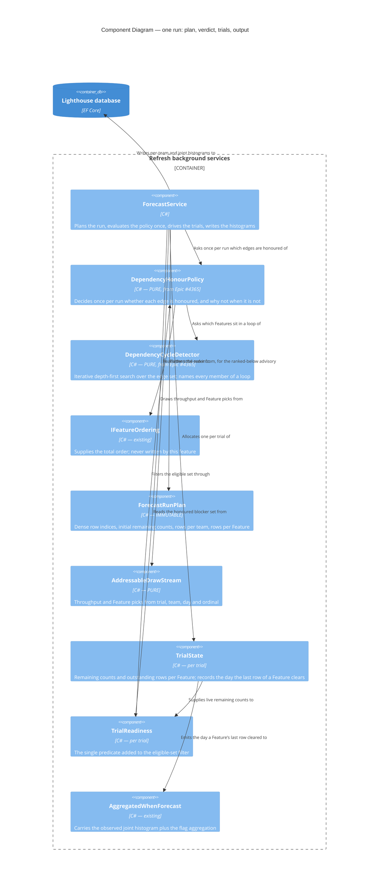

# Feature Delta — epic-5792-dependency-aware-forecasting

**ADO**: Epic #5792 "Dependency-Aware Forecasting" (New, created 2026-08-16, tagged `Premium`,
`Documentation`, `Release Notes`) · **Feature type**: cross-cutting (forecasting engine + Feature list
UI + licensing) · **Density**: lean · **DISCUSS run**: 2026-08-14 (as part of Epic #4365) ·
**DESIGN run**: 2026-08-14 · **Split into its own epic**: 2026-08-16

> **This epic was split out of Epic #4365 on 2026-08-16.** #4365 asked for dependencies end to end:
> *"Set dependencies on Features, then in the forecast, 'jump' over them until the dependent Features
> are forecasted to be done."* Its own scope assessment found two independently valuable outcomes in
> that sentence — *see the dependencies* and *forecast against them* — and noted the first is useful
> with the second never shipping. The split makes that an epic boundary.
>
> **Epic #4365 "Show Feature Dependencies"** (`docs/feature/epic-4365-dependencies/`) is the community
> half and ships first: reading edges from ADO, Jira and Linear, the Depends On column, the dialog, the
> warnings, cycle detection, and the per-Portfolio dependency-field override. Everything there is free.
>
> **This epic is the forecast effect, and it is premium.** It consumes what #4365 stores and decides,
> and adds nothing to ingestion or to the UI beyond one hint and the removal of one warning.
>
> Story and acceptance-criterion identifiers are **unchanged** from before the split: this epic owns
> US-05 through US-08 and their ACs, plus decisions D2 and D3, SA-1 through SA-7, SA-15, ADRs 154, 155,
> 156 (deferred) and 159, and KPIs 2, 4, 6 and 7. Slices were renumbered — #4365's old slices 03 and 04
> are this epic's 01 and 02.

Two findings from reading `ForecastService` are what make this epic worth its own name, and both were
established during the 2026-08-14 DISCUSS run.

1. **"Jump over" is not a date shift, and that is where the value is.**
   `ForecastService.GetSimulationResultsOfFeatureToUpdate` (`:201-209`) draws each simulated day's
   throughput from the first `min(FeatureWIP, remaining)` Features that still have remaining work, in
   order. Skipping a waiting Feature does not merely push *its* dates out — it hands its capacity to the
   Features **below** it, which finish **earlier**. A naive `max(own date, blocker's date)` gets the
   waiting Feature roughly right and every other Feature wrong. The mechanic has to live inside the
   simulation loop, per trial, or it is not this feature.

2. **The simulation is per-team and independent, so cross-team dependencies do not fit today.**
   `RunMonteCarloSimulation` (`:108-131`) groups `simulationResults` by team and runs each group's 10,000
   trials in its own `Task.Run`, each with its own day counter. Inside one trial of team T, no other
   team's Features exist and no other team's completion day is knowable. Since a dependency between two
   Features in one Portfolio very often crosses teams, the epic's core promise is unreachable without
   restructuring that loop. **The user's decision (2026-08-14) is to restructure it** — see D3.

That restructure is the reason this half carries essentially all of the original epic's technical risk,
and the reason it is now sequenced behind a community release that can land without it.

---

## Wave: DISCUSS / [REF] Inherited from Epic #4365

This epic did not re-run DISCUSS. It inherits the following from #4365's delta, unchanged, and does
not restate the reasoning:

| Inherited | What it gives this epic |
|---|---|
| **D1** — a dependency is a directed Feature-to-Feature edge | The thing the simulation reasons about |
| **D5 / SA-8 / ADR-157** — references stored on the Feature, graph derived on read | The edge set every trial reads, already populated and reconciled by #4365's sync |
| **D6** — a dependency changes the forecast only when both Features share a Portfolio | The scope of what may be honoured. #4365 detects, stores, shows and warns the cross-Portfolio case; this epic is where "does not change the forecast" becomes an assertion rather than a tautology |
| **D7 / SA-13 / F-5** — cycles detected inside the one honour policy | The guarantee that no cycle logic is needed inside the trial loop |
| **D10** — the UI word is "depends on", never "blocked" | The vocabulary for the one hint this epic adds |
| **D12** — Lighthouse never reorders to satisfy a dependency | Why a ranked-below blocker is a warning and not a re-rank, and why the simulation still terminates through one |
| **D13 / D14** — ADO first, then Jira and Linear; ServiceNow and CSV out | Which instances have edges at all. This epic is connector-agnostic by construction: it reads stored references and never a payload |
| **SA-12 / ADR-158** — one pure `IDependencyHonourPolicy`, written in #4365 slice 02 | The verdict this epic consults rather than re-deriving. **KPI-5 spans both epics**: a second decision point introduced here fails it |
| **SA-14** — the licence is a field of the policy's input, not a branch around the mechanic | What makes AC-6.2 structural instead of a code path that has to be remembered |
| **D16 / SA-17** — a Portfolio may ignore its dependencies; ignoring is a second field of that same input, added in #4365 slice 04 | **Nothing here.** That is the point: this epic consumes the honoured set, and a Portfolio that ignores its dependencies simply presents an empty one. No setting is read here, no branch is added, and no AC in this epic mentions the switch. It is why the switch was designed as a verdict rather than as skipped ingestion |
| **#4365's prerequisites** — `:5169` restored from a real backup, real Predecessor links created in ADO with `az boards work-item relation add` | The awkward shapes (a loop, a throughput-less blocker, a cross-team pair, a ranked-below pair) this epic cannot be verified without |

**Hard prerequisite**: Epic #4365 shipped through at least its slices 01 and 02. Without stored edges
and an honour-ability verdict there is nothing here to honour.

---

## Wave: DISCUSS / [REF] Persona IDs

| Persona | Role in this feature |
|---|---|
| `delivery-forecaster` | Primary, and the only persona this epic serves. Consumes the dates. Does not author dependencies, but is the persona harmed most by their absence — the forecast is confidently wrong, with nothing on screen suggesting it might be. Also the free-tier persona who must be told the forecast is ignoring something. |
| `product-owner` | Secondary. Reads the moved dates and the disappearance of the "not included in the forecast" warnings that Epic #4365 put on the row. |
| `delivery-lead-rte` | Secondary. Cross-team is where this persona's dependency pain actually lives; slice 02 is the one that addresses it. |

---

## Wave: DISCUSS / [REF] JTBD One-Liners

| Job ID | One-liner |
|---|---|
| `job-forecast-honours-what-cannot-start-yet` | When one Feature cannot start until another finishes, make the forecast simulate that, so the dates I present are not fiction. |
| `job-forecast-covers-dependencies-that-cross-teams` | When the Feature I am waiting on belongs to another team, make the forecast account for it too — most real dependencies cross a team boundary. |
| `job-forecaster-know-the-forecast-is-ignoring-a-dependency` | When my instance is not licensed for dependency-aware forecasting, tell me the dependency exists and that these dates do not account for it. |

All three carry `feature_context: epic-5792-dependency-aware-forecasting` in `docs/product/jobs.yaml`
as of 2026-08-16. Full job stories, dimensions, four forces and opportunity scores live there.

### Opportunity scores

| Job | Importance | Satisfaction | Gap | Note |
|---|---|---|---|---|
| `job-forecast-honours-what-cannot-start-yet` | 5 | 0 | **5** | The product's core output is computed as though every Feature could start today. There is no partial workaround: nothing in Lighthouse can express "not yet". |
| `job-forecast-covers-dependencies-that-cross-teams` | 5 | 0 | **5** | Same importance, and the same zero — but scored separately because it is the half that costs a simulation-engine change, and separating them is what lets the cheaper half ship first. |
| `job-forecaster-know-the-forecast-is-ignoring-a-dependency` | 4 | 0 | **4** | Today the free instance is not merely unlicensed, it is uninformed — the dates look exactly as authoritative as licensed ones. |

---

## Wave: DISCUSS / [REF] Current-State Surface Inventory

Only the surfaces this epic changes. Everything about ingestion, storage and the Feature list is in
Epic #4365's inventory and is not repeated.

| Surface | Location | State today |
|---|---|---|
| Simulation eligibility | `ForecastService.cs:201-209` | `simulationResults.Where(x => x.HasWorkRemaining)`, then a random pick within the first `min(FeatureWIP, count)`. **The single insertion point for D2.** |
| Simulation grouping | `ForecastService.cs:108-131` | `GroupBy(s => s.Team)`, one `Task.Run` per team, one independent day counter each. **The single thing D3 changes.** |
| Simulation seeding | `InitializeSimulationResults` (`:164-177`) | One `SimulationResult` per (Feature, Team) pair with `RemainingWorkItems > 0`. A done Feature already has no row, which is why D8's "already finished blocker" case costs nothing. |
| Randomness | `RandomNumberService` | `new Random().Next(maxValue)` — a fresh `Random` per draw, seeded from nothing. A fixed-seed test today can only assert draw order (F-9, SA-1). |
| Multi-team aggregation | `JointCompletionDistribution`, ADR-110 | Product of per-team CDFs, assuming independence. **Unchanged by this epic** — SA-6. |
| Warnings | `WarningsIndicator.tsx` | After Epic #4365: two pre-existing warning kinds plus the dependency ones. This epic adds the premium hint and removes the cross-team warning as it delivers. |
| Premium gate | `LicenseGuardAttribute` (backend), `hooks/useLicenseRestrictions.ts` (frontend) | Both shipped and in use. This epic reads the licence signal; it adds no premium **route**, because the gated thing is an effect with no endpoint. |

---

## Wave: DISCUSS / [REF] Locked Decisions

- **[D2] The forecast honours a dependency by EXCLUDING the dependent from the eligible set inside each
  trial, not by shifting its dates afterwards.** `GetSimulationResultsOfFeatureToUpdate` filters
  `Where(x => x.HasWorkRemaining)` today; it gains one predicate and filters
  `Where(x => x.HasWorkRemaining && ready)`. A Feature whose blockers still have remaining work *in
  this trial* is not eligible to receive throughput; the Features below it move up into the
  `FeatureWIP` window and consume that capacity instead. *Jump* is the epic's own word for it, and it
  is the entire difference between a feature and a cosmetic date adjustment. The post-hoc alternative
  (`max(own, blocker)`) was considered and rejected: it never frees the capacity, so every Feature
  ranked below a waiting one keeps a date that assumes work nobody is doing. KPI-2 exists to prove
  this distinction actually materialises on real data.

  If every eligible Feature is waiting, the team's throughput for that day is **discarded** rather
  than carried forward. An idle day is the honest outcome, and it is what makes D7 and D8 load-bearing
  rather than tidy: with nothing able to unblock, the run would never end.

  **No new per-trial state.** Each closed item already re-draws independently from the top of the
  eligible list, so a Feature becomes available again on the very next draw after its blocker clears;
  nothing needs to remember that a team was previously working on something. Modelling sticky WIP
  slots — a team holding a Feature until it finishes — was considered and rejected (user,
  2026-08-14): it would change dates for Features with no dependencies at all, which forfeits D3's
  distribution-preserving property and turns a safe restructure into a re-baseline.

  **Readiness aggregates across ALL of a blocker's rows.** `InitializeSimulationResults` creates one
  per (Feature, Team) pair, so a Feature worked by three teams is done only when all three hit zero.

- **[D3] One joint simulation across all teams, replacing the per-team independent runs**
  (user, 2026-08-14). Concretely, the loop nesting swaps from **team → trial → day** to
  **trial → day → team**: one trial advances a single day counter, and on each day every team with
  throughput draws its own throughput and consumes from its own rows. The per-day work itself — draw
  throughput, close that many items, pick which Feature each comes from — is untouched.

  That swap is the entire mechanism. Today team A's "day 5" and team B's "day 5" are not the same
  moment and not even the same trial, so "is A finished yet?" has no answer; once the clock is shared
  it means "finished by day 5 in this trial", and the dependency rule becomes one extra predicate in
  one place (D2).

  **Distribution-preserving when no dependency is present** — a team only ever consumes its own
  `SimulationResult` rows, so interleaving other teams between its days cannot change what happens to
  any row. Existing forecasts do not re-baseline, and DISTILL asserts it. Two consequences DESIGN must
  carry: teams need **separate RNG streams**, or a fixed-seed equality test fails on draw order rather
  than on distribution; and concurrency moves from per-team to **per-trial**, which is not a free
  `Parallel.For` — `ResetRemainingItems()` mutates the shared rows and `AddSimulationResult` writes a
  plain `Dictionary`, both safe today only because each team's task owns its group exclusively. Each
  trial needs its own remaining-count state and thread-safe histogram accumulation.

  **Correctness lands before speed** (user, 2026-08-14). The restructure ships as two commits: a
  serial joint loop proved against a fixed seed, then per-trial parallelism proved to leave that
  equality untouched. The intermediate is slower than today's release — per-team concurrency is gone
  and per-trial concurrency has not arrived — which is why both land inside one slice and neither is
  released alone. If parallelising moves a percentile, the state isolation is wrong, and proving it
  serially first is what makes that diagnosable.

- **[D8] A dependency whose blocker can never complete in this run is dropped for that run, and warned.**
  Three cases, one rule. A blocker that is **already finished** has no `SimulationResult` row
  (`InitializeSimulationResults` only admits `RemainingWorkItems > 0`) and therefore imposes no
  constraint — that case is free. A blocker whose **team has no throughput** is excluded from
  `RunMonteCarloSimulation` entirely (`Where(g => throughputByTeam.ContainsKey(...))`), so it never
  reaches zero remaining. A blocker **outside the current run's Feature set** likewise never completes.
  In the last two the dependent would wait forever, so the edge is dropped and the dependent is warned
  that its date ignores that dependency. Without this rule the epic ships a hang, and the hang appears
  only on instances that have a team with no recent throughput — which is most of them, eventually.

  Epic #4365 ships the *verdict and the warning*; this epic ships the *drop*, which is the half that
  keeps the loop terminating.

- **[D9] Premium gates the forecast effect and nothing else.** Verbatim from the original epic: *"If we
  don't have a premium license, you will see the warning that the item has a dependency together with
  the hint that it's not taken into account in the forecasting unless you have premium."* After the
  2026-08-16 split the free half is a separate epic, so the boundary reads simply: **everything in this
  epic is premium except US-06's hint, which is what an unlicensed instance sees instead of the
  effect.** The hint ships here rather than in #4365 because a hint naming a capability nobody can buy
  yet is worse than no hint at all.

- **[D10] One forecast per refresh batch, and it is this epic's to fix** (user, 2026-08-18). Discovered
  while designing slice 02. Two paths trigger a Portfolio forecast and neither knows about the other:
  `PortfolioUpdater` runs `UpdateForecastsForPortfolio` **inline** under the `(Features, portfolioId)`
  key, invisible to the `(Forecasts, portfolioId)` admission check; and
  `TeamDataRefreshedForecastTriggerHandler` fires the moment *one* Team finishes, which under **Update
  All** is the moment the other Teams are still refreshing. A Portfolio therefore gets two or three
  forecast executions per batch.

  **Update All is the ordinary case, not an edge.** `TeamsController.update-all`,
  `PortfoliosController.refresh-all`, the periodic refresh and the standalone offline auto-update all
  fan out this way; the user reports hitting it first thing every morning.

  **The redundant run is visible, not merely wasteful.** `RandomNumberService.GetRandomNumber` is
  `new Random().Next(maxValue)` — unseeded — so two executions over byte-identical data return
  different percentiles. The date settles and then changes again seconds later, for a reason no user
  can see. This is *not* fixed by ADR-154: it deliberately keeps a fresh production seed per run, so
  the only available cure is to stop running the second forecast.

  **Why in this epic rather than a backlog.** D3 turns a forecast from one short task per team into one
  joint run that lasts until the slowest team finishes. A redundant execution is cheap today and is not
  cheap after slice 02, which makes this a prerequisite rather than adjacent cleanup — and the user is
  explicit that it would not be prioritised standalone.

  **Not in scope, and recorded rather than scheduled**: making the forecast deterministic (a constant
  seed freezes one draw of sampling error into every date forever; an input-hash seed is a separate
  epic whose failure mode — sticky dates that silently stop moving — is worse than the wobble), and
  the cluster-awareness gap in the update queue's coalescing, which is written up as a Known Gap on
  ADR-076 because every deployment is single-pod today.

---

## Wave: DISCUSS / [REF] Scope Assessment

**Verdict: right-sized, and deliberately the riskier half.**

Three slices. Two are premium and inside `ForecastService`; slice 00 is `@infrastructure` in the
update queue, added 2026-08-18 (D10) and touching no forecasting code. The slicing rule that shaped
the other two: the
`RunMonteCarloSimulation` restructure (D3) is **not** a slice — it is three precursor commits inside
slice 02, because it has no user-visible output of its own by design.

The one conditional estimate in the whole original epic is slice 02's, and it lives here. Its brief
carries a required 2-hour probe and is re-cut before dispatch if the probe says the work is larger than
a day.

---

## Wave: DISCUSS / [REF] WS Strategy

**Strategy B — extend an existing skeleton.** Brownfield: `ForecastService`, `SimulationResult`, the
licence signal and the warnings column are all in production, and Epic #4365 has already put the edges
and the honour policy in place. No walking skeleton is built. Slice 01 is the thin end-to-end proof —
one predicate, one call site, dates that move.

---

## Wave: DISCUSS / [REF] Driving Ports

| Port | Surface | Introduced by |
|---|---|---|
| Forecast output | The 50/70/85/95 % dates themselves — the port that matters most and the one with no new endpoint | slices 01, 02 |
| UI — dependency warnings | The premium hint on an unlicensed instance; the cross-team warning removed for honoured edges | slice 01, slice 02 |
| Docs | The forecasting behaviour added to the dependencies page Epic #4365 wrote, per-feature screenshots | slice 02 |

No new HTTP route exists in this epic. The gated thing is an effect, which is why `LicenseGuardAttribute`
has nothing to attach to (SA-14 is why that is a design property rather than an oversight).

---

## Wave: DISCUSS / [REF] Pre-requisites

- **Epic #4365 shipped through at least slices 01 and 02** — stored edges, the honour-ability verdict,
  the warnings column. This is a hard prerequisite, not a preference.
- The dev instance on `:5169` restored from a real backup.
- **Real Predecessor links created in the dogfood ADO project**, covering a same-team pair, a
  cross-team pair, a cross-Portfolio pair, a blocker ranked below its dependent, a two-Feature cycle,
  and a blocker whose team has no throughput. Slice 01 cannot be verified without the last three.
  Created directly in ADO with `az boards work-item relation add` — Lighthouse has no way to author
  them (D4).
- **A premium licence on the verification instance, and a deliberately unlicensed profile** for KPI-6
  and AC-6.2.
- A recorded **pre-epic forecast wall-clock baseline** and a fixed-seed percentile snapshot, both
  captured before the first precursor commit of slice 02. AC-7.2 is asserted against the pre-epic
  number, never against the serial intermediate.

---

## Wave: DISCUSS / [REF] Out of Scope

- **Everything Epic #4365 owns**: ingestion from any connector, the storage shape, the Depends On
  column, the dialog, the cycle detector, the honour policy itself, and the per-Portfolio dependency
  field. This epic reads all of it and changes none of it.
- **Cross-Portfolio forecast effect** (D6) — warned by #4365, never simulated here.
- **Replacing the multi-team aggregation.** ADR-156 was proposed and **deferred** (SA-6). ADR-110's
  product of CDFs stays.
- **A fixed production seed.** Considered and deliberately not taken (F-9, ADR-154).
- **Auto-reordering to satisfy a dependency** (D12).
- **Marketing website copy.** Flagged for the DELIVER checklist under the `Release Notes` tag.

---

## Wave: DISCUSS / [REF] User Stories

Identifiers are unchanged from before the split. US-01 through US-04 and US-09 live in Epic #4365.

---

### US-05 — The forecast jumps over a Feature that cannot start

`job_id: job-forecast-honours-what-cannot-start-yet` · persona `delivery-forecaster` · **slice 01** ·
premium

As a delivery forecaster, I want the forecast to give a waiting Feature's capacity to the ones behind it
until its blocker is done, so that the dates reflect the order work can actually happen in.

### Elevator Pitch
Before: the forecast simulates every Feature as startable today, so a Feature that cannot begin for six
weeks gets a date as though it could.
After: open a Portfolio → the waiting Feature's 85% date has moved out, **and at least one Feature
ranked below it has moved in**, because it now gets the capacity.
Decision enabled: whether the delivery date you are about to commit to is achievable at all.

**Acceptance criteria**

- **AC-5.1** Given Features A, B, C in that order, one team, and B waiting on A: B's simulated completion
  is never earlier than A's within a trial.
- **AC-5.2** In the same setup, C's 85% date is **earlier** with the dependency honoured than without —
  the capacity B did not consume went to C. This is the AC that distinguishes D2 from a date shift.
- **AC-5.3** With no dependencies present anywhere, forecast percentiles are unchanged from the previous
  release within Monte Carlo noise, asserted against a fixed random seed.
- **AC-5.4** A dependency whose blocker is in another team is **not** honoured in this slice, and the
  dependent carries a warning saying so (removed by US-08).
- **AC-5.5** A cycle in the data produces the US-03 warning and a forecast that completes in normal
  time — no member of a cycle constrains any other in the simulation.
- **AC-5.6** A blocker whose team has no throughput, or which is absent from the run, is dropped for
  that run and the dependent is warned; the run terminates.
- **AC-5.7** A blocker that is already finished imposes no constraint and produces no warning.
- **AC-5.8** A cross-Portfolio dependency does not change any date (D6).

---

### US-06 — Know the forecast is ignoring a dependency

`job_id: job-forecaster-know-the-forecast-is-ignoring-a-dependency` · persona `delivery-forecaster` ·
**slice 01** · free behaviour inside a premium epic

As a delivery forecaster on an unlicensed instance, I want to be told that a Feature has a dependency
and that these dates do not account for it, so that I do not present them as though they did.

### Elevator Pitch
Before: an unlicensed instance's dates look exactly as authoritative as a licensed one's, with nothing
to suggest a dependency was ignored.
After: open **Features** without a premium licence → the row shows its Depends On count and a warning
reading "Waits on 1 Feature — dependencies are not included in forecasts without a premium licence".
Decision enabled: whether to trust this date, chase the dependency by hand, or ask for a licence.

**Acceptance criteria**

- **AC-6.1** On an unlicensed instance, every Feature with at least one dependency renders the count,
  the dialog, and the premium hint.
- **AC-6.2** On an unlicensed instance, forecast percentiles are byte-identical to a run with the
  dependency data absent — nothing is silently half-applied.
- **AC-6.3** Licensing the instance and re-running the forecast changes at least one date, with no other
  change of any kind.
- **AC-6.4** The hint names what is withheld and why, and does not use the word "blocked".

**Why this story is here and not in Epic #4365.** The count and the dialog it references are #4365's,
and shipped free. The hint is not: it names a premium capability, and shipping it before that
capability exists advertises something nobody can buy. It rides slice 01 because that is the first
moment the sentence is true.

---

### US-07 — One joint simulation `@infrastructure`

`job_id: infrastructure-only` · **precursor commits inside slice 02**, never a slice of its own

`infrastructure_rationale`: restructuring `RunMonteCarloSimulation` from one `Task.Run` per team to a
single per-trial loop over a shared day clock produces **no user-visible output on its own** — by
design, since D3's correctness argument is precisely that it changes nothing observable while no
dependency crosses a team. It cannot be released alone and it cannot be verified alone; its verification
is AC-5.3 re-run and US-08's ACs. It lands as the first commits of slice 02, ahead of the story that
needs it.

**Acceptance criteria**

- **AC-7.1** With no cross-team dependency present, every percentile for every Feature matches the
  pre-change run under a fixed random seed. **Exact equality**, not "within noise" — the addressable
  draw stream (SA-1) lands first precisely so this can be exact.
- **AC-7.2** Forecast wall-clock time for the dogfood instance's full Feature set stays within **1.5×**
  the **pre-epic** baseline; expectation ≤ 1.0× (SA-4). Asserted only after the parallelism commit —
  the serial intermediate is deliberately slower and is never released (user, 2026-08-14: correctness
  first, speed second).
- **AC-7.3** A team with no throughput is excluded exactly as before, and its Features' behaviour is
  unchanged.

---

### US-08 — Dependencies that cross teams count too

`job_id: job-forecast-covers-dependencies-that-cross-teams` · persona `delivery-forecaster` ·
**slice 02** · premium

As a delivery forecaster, I want a dependency on another team's Feature to move my dates, so that the
most common kind of real dependency stops being the one Lighthouse ignores.

### Elevator Pitch
Before: the warning says "waits on a Feature owned by another team — not included in the forecast", and
that covers most real dependencies.
After: open a Portfolio → that warning is gone and the waiting Feature's 85% date has moved to sit
behind the other team's Feature.
Decision enabled: whether a cross-team commitment is realistic, without building the two forecasts by
hand and comparing them in a spreadsheet.

**Acceptance criteria**

- **AC-8.1** Given team X's Feature B waiting on team Y's Feature A, B's simulated completion is never
  earlier than A's within a trial.
- **AC-8.2** The cross-team warning from AC-5.4 no longer renders for an honoured cross-team edge.
- **AC-8.3** Team X's throughput continues to be drawn from team X's own history — a joint clock shares
  time, never throughput.
- **AC-8.4** A cross-team cycle is detected and warned exactly as a same-team one (D7).
- **AC-8.5** A cross-team blocker on a team with no throughput follows D8 — dropped, warned, run
  terminates.
- **AC-8.6** AC-5.3 still holds: with no dependencies present, dates are unchanged.

---

### US-10 — One forecast per Portfolio per refresh batch

`job_id: job-trust-the-date-i-am-looking-at` · persona `delivery-forecaster` · **slice 00** · no licence gate

As a delivery forecaster, I want a refresh to produce one date rather than a sequence of them, so that I
can trust the number on screen instead of waiting to see whether it settles.

### Elevator Pitch
Before: hit **Update All**, watch a Portfolio's dates land, then watch them change again a few seconds
later — because two or three forecasts ran, and an unseeded simulation returns a different answer each
time over identical data.
After: one forecast per Portfolio per batch, one date.
Decision enabled: reading a forecast the moment it appears, rather than refreshing twice to check.

**Acceptance criteria**

- **AC-10.1** An Update All across N Teams sharing one Portfolio runs exactly one Forecasts execution
  for that Portfolio.
- **AC-10.2** A Portfolio refresh and a Team refresh overlapping in time produce one forecast, not two.
  `PortfolioUpdater`'s inline `UpdateForecastsForPortfolio` moves onto the shared
  `(Forecasts, portfolioId)` key so the two paths can see each other at all.
- **AC-10.3** Write-back volume per Portfolio refresh does not increase, asserted on the connector call
  count. This is the number ADR-144 was written to protect, and splitting `PortfolioUpdater`'s single
  flush is only safe because its two staging passes are disjoint by construction —
  `ResolvePortfolioWriteBack` partitions mappings on `ForecastSources.Contains(m.ValueSource)`.

---

### US-11 — The forecast waits for the whole batch `@infrastructure`

`job_id: infrastructure-only` · **slice 00**

`infrastructure_rationale`: the debounce has no surface of its own — it is the mechanism US-10's
acceptance criteria measure, and it ships in the same slice as the story that makes it observable. It
is separated from US-10 because it changes `IUpdateStatusStore`, a shared port with two implementations,
and that blast radius deserves its own commit and its own review.

**Acceptance criteria**

- **AC-11.1** A trigger raised while sibling work is in flight is **parked**, never dropped. The forecast
  that eventually runs reflects every Team's refreshed data — dropping would lose the write that caused
  the trigger, which is the failure the existing coalescing was built to avoid.
- **AC-11.2** A Team update with no sibling work in flight still triggers its forecast immediately. The
  debounce must add no latency to the single-Team case.
- **AC-11.3** `IUpdateStatusStore` gains a per-Portfolio active-work query implemented in **both**
  `InProcessUpdateStatusStore` and `RedisUpdateStatusStore`; `HasActiveWork()` is global and cannot
  answer it.

---

## Wave: DISCUSS / [REF] Story Map

**Backbone** (user activities, left to right):
*Forecast against a dependency* → *Trust it across teams*

| Slice | Stories | Outcome shipped | Licence |
|---|---|---|---|
| **00** One forecast per refresh batch `@infrastructure` | US-10, US-11 | Update All produces one forecast per Portfolio, so a date stops changing twice for no visible reason | none — a queue fix, not a gated effect |
| **01** Forecast jumps over a same-team blocker | US-05, US-06 | Dates that account for waiting — and honesty when they do not | premium (US-06's hint is what the unlicensed instance gets instead) |
| **02** Joint simulation, cross-team | US-07 `@infrastructure` (three precursor commits), US-08 | The dependency kind that is actually most common | premium |

**Slice composition gate**: all three slices carry a user-visible value story — slice 00's is the date
that stops moving on its own. US-07 is precursor commits inside slice 02, not a slice.

**Re-numbered 2026-08-16** by the split: these were Epic #4365's slices 03 and 04. No slice content
changed and no story or AC identifier moved.

**Carpaccio taste tests**

| Test | Verdict |
|---|---|
| Any slice shipping 4+ new components? | **Pass.** Slice 01 is one predicate and one collaborator. Slice 02 is the restructure, and its components (`ForecastRunPlan`, `TrialState`, `AddressableDrawStream`) exist to *remove* shared state rather than to add layers. |
| Every slice depending on a new abstraction? | **Pass.** Slice 01 depends only on what Epic #4365 already shipped. |
| Does any slice disprove a pre-commitment? | **Pass.** Slice 01 can disprove that exclusion redistributes capacity at all (KPI-2) — the claim the whole epic rests on. Slice 02 can disprove that a joint simulation is affordable (AC-7.2). |
| Synthetic-only data anywhere? | **Pass.** Both slices dogfood on `:5169` restored from a real backup, with the awkward shapes created as real ADO links. |
| Two slices identical except for scale? | **Pass.** Slice 02 is not "slice 01 for more teams" — it is a loop restructure that makes cross-team knowable at all. |

---

## Wave: DISCUSS / [REF] Prioritization

1. **Slice 00** first, and not because slice 01 needs it — it is cheapest to prove "one forecast per
   batch" while a forecast is still the thing it is today. Landing it after slice 02 would mean
   changing the trigger topology and the simulation loop inside the same window, and the wobble
   measurement it carries wants a pre-restructure number.
2. **Slice 01** because it is where the epic becomes true, and it is deliberately the *same-team*
   half: it proves the exclusion mechanic, cycle handling and termination against real data without
   touching `RunMonteCarloSimulation`. If D2 is wrong about capacity redistribution, this is the
   cheapest place to find out — before a simulation rewrite has been spent on it.
3. **Slice 02** carries the highest technical risk (D3) and is sequenced after slice 01 has confirmed
   the mechanic it generalises. Reversing them would mean debugging a new simulation loop and a new
   eligibility rule at the same time.

**Dogfood cadence**: same-day on `:5169` for every slice, and each leaves a **before/after date
comparison** in its brief. "The dates moved" is the only evidence that matters here and it does not
appear in a test run.

---

## Wave: DISCUSS / [REF] Outcome KPIs

| KPI | Target | Measurement | Scope |
|---|---|---|---|
| **KPI-2** The forecast actually moves | ≥ 1 Feature's 85% date moves by ≥ 3 working days with the effect on, **and** ≥ 1 Feature ranked below a waiting one moves **earlier** | Forecast diff with the effect on and off, recorded in the slice 01 brief | `vendor_demo_only` |
| **KPI-4** The forecast always terminates | 0 runs exceeding the pre-epic p99 duration across 5 consecutive scheduled refreshes, with a cycle, a throughput-less blocker and a cross-Portfolio edge all present in the data | Scheduled runs on `:5169` with the seeded shapes from the prerequisites | `per_instance` |
| **KPI-6** Free-tier honesty | On an unlicensed instance: 100% of Features with a dependency show the hint, and 0 forecast values differ from a dependency-free run | E2E against the unlicensed profile (AC-6.1, AC-6.2) | `per_instance` |
| **KPI-7** Cross-team coverage | ≥ 80% of the dogfood instance's detected same-Portfolio dependencies are honoured after slice 02, versus the same-team subset after slice 01 | Count honoured vs. detected edges before and after | `vendor_demo_only` |

**KPI-5 is shared with Epic #4365** and is where the two epics can most easily go wrong together:
exactly one place in the codebase decides whether a dependency is honoured. That place is written in
#4365 slice 02; a second decision point introduced here fails it for both.

KPI-2 is the one that decides whether this epic was worth building. If no Feature below a waiting one
moves earlier, D2 reduces to a date shift and the design is wrong, not the data.

---

## Wave: DISCUSS / [REF] Definition of Done

1. All acceptance criteria for the slice pass as automated tests.
2. `dotnet build` zero warnings; `dotnet test` green.
3. `pnpm test`, `pnpm build` (zero warnings), Biome clean — stated explicitly as N/A per slice where
   there is no frontend change.
4. Mutation testing ≥ 80% kill rate on the changed backend surface. **Non-negotiable on the eligibility
   rule and the readiness predicate**, where a surviving mutant is a hang or a wrong date rather than a
   metric.
5. SonarQube Cloud: no new issues of any severity, including security hotspots.
6. EF migration generated with the `CreateMigration` script, additive only.
7. Docs updated per-feature, in the seeded terminology, with per-feature screenshots.
8. ADO story transitioned; slice pushed only after CI is green.
9. The slice's learning hypothesis has an explicit verdict recorded in its brief — confirmed or
   disproved, never blank.
10. The before/after date comparison is recorded in the slice brief.

---

## Wave: DISCUSS / [REF] DoR Validation

| # | Item | Verdict | Evidence |
|---|---|---|---|
| 1 | Business value articulated | ✅ | The forecast is the product's core output and is computed as though nothing waits on anything. KPI-2 and KPI-7 carry the outcome |
| 2 | Job traceability | ✅ | 3 jobs in `docs/product/jobs.yaml`; all 3 value stories carry a real `job_id`; US-07 is `@infrastructure` with a rationale and is precursor commits inside slice 02 |
| 3 | Acceptance criteria testable | ✅ | 21 ACs, each observable from a forecast percentile, a rendered warning, a wall-clock measurement or a completed run |
| 4 | Dependencies identified | ✅ | Epic #4365 slices 01-02 shipped; `:5169` restored from a real backup; real Predecessor links created in ADO; premium + unlicensed profiles; a pre-epic timing and percentile baseline |
| 5 | Sliced ≤ 1 day each | ⚠️ | 2 briefs. Slice 01 is ~6h. **Slice 02 is the exception** — D3's restructure is bounded by AC-7.2 at 1.5× (SA-4), and its brief carries a required 2-hour probe; it is re-cut if the probe says the parallelism change is larger than a day |
| 6 | No known blockers | ✅ | None, once Epic #4365's slices 01-02 have landed. That is a sequencing constraint, recorded as a prerequisite rather than a blocker |
| 7 | Observable surface defined | ✅ | Driving Ports table; the forecast dates themselves are named as the port that matters and the one with no endpoint |
| 8 | Test data / environment available | ⚠️ | `:5169` has real ADO/Jira/Linear Features but contains no cycle and no throughput-less blocker. Both are created directly in ADO before slice 01, because D4 leaves Lighthouse no way to author them |
| 9 | Outcome KPI with numeric target | ✅ | 4 KPIs plus the shared KPI-5, each with a number or a binary and a named measurement source |

**Requirements completeness: 0.95.** The missing 0.05 is items 5 and 8, both stated as open with a plan
rather than guessed at.

---

## Wave: DISCUSS / [REF] Wave Decisions Summary

### Key decisions

- **[D2]** Exclusion inside the trial, not a date shift afterwards. It is the difference between this
  feature and a cosmetic one, and KPI-2 is written to falsify it.
- **[D3]** One joint simulation across teams — the epic's promise is unreachable without it, and it is
  distribution-preserving where no dependency crosses a team, which is what makes it safe to ship.
- **[D8]** Unforecastable blockers dropped per run. Under D2 this is a termination guarantee, not
  polish: without it, the simulation's `while` loop does not end.
- **[D9]** Premium gates the forecast effect; an unlicensed instance is told plainly what is withheld.

### Requirements summary

- **Primary needs**: a forecast that knows what cannot start yet and gives that capacity to what can;
  the same across a team boundary, which is where most real dependencies live; and an unlicensed
  instance that says plainly it is ignoring one.
- **Walking skeleton scope**: none built (strategy B). Slice 01 is the thin end-to-end proof through
  the existing simulation.
- **Feature type**: cross-cutting.

### Constraints established

- The Monte Carlo simulation must terminate on every input, including cycles, self-references and
  blockers that can never complete. This constrains the design more than any functional requirement.
- Existing forecasts must not re-baseline. D3 is only acceptable because it is distribution-preserving
  in the absence of dependencies, and AC-5.3 / AC-7.1 assert that under a fixed seed.
- **One change to forecasting at a time** (maintainer, 2026-08-14). This is why ADR-156 is deferred and
  why slice 02's four commits are ordered the way they are.
- Terminology is the instance's own; `blocked` is off-limits for this concept.
- **No commit lands without the maintainer's explicit approval** (user, 2026-08-14). This epic edits the
  Monte Carlo loop every date in the product comes from, so the usual "green then commit" autonomy is
  suspended for its whole length: DISTILL and DELIVER stop and ask before every commit, including
  test-only and refactor commits. Scoped to **this epic only** (maintainer, 2026-08-16) — Epic #4365
  moves no date and runs on the project's normal slice-boundary discipline.

### Upstream changes

None. No DISCOVER or DIVERGE wave ran. The 2026-08-16 split re-homed decisions and stories between two
epics without altering any of them.

---

## Wave: DISCUSS / [REF] SSOT Updates

- `docs/product/jobs.yaml` — 3 jobs re-pointed to `feature_context: epic-5792-dependency-aware-forecasting`
  on 2026-08-16.
- `docs/product/journeys/epic-5792-dependency-aware-forecasting.yaml` — created 2026-08-16 from the
  forecasting journey in `epic-4365-dependencies.yaml`.
- `docs/product/personas/delivery-forecaster.yaml` — its three dependency jobs now name this epic.

---

## Wave: DESIGN / [REF] Prior-Wave Reading Confirmation

DESIGN ran on 2026-08-14 across the whole of the original Epic #4365. What follows is the part of its
output that belongs to the forecasting half.

- ✓ Epic #4365's `feature-delta.md` and all six original slice briefs.
- ✓ `docs/product/journeys/epic-4365-dependencies.yaml` — 3 journeys, 15 `design_decisions_resolved`,
  4 shared artifacts, 5 error paths.
- ✓ `docs/product/architecture/brief.md` — read for house style.
- ✓ **ADRs read in full**: 110 (multi-team joint probability — the load-bearing interaction), 111
  (aggregate provenance), 112 (unknown forecast when a contributor cannot be forecast — the second
  load-bearing interaction), 113 (delivery-grain joint completion), 132-136 (Feature ordering, epic
  #5375), 138/139/140 (two-phase incremental sync, epic #5687), 102/103/104 (Feature *blocked*). ADR
  index read by filename: **the delta's "next free number is 140" is stale — 140 through 153 exist, so
  this work starts at 154** (F-1).
- ✓ **Code read during this wave**: `Services/Implementation/Forecast/ForecastService.cs` (whole),
  `Models/SimulationResult.cs`, `Models/Feature.cs` (whole),
  `Models/Forecast/{WhenForecast,AggregatedWhenForecast,JointCompletionDistribution}.cs`,
  `Services/Implementation/{FeatureOrdering,RandomNumberService}.cs`,
  `Services/Interfaces/IRandomNumberService.cs`,
  `Lighthouse.Frontend/src/hooks/useLicenseRestrictions.ts`,
  `Lighthouse.Backend.Tests/Architecture/*ArchUnitTest.cs`.
- ✓ `CLAUDE.md`, `docs/ci-learnings.md` — standing rules applied.

Three DISCUSS statements were checked against the code and found to need correction; the ones
concerning this half are written out under *Forks and upstream corrections*.

---

## Wave: DESIGN / [REF] Domain-Driven Design decisions

No new bounded context. This epic lives entirely inside the existing **Forecasting** context and
consumes the **Feature Dependency** module Epic #4365 introduces.

- **DDD-1 — Ubiquitous language.** Inherited from Epic #4365, plus two terms this epic owns: *ready*
  (the dependent's blockers have all finished in this trial) and *honoured* as an operative state
  rather than a displayed verdict. **The word *blocked* is not used anywhere in this feature.**
- **DDD-4 — Contract shapes, declared at design time.**

  | Component | Contract shape | Universe / mutation set | How the crafter asserts it |
  |---|---|---|---|
  | `IDrawStream.Draw` | **pure-function** | none — no state exists to mutate | Static function of six integers; a same-coordinates-same-result property test |
  | `TrialState` / `TrialReadiness` | **bounded-change** | its own arrays, allocated by the trial that owns it, never reachable from another trial | Allocated inside the trial body; ArchUnitNET forbids either type being a field of `ForecastService` or `SimulationResult` |
  | `SimulationResult` (after ADR-155) | **bounded-change**, narrowed | its own completion histogram | Run state removed from the type, so the previous shared mutation is unrepresentable |
  | `ForecastRunPlan` | **immutable** | none | Constructed once per run; no setter |

- **DDD-6 — No domain event is published.** Inherited reasoning from Epic #4365: the honour-ability
  verdict is derived in O(V+E) from data the run already loads.
- **DDD-7 — Feature order is read, never written.** This feature reads the total order for the sequence
  the simulation walks, and writes no rank under any circumstance.

---

## Wave: DESIGN / [REF] Component Decomposition

New backend types live under `Services/{Interfaces,Implementation}/Forecast/`, mirroring the existing
layout. Everything under `Services/…/Dependencies/` is Epic #4365's and is consumed unchanged.

| Component | Path | Change | Summary | Slice |
|---|---|---|---|---|
| `TrialReadiness` | `Services/Implementation/Forecast/TrialReadiness.cs` | **CREATE NEW** | The one predicate the eligible-set filter consults. Aggregates across all of a blocker's rows | 01 |
| `ForecastService` | `Services/Implementation/Forecast/ForecastService.cs` | **EXTEND** | One predicate on the eligible set (01); then the loop nesting swaps to `trial → day → team`, the per-Feature completion recorder and the trial-day ceiling (02) | 01, 02 |
| `IDrawStreamFactory` / `AddressableDrawStream` | `Services/{Interfaces,Implementation}/Forecast/` | **CREATE NEW** | `Draw(seed, trial, team, day, ordinal, maxExclusive)`. No state, no allocation, no lock (ADR-154) | 02 |
| `ForecastRunPlan` | `Services/Implementation/Forecast/ForecastRunPlan.cs` | **CREATE NEW** | Immutable flattening of the run: row indices, initial remaining counts, rows per team, rows per Feature | 02 |
| `TrialState` | `Services/Implementation/Forecast/TrialState.cs` | **CREATE NEW** | Per-trial remaining counts, outstanding-row count per Feature, completion emissions. Owned by one trial | 02 |
| `SimulationResult` | `Models/SimulationResult.cs` | **EXTEND (narrowed)** | Run state (`RemainingItems`, `ResetRemainingItems`, `HasWorkRemaining`) leaves; identity + histogram stay | 02 |
| `AggregatedWhenForecast` | `Models/Forecast/AggregatedWhenForecast.cs` | **EXTEND** | Flag aggregation and provenance kept; the distribution is supplied by the simulation rather than derived | 02 |
| `JointCompletionDistribution` | `Models/Forecast/JointCompletionDistribution.cs` | **NO CHANGE** | Kept. ADR-156 proposed deleting it in favour of an observed per-trial maximum and was **deferred** — the correlation dependencies introduce biases the product of CDFs *conservatively*, not optimistically | — |
| `IRandomNumberService` | `Services/Interfaces/IRandomNumberService.cs` | **NO CHANGE** | Kept for `HowMany` and work-item-creation forecasting | — |
| `LighthouseAppContext` | `Data/LighthouseAppContext.cs` | **EXTEND** | Entity configuration for the aggregate forecast row (OQ-7) | 02 |
| `WarningsIndicator` | `…/FeatureListDataGrid/WarningsIndicator.tsx` | **EXTEND** | The premium hint joins the dependency warnings Epic #4365 added; the cross-team warning stops rendering for honoured edges | 01, 02 |
| `useLicenseRestrictions` | `Lighthouse.Frontend/src/hooks/useLicenseRestrictions.ts` | **NO CHANGE** | The existing premium signal is exactly what the hint needs | — |
| `IDependencyHonourPolicy` | `Services/Interfaces/Dependencies/…` | **CONSUMED, NOT CHANGED** | Epic #4365's. A second implementation, or a second decision point here, fails KPI-5 for both epics | — |
| `DependencyCycleDetector` | `Services/Implementation/Dependencies/…` | **CONSUMED, NOT CHANGED** | As above. No cycle logic enters the trial loop | — |
| `IUpdateStatusStore` | `Services/Interfaces/Update/IUpdateStatusStore.cs` | **EXTEND** | One member: does any key in a caller-supplied set stand `Queued`. The existing global `HasActiveWork()` is untouched | 00 |
| `InProcessUpdateStatusStore` | `…/BackgroundServices/Update/InProcessUpdateStatusStore.cs` | **EXTEND** | The new member over the injected `ConcurrentDictionary` | 00 |
| `RedisUpdateStatusStore` | `…/BackgroundServices/Update/RedisUpdateStatusStore.cs` | **EXTEND** | The new member as one batched read of the `lighthouse:update-status` hash. This adapter runs only where Redis is configured, so a wrong answer here is invisible to every test that does not stand one up | 00 |
| `ForecastUpdater` | `…/BackgroundServices/Update/ForecastUpdater.cs` | **EXTEND** | Overrides `TriggerUpdate`: reads the Portfolio's Team set, asks the store whether any sibling key is `Queued`, and calls `base.TriggerUpdate` when none is. One repository read per forecast trigger, in a scope the base class already knows how to create | 00 |
| `UpdateServiceBase` | `…/BackgroundServices/Update/UpdateServiceBase.cs` | **EXTEND (one keyword)** | `TriggerUpdate` becomes `virtual`. Nothing else moves — the write-back flush contract in its `finally` is untouched | 00 |
| `PortfolioUpdater` | `…/BackgroundServices/Update/PortfolioUpdater.cs` | **EXTEND (narrowed)** | The inline `UpdateForecastsForPortfolio`, the forecast write-back staging beside it and the `PortfolioForecastsUpdated` publish all leave; a trigger on `(Forecasts, portfolioId)` replaces them. Gains an `IForecastUpdater` dependency — singleton to singleton, and `ForecastUpdater` does not depend on `IPortfolioUpdater`, so no cycle | 00 |

Slice 00 adds no type and touches nothing under `Services/…/Forecast/`. It lives one layer upstream, in
the refresh queue that decides *how often* a forecast runs, which is why it appears in no C4 diagram this
epic renders — the L3 diagram starts after the trigger it changes.

`ForecastUpdater` is the only updater registered as a plain singleton and **not** also as a hosted
service (`Program.cs:1264`, against `AddHostedService<PortfolioUpdater>()` + `AddSingleton<IPortfolioUpdater,
PortfolioUpdater>()` at `:1261-1262`, which construct two instances). It is therefore the only updater
with a single instance for a scheduling rule to live in.

**Shared-artifact binding**: *per-trial completion state* → `TrialState` (this epic's only new owner).
*honour-ability verdict* → `DependencyHonourPolicy`, owned by Epic #4365 and read here. *Feature order*
→ `IFeatureOrdering`, owned by epic #5375 and read here.

---

## Wave: DESIGN / [REF] Driving Ports

| Port | Surface | Guard | Slice |
|---|---|---|---|
| Forecast output | The 50/70/85/95 % dates themselves — the port that matters most and the one with no new endpoint | premium gates the effect only | 01, 02 |
| UI | Dependency warnings in the existing warnings column: the premium hint added, the cross-team warning removed as it is delivered | free to read | 01, 02 |

---

## Wave: DESIGN / [REF] Driven Ports and Adapters

**Driven (extended):** `IUpdateStatusStore`, in slice 00. It gains one member — does any key in a
caller-supplied set stand `Queued` — and **both** adapters implement it: `InProcessUpdateStatusStore`
over its injected `ConcurrentDictionary`, `RedisUpdateStatusStore` as a batched read of the
`lighthouse:update-status` hash. The existing `HasActiveWork()` cannot answer the question. It scans the
whole store, so on any instance with a second Portfolio or an unrelated Team it is true whenever anything
anywhere is refreshing, and a debounce built on it would park every forecast behind every other update in
the system.

The port is shared across epics — `DatabaseMaintenanceGate` reads `HasActiveWork()`, and ADR-076's INV-1
and INV-2 bind it — so the extension is additive by construction: no existing member changes signature or
meaning.

No connector is touched and no additional request is made to any tracker. Slices 01 and 02 read stored
references and write forecast histograms.

**Driven (new):** none. No new outbound integration, no new store, no new transport.

**External integrations requiring contract tests**: none owned by this epic. The three tracker
contracts are Epic #4365's and are listed there.

---

## Wave: DESIGN / [REF] Technology Choices

| Choice | Verdict | Rationale |
|---|---|---|
| New runtime dependency | **None** | Everything is in the solution or in the .NET base class library |
| PRNG for the addressable draw stream | **Hand-written SplitMix64-class mixer + Lemire unbiased reduction**, ~20 lines, no branches | No OSS package supplies the property that matters — addressability by coordinate — so a package would still be wrapped in the same function, at the cost of a dependency on the core forecasting path. `System.Random(seed)` was rejected because .NET documents its algorithm as free to change between releases, which would make an exact-equality regression test break on a runtime upgrade for no defect |
| Parallelism primitive | **`Parallel.For` over trials with per-partition accumulation** | 10 000 units instead of a handful of teams. No lock and no `ConcurrentDictionary`, because the addressable stream and per-trial state remove the shared mutable state rather than guarding it |
| Persistence | **EF Core, one additive forecast row shape** | Expand-only, generated with the existing `CreateMigration` PowerShell script across all supported providers |
| Architecture enforcement | **ArchUnitNET** (already in `Lighthouse.Backend.Tests/Architecture/`) | Five precedents in the repository; no new tool, no new licence |

All choices are existing, permissively-licensed OSS or first-party code. No proprietary component is
introduced.

---

## Wave: DESIGN / [REF] Decisions

| # | Decision | Resolves | ADR |
|---|---|---|---|
| **SA-1** | The forecast draws from an addressable stream: a draw is a function of `(seed, trial, team, day, ordinal)`, never of a position in a sequence | OQ-2 (determinism half); makes AC-5.3 / AC-7.1 / AC-8.6 **exact** rather than "within noise" | [154](../../product/architecture/adr-154-addressable-draw-streams-for-the-feature-forecast.md) |
| **SA-2** | Loop nesting swaps to `trial → day → team`; `SimulationResult` stops being run state and `TrialState` owns the per-trial arrays | D3; OQ-2 (safety half) | [155](../../product/architecture/adr-155-joint-trial-clock-replaces-per-team-simulation.md) |
| **SA-3** | Histograms accumulate per partition and fold once, in row order. No lock, no concurrent collection | OQ-2 (histogram half) | 155 |
| **SA-4** | AC-7.2's number: the parallel joint run must finish within **1.5×** the pre-epic wall clock; expectation ≤1.0×. The serial intermediate carries no budget and is never released | AC-7.2 (DESIGN owed this number) | 155 |
| **SA-5** | A last-resort ceiling on simulated days per trial aborts the run with a structured `forecast.trial.aborted` event naming the trial coordinates. Not how termination is achieved — how a mistake in achieving it becomes visible | KPI-4 | 155 |
| **SA-6** | The multi-team aggregation is **unchanged**. ADR-110's product of CDFs stays; `JointCompletionDistribution` is kept. The correlation a dependency introduces biases it **conservatively** (dates read slightly late), only for Features that are both multi-team and dependent — an accepted, documented residual | Maintainer, 2026-08-14: one change to forecasting at a time, and the deferred ADR's premise had the bias direction inverted | [156](../../product/architecture/adr-156-per-trial-max-replaces-product-of-cdfs.md) (Deferred) |
| **SA-7** | Slice 02 is **four** commits in this order: addressable stream → serial joint loop → per-trial parallelism → cross-team honouring. **No commit moves a date on a dependency-free Feature** — dropping the aggregation change removed the only one that would have | F-6, resolved; the "correctness first" constraint | 154, 155 |
| **SA-15** | A blocker that cannot be simulated drops the edge; the dependent's dates are presented as an **earliest-possible**, and the row points at the blocker, which already reports unknown under ADR-112 | The ADR-112 / D8 interaction | [159](../../product/architecture/adr-159-un-forecastable-blocker-drops-and-the-date-reads-as-a-floor.md) |

SA-8 through SA-14 and SA-16 describe ingestion, storage, the honour policy and the DTO, and live in
Epic #4365's delta with ADRs 157 and 158. This epic consumes them. SA-17 to SA-19 below are slice 00's,
added 2026-08-18 with the slice.

| # | Decision | Resolves | ADR |
|---|---|---|---|
| **SA-17** | **The debounce lives in `ForecastUpdater`, overriding `TriggerUpdate`.** Every forecast trigger reaches the queue through that one method — the three trigger handlers, both `ForecastController` routes, and slice 00's new `PortfolioUpdater` call — and `ForecastUpdater` is the only updater with a single instance to hold a rule in. Rejected: **(a)** putting it in `TeamDataRefreshedForecastTriggerHandler`, which covers one of the three handlers and leaves rank changes and ordering-policy changes undebounced; **(b)** a general "this key waits on those keys" concept in `UpdateQueueService.EnqueueUpdate` — the largest blast radius, and it grows the very class ADR-076's Known Gap already says is not cluster-safe. **Accepted cost**: a forecast-specific scheduling rule lands in a method inherited from `UpdateServiceBase`, and that method becomes `virtual` to allow it | D10; US-11 | — (ADR-076's orbit; see *No new ADR* below) |
| **SA-18** | **Park on `Queued` siblings; ignore `InProgress`.** `TeamDataService.UpdateTeamData` publishes `TeamDataRefreshed` while `(Team, id)` is still `InProgress`, so a rule that parked on "Queued **or** InProgress" would park every trigger on its own execution and fire none. The single-reader consumer in `UpdateQueueService.StartProcessingQueue` awaits one task at a time, so the only `InProgress` key is the caller's own — which is what makes ignoring it correct rather than merely convenient. **This is parking, not dropping**: every key the debounce waits on is itself a forecast trigger source, so the last sibling to finish is the one that triggers. Rejected: returning without enqueueing, which loses the write that caused the trigger — the failure `pendingReruns` exists to avoid. The rule depends on a single consumer and does not survive N pods; that is ADR-076's Known Gap, referenced not designed | AC-11.1, AC-11.2 | — |
| **SA-19** | **`PortfolioUpdater` triggers `(Forecasts, portfolioId)` instead of forecasting inline**, making `ForecastUpdater` the one caller of `IForecastService.UpdateForecastsForPortfolio`. The forecast pass then runs in its own execution with its own write-back flush. The **connector call count is unchanged**, which is the number AC-10.3 asserts and the number ADR-144 was written to protect: `ResolvePortfolioWriteBack` partitions mappings on `ForecastSources.Contains(m.ValueSource)`, one resolver taking the set and the other its complement, so the collector's last-stage-wins dedup never fired between the two passes and the shared flush was saving nothing. Consequence to know: `PortfolioForecastsUpdated` goes from two publishes per batch to one, which `DeliveryMetricSnapshotRecordingHandler` absorbs because its snapshot is day-keyed and idempotent | AC-10.2, AC-10.3 | [144](../../product/architecture/adr-144-writeback-collection-seam.md) |

**No new ADR.** SA-17 to SA-19 are a scheduling rule inside one updater and a call-site move: they bind
one class, one port member and one method, and nothing about them outlives the update queue as it stands.
The decision a future reader will need — "is the update queue safe on N pods?" — is already written down,
on ADR-076 under *Known Gap*, and SA-18 belongs to that gap's orbit rather than to a document of its own.
SA-19's line not to cross is ADR-144's, and it is restated there.

---

## Wave: DESIGN / [REF] Reuse Analysis — MANDATORY HARD GATE

| Existing component | Verdict | Evidence |
|---|---|---|
| `ForecastService` | **EXTEND** | The per-day work — draw throughput, close items, pick a Feature — is unchanged and stays here. Only the nesting and the state ownership move. A second forecast service would be a second definition of the product's core output |
| `SimulationResult` | **EXTEND (narrowed)** | Identity and the completion histogram are exactly what is still needed. The run state is removed rather than guarded, which is what makes per-trial parallelism safe by construction |
| `IRandomNumberService` / `RandomNumberService` | **NO CHANGE** | Its other callers (`HowMany`, `PredictWorkItemCreation`) do not want a seed or coordinates. Widening it would push five parameters onto an interface to serve one caller |
| `AggregatedWhenForecast` | **EXTEND** | Flag aggregation (`FilterApplied` Any / `HasSufficientData` All / `ExcludedSummary` distinct-join) and ADR-111 provenance are unaffected by how the distribution is produced |
| `JointCompletionDistribution` | **NO CHANGE** | Kept. Deleting it in favour of an observed per-trial maximum was proposed (ADR-156) and deferred: the correlation dependencies introduce makes the product of CDFs *under*-state the joint CDF, so dates read late rather than early. Conservative, bounded to multi-team-and-dependent Features, and cheaper to document than to re-architect alongside a simulation rewrite |
| `Feature.CanBeForecast` / `TeamsWithoutForecast` | **REUSED AS IS** | Precisely the "can this Feature be simulated" predicate D8 needs. Epic #4365 already reads it for the warning; this epic reads the same one for the drop |
| `IDependencyHonourPolicy` (Epic #4365) | **CONSUMED, NOT EXTENDED** | The verdict is already computed. Re-deriving any part of it here is the two-places-decide defect KPI-5 forbids, and the ArchUnitNET rule below makes it uncompilable |
| `DependencyCycleDetector` (Epic #4365) | **CONSUMED INDIRECTLY** | Only through the policy. No type in `Services.Implementation.Forecast` may depend on it directly |
| `IFeatureOrdering` | **READ, NOT EXTENDED** | This feature consumes the total order for the sequence the simulation walks. It writes no rank (ADR-132/134) |
| `ILicenseService.CanUsePremiumFeatures` | **REUSED AS IS** | The existing signal, read once into the policy's input rather than branched on at each call site (SA-14) |
| `LicenseGuardAttribute` | **NO CHANGE** | No new premium route exists — the gate is on the forecast effect, which has no endpoint |
| `useLicenseRestrictions` | **NO CHANGE** | The existing premium flag is exactly what the free-tier hint reads |
| `WarningsIndicator` | **EXTEND** | Additive by construction; Epic #4365 already widened it once for dependency warnings |
| `AggregatedWhenForecast` for the delivery grain (ADR-113) | **NO CHANGE** | It consumes the aggregate and is indifferent to how the aggregate is produced |
| ArchUnitNET test fixtures | **PATTERN REUSED** | Five existing seam tests; the new rules follow their shape |
| `IUpdateStatusStore` | **EXTEND** | The port already owns "what state is this key in" and already answers a Queued-or-InProgress question over the whole store. The new member is the same question with the universe supplied by the caller. A separate per-Portfolio store would be a second place that knows which updates are in flight, and the two would disagree the first time one of them missed a `Remove` |
| `ForecastUpdater` | **EXTEND** | It already is the one component that turns "this Portfolio's forecast is stale" into a queue entry. The rule about *when* that entry may be written belongs to whoever writes it. A separate debouncer would need every trigger site to remember to call it, which is the defect being fixed, one level up |
| `PortfolioUpdater` | **EXTEND (narrowed)** | Work is removed, not added: three statements leave and one arrives. The Features refresh, the delivery-rule recompute and the feature write-back staging all stay exactly where they are |
| `UpdateQueueService`'s `pendingReruns` coalescing | **COMPOSED WITH, NOT REPLACED** | The two solve different halves and both are needed. `pendingReruns` parks a trigger blocked by *its own key* and is what caps N Team triggers at two Forecasts executions today; the debounce parks a trigger blocked by *other* keys and takes that two to one. After slice 00 `pendingReruns` still catches the residual races the debounce cannot see — a rank change raised from a controller thread while a Team refresh is running, for instance. Nothing about it is removed, reworded or re-tuned |
| `UpdateServiceBase.TriggerUpdate` | **EXTEND (one keyword)** | `virtual`, so one subclass can add a precondition. The alternative — a separate `TriggerUpdateDebounced` that callers must remember to prefer — makes the safe path opt-in, and the whole slice exists because a trigger path was easy to miss |
| `IUpdateCompletionNotifier` | **DELIBERATE NON-REUSE** | It looks like the obvious signal for "a sibling finished, re-evaluate the parked trigger", and it is not one. `InProcessUpdateCompletionNotifier.Subscribe` returns a no-op subscription and `PublishCompletionAsync` returns `Task.CompletedTask` — it is a cross-pod path only, so on every deployment that exists today it never fires. Making it real would give `EnqueueAndAwaitAsync` a second in-process route to release its awaiters, which is a larger change than slice 00 buys. Named here because building the debounce on it would compile, pass a Redis-backed test and do nothing in production |
| Any new class | **NONE CREATED** | Slice 00 is EXTEND throughout. No new type, no new port, no parallel mechanism, so there is no CREATE NEW row to carry evidence for |

---

## Wave: DESIGN / [REF] C4 — Component (L3, the forecasting subsystem)

Rendered because this is the part of the feature a reader is most likely to get wrong: two eligibility
layers, one of which runs once and one of which runs several thousand times a second, and the one place
that decides whether an edge counts at all. `DependencyHonourPolicy` and `DependencyCycleDetector` are
Epic #4365's components, shown here as the collaborators this epic consults.

The L1 and L2 diagrams are unchanged from Epic #4365's delta — this epic adds no actor, no container
and no external system.

---

## Wave: DESIGN / [REF] Quality Attribute Strategies

| Attribute | Strategy |
|---|---|
| **Functional correctness** | The restructure's safety net is *exact* histogram equality under a fixed seed, made possible by landing the addressable draw stream first. Only one commit in the epic legitimately breaks that equality, and it is isolated, named, and carries its own before/after comparison on real data |
| **Reliability — termination** | Three independent guarantees, in order: edges that could not terminate are excluded before the run (Epic #4365's policy); the trial loop contains no dependency logic and no cycle logic; a day-count ceiling aborts with a structured event naming the trial coordinates. The third exists because a hang here stops a background service rather than failing a request |
| **Performance — forecast** | Parallel unit goes from a handful of teams to 10 000 trials; the per-draw `Random` allocation disappears. Budget 1.5× pre-epic wall clock, expectation ≤1.0×. A team with no remaining rows is skipped for the rest of a trial, so the joint loop performs the same number of draws as today |
| **Concurrency safety** | Achieved by removing shared mutable state, not by guarding it: draws are stateless and addressable, per-trial counts are owned by the trial, histograms accumulate per partition and fold once in row order. No lock and no concurrent collection is introduced |
| **Maintainability** | One place decides whether an edge is honoured — and it is in the other epic, enforced by architecture tests rather than by review. Nothing is deleted and no existing seam is re-cut beyond `SimulationResult`'s deliberate narrowing |
| **Testability** | The draw function is pure, so any single trial is reproducible in isolation from its coordinates — which turns "trial 4 217 hangs" from a bisect into a test |
| **Usability / honesty** | The unlicensed instance is told plainly what is being withheld, in reason codes rendered in the instance's own terminology. The word *blocked* does not appear |
| **Portability** | No provider-specific SQL; the additive forecast row shape is expand-only, generated with `CreateMigration` across all supported providers |

---

## Wave: DESIGN / [REF] Architectural Enforcement

| Rule | Enforced by |
|---|---|
| The forecast never constructs a verdict | ArchUnitNET: no type in `Services.Implementation.Forecast` may depend on `DependencyCycleDetector`, `IFeatureOrdering` or `ILicenseService` |
| `SimulationResult` knows nothing about dependencies | ArchUnitNET: it may not depend on any type in `Models.Dependencies` |
| Per-trial state cannot be shared between trials | ArchUnitNET: `TrialState` and `TrialReadiness` may not be a field of `ForecastService` or `SimulationResult` |
| The restructure changed nothing | Gold test: recorded per-team histograms before and after each of slice 02's first three commits, asserted **equal**, not "close" |
| Parallelism changed nothing | The same gold test re-run with the parallel executor. **This is the probe for the state isolation** — a difference means the isolation is wrong, and it is diagnosable because the serial run passed first |
| The draw function is uniform and uncorrelated | Property test over the modulus and over adjacent coordinates; it is hand-written, so it is asserted rather than trusted |
| Every trial terminates | Gold test with a loop, a throughput-less blocker and a cross-Portfolio edge all present in one run, asserting completion within the pre-epic p99 (KPI-4) |
| An unlicensed instance is byte-identical to a dependency-free run | Gold test comparing percentiles with the licence off against the same data with the references removed (AC-6.2) |
| The word *blocked* does not enter this feature | Structural test over the new backend types and a rendered-string assertion on the hint text (AC-6.4) |
| **Slice 00** — no updater forecasts inline | ArchUnitNET: within `Services.Implementation.BackgroundServices.Update`, only `ForecastUpdater` may depend on `IForecastService`. This is the rule that stops the second call site growing back; the defect slice 00 fixes is precisely a second component forecasting where the admission check could not see it |
| **Slice 00** — both status-store adapters answer the new query, and answer it the same way | A contract test parameterised over `InProcessUpdateStatusStore` and `RedisUpdateStatusStore`, following `UpdateStatusStoreTest`'s shape. Putting the member on `IUpdateStatusStore` makes a *missing* Redis implementation a build error, so what needs asserting is a present one that is wrong — a whole-hash scan instead of a keyed read, or a different reading of `Queued`. The Redis half runs only where a Redis is stood up, which is the gap that lets a wrong answer reach production unseen; DISTILL owns whether that runs in CI or as a dogfood step |
| **Slice 00** — write-back volume per Portfolio refresh does not increase | Connector call count over a full Portfolio refresh, before and after, in the `QuietWriteBackAcceptanceTest` shape. Flush count rises from one to two by design; the assertion is on calls, not flushes, because the two staging passes are disjoint (AC-10.3) |
| **Slice 00** — an Update All over N Teams in one Portfolio runs one Forecasts execution | Acceptance test counting `(Forecasts, portfolioId)` executions across a fanned-out refresh (AC-10.1) |
| **Slice 00** — a lone Team refresh is not delayed | Acceptance test: one Team, no siblings admitted, forecast enqueued on the same trigger (AC-11.2). Without it the debounce can pass AC-10.1 by simply making every forecast late |
| **Slice 00** — the `InProgress` exclusion has **no** automated enforcement | Stated rather than pinned. It holds because `UpdateQueueService` has one consumer, and there is no test that would fail if a second one appeared. A reader who needs to know why lives at ADR-076's *Known Gap*; a second consumer is the change that breaks SA-18 |

---

## Wave: DESIGN / [REF] Forks and upstream corrections

The forks concerning ingestion and storage (F-1 to F-5, F-8, F-10) are Epic #4365's. These three are
this epic's, and each needs the maintainer's confirmation before the affected slice is dispatched.

- **F-6 — RESOLVED. Slice 02 is four commits, and none of them re-baselines.** The delta planned
  "serial then parallel". DESIGN inserted the addressable draw stream ahead of both — kept, because
  without it the fixed-seed assertion tests draw order rather than distribution — and a per-trial-max
  aggregation after both, which the maintainer **deferred** (2026-08-14). The order is: addressable
  stream → serial joint loop → per-trial parallelism → cross-team honouring.

  Dropping the aggregation change removed the only commit that would have moved a dependency-free
  date, so "existing forecasts must not re-baseline" now holds without exception. The reason DESIGN
  wanted it — that honouring a cross-team edge while the aggregate still assumes independence leaves a
  bias — is real but points the *safe* way: the product of CDFs under-states the joint CDF when teams
  share a blocker, so such a Feature reads slightly late rather than slightly early. Accepted as a
  documented residual; ADR-156 holds the correction if it is ever wanted.
- **F-7 — RESOLVED, D8 stands.** The maintainer confirmed (2026-08-14): drop the edge for that run
  and warn clearly. The edge drops, the run terminates, the dependent's dates are presented as an
  earliest-possible rather than as a forecast, and the row points at the blocker, which already
  reports unknown under ADR-112. The warning rides the warnings column Epic #4365 ships on both
  Feature lists; the planned task-manager surface is where it will also land later. ADR-112's stricter
  rule was considered and not applied — the dependent's own work is fully forecastable and only its
  start is unknown, so a floor is a true statement where "unknown" would discard information
  (ADR-159).
- **F-9 — production forecast dates already wobble between refreshes.** `RandomNumberService` calls
  `new Random()` per draw with no seed, so successive runs already differ by Monte Carlo noise. Named
  here so that a moved date after this epic's release is not automatically attributed to the dependency
  mechanic, and so that the option of a fixed production seed is recorded as considered and
  deliberately not taken (ADR-154).

---

## Wave: DESIGN / [REF] Open questions carried into DISTILL

- **OQ-2 — ANSWERED** (SA-1, SA-2, SA-3, SA-4). Safety comes from removing the shared state, not from
  guarding it. What remains open is the *number*: the 1.5× ceiling is a design judgement, and slice 02's
  parallelism commit is where it becomes a measurement.
- **OQ-7** — whether the aggregate forecast histogram is stored as a `Forecasts` row with a null
  `TeamId` or as its own table. The design assumes the former, because `AggregatedWhenForecast` already
  declares a null team (ADR-111); the EF mapping needs confirming at the start of slice 02's fourth
  commit.

- **OQ-9 — what counts as a sibling.** The debounce needs the set of keys whose completion could change
  this Portfolio's forecast, and the two candidate relations are not the same relation.
  `Portfolio.Teams` is **derived** — `Features → FeatureWork → Team` — while
  `TeamDataRefreshedForecastTriggerHandler` fans out over `Team.Portfolios`, which is a persisted
  many-to-many (`LighthouseAppContext.cs:279`). A Team linked to a Portfolio that contributes no
  `FeatureWork` triggers a forecast while being invisible to a sibling set built from `Portfolio.Teams`,
  and the reverse holds for a Team that contributes work without the link. **Recommendation**: build the
  sibling set from the same relation the trigger fans out over, so the set that parks a trigger and the
  set that raises it can never disagree — which means asking the Portfolio repository for the Teams whose
  `Portfolios` contain it, not reading `Portfolio.Teams`.

  The wider half of the question is that two of the three trigger handlers are not Team-scoped at all.
  `FeatureRankChanged` and `FeatureOrderingPolicyChanged` are raised from a controller thread with no
  Team refresh in flight, so a Team-keyed sibling set is empty for them and they trigger immediately.
  That is today's behaviour and not a regression — `pendingReruns` still caps the result — but it means
  the debounce is a *refresh-batch* rule, not a general "wait for anything that could move this date"
  rule, and the ACs should say which one they are measuring.

- **OQ-10 — a parked trigger whose last sibling never triggers.** SA-18 rests on every awaited key being
  a trigger source. Two paths break that, both inside `TeamUpdater.Update`: the premium gate returns
  before `UpdateTeamData` when an unlicensed instance has more than three Teams, and an exception inside
  `UpdateTeamData` is caught and logged by `UpdateServiceBase.TriggerUpdate` after
  `TeamDataService` has already skipped the `TeamDataRefreshed` publish. Today the first Team to finish
  has already triggered the forecast, so a later Team failing costs nothing. After the debounce, if the
  *last* Queued sibling is the one that fails, the Portfolio gets no forecast until the next periodic
  refresh — and the other Teams' refreshed data is genuinely unreflected, so the forecast was owed.
  **Recommendation**: drain the parked trigger from a path that runs on every terminal outcome rather
  than only on success. `UpdateServiceBase.TriggerUpdate` already has a `finally` that always runs, which
  is the same inherited method SA-17 already touches. Named here rather than decided because the choice
  between a direct drain call and a domain event is a mechanism question DISTILL and the crafter are
  better placed to settle, and because it may be cheaper to accept the residue for slice 00 and log it —
  but not silently, which is what would happen if nobody chose.

OQ-1, OQ-3, OQ-4, OQ-5, OQ-6 and OQ-8 concern ingestion, storage, the policy and the DTO, and are
carried by Epic #4365.

---

## Wave: DESIGN / [REF] Handoff

**To**: `nw-acceptance-designer` (DISTILL) — full artifact set, together with Epic #4365's delta, which
this one is not self-contained without. `nw-platform-architect` (DEVOPS) — the Outcome KPIs.

Three slices, and slice 00 goes first. Its DESIGN was added on 2026-08-18, after slices 01 and 02 were
already designed and reviewed; nothing in their design changed to accommodate it, because it sits
upstream of the forecast rather than inside it.

**Tightenings DISTILL should apply to the existing acceptance criteria**

- **AC-11.3 names the query "active work"; the design narrows it to `Queued`.** Not a wording nit: a
  query that counted `InProgress` would count the caller's own execution, park every trigger and fire
  none (SA-18). Whatever the member is called, the acceptance criterion should measure the `Queued`
  predicate over a caller-supplied key set, not "is anything active".
- **AC-10.3 asserts connector calls, and must not be relaxed to flushes.** Slice 00 deliberately takes
  the Portfolio refresh from one flush to two. The number that may not move is the number ADR-144 was
  written to protect, and only the connector count is that number.
- **AC-11.1's "reflects every Team's refreshed data" is conditional on OQ-10.** As designed it holds for
  every Team that refreshed successfully. A Team whose refresh threw did not produce data to reflect, but
  its siblings did — assert the parked trigger still fires, or record that it does not.
- **AC-5.3, AC-7.1, AC-8.6** — "within Monte Carlo noise" can and should become **exact equality** for
  slice 02's first three commits, because the addressable draw stream lands first. Exactness is the
  point: a statistical assertion cannot distinguish "the restructure is correct" from "the restructure
  is wrong by less than the noise floor".
- **AC-7.2** — the number is 1.5× the pre-epic wall clock, asserted only after the parallelism commit
  (SA-4).
- **A new AC is owed for the aggregation change** — a multi-team Feature with no dependency has its
  percentiles recorded before and after slice 02's fourth commit, and the difference is reported rather
  than asserted away. KPI-2's sibling: the evidence that the re-baseline is noise and not a defect.
- **AC-5.4 and AC-8.2 are a pair.** The warning slice 01 adds is the one slice 02 deletes; assert both
  directions, or a stale warning survives an honoured edge.

**Non-negotiable for mutation testing**: the eligibility predicate and the readiness aggregation. A
surviving mutant there is a hang or a wrong date, not a metric. (The cycle detector and the honour
policy carry the same rule in Epic #4365.) Slice 00 adds one: the debounce predicate in
`ForecastUpdater`. A mutant that flips it either drops a forecast or restores the redundant one, and
both look like a passing refresh from outside.

**Standing constraint, restated**: no commit lands without the maintainer's explicit approval, for the
whole length of this epic, including test-only and refactor commits. This epic is the reason that
constraint exists.

---

## Wave: DESIGN / [REF] Peer Review

Not invoked. The mandatory consolidated review fires at the end of DISTILL with all waves visible.
Per-wave triggers were checked: the two load-bearing ADR interactions (110 and 112) are decided with
alternatives, evidence and a named fallback each, and the three open forks are
stated-open-with-a-recommendation rather than ambiguities a reviewer could resolve without the
maintainer.

Re-checked on 2026-08-18 when slice 00's design was added, now covering three slices. The triggers were
checked again and the verdict is unchanged: the debounce's two rejected alternatives are named with the
reason each was rejected (SA-17), the one decision that could go wrong silently is stated with its
recommendation rather than decided quietly (OQ-10), and the enforcement gap that has no test is written
down as a gap (the `InProgress` exclusion) instead of being presented as covered.

---

## Wave: DISTILL / [REF] Prior-Wave Reading Confirmation

**Artifact model**: the unified feature-delta — each wave appends `## Wave: <NAME> / [REF] <Section>`
sections to this one file. There are no `discuss/`, `design/` or `distill/` subdirectories and none is
owed; their absence is the model, not a missing artifact.

- ✓ `docs/feature/epic-5792-dependency-aware-forecasting/feature-delta.md` — all 1052 lines, both waves.
- ✓ `slices/slice-00-one-forecast-per-refresh-batch.md`,
  `slices/slice-01-forecast-jumps-over-a-same-team-blocker.md`,
  `slices/slice-02-joint-simulation-cross-team.md`.
- ✓ `docs/feature/epic-4365-dependencies/feature-delta.md` — the DISTILL and DELIVER sections in
  particular. This epic's delta is **not self-contained** by design, and DESIGN's handoff says so.
- ✓ `docs/product/journeys/epic-5792-dependency-aware-forecasting.yaml` — one journey, three jobs,
  D2 and D3 written out in full, the emotional arc, the error paths.
- ✓ `docs/product/jobs.yaml` — the three `feature_context: epic-5792-dependency-aware-forecasting` jobs.
- ✓ `docs/product/kpi-contracts.yaml` — read. **No `OUT-5792-*` rows exist**; the four KPIs live in the
  delta's *Outcome KPIs* table only. Soft gate, recorded rather than silently skipped.
- ✓ `docs/architecture/atdd-infrastructure-policy.md` — applied under the default `--policy=inherit`.
  The two rows Epic #4365's DISTILL appended are read here as the precedent this epic extends.
- ✓ `CLAUDE.md`, `docs/ci-learnings.md` — read before authoring anything that becomes code.
- ✓ **Code read to ground the scenarios rather than re-derive them from the delta**:
  `ForecastService.cs` (`RunMonteCarloSimulation` :109-130, `GetSimulationResultsOfFeatureToUpdate`
  :199-209, `InitializeSimulationResults` :163-176, `SimulateIndividualDayForFeatureForecast`),
  `IUpdateStatusStore.cs`, `ForecastUpdater.cs`, `UpdateServiceBase.TriggerUpdate` and its `finally`,
  `PortfolioUpdater.cs:60-100` (the inline forecast, the two staging passes, the publish),
  `TeamDataRefreshedForecastTriggerHandler.cs`, and Epic #4365's shipped
  `IDependencyHonourPolicy`, `DependencyHonourInput`, `FeatureDependencyFacts`, `NotHonouredReason`,
  `DependencyFacts.About` and `dependencySentences.ts`.
  **Four things the code says that the delta does not** are recorded under *Upstream Issues* below.
- ⊘ `docs/feature/epic-5792-dependency-aware-forecasting/devops/` — **not found. No DEVOPS wave ran.**
  Per the graceful-degradation matrix this is a WARN, not a block. The project default environment
  matrix is used and is named under *Pre-requisites*.
- ⊘ `{discover,diverge,spike}/` — not found. No such wave ran. **Slice 02 carries a required 2-hour
  probe** in its brief, which is a DELIVER-time measurement rather than a SPIKE wave, and no walking
  skeleton was promoted from one.

---

## Wave: DISTILL / [REF] Wave-Decision Reconciliation

**Reconciliation passed — 0 contradictions.**

DISCUSS's *Locked Decisions* and *Wave Decisions Summary* were checked one by one against DESIGN's
*Decisions*, *Reuse Analysis*, *Forks and upstream corrections* and *Open questions*. Three points
where DESIGN diverges from DISCUSS were found; **all three are recorded forks with a stated verdict**,
so none leaves a scenario ambiguous:

| Fork | DISCUSS said | DESIGN says | Verdict | Effect on scenarios |
|---|---|---|---|---|
| F-6 | slice 02 is "serial then parallel", two commits | four commits: addressable stream → serial joint loop → per-trial parallelism → cross-team honouring | DESIGN stands; the aggregation change was **deferred**, which removed the only commit that would have moved a dependency-free date | milestone-2 asserts exact equality after **each** of the first three commits separately, not once at the end |
| F-7 | an un-forecastable blocker is dropped and warned | the same, plus the dependent's dates are presented as an **earliest-possible** rather than as a forecast (ADR-159) | DESIGN stands, maintainer-confirmed | the two drop scenarios assert the floor wording, not merely the absence of a hang |
| F-9 | — | production dates already move between refreshes, because the draw source is unseeded | recorded, not fixed (ADR-154) | every equality scenario pins a starting number; **none** asserts stability across two unseeded runs, which would be a flake by construction |

**Slice 00 was added after DESIGN's own review** (2026-08-18, D10 and SA-17 to SA-19) and re-reviewed
then. Checked here for the contradiction it could most easily introduce: it makes `ForecastUpdater` the
one caller of `UpdateForecastsForPortfolio`, which is consistent with — not a second version of —
DISCUSS's "one change to forecasting at a time", because it changes *how often* a forecast runs and
nothing about what one computes. `epic-boundary.feature` asserts exactly that.

**DEVOPS**: no wave ran, so no DEVOPS decision can contradict anything. Recorded as a warning above.

---

## Wave: DISTILL / [REF] Pre-requisites

- **DESIGN driving ports** (from the DESIGN *Driving Ports* table): the forecast output itself — the
  50/70/85/95 % dates, the port with no endpoint — and the dependency warnings in the existing warnings
  column. Slice 00 adds one more that DESIGN names in its component table rather than in the ports
  table: the Portfolio refresh and the Team refresh, as the two paths that ask for a forecast. All
  three are covered below.
- **Environment matrix**: project default (no DEVOPS wave) — real ASP.NET host with a real EF context,
  SQLite and Postgres in CI lockstep; Vitest for the frontend; Playwright with seeded demo data for the
  walking skeleton. **One exception, and it is slice 00's**: the shared-store scenario needs a real
  Redis, which the policy already provides as `Testcontainers.Redis` under
  `[Category("requires-docker")]`. It is the only scenario in this epic that needs a container, and the
  reason is written into it — that adapter runs only where Redis is configured, so a wrong answer there
  is invisible to every test that does not stand one up.
- **Real data, and this epic cannot be verified without it**: real Predecessor links in the dogfood
  Azure DevOps project covering a same-Team pair, a cross-Team pair, a cross-Portfolio pair, a
  two-Feature loop, and a blocker whose Team has no measured delivery. Epic #4365's DELIVER created the
  first shapes; **the loop and the throughput-less blocker are the two slice 01 cannot be verified
  without**, and DISCUSS records them as a hard prerequisite because Lighthouse has no way to author a
  dependency (D4).
- **Two recorded baselines, captured before the first commit of the slice that needs them**: a
  fixed-seed percentile snapshot (slices 01 and 02 both assert against it) and a **pre-epic** forecast
  wall-clock number (AC-7.2 only, and never against the serial intermediate).
- **A premium licence and a deliberately unlicensed profile** on the verification instance, for AC-6.1
  to AC-6.4 and KPI-6. The premium licence fixture is gitignored and absent in a fresh worktree —
  import it from the main checkout before the unlicensed/licensed pair is run.
- **Epic #4365 shipped through at least its slices 01 and 02.** Met: all four of its slices are shipped
  and pushed as of 2026-08-21.
- **Reconciliation gate**: passed, 0 contradictions (above).

---

## Wave: DISTILL / [REF] Scenario List (tags)

Scenario SSOT is `docs/feature/epic-5792-dependency-aware-forecasting/acceptance/*.feature`. Five
files, **56 scenarios**, of which 33 are `@error`, `@edge` or `@regression`. Every scenario carries a
`@contract-shape:` tag. Five scenarios were added and eight rewritten in response to the review gate
below; the rewrites are recorded there rather than repeated here.

| # | Scenario | File | Tags | ACs |
|---|---|---|---|---|
| 1 | A forecaster sees a date that has moved because of what the Feature is waiting on | walking-skeleton | `@walking_skeleton @real-io @driving_adapter @us-05 @slice-01` · bounded-change | US-05 end to end |
| 2 | Refreshing everything produces one forecast for the Portfolio, not one per Team | milestone-0 | `@driving_port @us-10` · bounded-change | AC-10.1 |
| 3 | A Portfolio refresh and a Team refresh overlapping in time produce one forecast | milestone-0 | `@driving_port @us-10` · bounded-change | AC-10.2 |
| 4 | Moving the forecast out of the Portfolio refresh costs the work tracking system nothing | milestone-0 | `@regression @driving_port @kpi @us-10` · unbounded-preservation | **AC-10.3** |
| 5 | A forecast write-back that fails leaves nothing half-written | milestone-0 | `@error @driving_port @us-10` · bounded-change | **NEW** — the failure the split flush creates |
| 6 | A forecast asked for while a sibling Team is still waiting to refresh is not run yet | milestone-0 | `@driving_port @us-11` · bounded-change | AC-11.1 |
| 7 | A Portfolio with one Team is forecast immediately, with nothing to wait for | milestone-0 | `@edge @driving_port @us-11` · bounded-change | AC-11.2 |
| 8 | The last Team failing to refresh still releases the forecast its siblings are owed | milestone-0 | `@error @driving_port @us-11` · bounded-change | **AC-11.1 / OQ-10** |
| 9 | A Team's own refresh is never mistaken for something it has to wait for | milestone-0 | `@error @driving_port @us-11` · pure-function | **SA-18** — the `InProgress` trap |
| 10 | Work elsewhere in the instance never delays this Portfolio's forecast | milestone-0 | `@error @driving_port @us-11` · pure-function | AC-11.3 |
| 11 | A Team belonging to two Portfolios forecasts both, and neither waits on the other's work | milestone-0 | `@error @driving_port @us-11` · bounded-change | **NEW** — the case OQ-9 is ambiguous about |
| 12 | A forecaster who asks for a forecast is never told it happened when it did not | milestone-0 | `@error @driving_adapter @us-11` · bounded-change | **NEW** — the two controller routes |
| 13 | The same answer is given where the record of work in flight is kept outside the application | milestone-0 | `@real-io @adapter-integration @us-11` · pure-function | AC-11.3 — both adapters |
| 14 | A change to the order of Features still forecasts straight away | milestone-0 | `@edge @driving_port` · bounded-change | **OQ-9**, wider half |
| 15 | The date a forecaster is reading stops changing seconds after it appears | milestone-0 | `@driving_adapter @us-10` · bounded-change | US-10's own outcome |
| 16 | Everything else the Portfolio refresh does is left exactly where it was | milestone-0 | `@regression @driving_port` · unbounded-preservation | SA-19's consequence |
| 17 | A Feature never finishes before the Feature it is waiting on | milestone-1 | `@driving_port @us-05` · bounded-change | AC-5.1 |
| 18 | The capacity the waiting Feature could not use goes to the Feature below it | milestone-1 | `@driving_port @kpi @us-05` · bounded-change | **AC-5.2 / KPI-2** — the one that can disprove the epic |
| 19 | A dependency on another Team's Feature is left out, and the row says so | milestone-1 | `@error @driving_adapter @us-05` · pure-function | AC-5.4 |
| 20 | Two Features waiting on each other constrain nothing, and the forecast still finishes | milestone-1 | `@error @driving_port @us-05` · bounded-change | AC-5.5 (D7) |
| 21 | Waiting on a Feature that can never be forecast drops the wait for this run, and says so | milestone-1 | `@error @driving_port @us-05` · bounded-change | AC-5.6 (D8, ADR-159) |
| 22 | Waiting on something already finished holds nothing up and warns about nothing | milestone-1 | `@edge @driving_port @us-05` · pure-function | AC-5.7 |
| 23 | Waiting on a Feature in another Portfolio changes no date anywhere | milestone-1 | `@edge @driving_port @us-05` · unbounded-preservation | AC-5.8 (D6) |
| 24 | A day on which everything is waiting is simply an idle day | milestone-1 | `@edge @driving_port @us-05` · bounded-change | D2 — throughput discarded |
| 25 | A Feature worked by several Teams is only finished when all of them are done | milestone-1 | `@edge @driving_port @us-05` · bounded-change | D2 — readiness aggregates |
| 26 | A Feature recorded as waiting on itself waits for nothing | milestone-1 | `@edge @driving_port @us-05` · pure-function | D7 — the self-reference |
| 27 | An unlicensed instance is told the dependency exists and is being ignored | milestone-1 | `@driving_adapter @us-06` · pure-function | AC-6.1 |
| 28 | An unlicensed instance's dates are exactly a forecast that never saw the dependency | milestone-1 | `@driving_port @kpi @us-06` · unbounded-preservation | **AC-6.2 / KPI-6** |
| 29 | Licensing the instance is the only thing that has to change for the dates to move | milestone-1 | `@driving_port @us-06` · bounded-change | AC-6.3 |
| 30 | The hint says what is withheld and why, in the instance's own words | milestone-1 | `@edge @terminology @driving_adapter @us-06` · pure-function | AC-6.4 (D10) |
| 31 | Exactly one place in the product decides whether a dependency counts | milestone-1 | `@architecture @kpi` · unbounded-preservation | **KPI-5 / SA-12**, tightened to *exactly one* |
| 32 | A draw is decided by where it sits, never by how many draws came before it | milestone-2 | `@property @us-07` · pure-function | SA-1 / ADR-154, plus the ordinal domain |
| 33 | Changing where the numbers come from leaves the distribution where it was | milestone-2 | `@us-07 @kpi` · bounded-change | AC-7.1, commit 1 — **statistical by necessity** |
| 34 | Putting every Team on one clock moves no date at all | milestone-2 | `@regression @kpi @us-07` · unbounded-preservation | AC-7.1, commit 2 — exact |
| 35 | Running the trials side by side moves no date either | milestone-2 | `@regression @kpi @us-07` · unbounded-preservation | AC-7.1, commit 3 — exact |
| 36 | The Features a Team works on are still the ones nearest the top of its order | milestone-2 | `@regression @us-07` · unbounded-preservation | **NEW** — the re-index that fails silently |
| 37 | The joint forecast is not slower than the product was before this epic | milestone-2 | `@kpi @us-07` · bounded-change | **AC-7.2 / SA-4**, with a correctness floor |
| 38 | A Team with no measured delivery is left out exactly as it was before | milestone-2 | `@edge @us-07` · unbounded-preservation | AC-7.3 |
| 39 | A Feature never finishes before the other Team's Feature it is waiting on | milestone-2 | `@driving_port @us-08` · bounded-change | AC-8.1 |
| 40 | The warning that said a cross-Team wait was ignored is gone | milestone-2 | `@driving_adapter @us-08` · bounded-change | **AC-8.2** — the pair to AC-5.4 |
| 41 | A shared clock shares time, never delivery | milestone-2 | `@us-08` · unbounded-preservation | AC-8.3 |
| 42 | Two Features on different Teams waiting on each other constrain nothing | milestone-2 | `@error @driving_port @us-08` · bounded-change | AC-8.4 |
| 43 | Waiting on another Team's Feature that can never be forecast drops the wait, and says so | milestone-2 | `@error @driving_port @us-08` · bounded-change | AC-8.5 |
| 44 | With nothing waiting on anything, the dates are still the dates | milestone-2 | `@regression @us-08` · unbounded-preservation | AC-8.6 |
| 45 | A run that will not end is stopped and says exactly which run it was | milestone-2 | `@error @us-07` · bounded-change | **SA-5 / KPI-4** |
| 46 | What one simulated run knows cannot leak into another | milestone-2 | `@architecture` · unbounded-preservation | DESIGN *Architectural Enforcement*, row 3 |
| 47 | Most of the dependencies an instance actually has are now accounted for | milestone-2 | `@manual @kpi` · bounded-change | **KPI-7** — a hand count, not a test |
| 48 | With no dependency anywhere, the dates are what the gold set says | epic-boundary | `@regression @kpi @slice-01` · unbounded-preservation | **AC-5.3** |
| 49 | A Feature with no dependency is unaffected by one that has several | epic-boundary | `@regression @slice-01` · unbounded-preservation | AC-5.3, per Feature |
| 50 | How several Teams' dates are combined into one is not touched by this epic | epic-boundary | `@regression @slice-02` · unbounded-preservation | **SA-6** |
| 51 | A Feature that is both worked by several Teams and waiting reads late, never early | epic-boundary | `@regression @slice-02` · bounded-change | **NEW** — ADR-156's accepted residual, split out |
| 52 | Nothing in this epic can be reached by asking the product a new question | epic-boundary | `@architecture @slice-01` · unbounded-preservation | SA-14 |
| 53 | The warnings that were already on a row are left exactly as they were | epic-boundary | `@regression @slice-01` · unbounded-preservation | Epic #4365's warnings |
| 54 | How often a forecast runs is the only thing slice 00 changed about forecasting | epic-boundary | `@regression @slice-00` · unbounded-preservation | D10 — slice 00's boundary |
| 55 | A Portfolio a Team reaches only through the Features it works is forecast too | milestone-0 | `@error @driving_port @us-11 @slice-00` · bounded-change | **NEW (DELIVER)** — the stored pairing nothing writes |
| 56 | A change to the order of Features forecasts straight away even mid-refresh | milestone-0 | `@edge @driving_port @slice-00` · bounded-change | **NEW (DELIVER)** — #14 only proved the quiet case |

**Two scenarios were added during DELIVER slice 00** (#55, #56), both in `milestone-0`. #55 covers the
wave's largest discovery: `Team.Portfolios` is a persisted pairing that **no production code ever
writes**, so a Team refresh silently forecast nothing for any Portfolio without a residual row, and
`WorkItemService.cs:70` failed to recalculate its remaining work for the same reason. The repair
derives the relation from `FeatureWork` instead of reading the pairing. #56 exists because #14's own
`Given` ("nothing in this Portfolio is refreshing") makes it pass whether or not an ordering change is
exempt from the new debounce; a Feature reorder is human-initiated and is exempt on the same grounds as
the two forecast routes.

**Every AC has at least one scenario**: AC-5.1 to AC-5.8, AC-6.1 to AC-6.4, AC-7.1 to AC-7.3, AC-8.1
to AC-8.6, AC-10.1 to AC-10.3 and AC-11.1 to AC-11.3 — 27 in total, plus KPI-2, KPI-4, KPI-6, KPI-7
and the shared KPI-5.

**Three ACs are asserted more than once on purpose.** AC-7.1 is scenarios 33, 34 and 35 — one per
commit, because "the restructure changed nothing" is a claim about each step and a single assertion at
the end cannot say which step broke it. AC-5.3 is 48 and 49. AC-11.1 is 6 and 8 — the held-then-released
path and the path where the last sibling fails, which is where OQ-10 lives.

**Where a baseline is named, it is a checked-in gold artifact.** Scenarios 34, 35, 36, 37, 44, 48, 50
and 54 compare against percentiles, a write-back count or a wall-clock number captured on the released
product at a named commit and committed as their own reviewed change **before this epic's first
production commit**. A baseline computed from the build under test asserts that the build equals
itself, which is the failure mode the review gate below caught.

**Scenario 33 is the one commit with no exact net, and says so.** Replacing the draw source cannot be
proved by draw-for-draw equality against an unseeded predecessor. It is proved by distribution
agreement plus the properties of the new source, and it is the commit that *establishes* the recorded
baseline scenarios 34 to 37 are held to.

---

## Wave: DISTILL / [REF] WS Strategy + Two-Tier Composition

- **Walking skeleton**: exactly one, `walking-skeleton.feature`, `@walking_skeleton @driving_adapter
  @real-io`, slice 01. DISCUSS's **Strategy B** is honoured — nothing new is built to carry it.
- **Its before-picture is built inside the run, and the licence is what builds it.** An unlicensed
  instance forecasts exactly as though the dependency were not recorded (AC-6.2), so its dates are the
  before-picture: same session, same data, same build. The first draft compared against "what the
  previous release produced", a number no browser run can reach — which made the epic's litmus test
  assert nothing. Recorded because it is the same trap the gold-file scenarios fell into.
- **The skeleton belongs to slice 01, not slice 00.** Slice 00 ships first, but its outcome is the
  absence of a second event rather than a new end-to-end path. Scenario 15 covers it at the driving
  adapter.
- **Architecture-of-Reference treatment** (project defaults, unchanged): driving ports = real adapter;
  driven-internal (the Feature store, the update-status store, EF) = **real**; driven-external and
  non-deterministic (the trackers, the licence service) = faked at the boundary. **The forecast is the
  deliberate exception, and here it is the rule**: every scenario asserting a date runs the real
  simulation against a pinned starting number.
- **Tier A only** (Mandate 10). The host is C# / NUnit / Playwright, not the Python and Hypothesis
  pilot: `RuleBasedStateMachine`, `InMemoryComposition` and `tests/common/state_delta` have no
  implementation here and none is bootstrapped. Recorded, not silently skipped.
- **One `@property` scenario** (#32, the draw stream) — the single place a generative shape pays for
  itself, since the claim is *for all coordinates*. Expressed as a parameterised NUnit case plus
  order- and modulus-independence assertions.
- **Mandate 8 (`assert_state_delta` universes)**: not applicable in this host. Its *intent* is carried
  by the `@contract-shape:` tag and by the `unbounded-preservation` scenarios — the "and nothing else
  moved" assertions the universe guard exists to force.
- **Every preservation scenario now carries a positive control in the same run.** Scenarios 22, 23, 26
  and 38 previously asserted only that a date did not move, which a build with the mechanic missing
  entirely satisfies. Each now also asserts that another Feature in the same fixture *did* move.

---

## Wave: DISTILL / [REF] Adapter Coverage (Mandate 6)

| Driven adapter | `@real-io` scenario | Covered by |
|---|---|---|
| `InProcessUpdateStatusStore` — the default record of work in flight | YES | #6 to #12, through the real queue |
| `RedisUpdateStatusStore` — the same record kept outside the application | YES | **#13**, this epic's one `requires-docker` scenario |
| EF `LighthouseAppContext` — the forecast histograms and the aggregate row shape (OQ-7) | YES | #34 to #37 read recorded percentiles back; #50 reads the aggregate |
| The Feature store — the dependency references Epic #4365 writes | YES | #1, the walking skeleton, through the real refresh |
| Write-back to the tracker — the split flush | YES | #4 (count unchanged) and **#5** (the half-written failure) |
| The three trackers | N/A — out of scope by construction | This epic reads stored references, never a payload. Connector coverage is Epic #4365's |
| Licence service | Faked per policy | #27 to #29 |

Zero **NO — MISSING** rows.

---

## Wave: DISTILL / [REF] Driving Adapter Coverage

| Driving adapter | Exercised through its own protocol by |
|---|---|
| Portfolio refresh — scheduled, manual, and the batch **Update All** path | #2, #3, #4, #5, #16 |
| Team refresh, as a thing that asks for a forecast | #6 to #11 |
| **The two forecast routes a person can press** | **#12** — added by the review gate; a route that returns success while nothing runs is a silent failure |
| The forecast output itself — the 50/70/85/95 % dates | #17 to #26, #32 to #47, #48 to #51, #54 |
| Features view `/features` (UI) | **#1**, plus #15, #19, #27, #30, #40 |
| Dependency warnings in the existing warnings column | #19, #21, #27, #30, #40, #43, #53 |
| A change to the order of Features, as a thing that asks for a forecast | #14 |

Zero uncovered entry points. **No new route exists in this epic**, and #52 asserts that.

---

## Wave: DISTILL / [REF] Test Placement

Precedent is `epic-4365-dependencies` (the same warnings column, the same policy) and
`epic-5687-faster-updates` (the same update queue). Every path below has a real existing file beside it.

| Artifact | Path | Precedent |
|---|---|---|
| Scenario specs (this wave) | `docs/feature/epic-5792-dependency-aware-forecasting/acceptance/*.feature` | `docs/feature/epic-4365-dependencies/acceptance/` |
| Slice 00 — the debounce and the moved trigger | `Lighthouse.Backend.Tests/Services/Implementation/BackgroundServices/Update/{ForecastUpdaterTest.cs, PortfolioUpdaterTest.cs, UpdateStatusStoreTest.cs}` — **EXTEND all three** | themselves |
| Slice 00 — one forecast per batch, end to end | `Lighthouse.Backend.Tests/API/Integration/DependencyAwareForecasting/{Slice00OneForecastPerBatchScenarios.cs, …Specifications.cs}` | `API/Integration/FasterUpdates/Slice01UpdateLogSignalScenarios.cs` |
| Slice 00 — the shared store | `Lighthouse.Backend.Tests/Integration/Containers/UpdateStatusStoreContainerTests.cs` — **EXTEND** | itself, `[Category("requires-docker")]` |
| Slices 01 and 02 — the simulation | `Lighthouse.Backend.Tests/Services/Implementation/Forecast/{ForecastServiceTest.cs, MultiTeamJointForecastTest.cs}` — **EXTEND** — plus a new `DependencyAwareForecastTest.cs` | themselves |
| Slice 01 — the readiness predicate (pure) | `…/Services/Implementation/Forecast/TrialReadinessTest.cs` | `Services/Implementation/Dependencies/DependencyHonourPolicyTest.cs` |
| Slice 02 — the draw stream (pure, `@property`) | `…/Services/Implementation/Forecast/AddressableDrawStreamTest.cs` | `DependencyCycleDetectorTest.cs` |
| Slices 01 and 02 — dates end to end | `…/API/Integration/DependencyAwareForecasting/{Slice01…, Slice02…}Scenarios.cs` | `API/Integration/MultiTeamJointForecastDeliveryIntegrationTest.cs` |
| Epic boundary — the gold percentiles | `…/API/Integration/DependencyAwareForecasting/EpicBoundaryGoldForecastTest.cs`, with the gold files committed beside it | Epic #4365's own boundary tests |
| Architecture seams | `Lighthouse.Backend.Tests/Architecture/DependencyAwareForecastSeamArchUnitTest.cs`, **and the re-cut of the three shipped rules in `DependencySingleDecisionArchUnitTest.cs`** (see *Upstream Issues*) | `ForecastFilterSeamArchUnitTest.cs`, `BlackoutForecastShiftSeamArchUnitTest.cs` |
| Frontend — the premium hint | `…/FeatureListDataGrid/WarningsIndicator.test.tsx` and `src/utils/dependencies/dependencySentences.test.ts` — **EXTEND both** | themselves |
| End to end | `Lighthouse.EndToEndTests/tests/specs/features/FeatureDependencies.spec.ts` — **EXTEND**, driven by `tests/models/features/FeaturesPage.ts` | itself; never an inline locator |

---

## Wave: DISTILL / [REF] RED Mechanism (project reconciliation — deviates from Mandate 7)

**Mandate 7's `src/` assertion-error scaffolds do NOT apply here**, for the reason recorded in Epic
#4365's delta: in a statically-typed, trunk-green C# repository a test naming a type that does not
exist yet fails to **compile**, and the run classifies as BROKEN rather than RED.

- The project mechanism is **RED-by-skip**: `[Ignore("pending — DELIVER (epic-5792)")]` NUnit tests and
  `test.fixme` Playwright specs, authored in **DELIVER, per slice, alongside the minimal type
  skeletons**, so `main` always compiles and always stays green.
- **DISTILL's committed deliverable is the `.feature` specs plus these `[REF]` sections.** This wave
  writes no production code and no test code, which is what keeps it inside the epic's standing
  no-commit-without-approval rule without needing an exception.
- **One shape cannot use skeleton-plus-`[Ignore]`**: a stateless service trips `S2325` as a build
  error, so RED for `TrialReadiness` and `AddressableDrawStream` is *observed mutation of the finished
  code*.
- **The gold files are a RED prerequisite, not a DELIVER detail.** They must be captured and committed
  before the first production commit of slice 00; after that commit the released behaviour is no
  longer available to measure.

---

## Wave: DISTILL / [REF] ATDD Infrastructure Policy

Applied under the default `--policy=inherit`. **One row appended** to *Driven internal (real)*:
`IUpdateStatusStore` — the real store, never mocked, with both implementations exercised (in-process
through the real queue, Redis via `Testcontainers.Redis` under `[Category("requires-docker")]`).

**One existing row is widened**: the seed-pinned real `IForecastService` exception, which #4365
confined to its boundary scenarios, is the **default** here. `Mock<IForecastService>` stays correct
only for the slice-00 scenarios that count executions and never read a date.

---

## Wave: DISTILL / [REF] Register Outcomes

**Verified, not assumed.** `docs/product/outcomes/registry.yaml` exists but is an empty stub, and no
feature in this repository has ever registered a row. **No `OUT-N` row is registered by this wave.**
The KPIs live in the delta's *Outcome KPIs* table: #18 (KPI-2), #45 (KPI-4), #28 (KPI-6), #47 (KPI-7),
#31 (the shared KPI-5).

**KPI-5 count, re-run against the shipped code**: `IDependencyHonourPolicy` has exactly one
implementation and `NotHonouredReason` is constructed in exactly one file. #4365's ArchUnitNET rule
asserts *at most one* and its own remark says this epic is the one that tightens it; #31 is that
tightening.

---

## Wave: DISTILL / [REF] Final Wave Review Gate (2026-08-21)

Four reviewers ran against the full chain. **The gate was run twice**: the first pass returned verdicts
built on content the reviewers never received — this project's context runtime silently strips file
bodies from subagent reads, and the reviewer agent type has no shell to work around it, so `.feature`
files came back as comments only. Three of those four verdicts asserted defects that do not exist (an
"unresolved decision point" that is KPI-5's constraint, a slice 00 with "no user-visible value" that is
US-10, a "Redis dependency" that is an optional adapter). They were discarded rather than answered. The
gate was re-run with agents that can read, and this section records **that** pass.

**Verdicts**: DISTILL scenarios — *needs_revision*, 3 blockers. DESIGN — *needs_revision*, 2 blockers.
DISCUSS — *needs_revision*, 2 blockers. Infrastructure — *needs_revision*, 1 blocker. Every blocker is
recorded below; the ones this wave owns are fixed, and the rest are carried as named obligations rather
than closed.

**Fixed in this wave** — all in the scenario specs:

- **The walking skeleton had no constructible before-state.** It recorded the dates *after* licensing
  and recording the dependency, then asserted they had moved — comparing a dependency-aware forecast
  with itself. Rewritten to note the dates unlicensed, then license and re-forecast in the same
  session. It also referred to a third Feature its Given never created.
- **Eight exact-equality scenarios named a baseline with no provenance.** Once the production commit
  lands, the released behaviour is gone, so a crafter could only satisfy them by computing the
  "before" from the build under test — asserting that the build equals itself. Each now names a
  checked-in gold artifact captured at a named commit **before this epic's first production commit**,
  and that capture is now a stated prerequisite.
- **The unlicensed-equality scenario was vacuous** while `HasPremiumLicence` is hard-coded false: every
  instance behaves as unlicensed, so it goes green against a product that does nothing. It now also
  asserts that the *licensed* run over the same fixture is **not** identical.
- **Four preservation scenarios had no positive control**; each now moves another Feature in the same
  run, separating "correctly left alone" from "the mechanic is missing".
- **Eight scenarios ended in an editorial `Then`** — a sentence of argument a crafter cannot implement,
  which becomes a no-op step and a green that means nothing. All moved into comments.
- **Three Backgrounds were contradicted by their own scenarios** (licence state, Team count, what is in
  flight). Reduced to what every scenario in the file genuinely shares.
- **The runaway-run scenario began "a forecast run that somehow never reaches an end"** — the crafter
  being told to invent the hazard, which in practice means asserting the guard against a fake. Replaced
  with a shape reachable from real data: a Team whose measured delivery is zero on every drawn day,
  working a Feature nothing else works on.
- **The wall-clock scenario had no correctness floor** — a build returning garbage instantly passed it.
  It now also asserts the percentiles match the gold set, and names where the baseline number was taken.
- **The KPI-7 scenario is not runnable** — it counts a live instance's dependency population. Tagged
  `@manual`, with its denominator and the exclusion of the planted shapes stated.
- **Five scenarios added**: the half-written write-back (#5), a Team in two Portfolios (#11), a person
  pressing refresh being told the truth (#12), the row-order invariant that fails silently (#36), and
  ADR-156's accepted residual split out of the aggregation scenario (#51).
- **One terminology slip fixed**: the milestone-1 narrative used the substantive form of the word this
  product reserves, in a file that states the word appears nowhere.

---

## Wave: DISTILL / [REF] Upstream Issues (back-propagation)

Findings that belong to DISCUSS or DESIGN. **None is fixed here**; each is named with what it costs and
what it needs, because deciding them is the maintainer's call and several change what the epic
measures. Four were found by reading the shipped code in this wave; the rest came from the review gate.

**Owed before slice 01 is dispatched**

- **Three shipped architecture rules forbid exactly the edge slice 01 must create.**
  `DependencySingleDecisionArchUnitTest.TheForecastAndThisEpic_KnowNothingOfEachOther` (`:194-215`)
  asserts `ForecastService` may not depend on any type under `…Dependencies` — which slice 01 does the
  moment it consults the honour policy. `NothingThisEpicAdded_ReadsTheLicenceFlagItWasHanded`
  (`:223-234`) and `NothingThisEpicAdded_AsksWhetherTheLicenceIsPremium` (`:307-315`) forbid the
  licence read slice 01 must add. The tests are not obstacles — they were written as the door this epic
  comes through, and `AtMostOnePlace_DecidesWhetherADependencyCanBeActedOn` (`:248`) says so in its own
  remark. But DESIGN lists nine new enforcement rows and never says three existing ones must be re-cut,
  and its Maintainability row claims "no existing seam is re-cut". Name the replacement invariant
  before dispatch, or the first commit lands red and the crafter settles the seam by deleting a test.
- **`NotHonouredReason` has four members, and the one US-06 needs is not among them.** `NotLicensed`
  left with this epic at the split — #4365 shipped without it deliberately, since a reason naming a
  capability nobody could buy would be unreachable. Slice 01 adds it back, with its sentence in
  `dependencySentences.ts`, precedence `NotLicensed` outermost.
- **`FeatureDependencyFacts` carries no Team**, so AC-5.4's cross-Team reason needs the *facts*
  extended — the one policy learning which Teams work a Feature, exactly as it already learns which
  Portfolios hold it. Building that check anywhere else fails KPI-5 for both epics.
- **`DependencyFacts.About(...)` hard-codes `HasPremiumLicence: false`**, and its own remark says
  whoever turns it on hands the real answer in. Slice 01 is that moment. Until then AC-6.2 passes
  vacuously — scenario #28's second assertion is what makes that visible.
- **No component is named as the one that supplies the licence answer.** The proposed ArchUnit rule
  forbids the forecast from touching `ILicenseService`, and `DependencyFacts.About` takes no licence
  parameter, so as designed there is nowhere for it to live. Name the seam.
- **The reason set churns across the two premium slices deliberately**: slice 01 adds `NotLicensed`
  and a cross-Team reason; slice 02 deletes the second. Scenarios #19 and #40 are a pair so neither
  direction ships alone.

**Owed before slice 02 is dispatched**

- **The three termination guarantees are not independent, and one is not a guarantee.** "The trial loop
  contains no dependency logic" is a statement about where code lives, not an argument that the loop
  exits. The real guarantee rests on `CanBeForecast`, which is computed from the *previous* run's
  persisted forecasts — so on a first-ever run, or the first run after a blocker's Team loses
  throughput, the policy can honour an edge whose blocker never completes and the loop does not
  terminate. Compute that fact from the throughput set the run is building, and hand it to the policy
  so the one decider still owns it.
- **SA-15's `Feature.CanBeForecast` reuse is a second decision point.** The policy already decides this
  case (`BlockerCannotBeForecast`). Reading the same property again inside the forecast is the
  two-places-decide defect KPI-5 forbids, and the proposed ArchUnit rule cannot catch it because
  `Feature` is a Model, not one of the three named types.
- **The commit that replaces the draw source cannot have an exact net**, and SA-7 does not say so.
  Scenario #33 now states it; the decision text should match.
- **The ordinal's domain is undefined.** If the day's delivery draw and the first Feature pick share a
  coordinate, both reduce the same mixed word and delivery correlates with which Feature got the work —
  with nothing in the output looking wrong. #32 asserts the independence; the design should state the
  allocation.
- **Which Features the policy is asked about is unstated.** `UpdateForecastsForPortfolio` forecasts a
  superset of the Portfolio's own Features — anything sharing a Team — and the policy returns
  `OutsideThisPortfolio` for whatever is not in the set it is handed. Passing the run's superset would
  silently convert cross-Portfolio edges from dropped to honoured, which is a product decision, not a
  detail.
- **`ForecastRunPlan`'s row order is load-bearing and undeclared.** The eligible window is a *prefix* of
  a rank-ordered enumeration, so re-indexing rows in any other order changes which Features a
  WIP-limited Team works on, with no exception thrown. #36 pins it, and the fixture must have a Team
  working on fewer Features than it has left, or the assertion is vacuous.
- **OQ-7 is not free.** A persisted aggregate row needs no migration, but existing consumers enumerate
  `Feature.Forecasts` without filtering on Team, and a rollback leaves rows a previous binary never
  wrote. Decide it before slice 02 rather than at its fourth commit.

**Owed on the measurements, and these change what the epic claims**

- **KPI-2 cannot currently return a negative.** Its first leg — a waiting Feature's date moves out — is
  satisfied equally by the post-hoc date shift D2 rejects, so it discriminates nothing. Its second leg
  has no magnitude floor and is measured as a single diff on an instance whose two runs over identical
  data already differ, because the draw source is unseeded by choice. With several Features below a
  waiting one, at least one reads earlier by chance most runs. **This is the epic's falsification
  instrument and it passes whether D2 is right or wrong.** Slice 00's dogfood moment already measures
  the run-to-run spread and runs first: restate KPI-2 against it — at least one Feature below moves
  earlier by more than that spread, reproduced across three runs.
- **KPI-4 contradicts AC-7.2.** AC-7.2 grants the joint run up to 1.5× the pre-epic wall clock; KPI-4
  fails any run exceeding the pre-epic p99. A restructure landing legitimately at 1.2× satisfies one
  and fails the other on all five runs. KPI-4 is described as a termination guarantee — express it as
  one: no run fails to complete, and no run is abandoned at the ceiling. Its p99 also cannot be
  computed from five samples.
- **KPI-6's second half is unsatisfiable as written** — "0 forecast values differ", measured E2E, over
  production randomness that differs between any two runs. Split it: the hint coverage is a per-instance
  UI measurement E2E can make; the equality belongs in the suite against a pinned starting number, which
  is where scenario #28 puts it.
- **The baseline is defined three times and not identically** — "pre-epic", "before the first precursor
  commit of slice 02", "before the precursor commit". Slices 00 and 01 land in between, and slice 01
  adds a predicate to the innermost loop. Capture it before slice 00's first commit and say so once.
- **AC-7.2's measurement environment is named twice, differently** — "the dogfood instance's full
  Feature set" and "scheduled runs on `:5169`". They are the same machine in practice; say so, or pick
  one.
- **AC-5.3 contradicts itself**: "unchanged within Monte Carlo noise, asserted against a fixed random
  seed". Under a pinned seed the answer is exact, and DESIGN's own handoff says this should become exact
  equality. The scenarios assert exactness; the AC text still reads loose.
- **AC-6.1's hint over-promises.** It puts "not included without a premium licence" on every Feature
  with a dependency — including edges a licence would not honour either: cross-Portfolio, in a loop,
  blocker unforecastable, Portfolio ignoring dependencies. An unlicensed reader is told a purchase would
  move a date that would not move. Condition the hint on the honour verdict, which already computes
  exactly this and therefore costs no new decision point.
- **US-10 cites a job that does not exist.** `job-trust-the-date-i-am-looking-at` appears nowhere but
  that line — not in `docs/product/jobs.yaml`. The slice-composition gate leans on US-10 to argue slice
  00 carries user-visible value; the claim is right and the traceability behind it is not. The journey
  also has no arc for the refresh-batch experience.
- **The DoR table predates slice 00** and was not re-validated when it was added: it counts three value
  stories where there are now four, 21 ACs where there are 27, and two briefs where there are three.
  Slice 00 is never sized in it, and its prerequisites — a multi-Team Portfolio, a Redis-backed instance
  — are absent from item 4.
- **Slice 00 has no outcome KPI**, though its outcome is the most countable in the epic: executions per
  Portfolio per batch, from two or three to one.

**Owed on operability**

- **Slice 00 removes the product's only forecast timing signal.** The forecast currently runs inside
  `PortfolioUpdater`'s measured span — its `Stopwatch`, its `RefreshLog` row and its `LogUpdateSummary`
  line. `ForecastUpdater` has none of them, and `ForecastService` logs a start line with no completion.
  After slice 00 a forecast that hangs or takes far longer has **no symptom anywhere in the product**,
  and slice 02 then rewrites the simulation under a wall-clock budget with nothing to read. The minimum
  is one line, and it is a restoration rather than an addition: `LogUpdateSummary` from
  `ForecastUpdater.Update`, whose own comment calls it "the one line an operator reads per completed
  update", read in Settings → Logs. Recommended as slice 00's first commit, since the AC-7.2 baseline
  cannot be captured without it. **This is production code on the forecasting path and needs explicit
  approval before it is written.**
- **`forecast.trial.aborted` has no level and no sink.** At Debug it is invisible on every real
  instance; emitted per trial at Error it floods the very buffer an operator needs. Pin it: logged at
  error level, once per run with a count and the first trial's coordinates, and a run that aborted any
  trial reports as unsuccessful so the two signals cannot disagree.
- **The public Kubernetes guide offers horizontal scaling without qualification**, while SA-18 adds a
  second in-process-only coalescing rule. After slice 00 the doc's claim is wrong in a new way, and the
  symptom is this epic's symptom: a stale forecast nobody is told about. A note in
  `docs/Installation/kubernetes.md` and one line in the release notes carrying slice 00.
- **The debounce can swallow a user-initiated refresh.** Both `ForecastController` routes return success
  without observing whether the trigger was admitted, and the SignalR frame the UI shows progress from
  is never sent — so a person presses refresh, gets a success, and sees nothing happen. Scenario #12
  asserts the outcome; the design should say which of exempting the routes or reporting the wait it
  takes.
- **"Parking, not dropping" describes a mechanism that stores nothing.** As designed the trigger is
  simply not enqueued, and survives only by the argument that a sibling will raise its own — which is
  what leaves OQ-10 with nothing to drain. The `pendingReruns` shape in the same class is the proven
  way to store a deferred intent.
- **DoD item 6 expects an EF migration that this epic probably does not need.** Both candidate surfaces
  appear to need none. Phrase it as N/A-with-reason, so the item is not satisfied with an empty
  migration.

**Three line citations in the DESIGN sections pointed at unrelated code and were corrected in this
wave** — the updater registrations are at `Program.cs:1261-1264`, not `:1256-1259`, and the persisted
Team-to-Portfolio relation is at `LighthouseAppContext.cs:279`, not `:259` (which configures a
concurrency token). The substance of all three claims was correct; only the pointers were wrong.

---

## Wave: DISTILL / [REF] Open questions answered, and the one that stays open

- **OQ-9 — SETTLED as behaviour, not mechanism.** Scenario #10 asserts a Portfolio waits only for work
  that could change its own answer, and **#11 covers the case the first draft stepped around**: a Team
  belonging to two Portfolios, which is exactly where a sibling set derived from the wrong relation
  goes wrong. #14 fixes this as a *refresh-batch* rule rather than a general one.
- **OQ-10 — SETTLED as an assertion, mechanism left open.** Scenario #8 asserts the outcome on the path
  that breaks SA-18's premise: the last sibling fails, and the Portfolio is still forecast exactly once
  from the data that did refresh. The review gate's finding that there is no stored trigger to drain is
  recorded above; the scenario holds whichever mechanism is chosen.
- **OQ-7 — STAYS OPEN, but is no longer free.** See *Upstream Issues*: the rollback consequence needs
  deciding before slice 02, not at its fourth commit.
- **Slice 02's 2-hour probe stays a prerequisite, not a scenario.** If it re-cuts the brief, scenarios
  #32 to #38 are the ones to re-read.

---

## Wave: DISTILL / [REF] Deferred / Open

- **No DEVOPS wave ran.** The project default environment matrix is used and is stated under
  *Pre-requisites*. The review gate's judgement is that the substitution is defensible for the *test*
  matrix and not for the *production-runtime* concerns, which is why the three operability items above
  are named rather than left to DELIVER.
- **The `@property` scenario is expressed in the host's idiom**, not a generative framework. This
  repository has no property-testing library on the backend, and introducing one for a single mixer is
  a larger decision than this epic should take.
- **ADR-156 stays deferred**, and #51 asserts the residual points the safe way.
- **Scenarios #20, #21, #42 and #43 need real awkward data** — a two-Feature loop and a blocker whose
  Team has no measured delivery, created directly in Azure DevOps. If they fall back to fixtures, the
  slice verdict must say which happened.
- **The gold files are the first thing slice 00 does.** They cannot be captured after the first
  production commit, and eight scenarios depend on them.
