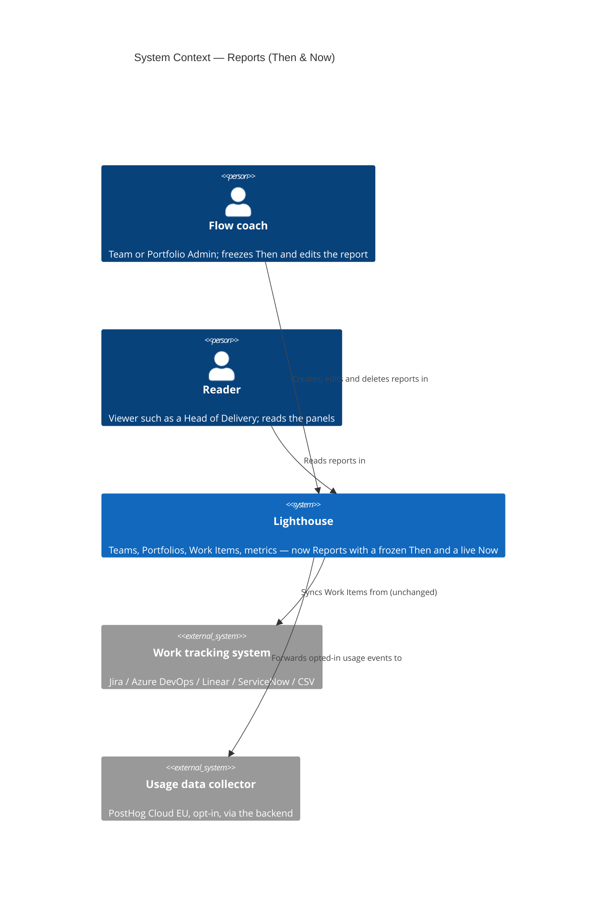
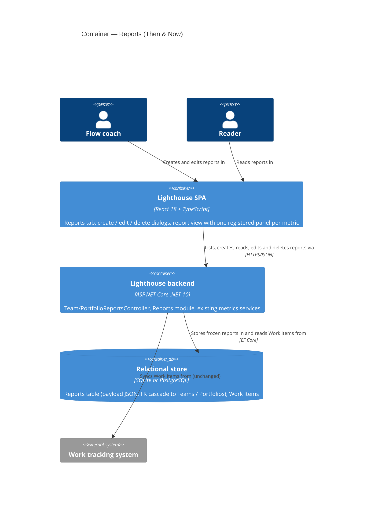

# Feature Delta — epic-5878-baseline

**ADO**: Epic #5878 *Baseline* (tag `ValueFlow`, tier Community, ICE 54 "NEEDS EVIDENCE" as of 2026-09-20).

**Waves**: DISCOVER (2026-10-02). Desk research, a codebase check and two consultant signals. Lighthouse ran
no Mom Test interviews.

**One line**: pick a baseline window, such as the 90 days before an engagement or improvement effort started,
freeze the flow metrics for that window, and show today's values against them. The point is to show whether
the work changed anything.

**Density**: `lean`, Tier-1 `[REF]` only. `evidence_standard: past_behavior`. Each claim is graded as
**observed behaviour**, **second-hand report**, **stated intent**, or **desk/codebase fact**.

---

## Wave: DISCOVER / [REF] Persona IDs

| Persona | Role here |
|---|---|
| `flow-coach` | **Primary.** The consulting variant is the one `flow-coach.yaml` already describes for Story 5884: it "has to leave an artifact behind". It sets the baseline at engagement start and shows the result. For Thrivve, the consultant pays, not the Team. |
| `flow-coach` (internal) | **Primary, second shape.** A Team or coach running its own improvement experiment and asking "did this change anything". There is no direct evidence for this shape yet. |
| `delivery-lead-rte` | **Reader.** The management audience the result has to reach. It is the "expand" step of land-and-expand. |
| *(candidate)* `flow-consultant` | **Not created.** It is split out from `flow-coach` only if DISCUSS finds that the payer's job (prove my value to the client) differs from the coach's job (see whether flow changed). The evidence does not yet separate them. |

---

## Wave: DISCOVER / [REF] Opportunity statement

The outcome: someone who changed how a Team or Portfolio works can show, with numbers management trusts,
whether flow changed since the change began, and the "before" does not move under them.

| # | Opportunity (customer-outcome form) | Source | Grade |
|---|---|---|---|
| O1 | Minimise the time it takes to produce a defensible before/after of flow metrics for an engagement or improvement effort | #5878; Thrivve built and use it | second-hand report of past behaviour |
| O2 | Minimise the likelihood that the "before" numbers change after the fact (frozen, not drifting) | #5878 differentiation | desk |
| O3 | Minimise the time it takes to show "where you are today vs where you were" in a short assessment with almost no "after" window | consultant #2, 2026-10-02 | stated intent, present context |
| O4 | Minimise the effort it takes to get the comparison in front of management | land-and-expand hypothesis; prospect asked for email reports | hypothesis + counter-signal |
| O5 | Minimise the likelihood of presenting noise as improvement | existing PBC stability / breach count in the field set | desk |

The opportunity algorithm cannot be applied because no importance or satisfaction ratings exist. The ICE
score is the only ranking, and the maintainer produced it, not customers (see G2).

---

## Wave: DISCOVER / [REF] Validated assumptions

| # | Assumption | Evidence | Confidence |
|---|---|---|---|
| V1 | Consultants need a before/after of flow metrics to prove their value to a client. | Thrivve Partners **built** the ValueFlow baseline and **use** it in client engagements. Paul Brown demoed it on 2026-08-31 and says clients react to it most. Building and using it is past behaviour that cost them effort. "Clients react most" is Thrivve's own account, which we did not observe. | **Medium** that the job exists for consultants. **Low** that it transfers to Lighthouse users. |
| V2 | Every metric in the ValueFlow field set can be computed for an arbitrary past window from stored Work Items, with no snapshot infrastructure. | `TeamMetricsService` / `PortfolioMetricsService` take `(startDate, endDate)` for cycle time percentiles, Throughput, WIP over time and total Work Item Age by day. PBC methods take `asOf` for stability state and breach counts. Story 6053 already recomputes past days with the same service calls on a shifted window (`ReconstructionMemo`, `ReconstructOverTimeHistoryAcceptanceTest`). | **High** (feasibility of computing it; see X1 to X3 for limits) |
| V3 | A pinned "before" window is already a concept in Lighthouse. | Every Team and Portfolio carries `ProcessBehaviourChartBaselineStartDate`/`EndDate` (`WorkTrackingSystemOptionsOwner.cs:62-64`). Settings exposes it as "Set Baseline for Process Behaviour Chart". `BaselineValidationService` requires at least 14 days, no future end, and a start inside the cutoff. | **High** as product precedent. **None** as demand evidence: there is no usage telemetry for this setting. |
| V4 | A frozen baseline pinned to an engagement start is a differentiator. | Desk check (#5878): ActionableAgile and Nave ship rolling-window comparison (previous month, 3 or 6 months, with RAG). No frozen baseline was found. The codebase has no "previous period" comparison either (no hits in frontend `*.tsx`). | **Medium**: absence of evidence across two competitors. |
| V5 | Retroactive baselining works from day one, with no waiting for forward recording. | Same as V2. The window only has to lie inside stored history. | **High** |

---

## Wave: DISCOVER / [REF] Invalidated assumptions

| # | Assumption (as stated) | Evidence against |
|---|---|---|
| X1 | "Ease 6: no snapshot infra, **no migration**." | Computing the values needs no migration (V2). **Freezing** them does. You have to store either the values or at least the baseline definition (dates, scope), and today the only stored baseline is the PBC pair of columns on the owner. Reusing that pair avoids a migration but freezes nothing (X2) and overloads a setting with a different purpose. Ease 6 holds for computation. A stored baseline adds a small expand-only migration. **Revised Ease 5-6.** |
| X2 | "A baseline recomputed from history is a frozen baseline." | Story 6053's accepted residual risk is that recomputation reflects **today's** state mappings, cycle-time definitions, blocked rules, blackout config and item set. Deleted or re-parented Work Items change the result. So a recomputed "before" can silently move, which is the opposite of the promise. |
| X3 | "A baseline stays available for as long as the engagement runs." | `DoneItemsCutoffDays` defaults to 365 (`Team.cs:23`, `Portfolio.cs:35`), and `BaselineValidationService` already rejects a start outside it. For a 90-day baseline that ends at the engagement start, recomputation stops being possible about **275 days after the engagement started**. That is within the span of a long engagement. |
| X4 | "Before/after is the shape for every consultant." | **Challenged, not disproven.** Consultant #2 is embedded for 4 weeks to assess. Compare a 90-day rolling "current" window 4 weeks after the intervention, and about 69% of it (62 of 90 days) predates the intervention, so the comparison mostly measures itself. His value is more likely in a snapshot of where you are today versus where you were, or in a baseline handed over at the end of the engagement. |
| X5 | "Confidence fix: if 2 of 3 consultant connections say they would pay, Confidence goes to 5.0." | As a test design, this asks for future intent ("would you pay"), which the Mom Test does not count as evidence. It is replaced by a commitment test (see Riskiest assumptions). |

---

## Wave: DISCOVER / [REF] Dropped options

| Option | Why dropped |
|---|---|
| Synthesising baseline values where history is thin | ADR-109 rejected fabricated values. Story 6053 narrowed that rejection to synthesis and kept it. Missing data stays visibly absent. |
| Forward-only recording, where the baseline starts accruing on the day it is created | It defeats the job. The engagement start is usually today or in the past, so "before" has to come from history (V5). |
| Copying the ValueFlow dashboard export field for field as the spec | The field set is schema input only. DIVERGE decides what is core and what is nice-to-have (Q8). |
| Reusing the PBC Baseline setting as the feature's storage | It freezes nothing (X2). It has a different purpose (the window natural process limits are computed from), and changing it would move every PBC on the owner. |

---

## Wave: DISCOVER / [REF] Decision gate

| Gate | Status | Why |
|---|---|---|
| G1 Problem | **FAIL on threshold** | No Mom Test interviews by Lighthouse, against a threshold of 5 with more than 60% confirming. There are two signals: one consulting firm's past behaviour (V1, second-hand) and one consultant's stated interest after being pitched, which is future intent and was pitched before the problem was explored. The job is real for Thrivve. It is not shown for Lighthouse users, for Teams running their own experiments, or as something anyone pays for. |
| G2 Opportunity | **FAIL** | There are five desk opportunities (O1 to O5) but no importance or satisfaction data, so no score above 8 can be shown. O3 shows a shape divergence that is still unresolved. |
| G3 Solution | **FAIL** | Nothing tested. ValueFlow is Thrivve's solution, and Lighthouse users have not tested anything. |
| G4 Viability | **PARTIAL** | Feasibility is green for computation (V2) and amber for freezing (X1 to X3). The tier is decided (Community). Viability rests on an unvalidated land-and-expand chain: free result → reaches management → Premium conversation. There is one counter-signal: an evaluating prospect asked for signals and email reports, not a baseline. The success metric has no usage event yet (that is DEVOPS's job). |

**Proceeding is a maintainer-accepted risk.** On 2026-10-02 the maintainer decided to go on to DIVERGE on this
evidence. That makes this wave a learning investment, not a validated build case. The interview protocol below
runs alongside DIVERGE and DISCUSS and does not block them. If its results contradict DIVERGE's direction,
they reopen it.

---

## Wave: DISCOVER / [REF] Constraints established

| # | Constraint | Evidence source |
|---|---|---|
| C1 | Community tier. The Premium boundary is open (Q9). | Maintainer, 2026-09-20 (#5878) |
| C2 | User-facing copy uses configurable terms: Team, Portfolio, Delivery, Feature, Work Item, Cycle Time, Throughput, WIP, Work Item Age, SLE. Never "Epic" or "Story". | `TerminologySeeder.cs`; project rule |
| C3 | "Baseline" is not a Terminology key and already names the **PBC Baseline** in Settings. The feature's name must not collide with it silently. | `FlowMetricsConfigurationComponent.tsx:666`, `:687`, `:711` |
| C4 | No synthesised values. Where data is too thin for a window, it is shown as absent. | ADR-109 as narrowed by Story 6053 |
| C5 | Anything computed from history reflects today's configuration and item set. If a baseline promises to be "frozen", it has to store its values or say plainly that it does not. | Story 6053, X2 |
| C6 | A baseline window has to lie inside `DoneItemsCutoffDays` (default 365) at the moment it is computed. | `BaselineValidationService`, X3 |
| C7 | Any new storage is an expand-only migration created with `CreateMigration`. | Project rule; feedback on expand-only migrations |
| C8 | DEVOPS answers which usage-data event shows the feature is used. This is the only way to measure land-and-expand. | Project rule |

---

## Wave: DISCOVER / [REF] Key decisions

- [D1] One workspace, `epic-5878-baseline` (see: maintainer dispatch 2026-10-02).
- [D2] Proceed to DIVERGE with G1 to G3 failing, as a maintainer-accepted risk. This is a learning investment (see: maintainer decision 2026-10-02; Decision gate).
- [D3] ICE Confidence revised from 1.5 to **2.0**, and ICE from 54 to **72** (Impact 6 × Confidence 2.0 × Ease 6). The Thrivve evidence was already counted on 2026-09-20. The only new evidence is one stated interest given after a pitch, which is worth +0.5 at most (see: wave-decisions.md D3).
- [D4] Consultant #2 is graded as stated interest in a present, real context. His 4-week assessment is recorded as a shape divergence (O3, X4), not as confirmation of before/after (see: maintainer evidence 2026-10-02).
- [D5] Ease is verified for computation and amber for freezing (X1 to X3). DIVERGE must choose between stored, recomputed and hybrid baselines with these limits in view (see: codebase check 2026-10-02).
- [D6] The counter-signal (a prospect asked for signals and email reports) is kept, not dismissed. Email reports may be how the result reaches management (O4) (see: #5878 ICE note).

---

## Wave: DISCOVER / [REF] Pre-requisites

- Stored Work Item history that covers the baseline window and lies inside `DoneItemsCutoffDays`.
- Mapped To Do, Doing and Done states on the owner, plus the existing minimum-data guards for percentiles and Throughput.
- An SLE, or a decided fallback, if "SLE 85th percentile" is a core metric (Q8). SLE is optional on owners.
- An intervention or engagement date, supplied by the user. Lighthouse has no such event today.

---

## Wave: DISCOVER / [REF] Riskiest assumptions & cheapest next test

Risk = Impact×3 + Uncertainty×2 + Ease of testing×1.

| # | Assumption | Cat. | Score | Cheapest next test |
|---|---|---|---|---|
| R1 | Consultants other than Thrivve already produce before/after evidence by hand, so there is a workaround that costs them something. | Value | 3·3+3·2+1 = **16** | Protocol below with 5 consultant-shaped connections, starting with "Tell me about the last time…" |
| R2 | Showing the result to the client's management leads to a Premium conversation (land-and-expand). | Viability | 3·3+3·2+3 = **18** | Ask Thrivve, about past engagements, what happened after management saw the baseline. Did it lead to more work or a purchase? |
| R3 | Teams outside consulting run improvement experiments and want a frozen "before". | Value | 2·3+3·2+1 = **13** | 2-3 questions added to existing user conversations: "When did you last change how you work? How did you tell whether it helped?" |
| R4 | A short-assessment shape (4 weeks) can use the same feature. | Value/Usability | 2·3+3·2+1 = **13** | Consultant #2: ask what he will show the client at the end of the 4 weeks, and how. Ask to see the artefact. |
| R5 | Users trust a recomputed "before" that might drift. | Value | 2·3+2·2+2 = **12** | DIVERGE option comparison; spike: how often does a 90-day percentile move when re-run a month later on the dev database? |

### Interview protocol (open action, non-blocking)

Target: 5 consultant-shaped people, including consultant #2 and at least one sceptic or non-user, plus 2-3
Teams. Do not mention the feature until the last block.

1. "Tell me about your last engagement or improvement effort. When did it start, and what did you change?"
2. "At the end, how did you show the client (or yourself) whether it worked? Can you show me what you used?" Look for an artefact, such as a slide or spreadsheet.
3. "How long did putting that together take? What was the hardest part?"
4. "Which numbers did management ask about? What did they do after seeing them?" This tests R2.
5. "Did anyone doubt the 'before' numbers? What happened?" This tests R5.
6. Short-assessment variant: "At the end of your 4 weeks, what will you hand over? Who will use it after you leave?"
7. Commitment, only after 1-6: "Would you run your current or next engagement's baseline in Lighthouse and show us the result?" Also ask for an introduction to another consultant. Count actions, not "yes".

Confidence moves on **commitments**. At 3 of 5 consultants describing a manual workaround (R1) and 2
committing to use it on a live engagement, Confidence becomes about 4.0 and ICE about 144. If any of them
shows the artefact to client management and reports what followed (R2), Confidence reaches 5.0 and ICE
about 180. Fewer than 1 in 5 describing a workaround (under 20%) is a kill or pivot signal for the consulting
shape.

---

## Wave: DISCOVER / [REF] Open questions for DIVERGE

1. **Scope**: Team, Portfolio or Delivery? Does one baseline cover several owners, as in an engagement that spans Teams? Delivery metrics are recorded forward-only (`DeliveryMetricSnapshot`), so check whether a past Delivery window can be recomputed at all.
2. **One or many baselines** per owner: one per engagement or experiment, named and dated? Many baselines suit consultants who come back, or a Team running several experiments.
3. **Frozen-stored, recomputed through history, or hybrid** (stored at creation, re-computable on request with a "differs from frozen" flag)? Weigh against X1 to X3 and C5/C6.
4. **What is "current"**: today's rolling window of the same length, a "since the intervention" window, or both? A rolling window is mostly pre-intervention for a long time (X4).
5. **Surface**: a page or widget, a printable report or PDF (Spike 6052's server-side chart rendering is the closest prior work), an export, or an email report (O4, D6). Which one reaches management?
6. **The 4-week-assessment shape**: is it a retroactive "where you are today vs where you were", or a baseline frozen at engagement end and handed to the client? Same feature or a separate one?
7. **Signal vs noise**: should a difference be judged against PBC limits or stability before it is called an improvement (O5)?
8. **Core vs nice-to-have metrics** from the ValueFlow field set. Candidates for core: cycle time percentiles (50/70/85), Throughput weekly median, WIP average and range, total Work Item Age plus average Work Item Age, intervention date and days since. Nice-to-have: a separate 30-day SLE, WIP streak counts, PBC breach count and stability state.
9. **Community vs Premium boundary**: the comparison is Community (C1). Candidates for a Premium lever: many baselines, cross-owner baselines, a branded or exported management report, scheduled email. The land-and-expand logic argues against gating the artefact that is supposed to reach management.
10. **Naming and terminology**: how does it relate to the existing PBC Baseline (C3)? Does "Baseline" or "Intervention" need a Terminology key? All copy uses the configured terms (C2).
11. **Who may create a baseline** (RBAC: settings editor or reader), and is it in scope for CLI/MCP (DISCUSS checklist)?

---

## Wave: DIVERGE / [REF] Maintainer decisions on the open questions

Recorded 2026-10-02 as D8-D16 in `wave-decisions.md` (source: maintainer 2026-10-02). They close questions 1-6
and 11 and reshape 7.

| Q | Decision |
|---|---|
| 1 | Teams and Portfolios, flow metrics mainly; the forecast comparison is a Team-only maybe (D8). Delivery is not in scope. |
| 2 | Many reports per owner (D9). |
| 3 | Stored and frozen at creation with the settings then in force (D10). |
| 4 | Now is a selectable rolling window; the Then window is picked at creation (D11) and may end in the past, rebuilt once from history inside the cutoff (D12). |
| 5 | Reports tab → Create Report → Template; live in-app first, PDF/email later (D13). |
| 6 | The 4-week assessment is covered by a selectable Now window plus a Then frozen at hand-over (D14). |
| 7 | The user selects comparison items from a list; each item has a rule that judges it good or not; v1 is limited and the catalog extensible (D16). |
| 11 | Editors create, readers view; CLI/MCP out of scope (D15). |

---

## Wave: DIVERGE / [REF] Recommendation

Full text: `recommendation.md` · artifacts: `diverge/` · decisions DV-1..DV-9: `wave-decisions.md`.

- **Direction**: Option 3, **"Claims checklist"** (4.35 of 5; runner-up "Signal catalog" 4.00; dissent
  "Threshold scorecard" 3.90). The selectable unit is a plain-language claim. The metric, its direction of good
  and its rule form one registered definition. The report lists the chosen claims with Holds / Does not hold /
  No change yet / Not enough data, shows Then → Now values on the row, and opens the chart on expand.
- **Q7, rules**: "trending" means a process-behaviour-chart shift against XmR limits **frozen from the Then
  window**, using the existing `XmRCalculator.Calculate(thenValues, nowValues)`. It is not a slope and not a
  percentage. There are four rule kinds: shift in direction, no shift against, no signals in window, and a
  threshold change only where no series exists.
- **Q7, v1 catalog**:
  - C1 {Cycle Time} trending down;
  - C2 {Throughput} trending up;
  - C3 {WIP} stable or down;
  - C4 Total {Work Item Age} stable or down;
  - C5 {Cycle Time} predictable;
  - C6 85th percentile {Cycle Time} lower by 10% or more.
- **Q7, seam**: one `ComparisonItemDefinition` per claim, and one class per rule kind. Templates are preset
  selections, and the catalog is independent of Reports.
- **Q8**: core values are Cycle Time 50/70/85th, Throughput weekly median, WIP average and range, Total Work Item
  Age plus average Work Item Age, and days since Then (header). Nice-to-have: SLE breaches, streaks, arrivals,
  Feature size, and the Team-only forecast lens.
- **Q9**: Community gets every claim and rule and **2 reports per Team/Portfolio**; Premium is unlimited. Rules
  and claims are never gated. The export tier is decided when export is built.
- **Q10**: the template is called **"Then & Now"** (runner-up "Before & After"). No user-facing "Baseline"
  (C3). Every metric word comes from Terminology.
- **Freezing**: every applicable claim is frozen at creation. Claims added later show "Not captured for this
  report". A settings fingerprint flags a Now side computed under changed settings.
- **Job**: `job-flow-coach-show-whether-flow-changed` (new in `docs/product/jobs.yaml`).

---

## Wave: DISCUSS / [REF] Prior-Wave Reading Confirmation

**Agent**: Luna (`nw-product-owner`) · **Date**: 2026-10-02, revised 2026-10-03 · **Mode**: autonomous subagent; the
maintainer was not available mid-run, so questions are collected below with provisional assumptions. Peer review is
dispatched by the coordinator, not run here. Config: user-facing (full stack), brownfield walking skeleton, research
depth comprehensive (reusing DIVERGE), JTBD on, density lean.

**Revision 2026-10-03.** The maintainer settled Q1–Q7 on 2026-10-03. This revision applies them as D37–D44. The
report no longer gives verdicts: it shows one panel per metric with Then, Now and the change, and people interpret
(D39, D40). Slices 03, 04, 05, 07 and 10 are re-cut, slice 11 is dropped. Slice numbers are kept, so each still
matches its ADO Story (#6159–#6169). Superseded decisions are kept and marked, not deleted.

**Revision 2026-10-03 (after DESIGN).** The maintainer answered DESIGN's decisions to confirm: D45 (thin data shows
the value with its sample size), D46 (no settings-changed notice — slice 09 dropped), D47 ({Throughput} as total and
per-day average over the whole window, no weekly median), D48 (average {Work Item Age} as window average and last
day). Applied below; superseded text is marked.

| Read | Status |
|---|---|
| `docs/product/jobs.yaml` (`job-flow-coach-show-whether-flow-changed`) | ✓ (wording updated 2026-10-03: no verdicts) |
| `docs/product/journeys/epic-5878-baseline.yaml` | ✓ (refined this wave; revised 2026-10-03) |
| `docs/product/vision.md` | ⊘ does not exist |
| `feature-delta.md` DISCOVER + DIVERGE sections | ✓ |
| `discover/wave-decisions.md` (D1–D7) | ✓ |
| `wave-decisions.md` (D8–D16, DV-1..DV-9, "Resolved by the maintainer (2026-10-02)") | ✓ |
| `recommendation.md` | ✓ |
| `diverge/job-analysis.md` | ✓ (light JTBD: job reused, not re-derived) |
| `diverge/competitive-research.md`, `options-raw.md`, `taste-evaluation.md` | ⊘ not read; the recommendation's summary was enough |
| House layout: `epic-5510-5881-refinement` DISCUSS sections, slice-01 brief, `discuss/wave-decisions.md` | ✓ |
| Personas `flow-coach`, `delivery-lead-rte` | ✓ |
| Brownfield code (targeted, below) | ✓ |

---

## Wave: DISCUSS / [REF] Current-State Surface Inventory (brownfield)

| # | What exists | Where | Consequence |
|---|---|---|---|
| S1 | Team tabs: Features, Forecasts, Metrics, Settings (admins), Access (admins, RBAC on). Portfolio tabs: {Features}, {Deliveries}, Metrics, Settings, Access | `TeamDetail.tsx:506-515`, `PortfolioDetail.tsx:481-487` | A **Reports** tab is one more `<Tab>` on each page; gating copies `rbac.isTeamAdmin` / `rbac.isPortfolioAdmin`. |
| S2 | RBAC requirements `TeamRead/TeamWrite/PortfolioRead/PortfolioWrite`; roles SystemAdmin, TeamAdmin, PortfolioAdmin, Viewer. With RBAC off, `useRbac()` is permissive | `RbacGuardRequirement.cs`, `UserRole.cs`, `useRbac.ts` | "Edit rights" = Write (Team/Portfolio Admin). Create, edit and delete are Write; viewing is Read. Auth off: everyone may create. |
| S3 | `XmRCalculator.Calculate(baselineValues, displayValues)` classifies display points against limits from the baseline values; four special-cause rules; lower limit clamped to 0 (and a clamped line disables the rules that need it) | `XmRCalculator.cs:15-55` | Classifying Now's points against limits from Then exists; the panel counts only points beyond the limits (D40). **`XmRResult` rounds average and limits to integers**, so a daily {Throughput} average of 0.6 reads as 1 — the report freezes Then's limits **unrounded** (D26, D40). A lower limit clamped at 0 cannot be crossed (Q8). |
| S4 | PBC builders take the owner's PBC Baseline (`ProcessBehaviourChartBaseline*`) when set, else the display window | `BaseMetricsService.cs:584-760` | The report must take its limits from **Then**, never from the owner's PBC Baseline setting, or changing that setting would move the "frozen" yardstick (C5). |
| S5 | Series per owner: {Throughput}, {WIP}, Total {Work Item Age} (daily) and {Cycle Time} (per finished {Work Item}) PBCs, with `asOf`; {Cycle Time} percentiles over `(start, end)` | `TeamMetricsService.cs:178-310`, `PortfolioMetricsService.cs:35-71` | The four v1 panels (M1–M4) are computable for Team and Portfolio from existing calls (DISCOVER V2). |
| S6 | `BaselineValidationService`: ≥14 days, end not in the future, start inside `DoneItemsCutoffDays` | `BaselineValidationService.cs` | Reused as the Then-window rule (D21, D37); its messages say "Baseline", so the report needs its own copy (C3). |
| S7 | Metrics window presets: Team 7/14/30/90, Portfolio 30/90/180 days; step-back by 7/28 days; calendar days in the viewer's zone (Bug #5566) | `dateWindow.ts:19-33` | The report's own presets are Team 30/90 and Portfolio 90/180 plus a custom number of days ≥ 14, for Then (D37) and Now (D43); calendar days as on Metrics. |
| S8 | Community/Premium count cap precedent: `CanUsePremiumFeatures() \|\| count < 2` | `AdditionalFieldsHelper.cs` | The 2-report cap copies it (D29). |
| S9 | Usage data: `TeamTabOpened`/`PortfolioTabOpened` carry a route key; the enum ends at `TeamForecastRealityCheckRun = 11` on this checkout | `UsageDataEventName.cs`, `UsageDataRoutePatterns.cs` | Tab opens need new **route keys**, not event names. New names append; DEVOPS checks `main` for the next free integer. |
| S10 | Terminology keys: workItem(s), feature(s), cycleTime, throughput, wip, workItemAge, sle, team(s), portfolio(s), delivery/deliveries … no "report" | `TerminologySeeder.cs` | No new key needed (D32). |
| S11 | Demo data dates are relative to load day. History depth: Team Lightspeed ≈100 days, Team Gravity ≈35, Portfolios 7–10 finished {Features} over ≈85 days | `DemoDataFactory.cs:110-126`, `Factories/DemoData/*.csv` | A 90-day Then fits only Lightspeed; Portfolio demos will mostly show "—" on {Cycle Time} percentiles — the honest too-little-data path. |

---

## Wave: DISCUSS / [REF] Persona IDs

| Persona | Role here |
|---|---|
| `flow-coach` (consulting) | **Primary.** Elena Kovacs, external flow coach engaged with Team Lightspeed since 1 Aug 2026; Team Admin on that Team. Freezes Then at the engagement start and shows the result to the sponsor. |
| `flow-coach` (consulting, short assessment) | **Primary, third circumstance.** Dev Malhotra, consultant on a 4-week assessment of Team Gravity ending 2 Oct 2026; freezes Then at hand-over (D14). |
| `flow-coach` (internal) | **Primary, second circumstance.** Priya Raman, coach of Team Gravity, testing a WIP limit the Team adopted on 14 Sep 2026. |
| `delivery-lead-rte` | **Reader.** Martin Achterberg, Head of Delivery, Viewer on Team Lightspeed. Reads the panels and draws his own conclusion; never creates. |
| `config-admin` | Present only as the editor role (Team/Portfolio Admin); often the coach. |

No new persona. `flow-consultant` stays uncreated: nothing in this wave separates the payer's job from the coach's.

## Wave: DISCUSS / [REF] JTBD One-Liner

- `job-flow-coach-show-whether-flow-changed` (DIVERGE, reused; wording updated 2026-10-03 for D39): when the way work
  flows has changed and someone asks whether it helped, set today's flow against a "before" that cannot move, with the
  metrics chosen before looking, so the answer is evidence — not noise presented as progress. Every story below
  carries this `job_id`.
- Reader job (candidate, not a `jobs.yaml` entry): `delivery-lead-rte` sees in one look what changed and in which
  direction, and draws the conclusion himself. Served by the panel layout and its colours; no story of its own.

---

## Wave: DISCUSS / [REF] Changed Assumptions

DISCOVER and DIVERGE documents are not edited; these supersede them for DESIGN onward.

| Was (source) | Now | Why |
|---|---|---|
| "The codebase has no 'previous period' comparison" (DISCOVER V4) | **Partly contradicted.** Story 5914 shipped Metrics window presets with step-back (`shiftWindow`), and some widgets already compare the current period with the previous one (Work Item Age percentiles, predictability score). None of it is frozen. | Codebase, `dateWindow.ts`, `useMetricsData.test.ts:1155`. The differentiation (a frozen Then) stands; the habit force is stronger than DISCOVER assumed. Copy never calls Then "previous period". |
| Step 1 "pick the engagement start date"; `intervention_date` artifact (DISCOVER journey) | No intervention-date field. **The Then window's end date is the anchor**, and the header shows days since Then ended. | Converged direction (D11, D12, recommendation §3); confirmed by D39. |
| Step 3 "hand over a result management reads without Lighthouse open" (DISCOVER journey) | v1 is read **in Lighthouse**, by a Viewer. PDF/email is out of scope, not blocked. | D13. |
| Journey job ids `job-flow-coach-prove-engagement-value`, `job-flow-coach-hand-over-a-starting-point` | Both re-pointed to `job-flow-coach-show-whether-flow-changed`. The short assessment is a Then that ends today, frozen at hand-over. | DIVERGE note; D14. |
| DIVERGE direction "Claims checklist": chosen claims read Holds / Does not hold / No change yet / Not enough data, Then → Now on the row, chart on expand (recommendation, D16, DV-3) | **Metric panels, no verdicts.** One titled panel per metric in the style of Thrivve's ValueFlow report: Then left, Now right with change and % change, coloured by a fixed per-metric direction of good, plus the count of Now's points beyond Then's frozen limits. No verdict, no generated text, no chart. | Maintainer 2026-10-03 (D39, D40): the report shows, people interpret. |
| DIVERGE catalog C1–C6 (claims with rules) | v1 catalog M1–M4: {Cycle Time}, {Throughput}, {WIP}, {Work Item Age}. C5 ({Cycle Time} predictable) is dropped — it was a stability judgement. C6's familiar 85th percentile and its % change live in the {Cycle Time} panel. | D39. |
| "Freeze the Then values and the frozen limits" (recommendation §3); then "freeze the Then **series** as well; limits recomputed from it on each view" (DISCUSS 2026-10-02) | **Superseded 2026-10-03.** Freeze Then's shown values and Then's XmR average and limits **unrounded**. Whether the full series is also stored is DESIGN's call; no chart needs it any more. | D26 as reshaped by D40; S3 (`XmRResult` rounds). |
| "Holds: ≥1 special cause on the good side" (DV-3), narrowed to "sustained signal only" (DISCUSS 2026-10-02, D24) | **Superseded 2026-10-03.** There are no verdicts at all. | D39. |
| Now never reaches back into Then (DISCUSS 2026-10-02, D23) | Now is the full rolling window ending today and may overlap Then. | D38. |
| Now length chosen per view in the page address (DIVERGE D11 "selectable rolling window"; DISCUSS D22) | Now length is set at creation, saved on the report, changed only by editors. | D43: scheduled sending (Epic 5882) needs a defined window. |

---

## Wave: DISCUSS / [REF] Locked Decisions

Numbering continues after D16 (DIVERGE). "Provisional" = autonomous call pending the maintainer (see Open questions).
D37–D44 are the maintainer's answers to Q1–Q7 (2026-10-03). Superseded decisions are kept, marked, and not applied.

- [D16, DIVERGE] **Partly superseded by D39.** Its rule/verdict part ("each item has a rule that judges it good or
  not") no longer applies. The user-selected, extensible catalog stands, as a catalog of metrics.
- [D17] **One job, every story**: `job_id: job-flow-coach-show-whether-flow-changed`. No new job or persona.
- [D18] **Tab placement.** Team: Features · Forecasts · Metrics · **Reports** · Settings · Access (Refinement from
  epic-5510, when it lands, sits between Metrics and Reports). Portfolio: {Features} · {Deliveries} · Metrics ·
  **Reports** · Settings · Access. The tab is always enabled for anyone with read. Empty state: editors see
  "Create Report"; readers see "No reports yet. A {Team} Admin can create one." (Portfolio: "{Portfolio} Admin").
- [D19] **Create flow** (reshaped by D37, D43, D44): Create Report → choose a Template (one card in v1: "Then & Now —
  set today's flow against a window that stays as it was") → Then: end date and length (D37) → Now length (D43,
  default = Then length) → metrics (all four v1 metrics ticked) → name, defaulted to "Then & Now — 90 days to 31 Jul
  2026" → Create. The new report opens. *Was*: claims C1–C4 preselected; renaming later out of v1 — that part is
  superseded by D44.
- [D20] **Superseded by D37.** *Was*: Then lengths are the Metrics presets of at least 14 days, Team 14 / 30 / 90,
  Portfolio 30 / 90 / 180, no custom length (provisional, Q1). The calendar-day rule moves into D37 unchanged.
- [D21] **Then validation** at creation: end date not after today; at least 14 days (D37); whole window inside
  `DoneItemsCutoffDays` (default 365). Refusal names the earliest allowed start: "The Then window must start on or
  after 2 Oct 2025 — older finished {Work Items} are no longer kept." Never silently partial (DISCOVER journey
  failure mode).
- [D22] **Superseded by D43.** *Was*: Now preset chosen by anyone viewing, kept in the page address, not saved
  (provisional, Q6).
- [D23] **Superseded by D38.** *Was*: Now never reaches back into Then; a report frozen today reads No change yet
  (provisional, Q2).
- [D24] **Superseded by D39.** *Was*: verdict rules — "trending" Holds only on a sustained signal on the good side,
  any bad-side signal = Does not hold, a lone good-side point = No change yet; rule kinds `ShiftInDirection`,
  `NoShiftAgainst`, `NoSignalsInWindow`, `ThresholdChange` (provisional, Q3).
- [D25] **Reshaped by D41.** *Was*: own minimum-data thresholds (≥ 8 finished {Work Items} in Then and ≥ 1 in Now
  for per-item claims; a non-zero Then series for daily claims) (provisional, Q4).
- [D26] **What is frozen at creation** (reshaped by D40), for every metric that applies to the owner, not only the
  ticked ones (DV-6): the Then values its panel shows; for metrics with a process-behaviour chart, Then's XmR average
  and limits **unrounded**; and whether Then had enough data for each value. Plus the creation date, the Then window,
  the Now length, the template key, the selection and the name. *(A snapshot of the settings that shape the values
  (D31) was part of this list; superseded by D46 — nothing about settings is stored.)* Whether the full Then series is stored as well is DESIGN's call — no chart needs it any more. Then is never
  recomputed. Creation either completes or fails whole; nobody sees a half-frozen report. *Was*: the Then series,
  the row values, Then's own signal state, readiness.
- [D27] **Metrics added to the catalog after a report was created** — or values a later slice adds to an existing
  panel — show "Not captured for this report" and cannot be shown on it (DV-6; wording reshaped by D39).
- [D28] **Superseded by D39** (no generated text). *Was*: a zero-clamp sentence on the downward claim. The fact
  behind it — a lower limit at zero cannot be crossed — is now Q8.
- [D29] **Cap**: Community holds **2 reports per {Team}/{Portfolio}, counted across all templates**; Premium is
  unlimited. At the cap, Create Report is disabled with "Community includes 2 reports per {Team}. Delete one, or use
  Premium for unlimited reports." The server refuses too. On licence lapse every existing report stays viewable and
  deletable; creating stays blocked until the count is below 2. Frozen data is never deleted by the licence. A
  report is deleted with its {Team}/{Portfolio} — confirmed by D42.
- [D30] **Delete**: editors only, confirm dialog naming the report; when Then now starts before the data cutoff the
  dialog adds "This Then window can no longer be rebuilt."
- [D31] **Superseded by D46** (no notice, nothing about settings stored). *Was*: **Settings-changed notice**: the snapshot covers what changes a v1 panel's values — {Work Item} types, the To
  Do / Doing / Done state mapping, the query, blackout days. When today's differ: "Settings changed since this report
  was created (state mapping). Then stays as frozen on 2 Oct 2026; Now uses today's settings." Shown once in the
  header, not per panel.
- [D32] **Words**: template "Then & Now"; tab "Reports"; windows "Then" / "Now"; panel titles "{Cycle Time}: Then &
  Now". No user-facing "Baseline" (C3). "Report", "Then", "Now" are not Terminology keys; every metric word is a
  Terminology token. Copy never says Epic, Story or Initiative. No verdict words (Holds, trending, stable,
  predictable) anywhere (D39).
- [D33] **Usage data** (DEVOPS designs): tab opens reuse `TeamTabOpened` / `PortfolioTabOpened` with new route keys;
  name-only candidates for creation, deletion and the cap refusal (see Checklist). Editing a report gets no event of
  its own: no KPI needs one. *Superseded in part by DEVOPS (maintainer, 2026-10-03)*: three events — `ReportCreated`
  and `ReportOpened`, both carrying the closed enum `report_template`, and `ReportDeleted`, name-only; **no cap-refusal
  event**. See `## Wave: DEVOPS / [REF] Monitoring Contracts`.
- [D34] **Release safety**: slices 01–07 are safe on trunk before the cap (08) — D29's lapse rule already covers
  owners holding more than 2 reports. Release notes, docs and website copy wait until slice 08 is in. The release is
  cut after slice 10, because D43 and D44 make Edit report part of v1.
- [D35] **No intervention date.** The header reads "Then: 90 days to 31 Jul 2026 — frozen · Now: last 90 days, 5 Jul –
  2 Oct 2026 · 63 days since Then ended". Confirmed by D39.
- [D36] **One reporting foundation for Epics 5878, 5882 and 5935** (maintainer 2026-10-03; updated the same day for
  D39). Reports is the shared home; a template is a flavor on it. Then & Now asks "how did we improve?" (frozen Then
  against a live Now); a future Signal asks "should we act?" (live, optionally snapshotted on a cadence). What 5878
  lays down for all three is the **report model, the Reports view and the metric catalog with one registered panel
  per metric**. Then & Now has no rules, so **5878 builds no rule engine**; Signals (5935) adds rules and live
  evaluation on top of the same catalog. 5935 gets no separate Signals tab (the tab may be renamed later, e.g.
  "Reports and Signals"; deferred). PDF / email and schedule / delivery come with 5882 and apply to **every** report,
  whatever its template, so they stay out of the template; none of it is built here. Charts, where a template has
  them, reuse the existing chart components (5882 renders them server-side); Then & Now shows none (D39). No
  app-level Reports page in v1; a later cross-owner listing of viewable reports is not to be blocked. The cap (D29)
  stays at 2 across all templates, signals included: it is meant to get tight.
- [D37] **Then window: end date and length** (maintainer 2026-10-03, Q1; supersedes D20). The user picks Then's end
  date (default today; e.g. the day the coach came in, 7 Sep) and a length going back. Presets: {Team} 30 / 90 days, {Portfolio} 90 / 180 days, plus a custom number of days. Minimum 14 days; the
  whole window inside `DoneItemsCutoffDays` (D21 applies). Calendar days, inclusive at both ends, in the instance's
  time zone: 90 days ending 31 Jul 2026 = 3 May – 31 Jul 2026; a custom 45 days ending 13 Sep 2026 = 31 Jul – 13 Sep.
- [D38] **Now may overlap Then** (Q2; supersedes D23). Now is the full rolling window of the saved length (D43)
  ending today, never clipped. A report frozen today has Now = Then's window and shows no change; the header shows
  both windows, so the overlap is visible without any extra text.
- [D39] **No verdicts; one panel per metric** (Q3; supersedes D16's rule/verdict part, D24 and D28; reshapes D25,
  D27 and the catalog). The report shows the ticked metrics and how they changed; people interpret. Nothing reads
  Holds / Does not hold / No change yet, and no text claims a metric "is trending". Each metric has one registered
  panel, so more can be added later, laid out like Thrivve's ValueFlow report: a titled box ("{Cycle Time}: Then &
  Now"), Then values on the left, a vertical accent bar, Now values on the right with the absolute change and the %
  change. v1 catalog:
  - **M1 {Cycle Time}** — Then: 85th percentile. Now: 85th, 70th and 50th percentile; change and % change on the
    85th; Now's {Work Items} beyond Then's limits (D40). Good = down.
  - **M2 {Throughput}** — *reshaped by D47*: total {Work Items} finished in the window and the average per day, Then
    and Now; change and % change on the per-day average; Now's days beyond Then's limits. Good = up. *(Was: weekly
    median and the number of weeks in each sample.)*
  - **M3 {WIP}** — average {WIP} Then and Now with its range, change and % change on the average; Now's days beyond
    Then's limits. Good = down.
  - **M4 {Work Item Age}** — total and average {Work Item Age} Then and Now, change and % change on each; Now's days
    beyond Then's limits of the total. Good = down. Each of total (Q10) and average (D48) shows two values per side:
    the window average and the window's last day.

  A change in the good direction is green, in the bad direction red, no change neutral; a sign and the number always
  carry the meaning too, never the colour alone. The direction of good is a fixed property of each metric, known only
  to its frontend panel — not stored, not computed in the backend or the database. No generated text; no
  Stable/Unstable label; no data-maturity label; no intervention date (D35 stands); no per-metric chart. A
  user-written author note per panel is out of v1, and the panel leaves room for it, so adding it later does not
  reshape the panel. Every metric word is a Terminology token; nothing user-facing says "Baseline".
- [D40] **Points beyond Then's frozen limits** (Q3 follow-up). For metrics with a process-behaviour chart (M1–M4)
  the panel counts Now's points beyond the XmR limits frozen from Then, split by side: "2 above · 0 below". Each side
  is coloured by the metric's direction of good (UI only): for {Throughput} the points above Then's upper limit are
  green, so a consistently higher {Throughput} shows as a good change; for {Cycle Time}, {WIP} and {Work Item Age}
  above is red and below is green; a count of 0 is neutral. Only points beyond the limits count — not runs or the
  other special-cause rules. The limits come from Then: never from the owner's PBC Baseline setting (S4), never from
  Now's own data. This is a Now-against-Then comparison for Then & Now; Signals (Epic 5935) will use each metric's
  own PBC later. Freezing (D26) therefore covers Then's shown values and Then's XmR average and limits, unrounded
  (`XmRResult` rounds to integers, S3), plus window, template and selection (no settings snapshot, D46); whether the
  full Then series must be stored too is DESIGN's call (decided: not stored).
- [D41] **Too little data** (Q4; reshapes D25; **wording superseded by D45**). *Was*: "a value shows '—' with a short
  reason exactly where Lighthouse's Metrics page already refuses one — the percentile minimum-data guard, and a
  process-behaviour chart with too few points" (DESIGN found no percentile minimum guard exists). Still in force: no
  new thresholds. Never a misleading 0 (C4). A "—" on one side leaves
  the other side's value shown; the change and % change show "—" whenever either side does.
- [D42] **Reports go with their owner** (Q5; confirms D29's provisional part). Deleting a {Team} or {Portfolio}
  deletes its reports; the owner's existing delete confirmation adds "and its 2 reports" (the actual count, only when
  there is at least one).
- [D43] **Now length is saved on the report** (Q6; supersedes D22). Set at creation: default = Then length; the same
  presets as Then plus a custom number of days (D37), at least 14 days and inside `DoneItemsCutoffDays`. Now is the
  rolling window of that length ending today (D38). It is stored on the report, because later scheduled sending
  (Epic 5882) needs a defined window, and it is not in the page address. Viewers cannot change it, not even for one
  view. Editors change it through Edit report (D44), and the change is stored for everyone. Anyone who wants a
  different window side by side creates another report.
- [D44] **Edit report** (Q7; supersedes D19's rename part). Editors (Write) get an "Edit report" dialog: name, Now
  length, and which metrics are shown (slice 10's "change shown claims" folded in). Then — its window and its frozen
  data — is never editable. Viewers see no Edit report.
- [D45] **Thin data shows the value and its sample size** (maintainer 2026-10-03, after DESIGN; supersedes D41's
  wording). Every value is shown with its sample size visible, e.g. "85th: 12 days · 3 {Work Items}". "—" with a
  short reason appears only when there is truly nothing to compute: no finished {Work Item} in the window; fewer than
  2 points for Then's limits; a collapsed band (Then's average and upper limit both 0); the below-count when Then's
  lower limit is 0 (Q8); the % change when the Then value is 0 (Q9). No new threshold. Never a misleading 0 (C4).
- [D46] **No settings-changed notice** (maintainer 2026-10-03, after DESIGN; supersedes D31). "Settings will
  inevitably change; just accept it." Nothing about the owner's settings is stored on the report and nothing is
  compared. Slice 09 is dropped (ADO Story #6167, the maintainer's call); US-09 is dropped.
- [D47] **{Throughput} over the whole window** (maintainer 2026-10-03, after DESIGN; reshapes D39's M2). The panel
  shows the total {Work Items} finished in the window and the average per day, Then and Now. Change and % change are
  on the per-day average — identical to the total's change when both windows have the same length, and still right
  when the Now length differs from Then. No weekly median, no week count. The beyond-limits count is unchanged: Now's
  daily values against Then's frozen limits.
- [D48] **Average {Work Item Age} has two values per side, like the total** (maintainer 2026-10-03, after DESIGN; Q10
  extended). The window average — the mean, over the window's days, of that day's average age (that day's total age ÷
  that day's {WIP}) — and the last day's value (the last day's total age ÷ that day's {WIP}). Change and % change on
  each. A day with no {WIP} has no average age and is left out of the window average (DESIGN, DD15); "—" only when
  no day of the window had {WIP} (or, for the last-day value, when the last day had none).

---

## Wave: DISCUSS / [REF] Scope Assessment

**PASS.** 9 stories (slice 11 dropped on 2026-10-03, slice 09 dropped after DESIGN by D46), ~8½ days, one new module (reports and the metric catalog with
its panels) standing on existing metrics, licence and RBAC; one user outcome; nothing ships independently of the
Reports tab. No oversize signal fires (10 stories is not more than 10; effort just under 2 weeks). No Epic split. The
release is cut after slice 10 (D34): with D43 and D44 the edit dialog is part of v1, so no slice is cancellable any
more.

---

## Wave: DISCUSS / [REF] Story Map & Slices

**Backbone (flow coach, then reader)**: *open Reports* → *freeze Then* → *choose metrics* → *read Then & Now* →
*trust the numbers* → *manage reports*.

| Open Reports | Freeze Then | Choose metrics | Read Then & Now | Trust the numbers | Manage |
|---|---|---|---|---|---|
| **01 tab + create (Team)** | **01 Then ends today** | **01 {Cycle Time} panel** | **01 header + panel** | 03 {Cycle Time} beyond Then's limits | 08 delete + cap |
| 06 Portfolio | 02 past end date, custom length | 04 picker + {Throughput} | 07 Now length + days since | ~~09 settings notice~~ (dropped, D46) | 10 Edit report |
| | | 05 {WIP} + {Work Item Age} | | ~~11 claim chart~~ (dropped) | |

**Walking skeleton = slice 01** (brownfield): existing Team page and tab pattern, existing metrics calls, a new stored
report, the first registered panel. It crosses every activity thinly — tab → create → freeze → view Now live — and
proves the freeze-and-store shape that every later slice extends.

| # | Slice | Est. | ADO | Learning hypothesis — disproves … if it fails |
|---|---|---|---|---|
| 01 | Reports tab; create a Then & Now report for a Team; Then ends today (30 / 90 days); {Cycle Time} panel: Then 85th, Now 85th / 70th / 50th, change, % change, coloured | 1d | #6159 | "Freezing at creation is fast and simple enough" — if creating a 90-day report on the dev instance's busiest Team takes > 10 s, freezing must move off the request |
| 02 | A Then that ended on a picked date; a custom length of 14 days or more | 1d | #6160 | "History rebuilds a past Then credibly" — if a Then ending 31 Jul rebuilt today differs from the Metrics tab for the same dates, the rebuild is wrong |
| 03 | The {Cycle Time} panel counts Now's {Work Items} beyond Then's frozen limits, above and below | 1d | #6161 | "A count against frozen limits says something on real Teams" — if on the dev instance every Team reads 0 above and "—" below over the 63 days since 31 Jul, the count is mute for per-item data and must change before three more panels copy it |
| 04 | Choose the metrics a report shows; {Throughput} panel (total and per-day average over the whole window, change and % change on the per-day average, days beyond Then's limits) (D47) | 1d | #6162 | "A per-day average reads sensibly beside a count of days beyond" — if dogfood readers misread the per-day average or ask what "days beyond" means, the {Throughput} panel needs different wording |
| 05 | {WIP} and {Work Item Age} panels; all four metrics ticked by default | 1d | #6163 | "Coaches keep the default of all four" — if dogfood users untick two or more on most reports, the default selection is wrong |
| 06 | Reports on Portfolios (90 / 180 days or custom) | 1d | #6164 | "Panels say something at Portfolio level" — if every demo and dev Portfolio shows "—" on {Cycle Time} and 0 · 0 beyond the limits on the rest, Portfolio needs other metrics (e.g. {Feature} size) before it is useful |
| 07 | Choose Now's length at creation (saved); header shows both windows and days since Then ended | ½d | #6165 | "A saved rolling Now answers the 4-week shape" (D14) — if Dev Malhotra's case or a dogfood coach still asks for a window "since the start", D11 is reopened |
| 08 | Delete; Community cap of 2 across templates; Premium unlimited; lapse; deleting an owner names its reports | 1d | #6166 | "2 reports is enough for Community" — if dogfood or early instances hit the cap within a month, the cap is either a Premium lever (good) or a blocker (check K4) |
| 09 | **Dropped 2026-10-03** — no settings-changed notice (D46) | — | #6167 (maintainer's call) | — |
| 10 | Edit report: name, Now length, shown metrics | 1d | #6168 | "Freezing every metric pays off" (DV-6) — if nobody ticks a hidden metric within a month, the extra freezing was not needed (keep, but stop extending) |
| 11 | **Dropped 2026-10-03** — per-claim charts are out (D39) | — | #6169 (close) | — |

Briefs: `slices/slice-NN-*.md` (the briefs of slices 09 and 11 are kept, marked dropped, so the ADO links still
resolve).

### Prioritisation rationale

Order 01 → 02 → 03 → 04 → 05 → 06 → 07 → 08 → 10 (09 dropped, D46).

- **01** is the walking skeleton.
- **02, 03 next — riskiest first.** The past-dated rebuild (D12, X2) and the count against frozen, unrounded limits
  on real, low-count, zero-clamped per-item data (D40, Q8) are the two assumptions that could make the report wrong
  or mute. 02 comes first because a count can only be dogfooded against a Then that ended weeks ago.
- **04, 05** complete the Team catalog (value); 04 brings the picker and the first daily-series count. **06**
  Portfolio once the panels exist (same panels, thinner data).
- **07** before **08** because the Now length serves the 4-week shape (D14); **08** before release (D34).
- ~~**09** guards trust over time~~ (dropped, D46). **10** last: Edit report needs every
  stored field it edits (name, Now length, selection) to exist. The release follows 10.

### Slice taste tests

| Test | Verdict |
|---|---|
| 4+ new components in one slice? | Pass — the largest (01) adds a tab, a create dialog, a report view and one panel. |
| Every slice depends on a new abstraction? | Pass — the panel registry is born in 01 with one panel, its first consumer. |
| Disproves a pre-commitment? | Pass — 02 tests D12, 03 D40, 07 D14, 08 DV-7. |
| Synthetic-data-only slices? | Pass — each is dogfooded on the dev instance (`:5169`, real history); demo data covers E2E and screenshots only. |
| Two slices alike except scale? | Borderline — 05 applies 04's panel pattern to two more metrics. Kept separate because 04 also carries the picker and the first daily-series count, and the default-selection hypothesis needs all four panels. 06 is the same report on a different owner with a different data shape, kept separate on purpose. |

---

## Wave: DISCUSS / [REF] Journey

SSOT: `docs/product/journeys/epic-5878-baseline.yaml` (refined this wave, revised 2026-10-03). Emotional arc:
**exposed → anchored → informed** (vindicated when the panels show green, honest when they do not). The reader's arc:
**sceptical → oriented in one look**.

```
Team Lightspeed › Reports › Then & Now — engagement start                          [Edit report]
┌──────────────────────────────────────────────────────────────────────────────────────────────┐
│ Then: 90 days to 31 Jul 2026 — frozen · Now: last 90 days, 5 Jul – 2 Oct 2026                  │
│ 63 days since Then ended                                                                       │
└──────────────────────────────────────────────────────────────────────────────────────────────┘
┌ Cycle Time: Then & Now ───────────────────────────────────────────────────────────────────────┐
│ THEN                          ┃ NOW                                                            │
│ 85th  21 days · 38 Work Items ┃ 85th  12 days · 41 Work Items   −9 days   −43% ▼ (green)       │
│                               ┃ 70th   7 days                                                  │
│                               ┃ 50th   4 days                                                  │
│                               ┃ Work Items beyond Then's limits: 1 above (red) · — below       │
│                               ┃   (Then's lower limit is 0)                                    │
└───────────────────────────────────────────────────────────────────────────────────────────────┘
┌ Throughput: Then & Now ───────────────────────────────────────────────────────────────────────┐
│ THEN                          ┃ NOW                                                            │
│ Total 52 Work Items           ┃ Total 65 Work Items                                            │
│ 0.58 per day · 90 days        ┃ 0.72 per day · 90 days          +0.14 per day   +24% ▲ (green) │
│                               ┃ Days beyond Then's limits: 2 above (green) · 0 below           │
└───────────────────────────────────────────────────────────────────────────────────────────────┘
┌ WIP: Then & Now ──────────────────────────────────────────────────────────────────────────────┐
│ THEN                          ┃ NOW                                                            │
│ Average 9 (6–12) · 90 days    ┃ Average 7 (5–9) · 90 days       −2   −22% ▼ (green)            │
│                               ┃ Days beyond Then's limits: 0 above · 0 below                   │
└───────────────────────────────────────────────────────────────────────────────────────────────┘
┌ Work Item Age: Then & Now ────────────────────────────────────────────────────────────────────┐
│ THEN                          ┃ NOW                                                            │
│ Total, window avg  610 days   ┃ Total, window avg  880 days     +270 days  +44% ▲ (red)        │
│ Total, 31 Jul      640 days   ┃ Total, 2 Oct       910 days     +270 days  +42% ▲ (red)        │
│ Average, window avg 61 days   ┃ Average, window avg 88 days     +27 days   +44% ▲ (red)        │
│ Average, 31 Jul    64 days    ┃ Average, 2 Oct     91 days      +27 days   +42% ▲ (red)        │
│   · 10 Work Items             ┃   · 10 Work Items                                              │
│                               ┃ Days beyond Then's limits: 6 above (red) · — below             │
└───────────────────────────────────────────────────────────────────────────────────────────────┘
```

Every name in the mockup renders the instance's Terminology. Colours are shown in brackets here; the sign and the
arrow carry the same meaning without colour. Mockup revised after DESIGN: no header line about settings (D46);
{Throughput} as total and per-day average (D47); {Work Item Age} as window average and last day for both total and
average (Q10, D48); sample sizes visible (D45).

Shared artifacts (registry, single source each):

| Artifact | Source of truth | Consumers |
|---|---|---|
| `then_window` (start, end, length) | the stored report, set at creation (D37), never editable (D44) | header, default name, days since Then ended, delete warning |
| `then_values` and `then_limits` (unrounded) | frozen at creation (D26, D40) | Then side of every panel; change and % change; points beyond limits |
| `now_length` | the stored report (D43), changed only through Edit report (D44) | header, `now_window`, scheduled sending later (5882) |
| `now_window` | derived: `now_length` days ending today (D38) | header, Now side of every panel, points beyond limits |
| `now_values` | existing metrics calls over `now_window`, today's settings | Now side of every panel; change and % change; points beyond limits |
| `direction_of_good` | fixed per metric in its frontend panel (D39); stored nowhere | colour of change and of each side of the points-beyond count |
| ~~`settings_snapshot`~~ | **dropped (D46)** — nothing about settings is stored | — |
| `report_count` per owner | stored reports of that owner, all templates | Create Report enablement, cap message (08), owner delete confirmation (D42) |
| Terminology tokens | Settings → Terminology | every panel title, label and message |

Integration checkpoints: the Then side never changes between views (slice 01 onwards); the Now window in the header is
the window the Now side and the points-beyond count use; the count uses Then's frozen limits, never the owner's PBC
Baseline; the cap and the owner delete confirmation count the same reports; the direction of good appears in exactly
one place per metric.

---

## Wave: DISCUSS / [REF] User Stories

<!-- markdownlint-disable MD024 -->

System constraints (all stories): Team and Portfolio only (D8) · every metric word through Terminology · RBAC: create,
edit and delete need Write on the owner, viewing needs Read; UI gating via `useRbac()`, never fetching
`/api/latest/authorization/my-summary` · works with auth off · Then limits come from Then, frozen unrounded, never
from the owner's PBC Baseline (S4) · no verdicts and no generated text (D39); the direction of good lives only in
each metric's frontend panel · no synthesised values; absent data shows "—" with a reason from the existing guards
only (D41) · expand-only migrations via `CreateMigration` · Community unless stated · calendar days in the instance
time zone, windows inclusive at both ends · no CLI/MCP, no export.

### US-01 — Freeze a Then & Now report for a Team (slice 01, walking skeleton)

`job_id: job-flow-coach-show-whether-flow-changed` · persona `flow-coach` (Elena Kovacs, Team Admin, Team Lightspeed)

**Problem**: Elena starts an engagement with Team Lightspeed today. To show later whether flow changed she exports
{Cycle Time} percentiles into a spreadsheet; nothing in Lighthouse keeps today's numbers from moving.

#### Elevator Pitch

Before: a coach can read today's {Cycle Time} on the Metrics tab, but nothing keeps it as it was.
After: Team Lightspeed → **Reports** → **Create Report** → "Then & Now", Then 90 days ending today → sees the report
"Then: 90 days to 2 Oct 2026 — frozen" and a "Cycle Time: Then & Now" panel: Then 85th 21 days │ Now 85th 21 days,
70th 11, 50th 6 — change 0 days, 0%.
Decision enabled: whether to use this frozen Then as the engagement's yardstick and come back to it.

**Examples**: (1) Elena creates "Then & Now — 90 days to 2 Oct 2026" on Team Lightspeed; Then 5 Jul – 2 Oct 2026
shows 85th 21 days. (2) On 30 Oct Elena opens it again: Now (2 Aug – 30 Oct) reads 85th 12 days, "−9 days −43%" in
green. (3) Martin Achterberg (Viewer) opens the Reports tab and sees the report but no Create Report button. (4) Team
Zenith has no reports; Elena sees the empty state with Create Report; Jonas Weber (Viewer) sees "No reports yet. A
Team Admin can create one." (5) Team Pulsar finished 3 Work Items in Then; the Then 85th percentile shows "18 days ·
3 Work Items", the sample size in plain sight (D45). Team Nova finished none; the Then 85th percentile shows "—" with
"No finished Work Items in Then", never 0.

```gherkin
Scenario: A coach freezes today's Cycle Time for a Team
  Given Team Lightspeed has finished Work Items between 5 Jul and 2 Oct 2026
  When Elena creates a "Then & Now" report with a Then of 90 days ending today
  Then the report shows "Then: 90 days to 2 Oct 2026 — frozen"
  And a "Cycle Time: Then & Now" panel with the Then 85th percentile and the Now 85th, 70th and 50th percentile

Scenario: A fall in Cycle Time shows as a change for the better
  Given Elena's report froze a Then 85th percentile of 21 days
  And the Now 85th percentile on 30 Oct 2026 is 12 days
  When Elena opens the report
  Then the panel shows "−9 days" and "−43%" marked as an improvement

Scenario: The frozen Then does not move when history changes
  Given Elena created the report on 2 Oct 2026 with Then 85th percentile 21 days
  And a Work Item finished in September is later removed from the Team's query
  When Elena opens the report
  Then Then still shows 21 days at the 85th percentile

Scenario: Thin data shows the value with its sample size
  Given Team Pulsar finished 3 Work Items between 5 Jul and 2 Oct 2026
  When Priya creates a report with a Then of 90 days ending today
  Then the Then 85th percentile shows its value together with "3 Work Items"

Scenario: No data shows a dash and the reason, never a zero
  Given Team Nova finished no Work Items between 5 Jul and 2 Oct 2026
  When Priya creates a report with a Then of 90 days ending today
  Then the Then 85th percentile shows "—" with "No finished Work Items in Then"

Scenario: A reader sees reports but cannot create one
  Given Martin is a Viewer on Team Lightspeed
  When Martin opens the Reports tab
  Then he sees "Then & Now — 90 days to 2 Oct 2026" and no Create Report button
```

**AC**: AC-1.1 Reports tab on every Team after Metrics (D18), readable with Team read. AC-1.2 Create Report (Write
only, server-guarded) offers the one template "Then & Now"; Then 30 or 90 days ending today (D37's Team presets; end
date and custom length come in slice 02). AC-1.3 The report stores the frozen Then {Cycle Time} 85th percentile, the
Now length (= Then length, D43) and the sample size; nothing about settings (D46); Then never recomputes (D26). AC-1.4 Now = the saved length
ending today, computed on view, may overlap Then (D38). AC-1.5 The panel follows D39: title, Then left, accent bar,
Now right with change and % change on the 85th; lower = improvement (green), higher = worse (red), equal = neutral;
the sign is always shown. AC-1.6 Every percentile shows its sample size ("· 3 Work Items"); "—" plus reason only when no
{Work Item} finished in the window; change and % show "—" then (D45, superseding D41's wording). AC-1.7 Role-specific empty state (D18); default name per D19.
**KPI**: K1. **Tech**: first migration (report storage, expand-only); the panel registry is born with one panel; the
direction of good lives in the frontend panel only; tab-open route key `TeamDetail_Reports`.

### US-02 — Freeze a Then that ended in the past, of the length that fits (slice 02)

`job_id: job-flow-coach-show-whether-flow-changed` · persona `flow-coach` (Elena; Priya Raman, Team Gravity)

**Problem**: Elena's engagement started on 1 Aug 2026, two months before anyone thought of a report; the "before" is
already history. Priya's Team adopted its WIP limit on 14 Sep and has only 45 days of comparable history before it —
neither 30 nor 90 days fits.

#### Elevator Pitch

Before: Then always ends today and is 30 or 90 days long.
After: Create Report → Then **ends on 31 Jul 2026**, 90 days (or a custom number of days) → sees "Then: 90 days to
31 Jul 2026 — frozen" with values rebuilt from history.
Decision enabled: whether the engagement start can still serve as the yardstick, or whether it is too late.

**Examples**: (1) 90 days to 31 Jul 2026 = 3 May – 31 Jul, rebuilt, 85th 21 days. (2) Priya enters a custom 45 days
ending 13 Sep 2026 = 31 Jul – 13 Sep. (3) 90 days ending 15 Nov 2025 is refused: "The Then window must start on or
after 2 Oct 2025 — older finished Work Items are no longer kept." (4) A custom 10 days is refused: "Then needs at
least 14 days." (5) An end date of 5 Oct 2026 cannot be picked (future).

```gherkin
Scenario: A coach freezes a Then that ended at the engagement start
  Given Team Lightspeed's engagement started on 1 Aug 2026
  When Elena creates a report with a Then of 90 days ending 31 Jul 2026
  Then the report shows Then 3 May – 31 Jul 2026 with values matching the Metrics tab for those dates

Scenario: A coach freezes a Then of a custom length
  When Priya creates a report for Team Gravity with a Then of 45 days ending 13 Sep 2026
  Then the report shows "Then: 45 days to 13 Sep 2026 — frozen"

Scenario: A Then reaching past the data cutoff is refused with the earliest start
  Given Team Lightspeed keeps finished Work Items for 365 days
  When Elena picks 90 days ending 15 Nov 2025
  Then creation is refused naming 2 Oct 2025 as the earliest allowed start

Scenario: A Then shorter than 14 days is refused
  When Priya enters a custom Then length of 10 days
  Then creation is refused saying Then needs at least 14 days

Scenario: A future end date cannot be chosen
  When Elena opens the Then end-date picker on 2 Oct 2026
  Then no date after 2 Oct 2026 can be picked
```

**AC**: AC-2.1 End-date picker, default today, no future dates, bounded by D21. AC-2.2 Length: Team presets 30 / 90
plus a custom number of days, at least 14 (D37). AC-2.3 Rebuilt values equal the Metrics tab's for the same window and
today's settings. AC-2.4 Refusal copy names the earliest start or the 14-day minimum; never "Baseline". AC-2.5 Rebuilt
once; later views read the frozen values. AC-2.6 The default name reflects length and end date.
**KPI**: K1, K5. **Tech**: same calls with a shifted window (Story 6053 precedent); calendar-day handling per Bug #5567.

### US-03 — See how many of Now's {Work Items} fall outside Then's {Cycle Time} limits (slice 03)

`job_id: job-flow-coach-show-whether-flow-changed` · persona `flow-coach` (Elena, Priya) and reader Martin

**Problem**: Martin sees 21 → 12 days and asks "is that a real shift or a good month?". A percentile alone does not
show him how unusual Now's {Work Items} are against the way Then behaved.

#### Elevator Pitch

Before: the {Cycle Time} panel shows percentiles and their change only.
After: the report → the "Cycle Time: Then & Now" panel adds "Work Items beyond Then's limits: 2 above · 0 below", the
2 in red.
Decision enabled: whether to ask about the unusually slow {Work Items} before showing the panel to the sponsor.

**Examples**: (1) Team Gravity: Then's upper limit is 34 days; two Now Work Items took 41 and 38 days → "2 above" in
red. (2) Team Lightspeed: Then's lower limit is 2.4 days (frozen unrounded); three Now Work Items finished in under
2 days → "3 below" in green. (3) Team Orion: Then's lower limit is at 0 → below shows "—" with "Then's lower limit is
0" (Q8, confirmed 2026-10-03). (4) Team Pulsar: only 1 finished Work Item in Then, so no limits can be computed (fewer than 2
points, D45) → "—" with the reason. (5) A Team Admin changes the Team's PBC Baseline setting → the counts do not change.

```gherkin
Scenario: Unusually slow Work Items are counted against Then's limits
  Given Team Gravity's report froze a Then upper limit of 34 days for Cycle Time
  And two Work Items finished in Now took 41 and 38 days
  When Priya opens the report
  Then the Cycle Time panel shows 2 above Then's limits, marked as worse

Scenario: Unusually fast Work Items count as a change for the better
  Given Team Lightspeed's report froze a Then lower limit of 2.4 days
  And three Work Items finished in Now took less than 2 days
  When Elena opens the report
  Then the Cycle Time panel shows 3 below Then's limits, marked as an improvement

Scenario: A lower limit at zero is not shown as zero
  Given Team Orion's Then lower limit for Cycle Time is 0
  When Elena opens the report
  Then the below count shows "—" with "Then's lower limit is 0"

Scenario: Fewer than two Then points show a dash and the reason
  Given Team Pulsar finished only 1 Work Item in Then
  When Priya opens the report
  Then the beyond-limits count shows "—" with the reason that Then has too few points for limits

Scenario: The Team's PBC Baseline setting does not move the counts
  Given Elena's report shows 2 above Then's limits
  When a Team Admin changes Team Lightspeed's PBC Baseline
  Then the report still shows 2 above Then's limits
```

**AC**: AC-3.1 Count of Now's {Work Items} beyond Then's frozen limits, split above / below (D40); only points beyond
the limits count. AC-3.2 Then's average and limits frozen unrounded at creation; never the owner's PBC Baseline (S4)
nor Now's own data. AC-3.3 Colour by direction of good (down): above red, below green, 0 neutral; the number is always
shown. AC-3.4 A lower limit at 0 shows "—" with the reason (Q8, confirmed 2026-10-03). AC-3.5 Fewer than 2 Then points (or a
collapsed band): "—" with the reason (D45). AC-3.6 Reports created before this slice show the count as "Not captured for this
report" (D27).
**KPI**: K2. **Tech**: `XmRCalculator` computes limits from values; counting against frozen limits needs a path that
takes the limits directly (DESIGN). Demo data: check one demo Team gives a non-zero count (S11).

### US-04 — Choose the metrics a report shows; see {Throughput} Then & Now (slice 04)

`job_id: job-flow-coach-show-whether-flow-changed` · persona `flow-coach` (Priya Raman, Team Gravity)

**Problem**: Priya's Team adopted a WIP limit on 14 Sep 2026. The sponsor cares about {Throughput} as well as {Cycle
Time}, and Priya wants the metrics fixed before she sees the numbers.

#### Elevator Pitch

Before: a report shows one panel.
After: Create Report → the metric list with {Cycle Time} and {Throughput} ticked → sees a "Throughput: Then & Now" panel:
total 52, 0.58 per day over 90 days │ total 65, 0.72 per day over 90 days, +0.14 per day, +24%, days beyond Then's
limits 2 above · 0 below — both in green (D47).
Decision enabled: which metrics the Team commits to showing before looking at Now.

**Examples**: (1) Priya keeps both ticked: two panels. (2) Elena unticks {Throughput}: one panel; {Throughput} is still
frozen (D26). (3) Priya unticks everything: Create stays disabled with "Choose at least one metric". (4) A report
created before this slice shows the {Throughput} panel as "Not captured for this report". (5) Dev's report has a
90-day Then (52 finished, 0.58 per day) and a 30-day Now (24 finished, 0.80 per day): the change reads "+0.22 per day,
+38%" — on the per-day average, because the totals cover different lengths (D47).

```gherkin
Scenario: The available metrics are ticked by default
  When Priya creates a report for Team Gravity
  Then Cycle Time and Throughput are ticked

Scenario: Higher Throughput shows as a change for the better
  Given Team Gravity's Then finished 52 Work Items in 90 days, 0.58 per day
  And its Now finished 65 Work Items in 90 days, 0.72 per day
  And 2 days of Now finished more Work Items than Then's upper limit
  When Priya opens the report
  Then the Throughput panel shows "+0.14 per day" and "+24%" and 2 days above Then's limits, all marked as an improvement

Scenario: A Now of a different length compares per day
  Given Dev's report froze a 90-day Then with 0.58 Work Items per day
  And its 30-day Now finished 24 Work Items, 0.80 per day
  When Dev opens the report
  Then the Throughput panel shows the totals 52 and 24 and the change "+0.22 per day" and "+38%"

Scenario: A report needs at least one metric
  When Priya unticks every metric
  Then Create is disabled with "Choose at least one metric"

Scenario: An older report did not capture Throughput
  Given Elena's report was created before Throughput was in the catalog
  When she opens it
  Then Throughput reads "Not captured for this report" and cannot be ticked
```

**AC**: AC-4.1 Metric picker in Create Report; every v1 metric ticked by default; at least one required. AC-4.2
{Throughput} panel per D47: total finished in the window and the average per day, Then and Now; change and %
change on the per-day average; good = up. AC-4.3 Days
beyond Then's frozen limits, by side (D40); above green, below red. AC-4.4 Every applicable metric frozen whatever is
ticked (D26). AC-4.5 Reports created before this slice: "Not captured for this report" (D27). AC-4.6 A Then of 0 shows
no % change (Q9, confirmed 2026-10-03).
**KPI**: K2. **Tech**: one panel registration per metric; total and per-day average from the daily series (D47).

### US-05 — See {WIP} and {Work Item Age} Then & Now (slice 05)

`job_id: job-flow-coach-show-whether-flow-changed` · persona `flow-coach` (Priya) for reader Martin

**Problem**: Priya's WIP limit is meant to lower {WIP} and the age of what is in progress. The sponsor wants to see
both, next to {Cycle Time} and {Throughput}.

#### Elevator Pitch

Before: the report shows {Cycle Time} and {Throughput} only.
After: Create Report → all four metrics ticked → sees "WIP: Then & Now" average 9 (6–12) │ 7 (5–9), −2, −22% in green,
and "Work Item Age: Then & Now" total (window average) 610 → 880 days (+270, +44%) and on the last day 640 → 910,
average (window average) 61 → 88 days (+27, +44%) and on the last day 64 → 91 (+27, +42%) in red (Q10, D48).
Decision enabled: whether the WIP limit is showing in the numbers the sponsor cares about, or whether to talk about
the ageing items first.

**Examples**: (1) Team Gravity's average {WIP} falls from 9 to 7: −2, −22%, green. (2) Team Lightspeed's total {Work
Item Age} rises from 610 to 880 days: +270, +44%, red. (3) {WIP} was 13 or more on 3 days of Now, above Then's upper
limit of 12: "3 above" in red. (4) A new report has all four metrics ticked. (5) Team Lightspeed's average {Work
Item Age} on Then's last day (31 Jul) is 640 days ÷ 10 {Work Items} in progress = 64 days; on a day of Then with no
{WIP} there is no average age, so that day is left out of the window average (D48).

```gherkin
Scenario: Lower WIP shows as a change for the better
  Given Team Gravity's Then average WIP is 9 and its Now average WIP is 7
  When Priya opens the report
  Then the WIP panel shows "−2" and "−22%" marked as an improvement

Scenario: Older Work in progress shows as a change for the worse
  Given Team Lightspeed's Then total Work Item Age is 610 days and Now is 880 days
  When Elena opens the report
  Then the Work Item Age panel shows "+270 days" and "+44%" marked as worse

Scenario: Average Work Item Age shows the window average and the last day
  Given Team Lightspeed's Then had an average Work Item Age of 61 days over the window and 64 days on 31 Jul
  And its Now has 88 days over the window and 91 days today
  When Elena opens the report
  Then the Work Item Age panel shows both averages for each side, each with its change and % change

Scenario: Days of WIP above Then's limit are counted
  Given Team Gravity's Then upper limit for WIP is 12
  And WIP was 13 or more on 3 days of Now
  When Priya opens the report
  Then the WIP panel shows 3 above Then's limits, marked as worse

Scenario: All four metrics are ticked by default
  When Priya creates a report for Team Gravity
  Then Cycle Time, Throughput, WIP and Work Item Age are ticked
```

**AC**: AC-5.1 {WIP} panel: average with range, change and % change on the average; good = down. AC-5.2 {Work Item Age}
panel: total and average Then and Now, change and % change on each; good = down. Total {Work Item Age} shows two values per side (Q10, confirmed
2026-10-03): the average of the daily totals over the window, and the actual total on the window's last day (Then's
end date; today for Now), each with its change and % change. Average {Work Item Age} likewise shows two values per
side (D48): the window average (the mean over the window's days of that day's total age ÷ that day's {WIP}, days
without {WIP} left out) and the last day's value (last day's total age ÷ that day's {WIP}), each with its change and
% change. AC-5.3 Days beyond Then's frozen limits by side for {WIP} and total {Work Item Age} (D40). AC-5.4 All
four metrics ticked by default. AC-5.5 Reports created before this slice: "Not captured for this report" (D27).
**KPI**: K2. **Tech**: two panel registrations, nothing new underneath.

### US-06 — See Then & Now for a Portfolio (slice 06)

`job_id: job-flow-coach-show-whether-flow-changed` · persona `flow-coach` (Elena, Portfolio Admin, Project Apollo)

**Problem**: Elena's engagement spans a Portfolio, and the sponsor asks about {Features}, not {Work Items}.

#### Elevator Pitch

Before: only Teams have Reports.
After: Portfolio Project Apollo → **Reports** → Create Report → Then 90 days → sees the four panels about {Features},
e.g. "Cycle Time: Then & Now" with the Then 85th percentile shown as "34 days · 3 Features" — thin, and visibly so
(D45).
Decision enabled: whether the Portfolio's panels carry enough data to show, or whether to report Team-level instead.

**Examples**: (1) Project Apollo, Then 180 days: every panel with values, {Cycle Time} "34 days · 3 Features";
Project Orion finished no {Feature} in Then, so its {Cycle Time} reads "—" with "No finished Features in Then". (2) Elena enters a custom 45 days on Project Orion. (3) A Viewer on the Portfolio sees but
cannot create.

```gherkin
Scenario: A Portfolio Admin creates a Then & Now report
  When Elena creates a report for Project Apollo with a Then of 90 days ending today
  Then the report shows Feature-level panels with Then and Now values

Scenario: A Portfolio with few finished Features shows how few
  Given Project Apollo finished 3 Features in Then
  When Elena opens the report
  Then the Cycle Time panel shows the Then 85th percentile together with "3 Features"

Scenario: A Portfolio with no finished Features says so
  Given Project Orion finished no Features in Then
  When Elena opens the report
  Then the Cycle Time panel shows "—" with "No finished Features in Then" instead of a percentile

Scenario: A Portfolio reader views without creating
  Given Martin is a Viewer on Project Apollo
  When he opens its Reports tab
  Then he sees the reports and no Create Report button
```

**AC**: AC-6.1 Reports tab on Portfolios (D18), Portfolio Write to create. AC-6.2 Same catalog and panels on Portfolio
series. AC-6.3 Then and Now presets 90 / 180 plus custom ≥ 14 days (D37, D43). AC-6.4 Words per Terminology
({Feature}, {Portfolio}).
**KPI**: K1, K2. **Tech**: route key `PortfolioDetail_Reports`.

### US-07 — Set how long Now is, and see how long ago Then ended (slice 07)

`job_id: job-flow-coach-show-whether-flow-changed` · persona `flow-coach` (Dev Malhotra, 4-week assessment, Team Gravity)

**Problem**: Dev's 4-week assessment ends today; the client will compare against it later. A 90-day Now would mostly
measure the weeks before the change (DISCOVER X4), and every reader — and later a scheduled email — must see the same
window.

#### Elevator Pitch

Before: Now always has Then's length.
After: Create Report → Then 90 days ending 2 Oct → Now **30 days** → weeks later the header reads "Then: 90 days to
2 Oct 2026 — frozen · Now: last 30 days, 1 – 30 Nov 2026 · 59 days since Then ended".
Decision enabled: which recent stretch the client measures against the frozen Then from now on.

**Examples**: (1) Dev sets Now to 30 days; on 30 Nov the header reads "Now: last 30 days, 1 – 30 Nov 2026 · 59 days
since Then ended". (2) Elena's report: Then to 31 Jul, Now 90 days → 5 Jul – 2 Oct, 27 days of it inside Then, shown
as is (D38). (3) Priya enters a custom Now of 21 days. (4) Martin (Viewer) sees the Now window and has no control to
change it.

```gherkin
Scenario: A coach sets a shorter Now when creating the report
  When Dev creates a report for Team Gravity with a Then of 90 days ending 2 Oct 2026 and a Now of 30 days
  Then on 30 Nov 2026 the header reads "Now: last 30 days, 1 – 30 Nov 2026"

Scenario: Now may overlap Then
  Given Elena's report has a Then of 90 days ending 31 Jul 2026 and a Now of 90 days
  When she opens it on 2 Oct 2026
  Then Now reads 5 Jul – 2 Oct 2026 and is used in full

Scenario: A reader cannot change Now
  Given Martin is a Viewer on Team Lightspeed
  When he opens Elena's report
  Then he sees the Now window and no way to change it

Scenario: The header says how long ago Then ended
  Given the report's Then ended 31 Jul 2026 and today is 2 Oct 2026
  When Martin opens the report
  Then the header reads "63 days since Then ended"
```

**AC**: AC-7.1 Now length at creation: default = Then length; Then's presets plus custom ≥ 14 days, inside
`DoneItemsCutoffDays` (D43). AC-7.2 Saved on the report, not in the page address; viewers have no control. AC-7.3 Now
is never clipped (D38). AC-7.4 The header shows both windows and days since Then ended (D35).
**KPI**: ~~K3~~ (dropped, maintainer 2026-10-03).

### US-08 — Delete reports, within Community's two (slice 08)

`job_id: job-flow-coach-show-whether-flow-changed` · persona `flow-coach` (Elena) on a Community instance

**Problem**: Elena wants a hand-over report next to the engagement-start one, and a third for a second experiment.

#### Elevator Pitch

Before: reports can only be added.
After: Reports → report menu → **Delete** → confirms "Delete 'Then & Now — engagement start'?" → the list shows one
report; at two reports Create Report reads "Community includes 2 reports per Team. Delete one, or use Premium for
unlimited reports."
Decision enabled: which reports to keep, and whether more than two justify Premium.

**Examples**: (1) Two reports on Community: Create disabled with the message. (2) Premium: a fifth report is created.
(3) Licence lapses with four reports: all four open and can be deleted; Create stays disabled until only one is left.
(4) Delete when Then is now beyond the cutoff warns "This Then window can no longer be rebuilt." (5) Deleting Team
Zenith, which has 2 reports, confirms "Delete Team Zenith and its 2 reports?".

```gherkin
Scenario: Community stops at two reports per Team
  Given Team Lightspeed has 2 reports and the instance has no Premium licence
  When Elena opens the Reports tab
  Then Create Report is disabled and says Community includes 2 reports per Team

Scenario: A lapsed licence keeps every report readable
  Given Team Lightspeed has 4 reports created under Premium
  And the licence has expired
  When Martin opens the Reports tab
  Then all 4 reports open and Create Report is disabled

Scenario: Deleting a report that cannot be rebuilt warns first
  Given a report's Then starts on 1 Sep 2025, before the 365-day cutoff
  When Elena chooses Delete
  Then the confirmation says this Then window can no longer be rebuilt

Scenario: Deleting a Team names its reports
  Given Team Zenith has 2 reports
  When an admin deletes Team Zenith
  Then the confirmation says the Team and its 2 reports will be deleted
```

**AC**: AC-8.1 Delete for Write only, confirmed (D30). AC-8.2 Cap 2 per owner across all templates, UI and server
(D29). AC-8.3 Premium unlimited. AC-8.4 Lapse keeps all viewable and deletable. AC-8.5 Deleting a {Team}/{Portfolio}
deletes its reports; its confirmation adds "and its N reports" when N ≥ 1 (D42).
**KPI**: K4. **Tech**: copies `AdditionalFieldsHelper` (S8); the owner delete dialogs exist and gain the count.

### US-09 — Dropped 2026-10-03 (was: see when Now runs under different settings than Then)

Dropped by D46: the maintainer does not want a settings-changed notice ("it will inevitably change; just accept it").
Nothing about the owner's settings is stored on a report. ADO Story #6167 is the maintainer's to retitle or close. The
slice brief is kept, marked dropped, so the ADO link still resolves.

### US-10 — Edit a report: name, Now length, shown metrics (slice 10)

`job_id: job-flow-coach-show-whether-flow-changed` · persona `flow-coach` (Elena) for reader Martin

**Problem**: The sponsor asked about {Throughput} after Elena had unticked it, and now wants to see the last 30 days,
not 90. The default name "Then & Now — 90 days to 31 Jul 2026" means nothing to him.

#### Elevator Pitch

Before: name, Now length and shown metrics are fixed at creation.
After: the report → **Edit report** → renames it "Lightspeed engagement — since August", sets Now to 30 days, ticks
{Throughput} → everyone sees the new name, "Now: last 30 days, 3 Sep – 2 Oct 2026" and the {Throughput} panel with
Then values frozen on 2 Oct 2026.
Decision enabled: what the sponsor sees from now on, without touching the frozen Then.

**Examples**: (1) Rename to "Lightspeed engagement — since August". (2) Now 90 → 30 days: Martin sees 3 Sep – 2 Oct on
his next visit. (3) Ticking {Throughput} shows the values frozen on 2 Oct 2026. (4) A metric registered after creation
reads "Not captured for this report" and cannot be ticked. (5) The Then window is shown read-only. (6) Martin has no
Edit report.

```gherkin
Scenario: An editor renames a report
  When Elena renames the report to "Lightspeed engagement — since August"
  Then every reader sees the new name in the Reports tab

Scenario: A changed Now length is stored for everyone
  Given Elena's report has a Now of 90 days
  When Elena sets Now to 30 days
  Then Martin's next view shows "Now: last 30 days, 3 Sep – 2 Oct 2026"

Scenario: Showing a metric that was frozen but hidden
  Given the report froze Throughput values on 2 Oct 2026 without showing them
  When Elena ticks Throughput
  Then the Throughput panel shows the Then values frozen on 2 Oct 2026

Scenario: A metric added to the catalog later cannot be shown
  Given a metric was added to the catalog after the report was created
  When Elena opens Edit report
  Then that metric reads "Not captured for this report" and cannot be ticked

Scenario: Then cannot be edited
  When Elena opens Edit report
  Then the Then window is shown and cannot be changed

Scenario: Readers cannot edit a report
  When Martin views the report
  Then there is no Edit report action
```

**AC**: AC-10.1 Edit report for Write only, server-guarded. AC-10.2 Editable: name (not empty), Now length (D43
rules), shown metrics (at least one) (D44). AC-10.3 Then's window and frozen data are never editable; nothing is
recomputed. AC-10.4 Metrics not captured cannot be ticked (D27). AC-10.5 The change is stored and seen by every
reader.
**KPI**: K2 (~~K3~~ dropped, maintainer 2026-10-03).

### US-11 — Dropped 2026-10-03 (was: open the chart behind a verdict)

Per-claim charts are out of v1 (D39): there are no verdicts to explain, and the panels carry the numbers. ADO Story
#6169 is to be closed or removed by the maintainer. The slice brief is kept, marked dropped.

---

## Wave: DISCUSS / [REF] Definition of Done

1. Every UAT scenario of the story passes as an automated acceptance test.
2. Unit and component tests green; backend `dotnet test` (filtered per CLAUDE.md) and frontend `pnpm test` green.
3. `dotnet build` and `pnpm build` with zero warnings; Biome clean; no new SonarCloud issues.
4. RBAC: create, edit and delete refused server-side without Write; UI gating via `useRbac()` only.
5. Copy uses Terminology tokens; no "Baseline", "Epic", "Story", "Initiative" in UI strings; no verdict words and no
   generated text (D39).
6. Any migration is expand-only and made with `CreateMigration` for every provider.
7. One E2E walking skeleton (Page Object Model, demo data) covers create-and-read; no more E2E than that.
8. Mutation testing (Stryker, both stacks) ≥ 80% on the feature's code, run last on frozen code.
9. At feature finalization: docs, one `@screenshot` per theme, demo data and the usage-data entry in
   `docs/settings/usagedata.md` are in, per the Checklist below.

---

## Wave: DISCUSS / [REF] Out of Scope (v1)

CLI/MCP (D15) · PDF / email / scheduled export (D13; Epic 5882) · Delivery level (D8) · cross-owner reports (one
report spans several Teams) · **verdicts of any kind** — Holds / Does not hold / No change yet, "trending" or
"predictable" statements, Stable/Unstable or data-maturity labels (D39) · **rules and thresholds** (Signals, Epic 5935)
· **generated narrative text** (D39) · **charts on the report**, including per-metric or per-claim charts (D39; slice
11 dropped) · **an author note per panel** — later, the panel leaves room for it (D39) · **a Now that viewers change**,
even for one view, and a Now in the page address (D43) · editing Then's window or recomputing Then on request (D44) ·
an intervention-date field (D35) · **nice-to-have metrics**: {Cycle Time} predictability (was C5), {SLE} breaches,
arrivals against {Throughput}, {WIP} streaks, {Feature} size (Portfolio), the Team-only forecast comparison · a second
template (Epics 5882, 5935) · any user-facing "Baseline" · **a settings-changed notice**, or storing anything about
the owner's settings on a report (D46; slice 09 dropped) · a weekly median or week count for {Throughput} (D47).

---

## Wave: DISCUSS / [REF] WS Strategy, Driving Ports, Pre-requisites

**Walking skeleton**: brownfield; slice 01 on Team Lightspeed (demo) and the dev instance's busiest Team. It touches
UI tab → create → freeze/store → view with live Now. E2E: one Playwright spec through a Page Object on demo Team
Lightspeed (create a 30-day report, see the {Cycle Time} panel).

**Driving ports (user-invocable entry points)**: the Reports tab on Team and Portfolio detail pages; HTTP operations
DESIGN names — list templates and metrics, list an owner's reports, create a report, read a report (Now from its saved
length), edit a report (name, Now length, shown metrics), delete a report. All under the owner's Read/Write guards. No
background job is implied; creation completes or fails whole (D26).

**Pre-requisites**: mapped To Do / Doing / Done states; stored history covering Then inside `DoneItemsCutoffDays`;
the existing minimum-data guards. In a worktree, the premium licence fixture is copied from the main checkout before
cap tests (slice 08). None block slice 01.

**NFRs**: creating a 90-day report on a Team with 365 days of history ≤ 10 s; opening a report ≤ 2 s; the Metrics
tab and its PBCs unchanged (no shared setting altered).

---

## Wave: DISCUSS / [REF] Outcome KPIs

Objective: coaches and Teams freeze a "before" in Lighthouse and come back to it to show whether flow changed.
**North star: K2.** DEVOPS turns each "Measured by" into a usage-data design (name-only preferred). Re-checked
2026-10-03 against D39: none of K1–K5 counted verdicts, so all still measure real behaviour; K3 moves from "viewed
with" to "saved with", because Now is now stored on the report. **K3 dropped by the maintainer on 2026-10-03**
(DEVOPS found it unmeasurable through usage data: a creation property would miss every change made through Edit
report). Measurement as designed in DEVOPS: per-browser proxies for K1, K2, G1 (accepted by the maintainer
2026-10-03); K4 an upper-bound proxy only.

| # | Who | Does what | Target | Baseline | Measured by | Type |
|---|---|---|---|---|---|---|
| K1 | Opted-in instances with ≥ 1 Team | create ≥ 1 report | ≥ 10% within 90 days of release | 0 | name-only "report created" ÷ instances reporting | Leading (activation) |
| K2 | Instances that created a report | open a Reports tab again on ≥ 2 later days, ≥ 7 days after their first report | ≥ 40% | 0 | `TeamTabOpened`/`PortfolioTabOpened` with the Reports route keys, per instance, against the first "report created" | Leading (north star: the yardstick is used) |
| ~~K3~~ | ~~Reports created~~ | ~~are saved with a Now shorter than Then (at creation or through Edit report)~~ | — | — | **Dropped (maintainer 2026-10-03)** — not measured | — |
| K4 | Community instances that created a report | hit the 2-report cap within 90 days | learning: ≥ 15% = the cap is a real Premium lever | 0 | ~~name-only "report creation refused at cap"~~ *superseded by DEVOPS*: no cap event (maintainer 2026-10-03); upper-bound proxy only — Community browsers with ≥ 2 `ReportCreated` | Leading (land-and-expand) |
| K5 | Consultants in the interview protocol | show a Then & Now report to client management and report what followed | ≥ 2 within 90 days | 0 | maintainer conversation log (DISCOVER R1, R2) | Qualitative |

Guardrails: G1 reports deleted within 1 day of creation ≤ 20% of created (re-rolling to cherry-pick, or confusion;
name-only "report deleted"); G2 open ≤ 2 s, create ≤ 10 s; G3 no report shows 0 where data is absent; Metrics tab
PBCs unchanged.

Hypothesis: we believe a frozen Then shown beside today's metrics, with the change coloured, will make coaches return
to Lighthouse to show change. We will know when ≥ 40% of report-creating instances open Reports again a week or more
later (K2).

---

## Wave: DISCUSS / [REF] Project DISCUSS Checklist

No silent N/A — every item answered.

| Item | Answer |
|---|---|
| **RBAC impact** | **New guards, no new requirement.** Create, edit (Edit report) and delete = `TeamWrite` / `PortfolioWrite` (Team/Portfolio Admin, System Admin); list and view = `TeamRead` / `PortfolioRead`. UI: `rbac.isTeamAdmin(id)` / `rbac.isPortfolioAdmin(id)` from `useRbac()`; nothing fetches `/api/latest/authorization/my-summary`. Auth off or RBAC off: everyone may create and edit (permissive). Docs: `docs/settings/rbac.md` gains the Reports row at finalize. |
| **Lighthouse-Clients CLI/MCP** | **N/A, because the maintainer excluded CLI/MCP on 2026-10-02 (D15).** All new endpoints are additive; no existing response shape changes, so no client release is forced. |
| **Website / marketing surface** | **Owed at finalize (after slice 10, D34)**: features list entry (Community; Premium = unlimited reports), and a ValueFlow-style "show what changed since the engagement started" line for the consulting audience. Website is a separate repo that hot-links `docs/assets` from `@main`, so new screenshots go live there on push. Confirm copy with the maintainer before editing. |
| **Docs + screenshots** | **Owed at finalize, not batched**: new page for Reports and the Then & Now template (the four panels, what change, % change and "beyond Then's limits" mean, why the colours, why every value shows its
sample size, the "—" cases, that Now uses today's settings while Then stays as frozen, the cap, Edit report); `docs/teams/detail.md` and `docs/portfolios/detail.md` (new tab); `docs/licensing/licensing.md` (2 reports Community); `docs/settings/rbac.md`; the Team/Portfolio delete wording (D42). `@screenshot` one per theme: a Team report with green, red and "—" values, and the create dialog. Docs wait for the maintainer's confirmation. |
| **Demo data** | **Checked in slice 03 and again at finalize; no CSV change planned.** Demo history is relative to load day and short (S11). Team Lightspeed (≈100 days) must give a 30-day Then and a Now with at least one visible change and a non-zero beyond-limits count for the screenshot; adjust its CSV only if it does not. The Portfolios stay thin on purpose, showing "—". No pre-seeded report — the E2E creates one, and a seeded report would freeze on load day. |
| **Terminology** | **No new key.** "Report", "Then", "Now", "Then & Now" are product words, not a tracker's noun (D32); a key can be added later, additively. Every panel title and label uses {Cycle Time}, {Throughput}, {WIP}, {Work Item Age}, {Work Item(s)}, {Feature(s)}, {Team}, {Portfolio}. |
| **Usage-data event** | **Wanted (D33), designed in DEVOPS.** Tab opens: existing `TeamTabOpened` / `PortfolioTabOpened` with new route keys `TeamDetail_Reports`, `PortfolioDetail_Reports` (K2). New name-only candidates appended to `UsageDataEventName` (next free integer on `main`, never renumber): report created (K1), report deleted (G1), report creation refused at cap (K4). K3 may justify one closed-enum property on "report created" (Now shorter / same / longer than Then); DEVOPS decides or drops K3. Editing gets no event (D33). *Superseded by DEVOPS (maintainer, 2026-10-03)*: `ReportCreated` and `ReportOpened` carry closed enum `report_template` {ThenAndNow} (slice 01); `ReportDeleted` name-only (slice 08); no cap-refusal event; K3 dropped. Emitted in the slice that first makes each usable (01, 08), listed in `docs/settings/usagedata.md`. |
| **EF migrations** | **Owed in slice 01**: new report storage (owner, template key, name, Then window, Now length, created date, selection, frozen per-metric values with sample sizes and unrounded limits; no settings snapshot, D46), additive, cascade with its owner (D42). Later slices store inside that shape; DESIGN confirms no further migration. Expand-only, `CreateMigration`, all providers. |
| **Premium gating** | **Count cap only (D29)**: Community 2 reports per owner across all templates, Premium unlimited, lapse keeps everything readable and deletable. Metrics, panels, windows and editing are never gated (DV-7). |
| **ADO** | Epic #5878 stays; Stories #6159–#6169 exist, one per slice. After this revision #6161, #6162, #6163, #6165 and #6168 need retitling and #6169 closing — the maintainer's call, not touched by this wave. After DESIGN: #6167 (slice
09) is dropped by D46 and #6162 (slice 04) changes wording by D47 — also the maintainer's call. |

---

## Wave: DISCUSS / [REF] DoR Validation

Re-run 2026-10-03 after the revision.

| # | DoR item | Status | Evidence |
|---|---|---|---|
| 1 | Problem clear, domain language | PASS | Every story opens with Elena, Priya, Dev or Martin's situation; no "implement X" titles; no verdict language left in problems. |
| 2 | Persona specific | PASS | `flow-coach` consulting (Elena, Team Admin, Lightspeed, engagement from 1 Aug 2026), short assessment (Dev, Gravity, ends 2 Oct 2026) and internal (Priya, Gravity, WIP limit from 14 Sep); reader `delivery-lead-rte` (Martin, Viewer). |
| 3 | 3+ domain examples, real data | PASS | Each story lists ≥ 3 examples with Team names, dates (2 Oct 2026, 31 Jul 2026, 2 Oct 2025 cutoff) and values (21 → 12 days, −43%; 610 → 880 days, +44%). |
| 4 | UAT G/W/T, 3–7 | PASS | US-01: 5, US-02: 5, US-03: 5, US-04: 4, US-05: 4, US-06: 3, US-07: 4, US-08: 4, US-09: dropped (D46), US-10: 6 (after DESIGN: US-01: 6, US-04: 5, US-05: 5, US-06: 4). Each includes an error or boundary path. |
| 5 | AC from UAT | PASS | AC-n.m per story trace to its scenarios and to D-decisions. |
| 6 | Right-sized | PASS, one at the edge | Every slice ≤ 1 day (07: ½ day). US-10 carries 6 scenarios in 1 day; it stays one slice because all three fields share one dialog and one guard. |
| 7 | Technical notes | PASS | Inventory S1–S11; unrounded limits (S3, D40); PBC Baseline independence (S4); counting against frozen limits needs a limits-in path (US-03); NFRs. |
| 8 | Dependencies tracked | PASS | 02–10 depend on 01; 03 on 02 (dogfood against a past Then); 04 on 03 (the count); 05 on 04 (picker); 06 on 05 (catalog complete); 07 on 01; 08 on 06; ~~09 on 01's snapshot~~ (09 dropped, D46); 10 on 05 and 07; release after 10 (D34). Three new provisional answers (Q8–Q10) are tracked below. |
| 9 | Outcome KPIs | PASS | K1–K5 with targets, baselines, measurement, re-checked against D39; guardrails G1–G3. |

**DoR status: PASSED.** Q8–Q10 were confirmed by the maintainer on 2026-10-03; no provisional answer remains.

---

## Wave: DISCUSS / [REF] Open questions for the maintainer

**Resolved 2026-10-03** (maintainer): Q1 Then window → D37 · Q2 Now overlapping Then → D38 · Q3 what makes
"trending" hold → no verdicts, D39 and D40 · Q4 minimum data → D41 · Q5 owner deletion → D42 · Q6 saving the Now
choice → D43 · Q7 renaming → D44.

**Found while applying them, resolved 2026-10-03** (maintainer): Q8 and Q9 as proposed; Q10 changed to show both values.

8. **Q8 — A lower limit at zero.** For most {Cycle Time} data, Then's lower limit is clamped at 0, so no {Work Item}
   can fall below it; "0 below" would read as "nothing got faster" when nothing could. *Confirmed (AC-3.4)*: show
   "—" with "Then's lower limit is 0" — the same fact `XmRCalculator` already uses to switch off the rules that need
   that limit, not a new threshold. The same applies to {WIP} and {Work Item Age} when their lower limit is 0.
9. **Q9 — % change from a Then of 0.** A Then value of 0 (e.g. a {Throughput} of 0 per day on a slow Team) has
   no % change. *Confirmed (AC-4.6)*: show the absolute change and "—" for the % with "Then was 0".
10. **Q10 — What "total {Work Item Age}" means for a window.** Lighthouse's total {Work Item Age} is a daily series;
    the panel needs one number per window. *Decided (AC-5.2)*: show **both** — the average of the daily totals over
    the window (resists one unusual day) and the actual total on the window's last day ("where you are"), each
    with its change and % change. Breaches against Then's frozen limits count the daily totals (D40).

---

## Wave: DISCUSS / [REF] Handoff

To DESIGN (`nw-solution-architect`): this section, `slices/`, `discuss/wave-decisions.md`, journey SSOT. Open for
DESIGN:

- report storage for both owner kinds (expand-only, cascade, D26 contents incl. name, Now length and selection);
- the metric catalog and its panel registry (one registration per metric, D39) — shaped so more metrics, a later
  per-panel author note, and the rules Signals (5935) adds on top fit without reshaping it; Then & Now itself has no
  rule engine (D36);
- the direction of good as a fixed frontend panel property, stored nowhere (D39); note that 5882's server-side
  rendering then has to render the panels themselves rather than re-derive colours on the server;
- freezing Then's XmR average and limits unrounded, and whether the full Then series is stored too (D40, S3);
- counting Now's points beyond frozen limits, by side, with a limits-in path (`XmRCalculator` takes values today),
  never the owner's PBC Baseline (S4);
- ~~weekly buckets for the {Throughput} median and the week count~~ (superseded by D47); total {Work Item Age} as window average and last-day value (Q10);
- ~~the settings snapshot contents (D31)~~ (superseded by D46); calendar-day windows (Bug #5567); creation time budget (≤ 10 s);
- D36 — shape the report model and the Reports view so a live Signal template (5935) and per-report PDF / email /
  schedule (5882, which needs the saved Now length, D43) land without reshaping them: template-specific payload
  (frozen and live), delivery outside the template.

DEVOPS: K1–K5, G1 events and route keys (Checklist).

---

## Wave: DESIGN / [REF] Prior-Wave Reading Confirmation

**Agent**: Morgan (`nw-solution-architect`) · **Date**: 2026-10-03 · **Mode**: PROPOSE, autonomous subagent; the
maintainer was not available mid-run, so genuine choices carry a recommendation, adopted here and listed under
"Decisions for the maintainer to confirm". Scope APPLICATION (only architect). Paradigm OOP (CLAUDE.md). Density lean.

**Revision 2026-10-03.** The maintainer answered the eight decisions: #1, #2, #3, #8 accepted; thin data, the settings
notice, {Throughput} and average {Work Item Age} changed as D45–D48 (recorded in DISCUSS). This section is updated in
place: DD12 and DD15 rewritten, DD16 withdrawn, the settings snapshot and the weekly-median policy removed.

| Read | Status |
|---|---|
| `docs/product/architecture/brief.md` (tail: story-6053, epic-5510 sections; style of `## Application Architecture — …`) | ✓ (paged; 9 256 lines) |
| `docs/product/architecture/c4-diagrams.md` (epic-5510 section as format) | ✓ |
| ADR index; ADR-209 (a report is a response — its revisit trigger is the second Report kind), ADR-214 (format), ADR-160 | ✓ |
| `docs/product/journeys/epic-5878-baseline.yaml` | ✓ (structure; shared artifacts match the DISCUSS registry) |
| `ARCHITECTURE.md` §4–§6 | ✓ |
| `feature-delta.md` DISCUSS sections (D16–D44, story map, US-01..US-10, DoD, Out of Scope, ports, KPIs, Checklist, Handoff) | ✓ |
| `discuss/wave-decisions.md` | ✓ |
| `slices/slice-01` (others via the story table) | ✓ / ✓ summary |
| `recommendation.md` | ⊘ not re-read; DISCUSS's Changed Assumptions supersede it and nothing in it is architectural beyond D36 |
| Spike 6052 `findings.md` (5882 seam only) | ✓ (SSR constraints: real components, no effect-derived data) |
| `docs/ci-learnings.md` | ✓ (index; rules pre-applied: S6964, `[JsonRequired]` trap, CA1869, CA1859, S107, S3776, Zod `.nullable()`, Bug #5567 off-UTC tests) |
| Codebase (reuse analysis below) | ✓ |

---

## Wave: DESIGN / [REF] Architecture summary

Unchanged style: modular monolith, ports-and-adapters, OOP (ADR-027). **One new module, `Reports`**
(`Models.Reports`, `Services.Interfaces.Reports`, `Services.Implementation.Reports`, `API/TeamReportsController`,
`API/PortfolioReportsController`), depending down on Metrics, RBAC/Identity (licence) and Platform; nothing outside
`API` and the composition root depends on it. No new container, no external integration, no new technology.

Three lines:

1. A **Report** is an owner-scoped record — one table, common columns plus a template-specific typed payload stored as
   JSON text; delivery and schedule will live outside it (ADR-219, superseding ADR-209's deferral).
2. A **metric catalog** captures each metric's values for a window on the server through one owner-agnostic series
   port; one **frontend panel per metric** owns the direction of good, the change and the colour (ADR-220).
3. **Then** is frozen at creation as captured values and **unrounded** XmR limits from its own series; **Now** is
   captured by the same code on every read over a server-computed window whose length is stored on the report
   (ADR-221, ADR-222).

---

## Wave: DESIGN / [REF] Design decisions (DD1…)

Numbered DD to stay clear of DISCUSS's D-numbers.

- **DD1** New module `Reports`; only `API` depends on it (ADR-219).
- **DD2** One `Reports` table for every template: common columns + `TemplatePayloadJson` + `PayloadSchemaVersion`;
  payload members only ever added, nullable; an absent member = "Not captured" (ADR-219; D27).
- **DD3** Owner = `TeamId?` / `PortfolioId?`, exactly one set, each a cascading FK — the database keeps D42.
- **DD4** Templates are strategies (`IReportTemplate`: key, create, edit, read); v1 registers one, `then-and-now`.
- **DD5** Catalog: one `IReportMetric` per metric (`cycle-time`, `throughput`, `wip`, `work-item-age`), each with
  `AppliesTo(ownerKind)` and one capture-for-a-window operation, reading through the driven port
  `IReportMetricSeries` (Team and Portfolio adapters over the existing metrics services) (ADR-220).
- **DD6** No direction, verdict or colour on the server. Change and % change are computed **in the panel** from the
  values as displayed, so Then + change = Now on screen; % from a Then of 0 is "—" (Q9) (ADR-220).
- **DD7** Frontend panel registry `satisfies Record<ReportMetricKey, PanelDefinition>` (component, title token,
  direction of good). Panels are **pure functions of props** inside one shared frame with an empty footer slot for
  the later author note (5882 SSR seam; D39 author-note seam).
- **DD8** Then's series are read as raw series, never through `Get*ProcessBehaviourChart` (owner PBC Baseline,
  rounding, and empty charts when that setting is invalid) (ADR-221; S4).
- **DD9** Extract `XmRCalculator.Limits(values)` (doubles, clamped flag, point count); `Calculate` rounds at its own
  boundary and stays byte-identical (ADR-221; S3).
- **DD10** Beyond-limits rule mirrors the large-change rule: above = value > upper; below = value < lower, only when
  lower > 0, else "—" with `lower-limit-zero` (Q8, D40).
- **DD11** Frozen per metric: each shown value as `{value, sampleSize, absentReason}` and, where counted, the limits
  `{average, upper, lower, lowerClamped, pointCount}` unrounded — for **every applicable metric**, ticked or not. The
  full Then series is **not** stored (ADR-221; D26; maintainer-accepted).
- **DD12** Thin data (D45): every value travels with its sample size and the panel always shows it ("· 3 {Work
  Items}"). A value is absent only when there is nothing to compute, as closed codes: `no-finished-items`,
  `too-few-points` (< 2 points for limits), `no-process` (Then's average and upper limit both 0), `no-wip` (average
  {Work Item Age} with no {WIP}), `lower-limit-zero` (below-count, Q8), `then-was-zero` (% change, panel, Q9). No
  threshold.
- **DD13** Windows: inclusive calendar days in the instance zone, computed on the server from `ILighthouseClock.Today`;
  `DateOnly` on the wire in and out; a pure `ReportWindowPolicy` (≥ 14 inclusive days, end ≤ today, start ≥ today −
  cutoff, refusal = code + earliest start). `BaselineValidationService` is **not** reused (ADR-222).
- **DD14** Now length lives in the Then & Now payload; set at creation (default = Then length), changed only by the
  edit endpoint under Write; no read parameter changes it (ADR-222; D43).
- **DD15** Value definitions per metric (window `[start, end]` inclusive):
  - **M1 {Cycle Time}**: percentiles from `GetCycleTimePercentilesFor*` (the Metrics tab's values). Then freezes the
    85th; Now captures 85th / 70th / 50th. Limits over finished items' cycle times (cycle time > 0, by close date then
    id — the PBC's own selection); count = Now's items beyond. Sample size = the finished items with a cycle time in
    that window (D45); `no-finished-items` when there are none.
  - **M2 {Throughput}** (D47): daily series = the Metrics tab's throughput run chart. `total` = sum of the daily
    counts over the window; `perDay` = total ÷ L (unrounded); sample size = L days. Change and % change on `perDay`.
    Limits and count over the **daily** series ("days beyond", D40).
  - **M3 {WIP}**: daily WIP series; average (unrounded), min and max for the range; limits and count over daily values.
  - **M4 {Work Item Age}** (Q10, D48): daily total-age series `T[d]` and daily {WIP} series `W[d]` over the same
    population (Doing ∪ Done items, the Metrics tab's own generators).
    - total, window average = mean of `T[d]` over all L days; total, last day = `T[end]`;
    - average, window average = mean of `T[d] ÷ W[d]` over the days with `W[d] > 0` (a day without {WIP} has no
      average age; sample size = those days; `no-wip` when there are none);
    - average, last day = `T[end] ÷ W[end]` (sample size = `W[end]` {Work Items}; `no-wip` when 0);
    - limits and count over the daily totals `T[d]`.
- **DD16** *Withdrawn by D46.* No settings snapshot is stored and nothing is compared on read. (Was: one digest per
  settings category and a header notice.)
- **DD17** Cap: `ReportCapPolicy` = `CanUsePremiumFeatures() || countForOwner < 2`, checked inside the create command;
  the list envelope returns `creationBlockedByCap` so the UI does not restate the rule. The concurrent-create race is
  accepted (ADR-219).
- **DD18** RBAC: one controller per owner kind, class-level `TeamRead` / `PortfolioRead`, action-level `TeamWrite` /
  `PortfolioWrite` on create / edit / delete; a report reached through another owner's route is a 404. Frontend gates
  on `useRbac().isTeamAdmin(id)` / `isPortfolioAdmin(id)` only. No new `RbacGuardRequirement`.
- **DD19** Read and write are separate driving ports: `IReportQueries` (list, get — write-free) and `IReportCommands`
  (create, edit, delete).
- **DD20** Creation is in-request and all-or-nothing: every capture is computed in memory, then one `SaveChanges`.
  If slice 01's 10 s hypothesis fails, the first remedy is cheaper captures (one item load per owner per request),
  not the update queue (ADR-209 §3).
- **DD21** `Report` implements `IConcurrencyTokenEntity`; edit echoes the token; a stale edit is 409 via the existing
  filter.
- **DD22** Frontend: one shared Reports tab for both owner kinds; report view on its own route
  (`/teams/:id/reports/:reportId`, `/portfolios/:id/reports/:reportId`) so a report is linkable (5882 will link to
  it). The frontend never derives a report window from the viewer's clock.
- **DD23** No domain event, queue work or SignalR: nothing subscribes. The owner delete dialog reads the count from
  the list endpoint (D42); cascade is the FK.
- **DD24** The read returns `thenRebuildable` (Then's start ≥ today − cutoff), which the delete dialog uses for
  "This Then window can no longer be rebuilt" (D30).
- **DD25** The edit request has no Then fields at all — name, shown metric keys, Now length only. A shown key without a
  capture is refused (D27, AC-10.4).

---

## Wave: DESIGN / [REF] Component decomposition

Backend (`Lighthouse.Backend/Lighthouse.Backend/…`):

| Path | Change | Responsibility |
|---|---|---|
| `Models/Reports/Report.cs` | NEW | Aggregate root: owner, template key, name, created instant, shown keys, payload, token; factory enforces exactly one owner |
| `Models/Reports/ThenAndNowPayload.cs` (+ `ReportWindow`, `MetricCapture` records per metric, `CapturedValue`, `FrozenLimits`) | NEW | Typed payload; additive members only |
| `Models/Reports/ReportReadModels.cs` | NEW | Read DTOs the services return (summary, report, Then & Now read) |
| `Services/Interfaces/Reports/IReportQueries.cs`, `IReportCommands.cs` | NEW | Driving application ports (DD19) |
| `Services/Interfaces/Reports/IReportTemplate.cs`, `IReportMetric.cs`, `IReportMetricSeries.cs`, `IReportRepository.cs` | NEW | Template strategy, catalog entry, driven series port, persistence port |
| `Services/Implementation/Reports/ReportQueries.cs`, `ReportCommands.cs` | NEW | Compose templates, catalog, policies, repository |
| `Services/Implementation/Reports/ThenAndNowTemplate.cs` | NEW | Create (freeze Then), edit (Now length), read (capture Now, count) |
| `Services/Implementation/Reports/Metrics/{CycleTime,Throughput,Wip,WorkItemAge}ReportMetric.cs`, `ReportMetricCatalog.cs` | NEW | DD5, DD15 |
| `Services/Implementation/Reports/TeamReportMetricSeries.cs`, `PortfolioReportMetricSeries.cs` | NEW | Adapters over the metrics services |
| `Services/Implementation/Reports/ReportWindowPolicy.cs`, `BeyondLimits.cs`, `ReportCapPolicy.cs` | NEW | Pure policies (DD10, DD13, DD17) |
| `Services/Implementation/Repositories/ReportRepository.cs` | NEW | `RepositoryBase<Report>` + count for owner |
| `API/TeamReportsController.cs`, `API/PortfolioReportsController.cs` (+ request DTOs in `API/DTO/Reports`) | NEW | Driving adapters (DD18) |
| `Services/Implementation/XmRCalculator.cs` | EXTEND | Extract `Limits` (DD9) |
| `Services/Implementation/BaseMetricsService.cs` | EXTEND | Extract the cycle-time series selection shared by the PBC builder and the new read |
| `Services/Interfaces/ITeamMetricsService.cs`, `IPortfolioMetricsService.cs` (+ implementations) | EXTEND | Two public reads each: finished cycle-time series; daily total {Work Item Age} series (today private) |
| `Data/LighthouseAppContext.cs` + one migration per provider | EXTEND | `DbSet<Report>`, FKs, JSON converters (cached options) |
| Composition root (`Program.cs` / `Startup`) | EXTEND | Register module (note: `Program.cs` edits trigger the full Integration suite) |
| `Models/UsageData/*` | EXTEND (DEVOPS designs) | Route keys + event names |

Frontend (`Lighthouse.Frontend/src/…`):

| Path | Change | Responsibility |
|---|---|---|
| `pages/Common/Reports/ReportsTab.tsx`, `ReportList.tsx` | NEW | Tab for either owner kind; empty states (D18); Create enablement from the envelope |
| `pages/Common/Reports/CreateReportDialog.tsx`, `EditReportDialog.tsx`, `DeleteReportDialog.tsx` | NEW | D19, D44, D30 |
| `pages/Common/Reports/ReportView.tsx`, `ThenAndNowHeader.tsx` | NEW | Fetch once; header (D35: both windows, days since Then ended); render shown panels |
| `pages/Common/Reports/panels/ThenNowPanelFrame.tsx`, `{CycleTime,Throughput,Wip,WorkItemAge}Panel.tsx`, `reportPanelRegistry.ts`, `thenNowComparison.ts`, `reportWindowPresets.ts` | NEW | DD6, DD7; presets Team 30/90, Portfolio 90/180 |
| `services/Api/ReportService.ts`, `models/Reports/*.ts` | NEW | API client and models (Zod `.nullable()` for every nullable) |
| `pages/Teams/Detail/TeamDetail.tsx`, `pages/Portfolios/Detail/PortfolioDetail.tsx`, router | EXTEND | Reports tab after Metrics; nested report route |
| Team / Portfolio delete dialogs | EXTEND | "and its N reports" (D42) |

---

## Wave: DESIGN / [REF] Driving ports

HTTP, under `api/latest/teams/{teamId}/reports` and `api/latest/portfolios/{portfolioId}/reports` (and the `api/v1`
twin the metrics controllers carry). Days are `yyyy-MM-dd`.

| Operation | Method / path | Guard | Returns |
|---|---|---|---|
| List templates and applicable metrics | `GET …/reports/templates` | Read | `{ today, earliestStart, templates: [{ templateKey, metrics: [{ key }] }] }` — the instance's day and the cutoff bound the create dialog's date picker and default name; metrics that apply to this owner kind |
| List the owner's reports | `GET …/reports` | Read | `{ reports: [{ id, name, templateKey, ownerKind, ownerId, createdOn }], creationBlockedByCap, communityCap: 2 }` |
| Create | `POST …/reports` `{ templateKey, name, shownMetricKeys, thenAndNow: { thenEndDate, thenLengthDays, nowLengthDays } }` | Write | 201 + the report read; 400 with reason code + earliest start; refusal at cap with code `report-cap-reached` |
| Read (Now computed) | `GET …/reports/{reportId}` | Read | `{ id, name, templateKey, ownerKind, ownerId, createdOn, concurrencyToken, shownMetricKeys, thenAndNow: { thenWindow, nowWindow, daysSinceThenEnded, thenRebuildable, metrics: { [key]: { then, now, beyondThenLimits } \| absent } } }` |
| Edit | `PUT …/reports/{reportId}` `{ name, shownMetricKeys, concurrencyToken, thenAndNow: { nowLengthDays } }` | Write | 200 + read; 409 stale token; 400 uncaptured key / bad length |
| Delete | `DELETE …/reports/{reportId}` | Write | 204 |

Template-specific members sit in one object named after the template (`thenAndNow`), in requests and in the read
alike, and are validated by the template named in `templateKey`; a second template adds its own sibling object, so
the common members never change shape. Value-type DTO members are
nullable (S6964); no `[JsonRequired]` on anything a stored client might omit.

---

## Wave: DESIGN / [REF] Driven ports and adapters

| Port | Adapter | Notes |
|---|---|---|
| `IReportRepository` (NEW) | `ReportRepository` (EF, `RepositoryBase<Report>`) | Add, get-for-owner, list-for-owner, count-for-owner, update, remove |
| `IReportMetricSeries` (NEW) | `TeamReportMetricSeries`, `PortfolioReportMetricSeries` | Delegate to `ITeamMetricsService` / `IPortfolioMetricsService`: cycle-time percentiles, finished cycle-time series, daily {Throughput}, daily {WIP}, daily total {Work Item Age} |
| `ILighthouseClock` (reused) | existing | `Today`, `Zone` |
| `ILicenseService` (reused) | existing | `CanUsePremiumFeatures()` |
| `IRepository<Team>` / `IRepository<Portfolio>` (reused) | existing | Owner lookup, cutoff |
| `IRbacAdministrationService` (reused, via `RbacGuard`) | existing | No new requirement |

Earned trust: no external dependency. The two substrate behaviours the design leans on are probed by tests rather
than assumed: FK cascade on **both** providers (SQLite needs foreign keys on; the Postgres verify run covers the
other), and day arithmetic under a non-UTC instance zone.

---

## Wave: DESIGN / [REF] Technology choices

None new. EF Core (both providers), System.Text.Json with one cached `JsonSerializerOptions` for the payload converter
(CA1869), ArchUnitNET for module rules, React 18 + MUI for panels, Vitest + RTL, Playwright (one walking skeleton).
No licensing change. Contract testing (Pact): **N/A**, no external integration.

---

## Wave: DESIGN / [REF] Reuse Analysis (HARD GATE)

| Existing component | File | Overlap | Verdict | Justification |
|---|---|---|---|---|
| `XmRCalculator` / `XmRResult` | `Services/Implementation/XmRCalculator.cs` | Average and limits from values | **EXTEND** | Extract unrounded `Limits`; `Calculate` unchanged (DD9) |
| PBC builders `Build*ProcessBehaviourChart` | `BaseMetricsService.cs:574-775` | Limits from a baseline window | **REJECT** | Use owner PBC Baseline, round, return no points when it is invalid (DD8) |
| Cycle-time percentiles `GetCycleTimePercentilesFor*` | `TeamMetricsService.cs:310`, `PortfolioMetricsService.cs:285` | M1 values | **REUSE** | Same values as the Metrics tab (AC-2.3) |
| Throughput / WIP series `GetThroughputFor*`, `GetWorkInProgressOverTimeForTeam`, `GetFeaturesInProgressOverTimeForPortfolio` | metrics services | M2, M3 series | **REUSE** | The series the PBCs use |
| Total WIA daily series | `TeamMetricsService.cs:271` (private), `PortfolioMetricsService.cs:171` (private) | M4 series | **EXTEND** | Expose one public read per interface |
| Cycle-time selection inside `BuildCycleTimeProcessBehaviourChart` | `BaseMetricsService.cs:735-748` | M1 limits series | **EXTEND** | Extract so the PBC and the report share one selection |
| `PercentileFamilies` | `Services/Implementation/PercentileFamilies.cs` | Per-owner reader list | **REUSE pattern** | Owner differences in one place → the two series adapters |
| `BaselineValidationService` | `BaselineValidationService.cs` | Window rules | **REJECT → CREATE `ReportWindowPolicy`** | `end − start` refuses an inclusive 14-day window; "Baseline" copy (C3); PBC's contract (DD13) |
| `dateWindow.ts` | `pages/Common/MetricsView/dateWindow.ts` | Presets, window maths | **REUSE shape only** | Viewer-zone, URL-driven; report windows are server-side (ADR-222). Presets differ (Team 30/90) |
| `ILighthouseClock` | `Services/Interfaces/ILighthouseClock.cs` | "Today" | **REUSE** | Bug #5567 seam |
| `AdditionalFieldsHelper` cap | `API/Helpers/AdditionalFieldsHelper.cs` | `premium \|\| count < 2` | **REUSE pattern, own policy** | Same shape, different business concept — kept separate (DRY = knowledge) |
| `ILicenseService`, `LicenseTooltip` | licensing | Premium check / hint | **REUSE** | — |
| `RbacGuard` + `TeamRead/Write`, `PortfolioRead/Write`; `useRbac` | RBAC | Guards, UI gating | **REUSE** | No new requirement (DD18) |
| `DeliveriesController` | `API/DeliveriesController.cs` | Owner-scoped CRUD with Write on actions | **REUSE pattern** | Controller shape |
| `DeliveryClosureRecord` (ADR-160) | `Models/DeliveryClosureRecord.cs` | Frozen state as scalars + JSON | **REUSE pattern** | Payload storage |
| JSON-text converters (`StateMappings`, `RefinementSettings`) | `LighthouseAppContext.cs` | Structured value in one column | **REUSE pattern** | Payload column |
| `ProcessBehaviorSnapshot`, `PercentilesOverTimeSnapshot` | `LighthouseAppContext.cs:364-378` | "Frozen metric values" | **REJECT** | Day-keyed, overwrite-on-day, polymorphic owner with no FK — wrong lifetime and semantics |
| `InfoWidgetComparisonDto` / `WidgetShell` trend | `Models/Metrics/InfoWidgetDtos.cs`, `WidgetShell.tsx` | Previous-period comparison | **REJECT as base** | Server-formatted strings, neutral arrows, not frozen; icons and palette reused |
| `CycleTimePercentiles` widget | `components/Common/Charts/CycleTimePercentiles.tsx` | Percentile table | **REJECT** | No Then/Now layout; pulls props shaped for the Metrics page |
| `TeamDeleted` handlers | `Models/Events/TeamDeleted.cs` | Cleanup on owner delete | **REJECT** | No `PortfolioDeleted`; FK cascade is enforced by the database |
| Team / Portfolio detail tabs; delete dialogs | `TeamDetail.tsx:486-516`, `PortfolioDetail.tsx` | Tab, confirmation | **EXTEND** | One tab; "and its N reports" |
| `RepositoryBase<T>`, ProblemDetails + `ConcurrencyConflictExceptionFilter` | repositories, filters | Persistence, 409 | **REUSE** | — |
| Usage data route keys / event enum | `Models/UsageData/*` | Tab opens, events | **EXTEND (DEVOPS)** | Append only |

**CREATE NEW, with evidence**: `Report` entity/table/repository (nothing persists an owner-scoped, user-named,
editable frozen comparison; ADR-209 confirmed no Report concept exists); the template strategy and metric catalog
(no catalog of comparable metrics exists — the Metrics page wires widgets one by one); `ReportWindowPolicy` (the
existing validator is off by one under D37's counting); `BeyondLimits` (no limits-in counting exists — `XmRCalculator` classifies against limits it computes itself); the frontend panels and
tab (no Then/Now layout exists).

---

## Wave: DESIGN / [REF] C4

L1 and L2 below; L3 (the Reports module, more than five components) in `docs/product/architecture/c4-diagrams.md` →
"C4 Architecture Diagrams — epic-5878-baseline".





---

## Wave: DESIGN / [REF] Storage shape and migration plan

**Table `Reports`** (one migration, slice 01, `CreateMigration`, SQLite + PostgreSQL, expand-only):

| Column | Type | Notes |
|---|---|---|
| `Id` | int, PK, identity | |
| `TeamId` | int?, FK → `Teams.Id`, `ON DELETE CASCADE`, indexed | exactly one of TeamId / PortfolioId (check constraint + factory) |
| `PortfolioId` | int?, FK → `Portfolios.Id`, `ON DELETE CASCADE`, indexed | |
| `TemplateKey` | string(64), not null | `then-and-now` |
| `Name` | string(200), not null | |
| `CreatedAt` | DateTime (UTC instant), not null | day shown via `ToInstanceDay` |
| `ShownMetricKeysJson` | text, not null | e.g. `["cycle-time"]` |
| `TemplatePayloadJson` | text, not null | typed per template |
| `PayloadSchemaVersion` | int, not null | `1` |
| `ConcurrencyToken` | Guid, concurrency token | DD21 |

**Then & Now payload v1** (the slice that first writes a member in brackets; absent = not captured, D27):

```
thenWindow    { start, end, lengthDays }                       -- DateOnly days, inclusive
nowLengthDays                                                  -- edited only through PUT
captures {
  "cycle-time":    { p85,                                       [01]
                     limits }                                   [03]
  "throughput":    { total, perDay, limits }                    [04]
  "wip":           { average, min, max, limits }                [05]
  "work-item-age": { totalWindowAverage, totalLastDay,
                     averageWindowAverage, averageLastDay,
                     limits }                                   [05]
}
value  = { value: double | null, sampleSize: int, absentReason: code | null }
limits = { average, upper, lower: double, lowerClamped: bool, pointCount: int } | { absentReason: code }
```

Sample sizes: percentiles = finished {Work Items} with a cycle time; `total` / `perDay` / `average` / window averages =
days counted; `averageLastDay` = {Work Items} in progress on the last day. Nothing about the owner's settings is stored
(D46). The Now side is computed on read into the same value shapes and is never stored.

**Per slice**: 01 table + Team adapter + `cycle-time` p85 + Now length (= Then); 02 window policy with end date and
custom length; 03 `Limits` extraction + `BeyondLimits` + cycle-time limits; 04 shown-key picker + throughput; 05 wip +
work-item-age (+ the two new series reads); 06 Portfolio adapter + controller; 07 Now length at creation; 08 delete +
cap + owner-delete count (cascade already from 01); 09 dropped (D46); 10 PUT.
**No further migration** after slice 01. DELIVER checks whether any test fixture patches a historical schema and needs
the new table.

---

## Wave: DESIGN / [REF] Contract shapes (effect isolation)

| Component | Shape | Universe / assertion |
|---|---|---|
| `IReportMetric` capture, `ReportWindowPolicy`, `BeyondLimits`, `XmRCalculator.Limits`, `ReportCapPolicy` | pure function (return only) | table/property tests; no repository in their dependency graph (ArchUnit) |
| `IReportQueries` (list, get) | pure read | depends on no write member of `IReportRepository` and on no `SaveChanges` (ArchUnit) |
| `IReportCommands.Create` | bounded change | one `Reports` row added, nothing else; asserted by row counts of every other table before/after in an integration test |
| `IReportCommands.Edit` / `Delete` | bounded change | name / shown keys / Now length of one row; one row removed |
| Templates' create | returns a payload value; persistence only in the command | — |

---

## Wave: DESIGN / [REF] Seams for 5882 and 5935 (built: none)

- **5882 Email Reports**: a later `ReportDelivery` (schedule, channel) table references `Reports.Id` with cascade —
  outside the template and outside the row. It renders the **same read** the SPA uses, through the **same pure
  panels** (no fetching, no effect-derived state — Spike 6052's SSR constraint), and links to the report's own route.
  The saved Now length gives every send a defined window.
- **5935 Signals**: a second `IReportTemplate` whose payload holds a definition (rules) rather than captures; it calls
  the same `IReportMetric` captures live and adds a rule engine on top. Same table, same tab, same cap (D29).
- **Cross-owner listing**: every summary carries `ownerKind` + `ownerId`; a later listing is a new query over
  `Reports` filtered by RBAC-readable owners, returning the same item.
- **Author note**: an additive nullable payload member per metric, rendered in the frame's footer slot.

---

## Wave: DESIGN / [REF] Architectural enforcement

ArchUnitNET + NUnit + TypeScript:

- **E1** only `API` / composition root depend on the Reports module.
- **E2** the Reports module does not depend on `ProcessBehaviourChart`, `XmRResult`, the owner's
  `ProcessBehaviourChartBaseline*` (S4) or `BaselineValidationService` (the PBC Baseline's rule stays its own; the two
  validators answer different questions and are deliberately not shared — DRY is about knowledge, ADR-222).
- **E3** metrics depend on `IReportMetricSeries`, never on the metrics services directly.
- **E4** `IReportQueries`' implementation reaches no write member (read path write-free).
- **E5** `XmRCalculator.Calculate` = `Limits` rounded (property test); existing `XmRCalculatorTest` untouched.
- **E6** parity: Then captured for a window equals the Metrics endpoints for that window (AC-2.3).
- **E7** payload round-trip: a slice-01-shaped document reads into the current type, later members null.
- **E8** owner-mismatch route → 404; cascade on both providers.
- **E9** frontend registry exhaustive (`satisfies Record<…>`), exhaustive maps for reason codes with no `default:`;
  panels pure (identical props → identical output, no network).
- **E10** no user-facing "Baseline"; every metric word via Terminology tokens.

---

## Wave: DESIGN / [REF] Quality attributes

- **Performance**: create ≤ 10 s (four captures over ≤ 365 days, in memory, one save; slice 01 measures on the dev
  instance's busiest Team); open ≤ 2 s (four Now captures, metrics cache keyed by dates). Metrics tab unchanged.
- **Reliability / integrity**: all-or-nothing creation; frozen Then independent of PBC settings; cascade enforced by
  the database; additive payload.
- **Security**: owner Read/Write guards; non-disclosing 404 across owners; payload holds aggregate numbers only — no
  Work Item ids, titles or people.
- **Maintainability / testability**: one capture code for both sides; owner differences in two adapters; pure
  policies; ArchUnit rules above.
- **Usability**: windows from the server, so every reader sees the same Now; terminology tokens; sign + number never
  colour alone; every value shows its sample size (D45).
- **Compatibility**: additive endpoints only; Lighthouse-Clients N/A (D15).

---

## Wave: DESIGN / [REF] Changed Assumptions

| Was (source) | Now | Why |
|---|---|---|
| "a value shows '—' … exactly where Lighthouse's Metrics page already refuses one — **the percentile minimum-data guard**" (D41) | **No percentile minimum guard exists** (`PercentileCalculator` returns 0 for an empty list). **Resolved by D45**: every value shows its sample size; "—" only when there is nothing to compute. US-01, US-03, US-06 and AC-1.6 / AC-3.5 updated in DISCUSS. | Code; D45 |
| "`BaselineValidationService` … Reused as the Then-window rule" (S6) | Not reused: it measures `end − start`, so D37's inclusive 14 days measures 13 and is refused. Own `ReportWindowPolicy`. | DD13, ADR-222 |
| Settings-changed notice and settings snapshot (D31, US-09) | **Resolved by D46**: dropped entirely; slice 09 dropped; nothing about settings stored. | D46 |
| {Throughput} weekly median and week count (D39 M2, US-04, mockup) | **Resolved by D47**: total and per-day average over the whole window; change on the per-day average. | D47 |
| "{Work Item Age} — total and average … Then and Now" (D39) with only the total defined (Q10) | **Resolved by D48**: the average also has a window average and a last-day value. | D48 |
| ADR-209 "a report is a response, not a record" | Superseded in its deferral by ADR-219; the Reality Check stays a response. | ADR-219 |

---

## Wave: DESIGN / [REF] Decisions for the maintainer to confirm — resolved 2026-10-03

1. Payload as JSON text in one table — **accepted**.
2. Owner as two cascading FKs — **accepted**.
3. The full Then series is not stored — **accepted**.
4. Thin data — **changed** to D45: the value with its sample size, "—" only when truly empty; no threshold.
5. Blackout out of the settings snapshot — **moot**: no snapshot at all (D46).
6. Weekly median — **changed** to D47: total and per-day average over the whole window.
7. Average {Work Item Age} — **changed** to D48: window average and last day, both per side.
8. Change and % change computed in the panel from displayed values — **accepted**.

No open decision remains for the maintainer from DESIGN.

---

## Wave: DESIGN / [REF] Open questions for DISTILL / DELIVER

- DELIVER: confirm `GetCycleTimeDataForPortfolio` and the Portfolio PBC's `GetFeaturesClosedInDateRange` select the
  same Features; if not, the new series read uses the PBC's.
- DELIVER: the exact HTTP status for `report-cap-reached` follows the existing premium refusals (check before choosing).
- DELIVER: SQLite check constraint support through `CreateMigration` — if awkward, the factory alone enforces "exactly
  one owner" and a test pins it.
- DISTILL: sample size visible on every value (D45) and the five "—" cases as boundary scenarios — no finished items,
  < 2 Then points, collapsed band, lower limit 0 (Q8), Then was 0 (Q9), plus no {WIP} for average {Work Item Age};
  {Throughput} with a Now length different from Then (D47); the edit refusal for an uncaptured key.
- DISTILL: RBAC boundaries on every write — a reader's create, edit (including the Now length, D43/DD14) and delete are
  refused server-side (403), and a report fetched through another owner's route is 404.
- DELIVER: `XmRCalculator.Limits` is extracted in slice 03 (the first slice that counts beyond limits); slice 01 freezes
  the {Cycle Time} 85th percentile only.
- DISTILL: parity scenario (AC-2.3) compares against the Metrics endpoints called with the same inclusive start/end days.
- Demo data (slice 03): confirm one demo Team yields a non-zero beyond-limits count.

---

## Wave: DESIGN / [REF] ADRs

- [ADR-219](../../product/architecture/adr-219-a-report-is-an-owner-scoped-record-with-a-template-payload.md) — Report
  model; supersedes ADR-209's deferral. **Proposed.**
- [ADR-220](../../product/architecture/adr-220-a-metric-catalog-captures-values-and-the-frontend-panel-owns-the-direction-of-good.md)
  — metric catalog + panel registry; direction of good frontend-only. **Proposed.**
- [ADR-221](../../product/architecture/adr-221-then-is-frozen-as-captured-values-and-unrounded-limits-from-its-own-series.md)
  — what Then freezes; unrounded limits; sufficiency codes. **Proposed.**
- [ADR-222](../../product/architecture/adr-222-report-windows-are-inclusive-instance-days-and-now-length-is-stored-on-the-report.md)
  — windows and the stored Now length. **Proposed.**

---

## Wave: DESIGN / [REF] Handoff to DEVOPS

To `nw-platform-architect`: this DESIGN section, ADR-219..222, `design/wave-decisions.md`,
`design/upstream-changes.md`.

- **Usage data** (DISCUSS D33, Checklist): route keys `TeamDetail_Reports`, `PortfolioDetail_Reports` on the existing
  tab-open events (the report view's nested route should map to the same key or its own — DEVOPS decides);
  name-only candidates "report created" (K1), "report deleted" (G1), "report creation refused at cap" (K4); K3's
  closed enum (Now shorter / same / longer than Then) or drop. Append to `UsageDataEventName` with the next integer on
  `main`. *Answered in DEVOPS (maintainer, 2026-10-03)*: three events, no cap event, K3 dropped.
- **Pipeline**: no new job. One migration on both providers (the Postgres verify run covers cascade). `Program.cs`
  registration triggers the full backend Integration suite. Stryker per feature, both stacks, run last on frozen code.
- **External integrations / contract tests**: none — N/A.
- **Operational**: no new configuration, no background work, no new secret.
- **Outcome collision check**: `nwave-ai outcomes check-delta docs/feature/epic-5878-baseline/feature-delta.md` was
  **not run** (no shell in this session); the coordinator runs it.

---

## Wave: DEVOPS / [REF] Scope and Prior-Wave Reading

**Agent**: Apex (`nw-platform-architect`) · **Date**: 2026-10-03 · **Mode**: autonomous subagent, documents only.

**The nine decisions were not asked; this is brownfield and each is already settled project-wide.** Same answers as
the Refinement precedent (`epic-5510-5881-refinement`), re-read for this feature:

| # | Decision | Answer for this feature | Source |
|---|---|---|---|
| 1 | Deployment target | What Lighthouse already ships: standalone packages (Linux / Windows / macOS, Tauri desktop), the Docker image, the Helm chart. **The hosted platform is torn down (2026-09-26); nothing is deployed there now** | `ci.yml` package/docker/chart jobs |
| 2 | Container orchestration | Unchanged. No chart change: no new environment variable, port, volume or secret | DESIGN "Operational: no new configuration" |
| 3 | CI/CD platform | The existing GitHub Actions workflows; **no workflow added or edited** | `.github/workflows/` |
| 4 | Existing infrastructure | All reused; no new component | DESIGN "Technology choices: none new" |
| 5 | Observability | Structured logging + the in-process warning sink (*Recent problems*) + the opt-in usage-data pipe (browser detects, backend forwards to PostHog EU) | ADR-185, ADR-190/191 |
| 6 | Deployment strategy | Calver release (`/release`; a `waiting` run on main is the deploy approval); migrations applied at startup; rollback = previous release, migrations left in place (expand-only) | memory *How to cut a release*; ADR-077 |
| 7 | Continuous learning | **The usage-data catalogue**, three events and two route keys appended here. Exposure is per owner by construction: nothing is written until an admin creates a report. No feature flag, no A/B | `CLAUDE.md` § DEVOPS usage-data rule |
| 8 | Branching | Trunk-based on `main` | `CLAUDE.md` |
| 9 | Mutation testing | `per-feature`, kill rate ≥ 80%, once per Epic at finalize, acceptance suite excluded — `CLAUDE.md` already says so; not edited | `CLAUDE.md` § Mutation Testing Strategy |

**Prior-wave reading**

| Read | Status |
|---|---|
| This file: DISCUSS Outcome KPIs (K1–K5, G1–G3), Locked Decisions D33/D34/D15/D29/D42, Project DISCUSS Checklist (usage-data row), Story Map, WS strategy + NFRs, Handoff | ✓ |
| This file: every `## Wave: DESIGN / …` section (DD1–DD25, components, driving/driven ports, storage + migration plan, contract shapes, seams for 5882/5935, enforcement E1–E10, quality attributes, open questions, Handoff to DEVOPS) | ✓ |
| `design/wave-decisions.md`, `design/upstream-changes.md`, `discuss/wave-decisions.md` | ✓ |
| Precedent: `epic-5510-5881-refinement/devops/wave-decisions.md`, its `environments.yaml`, its `## Wave: DEVOPS / …` sections | ✓ |
| `Models/UsageData/UsageDataEventName.cs` (last `TeamForecastRealityCheckRun = 11`, same on this checkout's `main` at `289afca46`), `UsageDataRouteKey.cs` (last `PortfolioDetail_Access = 9`), `UsageDataRoutePatterns.cs`, `UsageDataEventShapes.cs` (`IsCarriedExactlyWhenDeclared`), `UsageDataEventReported.cs`, `UsageDataOptionalFeature.cs` (usage data's own list, not the product's keys) | ✓ |
| `PostHogUsageDataPublisher.cs` (wire properties `work_tracking_system`, `optional_feature`, `licence_tier`) | ✓ |
| Frontend `services/UsageData/usageDataRouteKeys.ts` (`/teams/:id/:tab?` matcher), `usageDataEvents.ts` (5-second dwell), `usageDataReporter.ts` (exhaustive `Record` mapping), `ForecastRealityCheck.tsx` (emission after a 2xx) | ✓ |
| `docs/settings/usagedata.md` (event table, field table, "ten addresses", per-instance facts incl. licence tier) | ✓ |
| `docs/product/kpi-contracts.yaml` (exists; append-only; `measurement_scope` vocabulary) | ✓ |
| `docs/ci-learnings.md` (EF migrations section, migration DLL build order, `PendingModelChanges` verify recipe) | ✓ (relevant sections) |
| `HistoricalSchemaPatch.cs` (patches **columns** on seeded tables, not tables) | ✓ |
| `RateLimitingConfiguration.cs` + `[EnableRateLimiting]` sites | ✓ |
| ADR-219..222 | ⊘ not re-read; DESIGN's sections carry their platform-relevant content |

**Contradictions with DESIGN: none.** One addition DESIGN did not state — v1 must tolerate rows it cannot read,
because v1 is the release that 5935 and 5882 roll back to (see *Deployment Strategy and Rollback*). It adds a
behaviour, changes none, so there is no `devops/upstream-changes.md`.

---

## Wave: DEVOPS / [REF] Environment Matrix

Machine artifact: `docs/feature/epic-5878-baseline/environments.yaml` (environments, `scenario_axes` per slice,
coexistence matrix, deployment assumptions).

| Environment | Why it exists here |
|---|---|
| `clean` | Baseline: SQLite, auth off, no licence (Community), demo data loaded (Team Lightspeed ≈ 100 days of history) |
| `sqlite` / `postgres` | The one migration (new `Reports` table, two cascading FKs, exactly-one-owner CHECK) applies at startup on both; DB-level cascade on owner delete; payload JSON round-trip |
| `auth-off` | Every Community instance: everyone may create, edit, delete (permissive) |
| `auth-on-rbac-on` | Team/Portfolio Admin writes; Viewer reads only (403 on writes, no Create/Edit/Delete in the UI); no role → 404; another owner's route → 404 |
| `licence-community` / `licence-premium` / `licence-lapsed` | The cap (slice 08): 2 per owner, unlimited, lapsed keeps > 2 readable and deletable but blocks creation |
| `renamed-terminology` | Panel titles and labels use {Cycle Time}, {Throughput}, {WIP}, {Work Item Age}, {Team}, {Portfolio} tokens (E10) |
| `instance-day-boundary` | Windows are inclusive instance-zone days from `ILighthouseClock.Today` (DD13): Then ending today, the cutoff edge, a clock either side of midnight in Europe/Zurich |
| `usage-data-consented` | The only environment in which the three new events and two route keys leave the browser; also asserts none without consent |
| `screenshot-capture` | Finalize screenshots (one per theme); premium licence fixture, delete-before-regenerate |

**Deliberately left out**: operating system (nothing platform-sensitive; the verify-windows / verify-macos jobs prove
the app starts); `auth-on-rbac-off` (the same permissive branch of the existing Read/Write guards as auth off, already
pinned project-wide; one backend acceptance test, no axis); work tracking system kind (reports read stored history,
never a connector); hosted tenant (platform torn down; Postgres covers the provider); Lighthouse-Clients (D15).

---

## Wave: DEVOPS / [REF] CI/CD Pipeline Outline

**No workflow change. No new job, runner, secret or workflow.** The feature passes through what exists:

| Stage | Workflow | What it does for this feature |
|---|---|---|
| Change detection | `ci_changes.yml` (`path-classifier.sh`) | Flags backend and frontend. **Slice 01 registers the Reports module in `Program.cs`** → `connector_shared=true` → the full live-connector `Integration` category runs (shared Linear key, unauthenticated GitHub pair can rate-limit). Expect it; do not debug it as a regression. A red backend skips `sonar-gates` |
| Backend | `ci_backend.yml` | `dotnet build` zero warnings; NUnit unit + WebApplicationFactory acceptance tests (RBAC on every write, cross-owner 404, cap, window policy, parity E6, payload round-trip E7, cascade E8, bounded-change row counts); ArchUnitNET E1–E5; `ExpandOnlyMigrationGuard` over the one migration |
| Frontend | `ci_frontend.yml` | Vitest (panels pure, registry exhaustive, reason-code maps, dialogs, usage-data emission per event, route keys); `pnpm build` (`tsc -b`, Biome `--write` in prebuild) |
| E2E (compile) | `ci_e2e.yml` | Compiles the suite only |
| Verify SQLite / Postgres | `ci_verifysqlite.yml`, `ci_verifypostgres.yml` | **Where E2E runs, twice.** One walking skeleton (thin-sanity rule), slice 01: through a Page Object on demo Team Lightspeed, open Reports, create a 30-day report, see the {Cycle Time} panel. Everything else — Portfolio, cap, edit, delete, the "—" cases — sits below E2E |
| Verify auth | `ci_verifyauth.yml` | **No new `@auth` spec.** The RBAC matrix is pinned by backend acceptance tests; a browser leg would add a Keycloak run for guards already proven below it |
| Quality gate | `ci_sonar_gates.yml` | No new issue of any severity. Pre-apply (`docs/ci-learnings.md`): S6964 nullable value types on request DTOs, no `[JsonRequired]` on anything a stored client may omit, CA1869 cached `JsonSerializerOptions` for the payload converter, CA1859, S107 (two controllers, DD18), S3776, CA1861/NUnit2045 in new tests, Zod `.nullable()` |
| Package / Docker / Chart | existing jobs | Unchanged. No chart value added |
| Release | `ci_release.yml` via `/release` | Calver; cut after slice 10 (D34); `waiting` on main = deploy approval |

**Local gates** (CI parity, `CLAUDE.md` § Quality Gates): `pnpm test`, `pnpm build`, backend build + filtered
`dotnet test` (connector categories excluded). In a worktree, copy the premium licence fixture first (2 Licensing
failures otherwise; the cap tests in slice 08 need it). Generate the migration with `Create-Migration.ps1`, then
rebuild each migrations csproj `--no-incremental` and the solution `--no-incremental`, then verify with a throwaway
SQLite start grepping for `PendingModelChanges` (Kestrel keys overridden, never port 5169).

**Lighthouse-Clients: N/A, because the maintainer excluded CLI/MCP (D15).** Every endpoint is additive and no existing
response shape changes, so no client release is forced.

---

## Wave: DEVOPS / [REF] Monitoring Contracts (KPI → instrument)

**Maintainer's instruction (2026-10-03)**: "Track report events: created (with what template), opened, deleted."
**Project rule** (`CLAUDE.md`): name-only first; a property only when a KPI cannot be counted without it, only a closed
enum, never free text, ids or counts. **What the pipe can see decides the honest answer per KPI**: every event reaches
PostHog under a **per-browser** pseudonym with **no instance id, no Team id, no Portfolio id, no report id** — by
design (`docs/settings/usagedata.md` § *Counting browsers, not installations*). The server attaches per-instance
facts to every event, among them **licence tier** (`Community` / `Premium`) and deployment mode. So a KPI phrased per
*instance* is measured per *browser* (precedent DVO-3), and a KPI that needs to pair two events about *the same report*
can pair them only as "same browser, close in time".

### New vocabulary (appended, never renumbered)

**The name is the contract; the integer is whatever is next on `main` when the slice lands.** Today the next free
event integer is 12 and the next free route key is 10. The Refinement epic has named its own events (provisionally
12–16) and `TeamDetail_Refinement` (provisionally 10) the same way; neither feature reserves numbers — whichever slice
lands first takes the next one. The integers below assume Reports lands first.

| Event (`UsageDataEventName`) | Int (provisional) | Carries | Emitting slice (DELIVER step) | Fires (browser, after the server accepted) | KPI served |
|---|---|---|---|---|---|
| `TeamTabOpened` + route key **`TeamDetail_Reports`** (`/teams/:id/reports`) | 0 (existing) / key 10 | route (existing) | **01** | Existing 5-second dwell rule; `usageDataRouteKeys.ts` gains `["reports", …]`, `UsageDataRoutePatterns` gains the address | K1 funnel step (saw the tab → created); Team vs Portfolio split |
| `PortfolioTabOpened` + route key **`PortfolioDetail_Reports`** (`/portfolios/:id/reports`) | 1 (existing) / key 11 | route (existing) | **06** | Same | Same, for Portfolios |
| **`ReportCreated`** | **12** | `report_template` | **01** | `POST …/reports` returned 201, from the create dialog. Never on a refused create (window, cap) | K1, K2 (cohort start), G1 (denominator) |
| **`ReportOpened`** | **13** | `report_template` | **01** (Team), Portfolio from **06** with no extra step — the view is shared | The report view's `GET …/reports/{id}` returned 2xx **and the view stayed mounted 5 s** (same constant as tab openings); at most once per mount — a refetch after an edit does not fire again | K2 (north star) |
| **`ReportDeleted`** | **14** | nothing | **08** | `DELETE …/reports/{id}` returned 204, from the report's delete dialog. **Not** when reports go with their Team or Portfolio (that is `TeamDeleted` / `PortfolioDeleted`, D42) | G1 |

**The report view's own route maps to no route key.** The existing matcher is `/teams/:id/:tab?`, which does not match
`/teams/7/reports/42`, so opening a report reports no tab opening — `ReportOpened` says it. Pinned by a Vitest case
(`/teams/7/reports` → `TeamDetail_Reports`; `/teams/7/reports/42` → nothing). This answers DESIGN's "same key or its
own": neither — the event is the report's, the key is the list's, and they never double-count.

**Tab openings are kept, not redundant**: the tab opening counts the *list* being looked at (did people find Reports),
`ReportOpened` counts a *report* being read (is the yardstick used). A deep link — 5882 will email one — lands on the
report without passing the tab, so only `ReportOpened` sees it.

**One new closed enum** (a new nullable part on `UsageDataEventReported`, declared in `UsageDataEventShapes` with
`IsCarriedExactlyWhenDeclared` for `ReportCreated` and `ReportOpened`, a new `snake_case` property in
`PostHogUsageDataPublisher.WhatEachMessageCarries`, a string-union mirror in `UsageData.ts`, a row in the disclosure
page's field table):

| Enum | Values | Wire property | Carried by |
|---|---|---|---|
| `UsageDataReportTemplate` | `ThenAndNow = 0` (slice 01). 5935's Signal template, and any later template, **appends** a value in the slice that ships it | `report_template` | `ReportCreated`, `ReportOpened` |

Usage data's own list, not the product's `TemplateKey` strings (the `UsageDataOptionalFeature` precedent): the browser
maps `templateKey` through an exhaustive `Record<ReportTemplateKey, UsageDataReportTemplate>` (the
`asSomethingWeDisclose` pattern in `usageDataReporter.ts`), so a new template fails to compile until somebody decides
what it discloses — it never starts travelling unannounced.

**`ReportOpened` carries `report_template` too, from the start (maintainer, 2026-10-03).** Symmetry with
`ReportCreated`: the event's shape does not change when Signals (5935) arrives, so K2 and any later per-template
reading run over one unbroken series. The value comes from the read's `templateKey` through the same exhaustive map.
This is a deliberate exception to "name-only first", decided by the maintainer; in v1 the value is always
`ThenAndNow`.

**No owner-kind property, and no Team-/Portfolio- prefixed names.** No KPI splits by owner kind. The split, where
anyone wants it, is readable from the two route keys. Three owner-agnostic names follow from DESIGN's single module and
shared tab.

### KPI → instrument

| KPI | Instrument | Computed in PostHog (or elsewhere) | As specified? |
|---|---|---|---|
| **K1** activation (≥ 10% of opted-in instances with ≥ 1 Team create ≥ 1 report within 90 days) | `ReportCreated` | distinct browsers sending `ReportCreated` ÷ distinct browsers sending any `TeamTabOpened` or `PortfolioTabOpened`, 90 days from the release; funnel view adds `TeamDetail_Reports` / `PortfolioDetail_Reports` as the middle step | **Proxy, per browser — accepted by the maintainer 2026-10-03.** Instances have no identity in the pipe. Viewers who cannot create sit in the denominator, so it reads low; target kept as a hypothesis |
| **K2** north star (≥ 40% of creators open Reports again on ≥ 2 later days, ≥ 7 days after their first report) | `ReportCreated` (cohort) + `ReportOpened` | per browser: first `ReportCreated` day d₀; success when `ReportOpened` falls on ≥ 2 distinct calendar days ≥ d₀ + 7 | **Proxy, per browser, and a lower bound — accepted by the maintainer 2026-10-03.** The creating coach's browser only; a Viewer reading the report in their own browser (Martin) is real use the KPI cannot attribute. **Instrument changed** from DISCUSS's tab openings to `ReportOpened` (see Changed Assumptions) |
| **K4** land-and-expand (≥ 15% of Community creators hit the 2-report cap within 90 days) | none exact; proxy from `ReportCreated` + `licence_tier` | proxy: Community browsers with ≥ 2 `ReportCreated` within 90 days ÷ Community browsers with ≥ 1 | **An upper bound, not a count.** The cap is per owner; the pipe has no owner, and deletes free a slot, so two creations may be two Teams that never met the cap. No fourth event (maintainer 2026-10-03): read the proxy only as "at most this many" |
| **K5** consultants show a report to client management (≥ 2 in 90 days) | maintainer conversation log (DISCOVER R1, R2) | — | Qualitative, unchanged; no telemetry |
| **G1** reports deleted within 1 day of creation ≤ 20% of created | `ReportDeleted` + `ReportCreated` | per browser: `ReportDeleted` within 24 h after a `ReportCreated` from the same browser ÷ `ReportCreated` | **Proxy — accepted by the maintainer 2026-10-03.** Without a report id, a delete cannot be paired with *its* create; a same-day delete of an older report counts too, so the proxy reads high — safe for a ceiling guardrail. Readable from slice 08 |
| **G2** open ≤ 2 s, create ≤ 10 s | slice 01 timing on the dev instance's busiest Team (manual, DELIVER); DISTILL timing check; the `ElapsedMs` field of the *report created* log line, Warning above 10 s (Observability) | per instance, in the log and *Recent problems* | Not telemetry. In the field it is the operator's signal, not ours |
| **G3** no report shows 0 where data is absent; Metrics tab PBCs unchanged | DISTILL boundary scenarios (the five "—" codes, DD12) + E5 byte-identical `Calculate` + E6 parity | CI | Not telemetry |

**Smuggling refused, explicitly**: no report name, report id, owner id, metric value, window length, shown-metric
list, sample size or count travels. The template is the only property, carried by `ReportCreated` and `ReportOpened`, and it is a closed enum.

**Per-slice disclosure duty** (`docs/settings/usagedata.md`, the same DELIVER step that emits; `UsageDataDisclosureTest`
fails the build if a row is missing):

- **01**: rows *A report was created* (with "which template — only *Then & Now*; never its name, never which Team or
  Portfolio, never its dates or numbers") and *A report was opened* (five-second rule; which template, as for creation); field row
  *Which report template* (only on a report being created or opened; value `ThenAndNow`); the Team tab count and the address
  list gain *Reports*; the "only on …" sentences of the existing field rows get their event counts updated.
- **06**: the Portfolio tab count and the address list gain *Reports*.
- **08**: row *A report was deleted* ("only when somebody deletes a report itself — reports that go with their Team or
  Portfolio are not reported again").

`kpi-contracts.yaml`: `OUT-5878-*` entries appended (K1, K2, K4, G1, G2; K3 dropped).

---

## Wave: DEVOPS / [REF] Deployment Strategy and Rollback

**Rollback first.** Every slice is additive; one contract for all of them:

| What | Rollback | Why it is safe |
|---|---|---|
| Code | `git revert` of the slice's commits, then the ordinary release path; or install the previous release | One artifact carries backend + frontend; no mixed-version window inside an instance |
| **The one migration** (slice 01): new table `Reports`, FKs `TeamId` → `Teams` and `PortfolioId` → `Portfolios`, both **ON DELETE CASCADE**, indexed; exactly-one-owner CHECK | **None.** Leave the table | An older binary does not map it and never queries it. The cascade is a **database** constraint (emitted into the migration), so an older binary deleting a Team or Portfolio removes its reports instead of failing on the FK. DELIVER 01 asserts the constraint on both providers, not only the EF model's `OnDelete` |
| Payload JSON | Members only ever **added**, nullable; absent = "Not captured" (DD2, D27) | An older reader ignores unknown members — so the payload converter must **not** set `UnmappedMemberHandling.Disallow` |
| `Down()` | Never run in production | `ExpandOnlyMigrationGuard` checks `Up` for Drop/Rename |

**Forward tolerance — ships in v1 because v1 is the "previous release" later.** When 5935 adds a Signal template, or
5882 adds members, and an instance rolls back to v1, the v1 binary meets rows it cannot fully read. That binary is the
one being built now; it cannot be patched afterwards. So slice 01 makes the v1 read path tolerant:

- a row whose `TemplateKey` v1 does not know is **listed** (name, created date) and **counts toward the cap** — the
  cap is across templates (D29) — and stays **deletable**; opening it answers a closed refusal code (e.g.
  `template-not-supported`, status as DELIVER chooses), **never a 500**;
- a payload member v1 does not know is ignored; a `PayloadSchemaVersion` above v1's is read for the members v1 knows;
- one Warning log line per unreadable row read (Observability), so an operator sees why a report will not open.

DISTILL: one acceptance scenario each — a seeded row with an unknown template key; a payload carrying an extra member.

**Rollback rehearsal (owed, DELIVER 01)**: start the previous published release's Docker image against a database
migrated by slice 01 (SQLite file + Postgres) that holds reports; open a Team, delete a Team that has reports.
Expected: starts, healthy (`MigrationsAppliedHealthCheck` checks *pending*; the older binary has none), the reports go
with the Team, no error. One manual check, recorded in the slice's deliver notes.

**Migration generation (DELIVER 01)**: `Lighthouse.Backend/Create-Migration.ps1 -MigrationName AddReports` (SQLite +
Postgres; the script needs a full solution build first), then the ordered `--no-incremental` rebuild (migration DLLs
are HintPath refs). **The CHECK constraint is not a problem on SQLite here**: SQLite cannot add a constraint to an
existing table, but this is a new table, so EF writes the CHECK inline in `CREATE TABLE`. DESIGN's fallback (factory
plus a test) is only needed if `Create-Migration.ps1` output proves otherwise.

**`HistoricalSchemaPatch`: no entry.** It patches *columns* that a later migration adds to tables the migration
fixtures seed (Teams, Portfolios, Deliveries). Slice 01 adds a *table* that no fixture seeds and no column to Teams or
Portfolios (the FKs live on `Reports`). DELIVER 01 confirms by running the fixtures that call it. If slice 01 ends up
adding any column to `Teams` or `Portfolios` after all, it must add the entry.

**Rollout**: the existing release path, cut after slice 10 (D34); slices 01–07 are safe on trunk before the cap.
Exposure is progressive by construction: nothing is written until an admin creates a report. **Hosted**: none now;
when respun, Recreate picks up the image, no chart change.

---

## Wave: DEVOPS / [REF] Rate Limiting

**N/A, because Lighthouse rate-limits only anonymous and credential surfaces, and these are authenticated writes.**
The six existing policies guard login, API keys, bootstrap, embed sessions and usage-data consent/ingest. No
authenticated domain write has one, including costlier ones than these: the manual forecast, the forecast reality
check, a manual refresh. Report writes need `TeamWrite` / `PortfolioWrite` with auth on. With auth off, whoever reaches
the instance can already do everything, and the Community cap bounds the rows at 2 per owner.

Accepted residual: a create costs up to the 10 s budget of CPU (four captures over ≤ 365 days, DD20). An editor on a
Premium instance looping creates can load the instance, exactly as looping manual forecasts can today. If that ever
matters, the remedy is project-wide (a policy for expensive authenticated operations), not a Reports-only one.

---

## Wave: DEVOPS / [REF] Observability Stack

**Unchanged stack; five log lines, no metric, no dashboard.** Message templates with named placeholders, no
interpolation; a catch that logs passes the exception first (S6667).

| Event | Level | Structured fields | Never logged |
|---|---|---|---|
| Report created | **Information**; **Warning** (`report-creation-slow`, surfaces in *Recent problems*) when `ElapsedMs` > 10 000 — G2's field signal and DD20's trigger for cheaper captures | `ReportId`, `OwnerKind`, `OwnerId`, `TemplateKey`, `ThenLengthDays`, `NowLengthDays`, `ElapsedMs` | name, any captured value, limit or sample size |
| Create refused (window policy codes; `report-cap-reached`) | Information — a user error or a stale UI (the UI disables Create at the cap), not operator-actionable | `Reason`, `OwnerKind`, `OwnerId`, `TemplateKey` | name, requested dates |
| Report deleted (its own delete; not the owner cascade) | Information — irreversible, and the one thing an operator may be asked about later | `ReportId`, `OwnerKind`, `OwnerId`, `TemplateKey` | name |
| Report edited | Debug | `ReportId`, `OwnerKind`, `OwnerId` | name (old or new), shown keys |
| A stored report cannot be read (unknown template key, payload that fails to deserialize) | **Warning** — operator-actionable (a rollback across a template, or a corrupt row); at most once per read of that report | `ReportId`, `TemplateKey`, `PayloadSchemaVersion` | payload content |

**Never in any log line**: the report name, metric values, limits, sample sizes, the window dates the user typed. The
read path logs nothing on success (it runs on every view). A stale edit's 409 is logged by the existing
concurrency filter, as for every other entity.

---

## Wave: DEVOPS / [REF] Mutation Testing Strategy

**`per-feature`, ≥ 80%** — the project setting, not re-decided, `CLAUDE.md` not edited. Run **once per Epic at
finalize (after slice 10), last, on frozen code**, recorded under `docs/feature/epic-5878-baseline/mutation/`.

- **Backend (Stryker.NET)**, whole files only (.NET Stryker ignores line spans): `Models/Reports/*`,
  `Services/Implementation/Reports/**` (templates, the four `*ReportMetric`, `ReportMetricCatalog`,
  `ReportWindowPolicy`, `BeyondLimits`, `ReportCapPolicy`, the two series adapters, `ReportQueries`, `ReportCommands`),
  `XmRCalculator.cs` (extended, small). **Not** `BaseMetricsService.cs` / the metrics services whole-file (large,
  shared; the extracted reads are pinned by parity E6 instead — stated in `results.md`, not hidden in the number),
  not the controllers (thin; covered by acceptance tests), not `Program.cs`.
- **Exclude the acceptance suite** (WebApplicationFactory hosts: 80 min vs 3) — unit tests only.
- **Frontend (StrykerJS)**: `pages/Common/Reports/**` (panels, `thenNowComparison`, `reportPanelRegistry`,
  `reportWindowPresets`, dialogs), the usage-data additions (template mapping, report-opened dwell). Copy literals:
  pin against the literal (StrykerJS does not mutate JSX text).
- Config files `stryker-<id>.*.json` match the report ignore pattern — **force-add** and say so in the commit.

---

## Wave: DEVOPS / [REF] Branching Strategy

**Trunk-based on `main`**, unchanged. Slice boundary ritual: a focused commit per step, push at slice end only when
green, wait for CI, then ADO Active → Resolved. Never push red (skip a not-yet-passing acceptance test). This worktree
branch lands by push to `main` when the maintainer says so; no autonomous rebase.

---

## Wave: DEVOPS / [REF] Coexistence Matrix

Full table in `environments.yaml`. What must keep working while this ships:

| Must not break | Why it is at risk |
|---|---|
| Metrics tab values and PBCs | `XmRCalculator.Limits` extracted (E5: `Calculate` byte-identical); cycle-time selection extracted from `BaseMetricsService`; two private series made public (parity E6) |
| Team / Portfolio delete | Gains "and its N reports"; the DB cascade must remove reports on both providers |
| Existing usage-data events, route keys, the disclosure test | Appended to, never renumbered; the matcher's existing tabs unchanged; `/teams/new` still maps to nothing |
| Team / Portfolio tab order | Reports inserted after Metrics |
| Migration fixtures | No `HistoricalSchemaPatch` entry needed (new table only); confirmed in DELIVER 01 |
| Demo data consumers (every E2E) | No CSV change planned; if slice 03 adjusts Lightspeed's CSV, grep `Lighthouse.EndToEndTests` for Lightspeed first |
| Live-connector Integration run on the `Program.cs` slice | Runs in full on slice 01; shared Linear key |

---

## Wave: DEVOPS / [REF] Pre-requisites from DESIGN

| DESIGN constraint | Platform answer |
|---|---|
| DD2/DD3 one table, two cascading FKs, one migration | Expand-only; DB-level cascade asserted on both providers; CHECK inline on a new table; rollback = leave the table |
| DD2 additive payload | Unknown members ignored (no `Disallow`); unknown template keys tolerated in v1 (forward tolerance) |
| DD17 cap, `creationBlockedByCap` | K4 read as an upper-bound proxy (no cap event); a server-side refused create logged at Information |
| DD18 RBAC, no new requirement | `auth-off` + `auth-on-rbac-on` axes; no `@auth` E2E |
| DD20 in-request create ≤ 10 s | `ElapsedMs` on the created log line, Warning above budget |
| DD22 linkable report route | Maps to no route key; `ReportOpened` covers it |
| DD23 no domain event | Usage events are browser-detected from 2xx responses — consistent |
| "Usage data route keys / event enum: EXTEND (DEVOPS)" | Three events, one enum, two keys, above |
| DESIGN open question: SQLite CHECK via `CreateMigration` | Expected to work (new table); fallback unchanged |
| DESIGN open question: HTTP status for `report-cap-reached` | Unchanged — DELIVER follows the existing premium refusals; no platform consequence |

---

## Wave: DEVOPS / [REF] Handoff to DISTILL

**To** `nw-acceptance-designer`: `environments.yaml` (`scenario_axes` per slice); the event table above — each emitting
slice gets two Vitest scenarios (consented: exact name, and for `ReportCreated` and `ReportOpened` exact `report_template`; not
consented: nothing), plus `ReportOpened`'s dwell (leaving within 5 s reports nothing; a refetch after edit does not
report again), the route-key cases (`/teams/7/reports` → key; `/teams/7/reports/42` → nothing), the owner-cascade case
(deleting a Team reports `TeamDeleted`, never `ReportDeleted`), and a backend `Fits` shape test for `report_template`
(refused on any other event; `ReportCreated` and `ReportOpened` refused without it); the forward-tolerance scenarios (unknown template
key, extra payload member); the log assertions (levels above; no name in the rendered message); the DB-level cascade
assertion on both providers. Tags: `@kpi-OUT-5878-*` per `kpi-contracts.yaml`.

**Per-wave peer review: not run** (documents-only subagent; the coordinator's call). No novel deployment target, no
new CI framework, no observability rewrite.

**Outcome collision check** (`nwave-ai outcomes check-delta`): not run here; still owed by the coordinator.

---

## Wave: DEVOPS / [REF] Changed Assumptions

| Was (source) | Now | Why |
|---|---|---|
| D33: "name-only candidates for creation, deletion and the cap refusal"; Checklist: "New name-only candidates … report created (K1)" | `ReportCreated` carries a closed enum `report_template` {ThenAndNow} from the start | The maintainer's instruction of 2026-10-03 ("created (with what template)"). Designed so 5935 and later templates append values |
| D33 / Checklist: no "report opened" event; K2 "measured by `TeamTabOpened`/`PortfolioTabOpened` with the Reports route keys" | New `ReportOpened` carrying `report_template` (maintainer: symmetry with `ReportCreated`); K2 counted on it | The maintainer asked for it; it also sees deep links (5882) that never pass the tab, and it does not count looking at an empty list as using the yardstick |
| D33 / Checklist: "report creation refused at cap" (K4) | **Not added.** K4 has an upper-bound proxy only | The maintainer chose three events only (2026-10-03) |
| Checklist: "K3 may justify one closed-enum property on 'report created' … DEVOPS decides or drops K3" | No property; **K3 dropped** (maintainer 2026-10-03) | A property at creation would miss every Now length changed through Edit report, which has no event (D33) |
| DESIGN: "the report view's nested route should map to the same key or its own — DEVOPS decides" | Neither; it maps to no key | `ReportOpened` is the report's event; the key stays the list's; no double count |
| K1, K2, K4, G1 phrased per instance or per report | Per browser (proxies above) | The pipe has no instance, owner or report identity, by design |
