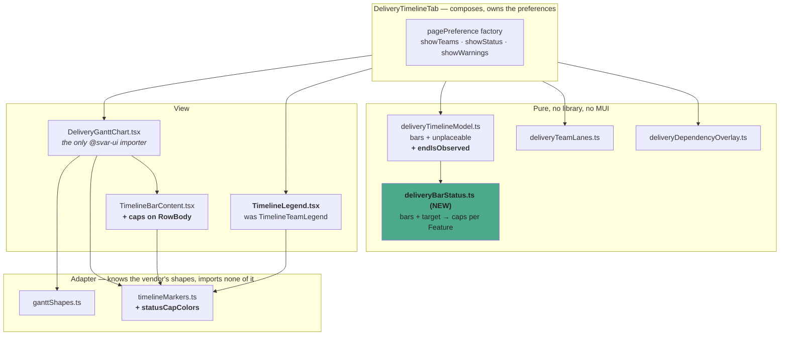

# Feature Delta — epic-6033-forecasted-start-dates

**Feature**: A Feature's forecast says when work on it is expected to *begin*, not only when it is
expected to end — read off the same simulated runs that already produce the completion date.
**ADO**: Epic #6033, "Sync Forecasted Start Dates with the Work Tracking System" (state Planned, tags
`Community`, `Productboard`).
**Origin**: Chris Graves (Focusrite), an existing paying customer, on the public idea board
(ideas.letpeople.work), posted as "Sync forecasted start dates to Jira". The motivating use is Jira
Plans: with a start and an end in fields, a Plan timeline populates itself from measured flow instead of
from manually estimated dates.
**Waves present**: DISCUSS, DESIGN. (DEVOPS skipped by user decision, 2026-09-20 — see below.)
**Density**: lean (`~/.nwave/global-config.json` → `documentation.density: lean`,
`expansion_prompt: ask-intelligent`).

> **The Epic description is superseded in its central mechanism.** It records the requester's initial
> thinking — derive a Feature's start from the *preceding* Feature's forecasted completion date — and
> flags that this needs a notion of sequence and does not answer what "preceding" means with zero or
> several predecessors. That derivation is rejected here, on the record, in D1. The simulation already
> knows the day it starts each Feature; the number does not need deriving, only recording.

---

## Wave: DISCUSS / [REF] Persona IDs

Defined in `docs/product/personas/` — these are the SSOT ids, not personas invented for this feature.

| Persona | Role here |
|---|---|
| `delivery-lead-rte` | **Primary.** Plans a Delivery across several Features and needs to tell a stakeholder when each one begins, not only when the last one ends. Reads the timeline. Never opens a setting. |
| `config-admin` | Maps the forecasted start percentile onto a work tracking system field, in the same write-back screen already used for completion percentiles. Touched only by slice 03. |
| `product-owner` | Reads the start column in the Feature table to answer "when will you get to mine?" — today the only honest answer is a completion date for everything above it in the order. |

---

## Wave: DISCUSS / [REF] JTBD One-Liners

- **`job-lead-say-when-a-feature-starts-not-only-when-it-ends`** (delivery-lead-rte) — When I am asked
  when a Feature further down the order will be picked up, I want an answer that comes from how work
  actually flows through this system rather than from me counting backwards off the one above it, so the
  answer moves on its own as throughput and order change.
- **`job-lead-see-a-delivery-as-a-timeline`** (delivery-lead-rte) — When I am planning a Delivery
  spanning several Features, I want to see them laid out against time with their real sequencing, so I
  can see which ones overlap and which ones wait, instead of reading a column of dates and holding the
  shape in my head.
- **`job-admin-let-the-plan-draw-itself`** (config-admin) — When our roadmap lives in Jira Plans and
  every bar on it is a date somebody typed, I want Lighthouse to fill both ends of the bar from the
  forecast, so the plan re-draws itself from measured flow instead of ageing the moment it is published.

All three are new. All three are appended to `docs/product/jobs.yaml` by this wave.

---

## Wave: DISCUSS / [REF] Current-State Surface Inventory

Established by reading the code on 2026-09-20, before any decision below was taken. Line references are
to the state of `main` at commit `a5ef65589`.

| # | Surface | What is actually there |
|---|---|---|
| S1 | `Services/Implementation/Forecast/SimulatedRun.cs:70-88` | `WorkOneDayOf`. The row being worked is named in `worked` on every delivered item; `completions.RecordThat(worked, day)` fires only when `CloseOneItemOf` returns true, i.e. on the day the row *finished*. **The day it started is the same `worked` variable, one branch earlier.** |
| S2 | `SimulatedRun.cs:90-95` | `HowManyFeaturesAtOnce` returns `Team.FeatureWIP`, floor 1. It bounds the *draw range* over the ready rows — it is not a tracked in-progress set. With Feature WIP 1 the draw range is 1, so `ready[0]` is always taken and the order is strict. |
| S3 | `TrialState.cs:118-135` | `RowsReadyToBeWorkedOnBy` is re-evaluated per delivered item, inside one day. A team that finishes a Feature with drawn capacity left starts the next one **the same day**. |
| S4 | `TrialState.cs:75-98` | `ReadyToBeWorkedOn`. A row learns its own team's finish the same day and another team's the following day — deliberate, and documented in place. So the one-day gap exists across teams and nowhere else. |
| S5 | `TrialCompletions.cs` | One `Dictionary<int,int>[]` per worker, written without a lock, summed once after all runs. A second parallel array is the entire storage change inside the run. |
| S6 | `ForecastService.cs:160-186` | `RecordTheDaysEachRowFinishedOn` merges the workers' shares and writes into `plan.RowAt(row).SimulationResults`. |
| S7 | `ForecastService.cs:228-250` | `UpdateFeatureForecasts` calls `feature.SetFeatureForecasts(...)`, one `WhenForecast` per `(Feature, Team)` row. |
| S8 | `Models/Feature.cs:207-215` | `SetFeatureForecasts` **clears** `Forecasts` and rewrites it on every refresh. Forecasts are current state, never history. |
| S9 | `Models/Feature.cs:53-58` | `Feature.Forecast => new AggregatedWhenForecast(Forecasts)` — aggregates **every** entry in the list, unconditionally. Putting start rows in that collection would silently corrupt the completion forecast, which is the most load-bearing number in the product. |
| S10 | `Models/Forecast/AggregatedWhenForecast.cs` | Combines per-team histograms through `JointCompletionDistribution.Combine` — a Feature is done when its **last** team is done. A start is the mirror: a Feature has started when its **first** team starts. |
| S11 | `Models/Forecast/ForecastBase.cs` `GetProbability` | Percentile read straight off the histogram; `KeyOrder` carries the direction, already parameterised. |
| S12 | `Models/WriteBack/WriteBackValueSource.cs` | Ordinal-persisted enum carrying an in-place comment that new members **must stay last**. Appending start sources is safe; inserting one is not. |
| S13 | `Services/Implementation/WriteBackTriggerService.cs:254-292` | `ResolveForecastValue`: `GetProbability(p)` then `ProjectWorkingDays` over effective blackout days then `yyyy-MM-dd`, and `null` when the Feature is Done. Exactly the shape a start resolver needs, blackout handling included. |
| S14 | `Models/WorkItemBase.cs:33,41` | `StateCategory` (`StateCategories.Doing`) and `DateTime? StartedDate`, both inherited by `Feature`. The observed start date already exists on the entity. |
| S15 | `Models/WorkItemBase.cs:37` | `string Order` — board order, maintained by manual sorting (Epic 5375). The timeline's row order, already there. |
| S16 | `API/DTO/FeatureDto.cs:29-31` | `feature.Forecast?.CreateForecastDtos(clock.Today, blackoutPeriods, 50, 70, 85, 95)`, guarded by `feature.CanBeForecast`. Dated percentiles with blackout projection already leave the API in this shape. |
| S17 | `Services/Implementation/Forecast/ForecastRunPlan.cs` `For` | Rows exist only for teams with measured throughput. A team with no history is left out of the run — so it has no start forecast either, for the same reason and by the same code. |
| S18 | `Models/DeliveryMetricSnapshot.cs` + `Services/Implementation/DomainEvents/DeliveryMetricSnapshotRecordingHandler.cs` | The house pattern for "this number, over time": a dedicated entity plus a handler on a domain event. What a future forecast-start-over-time would reuse rather than invent. |
| S19 | `Lighthouse.Frontend/package.json:28-30` | `@mui/x-charts` 9.0.1, `@mui/x-data-grid` 9.13, `@mui/x-date-pickers` 9.0.0 — the MIT tier throughout. **MUI X Gantt is Premium-licence-only and is not owned.** |
| S20 | `pages/Portfolios/Detail/Components/DeliveryGrid/DeliveryMetricsTab.tsx` | A Delivery already has tabs. The slot beside Features and Metrics that slice 04 needs is not new structure. |
| S21 | `ForecastService.cs` `RunMonteCarloSimulation` | `Parallel.For` over `limits.Trials` with one `OneWorkersShareOfTheRuns` per worker. Ten thousand runs already happen; nothing about the volume changes. |
| S22 | `API/DTO/FeatureDto.cs:70` | `List<WhenForecastDto> Forecasts` is filled from `feature.Forecast` — the **aggregate**. The per-team completion forecasts exist in `feature.Forecasts`, are used to build the aggregate, and then **never reach the client**. "Which team is the late one" has been unanswerable from the API since before this Epic. |
| S23 | `Lighthouse.Frontend/package.json:29`, `FeatureListDataGrid.tsx:8` | `@mui/x-data-grid`, the MIT package, imported directly. Detail panels, tree data and row grouping are all `DataGridPro`. Nothing in `src/` references a Pro feature — an expandable row is hand-built or not built. |
| S24 | `Models/Forecast/JointCompletionDistribution.cs` + `ComonotonicCompletionDistribution.cs` | The house already has a worked theory of combining per-team distributions, with two ADRs. `Combine` (ADR-110) multiplies CDFs across teams, assuming independence; `Min` (ADR-113) takes the elementwise minimum within a team, where rows share draws. Both operate on marginals *after* the run. |

---

## Wave: DISCUSS / [REF] Locked Decisions

### D1 — The start day comes out of the run. It is not derived from the Feature before it

The Epic description proposes deriving a Feature's start from the preceding Feature's forecasted
completion date, and correctly notes that this needs a notion of sequence and breaks down with zero or
several predecessors, or with parallel teams.

Rejected, by the product owner, in the idea-board thread on 2026-09-19:

> I would NOT use the "completion date of the preceding Epic" — the way Lighthouse forecasts we actually
> know at which "day" we start with an epic. If we store this value, we can take those values and you
> can read off a percentile.

That is right, and S1 is why: `SimulatedRun.WorkOneDayOf` already names the row it is working on the day
it works it. The number exists ten thousand times over and is thrown away. Deriving it from a neighbour
would be reconstructing, less accurately, something the run already computed.

The derivation also fails exactly where it would matter most. It is only well-defined for a single linear
chain at Feature WIP 1. Recording the pull day is defined for every Feature WIP, every branching order,
every number of teams, and every dependency shape — because those are already what the run models.

### D2 — "Started" means the first day an item of that Feature is pulled

Not "the first day it was eligible to be pulled". With Feature WIP 3 and five ready rows, the draw ranges
over the top three (S2) — all three are eligible, and on any given day only some are drawn. A Feature
nobody has touched has not started.

So: the first day on which `worked` names a row of this Feature, whether or not that item finishes it.

### D3 — Start forecasts get their own identity. They do not join `Feature.Forecasts`

S9 is the reason: `Feature.Forecast` aggregates every entry of that collection unconditionally, so a
start row landing in it would be folded into the completion forecast, silently, on every Feature. That is
the one number in the product where a silent error is least acceptable.

A separate collection is also what makes D12 possible without a rewrite.

### D4 — Both grains are recorded: per Feature, and per Feature and Team

A Feature's start is stored twice over, and both fall out of the same pass:

- **Per `(Feature, Team)` row** — the day that team first pulls an item of this Feature. The same grain
  the completion forecast already uses (S7).
- **Per Feature** — the earliest across that Feature's rows, taken *inside* each simulated run.

The Feature-level number is **stored**, not computed on read, and that is the one place start and
completion differ in shape. `AggregatedWhenForecast` derives a Feature's completion from the per-team
histograms at read time through `JointCompletionDistribution.Combine` — the product of the teams' CDFs,
because a Feature is done when the last team is done (ADR-110).

The mirror is available and would work: a Feature has started when the first team starts, so
`1 - Π(1 - Fi(t))` gives it from the same marginals. It is not used. That formula and `Combine` both
assume the contributing teams are independent, and dependency-aware forecasting (Epic 5792) exists
precisely to model the case where they are not — one team's Feature waiting on another's is a
co-movement the marginals no longer carry. `Combine` already carries that approximation for completion;
there is no reason to inherit it somewhere new when the exact answer is cheaper.

Taking the earliest inside the run assumes nothing. It reads the actual joint realisation at the cost of
one comparison per pull. So it is recorded, not derived.

Completion is unaffected and stays exactly as it is.

### D5 — A Feature that has started reports the day it started, and the forecast is not consulted

Decided by the product owner, 2026-09-20. The forecast still runs, still records a start day for every
Feature with work remaining, and still stores it. What changes is what the API returns: when
`StateCategory` is `Doing`, the response carries `StartedDate` and says it is observed.

The simulation is not told which Features are in flight. No forecasting logic changes for this.

### D6 — The run forecasts the board as configured. Where reality disagrees, it is meant to look odd

`ForecastRunPlan` builds its rows in board order and the draw ranges over the top `FeatureWIP` ready rows
(S2). Every run therefore begins by working ranks 1, 2 and 3 at Feature WIP 3. If a team is really in
flight on ranks 1, 4 and 7, the run is modelling a different board — and rank 2, which nobody has
touched, is forecast to start today while the WIP it would need is spent on rank 7.

**This is intended, and it is not to be corrected.** Decided by the product owner, 2026-09-20: a team
working out of order, or an order nobody has updated, is the team's own signal about its process, and
Lighthouse's job is to show the board it was given rather than to guess at the one being worked. The
picture looking wrong is the picture being right about something. Seeding in-flight Features into the
WIP slots would launder exactly the discrepancy worth seeing — and would silently move completion
forecasts for every existing user, which have carried the same treatment since they existed.

D5 keeps it narrow. Ranks 1, 4 and 7 report their observed start dates, so what remains visible is the
not-started Feature forecast optimistically, which is the case that carries the signal.

**One thing follows that is not free.** A forecast that is meant to look odd, and is not documented as
such, arrives as a bug report. The docs have to say plainly what an out-of-order board does to the
picture, and the timeline is where someone will see it first. Named as a deliverable in slice 04 rather
than left to the release notes.

### D7 — At Feature WIP 1, the next Feature starts the *same* day, not the day after

Correcting the assumption the Epic was framed with ("the start date of feature x+1 is one day after
feature x completes"). S3: `RowsReadyToBeWorkedOnBy` is re-evaluated per delivered item within a day, so
a team that closes a Feature with drawn capacity left starts the next one immediately. The one-day gap
exists only when the next Feature belongs to a different team (S4), and there it is deliberate.

Consequence for slice 04: bars will abut, not gap. That is the model being honest, not a rendering fault,
and it is written down here so it is not later "fixed".

### D8 — Free: the forecast and the table. Premium: the timeline. Write-back inherits its existing gate

A start percentile is core forecasting, and core forecasting has never been gated. The write-back source
is configured in the mapping screen that is already Premium, so it inherits that gate without new code.
The timeline is the differentiated surface and is gated.

### D9 — Where the date is known it is shown as a date; where it is not, as percentiles

Table view. A not-started Feature shows P50/P70/P85/P95, the same four the completion forecast already
uses (S16). A started Feature shows one date, marked as observed. A done Feature likewise.

Four percentiles rather than one is deliberate: a single figure in a column is where a forecast starts
being read as a commitment, and the column costs nothing extra by carrying all four.

### D10 — One percentile selector drives both ends of every bar on the timeline

Default P70; P85 and P95 selectable. The selection moves the bar's left edge and its right edge together,
so a bar is always one internally consistent scenario rather than a P70 start welded to a P85 finish.

Row order comes from `WorkItemBase.Order` (S15) — the order the board already has, and the order the
simulation itself works in. Dependencies are drawn if they can be drawn cheaply; see slice 05.

### D11 — Build the timeline before buying one

**Settled by slice 04's spike, 2026-09-20, and it returned a split result worth recording rather than
rounding to a pass or a fail.**

*Built from what is installed*: **no.** A dependency is added. The hypothesis was achievable — a
throwaway prototype on the already-installed `@mui/x-charts` covered AC-4.1 to AC-4.6 plus tooltips and
a sub-lane probe in ~205 lines, and that was the spike's own recommendation — but it is not the route
chosen. The outcome is a decision taken against the evidence, not a failure to find a way.

*Ends without a commercial dependency*: **yes.** `@svar-ui/react-gantt` 2.7.3 is MIT, as are all 25
packages in its transitive tree. Nothing is bought.

The original framing assumed MUI X Gantt was the thing one would buy. **It does not exist** — MUI's own
docs say it "isn't available yet", so there was never a licence to weigh against a build. Do not re-open
that comparison.

### D12 — Storage is shaped so that a snapshot can be added later. No snapshot is added now

Raised by the product owner as explicitly out of scope, with the request that the infrastructure not
foreclose it: seeing how a Feature's forecasted start date moved over the life of a Delivery.

S8 is the obstacle — `Forecasts` is cleared and rewritten every refresh, so there is nothing to look back
at. S18 is the house answer: a dedicated snapshot entity written by a handler on a domain event, as
blocked counts and delivery metrics already are.

The accommodation is D3 and D4 and nothing more: the start distribution is an addressable thing at
Feature grain, with its own identity and its own recompute moment. A later snapshotter has something to
point at. No snapshot table, no handler, no retention policy in this Epic.

### D13 — The flattened-bar risk is accepted, on the record, and is not to be re-litigated

The Epic description raises it as an open design risk: a single P85 start and a single P85 completion
render in Jira Plans as one solid bar, which reads as a commitment and hides the distribution it came
from. It is a fair objection and it has been answered — by the product owner and by the requester, in the
same thread:

> Of course you are right that then we have what looks like a fixed plan based on probabilities, but I
> trust that people using the tool can deal with this.
>
> — "ooo perfect! Yes, you said the forbidden word but that will be the result."

Recorded so the argument is not re-made in DESIGN. Two things follow from accepting it rather than
ignoring it: D9 keeps four percentiles in the table rather than one, and D10 makes the timeline's
percentile switchable rather than fixed. Neither removes the risk. Both keep the distribution one click
away from anyone who wants it.

The Epic description also notes the captured idea-board text was truncated mid-sentence and asks that the
board entry be re-read in case a mitigation was proposed there. The thread above is that re-read: the
continuation is the exchange quoted here, and no mitigation was proposed. The open question is closed.

### D14 — Our words, their values

"Feature" and "Features", per `TerminologySeeder.cs`. The Epic description says "Epic" throughout because
that is the requester's word and Jira's; it is not ours, and a Jira Plans user reading our docs sees
whatever they renamed Feature to. Where a literal work-tracking-system value is meant — a Jira field
named on a write-back mapping — it stays as written.

### D16 — The table says one thing. The timeline is where a Feature splits by team

Decided by the product owner, 2026-09-20, and the line is drawn at the surface rather than at the data.

**The table carries one forecast at four percentiles, exactly as the completion column does.** No
expander, no per-team column, no popover. A table row answers "when", and a second answer stacked inside
the first is what makes a table stop being readable.

**The timeline is where the split belongs.** A Feature with two or more contributing teams expands into
one sub-lane per team under its summary bar, each spanning that team's start to that team's completion at
the selected percentile (D10). Sub-lanes under a summary bar is a thing a Gantt does natively and well.

Two consequences worth naming.

**The data is served at both grains regardless** (D4, AC-1.9, AC-1.10). Where it surfaces is a UI
decision and this is it; the API carries the breakdown either way, so the question stays answerable and
the decision stays reversible without touching the backend.

**The sub-lanes are not start-only.** A lane spanning nothing but a start date is not a bar. Each lane
needs that team's completion too — and the per-team completion forecast already exists in the domain and
is discarded at the DTO boundary (S22): `FeatureDto.Forecasts` carries only the aggregate's four
percentiles. So serving it closes a gap that has been there for completion since before this Epic. Cheap,
because the data is already computed; named, because it changes an existing contract rather than adding
a new one.

S23 — that detail panels and row grouping are `DataGridPro`, which is not owned — is therefore not a
constraint on this Epic at all. It is recorded because it is the reason the question of a table expander
does not get reopened later on the assumption that the grid would just do it.

### D15 — Jira and Azure DevOps, matching the write-back sources that exist

The Epic asks whether this is Jira-only (the Plans use case) or Jira plus Azure DevOps as 5565 was. It is
whatever `WriteBackValueSource` already reaches — the resolver is connector-agnostic (S13) and gains
nothing from a restriction. No connector-specific work, and no connector excluded by hand.

---

## Wave: DISCUSS / [REF] Scope Assessment

**PASS after splitting.** Assessed before journey work, per the early gate.

Oversized signals present at intake: the Epic spans backend simulation, persistence, API, table UI,
write-back configuration and a new visualisation — more than three modules, and a timeline of unknown
build cost. Two independent user outcomes ship separately (a date you can read; a plan that draws
itself).

Split into five slices below, each end-to-end. Slice 04 carries the only genuine unknown and opens with
a timeboxed evaluation. Slice 05 is severable — the product owner qualified dependency rendering with
"ideally", and it is the one piece that can be dropped without stranding anything.

---

## Wave: DISCUSS / [REF] User Stories

### US-01 — The forecast knows which day work starts

**Job**: `job-lead-say-when-a-feature-starts-not-only-when-it-ends`
**Persona**: delivery-lead-rte
**Slice**: 01

As someone planning a Delivery, I want the forecast to carry a start date for each Feature at the same
confidence levels it already carries a completion date, so that the question "when will you get to this
one?" has an answer that comes from measured flow.

#### Elevator Pitch

Before: the API returns four completion percentiles per Feature and nothing about when work on it begins.
After: run `GET /api/latest/features` and each Feature carries a `startForecast` with dated
P50/P70/P85/P95, or an observed start date when it has already begun. **Corrected 2026-09-20 during
DISTILL**: this said `GET /api/latest/portfolios/{portfolioId}`, which returns only each Feature's id and
name and cannot serve this field. This sentence is where the error entered the document.
Decision enabled: whether a Feature further down the order can be promised to a stakeholder this quarter
at all, before anyone opens a timeline.

#### Acceptance Criteria

- **AC-1.1** — A Feature with remaining work and no observed start carries four dated start percentiles
  (50, 70, 85, 95) in the Feature read (`GET /api/latest/features`, and `…/features/ids?featureIds=…`),
  projected over working days and effective blackout days by the same path the completion percentiles
  use. **Corrected 2026-09-20 during DISTILL**: this said "the portfolio response", which carries only a
  Feature's id and name — an AC satisfiable by wiring the wrong DTO.
- **AC-1.2** — With Feature WIP 1 and two Features on one team with no dependency between them, the
  second Feature's P85 start equals the first Feature's P85 completion — the same day, not the day after
  (D7).
- **AC-1.3** — With Feature WIP 3 and five Features on one team, the top three carry a P85 start of day 1
  and the fourth and fifth carry later ones. Raising Feature WIP to 5 moves all five to day 1.
- **AC-1.4** — A Feature worked by two teams reports a Feature-level start taken as the earliest of its
  rows within each simulated run (D4). A constructed case with a dependency between the two teams — where
  the in-trial answer and `1 - Π(1 - Fi(t))` over the marginals differ — asserts that the stored value is
  the in-trial one.
- **AC-1.9** — The same Feature also reports one start per contributing team, at the same four
  percentiles (D4). For a single-team Feature the per-team value and the Feature-level value are the same
  number.
- **AC-1.10** — The same Feature read carries the per-team **completion** forecasts alongside the
  per-team starts (D16, S22). The existing aggregate `Forecasts` list is unchanged in shape and content,
  so nothing reading it today sees a difference. **Corrected 2026-09-20 during DISTILL**, same reason as
  AC-1.1.
- **AC-1.5** — `Feature.Forecast`, the completion percentiles and every existing forecast assertion are
  unchanged before and after this slice. The start distribution is not in `Feature.Forecasts` (D3).
- **AC-1.6** — A Feature whose `StateCategory` is `Doing` reports its `StartedDate`, marked as observed
  rather than forecast, and reports no start percentiles (D5).
- **AC-1.7** — A Feature on a team with no measured throughput carries no start forecast, and appears in
  `TeamsWithoutForecast` exactly as it does today (S17).
- **AC-1.8** — A ten-thousand-run forecast over a portfolio of fifty Features completes within 110% of
  the wall-clock time the same forecast takes on `main`, measured on the dev instance.

---

### US-02 — The Feature table says when each one starts

**Job**: `job-lead-say-when-a-feature-starts-not-only-when-it-ends`
**Persona**: product-owner (secondary: delivery-lead-rte)
**Slice**: 02

As a product owner looking at a portfolio's Features, I want a start column beside the completion
forecast, so that I can see where my Feature sits in the queue without reading the completion dates of
everything above it.

#### Elevator Pitch

Before: a Feature table row shows when a Feature will be finished and nothing about when it will be
picked up.
After: open a Portfolio and the Feature table shows a Forecasted Start column reading "~14 Oct (85%)" for
work not yet begun and "3 Oct" for work in flight.
Decision enabled: whether to re-order the board — seeing a Feature start eight weeks out is what prompts
moving it, and the completion date alone never said so.

#### Acceptance Criteria

- **AC-2.1** — The Feature table carries a Forecasted Start column, following the completion column's
  existing percentile presentation and the same terminology entries.
- **AC-2.2** — A started Feature shows a single date, visibly distinguished as observed rather than
  forecast, with no percentile attached. When no start day was ever recorded for it, that single date is
  the day the Feature was created, shown the same way.

  **Amended by Bug #6054, 2026-09-21.** As shipped, this criterion read "A started Feature shows a single
  date, visibly distinguished as observed rather than forecast, with no percentile attached", and it was
  written on the assumption that a started Feature always has a start day to show. It does not: a work
  tracking system with an empty started-date column maps every in-progress item to exactly the shape the
  assumption excludes. Those Features showed the column's empty state and dropped off the Delivery
  timeline under the untrue heading "No forecast for when work on this begins". They now show their
  creation day, under the same observed presentation, so the criterion says so.
- **AC-2.3** — A Feature with no start forecast shows the same empty state the completion column already
  uses for that Feature. No new empty state is invented. A Done Feature is not one of these: it shows the
  day it started.

  **Amended by Bug #6054, 2026-09-21.** As shipped, this criterion read "A Feature with no start forecast
  (no throughput, or done) shows the same empty state", and the product left a Done Feature's cell empty.
  That was wrong. A Done Feature's start is the most certainly known date it has, so it is now shown — on
  the Feature table and on the Delivery timeline, where a Done Feature consequently becomes placeable.
- **AC-2.4** — The column appears without a premium licence (D8), and a test asserts it with the licence
  absent.
- **AC-2.5** — Sorting and the existing column set are unchanged for anyone who does not look at the new
  column.

---

### US-03 — The work tracking system receives the forecasted start date

**Job**: `job-admin-let-the-plan-draw-itself`
**Persona**: config-admin
**Slice**: 03

As an administrator whose roadmap lives in Jira Plans, I want to map a forecasted start percentile onto a
field the same way I already map a completion percentile, so that a Plan bar gets both of its ends from
measured flow.

#### Elevator Pitch

Before: the write-back mapping screen offers four forecast percentiles, all of them completion dates.
After: open Settings, Work Tracking Systems, Write-Back, and the value list offers Forecasted Start
50/70/85/95 alongside the completion ones; pick one, pick a field, and the next refresh writes the date.
Decision enabled: whether the roadmap in Jira Plans can stop being maintained by hand — which is the
customer's actual request, and it is answered the moment both ends of the bar arrive on their own.

#### Acceptance Criteria

- **AC-3.1** — Four new `WriteBackValueSource` members for the start percentiles, appended after
  `SleRisk` and therefore last, so no stored mapping re-points (S12). A test asserts the ordinal of every
  pre-existing member.
- **AC-3.2** — Selecting a start source and a date field writes the forecasted start date to the work
  tracking system on the next write-back round, in the same `yyyy-MM-dd` default and honouring a custom
  `DateFormat` exactly as the completion sources do.
- **AC-3.3** — A Feature that has started writes its observed start date, not a forecast (D5), so the
  Plan bar begins where work began. When no start day was recorded for it, it writes the day the Feature
  was created — still something the Feature is known to have done, rather than a projection.

  **Amended by Bug #6054, 2026-09-21.** As shipped, this criterion read "A Feature that has started writes
  its observed start date, not a forecast (D5), so the Plan bar begins where work began", and a started
  Feature with no recorded start day therefore wrote nothing, leaving whatever stale future date the work
  tracking system already held. The creation day now stands in for the missing start, matching the
  fallback `WorkItemBase` already uses three times over — for cycle time, work item age, and age on day.
- **AC-3.4** — A Feature that is Done writes its observed start date. It writes nothing for a start source
  only when it has no recorded start.

  **Amended by Bug #6054, 2026-09-21.** As shipped, this criterion read "A Feature that is Done writes
  nothing for a start source, matching `ResolveForecastValue`'s existing behaviour for completion (S13)",
  and the code copied that shape one for one. The analogy does not hold. For a Done Feature a *completion*
  forecast is genuinely unanswerable, whereas a *start* is the single most certainly known date the Feature
  has; the symmetry was copied at the level of code shape rather than of the question each source answers.
  The completion-side guard is still correct and was deliberately left in place. What the fix leaves
  unfixed is written below these criteria.
- **AC-3.5** — A Feature with no start forecast writes nothing rather than writing an empty or epoch date.
- **AC-3.6** — The sources appear only under a premium licence, by the gate the mapping screen already
  has. No new gate is written (D8).

**What the Bug #6054 fix leaves unfixed, on the record.** This note used to be much wider. It said that a
Done or Doing Feature with no recorded start date resolves to nothing at all, so a wrong value already
sitting in a work tracking system for such a Feature is never corrected — the pipeline drops a null rather
than writing a blank, having no way to say "clear this field". The creation-day fallback added later in the
fix has largely dissolved that: a started or finished Feature nearly always has a day to write now, so the
stale future date does get overwritten on the next round.

What is left is the Feature carrying neither a start date nor a creation date. That is rare, because a
creation date is nearly always present, but it is real, because `CreatedDate` is nullable. For such a
Feature the fix still only stops a wrong date being written; it cannot remove one that is already there,
and closing even that narrow case would need the "write blank" capability the pipeline deliberately does
not have.

---

### US-04 — A Delivery shows its Features as a timeline

**Job**: `job-lead-see-a-delivery-as-a-timeline`
**Persona**: delivery-lead-rte
**Slice**: 04

As someone planning a Delivery, I want its Features laid out against a date axis with a percentile I can
change, so that I can see the shape of the plan — what overlaps, what waits — instead of assembling it in
my head from a column of dates.

#### Elevator Pitch

Before: a Delivery shows its Features as a grid and its metrics as charts. The sequencing between them is
in the reader's head.
After: open a Delivery, choose the Timeline tab, and see one bar per Feature in board order spanning
forecasted start to forecasted completion, with a P70/P85/P95 selector that moves both ends together.
Decision enabled: whether the Delivery holds together as planned — a bar sliding past the target date, or
three bars stacked where the team can only carry two, is visible at a glance and is not visible in a
table at all.

#### Acceptance Criteria

- **AC-4.1** — A Delivery carries a Timeline tab beside Features and Metrics (S20), rendering one bar per
  Feature in `WorkItemBase.Order` (S15).
- **AC-4.2** — A bar spans that Feature's start at the selected percentile to its completion at the same
  percentile. Changing the selector moves both ends (D10).
- **AC-4.3** — The selector defaults to P70 and offers P85 and P95.
- **AC-4.4** — A started Feature's bar begins at its observed start date (D5) and ends at its forecasted
  completion at the selected percentile.
- **AC-4.5** — A Feature with no forecast is listed with no bar and a stated reason, rather than omitted.
  A Delivery where none can be forecast says so instead of rendering an empty axis. **Rendered beside the
  timeline rather than as a row inside it** — corrected 2026-09-20 from slice 04's spike. An in-chart row
  for an undated task is a paid feature of the chosen component, and its free build does something worse
  than omit such a task: it draws a bar at a position the data does not support. The adapter must never
  hand the component a task it cannot place. The AC's intent is unchanged — the Feature must not vanish;
  only where it is rendered has moved.
- **AC-4.6** — The Delivery's target date, where it has one, is marked on the axis. **As a tinted axis
  column rather than a drawn vertical line** — corrected 2026-09-20 from slice 04's spike. A drawn marker
  is a paid feature and is deferred; a licence bought later adds it without rework. The date is still
  marked: shaded, not ruled.
- **AC-4.7** — The tab is premium-gated, using the notice the Delivery surface already uses (D8).
- **AC-4.8** — Legible in light and dark themes, and at the narrowest width the Delivery view supports.
  **The task-name pane is absent at every width** — decided during DELIVER, 2026-09-20, having seen it
  rendered. The earlier plan dropped it only below a breakpoint; in practice every name it lists is
  already written on its own bar, so at any width it is a fixed column spent repeating the chart.
- **AC-4.9** — The docs say plainly what an out-of-order board does to the picture (D6): a Feature nobody
  has started, drawn as starting now while work sits lower in the order, is the timeline reporting the
  board rather than misreading it. Without this the intended oddness arrives as a bug report.

---

### US-06 — A multi-team Feature splits into sub-lanes on the timeline

**Job**: `job-lead-say-when-a-feature-starts-not-only-when-it-ends`
**Persona**: delivery-lead-rte
**Slice**: 06 (severable, timeline only)

As a delivery lead looking at a Feature two or three teams contribute to, I want to open it on the
timeline and see a lane per team, so that when the summary bar looks wrong I can see which team it is.

#### Elevator Pitch

Before: a multi-team Feature is one bar, and which team drives either end of it is unanswerable from the
UI and from the API alike.
After: click the expander on a multi-team Feature's timeline row and see one lane per team beneath its
summary bar — Platform running Oct to early Nov, Mobile picking up in Nov.
Decision enabled: which team to talk to. A Feature running late because one team has not got to it is a
different conversation from one running late because both are saturated, and today they look identical.

#### Acceptance Criteria

- **AC-6.1** — A Feature with one contributing team has no expander on the timeline. Its row is unchanged.
- **AC-6.2** — A Feature with two or more contributing teams expands to one sub-lane per team, each
  spanning that team's start to that team's completion at the selected percentile. Changing the
  percentile moves the sub-lanes with the summary bar.
- **AC-6.3** — The summary bar is unchanged by expanding, and stays the stored Feature-level value (D4)
  rather than the earliest of the sub-lanes. A dependent pair where the two differ asserts it.
- **AC-6.4** — A team contributing to the Feature but carrying no forecast gets a named lane with its
  reason, not no lane — otherwise the expansion silently disagrees with `TeamsWithoutForecast`.
- **AC-6.5** — Removing this slice entirely leaves US-04 whole. **The Feature table is untouched by this
  story**: one forecast, four percentiles, no expander (D16).

---

### US-05 — The timeline shows what waits on what

**Job**: `job-lead-see-a-delivery-as-a-timeline`
**Persona**: delivery-lead-rte
**Slice**: 05 (severable)

As someone reading the timeline, I want to see the dependencies between Features drawn on it, so that a
bar sitting late reads as "it is waiting for that one" rather than as an unexplained gap.

#### Elevator Pitch

Before: the timeline shows when each Feature runs, and a Feature that starts late looks arbitrary.
After: on the Delivery's Timeline tab, a Feature that waits on another is connected to it, so a late bar
explains itself.
Decision enabled: which dependency to attack first — a bar with lines leaving it is holding up
everything they lead to, and nothing in the product shows that today. How sharply that separates one
Feature from the rest depends on how coupled the Delivery is, and on a lightly coupled one it will not
separate them much; there the win is the smaller one above, that a late bar stops looking arbitrary.

#### Acceptance Criteria

- **AC-5.1** — A Feature with a recorded dependency on another Feature in the same Delivery is connected
  to it on the timeline.
- **AC-5.2** — A dependency on a Feature outside this Delivery is indicated on the waiting bar without
  drawing a bar for the absent Feature.
- **AC-5.3** — The connections stay legible at the density a real Delivery reaches; above that density
  they degrade to a per-bar indicator rather than a thicket.
- **AC-5.4** — Removing this slice entirely leaves US-04 whole.

---

## Wave: DISCUSS / [REF] Story Map and Slices

**Backbone**: record the start day, store it, read it, write it out, draw it.

| Slice | Story | Ships | Estimate |
|---|---|---|---|
| 01 | US-01 | Start day recorded in the run at both grains, stored, served by the portfolio API with the observed-date override and the per-team breakdown | ~7h |
| 02 | US-02 | Forecasted Start column in the Feature table | ~3h |
| 03 | US-03 | Four write-back sources, resolver, premium gate by inheritance | ~4h |
| 04 | US-04 | Timeline tab with percentile selector (opens with a build-vs-buy evaluation) | ~6h + 2h evaluation |
| 05 | US-05 | Dependencies drawn on the timeline — **severable** | ~4h |
| 06 | US-06 | Per-team sub-lanes on the timeline — **severable**, and depends on 04 | ~4h |
| 07 | US-07 | Done and late Features marked on the timeline — **severable**, and depends on 04 | ~5h |

Slices 05, 06 and 07 are all severable and independent of each other, and all three sit on slice 04. Any
of them can be dropped, or all of them, and what remains still ships. If slice 04's evaluation goes the
other way, all three are re-estimated against whatever it recommends. *(Corrected 2026-09-21: this read
"Slices 05 and 06 are both severable … Either can be dropped, or both", before Story #6067 added 07.)*

**Walking skeleton**: slice 01. It crosses every layer the Epic touches except the two UI surfaces — the
simulation, the storage decision, the aggregation grain and the API contract — and it is where every
assumption that could be wrong actually lives.

### Carpaccio taste tests

- **Four or more new components?** Slice 01 adds one recording array, one storage shape and one DTO
  member. Slice 04 is the largest and is one tab and one chart. Pass.
- **Every slice depending on a new abstraction?** Slices 02-05 all depend on slice 01's start
  distribution, which is why it ships first and alone. Pass.
- **Does any slice disprove a pre-commitment?** Slice 01 disproves D4 and D6's containment if the start
  forecast turns out to be systematically optimistic, and disproves the "minimal" premise if the storage
  cost is not small. Slice 04 disproves D11 — and it did, in half: the spike returned a split result. Pass.
- **Synthetic data only?** Slices 01, 02 and 04 are demonstrated on the dev instance against real history.
  Slice 03 writes to a real Jira instance. Pass.
- **Two slices identical but for scale?** 04 and 05 are both the timeline, but 05 draws a different thing
  from different data and is severable. Not merged, deliberately. Pass.

### Prioritisation

1. **Slice 01 first — highest learning leverage.** Everything else is built on the number it produces. If
   the start distribution is wrong or the aggregation grain is wrong, it is wrong once here rather than
   in four places. It also carries the performance question, and it is the slice where the "it really
   should be minimal" premise either holds or does not.
2. **Slice 02 second — cheapest dogfood.** One column, and it is what makes slice 01's number readable by
   someone who is not reading JSON. Wrong start dates are far more likely to be spotted in a column
   beside the completion dates than in an API response.
3. **Slice 03 third — it is the customer's literal request.** Deliberately not first: writing a wrong date
   into someone's Jira instance is the most expensive way to discover that slice 01 was wrong, because
   the wrong number then lives in a system we do not control and a Plan gets published off it.
4. **Slice 04 fourth — the largest and the only one with an unknown.** Its evaluation runs before its
   code, and it is the first slice that could return a different answer than planned.
5. **Slice 05 last, and severable.** Qualified as "ideally" by the product owner.

---

## Wave: DISCUSS / [REF] Out of Scope

- **Seeding in-flight Features into the simulation's WIP slots at day 0.** Not deferred — **declined**,
  per D6. The run forecasts the board it was given, and a board that disagrees with what the team is
  actually working is a signal the picture is supposed to carry. No follow-up item.
- **Snapshotting the forecasted start date over time.** D12. Explicitly deferred by the product owner;
  this Epic only avoids foreclosing it.
- **Any change to how completion is forecast, aggregated or displayed.** AC-1.5 asserts this.
- **Reading a start date back from the work tracking system.** Write-back is one-directional here, as it
  is for completion.
- **A timeline anywhere but on a Delivery.** Not on a Portfolio, not on a Team.
- **Purchasing a MUI X Premium licence.** Slice 04's evaluation may recommend it; the decision is the
  product owner's and is not taken here.
- **Folding this into Epic 5792 Dependency-Aware Forecasting.** The Epic asks whether it belongs there.
  It does not: 5792 shipped, its substrate (`IWhatTheForecastWaitsFor`, `ForecastRunPlan.MustFinishFirst`)
  is what makes start dates meaningful under dependencies, and this Epic consumes it rather than
  extending it. Recorded so the question is not re-opened.

---

## Wave: DISCUSS / [REF] Walking Skeleton Strategy

**Strategy B — extend an existing end-to-end path.** Brownfield. Every layer this Epic touches already
carries the completion forecast from `SimulatedRun` to `FeatureDto` to the Jira field. Slice 01 runs a
second value down the same path rather than building a path.

No configurable or env-switching strategy is used, so the WS-strategy-D expansion trigger does not fire.

---

## Wave: DISCUSS / [REF] Driving Ports

| Port | Surface | Slice |
|---|---|---|
| HTTP | `GET /api/latest/features` and `GET /api/latest/features/ids?featureIds=…` — Features carry start percentiles or an observed start date. **Corrected during DISTILL**; `GET /api/latest/portfolios/{id}` carries only id and name and cannot serve a `FeatureDto` | 01 |
| UI | Portfolio, Feature table, Forecasted Start column | 02 |
| UI | Settings, Work Tracking Systems, Write-Back, value source list | 03 |
| Outbound | Write-back round to a Jira or Azure DevOps date field | 03 |
| UI | Portfolio, Delivery, Timeline tab | 04, 05, 06, 07 |

---

## Wave: DISCUSS / [REF] Outcome KPIs

| KPI | Target | Measurement |
|---|---|---|
| Forecast wall-clock cost of carrying start dates | at most 110% of `main` | Ten thousand runs over a fifty-Feature portfolio on the dev instance, before and after slice 01 |
| Start percentiles present where a completion percentile is | 100% of Features that carry a completion forecast | Assertion over the dev instance's Feature read |
| Start dates that are observed rather than forecast, for in-flight work | 100% of Features in a Doing state | AC-1.6, asserted |
| Completion forecast drift introduced by this Epic | 0 | AC-1.5 — existing forecast assertions unchanged |
| Write-back mappings using a start source, 60 days after release | at least 1 (Focusrite) | Usage data, if consent is given; otherwise the requester is asked directly |
| Mutation kill rate, both stacks | at least 80% | Stryker.NET and StrykerJS, per feature |

---

## Wave: DISCUSS / [REF] Pre-requisites

| # | Pre-requisite | State |
|---|---|---|
| P1 | The run names the row it works, per delivered item | **Confirmed** — `SimulatedRun.cs:70-88` (S1) |
| P2 | Feature WIP already bounds which Features a team works at once | **Confirmed** — `SimulatedRun.cs:90-95` (S2) |
| P3 | Dependencies already gate readiness in the run | **Confirmed** — `TrialState.ReadyToBeWorkedOn` (S4), shipped by Epic 5792 |
| P4 | An observed start date exists on a Feature | **Confirmed** — `WorkItemBase.StartedDate` and `StateCategory` (S14) |
| P5 | Board order exists and is maintained | **Confirmed** — `WorkItemBase.Order` (S15), Epic 5375 |
| P6 | The write-back value source enum can be extended safely | **Confirmed** — append-only, documented in place (S12) |
| P7 | A Delivery has a tab slot | **Confirmed** — `DeliveryMetricsTab.tsx` (S20) |
| P8 | A timeline can be built from what is installed | **Closed 2026-09-20** — split result; see D11. Proven buildable on `@mui/x-charts`; `@svar-ui/react-gantt` (MIT) chosen instead |

P8 was the last open one. Slice 04's spike closed it on 2026-09-20, so all eight are now confirmed or
closed.

---

## Wave: DISCUSS / [REF] Definition of Ready

| # | Item | Evidence |
|---|---|---|
| 1 | Business value articulated | Jira Plans that draw themselves from measured flow; requested by a paying customer and seconded in-thread |
| 2 | User stories with job traceability | US-01 to US-07, each carrying a `job_id` appended to `docs/product/jobs.yaml`. US-07 traces to `job-lead-see-a-delivery-as-a-timeline`, the same job US-04 and US-05 serve — it is the same person asking the same question of the same picture, with no new job behind it. US-02's persona is `product-owner` while its job is the delivery lead's: deliberate, because the question is the same one ("when will you get to this?") asked from two seats, and a second job whose only difference is who is asking would be a duplicate rather than a distinction |
| 3 | Acceptance criteria testable | **51 ACs across seven stories** — 10 / 5 / 6 / 9 / 4 / 5 / 12 for US-01 to US-07 — each asserting an observable output. *(Corrected 2026-09-20: this read "27 across five", which counted neither US-06 nor AC-1.9/AC-1.10. Corrected again 2026-09-21: this read "39 across six", before Story #6067 added US-07.)* |
| 4 | Dependencies identified | P1-P8, all closed. P8 was the last open one and slice 04's spike settled it on 2026-09-20 |
| 5 | Sized to fit a slice | **Seven slices, 3-8h each, three severable** (05, 06 and 07, independent of each other). *(Corrected 2026-09-20: this read "five slices … one severable". Corrected again 2026-09-21: this read "six slices … two severable", before Story #6067 added 07.)* US-01 at ~7h and US-04 at ~6h plus a 2h evaluation both sit at the top of the band; slice 01's split is planned rather than contingent — see its brief |
| 6 | Technical approach known | D1-D4 name the mechanism; the surface inventory gives every line it touches |
| 7 | Risks named | D6 (optimism residual), D13 (accepted flattening), P8 (build vs buy — closed, see D11) |
| 8 | Out of scope explicit | Seven items, two carrying owed follow-ups; five more for slice 07 in its own section, one of them a declined request rather than a deferred one (D7-12) |
| 9 | Terminology settled | D14 |

**DoR: PASS.** The one qualification it carried — item 4 resting on P8 — is discharged: slice 04's spike
closed P8 on 2026-09-20. Slices 01-03 never depended on it.

---

## Wave: DISCUSS / [REF] Definition of Done

1. `dotnet build` clean, zero warnings.
2. `dotnet test` green with the live-connector categories excluded.
3. `pnpm test` green; `pnpm build` clean with zero warnings; Biome clean.
4. Playwright specs run locally before commit, through page objects, against demo data.
5. SonarQube Cloud introduces no new issues of any severity.
6. Stryker at or above 80% on both stacks, acceptance suite excluded.
7. EF migrations generated by `CreateMigration`, expand-only.
8. Docs and per-feature screenshots updated at feature finalization, in the configurable terminology.
9. ADO Epic #6033 and its child Stories transitioned; Epic stops at Resolved, never Closed.
10. **AC-1.8 re-measured, not assumed.** `StartForecastWallClockProbe` is `[Explicit]` and never runs in
    CI, so the criterion has no automated enforcement anywhere. Story #6045 does not reach Resolved
    until the probe has been run again on the machine that produced the baseline and both numbers are
    written into the slice brief. Baseline, taken before any of slice 01 was written: median **335 ms**,
    budget **≤ 369 ms**.

---

## Wave: DISCUSS / [REF] Wave Decisions Summary

### Key decisions

- **[D1]** The start day is recorded from the simulated run, not derived from the preceding Feature's
  completion date — reversing the Epic description's proposal, on the product owner's instruction.
- **[D2]** "Started" is the first day an item of that Feature is pulled, not the first day it is eligible.
- **[D3]** Start forecasts get their own identity rather than joining `Feature.Forecasts`, which would
  silently corrupt the completion forecast.
- **[D4]** Both grains are stored — per Feature and per Feature-and-Team. The Feature-level value is
  taken inside each trial rather than derived from the marginals, because deriving it would assume the
  teams are independent and Epic 5792 exists to model when they are not.
- **[D5]** A started Feature reports its observed start date at read time; the simulation is unchanged.
- **[D6]** The run forecasts the board as configured. Where the team is working a different order, the
  picture is meant to look odd — declined as a fix, documented as a signal.
- **[D16]** The table carries one forecast at four percentiles, like completion, and gains no expander.
  A Feature splits by team on the timeline only, as sub-lanes — which need per-team completion as well as
  per-team start, and the API discards per-team completion today.
- **[D7]** At Feature WIP 1 the next Feature starts the same day, not the day after.
- **[D8]** Forecast and table free; timeline premium; write-back inherits the mapping screen's gate.
- **[D10]** One percentile selector moves both ends of every bar.
- **[D11]** Build the timeline before buying one. Closed with a split result: a dependency is added, but
  it is MIT and nothing is bought.
- **[D12]** Storage shaped for a future snapshot; no snapshot built.
- **[D13]** The flattened-bar risk is accepted on the record and closes the Epic's open design risk.

### Requirements summary

- Primary jobs: say when a Feature starts, not only when it ends; see a Delivery as a timeline; let the
  Jira Plan draw itself from measured flow.
- Walking skeleton scope: slice 01 — record, store and serve the start day.
- Feature type: cross-cutting (simulation, persistence, API, two UI surfaces, outbound write-back).

### Constraints established

- The completion forecast must be unchanged before and after (AC-1.5).
- Ten thousand runs must not cost meaningfully more (AC-1.8).
- `WriteBackValueSource` is append-only; ordinals are persisted.
- MUI X Gantt is not owned and is Premium-licence-only.
- Start forecasts must not enter `Feature.Forecasts`.
- The Feature table shows one forecast at four percentiles. No per-team surface in the table at all.
- The existing aggregate `Forecasts` list on `FeatureDto` keeps its shape and content exactly.

### Upstream changes

No DISCOVER or DIVERGE artifacts exist for this Epic; the ADO description carries the discovery evidence
(named customer, public idea board, seconded in-thread). Two of its statements are changed here:

1. **Original (Epic #6033 description):** "For sequential work, an Epic's forecasted start date could be
   derived from the forecasted completion date of the *preceding* Epic." **Changed** by D1, on the
   product owner's instruction in the idea-board thread of 2026-09-19. The run already computes the
   number.
2. **Original (Epic #6033 description):** "The idea-board entry continues past this point... Re-read the
   board entry before DISCUSS — the requester may have proposed a mitigation." **Closed** by D13: the
   continuation was supplied on 2026-09-20 and contains no mitigation. The risk is accepted.

A third statement in the framing that reached this wave — "the start date of feature x+1 is one day after
feature x completes" — is corrected by D7 against `TrialState.cs:118-135`.

---

## Wave: DISCUSS / Tier-2 Expansion Menu

Density is `lean` with `expansion_prompt: ask-intelligent`. Triggers evaluated against the artifacts
above:

| Trigger | Fired | Why |
|---|---|---|
| AC ambiguity across 2 or more stories | No | Each AC names an observable output |
| Cross-context complexity (3 or more contexts or technologies) | **Yes** | Forecasting, persistence, write-back, React UI, charting |
| Multi-stakeholder (3 or more personas) | **Yes** | delivery-lead-rte, config-admin, product-owner |
| Compliance or regulatory | No | No regulated data |
| WS strategy = D (configurable) | No | Strategy B |

Two triggers fired, and both were examined rather than offered on the trigger alone.

**`persona-narrative` — declined.** The trigger fires on persona count, not on whether the personas are
described anywhere. All three already exist in SSOT (`docs/product/personas/`, 274 lines between them)
and none of them is new to this Epic. Rendering extended profiles here would restate the SSOT in a
feature workspace that gets archived, which is how two descriptions of one persona start to disagree.

**`alternatives-considered` — declined as written, one piece taken.** The rationale the expansion would
render is already inline: D1 records what the derivation was and why it went, D4 names the formula it
rejects and the assumption that kills it, D16 names the surface it chose over the other. Rendering it
again in a separate section is duplication.

The one thing genuinely missing is a candidate list for P8 — slice 04's build-versus-buy evaluation
starts from `@mui/x-charts` and nothing else, and two hours is not long to find out what else exists.
That belongs in the slice brief where the spike is run, not in a Tier-2 section here, and it is recorded
there instead.

No expansion rendered. Telemetry: one `choice = "skip"` per triggered id.

---

## Wave: DESIGN / [REF] Prior Wave Consultation

Read 2026-09-20 before any decision below. Scope: **application / components**. Mode: **propose**.

| File | State |
|---|---|
| `docs/product/architecture/brief.md` | ✓ read (8476 lines — base Application Architecture plus per-feature deltas) |
| `docs/product/architecture/adr-110-multi-team-forecast-joint-probability.md` | ✓ read |
| `docs/product/architecture/adr-111-aggregate-forecast-field-provenance.md` | ✓ read |
| `docs/product/architecture/adr-112-unknown-forecast-when-contributor-cannot-be-forecast.md` | ✓ read |
| `docs/product/architecture/adr-156-per-trial-max-replaces-product-of-cdfs.md` | ✓ read — **decisive** |
| `docs/product/architecture/adr-159-un-forecastable-blocker-drops-and-the-date-reads-as-a-floor.md` | ✓ read |
| `docs/product/journeys/epic-6033-forecasted-start-dates.yaml` | ✓ read |
| This file's DISCUSS sections, and the six slice briefs | ✓ read |
| `docs/product/outcomes/registry.yaml` | ✓ checked — `check-delta`: 0 collisions |
| `docs/feature/epic-6033-forecasted-start-dates/spike/` | ⊘ not found (no spike was run) |

Rigor: `.nwave/des-config.json` carries no `rigor` key, so standard defaults apply.

**Contradictions with DISCUSS: none.** One decision is corroborated by an ADR that DISCUSS had not read,
and one is reframed. Both are recorded under Changed Assumptions below.

---

## Wave: DESIGN / [REF] The ADR-156 Finding

DISCUSS D4 — observe the Feature-level value inside the trial rather than derive it from the marginals —
is not new here. **ADR-156 proposes exactly that mechanic for completion, and is `Deferred`, not
refused.** Its decision text:

> `TrialState` holds an outstanding-row count per Feature; when a row reaches zero the count is
> decremented, and when the count reaches zero the current simulated day is recorded into that Feature's
> histogram.

The start recorder is that, mirrored: a per-Feature marker set on first pull. Three consequences, all of
which changed this wave's output.

1. **ADR-110's cost objection to per-trial recording is already retired.** It claimed per-trial max
   "needs trial-level storage (10 000 ints × teams per feature)". ADR-156 corrected it: *"trial-level
   storage is not needed: with a shared clock, the maximum over a Feature's rows is a running count, not
   a retained array."* A minimum is a running value for the same reason. D4's cost claim now rests on an
   ADR rather than on assertion.
2. **Slice 01 builds part of the machinery ADR-156 needs — the indexing, not the recorder.** Narrowed
   2026-09-20: this said "same array lifecycle, same recorder, same fold, mirrored", which overstates it.
   ADR-156's mechanic is an outstanding-row counter per Feature that is seeded, decremented as rows
   finish and fires at zero; the start mechanic is a marker set once, on first pull, that never
   decrements. What they genuinely share is the row-to-Feature index and the per-worker array lifecycle
   around it. Un-deferring ADR-156 later becomes cheaper because that prerequisite exists, not because
   the recorder can be reused. **This wave does not un-defer it** —
   AC-1.5 forbids moving completion, and ADR-156's own deferral reason was "one change to forecasting at
   a time". ADR-199 says so explicitly so that a future reader sees the constraint was honoured rather
   than sidestepped.
3. **ADR-156 declares the completion aggregate would join `Feature.Forecasts` as its `TeamId == null`
   row.** That collection's intended future already contains a Feature-grain row. DDD-1 is reconciled
   against it deliberately rather than by coincidence.

---

## Wave: DESIGN / [REF] DDD List

### DDD-1 — Start forecasts live in `Feature.StartForecasts`, a collection of their own type

**ADR-200.** Per-team rows carry `TeamId`; the Feature-grain row carries `TeamId == null` per ADR-111.
`Feature.Forecast` is not touched, so AC-1.5 is a structural property rather than a test —
`AggregatedWhenForecast` cannot see a start row because start rows are not in the collection it reads.

**Amended 2026-09-20, during the DISTILL review gate.** This decision originally said the collection
would be a second `List<WhenForecast>`. That cannot be mapped. `WhenForecast` has exactly one
`FeatureId`/`Feature` pair and `LighthouseAppContext.cs:231-235` already binds it to `Feature.Forecasts`;
EF Core cannot carry two collections of one type over one foreign key. A second FK on `WhenForecast` does
not rescue it either: `FeatureId` is a **required** `int`, so a start row would still have to carry a
valid one and would be loaded straight into `Feature.Forecasts` — the silent corruption D3 exists to
prevent, reintroduced by the mapping.

The forecast hierarchy is already **TPH**: `ForecastBase` is the table, with a `Discriminator` column and
`WhenForecast` as one of its values (`IndividualSimulationResult.Forecast` is typed `ForecastBase`). So:

> **`StartForecast : ForecastBase`** — a TPH *sibling* of `WhenForecast`, not a derived type, carrying
> its own `FeatureId` and `TeamId`. `Feature.StartForecasts` is `List<StartForecast>`.

The guarantee gets stronger rather than weaker: `Feature.Forecasts` is `List<WhenForecast>` and a sibling
type cannot appear in it **by CLR type**, not by filter and not by convention. Expand-only, as the
standing migration rule requires: one new discriminator value and two new nullable columns in an existing
table, with no existing column altered. `SimulationResults` already hangs off `ForecastBase`, so start
rows reuse `IndividualSimulationResult` untouched.

Still rejected, and now for a second reason: one collection with a `ForecastKind` discriminator would put
a filter on the product's most load-bearing number for a storage-tidiness reason, and turn AC-1.5 into
something a test has to catch. Also still rejected: a separate entity with its **own repository**, which
would need a second clear-and-rewrite lifecycle kept in step with `SetFeatureForecasts` by hand — note
that `StartForecast` is not that. It is a collection on the aggregate, written by a setter mirroring
`SetFeatureForecasts`, with no repository of its own.

### DDD-2 — `ForecastBase` is reused as-is for start rows

**ADR-200.** `ForecastBase.GetProbability` with its ascending `KeyOrder` is exactly what a start
percentile needs, and it is on the base rather than on `WhenForecast`.

**Amended 2026-09-20 alongside DDD-1**, and the amendment improves it. This said `WhenForecast` was
reused as-is, and had to excuse `NumberOfItems` — meaningless for a start — as a tolerable wart on the
ADR-111 precedent. `NumberOfItems` is declared on `WhenForecast`, not on `ForecastBase`, so a sibling
never inherits it. There is no wart left to excuse and no unused field on the new type.

### DDD-3 — The recorder extends `TrialState` and `TrialCompletions`. No new type in the simulation

**ADR-199.** One marker array per worker indexed by row and one indexed by Feature, cleared in
`StartAgain()`, written at most once per entity per trial, folded by the existing merge.
`SimulatedRun.WorkOneDayOf` gains one call where `worked` is assigned. `ForecastRunPlan` gains an
unconditional dense row-to-Feature index (`int[]`, parallel to `teamOfRow`) and a Feature count.

**Corrected 2026-09-20**: this said `ForecastRunPlan` *hoists* the grouping it already builds privately
inside `WhatEachRowWaitsFor`. It cannot. That grouping is keyed by `Feature.ReferenceId`, a string,
rather than by a dense index — and `WhatEachRowWaitsFor` returns early with no grouping at all whenever
`NobodyWaitsForAnything`, which the class's own comment says is almost every forecast. There is nothing
to hoist in the ordinary case; the index is new work, and slice 01's estimate carries it as such.

`TrialCompletions` is worth renaming: after this it no longer records only completions.

### DDD-4 — An un-forecastable contributing team needs no new rule

**ADR-199, ADR-201.** `ForecastRunPlan.For` admits no row for a team with no measured throughput, so
nothing is recorded; ADR-112's unknown state already governs the whole Feature through
`Feature.CanBeForecast`, and `FeatureDto` already guards every forecast emission on it. Start forecasts
inherit unknown for free.

ADR-159's competing precedent — a directionally-known date presented as a bound rather than blanked —
was considered and does not apply. ADR-159 distinguishes a team that owns work *inside* the Feature
(ADR-112's case, and ours) from one that is only a start constraint on a Feature whose own work is
forecastable. On our case ADR-159 defers to ADR-112.

### DDD-5 — The observed-start rule lives on `Feature`, not in the DTO

**ADR-201.** DISCUSS D5 said "at read time" and left the placement open. It is not one place: the table
and the timeline read `FeatureDto`, but Story #6047's write-back resolver reads `feature.Forecast`
directly and never passes through the DTO. Putting the rule in the DTO would leave the resolver to
re-implement it — ADR-156 names that failure mode by name ("two independent implementations of the same
verdict"), and the visible symptom would be a Jira Plan bar starting on a forecast date while the table
beside it shows the observed one.

So: one member on `Feature`, carrying the date **and** its provenance, with the DTO and the resolver as
two consumers. Provenance is carried explicitly, never inferred from the absence of percentiles —
ADR-112's rule, for the reason that produced the `return 100` trap.

### DDD-6 — Day-to-date translation is unchanged

**ADR-058** governs and is unaffected. A start day runs through the same `ProjectWorkingDays` over
effective blackout days that a completion day does, after the distribution is read, in both the DTO and
the write-back resolver. **REUSED AS IS.**

### DDD-7 — In-flight Features are not seeded into the WIP slots

**ADR-202.** Records DISCUSS D6 as an architectural decision rather than a product preference, because
seeding is the first thing a reader of ADR-199 will propose. Two reasons it is refused: it would launder
the discrepancy worth seeing, and it would move completion forecasts for every existing user as a side
effect of an Epic about start dates.

The docs obligation in AC-4.9 is the whole mitigation, not a nicety. If it is cut from Story #6048 the
decision is not implemented, only the code is.

---

## Wave: DESIGN / [REF] Component Decomposition

Every row is **EXTEND** but one. **Corrected 2026-09-20**: this said the feature introduces no new type in
the backend. DDD-1's amendment adds exactly one, `StartForecast`, and the reason is a mapping constraint
rather than a modelling preference.

| Component | File | Change | Summary |
|---|---|---|---|
| `TrialState` | `Services/Implementation/Forecast/TrialState.cs` | EXTEND | Per-row and per-Feature start markers, cleared in `StartAgain()`, set on first pull, read once at trial end. |
| `TrialCompletions` | `Services/Implementation/Forecast/TrialCompletions.cs` | EXTEND (rename) | Parallel arrays for the two start grains plus their fold. No longer records only completions. |
| `SimulatedRun` | `Services/Implementation/Forecast/SimulatedRun.cs` | EXTEND | One recording call in `WorkOneDayOf` where `worked` is assigned — before the `CloseOneItemOf` branch, so a pull that does not finish the row still counts as a start. |
| `ForecastRunPlan` | `Services/Implementation/Forecast/ForecastRunPlan.cs` | EXTEND | Build an unconditional row-to-Feature index (`int[]`, parallel to `teamOfRow`) plus a Feature count. **Corrected 2026-09-20**: this said "hoist the grouping already built privately in `WhatEachRowWaitsFor`". That grouping is keyed by `Feature.ReferenceId` (a string), not by a dense index, and `WhatEachRowWaitsFor` returns early with no grouping at all whenever `NobodyWaitsForAnything` — which the class's own comment says is almost every forecast. There is nothing to hoist in the common case; the index is new work. |
| `ForecastService` | `Services/Implementation/Forecast/ForecastService.cs` | EXTEND | A second fold beside `RecordTheDaysEachRowFinishedOn`; build and attach start forecasts in `UpdateFeatureForecasts`. |
| `StartForecast` | `Models/Forecast/StartForecast.cs` | **NEW** | A TPH sibling of `WhenForecast` under `ForecastBase`, carrying `FeatureId` and a nullable `TeamId`. The one new type in the backend — see DDD-1, amended. |
| `Feature` | `Models/Feature.cs` | EXTEND | `StartForecasts` (`List<StartForecast>`), its setter mirroring `SetFeatureForecasts`, and the ADR-201 observed-or-forecast member. |
| `LighthouseAppContext` | `Data/LighthouseAppContext.cs` | EXTEND | One `HasMany` and one nullable-team `HasOne` for the new sibling type, alongside the existing `Forecasts` pair rather than duplicating it over the same foreign key. **Name the columns explicitly**: `StartForecast.FeatureId`/`TeamId` collide by name with `WhenForecast`'s in the shared TPH table, and convention will either uniquify them to `FeatureId1` or refuse. Map them with `HasColumnName` and read the generated migration before accepting it. |
| `FeatureRepository` | `Services/Implementation/Repositories/FeatureRepository.cs` | EXTEND | `GetFeatures()` eager-loads `Forecasts` and must load `StartForecasts` the same way. Missed by DESIGN's first pass and found during DISTILL: without it the collection reads back empty through every path in the product, while any test that keeps the entity in the tracker still passes. |
| EF migration | `Lighthouse.Migrations.*` | NEW (generated) | Additive, expand-only, via the `CreateMigration` script across all providers. |
| `FeatureDto` | `API/DTO/FeatureDto.cs` | EXTEND | Start percentiles or observed date with provenance; **and** the per-team completion forecasts, which die at this boundary today (S22). Existing `Forecasts` list unchanged in shape and content. |
| `WriteBackValueSource` | `Models/WriteBack/WriteBackValueSource.cs` | EXTEND | Four members appended after `SleRisk`. Ordinals are persisted; a regression test pins every pre-existing member. |
| `WriteBackTriggerService` | `Services/Implementation/WriteBackTriggerService.cs` | EXTEND | Start resolver reading the ADR-201 member; the forecast-source list and the percentile switch both extended. |
| `WriteBackMappingValidator` | `API/Helpers/WriteBackMappingValidator.cs` | EXTEND | The second of the two hardcoded forecast-source lists. |
| Feature table column | `Lighthouse.Frontend/src/components/Common/FeatureListDataGrid/` | EXTEND | One forecast at four percentiles, following the completion column. No expander (D16). |
| Delivery Timeline tab | `pages/Portfolios/Detail/Components/DeliveryGrid/` | NEW (frontend) | The one genuinely new component. P8 settled its shape on 2026-09-20: a thin adapter over `@svar-ui/react-gantt` that owns every `@svar-ui/*` import and speaks Lighthouse's vocabulary at its props. |

**Slice 05 rows, added 2026-09-21.** Frontend-only, as established: `dependsOn` is already on the
frontend `Feature` model (ADR-157, shipped by Epic 5792), so no backend type, no query and no DTO field
changes. Every row is EXTEND but one, and the new one is a pure function.

| Component | File | Change | Summary |
|---|---|---|---|
| `deliveryDependencyOverlay` | `.../DeliveryGrid/timeline/deliveryDependencyOverlay.ts` | **NEW (frontend)** | Pure. Takes the Delivery's `IFeature[]` and the `DeliveryTimeline` already built beside it, returns a `DependencyOverlay`: the links that may be drawn, and per bar the notes about the ones that may not. It owns the `referenceId → featureId` join, which is the hinge of the whole slice. It names no `@svar-ui` type, so it sits outside the adapter boundary and is tested without a drawing surface. |
| `ganttShapes` | `.../timeline/ganttShapes.ts` | EXTEND | One function, `toGanttLinks`, beside `toGanttTasks`: the overlay's links into the library's `{ id, source, target, type }` shape. Still imports nothing from the library, for the same reason the rest of the file does not. |
| `DeliveryGanttChart` | `.../timeline/DeliveryGanttChart.tsx` | EXTEND | The hardcoded `links={[]}` becomes the translated overlay, and one new prop arrives in product vocabulary. The only permitted `@svar-ui` importer stays the only one. |
| `TimelineBarContent` | `.../timeline/TimelineBarContent.tsx` | EXTEND | An optional mark beside the name, whose tooltip lists that bar's notes. It already owns the hover and the click and already exists as a separate file so it can be rendered without the library. |
| `DeliveryTimelineTab` | `.../timeline/DeliveryTimelineTab.tsx` | EXTEND | Builds the overlay beside the timeline, reads the terminology it needs, and renders the whole-Portfolio set-aside note when it applies. |
| `dependencySentences` | `src/utils/dependencies/dependencySentences.ts` | EXTEND | Two sentences the product has never had to say: a blocker that is not in this Delivery, and one that is but has no forecast to place it. |
| `DemoDataService` | `Services/Implementation/DemoDataService.cs` | EXTEND | A second rule builder for the Ocean Explorer Delivery only. `BuildAllFeaturesRuleDefinition` is shared with the Apollo Delivery and is not touched. |
| `WorkItemsDialog` | `components/Common/WorkItemsDialog/WorkItemsDialog.tsx` | EXTEND | A fifth optional column descriptor beside `highlightColumn`, `timeInStateColumn`, `ageBandColumn` and `sleRiskColumn`. Absent by default, so the other fifteen render sites are byte-identical. The descriptor carries finished sentences; the dialog learns nothing about `IFeatureDependency`, exactly as it learns nothing about a cycle time (ADR-198). |

**Added 2026-09-21** with the warning-symbol decision. `TimelineBarContent` (above) now renders the
warning symbol rather than an unspecified mark, and `DeliveryTimelineTab` (above) additionally builds
the dialog's warnings descriptor from the same overlay it builds the links from — one computation, two
surfaces, so they cannot disagree about the Feature under the cursor.

---

## Wave: DESIGN / [REF] Reuse Analysis

| Existing component | File | Overlap | Decision | Justification |
|---|---|---|---|---|
| `WhenForecast` | `Models/Forecast/WhenForecast.cs` | Carries a histogram, a nullable team, a Feature FK | **NOT REUSED — corrected 2026-09-20** | It cannot be: its single required `FeatureId` is already bound to `Feature.Forecasts`, so a start row of this type would be loaded into the completion collection. See DDD-1, amended. |
| `ForecastBase` | `Models/Forecast/ForecastBase.cs` | Percentile and likelihood reads over a histogram, and the TPH root the forecast table is keyed on | **REUSED AS IS — now by inheritance** | `KeyOrder` already parameterises direction; a start is ascending-by-day exactly as a completion is. `StartForecast` derives from it directly, so it inherits the percentile reads and the `SimulationResults` relationship and nothing else. |
| `AggregatedWhenForecast` | `Models/Forecast/AggregatedWhenForecast.cs` | Combines per-team histograms to Feature grain | **NOT REUSED — deliberately** | It combines *marginals after the run*, which is the assumption ADR-199 exists to avoid. The Feature-grain start is observed in-trial and stored. Leaving this type untouched is what makes AC-1.5 structural. |
| `JointCompletionDistribution` | `Models/Forecast/JointCompletionDistribution.cs` | Product of CDFs across teams | **NOT REUSED — deliberately** | Its mirror for a minimum is `1 - Π(1 - Fi)`, and it carries the independence assumption epic-5792 made false. Untouched; ADR-110 and ADR-156 both stand. |
| `TrialCompletions` | `Services/.../TrialCompletions.cs` | Per-worker lock-free day histograms, merged once | **EXTEND** | Adding two arrays to an existing per-worker recorder is a handful of lines against a new parallel recorder with its own merge, its own lifetime and a second chance to get the lock-free contract wrong. |
| `TrialState` | `Services/.../TrialState.cs` | Per-trial mutable state owned by one run | **EXTEND** | It already owns `dayEachRowFinished` with exactly this lifecycle. A start marker is the same array with the opposite trigger. |
| `ForecastRunPlan` | `Services/.../ForecastRunPlan.cs` | Row-to-Feature grouping | **EXTEND — new work, not a hoist** | Corrected 2026-09-20. The existing grouping is keyed by string `ReferenceId` and is skipped entirely when nothing waits on anything, which is the ordinary case. A dense `int[]` index has to be built unconditionally, and slice 01's estimate should carry it as new work rather than as a move. |
| `ResolveForecastValue` | `Services/.../WriteBackTriggerService.cs` | Percentile, working-day projection, blackout, format | **EXTEND** | The start resolver is this method with a different distribution and one branch. Writing a parallel resolver would duplicate the blackout handling, which is exactly where ADR-058 says one implementation belongs. |
| `Feature.CanBeForecast` / `TeamsWithoutForecast` | `Models/Feature.cs` | Unknown-forecast predicate | **REUSED AS IS** | ADR-159 reached the same verdict on the same members. Start inherits the gate; no new rule. |
| `ProjectWorkingDays` / blackout services | per ADR-058 | Day-to-date translation | **REUSED AS IS** | Identical for a start and a completion. |
| Completion column | `FeatureListDataGrid` | Percentile presentation in a table cell | **EXTEND** | The start column follows it; D16 keeps them the same shape deliberately, so divergence would be the defect. |
| `DeliveryMetricsTab` | `.../DeliveryGrid/DeliveryMetricsTab.tsx` | Tab slot on a Delivery | **EXTEND** | The Timeline tab reuses the tab structure; only its content is new. |
| A Gantt component | — | Bars on a date axis | **ADOPT behind an adapter — was CREATE NEW, and was costed first** | Nothing in the codebase draws a bar against a date axis. Slice 04's spike closed P8 on 2026-09-20: buildable on `@mui/x-charts` in ~205 lines, but `@svar-ui/react-gantt`'s free MIT edition was chosen instead. MUI X Gantt, which this row assumed was the thing one would buy, does not exist. What is written new is the adapter, not the chart. |

**Zero unjustified CREATE NEW.** The single such row was gated behind an evaluation, and the evaluation
turned it into an adopted MIT dependency wrapped in one component.

### Slice 05 rows, added 2026-09-21

Default is EXTEND. Exactly one CREATE NEW, and it is justified in its own row rather than by omission.

| Existing component | File | Overlap | Decision | Justification |
|---|---|---|---|---|
| `reasonSentence` / `positionedBelowSentence` / `withheldName` | `src/utils/dependencies/dependencySentences.ts` | Every word the product says about a dependency that is not straightforward | **EXTEND** | It already covers all five `NotHonouredReason` values and the below-the-order advisory, and its own comment says why one copy exists: "two copies would drift apart a phrase at a time and nobody would notice which one they had read." Two sentences are missing and both are about *this Delivery* rather than the Portfolio. Timeline-local copy would give one Feature two explanations on two screens — the disagreement ADR-158's KPI-5 exists to forbid. |
| `isWorthWarningAbout` / `isSetAside` / `hasNothingWrongWithIt` | `src/models/FeatureDependency.ts` | Which dependencies are worth a warning, and which are a deliberate choice | **REUSED AS IS** | The bar's mark is styled as a warning by calling the same predicate the table's warnings column calls. Same input, same answer, structurally rather than by agreement. Re-deriving "is this worth warning about" on the timeline is how the two surfaces start disagreeing about one Feature. |
| `buildDeliveryTimeline` | `.../timeline/deliveryTimelineModel.ts` | The placed / unplaceable split over a Delivery's Features | **REUSED AS IS** | The overlay consumes its output and adds nothing to it — no field on `TimelineBar`, no field on `UnplaceableFeature`. That is what keeps AC-5.4 true by construction: delete the overlay module and one prop and the model is byte-identical. |
| `toGanttTasks` | `.../timeline/ganttShapes.ts` | Translating product vocabulary into the library's | **EXTEND** | `toGanttLinks` is its sibling and belongs beside it for the reason the file's own comment gives: this is the one place a vendor shape is written by hand, so if the mapping is not tested here it is not tested anywhere. |
| `TimelineBarContent` | `.../timeline/TimelineBarContent.tsx` | The inside of one bar, in ordinary React rather than the library's event system | **EXTEND** | It exists as a separate file precisely so it can be rendered on its own in a test. A mark is one more thing in the same box; a second bar-content component would need its own route through the library's `taskTemplate` and there is only one. |
| `Gantt`'s `links` prop | `@svar-ui/react-gantt` 2.7.3 | Auto-routed dependency lines | **REUSED AS IS — no licence implication** | Confirmed present in the free MIT edition. The prop is already passed, hardcoded to `[]`; this slice gives it content. No new dependency, no version change. |
| `renderDependsOn` / `createDependsOnColumn` | `FeatureListDataGrid/columns.tsx` | Presenting a Feature's dependencies to a reader | **NOT REUSED — deliberately** | It is a `DataGrid` cell renderer: it takes a `GridValidRowModel`, returns a stacked list sized for a 260 px column, and the timeline needs a mark inside a bar a few pixels tall. What is genuinely shared is the vocabulary and the predicates, and both of those are reused directly in the rows above — which is the reuse that was worth having. |
| `deliveryExportTable.dependenciesOf` | `.../DeliveryGrid/deliveryExportTable.ts` | A Delivery's dependencies, flattened for export | **NOT REUSED** | It already flattens per Feature for a CSV column and knows nothing about bars, placement or percentile. The overlay's question — which edges have both ends on *this* chart — does not arise there and would be dead weight if added. |
| `BuildAllFeaturesRuleDefinition` | `Services/Implementation/DemoDataService.cs` | The Delivery feature-selection rule | **EXTEND by a sibling, not in place** | It is shared with the Apollo Delivery, which must keep every Feature for the burnup. Narrowing it in place would change a Delivery this slice has no business touching, and the change would be invisible until somebody noticed the burnup no longer summed. |
| `FeatureDependsOnDto` / `IDependencyHonourPolicy` / `GET /api/latest/features` | backend | The edges and their verdicts | **NO CHANGE** | Everything this slice renders is already on the wire (ADR-157, Epic 5792). If an implementer finds they need a new field here, that is a finding to report against this design, not a field to add. |
| `WorkItemsDialog`'s optional-column mechanism | `components/Common/WorkItemsDialog/WorkItemsDialog.tsx` | Attaching a column the caller owns to a shared dialog | **EXTEND — fifth use of a four-times-proven idiom** | Added 2026-09-21. `highlightColumn`, `timeInStateColumn`, `ageBandColumn` and `sleRiskColumn` establish the shape and ADR-198 records it. A bespoke dependency dialog would be a seventeenth render site of a list the product already has one of, and would lose the enlarge, the terminology and the grid behaviour for free. |
| `featureWarningSentences` | `src/utils/features/featureWarningSentences.ts` | Everything there is to say about why a Feature needs attention | **REUSED AS IS** | Added 2026-09-21. It already filters by `isWorthWarningAbout` and words the result through `dependencySentences`. Its own comment gives the reason not to copy it: the row's tooltip and the export read the same list "so neither can decide a row is clean while the other shows it a reason". A third reader joins on the same terms. |
| `createWarningsColumn` | `FeatureListDataGrid/columns.tsx` | The Warnings concept as a grid column | **PATTERN REUSED, NOT EXTENDED** | Added 2026-09-21. It is a `DataGridColumn<IFeature>` with a `valueGetter` reaching into `row.dependsOn`; the dialog's grid is over `IWorkItem` and ADR-198 forbids it knowing what a dependency is. What carries across is the shape — one icon, every reason in one tooltip — and the sentences, which are reused directly in the row above. |
| `WarningsIndicator` | `FeatureListDataGrid/WarningsIndicator.tsx` | The warning icon and its tooltip | **NOT REUSED on the bar — deliberately; icon and sentences reused** | Added 2026-09-21. Its "no warnings" branch draws a green check, which is right in a column a reader scans down and wrong inside a bar a few pixels tall: a check on every bar is noise on the one surface whose value is that the eye finds the odd one out. The bar reuses `WarningAmberIcon` and `featureWarningSentences`; it does not reuse the component that decides to draw something when there is nothing to say. |
| `DeliveryTimelineTab`'s existing `WorkItemsDialog` render | `.../timeline/DeliveryTimelineTab.tsx` | The bar-click flow | **REUSED AS IS — one prop added** | Added 2026-09-21. The dialog is already imported and already opened on a bar click with `items={[selectedFeature]}`. This slice adds a prop at an existing call site; it adds no flow, no route and no state. |

### Contract shape per component — slice 05

| Component | Contract shape | Universe it may touch |
|---|---|---|
| `buildDependencyOverlay` | **pure-function (return-only)** | Its two arguments, read. Returns a `DependencyOverlay` value — a plan the renderer executes. It may not mutate `bars`, `unplaceable` or any `IFeature`, and it performs no I/O, no clock read and no terminology lookup. The bug class "the overlay re-sorted the bars" is not representable. |
| `toGanttLinks` | **pure-function** | A list in, a list out. No knowledge of why an edge was included. |
| `TimelineBarContent`, `DeliveryGanttChart` | bounded-change | Rendered output only. **Neither may decide which edges are drawable.** Handed an overlay, they render it; the classification lives in one place or the two surfaces drift. |
| `DeliveryTimelineTab` | bounded-change | One more memoised value and one more rendered note. The percentile state, the selection dialog and the unplaceable list are untouched. |
| `dependencySentences` | **unbounded-preservation** | Every existing sentence. Members may be added; no existing string may be reworded here, because the Feature table, the dependency dialog and the export all read them and none of those is in this slice's blast radius. |
| `DemoDataService.SeedMultiTeamDelivery` | bounded-change | The rule-definition string on the one Ocean Explorer Delivery. No Feature CSV, no team CSV, no other Delivery, no scenario registration. |
| `WorkItemsDialog` | **unbounded-preservation** | One optional prop added. Every existing column, its order, and the behaviour of the dialog when the new descriptor is absent must be unchanged — fifteen other render sites pass through this component and none of them is in this slice's blast radius. Absent-by-default is what makes the preservation checkable rather than asserted. |
| The warnings descriptor built in `DeliveryTimelineTab` | **pure-function (return-only)** | Reads the overlay and the Feature; returns finished sentences. It may not fetch, may not read a clock, and may not compute a warning rule of its own — it calls `featureWarningSentences`, which is the one place that rule lives. |

### Contract shape per component

Added 2026-09-20 on review: the Effect Isolation mandate wants every touched component classified, and
neither table above did it. Kept as its own table rather than a sixth column, because the Reuse Analysis
row is already the widest thing in this document.

| Component | Contract shape | Universe it may touch |
|---|---|---|
| `TrialState`, `TrialCompletions` | bounded-change | The new per-row and per-Feature marker arrays, and nothing else. The completion arrays are read and written exactly as before. |
| `SimulatedRun` | bounded-change | One recording call. It may not change which row is drawn, how much is delivered, or when a row closes. |
| `ForecastRunPlan` | bounded-change | A new index and count. The row order, the team mapping and the waits are unchanged. |
| `ForecastService` | bounded-change | A second fold and a second attach. `RecordTheDaysEachRowFinishedOn` and `SetFeatureForecasts` are untouched. |
| `StartForecast`, `Feature.StartForecasts` | pure-function on read | A distribution and its percentile reads. No behaviour of `Feature.Forecast` is reachable from it. |
| `FeatureDto` | bounded-change | New fields only. `Forecasts` keeps its shape and its content — the `unbounded-preservation` half, asserted by scenario 6. |
| `WriteBackValueSource` | unbounded-preservation | Every existing ordinal. Members may be appended, never inserted or reordered; a stored mapping that re-points is a silent data corruption. |
| `WriteBackTriggerService` | bounded-change | The value-resolution branch. **The outbound write path itself is REUSED AS IS** — this is the one component here with a real external effect, and slice 03 may not touch how or when it writes, only what value it resolves. |

---

## Wave: DESIGN / [REF] Driving and Driven Ports

No new driving port. **`GET /api/latest/features`** (and `…/features/ids?featureIds=…`) carries the new
payload; the write-back mapping screen's existing endpoints carry the four new value sources.

**Corrected 2026-09-20 during DISTILL.** This section named `GET /api/latest/portfolios/{portfolioId:int}`,
inherited unchecked from US-01's pitch. That endpoint returns `PortfolioDto`, which carries only a
Feature's id and name and cannot serve a `FeatureDto` at all. "No new driving port" is a claim that
requires knowing the port exactly, so it is DESIGN's to verify rather than DISCUSS's to be trusted on.

| Driven port | Adapter | Change |
|---|---|---|
| Persistence | `LighthouseAppContext` → EF Core, all providers | EXTEND — one collection, one additive migration |
| Work tracking system | `WriteBackService` → Jira / Azure DevOps connectors | REUSED AS IS — the resolver is connector-agnostic, so both gain start sources by existing (D15) |

---

## Wave: DESIGN / [REF] Technology Choices

C# .NET 10 / EF Core on the backend, React 18 + TypeScript on the frontend, both unchanged. One new
frontend dependency is pinned, and it was deliberately left open here until slice 04's spike settled P8:
**`@svar-ui/react-gantt` 2.7.3** — MIT, ~90 KiB gzip, 25 transitive packages all MIT. Every `@svar-ui/*`
import is confined to a single adapter component, so replacing it later is one file's work.

---

## Wave: DESIGN / [REF] Decisions Table

| ID | Decision | ADR |
|---|---|---|
| DDD-1 | Start forecasts live in `Feature.StartForecasts` | ADR-200 |
| DDD-2 | `WhenForecast` reused as-is for start rows | ADR-200 |
| DDD-3 | Recorder extends `TrialState` + `TrialCompletions`; no new simulation type | ADR-199 |
| DDD-4 | Un-forecastable contributor inherits ADR-112's unknown; no new rule | ADR-199, ADR-201 |
| DDD-5 | Observed-start rule on `Feature`, consumed by the DTO and the resolver | ADR-201 |
| DDD-6 | Day-to-date translation unchanged | ADR-058 (existing) |
| DDD-7 | In-flight Features are not seeded into the WIP slots | ADR-202 |

---

## Wave: DESIGN / [REF] Open Questions

| # | Question | Deferred to |
|---|---|---|
| P8 | What draws the timeline | **Closed 2026-09-20 by slice 04's spike: `@svar-ui/react-gantt`, free MIT edition, behind an adapter.** The purchased-licence half of the question was void — MUI X Gantt does not exist |
| — | Can the chosen component render sub-lanes under a summary bar? | **Still open for the component actually chosen.** The spike answered it for the x-charts route it recommended (a nested `<rect>` loop, ~12 lines, probed and passed), but that route was not taken and SVAR's sub-lane story was never exercised hands-on. Slice 06 is severable, so this gates nothing now; settle it at the head of slice 06 |
| — | Does the summary-versus-sub-lane disagreement (ADR-199) read as correct to a user? | Slice 06's dogfood. If it cannot be made to read as correct, slice 06 does not ship |
| — | Is `TrialCompletions` renamed, and to what? | **Closed in DELIVER: `TrialRecordings`.** It records three things now and completions are one of them, so the old name named a third of the type |
| — | How many Features on a real instance have more than one contributing team? | Slice 06's pre-code count. It decides whether sub-lanes are worth building at all |

---

## Wave: DESIGN / [REF] Changed Assumptions

**1. D4's justification was overstated.**

> **Original** (this file, DISCUSS / Locked Decisions, D4, 2026-09-20): "A start cannot be [derived], and
> the difference is not a detail: the earliest of several teams' starts has to be taken **within one
> simulated run** … Taking the minimum of separately computed per-team percentiles afterwards gives a
> number that no simulated run ever produced."

**New**: the Feature-grain start *can* be recovered from the marginals, via `1 - Π(1 - Fi(t))` — the
exact mirror of what `JointCompletionDistribution.Combine` does for completion under ADR-110. The
argument for observing it in-trial is narrower and stronger: that formula assumes the contributing teams
are independent, and epic-5792 made that false. Same decision, honest reasoning. D4 was corrected in
place on 2026-09-20; ADR-199 carries the full form.

**2. D4's grain was widened at the maintainer's request.**

> **Original** (D4, first form): Feature grain only.

**New**: both grains are recorded and stored. Per-team rows cost nothing extra — the marker is per row
before it is folded per Feature — and slice 06's sub-lanes need them. Recorded as US-06, AC-1.9 and
AC-1.10, and reflected in ADR-199 and ADR-200.

**3. D6 moved from a documented residual to an architectural decision.**

> **Original** (D6, first form): "A follow-up item is owed" for seeding in-flight Features into the WIP
> slots.

**New**: declined, not deferred to an owed item. ADR-202 records why, and moves the mitigation to a docs
deliverable (AC-4.9) that is load-bearing rather than optional.

**No upstream changes are owed.** No DISCUSS user story or acceptance criterion is invalidated by this
wave; AC-1.9 and AC-1.10 were added during DISCUSS itself, before DESIGN began.

---

## Wave: DEVOPS / [REF] Skipped, by explicit decision

**Skipped by the user, 2026-09-20**, in as many words. Recorded rather than passed over silently: the
wave sequence runs DISCOVER → DIVERGE → DISCUSS → DESIGN → DEVOPS → DISTILL → DELIVER, and a wave that
does not run has to say so and say why, or a decision it would have made gets improvised downstream.

DEVOPS receives `outcome-kpis` only, and drives observability, instrumentation and deployment readiness
from it. Against this feature that surface is genuinely empty:

| DEVOPS concern | State for this feature |
|---|---|
| Deployment topology | **N/A** — no new container, no new service, no new external dependency. ADR-202's brief delta records that nothing is visible at C4 System Context or Container level. |
| Infrastructure as code | **N/A** — no chart change, no new environment variable, no new secret. |
| CI/CD pipeline | **N/A** — no new workflow. The existing gates cover it: `dotnet build`/`test`, `pnpm test`/`build`, Biome, SonarQube Cloud, and E2E through `ci_verifysqlite` / `ci_verifypostgres`. |
| Database migration | **Covered by DESIGN, not DEVOPS** — additive and expand-only, generated by the `CreateMigration` script across all providers, per the standing project rule. Why that is a sufficient safety argument, named on review rather than left to be rediscovered: migrations are applied automatically at startup (`Program.cs`, `DatabaseConfigurator.ApplyMigrations`) and gated by the existing `MigrationsAppliedHealthCheck` on the readiness and startup tags, so an instance that has not finished migrating never takes traffic. This feature adds no new logic to that mechanism; it relies on it. |
| Observability / instrumentation | **The one real item, and it is already owned.** The forecast wall-clock budget (AC-1.8: ten thousand runs over a fifty-Feature portfolio within 110 % of the `main` baseline) is a measurement slice 01 takes on the dev instance, before and after. It is an acceptance criterion rather than a dashboard, because it gates one change rather than running forever. **The residual, named on review:** nothing then watches forecast latency over time, so if a real portfolio grows past the shape the probe measures and the forecast slows, it surfaces as a support ticket rather than as a metric. Accepted — this Epic is not the place to build forecast-latency instrumentation — but accepted explicitly rather than by omission. Enforcement of the *one* measurement it does owe is Definition of Done item 10. |
| Rollout / feature gating | **Covered by DISCUSS D8** — forecast and table free, timeline premium via the Delivery surface's existing notice, write-back inheriting the mapping screen's existing gate. No new gate mechanism. |
| Production readiness sign-off | **Deferred to DELIVER**, where it always sits for this project. |

**What a skipped DEVOPS would otherwise have improvised, and where it landed instead:** the performance
budget. That is the only DEVOPS-shaped question this feature raises, and it is pinned as AC-1.8 with a
stated method and a stated threshold rather than left to be discovered under load. If it fails, slice
01's learning hypothesis names the fallback.

Next wave: DISTILL.

---

## Wave: DISTILL / [REF] Prior Wave Consultation

Read 2026-09-20, before a scenario was written.

| File | State |
|---|---|
| `docs/feature/epic-6033-forecasted-start-dates/feature-delta.md` (DISCUSS + DESIGN + DEVOPS sections) | ✓ read |
| `slices/slice-01-the-run-records-the-day-it-starts.md` | ✓ read |
| `docs/product/journeys/epic-6033-forecasted-start-dates.yaml` | ✓ present |
| `docs/architecture/atdd-infrastructure-policy.md` | ✓ read, and appended to (two rows, below) |
| `docs/product/outcomes/registry.yaml` | ✓ read — registration deferred, see below |
| `.nwave/des-config.json` | ✓ read — no `deliverable_type` key, so `application`; no type-specific reviewer routing applies |
| `spike/` | ⊘ not found (none was run, by decision) |

Wave-decision reconciliation: **0 contradictions.** DEVOPS is a recorded skip rather than a missing
wave, and the one concern it would have owned is already an acceptance criterion (AC-1.8), so the
graceful-degradation path does not apply — there is nothing to improvise a default for.

---

## Wave: DISTILL / [REF] Upstream Issues Found While Writing the Scenarios

Two, both corrected here rather than left for DELIVER to trip over.

**1. US-01's elevator pitch names the wrong endpoint.** It says the payload arrives from
`GET /api/latest/portfolios/{portfolioId}`. That endpoint returns `PortfolioDto`, which carries only
`EntityReferenceDto` rows — a Feature's id and name. `FeatureDto`, and therefore every forecast on it,
is served by **`GET /api/latest/features`** and `GET /api/latest/features/ids?featureIds=…`
(`FeaturesController.BuildFeatureDto`). The scenarios drive the real one. No decision changes; the
pitch's wording is wrong and the driving port below is authoritative.

**2. `FeatureRepository.GetFeatures()` eager-loads `Forecasts` and will have to load `StartForecasts`
too.** `Include(f => f.Forecasts).ThenInclude(f => f.SimulationResults)`. A second collection that is
not added there reads back empty through every path in the product while passing any test that keeps
the entity in the tracker. Named now because it is invisible until it is a bug report. Slice 01 owns it.

One thing DISTILL **confirmed** rather than corrected, because D6 and AC-1.3 both rest on it:
`FeatureRepository.GetAll()` applies `featureOrdering.Order(...)`, so the simulation really does build
its rows in board order. D6's "the run forecasts the board as configured" is a property of the code,
not an assumption.

---

## Wave: DISTILL / [REF] Scope of This Pass

**Slice 01's scenarios are executable now. Slices 02–06's are catalogued, not authored.** Stated rather
than skipped silently, with the reason per slice:

| Slice | State | Why |
|---|---|---|
| 01 | **Executable**, 10 scenarios + 1 probe, committed RED-ready | Next into DELIVER |
| 02 (table column) | Catalogued | Frontend. A skipped Vitest test is still type-checked, so a pending test that names a prop forces that prop to exist before the suite can be green — authoring it now would drag slice 02's component surface into slice 01's commit. Authored at the head of its own DELIVER, which is this repo's standing practice (`DeliverySources/Slice0*`) |
| 03 (write-back) | Catalogued | Backend, and authorable now; held with 02 so each slice's ATs land with the slice, per the same practice |
| 04 (timeline) | **Executable — authored 2026-09-20**, once P8 closed | The block lifted with the spike. The scenarios drive the *adapter's mapping function* — Features and a percentile in, placeable tasks out — not the third-party component's DOM. Asserting on markup we did not write would break on their release rather than ours |
| 05–06 (dependency lines, sub-lanes) | Catalogued | Both severable, both sit on 04. Authored at the head of their own slice, per the same practice |

---

## Wave: DISTILL / [REF] The Wire Contract Slice 01 Is Written Against

DESIGN settled that `FeatureDto` carries "start percentiles or observed date with provenance, and the
per-team completion forecasts" without naming fields. The scenarios are executable, so they had to. This
is the contract; it is the spec, and DELIVER implements it rather than renaming it.

```jsonc
{
  "forecasts": [ /* unchanged - the aggregate completion, four percentiles */ ],

  "startForecast": {
    // Provenance first and always explicit. Never inferred from the absence of percentiles:
    // ADR-112's rule, for the reason that produced the `return 100` trap.
    "source": "Forecast" | "Observed" | "Unknown",
    "observedDate": "2026-09-14T00:00:00Z",   // set iff source == Observed
    "percentiles": [ { "probability": 50, "expectedDate": "…" }, … ]  // four iff source == Forecast
  },

  "teamForecasts": [
    {
      "teamId": 7,
      "startPercentiles": [ /* four */ ],
      "completionPercentiles": [ /* four - the gap S22 named, closed here */ ]
    }
  ]
}
```

`Unknown` is the third source rather than an omitted object, because "this Feature cannot be forecast"
and "this Feature has not been forecast yet" are different answers and a client that read absence would
be re-deciding, in every screen, a rule the domain already decided.

---

## Wave: DISTILL / [REF] Scenario List With Tags

All ten drive `GET /api/latest/features` against a real ASP.NET host with real EF over SQLite. Categories
carried by every fixture: `acceptance`, `epic-6033-forecasted-start-dates`, `slice-01`.

Each scenario also carries a `// @…` tag line above it, following the convention already used by
`API/Integration/BlockedItems/Slice0*Scenarios.cs` — `@driving_port`, `@real-io`, `@walking_skeleton`,
`@error`/`@edge`/`@regression`/`@invariant`, the `@us-01` trace and a
`@contract-shape:<pure-function|bounded-change|unbounded-preservation>` classification. Added on review;
they were missing from the first pass, and the per-component classification they roll up to is the
Contract shape table in the DESIGN sections.

| # | Scenario | AC | Fixture | Notes |
|---|---|---|---|---|
| 1 | `A_Feature_nobody_has_started_says_when_work_on_it_is_expected_to_begin` | AC-1.1 | deterministic | **walking skeleton** — the whole path, run to wire |
| 2 | `At_Feature_WIP_one_the_next_Feature_starts_the_day_the_one_above_it_finishes` | AC-1.2, D7 | deterministic | written from the reasoning, before it was run |
| 3 | `A_Feature_already_in_flight_reports_the_day_it_actually_started` | AC-1.6, D5 | deterministic | |
| 4 | `A_Feature_two_Teams_share_reports_a_start_and_a_completion_for_each_of_them` | AC-1.9, AC-1.10 | deterministic | |
| 5 | `A_Feature_one_Team_works_reports_the_same_number_at_both_grains` | AC-1.9 | deterministic | the roll-up must read, not compute |
| 6 | `Nothing_about_the_completion_forecast_moves` | AC-1.5 | deterministic | **Green from day one** — a regression guard, not a RED scaffold. See Red Classification |
| 7 | `A_Feature_a_Team_cannot_be_forecast_for_carries_no_start_date_either` | AC-1.7, DDD-4 | deterministic | |
| 8 | `Feature_WIP_bounds_how_many_Features_can_begin_on_the_first_day` | AC-1.3, S2 | sampled | |
| 9 | `Raising_Feature_WIP_lets_them_all_begin_on_the_first_day` | AC-1.3 | sampled | |
| 10 | `The_start_a_Feature_reports_is_the_one_the_run_saw_not_the_one_its_Teams_marginals_imply` | AC-1.4, D4, ADR-199 | sampled + dependency | **the decisive one** |
| — | `StartForecastWallClockProbe` | AC-1.8 | `[Explicit]` | measured by hand, before and after |

**Error and edge coverage: 4 of 10** (3, 7, 8, 10 — an already-started Feature, an un-forecastable
contributor, a Feature held out by WIP, and a Feature whose Teams do not move independently), and the
tags back the claim: `grep -c '@error\|@edge'` over the two scenario files returns 4. The
remaining six are the contract itself. The 40% target is met without inventing failure modes this slice
does not have: it adds no new input the user supplies, no new adapter and no new external call.

**How scenario 10 is decisive.** Both Teams of the shared Feature wait on the same upstream Feature, so
they begin on the same day in every run. Observed in-trial, the Feature's start is that day — exactly
what each Team reports. Derived from the marginals with `1 − Π(1 − Fi)` it would be strictly earlier,
because the formula credits the Feature with two independent chances of having started when it only ever
had one. The scenario also asserts the distribution is not a point mass, because on a degenerate one the
two methods agree and the test would prove nothing.

---

## Wave: DISTILL / [REF] Architecture of Reference and Infrastructure Policy

`--policy=inherit`. Every port in scope was already in
`docs/architecture/atdd-infrastructure-policy.md` except two, which were appended there per
write-if-absent rather than decided inline:

| Port | Class | Mechanism |
|---|---|---|
| HTTP API | Driving | `TestWebApplicationFactory<Program>`, existing row |
| `LighthouseAppContext` + repositories | Driven internal | Real EF over SQLite, existing row |
| `IForecastService` | Driven internal — **real, never mocked here** | The simulation is the subject. Existing row already carves out this exception for epic-4365's gold tests; this slice is the same case |
| `IDrawStreamFactory` | Driven external / non-deterministic | **New row.** `DrawsTheSameNumberEveryTime` where the claim is about which day; `DrawsFromAPinnedStartingNumber` where the claim needs spread |
| `ForecastSimulationLimits` | Configuration, not a port | **New row.** 50 runs deterministic, 1 000 sampled, against the product's 10 000 |
| `ITeamMetricsService` | Driven internal — **faked** | **New row.** Measured throughput is this feature's *input*. Seeding it as closed work items would put the metrics service's windowing, filtering and blackout arithmetic between the number the test chose and the number the run drew |
| `ILicenseService` | Driven external | Existing row — premium true, so the dependency decision scenario 10 needs is reachable |

---

## Wave: DISTILL / [REF] Adapter Coverage

| Driven adapter | `@real-io` scenario | Covered by |
|---|---|---|
| EF `LighthouseAppContext` (SQLite) | YES | all ten — the Feature is written, re-read through the repository and served |
| `FeaturesController` read path | YES | all ten |
| `IWorkTrackingConnector` | N/A | nothing in slice 01 reaches a tracker. Slice 03 is where a write-back adapter first appears, and its ATs are catalogued below |
| Work tracking system write-back | N/A | slice 03 |

---

## Wave: DISTILL / [REF] Driving Adapter Coverage

DESIGN declares **no new driving port**. Scanned for entry points: no new CLI, no new endpoint, no new
hook. The existing `GET /api/latest/features` carries the new payload and every scenario invokes it over
HTTP through the real host — not by calling `BuildFeatureDto`, which would prove the projection works
without proving it is wired, serialised and reachable.

---

## Wave: DISTILL / [REF] Scaffolds (Mandate 7)

**None, and that is the point.** Mandate 7 exists so a test importing a not-yet-written production type
fails RED rather than failing to build. The scenarios import no such type: they arrange through surfaces
that already exist (`Feature`, `FeatureWork`, `StateCategory`, `StartedDate`, `IForecastService`) and
assert against the **wire**, reading `startForecast` and `teamForecasts` out of the JSON.

So the test project compiles against `main` as it stands, and each scenario fails on the answer — "no
forecasted start at the 50th percentile" — rather than on a missing symbol. That is RED for the right
reason with nothing to clean up afterwards, and it is why a `__SCAFFOLD__` sweep has nothing to find.

The cost is named: a wire-level assertion cannot see inside the domain, so **AC-1.5's structural half —
that no start row is in `Feature.Forecasts` — is asserted by consequence rather than directly.** A start
row folded into that collection drags every completion percentile earlier, which scenario 6 catches. A
direct assertion on the collection belongs in DELIVER's unit tests, where the type exists.

---

## Wave: DISTILL / [REF] Test Placement

`Lighthouse.Backend.Tests/API/Integration/ForecastedStartDates/`, following
`API/Integration/DependencyAwareForecasting/` and `API/Integration/DeliverySources/` — the two nearest
precedents, both forecast-adjacent, both split `Slice0N…Scenarios.cs` (the Given/When/Then) from
`Slice0N…Specifications.cs` (the step definitions) across one partial class.

| File | Holds |
|---|---|
| `ForecastedStartDateAcceptanceTest.cs` | The pinned host and the shared Given/When/Then vocabulary |
| `Slice01StartForecastScenarios.cs` / `…Specifications.cs` | Scenarios 1–7, deterministic draws |
| `Slice01SampledStartScenarios.cs` / `…Specifications.cs` | Scenarios 8–10, pinned sampled draws |
| `StartForecastWallClockProbe.cs` | AC-1.8, `[Explicit]` |

---

## Wave: DISTILL / [REF] Red Classification

**Measured, not inferred.** The ten scenarios were unskipped once locally, run against unmodified `main`,
and the `[Ignore]` attributes put back; nothing from that run is committed. Build succeeded with 0 errors
and 0 warnings, and the run was **9 failed, 1 passed**.

Every one of the nine fails on an assertion — `Expected: "Forecast" But was: null`, `Expected: not null
But was: null`, `Expected: 2026-09-22 But was: null` — with no exception, no import error and no fixture
failure anywhere. That is RED for the right reason, stated on evidence.

Two things the run settled that a green build could not have:

- **Scenario 6 is a regression guard, not a RED scaffold.** It is the one that passes. It asserts only
  against the completion contract, which this slice must leave exactly where it is, so it is green from
  day one by design. It is marked as such in the code, because DELIVER reading its green as evidence of
  work done would be reading false progress.
- **The fixtures work end to end.** Scenario 10 reached its assertion, so the dependency seeding, the
  premium licence path, EF, the real forecast and the HTTP read are all wired correctly — the parts of
  this fixture most likely to be broken in a way that looks like a failing feature. And
  `At_Feature_WIP_one…` reported Alpha's completion as `2026-09-22`: simulated day 2, projected over
  working days, which is exactly the arithmetic scenario 2 was built on. The fixture's premise is
  confirmed by the half of it that already exists.

Every scenario carries `[Ignore("RED scaffold written by DISTILL. DELIVER slice 01 (Story #6045)
unskips these one at a time.")]`, so the hand-off commit is green and nothing RED reaches `main`.

One shape was chosen for that reason: every comparison between two dates asserts each date is present
**first, and outside the multiple-assert scope**. Inside one, a failed not-null assertion does not
throw, so the comparison that followed would dereference a null and the scenario would be reported as an
error rather than a failure — BROKEN dressed as RED, which is the exact signal this gate exists to keep
clean.

---

## Wave: DISTILL / [REF] Scenario Catalogue for Slices 02–06

Authored at the head of each slice's own DELIVER. Listed here so the ACs are already mapped and no slice
starts by re-deciding what to prove.

| Slice | Scenario | AC | Driving port |
|---|---|---|---|
| 02 | The Feature table shows a Forecasted Start column following the completion column's presentation | AC-2.1 | React component tree (Vitest + RTL) |
| 02 | A started Feature shows one date, visibly marked observed, with no percentile | AC-2.2 | same |
| 02 | A Feature with no start forecast shows the empty state the completion column already uses | AC-2.3 | same |
| 02 | The column renders with no premium licence | AC-2.4 | same |
| 02 | Sorting and the existing column set are unchanged | AC-2.5 | same |
| 03 | Four new `WriteBackValueSource` members, appended last; a test pins every pre-existing ordinal | AC-3.1 | unit — the enum is persisted by ordinal |
| 03 | A mapped start source writes the forecasted start on the next round, honouring `DateFormat` | AC-3.2 | write-back round through the real resolver |
| 03 | A started Feature writes its observed date | AC-3.3 | same |
| 03 | A Done Feature writes nothing | AC-3.4 | same |
| 03 | A Feature with no start forecast writes nothing rather than an epoch date | AC-3.5 | same |
| 03 | The sources appear only under a premium licence | AC-3.6 | mapping screen endpoints |
| 04 | A Delivery carries a Timeline tab, one bar per Feature in board order | AC-4.1 | Timeline tab component, rendered through the adapter |
| 04 | A bar spans start to completion at the selected percentile; the selector moves both ends | AC-4.2, AC-4.3 | The adapter's mapping function — Features + percentile in, tasks out |
| 04 | A started Feature's bar begins at its observed start | AC-4.4 | Same mapping function |
| 04 | A Feature with no forecast is listed with a stated reason rather than omitted | AC-4.5 | Mapping function (the unplaceable are filtered out) plus the list rendered beside the chart |
| 04 | The Delivery's target date is marked on the axis | AC-4.6 | The axis tint, standing in for a drawn marker |
| 04 | The tab is premium-gated using the existing notice | AC-4.7 | Tab render under each licence state |
| 04 | Legible in both themes and at the narrowest supported width | AC-4.8 | Theme and narrow-width render |
| 04 | **AC-4.9 is a docs deliverable, not a test.** ADR-202's mitigation is the documentation saying plainly what an out-of-order board does to the picture. If it is cut, the decision is not implemented — only the code is | AC-4.9 | docs |
| 05 | Dependency lines on the timeline | US-05 | Severable. **No licence implication** — dependency arrows with automatic routing are in the free edition, correcting an earlier note in the slice 04 brief |
| 06 | Per-team sub-lanes under the summary bar | US-06 | Severable. Sub-lanes were probed on the route not taken; unexercised on the chosen one |

---

## Wave: DISTILL / [REF] Outcomes Registry

**Registration deferred to DELIVER, deliberately.** Slice 01 introduces one new typed contract worth a
row — the observed-or-forecast start rule on `Feature` (ADR-201), a `specification`. Every existing row
in `docs/product/outcomes/registry.yaml` names an `artifact` path that exists; registering one now would
point at a file nobody has written. Registered in the same commit that creates it.

---

## Wave: DISTILL / [REF] Pre-requisites Carried Into DELIVER

| # | Pre-requisite | State |
|---|---|---|
| P1, P2, P4 | The `worked` variable, the WIP draw range, `StartedDate` on the entity | Confirmed by reading (S1, S2, S14) and again here |
| — | Board order really governs the run | **Newly confirmed** — `FeatureRepository.GetAll()` orders through `IFeatureOrdering` |
| — | `GetFeatures()` must eager-load `StartForecasts` | **Owed by slice 01** (upstream issue 2 above) |
| — | EF migration, additive and expand-only, via `CreateMigration` across all providers | Owed by slice 01 |
| AC-1.8 | Wall-clock budget | **Measured both sides, and it passes.** Twelve samples each, same machine, the baseline re-taken in a worktree at the pre-implementation commit: median **334 ms** before, **354.5 ms** after — **106.1%** against a budget of 110%. Detail, including why the sample was widened and what that cost in credibility, is in the slice brief |
| P8 | What draws the timeline | **Closed 2026-09-20.** `@svar-ui/react-gantt`, free MIT edition, behind an adapter owning every `@svar-ui/*` import. Carried into slice 04's DELIVER as a dependency to add, not a question to answer |

---

## Wave: DISTILL / [REF] Self-Review

| Item | State |
|---|---|
| Walking skeleton exists, exercises the real driving adapter over HTTP | ✓ scenario 1 |
| Every driven adapter has a real-I/O scenario | ✓ — EF is real in all ten; no other adapter is in slice 01 |
| In-memory doubles: what they cannot model is written down | ✓ — the `ITeamMetricsService` fake cannot model throughput windowing, filtering or blackout arithmetic, and no scenario asserts any of them |
| Mandate 7: imports resolve, tests RED not BROKEN | ✓ — build clean, no scaffolds needed, and the reason is recorded |
| Business language in scenario names | ✓ — no scenario name contains API, DTO, endpoint or histogram |
| Error and edge coverage | ✓ 4 of 10 |
| Test placement follows precedent | ✓ |
| Prior-wave decisions reconciled | ✓ 0 contradictions |
| Upstream issues raised rather than worked around | ✓ two, both above |
| Red classification measured rather than inferred | ✓ — unskipped once locally, 9 failed / 1 passed, every failure an assertion |
| Scenario count against the sizing signal | ⚠ **10 scenarios, above the 8 that prompts a sizing conversation.** Not reduced: the count is AC-driven, and the ACs are the Epic's decisive claims. Flagged for the estimate rather than trimmed — and it is a second reason slice 01's planned split matters |
| Sub-assertions that only start working later | ⚠ Named rather than removed. In scenario 3, `no start percentiles` is vacuously true today; in scenario 7, the completion and `teamsWithoutForecast` assertions read pre-existing fields. Each sits beside a sibling that genuinely fails, so the scenario as a whole is honest RED — but a partial implementation that leaves *those* green has not proven that part, and DELIVER should not read it that way |

Next wave: DELIVER, slice 01 (Story #6045).

---

## Wave: DISTILL / [REF] Slice 02 — scenarios

Authored 2026-09-20, at the head of slice 02's own DELIVER, which is what the Scope of This Pass section
above said would happen. Story #6046.

**Driving port**: the React component tree, through Vitest and React Testing Library, rendering the real
column factory — the mechanism the ATDD infrastructure policy already records for frontend acceptance
tests. No shallow rendering and no component mocking.

**Test placement**: `components/Common/FeatureListDataGrid/columns.forecastedStart.test.tsx`, beside the
`columns.test.tsx` that covers the completion column. Same file-per-concern split the directory already
uses (`columns.dependsOn.test.tsx`, `columns.position.test.tsx`, `columns.warnings.test.tsx`).

**Surface**: `createForecastedStartColumn` in `columns.tsx`, a sibling of `createForecastsColumn` at
line 48. Wired into `FeaturesView.tsx` and the Delivery grid's `DeliverySection.tsx`, the two places
`createForecastsColumn` is used today.

### What the frontend binds to

Slice 01's wire contract, unchanged — this slice adds no backend field and needs none. If it turns out
to need one, slice 01 was incomplete and the change belongs there rather than here.

```jsonc
"startForecast": { "source": "Forecast" | "Observed" | "Unknown", "observedDate": "…", "percentiles": [ … ] },
"teamForecasts": [ { "teamId": 7, "startPercentiles": [ … ], "completionPercentiles": [ … ] } ]
```

Both are optional on the TypeScript model, for the same reason every other additive field on `IFeature`
is: a fixture built before they existed is still a valid fixture, and a client reading an older instance
must not crash. `teamForecasts` is carried on the model and read by nothing in this slice — the table
shows one forecast at four percentiles and no expander (D16), and the per-team breakdown is slice 06's.

### Scenarios

| # | Scenario | AC | Notes |
|---|---|---|---|
| 1 | A Feature nobody has started shows its four start percentiles | AC-2.1 | **walking skeleton** for this slice |
| 2 | A started Feature shows one date, marked observed, with no percentile beside it | AC-2.2, D5 | |
| 3 | The observed marking is legible without hovering | AC-2.2 | the brief's own wording: a reader scanning the column must not mistake an observed date for a P50 |
| 4 | A Feature no contributing team can be forecast for shows the column's existing empty state | AC-2.3 | the same `Cannot forecast` the completion column uses, not a new one |
| 5 | A Feature whose start is unknown but whose teams are all forecastable still says so | AC-2.3 | the `Unknown` source with no `teamsWithoutForecast` — reachable when a start row has no runs behind it |
| 6 | A payload with no `startForecast` at all renders rather than throwing | AC-2.3 | mirrors `columns.test.tsx`'s own "tolerates a backend payload that omits the field" |
| 7 | The column renders with no premium licence | AC-2.4 | core forecasting has never been gated (D8); asserted with the licence absent rather than assumed |
| 8 | The completion column is untouched — same cell, same content | AC-2.5 | |

**Error and edge coverage: 4 of 8** (4, 5, 6, 8). The column takes no user input, makes no call and has
no failure mode of its own; its edges are all shapes of "there is no answer", which is the thing this
Epic is most at risk of rendering as a confident date.

### What this slice cannot settle, and who has to

The brief names a **dogfood judgement**, not a test: reading the column in board order on the dev
instance and saying out loud whether the dates are *believable*. D6 predicts a not-started Feature will
show as starting today while others are in flight, and that is the design working as decided (ADR-202) —
but whether it reads as acceptable or as a bug is a product call, not one an acceptance test can make.
Brought to the maintainer with a screenshot rather than decided here.

Next: DELIVER, slice 02 (Story #6046).

---

## Wave: DISTILL / [REF] Slice 03 — scenarios

Authored 2026-09-20, at the head of slice 03's own DELIVER. Story #6047. This is the slice the Epic is
named after: until now the start dates existed inside Lighthouse, and here they reach the tracker.

**Driving port**: `IWriteBackTriggerService`, invoked directly with the real implementation and its
collaborators doubled — the mechanism `WriteBackTriggerServiceTest` already uses for every completion
source. The one new port is the enum itself, which is exercised as data because that is what it is.

**Test placement**: `WriteBackTriggerServiceTest.StartDates.cs`, a partial of the existing class rather
than a new one, so the fixtures (`CreateSubject`, `CreateMapping`, `CreatePortfolioWithFeatures`,
`CreateFeatureWithForecast`) and the fixed clock are the same ones the completion tests run against. A
second class with its own copies would let the two drift into disagreeing about what day it is. The
ordinal guard lives apart, in `Models/WriteBack/WriteBackValueSourceOrdinalTest.cs`, because its subject
is a stored contract rather than a behaviour.

### What this slice binds to

Slice 01's `Feature.WhenWorkBegins`, and nothing new. That was the point of putting the observed-or-
forecast rule on the domain in the first place, and `FeatureStart`'s own doc comment named this caller
before it existed: *"the write-back resolver goes to the domain directly. Two implementations of one
verdict is how a Jira plan ends up starting on a forecast date while the table beside it shows the real
one."* The resolver reads the verdict; it does not re-derive it.

### Scenarios

| # | Scenario | AC | Notes |
|---|---|---|---|
| 1 | Every shipped source keeps the ordinal it was stored under | AC-3.1 | seven cases, one per pre-existing member |
| 2 | The four start sources were appended after everything before them | AC-3.1 | ordinals 7–10 |
| 3 | The enum has exactly the members those ordinals account for | AC-3.1 | the count catches an insert that shifts members nobody named |
| 4 | A mapped start source writes the day work is expected to begin | AC-3.2 | **walking skeleton** for this slice |
| 5 | A start written as text uses the same `DateFormat` completion does | AC-3.2 | |
| 6 | A started Feature writes the day it actually began | AC-3.3, D5 | the decisive one: a fact outranks a forecast at this boundary too |
| 7 | A Done Feature writes nothing | AC-3.4 | carries an open Feature as a control, so it cannot pass by resolving nothing at all |
| 8 | A Feature with no start forecast writes nothing rather than today | AC-3.5 | |
| 9 | A start source resolves nothing without a premium licence | AC-3.6 | the gate is inherited, so this asserts the inheritance rather than a new gate |
| 10 | The four sources are offered to a portfolio, at both ends | AC-3.2, AC-3.6 | frontend; the editor's own premium gate covers the whole panel |
| 11 | A Feature's start is not offered to a team | AC-3.2 | carries a positive control for the same reason as 7 |
| 12 | Every source's classification and label | AC-3.2 | forecast-source, portfolio-only, and what the admin reads |

**Error and edge coverage: 5 of 12** (3, 7, 8, 9, 11).

### Red classification, measured

Run before implementing, and reported as measured rather than as intended:

- **RED, 4**: scenarios 4, 5, 6 and 7. Each fails on an assertion, none on a missing symbol.
- **Green at authoring, 2**: scenarios 8 and 9. Both assert that nothing is written, and nothing was
  being written yet, so they were **vacuously true** until scenario 4 went green. They are honest tests
  of the finished behaviour and were worthless as RED signal; recorded here so DELIVER could not read
  them as evidence of anything.
- **Green by scaffold, the rest**: C# and TypeScript both refuse to compile a test naming an enum member
  that does not exist, so the members had to be added for scenarios 1–3 and 10–12 to be RED-able at all —
  and adding them *is* AC-3.1's implementation. On the frontend the same forcing went further:
  `VALUE_SOURCE_DISPLAY_NAMES` is typed `Record<WriteBackValueSource, string>`, so the compiler demanded
  a label for each new member before anything would build, which made scenario 12's label assertions
  green on arrival too. What stayed genuinely RED there were the two classification sets.

### One change beyond the ACs, made deliberately

The completion sources were relabelled from `Forecast (Nth Percentile)` to
`Forecasted Completion (Nth Percentile)`. No AC asks for it. It is the same ambiguity slice 02 was asked
to fix in the Feature table — a list offering "Forecast" beside "Forecasted Start" does not say which
date the administrator is picking — and leaving it would have reintroduced, on the screen where the
choice is actually made, the exact problem that was just removed from the screen where the result is
read. The labels are display-only: the wire carries the enum member's **name** and the database its
**ordinal**, so nothing stored or transmitted changes. Four existing editor tests asserted the old label
and were updated.

Next: DELIVER, slice 03 (Story #6047).

---

## Wave: DELIVER / [REF] Examined after slice 03, and deliberately not changed

Three things the adversarial review of slice 03 raised that are not defects in slice 03. One became a
work item; two were judged acceptable by the maintainer. All three are written down here because each is
the kind of thing a later reader finds, assumes nobody noticed, and re-reports — the review that found
them was doing exactly that.

### Raised as Bug #6054 — a finished or in-progress Feature can show a start date in the future

Two cases under one rule: a completed Feature keeps in the tracker whatever forecast was last written to
it, because a Done Feature writes nothing and so never overwrites; and a Feature that is Doing without a
recorded `StartedDate` falls through to the forecast branch and is given a future start on both surfaces.
The fix is one domain rule — a Feature that is Doing or Done has started, so it gets its observed date
when known and nothing otherwise, never a forecast — and it **reverses AC-3.4**, which is why it is an
item rather than a quiet correction. Detail is on the work item.

Worth keeping here: the Feature *table* was checked and is already correct for a Done Feature.
`InitializeSimulationResults` only creates rows where remaining work is above zero, so a Done Feature
gets no start rows and `SetStartForecasts` clears any it held. The defect is confined to the value left
behind in the tracker.

### Accepted — a Feature whose state moved back to ToDo still receives a forecast

`WhenWorkBegins` reports an observed start only while a Feature is Doing. A Feature that was started and
then moved back behind a dependency keeps its `StartedDate` but reads as ToDo, so the tracker is told it
begins in a fortnight for work its own history says began a fortnight ago. Lighthouse's own screen agrees,
because both read the same rule — the two are consistent with each other and both disagree with the
tracker's record.

Judged acceptable: it is the same family as #6054 but a genuinely rarer shape, and a Feature that has been
pushed back arguably *has* not started in any sense a plan cares about. Not fixed, and not to be fixed
incidentally while #6054 is in hand without saying so.

### Accepted — start percentiles are conditional on the work starting within the horizon

A `StartForecast` histogram counts only the runs in which work on that Feature actually began;
`TotalTrials` is the sum of those counts, so `GetProbability` divides by the number of runs that started
the Feature rather than the number of runs. For a Feature reached in only some runs, an "85th percentile
start" is therefore the 85th percentile *of the runs that started it*, presented as though unconditional.
A run can end before reaching everything — `SimulatedRun.CarryOut` returns `RanOutOfDays` at the horizon
and `NothingLeftCouldBeStarted` on a deadlock — so this is reachable, not theoretical.

**It is not something this Epic introduced.** Completion forecasts have worked the same way since long
before start dates existed: `CloseOneItemOf` records a row only in the runs where that row actually
finished, so `WhenForecast.TotalTrials` is likewise a count of runs that finished rather than runs that
ran. Start dates inherited the convention rather than inventing it.

Changing it would move every forecast number in the product, on every screen, and the honest alternative
— refusing to answer when the share of runs that started the Feature falls below the percentile asked for
— is a product decision about what a percentile means, not a bug fix. Deliberately left alone. If it is
ever revisited, it belongs to the forecasting engine as a whole and not to this Epic.

---

## Wave: DISTILL / [REF] Slice 04 — scenarios

Authored 2026-09-20, at the head of slice 04's own DELIVER, and only now: the Scope of This Pass section
above held slices 04–06 back because scenarios written against a component nobody had chosen would pin
the wrong driving surface. P8 closed, so the surface is known. Story #6048.

**Driving port**: the React component tree, through Vitest and React Testing Library, rendering the real
Timeline tab — the same mechanism slices 02 and 03 used. No shallow rendering, no component mocking.

### The boundary these scenarios are written against

The third-party Gantt is wrapped, and the wrapping is what most of these scenarios actually test. Three
files, one job each:

| File | Owns | Imports `@svar-ui/*` |
|---|---|---|
| `timelineModel.ts` | The mapping. Features + a percentile in, placeable bars and unplaceable Features out. Pure, no React, no third-party types | No |
| `DeliveryGanttChart.tsx` | The only file that may. Takes bars in Lighthouse's vocabulary, hands the component its own | **Yes — and nothing else does** |
| `DeliveryTimelineTab.tsx` | Composes the two, the percentile selector, the unplaceable list and the premium gate | No |

**Nearly every scenario below drives `timelineModel.ts`.** That is deliberate and it is the spike's own
advice: the mapping is pure and it is where every interesting decision lives, while the component's DOM
is markup we did not write and would break on their release rather than ours. Two scenarios drive the
tab through RTL; none assert on the component's internals.

A Biome `noRestrictedImports` rule pins the boundary, so "only one file imports it" is enforced rather
than remembered. That rule is itself a deliverable of this slice.

### Scenarios

| # | Scenario | AC | Drives | Notes |
|---|---|---|---|---|
| 1 | A Delivery carries a Timeline tab beside Work Items, Metrics and Notes | AC-4.1 | Tab (RTL) | **walking skeleton** for this slice |
| 2 | A not-started Feature becomes one bar, from its start percentile to its completion percentile at the same percentile | AC-4.2 | Model | |
| 3 | Changing the percentile moves both ends of every bar | AC-4.2, AC-4.3 | Model | a bar is one scenario throughout, never a P70 start welded to a P85 finish (D10) |
| 4 | The selector defaults to P70 and offers P85 and P95 | AC-4.3 | Tab (RTL) | |
| 5 | Bars come back in the order the Features arrived, not sorted by date | AC-4.1 | Model | board order (S15) is the order the run itself works in; a model that sorts by start would quietly re-rank the board |
| 6 | A started Feature's bar begins at its observed date and ends at its forecast completion | AC-4.4 | Model | |
| 7 | A Feature with no start forecast is returned unplaceable with a reason, never as a bar | AC-4.5 | Model | the trap: the free build draws an undated task **at a position the data does not support**, so the model must never emit one |
| 8 | A Feature with a start but no completion at the selected percentile is unplaceable too | AC-4.5 | Model | a bar needs both ends; one end is not half a bar |
| 9 | A Feature no contributing team can be forecast for is unplaceable, naming the teams | AC-4.5 | Model | reuses `teamsWithoutForecast`, as the table column does |
| 10 | A Delivery where nothing can be placed returns no bars and says so, rather than an empty axis | AC-4.5 | Model + Tab | |
| 11 | A Feature forecast to start and finish on the same day is placeable, not dropped | AC-4.2 | Model | at Feature WIP 1 this is reachable (D7). A zero-length bar is a real answer; filtering it as "no duration" would vanish the Feature |
| 12 | Unplaceable Features are listed beside the timeline with their reason | AC-4.5 | Tab (RTL) | the substitute for the in-chart row, which is a paid feature |
| 13 | Without a premium licence the tab shows the existing notice and no chart | AC-4.7 | Tab (RTL) | `premium-feature-notice`, the Alert the Delivery surface already uses (D8) |
| 14 | In dark mode the chart is wrapped in the dark theme, in light mode the light one | AC-4.8 | Adapter boundary | asserted on the theme *we* select, not on rendered colour. The free build crashes on the Material theme, so the choice is not cosmetic |
| 15 | ~~Below the narrow breakpoint the task-name pane is dropped~~ | AC-4.8 | — | **Withdrawn during DELIVER, 2026-09-20.** The pane is gone at every width, not below a breakpoint: every name it listed is already written on its own bar, so it was a fixed width spent repeating the chart. The scenario went with the prop, the constant and the width query it was written against |
| 16 | A Delivery with a target date tints that day's axis column; one without tints nothing | AC-4.6 | Model | |
| 17 | The target-date tint lands on the right day east of UTC | AC-4.6 | Model | rewritten during DELIVER. The two sides are reduced **differently** — the axis hands back local midnight, the target is an instant the Delivery heading prints as a UTC day — and the first version reduced both locally, which agrees with itself and disagrees with the heading. At this suite's offset a UTC-midnight fixture cannot tell them apart, so the case is pinned with a target at `T23:30:00Z`. Bug #5567's class |
| 18 | Each axis row formats its label with a function, and those functions name the month and number the day | AC-4.1 | Adapter boundary | **added during DELIVER**, for a defect that shipped to the first screenshot: the library calls `format` only when it is a function and otherwise prints it as it stands, so the pattern `"MMMM yyyy"` headed every column with those eight characters. The axis has no measured width outside a browser and draws nothing, so an assertion on the rendered header passes against the broken version too |
| 19 | The bars are painted in the product's own colour | AC-4.8 | Adapter boundary | added during DELIVER. The library paints from its own CSS variables rather than from the MUI theme, so left alone it drew a blue that appears nowhere else in Lighthouse |

**Error and edge coverage: 7 of 18 as delivered** (7, 8, 9, 10, 11, 13, 17) — 39%, scenario 15 having
been withdrawn and 18 and 19 added. They are almost all one shape:
*this Feature has no answer*, which on a planning picture is the failure that matters. A Feature that
silently disappears from a timeline is worse than one shown as unknown, and the component's own free
build fails exactly that way if the model lets it.

### What is deliberately not tested here

- **The component's DOM.** No assertion reaches inside `@svar-ui/*` markup. If that library changes its
  class names the suite stays green, which is the point of the adapter.
- **`readonly` actually blocking a drag.** Verified by hand in the spike. An automated drag against a
  component we did not write tests their library, not our boundary.
- **Whether the picture is believable.** Same as slice 02: a dogfood judgement, not an assertion. D6
  guarantees a not-started Feature above in-flight work draws a start that is too early, ADR-202 says
  that is the board being reported rather than misread, and AC-4.9 is the docs deliverable that stops it
  arriving as a bug report.

### Playwright

**None in this slice, and not by omission.** The tab is reachable through the existing Delivery page
object and adds no new flow — E2E here is one walking skeleton per flow, and this flow's skeleton
already exists. A Timeline spec is worth one addition once the shape has been reviewed and is not
moving; adding it before that pins a locator to markup that is still in question.

---

## Wave: DESIGN / [REF] Slice 05 — What Was Given, and What Was Found

**Pass run 2026-09-21, PROPOSE mode, slice 05 only (ADO User Story #6049).** Taken as given and not
re-derived: the scope is frontend-only (`dependsOn` is already on the frontend `Feature` model per
ADR-157 / Epic 5792 — no backend change, no new query, no new DTO field); `@svar-ui/react-gantt` 2.7.3
free MIT edition draws auto-routed dependency links, so there is **no licence implication**; the adapter
boundary is enforced by `ganttAdapterBoundary.enforcement.test.ts` and `DeliveryGanttChart.tsx` remains
the only production importer of `@svar-ui/*`; DEVOPS is skipped for this Epic by explicit decision;
ADR-156 stays deferred.

Three things the acceptance criteria did not say, found by reading the code this slice sits on.

**1. The join key is `referenceId`, and nothing in the timeline has one.** `IFeatureDependency` carries
the blocker's tracker `referenceId` (a string), `name`, `url`, `source`, `notHonouredReason`,
`blockerPositionedBelow` and `isWithheld` — and **no numeric id**. `toGanttTasks` keys every task by
`bar.featureId`, a number. So a link can only be resolved through a `referenceId → featureId` map, and
that map has to be built somewhere. D5-1 and D5-2 settle where, and settle it in the one place that
also answers "is this blocker on the chart at all", because those are the same lookup asked twice.

**2. AC-5.2 is three situations wearing one sentence.** It says "a dependency on a Feature outside this
Delivery". A line actually cannot be drawn in three distinct cases: the blocker is not among the
Delivery's selected Features; the blocker **is** selected but `buildDeliveryTimeline` sorted it into
`unplaceable[]` because it has no forecast, so it has no bar to point at; or the blocker is
`isWithheld` and the reader may not even learn its name. **The second case is invisible in the
acceptance criteria as drafted** and is not hypothetical — it is present in the demo data today
(OE-004 waits on OE-001, which has a contributing team with no throughput). This is an upstream change
and is carried under Changed Assumptions below.

**3. `OutsideThisPortfolio` is a different question and must not be borrowed.** It is an existing
`notHonouredReason` about the *Portfolio*. A blocker can be honoured, in the same Portfolio, and still
fall outside this *Delivery's* feature-selection rule — which is exactly the case AC-5.2 is about, and
exactly the case the demo-data change below manufactures on purpose. "Outside the Delivery" is computed
client-side from the Delivery's own Feature set and is never read off the DTO. Reporting a Delivery's
selection rule as a data problem would be a lie with a plausible-looking sentence attached.

---

## Wave: DESIGN / [REF] Slice 05 — Measured Density, and What It Settles

Counted 2026-09-21 against the dev instance's SQLite database, read-only. Full table and caveats in
`slices/slice-05-the-timeline-shows-what-waits.md`, whose pre-slice placeholder existed for this.

| | |
|---|---|
| Features / dependency edges | 83 / 12 |
| Features carrying any dependency | 8 of 83 — 9.6% |
| Maximum out-degree / maximum fan-in | **2 / 2** |
| Edges pointing outside the Portfolio | **3 of 12 — one in four** |

**The caveat is part of the number, and belongs in the document rather than in a footnote.** This is
one instance with one Portfolio, and its only Delivery record is a five-Feature scratch row, so density
could **not** be measured at Delivery grain. These are **Portfolio-grain** counts. They are a sound
*upper bound* for a Delivery — a Delivery's Features are a subset of a Portfolio's, so it cannot carry
more edges — but a bound is not an observation, and nobody should quote these as "what a Delivery looks
like".

Two things it settles, in opposite directions.

**The thicket does not materialise.** The slice's learning hypothesis asked whether the lines are
decoration and the per-bar indicator is the real feature. On this sample the answer is no: at a maximum
out-degree of two and one Feature in ten carrying any edge, lines are drawable essentially always. So
the density fallback is designed as **cheap, stated insurance against a pathological Delivery** — not as
the expected presentation, and not as something worth spending a second UI vocabulary on (D5-9).

**The undrawable case is ordinary traffic.** One edge in four points out of view at Portfolio grain, and
at Delivery grain it can only be more. That is a far stronger argument than AC-5.2 makes on its own for
giving the indicator a proper presentation rather than a footnote, and it is what tips D5-5 towards one
well-made mark with reasons in it rather than towards saying nothing.

---

## Wave: DESIGN / [REF] Slice 05 — Options Considered, and the Recommendation

Presented as options because this pass ran in PROPOSE mode and these are the user's calls. The
recommendation is stated for each; the D-rows below record the recommended option.

### Where link-building lives

| | Option | Trade-off |
|---|---|---|
| A | Inside `buildDeliveryTimeline`, which grows a third return value | One pass over the Features, and the map over placed bars is built exactly where bars are placed. But it widens a shipped function's contract and makes AC-5.4 (removing the slice leaves US-04 whole) a diff rather than a deletion. |
| B | **A new pure sibling module, `deliveryDependencyOverlay.ts`** | ★ **Recommended.** Consumes the built `DeliveryTimeline` and the same `IFeature[]`, returns an overlay value. Severability is structural: delete one file and one prop. Testable without a drawing surface. Costs one extra pass over a list that is at most a few dozen long. |
| C | Inside `ganttShapes.ts` as `toGanttLinks` alone | `ganttShapes` is the vendor-vocabulary translation layer. *Which* edges are drawable is product logic, not translation, and putting it there means the decision and the vendor shape change together forever. |

**Recommended split: B for the decision, C for the translation only.** `buildDependencyOverlay` decides
and names nothing from the library; `toGanttLinks` turns its output into `{ id, source, target, type }`.
The enforcement test is satisfied without exception: `ganttShapes.ts` imports nothing from `@svar-ui`
today and still will, and `DeliveryGanttChart.tsx` stays the only importer.

**The map is built over the Delivery's own Features**, keyed `referenceId → IFeature`, and a blocker is
classified by asking whether that Feature's id appears among `bars` or among `unplaceable`. Because the
map is built from `features` rather than from `bars`, **neither `TimelineBar` nor `UnplaceableFeature`
needs a new field** — slice 04's shipped types are untouched, which is what makes AC-5.4 a deletion.

### AC-5.3 — how the density threshold is expressed

| | Option | Trade-off |
|---|---|---|
| A | **Chart-wide count of drawn edges, all-or-nothing** | ★ **Recommended.** One number, one branch, one sentence to explain. Degrades the whole chart at once, so the reader is never left guessing whether a bar has no lines because it has no dependencies or because it degraded. |
| B | Edges per bar, degraded per bar | Sounds kinder — only the crowded bars lose their lines. It is worse: the chart becomes a mixture in which the absence of a line means two different things, which is the exact ambiguity ADR-203 refuses for line *style*. |
| C | Count line crossings | The only measure that is actually about legibility. Unavailable: the routing belongs to the library and is computed after we hand the links over, so we cannot see it from behind the adapter. Rejected as infeasible, not as undesirable. |

**The degraded presentation is the AC-5.2 indicator, applied to every dependent bar.** That is the
economy that makes this cheap: the fallback introduces no new UI at all, because the mark already has to
exist for the undrawable case. Above the threshold, every edge becomes a note; below it, only the
undrawable ones do.

**The threshold is a parameter of `buildDependencyOverlay`, not a constant read inside it.** Two reasons,
and the second is the load-bearing one. It keeps the function pure. And it means the degraded branch is
tested by passing a threshold of one against a two-edge fixture, rather than by fabricating a
forty-edge chart nobody will maintain — a branch that can only be exercised by an expensive fixture is a
branch that quietly stops being exercised.

**Proposed default: 40 drawn edges**, with the reasoning stated rather than the number asserted. At the
observed maximum out-degree of two, forty edges needs twenty dependency-carrying Features in one
Delivery — more than the entire 83-Feature instance has (eight). So it is insurance that should never
fire on anything resembling observed data, which is the footing the measurement puts it on. If a real
Delivery ever does fire it, that is a finding worth having rather than a rendering to fix.

### What a `notHonouredReason` does to a drawn line

| | Option | Trade-off |
|---|---|---|
| A | Draw every edge; dash or mute the non-honoured ones | The most information on screen, and the first thing anybody proposes. Asks one mark to mean two things; and it stakes the honesty of the chart on a vendor capability nobody has probed — per-link styling in the free edition is unverified, and a styling prop silently ignored degrades to option C without a sound. |
| B | **Draw honoured edges only; every other edge becomes a note on the mark** | ★ **Recommended, and recorded as ADR-203.** A line then means exactly one thing: the schedule accounted for this wait and these bars are positioned accordingly. No second vocabulary to learn, no dependence on link styling, and the indicator already exists for AC-5.2. |
| C | Draw all edges identically, reason in a tooltip only | Cheapest, and rejected outright. A tooltip nobody knows to hover over says nothing at all, and the default reading of the chart becomes a causal claim that is false. |

The bars were **not** positioned to respect a non-honoured edge — the simulation never waited — so a
plain line between them is evidence for something untrue. ADR-158's own context names this failure mode
in almost these words. B makes the wrong reading non-representable rather than merely discouraged.

**`isSetAside` (`IgnoredByPortfolio`) follows the table's precedent, adapted rather than copied.** The
table's rule is *listed, explained on the entry, never warned about* — and the reason given there is
that warning on every Feature teaches the reader to stop looking at a column built to be worth looking
at. On the timeline the same reasoning lands differently, because when a Portfolio sets its dependencies
aside **every** edge comes back `IgnoredByPortfolio`, so a per-bar mark would appear on every dependent
bar saying the same sentence each time. So: one note above the chart when the whole set is set aside,
and set-aside entries never contribute warning styling to a mark. Listed, explained, not warned about —
the precedent honoured at the grain this surface has.

**`NotLicensed` is unreachable here.** The Timeline tab is premium-gated in its entirety (AC-4.7), so a
reader who could meet that verdict cannot reach the chart. Stated rather than handled; the sentence
stays in `dependencySentences` for the Feature table, which is not gated.

### AC-5.2 — one indicator or three

| | Option | Trade-off |
|---|---|---|
| A | **One mark per bar; one note per undrawable dependency, each carrying its own reason** | ★ **Recommended.** One affordance to learn, three sentences inside it. Mirrors what the Feature table already does — one cell, one line per dependency, reason carried per entry. |
| B | Three distinct visual indicators | Precise, and unaffordable: the chart already carries a target band, a today line and an observed-versus-forecast start distinction. A fourth, fifth and sixth mark spend attention on a distinction a sentence makes for free, and all three share the one consequence that matters — there is no line. |
| C | Say nothing on the bar; leave the unplaceable case to the existing "Not on the timeline (N)" list | Cheapest. The reader looking at a late bar never learns why and must cross-reference a list below the chart — which is the question this slice exists to answer, unanswered. |

At one edge in four pointing out of view, A is not a nicety. A Feature with dependencies would otherwise
routinely render identically to a Feature with none, and the reader has no way to tell that what they
are looking at is short.

### `blockerPositionedBelow`

| | Option | Trade-off |
|---|---|---|
| A | **Line drawn, and the dependent bar additionally marked** | ★ **Recommended.** The edge *is* honoured (ADR-158 makes `BlockerRankedBelow` advisory), so the line is true and must be drawn. But this is precisely the "why is this bar late" case the slice's elevator pitch names, and the Feature table already warns about it via `isWorthWarningAbout`. Not marking it would let the timeline and the table disagree about the same Feature — the KPI-5 shape ADR-158 exists to forbid. |
| B | Line drawn, nothing said | The line runs backwards relative to the board order, so the picture technically shows it. It relies on the reader reading row order off a chart that does not label it. |
| C | A distinct third mark for it | A second vocabulary for a case the existing mark can carry as one more note. |

So the mark has two kinds of note: *not drawn, because …* and *drawn, but worth knowing*. It is styled
as a warning if and only if `isWorthWarningAbout` returns true for any of its dependencies — the same
predicate, on the same data, as the table's warnings column. Structural agreement, not agreed agreement.

---

## Wave: DESIGN / [REF] Slice 05 — The Mark Is a Warning Symbol, and the Click Explains It

**Added 2026-09-21 on the maintainer's decision**, which extends option 4 rather than replacing it: the
bar's mark is a **warning symbol** consistent with how the Feature table already signals a dependency
worth warning about, and **clicking the bar opens the dialog it already opens**, now carrying a warnings
column that names each reason.

Three mechanisms already exist and this design uses all three rather than inventing a fourth.

- **`WorkItemsDialog` already takes optional columns attached by the caller that owns the payload** —
  `highlightColumn`, `timeInStateColumn`, `ageBandColumn`, `sleRiskColumn`. That is ADR-198's shape, and
  a warnings column is **a fifth instance of an idiom proven four times**, not a new pattern. The
  descriptor carries finished answers; the dialog never learns what an `IFeatureDependency` is, exactly
  as it never learns what a cycle time is.
- **`DeliveryTimelineTab` already renders that dialog on a bar click**, with
  `items={selectedFeature ? [selectedFeature] : []}`. The wiring point is a prop at an existing call
  site, not a new flow.
- **`featureWarningSentences` already produces the sentences**, filtered by `isWorthWarningAbout` and
  worded by `dependencySentences`. Its own comment states the reason it exists in one place: "the row's
  tooltip reads the list and an export asks only whether it is empty, so neither can decide a row is
  clean while the other shows it a reason." A third copy of the warning rule would be a third chance for
  the surfaces to disagree — the same failure this design already refused for `blockerPositionedBelow`.

### The distinction that has to be right: a warning is not the same as a note

`isWorthWarningAbout` is `!isSetAside && !hasNothingWrongWithIt`. So a dependency that is **honoured and
entirely fine**, whose blocker simply has no bar on this timeline, is **not** worth warning about — and
that is correct, not an oversight. The forecast accounted for that wait properly. Nothing is wrong. What
is true is only that the picture cannot show it.

If the out-of-Delivery case raised a warning symbol, then on the measured data roughly one dependent bar
in four would wear a warning for a Delivery that is forecasting correctly, and the symbol would stop
meaning anything within a week. So:

| | Raises the warning symbol | Where it is read |
|---|---|---|
| `isWorthWarningAbout` fires (loop, un-forecastable blocker, outside the Portfolio, positioned below) | **Yes** — amber, same icon and same predicate as the table | Bar tooltip, and the dialog's Warnings column |
| Blocker has no bar here (not in this Delivery / unplaceable / withheld) | **No** — a neutral mark | Bar tooltip only |
| Nothing to say | No mark at all | — |

**No mark at all is deliberate and is where this departs from `WarningsIndicator`.** That component
draws a green check for "no warnings", which is right in a table column a reader scans down and wrong
inside a bar a few pixels tall — a green check on every bar is noise on the one surface whose whole
value is that the eye finds the odd one out. So the icon and the sentences are reused; the component is
not. That is a deliberate NOT REUSED, recorded with its reason in the Reuse Analysis.

### What the dialog column carries, and what it does not

**The column is a general Warnings column — `featureWarningSentences` in full, all three kinds** (done
with remaining work, default Feature size, dependency warnings). It carries **no timeline vocabulary at
all**: the neutral "no bar here" notes stay on the bar's tooltip, where they explain the picture the
reader is looking at.

The alternative — one column mixing warnings with timeline notes — was considered and rejected. It
would label a correctly-forecast out-of-Delivery dependency as a warning under a column header that
says so, which is the same mislabelling this slice refuses for line style. It would also make the column
useless to every other caller, and being useful to them is exactly the "neat addition in general" the
maintainer is after.

**The notes on the bar and the warnings in the dialog are computed from one overlay.** The timeline tab
already builds the overlay for the lines; the descriptor it hands the dialog reads the same value. Two
surfaces, one computation — so the bar and the dialog opened from it cannot disagree about the Feature
under the cursor.

### Scope boundary, held deliberately

**Slice 05 attaches the column at the timeline's dialog call site only.** The maintainer is right that
the column would be a neat addition everywhere, and ADR-198 enumerates sixteen render sites — which is
precisely why wiring them is a separate change with its own blast radius and its own sweep table.
Two consequences the implementer must hold:

- The column's descriptor **may not assume callers that are not wired**. It is optional, absent by
  default, and the dialog is unchanged for the other fifteen sites.
- ADR-198's own limitation applies in mirror and is named rather than papered over: its move-3 partition
  test covers `buildViewData`'s payloads, and a *fifth optional descriptor attached at one site* is
  exactly the case it says remains a review-time concern. This section is that review record.

Recorded as a named follow-up in Open Questions below.

---

## Wave: DESIGN / [REF] Slice 05 — Decisions Table

D-numbered separately from the `DDD-` rows above: those are domain-model decisions about the backend,
these are presentation and composition decisions in one frontend module, and mixing the prefixes would
suggest a kinship that is not there.

| ID | Decision | Record |
|---|---|---|
| D5-1 | Link-building lives in a new pure module, `deliveryDependencyOverlay.ts`, beside the timeline model — not inside `buildDeliveryTimeline`, not inside the adapter | This document |
| D5-2 | The join is `referenceId → IFeature`, built over the Delivery's own Features; a blocker is classified by whether its Feature appears among `bars` or among `unplaceable`. No new field on `TimelineBar` or `UnplaceableFeature` | This document |
| D5-3 | "Outside this Delivery" is computed from the Delivery's Feature set and is never the `OutsideThisPortfolio` verdict | ADR-203 |
| D5-4 | A drawn line means the forecast acted on that edge. Non-honoured edges are never drawn, in any style | **ADR-203** |
| D5-5 | One per-bar mark, not three. Each undrawable dependency contributes one note carrying its own reason | ADR-203 |
| D5-6 | When an edge is both non-honoured and undrawable, the **non-honoured reason is reported**. It explains the dates; "no bar here" only explains the picture | This document |
| D5-7 | `blockerPositionedBelow` is drawn **and** marked, and the mark's warning styling calls `isWorthWarningAbout` rather than re-deriving it | ADR-203 |
| D5-8 | Set-aside edges are listed and explained, never warned about; when the whole Portfolio is set aside, one note above the chart replaces a mark on every bar | ADR-203 |
| D5-9 | The density fallback is a chart-wide drawn-edge count, all-or-nothing, **passed in as a parameter**; the degraded presentation is the AC-5.2 mark applied to every dependent bar. Proposed default 40 | This document |
| D5-9a | Degrading **does not change what a mark means**. A dependency that was sound keeps a neutral mark; one already carrying a warning keeps the warning. A chart that degrades is still forecasting correctly, so raising amber on every dependent bar there would devalue the symbol exactly as warning on the out-of-Delivery case would (D5-14). Recorded as a decision because D5-9 alone left it to be inferred, and an inference is not a thing a test can be wrong about | This document |
| D5-10 | `NotLicensed` is unreachable on this surface and is not designed for | ADR-203 |
| D5-11 | The Ocean Explorer demo Delivery's selection rule is narrowed by a **sibling** rule builder; `BuildAllFeaturesRuleDefinition` is shared with Apollo and is not touched | This document |
| D5-12 | The `referenceId` match is exact, not case-folded, because the backend already normalises (ADR-157's Linear lower-casing). A mixed-case fixture asserts it, because a failed match is silent — every edge would read as "outside this Delivery" | This document |
| D5-13 | The bar's mark is a **warning symbol** — the same `WarningAmberIcon` the Feature table uses — raised by `isWorthWarningAbout` and by nothing else. No third copy of the warning rule | ADR-203 |
| D5-14 | A dependency whose blocker merely has no bar here is **not** a warning. It gets a neutral mark; a bar with nothing to say gets no mark at all | ADR-203 |
| D5-15 | Clicking a bar opens the dialog it already opens, now carrying a **Warnings column** supplied as a fifth optional descriptor — ADR-198's shape, fifth use of a four-times-proven idiom | ADR-198, ADR-203 |
| D5-16 | That column is `featureWarningSentences` in full and carries **no timeline vocabulary**. The neutral notes stay on the bar's tooltip, so the column stays useful to every other caller | ADR-203 |
| D5-17 | The column is attached at the **timeline's call site only**. The descriptor is optional and may not assume callers that are not wired; the other fifteen render sites are unchanged. Widening is a named follow-up, not this slice | This document |
| D5-18 | **The hand-written routing enum is an accepted residual, not a mitigated risk.** No screenshot test, no Playwright step; the maintainer's live visual check at delivery is the verification. What is given up is durability — a later refactor can silently return the links to drawing nothing, with nothing to catch it | **ADR-203** |
| D5-19 | Peer review is **not** dispatched for this pass. None of the DESIGN gate's triggers fires: ADR-203 is decided rather than contested, the dialog column is a fifth use of an existing idiom, and there is no performance or security surface. The consolidated review at the end of DISTILL covers all four waves | This document |

---

## Wave: DESIGN / [REF] Slice 05 — Ports, Topology and the Accepted Residual

**No port changes, driving or driven.** `GET /api/latest/features` already carries `dependsOn` in full
(ADR-157, Epic 5792). No persistence change, no work-tracking-system change, no new endpoint. The
Driving and Driven Ports table above stands unamended for this slice.

**No C4 diagram is redrawn, and that is a finding rather than an omission.** This slice adds no
container, crosses no component boundary and introduces no new actor or external system. Every new
artifact is a module inside the frontend container, inside the Timeline tab that the slice-04 diagrams
already show. Redrawing the same picture with one more box inside an existing box would cost a reader
the time to notice nothing had changed.

### The routing enum is an accepted residual, not a mitigated risk

**Decided 2026-09-21 by the maintainer: no screenshot test and no Playwright step for this slice. The
live visual check at delivery is the whole verification.** DESIGN proposed a rendered probe; that
proposal was overruled. What follows states the risk as accepted rather than dissolving it, because the
risk did not go away when the mitigation did.

`toGanttLinks` writes the vendor's link shape by hand — including a routing enum (`e2s` and its
siblings) — exactly as `toGanttTasks` writes `type: "task"` today. **A wrong value there draws nothing
and raises nothing.** This is not speculative: it is the same silent-failure class this component has
already been bitten by once. `ganttShapes` carries a comment recording that the axis `format` *must* be
a function, because a string was printed verbatim as eight characters of column heading rather than
failing.

**No unit test can catch it**, and the reason is structural rather than a matter of effort: the test
environment has no drawing surface, which is precisely why `ganttShapes` exists as a library-free file
in the first place. An assertion on the object we hand over asserts that we built what we meant to
build, not that the library understood it.

**What is verified, and what is given up.** The maintainer is holding the push for a live visual check,
so the enum **is** verified once, at delivery, by a person looking at the screen. That is a real check
and this document does not pretend otherwise. What is given up is **durability**: after that day
nothing re-asks the question. A later refactor — a rename, a type change, a library upgrade, a
well-meant tidy of the literal — can silently return the links to drawing nothing, and the first
observer will be a user who assumes the Delivery has no dependencies. The failure presents as absence,
which is the hardest kind to notice and the most expensive kind to report.

**Accepted, recorded as D5-18, and carried into ADR-203's consequences.** A future slice that wants the
durability back needs one rendered assertion; the cost of adding it later is the same as the cost of
adding it now, which is part of why accepting it is reasonable.

---

## Wave: DESIGN / [REF] Slice 05 — Demo Data for the Ocean Explorer Milestone

The Delivery currently selects every Feature in the Portfolio
(`BuildAllFeaturesRuleDefinition` — `feature.name IsNotEmpty`), so **no blocker can ever be outside it**
and AC-5.2 has no demo case at all. The user has decided the rule is narrowed. What follows is which
Features fall outside and why that choice exercises the acceptance criteria without damaging premium
scenario 12 "Dependencies", which the same Delivery serves.

**The edges present today** (`Factories/DemoData/Project Ocean Explorer.csv`, 13 Epics):
OE-003 → OE-002 · OE-004 → OE-001 · OE-005 → OE-008 · OE-009 ↔ OE-010 (the cycle) · OE-012 → OE-011
(Done).

**Recommended: exclude OE-008 and OE-013.**

| | Why |
|---|---|
| **OE-008** *Deep Water Mineral Survey* | The load-bearing one. OE-005 stays in the Delivery, is placeable (Team Lightspeed, which has throughput), and waits on OE-008 — which is in the same Portfolio, in no loop, and forecastable, so the edge is **honoured**. The forecast genuinely accounted for a wait the reader cannot see. That is the pure AC-5.2 case with no confounding reason attached, and it is the case that is currently impossible to produce. |
| **OE-013** *Underwater Communication Network* | Waits on nothing and nothing waits on it, and it has no child work items in any team. Excluding it costs no edge and makes the rule read as a *selection* rather than as one Feature surgically removed — which is what a demo reader needs to understand before "outside this Delivery" means anything to them. |

**Everything else stays in, and each earns its place against a different criterion.**

| Kept | What it demonstrates |
|---|---|
| OE-003 → OE-002 | **AC-5.1, the drawn line.** Both placeable, honoured. OE-002 carries a `StartedDate`, so the line runs from a bar with an *observed* start — the two slice-04 bar kinds and the slice-05 line in one picture. |
| OE-004 → OE-001 | **The case invisible in the ACs.** OE-001 has Team Meridian contributing, which has no throughput, so OE-001 lands in `unplaceable[]` and has no bar. The edge is *also* `BlockerCannotBeForecast` (ADR-159), so D5-6's precedence is exercised on real demo data: the reason is reported, not the absence of a bar. |
| OE-009 ↔ OE-010 | **`InALoop`.** Both placeable, neither edge honoured, so no line either way and both bars marked. |
| OE-012 → OE-011 | Left as it is. **Flagged, not relied on**: OE-012 has no child work items in any team CSV, so whether it is placeable at all was not verified in this pass. If it turns out unplaceable it simply joins the list below the chart and demonstrates nothing — which is why it is not one of the two cases this design depends on. |

**Why scenario 12 survives.** The narrowing touches the *Delivery's* selection rule and nothing else.
`DemoDataFactoryTest.CreateDemoProject_ProjectWithDependencies_CarriesOneOfEachAwkwardKind` asserts
against `CreateDemoProject` and the CSV connector — Portfolio grain — and does not read the Delivery, so
it is unaffected. The Portfolio's Feature table still shows all 13 Epics and every edge, which is where
scenario 12's promise ("Epics that wait on other Epics … which dependencies can be honoured") is
actually kept. The Delivery keeps contributions from Gravity, Zenith, Lightspeed and Meridian, so
ADR-113's joint rollup still has several teams to roll up, and Meridian still has no throughput, so the
Delivery still reports "cannot forecast" — the behaviour `DemoDataService`'s own comment says this
Delivery exists to show.

**Mechanically**: a sibling of `BuildAllFeaturesRuleDefinition` with `Mode = and` and two
`feature.referenceid` / `notequals` conditions. Both the field key
(`FeatureFieldProvider.FeatureReferenceIdKey`) and the operator (`RuleOperators.NotEquals`) already
exist; nothing in the rule engine needs widening. Excluding by `feature.name` / `notcontains` was
considered and rejected — it would silently start excluding a second Feature the day somebody renames
one.

---

## Wave: DESIGN / [REF] Slice 05 — Changed Assumptions and Back-Propagation

**AC-5.2 is amended, and a new AC-5.5 is owed.** This is an upstream change to a DISCUSS artifact and is
recorded here rather than applied silently.

> **Original** (this file, DISCUSS / User Stories, US-05, 2026-09-20): "**AC-5.2** — A dependency on a
> Feature outside this Delivery is indicated on the waiting bar without drawing a bar for the absent
> Feature."

**Final proposed form, restated 2026-09-21** now that the mark is specified as a warning symbol with a
click-through rather than left abstract. The wording is deliberately behavioural — it says what a reader
can observe, and names no component, predicate or prop.

- **AC-5.2** — A dependency whose blocker has no bar on this timeline is indicated on the waiting bar,
  with a reason, and without drawing a bar for the absent Feature. The reason distinguishes a blocker
  that is not in this Delivery from one that is in it but has no forecast to place, and names neither
  when the blocker is withheld from this reader. **Where nothing is wrong with the dependency itself,
  the indication does not read as a warning** — the Delivery is forecasting correctly and only the
  picture is short.
- **AC-5.5** *(new)* — A dependency the forecast did not act on is never drawn as a line. It is marked
  on the waiting bar with a warning, carrying the reason it was not honoured, and **opening the waiting
  bar lists that same reason**. A dependency the forecast *did* act on whose blocker sits below it in
  the order is drawn **and** marked the same way. A bar with nothing to say carries no mark at all, and
  a Feature's warnings read the same here as they do on the Feature table.

Three reasons the original will not do, and a fourth added by the warning-symbol decision. It names one
of three situations that produce the same consequence, and the one it omits — blocker present but
unplaceable — is reachable in the demo data today. It says nothing about non-honoured edges, leaving the
most consequential decision in the slice (D5-4 / ADR-203) unasserted by any acceptance criterion. Its
wording, "outside this Delivery", invites exactly the `OutsideThisPortfolio` conflation that finding 3
above warns against. And it says "indicated", which was fine while the mark was abstract and is now
under-specified: the difference between a warning and a neutral note (D5-13, D5-14) is the difference
between a symbol that keeps meaning something and one that does not, so an acceptance criterion has to
be able to fail on it.

**The click-through is asserted by AC-5.5's last clause rather than by an AC of its own.** "The same
reason is listed when the bar is opened" and "a Feature's warnings read the same here as they do on the
Feature table" are the two observable claims; a separate criterion naming the dialog would be naming a
component, which is the crafter's to choose.

**AC-5.3 is not amended, but its threshold is now a measured decision** rather than an open one. The
slice brief's pre-slice count has been filled in; D5-9 records the shape and the proposed default, and
the measurement's Portfolio-grain caveat travels with it.

**No other upstream change.** AC-5.1 and AC-5.4 stand exactly as written, and AC-5.4's severability is
strengthened by D5-1 and D5-2 rather than qualified by them: with the overlay in its own module and no
new field on slice 04's types, removing this slice is a deletion of one file and two optional props.

---

## Wave: DESIGN / [REF] Slice 05 — Open Questions Carried Forward

| # | Question | Deferred to |
|---|---|---|
| — | Does `@svar-ui/react-gantt`'s free edition accept `e2s` (finish-to-start) links against numeric task ids, and does it route them legibly when two bars are adjacent rows? | **The maintainer's live visual check at delivery**, which is now the only instrument (D5-18). Confirmed present as a feature; the exact accepted shape is unexercised, and after that one check nothing re-asks |
| — | **Should the Warnings column be attached to the other `WorkItemsDialog` callers?** The maintainer's own observation is that it "would be a neat addition in general", and it is right. ADR-198 enumerates sixteen render sites; most list child work items rather than Features, so for many the answer is a reasoned "no" rather than an oversight | **A separate change, deliberately not this slice (D5-17).** It needs its own sweep table — one row per call site with the reason for each "no" — which is the instrument ADR-198 names for exactly this shape and which slice 05 has no budget to produce. Raise it as its own item once the column has shipped and been read on one surface |
| — | Is 40 drawn edges the right default? | Open by construction. It is insurance that should never fire on observed data; the honest position is that nobody has seen the failure it guards against. Revisit if a real Delivery ever trips it |
| — | Can density be measured at Delivery grain on any instance? | Owed to whoever next has an instance carrying a real Delivery. The Portfolio-grain bound is sound but is a bound |
| — | Is OE-012 placeable on the timeline, given it has no child work items in any team? | Verified in DELIVER while seeding. Nothing in this design depends on the answer — it is flagged so nobody later reads the demo-data table as a claim |

---

## Wave: DESIGN / [REF] Slice 05 — Density and Expansion

`documentation.density = "lean"`, `expansion_prompt = "ask-intelligent"`. DESIGN declares no
ask-intelligent triggers, so this pass emitted **Tier-1 `[REF]` sections only** — no Tier-2 expansions
and no wave-end expansion menu.

**Shared-contract event: `expansion.no_trigger.skip`** — wave `DESIGN`, slice `05`, reason
`wave declares no ask-intelligent triggers`, expansions emitted `0`, menu emitted `false`.

---

## Wave: DISTILL / [REF] Slice 05 — scenarios

Authored 2026-09-21, ahead of slice 05's DELIVER. Story #6049. The slice draws the dependency edges on
the timeline slice 04 shipped; `dependsOn` is already on the frontend `Feature` model (ADR-157 /
Epic 5792), so there is no backend work here beyond one demo-data rule.

**Driving port**: the React component tree, through Vitest and React Testing Library, plus the pure
modules beneath it called directly — the same mechanism slices 02, 03 and 04 used. The one backend
scenario pair drives `DemoDataService` through its constructor with repositories doubled, as
`DemoDataServiceTest` already does.

**Wave-decision reconciliation**: DISCUSS, DESIGN and DEVOPS read, **0 contradictions**. The AC-5.2
amendment and the new AC-5.5 are DESIGN back-propagation with the original quoted, not a disagreement;
DEVOPS is skipped for this Epic by explicit decision with a per-concern N/A table.

### The boundary these scenarios are written against

Slice 04 learned where the assertable surface is and wrote the reason into `ganttShapes.ts` itself: the
vendor component paints to a canvas jsdom does not have and its axis needs a measured width it never
gets, **so an assertion on rendered vendor markup passes against broken code**. That is not a caveat
here, it is the design constraint — it is why `ganttShapes` exists as a library-free file at all. Slice
05 keeps the same split.

| File | Owns | New in this slice |
|---|---|---|
| `deliveryDependencyOverlay.ts` | The decision. Which edges are drawable, which bars carry a mark, what each mark says. Pure; names nothing from the library and nothing from React | **Yes** — a new sibling of `deliveryTimelineModel.ts` (D5-1) |
| `ganttShapes.ts` | The translation only. A drawn edge becomes `{ id, source, target, type }` | `toGanttLinks`, beside `toGanttTasks` (D5-1, option C for translation) |
| `dependencySentences.ts` | The words. Two sentences added — a blocker not in this Delivery, and one in it with no forecast to place | Two exports (ADR-203 point 2) |
| `TimelineBarContent.tsx` | The mark on the bar and what it says on hover | Extended |
| `DeliveryTimelineTab.tsx` | Composes the overlay, the chart's `links` and the dialog's Warnings column | Extended |
| `WorkItemsDialog.tsx` | A fifth optional column descriptor, absent by default | Extended (ADR-198's shape, D5-15) |
| `DeliveryGanttChart.tsx` | Still the only `@svar-ui/*` importer; `ganttAdapterBoundary.enforcement.test.ts` keeps it that way | One prop stops being `links={[]}` |

**Twenty of the twenty-eight scenarios drive the two pure functions.** Six drive React through RTL. Two
are backend. None asserts on `@svar-ui` markup.

### Every scenario, and what would red it

Slice 04's round-two review found **four assertions that were structurally incapable of failing** — two
sides reduced the same way, a CSS variable read off the element we set rather than the one that
resolves it, an expectation read back out of the constant the function returns. Naming the falsifier is
therefore a column here rather than a habit. **A scenario with no nameable mutation is not a scenario**,
and one row below is marked as deliberately weak rather than dressed up.

| # | Scenario | AC | Drives | What reds it |
|---|---|---|---|---|
| 1 | A Feature waiting on another Feature in the same Delivery is connected to it | AC-5.1 | Overlay | **walking skeleton** for this slice. Returning no edge at all. The fixture gives the two Features different ids *and* different reference ids *and* a blocker whose `name` differs from the dependency entry's, so a source/target swap fails and a join on the wrong field fails |
| 2 | The blocker is found by its reference id, not by its name | AC-5.1, D5-2 | Overlay | Keying the map on `feature.name`. Two halves: names differing while reference ids match still draws; reference ids differing while names match draws nothing |
| 3 | Reference ids are matched exactly, not case-folded | D5-12 | Overlay | **Two halves, one positive and one negative** — an exactly-matching pair MUST draw its edge, and a pair differing only by case MUST NOT. Reds on a `.toLowerCase()` either side (negative half), and on an overlay that draws nothing at all (positive half). The positive half is what stops this passing vacuously against an empty implementation, which a negative-only assertion would. The backend already normalises (ADR-157's Linear lower-casing), and a failed match is **silent** — it makes every edge read as "not in this Delivery", which is the failure this pins |
| 4 | Two Features waiting on the same blocker each get a line of their own | AC-5.1 | Overlay | A map that collapses by blocker and emits one edge. Fan-in of two is the measured maximum on real data, so this is the observed case rather than a stress test |
| 5 | Every reason the forecast gives for not acting draws no line and warns the waiting bar in that reason's own words | AC-5.5 | Overlay | **Three cases** — `InALoop`, `BlockerCannotBeForecast`, `OutsideThisPortfolio`. Drawing the edge anyway; marking it neutral; carrying a sentence that is not the one `reasonSentence` gives for that code. Each case asserts its own sentence, so one sentence serving all three fails two of them |
| 6 | A dependency the Portfolio has set aside is not drawn and warns nobody; the chart says it once | AC-5.5, D5-8 | Overlay | A per-bar mark appearing. `isSetAside` dropped from the warning rule. The chart-level note missing entirely, which would leave the reader with a chart whose lines silently vanished |
| 7 | A blocker with no bar because it is not in this Delivery gets a **neutral** mark, not a warning | AC-5.2, D5-14 | Overlay | Raising the warning symbol. This is the distinction the whole mark depends on: the fixture's dependency is honoured and entirely sound, so `isWorthWarningAbout` is false and must stay false. Reading `OutsideThisPortfolio` off the payload instead of computing absence from the Delivery's own Features also fails it |
| 8 | A blocker that is in this Delivery but has no forecast to place gets its own reason, distinct from 7's | AC-5.2 | Overlay | One sentence serving both cases. Asserts the sentence for this case **and** that it differs from 7's, so a copy-paste of either one fails |
| 9 | When a blocker is both unhonoured and unplaceable, the unhonoured reason is what is reported | D5-6 | Overlay | Precedence reversed. The reason explains the dates; "no bar here" only explains the picture. This is OE-004 → OE-001 in the demo data, so it is real traffic |
| 10 | A withheld blocker is marked without naming it | AC-5.2 | Overlay | **Asserts the mark is present AND that the name is absent from it** — both halves, stated, because the absence half alone passes against an overlay that marks nothing. Reds on no mark being raised (positive half), and on the sentence containing the fixture's blocker name (negative half). The fixture gives the withheld entry a name that must not appear anywhere in the output |
| 11 | A withheld dependency is never joined by its empty reference id | AC-5.2 | Overlay | **`FeatureDependsOnDto.Withheld` sets `ReferenceId = string.Empty`**, so a map that admits `""` as a key draws a line from whichever Feature happens to carry an empty reference id. The fixture puts one in the Delivery. Found by reading the DTO; see Upstream findings below |
| 12 | An honoured dependency whose blocker sits below it in the order is drawn **and** warned | D5-7, AC-5.5 | Overlay | Treating `blockerPositionedBelow` as a reason not to draw — it is advisory (ADR-158), the forecast did wait, the line is true. Or drawing it and saying nothing, which lets the timeline and the Feature table disagree about one Feature |
| 13 | A Feature with no dependencies at all carries no mark | AC-5.5, D5-14 | Overlay | A mark on every bar. Asserts the **absence of an entry**, not an entry holding an empty list — an empty-but-present mark is what a component then renders as a badge with nothing in it |
| 14 | A Feature whose every dependency is drawn carries no mark | AC-5.5 | Overlay | Marking every *dependent* bar. Distinct from 13: here there are dependencies and they are all fine, which is the case a "has dependencies ⇒ mark it" implementation gets wrong |
| 15 | Above the drawn-edge threshold nothing is drawn and every dependent bar is marked instead | AC-5.3, D5-9 | Overlay | Degrading per bar rather than chart-wide, which would make the absence of a line mean two things. Exercised with **threshold 1 against a two-edge fixture** — the threshold is a parameter precisely so this branch never needs a forty-bar fixture nobody maintains |
| 16 | At the threshold exactly, the lines are still drawn | AC-5.3 | Overlay | `<` where `<=` belongs. Threshold 2 against the same two-edge fixture. Slice 04's mutation run found this exact operator alive in the column-count helper |
| 17 | Degrading does not turn a sound dependency into a warning | AC-5.3, D5-14 | Overlay | Styling every degraded mark as a warning. A chart that degrades is a chart that is forecasting correctly, so an amber icon on every bar there is the same symbol-devaluation D5-14 refuses for the out-of-Delivery case. See Upstream findings — no D-row decides this and this is DISTILL's reading |
| 18 | A Delivery of ordinary density draws its lines without the caller naming a threshold | AC-5.3 | Overlay | A default of 0 or 1. **Deliberately weak, and recorded as such**: it does not pin 40, because pinning a magic number asserts the number rather than the behaviour and breaks on any re-measurement. A mutant that moves 40 to 41 survives it, and that survivor is accepted in advance |
| 19 | Each drawn edge becomes one link from the blocker's task to the waiting task, with an id of its own | AC-5.1 | Adapter translation | Source and target swapped. Ids colliding when one blocker has two waiters, which the library resolves by drawing one line. Asserts the object handed over — **not** what the library does with it, which nothing here can see |
| 20 | A bar with a warning shows the warning symbol; a bar with only a note shows a neutral mark | AC-5.2, AC-5.5, D5-13 | Bar (RTL) | One mark serving both. Asserted on the two marks' **accessible names**, not on `sx` or on a colour — slice 04 shipped a CSS-variable assertion that passed against a visibly broken screen, and this environment mocks the vendor stylesheet away, so a rendered-appearance assertion here proves nothing |
| 21 | A bar with nothing to say shows no mark at all | AC-5.5, D5-14 | Bar (RTL) | A green "all clear" check, which is what `WarningsIndicator` draws and why it is deliberately not reused inside a bar a few pixels tall |
| 22 | Opening a bar lists that Feature's warnings | AC-5.5 | Tab (RTL) | No Warnings column; the column present but empty; a warning filtered out on the way in. Asserted against the **fixture's own domain facts** — the blocker's name and the loop's words — and never against `featureWarningSentences`' return value, which would be the same reduction on both sides and could not fail |
| 23 | The bar's neutral notes are not in the dialog's Warnings column | D5-16 | Tab (RTL) | Timeline vocabulary leaking into a general column, which would label a correctly-forecast dependency as a warning under a header that says so, and would make the column useless to the other fifteen render sites |
| 24 | A dialog rendered without the descriptor has no Warnings column | D5-17 | Dialog (RTL) | Making the column unconditional. The other fifteen call sites are unchanged by this slice and the descriptor may not assume callers that are not wired |
| 25 | The tab hands the chart the links the overlay built | AC-5.1 | Tab (RTL) | **`links={[]}`, which is what `DeliveryGanttChart` passes today.** The chart is stood in for at this seam, as slice 04's tab tests already do, so what is asserted is the contract handed across the boundary |
| 26 | A Portfolio that has set its dependencies aside gets one note above the chart | D5-8 | Tab (RTL) | The note rendered once per dependent bar, or not at all |
| 27 | The Ocean Explorer Milestone selects every Feature in the Portfolio except OE-008 and OE-013 | AC-5.2 | `DemoDataService` (NUnit) | The wrong reference ids; `Mode = or`, which selects everything; the rule not applied to this Delivery. Evaluated through `RuleEvaluator<Feature>` and `FeatureFieldProvider` against Features carrying OE-001…OE-013, so it asserts what the rule *selects* rather than what its JSON says |
| 28 | The burnup Delivery still selects every Feature | AC-5.4 | `DemoDataService` (NUnit) | Narrowing `BuildAllFeaturesRuleDefinition` in place instead of adding a sibling. The builder is shared with the Apollo burnup Delivery, and this is the scenario that notices |

**Error and edge coverage: 15 of 28 — 54 %** (5 counting as three cases, plus 6, 7, 8, 9, 10, 11, 13,
15, 16, 17, 21, 23, 24). That weighting is the slice rather than an accident: one edge in four points
out of view on the measured data, so the undrawable and unhonoured paths are the ordinary traffic and
the drawn line is the narrow case.

### What is deliberately not tested here

- **The routing enum, and this is an accepted residual rather than a gap.** `toGanttLinks` writes the
  vendor's link shape by hand — including `e2s` and its siblings — exactly as `toGanttTasks` writes
  `type: "task"`. **A wrong value there draws nothing and raises nothing.** No unit test can catch it,
  and the reason is structural: this environment has no drawing surface, which is why `ganttShapes`
  exists as a library-free file in the first place. Scenario 19 asserts we built what we meant to build,
  not that the library understood it. DESIGN proposed a rendered probe; **the maintainer overruled it on
  2026-09-21 — no screenshot test and no Playwright step; the live visual check held before the push is
  the whole verification** (D5-18, ADR-203). That check is real and the enum *is* verified once, by a
  person, at delivery. What is given up is durability: after that day nothing re-asks, and a rename, a
  type change or a library upgrade can silently return the links to drawing nothing. The failure
  presents as absence, which is the hardest kind to notice.
- **`NotLicensed`.** Unreachable on this surface — the Timeline tab is premium-gated in its entirety
  (AC-4.7), so a reader who could meet that verdict cannot reach the chart. Stated rather than tested;
  a test over an unreachable branch is a test that cannot fail, which is the thing slice 04's mutation
  run deleted code to avoid. The sentence stays in `dependencySentences` for the Feature table, which is
  not gated.
- **The rendered appearance of either mark.** Which icon, which amber, where in the bar. Asserted by
  accessible name and by kind; the picture is the maintainer's live check.
- **The vendor's routing, spacing and legibility at density.** Whether two adjacent rows route legibly
  is the open question D5-18 hands to the live check. The density fallback is tested as a *decision*
  (scenarios 15–18); whether 40 is the right number is open by construction and nobody has seen the
  failure it guards against.
- **AC-5.4, severability, is structural rather than asserted.** The overlay is its own module and no
  field is added to `TimelineBar` or `UnplaceableFeature`, so removing the slice is the deletion of one
  file and two props. `deliveryTimelineModel.test.ts` is untouched by this slice, which is the evidence.
  An enforcement test over "this module has no importers outside the tab" would pin a file layout rather
  than a behaviour.

### Playwright

**None, and not by omission.** The tab is reachable through the existing Delivery page object and this
slice adds no flow — E2E here is one walking skeleton per flow and this flow's skeleton already exists.
A Playwright step for the dependency lines was specifically proposed and specifically overruled
(D5-18); adding one anyway would be the mitigation the maintainer declined, wearing a different name.

### Scaffolds (Mandate 7)

**None, and none needed.** This Epic's precedent is that DISTILL authors the scenario table and DELIVER
writes the code — slices 02, 03 and 04 each did exactly that, and slice 03's red classification was
measured at the head of its own DELIVER rather than promised here. No test file is committed by this
pass, so nothing imports a module that does not exist and there is no BROKEN-versus-RED classification
to protect. A throwing `toGanttLinks` added to the shipped `ganttShapes.ts` today would be dead code on
`main` that no test reaches, which is a cost with no signal attached.

**Owed at the head of DELIVER**: the red classification, measured and reported as measured. Scenarios 13,
14, 21, 23 and 24 all assert that *nothing* is there, so each is at risk of being **vacuously green on
arrival** — the shape slice 03 found and recorded. They are honest tests of the finished behaviour and
worthless as RED signal until the mark exists; DELIVER must not read them as evidence of anything before
scenario 20 goes green.

### Upstream findings

Five things found by reading the code this slice sits on. None blocks; all five change what a scenario
has to say.

1. **`FeatureFieldProvider.FeatureReferenceIdKey` is `private const`.** The demo-data section cites it as
   if `DemoDataService` could name it. It cannot. Use the literal `"feature.referenceid"`, exactly as
   `BuildAllFeaturesRuleDefinition` already writes `"feature.name"` today. `RuleOperators.NotEquals` *is*
   public, so that half of the claim holds and nothing in the rule engine needs widening.
2. **A withheld dependency carries `referenceId = ""`.** `FeatureDependsOnDto.Withheld` sets it to
   `string.Empty`, and the frontend schema keeps it. ADR-203 treats withheld as one of three situations
   with "no bar to point at", which is true — but the empty key makes it a **collision** hazard rather
   than a miss: a map admitting `""` joins every withheld entry to whichever Feature carries an empty
   reference id. Scenario 11 exists for this.
3. **The backend rule engine compares `NotEquals` with `OrdinalIgnoreCase`.** So the demo-data narrowing
   is case-insensitive while D5-12 fixes the frontend join as exact. Not a contradiction — two layers,
   two questions — but recorded so nobody later "aligns" one to the other and silently breaks the join.
4. **No D-row decides what kind of mark the density fallback raises.** D5-9 says the degraded
   presentation is "the AC-5.2 mark applied to every dependent bar", and the AC-5.2 mark is neutral.
   DISTILL reads it as: degrading marks a sound dependency neutrally and leaves an already-warned one
   warned, on D5-14's own reasoning — a chart that degrades is forecasting correctly, and an amber icon
   on every bar there devalues the symbol exactly as the out-of-Delivery case would. Scenario 17 asserts
   that reading. If DELIVER disagrees, it is a decision to record, not a test to adjust.
5. **`DeliveryGanttChart` already passes `links={[]}`.** The wiring point is a one-line change at an
   existing prop, which is what makes scenario 25 cheap and what makes the empty array the mutant it
   catches.

### Test placement

| Scenarios | File | Why there |
|---|---|---|
| 1–18 | `timeline/deliveryDependencyOverlay.test.ts` | Beside the module, as `deliveryTimelineModel.test.ts` sits beside its own |
| 19 | `timeline/ganttShapes.test.ts` | The existing file for the translation layer; `toGanttLinks` is a sibling of `toGanttTasks` and belongs with it |
| 20, 21 | `timeline/TimelineBarContent.test.tsx` | Existing. The file was extracted in slice 04 precisely so a bar's decisions could be rendered on their own |
| 22, 23, 25, 26 | `timeline/DeliveryTimelineTab.test.tsx` | Existing, with the chart stood in for by the `vi.mock("./DeliveryGanttChart")` already there |
| 24 | `components/Common/WorkItemsDialog/WorkItemsDialog.test.tsx` | Existing. The absence of the column is the dialog's own contract, not the timeline's |
| 27, 28 | `Services/Implementation/DemoDataServiceTest.cs` | Existing, with the repository doubles and the fixed clock already in place. A second class would let the two drift |

`DemoDataFactoryTest.CreateDemoProject_ProjectWithDependencies_CarriesOneOfEachAwkwardKind` is **not
touched**: it asserts against `CreateDemoProject` and the CSV connector at Portfolio grain and never
reads a Delivery, so narrowing the Delivery's selection rule cannot reach it. It stands as the guard
that premium scenario 12 survives.

### Outcomes registry

**Registration deferred to DELIVER, deliberately — the same call slice 01 made and for the same reason.**
`buildDependencyOverlay` is a new typed contract surface and is worth an `OUT-3` row of kind
`specification`: *given a Delivery's placed and unplaceable Features, that Delivery's own Feature list,
and a limit on how many connections are worth drawing, decides which dependency edges the forecast acted
on and can be drawn, and what each remaining edge has to be told to the reader instead.* Every existing
row in `docs/product/outcomes/registry.yaml` names an `artifact` path that exists, and the registry
rejects one that does not — so the row is written in the commit that creates
`deliveryDependencyOverlay.ts`, not before it.

### Density and expansion

`documentation.density = "lean"`, `expansion_prompt = "ask-intelligent"`. DISTILL declares no
ask-intelligent triggers, so this pass emitted **Tier-1 `[REF]` sections only** — no Tier-2 expansions
and no wave-end expansion menu.

**Shared-contract event: `expansion.no_trigger.skip`** — wave `DISTILL`, slice `05`, reason
`wave declares no ask-intelligent triggers`, expansions emitted `0`, menu emitted `false`.

Next: DELIVER, slice 05 (Story #6049).

---

## Wave: DESIGN / [REF] Slice 06 — What Was Given, and What Was Found

**Pass run 2026-09-21, PROPOSE mode, slice 06 only (ADO User Story #6050).** Taken as given and not
re-derived: the Epic's architecture is settled and slices 01–05 are on main; the scope is
frontend-only and **no backend change is permitted** — no DTO, no query, no migration; the adapter
boundary is enforced by `ganttAdapterBoundary.enforcement.test.ts` and `DeliveryGanttChart.tsx`
remains the only production importer of `@svar-ui/*`; the Timeline tab is premium-gated in its
entirety; DEVOPS stays skipped by recorded decision.

Six things the acceptance criteria did not say: four found by reading the code and the bundle this
slice sits on, and two by counting the demo data — the second of which is a defect in the demo data
itself and belongs to nobody's slice.

**1. The join the slice needs is one prop that is already in scope.** `IFeatureTeamForecast` keys on
`teamId`, a number. `teamsWithoutForecast` is a `string[]` of **names** with no ids attached, so the
two cannot be joined to each other, and `DeliveryTimelineTabProps` carries no Team context at all.
The name is nonetheless already client-side: `DeliverySection` receives `teams: IEntityReference[]`
(`{id, name}`), passes it to `featureColumns` and to `FeatureProgressIndicator`, and renders
`<DeliveryTimelineTab>` at line 852 **without passing it**. The sole production call site,
`PortfolioDeliveryView.tsx:78`, supplies `teams={portfolio.involvedTeams}`. So the whole join is one
prop on `DeliveryTimelineTabProps` and one line at a call site that already holds the value — no new
plumbing, no fetch, no context, and emphatically no backend change. Adding `teamName` to
`FeatureTeamForecastDto` was considered and is rejected against the slice brief's own sentence: it
would put a second copy of a name on a shipped contract in order to re-deliver something the caller
already has.

**The residual that comes with it, and it is not hypothetical.** `involvedTeams` is the *Portfolio's*
Team set. A Feature can sit in several Portfolios, so a `teamId` in `teamForecasts` need not resolve
to a name. Dropping that lane would recreate the silent disagreement AC-6.4 exists to prevent, one
level down and harder to see, so an unresolvable id gets a lane with a stated fallback name (D6-7).
The shape already exists in the repository today: `DeliverySourceTabFixture.tsx:55` sets
`involvedTeams: []`.

**2. AC-6.4 is not reachable as written, and this is the most consequential finding in the pass.**
`buildDeliveryTimeline` calls `cannotBeForecast({ teamsWithoutForecast })` first and pushes the
Feature to `unplaceable` when that list is non-empty. `Feature.cs:107` has
`CanBeForecast => !TeamsWithoutForecast.Any()`, and `FeatureDto.cs:34` only fills `Forecasts` when
`CanBeForecast`. **So a Feature with any contributing Team lacking throughput has no bar at all and
cannot be expanded** — the route AC-6.4 describes can never fire.

The shape that *is* reachable runs the other way. `Feature.TeamsWithoutForecast` returns `[]`
outright when `FeatureWork.Sum(RemainingWorkItems) <= 0` (`Feature.cs:178`), while
`SomethingToSay(...)` still returns `null` for a per-Team forecast whose `TotalTrials` is zero
(`Feature.cs:167`). A **placeable** Feature can therefore carry a `teamForecasts` row with empty
percentiles at both ends. Two further facts settle what that row looks like on the wire:
`FeatureDto.cs:41–50` builds a `FeatureTeamForecastDto` for **every** `FeatureWork` Team, outside the
`CanBeForecast` guard, and `FeatureTeamForecastDto` simply leaves `StartPercentiles` /
`CompletionPercentiles` empty when the forecast is null. So the Team is never absent from the
payload — only its dates are. AC-6.4 is restated under Changed Assumptions with the original quoted
verbatim.

**3. The library's expander is grid-pane only, which is why one global switch is the only affordance
available.** Verified in the bundle for `@svar-ui/react-gantt` 2.7.3 / `@svar-ui/gantt-store` 2.7.2:
`ITask` does support `parent`, `open` and `type: "task" | "summary" | "milestone"`, and hierarchy
works in the free edition — but the toggle itself (`wx-toggle-icon`, `data-action="open-task"`,
indented by `$level`) is rendered by the **grid cell renderer**, and the handler that execs
`open-task` is bound in the **grid component**. `DeliveryGanttChart.tsx` sets `columns={false}`
deliberately, so there is no grid pane and no expander. `api.exec("open-task", …)` is reachable
through `init`/a ref but is not used; `open` on the task objects is what the toggle drives.

**Which makes the hierarchy itself worth questioning, and the answer changes the design.** With the
grid pane off, `parent` buys no indentation (indentation is a grid-cell concern), and `open` buys
inclusion — which a global switch decides anyway by emitting lanes or not emitting them. The store
does recompute a `type: "summary"` span from its children only when `!(start && end)`, so supplying
both would preserve the stored Feature-level value verbatim, and the drag/update paths that call
`resetSummaryDates` are unreachable under `readonly`. That is all true and it is still the wrong
trade: it stakes AC-6.3 on a conditional inside somebody else's store, read out of a bundle, with
nothing that re-asks after an upgrade. **Flat lanes — ordinary tasks, no `parent`, no `open`, no
`summary` — make AC-6.3 hold by construction and add no new vendor literal at all.** Recommended as
D6-2 and recorded as ADR-204.

**4. The accepted-residual class from ADR-203 carries over, and this design deliberately does not
extend it.** `ganttShapes.ts` writes the library's vocabulary by hand — `type: "task"`, the `e2s`
link routing enum — and a value the library does not recognise draws nothing and raises nothing. The
file's own comments record both traps, including the axis `format` that shipped once as a string and
printed eight characters of column heading. No unit test can catch any of it, structurally: there is
no drawing surface in this environment, which is the reason `ganttShapes` exists as a library-free
file. Rather than re-derive that argument, this slice takes the cheapest available position on it —
**emit no literal that is not already on screen** — and carries two *new* residuals of its own, both
named in ADR-204: order preservation now groups as well as ranks, and the per-Team fill is painted
inside our bar template over the library's own element.

**5. The demo data carries this slice well — four expandable Features between them carrying eleven
lanes — but it contains no AC-6.4 case at all.** Counted from the CSVs and laid out below under
*Demo Data and the Dogfood Walkthrough*. **OE-008 is already excluded from the Delivery** — slice
05's narrowing shipped (`DemoDataService.cs:167–175`), so OE-008 is not a case for this slice.
Placeable and multi-Team: **OE-002 (4 Teams), OE-007 (3), OE-004 (2), OE-010 (2)**. OE-001 has three
Teams and no bar.

**This count is only true because `Team Lightspeed.csv` was repaired on 2026-09-21, and the reason
matters more than the number.** An earlier pass of this document read the team CSVs by column
position, got these same figures, and got them by luck — the file's rows were malformed in a way that
made a positional read agree with the intended data and the *product's* read disagree with both.
Finding 6 is that defect. Nobody should take these figures as evidence that a positional read is
sound; it is not, for this file or any other.

**No demo Feature has both two or more Teams and a Team row with empty percentiles**, because that
shape needs a Feature with zero remaining work everywhere, and the only such Feature (OE-011) has one
Team. The same is true of the unresolvable-name case: every Team that contributes is in the
Portfolio. Both are covered by fixtures rather than by a demo change (D6-12).

**6. `Team Lightspeed.csv` imported twenty-five Ocean Explorer rows as nothing at all. Found in this
pass, repaired 2026-09-21, and kept here because it is the most transferable thing the slice
learned.** The file's header is
`ID,Type,Name,State,Tags,StartedDate,ClosedDate,Parent,StateEnteredDate`; every other team file uses
`ID,Name,State,Type,Parent,StartedDate,ClosedDate,Tags,StateEnteredDate`. Its own `2xxx` rows were
written in its own order and imported correctly. **Its `OE-*` rows were written in the other order**,
so they read correctly to a human eye scanning the block and incorrectly to the product. The old row
105 — `OE-002-001,Assess coral reef health status,Backlog,User Story,OE-002,,,,` — parsed against
Lightspeed's own header yielded `Type` = "Assess coral reef health status", `Name` = "Backlog",
`State` = "User Story", `Tags` = "OE-002" and **`Parent` = ""**.

The connector resolves **by header name, never by position**: `CsvWorkTrackingConnector.cs:204–216`
reads each field through `csv.GetField(GetOptionByKey(…, <header option>))`, and
`DemoDataFactory.cs:72` sets the parent option to the literal `"Parent"`. So those rows were dead
three times over, and any one of the three would have been enough:

- the parsed `Parent` was empty, so nothing attached them to an Epic;
- the parsed `State` was "User Story", which is in none of the team's ToDo, Doing or Done lists;
- the parsed `Type` was the item's *name*, and `DemoDataFactory.cs:50` admits only `User Story` and
  `Bug` — `CsvWorkTrackingConnector.cs:222` drops such a row before state mapping runs.

**How it presented, and why nobody had noticed.** Team Lightspeed contributed to no Ocean Explorer
Feature, while remaining attached to the Portfolio by scenario 12 — so it appeared in `involvedTeams`
and owned no work, which is a perfectly legal state and reads as a Team that simply has not started.
Every affected Feature still had *a* Team, so nothing looked empty. The one place it was load-bearing
is **OE-005, whose entire child set was these rows**: it had no contributing Team at all, which
falsifies slice 05's own claim at `feature-delta.md:2187` that "OE-005 stays in the Delivery, is
placeable (Team Lightspeed, which has throughput)" — the Feature slice 05 nominated as its *pure*
AC-5.2 case. A demo defect that silently removes the demonstration of a shipped acceptance criterion
is exactly the kind that survives review.

**Repaired 2026-09-21**: all twenty-five `OE-*` rows rewritten into the file's own header order, plus
one unrelated row (`2984`) whose unquoted comma in "Allow to show additional widgets (team only,
project only)" split it into ten fields and is now quoted. Twenty-six lines, one file; no other team
file needed it. **Slice 05's line 2187 is true again, and OE-005 is childless no longer** — noted
here rather than edited there, because slices 01–05 are not this pass's to amend.

The lesson worth carrying past this Epic: **a CSV's header is the contract, and a block of rows that
looks right is not evidence that it parses right.** Two readers can agree with each other and both
disagree with the connector.

---

## Wave: DESIGN / [REF] Slice 06 — Options Considered, and the Recommendation

Presented as options because this pass ran in PROPOSE mode. The recommendation is stated for each;
the D-rows below record the recommended option.

### The sub-lane model — how a lane reaches the chart

| | Option | Trade-off |
|---|---|---|
| A | **Flat lanes: a lane is an ordinary task placed immediately after its Feature; no `parent`, no `open`, no `summary`** | ★ **Recommended.** Adds **zero** new vendor vocabulary, so the ADR-203 residual class is not widened by one literal. AC-6.3 stops being a thing a test checks and becomes a thing that cannot be otherwise: the Feature's task object is byte-identical with lanes on and off. Costs the store's grouping, which nothing reads while the grid pane is off. |
| B | Hierarchy with the parent as `type: "task"` and `parent` on each lane | Groups the rows in the store and would indent if the grid pane were ever turned back on. Buys two new hand-written literals (`parent`, `open`) whose effect here is invisible — and an invisible literal is exactly the one that rots unnoticed. |
| C | Hierarchy with the parent as `type: "summary"` | The idiomatic Gantt answer, and it does work: the store recomputes a summary's span only when a date is missing, and we supply both. But it makes the slice's central guarantee depend on a conditional inside a vendor store, verified once by reading a bundle. Rejected for that reason, not because it fails. |

Both B and C also make the toggle mean "collapse", which is a second state in the store that our own
switch already decides. A makes off mean **absent** — the task list is then the shipped one, which is
what turns AC-6.5's severability into a deletion rather than a diff.

### Where the lane model lives

| | Option | Trade-off |
|---|---|---|
| A | Inside `buildDeliveryTimeline`, which grows a third return value | One pass, and lanes are built where bars are. But it widens a shipped function's contract and makes AC-6.5 a diff. This is the same argument D5-1 settled the same way one slice ago. |
| B | **A new pure sibling module, `deliveryTeamLanes.ts`** | ★ **Recommended.** Consumes the built `DeliveryTimeline`, the same `IFeature[]`, the Portfolio's Teams and the selected percentile; returns lanes and un-laned Team notes. The lane *decision* is then severable structurally — delete one file — rather than unpicked out of a shipped function. Testable with no drawing surface. Mirrors `deliveryDependencyOverlay.ts` exactly, so the module family stays legible. (It does not make the whole slice a deletion: the axis change still opens `deliveryTimelineModel.ts`. See the severability argument under Component Decomposition.) |
| C | Inside `ganttShapes.ts` | Which Teams get a lane and what an unnamed Team is called is product logic, not vendor translation. Putting it there means the decision and the vendor shape change together forever. |

**Recommended split: B for the decision, C for the translation only** — `toGanttTasks(bars, lanes =
[])` gains an optional second argument, so the existing one-argument call is untouched and the OFF
path is provably the shipped path.

### Toggle placement and label

| | Option | Trade-off |
|---|---|---|
| A | **A labelled `Switch` beside the Probability buttons, rendered only when some placed Feature has two or more Teams** | ★ **Recommended, and confirmed by the maintainer.** A switch is the right control for on/off; the `ToggleButtonGroup` next to it means "pick one of three", and reusing that shape for a binary would teach the reader the wrong thing about both. Hiding it when nothing can split avoids a control that is present but inert. |
| B | A fourth `ToggleButton` in the existing group | Cheapest to build, and wrong: the group is `exclusive`, so a lanes button would have to sit outside its semantics or break them. |
| C | Always rendered, disabled when nothing can split | A disabled control asks the reader to work out why. An absent one asks nothing. |

**The label is "Show Teams", decided by the maintainer on 2026-09-21** — not a DESIGN recommendation,
and it settles a problem this pass had raised. *Team* is user-renameable, so the string is composed
from `TERMINOLOGY_KEYS.TEAMS` and renders "Show Squads" for a reader who renamed it. DESIGN had
proposed `` `Lanes per ${teamTerm}` `` to avoid `toLowerCase()` surgery on somebody's chosen word;
**both that recommendation and the case problem it was working around are withdrawn**, because "Show
Teams" needs no transformation either and says what the control does rather than what it produces
(D6-5).

### A Team with no lane to draw

| | Option | Trade-off |
|---|---|---|
| A | **No task; the Team is named on the Feature's existing bar mark, as one more neutral note** | ★ **Recommended.** Reuses the mark, the tooltip and the note list wholesale — no new UI at all — and it cannot be mistaken for a date. The note is neutral rather than amber, on the same reasoning D5-14 settled: the Feature is forecasting correctly, only the picture is short. |
| B | A lane task with no dates | **Rejected on the adapter's own recorded evidence.** `DeliveryGanttChart`'s header states it: the free edition "draws an undated task at a position the data does not support instead of leaving it out, so the caller filters first". A dateless lane would put a bar somewhere arbitrary and assert a schedule that does not exist. |
| C | A zero-length lane pinned to the Feature's own start | Draws a dot at a date that Team never claimed. It is B's problem with a plausible-looking position attached, which is worse. |

### An unresolvable Team name

| | Option | Trade-off |
|---|---|---|
| A | Drop the lane | **Rejected outright** — this is the silent disagreement AC-6.4 exists to prevent, recreated at a level nobody is looking at. |
| B | Name it by id — "Team 47" | Puts a database identifier on a user's screen, and a reader who looks it up finds nothing they can reach. |
| C | **A stated fallback: a Team from outside this Portfolio, composed from the Team and Portfolio terms** | ★ **Recommended.** Truthful about what is missing and about why. Several unnamed Teams read alike in words but stay distinguishable on the chart, because the colour map is keyed by id and gives each of them its own (D6-6). |

### Lane colour

`getColorMapForKeys` is **REUSED AS IS**, the same helper `deliveryEpicColors` hands the Delivery
Metrics charts, and for the same stated reason — a per-Feature map would paint one Team two colours
on one screen. Built once over every Team with a lane anywhere on the chart, and keyed by
`String(teamId)` rather than by name, because an unnamed Team still needs a colour of its own and
keying on the name would collapse every unnamed Team into one bucket. **Stability is within one
chart, not across the product**: the helper sorts its key set, so a Team's colour is a function of
the set it appears in — exactly as it already is on the Metrics tab, and worth saying rather than
over-promising.

**Colour is never the only carrier.** The lane's text is the Team's name, so a reader who cannot
distinguish the hues loses nothing but the grouping shortcut.

---

## Wave: DESIGN / [REF] Slice 06 — Component Decomposition

| Path | Change | What it does |
|---|---|---|
| `…/DeliveryGrid/timeline/deliveryTeamLanes.ts` | **new** | Pure. Given the Delivery's Features, the built `DeliveryTimeline`, the Portfolio's Teams and the percentile: returns one lane per contributing Team that has both ends, and one note per Team that has not. Library-free. |
| `…/DeliveryGrid/timeline/DeliveryTimelineTab.tsx` | extend | New `teams` prop; the **Show Teams** switch, the label composed from `TERMINOLOGY_KEYS.TEAMS` and the control rendered only when something can split; calls `buildDeliveryTeamLanes`; folds the un-laned notes into `barMarksFor`; passes lanes down when the switch is on. **The switch's state is persisted per browser** under `lighthouse:deliveryTimeline:showTeams`, following `useShowTips`' shape — lazy `useState` initialiser, `try/catch` on read and write, default on any failure, and **an explicit string comparison rather than a truthiness test**. Whether that lives inline or in a small `hooks/` sibling is the crafter's call; the shape is not. |
| `…/DeliveryGrid/timeline/ganttShapes.ts` | extend | `toGanttTasks(bars, lanes = [])` interleaves each lane after its Feature and mints the lane ids. |
| `…/DeliveryGrid/timeline/deliveryTimelineModel.ts` | extend | `timelineWindow` (defined here at line 52, **not** in `ganttShapes`) widens its first parameter to anything carrying a start and an end. Additive: `buildDeliveryTimeline` and every existing export are untouched. |
| `…/DeliveryGrid/timeline/DeliveryGanttChart.tsx` | extend | New `lanes` prop; height from the visible row count rather than `bars.length`; the bar-content lookup keys on the task id as issued rather than on `Number(data.id)`; **and the `timelineWindow` call at line 114 is changed to pass the lanes** — without that, the widened type compiles and changes nothing. |
| `…/DeliveryGrid/timeline/TimelineBarContent.tsx` | extend | Renders a lane's content as well as a Feature's: the Team's name, the Team's fill, and a click that opens the Feature the lane belongs to. |
| `…/DeliveryGrid/DeliverySection.tsx` | extend | One line: `teams={teams}` on the `<DeliveryTimelineTab>` already rendered at line 852. |
| `Lighthouse.Frontend/src/utils/theme/colors.ts` | **none** | `getColorMapForKeys` is called, not changed. |
| Everything backend | **none** | No DTO, no query, no migration, no demo-data change. |

**No C4 diagram is redrawn, and that is a finding rather than an omission** — the same one slice 05
recorded. This slice adds no container, crosses no component boundary and introduces no actor or
external system. Every new artifact is a module inside the Timeline tab the slice-04 diagrams already
show, and redrawing them with one more box inside an existing box would cost a reader the time to
notice nothing had changed.

Two mechanical points the decomposition turns on, because both are silent if got wrong.

**Lane ids must not collide with Feature ids, and the bar-content lookup has to follow.**
`DeliveryGanttChart` currently resolves a bar with `barsById.get(Number(data.id))`. A lane id of the
form `` `${featureId}:${teamId}` `` yields `NaN` there, the lookup misses, `TimelineBarContent`
returns `null`, and the library's own untemplated bar is drawn instead — a lane that renders as a
blank box with no name and no click. The lookup keys on the id as issued.

**The window has to know about lanes or a lane can be clipped without a sound — and widening the
signature is not what fixes it.** `timelineWindow` reads `bars` only. A Team's own percentile is not
bounded by the Feature's in the general case — D4 says so in as many words and AC-6.3 exists because
of it — so a lane can reach past the axis.

An earlier version of this section said that because `timelineWindow` only ever reads `.start` and
`.end`, widening its parameter "admits lanes with no call site changed". **That is half true and the
wrong half is dangerous.** The *type* widens for free; the *behaviour* does not.
`DeliveryGanttChart.tsx:114` calls `timelineWindow(bars, targetDate, today)`, and until that call is
changed the widening compiles, every scenario still passes, and the clipping happens anyway — nothing
is clipped in the test environment because nothing is drawn there. **The required change is the call
site, not the signature**, and the form that cannot drift is to compute the window from **the task
list the chart is actually handed**, so the window and the drawing cannot disagree about what is on
the chart.

**And `timelineWindow` lives in `deliveryTimelineModel.ts`, not in `ganttShapes.ts`** — line 52, with
`DeliveryGanttChart.tsx:15` importing it from there. An earlier draft of this document filed it under
`ganttShapes` in two tables, and that misfiling had a consequence beyond tidiness, taken up next.

### AC-6.5's severability has to be argued differently from slice 05's, and the earlier version of this document got that wrong

**Slice 05 could argue AC-5.4 from an untouched model.** Its whole case was that
`buildDeliveryTimeline` was reused as is, no field was added to `TimelineBar` or `UnplaceableFeature`,
and `deliveryTimelineModel.ts` — and therefore `deliveryTimelineModel.test.ts` — was not opened at
all. Removing the slice was a deletion of one file and two optional props, and the model's own test
file standing unchanged was the evidence.

**Slice 06 cannot borrow that argument, because it touches that file.** `timelineWindow` is defined
there, this slice widens it, and `deliveryTimelineModel.test.ts` exercises it directly at lines
223–256. So the "untouched model test" evidence does not transfer. **This is a correction, not a
restatement**: while `timelineWindow` was misfiled under `ganttShapes` in this document, the slice
appeared not to touch the model at all, and the severability claim was inheriting slice 05's evidence
without having earned it.

**What AC-6.5 actually rests on, stated in its own terms**, is four things and none of them is an
untouched file:

1. **Three files are deleted outright** — `deliveryTeamLanes.ts`, and after DELIVER's refactor pass
   also `useShowTeams.ts` and `TimelineTeamLegend.tsx`. **AMENDED: DESIGN counted one.** The other two
   are pure moves with no behaviour change, and both are justified on this codebase's own habits —
   seven hand-rolled preference hooks already live one to a file, and what is drawn is testable on its
   own only when it is its own component. Severability is unaffected in kind: it is still a deletion
   rather than a diff, and the count grew because of the refactor rather than because the feature
   spread.
2. **`toGanttTasks`' second parameter is optional and defaulted**, so removing the argument restores
   the shipped one-argument call exactly. The switch being *absent* rather than *collapsed* (D6-3) is
   what makes that a restoration rather than an approximation: with no lanes emitted, the task list is
   byte-identical to slice 04's.
3. **`timelineWindow`'s widening is purely additive and reverting it is local.** No existing caller,
   test or behaviour changes when the widened parameter is handed only bars — which is exactly the
   trap named above, and here it is the property that makes the change reversible. `buildDeliveryTimeline`
   and every other export in that file are untouched.
4. **The remaining edits are one prop on `DeliveryTimelineTab`, one line in `DeliverySection`, one
   control, and one lookup change in the adapter.**

So the honest form of the claim is: **removing slice 06 is a deletion of three modules plus the
reversal of four small additive edits, one of which is in a shipped model file.** That is still cheap,
and it is a weaker statement than slice 05's. AC-6.5 stands as written; what changes is the evidence
offered for it, and DISTILL should assert it by that route rather than by asserting a file is
untouched. *(Amended after DELIVER: the module count was one at DESIGN time and became three when the
refactor pass gave the preference hook and the legend their own files. The shape of the argument did
not change — only the count of things to delete.)*

---

## Wave: DESIGN / [REF] Slice 06 — Reuse Analysis

Default is EXTEND. Every **CREATE NEW** carries evidence that extending is impossible.

| Component | Verdict | Evidence |
|---|---|---|
| `getColorMapForKeys` (`utils/theme/colors`) | **REUSED AS IS** | Takes `string[]`, returns a deterministic map. `deliveryEpicColors` already calls it for exactly this purpose one tab over. Nothing about Teams needs a different rule. |
| `deliveryEpicColors` | **PATTERN REUSED, NOT EXTENDED** | It is a one-expression adapter over `DeliveryMetricsHistory`, a type this module has nothing to do with. Its *reasoning* — build the map over the whole population, not per chart — is what carries across, and is quoted in ADR-204. |
| `buildDeliveryTimeline` | **REUSED AS IS** | Called unchanged. Lanes are computed beside it from its output, for the same severability reason D5-1 gave: widening a shipped function's contract turns AC-6.5 from a deletion into a diff. |
| `cannotBeForecast` / `cannotForecastReason` | **REUSED AS IS, and deliberately not called at Team grain** | They read `teamsWithoutForecast`, a Feature-level verdict the backend owns and the DTO blanks dates over. There is no Team-grain equivalent on the contract, and inventing one client-side would be a second opinion on a settled question. A Team's lane is decided by whether its own percentiles resolve, which is a different question with a different answer. |
| `ganttShapes.toGanttTasks` | **EXTEND** | An optional second parameter. The existing one-argument call is unchanged, so the switch-off path is the shipped path rather than a path that resembles it. |
| `deliveryTimelineModel.ts` as a file | **EXTEND — and this slice does open it**, unlike slice 05 | Named as its own row because the severability argument turns on it: `deliveryTimelineModel.test.ts` exercises `timelineWindow` at lines 223–256, so slice 05's "the model and its test are untouched" evidence for AC-5.4 does not transfer to AC-6.5. Only `timelineWindow`'s parameter changes; `buildDeliveryTimeline`, `TimelineBar`, `UnplaceableFeature` and `targetCalendarDate` are untouched. |
| `ganttShapes.chartHeight` | **REUSED AS IS** | Already takes a row count; it is handed the visible row count instead of `bars.length`. Its own "at least one row" floor still applies. |
| `deliveryTimelineModel.timelineWindow` | **EXTEND** | Defined at `deliveryTimelineModel.ts:52` — **not** in `ganttShapes`, where two earlier tables in this document filed it. Its first parameter widens to `{ start: Date; end: Date }[]`, which `TimelineBar` already satisfies, so the widening itself is additive and breaks nothing. **It also fixes nothing on its own**: `DeliveryGanttChart.tsx:114` must be changed to pass the lanes, or the axis is computed from bars alone exactly as today and a lane is clipped silently while every scenario passes. The signature is the cheap half; the call site is the change. |
| `TimelineBarContent` | **EXTEND** | It already owns what is drawn inside a bar, already decides clickability, and already renders a mark. A lane is one more thing it can be handed. A second component would be a second place that decides what a bar looks like. |
| `TimelineBarMarks` / `BarMark` / `BarNote` | **REUSED AS IS** | The un-laned Team's sentence is one more `BarNote` with `isWarning: false` on a mark that already exists. No new field, no new component, no new symbol. |
| `DeliveryTimelineTab` | **EXTEND** | One prop, one control, one memo, one extra argument to `barMarksFor`, and the persisted switch state. It is already the composition point for percentile state, the overlay and the dialog. |
| Switch persistence — `usePersistedGridState` | **NOT REUSED, and not a missed opportunity** | It cannot carry a boolean. Its state type is `PersistedGridState` (`sortModel`, `columnVisibilityModel`, `columnOrder`, `columnWidths`) and **every write runs `sanitizeGridState`, which is a whitelist** — it rebuilds a clean object from those four fields and drops everything else, deliberately, to prevent storage poisoning (`hooks.ts:81–89`). A `showTeams` boolean handed to it would be silently discarded on save *and* on read. Widening that type to hold a chart's view preference would make a security-shaped whitelist less of a whitelist for one consumer that is not a grid. |
| Switch persistence — `useShowTips` (`pages/Common/MetricsView/useShowTips.ts`) | **PATTERN REUSED, NOT EXTENDED** | The project's DRY rule is don't repeat *knowledge*, not code — the same classification and the same reason as `deliveryEpicColors` above. `useShowTips` is the closest existing shape by some distance: a boolean view preference, a lazy `useState` initialiser that reads storage once with no default-flash, `try/catch` on both read and write, and a fall back to the default on any failure. **It also compares the stored string explicitly — `if (stored === "false")` — rather than coercing it**, which is the guard against the trap that `localStorage` returns strings and `Boolean("false")` is `true`; a `showTeams` flag read by coercion would be stuck on forever once written off. **It is a better template than the two boolean-idiom precedents elsewhere** — `OnboardingStepper.tsx:24/32` and `ThemeContext.tsx:29–30` read and write the same way but wrap nothing, so a reader who copies either wholesale ships a control that throws in private browsing. Take the whole shape from `useShowTips`: the comparison and the wrapping, not one without the other. |
| `DeliveryGanttChart` | **EXTEND** | One prop and one lookup change. It stays the only `@svar-ui` importer, so the enforcement test passes without exception. |
| `buildDependencyOverlay` / `DrawnDependency` | **NO CHANGE** | Lanes carry no dependency lines — out of scope by the slice brief. The overlay keys on `featureId` and never sees a lane. |
| `featureWarningSentences` / `isWorthWarningAbout` | **REUSED AS IS** | Untouched. The un-laned Team note is a timeline fact, not a Feature warning, and mixing it in would put a chart-local sentence under a "Warnings" header the other fifteen dialog sites also read. |
| `DeliverySection` | **EXTEND** | One line. `teams` is already a prop, already destructured, already passed to two siblings. |
| `IFeatureTeamForecast` / `FeatureSchema` | **REUSED AS IS** | Read for the first time. The model, the schema and the parse already carry both ends per Team; slice 01 built them for this. |
| `FeatureTeamForecastDto` / `FeatureDto` / `Feature.cs` | **NO CHANGE** | No field, no query, no migration. Named explicitly because adding `teamName` is the obvious wrong move and the slice brief forbids it. |
| `deliveryTeamLanes.ts` | **CREATE NEW** | The only new file. Extending is impossible in the sense that matters: the decision it makes exists nowhere — no function today reads `teamForecasts` at all, in any module. Placing it inside `buildDeliveryTimeline` or `ganttShapes` was considered and rejected above with reasons, so "new" here means "a new sibling in an established family", modelled directly on `deliveryDependencyOverlay.ts`. |

---

## Wave: DESIGN / [REF] Slice 06 — Ports, Topology and the Accepted Residuals

**No port changes, driving or driven.** `GET /api/latest/features` already carries `teamForecasts` in
full; slice 01 put it there and nothing has read it until now. No persistence change, no work-tracking
change, no new endpoint, no new field. The Driving and Driven Ports table stands unamended.

**ADR-203's residual is carried forward, not re-derived, and not extended.** `ganttShapes` writes the
library's vocabulary by hand; a value the library does not recognise draws nothing and raises nothing;
no unit test can catch it, because this environment has no drawing surface, which is why the file
exists library-free at all. The maintainer's position on that class is on record and stands: the live
visual check before the push is the whole verification, and what is given up is durability. **This
slice's contribution to that class is nil by design** — flat lanes emit `type: "task"` and nothing
else, so no literal is added that a later refactor can silently break.

Two residuals this slice does add, both accepted and both named in ADR-204.

**Order preservation now carries the grouping, not just the ranking.** Flat lanes sit immediately
after their Feature and rely on the library rendering tasks in the order it is handed them. That
reliance is not new — board order is already load-bearing for the Features themselves, and
`buildDeliveryTimeline`'s own comment says re-sorting here would "quietly re-rank the board on the
way to the screen" — but its failure mode is now worse. If the library ever re-sorted, the chart
would read as nonsense rather than as broken, which is the harder thing to report.

**The per-Team fill is painted inside our own bar template, over the library's element.** The
template Box is `width: 100%; height: 100%` with `background: "none"` today, so giving it the Team's
colour paints the lane. The library's own border and fill stay underneath, so a rim of the default
colour may show at the edges. Nothing here can see it: the environment mocks the library's stylesheet
away, which `ganttColorOverrides`' own comment already records as the reason its rendered result is
somebody else's job. Verified by looking, once, at delivery.

---

## Wave: DESIGN / [REF] Slice 06 — Decisions Table

D-numbered `D6-n`, continuing the presentation-and-composition series slice 05 opened, and separate
from the `DDD-` rows, which are backend domain decisions.

| ID | Decision | Record |
|---|---|---|
| D6-1 | **One global switch, default OFF.** No per-row expander and no per-Feature state. The library's expander is grid-pane only and this chart has no grid pane | **ADR-204** |
| D6-2 | **Flat lanes.** A lane is an ordinary task after its Feature — no `parent`, no `open`, no `type: "summary"`. This slice adds **no new vendor literal** | **ADR-204** |
| D6-3 | **OFF means absent, not collapsed.** With the switch off, the task list is byte-identical to the shipped one, so AC-6.3 holds by construction. It also carries most of AC-6.5 — but **not all of it**, because this slice opens `deliveryTimelineModel.ts` and so cannot borrow slice 05's "the model and its test are untouched" evidence. The corrected argument is set out under Component Decomposition | **ADR-204** |
| D6-3a | **ADDED during DELIVER — with the Teams shown, a single-Team Feature's bar takes that Team's colour and name.** DESIGN had it carry nothing, on the reasoning that a lane restating a summary bar is noise (the slice brief says so too). **Seeing the running chart overturned that**: with the switch on, five of the demo Delivery's ten Features showed no Team at all, so the reader was asked "which Team" and half the chart declined to answer. The bar is not split and gains no lane — it is one Team's work and already has a row — it simply says whose. **This is what widened D6-13, and it is what forced AC-6.3's amendment**: the bar's *dates* are untouched, its *appearance* is not | Maintainer, during DELIVER |
| D6-4 | The lane model lives in a new pure sibling, `deliveryTeamLanes.ts`; the vendor translation stays in `ganttShapes` as an optional second argument to `toGanttTasks` | This document |
| D6-5 | The switch's label is **"Show Teams"**, composed from `TERMINOLOGY_KEYS.TEAMS` so it renders "Show Squads" for a renamed term. **Decided by the maintainer on 2026-09-21**, not recommended by DESIGN — it supersedes the proposed `Lanes per {Team}` and dissolves the `toLowerCase()` problem that proposal existed to avoid | Maintainer, 2026-09-21 |
| D6-6 | **Lane colour comes from `getColorMapForKeys`**, keyed by `String(teamId)` and **not by name** — two Teams this Portfolio cannot name share one fallback phrase, so a name-keyed map would paint them identically, and a Team with no name at all is dropped outright by the helper's `keys.filter(Boolean)` (`utils/theme/colors.ts:307`). A zero id is safe: `String(0)` is `"0"` and survives the filter, which matters in a repository that has already shipped rows carrying `Id=0` | ADR-204 |
| D6-6a | **AMENDED after DELIVER — the key set is every Team *in reach*, not every Team with a lane, and this was a proven defect rather than a precaution.** DESIGN said "built once over every Team with a lane on the chart" and that is **wrong**: the set of Teams that resolve a lane moves with the probability, the helper sorts its keys and hands out colours by position, so a Team dropping out at one percentile gives **every Team after it its neighbour's colour**. The adversarial review reproduced exactly that — a Team's colour shifting as the reader moved the control, and one Team inheriting another's. The shipped set is the Portfolio's own Teams unioned with every Team any Feature names (`deliveryTeamLanes.ts:349–366`), which no percentile can change. Consequence worth having in the record rather than only in a commit message: **a Team's colour is stable across percentile changes and across the Deliveries of one Portfolio**, which is what makes the legend readable at all. DESIGN's "stability is within one chart" under-promised | This document |
| D6-7 | A `teamId` that resolves to no name gets a **real lane** with a stated fallback naming it as a Team outside this Portfolio. Never dropped | **ADR-204** |
| D6-8 | A Team with a row but **no percentiles at either end gets no lane** — it is named on the Feature's existing bar mark as one more note. A dateless task would be drawn at a position the data does not support, which the adapter's own header already records | **ADR-204** |
| D6-9 | That note is **neutral, not a warning** — same reasoning as D5-14. On the one reachable shape the Feature is forecasting correctly and the Team has nothing left to do | ADR-204 |
| D6-9a | **When lanes are shown, an un-laned Team is named on the bar itself, not only in its tooltip.** Raised by the DISCUSS reviewer at the wave gate as its only low, and the objection is right: a name reachable solely by hovering fails the test US-06 is built on — seeing which Team it is without opening anything. **The split answer**: with lanes *off*, the bar is a few pixels tall and competing with the Feature's own name, so the symbol carries it and the name is a hover away; with lanes *on*, the reader has explicitly asked to see Teams, every other Team on that Feature is named in full along its own row, and the one Team without a row is the only one that would need hovering for. Naming it inline beside the symbol costs one short string on a bar no longer competing for width, and it is exactly when the completeness guarantee matters — a Team is noticed missing while the Teams are being read. **The demo data cannot exercise this** (every Team in OE-002 has a forecast), so it is fixture-covered and DISTILL owns the assertion | This document |
| D6-10 | A lane is drawn only when **both** ends resolve at the selected percentile, mirroring `buildDeliveryTimeline`'s own two gates. One end alone is treated as D6-8 | This document |
| D6-11 | Lanes are ordered **alphabetically by Team name**, unnamed ones last — stable across percentile changes and across Features, so a reader tracks one Team down the chart. Which Team is late is read off the bars, not off the row order | This document |
| D6-12 | **No demo-data change.** The two failure shapes (empty per-Team percentiles, unresolvable name) have no multi-Team instance in the Ocean Explorer data and manufacturing one would need a Feature with zero remaining work everywhere — a screen that demonstrates nothing. Covered by fixtures | This document |
| D6-12a | **`Team Lightspeed.csv`'s twenty-five `OE-*` rows imported as nothing — found in this pass, repaired 2026-09-21.** Its header order disagreed with its own rows; the connector resolves by header name, so the rows arrived with no parent, an unmapped state and an unknown type. The repair rewrites them into the file's own order (plus one unrelated unquoted-comma row). It restores four multi-Team Features to the demo Delivery and restores slice 05's own AC-5.2 case, which the defect had silently removed | Maintainer, 2026-09-21 |
| D6-13 | ~~The switch is rendered only when some placed Feature has **two or more** contributing Teams.~~ **AMENDED after DELIVER: the gate is "would showing the Teams change anything here"** — a lane, a note about a Team that has none, or a Team's name on a bar it has to itself. **Direct consequence of D6-3a**: once a single-Team Feature answers "which Team", a ≥2 gate hides a control that demonstrably works. The principle is unchanged and is what widened the rule — absent when there is genuinely nothing to show, and **never present-and-inert**, because a control that cannot change anything still invites the click that proves it and a reader who gets nothing back concludes the feature is broken rather than inapplicable. **Two existing tests were changed rather than added**, since they encoded the ≥2 rule; recorded because a widened criterion that quietly rewrites its own tests is exactly what a later reader should be able to watch happening | Maintainer, during DELIVER |
| D6-14 | A lane's click opens the **same dialog the Feature's bar opens**. A lane is that Feature, for one Team; making it inert beside a clickable bar reads as a defect | This document |
| D6-14a | **A mark belongs to the Feature's bar only. A lane never repeats it.** `TimelineBarContent` reads `marks.get(bar.featureId)`, so a lane rendered through the same component with its Feature's id would wear the same warning symbol once per lane — four amber icons on a three-lane Feature, which trains the reader to stop reading them, the exact failure D5-13 and D5-14 were written to avoid. Every mark this slice can produce is a statement about the **Feature** (a warning from the table's own sentences, a dependency note, or a Team with no lane), so the Feature's bar is where all of them are true and a lane is where none of them are. **Added because DISTILL had to assume it**: no D-row said it, its scenario 24 asserted the reading, and an assumption that reaches DELIVER unrecorded gets settled by whoever types first | This document |
| D6-15 | **REVERSED 2026-09-21 — the switch IS persisted**, per browser, via `localStorage`. **The original row's reason was factually wrong and that is why this reads as a reversal rather than a rewrite**: it said persisting "would need a settings surface, which is a backend change this slice forbids". The codebase already persists exactly this class of per-viewer view preference client-side, in seven hand-rolled hooks — `useShowTips`, `useHideCompletedFeatures`, `useAgingBackground`, `useArchiveConfirmationPreference`, `useEnlargedWorkItemsDialog`, `useCategorySelection` and the grid's `usePersistedGridState`. A backend was never the obstacle; DESIGN asserted a constraint without checking it | Maintainer, 2026-09-21 |
| D6-15a | **Default OFF on first visit only.** D6-1 is untouched — the default is about a reader who has never used the control, not about one returning to a Delivery they have already set up. Once used, the switch remembers | Maintainer, 2026-09-21 |
| D6-15b | **One key for the reader, not one per Delivery**: `lighthouse:deliveryTimeline:showTeams`. "Show me Teams" is a property of the reader, not of the Delivery — the same call column visibility already makes, which is global to a grid type rather than to a row set. **This diverges from the nearest precedent and the divergence is deliberate**: `useShowTips` keys per owner (`lighthouse:metrics:${ownerType}:${ownerId}:showTips`), because a tip is *content* a reader finishes with for one thing, while lanes are a *view mode* a reader adopts. **The spelling is the house form, not a free choice** — `lighthouse:`-prefixed, colon-separated, camelCase, matching `lighthouse:workItemsDialog:enlarged` most closely; the hyphenated and bare outliers (`theme`, `lighthouse-hide-onboarding-stepper`) are older and are the shape the codebase has moved away from. The prefix and the single key are the **same argument twice**: this store is shared origin-wide with the auth, theme and usage-data markers, so an unprefixed key is what eventually collides and a key per Delivery is what accumulates orphans nothing ever cleans | This document |
| D6-15c | **Storage that is unavailable, blocked or corrupt degrades to the default and the tab keeps working.** Verified, not assumed: every access in `usePersistedGridState` carries its own `try/catch` — read at `hooks.ts:146–154`, writes at `168–172` and `185–189`, clear at `203–207` — each logging and falling back rather than rethrowing, and `useShowTips` does the same for a boolean. Private browsing and cleared site data are therefore an existing, handled case in this codebase, not a new risk this slice introduces | This document |
| D6-16 | **The chart's window is computed from the task list the chart is handed, not from the bars.** A Team's percentile is not bounded by the Feature's in the general case, so a lane can otherwise be clipped silently. Widening `timelineWindow`'s parameter (in `deliveryTimelineModel.ts`, not `ganttShapes`) is necessary and **not sufficient** — the type widens for free, the behaviour does not, and until `DeliveryGanttChart.tsx:114` passes the lanes the clipping happens anyway with every scenario green. Corrected from an earlier form that said the widening needed no call-site change | This document |
| D6-17 | **Accepted residual, load-bearing: order preservation now groups as well as ranks.** The chart is ordered by the board's own order, so lanes gathering under their Feature changes what a reader sees scanning down — and if the library ever re-sorts, lanes separate from the Feature they belong to and the chart reads as nonsense. Verified by looking, once, at delivery; after that day nothing re-asks | **ADR-204** |
| D6-17a | **Accepted residual, cosmetic: the per-Team fill is painted over the library's own element, so a rim of its default colour may show at a bar's edge.** Invisible in the test environment, which mocks the vendor stylesheet away. **Split from D6-17 deliberately** — one of these can misread the whole chart and the other is a few pixels, and carrying both in one row hid that | **ADR-204** |
| D6-17b | **WITHDRAWN during DELIVER: the chart no longer explains why a Feature's bar reaches past its Teams' lanes.** A sentence above the chart said so; the maintainer removed it on seeing the running chart — *"Remove that, we don't care."* **The fact it stated is not in dispute and is kept here**: a Feature's start is recorded inside each simulated run as the earliest across its Teams (D4), so its P70 is the 70th percentile of the minimum rather than the minimum of the Teams' P70s, and `P70(min) ≤ min(P70)`; the far end mirrors it. What is withdrawn is only the product saying it on screen. **This was DESIGN's mitigation for the slice brief's own risk 2** — that a legitimate summary-versus-lane disagreement would read as a bug — and the maintainer, having looked at the chart, judged the disagreement not worth explaining. **That is risk 2 being answered by observation, which is what the dogfood moment was always for**, and it is the outcome the brief asked for rather than a step skipped. Recorded for a reader who finds the arithmetic surprising and no sentence beside it. *(Noted honestly: DESIGN never wrote this sentence into a D-row — it arose and was removed inside DELIVER — so this row records a removal rather than amends a decision.)* | Maintainer, during DELIVER |
| D6-18 | Peer review was **not dispatched by DESIGN itself**, on the same grounds D5-19 recorded: ADR-204 is a presentation decision inside one shipped module, there is no performance or security surface, and no contract changes. **That was a decision about who dispatches, not a claim that this pass goes unreviewed** — the consolidated review was always the instrument. It has since run: a supplemental reviewer pass assessed the trailing decision rows and returned PASS while flagging D6-17's bundling (hence D6-17a), and the same reviewer now holds the DESIGN slot of the Final Wave Review Gate. Kept rather than deleted because the reasoning for not dispatching *separately* is still the reasoning, and a row that quietly became untrue is worse than one that says what happened | This document |

---

## Wave: DESIGN / [REF] Slice 06 — Demo Data and the Dogfood Walkthrough

Read from `Factories/DemoData/*.csv` and `DemoDataService.cs` on 2026-09-21, **parsing every team CSV
against its own header rather than by column position**, and **after the repair finding 6 describes**.
Both qualifications are load-bearing: one file's header disagreed with its own rows, so a positional
read of this table and a correct read of it happened to agree while the *product* disagreed with
both. The figures below are what the connector will actually import.

**Slice 05's narrowing has shipped** — `BuildMultiTeamDeliveryRuleDefinition` excludes `OE-008` and
`OE-013` by reference id (`DemoDataService.cs:167–175`) — so the Ocean Explorer Milestone selects
eleven Epics, not thirteen.

The Portfolio's five Teams: **Zenith** (good throughput), **Gravity** (old items), **Lightspeed**
(part-time), **Meridian** (*no* throughput), **Equinox** (*thin* throughput). All five contribute.

| In the Delivery | Contributing Teams | On the timeline |
|---|---|---|
| **OE-002** *Coral Reef Restoration Program* | **Equinox, Gravity, Lightspeed, Zenith (4)** | **The AC-6.2 / AC-6.3 case, and the widest split on the chart.** Placeable, and state `Next` with a started date 8 days ago — so its bar starts **observed** while all four lanes start from forecasts. |
| **OE-007** *Kelp Forest Conservation* | **Gravity, Lightspeed, Zenith (3)** | The clean AC-6.2 case: no started date, so bar and lanes are all forecast and read against each other directly. |
| **OE-004** *Underwater Research Station* | Lightspeed, Zenith (2) | Two lanes. Also waits on OE-001, which has no bar — so it carries slice 05's mark **and** lanes at once, which is the one place the two mechanisms have to coexist on one bar. |
| **OE-010** *Whale Migration Study* | Lightspeed, Zenith (2) | Two lanes, and one half of the `InALoop` pair with OE-009. |
| **OE-001** *Deep Sea Mapping Initiative* | Gravity, Zenith, **Meridian** (3) | **The live proof of finding 2.** Meridian has no throughput, so OE-001 is `unplaceable` — no bar, nothing to expand. Three Teams and not a single lane. |
| OE-003, OE-005, OE-006, OE-009, OE-011 | one Team each | **AC-6.1**: no lane, switch on or off. OE-005's children are the rows finding 6 repaired, so it has a Team again — which is also what restores slice 05's AC-5.2 case. |
| OE-012 *Plastic Cleanup Operations* | none | No child work item in any Team CSV. Carried from slice 05 as **flagged, not relied on**; whether it is placeable was not verified then and is not verified here, and nothing in this design depends on the answer. |

**So the switch turns ten bars into twenty-one rows**: four Features carry eleven lanes between them
— roughly 850 pixels of chart where 430 sits today.

**One piece of reasoning was weakened and is now restored, and the round trip is worth recording
rather than quietly reverting.** D6-1 defaults the switch to off partly because lanes are expensive in
vertical space. While `Team Lightspeed.csv` was malformed, this Delivery split only twice and that
argument had almost no demo evidence behind it; the decision stood on the general case alone. The
repair restores the evidence — the chart genuinely doubles — so the vertical-cost argument is again
supported by the surface the maintainer will actually look at. Nothing about the decision changed;
what changed is whether the demo could witness it.

### The walkthrough, same day

1. Open **Project Ocean Explorer → Ocean Explorer Milestone → Timeline**. Ten bars. If the **Show
   Teams** switch is not visible, D6-13's guard is wrong — four Features qualify.
2. **Confirm AC-6.1 before touching anything.** OE-003, OE-005, OE-006, OE-009 and OE-011 are
   single-Team. Note what they look like.
3. **Turn the switch on.** OE-002 grows four lanes, OE-007 three, OE-004 and OE-010 two each. The five
   single-Team Features are unchanged — that is AC-6.1 under the new wording.
4. **Check AC-6.3 on OE-007 first**, because it has no observed start to confuse the reading. Its bar
   must not move by a pixel. Then check that the earliest lane does *not* have to start where the bar
   starts — and that when it does not, the chart still reads as correct rather than as broken. **This
   is the slice's whole learning hypothesis and it is decided here, by eye.**
5. **Then OE-002, which is the hard one.** Its bar starts eight days ago, observed. Its four lanes —
   Equinox, Gravity, Lightspeed, Zenith — start from forecasts, in the future. A bar beginning in the
   past above four lanes beginning in the future is the single most likely thing in this slice to be
   screenshotted into a support thread. If the presentation cannot carry it, the honest outcome is
   the one the slice brief already names.
6. **Move the probability from 70 to 95.** Every lane and every bar moves together. Nothing jumps
   rows — lanes are ordered by Team name, not by date, exactly so that they do not.
7. **Check one Team's colour across Features.** Zenith contributes to OE-002, OE-004, OE-007 and
   OE-010; Lightspeed to all four as well. One colour per Team across all four, or D6-6 has been
   built per Feature instead of per chart.
8. **Read OE-004 with both mechanisms on it** — slice 05's mark for a blocker with no bar, and two
   lanes of its own. One bar carrying a symbol and a split is the densest thing this chart will show,
   and it is the case to check before believing the presentation scales.
9. **Click a lane.** The Feature's dialog opens — the same one its bar opens.
10. **Turn the switch off.** The chart must be indistinguishable from step 1. If anything differs,
    D6-3 has not been built as written.
11. **Scroll to "Not on the timeline".** OE-001 is there with Meridian named. Three Teams, no lanes,
    and that is correct — it is finding 2 on screen.
12. **Turn the switch back on, then reload the page.** The lanes come back by themselves. This is the
    whole of what the demo can show about D6-15, and it is worth doing deliberately rather than
    noticing by accident, because the reversal of D6-15 arrived late and nothing before this step
    exercises it.
13. **With lanes still on, open Project Apollo → Apollo Release → Timeline.** The **Show Teams** switch
    is **not there**, and no bar splits. That is D6-13 and the second clause of AC-6.1 on screen, and
    it is also the check that a persisted *on* does nothing strange in a Delivery that cannot use it.

**What step 13 cannot show, and it is the one place the demo is short of the design.** Every Apollo
Epic is worked by Team Zenith alone — `AP-001` through `AP-004` appear as a parent in
`Team Zenith.csv` and in no other team file — so Apollo cannot demonstrate the thing the per-browser
key actually decides: **lanes arriving already on in a *different* Delivery that can split.** The
Ocean Explorer Milestone is the only demo Delivery with multi-Team Features, so there is no second
one to carry the preference into.

So D6-15b's cross-Delivery behaviour is **asserted in fixtures and never seen in the demo**. That is
recorded rather than papered over, because this is precisely the choice a user is most likely to be
surprised by and the walkthrough cannot rehearse it. If the maintainer wants it rehearsed, the
cheapest route is a second Delivery over the same Ocean Explorer Portfolio with a different selection
rule — a demo-data change this slice does not make (D6-12) and which should be weighed on its own
merits rather than folded in here.

**What the walkthrough cannot show**, and this is stated rather than glossed: neither an empty
per-Team forecast nor an unresolvable Team name occurs anywhere in this data (D6-12). Both are
fixture-covered, and DISTILL owns the scenarios.

---

## Wave: DESIGN / [REF] Slice 06 — Changed Assumptions and Back-Propagation

**Three upstream changes are owed.** All are changes to DISCUSS artifacts and are recorded here
rather than applied silently; `design/upstream-changes.md` carries them for whoever edits US-06.

### AC-6.1 — rewritten by the global switch

> **Original** (`docs/feature/epic-6033-forecasted-start-dates/feature-delta.md`, DISCUSS / User
> Stories, US-06, 2026-09-20): "**AC-6.1** — A Feature with one contributing team has no expander on
> the timeline. Its row is unchanged."

There is no expander to have, on any row, for any Feature. The library's toggle is rendered by the
grid pane and this chart has none (finding 3), and the maintainer settled on one global switch on
2026-09-21. The criterion's *intent* — a single-Team Feature is never split — survives intact, and is
worth keeping precisely because a global switch makes it easier to get wrong.

**A second clause is owed, and the original had no equivalent.** With one control governing the whole
chart, "never split" has a Delivery-wide counterpart: a Delivery in which *nothing* can split must not
offer the control at all. That is observable behaviour and it was, until this clause, asserted
nowhere — D6-13 stated the rule and no criterion could fail on it.

- **AC-6.1** — A Feature with one contributing Team is never split into lanes, whether lanes are
  shown or hidden. Its bar and its row are the same in both. **Where no Feature in the Delivery has
  two or more contributing Teams, there is no control to show them** — not a disabled one, and not
  one that does nothing when used.

### AC-6.4 — unreachable as written

> **Original** (same file, same section): "**AC-6.4** — A team contributing to the Feature but
> carrying no forecast gets a named lane with its reason, not no lane — otherwise the expansion
> silently disagrees with `TeamsWithoutForecast`."

The route it describes cannot fire. A Feature with any Team in `TeamsWithoutForecast` has no bar
(finding 2), so there is nothing to expand and no lane to give. And where the reachable shape does
occur, a *lane* is the wrong answer — a lane with no dates is drawn at a position the data does not
support, which is the trap `DeliveryGanttChart`'s own header warns about. What has to survive is the
criterion's actual purpose, which is that a contributing Team is never silently dropped.

- **AC-6.4** — A contributing Team that the Feature carries no forecast for is **named on the
  Feature's bar**, with the reason it has no lane, so the split can never quietly show fewer Teams
  than the Feature has. **While lanes are shown its name is readable without hovering or opening
  anything**, alongside the Teams that do have lanes. Where nothing is wrong with the Feature itself,
  that naming does not read as a warning.
- **AC-6.6** *(new)* — A contributing Team whose name this Portfolio does not hold still gets its own
  lane, identified as a Team from outside this Portfolio rather than omitted.

AC-6.6 is new because the original set had no criterion at all for the case, and it is the one that
finding 1's residual produces. Both new forms are deliberately behavioural: they say what a reader can
observe and name no component, prop or predicate.

### The slice brief's observed-start bullet — withdrawn, with a reason

> **Original** (`slices/slice-06-per-team-sub-lanes-on-the-timeline.md`, IN scope): "A started team's
> sub-lane begins at that team's observed start where one exists, consistent with D5."

**There is no per-Team observed start anywhere.** `FeatureTeamForecastDto` carries a Team id and two
percentile lists and nothing else; `IFeatureTeamForecast` mirrors it exactly. Nor is this a plumbing
gap slice 01 left — the *domain* has never recorded it either. `WhenWorkBegins` is Feature-level and
resolves to `StartedDate ?? CreatedDate` **of the Feature**; a Team-grain equivalent would mean the
earliest started child work item of that Feature for that Team, which is a value nothing computes.
So this is not "slice 01 was incomplete"; it is a domain addition, and it is out of scope by the same
no-backend-change rule that keeps the rest of this slice honest.

The consequence is visible and is carried rather than hidden: **a lane is always a forecast, even
under a bar that starts at an observed date.** OE-002 is exactly that Feature, and step 5 of the
walkthrough is where it is judged.

**At DESIGN time, AC-6.2, AC-6.3 and AC-6.5 stood exactly as written**, and AC-6.3 was strengthened
rather than qualified by D6-2 and D6-3: with lanes flat and OFF meaning absent, the Feature's task
object is byte-identical either way, so the criterion holds by construction and is assertable with no
drawing surface — more than the dependency lines one slice ago could say for their own central claim.
That last sentence is still true and is now pinned twice over. **Three of these criteria were
nevertheless amended during DELIVER**, below.

### Amended during DELIVER (2026-09-21), after the chart was seen running

These are not corrections of DESIGN errors. They are decisions the maintainer took on the working
software, which is where a question like "does this read" is supposed to be settled.

**AC-6.3 — the bar's dates are what the criterion protects, not its pixels.**

> **Original** (this file, DISCUSS / User Stories, US-06, 2026-09-20): "**AC-6.3** — The summary bar
> is unchanged by expanding, and stays the stored Feature-level value (D4) rather than the earliest of
> the sub-lanes. A dependent pair where the two differ asserts it."

"Unchanged by expanding" is now false of the bar's *appearance*, because a single-Team Feature's bar
takes its Team's colour and name when the Teams are shown (D6-3a). It remains exactly true of the
thing the criterion exists to protect, and that guarantee is now stronger than when it was written:
the Feature's task object is byte-identical with the switch on and off, and a single-Team Feature's
bar additionally has its own assertion that its span survives the toggle.

- **AC-6.3** — Showing the Teams does not move a Feature's bar. Its dates stay the stored
  Feature-level value rather than the earliest of its Teams', and a dependent pair where the two
  differ asserts it. **Its colour and its label may change; its span may not.**

**AC-6.1's second clause — the control appears whenever showing the Teams would change anything.**

> **As this document proposed it, 2026-09-21**: "Where no Feature in the Delivery has two or more
> contributing Teams, there is no control to show them — not a disabled one, and not one that does
> nothing when used."

The counting rule widened for the reason D6-13 records: once a single-Team Feature answers "which
Team", gating on two-or-more hides a control that works. **The principle is untouched** — what changed
is what counts as something to show.

- **AC-6.1** — A Feature with one contributing Team is never split into lanes, whether the Teams are
  shown or hidden; its bar keeps its own span in both. **Where showing the Teams would change nothing
  at all, there is no control to show them** — not a disabled one, and not one that does nothing when
  used.

**AC-6.5 — still a deletion, now of three files rather than one.** See the severability argument under
Component Decomposition, amended in place.

**AC-6.5 is unchanged as a criterion but its evidence is weaker than this document first claimed, and
that is a correction rather than a nuance.** Slice 05 argued AC-5.4 partly from `deliveryTimelineModel.ts`
and its test file being untouched. Slice 06 widens `timelineWindow`, which lives in that file
(line 52) and is exercised by that test (lines 223–256) — an earlier draft of this document misfiled
it under `ganttShapes` and so inherited slice 05's evidence without earning it. The corrected
argument is set out under Component Decomposition: **three modules deleted** plus four additive edits
reversed, one of them in a shipped model file. **DISTILL should assert AC-6.5 by that route, not by
asserting any file is untouched.**

**Two DESIGN questions were deferred to DISTILL and are now answered there**, recorded here so the
thread closes rather than dangling. `teamForecasts` versus the Feature table's `OwningTeams`
(`DeliverySection.tsx:301`, filtered by `getTotalWorkForTeam(id) > 0`) is asserted deliberately in
both directions rather than left to be discovered. And whether a lane repeats its Feature's mark — a
gap no D-row covered — is settled as **the Feature's bar only**, now written down as D6-14a so DELIVER
meets a decision instead of an assumption.

---

## Wave: DESIGN / [REF] Slice 06 — Open Questions Carried Forward

| # | Question | Deferred to |
|---|---|---|
| — | **Does the free edition render flat tasks in the order handed to it, reliably enough to carry grouping?** Order preservation is already relied on for board rank and was verified by eye at slice 04's delivery. Grouping raises the cost of it being wrong from "mis-ranked" to "unreadable" | **The maintainer's live visual check at delivery**, which is the only instrument for this class (D5-18's position, unchanged). Step 3 of the walkthrough is the check |
| — | **Do twenty-one rows still read inside the accordion?** The chart has no scroll of its own; it grows and the page scrolls. A real question again: while `Team Lightspeed.csv` was malformed the demo split only twice and this was barely worth asking, and the repair puts the chart back to roughly double its current height | The walkthrough, which now genuinely exercises it. If it does not read, the cheapest answer is a maximum height on the chart container, a DELIVER-time change with no design consequence |
| — | **Does the Team's fill leave a rim of the default colour at the bar's edges?** Nothing in this environment can see it | The live visual check. If it does, the fallback is to drop the fill and keep the name — colour is redundant encoding by design (D6-6) |
| — | ~~Is `teamForecasts` the right set for "contributing Teams", given the Feature table counts differently?~~ | **Closed — answered in DISTILL, as deferred.** `OwningTeams` (`DeliverySection.tsx:301`) filters the Portfolio's Teams by `getTotalWorkForTeam(id) > 0` while `teamForecasts` is one row per `FeatureWork` Team, so the two can disagree over a Team outside the Portfolio or a work row with zero total work. DESIGN's position stood: the set the lanes are drawn from must be the set that decides whether to split. DISTILL asserts the divergence **deliberately and in both directions**, so a later reader meets a recorded disagreement rather than discovering one |
| — | Is OE-012 placeable on the timeline, given it has no child work item in any Team? | Carried unchanged from slice 05. OE-005 briefly joined it and no longer does, since the repair gave OE-005 its children back. Verified in DELIVER while seeding; nothing in this design depends on the answer |
| — | **Does anything re-ask whether a demo CSV parses as written?** `Team Lightspeed.csv` is repaired, so the question is not whether to fix it but whether the same defect can return unseen. Its rows were wrong for as long as they existed, survived review, and were found only because this slice needed to count Teams per Feature | **DELIVER, as a judgement call rather than a task.** A cheap guard exists — a demo-seed assertion that every Epic the CSVs name has at least one child work item — but it is out of scope here and it is not obviously worth its maintenance. Recorded because the next person to meet this should meet a decision, not a surprise |
| — | **Should a per-Team observed start exist at all?** It would remove the one reading this slice most expects to be mistaken for a bug | A separate Epic-level question, not a slice. It is a domain addition, not a DTO gap, and the walkthrough's step 5 is what should decide whether it is worth raising |

---

## Wave: DESIGN / [REF] Slice 06 — Density and Expansion

`documentation.density = "lean"`, `expansion_prompt = "ask-intelligent"`. DESIGN declares no
ask-intelligent triggers, so this pass emitted **Tier-1 `[REF]` sections only** — no Tier-2 expansions
and no wave-end expansion menu.

**Shared-contract event: `expansion.no_trigger.skip`** — wave `DESIGN`, slice `06`, reason
`wave declares no ask-intelligent triggers`, expansions emitted `0`, menu emitted `false`.

Next: DISTILL, slice 06 (Story #6050).

---

## Wave: DISTILL / [REF] Slice 06 — scenarios

Authored 2026-09-21, ahead of slice 06's DELIVER. Story #6050. The slice puts one switch above the
timeline slice 04 shipped and turns every multi-Team Feature into one lane per contributing Team
beneath its bar. `teamForecasts` has been on the frontend `Feature` model since slice 01 and nothing
has read it until now, so there is no backend work here at all — no DTO, no query, no demo-data
change.

**Driving port**: the React component tree, through Vitest and React Testing Library, plus the pure
modules beneath it called directly — the same mechanism slices 02, 03, 04 and 05 used. There is no
backend scenario in this slice; D6-12 records no demo-data change, so `DemoDataServiceTest` is not
reopened.

**Wave-decision reconciliation**: DISCUSS, DESIGN and DEVOPS read, **0 contradictions**. Three
things were checked rather than assumed. D16 puts the per-Team split on the timeline and nowhere
near the Feature table, which is what this slice builds. D10's one percentile control moving both
ends of every bar is what AC-6.2 extends to the lanes. And AC-6.1's rewrite from an expander to a
global switch is DESIGN back-propagation with the original quoted verbatim in two places — it is an
amendment on the record, which is the same shape slice 05's AC-5.2 amendment took and not a
disagreement. DEVOPS remains skipped for this Epic by explicit decision with a per-concern N/A
table; a wave that does not run having said so is the opposite of a contradiction.

**The Elevator Pitch survives the rewrite, and it is worth saying which part.** US-06 promised
"one lane per team beneath its summary bar — Platform running Oct to early Nov, Mobile picking up in
Nov", and the decision enabled — which Team to talk to. Every word of that is still deliverable; the
only thing the rewrite took away is the word *expander*, which named an affordance this chart cannot
have. Scenario 26 is that sentence, in this Delivery's own words.

**Two things were added after the Final Wave Review Gate cleared on 2026-09-21, and both are recorded
here rather than folded in silently.**

**D6-15 is reversed: the switch is persisted.** Its stated reason — that persisting would need a
settings surface and therefore a backend change — was simply wrong. Seventeen production files
already use `localStorage`, among them a hook that persists column-visibility toggles, which is the
same class of per-viewer view preference. Shown that, the maintainer chose to persist: one key,
`lighthouse:deliveryTimeline:showTeams`, **default off on a first visit**. Scenarios 31–34 are the
consequence, and the bullet that used to record non-persistence as deliberately untested is gone
from below rather than left to contradict them.

**AC-6.4's naming has to survive a reader who opens nothing**, which was the gate's one substantive
low. Scenario 24 asserts that the mark is there; nothing asserted that the Team's *name* is readable
without a hover or a click, which is the precise thing US-06 is built on — "see which team it is"
without opening anything. Scenario 35 asserts the half jsdom can hold, and the paragraph below says
plainly which half that is.

### The boundary these scenarios are written against

Slice 04 learned where the assertable surface is and wrote the reason into `ganttShapes.ts` itself:
the vendor component paints to a canvas jsdom does not have and its axis needs a measured width it
never gets, **so an assertion on rendered vendor markup passes against broken code**. Slice 05 kept
that split and so does this one. Nothing below asserts on `@svar-ui` markup.

| File | Owns | New in this slice |
|---|---|---|
| `deliveryTeamLanes.ts` | The decision. Which Teams get a lane, what each lane spans, what it is called and coloured, and what is said on the bar about the Teams that get none. Pure; names nothing from the library and nothing from React | **Yes** — a new sibling of `deliveryDependencyOverlay.ts` (D6-4) |
| `ganttShapes.ts` | The translation only. `toGanttTasks(bars, lanes = [])` interleaves each lane after its Feature and mints the lane ids | An optional second argument, and the lookup by which a task id finds its content |
| `deliveryTimelineModel.ts` | The window. `timelineWindow` widens to anything carrying a start and an end | Parameter widened (D6-16) — **not** `ganttShapes`, see Upstream findings |
| `TimelineBarContent.tsx` | What is drawn inside a bar, and now inside a lane: the Team's name, the Team's fill, and a click that opens the Feature | Extended |
| `DeliveryTimelineTab.tsx` | Composes the lanes, the **Show Teams** switch and its state, and folds the un-laned Teams' notes into `barMarksFor` | Extended; gains a `teams` prop, and the switch's state is remembered for this reader under `lighthouse:deliveryTimeline:showTeams` (D6-15 as reversed) |
| `DeliveryGanttChart.tsx` | Still the only `@svar-ui/*` importer; `ganttAdapterBoundary.enforcement.test.ts` keeps it that way | One prop, a height from the visible row count, and a lookup that stops coercing ids to numbers |
| `DeliverySection.tsx` | One line: `teams={teams}` on the `<DeliveryTimelineTab>` already rendered at line 852 | Extended |

**Twenty-one of the thirty-five scenarios drive the three pure modules.** Fourteen drive React
through RTL — nine at the tab, five at the bar. None is backend, and none asserts on `@svar-ui`
markup.

### Every scenario, and what would red it

Slice 04's round-two review found **four assertions that were structurally incapable of failing** —
two sides reduced the same way, a CSS variable read off the element we set rather than the one that
resolves it, an expectation read back out of the constant the function returns. Naming the falsifier
is therefore a column here rather than a habit. **A scenario with no nameable mutation is not a
scenario**, and this slice has a second hazard on top of that one: a great many of its criteria are
satisfied by *absence*, and an absence asserted alone passes against code that does nothing. Where a
row says **both halves**, the pairing is the point and is not a redundancy to simplify away.

| # | Scenario | AC | Drives | What reds it |
|---|---|---|---|---|
| 1 | A Feature two Teams contribute to gets a lane for each, spanning that Team's own start to that Team's own completion | AC-6.2 | Lanes | Returning no lane at all. The fixture gives the Feature's own forecast dates **no Team shares**, the two Teams disjoint spans, and start and completion lists that do not overlap — so reading the Feature's forecast fails, swapping the two ends fails, and serving one Team's dates to both fails |
| 2 | A Feature one Team contributes to is not split, whatever the switch says | AC-6.1 | Lanes | Splitting whenever a Feature carries any `teamForecasts` row. **Absence, so it is asserted in the same call as a two-Team Feature that does get its lanes** — alone it passes against a module that returns nothing |
| 3 | Moving the probability moves every lane and reorders none of them | AC-6.2, D6-11 | Lanes | **Both halves.** Every lane's dates MUST differ between 70 and 95, so a module that ignores the percentile fails; and the sequence of Teams MUST be identical, so ordering by date fails. Either half alone is satisfied by a module that returns the same thing twice |
| 4 | Lanes are read in the Teams' own alphabetical order, with the Team that has no name last | D6-11 | Lanes | `teamForecasts` order preserved — the fixture supplies the Teams in reverse alphabetical order. And sorting by the *displayed* name: the fixture's fallback name begins with a letter that would sort it **first**, so "unnamed last" and "sorted by what is written on the lane" give different answers |
| 5 | A lane that begins before its Feature's bar keeps its own date | AC-6.3 | Lanes | Clamping a lane into the bar's span, which is the plausible fix for a chart that looks wrong. This is the disagreement AC-6.3 exists to permit: the Feature's start is taken inside each run and a lane is that Team's own marginal, so the earliest lane is not required to start where the bar does |
| 6 | A Feature whose bar starts at an observed date still gets lanes that start at forecasts | AC-6.3 | Lanes | Copying the Feature's observed start onto its earliest lane, or marking a lane observed. There is no per-Team observed start anywhere — the domain has never recorded one — so a lane claiming one is inventing it. This is the OE-002 shape and the reading most likely to be reported as a defect |
| 7 | A contributing Team with no forecast at either end gets no lane and is named on the Feature's bar instead | AC-6.4, D6-8 | Lanes | **Both halves.** A lane emitted with no dates, which the library draws at a position the data does not support rather than leaving out — the trap the adapter's own header records. And the Team vanishing: the note must name it, and the other Team's lane must still be there, or the assertion passes against a module that emits nothing |
| 8 | A Team that resolves at one end only, or at one probability only, is treated the same way | D6-10 | Lanes | **Three cases** — a start with no completion, a completion with no start, and a Team that resolves at 70 and not at 95. Emitting a half-dated lane fails the first two; the third fails a module that decides lane-worthiness off the presence of *any* percentile rather than the selected one, which is what a `percentiles.length > 0` test would pass |
| 9 | The Team named on the bar is a note, not an alarm | AC-6.4, D6-9 | Lanes | `isWarning: true`. On the one reachable shape the Feature is forecasting correctly and the Team has nothing left to do; amber there devalues the symbol on exactly the terms D5-14 settled one slice ago. Asserted with the note present, so it cannot pass on an empty list |
| 10 | The split never shows fewer Teams than the Feature has | AC-6.4 | Lanes | **The criterion's purpose rather than its mechanism**, which is what the rewrite of AC-6.4 asks for and where the rewrite is thinnest against the original. Every Team id in `teamForecasts` appears exactly once across the lanes and the notes — a dropped Team fails it, and so does a Team handed both a lane and a note |
| 11 | A Team this Portfolio cannot name still gets a lane, said in the reader's own words | AC-6.6, D6-7 | Lanes | **Both halves and a literal.** The lane missing — dropping it is the silent disagreement AC-6.4 exists to prevent, recreated one level down. The lane named by its id, or by nothing. And the sentence hard-coded: asserted once against the literal with the seeded terms and once with *Team* and *Portfolio* renamed, because StrykerJS does not mutate copy and a loose match would never be challenged |
| 12 | Two Teams this Portfolio cannot name are still told apart | D6-6 | Lanes | **Keying the colour map on the name.** `getColorMapForKeys` drops falsy keys outright (`keys.filter(Boolean)`), so a name-keyed map does not merely collapse the unnamed Teams into one bucket — it gives them **no colour at all**. Asserted as a difference between the two rather than against a colour value, and paired with two *named* Teams also differing, so a map returning one colour for everything fails |
| 13 | One Team is one colour wherever it appears on the chart | D6-6 | Lanes | A map built per Feature, which is the mistake `deliveryEpicColors` exists to name one tab over. Asserted across two Features that share a Team, and against **the other lane's colour** rather than against a value read back out of `getColorMapForKeys` — that would be the same reduction on both sides and could not fail |
| 14 | The split counts the Teams the forecast has, not the Teams the table shows | — | Lanes | **Filtering the lanes by work, which is what would make the chart agree with the Feature table.** `OwningTeams` lists the Portfolio's Teams with `getTotalWorkForTeam(id) > 0`; `teamForecasts` is one row per work row. The fixture makes them disagree both ways — a Team with a forecast and no total work, and a Team the Portfolio lists with no forecast row — and asserts the lanes follow the forecast. DESIGN deferred this question to DISTILL by name; this is the answer, asserted rather than discovered |
| 15 | With the switch off, the chart is handed the list it is handed today | AC-6.3, AC-6.5, D6-3 | Translation | A second argument that injects anything when it is not supplied. **Vacuously green on arrival** — it passes against the shipped one-argument function, and is listed as such below. Written anyway, because it is what makes "off is a deletion" a fact rather than a claim |
| 16 | With lanes on, every Feature's own task is the object it was without them | AC-6.3, D6-3 | Translation | **Both halves in one assertion.** The lanes must be present *and* each Feature entry must deep-equal the entry the no-lane call produced. The presence half is what stops this passing against a function that ignores its second argument, which is today's behaviour. This is the slice's central guarantee and it needs no drawing surface |
| 17 | Each lane sits immediately after the Feature it belongs to, and the Features keep the board's order | D6-2, D6-17 | Translation | Appending the lanes after the last bar, or sorting the list by date. The fixture puts two multi-Team Features on the board in an order that is neither alphabetical nor chronological, so any re-sort fails |
| 18 | Everything handed over is an ordinary task | D6-2 | Translation | A `parent`, an `open` or a `type: "summary"` arriving with the lanes — the vendor vocabulary this slice promised not to widen by one word. **Absence again**, so it is asserted with the lanes present and typed `task`; alone it passes against today's function |
| 19 | No two tasks share an id | — | Translation | A lane id that is its Feature's, or one that is the Team's alone — which collides for a Team contributing to two Features. The fixture puts one Team on two Features and two Teams on one Feature, so both collisions are reachable |
| 20 | Every id the translation issues resolves to the content it was minted for | — | Translation | **`barsById.get(Number(data.id))`, which is what `DeliveryGanttChart.tsx` does today.** A lane id of `"12:7"` coerces to `NaN`, the lookup misses, `TimelineBarContent` returns `null`, and the library draws its own untemplated bar — a blank box with no name and no click, and nothing anywhere says so. Asserted by feeding the lookup every id the translation produced. Needs the lookup to be a named function rather than a closure inside the vendor-importing module; see Upstream findings |
| 21 | A lane reaching past every bar widens the window instead of being clipped | D6-16 | Window | **Three halves.** A lane ending after the last bar must move the window's end; a lane starting before the first must move its start; and a call with no lanes must still return what it returns today. A Team's percentile is not bounded by its Feature's, so the clipping is **silent** — the lane is simply not on the axis. The third half is vacuously green on arrival and is listed as such |
| 22 | A lane is written with its Team's name | AC-6.2 | Bar (RTL) | Rendering the Feature's name, which is what the component does with everything it is given today. The fixture's Team name and Feature name share no substring, so a substring match cannot rescue it |
| 23 | A lane opens the Feature it belongs to | D6-14 | Bar (RTL) | **Both halves.** An inert lane beside a clickable bar — a lane is that Feature, for one Team, and making it dead reads as a defect. And a click reporting the Team's id instead of the Feature's: the fixture's two ids are different numbers, so the swap fails |
| 24 | A Feature's mark is not repeated on each of its lanes | D6-9 | Bar (RTL) | Looking the mark up by the Feature's id for a lane too, which is exactly what the existing `marks.get(bar.featureId)` does when a lane arrives carrying its Feature's id — a three-lane Feature would then wear the same symbol four times. **Both halves**: the Feature's own bar carries the mark and its lanes do not. No D-row decides this; see Upstream findings |
| 25 | Two Teams' lanes do not paint alike | D6-6, D6-17a | Bar (RTL) | Every lane filled with the one bar colour, which is the shipped behaviour. Asserted as a **difference between the two rendered fills**, never against a colour value — "all three strokes identical" passes when every stroke is `none`, and this project has paid for that once already. What it cannot see is what the reader sees: the vendor stylesheet is mocked away here, and the rim D6-17a names is a live check |
| 26 | A reader turns on **Show Teams** and sees which Team drives which end | AC-6.2, AC-6.3, D6-1 | Tab (RTL) | **Walking skeleton for this slice**, and the story's own sentence. The switch doing nothing; the lanes never reaching the chart, which is the state at that seam today; the Feature's own bar arriving different from the way it arrived before the click. The chart is stood in for by the `vi.mock("./DeliveryGanttChart")` already in the file, so what is asserted is the contract handed across the boundary |
| 27 | Lanes are off until they are asked for, and off again afterwards | D6-1, D6-3 | Tab (RTL) | A default of on. And a round trip that does not return: the props captured after the switch goes off must equal the ones captured before it was ever touched. The first half is vacuously green on arrival; the middle half — turning it on and seeing the lanes arrive — is what stops the row being worthless |
| 28 | The control is there when something can split, and absent, not disabled, when nothing can | AC-6.1, D6-13 | Tab (RTL) | **Three cases.** Nothing to split: no control, asserted with the chart still rendered so it cannot pass on a blank tab. A Feature with three Teams and **no bar** (OE-001, whose Meridian has no throughput): still no control, which fails a count taken over every Feature rather than over the placed ones. A placed Feature whose second Team has no dates: the control **is** offered, which fails a count taken over the lanes actually drawn rather than over the `teamForecasts` rows. The first two cases are vacuously green on arrival |
| 29 | The control is named in the reader's own word for a Team | D6-5 | Tab (RTL) | A hard-coded label, caught by the renamed half; and the singular terminology key, caught by the literal half. Pinned once against `Show Teams` with the seeded terms and once against `Show Squads` with the term renamed — the label is JSX text and a mutation run will never challenge it |
| 30 | A Team with no lane is named on its Feature's bar, as a note | AC-6.4, D6-9 | Tab (RTL) | The notes never folded into `barMarksFor`, so no mark appears; or folded as warnings, which puts amber on a Feature that is forecasting correctly. Asserted against the **fixture's own Team name** and against the mark's accessible name — its leading word is what tells `Note.` from `Warning.` — and never against the sentence helper's return value, which would be the same reduction on both sides |
| 31 | A reader who turns the lanes on and comes back later finds them on | D6-15, reversed | Tab (RTL) | State that resets to the default on a remount — which is what component-local state does, and what D6-15 said to build until it was reversed on 2026-09-21. Asserted as a **round trip**: turn it on, unmount, render again, lanes on. The round trip is the behaviour and it names no key, which is deliberate — an assertion that reads the key back out of the constant the code just wrote it to proves only that somebody typed it twice. The key is nonetheless pinned **once**, here, as a second clause: a renamed key silently forgets every reader's choice and the round trip passes happily against any key at all, so `lighthouse:deliveryTimeline:showTeams` is the one literal in these four rows and the rename is the one failure it exists to make loud |
| 32 | A reader who has never touched the control sees no lanes | D6-1, D6-15 | Tab (RTL) | **The house precedent copied without flipping it.** `useShowTips` defaults to *on* and therefore tests `stored === "false"`; this slice defaults to *off* and must test `stored === "true"`. A crafter who lifts the hook wholesale — which is the recommended thing to do — gets `stored !== "false"`, and an absent key then reads as on, so every reader who has never heard of the feature meets a chart of twenty-one rows. **Vacuously green on arrival**: it also passes against a tab with no switch at all, so it is listed with the others below rather than counted as signal. Distinct from 27, whose falsifier is a component-state default rather than a storage default |
| 33 | Storage that is blocked or corrupt leaves the tab working and the lanes off | D6-15 | Tab (RTL) | **Three cases, and each falsifier is a line somebody will actually write.** `getItem` throwing, which is private browsing and blocked site data: an unguarded read lets the throw escape and takes the whole Portfolio accordion with it, and the two *nearest* boolean precedents in this repository — `OnboardingStepper.tsx:24` and `ThemeContext.tsx:29–30` — are both bare, so a crafter reaching for the closest example rather than the best one ships exactly that. A stored value that is neither `"true"` nor `"false"`: **`Boolean(stored)`, which is the single most likely way this gets written wrong, because it is the way it is written wrong everywhere** — it reads the *string* `"false"` as true, so the preference inverts itself on every reload and off becomes unreachable once the key has been written. The house idiom compares the string and never coerces (`useShowTips`), and this row is what keeps it that way. And `setItem` throwing: the lanes must still appear for this visit, so the toggle is lost as well as the memory. What is asserted throughout is the tab's behaviour, never that any particular hook is called |
| 34 | Turning the lanes on for one Delivery turns them on for the next one opened | D6-15 | Tab (RTL) | **A key composed with the Delivery's id — and the precedent this slice is told to copy does exactly that.** `useShowTips` keys on `lighthouse:metrics:${ownerType}:${ownerId}:showTips`, one key per owner, so a crafter lifting its shape faithfully arrives at per-Delivery by default and nothing complains. DESIGN decided per-browser: a view mode is a property of the reader, as column visibility is. The grain is the whole of what this row asserts, and it is **assertable either way at no extra cost** — open one Delivery, turn the lanes on, open another, and the row reads either "on" or "off" depending on which way the decision lands. The maintainer's confirmation was outstanding when this was written; if it moves, flip the expectation in this row and nothing else in the table moves with it |
| 35 | The Team with no lane is named on the bar before anyone hovers or clicks | AC-6.4 | Bar (RTL) | **The gate's finding, and the half of it jsdom can hold.** Asserted on the first render with no interaction at all, which reds on naming that lives **only** in the `Tooltip` — its content is not rendered until a hover — and on naming that lives only in the dialog's Warnings column. And it reds on a sentence that reports a **count** rather than a name: "1 Team without a forecast" satisfies "the bar says something" while defeating the criterion outright, since AC-6.4 exists so the split can never quietly show fewer Teams than the Feature has. What it cannot see is whether the name is *legible*; that half is below, stated rather than implied |

**Error and edge coverage: 19 of 35 — 54 %** (2, 5, 6, 7, 8 counting as three cases, 9, 10, 11, 12,
14, 18, 19, 20, 21, 24, 28 counting as three, 32, 33 counting as three, and 35). That weighting is
the slice rather than an accident.
The happy path here is four Features growing eleven lanes and is one scenario; everything else this
slice has to get right is a Team that cannot be named, cannot be dated, cannot be told from another,
or must not be dropped — and every one of those failures is silent on the screen.

### What is deliberately not tested here

- **The chart's height.** `chartHeight` is handed the visible row count rather than `bars.length`.
  The count is one expression over the task list scenario 17 already pins, and the height itself
  lands as an `sx` value on a Box wrapping a library that cannot lay itself out here. A chart one row
  too short is a live-check finding, and after the fill it is the most likely thing to be noticed at
  delivery.
- **The library's own rendering order.** D6-17: flat lanes rely on tasks being drawn in the order
  they are handed over, and nothing in this environment can ask. The maintainer's live check is the
  instrument, exactly as D5-18 settled for the routing enum one slice ago, and step 3 of the
  walkthrough is where it happens. What is given up is durability: after that day nothing re-asks,
  and a library that re-sorted would separate every lane from its Feature and read as nonsense
  rather than as broken.
- **The rim of default colour at a lane's edge** (D6-17a). This environment mocks the vendor
  stylesheet away, which `ganttColorOverrides`' own comment already records as the reason its
  rendered result is somebody else's job.
- **How legible the un-laned Team's name is** — the other half of scenario 35, and the half jsdom
  cannot hold. This environment applies no layout and no CSS, and `TimelineBarContent`'s Box is
  already `overflow: hidden; whiteSpace: nowrap; textOverflow: ellipsis`, so a name appended to a bar
  a few pixels tall is truncated by a rule nothing here evaluates. What scenario 35 does assert is
  that the name is reachable on the bar with no interaction; whether a reader scanning bar positions
  can actually *read* it belongs with the fill and the rim in the maintainer's walkthrough. Said
  outright, because a half-assertion that looks whole is worse than an absent one.
- **Whether a demo CSV parses as written.** D6-12a repaired `Team Lightspeed.csv` and DESIGN left the
  standing guard open as a DELIVER judgement call; DISTILL does not pre-empt it. Nothing in this
  slice's scenarios reads demo data: D6-12 records no demo-data change and both failure shapes —
  empty per-Team percentiles, an unresolvable name — have no instance in the Ocean Explorer data and
  are fixture-covered here.
- **`NotLicensed` and the premium gate.** Unchanged by this slice. AC-4.7 gates the Timeline tab in
  its entirety and slice 04 owns that assertion; repeating it here would be a second test of somebody
  else's decision.
- **The Feature table**, which is AC-6.5's other half. Nothing under `FeatureListDataGrid` changes, so
  the evidence is the absence of a diff rather than a test. AC-6.5's severability evidence otherwise
  is structural — one new file, one prop, one control — but it is **not** the same evidence slice 05
  used, and the reason is in Upstream findings 1.

### Playwright

**None, and not by omission.** E2E here is one thin walking skeleton per flow, the Delivery flow's
skeleton already exists from slice 04, and this slice adds a control inside a tab that skeleton
already reaches rather than a flow. The maintainer overruled a Playwright step for slice 05 (D5-18)
on a *stronger* case than this one — there the unverifiable thing was a vendor literal that draws
nothing when wrong, whereas this slice adds no vendor literal at all by design. Adding a step here
would be the mitigation the maintainer declined, wearing a different name and covering less.

One thing is nonetheless owed in DELIVER, from the CI ledger rather than from this slice's design:
**changing or deleting any `data-testid` or accessible name means grepping
`Lighthouse.EndToEndTests/` in the same edit.** This slice adds names and removes none as designed,
so no page object is at risk — but the switch, the lane content and the mark all touch a component
the existing specs walk past, and the grep costs seconds against a Playwright timeout that costs
three retries.

### Scaffolds (Mandate 7)

**None, and none needed.** This Epic's precedent is that DISTILL authors the scenario table and
DELIVER writes the code — slices 02, 03, 04 and 05 each did exactly that, and slice 03's red
classification was measured at the head of its own DELIVER rather than promised here. No test file is
committed by this pass, so nothing imports a module that does not exist and there is no
BROKEN-versus-RED classification to protect. A throwing `buildDeliveryTeamLanes` added to `main`
today would be dead code no test reaches: a cost with no signal attached.

**Owed at the head of DELIVER**: the red classification, measured and reported as measured. Six
assertions are **vacuously green on arrival** and must not be read as evidence of anything until
scenario 26 goes green — 15, 18, 21's unchanged half, 27's default half, 28's first two cases, and
**32**, which the persistence addition brought with it: a reader who has never touched a control
that does not exist yet does indeed see no lanes. Each is an honest test of the finished behaviour
and worthless as RED signal, which is the shape slice 03 found and slice 05 recorded.

Seven more assert an absence and are **defused by construction rather than by luck** — 2, 7, 10, 12,
16, 24 and 30 each pair the absence with a presence today's code cannot satisfy, inside the same
assertion. That pairing is why they are written the way they are; collapsing any of them to the
absence half alone during review would return it to the vacuous set silently.

### Upstream findings

Eight things found by reading the code this slice sits on — six in the first pass, two more when the
gate's persistence decision sent this document back. None blocks; five change what a scenario has to
say and three change what DELIVER has to build.

1. **`timelineWindow` lives in `deliveryTimelineModel.ts`, not `ganttShapes.ts`.** DESIGN's
   decomposition and reuse tables both file it under `ganttShapes`, and `DeliveryGanttChart.tsx:15`
   imports it from the model. Scenario 21 therefore goes in `deliveryTimelineModel.test.ts` — and the
   consequence is that **slice 05's severability evidence does not transfer**. Slice 05 could argue
   AC-5.4 by pointing at an untouched `deliveryTimelineModel.test.ts`; slice 06 touches it. AC-6.5
   still holds structurally — one new file, one prop, one control, and a widened parameter with no
   behaviour change when it is not used — but it has to be argued that way rather than by that file's
   stillness.
2. **"Widening its parameter admits lanes with no call site changed" is half true, and the wrong half
   is the dangerous one.** The *type* widens with no call site change; the *behaviour* does not.
   `DeliveryGanttChart.tsx:114` calls `timelineWindow(bars, targetDate, today)`, and unless that call
   is given the lanes as well, D6-16's clipping happens exactly as described while every test in this
   table passes. **DISTILL's reading: compute the window from the task list the chart is actually
   handed**, so the window cannot disagree with what is drawn. That is the same move D6-2 makes for
   AC-6.3 — turn a wiring step nobody re-asks into a fact that cannot be otherwise. Scenario 21 is
   written against the pure function either way; if DELIVER keeps two lists, the wiring between them
   is a residual nothing here can see.
3. **The bar-content lookup has no assertable home as written.** It is a `useCallback` closure inside
   the only module that imports the library, so the sole way to exercise it is through rendered
   vendor markup — the one thing this module has established cannot falsify anything. Scenario 20 is
   written against a named lookup beside the translation that mints the ids. If DELIVER keeps it
   inline, scenario 20 has nowhere to live and the `Number(data.id)` trap becomes a residual verified
   by eye — for a failure that presents as a blank bar rather than as an error. Recorded as a DISTILL
   reading, not as a decision.
4. **`getColorMapForKeys` drops falsy keys.** `keys.filter(Boolean)` runs before anything else, so a
   name-keyed map does not give the unnamed Teams a shared colour — it gives them **none**, and the
   lookup answers `undefined`. D6-6's reasoning is right and its consequence is worse than it states.
   Scenario 12 is sharpened by it.
5. **No D-row decides whether a lane carries its Feature's mark.** The existing component finds one
   with `marks.get(bar.featureId)`, so a lane arriving with its Feature's id inherits it and a
   three-lane Feature wears the same symbol four times. DISTILL reads it as: the mark belongs to the
   Feature's own bar and a lane carries none — the note about a Team with no lane is a fact about the
   Feature, said once, where the reader already looks for it. Scenario 24 asserts that reading. If
   DELIVER disagrees, it is a decision to record, not a test to adjust.
6. **`teamForecasts` is optional on `IFeature` and defaults to `[]`.** Every timeline fixture written
   before slice 01 therefore yields no lanes and no control. That cuts both ways and both are worth
   knowing: it is what makes this slice safe to add — no existing timeline test changes — and it is
   also precisely why scenarios 15, 18, 21's third half, 27's first half and 28's first two cases pass
   today against code that does nothing.
7. **The hook that suggested persisting cannot hold what this slice needs to persist, and the right
   precedent is a different one.** `usePersistedGridState` is typed to `{sortModel,
   columnVisibilityModel, columnOrder, columnWidths}` and runs `sanitizeGridState` on every read and
   every write, which returns an object carrying exactly those four keys — so a boolean handed to it
   round-trips to nothing. There is no generic preference hook in this frontend; there are seven
   hand-rolled ones, so a dedicated small hook is the established shape rather than a shortcut. The
   one to copy is **`useShowTips`** (`pages/Common/MetricsView/useShowTips.ts`): a boolean view
   preference, a lazy `useState` initialiser that reads storage once, `try/catch` on the read and on
   the write, and a fall back to the default on any failure. Reading during the first state creation
   rather than in an effect matters here specifically — an effect applies the stored value one frame
   late, which is invisible on a chart's background and visible when the thing that changes is a
   chart's height, and this chart roughly doubles. **What is reused is the pattern, not the hook**,
   which is how DESIGN is recording it; no scenario asserts that any hook is called, because 31–34
   assert behaviour that survives DELIVER choosing differently.
8. **Both of the things a crafter would most naturally copy are traps, and each has a scenario
   pointed at it.** `useShowTips` compares the **string** — `stored === "false"` — and never coerces,
   which is correct and is the idiom; but it defaults to *on* where this slice defaults to *off*, so
   lifting it faithfully inverts the default (scenario 32), and it keys **per owner**
   (`lighthouse:metrics:${ownerType}:${ownerId}:showTips`), so lifting it faithfully also produces
   per-Delivery grain where DESIGN decided per-browser (scenario 34). Separately, the two nearest
   *boolean* precedents are unguarded — `OnboardingStepper.tsx:24` and `ThemeContext.tsx:29–30` both
   touch `localStorage` bare — so reaching for the closest example rather than the best one ships a
   tab that throws where site data is blocked (scenario 33). The key itself was corrected in this
   round from `delivery-timeline-show-teams` to **`lighthouse:deliveryTimeline:showTeams`**, which is
   the convention the newer keys follow (`lighthouse:metrics:team:42:showTips`,
   `lighthouse:workItemsDialog:enlarged`, `lighthouse:usagedata:consent`); the hyphenated and bare
   forms are older and are what the codebase is moving away from.

### Test placement

| Scenarios | File | Why there |
|---|---|---|
| 1–14 | `timeline/deliveryTeamLanes.test.ts` | Beside the module, as `deliveryTimelineModel.test.ts` and `deliveryDependencyOverlay.test.ts` already sit beside theirs. The only new test file in this slice |
| 15–20 | `timeline/ganttShapes.test.ts` | Existing. The second argument to `toGanttTasks`, the ids it mints and the lookup that resolves them are one contract and belong in one file |
| 21 | `timeline/deliveryTimelineModel.test.ts` | Existing, and where `timelineWindow` actually lives — see Upstream findings 1 |
| 22–25, 35 | `timeline/TimelineBarContent.test.tsx` | Existing. The file was extracted in slice 04 precisely so a bar's decisions could be rendered on their own; a lane is one more thing it is handed, and so is the question of what a bar says before anyone touches it |
| 26–34 | `timeline/DeliveryTimelineTab.test.tsx` | Existing, with the chart stood in for by the `vi.mock("./DeliveryGanttChart")` already there. The four persistence scenarios belong here rather than beside a hook: what is asserted is the tab's behaviour across a remount, not a hook's return value — and `FeatureListDataGrid.test.tsx` already reads `localStorage` from a component test for exactly this kind of preference |

`ganttAdapterBoundary.enforcement.test.ts` is **not touched and must stay green**: this slice adds no
`@svar-ui` importer, which is the whole of what it asserts. `DeliveryGanttChart.test.tsx` is likewise
untouched — it mounts the real library behind a canvas stub and asserts only that the wiring mounts,
which is deliberately all it can honestly say.

No backend test. `DemoDataServiceTest` is not reopened: D6-12 records no demo-data change, and the
CSV repair D6-12a describes has already shipped.

### Outcomes registry

**Registration deferred to DELIVER, deliberately — the same call slices 01 and 05 made and for the
same reason.** `buildDeliveryTeamLanes` is a new typed contract surface and is worth a row of kind
`specification`: *given a Delivery's placed Features, the Features themselves, the Portfolio's Teams
and a selected probability, decides which contributing Teams get a lane of their own, what each lane
spans, what it is called and coloured, and what has to be said on the Feature's bar about the Teams
that get none.* Every existing row in `docs/product/outcomes/registry.yaml` names an `artifact` path
that exists and the registry rejects one that does not, so the row is written in the commit that
creates `deliveryTeamLanes.ts`, not before it. The `OUT-n` number is read off the registry at that
moment rather than guessed here — slice 05 nominated `OUT-3` and whether it was taken is a fact about
the file, not about this document.

### Review gate

**The four-reviewer Final Wave Review Gate was not dispatched, and that is recorded rather than
skipped.** The maintainer runs reviews explicitly on this Epic, one has already run over DESIGN, and
D6-18 records that no DESIGN gate trigger fired. What would otherwise have gone out, so the decision
is visible: `@nw-product-owner-reviewer` over the DISCUSS sections — whose live question is whether
AC-6.1's rewrite and the new AC-6.6 read as the same story US-06 promised;
`@nw-solution-architect-reviewer` over DESIGN, where findings 1 and 2 above are exactly the kind of
thing it exists to catch; `@nw-platform-architect-reviewer` over DEVOPS, which would have had nothing
to read; and `@nw-acceptance-designer-reviewer` over this table, which is the one with real work to
do — the vacuous-green set and the both-halves pairings are precisely its brief. If any single
reviewer is worth spending, it is that last one, after DELIVER has the tests written rather than now.

### Density and expansion

`documentation.density = "lean"`, `expansion_prompt = "ask-intelligent"`. DISTILL declares no
ask-intelligent triggers, so this pass emitted **Tier-1 `[REF]` sections only** — no Tier-2 expansions
and no wave-end expansion menu.

**Shared-contract event: `expansion.no_trigger.skip`** — wave `DISTILL`, slice `06`, reason
`wave declares no ask-intelligent triggers`, expansions emitted `0`, menu emitted `false`.

Next: DELIVER, slice 06 (Story #6050).

---

## Wave: DISCUSS / [REF] Slice 07 — What Was Asked, and What the Code Already Says

ADO Story **#6067**, opened 2026-09-21 against this Epic after slices 01-06 had shipped. Its own words:

> There are two things that are of interest: things that are done, and things that are forecasted to be
> late. Late things have even 2 different levels. One thing to start before the target date and be
> expected to finish after. Another if we are forecasted to even start after the target date (clear
> candidate to remove this…). We should somehow visually indicate this. Idea: use some coloring —
> Done → Green, Finish late (but start early enough) → Orange, Start late → Red. We could use the
> forecasting colors that already define green, orange, red. But open for other options (e.g. hatching?).
> Can also be a combination. Also this may be toggled on/off (let's go with off by default). While we are
> at it → Warnings should also be toggled on/off.

Read before deciding anything, because four of the story's premises are already answered by shipped code.

| # | What the code says | Where |
|---|---|---|
| S24 | **Both statuses are computable with no backend change and no new prop.** `buildDeliveryTimeline` already reads `feature.closedDate`, and `DeliveryTimelineTab` already holds `targetDate` and `targetCalendarDate()`. Everything the three colours need is in the function that builds the bars | `deliveryTimelineModel.ts` |
| S25 | **The fill is already spent.** Slice 06 paints `fill={team?.color}` on a Feature's own bar and on every Team lane. A status fill would take it back, and the switch would then cost the reader whichever answer it is not showing | `TimelineBarContent.tsx` |
| S26 | **The Team palette is not colour-safe against a status palette.** `getColorMapForKeys` claims to avoid "the red spectrum"; its list contains `#E57373` Soft Red, `#F2A65A` Warm Orange and three greens. Against `riskyColor #f44336` and `realisticColor #ff9800` those are near-collisions, not distinctions — a Team wearing Soft Red beside a Feature marked Risky Red is two meanings in one hue | `utils/theme/colors.ts` |
| S27 | **The product already ships a per-Feature late signal, and it is a different statement.** `IFeatureLikelihood.likelihoodPercentage` — the probability this Feature makes the Delivery's target — renders green/orange/red through `FeatureLikelihoodChip` → `ForecastLevel`. That ladder has **four** levels at 50/70/85 plus `Unknown`, not the three the story names, and it does not move when the reader moves the timeline's probability. `DeliverySection` does not pass it to the timeline today | `models/Delivery.ts`, `ForecastLevel.ts` |

S27 is the one worth pausing on. The Delivery's Features grid already answers "is this one late?" with a
colour. The story is not asking for that answer a second time — it is asking for it *on the picture*, in a
form that moves when the probability does, which the chip cannot do because it is one fixed number.

---

### US-07 — The timeline says which Features are done and which are late

**Job**: `job-lead-see-a-delivery-as-a-timeline`
**Persona**: delivery-lead-rte
**Slice**: 07 (severable, timeline only)

As someone reading a Delivery's timeline, I want the bars that are finished and the bars that miss the
target date to say so without my measuring them against the marked column, so that the picture answers
"what is in trouble here" before I have read a single date.

#### Elevator Pitch

Before: the target date is a tinted column on the axis and every bar is the same colour. Which bars cross
that column is a thing the reader works out by eye, bar by bar, and re-works every time they move the
probability.
After: open a Delivery's Timeline tab, turn on **Show status**, and every bar carries a coloured edge —
green for finished, orange for forecast to finish after the target, red for forecast not even to *start*
until after it. Move the probability from 70 to 95 and the edges change with the bars.
Decision enabled: which Feature to act on, and how. A red bar is not a late Feature — it is a Feature that
has not been reached, and the conversation about it is about the board, not about the team's pace.

#### Acceptance Criteria

- **AC-7.1** — A Feature whose bar *ends* after the Delivery's target date, at the selected probability,
  carries the "finishes late" colour. Changing the probability changes which bars carry it (D7-2).
- **AC-7.2** — **AMENDED by DESIGN — the wording below is superseded; the live form is in
  `design/upstream-changes.md` §5.** A Feature whose bar *starts* after the target date carries the
  "starts late" colour instead. One status per bar, and the start test wins: a Feature that has not begun
  by the target cannot finish by it, so saying only "finishes late" about it would be true and useless
  (D7-4). *(D7-4 is withdrawn; a start-late bar now wears a mark at both ends.)*
- **AC-7.3** — A finished Feature carries the "done" colour, whether or not it finished after the target.
  Done is not a forecast, and the scale says what is forecast (D7-3).
- **AC-7.4** — A Feature that is on track carries no status at all. A mark that lands on every bar tells
  the reader nothing about any of them (D7-5).
- **AC-7.5** — **AMENDED by DESIGN — narrowed from an edge to a cap; live form in
  `design/upstream-changes.md` §6.** The status is carried by an **edge on the bar, not its fill**. With
  the Teams shown, a bar keeps its Team colour *and* its status; neither hides the other, at any
  combination of the two switches (D7-1).
- **AC-7.6** — A Team's sub-lane carries no status. The statement is about the Feature, and repeating it
  down three lanes would say it four times (D7-7).
- **AC-7.7** — A key above the chart names each colour, in the same slot and the same form the Team key
  already uses. Three coloured edges with nothing naming them is the shaded-column mistake slice 04
  already made once and fixed with a legend.
- **AC-7.8** — **AMENDED by DESIGN — the gate is a property of the Delivery, not of the selected
  probability; live form in `design/upstream-changes.md` §7.** A **Show status** switch, default off. It
  is **absent, never present-and-inert**, when no bar on this chart would carry a status — the rule
  `canShowTeams` already established.
- **AC-7.9** — **AMENDED by DISTILL — a visibility gate was missing; live form in
  `design/upstream-changes.md` §9.** A **Show warnings** switch, default off, hides every bar mark: the
  symbol *and* the sentences it contributes to the bar's hover text. Half-hidden is a switch that reads
  as broken (D7-9).
- **AC-7.10** — Every status edge is distinguishable from the bar it sits on and from the page behind it,
  in light and dark themes, over the default fill and over all fourteen Team fills (D7-1, and the
  white-on-pastel finding from slice 06's review).
- **AC-7.11** — A Delivery with no target date has nothing to be late against: its finished Features still
  carry "done" and no bar carries either late colour. The switch appears if any bar would be green.
- **AC-7.12** — Removing this slice entirely leaves US-04, US-05 and US-06 whole. Nothing already on the
  chart depends on it.

---

## Wave: DISCUSS / [REF] Slice 07 — Decisions

Settled with the maintainer on 2026-09-21, before any code was written.

| # | Decision | Why |
|---|---|---|
| D7-1 | **The status is an edge on the bar, not its fill.** | The fill is slice 06's (S25) and the two palettes are not safe together (S26). An edge coexists with the Team colour at every combination of the two switches, so neither switch silently costs the reader the other answer. The maintainer's words: *"Teams can keep the colouring they have — I am talking about the main lines for the feature."* Hatching was weighed, on the story's own suggestion, and is available as a fallback if DESIGN finds the edge unreadable at bar height |
| D7-2 | **Late is read off the drawn bar against the target date, at the selected probability** — not from the existing likelihood chip | The chip is one fixed verdict per Feature; the bar moves with the probability selector. A colour that did not move while the bar under it did would be the chart disagreeing with itself. It also keeps the whole rule inside `deliveryTimelineModel.ts`, with nothing new threaded from `DeliverySection`. Consequence, accepted: the edge and the grid's chip can differ on the same Feature at some probabilities, because they answer two different questions. The key has to say which one this is |
| D7-3 | **Done wins over late.** A Feature that finished after the target is green, not orange | A finished Feature's bar already ends at its close date rather than at a forecast — slice 04 made it so. Calling it "forecast to finish late" would be a statement about a forecast nobody is making. The story lists the three in this order and means them exclusively |
| D7-4 | **Start-late wins over finish-late** | Every start-late Feature is also finish-late, so without a precedence the red case never appears. The story's parenthesis — *"clear candidate to remove this"* — is the whole reason the red exists: it is a different conversation, not a worse orange |
| D7-5 | **On track carries nothing** | Colouring every bar spends the scale. The table's green check was right in a scanned column and is wrong on a bar a few pixels tall; slice 06 already made that call for the mark symbol and it holds here |
| D7-6 | **Timeline only** | The Delivery's Features grid already carries `FeatureLikelihoodChip` for this question (S27). A second indication beside it would be two answers to one question, free to disagree. D16's line — the table gains nothing from this Epic — holds |
| D7-7 | **Sub-lanes carry no status** | Per the maintainer: the main line for the Feature. A Team lane is that Team's own span; whether the *Feature* misses the target is not a fact about one of its Teams |
| D7-8 | **Two switches, both default off** — `Show status` and `Show warnings`, independent | The story asks for status off by default. Warnings off by default is a **deliberate change to what an existing reader sees**: the mark symbol is unconditional today. Offered as such and taken as such |
| D7-9 | **`Show warnings` hides the whole mark** — symbol and the sentences it adds to the hover — not only the `isWarning` ones | A switch that leaves a symbol on the bar reads as a switch that did not work. The cost is that the control hides dependency notes too, which its name does not obviously promise; the label is DESIGN's to settle, under the constraint that it must not promise less than it hides |
| D7-10 | **The three colours come from the existing forecast palette** (`riskyColor`, `realisticColor`, and a green from the same family), not a new one | The story asks for exactly this. It also keeps the chart from inventing a fourth colour vocabulary beside the chip's, the Team palette's and the target band's. Which green, and the exact tokens, are DESIGN's — `ForecastLevel` carries two and neither was chosen for this use |
| D7-11 | **The test is on the drawn geometry**, observed or forecast alike | A started Feature's bar begins at its observed date (D5). If that drawn start is past the target, the bar is red, and it is red because it is true. One rule on what is on screen, rather than a second rule about where the number came from — which is the shape Bug #6054 had to be fixed into |
| D7-12 | **"Clear candidate to remove this" is declined as scope, not deferred** | Removing a Feature from a Delivery is a mutation of the Delivery, with its own permissions, its own undo and its own effect on every forecast on the page. This story indicates; it does not act. Recorded so the sentence in the ADO description does not read as an unbuilt half |

---

## Wave: DISCUSS / [REF] Slice 07 — Out of Scope

- **Removing, hiding or re-ordering a Feature because it is late.** D7-12. Declined, not deferred.
- **Any surface but the Delivery timeline.** D7-6. The Features grid keeps its chip; the Portfolio Feature
  table has no target date to be late against and is untouched.
- **Any backend change.** Everything is computable from what the tab already receives (S24). If this slice
  needs a backend change, one of slices 01-06 was incomplete and the change belongs there.
- **Re-deciding `FeatureLikelihoodChip` or `ForecastLevel`'s four-level ladder.** They stay exactly as
  they are. This slice borrows their colours, not their thresholds.
- **A status for anything that is not on the chart.** The unplaceable list beside the timeline is prose
  with a reason; a colour on it would be a fourth thing to explain.

---

## Wave: DISCUSS / [REF] Slice 07 — Scope Assessment and Taste Tests

**Right-sized. ~5h**, and one slice rather than two.

| | |
|---|---|
| Status rule, pure, in `deliveryTimelineModel.ts` | ~1h |
| The edge, rendered in `TimelineBarContent` / `RowBody` | ~1h |
| The key | ~0.5h |
| Two switches and the store behind them | ~1h |
| Tests | ~1.5h |

- **Four or more new components?** One pure function, one key, one store shape reused twice. Pass.
- **Every slice depending on a new abstraction?** It depends on slice 04's chart and nothing new. Pass.
- **Does it disprove a pre-commitment?** Yes, and cheaply: if a coloured edge is not readable at the bar
  height this chart draws, D7-1 falls and hatching (the story's own alternative) is what is left. That is
  visible in the first dogfood, before the switches are written. Pass.
- **Synthetic data only?** Demonstrated on the dev instance against a real Delivery with a real target
  date, and on demo data for the multi-Team case. Pass.
- **Two slices identical but for scale?** 07 is the third thing drawn on slice 04's chart, after 05's
  links and 06's lanes — but it is a different statement from different data, and it is the first that is
  *about the target date*. Not merged. Pass.
- **Splitting 07 into a status slice and a toggles slice was considered and rejected.** `Show status`
  cannot be severed from the status: default-off means the switch ships the day the colours do. What *is*
  severable is `Show warnings` — the story's "while we are at it" rider, which touches nothing the rest
  of the slice touches. It is marked severable inside the slice rather than given a slice of its own.

---

## Wave: DISCUSS / [REF] Slice 07 — Back-Propagation

Changes to sections written for slices 01-06. The originals are quoted, not edited away.

1. **Story map** — the table gains a row 07 and the sentence under it read *"Slices 05 and 06 are both
   severable and independent of each other"*. It now names three severable slices. The Epic's shape is
   unchanged: 04 is still the only slice anything else sits on.
2. **DoR item 3** — read *"39 ACs across six stories — 10 / 5 / 6 / 9 / 4 / 5 for US-01 to US-06"*. US-07
   adds 12, for **51 across seven stories**.
3. **DoR item 5** — read *"Six slices, 3-8h each, two severable (05 and 06, independent of each other)"*.
   Now **seven slices, three severable**. 07 is the smallest of them.
4. **Driving ports** — the UI row for the Timeline tab read `04, 05`; it had already gained 06 in
   practice without the table being updated, and now reads `04, 05, 06, 07`.
5. **SSOT journey** `see-a-delivery-as-a-timeline` — gains a step ("Ask what is in trouble") and an error
   path (a Delivery with no target date). The two switches are a shared artifact: one preference per
   reader, per page, not per Delivery accordion — the thing slice 06 got wrong first and fixed.

Nothing in DISCOVER changes, because there is no DISCOVER. Nothing in D1-D16 is reversed; D16's line
about the table is reinforced by D7-6 rather than qualified.

---

## Wave: DISCUSS / [REF] Slice 07 — Open Questions Carried Forward

1. **The label on the warnings switch.** It hides dependency notes as well as warnings (D7-9), and
   "Warnings" is the story's word for it. DESIGN picks one that does not promise less than it hides.
2. **Three switches and a three-button group on one row.** Slice 06 already added a divider and one
   switch to that row; this adds two more. At the narrowest width the Delivery view supports (AC-4.8) the
   row has to wrap rather than overflow, and nobody has seen it wrap yet.
3. **Whether `useShowTeams` should become one store used three times.** Two more page-wide, storage-backed
   booleans with the same five traps behind them (string comparison, pre-paint read, guarded access,
   manual notify, per-page not per-instance) is the point at which copying it a third time stops being
   cheaper than generalising it. That is a refactor of shipped code, so it is DESIGN's call, not a thing
   to decide while writing the second copy.
4. **Slice 06's open question (1) is now less visible and no more settled.** With warnings off by default,
   the note symbol on a two-Team Feature with one dateless Team is hidden for a reader who changes
   nothing. That is not an answer to whether it should appear with `Show Teams` off; it only means fewer
   people meet the question. Still open.
5. **Whether the edge survives contrast against all fourteen Team fills** (AC-7.10). Slice 06's
   adversarial review found white-on-pastel at ~1.4:1 on this very chart, and that was one colour on one
   fill. This is three edges over fifteen possible backgrounds, in two themes.

---

## Wave: DISCUSS / Slice 07 — Tier-2 Expansion Menu

Density is `lean` with `expansion_prompt: ask-intelligent`. Triggers evaluated against this pass:

| Trigger | Fired | Why |
|---|---|---|
| AC ambiguity across 2 or more stories | No | One story, and each AC names an observable output |
| Cross-context complexity (3+ contexts or technologies) | No | React and one chart. No backend, no persistence beyond a browser preference |
| Multi-stakeholder (3+ personas) | No | One — delivery-lead-rte |
| Compliance or regulatory | No | No regulated data |
| WS strategy = D (configurable) | No | Strategy B, unchanged |

No trigger fired. **Tier-1 `[REF]` sections only**, no menu offered.

**Shared-contract event: `expansion.no_trigger.skip`** — wave `DISCUSS`, slice `07`, reason `no
ask-intelligent trigger fired`, expansions emitted `0`, menu emitted `false`.

Next: DESIGN, slice 07 (Story #6067).

---

## Wave: DESIGN / [REF] Slice 07 — Prior Wave Consultation

Read 2026-09-21 before any decision below. Scope: **application / components**, frontend only.
Mode: **propose**.

| File | State |
|---|---|
| `docs/product/architecture/brief.md` | ✓ — the Delivery Timeline tab is `CREATE NEW` at line 8533, `DeliveryMetricsTab` `EXTEND` at 8560. Nothing below tab grain is recorded there, and this slice adds nothing that belongs at that grain |
| `docs/product/architecture/adr-199 … adr-204` | ✓ — 203 governs a drawn dependency line, 204 the Team lanes and the untouched summary bar. Neither is reversed here |
| `docs/product/journeys/epic-6033-forecasted-start-dates.yaml` | ✓ — amended by this slice's DISCUSS pass |
| `feature-delta.md`, DISCUSS slice 07 | ✓ — US-07, AC-7.1 … AC-7.12, D7-1 … D7-12 |
| `docs/product/outcomes/registry.yaml` | ✓ — OUT-3 is slice 06's `deliveryTeamLanes.ts`. Slice 07's candidate does not collide with it |
| `docs/feature/…/spike/findings.md` | ⊘ not found — no spike was run for this slice |
| `docs/feature/…/discover/`, `diverge/` | ⊘ not found — never existed for this Epic |

Codebase read before designing: `deliveryTimelineModel.ts`, `TimelineBarContent.tsx`,
`DeliveryTimelineTab.tsx`, `DeliveryGanttChart.tsx`, `ganttShapes.ts`, `timelineMarkers.ts`,
`TimelineTeamLegend.tsx`, `useShowTeams.ts`, `utils/theme/colors.ts`, `main.tsx`.

**No contradiction with DISCUSS**, but two of its criteria are amended by what the code turned out to
say — both recorded under Changed Assumptions rather than edited away.

---

## Wave: DESIGN / [REF] Slice 07 — What the Palette Collided With

DISCUSS decided (D7-10) that the three colours come from the existing forecast palette and left the exact
tokens here. Reading them made the problem concrete.

`main.tsx` wires the MUI palette straight from `appColors`:

| Token | Value | Already painting |
|---|---|---|
| `theme.palette.warning.main` = `appColors.status.warning` | `#ff9800` | the **target-date band** (`markerColors().target`) and the **warning symbol** on a bar (`BarMarkSymbol`) |
| `appColors.forecast.realistic` | `#ff9800` | — the story's "finish late" orange. **The same string** |
| `theme.palette.info.main` | `#29b6f6` | the today column |
| `theme.palette.primary.main` / `.light` | `#30574e` / `#59B5A7` | every bar's default fill |
| `appColors.forecast.certain` / `.confident` | `#388e3c` / `#4caf50` | — the story's "done" green, one family away from the fill it sits on |
| `appColors.forecast.risky` | `#f44336` | — nothing. The only one of the three that is free |

So two of the three requested colours were already spoken for on this chart, and the maintainer chose to
**take the forecast palette anyway** (D7-14) rather than recolour the shipped target band.

**The geometry makes the amber case worse, and this is the slice's headline risk.** A bar that finishes
late ends, by definition, to the right of the target column — usually just to the right of it. Its amber
mark therefore lands beside an amber band more often than not. That is the *common* case for the mark,
not an edge case. The pre-committed response, so it is not re-argued under time pressure: if the two
cannot be told apart when looked at, the band moves to a neutral blue-grey and the forecast palette stays
as it is. That reverses a slice 04 decision and costs a docs screenshot, and it is cheaper than a mark
nobody can read.

---

## Wave: DESIGN / [REF] Slice 07 — The Encoding: a Cap on the End That Crossed

DISCUSS specified one status per bar with a precedence: done over start-late over finish-late (D7-4). The
geometry offers something simpler, and the maintainer took it.

**Each end of a bar answers for itself.** A cap on the start end says this has not begun by the target; a
cap on the end end says it does not finish by it. A bar can wear both, and then it is saying two true
things rather than being ranked. The mark sits where the fault is.

```
                    target
  ┃████████████┃      │        finished — green at both ends
                      │
     ███████████████┃██        ends after the target — amber, right end only
                      │
                      │  ┃██████┃   starts after it, and so ends after it too
                      │            — red at the start, amber at the end
                      │
        █████████     │        on track — nothing
```

The precedence disappears with it. There is no case where two rules compete for one mark, because there
is no longer one mark. **Done is the exception and stays whole**: a finished Feature is green at both
ends whatever the target says, because its bar already ends at the day it closed rather than at a
forecast, so the target comparison is not a question anyone is asking about it (D7-3, unchanged).

### The rule, as it will be written

```
capsFor(bar, target):
  if bar.endIsObserved          → { start: finished,          end: finished }
  if target is absent           → { }
  else                          → { start: bar.start > target ? startsAfterTarget : none,
                                    end:   bar.end   > target ? endsAfterTarget   : none }
```

Two things about the comparison are decided here rather than discovered later:

- **Both sides are reduced to calendar days before comparing.** `targetCalendarDate()` already does it for
  the target — it is a stored instant the product reads as a UTC day — and a bar's ends come from
  `expectedDate`, which carries a time. Comparing instants would make a bar due at 09:00 on the target day
  late by fifteen hours, silently and only for some readers.
- **Strictly after, not on.** A bar ending *on* the target day is on track. This is the boundary the
  whole slice turns on and the one a mutation survives most quietly, so a scenario pins each side of it.

---

## Wave: DESIGN / [REF] Slice 07 — Component Decomposition



System Context and Container diagrams are **not redrawn**. They live in
`docs/product/architecture/c4-diagrams.md`, this slice adds no container, no process and no external
system, and six slices of this Epic have emitted no C4 into the feature workspace. The component view
above is the one that carries information, because it is what makes the severability claim checkable:
remove the one shaded box and one prop, and the chart is the chart slice 06 shipped.

| Component | Path (under `…/DeliveryGrid/timeline/`) | Change |
|---|---|---|
| `deliveryBarStatus.ts` | new | **CREATE NEW** — pure. `buildDeliveryBarCaps(bars, targetDate?)` → `ReadonlyMap<number, BarEndCaps>` |
| `deliveryTimelineModel.ts` | existing | **EXTEND** — `endIsObserved` on `TimelineBar`, set where `finishedOn(feature)` is already computed |
| `timelineMarkers.ts` | existing | **EXTEND** — `statusCapColors(theme)` beside `markerColors(theme)`; its stale "shared with the legend" comment corrected |
| `TimelineBarContent.tsx` | existing | **EXTEND** — optional `caps` prop; `RowBody` paints them as inset shadows. A lane never receives them |
| `DeliveryGanttChart.tsx` | existing | **EXTEND** — `barCaps?: ReadonlyMap<number, BarEndCaps>`, threaded exactly as `barTeams` is; stale legend comment corrected |
| `TimelineTeamLegend.tsx` → `TimelineLegend.tsx` | existing | **EXTEND + rename** — entries carry a swatch shape, so a key for caps shows caps |
| `useShowTeams.ts` → `pagePreference.ts` + three hooks | existing | **EXTEND** — one store factory, three preferences |
| `DeliveryTimelineTab.tsx` | existing | **EXTEND** — two switches, two gates, the caps memo, the second key row, and the warnings gate over `barMarks` |

One new file. Everything else extends something already there.

---

## Wave: DESIGN / [REF] Slice 07 — Reuse Analysis

| Existing component | File | Overlap | Decision | Justification |
|---|---|---|---|---|
| `buildDeliveryTeamLanes` / `buildDependencyOverlay` | `deliveryTeamLanes.ts`, `deliveryDependencyOverlay.ts` | Both are "pure module, takes the built timeline, returns something to draw on it" | **CREATE NEW** (`deliveryBarStatus.ts`) | Same *shape*, different *knowledge* — one knows Teams, one knows dependencies, this one knows a date. Folding a third question into either would couple the status to data it does not need and break AC-7.12, which is severability as a criterion. Matching their shape is the reuse; sharing their body would be the repetition |
| `TimelineBar.startIsObserved` | `deliveryTimelineModel.ts` | A fact-versus-forecast flag decided where the bar is built | **EXTEND** | `buildDeliveryTimeline` already chooses `finishedOn(feature) ?? forecastDateAt(…)` for the end and tells nobody which it picked, so the end already means two things and nothing downstream can tell them apart. Re-reading `closedDate` in the status module would be a second place deciding what "finished" means — the seam where two tested ends disagree. One field, set where the decision is already made |
| `markerColors(theme)` | `timelineMarkers.ts` | "The colours shared between what paints a mark and what names it" | **EXTEND** | Exactly the contract needed, and it is 23 lines. A second colour module beside it would be two answers to one question. Its doc comment already claims to be shared with a legend that no longer exists — the extension makes the claim true again |
| `TimelineTeamLegend` | `TimelineTeamLegend.tsx` | Swatch plus caption, above the chart | **EXTEND + rename** | ~20 lines to take a swatch shape versus a new 45-line file that would drift from it. A filled square would misrepresent a cap, so the shape has to be a parameter either way |
| `useShowTeams` | `useShowTeams.ts` | Page-wide, storage-backed boolean with `useSyncExternalStore` | **EXTEND** | It carries five traps in one place — string comparison not coercion, read before first paint, every access guarded, manual notify because `storage` does not fire same-document, one value per page not per component. Copying it twice more makes three places to get each of the five right. The factory is the same code with the key as an argument |
| `barTeams` threading | `DeliveryGanttChart.tsx` | Per-Feature map handed to the bar template | **EXTEND** | `caps` is the same shape as `barTeams` and travels the same path. No new mechanism, no new vendor vocabulary, and the adapter-boundary enforcement test is untouched |
| `FeatureLikelihoodChip` / `ForecastLevel` | `components/Common/Forecasts/` | Green/amber/red against a target date | **NEITHER** — borrow the colours only | D7-2 settled that the timeline reads its own geometry rather than the chip's four-level ladder. Taking the ladder would tie the chart's marks to thresholds that do not move with the probability selector |

**Zero unjustified CREATE NEW.** The single new file is justified by severability, which is an
acceptance criterion rather than a preference.

### Outcome collision check

Slice 07's candidate — *given a Delivery's placed bars and its target date, decides which end of each bar
is past that date, and which bars are finished* — was checked against the registry. **No collision**:
OUT-1 and OUT-2 are backend forecast contracts, OUT-3 is `deliveryTeamLanes.ts` and answers about Teams,
not about a date. Registration is **deferred to DELIVER**, the same call slices 01, 05 and 06 made and
for the same reason: the registry rejects a row naming an `artifact` path that does not exist yet, so the
row is written in the commit that creates `deliveryBarStatus.ts`. The `OUT-n` number is read off the file
at that moment rather than guessed here.

---

## Wave: DESIGN / [REF] Slice 07 — Ports, Technology and Topology

**Driving port**: Portfolio → Delivery → Timeline tab. The same one slices 04-06 use; no new surface.

**Driven ports**: none. No HTTP call, no backend change, no new DTO field. The only side effect in the
whole slice is `localStorage`, reached through the preference store that already exists and is already
guarded.

**Technology**: nothing new. No npm dependency is added, no `@svar-ui` import moves, `toGanttTasks` and
`toGanttLinks` are untouched, and the vendor vocabulary written out by hand in `ganttShapes.ts` gains no
word. `ganttAdapterBoundary.enforcement.test.ts` should pass unmodified; if it does not, something has
gone in the wrong file.

**How a cap is drawn**: `boxShadow: inset` on the existing `RowBody` box, one inset per end, composed into
the single declaration. Not `border`, which changes the box's size and so the bar's apparent span. Not
`outline`, which the library's own overflow clips. `boxShadow` is already the idiom for the target and
today marks a few lines away, so the file gains no new technique.

---

## Wave: DESIGN / [REF] Slice 07 — Decisions Table

| # | Decision |
|---|---|
| D7-13 | **A cap on the end that crossed, not a ring round the bar.** Each end answers for itself; a bar may wear both. **D7-4's precedence is withdrawn** — with no single mark there is nothing for two rules to compete over |
| D7-14 | **The forecast palette as the story asked**, collision with the target band accepted on the record. Named fallback if the two cannot be told apart: the band moves to blue-grey, not the cap |
| D7-15 | **`endIsObserved` joins `startIsObserved` on `TimelineBar`.** "Finished" reads off the same decision that drew the bar's end, rather than a second reading of `closedDate` that is free to disagree with it |
| D7-16 | **The status lives in its own pure module.** Severability becomes structural: delete one file and one prop |
| D7-17 | **Compared as calendar days, strictly after.** A bar ending on the target day is on track. Both sides reduced first, because the target is a UTC day and a bar's end carries a time |
| D7-18 | **One function gives the cap colours to both the bar and the key**, so the two cannot disagree — the contract `markerColors` was written for, now actually used by two callers |
| D7-19 | **The switch's visibility is a property of the Delivery, not of the selected probability**: offered when the Delivery has a target date or any bar is finished. Gating on "any cap right now" would make the control appear and vanish under the reader's hand as they move the probability. **Amends AC-7.8** |
| D7-20 | **One store factory, three preferences.** `useShowTeams` is refactored into it with no behaviour change, in its own commit before any feature commit |
| D7-21 | **`TimelineTeamLegend` becomes `TimelineLegend`**, its entries carrying a swatch shape. A filled square would tell the reader the mark is a fill |
| D7-22 | **The control row wraps rather than overflows.** Three switches and a three-button group do not fit the narrowest width the Delivery view supports, and AC-4.8 forbids the horizontal scroll |
| D7-23 | **No new dependency and no new vendor word.** The caps travel the path `barTeams` already travels |
| D7-24 | **Two stale comments are corrected in passing**: `timelineMarkers.ts` claims to be shared with a legend that was replaced by hover labels, and `DeliveryGanttChart.tsx` says "the legend beside the chart names them" of markers nothing names any more |

---

## Wave: DESIGN / [REF] Slice 07 — Changed Assumptions and Back-Propagation

Two DISCUSS criteria and one decision are changed by what the code and the geometry turned out to say.
Written as amendments so a reader meets the change rather than text that looks as though it always said
this.

1. **AC-7.2 said**: *"A Feature whose bar starts after the target date carries the 'starts late' colour
   **instead**. One status per bar, and the start test wins."*
   **Now**: each end carries its own mark, and a bar that starts after the target wears a start mark *and*
   an end mark. **Why**: the precedence existed only because one bar could hold one colour. Once the mark
   moved to the ends, the ranking had nothing to rank — and "starts late, and therefore also ends late" is
   what is true, said plainly, where each half of it happened.

2. **D7-4 said**: *"Start-late wins over finish-late … without a precedence the red case never appears."*
   **Withdrawn.** The observation behind it still holds — every start-late bar is also finish-late — but
   it is now the reason a bar wears two caps rather than the reason one colour is suppressed.

3. **AC-7.8 said**: *"absent, never present-and-inert, when no bar on this chart would carry a status."*
   **Now**: offered when *this Delivery* could carry one — it has a target date, or something in it is
   finished — and not recomputed per probability. **Why**: the naive reading makes the control appear at
   P95 and vanish at P70, because that is exactly when bars cross the target. A switch that comes and goes
   while the reader is working the probability buttons reads as a fault in the page.

4. **AC-7.5 said** the status is carried by "an edge on the bar". **Narrowed**: a cap at the end or ends
   concerned, not a full outline. The guarantee it was written for is unchanged and is what matters — the
   fill stays the Team's, and neither switch costs the reader the other answer.

Nothing in D1-D16 is reversed. ADR-203 and ADR-204 are untouched: no dependency line changes, and a
Feature's own task object is still byte-identical with lanes on and off, because the caps are painted by
the bar's template and never enter `toGanttTasks`.

Recorded for the product owner in `docs/feature/epic-6033-forecasted-start-dates/design/upstream-changes.md`.

---

## Wave: DESIGN / [REF] Slice 07 — Open Questions Carried Forward

1. **The amber cap against the amber band, at the geometry where it actually lands.** Top risk, named
   above, with its fallback pre-committed. Decided by looking, not by a test — this environment mocks the
   vendor stylesheet away, which is the same reason the axis format and the link routing have always been
   verified by a person or not at all.
2. **A 4px cap over a pastel Team fill.** Smaller than the ring DISCUSS imagined, so the contrast question
   AC-7.10 asks is sharper than it was. Slice 06's review found white-on-pastel at ~1.4:1 on this chart
   with one colour on one fill.
3. **The label on the warnings switch** — still open from DISCUSS, still DESIGN-adjacent rather than
   settled. It hides dependency notes as well as warnings.
4. **Whether `useShowTeams`'s own tests survive the refactor intact.** They were only recently made able
   to fail — `Storage.prototype` spies are inert in this environment — so moving them to the factory is
   the kind of move that silently restores a vacuous test. The refactor commit has to leave the same
   assertions running against the same object.
5. **Slice 06's open question (1)** is unchanged and unsettled: hidden by default now, no more decided.

---

## Wave: DESIGN / Slice 07 — Density and Expansion

`documentation.density = "lean"`, `expansion_prompt = "ask-intelligent"`. DESIGN declares no
ask-intelligent triggers, so this pass emitted **Tier-1 `[REF]` sections only** — no Tier-2 expansions and
no wave-end menu.

**Shared-contract event: `expansion.no_trigger.skip`** — wave `DESIGN`, slice `07`, reason `wave declares
no ask-intelligent triggers`, expansions emitted `0`, menu emitted `false`.

Next: DEVOPS, slice 07 (Story #6067).

---

## Wave: DEVOPS / [REF] Slice 07 — Skipped, by explicit decision

**Skipped by the user, 2026-09-21**, in as many words ("skip devops"). Recorded rather than passed over,
for the reason the slice 06 entry gives: a wave that does not run has to say so and say why, or a decision
it would have made gets improvised somewhere downstream.

The surface is emptier here than it was for the Epic as a whole. Slice 07 adds **no backend change, no
DTO field, no npm dependency, no environment variable and no migration**. Every DEVOPS concern is either
N/A or already answered above:

| DEVOPS concern | State for slice 07 |
|---|---|
| Deployment topology, infrastructure as code, CI/CD | **N/A** — nothing new to deploy, configure or build. The existing gates cover it unchanged |
| Database migration | **N/A** — this slice touches no persistence at all. Its only stored state is a browser preference |
| Observability / instrumentation | **N/A** — no new latency, no new failure mode, nothing to watch. The Epic's one real observability item is AC-1.8, which belongs to slice 01 and is already measured |
| Rollout / feature gating | **Unchanged** — the tab's premium gate (D8) already governs everything this slice draws. The two switches are reader preferences, not feature flags, and default off |
| Production readiness sign-off | **Deferred to DELIVER**, where it always sits for this project |

**What a skipped DEVOPS would otherwise have improvised: nothing.** Unlike slice 01, which raised a
genuine performance budget, this slice raises no question DEVOPS owns. The one risk it does carry — whether
a cap can be told from the band it sits beside — is a rendering question settled by looking at a chart, and
no amount of instrumentation would answer it.

Next wave: DISTILL.

---

## Wave: DISTILL / [REF] Slice 07 — scenarios

Authored 2026-09-21, ahead of slice 07's DELIVER. Story #6067. The slice marks the end or ends of a
Feature's bar that fall past the Delivery's target date, and puts both that and the existing bar marks
behind switches. No backend, no DTO, no demo-data change, no new dependency.

**Driving port**: the React component tree through Vitest and React Testing Library, plus the pure
modules beneath it called directly — the mechanism slices 02 through 06 all used. There is no backend
scenario and no Playwright spec in this slice.

**Wave-decision reconciliation**: DISCUSS, DESIGN and the DEVOPS skip read. **0 contradictions.** Four
things were checked rather than assumed.

- D7-1 puts the mark anywhere but the fill, and D7-13 narrows it to the ends. That is a narrowing on the
  record with the original quoted verbatim in `design/upstream-changes.md` §6 — an amendment, which is
  the shape slices 05 and 06 both used, not a disagreement.
- **D7-4 is withdrawn by D7-13**, and that is the one place a reconciliation could have gone wrong. A
  scenario written against the withdrawn precedence would assert that a start-late bar carries *only* a
  start mark, and the scenarios below assert the opposite. The withdrawal is recorded in two places with
  the original quoted, so the later decision is the live one by construction rather than by my choosing
  a side.
- D7-2 keeps the comparison on the drawn geometry, so no scenario reaches for `IFeatureLikelihood`.
- D7-6 keeps the slice off the Feature table, which D16 already forbade. Nothing below touches it.

DEVOPS remains skipped by explicit decision, now for a second time and with its own per-concern N/A
table. A wave that does not run having said so is the opposite of a contradiction.

**The Elevator Pitch survives the amendment, and it is worth saying which part.** US-07 promised that
the reader turns on a switch, sees which bars are finished and which two kinds of late the rest are, and
decides which Feature to act on — a red bar being a different conversation from an amber one. Every word
of that still holds. What the end-cap amendment took away is only the phrase *"one status per bar"*,
which was machinery, not promise. Scenario 2 is the sentence the promise now makes: a bar that has not
been reached says so at its start *and* says it does not finish in time at its end.

### The boundary these scenarios are written against

Unchanged from slices 04, 05 and 06, and written into `ganttShapes.ts` itself: the vendor component
paints to a canvas jsdom does not have and its axis needs a measured width it never gets, **so an
assertion on rendered vendor markup passes against broken code.** Nothing below asserts on `@svar-ui`
markup.

| File | Owns | New in this slice |
|---|---|---|
| `deliveryBarStatus.ts` | The decision. Which end of which bar crossed the target, and which bars are finished. Pure; names nothing from the library, from React or from MUI | **Yes** — a new sibling of `deliveryTeamLanes.ts` and `deliveryDependencyOverlay.ts` (D7-16) |
| `deliveryTimelineModel.ts` | The bars. Gains `endIsObserved` beside `startIsObserved`, set where the choice between the close date and the forecast is already made (D7-15) | One field |
| `timelineMarkers.ts` | The colours shared between what paints a mark and what names it. Gains `statusCapColors` (D7-18); its doc comment, which claims a legend that no longer exists, is corrected (D7-24) | Extended |
| `TimelineBarContent.tsx` | What is drawn inside a row. Paints the caps on a Feature's own bar and never on a lane (D7-7) | Extended |
| `DeliveryGanttChart.tsx` | Still the only `@svar-ui` importer. One more per-Feature map, threaded exactly as `barTeams` is (D7-23); its stale legend comment corrected | One prop |
| `TimelineLegend.tsx` | The key. Was `TimelineTeamLegend`; entries now carry a swatch shape, so a key for caps shows caps rather than fills (D7-21) | Renamed and generalised |
| `pagePreference.ts` | One page-wide, storage-backed boolean, with the five traps in one place. `useShowTeams` is refactored into it unchanged (D7-20) | **Yes** — extracted, not written |
| `DeliveryTimelineTab.tsx` | Composes the caps, two switches, their gates, the second key row, and the warnings gate over `barMarks` | Extended |

**Sixteen of the thirty-two scenarios drive the pure modules and the store.** Sixteen drive React
through RTL — nine at the tab, four at the bar, three at the key. None is backend.

### How a cap is asserted at all

DESIGN says the cap is painted as an inset shadow (D7-13) and does not say how anything would read it
back. This section first claimed it could not be read back — that a composed `boxShadow` would not
resolve here — and proposed a `data-caps` attribute on the row box, by analogy with the
`data-axis-unit` and `data-row-count` that `DeliveryGanttChart` already carries for styles this
environment does not resolve.

**That claim was asserted rather than checked, and it is wrong.** Measured on 2026-09-21 with a
throwaway probe: an `sx` declaration of `inset 4px 0 0 0 #f44336, inset -4px 0 0 0 #ff9800` comes back
from `getComputedStyle` verbatim, and `TimelineBarContent.test.tsx` was already reading `cursor` off a
rendered row successfully. So **there is no `data-caps`**, and the scenarios assert the shadow itself.

That is strictly better than the attribute would have been, and not only because it leaves no production
surface existing for the tests' benefit: the shadow carries which ends *and* which colours in one value,
so scenario 18 asserts the thing the reader actually sees rather than a parallel claim about it that
could drift from it. Which end is which is the sign of the offset — `inset 4px` on the start, `inset
-4px` on the end.

The colour is still asserted where it is decided as well, in `statusCapColors` against literal hex
(scenarios 15-17), because a bar rendered with the wrong colour and a palette that returns the wrong
colour are different faults and should not share one assertion.

What is verified by eye and only by eye is the same list as every slice since 04: that the cap is legible
at bar height, over the Team fills, in both themes.

### Every scenario, and what would red it

Slice 04's round-two review found four assertions that were structurally incapable of failing, and slice
06 found four more, one per instrument. Naming the falsifier is a column rather than a habit. **A
scenario with no nameable mutation is not a scenario.** This slice's own hazard is that most of its
criteria are satisfied by *absence* — no cap, no switch, no symbol — and an absence asserted alone passes
against code that does nothing at all. Where a row says **both halves**, the pairing is the point and is
not a redundancy to simplify away.

| # | Scenario | AC | Drives | What reds it |
|---|---|---|---|---|
| 1 | A bar that ends after the target is marked at its end and not at its start | AC-7.1 | Status | **Both halves.** Marking everything passes the first half alone; marking nothing passes neither. The fixture's bar starts well before the target, so a module that marks both ends unconditionally fails the second half |
| 2 | A bar that starts after the target is marked at **both** ends | AC-7.2 (amended), D7-13 | Status | **The withdrawn precedence.** A module implementing D7-4 as originally written marks the start only, and this is the scenario that catches it. Also reds a module that marks the end only, which is what "start-late is just late" would produce |
| 3 | A bar that ends before the target carries no marks at all, on a chart where another bar does | AC-7.4 | Status | Absence, so it is asserted **in the same call** as a late bar that is marked. Alone it passes against a module that returns an empty map |
| 4 | A bar ending exactly on the target day is not marked; one ending the next day is | AC-7.1, D7-17 | Status | **`>=` instead of `>`.** The boundary the whole slice turns on and the quietest mutation available. Both sides of it in one scenario, so a module that never marks and a module that always marks both fail |
| 5 | A bar starting exactly on the target day is not marked at its start, and **is** marked at its end, because it ends on a later calendar day | AC-7.2, D7-17 | Status | The same boundary at the other end, where an off-by-one is likelier because the start test is the one written second. The fixture starts the bar on the target day and ends it the next day, so "ends later" is a later *day* and not a later hour — the hour case is scenario 6's, and leaving the two entangled would let one fixture answer for both |
| 6 | The time of day is not part of the question | D7-17 | Status | **Comparing instants.** The fixture's target is late in the UTC day and the bar ends early on the same local day. Reducing only one side, or neither, marks a bar that is not late — silently, and only for readers in some time zones. This is the scenario that would otherwise be found by a support ticket |
| 7 | A finished bar is marked finished at both ends, whether it finished before the target, after it, or with no target set | AC-7.3 | Status | **Three cases in one table.** "Done wins" applied as a precedence over the *late* verdict rather than as a different question fails the second case; a module that consults the target before checking finishedness fails the third |
| 8 | With no target date, an unfinished bar carries nothing and a finished bar still carries finished | AC-7.11 | Status | **Both halves, and AC-7.11 has no falsifier without the pairing** — a module returning an empty map whenever the target is absent passes the first half and is wrong |
| 9 | Two bars with different verdicts are both in the result, each under its own Feature | — | Status | Returning the first match, or keying the map on the array index — which is right until the board is re-ordered and then silently wrong for every reader |
| 10 | A bar with nothing to say is absent from the map rather than present with an empty entry | — | Status | An empty entry, which the bar would render as a mark with nothing behind it — the lesson `barMarksFor` already learned one slice ago and wrote down |
| 11 | A closed Feature's bar ends at the day it closed and is flagged observed | AC-7.3, D7-15 | Model | **Both halves.** The flag set without the date following it, or the date without the flag — which is today's behaviour and is exactly the seam this field closes |
| 12 | An open Feature's bar ends at the forecast for the selected probability and is not flagged | D7-15 | Model | Flagging unconditionally. **Vacuously green on the date half** — that is shipped behaviour — and listed as such below; the flag half is what carries it |
| 13 | A Feature with an observed start and no close date has its start flagged and its end not | D7-15 | Model | Copying one flag onto the other, which is the single likeliest way to add the second one. Asserted against a Feature where the two genuinely differ |
| 14 | A closed Feature whose completion forecast runs into the future still ends at the close date | — | Model | A regression guard on shipped behaviour, **vacuously green on arrival** and listed as such. It is here because `endIsObserved` is being threaded through the exact branch that decides it |
| 15 | The three marks have three different colours | AC-7.7 | Colours | One colour for all three, or two of the three sharing. Asserted as three mutual differences rather than against values, so it cannot be satisfied by reading the constant back out |
| 16 | The colours are the forecast palette, by literal value | D7-14 | Colours | **Pinned to literal hex, not to `appColors.forecast.*`** — comparing the function's output against the constant it returns is the same reduction on both sides and could not fail. This is the assertion that would catch a re-theme quietly changing what the chart means |
| 17 | The "ends after the target" colour is **deliberately the same** as the target band's | D7-14 | Colours | Nothing, and that is the point: it is an accepted risk written as an executable assertion, so the next person to notice the clash and "fix" one of the two is told by a red test that it was a decision, with the fallback named beside it |
| 18 | A bar renders exactly the ends it was given — none, start, end, both, or finished | AC-7.1, AC-7.2, AC-7.3, AC-7.4 | Bar (RTL) | **Five cases in one table**, read off the rendered shadow. A component that renders a cap whenever it has any status fails four of them, and one that puts both caps on the same side fails the sign of the offset |
| 19 | A Team's lane never renders caps, on a Feature whose own bar does | AC-7.6, D7-7 | Bar (RTL) | Threading the caps into the lane branch — one line, and the natural mistake, since the lane and the bar share a renderer. Asserted with the Feature's bar capped in the same render, so it cannot pass against a component that caps nothing |
| 20 | A capped bar keeps its Team's fill | AC-7.5 | Bar (RTL) | **Both halves, and this is the slice's central promise.** The fill must still be the Team's *and* the caps must be present. Either alone passes against a component that honours one and drops the other, which is precisely the failure D7-1 exists to prevent |
| 21 | A capped bar is still clickable and its hover text is what it was | — | Bar (RTL) | Caps rendered as an element over the button, swallowing the click; or the hover text rebuilt to mention them. The reader loses the dialog and nothing says so |
| 22 | The key names all three marks, in words a reader can act on | AC-7.7 | Key (RTL) | Naming two of three. The three sentences are asserted **against literals**, because StrykerJS does not mutate copy and a loose match would never be challenged — the same reason slice 06 pinned its un-nameable-Team sentence |
| 23 | A status entry's swatch is a cap and a Team's is a fill | AC-7.7, D7-21 | Key (RTL) | One shape for both, which tells the reader the mark on the bar is a fill when it is not. Asserted as a difference between the two kinds in one render |
| 24 | The Team key renders what it rendered before the rename | — | Key (RTL) | The generalisation losing a Team, its name or its colour. **Vacuously green on arrival** and listed as such; it is the guard on a refactor of shipped code |
| 25 | The three preferences are independent | D7-20 | Store | **The refactor's own hazard.** A factory that closes over one module-level variable rather than one per key gives all three switches one value — every switch on the page moving together, which looks deliberate. Asserted by setting one and reading all three |
| 26 | A stored `"false"` does not read as true | D7-20 | Store | Coercing instead of comparing. The trap `useShowTeams` documents, now reachable in three places instead of one; the text `"false"` is truthy, so a coerced read turns a preference on and can never turn it off again |
| 27 | Storage that throws on read leaves the preference off and the page standing; storage that throws on write keeps the choice for this visit | D7-20 | Store | An unguarded access, which takes the whole Portfolio accordion down in private browsing. **Spied on the `localStorage` object, never on `Storage.prototype`** — prototype spies install, report themselves installed and intercept nothing in this environment, and three tests elsewhere in this repository are green because of it |
| 28 | Two switches for the same preference on one page agree | D7-20 | Store | Per-component state, which is the bug slice 06 shipped and fixed. Asserted by rendering two and toggling one |
| 29 | On a first visit nothing is capped, and turning the switch on caps what should be capped | AC-7.8 | Tab (RTL) | **Both halves.** Default-on fails the first; a switch wired to nothing fails the second. The fixture's Delivery has a bar that crosses the target, so "nothing is capped" is a choice rather than an absence of data |
| 30 | The status switch is offered on a Delivery that could carry a mark, absent on one that could not, **and its presence does not change between 70 and 95** | AC-7.8 (amended), D7-19 | Tab (RTL) | **Three halves, and the third is the amendment.** A gate computed from the caps currently produced passes the first two and fails the third: the fixture's Delivery is late at 95 and clean at 70, so a per-probability gate makes the control appear and vanish as the reader works the buttons |
| 31 | Warnings off by default removes the symbol and its sentences from the hover, and leaves the dialog's Warnings column alone | AC-7.9 | Tab (RTL) | **Three halves.** A switch that hides the symbol and leaves the sentences in the hover text is a switch that did not work; and gating the dialog column on it would break fifteen other screens that have no timeline. The third half is **vacuously green on arrival** and listed as such |
| 32 | The warnings switch is offered on a Delivery where some Feature carries a warning or a dependency, absent on one where none does, **and its presence does not change between 70 and 95** | AC-7.9 (amended) | Tab (RTL) | **Three halves, mirroring scenario 30.** No gate at all passes the first and fails the second — a control that does nothing when used, which is what slice 06 ruled out. A gate computed from the marks currently produced passes the first two and fails the third: a Feature's un-laned-Team note moves with the probability, so a gate that counts marks rather than asking what the Features carry makes this switch flicker while the one beside it does not |

### Upstream findings

Three things the scenarios could not be written against as the prior waves left them.

1. ~~**`data-caps` is a component change DESIGN did not name.**~~ **Withdrawn, 2026-09-21.** This
   finding claimed a composed `boxShadow` could not be read back in this environment and proposed a
   `data-caps` attribute. A probe disproved it before any of it was written — see *How a cap is
   asserted at all* above. DESIGN's component table needs no change, and no attribute is added.

2. **AC-7.11 is unfalsifiable as written.** *"A Delivery with no target date … its finished Features still
   carry 'done' and no bar carries either late colour"* is satisfied by a module that returns nothing at
   all whenever the target is absent. Scenario 8 pairs the two halves in one call, which is what makes the
   criterion able to fail. No wording change is needed; the pairing is a note for whoever reads the
   criterion next.

3. **The warnings switch had no visibility gate anywhere.** D7-19 settles the gate for `Show status` and
   AC-7.9 said nothing about one for `Show warnings`, so as specified it is present-and-inert on a
   Delivery where no Feature has a warning or a dependency — the shape slice 06 ruled out in as many
   words and made AC-6.1's second clause about. **Settled here, by applying the rule the maintainer
   already set** rather than by inventing one: offered when any Feature in this Delivery has a warning
   sentence or carries any dependency at all. Both inputs are independent of the selected probability,
   so the gate is stable for the same reason D7-19's is. Leaving the third switch on the row to behave
   differently from the other two is what would have needed arguing for. Recorded as item 9 in
   `design/upstream-changes.md`; scenario 32 asserts it.

### Vacuously green on arrival

Five of the thirty-two pass against today's code, and each is listed rather than left to be discovered
as a scenario that never went red.

| # | Why it passes today |
|---|---|
| 12 (date half) | An open Feature's bar already ends at the forecast. Only the `endIsObserved` half can fail |
| 14 | A closed Feature already ends at its close date — slice 04 shipped it. The guard is here because this slice threads a new field through that exact branch |
| 24 | The Team key already renders name and colour. It is the refactor guard, not a new claim |
| 31 (third half) | The dialog's Warnings column is already independent of anything on the chart |
| 17 | Asserts a collision that already exists. It cannot fail until someone changes one of the two colours, which is precisely when it should |

### Test placement

Beside the modules, as `*.test.ts` and `*.test.tsx` in
`Lighthouse.Frontend/src/pages/Portfolios/Detail/Components/DeliveryGrid/timeline/` — the convention
every file in that folder already follows. New files: `deliveryBarStatus.test.ts`,
`pagePreference.test.ts`, `TimelineLegend.test.tsx` (renamed from `TimelineTeamLegend.test.tsx`).
Extended: `deliveryTimelineModel.test.ts`, `TimelineBarContent.test.tsx`, `DeliveryTimelineTab.test.tsx`.

Two rules from `docs/ci-learnings.md` apply directly and are called out because both fail in a way that
reads as "the thing was never rendered":

- **A MUI `Switch` is `role="switch"`, not `role="checkbox"`.** Three switches make three chances to get
  this wrong.
- **RTL name matchers are unanchored.** `/status/i` will match a label containing "status" anywhere;
  the switches are found by `toHaveAccessibleName`, not by substring.

No scaffolds in the Mandate 7 sense: this is TypeScript with `it.skip`, and the modules that do not yet
exist are created in DELIVER's first step. The scenarios above are authored here and unskipped there, one
at a time, per ADR-025.

### Outcomes registry

**Registration deferred to DELIVER**, the same call slices 01, 05 and 06 made and for the same reason.
`buildDeliveryBarCaps` is a new typed contract worth a row of kind `specification`: *given a Delivery's
placed bars and its target date, decides which end of each bar falls past that date and which bars are
finished, so that no bar is marked for a date it was never measured against.* The registry rejects a row
naming an `artifact` path that does not exist, so the row is written in the commit that creates
`deliveryBarStatus.ts`. `nwave-ai outcomes check-delta` exits 0 against the delta as it stands; the
`OUT-n` number is read off the registry at that moment rather than guessed here.

### Review gate

`@nw-acceptance-designer-reviewer` **was dispatched** over these DISTILL sections — it is the
structural-correctness reviewer and the one the wave contract says never skips.

**Verdict: `rejected_pending_revisions`** — 2 blockers, 2 high, 1 low. Four findings were acted on; one
was acted on differently from how it asked, and one was accepted in part. Every one is dispositioned
here, because a reviewer finding that is quietly dropped is worse than one never raised.

| Finding | Severity | Disposition |
|---|---|---|
| Item 9 missing from `upstream-changes.md`, though this section pointed at it | blocker | **Correct, fixed.** It had been drafted and held back while the reviewer was reading that file, and holding it was the mistake |
| No scenario verifies *when* the warnings switch is shown | blocker | **Correct in substance, and the underlying question is now settled rather than deferred.** Scenario 32 added. The reviewer offered "add the scenario, or record the deferral"; the second was the wrong branch — the rule already exists, the maintainer set it for `Show Teams` and it was applied unchanged to `Show status`, so leaving the third switch to behave differently is what would have needed arguing for |
| AC-7.8 exists in two incompatible forms across two documents | high | **Real risk, fixed differently.** The reviewer proposed editing the original in place. That breaks this workspace's back-propagation contract, stated at the top of `upstream-changes.md` and used by slices 05 and 06: originals are quoted, never rewritten, so a reader meets the change instead of text that looks as though it always said this. Each amended criterion now opens with a pointer to its live form, which closes the gap the reviewer found without losing the record. **Slice 06's amended criteria have the same exposure and were left alone** — they are delivered, and re-opening them to add pointers would edit history for tidiness |
| Scenario 5's "ends later" has no referent | high | **Correct, fixed.** Rewritten to say a later calendar *day*, and to say why: the later-*hour* case is scenario 6's, and leaving them entangled lets one fixture answer for both |
| Scenario 17's intentional collision needs saying in the test itself | low | **Accepted, wording rejected.** A comment is right — the reason cannot be read off `expect(a).toBe(b)`. The reviewer's draft cites `D7-14` twice, and an internal reference names a section of a document that gets archived, so it explains nothing to whoever opens the file cold. The comment will state the reason itself: the band and the cap are deliberately the same colour, and if they cannot be told apart the band moves |

One claim in the review is inaccurate and is recorded so it is not inherited: it says the scenarios "use
`data-caps` consistent with prior slices". No prior slice has a `data-caps`; the analogy is to
`data-axis-unit` and `data-row-count`, which exist for a related reason and not the same one. Whether the
attribute is needed at all is being checked in DELIVER rather than assumed — `TimelineBarContent.test.tsx`
already reads `getComputedStyle(...).cursor` successfully, so this environment does resolve *some* emotion
styles, and the claim above rests on a composed `boxShadow` shorthand behaving differently. If it
resolves, the attribute comes out and the caps are asserted directly.

The other three were not, and that is recorded rather than skipped. `@nw-product-owner-reviewer` over
DISCUSS and `@nw-solution-architect-reviewer` over DESIGN both have live questions — whether US-07 still
reads as the story it promised now that the precedence is gone, and whether accepting the amber collision
with a named fallback is a decision or a deferral. Both were put to the maintainer directly, in this
session, with the trade-offs on screen, which is the same review with a shorter loop.
`@nw-platform-architect-reviewer` would have read a table of N/A.

### Density and expansion

`documentation.density = "lean"`, `expansion_prompt = "ask-intelligent"`. DISTILL declares no
ask-intelligent triggers, so this pass emitted **Tier-1 `[REF]` sections only** — no Tier-2 expansions
and no wave-end expansion menu.

**Shared-contract event: `expansion.no_trigger.skip`** — wave `DISTILL`, slice `07`, reason `wave
declares no ask-intelligent triggers`, expansions emitted `0`, menu emitted `false`.

Next: DELIVER, slice 07 (Story #6067).
