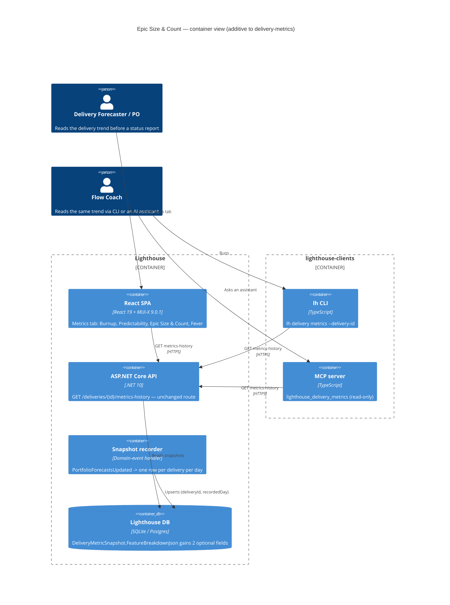
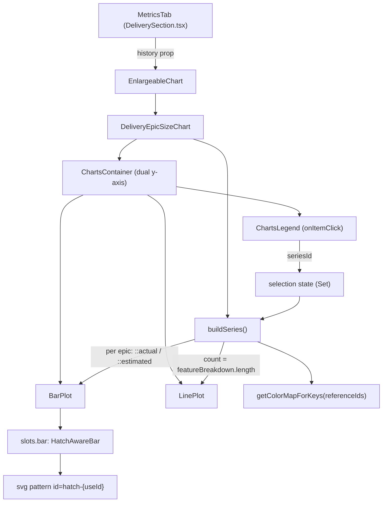

# Feature Delta — epic-size-and-count-over-time

**ADO**: Epic [#5585 "Track Epic Size and Epic Count Over Time in Delivery Metrics"](https://dev.azure.com/letpeoplework/Lighthouse/_workitems/edit/5585) (Planned, reported by Chris, forecast 2026-09-06)
**Repos under change**: `Lighthouse` — `Lighthouse.Backend` (snapshot recorder + DTO) and `Lighthouse.Frontend` (Metrics tab, one new chart, one burnup fix) · `lighthouse-clients` — client + CLI + MCP (slice 06 only)
**Density**: lean (`~/.nwave/global-config.json` → `documentation.density = "lean"`, `expansion_prompt = "ask-intelligent"`)
**Builds on**: Epic 3993 delivery-metrics (`docs/product/journeys/delivery-metrics.yaml`) — this feature is a fourth chart on the store that epic shipped.

---

## Wave: DISCUSS / [REF] Prior-Wave Reading Confirmation

- ✓ ADO 5585 (`az boards work-item show --id 5585`) — description, state, no children yet, no acceptance criteria field
- ✓ `docs/product/journeys/delivery-metrics.yaml` — the parent journey; D1/D6/D11 (forward-only, one store, no backfill) are inherited verbatim
- ✓ `docs/product/jobs.yaml` (3983 lines) — `job-forecast-delivery-trend-over-time`, `job-po-scope-cut-from-delivery-trend`, `job-honest-delivery-trend-when-target-moves` read; two new jobs added by this wave
- ✓ `docs/product/personas/delivery-forecaster.yaml`, `docs/product/personas/product-owner.yaml` — reused unchanged
- ✓ Code reality check (see Current-State Surface Inventory below): `DeliveryMetricSnapshot.cs`, `DeliveryMetricsHistoryDto.cs`, `DeliveryMetricSnapshotRecordingHandler.cs`, `Delivery.cs`, `Feature.cs`, `WorkItemService.cs`, `DeliveriesController.cs`, `DeliverySection.tsx`, `DeliveryBurnupChart.tsx`, `DeliveryMetricsHistory.ts`
- ✓ `lighthouse-clients` — `packages/client/src/index.ts`, `packages/cli/src/index.ts`, `packages/mcp-core/src/index.ts` (slice 06 scope)
- ⊘ `docs/product/vision.md` (not found)
- ⊘ `docs/project-brief.md` (not found)
- ⊘ `docs/stakeholders.yaml` (not found)
- ⊘ `docs/feature/epic-size-and-count-over-time/discover/` (not found — DISCUSS is the entry wave)
- ⊘ `docs/feature/epic-size-and-count-over-time/diverge/` (not found)

No DISCOVER evidence exists to contradict, so no `## Changed Assumptions` section is required. The one
assumption this wave *revises* against the parent journey is recorded under D3 (epic-count history is
**not** forward-only — it is already recorded).

---

## Wave: DISCUSS / [REF] Persona IDs

| Persona | Role in this feature |
|---|---|
| `delivery-forecaster` | Opens the delivery's Metrics tab before a status report. Must answer "did scope grow, or did the epics we already had get bigger?" and "how much of this number is still a guess?" |
| `product-owner` | Secondary. Uses the same chart to chase the epics that are still un-broken-down and to pick which epic to cut. |
| `flow-coach` | Slice 06 only. Reads the same delivery trend through an AI assistant (MCP) or the CLI rather than the UI. |

---

## Wave: DISCUSS / [REF] JTBD One-Liners

- **`job-forecaster-attribute-scope-change-to-an-epic`** (`delivery-forecaster`) — When the delivery's
  backlog line steps up and leadership asks why, I want to see how many epics were in the delivery each
  day and how big each one was, so I can name the epic and the day instead of saying "scope grew".
- **`job-forecaster-know-how-much-of-the-size-is-guessed`** (`product-owner`, forecaster secondary) —
  When part of a delivery's total is default sizes for epics nobody has broken down yet, I want to see
  which epics are still estimates and the day each one flipped to a real breakdown, so I can say how
  much of the number is real and chase the ones that aren't.

Both are written in full (three dimensions, four forces, opportunity score) into `docs/product/jobs.yaml`.
Slice 06 serves the first job through a different port (CLI/MCP) rather than introducing a third job.

### Opportunity Scores

| Job | Importance | Current satisfaction | Gap | Note |
|---|---|---|---|---|
| `job-forecaster-attribute-scope-change-to-an-epic` | 4 | 1 | **3** | The burnup already shows *that* the backlog stepped up (`DeliveryBurnupChart.tsx` Backlog series) but attributes it to nothing. Attribution today means diffing the Work Items tab by hand or a spreadsheet. |
| `job-forecaster-know-how-much-of-the-size-is-guessed` | 4 | 2 | **2** | Partially served: the burnup's dashed "Estimated (not broken down)" line gives the *aggregate* estimated portion — but only as a total, never per epic, and it is invisible whenever it falls inside the filled Done area (US-05). Nothing shows *which* epic is a guess or *when* it stopped being one. |

Highest leverage first: attribution (Job 1) — it is the chart's spine (count line + size bars) and every
later slice hangs off it.

---

## Wave: DISCUSS / [REF] Current-State Surface Inventory

Grepped, not recalled.

| # | Surface | File:line | State today |
|---|---|---|---|
| S1 | Daily snapshot row | `Lighthouse.Backend/Models/DeliveryMetricSnapshot.cs:5-42` | One row per `(DeliveryId, RecordedDay)`. Scalars: `TotalWork`, `DoneWork`, `RemainingWork`, `EstimatedItemCount`, `ForecastHowMany`, `LikelihoodPercentage`, plus `WhenDistributionJson` and `FeatureBreakdownJson`. |
| S2 | Per-epic breakdown, persisted | `DeliveryMetricSnapshot.cs:41` (`FeatureBreakdownJson`) ← `DeliveryMetricsHistoryDto.cs:8` | `DeliveryFeatureMetricDto(ReferenceId, Name, Completion, Likelihood)` — **already one entry per epic per day**. Carries no size and no estimate flag. |
| S3 | Breakdown producer | `Models/Delivery.cs:144-159` | `CalculateFeatureBreakdown` filters `feature.FeatureWork.Sum(TotalWorkItems) > 0`; `ToFeatureMetric` computes `totalItems` and `remainingItems` locally and then **throws the totals away**. |
| S4 | Recorder | `DomainEvents/DeliveryMetricSnapshotRecordingHandler.cs:22-70` | Reacts to `PortfolioForecastsUpdated`, idempotent on `(deliveryId, RecordedDay)`, serialises `metrics.FeatureBreakdown` when non-empty. Already reads `feature.IsUsingDefaultFeatureSize` (line 42) for the aggregate `EstimatedItemCount`. |
| S5 | Estimate flag, source | `Models/Feature.cs:45`, `WorkItemService.cs:336` / `:379` | `IsUsingDefaultFeatureSize` is set false on every refresh, then true for every feature `ExtrapolateNotBrokenDownFeatures` fills with the portfolio default size. Persisted on `Feature`, never on a snapshot. |
| S6 | Read API | `API/DeliveriesController.cs:53-73` | `GET .../deliveries/{deliveryId}/metrics-history` — `GetMetricsHistory(int deliveryId)`, **no query parameters**: it returns the entire recorded series in one response, behind `RbacGuardRequirement.PortfolioRead`. |
| S7 | Wire model (FE) | `Lighthouse.Frontend/src/models/Delivery/DeliveryMetricsHistory.ts:6-11, 93-110` | `FeatureMetric` + a strict `parseFeatureBreakdown` boundary parser that throws `BoundaryError` on shape drift. |
| S8 | Metrics tab layout | `DeliverySection.tsx:589-620` | Already a 2-column grid (`lg: "1fr 1fr"`). Burnup + Predictability on row 1; fever chart forced full width by `gridColumn: { lg: "1 / -1" }`. |
| S9 | Burnup estimated line | `DeliveryBurnupChart.tsx:16-27, 62-79` | Done series is `area: true` (filled). The estimated series is `theme.palette.warning.main` with `strokeDasharray "2 4"` and is drawn **under** that fill whenever `estimatedItemCount < doneWork` → the invisible-line defect Chris flagged. |
| S10 | Terminology | `DeliverySection.tsx:150` | `getTerm(TERMINOLOGY_KEYS.FEATURES)` — the instance decides whether these are called Epics, Features, Initiatives. The existing charts ignore it. |
| S11 | Clients — delivery surface | `lighthouse-clients/packages/client/src/index.ts:1310-1324`, `packages/cli/src/index.ts` (`runDeliveryGroup`, `lh delivery list --portfolio-id`), `packages/mcp-core/src/index.ts:1549, 2201-2217` (`lighthouse_delivery_list`) | Delivery **CRUD** exists on the client; the CLI and MCP expose **list only**. |
| S12 | Clients — metrics-history | — | **Absent everywhere.** No client method, no CLI command, no MCP tool for `metrics-history`. The whole delivery over-time story is invisible outside the browser. This is the slice-06 gap. |

**The load-bearing find**: S2 means epic *count* per day is already in the database for every instance
that has been recording since Epic 3993 shipped — no new column, no waiting. Epic *size* and the
*estimate flag* are not, and are forward-only like everything else in this store (D11 of the parent
journey).

---

## Wave: DISCUSS / [REF] Locked Decisions

| ID | Decision | Rationale |
|---|---|---|
| **D1** | One new chart — "Epic Size & Count", a composed bar+line chart — placed directly under the burnup; the fever chart loses its `gridColumn: "1 / -1"` span and becomes a half-width cell. Final layout is 2×2: Burnup / Predictability / **Epic Size & Count** / Fever. | Exactly what ADO 5585 asks for. `DeliverySection.tsx:612` already isolates the span in one `Box`, so the regrid is a two-line change. |
| **D2** | The count line counts **all** epics in the delivery that day, regardless of state (done epics included). One line, no done-split. | User decision, 2026-07-31. Mirrors the burnup's "Backlog" line: a step in the line = an epic joined or left. A done-split would duplicate the burnup's Done story on a different unit. |
| **D3** | The count line is **derived from `featureBreakdown.length`** on each existing history point — not a new column. It therefore has **real history from the day Epic 3993's recorder started**, unlike every other series in this store. | S2. Revises the parent journey's blanket forward-only framing (D6/D11) for this one series only. **Caveat, stated in the chart's help text**: epics whose total item count was 0 on a given day are absent from `featureBreakdown` (S3 filter) and so are not counted. In practice `ExtrapolateNotBrokenDownFeatures` (S5) gives un-broken-down epics the portfolio default size, so a 0-size epic is the rare case, not the norm. |
| **D4** | Epic **size** = that epic's total child work items on that day, regardless of state — the `totalItems` `ToFeatureMetric` already computes (S3) and discards. For an un-broken-down epic that is the extrapolated default size. | ADO 5585: "the size is depending on how many child items are in there (total, independent of state)". |
| **D5** | Size + estimate flag ship as **two new fields on the existing `FeatureBreakdownJson` payload** (`TotalItems`, `IsUsingDefaultSize`) — no new table, no EF migration. Forward-only: days already recorded keep the 4-field shape and render no bars. | The column is already a JSON blob; adding fields to it is expand-only by construction. Matches the expand-only migration rule. Both FE and BE parsers must tolerate the old 4-field shape (S7 `parseFeatureBreakdown` throws on missing keys → the two new fields parse as *optional*). |
| **D6** | An estimated (default-size) segment renders **hatched**, plus a tooltip line saying the size is a default. | User decision, 2026-07-31. The whole point is pinpointing the day an epic flips estimate → actual; a shade-only encoding reads as "a different epic", and tooltip-only means hovering 30 bars to find the flip. Cost accepted: MUI-X bar charts have no native pattern fill, so this needs an SVG `<pattern>` def + per-item fill — carried as its own slice with a spike-if-needed note. |
| **D7** | An epic that leaves the delivery **keeps its history**: its segments stay on the days it was a member and simply stop. The legend lists it for the whole window. | User decision, 2026-07-31. Free by construction — each day's breakdown is that day's membership — and it is exactly how a scope *cut* becomes visible. Dropping it would hide the cut. |
| **D8** | Legend entries are **click-to-toggle, multi-select**. Clicking an epic isolates it; clicking more adds them; a "show all" reset clears the filter. Filtering affects the bars only — the count line stays whole. | ADO 5585 "on click, we should only show the bar for the selected epic(s)". The count line is a delivery-level fact; filtering it to a subset would make it read as a different number for the same day. |
| **D9** | The burnup estimated-line visibility fix (S9) is **in scope** for 5585 as its own slice and its own ADO Story, not a separate Bug. | User decision, 2026-07-31. Chris flagged it as "not strictly part of this epic"; it lands in the same file family and the same review, so carrying it here is cheaper than a detached bug. |
| **D10** | Chart title and legend header use the instance's configured term via `getTerm(TERMINOLOGY_KEYS.FEATURES)` (S10) — "Epic Size & Count" only when the instance calls them Epics. | Every other delivery surface already respects it; a chart hardcoding "Epic" would be the odd one out on a Jira instance that calls them Initiatives. |
| **D11** | Premium gating and RBAC are **inherited, not invented**: the chart lives inside the delivery surface, which is already premium-gated and already behind the portfolio's RBAC read check (`DeliveriesController.cs:57-70`, `RbacGuardRequirement.PortfolioRead`). No new permission, no new gate — the CLI/MCP port in slice 06 hits the same guarded endpoint. | Parent journey D4. Verified: nothing in `DeliverySection.tsx`'s Metrics tab adds its own gate. |
| **D12** | The delivery trend gets a **CLI/MCP port** (slice 06): a `getDeliveryMetricsHistory` client method, an `lh delivery metrics` command, and a read-only `lighthouse_delivery_metrics` MCP tool — shipped **after slice 02**, so the client is written once against the final payload shape. | User decision, 2026-07-31. S11/S12: deliveries are already a client concept (CRUD + list tool), so this is completing a surface, not opening one. Sequencing after slice 02 avoids publishing a client version that knows a payload shape we are about to widen. |
| **D13** | The CLI/MCP port defaults to a **summarised** series (one row per day: date, total, done, remaining, epic count, estimated portion, likelihood) with per-epic detail behind an explicit opt-in flag/argument. | S6: the endpoint takes no range or projection parameters and returns the entire history in one response — for a 90-day delivery with 15 epics that is ~1350 breakdown objects plus a `whenDistribution` array per day. Dumping that verbatim into an LLM context is the failure mode; summarise at the client, opt into detail. A server-side range parameter is a **separate backend story**, not smuggled into this feature. |

---

## Wave: DISCUSS / [REF] User Stories

### US-01 — See how many epics were in the delivery each day

As a **delivery forecaster**, I want the delivery's Metrics tab to show a chart of how many epics were
in the delivery on each recorded day, so that a scope step in the burnup has a companion number I can
point at.
`job_id: job-forecaster-attribute-scope-change-to-an-epic`

#### Elevator Pitch
Before: the forecaster can see the backlog line step up in the burnup but nothing tells them whether an epic joined or an existing epic grew.
After: open Portfolio → a delivery → **Metrics** tab → sees a fourth card, "Epic Size & Count", whose line reads e.g. `7 → 7 → 9` across the recorded days, in a 2×2 grid with the fever chart now half-width.
Decision enabled: whether to investigate a scope *addition* (line stepped) or an epic *re-estimate* (line flat while the burnup backlog rose).

**Acceptance criteria**
- **AC-1.1** With a history whose points carry `featureBreakdown` of lengths `[7, 7, 9]`, the chart's line series has values `[7, 7, 9]` against those dates.
- **AC-1.2** With a history of zero points, the card renders the same forward-only empty state wording the other three charts use (`"builds forward from today — no snapshots recorded yet"`) and does not throw.
- **AC-1.3** On a `lg` viewport the Metrics tab renders four cards in a 2×2 grid: Burnup, Predictability, Epic Size & Count, Fever — in that DOM order — and no card carries a full-width `gridColumn` span.
- **AC-1.4** On an `xs` viewport all four cards stack in one column (existing `xs: "1fr"` behaviour is unchanged).
- **AC-1.5** The card title uses the configured features term: with the term set to "Initiatives" the title contains "Initiative", not "Epic".
- **AC-1.6** The chart renders a line for history recorded **before** this feature shipped — i.e. points whose `featureBreakdown` entries have only the four original fields — proving the count is derived, not newly recorded (D3).

---

### US-02 — See how big each epic was, stacked, on each day

As a **delivery forecaster**, I want each day to show a stacked bar where every stack is one epic sized
by its child item count, so that I can see which epic carries the weight and which one grew.
`job_id: job-forecaster-attribute-scope-change-to-an-epic`

#### Elevator Pitch
Before: a backlog jump is anonymous — the forecaster cannot tell whether it came from one epic doubling or three small epics joining.
After: on the same **Epic Size & Count** card, sees a stacked bar per day, one segment per epic, segment height = that epic's total child items that day; hovering a segment shows `{epic name} — {n} items`.
Decision enabled: which epic to open in the Work Items tab and challenge, rather than reviewing the whole delivery.

**Acceptance criteria**
- **AC-2.1** The recorder writes `totalItems` for every epic in `FeatureBreakdownJson`: after a recorder run for a delivery with epics of 8 and 3 items, the persisted JSON contains those two totals.
- **AC-2.2** `GET .../deliveries/{id}/metrics-history` returns `featureBreakdown[].totalItems` for snapshots written after this slice.
- **AC-2.3** A snapshot persisted **before** this slice (4-field entries) still deserialises: the endpoint returns it with `totalItems` absent/null and the API does not 500.
- **AC-2.4** The FE boundary parser accepts both shapes — a 4-field entry parses with `totalItems: null` and does **not** raise `BoundaryError` (`DeliveryMetricsHistory.ts` `parseFeatureBreakdown`).
- **AC-2.5** For a day with epics `[A: 8, B: 3]` the chart renders two stacked segments on that day's bar totalling 11; days whose entries carry no `totalItems` render no bar (the line still renders).
- **AC-2.6** An epic present on days 1-3 and absent from day 4 has segments on days 1-3 only, and remains listed in the legend (D7).
- **AC-2.7** Bar segment heights ignore state: an epic with 8 total items of which 8 are done still renders height 8.

---

### US-03 — Tell a real breakdown apart from a default-size guess

As a **product owner**, I want an epic whose size is the portfolio default to be drawn hatched, so that
I can see how much of the delivery is still guessed and exactly when an epic stopped being one.
`job_id: job-forecaster-know-how-much-of-the-size-is-guessed`

#### Elevator Pitch
Before: an epic sized by the portfolio default looks identical to one someone actually broke down — the burnup only gives an aggregate estimated total, and even that disappears under the filled Done area.
After: on the **Epic Size & Count** card, sees estimated segments rendered with a diagonal hatch and a tooltip line reading `size is the portfolio default (not broken down)`; the day a hatched segment turns solid is the day that epic got broken down.
Decision enabled: which epics to chase for breakdown before quoting the delivery's total to leadership.

**Acceptance criteria**
- **AC-3.1** The recorder writes `isUsingDefaultSize` per epic in `FeatureBreakdownJson`, matching `Feature.IsUsingDefaultFeatureSize` at record time (same source the aggregate `EstimatedItemCount` already uses).
- **AC-3.2** A segment with `isUsingDefaultSize: true` renders with the hatch pattern fill; one with `false` renders solid — asserted on the rendered fill reference, not a snapshot image.
- **AC-3.3** The tooltip for a hatched segment contains the default-size wording; the tooltip for a solid segment does not.
- **AC-3.4** An epic hatched on days 1-2 and solid from day 3 renders exactly that transition — the flip day is visually locatable.
- **AC-3.5** Entries missing `isUsingDefaultSize` (pre-slice snapshots, or `null`) render solid and never hatched — absence is not treated as `true`.
- **AC-3.6** The hatch pattern is defined once per chart instance and does not leak into the other three charts on the tab (no duplicate SVG `<pattern>` id collisions when two deliveries are expanded at once).

---

### US-04 — Focus the chart on the epics I care about

As a **delivery forecaster**, I want to click epics in the legend to show only their bars, so that a
delivery with fifteen epics is still readable when I am chasing two of them.
`job_id: job-forecaster-attribute-scope-change-to-an-epic`

#### Elevator Pitch
Before: a delivery with a dozen epics renders a dozen-segment stack per day — legible as a total, useless for following one epic's trajectory.
After: on the **Epic Size & Count** card, clicks an epic in the legend → only that epic's segments remain; clicks a second → both show; clicks **Show all** → the full stack returns.
Decision enabled: whether the specific epic they are chasing is growing or holding, without re-reading the whole delivery.

**Acceptance criteria**
- **AC-4.1** The legend lists every epic that appears on any day in the window, once, including epics that later left the delivery (D7).
- **AC-4.2** Clicking one legend entry leaves only that epic's segments rendered; clicking a second adds it (multi-select, D8).
- **AC-4.3** Clicking an already-selected entry deselects it; deselecting the last one returns to showing all.
- **AC-4.4** A "Show all" / reset control clears the selection in one action.
- **AC-4.5** The count line is unchanged by any selection (D8) and the y-axis rescales to the selected subset.
- **AC-4.6** The selection is local to the chart instance: filtering one expanded delivery's chart does not filter another's.

---

### US-05 — Read the estimated line in the burnup even when it is low

As a **delivery forecaster**, I want the burnup's "Estimated (not broken down)" line to stay visible
when it crosses into the filled Done area, so that I do not misread a hidden line as "no estimate".
`job_id: job-forecaster-know-how-much-of-the-size-is-guessed`

#### Elevator Pitch
Before: once the estimated total drops below the done count, the dashed warning-coloured line is drawn beneath the filled Done area and simply disappears — indistinguishable from "there is no estimated work".
After: opens the **Burnup** card on the Metrics tab with a history where `estimatedItemCount < doneWork` → the estimated line is still legible against the Done fill.
Decision enabled: whether the remaining unbroken-down scope is still material, at a glance, instead of concluding there is none.

**Acceptance criteria**
- **AC-5.1** With a history where `estimatedItemCount` is strictly below `doneWork` on every point, the estimated series is rendered and visually distinguishable from the Done area (asserted on the series' render order / fill-opacity contract, whichever the fix uses).
- **AC-5.2** The Done series still reads as a filled area — the fix does not remove `area: true`.
- **AC-5.3** The estimated series keeps its dashed identity (`data-series="estimated"` + `strokeDasharray`), so the existing burnup tests and the MUI-X dashed-series selector convention still hold.
- **AC-5.4** Existing `DeliveryBurnupChart.test.tsx` assertions all still pass unchanged.

---

### US-06 — Read a delivery's trend from the CLI and from an AI assistant

As a **flow coach**, I want the delivery's over-time metrics available through the CLI and the MCP
server, so that I can ask an assistant how a delivery's scope has moved without opening the browser and
describing the chart to it.
`job_id: job-forecaster-attribute-scope-change-to-an-epic`

#### Elevator Pitch
Before: the clients can list, create, update and delete deliveries (`client/src/index.ts:1310-1324`, `lh delivery list`, `lighthouse_delivery_list`) but expose **nothing** from `metrics-history` — every delivery trend, including this feature's chart, stops at the browser.
After: run `lh delivery metrics --delivery-id 12` → prints one row per recorded day (date, total, done, remaining, epic count, estimated portion, likelihood); an assistant calls `lighthouse_delivery_metrics` and gets the same series.
Decision enabled: the same attribution call as the chart — "scope stepped on the 14th, epic count was flat, so an existing epic grew" — reachable from a terminal or a coaching conversation.

**Acceptance criteria**
- **AC-6.1** `getDeliveryMetricsHistory(deliveryId)` on `packages/client` calls `GET /api/v1/deliveries/{deliveryId}/metrics-history` and returns the parsed series through the existing `LighthouseApiResult` contract.
- **AC-6.2** Failure paths behave like every other client read: a 403 maps to the standard error category (the endpoint is behind `PortfolioRead`, D11), a 404 to not-found — asserted, not assumed.
- **AC-6.3** `lh delivery metrics --delivery-id <id>` prints one row per recorded day with the summary columns; a missing `--delivery-id` produces the same style of usage error `lh delivery list` produces for a missing `--portfolio-id`.
- **AC-6.4** By default neither the CLI nor the MCP tool emits per-epic rows or the `whenDistribution` array; per-epic detail requires an explicit opt-in (`--detail epics` / a `detail` argument) (D13).
- **AC-6.5** A new read-only MCP tool `lighthouse_delivery_metrics` is registered, takes a delivery id, appears in the tool list, and is classified read-only by `isReadOnlyTool`.
- **AC-6.6** Against a server whose snapshots predate slice 02 (no `totalItems` / `isUsingDefaultSize`), the client parses the response and reports the per-epic size as unknown rather than erroring — same tolerance the frontend parser gets in AC-2.4.
- **AC-6.7** A changeset is committed and `pnpm release:version` is run before the clients release gate — the version bump is manual in this repo and is not performed by the release workflow.

---

## Wave: DISCUSS / [REF] Story Map & Slices

**Backbone**: *open the delivery's Metrics tab* → *see the shape of scope over time* → *attribute a change to one epic* → *judge how much of it is guessed* → *focus on the epics that matter* → *reach the same trend from a terminal or an assistant*.

**Walking skeleton**: none separate. Slice 01 is the thinnest end-to-end slice — the parent epic's store,
recorder, endpoint and tab already exist (Type-A additive), so there is nothing to stand up.

| Slice | Ships | Story | Est. | Learning hypothesis |
|---|---|---|---|---|
| **01** | Count line + 2×2 regrid | US-01 | ~4h | Disproves "epic-count history is already in the database" if `featureBreakdown` turns out to be empty/absent on most real recorded days. |
| **02** | Per-epic size, recorded + stacked bars | US-02 | ~6h | Disproves "the breakdown JSON can be extended in place" if the old 4-field rows break either parser. |
| **03** | Hatched estimate encoding + tooltip | US-03 | ~4h | Disproves "MUI-X bar segments can carry a per-item pattern fill" — if they cannot, D6 falls back to shade+tooltip and the slice is re-scoped, not abandoned. |
| **04** | Legend click-to-filter | US-04 | ~3h | Disproves "the stacked chart is readable for a real 12-epic delivery" if filtering still leaves it unreadable — signals the chart needs a different form, not more controls. |
| **05** | Burnup estimated-line visibility | US-05 | ~2h | Disproves "the line is hidden purely by paint order" if raising it still reads badly against the fill — then it needs a different encoding. |
| **06** | Clients: metrics-history on client + CLI + MCP | US-06 | ~4h | Disproves "the whole series is usable through an assistant as-is" if a real delivery's response blows the tool-result budget even summarised — then the backend needs a range/projection parameter before the port is worth shipping. |

Full briefs: `docs/feature/epic-size-and-count-over-time/slices/slice-0{1..6}-*.md`.

**Prioritisation rationale** — 01 first because it is the only slice with *retroactive* data (D3): it is
the fastest real-value ship and it validates the derived-count premise every later slice sits on. 02
next because 03, 04 and 06 all consume its data, and the recorder change must start accruing days as
early as possible (forward-only). 03 before 04 because it carries the only genuine rendering unknown
(pattern fill). 06 must come after 02 so the client is written once against the final payload shape —
publishing a client version against the pre-slice-02 shape would mean two npm releases for one feature.
05 last — independent, tiny, and the only slice touching a chart users already rely on, so it lands when
review attention is cheapest.

### Slice taste tests

| Test | Verdict |
|---|---|
| Any slice shipping 4+ new components? | Pass — 01 adds one component, 02-04 modify it, 05 modifies an existing one, 06 adds one client method + one command + one tool. |
| Every slice depending on a new abstraction? | Pass — no new abstraction. The chart component itself is shipped in slice 01 and consumed thereafter. |
| Does any slice disprove a pre-commitment? | Pass — 01 disproves the retroactive-history premise; 03 the hatch feasibility; 06 the payload-size premise. Each would change the plan if it failed. |
| Synthetic-data-only slices? | Pass — every slice is acceptance-tested against demo data seeded by `DemoDataService.SeedBurnupSnapshots` plus a real recorded delivery in the dogfood instance; 06 is smoke-tested against the live dogfood server. |
| Two slices identical except for scale? | Pass — none. |

---

## Wave: DISCUSS / [REF] Scope Assessment

**PASS — right-sized.** 6 stories (≤10), 1 bounded context (delivery metrics), 3 technologies (C#
recorder/DTO, React chart, TS client/CLI/MCP), ~23h total (<2 weeks), 0 new integration points — slice 06
consumes an endpoint that already exists. No split proposed. Note: adding slice 06 tips the
cross-context trigger to the edge (3 technologies); it is a port of the same context, not a third
context, so no `alternatives-considered` expansion is warranted.

---

## Wave: DISCUSS / [REF] Outcome KPIs

| # | KPI | Target | Measurement |
|---|---|---|---|
| K1 | Scope-change attribution during a delivery review names a specific epic and day | ≥2 of the next 3 dogfood delivery reviews | Dogfood observation + Chris interview (the epic's reporter) |
| K2 | Un-broken-down epics identified from the chart rather than by opening the Work Items tab | ≥1 named epic chased per review where estimates exist | Same interviews |
| K3 | Recorder writes `totalItems` + `isUsingDefaultSize` for 100% of epics in every snapshot after slice 02, with no duplicate day rows | 100% / 0 duplicates | Backend integration assertion on `FeatureBreakdownJson` (extends the existing recorder tests) |
| K4 | Old 4-field snapshots keep rendering the count line after every slice | 0 regressions | AC-1.6 + AC-2.3/2.4 + AC-6.6 held green in CI |
| K5 | Metrics tab render time on a 90-day, 15-epic delivery | no worse than +20% vs today's three charts | Vitest/manual profile on the dogfood instance before/after slice 02 |
| K6 | Summarised MCP tool result for a 90-day, 15-epic delivery stays within a sane tool-result budget | ≤ ~2k tokens without `detail` opt-in | Measured against the dogfood delivery during slice 06; a miss triggers the slice-06 hypothesis (backend range parameter first) |

**Measurement caveat** — unchanged from Epic 3993: cross-instance behavioural telemetry is blocked on
Epic 5015 (opt-in telemetry, no timeline). K1/K2 are dogfood + interview until then; K3-K6 are
assertable/measurable today.

---

## Wave: DISCUSS / [REF] Out of Scope

- **No backfill of size or estimate flag.** Days recorded before slice 02 keep the 4-field shape forever (D5). No reconstruction from current `Feature` rows — that would attribute today's size to a past day.
- **No new table and no EF migration.** If a slice discovers it needs one, that is a DESIGN escalation, not a silent addition.
- **No server-side range or projection parameter on `metrics-history`.** Slice 06 summarises client-side (D13); adding `from`/`to` to the endpoint is a separate backend story, raised only if K6 fails.
- **No delivery write tools in MCP.** The client already has create/update/delete; exposing them as tools is a separate decision about write surface, not part of this feature.
- **No change to the burnup's, predictability's or fever chart's data.** US-05 is a rendering fix only.
- **No epic-level drill-through** to the Work Items tab from a bar segment (the drill-through pattern exists in Epic 5074's blocked-items work; wiring it here is a follow-up).
- **No done/remaining split inside a bar segment** (D2/D4 — segments are total size).
- **No CSV/PNG export** of the new chart.
- **No API versioning event.** The `featureBreakdown` entry gains two optional fields; nothing is removed or renamed (`docs/concepts/api-versioning.md` additive rule).

---

## Wave: DISCUSS / [REF] WS Strategy

**Type A — additive.** The store, recorder, endpoint, tab and grid all exist. Every change is a new
optional field, a new card, or a new client method over an existing route; a partially-shipped feature
degrades to "the chart renders a line and no bars", never to a broken tab. No env-switch, no parallel
implementation (not Type D — no `alternatives-considered` trigger).

---

## Wave: DISCUSS / [REF] Driving Ports

| Port | Surface | Change |
|---|---|---|
| HTTP (inbound) | `GET /api/.../portfolios/{portfolioId}/deliveries/{deliveryId}/metrics-history` | Response gains two optional fields inside `featureBreakdown[]`. No new route, no new parameters. |
| UI | Portfolio → delivery accordion → **Metrics** tab | One new card; fever chart loses its full-width span. |
| CLI | `lh delivery metrics --delivery-id <id>` (slice 06) | New action inside the existing `runDeliveryGroup`. |
| MCP | `lighthouse_delivery_metrics` (slice 06) | New read-only tool alongside `lighthouse_delivery_list`. |
| Domain event (internal, not a driving port) | `PortfolioForecastsUpdated` → `DeliveryMetricSnapshotRecordingHandler` | Writes two more fields per epic. No new event. |

---

## Wave: DISCUSS / [REF] Pre-requisites

- Epic 3993 delivery-metrics shipped and recording — **met** (store, recorder, endpoint, Metrics tab all in `main`).
- An instance with recorded snapshots to dogfood against — **met** for the count line (S2 history exists today); slice 02+ needs days to accrue after its own deploy before the bars are interesting.
- Premium licence on the dogfood/E2E instance — **met** (`reference_premium_license_dev_seed`).
- Slice 06 only: a running dogfood server to smoke the CLI and MCP tool against, and npm publish rights for the clients release.
- No dependency on Epic 5015 telemetry (K1/K2 measured by interview).

---

## Wave: DISCUSS / [REF] DISCUSS Checklist (project standing rules)

**No silent N/A** — every item answered.

| Item | Answer |
|---|---|
| **RBAC impact** | **None new.** The chart is inside the delivery surface, which already sits behind the portfolio read check and the premium gate (D11). No component fetches `/authorization/my-summary`; nothing bypasses `useRbac()`. Slice 06 calls the same endpoint, which enforces `RbacGuardRequirement.PortfolioRead` server-side (`DeliveriesController.cs:57-70`), so the CLI/MCP port inherits the guard rather than routing around it. |
| **Lighthouse-Clients CLI/MCP versioning** | **Not owed by slices 01-05; owed by slice 06.** The clients already carry a delivery surface — `packages/client/src/index.ts:1310-1324` (CRUD), `lh delivery list --portfolio-id`, and the `lighthouse_delivery_list` MCP tool (S11) — but expose **nothing** from `metrics-history` (S12). Slices 01-05 only add two optional fields to an endpoint the clients never call, so they break nothing and need no bump. Slice 06 adds the missing surface and **does** need a changeset plus a manual `pnpm release:version` + commit + push **before** the clients release gate (AC-6.7). |
| **Website marketing surface** | **N/A for the website repo, in scope for product docs.** No `letpeople.work` page describes individual delivery charts (verified: no burnup/fever mention outside `Lighthouse/docs`). `docs/portfolios/detail.md` **is** in scope: it documents Burnup (§196), Predictability and Fever Chart (§224) with screenshots from `docs/assets/features/`. A new "Epic Size & Count" section plus a `@screenshot` test lands at DELIVER, per-feature, not batched into `/release`. Slice 06 additionally owes a line in the clients' `skill/SKILL.md` / CLI README so the new command and tool are discoverable. |
| **Per-feature docs + screenshots** | Owed at DELIVER: one new docs section, one new screenshot asset, one `@screenshot` E2E in the delivery-metrics theme. Note the pixel-threshold trap — `rm` the old PNG before regenerating if an existing asset is touched. |
| **Demo data** | `DemoDataService.SeedBurnupSnapshots` / `BuildFeatureBreakdownJson` (`:168-195`) must seed the two new fields, including at least one epic that flips `isUsingDefaultSize` mid-window — otherwise the hatch (US-03) has nothing to show in the demo instance or in the screenshot E2E. Owed in slice 02/03. |
| **EF migrations** | **N/A, because** both new fields live inside the existing `FeatureBreakdownJson` string column (D5). No `CreateMigration` run. If DESIGN overturns D5, expand-only rules apply. |

---

## Wave: DISCUSS / [REF] Definition of Done (feature level)

1. All six stories' ACs green in CI (backend NUnit + frontend Vitest + clients Vitest).
2. `pnpm test`, `pnpm build` (zero warnings), `dotnet build` (zero warnings), `dotnet test` all green locally before push; clients repo lint + tests green for slice 06.
3. SonarQube Cloud: no new issues of any severity.
4. Mutation testing per feature: backend ≥80% kill on the recorder/DTO change, frontend ≥80% on the new chart component.
5. One Playwright walking-skeleton assertion that the Metrics tab shows four cards — no team↔portfolio twin, no re-seed (thin sanity check only), and run locally before commit.
6. `docs/portfolios/detail.md` gains the new chart section + regenerated screenshot asset; clients docs mention the new command and tool.
7. Demo data seeds the new fields, including an estimate→actual flip.
8. Slice 06: changeset committed, `pnpm release:version` run manually, clients published.
9. ADO: Epic 5585 carries one Story per slice, states transitioned, "Release Notes" tag confirmed with the user before it is applied.
10. Evolution doc written and the feature workspace archived at finalize.

---

## Wave: DISCUSS / [REF] DoR Validation

| # | DoR item | Evidence |
|---|---|---|
| 1 | Business value articulated | Two JTBD jobs with opportunity scores 3 and 2; reported by a real user (Chris) via ADO 5585. |
| 2 | User stories in LeanUX form with elevator pitches | US-01…US-06, each with Before/After/Decision-enabled. Zero `@infrastructure`-only slices — slice 06 included, since `lh delivery metrics` is a user-invocable entry point with observable output. |
| 3 | Acceptance criteria testable | 33 ACs, each asserting an observable output (rendered series values, persisted JSON, HTTP response shape, CLI stdout, MCP tool result). |
| 4 | Dependencies identified | Pre-requisites section — all met except natural data accrual for slice 02+ and npm publish rights for slice 06. |
| 5 | Job traceability | Every story carries a `job_id` present in `docs/product/jobs.yaml`. |
| 6 | Sized / sliceable | 6 slices, each ≤6h, each with a learning hypothesis; taste tests all pass. |
| 7 | Technical feasibility grounded | Surface inventory S1-S12 read from code, not recalled. Two genuine unknowns (D6 pattern fill, D13 payload size) isolated into slices 03 and 06 with documented fallbacks. |
| 8 | Outcome KPIs measurable | K1-K6 with targets and measurement methods; telemetry caveat stated. |
| 9 | Out-of-scope explicit | 9 named non-goals. |

**Requirements completeness: 0.96** — the residual gaps are the exact hatch implementation for MUI-X bar
segments (D6) and the real-world size of a summarised metrics-history payload (D13/K6), both deliberately
deferred to their slices' spikes rather than guessed here.

---

## Wave: DISCUSS / [REF] Expansion Menu Evaluation

`expansion_prompt = "ask-intelligent"` → all five triggers evaluated:

| Trigger | Fires? |
|---|---|
| AC ambiguity (≥2 stories with a contestable AC) | No — every AC names a concrete observable. |
| Cross-context complexity (≥3 bounded contexts or technologies) | Borderline after slice 06 (3 technologies, 1 bounded context) — judged **not** fired: the CLI/MCP port consumes the same context through an existing endpoint, adding no new domain surface. |
| Multi-stakeholder (≥3 personas) | Borderline (3 personas, but `flow-coach` appears in one slice as a port consumer, not as a distinct set of requirements) — judged **not** fired. |
| Compliance / regulatory terms in ACs | No. |
| WS strategy = D (configurable) | No — Type A. |

No trigger fired → strict lean output, no expansion menu. Telemetry: one skip event
(`expansion_id = "*"`, `wave = "DISCUSS"`) is owed; the nWave `scripts/shared/telemetry.py` helper is not
present in this repo's install (`~/.claude/skills/nw-discuss/` ships `SKILL.md` only), so no JSONL was
written — recorded here instead rather than hand-rolling the event file.

---

## Wave: DISCUSS / [REF] Handoff

**To**: `nw-solution-architect` (DESIGN) — full artifact set. **And**: `nw-platform-architect` (DEVOPS) —
KPI section only (K3/K5/K6 are the instrumentable ones; no new infrastructure).

**Open questions for DESIGN**:
1. Composed bar+line in one MUI-X chart vs. two overlaid charts sharing an x-axis — MUI-X `<BarChart>` and `<LineChart>` compose via `<ChartContainer>`; confirm the axis/legend story before slice 01 fixes the component shape.
2. Hatch implementation (D6) — SVG `<pattern>` + per-item `fill` on MUI-X bar rects, and how to keep pattern ids unique across simultaneously-expanded deliveries (AC-3.6).
3. Colour assignment per epic must be stable across days *and* across a legend filter — decide the mapping key (`referenceId`) and the palette source at DESIGN, not per-slice.
4. Slice 06 summary shape (D13) — exactly which columns the default CLI/MCP projection carries, and whether the detail opt-in returns per-epic rows, the `whenDistribution`, or both independently.

---

## Wave: DESIGN / [REF] Prior-Wave Reading Confirmation

- ✓ `docs/product/architecture/brief.md` (3794 lines) — `## Application Architecture — delivery-metrics` (from :885) read; ports-and-adapters, OOP backend + functional-leaning React frontend, ADR-048/049/050 inherited
- ✓ `docs/product/architecture/adr-*.md` — index scanned; highest number visible on `origin/main` at the time was **117**, so this wave wrote ADR-118…121. **Corrected 2026-07-31**: epic 5513's ADR-118 (ServiceNow transition history) already existed on an unpushed local branch and landed first, so this wave's ADR-118 was renumbered to **ADR-122**. 119–121 are unaffected.
- ✓ `docs/product/journeys/epic-size-and-count-over-time.yaml` — D1-D13 (this feature) and the inherited delivery-metrics D4/D6/D11
- ✓ DISCUSS output — this same `feature-delta.md` (US-01…US-06, 33 ACs, story map, KPIs) and `slices/slice-01..06-*.md`
- ⊘ `docs/feature/epic-size-and-count-over-time/spike/findings.md` (not found — no spike was run; the two unknowns were resolved in this wave against the installed packages)
- ⊘ `docs/product/outcomes/registry.yaml` (not found — the outcomes registry does not exist in this repo, so the Outcome Collision Check has no registry to check against; recorded, not silently skipped)

**Contradictions against DISCUSS: none.** One DISCUSS expectation is *retired early* rather than
contradicted — D6 budgeted a 1h spike for the hatch because MUI-X "has no native pattern fill". That is
half right: there is no pattern-fill *prop*, but `slots.bar` + `BarElementOwnerState.seriesId` gives the
same result, verified against the installed package. The spike is closed before slice 03 starts and the
documented shade+tooltip fallback is no longer expected to be needed. See ADR-119.

**Scope**: Application / components (@nw-solution-architect). **Mode**: propose.

---

## Wave: DESIGN / [REF] DDD List

| ID | Decision | Verdict |
|---|---|---|
| **DDD-1** | Composed `ChartsContainer` + `<BarPlot />` + `<LinePlot />`, dual y-axis (items left, epic count right), one band x-axis of recorded days | Accepted — ADR-122. Precedent in-repo: `RefreshHistoryChart.tsx:31-63` does this on the same `@mui/x-charts@9.0.1`. |
| **DDD-2** | Estimated sizes hatch via a custom `slots.bar` renderer keyed on `ownerState.seriesId`, over a per-epic `::actual` / `::estimated` series split; `<pattern>` id from `useId()` | Accepted — ADR-119. The burnup's `data-series` CSS trick does **not** transfer: `BarElement` renders no such attribute (verified in `barClasses.d.ts`). |
| **DDD-3** | Per-epic colour from `getColorMapForKeys(referenceIds)` (`utils/theme/colors.ts:303`), default sorted mode | Accepted — EXTEND. Already the convention in 4 charts; sorted mode keeps colour stable across days and across a legend filter. |
| **DDD-4** | Legend filter uses MUI-X's native `ChartsLegend.onItemClick(event, legendItem, index)` with `legendItem.seriesId`, plus component-local selection state | Accepted — verified in `ChartsLegend.d.ts:13`. No custom legend component. |
| **DDD-5** | Extend `DeliveryFeatureMetric` (+`int TotalItems`, +`bool IsUsingDefaultSize`) and `DeliveryFeatureMetricDto` (+`int? TotalItems`, +`bool? IsUsingDefaultSize`) in place — no new table, no EF migration | Accepted — ADR-120. 3 production + 3 test call sites; extend the test factory first. |
| **DDD-6** | Repair the pre-existing nullable-likelihood mismatch in the same change: DTO `Likelihood` → `double?`, FE `likelihood` → `number \| null` | Accepted — ADR-120. See the finding below; it sits in the exact lines slice 02 rewrites. |
| **DDD-7** | Slice 06 summarises client-side; no backend range/projection parameter | Accepted — ADR-121. |
| **DDD-8** | Slice 01 ships the composed container with the line series only; slice 02 adds bar series to the *same* container | Accepted — keeps slice 02 additive and avoids re-shaping the component mid-feature. |

### Finding — pre-existing 500 in the endpoint this feature widens

`DeliveryFeatureMetric.Likelihood` is `double?` (ADR-112: an un-forecastable feature reports *unknown*;
`Feature.GetLikelhoodForDate` returns `null` at `Feature.cs:114-122`). The recorder serialises the domain
record verbatim (`DeliveryMetricSnapshotRecordingHandler.cs:61-63`), so `"Likelihood": null` reaches
`FeatureBreakdownJson`. `DeliveryFeatureMetricDto.Likelihood` is **non-nullable** `double` and
`ParseFeatureBreakdown` deserialises straight into it (`DeliveryMetricsHistoryDto.cs:67-75`) — STJ throws
`JsonException` on `null` → `double`, which surfaces as a **500 on the whole delivery's metrics-history**.
The frontend mirrors it: `likelihood: asNumber(...)` → `BoundaryError` (`DeliveryMetricsHistory.ts:93-110`).

Reachable when a delivery contains a feature with remaining work whose contributing team has no
throughput. Not covered by tests — `DeliveryMetricsHistoryDtoTest:45` covers a null *snapshot-level*
`LikelihoodPercentage` only. **Not introduced by 5585.** Inferred from the type signatures and the
serialisation path, not observed at runtime: slice 02's first test is the round-trip that confirms it.
Fixed under DDD-6; a Bug work item is filed for traceability.

---

## Wave: DESIGN / [REF] Component Decomposition

| Component | Path | Change |
|---|---|---|
| `DeliveryEpicSizeChart` | `Lighthouse.Frontend/src/components/Common/Charts/DeliveryEpicSizeChart.tsx` | **NEW** — composed bar+line chart (slice 01 line, slice 02 bars, slice 03 hatch, slice 04 filter) |
| `MetricsTab` | `…/DeliveryGrid/DeliverySection.tsx:580-622` | MODIFY — insert the new card third; drop `gridColumn: { lg: "1 / -1" }` from the fever chart's `Box` |
| `DeliveryBurnupChart` | `…/Charts/DeliveryBurnupChart.tsx:62-79` | MODIFY (slice 05) — estimated series must survive the filled Done area |
| `DeliveryMetricsHistory` model | `…/models/Delivery/DeliveryMetricsHistory.ts:6-11, 93-110` | MODIFY — `FeatureMetric` gains `totalItems: number \| null`, `isUsingDefaultSize: boolean \| null`; `likelihood` widens to `number \| null` (DDD-6) |
| `DeliveryFeatureMetric` | `Lighthouse.Backend/Models/DeliveryMetricsProjection.cs:10` | MODIFY — +`TotalItems`, +`IsUsingDefaultSize` |
| `Delivery.ToFeatureMetric` | `Lighthouse.Backend/Models/Delivery.cs:152-159` | MODIFY — stop discarding `totalItems`; pass `feature.IsUsingDefaultFeatureSize` |
| `DeliveryFeatureMetricDto` | `Lighthouse.Backend/API/DTO/DeliveryMetricsHistoryDto.cs:8` | MODIFY — +2 nullable fields; `Likelihood` → `double?` |
| `DeliveryMetricSnapshotRecordingHandler` | `…/DomainEvents/DeliveryMetricSnapshotRecordingHandler.cs:61-63` | UNCHANGED logic — it serialises the widened record wholesale |
| `DemoDataService` | `…/Services/Implementation/DemoDataService.cs:168-195` | MODIFY — seed both fields incl. an estimate→actual flip |
| `LighthouseClient` | `lighthouse-clients/packages/client/src/index.ts` | MODIFY — +`getDeliveryMetricsHistory` (slice 06) |
| CLI delivery group | `lighthouse-clients/packages/cli/src/index.ts` | MODIFY — +`lh delivery metrics` action |
| MCP core | `lighthouse-clients/packages/mcp-core/src/index.ts` | MODIFY — +`lighthouse_delivery_metrics` read-only tool |

**No change**: `DeliveryMetricSnapshot` entity, EF configuration, migrations, `DeliveriesController`,
`PortfolioForecastsUpdated`, `IDeliveryMetricSnapshotRepository`, RBAC, licensing.

---

## Wave: DESIGN / [REF] Driving Ports

| Port | Surface | Slice |
|---|---|---|
| UI | Portfolio → delivery accordion → Metrics tab → "Epic Size & Count" card | 01-04 |
| UI | Same tab → Burnup card | 05 |
| HTTP | `GET /api/v1/deliveries/{deliveryId}/metrics-history` — **unchanged route and parameters**; response gains optional fields | 02 |
| CLI | `lh delivery metrics --delivery-id <id>` | 06 |
| MCP | `lighthouse_delivery_metrics` (read-only) | 06 |

## Wave: DESIGN / [REF] Driven Ports + Adapters

| Driven port | Adapter | Change |
|---|---|---|
| `IDeliveryMetricSnapshotRepository` | `DeliveryMetricSnapshotRepository` (EF) | None — the widened payload rides inside the existing `FeatureBreakdownJson` string column |
| Clock | `ILighthouseClock` | None |
| Blackout calendar | `IBlackoutPeriodService` | None |
| HTTP (outbound, clients) | `fetch` via `LighthouseClientDependencies` | Reused as-is for slice 06 |

---

## Wave: DESIGN / [REF] Technology Choices

| Choice | Pin | Rationale |
|---|---|---|
| `@mui/x-charts` | `9.0.1` (exact, already pinned) | `ChartsContainer` composition, `slots.bar`, `ChartsLegend.onItemClick` all verified present at this version. No upgrade, no new charting dependency. |
| React | `^19.2.8` | `useId()` for the per-instance `<pattern>` id |
| Backend | .NET 10 / C# records + System.Text.Json | Existing serialisation path; no new library |
| Clients | TypeScript, existing `LighthouseApiResult` contract | Reference class `getPortfolioBlockedCountHistory` |
| Paradigm | OOP backend, functional-leaning React | Unchanged — inherited from `CLAUDE.md`, not re-decided |

---

## Wave: DESIGN / [REF] Reuse Analysis

| Existing component | File | Overlap | Decision | Justification |
|---|---|---|---|---|
| `RefreshHistoryChart` | `…/Charts/RefreshHistoryChart.tsx:31-63` | Composed bar+line, dual y-axis | **REUSE PATTERN, new component** | The pattern is copied; the component itself is bound to `RefreshLog` and lives in a settings page. Extending it to serve delivery metrics would couple two unrelated screens through one prop-polymorphic chart. |
| `CumulativeStateTimeChart` | `…/Charts/CumulativeStateTimeChart.tsx:485-544` | Stacked bars, many series, custom tooltip slot | **CREATE NEW** | Different domain (state-time per item vs epic size per day), different x-grain, and it carries an item-picker + adaptive-unit machinery (ADR-028) that has no meaning here. Its *slot* and *stacking* techniques are reused; its component is not. |
| `getColorMapForKeys` | `utils/theme/colors.ts:303` | Deterministic key→colour map | **EXTEND (use as-is)** | Exactly the need; already used by `CycleTimeScatterPlotChart:231`, `FeatureSizeScatterPlotChart:396`, `WorkDistributionChart:130`, `WorkItemAgingChart:391`. Inventing a second palette rule would drift. |
| `EnlargeableChart` | `…/Charts/EnlargeableChart.tsx` | Card + enlarge affordance around a chart | **EXTEND (wrap as-is)** | The new card goes inside it like the other three. |
| `DeliveryFeatureMetric` / `…Dto` | `DeliveryMetricsProjection.cs:10`, `DeliveryMetricsHistoryDto.cs:8` | Per-epic-per-day payload | **EXTEND** | Same grain, same lifecycle. A parallel record would duplicate ADR-048's single source of truth and cost a migration. |
| `DeliveryMetricSnapshotRecordingHandler` | `…/DomainEvents/…Handler.cs` | Forward recording of every series | **EXTEND (no code change)** | It serialises the projection wholesale, so widening the record is enough. |
| `getPortfolioBlockedCountHistory` | `lighthouse-clients/packages/client/src/index.ts` | Typed read-only time series through client→CLI→MCP | **REUSE PATTERN, new method** | Same shape, different resource. |
| `DeliveryBurnupChart` estimated-series styling | `DeliveryBurnupChart.tsx:20-27` | `data-series` CSS selector for a dashed line | **REJECTED for bars** | Verified unavailable: `BarElement` renders no `data-series` attribute (`barClasses.d.ts`). Superseded by ADR-119's slot approach. |

Zero unjustified CREATE NEW decisions.

---

## Wave: DESIGN / [REF] C4 — Container



## Wave: DESIGN / [REF] C4 — Component (the new chart)



---

## Wave: DESIGN / [REF] Decisions Table

| ADR | Title | Slice |
|---|---|---|
| ADR-122 | Composed `ChartsContainer` bar+line with dual y-axis, not two charts | 01-02 |
| ADR-119 | Hatch via `slots.bar` renderer over a per-epic actual/estimated series split | 03 |
| ADR-120 | Breakdown payload extended in place + nullable-likelihood repair | 02 |
| ADR-121 | CLI/MCP delivery-trend surface summarises client-side | 06 |

---

## Wave: DESIGN / [REF] Open Questions (deferred to DISTILL/DELIVER)

1. **Legend de-duplication** — the `::actual` / `::estimated` split must yield **one** legend entry per epic. Plan: leave the `::estimated` twin unlabelled so MUI-X omits it. DISTILL asserts the legend item count equals the epic count, rather than trusting the behaviour.
2. **Tooltip on a null twin** — a day where an epic's `::estimated` series is null must not produce an empty tooltip row. Assert, don't assume.
3. **Right-axis label wording** — "Epics" vs the configured term (D10) on the axis itself, not just the title.
4. **Stack ordering stability** — with 2n series, the stack order must be pinned by the sorted `referenceId` so bars do not reshuffle between days as membership changes.
5. **KPI 6 measurement point** — the summarised MCP payload is measured during slice 06 against the longest dogfood delivery; a miss re-sequences ADR-121 behind a backend parameter story.

---

## Wave: DESIGN / [REF] Outcome Collision Check

**Skipped — no registry.** `docs/product/outcomes/registry.yaml` does not exist in this repository, so
`nwave-ai outcomes check-delta` has nothing to check against. Recorded here rather than passed over
silently; the Reuse Analysis table above is the deduplication gate that did run.

---

## Wave: DESIGN / [REF] Handoff

**To**: `nw-platform-architect` (DEVOPS) — KPI section only; no new infrastructure, no new deployment
surface, no new secret, no new external dependency. Slice 06 adds an npm release to an existing pipeline.
**Then**: DISTILL, with the five open questions above as explicit assertion targets.

---

## Wave: DISTILL / [REF] Prior-Wave Reading Confirmation (slice 01)

Scope of this DISTILL run: **slice 01 only** (US-01, ADO #5614). Slices 02–06 are not distilled yet.

- ✓ `docs/feature/epic-size-and-count-over-time/feature-delta.md` — DISCUSS (D1–D13, US-01 AC-1.1…AC-1.6) and DESIGN (DDD-1…DDD-8, ADR-119/120/121/122)
- ✓ `docs/feature/epic-size-and-count-over-time/slices/slice-01-epic-count-line-and-regrid.md`
- ✓ Reference classes read in full: `DeliveryPredictabilityChart.tsx` + `.test.tsx`, `DeliveryBurnupChart.tsx`, `RefreshHistoryChart.tsx` (ADR-122 precedent), `DeliverySection.tsx` (MetricsTab), `DeliverySection.metrics.test.tsx`, `DeliveryMetricsHistory.ts`, `FeatureSizeScatterPlotChart.terminology.test.tsx` (terminology-mock convention), `models/TerminologyKeys.ts:9`
- ⊘ `docs/feature/epic-size-and-count-over-time/devops/` (not found — DEVOPS was scoped to the KPI section and not run; default project infra applies, no infrastructure surface in this slice)
- ⊘ `docs/feature/epic-size-and-count-over-time/spike/` (not found — no spike; ADR-119 closed the hatch unknown at DESIGN)
- ⊘ `docs/architecture/atdd-infrastructure-policy.md` (not found — this repo's equivalent is `CLAUDE.md` Quality Gates + the per-stack test conventions; not bootstrapped, because slice 01 introduces no port whose mechanism is undecided)
- ⊘ `docs/product/outcomes/registry.yaml` (not found — no registry, so no OUT-N row registered; slice 01 introduces no new typed contract, only a React component)

**Wave-decision reconciliation: passed — 0 contradictions.** DISCUSS D1/D3/D10 and DESIGN DDD-1/DDD-8
agree on scope for this slice: one composed chart, count derived from `featureBreakdown.length`, title
from the configured term.

---

## Wave: DISTILL / [REF] Scenario List (slice 01)

Vitest is the acceptance layer for this slice — the driving port is the UI, the chart is a pure
presentation component, and there is no backend, adapter or network surface to cross (D1: frontend-only).

| # | Scenario | AC | File | Tags |
|---|---|---|---|---|
| 1 | plots one point per recorded day whose value is that day's epic count | AC-1.1 | `DeliveryEpicSizeChart.test.tsx` | `@US-01` `@in-memory` |
| 2 | labels each plotted point with the day it was recorded | AC-1.1 | same | `@US-01` `@in-memory` |
| 3 | counts a day's epics from the breakdown recorded on that day | AC-1.6 | same | `@US-01` `@retroactive` |
| 4 | draws the count against its own right-hand scale so sizes can share the chart | ADR-122 | same | `@design-contract` |
| 5 | renders the count as a line and nothing else until sizes ship | DDD-8 | same | `@slice-boundary` |
| 6 | tells the forecaster the chart builds forward when nothing is recorded yet | AC-1.2 | same | `@US-01` `@error` |
| 7 | names the chart after whatever this instance calls its epics | AC-1.5 | same | `@US-01` `@terminology` |
| 8 | says the count leaves out epics that had no items that day | D3 caveat | same | `@US-01` |
| 9 | shows the epic size and count card built from the same fetched history | AC-1.3 | `DeliverySection.metrics.test.tsx` | `@US-01` `@driving_port` |
| 10 | reads the four cards burnup, predictability, epic size and count, fever | AC-1.3 | same | `@US-01` `@driving_port` |
| 11 | gives each of the four cards its own cell so none spans the whole row | AC-1.3 | same | `@US-01` `@driving_port` |
| 12 | pairs the cards on a wide screen and stacks them on a narrow one | AC-1.4 | same | `@regression-guard` |
| 13 | hands the chart this instance's word for epics | AC-1.5 | same | `@US-01` `@driving_port` |

**AC coverage**: AC-1.1 (1,2) · AC-1.2 (6) · AC-1.3 (9,10,11) · AC-1.4 (12) · AC-1.5 (7,13) · AC-1.6 (3).
Zero uncovered ACs.

**Error/edge share**: 2 of 13 (empty history; pre-feature 4-field breakdown). Below the 40% guideline and
deliberately so — a presentation component fed by a boundary parser that already throws `BoundaryError`
on shape drift (S7) has exactly two failure modes at this layer; the rest live in
`DeliveryMetricsHistory.ts`'s own tests. Recorded, not silently skipped.

---

## Wave: DISTILL / [REF] Test Placement

| Artifact | Path | Precedent |
|---|---|---|
| Chart acceptance tests | `Lighthouse.Frontend/src/components/Common/Charts/DeliveryEpicSizeChart.test.tsx` | Co-located `*.test.tsx` — the convention for all 30+ charts in that directory |
| Tab-layout acceptance tests | `…/DeliveryGrid/DeliverySection.metrics.test.tsx` (appended `describe`) | The Metrics tab's existing acceptance file; a second file would split one surface across two |
| RED scaffold | `…/Charts/DeliveryEpicSizeChart.tsx` | Mandate 7 — marker `// __SCAFFOLD__` (comment form, not an exported const, so Biome's naming rules stay clean) |

**No new E2E spec.** Per the project's E2E minimalism rule the Metrics tab already has a walking
skeleton; a fourth card on an already-covered tab does not earn a second one. The `@screenshot` test and
the docs page are owed at DELIVER **after slice 02**, when the chart has its bars (slice-01 brief, OUT of
scope).

---

## Wave: DISTILL / [REF] Adapter & Driving-Port Coverage

| Port | Class | Treatment | Covered by |
|---|---|---|---|
| UI — Portfolio → delivery → Metrics tab | Driving | Real component tree via `render(<DeliverySection …/>)`, real tab click | Scenarios 9–13 |
| `deliveryService.getMetricsHistory` | Driven internal (HTTP) | Existing mock in `DeliverySection.metrics.test.tsx` | Scenarios 9–13 |
| `parseDeliveryMetricsHistory` boundary parser | Driven internal (pure) | **Real**, not stubbed — chart fixtures are built through the production parser so a shape mismatch fails the test | Scenarios 1–8 |
| `@mui/x-charts` `ChartsContainer` | Third-party render surface | Mocked, props captured (repo-wide convention for every chart test) | Scenarios 1–5 |
| `useTerminology` | Driven internal | Mocked with a term table | Scenarios 7, 13 |

Zero driven adapters are uncovered. No CLI, HTTP or hook entry point changes in this slice (slice 06 owns
the CLI/MCP ports), so the driving-adapter scan yields one surface — the UI — and it is exercised.

---

## Wave: DISTILL / [REF] Scaffolds (Mandate 7)

| File | Marker | Shape |
|---|---|---|
| `DeliveryEpicSizeChart.tsx` | `// __SCAFFOLD__` | Exports `DeliveryEpicSizeChartProps { history, featuresTerm?, height? }`; body throws `Not yet implemented — RED scaffold` |
| `DeliverySection.tsx` | none — real change | `export const METRICS_GRID_COLUMNS = { xs: "1fr", lg: "1fr 1fr" }`, now consumed by the grid `sx`. Extracted so AC-1.4 is assertable; behaviour unchanged. |

The `METRICS_GRID_COLUMNS` extraction is the only production edit DISTILL made. Without it the AC-1.4
import would fail at module load and the whole file would classify BROKEN rather than RED.

---

## Wave: DISTILL / [REF] Fail-for-the-Right-Reason Gate

Run: `pnpm vitest run src/components/Common/Charts/DeliveryEpicSizeChart.test.tsx src/pages/…/DeliverySection.metrics.test.tsx`
Result: **27 tests — 12 failed, 15 passed.**

| Scenarios | Failure | Classification |
|---|---|---|
| 1–8 | `Error: Not yet implemented — RED scaffold` at `DeliveryEpicSizeChart.tsx:16` | MISSING_FUNCTIONALITY ✅ |
| 9, 13 | `epic-size-chart` testid absent / mock never called — the tab renders three cards | MISSING_FUNCTIONALITY ✅ |
| 10, 11 | `Unable to find an element by: [data-testid="delivery-metrics-grid"]` | MISSING_FUNCTIONALITY ✅ |
| 12 | passes — regression guard on behaviour that must not change | GREEN by design |
| 15 pre-existing metrics-tab tests | pass | no collateral damage |

Zero IMPORT_ERROR, zero FIXTURE_BROKEN, zero SETUP_FAILURE. **Gate passed — RED is genuine.**
`pnpm exec tsc -b` clean; Biome clean on all four touched files.

---

## Wave: DISTILL / [REF] Contracts DELIVER Must Honour

Derived while writing the scenarios; these are the names the tests assert, not new decisions.

| Contract | Value | Source |
|---|---|---|
| Component props | `{ history, featuresTerm?, height? }` | Slice-01 brief — the term is a **prop**, not a `useTerminology()` call inside the chart |
| Series id / dataset key | `epic-count` / `epicCount` | Scenario 1, 4, 5 |
| Count y-axis | id `count`, `position: "right"` | ADR-122 dual-axis |
| x-axis | band scale over `toLocaleDateString()` day labels, via `dataset` + `dataKey` | ADR-122 precedent `RefreshHistoryChart.tsx:31-63` |
| Empty-state copy | `"This chart builds forward from today — no snapshots recorded yet."` | Copied verbatim from `DeliveryBurnupChart.tsx:15-16` |
| Grid testid | `data-testid="delivery-metrics-grid"` on the MetricsTab grid `Box` | Scenarios 10, 11 |
| Card order | burnup, predictability, epic size & count, fever — as **four direct grid children** | AC-1.3; the fever chart's wrapper `Box` with `gridColumn: { lg: "1 / -1" }` is deleted, not re-styled |

---

## Wave: DISTILL / [REF] Open Questions Resolved / Carried

**Resolved in this wave**

1. **Left/items axis in slice 01** — DDD-8 says slice 01 ships the composed container with the line only.
   It does **not** declare the left `items` axis: an axis with no series is a rendering risk for no gain.
   Slice 02 adds it together with the bar series. Scenario 4 pins only the `count`/right axis.
2. **Where the terminology lands** — the chart takes `featuresTerm` as a prop (slice-01 brief) rather
   than calling `useTerminology()` itself. Consequence DELIVER must handle: `MetricsTab` is a sibling
   component in `DeliverySection.tsx` and does **not** currently receive the resolved term from
   `DeliverySection.tsx:150` — it needs the prop threaded, or its own `useTerminology()` call.

**Carried into slice 02+** (untouched by this wave): legend de-duplication of the `::estimated` twin,
tooltip on a null twin, right-axis label wording, stack ordering, KPI-6 payload budget.

**Known limit, stated not hidden**: AC-1.4's responsive behaviour cannot be observed in jsdom — emotion
breakpoints never resolve. Scenario 12 asserts the *configuration value* instead, which catches a
regression in the column definition but not a broken rendering. The real check is the DELIVER dogfood
moment on a narrow viewport.

---

## Wave: DISTILL / [REF] Handoff

**To**: `nw-software-crafter` (DELIVER) — GREEN scenarios 1–11 and 13 against the contracts table above.
**Prerequisite before writing the component** (slice-01 brief, 10 min): hit
`GET .../deliveries/{id}/metrics-history` on the dogfood instance and confirm `points[].featureBreakdown`
is non-empty on the great majority of days. If it is mostly empty, D3 collapses and slice 01 re-plans
into slice 02 — do not start by writing the chart.
**Not delivered by this wave**: slices 02–06 scenarios, the `@screenshot` test, the docs page.

---

## Wave: DELIVER / [REF] Implementation Summary (slice 01)

A delivery's Metrics tab now carries a fourth card, "Epics Size & Count", whose line reads how many
epics were in the delivery on each recorded day — derived from `featureBreakdown.length` on history the
recorder has been writing since Epic 3993, so the chart has real data on day one. The fever chart loses
its full-width span and the tab becomes the 2×2 grid ADO 5585 asks for. Frontend only: two production
files, no backend change, no migration, no new dependency.

Scope of this DELIVER run: **slice 01 only** (US-01, ADO #5614). Slices 02–06 are not implemented.

---

## Wave: DELIVER / [REF] Premise Check (the slice's learning hypothesis)

Run before any code was written, per the slice-01 brief. Local dev instance (`http://localhost:5169`,
no auth), portfolio 34, delivery 2 "Next Release":

| | |
|---|---|
| Recorded days | 26, spanning 2026-06-02 → 2026-08-01 |
| Days with a non-empty `featureBreakdown` | **25 of 26 (96%)** — threshold was 80% |
| Epic count per day | `[0,8,8,9,4,5,4,5,5,5,3,3,3,3,3,7,7,7,7,8,8,12,11,13,2,2]` |
| Breakdown entries | 152, every one on the four pre-feature fields; zero null likelihoods |

**D3 holds.** The count line ships with two months of genuine retroactive history and real steps in it.
The single empty day is the first ever recorded. Two side observations: the 152 entries are production
evidence for AC-1.6 (the pre-feature 4-field shape), and the zero null likelihoods mean ADR-120's
inferred 500 is not firing on this data — it neither confirms nor refutes the defect, so slice 02's
round-trip test remains the proof.

---

## Wave: DELIVER / [REF] Files Modified

| File | Change |
|---|---|
| `Lighthouse.Frontend/src/components/Common/Charts/DeliveryEpicSizeChart.tsx` | NEW — composed `ChartsContainer` + `LinePlot`/`MarkPlot`, count series on a right-hand axis, card shell, forward-only empty state, D3 caveat line |
| `…/DeliveryGrid/DeliverySection.tsx` | MODIFIED — `data-testid="delivery-metrics-grid"`; new card inserted third inside `EnlargeableChart`; the fever chart's `gridColumn: { lg: "1 / -1" }` wrapper Box DELETED; `featuresTerm` threaded through `MetricsTabProps` |
| `…/Charts/DeliveryEpicSizeChart.test.tsx` | DISTILL's 8 scenarios (committed in 01-02 — 01-01's `--owned-paths` had scoped them out) |
| `…/DeliveryGrid/DeliverySection.metrics.test.tsx` | DISTILL's 5 layout scenarios appended |

Design compliance: exactly the two production files the DESIGN Component Decomposition table names. No
unauthorised new file.

**Commits** (on `main`, **unpushed**): `f8de5008b` (01-01, chart) · `5c997fedd` (01-02, tab wiring) ·
`1d1db6ce8` (review fix: comment attribution).

---

## Wave: DELIVER / [REF] Scenarios Green

**27 of 27**, 2026-08-02. Full frontend suite: 3868 passed, 289 files. The only red is two pre-existing
failures in `src/utils/forecast/deliveryJointLikelihoodDocs.enforcement.test.ts` ("release notes have no
vNext section") — Story #5587's docs enforcement, unrelated to this slice, red on `main` because the last
release consumed the `vNext` section. Flagged, not fixed here.

---

## Wave: DELIVER / [REF] Quality Gates

| Gate | Outcome |
|---|---|
| DES integrity (`des-verify-integrity`) | PASS — "All 2 steps have complete DES traces", exit 0 |
| 3-phase TDD (RED → GREEN → COMMIT) | Both steps, all phases logged by the executing crafter |
| Test-file immutability | Held — `git diff` shows both test files added whole, no assertion loosened to fit the code |
| `pnpm build` | Zero errors, zero warnings (implies clean Biome on ./src) |
| Adversarial review | APPROVED, 0 blockers |
| Refactor L1-L6 | 01-01: one L1 (`ReactElement[]` → `ReactNode`). 01-02: empty batch — the change mirrors three existing sibling cards |
| Mutation testing | **82.35%** (42/51) — over the 80% floor. First run was 60.78%; the gap was real test gaps, not noise. `mutation/results.md` |
| Dogfood visual check | PASS — Benjamin reviewed the running instance 2026-08-02; three changes came out of it |

Review findings triaged: the "comment says D3 without saying which D3" finding was fixed (`1d1db6ce8`).
Two were noted and not acted on — the chart tests assert on the props handed to a mocked
`ChartsContainer` rather than on rendered output (the repo-wide convention for all 30+ chart tests, and
DISTILL's deliberate choice), and the `Card` shell styling duplicates `DeliveryBurnupChart`'s (true of
every chart in that directory; extracting it is a directory-wide refactor, not this slice's business).

---

## Wave: DELIVER / [REF] Deliberately Not Done

- **Docs page and `@screenshot`.** Owed after slice 02, when the chart has its bars (slice-01 brief).
- **Finalize / evolution archive.** Held until the slice is confirmed green in CI.

---

## Wave: DELIVER / [REF] Review Outcomes (Benjamin, 2026-08-02)

The dogfood visual pass happened on the running instance and produced three changes, all shipped in
`35a582665`:

| Observation | Action |
|---|---|
| "Each day counts only what had items recorded — anything with no items that day is left out" read as noise on the card | Caveat line REMOVED. **This retracts the help-text half of D3** — the caveat itself still holds (0-item epics go uncounted), it just no longer earns space on the card. Acceptance scenario 8 was replaced. |
| No tooltip on hover — expected per-day detail | `<ChartsTooltip />` added. The composed `ChartsContainer` renders no tooltip by default, unlike the pre-built `<LineChart>` the other cards use; nothing in DISTILL covered hover, so nothing caught it. Precedent: `ProcessBehaviourChart.tsx:511`. |
| Title "Features Size & Count" reads awkwardly | Retitled **`<Features> over Time`**, Benjamin's wording. The enlarge control's aria-label follows it. |

Also observed, no action this slice: the card is tall because the fever chart's legend is long, and
slice 02's per-epic legend will do the same. Carried as a note on slice 04 — collapse the legend by
default, on this chart and the fever chart, accepting one extra click to reach the filter.

Axis-label crowding, the risk flagged before the review, did not materialise: 26 band labels render
legibly at card width and full width.

---

## Wave: DISTILL / [REF] Scenario List (slice 02)

Scope: **slice 02 only** (US-02, ADO #5615). Backend + frontend; the estimate flag is *recorded* here
and *rendered* in slice 03.

| # | Scenario | AC | File |
|---|---|---|---|
| 1 | reports each feature's total child items | AC-2.1 | `DeliveryFeatureSizeTest.cs` |
| 2 | counts every child item even when the feature is finished | AC-2.7 | same |
| 3 | marks a feature whose size is the portfolio default | AC-3.1 | same |
| 4 | reads the size and estimate flag recorded for each feature | AC-2.2 | `DeliveryMetricsHistoryDtoTest.cs` |
| 5 | still reads a snapshot recorded before sizes were written | AC-2.3 | same |
| 6 | still reads a snapshot whose feature could not be forecast | ADR-120 | same |
| 7 | reads the size and estimate flag an epic was recorded with | AC-2.4 | `DeliveryMetricsHistory.test.ts` |
| 8 | still reads an epic recorded before sizes were written | AC-2.4 | same |
| 9 | still reads an epic that could not be forecast | ADR-120 | same |
| 10 | treats a missing estimate flag as unknown, not as a guess | AC-3.5 | same |
| 11 | gives every epic on a day its own segment, sized by its items | AC-2.5 | `DeliveryEpicSizeChart.test.tsx` |
| 12 | stacks the day's epics into one bar | AC-2.5 | same |
| 13 | draws no bar for a day recorded before sizes were written | AC-2.5 | same |
| 14 | keeps an epic that left the delivery on the days it was there | AC-2.6 / D7 | same |
| 15 | sizes the bars on their own left-hand scale | ADR-122 | same |
| 16 | orders the stack by epic so bars do not reshuffle | DESIGN OQ-4 | same |

Scenario 2 covers AC-2.7 at the backend grain rather than re-asserting it in the chart: the chart draws
whatever `totalItems` says, so state-independence is a recorder property, not a rendering one.

**Retired**: slice 01's "renders the count as a line and nothing else until sizes ship (DDD-8)" — its
whole purpose was to pin the slice boundary, and slice 02 is the boundary moving. Replaced by "draws the
count as a line, not as another bar", which is the durable half of that claim.

---

## Wave: DISTILL / [REF] Fail-for-the-Right-Reason Gate (slice 02)

**Backend** — 4 failed / 7 passed. **Frontend** — 7 failed / 36 passed. Every failure is missing
functionality; no import, fixture or setup errors.

**The ADR-120 defect is now OBSERVED, not inferred.** DESIGN flagged it from the type signatures and
deferred proof to this slice's first test. Both halves fire:

```
System.Text.Json.JsonException: The JSON value could not be converted to
DeliveryFeatureMetricDto. Path: $[0].likelihood
```
```
BoundaryError: Expected a number for featureBreakdown.likelihood
```

A single un-forecastable feature takes down the whole delivery's metrics-history — a 500 on the backend,
a dead tab on the frontend. Not introduced by 5585; repaired here.

**Already answered by the scaffold** — the slice's own learning hypothesis, half settled before a line of
GREEN: scenarios 5, 8 and 10 pass the moment the two optional fields exist on the records. The JSON
column *does* extend in place, and both parsers *do* tolerate the four-field shape. D5 holds; no
migration, no new column.

One NUnit trap worth recording: scenario 6 was first written as `Assert.That(dto…Likelihood, Is.Null)`
and would not COMPILE — `NUnit2023: the type of the actual argument 'double' can never be null`. The
analyzer proves the mismatch statically, but a compile error is BROKEN, not RED, so the scenario asserts
`Throws.Nothing` instead. That is also the truer statement of the acceptance criterion: reading the
delivery's history must not blow up.

---

## Wave: DISTILL / [REF] Scaffolds (slice 02)

| File | Scaffold |
|---|---|
| `Models/DeliveryMetricsProjection.cs` | `DeliveryFeatureMetric` gains `int? TotalItems` / `bool? IsUsingDefaultSize` as init-only properties — additive, so no call site churns |
| `API/DTO/DeliveryMetricsHistoryDto.cs` | `DeliveryFeatureMetricDto` gains the same two. `Likelihood` deliberately left `double` so scenario 6 stays red and proves the defect |
| `models/Delivery/DeliveryMetricsHistory.ts` | `FeatureMetric` gains both fields; the parser returns `null` for each behind a `__SCAFFOLD__` marker |

Positional record parameters were rejected in favour of init-only properties precisely because adding
two positional params would have rippled through every construction site — a production change wearing a
scaffold's clothes.

---

## Wave: DELIVER / [REF] Implementation Summary (slice 02)

Each recorded day now carries one bar segment per epic, sized by that epic's total child items, stacked
under the count line from slice 01. A backlog jump has a name. The estimate flag is recorded alongside
the size but not yet drawn — that is slice 03.

Four steps, four commits, both stacks. Backend suite 4383 green; frontend 3884 green.

| Step | Commit | What |
|---|---|---|
| 02-01 | `8e69df229` | `Delivery.ToFeatureMetric` stops discarding the total it already computes; demo seed carries both fields |
| 02-02 | `36b939b9e` | `DeliveryFeatureMetricDto.Likelihood` widened to `double?` — the ADR-120 repair, backend half |
| 02-03 | `2a15884c4` | The FE boundary reads both new fields and tolerates an unknown likelihood |
| 02-04 | `6ddc067a4` | Per-epic stacked bar series on a left `items` axis |

---

## Wave: DELIVER / [REF] The ADR-120 Repair, Closed

DESIGN inferred a 500 from the type signatures and deferred the proof. DISTILL observed it on both
stacks. DELIVER closed it in 02-02 and 02-03, in that order — and the ORDER was load-bearing: between
those two commits the backend emits `"likelihood": null` where it used to 500, and the frontend still
threw `BoundaryError` on it. `main` was never in that state; the pair was written back to back and
pushed together.

**A Bug work item is still owed.** The defect predates Epic 5585 and was fixed inside a feature story, so
it currently has no ADO traceability of its own. Creating one needs Benjamin's confirmation.

**One behaviour decision with no covering scenario**: widening `likelihood` forced a choice in
`FeverTrail.ts`, its only frontend consumer. An un-forecastable feature is now **left off the fever chart
entirely** rather than plotted at maximum risk. Filtering downstream instead would leave an empty
`points` array and an `undefined` `latest` that `DeliveryFeverChart` dereferences — a crash, not a
degradation — and a guessed 100 % chance-of-late is indistinguishable from a measured one, the same
confusion AC-3.5 exists to prevent in the sibling case. Unreachable before this slice, because a null
likelihood killed the whole tab at the boundary. If it should be pinned, that is a DISTILL round-trip.

---

## Wave: DELIVER / [REF] Quality Gates (slice 02)

| Gate | Outcome |
|---|---|
| Backend suite | 4383 passed, 0 failed |
| Frontend suite | 3884 passed, 0 failed (289 files) |
| `dotnet build` / `pnpm build` | zero warnings both |
| `dotnet format analyzers --severity info` | no finding on any touched file |
| Mutation | **80.95%** (170/210) — over the floor. `mutation/results-slice-02.md` |
| EF migration | none, and none needed — D5 held |
| Dogfood visual check | **NOT DONE** — dev instance not running |

**Mutation caveat, stated because it cuts the other way for once**: four reported survivors are
`ConditionalExpression → false` on the parser's null-guards. Applying one by hand kills three scenarios,
so StrykerJS's verdict there is wrong and the true rate is higher than 80.95 %. Recorded in the results
file; the practical rule is to hand-check a StrykerJS survivor on this project before writing a test to
chase it.

---

## Wave: DELIVER / [REF] Decisions Taken During Slice 02

| Decision | Why |
|---|---|
| The `DeliveryMetricSnapshotRecordingHandlerTest` fixture expectation was UPDATED | `DeliveryFeatureMetric` is a record; compiler-generated equality covers the new init-only fields, and `Is.EquivalentTo` compares all six members. Populating the fields legitimately superseded the old expectation. Nothing loosened, no field excluded, no test skipped — this is the shared-contract discipline CLAUDE.md asks for. Worth carrying forward: **any** future field on that record re-arms the same trap. |
| **No `<ChartsLegend />` in this slice** | The roadmap called for one. Benjamin's slice-01 review found the Metrics cards already run tall because the fever chart's legend wraps to eight lines, and asked for legends collapsed by default across the tab. Shipping an expanded per-epic legend here would ship exactly that complaint. Segments stay identifiable via the tooltip and each series' `label`; AC-2.6's legend half moves to slice 04 with the collapse work. |
| Stack order pinned by sorted `referenceId` | DESIGN OQ-4. Membership changes daily; without it the same epic lands in a different band on consecutive days and the chart reads as noise. `localeCompare` matches `getColorMapForKeys`'s own ordering so stack position and colour index agree. |
| The `items` axis is declared only when a bar series exists | Same reasoning as slice 01's resolved OQ-1 — an axis with no series is a rendering risk for no gain, and a history recorded entirely before this slice has no bars. |

---

## Wave: DELIVER / [REF] Implementation Summary (slice 03)

An epic whose size is the portfolio default now renders **hatched**, so the day it stopped being a guess
is locatable without hovering. One production file; the flag was already recorded and parsed by slice 02,
and the demo seed already flips Heat Shield Testing on day 9.

**Commits**: `44a1b7c4c` (the hatch) · `9e4301fd4` (test-seam fix + ADR-119 revision).

| Gate | Outcome |
|---|---|
| Scenarios | 27 of 27 in the file; full suite 3894 passed, 0 skipped |
| `pnpm build` | exit 0, read bare |
| Mutation | **83.33%** (90/108) — `mutation/results-slice-03.md` |
| Dogfood visual check | Done — confirmed on the demo instance by Benjamin, 2026-08-02 |

---

## Wave: DELIVER / [REF] ADR-119 Revised, and a Test That Pointed at the Wrong Seam

**ADR-119's series split is withdrawn** (decided with Benjamin, 2026-08-02; the ADR carries a dated
Revision section). One bar series per epic; the `slots.bar` renderer keys on `seriesId` **and**
`dataIndex`. This is the option the ADR's own *Alternatives considered* had rejected — reopened not on
argument but on evidence from shipping slices 01-02: the null-twin tooltip problem the ADR listed as a
consequence turned up for real in slice 02 review, and under the split it would have been the steady
state rather than an edge case; the split also rewrote slice 02's green series assertions and doubled
what slice 04's legend filter must de-duplicate.

**The crafter then found a defect in the acceptance test itself.** DISTILL asserted `slots.bar` on
`ChartsContainer` — but the container's `slots` is typed material-only and MUI ignores a `bar` key there;
it is `BarPlot` that routes slots down to `BarElement`. The test pinned a prop with **no runtime effect**
and would have passed against a chart that never wired the renderer at all. The first fix carried the
slot on both the container (behind a cast, purely to satisfy the assertion) and `BarPlot` (where it
works). That cast is now gone and the scenarios read the slot off `BarPlot`. A test that forces
production to carry a decoration is the test's bug, not the code's.

---

## Wave: DELIVER / [REF] Slice 03 Mutation Findings

79.63% first pass, under the floor — and the six mutants that closed the gap were both real, not
cosmetic padding to reach a number:

- **The items axis was never asserted absent.** `hasSizes` could be forced true and the axis guard
  inverted without a scenario noticing (5 mutants) — even though "declare it only when a bar series
  exists" is DISTILL's own resolved open question from slice 01.
- **"Solid" was only asserted as "not hatched."** Dropping the fill attribute entirely satisfied
  `not.toMatch(/^url\(#/)` while drawing an invisible bar. The scenario now asserts the fill *equals* the
  segment's colour.

83.33% after. The 16 survivors are `sx`/geometry literals, two internal identifier strings, and two
genuinely equivalent guards — enumerated in the results file.

---

## Wave: DELIVER / [REF] Implementation Summary (slice 04)

One collapsible `ChartLegend` now serves both delivery charts, and clicking an entry isolates that epic's
bars. Collapsed by default because the Metrics card already ran tall — the fever chart's legend wrapped to
eight lines on every visit, while filtering is a special-case action worth one click.

**Commits**: `86d211e8e` (the shared legend) · `f4c41ea8c` + `2c5d7dd81` (isolation semantics) ·
`ffa7ee877` (one colour per epic across both charts) · `d527f6ae3` (a test that could not fail) ·
this section's test additions.

| Gate | Outcome |
|---|---|
| Scenarios | full suite 3925 passed, 0 skipped |
| `pnpm build` | exit 0, zero warnings (Biome clean via `prebuild`) |
| Mutation | **80.75%** (172/213) — `mutation/results-slice-04.md` |
| Dogfood visual check | Done — confirmed on the demo instance by Benjamin, 2026-08-02 |

### The colour follow-up, and the one that was dropped

Slice 04's review raised two. **One colour per epic across both charts** is done: the fever chart coloured
by position in its own feature list while the size chart used a sorted map over its own, so the same epic
was two colours on one tab and the fever chart's colours moved whenever its list reordered. Both now read
`deliveryEpicColors(history)`, keyed on **every** epic in the recorded breakdown rather than either chart's
subset — the fever chart drops un-forecastable epics and the size chart drops sizeless ones, so a per-chart
map cannot agree even when both use the same palette function. `featureColor`/`FEATURE_COLORS` had no other
caller and are gone.

**The 9-entries-against-3-bars observation is closed as a demo artefact** (Benjamin, 2026-08-02) rather
than investigated. It was the stated premise for the colour work, so the colour fix does not depend on it:
keying the map on the union makes the two charts agree whether or not their membership matches.

### Two reviews, and what they were worth

The acceptance reviewer earned its keep: the fever chart's new colour scenario **could not fail**. Its
fixture held only forecastable epics, so the delivery-wide map and a per-chart map produced identical
colours and reverting that one chart still passed. Rewritten with an un-forecastable epic sorting ahead of
both plotted ones, then verified by reverting the production line and watching it go red.

The full-slice code review returned thirteen findings including four "blockers" and a REJECTED verdict.
**All of them were false**, and the cause is worth recording: it read the working tree while StrykerJS was
running with `inPlace: true`, so it was reviewing instrumented copies — it cited
`DeliveryEpicSizeChart.tsx:619` in a 300-line file. It reported AC-4.5 and AC-4.6 as untested when both
scenarios exist, claimed `getColorMapForKeys` does not de-duplicate when it does, and proposed a comment
fix identical to the comment already there. **Do not dispatch a reviewer against a tree with a mutation
run in flight.**
