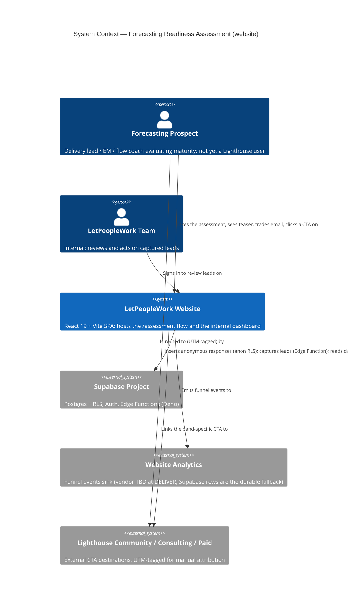
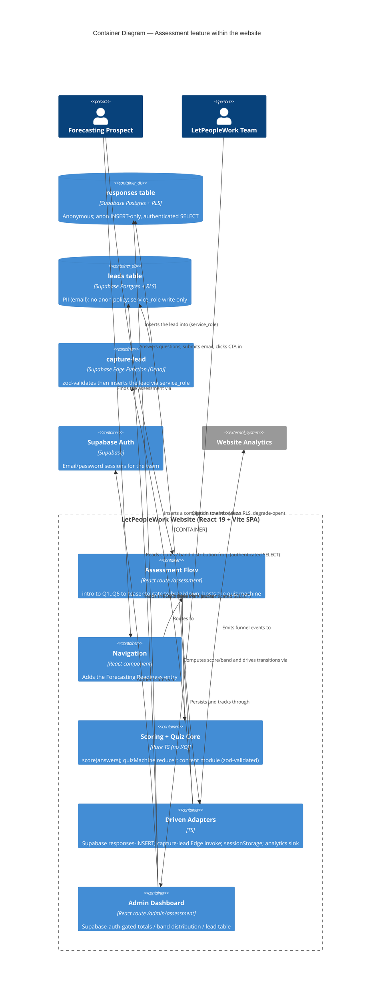

# C4 Design — Flow & Forecasting Readiness Assessment (ADO #5123)

> **Scope: the WEBSITE app (`/storage/repos/website`)**, not the Lighthouse product. The "system" is the LetPeopleWork website; external systems are the website's Supabase project (Postgres + Auth + Edge Functions) and any website analytics. These docs live in the Lighthouse repo by team convention; the implementation lands in the website repo.

## Level 1 — System Context

## Level 2 — Container

## Level 3 — Component

Not produced. The feature's internal decomposition (quiz machine, scoring fn, content module, four driven adapters, the page surfaces) is fully captured by the component-decomposition and ports tables in the DESIGN sections of `feature-delta.md`; no subsystem here has the 5+-component internal complexity that warrants an L3 diagram (per the architecture-patterns C4 guidance, L3 is for complex subsystems only).

## Quality attribute scenarios (ISO 25010 highlights)

- **Reliability / fault tolerance (degrade-open)**: a Supabase `responses` insert or `capture-lead` failure never blocks the result/breakdown; the adapter retries once and surfaces a non-blocking notice. Asserted by component tests with a rejecting fake adapter.
- **Security / confidentiality**: PII (email) sealed in `leads` with no anon policy; written only via `service_role` in the Edge Function; dashboard read gated by `authenticated` RLS, not by routing alone. The anon key being public is by design — RLS is the boundary.
- **Functional correctness**: deterministic, client-evaluable scoring; band boundaries exhaustive/non-overlapping over 0-100; exhaustive boundary unit tests (0/25/26/50/51/75/76/100, all-0, all-3).
- **Usability**: one question at a time, "N of 6" progress, back-nav preserves answers, resume-on-refresh, usable at 375px.
- **Maintainability / testability**: pure core + four driven ports; effects substitutable by fakes; one content module with load-time invariants.
- **Privacy (structural anonymity)**: no FK between `responses` and `leads`; survey answers (5124) never joinable to an email.
