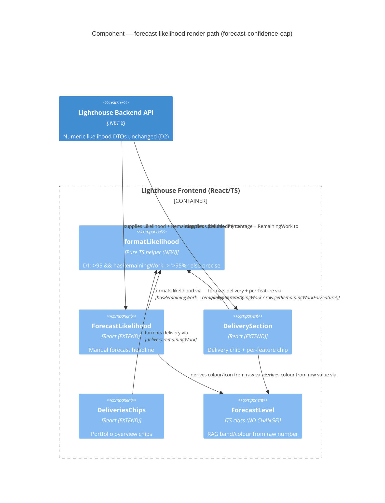

# Feature: forecast-confidence-cap

> ADO Story **#5126** — "Never show 100% Confidence" · Persona **delivery-forecaster** · Type **cross-cutting (backend calc + frontend display + clients)**
> DISCUSS wave · 2026-05-30 · density: lean (Tier-1 [REF])

---

## Wave: DISCUSS / [REF] Persona

**delivery-forecaster** — owns the conversation with leadership about *when* features ship and *how much* the team will deliver, using Lighthouse Monte Carlo forecasts as the evidence base. Already values an **"honest forecast"** — one whose headline number is defensible to stakeholders who will hold them to it.

## Wave: DISCUSS / [REF] JTBD one-liner

When I share a Lighthouse forecast likelihood with leadership and it reads as **100%** (or a high deterministic-looking figure), I want the number itself to express honest uncertainty, so deterministic-thinking stakeholders don't lock onto it as a committed date and hold me to a certainty probability never promised.

→ traces to job **`job-forecast-no-false-certainty`** (added to `docs/product/jobs.yaml`).

## Wave: DISCUSS / [REF] Locked decisions

| ID | Decision | Verdict | Rationale |
|----|----------|---------|-----------|
| **D1** | Cap treatment | **Bucket: forecast likelihood `> 95%` renders as `">95%"`; `≤ 95%` shows the precise value** | User selection (2026-05-30). Collapses the whole 96–100% deterministic-looking band into one honest "very likely, not guaranteed" label. Stronger than a 99.9% clamp — removes 97/98/99 false-precision too. |
| **D2** | Where the rule lives | **Applied consistently across every likelihood surface; numeric DTO field stays unchanged** | `">95%"` is a *label*, not a number. Keep `Likelihood`/`LikelihoodPercentage` doubles for API stability; DESIGN decides shared formatter vs. domain-level signal so FE + clients don't drift. |
| **D3** | Minimum-data guard | **OUT of scope — deferred to ADO #5125 "Don't Forecast with too little Data"** | Same Slack source, distinct outcome (needs a definition of "enough" + what to show instead). Keeps 5126 thin. |
| **D4** | Completed items (no remaining work) | **EXEMPT — still read 100% / Done** | A genuinely finished item is a fact, not a probabilistic forecast. The cap applies only to likelihoods computed from remaining work + a target date. |
| **D5** | ForecastLevel RAG bands | **Unchanged** | `>95%` lands in the existing "Certain" band (default case, `>85%`). No re-banding. |

## Wave: DISCUSS / [REF] Cross-cutting impact (CLAUDE.md DISCUSS gate)

- **RBAC** — **N/A, because** the change alters the *rendered value* of an existing forecast, not who may access it. No new operation, no `IRbacAdministrationService` interaction. Viewers who see forecasts today continue to, with the capped label. UI gating via `useRbac()` is untouched.
- **Lighthouse-Clients (CLI + MCP)** — **Impacted, presentation-only, non-blocking.** Likelihood is exposed on `ManualForecastDto.Likelihood` and `DeliveryWithLikelihoodDto.LikelihoodPercentage`, both consumed by the clients. **No new endpoint or contract change → no version gate needed** (`FEATURE_REQUIRES_SERVER_NEWER_THAN` not touched). For cross-surface consistency the clients *should* apply the same `">95%"` rendering wherever they print a likelihood to a human. **DESIGN to confirm** whether the clients render likelihood to humans or only emit raw JSON — if raw JSON only, this is N/A. **Recommendation:** file a follow-up clients task; do not block 5126.
- **Website** — **N/A, because** this is an in-app forecasting nuance, not a marketed/premium capability. (Good "honest probabilistic forecasting" talking point, but no site change required.)

## Wave: DISCUSS / [REF] Driving ports (existing surfaces, no new endpoints)

| Port | Entry point | DTO field carrying likelihood |
|------|-------------|-------------------------------|
| HTTP `POST /api/.../forecast/manual` | `ForecastController.RunManualForecastAsync` | `ManualForecastDto.Likelihood` (double 0–100) |
| HTTP `GET` deliveries | `DeliveriesController` → `DeliveryWithLikelihoodDto.FromDelivery` | `DeliveryWithLikelihoodDto.LikelihoodPercentage` + `FeatureLikelihoodDto.LikelihoodPercentage` |
| UI — Portfolio detail | `DeliverySection.tsx` chip + `DeliveriesChips.tsx` | renders `Math.round(likelihoodPercentage)%` |
| UI — Manual forecast | `ForecastLikelihood.tsx` | renders `likelihood.toFixed(2)%` |

Backed by `ForecastBase.GetLikelihood` (`100/TotalTrials*trialCounter` reaches exactly `100` when all 10 000 trials hit the date) and `Feature.GetLikelhoodForDate` (returns `100` when no remaining work — the D4 exempt path).

## Wave: DISCUSS / [REF] Pre-requisites

None. The Monte Carlo forecast pipeline and both display surfaces already exist; this is a brownfield display/formatting refinement. No walking skeleton (isolated change to existing surfaces).

## Wave: DISCUSS / [REF] Scope Assessment

**PASS — right-sized.** 1 persona · 2 user stories · 2 surfaces · 0 new endpoints · est. < 1 day total. None of the oversized signals fire. Deferring the data-guard (D3) keeps it thin.

---

## Wave: DISCUSS / [REF] User Stories

### Story 1 — Portfolio delivery forecasts never read as a guarantee

`job_id: job-forecast-no-false-certainty` · slice **01** · **(the "most important" surface per the reporter)**

As a delivery-forecaster presenting a portfolio to leadership, I want a delivery (and its features) whose forecast likelihood exceeds 95% to read `">95%"` rather than `100%`/`96–99%`, so stakeholders see "very likely, not guaranteed."

#### Elevator Pitch
Before: a portfolio delivery whose features are all very likely shows `Likelihood: 100%`, which a leader reads as a committed date.
After: open a Portfolio → Delivery section → the delivery chip and per-feature likelihood show `">95%"` whenever the computed likelihood exceeds 95% (with remaining work).
Decision enabled: the leader plans for possible slippage instead of locking the date.

#### Acceptance Criteria
- **AC1** — Given a delivery with remaining work whose aggregated forecast likelihood computes to `> 95%`, when I view the delivery chip in Portfolio detail, then it shows `Likelihood: >95%` (never a numeric 96–100%).
- **AC2** — Given a per-feature likelihood within a delivery that computes to `> 95%` with remaining work, when I view it, then it shows `">95%"`.
- **AC3** — Given a likelihood `≤ 95%`, when I view it, then the precise value is shown unchanged (e.g. `Likelihood: 94%`).
- **AC4** — Given a feature/delivery with **no remaining work** (complete), when I view it, then it still shows `100%`/Done (D4 — cap does not apply).
- **AC5** — Every place the delivery likelihood is rendered (`DeliverySection`, `DeliveriesChips`) applies the same rule; no portfolio surface shows a forecast as `100%`.

### Story 2 — Manual forecasts never read as a guarantee

`job_id: job-forecast-no-false-certainty` · slice **02**

As a delivery-forecaster running an ad-hoc "when" forecast, I want a manual forecast likelihood above 95% to read `">95%"`, so I can present it without the verbal "it's not really 100%" caveat.

#### Elevator Pitch
Before: a manual forecast that lands above 95% shows `100.00%`, reading as certainty.
After: run a manual forecast (Team → forecast N items by a date) → the headline likelihood shows `">95%"` when the computed value exceeds 95%.
Decision enabled: the forecaster presents the figure as-is; the number itself signals residual risk.

#### Acceptance Criteria
- **AC1** — Given a manual forecast with `remainingItems > 0` and a target date, when the computed likelihood is `> 95%`, then `ForecastLikelihood` displays `">95%"` (with the existing "Certain" styling).
- **AC2** — Given the computed likelihood `≤ 95%`, then the precise two-decimal value is shown unchanged (e.g. `94.80%`).
- **AC3** — `100%` (or `100.00%`) never appears as a manual forecast likelihood with remaining work.

## Wave: DISCUSS / [REF] Out of scope

- Minimum-throughput-data guard → **ADO #5125** (D3).
- Changing the Monte Carlo computation or the percentile *date* forecasts (50/70/85/95).
- Re-banding `ForecastLevel` Risky/Realistic/Confident/Certain thresholds (D5).
- Capping the `100%` shown for genuinely completed items (D4 — explicitly exempt).
- Altering the numeric `Likelihood`/`LikelihoodPercentage` DTO values (D2 — formatting only).

## Wave: DISCUSS / [REF] Outcome KPIs

| KPI | Target | Measurement |
|-----|--------|-------------|
| Product invariant: no forecast surface renders a likelihood in `(95%, 100%]` as a precise number; `100%` never shown for a forecast **with remaining work** | 100% of surfaces (manual + portfolio) | Automated tests (FE unit + backend) + manual Playwright E2E walkthrough at release |
| Completed-item exemption preserved (`100%`/Done still shown when no remaining work) | 100% | Same test set (regression guard for D4) |
| Trust signal: leader/community reports of "forecast shows 100% / looks deterministic" | Downward (qualitative) | GitHub issues + Slack community channel post-release. **No numeric cross-instance target feasible** — self-hosted instances don't phone home (telemetry gap, Epic 5015). Honest framing. |

## Wave: DISCUSS / [REF] Definition of Done (9)

1. Both stories' ACs pass via automated tests (RED→GREEN→REFACTOR).
2. The `">95%"` rule applied at every likelihood surface (manual + portfolio chip + per-feature).
3. D4 exemption verified: completed items still show `100%`/Done.
4. Numeric DTO fields unchanged (D2).
5. `dotnet build` + `dotnet test` green; `pnpm test` + `pnpm build` (incl. Biome) clean.
6. Mutation testing ≥ 80% on the new formatting/cap logic (per-feature strategy).
7. Live Playwright E2E run locally for both surfaces (POM, demo data) before commit.
8. Clients impact resolved: follow-up task filed OR confirmed N/A (raw-JSON clients).
9. SonarCloud `new_violations = 0`.

## Wave: DISCUSS / [REF] DoR Validation (9)

| # | Item | Status |
|---|------|--------|
| 1 | User-valued | ✅ honest forecast for the leadership conversation |
| 2 | Persona identified | ✅ delivery-forecaster |
| 3 | Job traceability | ✅ `job-forecast-no-false-certainty` |
| 4 | Acceptance criteria testable | ✅ all ACs observable on a real surface |
| 5 | Elevator pitch (real entry point + observable output) | ✅ both stories |
| 6 | Slice ≤ 1 day, end-to-end value, learning hypothesis | ✅ slices 01–02 |
| 7 | Technical notes / constraints (RBAC, Clients, Website) | ✅ cross-cutting section above |
| 8 | Dependencies | ✅ none blocking; 5125 is a sibling, not a blocker |
| 9 | Out-of-scope explicit | ✅ section above |

**Requirements completeness: 0.97** (the single open thread — whether the CLI/MCP render likelihood to humans — is a DESIGN confirmation, not a requirements gap).

## Wave: DISCUSS / [REF] WS strategy

No walking skeleton. Brownfield, isolated refinement of two existing forecast-display surfaces fed by an existing Monte Carlo pipeline.

## Wave: DISCUSS / [REF] Prioritization

1. **Slice 01 — portfolio deliveries** first: highest value (reporter's "most important" surface) **and** carries the learning hypothesis (does `">95%"` read as honest-but-confident?) **and** introduces the shared formatter.
2. **Slice 02 — manual forecast** second: pure propagation of the validated rule to the second surface.

---

## Wave: DISCUSS / [REF] Wave Decisions Summary

- **Primary job:** make the forecast headline number honest so leaders don't read it as a guarantee.
- **Feature type:** cross-cutting (backend calc + FE display + clients).
- **Constraints:** rule = likelihood `> 95%` → `">95%"`; numeric DTOs unchanged; completed items exempt; data-guard deferred to #5125; clients inherit (presentation-only, no version gate).
- **Upstream changes:** none (no DISCOVER/DIVERGE artifacts for this feature).

## Wave: DISCUSS / [WHY] Expansion availability

`ask-intelligent` trigger fired: **cross-context complexity** (≥3 technologies — C# backend, React/TS frontend, CLI/MCP clients) → suggests `alternatives-considered` (e.g. backend-clamp vs. display-bucket vs. domain-signal). Not auto-expanded (lean mode). Request with `--expand alternatives-considered` if DESIGN wants the rejected-options trail.

---

## Wave: DESIGN / [REF] Prior-wave consultation

| Source | Status | Note |
|---|---|---|
| `feature-delta.md` DISCUSS sections (D1–D5, 2 stories, ACs) | ✓ | Primary input; all 5 decisions honoured, none relitigated |
| `slices/slice-01-portfolio-delivery-cap.md` | ✓ | Shared formatter introduced in slice 01, propagated in slice 02 — DESIGN confirms this ordering |
| `slices/slice-02-manual-forecast-cap.md` | ✓ | Manual surface already has `remainingItems` — pure propagation |
| `journeys/forecast-confidence-cap.yaml` | ✓ | Surfaces + cross-cutting verdicts inherited |
| `architecture/brief.md` → `## Application Architecture — filter-forecast-throughput` | ✓ | Forecast conventions (`ForecastLevel`, DTO shapes) read; new section appended, not recreated |
| Source files (`ForecastLikelihood.tsx`, `ForecastLevel.ts`, `DeliverySection.tsx`, `DeliveriesChips.tsx`, `DeliveryWithLikelihoodDto.cs`, `ManualForecastDto.cs`, `Delivery.ts`, `Feature.ts`) | ✓ | Read directly — not trusted from summary. Decisive D4 finding below. |

## Wave: DESIGN / [REF] Architectural decision (where the rule lives)

**Chosen: Option A — frontend shared formatter** `formatLikelihood(value, { hasRemainingWork, precision })`. Numeric DTOs untouched (D2). See **ADR-038**.

### Decisive D4 grounding — remaining-work signal IS available at every FE call site

| Surface | Render site | D4 signal at the call site |
|---|---|---|
| Manual forecast | `ForecastLikelihood.tsx` | `remainingItems` prop (already present, from `ManualForecastDto.RemainingItems`) |
| Delivery chip | `DeliverySection.tsx` (delivery header chip) | `delivery.remainingWork` (`Delivery` model, from `DeliveryWithLikelihoodDto.RemainingWork`) |
| Portfolio overview chip | `DeliveriesChips.tsx` | `delivery.remainingWork` |
| Per-feature chip | `DeliverySection.tsx` likelihood column | `row.getRemainingWorkForFeature()` — full `IFeature` row bound in `renderCell`; `FeatureLikelihoodDto`/`IFeatureLikelihood` carry **no** remaining-work field, but the sibling row does |

→ **No DTO change is required to enforce D4**, including per-feature. This is why Option A beats B/C.

### Options evaluated

| Criterion | A — FE shared formatter (CHOSEN) | B — backend display field (`IsCapped`/band) | C — hybrid (add `FeatureLikelihoodDto.RemainingWork`, FE owns rule) |
|---|---|---|---|
| D2 (DTO stability) | ✅ zero contract change | ❌ new derived field on 3 DTOs — the display state D2 wanted off the wire | ⚠️ one additive field |
| D4 (remaining-work signal) | ✅ already at every call site | ⚠️ needs `FeatureLikelihoodDto.RemainingWork` to compute per-feature server-side | ✅ explicit on contract |
| Clients consistency | ⚠️ each client re-implements one-line rule | ✅ single server source | ⚠️ same as A |
| Server-version coupling | ✅ none | ❌ old server omits field → FE must compute anyway (field redundant) | ✅ none |
| Testability / mutation | ✅ one pure fn, boundary table in one place | ⚠️ split BE+FE | ✅ same as A |
| Drift risk | ⚠️ mitigated by shared boundary-test table + clients follow-up | ✅ lowest | ⚠️ same as A |

**Recommendation: A.** B's single-source-of-truth benefit is illusory here — an old server omits the field, so the FE rule must exist regardless, making the backend field redundant and the contract change pure cost. C is A plus an unnecessary DTO field; kept as the documented fallback **only if** a future surface renders a per-feature likelihood without the feature row in scope.

## Wave: DESIGN / [REF] DDD / domain note

No new domain concept — this is a **presentation policy**, not a domain rule. The Monte Carlo likelihood (`ForecastBase.GetLikelihood`, `Feature.GetLikelhoodForDate`) and its 100-on-no-remaining-work semantics are the domain truth and are unchanged. The cap is an honesty-of-display concern owned entirely by the view layer. Ubiquitous-language term introduced: **"capped likelihood label"** (`">95%"`) — distinct from the numeric likelihood.

## Wave: DESIGN / [REF] Component decomposition

| Component | Path | Decision | Justification |
|---|---|---|---|
| `formatLikelihood` helper | `Lighthouse.Frontend/src/utils/forecast/formatLikelihood.ts` (NEW) | **CREATE NEW** | No existing shared likelihood formatter; the rule is currently inlined 4× (`Math.round`/`toFixed(2)`). One small pure fn is the single home for D1+D4. Justifies a new file: no existing alternative, and co-locating with any one consumer would couple the other three to it. |
| `ForecastLikelihood.tsx` | `…/components/Common/Forecasts/ForecastLikelihood.tsx` | **EXTEND** | Replace `likelihood.toFixed(2)` with `formatLikelihood(likelihood, { hasRemainingWork: remainingItems > 0, precision: "fixed2" })`. `remainingItems` already a prop. |
| `DeliverySection.tsx` delivery chip | `…/pages/Portfolios/Detail/Components/DeliveryGrid/DeliverySection.tsx` | **EXTEND** | Delivery header chip uses `delivery.remainingWork` for `hasRemainingWork`; `precision: "round"`. |
| `DeliverySection.tsx` per-feature chip | same file, likelihood column `renderCell` | **EXTEND** | `hasRemainingWork: row.getRemainingWorkForFeature() > 0`; `precision: "round"`. |
| `DeliveriesChips.tsx` | `…/components/Common/DataOverviewTable/DeliveriesChips.tsx` | **EXTEND** | `delivery.remainingWork` for `hasRemainingWork`; `precision: "round"`. |
| `ForecastLevel.ts` | `…/components/Common/Forecasts/ForecastLevel.ts` | **NO CHANGE** | D5 — constructed from raw numeric likelihood; `">95%"` lands in default "Certain" band. |
| `DeliveryWithLikelihoodDto.cs` / `ManualForecastDto.cs` / `FeatureLikelihoodDto` | `…/API/DTO/*` | **NO CHANGE** | D2 — numeric `double` fields stay; `RemainingWork`/`RemainingItems` already present where needed. |
| CLI/MCP client likelihood render | clients repo (out of this repo) | **FOLLOW-UP (non-blocking)** | Adopt same rule if rendering to a human; see clients verdict. |

## Wave: DESIGN / [REF] Driving / driven ports

**No port changes.** No new/changed HTTP routes, no new driven adapters. All driving ports (existing forecast + deliveries endpoints) and driven ports (EF context, Monte Carlo engine) are unchanged. This feature lives entirely in the FE view layer — a deliberate consequence of Option A.

## Wave: DESIGN / [REF] Technology choices

No new dependencies. Plain TypeScript pure function + existing Vitest/RTL test stack (ADR-031 era). No backend change → no NuGet/EF impact. OSS-first: N/A (no new tech). License: N/A.

## Wave: DESIGN / [REF] Component C4 (forecast-likelihood render path)

System Context (L1) and Container (L2) for Lighthouse already exist in `brief.md` / `c4-diagrams.md` — referenced, not recreated. Component-level view of the render path:

## Wave: DESIGN / [REF] Reuse Analysis (hard gate)

Default = EXTEND. Every overlapping component classified above. Summary: **1 CREATE NEW** (`formatLikelihood` — justified: no existing shared formatter, rule currently inlined 4×, neutral home avoids coupling 4 consumers), **4 EXTEND** (the render sites), **3 NO CHANGE** (`ForecastLevel`, all backend DTOs), **1 FOLLOW-UP** (clients). No backend code created or changed.

## Wave: DESIGN / [REF] Decisions table (DESIGN)

| ID | Decision | Honours |
|---|---|---|
| DES-1 | Rule lives in FE `formatLikelihood` shared helper; numeric DTOs untouched | D1, D2 |
| DES-2 | D4 sourced locally per call site (`remainingItems` / `delivery.remainingWork` / `row.getRemainingWorkForFeature()`) — no DTO field added | D4 |
| DES-3 | `ForecastLevel` fed by raw numeric value; bands unchanged | D5 |
| DES-4 | Clients adopt rule independently via non-blocking follow-up; no version gate (no new endpoint) | DISCUSS clients verdict |
| DES-5 | Enforcement: Vitest structural test (all 4 sites route through formatter) + NUnit reflection test (DTO fields stay `double`) | brownfield drift guard |

## Wave: DESIGN / [REF] Cross-cutting (restated, settled in DISCUSS)

- **RBAC** — N/A: alters a rendered value, not access. No `IRbacAdministrationService` interaction; `useRbac()` untouched.
- **Clients (CLI + MCP)** — Presentation-only, non-blocking. No new endpoint → no `FEATURE_REQUIRES_SERVER_NEWER_THAN` gate. Adopt `">95%"` only if rendering likelihood to a human; raw-JSON-only ⇒ N/A. **Open follow-up below.**
- **Website** — N/A: in-app forecasting nuance, not a marketed/premium capability.

## Wave: DESIGN / [REF] Open questions (for DISTILL/DELIVER)

| # | Question | Disposition |
|---|---|---|
| OQ-1 | Do the CLI/MCP clients render likelihood to a human (→ adopt rule) or emit raw JSON only (→ N/A)? | **Cannot be answered from THIS repo** (clients live in a separate repo). One-line follow-up task for the clients repo. **Non-blocking** — Option A doesn't depend on the answer; a client that does nothing still shows the (unchanged) precise number, no breakage. |
| OQ-2 | Should `formatLikelihood`'s `precision` be an enum (`"round"`/`"fixed2"`) or should callers keep their own precise branch? | DELIVER's RED→GREEN call; ADR-038 prefers the enum so one fn owns the whole decision. Low-risk, defer to implementation. |

## Wave: DESIGN / [REF] Outcome collision check

This feature adds **no new typed contract surface** (formatting only; numeric DTOs unchanged, no new endpoint, no new domain event). `nwave-ai outcomes check-delta` is therefore **not applicable** — there is no contract delta to collide. Documented as display-only / methodology-skip per the run note.

## Wave: DESIGN / [REF] Wave Decisions Summary (DESIGN)

- **Where the rule lives:** FE shared `formatLikelihood` helper (ADR-038, Option A). Backend untouched.
- **Why not backend field (B):** old-server fallback makes the FE rule mandatory anyway → backend field is redundant cost; violates D2's spirit.
- **D4:** enforceable at every FE call site with the remaining-work signal already in scope — the per-feature chip was the only doubt and is satisfied by the bound feature row.
- **Clients:** presentation-only, no version gate, non-blocking follow-up.
- **Enforcement:** Vitest structural test + NUnit DTO-stability reflection test.

---

## Wave: DISTILL / [REF] Scenario list with tags

Acceptance tests are idiomatic Vitest `*.test.tsx` co-located beside source (project convention — no `.feature`/pytest-bdd/Python). The driving "port" is the React component render (RTL `render` + `screen`). Example/table-based only (`it.each`); `fast-check` is intentionally NOT used (ADR-038: no new dependencies).

| # | Scenario (test name) | Story | Surface | Class | RED status |
|---|----------------------|-------|---------|-------|------------|
| S2-1 | reads >95% for a perfect likelihood with work left (`likelihood=100, remainingItems=5`) | US-2 | `ForecastLikelihood` manual headline | **capped** | RED (skipped) |
| S2-2 | reads >95% for a high likelihood with work left (`likelihood=96.5, remainingItems=5`) | US-2 | `ForecastLikelihood` | **capped** | RED (skipped) |
| S2-3 | keeps the precise 95.00% at the boundary (`likelihood=95, remainingItems=5`) | US-2 | `ForecastLikelihood` | **precise** (boundary) | GREEN (regression guard, active) |
| S2-4 | keeps the precise 94.80% below the cap (`likelihood=94.8, remainingItems=5`) | US-2 | `ForecastLikelihood` | **precise** | GREEN (regression guard, active) |
| S2-5 | still reads 100.00% for a completed forecast (`likelihood=100, remainingItems=0`) | US-2 | `ForecastLikelihood` | **exempt** (D4) | GREEN (regression guard, active) |
| S1-1 | reads Likelihood: >95% for a delivery above 95% with work left (`100, remainingWork=25`) | US-1 | `DeliveriesChips` overview chip | **capped** | RED (skipped) |
| S1-2 | keeps the precise Likelihood: 95% at the boundary (`95, remainingWork=25`) | US-1 | `DeliveriesChips` | **precise** (boundary) | GREEN (regression guard, active) |
| S1-3 | still reads Likelihood: 100% for a completed delivery (`100, remainingWork=0`) | US-1 | `DeliveriesChips` | **exempt** (D4) | GREEN (regression guard, active) |
| S1-4 | reads >95% on the delivery header chip above 95% with work left (`100, remainingWork=4`) | US-1 | `DeliverySection` header chip | **capped** | RED (skipped) |
| S1-5 | reads >95% on a per-feature chip above 95% with work left (`fl=100, getRemainingWorkForFeature()=5`) | US-1 | `DeliverySection` per-feature column | **capped** | RED (skipped) |
| S1-6 | still reads 100% on a per-feature chip for a completed feature (`fl=100, getRemainingWorkForFeature()=0`) | US-1 | `DeliverySection` per-feature column | **exempt** (D4) | GREEN (regression guard, active) |
| S1-7 | keeps the precise per-feature likelihood at/below 95% with work left (`fl=87, getRemainingWorkForFeature()=5`) | US-1 | `DeliverySection` per-feature column | **precise** | GREEN (regression guard, active) |

**Counts:** US-1 = 7 scenarios (3 capped RED, 1 boundary, 3 precise/exempt guards); US-2 = 5 scenarios (2 capped RED, 2 precise, 1 exempt). 5 RED-skipped (the cap behaviour DELIVER must build), 7 active regression guards (existing behaviour the cap must preserve — D4 exemption + ≤95 precise at every surface incl. per-feature + 95 boundary). S1-7 added per Sentinel review (HIGH finding: per-feature surface needed a precise ≤95 guard to complete AC3/AC5 across all surfaces). No `@walking_skeleton`, no `@real-io`, no `@property` tags apply (see Architecture note).

## Wave: DISTILL / [REF] Test placement

| File extended | Surface covered | Precedent justification |
|---|---|---|
| `Lighthouse.Frontend/src/components/Common/Forecasts/ForecastLikelihood.test.tsx` | US-2 manual headline | Co-located beside `ForecastLikelihood.tsx`; mirrors existing RTL `render`/`screen.getByText` style in the same file |
| `Lighthouse.Frontend/src/components/Common/DataOverviewTable/DeliveriesChips.test.tsx` | US-1 portfolio overview chip | Co-located; extends the existing `getMockDelivery` factory + `renderWithProviders` (mirrors the existing `likelihoodPercentage: 95` "Certain Delivery" case) |
| `Lighthouse.Frontend/src/pages/Portfolios/Detail/Components/DeliveryGrid/DeliverySection.test.tsx` | US-1 delivery header chip + per-feature chip | Co-located; reuses the file's `new Delivery()` / `new Feature()` construction and `MemoryRouter` wrapper |

Co-location next to source is the project convention (every `*.test.tsx` sits beside its component). No new test directory created. The `formatLikelihood.ts` helper and its boundary unit tests are explicitly **NOT** authored here — that is DELIVER's GREEN-phase work; these acceptance tests import only the existing components.

## Wave: DISTILL / [REF] Architecture-of-Reference note

- **Driving port** = the React component render (RTL). Each scenario enters through the public component (`<ForecastLikelihood>`, `<DeliveriesChips>`, `<DeliverySection>`) and asserts the user-observable rendered text (`screen.getByText`) — never an internal field or a `formatLikelihood` call directly. Mandate 1 (hexagonal boundary) honoured at the view-layer scope.
- **Driven ports** = none new. `DeliveriesChips` reads via the existing mocked `deliveryService` (a driven port already faked in the precedent test); `ForecastLikelihood` and `DeliverySection` take their data as props. No filesystem, subprocess, git, HTTP, or DB adapter is touched.
- **Layer** = RTL component render = layer 4+ (view integration). Per Mandate 8, layers 4+ MAY use traditional assertions — so `assert_state_delta`/Universe and the `tests/common/state_delta.ts` port are **N/A** for this feature. No PBT machinery (Mandate 9 example-only at this layer; `fast-check` absent by ADR-038).
- **No backend / CLI / HTTP touched** — Option A is a pure FE view-layer change (ADR-038). The numeric DTOs (`ManualForecastDto.Likelihood`, `DeliveryWithLikelihoodDto.LikelihoodPercentage`, `FeatureLikelihoodDto.LikelihoodPercentage`) are unchanged (D2).
- **No walking-skeleton scenario applies.** DISCUSS already declared "No walking skeleton" (brownfield, isolated refinement of two existing forecast-display surfaces). There is no subprocess/HTTP entry point introduced and no end-to-end wiring to prove that the existing render path does not already exercise. Stated explicitly so the review gate does not flag a missing WS.

## Wave: DISTILL / [REF] RED classification (fail-for-the-right-reason)

Tests were authored ACTIVE, the three suites run, then the 5 cap scenarios converted to `it.skip` / `it.skip.each` to keep the suite green for commit (DELIVER unskips one at a time during Outside-In TDD). Baseline before adding tests: 29 passed. With new tests active: **5 failed | 35 passed**. Every failure is `TestingLibraryElementError: Unable to find an element with the text` — the component rendered successfully (failure dumps show full DOM with `Likelihood: 75%` / `100%` present) and the assertion line is what fired. No import error, no fixture/setup error, no provider error → all 5 are `MISSING_FUNCTIONALITY` (correct RED).

| Scenario | Failure (active run) | Classification |
|---|---|---|
| S2-1 | `Unable to find an element with the text: >95%` (`ForecastLikelihood.test.tsx:56`) | MISSING_FUNCTIONALITY ✅ |
| S2-2 | `Unable to find an element with the text: >95%` (same) | MISSING_FUNCTIONALITY ✅ |
| S1-1 | `Unable to find an element with the text: /Q1 Release.*Likelihood: >95%/` (`DeliveriesChips.test.tsx`) | MISSING_FUNCTIONALITY ✅ |
| S1-4 | `Unable to find an element with the text: Likelihood: >95%` (`DeliverySection.test.tsx:241`) | MISSING_FUNCTIONALITY ✅ |
| S1-5 | `Unable to find an element with the text: >95%` (`DeliverySection.test.tsx:277`) | MISSING_FUNCTIONALITY ✅ |

All RED-for-the-right-reason. The 6 regression guards (boundary/precise/D4-exempt) passed against current code as designed — they assert behaviour the cap must preserve, so they are correctly active and GREEN now.

## Wave: DISTILL / [REF] Outcome registration

**N/A — methodology-skip.** This feature adds **no new typed contract surface**: no rule module, CLI subcommand, public service operation, or system-wide invariant exposed at a contract boundary. The `formatLikelihood` helper DELIVER will add is a private view-layer presentation function, not a typed contract; the numeric DTOs are unchanged (D2). Per the DISTILL outcome-registration gate (D-5 grain, D-6 code-feature scoping), there is no OUT-N row to register. Consistent with DESIGN's "Outcome collision check → not applicable" verdict.

## Wave: DISTILL / [REF] Wave Decisions Summary (DISTILL)

- **Mechanism:** idiomatic Vitest RTL `*.test.tsx`, co-located, `it.each` table-based — NOT pytest-bdd/`.feature`/Python, NOT `fast-check` (ADR-038 no-new-deps; project conventions override the skill's Python defaults).
- **Coverage:** 11 scenarios across 3 files / 2 stories — 5 capped (RED, skipped), 1 boundary (95), 3 precise/exempt guards (D4 + ≤95). Error/edge ratio is high by construction (every capped case has a paired precise/exempt guard).
- **RED gate:** all 5 cap scenarios fail RED-for-right-reason (assertion miss on `>95%`, not setup/import); suite committed green with the 5 skipped.
- **Out of DISTILL scope (DELIVER's):** `formatLikelihood.ts` + its boundary unit tests, the ADR-038 structural enforcement test, and the NUnit DTO-stability reflection test.
- **Notable source finding:** the per-feature chip in `DeliverySection.tsx` renders `Math.round(fl.likelihoodPercentage)%` where `fl` comes from `delivery.featureLikelihoods` — but the D4 remaining-work signal is `row.getRemainingWorkForFeature()` on the bound `IFeature`. So DELIVER must combine two different objects in that one cell: likelihood from `featureLikelihoods`, remaining-work from the feature row. The test wires both (a `featureLikelihoods` entry **and** a `Feature` with matching `remainingWork`) so the per-feature scenarios exercise that join correctly.
