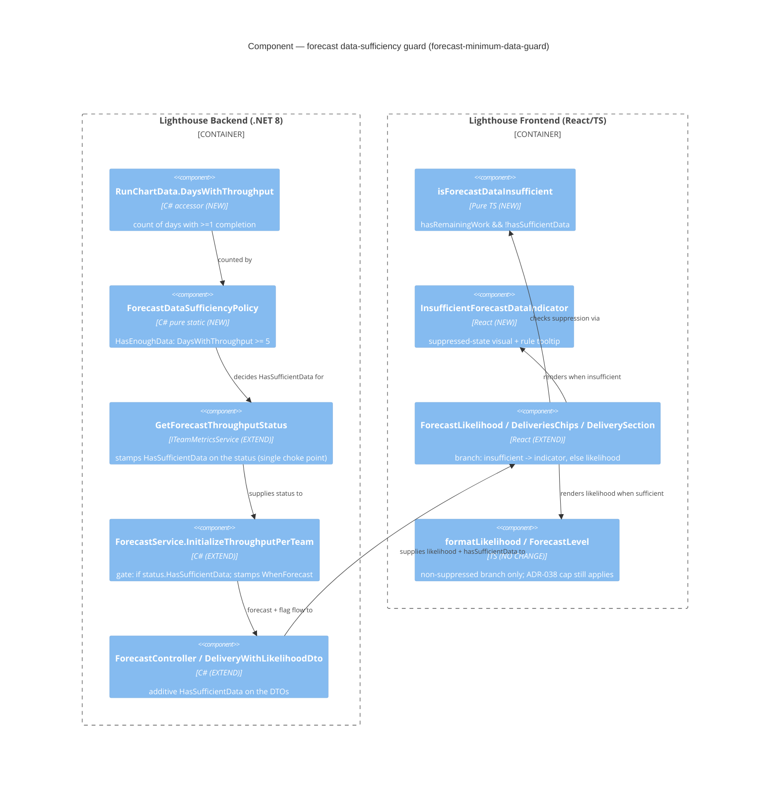

# Feature: forecast-minimum-data-guard

> ADO Story **#5125** — "Don't Forecast with too little Data" · Persona **delivery-forecaster** · Type **cross-cutting (backend sufficiency gate + frontend display + clients)**
> DISCUSS wave · 2026-05-31 · density: lean (Tier-1 [REF])

---

## Wave: DISCUSS / [REF] Persona

**delivery-forecaster** — owns the conversation with leadership about *when* features ship and *how much* the team will deliver, using Lighthouse Monte Carlo forecasts as the evidence base. Values an **"honest forecast"** — one whose headline number is defensible to stakeholders who will hold them to it. This feature extends that honesty from *how the number reads* (sibling cap, #5126) to *whether a number is shown at all* when the underlying history is too thin.

## Wave: DISCUSS / [REF] JTBD one-liner

When I open a forecast for a new (or low-volume) team whose throughput window holds only a day or two of actual completions, I want Lighthouse to tell me there is not yet enough data to forecast — and show nothing in place of a number — rather than handing me a confident-looking date (often 100% on a far-future day) built on one or two data points, so I never present, and leadership never anchors on, a forecast the history cannot honestly support.

→ traces to job **`job-forecast-only-with-enough-data`** (added to `docs/product/jobs.yaml`).

## Wave: DISCUSS / [REF] Locked decisions

| ID | Decision | Verdict | Rationale |
|----|----------|---------|-----------|
| **D1** | Sufficiency rule | **≥ 5 distinct days with ≥1 completed item in the team's throughput window** | User selection (2026-05-31). The datapoint is a *day*; only days that had a completion count toward the 5. Chosen over total-closed-items and configured-window-length — directly fixes the "throughput of one" failing case while staying "not too restrictive". |
| **D2** | Below-threshold treatment | **Suppress the forecast output + show an explicit "not enough throughput data yet (need ≥5 days with completed items)" state** | A number on screen still gets screenshotted as truth; the reporter's own workaround hides the number entirely until enough data accrues. |
| **D3** | Scope | **All forecast surfaces** — manual When + How-Many, portfolio delivery likelihood, per-feature likelihood | No forecast surface may show a number built on too little data. |
| **D4** | Completed items (no remaining work) | **EXEMPT — still read 100% / Done** | A finished item is a fact, not a forecast; nothing to suppress. Guard applies only where a probabilistic forecast is computed from throughput (remaining work > 0). Mirrors and composes with sibling cap D4. |
| **D5** | Threshold configurability | **Fixed constant (5); NOT per-team configurable** | Keeps scope thin — no new settings field, no DTO config, no RBAC-gated config surface. Revisit a per-team override only on demand. |
| **D6** | Compose with filter-forecast-throughput | **Evaluate sufficiency on the post-fallback throughput series the forecast actually samples** | The empty-filtered-sample fallback already reverts to unfiltered with a warning; the guard reads the throughput actually used, so a filter exclusion is never miscounted as missing data. |
| **D7** | Where the signal lives | **DEFER to DESIGN — likely a backend-computed sufficiency signal on the existing forecast DTOs** | Unlike the sibling cap (remaining-work signal already at every FE call site), the active-days count is **not** on the FE-facing DTOs today. DESIGN picks the carrier (boolean flag vs. active-day count + message); numeric likelihood DTOs otherwise unchanged. |

## Wave: DISCUSS / [REF] Cross-cutting impact (CLAUDE.md DISCUSS gate)

- **RBAC** — **N/A, because** the guard changes *whether and what* a forecast renders, not *who* may access it. No new operation, no `IRbacAdministrationService` interaction; the fixed threshold (D5) adds no RBAC-gated config surface. Viewers who see forecasts today continue to, now including the suppressed "not enough data" state. `useRbac()` gating untouched.
- **Lighthouse-Clients (CLI + MCP)** — **Impacted, additive, non-blocking.** The forecast DTOs (`ManualForecastDto` and the delivery/feature likelihood DTOs) gain a sufficiency signal field consumed by the clients. It is an **additive field on existing endpoints** (no new endpoint) → an old server omits it and the client behaves as today (shows the number), an acceptable degradation, so **no hard `FEATURE_REQUIRES_SERVER_NEWER_THAN` gate is required** — but record the current latest release as the baseline in case a client wants to gate the suppressed-state rendering. Clients that render a likelihood to a human *should* honour the suppression (print the "not enough data" message instead of a number). **DESIGN to confirm** whether the clients render to humans or emit raw JSON only (raw JSON only ⇒ N/A). **Recommendation:** file a follow-up clients task; do not block #5125.
- **Website** — **N/A, because** this is an in-app forecasting honesty nuance, not a marketed/premium capability. ("Lighthouse won't forecast on too little data" is a good trust talking point, but no site change required.)

## Wave: DISCUSS / [REF] Driving ports (existing surfaces, no new endpoints)

| Port | Entry point | Where the guard lands |
|------|-------------|-----------------------|
| HTTP `POST /api/.../forecast/manual` | `ForecastController.RunManualForecastAsync` | After `GetForecastThroughputStatus(team, mode)` — sufficiency computed from the throughput's active-day count; signal carried on `ManualForecastDto` |
| HTTP `GET` deliveries | `DeliveriesController` → `DeliveryWithLikelihoodDto.FromDelivery` | Per owning-team sufficiency signal on `DeliveryWithLikelihoodDto` / `FeatureLikelihoodDto` |
| UI — Manual forecast | `ManualForecaster.tsx` → `ForecastLikelihood.tsx` | Suppress likelihood, render "not enough data" state |
| UI — Portfolio detail | `DeliverySection.tsx` chip + per-feature column; `DeliveriesChips.tsx` | Same suppression on delivery + per-feature likelihood |

Backed by `RunChartData` (the throughput series) — the active-day count is derivable from `WorkItemsPerUnitOfTime` (days with ≥1 item). The current guard at `ForecastService` only checks `Throughput.Total > 0`, never the **depth** of the history — that is the gap #5125 closes. The existing `EmptyFilteredSampleWarning` path (filter-forecast-throughput) is the precedent pattern for carrying a forecast-quality signal to the surface.

## Wave: DISCUSS / [REF] Pre-requisites

None blocking. The Monte Carlo pipeline, the throughput series, and all forecast-display surfaces already exist. Composes with two **shipped** siblings: **forecast-confidence-cap** (#5126 — the `>95%` cap; suppression takes precedence over both the number and the cap) and **filter-forecast-throughput** (the empty-filtered-sample fallback the guard reads through, per D6). No walking skeleton.

## Wave: DISCUSS / [REF] Scope Assessment

**PASS — right-sized.** 1 persona · 1 job · 2 user stories · 2 surface groups · 0 new endpoints · 1 additive DTO signal · est. ~1–1.5 days total. None of the oversized signals fire (≤10 stories, 2 modules, no new abstraction beyond the one sufficiency computation slice 01 ships end-to-end, <2 weeks). Fixed threshold (D5) and reuse of the existing throughput series keep it thin.

---

## Wave: DISCUSS / [REF] User Stories

### Story 1 — A team without enough history shows no manual forecast, and says why

`job_id: job-forecast-only-with-enough-data` · slice **01** · **(the reporter's primary surface; introduces the backend sufficiency signal)**

As a delivery-forecaster running a manual When / How-Many forecast for a new or low-volume team, I want Lighthouse to suppress the forecast and tell me there is not enough throughput data yet (naming the ≥5-active-days rule) instead of handing me a confident-looking far-future date, so I don't present a forecast built on one or two data points.

#### Elevator Pitch
Before: a new team with completions on only 1–2 days still shows a When/How-Many forecast (e.g. a high likelihood on a far-future 2027 date), read as real.
After: open Team → Forecast → run a When or How-Many forecast → when the team has fewer than 5 days with completed items, the likelihood/percentile output is replaced by `Not enough throughput data yet — Lighthouse needs at least 5 days with completed work items before it can forecast`.
Decision enabled: the forecaster waits / gathers more history instead of presenting a number the data can't support, and leadership never anchors on it.

#### Acceptance Criteria
- **AC1** — Given a team whose throughput window contains completed items on **fewer than 5 distinct days**, when I run a **When** forecast (days for N items), then the likelihood/percentile dates are suppressed and the surface shows the explicit "not enough data" message naming the ≥5-active-days rule.
- **AC2** — Given the same team, when I run a **How-Many** forecast (items by a date), then the forecast output is likewise suppressed with the same message.
- **AC3** — Given a team with completed items on **≥ 5 distinct days** in the window, when I run a manual forecast, then it renders exactly as today (no message).
- **AC4** — Given the boundary of **exactly 5** active days, then the forecast renders (5 is sufficient).
- **AC5** — Given a selection with **no remaining work** (nothing to forecast), then no "not enough data" message is shown — there is no forecast to suppress (D4).
- **AC6** — The message states the rule in plain language so the user knows what unblocks it.

### Story 2 — Portfolio delivery & per-feature likelihoods are suppressed for thin-data teams

`job_id: job-forecast-only-with-enough-data` · slice **02**

As a delivery-forecaster reviewing a portfolio with leadership, I want a delivery (and its features) whose owning team lacks enough throughput history to show "not enough data" instead of a likelihood percentage, so the portfolio view never anchors a delivery date on thin throughput.

#### Elevator Pitch
Before: a portfolio delivery whose owning team has <5 active throughput days shows a likelihood chip (often `>95%`/Certain) built on too little data.
After: open Portfolio → Delivery section → for a delivery/feature whose owning team has fewer than 5 days with completed items (and remaining work), the likelihood chip and per-feature column show a "not enough data" indicator instead of a percentage.
Decision enabled: leadership reading the portfolio doesn't lock onto a delivery date that rests on thin throughput.

#### Acceptance Criteria
- **AC1** — Given a feature/delivery whose owning team has **<5** active throughput days and **remaining work > 0**, when I view its per-feature likelihood (`DeliverySection` column), its delivery chip (`DeliverySection` header), and the overview chip (`DeliveriesChips`), then each shows the "not enough data" indicator with **no percentage**.
- **AC2** — Given the owning team has **≥5** active days, then the likelihood renders as today (and the sibling `>95%` cap still applies above 95%).
- **AC3** — Given a **completed** feature/delivery (no remaining work), then it still shows `100%`/Done (D4 exempt — composes with the cap's D4).
- **AC4** — Every portfolio likelihood surface (delivery header chip, overview chip, per-feature column) applies the rule consistently; no portfolio surface shows a forecast percentage for a thin-data team with remaining work.

## Wave: DISCUSS / [REF] Out of scope

- Per-team configurable threshold → fixed at 5 (D5); revisit on demand.
- Changing the Monte Carlo computation or the percentile *date* math.
- The `>95%` confidence cap itself → sibling **forecast-confidence-cap** (#5126); this composes with it (suppression wins over both the number and the cap).
- Non-forecast metrics that also read throughput (cycle time, aging, run charts) — the guard is forecast-only.
- A dashboard-wide data-quality indicator beyond the forecast surfaces.

## Wave: DISCUSS / [REF] Outcome KPIs

| KPI | Target | Measurement |
|-----|--------|-------------|
| Product invariant: no forecast surface renders a likelihood/percentile for a team with **<5 active throughput days and remaining work**; the suppressed state shows the rule-naming message | 100% of surfaces (manual When + How-Many, portfolio delivery, per-feature) | Automated tests (backend sufficiency unit + FE render) + manual Playwright E2E at release |
| Boundary correctness: exactly 5 active days forecasts; 4 suppresses | 100% | Backend boundary tests |
| Completed-item exemption preserved (`100%`/Done still shown when no remaining work) | 100% | Regression guard for D4 (composes with cap D4) |
| Trust signal: leader/community reports of "forecast on a brand-new team looks fake / 100% on a far date" | Downward (qualitative) | GitHub issues + Slack community channel post-release. **No numeric cross-instance target feasible** — self-hosted instances don't phone home (telemetry gap, Epic 5015). Honest framing. |

## Wave: DISCUSS / [REF] Definition of Done (9)

1. Both stories' ACs pass via automated tests (RED→GREEN→REFACTOR).
2. The sufficiency rule (≥5 active days) applied at every forecast surface (manual When + How-Many + portfolio chip + per-feature).
3. D4 exemption verified: completed items still show `100%`/Done; D6 composition verified against the empty-filtered-sample fallback.
4. Numeric likelihood DTO fields unchanged; only an additive sufficiency signal added (D7 — DESIGN confirms carrier).
5. `dotnet build` + `dotnet test` green; `pnpm test` + `pnpm build` (incl. Biome) clean.
6. Mutation testing ≥ 80% on the new sufficiency logic (per-feature strategy, backend + FE).
7. Live Playwright E2E run locally for the suppressed state (POM, demo data — a thin-data team seeded) before commit.
8. Clients impact resolved: follow-up task filed OR confirmed N/A (raw-JSON clients).
9. SonarCloud `new_violations = 0`.

## Wave: DISCUSS / [REF] DoR Validation (9)

| # | Item | Status |
|---|------|--------|
| 1 | User-valued | ✅ never present a forecast the history can't support |
| 2 | Persona identified | ✅ delivery-forecaster |
| 3 | Job traceability | ✅ `job-forecast-only-with-enough-data` |
| 4 | Acceptance criteria testable | ✅ all ACs observable on a real surface; boundary (5) explicit |
| 5 | Elevator pitch (real entry point + observable output) | ✅ both stories |
| 6 | Slice ≤ 1 day, end-to-end value, learning hypothesis | ✅ slices 01–02 (briefs below) |
| 7 | Technical notes / constraints (RBAC, Clients, Website) | ✅ cross-cutting section above |
| 8 | Dependencies | ✅ none blocking; composes with shipped #5126 + filter-forecast-throughput |
| 9 | Out-of-scope explicit | ✅ section above |

**Requirements completeness: 0.96** (the single open thread — the exact backend carrier for the sufficiency signal, D7 — is a DESIGN decision, not a requirements gap; the rule, threshold, treatment, and scope are all locked by the reporter).

## Wave: DISCUSS / [REF] WS strategy

No walking skeleton. Brownfield — a sufficiency gate on an existing Monte Carlo pipeline plus a suppressed display state on existing forecast surfaces.

## Wave: DISCUSS / [REF] Prioritization

1. **Slice 01 — manual team forecast** first: highest value (the reporter's primary surface and exact failing case) **and** introduces the backend sufficiency computation (the one new abstraction) end-to-end, so it ships as value, not plumbing. Learning hypothesis: does a suppressed "not enough data yet" state read as honest/helpful rather than as a broken/empty forecast?
2. **Slice 02 — portfolio delivery + per-feature** second: propagates the validated sufficiency signal to the aggregate surfaces; per owning-team evaluation. Pure propagation of a proven rule.

---

## Wave: DISCUSS / [REF] Wave Decisions Summary

- **Primary job:** suppress a forecast (and say why) when the team's throughput history is too thin to support one.
- **Feature type:** cross-cutting (backend sufficiency gate + FE display + clients).
- **Constraints:** rule = ≥5 distinct days with ≥1 completion; below → suppress + rule-naming message; all forecast surfaces; completed items exempt (D4); fixed threshold (D5); evaluate on post-fallback throughput (D6); signal carrier deferred to DESIGN (D7); numeric DTOs otherwise unchanged.
- **Upstream changes:** none (no DISCOVER/DIVERGE artifacts). Realises the sibling cap's deferred D3.

## Wave: DISCUSS / [WHY] Expansion availability

`ask-intelligent` trigger fired: **cross-context complexity** (≥3 technologies — C# backend sufficiency gate, React/TS frontend suppressed state, CLI/MCP clients) → suggests **`alternatives-considered`** (e.g. backend hard-exclude-from-simulation vs. backend signal + FE suppression vs. FE-only heuristic; total-items vs. active-days vs. window-length threshold basis). Not auto-expanded (lean mode). Request with `--expand alternatives-considered` if DESIGN wants the rejected-options trail.

---

> **Next:** DESIGN (nw-solution-architect) — resolve D7 (sufficiency-signal carrier) and the active-day derivation from `RunChartData`/`WorkItemsPerUnitOfTime`; DEVOPS receives outcome-kpis only. Slice briefs for DELIVER under `docs/feature/forecast-minimum-data-guard/slices/`.

---

## Wave: DESIGN / [REF] Prior-wave consultation

| Source | Status | Note |
|---|---|---|
| `feature-delta.md` DISCUSS sections (D1–D7, 2 stories, ACs, KPIs) | ✓ | Primary input; all 7 decisions honoured, D7 now resolved |
| `journeys/forecast-minimum-data-guard.yaml` | ✓ | Surfaces + cross-cutting verdicts inherited |
| `architecture/adr-038-forecast-confidence-cap-display-formatter.md` | ✓ | Sibling cap; this feature deliberately diverges (backend signal, see ADR-039) and composes with it |
| `architecture/brief.md` → `## Application Architecture — filter-forecast-throughput` + `— forecast-confidence-cap` | ✓ | Forecast conventions, `ThroughputFilterMode`, the `GetForecastThroughputStatus`/`ExcludedSummary` carrier read; new section appended |
| Source — read directly, not trusted from summary: `ForecastService.cs`, `RunChartData.cs`, `TeamMetricsService.cs` (`ForecastThroughputStatus`, `EmptyFilteredSampleWarning`), `ForecastController.cs`, `ManualForecastDto.cs`, `WhenForecast.cs`, `DeliveryWithLikelihoodDto.cs`, `ForecastLikelihood.tsx`, `formatLikelihood.ts`, `DeliveriesChips.tsx`, `ManualForecast.ts` | ✓ | Decisive findings below |
| `docs/feature/forecast-minimum-data-guard/spike/` | ⊘ | No spike run (low uncertainty; the SPIKE note in slice-01 folds into DELIVER's first RED) |

**No contradictions.** DESIGN honours every DISCUSS decision; D7 (deferred by DISCUSS) is resolved here without relitigating D1–D6.

### Decisive grounding findings

1. **`RunChartData.History` is the total window length, NOT the active-day count.** `History = WorkItemsPerUnitOfTime.Count`, and `GetSimulatedThroughput` samples `GetRandomNumber(History)` over contiguous day-indices `0..History-1` — so zero-days are present as empty buckets. The D1 metric is therefore a **new** derivation: `WorkItemsPerUnitOfTime.Count(d => d.Value.Count > 0)`.
2. **`GetForecastThroughputStatus(team, mode)` is the single choke point** every forecast path traverses (manual When, manual How-Many, portfolio deliveries) — the one home for the sufficiency decision, and it already carries the post-fallback throughput (D6 for free).
3. **An existing carrier chain** (`ForecastThroughputStatus → WhenForecast.{FilterApplied,ExcludedSummary} → DTOs`) already moves a forecast-quality signal to every surface — the sufficiency flag is additive on those same carriers.
4. **D4 signal is local FE-side** (`remainingItems` / `delivery.remainingWork` / `row.getRemainingWorkForFeature()`) — the suppression predicate gates on it, so completed items are never suppressed, composing with the ADR-038 cap.

## Wave: DESIGN / [REF] DDD list (design decisions)

| ID | Decision | Verdict | Rationale (one line) |
|----|----------|---------|----------------------|
| **DES-1** | Where the rule lives | **Backend-computed boolean `HasSufficientData` on the existing forecast DTOs; FE branches to a suppressed indicator** | The D1 active-days signal is not on the wire and is costly to put there — mirror image of ADR-038. See **ADR-039**. |
| **DES-2** | Sufficiency computation home | **Single static `ForecastDataSufficiencyPolicy.HasEnoughData(RunChartData)` with `const MinimumActiveDays = 5`, invoked once in `GetForecastThroughputStatus`** | One rule SSOT at the single choke point all forecast paths share; D6 (post-fallback throughput) holds for free. |
| **DES-3** | Active-day derivation | **New pure accessor `RunChartData.DaysWithThroughput`** | `History` is window length, not active days (grounding finding #1); needs its own accessor. |
| **DES-4** | Simulation gate | **`InitializeThroughputPerTeam` guards on `status.HasSufficientData`** (subsumes the existing `Total > 0`) | Excludes a data-thin team from the simulation so no misleading number is computed; the flag drives the FE suppression. |
| **DES-5** | FE suppression rule | **Pure predicate `isForecastDataInsufficient = hasRemainingWork && !hasSufficientData`; shared `InsufficientForecastDataIndicator`** | Distinct visual from a coloured `ForecastLevel` chip; one predicate + one indicator reused at all four surfaces (parallel to ADR-038's `formatLikelihood`). |
| **DES-6** | D4 composition | **Suppression gates on `hasRemainingWork` — the same local signal the cap uses** | Completed items (`hasRemainingWork === false`) are never suppressed; still read `100%`/Done. |
| **DES-7** | Message ownership | **Boolean is the contract; FE owns the user-facing copy + tooltip; threshold number lives in the backend constant (policy SSOT)** | "Rule expressed twice on purpose" stance from ADR-038, test-guarded, de-risked by D5 (fixed constant). |
| **DES-8** | Multi-team / delivery aggregation | **Feature `HasSufficientData` = AND across contributing teams with remaining work; delivery chip mirrors its governing (least-likely) feature** | Any data-thin contributing team makes the feature forecast untrustworthy; delivery already derives its likelihood from the least-likely feature. |
| **DES-9** | Graceful degradation (old server) | **FE default for a missing `hasSufficientData` field is `true`** | An old server omitting the field degrades to today's behaviour (shows the number) — additive, no version gate. |

## Wave: DESIGN / [REF] Component decomposition

| Component | Path | Change | Justification |
|---|---|---|---|
| `RunChartData.DaysWithThroughput` | `…/Models/Metrics/RunChartData.cs` | **EXTEND** | Add one pure accessor beside `History`/`Total`. |
| `ForecastDataSufficiencyPolicy` | `…/Models/Forecast/ForecastDataSufficiencyPolicy.cs` (NEW) | **CREATE NEW** | Single rule SSOT (`const MinimumActiveDays = 5` + pure predicate); no existing home; enables the "rule in one place" enforcement test. ~10 LOC. |
| `ForecastThroughputStatus` | `…/Services/Interfaces/ITeamMetricsService.cs` | **EXTEND** | Add `bool HasSufficientData` (4th positional, default `true`) so the 4 internal construction sites compile unchanged; stamped once in the public method. |
| `TeamMetricsService.GetForecastThroughputStatus` | `…/Services/Implementation/TeamMetricsService.cs` | **EXTEND** | Compute `HasSufficientData` on the resolved throughput via the policy. |
| `WhenForecast` | `…/Models/Forecast/WhenForecast.cs` | **EXTEND** | Add `bool HasSufficientData`; copied beside `FilterApplied`/`ExcludedSummary` in `CreateWhenForecastForSimulationResult`. |
| `ForecastService.InitializeThroughputPerTeam` | `…/Services/Implementation/Forecast/ForecastService.cs` | **EXTEND** | Guard `if (status.HasSufficientData)` (replaces `Total > 0`); stamp `WhenForecast.HasSufficientData`. |
| `ManualForecastDto` | `…/API/DTO/ManualForecastDto.cs` | **EXTEND** | Additive `bool HasSufficientData`; stamped in `RunManualForecastAsync` (When + How-Many paths, skipping compute when insufficient). |
| `FeatureLikelihoodDto` + `DeliveryWithLikelihoodDto` | `…/API/DTO/DeliveryWithLikelihoodDto.cs` | **EXTEND** | Additive `bool HasSufficientData`; set in `CalculateFeatureLikelihoods`/`FromDelivery` from `feature.Forecast.HasSufficientData` (DES-8 aggregation). |
| `isForecastDataInsufficient` | `…/Frontend/src/utils/forecast/isForecastDataInsufficient.ts` (NEW) | **CREATE NEW** | Pure predicate, the FE rule SSOT (parallel to `formatLikelihood`); justifies a file — neutral home avoids coupling 4 consumers. |
| `InsufficientForecastDataIndicator` | `…/Frontend/src/components/Common/Forecasts/InsufficientForecastDataIndicator.tsx` (NEW) | **CREATE NEW** | Shared suppressed-state visual (icon + short label + rule tooltip); reused at 4 sites — avoids duplicating the markup. |
| `ForecastLikelihood.tsx` | `…/components/Common/Forecasts/ForecastLikelihood.tsx` | **EXTEND** | Branch on the predicate; needs `hasSufficientData` prop (from `ManualForecast`). |
| `DeliveriesChips.tsx` | `…/components/Common/DataOverviewTable/DeliveriesChips.tsx` | **EXTEND** | Branch on the predicate using `delivery.hasSufficientData` + `delivery.remainingWork`. |
| `DeliverySection.tsx` (header chip + per-feature column) | `…/pages/Portfolios/Detail/Components/DeliveryGrid/DeliverySection.tsx` | **EXTEND** | Two call sites branch on the predicate (delivery-level + per-feature). |
| `ManualForecast` model + mapper | `…/Frontend/src/models/Forecasts/ManualForecast.ts` (+ API mapping) | **EXTEND** | Additive `hasSufficientData` (default `true` per DES-9). |
| `Delivery` / `IFeatureLikelihood` model + mapper | `…/Frontend/src/models/Delivery.ts` (+ API mapping) | **EXTEND** | Additive `hasSufficientData` (default `true`). |
| `formatLikelihood.ts` / `ForecastLevel.ts` | `…/utils/forecast/…` / `…/Forecasts/…` | **NO CHANGE** | The cap and RAG band are orthogonal; they apply only on the non-suppressed branch. |
| EF schema | — | **NO CHANGE** | Threshold is a constant (D5), not persisted — no migration. |

## Wave: DESIGN / [REF] Driving ports (HTTP — no new routes)

| Method | Route | Auth | Status |
|---|---|---|---|
| POST | `/api/.../forecast/manual/{id}` | `[RbacGuard(TeamRead)]` | **EXTEND** — response `ManualForecastDto` gains `hasSufficientData`; When/How-Many compute skipped when insufficient |
| GET | deliveries (`DeliveriesController` → `DeliveryWithLikelihoodDto`) | existing | **EXTEND** — response gains `hasSufficientData` on delivery + each `FeatureLikelihoodDto` |
| POST | `/api/.../forecast/itemprediction/{id}` | `[RbacGuard(TeamRead)]` | **NO CHANGE** — forecasts item *creation*, not delivery; OUT of scope |
| POST | `/api/.../forecast/backtest/{teamId}` | `[RbacGuard(TeamRead)]` | **NO CHANGE** — historical-accuracy tool, not a live forecast; OUT of scope (note below) |

## Wave: DESIGN / [REF] Driven ports + adapters

**None new.** The sufficiency decision is pure computation over the in-memory `RunChartData`. No DB read/write (no persisted threshold — D5), no external call, no EF migration. The existing driven ports (`LighthouseAppContext`, the Monte Carlo engine, `ILicenseService`) are untouched. This feature is purely an additive computation + display branch on an existing pipeline.

## Wave: DESIGN / [REF] Technology choices

No new dependencies. Backend: C# .NET 8, one pure static policy + one `RunChartData` accessor + additive DTO booleans (NUnit/Moq tests). Frontend: React 18 + TypeScript, one pure predicate + one presentational component (Vitest/RTL, ADR-031 stack). No NuGet, no npm, no EF, no infra. OSS-first / license: N/A (no new tech).

## Wave: DESIGN / [REF] Decisions table

| ID | Decision | Honours |
|---|---|---|
| DES-1 | Backend boolean signal on forecast DTOs; FE suppressed indicator | D2, D3, D7 |
| DES-2 | `ForecastDataSufficiencyPolicy` (const 5) computed once in `GetForecastThroughputStatus` | D1, D5, D6 |
| DES-3 | New `RunChartData.DaysWithThroughput` accessor | D1 |
| DES-4 | Simulation gate on `HasSufficientData` (subsumes `Total > 0`) | D2 |
| DES-5 | FE `isForecastDataInsufficient` predicate + shared indicator | D2, D3 |
| DES-6 | Suppression gates on `hasRemainingWork` | D4 |
| DES-7 | Boolean contract; FE owns copy; threshold in backend constant | D5, D7 |
| DES-8 | Feature = AND across teams; delivery mirrors governing feature | D3 |
| DES-9 | FE default `hasSufficientData = true` on missing field | clients verdict |

## Wave: DESIGN / [REF] Reuse Analysis (hard gate)

Default = EXTEND. Every overlapping component classified above.

| Existing component | File | Overlap | Decision | Justification |
|---|---|---|---|---|
| `RunChartData` | `Models/Metrics/RunChartData.cs` | Day-bucket counting (`History`/`Total`) | **EXTEND** | Add one sibling accessor; reuses `WorkItemsPerUnitOfTime`. |
| `ForecastThroughputStatus` / `GetForecastThroughputStatus` | `…/TeamMetricsService.cs` | Forecast-quality signal carrier (`FilterApplied`/`ExcludedSummary`) | **EXTEND** | Same record + method already carry forecast-suitability signals; add one member, stamp once. |
| `WhenForecast` / `ManualForecastDto` / `DeliveryWithLikelihoodDto` | `Models/Forecast`, `API/DTO` | Forecast result carriers | **EXTEND** | Additive boolean rides existing carriers; no new transport. |
| `formatLikelihood` | `utils/forecast/formatLikelihood.ts` | Forecast-display rule SSOT | **NO CHANGE / parallel NEW** | The cap formats a number; suppression decides *whether* to show one — distinct responsibility. New `isForecastDataInsufficient` sits beside it (not inside) to keep single responsibility. |
| `ForecastDataSufficiencyPolicy` | NEW | — | **CREATE NEW** | No existing home for the D1 threshold/predicate; a one-rule SSOT is required for the "rule in one place" enforcement test. Extending `RunChartData` with the *threshold* would bleed forecast policy into a metrics model. |
| `InsufficientForecastDataIndicator` | NEW | — | **CREATE NEW** | The suppressed state is a distinct visual (not a coloured `ForecastLevel` chip); a shared component avoids duplicating markup at 4 sites. |

**2 CREATE NEW** (both justified: no existing home, each enables enforcement/reuse), all others **EXTEND** or **NO CHANGE**.

## Wave: DESIGN / [REF] Outcome Collision Check

**Attempted; tooling unavailable.** `nwave-ai outcomes check-delta` fails to load (`ModuleNotFoundError: jsonschema`), and `docs/product/outcomes/registry.yaml` does not exist (registry uninitialised for this project). This feature **does** add a new typed contract surface (the `HasSufficientData` boolean on three DTOs + the `ForecastDataSufficiencyPolicy` rule) — so it is **not** a methodology-skip. Recorded here for registration when the registry is initialised: candidate outcome **"a forecast is suppressed with a not-enough-data signal when the team has <5 active throughput days and remaining work."** No collision can be evaluated against an absent registry; gate treated as deferred-with-record, not silently skipped.

## Wave: DESIGN / [REF] Component C4 (forecast data-sufficiency path)

System Context (L1) and Container (L2) already exist in `brief.md` / `c4-diagrams.md` — referenced, not recreated.

## Wave: DESIGN / [REF] Cross-cutting (restated, settled in DISCUSS)

- **RBAC** — N/A: changes whether/what a forecast renders, not access. Fixed threshold (D5) adds no config surface; no `IRbacAdministrationService` interaction; `useRbac()` untouched.
- **Clients (CLI + MCP)** — Additive boolean on existing endpoints → no new endpoint, **no version gate** (DES-9 graceful degradation). Adopt the suppression where rendering to a human; non-blocking follow-up.
- **Website** — N/A: in-app forecasting honesty nuance.

## Wave: DESIGN / [REF] Open questions (for DISTILL/DELIVER)

| # | Question | Disposition |
|---|---|---|
| OQ-1 | Exact mechanism for stamping `HasSufficientData` onto the positional `ForecastThroughputStatus` (default-param + `with` at the public method vs. each internal return) | DELIVER's call; design fixes only that it is computed once on the resolved throughput. |
| OQ-2 | Multi-team feature aggregation (DES-8 AND-across-teams) and the delivery-level mapping when no contributing feature has a forecast | DELIVER verifies via `feature.Forecast`; common single-team case is unambiguous. |
| OQ-3 | Should `backtest` and `itemprediction` also guard? | OUT for #5125 (historical-accuracy / creation-forecast, not the live delivery forecast DISCUSS scoped). Revisit on demand. |
| OQ-4 | CLI/MCP human-rendering of likelihood (adopt suppression vs. raw JSON) | Lives in the clients repo; non-blocking follow-up (same as ADR-038). |

## Wave: DESIGN / [REF] Wave Decisions Summary (DESIGN)

- **Pattern / paradigm:** unchanged — modular monolith, ports-and-adapters, OOP backend + functional-leaning React. No new bounded context or aggregate.
- **Where the rule lives:** backend-computed boolean `HasSufficientData` on the existing forecast DTOs, decided once at the `GetForecastThroughputStatus` choke point by a one-rule policy (`ForecastDataSufficiencyPolicy`, const 5); FE branches to a shared suppressed indicator (**ADR-039**).
- **Why not FE-only (the ADR-038 shape):** the D1 active-days signal is not on the wire and is costly to send — the mirror image of the cap, whose signal was already local.
- **Reuse:** 2 justified CREATE NEW (backend policy, FE indicator), everything else EXTEND on existing carriers; no EF migration, no new endpoint, no new driven port.
- **Composition:** suppression sits in front of the ADR-038 cap and the `ForecastLevel` band, gated on the same `hasRemainingWork` signal so D4 holds across both features.
- **Upstream changes:** none — D1–D6 honoured, D7 resolved.

> **Next:** DEVOPS (outcome-kpis only — no new infra/observability surface; the KPIs are test-verified product invariants) and DISTILL (acceptance tests). Mandatory consolidated review fires at end of DISTILL.

---

## Wave: DISTILL / [REF] Reconciliation gate

Read DISCUSS (D1–D6) + DESIGN (DES-1…9) sections of this delta. DESIGN resolved the single deferred decision (D7) and honoured every other DISCUSS decision (D1→DES-2/3, D2→DES-4/5, D3→component table, D4→DES-6, D5→DES-2, D6→DES-2). **Reconciliation passed — 0 contradictions.**

## Wave: DISTILL / [REF] Architecture of Reference (project override)

Idiomatic to this repo, **not** pytest-bdd/`.feature`/Python (project convention, established by the sibling forecast-confidence-cap and ADR-031). Acceptance tests are:

- **Backend** — NUnit `[Test]` co-located in the existing test classes; driving ports = the forecast **service** (`ForecastService.When`) and **controller** (`ForecastController.RunManualForecastAsync`); the core D1 rule is exercised through the public `ITeamMetricsService.GetForecastThroughputStatus` with **real** throughput computed from seeded closed `WorkItem`s (real driven-internal: in-memory repository fakes via Moq, the project's standard).
- **Frontend** — Vitest + RTL `*.test.tsx` co-located beside source; driving port = the React component render; the suppressed state is asserted as user-observable text (`screen.getByText(/not enough.*data/i)`), never an internal field.

No new driven adapter, no subprocess/HTTP/DB I/O, no migration → no `@real-io` adapter-integration row to add and no new Project Infrastructure Policy entry. RED scenarios are committed **skipped** (`[Ignore]` / `it.skip`); the regression guards are committed **active/green**.

## Wave: DISTILL / [REF] Scenario list with tags

| # | Scenario | Story | Surface / driving port | File | RED status |
|---|----------|-------|------------------------|------|------------|
| BE-1 | `<5` active throughput days ⇒ `GetForecastThroughputStatus().HasSufficientData == false` | US-1 (core D1) | `GetForecastThroughputStatus` (real throughput) | `TeamMetricsServiceTests.cs` | **RED** `[Ignore]` |
| BE-2 | exactly 5 active days ⇒ `HasSufficientData == true` (boundary) | US-1 (D1 boundary) | same | `TeamMetricsServiceTests.cs` | **RED** `[Ignore]` |
| BE-3 | status `HasSufficientData=false` ⇒ feature forecast carries `HasSufficientData=false` (and team excluded from simulation) | US-1/US-2 (propagation, DES-4) | `ForecastService.When` | `ForecastServiceTest.cs` | **RED** `[Ignore]` |
| BE-4 | status `HasSufficientData=false` ⇒ `ManualForecastDto.HasSufficientData == false` | US-1 (carriage, DES-1) | `ForecastController.RunManualForecastAsync` | `ForecastControllerTest.cs` | **RED** `[Ignore]` |
| FE-1 | thin-data delivery with remaining work ⇒ overview chip shows "not enough data", no percentage | US-2 | `DeliveriesChips` render | `DeliveriesChips.test.tsx` | **RED** `it.skip` |
| FE-2 | sufficient-data delivery ⇒ precise likelihood shown as today | US-2 (guard) | `DeliveriesChips` render | `DeliveriesChips.test.tsx` | **GREEN** active |
| FE-3 | completed delivery (no remaining work) flagged insufficient ⇒ still shows 100% (D4) | US-2 (guard, DES-6) | `DeliveriesChips` render | `DeliveriesChips.test.tsx` | **GREEN** active |
| FE-4 | thin-data manual forecast with remaining work ⇒ "not enough data", no likelihood | US-1 | `ForecastLikelihood` render | `ForecastLikelihood.test.tsx` | **RED** `it.skip` |
| FE-5 | sufficient-data manual forecast ⇒ likelihood shown as today | US-1 (guard) | `ForecastLikelihood` render | `ForecastLikelihood.test.tsx` | **GREEN** active |
| FE-6 | completed manual forecast flagged insufficient ⇒ still shows 100% (D4) | US-1 (guard, DES-6) | `ForecastLikelihood` render | `ForecastLikelihood.test.tsx` | **GREEN** active |

**Counts:** 6 RED (the suppression behaviour DELIVER builds) + 4 GREEN regression guards (existing behaviour the guard must preserve: ≥5 sufficient, D4 completed-exempt at both surfaces). Per-feature `DeliverySection` column scenarios are deferred to DELIVER slice 02 (the per-feature join — likelihood from `featureLikelihoods`, sufficiency from the feature row — mirrors the sibling's documented join; specified, not yet authored, to keep this DISTILL pass within the proven-RED set).

## Wave: DISTILL / [REF] RED classification (fail-for-the-right-reason)

FE-1 was authored **active** and run: it failed with `Unable to find an element with the text: /not enough.*data/i` while the component rendered the full chip (`New Team Release | 3 features | Likelihood: >95%`) — i.e. the assertion fired, not a setup/import/fixture error ⇒ **`MISSING_FUNCTIONALITY`** (correct RED). It was then converted to `it.skip` for a green commit. The backend RED scenarios are `[Ignore]`: BE-1/BE-2 assert a `HasSufficientData` that `GetForecastThroughputStatus` does not yet compute (defaults `true`); BE-3/BE-4 assert propagation/carriage not yet wired — all are missing-functionality, not test bugs. The 4 GREEN guards passed against current code (they assert behaviour the guard must preserve).

**Suite state after this pass:** backend `160 passed / 4 skipped`; the two touched FE files `22 passed / 2 skipped`; `tsc -b` clean; Biome clean. The suite is green for commit with the 6 RED scenarios skipped, per the project's green-before-push rule.

## Wave: DISTILL / [REF] Scaffolds (compile-enabling, additive, behaviour-neutral)

Per Mandate 7, the minimal stubs so the RED tests compile while the suite stays green. All default to the **safe "sufficient"** value, so existing behaviour and tests are unchanged; DELIVER replaces the defaults with the computed/branched logic.

| Scaffold | File | Note |
|---|---|---|
| `ForecastThroughputStatus.HasSufficientData` (4th positional record param, default `true`) | `ITeamMetricsService.cs` | existing 4 construction sites compile unchanged |
| `ManualForecastDto.HasSufficientData` (`= true`) | `ManualForecastDto.cs` | additive DTO field |
| `WhenForecast.HasSufficientData` (`= true`) | `WhenForecast.cs` | carrier field |
| `FeatureLikelihoodDto.HasSufficientData` + `DeliveryWithLikelihoodDto.HasSufficientData` (`= true`) | `DeliveryWithLikelihoodDto.cs` | additive DTO fields |
| `IManualForecast.hasSufficientData?` + `ManualForecast` ctor (default `true`) + `deserializeManualForecast` (`?? true`) | `ManualForecast.ts`, `ForecastService.ts` | graceful-degradation default (DES-9) |
| `IDelivery`/`IFeatureLikelihood.hasSufficientData?` + `Delivery.fromBackend` (`?? true`) | `Delivery.ts` | graceful-degradation default |
| `ForecastLikelihoodProps.hasSufficientData?` (optional, unused) | `ForecastLikelihood.tsx` | lets the FE-4 render test pass the signal |

**NOT created in DISTILL (DELIVER's GREEN work):** `ForecastDataSufficiencyPolicy` + `RunChartData.DaysWithThroughput` (the rule), the `GetForecastThroughputStatus` computation, the `InitializeThroughputPerTeam` gate swap, the controller/`FromDelivery` stamping, the FE `isForecastDataInsufficient` predicate + `InsufficientForecastDataIndicator` + the four surface branches. (Mirrors the sibling, which deferred `formatLikelihood.ts` to DELIVER.)

## Wave: DISTILL / [REF] Outcome registration

**Attempted; tooling + registry unavailable.** `nwave-ai outcomes register` cannot run (`ModuleNotFoundError: jsonschema`) and `docs/product/outcomes/registry.yaml` is absent. Recorded for when the registry is initialised — one row:

- **OUT (specification):** `forecast-data-sufficiency-guard` — *input:* a team's resolved throughput series + remaining work; *output:* a forecast is suppressed with a `HasSufficientData=false` signal iff `<5` distinct days have ≥1 completion **and** remaining work `>0`; *keywords:* `forecast, throughput, sufficiency, minimum-data, suppress, active-days`.

Not a methodology-skip (a real typed contract — the `HasSufficientData` boolean + the policy). Gate treated as deferred-with-record.

## Wave: DISTILL / [REF] Pre-requisites

DESIGN driving ports (the existing `forecast/manual` + deliveries endpoints, the `GetForecastThroughputStatus` choke point) and the additive DTO/model fields. No DEVOPS environment matrix dependency (no new infra). Composes with shipped forecast-confidence-cap (the cap render path the guards assert around) and filter-forecast-throughput (the post-fallback throughput the D1 rule reads).

## Wave: DISTILL / [REF] Wave Decisions Summary (DISTILL)

- **Mechanism:** NUnit (backend service/controller + real-throughput metrics) + Vitest/RTL (frontend render), co-located, project-idiomatic — NOT pytest-bdd/`.feature` (project override).
- **Coverage:** 10 scenarios / 2 stories — 6 RED (suppression DELIVER builds), 4 GREEN guards (sufficient-path + D4 completed-exempt at both surfaces). FE-1 proven RED-for-right-reason (assertion miss on rendered chip), then skipped; backend RED `[Ignore]`.
- **Scaffolds:** additive `HasSufficientData`/`hasSufficientData` fields (default-true) + one optional component prop — behaviour-neutral, suite green.
- **Out of DISTILL scope (DELIVER's):** the rule (`ForecastDataSufficiencyPolicy` + `RunChartData.DaysWithThroughput`), the gate/stamp wiring, the FE predicate + indicator + 4 surface branches, the `DeliverySection` per-feature column scenarios.
- **Verification:** backend 160 pass/4 skip; FE touched files 22 pass/2 skip; `tsc -b` + Biome clean.

## Wave: DISTILL / [REF] Consolidated review verdict + DELIVER action items

Mandatory 4-reviewer gate (2026-05-31, Haiku): **Eclipse/DISCUSS = approved** (0 findings); **Sentinel/DISTILL = approved** (all dimensions ≥9, CM-A/B/C pass, 0 blockers); **Architect/DESIGN = conditionally_approved** (its 1 "critical" is "implementation is DELIVER's GREEN work" — the expected, self-acknowledged state of a DISTILL artifact, not a doc defect); **Forge/DEVOPS = N/A** (no infra/observability surface). Gate **passes** — all verdicts approved or conditional-with-DELIVER-scope items.

Action items carried into DELIVER (from the Architect's high findings):

- **AI-1 (DES-8 multi-team mechanism — pin it).** Implement feature-level `HasSufficientData` as the **AND across contributing teams with remaining work**, computed from the `chipStatusByTeam` map already built in `ForecastService.InitializeThroughputPerTeam` (line ~99) and consumed in `UpdateFeatureForecasts` / `CreateWhenForecastForSimulationResult`. Add a NUnit scenario: a 2-team feature (Team-A sufficient, Team-B insufficient) ⇒ `feature.Forecast.HasSufficientData == false` and the derived `DeliveryWithLikelihoodDto.HasSufficientData == false`. Single-team case = that team's flag.
- **AI-2 (RED-for-right-reason on the `[Ignore]` backend tests).** Before un-skipping each backend RED (BE-1…BE-4), run it once and confirm it fails on the **assertion** (e.g. `HasSufficientData == false` expected, got `true`), not a NRE/setup error; record the failure line in the slice progress.
- **AI-3 (slice 02 — per-feature column scenarios).** Author the `DeliverySection` per-feature column suppression scenarios (the likelihood-from-`featureLikelihoods` × sufficiency-from-feature-row join, mirroring the sibling's documented join) when slice 02 lands.
- **AI-4 (non-blocking follow-up).** File an ADO follow-up to consider extending the guard to the `backtest` endpoint (historical-accuracy tool, OUT for #5125 per OQ-3). Do not block #5125.

> **Next:** DELIVER (`/nw-deliver forecast-minimum-data-guard`) — slice 01 then 02, carrying AI-1…AI-4. Roadmap decomposes the component table (DES-1…9) into RED→GREEN steps, unskipping the 6 acceptance scenarios one at a time.
