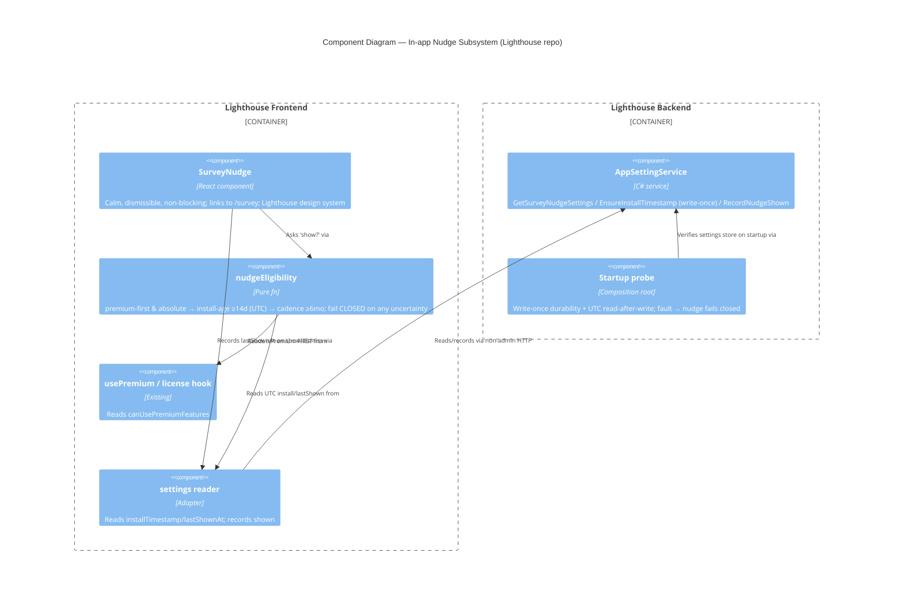

<!-- markdownlint-disable MD024 -->
# Feature: lighthouse-user-survey

ADO Epic 5124 "Lighthouse User Survey" (tag: Community).
ADO Epic: https://dev.azure.com/letpeoplework/Lighthouse/_workitems/edit/5124

Gather structured input from the Lighthouse **Community** (free-tier) user base via a
standalone, shareable survey page on the website, nudged occasionally (and respectfully) from
inside Lighthouse — without ever bothering Premium customers, without storing personal data
beyond a voluntarily-given email, and with a manual (abuse-resistant) path to a premium trial.

**Multi-surface / cross-repo.** This feature spans TWO repositories:

- **Website repo** (`/storage/repos/website`, Vite + React 18 + TS + Tailwind + shadcn/ui +
  react-router-dom v7 + @tanstack/react-query + react-hook-form + zod + @supabase/supabase-js):
  the standalone `/survey` page, the Supabase writes, and the survey view added to 5123's
  internal results dashboard land HERE.
- **Lighthouse repo** (`/storage/repos/Lighthouse`, C# .NET 8 backend + React 18 frontend):
  the in-app NUDGE lands HERE — a small frontend nudge component plus a small backend part
  (per-instance install timestamp + last-shown/dismissal setting + the premium gate).

The nWave DISCUSS docs (this file and the slice briefs) live in the **Lighthouse** repo, which
is the nWave workspace, even though most production code lands in the website repo.

## Wave: DISCUSS / [REF] Persona ID

**New persona**: `community-respondent` (`docs/product/personas/community-respondent.yaml`,
`created_in_feature: lighthouse-user-survey`) — an EXISTING Lighthouse Community (non-premium)
user who has used the tool long enough to have opinions and is willing to feed them back,
anonymously and on their own terms, optionally raising a hand for a premium trial. Same human
as a `flow-coach` / `delivery-forecaster` inside the tool, but here in an OUTBOUND
"tell-us-what-you-think / I-might-try-premium" role rather than doing day-to-day flow work.

## Wave: DISCUSS / [REF] JTBD one-liner

When I've used Lighthouse Community for a while and have opinions, I want a low-friction,
anonymous way to feed them back (and optionally raise my hand for a trial), so I can shape the
tool without exposing personal data or being nagged.

Job-id: `job-give-product-feedback-and-raise-hand` (NEW — proposed addition to
`docs/product/jobs.yaml`; the block is below and is NOT applied to jobs.yaml directly).

## Wave: DISCUSS / [REF] Locked decisions

| ID | Decision | Verdict |
|---|---|---|
| D1 | The survey is **website-built** — a React page in the website repo, backed by the EXISTING Supabase. NOT an external form tool. Stable public route (`/survey`) that does NOT change when questions change. Questions are **data/config**, editable without changing the link. | Locked. |
| D2 | The in-app Lighthouse **pop-up IS in scope** this round (Lighthouse FE + a small BE part). It must: exclude premium users (gate on `canUsePremiumFeatures`); fire **~2 weeks after install, never before** (needs a per-instance install timestamp persisted server-side); recur at **~6-month cadence** (needs per-instance last-shown/dismissal persistence); link OUT to the stable `/survey` route. The pop-up is a **NUDGE with a link** — it does NOT embed the survey. | Locked. |
| D3 | Storage = the **existing Supabase** in the website repo. **No PII** stored except the opt-in email a user volunteers for a trial. Responses are otherwise **anonymous**. | Locked. |
| D4 | Trial-license issuance is **MANUAL**. The system records a "wants a trial license" signal + the volunteered email; a human issues the license out-of-band. **Do NOT design auto-issuance** (prevents abuse). | Locked. |
| D5 | UX research depth = **COMPREHENSIVE** (full emotional arc per step + key error paths) for BOTH the in-app nudge journey AND the website survey-completion journey. | Locked. |
| D6 | Shared platform: sibling **epic 5123** (Flow & Forecasting Readiness Assessment) **ships first** and ESTABLISHES the shared Supabase platform (response/lead-capture tables generalized with a **source/kind discriminator**, email-capture handling, a minimal internal results/admin dashboard). THIS feature (5124) **REUSES and EXTENDS** that platform — survey responses are another `source/kind`, the trial opt-in extends lead-capture, the dashboard gains a survey view. 5123 is a **pre-requisite dependency**. Do NOT redesign the platform; extend it. | Locked. |
| D7 | Work against `main` in the website repo. A colleague restyles landing pages on branch `alt/redesign-2026` (style-only, no token/config changes, no collision with the new survey page). The website survey page must **ADOPT the new visual language** (scroll-reveal idiom, restyled Navigation — possibly a footer/nav entry; consistent section styling). Record as a **DESIGN-wave styling constraint, not a blocker**. The IN-APP pop-up follows **Lighthouse's own** frontend design system, not the website's. | Locked. |

## Wave: DISCUSS / [REF] JTBD analysis

**Job story**: When I've used Lighthouse Community for a while and have formed opinions about
what works and what's missing, I want to feed that back quickly and anonymously (and, if I want
it, raise my hand for a premium trial), so I can influence the tool without exposing personal
data or being repeatedly interrupted.

**Dimensions**

- **Functional**: open a survey page, answer questions, submit; optionally request a trial by
  volunteering an email; be reachable either by a respectful in-app nudge or by a shared link.
- **Emotional**: feel **heard, not surveilled** — anonymous by default, not nagged, and confident
  that as a non-paying user my honest opinion is wanted without strings. Premium users are left
  entirely alone, which itself signals respect for who is being asked.
- **Social**: contribute to a community tool I rely on; be able to share the survey link with
  peers on Slack / LinkedIn / email so the feedback is a community act, not a private one.

**Four Forces**

- **Push**: I have real opinions after weeks of use but no obvious, low-effort channel to share
  them; existing "give feedback" prompts ask for my identity first or appear before I have
  anything to say.
- **Pull**: a two-minute, no-login, anonymous page — and a self-serve way to ask for a trial
  without begging or being auto-enrolled.
- **Anxiety**: *"Is this spying on me?"* (is the in-app survey phoning home my usage?) /
  *"Will it nag me?"* (will dismissing it just bring it back?) / *"Is my email safe?"* (if I ask
  for a trial, where does my email go and will I be spammed?).
- **Habit**: users **ignore in-app nags** by reflex — the default behavior is to dismiss and
  move on; the nudge must earn the click by being calm, well-timed (~2 weeks in), and rare
  (~6-monthly), or it will be tuned out like every other nag.

**How the design answers the forces**: anonymous-by-default storage and a "no login, no name"
page answer the spying/email anxieties; the ~2-week delay answers "too early to have an
opinion"; the ~6-month cadence + persisted dismissal answer the nag anxiety and the
ignore-nags habit; the manual-trial signal (no auto-issue) answers "is my email going to be
abused" by keeping a human in the loop and the ask explicit.

## Wave: DISCUSS / [REF] Proposed jobs.yaml addition

> Not applied to `docs/product/jobs.yaml` directly (per task constraint). Append this block at
> the DESIGN/maintenance handoff. `opportunity_score` is an honest estimate: feeding back
> opinions is moderately important to a community user and currently poorly served, but it is
> NOT a daily blocker like the RBAC bootstrap job — hence importance 3, low current
> satisfaction 1, gap 2.

```yaml
  - id: job-give-product-feedback-and-raise-hand
    title: Give product feedback and optionally raise a hand for a trial
    persona: community-respondent
    job_story: >
      When I have used Lighthouse Community for a while and have opinions about what works and
      what is missing,
      I want a low-friction, anonymous way to feed them back — and to optionally raise my hand
      for a premium trial by volunteering my email,
      so I can shape the tool without exposing personal data or being nagged, and ask for a
      trial on my own terms.
    dimensions:
      functional: Answer a short survey on a standalone page; submit anonymously; optionally request a trial by giving an email; be reachable by a respectful in-app nudge or a shared link
      emotional: Feel heard, not surveilled — anonymous by default, not nagged, and confident a non-paying user's opinion is genuinely wanted
      social: Contribute to a community tool I rely on and share the survey link with peers (Slack / LinkedIn / email)
    forces:
      push: I have opinions after weeks of use but no easy, anonymous channel; existing prompts ask for identity first or appear too early
      pull: A two-minute, no-login, anonymous page plus a self-serve, no-strings way to ask for a trial
      anxiety: >
        Is this spying on my usage?
        Will dismissing the in-app nudge just bring it back?
        If I give my email for a trial, where does it go and will I be spammed?
      habit: Users reflexively ignore and dismiss in-app nags; the nudge must be calm, well-timed (~2 weeks in) and rare (~6-monthly) to earn a click
    opportunity_score:
      importance: 3
      current_satisfaction: 1
      gap: 2
      rationale: Moderately important and currently poorly served (no anonymous feedback channel), but not a daily blocker; outbound/occasional job, so honest gap is 2 not 4
```

## Wave: DISCUSS / [REF] System constraints (cross-cutting)

- **PII discipline (hard)**: the ONLY personal datum stored anywhere is the email a user
  volunteers for a trial, and only when they explicitly opt in. A non-opt-in response is
  anonymous by construction. Applies to every story touching Supabase.
- **Premium exclusion (hard)**: a Premium / `canUsePremiumFeatures` instance must NEVER see the
  in-app nudge. The gate fails CLOSED on any uncertainty about license tier. Guardrail KPI
  `bothered-premium count` MUST be 0.
- **Stable link (hard)**: the `/survey` route must not change when questions change. Questions
  are data/config; the route is a constant.
- **No auto-issuance (hard)**: a trial opt-in records a SIGNAL + email only; it must never
  create a license automatically (D4).
- **Platform reuse (hard)**: survey storage and the dashboard EXTEND 5123's shared platform via
  the source/kind discriminator; this feature does NOT redesign the platform (D6).

## Wave: DISCUSS / [REF] User stories with elevator pitches

### US-01 — Standalone, shareable survey page at a stable `/survey` route (website)

**Story**: As a `community-respondent`, I want a standalone survey page at a stable public
`/survey` route that I can open directly or via a link shared on Slack / email / LinkedIn, so I
can give feedback without logging in and the link keeps working even after the questions change.

**Job-id**: `job-give-product-feedback-and-raise-hand`

#### Elevator Pitch

- **Before**: there is no anonymous, shareable place for a Community user to give Lighthouse
  feedback; any existing channel wants identity first or doesn't exist.
- **After**: anyone opens `https://<website>/survey` directly (or from a Slack/LinkedIn link)
  and sees the current questions rendered on a clean page in the website's visual language — no
  login, no account, no name asked.
- **Decision enabled**: a community member decides to share their opinion (and to forward the
  link to peers) because the page is open, anonymous, and costs them nothing.

**AC**:

- Given the website is deployed, when I navigate to `/survey`, then the survey page renders the
  current question set with no login or account required.
- Given the questions are later edited (data/config change), when I navigate to the same
  `/survey` URL, then the link still resolves and shows the updated questions — the route did
  not change.
- Given I open `/survey` from a shared link (Slack / email / LinkedIn), then I reach exactly the
  same page as someone arriving from the in-app nudge.
- Given the question config cannot be loaded, when I open `/survey`, then I see a graceful
  "survey temporarily unavailable" message rather than a blank page.

### US-02 — Submit a survey response, stored anonymously in Supabase (website)

**Story**: As a `community-respondent`, I want to answer the questions and submit, and have my
answers stored anonymously, so my feedback is captured without revealing who I am.

**Job-id**: `job-give-product-feedback-and-raise-hand`

#### Elevator Pitch

- **Before**: even where feedback channels exist, submitting feels like it ties my answers to me.
- **After**: I answer the questions on `/survey`, click Submit, and see a thank-you confirming my
  response landed — with nothing personal stored about me.
- **Decision enabled**: I answer honestly, because I can see there's no sign-up wall and no
  identity attached to my response.

**AC**:

- Given I have answered the questions on `/survey`, when I click Submit and the write succeeds,
  then a response is stored in the shared Supabase platform tagged with the survey source/kind
  discriminator (D6), and I see a thank-you confirmation.
- Given I did not opt in to a trial, when my response is stored, then NO email or other personal
  datum is stored — the response is anonymous.
- Given the Supabase write fails (network / RLS / function down), when I submit, then I see a
  clear, retry-able error and NOT a thank-you, and my answers are preserved for retry.
- Given I double-submit (double-click or back-then-resubmit), then my answers are not counted
  twice (idempotent / de-duplicated).

### US-03 — Questions are editable without changing the link (website)

**Story**: As the Lighthouse maintainer, I want to change the survey questions later as
data/config without changing the `/survey` route, so every previously-shared link keeps working.

**Job-id**: `job-give-product-feedback-and-raise-hand`

#### Elevator Pitch

- **Before**: changing a typical embedded form means a new form and a new URL, breaking every
  link already shared.
- **After**: I edit the question config; `/survey` immediately serves the new questions at the
  same URL, and the dashboard keeps reading responses.
- **Decision enabled**: I decide to evolve the question set over time without fear of orphaning
  shared links or stranding past responses.

**AC**:

- Given the questions live as data/config, when I edit them, then `/survey` serves the updated
  questions with no code route change and no URL change.
- Given previously-shared links exist, when the questions change, then those links still resolve
  to `/survey` and show the current questions.
- Given the question set changes, when responses are read in the dashboard, then both old and new
  responses remain readable (no schema break for the survey kind).

> **Capability note**: "questions editable without a link change" is a first-class requirement
> (epic ask) and is tracked as a boolean capability KPI, not only as an AC.

### US-04 — Opt in to a premium trial by volunteering an email (website)

**Story**: As a `community-respondent`, I want to optionally tick "I'd like a free premium
trial" and give my email, so a human can follow up — without being auto-enrolled and without
sharing my email unless I choose to.

**Job-id**: `job-give-product-feedback-and-raise-hand`

#### Elevator Pitch

- **Before**: there's no clear, low-pressure way to ask for a trial; I'd have to hunt for a
  contact or fear being auto-signed-up.
- **After**: on `/survey` I tick an optional "I'd like a trial" box, enter my email, submit, and
  see a thank-you noting a human will follow up — no license is granted on the spot.
- **Decision enabled**: I decide to raise my hand for a trial on my own terms, knowing my email
  is used only for that follow-up.

**AC**:

- Given I tick the optional trial opt-in and enter a valid email, when I submit, then a
  trial-request signal (`wantsTrial`) plus my email are recorded in the shared lead-capture
  (D6), and the thank-you notes that a human will follow up.
- Given I do NOT tick the opt-in, when I submit, then no email is collected or stored and my
  response stays anonymous.
- Given I opt in, when the signal is recorded, then NO premium license is created automatically
  (D4) — issuance is manual and out-of-band.
- Given I enter an invalid email with the opt-in ticked, when I submit, then I get friendly
  inline validation and do not lose the rest of my answers.

### US-05 — Survey & trial-requests view in the internal dashboard (website, extends 5123)

**Story**: As the Lighthouse maintainer, I want a survey view in 5123's internal results
dashboard that lists survey responses and flags trial requests with their emails, so I can read
the feedback and action trial requests by hand.

**Job-id**: `infrastructure-only`
**infrastructure_rationale**: This story serves the internal maintainer reading results, not the
`community-respondent` whose job this feature exists for; it has no Elevator Pitch because it
enables no end-user (community) decision. It extends 5123's existing internal dashboard with a
read-only survey view and is required to close the loop on "know that someone filled in the
survey" and "see who wants a trial". It is the single infrastructure-flagged story; every slice
still contains at least one user-visible story (see WS strategy / slice composition).

**AC**:

- Given survey responses exist in Supabase, when the maintainer opens the dashboard's survey
  view, then responses are listed (anonymous unless a trial email was volunteered).
- Given trial-request signals exist, when the maintainer opens the trial-requests view, then each
  request is listed with its volunteered email so it can be actioned by hand.
- Given the dashboard already exists (5123), when the survey view is added, then it reuses 5123's
  auth and layout and does NOT redesign the platform (D6).

### US-06 — In-app nudge appears only for eligible non-premium users, never before ~2 weeks (Lighthouse FE + BE)

**Story**: As a `community-respondent` running Lighthouse Community, I want a calm in-app nudge
inviting me to the survey only after I've used the tool for ~2 weeks — and never if I'm a
premium user — so I'm asked at a sensible time and paying customers are never bothered.

**Job-id**: `job-give-product-feedback-and-raise-hand`

#### Elevator Pitch

- **Before**: there's no in-app prompt at all; community users who'd happily give feedback never
  get asked inside the tool, and any naive prompt would risk firing on day one or hitting premium
  customers.
- **After**: ~2 weeks after install, a non-premium user sees a small, calm, dismissible nudge in
  Lighthouse ("Got two minutes? Tell us what's working.") with a button to open the survey;
  premium users and brand-new installs see nothing.
- **Decision enabled**: a community user who's formed opinions decides to click through and give
  feedback, at a moment when they actually have something to say.

**AC**:

- Given a non-premium instance whose install age is at least ~14 days, when the frontend checks
  eligibility, then the nudge is shown and `lastShownAt` is recorded.
- Given an instance younger than ~14 days, when eligibility is checked, then the nudge does NOT
  appear (never on day 0 / right after install).
- Given a premium instance (`canUsePremiumFeatures` true), when eligibility is checked at any
  install age, then the nudge NEVER appears.
- Given the backend is unreachable or the license tier is uncertain, when eligibility is checked,
  then the gate fails CLOSED — no nudge — so a premium customer is never bothered by accident.
- Given install-age comparison, when the system clock has timezone or backward-jump skew, then a
  not-yet-eligible instance is never made eligible early (UTC-stable comparison).

### US-07 — Nudge links out to `/survey`, is dismissible, and recurs only ~6-monthly (Lighthouse FE + BE)

**Story**: As a `community-respondent`, I want the nudge to be a non-blocking link to the survey
that I can dismiss, and to not reappear for ~6 months after I've seen or dismissed it, so it
feels like an invitation rather than a nag.

**Job-id**: `job-give-product-feedback-and-raise-hand`

#### Elevator Pitch

- **Before**: in-app prompts that reappear every session are why users reflexively ignore nags.
- **After**: the nudge shows once, with a clear "open the survey" button (which opens `/survey` in
  the browser) and a clear dismiss; whether I click through or dismiss, it stays gone for ~6
  months.
- **Decision enabled**: I decide to engage or decline once, trusting Lighthouse to respect that
  choice and leave me alone for a good while.

**AC**:

- Given the nudge is shown, when I click its primary action, then the standalone `/survey` page
  opens at the stable route, and the nudge does not reappear until `lastShownAt` + ~6 months.
- Given the nudge is shown, when I dismiss it, then it closes without side effects and does not
  reappear until `lastShownAt` + ~6 months (dismissal is persisted server-side, not just
  client-side).
- Given the nudge, when it renders, then it is non-blocking and dismissible and follows
  Lighthouse's own frontend design system (D7) — it does NOT embed the survey, only links to it.
- Given either click-through or dismissal, then `lastShownAt` is set/confirmed so the ~6-month
  cadence holds regardless of which path was taken.

## Wave: DISCUSS / [REF] Shared Platform (reuses 5123's)

5123 ships first and owns the shared Supabase platform. This feature extends it WITHOUT redesign
(D6):

- **Responses** map onto 5123's anonymous `responses` table via the **source/kind discriminator**
  — survey responses are a new `source = user-survey`. No new bespoke table; the survey answers
  travel in the existing `answers` jsonb shape (score/raw_sum/band stay null for the non-scored
  survey).
- **Trial opt-in** extends 5123's **`leads`** table: a lead row carrying `wants_trial = true` + the
  volunteered `email`, tagged `source = user-survey-trial`, written via the same Edge Function path
  5123 establishes for PII (5123 Supabase security model, rule 3). **Structural anonymity**: because
  5123 keeps `leads` (email) in a SEPARATE table with NO join to `responses` (answers), a survey
  respondent's answers can never be linked to their trial email — which is exactly the "anonymous
  feedback" guarantee D3 requires. This is why the two-table split matters for 5124, not just 5123.
- **Dashboard** gains a **survey view** (US-05) on top of 5123's existing minimal internal
  results/admin dashboard — a read surface for responses + a trial-requests list. Reuses 5123's
  auth and layout.

**Sequencing risk**: if 5123 has not shipped the discriminator + lead-capture + dashboard, this
feature's US-02/US-04/US-05 are blocked. US-01 (the page shell + routing) and the entire in-app
nudge (US-06/US-07, which only needs the stable `/survey` URL to link to) can proceed without
the storage layer, which is why the walking skeleton is structured to surface that dependency
early (see WS strategy).

## Wave: DISCUSS / [REF] WS strategy

**Brownfield, multi-surface.** The thinnest end-to-end value is the **standalone shareable
`/survey` page → Supabase store → dashboard read**: shippable and shareable on Slack / LinkedIn
immediately, with NO Lighthouse app changes. The in-app nudge (premium-gate + install-age timing
+ ~6-month cadence) is a SEPARATE, clearly-scoped later set of slices that depends only on the
page existing at a stable URL.

**Sequence by learning leverage + dependency + dogfood cadence**:

1. **Website value first** — the page + anonymous store + dashboard read. Validates the riskiest
   product assumption (will community users actually answer an anonymous survey?) and the 5123
   platform-extension assumption, and is immediately dogfooded by sharing the link in the
   Lighthouse community Slack.
2. **Trial opt-in** — extends the page + lead-capture; validates "do users raise hands for a
   trial?" and exercises the only-PII-on-opt-in discipline.
3. **In-app nudge** — adds the Lighthouse-side reach; depends on the page URL existing. Delivers
   the visible nudge value (NOT infra-only): a calm, well-timed, dismissible invitation.

The in-app nudge is split so that the **first nudge slice is itself user-visible** (a non-premium
user actually sees and can click a nudge), with the timing/cadence correctness layered as the
next nudge slice — neither nudge slice is infrastructure-only.

## Wave: DISCUSS / [REF] Driving ports

| Surface | Port | Repo | Status | Notes |
|---|---|---|---|---|
| Website route | `/survey` (stable public route, react-router-dom) | website | NEW | Renders question config; never changes when questions change (D1, US-01/US-03). |
| Supabase write | response insert (survey source/kind) via RLS-guarded insert OR an edge function | website | EXTEND (5123) | Anonymous response; survey `kind` on 5123's table (US-02, D6). |
| Supabase write | lead-capture insert (`wantsTrial` + `email`) on trial opt-in | website | EXTEND (5123) | Only on explicit opt-in; no auto-issue (US-04, D4). |
| Dashboard read | survey + trial-requests view on 5123's internal dashboard | website | EXTEND (5123) | Read-only; reuses 5123 auth/layout (US-05). |
| Lighthouse FE | nudge component (non-blocking, dismissible, links to `/survey`) | Lighthouse | NEW | Lighthouse design system (D7); nudge-with-link, not embedded survey (US-06/US-07). |
| Lighthouse BE | per-instance setting: install/first-run timestamp (`installTimestamp`) | Lighthouse | NEW (likely a small setting) | Written once on first run, server-side (US-06). |
| Lighthouse BE | per-instance setting: `lastShownAt` / dismissal state | Lighthouse | NEW (likely a small setting) | Persisted server-side; drives ~6-month cadence (US-07). |
| Lighthouse BE | "should I show the survey nudge?" eligibility check | Lighthouse | NEW or FE-derived | Premium-gate (reads existing `canUsePremiumFeatures`) + install-age + cadence; fails closed. See CLI/MCP checklist for the new-endpoint version-gate caveat. |

## Wave: DISCUSS / [REF] Pre-requisites

- **HARD — depends on 5123**: epic 5123 must have shipped the shared Supabase platform
  (response/lead-capture tables with the source/kind discriminator, email-capture handling, and
  the minimal internal results/admin dashboard) BEFORE this feature's storage and dashboard
  stories (US-02, US-04, US-05) can be delivered (D6). **Sequencing risk**: if 5123 slips, this
  feature's storage-dependent slices slip with it; the website page shell (US-01) and the in-app
  nudge (US-06/US-07) can proceed against the stable `/survey` URL in the meantime, so the
  schedule is partially decoupled. This dependency is the single biggest scheduling risk and is
  flagged for the orchestrator.
- **HARD — existing premium signal**: the in-app nudge reuses the existing
  `canUsePremiumFeatures` / license-tier signal (no new RBAC). Confirmed as an existing Lighthouse
  concept per CLAUDE.md architecture.
- **SOFT — website redesign branch (D7)**: the colleague's `alt/redesign-2026` restyle is
  style-only (no token/config changes, no collision with the survey page). The survey page must
  ADOPT the new visual language; recorded as a DESIGN-wave styling constraint, NOT a blocker.
- **CONFIRMED — survey questions (2026-05-30)**: the real question set (below) is now provided.
  "Questions editable without a link change" (US-03) remains a first-class requirement so the set
  can still evolve without rework.

## Wave: DISCUSS / [REF] Survey questions (confirmed 2026-05-30)

Single-select questions; all anonymous; no PII among the answers. The email is captured ONLY on
the final exchange screen and is stored in a separate table from the answers (see Supabase
Security below) so anonymity is structural, not just a promise.

| # | Question | Purpose | Options |
|---|----------|---------|---------|
| Q1 | How many teams are using Lighthouse in your organisation? | Expansion signal | Just mine (1) · 2–5 · 6–10 · More than 10 |
| Q2 | What's your role? | Segmentation for later outreach | Scrum Master / Agile Coach · Engineering Manager / Delivery Lead · Product Manager / Product Owner · Engineering / Developer · Leadership / Director+ · Other |
| Q3 | How did you hear about Lighthouse? | Which marketing channels work | LinkedIn · Conference / Meetup · Colleague / Word of mouth · Google / Search · GitHub · Other |
| Q4 | Would you be interested in a service like this? *(re: the free Flow Assessment)* | Demand gate for Epic 5123 | (interest scale / yes-no — to confirm in DESIGN) |
| Exchange | "Want to try Premium free for 30 days? Just enter your email and we'll send you a trial license." | Trial opt-in (manual issuance, D4) | Email only |

**Interplay note**: Q4 deliberately doubles as a **demand-validation gate for Epic 5123** (the
free Flow & Forecasting Readiness Assessment). The two epics reinforce each other — the survey
measures appetite for the assessment among existing users, while the assessment generates new
leads. Treat Q4's response as a 5123 demand signal in the shared dashboard.

## Wave: DISCUSS / [REF] Comprehensive journeys (D5)

Two arcs authored at comprehensive depth in
`docs/product/journeys/lighthouse-user-survey.yaml`:

- **Arc (a) in-app-survey-nudge**: install → ~2 weeks pass → non-premium user sees a calm,
  dismissible nudge → clicks through to `/survey` OR dismisses without resentment → not asked
  again for ~6 months. Premium users never see it.
- **Arc (b) website-survey-completion**: land on `/survey` → answer → optional email-for-trial →
  submit → thank-you, with anonymous storage (and a trial signal on opt-in).

Both arcs carry mental model, happy path with outputs, an upward emotional arc, per-step shared
artifacts, and per-step error paths. The shared-artifacts registry
(`${installTimestamp}`, `${lastShownAt}`, `${isPremium}`, `${surveyUrl}`, `${responses}`,
`${wantsTrial}`, `${email}`) and the cross-arc consistency checks live in that YAML's
`shared_artifacts` and `integration_validation` blocks. Error paths covered: Supabase write
failure, double-submit, premium-shown-by-mistake, clock/timezone install-age edge, offline,
question-config-unavailable, partial write.

## Wave: DISCUSS / [REF] Story map + elephant-carpaccio slices

**Backbone (community-respondent)**: Reach → Land on survey → Answer → (Optionally) request trial
→ Submit/Store → Maintainer reads.

| Reach | Land on survey | Answer | Request trial | Store | Maintainer reads |
|---|---|---|---|---|---|
| Shared link (Slack/LinkedIn) | `/survey` renders questions | Answer placeholders | Opt-in + email | Anonymous Supabase write | Survey view |
| In-app nudge (~2wk, non-premium) | Stable route, edit-proof | Forgiving validation | Manual-only signal | Lead-capture on opt-in | Trial-requests view |
| Website nav/footer entry (D7) | New visual language | | | De-dupe / retry | Reuses 5123 dashboard |

**Walking skeleton** (thinnest end-to-end, NO Lighthouse app change): shared link → `/survey`
renders placeholder questions → submit → anonymous Supabase write → maintainer sees it in the
dashboard's survey view. (Slice 01, with US-05's minimal read folded as the loop-closer.)

**Slices** (each ≤ ~1 day / ≤ 6h, end-to-end value, named learning hypothesis, production-not-
synthetic data where possible, a dogfood moment, explicit IN/OUT). Full briefs in `slices/`.

| # | Slice | Stories | User-visible value | Suggested order |
|---|---|---|---|---|
| 01 | Shareable `/survey` page → anonymous store → dashboard read | US-01, US-02, US-05 (read) | Yes — a real shareable survey that stores anonymous responses, readable by the maintainer | 1 |
| 02 | Editable questions without a link change | US-03 | Yes — links survive question edits; maintainer evolves questions | 2 |
| 03 | Trial opt-in (email → manual signal) | US-04, US-05 (trial-requests view) | Yes — users raise a hand for a trial; maintainer sees requests | 3 |
| 04 | In-app nudge appears for eligible non-premium users | US-06 | Yes — a non-premium user actually sees and can click a nudge | 4 |
| 05 | Nudge cadence + dismissal + timezone-safe timing | US-07 | Yes — the nudge is respectful (no nag, ~6-monthly), links to `/survey` | 5 |

**Taste tests (re-slice triggers)**: every slice ships a behavior a user (or the maintainer) can
see; no slice is infra-only (US-05 is infrastructure-flagged but rides slices that also carry
user-visible website stories, never alone). Slice 04 is deliberately the "nudge becomes visible"
slice so the nudge value is delivered before the timing/cadence-correctness slice 05 — neither
nudge slice is infrastructure-only.

**Order rationale**: website value + platform-extension first (riskiest product assumption: will
community users answer? + the 5123 dependency surfaces immediately), then the link-stability
capability, then trial opt-in (validates the manual-trial demand and the PII discipline), then
the two nudge slices last (they depend only on the stable URL and add reach). Dogfood cadence:
slice 01 is dogfooded by sharing the link in the Lighthouse community Slack on day one.

## Wave: DISCUSS / [REF] Outcome KPIs

### Objective

Establish a respectful, anonymous feedback loop with the Lighthouse Community that yields usable
input and a trickle of self-selected trial requests — without ever bothering paying customers.

| # | Who | Does What | By How Much | Baseline | Measured By | Type |
|---|---|---|---|---|---|---|
| 1 | Community users reached | Submit a survey response | ≥ 50 responses in the first 8 weeks post-launch | 0 (no channel today) | Count of survey-kind rows in Supabase (dashboard) | Leading |
| 2 | Survey respondents | Arrive via the in-app nudge vs the standalone link | ≥ 30% of responses attributable to the in-app nudge within 8 weeks | n/a | Response source attribution (nudge-tagged link vs shared link) | Leading |
| 3 | Users shown the nudge | Dismiss WITHOUT clicking through (annoyance proxy — keep LOW) | ≤ 60% dismiss-without-clickthrough (i.e. ≥ 40% click-through of those shown) | n/a | `nudge.shown` vs `nudge.clickthrough` events (Lighthouse FE) | Leading (guardrail-style) |
| 4 | Survey respondents | Opt in to a premium trial (volunteer email) | ≥ 10 trial requests in the first 8 weeks | 0 | Count of `wantsTrial` lead rows (dashboard trial-requests view) | Leading |
| 5 | Premium users | Are shown the in-app nudge | **0 — exactly zero, ever** (hard guardrail) | 0 | `nudge.shown` events cross-checked against `canUsePremiumFeatures`; any nonzero is a release blocker | Guardrail |
| 6 | Maintainer | Edits the question set without changing the `/survey` link | Boolean capability = TRUE (link unchanged after a question edit) | n/a | Manual verification: edit questions, confirm `/survey` URL unchanged and old links resolve | Capability (boolean) |

### Metric hierarchy

- **North Star**: survey response count (KPI 1) — does the channel actually produce feedback?
- **Leading indicators**: nudge-attributed share (KPI 2), trial-request count (KPI 4).
- **Guardrail metrics**: premium-bothered count MUST be 0 (KPI 5); dismiss-without-clickthrough
  kept low (KPI 3); question-edit-without-link-change capability holds (KPI 6).

### Measurement note

KPIs 1/2/4/6 are measurable on the website/Supabase side (5123's dashboard + attribution).
KPIs 3/5 require Lighthouse-FE nudge events (`nudge.shown`, `nudge.clickthrough`) — an
instrumentation requirement carried to the DEVOPS handoff. **Telemetry caveat**: per
`project_self_hosted_telemetry_gap`, self-hosted Lighthouse instances do not phone home, so
KPIs 3/5 are reliably measurable only on instances that opt in to telemetry (or the project's own
dogfood instance). The premium-bothered guardrail (KPI 5) is therefore also enforced by a
deterministic test/ArchUnit-style assertion (premium → never render) rather than relying on
field telemetry alone. KPIs will be appended to `docs/product/kpi-contracts.yaml` at the DEVOPS
handoff.

## Wave: DISCUSS / [REF] Definition of Done

1. All seven stories pass their ACs via tests appropriate to their surface (website: Vitest + RTL
   for the page/form, Supabase write tests; Lighthouse: NUnit + EF InMemory + WebApplicationFactory
   for the BE setting/eligibility, Vitest + RTL for the nudge component).
2. The premium-exclusion guardrail is enforced by a deterministic test: a premium instance NEVER
   renders the nudge, at any install age (KPI 5 made executable).
3. The install-age timing is tested at boundaries (just under ~14 days → no nudge; at/over →
   nudge) with a UTC-stable / monotonic-safe comparison (no early fire on clock skew).
4. The ~6-month cadence + dismissal persistence is tested: after show/dismiss, no re-show until
   `lastShownAt` + ~6 months, persisted server-side.
5. Anonymous-storage discipline is tested: a non-opt-in response stores NO email; an opt-in stores
   exactly the email + `wantsTrial` and creates NO license (D4).
6. "Editable questions without a link change" is verified (US-03 capability KPI 6).
7. The survey response maps onto 5123's source/kind discriminator and the dashboard survey view
   reads it without redesigning the platform (D6).
8. CI parity per CLAUDE.md on the Lighthouse side: `dotnet build` zero warnings, `dotnet test`
   green, `pnpm build` clean, SonarCloud gate passes; website side meets its own gates.
9. Docs/website updated: the survey page is reachable from the website nav/footer (D7) and the
   release notes surface the new community feedback channel.

## Wave: DISCUSS / [REF] Out of scope

- **Auto-issued trial licenses** — issuance is MANUAL (D4); only a signal + email are recorded.
- **Opt-in anonymized metrics collection** — explicitly FUTURE, not now.
- **Embedding the survey IN the pop-up** — the nudge is a link-out only (D2); it never hosts the
  survey questions.
- **Surveying premium users** — hard exclusion; premium users are never nudged (guardrail KPI 5).
- **Redesigning 5123's shared platform** — this feature EXTENDS it via the source/kind
  discriminator and lead-capture; it does not rebuild it (D6).
- **Building a new Supabase / new tables for the survey** — reuse 5123's generalized tables.
- **A new RBAC role or authorization path for the nudge** — it is a license-tier (premium) check,
  not an RBAC-scoped permission (see cross-cutting checklist).
- **Restyling the website landing pages** — that is the colleague's `alt/redesign-2026` work; this
  feature only ADOPTS the resulting visual language on the survey page (D7).

## Wave: DISCUSS / [REF] Definition of Ready — validation

| # | DoR item | Verdict | Evidence |
|---|---|---|---|
| 1 | Problem statement clear, domain language | Pass | JTBD one-liner + JTBD analysis in community-respondent's outbound-feedback language; pains (spying/nag/email anxiety) stated. |
| 2 | User/persona named & scoped | Pass | `community-respondent` (new persona file, `created_in_feature: lighthouse-user-survey`); explicitly NOT premium users and NOT brand-new installs. |
| 3 | 3+ domain examples with real data | Pass | Per-story ACs use concrete scenarios (open `/survey`, ~14-day boundary, opt-in valid/invalid email, double-submit, premium-never-shown, Supabase write failure) — see also journey YAML per-step expected outputs. |
| 4 | UAT scenarios in Given/When/Then (3-7 per story) | Pass | Each US-NN has 3-5 Given/When/Then ACs; the journey YAML carries per-step Gherkin-shaped expected outputs + failure modes. |
| 5 | AC derived from journeys/UAT | Pass | ACs trace to the two journey arcs' steps and failure modes (D5). |
| 6 | Right-sized | Pass | 7 stories across 5 slices, each ≤ ~1 day / ≤ 6h, each end-to-end and demonstrable. |
| 7 | Technical notes / constraints (RBAC, Clients, Website) | Pass | Cross-cutting checklist below answers all three explicitly; System Constraints section lists the hard cross-cutting rules. |
| 8 | Dependencies resolved or tracked | Pass | 5123 platform pre-requisite tracked as the top scheduling risk; premium signal existing; redesign branch a styling constraint; survey questions confirmed 2026-05-30. |
| 9 | Outcome KPIs measurable with targets | Pass | 6 KPIs with numeric/boolean targets, baselines, measurement methods, and the self-hosted telemetry caveat. |
| 9b | Every story has a `job_id`; every non-`@infrastructure` story has an Elevator Pitch | Pass | US-01..04, US-06, US-07 → `job-give-product-feedback-and-raise-hand` with Elevator Pitches; US-05 → `infrastructure-only` with `infrastructure_rationale` and no pitch. |

**DoR overall verdict: PASSED.**

## Wave: DISCUSS / [REF] Wave decisions summary

**Primary user need**: a respectful, anonymous, low-friction feedback channel for Community users,
with an optional self-serve (manual) path to a premium trial — reachable both by a shared link and
by a well-timed, rare, dismissible in-app nudge that never touches paying customers.

**Foundation investment**: minimal and reused. Storage + dashboard EXTEND 5123's shared Supabase
platform (source/kind discriminator + lead-capture + internal dashboard). The only NEW persistence
is two small per-instance Lighthouse settings (install timestamp + last-shown/dismissal).

**Walking skeleton**: slice 01 — shareable `/survey` → anonymous Supabase store → dashboard read,
NO Lighthouse app change; immediately shareable on Slack/LinkedIn.

**Feature type**: user-facing (website page + in-app nudge) with an internal read surface.

**Cross-repo split**: website repo = `/survey` page + Supabase writes + dashboard survey view;
Lighthouse repo = the in-app nudge (FE component + small BE settings + premium gate). nWave docs
live in the Lighthouse repo.

**Top risk**: 5123 sequencing (D6) — storage-dependent slices block on it; surfaced for the
orchestrator. Secondary risk: self-hosted telemetry gap limits field measurement of nudge KPIs
(mitigated by deterministic premium-guard test). Survey questions confirmed 2026-05-30; Q4 doubles
as a demand gate for 5123.

## Wave: DISCUSS / [REF] CLAUDE.md cross-cutting impact checklist

**RBAC** — The in-app nudge is gated by the **premium / license-tier** signal
(`canUsePremiumFeatures`), NOT by an RBAC role or scoped permission. It therefore does **NOT** flow
through `IRbacAdministrationService`: showing or hiding a feedback nudge is a license-tier
*capability* check (premium vs community), not an *authorization* decision about who may view or
administer a team/portfolio resource. Reusing the existing license/premium signal (the same one
`useRbac()`-adjacent UI gating already consumes for premium features) is correct and sufficient; no
new role, no new permission, no `IRbacAdministrationService` change. The **website** survey page is
public/anonymous by design (no auth); the **dashboard** survey view inherits 5123's existing
dashboard auth (a website/Supabase concern, outside Lighthouse's RBAC). Stated explicitly so DESIGN
does not over-engineer an RBAC path.

**Lighthouse-Clients (CLI + MCP)** — **Likely N/A.** The Lighthouse-side work is a frontend nudge
component plus small per-instance settings (install timestamp, last-shown/dismissal) and an
eligibility evaluation. If that eligibility evaluation is done purely in the frontend reading
existing signals (license tier + a settings read), **no new server API** is introduced and the CLI
and MCP clients are unaffected. **IF** DESIGN chooses to expose a NEW server endpoint (e.g.
`GET /api/.../survey-nudge/eligibility` or a settings read/write for the install timestamp), then
the clients-repo **version-gate rule applies**: an older Lighthouse server returns an opaque 404
for an endpoint it doesn't have, so any wrapping client method must pre-check the server version and
fail with a clear "upgrade Lighthouse" error. At development time the next release number is
unknown, so pin the feature to **strictly newer than the last released Lighthouse version**, record
that baseline in the clients' `FEATURE_REQUIRES_SERVER_NEWER_THAN` registry (bump it to the current
latest release when wrapping the endpoint), and never block dev/unparseable versions. Default
expectation: NO new endpoint, hence N/A — but this is a DESIGN decision to confirm.

**Website** — **In scope.** The standalone `/survey` page, the Supabase writes, and the survey view
on 5123's internal dashboard all land in the website repo. The survey page must ADOPT the new visual
language from the `alt/redesign-2026` restyle (scroll-reveal idiom, restyled Navigation, consistent
section styling) and SHOULD surface a nav/footer entry to `/survey` (D7) — recorded as a DESIGN-wave
styling constraint, not a blocker. The public website should also surface the new community feedback
channel (and, where appropriate, the trial path) per the marketing-surface rule.

## Wave: DESIGN / [REF] Summary

PROPOSE-mode DESIGN (application/component scope). EXTENDS the 5123 shared Supabase platform
(ADR-031..037) without redesign (D6). Multi-surface/cross-repo: WEBSITE repo = `/survey` page +
Supabase writes + dashboard survey view; LIGHTHOUSE repo = in-app nudge (FE + small BE settings).
New ADRs: **ADR-040..046**. Wave decisions: `design/wave-decisions.md`. Paradigm unchanged
(Lighthouse OOP; website functional-core/imperative-shell continued from 5123 — recorded, not
re-decided).

**Revision (2026-05-31, user requirement):** a per-submission **team notification email** to
`survey.answer@letpeople.work` was added. Because it must fire on EVERY submission and needs
server-side Mailgun secrets, the survey write is **consolidated** into one `service_role`
`submit-survey` Edge Function (response + optional trial lead + the team email) — superseding the
anon-INSERT response path, the migration `0003` RLS widening (DS-1), and the separate
`capture-survey-lead` (DS-2). See **ADR-046** and the Changed Assumptions section below. Seam DS-5
(FE-derived nudge eligibility) is now **user-CONFIRMED**.

## Wave: DESIGN / [REF] DDD decisions

- **Bounded contexts** — two, already established: (1) the website **Feedback Capture** context
  (anonymous responses + PII-sealed leads + internal dashboard), extended here; (2) the Lighthouse
  **In-app Engagement** context (the nudge + per-instance settings). They are **decoupled** — the
  only contract between them is the stable `/survey` URL (a published constant), an Open-Host
  Service / shared-kernel-of-one-string relationship. No data crosses; the nudge only links out.
- **Ubiquitous language** — `response` (anonymous answers), `lead` (PII trial signal), `source`/`kind`
  discriminator, `installTimestamp`, `lastShownAt`, `isPremium`, eligibility. Carried from the
  journey shared-artifacts registry.
- **Aggregates** — none new on the Lighthouse domain side (the two settings are scalar per-instance
  config on the existing `AppSetting`, not a domain aggregate). The website side has no domain
  aggregate (functional core; the "aggregate" is the row written through a driven port).
- **Anti-corruption** — the survey submission is a deliberately SEPARATE function (`submit-survey`)
  rather than bending the assessment lead-capture's anti-forgery invariant: a guard against one
  concept's rules corrupting the other (ADR-041 reasoning, carried into ADR-046). `submit-survey`
  owns the survey write end-to-end (response + optional trial lead + team notification); `capture-lead`
  is untouched.

## Wave: DESIGN / [REF] Component decomposition

**WEBSITE repo (functional-core / imperative-shell — ADR-035 idiom):**

- `features/survey/content/surveyContent.ts` — zod-validated question/option config (the one source
  of truth; editing it never changes the route). [CREATE NEW — ADR-043]
- `features/survey/core/` — pure survey answer shape + (optional) flow helper; no I/O, no `@supabase`,
  no `window`. [CREATE NEW]
- `/survey` route in `App.tsx` (above catch-all) hosting the flow. [CREATE NEW — ADR-043]
- `features/assessment/ports/index.ts` — widened `ResponseSource`/`LeadSource` unions + guarded
  non-scored `CapturedResponse` + a `SurveySubmission.submit` port. [EXTEND — ADR-040/046]
- `adapters/edgeFunctionSurveySubmission.ts` + `supabase/functions/submit-survey/` — one `service_role`
  fn: response insert + optional trial lead + team notification email. [CREATE NEW — ADR-046]
- `supabase/_shared/surveyNotificationEmail.ts` — team-notification renderer (recipient constant
  `survey.answer@letpeople.work`); reuses `_shared/mailgun.ts` transport. [CREATE NEW — ADR-046]
- *(No survey anon-INSERT adapter and no migration `0003` — survey writes go via `service_role`; the
  `responses_anon_insert` allowlist stays `'readiness-assessment'`-only. ADR-046 supersedes ADR-040
  anon-adapter + ADR-042 DS-1.)*
- `features/assessment/core/summarizeSurvey.ts` + survey tab on `AdminDashboard.tsx`. [CREATE NEW core + EXTEND component — ADR-042]
- `.github/workflows/deploy.yml` — `cp dist/index.html dist/survey/`. [EXTEND — ADR-043]

**LIGHTHOUSE repo (OOP ports-and-adapters):**

- `Models/AppSettings/AppSettingKeys.cs` — two new keys. [EXTEND — ADR-045]
- `Services/{Interfaces,Implementation}/AppSettingService` — `GetSurveyNudgeSettings`,
  `EnsureInstallTimestamp` (write-once), `RecordNudgeShown`. [EXTEND — ADR-045]
- A **non-admin** settings read/write surface (existing `AppSettingsController` is `[RbacGuard]`). [CREATE NEW — ADR-045]
- EF migration via `CreateMigration` PowerShell script (Sqlite + Postgres). [EXTEND]
- Startup composition-root probe (write-once durability + UTC read-after-write). [CREATE NEW — ADR-045]
- Frontend: pure eligibility fn (premium-first/fail-closed/UTC-stable) + nudge component
  (Lighthouse design system; nudge-with-a-link). [CREATE NEW — ADR-044]

## Wave: DESIGN / [REF] Driving ports (DESIGN-resolved)

| Surface | Port | Repo | Verdict | ADR |
|---|---|---|---|---|
| Website route | `/survey` (stable, hidden) | website | CREATE NEW | 043 |
| Supabase write | `submit-survey` Edge Fn (response + optional trial lead + team email) | website | CREATE NEW (service_role) | 046 |
| Dashboard read | survey tab on 5123 dashboard | website | EXTEND | 042 |
| Lighthouse FE | nudge component | Lighthouse | CREATE NEW | 044 |
| Lighthouse BE | per-instance settings read/write (non-admin) | Lighthouse | CREATE NEW surface on EXTENDed mechanism | 045 |
| Lighthouse FE | eligibility evaluation | Lighthouse | FE-derived (no endpoint) | 044 |

## Wave: DESIGN / [REF] Driven ports (DESIGN-resolved)

| Driven port | Adapter | Backed by | Verdict |
|---|---|---|---|
| `SurveySubmission.submit` (response + optional trial + team email) | `EdgeFunctionSurveySubmission` | `submit-survey` (service_role) | CREATE NEW — 046 |
| team-notification render | `surveyNotificationEmail` + `_shared/mailgun.ts` | Mailgun HTTP (EU) → `survey.answer@letpeople.work` | CREATE NEW renderer / EXTEND transport — 046 |
| `DashboardRepository.load(source)` | `SupabaseDashboardRepository` | `authenticated` SELECT | EXTEND |
| Nudge settings store | `AppSettingService` (EF) | `AppSetting` table (Sqlite/Postgres) | EXTEND |

## Wave: DESIGN / [REF] Technology choices

No new technology introduced. All choices reuse the existing, OSS, well-maintained stacks:
Supabase / Postgres (Apache-2.0 client SDK), Deno Edge Functions (MIT), React + Vite + zod +
react-hook-form (website, all MIT), .NET 8 + EF Core (MIT), NUnit/Moq/Vitest/RTL (MIT). Rationale:
the feature is a brownfield EXTEND; introducing any new dependency would violate simplest-solution +
the D6 reuse mandate. Architectural enforcement: the website hexagon import convention (core must not
import `@supabase`/`window`, ADR-035) + Lighthouse's ArchUnitNET arch-tests carry over; add a
structural Vitest test that survey responses never route through `bandOfScore` (ADR-040) and a
deterministic premium-guard test (ADR-044).

## Wave: DESIGN / [REF] Decisions table

| ID | Decision | Verdict | ADR |
|---|---|---|---|
| DS-1 | ~~RLS allowlist widened to `'user-survey'` (migration `0003`)~~ | **SUPERSEDED by DS-8/ADR-046** — survey writes via service_role, no anon policy needed | 042→046 |
| DS-2 | ~~Trial lead via forked `capture-survey-lead`~~ | **SUPERSEDED by DS-8/ADR-046** — folded into `submit-survey` (reasoning retained) | 041→046 |
| DS-3 | Ports widened (unions + guarded non-scored shape) + `SurveySubmission.submit` | Committed | 040, 046 |
| DS-4 | Dashboard survey tab + new `summarizeSurvey`; reuse 5123 auth/layout | Committed | 042, 033 |
| DS-5 | Nudge eligibility **FE-derived** (premium-first/fail-closed/UTC-stable) | **CONFIRMED (user, 2026-05-31)** | 044 |
| DS-6 | Two per-instance settings on existing AppSettings; non-admin read; startup probe | Committed | 045 |
| DS-7 | `/survey` ships HIDDEN; `deploy.yml` SPA fallback; no robots Disallow; D7 nav DEFERRED | Committed | 043 |
| DS-8 | Consolidated `submit-survey` Edge Fn (response + optional trial lead + per-submission team email to `survey.answer@letpeople.work`, degrade-open) | Committed (user requirement 2026-05-31) | 046 |

## Wave: DESIGN / [REF] Reuse Analysis (HARD GATE — D6)

Every overlapping component classified EXTEND vs CREATE NEW. Default = EXTEND; CREATE NEW carries
evidence that extending is impossible/wrong.

| Component | Verdict | Evidence |
|---|---|---|
| `responses` table | **EXTEND** | nullable `raw_sum/score/band` already present (ADR-034); survey writes nulls (via service_role, ADR-046) |
| ~~`responses_anon_insert` RLS~~ | **SUPERSEDED (ADR-046)** | survey writes via `service_role` `submit-survey`, so no anon allowlist entry / no migration `0003` — policy stays `'readiness-assessment'`-only (a tightening) |
| `leads` table | **EXTEND** | `score/band` nullable, `wants_trial` present (ADR-034); trial writes nulls |
| Shared ports `ResponseSource`/`CapturedResponse` | **EXTEND** | union widening + guard + new `SurveySubmission.submit` port (ADR-040/046) |
| ~~`SupabaseResponseRepository` (anon-INSERT)~~ | **BYPASSED for survey (ADR-046)** | survey response no longer uses the anon adapter; it is written inside `submit-survey` (see below) so one server call can also send the team email |
| `_shared/mailgun.ts` transport | **EXTEND** | reuse the EU Mailgun HTTP transport (built for #5138) for the team notification; no new dependency |
| `DashboardRepository` / `SupabaseDashboardRepository` | **EXTEND** | already parameterized by `source`; survey is another source value |
| Dashboard auth (Supabase Auth, ADR-033) | **EXTEND** | reuse `benjamin@`/`peter@` accounts + `authenticated` SELECT; no new auth |
| Dashboard layout/shell (`AdminDashboard.tsx`, `Card`/`Table`) | **EXTEND** | reuse primitives; add a survey tab/render branch |
| Per-instance settings mechanism | **EXTEND** | `AppSetting`/`AppSettingService`/`AppSettingKeys` model exactly "one scalar per instance" |
| `capture-lead` Edge Fn → `submit-survey` Edge Fn | **CREATE NEW** | EVIDENCE: a separate `service_role` fn (response + optional trial lead + team email); extending `capture-lead` would branch its anti-forgery invariant + visitor-results-email on a `source` switch — eroding the security boundary that justifies it (ADR-041 reasoning, retained). Owns the whole survey write so one server touchpoint can also notify the team (ADR-046) |
| `surveyNotificationEmail` renderer | **CREATE NEW** | EVIDENCE: 5123's `resultsEmail` is a visitor-facing, band-rendering results payoff; the team notification is an inbound ops alert (answers summary + trial status, recipient `survey.answer@letpeople.work`) — a different audience and content (ADR-046) |
| `summarizeDashboard` core | **CREATE NEW** (`summarizeSurvey`) | EVIDENCE: it counts into 4 scored bands; the survey has no bands/scores → reuse renders a misleading all-zero grid; the survey signal is per-question option tallies (ADR-042) |
| `/survey` page + survey content module | **CREATE NEW** | EVIDENCE: the assessment is a 6-step scored flow with resume + a partial-completion scoring guard; the survey is a short unscored form. Reuse the *idiom* (ADR-035/036), not the scoring machine (ADR-043) |
| Nudge FE component | **CREATE NEW** | EVIDENCE: no in-app nudge exists; must follow Lighthouse's own design system (D7), not the website's |
| Non-admin settings read surface | **CREATE NEW** | EVIDENCE: existing `AppSettingsController` is `[RbacGuard]`-admin; the community-user nudge audience would be 403'd (ADR-045) |

**Tally: 8 EXTEND, 6 CREATE NEW** (ADR-046 consolidation: dropped the anon-INSERT RLS-widen + anon
response adapter; added the `submit-survey` fn that subsumes the old `capture-survey-lead`, the
team-notification renderer, and reuse of the Mailgun transport). Every CREATE NEW carries explicit
impossible-to-extend evidence. The platform is reused, not redesigned (D6 satisfied).

## Wave: DESIGN / [REF] C4 — System Context (L1)

```mermaid
C4Context
  title System Context — Lighthouse User Survey (#5124)
  Person(community, "Community respondent", "Non-premium Lighthouse user with opinions")
  Person(maintainer, "Lighthouse maintainer", "Reads feedback, actions trial requests by hand")
  System(lighthouse, "Lighthouse app", "Self-hosted product; shows the in-app nudge")
  System(website, "LetPeopleWork website", "Hosts the standalone /survey page + internal dashboard")
  System_Ext(supabase, "Supabase", "Postgres + Auth + Edge Functions (5123 platform)")
  Rel(lighthouse, community, "Shows a calm dismissible nudge to (non-premium, ~2wk+)")
  Rel(community, website, "Opens /survey via nudge link or shared link; submits answers to")
  Rel(website, supabase, "Writes anonymous response / trial lead to")
  Rel(maintainer, website, "Reads survey responses + trial requests from dashboard on")
  Rel(website, supabase, "Reads responses + leads (authenticated) from")
```

## Wave: DESIGN / [REF] C4 — Container (L2)

```mermaid
C4Container
  title Container Diagram — Lighthouse User Survey (#5124)
  Person(community, "Community respondent")
  Person(maintainer, "Lighthouse maintainer")

  System_Boundary(lh, "Lighthouse app (self-hosted)") {
    Container(lhfe, "Lighthouse Frontend", "React 18", "Nudge component + FE eligibility (premium-first, fail-closed, UTC-stable)")
    Container(lhbe, "Lighthouse Backend", "ASP.NET Core 8", "AppSettings: installTimestamp (write-once) + lastShownAt; non-admin read; startup probe")
    ContainerDb(lhdb, "Instance DB", "Sqlite/Postgres", "AppSetting rows")
  }
  System_Boundary(web, "Website (GitHub Pages SPA)") {
    Container(survey, "Survey page", "React + Vite", "Stable hidden /survey; zod content module")
    Container(dash, "Internal dashboard", "React", "Survey tab; reuses 5123 Supabase Auth")
  }
  System_Boundary(sb, "Supabase (5123 platform)") {
    ContainerDb(responses, "responses", "Postgres + RLS", "Anonymous; source='user-survey'; service_role write")
    ContainerDb(leads, "leads", "Postgres + RLS", "PII (email); source='user-survey-trial'; service_role only")
    Container(submitfn, "submit-survey", "Deno Edge Fn", "service_role; response + optional trial lead + team email; degrade-open")
  }
  System_Ext(mailgun, "Mailgun (EU)", "HTTP API; verified domain")
  Person(maintainer2, "Maintainer inbox", "survey.answer@letpeople.work")

  Rel(community, lhfe, "Sees nudge, clicks through / dismisses")
  Rel(lhfe, lhbe, "Reads installTimestamp/lastShownAt; records shown via")
  Rel(lhfe, lhbe, "Reads isPremium (existing canUsePremiumFeatures) via")
  Rel(lhbe, lhdb, "Persists settings in")
  Rel(lhfe, survey, "Links out to /survey (browser opens)")
  Rel(community, survey, "Answers + optional trial email on")
  Rel(survey, submitfn, "POSTs answers (+ optional trial email) to")
  Rel(submitfn, responses, "Inserts anonymous answers (service_role) into")
  Rel(submitfn, leads, "Inserts trial lead (service_role, on opt-in) into")
  Rel(submitfn, mailgun, "Sends per-submission notification via")
  Rel(mailgun, maintainer2, "Delivers 'new survey response' alert to")
  Rel(maintainer, dash, "Reviews responses + trial requests on")
  Rel(dash, responses, "Reads (authenticated) from")
  Rel(dash, leads, "Reads trial requests (authenticated) from")
```

## Wave: DESIGN / [REF] C4 — Component (L3, in-app nudge subsystem)



## Wave: DESIGN / [REF] Open questions (DESIGN)

1. **Seam DS-5 (eligibility)** — **RESOLVED 2026-05-31: FE-derived, user-confirmed.** No new server
   endpoint; CLI/MCP clients unaffected (no `FEATURE_REQUIRES_SERVER_NEWER_THAN` entry needed).
2. **D7 nav/footer entry + new-visual-language adoption DEFERRED** — `/survey` ships HIDDEN (no nav,
   no sitemap, no robots Disallow) for a few days of silent testing (mirrors #5132). The nav/footer
   entry is a post-silent-window follow-up, NOT done now.
3. **Q4 response scale** — interest scale vs yes/no, confirmed at DELIVER; content module zod schema
   accommodates either.
4. **Inherited ADR-034 anonymity residual** — timestamp+content correlation not defeated (only the FK
   join is); for the survey the only correlate is `created_at` proximity (no score/band). Accepted v1;
   flag for monitoring if "anonymous survey" later demands a harder bar (coarsened `created_at` /
   decoupled write timing).
5. **Team-notification ↔ anonymity (ADR-046)** — **RESOLVED 2026-05-31 (user):** the per-submission
   alert carries the answer summary AND, for trial opt-ins, the volunteered email together in ONE
   message; anonymous-only submissions carry no identity. NO submission-time privacy notice on the
   form. The answers↔email correlation lives only in the maintainer inbox; the DB stays two-table
   anonymous. Accepted v1 (stricter "omit answers for opt-ins" alternative recorded in ADR-046 if a
   harder bar is ever wanted).

## Wave: DESIGN / [REF] New requirement (user, 2026-05-31): per-submission team notification

Added in DESIGN at user request; folds into DS-8 / ADR-046. Phrased as a story so DISTILL derives
scenarios. (Back-propagation to DISCUSS recorded in Changed Assumptions below.)

### US-08 — Maintainer is emailed on every survey submission (website / Supabase Edge Fn)

**Story**: As the Lighthouse maintainer, I want an email at `survey.answer@letpeople.work` whenever
someone submits the survey — stating that a response came in and whether they left an email for a
trial — so I notice feedback promptly and can action trial requests by hand without watching the
dashboard.

**Job-id**: `infrastructure-only` (serves the maintainer, not the `community-respondent`; closes the
loop alongside the dashboard read US-05; rides slices that also carry user-visible stories).

**AC**:

- Given a respondent submits the survey WITHOUT opting into a trial, when the write succeeds, then a
  notification email is sent to `survey.answer@letpeople.work` summarising the answers and stating
  "no trial requested" — and it contains NO email address (none was given).
- Given a respondent submits WITH a trial opt-in and a valid email, when the write succeeds, then the
  notification states a trial was requested and includes the volunteered email so the maintainer can
  follow up, and a `leads` row (`source='user-survey-trial'`, `wants_trial=true`) is written.
- Given the Mailgun send fails, when the response has already been written, then the submission still
  succeeds (the respondent sees the thank-you) and the failure is logged — the notification is
  **degrade-open**, never blocking the response (mirrors 5123's results-email behaviour).
- Given any submission, when answers are stored, then they are written via `service_role`
  (`submit-survey`), never the anon key — the `responses_anon_insert` policy does not admit
  `'user-survey'`.

## Wave: DESIGN / [REF] Changed Assumptions (back-propagation)

**Original (DISCUSS, US-02 AC + Supabase-write driving port):** the survey response is written via an
"RLS-guarded **insert** OR an edge function," and US-05 (dashboard read) was the only maintainer-facing
loop-closer. No outbound notification to the maintainer was specified.

**New (DESIGN, 2026-05-31, user requirement):** the maintainer is notified by email on EVERY
submission (US-08 above). This makes the **edge-function** branch of US-02's "insert OR edge function"
the chosen one, and consolidates response + optional trial lead + notification into one `submit-survey`
`service_role` function (ADR-046). Consequence: the anon-INSERT response path, migration `0003`
RLS-widening (DS-1), and the standalone `capture-survey-lead` (DS-2) are superseded.

**Upstream impact:** additive only — no existing US-01..07 AC is invalidated (US-02's anonymity,
no-PII-without-opt-in, retry-able-error, and de-dup ACs all still hold, now enforced server-side).
DoD gains one item (below). No `design/upstream-changes.md` needed — the product owner's stories are
unchanged in intent; US-08 is a new infrastructure-flagged story, not a revision of an existing one.

**DoD addendum:** a notification email is sent to `survey.answer@letpeople.work` on every successful
submission, degrade-open (a send failure never blocks the response); operational pre-req:
`survey.answer@letpeople.work` is a real deliverable inbox (USER MANUAL STEP, like the Supabase
Mailgun secrets).

## Wave: DISTILL / [REF] Inherited commitments

| Origin | Commitment | DDD | Impact |
|--------|------------|-----|--------|
| DESIGN#ports | Acceptance scenarios enter ONLY through driving ports (`/survey` page, `submit-survey`, dashboard survey view, nudge component, nudge eligibility fn, per-instance settings surface) | n/a | Makes Tested-But-Unwired defects structurally impossible; internal adapters exercised indirectly |
| DESIGN#DS-8/ADR-046 | Survey writes traverse the trusted server-side path (`service_role` `submit-survey`), never the open anon write; the anon allowlist stays `'readiness-assessment'`-only | ADR-046 | One security scenario asserts answers cannot be recorded via the unauthenticated path; a smuggled score/band is refused |
| DESIGN#US-08/ADR-046 | Per-submission maintainer notification, degrade-open (Mailgun failure never blocks the recorded response) | ADR-046 | Notification scenarios assert "no trial" vs "trial + email" content and a never-block-on-send-failure path |
| DESIGN#DS-5/ADR-044 | Nudge eligibility is a pure FE-derived function: premium-first & absolute, install-age ≥~14d UTC-stable, ~6mo cadence, fail CLOSED on any uncertainty | ADR-044 | Premium-never-shown is a deterministic `@property` guardrail (KPI 5), NOT telemetry; clock-skew and unknown-age fail closed |
| DISCUSS#D3 | Anonymity by construction — the only personal datum stored is a volunteered trial email, only on explicit opt-in | n/a | Non-opt-in scenarios assert NO email stored anywhere; opt-in stores exactly email + trial signal |
| DISCUSS#D4 | Trial opt-in records a SIGNAL only; never auto-issues a license | n/a | A dedicated scenario asserts no license is granted automatically; a human actions it |
| DISCUSS#D6 | Storage + dashboard EXTEND 5123's shared platform; this feature does not redesign it | n/a | Dashboard scenarios reuse 5123 sign-in/layout; survey is another source/kind |
| DEVOPS (absent) | No `devops/` directory — default infra applied; cross-repo spec-first per 5123 precedent | n/a | Live `@real-io` security/notification contract scenarios stay `describe.skip`/`[Ignore]` until website CI has Supabase + Mailgun test creds |

## Wave: DISTILL / [REF] Scenario list with tags

All `.feature` files live at `docs/feature/lighthouse-user-survey/distill/*.feature` (cross-repo
spec-first — portable business-language Gherkin only; executable tests authored in the two repos at
DELIVER, mirroring 5123). Every non-walking-skeleton scenario carries `@pending`. **34 scenarios
total; 14 `@error`/`@security` = 41.2%** (≥40% target met).

| File | Scenario / Property | Tags |
|---|---|---|
| walking-skeleton | A community member shares feedback and the maintainer is notified and can read it | `@walking_skeleton @driving_port @real-io @US-01 @US-02 @US-05 @US-08 @slice-01` |
| survey-page | A community member opens the survey page and sees the current questions | `@driving_port @in-memory @US-01 @slice-01 @pending` |
| survey-page | The nudge link and a shared link reach the same survey page | `@driving_port @in-memory @US-01 @slice-01 @pending` |
| survey-page | The maintainer changes the questions without changing the link | `@driving_port @in-memory @US-03 @slice-02 @pending` |
| survey-page | Old and new responses stay readable after the questions change | `@driving_port @in-memory @US-03 @slice-02 @pending` |
| survey-page | The page stays graceful when the question content cannot be loaded | `@error @driving_port @in-memory @US-01 @slice-01 @pending` |
| survey-page | The survey page is reachable by its address but is not advertised | `@driving_port @in-memory @US-01 @slice-01 @pending` |
| submit-and-store | A submitted response is recorded anonymously and confirmed | `@driving_port @in-memory @US-02 @slice-01 @pending` |
| submit-and-store | A failed recording shows a retry-able error and never a false thank-you | `@error @driving_port @in-memory @US-02 @slice-01 @pending` |
| submit-and-store | A double submit is not counted twice | `@error @driving_port @in-memory @US-02 @slice-01 @pending` |
| submit-and-store | Survey answers are recorded only through the trusted server-side path | `@security @real-io @adapter-integration @US-02 @US-08 @slice-01 @pending` |
| submit-and-store | A submission carrying a smuggled score or band is refused and recorded nowhere | `@error @security @real-io @adapter-integration @US-02 @slice-01 @pending` |
| submit-and-store | A submission without a trial request notifies the maintainer with no email | `@driving_port @in-memory @US-08 @slice-01 @pending` |
| submit-and-store | A notification that cannot be sent never blocks the recorded feedback | `@error @real-io @adapter-integration @US-08 @slice-01 @pending` |
| trial-optin | Opting in with a valid email records a trial request and names it in the notification | `@driving_port @in-memory @US-04 @US-08 @slice-03 @pending` |
| trial-optin | A member who does not opt in stays anonymous and stores no email | `@driving_port @in-memory @US-04 @slice-03 @pending` |
| trial-optin | Asking for a trial never grants a license automatically | `@driving_port @in-memory @US-04 @slice-03 @pending` |
| trial-optin | An invalid email is caught kindly without losing the answers | `@error @driving_port @in-memory @US-04 @slice-03 @pending` |
| trial-optin | A trial request that fails to record is surfaced on its own | `@error @driving_port @in-memory @US-04 @slice-03 @pending` |
| dashboard-survey-view | The maintainer sees survey responses listed with per-question tallies | `@driving_port @in-memory @US-05 @slice-01 @pending` |
| dashboard-survey-view | The maintainer sees trial requests with their emails | `@driving_port @in-memory @US-05 @slice-03 @pending` |
| dashboard-survey-view | Responses from old and new question sets are both readable | `@driving_port @in-memory @US-05 @slice-02 @pending` |
| dashboard-survey-view | Survey feedback is not visible to anyone who is not signed in | `@error @security @real-io @adapter-integration @US-05 @slice-01 @pending` |
| nudge-eligibility | A premium instance is never nudged, at any install age | `@property @driving_port @in-memory @US-06 @slice-04 @pending` |
| nudge-eligibility | A non-premium instance in use for about two weeks is nudged | `@driving_port @in-memory @US-06 @slice-04 @pending` |
| nudge-eligibility | A brand-new install is never nudged on day zero | `@error @driving_port @in-memory @US-06 @slice-04 @pending` |
| nudge-eligibility | An uncertain premium status fails closed and shows nothing | `@error @driving_port @in-memory @US-06 @slice-04 @pending` |
| nudge-eligibility | An unknown install age fails closed and shows nothing | `@error @driving_port @in-memory @US-06 @slice-04 @pending` |
| nudge-eligibility | A clock that jumps backward never makes an instance eligible early | `@error @property @driving_port @in-memory @US-06 @slice-05 @pending` |
| nudge-eligibility | The two-week threshold decides eligibility at the boundary (outline) | `@error @driving_port @in-memory @US-06 @slice-04 @pending` |
| nudge-cadence-dismissal | Clicking through opens the survey and quiets the nudge for about six months | `@driving_port @in-memory @US-07 @slice-05 @pending` |
| nudge-cadence-dismissal | Dismissing quiets the nudge for about six months and is remembered across restarts | `@driving_port @in-memory @US-07 @slice-05 @pending` |
| nudge-cadence-dismissal | The nudge is a non-blocking link-out, not an embedded survey | `@driving_port @in-memory @US-07 @slice-05 @pending` |
| nudge-cadence-dismissal | Both acting and dismissing remember the time so the rare cadence holds (outline) | `@driving_port @in-memory @US-07 @slice-05 @pending` |

**Story coverage (Dimension 8, Check A):** US-01 ✓, US-02 ✓, US-03 ✓, US-04 ✓, US-05 ✓, US-06 ✓,
US-07 ✓, US-08 ✓ — every story has ≥1 tagged scenario. No story untraced.

## Wave: DISTILL / [REF] WS strategy

Tier A only, cross-repo spec-first; production composition deferred to DELIVER. ONE
`@walking_skeleton @driving_port @real-io` scenario closes the loop with **NO Lighthouse app change**
(shared link → `/survey` renders → submit → anonymous `service_role` write → maintainer notified →
maintainer reads it in the dashboard survey view), per the locked DISCUSS WS strategy and slice 01.
Per the project ATDD policy this is a C#/.NET + React/TS project (NOT the Python/Hypothesis pilot):
no `state_delta` port, no `__SCAFFOLD__` stubs, no Hypothesis; skip markers are NUnit `[Ignore]` /
Vitest `it.skip` / Playwright `test.fixme`; `@property` flags fast-check (Vitest) property tests in
DELIVER. Tier B (state-machine PBT) is NOT emitted — the website survey journey is a short unscored
single-shot form (config-shaped) and the nudge eligibility journey's richness is a pure function best
covered by fast-check `@property` scenarios, not a `RuleBasedStateMachine`; neither meets the Mandate
10 "≥3 chained scenarios AND domain-rich input space modeled as a state machine" bar.

## Wave: DISTILL / [REF] Adapter coverage (Mandate 6)

Driven adapters from the DESIGN driven-ports table, each mapped to ≥1 `@real-io` (or
`describe.skip`/`[Ignore]`-live contract) scenario. Following 5123's precedent, live `@real-io`
security / edge-function / notification scenarios stay **`describe.skip` (Vitest) / `[Ignore]` (NUnit)
until the website CI has Supabase + Mailgun test credentials** — build-only today.

| Driven adapter | `@real-io` scenario | Covered by | Live-contract status |
|---|---|---|---|
| `EdgeFunctionSurveySubmission` / `submit-survey` (response insert via service_role) | YES | WS + "answers recorded only through the trusted server-side path" + "smuggled score/band refused" | `describe.skip`-live until Supabase test creds; build-only contract today |
| `surveyNotificationEmail` + `_shared/mailgun.ts` (team email) | YES | WS + "notify with no email" + "notification that cannot be sent never blocks the feedback" (degrade-open) | `describe.skip`-live until Mailgun test creds; deliverable-inbox is a USER MANUAL STEP |
| trial-lead branch of `submit-survey` → `leads` (service_role) | YES | WS (implicit) + "opting in records a trial request and names it" + "trial request that fails to record is surfaced" | `describe.skip`-live until Supabase test creds |
| `SupabaseDashboardRepository` (authenticated SELECT) | YES | "feedback is not visible to anyone who is not signed in" (real-io) + WS read | `describe.skip`-live until Supabase test creds |
| Lighthouse `AppSettingService` (EF settings store: `installTimestamp` write-once, `lastShownAt`) | YES | nudge eligibility + cadence scenarios; real EF via `WebApplicationFactory` per ATDD policy | `@real-io` NOW (real Sqlite/Postgres EF, no external creds needed) |

**Driving adapters:** `/survey` route (browser), `submit-survey` HTTP POST, dashboard survey view
(authenticated), Lighthouse nudge component (React), non-admin per-instance settings surface (HTTP),
FE eligibility evaluation (pure fn). All exercised by the scenarios above through their protocol.

Zero "NO — MISSING" rows. Note: `AppSettingService` is the only adapter exercisable `@real-io` today
without external credentials (real EF in-process); all website-side externals (Supabase, Mailgun)
follow 5123's build-only-then-live-when-creds-available pattern.

## Wave: DISTILL / [REF] Test placement

`.feature` specs (the scenario SSOT) live at `docs/feature/lighthouse-user-survey/distill/*.feature`
in the Lighthouse nWave workspace — cross-repo spec-first, mirroring 5123. Executable tests are
authored in the two production repos at DELIVER:

- **Website repo** (`/storage/repos/website`): Vitest + React Testing Library for the `/survey` page,
  form, submit flow, dashboard survey tab; fast-check for `@property` scenarios; `submit-survey`
  Edge Fn + Supabase + Mailgun contract tests as `describe.skip`-live until CI creds.
- **Lighthouse repo** (`/storage/repos/Lighthouse`): NUnit + EF InMemory + `WebApplicationFactory`
  for the per-instance settings store / eligibility surface; Vitest + RTL for the nudge component;
  fast-check for the pure eligibility `@property` scenarios; deterministic premium-guard test (KPI 5).

Precedent: identical split to 5123 (`docs/feature/flow-forecasting-readiness-assessment/distill/`)
and consistent with `docs/architecture/atdd-infrastructure-policy.md` (C#/TS rows govern; backend ATs
are black-box example-based via `WebApplicationFactory<Program>`).

## Wave: DISTILL / [REF] Pre-requisites

- **HARD — 5123 platform must have shipped** for US-02 / US-04 / US-05 / US-08 (shared `responses` /
  `leads` tables with the source/kind discriminator, the `_shared/mailgun.ts` transport, the internal
  dashboard, Supabase Auth). US-01 (page shell + routing) and US-06 / US-07 (the in-app nudge) can
  proceed independently against the stable `/survey` URL — the schedule is partially decoupled.
- **HARD — existing premium signal**: the nudge reuses `canUsePremiumFeatures` (no new RBAC, no
  `IRbacAdministrationService` change).
- **Operational — deliverable inbox**: `survey.answer@letpeople.work` must be a real deliverable
  inbox (USER MANUAL STEP), alongside the existing Supabase Mailgun secrets (ADR-046).
- **Driving ports (DESIGN-resolved)**: `/survey` route (043), `submit-survey` service_role fn (046),
  dashboard survey tab (042), nudge component (044), non-admin settings surface (045), FE eligibility
  fn (044). All scenarios depend on these; DESIGN present → hexagonal boundary verifiable (no block).
- **Mandate-7 RED scaffolds + the test bootstrap are DEFERRED to DELIVER** — cross-repo spec-first
  precedent from 5123. The pre-DELIVER fail-for-right-reason gate becomes DELIVER Slice 01's entry
  gate; there are no scaffolds in this DISTILL output to run.

## Wave: DISTILL / [REF] Reconciliation + degradation log

- **Wave-Decision Reconciliation HARD GATE: PASSED — 0 contradictions** (orchestrator pre-checked;
  US-08 additive & consistent with D3; the consolidated edge-fn matches US-02's "insert OR edge
  function"; no `devops/` dir → default infra). DISTILL re-confirms: seams 1 & 2 SUPERSEDED by seam
  8 / ADR-046; seam 5 FE-derived CONFIRMED — scenarios written against the post-supersession design.
- **Graceful degradation**: `docs/feature/lighthouse-user-survey/devops/` ABSENT → WARN, default
  infra applied (live externals build-only until CI creds). `docs/feature/.../discuss/` ABSENT →
  DISCUSS content lives inline in this `feature-delta.md`; story traceability taken from the inline
  US-01..US-08 (Dimension 8 Check A satisfied above). DESIGN PRESENT → no block.
- **Outcomes registry**: `nwave-ai outcomes register` SKIPPED — the subcommand fails to load
  (`ModuleNotFoundError: jsonschema`) in this workspace, matching DESIGN's collision-check verdict
  ("CLI not present"). New contract surfaces (`submit-survey` operation, nudge-eligibility
  specification, premium-exclusion invariant) are documented here in lieu of registry rows.

## Wave: DISTILL / [REF] Final 4-reviewer gate + DELIVER action items

Consolidated 4-wave review run 2026-05-31 (Haiku). Verdicts: **DISCUSS approved** (0 blockers),
**DESIGN conditionally_approved** (0 critical, 2 high), **DEVOPS conditionally_approved** (0 critical,
3 operational must), **DISTILL approved** (0 blockers, all dimensions ≥8). No `needs_revision` /
`rejected`. Gate PASSES with the action items below carried into DELIVER / DEVOPS scope. One artifact
fix applied immediately: ADR-044 status → **Accepted** (DS-5 FE-derived user-confirmed; was stale
"pending").

| AI | Scope | Item | Disposition |
|---|---|---|---|
| AI-1 | DEVOPS | Confirm `submit-survey` Edge Fn auto-deploys via 5123's existing `deploy-supabase-functions.yml` (push-triggered, SERVICE_ROLE auto-injected) — no manual deploy step. | Covered by 5123 precedent; verify at DELIVER Slice 01. |
| AI-2 | DEVOPS / USER | Provision `survey.answer@letpeople.work` as a deliverable inbox; confirm Mailgun verified-domain parity (`letpeople.work`/`lighthouse.letpeople.work` already verified for 5123/#5138); post-deploy smoke: submit → email arrives ≤60s. | USER MANUAL STEP (ADR-046); verify before production. |
| AI-3 | DEVOPS | Post-deploy smoke check that `/survey` returns 200 (SPA deep-link fallback works), mirroring the `cp dist/index.html dist/survey/` fallback 5123 used for `/assessment`. | DELIVER Slice 01. |
| AI-4 | DELIVER | EF migration for the two new `AppSetting` keys generated via the `CreateMigration` PowerShell script (Sqlite + Postgres); CI round-trips both providers. | DELIVER (nudge slice). |
| AI-5 | PRODUCT / USER | Team-notification privacy model: the inbox email correlates answers↔email for trial opt-ins (who chose to identify). | **RESOLVED 2026-05-31 (user): answers + email together in ONE alert; NO submission-time privacy notice. DB stays two-table anonymous; correlation lives only in the inbox. Accepted v1.** |
| AI-6 | DELIVER (low) | ADR-045: add explicit rejected-alternative (derive install age from license-import / first-sync date) + document the ~14d / ~6mo constants as post-launch-tunable parameters. | Minor; fold into DELIVER. |

## Wave: DELIVER / [REF] Slice 01 — shareable /survey -> store -> dashboard read (US-01/02/05-read/08)

**Status: implemented locally, NOT pushed — awaiting user slice-review (per slice-boundary ritual).**
Repo: WEBSITE `/storage/repos/website` (branch `main`, ahead of origin by 5). Outside-In TDD, 5 steps,
one focused commit each (Step-ID trailers), DES phases RED/GREEN/COMMIT recorded.

| Step | Commit | What shipped |
|---|---|---|
| 01-01 | 96640b1 | `features/survey/content/surveyContent.ts` (zod SSOT, Q1-Q4 single-select) + `core/answers.ts` (no scoring) |
| 01-02 | 2ceb7b1 | Hidden `/survey` route (above catch-all) rendering from config + temporarily-unavailable fallback; `deploy.yml` SPA fallback `dist/survey/` |
| 01-03 | 5d3beba | Ports widened (`ResponseSource` + `SurveySubmission`); `submit-survey` service_role Edge Fn (anon response write, fail-closed on stray score/band); thank-you-on-success / retry-able error / dedup |
| 01-04 | d3c90a0 | `_shared/surveyNotificationEmail.ts` team alert + degrade-open wire into `submit-survey` (no-trial form; reuses `_shared/mailgun.ts`) |
| 01-05 | 3f79133 | `core/summarizeSurvey.ts` (per-question tallies, no bands) + dashboard survey section (reuses 5123 Supabase-Auth/shell) + structural guard (summarizeDashboard/bandOfScore never on a survey row) |

**Scenarios green**: full website suite **115 passed / 16 skipped** (the 16 include the survey `@real-io`
live-POST + authenticated-SELECT scenarios held `describe.skip` until website CI has Supabase + Mailgun
creds — 5123 precedent). `bun run build` clean; survey files eslint-clean. Walking-skeleton scenario
green in-memory (shared link -> /survey -> submit -> recorded -> team notified -> maintainer reads it).

**DoD (Slice 01 portion)**: US-01 page renders config (no login) ✓; US-02 anonymous store via
service_role + thank-you-on-success/retry-able-error/dedup ✓; US-05 read view (anonymous tallies) ✓;
US-08 per-submission team alert, degrade-open ✓; /survey HIDDEN (no nav/sitemap/robots) ✓.

**Pending before this slice is DONE (carry to push + AI items)**: user slice-review → push to website
`main` (per-push auth) → CI green → live verification needs AI-1 (submit-survey auto-deploys via
`deploy-supabase-functions.yml`) + AI-2 (`survey.answer@letpeople.work` inbox + Mailgun secrets) →
then ADO #5133 Active→Resolved. Trial opt-in (US-04) + trial-requests view = Slice 03; the nudge =
Slices 04-05 (Lighthouse repo).
