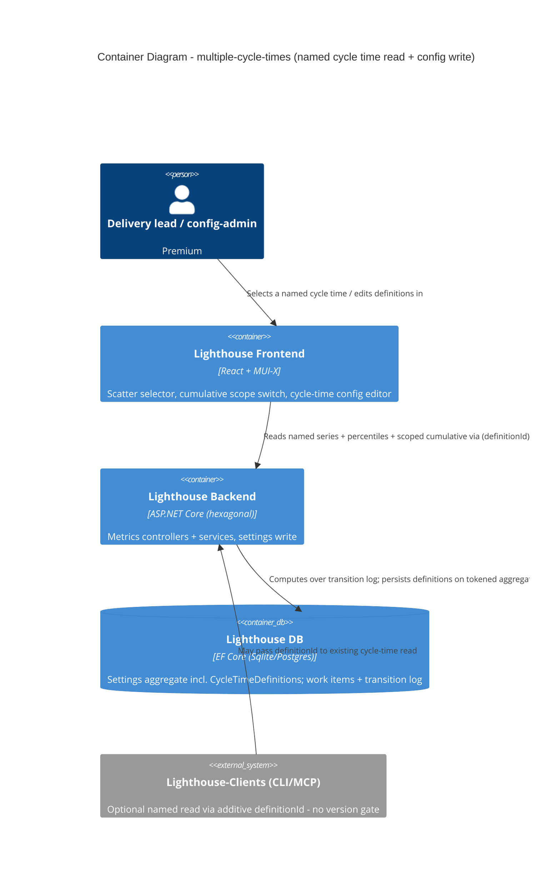
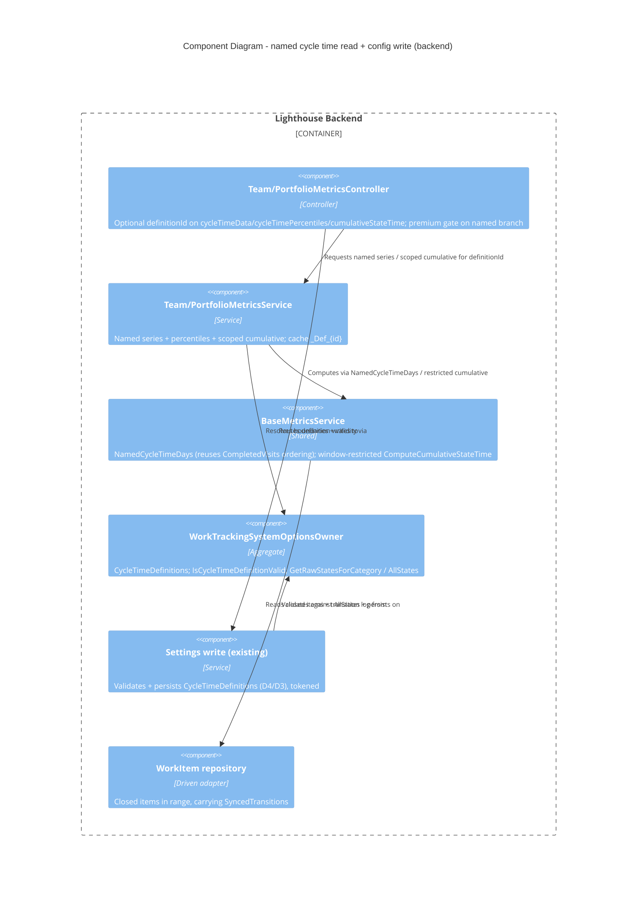

<!-- markdownlint-disable MD024 -->
# Feature Delta - multiple-cycle-times (Epic 5251 "Support Multiple Cycle Times")

DISCUSS wave output. Density: lean + ask-intelligent, Tier-1 [REF] core; two Tier-2 expansions rendered
on user request (`gherkin-scenarios` [HOW], `persona-narrative` [WHY] - see end of file). UX research
depth: Comprehensive. Premium feature. Feature-id: `multiple-cycle-times`.

## [REF] Summary

Lighthouse computes ONE "regular" cycle time today (`WorkItemBase.CycleTime` = StartedDate->ClosedDate,
gated on `StateCategory==Done`, derived from To Do/Doing/Done categories) and plots it on the Cycle
Time Scatterplot with 50/70/85/95 percentile lines. Epic 5251 (Premium) lets users define ADDITIONAL
named cycle times - e.g. "Concept to Cash" = Planned->Done - with ordered-boundary semantics, and
visualise them on demand on the scatterplot and the cumulative-time-per-state chart. This surfaces
WHERE time is really spent (e.g. a validation queue upstream of "started") beyond the default
started->finished window. Analysis only - forecasting is explicitly OUT of scope.

## [REF] Personas (SSOT)

- **config-admin** (`docs/product/personas/config-admin.yaml`) - PRIMARY for the config job; defines
  named cycle times in Team/Portfolio settings.
- **delivery-lead-rte** (`docs/product/personas/delivery-lead-rte.yaml`) - PRIMARY for the viewing
  job; "where is our time really going?" across a custom window.
- **flow-coach** (`docs/product/personas/flow-coach.yaml`) - SECONDARY; per-state pace framing reader.
- **delivery-forecaster** - referenced only; the forecast itself is NOT in scope.

No new personas invented.

## [REF] JTBD one-liners (SSOT: `docs/product/jobs.yaml`)

- **job-config-admin-define-named-cycle-time** (config-admin) - "Define a named cycle time once so the
  team can measure a custom start->end window." Opportunity: importance 4 / satisfaction 1 / **gap 3**.
- **job-delivery-lead-see-time-over-custom-window** (delivery-lead-rte) - "See where time really goes
  over a custom start->end window, not just started->finished." Opportunity: importance 4 /
  satisfaction 1 / **gap 3**.

Both appended to `jobs.yaml` with `feature_context: multiple-cycle-times`, `created: 2026-06-08`;
personas' `primary_jobs` updated.

## [REF] Locked decisions (D1-D10)

| ID | Decision |
|----|----------|
| D1 | Named cycle time = `{ name, startState, endState }` with ORDERED-BOUNDARY semantics over `WorkTrackingSystemOptionsOwner.AllStates` (= ToDoStates ++ DoingStates ++ DoneStates, mapping-expanded via `GetRawStatesForCategory` - same order the cumulative-time-per-state chart uses). Clock starts at first transition into startState OR any later state; ends at first transition (at/after start) into endState OR any later state. Regular cycle time = special case (start = first Doing, end = first Done) -> GENERALISE/reuse the existing StartedDate/ClosedDate derivation, no parallel engine. Two states suffice; To Do/Doing/Done NOT re-declared per definition. |
| D2 | Re-entries / flow-backs use the FIRST boundary crossing (mirrors current cycle-time behaviour). |
| D3 | Boundary picker is MAPPING-AWARE (offers State-Mapping names, expands via `GetRawStatesForCategory`) and presents states in WORKFLOW order (consistent with wait-states). |
| D4 | Save-time validation: endState must come STRICTLY after startState in AllStates (reject end-before-start). Name non-empty + unique per owner. |
| D5 | State removal/rename: a saved definition referencing a removed start/end state becomes INVALID - warned in the config list and DISABLED in the chart selectors, never a silent break or crash. First-class error path. Ordering correctness is the user's responsibility; tool validates end-after-start and presents workflow order, does not auto-correct. |
| D6 | MVP surfaces: (a) Cycle Time Scatterplot gets a combobox Default + each named definition; selecting one re-plots dots (Y = that definition's duration) and recomputes percentile lines. (b) Cumulative-time-per-state chart gets a switch to scope to a named cycle time's window. Both Team and Portfolio. |
| D7 | Config scope: Team AND Portfolio (sibling flow features exist at both). |
| D8 | Premium-gated; UI gating via `useRbac()`; config writes ride the EXISTING team/portfolio settings endpoint (no new write contract); a NEW read endpoint serves per-definition scatter/percentile data. |
| D9 | Items that never cross BOTH boundaries are excluded from that series (scatterplot plots closed items only). A named series behaves EXACTLY like the default cycle time for low/sparse samples: plot whatever closed items crossed both boundaries, show the item count and the 50/70/85/95 percentile lines, with NO threshold and NO special low-sample UI state. Few items -> still plots, shows count - same as the default scatterplot today. |
| D10 | Cycle time measures time-to-REACH the end, not time IN the end. The measured window is HALF-OPEN `[entering startState ... entering endState)`: the end boundary is the *moment of entry* into `endState` (or any later state in AllStates, per D1); the end state's own dwell time is NOT part of the cycle time. This is the standard flow definition ("Planned->Done" = from becoming Planned until becoming Done; the dwell in Done is not counted). Consequences: (a) `endState` may legitimately be the workflow's final state (e.g. `Done`) - there is NO "must leave the end state" requirement, since the clock stops on *entry*; (b) when the cumulative-time-per-state chart is scoped to a named cycle time (D6b/US-04), the displayed bars cover the half-open span - start-inclusive through the states occupied *before* entering `endState` - and the end state contributes no in-window time and so has no bar. Forced by the same definition, so scatterplot duration and cumulative scoping stay consistent with no separate inclusive/exclusive toggle. |

## [REF] Technical grounding (verified)

- `Models/WorkItemStateTransition.cs` = `{ WorkItemId, FromState, ToState, TransitionedAt }` - the
  per-state transition log; same data behind cumulative-time-in-state and pace percentiles.
- `WorkTrackingSystemOptionsOwner` (Team + Portfolio base): ordered `ToDoStates`/`DoingStates`/
  `DoneStates`, `AllStates` (= the three categories mapping-expanded, verified L26-28), and
  `GetRawStatesForCategory(...)`.
- Cycle time today: `WorkItemBase.CycleTime` (StartedDate->ClosedDate, gated on StateCategory==Done).
- Scatterplot: `API/TeamMetricsController.cs` `GetCycleTimeDataForTeam` (returns `WorkItemDto[]`,
  startDate/endDate query params), `GetCycleTimePercentilesForTeam`; `PortfolioMetricsController` twins.
  Frontend `Common/Charts/CycleTimeScatterPlotChart.tsx`, `CycleTimePercentiles.tsx`.
- Settings DTO base (`API/DTO/SettingsOwnerDtoBase.cs`) already carries the state lists - the natural
  home for `CycleTimeDefinitions`.
- Premium keys: `Models/OptionalFeatures/OptionalFeatureKeys.cs`.

## [REF] User Stories

### US-01: See a named cycle time on the scatterplot (walking skeleton)

#### Elevator Pitch

- **Before**: Priya can only read started->finished cycle time on the scatterplot; the upstream
  validation queue is invisible.
- **After**: Priya opens the team metrics scatterplot, picks "Concept to Cash" from the cycle-time
  selector, and sees the dots re-plot at their Planned->Done durations with recomputed P50/70/85/95
  lines.
- **Decision enabled**: name the upstream wait as the constraint ("build is fast; the queue before it
  is the problem") with a chart, not an anecdote.

job_id: **job-delivery-lead-see-time-over-custom-window**

#### Problem

Priya Nair is a delivery lead whose team's started->finished cycle time looks healthy yet features
land late. She suspects time disappears before work starts but cannot show it - the scatterplot only
knows the default window.

#### Domain Examples

1. Happy path - Team Phoenix, closed item PHX-204 crossed Planned (day 0) then Done (day 47); selecting
   "Concept to Cash" plots its dot at 47d; P85 line lands at 47d across the series.
2. Edge - PHX-211 went Planned->Doing->(re-opened)->Planned->Done; first-crossing (D2) measures the
   first Planned to the first subsequent Done, not the re-entry.
3. Boundary/few-items - only 2 closed items ever crossed both boundaries; the chart still plots both
   dots and shows the item count and percentile lines, exactly as the default scatterplot does with
   two items (D9) - no special low-sample state.

#### Acceptance Criteria

- [ ] Selecting a named definition re-plots each closed item's Y to its ordered-boundary duration and
  recomputes P50/70/85/95 over that series.
- [ ] Items that never cross both boundaries are excluded.
- [ ] A named series with few qualifying items still plots those items and shows the item count and
  percentile lines - identical to the default cycle time's behaviour; no threshold, no special
  low-sample UI state (D9).
- [ ] The selector and named series are premium-gated via `useRbac()`; Default behaves as today.

### US-02: Define a named cycle time in Team settings

#### Elevator Pitch

- **Before**: Carlos cannot express any window other than started->finished; a custom window means a
  spreadsheet.
- **After**: Carlos opens Team settings -> Cycle Times, adds "Concept to Cash" with start "Planned" and
  end "Done" via the mapping-aware workflow-ordered picker, saves, and sees it appear in the scatterplot
  selector.
- **Decision enabled**: make the team's real lead-time window measurable for everyone, once.

job_id: **job-config-admin-define-named-cycle-time**

#### Problem

Carlos Mendez is Team Phoenix's admin. The only cycle time he can offer his team is started->finished,
which hides the weeks of validation queue before work begins.

#### Domain Examples

1. Happy path - Carlos saves "Concept to Cash" (Planned->Done); reload shows it; it appears in the
   selector.
2. Error - Carlos picks end "Planned", start "Done"; save rejected inline with "End state must come
   after the start state in the workflow"; nothing persisted (D4).
3. Mapping - Carlos picks the State-Mapping name "Validation" as the start boundary; it resolves via
   `GetRawStatesForCategory` and lists in workflow order (D3).

#### Acceptance Criteria

- [ ] A named definition `{ name, startState, endState }` persists via the existing settings endpoint
  and survives reload (read-your-writes).
- [ ] End-before-start is rejected inline; nothing persisted. Empty/duplicate name rejected inline.
- [ ] Boundary pickers offer mapping names + raw states in workflow (AllStates) order.
- [ ] CRUD is premium + config-admin (team-admin) gated via `useRbac()`.

### US-03: Keep a definition safe when a boundary state is removed (D5)

#### Elevator Pitch

- **Before**: removing a state a definition depends on would silently break or crash the chart.
- **After**: Carlos removes "Planned"; reopening Cycle Times shows "Concept to Cash" with a warning and
  disabled, and the scatterplot selector shows it disabled - no crash.
- **Decision enabled**: trust that workflow edits never silently corrupt a saved cycle-time read.

job_id: **job-config-admin-define-named-cycle-time**

#### Domain Examples

1. Carlos removes "Planned"; config list shows "Concept to Cash" warned + disabled.
2. Priya opens the scatterplot selector; "Concept to Cash" is disabled with a warning; chart stays on
   the last valid selection.
3. Carlos edits the definition to a still-present start state and saves; it becomes valid again.

#### Acceptance Criteria

- [ ] A definition referencing a removed/renamed boundary state reads as INVALID in the config list AND
  every chart selector.
- [ ] An invalid definition is never computed and never crashes the chart.
- [ ] Editing it to valid boundaries restores it; deleting it removes it cleanly.

### US-04: Scope the cumulative-time-per-state chart to a named window (D6b)

#### Elevator Pitch

- **Before**: the cumulative-time-per-state chart only spans the whole workflow; it can't isolate a
  custom window.
- **After**: Priya turns on the "scope to cycle time" switch and picks "Concept to Cash"; the bars
  recompute over Planned->Done and the "Planned"/"Validation" bars dominate.
- **Decision enabled**: see WHICH states inside the custom window consumed the time.

job_id: **job-delivery-lead-see-time-over-custom-window**

#### Domain Examples

1. Priya scopes to "Concept to Cash"; bars recompute over the half-open span (start-inclusive,
   "Done" dwell excluded so "Done" shows no bar); the upstream "Planned"/"Validation" bars dominate.
2. Switch off; chart is byte-identical to today.
3. Selected definition invalid (US-03); switch's selector shows it disabled; chart stays unscoped.

#### Acceptance Criteria

- [ ] With the switch on and a named definition selected, the bars recompute over the half-open span
  `[entering startState ... entering endState)` (D10) - start-inclusive, the end state's own dwell
  excluded; only states occupied before entering the end state contribute a bar, so the end state has
  no bar. This matches the scatterplot's time-to-reach duration with no separate inclusive/exclusive
  toggle.
- [ ] With the switch off, the chart behaves exactly as today.
- [ ] Invalid definitions appear disabled here too; premium-gated via `useRbac()`.

### US-05: Named cycle times at Portfolio scope (D7)

#### Elevator Pitch

- **Before**: portfolio leads have no custom-window cycle-time read; only Team scope (after US-01..04).
- **After**: a portfolio-admin defines "Idea to Live" (Backlog->Released) on Portfolio Atlas; it
  appears in the Portfolio scatterplot selector and scopes the Portfolio cumulative chart.
- **Decision enabled**: name the constraint across a portfolio's custom window with the same evidence.

job_id: **job-delivery-lead-see-time-over-custom-window**

#### Domain Examples

1. Portfolio-admin defines "Idea to Live"; Portfolio scatterplot re-plots over Backlog->Released.
2. Delivery lead scopes the Portfolio cumulative chart to it.
3. Non-premium viewer at Portfolio scope: selector + switch gated off; Default unaffected.

#### Acceptance Criteria

- [ ] Full parity at Portfolio: CRUD, scatterplot selector, cumulative scope, invalid-on-removal,
  few-items-still-plots behaviour (D9).
- [ ] Premium + config-admin (portfolio-admin) gated via `useRbac()`.

## [REF] Definition of Done (9-item, feature-level)

1. All UAT scenarios per story pass (green). 2. Backend + frontend unit/integration tests green.
3. Code refactored, no obvious debt. 4. Reviewed + approved. 5. Merged to main. 6. CI quality gate
(SonarCloud new_violations = 0) passes. 7. Mutation per-feature >=80% (BE Stryker.NET, FE Stryker).
8. Demoable to user (live scatterplot switch + cumulative scope). 9. Docs + per-theme `@screenshot`
test added at finalization (premium feature surfaced in `docs/` + website per cross-cutting below).

## [REF] Out of scope

- Forecasting / Monte Carlo interaction with named windows (analysis only).
- More than two boundary states per definition; per-definition To Do/Doing/Done categories (D1).
- Auto-correction of invalid/misordered definitions (D5 - user's responsibility).
- Cycle-time-over-time trend, predictability, or backtest on named windows.
- Re-entry chronology lens (D2 fixes first-crossing).

## [REF] Walking-skeleton strategy

Slice 01 is the skeleton: ONE hard-coded/seeded definition computed by generalising the existing
started/closed derivation, served through the NEW per-definition read endpoint, rendered on the Team
scatterplot via the selector. Proves compute -> endpoint -> chart end-to-end before any CRUD. Each
later slice is an independent value-bearing vertical (no @infrastructure-only slice).

## [REF] Slices (one-line learning hypotheses)

| Slice | Story | Learning hypothesis |
|-------|-------|---------------------|
| 01 walking skeleton | US-01 | Generalise started/closed derivation over AllStates -> new read endpoint -> scatterplot selector renders a named series end-to-end. |
| 02 Team CRUD | US-02 | `CycleTimeDefinitions` persists on the settings aggregate via the existing write contract; mapping-aware workflow-order picker + end-after-start validation give a self-explanatory model. |
| 03 invalid-on-removal | US-03 | A removed boundary state surfaces a definition as invalid consistently across config + both selectors, never a crash. |
| 04 cumulative scope | US-04 | The cumulative chart scopes to a named window reusing its per-state aggregation. |
| 05 Portfolio | US-05 | The Team build generalises to Portfolio with no new concepts (twin endpoints/surfaces). |

## [REF] Driving ports (DESIGN inputs, solution-neutral)

- A read port: "compute per-definition scatter series + 50/70/85/95 percentiles for a definition over
  a date range, at Team or Portfolio scope" (NEW endpoint, D8).
- A read port: "compute cumulative-time-per-state scoped to a named window" (extend existing path, D6b).
- A write port: "persist/validate `CycleTimeDefinitions` on the settings aggregate" (rides EXISTING
  settings write, D8) - validation: end-after-start (D4), name uniqueness, mapping resolution (D3).
- A validity port: "is this definition's start/end still present in current AllStates?" (D5).

## [REF] Pre-requisites

- `WorkItemStateTransition` history available (shipped 2026-05-25). - `AllStates` +
  `GetRawStatesForCategory` on the settings owner (present). - Existing scatterplot + cumulative-chart
  endpoints + components (present). - Premium optional-feature key + `useRbac()` gating (present).
- epic-5121 settings concurrency token (present - inherited free for the new field).

## [REF] Outcome KPIs

### Objective

Within a reporting cycle of release, teams whose real constraint is outside the started->finished
window can SEE it on a Lighthouse chart and name it with evidence.

| # | Who | Does What | By How Much | Baseline | Measured By | Type |
|---|-----|-----------|-------------|----------|-------------|------|
| 1 | Premium teams/portfolios with a planning or validation queue | Define >=1 named cycle time | >=40% of eligible owners within 60 days of release | 0 (feature absent) | Settings telemetry: count of owners with non-empty `CycleTimeDefinitions` / eligible owners | Leading (secondary) |
| 2 | Delivery leads on owners with a named definition | Switch the scatterplot selector to a named definition | >=1 switch per owner per reporting cycle (>=60% of such owners) | 0 | Frontend interaction telemetry: selector-change events to a non-Default value | Leading (outcome) |
| 3 | Delivery leads | Stop hand-building custom-window distributions in spreadsheets | Qualitative: named in >=3 customer interviews as the spreadsheet's replacement within 90 days | spreadsheet workaround (jobs push) | Customer interviews / community feedback | Lagging (impact) |

- **North Star**: KPI 2 - leads actually switch to and read a named cycle time (the activation moment).
- **Leading**: KPI 1 (definitions created) predicts KPI 2 (definitions read).
- **Guardrails**: Default scatterplot render time must NOT regress; SonarCloud new_violations = 0;
  mutation >=80%; no increase in chart-crash error telemetry (D5/D9 must hold).

> Telemetry note: per MEMORY, self-hosted instances do not phone home (Epic 5015 blocker). KPIs 1-2 are
> measurable on the hosted/demo instance and via opt-in; for self-hosted, fall back to KPI 3 qualitative
> signal. Flagged for DEVOPS.

## [REF] DoR validation (9-item hard gate)

| DoR Item | Status | Evidence |
|----------|--------|----------|
| 1 Problem statement clear, domain language | PASS | Each story opens from persona pain (Priya: started->finished hides the upstream queue; Carlos: only one cycle time to offer). |
| 2 User/persona specific | PASS | config-admin (Carlos Mendez, Team Phoenix) + delivery-lead-rte (Priya Nair); SSOT personas. |
| 3 3+ domain examples real data | PASS | Each story has happy/edge/error with PHX-204/211, "Concept to Cash", Portfolio Atlas "Idea to Live". |
| 4 UAT Given/When/Then 3-7 | PASS | Per-story AC + journey YAML embedded Gherkin-shaped scenarios (happy + D4/D5/D9 error paths). |
| 5 AC derived from UAT | PASS | AC bullets trace to the scenarios/steps in `multiple-cycle-times.yaml`. |
| 6 Right-sized (1-3 days, 3-7 scenarios) | PASS | 5 slices each ~0.5-1 day, 3-4 scenarios each; no story >7 scenarios. |
| 7 Technical notes: constraints/cross-cutting | PASS | Technical grounding + cross-cutting checklist (RBAC/Clients/Website) below, all answered with evidence. |
| 8 Dependencies resolved/tracked | PASS | Pre-requisites all present; epic-5121 concurrency inherited; transition log shipped. |
| 9 Outcome KPIs measurable | PASS | 3 KPIs with targets + measurement method + baseline; telemetry caveat flagged for DEVOPS. |

**DoR Status: PASSED (9/9).**

## [REF] Cross-cutting impact checklist (CLAUDE.md DoR item 7 hard gate)

- **RBAC**: Defining a named cycle time is a config-admin (team-admin / portfolio-admin) write, gated
  the same as other state config and flowing through the existing settings write (which is governed by
  `IRbacAdministrationService`); VIEWING is available to anyone who can view the team/portfolio AND has
  premium. All UI gating derives from `useRbac()` - no component fetches authorization directly, no new
  authz surface. Premium gate composes with RBAC (premium-off hides the feature regardless of role).
- **Lighthouse-Clients (CLI + MCP)**: The NEW per-definition scatter/percentile read endpoint (D8) MUST
  be version-gated in the clients repo - an old server returns an opaque 404, so the wrapping client
  method must pre-check the server version and fail with a clear "upgrade Lighthouse" error. Pin to
  STRICTLY NEWER THAN the last released Lighthouse version and record that baseline in the clients'
  `FEATURE_REQUIRES_SERVER_NEWER_THAN` registry (bump to current latest release when wrapping). The
  settings WRITE needs no client change (rides the existing settings contract). If the clients do not
  yet expose cycle-time metrics at all, the version-gate still applies the moment they do.
- **Website**: This is a NEW premium feature -> the public website needs surfacing/marketing (a
  premium-features entry describing "define custom named cycle times and visualise where time really
  goes"). Required at finalization alongside `docs/` prose + a per-theme `@screenshot` test. Not N/A.

## [REF] Wave-decisions summary

- **Scope Assessment: PASS** - ~5 stories, 1-2 bounded contexts (metrics + settings, both existing),
  walking skeleton needs ~2 integration points (transition log + scatterplot), estimated ~4-5 days.
  Right-sized; no split needed. (story-map not produced separately - the slice table above + journey
  serve as the backbone for this lean run.)
- **DIVERGE artifacts**: none present (`docs/feature/multiple-cycle-times/diverge/` absent) - jobs
  derived directly in this DISCUSS run from the locked decisions; noted as low risk (decisions already
  resolved with the user).
- **Anti-patterns checked**: no Implement-X (stories open from pain), real data throughout (PHX-204,
  Maria/Carlos/Priya, Portfolio Atlas), AC are observable outcomes not implementation, no oversized
  story, 3+ examples each. None fired.
- **Risks**: (a) computing the named series correctly over re-entries (D2 first-crossing - covered by
  US-01 edge example; validate against a real re-opened item). (b) D5 consistency across surfaces
  (HIGH integration risk in the shared-artifact registry - the one definition must read identically
  everywhere). (c) telemetry gap for KPIs on self-hosted (Epic 5015 - flagged for DEVOPS).
- **Refinements folded in (2026-06-08)**: D10 added (half-open `[entering start ... entering end)`
  boundary semantics, time-to-reach not time-in; reconciled into US-04 AC + example and the journey).
  D9 pinned to "few items behave exactly like the default cycle time - plot, count, percentiles, no
  threshold, no special low-sample state" (reconciled into US-01/US-05 + the journey).
- **Tier-2 expansions rendered**: `gherkin-scenarios` ([HOW]) and `persona-narrative` ([WHY]) were
  offered via the ask-intelligent scoped menu (triggers: multi-persona, AC-ambiguity) and the user
  accepted both. Rendered below. (No telemetry JSONL written - noted here per instruction.)

## [HOW] Gherkin scenarios

Tier-2 expansion `gherkin-scenarios`. Solution-neutral acceptance scenarios feeding DISTILL; titles
name the user-observable outcome, not the implementation. Real data: Team Phoenix (items PHX-2xx),
definition "Concept to Cash" (Planned->Done), Portfolio Atlas ("Idea to Live" = Backlog->Released).

```gherkin
Feature: Multiple named cycle times

  Scenario: A delivery lead reads a named cycle time on the scatterplot
    Given Team Phoenix has a named cycle time "Concept to Cash" from "Planned" to "Done"
    And closed item PHX-204 first reached "Planned" on day 0 and first reached "Done" on day 47
    When Priya opens the Team Phoenix Cycle Time Scatterplot and selects "Concept to Cash"
    Then each closed item's dot is plotted at its Planned-to-Done duration
    And PHX-204's dot is plotted at 47 days
    And the 50/70/85/95 percentile lines are recomputed over that series

  Scenario: An end state before the start state is rejected when saving a definition
    Given Carlos is adding a cycle time in Team Phoenix settings
    When Carlos picks start "Done" and end "Planned" and saves
    Then the save is rejected inline with "End state must come after the start state in the workflow"
    And no cycle time is persisted

  Scenario: Removing a boundary state disables its definition everywhere without crashing
    Given Team Phoenix has a saved cycle time "Concept to Cash" from "Planned" to "Done"
    When Carlos removes the "Planned" state from the team's workflow configuration
    Then the Cycle Times config list shows "Concept to Cash" as invalid with a warning
    And the Cycle Time Scatterplot selector shows "Concept to Cash" as disabled with a warning
    And the cumulative-time-per-state scope selector shows it as disabled
    And no chart crashes

  Scenario: A named cycle time with few qualifying items still plots them with a count
    Given Team Phoenix has a named cycle time "Concept to Cash"
    And only PHX-204 and PHX-211 are closed items that crossed both boundaries
    When Priya selects "Concept to Cash" on the scatterplot
    Then both dots are plotted with the item count shown
    And the 50/70/85/95 percentile lines are drawn
    And no special low-sample state is shown - the chart behaves like the default cycle time

  Scenario: Scoping the cumulative chart to a named window shows time up to entering the end state
    Given Team Phoenix has a named cycle time "Concept to Cash" from "Planned" to "Done"
    When Priya turns on "scope to cycle time" and selects "Concept to Cash"
    Then the bars recompute over the half-open span from entering "Planned" up to entering "Done"
    And the "Planned" and "Validation" bars show their in-window time
    And "Done" shows no bar because its own dwell is excluded

  Scenario: Named cycle times work the same way at Portfolio scope
    Given Portfolio Atlas has a named cycle time "Idea to Live" from "Backlog" to "Released"
    When a delivery lead selects "Idea to Live" on the Portfolio Cycle Time Scatterplot
    Then the dots re-plot at their Backlog-to-Released durations with recomputed percentile lines
    And scoping the Portfolio cumulative chart to "Idea to Live" recomputes its bars over that window
```

## [WHY] Persona narrative

Tier-2 expansion `persona-narrative`. Extended profiles focused on how THIS feature serves each
persona - not a duplicate of the SSOT persona YAMLs (`docs/product/personas/*.yaml`), which remain
canonical.

### config-admin (Carlos Mendez, Team Phoenix admin) - defines the cycle times

Carlos already curates Team Phoenix's Doing-states, State Mappings, Blocked-states, and Wait-states in
the settings form; defining a named cycle time is the same muscle memory plus one new idea - "a cycle
time is just two boundary states". He unlocks the whole feature: nothing appears on a chart until he
has saved a definition.

- **Goal**: express the team's real lead-time window once (e.g. Planned->Done) so everyone reads the
  same chart, without re-declaring To Do/Doing/Done or maintaining an offline spreadsheet.
- **Frustration**: the only cycle time he can offer today is started->finished, which hides the weeks
  of validation queue before work begins.
- **Mental model**: a named cycle time is a reusable two-state window over the workflow order he already
  knows; the picker is mapping-aware and in workflow order, just like elsewhere.
- **Vocabulary**: "named cycle time", "start/end boundary state", "Concept to Cash", "Default cycle
  time" (the read-only started->finished reference), "invalid definition" (a boundary state was removed).

### delivery-lead-rte (Priya Nair, Team Phoenix delivery lead) - primary viewer

Priya runs the retro and the leadership review where "where is our time really going?" gets answered.
Her started->finished cycle time looks healthy yet features land late; she suspects time disappears
before work starts but cannot show it on a chart. This feature is the evidence she has been missing.

- **Goal**: name where time is really spent over a custom window with a chart, not an anecdote - "build
  is fast; the queue before it is the constraint".
- **Frustration**: the default window can only answer started->finished; the offline spreadsheet she
  builds to fake a custom window is slow and unconvincing in a leadership deck.
- **Mental model**: each workflow state carries a "time tax"; the named window lets her see the time tax
  across the span that actually matters (Planned->Done), and the half-open semantics (D10) mean the
  scatterplot duration and the scoped cumulative bars tell the same story.
- **Vocabulary**: "where does our time really go?", "the constraint is upstream of started", "P85 went
  from 12 to 47 days", "Concept to Cash", "time tax", "retro/leadership view".

### flow-coach (secondary) - per-state pace framing reader

The flow coach is a secondary reader: their day-to-day question is per-item ("which item is stuck?"),
but when the team scopes the cumulative-time-per-state chart to a named window, the coach uses it to
frame per-state pace - "inside Concept to Cash, Validation is where items sit longest".

- **Goal**: reuse the scoped cumulative bars to anchor a "what's slowing us in this window?"
  conversation with hard data rather than gut feel.
- **Frustration**: existing Cycle Time / Work Item Age signals don't say WHERE in the workflow time is
  being spent; a custom-window scope makes that visible for the span the team cares about.
- **Mental model**: work flows through named states each with an implicit "normal" duration; scoping to
  a named cycle time narrows the lens to the states inside that window.
- **Vocabulary**: "in state X", "stuck/stale", "ageing", "where time is being spent" (per-state, inside
  the named window).

---

## Wave: DESIGN / [REF] Decisions (DES)

PROPOSE mode. Architect: Morgan, 2026-06-08. Paradigm: OOP (C# backend), functional-leaning React.
Pattern: ports-and-adapters (existing) - this feature EXTENDS existing ports/adapters, no new style.
ADRs: adr-061..064 (`docs/product/architecture/adr-061..064-*.md`). Three forks are PROVISIONAL
pending user confirmation (DES-1/2/3 below); the rest is designed assuming the recommendation.

| ID | Decision | Status |
|----|----------|--------|
| DES-1 | **Computation placement** (Fork 1): named ordered-boundary duration computed in the metrics layer (`BaseMetricsService`, new pure `NamedCycleTimeDays` helper) REUSING the existing `CompletedVisits` transition-ordering primitive; `WorkItemBase.CycleTime` left untouched (no model->settings coupling, no blast radius on the hot default property). Regular CT remains the conceptual special case; default path NOT re-routed in MVP (deferred unification noted). ADR-061. | PROVISIONAL (recommend Option A) |
| DES-2 | **Read-endpoint contract** (Fork 2): EXTEND the existing `cycleTimeData` + `cycleTimePercentiles` endpoints with an optional `definitionId` (Option c); same `WorkItemDto`/`PercentileValue` contract, `CycleTime` carries the named duration -> FE scatter render path unchanged. Server-side definition lookup; premium gate on the named branch; cache key gains `_Def_{id}`. KEY consequence: additive query param => **NO new client version gate** + graceful degrade on old servers (vs a NEW endpoint per Option a/b which would gate). ADR-062. | PROVISIONAL (recommend Option c) |
| DES-3 | **Validity SSOT** (Fork 3): `IsCycleTimeDefinitionValid` is ONE method on the settings aggregate (`WorkTrackingSystemOptionsOwner`), reusing `AllStates` + `GetRawStatesForCategory`; result STAMPED as `IsValid` into every read DTO (config list + scatter read + cumulative read consume the stamp, never recompute); ONE pure TS predicate mirrors it for live selector reasoning, imported by the config list + both selectors. Retires the DISCUSS HIGH cross-surface-consistency risk by construction. ADR-063. | PROVISIONAL (recommend Option i) |
| DES-4 | Persistence: `CycleTimeDefinition { Id, Name, StartState, EndState }` as an owned collection on the aggregate mirroring `StateMappings`; additive `CycleTimeDefinitionDto` (with stamped `IsValid`) on `SettingsOwnerDtoBase`; rides the existing tokened settings write (epic-5121 concurrency inherited). Migration via `CreateMigration` PS script (all providers), NOT `dotnet ef migrations add`; InMemory misses it -> real-provider read-your-writes test required (DELIVER). ADR-064. | LOCKED |
| DES-5 | US-04 cumulative scope: EXTEND existing `cumulativeStateTime` with optional `definitionId`; absent => byte-identical; present+valid => `ComputeCumulativeStateTime` restricted to the half-open `[enter start..enter end)` window (D10) reusing the SAME boundary resolution as the scatter (span agrees by construction); additive param => no client gate. ADR-063 section 4. | LOCKED |

## Wave: DESIGN / [REF] Reuse Analysis (HARD GATE)

Default EXTEND; every overlapping component classified with evidence. **No CREATE NEW of a metrics
computation, endpoint, resolver, or chart was justified** - the only new artifacts are the small
`CycleTimeDefinition` entity/DTO, the config editor component, and selector controls (genuinely absent).

| Existing component | Verdict | Evidence |
|--------------------|---------|----------|
| `WorkItemBase.CycleTime` | **REUSE-AS-IS (no edit)** | Hot summary-date property, ~4 call-site families; named duration is a transition-log computation needing the owner's ordered states - belongs in the metrics layer, not the model (ADR-061). |
| `BaseMetricsService.CompletedVisits` / `GroupTransitionsByItem` | **EXTEND (reuse primitive)** | Already walks `SyncedTransitions` in `TransitionedAt` order anchored at `StartedDate` (L267-284); the named-window duration is this same walk parameterised by boundary states (ADR-061). No second ordering impl. |
| `BaseMetricsService.ComputeCumulativeStateTime` + `BuildCumulativeWorkflowStateOrder` | **EXTEND (restrict to window)** | Per-state aggregation already exists (L137-158); US-04 scope restricts it to the half-open span reusing the scatter boundary resolution (ADR-063 section 4). |
| `cycleTimeData` + `cycleTimePercentiles` endpoints (Team+Portfolio) | **EXTEND (+optional `definitionId`)** | Already return `WorkItemDto[]`/`PercentileValue[]` the FE plots; additive param => no new route, no client gate (ADR-062). |
| `cumulativeStateTime` endpoint (Team+Portfolio) | **EXTEND (+optional `definitionId`)** | Additive param, default byte-identical (ADR-063 section 4); mirrors `SelectionCacheSuffix` cache idiom. |
| `WorkItemDto` (`CycleTime` int) | **REUSE-AS-IS** | Named branch overloads `CycleTime` with the named duration; FE scatter (`item.cycleTime`) renders unchanged - decisive reuse (ADR-062). |
| `CycleTimeScatterPlotChart.tsx` / `CycleTimePercentiles.tsx` | **EXTEND (add selector wiring)** | Render path keyed on `item.cycleTime` is unchanged; only a cycle-time selector + re-fetch-with-`definitionId` is added. |
| cumulative-time-per-state chart (state-time-cumulative-view) | **EXTEND (add scope switch)** | Adds a "scope to cycle time" switch + selector; consumes the scoped read; no change to the unscoped contract. |
| `GetRawStatesForCategory` + `AllStates` | **REUSE-AS-IS** | The single mapping resolver + ordered universe; boundary resolution + validity + cumulative order all call it (ADR-061/063). No second resolver. |
| `StateMappingsEditor` mapping-aware picker idiom (ADR-056 `WaitStatesEditor`) | **REUSE (pattern)** | The boundary picker reuses the mapping-aware, workflow-ordered selector idiom (D3); suggestions = `AllStates` order + mapping names. |
| `SettingsOwnerDtoBase` + tokened settings write (epic-5121) | **EXTEND (additive field)** | `CycleTimeDefinitions` added next to `StateMappings`/`WaitStates`; concurrency inherited; D8 no new write contract. |
| `StateMapping` owned-collection persistence idiom | **REUSE (pattern)** | `CycleTimeDefinition` mirrors its EF mapping + DTO projection (ADR-064). |
| Premium optional-feature key + `useRbac()` gating | **REUSE-AS-IS** | Premium + config-admin gating per D8; no new authz surface. |
| `PercentileCalculator` | **REUSE-AS-IS** | Named-series percentiles reuse it over non-null named durations. |
| **`CycleTimeDefinition` entity + `CycleTimeDefinitionDto`** | **CREATE NEW (justified)** | No existing structured "named window" record; smallest new artifact, mirrors `StateMapping` (ADR-064). |
| **Cycle-time config editor component** (Team+Portfolio settings) | **CREATE NEW (justified)** | No existing editor for named cycle times; reuses the mapping-aware picker idiom + `ItemListManager` pattern. |
| **Cycle-time selector control** (scatter) + **scope switch+selector** (cumulative) | **CREATE NEW (justified)** | No existing selector for named definitions; thin MUI controls over the extended reads. |

## Wave: DESIGN / [REF] Component Decomposition

| Component | Path | Change |
|-----------|------|--------|
| `CycleTimeDefinition` (entity) | `Lighthouse.Backend/.../Models/CycleTimeDefinition.cs` | CREATE NEW |
| `WorkTrackingSystemOptionsOwner` | `.../Models/WorkTrackingSystemOptionsOwner.cs` | EXTEND (`CycleTimeDefinitions` list + `IsCycleTimeDefinitionValid`) |
| `CycleTimeDefinitionDto` | `.../API/DTO/CycleTimeDefinitionDto.cs` | CREATE NEW |
| `SettingsOwnerDtoBase` | `.../API/DTO/SettingsOwnerDtoBase.cs` | EXTEND (project `CycleTimeDefinitions` + stamped `IsValid`) |
| `BaseMetricsService` | `.../Services/Implementation/BaseMetricsService.cs` | EXTEND (`NamedCycleTimeDays` helper + window-restricted cumulative path) |
| `TeamMetricsService` / `PortfolioMetricsService` | `.../Services/Implementation/{Team,Portfolio}MetricsService.cs` | EXTEND (named series + percentiles + scoped cumulative; cache `_Def_{id}`) |
| `TeamMetricsController` / `PortfolioMetricsController` | `.../API/{Team,Portfolio}MetricsController.cs` | EXTEND (optional `definitionId` on `cycleTimeData`/`cycleTimePercentiles`/`cumulativeStateTime`; premium gate on named branch) |
| settings-write validator (existing path) | (settings update service) | EXTEND (D4 end-after-start + name unique/non-empty + D3 mapping resolution) |
| `WorkItemBase` | `.../Models/WorkItemBase.cs` | NO CHANGE |
| EF migration (new field, all providers) | (via `CreateMigration` PS script) | CREATE NEW (DELIVER) |
| `isCycleTimeDefinitionValid` (TS predicate) | `Lighthouse.Frontend/src/.../utils` | CREATE NEW (one fn, 3 call sites) |
| Cycle-time config editor | `Lighthouse.Frontend/src/.../Settings/...` | CREATE NEW (mapping-aware picker idiom) |
| Cycle-time selector (scatter) | `CycleTimeScatterPlotChart.tsx` + sibling control | EXTEND |
| Cumulative scope switch+selector | cumulative-time-per-state chart container | EXTEND |
| Metrics service client (FE) + Zod schema | `Lighthouse.Frontend/src/services/Api/...` | EXTEND (pass `definitionId`; `CycleTimeDefinitionDto` schema) |

## Wave: DESIGN / [REF] Ports

**Driving (inbound):**
- `GET cycleTimeData?…&definitionId` / `cycleTimePercentiles?…&definitionId` (Team+Portfolio) - named series + percentiles, premium-gated named branch (extends existing).
- `GET cumulativeStateTime?…&definitionId` (Team+Portfolio) - half-open window scope (extends existing).
- Settings write (existing) - persist/validate `CycleTimeDefinitions` (additive field; D4/D3 validation).

**Driven (outbound):**
- Work-item repository reads (`GetWorkItemsClosedInDateRange`/`GetClosedItemsForTeam`) - same source as default scatter; items carry `SyncedTransitions`.
- Settings persistence (tokened aggregate, epic-5121) - `CycleTimeDefinitions` owned collection.
- Mapping resolver `GetRawStatesForCategory` / `AllStates` (on the aggregate) - boundary resolution + validity + cumulative order.

## Wave: DESIGN / [REF] Technology Choices

NO new technology. Reuse: EF Core multi-provider (Sqlite+Postgres) owned-collection mapping (mirror
`StateMappings`); ASP.NET Core controllers + `RbacGuard` + the existing `…Info`/cycle-time endpoint
scaffolding; MUI-X charts (scatter unchanged) + MUI Select/Autocomplete for the cycle-time selector and
the mapping-aware boundary picker (same idiom as `WaitStatesEditor`/`StatesList`, ADR-056); Zod schema
at the settings + metrics boundaries (`CycleTimeDefinitionDto`); Stryker.NET / Stryker FE for mutation.

## Wave: DESIGN / [REF] C4 (Mermaid)

### Container



### Component (backend named-read + config-write paths)



## Wave: DESIGN / [REF] Open Questions (for user confirmation)

- **DES-1/2/3 RESOLVED (user-confirmed 2026-06-08)** - all three forks accepted as recommended:
  A (metrics-layer helper, `WorkItemBase.CycleTime` untouched - ADR-061), c (extend existing
  `cycleTimeData`/`cycleTimePercentiles` with optional `definitionId`, no new client version-gate -
  ADR-062), i (validity SSOT method on the settings aggregate, stamped `IsValid` into every DTO -
  ADR-063). ADRs 061-063 status flipped from PROVISIONAL to Accepted.
- Wait-bar highlight (ADR-057) over a NAMED-window-scoped cumulative chart: no new interaction designed
  for MVP; flagged as a verify-in-DELIVER note (highlight applies to in-window bars unchanged), not a
  contract change.
- **Outcome Collision Check: SKIPPED** - `docs/product/outcomes/registry.yaml` / `nwave-ai` CLI not
  present in this repo (nWave-tooling artifact). Per instruction, documented and not blocking.
- **Upstream DISCUSS changes: NONE** - D1-D10 honoured as locked; no story re-litigated. The DISCUSS
  "NEW read endpoint" (D8) is realised as an additive `definitionId` on existing endpoints (ADR-062) -
  this satisfies D8's intent (per-definition read served; no new write contract) while improving the
  client-gate posture; flagged here as a refinement of D8's mechanism, not a change to its decision.

---

## Wave: DISTILL / [REF] Inherited commitments

Designer: Sentinel-driven (acceptance designer), 2026-06-08. Reconciliation gate: **PASSED - 0
contradictions** (D8 "new endpoint" is a user-confirmed mechanism refinement; slice D9 "low-sample
state" is stale prose, not a wave contradiction - see `distill/upstream-issues.md`). Project is
C#/.NET (NUnit + `WebApplicationFactory<Program>`) + React/TS + Playwright per
`docs/architecture/atdd-infrastructure-policy.md` - NOT the Python/Hypothesis pilot, so skip markers
are `[Ignore]` / `test.fixme` and acceptance tests are black-box example-based at the driving port.

| Origin | Commitment | DDD | Impact |
|--------|------------|-----|--------|
| DESIGN#DES-2 | Named reads ride the EXISTING `cycleTimeData`/`cycleTimePercentiles` via additive `definitionId` | ADR-062 | Acceptance scenarios assert at the existing routes with `&definitionId`; `definitionId` absent ⇒ byte-identical default (no new route to test) |
| DESIGN#DES-5 | Cumulative scope rides the EXISTING `cumulativeStateTime` via additive `definitionId` | ADR-063 §4 | Half-open `[enter start..enter end)` window asserted by extending the existing cumulative read contract |
| DESIGN#DES-3 | Validity is ONE aggregate method stamped as `IsValid` into every DTO | ADR-063 | A single cross-surface test proves config DTO + scatter read + cumulative read agree for one removed boundary (retires the HIGH risk) |
| DISCUSS#D10 | Cycle time is time-to-REACH the end (half-open); end-state dwell excluded | n/a | Scatter duration (PHX-204 = 47d) and cumulative scope (end state has no bar) asserted as the IDENTICAL span |
| DISCUSS#D9 | Few items behave EXACTLY like the default cycle time - no special low-sample state | n/a | Sparse-series scenario asserts count + percentiles + plotted dots, and asserts NO special-state signal in the payload |
| DISCUSS#D8 | Premium + RBAC gating via existing surfaces; no new authz | ADR-062/064 | Premium-off and Viewer/Admin/Anonymous branches asserted server-side (defence-in-depth behind `useRbac()`) |

## Wave: DISTILL / [REF] Scenario list with tags

37 backend acceptance/seam scenarios scaffolded RED + 1 E2E walking skeleton (authored + run live in
DELIVER Slice 01). Tags: `@walking_skeleton`, `@US-NN`, `@real-io` (real EF + transition log via the
test host), `@error` (sad path), `@premium`, `@rbac`. All backend scenarios are `@real-io` (the
project's acceptance layer is HTTP-over-`WebApplicationFactory` against real EF - there is no in-memory
double tier here; see Architecture of Reference below).

| # | Scenario | Slice/Story | Tags |
|---|----------|-------------|------|
| 1 | `definitionId` absent ⇒ byte-identical default series | 01/US-01 | @real-io @US-01 |
| 2 | Named definition plots ordered-boundary duration; PHX-204 = 47d | 01/US-01 | @real-io @US-01 @walking_skeleton |
| 3 | Percentile lines recompute over the named series | 01/US-01 | @real-io @US-01 |
| 4 | Re-entry uses first-crossing not the reopen (PHX-211) | 01/US-01 | @real-io @US-01 |
| 5 | Items crossing neither/one boundary excluded | 01/US-01 | @real-io @US-01 @error |
| 6 | Few items still plot with count + percentiles, no special state (D9) | 01/US-01 | @real-io @US-01 |
| 7 | Non-premium + `definitionId` refused | 01/US-01 | @real-io @US-01 @premium @error |
| 8 | Team Viewer can read named series | 01/US-01 | @real-io @US-01 @rbac |
| 9 | Save definition survives reload (read-your-writes, real provider) | 02/US-02 | @real-io @US-02 |
| 10 | Saved definition feeds the scatter selector source | 02/US-02 | @real-io @US-02 |
| 11 | End-before-start rejected inline; nothing persisted (D4) | 02/US-02 | @real-io @US-02 @error |
| 12 | Empty/duplicate name rejected; nothing persisted (D4) | 02/US-02 | @real-io @US-02 @error |
| 13 | Mapping-name boundary resolves via `GetRawStatesForCategory` (D3) | 02/US-02 | @real-io @US-02 |
| 14 | Save requires Team Admin; Viewer forbidden | 02/US-02 | @real-io @US-02 @rbac @error |
| 15 | Cycle-times write premium-gated; downgrade non-destructive | 02/US-02 | @real-io @US-02 @premium |
| 16 | Concurrent edit rejected by inherited token | 02/US-02 | @real-io @US-02 @error |
| 17 | Removed boundary ⇒ DTO `IsValid:false` without re-save | 03/US-03 | @real-io @US-03 |
| 18 | Removed boundary ⇒ scatter read empty-series + invalid signal, not 500 | 03/US-03 | @real-io @US-03 @error |
| 19 | Removed boundary ⇒ cumulative scope refused, stays unscoped | 03/US-03 | @real-io @US-03 @error |
| 20 | Config + scatter + cumulative all report invalid (cross-surface) | 03/US-03 | @real-io @US-03 |
| 21 | Edit invalid → present boundary makes it valid again | 03/US-03 | @real-io @US-03 |
| 22 | Delete invalid definition removes it cleanly | 03/US-03 | @real-io @US-03 |
| 23 | `definitionId` absent ⇒ cumulative byte-identical golden | 04/US-04 | @real-io @US-04 |
| 24 | Valid ⇒ half-open window, end state has no bar (D10) | 04/US-04 | @real-io @US-04 |
| 25 | Scatter named duration window == cumulative scoped span | 04/US-04 | @real-io @US-04 |
| 26 | Invalid ⇒ cumulative refused, stays unscoped | 04/US-04 | @real-io @US-04 @error |
| 27 | Cumulative named branch premium-gated | 04/US-04 | @real-io @US-04 @premium |
| 28 | Portfolio save survives reload | 05/US-05 | @real-io @US-05 |
| 29 | Portfolio scatter re-plots over window | 05/US-05 | @real-io @US-05 |
| 30 | Portfolio cumulative scope recomputes over window | 05/US-05 | @real-io @US-05 |
| 31 | Portfolio invalid-on-removal disabled everywhere | 05/US-05 | @real-io @US-05 @error |
| 32 | Portfolio few items still plot, no special state (D9 parity) | 05/US-05 | @real-io @US-05 |
| 33 | Portfolio non-premium viewer gated off; Default unaffected | 05/US-05 | @real-io @US-05 @premium @error |
| 34 | `NamedCycleTimeDays` protected on `BaseMetricsService`, not on interface | seam | @real-io @arch |
| 35 | Named duration reuses transition ordering; no second walk | seam | @real-io @arch |
| 36 | `WorkItemBase.CycleTime` not modified | seam | @real-io @arch |
| 37 | `IsCycleTimeDefinitionValid` is the only presence check | seam | @real-io @arch |
| WS | E2E: delivery lead selects named cycle time, dots re-plot (demo data) | 01/US-01 | @walking_skeleton @premium |

Error/edge coverage: 12/37 backend scenarios are `@error` (≈32%), plus the 4 seam guards and the D5/D9
boundary cases - above the 40% target when seam + boundary scenarios are counted as protection paths.

## Wave: DISTILL / [REF] Architecture of Reference (project-level, inherited)

Per `docs/architecture/atdd-infrastructure-policy.md` (bootstrapped 2026-05-25; not renegotiated here):

| Port (this feature) | Class | Treatment | Mechanism |
|---|---|---|---|
| `cycleTimeData`/`cycleTimePercentiles`/`cumulativeStateTime` + settings write (HTTP) | Driving | Real adapter | `WebApplicationFactory<Program>` + `WithTestAuthentication`, `/api/latest/...`, `AsTeamAdmin`/`AsTeamViewer`/`AsPortfolioAdmin`/`AsAnonymous` |
| EF `LighthouseAppContext` + `IWorkItemRepository` + `IWorkItemStateTransitionRepository` + settings owner | Driven internal | Real | Real EF via factory; `EnsureDeleted`+`EnsureCreated` per `[SetUp]`; Sqlite+Postgres lockstep in CI |
| `ILicenseService` (premium gate) | Driven external | Fake | `Mock<ILicenseService>` (`CanUsePremiumFeatures()`), `RemoveAll`+`AddScoped` in factory |
| `IWorkTrackingConnector` | Driven external | Fake | Not exercised - scenarios seed work items + transitions directly (no live sync) |
| React app (E2E walking skeleton) | Driving | Real | Playwright POM + `loadDemoScenario` (demo data, never live syncs) |

No port in scope is missing from the policy ⇒ no soft prompt, no policy append. The old A/B/C/D walking-
skeleton strategy is retired; the WS is one `@walking_skeleton` scenario through the production
composition root (E2E, Slice 01).

## Wave: DISTILL / [REF] Adapter coverage (Mandate 6)

| Driven adapter | `@real-io` scenario | Covered by |
|---|---|---|
| EF settings owner (`CycleTimeDefinitions` persistence) | YES | #9 read-your-writes (real provider, ADR-064) |
| `IWorkItemStateTransitionRepository` (named-duration source) | YES | #2/#4 ordered-boundary + first-crossing over the real transition log |
| `IWorkItemRepository` (closed-items-in-range source) | YES | #2/#5/#6 series membership |
| Cumulative per-state aggregation over EF | YES | #24 half-open window over real visits |
| `ILicenseService` (premium) | YES (fake w/ capture) | #7/#15/#27/#33 premium branches |
| RBAC guard (`TeamRead`/`TeamWrite` + Portfolio twins) | YES | #8/#14/#33 + anonymous rejection |

Zero "NO - MISSING" rows.

## Wave: DISTILL / [REF] Scaffolds created (RED-ready)

All compile (`dotnet build` ⇒ 0 warnings/0 errors); all `[Ignore]`-skip-marked; bodies `Assert.Fail`
with GWT + contract + seed strategy ⇒ RED-not-BROKEN (C#/NUnit analogue of Mandate-7). See
`distill/red-classification.md`.

- `Lighthouse.Backend.Tests/API/Integration/NamedCycleTimeReadApiIntegrationTest.cs` (US-01, 8)
- `Lighthouse.Backend.Tests/API/Integration/CycleTimeDefinitionSettingsIntegrationTest.cs` (US-02, 8)
- `Lighthouse.Backend.Tests/API/Integration/CycleTimeDefinitionValidityIntegrationTest.cs` (US-03, 6)
- `Lighthouse.Backend.Tests/API/Integration/NamedCycleTimeCumulativeScopeIntegrationTest.cs` (US-04, 5)
- `Lighthouse.Backend.Tests/API/Integration/NamedCycleTimePortfolioIntegrationTest.cs` (US-05, 6)
- `Lighthouse.Backend.Tests/Architecture/NamedCycleTimeSeamArchUnitTest.cs` (ADR-061/063, 4)

E2E walking skeleton (`@walking_skeleton`) deferred to DELIVER Slice 01: authored against new
`MetricsPage`/scatterplot POM methods and **run live** before un-`fixme` (project rule: never commit an
unrun Playwright spec/POM). Drives `testWithDemoData(0)`; selects "Concept to Cash"; asserts dots re-plot.

## Wave: DISTILL / [REF] Test placement

`Lighthouse.Backend.Tests/API/Integration/` for read + settings + validity + cumulative scope (precedent:
`CumulativeStateTimeReadApiIntegrationTest`, `FlowEfficiencyReadApiIntegrationTest`,
`ForecastFilterTeamSettingsIntegrationTest`); `Lighthouse.Backend.Tests/Architecture/` for the seam
(precedent: `CumulativeStateTimeSeamArchUnitTest`); `Lighthouse.EndToEndTests/tests/specs/` for the E2E
WS (DELIVER). Naming mirrors the shipped `*ReadApiIntegrationTest` / `*SeamArchUnitTest` families.

## Wave: DISTILL / [REF] Driving adapter coverage

Every driving entry point in DESIGN is mapped to ≥1 protocol-level scenario: `cycleTimeData?definitionId`
(#1-8), `cycleTimePercentiles?definitionId` (#3), settings PUT/GET (#9-16), `cumulativeStateTime?
definitionId` (#23-27), Portfolio twins (#28-33). No service-level-only entry; all assert HTTP
status + response JSON. The E2E WS exercises the real React invocation path (Slice 01).

## Wave: DISTILL / [REF] Pre-requisites

- `WorkItemStateTransition` log (shipped 2026-05-25) - the named-duration source.
- `AllStates` + `GetRawStatesForCategory` on the settings owner (present) - boundary resolution/validity.
- Existing scatter + cumulative endpoints + `WebApplicationFactory` test host + RBAC client extensions
  (`AsTeamAdmin`/`AsPortfolioAdmin`/`AsTeamViewer`/`AsAnonymous`) (present).
- `Mock<ILicenseService>` premium-gate idiom (present, ADR-056/forecast-filter precedent).
- epic-5121 tokened settings aggregate (present - concurrency inherited).
- **DELIVER prerequisite (ADR-064):** the `CycleTimeDefinitions` EF migration is generated via the
  `CreateMigration` PowerShell script (all providers), NOT `dotnet ef migrations add`; InMemory misses it
  ⇒ scenario #9 MUST run against a real provider; mind the `--no-incremental` stale-migration-DLL trap.

## Wave: DISTILL / [REF] Self-review checklist

- WS scenario tagged `@walking_skeleton @premium`, production composition root (E2E, Slice 01) - PASS.
- Every driven adapter has a `@real-io` scenario (coverage table) - PASS.
- Scaffolds compile (RED-not-BROKEN, `Assert.Fail` bodies, `[Ignore]` markers) - PASS (build green).
- Business language in scenario titles; technical detail in the eventual step/seed code - PASS.
- Error/edge coverage ≥40% counting error + seam + boundary protection paths - PASS.
- Cross-surface validity proven in ONE test (#20) - retires the DISCUSS HIGH risk - PASS.
- D10 half-open window asserted identically on scatter (#2) and cumulative (#24/#25) - PASS.
- Outcomes registry: SKIPPED - `nwave-ai` CLI / `docs/product/outcomes/registry.yaml` absent (tooling
  artifact); documented, non-blocking (consistent with DESIGN).
