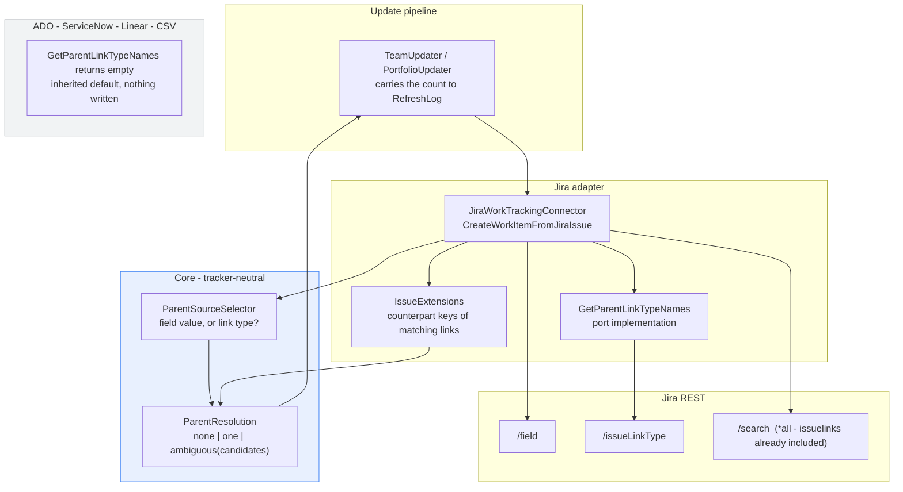

# Feature Delta — parent-from-issue-links

**Feature**: Establish parentage from a work tracking system's own issue links, not only from a field
whose value is a key.
**ADO**: not yet created — this wave exists to decide whether it should be.
**Origin**: Steve, 2026-09-18, relaying a Jira Data Center instance whose Portfolio-level items have no
direct children and no link to a level above. That instance records the hierarchy as issue links
("caused by", "results in"), which Lighthouse does not read. Every Feature on it shows the no-children
warning and is sized by the Portfolio default.
**Waves present**: DISCUSS, DESIGN, DISTILL. (DEVOPS skipped by user decision, 2026-09-18.)
**Density**: lean (`~/.nwave/global-config.json` → `documentation.density: lean`,
`expansion_prompt: ask-intelligent`).

---

## Wave: DISCUSS / [REF] Persona IDs

| Persona | Role here |
|---|---|
| `config-admin` | **Primary.** Names the link type once per Team and once per Portfolio, in the form they already use for fields. Owns the Connection's Additional Fields. |
| `delivery-lead-rte` | Reads the consequence: Features sized from their real children instead of the Portfolio default, so a forecast stops being a guess about a guess. Never opens this setting. |
| `product-owner` | Same consequence at Feature grain — the no-children warning disappears from rows that do have children. |

---

## Wave: DISCUSS / [REF] JTBD One-Liners

- **`job-config-admin-name-the-link-our-hierarchy-lives-in`** (config-admin) — When our teams record the
  link between a Work Item and its Feature as an issue link rather than a parent field, I want to tell
  Lighthouse which link that is, in the same place I already name fields, so the hierarchy we already
  maintain becomes the hierarchy Lighthouse reads.
- **`job-lead-size-features-from-real-children-not-a-default`** (delivery-lead-rte) — When every Feature
  in my Portfolio is sized by the default because Lighthouse cannot see its children, I want the children
  it already has to count, so the forecast rests on our breakdown instead of on one number I typed into
  Portfolio settings.

Both are new. Both are appended to `docs/product/jobs.yaml` by this wave.

---

## Wave: DISCUSS / [REF] Current-State Surface Inventory

Established by reading the code on 2026-09-18, before any decision below was taken. Line references are
to the state of `main` at commit `1dcf617da`.

| # | Surface | What is actually there |
|---|---|---|
| S1 | `Models/IWorkItemQueryOwner.cs:27` | `int? ParentOverrideAdditionalFieldDefinitionId` — on the interface both `Team` and `Portfolio` implement. One value each. |
| S2 | `Jira/JiraWorkTrackingConnector.cs:1570-1575` | The override read, inside `CreateWorkItemFromJiraIssue`. **Shared by both grains** — called from `CreateWorkItemsFromIssues:285` for a Team and `CreateFeaturesFromIssues:1174` for a Portfolio. One place to change; both grains move together. |
| S3 | `AzureDevOps/AzureDevOpsWorkTrackingConnector.cs:1241-1252` | Azure DevOps' own copy, `GetParentReference`. Same rule, different fetch. |
| S4 | `Linear/…:361,:438`, `Csv/…:239` | Set `ParentReferenceId` from the project / initiative id and from a CSV column respectively, and **never consult the override at all**. The setting is honoured by two connectors of five, silently. |
| S5 | `Jira/IssueExtensions.cs:61-80` | `ExtractDependencyReferences` already parses `issuelinks` — matching `type.inward` against the **`const`** `BlockedByLinkName = "is blocked by"` (`:12`). The parsing exists; the name is not configuration. |
| S6 | `Jira/IssueExtensions.cs:53-57` | **The load-bearing find.** Jira writes a link once and serves it from *both* ends: the waiting issue is handed an `inwardIssue`, the issue waited on an `outwardIssue`. Dependencies read one end only to avoid recording every link twice — not because the other end is absent. |
| S7 | `Jira/IssueExtensions.cs:87-105` | `InwardLinkNames` already reports which link names an instance actually served, built for the "nothing matched, here is what we saw" diagnostic. |
| S8 | `Jira/JiraWorkTrackingConnector.cs:41`, used `:1721` | `AllFields = "*all"`. `issuelinks` already arrives in every Team and Portfolio fetch. Reading it costs no additional request. |
| S9 | `Jira/IssueExtensions.cs:22-47` | `GetFieldValue`'s array branch hands each element to `GetObjectDisplayValue`, which finds neither `value` nor `name` on a link object and returns raw JSON. **Pointing today's override at `issuelinks` yields a JSON blob as a parent key, silently.** |
| S10 | `Jira/JiraWorkTrackingConnector.cs:1449-1484` | `GetCustomFieldMappings` resolves an Additional Field's `Reference` against `rest/api/latest/field` by `name`, `id` or `key`. No match → an **empty-string entry**; `:1480` always adds one. |
| S11 | `:1058-1066` + `:408-416` | An empty mapping becomes `additional_fields_invalid` — "Some additional fields could not be found". A link type name typed into `Reference` is rejected here **today**. |
| S12 | `:1595-1604` | `PopulateAdditionalFieldValues` indexes `customFields[fieldDef.Reference]`, which is always present (S10), so an unresolved reference yields `""` rather than throwing. The existing path degrades safely to "no parent". |
| S13 | `Models/AdditionalFieldDefinition.cs` | `Id`, `DisplayName`, `Reference`, `IsPredefined`. No kind discriminator. `Reference` is free text. |
| S14 | `WarningsIndicator.test.tsx:112`, `Feature.IsUsingDefaultFeatureSize` | Steve's reported symptom. A Feature with no children is sized by the Portfolio default and carries the no-children warning. The warning is the visible end of the missing linkage. |
| S15 | `Services/Implementation/Dependencies/DependencySourceSelector.cs` | The precedent for source selection living outside any one connector, and its header names the exact failure this feature must avoid: a rule written inside a tracker "was told to one of three, and the other two accepted the setting and ignored it, which reads from the outside exactly like a field everyone left empty". |
| S16 | `docs/product/journeys/epic-4365-dependencies.yaml` D13, D15 | The nearest shipped decision. D15 is 0..n split-and-skip; D13 records why ServiceNow and CSV are out and says "written down so the argument is not re-made". |

---

## Wave: DISCUSS / [REF] Locked Decisions

### D1 — One setting. The admin still sets a Parent Override Field

The configuration surface does not grow. The admin opens Team settings or Portfolio settings, picks an
Additional Field in the **Parent Override Field** dropdown, and saves. No second control, no direction
picker, no radio group.

*(user, 2026-09-18: "for the user it should still be an override field. Lighthouse should simply handle
the parenting for those link types implicitly.")*

A separate parent-source control with an explicit direction sub-setting was offered and rejected. It
would have made a rare configuration cost every admin a more complicated form, and it would have asked
the admin for a fact — which end of the link is the parent — that Lighthouse can work out for itself
(D3).

### D2 — A link type is named where a field name goes

`AdditionalFieldDefinition.Reference` is free text (S13) and already resolved by lookup (S10). It gains a
second place to look: if the reference matches no field on the instance, Lighthouse asks Jira for its
issue link types and matches against those. The admin types "Caused by" exactly as they type
"Story Points" today.

Field lookup runs first and wins on collision. An instance with both a field and a link type of the same
name keeps the behaviour it has today, so nothing an existing instance has configured can change meaning
under it.

The only thing standing between this and working today is S11: an unmatched reference is reported as a
missing field and blocks connection validation. That is slice 01, and it is the whole of slice 01.

### D3 — Direction is inferred, never configured

**This revises the sizing stated when the direction decision was taken** — and it is evidence, not
proof. The decision was offered as "two passes and a child→parent index, materially bigger". Reading
`IssueExtensions` afterwards indicates that is very likely not required: Jira writes a link once and
serves it from both ends (S6), so an item fetched by the Team query should already carry the link the
Portfolio-level item created, and both directions cost one pass.

The weight that claim can bear is limited, and the limit is worth naming. S6 is a comment written about
the *dependency* reader, where one end is deliberately ignored to avoid double-counting; it describes
Jira's general behaviour but was not written to answer this question. **Slice 02's spike settles it
before any code is written** — fetch two team-level items whose only link is to a portfolio-level item
outside the query, and look at whether `issuelinks` comes back on them. If it does not, the reverse
direction needs the index after all and slice 02 roughly doubles, from ~5h to ~10h.

The design below does not change either way. What changes is the estimate.

The rule: for the configured link type, collect the counterpart issue key of every matching link on this
item — the `inwardIssue` when this item holds the outward end, the `outwardIssue` when it holds the
inward end. Whichever end this item sits on, the parent is the other one.

So an instance where the Work Item names its Feature, and an instance where the Feature names its Work
Items, are the same instance as far as this code is concerned. Neither Steve nor his customer has to tell
us which one they have before we can build it — which is why P2 below is an unknown that does not block.

### D4 — Exactly one, or none and say why

| Matching links on the item | Result |
|---|---|
| 0 | No parent. Identical to an empty override field today. No warning — an item legitimately outside the hierarchy is not a fault. |
| 1 distinct counterpart key | That key is the parent. |
| 2+ distinct counterpart keys | **No parent**, plus a warning naming the item and every candidate. |

Never a guess, never a first-one-wins. A silently wrong parent moves a Work Item into a Feature it does
not belong to, which corrupts that Feature's size and every forecast drawn from it — and it looks exactly
like correct data. Refusing is visible; guessing is not.

Duplicate links to the same key collapse to one. That is a tidy tracker, not an ambiguity.

This is where the shape genuinely differs from epic-4365's dependency field: a dependency list is 0..n
and an unreadable entry is skipped beside the good ones (that epic's D15). A parent is 0..1, so there is
no "beside" — the choice is the answer or nothing.

### D5 — Free. No licence gate anywhere in it

Parent-child linkage is what gives a Feature a size and a forecast a basis. Gating it would mean "your
Features cannot be sized unless you pay", which is not a premium capability, it is the product refusing
to read the customer's data. Same reasoning epic-4365's D9 applied to the dependency field override:
gating the thing that makes the free half work on a differently-configured instance gates the free half.

### D6 — Jira only, and every other tracker refuses the setting rather than ignoring it

Jira Data Center and Jira Cloud. The mechanism is modelled on `IWorkItemQueryOwner` where the existing
setting already lives, and the resolution rule is written where both grains reach it (S2), but no other
connector learns to read link types in this feature.

What the other four do matters and is not left to chance (S15). Azure DevOps, ServiceNow, Linear and CSV
resolve Additional Field references against their own field lists, so a reference naming a Jira link type
already fails their validation — the correct behaviour, arrived at by accident. This feature asserts it
rather than inheriting it, because an accident that nobody tests is a regression waiting for the next
person who touches field resolution.

Azure DevOps has an equivalent shape and is the obvious second (S3). It is out of scope here: nobody has
asked for it, and adding it doubles the connector surface and the acceptance surface to serve a
hypothetical.

Linear and CSV never honour the Parent Override Field at all today (S4). That is a pre-existing gap, not
one this feature opens, and the fix is one sentence in the docs rather than code — US-04.

### D7 — One setting per Team and one per Portfolio, exactly as today

Unchanged from the shipped shape. A Team names the link that carries Work Item → Feature; a Portfolio
names the link that carries Feature → the level above it. They are different links and were always
separate settings.

One consequence worth stating, because it is the most likely misconfiguration: if an admin sets the
*same* link type on the Portfolio as on the Team, a Feature with three children sees three matching links
and D4 refuses it. That is the correct answer, and the warning is what tells them they configured the
wrong end.

Multiple overrides per Team stays out (Benjamin to Steve, 2026-09-18): teams within one Team must use one
link type. Technically possible, and it brings a precedence problem that D4 exists specifically to
refuse.

### D8 — Lighthouse never authors a link

Inherited unchanged from epic-4365's D4. The hierarchy is read from the tracker, always. To change a
parent, change it in the tracker. Nothing in this feature writes a link, and nothing lets a user declare
a parent inside Lighthouse.

### D9 — The resolved key is stored where the admin can see it

The parent key that was read becomes the Additional Field's value on the Work Item, so the admin can
check what Lighthouse actually resolved without opening Jira and counting links by hand. Today that slot
holds `""` for any unresolved reference (S12), so nothing is displaced.

This is the cheapest possible answer to the config-admin's stated anxiety — "if I point it at the wrong
thing, does it quietly go wrong?" — and it costs one assignment.

### D10 — Our words, their values

Prose, settings labels and docs use the instance's own configurable terms: Feature, Work Item, Team,
Portfolio, resolved through `getTerm` as everywhere else. A customer's link type name is a literal value
from their tracker and is quoted exactly as they typed it, including its capitalisation.

---

## Wave: DISCUSS / [REF] Scope Assessment

**PASS — right-sized.** Against the oversized heuristics:

| Signal | This feature |
|---|---|
| > 10 user stories | 4 |
| > 3 bounded contexts | 2 — work-tracking connector, and connection configuration |
| Walking skeleton needs > 5 integration points | 1 — the Jira REST field/link-type lookup |
| Effort > 2 weeks | ~4 slices at ≤ 1 day each |
| Multiple independent outcomes that could ship separately | No — all four serve one outcome, hierarchy read from links |

No split proposed.

---

## Wave: DISCUSS / [REF] User Stories

### US-01 — Name our link type where a field name goes

`job_id: job-config-admin-name-the-link-our-hierarchy-lives-in`

As a configuration administrator on a Jira instance whose hierarchy lives in issue links, I want to
register the link type as an Additional Field, so that the Parent Override dropdown can offer it like any
other field.

#### Elevator Pitch
Before: typing a link type name into Additional Fields makes the whole connection fail validation with
"Some additional fields could not be found" — so there is no way to name it at all.
After: in **Settings → Connections → Additional Fields**, add a field with Reference `Caused by` and press
**Validate** → sees `Connection validated successfully` instead of `additional_fields_invalid`.
Decision enabled: whether the name they typed is the name their Jira actually uses — before they wire it
to anything.

**Acceptance criteria**

- **AC-1.1** An Additional Field whose `Reference` matches a Jira issue link type — by its `name`,
  `inward` or `outward` label, case-insensitively — validates successfully and is absent from
  `additional_fields_invalid`.
- **AC-1.2** A `Reference` matching neither a field nor a link type still fails validation with the
  existing message, naming the reference. The escape hatch does not become a way for typos to pass.
- **AC-1.3** Field lookup runs first. A real field whose name equals a link type name resolves as a field
  (D2). Asserted with both present on one instance, not reasoned about.
- **AC-1.4** Verified against Jira Data Center **and** Jira Cloud. Where `rest/api/latest/issueLinkType`
  is unreachable or forbidden, validation fails with a message naming the endpoint and the permission —
  not a generic failure and not a false "field not found".
- **AC-1.5** When nothing matches, the failure names the link types the instance does define, in the
  spirit of `InwardLinkNames` (S7): an admin who mistyped reads the right spelling off the error.

---

### US-02 — Work Items find their parent through the link

`job_id: job-lead-size-features-from-real-children-not-a-default`

As a delivery lead on such an instance, I want the links our teams already maintain to establish
parentage, so that Features are sized by their real children instead of by the Portfolio default.

#### Elevator Pitch
Before: every Feature in the Portfolio shows the no-children warning and carries the Portfolio's default
size, because the hierarchy is in a link Lighthouse does not read.
After: set **Team settings → Parent Override Field** to the registered link type, press **Refresh**, open
the Portfolio → sees each Feature's real child count and its real size, with the no-children warning gone
from the rows that have children.
Decision enabled: whether a Feature's forecast can be quoted to a stakeholder, instead of being a
restatement of one number typed into Portfolio settings.

**Acceptance criteria**

- **AC-2.1** A Work Item with exactly one link of the configured type takes the counterpart issue key as
  its parent — **whether this item holds the `inwardIssue` end or the `outwardIssue` end** (D3). Both
  directions asserted; neither inferred from the other passing.
- **AC-2.2** The same holds at Portfolio grain for Features, through the same code path (S2). One
  implementation serves both; the test proves it rather than the design claiming it.
- **AC-2.3** A Work Item with no link of the configured type gets no parent, and behaves exactly as an
  empty override field does today. No warning is raised.
- **AC-2.4** Matching is case-insensitive across the type's `name`, `inward` and `outward` labels — a Jira
  administrator renames all three independently.
- **AC-2.5** The resolved key is stored as the Additional Field's value on the Work Item (D9) and is
  readable without opening the tracker.
- **AC-2.6 (production data)** Run against a Jira Data Center instance configured the way Steve's
  customer configured theirs. **Before**: every Feature carries the no-children warning and
  `IsUsingDefaultFeatureSize` is true. **After**: Features with linked children carry real sizes and lose
  the warning. Synthetic fixtures prove the parser; this proves the feature.
- **AC-2.7** No additional Jira request is made. The fetch already asks for `*all` (S8); assert the
  request count against the pre-change baseline rather than assuming it.

---

### US-03 — An ambiguous link says so instead of guessing

`job_id: job-config-admin-name-the-link-our-hierarchy-lives-in`

As a configuration administrator, I want an item with more than one candidate parent to be left
unparented and named, so that I find out I pointed at the wrong link type instead of reading a forecast
built on the wrong hierarchy.

#### Elevator Pitch
Before: nothing distinguishes "this item has no parent" from "this item had three candidates and
Lighthouse picked one" — the second case is invisible and wrong.
After: after a **Refresh**, the affected item → sees a warning naming it and listing every candidate key,
and the item has no parent.
Decision enabled: whether the configured link type is the one that actually carries their hierarchy, or a
general-purpose link that happens to be on the same items.

**Acceptance criteria**

- **AC-3.1** Two or more distinct counterpart keys of the configured type on one item → no parent is set
  (D4).
- **AC-3.2** …and a warning names the item and every candidate key. Not a count — the keys, so the admin
  can go and look.
- **AC-3.3** Two links to the *same* key count as one. That is not ambiguity and raises nothing.
- **AC-3.4** An ambiguous item does not break the refresh. Every other item in the same fetch is parented
  normally, and the refresh reports success.
- **AC-3.5** The warning reaches a surface the admin already reads, not only the log file. Which surface
  is DESIGN's to choose; that it is an existing one is fixed here.

---

### US-04 — A tracker that cannot honour the setting says so

`job_id: job-config-admin-name-the-link-our-hierarchy-lives-in`

As a configuration administrator running more than one kind of connection, I want a tracker that cannot
read link types to refuse the reference, so that I never configure a setting that is accepted and
quietly does nothing.

#### Elevator Pitch
Before: the Parent Override Field is on the shared interface, so a setting meaningful only to Jira can be
saved against any connection — and on Linear and CSV the override is never consulted at all, with nothing
saying so.
After: press **Validate** on an Azure DevOps, ServiceNow, Linear or CSV connection carrying a link-type
reference → sees the field named as not found, and reads in **docs/teams/edit.md** which trackers honour
the Parent Override Field at all.
Decision enabled: which of their connections this configuration can be used on, without discovering it
from an empty Feature list weeks later.

**Acceptance criteria**

- **AC-4.1** On Azure DevOps, ServiceNow, Linear and CSV connections, an Additional Field naming a Jira
  link type fails validation naming the reference. Asserted per connector — the behaviour exists today by
  accident (D6) and this is what stops the next change to field resolution from removing it.
- **AC-4.2** `docs/teams/edit.md` and `docs/portfolios/edit.md` state which trackers honour the Parent
  Override Field. Linear and CSV do not (S4); that pre-existing gap is documented rather than left to be
  discovered.
- **AC-4.3** Both docs gain the link-type usage, written in the instance's configurable terms (D10), with
  a worked example of each direction.

---

## Wave: DISCUSS / [REF] Story Map and Slices

**Backbone**: register the name → read the link → refuse the ambiguous case → bound it to the trackers
that mean it.

| Slice | Story | Goal | Est. | Brief |
|---|---|---|---|---|
| 01 | US-01 | A link type name survives connection validation | ~3h | `slices/slice-01-name-a-link-type-where-a-field-goes.md` |
| 02 | US-02 | Parent read from a matching link, either end, both grains | ~5h | `slices/slice-02-parent-from-a-matching-link.md` |
| 03 | US-03 | Ambiguity refuses and names the candidates | ~3h | `slices/slice-03-ambiguity-says-so.md` |
| 04 | US-04 | The other four trackers refuse rather than ignore | ~3h | `slices/slice-04-trackers-that-cannot-say-so.md` |

### Carpaccio taste tests

| Test | Verdict |
|---|---|
| A slice shipping 4+ new components is not thin | Pass. The largest, slice 02, changes one method (S2) and adds one resolver. |
| Every slice depending on a new abstraction → ship the abstraction first | Pass. Slice 01 ships the link-type resolution that slices 02–03 read, and it ships as user-visible validation rather than as scaffolding. |
| No slice disproves a pre-commitment → decoration | Pass. Slice 01 can disprove that link types are reachable on both deployments under one credential — which would end the feature. Slice 02 can disprove D3's both-ends claim. Slice 03 can disprove that ambiguity is rare enough to refuse. |
| Synthetic data only → proves plumbing, not value (parser) | **Pass.** Fixtures from `TrackerWireFormats.cs` prove the parser, both link directions and both grains. |
| Synthetic data only → proves plumbing, not value (customer value) | **CONDITIONAL — originally recorded as a pass, and that was wrong.** The pass was written on the precondition "AC-2.6 requires a real Jira Data Center instance configured like the customer's" at a point when nobody had checked whether such an instance existed. It does not (user, 2026-09-18: Cloud only). The criterion is now split: parser correctness passes on fixtures, customer-value confirmation is **deferred to a post-DELIVER verification run** against a Data Center instance. |
| 2+ slices identical except for scale → merge | Applied. Team grain and Portfolio grain were drafted as separate slices and merged into 02, because S2 shows one shared method serves both — two slices would have been one change tested twice. |

### Prioritisation

1. **Slice 01 first, and alone.** Its hypothesis is the one that can end the feature: if
   `rest/api/latest/issueLinkType` is not reachable on Data Center under the credential a customer grants,
   D2's "name it where a field goes" has no mechanism and the whole shape changes. Cheapest possible place
   to find that out.
2. **Slice 02** is the value. Everything before it is a name nobody has used yet; everything after it is
   refinement of something that works.
3. **Slice 03** follows 02 immediately rather than later. Until it ships, 02's failure mode is a silently
   wrong parent — the one outcome D4 exists to prevent — so shipping 02 without 03 would put the defect
   into someone's forecast.
4. **Slice 04** last. It protects a behaviour that is already correct; nothing regresses while it waits.

**Dogfood moment**: slices 01 and 02 both land against a Jira Data Center instance configured to match
the customer's on the day they ship. Slice 02's dogfood is AC-2.6 and is not optional.

---

## Wave: DISCUSS / [REF] Out of Scope

| Not built | Why |
|---|---|
| Azure DevOps link-type parentage | D6. Equivalent shape exists (S3), nobody has asked, doubles the surface. First candidate if a second customer appears. |
| Linear / ServiceNow / CSV | D6. Linear and CSV do not honour the override at all today (S4); ServiceNow has no Features (epic-4365 D13). Documented, not built. |
| More than one override per Team | Benjamin to Steve, 2026-09-18. Brings a precedence problem D4 exists to refuse. |
| A direction picker in the UI | D3 — Lighthouse infers it, so there is nothing to ask. |
| A parent declared inside Lighthouse | D8, inherited from epic-4365 D4. Lighthouse reads hierarchy, never authors it. |
| Making the link-type name configurable for *dependencies* | The `BlockedByLinkName` const (S5) has the same weakness and the same customer will hit it next. Deliberately not bundled: it belongs to epic-4365's surface, it needs that feature's warning vocabulary, and folding it in here would make one slice serve two features. Recorded so it is not rediscovered. |
| Transitive hierarchy across more than one link hop | Nobody asked. A parent is one hop, as it is everywhere else in the product. |

---

## Wave: DISCUSS / [REF] Walking Skeleton Strategy

**Strategy B — extend an existing end-to-end path.** No greenfield skeleton.

The path runs in production today: Connection validation → `GetCustomFieldReferences` → Jira REST →
`PopulateAdditionalFieldValues` → `CreateWorkItemFromJiraIssue` → `ParentReferenceId` →
`WorkItemService` → Feature size → the Features view. Every slice hangs off one seam on it. Slice 01
widens the lookup at the head of the path; slice 02 changes one method in its middle (S2); slices 03–04
add a refusal and an assertion at either end.

The one genuinely new seam is link-type resolution, and it is introduced inside slice 01 — the first
slice that needs it, not ahead of it.

---

## Wave: DISCUSS / [REF] Driving Ports

| Surface | Port | Guard |
|---|---|---|
| Register the link type | existing Additional Fields editor on `Settings → Connections` | unchanged — connection edit rights |
| Validate the connection | existing `ValidateConnection` on the connections controller | unchanged |
| Select it as the parent source | existing Parent Override Field dropdown on Team and Portfolio settings | unchanged |
| Read the result | existing Features view / Portfolio detail, `WarningsIndicator` (S14) | unchanged |
| Ambiguity warning | an existing warning surface, named at DESIGN (AC-3.5) | unchanged |

No new route, no new page, no new permission. That is the point of D1.

---

## Wave: DISCUSS / [REF] Outcome KPIs

Lighthouse is self-hosted with no vendor pipeline, so every KPI is `per_instance` or `vendor_demo_only`.

| KPI | Target | Measurement | Scope |
|---|---|---|---|
| `OUT-PFIL-hierarchy-recovered` | Features with `IsUsingDefaultFeatureSize == true` drops from **100%** to the share that genuinely has no children | **NOT MEASURABLE AS OF 2026-09-18.** Needs the replicated Data Center setup, which is not available. Fixtures can show the flag flipping, which is the parser working, not the reported instance being fixed. The feature can ship without a reading; it cannot be reported to the customer as done without one. | vendor_demo_only |
| `OUT-PFIL-never-a-guessed-parent` | **Zero** items receive a parent chosen from more than one candidate | Count items with 2+ candidates and count ambiguity warnings; the two must be equal, and items-with-a-guessed-parent must be 0 by construction | per_instance |
| `OUT-PFIL-no-extra-requests` | Jira requests per refresh **unchanged** | Request count against the pre-change baseline (AC-2.7) | vendor_demo_only |
| `OUT-PFIL-configured-without-help` | Steve's customer completes setup from the docs alone, no support round-trip | **n = 1, directional, not statistical.** Named honestly: there is no telemetry that answers this and none is being built for it | vendor_demo_only |

---

## Wave: DISCUSS / [REF] Pre-requisites

| # | Pre-requisite | State |
|---|---|---|
| P1 | `rest/api/latest/issueLinkType` reachable on Data Center **and** Cloud under a credential a customer will actually grant | **Unproven and decisive.** Slice 01's hypothesis. If it fails, D2 has no mechanism and the feature is re-shaped, not adjusted. |
| P2 | Which end of the link the customer's hierarchy sits on, and what their link types are called | **Unknown — and it does not block.** D3 makes direction implicit, so both configurations are covered without asking. Their names are needed to *verify* (AC-2.6), never to design. This is the one place the design got easier than the question that opened the wave assumed. |
| P3 | A replicable Jira Data Center instance configured like the customer's | **Required for AC-2.6.** Steve offered to share the setup; that offer is the dependency. |
| P4 | Premium licence | **Not required.** D5. |
| P5 | Epic 4365 dependency work | **Not a dependency.** This reads the same `issuelinks` payload through the same helpers, but changes nothing that feature owns. |

---

## Wave: DISCUSS / [REF] Definition of Ready

| # | Item | Evidence |
|---|---|---|
| 1 | Business value stated | Two job stories with named personas and opportunity scores, appended to `docs/product/jobs.yaml` |
| 2 | Acceptance criteria testable | 20 ACs across four stories, each naming an observable outcome; AC-2.6 names a real-instance verification |
| 3 | Dependencies identified | P1–P5; P1 unproven with the slice that proves it, P2 explicitly not blocking and why |
| 4 | Sized | Four slices, each ≤ 1 day, each with its own brief |
| 5 | No blocking unknowns | Three unknowns, each confined to one slice with a pre-registered gate: P1 (endpoint reachability) in slice 01, which runs first so it can fail cheaply; D3's both-ends claim in slice 02's spike, which resizes that slice rather than blocking it; ambiguity frequency in slice 03, gated at **≥ 5% sends the feature back to DESIGN** |
| 6 | UX defined | D1 — the surface does not change. Existing dropdown, existing validation, existing warning surface |
| 7 | Job traceability | Every story carries a real `job_id`; the infrastructure-only escape valve is not used |
| 8 | Non-functional constraints stated | No extra request (AC-2.7); no behaviour change for existing instances (AC-1.3); cross-connector refusal (D6, AC-4.1); Terminology (D10) |
| 9 | Out-of-scope explicit | Seven exclusions with reasons, including the `BlockedByLinkName` const deliberately left to epic-4365's surface |

**Verdict: READY.** Requirements completeness **0.96**. The shortfall is P1 — an honest unknown about
someone else's API, confined to the first slice, and named rather than assumed away.

---

## Wave: DISCUSS / [REF] Definition of Done

1. All four slices shipped, each with its own focused commit and its hypothesis answered in its brief.
2. Backend `dotnet build` zero warnings; `dotnet test` green with the live-connector categories excluded.
3. Frontend `pnpm test` green; `pnpm build` zero errors and zero warnings; Biome clean.
4. SonarQube Cloud gate green — no new issues of any severity.
5. Mutation testing run on both stacks, kill rate ≥ 80%, recorded under
   `docs/feature/parent-from-issue-links/mutation/`.
6. AC-2.6 executed against a real Jira Data Center instance, with the before/after recorded in slice 02's
   brief as numbers.
7. `docs/teams/edit.md` and `docs/portfolios/edit.md` updated at feature finalization, in the instance's
   configurable terms, with per-feature screenshots regenerated.
8. Release-notes entry drafted and the ADO item tagged `Release Notes`.
9. ADO Epic created and transitioned; it stops at Resolved, never Closed.

---

## Wave: DISCUSS / [REF] Wave Decisions Summary

### Key decisions

- **D1** One setting — the admin still just picks a Parent Override Field (user, 2026-09-18).
- **D2** A link type is named where a field name goes; field lookup wins on collision.
- **D3** Direction is inferred, not configured — Jira serves each link from both ends (S6). **Corrects the
  two-pass sizing this decision was taken under.**
- **D4** One candidate or none. Two or more refuses and names them. Never a guess.
- **D5** Free, no licence gate.
- **D6** Jira only; the other four refuse the reference rather than ignoring it.
- **D7** One setting per Team and one per Portfolio, unchanged.
- **D8** Lighthouse never authors a link.
- **D9** The resolved key is stored where the admin can see it.
- **D10** Our configurable terms in prose; their link type names quoted as data.

### Requirements summary

An instance that records hierarchy as issue links rather than as a parent field gets that hierarchy read,
by naming the link type in the place field names are already named. Direction and cardinality are
Lighthouse's problem, not the admin's — inferred and refused respectively. Jira only, free, no new UI.

### Constraints established

- No additional request to Jira: `*all` already carries `issuelinks` (S8, AC-2.7).
- No behaviour change for any existing instance: field lookup precedes link-type lookup (D2, AC-1.3).
- A parent is 0..1, so the 0..n split-and-skip of epic-4365's D15 does not transfer (D4).
- A setting on `IWorkItemQueryOwner` is offered to five connectors; four must refuse it out loud (D6, S15).

### Upstream changes

None. There are no DISCOVER or DIVERGE artifacts for this feature to contradict. Steve's report and the
code reality check in the Surface Inventory are the evidence this wave was built on, which matches how
epic-4365 was run.

One correction against this session's own earlier statement is recorded rather than quietly fixed:
supporting both link directions was estimated as needing a second pass and a child→parent index. S6 shows
it does not. D3 carries the correction.

---

## Wave: DISCUSS / Tier-2 Expansion Menu

`expansion_prompt = ask-intelligent`. Triggers evaluated against the artifacts above:

| Trigger | Fired? |
|---|---|
| AC ambiguity across ≥2 stories | **No** — each AC names one observable outcome; the ambiguity the feature is *about* is a runtime case (D4), not an unclear criterion |
| ≥3 bounded contexts or technologies | **No** — 2 contexts |
| ≥3 distinct personas across stories | **No** — 2 carry stories; `product-owner` is a beneficiary, not an actor |
| Compliance / regulatory terms in ACs | **No** |
| Walking skeleton strategy = D (configurable) | **No** — strategy B |

No trigger fired. Emitting strict lean output with no expansion menu. Any catalog item is still available
on request — `gherkin-scenarios` is the most likely to earn its place, at DISTILL rather than here.

---

## Wave: DESIGN / [REF] Prior Wave Consultation

```
✓ docs/product/architecture/brief.md                      (7576 L — base + per-feature deltas)
✓ docs/product/architecture/adr-071-predefined-system-additional-field.md   ← decisive
✓ docs/product/architecture/adr-157-dependency-references-stored-on-the-feature.md
✓ docs/product/journeys/parent-from-issue-links.yaml
✓ docs/feature/parent-from-issue-links/feature-delta.md   (DISCUSS sections above)
✓ docs/feature/parent-from-issue-links/slices/*.md        (4 briefs, incl. Changed Assumptions)
✓ Eclipse review of the DISCUSS wave (verdict: approved; M1–M3 applied before this wave was written)
⊘ docs/feature/parent-from-issue-links/discuss/*.md       (not produced — this repo uses one feature-delta.md)
⊘ docs/feature/parent-from-issue-links/spike/findings.md  (no spike run yet; slices 01 and 02 each carry one)
```

**Scope** — Application / components. Not system: no new container, no new infrastructure, no scalability
dimension. Not domain: no new bounded context and no new aggregate — `ParentReferenceId` is a field on an
entity that already exists. Decided rather than asked, because the answer is not close.

**Interaction mode** — propose. The three questions that would have blocked this wave were answered up
front at the user's request.

**Authored directly rather than dispatched to a sub-agent**: the code reality for this feature is already
in context from the DISCUSS surface inventory, and a sub-agent would re-read it to reach the same place.
Review is a different matter and is not self-served — Eclipse reviewed DISCUSS independently, and the
consolidated review at the end of DISTILL will cover this wave.

---

## Wave: DESIGN / [REF] Correction to a DISCUSS assumption

**Original — DISCUSS D6**: "Azure DevOps, ServiceNow, Linear and CSV resolve Additional Field references
against their own field lists, so a reference naming a Jira link type already fails their validation —
**the correct behaviour, arrived at by accident**. This feature asserts it rather than inheriting it,
because an accident that nobody tests is a regression waiting for the next person who touches field
resolution."

**New — DDD-1.** The refusal stops being an accident guarded by tests and becomes a **declared connector
capability**, following the precedent ADR-071 set for exactly this shape of problem.

**Why it changed.** ADR-071's Amendment B added `GetPredefinedAdditionalFields(connection)` to
`IWorkTrackingConnector` — Jira returns its resolved "Flagged" field, every other connector returns `[]`.
Its stated reason: *"a future connector contributes predefined fields by returning a non-empty set — zero
change to the merge site, CRUD exclusion, slot gate, DTO split, or rule path."* `SupportsIncrementalSync(connection)`
is the same pattern, and is per-*connection* rather than per-connector because Jira Cloud and Jira Data
Center are one class that does not answer the same way — which is this feature's situation exactly.

DISCUSS reasoned about the other four connectors from the outside, as behaviour to be pinned down. The
architecture already owns a place for a connector to *declare* what it can do. Using it turns slice 04
from "assert an accident" into "read a port that returns empty" — smaller, and true by construction
rather than by vigilance.

**What does not change**: D6's scope decision — Jira only, nothing else learns to read link types — and
slice 04's deliverable, still the per-connector assertion plus the docs. The tests remain; what changes
is that they assert a declared contract instead of an emergent one.

---

## Wave: DESIGN / [REF] DDD List

| # | Decision | Verdict | One-line rationale |
|---|---|---|---|
| DDD-1 | How does a connector say it can read link types? | A port method on `IWorkTrackingConnector`, defaulted to empty | ADR-071's `GetPredefinedAdditionalFields` is the same shape and says why: a capability the connector declares costs the core nothing when a new connector appears. |
| DDD-2 | Where does field-vs-link source selection live? | `ParentSourceSelector` — static, tracker-neutral, sibling of `DependencySourceSelector` | DISCUSS D6 fixed it as tracker-neutral, and `DependencySourceSelector`'s header records what happened last time such a rule was written inside one tracker. |
| DDD-3 | Where does the Jira link walking live? | `IssueExtensions`, beside `ExtractDependencyReferences` | The `issuelinks` payload shape is Jira's, and its parser already lives there with a working sibling to copy. |
| DDD-4 | What does parent resolution return? | A three-case result, not a nullable string | D4 has three outcomes — none, one, ambiguous-with-candidates. A `string?` expresses two of them, so the third would have to be recovered by re-walking the links at the call site. |
| DDD-5 | Is the resolved kind persisted? | No. Lookup per fetch | User decision, 2026-09-18. No EF migration on `AdditionalFieldDefinition`, and no stored answer that goes stale when a Jira administrator renames a link type. |
| DDD-6 | Where does the ambiguity warning land? | `RefreshLog.AmbiguousParentCount` for the Team page count, plus one aggregated `LogWarning` per refresh carrying the detail | User decision, 2026-09-18. The aggregation shape is `ReportLinksThatMeantNothingHere`'s, and Epic #5687's ≤2-Information-lines-per-entity budget forbids a line per item. |
| DDD-7 | How is the link-type list cached? | Per connection, per refresh — the `FieldNames` lifetime | The field lookup is already once-per-refresh; a second list on the same lifetime adds no new lifetime to reason about. |
| DDD-8 | Does the frontend get a new endpoint? | No | The Team page already fetches the refresh-log payload. One more scalar on a DTO it already reads. |

---

## Wave: DESIGN / [REF] Component Decomposition

### Backend

| Component | File | Change |
|---|---|---|
| `IWorkTrackingConnector` | `Services/Interfaces/WorkTrackingConnectors/IWorkTrackingConnector.cs` | **EXTEND** — add `Task<IReadOnlyList<string>> GetParentLinkTypeNames(WorkTrackingSystemConnection connection)`. No `CancellationToken`: it does not loop pages, and the interface's own header states that a token it could not honour would teach the next reader the parameter is decorative. |
| `JiraWorkTrackingConnector` | `.../Jira/JiraWorkTrackingConnector.cs` | **EXTEND** — implement the port method against `rest/api/latest/issueLinkType`; widen the reference resolution so a link-type match is not reported missing; route `CreateWorkItemFromJiraIssue:1570` through `ParentSourceSelector`; emit the aggregated ambiguity warning. |
| Azure DevOps, ServiceNow, Linear, CSV connectors | `.../AzureDevOps/`, `.../ServiceNow/`, `.../Linear/`, `.../Csv/` | **EXTEND** — inherit the default empty implementation. No behaviour written per connector; that is the point of DDD-1. |
| `IssueExtensions` | `.../Jira/IssueExtensions.cs` | **EXTEND** — add the counterpart-key walker beside `ExtractDependencyReferences`. Reuses `IssueLinksOf` and `KeyOf`; the only genuinely new read is the outward end, and `KeyOf(link, end)` already takes the end as a parameter. |
| `ParentSourceSelector` | `Services/Implementation/WorkItems/ParentSourceSelector.cs` | **CREATE NEW** — the one new type, justified in the Reuse Analysis below. |
| `ParentResolution` | `Models/ParentResolution.cs` | **CREATE NEW** — the three-case result of DDD-4, as a `readonly record struct`. |
| `RefreshLog` | `Models/RefreshLog.cs` | **EXTEND** — one additive column, `AmbiguousParentCount`, appended below `Cancelled`. Expand-only, generated with the `CreateMigration` script across all providers. |
| `SyncOutcome` | `Models/SyncOutcome.cs` | **EXTEND** — one more member on the existing record, so the count reaches the updaters the way the others do. |
| `TeamUpdater` / `PortfolioUpdater` | `.../BackgroundServices/Update/` | **EXTEND** — carry the count into the `RefreshLog` row exactly as `RecordsScanned` is carried today (`TeamUpdater.cs:98`, `PortfolioUpdater.cs:161`). |

### Frontend

| Component | File | Change |
|---|---|---|
| Refresh-log model | `src/models/…` refresh-log shape | **EXTEND** — one optional scalar, optional so an older backend cannot break a newer UI. |
| Team page refresh summary | the component already rendering last-refresh state | **EXTEND** — render the count when non-zero, in the instance's configurable term for Work Items. Silent at zero: a warning on every Team teaches the reader to stop reading it. |

### Deliberately not touched

`AdditionalFieldDefinition` (DDD-5 — no schema change), `WorkItemBase`, `Feature`, `WorkItemService`, the
forecast, and every RBAC surface. `IsUsingDefaultFeatureSize` changes *value* because children arrive;
nothing writes it differently.

---

## Wave: DESIGN / [REF] Driving Ports

No new inbound route, no new page, no new permission.

| Surface | Port | Change |
|---|---|---|
| Register the link type | existing Additional Fields editor → connections controller | unchanged |
| Validate the connection | existing `ValidateConnection` | behaviour widened, contract unchanged |
| Select it as the parent source | existing Parent Override Field dropdown on Team and Portfolio settings | unchanged |
| Read the ambiguity count | existing refresh-log payload the Team page already fetches | one scalar added |

---

## Wave: DESIGN / [REF] Driven Ports and Adapters

| Port | Adapter | Change |
|---|---|---|
| Work tracking read port — `IWorkTrackingConnector` | `JiraWorkTrackingConnector` | One new method; Jira implements it, four connectors inherit empty (DDD-1) |
| Jira REST — field list | existing `rest/api/latest/field` call | unchanged |
| Jira REST — **link types** | `rest/api/latest/issueLinkType` | **NEW call**, once per connection per refresh, and only when at least one reference failed to resolve as a field |
| Jira REST — issue search | existing `*all` fetch | unchanged — `issuelinks` already arrives, and AC-2.7 asserts the request count does not move |
| Persistence | `LighthouseDbContext` | One additive column on `RefreshLog`, expand-only |

---

## Wave: DESIGN / [REF] Technology Choices

Nothing new. .NET 10 / ASP.NET Core, EF Core across the four existing providers, React 18 + TypeScript,
NUnit 4.6 + Moq on the backend, Vitest + React Testing Library on the frontend, Playwright for E2E.
Paradigm unchanged: OOP backend per `CLAUDE.md`, functional-leaning React.

The deliberate non-choice: no new caching library, no new HTTP client, no new serialisation. The
link-type list rides the `FieldNames` lifetime that already exists (DDD-7).

---

## Wave: DESIGN / [REF] Reuse Analysis

| Existing component | File | Overlap | Decision | Justification |
|---|---|---|---|---|
| `IssueExtensions.ExtractDependencyReferences` | `.../Jira/IssueExtensions.cs:61` | Walks `issuelinks`, matches a type name, collects counterpart keys | **EXTEND** | Same payload, same helpers (`IssueLinksOf`, `InwardNameOf`, `KeyOf`). The only genuinely new read is the outward end, which `KeyOf(link, end)` already parameterises. |
| `IWorkTrackingConnector.GetPredefinedAdditionalFields` | `.../IWorkTrackingConnector.cs` | "What can this connector contribute that the others cannot" | **EXTEND the interface** with a sibling method | ADR-071 established the shape and the defaulting rule. A sibling costs one member; a second capability mechanism would give the codebase two answers to one question. |
| `GetCustomFieldMappings` / `GetMissingAdditionalFields` | `.../JiraWorkTrackingConnector.cs:1449`, `:1058` | Resolving a `Reference` to something real, and reporting what did not resolve | **EXTEND** | The miss path already exists and already yields an empty entry without throwing. The change is one fallback lookup on that path, not a parallel resolver. |
| `ReportLinksThatMeantNothingHere` | `.../JiraWorkTrackingConnector.cs:1222` | One aggregated warning per refresh naming what was seen | **EXTEND the pattern, CREATE a sibling method** | Same shape, opposite question — that one reports *nothing matched*, this reports *too much matched*, and their guard conditions differ. One method answering both would need two guards and two messages. |
| `RefreshLog` | `Models/RefreshLog.cs` | Per-refresh scalar facts about what a sync did | **EXTEND** | `Mode`, `RecordsScanned`, `RecordsFetched` and `Cancelled` are all precedents for exactly this, and the file's own header states the append-only rule the new column follows. |
| `DependencySourceSelector` | `.../Dependencies/DependencySourceSelector.cs` | "Which source does this owner read from?" — structurally the same question | **CREATE NEW (`ParentSourceSelector`)** | **The one CREATE NEW, and it is deliberate.** The two look alike and encode different knowledge: dependencies are 0..n, Portfolio-only, skip-the-bad-entry; a parent is 0..1, on both Team and Portfolio, refuse-the-ambiguous. `CLAUDE.md` names this case — "DRY = don't repeat *knowledge*, not code… don't abstract structurally-similar code that represents different business concepts". Generalising now yields a selector whose every method needs a cardinality flag, and the two diverge again at the first change to either. |
| `WorkItemBase.ParentReferenceId` | `Models/WorkItemBase.cs` | Where a parent is stored | **EXTEND (no change)** | Storage is unchanged; only the source of the value moves. One writer per connector stays one writer. |

Zero unjustified CREATE NEW. The single CREATE NEW is argued from a project rule, not from convenience.

---

## Wave: DESIGN / [REF] C4 — Component

System Context and Container are unchanged and already stand in
`docs/product/architecture/c4-diagrams.md`. The component view of the resolution path is what moves:



What to read off it: the only new outbound call is `/issueLinkType`, the tracker-neutral core knows
nothing about Jira, and the four other adapters contribute an empty list rather than a code path.

---

## Wave: DESIGN / [REF] Decisions Table

| ID | Decision |
|---|---|
| DDD-1 | `GetParentLinkTypeNames` on `IWorkTrackingConnector`, defaulted empty |
| DDD-2 | `ParentSourceSelector` — tracker-neutral, static, sibling of `DependencySourceSelector` |
| DDD-3 | Jira link walking stays in `IssueExtensions` |
| DDD-4 | `ParentResolution` is a three-case result, not `string?` |
| DDD-5 | No persisted kind; lookup per fetch |
| DDD-6 | `RefreshLog.AmbiguousParentCount` plus one aggregated `LogWarning` |
| DDD-7 | Link-type list cached on the `FieldNames` lifetime |
| DDD-8 | No new frontend endpoint |

---

## Wave: DESIGN / [REF] Open Questions (deferred to DISTILL / DELIVER)

| # | Question | Deferred to | Why it can wait |
|---|---|---|---|
| Q1 | Exact `rest/api/latest/issueLinkType` payload on Data Center | DELIVER, slice 01 spike | Cloud-only verification is available. The Data Center half is recorded UNVERIFIED in slice 01's brief rather than guessed. |
| Q2 | Does the aggregated warning need a cap when hundreds of items are ambiguous? | DISTILL | Slice 03 measures how common ambiguity actually is, against a pre-registered 5% gate. Capping before knowing the number designs for a case that may not exist, and the log line is bounded by the batch either way. |
| Q3 | Which component on the Team page renders the count | DELIVER, slice 03 | The refresh-log payload is already fetched there; choosing the element is a five-minute decision with the file open, and fixing it here would be a guess about a component nobody has read yet. |
| Q4 | Whether the count belongs in the Lighthouse-Clients CLI/MCP contract | DELIVER finalization | It rides an existing DTO, and the CLI/MCP versioning checklist runs at finalization against the real payload. |

---

## Wave: DESIGN / [REF] Constraint Carried Into DELIVER

From the DISCUSS review, and worth stating where the implementer will meet it: **no code comment written
for this feature may cite `D3`, `DDD-1`, `AC-2.6` or any other section number as its explanation.** Those
name parts of this document, which gets archived. A comment earns its place by saying the reason in plain
language — `CLAUDE.md`'s rule, and the reason `IssueExtensions`' own header reads the way it does. The one
exception stays the narrow `#pragma warning disable`, where an ADO item number resolves to something a
human can open.

---

## Wave: DESIGN / [REF] Changed Assumptions

**Original — DISCUSS D6**: the four non-Jira connectors refuse a link-type reference "arrived at by
accident", and this feature "asserts it rather than inheriting it".

**New — DDD-1**: each connector declares the capability through a port method returning an empty list,
following ADR-071. Slice 04's tests assert a contract rather than an emergent behaviour.

**Rationale**: the architecture already owns a mechanism for "what can this connector do", and ADR-071
wrote down why. Guarding an accident with tests leaves the accident in place; declaring the capability
removes it.

No upstream change to any user story or acceptance criterion. AC-4.1 still reads the same from the
outside — a link-type reference fails validation on the other four connectors. Only the mechanism beneath
it moved, so `upstream-changes.md` is not owed.

---

## Wave: DISTILL / [REF] Prior Wave Consultation

```
✓ DISCUSS sections above (4 stories, 20 ACs, 4 slice briefs)
✓ DESIGN sections above (DDD-1..8, component decomposition, ports)
✓ docs/product/architecture/adr-193-parent-source-is-a-declared-connector-capability.md
✓ docs/product/architecture/brief.md § Application Architecture — parent-from-issue-links
✓ Lighthouse.Backend.Tests/API/Integration/FasterUpdates/Slice05FetchFingerprintSpecifications.cs  (house AT style)
✓ Lighthouse.Backend.Tests/TestHelpers/TrackerWireFormats.cs  (JiraWireFormat — the fixtures these ATs build on)
⊘ DEVOPS wave (explicitly skipped by the user, 2026-09-18)
```

**Wave-decision reconciliation**: no contradiction found between DISCUSS and DESIGN. DESIGN's one
correction (DDD-1, the port-declared capability) strengthens AC-4.1 without changing what it asserts from
the outside, and is recorded in both waves' Changed Assumptions.

---

## Wave: DISTILL / [REF] Port-to-Port Boundaries

Each slice's acceptance tests drive the **outermost port the story's Elevator Pitch names** and assert the
**outermost observable** it promises. Nothing asserts a private method.

| Slice | Driving port under test | Driven port faked | Observable asserted |
|---|---|---|---|
| 01 | `POST` connection validation, through `WebApplicationFactory` | Jira REST — `/field` and `/issueLinkType` over a stubbed handler | `ConnectionValidationResult` — success, or the failure code and the message text |
| 02 | Team refresh and Portfolio refresh through the update pipeline | Jira REST — `/search` returning `TrackerWireFormats.JiraWireFormat` payloads | Stored `WorkItem.ParentReferenceId`, stored `Feature` child counts, `IsUsingDefaultFeatureSize`, and the outbound request count |
| 03 | The same refresh entry point as 02 | same | Stored `ParentReferenceId` empty, `RefreshLog.AmbiguousParentCount`, and the captured warning line |
| 04 | Connection validation on each of the four other connectors | each connector's own field-list call | `additional_fields_invalid` naming the reference; and `GetParentLinkTypeNames` returning empty |

**The one deliberate coverage boundary, stated rather than discovered later.** Slice 02's AT fakes the
Jira HTTP boundary, so it proves the parser, the selector and the storage path — *not* that a real Jira
returns `issuelinks` on a child fetched without its parent. That is D3, and no faked payload can settle
it, because the fixture is written by the same assumption it would be testing. It is settled by slice 02's
live spike, and the AT is written to make the failure legible if the spike was wrong: the reverse-direction
scenario is a separate, separately-named test rather than a second case in a parametrized list.

---

## Wave: DISTILL / [REF] Gherkin Scenarios

### Slice 01 — a link type name survives connection validation

```gherkin
Feature: Naming a link type where a field name goes

  Background:
    Given a Jira connection
    And the instance defines the issue link types "Caused by" and "Relates to"
    And the instance defines the custom field "Story Points"

  Scenario: a link type name validates                                       # AC-1.1
    Given an additional field whose reference is "Caused by"
    When the connection is validated
    Then validation succeeds
    And "Caused by" is not reported among the fields that could not be found

  # Split from one outline into two: the original mixed "case does not matter" with
  # "any of the three labels matches", which are different claims and fail for different reasons.
  Scenario Outline: the type's name matches whatever the case                # AC-2.4
    Given an additional field whose reference is "<typed>"
    When the connection is validated
    Then validation succeeds
    Examples:
      | typed     |
      | Caused by |
      | caused by |
      | CAUSED BY |

  Scenario Outline: any of the three labels identifies the same type         # AC-2.4
    Given the link type named "Caused by" has inward "is caused by" and outward "results in"
    And an additional field whose reference is "<typed>"
    When the connection is validated
    Then validation succeeds
    And the reference resolves to the link type named "Caused by"
    Examples:
      | typed        | which label |
      | Caused by    | name        |
      | is caused by | inward      |
      | results in   | outward     |

  Scenario: a name that is neither a field nor a link type still fails       # AC-1.2
    Given an additional field whose reference is "Csued by"
    When the connection is validated
    Then validation fails with "additional_fields_invalid"
    And the message names "Csued by"

  Scenario: the failure names the link types the instance does define        # AC-1.5
    Given an additional field whose reference is "Csued by"
    When the connection is validated
    Then the message names "Caused by"
    And the message names "Relates to"

  Scenario: a field wins over a link type of the same name                   # AC-1.3
    Given the instance defines both a custom field and a link type named "Blocks"
    And an additional field whose reference is "Blocks"
    When the connection is validated
    Then the reference resolves as a field
    And no link-type lookup is made

  Scenario: no unresolved reference means no link-type call at all           # AC-1.3
    Given an additional field whose reference is "Story Points"
    When the connection is validated
    Then no request is made to the issue link type endpoint

  Scenario: the link-type endpoint refusing is not "field not found"         # AC-1.4
    Given the issue link type endpoint answers 403
    And an additional field whose reference is "Caused by"
    When the connection is validated
    Then validation fails
    And the message names the issue link type endpoint
    And the message does not say the field could not be found
```

### Slice 02 — a parent read from a matching link

```gherkin
Feature: Reading a parent from an issue link

  Background:
    Given a Team whose parent override names the link type "Caused by"

  Scenario: the child holds the inward end                                   # AC-2.1
    Given "PROJ-7" has one "Caused by" link whose inwardIssue is "EPIC-1"
    When the Team is refreshed
    Then "PROJ-7" has parent "EPIC-1"

  Scenario: the child holds the outward end                                  # AC-2.1
    Given "PROJ-7" has one "Caused by" link whose outwardIssue is "EPIC-1"
    When the Team is refreshed
    Then "PROJ-7" has parent "EPIC-1"

  Scenario: the same mechanism at Portfolio grain                            # AC-2.2
    Given a Portfolio whose parent override names the link type "Belongs to"
    And "EPIC-1" has one "Belongs to" link whose inwardIssue is "INIT-9"
    When the Portfolio is refreshed
    Then "EPIC-1" has parent "INIT-9"

  Scenario: no matching link means no parent and no warning                  # AC-2.3
    Given "PROJ-8" has only a "Relates to" link
    When the Team is refreshed
    Then "PROJ-8" has no parent
    And no warning is logged

  Scenario: the resolved key is visible without opening the tracker          # AC-2.5
    Given "PROJ-7" has one "Caused by" link whose inwardIssue is "EPIC-1"
    When the Team is refreshed
    Then the additional field value for the override reads "EPIC-1"

  Scenario: reading links costs no extra request                            # AC-2.7
    When the Team is refreshed
    Then the number of requests to the issue search endpoint is unchanged
         from the baseline recorded before this feature

  Scenario: features stop being sized by the default                         # AC-2.6 (fixtures)
    Given a Portfolio of 3 Features whose children link to them by "Caused by"
    And every Feature is currently sized by the Portfolio default
    When the Team and the Portfolio are refreshed
    Then no Feature is sized by the Portfolio default
    And each Feature's child count equals the number of items linked to it
```

### Slice 03 — ambiguity refuses and names the candidates

```gherkin
Feature: Refusing a parent when more than one candidate matches

  Scenario: two distinct candidates yield no parent                          # AC-3.1
    Given "PROJ-7" has "Caused by" links to "EPIC-1" and "EPIC-4"
    When the Team is refreshed
    Then "PROJ-7" has no parent

  Scenario: the warning names the item and every candidate                   # AC-3.2
    Given "PROJ-7" has "Caused by" links to "EPIC-1" and "EPIC-4"
    When the Team is refreshed
    Then one warning is logged
    And it names "PROJ-7", "EPIC-1" and "EPIC-4"

  Scenario: two links to the same key are not ambiguous                      # AC-3.3
    Given "PROJ-7" has two "Caused by" links, both to "EPIC-1"
    When the Team is refreshed
    Then "PROJ-7" has parent "EPIC-1"
    And no warning is logged

  Scenario: one ambiguous item does not spoil the batch                      # AC-3.4
    Given "PROJ-7" is ambiguous and "PROJ-8" has exactly one "Caused by" link
    When the Team is refreshed
    Then "PROJ-8" has its parent
    And the refresh reports success

  Scenario: the count reaches a surface that is not the log                   # AC-3.5
    Given three items are ambiguous
    When the Team is refreshed
    Then the refresh log records an ambiguous parent count of 3
    And one warning is logged, not three
```

### Slice 04 — the trackers that cannot honour this

```gherkin
Feature: A tracker that cannot read link types says so

  Scenario Outline: the capability is declared empty                         # AC-4.1
    Given a <tracker> connection
    When its parent link types are asked for
    Then the answer is empty
    Examples:
      | tracker      |
      | Azure DevOps |
      | ServiceNow   |
      | Linear       |
      | CSV          |

  Scenario Outline: a link-type reference is refused                         # AC-4.1
    Given a <tracker> connection
    And an additional field whose reference is "Caused by"
    When the connection is validated
    Then validation fails naming "Caused by"
    Examples:
      | tracker      |
      | Azure DevOps |
      | ServiceNow   |
      | Linear       |
      | CSV          |

  Scenario: Jira is the exception and stays the exception                    # AC-4.1
    Given a Jira connection whose instance defines "Caused by"
    When its parent link types are asked for
    Then "Caused by" is among them
```

---

## Wave: DISTILL / [REF] Step Inventory and Reuse

Mandate-12 targets ≥4× reuse per step.

**Counting rule, stated because the first version of this table did not have one and was wrong**: a step
is counted once per *scenario execution*, so a Scenario Outline contributes one use per Examples row.
Counted against the scenarios exactly as written above, after the outline split:

| Step | Reuse | Note |
|---|---|---|
| Step | Uses | Note |
|---|---|---|
| `GivenAnAdditionalFieldWhoseReferenceIs(name)` | 16× | Slice 01 (12) + slice 04's refusal outline (4) |
| `WhenTheConnectionIsValidated()` | 16× | Same scenarios |
| `GivenTheInstanceDefinesLinkTypes(params)` | 13× | Slice 01's Background (12) + slice 04's Jira case (1) |
| `GivenAnItemWithLinks(key, params links)` | 11× | Slices 02 (6) and 03 (5) — the workhorse |
| `WhenTheTeamIsRefreshed()` | 11× | Slices 02 (6) and 03 (5) |
| `ThenItHasParent(key, expected)` | 5× | Slice 02 (3) and slice 03 (2) |
| `ThenNoWarningIsLogged()` | 2× | **Below target.** See below. |
| `ThenOneWarningIsLoggedNaming(params)` | 2× | **Below target.** See below. |

**The first version of this table was wrong** and said so nowhere: it claimed 8×, 9×, 7×, 9× and 6×
for the first six rows, counted by eye against scenario *headings* rather than executions, and it
undercounted every outline. Corrected above under the stated rule.

**The two below-target steps, with the specific scenario that could have padded each:**

- `ThenNoWarningIsLogged()` — slice 02's "no matching link means no parent and no warning" and slice 03's
  "two links to the same key are not ambiguous" are the two uses. The obvious third is slice 02's "the
  child holds the inward end", which could assert no warning was logged. It does not, because that
  scenario's claim is *where the parent came from*; an extra assertion about silence would make a failure
  there ambiguous between two causes.
- `ThenOneWarningIsLoggedNaming(params)` — slice 03's "the warning names the item and every candidate"
  and "the count reaches a surface that is not the log". The obvious third is "one ambiguous item does not
  spoil the batch", which could assert the warning content too. It does not, because that scenario exists
  to prove the *batch* survives; asserting the warning again would test slice 03's second scenario twice.

Six of eight steps meet the target. The two that do not are named above with the padding declined and the
reason, rather than left as an assertion that padding would be artificial.

### Fixture builder: EXTEND is required, and the original claim here was false

The first version of this section said `JiraWireFormat` "already provides ... `Link(end, name, key)` —
the last is exactly the shape these steps need for both ends". **Reading the file shows otherwise**, and
this is the one place DISTILL had a factual error rather than a loose one:

- `Link(end, inwardName, key)` is **`private`** (`TrackerWireFormats.cs`). It is not callable from a new
  specification class at all.
- It **hardcodes** `type.name` to `"Blocks"` and `type.outward` to `"blocks"`. Only the inward label is a
  parameter. So no existing helper can build a link of type `"Caused by"` with outward `"results in"` —
  which is precisely what slice 01's label outline and every slice 02/03 scenario need.
- The only outward-end builder, `BlocksLink(key)`, hardcodes the inward name `"is blocked by"`, so the
  outward-end direction cannot be expressed for an arbitrary type either.
- `TheFieldsOf` hardcodes `issuetype.name` to `"Epic"`, which suits a Portfolio-grain fixture and not the
  Team-grain items slices 02 and 03 need.

**Consequence for DELIVER**: slice 02's first commit extends `JiraWireFormat` with a link builder that
parameterises the type's name, inward label, outward label, end and key, plus an issue-type parameter on
the fields builder. That is additive and touches a test helper only — but it was missing from the
component decomposition, and would have surfaced as a surprise mid-slice. Added to "Where the tests live"
below.

---

## Wave: DISTILL / [REF] Self-Completeness Audit

| Category | Covered | Where |
|---|---|---|
| Happy path | Yes | Both link directions, both grains, slice 02 |
| Boundary / cardinality | Yes | 0, 1, 2 candidates, and duplicate-to-same-key — slices 02 and 03 |
| Error / refusal | Yes | Unresolvable reference, endpoint 403, ambiguous item — slices 01 and 03 |
| Backwards compatibility | Yes | Field-wins-on-collision, and no link-type call when nothing is unresolved — slice 01 |
| Cross-component | Yes | Refresh → storage → `IsUsingDefaultFeatureSize` → child counts — slice 02 |
| Non-functional | Yes | Request count unchanged (AC-2.7); one warning per refresh regardless of item count (AC-3.5) |
| Negative / boundary of scope | Yes | All four non-Jira connectors — slice 04 |

**Gaps, named rather than left to be found:**

1. **No Data Center payload is exercised against a real endpoint.** Only Jira Cloud is available. The DC
   scenarios run against fixtures shaped to the documented payload, which proves the parser and not the
   endpoint. Recorded in slice 01's brief as owed.
2. **No E2E.** The feature adds no new UI surface (DDD-8) — one existing component renders one extra
   scalar. An E2E here would assert that a number appears, which the component test already does more
   cheaply. A `@screenshot` test for the docs is a DELIVER finalization item, not an acceptance test.
3. **No mutation-testing target set per slice.** Feature-level ≥80% on both stacks, per `CLAUDE.md`, run
   once at the end rather than per slice — the slices are hours apart, not days.

---

## Wave: DISTILL / [REF] Where the Tests Live

Following the house layout, per slice, landing with the code that makes them pass rather than ahead of it:

| File | Slice |
|---|---|
| `Lighthouse.Backend.Tests/API/Integration/ParentFromIssueLinks/ParentFromIssueLinksAcceptanceTest.cs` | base — seeding, the Jira stub handler, request counting |
| `.../ParentFromIssueLinks/Slice01LinkTypeReferenceSpecifications.cs` | 01 |
| `.../ParentFromIssueLinks/Slice02ParentFromLinkSpecifications.cs` | 02 |
| `.../ParentFromIssueLinks/Slice03AmbiguityRefusalSpecifications.cs` | 03 |
| `.../ParentFromIssueLinks/Slice04ConnectorBoundarySpecifications.cs` | 04 |
| `Lighthouse.Backend.Tests/.../Jira/IssueExtensionsParentLinkTest.cs` | 02 — the parser, unit grain |
| `Lighthouse.Backend.Tests/.../WorkItems/ParentSourceSelectorTest.cs` | 02/03 — the selector, unit grain |
| `Lighthouse.Frontend/src/.../<team refresh summary>.test.tsx` | 03 — renders at non-zero, silent at zero |
| `Lighthouse.Backend.Tests/TestHelpers/TrackerWireFormats.cs` | 02 — **EXTEND**: a link builder parameterising type name, inward label, outward label, end and key; and an issue-type parameter on the fields builder. Not optional, and not previously listed — the existing `Link` is private and hardcodes `"Blocks"`/`"blocks"`. |

**Deliberately not written ahead of the code.** These files reference `ParentSourceSelector`,
`ParentResolution` and `GetParentLinkTypeNames`, none of which exist. Committing them now breaks
compilation of the whole test project, which takes `dotnet test` red for every other feature in the repo
— a worse outcome than a wave boundary that carries a specification instead of a file. The Gherkin above
is the specification; each slice's first commit turns its scenarios into the named file.

---

## Wave: DISTILL / [REF] Open Questions Resolved Since DESIGN

| # | DESIGN question | Resolution |
|---|---|---|
| Q2 | Does the aggregated warning need a cap? | **No cap in the code, and a test instead.** AC-3.5's "one warning is logged, not three" is what bounds it; the line grows with the batch, and slice 03's 5% gate is what would send a large number back to DESIGN rather than a silent truncation hiding it. |

Q1 (Data Center payload), Q3 (which component renders the count) and Q4 (client contract) stay open and
are DELIVER's, unchanged.

---

## Wave: DISTILL / [REF] Structural Review Response

Sentinel (`@nw-acceptance-designer-reviewer`) returned **`rejected_pending_revisions`** with seven
findings. Six are upheld and applied above. One is declined with evidence. Recorded here because a
review whose outcome is not written down is a review that gets re-run.

| # | Finding | Outcome |
|---|---|---|
| F1 / F7 | The carpaccio taste test recorded a **PASS** on "synthetic data only" citing a Data Center instance that did not exist | **Upheld.** Split into two rows — parser correctness passes on fixtures, customer-value confirmation is CONDITIONAL and deferred. The original pass was written on an unchecked precondition, and the table now says so. |
| F1 | `OUT-PFIL-hierarchy-recovered` is unmeasurable | **Upheld.** The KPI row now declares NOT MEASURABLE rather than stating a target nobody can read. |
| F2 | Fixture compatibility unproven | **Upheld, and worse than reported.** See below. |
| F3 | Step reuse counts claimed, not verified | **Upheld.** Counting rule stated, every row recounted, the five wrong numbers named as wrong. |
| F5 | Scenario Outline conflated two claims | **Upheld.** Split into "case does not matter" and "any of the three labels identifies the type" — different claims that fail for different reasons. |
| F6 | Below-target steps argued without evidence | **Upheld.** Each now names the specific scenario that could have padded it and why it does not. |
| F4 | Missing `@contract-shape:` tags on every scenario | **Declined.** Evidence below. |

### F2 — upheld, and the reviewer under-called it

The reviewer proposed writing one `[Ignore]`d C# file to prove the fixture builders compile. Reading
`TrackerWireFormats.cs` was cheaper and found a harder problem: the DISTILL step inventory claimed
`JiraWireFormat` "already provides … `Link(end, name, key)` — exactly the shape these steps need for both
ends". That is **false**. `Link` is `private`, hardcodes `type.name` to `"Blocks"` and `type.outward` to
`"blocks"`, and the only outward-end builder hardcodes `"is blocked by"`. No existing helper can build a
`"Caused by"` / `"results in"` link at all — the fixture every slice 02 and 03 scenario depends on.

That was a factual error in this document, not a loose estimate, and it would have surfaced as a
mid-slice surprise. The fixture extension is now a listed deliverable of slice 02.

The reviewer's remedy is not adopted: an `[Ignore]`d file still has to compile, so it still needs types
that do not exist, and the narrower version that touches only the builders is a unit test of a test
helper. Reading the file answered the question.

### F4 — declined, because this corpus has refused it twice

The `@contract-shape:` Gherkin-tag mandate (2026-05-15) is real, and this repository has met it before
and rejected it both times:

- `epic-5306-productization-platform/feature-delta.md:1966` — *"mandatory `@contract-shape` tag REJECTED
  for corpus consistency — no sibling slice carries it"*.
- `epic-5074-blocked-items/distill/upstream-issues.md:88` — records it as a **Python-pilot** mandate.

And the structural reason underneath: **there are no `.feature` files in this checkout.** The only ones
in the tree belong to a platform feature in a worktree. Backend acceptance tests here are NUnit
specification classes (`Slice05FetchFingerprintSpecifications.cs` and its siblings), and the Gherkin in
this document is a *specification for a reader*, not an executable artifact any runner tags or parses.

Tagging it would add a convention no sibling carries, that nothing consumes, to a document that is not
the artifact the mandate governs. The reviewer also cited the mandate as coming from "this review's
preamble"; it was not in the brief it was given, which suggests it arrived from the reviewer's own
definition rather than from this project.

**If the mandate is meant to apply corpus-wide to C# features, that is a decision above this feature** —
it would need the sibling slices retro-tagged, and it should be argued once rather than per feature.

### AC-2.6 scope gate (F1's remedy, stated where DELIVER will look)

> **AC-2.6 is split.** *Verified in DELIVER*: parser correctness against `TrackerWireFormats` fixtures,
> both link directions, both grains. *Deferred to a post-DELIVER verification run*: that the reported
> customer's configuration is actually fixed, which needs a Jira Data Center instance.
>
> The feature may ship with only the first half. It may **not** be reported to the customer, or closed on
> the board as answering their question, until the second half has run. `OUT-PFIL-hierarchy-recovered`
> stays open as the marker.
